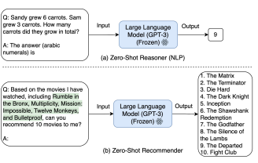
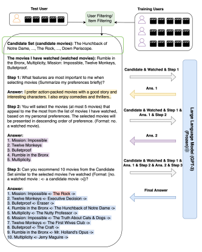
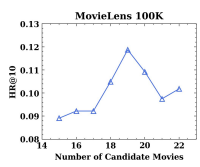

# Zero-Shot Next-Item Recommendation Using Large Pretrained Language Models

Lei Wang Ee-Peng Lim* lei.wang.2019@phdcs.smu.edu.sg eplim@smu.edu.sg Singapore Management University Singapore

### Abstract

Large language models (LLMs) have achieved impressive zero-shot performance in various natural language processing (NLP) tasks, demonstrating their capabilities for inference without training examples. Despite their success, no research has yet explored the potential of LLMs to perform next-item recommendations in the zero-shot setting. We have identified two major challenges that must be addressed to enable LLMs to act effectively as recommenders. First, the recommendation space can be extremely large for LLMs, and LLMs do not know about the target user's past interacted items and preferences. To address this gap, we propose a prompting strategy called Zero-Shot Next-Item Recommendation (NIR) prompting that directs LLMs to make next-item recommendations. Specifically, the NIR-based strategy involves using an external module to generate candidate items based on user-filtering or item-filtering. Our strategy incorporates a 3-step prompting that guides GPT-3 to carry subtasks that capture the user's preferences, select representative previously watched movies, and recommend a ranked list of 10 movies. We evaluate the proposed approach using GPT-3 on MovieLens 100K dataset and show that it achieves strong zero-shot performance, even outperforming some strong sequential recommendation models trained on the entire training dataset. These promising results highlight the ample research opportunities to use LLMs as recommenders. The code can be found at https://github.com/AGI-Edgerunners/LLM-Next-Item-Rec.

## Ccs Concepts

- Information systems → **Recommender systems**.

## Keywords

Next-Item Recommendation, Large Language Models, Zero-Shot Learning, Prompting
*Corresponding Author.

Permission to make digital or hard copies of all or part of this work for personal or classroom use is granted without fee provided that copies are not made or distributed ACM Reference Format: Lei Wang and Ee-Peng Lim*. 2023. Zero-Shot Next-Item Recommendation using Large Pretrained Language Models. In Proceedings of ACM Conference
(Conference'17). ACM, New York, NY, USA, 5 pages. https://doi.org/10.1145/
nnnnnnn.nnnnnnn

## 1 Introduction

Large language models (LLMs) [1, 3, 25], such as GPT-3 [1], have achieved impressive results in various natural language processing (NLP) tasks. Nevertheless, LLMs are also very large and often accessible only via some API service. Hence, they cannot be finetuned like the earlier pre-trained language models (PTMs) [5, 15]. Many works have demonstrated that LLMs are capable of solving many known NLP problems through task-specific prompts under the zero-shot setting, i.e., without any demonstration examples or further training [1, 3]. Nevertheless, using LLMs to perform nextitem recommendations in the zero-shot setting is still a research topic in the nascent stage.

We use Figure 1 to illustrate the differences between a NLP
reasoning task and a recommendation task. This NLP reasoning task provides GPT-3 [12] (also the default LLM in this work) a question in a prompt and the latter generates the answer text (e.g.,
"9"). Unlike this NLP task which can directly rely on built-in textual knowledge of LLMs, the recommendation task requires LLMs to know the target user's previous item-interactions, the universe of items to be recommended, and the appropriate approach to select the recommended items. Given that LLMs are not naturally trained to perform recommendation, poor results are expected when directly using them to perform recommendation [26]. Moreover, LLMs can only contribute to recommendation when they have some background knowledge about the items to be recommended. For recommendation of items in proprietary domains, it is unclear how LLMs can be of much use.

In our research, we therefore assume that items for recommendation should appear in training data of LLMs. Examples of such items include movies, songs, novels, online games, etc.. For illustration and evaluation purposes, we focus on the next-movie recommendation task. We also choose GPT-3 as the LLM due to its popularity and accessibility. As depicted in Figure 1(b), we show a simple prompting strategy that directly incorporates user's previously watched movies into a text prompt, i.e., "Based on the movies I have watched, including...", followed by a question "can you recommend 10 movies to me?". While this prompting strategy allows a GPT-3 to act as a movie recommender, its recommendation accuracy is

for profit or commercial advantage and that copies bear this notice and the full citation on the first page. Copyrights for components of this work owned by others than ACM must be honored. Abstracting with credit is permitted. To copy otherwise, or republish, to post on servers or to redistribute to lists, requires prior specific permission and/or a fee. Request permissions from permissions@acm.org. Conference'17, July 2017, Washington, DC, USA
© 2023 Association for Computing Machinery.

ACM ISBN 978-x-xxxx-xxxx-x/YY/MM. . . $15.00 https://doi.org/10.1145/nnnnnnn.nnnnnnn



Figure 1: Example inputs and outputs of GPT-3 with zeroshot prompting for a NLP task and a recommendation task.

likely to be poor due to an *extremely large recommendation space* and *inadequate user preference modeling*.

In this paper, we therefore propose a principled approach to the next-item recommendation called Zero-Shot Next-Item Recommendation (NIR) prompting, which involves a 3-step prompting strategy that significantly outperforms simple prompting in the zero-shot setting. Zero-Shot NIR adopts a three-pronged approach to enhance recommendation accuracy. First, it restricts the recommendation space to the scope of MovieLens [7] dataset by deriving a candidate movie set for the target user using the user filtering and item filtering techniques well known in previous next-item recommendation research. Second, Zero-Shot NIR prompting strategy performs multi-step prompting of GPT-3 to capture the user's preferences (Step 1), select representative movies from the user's previously watched movies (Step 2), and recommend a ranked list of 10 movies (Step 3). Finally, Zero-Shot NIR introduces a formatting technique in Step 3 to facilitate the extraction of movie items from the answer text generated by GPT-3 (i.e., "a watched movie: <- a candidate movie ->"). We evaluate our approach using MovieLens 100K and GPT-3 engine text-davinci-003. The experimental results show that Zero-Shot NIR prompting achieves good recommendation accuracy in the zero-shot setting and is comparable to other next-item recommendation methods trained using a large dataset.

## 2 Related Works

Next-item recommendation is an important and well studied research problem. Early research works proposed Markov Chains to model low-order relationships between items for next-item recommendation [8, 16]. With the advancement of neural models, deep neural networks [2, 9–11, 18–20] have been applied to the modeling of sequential patterns which leads to improved recommendation accuracy. Recent research has also explored the use of data augmentation and contrastive learning to enhance the representations of users and items, thereby making further improvement to recommendation performance [14, 21, 23, 24, 27]. Nevertheless, all the above methods require model training using users' historical item-interactions. In other words, they are not capable of making recommendations in the zero-shot setting. To the best of our knowledge, there has been very little research on zero-shot recommendation, and it remains to be unclear whether LLMs can be good recommenders.

Among the earlier efforts in LLM-based recommendation [4, 6, 13, 17, 22, 26], Zhang et al. [26] proposed to use GPT-2 [15] or BERT [5] as the backbone recommender, making the next movie prediction based on five previously watched movies by the target user. However, the huge recommendation space and inadequate user preference modeling make it perform poorly. With newer LLMs such as GPT-3 [1], OPT [25], and PaLM [3] which have shown significantly improved results in various NLP tasks, our work chooses GPT-3 to be the LLM for developing more effective zero-shot recommendation methods. Instead of designing the prompting strategy from scratch, our proposed Zero-Shot NIR prompting strategy incorporates user and item filtering approach to derive a candidate movie set and devises a 3-step prompting approach. This way, it mimics well-known recommendation techniques to achieve more accurate zero-shot recommendations.

## 3 Zero-Shot Nir Prompting Strategy 3.1 Overview

Zero-Shot NIR prompting is a multi-step prompting strategy that enables GPT-3 to act as a next-item recommender in the zero-shot setting. Figure 2 illustrates the entire process of our Zero-Shot NIR prompting strategy. It consists of three components: - **Candidate set construction:** This component uses user filtering or item filtering to create a candidate set for each target user, so as to narrow down the recommendation space. These candidate movies are then used to build the three-step GPT-3 prompts.

- **Three-step GPT-3 prompting:** This component involves three instruction prompts corresponding to three subtasks. In the first subtask (*user preference subtask*), we design a user preference prompt to probe GPT-3 to summarize the user's preferences based on the previously interacted movies by the target user. In the second subtask (*representative movies subtask*), we create a prompt that combines the user preference prompt with the prompt answer as well as a trigger instruction to request GPT-3 to select representative movies in descending order of preference. In the third subtask, we integrate the representative movies prompt, its answers, and a question to create the recommendation prompt to guide GPT-3 to recommend 10 movies from the candidate movie set that are similar to the representative movies. The result is expected to be in the following format: "a watched movie: <- a candidate movie ->".

- **Answer extraction:** This component extracts the recommended items from the textual results of three-step GPT-3 prompting using a simple rule-based extraction method. The extracted recommended movie results can be used in downstream applications or for performance evaluation.

## 3.2 Candidate Set Construction

As mentioned in Section 1, an extremely large recommendation space poses a major challenge to LLM-based recommendation. An unconstrained recommendation space can complicate both practical



Figure 2: Zero-Shot NIR prompts. The ground truth movie (i.e., The Rock) has been highlighted in **red.**

use and evaluation of recommendation results. On the other hand, it is infeasible to feed the LLM with all items expecting the former to be aware of the item universe. Even for the purpose performance evaluation, the MovieLens 100K dataset contains a set of 1,683 movies which is still too large to fit into a prompt.

In our Zero-Shot NIR prompting, we therefore propose to first construct the candidate movie set for each target user using a principled approach. The candidate movies should satisfy two criteria: (a) they should be more relevant to the user instead of randomly selected movies, and (b) the size of candidate movies should be small so as to fit into a prompt. To achieve these criteria, we use two well known principles for determining candidate movies, i.e., user filtering and *item filtering*.

User Filtering. This principle assumes that the candidate movies should also be liked by other users similar to the target user. Hence, we first represent every user by a multi-hot vector of their watched movies. Users similar to the target user are then derived by cosine similarity between the target user's vector and vectors of other users. Next, we select the  most similar users and the candidate movie set of size  is constructed by selecting the most popular movies among the interacted movies of similar users.

Item Filtering. Similar to user filtering, we represent each movie by a multi-hot vector based on its interacted users. Using cosine similarity between two movies, we select the  most similar movies for each movie in the target user's interaction history.

We then generate a candidate set of size  based on the "popularity" of these similar movies among the movies in the target user's interaction history.

The candidate set construction can be pre-computed by an external module. We then incorporate the candidate movies into the subsequent prompts for recommendation using the sentence: "Candidate Set (candidate movies):" as shown in Figure 2. Following the candidate set, the prompts also include the list of target user's previously interacted movies starting with: "The movies I have watched (watched movies):".

## 3.3 Three-Step Prompting

Figure 1 (b) shows that the simple prompting method overlooks candidate movies, user preferences, and previously interacted movies that best reflect the user's tastes. In contrast, our proposed threestep prompting approach uses three rounds of prompting to perform three subtasks: capturing the target user's preferences, ranking previously interacted movies by user's preferences, and recommending 10 similar movies from the candidate set. Step 1: User Preference Prompting. To capture the user's preferences, we include the sentence "Step 1: What features are most important to me when selecting movies (summarize my preferences briefly)?" into the first prompt. As shown in Figure 2, the answer returned by GPT-3 summarizes the target user preference (highlighted in yellow). Step 2: Representative Movie Selection Prompting. As the second step, this prompt includes the previous prompt text appended with the answer of Step 1. It then includes the instruction: "Step 2: You will select the movies ... that appeal to me the most ... presented in descending order of preference (...)" to determine the previously interacted movies that best reflect the target user's tastes. Figure 2 shows the GPT-3's answers highlighted in purple.

Step 3: Recommendation Prompting. Again, this prompt includes the previous text appended with the answers of Step 2. It then includes the instruction "Step 3: Can you recommend 10 movies from the Candidate Set similar to ...". This prompt explicitly instructs GPT-3 to generate 10 recommended movies from the candidate set as highlighted in blue.

### 3.4 Answer Extraction

We add the hint "(Format: ... <- a candidate movie ->])" to the third prompt to generate answers in the desired format for easy extraction. Our study has shown that such a hint has worked very well.

## 4 Experiments 4.1 Experimental Setup

Dataset. The proposed prompting approach is evaluated on a widely-used movie recommendation dataset MovieLens 100K [7], which contains 944 users and 1,683 movies. Baselines. We compare our proposed NIR prompting strategy with two types of baselines: *strong next-item recommendation baselines* and *zero-shot baselines*. The former includes POP (a popularitybased model), **FPMC** [16] (an approach combining matrix factorization and Markov chains), **GRU4** [9] (a GRU-based sequential

Table 1: Main result comparison on MovieLen 100K.

| Setting       | Method           |        | MovieLens 100K   |               |                 |                       |        |
|---------------|------------------|--------|------------------|---------------|-----------------|-----------------------|--------|
|               |                  | HR@10  | NDCG@10          | Candidate Set | User Preference | Representative Movies | HR@10  |
| Full Training | POP              | 0.0519 | 0.0216           | -             | -               | -                     | 0.0297 |
|               | FPMC             | 0.1018 | 0.0463           | ✓             | -               | -                     | 0.1071 |
|               | GRU4Rec          | 0.1230 | 0.0559           | ✓             | ✓               | -                     | 0.1136 |
|               | SASRec           | 0.1241 | 0.0573           | ✓             | -               | ✓                     | 0.1082 |
|               |                  |        |                  | ✓             | ✓               | ✓                     | 0.1187 |
|               | CL4SRec          | 0.1273 | 0.0617           |               |                 |                       |        |
| Zero\-Shot    | Simple Prompting | 0.0297 | 0.0097           |               |                 |                       |        |
|               | CS\-Combine\-IF  | 0.0805 | 0.0352           |               |                 |                       |        |
|               | CS\-Combine\-UF  | 0.0954 | 0.0457           |               |                 |                       |        |
|               | NIR\-Single\-IF  | 0.0975 | 0.0501           |               |                 |                       |        |
|               | NIR\-Single\-UF  | 0.1135 | 0.0529           |               |                 |                       |        |
|               | NIR\-Multi\-IF   | 0.1028 | 0.0505           |               |                 |                       |        |
|               | NIR\-Multi\-UF   | 0.1187 | 0.0546           |               |                 |                       |        |

Table 2: Ablation study of the impact of different compo-

 nents in the proposed prompting on MovieLens 100K.

Figure 3: Results for different candidate set sizes.

recommendation model), **SASRec** [11] (a sequential recommendation model with self-attention), and **CL4SRec** [23] (a contrastive learning based sequential recommendation model). As these strong baselines have the advantage of full model training, they are expected to outperform zero-shot methods. The zero-shot baselines include Zero-Shot Simple Prompting, **CS-Random-IF** (that randomly selects 10 movies from the item filtering-based candidate set), and **CS-Random-UF** (that randomly selects 10 movies from the UF-based candidate set). We implement our NIR prompting strategy with four variants. **NIR-Combine-IF/NIR-Combine-UF** combines the 3 steps into a single prompt leaving out the intermediate answers. We only prompt GPT-3 once to generate 10 recommended movies from the IF/UF-based candidate set. NIR-Multi- IF/NIR-Multi-UF uses three separate prompts to guide GPT-3 stepby-step and to incorporate intermediate answers to the subsequent prompts (as shown in Figure 2) with the IF/UF-based candidate set. Implementations. In our experiments, we employ the public GPT- 3 text-davinci-003 (175B) as the backbone language model, one of the most popular LLMs with public APIs1. To ensure consistent output, we set the temperature parameter to 0. For evaluation, we adopt the same evaluation metrics as in CL4SRec and report HR@10 and NDCG@10 for all methods.

## 4.2 Main Results

As shown in Table 1, our NIR-based methods (NIR-Single-IF, NIR-
Single-UF, NIR-Multi-IF, NIR-Multi-UF) outperform POP baseline by a large margin. Interestingly, NIR-Single-UF, NIR-Multi-IF, and NIR- Multi-UF consistently outperform FPMC, a fully trained method. Compared with very strong sequential recommendation models (i.e., GRU4Rec, SASRec, and CL4SRec), the three NIR-based methods still deliver slightly worse but competitive performance, suggesting that LLMs with proper prompting strategy can be reasonably good zero-shot recommenders.

In the zero-shot setting, CS-Random-UF(IF)'s superior performance over Simple Prompting show that candidate set not only reduce the recommendation space, but also improve performance. Our proposed NIR-based prompting methods consistently outperforms Simple Prompting and CS-Random-IF/UF, suggesting that incorporating user preference, representative movie selection, and formatting techniques in the prompting process allow GPT-3 to make better recommendations. As Multi-IF(UF) ouperforms Combine-IF(UF),
we know that separate prompts incorporating the intermediate answers into subsequent prompts leads to more accurate recommendations. Finally, UF-based HIR-based prompting consistently outperforms IF-based prompting, indicating that UF yields better candidate sets than IF.

## 4.3 Detailed Analysis

Effects of Components of Prompting. We now conduct an ablation study on NIP-Multi-UF to evaluate the contribution of different components of our prompting strategy. Table 2 shows that all prompting components contribute to recommendation performance. Simple Prompting method with a candidate set (HR@10=0.1071) outperforms that without a candidate set (HR@10=0.0297). Incorporating user preferences or representative movie selection into the prompting improves performance, indicating that task-specific instructions can guide GPT-3 to perform better.

Impact of Candidate Set Size. We investigate the impact of candidate movie number by varying the set size from 15 to 22 while keeping other parameters unchanged. The results in Figure 3 indicate that recommendation performance is sensitive to candidate set size. The best results occur when there are 19 candidate movies, and smaller or larger set size causes performance degradation. One possible explanation is that a small candidate set restricts the performance limit, while a large set increases the difficulty of making accurate recommendations using GPT-3.

1https://beta.openai.com/docs/models/gpt-3

## 5 Conclusion

In this paper, we propose a three-step prompting strategy called Zero-Shot Next-Item Recommendation (NIR) for GPT-3 to make next-movie recommendations without further training. We evaluate our approach on a movie recommendation dataset and demonstrate its strong zero-shot performance. Our results highlight the potential of using LLMs in zero-shot recommendation and call for further exploration of using LLMs in recommendation tasks. This work can extended in several directions, including recommendation in other domains and few-shot setting.

## References

```
 [1] Tom B. Brown, Benjamin Mann, Nick Ryder, Melanie Subbiah, Jared Kaplan,
     Prafulla Dhariwal, Arvind Neelakantan, Pranav Shyam, Girish Sastry, Amanda
     Askell, Sandhini Agarwal, Ariel Herbert-Voss, Gretchen Krueger, Tom Henighan,
     Rewon Child, Aditya Ramesh, Daniel M. Ziegler, Jeffrey Wu, Clemens Winter,
     Christopher Hesse, Mark Chen, Eric Sigler, Mateusz Litwin, Scott Gray, Benjamin
     Chess, Jack Clark, Christopher Berner, Sam McCandlish, Alec Radford, Ilya
     Sutskever, and Dario Amodei. 2020. Language Models are Few-Shot Learners.
     In Advances in Neural Information Processing Systems 33: Annual Conference on
     Neural Information Processing Systems 2020, NeurIPS 2020, December 6-12, 2020,
     virtual, Hugo Larochelle, Marc'Aurelio Ranzato, Raia Hadsell, Maria-Florina
     Balcan, and Hsuan-Tien Lin (Eds.). https://proceedings.neurips.cc/paper/2020/
     hash/1457c0d6bfcb4967418bfb8ac142f64a-Abstract.html
 [2] Jianxin Chang, Chen Gao, Yu Zheng, Yiqun Hui, Yanan Niu, Yang Song, Depeng
     Jin, and Yong Li. 2021. Sequential recommendation with graph neural networks.
     In Proceedings of the 44th International ACM SIGIR Conference on Research and
     Development in Information Retrieval. 378–387.
 [3] Aakanksha Chowdhery, Sharan Narang, Jacob Devlin, Maarten Bosma, Gaurav
     Mishra, Adam Roberts, Paul Barham, Hyung Won Chung, Charles Sutton, Se-
     bastian Gehrmann, et al. 2022. Palm: Scaling language modeling with pathways.
     ArXiv preprint abs/2204.02311 (2022). https://arxiv.org/abs/2204.02311
 [4] Zeyu Cui, Jianxin Ma, Chang Zhou, Jingren Zhou, and Hongxia Yang. 2022. M6-
     Rec: Generative Pretrained Language Models are Open-Ended Recommender
     Systems. arXiv preprint arXiv:2205.08084 (2022).
 [5] Jacob Devlin, Ming-Wei Chang, Kenton Lee, and Kristina Toutanova. 2018. Bert:
     Pre-training of deep bidirectional transformers for language understanding. arXiv
     preprint arXiv:1810.04805 (2018).
 [6] Shijie Geng, Shuchang Liu, Zuohui Fu, Yingqiang Ge, and Yongfeng Zhang. 2022.
     Recommendation as Language Processing (RLP): A Unified Pretrain, Personalized
     Prompt & Predict Paradigm (P5). arXiv preprint arXiv:2203.13366 (2022).
 [7] F Maxwell Harper and Joseph A Konstan. 2015. The movielens datasets: History
     and context. Acm transactions on interactive intelligent systems (tiis) 5, 4 (2015),
     1–19.
 [8] Ruining He and Julian McAuley. 2016. Fusing similarity models with markov
     chains for sparse sequential recommendation. In 2016 IEEE 16th International
     Conference on Data Mining (ICDM). IEEE, 191–200.
 [9] Balázs Hidasi, Alexandros Karatzoglou, Linas Baltrunas, and Domonkos Tikk.
     2015. Session-based recommendations with recurrent neural networks. arXiv
     preprint arXiv:1511.06939 (2015).
[10] Jin Huang, Wayne Xin Zhao, Hongjian Dou, Ji-Rong Wen, and Edward Y Chang.
     2018. Improving sequential recommendation with knowledge-enhanced mem-
     ory networks. In The 41st International ACM SIGIR Conference on Research &
     Development in Information Retrieval. 505–514.
[11] Wang-Cheng Kang and Julian McAuley. 2018. Self-attentive sequential recom-
     mendation. In 2018 IEEE International Conference on Data Mining (ICDM). IEEE,
     197–206.
[12] Takeshi Kojima, Shixiang Shane Gu, Machel Reid, Yutaka Matsuo, and Yusuke
     Iwasawa. 2022. Large Language Models are Zero-Shot Reasoners. arXiv preprint
     arXiv:2205.11916 (2022).
[13] Lei Li, Yongfeng Zhang, and Li Chen. 2022. Personalized prompt learning for
     explainable recommendation. arXiv preprint arXiv:2202.07371 (2022).
[14] Zhiwei Liu, Yongjun Chen, Jia Li, Man Luo, S Yu Philip, and Caiming Xiong.
     2021. Self-supervised Learning for Sequential Recommendation with Model
     Augmentation. (2021).
[15] Alec Radford, Jeff Wu, Rewon Child, David Luan, Dario Amodei, and Ilya
     Sutskever. 2019. Language Models are Unsupervised Multitask Learners. (2019).
[16] Steffen Rendle, Christoph Freudenthaler, and Lars Schmidt-Thieme. 2010. Factor-
     izing personalized markov chains for next-basket recommendation. In Proceedings
     of the 19th international conference on World wide web. 811–820.
[17] Damien Sileo, Wout Vossen, and Robbe Raymaekers. 2022. Zero-Shot Recommen-
     dation as Language Modeling. In European Conference on Information Retrieval.
     Springer, 223–230.

[18] Fei Sun, Jun Liu, Jian Wu, Changhua Pei, Xiao Lin, Wenwu Ou, and Peng Jiang.
     2019. BERT4Rec: Sequential recommendation with bidirectional encoder rep-
     resentations from transformer. In Proceedings of the 28th ACM international
     conference on information and knowledge management. 1441–1450.
[19] Jiaxi Tang and Ke Wang. 2018. Personalized top-n sequential recommenda-
     tion via convolutional sequence embedding. In Proceedings of the eleventh ACM
     international conference on web search and data mining. 565–573.
[20] Jianling Wang, Kaize Ding, Liangjie Hong, Huan Liu, and James Caverlee. 2020.
     Next-item recommendation with sequential hypergraphs. In Proceedings of the
     43rd international ACM SIGIR conference on research and development in informa-
     tion retrieval. 1101–1110.
[21] Jiancan Wu, Xiang Wang, Fuli Feng, Xiangnan He, Liang Chen, Jianxun Lian,
     and Xing Xie. 2021. Self-supervised graph learning for recommendation. In
     Proceedings of the 44th International ACM SIGIR Conference on Research and
     Development in Information Retrieval. 726–735.
[22] Yiqing Wu, Ruobing Xie, Yongchun Zhu, Fuzhen Zhuang, Xu Zhang, Leyu Lin,
     and Qing He. 2022. Personalized Prompts for Sequential Recommendation. arXiv
     preprint arXiv:2205.09666 (2022).
[23] Xu Xie, Fei Sun, Zhaoyang Liu, Shiwen Wu, Jinyang Gao, Bolin Ding, and Bin
     Cui. 2020. Contrastive learning for sequential recommendation. arXiv preprint
     arXiv:2010.14395 (2020).
[24] Tiansheng Yao, Xinyang Yi, Derek Zhiyuan Cheng, Felix Yu, Ting Chen, Aditya
     Menon, Lichan Hong, Ed H Chi, Steve Tjoa, Jieqi Kang, et al. 2021. Self-supervised
     Learning for Large-scale Item Recommendations. In Proceedings of the 30th ACM
     International Conference on Information & Knowledge Management. 4321–4330.
[25] Susan Zhang, Stephen Roller, Naman Goyal, Mikel Artetxe, Moya Chen, Shuohui
     Chen, Christopher Dewan, Mona T. Diab, Xian Li, Xi Victoria Lin, Todor Mihaylov,
     Myle Ott, Sam Shleifer, Kurt Shuster, Daniel Simig, Punit Singh Koura, Anjali
     Sridhar, Tianlu Wang, and Luke Zettlemoyer. 2022. OPT: Open Pre-trained
     Transformer Language Models. CoRR abs/2205.01068 (2022). arXiv:2205.01068
     https://doi.org/10.48550/arXiv.2205.01068
[26] Yuhui Zhang, Hao Ding, Zeren Shui, Yifei Ma, James Zou, Anoop Deoras, and
     Hao Wang. 2021. Language Models as Recommender Systems: Evaluations and
     Limitations. In I (Still) Can't Believe It's Not Better! NeurIPS 2021 Workshop.
[27] Kun Zhou, Hui Wang, Wayne Xin Zhao, Yutao Zhu, Sirui Wang, Fuzheng Zhang,
     Zhongyuan Wang, and Ji-Rong Wen. 2020. S3-rec: Self-supervised learning
     for sequential recommendation with mutual information maximization. In Pro-
     ceedings of the 29th ACM International Conference on Information & Knowledge
     Management. 1893–1902.

```
