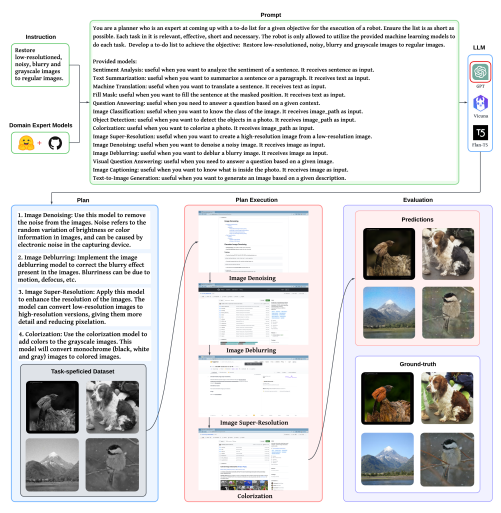
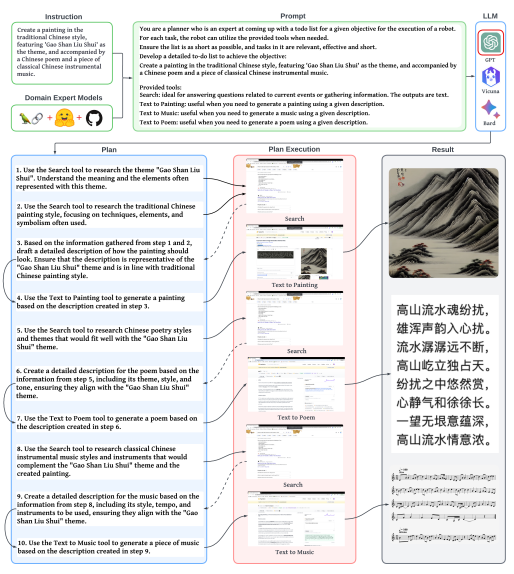
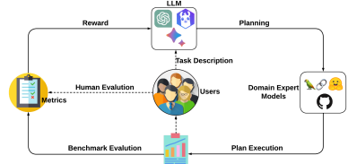
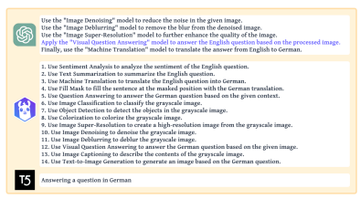
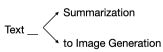
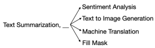
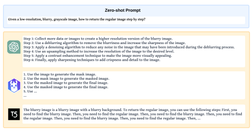
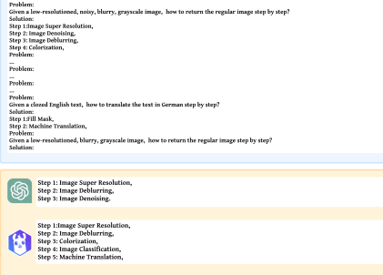
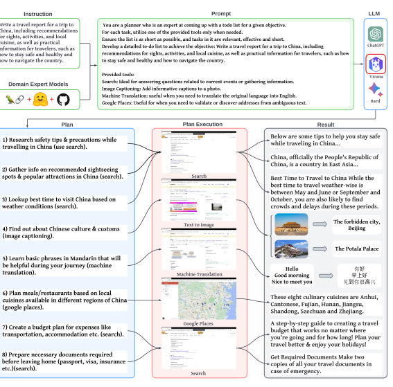

# Openagi: When Llm Meets Domain Experts

| Yingqiang Ge       | Wenyue Hua         | Kai Mei            | Jianchao Ji        |
|--------------------|--------------------|--------------------|--------------------|
| Rutgers University | Rutgers University | Rutgers University | Rutgers University |
| Juntao Tan         | Shuyuan Xu         | Zelong Li          | Yongfeng Zhang∗    |
| Rutgers University | Rutgers University | Rutgers University | Rutgers University |

## Abstract

Human intelligence excels at combining basic skills to solve complex tasks. This capability is vital for Artificial Intelligence (AI) and should be embedded in comprehensive intelligent models, enabling them to harness expert models for complex task-solving towards Artificial General Intelligence (AGI). Large Language Models (LLMs) show promising learning and reasoning abilities, and can effectively use external models to tackle complex problems. In this work, we introduce **OpenAGI**,
an open-source AGI research platform designed for multi-step, real-world tasks. Specifically, OpenAGI uses a dual strategy, integrating standard *benchmark tasks* for benchmarking and evaluation, and *open-ended tasks* including more expandable models for creative problem-solving. Tasks are presented as natural language queries to the LLM, which then selects and executes appropriate models. We also propose a Reinforcement Learning from Task Feedback (RLTF) mechanism that uses task results to improve the LLM's ability, which creates a self-improving AI feedback loop. While we acknowledge that AGI is a broad and multifaceted research challenge with no singularly defined solution path, the integration of LLMs with domain-specific expert models, inspired by mirroring the blend of general and specialized intelligence in humans, offers a promising approach towards AGI.

We are open-sourcing the OpenAGI project's code, dataset, benchmarks, evaluation methods, and demo to foster community involvement in AGI advancement:
https://github.com/agiresearch/OpenAGI.

## 1 Introduction

The acquisition and reuse of skills is a fundamental aspect of human intelligence that enables the formation of complex skills for addressing novel or intricate problems [13, 4, 45]. We posit that machine intelligence should incorporate this capacity to synthesize various skills by composing them into complex skills for complex task-solving. In computer science parlance, each skill is referred to as a domain expert "model" - a reusable tool, module, plugin or network with a defined function. The domain expert models can be synthesized into a larger "plan" for performing more complex tasks. The model synthesis process is adaptable to the input or task, such that for a given task, the models are synthesized into the most suitable plan to address the task at hand. As a result, different inputs or tasks may necessitate distinct synthesized models as a plan for task-solving. Recent advancements in Large Language Models (LLMs) have showcased exceptional learning and reasoning capabilities, rendering them well-suited for selecting, synthesizing, and executing external expert models to address complex tasks. These LLMs, such as GPT series [24, 2], LLaMA series [36, 35] and T5 series [25, 6], have exhibited a profound understanding of natural language and the ability to generate coherent and contextually relevant responses. This has opened up new possibilities for their application in complex tasks involving multi-modality data, such as image and

∗{yingqiang.ge,wenyue.hua,kai.mei,jianchao.ji,juntao.tan,shuyuan.xu,zelong.li,yongfeng.zhang}@rutgers.edu

Figure 1: An example of benchmark task, which shows the pipeline of OpenAGI.

text processing, as well as the integration of domain-specific knowledge. In this process, LLMs play a crucial role as they can understand and generate natural language, which helps AI to better comprehend and handle various problems. By integrating knowledge and skills from different domains, **Open-domain Model Synthesis (OMS)** holds the potential to drive the development of artificial general intelligence (AGI), enabling AI to solve a diverse array of problems and tasks.

Despite acknowledging the complexity and lack of a defined path towards AGI, the combination of LLMs and domain-specific expert models, inspired by the interplay of general and specialized intelligence in humans, provides a promising direction [13, 33]. However, the current research field, despite initial attempts, presents several significant challenges: 1) **Extensibility**: Several existing works employ a fixed number of models, such as WebGPT [19] and ToolFormer [32], resulting in difficulties when attempting to expand their capabilities; 2) **Nonlinear Task Planning**: The majority of current research is limited to solving tasks with linear task planning solutions [38, 12], meaning that each sub-task must be completed before the next sub-task can start. However, linear planning of models may not suffice for solving complicated tasks, besides, many tasks involve multiple multimodal inputs; 3) **Quantitative Evaluation**: Many existing works only provide qualitative results, such as HuggingGPT [33]. This makes it difficult to assess the planning capabilities of LLMs to determine whether the strategies employed are optimal. In order to mitigate the above limitations, we develop a platform that encompasses a diverse array of domain-specific expert models and intricate multi-step tasks with single or multiple multi-modal inputs. Furthermore, to promote the community's long-term advancement and assessment of AGI's abilities, we open-source all code and datasets, and hence, name this platform **OpenAGI**. A toy example, showing the entire pipeline of OpenAGI, is depicted in Fig. 1. Specifically, 1) a natural language instruction of a specific task is given; 2) the instruction is augmented by manually designed prompt and then fed as input into LLM to generate a plan; 3) the expert models are selected and synthesized based on the generated plan, and subsequently executed to process the data samples; 4) the task-solving ability of the LLM can be evaluated by comparison between the output and the ground-truth labels (or through human evaluation).

OpenAGI embodies a dual approach to address diverse requirements–**benchmark tasks** and openended tasks. On the one hand, we have incorporated benchmark tasks, each supported by task-specific datasets and evaluation metrics. This inclusion provides researchers with a consistent platform to assess and compare the performance of various models, stimulating continuous improvement and competitive innovation. For benchmark tasks, as depicted in Fig. 1, we utilize a selection of expert models derived from esteemed libraries such as Hugging Face's transformers and diffusers, as well as from GitHub repositories, thereby easily facilitating the expansion of our model set. Additionally, the datasets have been meticulously selected to align with or resemble the training datasets of the respective models. We then implement a variety of data augmentation techniques to enhance these original datasets, enabling the construction of sophisticated multi-step tasks designed to assess the planning and task-solving capabilities of a given LLM. On the other hand, OpenAGI also offers open-ended tasks that utilize a variety of expandable models. These tasks open the door for creativity and imaginative problem-solving, enabling the exploration of innovative solutions that may not emerge within more constrained task frameworks. For open-ended tasks, as depicted in Fig. 2, which is designed to accommodate a broader spectrum of needs, we further includes LangChain to provide additional expert models, such as Google Search, Wikipedia, Wolfram Alpha and so on. Indeed, relying solely on input text for learning proves insufficient for LLMs when confronted with real-world tasks. In order to improve its performance, we introduce a mechanism referred to as **Reinforcement** Learning from Task Feedback (RLTF). This approach capitalizes on the performance feedback procured from tasks following the execution of the solution devised by the LLM. Consequently, the RLTF mechanism effectively refines the LLM's planning strategy, resulting in an enhanced and more adaptive system. In summary, the key contributions of the work include: - We introduce OpenAGI, an AGI research platform, specifically designed to offer complex, multistep tasks accompanied by their respective datasets, evaluation methods, and a diverse range of extensible models which can be synthesized to effectively solve these tasks. The purpose of this platform is to aid in the quantification of the overarching planning and task-solving abilities of LLMs. OpenAGI embraces AGI by focusing on LLM-driven, (open-domain) model synthesis, predominantly utilizing models and datasets on Hugging Face, GitHub and LangChain.

- We propose the LLM+RLTF approach for OpenAGI, which leverages a Large Language Model as a controller to select, synthesize and execute various external expert models for complex task-solving.

The feedback obtained from these tasks is then employed to refine the LLM's planning strategy, thereby enhancing the LLM's overall performance and task-solving ability.

- We evaluate a variety of well-established LLMs with differing scales (ranging from 770 million to 175 billion parameters) utilizing distinct learning schemas and the proposed OpenAGI pipeline.

Our preliminary findings suggest that even smaller-scale LLMs, when paired with an appropriate learning schema such as RLTF, are able to possess the potential to outperform competitors that equip a significantly greater magnitude of model parameters.

## 2 Related Work

With the advancement of highly parallelizable transformer architectures, pre-trained language models
(PLMs) have demonstrated remarkable capabilities in comprehending, generating, and manipulating natural language [23, 18]. These models were pre-trained on a large corpora of unlabeled text data and commonly subsequently fine-tuned for specific downstream tasks. Shortly, the scaled-up PLMs, known as large language models (LLMs) [26, 2, 21, 5, 43, 36], encompassed a substantially greater number of parameters and leverage vast amounts of training data. Consequently, LLMs exhibited enhanced capacity for learning intricate language patterns and structures, along with a notable reasoning ability. This results in superior performance across diverse natural language processing tasks [2, 36]. Apart from the above superiority, LLMs may occasionally produce seemingly plausible yet inaccurate predictions and face challenges when addressing problems that require specialized domain expertise [17, 33]. Consequently, the emerging field of Augmented Language Models
(ALMs) focuses on addressing the limitations of conventional LLMs [6, 5, 2] by equipping them with enhanced reasoning capabilities and the ability to employ external resources [17]. The process of reasoning involves breaking down intricate assignments into smaller, more manageable subtasks that can be independently or collaboratively tackled by LLMs with the assistance of tools. What's more, LLMs can also invoke external tools or models to accomplish the relevant tasks. For exmaple, ToolFormer [33] introduces external API tags within text sequences, facilitating LLMs' access to external tools. Visual ChatGPT [40] is a new model that combines ChatGPT with Visual Foundation Models (VFMs) such as Transformers, ControlNet, and Stable Diffusion, which acts as a bridge between users, allowing them to communicate via chat and generate visuals. HuggingGPT [32] integrates the Hugging Face hub with task-specific models around ChatGPT to tackle generalized AI tasks. Augmented language models may use these enhancements separately or joint them in a specific order to finish the specific task, which ultimately results in superior generalization capabilities. Different from prior works in this field, we propose OpenAGI, an open-source AGI research platform designed to address the challenges commonly encountered in existing works, such as extensibility, nonlinear task planning, and quantitative evaluation. Furthermore, we introduce innovative methods into the learning schema of LLMs, including Reinforcement Learning from Task Feedback (RLTF) and nonlinear task planning, which aims to address challenges on out-of-distribution (OOD) generalization and optimal task planning (please see Sec. A.1 in supplementary materials for an extended discussion on these problems). We hope the OpenAGI platform can facilitate the open and long-term improvement and evaluation of AGI abilities in the community.

## 3 The Openagi Platform

OpenAGI has been designed to include a wide range of features tailored to various needs. One key component is its benchmark tasks, detailed in Sec. 3.1, a particularly valuable tool for researchers. These tasks come equipped with task-specific datasets and evaluation metrics. This makes it possible for researchers to evaluate the performance of different LLMs in a structured and uniform manner, offering insights into their efficacy and potential areas for improvement. In addition to benchmark tasks, OpenAGI also offers open-ended tasks, detailed in Sec. 3.2. These tasks allow for a greater degree of creativity and imagination, breaking away from conventional constraints to enable more exploratory research. We believe this combination of structured benchmark tasks and flexible openended tasks makes OpenAGI a robust and versatile platform that can cater to a diverse array of research requirements.

#### 3.1 Benchmark Tasks

For benchmark tasks, our goal is to provide the community a valuable tool to evaluate the planning abilities of LLMs for complex, multi-step tasks. Specifically, instead of building complicated, multistep tasks from scratch, we first explore the domain expert models (Sec. 3.1.1) that can be used as building blocks, then introduce how we create such tasks based on them (Sec. 3.1.2).

#### 3.1.1 Domain Expert Model Set

We now present the domain tasks and the corresponding models that can be employed in our platform. This set is designed to be flexible, allowing users to easily incorporate their own domain tasks and models. Our domain tasks are as follows: - Language-related Models: **Sentiment Analysis** classifies the sentiment polarity of a given sentence [1]; **Text Summarization** creates a text summary that represents the most important or relevant information within the original text content [14]; **Machine Translation** converts a sentence from a source language to a target language [26]; **Fill Mask** involves replacing masked words within a given text [16]; **Question Answering (QA)** provides a textual answer of a question based on the given context [31].

- Vision-related Models: **Image Classification** aims to comprehend an entire image as a whole and assign it to a specific label [9]; **Object Detection** identifies and localizes specific objects within an image by detecting their instances of a particular class [3]; **Colorization** refers to the technique of adding plausible color information to monochromatic photographs or videos [42]; Image Super-resolution generates a high-resolution (HR) image from a low-resolution (LR) image [7]; **Image Denoising** aims to remove unwanted noise from an image while preserving its important features [41]; **Image Deblurring** aims to recover a clear image from a blurred input image [41].

- Vision-Language Models: **Visual Question Answering (VQA)** involves answering questions based on an image [37]; **Image Captioning** generates textual descriptions of the visual content depicted in an image; **Text-to-Image Generation** generates images from a given input sentence or sequence of words [28].

The details of the corresponding models are shown in Tab. A.1, A.2 and A.3 in supplementary materials. After selecting the domain expert models, choosing the raw datasets becomes a more straightforward process, provided that we need to ensure proper alignment between the datasets and the domain expert models' training sets. Raw datasets are provided as follows: **ImageNet-1K** [30], Common Objects in Context (COCO) [15], **CNN/Daily Mail** [20], **Stanford Sentiment Treebank** (SST2) [22], **TextVQA** [34], **Stanford Question Answering Dataset (SQuAD)** [27]. More details about theses datasets can be found in Sec. A.2 in supplementary materials.

#### 3.1.2 Multi-Step Tasks And Corresponding Datasets Construction

A multi-step task, as the name suggests, refers to a complex problem that cannot be solved in one simple step. It necessitates several sub-processes or stages, each requiring a particular type of problemsolving skill, in other words, domain expert model. In order to construct such complex, multi-step tasks, we introduce several commonly-used data augmentation methods, which are **Gaussian Blur**, Gaussian Noise, Grayscale, Low Resolution, Translation, **Word Mask**, to augment the raw dataset. More details about these methods can be found in Sec. A.3 in supplementary materials. For the purpose of our study, we have sorted these tasks into six primary categories according to the modalities of their inputs and outputs: - *Image in, image out*: In these tasks, images undergo several transformation stages. An example could be a task that involves "Denoising and enhancing the resolution of a low-resolution, noisy image". Here, the multi-step process entails image denoising followed by super-resolution.

- *Image in, text out*: These tasks usually involve interpreting the content of images. For example,
"Detect objects in an image and describe them in a sentence" requires object detection followed by text generation.

- *Text in, image out*: Tasks under this category may include generating an image based on textual descriptions, such as "Create a graphical representation of the room described in the given text",
demanding text understanding and image generation steps.

- *Text in, text out*: These tasks engage in text transformation or interpretation. For instance, "Translate a paragraph from English to German and summarize it in English" requires two steps - translation and summarization.

- *Image-text pair in, text out*: These tasks deal with complex interplay between visual and textual data. An example could be, "Given an image and a question about the image in English, answer the question in German." This task includes image-text understanding, question answering, and translation.

- *Text-text pair in, text out*: These tasks can involve comparison, synthesis, or information extraction from two text inputs. For instance, "Given two reviews of a movie in English, translate them into German and provide a summary."
In total, we have devised 185 multi-step tasks, of which 117 tasks maintain a linear task structure with steps following a simple sequence, while the remaining 68 tasks exhibit a non-linear task structure, where steps might be performed concurrently or in a complex order. Among these categories, tasks such as Question Answering (QA) and Visual Question Answering (VQA), involving multiple or even multi-modal inputs, are notably complex and defy simple, linear task planning solutions. For a more comprehensive view, we have provided examples of these tasks and their corresponding input and output data samples in Tab. A.4 in the supplementary materials.

#### 3.1.3 Evaluation Metrics

Given that the benchmark tasks of OpenAGI comprise a diverse range of domain tasks with multimodal data, we classify them according to domain tasks as well as input and output types. We then assess their performance using the following three metrics based on their categories: **CLIP Score**

Figure 2: An example of open-ended tasks, which instruct OpenAGI to create an artwork.

[11], **BERT Score** [44] and **ViT Score**2(more details can be found in supplementary). In particular, we employ the CLIP Score only for Text-to-Image Generation-based tasks, the BERT Score is utilized to assess tasks with text outputs, and the ViT score is applied to measure image similarity for the remaining tasks with image outputs. We also normalize the BERT and CLIP scores.

#### 3.2 Open-Ended Tasks

Open-ended tasks necessitate an elevated degree of creative and imaginative capacity, as they deviate from conventional constraints to stimulate more exploratory research. These tasks are designed to accommodate a broad spectrum of needs, as illustrated in Fig. 2. To achieve this, LangChain is integrated to provide additional expert models from renowned sources such as Google Search, Wikipedia, Wolfram Alpha, and more. Crucially, these models offer extendability, ensuring that open-ended tasks are not confined to specific guidelines or performance metrics. To exemplify this process, Fig. 2 elucidates how OpenAGI is directed to create a traditional Chinese painting with
"Gao Shan Liu Shui" (translating to "High Mountain and Flowing Water" in English) as its theme.

The process is enriched with the addition of a generated ancient Chinese poem and a piece of music that harmonize with the painting. To effectively deliver on this instruction, OpenAGI first conducts

2https://colab.research.google.com/github/huggingface/notebooks/blob/main/examples/image_similarity.ipynb
an online search to comprehend the historical narrative of "Gao Shan Liu Shui". Sequentially, the painting, poem, and music are generated in a step-by-step fashion, leveraging the collaboration between expansive language models and domain-specific expert models. The final product - a coherent artistic ensemble of painting, poem, and music - successfully resonates with the underlying ancient narrative, demonstrating the efficacy of this approach in open-ended tasks. More examples are provided in supplementary.

## 4 Reinforcement Learning From Task Feedback (Rltf)

While learning solely from input text is a powerful method for training LLMs, it is not sufficient

 for handling real-world tasks that require a deeper understanding of context and environment. One potential method to improve the capabilities of LLMs is to incorporate reinforcement learning (RL) techniques. By leveraging the strengths of RL, LLMs can gain additional insights from trial-and-error experiences. This leads to more robust and adaptive models, especially in situations where labeled data is scarce or when tasks involve physical interactions. In this work, we propose Reinforcement Learning from Task Feedback (RLTF), shown in Fig. 3, which utilizes task feedback to supply more information that guides the learning direction of LLMs, resulting in improved and more efficient strategies. We choose to use REINFORCE [39] in this work and more details about the algorithm are provided in Sec. A.6 in supplementary.

Figure 3: An illustration of the RLTF mechanism.

## 5 Experiments

#### 5.1 Backbone Llms

- **GPT-3.5-turbo.** The GPT (Generative Pre-trained Transformer) series [2], developed by OpenAI,
consists of advanced language models. GPT-3.5 boasts over 175 billion model parameters.

- **Vicuna-7b.** Vicuna is an open-source chatbot trained by fine-tuning the LLaMA [36] model with user-shared conversations. In this work, we use the 7-billion size model of Vicuna.

- **Flan-T5-Large.** Flan-T5 [6] is a series of language models developed by Google, which are finetuned using a technique called instruction fine-tuning. Flan-T5-Large has 770 million parameters.

#### 5.2 Learning Schema Of Llms

We employ the following LLM learning schema for experimentation. - **Zero-shot Learning (Zero)** directly inputs the prompt to the LLM. - **Few-shot Learning (Few)** presents a set of high-quality demonstrations, each consisting of both input and desired output, on the target task. As the model first sees good examples, it can better understand human intention and criteria for what kinds of answers are wanted.

- **Fine-tuning** involves using manually labeled data samples as additional training signals to refine and adapt pre-trained LLMs to specific tasks or domains.

- **RLTF** is our proposed method in Sec. 4.

To transform these outputs into viable task planning solutions, we employ text similarity models to map them to the model name set, which is an established method in existing works [10].

#### 5.3 Datasets

Considering the fact that the imbalanced number of tasks with different input and output modalities could lead to skewed measurement results, we select the tasks in OpenAGI to compose the training set. In particular, we randomly select 10% of tasks, along with their corresponding datasets, based on input and output modalities for training purposes. For few-shot, fine-tuning and RLTF, we supply manually curated, feasible solutions as ground-truth labels. In the case of RLTF, we employ the fine-tuning checkpoint as a reasonable initialization for LLMs and use constrained beam search [8, 29] to reduce the likelihood of producing infeasible solutions (details can be found in Sec. A.7 in supplementary). Moreover, we choose an additional 10% of tasks, adhering to the same selection criteria as mentioned above, to serve as the test set.

#### 5.4 Experimental Analysis

The main experimental results are tabulated in Tab. 1, the overall performance is calculated as the average of CLIP, BERT and ViT scores. Here, only task descriptions of benchmark tasks were fed into LLMs (Additional information, such as the input prompt and LLMs' outputs, is provided in Fig.

A.4 and A.5 in supplementary). GPT-3.5-turbo notably outperforms both Vicuna-7b and Flan-T5- Large in both zero-shot and few-shot learning settings, as indicated by the higher BERT, ViT, and overall scores it achieves. Vicuna-7b and Flan-T5-Large shows significant improvement when using fine-tuning or RLTF compared to zero-shot and few-shot learning strategies. Significant performance improvements can be observed for Vicuna-7b and Flan-T5-Large when fine-tuning or using RLTF compared to zero-shot and few-shot learning methods. Intriguingly, despite Flan-T5-Large's smaller model size than Vicuna-7b, it outperforms Vicuna-7b in both fine-tuning and RLTF settings. Possible explanation for this may be Vicuna-7b's greater data requirements due to its larger model size (as we only used 18 human-labelled data samples for training). Moreover, both smaller models demonstrate superior performance than all other learning schemas after RLTF, even surpassing GPT's few-shot setting. Given that only 18 data samples were utilized, it suggests that RLTF is an efficient and viable method for task alignment.

Table 1: OpenAGI task-solving performances under different settings for all three LLMs. Boldface denotes the highest score under each learning schema. GPT is unable to do fine-tuning or RLTF.

| Metrics    |        | GPT\-3.5\-turbo   |      |        | Vicuna\-7b   |        |      |        | Flan\-T5\-Large   |        |
|------------|--------|-------------------|------|--------|--------------|--------|------|--------|-------------------|--------|
|            | Zero   | Few               | Zero | Few    | Fine\-tuning | RLTF   | Zero | Few    | Fine\-tuning      | RLTF   |
| CLIP Score | 0.0    | 0.0               | 0.0  | 0.0    | 0.0          | 0.2584 | 0.0  | 0.0    | 0.0               | 0.3059 |
| BERT Score | 0.1914 | 0.3820            | 0.0  | 0.2677 | 0.1198       | 0.1643 | 0.0  | 0.2488 | 0.1394            | 0.2554 |
| ViT Score  | 0.2437 | 0.7497            | 0.0  | 0.0    | 0.7420       | 0.5033 | 0.0  | 0.0    | 0.7527            | 0.6551 |
| Overall    | 0.1450 | 0.3772            | 0.0  | 0.0892 | 0.2872       | 0.3902 | 0.0  | 0.0829 | 0.2973            | 0.4054 |

#### 5.5 Effect Of Prompts

We designed two types of prompts combined with different levels of model description and tested LLMs' zero-shot performances. The first, Prompt-1, only combines the task description with the model names, while the second, Prompt-2, integrates the task description with comprehensive model descriptions, detailing model usage, input, and output types (additional information about these two prompts is provided in Fig. A.6 in supplementary). We analyze the results in Tab. 2 in conjunction with the previous results in Tab. 1. Compared to the original prompt that only uses task description to generate the results in Tab. 1, despite Prompt-1 offering more model-related information for LLM to use, the ambiguous descriptions seem to misdirect the LLM during the model selection process. This, in turn, results in a performance decrease for GPT-3.5-turbo. However, this level of information seems to be sufficient to slightly enhance the zero-shot performance of Vicuna-7b. Prompt-2, on the other hand, which provides a more precise description of model usage, significantly improves the planning accuracy of both GPT-3.5-turbo and Vicuna-7b. To sum up, detailed prompts can assist in improving zero-shot performance to a certain degree, depending on the specific model. However, they may not be as potent as other training scenarios, such as few-shot learning, fine-tuning, or RLTF,
particularly for models such as Flan-T5-Large, which displayed no performance enhancements with different prompts.

| Metrics    | GPT\-3.5\-turbo   |           | Vicuna\-7b   |           | Flan\-T5\-Large      |     |
|------------|-------------------|-----------|--------------|-----------|----------------------|-----|
|            | Prompt\-1         | Prompt\-2 | Prompt\-1    | Prompt\-2 | Prompt\-1  Prompt\-2 |     |
| CLIP Score | 0.0               | 0.0       | 0.0          | 0.0       | 0.0                  | 0.0 |
| BERT Score | 0.2106            | 0.3013    | 0.0603       | 0.0267    | 0.0                  | 0.0 |
| ViT Score  | 0.0               | 0.2710    | 0.0          | 0.2385    | 0.0                  | 0.0 |
| Overall    | 0.0702            | 0.1907    | 0.0201       | 0.0884    | 0.0                  | 0.0 |

Table 2: Zero-shot task-solving performances under various prompts for all three LLMs.

#### 5.6 Case Study Of Non-Linear Planning

We qualitatively evaluate LLMs' capabilities of non-linear task planning. Fig. 4 illustrates the responses of all three LLMs to Prompt-2. The given task description requires the LLM to answer a query posed in English about a given noisy, blurry, and gray-scale image in German. It can be observed from the results that the performance of the models varies significantly. Flan-T5-Large, for instance, demonstrates a struggling comprehension of the query, while Vicuna-7b's answer incorporates all the provided models in an attempt to resolve the task. GPT-3.5-turbo alone successfully comprehends the task and consequently delivers a reasonable plan. The plan generated by this model is notably nonlinear, and it instructs to employ a Visual Question Answering (VQA) model with the English query and processed image as inputs in steps 1 and 2 in order to accomplish the task. Similarly, another task scenario is demonstrated in Fig. 2, which is an open-ended task with GPT being instructed to generate a painting in a traditional Chinese style that depicts "Gao Shan Liu Shui". Initially, GPT seems to lack understanding of what constitutes a traditional Chinese style painting and it is also unfamiliar with the concept of "Gao Shan Liu Shui". As a remedy, GPT utilizes Google search in the initial two steps to gather information on these unfamiliar topics. Subsequently, it amalgamates the retrieved information to formulate a comprehensive prompt that instructs the Text-to-Image Generation model to create the desired artwork.

Figure 4: An example of Non-linear Planning.

## 6 Conclusions And Future Work

In this work, we introduce OpenAGI, an open-source AGI research platform designed to facilitate the development and evaluation of large language models (LLMs) in solving complex, multi-step tasks through manipulating various domain expert models. OpenAGI provides a wide range of extensible models, datasets and benchmarks, predominantly utilizing resources from Hugging Face and GitHub. We also propose the LLM+RLTF approach, which combines LLMs with reinforcement learning to optimize task-solving performance. The evaluation of various LLMs using the OpenAGI pipeline and different learning schema demonstrates that smaller-scale LLMs can potentially outperform larger models when combined with the appropriate learning approach, such as RLTF. In the future, we aim to explore automated task generation techniques that empower OpenAGI to generate complex tasks independently, facilitating self-prompting and improvement in its task-solving capabilities.

## References

[1] Dogu Araci. 2019. Finbert: Financial sentiment analysis with pre-trained language models.

arXiv preprint arXiv:1908.10063 (2019).

[2] Tom Brown, Benjamin Mann, Nick Ryder, Melanie Subbiah, Jared D Kaplan, Prafulla Dhariwal, Arvind Neelakantan, Pranav Shyam, Girish Sastry, Amanda Askell, et al. 2020. Language models are few-shot learners. *Advances in neural information processing systems* 33 (2020),
1877–1901.

[3] Nicolas Carion, Francisco Massa, Gabriel Synnaeve, Nicolas Usunier, Alexander Kirillov, and Sergey Zagoruyko. 2020. End-to-end object detection with transformers. In Computer Vision–
ECCV 2020: 16th European Conference, Glasgow, UK, August 23–28, 2020, Proceedings, Part I 16. Springer, 213–229.

[4] Hanxiong Chen, Yunqi Li, He Zhu, and Yongfeng Zhang. 2022. Learn Basic Skills and Reuse:
Modularized Adaptive Neural Architecture Search (MANAS). In Proceedings of the 31st ACM
International Conference on Information & Knowledge Management. 169–179.

[5] Aakanksha Chowdhery, Sharan Narang, Jacob Devlin, Maarten Bosma, Gaurav Mishra, Adam Roberts, Paul Barham, Hyung Won Chung, Charles Sutton, Sebastian Gehrmann, et al. 2022. Palm: Scaling language modeling with pathways. *arXiv preprint arXiv:2204.02311* (2022).

[6] Hyung Won Chung, Le Hou, Shayne Longpre, Barret Zoph, Yi Tay, William Fedus, Eric Li, Xuezhi Wang, Mostafa Dehghani, Siddhartha Brahma, et al. 2022. Scaling instruction-finetuned language models. *arXiv preprint arXiv:2210.11416* (2022).

[7] Marcos V Conde, Ui-Jin Choi, Maxime Burchi, and Radu Timofte. 2022. Swin2SR:
Swinv2 transformer for compressed image super-resolution and restoration. arXiv preprint arXiv:2209.11345 (2022).

[8] Nicola De Cao, Gautier Izacard, Sebastian Riedel, and Fabio Petroni. 2020. Autoregressive entity retrieval. *arXiv preprint arXiv:2010.00904* (2020).

[9] Alexey Dosovitskiy, Lucas Beyer, Alexander Kolesnikov, Dirk Weissenborn, Xiaohua Zhai, Thomas Unterthiner, Mostafa Dehghani, Matthias Minderer, Georg Heigold, Sylvain Gelly, et al.

2020. An image is worth 16x16 words: Transformers for image recognition at scale. arXiv preprint arXiv:2010.11929 (2020).

[10] Yaru Hao, Haoyu Song, Li Dong, Shaohan Huang, Zewen Chi, Wenhui Wang, Shuming Ma, and Furu Wei. 2022. Language models are general-purpose interfaces. arXiv preprint arXiv:2206.06336 (2022).

[11] Jack Hessel, Ari Holtzman, Maxwell Forbes, Ronan Le Bras, and Yejin Choi. 2021. Clipscore:
A reference-free evaluation metric for image captioning. *arXiv preprint arXiv:2104.08718*
(2021).

[12] Wenlong Huang, Pieter Abbeel, Deepak Pathak, and Igor Mordatch. 2022. Language models as zero-shot planners: Extracting actionable knowledge for embodied agents. In International Conference on Machine Learning. PMLR, 9118–9147.

[13] Daniel Kahneman. 2011. *Thinking, fast and slow*. macmillan. [14] Mike Lewis, Yinhan Liu, Naman Goyal, Marjan Ghazvininejad, Abdelrahman Mohamed, Omer Levy, Ves Stoyanov, and Luke Zettlemoyer. 2019. Bart: Denoising sequence-to-sequence pre-training for natural language generation, translation, and comprehension. *arXiv preprint* arXiv:1910.13461 (2019).

[15] Tsung-Yi Lin, Michael Maire, Serge Belongie, James Hays, Pietro Perona, Deva Ramanan, Piotr Dollár, and C Lawrence Zitnick. 2014. Microsoft coco: Common objects in context. In European conference on computer vision. Springer, 740–755.

[16] Yinhan Liu, Myle Ott, Naman Goyal, Jingfei Du, Mandar Joshi, Danqi Chen, Omer Levy, Mike Lewis, Luke Zettlemoyer, and Veselin Stoyanov. 2019. Roberta: A robustly optimized bert pretraining approach. *arXiv preprint arXiv:1907.11692* (2019).

[17] Grégoire Mialon, Roberto Dessì, Maria Lomeli, Christoforos Nalmpantis, Ram Pasunuru, Roberta Raileanu, Baptiste Rozière, Timo Schick, Jane Dwivedi-Yu, Asli Celikyilmaz, et al. 2023. Augmented language models: a survey. *arXiv preprint arXiv:2302.07842* (2023).

[18] Bonan Min, Hayley Ross, Elior Sulem, Amir Pouran Ben Veyseh, Thien Huu Nguyen, Oscar Sainz, Eneko Agirre, Ilana Heinz, and Dan Roth. 2021. Recent advances in natural language processing via large pre-trained language models: A survey. *arXiv preprint arXiv:2111.01243*
(2021).

[19] Reiichiro Nakano, Jacob Hilton, Suchir Balaji, Jeff Wu, Long Ouyang, Christina Kim, Christopher Hesse, Shantanu Jain, Vineet Kosaraju, William Saunders, et al. 2021. Webgpt: Browserassisted question-answering with human feedback. *arXiv preprint arXiv:2112.09332* (2021).

[20] Ramesh Nallapati, Bowen Zhou, Caglar Gulcehre, Bing Xiang, et al. 2016. Abstractive text summarization using sequence-to-sequence rnns and beyond. *arXiv preprint arXiv:1602.06023*
(2016).

[21] Long Ouyang, Jeffrey Wu, Xu Jiang, Diogo Almeida, Carroll Wainwright, Pamela Mishkin, Chong Zhang, Sandhini Agarwal, Katarina Slama, Alex Ray, et al. 2022. Training language models to follow instructions with human feedback. Advances in Neural Information Processing Systems 35 (2022), 27730–27744.

[22] Bo Pang and Lillian Lee. 2005. Seeing stars: Exploiting class relationships for sentiment categorization with respect to rating scales. *arXiv preprint cs/0506075* (2005).

[23] Xipeng Qiu, Tianxiang Sun, Yige Xu, Yunfan Shao, Ning Dai, and Xuanjing Huang. 2020.

Pre-trained models for natural language processing: A survey. Science China Technological Sciences 63, 10 (2020), 1872–1897.

[24] Alec Radford, Jeffrey Wu, Rewon Child, David Luan, Dario Amodei, Ilya Sutskever, et al. 2019.

Language models are unsupervised multitask learners. *OpenAI blog* 1, 8 (2019), 9.

[25] Colin Raffel, Noam Shazeer, Adam Roberts, Katherine Lee, Sharan Narang, Michael Matena, Yanqi Zhou, Wei Li, and Peter J. Liu. 2020. Exploring the Limits of Transfer Learning with a Unified Text-to-Text Transformer. *Journal of Machine Learning Research* 21, 140 (2020), 1–67. http://jmlr.org/papers/v21/20-074.html
[26] Colin Raffel, Noam Shazeer, Adam Roberts, Katherine Lee, Sharan Narang, Michael Matena, Yanqi Zhou, Wei Li, Peter J Liu, et al. 2020. Exploring the limits of transfer learning with a unified text-to-text transformer. *J. Mach. Learn. Res.* 21, 140 (2020), 1–67.

[27] Pranav Rajpurkar, Jian Zhang, Konstantin Lopyrev, and Percy Liang. 2016. Squad: 100,000+
questions for machine comprehension of text. *arXiv preprint arXiv:1606.05250* (2016).

[28] Robin Rombach, Andreas Blattmann, Dominik Lorenz, Patrick Esser, and Björn Ommer. 2022.

High-resolution image synthesis with latent diffusion models. In Proceedings of the IEEE/CVF
Conference on Computer Vision and Pattern Recognition. 10684–10695.

[29] Ohad Rubin and Jonathan Berant. 2021. SmBoP: Semi-autoregressive Bottom-up Semantic Parsing. In Proceedings of the 2021 Conference of the North American Chapter of the Association for Computational Linguistics: Human Language Technologies. 311–324.

[30] Olga Russakovsky, Jia Deng, Hao Su, Jonathan Krause, Sanjeev Satheesh, Sean Ma, Zhiheng Huang, Andrej Karpathy, Aditya Khosla, Michael Bernstein, Alexander C. Berg, and Li Fei-Fei. 2015. ImageNet Large Scale Visual Recognition Challenge. International Journal of Computer Vision (IJCV) 115, 3 (2015), 211–252. https://doi.org/10.1007/ s11263-015-0816-y
[31] Victor Sanh, Lysandre Debut, Julien Chaumond, and Thomas Wolf. 2019. DistilBERT, a distilled version of BERT: smaller, faster, cheaper and lighter. *arXiv preprint arXiv:1910.01108*
(2019).

[32] Timo Schick, Jane Dwivedi-Yu, Roberto Dessì, Roberta Raileanu, Maria Lomeli, Luke Zettlemoyer, Nicola Cancedda, and Thomas Scialom. 2023. Toolformer: Language models can teach themselves to use tools. *arXiv preprint arXiv:2302.04761* (2023).

[33] Yongliang Shen, Kaitao Song, Xu Tan, Dongsheng Li, Weiming Lu, and Yueting Zhuang. 2023.

HuggingGPT: Solving AI Tasks with ChatGPT and its Friends in HuggingFace. *arXiv preprint* arXiv:2303.17580 (2023).

[34] Amanpreet Singh, Vivek Natarajan, Meet Shah, Yu Jiang, Xinlei Chen, Dhruv Batra, Devi Parikh, and Marcus Rohrbach. 2019. Towards vqa models that can read. In *Proceedings of the* IEEE/CVF conference on computer vision and pattern recognition. 8317–8326.

[35] Rohan Taori, Ishaan Gulrajani, Tianyi Zhang, Yann Dubois, Xuechen Li, Carlos Guestrin, Percy Liang, and Tatsunori B. Hashimoto. 2023. Stanford Alpaca: An Instruction-following LLaMA model. https://github.com/tatsu-lab/stanford_alpaca.

[36] Hugo Touvron, Thibaut Lavril, Gautier Izacard, Xavier Martinet, Marie-Anne Lachaux, Timothée Lacroix, Baptiste Rozière, Naman Goyal, Eric Hambro, Faisal Azhar, et al. 2023. Llama: Open and efficient foundation language models. *arXiv preprint arXiv:2302.13971* (2023).

[37] Jianfeng Wang, Zhengyuan Yang, Xiaowei Hu, Linjie Li, Kevin Lin, Zhe Gan, Zicheng Liu, Ce Liu, and Lijuan Wang. 2022. Git: A generative image-to-text transformer for vision and language. *arXiv preprint arXiv:2205.14100* (2022).

[38] Zihao Wang, Shaofei Cai, Anji Liu, Xiaojian Ma, and Yitao Liang. 2023. Describe, explain, plan and select: Interactive planning with large language models enables open-world multi-task agents. *arXiv preprint arXiv:2302.01560* (2023).

[39] Ronald J Williams. 1992. Simple statistical gradient-following algorithms for connectionist reinforcement learning. *Machine learning* 8, 3 (1992), 229–256.

[40] Chenfei Wu, Shengming Yin, Weizhen Qi, Xiaodong Wang, Zecheng Tang, and Nan Duan.

2023. Visual chatgpt: Talking, drawing and editing with visual foundation models. *arXiv* preprint arXiv:2303.04671 (2023).

[41] Syed Waqas Zamir, Aditya Arora, Salman Khan, Munawar Hayat, Fahad Shahbaz Khan, and Ming-Hsuan Yang. 2022. Restormer: Efficient transformer for high-resolution image restoration.

In *Proceedings of the IEEE/CVF Conference on Computer Vision and Pattern Recognition*.

5728–5739.

[42] Richard Zhang, Jun-Yan Zhu, Phillip Isola, Xinyang Geng, Angela S. Lin, Tianhe Yu, and Alexei A. Efros. 2017. Real-Time User-Guided Image Colorization with Learned Deep Priors. ACM Trans. Graph. 36, 4, Article 119 (jul 2017), 11 pages. https://doi.org/10. 1145/3072959.3073703
[43] Susan Zhang, Stephen Roller, Naman Goyal, Mikel Artetxe, Moya Chen, Shuohui Chen, Christopher Dewan, Mona Diab, Xian Li, Xi Victoria Lin, et al. 2022. Opt: Open pre-trained transformer language models. *arXiv preprint arXiv:2205.01068* (2022).

[44] Tianyi Zhang, Varsha Kishore, Felix Wu, Kilian Q Weinberger, and Yoav Artzi. 2019. Bertscore:
Evaluating text generation with bert. *arXiv preprint arXiv:1904.09675* (2019).

[45] Yongfeng Zhang. 2021. Problem Learning: Towards the Free Will of Machines. arXiv preprint arXiv:2109.00177 (2021).

# Supplementary Material For Openagi

(a) Examples of the Out-of-Distribution Generalization issue for solving the same task (task description is the same as Fig. 1) with images from different distributions. The places highlighted by red ellipses denote areas with significant discrepancies from the ground-truth images after executing the same image restoration model sequence.

(b) Example of different model sequences for solving the same task depicted in Fig. 1. Both are valid model sequences but they result in

very different task-solving quality.

Figure A.1: Research challenges when solving complex, multi-step tasks with augmented LLMs.

## A.1 Research Challenges

Although the OpenAGI platform offers numerous advantages and enhanced accessibility, it also gives rise to a variety of novel research challenges, such as: - **Out-of-Distribution (OOD) Generalization.** Domain-specific expert models may exhibit limited generalization ability due to their strong dependence on the distribution of the training data. As demonstrated in Fig. A.1 (a), when processing images from disparate sources exhibiting a distributional shift, the original model sequence to address the task in Fig. 1 becomes ineffective. In the majority of instances, only a few colors are accurately restored, while most remain incorrect. Furthermore, noise and blurring persist, remaining highly perceptible to human observers.

- **Optimal Task Planning.** There is a compositional number of ways to combine different models to generate solutions, which can make it difficult to identify the best approach. Additionally, it is possible for multiple valid solutions to exist for a given task, but the quality of each solution can vary greatly. For instance, as depicted in Fig. A.1 (b), executing the same four models in a different sequence compared to Fig. 1 can lead to noticeably different outcomes. The results from the second approach (Fig. A.1 (b)) exhibit significantly more noise and color inconsistencies compared to the first approach (Fig. 1). Therefore, it is crucial for the LLM to identify and implement the optimal task plan from among the various possibilities.

- **Nonlinear Task Structures.** During model execution, a model may need more than one inputs and each input need to be produced by a prerequisite model, resulting in a nonlinear (tree) structure for the solution. In this context, employing a nonlinear task planning may enable more effective integration of the diverse inputs and more efficient parallel processing of the models to achieve the desired outcome. However, incorporating such nonlinear task planning ability into LLMs presents unique challenges beyond the LLM's existing task-solving capabilities.

In consideration of the first two challenges, we introduce a mechanism referred to as **Reinforcement**
Learning from Task Feedback (RLTF). This approach capitalizes on the performance feedback procured from tasks following the execution of the solution devised by the LLM. Consequently, the RLTF mechanism effectively refines the LLM's planning strategy, resulting in an enhanced and more adaptive system. Indeed, relying solely on input text for learning proves insufficient for LLMs when confronted with real-world tasks. Task feedback, on the other hand, supplies additional information that steers the learning trajectory of LLMs towards improved and efficient solutions. For the third challenge, we propose **Nonlinear Task Planning**, which utilizes beam search as an efficient semi-autoregressive decoding method [8, 29] such that for each decoding step in beam search, different hypotheses are treated as parallel actionable solutions for different inputs instead of competing hypotheses. If a task requires parallel processing for multiple inputs, such as both text and image, then in generation time, an actionable solution taking text as input and another solution taking image as input will be generated and executed in parallel.

| Table A.3: Vision\-language models   |                |                 |                           |
|--------------------------------------|----------------|-----------------|---------------------------|
| Domain Task                          | Input Modality | Output Modality | Model                     |
| Visual Question Answering            | Image, Text    | Text            | GIT 13[37]                |
| Image Captioning                     | Image          | Text            | Vision Encoder Decoder 14 |
| Text\-to\-Image Generation           | Text           | Image           | StableDiffusion 15[28]    |

|                         | Table A.2: Vision\-related models   |                 |                  |
|-------------------------|-------------------------------------|-----------------|------------------|
| Domain Task             | Input Modality                      | Output Modality | Model            |
| Image Classification    | Image                               | Text            | ViT 8 [9]        |
| Object Detection        | Image                               | Text            | DETR 9 [3]       |
| Colorization            | Image                               | Image           | Colorizer 10[42] |
| Image Super\-Resolution | Image                               | Image           | Swin2SR 11[7]    |
| Image Denoising         | Image                               | Image           | Restormer 12[41] |
| Image Deblurring        | Image                               | Image           | Restormer [41]   |

|                     | Table A.1: Language\-related models   |                 |                      |
|---------------------|---------------------------------------|-----------------|----------------------|
| Domain Task         | Input Modality                        | Output Modality | Model                |
| Sentiment Analysis  | Text                                  | Text            | FinBert 3 [1]        |
| Text Summarization  | Text                                  | Text            | BART 4 [14]          |
| Machine Translation | Text                                  | Text            | T5 5 [26]            |
| Fill Mask           | Text                                  | Text            | DistilRoberta 6 [16] |
| Question Answering  | Text, Text                            | Text            | DistilBERT 7 [31]    |

1https://huggingface.co/yiyanghkust/finbert-tone

2https://huggingface.co/distilbert-base-cased-distilled-squad 3https://huggingface.co/facebook/bart-large-cnn 4https://huggingface.co/gpt2 5https://huggingface.co/t5-base 6https://huggingface.co/distilroberta-base 7https://huggingface.co/google/vit-base-patch16-224 8https://huggingface.co/facebook/detr-resnet-101 9https://github.com/richzhang/colorization 10https://huggingface.co/caidas/swin2SR-classical-sr-x2-64 11https://github.com/swz30/Restormer

## A.2 Original Datasets

- **ImageNet-1K** [30] is a large-scale image dataset, derived from the broader ImageNet database, containing approximately 1 million images. These images are categorized into 1,000 distinct classes, with each class representing a specific object or concept. The dataset has been instrumental in the development and evaluation of state-of-the-art deep learning algorithms for image classification, object recognition, and transfer learning.

- **Common Objects in Context (COCO)** [15] is a large-scale, richly-annotated image dataset designed to advance the fields of object detection, segmentation, and captioning. Released in 2014, it contains over 200,000 labeled images with 1.5 million object instances from 80 different object categories. The dataset features complex, real-world scenes with multiple objects per image, various object scales, and diverse contexts.

- **CNN/Daily Mail** [20] is a valuable resource for text summarization, which consists of humangenerated abstractive summaries, created by transforming news articles from CNN and Daily Mail websites into questions, with one entity concealed, and generating summaries from the corresponding passages. The authors have made available the scripts used to crawl, extract, and generate question-answer pairs from these websites. The corpus contains 286,817 training pairs, 13,368 validation pairs, and 11,487 test pairs, as defined by the scripts. On average, the source documents in the training set span 766 words across 29.74 sentences, while the summaries are composed of 53 words and 3.72 sentences.

- **Stanford Sentiment Treebank (SST2)** [22] is a corpus with labeled parse trees that allows for the analysis of the compositional effects of sentiment in language. The corpus consists of 11,855 single sentences extracted from movie reviews. It was parsed with the Stanford parser and includes a total of 215,154 unique phrases from those parse trees, each annotated by 3 human judges.

- **TextVQA** [34] serves as a benchmark for evaluating visual reasoning based on text present in images. In order to answer questions pertaining to the images, TextVQA necessitates models to read and reason about the text contained within them. The incorporation of text as a new modality in images demands that models be able to reason over this modality to address TextVQA queries. Thus, TextVQA poses a unique challenge for models to integrate both visual and textual cues to arrive at a comprehensive answer.

- **Stanford Question Answering Dataset (SQuAD)** [27] is a collection of question-answer pairs sourced from Wikipedia articles. A distinguishing characteristic of SQuAD is that the correct answers to the questions can be any sequence of tokens in the corresponding text. This flexibility is a result of the dataset's construction through crowdsourcing, which results in a diverse set of questions and answers compared to other question-answering datasets.

## A.3 Data Augmentation Methods

Upon determining the raw datasets, our next objective is to augment them from various perspectives to construct complex, multi-step tasks. For instance, we can introduce noise and reduce the resolution of an image from ImageNet-1K to create new datasets that may require "Image Denoising" and
"Image Super-Resolution" for initial recovery before performing classification. The data augmentation methods employed are as follows:
- **Gaussian Blur** is a prevalent image processing method that convolves an image with a Gaussian filter kernel. This filter is applied to smooth the image and reduce noise, yielding a blurred image.

- **Gaussian Noise** refers to the addition of Gaussian-distributed noise. - **Grayscale** entails converting the colorful image to a grayscale image. - **Low Resolution** pertains to images with a reduced pixel density (pixels per inch, or ppi). - **Translation** denotes the process of converting a text from one language, such as English, to another, such as German. In this work, we only use English-to-German translator for simplicity.

- **Word Mask** randomly replaces a single word in a given sentence with the "[MASK]" token.

12https://huggingface.co/microsoft/git-base-textvqa 13https://huggingface.co/nlpconnect/vit-gpt2-image-captioning 14https://huggingface.co/CompVis/stable-diffusion-v1-4

| Task description                | Input Sample                        | Output Sample          |
|---------------------------------|-------------------------------------|------------------------|
| Given low\-resolutioned noisy   |                                     |                        |
| blurry grayscale image, how     |                                     |                        |
| to return the regular image     |                                     |                        |
| step by step?                   |                                     |                        |
| Given low\-resolution noisy     |                                     |                        |
| blurry grayscale image, how to  |                                     |                        |
| return the object names in      |                                     | bear                   |
| English step by step?           |                                     |                        |
| Given clozed English text,      | A big burly grizzly                 | Ein kräftiger Grizzly  |
| how to translate the text       | bear is show [Mask]                 | Bär ist im Hintergrund |
| in German step by step?         | grass in the                        | mit Gras zu sehen.     |
|                                 | background.                         |                        |
| Given noisy blurry grayscale    |                                     | 22                     |
| image and clozed English query, |                                     |                        |
| how to answer the question      |                                     |                        |
| in English step by step?        |                                     |                        |
|                                 | Question: what number               |                        |
|                                 | is [Mask] the                       |                        |
|                                 | player's jersey?                    |                        |
|                                 | Context: Super Bowl                 |                        |
| Given clozed English document   | 5 was an American  football game to | Goldener Jahrestag     |
| and clozed English query, how   | determine the champion              |                        |
| to answer the question in       | of the National...                  |                        |
| German step by step?            | Question: What was the              |                        |
|                                 | theme of Super                      |                        |
|                                 | [Mask] 50?                          |                        |

Table A.4: Examples of multi-step tasks and their augmented data samples.

## A.4 Evaluation Metrics

- **CLIP Score**16 is a reference-free metric used to assess the correlation between a generated image caption and the actual content of the image. Research has shown that it has a strong correlation with human judgment and is a reliable measure for evaluating image captioning performance [11].

- **BERT Score**17 uses contextual embeddings from the pre-trained BERT model to compare words in candidate and reference sentences through cosine similarity. Studies have shown that it is highly correlated with human evaluation at both sentence-level and system-level [44]. Additionally, BERT Score calculates precision, recall, and F1 measure, making it a valuable tool for evaluating various language generation tasks. In this work, we use the value of F1 score.

- **ViT Score**18 is a metric designed to assess the visual similarity between two images. By calculating the cosine similarity of their respective embeddings, which are generated using a Vision Transformer, the ViT Score offers a quantitative measure of their likeness.

16https://torchmetrics.readthedocs.io/en/stable/multimodal/clip_score.html 17https://huggingface.co/spaces/evaluate-metric/bertscore 18https://colab.research.google.com/github/huggingface/notebooks/blob/main/examples/image_similarity.ipynb

## A.5 Dataset Documentation And Data Samples For Benchmark Tasks

Our dataset is designed to evaluate LLM's planning ability of using domain expert models. To accomplish this, we enhance the standard CV/NLP datasets using various combinations of data augmentation methodologies. We have devised 185 multi-step tasks in total, of which 117 tasks maintain a linear task structure with steps following a simple sequence, while the remaining 68 tasks exhibit a non-linear task structure, where steps might be performed concurrently or in a complex order. Each benchmark task is accompanied by a small dataset, which contains 100 augmented data samples. All benchmark datasets can be accessed, reviewed, and downloaded via https://drive.google. com/drive/folders/1AjT6y7qLIMxcmHhUBG5IE1_5SnCPR57e, which is committed to transparency and ease of accessibility. As the authors, we affirm that we assume all responsibility for any rights violation related to this dataset. The data license is **Creative Commons Attribution** 4.0 International, ensuring all necessary permissions and regulations are stringently adhered to. The dataset is hosted on GitHub https://github.com/agiresearch/OpenAGI. We have chosen this platform considering its robustness, reliability, and its proven track record for data hosting. We ensure that access to the data will be maintained consistently, possibly through a curated interface. A maintenance plan is in place to address potential issues, provide necessary updates, and ensure the data's long-term availability and integrity. We also offer several data samples to illustrate the structure of the datasets further. For example, consider the third row of Tab. A.4, which represents a machine translation domain task (i.e., translating from English to German). In this case, we apply the "Word Mask" augmentation technique on the text inputs to create a multi-step task, which can be described as "Given clozed English text, how can the text be translated into German step by step?" For instance, given an original data sample, "A big burly grizzly bear is shown with grass in the background", the word "with" has been chosen to be masked to generate the augmented data sample, "A big burly grizzly bear is shown [MASK] grass in the background".

## A.6 Details Of Rltf

In the setup of RLTF, the environment is the OpenAGI platform and the agent is the LLM L parameterized with Φ. The solution s generated by the LLM can be seen as a set of instructions that solve the input task t and can be executed on the corresponding augmented dataset Dt. We can use the performance (provided in Sec. 3.1.3) on that dataset as the reward signal R and use reinforcement learning to fine-tune the LLM. More concretely, to find the optimal solution, we require the LLM to maximize its expected reward on the training set T*train*, represented by J(Φ):

$$J(\Phi)=\mathbb{E}_{\mathbf{s}_{train}\sim\mathcal{L}(\mathcal{T}_{train}|\Phi)}[\mathcal{R}]\tag{1}$$
$$(\mathbf{A.1})$$
$$(\mathrm{A.2})$$
$$\mathbf{s}\log P\left(\mathbf{s}_{t r a i n}|\Phi\right)\cdot{\mathcal{R}}]$$

$\sin\left|\Phi\right\rangle\mid\Psi\rangle$
Since the reward signal R is non-differentiable, we need to use a policy gradient method to iteratively update Φ. In this work, we use the REINFORCE in [39] as follows,
∇ΦJ (Φ) = EP (s*train*|Φ) [∇Φ log P (strain|Φ) · R] (A.2)
An empirical approximation of the above quantity is:

$$\nabla_{\Phi}J\left(\Phi\right)\approx{\frac{1}{|{\mathcal{T}}_{t r a i n}|}}\sum_{t\in{\mathcal{T}}_{t r a i n}}\nabla_{\Phi}\log P(s_{t r a i n}|\Phi)\cdot{\mathcal{R}}$$

The above update is an unbiased estimate for our gradient, but has a very high variance. To reduce the variance of this estimate, we employ a baseline function b, which is the moving average of the previous reward signals:

Thus:  $ \nabla_\Phi J\left(\Phi\right)\approx\frac{1}{\left|\mathcal{T}_{train}\right|}\sum_{t\in\mathcal{T}_{train}}\nabla_\Phi\log P(s_{train}|\Phi)\cdot(\mathcal{R}-b)$

## A.7 Constrained Generation

To generate the solution for a natural language task description, we require the LLM to generate an actionable solution consisting of sequences of model names. For tasks that require only one input,

$$(\mathbf{A.3})$$
$$(\mathbf{A.4})$$

the model only needs to generate one actionable sequence of models. For tasks that require multiple inputs, such as Visual Question Answering, the LLM needs multiple steps in order to accomplish the task, where each step is either a sequence of models or a parallel of several sequences of models. Towards this end, the LLM must satisfy three conditions: 1) only generate the model names without irrelevant tokens, 2) generate valid sequences of models, and 3) generate paralleled sequences of models for different inputs when necessary. Condition 1: For the LLM to generate only model names, instead of tuning the model to teach it what names are available, we adopt constrained beam search [8], which only allows generating tokens from the model set M at every decoding step. More specifically, we define our constraints as a prefix trie such that each model name is a path from the root to some leaf node. For each node t in the tree, its children indicate all the allowed continuations from the prefix defined traversing the trie from the root to t. Thus in each decoding step, the next token can only be selected from either all possible continuations allowed based on the generated tokens or the first tokens of all possible next model names. For example, if "Text" is already generated, based on the set of model names, the next tokens can only be either "Summarization" due to the "Text Summarization" model or "Generation" due to the "Text Generation" model, as shown in Fig. A.2.

Figure A.2: Model name based constrained generation.

Condition 2: For the LLM to generate valid sequences of models, consecutive models should have input and output modalities matched. If the output modality of a model is text, then the next model can only be models that take text as input. This is also achieved by constrained beam search such that when finishing generating one model, the constraint function will determine the output modality of this model and find out all possible next models in model set M, excluding the models that are already generated. It will dynamically construct a new trie for all these model names based on the output modality. For example, if the first generated model name is "Text Summarization", then the next possible models can be "Sentiment Analysis", "Text Generation", etc., as shown in Fig. A.3.

Figure A.3: Model type based constrained generation.

## A.8 Zero- And Few-Shot Schema

As in shown in Fig. A.4, in the zero-shot setting, most LLMs struggle to generate valid task plans, let alone optimal solutions. In particular, GPT-3.5 tends to generate repetitive contents, which subsequently maps to identical model names. Meanwhile, Vicuna-7b and Flan-T5-Large, constrained by their zero-shot capabilities, fail to produce a reasonable plan. In the few-shot setting, we incorporate several manually labeled task plans as instructions to guide the generation, resulting in a remarkable improvement in the quality of the task plans. As observed in Fig. A.5, all three LLMs can produce solutions that are semantically similar to the provided examples. In fact, many solutions can be used directly, even without the need for mapping.

## A.9 Broader Impacts And Limitations

Just like any technology, the irresponsible use of AI techniques and intelligent systems may have detrimental effects on individuals and society as a whole. In particular, existing Large Language Models (LLMs) are not sufficiently designed to ensure their harmless usage, making them vulnerable

Figure A.4: An example of zero-shot schema.

to misuse by malicious individuals. Consequently, it is important to address and mitigate the potential risks associated with LLMs when used for complex task solving. Our constrained generation framework provides a potential solution to this issue. By incorporating ethical constraints, such as an AI constitution, into the plan generation process, we can guide the agent to generate plans that are both ethically sound and benign while tackling complex tasks.

Concerning limitations, the vastness and variety of tasks generated through our framework make assessing its task-fulfillment abilities quite challenging, especially for the open-ended tasks, necessitating the engagement of a broad spectrum of domain experts. Furthermore, we acknowledge that, given the intricacies of societal interactions and the financial implications of utilizing the OpenAI API, this research merely scratches the surface of the vast potential that AI society offers.

## A.10 Computational Resources

For augmenting the data, we used devices equipped with Intel(R) Xeon(R) Gold 6226R CPU @
2.90GHz and 256 GB RAM. For training and testing the LLMs, we used 4xA5000-24GB GPUs.

## A.11 Training Details

In our experiments, we fine-tuned and RLTF-tuned Flan-T5-Large with the configuration/hyperparameter settings shown in Tab. A.5, while considering the limited computational resources on hand, we utilize Low-Rank Adaptation (LoRA)19 for efficient fine-tuning of Vicuna-7b with the configuration/hyper-parameter settings shown in Tab. A.5.

19https://huggingface.co/blog/lora

Figure A.5: An example of few-shot schema.

| Configuration/Hyper\-parameter   | Flan\-T5\-Large   |       | Vicuna\-7B                                                          |       |
|----------------------------------|-------------------|-------|---------------------------------------------------------------------|-------|
|                                  | Fine\-tuning      | RLTF  | Fine\-tuning                                                        | RLTF  |
| Optimizer                        | AdamW             | AdamW | AdamW                                                               | AdamW |
| Epochs                           | 200               | 10    | 200                                                                 | 10    |
| Training Batch Size Per GPU      | 8                 | 5     | 1                                                                   | 1     |
| Gradient Accumulation Steps      | 1                 | 1     | 1                                                                   | 1     |
| Learning Rate                    | 1e\-5             | 1e\-5 | 5e\-6                                                               | 5e\-6 |
| Weight Decay                     | 1e\-6             | 1e\-6 | 1e\-6                                                               | 1e\-6 |
| Warmup Ratio                     | 0.1               | 0.1   | 0                                                                   | 0     |
| Scheduler                        |                   |       | Linear Scheduler Linear Scheduler Linear Scheduler Linear Scheduler |       |
| LoRA_r                           | \-                | \-    | 8                                                                   | \-    |
| LoRA_α                           | \-                | \-    | 16                                                                  | \-    |
| LoRA_dropout                     | \-                | \-    | 0.05                                                                | \-    |
| ϵ                                | \-                | 0.2   | \-                                                                  | 0.2   |
| Decay Rate of ϵ                  | \-                | 0.9   | \-                                                                  | 0.9   |
| Beam Size                        | \-                | 30    | \-                                                                  | 20    |
| Num of Outputs                   | \-                | 30    | \-                                                                  | 20    |
| Top k                            | \-                | 5     | \-                                                                  | 40    |
| Top p                            | \-                | 0.5   | \-                                                                  | 0.75  |
| Temperature                      | \-                | 0.9   | \-                                                                  | 0.2   |
| Num of Beam Groups               | \-                | 1     | \-                                                                  | 1     |

Table A.5: Training Configuration and Hyper-parameter Settings for Flan-T5-Large and Vicuna-7B

#### Prompt-1

You are a planner who is an expert at coming up with a to-do list for a given objective for the execution of a robot. Ensure the list is as short as possible. Each task in it is relevant, effective, short and necessary. The robot is only allowed to utilize the provided machine learning models to do each task. Develop a to-do list to achieve the objective: Given a noisy, blurry, grayscale image and English question related to that image, how to answer the question in German? Provided models: Sentiment Analysis Text Summarization Machine Translation Fill Mask Question Answering Image Classification Object Detection Colorization Image Super-Resolution Image Denoising Image Deblurring Visual Question Answering Image Captioning Text-to-Image Generation

## Prompt-2

You are a planner who is an expert at coming up with a to-do list for a given objective for the execution of a robot. Ensure the list is as short as possible. Each task in it is relevant, effective, short and necessary.

The robot is only allowed to utilize the provided machine learning models to do each task. Develop a to-do list to achieve the objective: Given a noisy, blurry, grayscale image and English question related to that image, how to answer the question in German? Provided models: Sentiment Analysis: useful when you want to analyze the sentiment of a sentence. It receives sentence as input.

Text Summarization: useful when you want to summarize a sentence or a paragraph. It receives text as inout.

Machine Translation: useful when you want to translate a sentence. It receives text as input.

Fill Mask: useful when you want to fill the sentence at the masked position. It receives text as input. Question Answering: useful when you need to answer a question based on a given context.

 Image Classification: useful when you want to know the class of the image. It receives image_path as input.

Object Detection: useful when vou want to detect the objects in a photo. It receives image  path as inout.

Colorization: useful when you want to colorize a photo. It receives image_path as input.

 Image Super-Resolution: useful when you want to create a high-resolution image from a low-resolution image.

Image Denoising: useful when you want to denoise a noisy image. It receives image as input. Image Deblurring: useful when you want to deblur a blurry image. It receives image as input.

Visual Question Answering: useful when you need to answer a question based on a given image.

Image Captioning: useful when you want to know what is inside the photo. It receives image as input. Text-to-Image Generation: useful when you want to generate an image based on a given description.

Figure A.6: Prompts used for experiments in Tab. 2

Figure A.7: Another example of open-ended task. OpenAGI is instructed to generate a travel report. The backbone LLM used in this task is Vicuna-7b.
