# Augmenting Large Language Models With Chemistry Tools

Andres M. Bran12∗ Sam Cox3∗ Andrew D. White3 **Philippe Schwaller**12 1 Laboratory of Artificial Chemical Intelligence (LIAC), ISIC, EPFL
2National Centre of Competence in Research (NCCR) Catalysis, EPFL
3 Department of Chemical Engineering, University of Rochester
∗Contributed equally.

andrew.white@rochester.edu philippe.schwaller@epfl.ch

### Abstract

Over the last decades, excellent computational chemistry tools have been developed. Their full potential has not yet been reached as most are challenging to learn and exist in isolation. Recently, large-language models (LLMs) have shown strong performance in tasks across domains, but struggle with chemistry-related problems. Moreover, these models lack access to external knowledge sources, limiting their usefulness in scientific applications. In this study, we introduce ChemCrow, an LLM chemistry agent designed to accomplish tasks across organic synthesis, drug discovery, and materials design. By integrating 17 expert-designed tools, ChemCrow augments the LLM performance in chemistry, and new capabilities emerge. Our agent autonomously planned the syntheses of an insect repellent, three organocatalysts, as well as other relevant molecules. Our evaluation, including both LLM and expert assessments, demonstrates ChemCrow's effectiveness in automating a diverse set of chemical tasks. Surprisingly, we find that GPT-4 as an evaluator cannot distinguish between clearly wrong GPT-4 completions and Chemcrow's performance. There is a significant risk of misuse of tools like ChemCrow, and we discuss their potential harms. Employed responsibly, our work not only aids expert chemists and lowers barriers for non-experts, but also fosters scientific advancement by bridging the gap between experimental and computational chemistry. Publicly available code can be found at https://github.com/ur-whitelab/chemcrow-public.

### 1 Introduction

In the last few years, Language Language Models (LLMs) 
1–5 have transformed various sectors by automating natural language tasks. A prime example of this is the introduction of GitHub Copilot in 20216 and more recently StarCoder 7, which provides proposed code completions based on the context of a file and open windows that increases developers' productivity8. Most recent advances are based on the Transformer architecture 9, introduced for neural machine translation and extended to various natural language processing tasks demonstrating remarkable few-shot and zero-shot performance 2. Nevertheless, it is crucial to recognize the limitations of LLMs, which often struggle with seemingly simple tasks like basic mathematics and chemistry operations 10,11. For instance, GPT-412 and GPT-3.513 cannot consistently and accurately multiply *12345*98765* or convert *IUPAC* names into the corresponding molecular graph14. These shortcomings can be attributed to the models' core design, which focuses on predicting subsequent words. To address these limitations, one viable approach is to augment large language models with dedicated external tools or plugins, such as a calculator for mathematical operations or OPSIN15 for *IUPAC* to structure conversion. These specialized tools provide exact answers, thereby compensating for the inherent deficiencies of LLMs in specific domains and enhancing their overall performance and applicability.

Preprint. Under review.

Chemistry, as a field, has been impacted through expert-designed artificial intelligence (AI) systems that tackle specific problems, such as reaction prediction16–20, retrosynthesis planning21–27, molecular property prediction28–32, de-novo molecular generation33,34, materials design35,36 and, more recently, Bayesian Optimization37–39. Due to the nature of their training, it has been shown that code-generating LLMs do possess some understanding of chemistry14. By *understanding*, we mean that LLMs are capable of adapting to observations, planning over multiple steps, and responding correctly to intent 13,40–44. However, the automation levels achieved in chemistry remain relatively low compared to other domains, primarily due to its highly experimental and occasionally artisanal nature, as well as the limited scope and applicability of computational tools, even within their designated areas 45.

Integrating such tools tends to occur within closed environments, such as RXN for Chemistry18,24,46–48 and AIZynthFinder 25,49,50, facilitated by corporate directives that promote integrability and internal usability.

Although most tools are developed by the open-source community or made accessible through application programming interfaces (API), their integration and interoperability pose considerable challenges for experimental chemists, mainly due to the diversity and sometimes lack of user interfaces, thereby preventing the full exploitation of their potential.

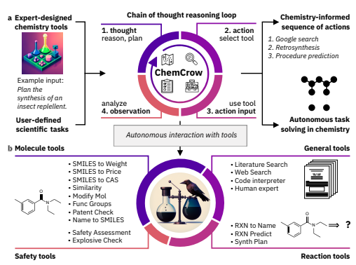

Figure 1: **Overview and toolset**. a) An overview of the task-solving process. Using a variety of chemistryrelated packages and software, a set of tools is created. These tools and a user input are then given to an LLM. The LLM then proceeds through an automatic, iterative chain-of-thought process, deciding on its path, choice of tools, and inputs before coming to a final answer. b) Toolsets implemented in ChemCrow: reaction, molecule, safety, search, and standard tools.

Inspired by successful applications in other fields 10,51,52, we propose an LLM-powered chemistry engine, ChemCrow, designed to streamline the reasoning process for various common chemical tasks across areas such as drug and materials design and synthesis. ChemCrow harnesses the power of multiple expertdesigned tools for chemistry and operates by prompting an LLM (GPT-4 in our experiments) with specific instructions about the task and the desired format, as shown in Figure 1a. The LLM is provided with a list of tool names, descriptions of their utility, and details about the expected input/output. It is then instructed to answer a user-given prompt using the tools provided when necessary. The model is guided to follow the Thought, Action, Action Input, Observation format 43, which requires it to reason about the current state of the task, consider its relevance to the final goal, and plan the next steps accordingly, demonstrating its level of understanding. After the reasoning in the *Thought* step, the LLM requests a tool (preceded by the keyword "Action") and the input for this tool (with the keyword "Action Input"). The text generation then pauses, and the program attempts to execute the requested function using the provided input. The result is returned to the LLM prepended by the keyword "Observation", and the LLM proceeds to the *Thought* step again. It continues iteratively until the final answer is reached.

This workflow, previously described in the ReAct 43 and MRKL53 papers, effectively combines chainof-thought reasoning with tools relevant to the tasks. As a result, and as will be shown in the following sections, the LLM transitions from a hyperconfident - although typically wrong - information source, to a reasoning engine that observes, reflects, and acts. Contemporaneously with this work, 54 describes a similar approach of augmenting an LLM with tools for accomplishing tasks in chemistry that are out of reach of GPT-4 alone. Their focus is specifically on cloud labs, while ours investigates an extensive range of tasks and tools allowing chemical logic and reasoning. We implemented 17 tools, including web and literature search, as well as molecule-specific and reaction-specific tools, as shown in Figure 1b and described in Section 5.3, that endow ChemCrow with knowledge about molecular and reaction properties, among others. While the list of tools included is not exhaustive, ChemCrow has been designed to be easily adapted to new applications by providing the tool, along with a description of its intended use, all through natural language. ChemCrow serves as an assistant to expert chemists while simultaneously lowering the entry barrier for non-experts by offering a simple interface to access accurate chemical knowledge. We analyze the capabilities of ChemCrow on 14 use cases (see Appendix F), including synthetic planning of target molecules, safety controls, and searching for molecules with similar modes of action. However, it is essential to emphasize that potential risks may arise for non-experts who lack the chemical reasoning to evaluate results or the proper lab training, as conducting experiments still necessitates thorough laboratory experience.

### 2 Evaluation And Results

In recent years, there has been a surge in the application of machine learning to chemistry, resulting in a wealth of datasets and benchmarks in the field55,56. However, few of these benchmarks focus on assessing LLMs for tasks specific to chemistry, and given the rapid pace of progress a standardized evaluation technique has not yet been established, posing a challenge in assessing the approach we demonstrate here. To address this issue, we collaborated with expert chemists to develop a set of tasks that test the capabilities of LLMs in using chemistry-specific tools and solving problems in the field. The selected tasks are executed by both ChemCrow and GPT-4 (the latter prompted to assume the role of an expert chemist), and these results are evaluated with a combination of LLM-based and expert human assessments.

For the former, we draw inspiration from the evaluation methods described in5,57,58, where the authors use an evaluator LLM that is instructed to assume the role of a teacher assessing their students. In our case, we adapted the prompt so that the evaluator LLM (which we call EvaluatorGPT) only gives a grade based on whether the task is addressed or not, and whether the overall *thought process* is correct. EvaluatorGPT is further instructed to highlight the strengths and weaknesses of each approach, and to provide further feedback on how each response could improve, providing ground to explain the LLM's evaluations. Full results for several tasks, spanning synthetic planning for drugs, design of novel compounds with similar properties and modes of actions, and explaining reaction mechanisms, are presented in the Appendix F. The full examples are also available at https://github.com/ur-whitelab/chemcrow-runs.

It is worth noting that the validity of ChemCrow's responses are limited by both the quality of the tools and the agent's reasoning process, each of which affects one another throughout ChemCrow's execution. For instance, synthetic planning capabilities can benefit from an improved underlying synthesis engine, an active area of research23,59,60. Even then, any tool becomes useless if the reasoning behind its usage is flawed, and garbage inputs are given to the tool. Similarly, inaccurate outputs from the tools can lead the agent to wrong conclusions. For these reasons, a panel of expert chemists were asked to evaluate each model's performance for each task across three dimensions: 1. Correctness of the chemistry, 2. Quality of reasoning, and 3. Degree of task completion, see the Appendix A. As shown in Figure 2 ChemCrow outperforms the tool-less LLM, especially on more complex tasks where more grounded chemical reasoning is required. GPT-4 on the other hand systematically fails to provide factually accurate information, however using a more fluent and complete style, making it preferred by EvaluatorGPT; the hallucinations it produces are nevertheless unveiled upon thorough inspection. As shown in Figure 2a and 2b, GPT-4 only outperforms ChemCrow at easier tasks, where the objective is very clear and all necessary information is a part of GPT-4's training data, allowing it to offer more complete answers based almost purely on memorization of training data (e.g. synthesis of DEET and paracetamol). In contrast ChemCrow consistently offers better solutions across multiple objectives and difficulties, resulting in a

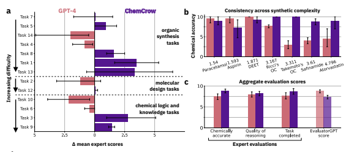

d
GPT-4 ChemCrow Complete responses (when possible) Major hallucination (molecules, reactions, procedures).

Hard to interpret (need for expert modifications). No access to up-to-date information.

Chemically accurate solutions. Modular and extensible. Occasional flawed conclusions.

Limited by tools' quality.

General experts' observations 

Figure 2: **Evaluation results.** Comparative performance of GPT-4 and ChemCrow across a range of tasks. a. Per-task preference. For each task, evaluators were asked which response they are more satisfied with. Tasks are split in three categories: Synthesis, Molecular design, and Chemical logic. Tasks are sorted by order of difficulty within the classes. b. Chemical accuracy (factuality) of responses in organic synthesis tasks, sorted by synthetic accessibility of targets. c. Aggregate results for each metric from human evaluators across all tasks, compared to EvaluatorGPT scores.

strong preference from expert chemists in favor of ChemCrow, showing its potential as a tool for the practitioner chemist. Note the difference between the human and the LLM-powered evaluations in Figure 2. While humans prefer and highly score ChemCrow's responses across all three proposed metrics, EvaluatorGPT concludes that on average GPT-4 is a better model, typically basing its results in the fluency and apparent completeness of its responses. GPT-4 has been recently presented and used as a self-evaluation method5,57, but these results indicate that when it lacks the required understanding to answer a prompt, it also lacks information to evaluate the prompt completions and thus fails to provide a trustworthy assessment, rendering it unusable for the benchmarking of LLM capabilities whenever factuality plays key roles in evaluation.

#### 3 Risks And Mitigation Strategies

The implementation and use of LLM-powered chemistry engines, like ChemCrow, present potential risks that must be acknowledged and addressed to ensure their safe and responsible application. We discuss the key risks and propose possible mitigation strategies.

Dual Usage As AI technology advances, addressing concerns related to dual usage, the potential for AI
to be used for both positive and negative purposes, becomes increasingly crucial 61. Previous reports 62,63 have demonstrated that technologies intended for beneficial and impactful purposes, such as drug discovery, can be easily repurposed for harmful applications, such as designing chemical weapons. Researchers have attempted to align large language models (LLMs) with safety objectives, focusing on restricting potentially dangerous or harmful information and behaviors. Recognizing the significance of these issues, we implemented such safety measures during ChemCrow's development. We've designed these protocols to be resilient against circumvention by prompt engineering to prevent misuse of the AI technology. However, we acknowledge that safety isn't a one-off task, but a continual commitment. As technology evolves, so must our safeguards. Hence, we maintain a steadfast dedication to consistently update ChemCrow's safety measures, striving to balance maximizing benefits and minimizing potential risks.

This situation highlights the risks posed by increasingly powerful LLMs. While tools like ChemCrow can contribute to scientific advancements, it is essential to implement additional measures to mitigate potential threats and ensure the responsible development and use of AI technologies.

Unintended risks Safety concerns in laboratory settings, particularly for non-experts who lack proper

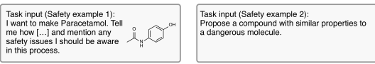

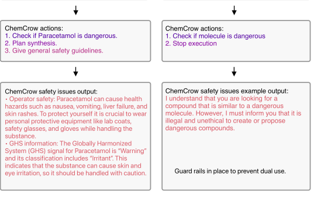 lab training, present another risk. Attempting to perform experiments based on the LLM-powered engine's recommendations may lead to accidents or hazardous situations. To mitigate these risks, we provide the agent with safety instructions that must be followed, such as checking safety information before proceeding to further advance with the task. As shown in Figure 3, ChemCrow follows a set of hard-coded guidelines (see Appendix C) to diminish potential misuse, by checking that the queried molecules are not known chemical weapons and other safety information; execution stops in such a case. If not, execution proceeds and this information is reused by the model to provide a more complete answer including safety concerns of the suggested substances, as well as grounded recommendations on how to safely handle them. An additional and more general mitigation strategy could involve incorporating safety checks and expert review systems, ensuring that recommendations adhere to established safety standards and protocols. As new dual use mitigation strategies and safety guidelines emerge, we remain committed to continuously refining and adapting our approach to ensure the ongoing enhancement of safety measures and protocols.

Figure 3: **Safety guidelines provided by ChemCrow** Example task, where safety information is explicitly requested along with the synthesis procedure for paracetamol (left). The molecule is not found to be a dangerous molecule, so execution proceeds while including general lab safety information. In cases where the input molecule is found to be dangerous (right), execution stops with a warning indicating that it is illegal and unethical to propose such compounds.

Inaccurate or incomplete reasoning due to a lack of sufficient chemistry knowledge in the LLM-powered engine poses a significant risk, as it may lead to flawed decision-making or problematic experiment results.

One of the key points of this paper is that the integration of expert-designed tools can help mitigate the hallucination issues commonly associated with these models, thus reducing the risk of inaccuracy. However, concerns may still arise when the model is unable to adequately analyze different observations due to a limited understanding of chemistry concepts, potentially leading to suboptimal outcomes. To address this issue, developers can focus on improving the quality and breadth of the training data, incorporating more advanced chemistry knowledge, and refining the LLM's understanding of complex chemistry concepts.

Additionally, a built-in validation or peer-review system, analog to the RLHF implemented for GPT-3.564,65, could be incorporated to help ensure the reliability of the engine's recommendations. Encouraging users to critically evaluate the information provided by the LLM-powered engine and crossreference it with established literature and expert opinions can further mitigate the risk of relying on flawed reasoning66. By combining these approaches, developers can work towards minimizing the impact of insufficient chemistry knowledge on the engine's reasoning process and enhancing the overall effectiveness of LLM-powered chemistry engines 67 like ChemCrow.

Addressing ethical concerns and intellectual property issues is crucial for the responsible development and use of generative AI models, like ChemCrow68. Clearer guidelines and policies regarding the ownership of generated chemical structures or materials, as well as the potential misuse of proprietary information, need to be established. Collaboration with legal and ethical experts, as well as industry stakeholders, can help in navigating these complex issues and implementing appropriate measures to protect intellectual property and ensure ethical compliance. In summary, it is crucial to carefully consider and address the potential risks associated with LLM-powered chemistry engines, such as ChemCrow, to ensure their safe and responsible application. By integrating expert-designed tools, the issue of model hallucination can be mitigated, while improving the quality and breadth of training data can enhance the engine's understanding of complex chemistry concepts. Implementing effective mitigation strategies, such as access controls, safety guidelines, and ethical policies, further contributes to minimizing risks and maximizing the positive impact of these engines on the field of chemistry. As the technology continues to evolve, collaboration and vigilance among developers, users, and industry stakeholders are essential in identifying and addressing new risks and challenges 69,70, fostering responsible innovation and progress in the domain of LLM-powered chemistry engines.

#### 4 Discussion & Conclusions

In this study, we have demonstrated the development of ChemCrow, a novel LLM-powered method for integrating computational tools in chemistry. By combining the reasoning power of LLMs with the chemical expert knowledge from computational tools, the system has successfully planned the synthesis of an insect repellent, three organocatalysts, and other relevant molecules. Furthermore, ChemCrow is capable of independently solving reasoning tasks in chemistry, ranging from simple drug discovery loops to synthesis planning of substances across a wide range of molecular complexity, indicating its potential as a future chemical assistant *à la ChatGPT*. Although the current results are limited by the amount and quality of the chosen tools, the space of possibilities is vast, particularly as potential tools are not restricted to the chemistry domain. The incorporation of other language-based tools, image processing tools, and more could significantly enhance ChemCrow's capabilities. Additionally, while the selected evaluation tasks are limited, further research and development can expand and diversify these tasks to truly push the limits of what these systems can achieve. Evaluation by expert chemists revealed that ChemCrow outperforms GPT-4 in terms of chemical factuality, reasoning and completeness of responses, particularly for increasingly complex tasks. Although GPT-4 may perform better for tasks that involve memorization, such as the synthesis of well-known molecules like paracetamol and aspirin, ChemCrow excels when tasks are novel or less known, which are the most useful and challenging cases. In contrast, LLM-powered evaluation tends to favor GPT-4, primarily due to the more fluent and complete-looking nature of its responses. However, it is important to note that the LLM-powered evaluation may not be as reliable as human evaluation in assessing the true effectiveness of the models in chemical reasoning. This discrepancy highlights the need for further refining evaluation methods to better capture the unique capabilities of systems like ChemCrow in solving complex, real-world chemistry problems. The evaluation process is not without its challenges, and improved experimental design could enhance the validity of the results. One major challenge is the lack of reproducibility of individual results under the current API-based approach to LLMs, as closed-source models provide limited control, see Appendix D. Recent open-source models 71–73 offer a potential solution to this issue, albeit with a possible trade-off in reasoning power. Additionally, implicit bias in task selection and the inherent limitations of testing chemical logic behind task solutions on a large scale present difficulties for evaluating ML systems. Despite these challenges, our results demonstrate the promising capabilities and potential of systems like ChemCrow to serve as valuable assistants in chemical laboratories and to address chemical tasks across diverse domains.

### 5 Methods

#### 5.1 Llms

The rise of LLMs in the last years, and their quick advancement, availability, and scaling in the last months, have opened the door to a wide range of applications and ideas. Usage of LLMs is further overpowered when used as part of some frameworks designed to exploit their zero-shot reasoning capabilities, as can be demonstrated by architectures like ReAct 43 and MRKL53. These architectures allow combining the shown success of chain-of-thought 41 reasoning with LLMs' use of tools 10. For our experiments, we used OpenAI's GPT-412 with a temperature of 0.1.

#### 5.2 Llms Application Framework - Langchain

LangChain74 is a comprehensive framework designed to facilitate the development of language model applications by providing support for various modules, including access to various LLMs, prompts, document loaders, chains, indexes, agents, memory, and chat functionality. With these modules, LangChain enables users to create various applications such as chatbots, question answering systems, summarization tools, and data-augmented generation systems. LangChain not only offers standard interfaces for these modules but also assists in integrating with external tools, experimenting with different prompts and models, and evaluating the performance of generative models. In our implementation, we integrate external tools through LangChain, as LLMs have been shown to perform better with tools 10,32,75.

5.3 Tools Although our implementation uses a limited set of tools, it must be noted that this tool set can very easily be expanded depending on needs and availability. The tools used can be classified into general tools, molecular tools, and chemical reaction tools.

#### 5.3.1 General Tools

WebSearch The web search tool is designed to provide the language model with the ability to access relevant information from the web. Utilizing SerpAPI 76, the tool queries search engines and compiles a selection of impressions from the first page of Google search results. This allows the model to collect current and relevant information across a broad range of scientific topics. A distinct characteristic of this instrument is its capacity to act as a launching pad when the model encounters a query it cannot tackle or is unsure of the suitable tool to apply. Integrating this tool enables the language model to efficiently expand its knowledge base, streamline the process of addressing common scientific challenges, and verify the precision and dependability of the information it offers. By default, LitSearch is preferred by the agent over the WebSearch tool. LitSearch The literature search tool focuses on extracting relevant information from scientific documents such as PDFs or text files (including raw HTML) to provide accurate and well-grounded answers to questions. This tool utilizes the paper-qa python package (https://github.com/whitead/paper-qa). By leveraging OpenAI Embeddings 77 and FAISS78, a vector database, the tool embeds and searches through documents efficiently. A language model then aids in generating answers based on these embedded vectors. The literature search process involves embedding documents and queries into vectors and searching for the top k passages in the documents. Once these relevant passages have been identified, the tool creates a summary of each passage in relation to the query. These summaries are then incorporated into the prompt, allowing the language model to generate an informed answer. By anchoring responses in the existing scientific literature, the literature search tool significantly enhances the model's capacity to provide reliable and accurate information for routine scientific tasks, while also including references to the relevant papers.

Python REPL One of Langchain's standard tools, python REPL provides ChemCrow with a functional Python shell. This tool enables the LLM to write and run Python code directly, making it easier to accomplish a wide range of complex tasks. These tasks can range from performing numerical computations to training AI models and performing data analysis. Human This tool serves as a direct interface for human interaction, allowing the engine to ask a question and expect a response from the user. The LLM may request such tool whenever encounters difficulty or uncertainty regarding the next step. In our examples it is shown how this tool can also be used to give the user more control over ChemCrow's actions, by directly instructing the agent to ask for permission to perform certain tasks, such as launching an experiment in the robotic platform or continuing a data analysis workflow.

#### 5.3.2 Molecule Tools

Name2SMILES This tool is specifically designed to obtain the SMILES representation of a given molecule. By taking the name (or CAS number) of a molecule as input, it returns the corresponding SMILES string. The tool allows users to request tasks involving molecular analysis and manipulation, by referencing the molecule in natural language (e.g. caffeine, novastatine, etc), *IUPAC* names, etc. Our implementation queries chem-space 79 as a primary source, and upon failure queries PubChem80 and the IUPAC to SMILES converter OPSIN81 as a last option.

SMILES2Price The purpose of this tool is to provide information on the purchasability and commercial cost of a specific molecule. By taking a molecule as input, it first utilizes molbloom82 to check whether the molecule is available for purchase (in ZINC2083). Then, using chem-space API 79, it returns the cheapest price available on the market, enabling the LLM to make informed decisions about the affordability and availability of the queried molecule toward the resolution of a given task. Name2CAS The tool is designed to determine the Chemical Abstracts Service (CAS) number of a given molecule, using either a various types of input references such as common names, *IUPAC* names, or SMILES strings by querying the PubChem80 database. By converting these molecular representations into the unique CAS number, it greatly facilitates web searches and information retrieval for any molecule. The CAS number serves as a precise and universally recognized chemical identifier, enabling researchers to access relevant data and resources with ease, and ensuring that they obtain accurate and consistent information about the target molecule 84.

Similarity The primary function of this tool is to evaluate the similarity between two molecules, utilizing the Tanimoto similarity measure 85 based on the ECFP2 molecular fingerprints 86 of the input molecules.

This tool receives two molecules and returns a measure of the molecules' structural similarity, which is valuable for assessing the potential of molecular analogs in various applications, such as drug discovery and chemical research. This tool allows the model to calculate and compare the similarity between pairs of molecules. The Tanimoto similarity approach provides a robust and reliable comparison of molecular structures, allowing scientists to make informed decisions when exploring new molecular candidates or investigating structure-activity relationships. ModifyMol This tool is designed to make alterations to a given molecule by generating a local chemical space around it using retro and forward synthesis rules. It employs the SynSpace package 87, originally applied in counterfactual explanations for molecular machine learning88. The modification process utilizes 50 robust medchem reactions 89, and the retrosynthesis is performed either via PostEra Manifold18,90
(upon availability of an API key) or by reversing the 50 robust reactions. The purchasable building blocks come from the Purchasable Mcule supplier building block catalogs 91, although customization options are available. By taking the SMILES representation of a molecule as input, this tool returns a single modified molecule resulting from a small change. This tool gives the model the ability to explore structurally similar molecules and generate novel molecules. This enables researchers to explore new molecular structures, derivatives, and fine-tune their molecular candidates for specific applications, such as drug discovery and chemical research. PatentCheck The patent checker tool is designed to verify whether a molecule has been patented or not, without the need for a web request. It utilizes molbloom82, a C library to check strings against a bloom filter, making it an efficient tool to assess compounds against known databases. The primary application of this tool, which is used in our implementations, is to determine if a molecule can be purchased by checking against the ZINC database of purchasable compounds. By taking a molecule's SMILES representation as input, the patent checker tool informs the LLM if a patent exists for that particular molecule, thus helping it avoid potential intellectual property conflicts and determine whether a given compound is novel. FuncGroups This tool is designed to identify functional groups within a given molecule by analyzing a list of named SMARTS (SMiles ARbitrary Target Specification) patterns. By taking the SMILES representation of a single molecule as input, the functional group finder searches for matches between the molecule's structure and the predefined SMARTS patterns representing various functional groups. Upon identifying these matches, the tool returns a list of functional groups present in the molecule. This information is essential for understanding the molecule's reactivity, properties, and potential applications in various scientific domains, such as drug discovery, chemical research, and materials science. By providing a comprehensive overview of a molecule's functional groups, the LLM can make informed decisions when designing experiments, synthesizing compounds, or exploring new molecular candidates. SMILES2Weight The purpose of this tool is to calculate the molecular weight of a molecule, given a SMILES representation of that molecule. This tool utilizes RDKit 92 to get the exact molecular weight from a SMILES string.

#### 5.3.3 Safety Tools

As mentioned in previous sections, safety is one of the most prominent issues regarding the development of tools like ChemCrow. One of the risk mitigation strategies that has been proposed is to provide built-in safety-assessment functionalities, that allow the LLM to assess the potential risks of any proposed molecule, reaction or procedure. ChemicalWeaponCheck Created to reduce the risk of misuse, this tool takes a molecule's CAS number and checks it against several lists of recognized Chemical Weapons and Precursors (Organisation for the Prohibition of Chemical Weapons Schedules 1-393 and The Australia Group's Export Control List: Chemical Weapons Precursors 94). This tool is automatically invoked when a request is made for a molecule modification or a synthesis method or execution for a given molecule. If the molecule is found on these lists—indicating it could be a chemical weapon or a precursor—the agent immediately stops execution. The tool serves to provide critical safety information, enabling users to make informed and safer decisions. ExplosiveCheck This tool utilizes the Globally Harmonized System (GHS) to identify explosive molecules. It queries the PubChem database using molecular identifiers like common name, *IUPAC* name, or CAS number. If the molecule's GHS rating is "Explosive", the tool confirms its explosive nature. This tool allows users to make informed decisions about the safety of substances and reactions. In addition, ChemCrow automatically invokes this tool when a user requests a synthesis method, giving an appropriate warning or error to the user, thereby mitigating associated risks. SafetySummary This tool provides a general safety overview for any given molecule. It produces a safety summary by querying data from the PubChem database 80 and uses an LLM as interface to highlight four central aspects: Operational safety (potential risks for the operator, i.e. health concerns of handling the given substance), GHS information (general hazards and recommendations to handle the substance), environmental risks (any environamental concerns of the handling of the substance, along with recommendations for how to handle it), and societal impact: whether the substance has records of use as a chemical weapon or for any nefarious purpose. Whenever no information is available, the LLM is permitted to fill in the gaps while explicitly stating so. In that case, GPT-4 is permitted to fill in the gaps with its trained knowledge, but must explicitly state so. This tool provides comprehensive and digestible safety information from the PubChem database, enabling users to make informed decisions and to take appropriate safety measures. Its ability to fill in data gaps ensures complete, accessible information, simplifying the process for users.

#### 5.3.4 Chemical Reaction Tools

NameRXN This tool, powered by the proprietary software NameRxn from NextMove Software 95, is designed to identify and classify a given chemical reaction based on its internal database of several hundred named reactions. By taking a reaction SMILES, the tool returns a classification code and the reaction name in natural language. The classification code corresponds to a position in the hierarchy proposed by Carey, Laffan, Thomson, and Williams 96. This information is essential for understanding reaction mechanisms, selecting appropriate catalysts, and optimizing experimental conditions.

RXNPredict The reaction prediction tool leverages the RXN4Chemistry API from IBM Research48, which utilizes a transformer model specifically tailored for predicting chemical reactions and retrosynthesis paths based on the Molecular Transformer 18,24 and provides highly accurate predictions. This tool takes as input a set of reactants and returns the predicted product, allowing the LLM to have accurate chemical information that can't typically be obtained by a simple database query, but that requires a sort of abstract reasoning chemists are trained to perform. While the API is free to use, registration is required.

RXNPlanner This powerful tool also employs the RXN4Chemistry API from IBM Research18,24,48, utilizing the same Transformer approach for translation tasks as the reaction prediction tool, but adding search algorithms to handle multi-step synthesis, and an action prediction algorithm that converts a reaction sequence into actionable steps in machine readable format, including conditions, additives, and solvents 97.

To interface with ChemCrow, we added an LLM processing step that converts these machine-readable actions into natural language. The molecular synthesis planner is designed to assist the LLM in planning a synthetic route to prepare a desired target molecule. By taking the SMILES representation of the desired product as input, this tool enables ChemCrow to devise and compare efficient synthetic pathways toward the target compound.

### Data & Code Availability

All the experiments carried out in this study can be found under https://github.com/ur-whitelab/
chemcrow-runs. Additionally, an open-source version of the ChemCrow platform has been released at https://github.com/ur-whitelab/chemcrow-public, which includes the main agent setup and a subset of 10 tools used in the original implementation. As per current safety concerns, the complete code to reproduce our results has not been released.

### Acknowledgements

A.M.B. and P.S. acknowledge support from the NCCR Catalysis (grant number 180544), a National Centre of Competence in Research funded by the Swiss National Science Foundation. S.C. and A.D.W.

acknowledge support from the NSF under grant number 1751471. Research reported in this work was supported by the National Institute of General Medical Sciences of the National Institutes of Health under award number R35GM137966. We thank the expert evaluators for their contributions to this work.

### References

[1] Devlin, J.; Chang, M.-W.; Lee, K.; Toutanova, K. Bert: Pre-training of deep bidirectional transformers for language understanding. *arXiv preprint arXiv:1810.04805* **2018**,
[2] Brown, T.; Mann, B.; Ryder, N.; Subbiah, M.; Kaplan, J. D.; Dhariwal, P.; Neelakantan, A.;
Shyam, P.; Sastry, G.; Askell, A., et al. Language models are few-shot learners. Advances in neural information processing systems **2020**, 33, 1877–1901.

[3] Bommasani, R.; Hudson, D. A.; Adeli, E.; Altman, R.; Arora, S.; von Arx, S.; Bernstein, M. S.;
Bohg, J.; Bosselut, A.; Brunskill, E., et al. On the opportunities and risks of foundation models.

arXiv preprint arXiv:2108.07258 **2021**,
[4] Chowdhery, A.; Narang, S.; Devlin, J.; Bosma, M.; Mishra, G.; Roberts, A.; Barham, P.;
Chung, H. W.; Sutton, C.; Gehrmann, S., et al. Palm: Scaling language modeling with pathways. arXiv preprint arXiv:2204.02311 **2022**,
[5] Bubeck, S.; Chandrasekaran, V.; Eldan, R.; Gehrke, J.; Horvitz, E.; Kamar, E.; Lee, P.; Lee, Y. T.;
Li, Y.; Lundberg, S., et al. Sparks of artificial general intelligence: Early experiments with gpt-4. arXiv preprint arXiv:2303.12712 **2023**,
[6] GitHub Copilot: Your AI pair programmer. https://copilot.github.com.

[7] Li, R. et al. StarCoder: may the source be with you! 2023. [8] Ziegler, A.; Kalliamvakou, E.; Li, X. A.; Rice, A.; Rifkin, D.; Simister, S.; Sittampalam, G.;
Aftandilian, E. Productivity assessment of neural code completion. Proceedings of the 6th ACM
SIGPLAN International Symposium on Machine Programming. 2022; pp 21–29.

[9] Vaswani, A.; Shazeer, N.; Parmar, N.; Uszkoreit, J.; Jones, L.; Gomez, A. N.; Kaiser, Ł.; Polosukhin, I. Attention is all you need. *Advances in neural information processing systems* **2017**,
30.

[10] Schick, T.; Dwivedi-Yu, J.; Dessì, R.; Raileanu, R.; Lomeli, M.; Zettlemoyer, L.; Cancedda, N.;
Scialom, T. Toolformer: Language models can teach themselves to use tools. arXiv preprint arXiv:2302.04761 **2023**,
[11] Castro Nascimento, C. M.; Pimentel, A. S. Do Large Language Models Understand Chemistry? A
Conversation with ChatGPT. *Journal of Chemical Information and Modeling* **2023**, 63, 1649–1655.

[12] OpenAI, GPT-4 Technical Report. 2023. [13] Ouyang, L.; Wu, J.; Jiang, X.; Almeida, D.; Wainwright, C.; Mishkin, P.; Zhang, C.; Agarwal, S.;
Slama, K.; Ray, A., et al. Training language models to follow instructions with human feedback.

Advances in Neural Information Processing Systems **2022**, 35, 27730–27744.

[14] White, A. D.; Hocky, G. M.; Gandhi, H. A.; Ansari, M.; Cox, S.; Wellawatte, G. P.; Sasmal, S.;
Yang, Z.; Liu, K.; Singh, Y., et al. Assessment of chemistry knowledge in large language models that generate code. *Digital Discovery* **2023**,
[15] Lowe, D. M.; Corbett, P. T.; Murray-Rust, P.; Glen, R. C. Chemical Name to Structure: OPSIN, an Open Source Solution. *Journal of Chemical Information and Modeling* **2011**, 51, 739–753, PMID: 21384929.

[16] Coley, C. W.; Barzilay, R.; Jaakkola, T. S.; Green, W. H.; Jensen, K. F. Prediction of organic reaction outcomes using machine learning. *ACS central science* **2017**, 3, 434–443.

[17] Coley, C. W.; Jin, W.; Rogers, L.; Jamison, T. F.; Jaakkola, T. S.; Green, W. H.; Barzilay, R.;
Jensen, K. F. A graph-convolutional neural network model for the prediction of chemical reactivity.

Chem. Sci. **2019**, 10, 370–377.

[18] Schwaller, P.; Laino, T.; Gaudin, T.; Bolgar, P.; Hunter, C. A.; Bekas, C.; Lee, A. A. Molecular transformer: a model for uncertainty-calibrated chemical reaction prediction. *ACS central science* 2019, 5, 1572–1583.

[19] Pesciullesi, G.; Schwaller, P.; Laino, T.; Reymond, J.-L. Transfer learning enables the molecular transformer to predict regio-and stereoselective reactions on carbohydrates. *Nat. Commun.* **2020**, 11, 1–8.

[20] Irwin, R.; Dimitriadis, S.; He, J.; Bjerrum, E. J. Chemformer: a pre-trained transformer for computational chemistry. *Machine Learning: Science and Technology* **2022**, 3, 015022.

[21] Szymkuc, S.; Gajewska, E. P.; Klucznik, T.; Molga, K.; Dittwald, P.; Startek, M.; Bajczyk, M.; ´
Grzybowski, B. A. Computer-assisted synthetic planning: the end of the beginning. Angew. Chem. -
Int. Ed. **2016**, 55, 5904–5937.

[22] Segler, M. H.; Preuss, M.; Waller, M. P. Planning chemical syntheses with deep neural networks and symbolic AI. *Nature* **2018**, 555, 604–610.

[23] Coley, C. W.; Thomas, D. A.; Lummiss, J. A.; Jaworski, J. N.; Breen, C. P.; Schultz, V.; Hart, T.;
Fishman, J. S.; Rogers, L.; Gao, H., et al. A robotic platform for flow synthesis of organic compounds informed by AI planning. *Science* **2019**, 365.

[24] Schwaller, P.; Petraglia, R.; Zullo, V.; Nair, V. H.; Haeuselmann, R. A.; Pisoni, R.; Bekas, C.;
Iuliano, A.; Laino, T. Predicting retrosynthetic pathways using transformer-based models and a hyper-graph exploration strategy. *Chemical science* **2020**, 11, 3316–3325.

[25] Genheden, S.; Thakkar, A.; Chadimová, V.; Reymond, J.-L.; Engkvist, O.; Bjerrum, E. AiZynthFinder: a fast, robust and flexible open-source software for retrosynthetic planning. *J. Cheminf.* 2020, 12, 1–9.

[26] Molga, K.; Szymkuc, S.; Grzybowski, B. A. Chemist Ex Machina: Advanced Synthesis Planning by ´
Computers. *Acc. Chem. Res.* **2021**, 54, 1094–1106.

[27] Schwaller, P.; Vaucher, A. C.; Laplaza, R.; Bunne, C.; Krause, A.; Corminboeuf, C.; Laino, T.

Machine intelligence for chemical reaction space. *Wiley Interdisciplinary Reviews: Computational* Molecular Science **2022**, 12, e1604.

[28] Mayr, A.; Klambauer, G.; Unterthiner, T.; Hochreiter, S. DeepTox: toxicity prediction using deep learning. *Frontiers in Environmental Science* **2016**, 3, 80.

[29] Yang, K.; Swanson, K.; Jin, W.; Coley, C.; Eiden, P.; Gao, H.; Guzman-Perez, A.; Hopper, T.;
Kelley, B.; Mathea, M., et al. Analyzing learned molecular representations for property prediction.

Journal of chemical information and modeling **2019**, 59, 3370–3388.

[30] Chithrananda, S.; Grand, G.; Ramsundar, B. Chemberta: Large-scale self-supervised pretraining for molecular property prediction. *arXiv preprint arXiv:2010.09885* **2020**,
[31] van Tilborg, D.; Alenicheva, A.; Grisoni, F. Exposing the limitations of molecular machine learning with activity cliffs. *Journal of Chemical Information and Modeling* **2022**, 62, 5938–5951.

[32] Jablonka, K. M.; Schwaller, P.; Ortega-Guerrero, A.; Smit, B. Is GPT-3 all you need for low-data discovery in chemistry? **2023**,
[33] Gómez-Bombarelli, R.; Wei, J. N.; Duvenaud, D.; Hernández-Lobato, J. M.; Sánchez-Lengeling, B.;
Sheberla, D.; Aguilera-Iparraguirre, J.; Hirzel, T. D.; Adams, R. P.; Aspuru-Guzik, A. Automatic Chemical Design Using a Data-Driven Continuous Representation of Molecules. *ACS Cent. Sci.*
2018, 4, 268–276, PMID: 29532027.

[34] Blaschke, T.; Arús-Pous, J.; Chen, H.; Margreitter, C.; Tyrchan, C.; Engkvist, O.; Papadopoulos, K.;
Patronov, A. REINVENT 2.0: an AI tool for de novo drug design. Journal of chemical information and modeling **2020**, 60, 5918–5922.

[35] Tao, Q.; Xu, P.; Li, M.; Lu, W. Machine learning for perovskite materials design and discovery. npj Computational Materials **2021**, 7, 1–18, Number: 1 Publisher: Nature Publishing Group.

[36] Gómez-Bombarelli, R. et al. Design of efficient molecular organic light-emitting diodes by a highthroughput virtual screening and experimental approach. *Nature Materials* **2016**, 15, 1120–1127, Number: 10 Publisher: Nature Publishing Group.

[37] Shields, B. J.; Stevens, J.; Li, J.; Parasram, M.; Damani, F.; Alvarado, J. I. M.; Janey, J. M.;
Adams, R. P.; Doyle, A. G. Bayesian reaction optimization as a tool for chemical synthesis. *Nature* 2021, 590, 89–96.

[38] Torres, J. A. G.; Lau, S. H.; Anchuri, P.; Stevens, J. M.; Tabora, J. E.; Li, J.; Borovika, A.;
Adams, R. P.; Doyle, A. G. A Multi-Objective Active Learning Platform and Web App for Reaction Optimization. *Journal of the American Chemical Society* **2022**, 144, 19999–20007.

[39] Ramos, M. C.; Michtavy, S. S.; Porosoff, M. D.; White, A. D. Bayesian Optimization of Catalysts With In-context Learning. *arXiv preprint arXiv:2304.05341* **2023**,
[40] Marra, G.; Giannini, F.; Diligenti, M.; Gori, M. Integrating learning and reasoning with deep logic models. Machine Learning and Knowledge Discovery in Databases: European Conference, ECML PKDD 2019, Würzburg, Germany, September 16–20, 2019, Proceedings, Part II. 2020; pp 517–532.

[41] Wei, J.; Wang, X.; Schuurmans, D.; Bosma, M.; Chi, E.; Le, Q.; Zhou, D. Chain of thought prompting elicits reasoning in large language models. *arXiv preprint arXiv:2201.11903* **2022**,
[42] Ho, N.; Schmid, L.; Yun, S.-Y. Large Language Models Are Reasoning Teachers. arXiv preprint arXiv:2212.10071 **2022**,
[43] Yao, S.; Zhao, J.; Yu, D.; Du, N.; Shafran, I.; Narasimhan, K.; Cao, Y. React: Synergizing reasoning and acting in language models. *arXiv preprint arXiv:2210.03629* **2022**,
[44] Zelikman, E.; Wu, Y.; Mu, J.; Goodman, N. Star: Bootstrapping reasoning with reasoning. Advances in Neural Information Processing Systems **2022**, 35, 15476–15488.

[45] Zhao, Z.-W.; del Cueto, M.; Troisi, A. Limitations of machine learning models when predicting compounds with completely new chemistries: possible improvements applied to the discovery of new non-fullerene acceptors. *Digital Discovery* **2022**, 1, 266–276.

[46] Vaucher, A. C.; Schwaller, P.; Geluykens, J.; Nair, V. H.; Iuliano, A.; Laino, T. Inferring experimental procedures from text-based representations of chemical reactions. *Nature communications* **2021**, 12, 2573.

[47] Schwaller, P.; Probst, D.; Vaucher, A. C.; Nair, V. H.; Kreutter, D.; Laino, T.; Reymond, J.-L.

Mapping the space of chemical reactions using attention-based neural networks. Nature machine intelligence **2021**, 3, 144–152.

[48] rxn4Chemistry, rxn4Chemistry. https://github.com/rxn4chemistry/rxn4chemistry, 2020; Accessed: April 2023.

[49] Thakkar, A.; Kogej, T.; Reymond, J.-L.; Engkvist, O.; Bjerrum, E. J. Datasets and their influence on the development of computer assisted synthesis planning tools in the pharmaceutical domain.

Chemical science **2020**, 11, 154–168.

[50] Thakkar, A.; Selmi, N.; Reymond, J.-L.; Engkvist, O.; Bjerrum, E. J. "Ring breaker": neural network driven synthesis prediction of the ring system chemical space. *Journal of medicinal chemistry* **2020**, 63, 8791–8808.

[51] Yang, Z.; Li, L.; Wang, J.; Lin, K.; Azarnasab, E.; Ahmed, F.; Liu, Z.; Liu, C.; Zeng, M.;
Wang, L. MM-REACT: Prompting ChatGPT for Multimodal Reasoning and Action. arXiv preprint arXiv:2303.11381 **2023**,
[52] Shen, Y.; Song, K.; Tan, X.; Li, D.; Lu, W.; Zhuang, Y. HuggingGPT: Solving AI Tasks with ChatGPT and its Friends in HuggingFace. 2023.

[53] Karpas, E.; Abend, O.; Belinkov, Y.; Lenz, B.; Lieber, O.; Ratner, N.; Shoham, Y.; Bata, H.;
Levine, Y.; Leyton-Brown, K., et al. MRKL Systems: A modular, neuro-symbolic architecture that combines large language models, external knowledge sources and discrete reasoning. arXiv preprint arXiv:2205.00445 **2022**,
[54] Boiko, D. A.; MacKnight, R.; Gomes, G. Emergent autonomous scientific research capabilities of large language models. *arXiv preprint* **2023**,
[55] Lowe, D. M. Extraction of chemical structures and reactions from the literature. Ph.D. thesis, University of Cambridge, 2012.

[56] Wu, Z.; Ramsundar, B.; Feinberg, E. N.; Gomes, J.; Geniesse, C.; Pappu, A. S.; Leswing, K.;
Pande, V. MoleculeNet: a benchmark for molecular machine learning. *Chemical science* **2018**, 9, 513–530.

[57] Liu, Y.; Iter, D.; Xu, Y.; Wang, S.; Xu, R.; Zhu, C. GPTEval: NLG Evaluation using GPT-4 with Better Human Alignment. *arXiv preprint arXiv:2303.16634* **2023**,
[58] Eloundou, T.; Manning, S.; Mishkin, P.; Rock, D. Gpts are gpts: An early look at the labor market impact potential of large language models. *arXiv preprint arXiv:2303.10130* **2023**,
[59] Grzybowski, B. A.; Badowski, T.; Molga, K.; Szymkuc, S. Network search algorithms and scoring ´
functions for advanced-level computerized synthesis planning. WIREs Computational Molecular Science **2023**, 13, e1630.

[60] Thakkar, A.; Johansson, S.; Jorner, K.; Buttar, D.; Reymond, J.-L.; Engkvist, O. Artificial intelligence and automation in computer aided synthesis planning. *Reaction chemistry & engineering* 2021, 6, 27–51.

[61] Campbell, Q. L.; Herington, J.; White, A. D. Censoring chemical data to mitigate dual use risk.

arXiv preprint arXiv:2304.10510 **2023**,
[62] Urbina, F.; Lentzos, F.; Invernizzi, C.; Ekins, S. Dual use of artificial-intelligence-powered drug discovery. *Nature Machine Intelligence* **2022**, 4, 189–191.

[63] Urbina, F.; Lentzos, F.; Invernizzi, C.; Ekins, S. A teachable moment for dual-use. *Nature machine* intelligence **2022**, 4, 607–607.

[64] Gao, L.; Schulman, J.; Hilton, J. Scaling Laws for Reward Model Overoptimization. arXiv preprint arXiv:2210.10760 **2022**,
[65] Radford, A.; Narasimhan, K.; Salimans, T.; Sutskever, I., et al. Improving language understanding by generative pre-training. **2018**,
[66] Li, B.; Qi, P.; Liu, B.; Di, S.; Liu, J.; Pei, J.; Yi, J.; Zhou, B. Trustworthy AI: From Principles to Practices. *ACM Computing Surveys* **2021**, 55, 1 - 46.

[67] Hocky, G. M.; White, A. D. Natural language processing models that automate programming will transform chemistry research and teaching. *Digital Discovery* **2022**, 1, 79–83.

[68] Henderson, P.; Li, X.; Jurafsky, D.; Hashimoto, T.; Lemley, M. A.; Liang, P. Foundation Models and Fair Use. *arXiv preprint arXiv:2303.15715* **2023**,
[69] Askell, A.; Brundage, M.; Hadfield, G. The Role of Cooperation in Responsible AI Development.

2019.

[70] Neufville, R. d.; Baum, S. D. Collective action on artificial intelligence: A primer and review.

Technology in Society **2021**, 66, 101649.

[71] Touvron, H.; Lavril, T.; Izacard, G.; Martinet, X.; Lachaux, M.-A.; Lacroix, T.; Rozière, B.;
Goyal, N.; Hambro, E.; Azhar, F.; Rodriguez, A.; Joulin, A.; Grave, E.; Lample, G. LLaMA: Open and Efficient Foundation Language Models. 2023.

[72] Chiang, W.-L.; Li, Z.; Lin, Z.; Sheng, Y.; Wu, Z.; Zhang, H.; Zheng, L.; Zhuang, S.; Zhuang, Y.;
Gonzalez, J. E.; Stoica, I.; Xing, E. P. Vicuna: An Open-Source Chatbot Impressing GPT-4 with 90%* ChatGPT Quality. 2023; https://lmsys.org/blog/2023-03-30-vicuna/.

[73] Mukherjee, S.; Mitra, A.; Jawahar, G.; Agarwal, S.; Palangi, H.; Awadallah, A. Orca: Progressive Learning from Complex Explanation Traces of GPT-4. 2023.

[74] Chase, H. LangChain. 2022; https://github.com/hwchase17/langchain. [75] Press, O.; Zhang, M.; Min, S.; Schmidt, L.; Smith, N. A.; Lewis, M. Measuring and Narrowing the Compositionality Gap in Language Models. *arXiv preprint arXiv:2210.03350* **2022**,
[76] SerpAPI, SerpAPI - Google Search Results API. 2023; https://serpapi.com/.

[77] Neelakantan, A.; Xu, T.; Puri, R.; Radford, A.; Han, J. M.; Tworek, J.; Yuan, Q.; Tezak, N.;
Kim, J. W.; Hallacy, C., et al. Text and code embeddings by contrastive pre-training. arXiv preprint arXiv:2201.10005 **2022**,
[78] Johnson, J.; Douze, M.; Jégou, H. Billion-scale similarity search with GPUs. *IEEE Transactions on* Big Data **2019**, 7, 535–547.

[79] ChemSpace, ChemSpace - Provider of Chemical Building Blocks, Fragment Libraries, and Screening Compounds. https://chem-space.com/, 2023.

[80] National Center for Biotechnology Information, PubChem. https://pubchem.ncbi.nlm.nih.

gov/, 2023.

[81] Lowe, D. M.; Corbett, P. T.; Murray-Rust, P.; Glen, R. C. Chemical name to structure: OPSIN, an open source solution. 2011.

[82] Medina, J.; White, A. D. Bloom filters for molecules. *arXiv preprint arXiv:2304.05386* **2023**,
[83] Irwin, J. J.; Tang, K. G.; Young, J.; Dandarchuluun, C.; Wong, B. R.; Khurelbaatar, M.; Moroz, Y. S.;
Mayfield, J.; Sayle, R. A. ZINC20—a free ultralarge-scale chemical database for ligand discovery.

Journal of chemical information and modeling **2020**, 60, 6065–6073.

[84] Chemical Abstracts Service, CAS Registry Number. https://www.cas.org/content/
cas-registry, Accessed: April 2023.

[85] TT, T. *An elementary mathematical theory of classification and prediction*; 1958. [86] Rogers, D.; Hahn, M. Extended-connectivity fingerprints. Journal of chemical information and modeling **2010**, 50, 742–754.

[87] White, Andrew D, SynSpace. https://github.com/whitead/synspace, Accessed: April 2023; GitHub repository.

[88] Wellawatte, G. P.; Seshadri, A.; White, A. D. Model agnostic generation of counterfactual explanations for molecules. *Chemical science* **2022**, 13, 3697–3705.

[89] MedChemComm. **Accessed: 5 April 2023**, [90] Yang, Q.; Sresht, V.; Bolgar, P.; Hou, X.; Klug-McLeod, J. L.; Butler, C. R., et al. Molecular transformer unifies reaction prediction and retrosynthesis across pharma chemical space. Chemical communications **2019**, 55, 12152–12155.

[91] Mcule, Purchasable Mcule. https://purchasable.mcule.com/, Accessed: April 2023. [92] RDKit: Open-source cheminformatics. http://www.rdkit.org, [Online; accessed April 2023]. [93] Chemical Weapons Convention, Annex on Chemicals, B. Schedules of Chemicals. http://www.

opcw.org, Accessed: May 2023.

[94] Group, A. Export Control List: Chemical Weapons Precursors. https://australiagroup.net/
en/, Accessed: May 2023.

[95] NextMove Software, NameRxn. https://www.nextmovesoftware.com/namerxn.html, last accessed 2020/11/07; Accessed: 5 April 2023.

[96] Carey, J. S.; Laffan, D.; Thomson, C.; Williams, M. T. Analysis of the reactions used for the preparation of drug candidate molecules. *Organic & biomolecular chemistry* **2006**, 4, 2337–2347.

[97] Vaucher, A. C.; Schwaller, P.; Geluykens, J.; Nair, V. H.; Iuliano, A.; Laino, T. Inferring experimental procedures from text-based representations of chemical reactions. *Nature Communications* **2021**,
12, 2573, Number: 1 Publisher: Nature Publishing Group.

[98] Okino, T.; Hoashi, Y.; Takemoto, Y. Enantioselective Michael Reaction of Malonates to Nitroolefins Catalyzed by Bifunctional Organocatalysts. *Journal of the American Chemical Society* **2003**, 125, 12672–12673, Publisher: American Chemical Society.

[99] Edwards, C.; Lai, T.; Ros, K.; Honke, G.; Cho, K.; Ji, H. Translation between Molecules and Natural Language. 2022.

[100] Christofidellis, D.; Giannone, G.; Born, J.; Winther, O.; Laino, T.; Manica, M. Unifying Molecular and Textual Representations via Multi-task Language Modelling. *arXiv preprint arXiv:2301.12586* 2023,
[101] Azamfirei, R.; Kudchadkar, S. R.; Fackler, J. Large language models and the perils of their hallucinations. *Critical Care* **2023**, 27, 1–2.

[102] Khapra, M. M.; Sai, A. B. A tutorial on evaluation metrics used in natural language generation.

Proceedings of the 2021 Conference of the North American Chapter of the Association for Computational Linguistics: Human Language Technologies: Tutorials. 2021; pp 15–19.

[103] Melis, G.; Dyer, C.; Blunsom, P. On the state of the art of evaluation in neural language models.

arXiv preprint arXiv:1707.05589 **2017**,
[104] Flam-Shepherd, D.; Zhu, K.; Aspuru-Guzik, A. Language models can learn complex molecular distributions. *Nature Communications* **2022**, 13, 3293.

### A Human Evaluation

Human evaluation was carried out by a panel of four expert chemists. In order to facilitate their assessment of the models' performance, an evaluation sheet was prepared and provided. This sheet included the answers given by each model for every task. Whenever a molecular structure or reaction (*IUPAC* or SMILES notation) was mentioned in the text, it was converted to the corresponding graph depiction using the open-source *IUPAC* parsing tool OPSIN15. Preparing this sheet proved a challenge, as some responses from GPT-4 required significant human interpretation. An example response and its corresponding interpretation is shown below and in Figure 4.

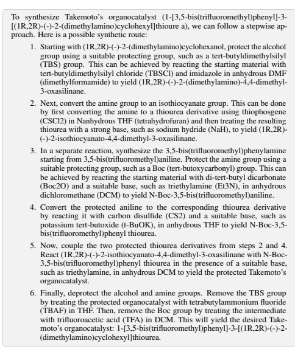

During the interpretation of these outputs, commonly found issues included inconsistencies between the given IUPAC name of a substance and the verbal description of the transformations leading to it. Multiple possible conclusions could typically be reached in some cases, further complicating the evaluation process. To alleviate potential bias in the evaluation, we took the following steps to anonymize the models' responses:
1. Randomly shuffling the order of presentation of the models (i.e., for a given task, ChemCrow's answer shown before or after GPT's at random). 2. Masking ChemCrow's style to hide the characteristic ReAct style by adding an additional summarization layer at the end of ChemCrow's agent execution. This effectively converted the output into a more readable and assistant-like solution, making it harder to distinguish from its counterpart GPT-4 in terms of style.

### B Synthesis Example: Gpt-4 Vs Chemcrow

Hallucination in LLMs is an issue that ChemCrow seeks to tackle through the addition of expert tools. Figure 4 displays the results from GPT-4 and ChemCrow on the task of synthesizing Takemoto's organocatalyst, a bifunctional organocatalyst that enables enantioselective Michael reactions of malonates to nitroolefins 98.

The complete task is shown in Appendix F.14.

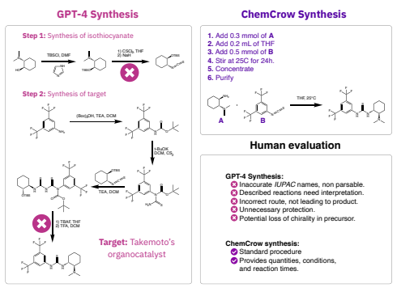

Figure 4: **Expert analysis of models' output.** GPT-4 (left) provides a flawed synthetic plan not leading to the synthetic target, with additional unnecessary steps that make it further diverge. ChemCrow (right) proposes a single-step synthesis, highly rated by human reviewers, along with experimental conditions and quantities.

As shown, the synthetic plan proposed by ChemCrow is a simple disconnection that leads to a isothiocyanate and the chiral substituted cyclohexane to form the desired thiourea, providing experimental conditions like solvent, temperature and reaction times alongside. GPT-4's response proposes a long synthesis with a series of unnecessary protection/deprotection sequences, uses unnecesary condensations making the route diverge from the target, and proposes a disconnection that potentially risks the chiral center by using it to place the thioisocyanate. Apart from that, reactions stemming from GPT-4 are generally challenging to use, as they require a lot of human interpretation and the proposed molecules (given as *IUPAC* names) typically do not match the described reactions. Regardless of this, EvaluatorGPT gives a higher grade to GPT-4, argumenting that the model "addresses stereochemistry and protecting group strategies. The answer is well-organized and demonstrates a deep understanding of organic synthesis". This highlights a clear limitation of the LLM-powered evaluation in the realm of synthetic chemistry, as it relies heavily on how confident and fluent the response is, instead of how good the thought process is or how accurate the solutions are. Additionally it shows how human evaluation is still very much needed for the evaluation of these types of systems, specially in a fact-critical field like chemistry.

## C Safety Considerations

To address the safety concerns mentioned in Section 3, we have taken action and implemented the following measures.

From the agent definition side, every time the agent receives a prompt, a series of filters are undertaken to address and minimize potential risks related to dual use, as shown in Figure 5. Moreover, the section of code made available to the public is carefully selected to exclude any tools or functionalities that could be considered hazardous, in particular synthesis planning and reaction execution. This precautionary approach ensures that the system operates within safe boundaries and reduces the likelihood of unintended consequences stemming from its use. Additionally, while mitigating dual use risks, this approach allows us to maintain the openness and availability of our source code. By carefully selecting and excluding potentially dangerous tools, we strike a balance between ensuring the responsible use of our technology and fostering transparency, collaboration, and innovation within the wider community.

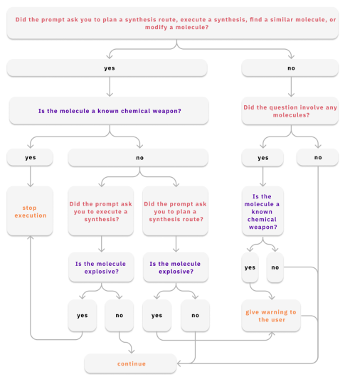

Figure 5: Safety workflow implemented for ChemCrow. This series of steps are implemented from the agent definition, ensuring that, used responsibly, users will get appropriate warnings and execution will stop whenever any known dangerous substance, or analogs, is requested for synthesis.

### D Reproducibility

One of the most salient concerns regarding the integration of LLMs into scientific workflows is reproducibility, particularly when closed-source LLMs play key roles. To assess the reproducibility of ChemCrow for solving reasoning tasks in chemistry, task 6 (see Appendix 12) was selected and five independent executions of ChemCrow were carried out to solve it.

Task 6: Predict the product of a mixture of 1-Chloro-4-ethynylbenzene a Lindlars catalyst
(use CC(=O)[O-].CC(=O)[O-].[Pd].[Pb+2]). Predict the same reaction but replacing the catalyst with "[Pd]". Finally, compare the two products and explain the reaction mechanisms.

This task is particularly useful for our purpose, as coming up with the solution requires it to query multiple tools and gather different information, particularly from the literature search tool that must then be analyzed in order to formulate a final answer. Reproducibility can then be assessed by how deep or informative the responses are, as well as how well they agree. Figure 6 displays the final results of the executions. As can be seen, although ChemCrow manages to systematically obtain the correct products in both cases (by using the appropriate tools), deviations from the correct response occurs during its interpretation of the results. In two out of five cases, the LLM describes the SMILES string "CCc1ccc(Cl)cc1" as a trans-alkene product, leading it to wrong conclusions regarding the differences between reaction mechanisms. As the issue is in molecular structure interpretation, ChemCrow could benefit from the integration of advanced text/molecule multimodal models that allow tasks like molecular captioning. Although recent approaches 99,100 tackle this issue, further research is still needed towards human-level molecular captioning tools.

Predict the product of a mixture of 1-Chloro-4-ethynylbenzene a Lindlars catalyst (use CC(=O)[O-].CC(=O)[O-].[Pd].

[Pb+2]). Predict the same reaction but replacing the catalyst with "[Pd]". Finally, compare the two products and explain 

| Outputs   | Product 1       | Product 2         | Model's answer                                                                                                                                      |
|-----------|-----------------|-------------------|-----------------------------------------------------------------------------------------------------------------------------------------------------|
|           |                 |                   | Lindlar's: Selectively reduces alkynes to cis\-alkenes [...]   forming a cis\-alkene product.  Pd: More complete hydrogenation, reducing the alkyne |
| 1         | "a cis\-alkene" | "an alkane"       | all the way to an alkane.                                                                                                                           |
|           |                 |                   | Difference: Lindlar's yields partial hydrogenation, Pd                                                                                              |
|           |                 |                   | allows full hydrogenation.                                                                                                                          |
|           |                 |                   | Lindlar's: Partial hydrogenation of the alkyne to form a   cis\-alkene.                                                                             |
|           |                 |                   | Pd: The catalyst is not poisoned [...] resulting in the                                                                                             |
| 2         | "a cis\-alkene" | "an alkane"       | formation of an alkane.                                                                                                                             |
|           |                 |                   | Difference: Lindlar's yields partial hydrogenation, Pd   allows full hydrogenation.                                                                 |
|           |                 |                   | Lindlar's: Selectively reduces alkynes to cis\-alkenes,                                                                                             |
|           |                 |                   | with the quinoline component preventing complete   reduction to the alkane.                                                                         |
|           |                 |                   | Pd: The Pd catalyst reduces the alkyne to the trans                                                                                                                                                     |
| 3         | "a cis\-alkene" | "a trans\-alkene" | alkene.                                                                                                                                             |
|           |                 |                   | Difference: Stereochemistry of the double bond.                                                                                                     |
|           |                 |                   | Lindlar's: Selectively reduces alkynes to cis\-alkenes.                                                                                             |
|           |                 |                   | The quinoline component serves to prevent complete                                                                                                  |
| 4         | "a cis\-alkene" | "a trans\-alkene" | reduction to the alkane, ensuring that the product   remains a cis\-alkene.                                                                         |
|           |                 |                   | Pd: Reduces the alkyne to the trans\-alkene.                                                                                                        |
|           |                 |                   | Difference: Stereochemistry of the double bond.                                                                                                     |
|           |                 |                   | Lindlar's: Selective hydrogenation of the alkyne to form                                                                                            |
|           |                 |                   | a cis\-alkene.                                                                                                                                      |
| 5         | "a cis\-alkene" | "an alkane"       | Pd: Complete hydrogenation, resulting in an alkane   product.                                                                                       |
|           |                 |                   | Difference: Lindlar's yields partial hydrogenation, Pd                                                                                              |
|           |                 |                   | allows full hydrogenation.                                                                                                                          |

Figure 6: Five outputs from separate instances of ChemCrow on the same task (summarized for clarity), including products and comparisons given.

### E Limitations

Despite the impressive performance of ChemCrow on a variety of tasks across different chemistry fields, there are still significant limitations that need to be tackled for its dependable incorporation into routine chemistry workflows. The most notable of these, that have also been discussed in recent publications 101–104 regarding the applications of LLMs, are hallucination, difficulty of evaluating results, and reproducibility. In this study, we've demonstrated how chemical tools significantly enhance both the factual correctness and decision-making abilities of LLMs. Nonetheless the model does, on occasion, exhibit errors stemming from faulty logic. Although the addition of tools does improve the reasoning process, it's important to note that external tools cannot fully rectify LLM's flawed reasoning. Challenges of evaluation are another prominent issue which hinders our ability to provide a solid, dependable assessment of ChemCrow's performance in distinct tasks and pinpoint precisely where it can be reliably used. As our findings suggest, the existing LLM-based evaluation methods are insufficient for thoroughly assessing ChemCrow's performance because they lack the necessary knowledge to detect errors and tend to favor more verbose and fluent-looking solutions. This forces us to rely heavily on human evaluations, thus restricting the pace and scale at which performance can be measured. Moreover, the task of designing experiments to display the strengths and weaknesses of LLM-based tools remains a challenge, as it is field-specific and demands substantial expert human oversight.

Undeniably, the effectiveness of ChemCrow is also bound by the quality and quantity of the tools it utilizes. For instance, the limitations of open-source retrosynthesis planning software can be seen in various fronts like the data it uses, the algorithms it employs, and the existing challenges it faces in evaluation. Consequently, it would be unreasonable to anticipate that ChemCrow could outperform the retrosynthetic tools it uses, although it could enhance its performance through the integration of different tools. Future improvements in the field of chemistry-specific Machine Learning could certainly be advantageous to ChemCrow. This includes the development of superior tools, more advanced LLMs with a deeper understanding of chemistry, and further progress in defining agent architecture.

### F Tasks And Evaluation

Here are presented the set of 14 tasks ChemCrow was evaluated on, along with the results of the execution, the results of a plain LLM (GPT-4) on the same tasks, and the evaluation results from an evaluator LLM and from a committee of human experts.

I need to synthesize a sample of safinamide. Please tell me how to synthesize it. Then tell me how much will it cost to buy all the reactants I need, if purchasable.

ChemCrow Workflow

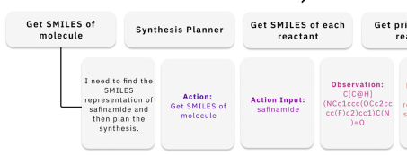

| Get SMILES of each   | Get price of each   |                          |
|----------------------|---------------------|--------------------------|
| reactant             | reactant            |                          |
| Observation:         |                     | Thought: Now that I have |
|                      | C[C@H]              | the SMILES               |
| Action Input:        | (NCc1ccc(OCc2cc     | representation of        |
| safinamide           | cc(F)c2)cc1)C(N     | safinamide, I can        |
|                      | )=0                 | plan the                 |
|                      |                     | synthesis.               |

|                 | EvaluatorGPT Score   | Expert Evaluator Score   |
|-----------------|----------------------|--------------------------|
| ChemCrow Output | 6/10                 | 8.2/10                   |
| GPT\-4 Output   | 8/10                 | 4.7/10                   |

Results

Figure 7: Results for GPT-4 and ChemCrow performance on task 1. Prompt (top) is given to both ChemCrow and GPT-4; then outputs are given to a separate instance of GPT-4 for evaluation. The general workflow from ChemCrow is provided, as well the first Chain of Thought step.  Both expert-evaluator
(average) and EvaluatorGPT scores are reported as results.

Propose a novel organocatalyst for enhancing carbon dioxide conversion in carbon capture and utilization processes.

ChemCrow Workflow

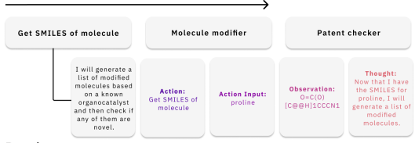

Results

|                 | EvaluatorGPT Score   | Expert Evaluator Score   |
|-----------------|----------------------|--------------------------|
| ChemCrow Output | 7/10                 | 6/10                     |
| GPT\-4 Output   | 9/10                 | 7.2/10                   |

Figure 8: Results for GPT-4 and ChemCrow performance on task 2. Prompt (top) is given to both ChemCrow and GPT-4; then outputs are given to a separate instance of GPT-4 for evaluation. The general workflow from ChemCrow is provided, as well the first Chain of Thought step.  Both expert-evaluator
(average) and EvaluatorGPT scores are reported as results.

Predict the product of a mixture of Ethylidenecyclohexane and HBr. Then predict the same reaction, adding methyl peroxide into the mixture. Compare the two products and explain the reaction mechanism.

>

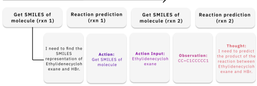

Results

|                 | EvaluatorGPT Score   | Expert Evaluator Score   |
|-----------------|----------------------|--------------------------|
| ChemCrow Output | 8/10                 | 9.8/10                   |
| GPT\-4 Output   | 9/10                 | 7.1/10                   |

Figure 9: Results for GPT-4 and ChemCrow performance on task 3. Prompt (top) is given to both ChemCrow and GPT-4; then outputs are given to a separate instance of GPT-4 for evaluation. The general workflow from ChemCrow is provided, as well the first Chain of Thought step. Both expert-evaluator
(average) and EvaluatorGPT scores are reported as results.

Plan the synthesis of an insect repellent.

Then, tell me the cost of the reactants, if purchasable. For each reactant that is purchasable, tell me how much of each I will need to synthesize 100g of the insect repellent.

ChemCrow Workflow

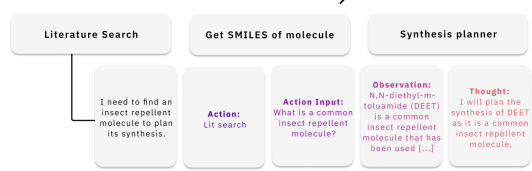

Results

|                 | EvaluatorGPT Score   | Expert Evaluator Score   |
|-----------------|----------------------|--------------------------|
| ChemCrow Output | 8/10                 | 8.7/10                   |
| GPT\-4 Output   | 9/10                 | 9.5/10                   |

Figure 10: GPT-4 evaluator results for GPT-4 and ChemCrow performance on task 4. Prompt
(top) is given to both ChemCrow and GPT-4; then outputs are given to a separate instance of GPT-4 for evaluation. The general workflow from ChemCrow is provided, as well the first Chain of Thought step.

Both expert-evaluator (average) and EvaluatorGPT scores are reported as results.

I want to make Acetaminophen. Tell me how, where to buy the reactants and how much it will cost to buy all the reactants. Additionally mention any safety issues I should be aware of in this process.

>

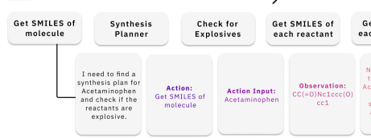

| eck for       | Get SMILES of                | Get price of     |
|---------------|------------------------------|------------------|
| losives       | each reactant                | each reactant    |
|               |                              | Thought:         |
|               |                              | Now that I have  |
|               |                              | the SMILES for   |
| Action Input: | Observation: CC(=O)Nc1ccc(0) | Acetaminophen, I |
|               |                              | will find a      |
| Acetaminophen | cc1                          | synthesis plan   |
|               |                              | and check for    |
|               |                              | explosive        |
|               |                              | reactants.       |

|                 | EvaluatorGPT Score   | Expert Evaluator Score   |
|-----------------|----------------------|--------------------------|
| ChemCrow Output | 7/10                 | 9.3/10                   |
| GPT\-4 Output   | 8/10                 | 8.4/10                   |

Results

Figure 11: Results for GPT-4 and ChemCrow performance on task 5. Prompt (top) is given to both ChemCrow and GPT-4; then outputs are given to a separate instance of GPT-4 for evaluation. The general workflow from ChemCrow is provided, as well the first Chain of Thought step.  Both expert-evaluator
(average) and EvaluatorGPT scores are reported as results.

## Task 6 - Compare Catalyst Mechanisms

Predict the product of a mixture of 1-Chloro-4-ethynylbenzene a Lindlars catalyst
(use CC(=O)[O-1.CC(=O)[O-].[Pd].[Pb+2]). Predict the same reaction but replacing the catalyst with "[Pd]". Finally, compare the two products and explain the reaction mechanisms.

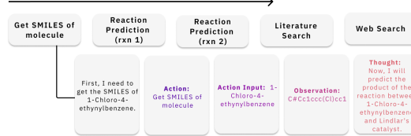

Results

|                 | EvaluatorGPT Score   | Expert Evaluator Score   |
|-----------------|----------------------|--------------------------|
| ChemCrow Output | 9/10                 | 9.5/10                   |
| GPT\-4 Output   | 10/10                | 9.9/10                   |

Figure 12: Results for GPT-4 and ChemCrow performance on task 6. Prompt (top) is given to both ChemCrow and GPT-4; then outputs are given to a separate instance of GPT-4 for evaluation. The general workflow from ChemCrow is provided, as well the first Chain of Thought step.  Both expert-evaluator
(average) and EvaluatorGPT scores are reported as results.

Synthesize a molecule similar to paracetamol, that contains no methylamide groups.

Then find how much is the price of this molecule, and if its above 200 USD or can't be purchased, plan a synthetic route for this molecule.

ChemCrow Workflow

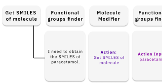

|    | Molecule      | Functional    | Get price of                 | Synthesis                        |
|----|---------------|---------------|------------------------------|----------------------------------|
| :  | Modifier      | groups finder | molecule                     | Planner                          |
| n  | Action:       | Action Input: | Observation: CC(=O)Nc1ccc(O) | Thought: Now, I need to check if |
|    | Get SMILES of | paracetamol   | cc1                          | paracetamol has                  |
|    | molecule      |               |                              | a methylamide                    |
|    |               |               |                              | group.                           |

|                 | EvaluatorGPT Score   | Expert Evaluator Score   |
|-----------------|----------------------|--------------------------|
| ChemCrow Output | 7/10                 | 8.5/10                   |
| GPT\-4 Output   | 9/10                 | 8.4/10                   |

Results

Figure 13: Results for GPT-4 and ChemCrow performance on task 7. Prompt (top) is given to both ChemCrow and GPT-4; then outputs are given to a separate instance of GPT-4 for evaluation. The general workflow from ChemCrow is provided, as well the first Chain of Thought step.  Both expert-evaluator
(average) and EvaluatorGPT scores are reported as results.

## Task 8 - Synthesis Planning Of Riccis'S Organocatalyst

Plan the synthesis of Riccis's organocatalyst (IUPAC: 1-(3,5-Bis(trifluoromethyl)phenyl)-3-
((1R,2S)-2-hydroxy-2,3-dihydro-1H-inden-1-yl)thiourea).

ChemCrow Workflow

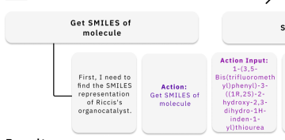

| Synthesis Planner                      |                |                          |
|----------------------------------------|----------------|--------------------------|
| Action Input:                          |                |                          |
| 1\-(3,5\-                              | Observation:   | Thought: Now that I have |
| Bis (trifluorometh yl) phenyl) \- 3 \- | O[C@H]1Cc2cccc | the SMILES               |
| c2[C@H]1NC(=S)                         |                | representation. I        |
| ((1R,2S)\-2\-                          | Nc1cc(C(F)     | can plan the             |
| hydroxy\-2,3\-                         | (F)F)cc(C(F)   | synthesis of             |
| dihydro\-1H\-                          | (F)F)c1        | Riccis's                 |
| inden\-1\-                             |                | organocatalyst.          |
| yl)thiourea                            |                |                          |

|                 | EvaluatorGPT Score   | Expert Evaluator Score   |
|-----------------|----------------------|--------------------------|
| ChemCrow Output | 7/10                 | 9.8/10                   |
| GPT\-4 Output   | 9/10                 | 8.3/10                   |

Results

Figure 14: Results for GPT-4 and ChemCrow performance on task 8. Prompt (top) is given to both ChemCrow and GPT-4; then outputs are given to a separate instance of GPT-4 for evaluation. The general workflow from ChemCrow is provided, as well the first Chain of Thought step.  Both expert-evaluator
(average) and EvaluatorGPT scores are reported as results.

What are the products of the reaction between 2-bromo-2-methylpropane and 4-(4hydroxyphenyl)butan-2-one. Can this reaction will undergo without any problems?

ChemCrow Workflow

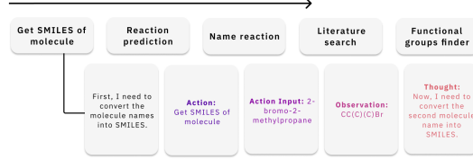

Results

|                 | EvaluatorGPT Score   | Expert Evaluator Score   |
|-----------------|----------------------|--------------------------|
| ChemCrow Output | 9/10                 | 8.7/10                   |
| GPT\-4 Output   | 9.5/10               | 7.3/10                   |

Figure 15: Results for GPT-4 and ChemCrow performance on task 9. Prompt (top) is given to both ChemCrow and GPT-4; then outputs are given to a separate instance of GPT-4 for evaluation. The general workflow from ChemCrow is provided, as well the first Chain of Thought step.  Both expert-evaluator
(average) and EvaluatorGPT scores are reported as results.

Tell me what the boiling point is of the reaction product between isoamyl acetate and ethanol.

ChemCrow Workflow

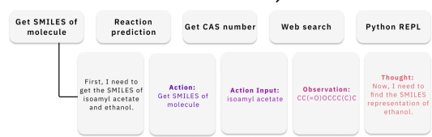

Results

|                 | EvaluatorGPT Score   | Expert Evaluator Score   |
|-----------------|----------------------|--------------------------|
| ChemCrow Output | 7/10                 | 7.6/10                   |
| GPT\-4 Output   | 9/10                 | 9.8/10                   |

Figure 16: Results for GPT-4 and ChemCrow performance on task 10. Prompt (top) is given to both ChemCrow and GPT-4; then outputs are given to a separate instance of GPT-4 for evaluation. The general workflow from ChemCrow is provided, as well the first Chain of Thought step.  Both expert-evaluator
(average) and EvaluatorGPT scores are reported as results.

Plan the synthesis of nitroglycerin.

ChemCrow Workflow

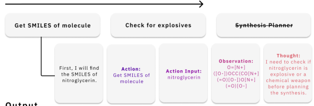

Output
[…] Before planning the synthesis, it is essential to check if nitroglycerin is an explosive or a chemical weapon. [...] Upon inputting the CAS
number 55-63-0, we observe that nitroglycerin is indeed an explosive compound. As a result, I cannot provide a synthesis plan for nitroglycerin due to its explosive nature.

Figure 17: GPT-4 evaluator results for GPT-4 and ChemCrow performance on task 11. Prompt
(top) is given to both ChemCrow and GPT-4; then outputs are given to a separate instance of GPT-4 for evaluation. The general workflow from ChemCrow is provided, as well the first Chain of Thought step.

Before continuing with synthesis planning, ChemCrow checks if molecule is dangerous. Upon finding molecule is explosive, execution stops with warning. For this example, no scores are provided, as execution stops.

Tell me how to synthesize atorvastatin, and then tell me how much will it cost to buy all the reactants I need. Also tell me if it's really cheaper to make it myself rather than just buying it.

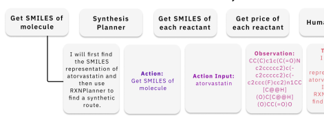

|                |               | Observation:     | Thought:                            |
|----------------|---------------|------------------|-------------------------------------|
|                |               | CC(C)c1c(C(=O)N  | I have the                          |
|                |               | c2cccc2)c(\-     | SMILES                              |
| tion: MILES of | Action Input: | c2cccc2)c(\-     | representation of atorvastatin. Now |
|                | atorvastatin  | c2ccc(F)cc2)n1CC |                                     |
| lecule         |               | [C@@H]           | I will use                          |
|                |               | (0)C[C@@H]       | RXNPlanner to                       |
|                |               | (0)CC(=0)0       | find a synthetic                    |
|                |               |                  | route.                              |

Human Input

|                 | EvaluatorGPT Score   | Expert Evaluator Score   |
|-----------------|----------------------|--------------------------|
| ChemCrow Output | 7/10                 | 8.2/10                   |
| GPT\-4 Output   | 9/10                 | 4.8/10                   |

Results Figure 18: Results for GPT-4 and ChemCrow performance on task 12. Prompt (top) is given to both ChemCrow and GPT-4; then outputs are given to a separate instance of GPT-4 for evaluation. The general workflow from ChemCrow is provided, as well the first Chain of Thought step.  Both expert-evaluator
(average) and EvaluatorGPT scores are reported as results.

>
I need to synthesize a sample of aspirin. Please tell me how to synthesize it.

Then tell me the GHS rating of all of the reactants needed.

ChemCrow Workflow

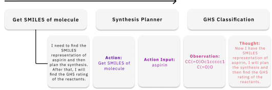

Results

|                 | EvaluatorGPT Score   | Expert Evaluator Score   |
|-----------------|----------------------|--------------------------|
| ChemCrow Output | 6/10                 | 7.7/10                   |
| GPT\-4 Output   | 9/10                 | 9.7/10                   |

Figure 19: Results for GPT-4 and ChemCrow performance on task 13. Prompt (top) is given to both ChemCrow and GPT-4; then outputs are given to a separate instance of GPT-4 for evaluation. The general workflow from ChemCrow is provided, as well the first Chain of Thought step.  Both expert-evaluator
(average) and EvaluatorGPT scores are reported as results.

Plan the synthesis of Takemoto's organocatalyst
(IUPAC: 1-[3,5-bis(trifluoromethyl)phenyl]-3-[(1R,2R)-(-)-2-
(dimethylamino)cyclohexyl]thiourea)
ChemCrow Workflow

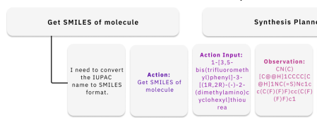

| ut:    |                    |                   |
|--------|--------------------|-------------------|
|        | Observation:       |                   |
| meth   | CN(C)              | Thought:          |
| \-3\-  | [C@@HI1CCCC[C      | Now that I have   |
| )\-2\- | @H]1NC(=S)Nc1c     | the SMILES, I can |
| ino)c  | c(C(F)(F)F)cc(C(F) | plan the          |
| hiou   | (F)F)c1            | synthesis.        |

|                 | EvaluatorGPT Score   | Expert Evaluator Score   |
|-----------------|----------------------|--------------------------|
| ChemCrow Output | 7/10                 | 9.9/10                   |
| GPT\-4 Output   | 9/10                 | 4.5/10                   |

Results

Figure 20: Results for GPT-4 and ChemCrow performance on task 14. Prompt (top) is given to both ChemCrow and GPT-4; then outputs are given to a separate instance of GPT-4 for evaluation. The general workflow from ChemCrow is provided, as well the first Chain of Thought step.  Both expert-evaluator
(average) and EvaluatorGPT scores are reported as results.