# Generative Disco: Text-To-Video Generation For Music Visualization

Vivian Liu vivian@cs.columbia.edu Columbia University New York, New York, USA
Nathan Raw nate@huggingface.co Hugging Face New York, New York, USA
Tao Long long@cs.columbia.edu Columbia University New York, New York, USA
Lydia Chilton chilton@cs.columbia.edu Columbia University New York, New York, USA
3 2 0 2

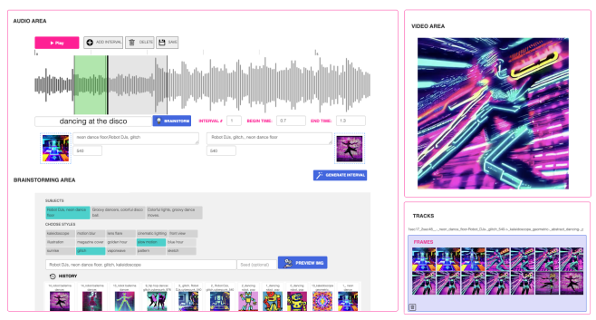

 
 
:
v arXi Figure 1: An overview of Generative Disco, a generative AI system that facilitates text-to-video generation for music visualization using a large language model and a text-to-image model. From a music clip (depicted as a waveform), the system guides users to generate prompts that connect sound, language, and images. A pair of start and end prompts can parameterize the generation of video clips. Here a participant is brainstorming prompts and exploring generations for their high-level goal of showing *"dancing at the disco"* **within an interval.**

## Abstract

Visuals are a core part of our experience of music, owing to the way they can amplify the emotions and messages conveyed through the

```
Permission to make digital or hard copies of all or part of this work for personal or
classroom use is granted without fee provided that copies are not made or distributed
for profit or commercial advantage and that copies bear this notice and the full citation
on the first page. Copyrights for components of this work owned by others than ACM
must be honored. Abstracting with credit is permitted. To copy otherwise, or republish,
to post on servers or to redistribute to lists, requires prior specific permission and/or a
fee. Request permissions from permissions@acm.org.
Woodstock '18, June 03–05, 2018, Woodstock, NY
© 2018 Association for Computing Machinery.
ACM ISBN 978-1-4503-XXXX-X/18/06. . . $15.00
https://doi.org/10.1145/1122445.1122456

```

music. However, creating music visualization is a complex, timeconsuming, and resource-intensive process. We introduce Generative Disco, a generative AI system that helps generate music visualizations with large language models and text-to-image models. Users select intervals of music to visualize and then parameterize that visualization by defining start and end prompts. These prompts are warped between and generated according to the beat of the music for audioreactive video. We introduce design patterns for improving generated videos: *transitions*, which express shifts in color, time, subject, or style, and *holds*, which encourage visual emphasis and consistency. A study with professionals showed that the system was enjoyable, easy to explore, and highly expressive.

1 7 Apr 
[
c s
.

H
C
]
2 3 04
.

0 8 5 5 1 v 1 We conclude on use cases of Generative Disco for professionals and how AI-generated content is changing the landscape of creative work.

## Ccs Concepts

- Applied computing → Media arts; **Computer-aided design**; - Human-centered computing→**Interactive systems and tools**; - **Computing methodologies** → Natural language processing; Computer vision tasks.

## Keywords

music visualization, generative AI, text-to-video, text-to-image, video, audio, music videos, multimodal, GPT, large language models ACM Reference Format: Vivian Liu, Tao Long, Nathan Raw, and Lydia Chilton. 2018. Generative Disco: Text-to-Video Generation for Music Visualization. In *Woodstock '18:* ACM Symposium on Neural Gaze Detection, June 03–05, 2018, Woodstock, NY . ACM, New York, NY, USA, 20 pages. https://doi.org/10.1145/1122445.1122456

## 1 Introduction

Visuals are a core part of our experience of music, owing to the way they can amplify the emotions and messages conveyed through the music. Within the music industry, it is standard for music to be released alongside music videos, lyric videos, and visualizers. Concerts and music festivals also focus on music visualization through stage displays and visual jockeying, the real-time manipulation and selection of visuals to accompany music. Music visualization has taken form in every space music can be performed, from venues [27, 64] to computer screens [1, 26]. Visuals make music more immersive and as such, some forms of music visualization (i.e. music videos) can be as beloved of a cultural production as the music itself.

Music visualization is complex to create because the process of assembling and synchronizing visuals to music is time and resourceintensive. For example, footage for music videos has to be recorded, gathered, cut, and aligned. Every moment of the music video creation and editing process is full of artistic choices in color, angles, transitions, subjects, and symbols. Making these artistic choices synchronize with the densely layered elements of music is difficult. Video editors have to figure out how to make moving images meet at choice tangents with lyrics, melodies, and beats.

Video creation requires users to search for a lot of footage, but generative AI models have the capacity to provide large quantities of aesthetic content. We introduce two design patterns that can help structure the generative process for videos and build coherent visual narratives within AI-generated videos. The first design pattern, a transition, helps represent change throughout a generated shot. The second design pattern, *a hold*, helps encourage visual emphasis and consistency throughout a generated shot. Users can utilize these two design patterns to mitigate motion artifacts and improve the watch quality of AI-generated videos.

We present Generative Disco, an interactive text-to-video system for music visualization. It is one of the first to explore humancomputer interaction problems surrounding text-to-video systems and assist music visualization through a generative AI approach.

Our workflow allows users to assemble short clips of music visualization where intervals are the basic unit of creation. Users first select an interval of the music to create a visualization for. They then parameterize the visualization for that interval by crafting start and end prompts. To help users explore different ways an interval could start and end, the system provides a brainstorming area to help users find prompts with suggestions sourced from a large language model (GPT-4) and video editing domain knowledge. Both GPT-4's visual understanding and the other source of domain knowledge are brainstorming features of the system that help users triangulate between lyrics, visuals, and music. Once users have chosen a pair of generations to be the starting and ending images of an interval, an image sequence is created by warping between these two images to the frequency of the interval's music.

To evaluate the workflow of Generative Disco, we conducted a user study (n=12) with twelve video and music professionals. Our user study showed that participants found the system intuitive to use, enjoyable, easy to explore, and highly expressive. Video professionals were able to create visuals they found useful and aesthetic while closely engaging with many facets of the music.1 Our contributions are as follows:
- Framework for generating video based on intervals as the unit of creation. Within intervals, generated video can express meaning through *transitions* in color, subject, style, and time and *holds* that encourage visual emphasis
- Strategy for multimodal brainstorming and prompt ideation combining GPT-4 with domain knowledge to help users connect lyrics, sounds, and visual goals within prompts
- Generative Disco, a generative AI system that facilitates textto-video generation for music visualization using a pipeline of a large language model and text-to-image model
- A study showing how professionals could leverage Generative Disco to focus on expression over execution In our discussion, we elaborate use cases for our text-to-video approach that generalize beyond music visualization and discuss how generative AI is already changing the landscape of creative work.

## 2 Related Work 2.1 Music Visualization

A core concept of music visualization is that it is about finding visual analogues for elements in the structure of music [23, 29, 65]. When brought into digital environments, music is often rendered as an input in the form of audio signals, waveforms, MIDI, lyrics, and notes. In these formats, music can be computationally analyzed for features such as musical structure, timbre, pitch, mood, melody, harmony, dynamics (duration and volume), rhythm, and tempo. In prior work, these musical features have been synesthetically combined with visual elements such as color [21, 44, 51], shapes, line graphs, score notation, instrument visualization [33], glyphs [14, 44], and particles [45]. For example, visual analogues for rhythms and beats were explored through methods that temporally arranged

1A video demonstrating Generative Disco and how it was applied in the user study can be found here: https://youtu.be/q22I53jHbuU
the visible motion within a video to music, creating a sense of dance [23].

Various systems have also explored multimodal problems around music and image [29, 33, 43]. Hyperscore generated music by providing a suite of musical algorithms that could convert sketches into MIDI compositions where harmonic progressions were defined through choices of colors and curves. Tunepads [33] created computational notebooks that animated band instruments based on when their respective sounds were triggered. Lehtiniemi et. al. used lyrics to find animated mood pictures for music recommendation. Rubin and Agrawala explored how emotionally relevant segments of music can be added to audio stories to enhance storytelling [57–59].

Emotions are closely intertwined with music, because music has an abstract nature that can evoke feelings. In the development of a generative AI system for music called Cococo [49], Louie et. al. found that end users like to engage with music at a high-level in terms of emotions and musical conventions (how typical or surprising music is). Generative Disco builds on this work by analyzing music in terms of its percussive elements, dynamics (volume), and tempo and then generating videos that align to these features. However, it also visualizes at the lyric level by allowing prompts to generate imagery based on song lyrics and other higher level goals.

## 2.2 Video Creation And Editing

Because video creation and editing are time-consuming activities that have steep learning curves, there is a large body of research work behind how it can be supported and made easier. Many methods that have previously been proposed for text-based generation of videos relied on structured content and templates. Examples of such structured data include markdown, web pages, recipes, and knowledge graphs [16, 17, 39, 67]. Text is often very inherent and central in the video creation process, manifesting in the form of scripts, outlines, and dialogue [37, 38, 42, 76]. CrossPower is one notable example of a system that uses the linguistic structures within language to layout graphic content for animations, presentations, and videos. StreamSketch explored multimodal interactions beyond text for livestreams by spatially and temporally anchoring sketch and text layers over live video. Motif [41] elaborated expert patterns for travel video stories that could assist with mobile video content creation. Video content creation has also been explored from the angles of crowdsourcing [13, 68], livestreaming [50], tutorial generation [18, 36], live production [60], and text-based exploration [52, 53].

Systems have also investigated how to support video creation in an *audio-first* manner [77]. A system called Soloist [71] created mixed-initiative tutorials by audio processing instructional guitar videos. Many approaches use speech recognition and annotation to convert speech and audio into text transcripts that can be further acted upon [30]. Democut [19] and Quickcut [66] were systems that assembled video using spoken annotations and narration. Audio Studio demonstrated how a video creation workflow could be decomposed into microtasks and how crowdworkers could collaboratively composite micro-audio recordings into technical talks [68]. Suris et al. proposed methods for recommending music tracks for videos based on audiovisual features and artistic correspondences [63].

Systems specifically tailored to music videos [12, 28] have also been proposed. For example, DJ-MVP proposed a fully automatic system that generated music videos by producing audio-video mashups using a video corpus and data-moshing video effects [28]. A lyrics-based system, TextAlive, automatically generated kinetic typography videos based on lyrics [40]. Consumer-oriented software products such as CapCut [3] give users templates and trending sounds to work off of, producing short-form videos that are generally under a minute long. Many of these approaches are capable of organizing and constructing video to music but do not focus on expressing the music in terms of its different layers of meaning and aesthetics. Generative Disco builds on the prior work in the video space by enabling faster and easier video content creation and music visualization through an interactive, generative AI approach—a previously unexplored angle. Furthermore, in contrast to prior approaches based on structured language and templated generation, the system works off of prompts, which are open-ended and less structured.

## 2.3 Generative Ai In Creative Workflows

Machine learning advances in modeling multimodal knowledge within embeddings have led to meteoric improvements in image synthesis from text. Early work at the intersection of text-to-image and human-computer interaction investigated how stylistic elements within literature could be represented as abstract, patterned images [62]. Current text-to-image tools are capable of taking in text prompts and optimizing images to capture a near infinite number of subjects and styles that can be described in natural language. Prompting, while simple conceptually, can be difficult in practice as prompts will always underspecify the image. Thus, users may end up conducting an exhaustive trial and error search for the ideal prompt and generation. Annotation studies [46, 55] and guidelines disseminated online have improved public understanding of how to elicit the best aesthetic qualities within images and create prompts of rich visual language. For example, within Reprompt [73], Wang et. al. explored how to edit prompts of generated images to make the images more emotionally salient. Prompting has developed as an emerging form of interaction, and tools such as Stable Diffusion [4], Midjourney [5], and DALL-E [24] have become widespread.

Systems which apply text-to-image generations to problems that creative professionals face have also been introduced. In Opal, a creative workflow concatenating a large language model and a multimodal generative AI is applied to news illustration [47]. The system demonstrated that structured exploration can lead to users encountering significantly more usable design solutions. In 3DALL-E, a workflow embedded within a CAD software assisted users in the conceptualization of 3D designs. Users could pass in renders of their work-in-progress to a generative model, allowing the system to autocomplete their work for 3D design inspiration [48]. Generative Disco is similar to both systems in that it uses a LLM to brainstorm and a text-to-image model to generate. LLMs have also been leveraged for creative assistance in story ideation and conceptual blending to create visual metaphors, journalism angles, and creative science communication [7, 20, 32, 72].

Many machine learning approaches for text-to-video generation have been suggested [35, 61, 69, 74, 75], and many text-based video AI tools and products now exist [6, 9–11, 25]. Open-source repositories have often built off of text-to-image models to convert their generations into videos [22, 25, 56]. All of these generative methods, however, have different paradigms of interaction and prompting support. They can differ in how many prompts parameterize the video generation: one prompt [10], a pair of prompts [61], or sequences of prompts (variable length video generation) [25, 56, 69]. They can also differ in how much control they give users over the way their prompts align to music. Stable Diffusion Videos takes in sequences of prompts but does not help a user define exact points at which prompts meet the music, while other tools do [9, 69]. Some tools provide prompting support by offering themes[6], keyword suggestions [10], and prompt templates [10], while others leave the user to trial and error. For example, Deforum [25] grants users full autonomy over the motion parameters that impact the final video perspective, while other tools do not give users 3D qualities to control.

A design space is emerging for generative systems that intertwine language, sound, and visuals. Generative Disco further opens this space and is the first to research human-computer interaction questions around a generative AI approach for music visualization.

## 3 Formative Study

To better understand the existing design patterns and conventions behind music visualization, we conducted an analysis of popular music videos. There are many kinds of music videos; there are narrative music videos, which introduce characters and visualize explicit storylines, but there are also performance videos, which show artists performing their music with vocal or dance performance [54]. We focus on narrative videos, because generative technology is best suited for artistic visuals rather than as a substitute for an artist's performance.

We collected a set of narrative music videos with over a million views, all of which had been released within the last five years and had been produced for a diverse range of musical genres and audiences. Through a thematic analysis of these videos, we elaborated codes that captured visual and audio changes that were specific to each domain, which can be found in Table 1) and Table 2). From these codes, we conducted a mapping exercise to find instances where the audio and visual cues tended to align, in the same vein as in [60]. From this exercise, we generated a preliminary set of audiovisual alignments.

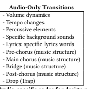

Table 1: Audio-specific codes for design patterns

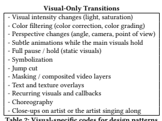

Table 2: Visual-specific codes for design patterns
To make this preliminary set of audiovisual alignments more concrete and to validate which could serve as design goals for our text-to-video system, we gathered 18 animated music videos with over 1 million views for a second round of analysis. We focused on analyzing animated narrative videos, which would be most relevant to what a generative text-to-video system could produce, since they are not at the level of sustained photorealism. We then coded the videos using our preliminary set of audiovisual alignments, finding the following patterns to be most prevalent. (1) **Visual representation of lyrics.** Ten out of the 18 animated videos included visuals that either directly depict or indirectly symbolize the lyrics. A literal example of this would be when a lyric goes *"You're a firework"*, and fireworks explode on screen at the same time. An example in Table 3 shows when the lyrics are less literal but still clearly illustrated. The lyric goes, "I hallucinate when you call my name", which is accompanied by a kaleidoscoping animation of skulls and clowns that grow closer to the viewer, evoking the *"hallucinate"* part of the lyric. When the lyrics and visuals align, the imagery within the music can be illustrated and the emotions can be amplified.

(2) **Cutting around a beat or to surround a lyric** All of the 18 animated music videos include jump cuts, which are cuts where the visuals would be fully replaced with new shots upon changes within the music. An example shown in Table 3 shows an animated sequence where close-ups of a face and fight scenes rapidly alternate on changes of the beat. The clear mapping between the beats and visuals helps a listener more actively engage with the structures latent in the music.

(3) **Concurrent visual and audio changes.** Seventeen out of 18 animated music videos include a significant visual change when there were drumbeats or tempo shifts. This visual change is noticeable but not as drastic as a jump cut. Instead, more subtle transitions such as color filtering, angle changes, and texture overlays are used. For example, in "One More Time" by Daft Punk, the scene color changes from green, to yellow, to red on each drumbeat (see Table 3). These visual changes are most often quick visual transitions that help the storytelling along and establish an atmosphere.

(4) **Visual consistency.** Fifteen out of 18 animated videos included recurring shots or visuals that would reappear like visual refrains within the music. This kind of audiovisual alignment served as a visual callback to show repetition within the music

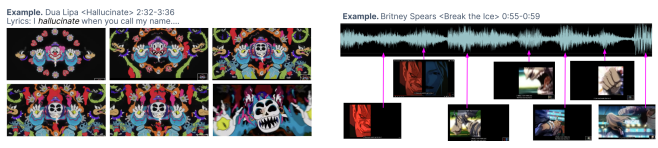

Table 3: Examples of the Audio-Visual Alignment Patterns in Animated Videos

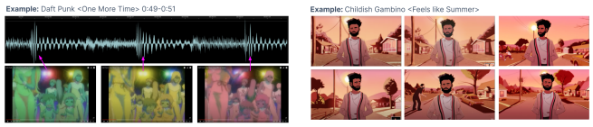

(i.e. when lyrics were repeated at choruses). In Table 3, during

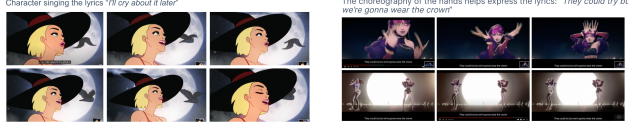 every instance where the main character sings "I feel like summer", the same visuals of the artist (animated) walking down the street take the stage for around 1.5 seconds. The subtle yet recurring visuals help establish a consistent visual narrative. As in \#1, this audiovisual alignment helps listeners better understand the underlying structure of the music.

(5) **Singing along.** 10 out of the 18 animated videos include the main character singing along with the music.

(6) **Choreography expressing the music.** 6 out of the 18 animated videos included choreography to go with music. The physical realization of a song's emotions and lyrical content on another person is an embodied form of audiovisual alignment.

From this formative analysis of audiovisual alignments, we synthesized design goals for our text-to-video system. These design goals pertain mostly to patterns \#1 through \#4 (as \#5 and \#6 singing along and choreography can be achieved best in real performance music videos). Our system should closely connect the audio component and the visual component together in the following ways:
(1) Provide audio analysis to reflect dynamics within an envelope of audio. Users need awareness of where visual changes can align with music changes (i.e. beat drops, changes in volume, tempo shifts, etc.)
(2) **Achieve a diversity of visual possibilities in terms of color,**
perspective, aesthetics, and mood. Users should have the ability to explore an expansive range of visuals, as music can be abstractly and figuratively interpreted in any number of ways.

(3) **Allow shots and cutting styles to reflect the structure of**
music. Users need to have the ability to make cuts, transitions, and holds to build a visual narrative.

(4) **Support prompt ideation that is relevant to music.** Users should be provided methods that can connect lyrics and instrumental elements to specific prompts that are not only visual but relevant to the music.

## 4 Designing With Generative Disco

With these design goals in mind, we designed a system for music visualization targeted at professionals. While visuals could be generated for music of any length, we focus on generating for short segments of music under one minute long, because the waveform encourages a user to closely engage with the music at the scale of seconds and milliseconds.

## 4.1 The Generative Disco Interface

In the following section, we walk through how Generative Disco generates music videos in an incremental, interval-by-interval approach. The user begins with the system in an empty state with their audio file preloaded as the waveform (Fig. 2-1). The most salient feature of the interface is the Audio Area. The audio that the user has chosen to work on is rendered in a waveform. To create an interval, users can directly manipulate the waveform by dragging over a starting time and releasing over an ending time. When a user clicks on any interval, the music for that interval alone plays. Intervals can additionally be added, deleted, and saved using buttons above the waveform (Fig. 2-2). Because direct manipulation over a waveform is difficult for precise ranges, and because audio intervals have to be contiguous for the final music video to preserve the original audio, there are two editable fields for BEGIN TIME and END TIME which allow users to see and control the beginning and end timestamps through text entry. Their units are in seconds.

To arrive at a video from an interval, users have to define the START and END image–images to interpolate to and from. These can be chosen through an exploration of text-to-image generations based on prompts. Users can arrive at these images by trial and error with the PROMPT BOX (Fig. 2-7) or by using the BRAINSTORM-
ING AREA (Fig. 2-4). To use the BRAINSTORMING functions of the system, users can begin by describing high-level goals for their interval in the DESCRIBE INTERVAL text box (Fig. 2-3). The area allows users to conceptualize at a high level what they want for their interval before they start exploring prompts and think about what they want to represent. Note that this description can relate to a musical goal (typing a lyric or describing a sound) or a visual one (describing what they want to achieve in terms of images). After describing their interval, the user can click on the BRAINSTORM button to retrieve specific and general suggestions for prompts relevant to their interval description. This triggers the following request to GPT-4: *"In less than 5 words, describe an image for the* following words {INTERVAL DESCRIPTION}." GPT-4 responds with three completions that are returned as specific SUBJECT suggestions (Fig. 2-5). STYLE suggestions (Fig. 2-6) are also retrieved by randomly sampling a list of 100 style words. These words were curated based upon prior work that analyzed composition keywords and style exploration recommendations for AI-generated art prompts [47]. These keywords were also informed by our formative study, and as such we included different words relevant to videography.

By clicking on pills that populated the BRAINSTORMING AREA,
the contents of the pill are automatically copied and pasted into the prompt text box in a comma-delimited format. There is an optional SEED text box in case they had a seed in mind. When left empty, the system automatically generates from three different seeds which correspond to different random initializations.

After finding a prompt, a user can hit the 'PREVIEW IMG' button
(Fig. 2-13), which allows the user to see generations that could represent frames. These text-to-image generations populate in the HISTORY (Fig. 2-8). If the user is unsatisfied with the prompt, they can change the seed and get a new generation or generate with a new prompt entirely. There is a VARIATION BUTTON that allows users to retrieve variations of their image (Fig. 2-14). This is achieved by keeping the seed constant but shuffling around comma-delimited phrases within the prompts. For example, generating the prompt "Robot DJs, neon dance floor, glitch" with a seed of 64 would shuffle the prompt phrases for three other prompt variations, such as ("neon dance floor, glitch, Robot DJs", "glitch, neon dance floor, Robot DJs", "glitch, Robot DJs, neon dance floor"), all with seed 64.

If a user wanted to use a generation as the start or end of an interval, they would drag and drop to the relevant part of the form (left dashed box for interval start, right dashed box for interval end), which would automatically copy and paste the prompt and seed to these fields (Fig. 2-10, Fig. 2-11). After setting the beginning and end prompts, the user can hit 'GENERATE INTERVAL' (Fig. 2-12) and interpolate between the two prompts. Interpolation is controlled by a number of factors: the intensity and percussive elements of the music, the duration of the interval of music, and the frames per second (fps). These parameters set the number of interpolation steps between the START and END images. During generation sequences, a loading image appears. Within the hardware parameters of our system, the generation of 3 images for every text prompt took approximately 10 seconds; while the generation of a 1-second interval took approximately 1 minute. After the generation is complete, the video interval appears in the Track Area (Fig. 2-15) as both a video and a frame-by-frame view. Intervals can be stitched together using the 'STITCH VIDEO' button (Fig. 2-16), which places the video at the top right of the interface in the VIDEO AREA (Fig. 2-9).

## 4.2 System Implementation

The system was built on top of two open-source repositories: a) stable-diffusion-videos [56] from Hugging Face and b) wavesurfer.js [2]. We leverage the existing capability within Stable Diffusion Videos to create audioreactive videos. From an input music piece, the harmonic elements are filtered out and the percussive elements are retained. The audio is normalized and the cumulative sum of the music piece's "energy" (amplitude after normalization) is used to inform the interpolation between two images. Energy is represented as an array that starts at 0 and ends at 1; it is resized (stretched or shortened) based on the number of frames that are to be reproduced. This array determines the mix of the start and end images at each

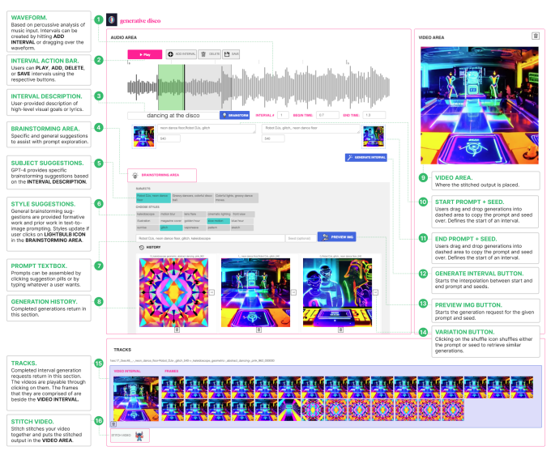

Figure 2: Generative Disco system design. Generative Disco Users begin by interacting with the waveform to create intervals within the music (\#1). To find prompts that will define the start and end of intervals, users can brainstorm prompts using prompt suggestions from GPT-4 or videography domain knowledge (\#4-6) and explore text-to-image generations (\#7,\#8). Results users like can be dragged and dropped into the start and end areas (\#10,\#11), after which an interval can be generated. Generated intervals populate in the tracks area (\#15) and can be stitched into a video that renders in the Video Area (\#9).

frame. Frames were collected together at a frame rate of 24 fps. The Stable Diffusion checkpoint used was V1-4. The web application was written in Python, Javascript, and Flask. Images were generated with 50 iterations on an NVIDIA V100.

## 5 Evaluation

To evaluate Generative Disco as a system for music video creation, we conducted a user study that focused on the following research questions:
- RQ1. To what extent can Generative Disco help professionals produce music visualizations that satisfy their interpretation of the music?

- RQ2. In what ways can users engage with a generative AI
workflow for video based on music?

- RQ3. To what extent can transitions and holds help users achieve desired visuals for the music?

## 5.1 Experimental Design

Our evaluation was conducted through a qualitative study with 12 video professionals and music experts. Our participants were recruited on a platform for freelancers where we reached out to creatives in the video editing profession and from a local organization for computer music. Participants were paid $40 per hour for their time, and the study was conducted for 2 hours. Twelve people

Table 4: Table of participant details including demographics, level of video experience, exposure to generative AI, and genre of music for task.

| ID   | Discipline                              | Video Freq        | Yrs Exp Video   | AI\-Art Freq      | Genre                  |
|------|-----------------------------------------|-------------------|-----------------|-------------------|------------------------|
| P1   | Video professional, lyric videos        | Daily             | 7               | Never             | Metalcore              |
| P2   | Video professional, VJ                  | Daily             | 14              | Never             | Original Composition   |
| P3   | Video editing professional              | Daily             | 3               | Few times / week  | Pop                    |
| P4   | Video professional, live production, VJ | Few times / week  | 15              | Few times / week  | Funk Rock              |
| P5   | Video and sound designer at agency      | Daily             | 5               | Never             | Alternative Indie      |
| P6   | Music Expert                            | Few times /year   | 4               | Few times /year   | Acoustic               |
| P7   | Music Expert, Classical + Digital       | Few times /month  | 0               | Never             | Hard Rock / Remix      |
| P8   | Music Expert, Acoustics + Production    | Few times / week  | 8               | Few times / month | Original               |
| P9   | Music Expert, Video Expert              | Few times /yr     | 10              | Few times /month  | Dance / Electronic     |
| P10  | Music Video Professional                | Few times / month | 10              | Few times / week  | Locked Groove          |
| P11  | Video Professional, music videos        | Daily             | 6               | Few times /week   | Afrobeats / Pop        |
| P12  | Music Professional                      | Few times /yr     | 2               | Never             | Original Vocals / Rock |

(6 male, 4 female, 2 non-binary) participated. The experimental IRB protocol was approved by the institution.

Participants were first interviewed about their creative expertise and about their traditional workflows for video editing. They were also asked about their level of exposure to generative AI. After a brief interview about their professional experience, an experimenter explained concepts behind Generative Disco through a slide deck that gave them a primer about text-to-image generation, prompting, and seeds (the concept of random initializations). Participants were also introduced to the design patterns of transitions and holds and how it could be used to improve the quality of their AI-generated video. Afterwards, the experimenter gave a demo of the user interface by showing them how to brainstorm prompts, preview frames, and choose frames to generate an interval. Participants were then given a song ("Empire State of Mind" by Alicia Keys) and allowed to warm up with the interface by generating two to three intervals. This helped them set their expectations with the system and try out the design patterns of transitions and holds.

Prior to the experiment, participants selected ten seconds of a song. Over the course of one hour, participants were able to generate freely for their chosen song. After completing the experimental task, participants filled out a post-study questionnaire and were asked questions about their experience. The backgrounds of the participants as well as their chosen songs are described in Table 4.

## 5.2 Results

Generative Disco generated music videos for twelve different music pieces, which are listed in Table 4. A frame-by-frame depiction of example music videos from the study can be seen in Figure 4. The compressed version of these music videos showing only the start and end images that parameterized each interval can be found in Figure 5.

## 5.3 Quantitative Feedback On Generative Disco

5.3.1 Creativity Support Index Metrics. Generative Disco performed well in terms of Creativity Support Index (CSI) [15] metrics. Responses to all questions were on a 7-point Likert scale and are visualized in the middle subplot within Figure 3. All twelve participants rated the system a 6 or 7 (Enjoyment median:7) for enjoyment. Ten of 12 participants gave positive feedback (positive defined as ≥ 5 out of 7) that the results were worth their effort (Effort-Reward median: 6.5). Eight of twelve participants agreed that they could sufficiently explore a number of outcomes without tedious interaction (Exploration median: 6). Expressiveness was similarly generally positive (median: 5.5).

There was a slight split in opinion on control *("How much do* you agree or disagree: I had control over the intervals and the video I was generating", median: 5)–three participants gave it the lowest score of 1, while the remaining nine rated it 5 or higher. Finding the system difficult to control is a problem that characterizes many generative workflows. There was likewise a similar divergence in opinion for ability *("How much do you agree or disagree: I generated* videos I would have otherwise not been able to create."). While three participants gave it a 1 or 2, the other nine participants rated it highly in agreement (Ability median: 7).

"I could play around with this forever." -P1 "I think it's really easy to use, even if [it's] for someone who doesn't make [videos] professionally or in their free time do videos. I think someone can really explore it with no worries and enjoy it." -P5 5.3.2 NASA-TLX Metrics. NASA-TLX [34] are visualized in the bottom subplot within Figure 3. The vast majority of participants found the performance of the system to be very positive (Performance median: 6). The vast majority also did not find the system to be frustrating, temporally demanding, mental demanding, or effortintensive (Temporal demand median: 2, Mental demand median: 2, Effort median: 3). Almost every participant (11/12) responded that their frustration during the task was low (low defined as ≤ 3 out of 7, Frustration median: 2). 5.3.3 Workflow-Specific Questions. Lastly, we discuss workflowspecific questions about the prompting pipeline of Generative Disco. Participants were asked about the usefulness of Generative Disco to their usual workflow. Responses to workflow-specific survey

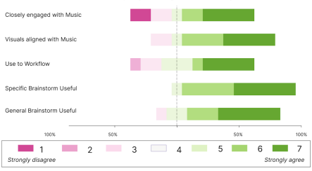

Workflow-Specific Questions How much do you agree or disagree with the following statement?

Creativity Support Metrics Across Music Visualization Task How much do you agree or disagree with the following statement?

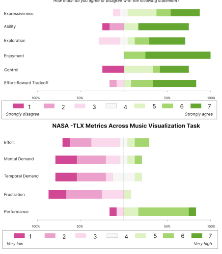

Figure 3: Distribution of Likert scale responses on NASA-TLX, creativity support index, and workflow-specific questions across all participants for the music visualization task. Full questions are in the Supplemental Material.

questions are visualized in the bottom subplot within Figure 3. The majority (7 of 12) rated the system positively in terms of how closely it allowed them to engage with the music (Audio median: 5). Nine of twelve rated the system positively for audiovisual alignment ("How much do you agree or disagree: the system helped me come up with visuals that aligned with the music.", Audiovisual alignment median: 5). Eleven of twelve participants were positive about the helpfulness of the specific brainstorming area, which was where GPT-4 contributed prompt suggestions (Specific brainstorming median: 5.5). Nine of twelve participants were positive that the general brainstorming was helpful, which was when sets of style keywords populated the brainstorming area (General brainstorming median:
5.5). When asked if Generative Disco would be a useful addition to their current video / music workflow, six of the participants responded with a 5 or 6 for agreement (workflow usefulness median: 4.5). We hypothesize that lower and neutral responses could have been because the question was comparing an altogether new workflow with the suite of tools professionals were using. We elaborate on workflow usefulness in more detail in a later section on Qualitative Feedback (Section 6).

These results quantify our answer for **RQ1 ("To what extent**
can Generative Disco help professionals produce music visualizations that satisfy their interpretation of the music?") Generally speaking, there was highly positive feedback on both NASA-TLX and creativity support metrics, and we report high median ratings on dimensions such as audiovisual alignment, enjoyment, expressiveness, and system performance. We conclude that Generative Disco could to a great degree help professionals produce music visualizations that suit their interpretation of the music.

## 6 Qualitative Feedback 6.1 Multimodal Interactions With Music

To answer **RQ2 ("In what ways would users engage with a** generative AI workflow for video based on music?"), we found that each participant engaged with their choice of music uniquely, creating intervals that could capture beats, lyrics, vocal / instrument notes, and structural changes within the music (i.e. drops). Prompts were easily created for both intervals that surrounded lyrics and intervals where there were no linguistic anchors (i.e. instrumental or beats).

Participants brought in a diverse range of musical genres. P9 brought in a locked groove, a type of electronic techno phrase that is built upon a repeating drum bass line. They chunked their audio in segments that alternated between 'perc' (percussive) elements of their groove and segments that were empty of them. Their first interval started with a *"Underground rave, dim lights, lock, desaturated"* and ended with "lock, desaturated, dim lights, people dancing, Underground rave", depicting an empty room in grayscale that pulsated with silhouettes on the beat. Their following intervals transitioned into an explosion of color, through prompts such as *"lock, color* lights, Underground rave, people dancing", and "color lights, lock, people dancing, Underground rave". P9 set all their intervals to seamlessly transition into one another by having the end of one interval lead into the beginning of the next, never using any jump cuts in their video. Their first three intervals also all shared the same seed and general composition; they explicitly applied the design pattern of a hold to encourage consistency in their intervals. Their first intervals reverberated between grayscale and vibrant color. They had the intention of literally connecting the repetition of percussive elements with repetitions of color. A frame-by-frame view of their generated image is depicted in Figure 4.

"A lot of variation, especially with AI-generated music videos can make people feel crazy. Part of me is trying to keep similar to the philosophy of what a locked groove is, making small variations between the broader theme, from black and white to color. Maybe after four seconds, we should go from colored disco to something else... Trying to create some visuals around what someone in a dance euphoria would see." -P10
"So there's the part where there's a slide with the bass, and I wanted that to be the transition. I guess that happens right about there and it [the system] pretty much got it. . . I want the intervals to start and end on beat." -P4 While P10 engaged with the music on an instrumental level, many participants (P3, P12, P6, P5, P7) took a more lyric-forward approach. P3 chunked the music segment from "Nights" by Avicii into three intervals around the following lyrics, "One day, you'll leave this world behind", "So live a life you will remember", and "My father told me when I was just a child". For the first interval, they generated a hold around an astronaut image using two variations of the prompt *"facing earth, Man floating in space, digital painting"* with the same seed 892. Their second interval transitioned from the muted pale blue palette of an astronaut generation to an astronaut backgrounded in rainbow. Their third interval held around the watercolor silhouettes of a father and son walking hand in hand, both generated with the same seed. The different ways participants chunked music is illustrated in Figure 5.

P8, P2, P3, P10 all brought original compositions into Generative Disco and agreed that it could visualize the elements of the music that they wanted to focus on. P8 visualized an original composition made from bottle caps called "Yerb". They had an artistic vision for what they wanted their video to achieve. They wanted vibes of sunlight streaming through a window, morning coffee, and yellows and greens to evoke hiking imagery. To achieve their vision, they brainstormed with GPT-4 using simple descriptions such as "morning sunrise cabin" and "sunrise mountain", which were expanded into generations prompted with phrases such as "Cozy cabin basking in sunrise, vignette, warm, storybook illustration", and "Golden sky, sun emerging slowly, sunny, vignette, warm, storybook". Sunshine was heavily featured in all the generations P8 chose. Within their audio segment, they first created a longer four-second interval to capture the buildup to a snare sound and then created shorter intervals that aligned with the introduction of a beat and melody.

Participants (P6, P7) were music students who had less experience creating music videos. P6 and P7 mentioned that while Generative Disco could help them achieve music visualizations that they were before unable to, they felt Generative Disco could have engaged more with melody (P7), dynamics (i.e. soft increases in volume), and staccato / legato qualities (P7, P9).

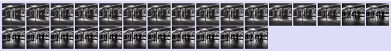

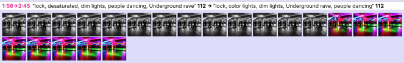

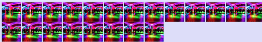

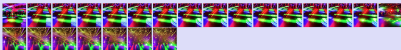

Figure 4: Frame-by-frame view of a video created by one participant, P10 who generated a music visualization for a locked

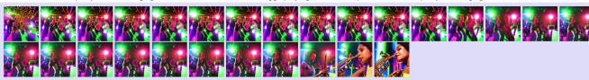

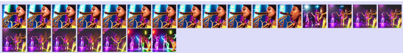

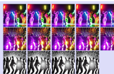

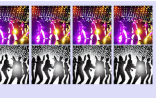 groove. Start and end prompts are displayed above the intervals. The first and last images of each track correspond to these prompts. The design pattern of a hold can be seen in Intervals 1 and 3. The design pattern of a color transition can be seen in Intervals 2 and 7. Subject transitions can be seen in Intervals 4, 5, and 6.

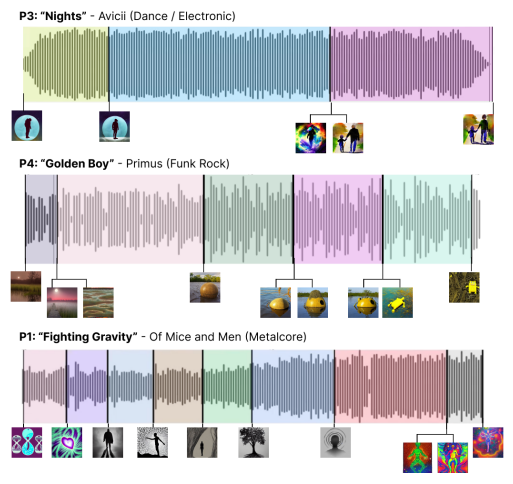

Figure 5: Music rendered in waveforms, which was how audio was presented within Generative Disco, as waveforms. These are examples of how participants could chunk their music in variable length intervals. P3 chunked their song around lyrics while P4 interacted with more non-lyrical elements like slides, bass, and the introduction of a beat. P1 captured a drop in a segment of an intro to a metalcore song. At boundaries, the presence of a fork between two images means that participants made a jump cut between the two images.

## 6.2 Benefits Of Workflow To Professionals

In this section, we report some of the use cases and benefits professionals mentioned about Generative Disco, qualitatively addressing RQ2 ("In what ways can users engage with a generative AI
workflow for video that is based upon music?"). Participants had backgrounds that spanned a broad range of video and music expertise. As such, the use cases reported by participants for Generative Disco were different and diverse. P2, who had made over 100 lyric videos for clients in their eight years of experience, commented that Generative Disco would greatly benefit their workflow, which is heavily reliant on stock footage.

"Often times looking for footage to use is very time consuming, and it's probably my least favorite part of the process for my own workflow. . . I've been using it [stock footage] for all my life, but I don't even have access to all that amazing stock footage websites or anything, because sometimes it can get really expensive. So I have to get creative a lot of times. . .I'll layer PNGs, still images with GIFs, film my own things with my limited resources... With stock footage, I know what to look for. I would say with this, you gotta learn it, it's a whole new way of working... If I was doing it without its help, it would be a lot of me cutting to the music. . . but it wouldn't look as flawless the way that it does [here] with the transitions on the beat. " -P1 P5 had similar thoughts about how workflows like Generative Disco could assist creatives who have to collect footage with limited resources.

#### My Brain–With No Experience–I Didn'T Think That That Was Possible." -P7

"It not only read my mind but made something I wouldn't maybe come up with. So for example the transition from before. It was really good. I couldn't reach that with actual footage, with [stock footage site] or [stock footage site]. I would have to shoot it myself with my camera and hire a real actor, and it is more difficult to do it on my own than with the generation. It would cost me my time, my energy. And here it was by one or two clicks." - P5 Other professionals also mentioned the potential of Generative Disco to provide visual assets for their production work. P2 was a professional whose main source of income was music videos. P5 worked in live production and created VJ loops. Both mentioned that this sort of text-to-video tool could be helpful for VJing. "A lot of this content for DJs doesn't need to be like real clean. It could be a lot of real different looks. It can be real busy. You're providing content for a half hour on average, so having stuff that you don't have to recycle, if you could have really long clips and premade stuff–that could benefit [VJs]." They commented that these sorts of assets could be used as a mixing layer, coming in and out of the background of a main video. P10 likewise mentioned that given their experience making music videos, they would use Generative Disco more for little snippets that they would merge and layer onto real footage. P5 illustrated how she would create a lyric video from the generated outputs by using the video as an animated background, frames of which are depicted in Figure 9.

Many participants reported stages where generative AI was already impacting their creative process, either directly or tangentially. ChatGPT was one of the most commonly cited tools by participants [8]. Using ChatGPT, P12 had generated a royalties agreement with a client, P10 had written a routine for mixing and mastering that produced their original composition (locked groove), and P3 had written scripts for their video client work. P8 and P3 had both posted their original music online with text-to-image generations as cover art. Creative workflows are becoming hybrid (infused with generative AI) at a rapid pace.

P1 and P3 mentioned that another strength of the Generative Disco system was that it could achieve a stylized look that would have otherwise taken them a significant amount of time. For example, to get a sketched or watercolor quality to persist throughout some footage would have otherwise taken them more time and technical expertise in illustration and animation.

P7 also demonstrated use cases for people who were novices in video creation (but experts in music). P7, a classically trained music student, went into the generative process with a concept for a vibrant and animated music video. Focusing on cartoon styles, they were able to create a music video for "I Wanna Dance with Somebody".

"I am really impressed by it. I think it's so cool, because I don't have an animation background or a computer science background. So having this interface–as someone who has no experience in either of those fields–it was very user-friendly, really fun to experiment with. How I was able to create a final product with an idea that I had in Participants found Generative Disco to be intuitive and easy to understand (P2, P5, P7). However, many mentioned that in contrast to their traditional workflows, where they generally knew what to expect in terms of the output video, it was more challenging to know exactly where the final video was going. P10, P7, P1 shared sentiments that such a system might be better for someone with less concept in their mind going in, because controlling Generative Disco could be more challenging if one had more constraints.

Another dimension in which participants felt lacking in control was angle and perspective. P3 and P11 wanted to be able to incorporate dramatic slow pans or zooms but were unable to. P11 and P4, both generative AI power users who had significant code exposure to text-to-image tools and who had used them to generate lo-fi music videos (P11) and VJ loops (P4) wanted to be able to control motion parameters such as the rotation, zoom, and translation. Both participants had utilized auxiliary tools that could take audio and convert it into keyframes to precisely drive the animation. The desire and availability of tools for motion and camera parameters emphasize the importance of camera perspective to video work. Video professionals are often familiar with engaging with camera-held footage (P1, P2, P10).

## 6.3 Usage Of Transitions

Throughout the video generation process, we asked participants to elaborate why they chose the sets of generations that they did and analyzed the images that parameterized intervals. To address the first part of our third research question **(RQ3. To what extent** can transitions and holds help users achieve desired visuals for the music?), we found that transitions could be categorized by how they focused on color, time, subject, or style. 6.3.1 Transition: Color. Color was one of the most cited reasons behind what decided a pair of start and end images. Participants liked to try complete saturation changes, where the start and end image would go from grayscale to color and vice versa (P1, P10, P9, P5, P12, P2). Some participants connected color more closely to musical elements; P8, for example, mapped changes in visual intensity (brightness and darkness) to changes in audio intensity.

"Songs can kind of sound brighter or darker, depending on what sound you use, or the frequency range that's dominant. You can think about how color might inform our understanding of this sound, like frequency range of darker colors mapping to shorter wavelengths on a color spectrum."
- P8 Color was also used for symbolism. P7 said, "The next lyrics are
'with somebody who loves me' so I was trying to incorporate red to represent the love." Many participants (P7, P8, P5, P6) also stated that they wanted to utilize color for consistency within their music videos. P5 chose two images at the start and end of their interval for Lana Del Rey's "Lucky Ones" based on the prevalence of purple within them. P10 mentioned that they felt Generative Disco could be very useful for coming up with color corrections, as playing

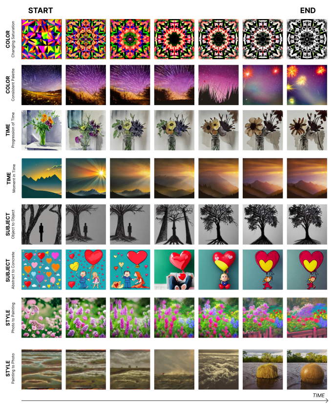

Figure 6: Illustrating transitions observed in generated intervals. Participants chose start and end prompts to transition between color palettes (rows 1-2), to establish a sense of progressing time (rows 3-4), to keep the subject of the video interesting
(rows 5-6), and to add stylistic range to their generated video rows (7-8).

with color boards and scales "tends to be the hardest part of making or doing anything with videos" for P10. 6.3.2 Transition: Time. Transitions were also defined to try to capture the progression of time (P5, P8). "The middle one [chosen end image] seems like it's earlier in time in terms of a sunrise. It seems like chronologically it would be before the second one." P2 also searched for two images that showed time through the decay of flowers. From a watercolor bouquet, they searched for a bouquet that was brown and decayed to go with the undertones of danger and storm that were behind their original music–a transition that is pictured in Figure 6. 6.3.3 Transition: Subject. Participants (P9, P10, P6, P1) also liked to leverage the ability of AI to continuously warp between subjects and styles. Examples of subject-to-subject transitions can be seen in Figure 6
"I think a lot of AI-generated art has that dreamlike quality. I would be curious to see a human turn into a tree and I feel like AI does that well so I'm going to utilize that."-P1 P1 generated two intervals where a full body human silhouette
("Tree-like arms, shadowy figure,sketch with seed 266") morphed into a tree *(Tree-like arms, shadowy figure, sketch with seed 268)*, branched back into a human silhouette, and then changed into a head silhouette *("Sketching person near black hole, cinematic lighting,* seed 344"). P1 found this sort of transition appealing for a segment before the drop of their metalcore song.

P10 transitioned from the subject of a woman playing a saxophone to an image of "ghosts playing vibrant saxophone at a disco party", because they liked the idea of going from a face in sharp focus to moving bodies and wavy shapes. Another subject transition depicted in Figure 6 is the morph from heart balloons into a heart character, where we can see a character emerge out of a pattern.

Transition: Style. Participants also liked to explore generations that had the aesthetic language of different styles at the start and end. P1, P2, P4, and P9 applied style transitions in their intervals, going from cartoon to photorealistic or retro to 3D. We see examples of such style transitions in the last two rows of Figure 6. In one row, a photorealistic blossom of flowers shifts to flowers in a pastel, oil painted style. It does so in a gradual sequence that slowly blurs out the high-resolution detail of the photo generation with more painterly qualities. We can observe in the row after that P4 warps from a *"slimy, dreamy, painting"* style to a photorealistic style. When the style changes are more drastic, the rate of visual change is also steeper. In the intermediate frames, tiny motion artifacts (ships)
would come into view.

## 6.4 Creating Consistency Throughout The Video.

We now qualitatively address the second part of our third research question about holds: **(RQ3. To what extent can transitions and** holds help users achieve desired visuals for the music?). Consistency between the start and end prompt was a deliberate strategy for how many participants (P12, P10, P4, P7) chose intervals. Participants used the design pattern of a hold to mitigate motion artifacts. They achieved this pattern primarily through two methods: by fixing the seed to be constant or by fixing the prompt to be approximately the same.

Fixing the seed was a part of how some participants chose their intervals (P10, P9, P7). P7, who was a novice at video editing and generative AI, grasped the concept of a seed and tried to generate intervals that started and ended with the same seed to encourage consistency. A common strategy to create a hold for many participants was to use the shuffle button to generate variations of generations they liked. From these sets of similar images (which either had the same prompt or seed), they would drag and drop their favorites into the start and end prompt area.

We can see the effect of choosing approximately similar prompts or constant seeds in Figure 7. Across all rows, the composition is approximately constant, even though global aesthetic details are changing from frame to frame. For the first row, two figures are in a warmly tinted forest. Across the hold, the two tiny figures persist but the colors shift such that the green blue hues subtract themselves from the image. In the last row, we see that the figure of an astronaut subtly shifts in the foreground, but the "pale blue marble" of Earth from their prompt stays consistent in color and shape in the background.

Consistency was one of the main deciders for what made an interval usable or not. Participants did not like it when random artifacts would appear or disappear throughout their images. For example, P5 prompted for generations of a couple and found one of the intermediate frames of the interpolation to be compelling for its interesting use of color. The transition is pictured in Figure 8. While they considered it a favorite for its color scheme alone, it came back with three people rather than the two that would symbolize a couple. P2 similarly did not like when some random artifacts would pop in and out of intermediate frames. When they generated a style and subject transition of two watercolor kids on a cliff to one realistic person on a cliff, for a few frames, the cliff was devoid of any people figures. For P4, in the transition from "slimy waves" into a "buoy" depicted in Figure 6, tiny ships would appear within the waters. Whenever these unwanted frames would appear for a sub-second length of time, they would introduce a glitchy, jittery quality that participants could dislike.

The generations that were the most commonly not used by participants tended to resemble photos. Participants (P5, P3, P11, P12, P7) did not like the distortion in bodies and the uncanniness of the faces or hands. P11, generating for "Calm Down", an afrobeats pop song, tried to generate images of a girl singing beside a car but was dissatisfied by the distortions in her face. P6 noted that they were not inclined to choose photorealistic generations not only because of their more apparent flaws but also because they did not convey any aesthetic or mood, which they felt was the bigger picture of what music videos intend to do. P5 noted how the human figures in their images didn't move right–they would grow, shrink, and jitter–but they did not move like properly animated people properly would. To avoid distortions, P1 searched for silhouettes, while P5 searched for generations that focused on the backside of people. A common strategy was to then edit their prompts to include stylistic phrases such as "storybook illustration",*"cartoon"*, or "stylized".

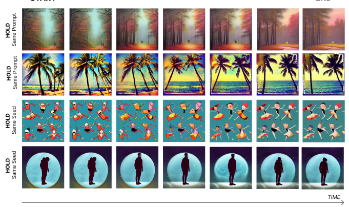

Figure 7: Illustrating holds observed in generated intervals. Participants chose start and end prompts to hold and encourage

 consistency within their video. They generally achieved this by fixing the seed or the prompt. Examples of holds where the start and end prompts were approximately the same are seen in rows 1-2. Examples of holds where the seed is fixed are seen in rows 3-4. We observe constrained changes that maintain a similar composition and color palette.

Figure 8: An example of a motion artifact from the interpolation between prompts "couple, soft lighting, bloom pass, street photography, back, cartoon" and *"couple, soft lighting, bloom pass, street photography, back,cartoon"***. We see that in an intermediate**

frame, instead of a couple we have a couple and a third wheel.

## 7 Discussion 7.1 Connecting Sound, Language, And Image

From our results, we show that Generative Disco is capable of creating AI-generated music visualizations that connect sound, language, and visuals. Through quantitative and qualitative feedback, we showed that the system was capable of producing visualizations that satisfied their interpretation of the music (RQ1) in a way that was that was enjoyable, expressive, and well worth their effort. The main strength of Generative Disco that was elaborated within the user study was its ability to come up with different meaningful transitions and holds to express both the abstract and figurative elements of the music, from emotions and symbols to beats and lyrics (RQ2). Generative Disco helped professionals explore the large space of imagery to create visual narratives that transitioned in color, time, subject, and style (RQ3).

Furthermore, Generative Disco demonstrated that users could easily learn a generative workflow, which for many was an altogether new way of creating. All participants were capable of learning how to utilize every function of Generative Disco within the span of fifteen minutes, which is vastly different from the steeper

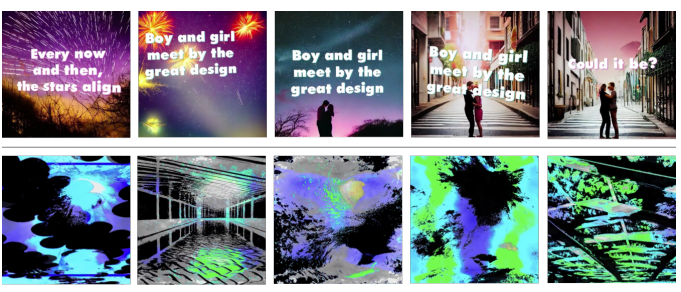

Figure 9: Top: Stills from how a participant, P5, used their text-to-video music visualization output as a visual asset and transformed it with their own workflow. They added kinetic typography to make a dynamic lyric video to Lana Del Rey's "Lucky Ones". Bottom: Stills from how P9 took the generated video as a visual asset and post-processed them with their signature video style using creative code.

learning curves expected to master audiovisual tools. The ability to instantly and efficiently generate videos can expand access to visual assets and footage for people who may have otherwise been limited by their resources or access to stock footage sites. Many participants also noted that stock footage can also be difficult to stylistically pull together, whereas another one of Generative Disco's strengths was how it produced stylized content.

Generative Disco's workflow closely connected music, language, and image. However, such a workflow can also generalize beyond music as well, because sound and motion are relevant to many other visual mediums like animation, motion graphics, film, or user-generated content on social media (i.e. green screens, virtual backgrounds). The design patterns we provide of transitions and holds are a mechanism that can structure the generative process for many domains that involve time and change.

## 7.2 Empowering Professionals With Ai

The fact that the majority of participants had exposure to generative AI and had utilized it within their workflow shows that the landscape of creative work is changing. While we only focused on video professionals, participants referenced many forms of generative AI involvement across different creative skills. Generative AI was helping participants curate their freelancing profiles, write their royalty agreements, post their music online with cover art, and polish their scriptwriting services.

Music visualization and music videos are efforts that are often gated by high production costs or the necessity of niche technical expertise. In our user study, we showed how Generative Disco could make music visualization more accessible to other creatives such as music experts, who engage closely with music but not visuals. In this respect, Generative Disco is an instance of how generative AI can make the creative skills of different domains more accessible to one another. To some degree, the video editor can involve themselves with the creative process of the scriptwriter or the animator. Many of our participants were freelancers. In a competitive global marketplace of skills, there is a pressure on freelancers to do more and to be faster. Being able to leverage generative mediums to be faster and work across different mediums when they have less resources can be tremendously helpful.

While generative tools such as Generative Disco can empower each individual to be more creative, it can also introduce friction between creatives, who may have previously depended on each other rather than a tool. Further investigations can study the social dynamics surrounding generative tools within the creative industry, as done by Gero et al. in the context of LLMs for writers [31].

## 7.3 Future Work And Limitations

Given the duration of a user study, we could only examine Generative Disco in the context of 10 second video intervals. However, given more time, a user could generate videos of any length with the system using the exact same approach. Nonetheless, 10 seconds is still a scale of length that people are used to engaging with, as good lengths for shortform audio content on social media can be between 15 to 45 seconds [70].

One direction for future work is better specified animation. Generative Disco was incapable of true motion within the video intervals. For example, the system could not depict a person walking with a natural walk cycle. Instead, because it was a time sequence of independent frames, the video would gradually warp from silhouette to silhouette, only being able to suggest the idea of walking. Newer text-to-video models are starting to show signs that users can have more fine-grained control, but in the meantime, users could get additional control through networks such as ControlNet [78], which has explored control through conditional inputs like keypoints and segmentation maps. Generative Disco also did not incorporate more video editing effects (i.e. cross-fades), though these could be easily achieved through post-processing. We primarily focused on the exploration of images in an audio-first approach, but other lines of work can also include taking videos as initial inputs in a more image-based approach.

Participants also noted that the interpolation set by Generative Disco could be at times too audioreactive. They did not want the video to react to every change within the waveform, because that produced jitter within the final video. Methods suggested by participants were to give users controls over the intensity of the alignment to the audio or the ability to interpolate according to specific layers within the audio (i.e. separating volume, percussion, melody, etc.)
Being able to define whether the start or end image would be stayed upon longer was also wanted. We leave these directions to future work.

## 8 Conclusion

Music visualization is an important and beloved cultural production that we value for the way it can make music more immersive and powerful. In this paper, we presented Generative Disco, a generative AI system that helps people produce music visualizations using a large language model and a text-to-image model. These videos are generated in intervals parameterized by a start and end prompt to the frequency of the music. We present an approach for prompt ideation that connects visuals, language, and music. We introduce two design patterns for improving generated videos: "transitions",
which change color, time, subject, or style within intervals and "holds", which encourages visual consistency within intervals. In a study with 12 video and music professionals, we found that Generative Disco was highly enjoyable and allows them to focus on expression over execution. We illustrate a number of use cases for Generative Disco both within music visualization and beyond and conclude on a discussion of how AI-generated creative work can empower professionals.

## Acknowledgments References

```
 [1] 1991. Visualizations for Windows Media Player. https://support.microsoft.com/
     en-us/windows/visualizations-for-windows-media-player-00aa9db5-e1d1-
     4b37-d65a-69362493b380
 [2] 2012. https://wavesurfer-js.org/
 [3] 2018. https://www.capcut.com/
 [4] 2022. https://stablediffusionweb.com/
 [5] 2022. https://www.midjourney.com/
 [6] 2022. https://WZRD.ai/
 [7] 2022. Anglekindling: Supporting journalistic angle ideation with large language
     models. https://crowston.syr.edu/node/1656
 [8] 2022. Chatgpt. https://chat.openai.com/chat
 [9] 2022. Gen-2 by runway. https://research.runwayml.com/gen2
[10] 2023. https://kaiber.ai/
[11] 2023. http://genmo.ai/
[12] Yui Atarashi. 2021. Instrumeteor: Authoring Tool for Guitar Performance Video.
     In Extended Abstracts of the 2021 CHI Conference on Human Factors in Computing
     Systems (Yokohama, Japan) (CHI EA '21). Association for Computing Machinery,
     New York, NY, USA, Article 477, 5 pages. https://doi.org/10.1145/3411763.3451521
[13] Tom Bartindale, Guy Schofield, and Peter Wright. 2016. Scaffolding Community
     Documentary Film Making Using Commissioning Templates. In Proceedings
     of the 2016 CHI Conference on Human Factors in Computing Systems (San Jose,

     California, USA) (CHI '16). Association for Computing Machinery, New York, NY,
     USA, 2705–2716. https://doi.org/10.1145/2858036.2858102
[14] Wing-Yi Chan, Huamin Qu, and Wai-Ho Mak. 2010. Visualizing the Seman-
     tic Structure in Classical Music Works. IEEE transactions on visualization and
     computer graphics 16 (01 2010), 161–73. https://doi.org/10.1109/TVCG.2009.63
[15] Erin Cherry and Celine Latulipe. 2009. The creativity support index. 4009–4014.
     https://doi.org/10.1145/1520340.1520609
[16] Peggy Chi, Nathan Frey, Katrina Panovich, and Irfan Essa. 2021. Automatic
     Instructional Video Creation from a Markdown-Formatted Tutorial. In The 34th
     Annual ACM Symposium on User Interface Software and Technology (Virtual Event,
     USA) (UIST '21). Association for Computing Machinery, New York, NY, USA,
     677–690. https://doi.org/10.1145/3472749.3474778
[17] Peggy Chi, Zheng Sun, Katrina Panovich, and Irfan Essa. 2020. Automatic Video
     Creation From a Web Page. In Proceedings of the 33rd Annual ACM Symposium on
     User Interface Software and Technology (Virtual Event, USA) (UIST '20). Association
     for Computing Machinery, New York, NY, USA, 279–292. https://doi.org/10.
     1145/3379337.3415814
[18] Pei-Yu Chi, Sally Ahn, Amanda Ren, Björn Hartmann, Mira Dontcheva, and
     Wilmot Li. 2012. MixT: Automatic Generation of Step-by-Step Mixed Media
     Tutorials. In CHI '12 Extended Abstracts on Human Factors in Computing Systems
     (Austin, Texas, USA) (CHI EA '12). Association for Computing Machinery, New
     York, NY, USA, 1499–1504. https://doi.org/10.1145/2212776.2223662
[19] Pei-Yu Chi, Joyce Liu, Jason Linder, Mira Dontcheva, Wilmot Li, and Bjoern
     Hartmann. 2013. DemoCut: Generating Concise Instructional Videos for Physical
     Demonstrations. In Proceedings of the 26th Annual ACM Symposium on User
     Interface Software and Technology (St. Andrews, Scotland, United Kingdom) (UIST
     '13). Association for Computing Machinery, New York, NY, USA, 141–150. https:
     //doi.org/10.1145/2501988.2502052
[20] John Joon Young Chung, Wooseok Kim, Kang Min Yoo, Hwaran Lee, Eytan
     Adar, and Minsuk Chang. 2022. TaleBrush: Sketching Stories with Generative
     Pretrained Language Models. In Proceedings of the 2022 CHI Conference on Human
     Factors in Computing Systems (New Orleans, LA, USA) (CHI '22). Association
     for Computing Machinery, New York, NY, USA, Article 209, 19 pages. https:
     //doi.org/10.1145/3491102.3501819
[21] Peter Ciuha, Bojan Klemenc, and Franc Solina. 2010. Visualization of Concurrent
     Tones in Music with Colours. In Proceedings of the 18th ACM International Confer-
     ence on Multimedia (Firenze, Italy) (MM '10). Association for Computing Machin-
     ery, New York, NY, USA, 1677–1680. https://doi.org/10.1145/1873951.1874320
[22] Katherine Crowson. [n. d.]. Alembics/disco-diffusion. https://github.com/
     alembics/disco-diffusion
[23] Abe Davis and Maneesh Agrawala. 2018. Visual Rhythm and Beat. ACM Trans.
     Graph. 37, 4, Article 122 (jul 2018), 11 pages. https://doi.org/10.1145/3197517.
     3201371
[24] Boris Dayma, Suraj Patil, Pedro Cuenca, Khalid Saifullah, Tanishq Abraham,
     Phúc Le Khac, Luke Melas, and Ritobrata Ghosh. 2021. DALLE Mini. https:
     //doi.org/10.5281/zenodo.1234
[25] Deforum-Art. [n. d.]. Deforum-art/deforum-stable-diffusion. https://github.com/
     deforum-art/deforum-stable-diffusion
[26] Ricardo Dias and Manuel J. Fonseca. 2010. MuVis: An Application for In-
     teractive Exploration of Large Music Collections. In Proceedings of the 18th
     ACM International Conference on Multimedia (Firenze, Italy) (MM '10). Asso-
     ciation for Computing Machinery, New York, NY, USA, 1043–1046. https:
     //doi.org/10.1145/1873951.1874145
[27] A. Engström, M. Esbjörnsson, and O. Juhlin. 2008. Mobile Collaborative Live
     Video Mixing. In Proceedings of the 10th International Conference on Human Com-
     puter Interaction with Mobile Devices and Services (Amsterdam, The Netherlands)
     (MobileHCI '08). Association for Computing Machinery, New York, NY, USA,
     157–166. https://doi.org/10.1145/1409240.1409258
[28] Jianyu Fan, William Li, Jim Bizzocchi, Justine Bizzocchi, and Philippe Pasquier.
     2016. DJ-MVP: An Automatic Music Video Producer. In Proceedings of the 13th
     International Conference on Advances in Computer Entertainment Technology
     (Osaka, Japan) (ACE '16). Association for Computing Machinery, New York, NY,
     USA, Article 14, 8 pages. https://doi.org/10.1145/3001773.3001782
[29] M.M. Farbood, E. Pasztor, and K. Jennings. 2004. Hyperscore: a graphical sketch-
     pad for novice composers. IEEE Computer Graphics and Applications 24, 1 (2004),
     50–54. https://doi.org/10.1109/MCG.2004.1255809
[30] C. Ailie Fraser, Joy O. Kim, Hijung Valentina Shin, Joel Brandt, and Mira
     Dontcheva. 2020. Temporal Segmentation of Creative Live Streams. In Pro-
     ceedings of the 2020 CHI Conference on Human Factors in Computing Systems
     (Honolulu, HI, USA) (CHI '20). Association for Computing Machinery, New York,
     NY, USA, 1–12. https://doi.org/10.1145/3313831.3376437
[31] Katy Gero. 2023. https://academiccommons.columbia.edu/doi/10.7916/wspj-fn77
[32] Katy Ilonka Gero, Vivian Liu, and Lydia B. Chilton. 2021. Sparks: Inspiration for
     Science Writing using Language Models. https://doi.org/10.48550/ARXIV.2110.
     07640
[33] Jamie Gorson, Nikita Patel, Elham Beheshti, Brian Magerko, and Michael Horn.
     2017. TunePad: Computational Thinking Through Sound Composition. In Pro-
     ceedings of the 2017 Conference on Interaction Design and Children (Stanford,

     California, USA) (IDC '17). Association for Computing Machinery, New York, NY,
     USA, 484–489. https://doi.org/10.1145/3078072.3084313
[34] S. G. Hart and Lowell E. Staveland. 1988. Development of NASA-TLX (Task Load
     Index): Results of Empirical and Theoretical Research. Advances in psychology
     52 (1988), 139–183.
[35] Wenyi Hong, Ming Ding, Wendi Zheng, Xinghan Liu, and Jie Tang. 2022.
     CogVideo: Large-scale Pretraining for Text-to-Video Generation via Transform-
     ers. arXiv:2205.15868 [cs.CV]
[36] Xiaozhu Hu, Yanwen Huang, Bo Liu, Ruolan Wu, Yongquan Hu, Aaron J Quigley,
     Mingming Fan, Chun Yu, and Yuanchun Shi. 2023. SmartRecorder: An IMU-Based
     Video Tutorial Creation by Demonstration System for Smartphone Interaction
     Tasks. In Proceedings of the 28th International Conference on Intelligent User Inter-
     faces (Sydney, NSW, Australia) (IUI '23). Association for Computing Machinery,
     New York, NY, USA, 278–293. https://doi.org/10.1145/3581641.3584069
[37] Bernd Huber, Hijung Valentina Shin, Bryan Russell, Oliver Wang, and Gautham J.
     Mysore. 2019. B-Script: Transcript-Based B-Roll Video Editing with Recommen-
     dations. In Proceedings of the 2019 CHI Conference on Human Factors in Computing
     Systems (Glasgow, Scotland Uk) (CHI '19). Association for Computing Machinery,
     New York, NY, USA, 1–11. https://doi.org/10.1145/3290605.3300311
[38] Amir Jahanlou and Parmit K Chilana. 2022. Katika: An End-to-End System for
     Authoring Amateur Explainer Motion Graphics Videos. In Proceedings of the 2022
     CHI Conference on Human Factors in Computing Systems (New Orleans, LA, USA)
     (CHI '22). Association for Computing Machinery, New York, NY, USA, Article
     502, 14 pages. https://doi.org/10.1145/3491102.3517741
[39] Murat Kalender, M. Tolga Eren, Zonghuan Wu, Ozgun Cirakman, Sezer Kutluk,
     Gunay Gultekin, and Emin Erkan Korkmaz. 2018. Videolization: Knowledge
     Graph Based Automated Video Generation from Web Content. Multimedia Tools
     Appl. 77, 1 (jan 2018), 567–595. https://doi.org/10.1007/s11042-016-4275-4
[40] Jun Kato, Tomoyasu Nakano, and Masataka Goto. 2015. TextAlive: Integrated
     Design Environment for Kinetic Typography. In Proceedings of the 33rd Annual
     ACM Conference on Human Factors in Computing Systems (Seoul, Republic of
     Korea) (CHI '15). Association for Computing Machinery, New York, NY, USA,
     3403–3412. https://doi.org/10.1145/2702123.2702140
[41] Joy Kim, Mira Dontcheva, Wilmot Li, Michael S. Bernstein, and Daniela Steinsapir.
     2015. Motif: Supporting Novice Creativity through Expert Patterns. In Proceedings
     of the 33rd Annual ACM Conference on Human Factors in Computing Systems
     (Seoul, Republic of Korea) (CHI '15). Association for Computing Machinery, New
     York, NY, USA, 1211–1220. https://doi.org/10.1145/2702123.2702507
[42] Mackenzie Leake, Hijung Valentina Shin, Joy O. Kim, and Maneesh Agrawala.
     2020. Generating Audio-Visual Slideshows from Text Articles Using Word Con-
     creteness. In Proceedings of the 2020 CHI Conference on Human Factors in Comput-
     ing Systems (Honolulu, HI, USA) (CHI '20). Association for Computing Machinery,
     New York, NY, USA, 1–11. https://doi.org/10.1145/3313831.3376519
[43] Arto Lehtiniemi and Jukka Holm. 2012. Using Animated Mood Pictures in
     Music Recommendation. In 2012 16th International Conference on Information
     Visualisation. 143–150. https://doi.org/10.1109/IV.2012.34
[44] Hugo Lima, Carlos Santos, and Bianchi Meiguins. 2019. Visualizing the Semantics
     of Music. In 2019 23rd International Conference Information Visualisation (IV). 352–
     357. https://doi.org/10.1109/IV.2019.00066
[45] Hugo B. Lima, Carlos G. R. Dos Santos, and Bianchi S. Meiguins. 2021. A Survey
     of Music Visualization Techniques. ACM Comput. Surv. 54, 7, Article 143 (jul
     2021), 29 pages. https://doi.org/10.1145/3461835
[46] Vivian Liu and Lydia B. Chilton. 2021. Design Guidelines for Prompt Engineering
     Text-to-Image Generative Models. arXiv:2109.06977 [cs.HC]
[47] Vivian Liu, Han Qiao, and Lydia Chilton. 2022. Opal: Multimodal Image Genera-
     tion for News Illustration. https://doi.org/10.48550/ARXIV.2204.09007
[48] Vivian Liu, Jo Vermeulen, George Fitzmaurice, and Justin Matejka. 2022. 3DALL-E:
     Integrating Text-to-Image AI in 3D Design Workflows. arXiv:2210.11603 [cs.HC]
[49] Ryan Louie, Any Cohen, Cheng-Zhi Anna Huang, Michael Terry, and Carrie J. Cai.
     2020. Cococo: AI-Steering Tools for Music Novices Co-Creating with Generative
     Models. In HAI-GEN+user2agent@IUI.
[50] Zhicong Lu, Rubaiat Habib Kazi, Li-yi Wei, Mira Dontcheva, and Karrie Karahalios.
     2021. StreamSketch: Exploring Multi-Modal Interactions in Creative Live Streams.
     Proc. ACM Hum.-Comput. Interact. 5, CSCW1, Article 58 (apr 2021), 26 pages.
     https://doi.org/10.1145/3449132
[51] Delfina Malandrino, Donato Pirozzi, Gianluca Zaccagnino, and Rocco Zaccagnino.
     2015. A Color-Based Visualization Approach to Understand Harmonic Structures
     of Musical Compositions. In 2015 19th International Conference on Information
     Visualisation. 56–61. https://doi.org/10.1109/iV.2015.21
[52] Amy Pavel, Dan B. Goldman, Björn Hartmann, and Maneesh Agrawala. 2015.
     SceneSkim: Searching and Browsing Movies Using Synchronized Captions,
     Scripts and Plot Summaries. In Proceedings of the 28th Annual ACM Sympo-
     sium on User Interface Software & Technology (Charlotte, NC, USA) (UIST '15).
     Association for Computing Machinery, New York, NY, USA, 181–190. https:
     //doi.org/10.1145/2807442.2807502
[53] Amy Pavel, Colorado Reed, Björn Hartmann, and Maneesh Agrawala. 2014. Video
     Digests: A Browsable, Skimmable Format for Informational Lecture Videos. In
     Proceedings of the 27th Annual ACM Symposium on User Interface Software and

    Technology (Honolulu, Hawaii, USA) (UIST '14). Association for Computing Ma-
    chinery, New York, NY, USA, 573–582. https://doi.org/10.1145/2642918.2647400
[54] Laure Prétet, Gaël Richard, and Geoffroy Peeters. 2021. Is there a
    "language of music-video clips" ? A qualitative and quantitative study.
    arXiv:2108.00970 [cs.MM]
[55] Han Qiao, Vivian Liu, and Lydia Chilton. 2022. Initial Images: Using Image
    Prompts to Improve Subject Representation in Multimodal AI Generated Art. In
    Creativity and Cognition (Venice, Italy) (C&C '22). Association for Computing
    Machinery, New York, NY, USA, 15–28. https://doi.org/10.1145/3527927.3532792
[56] Nathan Raw. [n. d.]. Nateraw/stable-diffusion-videos: Create videos with stable
    diffusion by exploring the Latent Space and morphing between text prompts.
    https://github.com/nateraw/stable-diffusion-videos
[57] Steve Rubin and Maneesh Agrawala. 2014. Generating Emotionally Relevant
    Musical Scores for Audio Stories. In Proceedings of the 27th Annual ACM Sym-
    posium on User Interface Software and Technology (Honolulu, Hawaii, USA)
    (UIST '14). Association for Computing Machinery, New York, NY, USA, 439–448.
    https://doi.org/10.1145/2642918.2647406
[58] Steve Rubin, Floraine Berthouzoz, Gautham Mysore, Wilmot Li, and Maneesh
    Agrawala. 2012. UnderScore: Musical Underlays for Audio Stories. In Proceedings
    of the 25th Annual ACM Symposium on User Interface Software and Technology
    (Cambridge, Massachusetts, USA) (UIST '12). Association for Computing Machin-
    ery, New York, NY, USA, 359–366. https://doi.org/10.1145/2380116.2380163
[59] Steve Rubin, Floraine Berthouzoz, Gautham J. Mysore, Wilmot Li, and Maneesh
    Agrawala. 2013. Content-Based Tools for Editing Audio Stories. In Proceedings of
    the 26th Annual ACM Symposium on User Interface Software and Technology (St.
    Andrews, Scotland, United Kingdom) (UIST '13). Association for Computing Ma-
    chinery, New York, NY, USA, 113–122. https://doi.org/10.1145/2501988.2501993
[60] Nazmus Saquib, Rubaiat Habib Kazi, Li-Yi Wei, and Wilmot Li. 2019. Interactive
    Body-Driven Graphics for Augmented Video Performance. In Proceedings of the
    2019 CHI Conference on Human Factors in Computing Systems (Glasgow, Scotland
    Uk) (CHI '19). Association for Computing Machinery, New York, NY, USA, 1–12.
    https://doi.org/10.1145/3290605.3300852
[61] Uriel Singer, Adam Polyak, Thomas Hayes, Xi Yin, Jie An, Songyang Zhang,
    Qiyuan Hu, Harry Yang, Oron Ashual, Oran Gafni, Devi Parikh, Sonal Gupta,
    and Yaniv Taigman. 2022. Make-A-Video: Text-to-Video Generation without
    Text-Video Data. arXiv:2209.14792 [cs.CV]
[62] Sarah Sterman, Evey Huang, Vivian Liu, and Eric Paulos. 2020. Interacting
    with Literary Style through Computational Tools. In Proceedings of the 2020
    CHI Conference on Human Factors in Computing Systems (Honolulu, HI, USA)
    (CHI '20). Association for Computing Machinery, New York, NY, USA, 1–12.
    https://doi.org/10.1145/3313831.3376730
[63] Dídac Surís, Carl Vondrick, Bryan Russell, and Justin Salamon. 2022. It's Time
    for Artistic Correspondence in Music and Video. Computer Vision and Pattern
    Recognition (CVPR) (2022).
[64] Stuart Taylor, Shahram Izadi, David Kirk, Richard Harper, and Armando Garcia-
    Mendoza. 2009. Turning the Tables: An Interactive Surface for Vjing. In Proceed-
    ings of the SIGCHI Conference on Human Factors in Computing Systems (Boston,
    MA, USA) (CHI '09). Association for Computing Machinery, New York, NY, USA,
    1251–1254. https://doi.org/10.1145/1518701.1518888
[65] Purva Tendulkar, Abhishek Das, Aniruddha Kembhavi, and Devi Parikh. 2020.
    Feel The Music: Automatically Generating A Dance For An Input Song.
    arXiv:2006.11905 [cs.AI]
[66] Anh Truong, Floraine Berthouzoz, Wilmot Li, and Maneesh Agrawala. 2016.
    QuickCut: An Interactive Tool for Editing Narrated Video. In Proceedings of the
    29th Annual Symposium on User Interface Software and Technology (Tokyo, Japan)
    (UIST '16). Association for Computing Machinery, New York, NY, USA, 497–507.
    https://doi.org/10.1145/2984511.2984569
[67] Prateksha Udhayanan, Suryateja Bv, Parth Laturia, Dev Chauhan, Darshan Khan-
    delwal, Stefano Petrangeli, and Balaji Vasan Srinivasan. 2023. Recipe2Video:
    Synthesizing Personalized Videos from Recipe Texts. In 2023 IEEE/CVF Win-
    ter Conference on Applications of Computer Vision (WACV). 2267–2276. https:
    //doi.org/10.1109/WACV56688.2023.00230
[68] Rajan Vaish, Shirish Goyal, Amin Saberi, and Sharad Goel. 2018. Creating
    Crowdsourced Research Talks at Scale. In Proceedings of the 2018 World Wide
    Web Conference (Lyon, France) (WWW '18). International World Wide Web
    Conferences Steering Committee, Republic and Canton of Geneva, CHE, 1–11.
    https://doi.org/10.1145/3178876.3186031
[69] Ruben Villegas, Mohammad Babaeizadeh, Pieter-Jan Kindermans, Hernan
    Moraldo, Han Zhang, Mohammad Taghi Saffar, Santiago Castro, Julius Kunze,
    and Dumitru Erhan. 2022. Phenaki: Variable Length Video Generation From
    Open Domain Textual Description. arXiv:2210.02399 [cs.CV]
[70] Bryan Wang, Zeyu Jin, and Gautham Mysore. 2022. Record Once, Post Every-
    where: Automatic Shortening of Audio Stories for Social Media. In Proceedings
    of the 35th Annual ACM Symposium on User Interface Software and Technology
    (Bend, OR, USA) (UIST '22). Association for Computing Machinery, New York,
    NY, USA, Article 14, 11 pages. https://doi.org/10.1145/3526113.3545680
[71] Bryan Wang, Meng Yu Yang, and Tovi Grossman. 2021. Soloist: Generating
    Mixed-Initiative Tutorials from Existing Guitar Instructional Videos Through

```

#### Woodstock '18, June 03–05, 2018, Woodstock, Ny Liu Et. Al.

```
     Audio Processing. In Proceedings of the 2021 CHI Conference on Human Factors
     in Computing Systems (Yokohama, Japan) (CHI '21). Association for Computing
     Machinery, New York, NY, USA, Article 98, 14 pages. https://doi.org/10.1145/
     3411764.3445162
[72] Sitong Wang, Savvas Petridis, Taeahn Kwon, Xiaojuan Ma, and Lydia B. Chilton.
     2023. PopBlends: Strategies for Conceptual Blending with Large Language Models.
     arXiv:2111.04920 [cs.HC]
[73] Yunlong Wang, Shuyuan Shen, and Brian Y Lim. 2023. RePrompt: Automatic
     Prompt Editing to Refine AI-Generative Art Towards Precise Expressions. arXiv
     preprint arXiv:2302.09466 (2023).
[74] Chenfei Wu, Jian Liang, Xiaowei Hu, Zhe Gan, Jianfeng Wang, Lijuan Wang,
     Zicheng Liu, Yuejian Fang, and Nan Duan. 2022. NUWA-Infinity: Au-
     toregressive over Autoregressive Generation for Infinite Visual Synthesis.
     arXiv:2207.09814 [cs.CV]

[75] Chenfei Wu, Jian Liang, Lei Ji, Fan Yang, Yuejian Fang, Daxin Jiang, and Nan
     Duan. 2021. NÜWA: Visual Synthesis Pre-training for Neural visUal World
     creAtion. arXiv:2111.12417 [cs.CV]
[76] Haijun Xia. 2020. Crosspower: Bridging Graphics and Linguistics. In Proceedings
     of the 33rd Annual ACM Symposium on User Interface Software and Technology
     (Virtual Event, USA) (UIST '20). Association for Computing Machinery, New York,
     NY, USA, 722–734. https://doi.org/10.1145/3379337.3415845
[77] Haijun Xia, Jennifer Jacobs, and Maneesh Agrawala. 2020. Crosscast: Adding
     Visuals to Audio Travel Podcasts. In Proceedings of the 33rd Annual ACM Sym-
     posium on User Interface Software and Technology (Virtual Event, USA) (UIST
     '20). Association for Computing Machinery, New York, NY, USA, 735–746.
     https://doi.org/10.1145/3379337.3415882
[78] Lvmin Zhang and Maneesh Agrawala. 2023. Adding Conditional Control to
     Text-to-Image Diffusion Models. arXiv:2302.05543 [cs.CV]

```
