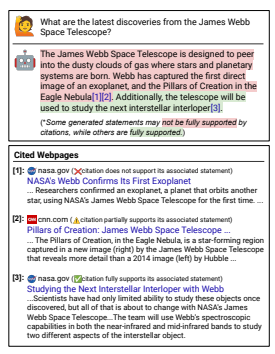
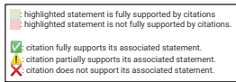
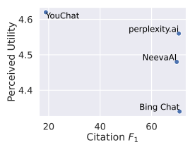
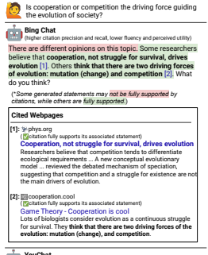
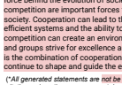

# Evaluating Verifiability In Generative Search Engines

Nelson F. Liu∗ **Tianyi Zhang Percy Liang**
Department of Computer Science Stanford University nfliu@cs.stanford.edu

## Abstract

Generative search engines directly generate responses to user queries, along with in-line citations. A prerequisite trait of a trustworthy generative search engine is *verifiability*, i.e., systems should cite comprehensively (high citation recall; all statements are fully supported by citations) and accurately (high citation precision; every cite supports its associated statement). We conduct human evaluation to audit four popular generative search engines—Bing Chat, NeevaAI, perplexity.ai, and YouChatacross a diverse set of queries from a variety of sources (e.g., historical Google user queries, dynamically-collected open-ended questions on Reddit, etc.). We find that responses from existing generative search engines are fluent and *appear* informative, but frequently contain unsupported statements and inaccurate citations: on average, a mere 51.5% of generated sentences are fully supported by citations and only 74.5% of citations support their associated sentence. We believe that these results are concerningly low for systems that may serve as a primary tool for informationseeking users, especially given their facade of trustworthiness. We hope that our results further motivate the development of trustworthy generative search engines and help researchers and users better understand the shortcomings of existing commercial systems.

## 1 Introduction

Generative search engines fulfill user information needs by directly generating responses to input queries, along with in-line citations (Figure 1).1 Existing generative search engines are rapidly gaining users—in March 2023, Microsoft reported that
"roughly one third of daily preview users are using



Figure 1: Generative search engines answer user queries by generating a tailored response, along with in-line citations. However, not all generated statements are fully supported by citations (citation recall), and not every citation supports its associated statement (citation precision).

[Bing] Chat daily", and that Bing Chat served 45 million chats in the first month of its public preview
(Mehdi, 2023). Generative search engines have the potential to transform how people find information online, but generated responses from existing large language model-backed generative search engines may not always be accurate (Maynez et al., 2020). Given their potential and rapid mainstream adoption, it is critical to evaluate these systems to better understand their potential limitations (akin to prior work in algorithmic auditing; Metaxas and Pruksachatkun, 2017; Buolamwini and Gebru, 2018; Kiritchenko and Mohammad, 2018; Robertson et al., 2018; Metaxa et al., 2019; Green and Chen, 2019; Birhane et al., 2022).

*This work would not be possible without the 34 annotators who performed human evaluation; we thank them for their contributions.

1In contrast, conventional search engines are limited to retrieving pre-existing webpages.
A prerequisite trait of a trustworthy generative search engine is *verifiability*,
2that is, each generated statement about the external world should be fully supported by a set of in-line citations, and each provided citation should support its associated statement. Verifiability enables readers to easily check that any generated statement is supported by its cited source.3 We conduct human evaluation to audit four popular commercial generative search engines (Bing Chat,4 NeevaAI,5 perplexity.ai,6and YouChat7)
across a diverse set of information-seeking queries (e.g., various types of historical Google user queries from NaturalQuestions (Kwiatkowski et al., 2019), dynamically-collected open-ended questions from Reddit; see Table 1 for examples). For each query-response pair, we use human evaluation to measure a variety of dimensions:
1. *fluency* (whether the generated text is fluent and cohesive; §2.2);
2. *perceived utility* (whether the response is a helpful and informative answer to the query; §2.2);
3. *citation recall* (proportion of generated statements about the external world that are fully supported by their citations; §2.3); and 4. *citation precision* (proportion of generated citations that support their associated statements; §2.4).

A trustworthy generative search engine should achieve high citation recall and precision, indicating that its generated citations are comprehensive
(every generated statement is fully supported by citation) and correct (every citation supports its associated statement).

We find that existing generative search engine responses often have high fluency and perceived utility (§4.1), but frequently contain unsupported statements or inaccurate citations (low citation recall and precision; §4.2). On average, a mere 51.5% of generated sentences are fully supported with citations (citation recall), and only 74.5% of citations support their associated sentence (citation precision). Furthermore, citation recall and precision are *inversely correlated* with fluency and perceived utility—the responses that seem more helpful are often those with more unsupported statements or inaccurate citations (§4.3). This facade of trustworthiness increases the potential for existing generative search engines to mislead users. In the example presented by Figure 1, a user with little background knowledge about the James Webb Space Telescope
(hence their query about its recent discoveries) will likely struggle to identify the unsupported statements in the generated response.

We hypothesize that this inverse correlation occurs because some generative search engines often copy or closely paraphrase from their cited webpages (§4.4). Although such systems achieve higher citation recall and precision, some copied statements may not be relevant to the query or the rest of the generated response, resulting in decreased response fluency and perceived utility.

Together, our work makes the following key contributions: first, we define the citation recall and citation precision evaluation metrics, which aim to encourage the development of systems that cite comprehensively and correctly. Second, we conduct a human evaluation of four popular generative search engines, finding that responses are broadly fluent and appear useful and informative, but frequently contain unsupported statements and inaccurate citations, increasing their potential to mislead users. Third, we observe that fluency and perceived utility are inversely correlated with citation recall and precision in existing generative search engines, and hypothesize that this inverse correlation occurs when some systems copy or closely paraphrase from cited webpages. To facilitate further work on developing trustworthy generative search engines, we release our human evaluation annotations.8

#### 2 Human Evaluation Of Fluency, Perceived Utility, And Verifiability

In this section, we formalize the inputs and outputs of the generative search engines we study, describe

2We adopt the term *verifiability* from the Wikipedia community. Verifiability is a core content policy of Wikipedia:
statements must be fully supported by provided sources. See en.wikipedia.org/wiki/WP:V for more information.

3Note that verifiability is not factuality. Rather than arbitrating if a generated statement is true (difficult for all but the simplest claims; Rashkin et al., 2022), verifiability enables users to easily check any generated statement's source, allowing them to draw their own conclusions about whether to trust the generated statement.

4bing.com/new 5neeva.com/blog/introducing-neevaai 6perplexity.ai 7blog.you.com/introducing-youchat-the-ai-searchassistant-that-lives-in-your-search-engine-eff7badcd655 8github.com/nelson-liu/evaluating-verifiability-ingenerative-search-engines

| Source                                    | Example Queries                                                          |
|-------------------------------------------|--------------------------------------------------------------------------|
| AllSouls                                  | What are the functions of fashion?                                       |
|                                           | Should wealth be inheritable?                                            |
| davinci\-debate                           | Should private companies be allowed to manage public utilities?          |
|                                           | Should controversial opinions be censored on social media?               |
| ELI5 (KILT)                               | Why is a circle 360 degrees and not 100 degrees?                         |
|                                           | Why can animals drink dirty water safely but humans can't?               |
| ELI5 (Live)                               | Why jumping into water from great height feels like landing in concrete? |
|                                           | where does the deleted data go                                           |
| WikiHowKeywords                           | age paper using tea                                                      |
|                                           | ways to stop stressing over exam results                                 |
| NaturalQuestions                          | who wrote the song god your mama and me                                  |
| (paragraph long answer, has short answer) | what is the use of tap and die                                           |
| NaturalQuestions                          | where did knock on wood superstition come from                           |
| (paragraph long answer, no short answer)  | what is the use of tap and die                                           |
| NaturalQuestions                          | what is the most nominated film for the oscars                           |
| (list long answer, has short answer)      | who played guitar on i want you she's so heavy                           |
| NaturalQuestions                          | alicia keys if i ain't got you awards                                    |
| (list long answer, no short answer)       | is all of florida in the same time zone                                  |
| NaturalQuestions                          | how many episodes are there in quantum leap                              |
| (table long answer, has short answer)     | what kind of music is red hot chili peppers                              |
| NaturalQuestions                          | where does copa airlines fly in the united states                        |
| (table long answer, no short answer)      | michael jordan career high against every nba team                        |
| NaturalQuestions                          | what does the x card mean in uno                                         |
| (no long or short answer)                 | what changes were made when trinidad and tobago gained independence      |

Table 1: Example queries from each of the evaluated query distributions. Queries come from diverse sources and require knowledge from a variety of answer types (e.g., short text span, long-form paragraph, list, or table). Each system is evaluated on 1450 queries—150 randomly-sampled queries from each of AllSouls, davinci-debate, ELI5 (KILT), ELI5 (Live), and WikiHowKeywords, and 100 randomly-sampled queries for each of the seven NaturalQuestions subdistributions.

the evaluation of fluency and perceived utility, and define and describe the evaluation of citation recall and precision. Citation recall and precision are designed to reward systems that cite comprehensively (i.e., high recall; all statements are fully supported by citations) and accurately (i.e., high precision; every cite supports its associated statement). We also define citation F1, a metric that combines citation precision and citation recall.

#### 2.1 Task Formulation

Given a user query q as input, a generative search engine produces a text response r, which is a string with embedded in-line citations. For the example in Figure 1, the query q is "What are the latest discoveries from the James Webb Space Telescope?" and the response r is the string paragraph "The James Webb Space Telescope ... used to study the next interstellar interloper [3].", with embedded citations
"[1]", "[2]", and "[3]".

To evaluate citation precision and recall, we first segment the r into a set of n statements S = {s1*, . . . , s*n}. In this work, the segmentation S is set of sentences in the response r. For each statement si ∈ S, we construct a (possibly empty) set Ci = {ci,1, . . . , ci,k} of k citations associated with the statement si, where ci,j is the jth citation associated with the ith response statement. For each citation ci,j , we have a URL ui,j and its contents pi,j . In this work, Ciis set of citations that occur in si (e.g., for si = "Blueberries[1], cherries[2], and grapes[3] grow on trees.[4]", Ci = {[1], [2], [3], [4]}).

For the example presented in Figure 1, the response r is segmented into its three sentences S =
{"The James Webb ... systems are born.", "Webb has captured ... Eagle Nebula[1][2].", "Additionally, the telescope ... interstellar interloper[3]."}
(the sentences within the response). The first statement has no associated citations (C1 = ∅),
the second statement has two associated citations
(C2 = {[1], [2]}), where [1] has URL u2,1 =
nasa.gov/.../nasa-s-webb... with contents p2,1 = "...Researchers confirmed an expolanet..." and [2] has URL u2,2 = cnn.com/2022/10... with contents p2,2 = "...The Pillars of Creation, in the Eagle Nebula...". Finally, the third statement has one associated citation (C3 = {[3]}), where [3] has URL u3,1 = nasa.gov/.../studying... and contents p3,1 = "...Scientists have had only limited ability...".

#### 2.2 Measuring Fluency And Perceived Utility

To measure response fluency, annotators were shown the user query, the generated response, and the claim "The response is fluent and cohesive".

We ask annotators to rate their level of agreement with the claim on a five-point Likert scale from Strongly Disagree to *Strongly Agree*. We use a similar process to measure perceived utility, asking annotators to rate their level of agreement with the claim "The response is a helpful and informative answer to the query".

#### 2.3 Measuring Citation Recall

Citation recall is the proportion of verificationworthy statements that are fully supported by their associated citations (see Figure 2 for several examples). Thus, computing citation recall requires (i) identifying the verification-worthy statements in a response and (ii) evaluating whether each verification-worthy statement is fully supported by its associated citations. Identifying verification-worthy statements.

Given the statements S in a response r, we first ask annotators to remove statements in the response that are not verification-worthy. We take the position that *every* generated statement about the external world is verification-worthy, even those that might seem obvious, trivially true, or "common sense". Generated statements may be incorrect, and statements that seem obvious to some readers may be less than obvious to others (e.g., "The Pope is Catholic"). Rather than potentially sacrificing verifiability for simplicity, we believe that systems should aim to provide a source for all generated statements about the external world, enabling readers to easily verify any statement in a generated response.9 First generated statement [1 ][2 ][3 ]. Second generated statement [1 ][2 ][4 ]. Third generated statement [4 ][5 ].

Citation Recall: 3/3 = 100% Citation Precision: 3/8 = 37.5%
First generated statement [1 ][2 ]. Second generated statement [2 ]. Third generated statement.

Citation Recall: 1/3 = 33% Citation Precision: 2/3 = 66%
First generated statement [1 ][2 ][3 ].

Second generated statement. Third generated statement.

Citation Recall: 1/3 = 33%
Citation Precision: 2/3 = 66%



Figure 2: Schematized examples of how we calculate citation recall and precision. Citation recall measures the proportion of generated statements that are supported by citations. Citation precision measures the proportion of citations that support their associated statements. Partially-supporting citations improve citation precision only when their associated statement is supported by the union of its citations and no other associated citation fully supports the statement by itself
(middle example).

In practice, almost all system-generated statements are verification-worthy—notable exceptions include statements about the speaker (the system) itself (e.g., "As a language model, I do not have the ability to ban books.") and questions posed to the user (e.g.,"Would you like to learn more?", generated by systems like Bing Chat and YouChat that are deployed in conversational settings).

Evaluating whether a verification-worthy statement is fully supported by its associated citations. Given the verification-worthy statements in a response r, we ask annotators to evaluate whether each statement is fully supported by its associated citations (see the sentences of generated response in Figure 1 for examples). To collect these binary judgments, we use the attributable to identified sources (AIS) evaluation framework of
(Rashkin et al., 2022). In particular, a statement si is fully supported by its associated citations Ciif a generic hearer would affirm the statement "Accord-

9Practically speaking, designers of a generative search engine may not wish to exhaustively display all generated citations for all generated statements, but we believe that this is an implementation-specific user experience decision that is beyond the scope of this work.
ing to cited webpages Ci, si", within the context of the query q and response r, and unsupported otherwise.

#### 2.4 Measuring Citation Precision

Citation precision is the proportion of generated citations that support their associated statements (see Figure 2 for several examples). In contrast to recall, citation precision rewards systems for citing accurately—a response that cites every webpage on the Internet for each generated statement would likely have high citation recall, but low citation precision (since many articles are irrelevant and do not support their associated statement). To measure citation precision for a response r, we first ask annotators to judge whether each citation ci,k contributes full, partial, or no support for its associated statement si (see cited webpages in Figure 1 for examples):
- *Full support*: all of the information in the statement is supported by the citation.

- *Partial support*: some of the information in the statement is supported by the citation, but other parts are not supported (e.g., missing or contradictory).

- *No support*: the citation does not support any part of the statement (e.g., the cited webpage is completely irrelevant or contradictory).

For statements that have multiple associated citations, we additionally ask annotators whether the union of its associated cited webpages collectively provides full support for the statement (a binary judgment). Similar to citation recall, we use the AIS evaluation framework of Rashkin et al. (2022) to collect these binary judgments with the AIS evaluation framework.

To calculate citation precision, let Tfs be the number of citations that fully support its associated statement, and let Tps be the number of citations that partially supports its associated statement, where the associated statement is fully supported by the union of its associated citations and no associated citation fully supports the statement by itself. Let N be the total number of citations in the response. Then, the citation precision is
(Tfs + Tps)/N.

For an intuitive example of when partiallysupporting cites count toward improving precision
(greater Tps), consider the statement "Health benefits of cycling include improved cardiovascular health[1] and lowered cholesterol levels[2]." with its associated citations [1] and [2]. Suppose that these citations each contribute partial support for the entire statement—the first citation [1] only states that "Health benefits of cycling include improved cardiovascular health", and second citation [2] only states that "Health benefits of cycling include lowered cholesterol levels". When the citations are taken together, they offer full support for the statement. Although these citations do not fully support the statement on their own, they still meaningfully contribute to its verifiabilitysystems should not be penalized for aggregating information from multiple citations.

## 2.5 Citation F1

Citation F1 is a metric that combines citation precision and citation recall by taking their harmonic mean:

$$F_{1}=2\cdot{\frac{\mathrm{citation~precision}}{\mathrm{citation~precision}}}$$

citation precision · citation recall citation precision + citation recall To achieve a high citation F1, systems must have high citation precision and high citation recall.

## 3 Evaluation Setup

In this section, we describe our concrete setup for human evaluation of verifiability in generative search engines. We describe the evaluated generative search engines (§3.1), the diverse query distributions we use for evaluation (§3.2), and the details of our human evaluation protocol (§3.3).

#### 3.1 Evaluated Generative Search Engines

We evaluate four existing commercial generative search engines: Bing Chat, NeevaAI, perplexity.ai, and YouChat.10 We expect that these systems pattern after prior work (e.g., Nakano et al., 2021; Menick et al., 2022; Glaese et al., 2022; Thoppilan et al., 2022, *inter alia*) and generate responses by conditioning large language models on the input query and retrieved content (e.g., search results from a conventional search engine). For each input, we save the system's first complete response
(i.e., single-turn). Responses were scraped between

10We do not evaluate systems like OpenAI's ChatGPT or Google's Bard because they do not provide in-line citations for their responses (as of early 2023), and thus trivially have low verifiability.

|               | Abstention Rate (↓)   |        |
|---------------|-----------------------|--------|
| Bing Chat     |                       | < 0.5% |
| NeevaAI       |                       | 22.7%  |
| perplexity.ai |                       | < 0.5% |
| YouChat       |                       | < 0.5% |

Table 2: Generative search engines may be designed for deployment in different contexts. NeevaAI abstains from responding to 22.7% of our 1450 queries, since its response is designed for display within a conventional search results page. In contrast, the conversational interface of Bing Chat, and YouChat means that systems must generate a response for nearly every input user query (excepting, e.g., query character length limits).

late February and late March, 2023. Each query was issued in a separate browser session to avoid any history-based personalization. Bing Chat was evaluated with its default "Balanced" setting.

Note that evaluated generative search engines have differing abstention rates (Table 2), which can make direct comparison difficult—one might expect that systems with higher abstention rates might also have higher evaluation performance, since they can simply abstain from generating responses to difficult queries (we do not find this to be the case in practice). NeevaAI abstains from responding on nearly 23% of evaluated queries, since its response is displayed within a conventional search engine results page. In contrast, Bing Chat, perplexity.ai, and YouChat largely respond to every user query (modulo, e.g., query length limits).

#### 3.2 Evaluated Query Distributions

A primary goal of this work is to gain a broader understanding of the strengths and weaknesses of existing commercial generative search engines. To this end, we evaluate on a diverse set of queries from a variety of different sources (e.g., Google user queries, open-ended Reddit questions, how-to queries) requiring knowledge from several different answer types (e.g., short textual spans, long-form paragraph, lists, or tables). See Table 1 for example queries from each distribution. Each system is evaluated on 1450 queries—150 randomly-sampled queries from each of AllSouls, davinci-debate, ELI5 (KILT), ELI5 (Live), and WikiHowKeywords, and 100 randomly-sampled queries for each of the seven NaturalQuestions subdistributions. AllSouls. We evaluate systems on open-ended essay questions taken from the entrance exam (general paper component) for All Souls College, Oxford University. Informally described as "the hardest exam in the world",11 these questions span a variety of topics, including the arts, science, politics, literature, current events, and issues in education and sport.12 We qualitatively find that these questions are difficult to answer via extraction from existing webpages. For example, querying a conventional search engine with the AllSouls query "Could the EU learn anything from the Roman Empire?" does not return any relevant webpages that directly answer the question. To provide a useful response to this question, a system must aggregate information across multiple pages and reason about the successes of the Roman Empire, the shortcomings of the EU, and parallels and differences between them. We certainly do not expect existing generative search engines to produce insightful responses, but we expect them at least to provide a relevant response with some basic information and support their statements with citations. davinci-debate. We evaluate systems on debate topics generated from text-davinci-003. To generate debate queries, we largely follow the procedure of Bakker et al. (2022). We seed the data generation process with 100 debate questions, which are manually transformed propositions propositions taken from the Perspectrum dataset of Chen et al. (2019) (e.g., the proposition "Vaccination must be made compulsory." could be rewritten as the question "Should vaccines be mandatory?"). To generate a debate question, we prompt text-davinci-003 with 10 randomly-sampled seed questions. We repeat this procedure until we have generated 150 unique debate questions that also do not appear in our seed set. Finally, generated questions were manually filtered for inappropriate content.

ELI5. We take queries from the Reddit forum
"Explain Like I'm Five" (ELI5), where users provide layperson-accessible answers to submitted questions. Submitted questions are required to admit objective explanations, and answering them often requires long-form textual responses (e.g.,
"Why [sic] certain colours absorb heat and others reflect it?"). ELI5 post titles are transformed into

11www.theguardian.com/education/2010/may/14/oxforduniversity-all-souls-college-exam 12www.asc.ox.ac.uk/examination-fellowships-generalinformation
queries removing ELI5-specific prefixes (e.g., the post title "ELI5: why can't our brains recall every memory?" becomes the query "Why can't our brains recall every memory?").

We consider two subdistributions of ELI5 queries. In the **ELI5 (KILT)** subdistribution, we use historical queries from the KILT ELI5 dataset (Fan et al., 2019; Petroni et al., 2021). These historical queries are drawn from posts created before July 2018. Thus, a retrieval-based system could hypothetically perform well by simply identifying the query's source Reddit ELI5 post and copying its content. In practice, we find that it becomes easier to retrieve the original source ELI5 post as a query grows longer and more specific (e.g., "Why are polar bears and grizzly bears considered different species if they can interbreed and produce fertile offspring?" is more specific than "why are polar bears and grizzly bears different species?").

Since queries derived from existing Internet ELI5 posts may overestimate or bias system evaluation results, we also evaluate generative search engines on the **ELI5 (Live)** subdistribution, which is intended to increase ecological validity by evaluating systems on real user queries at their time of creation and reducing the incidence of search results with the query's *exact* keywords.13 To evaluate systems on this subdistribution, we continuously listen to the stream of new Reddit ELI5 posts, and immediately query the generative search engines for responses whenever a new post is created (always within 5 minutes of post creation). This real-time procedure ensures that the source ELI5 post will not have been indexed (and thus, cannot be retrieved) by conventional search engines when we collect the generative search engine's response, minimizing the possibility that the generative search engine has access to the source ELI5 post. WikiHowKeywords. We evaluate systems on queries derived from WikiHow articles. We found that directly querying generative search engines with WikiHow article titles yields responses that largely paraphrase or copy text directly from WikiHow. As a result, we use text-davinci-003 to paraphrase article titles (e.g., "How to Cut An Avocado") into keyword queries (e.g., "cut avocado") for evaluation. In particular, we prompted text-davinci-003 with "Given a question, write a concise Google search query that would answer the question" and two in-context examples. NaturalQuestions. We evaluate generative search engines on NaturalQuestions (Kwiatkowski et al., 2019) queries, stratified by their answer type.

The NaturalQuestions dataset contains historical queries issued to the Google search engine coupled with long and short answers extracted from Wikipedia. Long answers are HTML bounding boxes (a paragraph, table, or list) on the Wikipedia page that contains the information required to answer the query. On the other hand, the short answer is a span or set of spans within the long answer that answers the query. As a result, NaturalQuestions queries may have (i) a long answer and a short answer, (ii) a long answer but no short answer, or (iii) no long answer (and thus no short answer). Queries without short answers typically require longer-form responses, but the existence of a long answer itself implies that the question can be extractively answered from a paragraph, list or table on a Wikipedia page.

We evaluate on queries from 7 NaturalQuestions subdistributions: queries with paragraph-type long answers (i) with and (ii) without short answers, queries with list-type long answers (iii) with and
(iv) without short answer, queries with table-type long answers (v) with and (vi) without short answers, and finally (vii) queries with no long answer
(and consequently, no short answer either).

Summary. In total, we evaluate existing generative search engines on 12 total query distributions. Eight query distributions are taken from prior work (ELI5 (KILT) and the seven NaturalQuestions query distributions), while four query distributions were constructed for this work: AllSouls, davinci-debate, ELI5 (Live), and WikiHowKeywords. These diverse settings provide broad coverage of several potential use cases and information needs, helping us gain a comprehensive understanding of systems' strengths and weaknesses.

#### 3.3 Human Evaluation Protocol

Annotation process. Evaluating a single queryresponse pair requires human annotators to complete a three-step process. The first step measures the response's fluency and perceived utility (§2.2), and the second and third step provide the judgments

13The goal of the ELI5 (Live) subdistribution is not to identify queries with no relevant webpages on the Internet. We recognize that many user queries express previously-seen information needs, even if the precise wording differs.
necessary to measure citation recall (§2.3) and precision (§2.4). See Appendix A for screenshots of the annotation interface and Appendix B for the annotation guidelines.

In the first step, annotators were shown the query and the generated response (without citations) and asked to rate response fluency and perceived utility on a five-point Likert scale.

In the second step, annotators were shown the statements in the generated response (including any generated citations) and asked to filter out statements are not verification-worthy.

Finally, in the third step, annotators were shown the statements that were previously judged to require verification (in the prior step), as well as each statement's associated system-generated citations.

For each statement and associated citation, annotators judged whether the citation fully supports, partially supports, or does not support the statement, as interpreted within the broader context of the query and system response. For statements with multiple associated citations, annotators are asked to judge whether the citations, when taken together, fully support the statement; this captures cases where multiple citations support disjoint parts of a statement (e.g., "Health benefits of cycling include improved cardiovascular health[1] and lowered cholesterol levels[2]."). Annotator recruitment and training. Annotation was performed on the Amazon Mechanical Turk platform. Annotators were pre-screened with a qualification study, which required them to read an annotation guidelines document and evaluate five representative query-response pairs. We individually reviewed submitted annotations for qualification study and provided annotators with individualized feedback to help correct any misconceptions or confusion about the task. Annotators who performed well on the qualification study and demonstrated thorough understanding of the task and annotation guidelines were permitted to participate in the main round of human evaluation.

We remained in constant contact with annotators throughout the human evaluation process to answer questions about corner-cases and clarify intended behavior. In total, 34 annotators participated in human evaluation. Annotator compensation. On average, annotators took approximately four minutes to complete all three steps for a single query-response pair. We aimed to compensate annotators $15.00 per hour, based on conservative time estimates calculated from qualification study timing statistics. Workers were compensated $6.50 for completing the qualification study. In the main round of data collection, workers were compensated $1.00 per query-response pair for responses with citations, and $0.38 per query-response pair for responses without citations.

Annotated data. We evaluate on a set of 1450 queries—150 randomly-sampled queries from each of AllSouls, davinci-debate, ELI5 (KILT), ELI5
(Live), and WikiHowKeywords, and 100 randomlysampled queries for each of the seven NaturalQuestions subdistributions. Each query-response pair is annotated once in the human evaluation process.

To measure inter-annotator agreement, we collected three annotations for 250 randomly-sampled query-response pairs, finding high agreement rates
(greater than 82.0% pairwise agreement and 91.0 F1 for all judgments; see Appendix C).

## 4 Results And Analysis

This section presents the results of our human evaluation study and discusses our main observations and analyses. We see that fluency and perceived utility are generally high across different generative search engines (§4.1), while citation recall and precision are quite low (§4.2), though performance certainly varies by system and query distribution—the low citation recall and precision, when combined with the facade of trustworthiness from fluency and high perceived utility, increase the potential for existing generative search engines to mislead users. Our results also show that citation recall and precision are inversely correlated with fluency and perceived utility in existing generative search engines
(§4.3), and we hypothesize that this is a byproduct of systems' propensity to copy or closely paraphrase text from cited webpages, which increases citation precision and recall while decreasing fluency and perceived utility (§4.4).

#### 4.1 Fluency And Perceived Utility

Generated responses are fluent and appear helpful. Table 3 presents the fluency of generative search engine responses on each of our query distributions, and Table 4 presents perceived utility.

Aggregating annotator ratings across all systems and all responses yields an average rating of 4.48 for fluency and 4.50 for perceived utility, indicating

| Fluency (↑)   |                  | Fluency (↑)   |                   |                  |                       |          |                 |
|---------------|------------------|---------------|-------------------|------------------|-----------------------|----------|-----------------|
| Average Over  | All Queries      |               | AllSouls          | davinci\-debate  | ELI5                  |          | WikiHowKeywords |
|               |                  |               |                   |                  | KILT                  | Live     |                 |
| Bing Chat     | 4.40             | Bing Chat     | 4.31              |                  | 4.37  4.36            | 4.30     | 4.41            |
| NeevaAI       | 4.43             | NeevaAI       | 4.50              |                  | 4.53  4.50            | 4.42     | 4.42            |
| perplexity.ai | 4.51             | perplexity.ai | 4.43              |                  | 4.54  4.55            | 4.47     | 4.45            |
| YouChat       | 4.59             | YouChat       | 4.58              |                  | 4.65  4.56            | 4.53     | 4.52            |
| Average       | 4.48             | Average       | 4.45              |                  | 4.52  4.49            | 4.43     | 4.45            |
| Fluency (↑)   |                  |               |                   | NaturalQuestions |                       |          |                 |
|               | List Long Answer |               | Table Long Answer |                  | Paragraph Long Answer |          | No Answer       |
|               | Has Short        | No Short      | Has Short         | No Short         | Has Short             | No Short |                 |
| Bing Chat     | 4.49             | 4.52          | 4.46              | 4.30             | 4.54                  | 4.41     | 4.39            |
| NeevaAI       | 4.45             | 4.40          | 4.31              | 4.28             | 4.41                  | 4.49     | 4.43            |
| perplexity.ai | 4.69             | 4.54          | 4.59              | 4.41             | 4.73                  | 4.43     | 4.37            |
| YouChat       | 4.65             | 4.56          | 4.60              | 4.45             | 4.66                  | 4.69     | 4.64            |
| Average       | 4.57             | 4.50          | 4.49              | 4.36             | 4.58                  | 4.50     | 4.46            |

Table 3: Human evaluation results for generated response fluency (five-point Likert ratings). In general, existing generative search engines produce fluent text. Performance is notably lower on NaturalQuestions queries with table-type long answers and no short answers, which often require aggregating information within or across citations.

that, annotators judge generated responses as fluent and helpful for answering the user's input query. Comparing fluency and perceived utility between generative search engines. Comparing fluency and perceived utility ratings between the generative search engines (aggregated over all responses), we see that Bing Chat receives the lowest fluency / perceived utility ratings (4.40 / 4.34), followed by NeevaAI (4.43 / 4.48), perplexity.ai (4.51 / 4.56), and YouChat (4.59 / 4.62). Comparing fluency across query distributions. Comparing average fluency ratings across different query distributions, we see similar ratings between NaturalQuestions queries that have a long answer (i.e., an extractive answer of some length exists on Wikipedia) and non-NaturalQuestions distributions
(4.50 vs. 4.47, respectively). Comparing average fluency ratings between NaturalQuestions subdistributions, we see that generated responses to queries that have a short extractive answer are generally more fluent (4.55) than responses to queries with only a long answer (4.46) or those without a long answer (4.46), perhaps because responses to questions with short answers are generally shorter and often only require factoid knowledge.

A notable outlier distribution is NaturalQuestions queries with table-type long answers and no short answers, where system responses are dramatically less fluent (average of 4.36 across systems vs. average of 4.48 across all query distributions). These challenging queries often require aggregating information across table cells or retrieved sources, since the lack of a short answer implies that no single Wikipedia table cell directly answers the question (e.g., the query "how many grammys does beyonce have without destiny's child"). When the retrieved webpages do not contain a clear extractive answer to the query, but contain facts that seem relevant (e.g., information about Destiny's Child's first Grammy, or Beyonce's total number of career Grammy awards), the generated response may become a stilted agglomeration of statements from various sources, reducing overall fluency.

Comparing perceived utility across query distributions. On the other hand, perceived utility can differ substantially between different query distributions. Perceived utility is much higher for NaturalQuestions queries containing a long answer
(4.59), as opposed to non-NaturalQuestions queries
(4.43). Comparing between different NaturalQuestions subdistributions, we see that perceived utility is highest for queries that have a short answer
(4.62), followed by queries that have only a long answer (4.55), and finally by queries that have no long
(or short) answer (4.52). Overall, perceived utility decreases as queries require longer-form and less-

|               | NaturalQuestions                    |      |           |      |                       |          |           |
|---------------|-------------------------------------|------|-----------|------|-----------------------|----------|-----------|
|               | List Long Answer  Table Long Answer |      |           |      | Paragraph Long Answer |          | No Answer |
|               | Has Short  No Short  No Short       |      | Has Short |      | Has Short             | No Short |           |
| Bing Chat     | 4.63                                | 4.49 | 4.49      | 4.47 | 4.53                  | 4.40     | 4.38      |
| NeevaAI       | 4.65                                | 4.57 | 4.43      | 4.38 | 4.43                  | 4.63     | 4.49      |
| perplexity.ai | 4.71                                | 4.61 | 4.60      | 4.55 | 4.77                  | 4.58     | 4.50      |
| YouChat       | 4.72                                | 4.64 | 4.70      | 4.54 | 4.77                  | 4.77     | 4.70      |
| Average       | 4.68                                | 4.58 | 4.55      | 4.49 | 4.62                  | 4.60     | 4.52      |

| Perceived Utility (↑)     |      | Perceived Utility (↑)   |          |                 |      |      |                 |
|---------------------------|------|-------------------------|----------|-----------------|------|------|-----------------|
| Average Over  All Queries |      |                         | AllSouls | davinci\-debate | ELI5 |      | WikiHowKeywords |
|                           |      |                         |          |                 | KILT | Live |                 |
| Bing Chat                 | 4.34 | Bing Chat               | 4.15     | 4.19            | 4.19 | 4.09 | 4.37            |
| NeevaAI                   | 4.48 | NeevaAI                 | 4.44     | 4.39            | 4.54 | 4.46 | 4.42            |
| perplexity.ai             | 4.56 | perplexity.ai           | 4.39     | 4.60            | 4.54 | 4.50 | 4.51            |
| YouChat                   | 4.62 | YouChat                 | 4.53     | 4.54            | 4.53 | 4.50 | 4.63            |
| Average                   | 4.50 | Average                 | 4.38     | 4.43            | 4.45 | 4.39 | 4.48            |

Perceived Utility (↑)
Table 4: Human evaluation results for perceived utility of generated responses (five-point Likert ratings). In general, responses from existing generative search engines *appear* informative and useful.

extractive answers (e.g., factoid NaturalQuestions queries with short answers versus ELI5 queries).

#### 4.2 Citation Recall And Precision

Table 5 presents generative search engine citation recall across the evaluated query distributions, and Table 6 presents citation precision.

Existing generative search engines often do not cite comprehensively or correctly. When averaging across all systems, a mere 51.5% of generated statements are fully supported with citations (recall), and only 74.5% of citations fully support their associated statements (precision). We believe these results are unacceptably low for systems that are quickly becoming a popular tool for answering user queries and already have millions of users, especially given that generated responses often appear informative and useful. Comparing citation recall and precision between generative search engines. Citation recall and precision varies dramatically between different generative search engines. On average, perplexity.ai achieves the highest average recall (68.7),
compared to NeevaAI (67.6), Bing Chat (58.7), and YouChat (11.1). On the other hand, Bing Chat achieves the highest precision (89.5), followed by perplexity.ai (72.7), NeevaAI (72.0), and YouChat (63.6). A gap of nearly 58% separates the system with the highest and lowest recall (perplexity.ai vs.

YouChat), and the gap between the systems with the highest and lowest precision is almost 25%
(Bing Chat vs. YouChat).

Comparing citation recall across query distributions. Modifying the evaluation query distribution appears to affect citation recall more than citation precision. For example, the gap in citation recall between NaturalQuestions queries with a long answer and non-NaturalQuestions queries is nearly 11% (58.5 vs. 47.8, respectively). Similarly, the difference in citation recall between NaturalQuestions queries with and without short answers is nearly 10% (63.4 for queries with a short answer, 53.6 for queries with only a long answer, and 53.4 for queries with no long or short answer).

We hypothesize that citation recall is driven by the relevance of retrieved webpages. In the absence of retrieved evidence that directly answers the input user query, systems generate statements that are unsubstantiated by citations, resulting in lower recall. For example, generative search engines struggle with citation recall when evaluated on the open-ended AllSouls essay questions (average recall of 44.3), because these queries generally have no extractive answer on the Internet. Comparing citation precision across query distributions. Precision on NaturalQuestions queries with long answers is higher than non- NaturalQuestions distributions (76.1 vs. 72.3, re-

| Citation Recall (%; ↑)    |      | Citation Recall (%; ↑)   |          |                 |      |      |                 |
|---------------------------|------|--------------------------|----------|-----------------|------|------|-----------------|
| Average Over  All Queries |      |                          | AllSouls | davinci\-debate | ELI5 |      | WikiHowKeywords |
|                           |      |                          |          |                 | KILT | Live |                 |
| Bing Chat                 | 58.7 | Bing Chat                | 55.6     | 57.1            | 59.8 | 59.9 | 50.7            |
| NeevaAI                   | 67.6 | NeevaAI                  | 55.3     | 66.3            | 66.6 | 61.6 | 72.5            |
| perplexity.ai             | 68.7 | perplexity.ai            | 63.0     | 64.2            | 64.8 | 58.1 | 74.6            |
| YouChat                   | 11.1 | YouChat                  | 3.2      | 3.9             | 3.0  | 4.6  | 12.1            |
| Average                   | 51.5 | Average                  | 44.3     | 47.9            | 48.5 | 46.0 | 52.5            |

Citation Recall (%; ↑)

|               | NaturalQuestions                    |      |           |      |                       |          |           |
|---------------|-------------------------------------|------|-----------|------|-----------------------|----------|-----------|
|               | List Long Answer  Table Long Answer |      |           |      | Paragraph Long Answer |          | No Answer |
|               | Has Short  No Short  No Short       |      | Has Short |      | Has Short             | No Short |           |
| Bing Chat     | 74.1                                | 60.6 | 63.5      | 49.2 | 72.1                  | 66.3     | 61.9      |
| NeevaAI       | 73.0                                | 64.2 | 69.5      | 65.1 | 75.0                  | 74.8     | 65.6      |
| perplexity.ai | 85.3                                | 74.4 | 79.6      | 62.4 | 84.9                  | 75.9     | 68.4      |
| YouChat       | 21.6                                | 16.6 | 30.6      | 11.5 | 31.6                  | 21.8     | 17.8      |
| Average       | 63.5                                | 53.9 | 60.8      | 47.1 | 65.9                  | 59.7     | 53.4      |

Table 5: Human evaluation results of citation recall in existing generative search engines. Citation recall is concerningly low (many generated statements are not fully supported by citations), especially given that these systems already have millions of users and may serve as a primary tool for fulfilling user information needs.

spectively). Examining results on individual query distributions, generative search engines have highest precision when evaluated on NaturalQuestions queries with paragraph answer types (precision of 81.5 when a short answer exists and 78.7 when only a long answer exists). On the other hand, citation precision is lowest when systems are evaluated on AllSouls open-ended essay questions (67.8) and davinci-debate queries (70.3). Comparing between NaturalQuestions subdistributions, average system precision is higher on queries with short answers (77.4) than those with only long answers (74.8) or no long answer (73.5). Summary. To summarize our human evaluation results, Table 7 presents evaluated systems' average citation F1 and Figure 3 plots average perceived utility against average citation F1 (we omit fluency, which is generally high for all systems). Existing systems make different trade-offs between citation recall, citation precision, and perceived utility. See Appendix D for full citation F1 results on each query distribution.

#### 4.3 Citation Recall And Precision Are Inversely Related To Fluency And Perceived Utility

We find that citation recall and precision are inversely correlated with fluency and perceived utility in existing generative search engines. Calculating



Figure 3: Averaged perceived utility plotted against averaged citation F1 for each evaluated generative search engine. Different systems make different trade-offs between perceived utility and citation F1. Note that these systems are difficult to directly compare since they may have different abstention rates (Table 2).

the Pearson correlation coefficient between each of citation recall and precision against fluency and perceived utility shows a strong negative correlation, with precision showing a stronger trend (Table 8).

For example, Bing Chat achieves the highest precision, but has the lowest fluency and perceived utility. In contrast, YouChat has the lowest recall and precision, but its responses attain the highest fluency and perceived utility ratings.

This inverse relationship between citation recall and precision versus fluency and perceived utility

|               | NaturalQuestions                    |      |           |      |                       |          |           |
|---------------|-------------------------------------|------|-----------|------|-----------------------|----------|-----------|
|               | List Long Answer  Table Long Answer |      |           |      | Paragraph Long Answer |          | No Answer |
|               | Has Short  No Short  No Short       |      | Has Short |      | Has Short             | No Short |           |
| Bing Chat     | 86.8                                | 86.8 | 89.0      | 92.5 | 92.9                  | 91.3     | 90.8      |
| NeevaAI       | 73.2                                | 67.6 | 67.1      | 64.2 | 73.4                  | 76.5     | 70.8      |
| perplexity.ai | 82.1                                | 81.0 | 76.0      | 71.7 | 83.8                  | 79.7     | 74.0      |
| YouChat       | 63.3                                | 62.7 | 64.8      | 56.1 | 75.7                  | 67.5     | 58.6      |
| Average       | 76.4                                | 74.5 | 74.2      | 71.1 | 81.5                  | 78.7     | 73.5      |

| Citation F1 (↑)   |                          |
|-------------------|--------------------------|
|                   | Average Over All Queries |
| Bing Chat         | 70.9%                    |
| NeevaAI           | 69.8%                    |
| perplexity.ai     | 70.6%                    |
| YouChat           | 18.9%                    |
| Average           | 57.6%                    |

| Citation Precision (%; ↑)   |                           |               | Citation Precision (%; ↑)   |                 |      |      |                 |
|-----------------------------|---------------------------|---------------|-----------------------------|-----------------|------|------|-----------------|
|                             | Average Over  All Queries |               | AllSouls                    | davinci\-debate | ELI5 |      | WikiHowKeywords |
|                             |                           |               |                             |                 | KILT | Live |                 |
| Bing Chat                   | 89.5                      | Bing Chat     | 88.8                        | 88.8            | 87.6 | 87.2 | 92.1            |
| NeevaAI                     | 72.0                      | NeevaAI       | 69.8                        | 74.1            | 75.7 | 73.8 | 74.0            |
| perplexity.ai               | 72.7                      | perplexity.ai | 61.7                        | 68.4            | 64.9 | 66.3 | 77.4            |
| YouChat                     | 63.6                      | YouChat       | 51.1                        | 50.0            | 64.7 | 57.9 | 71.1            |
| Average                     | 74.5                      | Average       | 67.8                        | 70.3            | 73.2 | 71.3 | 78.7            |

Citation Precision (%; ↑)
Table 6: Human evaluation results of citation precision in existing generative search engines. Citation precision is concerningly low (many generated citations do not support their associated statements), especially given that these systems already have millions of users and may serve as a primary tool for fulfilling user information needs.

Table 7: Citation F1 of evaluated generative search engines, averaged over all query distributions. See Table 12 in Appendix D for citation F1 results on individual query distributions.

is symptomatic of a trade-off between faithfulness and abstractiveness (Ladhak et al., 2022). In particular, we find that generated statements often closely paraphrase or directly copy from their associated citations (see §4.4 for further analysis). This results in high citation precision (since extractively copied text is almost always fully supported by the source citation), but low fluency and perceived utility (since the extractive snippets may not actually answer the user's input query). In contrast, systems that generate fewer citations or frequently deviate from cited content (resulting in low citation recall and precision) have greater freedom to generate fluent responses that *appear* relevant and helpful to the user's input query.

| Pearson Correlation (r)   |        |                   |
|---------------------------|--------|-------------------|
| Fluency                   |        | Perceived Utility |
| Citation Recall           | \-0.76 | \-0.53            |
| Citation Precision        | \-0.84 | \-0.96            |

This tradeoff is especially apparent on the All-
Souls query distribution, which contains open-
Table 8: Citation recall and precision are inversely correlated with fluency and perceived utility in existing generative search engines—responses that are fluent and appear more helpful often have *lower* citation re-

call and precision.

ended essay questions. AllSouls queries often cannot be answered via extraction from a single webpage on the Internet. For example, given the query
"Is cooperation or competition the driving force guiding the evolution of society?", the results of a conventional search engine all center around biological evolution, rather than societal evolution. Figure 4 qualitatively contrasts responses from Bing Chat and YouChat to this particular query. Bing Chat achieves the highest precision among evaluated systems on AllSouls, but this is mostly a byproduct of its tendency to copy text from its cited webpages. Since AllSouls queries cannot be effectively answered via extraction, Bing Chat responses often do not actually answer the user's input query—instead, the generated response may simply state irrelevant statements directly copied from the cited sources, resulting in high citation precision but low perceived utility (Figure 4). In



YouChat
It is difficult to say which force is the predominant driving

 force behind the evolution of society. Both cooperation and competition are important forces that have helped shape society. Cooperation can lead to the development of more efficient systems and the ability to solve problems, while competition can create an environment in which individuals and groups strive for excellence and innovation. Ultimately, it is the combination of cooperation and competition that will

continue to shape and guide the evolution of society.

(*All generated statements are not be fully supported by citations, since the response contains no citations.)
Figure 4: Citation recall and precision are inversely cor-

related with fluency and perceived utility in existing generative search engines. In the example above, Bing Chat achieves high citation recall and precision because it copies or closely paraphrases from cited webpages (bolded text). However, since the citations are largely irrelevant to the user's input query (biological evolution vs. societal evolution), copying its content results in lower perceived utility. In contrast, the YouChat response is topically-relevant but contains no citations.

contrast, YouChat's response is fluent and topicallyrelevant, but does not contain any citations, resulting in high perceived utility but low recall.

We do not believe that citation recall and precision are fundamentally inversely correlated with fluency and perceived utility—this is merely an empirical observation about *existing* generative search engines. In particular, we fully believe that it is possible to combine the best of both worlds and build fluent and useful generative search engines that also cite reliably.

|               | BLEU   | BERTScore (F1)   |
|---------------|--------|------------------|
| Bing Chat     | 44.1   | 78.8             |
| NeevaAI       | 30.0   | 72.9             |
| perplexity.ai | 22.3   | 69.2             |
| YouChat       | 28.6   | 72.0             |
| Average       | 31.3   | 73.2             |

Table 9: Generated statements have high similarity with their supporting citations. existing generative search engines often copy or closely paraphrase from cited articles. Systems with higher precision also tend to have copy or paraphrase more.

(lower citation precision and recall, higher fluency and perceived utility)

#### 4.4 Generative Search Engines Often Copy Or Closely Paraphrase From Cited Webpages

To better understand how generative search engines


use citations to support their responses, we analyze the similarity between generated statements and their supporting cited webpages.

For citations that provide full or partial support for their associated statement, annotators were asked to provide *evidence* by copy-pasting the minimal set of sentences from the cited webpage that support their judgment (if any such sentences exist).

We take generated statements that have an associated citation that provides either full or partial support and compute the BLEU (Papineni et al., 2002) and BERTScore (Zhang et al., 2020) between the generated statements and the citation's evidence. For statements with multiple associated citations, we take the maximum similarity with any associated citation's evidence.

BLEU is a precision-focused metric that computes the n-gram overlap between the generated statement and the cited webpage's evidence (with a brevity penalty). However, BLEU and similar n-gram based metrics fail to robustly match paraphrases. Thus, we use BERTScore as a measure of paraphrase-aware similarity, since it computes the similarity between two strings by summing the cosine similarities between their tokens' embeddings
(greedily aligned to maximize cosine similarity).

Table 9 presents similarity metrics between generated statements and extracted evidence from supporting webpages—when statements are fully or partially supported by their citations, they often copy or closely paraphrase from their cited articles. Furthermore, systems with higher similarity between their generated statements and cited webpages also have higher average citation precision
(Pearson correlation coefficient r = 0.80 between

|                         | ELI5 (KILT)   | ELI5 (Live)   |
|-------------------------|---------------|---------------|
| Avg. Fluency            | 4.49          | 4.43          |
| Avg. Perceived Utility  | 4.44          | 4.39          |
| Avg. Citation Precision | 70.5          | 69.0          |
| Avg. Citation Recall    | 48.5          | 46.1          |

Table 10: Evaluation results on ELI5 (KILT; historical queries) and ELI5 (Live; real-time evaluation), averaged across all evaluated generative search engines. Although evaluating on historical queries runs the risk of overestimation of model performance, results are not dramatically different.

each of BLEU and BERTScore with average citation precision), indicating that their improved precision may largely be a byproduct of their increased tendency to copy or paraphrase from cited webpages. Lastly, annotators were able to find extractive evidence for 99.5% of statements that were fully or partially supported by at least one associated statement (the rare exceptions included cases where statements were supported by images).

## 5 Discussion

When retrieving from the Internet, extraction is surprisingly effective. For many informationseeking queries, even those that could conceivably require abstractive reasoning over multiple sources, extraction from Internet webpages proves extremely effective. For example, while producing a comprehensive and balanced answer to a debate query might in principle require systems to enumerate and reason about different facets of a given issue (Chen et al., 2019), we find in practice that generative search engines can generate balanced responses to popular debate queries because they copy lists of pros and cons from the retrieved webpages. More broadly, extraction provides more mileage than we initially anticipated because many information needs are not novel, and there exists some page on the Internet that provides an answer.

Despite the surprising effectiveness of extraction, it is important to emphasize that generative search engines struggle on queries that lack a clear extractive answer on the Internet—we see this as an important direction for future research. For example, system responses often have the lowerthan-average perceived utility on AllSouls queries (open-ended essay questions) and NaturalQuestions queries with table-type long answers and no short answer (requires reasoning over table cells).

Why do systems achieve similar performance on historical and live ELI5 queries? Evaluating systems on queries derived from existing Internet webpages raises the possibility of overstating system performance, since systems could perform well by simply identifying the query's original source webpage and regurgitating its content. To mitigate this concern when evaluating on historical Reddit ELI5 queries (from KILT), we also conducted a real-time evaluation with the ELI5 post stream. Practically speaking, we find that generative search engines are able to identify historical queries' source webpages—17.6% of responses on ELI5 (KILT) queries contain a citation to a Reddit ELI5 webpage, compared to less than 1% of responses on ELI5 (Live) queries.

Table 10 compares historical and live ELI5 results, averaged across evaluated generative search engines. Surprisingly, results on historical ELI5
(KILT) are only slightly higher than results on ELI5 (Live). We hypothesize that these gaps are not larger because existing generative search engines prefer to uniformly cite several webpages, rather than basing their responses entirely on one webpage (even if that webpage is extremely relevant). Although 17.6% of responses to ELI5 (KILT)
queries cite a Reddit ELI5 webpage, this only comprises 6.0% of citations. Furthermore, among ELI5
(KILT) responses that include at least one citation to a Reddit ELI5 webpage, only 1.14 statements per response contain a citation to Reddit ELI5 (3.6 total statements on average).

One potential interpretation of this result is that existing generative search engines may struggle with content selection, and have difficulty identifying and weighing sources of varying relevance and trustworthiness.

## 6 Related Work

Existing work has proposed a variety of techniques for building language models that provide references to support generated text. Nakano et al.

(2021) use reinforcement learning from human preferences to train language models to answer questions and provide supporting evidence. In particular, models are trained to gather evidence via interacting with a text-based web-browsing environment. Generated responses are evaluated on historical ELI5 queries with human judgments of factuality, coherence, and overall usefulness. Similarly, Menick et al. (2022) also use reinforcement learning from human preferences to train language models to answer user questions, but their system generates responses by conditioning on evidence retrieved from a Google search for the given user query. Evaluation is performed with NaturalQuestions and historical ELI5 (with some filters, e.g., removing queries where the top search results linked to the ELI5 subreddit). Human evaluation is used to assess whether generated responses are plausible replies to the query and supported by the generated evidence. Finally, the LaMDA system of Thoppilan et al. (2022) is trained to provide URLs that support its generated statements. In contrast to the aforementioned line of work on training systems to generate citations, Gao et al. (2022) propose a method for post-editing generated output to reflect and cite retrieved evidence.

A variety of existing work has also proposed evaluation protocols and benchmarks for improving verifiability in language generation systems.

Rashkin et al. (2022) propose the attributed to identified sources (AIS) evaluation framework to assess whether a particular statement is supported by provided evidence and validate their guidelines on conversational question answering, summarization, and table-to-text systems. In this study, we use the AIS evaluation framework to judge whether generated statements are supported by their citations, which is one step in calculating citation recall and precision. Bohnet et al. (2023) introduce the task of attributed question answering, where systems are given an input question and must output an answer string with a pointer to evidence text supporting the answer. They propose a reproducible evaluation setup with NaturalQuestions queries (only paragraph answer type containing long and short answers) with Wikipedia as the evidence corpus and use this setup to benchmark a variety of existing baselines. Human AIS judgments are taken as the primary evaluation metric, but automatic metrics based on pre-trained natural language inference systems are also proposed.

## 7 Conclusion

In this work, we used human evaluation to audit the verifiability of four popular commercial generative search engines—Bing Chat, NeevaAI, perplexity.ai, and YouChat. We find that responses from existing generative search engines are generally fluent and often *appear* informative, but frequently contain unsupported statements and inaccurate citations
(low citation recall and precision)—a mere 51.5%
of generated statements are fully supported by citations (recall), and only 74.5% of citations support their associated statements (precision). We believe that existing systems' citation recall and precision are unacceptably low, given that they are quickly becoming a popular tool for answering user queries and already have millions of users.

Moreover, we find that citation recall and precision are inversely correlated with fluency and perceived utility in existing generative search enginesthe responses that seem more helpful are often those with more unsupported statements or inaccurate citations. Analysis suggests that this inverse correlation occurs in existing systems because of their propensity to copy or closely paraphrase from cited webpages, which inflates citation recall and precision at the cost of reduced fluency and perceived utility.

We hope our results and insights further motivate the development of trustworthy generative search engines and help researchers and users better understand their current shortcomings. In particular, we find that existing generative search engines struggle with (i) handling queries that cannot be answered extractively (e.g., aggregating information across multiple citations) and (ii) appropriately weighing citations of varying relevance (content selection), two concrete directions for future research.

## Acknowledgements

We are grateful to the 34 annotators who participated in our human evaluation study—this work would not have been possible without them. We also thank Rishi Bommasani, Ge Gao, Vivian Lai, Kevin Lin, John Thickstun, and Eric Wallace for feedback and discussions that helped improve this work. We thank Amazon Web Services for providing Amazon Mechanical Turk credits that helped support this work.

## References

Michiel Bakker, Martin Chadwick, Hannah Sheahan, Michael Tessler, Lucy Campbell-Gillingham, Jan Balaguer, Nat McAleese, Amelia Glaese, John Aslanides, Matt Botvinick, and Christopher Summerfield. 2022. Fine-tuning language models to find agreement among humans with diverse preferences. In *Proc. of NeurIPS*.

Abeba Birhane, Vinay Uday Prabhu, and John Whaley.

2022. Auditing saliency cropping algorithms. In Proc. of WACV.

Bernd Bohnet, Vinh Q. Tran, Pat Verga, Roee Aharoni, Daniel Andor, Livio Baldini Soares, Massimiliano Ciaramita, Jacob Eisenstein, Kuzman Ganchev, Jonathan Herzig, Kai Hui, Tom Kwiatkowski, Ji Ma, Jianmo Ni, Lierni Sestorain Saralegui, Tal Schuster, William W. Cohen, Michael Collins, Dipanjan Das, Donald Metzler, Slav Petrov, and Kellie Webster. 2023. Attributed question answering: Evaluation and modeling for attributed large language models. ArXiv:2212.08037.

Joy Buolamwini and Timnit Gebru. 2018. Gender shades: Intersectional accuracy disparities in commercial gender classification. In *Proc. of FAccT*.

Sihao Chen, Daniel Khashabi, Wenpeng Yin, Chris Callison-Burch, and Dan Roth. 2019. Seeing things from a different angle: Discovering diverse perspectives about claims. In *Proc. of NAACL*.

Angela Fan, Yacine Jernite, Ethan Perez, David Grangier, Jason Weston, and Michael Auli. 2019. ELI5: Long form question answering. In *Proc. of ACL*.

Luyu Gao, Zhuyun Dai, Panupong Pasupat, Anthony Chen, Arun Tejasvi Chaganty, Yicheng Fan, Vincent Y. Zhao, Ni Lao, Hongrae Lee, Da-Cheng Juan, and Kelvin Guu. 2022. RARR: Researching and revising what language models say, using language models. ArXiv:2210.08726.

Amelia Glaese, Nat McAleese, Maja Tr˛ebacz, John Aslanides, Vlad Firoiu, Timo Ewalds, Maribeth Rauh, Laura Weidinger, Martin Chadwick, Phoebe Thacker, Lucy Campbell-Gillingham, Jonathan Uesato, Po-Sen Huang, Ramona Comanescu, Fan Yang, Abigail See, Sumanth Dathathri, Rory Greig, Charlie Chen, Doug Fritz, Jaume Sanchez Elias, Richard Green, Sona Mokrá, Nicholas Fernando, ˇ Boxi Wu, Rachel Foley, Susannah Young, Iason Gabriel, William Isaac, John Mellor, Demis Hassabis, Koray Kavukcuoglu, Lisa Anne Hendricks, and Geoffrey Irving. 2022. Improving alignment of dialogue agents via targeted human judgements. ArXiv:2209.14375.

Ben Green and Yiling Chen. 2019. Disparate interactions: An algorithm-in-the-loop analysis of fairness in risk assessments. In *Proc. of FAccT*.

Svetlana Kiritchenko and Saif Mohammad. 2018. Examining gender and race bias in two hundred sentiment analysis systems. In *Proc. of *SEM*.

Tom Kwiatkowski, Jennimaria Palomaki, Olivia Redfield, Michael Collins, Ankur Parikh, Chris Alberti, Danielle Epstein, Illia Polosukhin, Jacob Devlin, Kenton Lee, Kristina Toutanova, Llion Jones, Matthew Kelcey, Ming-Wei Chang, Andrew M. Dai, Jakob Uszkoreit, Quoc Le, and Slav Petrov. 2019. Natural questions: A benchmark for question answering research. Transactions of the Association for Computational Linguistics, 7:452–466.

Faisal Ladhak, Esin Durmus, He He, Claire Cardie, and Kathleen McKeown. 2022. Faithful or extractive? on mitigating the faithfulness-abstractiveness tradeoff in abstractive summarization. In *Proc. of ACL*.

Joshua Maynez, Shashi Narayan, Bernd Bohnet, and Ryan McDonald. 2020. On faithfulness and factuality in abstractive summarization. In *Proc. of ACL*.

Yusuf Mehdi. 2023. The new Bing and Edge - progress from our first month | Bing search blog. Accessed on March 28, 2023.

Jacob Menick, Maja Trebacz, Vladimir Mikulik, John Aslanides, Francis Song, Martin Chadwick, Mia Glaese, Susannah Young, Lucy Campbell- Gillingham, Geoffrey Irving, and Nat McAleese. 2022. Teaching language models to support answers with verified quotes. ArXiv:2203.11147.

Danaë Metaxa, Joon Sung Park, James A. Landay, and Jeff Hancock. 2019. Search media and elections: A longitudinal investigation of political search results. In *Proc. of CSCW*.

Panagiotis Takis Metaxas and Yada Pruksachatkun.

2017. Manipulation of search engine results during the 2016 us congressional elections.

Reiichiro Nakano, Jacob Hilton, Suchir Balaji, Jeff Wu, Long Ouyang, Christina Kim, Christopher Hesse, Shantanu Jain, Vineet Kosaraju, William Saunders, Xu Jiang, Karl Cobbe, Tyna Eloundou, Gretchen Krueger, Kevin Button, Matthew Knight, Benjamin Chess, and John Schulman. 2021. WebGPT: Browser-assisted question-answering with human feedback. ArXiv:2112.09332.

Kishore Papineni, Salim Roukos, Todd Ward, and Wei-
Jing Zhu. 2002. BLEU: a method for automatic evaluation of machine translation. In *Proc. of ACL*.

Fabio Petroni, Aleksandra Piktus, Angela Fan, Patrick Lewis, Majid Yazdani, Nicola De Cao, James Thorne, Yacine Jernite, Vladimir Karpukhin, Jean Maillard, Vassilis Plachouras, Tim Rocktäschel, and Sebastian Riedel. 2021. KILT: a benchmark for knowledge intensive language tasks. In *Proc. of* NAACL.

Hannah Rashkin, Vitaly Nikolaev, Matthew Lamm, Lora Aroyo, Michael Collins, Dipanjan Das, Slav Petrov, Gaurav Singh Tomar, Iulia Turc, and David Reitter. 2022. Measuring attribution in natural language generation models. ArXiv:2112.12870.

Ronald E. Robertson, David Lazer, and Christo Wilson.

2018. Auditing the personalization and composition of politically-related search engine results pages. In Proc. of WWW.

Romal Thoppilan, Daniel De Freitas, Jamie Hall, Noam Shazeer, Apoorv Kulshreshtha, Heng-Tze Cheng, Alicia Jin, Taylor Bos, Leslie Baker, Yu Du, YaGuang Li, Hongrae Lee, Huaixiu Steven Zheng, Amin Ghafouri, Marcelo Menegali, Yanping Huang, Maxim Krikun, Dmitry Lepikhin, James Qin, Dehao Chen, Yuanzhong Xu, Zhifeng Chen, Adam Roberts, Maarten Bosma, Vincent Zhao, Yanqi Zhou, Chung-Ching Chang, Igor Krivokon, Will Rusch, Marc Pickett, Pranesh Srinivasan, Laichee Man, Kathleen Meier-Hellstern, Meredith Ringel Morris, Tulsee Doshi, Renelito Delos Santos, Toju Duke, Johnny Soraker, Ben Zevenbergen, Vinodkumar Prabhakaran, Mark Diaz, Ben Hutchinson, Kristen Olson, Alejandra Molina, Erin Hoffman-John, Josh Lee, Lora Aroyo, Ravi Rajakumar, Alena Butryna, Matthew Lamm, Viktoriya Kuzmina, Joe Fenton, Aaron Cohen, Rachel Bernstein, Ray Kurzweil, Blaise Aguera-Arcas, Claire Cui, Marian Croak, Ed Chi, and Quoc Le. 2022. LaMDA: Language models for dialog applications. ArXiv:2201.08239.

Tianyi Zhang, Varsha Kishore, Felix Wu, Kilian Q.

Weinberger, and Yoav Artzi. 2020. BERTScore:
Evaluating text generation with BERT. In *Proc. of* ICLR.

## Annotation Interface A

Figures 5-7 show the annotation interface used for human evaluation.

| Step 1/3                                                                                                                                                                                                                                                                                   | GUIDELINES        | FLAG EXAMPLE   |         | PREVIOUS STEE   | NEXT STEP      |
|--------------------------------------------------------------------------------------------------------------------------------------------------------------------------------------------------------------------------------------------------------------------------------------------|-------------------|----------------|---------|-----------------|----------------|
| Username: nfliu (Click to Logout) · Num. examples annotated this session: 0 · (Click to Show/Hide Instructions) · Completion Code:                                                                                                                                                         |                   |                |         |                 |                |
| V User Query and System Response                                                                                                                                                                                                                                                           |                   |                |         |                 |                |
| Query: Should recycling be made mandatory?                                                                                                                                                                                                                                                 |                   |                |         |                 |                |
| Response: Yes, recycling should be made mandatory. Recycling helps reduce climate problems and saves energy, while reducing the need for landfills and conserving natural resources. It also has economic benefits, as it can create jobs and reduce waste management costs. Additionally, |                   |                |         |                 |                |
| recycling can help reduce air pollution and reduce greenhouse gas emissions.                                                                                                                                                                                                               |                   |                |         |                 |                |
| The response is fluent and cohesive.                                                                                                                                                                                                                                                       |                   |                |         |                 |                |
| Strongly Disagree                                                                                                                                                                                                                                                                          | Disagree          | Neutral        |         | Agree           | Strongly Agree |
| The response is a helpful and informative answer to the query.                                                                                                                                                                                                                             | Strongly Disagree | Disagree       | Neutral | Agree           | Strongly Agree |

| Step 2/3                                                                                                                              | GUIDELINES   | FLAG EXAMPLE   | PREVIOUS STEP   | NEXT STEP   |
|---------------------------------------------------------------------------------------------------------------------------------------|--------------|----------------|-----------------|-------------|
| Username: nfliu (Click to Logout) · Num. examples annotated this session: 0 · (Click to Show/Hide Instructions) · Completion Code:    |              |                |                 |             |
| User Query and System Response                                                                                                        |              |                |                 |             |
| Y Yes, recycling should be made mandatory.                                                                                            |              |                |                 |             |
| Recycling helps reduce climate problems and saves energy [1], while reducing the need for landfills and conserving natural resources. |              |                |                 |             |

Figure 5: First step of the annotation interface, where annotators judge response fluency and perceived utility.

 It also has economic benefits, as it can create jobs and reduce waste management costs.

 Additionally, recycling can help reduce air pollution and reduce greenhouse gas emissions [2].

Figure 6: Second step of the annotation interface, where annotators uncheck statements that are not verificationworthy.

Step 3/3

| GUIDELINES   | FLAG EXAMPLE   | PREVIOUS STEP   |
|--------------|----------------|-----------------|

 Username: nfliu (Click to Logout) - Num. examples annotated this session: 0 - (Click to Show/Hide Instructions) - Completion Code:
✓ User Query and System Response Query: Should recycling be made mandatory?

Response (with citations): Yes, recycling should be made mandatory. Recycling helps reduce climate problems and saves energy [1], while reducing the need for landfills and conserving natural resources. It also has economic benefits, as it can create jobs and reduce waste management costs.

Additionally, recycling can help reduce air pollution and reduce greenhouse gas emissions [2].

Yes, recycling should be made mandatory.

 Sentence has no associated citations, feel free to go to the next sentence.

 Recycling helps reduce climate problems and saves energy [1], while reducing the need for landfills and conserving natural resources.

 Does the citation ( [1]: growingcity.com/.../recycling... ) fully support the entire sentence above?

It also has economic benefits, as it can create jobs and reduce waste management costs.

 Sentence has no associated citations, feel free to go to the next sentence.

Additionally, recycling can help reduce air pollution and reduce greenhouse gas emissions [2].

 Does the citation ( [2]: calrecycle.ca.gov/.../commercial/ )fully support the entire sentence above?

Figure 7: Third step of the annotation interface, where annotators provide judgments on whether each citation supports its associated statement, and whether each statement is supported by the union of its citations (only applicable when a statement has multiple associated citations).

## B Annotation Guidelines

Figures 8-12 show the annotation guidelines we used for the task. We ask crowd annotators to read these guidelines as part of the qualification study. Only annotators that demonstrated a thorough understanding of the guidelines and task were permitted to participate in the main round of human evaluation.

## Overview

Hi! We are a team of Stanford researchers interested in evaluating the trustworthiness of AI
systems. In this task, you will evaluate an AI system's response to a user query. The AI system outputs a paragraph that contains information relevant to the user's query, and we would like to evaluate whether the AI system can accurately cite sources for statements it makes about the external world. At a high level, this task breaks down into three steps: 1. Evaluating response quality 2. Filtering sentences that do not require citation. 3. Judging whether each statement is fully supported by its citation(s).

Please carefully read the guidelines below before starting on the task. The **task**
compensation accounts for the time needed to read the **guidelines.**

## Preliminaries: Logging In

When first entering the site, you will be prompted to select a username. Please use your worker ID as the username, so we can keep track of the examples you've **annotated.** The top of the interface displays your worker ID, the total number of examples submitted from this username, and will show a completion code when you have finished the task. If something is wrong with the example, you may press the "Flag Example" button in the top-right corner to report the error. Please do not submit annotations for such examples. Your task ends after you've completed 5 responses. A completion code will appear at the top of the interface---there is no need to complete more than 5 responses to receive credit for the **study.**

## Step 1: Evaluating Response Quality

You will be shown the user's original query, and the system's response to the query---please carefully read both of them. Then, you will be asked to rate your level of agreement with two questions:
1. The response is fluent and cohesive.

2. The response is a helpful and informative answer to the query.

Once you have finished selecting a response for each of the two questions, press the "Next Step" button in the top-right corner to continue.

## Step 2: Filtering Sentences That Do Not Require Citation.

The goal of this step is to filter the sentences in the system response by removing sentences that do not require citation (unchecking them in the interface). We expect the majority of sentences produced by the system to require citation, so don't worry if you find **yourself** rarely unchecking **sentences.** In general, we take the position that all statements about the external world require **citation**,
even if they are trivially true or "common sense" (since users may differ in their background, which affects their basic beliefs). For example, the following sentences require citation:
- (1a): The House of Lords is a topic of ongoing debate in the UK. - (1b): However, there is still no consensus on what should replace the Electoral College.

- (1c): The sky is blue.

- (1d): The moon landing was staged. - (1e): In February 2023, LeBron James took 261,960 total breaths. - (1f): Patrick Henry once said "Give me liberty, or give me death".

- (1g): Thanksgiving dinners usually taste bad.

- (1h): Voting rights are controversial In particular, note that sentences can require citation despite being nearly impossible to verify. Consider example (e) above. It's highly unlikely that anyone knows exactly how many breaths LeBron James took in February 2023, let alone that such information could be linked to in a citation. However, it's still a statement about the external world, and it's still *possible* to find out for certain whether the statement is true or false. Thus, the statement requires citation.

```
In contrast, consider the following examples of sentences that do not require citation:
    - (2a): I believe that the moon landing was staged.
           - Explanation: In general, all sentences pertaining to "I" do not require citation.
               This statement expresses a belief held by the speaker. The speaker is unknown,
               so this statement does not require citation. Note that the similar-looking
               statement "The moon landing was staged" (example 1d) require citation and is
               verifiable.
    - (2b): Have you listened to that song?
           - Explanation: Questions do not have information to verify.
    - (2c): Pick up the ball on the floor.
           - Explanation: Commands do not have information to verify.
    - (2d): It is the year 2300. Robots rule the earth.

```

Figure 9: Second page of the annotation guidelines.

- **Explanation**: the sentence "Robots rule the earth." does not require citation, since the context ("It is the year 2300") specifies that this is a hypothetical situation and not a statement about the external world.

Carefully read each sentence again and decide whether it requires citation. If it does not require citation, uncheck its corresponding checkbox. When you have finished, press the "Next Step" button in the top-right corner to proceed.

## Step 3: Judging Whether Each Statement Is Fully Supported By Its Citation(S).

In this step, you will evaluate whether each statement is supported by its corresponding citations. Note that the system responses may appear very fluent and well-formed, but contain slight inaccuracies that are not easy to discern at first glance. Pay close attention to the text.

Read it carefully as you would when proofreading. Carefully read the user query and the statement. You may also have to re-read the full system response to understand the statement in its full context. Given the statement's associated citations, your task is to judge whether all of the information provided by the system *response* is fully supported by the source *document.* In particular, this question can be answered by considering:
- (A): What is the information provided by the statement?

- (B): According to the citation(s), is this statement true?

(A): What is the information provided by the **statement?**
To determine the information provided by the statement, you must consider the query, the statement, and the context of the statement within the full response. The citations should be completely ignored when determining "the information provided by the statement." Consider the following example: Query: Why do so many people want to get married? Response (statement **highlighted):** People get married for many reasons, including love, companionship, financial security, and to share their lives with a partner. Marriage can also be seen as a way to affirm mutual love or start a family.

In this case, the statement is stand-alone, and can be interpreted without looking at the query or the rest of the response. However, this is not always the case. Consider the example below: Query: Is it wrong to exaggerate in a letter of recommendation?

Figure 10: Third page of the annotation guidelines.

Response (statement **highlighted):** Yes, it is wrong. Letters of recommendation should reflect the author's honest perspective on the candidate. The response "Yes, it is wrong" is uninterpretable on its own, because it is not clear what "it" refers to. However, by using the context of the query, it becomes clear that the statement is equivalent to "Yes, [exaggerating in a letter of recommendation] is wrong".

For another example, consider:
Query: how many characters are in the prologue of canterbury tales Response (statement **highlighted):** In Geoffrey Chaucer's The Canterbury Tales, 32 characters make the journey to Canterbury. This includes the narrator, the host, and the Canon's yeoman, who join the group later. The statement "This includes the narrator, the host, and the Canon's yeoman, who join the group later." is uninterpretable on its own, because it is not clear what "This" refers to, or what
"group" they join. The preceding sentence of the response is essential for realizing that this sentence is equivalent to "[The 32 characters that make the journey to Canterbury] include the narrator, the host, and the Canon's yeoman, who join the [32 characters] later". In general, use your best judgment to determine the information provided by the system response. (B): According to the citation(s), is this statement **true?**
Again, you should use your best judgment in determining whether all of the information provided by the statement is supported by the associated citation(s). It may be helpful to ask yourself whether it is accurate to say "according to the citation" with a statement following this phrase. For example, is it accurate to say "according to the citation, in Geoffrey Chaucer's The Canterbury Tales, 32 characters make the journey to Canterbury"?

```
Be sure to check all of the information in the statement. You will be given six options:
  - "Full Support": All of the information in the statement is supported in the document.
  - "Partial Support": Only some of the information is supported in the document, but other
     parts of the information are missing from the document.
  - "No Support": This document does not support any part of the statement.
  - "Article Not Accessible": Not able to access the document (e.g., paywall or the link is
     dead)
  - "Citation Has Support but also Refutes Statement": The citation has information that
     supports the statement, but also has information that refutes the statement.
  - "Statement is Unclear, Can't Make Judgment": The statement is so incomprehensible
     that it cannot be determined if the citation supports the statement.

```

If the citation offers "full support" or "partial **support"** of a document, you will also be asked to copy and paste the minimal set of sentences from the article that support your judgment. In cases where you can't localize the judgment to particular sentence(s) (e.g., the entire article supports the statement, or the support comes from an image or graphic), feel free to leave this input blank. When a statement has more than one associated **citation**, you will also judge whether the citations, when taken together, fully support the statement (Yes/No). In other words, if you merged all of these citations into one big webpage (and it became a single citation), would this citation fully support the statement? If the citations contradict each other (e.g., one fully supports the statement, whereas another refutes the statement), then select "Citations Contradict Each Other".

## Questions Or Feedback?

If you have questions about the task, or any feedback about how we could make it better or what your experience was like with it, please email nfliu@cs.stanford.edu, and we'll get back to you promptly. Thanks!

| Inter\-Annotator Agreement (↑)   |                      |      |
|----------------------------------|----------------------|------|
|                                  | Pairwise Agreement % | F1   |
| Fluency                          | 88.5                 | 94.1 |
| Perceived Utility                | 86.4                 | 93.1 |
| Verifiability                    | 94.6                 | 97.3 |
| Citation Supports                | 82.0                 | 91.0 |
| Statement Supported              | 82.2                 | 91.1 |

| Citation F1 (↑)   |              | Citation F1 (↑)   |          |                 |      |      |                 |
|-------------------|--------------|-------------------|----------|-----------------|------|------|-----------------|
|                   | Average Over |                   |          |                 | ELIS |      | WikiHowKeywords |
|                   | All Queries  |                   | AllSouls | davinci\-debate | KILT | Live |                 |
| Bing Chat         | 70.9         | Bing Chat         | 68.4     | 69.5            | 71.1 | 71.0 | 65.4            |
| NeevaAl           | 69.8         | NeevaAl           | 61.7     | 70.0            | 70.8 | 67.1 | 73.2            |
| perplexity.ai     | 70.6         | perplexity.ai     | 62.3     | 66.2            | 64.8 | 62.0 | 76.0            |
| YouChat           | 18.9         | YouChat           | 6.0      | 7.2             | 5.6  | 8.5  | 20.7            |
| Average           | 57.6         | Average           | 49.6     | 53.2            | 53.1 | 52.2 | 58.8            |

| Figure 5: First step of the annotation interface, where annotators judge response fluency and perceived utility.   |
|--------------------------------------------------------------------------------------------------------------------|

Table 11: Inter-annotator agreement statistics. Pairwise Agreement % computes the proportion of individual judgment pairs that agree, and F1 compares individual judgments to the majority consensus judgment. Inter-annotator agreement is high (greater than 82.0% pairwise agreement % and 91.0 F1 for all judgments).

Citation F1 (↑)
Table 12: Citation F1 of generated responses.

## C Annotation Quality

Table 11 presents inter-annotator agreement statistics, computed on a random sample of 250 queryresponse pairs that received annotations each. We measure the pairwise agreement between individual pairs of ratings and an F1 score comparing individual ratings to the majority consensus. We compute agreement on judgments of (i) fluency and perceived utility, (ii) whether a statement is verification-worthy, (iii) whether a citation supports its associated statement, and (iv) whether a statement is fully supported by the union of its citations (in the case where multiple webpages are cited). When calculating agreement on fluency and perceived utility judgments, we coarsen the 5-point Likert judgments into three options:
"Disagree", "Neutral", and "Agree". Agreement rates between annotators are high (pairwise agreement greater than 82.0% and F1 greater than 91.0 for all judgments).

## D Citation F1

Table 12 presents the citation F1 for every evaluated generative search engine on each query distribution.