# Datacomp: In Search Of The Next Generation Of Multimodal Datasets

Samir Yitzhak Gadre*2 Gabriel Ilharco*1 Alex Fang*1 Jonathan Hayase1 Georgios Smyrnis5 Thao Nguyen1 Ryan Marten7,9 Mitchell Wortsman1 Dhruba Ghosh1 Jieyu Zhang1 Eyal Orgad3 Rahim Entezari10 Giannis Daras5 Sarah Pratt1 Vivek Ramanujan1 Yonatan Bitton11 Kalyani Marathe1 Stephen Mussmann1 Richard Vencu6 Mehdi Cherti6,8 Ranjay Krishna1 Pang Wei Koh1,12 Olga Saukh10 Alexander Ratner1,13 Shuran Song2 Hannaneh Hajishirzi1,7 Ali Farhadi1 Romain Beaumont6 Sewoong Oh1 Alexandros G. Dimakis5 Jenia Jitsev6,8 Yair Carmon3 Vaishaal Shankar4 Ludwig Schmidt1,6,7

#### Abstract

Multimodal datasets are a critical component in recent breakthroughs such as Stable Diffusion and GPT-4, yet their design does not receive the same research attention as model architectures or training algorithms. To address this shortcoming in the ML ecosystem, we introduce DataComp, a testbed for dataset experiments centered around a new candidate pool of 12.8 billion image-text pairs from Common Crawl. Participants in our benchmark design new filtering techniques or curate new data sources and then evaluate their new dataset by running our standardized CLIP training code and testing the resulting model on 38 downstream test sets. Our benchmark consists of multiple compute scales spanning four orders of magnitude, which enables the study of scaling trends and makes the benchmark accessible to researchers with varying resources.

Our baseline experiments show that the DataComp workflow leads to better training sets. In particular, our best baseline, DataComp-1B, enables training a CLIP ViT-L/14 from scratch to 79.2% zero-shot accuracy on ImageNet, outperforming OpenAI's CLIP ViT-L/14 by 3.7 percentage points while using the same training procedure and compute. We release DataComp and all accompanying code at www.datacomp.ai.

# 1 Introduction

Recent advances in multimodal learning such as CLIP [108], DALL-E [112, 113], Stable Diffusion [120], Flamingo [8], and GPT-4 [100] offer unprecedented generalization capabilities in zero-shot classification, image generation, and in-context learning. While these advances use different algorithmic techniques, e.g., contrastive learning, diffusion, or auto-regressive modeling, they all rest on a common foundation: large datasets containing paired image-text examples. For instance, CLIP's training set contains 400 million image-text pairs, and Stable Diffusion was trained on the two billion examples from LAION-2B [126]. This new generation of image-text datasets is 1,000 times larger than previous datasets such as ImageNet, which contains 1.2M images [37, 123].

∗Equal contribution, randomly ordered. Correspondence to contact@datacomp.ai.

1University of Washington 2Columbia University 3Tel Aviv University 4Apple 5UT Austin 6LAION 7AI2 8Juelich Supercomputing Center, Research Center Juelich 9University of Illinois Urbana-Champaign 10Graz University of Technology 11Hebrew University 12Google Research 13Snorkel AI

| Dataset               |     | Dataset size   | # samples   | Architecture   |     | Train compute   |      | ImageNet   |
|-----------------------|-----|----------------|-------------|----------------|-----|-----------------|------|------------|
|                       |     |                | seen        |                |     | (MACs)          |      | accuracy   |
| OpenAI's WIT [108]    |     | 0.4B           | 13B         | ViT\-L/14      | 1.1 | ×               | 1021 | 75.5       |
| LAION\-400M [125, 28] |     | 0.4B           | 13B         | ViT\-L/14      | 1.1 | ×               | 1021 | 72.8       |
| LAION\-2B [126,       | 28] | 2.3B           | 13B         | ViT\-L/14      | 1.1 | ×               | 1021 | 73.1       |
| LAION\-2B [126,       | 28] | 2.3B           | 34B         | ViT\-H/14      | 6.5 | ×               | 1021 | 78.0       |
| LAION\-2B [126,       | 28] | 2.3B           | 34B         | ViT\-g/14      | 9.9 | ×               | 1021 | 78.5       |
| DataComp\-1B (ours)   |     | 1.4B           | 13B         | ViT\-L/14      | 1.1 | ×               | 1021 | 79.2       |

Table 1: Zero-shot performance of CLIP models trained on different datasets. DataComp-1B,
assembled with a simple filtering procedure on image-text pairs from Common Crawl, leads to a model with higher accuracy than previous results while using the same number of multiply-accumulate operations (MACs) or less during training. See Section 3.5 for details on the evaluation datasets.

Despite the central role of image-text datasets, little is known about them. Many state-of-the-art datasets are proprietary, and even for public datasets such as LAION-2B [126], it is unclear how design choices such as the data source or filtering techniques affect the resulting models. While there are thousands of ablation studies for algorithmic design choices (loss function, model architecture, etc.), datasets are often treated as monolithic artifacts without detailed investigation. Moreover, datasets currently lack the benchmark-driven development process that has enabled a steady stream of improvements on the model side and isolates data enhancements from changes to the model.

These issues impede further progress in multimodal learning, as evidenced by recent work showing that public datasets currently do not match the scaling behavior of proprietary alternatives [28]. In this paper, we take a step towards a more rigorous dataset development process. Our first and central contribution is DataComp, a new benchmark for multimodal dataset design.

DataComp flips the traditional benchmarking paradigm in machine learning where the dataset is fixed and researchers propose new training algorithms. Instead, we hold the entire training code and computational budget constant so that participants innovate by proposing new training sets. To evaluate the quality of a training set, we score the resulting model with a testbed of 38 classification and retrieval tasks such as ImageNet [37], ImageNetV2 [118], DTD [30], EuroSAT [62], SUN-397 [141], and MSCOCO [26]. DataComp focuses on two key challenges that arise when assembling large training datasets: what data sources to train on, and how to filter a given data source. Each challenge corresponds to one track in our benchmark. To facilitate the *filtering track*, our second contribution is CommonPool, a dataset of 12.8B image-text pairs collected from Common Crawl and currently the largest public image-text dataset. We apply content checks and face blurring in the construction of CommonPool to improve the safety of image-text datasets. In the *filtering track*, the goal of participants is to find the best subset of CommonPool to train on. In the second track, *Bring* Your Own Data (BYOD), participants may leverage any data source, as long as it does not overlap with our evaluation testbed. Our third contribution is an investigation of scaling trends for dataset design. In particular, DataComp contains *four* scales, where we vary the training budget and the candidate pool size from 12.8M to 12.8B samples (see Table 2). Expressed in GPU hours, the cost of a single training run ranges from 4 to 40,000 GPU hours on the A100 cluster we used for development. The different

Figure 1: DataComp participant workflow. A) Choose a scale based on resource constraints. B)

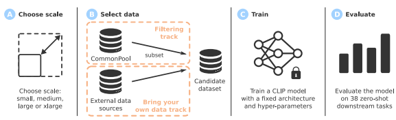

Design a dataset, in either the filtering or BYOD track. C) Train a CLIP model on the designed dataset using a fixed architecture and hyperparameters (Section 3.4). D) Evaluate the trained model on a suite of diverse downstream tasks (Section 3.5).

scales enable researchers with different resources to participate in our benchmark. Moreover, our results show that the ranking of filtering approaches is largely consistent across scale. Our fourth contribution is over three hundred baseline experiments, including techniques such as querying captions for relevant keywords, filtering based on image embeddings, and applying a threshold on CLIP scores. A key result from our baselines experiments is that smaller, more stringently filtered datasets can lead to models that generalize *better* than larger datasets coming from the same pool. At the 12.8B scale, our best filtering baseline increases ImageNet zero-shot accuracy by 6.9 percentage points (pp) relative to the unfiltered pool (see Table 3). For the BYOD
track, our initial experiments show that 109M additional data points (less than 1% of the 12.8B
pool) improve the CLIP-filtered subsets of CommonPool by up to 1.2 pp ImageNet accuracy (see Table 17).

Finally, our fifth contribution is DataComp-1B, a new state-of-the-art multimodal dataset.

We obtain DataComp-1B by combining our two most promising filtering baselines. DataComp-1B
enables training a CLIP ViT-L/14 model to an ImageNet zero-shot accuracy of 79.2% (see Table 1),
corresponding to a 9× computational cost reduction when compared to a larger CLIP ViT-g/14 model trained on LAION-2B for about 3× longer. Moreover, our model outperforms OpenAI's original CLIP ViT-L/14 by 3.7 percentage points, while using the same compute budget.

To make DataComp a shared environment for controlled dataset experiments, we publicly release our candidate pool url index, our tooling for assembling these pools, our filtering baselines, and our code for training and evaluating models at www.datacomp.ai. We believe that our infrastructure will help put research on dataset design on rigorous empirical foundations, draw attention to this understudied research area, and lead to the next generation of multimodal datasets.

# 2 Related Work

We review the most closely related work and include additional related work in Appendix C.

The effects of data curation. Classical work considers dataset cleaning and outlier removal [72, 147, 121, 122] to discard samples that may lead to undesirable model bias. A related line of work develops coreset selection algorithms [60, 7, 46, 11, 91, 140, 32], which aim to select data subsets that lead to the same performance as training on the entire dataset. These techniques appear to scale poorly to larger data regimes [51, 6]. More recent efforts in subset selection often operate on already curated datasets [95, 136, 127, 16, 33, 103] (e.g., CIFAR-10, ImageNet) or on smaller data regimes (e.g., YFCC-15M [108, 135]). These settings often do not reflect newer training paradigms that involve (1) *noisy* image-text pairs instead of category labeled images and (2) large scale datasets
(e.g., billions of samples). While data-centric investigations have led to community competitions like dcbench
 [43] and DataPerf [94], existing benchmarks have likewise operated at small data scales
[97] compared to datasets like LAION-2B [126], which contains over two billion images. DataComp bridges this gap by aligning data-centric investigation with large scale image-text training. There has also been renewed interest in dataset pruning and deduplication. Sorscher et al. [130] show that data pruning can improve traditional scaling trends on ImageNet, but do not consider image-text training or larger datasets. Raffel et al. [110] remove sentence redundancies when creating the C4 corpus. Subsequent work further demonstrated the benefits of deduplication for better language modeling [88]. Radenovic et al. [107] introduce CAT filtering for image-text datasets—a rule-based system to retain high quality samples. Abbas et al. [6] propose SemDeDup, which starts with the CAT-filtered LAION-440M subset, further employing clustering to remove semantic duplicates.

DataComp facilitates data-centric investigation at an even larger scale (i.e., 12.8B sample scale) and provides a common experimental setting for fair comparison amongst dataset creation algorithms. Large-scale multimodal datasets. Datasets have been instrumental to building multimodal models like CLIP [108], Flamingo [8], Stable Diffusion [120], DALL-E [112, 113] and GPT-4 [100]. These methods succeeded by training on large, heterogeneous datasets rather than solely through advanced modelling techniques. For example, OpenAI's CLIP trains on 400M image-text pairs from the web, roughly 300× the size of ImageNet [37]. Prior work on scaling image-text datasets also provides promising trends with respect to zero-shot model performance [71, 104]. Additional large scale datasets like FILIP-300M [144], FLD-900M [148], and PaLI-10B [25] were constructed to train multimodal models. However, many datasets used to train such models (including the dataset for OpenAI's CLIP) are proprietary, making it hard to conduct data-centric investigations. Even for public image-text datasets like SBU [101], Flickr30k [146], MS-COCO [26], Conceptual Captions [128], CC12M [24], RedCaps [38], WIT [131], Shutterstock [98], YFCC-100M [135], COYO- 700M [20], LAION-400M [125], or LAION-2B [126] little is known about what constitutes a good image-text dataset. Preliminary analysis suggests that different image-text data sources lead to CLIP models with different properties [98]. However, previous work is limited to smaller scale data
(10-15M examples). Birhane et al. [15] examine LAION-400M and find NSFW imagery and racial slurs, centering the dangers in web-scale multimodal datasets. To combat toxicity, we preprocess our pool to remove NSFW content and blur human faces detected in images. For more details on our safety preprocessing see Section 3.2, Appendices E and G.

# 3 The Datacomp Benchmark

DataComp is meant to facilitate data-centric experimentation. While traditional benchmarks emphasize model design, DataComp is centered around dataset development, where the resulting datasets can be used to train many high accuracy models. We focus on large image-text datasets and quantify a dataset submission by training a CLIP model on it from scratch [108] and evaluating on 38 downstream image classification and retrieval tasks. We additionally have three secret test sets, which will be released after a year, to gaurd against overfitting and cheating. To facilitate such investigations, we provide a candidate pool of uncurated image-text pairs sourced from the public internet. Our benchmark offers two tracks: one where participants must filter samples from the pools we provide, and another where participants can use external data. Moreover, DataComp is structured to accommodate participants with diverse levels of computational resources: each track is broken down into four scales with varying compute requirements. We now discuss high-level design decisions, construction of a 12.8B image-text data pool to facilitate the competition, benchmark tracks, model training, and evaluation.

### 3.1 Competition Design

Overview. In many areas of machine learning, larger datasets lead to better performing models [85, 77, 71, 104, 65, 28, 19, 108, 109]. Hence comparing only datasets with the same size is a natural starting point. However, this approach is flawed as controlling the dataset size ignores critical curation constraints: candidate pool size (i.e., number of image-text pairs to harvest) and training compute. For instance, assembling a dataset like LAION-2B consists of identifying *data sources*
(e.g., Common Crawl or Reddit) and *filtering* the data source. Notably, *the final dataset size is a* design choice and is only upper-bounded by the data sources. Hence, the true data constraint is the size of the reservoir of samples: *candidate pool* to be filtered. To make DataComp a realistic benchmark, we therefore fix the candidate pool in the filtering track, but give participants control over the training set size. Compute cost is another relevant constraint. To put datasets of different size on equal footing, we specify the total *number of training samples seen*. Consider the 12.8B compute scale and filtered datasets A and B, with 6.4B and 3.2B image-text pairs respectively. At this scale, we train by making two passes over A, while making four passes over B. A key result from our experiments is that smaller, more stringently filtered datasets can lead to models that generalize *better*.

Competition tracks. Two key procedures in assembling a training dataset are filtering a data source [125, 126, 20] and aggregating data sources [36, 37]. To reflect this structure, DataComp has two tracks: *filtering*, where participants select a subset of the samples from CommonPool, and Bring Your Own Data (BYOD), where participants can use any source of data. Key decisions for each tracks are described in Sections 3.2 and 3.3, respectively. For full competition track rules see Appendix A. Competition compute scales. To facilitate study of scaling trends and accommodate participants with various computational resources, we structure DataComp using four scales of compute: small, medium, large and xlarge. Each new scale increases the number of samples seen during training by 10× (from 12.8M to 12.8B samples seen), and the pool we provide by the same factor (from 12.8M
samples to 12.8B samples). Table 2 gives the experimental configuration used for each scale. For the small scale, our runs took 4 hours on an A100 GPU, and for the xlarge scale 81 hours on 512 GPUs.

Table 2: Experimental configurations, with compute in multiply-accumulate operations (MACs).

| Scale   | Model     | Train compute (MACs)   | Pool size and # samples seen   |
|---------|-----------|------------------------|--------------------------------|
| small   | ViT\-B/32 | 9.5 ×  1016            | 12.8M                          |
| medium  | ViT\-B/32 | 9.5 × 1017             | 128M                           |
| large   | ViT\-B/16 | 1019  2.6 ×            | 1.28B                          |
| xlarge  | ViT\-L/14 | 1021  1.1 ×            | 12.8B                          |

# 3.2 Commonpool Generation, For The Filtering Track

To instantiate the dataset filtering track of our competition, we require a large-scale pool of image-text pairs. We construct such a pool, CommonPool, from Common Crawl [3]. Our pool construction pipeline has four steps: url extraction and data download, NSFW detection, evaluation set deduplication, and face blurring. We additionally provide per sample metadata (e.g., CLIP
features). Starting from the xlarge CommonPool, we take successive random subsets to create large, medium, and small CommonPool (e.g., medium is a subset of large).

Extracting urls and dowloading data. We first use cc2dataset [1], which utilizes Apache Spark [150], to extract pairs of image urls and nonempty alt-text from all Common Crawl snapshots from 2014 to 2022. We then deduplicate the url-text pairs and randomly shuffle. This step results in ∼88B possible samples. Not all samples are downloadable; other samples are not suitable due to NSFW content or overlap with our evaluation sets. We attempt to download ∼40B samples using img2dataset [5] resulting in ∼16.8B image-text pairs. For more details, see Appendix D. Safety preprocessing. Since Common Crawl is a snapshot of the internet, we require strict preprocessing to remove unsafe content. We use Detoxify [59] to prune samples that contain unsafe text (e.g., obscene, sexually explicit, or threatening language). We also discard samples with explicit visual content. To do so, we train a classifier on CLIP ViT-L/14 [108] features, using the NSFW dataset used in LAION-5B [126]. We validate our classifier against the Google commercial image safety API. See Appendix E for details. Around 19% of image-text pairs are considered NSFW,
taking the pool of ∼16.8B downloads to ∼13.6B samples. Evaluation set deduplication. To prevent accidental overfitting to certain test sets in our evaluation suite, we perform a thorough near-duplicate removal between the candidate pool and our evaluation sets, using a state-of-the-art image deduplication model [145]. Appendix F contains additional details. The model flags ∼3% of the 16.8B images as near-duplicates, reducing the ∼13.6B
pool to ∼13.1B samples. From here we select a random subset to get the xlarge pool of 12.8B samples. Face detection & blurring. To protect the privacy of individuals, we detect and blur faces from images in our pool using a face detector [53]. As observed by Yang et al. [143], obfuscating faces has little impact on model performance, as we also observe in our experiments (Appendix G).

Pool metadata. To bootstrap participants we distribute metadata for each sample in CommonPool
(e.g., image url, alt-text, original image resolution, CLIP features, and CLIP similarity scores).

Following Carlini et al. [22], we release SHA256 hashes for each image to guard against data poisoning in subsequent CommonPool downloads. For additional details see Appendix H. We opensource our metadata processing pipeline—including safety preprocessing, evaluation set dedipliction, face detection and blurring—as dataset2metadata [4].

# 3.3 The Bring Your Own Data (Byod) Track

While CommonPool can be used to study different filtering techniques, state-of-the-art models often train on data from different sources. For instance, the Flamingo model [8] uses both multimodal massive web (M3W) and ALIGN datasets [71]. To facilitate non-proprietary research on curating data from many sources, we instantiate a separate DataComp track to allow participants to combine multiple data streams. For example, participants could construct a training set from CC12M [24], YFCC100M [135], and data sources they label themselves. In Section 4.2 and Appendix O.2 we describe our exploration using existing public, image-text datasets.

### 3.4 Training

We create a common experimental setting that enables comparable experiments by fixing the training procedure. We closely follow the CLIP training recipe proposed by Radford et al. [108]: training models from scratch with a contrastive objective over images and captions. Given a set of imagecaption pairs, we train an image encoder and a text encoder such that the similarity between the representations of images and their corresponding text is maximized relative to unaligned pairs.1 For each scale, we fix the model architecture and hyperparameters (see Table 2). We pick Vision Transformers (ViTs) [39] as the image encoder, considering the better scaling trends observed by Radford et al. [108] compared to ResNets [61]. Models are trained for a fixed number of steps determined by the scale (Table 2), using the OpenCLIP repository [68]. See Appendix M for details.

### 3.5 Evaluation

We evaluate on a suite of 38 image classification and retrieval tasks. We also study two additional fairness tasks, detailed in Section 5 and Appendix P. As discussed in Section 3.2, we remove test set images from DataComp to avoid contamination. Image classification datasets range from satellite imagery recognition to classifying metastatic tissues. In total we have (with some overlap): 22 of the datasets evaluated in Radford et al. [108], 6 ImageNet distribution shifts (i.e., ImageNet-Sketch [138],
ImageNet-V2 [118], ImageNet-A [64], ImageNet-O [64], ImageNet-R [63], and ObjectNet [13]), 13 datasets from VTAB [151], and 3 datasets from WILDS [81, 124]. Retrieval datasets include Flickr30k [146], MSCOCO [26], and the WinoGAViL commonsense association task [17]. To aggregate results over all evaluation tasks, we average the preferred metric for each task.

DataComp adopts a zero-shot evaluation protocol: models are tested without training on the evaluation tasks. This approach is computationally efficient and measures a model's ability to perform well without any additional training. We find a strong rank correlation (>0.99) between performance in linear probe zero-shot settings (Appendix Figure 16). Additional details are in Appendix N.

1More precisely, given a batch of data {(x1, y1), ...,(xB, yB)} with images x and captions y, we train the image encoder g and text encoder v with the loss ℓ =
1 2 PB
i=1 P 
σii B
j=1 σij
+
1 2 PB
i=1 P 
σii B
j=1 σji
, where σij = exp ⟨g(xi*), h(y*j )⟩.

We also use a learnable temperature parameter as in Radford et al. [108].

# 4 Baselines

### 4.1 Filtering Baselines

We study six simple filtering methods for the filtering track; see Appendix O.1 for further details.

No filtering. We simply use the entire pool as the subset, without any filtering. Since each pool size is equal to the sample budget, training consists of one pass over the data. Random subsets. To isolate the effects of increasing the compute budget from increasing the dataset size, we form subsets consisting of 1%, 10%, 25%, 50% and 75% of the pool chosen at random. Basic filtering. We consider many simple filtering operations inspired by Schuhmann et al. [125] and Byeon et al. [20]: filtering by *language* (English captions, using either fasttext [75] or cld3 [2]); filtering by *caption length* (over two words and five characters); and filtering by *image size* (smaller dimension above 200 pixels and aspect ratio below three). We also experiment with combining language and caption length filtering and combining language, caption length, image size fitering. Unless otherwise specified, "basic" refers fasttext English, caption length, and image size filtering. CLIP score and LAION filtering. We experiment with CLIP score filtering (also employed by LAION), where we take only examples having cosine similarity scores between CLIP image and text embeddings that exceed a pre-defined threshold. We investigate a range of thresholds and two OpenAI CLIP models for computing the scores: the ViT-B/32 model (as in LAION) and the larger ViT-L/14. We also combine CLIP score thresholds and cld3 English filtering to reproduce the LAION-2B filtering scheme. Table 15 in Appendix O.1 summarizes the different CLIP score configurations. Text-based filtering. We select examples that contain text overlapping with ImageNet class names, which serve as a proxy for relevance to downstream tasks. Specifically, we select English captions
(according to fasttext) that contain words from ImageNet-21K or ImageNet-1K [37] class synsets.

Image-based filtering. We select a subset of examples whose visual content overlaps with ImageNet classes. After applying English language (fasttext) and caption length filtering, we cluster the image embeddings extracted by the OpenAI ViT-L/14 model for each image into 100K groups using Faiss [73]. We then find the nearest neighbor group for every ImageNet training example, and keep examples belonging to these groups. We apply this procedure using either ImageNet-21K (14M images) or ImageNet-1K (1.2M images), forming two subsets.

# 4.2 Byod Baselines

We experiment with multiple external data sources, including four moderately sized datasets (10 to 58M samples) studied by Nguyen et al. [98]—CC12M [24], YFCC15M [135, 108], RedCaps [38] and Shutterstock [98]—and the larger LAION-2B [126]. Additional experiments, along with more details about the data sources are provided in Appendix O.2. We consider these data sources as they are and do not perform additional preprocessing. We also present experiments combining some of the data sources (using only the external datasets, or in addition to data from our pool).

Table 3: Zero-shot performance for select baselines in the *filtering* track. On all scales, filtering strategies lead to better performance than using the entire, unfiltered pool. The intersection between imaged-based and CLIP score strategies performs well on most tasks and scales. For all metrics, higher is better (see Appendix N for details). ∩ denotes the intersection of filtering strategies.

| Scale   | Filtering strategy                   | Dataset   | Samples   |          | ImageNet     |       |           | Average over   |
|---------|--------------------------------------|-----------|-----------|----------|--------------|-------|-----------|----------------|
|         |                                      | size      | seen      | ImageNet | dist. shifts | VTAB  | Retrieval | 38 datasets    |
|         | No filtering                         | 12.8M     | 12.8M     | 0.025    | 0.033        | 0.145 | 0.114     | 0.132          |
|         | Basic filtering                      | 3M        | 12.8M     | 0.038    | 0.043        | 0.150 | 0.118     | 0.142          |
|         | Text\-based                          | 3.2M      | 12.8M     | 0.046    | 0.052        | 0.169 | 0.125     | 0.157          |
| small   | Image\-based                         | 3M        | 12.8M     | 0.043    | 0.047        | 0.178 | 0.121     | 0.159          |
|         | LAION\-2B filtering                  | 1.3M      | 12.8M     | 0.031    | 0.040        | 0.136 | 0.092     | 0.133          |
|         | CLIP score (L/14 30%)                | 3.8M      | 12.8M     | 0.051    | 0.055        | 0.190 | 0.119     | 0.173          |
|         | Image\-based ∩ CLIP score (L/14 30%) | 1.4M      | 12.8M     | 0.039    | 0.045        | 0.162 | 0.094     | 0.144          |
|         | No filtering                         | 128M      | 128M      | 0.176    | 0.152        | 0.259 | 0.219     | 0.258          |
|         | Basic filtering                      | 30M       | 128M      | 0.226    | 0.193        | 0.284 | 0.251     | 0.285          |
|         | Text\-based                          | 31M       | 128M      | 0.255    | 0.215        | 0.328 | 0.249     | 0.307          |
| medium  | Image\-based                         | 29M       | 128M      | 0.268    | 0.213        | 0.319 | 0.256     | 0.312          |
|         | LAION\-2B filtering                  | 13M       | 128M      | 0.230    | 0.198        | 0.307 | 0.233     | 0.292          |
|         | CLIP score (L/14 30%)                | 38M       | 128M      | 0.273    | 0.230        | 0.338 | 0.251     | 0.328          |
|         | Image\-based ∩ CLIP score (L/14 30%) | 14M       | 128M      | 0.297    | 0.239        | 0.346 | 0.231     | 0.328          |
|         | No filtering                         | 1.28B     | 1.28B     | 0.459    | 0.378        | 0.426 | 0.419     | 0.437          |
|         | Basic filtering                      | 298M      | 1.28B     | 0.516    | 0.423        | 0.446 | 0.480     | 0.458          |
|         | Text\-based                          | 317M      | 1.28B     | 0.561    | 0.465        | 0.465 | 0.352     | 0.466          |
| large   | Image\-based                         | 293M      | 1.28B     | 0.572    | 0.454        | 0.483 | 0.479     | 0.476          |
|         | LAION\-2B filtering                  | 130M      | 1.28B     | 0.553    | 0.453        | 0.510 | 0.495     | 0.501          |
|         | CLIP score (L/14 30%)                | 384M      | 1.28B     | 0.578    | 0.474        | 0.538 | 0.466     | 0.529          |
|         | Image\-based ∩ CLIP score (L/14 30%) | 140M      | 1.28B     | 0.631    | 0.508        | 0.546 | 0.498     | 0.537          |
|         | No filtering                         | 12.8B     | 12.8B     | 0.723    | 0.612        | 0.611 | 0.569     | 0.621          |
|         | LAION\-2B filtering                  | 1.3B      | 12.8B     | 0.755    | 0.637        | 0.624 | 0.620     | 0.636          |
| xlarge  | CLIP score (L/14 30%)                | 3.8B      | 12.8B     | 0.764    | 0.655        | 0.643 | 0.588     | 0.650          |
|         | Image\-based ∩ CLIP score (L/14 30%) | 1.4B      | 12.8B     | 0.792    | 0.679        | 0.652 | 0.608     | 0.663          |

# 5 Results And Discussion

### 5.1 Building Better Datasets

Main results. Our key results are in Table 3. Most notably, the intersection between image-based filtering and CLIP score filtering excels on most tasks. The exception is at the small scale and for retrieval datasets.2 Furthermore, other filtering strategies like basic, CLIP score, image-based, text-based filtering show better downstream performance when compared to no filtering. A much larger suite of experiment results can be found in Appendix Q. DataComp leads to better image-text datasets. We hope DataComp catalyzes the search for the next generation of multimodal datasets. We contribute DataComp-1B, which is the output of the Image-based ∩ CLIP score (L/14 30%) baseline filter at the xlarge scale of the filtering track. Our dataset is comprised of 1.4B samples, which not only is *smaller* than the LAION-2B dataset with 2.3B samples, but also comes from a smaller pool. Nevertheless, a CLIP L/14 trained on DataComp-1B outperforms the LAION-2B competitor by 6.1 percentage points on ImageNet (see Table 1). Moreover, training on DataComp-1B improves ImageNet accuracy by 3.7 percentage points over OpenAI's ViT-L/14 trained with the same compute budget. Additionally, even if we

2Cherti et al. [28] also observe that models rank differently on classification and retrieval tasks.

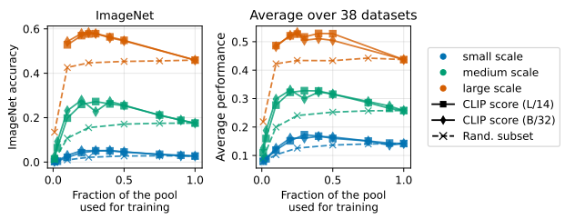

Figure 2: Performance of random subsets (dotted line) and CLIP score filtering (solid line) when varying the subset size. When taking random subsets, larger subsets are always better. For CLIP score filtering, subsets with intermediate size perform best.

restrict ourselves to 400M samples, we can still find a subset of DataComp-1B that outperforms OpenAI's ViT-L/14, as seen in Table 23. These results demonstrate the impact that DataComp can make and provide a foundation upon which participants can build. External data sources can improve performance. Appendix O.2 Table 17 shows results for several baselines in the BYOD track. We find several instances where adding external data sources improves performance over using just data from CommonPool. For example, at the large scale, combining CLIP-filtered data from CommonPool with external data from CC12M [24], YFCC15M
[135, 108], RedCaps [38] and Shutterstock [98] boosts ImageNet accuracy by 4.3 percentage points. See Appendix O.2 for more experiments and details. Trade-off between data diversity and repetition. In Figure 2, we see that randomly selecting subsets of the pool has little effect and degrades performance substantially when only small fractions are used. When filtering with CLIP scores, the optimal training set comes from selecting ∼30% of the pool with the highest scores. The difference in performance trends between random subsets and CLIP score filtering highlights the importance of filtering strategies for selecting samples.

# 5.2 Datacomp Design Analyses

CommonPool and LAION are comparable with the same filtering. To validate our pool construction, we show that we can build datasets comparable to LAION-2B by employing their filtering technique on our pool. LAION-2B selects all samples where the caption is in English and the cosine similarity score from a trained ViT-B/32 CLIP model is above 0.28. We compare this filtering approach on our pool using the same number samples, 130M samples at the large scale.

We find that the different data sources perform comparably: 55.3% vs 55.7% accuracy on ImageNet, and 0.501 vs 0.489 average performance over our evaluation sets using our pool and LAION-2B, respectively.

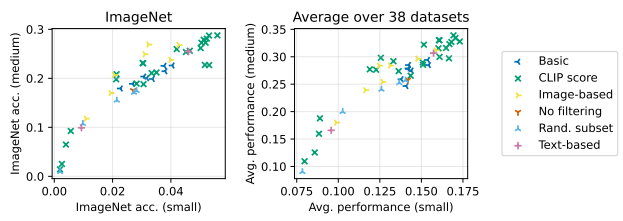

Figure 3: Correlation between small and medium scale baselines. Smaller scales can serve as useful guides for larger scales. Results for additional scales are shown in Appendix Figure 21.

Consistency across scales. We find that the ranking between filtering strategies is typically consistent across different scales. This is illustrated in Figure 3, which shows that the baselines at small and medium scales are positively correlated. Moreover, as shown in Appendix Table 21, the rank correlations of performance is high, between 0.71 and 0.90 for different scale pairs.

Consistency across training changes. DataComp fixes the training procedure, so a natural question is whether better datasets from DataComp are better outside of DataComp. While DataComp-1B is trained at the xlarge scale, we show in Appendix Table 22 that even when substituting the ViT-L/14 for a ViT-B/16 or ViT-B/32, training on DataComp-1B outperforms training on OpenAI's WIT and LAION-2B. Additionally, we found that modifying hyperparameters such as training steps and batch size minimally affects the relative ordering of different data curation methods on downstream performance. Details on hyperparameter ablations are in Appendix L.

### 5.3 Evaluation Trends

ImageNet accuracy is indicative, but not the complete picture. Similarly to Kornblith et al. [82], in Appendix Figure 24 we find that ImageNet performance is highly correlated with the average performance across all datasets we study, with an overall correlation of 0.99. 3 However, ImageNet performance is not representative of all evaluation tasks, as the correlation between ImageNet accuracy and accuracy on other individual datasets varies substantially, in some cases even exhibiting a negative correlation, as discussed in Appendix Q. Robustness and fairness. While typical models trained on a target task suffer large performance drops under data distribution shift, zero-shot CLIP models are known to exhibit strong performance across many distributions [108]. In Appendix Figure 25, we show that CLIP models trained with data from our pool are more robust to distribution shift than ImageNet-trained models from Taori et al. [134]'s testbed. Examining geographic diversity, we find that our models are better than ImageNet-trained models, but fall short of models fine-tuned on diverse curated datasets (see Appendix Figure 20). We also perform a face classification analysis and identify demographic biases

3Note that unlike Kornblith et al. [82] we evaluate zero-shot performance rather than transfer learning.
in our models: notably, the BYOD datasets we consider can increase the risk of misclassification. See Appendix P for more fairness and diversity analyses.

# 6 Limitations And Conclusion

In terms of societal risks, creating an index of image-text pairs from the public internet can be problematic. The internet contains unsafe, toxic, and sensitive content, which ideally should not percolate into machine learning datasets. Though we take steps to remove NSFW content and blur human faces to protect privacy, we hope future work will further explore the biases and risks from CommonPool and DataComp-1B. We see several additional directions for future work, including 1) Curating more data sources. 2) Improved data filtering algorithms. 3) Further supervision signals (e.g., image captions coming from captioning models). 4) Additional input modalities (e.g., video, 3D objects). 5) Broader evaluations for vision-and-language and robotics tasks.

Overall, we see DataComp as a first step towards improving training datasets, and hope our new benchmark will foster further research. By providing a controlled experimental setting, DataComp enables researchers to iterate on dataset design on rigorous empirical foundations. We open-source all of our code, data, and infrastructure, and hope these resources will help the community build the next generation of multimodal datasets.

# Acknowledgements

SYG and JH are supported by NSF Graduate Research Fellowships. GS is supported by the Onassis Foundation - Scholarship ID: F ZS 056-1/2022-2023. GD has been supported by the Onassis Fellowship (Scholarship ID: F ZS 012-1/2022-2023), the Bodossaki Fellowship and the Leventis Fellowship. This research has been supported by NSF Grants AF 1901292, CNS 2148141, DMS 2134012, TRIPODS II-DMS 2023166, Tripods CCF 1934932, IFML CCF 2019844 and research gifts by Western Digital, WNCG IAP, UT Austin Machine Learning Lab (MLL), Cisco, the Len Blavatnik and the Blavatnik Family Foundation, the Stanly P. Finch Centennial Professorship in Engineering, Open Philanthropy, Google, Microsoft, and the Allen Institute for AI.

We would like to thank Amro Abbas, Danny Bickson, Alper Canberk, Jessie Chapman, Brian Cheung, Tim Dettmers, Joshua Gardner, Nancy Garland, Sachin Goyal, Huy Ha, Zaid Harchaoui, Ari Holtzman, Andrew Hundt, Andy Jones, Adam Klivans, Ronak Mehta, Sachit Menon, Ari Morcos, Raviteja Mullapudi, Jonathon Shlens, Brandon McKinzie, Alexander Toshev, David Grangier, Navdeep Jaitly, Kentrell Owens, Marco Tulio Ribeiro, Shiori Sagawa, Christoph Schuhmann, Matthew Wallingford, and Ross Wightman for helpful feedback at various stages of the project.

We thank Stability AI and the Gauss Centre for Supercomputing e.V.4for providing us with compute resources to train models. We are thankful for the compute time provided through the John von Neumann Institute for Computing (NIC) on the GCS Supercomputer JUWELS Booster [76] at Jülich Supercomputing Centre (JSC), and for storage resources on JUST [50] granted and operated by JSC, as well as computing and storage resources from the Helmholtz Data Federation (HDF).

this project and feedback on the experimental design.

We are particularly grateful to Daniel Levy and Alec Radford for early encouragement to pursue 4https://gauss-centre.eu

# References

[1] cc2dataset. https://github.com/rom1504/cc2dataset.

[2] CLD3. https://github.com/google/cld3. [3] Common Crawl. https://commoncrawl.org.

[4] dataset2metadata. https://github.com/mlfoundations/dataset2metadata. [5] img2dataset. https://github.com/rom1504/img2dataset. [6] Amro Abbas, Kushal Tirumala, Dániel Simig, Surya Ganguli, and Ari S Morcos. Semdedup:
Data-efficient learning at web-scale through semantic deduplication, 2023. https://arxiv. org/abs/2303.09540.

[7] Pankaj K. Agarwal, Sariel Har-Peled, and Kasturi R. Varadarajan. Approximating extent measures of points. *Journal of the ACM (JACM)*, 2004. https://doi.org/10.1145/1008731.

1008736.

[8] Jean-Baptiste Alayrac, Jeff Donahue, Pauline Luc, Antoine Miech, Iain Barr, Yana Hasson, Karel Lenc, Arthur Mensch, Katie Millican, Malcolm Reynolds, et al. Flamingo: a visual language model for few-shot learning. In Advances in Neural Information Processing Systems
(NeurIPS), 2022. https://openreview.net/forum?id=EbMuimAbPbs.

[9] Abhijeet Awasthi, Sabyasachi Ghosh, Rasna Goyal, and Sunita Sarawagi. Learning from rules generalizing labeled exemplars. In International Conference on Learning Representations
(ICLR), 2020. https://openreview.net/forum?id=SkeuexBtDr.

[10] Stephen H Bach, Daniel Rodriguez, Yintao Liu, Chong Luo, Haidong Shao, Cassandra Xia, Souvik Sen, Alex Ratner, Braden Hancock, Houman Alborzi, Rahul Kuchhal, Christopher Ré, and Rob Malkin. Snorkel drybell: A case study in deploying weak supervision at industrial scale. In *Special Interest Group on Management of Data (SIGMOD)*, 2019. https://arxiv.

org/abs/1812.00417.

[11] Olivier Bachem, Mario Lucic, and Andreas Krause. Coresets for nonparametric estimation
- the case of dp-means. In *International Conference on Machine Learning (ICML)*, 2015.

https://proceedings.mlr.press/v37/bachem15.html.

[12] Peter Bandi, Oscar Geessink, Quirine Manson, Marcory Van Dijk, Maschenka Balkenhol, Meyke Hermsen, Babak Ehteshami Bejnordi, Byungjae Lee, Kyunghyun Paeng, Aoxiao Zhong, et al. From detection of individual metastases to classification of lymph node status at the patient level: the camelyon17 challenge. *IEEE Transactions on Medical Imaging*, 2018. https://pubmed.ncbi.nlm.nih.gov/30716025/.

[13] Andrei Barbu, David Mayo, Julian Alverio, William Luo, Christopher Wang, Dan Gutfreund, Josh Tenenbaum, and Boris Katz. Objectnet: A large-scale bias-controlled dataset for pushing the limits of object recognition models. In H. Wallach, H. Larochelle, A. Beygelzimer, F. d'Alché-Buc, E. Fox, and R. Garnett (eds.), *Advances in Neural Information Processing* Systems (NeurIPS), volume 32. Curran Associates, Inc., 2019. https://proceedings.neurips.

cc/paper/2019/file/97af07a14cacba681feacf3012730892-Paper.pdf.

[14] Sara Beery, Elijah Cole, and Arvi Gjoka. The iwildcam 2020 competition dataset, 2020.

https://arxiv.org/abs/2004.10340.

[15] Abeba Birhane, Vinay Uday Prabhu, and Emmanuel Kahembwe. Multimodal datasets:
misogyny, pornography, and malignant stereotypes. 2021. https://arxiv.org/abs/2110.

01963.

[16] Vighnesh Birodkar, Hossein Mobahi, and Samy Bengio. Semantic redundancies in imageclassification datasets: The 10% you don't need. *arXiv preprint arXiv:1901.11409*, 2019. https://arxiv.org/abs/1901.11409.

[17] Yonatan Bitton, Nitzan Bitton Guetta, Ron Yosef, Yuval Elovici, Mohit Bansal, Gabriel Stanovsky, and Roy Schwartz. WinoGAViL: Gamified association benchmark to challenge vision-and-language models, 2022. https://arxiv.org/abs/2207.12576.

[18] Lukas Bossard, Matthieu Guillaumin, and Luc Van Gool. Food-101–mining discriminative components with random forests. In *European Conference on Computer Vision (ECCV)*, 2014. https://link.springer.com/chapter/10.1007/978-3-319-10599-4_29.

[19] Tom Brown, Benjamin Mann, Nick Ryder, Melanie Subbiah, Jared D Kaplan, Prafulla Dhariwal, Arvind Neelakantan, Pranav Shyam, Girish Sastry, Amanda Askell, Sandhini Agarwal, Ariel Herbert-Voss, Gretchen Krueger, Tom Henighan, Rewon Child, Aditya Ramesh, Daniel Ziegler, Jeffrey Wu, Clemens Winter, Chris Hesse, Mark Chen, Eric Sigler, Mateusz Litwin, Scott Gray, Benjamin Chess, Jack Clark, Christopher Berner, Sam McCandlish, Alec Radford, Ilya Sutskever, and Dario Amodei. Language models are few-shot learners. In H. Larochelle, M. Ranzato, R. Hadsell, M.F. Balcan, and H. Lin (eds.), Advances in Neural Information Processing Systems (NeurIPS), 2020. https://proceedings.neurips.cc/paper_
files/paper/2020/file/1457c0d6bfcb4967418bfb8ac142f64a-Paper.pdf.

[20] Minwoo Byeon, Beomhee Park, Haecheon Kim, Sungjun Lee, Woonhyuk Baek, and Saehoon Kim. Coyo-700m: Image-text pair dataset. https://github.com/kakaobrain/coyo-dataset, 2022.

[21] Ethan Caballero, Kshitij Gupta, Irina Rish, and David Krueger. Broken neural scaling laws.

International Conference on Learning Representations (ICLR), 2023. https://arxiv.org/
abs/2210.14891.

[22] Nicholas Carlini, Matthew Jagielski, Christopher A Choquette-Choo, Daniel Paleka, Will Pearce, Hyrum Anderson, Andreas Terzis, Kurt Thomas, and Florian Tramèr. Poisoning web-scale training datasets is practical, 2023. https://arxiv.org/abs/2302.10149.

[23] Stephanie C. Y. Chan, Adam Santoro, Andrew K. Lampinen, Jane X. Wang, Aaditya Singh, Pierre H. Richemond, Jay McClelland, and Felix Hill. Data distributional properties drive emergent in-context learning in transformers. In Advances in Neural Information Processing Systems (NeurIPS), 2022. https://arxiv.org/abs/2205.05055.

[24] Soravit Changpinyo, Piyush Sharma, Nan Ding, and Radu Soricut. Conceptual 12m: Pushing web-scale image-text pre-training to recognize long-tail visual concepts. In Conference on Computer Vision and Pattern Recognition (CVPR), 2021. https://arxiv.org/abs/2102.

08981.

[25] Xi Chen, Xiao Wang, Soravit Changpinyo, AJ Piergiovanni, Piotr Padlewski, Daniel Salz, Sebastian Goodman, Adam Grycner, Basil Mustafa, Lucas Beyer, Alexander Kolesnikov, Joan Puigcerver, Nan Ding, Keran Rong, Hassan Akbari, Gaurav Mishra, Linting Xue, Ashish Thapliyal, James Bradbury, Weicheng Kuo, Mojtaba Seyedhosseini, Chao Jia, Burcu Karagol Ayan, Carlos Riquelme, Andreas Steiner, Anelia Angelova, Xiaohua Zhai, Neil Houlsby, and Radu Soricut. Pali: A jointly-scaled multilingual language-image model. In *International* Conference on Learning Representations (ICLR), 2022. https://arxiv.org/abs/2209.06794.

[26] Xinlei Chen, Hao Fang, Tsung-Yi Lin, Ramakrishna Vedantam, Saurabh Gupta, Piotr Dollár, and C Lawrence Zitnick. Microsoft COCO captions: Data collection and evaluation server, 2015. https://arxiv.org/abs/1504.00325.

[27] Gong Cheng, Junwei Han, and Xiaoqiang Lu. Remote sensing image scene classification:
Benchmark and state of the art. Proceedings of the Institute of Electrical and Electronics Engineers (IEEE), 2017. https://ieeexplore.ieee.org/abstract/document/7891544.

[28] Mehdi Cherti, Romain Beaumont, Ross Wightman, Mitchell Wortsman, Gabriel Ilharco, Cade Gordon, Christoph Schuhmann, Ludwig Schmidt, and Jenia Jitsev. Reproducible scaling laws for contrastive language-image learning, 2022. https://arxiv.org/abs/2212.07143.

[29] Gordon Christie, Neil Fendley, James Wilson, and Ryan Mukherjee. Functional map of the world. In *Conference on Computer Vision and Pattern Recognition (CVPR)*, 2018.

https://arxiv.org/abs/1711.07846.

[30] Mircea Cimpoi, Subhransu Maji, Iasonas Kokkinos, Sammy Mohamed, and Andrea Vedaldi. Describing textures in the wild. In Conference on Computer Vision and Pattern Recognition (CVPR), 2014. https://openaccess.thecvf.com/content_cvpr_2014/html/
Cimpoi_Describing_Textures_in_2014_CVPR_paper.html.

[31] Adam Coates, Andrew Ng, and Honglak Lee. An analysis of single-layer networks in unsupervised feature learning. In International Conference on Artificial Intelligence and Statistics (AISTATS), 2011. https://proceedings.mlr.press/v15/coates11a.html.

[32] Michael B. Cohen, Cameron Musco, and Christopher Musco. Input sparsity time low-rank approximation via ridge leverage score sampling. In *ACM-SIAM Symposium on Discrete* Algorithms, 2017. https://dl.acm.org/doi/10.5555/3039686.3039801.

[33] C Coleman, C Yeh, S Mussmann, B Mirzasoleiman, P Bailis, P Liang, J Leskovec, and M Zaharia. Selection via proxy: Efficient data selection for deep learning. In International Conference on Learning Representations (ICLR), 2020. https://arxiv.org/abs/1906.11829.

[34] Alexis Conneau, Kartikay Khandelwal, Naman Goyal, Vishrav Chaudhary, Guillaume Wenzek, Francisco Guzmán, Edouard Grave, Myle Ott, Luke Zettlemoyer, and Veselin Stoyanov.

Unsupervised cross-lingual representation learning at scale. In Annual Meeting of the Association for Computational Linguistics (ACL), 2019. https://arxiv.org/abs/1911.

02116.

[35] R Dennis Cook. Detection of influential observation in linear. *Technometrics*, 19(1):15–18, 1977.

[36] Achal Dave, Tarasha Khurana, Pavel Tokmakov, Cordelia Schmid, and Deva Ramanan. Tao:
A large-scale benchmark for tracking any object. In European Conference on Computer Vision
(ECCV), 2020. https://arxiv.org/abs/2005.10356.

[37] Jia Deng, Wei Dong, Richard Socher, Li-Jia Li, Kai Li, and Li Fei-Fei. Imagenet: A large-scale hierarchical image database. In Conference on Computer Vision and Pattern Recognition
(CVPR), 2009. https://ieeexplore.ieee.org/abstract/document/5206848.

[38] Karan Desai, Gaurav Kaul, Zubin Aysola, and Justin Johnson. Redcaps: Web-curated imagetext data created by the people, for the people, 2021. https://arxiv.org/abs/2111.11431.

[39] Alexey Dosovitskiy, Lucas Beyer, Alexander Kolesnikov, Dirk Weissenborn, Xiaohua Zhai, Thomas Unterthiner, Mostafa Dehghani, Matthias Minderer, Georg Heigold, Sylvain Gelly, Jakob Uszkoreit, and Neil Houlsby. An image is worth 16x16 words: Transformers for image recognition at scale. In *International Conference on Learning Representations (ICLR)*, 2021.

https://openreview.net/forum?id=YicbFdNTTy.

[40] Matthijs Douze, Giorgos Tolias, Ed Pizzi, Zoë Papakipos, Lowik Chanussot, Filip Radenovic, Tomas Jenicek, Maxim Maximov, Laura Leal-Taixé, Ismail Elezi, Ondrej Chum, and Cristian Canton-Ferrer. The 2021 image similarity dataset and challenge, 2021. https://arxiv.org/
abs/2106.09672.

[41] Kawin Ethayarajh, Yejin Choi, and Swabha Swayamdipta. Understanding dataset difficulty with v-usable information. In *International Conference on Machine Learning (ICML)*, 2022.

https://arxiv.org/abs/2110.08420.

[42] M. Everingham, L. Van Gool, C. K. I. Williams, J. Winn, and A. Zisserman. The PASCAL
Visual Object Classes Challenge 2007 (VOC2007) Results, 2007. http://www.pascal-network.

org/challenges/VOC/voc2007/workshop/index.html.

[43] Sabri Eyuboglu, Bojan Karlaš, Christopher Ré, Ce Zhang, and James Zou. dcbench: a benchmark for data-centric ai systems. In Proceedings of the Sixth Workshop on Data Management for End-To-End Machine Learning, 2022. https://dl.acm.org/doi/abs/10. 1145/3533028.3533310.

[44] Alex Fang, Gabriel Ilharco, Mitchell Wortsman, Yuhao Wan, Vaishaal Shankar, Achal Dave, and Ludwig Schmidt. Data determines distributional robustness in contrastive language image pre-training (clip). In *International Conference on Machine Learning (ICML)*, 2022. https://arxiv.org/abs/2205.01397.

[45] Li Fei-Fei, Rob Fergus, and Pietro Perona. Learning generative visual models from few training examples: An incremental Bayesian approach tested on 101 object categories. Conference on Computer Vision and Pattern Recognition (CVPR) Workshop, 2004. https://ieeexplore.

ieee.org/document/1384978.

[46] Dan Feldman, Matthew Faulkner, and Andreas Krause. Scalable training of mixture models via coresets. In Advances in Neural Information Processing Systems
(NeuIPS), 2011. https://proceedings.neurips.cc/paper_files/paper/2011/file/
2b6d65b9a9445c4271ab9076ead5605a-Paper.pdf.

[47] Daniel Y. Fu, Mayee F. Chen, Frederic Sala, Sarah M. Hooper, Kayvon Fatahalian, and Christopher Ré. Fast and three-rious: Speeding up weak supervision with triplet methods.

In *International Conference on Machine Learning (ICML)*, 2020. https://arxiv.org/abs/ 2002.11955.

[48] Andreas Geiger, Philip Lenz, and Raquel Urtasun. Are we ready for autonomous driving?

the kitti vision benchmark suite. In *Conference on Computer Vision and Pattern Recognition*
(CVPR), 2012. https://ieeexplore.ieee.org/abstract/document/6248074.

[49] Amirata Ghorbani and James Zou. Data shapley: Equitable valuation of data for machine learning. In *International Conference on Machine Learning*, pp. 2242–2251. PMLR, 2019.

[50] Stephan Graf and Olaf Mextorf. Just: Large-scale multi-tier storage infrastructure at the jülich supercomputing centre. *Journal of large-scale research facilities JLSRF*, 7:180, 2021.

[51] Chengcheng Guo, Bo Zhao, and Yanbing Bai. Deepcore: A comprehensive library for coreset selection in deep learning, 2022. https://arxiv.org/abs/2204.08499.

[52] Han Guo, Nazneen Fatema Rajani, Peter Hase, Mohit Bansal, and Caiming Xiong. Fastif:
Scalable influence functions for efficient model interpretation and debugging. arXiv preprint arXiv:2012.15781, 2020.

[53] Jia Guo, Jiankang Deng, Alexandros Lattas, and Stefanos Zafeiriou. Sample and computation redistribution for efficient face detection. In International Conference on Learning Representations (ICLR), 2021. https://arxiv.org/abs/2105.04714.

[54] Suchin Gururangan, Swabha Swayamdipta, Omer Levy, Roy Schwartz, Samuel Bowman, and Noah A. Smith. Annotation artifacts in natural language inference data. In *Conference of the* North American Chapter of the Association for Computational Linguistics (NAACL), 2018.

https://aclanthology.org/N18-2017.

[55] Kelvin Guu, Albert Webson, Ellie Pavlick, Lucas Dixon, Ian Tenney, and Tolga Bolukbasi.

Simfluence: Modeling the influence of individual training examples by simulating training runs.

arXiv preprint arXiv:2303.08114, 2023.

[56] Frank R Hampel. The influence curve and its role in robust estimation. *Journal of the american* statistical association, 69(346):383–393, 1974.

[57] Xiaochuang Han, Byron C Wallace, and Yulia Tsvetkov. Explaining black box predictions and unveiling data artifacts through influence functions. *arXiv preprint arXiv:2005.06676*, 2020.

[58] A. Hanna, Emily L. Denton, Andrew Smart, and Jamila Smith-Loud. Towards a critical race methodology in algorithmic fairness. In Conference on Fairness, Accountability, and Transparency (FAccT), 2020. https://arxiv.org/abs/1912.03593.

[59] Laura Hanu and Unitary team. Detoxify, 2020. https://github.com/unitaryai/detoxify. [60] Sariel Har-Peled and Soham Mazumdar. On coresets for k-means and k-median clustering.

In *Symposium on Theory of Computing (STOC)*, 2004. https://doi.org/10.1145/1007352.

1007400.

[61] Kaiming He, Xiangyu Zhang, Shaoqing Ren, and Jian Sun. Deep residual learning for image recognition. In *Conference on Computer Vision and Pattern Recognition (CVPR)*, 2016. https://arxiv.org/abs/1512.03385.

[62] Patrick Helber, Benjamin Bischke, Andreas Dengel, and Damian Borth. Eurosat: A novel dataset and deep learning benchmark for land use and land cover classification. *Journal of* Selected Topics in Applied Earth Observations and Remote Sensing, 2019. https://arxiv.

org/abs/1709.00029.

[63] Dan Hendrycks, Steven Basart, Norman Mu, Saurav Kadavath, Frank Wang, Evan Dorundo, Rahul Desai, Tyler Zhu, Samyak Parajuli, Mike Guo, Dawn Song, Jacob Steinhardt, and Justin Gilmer. The many faces of robustness: A critical analysis of out-of-distribution generalization.

ICCV, 2021. https://arxiv.org/abs/2006.16241.

[64] Dan Hendrycks, Kevin Zhao, Steven Basart, Jacob Steinhardt, and Dawn Song. Natural adversarial examples. In *Conference on Computer Vision and Pattern Recognition (CVPR)*,
2021. https://arxiv.org/abs/1907.07174.

[65] Jordan Hoffmann, Sebastian Borgeaud, Arthur Mensch, Elena Buchatskaya, Trevor Cai, Eliza Rutherford, Diego de Las Casas, Lisa Anne Hendricks, Johannes Welbl, Aidan Clark, et al.

Training compute-optimal large language models, 2022. https://arxiv.org/abs/2203.15556.

[66] Raphael Hoffmann, Congle Zhang, Xiao Ling, Luke Zettlemoyer, and Daniel S Weld. Knowledgebased weak supervision for information extraction of overlapping relations. In Annual Meeting of the Association for Computational Linguistics (ACL), 2011. https://aclanthology.org/
P11-1055.

[67] Andrew Hundt, William Agnew, Vicky Zeng, Severin Kacianka, and Matthew Gombolay.

Robots enact malignant stereotypes. In Conference on Fairness, Accountability, and Transparency (FAccT), 2022. https://arxiv.org/abs/2207.11569.

[68] Gabriel Ilharco, Mitchell Wortsman, Ross Wightman, Cade Gordon, Nicholas Carlini, Rohan Taori, Achal Dave, Vaishaal Shankar, Hongseok Namkoong, John Miller, Hannaneh Hajishirzi, Ali Farhadi, and Ludwig Schmidt. OpenCLIP, July 2021. https://doi.org/10.5281/zenodo.

5143773.

[69] Andrew Ilyas, Sung Min Park, Logan Engstrom, Guillaume Leclerc, and Aleksander Madry.

Datamodels: Predicting predictions from training data, 2022. https://arxiv.org/abs/2202.

00622.

[70] Tanuj Jain, Christopher Lennan, Zubin John, and Dat Tran. Imagededup, 2019. https:
//github.com/idealo/imagededup.

[71] Chao Jia, Yinfei Yang, Ye Xia, Yi-Ting Chen, Zarana Parekh, Hieu Pham, Quoc V Le, Yunhsuan Sung, Zhen Li, and Tom Duerig. Scaling up visual and vision-language representation learning with noisy text supervision. In *International Conference on Machine Learning (ICML)*,
2021. https://arxiv.org/abs/2102.05918.

[72] Mon-Fong Jiang, Shian-Shyong Tseng, and Chih-Ming Su. Two-phase clustering process for outliers detection. *Pattern recognition letters*, 2001. https://www.sciencedirect.com/
science/article/abs/pii/S0167865500001318.

[73] Jeff Johnson, Matthijs Douze, and Hervé Jégou. Billion-scale similarity search with GPUs.

IEEE Transactions on Big Data, 2019. https://arxiv.org/abs/1702.08734.

[74] Justin Johnson, Bharath Hariharan, Laurens van der Maaten, Li Fei-Fei, C. Lawrence Zitnick, and Ross B. Girshick. CLEVR: A diagnostic dataset for compositional language and elementary visual reasoning. *Conference on Computer Vision and Pattern Recognition (CVPR)*, 2017.

https://arxiv.org/abs/1612.06890.

[75] Armand Joulin, Edouard Grave, Piotr Bojanowski, and Tomas Mikolov. Bag of tricks for efficient text classification. In Conference of the European Chapter of the Association for Computational Linguistics (EACL), 2017. https://arxiv.org/abs/1607.01759.

[76] Juelich Supercomputing Center. JUWELS Booster Supercomputer, 2020. https://apps.fz-juelich.de/jsc/hps/juwels/configuration.html\#
hardware-configuration-of-the-system-name-booster-module.

[77] Jared Kaplan, Sam McCandlish, Tom Henighan, Tom B Brown, Benjamin Chess, Rewon Child, Scott Gray, Alec Radford, Jeffrey Wu, and Dario Amodei. Scaling laws for neural language models, 2020. https://arxiv.org/abs/2001.08361.

[78] Kimmo Karkkainen and Jungseock Joo. Fairface: Face attribute dataset for balanced race, gender, and age for bias measurement and mitigation. In IEEE/CVF Winter Conference on Applications of Computer Vision, 2021. https://arxiv.org/abs/1908.04913.

[79] Pang Wei Koh and Percy Liang. Understanding black-box predictions via influence functions.

In *International Conference on Machine Learning (ICML)*, 2017.

[80] Pang Wei Koh, Kai-Siang Ang, Hubert Teo, and Percy S Liang. On the accuracy of influence functions for measuring group effects. *Advances in Neural Information Processing Systems*
(NeurIPS), 2019.

[81] Pang Wei Koh, Shiori Sagawa, Henrik Marklund, Sang Michael Xie, Marvin Zhang, Akshay Balsubramani, Weihua Hu, Michihiro Yasunaga, Richard Lanas Phillips, Irena Gao, Tony Lee, Etienne David, Ian Stavness, Wei Guo, Berton A. Earnshaw, Imran S. Haque, Sara Beery, Jure Leskovec, Anshul Kundaje, Emma Pierson, Sergey Levine, Chelsea Finn, and Percy Liang. WILDS: A benchmark of in-the-wild distribution shifts. In International Conference on Machine Learning (ICML), 2021. https://arxiv.org/abs/2012.07421.

[82] Simon Kornblith, Jonathon Shlens, and Quoc V Le. Do better imagenet models transfer better? In *Conference on Computer Vision and Pattern Recognition (CVPR)*, 2019. https:
//arxiv.org/abs/1805.08974.

[83] Jonathan Krause, Michael Stark, Jia Deng, and Li Fei-Fei. 3d object representations for finegrained categorization. In *International Conference on Computer Vision Workshops (ICML)*,
2013. https://www.cv-foundation.org/openaccess/content_iccv_workshops_2013/W19/
html/Krause_3D_Object_Representations_2013_ICCV_paper.html.

[84] Alex Krizhevsky, Geoffrey Hinton, et al. Learning multiple layers of features from tiny images, 2009. https://www.cs.toronto.edu/~kriz/learning-features-2009-TR.pdf.

[85] Alex Krizhevsky, Ilya Sutskever, and Geoffrey E Hinton. Imagenet classification with deep convolutional neural networks. In *Advances in Neural Information Processing Systems*
(NeurIPS), 2012.

[86] Ronan Le Bras, Swabha Swayamdipta, Chandra Bhagavatula, Rowan Zellers, Matthew Peters, Ashish Sabharwal, and Yejin Choi. Adversarial filters of dataset biases. In International Conference on Machine Learning (ICML), 2020. https://arxiv.org/abs/2002.04108.

[87] Yann LeCun. The MNIST database of handwritten digits, 1998. http://yann.lecun.com/
exdb/mnist/.

[88] Katherine Lee, Daphne Ippolito, Andrew Nystrom, Chiyuan Zhang, Douglas Eck, Chris Callison-Burch, and Nicholas Carlini. Deduplicating training data makes language models better. In *Annual Meeting of the Association for Computational Linguistics (ACL)*, 2021.

https://arxiv.org/abs/2107.06499.

[89] Yi Li and Nuno Vasconcelos. Repair: Removing representation bias by dataset resampling.

In *Conference on Computer Vision and Pattern Recognition (CVPR)*, 2019. https://arxiv.

org/abs/1904.07911.

[90] Zhuang Liu, Hanzi Mao, Chao-Yuan Wu, Christoph Feichtenhofer, Trevor Darrell, and Saining Xie. A convnet for the 2020s. *Conference on Computer Vision and Pattern Recognition*
(CVPR), 2022. https://arxiv.org/abs/2201.03545.

[91] Mario Lucic, Matthew Faulkner, Andreas Krause, and Dan Feldman. Training gaussian mixture models at scale via coresets. *Journal of Machine Learning Research (JMLR)*, 2018. http://jmlr.org/papers/v18/15-506.html.

[92] S. Maji, J. Kannala, E. Rahtu, M. Blaschko, and A. Vedaldi. Fine-grained visual classification of aircraft, 2013. https://arxiv.org/abs/1306.5151.

[93] Gideon S Mann and Andrew McCallum. Generalized expectation criteria for semi-supervised learning with weakly labeled data. *Journal of Machine Learning Research (JMLR)*, 2010. https://www.jmlr.org/papers/v11/mann10a.html.

[94] Mark Mazumder, Colby Banbury, Xiaozhe Yao, Bojan Karlaš, William Gaviria Rojas, Sudnya Diamos, Greg Diamos, Lynn He, Douwe Kiela, David Jurado, David Kanter, Rafael Mosquera, Juan Ciro, Lora Aroyo, Bilge Acun, Sabri Eyuboglu, Amirata Ghorbani, Emmett Goodman, Tariq Kane, Christine R. Kirkpatrick, Tzu-Sheng Kuo, Jonas Mueller, Tristan Thrush, Joaquin Vanschoren, Margaret Warren, Adina Williams, Serena Yeung, Newsha Ardalani, Praveen Paritosh, Ce Zhang, James Zou, Carole-Jean Wu, Cody Coleman, Andrew Ng, Peter Mattson, and Vijay Janapa Reddi. Dataperf: Benchmarks for data-centric ai development, 2022. https://arxiv.org/abs/2207.10062.

[95] Baharan Mirzasoleiman, Jeff Bilmes, and Jure Leskovec. Coresets for data-efficient training of machine learning models. In *International Conference on Machine Learning (ICML)*, 2020.

https://arxiv.org/abs/1906.01827.

[96] Yuval Netzer, Tao Wang, Adam Coates, Alessandro Bissacco, Bo Wu, and Andrew Y Ng.

Reading digits in natural images with unsupervised feature learning. In Advances in Neural Information Processing Systems (NeurIPS) Workshops, 2011. https://storage.googleapis.

com/pub-tools-public-publication-data/pdf/37648.pdf.

[97] Andrew Ng, Dillon Laird, and Lynn He. Data-centric ai competition, 2021. https://
https-deeplearning-ai.github.io/data-centric-comp/.

[98] Thao Nguyen, Gabriel Ilharco, Mitchell Wortsman, Sewoong Oh, and Ludwig Schmidt. Quality not quantity: On the interaction between dataset design and robustness of clip. In *Advances in* Neural Information Processing Systems (NeurIPS), 2022. https://openreview.net/forum?

id=LTCBavFWp5C.

[99] Maria-Elena Nilsback and Andrew Zisserman. Automated flower classification over a large number of classes. In *Indian Conference on Computer Vision, Graphics and Image Processing*,
2008. https://ieeexplore.ieee.org/document/4756141.

[100] OpenAI. Gpt-4 technical report, 2023. https://arxiv.org/abs/2303.08774. [101] Vicente Ordonez, Girish Kulkarni, and Tamara L. Berg. Im2text: Describing images using 1 million captioned photographs. In *Advances in Neural Information Processing* Systems (NeurIPS), 2011. https://papers.nips.cc/paper_files/paper/2011/file/
5dd9db5e033da9c6fb5ba83c7a7ebea9-Paper.pdf.

[102] Omkar M. Parkhi, Andrea Vedaldi, Andrew Zisserman, and C. V. Jawahar. Cats and dogs. In *Conference on Computer Vision and Pattern Recognition (CVPR)*, 2012. https:
//ieeexplore.ieee.org/document/6248092.

[103] Mansheej Paul, Surya Ganguli, and Gintare Karolina Dziugaite. Deep learning on a data diet:
Finding important examples early in training. In Advances in Neural Information Processing Systems (NeurIPS), 2021. https://arxiv.org/abs/2107.07075.

[104] Hieu Pham, Zihang Dai, Golnaz Ghiasi, Hanxiao Liu, Adams Wei Yu, Minh-Thang Luong, Mingxing Tan, and Quoc V. Le. Combined scaling for zero-shot transfer learning, 2021. https://arxiv.org/abs/2111.10050.

[105] Vinay Uday Prabhu and Abeba Birhane. Large image datasets: A pyrrhic win for computer vision? In *Winter Conference on Applications of Computer Vision (WACV)*, 2020. https:
//arxiv.org/abs/2006.16923.

[106] Garima Pruthi, Frederick Liu, Satyen Kale, and Mukund Sundararajan. Estimating training data influence by tracing gradient descent. Advances in Neural Information Processing Systems
(NeurIPS), 2020. https://arxiv.org/abs/2002.08484.

[107] Filip Radenovic, Abhimanyu Dubey, Abhishek Kadian, Todor Mihaylov, Simon Vandenhende, Yash Patel, Yi Wen, Vignesh Ramanathan, and Dhruv Mahajan. Filtering, distillation, and hard negatives for vision-language pre-training. In Conference on Computer Vision and Pattern Recognition (CVPR), 2023. https://arxiv.org/abs/2301.02280.

[108] Alec Radford, Jong Wook Kim, Chris Hallacy, Aditya Ramesh, Gabriel Goh, Sandhini Agarwal, Girish Sastry, Amanda Askell, Pamela Mishkin, Jack Clark, Gretchen Krueger, and Ilya Sutskever. Learning transferable visual models from natural language supervision. In *International Conference on Machine Learning (ICML)*, 2021. https://arxiv.org/abs/
2103.00020.

[109] Alec Radford, Jong Wook Kim, Tao Xu, Greg Brockman, Christine McLeavey, and Ilya Sutskever. Robust speech recognition via large-scale weak supervision. arXiv preprint arXiv:2212.04356, 2022.

[110] Colin Raffel, Noam Shazeer, Adam Roberts, Katherine Lee, Sharan Narang, Michael Matena, Yanqi Zhou, Wei Li, and Peter J Liu. Exploring the limits of transfer learning with a unified text-to-text transformer. *The Journal of Machine Learning Research (JMLR)*, 2020. https://arxiv.org/abs/1910.10683.

[111] Vikram V. Ramaswamy, Sing Yu Lin, Dora Zhao, Aaron B. Adcock, Laurens van der Maaten, Deepti Ghadiyaram, and Olga Russakovsky. Beyond web-scraping: Crowd-sourcing a geodiverse datase, 2023. https://arxiv.org/abs/2301.02560.

[112] Aditya Ramesh, Mikhail Pavlov, Gabriel Goh, Scott Gray, Chelsea Voss, Alec Radford, Mark Chen, and Ilya Sutskever. Zero-shot text-to-image generation. In *International Conference on* Machine Learning (ICML), 2021. https://arxiv.org/abs/2102.12092.

[113] Aditya Ramesh, Prafulla Dhariwal, Alex Nichol, Casey Chu, and Mark Chen. Hierarchical textconditional image generation with clip latents, 2022. https://arxiv.org/abs/2204.06125.

[114] A. J. Ratner, B. Hancock, J. Dunnmon, F. Sala, S. Pandey, and C. Ré. Training complex models with multi-task weak supervision. In Association for the Advancement of Artificial Intelligence (AAAI), 2019. https://arxiv.org/abs/1810.02840.

[115] Alexander J Ratner, Christopher M De Sa, Sen Wu, Daniel Selsam, and Christopher Ré.

Data programming: Creating large training sets, quickly. In Advances in Neural Information Processing Systems (NeurIPS), 2016. https://arxiv.org/abs/1605.07723.

[116] Alexander J Ratner, Stephen H Bach, Henry Ehrenberg, Jason Fries, Sen Wu, and Christopher Ré. Snorkel: Rapid training data creation with weak supervision. In Very Large Data Bases Conference (VLDB), 2017. https://arxiv.org/abs/1711.10160.

[117] Christopher Ré. Overton: A data system for monitoring and improving machine-learned products. In 10th Conference on Innovative Data Systems Research, CIDR 2020, Amsterdam, The Netherlands, January 12-15, 2020, Online Proceedings. www.cidrdb.org, 2020. URL
http://cidrdb.org/cidr2020/papers/p33-re-cidr20.pdf.

[118] Benjamin Recht, Rebecca Roelofs, Ludwig Schmidt, and Vaishaal Shankar. Do ImageNet classifiers generalize to ImageNet? In *International Conference on Machine Learning (ICML)*,
2019. http://proceedings.mlr.press/v97/recht19a.html.

[119] William A Gaviria Rojas, Sudnya Diamos, Keertan Ranjan Kini, David Kanter, Vijay Janapa Reddi, and Cody Coleman. The dollar street dataset: Images representing the geographic and socioeconomic diversity of the world. In Advances in Neural Information Processing Systems (NeurIPS) Datasets and Benchmarks Track, 2022. https://openreview.net/forum?

id=qnfYsave0U4.

[120] Robin Rombach, Andreas Blattmann, Dominik Lorenz, Patrick Esser, and Björn Ommer.

High-resolution image synthesis with latent diffusion models. In Conference on Computer Vision and Pattern Recognition (CVPR), 2022. https://arxiv.org/abs/2112.10752.

[121] Peter J Rousseeuw and Mia Hubert. Robust statistics for outlier detection. *Wiley* interdisciplinary reviews: Data mining and knowledge discovery, 2011. http://i2pc.es/
coss/Docencia/SignalProcessingReviews/Rousseeuw2011.pdf.

[122] Peter J Rousseeuw and Mia Hubert. Anomaly detection by robust statistics. Wiley interdisciplinary reviews: Data mining and knowledge discovery, 2018. https://wires.

onlinelibrary.wiley.com/doi/pdf/10.1002/widm.1236.

[123] Olga Russakovsky, Jia Deng, Hao Su, Jonathan Krause, Sanjeev Satheesh, Sean Ma, Zhiheng Huang, Andrej Karpathy, Aditya Khosla, Michael Bernstein, Alexander C. Berg, and Li Fei-Fei. ImageNet Large Scale Visual Recognition Challenge. International Journal of Computer Vision
(IJCV), 2015. https://arxiv.org/abs/1409.0575.

[124] Shiori Sagawa, Pang Wei Koh, Tony Lee, Irena Gao, Sang Michael Xie, Kendrick Shen, Ananya Kumar, Weihua Hu, Michihiro Yasunaga, Henrik Marklund, Sara Beery, Etienne David, Ian Stavness, Wei Guo, Jure Leskovec, Kate Saenko, Tatsunori Hashimoto, Sergey Levine, Chelsea Finn, and Percy Liang. Extending the wilds benchmark for unsupervised adaptation. In *International Conference on Learning Representations (ICLR)*, 2022. https:
//arxiv.org/abs/2112.05090.

[125] Christoph Schuhmann, Richard Vencu, Romain Beaumont, Robert Kaczmarczyk, Clayton Mullis, Aarush Katta, Theo Coombes, Jenia Jitsev, and Aran Komatsuzaki. LAION-400M: Open dataset of clip-filtered 400 million image-text pairs, 2021. https://arxiv.org/abs/
2111.02114.

[126] Christoph Schuhmann, Romain Beaumont, Richard Vencu, Cade W Gordon, Ross Wightman, Mehdi Cherti, Theo Coombes, Aarush Katta, Clayton Mullis, Mitchell Wortsman, Patrick Schramowski, Srivatsa R Kundurthy, Katherine Crowson, Ludwig Schmidt, Robert Kaczmarczyk, and Jenia Jitsev. LAION-5B: An open large-scale dataset for training next generation image-text models. In Thirty-sixth Conference on Neural Information Processing Systems (NeurIPS), Datasets and Benchmarks Track, 2022. https://openreview.net/forum?

id=M3Y74vmsMcY.

[127] Ozan Sener and Silvio Savarese. Active learning for convolutional neural networks: A core-set approach. In *International Conference on Learning Representations (ICLR)*, 2018. https:
//openreview.net/forum?id=H1aIuk-RW.

[128] Piyush Sharma, Nan Ding, Sebastian Goodman, and Radu Soricut. Conceptual captions: A
cleaned, hypernymed, image alt-text dataset for automatic image captioning. In Annual Meeting of the Association for Computational Linguistics (ACL), 2018. https://aclanthology.org/
P18-1238/.

[129] Changho Shin, Winfred Li, Harit Vishwakarma, Nicholas Roberts, and Frederic Sala.

Universalizing weak supervision. In International Conference on Learning Representations
(ICLR), 2022. https://openreview.net/forum?id=YpPiNigTzMT.

[130] Ben Sorscher, Robert Geirhos, Shashank Shekhar, Surya Ganguli, and Ari S. Morcos. Beyond neural scaling laws: beating power law scaling via data pruning. In *Advances in Neural* Information Processing Systems (NeurIPS), 2022. https://openreview.net/forum?id=
UmvSlP-PyV.

[131] Krishna Srinivasan, Karthik Raman, Jiecao Chen, Michael Bendersky, and Marc Najork. Wit:
Wikipedia-based image text dataset for multimodal multilingual machine learning. In 44th International ACM SIGIR Conference on Research and Development in Information Retrieval, 2021. https://arxiv.org/abs/2103.01913.

[132] Johannes Stallkamp, Marc Schlipsing, Jan Salmen, and Christian Igel. The german traffic sign recognition benchmark: a multi-class classification competition. In *International Joint* Conference on Neural Networks (IJCNN), 2011. https://ieeexplore.ieee.org/document/
6033395.

[133] Swabha Swayamdipta, Roy Schwartz, Nicholas Lourie, Yizhong Wang, Hannaneh Hajishirzi, Noah A. Smith, and Yejin Choi. Dataset cartography: Mapping and diagnosing datasets with training dynamics. In Conference on Empirical Methods in Natural Language Processing
(EMNLP), 2020. https://aclanthology.org/2020.emnlp-main.746.

[134] Rohan Taori, Achal Dave, Vaishaal Shankar, Nicholas Carlini, Benjamin Recht, and Ludwig Schmidt. Measuring robustness to natural distribution shifts in image classification. In Advances in Neural Information Processing Systems (NeurIPS), 2020. https://dl.acm.org/
doi/abs/10.5555/3495724.3497285.

[135] Bart Thomee, David A Shamma, Gerald Friedland, Benjamin Elizalde, Karl Ni, Douglas Poland, Damian Borth, and Li-Jia Li. YFCC100M: The new data in multimedia research.

Communications of the ACM, 2016. https://arxiv.org/abs/1503.01817.

[136] Mariya Toneva, Alessandro Sordoni, Remi Tachet des Combes, Adam Trischler, Yoshua Bengio, and Geoffrey J Gordon. An empirical study of example forgetting during deep neural network learning. In *International Conference on Learning Representations (ICLR)*, 2018.

https://arxiv.org/abs/1812.05159.

[137] Bastiaan S Veeling, Jasper Linmans, Jim Winkens, Taco Cohen, and Max Welling. Rotation equivariant CNNs for digital pathology, 2018. https://arxiv.org/abs/1806.03962.

[138] Haohan Wang, Songwei Ge, Zachary Lipton, and Eric P Xing. Learning robust global representations by penalizing local predictive power. In *Advances in Neural Information* Processing Systems (NeurIPS), 2019. https://arxiv.org/abs/1905.13549.

[139] Ryan Webster, Julien Rabin, Loic Simon, and Frederic Jurie. On the de-duplication of laion-2b, 2023. https://arxiv.org/abs/2303.12733.

[140] Kai Wei, Rishabh Iyer, and Jeff Bilmes. Submodularity in data subset selection and active learning. In *International Conference on Machine Learning (ICML)*, 2015. https:
//proceedings.mlr.press/v37/wei15.html.

[141] Jianxiong Xiao, Krista A Ehinger, James Hays, Antonio Torralba, and Aude Oliva. Sun database: Exploring a large collection of scene categories. *International Journal of Computer* Vision (IJCV), 2016. https://link.springer.com/article/10.1007/s11263-014-0748-y.

[142] Kaiyu Yang, Klint Qinami, Li Fei-Fei, Jia Deng, and Olga Russakovsky. Towards fairer datasets: filtering and balancing the distribution of the people subtree in the imagenet hierarchy. In *Conference on Fairness, Accountability, and Transparency (FAccT)*, 2020. https:
//arxiv.org/abs/1912.07726.

[143] Kaiyu Yang, Jacqueline H Yau, Li Fei-Fei, Jia Deng, and Olga Russakovsky. A study of face obfuscation in ImageNet. In *International Conference on Machine Learning (ICML)*, 2022. https://arxiv.org/abs/2103.06191.

[144] Lewei Yao, Runhui Huang, Lu Hou, Guansong Lu, Minzhe Niu, Hang Xu, Xiaodan Liang, Zhenguo Li, Xin Jiang, and Chunjing Xu. Filip: Fine-grained interactive language-image pre-training. In *International Conference on Learning Representations (ICLR)*, 2022. https:
//arxiv.org/abs/2111.07783.

[145] Shuhei Yokoo. Contrastive learning with large memory bank and negative embedding subtraction for accurate copy detection, 2021. https://arxiv.org/abs/2112.04323.

[146] Peter Young, Alice Lai, Micah Hodosh, and Julia Hockenmaier. From image descriptions to visual denotations: New similarity metrics for semantic inference over event descriptions.

Transactions of the Association for Computational Linguistics, 2014. https://aclanthology.

org/Q14-1006/.

[147] Dantong Yu, Gholamhosein Sheikholeslami, and Aidong Zhang. Findout: Finding outliers in very large datasets. *Knowledge and information Systems*, 2002. https://link.springer.

com/article/10.1007/s101150200013.

[148] Lu Yuan, Dongdong Chen, Yi-Ling Chen, Noel Codella, Xiyang Dai, Jianfeng Gao, Houdong Hu, Xuedong Huang, Boxin Li, Chunyuan Li, et al. Florence: A new foundation model for computer vision, 2021. https://arxiv.org/abs/2111.11432.

[149] Man-Ching Yuen, Irwin King, and Kwong-Sak Leung. A survey of crowdsourcing systems. In SocialCom. IEEE, 2011. https://ieeexplore.ieee.org/document/6113213.

[150] Matei Zaharia, Reynold S Xin, Patrick Wendell, Tathagata Das, Michael Armbrust, Ankur Dave, Xiangrui Meng, Josh Rosen, Shivaram Venkataraman, Michael J Franklin, et al. Apache spark: a unified engine for big data processing. *Communications of the ACM*, 2016. https:
//dl.acm.org/doi/10.1145/2934664.

[151] Xiaohua Zhai, Joan Puigcerver, Alexander Kolesnikov, Pierre Ruyssen, Carlos Riquelme, Mario Lucic, Josip Djolonga, André Susano Pinto, Maxim Neumann, Alexey Dosovitskiy, Lucas Beyer, Olivier Bachem, Michael Tschannen, Marcin Michalski, Olivier Bousquet, Sylvain Gelly, and Neil Houlsby. The visual task adaptation benchmark, 2019. http://arxiv.org/abs/
1910.04867.

[152] Jieyu Zhang, Yue Yu, Yinghao Li, Yujing Wang, Yaming Yang, Mao Yang, and Alexander Ratner. WRENCH: A comprehensive benchmark for weak supervision. In *NeurIPS*, 2021. URL https://openreview.net/forum?id=Q9SKS5k8io.

[153] Jieyu Zhang, Cheng-Yu Hsieh, Yue Yu, Chao Zhang, and Alexander Ratner. A survey on programmatic weak supervision, 2022. https://arxiv.org/abs/2202.05433.

[154] Zhifei Zhang, Yang Song, and Hairong Qi. Age progression/regression by conditional adversarial autoencoder. In *Conference on Computer Vision and Pattern Recognition (CVPR)*, 2017.

https://arxiv.org/abs/1702.08423.

# Appendix

Contents

| 1   | Introduction                                       | 1   |
|-----|----------------------------------------------------|-----|
| 2   | Related Work                                       | 4   |
| 3   | DataComp  The benchmark                            | 5   |
|     | 3.1  Competition design                            | 5   |
|     | CommonPool 3.2 generation, for the filtering track | 6   |
|     | The bring your own data (BYOD) track               |     |
|     | 3.3                                                | 7   |
|     | 3.4  Training                                      | 7   |
|     | 3.5  Evaluation                                    | 7   |
| 4   | Baselines                                          | 8   |
|     | 4.1  Filtering baselines                           | 8   |
|     | BYOD 4.2 baselines                                 | 8   |
| 5   | Results and discussion                             | 9   |
|     | 5.1  Building better datasets                      | 9   |
|     | DataComp 5.2 design analyses                       | 10  |
|     | 5.3  Evaluation trends                             | 11  |
| 6   | Limitations and conclusion                         | 12  |
| A   | Benchmark rules                                    | 28  |
|     | A.1  Filtering track rules                         | 28  |
|     | A.2  Bring your own data track: amendments         | 28  |
| B   | Contributions                                      | 29  |
|     | B.1  Candidate pool                                | 29  |
|     | B.2  Participant tooling                           | 29  |
|     | B.3  Baselines                                     | 29  |
|     | B.4  Leadership and Advising                       | 30  |
| C   | Additional related work                            | 30  |
|     | D Parsing Common Crawl                             | 31  |
| E   | Not safe for work (NSFW) filtering                 | 31  |
| F   | Deduplication against evaluation sets              | 32  |
|     | G Face blurring                                    | 33  |
| H   | DataComp CommonPool creation pipeline              | 36  |

| I   | CommonPool statistics                         |    | 37   |
|-----|-----------------------------------------------|----|------|
| J   | Efficient training on data subsets            |    | 41   |
|     | K Effect of duplicates in the training data   |    | 41   |
| L   | Hyperparameter ablations                      |    | 42   |
|     | L.1  Batch size                               |    | 42   |
|     | L.2  Model architecture                       |    | 42   |
|     | L.3  Number of training steps                 |    | 42   |
|     | M Training details                            |    | 46   |
|     | N Evaluation details                          |    | 46   |
| O   | Baseline details                              |    | 49   |
|     | O.1  Filtering track                          |    | 53   |
|     | BYOD O.2 track                                |    | 55   |
|     | O.2.1  Additional results                     |    | 55   |
| P   | Fairness and biases                           |    | 57   |
|     | P.1  Diversity                                |    | 57   |
|     | P.2  Fairness                                 |    | 58   |
| Q   | Extra figures and tables                      |    | 60   |
| R   | Datasheet                                     |    | 69   |
|     | R.1  Motivation                               |    | 69   |
|     | R.2  Composition                              |    | 69   |
|     | R.3  Collection Process                       |    | 72   |
|     | R.4  Preprocessing, Cleaning, and/or Labeling |    | 75   |
|     | R.5  Uses                                     |    | 75   |
|     | R.6  Distribution                             |    | 77   |
|     | R.7  Maintenance                              |    | 77   |

# A Benchmark Rules

We provide concrete rules below for the two competition tracks that comprise DataComp: filtering and BYOD. Additionally, we provide a checklist, which encourages participants to specify design decisions, which allows for more granular comparison between submissions.

### A.1 Filtering Track Rules

- Participants can enter submissions for one or many different scales: small, medium, large or xlarge, which represent the raw number of image-text pairs in CommonPool that should be filtered.

- After choosing a scale, participants generate a list of uids, where each uid refers to a CommonPool sample. The list of uids is used to recover image-text pairs from the pool, which is used for downstream CLIP training.

- Duplicate uids are allowed.

- Participants are not allowed to modify the training procedure. Hence, changing hyperparameters, model architecture, optimizer, compute budget, or number of training steps is not allowed. Changing any other training details is also not allowed.

- Participants are strongly encouraged to submit and open-source both the list of uids and the code used to generate this list; however, this is not required.

- To avoid overfitting, we do not permit running any code or algorithmic dependence on the test images of the evaluation tasks. However, use of other images associated with these tasks (e.g., supervised training sets) is permitted.

- Participants can use templates or class labels from the downstream tasks in their filtering algorithms.

For clarity, we include some examples of permitted and forbidden uses:
✓ We permit using the ImageNet class label "triceratops" in a filtering algorithm.

× We forbid examining individual or aggregate predictions on the test sets of the evaluation tasks.

### A.2 Bring Your Own Data Track: Amendments

To facilitate more open-ended exploration, we provide amendments to the Track 1 competition to allow for more diverse submissions in Track 2.

- Participants are allowed to augment CommonPool data with existing datasets, so long as these data sources do not contain test images from the evaluation tasks. Participants can use data from any CommonPool; however, they are not required to do so.

- Assembling one's own dataset is allowed; however, test images from the evaluation tasks can neither be contained nor otherwise used to construct said dataset. We encourage releasing the image urls or the images themselves in addition to the text for each image. We also encourage rigorous documentation of face-blurring and other data safety checks (see Section 3.2 for more details). We reserve the right to run our own safety code on participant provided data and disqualify entries that do not meet adequate safety standards.

Checklist. The following checklist provides the basis for more fine-grained comparison between submissions.

□ Images from the evaluation tasks are included in my submission. If yes, please specify which datasets.

□ I used an existing datasets (e.g., YFCC100M [135]) in my submission. If yes, please specify which datasets. (Note: applies to BYOD only)
□ I curated my own data. If yes, please provide (1) image data or urls, (2) text for each image,
(3) list of safety steps taken including but not limited to face blurring, explicit content image and text filtering. (Note: applies to BYOD only)

# B Contributions

For this section, contributors are ordered alphabetically.

### B.1 Candidate Pool

Candidate pool lead. Vaishaal Shankar Data collection. Romain Beaumont, Vaishaal Shankar Pre-processing and metadata. Giannis Daras, Alex Fang (content filtering lead), Samir Yitzhak Gadre (metadata lead), Ryan Marten (deduplication lead), Vivek Ramanujan, Vaishaal Shankar, George Smyrnis (face blurring lead)

### B.2 Participant Tooling

Participant tooling lead. Gabriel Ilharco Resharder. Romain Beaumont, Yair Carmon, Alex Fang, Jonathan Hayase (lead), Gabriel Ilharco, Vivek Ramanujan, Vaishaal Shankar, Georgios Smyrnis Training. Mehdi Cherti, Gabriel Ilharco, Jenia Jitsev, Vivek Ramanujan, Georgios Smyrnis, Mitchell Wortsman (lead)
Evaluation. Romain Beaumont, Yonatan Bitton, Mehdi Cherti, Dhruba Ghosh (lead), Gabriel Ilharco Additional infrastructure. Stephen Mussmann, Sarah Pratt

### B.3 Baselines

Baselines lead. Yair Carmon Filtering track. Yair Carmon, Rahim Enterazi, Alex Fang, Samir Yitzhak Gadre, Gabriel Ilharco, Kalyani Marathe, Thao Nguyen, Eyal Orgad (co-lead), Georgios Smyrnis, Mitchell Wortsman, Jieyu Zhang (co-lead)
BYOD track. Gabriel Ilharco, Thao Nguyen Experiment babysitting. Alex Fang, Gabriel Ilharco, Samir Yitzhak Gadre

### B.4 Leadership And Advising

Advising. Romain Beaumont, Yair Carmon, Alexandros G. Dimakis, Ali Farhadi, Hannaneh Hajishirzi, Jenia Jitsev, Pang Wei Koh, Ranjay Krishna, Stephen Mussmann, Sewoong Oh, Alexander Ratner, Olga Saukh, Ludwig Schmidt, Vaishaal Shankar, Shuran Song, Richard Vencu Leadership. Yair Carmon, Alexandros G. Dimakis, Jenia Jitsev, Sewoong Oh, Ludwig Schmidt, Vaishaal Shankar Overall project lead. Ludwig Schmidt

# C Additional Related Work

Here we expand on the related work described in Section 2.

Image dataset safety is an active area of research, especially in the context of large-scale dataset construction. In addition to Birhane et al. [15], who study problematic content in LAION-400M, Yang et al. [142] study the ImageNet dataset and reveal limitations associated with the ImageNet curation strategy—with negative implications for downstream model fairness. Prabhu & Birhane [105] also study the ImageNet dataset and find pornographic content. Both Birhane et al. [15] and Prabhu & Birhane [105] survey ethical conundrums and harms that are borne out of improper dataset curation. In an effort to combat dataset toxicity, we conduct NSFW preprocessing (Section 3.2, Appendix E) and blur detected faces (Section 3.2, Appendix G) during pool construction. We also conduct preliminary fairness evaluations (Section 5.3, Appendix P) for models trained on our data.

We hope CommonPool will serve as a research artifact for future work examining dataset safety.

Beyond data selection, Chan et al. [23] investigate the effects of dataset distribution on emergent properties of transformers, while Fang et al. [44] look at the relationship between data and model robustness to distribution shifts. We hope our extensive evaluation suite comprised of 38 diverse tasks will facilitate similar studies when training multimodal models at large scale.

Others study how to reduce the burdens of training data annotation in the curation process. Classic approaches include distant supervision [66], crowd-sourced labels [149], heuristic rules [9] and feature annotation [93], among others. A recent line of work known as data programming or programmatic weak supervision [115, 116, 152, 153] attempts to reduce annotation cost and is found in many industry applications [10, 117]. In data programming, developers write programmatic labeling functions to automatically label a large amount of unlabeled data. The labeling functions could produce noisy and conflicting labels, so researchers have developed methods to aggregate noisy votes to produce the final training labels [114, 47, 129]. Previous literature also studies methods for training data attribution, which seek to link a model's behavior (e.g., its accuracy on a particular task or subset of data) to particular subsets of its training data. Such methods include influence functions, a classic technique from robust statistics [56, 35] that uses a second-order Taylor expansion to approximate the effect of removing a training point on the learned model parameters [79, 80, 57, 52], as well as methods that fit attribution functions directly to the dynamics of repeated training runs [49, 106, 69, 55]. Training data attribution methods assume that we have already trained a model, though they can be subsequently used to refine the training data (e.g., by identifying potentially mislabeled training points [79]). Our focus in this paper is instead on data curation methods—that is, methods for selecting a subset of the training data to train a model in the first place. In the context of natural language processing, Swayamdipta et al. [133] proposes a tool for characterizing samples in a dataset based on training dynamics, labelling instances as ambiguous, easy to learn or hard to learn. Previous literature such as work by Le Bras et al. [86], Li & Vasconcelos [89], Gururangan et al. [54] advocate for removing easy instances from the training data. Ethayarajh et al. [41] propose a measure of how difficult a dataset is to learn, V-usable information. Such techniques could be promising directions of further exploration in the context of our benchmark. Finally, another related line of work is studying scaling trends. In addition to Sorscher et al. [130],
researchers have investigated how model performance changes as a function of compute budget, model size, and number of training samples [77, 65, 21, 28]. However, this line of work does not consider how dataset design may affects scaling trends. Beyond dataset size, we measure the effects of different dataset sources and filtering strategies. While scaling trends are central to our investigations, the purpose of our benchmark is to search for the next generation of large multimodal datasets to facilitate more accurate and reliable models.

# D Parsing Common Crawl

Common Crawl releases metadata files for the websites that they index (i.e., WAT files). They release these files approximately once a month. We consider all files available from 2014 through November of 2022. We first parse these files, utilizing Apache Spark [150] to extract image urls and corresponding alt-text. We map each url, text pair to a uid hash and remove duplicates. This results in 88 billion url, text pairs, which are randomized via a distributed shuffle. Note, we do not consider image content when running uid deduplication at this step. Hence, two identical images with different urls and the same caption would both be retained.

# E Not Safe For Work (Nsfw) Filtering

Our data is sourced from Common Crawl, which contains snapshots of the web. Therefore, we apply multiple layers of NSFW content filtering to remove problematic images and captions from CommonPool.

First, we filter our captions with Detoxify [59], a language model for toxic comment classification. Specifically, we use the multilingual XLM-RoBERTa [34] variant. The model outputs scores between zero and one for the following categories: toxicity, severe toxicity, obscene, identity attack, insult, threat, and sexually explicit. As we had no ground truth for our data, we manually spot check a 1 million random subset of CommonPool at varying thresholds. We found that a threshold of 0.1 provided good coverage of filtering out NSFW text. If any of the detoxify category scores exceeds the threshold, the sample is discarded. Qualitatively, we found that the model struggled with multilingual content, acronyms, and innuendo. Even at 0.1, we noticed there are some captions that are NSFW. However, lowering the threshold further heavily affected false positives. We therefore use

Table 4: Detoxify positive rates by threshold on 1 million caption subset of Common Crawl.

| Threshold   | Toxicity   | Severe Toxicity   | Obscene   | Identity Attack   | Insult   | Threat   | Sexual Explicit   |
|-------------|------------|-------------------|-----------|-------------------|----------|----------|-------------------|
| 0.01        | 9.5%       | 1.0%              | 33.4%     | 1.8%              | 35.0%    | 1.3%     | 2.0%              |
| 0.1         | 3.6%       | 0.1%              | 0.8%      | 0.3%              | 1.4%     | 0.1%     | 1.0%              |

| Threshold   | False Positive Rate   | True Positives   | Model Positive Rate   | Google API Positive Rate   |
|-------------|-----------------------|------------------|-----------------------|----------------------------|
|             | (Relative to Google)  | (Manual Review)  |                       |                            |
| 0.1         | 3.6%                  | 2                | 14.4%                 | 3.5%                       |
| 0.2         | 0.6%                  | 2                | 9.1%                  | 3.5%                       |
| 0.3         | 0.3%                  | 3                | 7.2%                  | 3.5%                       |

Table 5: Comparing LAION-2B CLIP based NSFW filtering model to Google Vision API Safe Search adult category on a 40,000 random subset of Common Crawl.

a 0.1 threshold for all NSFW categories, which on a random subset of one million captions achieves positive rates shown in Table 4. Second, on the vision side, we use a modified version of LAION-5B's [126] CLIP-based binary classification NSFW model, which takes CLIP ViT-L/14 visual embeddings as input. We remove the initial multi-category encoder from the model, and retrain on the same data with an initial normalization layer followed by a 4-layer multilayer perceptron. Our retrained model matches the performance of the original model on their manually annotated testset. Specifically, we achieve 97.4% classification accuracy on a held out test set compared to 96.1% for the original LAION NSFW
image filtering model. Additional details about the training data can be found in Appendix C.5 of the LAION-5B paper. In brief, the training data contains 682K images that is roughly balanced with images from safe for work and NSFW categories. To evaluate our model and determine a threshold, we used Google Vision API's SafeSearch explicit content detector to generate labels for an 40,000 random subset of our candidate pool. Specifically, an image is NSFW if SafeSearch classifies it as likely or very likely adult (i.e., sexually explicit). As shown in Table 5, we found that by thresholding at 0.1 we achieve high recall relative to SafeSearch and very few true positives after manual review. We also manually reviewed images classified by SafeSearch as likely or very likely racy and found that the images were either benign, subjectively suggestive but not explicit, or already found in the set of images labeled as adult.

# F Deduplication Against Evaluation Sets

To prevent data leakage, we filter CommonPool by removing duplicate and near-duplicate matches of evaluation set images. See Figure 4 for example query images from Common Crawl and corresponding near-duplicates in our evaluations sets. We consider images as duplicates when the cosine similarity between a query (Common Crawl image) feature and a reference (evaluation image) feature is higher than a fixed threshold. We employ the deduplication model proposed by Yokoo [145], which earned 1st place in the Facebook AI Image Similarity Challenge (ISC) [40]. We choose a cosine similarity threshold of 0.604169 to maximize the true duplicates detected, without removing too many false duplicates from the pool. We compare against OpenAI's CLIP ViT-B/32 as a baseline on ISC. We find that for our threshold, the ISC model achieves precision 0.9 and recall 0.8. At a threshold of

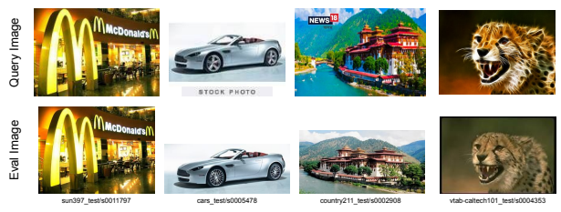

Figure 4: Candidate images (top) that are detected as duplicates against images in the evaluation sets (bottom) are removed from the pool. In addition to exact duplicate images, near-duplicates with variable aspect ratios, JPEG compression, overlays, color adjustment, and artistic rendering are also detected.

0.96, CLIP achieves the same precision 0.9, but a significantly worse recall of 0.02. Approximately 2.8% of downloaded samples are flagged as evaluation set near-duplicates. To verify the performance of our de-duplication models with greater granularity, we modify the evaluation procedure in Douze et al. [40] to include transformations which are representative of naturally-occurring duplications on the Internet. Specifically, we study: 1) jpeg compression
(encoding), 2) image flips, 3) image rotations, 4) aspect ratio modifications, and 5) grayscaling. To do this, we sample 20% of the images from each of our evaluation datasets uniformly at random to serve as a reference set of about 140,000 images. Next we sample 560,000 images uniformly at random from LAION-2B to serve as distractors, for a 4-to-1 distractor to reference ratio. Finally, we apply each of the augmentations above and use threshold filtering to determine duplicates. Figure 5 shows the results from the deduplication model [145] compared with OpenAI's CLIP ViT-L/14. At high recall values, we see that CLIP filtering results in removing over 2× the data as that of the deduplication model from Yokoo [145].

# G Face Blurring

As an extra step to safeguard against issues of privacy that may arise from the use of data scraped from the web, we include face blurring as part of our pool creation. To create face metadata, we use the SCRFD face detector [53] to extract bounding boxes for the faces in our images. These bounding boxes are included as part of the image metadata in our pool. We make use of the pretrained SCRFD-10G model. We use the same preprocessing as the one described in the official repository of the paper, with the exception of providing 224 × 224 input images (by padding each image to square and then resizing) to limit computation costs. Invoking this model provides us with bounding boxes along with an associated score, which we then compare against a threshold of 0.3 to keep or discard this bounding box. This threshold is the default one used in the repository of SCRFD for

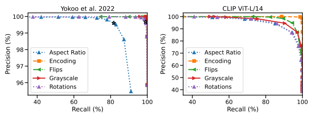

Figure 5: Analysis of different de-duplication strategies across a variety of image transformations.

We see that the model introduced by Yokoo [145] is better in almost every transformation, with the exception of very aggressive aspect ratio modification.

Table 6: Face detection performance on a set of 3293 random images from CommonPool.

|           | SCRFD\-10G   | Amazon Rekognition   |
|-----------|--------------|----------------------|
| Accuracy  | 93.87        | 96.57                |
| Precision | 75.87        | 86.09                |
| Recall    | 90.53        | 93.75                |

the visualization of bounding boxes, and we found it to perform well on our data as discussed next.

In Table 6 we can see the result of face detection on a set of 3293 images from CommonPool. We evaluate the detection on whether the image has visible faces or not (where images such as cartoon drawings of non-real human faces are not considered as positives), and whether the detector has detected these visible faces. We considered an image as a true positive if all the clearly visible faces in the image were detected, based on the above thresholding process. We did not do extensive box labeling. True positives are instead determined by human inspection. We compare the quality of these detections with the Amazon Rekognition system, which is the one upon which the face detections on ImageNet were based [143]. Note that in this scenario, the recall of the detectors is more important than precision (as detecting a few more bounding boxes across our pool does not affect privacy). To utilize these bounding boxes on our data, we apply a standard blurring pipeline, as proposed by Yang et al. [143]. The result of this process is an image where the faces is blurred and there is a smooth transition from blurred to clean parts of the image. In Figure 6 we see the distribution of faces for the small CommonPool. Note that the majority of images do not contain faces.

As part of our competition pipeline, images are by default blurred during the download process. In Table 7 we can see the results of training on a set of images with the size of our medium scale after filtering with each method, with and without the application of face blurring as provided by our detector. We can see that the difference in performance is small, which suggests that the application of face blurring does not significantly affect the performance on our downstream tasks.

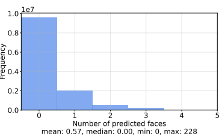

Figure 6: Frequency of predicted number of faces in the small CommonPool.

Table 7: Effect of face blurring on zero-shot performance. Face blurring improves the privacy preservation of our dataset, while affecting model performance negligibly. Results shown for training on a set of images with the size of our medium scale, after filtering with each method.

| Filtering                                          | Face blurring   | ImageNet acc.   | Avg. performance   |
|----------------------------------------------------|-----------------|-----------------|--------------------|
| CLIP score (B/32, thresh. 0.3) + English filtering | ×               | 0.209           | 0.246              |
|                                                    | ✓               | 0.196           | 0.243              |
| CLIP score (B/32, 30%)                             | ×               | 0.287           | 0.301              |
|                                                    | ✓               | 0.282           | 0.298              |

Finally, we evaluated the detector we used for potential biases. More specifically, we used the detector on the validation set of the FairFace dataset [78]. We found that the central face of the image was detected in all the images of the validation set, regardless of subgroup annotate in the dataset.

# H Datacomp Commonpool Creation Pipeline

Figure 7: Data funnel from potential samples in Common Crawl to 13.1B image-text pairs that were suitable for CommonPool. We sampled uniformly 12.8B datapoints for the xlarge CommonPool.

| Table 8: Provided metadata for   | CommonPool.               |                               |
|----------------------------------|---------------------------|-------------------------------|
| Generation Time                  | Label                     | Additional notes              |
| Step 2                           | uid                       |                               |
| url                              |                           | Link to the image.            |
| text                             |                           | Image caption.                |
| original_width                   |                           |                               |
| original_height                  |                           |                               |
| sha256                           |                           | Safeguard for data poisoning. |
| Step 1                           | clip_b32_similarity_score |                               |
| clip_b32_image_features          |                           | In separate file.             |
| clip_b32_text_features           |                           | In separate file.             |
| clip_l14_similarity_score        |                           |                               |
| clip_l14_image_features          |                           | In separate file.             |
| clip_l14_text_features           |                           | In separate file.             |
| face_bboxes                      |                           |                               |
| Step 2, dropped during Step 3    | nsfw_image_score          |                               |
| nsfw_text_score                  |                           |                               |
| dedup_score                      |                           |                               |

Creating CommonPool was a multistep process, which involved (1) parsing image urls and alt-text from Common Crawl dumps and downloading these images, (2) tagging images with metadata and
(3) conducting safety content filtering and evaluation set duplication. In this section we provide an overview of the data pipeline used to create CommonPool. For an overview of our "data funnel" see Figure 7.

1. For the first step, we use parse Common Crawl metadata files to harvest image-text pairs
(Section D). We use img2dataset [5] to obtain ∼16.8B downloaded samples. This is the first, unfiltered version of CommonPool, and contains only basic information for our images (i.e.,
the original image height, width, and alt-text caption). During this step we also resize images such that their largest dimension does not exceed 512 pixels. This eases storage requirements for large images, but is still larger than the 224 pixel resolution used for later training stages.

2. For the second step, we process our unfiltered pool and create richer metadata for each image-text pair. We generate the following for each sample:
- CLIP ViT-B/32 and CLIP ViT-L/14 image and text features, with their associated similarities.

- NSFW scores for the image and the text, using the analysis described in Appendix E. - Deduplication score for the image, as described in Appendix F. - Bounding boxes for faces detected in the image, using the method described in Appendix G.

3. For the third and final step, we filter our image-text pairs based on the metadata generated during the second stage. We filter out image-text pairs where the NSFW and deduplication scores exceed the respective thresholds (Section E). From the images that pass through this filtering, we keep only the desired amount (e.g., 12.8B images from the xlarge CommonPool).

Smaller pools are telescoping subsets of larger pools. We package the metadata and image urls, which is made publicly available to the participants. Note, we do not release raw image data but rather image urls pointing to images.

A summary of the metadata for each sample is found in Table 8. To validate our pipeline for duplication and CLIP feature correctness, we also take ImageNet train though metadata generation as a unit test. Using the deduplication features, we detect that 100% of the images are in fact duplicates. Additionally using the CLIP ViT-B/32 and CLIP ViT-L/14 image features and corresponding text features from OpenAI's 80-prompt ensemble, we achieve 63.36% and 75.54% top-1 accuracies, which match the performance reported in the CLIP paper [108].

When creating pools of different scale (i.e., number of samples), we ensure that smaller pools are subsets of larger pools. For instance, the small CommonPool is a subset of the xlarge CommonPool. After CommonPool is created, the participants can then download the final image-text pairs using the provided files via img2dataset. To further ease the computational burden on participants, we additionally provide metadata for each sample in CommonPool. Note that when downloading, our img2dataset configuration automatically blurs faces. Hence this is an automatic step on not something participants must do ad hoc.

# I Commonpool Statistics

To provide more information about the kinds of samples in our CommonPool, we conduct additional analysis on the small pool, which is an i.i.d. sample of downloaded data and a subset of the larger pools. In Figure 8 we show CLIP similarity similarity scores between images and their corresponding text.

We notice a flatter distribution of CLIP ViT-L/14 scores than corresponding B/32 scores.

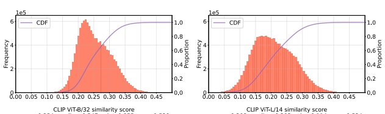

mean: 0.254, median: 0.247, min: -0.055, max: 0.520 mean: 0.208, median: 0.203, min: -0.114, max: 0.524

Figure 8: Image-text similarity score distributions using CLIP ViT-B/32 (left) and ViT-L/14 (right) models. We plot samples from the small COMMONPOOL, which are an i.i.d. sample of the x1arge COMMONPOOL.

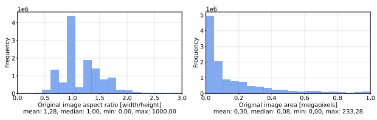

Figure 9: Statistics for images in the small COMMONPOOL, before applying resizing.

Turning our attention to images in COMMONPOOL, in Figure 9, we visualize the aspect ratios and sizes of original images (i.e., before they are downloaded and resized). In Figure 10, we display a distribution of image height and width after download resizing. Notice that the majority of images are around 224 x 224 pixels, which is the final resized resolution used for training.

Analysing the textual component of each sample, we visualize frequency of the number of CLIP BPE tokens in the captions (Figure 11) and most common languages (Figure 12). Token counts follow a long-tailed distribution with much more mass in the short sequence range, while English is the predominant language in COMMONPOOL according to fasttext and cld3.

We also look at url statistics. In Figure 13 we see common domain names in COMMONPOOL (e.g.,
wordpress domains) and common suffixes (e.g., .com or .net).

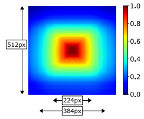

Figure 10: Image pixel heatmap. Each entry in the above heatmap represents the estinated probability that a pixel is occupied. The center entry has a value of 1.0 as every image has a center pixel. We compute the heatmap over the sma11 COMMONPOOL. Note that image sizes are bounded as we resize all images such that their max dimension does not exceed 512 pixels during dataset download.

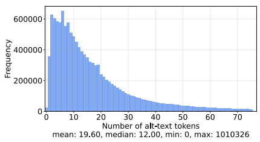

Figure 11: Distribution of token length for alt-text in the sma11 COMMONPOOL. The CLIP BPE
tokenizer is used for tokenization.

# 39

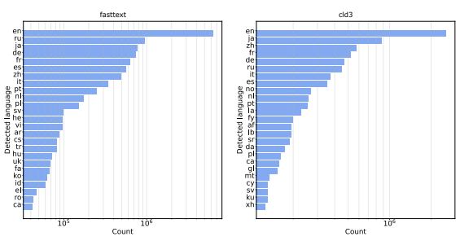

Figure 12: Counts for the top 25 most frequent languages in the sma11 COMMONPOOL, as predicted by fasttext (left) and cld3 (right).

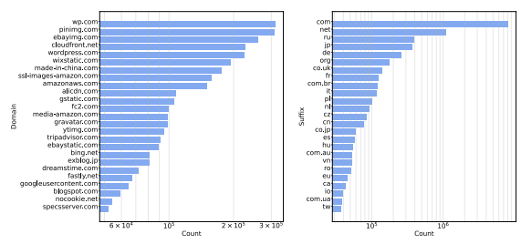

Figure 13: Counts for the top 25 most frequent domains (left) and suffixes (right) in the sma11 COMMONPOOL.

# 40 J Efficient Training On Data Subsets

When training at large scale, it is important to use efficient access patterns to load training data.

This typically means that data must be loaded using large sequential reads instead of random reads in order to maximize throughput. In DataComp, this is facilitated by the WebDataset5format which stores the training examples in tar files (called "shards") and WebDataLoader which makes it easy to load data stored in this format. Given an arbitrary subset of a pool, we would like to efficiently train on that subset. Because WebDataset format does not permit efficient random access (a feature inherited from tar), we must read through the entire pool to select the required images. There are two ways to implement this filtering:
1. Filter during training: we apply a predicate during training data loading that discards data not present in the subset.

2. Filter before training: we iterate over the pool, selecting the images in the subset, and write them to a new WebDataset.

After some profiling, we concluded that option 1 had too much overhead in the case where the subset is much smaller than the pool. To see why, note that if the subset is an p-fraction of the pool size, then we would end up reading a 1/p factor more data than needed for training. Instead, we give an implementation of option 2, which performs at most twice as many reads as needed for training.6 Our tool, called the *resharder*, reads a set of uids in NumPy array format, scans through the pool, selecting those examples, and writes them to a new WebDataset. The resharder uses multiprocessing to make good use of hardware and can be distributed over many computers to further increase throughput. The resharder also supports streaming data to and from cloud storage such as Amazon S3. The resharder is provided to participants as part of the competition tooling.

# K Effect Of Duplicates In The Training Data

Given that CommonPool was constructed by scraping the web for image and text pairs, there is a likelihood that some of our images are duplicates of each other, even if they originated from different web sources and have different captions. Here we examine the effect of removing such duplicates. We used the technique proposed by Webster et al. [139], where CLIP image features are first compressed and then used to do an approximate nearest neighbor search. After this process, two images x and y are considered duplicates if |dADC (x,x)−dADC (x,y)| dADC (x,x) < TADC, where TADC is some threshold and dADC(*x, x*) is the distance of a vector with its quantized version used for approximate nearest neighbor search. For each image, we search duplicates across its 1000 nearest neighbors, and keep it if it's the one with the highest CLIP ViT-L/14 similarity score across its duplicates. Results can be seen in Table 9, both when this technique is used by itself and in conjunction with ViT-B/32 filtering. We can see that results are similar to when only using CLIP filtering.

5https://github.com/webdataset/webdataset 6Since in DataComp, the number of examples seen is equal to the pool size.

Table 9: Effect of deduplication of training set for the medium size CommonPool. The filtering performed here is CLIP B32 score top 30% (see Table 25). Higher threshold values lead to more samples being labeled as duplicates.

| Subset   |                          | Training dataset size   | ImageNet accuracy   | Average performance   |
|----------|--------------------------|-------------------------|---------------------|-----------------------|
| TADC     | = 0.1, without filtering | 99.8M                   | 0.195               | 0.275                 |
| TADC     | = 0.2, without filtering | 85.9M                   | 0.200               | 0.277                 |
| TADC     | = 0.5, without filtering | 29.6M                   | 0.227               | 0.295                 |
| TADC     | = 0.1, with filtering    | 33.5M                   | 0.288               | 0.337                 |
| TADC     | = 0.2, with filtering    | 30.6M                   | 0.289               | 0.337                 |
| TADC     | = 0.5, with filtering    | 15.5M                   | 0.252               | 0.311                 |

# L Hyperparameter Ablations

Recall that in DataComp, we freeze the training procedure and hyperparameters to focus the competition on dataset curation. However, this leads to the natural question: do "better" datasets
(i.e., datasets that lead to higher accuracy models on zero-shot downstream tasks) remain consistent when training is modified. Hence we ablate key experimental choices: batch size, model architecture, and number of training steps.

### L.1 Batch Size

We ablate over the batch size hyperparameter, doubling the batch size at the medium scale, but holding all other hyperparameters constant. As see in Table 10, we find that the delta rankings are largely consistent, for both ImageNet and Average performance, with rankings changing by at most plus or minus one position. More specifically, rank correlation before and after doubling batch size is 0.96 for ImageNet and 0.98 for the Average over 38 datasets metric.

### L.2 Model Architecture

We choose to use the ViT architecture [39] because of favorable CLIP scaling trends over vanilla ResNets [61] as reported by Radford et al. [108]. However, we still hope that better datasets for downstream ViT performance will lead to better datasets to train convolutional architectures. We look at the medium scale, swapping the ViT-B/32 architecture with a ConvNeXt model [90] with matched giga multiplier–accumulate operations (GMACs). Looking at Table 11, we see that ranking of different filtering methods is again relatively consistent (i.e., 1.0 rank correlation for ImageNet and 0.87 rank correlation for the average metric). We conclude that improvements in dataset filtering have potential to improve more than just CLIP ViT model performance.

### L.3 Number Of Training Steps

Recall that one of our major design decisions for DataComp is to fix the hyperparameters associated with model training, following closely hyperparameters from prior work [108]. We choose to fix hyperparameters to place emphasis on data curation and remove confounders arising from hyperparameter differences between participants. Here we ablate our hyperparameter configuration by training small baselines for 10× more steps. In Figure 14 we see positive correlation for ImageNet

Table 10: Batch size ablation at the medium scale. We compare the standard DataComp medium configuration, with batch size 4096 against an ablated configuration with batch size 8192 (medium:
batch size 2x). We find that the rankings of the baseline filtering strategies are relatively consistent. More precisely, the rank correlation is 0.96 on ImageNet and 0.98 for the Average over 38 datasets.

| Scale   |               | Filtering strategy                   | Dataset   | Samples   | ImageNet   | Average over      | Delta ranking   | Delta ranking   |
|---------|---------------|--------------------------------------|-----------|-----------|------------|-------------------|-----------------|-----------------|
|         |               | No filtering                         | size 128M | seen 128M | 0.176      | 38 datasets 0.258 | ImageNet \-     | Average \-      |
|         |               | Basic filtering                      | 30M       | 128M      | 0.226      | 0.285             | \-              | \-              |
|         |               | Text\-based                          | 31M       | 128M      | 0.255      | 0.307             | \-              | \-              |
| medium  |               | Image\-based                         | 29M       | 128M      | 0.268      | 0.312             | \-              | \-              |
|         |               | LAION\-2B filtering                  | 13M       | 128M      | 0.230      | 0.292             | \-              | \-              |
|         |               | CLIP score (L/14 30%)                | 38M       | 128M      | 0.273      | 0.328             | \-              | \-              |
|         |               | Image\-based ∩ CLIP score (L/14 30%) | 14M       | 128M      | 0.297      | 0.328             | \-              | \-              |
| medium: | batch size 2x | No filtering                         | 128M      | 128M      | 0.171      | 0.258             | 0               | 0               |
|         |               | Basic filtering                      | 30M       | 128M      | 0.219      | 0.277             | +1 (worse)      | 0               |
|         |               | Text\-based                          | 31M       | 128M      | 0.251      | 0.299             | 0               | \-1 (better)    |
|         |               | Image\-based                         | 29M       | 128M      | 0.260      | 0.299             | 0               | 0               |
|         |               | LAION\-2B filtering                  | 13M       | 128M      | 0.215      | 0.288             | \-1 (better)    | 0               |
|         |               | CLIP score (L/14 30%)                | 38M       | 128M      | 0.271      | 0.324             | 0               | 0               |
|         |               | Image\-based ∩ CLIP score (L/14 30%) | 14M       | 128M      | 0.276      | 0.311             | 0               | +1 (worse)      |

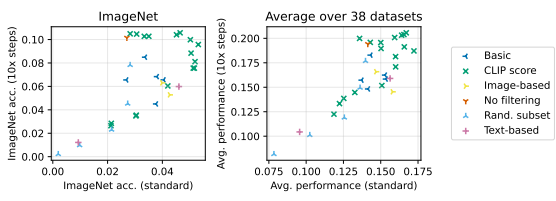

Figure 14: *(left)* The effect of training for 10× steps for for small filtering track baselines on ImageNet.

(right) Similar plot but for Avg. performance. While the ordering of some methods changes quite drastically, we, in general, see a positive correlation.

accuracy for the ablated and original hyperparameter configurations. We see similar correlation for average performance. See Table 12 for specific values.

Table 11: Architure ablation at the medium scale. We compare the standard DataComp medium configuration, with a ViT-B/32 model against an ablated configuration (medium: ConvNeXt), which uses a ConvNeXt model with the same number of multiply-accumulate operations as the ViT. We find that the rankings of the baseline filtering strategies are relatively consistent. More precisely, the rank correlation is 1.0 on ImageNet and 0.87 for the Average over 38 datasets.

| Scale             | Filtering strategy                   | Dataset   | Samples   | ImageNet   | Average over      | Delta ranking   | Delta ranking   |
|-------------------|--------------------------------------|-----------|-----------|------------|-------------------|-----------------|-----------------|
|                   | No filtering                         | size 128M | seen 128M | 0.176      | 38 datasets 0.254 | ImageNet \-     | Average  \-     |
|                   | Basic filtering                      | 30M       | 128M      | 0.226      | 0.280             | \-              | \-              |
|                   | Text\-based                          | 31M       | 128M      | 0.255      | 0.301             | \-              | \-              |
| medium            | Image\-based                         | 29M       | 128M      | 0.268      | 0.307             | \-              | \-              |
|                   | LAION\-2B filtering                  | 13M       | 128M      | 0.230      | 0.287             | \-              | \-              |
|                   | CLIP score (L/14 30%)                | 38M       | 128M      | 0.273      | 0.323             | \-              | \-              |
|                   | Image\-based ∩ CLIP score (L/14 30%) | 14M       | 128M      | 0.297      | 0.323             | \-              | \-              |
| medium:  ConvNeXt | No filtering                         | 128M      | 128M      | 0.178      | 0.255             | 0               | 0               |
|                   | Basic filtering                      | 30M       | 128M      | 0.232      | 0.272             | 0               | 0               |
|                   | Text\-based                          | 31M       | 128M      | 0.255      | 0.298             | 0               | 0               |
|                   | Image\-based                         | 29M       | 128M      | 0.270      | 0.298             | 0               | +1 (better)     |
|                   | LAION\-2B filtering                  | 13M       | 128M      | 0.253      | 0.300             | 0               | \-2 (better)    |
|                   | CLIP score (L/14 30%)                | 38M       | 128M      | 0.279      | 0.326             | 0               | +1 (worse)      |
|                   | Image\-based ∩ CLIP score (L/14 30%) | 14M       | 128M      | 0.323      | 0.331             | 0               | 0               |

Table 12: Experiment details when extending the number of steps by 10 times the standard amount for that scale.

| Scale   | Filtering                                                   | ImageNet   | ImageNet     | VTAB   | Retrieval   | Average over   |
|---------|-------------------------------------------------------------|------------|--------------|--------|-------------|----------------|
|         |                                                             |            | dist. shifts |        |             | 38 datasets    |
|         | No filtering                                                | 0.102      | 0.093        | 0.204  | 0.147       | 0.196          |
|         | Random subset(75%)                                          | 0.078      | 0.072        | 0.182  | 0.129       | 0.178          |
|         | Random subset(50%)                                          | 0.045      | 0.049        | 0.161  | 0.104       | 0.150          |
|         | Random subset(25%)                                          | 0.023      | 0.029        | 0.134  | 0.075       | 0.119          |
|         | Random subset(10%)                                          | 0.010      | 0.018        | 0.119  | 0.069       | 0.101          |
|         | Random subset(1%)                                           | 0.002      | 0.006        | 0.097  | 0.056       | 0.082          |
|         | Caption length                                              | 0.085      | 0.080        | 0.198  | 0.136       | 0.184          |
|         | Image size                                                  | 0.066      | 0.064        | 0.153  | 0.115       | 0.158          |
|         | English (fasttext)                                          | 0.068      | 0.068        | 0.172  | 0.108       | 0.159          |
|         | English (fasttext) and caption length                       | 0.066      | 0.065        | 0.182  | 0.106       | 0.163          |
|         | English (fasttext), caption length, and image size          | 0.045      | 0.048        | 0.164  | 0.092       | 0.149          |
|         | CLIP B32 score top 10%                                      | 0.035      | 0.046        | 0.162  | 0.079       | 0.139          |
|         | CLIP B32 score top 20%                                      | 0.076      | 0.076        | 0.182  | 0.099       | 0.172          |
|         | CLIP B32 score top 30%                                      | 0.096      | 0.090        | 0.221  | 0.121       | 0.205          |
|         | CLIP B32 score top 40%                                      | 0.081      | 0.077        | 0.200  | 0.124       | 0.193          |
|         | CLIP B32 score top 50%                                      | 0.106      | 0.097        | 0.211  | 0.134       | 0.205          |
|         | CLIP B32 score top 75%                                      | 0.103      | 0.096        | 0.210  | 0.150       | 0.198          |
|         | CLIP B32 score top 90%                                      | 0.105      | 0.096        | 0.212  | 0.152       | 0.202          |
| small   | CLIP B32 threshold at 0.3 + English filter                  | 0.029      | 0.036        | 0.152  | 0.078       | 0.134          |
|         | CLIP B32 threshold at 0.28 + English filter                 | 0.035      | 0.041        | 0.168  | 0.086       | 0.145          |
|         | CLIP B32 threshold at 0.3                                   | 0.076      | 0.078        | 0.199  | 0.102       | 0.182          |
|         | CLIP L14 score top 10%                                      | 0.026      | 0.037        | 0.130  | 0.073       | 0.123          |
|         | CLIP L14 score top 20%                                      | 0.060      | 0.064        | 0.161  | 0.096       | 0.153          |
|         | CLIP L14 score top 30%                                      | 0.088      | 0.087        | 0.199  | 0.115       | 0.188          |
|         | CLIP L14 score top 40%                                      | 0.100      | 0.096        | 0.217  | 0.122       | 0.207          |
|         | CLIP L14 score top 50%                                      | 0.104      | 0.098        | 0.212  | 0.136       | 0.203          |
|         | CLIP L14 score top 75%                                      | 0.103      | 0.095        | 0.189  | 0.146       | 0.191          |
|         | CLIP L14 score top 90%                                      | 0.105      | 0.095        | 0.203  | 0.145       | 0.198          |
|         | Image\-based clustering (ImageNet1k)                        | 0.053      | 0.053        | 0.162  | 0.091       | 0.146          |
|         | Image\-based clustering (ImageNet21k)                       | 0.063      | 0.059        | 0.173  | 0.108       | 0.167          |
|         | Text\-based clustering (ImageNet1k)                         | 0.012      | 0.018        | 0.120  | 0.062       | 0.104          |
|         | Text\-based clustering (ImageNet21k)                        | 0.262      | 0.216        | 0.305  | 0.246       | 0.300          |
|         | Intersect IN1k image clustering and CLIP B32 score top 30%  | 0.058      | 0.059        | 0.179  | 0.098       | 0.161          |
|         | Intersect IN1k image clustering and CLIP L14 score top 30%  | 0.049      | 0.051        | 0.171  | 0.090       | 0.150          |
|         | Intersect IN21k image clustering and CLIP B32 score top 30% | 0.071      | 0.070        | 0.192  | 0.107       | 0.175          |
|         | Intersect IN21k image clustering and CLIP L14 score top 30% | 0.064      | 0.065        | 0.200  | 0.096       | 0.173          |
|         | No filtering                                                | 0.370      | 0.304        | 0.387  | 0.355       | 0.383          |
|         | English (fasttext), caption length, and image size          | 0.317      | 0.269        | 0.324  | 0.271       | 0.334          |
|         | CLIP B32 score top 30%                                      | 0.436      | 0.351        | 0.433  | 0.345       | 0.430          |
|         | CLIP B32 score top 40%                                      | 0.434      | 0.353        | 0.448  | 0.365       | 0.442          |
|         | CLIP B32 score top 50%                                      | 0.426      | 0.352        | 0.439  | 0.377       | 0.433          |
| medium  | CLIP B32 score top 75%                                      | 0.398      | 0.325        | 0.396  | 0.374       | 0.411          |
|         | Image\-based clustering (ImageNet1k)                        | 0.363      | 0.294        | 0.347  | 0.279       | 0.347          |
|         | Image\-based clustering (ImageNet21k)                       | 0.374      | 0.303        | 0.372  | 0.318       | 0.372          |
|         | Intersect IN1k image clustering and CLIP B32 score top 30%  | 0.415      | 0.330        | 0.413  | 0.310       | 0.403          |
|         | Intersect IN1k image clustering and CLIP L14 score top 30%  | 0.405      | 0.325        | 0.399  | 0.295       | 0.387          |

# M Training Details

The full set of hyperparameters used for each scale is shown in Table 13. For choosing hyperparameters, we follow the OpenCLIP library [68], an open source reproduction of OpenAI's CLIP. For the small, medium, and large tracks, these hyperparameters are equal to those in the CLIP paper, except with reduced batch size so that training runs on reasonable hardware. For the xlarge track, batch size is increased from that in OpenAI's CLIP to accelerate training by allowing the use of many GPUs simultaneously with high utilization. For this run we also double the learning rate following prior work [28].

# N Evaluation Details

Models are evaluated over a wide range of 38 tasks to measure proficiency in various domains.

We include 22 of the 27 classification tasks in the test suite of Radford et al. [108], excluding the few datasets that have license restrictions, are in video format, or are no longer available in their original form. We include 6 datasets that were designed to test generalization of models trained on ImageNet. We also include a majority of the Visual Task Adaptation Benchmark, excluding 3 datasets that are ill-suited for zero-shot evaluation [151]. We include 3 datasets from the WILDS
benchmark, which tests robustness to distribution shifts and spurious correlations [81, 124]. Finally, we include 2 additional datasets, Dollar Street and GeoDE, which test robustness of classification performance across income levels and geographical regions [119, 111]. Furthermore, we evaluate zero-shot image and text retrieval on the Flickr30k and MSCOCO datasets, and image association on the WinoGAViL dataset [146, 26, 17]. The complete list of evaluation tasks is given in Table 14.

We show a sample from each dataset in Figure 15.

Prompt choice. Since we perform zero-shot evaluation, prompt and class name selection is important, and can have a significant impact on the results. To avoid heavy prompt engineering and overtuning to individual models, we opt to use the prompt templates used in Radford et al. [108] whenever possible. Most datasets come with pre-defined class names, but some are overwritten with more descriptive labels, again based on previous literature. For datasets with no precedent in zero-shot evaluation, we reuse prompt templates from other datasets with a similar domain and task
(e.g., SVHN is evaluated with MNIST prompts and class names).

Evaluation metrics. For the majority of classification tasks, the primary evaluation metric is accuracy. For certain datasets with class imbalances, we instead compute mean per-class accuracy, as done in Radford et al. [108]. On the WILDS benchmark datasets, we use the primary metric specified for each dataset on their leaderboard. Dollar Street and GeoDE test model generalization across socioeconomic and geographic diversity. Thus, for Dollar Street, we compute worst-group

| Scale            | Model     | Train compute (MACs)   | Pool size   | # samples seen   | Learning rate   | AdamW  β2   | Warmup   | Batch size   |
|------------------|-----------|------------------------|-------------|------------------|-----------------|-------------|----------|--------------|
| small            | ViT\-B/32 | 9.5 × 1016             | 12.8M       | 12.8M            | 5e\-4           | 0.98        | 500      | 4096         |
| medium ViT\-B/32 |           | 9.5 × 1017             | 128M        | 128M             | 5e\-4           | 0.98        | 500      | 4096         |
| large            | ViT\-B/16 | 2.6 × 1019             | 1.28B       | 1.28B            | 5e\-4           | 0.98        | 500      | 8192         |
| xlarge           | ViT\-L/14 | 1.1 × 1021             | 12.8B       | 12.8B            | 1e\-3           | 0.95        | 10k      | 90112        |

Table 13: Experimental configuration for each scale, including the size of the pool we provide, the model architecture and hyperparameters.

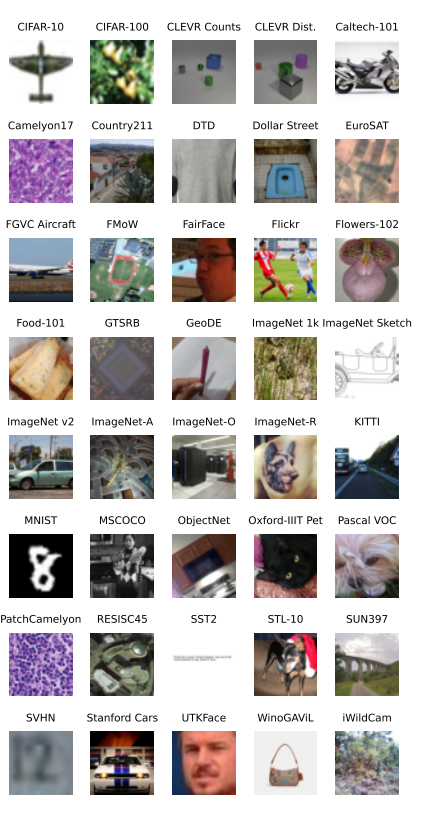

Figure 15: Randomly sampled images from the evaluation datasets we consider.

Table 14: Evaluation tasks.

| Task type      | Dataset                   | Task                          | Test set size Number of classes   |       | Main metric Clean            |    |
|----------------|---------------------------|-------------------------------|-----------------------------------|-------|------------------------------|----|
|                | Caltech\-101 [45]         | Object recognition            | 6,085                             | 102   | mean per class               | ✓  |
|                | CIFAR\-10 [84]            | Visual recognition            | 10,000                            | 10    | accuracy                     | ✓  |
|                | CIFAR\-100 [84]           | Visual recognition            | 10,000                            | 100   | accuracy                     | ✓  |
|                | CLEVR Counts [74,  151]   | Counting                      | 15,000                            | 8     | accuracy                     |    |
|                | CLEVR Distance [74,       | 151] Distance prediction      | 15,000                            | 6     | accuracy                     |    |
|                | Country211 [108,  135]    | Geolocation                   | 21,100                            | 211   | accuracy                     | ✓  |
|                | DTD [30]                  | Texture classification        | 1,880                             | 47    | accuracy                     | ✓  |
|                | EuroSAT [62,  151]        | Satellite imagery recognition | 5,400                             | 10    | accuracy                     | ✓  |
|                | FGVC Aircraft [92]        | Aircraft recognition          | 3,333                             | 100   | mean per class               | ✓  |
|                | Food\-101 [18]            | Food recognition              | 25,250                            | 101   | accuracy                     | ✓  |
|                | GTSRB [132]               | Traffic sign recognition      | 12,630                            | 43    | accuracy                     | ✓  |
|                | ImageNet 1k [37]          | Visual recognition            | 50,000                            | 1,000 | accuracy                     | ✓  |
|                | ImageNet Sketch [138]     | Visual recognition            | 50,889                            | 1,000 | accuracy                     | ✓  |
|                | ImageNet V2 [118]         | Visual recognition            | 10,000                            | 1,000 | accuracy                     | ✓  |
|                | ImageNet\-A [64]          | Visual recognition            | 7,500                             | 200   | accuracy                     | ✓  |
|                | ImageNet\-O [64]          | Visual recognition            | 2,000                             | 200   | accuracy                     | ✓  |
|                | ImageNet\-R [63]          | Visual recognition            | 30,000                            | 200   | accuracy                     | ✓  |
| Classification | KITTI distance [48,  151] | Distance prediction           | 711                               | 4     | accuracy                     |    |
|                | MNIST [87]                | Digit recognition             | 10,000                            | 10    | accuracy                     | ✓  |
|                | ObjectNet [13]            | Visual recognition            | 18,574                            | 113   | accuracy                     | ✓  |
|                | Oxford Flowers\-102 [99]  | Flower recognition            | 6,149                             | 102   | mean per class               | ✓  |
|                | Oxford\-IIIT Pet [102,    | 151] Pet classification       | 3,669                             | 37    | mean per class               | ✓  |
|                | Pascal VOC 2007 [42]      | Object recognition            | 14,976                            | 20    | accuracy                     | ✓  |
|                | PatchCamelyon [137,  151] | Metastatic tissue cls.        | 32,768                            | 2     | accuracy                     |    |
|                | Rendered SST2 [151]       | Sentiment classification      | 1,821                             | 2     | accuracy                     | ✓  |
|                | RESISC45 [27,  151]       | Satellite imagery recognition | 6,300                             | 45    | accuracy                     | ✓  |
|                | Stanford Cars [83]        | Vehicle recognition           | 8,041                             | 196   | accuracy                     | ✓  |
|                | STL\-10 [31]              | Visual recognition            | 8,000                             | 10    | accuracy                     | ✓  |
|                | SUN\-397 [141]            | Scene recognition             | 108,754                           | 397   | accuracy                     | ✓  |
|                | SVHN [96,  151]           | Digit recognition             | 26032                             | 10    | accuracy                     | ✓  |
|                | iWildCam [14,  81]        | Animal recognition            | 42,791                            | 182   | macro F1 score               | ✓  |
|                | Camelyon17 [12,  81]      | Metastatic tissue cls.        | 85,054                            | 2     | accuracy                     |    |
|                | FMoW [29,  81]            | Satellite imagery recognition | 22,108                            | 62    | worst\-region acc.           | ✓  |
|                | Dollar Street [119]       | Object recognition            | 3,503                             |       | 58 worst\-income top\-5 acc. | ✓  |
|                | GeoDE [111]               | Object recognition            | 12,488                            | 40    | worst\-region acc.           | ✓  |
|                | Flickr30k [146]           | Image and text retrieval      | 31,014                            | N/A   | R@1                          | ✓  |
| Retrieval      | MSCOCO [26]               | Image and text retrieval      | 5,000                             | N/A   | R@1                          | ✓  |
|                | WinoGAViL [17]            | Commonsense association       | 3,563                             | N/A   | Jaccard score                | ✓  |

top-5 accuracy, with groups defined by income level, emulating Rojas et al. [119]; for GeoDE, we compute worst-group accuracy, with groups defined by region (Africa, Americas, West Asia, East Asia, Southeast Asia, and Europe), as defined in Ramaswamy et al. [111]. For the image-text retrieval tasks, Flickr and MSCOCO, we compute both image and text recall (fraction of text captions for which the correct image was selected and vice versa), and plot their arithmetic mean. On WinoGAViL, we compute the Jaccard score (intersection-over-union) for each example, and show results for the harder samples (10 and 12 candidates). More information on WinoGAViL evaluation can be found in Bitton et al. [17]. Clean subset. For five of our evaluation tasks (the two CLEVR tasks, the two Camelyon tasks, and KITTI) the zero-shot performance of all evaluated models appears to be close to that of random guessing, and lack correlation to the type of filtering method used (see Figure 26). Consequently, we studied performance averaged only on the remaining 33 tasks, but found not substantial qualitative

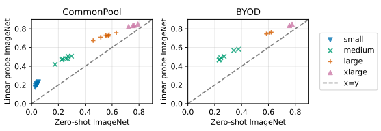

Figure 16: Zero-shot ImageNet and Linear probe ImageNet performance for models from Tables 3 and 17. Relative ordering of models demonstrates high rank correlations of 0.99 and 1.0 for CommonPool and BYOD respectively.

differences in our results. As a result, we opted to report the average on the full evaluation suite throughout our study.

Zero-shot vs. fine-tuning protocols. One critical decision in DataComp is how exactly to evaluate models and whether or not to fine-tune models on evaluation tasks (i.e., supervised finetuning directly on task training sets). We opt for zero-shot evaluation, where a models are applied to downstream tasks directly to 1) ease computational burden on participants and 2) measure the out-of-the-box generalization capabilities of our models. To validate this design decision, we conduct linear probes on all models presented in Tables 3 and 17 on ImageNet. We follow a standard probing protocol and fine-tune the last linear layer from zero-shot initialization for 40 epochs with learning rate 1e-3, batch size 256, AdamW optimizer with default settings with the exception of weight decay (that we set to zero), and a cosine annealing schedule. As seen in Figure 16, zero-shot and linear probe performance follow similar trends for both filtering and BYOD tracks. Moreover the Spearman rank correlation between the two protocols over the models considered is 0.99 for the filtering track and 1.0 for BYOD. This suggests that better zero-shot models on ImageNet are correlated with better representations of linear probe fine-tuning on ImageNet.

# O Baseline Details

Here we provide additional details on the creation of our baseline subsets. To highlight the qualitative differences between the filtering strategies we also provide visualization for *No filtering* (Figure 17),
Basic filtering (Figure 18), and *CLIP score (L/14 30%)* (Figure 19), which can all be found in Table 3. Notice that No filtering gives relatively noisy data (e.g., matching a bicycle with a caption:
"IMG_2187.jpg"), while CLIP score samples give qualitatively more descriptive cations.

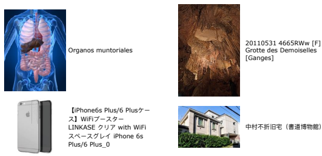

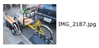

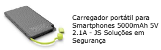

AMP

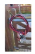

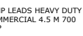

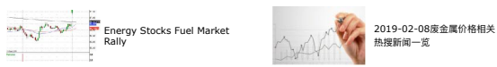

Figure 17: An i.i.d. sample from small CommonPool generated after applying the *No filter* strategy. Hence, these samples represent random images from CommonPool.

status report templates - 

12+ free word documents download | free, Powerpoint templates Implication in the

 classroom: O Step 3: We Must Work it Out Say and mean "We have to work it out". The behaviour cannot co...

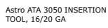

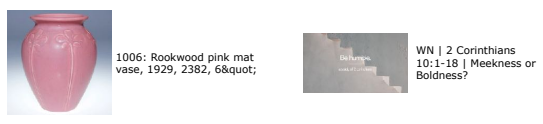

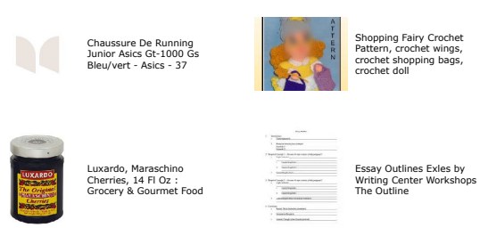

Figure 18: An i.i.d. sample from small CommonPool generated after applying the *Basic filter* strategy.

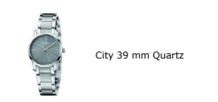 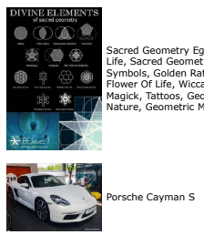

The Martian Monster And 

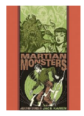 Other Stories (The EC Comics Library) ()
Mesmerizing Black, Silver & 

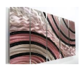 Pink Handmade Modern Metal Wall Art Sculpture - Abstract Painting - OOAK 546 by Jon Allen

Metallic One of a Kind 

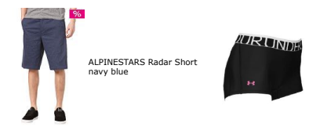

Under Armour Heatgear Gotta Have It Shorty - Women's at Foot Locker

Football Manager 2016

Profitable forex trading systems Figure 19: An i.i.d. sample from small CommonPool generated after applying the CLIP score
(L/14 30%)
strategy.

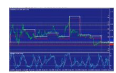

### O.1 Filtering Track

Basic filtering. For language detection, we use Fasttext 0.92, version lid.176, and cld3 - library gcld3 3.0.13. We count the number of words in each caption by splitting using whitespaces. CLIP thresholds. We use OpenAI pretrained CLIP ViT-B/32 and ViT-L/14 models [108] to compute the cosine similarity text and image tower outputs as the CLIP scores. On the small and medium pools, we also experiment with baselines that filter out samples in the top few percentiles of CLIP scores. Specifically, we try baselines that use samples with top {1,2,5}-30% CLIP scores
(ViT-B/32 model), and the performance is sightly better on the small pool (at most 0.5 gain of averaged accuracy) while slightly worse on the medium pool (0.4-0.8 loss of averaged accuracy). In Table 15, we show how the CLIP score thresholds relate to the fraction of the pool retained by the filter. Text-based filtering. Each synset is represented by a synset offset that can be used to retrieve the synset from WordNet. In order to verify if a caption has a word corresponding to a synset from our set we iterate over every word and retrieve the synsets that this word can describe (using nltk.corpus WordNet). Following that, we retrieve the most likely lemma representing that synset, find its synset offset, and check if the number is part of the IN21K or IN1K sets.7 Text-based sampling. This baseline uses text only to filter labels which mention concepts (synsets) appearing in IN21K, and applies a temperature parameter to control how equally-represented different concepts are in the dataset. For synset j, let Nj be the number of examples containing words matched to that synset, where as before for each word we only match the most likely synset. Furthermore, for image-text pair i let Ti be the set of synset matched to the caption.

The probability of sampling example i is proportional to either 1 |Ti| Pj∈Ti N
α−1 j(average synset score in the data point) or maxj∈Ti N
α−1 j(maximum synset score in the data point), where α is a "temperature" parameter controlling the flatness of the distribution. We sample examples with replacement but discard any example repeated more than 100 times. Image-based filtering. We now provide a detailed description of the Image-based filtering procedure. First, since the core of the procedure concerns only image content, we begin with basic text-bsaed filtering: we remove from the pool only all examples with non-English captions (as determined by fasttext), and all examples whose captions have less than two words or less than six characters. Next, we use clustering of image embeddings to select a subset of examples whose image content is related to a clean training set of interest. Let e1*, . . . , e*M denote the CLIP image embeddings of the remaining examples in the pool. We cluster these embeddings into K = 105clusters using Faiss with 20 iterations, and let c1*, . . . , c*K denote the resulting cluster centers. Due to memory constraints, for the large and xlarge pools, we perform the clustering on a random subset of about 160M examples
(that pass the basic text-based filtering). For an embedding vector v, let

$$I(v)=\arg\operatorname*{max}_{i\leq K}\left\langle v,c_{i}\right\rangle$$

denote the index of the cluster center nearest to v as measured by inner product. Let f1*, . . . , f*N
denote the CLIP image embeddings of a clean supervised training set (we experiment with either

7For the ImageNet 21K synsets, we have used the list in https://storage.googleapis.com/bit_models/
imagenet21k_wordnet_ids.txt

Table 15: CLIP threshold filtering configurations. "Fraction" denotes the size of the filtered subset

relative to the pool.

|           | CLIP model En. filtering Threshold Fraction   |       |       |
|-----------|-----------------------------------------------|-------|-------|
| ViT\-B/32 | ✗                                             | 0.384 | 1%    |
| ViT\-B/32 | ✗                                             | 0.358 | 3%    |
| ViT\-B/32 | ✓                                             | 0.300 | 10.2% |
| ViT\-B/32 | ✗                                             | 0.325 | 10%   |
| ViT\-B/32 | ✓                                             | 0.28  | 7.4%  |
| ViT\-B/32 | ✗                                             | 0.300 | 20%   |
| ViT\-B/32 | ✗                                             | 0.281 | 30%   |
| ViT\-B/32 | ✗                                             | 0.263 | 40%   |
| ViT\-B/32 | ✗                                             | 0.247 | 50%   |
| ViT\-B/32 | ✗                                             | 0.215 | 75%   |
| ViT\-B/32 | ✗                                             | 0.193 | 90%   |
| ViT\-L/14 | ✗                                             | 0.364 | 1%    |
| ViT\-L/14 | ✗                                             | 0.334 | 3%    |
| ViT\-L/14 | ✓                                             | 0.300 | 5.4%  |
| ViT\-L/14 | ✗                                             | 0.295 | 10%   |
| ViT\-L/14 | ✓                                             | 0.280 | 3.3%  |
| ViT\-L/14 | ✗                                             | 0.266 | 20%   |
| ViT\-L/14 | ✗                                             | 0.243 | 30%   |
| ViT\-L/14 | ✗                                             | 0.222 | 40%   |
| ViT\-L/14 | ✗                                             | 0.203 | 50%   |
| ViT\-L/14 | ✗                                             | 0.160 | 75%   |
| ViT\-L/14 | ✗                                             | 0.129 | 90%   |

ImageNet 1K or ImageNet 21K), and let

### S = {I(Fi) | 1 ≤ I ≤ N}

be the set of cluster indices who are nearest neighbors to some clean training set image. We then keep only images in the pool whose nearest cluster center is in S. That is, out of the M examples passing the text-based filtering, the output subset keeps the examples with indices

$$\{1\leq j\leq M\mid I(e_{j})\in{\mathcal{S}}\}.$$

Image-based sampling. In addition to filtering methods, we experiment with cluster-based sampling methods. First, we compute the score of i-th cluster si as the number of ImageNet data assigned to this cluster. Then, for parameter α > 0 we define a distribution over the pool by sampling cluster i with probability s α P i j s α j and uniformly sampling an example for the cluster, rejecting any example repeated more than 100 times. We try 5 different α, i.e., {0, 0.2, 0.5, 1.0, 2.0}, and the best average accuracy is obtained when α = 0.2, while the performance is still worse than the image-based filtering on the small and medium pool. We therefore do not include this line of baselines in the experiments of large pool.

ImageNet distance filtering. We rank the samples in the pool by the minimum embedding distance (1 minus cosine similarity) between its image and the ImageNet images; both embeddings are obtained from OpenAI pretrained CLIP ViT-L/14 model [108]. Then we select top images by different fractions as in image-based filtering methods.

| Dataset      | Dataset size   | ImageNet acc.   | Avg. accuracy ImageNet and OOD sets   | Avg. cos. sim. (B/32)   | Avg. cos. sim. (L/14)   |
|--------------|----------------|-----------------|---------------------------------------|-------------------------|-------------------------|
| CC12M        | 10M            | 27.8            | 34.0                                  | 0.306                   | 0.268                   |
| YFCC15M      | 15M            | 22.6            | 24.6                                  | 0.262                   | 0.198                   |
| RedCaps      | 11M            | 26.8            | 31.5                                  | 0.281                   | 0.240                   |
| Shutterstock | 15M            | 21.0            | 28.3                                  | 0.314                   | 0.273                   |

Table 16: Measuring the quality of external data sources

# O.2 Byod Track

We experiment with the following data sources:
- CC12M [24]: images and HTML alt-text crawled and filtered from web pages.

- YFCC15M: this is the 15M subset of the YFCC100M dataset [135] that Radford et al. [108] used for dataset ablation in their CLIP paper.

- RedCaps [38]: 12M images and corresponding captions were crawled from 350 manually curated subreddits between 2008 and 2020.

- Shutterstock: 106M images and captions were obtained from the Shutterstock website in 2021 [98].

We use the "photos" subset of this dataset, with 58M samples, which we found performed best, unless specified otherwise.

- WIT [131]: Image-text pairs from Wikipedia pages. We use the attribution fields as captions, which we found performed best.

- COYO [20]: A collection of 700M image-text pairs from Common Crawl. - LAION-2B [126]: A 2.32 billion english subset of LAION-5B.

- LAION-COCO: A dataset with 600M images from LAION-5B and synthetic captions.8
- LAION-A: According to laion.ai, LAION-A is a 900M subset of LAION-2B [126] with the aesthetic filtering procedure used in LAION-aesthetic9 and pHash deduplication [70].

In Table 16, we use some heuristics to measure the quality of some external data sources. First, following Nguyen et al. [98], we train a CLIP model on a 5M random subset from each source, and evaluate the performance of the resulting models on ImageNet and ImageNet-derived distributions
- ImageNet-V2 [118], ImageNet-R [63], ImageNet-Sketch [138] and ObjectNet [13]. Moreover, for each data source, we use OpenAI's pretrained CLIP ViT-B/32 and ViT-L/14 models to compute the cosine similarity between image and text embeddings of a data point, and obtain the average cosine similarity score for the whole dataset.

#### O.2.1 Additional Results

We present a series of results for the BYOD track in Table 17.

8https://laion.ai/blog/laion-coco/ 9https://github.com/LAION-AI/laion-datasets/blob/main/laion-aesthetic.md

| means our pool filtered with CLIP score (L/14, 30%).   | Scale  Data source   |              |                         |                |              | Average over  38 datasets   |
|--------------------------------------------------------|----------------------|--------------|-------------------------|----------------|--------------|-----------------------------|
| dataset size                                           | Training             | ImageNet     | ImageNet   dist. shifts | VTAB Retrieval |              |                             |
| CC12M                                                  | #0                   | 0.099        | 0.080                   | 0.223          | 0.197        | 0.205                       |
| LAION15M                                               | #1                   | 0.083        | 0.076                   | 0.210          | 0.144        | 0.189                       |
| RedCaps                                                | #2                   | 0.076        | 0.066                   | 0.177          | 0.141        | 0.168                       |
|                                                        | #53                  |              |                         |                |              |                             |
| Shutterstock 15M                                       | #3                   | 0.083        | 0.070                   | 0.214          | 0.159        | 0.185                       |
| YFCC15M                                                | small  #4            | 0.071        | 0.046                   | 0.182          | 0.147        | 0.164                       |
| #0 + #1 + #2                                           | #5                   | 0.097        | 0.084                   | 0.208          | 0.161        | 0.195                       |
| #0 + #1 + #3                                           | #6                   | 0.091        | 0.081                   | 0.222          | 0.138        | 0.202                       |
| #0 + #2 + #3 + #4                                      | #7                   | 0.095        | 0.075                   | 0.205          | 0.164        | 0.186                       |
| #0–4                                                   | #8                   | 0.093        | 0.076                   | 0.205          | 0.162        | 0.193                       |
| CC12M                                                  | #9                   | 0.245        | 0.189                   | 0.283          | 0.289        | 0.272                       |
| LAION15M                                               | #10                  | 0.270        | 0.215                   | 0.317          | 0.255        | 0.306                       |
| RedCaps                                                | #11                  | 0.237        | 0.166                   | 0.271          | 0.178        | 0.263                       |
| Shutterstock 15M                                       | #12                  | 0.229        | 0.191                   | 0.316          | 0.260        | 0.290                       |
| YFCC15M                                                | #13                  | 0.232        | 0.137                   | 0.263          | 0.245        | 0.257                       |
| #9 + #10 + #11                                         | #14                  | 0.376        | 0.287                   | 0.387          | 0.323        | 0.366                       |
| #9 + #10 + #12                                         |                      |              |                         |                |              |                             |
| 0.342                                                  | #15                  |              | 0.278                   | 0.362          | 0.345        | 0.357                       |
| #9 + #11 + #12 + #13                                   | #16                  | 0.360        | 0.268                   | 0.365          | 0.275        | 0.345                       |
| #9–13                                                  | #17  medium          | 0.371        | 0.285                   | 0.408          | 0.280        | 0.367                       |
| Shutterstock illustration                              | #18                  | 0.053        | 0.094                   | 0.205          | 0.125        | 0.180                       |
| Shutterstock photo                                     | #19                  | 0.342        | 0.209                   | 0.364          | 0.350        | 0.331                       |
| Shutterstock vectors  Shutterstock full                | #20                  | 0.072        | 0.151                   | 0.216          | 0.148        | 0.208                       |
| WIT full                                               | #21  #22             | 0.313  0.096 | 0.254  0.063            | 0.353  0.196   | 0.331  0.104 | 0.342  0.177                |
| WIT English                                            | #23                  | 0.051        | 0.038                   | 0.145          | 0.083        | 0.143                       |
| COYO                                                   | #24                  | 0.272        | 0.235                   | 0.301          | 0.254        | 0.304                       |
| LAION\-COCO                                            | #25                  | 0.209        | 0.205                   | 0.293          | 0.359        | 0.297                       |
| Shutterstock photo                                     |                      | 0.485        | 0.304                   | 0.432          | 0.427        | 0.398                       |
| Shutterstock vectors                                   | #28                  | 0.126        | 0.223                   | 0.244          | 0.191        | 0.246                       |
| Shutterstock full                                      | #29                  | 0.500        | 0.412                   | 0.472          | 0.451        | 0.456                       |
| LAION\-COCO  COYO + LAION\-COCO                        |                      | 0.355        | 0.351                   | 0.395          | 0.494        | 0.398                       |
| LAION\-A                                               |                      | 0.611        | 0.474                   | 0.501          | 0.542        | 0.505                       |
| LAION\-2B                                              |                      | 0.585        | 0.472                   | 0.504          | 0.525        | 0.515                       |
| CommonPool + #9–13                                     | #35                  | 0.602        | 0.498                   | 0.541          | 0.416        | 0.537                       |
| CommonPool + #9–13 (2x upsampled)                      | #36                  | 0.613        | 0.507                   | 0.559          | 0.433        | 0.543                       |
| CommonPool + #9–13 (4x upsampled)                      | #37                  | 0.615        | 0.514                   | 0.553          | 0.427        | 0.543                       |
| CommonPool + #9–13 (6x upsampled)                      | #38                  | 0.620        | 0.519                   | 0.558          | 0.437        | 0.549                       |
| CommonPool + #9–13 (8x upsampled)                      | #39                  | 0.624        | 0.520                   | 0.533          | 0.443        | 0.537                       |
| CommonPool + #9–13 (10x upsampled)                     | #40                  | 0.621        | 0.520                   | 0.540          | 0.441        | 0.537                       |
| CommonPool  + COYO                                     | #41                  | 0.561        | 0.472                   | 0.504          | 0.508        | 0.513                       |
| CommonPool  + LAION\-COCO                              |                      | 0.522        | 0.457                   | 0.513          | 0.498        | 0.514                       |
| CommonPool  + #9+#11+#13+#19                           | #44                  | 0.609        | 0.508                   | 0.546          | 0.439        | 0.536                       |
| + #9+#11+#13+#19 (2x upsampled)                        | #45                  | 0.621        | 0.509                   | 0.547          | 0.458        | 0.541                       |
| + #9+#11+#13+#19 (4x upsampled)                        |                      | 0.632        | 0.515                   | 0.533          | 0.452        | 0.532                       |
| CommonPool  + #9+#11+#13+#19 (6x upsampled)            | #47                  | 0.635        | 0.515                   | 0.535          | 0.471        | 0.532                       |
| CommonPool  + #9+#11+#13+#19 (8x upsampled)            |                      | 0.633        | 0.515                   | 0.523          | 0.464        | 0.530                       |
| CommonPool  + #9+#11+#13+#19 (10x upsampled)           | #49                  | 0.630        | 0.513                   | 0.523          | 0.356        | 0.521                       |
| LAION\-2B                                              | #50                  | 0.757        | 0.631                   | 0.611          | 0.619        | 0.621                       |
| CommonPool + #9+#11+#13+#19                            |                      | 0.766        | 0.660                   | 0.662          | 0.539        | 0.659                       |
|                                                        | #51                  |              |                         |                |              |                             |
| CommonPool + #9+#11+#13+#19 (6x upsampled)             | #52                  | 0.776        | 0.671                   | 0.633          | 0.552        | 0.649                       |
| CommonPool + #9+#11+#13+#19 (18x upsampled)            |                      | 0.771        | 0.667                   | 0.629          | 0.554        | 0.643                       |
| Shutterstock illustration                              | #26                  | 0.337        | 0.203                   | 0.307          | 0.322        | 0.306                       |
|                                                        | #27                  |              |                         |                |              |                             |
| COYO                                                   | #30                  | 0.547        | 0.456                   | 0.475          | 0.549        | 0.486                       |
|                                                        | #31                  |              |                         |                |              |                             |
| 0.528                                                  | #32                  |              | 0.458                   | 0.479          | 0.589        | 0.498                       |
|                                                        | #33                  |              |                         |                |              |                             |
|                                                        | #34                  |              |                         |                |              |                             |
|                                                        | large                |              |                         |                |              |                             |
| CommonPool  + LAION\-A                                 | #42                  | 0.607        | 0.480                   | 0.531          | 0.514        | 0.527                       |
|                                                        | #43                  |              |                         |                |              |                             |
| CommonPool                                             |                      |              |                         |                |              |                             |
| CommonPool                                             | #46                  |              |                         |                |              |                             |
|                                                        | #48                  |              |                         |                |              |                             |
|                                                        | xlarge               |              |                         |                |              |                             |

Table 17: Zero-shot performance for select baselines in the BYOD track. Unless specified otherwise, CommonPool

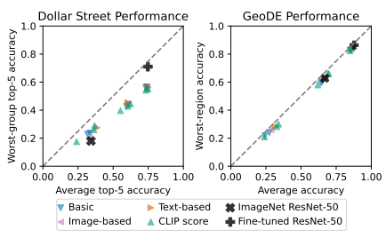

Figure 20: Comparison of average and worst-group scores for Dollar Street and GeoDE diversity datasets. On Dollar Street, our overall higher-performing models display a larger worst-group performance gap (corresponding to lower income households). GeoDE does not show this trend.

# P Fairness And Biases

To study the biases displayed by our models, we include two diversity-related datasets, Dollar Street
[119] and GeoDE [111], in our evaluation suite, and perform further analysis on the face datasets FairFace [78] and UTKFace [154] with demographic labels, following Radford et al. [108].

#### P.1 Diversity

We break down model performance on the Dollar Street and GeoDE datasets in Figure 20. Dollar Street consists of images of household items taken in homes around the world, and represents a wide socioeconomic range that includes homes with no Internet access [119]. The objects belong to ImageNet categories, and the task is image classification. Standard ImageNet-trained models achieve monotonically increasing performance levels with higher household income levels [119]. Here we use the income-based subgroups defined in Rojas et al. [119], and find a similar bias as discovered in their paper. While our trained models show a smaller worst-group performance gap than an ImageNet-trained ResNet-50, they underperform a model fine-tuned on Dollar Street. Models with higher average accuracy show a larger worst-group gap, which future work should try to address. GeoDE consists of images of everyday items and objects, which again fall into ImageNet categories. The dataset represents six world regions equally, and primarily aims to promote geographic diversity of datasets [111]. Both ImageNet models and our models show less bias under this distribution compared to Dollar Street, with a smaller worst-group accuracy gap. The trends show that performance across all regions improves steadily with increased scale, and the performance approaches that of a model fine-tuned on GeoDE. While we know that classifiers trained specifically on ImageNet can display geographic biases [111], these biases are not apparent in our GeoDE model evaluations. Future work is needed to investigate the extent to which our models have geographic biases not evaluated in GeoDE.

### P.2 Fairness

Emulating Radford et al. [108], we evaluate our best models from the filtering and BYOD tracks on the human face datasets FairFace and UTKFace, using zero-shot classification to predict the race, gender, and age annotated in these datasets. Following Hanna et al. [58] and Hundt et al. [67], we acknowledge that these evaluations can be problematic as race and gender should not be considered fixed categories, but rather fluid attributes that may change for individuals, based on they way they identify at any given moment—regardless of appearance. We include these evaluations for continuity with prior work and as a probe into model behaviour, but hope future work will consider improved face fairness evaluation. We also note that race, gender, and age classification are not the intended end-goals of the models or benchmark, and we do not condone the use of CommonPool or models trained on CommonPool data for any decisions involving people.

As described in Appendix G, our filleting track models are trained on images with faces blurred. Nevertheless, these models still perform significantly above random chance on face classification.

We hypothesize that this is due to a combination of faces bypassing our face blurring filter in the training data, contextual clues outside of the face region, or signal associated with skin color. The BYOD track model performs even better than the filtering track model. We hypothesize that this is because BYOD data is used off-the-shelf and hence contains non-blurred faces. In Table 18, we present overall accuracy for these three traits. Note that race is treated as a binary variable (white or non-white) to enable comparison to prior results, gender is a binary variable (male or female) according to annotations, and age is binned into 9 ranges according to the annotation precision of FairFace. The BYOD model, performs better at distinguishing the annotated gender, but is worse at distinguishing annotated race and age.

We further break down these statistics over the intersection of race and gender, examining gender classification accuracies in Table 19. We find that there are drastic differences in accuracy across different annotated subgroups, varying by both race and gender. The filtering models shows a tendency to misclassify Black, Southeast Asian, and East Asian males as females at 20.7%, 17%,
and 19.3% respectively on FairFace. Furthermore, we find that while the BYOD model improves accuracy, on FairFace most of this improvement is on men (ranging from 1.7pp gain to 9.9pp gain),
while on women, BYOD offers little change (ranging from 0.6pp gain to 6.2pp drop).

Following Radford et al. [108], we also examined associations of particular demographics with potentially harmful language. We replicate their setup with two classification tasks: (1) including race-gender intersection classes (e.g. "black woman", "indian man", etc.) and several harmful crimerelated terms ("thief", "criminal", "suspicious person"); (2) including the same race-gender intersection classes and non-human terms ("animal", "gorilla", "chimpanzee", "orangutan"). We compute the frequency of misclassification of people into one of the harmful categories and run these experiments on FairFace and UTKFace separately. The results are shown in Table 20. Unlike in Radford et al. [108], we find that our models have a very small probability of classifying human faces as non-human, with a max score across all subgroups of 0.1%. However, a significant proportion of people are misclassified as criminal. This again highlights the importance of dataset curation and the risks associated with zero-shot classification on models trained on web-scraped datasets.

Table 18: Overall race, gender, and age classification accuracy of our two best xlarge baselines, Image-based ∩ CLIP score (L/14 30%) for the filtering track and CommonPool, CLIP score +
4 external sources (upsampled 6x) for the BYOD track. Race classification was binary (white or

non-white) as in Karkkainen & Joo [78].

| Dataset   | Track     | Race   | Gender   | Age   |
|-----------|-----------|--------|----------|-------|
| FairFace  | Filtering | 86.4   | 91.7     | 34.3  |
|           | BYOD      | 76.5   | 93.9     | 33.8  |
| UTKFace   | Filtering | 86.2   | 93.8     | 39.5  |
|           | BYOD      | 86.1   | 95.5     | 38.6  |

Table 19: Gender classification accuracy of our two best xlarge baselines, Image-based ∩ CLIP score
(L/14 30%) for the filtering track and CommonPool, CLIP score + 4 external sources (upsampled

|           |                |                                |       | FairFace   |        |                |                 |            |
|-----------|----------------|--------------------------------|-------|------------|--------|----------------|-----------------|------------|
|           | Track  Gender  |                                |       |            | Race   |                |                 |            |
| White     |                | Black  Indian  Latino/Hispanic |       |            |        | Middle Eastern | Southeast Asian | East Asian |
| 91.3      | Male Filtering | 79.3 90.8 90.4                 |       |            |        | 95.7           | 83.0            | 80.7       |
| 96.6      | Female         | 95.4  94.2  96.6               |       |            |        | 96.5           | 97.2            | 98.2       |
| 94.8      | Male BYOD      | 89.2 93.2 93.4                 |       |            |        | 97.4           | 90.2            | 90.6       |
| 89.2      | Female         | 96.0  94.2  96.0               |       |            |        | 96.2           | 97.1            | 97.0       |
|           |                |                                |       | UTKFace    |        |                |                 |            |
| Track     |                | Gender                         |       |            | Race   |                |                 |            |
|           |                |                                | Black | White      | Indian | Asian          | Other           |            |
| Filtering |                | Male                           | 95.4  | 92.5       | 91.7   | 73.1           | 84.2            |            |
|           |                | Female                         | 97.3  | 98.7       | 97.4   | 98.3           | 97.4            |            |
| BYOD      |                | Male                           | 96.8  | 95.9       | 94.7   | 85.7           | 90.4            |            |
|           |                | Female 96.3                    |       | 97.7       | 96.8   | 95.9           | 95.6            |            |

|           |                |                          |         | FairFace   |                                 |       |                 |            |
|-----------|----------------|--------------------------|---------|------------|---------------------------------|-------|-----------------|------------|
| Track     |                |                          |         |            | Race                            |       |                 |            |
|           |                | Black  White             | Indian  |            | Latino/Hispanic  Middle Eastern |       | Southeast Asian | East Asian |
| Filtering | Crime\-related | 4.4  24.3                | 8.8     |            | 14.3  23.7                      |       | 7.4             | 8.6        |
|           | Non\-human     | 0.0  0.0                 | 0.0     |            | 0.0  0.0                        |       | 0.0             | 0.0        |
| BYOD      | Crime\-related | 18.4  16.8               | 21.5    |            | 22.9  20.9                      |       | 35.3            | 30.9       |
|           | Non\-human     | 0.0 0.1                  | 0.0     |            | 0.1 0.0                         |       | 0.1             | 0.1        |
|           |                |                          | UTKFace |            |                                 |       |                 |            |
|           | Track          |                          |         |            | Race                            |       |                 |            |
|           |                |                          | Black   |            | White  Indian                   | Asian | Other           |            |
|           |                | Crime\-related Filtering | 6.8     |            | 16.1 9.1                        | 6.9   | 13.9            |            |
|           |                | Non\-human               | 0.0     |            | 0.2 0.0                         | 0.1   | 0.0             |            |
|           | BYOD           | Crime\-related           | 12.8    |            | 10.8 15.2                       | 13.2  | 18.6            |            |
|           |                | Non\-human               | 0.0     |            | 0.2 0.0                         | 0.0   | 0.0             |            |

6x) for the BYOD track.

Table 20: Harmful misclassification rates of our two best xlarge baselines, Image-based ∩ CLIP score
(L/14 30%) for the filtering track and CommonPool, CLIP score + 4 external sources (upsampled 6x) for the BYOD track. While very few samples are misclassified as non-human, the filter track model assigns a crime-related label to a significant portion of people, and this is exacerbated by the BYOD model in many cases.

# Q Extra Figures And Tables

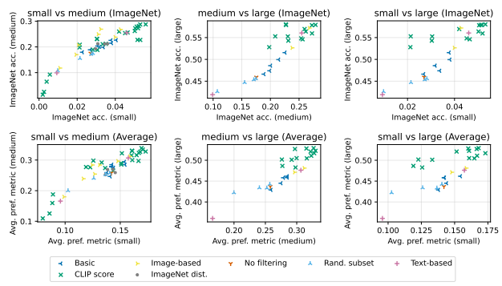

Figure 21: Improving downstream performance at smaller scales correlates positively with performance gains at larger scales. These trends suggests that dataset filtering can be studied effectively at

smaller scales, even with less computational resources.

Table 21: Rank correlation between the performance obtained with various filtering strategies at two different scales. Our experimental suggest that the ranking is relatively consistent between scales, especially for the adjacent scale pairs.

| Metric               | small   | vs medium   | small  vs large   | medium   | vs large   |
|----------------------|---------|-------------|-------------------|----------|------------|
| ImageNet acc.        |         | 0.895       | 0.811             |          | 0.847      |
| Average pref. metric |         | 0.854       | 0.708             |          | 0.876      |

| Model    | Training Dataset   | Training dataset size   | Training  steps   | ImageNet   | ImageNet   dist. shifts   | VTAB   | Retrieval   | Average over  38 datasets   |
|----------|--------------------|-------------------------|-------------------|------------|---------------------------|--------|-------------|-----------------------------|
| ViT B/32 | DataComp\-1B       | 1.4B                    | 13B               | 0.692      | 0.551                     | 0.577  | 0.538       | 0.579                       |
| ViT B/32 | OpenAI's WIT       | 0.4B                    | 13B               | 0.633      | 0.485                     | 0.526  | 0.501       | 0.525                       |
| ViT B/32 | LAION\-2B          | 2.3B                    | 34B               | 0.666      | 0.522                     | 0.561  | 0.560       | 0.569                       |
| ViT B/16 | DataComp\-1B       | 1.4B                    | 13B               | 0.735      | 0.608                     | 0.621  | 0.578       | 0.615                       |
| ViT B/16 | OpenAI's WIT       | 0.4B                    | 13B               | 0.683      | 0.559                     | 0.546  | 0.527       | 0.563                       |
| ViT B/16 | LAION\-2B          | 2.3B                    | 34B               | 0.702      | 0.566                     | 0.572  | 0.583       | 0.587                       |

Table 22: Comparison of ViT-B/32 and ViT-B/16 models across different training datasets.

Table 23: Comparison at the xlarge scale between a 400M subset of CommonPool and OpenAI's WIT which also contains 400M samples. Our 400M subset is created by intersecting IN1k image clustering with English cld3 filtering, then taking the top 400M samples sorted by CLIP L14 score.

| Model    | Training Dataset                            | Training     | Training   |          | ImageNet     |       | Retrieval   | Average over   |
|----------|---------------------------------------------|--------------|------------|----------|--------------|-------|-------------|----------------|
|          |                                             | dataset size | steps      | ImageNet | dist. shifts | VTAB  |             | 38 datasets    |
| ViT L/14 | top 400M by CLIP L14 of Image\-based ∩ cld3 | 400M         | 13B        | 0.763    | 0.657        | 0.641 | 0.595       | 0.638          |
| ViT L/14 | OpenAI's WIT                                | 400M         | 13B        | 0.755    | 0.649        | 0.586 | 0.543       | 0.617          |

Our model does better across the various evaluation groupings.

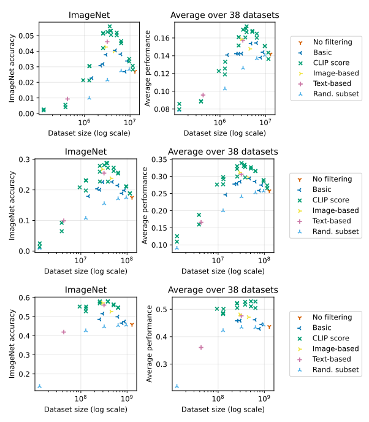

Figure 22: Performance as a function of the number of training samples from the small (top), medium
(middle), and large (bottom) scales. There is a significant variance in accuracy even when accounting for the size of the training set.

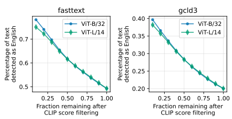

Figure 23: We examine the percentage of texts classified as English after taking the top fraction (on the x-axis) of the large billion pool as sorted by CLIP similarity score. We see that doing CLIP
filtering implicitly does some English filtering, as image-text pairs with a higher CLIP score are more frequently classified as English.

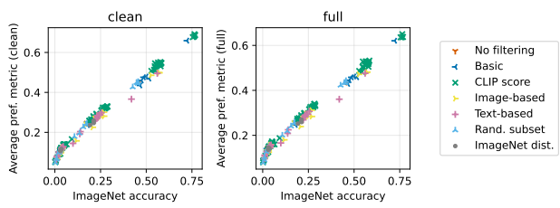

Figure 24: Correlation between ImageNet accuracy and average performance on our suite of evaluation tasks. While ImageNet accuracy strongly correlates with the average performance (both on the clean subset and the full suite), the same is not true for all individual datasets we study, as shown in Appendix Q.

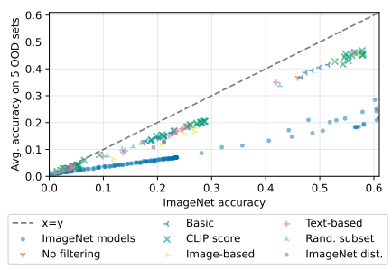

Figure 25: Zero-shot CLIP models trained with various filtering strategies form a reliable trend relating accuracy on ImageNet and related distribution shifts, exhibiting higher effective robustness when compared to ImageNet-trained models from Taori et al. [134].

#### 64

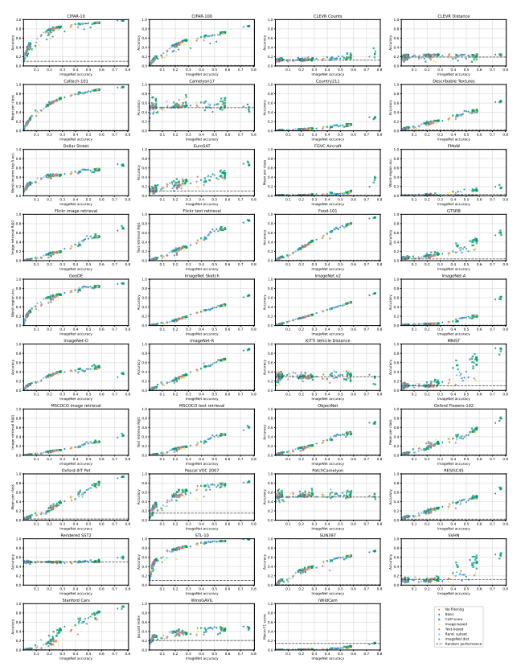

Figure 26: Zero-shot performance on other datasets is often positively correlated with that on ImageNet, but not always. In cases where ImageNet shows close to zero correlation with other datasets, performance on that dataset is often close to random chance.

| Training  Filtering  ImageNet                                                                                                                                                                                                                                                                                                                                                                     |                                                 |                                                 | ImageNet                                               | VTAB                                                   | Retrieval                                              | Average over                             |
|---------------------------------------------------------------------------------------------------------------------------------------------------------------------------------------------------------------------------------------------------------------------------------------------------------------------------------------------------------------------------------------------------|-------------------------------------------------|-------------------------------------------------|--------------------------------------------------------|--------------------------------------------------------|--------------------------------------------------------|------------------------------------------|
| dataset size                                                                                                                                                                                                                                                                                                                                                                                      |                                                 |                                                 | dist. shifts                                           |                                                        |                                                        | 38 datasets                              |
| No filtering                                                                                                                                                                                                                                                                                                                                                                                      | 12.8M                                           | 0.025                                           | 0.033                                                  | 0.145                                                  | 0.114                                                  | 0.133                                    |
| Random subset (75%)                                                                                                                                                                                                                                                                                                                                                                               | 9.6M                                            | 0.028                                           | 0.037                                                  | 0.153                                                  | 0.110                                                  | 0.140                                    |
| Random subset (50%)                                                                                                                                                                                                                                                                                                                                                                               | 6.4M                                            | 0.027                                           | 0.037                                                  | 0.147                                                  | 0.111                                                  | 0.137                                    |
| Random subset (25%)                                                                                                                                                                                                                                                                                                                                                                               | 3.2M                                            | 0.022                                           | 0.032                                                  | 0.130                                                  | 0.099                                                  | 0.126                                    |
| Random subset (10%)                                                                                                                                                                                                                                                                                                                                                                               | 1.3M                                            | 0.010                                           | 0.018                                                  | 0.116                                                  | 0.077                                                  | 0.103                                    |
| Random subset (1%)                                                                                                                                                                                                                                                                                                                                                                                | 128K                                            | 0.002                                           | 0.005                                                  | 0.095                                                  | 0.049                                                  | 0.078                                    |
| Image size                                                                                                                                                                                                                                                                                                                                                                                        | 7.8M                                            | 0.027                                           | 0.036                                                  | 0.154                                                  | 0.119                                                  | 0.138                                    |
| English (fasttext)  English (fasttext) and caption length                                                                                                                                                                                                                                                                                                                                         | 6.3M                                            | 0.038                                           | 0.045                                                  | 0.164                                                  | 0.124                                                  | 0.154                                    |
| English (fasttext), caption length, and image size                                                                                                                                                                                                                                                                                                                                                | 4.8M                                            | 0.041                                           | 0.048                                                  | 0.159                                                  | 0.123                                                  | 0.154                                    |
|                                                                                                                                                                                                                                                                                                                                                                                                   |                                                 |                                                 |                                                        |                                                        |                                                        | 0.142                                    |
| English (cld3)                                                                                                                                                                                                                                                                                                                                                                                    | 2.6M                                            | 0.032                                           | 0.039                                                  | 0.143                                                  | 0.111                                                  | 0.142                                    |
| English (cld3) and caption length                                                                                                                                                                                                                                                                                                                                                                 | 2.3M                                            | 0.031                                           | 0.038                                                  | 0.153                                                  | 0.111                                                  | 0.142                                    |
| English (cld3), caption length, and image size                                                                                                                                                                                                                                                                                                                                                    | 1.5M                                            | 0.023                                           | 0.030                                                  | 0.154                                                  | 0.092                                                  | 0.141                                    |
| CLIP B32 score top 1%                                                                                                                                                                                                                                                                                                                                                                             | 129K                                            | 0.003                                           | 0.007                                                  | 0.114                                                  | 0.050                                                  | 0.086                                    |
| CLIP B32 score top 3%                                                                                                                                                                                                                                                                                                                                                                             | 384K                                            | 0.006                                           | 0.014                                                  | 0.104                                                  | 0.055                                                  | 0.089                                    |
| CLIP B32 score top 10%                                                                                                                                                                                                                                                                                                                                                                            | 1.3M                                            | 0.026                                           | 0.035                                                  | 0.147                                                  | 0.083                                                  | 0.126                                    |
| CLIP B32 score top 30%                                                                                                                                                                                                                                                                                                                                                                            | 3.8M                                            | 0.045                                           | 0.052                                                  | 0.180                                                  | 0.120                                                  | 0.167                                    |
| CLIP B32 score top 40%                                                                                                                                                                                                                                                                                                                                                                            | 5.1M                                            | 0.052                                           | 0.057                                                  | 0.173                                                  | 0.123                                                  | 0.167                                    |
| CLIP B32 score top 50%                                                                                                                                                                                                                                                                                                                                                                            | 6.4M                                            | 0.047                                           | 0.053                                                  | 0.174                                                  | 0.124                                                  | 0.165                                    |
| 9.6M                                                                                                                                                                                                                                                                                                                                                                                              |                                                 | 0.033                                           | 0.043                                                  | 0.161                                                  | 0.121                                                  | 0.151                                    |
| CLIP B32 score top 90%                                                                                                                                                                                                                                                                                                                                                                            | 11.5M                                           | 0.028                                           | 0.039                                                  | 0.140                                                  | 0.114                                                  | 0.136                                    |
| CLIP B32 threshold at 0.3 + English filter                                                                                                                                                                                                                                                                                                                                                        | 942K                                            | 0.022                                           | 0.032                                                  | 0.138                                                  | 0.077                                                  | 0.122                                    |
| CLIP B32 threshold at 0.3                                                                                                                                                                                                                                                                                                                                                                         | 2.6M                                            | 0.052                                           | 0.056                                                  | 0.166                                                  | 0.114                                                  | 0.161                                    |
| CLIP B32 score 1% to 30%                                                                                                                                                                                                                                                                                                                                                                          | 3.7M                                            | 0.053                                           | 0.058                                                  | 0.185                                                  | 0.113                                                  | 0.170                                    |
| CLIP B32 score 2% to 30%                                                                                                                                                                                                                                                                                                                                                                          | 3.6M                                            | 0.056                                           | 0.059                                                  | 0.173                                                  | 0.120                                                  | 0.161                                    |
| CLIP B32 score 5% to 30%                                                                                                                                                                                                                                                                                                                                                                          | 3.2M                                            | 0.052                                           | 0.055                                                  | 0.177                                                  | 0.115                                                  | 0.169                                    |
| CLIP L14 score top 1%                                                                                                                                                                                                                                                                                                                                                                             | 128K                                            | 0.002                                           | 0.007                                                  | 0.111                                                  | 0.050                                                  | 0.080                                    |
| CLIP L14 score top 3%                                                                                                                                                                                                                                                                                                                                                                             | 386K                                            | 0.004                                           | 0.009                                                  | 0.110                                                  | 0.052                                                  | 0.088                                    |
| CLIP L14 score top 10%  CLIP L14 score top 20%                                                                                                                                                                                                                                                                                                                                                    | 1.3M                                            | 0.021                                           | 0.033                                                  | 0.131                                                  | 0.075                                                  | 0.119                                    |
| CLIP L14 score top 30%                                                                                                                                                                                                                                                                                                                                                                            | 3.8M                                            | 0.051                                           | 0.055                                                  | 0.190                                                  | 0.119                                                  | 0.173                                    |
| CLIP L14 score top 40%                                                                                                                                                                                                                                                                                                                                                                            | 5.1M                                            | 0.050                                           | 0.054                                                  | 0.173                                                  | 0.119                                                  | 0.168                                    |
| CLIP L14 score top 50%                                                                                                                                                                                                                                                                                                                                                                            | 6.4M                                            | 0.045                                           | 0.052                                                  | 0.164                                                  | 0.122                                                  | 0.160                                    |
| CLIP L14 score top 75%                                                                                                                                                                                                                                                                                                                                                                            | 9.6M                                            | 0.035                                           | 0.043                                                  | 0.164                                                  | 0.120                                                  | 0.151                                    |
| CLIP L14 score top 90%                                                                                                                                                                                                                                                                                                                                                                            | 11.5M                                           | 0.031                                           | 0.038                                                  | 0.154                                                  | 0.116                                                  | 0.144                                    |
| Image\-based clustering (ImageNet1k)                                                                                                                                                                                                                                                                                                                                                              | 2.9M                                            | 0.043                                           | 0.047                                                  | 0.178                                                  | 0.121                                                  | 0.159                                    |
| Image\-based clustering (ImageNet21k) Image\-based sampling,                                                                                                                                                                                                                                                                                                                                      | 4.5M                                            | 0.035                                           | 0.045                                                  | 0.154                                                  | 0.122                                                  | 0.148                                    |
| α=0  Image\-based sampling,                                                                                                                                                                                                                                                                                                                                                                       | 12.8M                                           | 0.019                                           | 0.030                                                  | 0.144                                                  | 0.095                                                  | 0.127                                    |
| α=0.2                                                                                                                                                                                                                                                                                                                                                                                             | 12.8M                                           | 0.031                                           | 0.036                                                  | 0.133                                                  | 0.100                                                  | 0.131                                    |
| Image\-based sampling,  α=0.5                                                                                                                                                                                                                                                                                                                                                                     | 12.8M                                           | 0.032                                           | 0.038                                                  | 0.129                                                  | 0.096                                                  | 0.125                                    |
| Image\-based sampling,  α=1                                                                                                                                                                                                                                                                                                                                                                       | 12.8M                                           | 0.021                                           | 0.028                                                  | 0.128                                                  | 0.078                                                  | 0.116                                    |
| Image\-based sampling,  α=2                                                                                                                                                                                                                                                                                                                                                                       | 12.8M                                           | 0.011                                           | 0.017                                                  | 0.116                                                  | 0.065                                                  | 0.099                                    |
| 2.0M                                                                                                                                                                                                                                                                                                                                                                                              |                                                 | 0.031                                           | 0.039                                                  | 0.163                                                  | 0.103                                                  | 0.145                                    |
| ImageNet distance (L14, top 20%)                                                                                                                                                                                                                                                                                                                                                                  | 2.6M                                            | 0.030                                           | 0.035                                                  | 0.155                                                  | 0.102                                                  | 0.136                                    |
| ImageNet distance (L14, top 30%)                                                                                                                                                                                                                                                                                                                                                                  | 3.9M                                            | 0.034                                           | 0.041                                                  | 0.151                                                  | 0.106                                                  | 0.139                                    |
| ImageNet distance (L14, top 40%)                                                                                                                                                                                                                                                                                                                                                                  | 5.1M                                            | 0.036                                           | 0.040                                                  | 0.151                                                  | 0.118                                                  | 0.143                                    |
| Text\-based clustering (ImageNet21k)                                                                                                                                                                                                                                                                                                                                                              | 3.2M                                            | 0.046                                           | 0.052                                                  | 0.169                                                  | 0.125                                                  | 0.157                                    |
| Text\-based sampling with average score, α=0                                                                                                                                                                                                                                                                                                                                                      | 12.8M                                           | 0.011                                           | 0.020                                                  | 0.128                                                  | 0.079                                                  | 0.112                                    |
| 12.8M                                                                                                                                                                                                                                                                                                                                                                                             |                                                 | 0.023                                           | 0.035                                                  | 0.127                                                  | 0.092                                                  | 0.128                                    |
| Text\-based sampling with average score, α=1                                                                                                                                                                                                                                                                                                                                                      | 12.8M                                           | 0.040                                           | 0.044                                                  | 0.163                                                  | 0.115                                                  | 0.155                                    |
| α=1.2  Text\-based sampling with max score,                                                                                                                                                                                                                                                                                                                                                       | 12.8M                                           | 0.038                                           | 0.045                                                  | 0.150                                                  | 0.112                                                  | 0.143                                    |
| α=0  Text\-based sampling with max score,                                                                                                                                                                                                                                                                                                                                                         | 12.8M                                           | 0.012                                           | 0.020                                                  | 0.126                                                  | 0.074                                                  | 0.107                                    |
| α=0.5                                                                                                                                                                                                                                                                                                                                                                                             | 12.8M                                           | 0.025                                           | 0.033                                                  | 0.134                                                  | 0.093                                                  | 0.129                                    |
|                                                                                                                                                                                                                                                                                                                                                                                                   |                                                 |                                                 |                                                        |                                                        |                                                        | 0.150                                    |
| Text\-based sampling with max score,  α=1.2                                                                                                                                                                                                                                                                                                                                                       | 12.8M                                           | 0.040                                           | 0.050                                                  | 0.161                                                  | 0.113                                                  | 0.152                                    |
| Intersect IN1k image clustering and CLIP B32 score top 30%                                                                                                                                                                                                                                                                                                                                        | 1.4M                                            | 0.049                                           | 0.053                                                  | 0.150                                                  | 0.103                                                  | 0.148                                    |
| Intersect IN1k image clustering and CLIP L14 score top 30%                                                                                                                                                                                                                                                                                                                                        | 1.4M                                            | 0.039                                           | 0.045                                                  | 0.162                                                  | 0.094                                                  | 0.145                                    |
| Intersect IN21k image clustering and CLIP L14 score top 30% 0.047                                                                                                                                                                                                                                                                                                                                 | 2.1M                                            |                                                 | 0.053                                                  | 0.176                                                  | 0.110                                                  | 0.163                                    |
| Caption length  CLIP B32 score top 20% CLIP B32 score top 75% CLIP B32 threshold at 0.28 + English filter ImageNet distance (L14, top 30%) and English Text\-based clustering (ImageNet1k)  Text\-based sampling with average score, α=0.5  Text\-based sampling with average score, Text\-based sampling with max score,  α=1  Intersect IN21k image clustering and CLIP B32 score top 30% 0.052 | 8.7M  3.0M  2.6M  1.3M  2.6M  427K  12.8M  2.1M | 0.034  0.038  0.051  0.031  0.042  0.009  0.040 | 0.040  0.043  0.056  0.040  0.051  0.016  0.046  0.057 | 0.148  0.150  0.173  0.136  0.165  0.120  0.159  0.179 | 0.109  0.118  0.114  0.092  0.100  0.056  0.116  0.112 | 0.143  0.161  0.133  0.151  0.096  0.167 |

Table 24: Baseline results for the filtering track, small scale.

| Training  Filtering  ImageNet                                                                                                                                                                                                                               |                                                |                                          | ImageNet                                        | VTAB                                            | Retrieval                                       | Average over                                    |
|-------------------------------------------------------------------------------------------------------------------------------------------------------------------------------------------------------------------------------------------------------------|------------------------------------------------|------------------------------------------|-------------------------------------------------|-------------------------------------------------|-------------------------------------------------|-------------------------------------------------|
| dataset size                                                                                                                                                                                                                                                |                                                |                                          | dist. shifts                                    |                                                 |                                                 | 38 datasets                                     |
| No filtering                                                                                                                                                                                                                                                | 128M                                           | 0.176                                    | 0.152                                           | 0.259                                           | 0.219                                           | 0.258                                           |
| Random subset (75%)                                                                                                                                                                                                                                         | 96.0M                                          | 0.175                                    | 0.154                                           | 0.265                                           | 0.219                                           | 0.257                                           |
| Random subset (50%)                                                                                                                                                                                                                                         | 64.0M                                          | 0.171                                    | 0.151                                           | 0.258                                           | 0.216                                           | 0.252                                           |
| Random subset (25%)                                                                                                                                                                                                                                         | 32.0M                                          | 0.155                                    | 0.136                                           | 0.246                                           | 0.203                                           | 0.240                                           |
| Random subset (10%)                                                                                                                                                                                                                                         | 12.8M                                          | 0.107                                    | 0.095                                           | 0.210                                           | 0.144                                           | 0.200                                           |
| Random subset (1%)                                                                                                                                                                                                                                          | 1.3M                                           | 0.009                                    | 0.017                                           | 0.102                                           | 0.065                                           | 0.090                                           |
| Image size                                                                                                                                                                                                                                                  | 77.8M                                          | 0.189                                    | 0.163                                           | 0.248                                           | 0.231                                           | 0.259                                           |
| English (fasttext)  English (fasttext) and caption length                                                                                                                                                                                                   | 63.0M                                          | 0.214                                    | 0.182                                           | 0.290                                           | 0.246                                           | 0.285                                           |
| English (fasttext), caption length, and image size                                                                                                                                                                                                          | 47.8M                                          | 0.226                                    | 0.193                                           | 0.284                                           | 0.251                                           | 0.285                                           |
| English (cld3)                                                                                                                                                                                                                                              | 25.6M                                          | 0.200                                    | 0.175                                           | 0.296                                           | 0.235                                           | 0.279                                           |
| English (cld3) and caption length                                                                                                                                                                                                                           | 22.9M                                          | 0.204                                    | 0.175                                           | 0.287                                           | 0.243                                           | 0.278                                           |
| English (cld3), caption length, and image size                                                                                                                                                                                                              | 14.6M                                          | 0.179                                    | 0.159                                           | 0.243                                           | 0.216                                           | 0.247                                           |
| CLIP B32 score top 1%                                                                                                                                                                                                                                       | 1.3M                                           | 0.025                                    | 0.037                                           | 0.140                                           | 0.076                                           | 0.126                                           |
| CLIP B32 score top 3%                                                                                                                                                                                                                                       | 3.9M                                           | 0.093                                    | 0.096                                           | 0.205                                           | 0.128                                           | 0.188                                           |
| CLIP B32 score top 10%                                                                                                                                                                                                                                      | 12.8M                                          | 0.231                                    | 0.199                                           | 0.305                                           | 0.206                                           | 0.298                                           |
| CLIP B32 score top 30%                                                                                                                                                                                                                                      | 38.4M                                          | 0.285                                    | 0.240                                           | 0.355                                           | 0.253                                           | 0.338                                           |
| CLIP B32 score top 40%                                                                                                                                                                                                                                      | 51.3M                                          | 0.273                                    | 0.227                                           | 0.333                                           | 0.257                                           | 0.324                                           |
| CLIP B32 score top 50%                                                                                                                                                                                                                                      | 64.0M                                          | 0.256                                    | 0.219                                           | 0.322                                           | 0.259                                           | 0.316                                           |
| 96.1M                                                                                                                                                                                                                                                       |                                                | 0.211                                    | 0.180                                           | 0.301                                           | 0.238                                           | 0.290                                           |
| CLIP B32 score top 90%                                                                                                                                                                                                                                      | 115M                                           | 0.189                                    | 0.165                                           | 0.279                                           | 0.229                                           | 0.274                                           |
| CLIP B32 threshold at 0.3 + English filter                                                                                                                                                                                                                  | 9.4M                                           | 0.208                                    | 0.184                                           | 0.292                                           | 0.210                                           | 0.276                                           |
| CLIP B32 threshold at 0.3                                                                                                                                                                                                                                   | 25.9M                                          | 0.282                                    | 0.233                                           | 0.340                                           | 0.243                                           | 0.333                                           |
| CLIP B32 score 1% to 30%                                                                                                                                                                                                                                    | 37.1M                                          | 0.287                                    | 0.238                                           | 0.347                                           | 0.253                                           | 0.334                                           |
| CLIP B32 score 2% to 30%                                                                                                                                                                                                                                    | 35.9M                                          | 0.288                                    | 0.238                                           | 0.338                                           | 0.248                                           | 0.330                                           |
| CLIP B32 score 5% to 30%                                                                                                                                                                                                                                    | 32.0M                                          | 0.281                                    | 0.230                                           | 0.352                                           | 0.254                                           | 0.339                                           |
| CLIP L14 score top 1%                                                                                                                                                                                                                                       | 1.3M                                           | 0.014                                    | 0.025                                           | 0.136                                           | 0.062                                           | 0.109                                           |
| CLIP L14 score top 3%                                                                                                                                                                                                                                       | 3.9M                                           | 0.065                                    | 0.077                                           | 0.176                                           | 0.103                                           | 0.160                                           |
| CLIP L14 score top 10%  CLIP L14 score top 20%                                                                                                                                                                                                              | 12.8M                                          | 0.198                                    | 0.183                                           | 0.283                                           | 0.188                                           | 0.277                                           |
| CLIP L14 score top 30%                                                                                                                                                                                                                                      | 38.4M                                          | 0.273                                    | 0.230                                           | 0.338                                           | 0.251                                           | 0.328                                           |
| CLIP L14 score top 40%                                                                                                                                                                                                                                      | 51.2M                                          | 0.262                                    | 0.226                                           | 0.330                                           | 0.260                                           | 0.327                                           |
| CLIP L14 score top 50%                                                                                                                                                                                                                                      | 64.1M                                          | 0.254                                    | 0.218                                           | 0.322                                           | 0.262                                           | 0.315                                           |
| CLIP L14 score top 75%                                                                                                                                                                                                                                      | 96.1M                                          | 0.212                                    | 0.180                                           | 0.287                                           | 0.242                                           | 0.285                                           |
| CLIP L14 score top 90%                                                                                                                                                                                                                                      | 115M                                           | 0.188                                    | 0.164                                           | 0.258                                           | 0.225                                           | 0.266                                           |
| Image\-based clustering (ImageNet1k)                                                                                                                                                                                                                        | 29.2M                                          | 0.268                                    | 0.213                                           | 0.319                                           | 0.256                                           | 0.312                                           |
| Image\-based clustering (ImageNet21k)                                                                                                                                                                                                                       | 45.1M                                          | 0.238                                    | 0.198                                           | 0.304                                           | 0.252                                           | 0.312                                           |
| Image\-based sampling,  α=0                                                                                                                                                                                                                                 | 128M                                           | 0.170                                    | 0.150                                           | 0.266                                           | 0.209                                           | 0.254                                           |
| Image\-based sampling,  α=0.2                                                                                                                                                                                                                               | 128M                                           | 0.249                                    | 0.193                                           | 0.292                                           | 0.221                                           | 0.284                                           |
| Image\-based sampling,  α=0.5                                                                                                                                                                                                                               | 128M                                           | 0.269                                    | 0.196                                           | 0.301                                           | 0.216                                           | 0.284                                           |
| Image\-based sampling,  α=1                                                                                                                                                                                                                                 | 128M                                           | 0.207                                    | 0.145                                           | 0.264                                           | 0.166                                           | 0.239                                           |
| Image\-based sampling,  α=2                                                                                                                                                                                                                                 | 128M                                           | 0.118                                    | 0.082                                           | 0.207                                           | 0.110                                           | 0.180                                           |
| ImageNet distance (L14, top 30%) and English                                                                                                                                                                                                                | 19.8M                                          | 0.212                                    | 0.158                                           | 0.272                                           | 0.178                                           | 0.259                                           |
| ImageNet distance (L/14, top 20%)                                                                                                                                                                                                                           | 25.8M                                          | 0.193                                    | 0.138                                           | 0.276                                           | 0.176                                           | 0.252                                           |
| ImageNet distance (L/14, top 30%)                                                                                                                                                                                                                           | 38.5M                                          | 0.212                                    | 0.159                                           | 0.283                                           | 0.201                                           | 0.269                                           |
| ImageNet distance (L/14, top 40%)                                                                                                                                                                                                                           | 51.3M                                          | 0.212                                    | 0.165                                           | 0.273                                           | 0.212                                           | 0.270                                           |
| Text\-based clustering (ImageNet1k)                                                                                                                                                                                                                         | 4.3M                                           | 0.099                                    | 0.090                                           | 0.173                                           | 0.109                                           | 0.166                                           |
| Text\-based clustering (ImageNet21k)                                                                                                                                                                                                                        | 31.7M                                          | 0.255                                    | 0.215                                           | 0.328                                           | 0.249                                           | 0.307                                           |
| Text\-based sampling with average score, α=0                                                                                                                                                                                                                | 128M                                           | 0.136                                    | 0.110                                           | 0.213                                           | 0.140                                           | 0.209                                           |
| Text\-based sampling with average score, α=0.5                                                                                                                                                                                                              | 128M                                           | 0.222                                    | 0.178                                           | 0.273                                           | 0.206                                           | 0.269                                           |
| Text\-based sampling with average score, α=1                                                                                                                                                                                                                | 128M                                           | 0.245                                    | 0.204                                           | 0.302                                           | 0.251                                           | 0.293                                           |
| Text\-based sampling with average score,  α=1.2                                                                                                                                                                                                             | 128M                                           | 0.231                                    | 0.200                                           | 0.298                                           | 0.240                                           | 0.289                                           |
| α=0  Text\-based sampling with max score,                                                                                                                                                                                                                   | 128M                                           | 0.140                                    | 0.116                                           | 0.242                                           | 0.138                                           | 0.225                                           |
| α=0.5                                                                                                                                                                                                                                                       | 128M                                           | 0.229                                    | 0.190                                           | 0.290                                           | 0.205                                           | 0.283                                           |
| Text\-based sampling with max score,  α=1.2                                                                                                                                                                                                                 | 128M                                           | 0.235                                    | 0.200                                           | 0.298                                           | 0.239                                           | 0.290                                           |
| Intersect IN1k image clustering and CLIP B32 score top 30%                                                                                                                                                                                                  | 14.2M                                          | 0.305                                    | 0.243                                           | 0.342                                           | 0.250                                           | 0.328                                           |
| Intersect IN1k image clustering and CLIP L14 score top 30%                                                                                                                                                                                                  | 14.0M                                          | 0.297                                    | 0.239                                           | 0.346                                           | 0.231                                           | 0.328                                           |
| Intersect IN21k image clustering and CLIP L14 score top 30% 0.290                                                                                                                                                                                           | 20.8M                                          |                                          | 0.241                                           | 0.339                                           | 0.244                                           | 0.328                                           |
| Caption length  CLIP B32 score top 20% CLIP B32 score top 75% CLIP B32 threshold at 0.28 + English filter Text\-based sampling with max score, Text\-based sampling with max score,  α=1  Intersect IN21k image clustering and CLIP B32 score top 30% 0.298 | 87.5M  29.8M  25.7M  13.0M  25.7M  128M  21.1M | 0.199  0.226  0.279  0.230  0.260  0.247 | 0.172  0.193  0.234  0.198  0.225  0.209  0.244 | 0.275  0.297  0.337  0.307  0.326  0.300  0.347 | 0.236  0.253  0.241  0.233  0.235  0.241  0.256 | 0.275  0.294  0.330  0.292  0.322  0.295  0.336 |

Table 25: Baseline results for the filtering track, medium scale.

| Filtering                                                   | Training     |          | ImageNet     |       | Retrieval   | Average over   |
|-------------------------------------------------------------|--------------|----------|--------------|-------|-------------|----------------|
|                                                             | dataset size | ImageNet | dist. shifts | VTAB  |             | 38 datasets    |
| No filtering                                                | 1.28B        | 0.459    | 0.378        | 0.426 | 0.419       | 0.437          |
| Random subset (75%)                                         | 960M         | 0.456    | 0.379        | 0.435 | 0.415       | 0.442          |
| Random subset (50%)                                         | 640M         | 0.453    | 0.377        | 0.427 | 0.413       | 0.433          |
| Random subset (25%)                                         | 320M         | 0.447    | 0.373        | 0.424 | 0.407       | 0.434          |
| Random subset (10%)                                         | 128M         | 0.426    | 0.350        | 0.417 | 0.396       | 0.442          |
| Random subset (1%)                                          | 12.8M        | 0.135    | 0.118        | 0.219 | 0.135       | 0.218          |
| Caption length                                              | 874M         | 0.474    | 0.392        | 0.438 | 0.443       | 0.445          |
| Image size                                                  | 777M         | 0.466    | 0.375        | 0.421 | 0.438       | 0.429          |
| English (fasttext)                                          | 630M         | 0.500    | 0.414        | 0.449 | 0.460       | 0.462          |
| English (fasttext), caption length, and image size          | 298M         | 0.516    | 0.423        | 0.446 | 0.480       | 0.458          |
| English (cld3)                                              | 256M         | 0.486    | 0.405        | 0.462 | 0.472       | 0.458          |
| CLIP B32 score top 10%                                      | 128M         | 0.543    | 0.440        | 0.471 | 0.435       | 0.483          |
| CLIP B32 score top 20%                                      | 257M         | 0.578    | 0.465        | 0.516 | 0.463       | 0.515          |
| CLIP B32 score top 30%                                      | 384M         | 0.578    | 0.466        | 0.525 | 0.475       | 0.527          |
| CLIP B32 score top 40%                                      | 512M         | 0.560    | 0.454        | 0.512 | 0.478       | 0.511          |
| CLIP B32 score top 50%                                      | 640M         | 0.546    | 0.450        | 0.504 | 0.484       | 0.505          |
| CLIP B32 threshold at 0.3 + English filter                  | 94.3M        | 0.553    | 0.447        | 0.511 | 0.482       | 0.502          |
| CLIP B32 threshold at 0.28 + English filter                 | 130M         | 0.553    | 0.453        | 0.510 | 0.495       | 0.501          |
| CLIP B32 threshold at 0.3                                   | 258M         | 0.579    | 0.464        | 0.501 | 0.465       | 0.505          |
| CLIP L14 score top 10%                                      | 128M         | 0.528    | 0.444        | 0.482 | 0.413       | 0.486          |
| CLIP L14 score top 20%                                      | 257M         | 0.570    | 0.466        | 0.524 | 0.455       | 0.521          |
| CLIP L14 score top 30%                                      | 384M         | 0.578    | 0.474        | 0.538 | 0.466       | 0.529          |
| CLIP L14 score top 40%                                      | 512M         | 0.564    | 0.462        | 0.533 | 0.468       | 0.529          |
| CLIP L14 score top 50%                                      | 641M         | 0.548    | 0.455        | 0.539 | 0.469       | 0.528          |
| Image\-based clustering (ImageNet1k)                        | 294M         | 0.572    | 0.454        | 0.483 | 0.481       | 0.481          |
| Image\-based clustering (ImageNet21k)                       | 450M         | 0.527    | 0.433        | 0.468 | 0.463       | 0.471          |
| Text\-based clustering (ImageNet1k)                         | 42.7M        | 0.419    | 0.355        | 0.340 | 0.309       | 0.361          |
| Text\-based clustering (ImageNet21k)                        | 317M         | 0.561    | 0.465        | 0.465 | 0.479       | 0.476          |
| Intersect IN1k image clustering and CLIP B32 score top 30%  | 143M         | 0.632    | 0.498        | 0.525 | 0.504       | 0.528          |
| Intersect IN1k image clustering and CLIP L14 score top 30%  | 140M         | 0.631    | 0.508        | 0.546 | 0.498       | 0.537          |
| Intersect IN21k image clustering and CLIP B32 score top 30% | 211M         | 0.605    | 0.481        | 0.531 | 0.494       | 0.519          |
| Intersect IN21k image clustering and CLIP L14 score top 30% | 208M         | 0.506    | 0.416        | 0.466 | 0.424       | 0.471          |

Table 26: Baseline results for the filtering track, large scale.

| Filtering                                                  | Training  dataset size   | ImageNet   | ImageNet   dist. shifts   | VTAB   | Retrieval   | Average over  38 datasets   |
|------------------------------------------------------------|--------------------------|------------|---------------------------|--------|-------------|-----------------------------|
| No filtering                                               | 12.8B                    | 0.723      | 0.612                     | 0.611  | 0.569       | 0.621                       |
| CLIP B32 score top 30%                                     | 3.84B                    | 0.764      | 0.640                     | 0.628  | 0.599       | 0.638                       |
| CLIP B32 threshold at 0.28 + English filter                | 1.3B                     | 0.755      | 0.637                     | 0.624  | 0.620       | 0.636                       |
| CLIP L14 score top 20%                                     | 2.56B                    | 0.761      | 0.649                     | 0.630  | 0.575       | 0.636                       |
| CLIP L14 score top 25%                                     | 3.2B                     | 0.768      | 0.656                     | 0.621  | 0.585       | 0.637                       |
| CLIP L14 score top 30%                                     | 3.84B                    | 0.764      | 0.655                     | 0.643  | 0.588       | 0.650                       |
| Intersect IN1k image clustering and CLIP L14 score top 30% | 1.38B                    | 0.792      | 0.679                     | 0.652  | 0.608       | 0.663                       |

Table 27: Baseline results for the filtering track, xlarge scale.

# R Datasheet

### R.1 Motivation

Q1 For what purpose was the dataset created? Was there a specific task in mind? Was there a specific gap that needed to be filled? Please provide a description.

- The purpose of DataComp and the associated CommonPool dataset is to enable study of what makes a strong image-text dataset, which supports a broad range of applications. Prior work mainly focuses on data curation in the context of supervised datasets and smaller scales. For a fuller treatment see Section 2. In our initial release of DataComp we focus on 38 downstream image classification and image retrieval tasks. For details see Section 3.5 and Appendix N.

Q2 Who created the dataset (e.g., which team, research group) and on behalf of which entity (e.g., company, institution, organization)?

- DataComp and CommonPool were created by a group of researchers with the following affiliations, listed in alphabetical order: Allen Institute for Artificial Intelligence (AI2), Apple, Columbia University, Google Research, Graz University of Technology, Hebrew University, Juelich Supercomputing Center, LAION, Research Center Juelich, StabilityAI, Tel Aviv University, University of Illinois Urbana-Champaign, University of Texas at Austin, University of Washington.

Q3 Who funded the creation of the dataset? If there is an associated grant, please provide the name of the grantor and the grant name and number.

- Compute for this research was generously provided by StabilityAI. For more specific acknowledgments, see the acknowledgment section at the end of the main paper.

Q4 Any other comments?

- We hope that CommonPool will help to facilitate data-centric questions in ML and AI
towards the next generation of web-scale datasets, that 1) yield higher accuracy models and 2) models that are safer and more equitable.

### R.2 Composition

Q5 What do the instances that comprise the dataset represent (e.g., documents, photos, people, countries)? *Are there multiple types of instances (e.g., movies, users, and* ratings; people and interactions between them; nodes and edges)? Please provide a description.

- Each instance is a pair of url and corresponding image alt-text. The url points to an image that a user can then try to download. Each sample is also tagged with metadata, discussed in Q25.

Q6 How many instances are there in total (of each type, if appropriate)?

- There are 12.8B instances in CommonPool. For breakdowns and statistics see Appendix I.

Q7 Does the dataset contain all possible instances or is it a sample (not necessarily random) of instances from a larger set? If the dataset is a sample, then what is the larger set? Is the sample representative of the larger set (e.g., geographic coverage)? If so, please describe how this representativeness was validated/verified. If it is not representative of the larger set, please describe why not (e.g., to cover a more diverse range of instances, because instances were withheld or unavailable).

- We find ∼88B possible samples in common crawl. These samples are globally shuffled to ensure i.i.d. sampling for all sampling based parts of the downstream pipeline. Of these samples we attempt to download ∼40B samples. Due to various download issues, such as dead links and throttling, we are able to successfully download ∼16.8B samples. After NSFW filtering and evaluation set deduplication we end up with ∼13.1B viable samples, from which we randomly sample 12.8B for CommonPool. For a complete treatment and visualization of our data processing funnel, see Appendix H. For each sample we also release metadata shown in Table 8.

Q8 What data does each instance consist of? "Raw" data (e.g., unprocessed text or images)
or features? In either case, please provide a description.

- Each sample contains an image url for download and an associated alt-text caption.

Additionally, each sample contains metadata fields shown in Table 8 (e.g., image aspect ratio and CLIP features).

Q9 Is there a label or target associated with each instance? If so, please provide a description.

- We do not provide any category labels; however, the text associated with each image can be considered a soft, noisy label for each sample. Such labels are common in modern imagetext training paradigms (e.g., image-text representation alignment, image captioning objectives, text-conditional image generation objectives, etc.).

Q10 Is any information missing from individual instances? *If so, please provide a description,*
explaining why this information is missing (e.g., because it was unavailable). This does not include intentionally removed information, but might include, e.g., redacted text.

- No, each sample is an image-text pair.

Q11 Are relationships between individual instances made explicit (e.g., users' movie ratings, social network links)? *If so, please describe how these relationships are made* explicit.

- No, the dataset is released as it is with no explicit attempt to establish relationships between instances.

Q12 Are there recommended data splits (e.g., training, development/validation, testing)?

If so, please provide a description of these splits, explaining the rationale behind them.

- No. The test tasks are existing image classification tasks. We run a deduplication model to try to prevent test set contamination in CommonPool.

Q13 Are there any errors, sources of noise, or redundancies in the dataset? *If so, please* provide a description.

- CommonPool is sourced from Common Crawl, which can be thought of as a snapshot of the internet. Hence, there can be considerable noise (e.g., alt-text being unrelated to its associated image), duplicate data, etc.

Q14 Is the dataset self-contained, or does it link to or otherwise rely on external resources (e.g., websites, tweets, other datasets)? If it links to or relies on external resources, a) are there guarantees that they will exist, and remain constant, over time; b) are there official archival versions of the complete dataset (i.e., including the external resources as they existed at the time the dataset was created); c) are there any restrictions (e.g., licenses, fees) associated with any of the external resources that might apply to a future user? Please provide descriptions of all external resources and any restrictions associated with them, as well as links or other access points, as appropriate.

- The data is not self-contained and rather links other external resources on the internet.

Links point to resources distributed across the internet. There is no guarantee that the resources will exist in perpetuity or that that the resources will not change. To mitigate against data poisoning in future CommonPool downloads, we release SHA256 hashes of images. Due to the size of the dataset, it is not possible to provide it in an archival form.

Q15 Does the dataset contain data that might be considered confidential (e.g., data that is protected by legal privilege or by doctor–patient confidentiality, data that includes the content of individuals' non-public communications)? If so, please provide a description.

- The dataset is comprised of data that was readily available on the public internet at the time of our download. However, it is possible that the dataset contains confidential information (e.g., private data that is hosted publicly for nefarious reasons or out of ignorance of said data being confidential).

Q16 Does the dataset contain data that, if viewed directly, might be offensive, insulting, threatening, or might otherwise cause anxiety? *If so, please describe why.*
- Considering the plurality of people and their backgrounds across the world, it is highly likely that there is content in CommonPool that may upset people. Common Crawl scrapes the internet, which has pornographic, hateful, racist, sexist, and otherwise abhorrent and toxic material. While we attempt to do thorough NSFW filtering, these methods are not 100% accurate. At the 12.8B scale at which we operate, it is highly likely that there is still toxic content in the dataset. We consider the dataset as a research artifact and hope future work will look critically at CommonPool in the hopes of developing even better safety filters.

Q17 Does the dataset relate to people? If not, you may skip the remaining questions in this section.

- People may appear in the dataset; however, in an effort to preserve privacy, our downloading tooling automatically blurs all detected faces in CommonPool images.

Q18 Does the dataset identify any subpopulations (e.g., by age, gender)?

- While CommonPool does not explicitly identify subpopulations in its metadata, it is plausible to extract such information for some images using the corresponding textual caption.

Q19 Is it possible to identify individuals (i.e., one or more natural persons), either directly or indirectly (i.e., in combination with other data) from the dataset? *If so,* please describe how.

- We conjecture that even with our face blurring procedure, it may still be possible to identify individuals. Face blurring relies of a face detection model, which could fail (See Appendix G for experimental validation of the employed detector). It is also possible to identify certain celebrities or athletes, who may wear distinctive clothing that is associated with them. It is also likely that names are contained in textual captions, though it is not guaranteed that these names correspond to people in images due to the inherent noisiness of internet captions.

Q20 Does the dataset contain data that might be considered sensitive in any way (e.g.,
data that reveals racial or ethnic origins, sexual orientations, religious beliefs, political opinions or union memberships, or locations; financial or health data; biometric or genetic data; forms of government identification, such as social security numbers; criminal history)? *If so, please provide a description.*
- Yes. CommonPool is created using images and corresponding alt-text that are available on the public internet. Given the 12.8B scale of CommonPool, it is highly likely that there is sensitive data in the dataset. To mitigate against making sensitive content more accessible, we 1) run NSFW image filtering and 2) NSFW text filtering when generating CommonPool, discarding all samples that are flagged. Additionally we 3) provide automatic face blurring in our CommonPool download scripts to blur all detected faces.

#### Q21 Any Other Comments?

- CommonPool is a research artifact, and we hope it will be useful for those studying how to make internet-scale datasets safer.

### R.3 Collection Process

Q22 How was the data associated with each instance acquired? Was the data directly observable (e.g., raw text, movie ratings), reported by subjects (e.g., survey responses), or indirectly inferred/derived from other data (e.g., part-of-speech tags, model-based guesses for age or language)? If data was reported by subjects or indirectly inferred/derived from other data, was the data validated/verified? If so, please describe how.

- Data is directly downloaded from the public internet.

Q23 What mechanisms or procedures were used to collect the data (e.g., hardware apparatus or sensor, manual human curation, software program, software API)? How were these mechanisms or procedures validated?

- We iterate on the LAION-5B data collection process, making an effort to emphasize safety.

We ran python based processing scripts to parse Common Crawl dumps, download images, filter our NSFW content, deduplicate samples against downstream tests sets, blur faces, and compute CLIP features. We ran processes on 100s of AWS CPU nodes for Common Crawl parsing and data download. Other steps were run on one of StabilityAI's GPU
cluster. For software links see Q37. For software validation related to NSFW content filtering and face blurring see Appendices E and G respectively. In brief, for NSFW image filtering, we validate against commercial APIs and on the NSFW test set introduced in LAION-5B. For face detection (used for face blurring), we evaluate against commercial APIs. We find strong performance for both modules.

Q24 If the dataset is a sample from a larger set, what was the sampling strategy (e.g.,
deterministic, probabilistic with specific sampling probabilities)?

- See Q7.

Q25 Who was involved in the data collection process (e.g., students, crowdworkers, contractors) and how were they compensated (e.g., how much were crowdworkers paid)?

- The researching authors were involved in the data collection as an open source effort. No researchers were compensated specifically for their involvement in this project.

Q26 Over what timeframe was the data collected? Does this timeframe match the creation timeframe of the data associated with the instances (e.g., recent crawl of old news articles)? If not, please describe the timeframe in which the data associated with the instances was created.

- Data was downloaded between December 2022 and March 2023. The urls are collected from Common Crawl dumps between 2014 and 2022. Common Crawl dumps may include urls from the early days of the internet. Hence, the download/collection timeframe does not match the creation timeframe. Additionally, future users of CommonPool and its subsets will have to download data themselves using our tooling.

Q27 Were any ethical review processes conducted (e.g., by an institutional review board)? *If so, please provide a description of these review processes, including the outcomes,*
as well as a link or other access point to any supporting documentation.

- Our dataset collection process iterates on the LAION-5B process, which found IRB review was not necessary as they "do not intervene with the people depicted in the data as well as the data being public." [126]. Additionally, the NeurIPS ethics review found no serious ethical issues with LAION-5B. We take even more stringent safety measures than the original LAION-5B dataset, in that we filter out data that is flagged as NSFW by our detection pipeline and blur detected faces in CommonPool, automatically in our released download tooling. All this being said, a formal ethics review has not been conducted to date.

Q28 Does the dataset relate to people? If not, you may skip the remaining questions in this section.

- Yes. People may appear in the dataset. Detected faces are blurred when downloading CommonPool with our tooling.

Q29 Did you collect the data from the individuals in question directly, or obtain it via third parties or other sources (e.g., websites)?

- We collect data from websites across the internet.

Q30 Were the individuals in question notified about the data collection? *If so, please* describe (or show with screenshots or other information) how notice was provided, and provide a link or other access point to, or otherwise reproduce, the exact language of the notification itself.

- Individuals were not notified about the data collection.

Q31 Did the individuals in question consent to the collection and use of their data? If so, please describe (or show with screenshots or other information) how consent was requested and provided, and provide a link or other access point to, or otherwise reproduce, the exact language to which the individuals consented.

- Following our usage of Common Crawl and https://github.com/rom1504/img2dataset for download images, we respect robots.txt files, which specify parts of websites that a crawler may access. It is, however, possible that images of people, medical images, etc. were uploaded to the internet without a person's consent. To mitigate against such safety concerns we make an effort to do rigorous NSFW filtering and blur all detected faces automatically in our download tooling.

Q32 If consent was obtained, were the consenting individuals provided with a mechanism to revoke their consent in the future or for certain uses? *If so, please provide a* description, as well as a link or other access point to the mechanism (if appropriate).

- In conjunction with LAION, we use https://laion.ai/dataset-requests/ to monitor user takedown requests. We will also make an effort to provide a user with the url at which their sensitive content is hosted—if they do not have this information already—, so they can take further action as they see fit (e.g., contacting the host to request that the content is taken down from the internet).

Q33 Has an analysis of the potential impact of the dataset and its use on data subjects
(e.g., a data protection impact analysis) been conducted? If so, please provide a description of this analysis, including the outcomes, as well as a link or other access point to any supporting documentation.

- We conduct a fairness evaluation on models trained on CommonPool and its derivative.

See Appendix P for details. Birhane et al. [15] conduct an extensive study in the context of LAION-400M, which is an image-text dataset also sourced from Common Crawl, finding a plethora of dangerous and unsafe content. Our dataset differs from LAION-400M in that we conduct NSFW preprocessing and face blurring for detected faces. CommonPool only contains samples that pass our NSFW safety checks and our download tooling automatically blurs detected faces. However, since CommonPool is created from the internet, it is still likely that it contains some harmful data.

#### Q34 Any Other Comments?

- We hope that future work will use CommonPool to study how to construct safer, web-scale datasets.

### R.4 Preprocessing, Cleaning, And/Or Labeling

Q35 Was any preprocessing/cleaning/labeling of the data done (e.g., discretization or bucketing, tokenization, part-of-speech tagging, SIFT feature extraction, removal of instances, processing of missing values)? *If so, please provide a description. If not,* you may skip the remainder of the questions in this section.

- Yes. See Q7. For more details see Appendix H.

Q36 Was the "raw" data saved in addition to the preprocessed/cleaned/labeled data
(e.g., to support unanticipated future uses)? If so, please provide a link or other access point to the "raw" data.

- Raw data is not available or distributed due to safety considerations. We distribute only urls that are in the dataset on HuggingFace—and not urls of images our preprocessing flagged as NSFW.

Q37 Is the software used to preprocess/clean/label the instances available? *If so, please* provide a link or other access point.

- We use the following, open-source software to aid in data processing:
- Apache Spark: https://spark.apache.org
- Ray: https://www.ray.io
- img2dataset: https://github.com/rom1504/img2dataset - OpenAI CLIP: https://github.com/openai/CLIP
- Near dedulicate detector: https://github.com/lyakaap/ISC21-Descriptor-Track-1st - Face detector: https://github.com/deepinsight/insightface
- Detoxify, for detecting toxic language: https://github.com/unitaryai/detoxify
- A modified version of the following NSFW image detector: https://github.com/
LAION-AI/CLIP-based-NSFW-Detector. Specifically, we use the dataset used to train this model to train our own 4-layer MLP classifier.

#### Q38 Any Other Comments?

- CommonPool and DataComp would not be possible without tools developed by the open-source community.

### R.5 Uses

Q39 Has the dataset been used for any tasks already? *If so, please provide a description.*
- The full dataset (and subsets) have been used to train several CLIP models at various scales and compute budgets as presented in our main paper. We evaluate these models zero-shot on 38 downstream image classification and retrieval tasks. See Section 3.5 and Appendix N for more details.

Q40 Is there a repository that links to any or all papers or systems that use the dataset?

If so, please provide a link or other access point.

- No. However, there is a leaderboard associated with DataComp. Interested parties can investigate the submissions and further study publications that make use of our data.

See: https://www.datacomp.ai/leaderboard.html.

Q41 What (other) tasks could the dataset be used for?

- The dataset could also be used for training image captioning models and languageconditional image generation models. Note: generative image models trained on CommonPool are not expected to generate recognizable human faces as our download tooling automatically blurs detected faces. CommonPool could be used for sociological studies, for example, examining societal biases or to better understand what is on the public internet.

Q42 Is there anything about the composition of the dataset or the way it was collected and preprocessed/cleaned/labeled that might impact future uses? For example, is there anything that a future user might need to know to avoid uses that could result in unfair treatment of individuals or groups (e.g., stereotyping, quality of service issues) or other undesirable harms (e.g., financial harms, legal risks) If so, please provide a description. Is there anything a future user could do to mitigate these undesirable harms?

- CommonPool and its derivatives are not intended for production ready products, including but not limited to those related to race, gender identity or expression, ethnicity, sexual orientation, age, socioeconomic status, disability, religion, national origin or creed. CommonPool is not suitable for any software that makes decisions involving people.

CommonPool is collected from the internet and hence reflects many of the biases, unfairness, and stereotypes currently existing in our societies. CommonPool is intended as a research artifact to study multimodal dataset curation and the effect of data curation strategies on downstream models.

Q43 Are there tasks for which the dataset should not be used? *If so, please provide a* description.

- CommonPool in its current form or the subsets presented in this paper should not be used in software that makes decisions related to people. The known biases (Appendix P) make deploying software, especially widely decimated production-level products, built on CommonPool incredibly irresponsible. CommonPool is designed as a research artifact for academic exploration. We also do not condone the use of CommonPool in surveillance or military applications.

#### Q44 Any Other Comments?

- Our goal with CommonPool and DataComp was to put a benchmark in place so the community can start measuring dataset progress along many different axes (e.g., model performance on diverse tasks). We believe this is crucial to develop more performant and safer datasets.

### R.6 Distribution

Q45 Will the dataset be distributed to third parties outside of the entity (e.g., company, institution, organization) on behalf of which the dataset was created? If so, please provide a description.

- Yes. We use HuggingFace datasets for public release.

Q46 How will the dataset be distributed (e.g., tarball on website, API, GitHub)? *Does* the dataset have a digital object identifier (DOI)?

- The dataset will be distributed via HuggingFace datasets at https://huggingface.co/
datasets/mlfoundations/datacomp_pools/tree/main Q47 When will the dataset be distributed?

- DataComp will be available starting May 2023.

Q48 Will the dataset be distributed under a copyright or other intellectual property
(IP) license, and/or under applicable terms of use (ToU)? If so, please describe this license and/or ToU, and provide a link or other access point to, or otherwise reproduce, any relevant licensing terms or ToU, as well as any fees associated with these restrictions.

- We distribute the url-text sample and metadata under a standard CC-BY-4.0 licence.

Q49 Have any third parties imposed IP-based or other restrictions on the data associated with the instances? If so, please describe these restrictions, and provide a link or other access point to, or otherwise reproduce, any relevant licensing terms, as well as any fees associated with these restrictions.

- We do not copyright samples in the dataset.

Q50 Do any export controls or other regulatory restrictions apply to the dataset or to individual instances? If so, please describe these restrictions, and provide a link or other access point to, or otherwise reproduce, any supporting documentation.

- The dataset is provided as an index of url-text pairs.

Q51 Any other comments?

- We provide several subsets of CommonPool (between 12.8M samples and the full dataset of 12.8B samples). Hence, it is possible to download and experiment with subset of the data.

### R.7 Maintenance

#### Q52 Who Will Be Supporting/Hosting/Maintaining The Dataset?

- HuggingFace currently hosts the url-text pairs and metadata. The DataComp team will be responsible for maintaining the dataset.

Q53 How can the owner/curator/manager of the dataset be contacted (e.g., email address)?

- We can be contacted at contact@datacomp.ai.

Q54 Is there an erratum? *If so, please provide a link or other access point.*
- Currently there are no errata. If issues are discovered, we will communicate with the public via our website https://datacomp.ai.

Q55 Will the dataset be updated (e.g., to correct labeling errors, add new instances, delete instances)? *If so, please describe how often, by whom, and how updates will be* communicated to users (e.g., mailing list, GitHub)?

- At the present time there is no intention to update CommonPool for scientific reasons.

However, we will respond to user takedown requests (see Q56). CommonPool is inherently noisy and the purpose of releasing it is to encourage researchers in the community to study dataset cleaning in the context of image-text samples.

Q56 If the dataset relates to people, are there applicable limits on the retention of the data associated with the instances (e.g., were individuals in question told that their data would be retained for a fixed period of time and then deleted)? *If so,* please describe these limits and explain how they will be enforced.

- We will use the following website, https://laion.ai/dataset-requests, for user takedown requests, where "Sample ID" is the sample uid.

Q57 Will older versions of the dataset continue to be supported/hosted/maintained? If so, please describe how. If not, please describe how its obsolescence will be communicated to users.

- This is the first version of DataComp and the associated CommonPool dataset. We do not intend to maintain deprecated version of CommonPool. We will communicate deprication notices through our website: https://datacomp.ai.

Q58 If others want to extend/augment/build on/contribute to the dataset, is there a mechanism for them to do so? If so, please provide a description. Will these contributions be validated/verified? If so, please describe how. If not, why not? Is there a process for communicating/distributing these contributions to other users? If so, please provide a description.

- All alterations to the dataset will be handled on a case-by-case basis.

Q59 Any other comments?

- We encourage community members to contact us at contact@datacomp.ai with inquiries related to dataset maintainence.