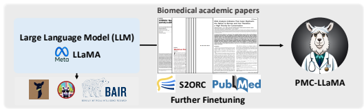
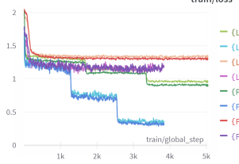

# Pmc-Llama: Further Finetuning Llama On Medical Papers

Chaoyi Wu1,2, Xiaoman Zhang1,2, Ya Zhang1,2, Yanfeng Wang1,2, Weidi Xie**1,2,**B
{wtzxxxwcy02, xm99sjtu, ya_zhang, wangyanfeng, weidi}@sjtu.edu.cn 1Cooperative Medianet Innovation Center, Shanghai Jiao Tong University 2Shanghai AI Laboratory

# Abstract

Large Language Models (LLMs) have showcased remarkable capabilities in natural language understanding in various domains. These models can usually behave well on daily dialog, or question answering scenarios, however, in areas that value precision, for example, in medical applications, they often exhibit unsatisfactory performance due to a lack of domain-specific knowledge. In this report, we introduce PMC-LLaMA, an open-source language model that is acquired by fine-tuning an open-source language model on a total of 4.8 million biomedical academic papers for further injecting medical knowledge, enhancing its capability in medical domain. Our preliminary evaluations are conducted on three biomedical QA datasets, including PubMedQA, MedMCQA, and USMLE, showing that the our model after finetuning, *i.e.*, PMC-LLaMA, demonstrates better understanding of biomedical domain-specific concepts, thus achieving high performance on QA benchmarks. The model and codes, along with an online demo, are publicly available1,2.

# 1 Introduction

The rapid advancement of large language models (LLMs), for example, OpenAI's Chat- GPT [cha, 2023] and GPT-4 [OpenAI, 2023] has truly revolutionized artificial intelligence in various domain, for example, natural language processing, computer vision, and biomedical domain [Moor et al., 2023, Nori et al., 2023, Singhal et al., 2022], unfortunately, the training details and model architectures for ChatGPT, and its variants, still remain unclear. In contrast, as an open-source foundational language model, LLaMA [Touvron et al., 2023] often performs poorly on applications that require heavy domain knowledge, which we conjecture is due to inadequate domain-specific data at the model pre-training stage. In the recent literature, there has been a growing interest in leveraging open-source LLMs and adapting them towards specific applications or domains. For instance, Alpaca [Taori et al., 2023] and Vicuna [Chiang et al., 2023] have concentrated on enhancing the model's interactive capabilities using machine-generated instruction-following samples. In contrast to their goal on daily dialogue, in this report, our focus is to steer the foundational language model towards medical-specific corpus, by further injecting domain knowledge into one pre-trained LLaMA.

Specifically, we introduce PMC-LLaMA, an open-source language model trained by finetuning LLaMA-7B on 4.8 million biomedical academic papers. The whole procedure can be

1Huggingface Page: https://huggingface.co/chaoyi-wu/PMC_LLAMA_7B 2Github Page: https://github.com/chaoyi-wu/PMC-LLaMA

Figure 1: PMC-LLaMA Training Pipeline.

seen in Figure 1. With preliminary evaluation, PMC-LLaMA has demonstrated superior performance on various medical QA datasets, including PubMedQA, MedMCQA, and USMLE, for end-to-end full fine-tuning, parameter-efficient fine-tuning and data-efficient fine-tuning. We believe that such a medical-specific foundational language model would be more suitable for specialization in various healthcare sub-tasks, such as medical dialogue or consultation.

# 2 Experiment

In this section, we begin by outlining the fine-tuning procedure (Sec. 2.1), including the dataset used and specific training details; Subsequently, in Sec. 2.2, we provide a detailed description of the evaluation benchmark, composing three QA datasets, namely PubMedQA, MedMCQA, and UMLSE. Lastly, in Sec. 2.3, we present three evaluation scenarios: full fine-tuning, parameter-efficient fine-tuning, and data-efficient fine-tuning.

#### 2.1 Fine-Tuning Procedure

Dataset. We start with the S2ORC [Lo et al., 2020] Datasets with 81.1M English-language academic papers, and filter them with PubMed Central (PMC)-id. As a result, there are around 4.9M papers left, that are highly related to medical knowledge totaling over 75B tokens.

Fine-tuning detail. We fine-tune the LLaMA-7B model on these open-accessed PMC
papers, by optimising an autoregressive generation objective, as introduced in GPT2 [Radford et al., 2019]. Specifically, during our finetuning, the max context length is set as 512, with a batch size to be 128, and the model is trained with AdamW optimizer [Loshchilov and Hutter, 2017] with learning rate 2e-5. To accelerate the training, we adopt the Fully Sharded Data Parallel (FSDP) acceleration strategy and bf16 (Brain Floating Point) data format. The model is trained for 5 epochs with 8 A100 GPUs in around 7 days. Note that, in each epoch, we randomly sample 512 continuous tokens per paper for training.

#### 2.2 Benchmark Descriptions

In this section, we detail the three QA benchmarks for evaluation in the following. PubMedQA [Jin et al., **2019]** contains questions on biomedical research, the model is provided with paper abstracts from PubMed, and is required to complete multiple-choice questions. It is split into three subsets: labeled (PQA-L), unlabeled (PQA-U), and artificially generated (PQA-A). We use PQA-A for training, which contains 211,269 Question-Answer pairs, and PQA-L for testing, which contains 1000 pairs.

MedMCQA [Pal et al., **2022]** is a dataset of multiple choice questions sourced from mock exams and past exams of two Indian medical school entrance exams called AIIMS and NEET-PG [Pal et al., 2022]. The train set contains 182,822 questions, and the test set contains 4183 questions. Each question has 4 choices.

USMLE [Jin et al., **2021]** is a dataset of multiple choice questions (4 choices per question), based on the United States Medical License Exams. The dataset is collected from the professional medical board exams, covering three languages: English, simplified Chinese, and traditional Chinese, and contains 12,724, 34,251, and 14,123 questions for these three languages, respectively. We only use the English parts and split it into 10,178 questions for training, 1273 for validation, and 1273 for testing, following the official data spits.

#### 2.3 Evaluation Scenario

In this section, we evaluate PMC-LLaMA by fine-tuning on the above-mentioned corresponding medical QA datasets, under three scenarios, namely full fine-tuning, parameter-efficient fine-tuning, and data-efficient fine-tuning as detailed in the following. Full fine-tuning. We fine-tune PMC-LLAMA on the combination of the training set from PubMedQA and MedMCQA, for evaluation, we treat the test set from PubMedQA and MedMCQA as **in-domain (ID)** evaluation, while treating the USMLE test set as out-of-domain (OOD) evaluation, similarly to LMFlow [Diao et al., 2023]. Parameter-efficient fine-tuning [Mangrulkar et al., **2022]** enables efficient adaptation of pre-trained LLMs to various downstream applications without fine-tuning all parameters, greatly reducing the time and computation cost. Here we use the most widely used method, called PEFT Low-Rank Adaptation (LoRA) [Hu et al., 2021]. The hyper-parameter for LoRA is set by default provided in the python package PEFT [Mangrulkar et al., 2022]. The data settings for training and testing remain the same as full fine-tuning. Data-efficient fine-tuning. In addition to measuring the number of training parameters, we also conduct experiments on the data side, *i.e.*, data-efficient fine-tuning. Specifically, we conduct experiments on USMLE dataset, *i.e.*, simply train and test on its own splits, resembling an **USMLE ID** evaluation. However, as the training set in USMLE is much smaller compared with that of combining PubMedQA and MedMCQA (10k vs. 400k), less medical knowledge can be learned from the downstream training data, it turns out to be rather more challenging than the previous OOD test, as will be shown by our experimental results. Implementation details. For each downstream task, we fine-tune the network using the same setting as training on PMC papers, specifically, we set the max context length as 512 and fine-tune the models with AdamW optimizer with learning rate 2e-5, the batch size is set to be 128, and the model is trained for 3 epochs.

# 3 Results

In Fig.2 we show the fine-tuning training curve under different settings and compare the convergence speed. The final evaluation results are shown in Tab.1, generally speaking, in almost all medical QA benchmarks, our proposed PMC-LLaMA converges faster and exhibits better performance than the original LLaMA [Touvron et al., 2023]. Model convergence. In Fig.2, we name each training curve using the convention
{Model Name}-{Training Setting}-{Dataset}", for example, {LLaMA-7B}-{Full-Finetune}- {PM&MedMC}" refers to the full fine-tuning of the LLaMA-7B model on the PubMedQA and MedMCQA training set. As illustrated in the figure, generally, PMC-LLaMA converges more quickly and achieves lower loss compared to the original LLaMA, especially when the training dataset is larger (with PM&MedMC) and has more trainable parameters (Full-Finetune). This suggests that PMC-LLaMA offers a better initialization for medical tasks.

Full fine-tuning results. As shown in Tab. 1, PMC-LLaMA-7BFull exceeds the LLaMA- 7BFull in two of three test sets, improving the performance from 44.55% to 44.70% and 35.66% to 40.61% on USMLE for OOD and ID settings respectively, and 48.15% to 50.74% on MedMCQA.

Figure 2: The training curve compared with LLaMA under two settings with different

 training data. The curve is smoothed with 0.6 Exponential Moving Average. Depending on the amount of training data, the curves have different ending steps, thus showing seesaw shapes with different periods.

| Method             | Setting           |             | USMLE(OOD/ID) MedMCQA(ID) PubMedQA(ID)   |      |
|--------------------|-------------------|-------------|------------------------------------------|------|
| Human (pass)       | Manual*           | 50.0        | -                                        | 60.0 |
| Human (expert)     |                   | 87.0        | 90.0                                     | 78.0 |
| InstructGPT\-175B  | Zero\-shot*       | 46.0        | 44.0                                     | 73.2 |
| ChatGPT            |                   | 57.0        | 44.7                                     | 63.9 |
| LLaMA\-7B          |                   | 27.1        | 24.3                                     | 5.2  |
| LLaMA\-33B         |                   | 43.4        | 30.3                                     | 1.8  |
| LLaMA\-7BFull      | Full fine\-tuning | 44.55/35.66 | 48.15                                    | 73.4 |
| PMC\-LLaMA\-7BFull |                   | 44.70/40.61 | 50.54                                    | 69.5 |
| LLaMA\-7BPEFT      |                   | 29.38/27.34 | 32.37                                    | 65.8 |
| PMC\-LLaMA\-7BPEFT | PEFT              | 30.64/28.52 | 34.33                                    | 68.2 |

Table 1: Comparison between LLaMA-7B and PMC-LLaMA-7B under different settings.

ACC in percentages is reported in the table. Note that, the manual and zero-shot results with * are referred from LMFlow [Diao et al., 2023].

Parameter-efficient fine-tuning results. As shown in Tab. 1, PMC-LLaMA-7BPEFT demonstrates superior performance than LLaMA-7BPEFT, particularly on the in-domain datasets, 1.22% improvement on USMLE, 1.96% improvement on MedMCQA and 2.42% on PubMedQA. These results demonstrate that the original LLaMA only provides suboptimal embedding spaces for Medical QA and further fine-tuning on the biomedical corpus is beneficial for model domain adaptation. Data-efficient fine-tuning results. We refer to **USMLE ID** test results as the Dataefficient fine-tuning comparison. As shown in Tab. 1, whatever the training setting is "Full fine-tuning" or "PEFT", PMC-LLaMA-7B can both achieve better results on the USMLE ID test. Specifically, we improve the ACC scores from 35.66% to 40.61% under full fine-tuning and from 27.34% to 28.52% under PEFT. Compare to ChatGPT and its variants. As is evidently shown in Tab.1, InstructGPT and chatGPT achieve fantastic results even under zero-shot evaluation, however, we argue that, as they are not open-sourced, and do not reveal any training details, there is no guarantee on whether the evaluation data has been exploited for training their model, hence their results can only be used as a reference here, and should not be taken for a fair comparison.

# Zero-Shot Case Study 4

In this section, we show zero-shot generation cases in Fig.3 with the judgement from GPT- 4, and present the differences between original LLaMA and PMC-LLaMA. The GPT-4 Judgement is inspired by [Chiang et al., 2023], and uses the following prompt:
Considering the two outputs, which one do you think is more related to the input?

Input: . . . PMC-LLaMA Output: . . Original LLaMA Output: . .

| Cases                                                                                       | GPT\-4 Judgment                                     |
|---------------------------------------------------------------------------------------------|-----------------------------------------------------|
| Case1:                                                                                      |                                                     |
| Input: For example, chronic obstructive pulmonary disease (COPD)                            |                                                     |
| PMC\-LLaMA Output:                                                                          | The PMC\-LLaMA Output is more related to the        |
| For example, chronic obstructive pulmonary disease (COPD) is a common lung disease          | input. It provides a detailed description of        |
| characterized by shortness of breath and chronic airflow limitation. Its prevalence is      | chronic obstructive pulmonary disease (COPD),       |
| increasing considerably as the population ages and is the third leading cause of death      | including its prevalence, causes, effects on        |
| worldwide. COPD, a preventable, and treatable disease, is a leading cause of disability     | quality of life, and its status as a preventable    |
| for adults ages 40\-60 years worldwide while being the top reason for a reduction in        | and treatable disease. The Original LLaMA           |
| health\-related quality of life in 12 countries.                                            | Output briefly mentions COPD in relation to         |
| Original LLaMA Output:                                                                      | spirometry results, but it then goes on to          |
| For example, chronic obstructive pulmonary disease (COPD) can be identified by a            | discuss unrelated topics such as blood values       |
| change in the patient's spirometry results. A change in the patient's blood values, such    | and stroke recovery, which are not directly         |
| as serum lactate or creatinine, can indicate illness. A decline in motor control after a    | related to the input.                               |
| stroke can be demonstrated by the evaluation of the patient's ability to perform            |                                                     |
| physical therapy.                                                                           |                                                     |
| Case2:                                                                                      | Both outputs are related to the input; however,     |
| Input: Robotic cardiac surgery is heart surgery done through                                | the Original LLaMA Output appears to be more        |
| PMC\-LLaMA Output:                                                                          | directly related. It provides a clearer explanation |
| Robotic cardiac surgery is heart surgery done through a small hole in the chest rather      |                                                     |
|                                                                                             | of what robotic cardiac surgery is by mentioning    |
| than through the usual incision required by open surgery; it has a more rapid recovery      | the placement of surqical robotic tools and the     |
| and shorter hospital stays compared to open cardiac surgery as well as better               |                                                     |
| postoperative outcomes for most patient subsets.                                            | types of procedures it includes. The PMC\-          |
| 1                                                                                           | LLaMA Output focuses more on the benefits of        |
| Original LLaMA Output:                                                                      | robotic cardiac surqery, such as rapid recovery     |
| Robotic cardiac surgery is heart surgery done through the placement of surgical             |                                                     |
|                                                                                             | and shorter hospital stays, without explicitly      |
| robotic tools. This tool allows better surgical control of the operation. Robotic cardiac   | mentioning how the surgery is performed using       |
| surgery includes minimally invasive techniques and other standard cardiac surgical          |                                                     |
|                                                                                             | robotic tools.                                      |
| procedures.                                                                                 |                                                     |
| Case3:                                                                                      |                                                     |
| Input: Metformin is the most common medicine for type 2 diabetes                            | The PMC\-LLaMA Output is more related to the        |
|                                                                                             | input. It not only acknowledges that metformin      |
| PMC\-LLaMA Output:                                                                          |                                                     |
| Metformin is the most common medicine for type 2 diabetes. Numerous studies have            | is the most common medicine for type 2              |
| shown that metformin reduces body weight, waist circumference, LDL\-c level, and            | \| diabetes but also provides additional            |
| blood pressure as compared to sulfonylurea in patients with diabetes. In addition, the      | information about its benefits, such as reducing    |
|                                                                                             | body weight, waist circumference, LDL\-c levels,    |
| risk of heart failure, chronic kidney diseases, and progression of fibrosis was lower in    | blood pressure, and the risk of heart failure,      |
| patients taking metformin compared to sulfonylurea.                                         |                                                     |
| Original LLaMA Output:                                                                      | chronic kidney diseases, and progression of         |
| Metformin is the most common medicine for type 2 diabetes and it is prescribed to           | fibrosis. The Original LLaMA Output also            |
| help reduce the blood sugar levels (glucose) in patients with this disorder.                | confirms that metformin is the most common          |
| Moreover, due to the increasing demand of this drug from patients, the medical              | medicine for type 2 diabetes, but the rest of the   |
| doctors started ordering it, even if it is the first treatment (Metformin) that the patient | text is less clear and informative compared to      |
| is being prescribed.                                                                        | the PMC\-LLaMA Output.                              |
| Case4:                                                                                      |                                                     |
|                                                                                             | The PMC\-LLaMA Output is more related to the        |
| Input: Pneumonia is the sixth leading cause of death and the only infectious disease        | input. It provides relevant information about       |
| PMC\-LLaMA Output:                                                                          |                                                     |
| Pneumonia is the sixth leading cause of death and the only infectious disease in the        | pneumonia's ranking as the sixth leading cause      |
|                                                                                             | of death, its status as the only infectious disease |
| top 10 causes of death globally, and its rate of morbidity and mortality increased by       |                                                     |
| 7.2% between 2009 and 2018. The most common bacterial causes of lower respiratory           | in the top 10 causes of death globally, and the     |
| tract infections, are Streptococcus pneumoniae, Haemophilus influenzae, and                 | most common bacterial causes of lower               |
| Moraxella.                                                                                  | respiratory tract infections. The Original LLaMA    |
| Original LLaMA Output:                                                                      | Output confirms pneumonia's ranking and             |
| Pneumonia is the sixth leading cause of death and the only infectious disease among         | status among leading causes of death but then       |
| the top 10 leading causes of death in the world. In our cohort, PCT concentrations          | qoes on to discuss PCT concentrations, which        |
| were lower in healthy controls (median, 0.05 ng/mL; range, 0.034\-0.12 ng/mL). Thus,        | are not directly related to the input statement     |
| PCT might be a valuable marker in the diagnosis, and prognosis                              |                                                     |

Figure 3: Zero-shot evalution on medical-related sentence completion, we compare the results between PMC-LLaMA and original LLaMA-7B with the judgement provided by GPT-4.

Generally speaking, we find PMC-LLaMA has more expertise in medical knowledge and responds better to some cutting-edge professional medical concepts.

Case 1: COPD. According to World Health Organization (WHO1), "Chronic obstructive pulmonary disease (COPD) is a common and treatable disease characterized by progressive airflow limitation and tissue destruction and is the third leading cause of death worldwide",
which is consistent with the output of PMC-LLaMA, in contrast, although LLaMA has pointed out the fact that COPD can be identified by spirometry results, quickly lose the attention on COPD and generate irrelevant sentences. In GPT-4 Judgement, it also points out that the original LLaMA "goes on to discuss unrelated topics".

Case 2: Robotic Cardiac Surgery. According to Johns Hopkins Medicine2, Robotic cardiac surgery involves performing heart surgery through very small incisions in the chest.

Utilizing miniature instruments and robot-assisted tools, surgeons can conduct heart surgery in a manner that is significantly less invasive than traditional open-heart surgery". The assertion made by PMC-LLaMA closely aligns with this statement, while the output from the original LLaMA appears to be unclear. Its phrase through the placement of surgical robotic tools" is inaccurate and should instead refer to "robot-assisted tools". Although GPT-4 considered the original LLaMA output to be satisfactory, it failed to detect the inaccuracies in LLaMA's descriptions, focusing merely on their relevance. Case 3 & 4: Diabetes and Pneumonia. In cases 3 and 4, PMC-LLaMA consistently provides more context about the input, suggesting that PMC-LLaMA possesses a deeper understanding of medical background knowledge. In contrast, the original LLaMA tends to introduce irrelevant content in its output. As GPT-4 notes, the rest of the text is less clear and informative compared to the PMC-LLaMA output "and the response goes on to discuss PCT concentrations, which are not directly related to the input statement".

# 5 Conclusion And Future Work

In conclusion, in this report, we investigate the existing open-source language model, namely, LLaMA, on medical applications, showing that the model performs unsatisfactorily on QA
tasks. To inject domain knowledge into the pre-trained model, We conduct a preliminary investigation by fine-tuning LLaMA with 4.8 million medical papers, resulting in a new foundation model for the medical domain PMC-LLaMA. Experimental evaluation demonstrates that PMC-LLaMA is more suitable for medical tasks compared with LLaMA and after instruction tuning it can get better performance compared to other models instruction tuned from LLaMA in the medical domain. One limitation of PMC-LLaMA is that we have only trained 5 epochs in the current version and have not seen every token in the 4.8 million papers. In future work, we will continuously train PMC-LLaMA and update our base model on the hugging face page and gradually train PMC-LLaMA models with more parameters.

# References

Openai. introducing chatgpt. https://openai.com/blog/chatgpt/, 2023. 1 Wei-Lin Chiang, Zhuohan Li, Zi Lin, Ying Sheng, Zhanghao Wu, Hao Zhang, Lianmin Zheng, Siyuan Zhuang, Yonghao Zhuang, Joseph E. Gonzalez, Ion Stoica, and Eric P.

Xing. Vicuna: An open-source chatbot impressing gpt-4 with 90%* chatgpt quality, March 2023. URL https://vicuna.lmsys.org. 1, 5 Shizhe Diao, Rui Pan, Hanze Dong, KaShun Shum, Jipeng Zhang, Wei Xiong, and Tong Zhang. Lmflow: An extensible toolkit for finetuning and inference of large foundation models. https://optimalscale.github.io/LMFlow/, 2023. 3, 4

1WHO https://www.who.int 2Johns Hopkins Medicine: https://www.hopkinsmedicine.org/
Edward J Hu, Yelong Shen, Phillip Wallis, Zeyuan Allen-Zhu, Yuanzhi Li, Shean Wang, Lu Wang, and Weizhu Chen. Lora: Low-rank adaptation of large language models. *arXiv* preprint arXiv:2106.09685, 2021. 3 Di Jin, Eileen Pan, Nassim Oufattole, Wei-Hung Weng, Hanyi Fang, and Peter Szolovits.

What disease does this patient have? a large-scale open domain question answering dataset from medical exams. *Applied Sciences*, 11(14):6421, 2021. 3 Qiao Jin, Bhuwan Dhingra, Zhengping Liu, William W Cohen, and Xinghua Lu. Pubmedqa:
A dataset for biomedical research question answering. *arXiv preprint arXiv:1909.06146*, 2019. 2 Kyle Lo, Lucy Lu Wang, Mark Neumann, Rodney Kinney, and Daniel Weld. S2ORC:
The semantic scholar open research corpus. In Proceedings of the 58th Annual Meeting of the Association for Computational Linguistics, pages 4969–4983, Online, July 2020.

Association for Computational Linguistics. doi: 10.18653/v1/2020.acl-main.447. URL https://www.aclweb.org/anthology/2020.acl-main.447. 2 Ilya Loshchilov and Frank Hutter. Decoupled weight decay regularization. arXiv preprint arXiv:1711.05101, 2017. 2 Sourab Mangrulkar, Sylvain Gugger, Lysandre Debut, Younes Belkada, and Sayak Paul.

Peft: State-of-the-art parameter-efficient fine-tuning methods. https://github.com/ huggingface/peft, 2022. 3 Michael Moor, Oishi Banerjee, Zahra Shakeri Hossein Abad, Harlan M Krumholz, Jure Leskovec, Eric J Topol, and Pranav Rajpurkar. Foundation models for generalist medical artificial intelligence. *Nature*, 616(7956):259–265, 2023. 1 Harsha Nori, Nicholas King, Scott Mayer McKinney, Dean Carignan, and Eric Horvitz.

Capabilities of gpt-4 on medical challenge problems. *arXiv preprint arXiv:2303.13375*, 2023. 1 OpenAI. Gpt-4 technical report, 2023. 1 Ankit Pal, Logesh Kumar Umapathi, and Malaikannan Sankarasubbu. Medmcqa: A
large-scale multi-subject multi-choice dataset for medical domain question answering. In Conference on Health, Inference, and Learning, pages 248–260. PMLR, 2022. 2 Alec Radford, Jeffrey Wu, Rewon Child, David Luan, Dario Amodei, Ilya Sutskever, et al.

Language models are unsupervised multitask learners. *OpenAI blog*, 1(8):9, 2019. 2 Karan Singhal, Shekoofeh Azizi, Tao Tu, S Sara Mahdavi, Jason Wei, Hyung Won Chung, Nathan Scales, Ajay Tanwani, Heather Cole-Lewis, Stephen Pfohl, et al. Large language models encode clinical knowledge. *arXiv preprint arXiv:2212.13138*, 2022. 1 Rohan Taori, Ishaan Gulrajani, Tianyi Zhang, Yann Dubois, Xuechen Li, Carlos Guestrin, Percy Liang, and Tatsunori B. Hashimoto. Stanford alpaca: An instruction-following llama model. https://github.com/tatsu-lab/stanford_alpaca, 2023. 1 Hugo Touvron, Thibaut Lavril, Gautier Izacard, Xavier Martinet, Marie-Anne Lachaux, Timothée Lacroix, Baptiste Rozière, Naman Goyal, Eric Hambro, Faisal Azhar, et al. Llama: Open and efficient foundation language models. *arXiv preprint arXiv:2302.13971*, 2023. 1, 3