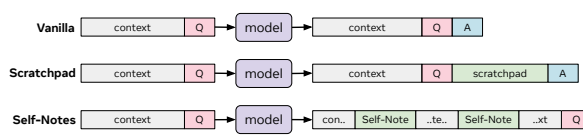
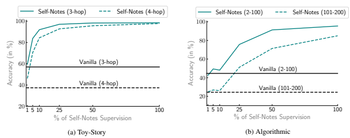
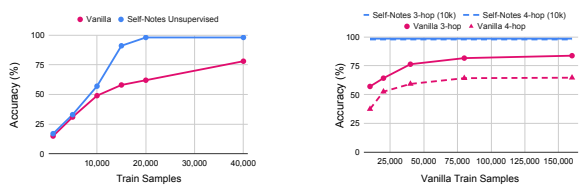
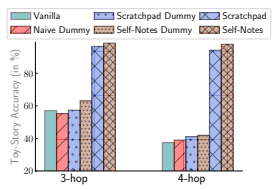

# Learning To Reason And Memorize With Self-Notes

Jack lanchantin * 1 **Shubham Toshniwal** * 1 Jason Weston 1 Arthur Szlam 1 **Sainbayar Sukhbaatar** 1

## Abstract

Large language models have been shown to struggle with limited context memory and multi-step reasoning. We propose a simple method for solving both of these problems by allowing the model to take *self-notes*. Unlike recent scratchpad approaches, the model can deviate from the input context at any time to explicitly think. This allows the model to recall information and perform reasoning on the fly as it reads the context, thus extending its memory and enabling multi-step reasoning. Our experiments on multiple tasks demonstrate that our method can successfully generalize to longer and more complicated instances from their training setup by taking self-notes at inference time.

### 1. Introduction

Transformers (Vaswani et al., 2017) and similar variants have shown impressive results on sequence-based tasks (Brown et al., 2020). Notably, large language models (LMs) such as GPT-3 (Brown et al., 2020) use transformers and are capable of solving various NLP tasks such as question answering (QA). When a LM is used for a QA task, it is fed a context prompt containing factual information along with a question, and then the model generates the answer directly, as shown in Fig. 1 (top). However, this autoregressive "one-step" approach struggles with multi-step reasoning tasks (Austin et al., 2021; Press et al., 2022a; Creswell et al., 2023). We argue that that this arises from the fact that vanilla LMs have a fixed computation for each token, and do not have the option to "think" more depending on the current context. Recently, Nye et al. (2021) proposed the use of a scratchpad that allows the model to generate reasoning tokens before answering the question, but *after* it has read the full context and question, illustrated in Fig. 1 (middle). Similarly, chainof-thought prompting methods (Wei et al., 2022; Zelikman et al., 2022; Huang et al., 2022) push the model to explain their answer one step at a time, leading to more coherent final answers. In addition to the "one-step" problem, transformers as a feed-forward model lack memory for state-tracking and solving highly nonlinear tasks (Fan et al., 2020), something that recurrent predecessor models such as the LSTM (Hochreiter and Schmidhuber, 1997) are well equipped for. Modifications to the feed-forward transformer architecture that use a recurrent mechanism improve state-tracking results (Fan et al., 2020; Ju et al., 2022; Hutchins et al., 2022), but still use a fixed amount of computation for a given prompt. In this paper, we propose an approach that simultaneously makes the challenges in multi-step reasoning and statetracking memory more tractable. Our method, "*Self-Notes*", allows the LM to deviate from the context prompts on the fly to generate explicit reasoning tokens. Unlike a scratchpad, the model can interleave generated tokens with the input context as demonstrated in Fig. 1 (bottom). Such Self-Notes can act as both explicit intermediate reasoning steps and memory for state-tracking. Specifically, if a reasoning step requires combining two facts, the resulting inference can be written into a Self-Note and used for future reasoning, thus acting as an intermediate reasoning step. For example, given
"Alice has the box" and "Alice is at the park" one can infer "*The box is at the park*" and write it to a Self-Note, which can be further combined with a future statement "The key is in the box" to conclude that "*The key is at the park*". Additionally, the Self- Note can act as a form of working memory because the model can write the latest state of an entity as new tokens while it traverses the context. For example, in a programming environment, assume x=5 initially, and then x gets incremented by 1. Assuming the model correctly writes x=6 as a Self-Note, it can safely remove the original x=5 statement from its context. If the model is then inquired about the value of x, it already has the answer. The main difference between our proposed method and prior work such as scratchpads (Nye et al., 2021), chain-ofthought (Wei et al., 2022), or inner monologue (Huang et al., 2022) is that we allow the model to explicitly write out multiple notes *as it reads* each context statement sequentially. In

*Equal contribution 1Meta AI. Correspondence to: Jack Lanchantin <jacklanchantin@meta.com>, Sainbayar Sukhbaatar <sainbar@meta.com>.

A
Figure 1: **(top)** Baseline vanilla LM directly generates the answer (A) given the context (C) and the question (Q). **(middle)** Scratchpad allows the model to generate intermediate reasoning tokens before answering the question but after it has seen the context. **(bottom)** Our Self-Notes method allows the model to deviate from the input context at any time to reason and take notes.

con.. self-QA ..te.. self-QA ..xt Q A con.. self-QA ..te.. self-QA ..xt Q A
context Q scratchpad A context Q scratchpad A
context Q A
other words, our approach is an *in-line* form of scratchpad that augments the context with information which might be useful for future reasoning. We view this as a form of reading (and writing) between the lines to infer information that isn't explicitly stated, similar to how humans read (van den Broek et al., 2009). Prior methods allow the model to ruminate after it reads the full context, forcing it to do a large chunk of reasoning at the end, rather than while it's reading. Furthermore, such post-context reasoning cannot act as memory because earlier context tokens may already be out of the model's context window before the reasoning starts. For example, consider an intelligent agent with weeks or months of interaction history. Intuitively, it makes sense for it to be able to use reasoning steps it made in previous interactions without thinking again from scratch. To teach the model to generate Self-Notes, during training we consider providing the language model with ground truth Self-Notes as part of the input context. During inference, the model can deviate from the context and generate a Self- Note if it generates a special token learned during training. When the model finishes generating a Self-Note, the original context tokens will continue to be fed. This allows the model to reason and create memory while processing input tokens, not just at the end. We also propose semi-supervised and unsupervised methods for training Self-Notes. We test our method on five text datasets designed to evaluate multi-step reasoning and state-tracking: a proposed synthetic Toy-Story task, two synthetic program evaluation tasks (Fan et al., 2020; Anil et al., 2022), and two real-world chess game tasks (Toshniwal et al., 2022). Our method outperforms both a fine-tuned language model which does not do any explicit note-taking, as well as a scratchpad baseline.

## 2. Method

Let us consider an autoregressive transformer model M that predicts the next token in a sequence

$$x_{t+1}={\mathcal{M}}(x_{1},...,x_{t}).$$

Such a model, M is the foundation of many tasks like language modeling and question answering. In such tasks, the model is given a context C = {x1*, ..., x*t} and potentially a question Q as input and asked to generate A which is the sequence of next words or an answer to a question. Our Self-Notes method expands the capability of M by allowing it to enrich context C with "note tokens" ni before producing the final output A. Note tokens share the same vocabulary as input tokens, but they are generated by the model itself. Self-Notes generated in this way can interleave with the context tokens and therefore can be used for writing down a newly inferred fact or tracking variable values. While processing input tokens xt ∈ C one by one, the model can start taking a note by generating a token that belongs to a predefined set of start tokens Nsta. A note ends when the model generates an end token ni ∈ Nend, or after a fixed number of tokens are generated. Once the note ends, the generated note tokens are appended to the context where the start token was generated, and the model continues to process the rest of the input tokens. For example, a context C = {x1, x2, x3, x4} can be enriched to become {x1, x2, n1, n2, n3, x3, x4} if the start token is generated after x2:

$$\begin{array}{l}{{n_{1}={\mathcal{M}}(x_{1},x_{2})\in N_{\mathrm{sta}}}}\\ {{n_{2}={\mathcal{M}}(x_{1},x_{2},n_{1})\notin N_{\mathrm{end}}}}\\ {{n_{3}={\mathcal{M}}(x_{1},x_{2},n_{1},n_{2},)\in N_{\mathrm{end}}}}\end{array}$$

By repeating this mechanism, the context C can be enriched with multiple notes at different locations. An overview of our method is shown in Figure 1 (bottom). The model can use notes as a form of working memory by writing information that might be useful in the future. It can also use a note as an intermediate reasoning step by inferring new facts as it reads. In particular, it can ask a question and answer it within it. This is useful in multistep reasoning where a final question requires answering multiple sub-questions. Unlike implicit reasoning occurring internally within M, Self-Notes are fed back to the model, making it available to future reasoning steps. This feedback loop also allows the model to overcome the limitation of transformers as a feedforward network (Fan et al., 2020), making it possible to do state-tracking.

#### 2.1. Supervised Self-Notes

One way to train M to generate useful notes is to use supervised learning on data that is enriched with "ground-truth" Self-Notes interspaced within the context. This training procedure is simple as we just have to train M on this enriched data using the standard LM training loss. After training, we can use M to generate Self-Notes, so we can apply it to test data that does not contain any Self-Notes or reasoning labels. M can generate a Self-Note at test time by predicting the next token in the context to be from Nsta.

#### 2.2. Semi-Supervised Self-Notes

We also consider a semi-supervised setting where only a subset of the training samples have ground truth Self-Notes.

In this case, we prepend a special token s to training samples without Self-Notes and train all samples with the standard LM loss: C = {s, x1*, ..., x*t}. As a result, the model is conditioned to generate Self-Notes during test time because the test context does not contain the special token s prefix. This signals to the model that it should do extra reasoning and generate Self-Notes.

#### 2.3. Unsupervised Self-Notes

Finally, we introduce a method for utilizing Self-Notes when no ground truth note is available for training. This method relies on the fact that when the model is trained using the LM loss on all tokens in a QA task, it learns to not only generate answers but also questions. We leverage this property by letting the model generate its own questions and insert their answers as Self-Notes (i.e., interleaved throughout the context) during test time. If we train the model to predict the final question and answer with varying length samples, the model will learn to generate a question after any number of statements. At the same time, we allow the model to write a Self-Note after each intermediate statement. Assuming the model has learned how to answer the shorter samples, it is likely to write the correct value in the intermediate locations. It can then leverage that information on the longer samples. If the relevant intermediate questions are asked and answered, this will make it easier to answer the final question. We consider two potential problems with approach. The first problem is that as the context is enriched by Self-Notes, it can become longer than what the model has seen during training, or it can contain new tokens that it didn't see in the context during training. A simple solution is to finetune the model on the Self-Notes enriched samples during training. The training procedure therefore has two simultaneous objectives: learn how to write Self-Note QA pairs after any number of context tokens, and leverage the written Self-Note answers for the final question. The second problem is that the model might not ask enough questions because training samples contain only one final question. We solve this by simply multiplying the probability of generating a Self-Note start token (any of the tokens in Nsta),
by a "boosting" constant B > 1. Furthermore, since we can sample questions during enrichment, we can generate multiple versions of enrichment per sample, then we can select the enrichment that leads to the most confident answer.

## 3. Experiments

We compare against two baseline methods: a vanilla transformer language model, and a transformer language model trained to generate a chain-of-thought "scratchpad". The Vanilla baseline is the pretrained GPT-2 base model (Radford et al., 2019) from Hugging Face (Wolf et al., 2020) fine-tuned to predict answer tokens given only the context and question. For the *Scratchpad* baseline, we fine-tune the same GPT-2 model to write a scratchpad of reasoning steps after it has seen the context and question, similar to Nye et al.

(2021). For the proposed *Self-Notes* model, we fine-tune GPT-2 to take Self-Notes. During testing, no ground-truth scratchpad or Self-Notes are provided, but both Scratchpad and Self-Notes models are allowed to generate tokens in addition to the answer.

#### 3.1. Tasks

In this section, we explain each task we test our models on. Table 1 shows a sample for each task with each different method: Vanilla, Scratchpad, and Self-Notes. For each task, we evaluate on both an in-distribution and out-ofdistribution (OOD) test set. A summary of the dataset statistics is given in Appendix Table 7. Toy-Story. As we read a story, we are often required to infer things that are not explicitly mentioned (van den Broek et al., 2009). For example, reading "Frodo went to Mount Doom.

Sam accompanied him.", a reader can infer that "Sam went to Mount Doom". Making such inferences in an online manner as we're reading the story makes it easier to understand the rest of the story. Such forward reasoning is natural for understanding sequential stories like books or movies. It is also more fitting for dialog models as such a model needs to make inferences as conversation happens and respond accordingly. In contrast, backward reasoning starts with a question and tries to find the relevant facts from a given context to answer it, potentially leading to a more narrow understanding of context.

| Task        | Vanilla                          | Scratchpad                       | Self\-Notes                  |
|-------------|----------------------------------|----------------------------------|------------------------------|
| Toy\-Story  | Mary has the ball.               | Mary has the ball.               | Mary has the ball.           |
|             | The ball is inside the box.      | The ball is inside the box.      | The ball is inside the box.  |
|             | The key is inside the box.       | The key is inside the box.       | SQ: Who has the box?         |
|             | Q: Who has the key?              | Q: Who has the key?              | Mary has the box.            |
|             | Mary has the key.                | [Q: Who has the box?             | The key is inside the box.   |
|             |                                  | Mary has the box.                | SQ: Who has the key?         |
|             |                                  | Q: Who has the key?              | Mary has the key.            |
|             |                                  | Mary has the key.]               | Q: Who has the key?          |
|             |                                  | Mary has the key.                | Mary has the key.            |
| Algorithmic | e = 3 ; e ++ ;                   | e = 3 ; e ++ ;                   | e = 3 ; e ++ ;               |
|             | i = 3 ; if i < e : e ++ ;        | i = 3 ; if i < e : e ++ ;        | print e e = 4;               |
|             | print e e = 5 ;                  | print e                          | i = 3 ; if i < e : e ++ ;    |
|             |                                  | [e = 3 ; e ++ ;                  | print e e = 5;               |
|             |                                  | print e e = 4 ;                  | print e e = 5 ;              |
|             |                                  | i = 3 ; if i < e : e ++ ;        |                              |
|             |                                  | print e e = 5 ;] e = 5 ;         |                              |
| Boolean Vari             | w = False ; v = True ;           | w = False ; v = True ;           | w = False ; v = True ;       |
| able        | v = w xor v ;                    | v = w xor v ;                    | v = w xor v ;                |
|             | w = v and v ;                    | w = v and v ;                    | print v True ;               |
|             | print w True ;                   | print w                          | w = v and v ;                |
|             |                                  | [w = False ; v = True ;          | print w True ;               |
|             |                                  | v = w xor v ;                    | print w True ;               |
|             |                                  | print v True ;                   |                              |
|             |                                  | w = v and v ;                    |                              |
|             |                                  | print w True ;] True ;           |                              |
| Chess Piece             | c2 c4 e7 e5 g2 g3 b8 c6 f1 g2 g8 | c2 c4 e7 e5 g2 g3 b8 c6 f1 g2 g8 | c2 P c4 e7 P e5 g2 P g3      |
| type        | f6 b1 c3 f8 b4 c3                | f6 b1 c3 f8 b4 c3                | b8 N c6 f1 B g2 g8 N f6 b1 N |
|             | PIECE N                          | PIECE                            | c3 f8 B b4 c3                |
|             |                                  | [c2 P c4 e7 P e5 g2 P g3         | PIECE N                      |
|             |                                  | b8 N c6 f1 B g2 g8 N f6 b1       |                              |
|             |                                  | N c3 f8 B b4 c3] N               |                              |

Table 1: Input-Output pairs for the Vanilla, Scratchpad, and Self-Notes method across four different tasks. The input consists of the input context and the question, the answer is to be generated by the model. The highlighted text for Scratchpad and Self-Notes is available only during training, and is to be generated by the model during inference.

Here we introduce a new synthetic QA task for testing the ability of language models to do forward reasoning. The task is to answer a question after reading a short story that consists of multiple sentences. Each sentence states a simple relation between people, items, and places such as
"Alice is at the park" or "The ball is in the bag". There are 5 different types of relations. This dataset is inspired by the bAbI tasks (Weston et al., 2016), with greater controllability of required reasoning steps. Unlike bAbI, our dataset mixes different reasoning steps to create more "hops" in order to answer a question.

question, a forward reasoning model will infer unseen relations as each sentence is processed. As a result, forward reasoning can uncover all relations by the end of the story and can answer any question with no additional reasoning. Considering the relevance of forward-reasoning to the Toy- Story task, Self-Notes is therefore a natural fit. Self-Notes should explicitly infer all implied relations. For this dataset, the Self-Note start and end tokens are "SQ:" and ".", respectively. Following the start token, the model can ask and answer a question, e.g., "SQ: Where is Bob? Bob is at the park.". The Scratchpad method should infer the same relations, but it will be forced to do it after the question is asked, requiring backward-reasoning.

The challenge in this dataset is that by applying pragmatic principles, unseen relations can be inferred from observed relations. For example, given the text "Alice is at the park. Bob is with Alice.", we can infer that "Bob is at the park.". Furthermore, a newly inferred relation can lead to inference of another unseen relation. In the previous example, if the next sentence is "Bob has the key.", then we can infer that "The key is at the park" using our previous inference about Bob's location.

To test generalization, we train the model on 10k 1-hop and 2-hop queries, and test on 3-hop and 4-hop queries. If the model correctly learns to infer relations during training, then it can easily answer 3 and 4-hop queries by inferring the intermediate (2-hop) relations. Specifically, by writing a Self- Note, the model can turn a 3-hop query into two separate 2-hop queries.

This recursive inference in Toy-Story makes it possible to create questions that require multi-step reasoning. We call a question k-hop if it requires k observations combined through k-1 reasoning steps (1-hop questions only require repeating of an observed fact). While a backward reasoning model needs to take k reasoning steps to answer a k-hop Algorithmic. While the Toy-Story task is designed for testing multi-step reasoning, it doesn't require tracking the state or value of an entity over multiple steps since it assumes the world is static. To evaluate state-tracking, we adopt the Algorithmic task from (Fan et al., 2020), which requires printing the state, or value, of an *integer* variable given a sequence of algorithmic program statements such as increment, decrement, and conditionals. While the original task has separate input and label tokens, we unify them into a single sequence to fit the language modeling task. In this dataset, the context is the sequence of statements, e.g. "x = 1 ; x++ ; y = 3 ; if x > 2: y++ ;", and the final question is to print the last value of one of the variables, e.g. "print x". For the Self-Notes model, the notes are print statements specifying the intermediate value of a certain variable as they are modified. For example, if the previous statement was "x++ ;", the Self-Note would be to print the value of x:
"*print x x = 1 ;*". The Self-Note start token is "print" and the end token is ";". The Scratchpad method generates the identical print statements, but it also has to copy all of the original statements to the scratchpad and figure out where to insert the prints, thus introducing an additional "alignment" complexity in comparison to the Self-Notes method. We train the models on 2 to 100 statements in each sample. We test on 2-100 (in-distribution) and 101-200 (OOD)
statements.

Boolean Variable. In this task, the context consists of a valid Python program where each statement contains a boolean variable assignment operation. The question is to print the final value of an arbitrary variable (True or False). The main difference to the Algorithmic task is that the statements are constrained to boolean logic operations. We use the "chain-like" split from Anil et al. (2022), which consists only of operations that compose the values of already defined variables. This results in long chains of dependencies between values of the variable. Similar to the Algorithmic task, Self-Notes prints the value of the variable that was modified in the previous statement. The start and end tokens are "print" and ";", respectively. Following Anil et al. (2022), we train on 3-8 statements and test on 3-8 and 9-19 statements. Chess Piecetype. The goal of this task is to track the state of chess pieces over a sequence of moves in a real chess game (Toshniwal et al., 2022). Chess games written in UCI notation consist of a sequence of (start position, end position pairs), e.g. c2 c4, which denotes a move of the piece from c2 to c4.

1 The piecetypes of the moves are never given explicitly, but since each game begins with pieces in the same positions, the piecetypes can be implicitly tracked given the moves. In other words, since each game starts with a pawn (P) at board position c2, we know that given the move c2 c4, there is now a pawn at position c4. In this task, given a long sequence of moves, e.g. "c2 c4 e7 e5 g2 g3 b8 c6 f1 g2 g8 f6 b1 c3 f8 b4 c6", the objective is to predict the piece at the last position mentioned ("c6"). For our proposed method, we consider the Self-Notes to be the piecetypes. That is, the start tokens Nsta are the set of piecetypes (P, R, N, B, Q, K) and there is no end token. A Self-Note is inserted after the start position of each move to explicitly remind the model which piecetype is at that position. So the previous example would be written as "c2 P c4 e7 P e5 g2 P g3 b8 N c6 f1 B g2 g8 N f6 b1 N c3 f8 B b4 c6", and it is therefore much easier with Self-Notes to predict the piecetype at
"c6", since we know that the last piece moved to "c6" was a knight during the move "b8 N c6". To test length generalization, we consider a different number of moves during training and testing. We train our models on 200k samples which include up to 80 moves. We evaluate on both up to 80 moves (in-distribution) as well as more than 80 moves (OOD). Chess Move. This task is to predict the end position of the current move given the start position (Toshniwal et al., 2022). For example, given the sequence of moves "c2 c4 e7 e5 g2 g3 b8 c6 f1 g2 g8 f6 b1 c3 f8 b4 c6", the answer is the ground truth final position made in the game: "e5". This task is harder than the Chess Piecetype task as the model needs to learn, state tracking, chess rules, and chess strategy in order to predict the most likely move. The Self-Notes are the same as chess piece, where the model is trained to generate the piece at each starting square as it makes a move. We report the exact match accuracy. In Table 1, the Chess Move task is the same as Chess Piecetype, but the answer is the next board position. We use the same train/valid/test split as the Chess Piecetype task.

## 4. Results

#### 4.1. Supervised Self-Notes

Table 2 shows the results for the five tasks described in Section 3.1.

Toy-story. For both the 3-hop and 4-hop settings, we see that the Self-Notes model substantially outperforms the Vanilla model which has to perform multi-step reasoning in "one-step". We observe a slight improvement of the Self- Notes model over the Scratchpad model. We reason that the drop in Scratchpad's performance has to do with the model having to postpone until after processing the entire input context, which increases the distance between the input context and the reasoning. In comparison, the Self-Notes model writes reasoning tokens on the fly as the relevant facts are stated. We note that for this task, the full context fits into the GPT-2 context window.

1To ease tokenization, we split a move in UCI notation from c2c4 to c2 c4. We add all the 64 board squares to the language model's vocabulary.

| Task             | Test Set   | Vanilla    | Scratchpad   | Self\-Notes   |
|------------------|------------|------------|--------------|---------------|
| Toy\-Story       | 1/2\-hop   | 92.4 ±0.7  | 99.6 ±0.1    | 99.8 ±0.1     |
|                  | 3\-hop*    | 57.0 ±0.3  | 96.4 ±0.9    | 98.5 ±0.3     |
|                  | 4\-hop*    | 37.4 ±0.8  | 94.2 ±2.0    | 97.8 ±0.4     |
| Algorithmic      | 2\-100     | 44.6  ±1.0 | 72.2  ±5.7   | 95.5  ±0.2    |
|                  | 101\-200*  | 24.4  ±2.1 | 11.6  ±2.0   | 85.0  ±0.6    |
| Boolean Variable | 3\-8       | 99.7  ±0.1 | 100.0  ±0.0  | 100.0  ±0.0   |
|                  | 9\-19*     | 71.3  ±0.8 | 73.7  ±2.4   | 75.2  ±2.1    |
| Chess Piecetype  | ≤80        | 98.5 ±0.4  | 98.5 ±0.3    | 98.8 ±0.2     |
|                  | ≥81*       | 82.9 ±2.3  | 94.7  ±0.7   | 94.8  ±0.7    |
| Chess Move       | ≤80        | 49.0 ±0.4  | 37.0 ±0.8    | 50.8 ±1.1     |
|                  | ≥81*       | 39.8 ±0.2  | 29.9 ±0.8    | 41.8 ±0.9     |

Table 2: Test Accuracy (in %) for the reasoning and state-tracking tasks. "*" indicates out-of-distribution harder test settings.

Algorithmic. We observe that the Vanilla GPT-2 model struggles to track the state of the variables over many statements, and significantly worsens for OOD sequence lengths. Self-Notes, which allows the model to generate intermediate print statements, achieves high accuracy on both the indistribution and OOD statement splits. Scratchpad fails at most examples since the context length exceeds the maximum length of GPT-2 (1024 tokens). This leads to a worse performance than the Vanilla model because it tries to write the scratchpad which involves copying the original context, but then runs out of room and can't answer the question. These results show a significant advantage of our method: as long as the model takes a Self-Note about a variable, it will keep it in the memory by pushing its value to the most recent context. The Scratchpad method has to copy the entire context in its scratchpad, often going past the maximum context length, resulting in poor accuracy. Boolean Variable. Unlike the Algorithmic task, none of the models run out of context length for this task since there are fewer statements. Therefore, Scratchpad is able to perform similarly to Self-Notes. However, we still see a small increase in performance with Self-Notes, likely due to copy alignment errors in Scratchpad. Both improve over Vanilla. Chess Piecetype and Chess Move. The chess tasks primarily measure the ability of a model to track the identity and state of variables over a sequence of changes. In the Chess Piecetype task, both the Self-Notes and Scratchpad models outperform the Vanilla model. As with other tasks, this confirms that Vanilla transformers are improved with extra tokens in order to accurately track the state of a set of variables, particularly when the test-time sequence lengths vary from the training length. For Chess Piecetype, Self-Notes is not significantly better than Scratchpad. This is a fairly simple task for Scratchpad since it simply requires copying the piece at each move, assuming it knows where the pieces start. This is different from the Algorithmic and Boolean Variable tasks which not only need to copy the variable, but

| Method            | 3\-hop   | 4\-hop   |
|-------------------|----------|----------|
| Vanilla2          | 79.4     | 57.9     |
| + Self\-Notes     | 79.7     | 61.8     |
| + Boost Questions | 82.4     | 68.2     |
| + Multi\-sample   | 91.3     | 79.1     |
| + Finetune        | 94.2     | 85.8     |

Table 3: Toy-Story setting without ground-truth notes.

also increment, decrement, or negate it.

| Dataset       | Vanilla   | Self\-Notes (unsupervised)   |
|---------------|-----------|------------------------------|
| 1\-var (20k)  | 65.6      | 98.1                         |
| 2\-var (100k) | 76.1      | 86.3                         |

In the Chess Move task, Self-Notes is slightly better than Vanilla, but Scratchpad is significantly worse than both. In this task, the Self-Notes and Scratchpad "note" tokens (pieces) are not the same as the final question (move board position). We hypothesize that Scratchpad cannot learn to simultaneously copy the identity of pieces and predict the chess move.

Table 4: Algorithm unsupervised

#### 4.2. Semi-Supervised Self-Notes

Figure 2 shows the performance of the Self-Notes method with varying amounts of Self-Note supervision for the Toy- Story and the Algorithmic tasks. That is, we randomly sample some percentage of the training samples that get Self- Note supervision. For Toy-Story, we find that even Self- Note supervision using as little as 1% of the training set (100 samples), leads to performance gains over the Vanilla model, and the performance starts to saturate around 25% supervision. On the other hand, for the Algorithmic task, we observe gains with Self-Note supervision starting at around 5% supervision, and the performance steadily improves with more Self-Note supervision.

Figure 2: Performance of the proposed Self-Notes method with varying amounts of Self-Notes supervision.

#### 4.3. Unsupervised Self-Notes

In our final set of experiments, we apply Self-Notes to a 1variable Algorithmic task and Toy-Story task when we have no ground-truth Self-Notes to train on. First, we conducted experiments in the unsupervised setting for the 1-variable Algorithmic task. We train on datasets that contain varying length samples (i.e. varying numbers of algorithmic statements per sample), so the model will generate intermediate Self-Notes on its own in a QA form. In this task, we allow the model to generate Self-Notes, and then conditioning on the previous note to predict the next Self-Note and final answer during training, departing from the standard parallel training procedure. The model therefore has to do two simultaneous tasks during training, write the correct Self-Notes, and predict the final answer given the written Self-Notes. Since we only use 1-variable samples, it makes it straightforward to learn which Self-Note questions to write (it will always be print x, where x is the variable in that sample. We can see from Figure 3, that around 10k samples, the unsupervised Self-Notes method starts to learn how to write and leverage Self-Notes that improve accuracy over the Vanilla method. With 20k samples, the unsupervised Self-Notes method achieves near 100%
accuracy, with a significant increase over the Vanilla model.

The second task we consider in the unsupervised setting is Toy-Story. Here, the training data has 100k samples with 1 and 2 hop questions, but contains no Self-Notes. This task is more difficult since there are many more variables (people, objects, locations) and model needs to ask the right questions in Self-Notes. We first train a Vanilla model to generate the final question and answer, with test accuracy shown at the top of Table 3. Next, we test the vanilla model with Self-Notes by allowing it to generate QAs as notes. Here, we only add the answer parts to the context because the model has never seen a ques-
Table 5: Ablation comparing the performance of Self-Notes with (i) ground truth self-notes at test time, and (ii) abstaining from generation of self-notes during inference.

| Train       | Test   | Algorithmic   |            | Toy\-Story   |           |
|-------------|--------|---------------|------------|--------------|-----------|
| Self\-Notes |        | 2\-100        | 101\-200*  | 3\-hop*      | 4\-hop*   |
| 100%        | 100%   | 100.0 ±0.0    | 100.0 ±0.0 | 99.9 ±0.1    | 99.8 ±0.3 |
| 100%        | none   | 21.3 ±0.6     | 9.2 ±0.5   | 37.7 ±3.9    | 29.0 ±1.6 |

tion in the context during training. Additionally, because the model is trained on 1-hop questions, it often asks a question whose answer is already in the context. We ignore such duplicate answers and move on to the next context sentence.

Simply adding Self-Notes to the Vanilla model during testing does not improve the performance much because the model is not trained to ask the right questions. We therefore encourage the model to ask more questions by boosting the probability of the question start token "Q:". Boosting Self-Notes by B=5 does improve the performance over the Vanilla model. Furthermore, generating multiple different Self-Notes by sampling questions and selecting the most confident one also helps. This is likely because when the right question is asked and answered, the model becomes more confident in its final answer. Finally, finetuning the model on a Self-Note version of the original training data improves the performance, as it adapts to longer stories. In summary, we see a significant increase in accuracy over the Vanilla results by allowing the model to generate Self-Notes and finetuning the model on the generations.

#### 4.4. Ablations

Oracle vs no Self-Notes during inference. We perform two ablations regarding Self-Notes during inference. The first is an upper bound where we provide 100% Self-Notes supervision to the model during both training and testing

Figure 3: Self-Notes Unsupervised vs Vanilla on the 1-variable Algorithmic task.

Figure 5: Ablation comparing the impact of (a) extra compute due to additional tokens, and (b) position of the additional tokens.

(rather than just training). The second is where we give 100% Self-Notes supervision during training, but restrict the model from generating Self-Notes during testing. This baseline analyzes whether Self-Notes-augmented training data can still help the model learn about the task in its weights even without using Self-Notes at test time. These results are shown in Table 5. As expected, oracle Self-Notes (100% Self-Note testing supervision) improves the performance. On the other hand, not allowing the model to generate Self- Notes leads to a drastic drop in performance due to distribution shift at inference time. Dummy tokens: separating content and compute. We introduced Self-Notes as a method for language models to do reasoning in the form of explicit tokens. To understand the value of these extra tokens, we seek to measure the separate contribution the additional compute allotted by these tokens from their content. We do this by inserting the dummy token
" " at various locations throughout the context as an ablation.

We first consider the Toy-Story task. In the vanilla setting, there are only facts and the question (e.g., "Bob is in the park. Bob has the key. Where is the

Figure 4: Toy-story task Self-Notes vs Vanilla sample comparison.

Table 6: Results with Dummy Tokens. For the chess tasks, we report the results for the OOD setting (over 80 moves).

| Task            | Vanilla   | Dummy     | Self\-Notes   |
|-----------------|-----------|-----------|---------------|
| Chess Piecetype | 82.9 ±2.3 | 84.8 ±1.7 | 94.8 ±0.7     |
| Chess Move      | 39.8 ±0.2 | 40.4 ±1.2 | 41.8 ±0.9     |
| WikiText\-103   | 25.9ppl   | 24.9ppl   | n/a           |

key?"). The first comparison is inserting a dummy after every fact, which we call "Na¨ıve Dummy" ("Bob is in the park. Bob has the key. Where is the key?"). The alternative, which we call "Self-Notes Dummy" is adding dummy tokens in the same locations where Self-Notes are written. In other words, at the locations where a relation between two facts can be inferred ("Bob is in the park. Bob has the key.

Where is the key?"). Finally, we consider adding the dummy tokens where the Scratchpad tokens would be ("Bob is in the park. Bob has the key. Where is the key? ∗"). This setting adds the same amount of dummy tokens as are used in Self-Notes Dummy (only 1 in the example described). Figure 5 shows the results on the 3-hop and 4-hop test sets for the different dummy token settings compared to the natural language tokens used by Self-Notes and Scratchpad. Intelligently inserting dummy tokens into the positions where Self-Notes should be performs the best out of the four settings. Importantly, it is better than inserting at the end of the context, where Scratchpad tokens are added. This alludes to the fact that allowing the model to do extra computations in the middle of the context can be better than after the context.3 However, the gain from Self-Notes Dummy over other

3In the in-context learning setting, Wei et al. (2022) reported that gains with chain-of-thought were not due to additional compute. Our setting though differs in three aspects: (a) the additional compute is happening in the middle of the context in case of Self- Notes Dummy, (b) we're finetuning the language model, and (c) we're working with a much smaller language model.
dummy variants pales in comparison to the gains of actual Self-Notes over its dummy counterpart, suggesting that the content of the intermediate notes matters more than just the additional compute. We also test the usefulness of dummy tokens in three other settings: Chess Piecetype, Chess Move, and WikiText-103 language modeling. For the chess experiments, we compare the vanilla moves ("c2 c4"), a dummy token between move positions ("c2 c4"), and the generated (non-dummy) piece tokens in Self-Notes ("c2 P c4"). For WikiText-103 language modeling, we compare the vanilla text ("The cat sat on the mat") with dummy tokens inserted between each word in the text ("The cat sat on the mat"). There are no ground-truth Self-Notes for WikiText103, so we neglect such experiments. Table 6 shows the accuracy results for chess and perplexity for WikiText-103. Dummy tokens are not reported in the accuracy or perplexity numbers. For each task, dummy tokens improves the vanilla setting by a small margin. Labeled training set size comparison of Self-Notes vs Vanilla Each Self-Notes training sample has intermediate questions and answers, therefore increasing the total number of QA pairs in the training set. For example if the final question and answer is ''Where is the ball? The ball is in the park'', but there was a Self-Note in the middle of the context labeled ''Who has the ball? Alice has the ball'', then that sample has two QA pairs. We therefore also run a comparison of the total number of labelled QA pairs between Self-Notes and Vanilla. Specifically, the 10k Self-Notes training data for Toy-Story has 10k total samples, and therefore 10k final QA pairs. However, it also includes roughly 70k Self-Note QA pairs which means that the total amount QA pairs is around 80k. Figure 4 shows the effect of increasing the training size for the Vanilla baseline compared to a fixed set of 10k Self-Notes training samples (80k labeled QA pairs) in the Toy-Story task. We see that the Self-Notes model with 10k samples still vastly outperforms the Vanilla model with a 1500% increase in training samples (and roughly a 100% increase in the amount of QA pairs to that of Self-Notes).

## 5. Related Work

There are several strands of related work, including prior work on using rationales, length extrapolation, and adaptive computation.

Implicit Reasoning. bAbI (Weston et al., 2016) was a set of synthetic tasks for testing different reasoning capabilities and showed the advantage of attention-based models over recurrent neural networks (Sukhbaatar et al., 2015). Now attention-based transformers (Vaswani et al., 2017) became a foundation of language-based reasoning (Devlin et al.,
2019). However, the feedforward nature of transformers makes it unsuitable for state-tracking (Fan et al., 2020) and several recurrent versions have been proposed (Dehghani et al., 2019; Ju et al., 2022; Hutchins et al., 2022). Futher, transformer-based large LMs are shown to struggle at multistep reasoning (Press et al., 2022a). Explicit Rationales. Use of rationales has been explored for interpretability (Camburu et al., 2018), and for performing intermediate computations (Nye et al., 2021; Wei et al., 2022). In particular, the Scratchpad method by Nye et al. (2021) is closest to our proposed Self-Notes method which can be interpreted as an *online*-variant of Scratchpad. Use of rationales for reasoning and arithmetic tasks, referred to as *chain-of-thought*, has been shown to be particularly beneficial for zero- and few-shot in-context learning with large language models (Wei et al., 2022; Kojima et al., 2022; Press et al., 2022a). Zelikman et al. (2022) showed the possibility of bootstrapping from a small set of reasoning labels to a larger unlabeled dataset. Trivedi et al. (2022) propose interleaving chain-of-thought reasoning with knowledge retrieval steps (both after context). However, as with Scratchpad, the *chain-of-thought* reasoning is done after reading the entire input context rather than while reading it as in Self-Notes. Furthermore, this emergent capability of chainof-thought prompting is only possible in large (¿6B) models, and we focus on studying the properties of the transformer architecture itself. Length Extrapolation. Length extrapolation, or generalization to longer instances during inference than those seen during training is an important property for an intelligent agent. In the context of transformer-based models, length extrapolation has been explored for language modeling (Press et al., 2022b), machine translation (Neishi and Yoshinaga, 2019; Kiyono et al., 2021), models trained on artificial datasets (Hupkes et al., 2020; Anil et al., 2022), and a variety of other tasks. One of the reasons for the limited length generalization capability of transformer models is due to the way position is handled with learnable embeddings (Kiyono et al., 2021; Sinha et al., 2022). Adaptive Computation. When humans read and write text, we often spend a different amount of time per sentence. Transformers are designed to process and generate each sentence using the same amount of computation regardless of the complexity. Ideally, we would like to have models that spend more time on difficult pieces of text and less on more simple pieces. Several works have addressed the problem of fixed computation time (Graves, 2016; Bolukbasi et al., 2017; Banino et al., 2021), but require a modification to the training procedure or model architecture. Self-Notes can be viewed as a form of adaptive computation because the model decides when it wants to deviate from the context and "think" by generating supplementary tokens before processing the remaining text. Unlike previous adaptive computation approaches, Self-Notes can easily be applied to existing large language architectures and training procedures. Editing of Generated Text. Several works have introduced variants of the transformer architecture to allow insertions, deletions, and revisions to the generated text (Schick et al., 2023; Gu et al., 2019; Stern et al., 2019; Elgohary et al., 2019; Kim et al., 2022). Other works have generated "inner monologue" tokens as a form of intermediate reasoning after it has processed a full prompt (Huang et al., 2022; Ahn et al., 2022). Contrary to these methods that revise post-context generations, Self-Notes revises the original prompt context in by inserting tokens in the middle of it.

## 6. Conclusion

We proposed a general method that allows language models to explicitly reason and memorize in the form of taking Self- Notes. Unlike scratchpad and chain-of-thought methods that postpone reasoning until all input tokens are processed, our method can deviate from the input sequence at any time for Self-Notes. One advantage of interleaving reasoning with the context in this way is that the reasoning steps can be closer to their relevant context. Another advantage is that it can act as a recurrent memory as the Self-Note answers are fed back to the model. Both these advantages make the method scale better to longer sequences unseen during training, as shown in our experiments. In addition, we showed that the amount of Self-Note supervision during training can be reduced without a significant performance drop. Future work should explore two complementary directions aimed at reducing the amount of supervision: (1) using reinforcement learning to discover the optimal Self-Notes, and (2) whether scale (very large models) make it possible to ask good Self-Note questions out of the box. Another possible future direction is to combine our method with a scratchpad, which has the advantage of seeing the question and performing backward reasoning to reach the answer. Our experiments validate Self-Notes on the 124M parameter GPT-2 base model across five different synthetic and realworld tasks. Training a larger model takes a significant more amount of resources and is left for future work.

## References

Ashish Vaswani, Noam Shazeer, Niki Parmar, Jakob Uszkoreit, Llion Jones, Aidan N Gomez, Łukasz Kaiser, and Illia Polosukhin. Attention Is All You Need. In *NeurIPS*, 2017.

Tom B. Brown, Benjamin Mann, Nick Ryder, Melanie Subbiah, Jared Kaplan, Prafulla Dhariwal, Arvind Neelakantan, Pranav Shyam, Girish Sastry, Amanda Askell, Sandhini Agarwal, Ariel Herbert-Voss, Gretchen Krueger, Tom Henighan, Rewon Child, Aditya Ramesh, Daniel M. Ziegler, Jeffrey Wu, Clemens Winter, Christopher Hesse, Mark Chen, Eric Sigler, Mateusz Litwin, Scott Gray, Benjamin Chess, Jack Clark, Christopher Berner, Sam McCandlish, Alec Radford, Ilya Sutskever, and Dario Amodei. Language Models are Few-Shot Learners. In NeurIPS, 2020.

Jacob Austin, Augustus Odena, Maxwell I. Nye, Maarten Bosma, Henryk Michalewski, David Dohan, Ellen Jiang, Carrie J. Cai, Michael Terry, Quoc V. Le, and Charles Sutton. Program Synthesis with Large Language Models. arXiv, abs/2108.07732, 2021.

Ofir Press, Muru Zhang, Sewon Min, Ludwig Schmidt, Noah A. Smith, and Mike Lewis. Measuring and Narrowing the Compositionality Gap in Language Models. arXiv:2210.03350, abs/2210.03350, 2022a.

Antonia Creswell, Murray Shanahan, and Irina Higgins.

Selection-Inference: Exploiting Large Language Models for Interpretable Logical Reasoning. In *ICLR*, 2023.

Maxwell Nye, Anders Johan Andreassen, Guy Gur-Ari, Henryk Michalewski, Jacob Austin, David Bieber, David Dohan, Aitor Lewkowycz, Maarten Bosma, David Luan, Charles Sutton, and Augustus Odena. Show Your Work: Scratchpads for Intermediate Computation with Language Models. *arXiv*, abs/2112.00114, 2021.

Jason Wei, Xuezhi Wang, Dale Schuurmans, Maarten Bosma, Ed Chi, Quoc Le, and Denny Zhou. Chain-of- Thought Prompting Elicits Reasoning in Large Language Models. In *NeurIPS*, 2022.

E. Zelikman, Yuhuai Wu, and Noah D. Goodman. STaR:
Bootstrapping Reasoning With Reasoning. In *NeurIPS*, 2022.

Wenlong Huang, Fei Xia, Ted Xiao, Harris Chan, Jacky Liang, Pete Florence, Andy Zeng, Jonathan Tompson, Igor Mordatch, Yevgen Chebotar, Pierre Sermanet, Noah Brown, Tomas Jackson, Linda Luu, Sergey Levine, Karol Hausman, and Brian Ichter. Inner Monologue: Embodied Reasoning through Planning with Language Models. In CoRL, 2022.

Angela Fan, Thibaut Lavril, Edouard Grave, Armand Joulin, and Sainbayar Sukhbaatar. Addressing Some Limitations of Transformers with Feedback Memory. *arXiv*, 2020.

Sepp Hochreiter and Jurgen Schmidhuber. Long Short-Term ¨
Memory. *Neural computation*, 1997.

Da Ju, Stephen Roller, Sainbayar Sukhbaatar, and Jason Weston. Staircase Attention for Recurrent Processing of Sequences. In *NeurIPS*, 2022.

DeLesley Hutchins, Imanol Schlag, Yuhuai Wu, Ethan Dyer, and Behnam Neyshabur. Block-Recurrent Transformers. In *NeurIPS*, 2022.

H. Trivedi, Niranjan Balasubramanian, Tushar Khot, and Ashish Sabharwal. Interleaving Retrieval with Chain-of- Thought Reasoning for Knowledge-Intensive Multi-Step Questions. *arXiv*, abs/2212.10509, 2022.

Paul van den Broek, Mary Jane White, Panayiota Kendeou, and Sarah Carlson. Reading between the lines. Developmental and individual differences in cognitive processes in reading comprehension. In. K. Wagner, C. Schatschneider, & C. Plythian-Sence (Eds.), Beyond decoding: The behavioral and biological foundations of reading comprehension, pages 107–123, 2009.

Ofir Press, Noah Smith, and Mike Lewis. Train Short, Test Long: Attention with Linear Biases Enables Input Length Extrapolation. In *ICLR*, 2022b.

Masato Neishi and Naoki Yoshinaga. On the Relation between Position Information and Sentence Length in Neural Machine Translation. In *CoNLL*, 2019.

Cem Anil, Yuhuai Wu, Anders Andreassen, Aitor Lewkowycz, Vedant Misra, Vinay Ramasesh, Ambrose Slone, Guy Gur-Ari, Ethan Dyer, and Behnam Neyshabur. Exploring Length Generalization in Large Language Models. In *NeurIPS*, 2022.

Shun Kiyono, Sosuke Kobayashi, Jun Suzuki, and Kentaro Inui. SHAPE: Shifted Absolute Position Embedding for Transformers. In *EMNLP*, 2021.

Dieuwke Hupkes, Verna Dankers, Mathijs Mul, and Elia Bruni. Compositionality decomposed: How do neural networks generalise? In *IJCAI*, 2020.

Shubham Toshniwal, Sam Wiseman, Karen Livescu, and Kevin Gimpel. Chess as a Testbed for Language Model State Tracking. In *AAAI*, 2022.

Koustuv Sinha, Amirhossein Kazemnejad, Siva Reddy, Joelle Pineau, Dieuwke Hupkes, and Adina Williams. The Curious Case of Absolute Position Embeddings. Findings of EMNLP, 2022.

Alec Radford, Jeffrey Wu, Rewon Child, David Luan, Dario Amodei, Ilya Sutskever, et al. Language Models are Unsupervised Multitask Learners. In *OpenAI blog*, 2019.

Thomas Wolf, Lysandre Debut, Victor Sanh, Julien Chaumond, Clement Delangue, Anthony Moi, Pierric Cistac, Tim Rault, Remi Louf, Morgan Funtowicz, et al. Hug- ´ gingFace's Transformers: State-of-the-art Natural Language Processing. In *EMNLP: System Demonstrations*, 2020.

Alex Graves. Adaptive Computation Time for Recurrent Neural Networks. *arXiv:1603.08983*, 2016.

Tolga Bolukbasi, Joseph Wang, Ofer Dekel, and Venkatesh Saligrama. Adaptive Neural Networks for Efficient Inference. In *ICML*, 2017.

Jason Weston, Antoine Bordes, Sumit Chopra, and Tomas Mikolov. Towards AI-Complete Question Answering: A Set of Prerequisite Toy Tasks. In *ICLR*, 2016.

Andrea Banino, Jan Balaguer, and Charles Blundell. PonderNet: Learning to Ponder. In ICML Workshop on Automated Machine Learning, 2021.

Sainbayar Sukhbaatar, Arthur Szlam, Jason Weston, and Rob Fergus. End-to-End Memory Networks. *NeurIPS*, 2015.

Timo Schick, Jane Dwivedi-Yu, Zhengbao Jiang, Fabio Petroni, Patrick Lewis, Gautier Izacard, Qingfei You, Christoforos Nalmpantis, Edouard Grave, and Sebastian Riedel. PEER: A Collaborative Language Model. In ICLR, 2023.

Jacob Devlin, Ming-Wei Chang, Kenton Lee, and Kristina Toutanova. BERT: Pre-training of deep bidirectional transformers for language understanding. In NAACL- HLT, 2019.

Jiatao Gu, Changhan Wang, and Junbo Zhao. Levenshtein Transformer. *NeurIPS*, 2019.

Mostafa Dehghani, Stephan Gouws, Oriol Vinyals, Jakob Uszkoreit, and Lukasz Kaiser. Universal Transformers. In ICLR, 2019.

Mitchell Stern, William Chan, Jamie Kiros, and Jakob Uszkoreit. Insertion Transformer: Flexible Sequence Generation via Insertion Operations. In ICML, 2019.

Oana-Maria Camburu, Tim Rocktaschel, Thomas ¨
Lukasiewicz, and Phil Blunsom. e-SNLI: Natural Language Inference with Natural Language Explanations. In *NeurIPS*, 2018.

Ahmed Elgohary, Denis Peskov, and Jordan Boyd-Graber.

Can You Unpack That? Learning to Rewrite Questionsin-Context. In *EMNLP-IJCNLP*, 2019.

Takeshi Kojima, Shixiang Shane Gu, Machel Reid, Yutaka Matsuo, and Yusuke Iwasawa. Large Language Models are Zero-Shot Reasoners. In *NeurIPS*, 2022.

Gangwoo Kim, Sungdong Kim, Kang Min Yoo, and Jaewoo Kang. Generating Information-Seeking Conversations from Unlabeled Documents. In *EMNLP*, 2022.

Michael Ahn, Anthony Brohan, Noah Brown, Yevgen Chebotar, Omar Cortes, Byron David, Chelsea Finn, Keerthana Gopalakrishnan, Karol Hausman, Alex Herzog, et al. Do As I Can, Not As I Say: Grounding Language in Robotic Affordances. *arXiv:2204.01691*, 2022.

Jianlin Su, Yu Lu, Shengfeng Pan, Ahmed Murtadha, Bo Wen, and Yunfeng Liu. Roformer: Enhanced transformer with rotary position embedding. arXiv:2104.09864, 2021.

Aakanksha Chowdhery, Sharan Narang, Jacob Devlin, Maarten Bosma, Gaurav Mishra, Adam Roberts, Paul Barham, Hyung Won Chung, Charles Sutton, Sebastian Gehrmann, et al. PaLM: Scaling Language Modeling with Pathways. *arXiv:2204.02311*, 2022.

## 7. Appendix

In this section we show one hand-picked test sample from both the Algorithmic task (Table 8) and the Toy-story task (Table 9). In both these examples, the Vanilla and Scratchpad methods fail, but the Self-Notes method succeeds.

#### 7.1. Training Details

For each task, we train for a fixed 30 epochs with a learning rate of 2e-5 and batch size of 32. For the Vanilla and Self-Notes methods, all models are trained on the context and answer tokens. For the Scratchpad method, the model is trained on the context and answer for Toy-Story, and is trained on only the answer for all other tasks since the scratchpad contains a full copy of the context. For the tasks that involve length generalization (Algorithmic, Boolean Variable, Chess Piecetype, Chess Move) we randomly offset the positional embedding IDs between 0 and 128 for the GPT-2 model during training. That is, the positional embedding ID of the first token is randomly assigned to a value 0 to 128, and then continues sequentially. During inference, the position IDs always start at 0. This ensures that the model has seen all of the position embeddings that it will encounter during testing (following Kiyono et al. (2021)). We note that this can also be solved by the relative position embeddings used in more recent models (Su et al., 2021; Chowdhery et al., 2022).

| Dataset          | # train   | # valid   | # test   | In domain         | Out\-of domain      |
|------------------|-----------|-----------|----------|-------------------|---------------------|
| Toy\-story       | 10k       | 1k        | 1k       | 1, 2 hops         | 3, 4 hops           |
| Algorithm        | 10k       | 1k        | 1k       | 2\-100 statements | 101\-200 statements |
| Boolean variable | 524k      | 1k        | 1k       | 3\-8 statements   | 9\-19 statements    |
| Chess piece      | 200k      | 1k        | 1k       | ≤ 80 moves        | ≥ 81 moves          |
| Chess move       | 200k      | 1k        | 1k       | ≤ 80 moves        | ≥ 81 moves          |

| Model                | Context                                                                                 | Prediction   |
|----------------------|-----------------------------------------------------------------------------------------|--------------|
| Vanilla              | d = 6 ; c = 10 ; a = 10 ; d ++ ; if d < 1 : b = 8 ; c \-\- ; d \-\- ; d \-\- ; a        | d = 2 ;      |
| (original context)   | \-\- ; b = 7 ; b ++ ; e = 3 ; a \-\- ; b \-\- ; if d < 10 : b \-\- ; d \-\- ; if d <    |              |
|                      | c : a ++ ; e \-\- ; b ++ ; a ++ ; if c > 3 : b ++ ; e \-\- ; if e > d : b ++ ;          |              |
|                      | if a > 8 : e ++ ; b ++ ; if c < 7 : b \-\- ; c \-\- ; b ++ ; d ++ ; e ++ ; a \-\-       |              |
|                      | ; if d < c : c ++ ; if e < 5 : b \-\- ; d \-\- ; if c > e : c ++ ; if b > 7 : b         |              |
|                      | \-\- ; if d < b : d ++ ; c \-\- ; if c < d : e \-\- ; b \-\- ; c ++ ; d ++ ; e ++ ;     |              |
|                      | b ++ ; d ++ ; b ++ ; e \-\- ; d \-\- ; if b < a : b ++ ; e \-\- ; if b < 9 : b \-\-     |              |
|                      | ; a ++ ; if c > 10 : a \-\- ; b ++ ; c \-\- ; d ++ ; b \-\- ; b \-\- ; d ++ ; c ++      |              |
|                      | ; e \-\- ; if c > b : e ++ ; if c > b : d \-\- ; b ++ ; e \-\- ; c \-\- ; a \-\- ; if   |              |
|                      | c > 1 : e ++ ; if e < d : c ++ ; if e < 1 : c \-\- ; a ++ ; d \-\- ; b \-\- ; c         |              |
|                      | \-\- ; c \-\- ; if a > 4 : b \-\- ; b ++ ; d \-\- ; b ++ ; d \-\- ; e \-\- ; if a < 9 : |              |
|                      | e ++ ; if c < d : c \-\- ; a \-\- ; c ++ ; b \-\- ; if a > 8 : d ++ ; a \-\- ; d \-\-   |              |
|                      | ; d \-\- ; c \-\- ; b ++ ; a \-\- ; c ++ ;                                              |              |
| Scratchpad           | [invalid scratchpad generation]                                                         | N/A          |
| (scratchpad context) |                                                                                         |              |
| Self\-Notes          | c = 10 ; print c c = 10 ; a = 10 ; print a a = 10 ; d ++ ; print d d = 7                | d = 3 ;      |
|                      | ; if d < 1 : b = 8 ; c \-\- ; print c c = 9 ; d \-\- ; print d d = 6 ; d \-\- ;         |              |
|                      | print d d = 5 ; a \-\- ; print a a = 9 ; b = 7 ; print b b = 7 ; b ++ ; print           |              |
|                      | b b = 8 ; e = 3 ; print e e = 3 ; a \-\- ; print a a = 8 ; b \-\- ; print b b           |              |
|                      | = 7 ; if d < 10 : b \-\- ; print b b = 6 ; d \-\- ; print d d = 4 ; if d < c :          |              |
|                      | a ++ ; print a a = 9 ; e \-\- ; print e e = 2 ; b ++ ; print b b = 7 ; a ++ ;           |              |
|                      | print a a = 10 ; if c > 3 : b ++ ; print b b = 8 ; e \-\- ; print e e = 1 ;             |              |
|                      | if e > d : b ++ ; print b b = 8 ; if a > 8 : e ++ ; print e e = 2 ; b ++ ;              |              |
|                      | print b b = 9 ; if c < 7 : b \-\- ; print b b = 9 ; c \-\- ; print c c = 8 ; b          |              |
|                      | ++ ; print b b = 10 ; d ++ ; print d d = 5 ; e ++ ; print e e = 3 ; a \-\- ;            |              |
|                      | print a a = 9 ; if d < c : c ++ ; print c c = 9 ; if e < 5 : b \-\- ; print             |              |
|                      | b b = 9 ; d \-\- ; print d d = 4 ; if c > e : c ++ ; print c c = 10 ; if b >            |              |
|                      | 7 : b \-\- ; print b b = 8 ; if d < b : d ++ ; print d d = 5 ; c \-\- ; print           |              |
|                      | c c = 9 ; if c < d : e \-\- ; print e e = 3 ; b \-\- ; print b b = 7 ; c ++ ;           |              |
|                      | print c c = 10 ; d ++ ; print d d = 6 ; e ++ ; print e e = 4 ; b ++ ; print             |              |
|                      | b b = 8 ; d ++ ; print d d = 7 ; b ++ ; print b b = 9 ; e \-\- ; print e e =            |              |
|                      | 3 ; d \-\- ; print d d = 6 ; if b < a : b ++ ; print b b = 9 ; e \-\- ; print           |              |
|                      | e e = 2 ; if b < 9 : b \-\- ; print b b = 9 ; a ++ ; print a a = 10 ; if c >            |              |
|                      | 10 : a \-\- ; print a a = 10 ; b ++ ; print b b = 10 ; c \-\- ; print c c = 9 ;         |              |
|                      | d ++ ; print d d = 7 ; b \-\- ; print b b = 9 ; b \-\- ; print b b = 8 ; d ++ ;         |              |
|                      | print d d = 8 ; c ++ ; print c c = 10 ; e \-\- ; print e e = 1 ; if c > b : e           |              |
|                      | ++ ; print e e = 2 ; if c > b : d \-\- ; print d d = 7 ; b ++ ; print b b = 9           |              |
|                      | ; e \-\- ; print e e = 1 ; c \-\- ; print c c = 9 ; a \-\- ; print a a = 9 ; if c       |              |
|                      | > 1 : e ++ ; print e e = 2 ; if e < d : c ++ ; print c c = 10 ; if e < 1 :              |              |
|                      | c \-\- ; print c c = 10 ; a ++ ; print a a = 10 ; d \-\- ; print d d = 6 ; b \-\-       |              |
|                      | ; print b b = 8 ; c \-\- ; print c c = 9 ; c \-\- ; print c c = 8 ; if a > 4 :          |              |
|                      | b \-\- ; print b b = 7 ; b ++ ; print b b = 8 ; d \-\- ; print d d = 5 ; b ++ ;         |              |
|                      | print b b = 9 ; d \-\- ; print d d = 4 ; e \-\- ; print e e = 1 ; if a < 9 : e          |              |
|                      | ++ ; print e e = 1 ; if c < d : c \-\- ; print c c = 8 ; a \-\- ; print a a = 9         |              |
|                      | ; c ++ ; print c c = 9 ; b \-\- ; print b b = 8 ; if a > 8 : d ++ ; print d d           |              |
|                      | = 5 ; a \-\- ; print a a = 8 ; d \-\- ; print d d = 4 ; d \-\- ; print d d = 3 ;        |              |
|                      | c \-\- ; print c c = 8 ; b ++ ; print b b = 9 ; a \-\- ; print a a = 7 ; c ++ ;         |              |
|                      | print c c = 9 ;                                                                         |              |

Table 8: Test sample from the Algorithmic task. In this example, the question (Q∗) is "**print d**" and the answer (A∗)
is "d = 3 ;". The vanilla model fails at tracking the variable(s) and incorrectly predicts "d = 2 ;". The scratchpad runs past the GPT-2 context length, since the context window also includes the input text, and thus cannot generate a valid scratchpad end token, so it can't make a prediction. The Self-Notes method correctly tracks the state of each variable as it sees statements, and successfully predicts "d = 3 ;".

Table 7: Dataset Statistics.

Table 9: Test sample from the Toy-story task. In this example, the question (Q∗) is "Where is the ball?" and the answer (A∗) is "the ball is at the farm.". The vanilla model fails at multi-step reasoning and incorrectly predicts that the ball is at the "store" The Scratchpad starts to incorrectly reason where the ball is early, and cannot correctly predict where it ends. The Self-Notes method does each intermediate reasoning step correctly , in fact ends up questioning and correctly answering the location of the ball, and finally ends up predicting the correct location of the ball.

| Model                | Context                                                                                                                                              | Prediction       |
|----------------------|------------------------------------------------------------------------------------------------------------------------------------------------------|------------------|
| Vanilla              | Mary is with Daniel. Frank is with Sandra. John has the book. Frank has the                                                                          | the ball         |
| (original context)   | suitcase. Daniel is at the station. the banana is inside the basket. Bob                                                                             | is at the        |
|                      | has the apple. Bob has the bag. the ball is inside the box. the apple is                                                                             | store.           |
|                      | inside the bag. Alice has the banana. Alice has the key. John is at the  farm. Charlie is at the bridge. the book is inside the box. Alice is at the |                  |
|                      | store. Bob is with Alice.                                                                                                                            |                  |
| Scratchpad           | [SQ: Where is Mary?  A: Mary is at the station.  SQ: Who                                                                                             | the ball         |
| (scratchpad context) | has the ball?  A: Bob has the ball.  SQ: Who has the basket?                                                                                         | is at the  ball. |
|                      | A: Alice has the basket.  SQ: Where is the book?  A: the book                                                                                        |                  |
|                      | is at the farm.  SQ: Where is the bag?  A: the bag is at the ball.                                                                                   |                  |
|                      | SQ: Where is the ball?  A: the ball is at the bag.  SQ: Who has the                                                                                  |                  |
|                      | box?  A: John has the box.  SQ: Where is the box?  A: the box is at                                                                                  |                  |
|                      | the farm.  SQ: Who has the key?  A: Alice has the key.  SQ: Where                                                                                    |                  |
|                      | is the banana?  A: the banana is at the store.  SQ: Where is the                                                                                     |                  |
|                      | basket?  A: the basket is at the store.  SQ: Where is the key?                                                                                       |                  |
|                      | A: the key is at the store.  SQ: Where is Bob?  A: Bob is at the store.                                                                              |                  |
|                      | SQ: Where is the apple?  A: the apple is at the store.  SQ: Where is the                                                                             |                  |
|                      | suitcase?  A: the suitcase is at the store.  SQ: Where is the basket?                                                                                |                  |
|                      | A: the basket is at the store. ]                                                                                                                     |                  |
| Self\-Notes          | Mary is with Daniel. Frank is with Sandra. John has the book. Frank                                                                                  | the ball         |
|                      | has the suitcase. Daniel is at the station. SQ: Where is Mary?                                                                                       | is at the        |
|                      | Mary is at the station.  the banana is inside the basket. Bob has                                                                                    | farm.            |
|                      | the apple. Bob has the bag. the ball is inside the box. the apple                                                                                    |                  |
|                      | is inside the bag. Alice has the banana. SQ: Who has the basket?                                                                                     |                  |
|                      | Alice has the basket.  Alice has the key. John is at the farm. SQ:                                                                                   |                  |
|                      | Where is the book?  the book is at the farm.  Charlie is at the bridge.                                                                              |                  |
|                      | the book is inside the box. SQ: Who has the box?  John has the box.                                                                                  |                  |
|                      | SQ: Where is the box?  the box is at the farm.  SQ: Who has the ball?                                                                                |                  |
|                      | John has the ball.  SQ: Where is the ball?  the ball is at the farm.  Alice                                                                          |                  |
|                      | is at the store. SQ: Where is the banana?  the banana is at the store.                                                                               |                  |
|                      | SQ: Where is the basket?  the basket is at the store.  SQ: Where is the                                                                              |                  |
|                      | key?  the key is at the store.  Bob is with Alice. SQ: Where is Bob?                                                                                 |                  |
|                      | Bob is at the store.  SQ: Where is the apple?  the apple is at the store.                                                                            |                  |
|                      | SQ: Where is the bag?  the bag is at the store.  SQ: Where is the key?                                                                               |                  |
|                      | the key is at the store.                                                                                                                             |                  |
