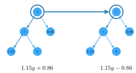
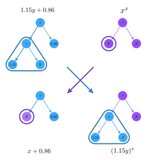
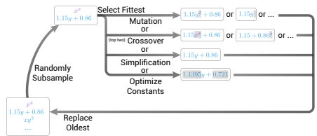
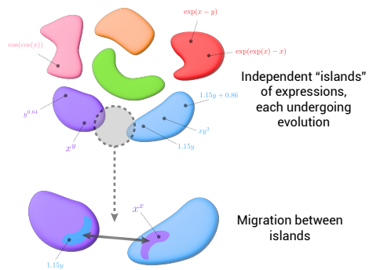
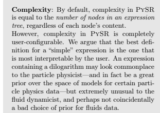
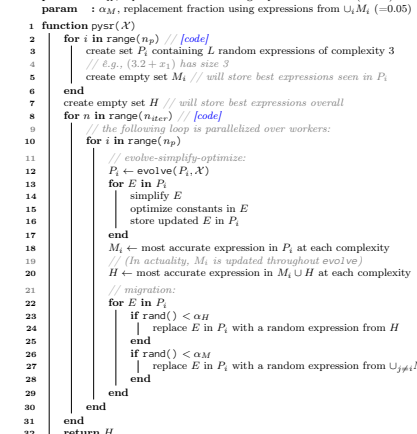
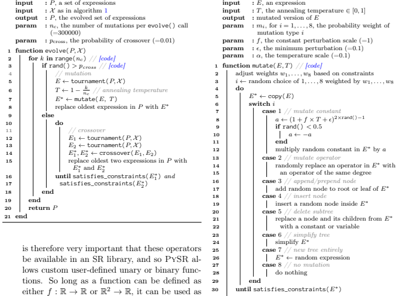
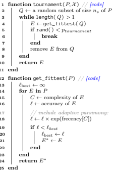
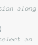
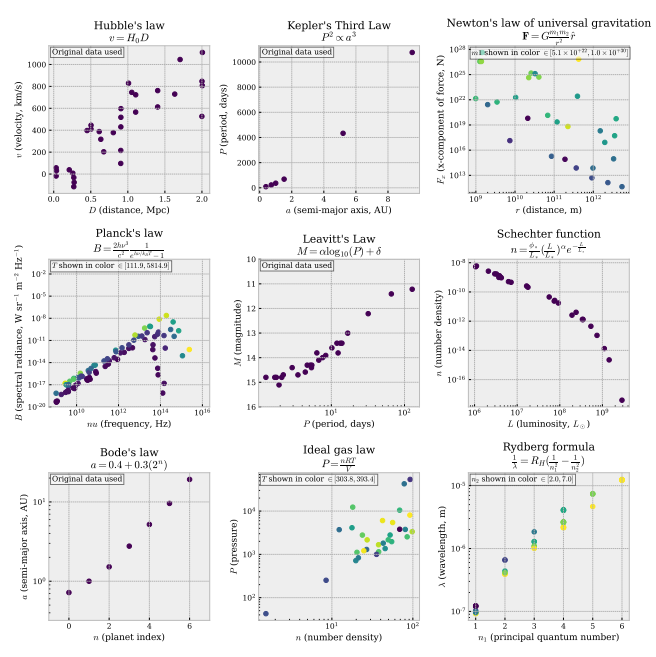

# Interpretable Machine Learning For Science With Pysr And Symbolicregression.Jl

Miles Cranmer1,2 1*Princeton University, Princeton, NJ, USA*
2*Flatiron Institute, New York, NY, USA*
May 2, 2023 PySR3is an open-source library for practical *symbolic regression*, a type of machine learning which aims to discover human-interpretable symbolic models. PySR was developed to democratize and popularize symbolic regression for the sciences, and is built on a high-performance distributed backend, a flexible search algorithm, and interfaces with several deep learning packages.

PySR's internal search algorithm is a multi-population evolutionary algorithm, which consists of a unique evolve-simplify-optimize loop, designed for optimization of unknown scalar constants in newly-discovered empirical expressions. PySR's backend is an extremely optimized Julia library SymbolicRegression.jl4, which can be used directly from Julia. It is capable of fusing user-defined operators into SIMD kernels at runtime, performing automatic differentiation, and distributing populations of expressions to thousands of cores across a cluster. In describing this software, we also introduce a new benchmark, "*EmpiricalBench*," to quantify the applicability of symbolic regression algorithms in science. This benchmark measures recovery of historical empirical equations from original and synthetic datasets.

## 1 Introduction

Johannes Kepler discovered his famous third law of planetary motion, (period)2∝ (radius)3, from searching for patterns in thirty years of data produced by Tycho Brahe's unaided eye. Kepler did not discover this by searching through all conceivable relationships with a genetic algorithm on a computer, but by his own geometrical intuition. "And it was Kepler's Third Law, not an apple, that led Isaac Newton to discover the law of gravitation" [1]. Likewise, Planck's law was not derived from first principles, but was a symbolic form fit to data [2]. This symbolic relationship would inspire the development of Quantum Mechanics.

Now, this first step—discovering empirical rela-

tionships from data or based on human intuitionis both difficult and time-consuming, even for lowdimensional data where it has been shown to be NP- hard [3]. In modern, high-dimensional datasets, it seems an impossible task to discover simple symbolic relationships without the use of automated tools.

This brings us to an optimization problem known as "symbolic regression," or SR. In this paper, we describe an algorithm for performing SR, and describe software dedicated to equation discovery in the sciences.

Symbolic Regression. SR describes a supervised learning task where the model space is spanned by analytic expressions. This is commonly solved in a multi-objective optimization framework, jointly min1

3github.com/MilesCranmer/PySR 4github.com/MilesCranmer/SymbolicRegression.jl
imizing prediction error and model complexity. In this family of algorithms, instead of fitting concrete parameters in some overparameterized general model, one searches the space of simple analytic expressions for accurate and interpretable models. In the history of science, scientists have often performed SR "manually," using a combination of their intuition and trial-and-error to find simple and accurate empirical expressions. These empirical expressions then might lead to new theoretical insights, such as the aforementioned discoveries of Kepler and Planck leading to classical and quantum mechanics respectively. SR
algorithms automate this discovery of empirical equations, exploiting the power of modern computing to test many more expressions than our intuition alone could sort through.

SR saw early developments as a tool for science beginning in the 1970s and 1980s, with works such as [4],
and the creation of the tool Bacon in [5] with further development in, e.g., [6, 7]. Via a combination of heuristic strategies for brute force searching over possible expression trees, Bacon and its follow-ups such as Fahrenheit [8], demonstrated the ability to discovery a variety of simple physics laws from idealized data. The use of genetic algorithms, which allow for a more flexible search space and fewer prior assumptions about these expressions, was popularized with the work of [9]. Finally, with the development of the user-friendly tools Eureqa in [10, 11, 12], as well as HeuristicLab in [13], SR started to become practical for use on real-world and noisy scientific data and empirical equations.

Equation Discovery for Science. Today Eureqa is a closed-source proprietary tool, and has fallen out of common use in the sciences. In addition to other early work such as [14, 15, 16, 17], there have recently been a significant number of exciting new developments in SR as well as SR for science. These have largely been focused on genetic algorithms on expressions represented as trees, and include core advances to genetic algorithms, such as [18, 19], which propose modified strategies for selecting an individual to mutate and [20, 21] which use an adaptive form of recombination based on emerging statistical patterns. New strategies for SR altogether have also been developed: in particular, our previous work [22, 23, 24] proposes SR as a way of interpreting a neural network. Neural networks can efficiently find low-dimensional patterns in high-dimensional data, and so this mixed strategy also presents a way of performing SR on highdimensional or non-tabular data.

Additional techniques include [25, 26] which propose a Markov chain Monte Carlo-like sampling for SR; [27, 28] which trains deep generative models to propose mutated expressions; [29, 30] which pre-train a large transformer model on billions of synthetic examples, in order to autoregressively generate expressions from data; [31, 32, 33] which develop techniques for discovering symmetries with SR; [34] which optimizes a sparse set of coefficients in a very large predefined expression with stochastic gradient descent; and finally [35, 36] which apply genetic algorithms to a flexible space of differential equations.

Apart from trees, a few other data structures are used for representing symbolic expressions, such as imperative representations ("Linear Genetic Programming") [e.g., 37, 38, 39, 40], and sequence representations [e.g., 29, 30, 32]. One of the most popular alternatives to genetic algorithms on trees, especially for the study of PDEs, is "SINDy" (Sparse Identification of Nonlinear Dynamics) [41, 42, 43] which represents expressions as linear combination of a dictionary of fixed nonlinear expressions. Similar ideas of a linear basis of terms is used in the initialization of the "Operon" genetic algorithm [44], as well as in "FFX" [45]. This strategy can also be combined with deep learning [e.g., 43, 46, 47, 48, 49] or other techniques to find expressions on high-dimensional data [e.g., 36]. Additional techniques include mixed integer nonlinear programming [50] and greedy tree searches [51], and combining theory as a type of constraint over the space of models [52].

However, here we argue that many existing algorithms lack certain features which make them practical in a broad setting for discovering interpretable equations in science. The requirements for "scientific SR" are significantly more difficult than for SR applied to synthetic datasets, which many algorithms are implicitly trained on via synthetic benchmarks. We list these below.

1. an empirical equation in science quite often contains unknown real constants5 The set of

5One could argue that any constant in a scientific model must depend on a finite number of known constants of physics (e.g., the speed of light) and mathematics (e.g., π). However, this introduces significantly more complexity than is
possible expressions considered by some SR algorithms such as [31]: operators, integers, and variables—is discrete and finite up to a given max size. This set is even searchable with brute force, as is used in [31] in combination with a symmetry and dimensional analysis module. However, with arbitrary real constants, the set of equations one must search is uncountably infinite. The difficulty of searching this set is further compounded by several factors:
2. The discovered equation must provide insight into the nature of the problem. The equation which often holds the most insight, and is therefore adopted by scientists, is not always the most accurate (many other ML
algorithms could be used instead for accuracy), but is instead an equation which balances accuracy with simplicity.

3. An empirical equation in science is discovered from data containing noise, which often has heteroscedastic structure.

4. Many empirical equations are not differentiable, instead being composed of different expressions active in only parts of parameter space (e.g., exp(x) for x < 0 and x 2 + 1 for x ≥ 0).

5. Discovered expressions in science must satisfy known constraints, e.g., mass conservation.

6. Empirical relations are frequently comprised of operators which are unique to one particular field of science, so the equation search strategy must allow for custom operators.

7. Observational data is often highdimensional, and the SR algorithm must either manage this internally, or be layered with a feature selection algorithm.

8. The search tool must be capable of finding relationships in non-tabular datasets, such as sequences, grids, and graphs (for example, by using aggregation operators such as P).

9. Finally, and most importantly, any SR package useful to scientists must be open-source, cross-platform, easy-to-use, and interface with common tools. For more discussion, the references [53, 54] consider this from the point of view of the astrophysics community.

Contribution. In this paper, we introduce PySR,
a Python and Julia package for Scientific Symbolic Regression. The Python package is available under pysr on PyPI and Conda6 and the Julia library under **SymbolicRegression**7 on the Julia package registry. Every part of PySR is written with scientific discovery in mind, as the entire point of creating this package was to enable the authors of this paper to use this tool in their own field for equation discovery. All of the requirements of discovering an empirical equation for science, as listed above, are satisfied by PySR. We discuss this in detail in the following sections.

## 2 Methods

First, we give an in-depth discussion of the internal algorithm in PySR in section 2.1, and then describe the software implementation in section 2.2. We then discuss a few additional implementation features in section 2.3, section 2.4, and section 2.5.

### 2.1 Algorithm

PySR
 is a multi-population evolutionary algorithm with multiple evolutions performed asynchronously.

The main loop of PySR, operating on each population independently, is a classic evolutionary algorithm based on tournament selection for individual selection
(first introduced in the thesis of [55] and generalized in [56]), and several mutations and crossovers for generating new individuals. Evolutionary algorithms for SR was first popularized in [9], and has dominated the development of flexible SR algorithms since. PySR
makes several modifications to this classic approach, some of which are motivated by results in recent work.

A simple evolutionary algorithm proceeds as follows:
1. Assume one has a population of individuals, a fitness function, and a set of mutation operators.

2. Randomly select an ns-sized subset of individuals from the population (e.g., classical

being reduced, as the relationship with fundamental constants to derived constants might be arbitrarily complex.

6github.com/MilesCranmer/PySR 7github.com/MilesCranmer/SymbolicRegression.jl

Figure 1: A mutation operation applied to an expres-





sion tree.

Figure 2: A crossover operation between two expression trees.

tournament selection uses ns = 2, but larger tournaments are also allowed).

3. Run the tournament by evaluating the fitness of every individual in that subset.

4. Select the fittest individual as the winner with probability p. Otherwise, remove this individual from the subset and repeat this step again. If there is one remaining, select it. Thus, the probability will roughly be *p, p*(1 − p), p(1 − p)
2*, . . .* for the first, second, third fittest, and so on.

5. Create a copy of this selected individual, and apply a randomly-selected mutation from a set of possible mutations.

6. Replace a member of the population with the mutated individual. Here, one would replace the weakest of the population or subset.

This algorithm is computationally efficient and allows for massive parallelization by splitting step 2. into groups of individuals which can evolve independently, with asynchronous "migration" between the groups. For the first of the modifications, we replace the eldest member of a population in step 5.,
rather than the individual with the lowest fitness, which is known as "age-regularized" evolution [57]. We record the age from the Unix time at which the individual was created during step 5.. Its inclusion in PySR
 was motivated by the impressive Neural Architecture Search results of [57, 58] - though it is worth noting similar regularizations used earlier in SR, e.g., [59] and [60] - which found this simple modification could prevent early convergence without hurting performance. This prevents the population from specializing too quickly and getting stuck in a local minimum of the search space. The implementation in [58] uses p = 1 and explores 4 ≤ ns ≤ 64, though here we allow p to be less than 1, among several other differences.

Modifications. Our algorithm in PySR, first released publicly in 2020 [61], makes three changes to this evolutionary algorithm. We apply simulated annealing [62] to step 4.: given a temperature T ∈ [0, 1], a mutation is rejected with some probability related to the change in fitness after mutation. The probability for rejection is p = expLF −LE
αT 
, for LF and LE
the fitness of the mutated and original individual respectively, and α a hyperparameter. This allows the evolution to alternate between *high temperature* and low temperature phases, with the high temperature phases increasing diversity of individuals and the low temperature phases narrowing in on the fittest individuals. α controls the scale of temperature, with α → ∞ being equivalent to regular tournament selection, and α → 0 rejecting all mutations which lower fitness. Since the value of p also controls the diversity of the population, we can also couple the value of p to temperature, setting a larger value of p for a higher temperature, and a smaller value of p for a lower temperature. Simulated annealing is a simple yet powerful strategy for optimizing over discrete



Figure 3: The inner loop of PySR. A population of expressions is randomly subsampled. Among this subsample, a tournament is performed, and the winner is selected for breeding: either by mutation, crossover, simplification, or explicit optimization. Examples of mutation and crossover operations are visualized in figs. 1 and 2.



Figure 4: The outer loop of PySR. Several populations evolve independently according to the algorithm described in fig. 3. At the end of a specified number of rounds of evolution, migration between islands is performed.

spaces, and we find in section 3 that simulated annealing can significantly speed up the search process.

The second modification we make to tournament selection is specific to the individuals we wish to consider: mathematical expressions. We embed the genetic algorithm inside an evolve-simplify-optimize loop. "Evolve" is a repeated application of tournament selection-based evolution for a set number of mutations. In other words, this is an entire evolution of a population. "Simplify" here refers to equation simplification—equations are simplified to an equivalent form during the loop using a set of algebraic equivalencies (since this happens infrequently enough, it tends to not harm discovery by constraining the search space). The "Optimize" part of this algorithm is a few iterations of a classical optimization algorithm (BFGS [63] is used by default, though any optimizer in the **Optim.jl** package can be used [64])
to optimize constants in every equation explicitly. This part of the algorithm significantly improves the discovery of equations containing real constants, which is essential for practical application of SR to science. It has been shown since at least [65] that performing local gradient searches on numerical constants in expressions can vastly improve the performance of SR—we closely integrate an optimized and stochastic version of this.

The reason why several mutations (as well as crossovers) are performed before proceeding to the simplify-optimize stage is because some equations are only accessible via a redundant intermediate state. For example, x ∗ x − x ∗ x would normally simplify to 0, but if the simplification is avoided, the next mutation might change one of the x's to y, resulting in x ∗ x − x ∗ y. Simplifying only occasionally is a way of allowing redundant but necessary intermediate expressions while at the same time reducing the size of the search space.

Finally, the third modification we make is the use of a novel *adaptive parsimony* metric. But first, we give a definition of complexity.



The traditional mechanism for penalizing complexity would be to use a constant *parsimony*, which would involve adding a loss term equal to the complexity of an expression times a constant factor:

$$\ell(E)=\ell_{\mathrm{pred}}(E)+(\mathrm{parsimony})\cdot C(E),\qquad(1)$$

for C(E) the complexity of an expression E and `pred the predictive loss. Instead, we adaptively tune a percomplexity penalty such that the number of expressions at each complexity is approximately the same.

This is expressed roughly as:

$$\ell(E)=\ell_{\mathrm{pred}}(E)\cdot\exp(\mathrm{frequency}[C(E)]),\qquad(2)$$

where the "frecency" of C(E) is some combined measure of the frequency and recency of expressions occurring at complexity C(E) in the population. In PySR, we simply count the number of expressions with a moving window in time, and divide by a tunable constant. Thus, this is a simple way to punish complexities adaptively by how frequent they are in the population. This encourages the evolutionary search to explore the problem from simple, lessaccurate expressions, as well as from complex, more accurate expressions. This qualitatively seems to help alleviate situations where the search specializes too early in the wrong functional form, and can only seem to make small iterations to it, and is discouraged from starting from scratch.

Pseudocode for the outer loop of PySR is given in algorithm 1, which includes the migration steps shown in fig. 4. Algorithm 2 gives pseudocode for the main *evolve-simplify-optimize loop*, formalizing parts of the cartoon in fig. 3. Algorithm 3 outlines the set of mutations, supplemented with simulated annealing. Finally, algorithm 4 describes the tournament selection strategy.

Additional Features. PySR includes a variety of additional features for various types of data and scenarios:
- *Noisy data.* PySR supports multiple strategies for working with noisy data:
- First, PySR includes an optional denoising preprocessing step that optimizes a Gaussian process on the input dataset with a kernel of the form k(*x, x*0) = σ 2exp−|x − x 0| 2/2l 2+
α δ(x−x 0) +C, a superposition of a Gaussian kernel (the standard kernel for interpolating datasets), a white noise kernel (to account for intrinsic noise), and a constant kernel (which

#### Algorithm 1: Pysr.

input : X, the dataset to find expressions for output : the best expressions at each complexity param : np, the number of populations (=40)
param : L, the number of expressions in each population (=1000)
param : αH, replacement fraction using expressions from H (=0.05)



32 return H
33 end modifies the mean of the Gaussian process). After this kernel is optimized, the Gaussian process is used to predict denoised targets for each input point, which are then passed to the main PySR algorithm.

- Second, PySR allows one to specify a set of weights for each input data point. This could be used, for instance, if a user knows the uncertainty in a measurement beforehand to be σ > 0, for σ the standard deviation of the measurement, and thus weights each data point in the loss by the signal-to-noise 1/σ2.

- Thirdly, the user can define a custom likelihood to optimize, which can also take into account weights. This is explained in the following point.

- *Custom losses.* PySR supports arbitrary userdefined loss functions, passed as either a string or a function object. These take a scalar prediction and target, and optionally a scalar weight, and should return a real number greater than 0. These per-point losses are then summed over the dataset. With this, the user is capable of defining arbitrary regression objectives, custom likelihoods (defined as log-likelihood of a single data point), and classification-based losses. This also allows one to define implicit objectives.

- *Custom operators.* One of the most powerful features of PySR is the ability to define custom operators. Different domains of science have functions unique to their field which appear in many formulae and hold a specific meaning. It



Algorithm 3: Mutations.

a user-defined operator. PySR does not treat built-in operators any differently than user-defined ones. Apart from simplification strategies, PySR
 does not know the difference between the
+ operator and a Bessel function.

- *Feature selection.* Similar to the Gaussian process preprocessing step for denoising, PySR
also uses a simple dimensionality reduction preprocessing step. Given a user-defined number of features to select, PySR uses a gradientboosting tree algorithm to first fit the dataset, then select the most important features. These features are fed into the main search loop.

- *Constraints.* PySR allows various hard constraints to be specified for discovered expressions. These are enforced at every mutation: if a constraint is violated, the mutation is rejected. A few are available with the API:
- The maximum size of an expression (the num38 else 40 end 41 end 31 *C, C*∗ ← complexity of expressions *E, E*∗, respectively 32 *L, L*∗ ← accuracy of expressions *E, E*∗, respectively 33 qanneal ← exp−
L∗−L
α×T

34 C ← complexity of expressions E
35 qparsimony ← frecency[C]
frecency[C]
36 if **rand()** < qanneal · q*parsimony* 37 return E∗
39 return E
ber of instances of operators, variables, and constants), which gives an overall bound on the search space.

- The maximum depth of an expression, which can be used to control how deeply nested the resultant expression is.

- The maximum size of a subexpression in a specific operator. This specifies the maximum

Algorithm 4: Tournament selection.

input : P, a population of expressions input : X as in algorithm 1 output : a single expression (the winner of the tournament)
param : ns, the tournament size (=12)
param : ptournament, the probability of selecting the fittest individual (=0.9)



size of an expression within an operator's arguments. For example, specifying that the ∧ operator has maximum argument size of (−1, 3)
means that its base can have any size expression (indicated by -1), while the expression in its exponent can only have max size of up to 3. This operator-specific constraint can drastically reduce the complexity of discovered expressions.

- The maximum number of nests of a particular operator combination. For example, the nested constraint **{sin: {sin: 0, cos:**
1}}
 would indicate that sin(cos(x)) is allowed, but sin(cos(cos(x))) and sin(sin(x)) are not.

- *Additional data structures*. See deep learning interface section 2.3.

- *Integrals and dynamical systems*. See deep learning interface section 2.3.

The search algorithm itself underlying PySR, as de-


scribed in pseudocode in algorithms 1 to 4, is written in pure-Julia under the library name SymbolicRegression.jl8. Julia boasts a combination of a highlevel interface9 with very high performance comparable to languages such as C++ and Rust10. However, the key advantage of using Julia for this work is the fact that it is a just-in-time compiled (JIT) language.

This allows PySR to make use of optimizations not possible with a statically compiled library: for instance, compiling user-defined operators and losses into the core functions. The most significant advantage of using JIT compilation for PySR, in terms of performance, is that operators can be fused together into single compiled operators. For example, if a user declares + and - as valid operators, then PySR will compile a SIMD-enabled kernel for +, -, as well as their combination: **(a - b) + c**, and so on. This happens automatically for every single combination of operators up to a depth of two operators, even for user-defined operators. Simply by fusing operators in this way, the expression evaluation code, which remains the bottleneck in PySR, experiences a significant speedup. Because Julia is JIT compiled, these operators need not be pre-defined in the library: they will be just as performant as if they were.

PySR
 exposes a simple Python frontend API
to this pure-Julia backend search algorithm. This frontend takes the popular style of the scikit-learn machine learning library [66]:

8https://github.com/MilesCranmer/SymbolicRegression.jl 9docs.julialang.org/en/v1/
10julialang.org/benchmarks/
from pysr import **PySRRegressor**
\# Declare search options: model = **PySRRegressor(**
model_selection="best", unary_operators=["cos", **"sin"],**
binary_operators=["+", "-", "/", "*"],
)
\# Load the data X, y = **load_data()** \# X shape: (n_rows, n_features) \# y shape: (n_rows) or (n_rows, n_targets)
\# Run the search: model.fit(X, y)
\# View the discovered expressions: print(model)

| # Evaluate, using the 5th expression along   |
|----------------------------------------------|
| # the Pareto front:                          |
| y_predicted = model.predict(X, 5)            |

\# (Without specify `5`*, it will select an*
,→ *expression*
\# which balances complexity and error)
Parallelization PySR is parallelized by populations of expressions which evolve independently, which was described as the basis of allowing large-scale parallelization in [56]. In this framework, a population of expressions is dispatched to a worker (either a thread, if single-node, or a process, if multi-node), where it then evolves over many iterations. Following a batch of iterations, this population is returned to the head worker, which performs several tasks: (1) record the best expressions, at each complexity, found in the population as part of a global "hall of fame;" (2) record the current expressions so they can "migrate" to other populations; and, finally, (3) randomly "migrate" expressions from other populations, and the global hall of fame, to this population. After these steps are finished, this population is once again dispatched to a worker where it undergoes further evolution. This parallelization is asynchronous, and different populations may complete evolution at different speeds without slowing down others. The technique is largely similar to the method described in [11], although here we have modified the migration step to also migrate based on a global, permanent hall of fame, rather than exclusively migrating current population members. Reintroducing hall of fame members can significantly speed up the search.

### 2.3 Interfaces

PySR
 has export functionality to several popular Python libraries and other formats. PySR by default will export any discovered expression to SymPy [67], which, by extension, can convert expressions to La- TeX for including in research reports. The mechanism for this functionality is fairly simple: using a string representation of the recovered expression, PySR
 replaces symbol names with the SymPy equivalents (e.g., cos would become **sympy.cos**), and evaluates it with the Python interpreter. As a caveat of this, the user must define any custom operator using SymPy functions, in addition to Julia functions.

A similar technique—evaluating the string representation for an expression—is used for exporting expressions to a callable format in NumPy, PyTorch, and JAX [68, 69, 70]—each of which take vector input. For NumPy, constants in an expression are embedded inside the callable function. However, for Py-
Torch and JAX, since one may wish to re-optimize the constants in an expression (for example, as is done in [71]), the constants are trainable. In PyTorch, this amounts to creating a PyTorch **nn.Parameter** for the constants, which causes PyTorch to track gradients with respect to the parameters, so they can be trained via gradient descent. Since JAX is a functional language, the parameters are instead exported as a vector, which the user then will pass into the callable function. This is similar to how deep learning frameworks in JAX are trained.

### 2.4 Custom Operators

The occurrence rate of a particular mathematical operator in a set of models varies by the scientific field those models describe. For example, models in Epidemiology commonly use exponentials, indicating exponential growth or decay of a contagious disease, but may rarely use a Bessel function - which would be more common in in classical physics applications. The entire reason that SR produces interpretable 




models is that the generated expressions make use of operators which are common in a particular field, and a domain scientist may be able to see connections with existing models. In some ways, this process relates to language: black box machine learning models represent functions in a language uninterpretable to a scientist, whereas SR uses the language in place. Furthermore, due to the modular nature of scientific modelling—many complex models are built on-top of existing simple models for particular subsystemsit also makes sense from a standpoint of improving model accuracy to make use of common operators
(for an interesting explicit example of this, see [26]).

PySR
 does not, per se, have any built-in operators.

Due to the just-in-time compiled nature of Julia, any real scalar function from the entirety of the Julia Base language is available, and can be compiled into the search code at runtime. This includes commonly-used operators such as +, -, *, /, ∧, exp, log, sin, cos, tan, abs, and many others.

Furthermore, since many domains of science have operators that are unique to their field, it is possible to pass an arbitrary Julia function as an operator, whether it be a binary operator (with two arguments) or a unary operator (with one argument). Any function of the form f : R → R or R
2 → R, whether continuous or not, can be used as a user-defined operator. The function need only be designed for scalar input and output, and PySR will use Julia to automatically compile and vectorize it, generating SIMD (Single Instruction, Multiple Data) instructions when possible. In PySR, an example of this would be:
op = "special(x, y) = cos(x) * **(x + y)"** model = **PySRRegressor(binary_operators=[op])**
where the string **special(x, y) = cos(x)** * (x
+ y)
 is Julia code giving a function definition.

This would define a binary operator **special** that would be compiled into the search code. To enable custom operators to be defined in the various export functionality, the user must also define equivalent operators in SymPy (here, **lambda x,**
y: sympy.cos(x)
*
 **(x + y)**), as well as JAX
or PyTorch versions if the user wishes to export to those frameworks as well.

As an example in science, it is very common in astrophysics to see "broken power laws": power laws whose exponent takes on different values in the parameter space. This could be defined in PySR
by enabling the power law operator ∧, and then giving the string **cond(x, y) = x < 0 ? 0 : y**,
which defines a conditional branch of an expression given some expression defined in the x variable (using the ternary operator **condition ? value1 :**
value2). For example, **pow(x, cond(x - 5, 3.4)**
- 2.1)
 would define the broken power law:

$$\left\{\begin{array}{l l}{x\geq5,}&{x^{1.3}}\\ {x<5,}&{x^{4.5}.}\end{array}\right.$$

 
The importance of defining custom operators is that there is no standard set of operators which the library is specifically tuned for; any operator common in a particular field is feasible to implement (so long as it can take 1-2 scalar arguments).

### 2.5 Custom Losses

In many machine learning toy datasets for benchmarking regression algorithms, Mean-Square-Error
(MSE or L2 loss) is typically used as a learning objective [72]. In a Bayesian framework, MSE is equivalent to assuming every data point is Gaussian distributed, with equal variance per point. Minimizing MSE is equivalent to maximizing the Gaussian loglikelihood. However, in science, one typically works with a likelihood that is very specific to a particular problem, and this is often non-Gaussian. Therefore, it is important for an SR package to allow for custom loss functions. PySR implements this in a way that is very similar to that of custom operators (see section 2.4). Given a string such as "**loss(x, y) =**
abs(x - y)", PySR will pass this to the Julia backend, which will automatically vectorize it and use it as a loss function throughout the search process. In a Bayesian context, this would allow one to define arbitrary likelihoods, even for very complex branching logic. This also works for weighted losses, such as
"**loss(x, y, w) = abs(x - y)** * w"

# 3 Evaluation

In section 1, we discussed practical issues with discovering symbolic expressions in the sciences. Here, we present a comparison of PySR with existing tools in terms of addressing these concerns.

#### 3.1 High Level Comparison

First, we present a high level comparison of the various SR tools available. These qualitative points are made using the desirable features given in section 1.

| n   | n   | a   | y   | e   | m   | n   | a   | r   | D    | R   | ic   | a    | R   | q   | o   | L    |    |     |     |     |     |    |     |      |     |     |    |     |    |    |     |    |     |    |     |    |    |    |    |    |    |    |
|-----|-----|-----|-----|-----|-----|-----|-----|-----|------|-----|------|------|-----|-----|-----|------|----|-----|-----|-----|-----|----|-----|------|-----|-----|----|-----|----|----|-----|----|-----|----|-----|----|----|----|----|----|----|----|
| n   | N   | tt  | S   | e   | r   | re  | S   | Q   | y    | L   | e    | I    | a   | y   | e   | D    | u  | p   | S   | E   |     |    |     |      |     |     |    |     |    |    |     |    |     |    |     |    |    |    |    |    |    |    |
| P   | F   | L   | P   | E   | y   | O   | G   | Q   | I    | P   |      |      |     |     |     |      |    |     |     |     |     |    |     |      |     |     |    |     |    |    |     |    |     |    |     |    |    |    |    |    |    |    |
| A   |     |     |     |     |     |     |     |     |      |     |      |      |     |     |     |      |    |     |     |     |     |    |     |      |     |     |    |     |    |    |     |    |     |    |     |    |    |    |    |    |    |    |
| Co  | X   | X   | X   | X   | X   | X   | ile | d   | ×    | ×   | ×    | ×    | mp  | M   | ult | i\-c | X  | X   | X   | X   | X   | X  | X   | X    | X   | ×   | or | e   |    |    |     |    |     |    |     |    |    |    |    |    |    |    |
| Sc  | ala | bi  | lit | y   | ult | od  | X   | M   | i\-n | e   | ×    | ×    | ×   | ×   | ×   | ×    | ×  | ×   | ×   |     |     |    |     |      |     |     |    |     |    |    |     |    |     |    |     |    |    |    |    |    |    |    |
| GP  | U\- | ble | ∗I  | X   | X   | ×   | ×   | ×   | ×    | ×   | ×    | ca   | pa  | No  | X   | X    | X  | X   | X   | X   | X   | X  | X   | e\-t | ini | pr  | ra | ng  | ×  |    |     |    |     |    |     |    |    |    |    |    |    |    |
| De  | isi | X   | X   | ∗II | ?   | ×   | ×   | ×   | ×    | ×   | ×    | no   | ng  | Fe  | lec | tio  | X  | X   | X   | X   | ∗II | X  | atu | ×    | ×   | ×   | ×  | re  | se | n  |     |    |     |    |     |    |    |    |    |    |    |    |
| Pr  | tic | ali | ty  | ac  | Di  | ffe | tia | l   | tio  | X   | X    | X    | ×   | ×   | ×   | ×    | ×  | ×   | ren | eq  | ua  | ns |     |      |     |     |    |     |    |    |     |    |     |    |     |    |    |    |    |    |    |    |
| Hi  | h\- | dim | sio | l   | X   | X   | ×   | ×   | ×    | ×   | ×    | ×    | ×   | g   | en  | na   | Fu | ll  | P   | to  | X   | X  | X   | X    | X   | ∗II | X  | ×   | ×  | ×  | are | cu | rve |    |     |    |    |    |    |    |    |    |
| AP  | I   | X   | X   | X   | X   | X   | X   | X   | X    | ×   | ×    | In   | te  | rfa | cin | Sy   | mP | In  | ter | fac | X   | X  | X   | X    | X   | g   | ×  | ×   | ×  | ×  | ×   | y  | e   |    |     |    |    |    |    |    |    |    |
| De  | Le  | ing | X   | ∗II | I   | rt  | ×   | ×   | ×    | ×   | ×    | ×    | ×   | ep  | arn | ex   | po | Ex  | ivi | ty  | 4   | 5  | 4   | 3    | 3   | 3   | pr | ess | sc | or | e   |    |     |    |     |    |    |    |    |    |    |    |
| Op  | X   | X   | X   | X   | X   | X   | X   | X   | ×    | ×   | en   | \-so | ur  | ce  | al  | C    | X  | X   | X   | X   | X   | X  | X   | X    | Re  | sta | nt | ∗II | on | s  | ×   |    |     |    |     |    |    |    |    |    |    |    |
| Cu  | X   | X   | ∗II | sto | to  | ×   | ×   | ×   | ×    | ×   | ×    | ×    | m   | op  | era | rs   | ib | ili | Di  | X   | X   | X  | ∗II | Ex   | te  | ty  | nt | inu | to | ns | sco | ou | s   | op | era | rs | ×  | ×  | ×  | ×  | ×  | ×  |
| Cu  | sto | lo  | X   | X   | X   | X   | ×   | ×   | ×    | ×   | ×    | ×    | m   | sse | s   | Sy   | mb | oli | c C | X   | X   | X  | str | ain  | ts  | on  | ×  | ×   | ×  | ×  | ×   | ×  | ×   |    |     |    |    |    |    |    |    |    |
| Cu  | sto | lex | ity | X   | X   | X   | ×   | ×   | ×    | ×   | ×    | ×    | ×   | m   | co  | mp   | Cu | X   | sto | ty  | ×   | ×  | ×   | ×    | ×   | ×   | ×  | ×   | m  | pe | s   |    |     |    |     |    |    |    |    |    |    |    |
| [se | lf] | [   | ]   | [   | ]   | [   | ]   | [   | ]    | [   | ]    | [    | ]   | [   | ]   | Ci   | ta | tio | 11  | 73  | 44  | 27 | 74  | 34   | 75  | n   | \- | \-  | š    |     | š     | š    | š     | š    | š     | š    | Co | de |    |    |    |    |

| š   | ×     | ×   | × ×   | ×      | X  X   |       | X   | X   | X    |    | ×   | ×     | X   | ×   | X   | X   | G \- P           | A E M O                |
|---|-------|-----|-------|--------|--------|-------|-----|-----|------|----|-----|-------|-----|-----|-----|-----|------------------|------------------------|
| [ 23 ] š   | \-  × | X   | \-  X | \-  \- | X      | \-  6 | \-  | \-  | X  × | X  | X   | \-  X | X   | \-  | X   | \-  | ll m ti y S is D | ∗  c  n  li o ti o b a |

SR-TransformerG

P-GOMEASy

mbolic

Distillation

∗

X ×

× × × ×

∗III ×

× ×

 [21]

 [23]

Expressivity scores: (1a) Pre-trained on equations generated from limited prior. (1b) Basis of fixed expressions, combined in a linear sum. (2) Flexible basis of expressions, with variable internal coefficients.

 (3) Any scalar tree, with binary and unary operators. (4) Any scalar tree, with custom operators allowed. (5) Any scalar tree, with n-ary operators. (6) Scalar/vector/tensor expressions of any arity.

∗ Note that the 
"Symbolic Distillation" method from [23] is not an algorithm itself; it can be applied to any SR technique. Applying this general method to a specific

```
X 
  from
      the
         Symbolic Distillation column, if given. However, in general, this technique is easiest with those methods which have deep learning

```

technique will inherit a export.

 Only the symmetry discovery module is GPU-capable.

 Conceptually different, as is a linear basis of static nonlinear expressions.

 Is itself a neural network.

Table 1: 
Note that many instances of
× 
are purely software limitations. For example, most non-compiled algorithms could support custom losses and operators, but few make this easily configurable via an API, which is important for practical use in science.

 Open source code can be found by clicking on each icon.

∗I ∗II
∗III
¥

#### 3.2 Empiricalbench: Empirical Science Symbolic Regression Benchmark

Existing SR benchmarks have certain simplifications compared to the datasets used to historically discover well-known empirical equations. When discovering a new expression, one does not actually know the physical constants in the expression, and one must have to learn real constants. For example, in the Feynman benchmark dataset of [73], all expressions are listed with the associated physical constants—but these constants originally had to be discovered along with the equation. Similarly, in the commonly-used synthetic "Nguyen" benchmark [76], which includes expressions such as F9 = sin(x)+siny 2, there are no non-integral constants. The "SRBench" competition of [77] was meticulous in its comparisons of different methods, but only contained a single real-world task (with an unknown ground truth), with all other expressions being synthetic. This benchmark improved on others in that it included tunable amounts of noise. However, the noise models are very simple: perfectly Gaussian and including no heteroscedasticity. Although such synthetic benchmarks have their uses in SR research, these types of benchmarks are often not entirely indicative of the challenges faced in real-world scientific discovery. Therefore, here we introduce a new benchmark which attempts to accurately portray the empirical equation discovery step of science. Every equation in this dataset is a real empirical expression that a scientist has at one point discovered from experimental, noisy, and imperfect data.

If an algorithm is to be considered to be useful for equation discovery in the sciences, it should be able to discover such relations. Data for this benchmark is shown in fig. 5, with the equations and citations given in table 2. Where original data was used, it was either: (a) taken from an original dataset available publicly, or (b) digitized from a table or plot using **WebPlotDigitizer** [78]. For example, the data for Hubble's Law was manually extracted from the original 1929 paper [79] Where original data was not available, data was generated from the equation with realistic ranges of variables, with noise applied. The code and datasets used to generate this benchmark and evaluate are available in the paper repository, and are based on a fork of the SRBench competition [77, 80].

As noted in the "Regression Target" column, many of these laws which are easily expressed in logarithmic units are instead posed as a problem in observed units. The search algorithm must discover this better unit by itself.

Many existing benchmarks for physical expression searches are based on theoretically-derived equations rather than empirically-observed and formulated. While these are likely useful for benchmarking some parts of the SR landscape, they do not target the aspect which SR would ultimately be used for: empirical discovery. Thus, all the equations in this dataset were first empirically formulated before
(and if) they were theoretically-derived. Thus, the physical variables here directly correspond to observables. Furthermore, this dataset does not include any relevant physical constants—the algorithm must find these automatically, as did the scientist who discovered the equation.

#### 3.2.1 Results On Empiricalbench

We fork the SRBench competition repository [77], as the authors have managed to perform the impressive task of aggregating a large variety of existing methods into a single repository with a common API. However, here we aim to study the entire Pareto front of each algorithm, rather than only a single expression, as was done in SRBench. By reviewing the discovered expressions over the entire Pareto front, we are not sensitive to the somewhat arbitrary choice of selection criteria, which differs by method. We can more accurately gauge performance of the algorithms themselves. Thus, we modify the interface of every algorithm to return a Pareto front of expressions, or, in the cases where it was unavailable, instead we return a list of several candidate expressions. We were able to successfully test the algorithms PySR,
Operon [44], DSR [27], EQL [34], QLattice [75], and SR-Transformer [30] on EmpiricalBench. Other codes were either not included in SRBench already, incompatible with our tests, or were otherwise unable to be configured on our system after significant effort.

We allow every method to use 8 cores on an AMD
Rome CPU running Rocky Linux, and allow them to search for up to 1 hour. These are similar constraints to the SRBench competition, which had authors individually tune their codes for such a setting, and thus we consider these settings most fair.

 

Figure 5: Visualization of all the data in EmpiricalBench, an SR benchmark for science. Color is used to denote additional variables in the cases of relations which depend on more than two inputs. Original data in the discovery of each law is used where easily available. Otherwise, data is generated from
¥ the formula with realistic ranges of variables, with a level of noise applied.

For each of the 9 equations in EmpiricalBench, we run 5 trials for each of the 6 algorithms, and record the Pareto front of each trial. Each algorithm is fed the entire dataset for training. This is because our test is the output expression, rather than a separate test dataset. Following this, each of the Pareto fronts was analyzed, by eye, to see whether the true expression was contained within it. This was performed manually, as oftentimes automated equality checking with **sympy** produced incorrect results. Furthermore, checking expressions by eye allows for small errors in recovered expressions to be ignored, so long as the

| Name                                  | Law                       | Early Citation   |
|---------------------------------------|---------------------------|------------------|
| Hubble's law                          | v = H0D                   | [79]             |
| Kepler's Third Law                    | 3  P 2 ∝ a                | [81]             |
| Newton's law of universal gravitation | m1m2  F = G rˆ            | [82]             |
|                                       | 2  r                      |                  |
| Planck's law                          | 2hν3  1  B = 2            | [83]             |
|                                       | c  hν/kBT −1 e            |                  |
| Leavitt's Law                         | M = α log10(P) + δ        | [84]             |
| Schechter function                    | − L  φ∗  L  n = ( ) αe L∗ | [85]             |
|                                       | L∗ L∗                     |                  |
| Bode's law                            | a = 0.4 + 0.3(2n )        | [86]             |
|                                       | nRT                       |                  |
| Ideal gas law                         | P = V                     | [87]             |
| Rydberg formula                       | 1  1  1                   |                  |
|                                       | RH( − ) λ = n  2 1 n  2 2 | ¥ [88]           |

|           | R S          | n  ero       | R DS         | L  Q         | e  attic     | er  m r nsfo   |
|-----------|--------------|--------------|--------------|--------------|--------------|----------------|
|           | Py           | Op           |              | E            | QL           | Tra R\-        |
|           |              |              |              |              |              | S              |
| Hubble    | 5/5          | 0/5          | 1/5          | 0/5          | 0/5          | 0/5            |
|           | (5, 0, 0, 0) | (0, 5, 0, 0) | (1, 0, 4, 0) | (0, 0, 0, 5) | (0, 5, 0, 0) | (0, 0, 0, 5)   |
| Kepler    | 5/5          | 0/5          | 4/5          | 0/5          | 0/5          | 0/5            |
|           | (5, 0, 0, 0) | (0, 5, 0, 0) | (4, 1, 0, 0) | (0, 0, 2, 3) | (0, 0, 0, 5) | (0, 0, 0, 5)   |
| Newton    | 5/5          | 1/5          | 1/5          | 0/5          | 0/5          | 0/5            |
|           | (5, 0, 0, 0) | (1, 2, 0, 2) | (1, 0, 4, 0) | (0, 0, 5, 0) | (0, 0, 0, 5) | (0, 0, 0, 5)   |
| Planck    | 0/5          | 0/5          | 0/5          | 0/5          | 0/5          | 0/5            |
|           | (0, 0, 0, 5) | (0, 0, 0, 5) | (0, 0, 1, 4) | (0, 0, 5, 0) | (0, 0, 0, 5) | (0, 0, 0, 5)   |
| Leavitt   | 5/5          | 0/5          | 5/5          | 0/5          | 0/5          | 0/5            |
|           | (5, 0, 0, 0) | (0, 0, 0, 5) | (5, 0, 0, 0) | (0, 0, 5, 0) | (0, 0, 0, 5) | (0, 0, 0, 5)   |
| Schechter | 5/5          | 5/5          | 5/5          | 0/5          | 5/5          | 0/5            |
|           | (5, 0, 0, 0) | (5, 0, 0, 0) | (5, 0, 0, 0) | (0, 0, 4, 1) | (5, 0, 0, 0) | (0, 0, 0, 5)   |
| Bode      | 5/5          | 3/5          | 1/5          | 0/5          | 0/5          | 0/5            |
|           | (5, 0, 0, 0) | (3, 0, 0, 2) | (1, 0, 3, 1) | (0, 0, 4, 1) | (0, 0, 0, 5) | (0, 0, 0, 5)   |
| Ideal Gas | 5/5          | 0/5          | 5/5          | 0/5          | 0/5          | 0/5            |
|           | (5, 0, 0, 0) | (0, 0, 0, 5) | (5, 0, 0, 0) | (0, 0, 4, 1) | (0, 0, 0, 5) | (0, 0, 0, 5)   |
| Rydberg   | 0/5          | 0/5          | 0/5          | 0/5          | 0/5          | 0/5            |
| ¥         | (0, 0, 0, 5) | (0, 0, 0, 5) | (0, 0, 5, 0) | (0, 0, 0, 5) | (0, 0, 0, 5) | (0, 0, 0, 5)   |

Table 2: Expressions in the EmpiricalBench and associated with the datasets in fig. 5. Each of these expressions was originally empirically discovered. 

Table 3: Results of each algorithm on EmpiricalBench. The fraction given is the number of correct expressions rediscovered, divided by the number of total trials. In parentheses, a detailed itemization of the five trials is given, in the order: 1) the number of correct rediscoveries, 2) the number of nearly-correct rediscoveries, 3) the number of runs which failed to produce a well-defined expression, and 4) the number of incorrect rediscoveries.

overall functional form is correct. It is also superior to numerically checking expressions, as overcomplicated but accurate expressions can be correctly penalized.

For this analysis, each Pareto front was assigned to one of four categories: (1) *correct* if the Pareto front contained the true expression, (2) *almost* if one of the expressions in the Pareto front was off of the true expression by a constant factor somewhere, (3) failed, if the search produced no results (e.g., due to numerical instability, segmentation fault, domain errors, etc.), and (4) *incorrect* if the true expression was not found in the Pareto front. All raw data with all discovered Pareto fronts for this analysis is available online at github.com/MilesCranmer/pysr_paper.

We emphasize that the stability of an SR algorithm and software implementation itself has central importance to practical use in science, and therefore, unstable runs which either produce an undefined expression, or crash, are *included* in the results dataset and the primary score. However, one should also note that because we are the authors of PySR, we are therefore more likely to be running in a stable environment than, say, a package which we are unfamiliar with. For example, as seen in table 3, DSR sees improved results if one ignores the failed runs, although there were still some expressions it struggled on. Thus, detailed itemization of these results is given in table 3, to allow for a more nuanced understanding of the results. Also note that this benchmark does not explicitly measure other metrics which are considered in other benchmarks, such as number of evaluations (where, e.g., genetic algorithms are very inefficient), nor does it consider the numerical accuracy of the expressions.

### 3.3 Discussion

It is also very important to note that these results are from the datasets specific to this competition. Many of these algorithms may do very well against synthetic datasets generated for each expression. For example, Hubble's law is simply a linear relation, so it could be surprising that many algorithms are not able to find it. However, to perform well at the benchmark, each algorithm must find these expressions from the noisy and sometimes biased datasets shown in fig. 5.

What is also interesting is that the two pure deep learning approaches, EQL and SR-Transformer, recovered the fewest expressions out of all tested algorithms. One of these, EQL, learns the expression in an online fashion, while SR-Transformer performs fast inference based on pre-trained weights.

SR-Transformer, in particular, is pre-trained on billions of randomly-generated synthetic expressions on a cluster of GPUs for weeks. However, the "untrained" algorithms written using classic heuristics: PySR, Operon, DSR, and QLattice, all out-performed these modern deep learning models. Perhaps this is an insight into the difficulty of preparing deep learning systems for real-world data and unexpected "longtail" examples, whereas handwritten standard algorithms will often perform just as well on unexpected examples. In SR especially, the space of potential expressions is so massive and nonlinear that interpolation techniques might suffer; consider that x/y and x × y are just a single mutation away, but infinitely distinct in their data representation. In spite of this, while pure deep learning strategies appears to require improvements in architecture or training to be useful in a real world SR setting, its success in, e.g., [23, 27, 30] shows there is indeed strong potential long-term for such hybrid methods, and these directions should continue to be pursued.

## 4 Conclusion

In this paper, we have presented PySR, an opensource library for practical symbolic regression. We have developed PySR with the aim of democratizing and popularizing symbolic regression in the sciences. By leveraging a powerful multi-population evolutionary algorithm, a unique evolve-simplify-optimize loop, a high-performance distributed backend, and integration with deep learning packages, PySR is capable of accelerating the discovery of interpretable symbolic models from data.

Furthermore, through the introduction of a new benchmark, EmpiricalBench, we have provided a means to quantitatively evaluate the performance of symbolic regression algorithms in scientific applications.

Our results indicate that, despite advances in deep learning, classic algorithms build on evolution and other untrained symbolic techniques such as PySR, Operon, DSR, and QLattice, still outperform pure deep-learning-based approaches, EQL and SR- Transformer, in discovering historical empirical equations from original and synthetic datasets. This highlights the challenges faced by deep learning methods when applied to real-world data with its biases and heteroscedasticity, and the nonlinearity of the space of expressions.

However, we emphasize that deep learning techniques—inclusive of generative models like [30], reinforcement learning methods such as [27], and symbolic distillation [23]—all hold potential for improving symbolic regression, and encourage further exploration of such hybrid methods.

Over the past several years since the release of PySR
 in 2020, there have been a number of exciting PySR
 applications to discover new models in various subfields. There are too many to list here in detail, but we list some examples: [89] use PySR to discover a new symbolic parameterization for cloud cover formation; [90] use PySR alongside other ML techniques to discover electron transfer rules in various materials; [91, 92, 93] combine PySR with dimensional analysis to discover new astrophysical relations; [94]
use PySR in economics, to find effective rules governing international trade; [95] demonstrates how to use PySR to extract dynamical equations learned by a neural differential equation; and, finally, [96] use PySR
 to discover interpretable population models of gravitational wave sources.

In some ways this list of recent applications provides the strongest validation yet of the science and user-focused approach we argued for in section 1, as PySR
 has already been applied successfully to model discovery in a variety of fields. It is our hope that PySR
 will continue to grow as a community tool, and provide value to researchers, helping discover interpretable symbolic relationships in data and ultimately leading to new insights, theories, and advancements in their respective fields.

Acknowledgements This software was built in the Python [97] and Julia [98] programming languages.

Direct dependencies of PySR include **numpy** [68],
sympy
 [67], **sklearn** [99], and **pandas** [100], with export functionality provided by jax [70] and pytorch
 [69]. Key dependencies of SymbolicRegression.jl include **Optim.jl** [64], LoopVectorization.jl
 [101], **Zygote.jl** [102], and SymbolicU-
tils.jl
 [103]. The packages **matplotlib** [104] and showyourwork
 [105] were also used in producing this manuscript. Quanta magazine [106] was used as artistic inspiration for some figures.

Miles Cranmer would like to thank the Simons Foundation for providing resources for pursuing this research; Shirley Ho and David Spergel for countless insightful discussions about PySR, feedback on this manuscript, promotion of it as a tool in the sciences, and for their support of this project; my research collaborators who provided feedback throughout the development of PySR, including Pablo Lemos, Peter Battaglia, Steve Brunton, Jay Wadekar, Paco Villaescusa-Navarro, Kaze Wong, Elaine Cui, Christina Kreisch, Nathan Kutz, Drummond Fielding, Keaton Burns, Dima Kochkov, Alvaro Sanchez- Gonzalez, Christian Jespersen, Patrick Kidger, Kyle Cranmer, Niall Jeffrey, Ana Maria Delgado, Keming Zhang, Pierre-Alexandre Kamienny, Michael Douglas, Francois Charton; all the wonderful open-source code contributors, including Mark Kittisopikul, T Coxon, Dhananjay Ashok, Johan Blåbäck, Julius Martensen, GitHub user **@ngam**, Christopher Rackauckas, Jerry Ling, Charles Fox, Johann Brehmer, Marius Millea, GitHub user **@Coba**, Pietro Monticone, Mateusz Kubica, GitHub user **@Jgmedina95**, Michael Abbott, Oscar Smith, and several others; Marco Virgolin for extremely helpful comments on a draft of this paper, as well as general feedback; Bill La Cava for providing feedback as well as spearheading the SRBench initiative, along with the rest of the SR- Bench organizers; Brenden Petersen for feedback on PySR
 as well as providing insights discussions about the SR landscape; and so many others who have provided support to the project through email, Twitter, GitHub issues, and in-person. I am blown away by the community that is forming around PySR and the positive feedback it has received. Thank you.

# References

[1] Stephen Hawking. On the Shoulders of Giants:
The Great Works of Physics and Astronomy. Running, Philadelphia, Pa.; London, 2004.

[2] Max Planck. Über eine Verbesserung der Wien'schen Spectralgleichung. Friedr. Vieweg
& Sohn, 1900.

[3] Marco Virgolin and Solon P. Pissis. Symbolic Regression is NP-hard, July 2022.

[4] Donald Gerwin. Information processing, data inferences, and scientific generalization. Behavioral Science, 19(5):314–325, 1974.

[5] Pat Langley. BACON: A production system that discovers empirical laws. In *IJCAI*, 1977.

[6] Pat Langley. Rediscovering physics with BA-
CON.3. In Proceedings of the 6th International Joint Conference on Artificial Intelligence -
Volume 1, IJCAI'79, pages 505–507, San Francisco, CA, USA, 1979. Morgan Kaufmann Publishers Inc.

[7] Pat Langley, Gary L. Bradshaw, and Herbert A.

Simon. BACON.5: The discovery of conservation laws. In *IJCAI*, 1981.

[8] Pat Langley and Jan M. Zytkow. Data-driven approaches to empirical discovery. Artificial Intelligence, 40(1):283–312, 1989.

[9] John R. Koza. Genetic programming as a means for programming computers by natural selection. *Statistics and Computing*, 4(2):87–
112, June 1994.

[10] Josh Bongard and Hod Lipson. From the Cover:
Automated reverse engineering of nonlinear dynamical systems. Proceedings of the National Academy of Science, 104(24):9943–9948, June 2007.

[11] Michael Schmidt and Hod Lipson. Distilling Free-Form Natural Laws from Experimental Data. *Science*, 324(5923):81–85, April 2009.

[12] M. Schmidt and H. Lipson. Symbolic regression of implicit equations. Genetic Programming Theory and Practice VII, pages 73–85, 2010.

[13] S. Wagner and M. Affenzeller. HeuristicLab:
A Generic and Extensible Optimization Environment. In Bernardete Ribeiro, Rudolf F. Albrecht, Andrej Dobnikar, David W. Pearson, and Nigel C. Steele, editors, Adaptive and Natural Computing Algorithms, pages 538–541, Vienna, 2005. Springer.

[14] Kalyanmoy Deb, Samir Agrawal, Amrit Pratap, and T. Meyarivan. A Fast Elitist Nondominated Sorting Genetic Algorithm for Multi-objective Optimization: NSGA-II. In Marc Schoenauer, Kalyanmoy Deb, Günther Rudolph, Xin Yao, Evelyne Lutton, Juan Julian Merelo, and Hans-Paul Schwefel, editors, Parallel Problem Solving from Nature PPSN VI, Lecture Notes in Computer Science, pages 849–858, Berlin, Heidelberg, 2000. Springer.

[15] K. Deb, A. Pratap, S. Agarwal, and T. Meyarivan. A fast and elitist multiobjective genetic algorithm: NSGA-II. IEEE Transactions on Evolutionary Computation, 6(2):182–197, April 2002.

[16] J.W. Davidson, D.A. Savic, and G.A. Walters. Symbolic and numerical regression: Experiments and applications. Information Sciences, 150(1):95–117, 2003.

[17] Kyle Cranmer and R. Sean Bowman. PhysicsGP: A Genetic Programming approach to event selection. Computer Physics Communications, 167(3):165–176, May 2005.

[18] William La Cava, Lee Spector, and Kourosh Danai. Epsilon-Lexicase Selection for Regression. In Proceedings of the Genetic and Evolutionary Computation Conference 2016, GECCO '16, pages 741–748, New York, NY, USA, July 2016. Association for Computing Machinery.

[19] William La Cava, Thomas Helmuth, Lee Spector, and Jason H. Moore. A probabilistic and multi-objective analysis of lexicase selection and epsilon-lexicase selection, April 2018.

[20] Marco Virgolin, Tanja Alderliesten, Cees Witteveen, and Peter A. N. Bosman. Scalable genetic programming by gene-pool optimal mixing and input-space entropy-based buildingblock learning. In Proceedings of the Genetic and Evolutionary Computation Conference, GECCO '17, pages 1041–1048, New York, NY, USA, July 2017. Association for Computing Machinery.

[21] Marco Virgolin, Tanja Alderliesten, Cees Witteveen, and Peter A. N. Bosman. Improving Model-based Genetic Programming for Symbolic Regression of Small Expressions. Evolutionary Computation, 29(2):211–237, June 2021.

[22] Miles D. Cranmer, Rui Xu, Peter Battaglia, and Shirley Ho. Learning Symbolic Physics with Graph Networks. ML4Physics Workshop @ NeurIPS 2019, November 2019.

[23] Miles Cranmer, Alvaro Sanchez-Gonzalez, Peter Battaglia, Rui Xu, Kyle Cranmer, David Spergel, and Shirley Ho. Discovering Symbolic Models from Deep Learning with Inductive Biases. *NeurIPS*, June 2020.

[24] Miles Cranmer, Can Cui, Drummond B Fielding, Shirley Ho, Alvaro Sanchez-Gonzalez, Kimberly Stachenfeld, Tobias Pfaff, et al. Disentangled Sparsity Networks for Explainable AI. *Workshop on Sparse Neural Networks*, page 7, July 2021.

[25] Ying Jin, Weilin Fu, Jian Kang, Jiadong Guo, and Jian Guo. Bayesian Symbolic Regression. January 2020.

[26] Roger Guimerà, Ignasi Reichardt, Antoni Aguilar-Mogas, Francesco A. Massucci, Manuel Miranda, Jordi Pallarès, and Marta Sales- Pardo. A Bayesian machine scientist to aid in the solution of challenging scientific problems. Science Advances, 6(5), 2020.

[27] Brenden K. Petersen, Mikel Landajuela, T. Nathan Mundhenk, Claudio P. Santiago, Soo K. Kim, and Joanne T. Kim. Deep symbolic regression: Recovering mathematical expressions from data via risk-seeking policy gradients, April 2021.

[28] Li Li, Minjie Fan, Rishabh Singh, and Patrick Riley. Neural-guided symbolic regression with asymptotic constraints. arXiv preprint arXiv:1901.07714, 2019.

[29] Stéphane d'Ascoli, Pierre-Alexandre Kamienny, Guillaume Lample, and François Charton.

Deep Symbolic Regression for Recurrent Sequences, June 2022.

[30] Pierre-Alexandre Kamienny, Stéphane d'Ascoli, Guillaume Lample, and François Charton. Endto-end symbolic regression with transformers. April 2022.

[31] Silviu-Marian Udrescu, Andrew Tan, Jiahai Feng, Orisvaldo Neto, Tailin Wu, and Max Tegmark. AI Feynman 2.0: Pareto-optimal symbolic regression exploiting graph modularity. In Advances in Neural Information Processing Systems, volume 33, pages 4860–4871. Curran Associates, Inc., 2020.

[32] Ziming Liu and Max Tegmark. AI poincaré:
Machine learning conservation laws from trajectories. *arXiv e-prints*, page arXiv:2011.04698, November 2020.

[33] Sebastian J. Wetzel, Roger G. Melko, Joseph Scott, Maysum Panju, and Vijay Ganesh. Discovering symmetry invariants and conserved quantities by interpreting siamese neural networks. *Physical Review Research*, 2(3):033499, September 2020.

[34] Subham Sahoo, Christoph Lampert, and Georg Martius. Learning Equations for Extrapolation and Control. volume 80 of Proceedings of Machine Learning Research, pages 4442– 4450, Stockholmsmässan, Stockholm Sweden, July 2018. PMLR.

[35] Steven Atkinson, Waad Subber, Liping Wang, Genghis Khan, Philippe Hawi, and Roger Ghanem. Data-driven discovery of free-form governing differential equations. *arXiv preprint* arXiv:1910.05117, 2019.

[36] Andrew Slavin Ross, Ziwei Li, Pavel Perezhogin, Carlos Fernandez-Granda, and Laure Zanna. Benchmarking of machine learning ocean subgrid parameterizations in an idealized model, October 2022.

[37] M. Brameier and W. Banzhaf. A comparison of linear genetic programming and neural networks in medical data mining. IEEE Transactions on Evolutionary Computation, 5(1):17– 26, February 2001.

[38] Aytac Guven. Linear genetic programming for time-series modelling of daily flow rate. *Journal* of Earth System Science, 118(2):137–146, April 2009.

[39] He Ma, Arunachalam Narayanaswamy, Patrick Riley, and Li Li. Evolving symbolic density functionals. *Science Advances*, 8(36):eabq0279, September 2022.

[40] Douglas Mota Dias and Marco Aurélio C.

Pacheco. Describing Quantum-Inspired Linear Genetic Programming from symbolic regression problems. In 2012 IEEE Congress on Evolutionary Computation, pages 1–8, June 2012.

[41] Steven L. Brunton, Joshua L. Proctor, and J. Nathan Kutz. Discovering governing equations from data by sparse identification of nonlinear dynamical systems. Proceedings of the National Academy of Sciences, 113(15):3932– 3937, 2016.

[42] Samuel H Rudy, Steven L Brunton, Joshua L
Proctor, and J Nathan Kutz. Data-driven discovery of partial differential equations. Science Advances, 3(4):e1602614, 2017.

[43] Kathleen Champion, Bethany Lusch, J. Nathan Kutz, and Steven L. Brunton. Data-driven discovery of coordinates and governing equations.

arXiv e-prints, page arXiv:1904.02107, March 2019.

[44] Bogdan Burlacu, Gabriel Kronberger, and Michael Kommenda. Operon C++: An efficient genetic programming framework for symbolic regression. In Proceedings of the 2020 Genetic and Evolutionary Computation Conference Companion, GECCO '20, pages 1562– 1570, New York, NY, USA, July 2020. Association for Computing Machinery.

[45] Trent McConaghy. FFX: Fast, Scalable, Deterministic Symbolic Regression Technology. In Rick Riolo, Ekaterina Vladislavleva, and Jason H. Moore, editors, Genetic Programming Theory and Practice IX, Genetic and Evolutionary Computation, pages 235–260. Springer, New York, NY, 2011.

[46] Bethany Lusch, J. Nathan Kutz, and Steven L.

Brunton. Deep learning for universal linear embeddings of nonlinear dynamics. Nature Communications, 9:4950, November 2018.

[47] Gert-Jan Both, Subham Choudhury, Pierre Sens, and Remy Kusters. DeepMoD: Deep learning for Model Discovery in noisy data. 2019.

[48] Zhao Chen, Yang Liu, and Hao Sun. Deep learning of physical laws from scarce data. 2020.

[49] Christopher Rackauckas, Yingbo Ma, Julius Martensen, Collin Warner, Kirill Zubov, Rohit Supekar, Dominic Skinner, and Ali Ramadhan. Universal differential equations for scientific machine learning. arXiv preprint arXiv:2001.04385, 2020.

[50] Alison Cozad and Nikolaos V. Sahinidis. A
global MINLP approach to symbolic regression. *Mathematical Programming*, 170(1):97– 119, July 2018.

[51] Fabricio Olivetti de Franca. A Greedy Search Tree Heuristic for Symbolic Regression. Information Sciences, 442–443:18–32, May 2018.

[52] Cristina Cornelio, Sanjeeb Dash, Vernon Austel, Tyler Josephson, Joao Goncalves, Kenneth Clarkson, Nimrod Megiddo, et al. AI Descartes: Combining Data and Theory for Derivable Scientific Discovery. *arXiv:2109.01634 [cs]*, October 2021.

[53] A. M. Price-Whelan, B. M. Sip'ocz, H. M.

G"unther, P. L. Lim, S. M. Crawford, S. Conseil, D. L. Shupe, et al. The Astropy Project: Building an Open-science Project and Status of the v2.0 Core Package. aj, 156:123, September 2018.

[54] Astropy Collaboration, Adrian M. Price-
Whelan, Pey Lian Lim, Nicholas Earl, Nathaniel Starkman, Larry Bradley, David L. Shupe, et al. The Astropy Project: Sustaining and Growing a Community-oriented Opensource Project and the Latest Major Release (v5.0) of the Core Package. *The Astrophysical* Journal, 935:167, August 2022.

[55] Anne Brindle. *Genetic Algorithms for Function* Optimization. PhD thesis, 1980.

[56] David E. Goldberg and Kalyanmoy Deb. A
Comparative Analysis of Selection Schemes Used in Genetic Algorithms. In GREGORY J. E. Rawlins, editor, *Foundations of Genetic* Algorithms, volume 1, pages 69–93. Elsevier, January 1991.

[57] Esteban Real, Alok Aggarwal, Yanping Huang, and Quoc V. Le. Regularized Evolution for Image Classifier Architecture Search. *Proceedings* of the AAAI Conference on Artificial Intelligence, 33(01):4780–4789, July 2019.

[58] Esteban Real, Chen Liang, David So, and Quoc Le. AutoML-Zero: Evolving Machine Learning Algorithms From Scratch. In International Conference on Machine Learning, pages 8007–
8019. PMLR, November 2020.

[59] Gregory S. Hornby. ALPS: The age-layered population structure for reducing the problem of premature convergence. In Proceedings of the 8th Annual Conference on Genetic and Evolutionary Computation, GECCO '06, pages 815– 822, New York, NY, USA, July 2006. Association for Computing Machinery.

[60] Michael D. Schmidt and Hod Lipson. Agefitness pareto optimization. In Proceedings of the 12th Annual Conference on Genetic and Evolutionary Computation, GECCO '10, pages 543–544, New York, NY, USA, July 2010. Association for Computing Machinery.

[61] Miles Cranmer. PySR: Fast & Parallelized Symbolic Regression in Python/Julia. Zenodo, September 2020.

[62] S. Kirkpatrick, C. D. Gelatt, and M. P. Vecchi.

Optimization by Simulated Annealing. *Science*, 220:671–680, May 1983.

[63] C. G. Broyden. The convergence of a class of double-rank minimization algorithms 1. General considerations. IMA Journal of Applied Mathematics, 6(1):76–90, March 1970.

[64] Patrick Kofod Mogensen and Asbjørn Nilsen Riseth. Optim: A mathematical optimization package for Julia. Journal of Open Source Software, 3(24):615, 2018.

[65] Alexander Topchy and W. F. Punch. Faster genetic programming based on local gradient search of numeric leaf values. In Proceedings of the 3rd Annual Conference on Genetic and Evolutionary Computation, GECCO'01, pages 155–162, San Francisco, CA, USA, July 2001.

Morgan Kaufmann Publishers Inc.

[66] Fabian Pedregosa, Gaël Varoquaux, Alexandre Gramfort, Vincent Michel, Bertrand Thirion, Olivier Grisel, Mathieu Blondel, et al. Scikitlearn: Machine Learning in Python. *J. Mach.* Learn. Res., 12:2825–2830, November 2011.

[67] Aaron Meurer, Christopher P. Smith, Mateusz Paprocki, Ondřej Čertík, Sergey B. Kirpichev, Matthew Rocklin, AMiT Kumar, et al. Sympy: symbolic computing in python. PeerJ Computer Science, 3:e103, January 2017.

[68] Charles R. Harris, K. Jarrod Millman, Stéfan J. van der Walt, Ralf Gommers, Pauli Virtanen, David Cournapeau, Eric Wieser, et al. Array programming with NumPy. *Nature*, 585(7825):357–362, September 2020.

[69] Adam Paszke, Sam Gross, Francisco Massa, Adam Lerer, James Bradbury, Gregory Chanan, Trevor Killeen, et al. PyTorch: An Imperative Style, High-Performance Deep Learning Library. In H. Wallach, H. Larochelle, A. Beygelzimer, F. d'Alché-Buc, E. Fox, and R. Garnett, editors, *Advances in Neural* Information Processing Systems 32, pages 8024–8035. Curran Associates, Inc., 2019.

[70] James Bradbury, Roy Frostig, Peter Hawkins, Matthew James Johnson, Chris Leary, Dougal Maclaurin, George Necula, et al. JAX: composable transformations of Python+NumPy programs, 2018.

[71] Pablo Lemos, Niall Jeffrey, Miles Cranmer, Peter Battaglia, and Shirley Ho. Rediscovering Newton's gravity and Solar System properties using deep learning and inductive biases. In submission, 2022.

[72] Léo Grinsztajn, Edouard Oyallon, and Gaël Varoquaux. Why do tree-based models still outperform deep learning on tabular data?, July 2022.

[73] Silviu-Marian Udrescu and Max Tegmark.

AI feynman: A physics-inspired method for symbolic regression. *Science Advances*, 6(16):eaay2631, 2020.

[74] Alan A. Kaptanoglu, Brian M. de Silva, Urban Fasel, Kadierdan Kaheman, Andy J. Goldschmidt, Jared L. Callaham, Charles B. Delahunt, et al. PySINDy: A comprehensive Python package for robust sparse system identification. November 2021.

[75] Kevin René Broløs, Meera Vieira Machado, Chris Cave, Jaan Kasak, Valdemar Stentoft- Hansen, Victor Galindo Batanero, Tom Jelen, and Casper Wilstrup. An Approach to Symbolic Regression Using Feyn. April 2021.

[76] Nguyen Quang Uy, Nguyen Xuan Hoai, Michael O'Neill, R. I. McKay, and Edgar Galván-López.

Semantically-based crossover in genetic programming: Application to real-valued symbolic regression. *Genetic Programming and Evolvable* Machines, 12(2):91–119, June 2011.

[77] F. O. de Franca, M. Virgolin, M. Kommenda, M. S. Majumder, M. Cranmer, G. Espada, L. Ingelse, et al. Interpretable Symbolic Regression for Data Science: Analysis of the 2022 Competition, April 2023.

[78] Ankit Rohatgi. Webplotdigitizer: Version 4.6, 2022.

[79] Edwin Hubble. A relation between distance and radial velocity among extra-galactic nebulae. Proceedings of the National Academy of Sciences, 15(3):168–173, March 1929.

[80] William La Cava, Patryk Orzechowski, Bogdan Burlacu, Fabrício Olivetti de França, Marco Virgolin, Ying Jin, Michael Kommenda, and Jason H. Moore. Contemporary Symbolic Regression Methods and their Relative Performance, July 2021.

[81] Johannes Kepler. *Harmonices Mundi*. Lincii Austriæ, 1619.

[82] Isaac Newton. Philosophiæ Naturalis Principia Mathematica. Jussu Societatis Regiæ ac Typis Joseph Streater, London, England, 1687.

[83] Max Planck. *The Theory of Heat Radiation*. P.

Blakiston's Son & Co, Philadelphia, 1914.

[84] Henrietta S. Leavitt and Edward C. Pickering.

Periods of 25 Variable Stars in the Small Magellanic Cloud. Harvard College Observatory Circular, 173:1–3, March 1912.

[85] William H. Press and Paul Schechter. Formation of Galaxies and Clusters of Galaxies by Self-Similar Gravitational Condensation. The Astrophysical Journal, 187:425–438, February 1974.

[86] Charles Bonnet. *Contemplation de La Nature*.

Amsterdam, 1764.

[87] Émile Clapeyron. Mémoire sur la puissance motrice de la chaleur. Journal de l'École Polytechnique, 1835.

[88] Johannes Rydberg. Researches sur la constitution des spectres d'émission des Éléments chimiques. *Proceedings of the Royal Swedish* Academy of Science, 1889.

[89] Arthur Grundner, Tom Beucler, Pierre Gentine, and Veronika Eyring. Data-Driven Equation Discovery of a Cloud Cover Parameterization, April 2023.

[90] Yanzhang Li, Hongyu Wang, Yan Li, Huan Ye, Yanan Zhang, Rongzhang Yin, Haoning Jia, et al. Electron transfer rules of minerals under pressure informed by machine learning. Nature Communications, 14(1):1815, March 2023.

[91] Konstantin T. Matchev, Katia Matcheva, and Alexander Roman. Analytical Modeling of Exoplanet Transit Spectroscopy with Dimensional Analysis and Symbolic Regression. The Astrophysical Journal, 930(1):33, May 2022.

[92] Digvijay Wadekar, Leander Thiele, J. Colin Hill, Shivam Pandey, Francisco Villaescusa- Navarro, David N. Spergel, Miles Cranmer, et al. The SZ flux-mass (Y-M) relation at low halo masses: Improvements with symbolic regression and strong constraints on baryonic feedback. September 2022.

[93] Digvijay Wadekar, Leander Thiele, Francisco Villaescusa-Navarro, J. Colin Hill, Miles Cranmer, David N. Spergel, Nicholas Battaglia, et al. Augmenting astrophysical scaling relations with machine learning : Application to reducing the SZ flux-mass scatter, January 2022.

[94] Sergiy Verstyuk and Michael R. Douglas. Machine Learning the Gravity Equation for International Trade. *SSRN Electronic Journal*, 2022.

[95] Patrick Kidger. On Neural Differential Equations, February 2022.

[96] Kaze W. K. Wong and Miles Cranmer. Automated discovery of interpretable gravitationalwave population models. ML4Astro Workshop @ ICML 2022, July 2022.

[97] Guido Van Rossum and Fred L. Drake. Python 3 Reference Manual. CreateSpace, Scotts Valley, CA, 2009.

[98] Jeff Bezanson, Alan Edelman, Stefan Karpinski, and Viral B. Shah. Julia: A Fresh Approach to Numerical Computing. *arXiv:1411.1607 [cs]*,
July 2015.

[99] Fabian Pedregosa, Gaël Varoquaux, Alexandre Gramfort, Vincent Michel, Bertrand Thirion, Olivier Grisel, Mathieu Blondel, et al. Scikitlearn: Machine Learning in Python. Journal of Machine Learning Research, 12(85):2825–2830, 2011.

[100] Wes McKinney. Data Structures for Statistical Computing in Python. In Stéfan van der Walt and Jarrod Millman, editors, Proceedings of the 9th Python in Science Conference, pages 56 - 61, 2010.

[101] Chris Elrod. LoopVectorization.jl: Macro(s) for vectorizing loops. JuliaHub, 2022.

[102] Michael Innes. Don't unroll adjoint: Differentiating SSA-Form programs. *CoRR*, abs/1810.07951, 2018.

[103] Shashi Gowda, Yingbo Ma, Alessandro Cheli, Maja Gwóźzdź, Viral B. Shah, Alan Edelman, and Christopher Rackauckas. Highperformance symbolic-numerics via multiple dispatch. *ACM Communications in Computer* Algebra, 55(3):92–96, January 2022.

[104] Michael Droettboom, John Hunter, Thomas A
Caswell, Eric Firing, Jens Hedegaard Nielsen, Phil Elson, Benjamin Root, et al. Matplotlib:
Matplotlib v1.5.1, January 2016.

[105] Rodrigo Luger and Contributors. Showyourwork!, 2021.

[106] Charlie Wood. Powerful 'Machine Scientists' Distill the Laws of Physics From Raw Data. Quanta Magazine, May 2022.