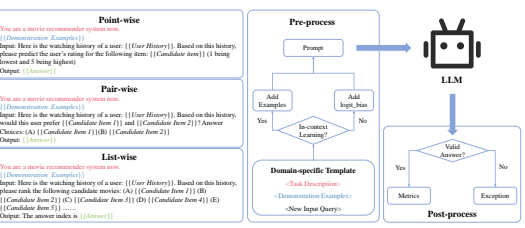
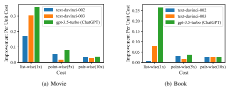
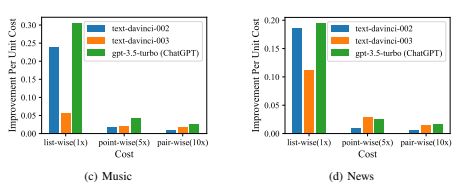
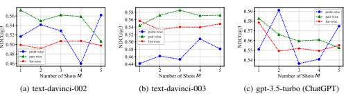
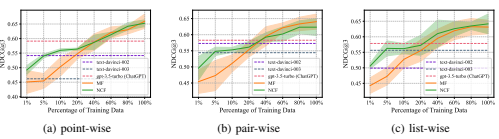

# Uncovering Chatgpt'S Capabilities In Recommender Systems

Sunhao Dai1∗
, Ninglu Shao1∗, Haiyuan Zhao1∗, Weijie Yu2, Zihua Si1**, Chen Xu**1, Zhongxiang Sun1, Xiao Zhang1**, Jun Xu**1†
1Renmin University of China, 2University of International Business and Economics

## Abstract

The debut of ChatGPT has recently attracted the attention of the natural language processing (NLP) community and beyond. Existing studies have demonstrated that ChatGPT shows significant improvement in a range of downstream NLP tasks, but the capabilities and limitations of ChatGPT in terms of recommendations remain unclear. In this study, we aim to conduct an empirical analysis of ChatGPT's recommendation ability from an Information Retrieval (IR) perspective, including point-wise, pair-wise, and list-wise ranking. To achieve this goal, we re-formulate the above three recommendation policies into a domain-specific prompt format. Through extensive experiments on four datasets from different domains, we demonstrate that ChatGPT outperforms other large language models across all three ranking policies. Based on the analysis of unit cost improvements, we identify that ChatGPT with list-wise ranking achieves the best trade-off between cost and performance compared to point-wise and pair-wise ranking. Moreover, ChatGPT shows the potential for mitigating the cold start problem and explainable recommendation. To facilitate further explorations in this area, the full code and detailed original results are open-sourced at https://github.com/rainym00d/LLM4RS.

## 1 Introduction

Recently, Large Language Models (LLMs), such as ChatGPT released by OpenAI, have garnered increasing attention from the natural language processing (NLP) community and beyond. ChatGPT has demonstrated remarkable performances on various NLP tasks, particularly in zero-shot scenarios where no additional training data is provided for downstream tasks [4, 17, 7]. However, despite the popularity of ChatGPT, the boundaries of their capabilities remain unclear to researchers. To fill this gap, previous studies have evaluated ChatGPT (as well as other LLMs) from various aspects of NLP
tasks, including reasoning[2, 25], robustness[37, 5], ethics [43]. Meanwhile, previous research has indicated that pre-trained language models (PLMs) can be directly used for recommendations since some user and item properties are expressed in natural language in public corpora and are learned into PLMs [24, 33, 41]. Hence, a natural research question arises regarding whether LLMs, such as ChatGPT, can also exhibit impressive performance in recommendation. The fundamental goal of recommender systems is to provide a personalized top-K item ranking list for users to reduce information overload [31]. Typically, previous studies have three ways to construct the ranking list : point-wise, pair-wise, and list-wise[20]. Thus, in this paper, we focus on probing large language models for recommendation from these three perspectives. To achieve this goal, we first reformulate the three capabilities in recommender systems into domain-specific prompts as the

∗These authors contribute equally. †Jun Xu is the corresponding author.
input of ChatGPT. We then conduct a preliminary study of ChatGPT and other popular LLMs from OpenAI on four widely-used recommendation benchmarks from different domains. To the best of our knowledge, this is the first empirical study to probe the capabilities of ChatGPT in recommender systems from different ranking perspectives. Major Findings: In summary, we have the following major findings after empirical experiments:
- ChatGPT shows consistent advantages in all three ranking capabilities compared with other LLMs on four domain datsets.

- ChatGPT is good at list-wise and pair-wise ranking while less good at point-wise ranking. - Taking into account the improvements in unit cost, we recommend list-wise ranking for LLM-based recommenders in practice.

- ChatGPT can mitigate the cold start problem as it outperforms traditional recommendation models (e.g. MF and NCF) with limited training data.

- ChatGPT demonstrates the potential for explainable recommendations and exhibits a capacity to really comprehend item similarity.

We hope that this preliminary evaluation of ChatGPT in recommendation can provide new perspectives on both assessing the capabilities of LLMs and utilizing LLMs, such as ChatGPT, to enhance recommender systems.

## 2 Background

#### 2.1 Large Language Models

Pioneering studies [26, 4] demonstrated that LLMs can perform a diverse range of tasks without requiring gradient updates, solely based on textual instructions or a few examples. This has drawn significant attention towards improving the capabilities of LLMs. Previous studies [16] have investigated the performance limits of pre-trained language models (PLMs) by training larger models, as they have noted that augmenting the model or data size typically enhances the model's ability on downstream tasks, such as Megatron-turing NLG [34] with 530B parameters, Gopher [27] with 280B parameters, Ernie 3.0 Titan [38] with 260B parameters, BLOOM [32] with 175B parameters, and PaLM [7] with 540B parameters. These LLMs have exhibited exceptional performance on challenging tasks, showcasing new abilities that were not apparent in smaller pre-trained language models. For a more comprehensive overview of LLMs, we would recommend referring to [42].

#### 2.2 Existing Evaluation Of Llms

To gain a deeper understanding of LLMs' limitations, capabilities bound, and potential risks, previous studies have evaluated LLMs from different aspects on numerous NLP tasks and datasets. BIG- Bench is an open-source benchmark encompassing over 200 tasks across various domains and skills, including reasoning, common sense, creativity, and etc [35]. Holistic Evaluation of Language Models
(HELM) is another living benchmark that aims to improve the transparency of language models covering 16 scenarios and 7 categories of metrics[19]. As ChatGPT continues to gain worldwide popularity, more studies are focusing on evaluating it since it is perhaps one of the strongest LLMs to date. Bang et al. [2] propose to quantitatively evaluate interactive LLMs such as ChatGPT from a multitask, multilingual, and multimodal perspective by analyzing their performance on 8 common NLP tasks. Their study reveals that while ChatGPT performs well on most tasks but may also have limitations and biases in reasoning, hallucination, and interactivity. Qin et al. [25] empirically show that ChatGPT possesses some zero-shot capabilities as a generalist model on 7 NLP tasks and conclude that ChatGPT performs poorly in solving specific tasks such as sequence tagging. Other researchers also do evaluations and case studies on ChatGPT's robustness [37], ethics [43] and its applications in education [21, 12], medicine [1, 28, 3] and law [6]. To the best of our knowledge, there has been no comprehensive study on the application of ChatGPT in recommender systems. Therefore, we conducted an exhaustive evaluation of ChatGPT (as well as other GPT-3.5 series LLMs) on four recommendation domain benchmarks to fill this research gap.

Figure 1: The overall evaluation framework of LLMs for recommendation. The left part demonstrates examples of how prompts are constructed to elicit each of the three ranking capabilities. The right part outlines the process of employing LLMs to perform different ranking tasks and conduct evaluations.

#### 2.3 Language Models For Recommendation

The remarkable success of pre-trained LMs in NLP community has motivated researchers in recommender systems to explore their potential in recommendation tasks. Existing works can be categorized into two types: (i) utilizing LMs training strategies to reformulate and model recommendation tasks, such as BERT4Rec (*masked language modeling*) [36], UnisRec (*pre-train and finetune*)[14], P5
(*pre-train and prompting*) [10] and (ii) using LMs to obtain better representations of users and items as extra features based on textual information [39]. More recently, some researchers have explored leveraging off-the-shelf pre-trained LMs as recommender systems by reformulating the recommendation tasks with prompts as multi-token cloze tasks [41, 33, 24]. In this paper, we aim to conduct a preliminary evaluation of ChatGPT's potential and limitations in recommender systems.

## 3 Probing Chatgpt For Recommendation Capabilities

This section adapts point-wise, pair-wise and list-wise ranking tasks with prompts, enabling off-theshelf LLMs to effectively perform these tasks.

#### 3.1 Three Ranking Capabilities In Recommender Systems

The keystone of personalized recommendation is to rank the candidate items based on users' preferences. To achieve this purpose, current learning-to-rank (LTR) methods empower different capabilities to recommender systems via corresponding loss functions. Specifically, the ranking procedure can be implemented by three different capabilities: point-wise ranking capability, pair-wise ranking capability and list-wise ranking capability[20]. Formally, given a user u ∈ U and k candidate items
{i1, i2, · · · , ik*} ⊂ I*, each user-item pair's representation is encoded as xu,i. Then above three capabilities are formulated as follows:
Definition 1 (point-wise ranking capability). The recommender system learns to predict the preference score of each item i for each user u *via a point-wise scoring function* Φpoint(·):
s(i | u) = Φpoint(xu,i)
The preference score s is then used to rank the items for each user. The common used loss function in point-wise ranking includes mean squared error (MSE) [30] and binary cross entropy (BCE) [13]. Definition 2 (pair-wise ranking capability). The recommender system learns to compare pairs of items im and in for each user u *and predict which item is preferred via a pair-wise scoring function* Φpair(·):
s(im  in | u) = Φpair(xu,im, xu,in)
The system then ranks the items based on the relative preference score s. The pairwise hinge loss [15]
or Bayesian personalized ranking loss (BPR) [29] are the typical loss utilized in pair-wise ranking.

Definition 3 (list-wise ranking capability). The recommender system learns to directly predict the preference score of a list of items {i1, i2, · · · , ik} for each user u *via a list-wise scoring function* Φlist(·):
s(i1 | u), s(i2 | u), · · · , s(ik | u) = Φlist(xu,i1, xu,i2, · · · , xu,ik)
The system then sorts the items based on the predicted scores. The list-wise loss, e.g., sampled softmax loss [9] is employed to optimize the recommendation model.

#### 3.2 Reformulate And Adapt Recommendation With Prompts

To obtain above capabilities of recommendation, current recommendation models employ corresponding loss functions for supervised learning. However, the supervised learning schema often fails in data sparsity scenarios (e.g., cold start problems [11] and long-tailed items [23]). In contrast, LLMs have a stronger generalization capability in these data sparsity scenarios and achieve promising performances in few-shot and even zero-shot tasks. In this empirical study, we assume that LLMs already have the above three capabilities, and all we need to do is to trigger these capabilities through prompt tuning. To this end, we adopt the recent practice of In-Context Learning [4] and Instruction Tuning [8], and we express the aforementioned three capabilities as three tasks. Figure 1 illustrates how we employ prompt tuning to elicit three ranking capabilities from LLMs. As depicted in Figure 1 (left), the prompt of In-Context Learning consists of three components: (i)
Task description I refers to the process of enabling the LLM to comprehend the particular domain in which it is required to perform recommendation tasks. The task description is designed to be domainaware, which enhances LLM's perception of pertinent knowledge. (ii) *Demonstration examples* D = {f(h1, c1, y1), · · · , f(hN , cN , yN )} (i.e., N-shot in-context learning), where h denotes the historical interacted items of a user, c denotes the candidate items which need to be ranked, y denotes the predictions given by LLMs, and f(·) is the function for transforming the examples into designed prompt templates. The demonstration examples facilitate the LLM's comprehension of the current task. (iii) *New input query* of a given user f(h 0, c 0| u), which needs to be answered by LLMs. For three ranking tasks, the corresponding candidate items c are constructed as follows:

$$\mathbf{c}={\begin{cases}\{i\}&\mathbf{f}\\ \{i_{m},i_{n}\}&\mathbf{f}\\ \{i_{1},i_{2},\cdots,i_{k}\}&\mathbf{f}\end{cases}}$$
$\{i\}$ for point-wise ranking capability; $\{i_{m},i_{n}\}$ for pair-wise ranking capability; $\{i_{1},i_{2},\cdots,i_{k}\}$ for list-wise ranking capability;
As depicted in Figure 1 (right), LLMs will utilize the different ranking capabilities elicited through different prompts to make predictions yˆ
0:

$$\hat{y}^{\prime}_{i}=LLM_{\rm point}\left(I,{\cal D},f({\bf h}^{\prime},{\bf c}^{\prime}\mid u)\right),$$ $$\hat{y}^{\prime}_{i_{m}\succ i_{n}}=LLM_{\rm pair}\left(I,{\cal D},f({\bf h}^{\prime},{\bf c}^{\prime}\mid u)\right),$$ $$\hat{y}^{\prime}_{i_{1}},\hat{y}^{\prime}_{i_{2}},\cdots,\hat{y}^{\prime}_{i_{k}}=LLM_{\rm list}\left(I,{\cal D},f({\bf h}^{\prime},{\bf c}^{\prime}\mid u)\right).$$

Then the output answer will be checked manually, and the valid answers will be utilized for further evaluation, while the invalid answers will be excluded. Please refer to the Appendix A for more details and examples of prompts.

## 4 Experiments

In this section, we conduct experiments to evaluate ChatGPT and GPT-3.5s to answer the following research questions: RQ1: How do these LLMs perform on different ranking capabilities across various domains? RQ2: How much cost of these LLMs-based recommenders on different ranking capabilities? RQ3: Can off-the-shelf LLMs-based recommenders work with zero-shot prompts? RQ4: How does the number of prompt shots affect the performance of LLMs-based recommenders?

RQ5: How do the LLMs-based recommenders compare with traditional collaborative filtering methods?

| Domain   | Metric          | random        | pop   |             | text\-davinci\-002   |            |                 | text\-davinci\-003   |            |                 | gpt\-3.5\-turbo (ChatGPT)   |            |
|----------|-----------------|---------------|-------|-------------|----------------------|------------|-----------------|----------------------|------------|-----------------|-----------------------------|------------|
|          |                 |               |       | point\-wise | pair\-wise           | list\-wise | point\-wise     | pair\-wise           | list\-wise | point\-wise     | pair\-wise                  | list\-wise |
| Movie    | Compliance Rate | \-            | \-    | 100.00%     | 100.00%              | 100.00%    | 100.00%         | 100.00%              | 100.00%    | 100.00%         | 99.98%                      | 100.00%    |
|          | NDCG@1          | 0.2000 0.2240 |       | 0.3110      | 0.3203               | 0.2600     | 0.2259          | 0.2843               | 0.3260     | 0.3342          | 0.3230                      | 0.3320     |
|          | NDCG@3          | 0.4262 0.4761 |       | 0.5416      | 0.5728               | 0.4990     | 0.4618          | 0.5441               | 0.5564     | 0.5912          | 0.5827                      | 0.5785     |
|          | MRR@3           | 0.3667 0.4103 |       | 0.4824      | 0.5071               | 0.4363     | 0.3998          | 0.4763               | 0.4950     | 0.5260          | 0.5162                      | 0.5167     |
| Book     | Compliance Rate | \-            | \-    | 99.96%      | 100.00%              | 100.00%    | 100.00%         | 100.00%              | 100.00%    | 100.00%         | 99.98%                      | 99.80%     |
|          | NDCG@1          | 0.2000 0.2440 |       | 0.2420      | 0.2847               | 0.2000     | 0.2325          | 0.2887               | 0.2440     | 0.2823          | 0.3061                      | 0.3126     |
|          | NDCG@3          | 0.4262 0.4999 |       | 0.4889      | 0.5298               | 0.4290     | 0.4585          | 0.5293               | 0.4597     | 0.5075          | 0.5350                      | 0.5395     |
|          | MRR@3           | 0.3667 0.4340 |       | 0.4247      | 0.4646               | 0.3690     | 0.3993          | 0.4665               | 0.4040     | 0.4495          | 0.4774                      | 0.4800     |
| Music    | Compliance Rate | \-            | \-    | 100.00%     | 100.00%              |            | 100.00% 100.00% | 100.00%              |            | 100.00% 100.00% | 99.96%                      | 99.80%     |
|          | NDCG@1          | 0.2000 0.1780 |       | 0.2354      | 0.2397               | 0.2300     | 0.2377          | 0.2690               | 0.2540     | 0.2892          | 0.3077                      | 0.3086     |
|          | NDCG@3          | 0.4262 0.4094 |       | 0.4623      | 0.4681               | 0.4277     | 0.4732          | 0.5072               | 0.4506     | 0.5201          | 0.5439                      | 0.5567     |
|          | MRR@3           | 0.3667 0.3470 |       | 0.4030      | 0.4082               | 0.3750     | 0.4113          | 0.4448               | 0.4000     | 0.4605          | 0.4830                      | 0.4950     |
| News     | Compliance Rate | \-            | \-    | 99.80%      | 100.00%              |            | 100.00% 100.00% | 100.00%              |            | 100.00% 100.00% | 100.00%                     | 99.60%     |
|          | NDCG@1          | 0.2000 0.3080 |       | 0.2183      | 0.2200               | 0.2920     | 0.2532          | 0.2630               | 0.2540     | 0.2591          | 0.2491                      | 0.2892     |
|          | NDCG@3          | 0.4262 0.5444 |       | 0.4483      | 0.4550               | 0.5059     | 0.4880          | 0.4892               | 0.4742     | 0.4826          | 0.4991                      | 0.5094     |
|          | MRR@3           | 0.3667 0.4840 |       | 0.3879      | 0.3936               | 0.4497     | 0.4271          | 0.4294               | 0.4173     | 0.4246          | 0.4354                      | 0.4515     |

Table 1: Overall performance of different models on four datasets from different domains. Bold indicates the best result for each row and '_' indicates the best result for each LLM. 'random' denotes recommendation based on a random policy. 'pop' denotes recommendation based on items' popularity judged by the number of interactions.

#### 4.1 Experimental Settings 4.1.1 Datasets

To better probe the different capabilities of ChatGPT and GPT-3.5s on personalized recommendation, we conducted evaluations on datasets from four different domains.

Movie: We use the widely-adopted MovieLens-1M3 dataset that contains 1M user ratings for movies. Book: We use the "Books" subset of Amazon4 dataset that contains user ratings for books.

Music: We use the "CDs & Vinyl" subset of Amazon4to conduct experiments on the music domain.

News: We use the MIND-small5 dataset as the benchmark for news domain.

Following the common practices [13, 22, 40], for the Movie, Book, and Music datasets, we treat ratings above 3 as positive feedbacks (labeled as 1) and otherwise as negative feedbacks (labeled as 0). For the News dataset, we used the original binary feedback labels. In the experiments, we use the titles of the items as description in the prompt.

#### 4.1.2 Evaluation Protocols

After processing, we random sample 500 records on each dataset for evaluation due to the expensive cost. For all experiments, we pair one positive item with four randomly sampled negative items as the candidate item list. We set the number of shots as 1 for pair-wise and list-wise, and 2 for point-wise.

Commonly used ranking metrics are reported, including *Normalized Discounted Cumulative Gain* (NDCG) and *Mean Reciprocal Rank* (MRR). We report NDCG with k = 1, 3 and MRR with k = 3.

Note that only one positive item is considered in each case, so NDCG@1 and MRR@1 are equal and only NDCG@1 is reported. Furthermore, considering that LLMs may generate some illegal output, that is, results that are not in the candidate set, we introduce the metric "Compliance Rate" to compare the compliance rates between different models. The calculation method is the proportion of the number of valid results generated to all test samples, i.e., 
Number of Valid Answers Number of Test Samples 
.

#### 4.2 Rq1: Main Results

Table 1 shows the main result of different LLMs on four different domain datasets. We have the following observation and conclusions:
- **ChatGPT and GPT3.5s performed much better than the random recommendation in**
almost all cases. Specifically, all three LLMs achieve significant improvements than the

3https://grouplens.org/datasets/movielens/1m/ 4http://jmcauley.ucsd.edu/data/amazon/ 5https://msnews.github.io/

|        | datasets from different domains.   |                                       |                                       |
|--------|------------------------------------|---------------------------------------|---------------------------------------|
| Domain | text\-davinci\-002                 | text\-davinci\-003                    | gpt\-3.5\-turbo (ChatGPT)             |
| Movie  | pair\-wise > point\-wise  list\-wise                                    | list\-wise ≈ pair\-wise  point\-wise                                       | point\-wise > pair\-wise ≈ list\-wise |
| Book   | pair\-wise  point\-wise  list\-wise                                    | pair\-wise  list\-wise ≈ point\-wise                                       | list\-wise > pair\-wise  point\-wise                                       |
| Music  | pair\-wise > point\-wise  list\-wise                                    | pair\-wise  point\-wise  list\-wise                                       | list\-wise > pair\-wise  point\-wise                                       |
| News   | list\-wise  pair\-wise ≈ point\-wise                                    | pair\-wise ≈ point\-wise > list\-wise | list\-wise > pair\-wise > point\-wise |

Table 2: Rank of different capabilities of different LLMs-based recommendation models on four

random recommendation policy on four domains, e.g., 45.18% improvements on the pointwise task in terms of *NDCG*@1 on the Movie Dataset. Additionally, most answers of LLMs are compliant due to the capability of in-context learning. These results reveal that LLMs have the potential to facilitate recommender systems.

- **ChatGPT has shown superior performance under the same ranking setting across**
four datasets. In comparison to the text-davinci-002 and text-davinci-003 models, ChatGPT exhibits better performance on almost all evaluation metrics for all three ranking capabilities. For instance, ChatGPT outperformed the other models in 35 out of 36 comparisons, including three ranking metrics, three wises, and four domain datasets. The only exception was the NDCG@1 metric for list-wise ranking on the news domain.

- **ChatGPT performs better with list-wise ranking except in the movie domain. On**
the other hand, text-davinci-002 and text-davinci-003 perform better with pair-wise ranking in most cases. To provide a clear comparison, we have summarized the ranking of the three LLMs with different ranking capabilities in Table 2. Note that pair-wise ranking tends to be better than point-wise ranking in most cases (11 out of 12), although it requires more inference cost due to the need for pair-wise comparisons. We will delve deeper into the cost analysis in RQ2.

- **All LLMs-based recommenders outperform the popularity recommendantion policy**
in recommending movies, books, and music, but they underperform in the news domain. This phenomenon could be explained by the fact that news recommendation relies more on popularity, while other domains are more personalized. The speed of news delivery is another possible factor. Due to the time-sensitive and rapidly changing nature of news recommendation, there is often insufficient interaction data available for each news in the LLMs training corpus. Conversely, in the other three domains, the item descriptions and interaction data are more abundant, making LLMs works better on them. Overall, this observation suggests that while off-the-shelf LLMs-based recommenders can be effective in many domains, they may not be suitable for some domain and require further exploration.

#### 4.3 Rq2: Performance Scaling By Cost

Although the LLMs have better performance on pair-wise or list-wise ranking as presented in Table 1, we need to consider the costs associated with these performance improvements. Specifically, we calculate the improvement per unit cost for each LLM:
VLLM−*Vrandom* Vrandom costLLM, where VLLM denotes the metric value of the LLM, V*random* denotes the metric value of random recommendation, costLLM
denotes the cost of ranking one user's candidate item list. Referring to Figure 1 (left), let us define the costLLM. For list-wise ranking, only one prompt input is needed to obtain LLM's ranking for all candidate items. For point-wise ranking, N prompt inputs are required to obtain LLM's ranking for all candidate items (where N is the number of candidate items). For pair-wise ranking, N(N−1)
2 prompt inputs are required to obtain all ranking results. In our experimental settings, N is set to 5. The costs of point-wise, pair-wise, and list-wise ranking are denoted as 5x, 10x and 1x, respectively. Figure 2 demonstrates the improvement per unit cost of each LLMs. It can be found that almost all three LLMs has the best improvement per unit cost in list-wise ranking, except text-davinci-002 on the Book dataset. Moreover, point-wise ranking and pair-wise ranking have similar improvement per unit cost. Although pair-wise ranking may achieve better performance than point-wise ranking in absolute metrics, the requirement to run multiple prompts for pair-wise ranking results in additional cost. Overall, we recommend to conduct list-wise ranking for recommendation tasks in practice, due to its decent performance and lower cost.

Figure 2: Improvement of *NDCG*@3 per unit cost and five shots examples on four datasets. '1x 5x 10x' denote the cost of list-wise, point-wise, and pair-wise, respectively.

| Model                     | Metric   | random   |        | point\-wise   |           | pair\-wise   |           | list\-wise   |           |
|---------------------------|----------|----------|--------|---------------|-----------|--------------|-----------|--------------|-----------|
|                           |          |          | pop    | zero\-shot    | few\-shot | zero\-shot   | few\-shot | zero\-shot   | few\-shot |
| text\-davinci\-002        | NDCG@1   | 0.2000   | 0.2240 | 0.2659        | 0.3110    | 0.2913       | 0.3203    | 0.2320       | 0.2600    |
|                           | NDCG@3   | 0.4264   | 0.4761 | 0.5168        | 0.5416    | 0.5253       | 0.5728    | 0.4544       | 0.4990    |
|                           | MRR@3    | 0.3667   | 0.4103 | 0.4519        | 0.4824    | 0.4643       | 0.5071    | 0.3950       | 0.4363    |
| text\-davinci\-003        | NDCG@1   | 0.2000   | 0.2240 | 0.2458        | 0.2259    | 0.2903       | 0.2843    | 0.2660       | 0.3260    |
|                           | NDCG@3   | 0.4264   | 0.4761 | 0.4674        | 0.4618    | 0.5249       | 0.5441    | 0.5062       | 0.5564    |
|                           | MRR@3    | 0.3667   | 0.4103 | 0.4092        | 0.3998    | 0.4633       | 0.4763    | 0.4450       | 0.4950    |
| gpt\-3.5\-turbo (ChatGPT) | NDCG@1   | 0.2000   | 0.2240 | 0.2796        | 0.3342    | 0.3457       | 0.3230    | \-           | 0.3320    |
|                           | NDCG@3   | 0.4264   | 0.4761 | 0.5413        | 0.5912    | 0.5833       | 0.5827    | \-           | 0.5785    |
|                           | MRR@3    | 0.3667   | 0.4103 | 0.4742        | 0.5260    | 0.5243       | 0.5162    | \-           | 0.5167    |

Table 3: Performance of LLMs with zero-shot and few-shot examples on Movie dataset. Bold indicates the best result for each row and '_' indicates the best result for each wise of each LLM.

#### 4.4 Rq3: Performance Of Zero-Shot Prompts

A natural question on the off-the-shelf LLMs for recommendation is whether LLMs can work without examples (i.e., M = 0). However, with the original 0-shot learning approach, we found that more than 50% of cases were invalid and difficult to evaluate in practice. Fortunately, OpenAI provides an API6that allows us to control the logits bias of output tokens. We were able to upweight the logit bias of the indexes of answers, which improved the compliance rate. For instance, for pair-wise ranking, we increased the probabilities of both outputs 'A' and 'B' by the same magnitude, while ensuring that their relative order remains unchanged. Under this setting, we conduct the zero-shot example experiments7and the results are shown in Table 3. These findings demonstrate the potential of LLMs as recommendation systems, as they perform better than a random policy and a popularity-

6https://platform.openai.com/docs/api-reference/completions/create#completions/
create-logit_bias 7In the zero-shot experiment, valid outputs are derived by manipulating the 'logits_bias' and 'top_p' parameters of the API. However, it should be noted that due to a limitation in gpt-3.5-turbo's control over the 'top_p' parameter, there are currently no available experimental results in this regard.

Figure 3: Impact of the number of shots prompts in LLMs on Movie dataset.

Figure 4: Comparison with Collaborative Filtering Models in terms of different percentages of training data on Movie dataset. The shaded area indicates the 95% confidence intervals of t-distribution.

based policy under the zero-shot setting. Furthermore, as expected, LLMs under few-shot settings outperform those under zero-shot settings in most cases, demonstrating the effectiveness of few-shot prompts in-context learning.

#### 4.5 Rq4: Performance Under Different Shots Examples

Previous studies in NLP have emphasized that the number of examples M is important for in-context learning. To assess the impact of M in LLMs for recommendation, we conducted experiments on Movie dataset by varying M from 1 to 5. Figure 3 illustrates the performances of different M
in terms of *NDCG*@3 of ChatGPT and GPT3.5s. Surprisingly, we observe that the best results did not always correspond to the maximum number of examples. One possible explanation is that while more example shots can provide more context and information for LLMs to understand the recommendation task, they may also introduce more noise, causing LLMs to learn unhelpful patterns. Therefore, the optimal number of prompt shots may depend on the specific LLM, task, and dataset.

#### 4.6 Rq5: Comparison With Collaborative Filtering Models

Given that the LLMs used in the previous experiments were not trained on recommendation data, we investigate the amount of training data required for traditional recommendation models to achieve performance comparable to or better than LLMs. Specifically, we chose the most representative traditional recommendation models, Matrix Factorization (MF) [18] as well as Neural Collaborative Filtering (NCF) [13], and evaluated their performance after training on varying proportions of data. We then compared their performance to that of LLMs. All experiments are conducted 5 times on the Movie dataset, and the averaged results and their 95% confidence intervals of *NDCG*@3 were illustrated in Figure 4. As expected, the performance of MF and NCF improves with increasing amounts of training data. Also, we can observe that off-the-shelf LLM-based models outperform MF and NCF when there are only a few training data available, i.e., less than 40% for ChatGPT with all three ranking capabilities. Note that LLM-based recommendation models do not require training data but rather a few samples (no more than 5 in our experiments) in the prompt to help understand the recommendation task. Therefore, we conclude that LLM-based recommendation models can be applied in practice to mitigate the cold start problem.

Case 1 You are a movie recommender system now.

{{*Examples*}} Input: Here is the watching history of a user: Aliens, E.T. the Extra-Terrestrial, Contact, The Matrix, X-Men. Based on this history, would this user prefer The Fox and the Hound or Steamboat Willie? Answer Choices: (A) The Fox and the Hound (B) Steamboat Willie Output: The answer index is N/A as neither option is relevant to the user's watching history.

Case 2 You are a book recommender system now.

{{*Examples*}}
Input: Here is the reading history of a user: The Cellist of Sarajevo, After I'm Gone: A Novel, The Reason I Jump: The Inner Voice of a Thirteen-Year-Old Boy with Autism, The Serpent of Venice: A Novel, We Are All Completely Beside Ourselves: A Novel. Based on this history, would this user prefer The Secret Life of Bees or The Help? Answer Choices: (A) The Secret Life of Bees (B) The Help Output: The answer index is N/A. It is difficult to determine the user's preference based on this reading history as neither book is similar in genre or theme to the books they have read.

#### 4.7 Case Study Of Exceptions

It is worth noting that the LLM may generate some invalid answers even under few-shot in-context learning, leading to a compliance rate may be less than 100%, as shown in Table 1. For instance, Table 4 highlights two exceptional cases of answers from ChatGPT with pair-wise ranking, where both cases lack a correct answer because they are the pair of two negative samples. Surprisingly, ChatGPT does not simply respond with 'A' or 'B' as seen in the in-context learning examples. Instead, it recognizes that these two items are unrelated and not similar to the user history interactions. For example, in case 1, the user watching histories are all science fiction movies but the answer choices are all cartoons. These responses demonstrate that ChatGPT can understand how to recommend based on the user interaction histories and what is the similarity between items. However, limited by our existing evaluation methods, these answers are considered non-compliant. Therefore, we suggest exploring additional perspectives for evaluating LLMs as recommenders beyond learning to rank, as LLMs have the potential to play a larger role in explainable recommendation.

### 5 Conclusion

In this paper, we conduct a preliminary evaluation for probing off-the-shelf LLMs for recommendation from the point-wise, pair-wise, and list-wise perspectives. Specifically, we reformulate the above ranking capabilities into corresponding domain-aware prompts and evaluate the performance of ChatGPT in each ranking capability on different domains. The results on four datasets indicate the superiority of ChatGPT in few-shot/zero-shot recommendations among all three ranking capabilities.

We also observe that LLMs excel at list-wise and pair-wise ranking, but are not proficient in pointwise ranking in most cases. Furthermore, ChatGPT shows the potential for mitigating the cold start problem and explainable recommendation. While we have explored the ranking capabilities of ChatGPT in various domains, there are still some limitations that need further investigation. For instance, there are still research questions about how ChatGPT can better integrate with existing recommendation models and how it can be better calibrated to incorporate users' feedback data. This work points to new research possibilities.

## References

[1] Fares Antaki, Samir Touma, Daniel Milad, Jonathan El-Khoury, and Renaud Duval. 2023.

Evaluating the performance of chatgpt in ophthalmology: An analysis of its successes and shortcomings. *medRxiv* (2023), 2023–01.

[2] Yejin Bang, Samuel Cahyawijaya, Nayeon Lee, Wenliang Dai, Dan Su, Bryan Wilie, Holy Lovenia, Ziwei Ji, Tiezheng Yu, Willy Chung, et al. 2023. A multitask, multilingual, multimodal evaluation of chatgpt on reasoning, hallucination, and interactivity. arXiv preprint arXiv:2302.04023 (2023).

[3] James RA Benoit. 2023. ChatGPT for Clinical Vignette Generation, Revision, and Evaluation.

medRxiv (2023), 2023–02.

[4] Tom Brown, Benjamin Mann, Nick Ryder, Melanie Subbiah, Jared D Kaplan, Prafulla Dhariwal, Arvind Neelakantan, Pranav Shyam, Girish Sastry, Amanda Askell, et al. 2020. Language models are few-shot learners. *Advances in neural information processing systems* 33 (2020),
1877–1901.

[5] Xuanting Chen, Junjie Ye, Can Zu, Nuo Xu, Rui Zheng, Minlong Peng, Jie Zhou, Tao Gui, Qi Zhang, and Xuanjing Huang. 2023. How Robust is GPT-3.5 to Predecessors? A Comprehensive Study on Language Understanding Tasks. *arXiv preprint arXiv:2303.00293* (2023).

[6] Jonathan H Choi, Kristin E Hickman, Amy Monahan, and Daniel Schwarcz. 2023. Chatgpt goes to law school. *Available at SSRN* (2023).

[7] Aakanksha Chowdhery, Sharan Narang, Jacob Devlin, Maarten Bosma, Gaurav Mishra, Adam Roberts, Paul Barham, Hyung Won Chung, Charles Sutton, Sebastian Gehrmann, et al. 2022. Palm: Scaling language modeling with pathways. *arXiv preprint arXiv:2204.02311* (2022).

[8] Hyung Won Chung, Le Hou, Shayne Longpre, Barret Zoph, Yi Tay, William Fedus, Eric Li, Xuezhi Wang, Mostafa Dehghani, Siddhartha Brahma, et al. 2022. Scaling instruction-finetuned language models. *arXiv preprint arXiv:2210.11416* (2022).

[9] Paul Covington, Jay Adams, and Emre Sargin. 2016. Deep Neural Networks for YouTube Recommendations. In Proceedings of the 10th ACM Conference on Recommender Systems, Boston, MA, USA, September 15-19, 2016, Shilad Sen, Werner Geyer, Jill Freyne, and Pablo Castells (Eds.). ACM, 191–198. https://doi.org/10.1145/2959100.2959190
[10] Shijie Geng, Shuchang Liu, Zuohui Fu, Yingqiang Ge, and Yongfeng Zhang. 2022. Recommendation as language processing (rlp): A unified pretrain, personalized prompt & predict paradigm
(p5). In *Proceedings of the 16th ACM Conference on Recommender Systems*. 299–315.

[11] Jyotirmoy Gope and Sanjay Kumar Jain. 2017. A survey on solving cold start problem in recommender systems. In 2017 International Conference on Computing, Communication and Automation (ICCCA). IEEE, 133–138.

[12] Biyang Guo, Xin Zhang, Ziyuan Wang, Minqi Jiang, Jinran Nie, Yuxuan Ding, Jianwei Yue, and Yupeng Wu. 2023. How Close is ChatGPT to Human Experts? Comparison Corpus, Evaluation, and Detection. *arXiv preprint arXiv:2301.07597* (2023).

[13] Xiangnan He, Lizi Liao, Hanwang Zhang, Liqiang Nie, Xia Hu, and Tat-Seng Chua. 2017.

Neural collaborative filtering. In Proceedings of the 26th international conference on world wide web. 173–182.

[14] Yupeng Hou, Shanlei Mu, Wayne Xin Zhao, Yaliang Li, Bolin Ding, and Ji-Rong Wen. 2022. Towards Universal Sequence Representation Learning for Recommender Systems. In Proceedings of the 28th ACM SIGKDD Conference on Knowledge Discovery and Data Mining. 585–593.

[15] Thorsten Joachims. 2002. Optimizing Search Engines Using Clickthrough Data. In Proceedings of the Eighth ACM SIGKDD International Conference on Knowledge Discovery and Data Mining (Edmonton, Alberta, Canada) *(KDD '02)*. Association for Computing Machinery, New York, NY, USA, 133–142. https://doi.org/10.1145/775047.775067
[16] Jared Kaplan, Sam McCandlish, Tom Henighan, Tom B Brown, Benjamin Chess, Rewon Child, Scott Gray, Alec Radford, Jeffrey Wu, and Dario Amodei. 2020. Scaling laws for neural language models. *arXiv preprint arXiv:2001.08361* (2020).

[17] Takeshi Kojima, Shixiang Shane Gu, Machel Reid, Yutaka Matsuo, and Yusuke Iwasawa. 2022.

Large language models are zero-shot reasoners. *arXiv preprint arXiv:2205.11916* (2022).

[18] Yehuda Koren, Robert Bell, and Chris Volinsky. 2009. Matrix factorization techniques for recommender systems. *Computer* 42, 8 (2009), 30–37.

[19] Percy Liang, Rishi Bommasani, Tony Lee, Dimitris Tsipras, Dilara Soylu, Michihiro Yasunaga, Yian Zhang, Deepak Narayanan, Yuhuai Wu, Ananya Kumar, et al. 2022. Holistic evaluation of language models. *arXiv preprint arXiv:2211.09110* (2022).

[20] Tie-Yan Liu et al. 2009. Learning to rank for information retrieval. *Foundations and Trends®*
in Information Retrieval 3, 3 (2009), 225–331.

[21] Muneer M Alshater. 2022. Exploring the role of artificial intelligence in enhancing academic performance: A case study of ChatGPT. *Available at SSRN* (2022).

[22] Kelong Mao, Jieming Zhu, Jinpeng Wang, Quanyu Dai, Zhenhua Dong, Xi Xiao, and Xiuqiang He. 2021. SimpleX: A simple and strong baseline for collaborative filtering. In Proceedings of the 30th ACM International Conference on Information & Knowledge Management. 1243–
1252.

[23] Yoon-Joo Park and Alexander Tuzhilin. 2008. The long tail of recommender systems and how to leverage it. In *Proceedings of the 2008 ACM conference on Recommender systems*. 11–18.

[24] Gustavo Penha and Claudia Hauff. 2020. What does bert know about books, movies and music?

probing bert for conversational recommendation. In *Proceedings of the 14th ACM Conference* on Recommender Systems. 388–397.

[25] Chengwei Qin, Aston Zhang, Zhuosheng Zhang, Jiaao Chen, Michihiro Yasunaga, and Diyi Yang. 2023. Is ChatGPT a General-Purpose Natural Language Processing Task Solver? arXiv preprint arXiv:2302.06476 (2023).

[26] Alec Radford, Jeffrey Wu, Rewon Child, David Luan, Dario Amodei, and Ilya Sutskever. [n. d.].

Language Models are Unsupervised Multitask Learners. ([n. d.]).

[27] Jack W Rae, Sebastian Borgeaud, Trevor Cai, Katie Millican, Jordan Hoffmann, Francis Song, John Aslanides, Sarah Henderson, Roman Ring, Susannah Young, et al. 2021. Scaling language models: Methods, analysis & insights from training gopher. *arXiv preprint arXiv:2112.11446*
(2021).

[28] Arya S Rao, John Kim, Meghana Kamineni, Michael Pang, Winston Lie, and Marc Succi. 2023.

Evaluating ChatGPT as an adjunct for radiologic decision-making. *medRxiv* (2023), 2023–02.

[29] Steffen Rendle, Christoph Freudenthaler, Zeno Gantner, and Lars Schmidt-Thieme. 2009. BPR:
Bayesian personalized ranking from implicit feedback. In Proceedings of the Twenty-Fifth Conference on Uncertainty in Artificial Intelligence. 452–461.

[30] Steffen Rendle, Zeno Gantner, Christoph Freudenthaler, and Lars Schmidt-Thieme. 2011.

Fast context-aware recommendations with factorization machines. In Proceeding of the 34th International ACM SIGIR Conference on Research and Development in Information Retrieval, SIGIR 2011, Beijing, China, July 25-29, 2011, Wei-Ying Ma, Jian-Yun Nie, Ricardo Baeza- Yates, Tat-Seng Chua, and W. Bruce Croft (Eds.). ACM, 635–644. https://doi.org/10. 1145/2009916.2010002
[31] Paul Resnick and Hal R Varian. 1997. Recommender systems. *Commun. ACM* 40, 3 (1997),
56–58.

[32] Teven Le Scao, Angela Fan, Christopher Akiki, Ellie Pavlick, Suzana Ilic, Daniel Hesslow, ´
Roman Castagné, Alexandra Sasha Luccioni, François Yvon, Matthias Gallé, et al. 2022. Bloom:
A 176b-parameter open-access multilingual language model. *arXiv preprint arXiv:2211.05100* (2022).

[33] Damien Sileo, Wout Vossen, and Robbe Raymaekers. 2022. Zero-Shot Recommendation as Language Modeling. In Advances in Information Retrieval: 44th European Conference on IR
Research, ECIR 2022, Stavanger, Norway, April 10–14, 2022, Proceedings, Part II. Springer, 223–230.

[34] Shaden Smith, Mostofa Patwary, Brandon Norick, Patrick LeGresley, Samyam Rajbhandari, Jared Casper, Zhun Liu, Shrimai Prabhumoye, George Zerveas, Vijay Korthikanti, et al. 2022.

Using deepspeed and megatron to train megatron-turing nlg 530b, a large-scale generative language model. *arXiv preprint arXiv:2201.11990* (2022).

[35] Aarohi Srivastava, Abhinav Rastogi, Abhishek Rao, Abu Awal Md Shoeb, Abubakar Abid, Adam Fisch, Adam R Brown, Adam Santoro, Aditya Gupta, Adrià Garriga-Alonso, et al. 2022.

Beyond the imitation game: Quantifying and extrapolating the capabilities of language models. arXiv preprint arXiv:2206.04615 (2022).

[36] Fei Sun, Jun Liu, Jian Wu, Changhua Pei, Xiao Lin, Wenwu Ou, and Peng Jiang. 2019.

BERT4Rec: Sequential recommendation with bidirectional encoder representations from transformer. In *Proceedings of the 28th ACM international conference on information and knowledge* management. 1441–1450.

[37] Jindong Wang, Xixu Hu, Wenxin Hou, Hao Chen, Runkai Zheng, Yidong Wang, Linyi Yang, Haojun Huang, Wei Ye, Xiubo Geng, et al. 2023. On the Robustness of ChatGPT: An Adversarial and Out-of-distribution Perspective. *arXiv preprint arXiv:2302.12095* (2023).

[38] Shuohuan Wang, Yu Sun, Yang Xiang, Zhihua Wu, Siyu Ding, Weibao Gong, Shikun Feng, Junyuan Shang, Yanbin Zhao, Chao Pang, Jiaxiang Liu, Xuyi Chen, Yuxiang Lu, Weixin Liu, Xi Wang, Yangfan Bai, Qiuliang Chen, Li Zhao, Shiyong Li, Peng Sun, Dianhai Yu, Yanjun Ma, Hao Tian, Hua Wu, Tian Wu, Wei Zeng, Ge Li, Wen Gao, and Haifeng Wang. 2021. ERNIE 3.0 Titan: Exploring Larger-scale Knowledge Enhanced Pre-training for Language Understanding and Generation. arXiv:2112.12731 [cs.CL]
[39] Chuhan Wu, Fangzhao Wu, Tao Qi, and Yongfeng Huang. 2021. Empowering news recommendation with pre-trained language models. In Proceedings of the 44th International ACM SIGIR
Conference on Research and Development in Information Retrieval. 1652–1656.

[40] Chen Xu, Jun Xu, Xu Chen, Zhenghua Dong, and Ji-Rong Wen. 2022. Dually Enhanced Propensity Score Estimation in Sequential Recommendation. In Proceedings of the 31st ACM
International Conference on Information & Knowledge Management. 2260–2269.

[41] Yuhui Zhang, Hao Ding, Zeren Shui, Yifei Ma, James Zou, Anoop Deoras, and Hao Wang.

2021. Language models as recommender systems: Evaluations and limitations. (2021).

[42] Wayne Xin Zhao, Kun Zhou, Junyi Li, Tianyi Tang, Xiaolei Wang, Yupeng Hou, Yingqian Min, Beichen Zhang, Junjie Zhang, Zican Dong, Yifan Du, Chen Yang, Yushuo Chen, Zhipeng Chen, Jinhao Jiang, Ruiyang Ren, Yifan Li, Xinyu Tang, Zikang Liu, Peiyu Liu, Jian-Yun Nie, and Ji-Rong Wen. 2023. A Survey of Large Language Models. arXiv:2303.18223 [cs.CL]
[43] Terry Yue Zhuo, Yujin Huang, Chunyang Chen, and Zhenchang Xing. 2023. Exploring ai ethics of chatgpt: A diagnostic analysis. *arXiv preprint arXiv:2301.12867* (2023).

## A Example Results

The red, blue, black and green indicate task description, demonstration example, new Input query to LLMs and answer returned by LLMs, respectively. Moreover, the **bold** indicates the ground truth and
'_' indicates the position of ground truth in answer. The full result can be viewed at here.

#### A.1 Text-Davinci-002 With Point-Wise A.1.1 Movie

- You are a movie recommender system now.

Input: Here is the watching history of a user: Gattaca, Armageddon, Big, Babes in Toyland, Gladiator. Based on this history, please predict the user's rating for the following item: Star Wars: Episode I - The Phantom Menace (1 being lowest and 5 being highest)
Output: 1. Input: Here is the watching history of a user: The Virgin Suicides, Goya in Bordeaux, Snow Falling on Cedars, Gladiator, Hamlet. Based on this history, please predict the user's rating for the following item: The Last September (1 being lowest and 5 being highest) Output: 5. Input: Here is the watching history of a user: The Green Mile, Sling Blade, A River Runs Through It, Donnie Brasco, Sleepers. Based on this history, please predict the user's rating for the following item: American Beauty (1 being lowest and 5 being highest) Output: 5.

- You are a movie recommender system now.

Input: Here is the watching history of a user: Gattaca, Armageddon, Big, Babes in Toyland, Gladiator. Based on this history, please predict the user's rating for the following item: Star Wars: Episode I - The Phantom Menace (1 being lowest and 5 being highest)
Output: 1. Input: Here is the watching history of a user: The Virgin Suicides, Goya in Bordeaux, Snow Falling on Cedars, Gladiator, Hamlet. Based on this history, please predict the user's rating for the following item: The Last September (1 being lowest and 5 being highest) Output: 5. Input: Here is the watching history of a user: The Man with the Golden Gun, Jaws, A Close Shave, When Harry Met Sally..., Awakenings. Based on this history, please predict the user's rating for the following item: Shine (1 being lowest and 5 being highest) Output: 5.

- You are a movie recommender system now.

Input: Here is the watching history of a user: Gattaca, Armageddon, Big, Babes in Toyland, Gladiator. Based on this history, please predict the user's rating for the following item: Star Wars: Episode I - The Phantom Menace (1 being lowest and 5 being highest)
Output: 1. Input: Here is the watching history of a user: The Virgin Suicides, Goya in Bordeaux, Snow Falling on Cedars, Gladiator, Hamlet. Based on this history, please predict the user's rating for the following item: The Last September (1 being lowest and 5 being highest) Output: 5. Input: Here is the watching history of a user: The Virgin Suicides, Mission to Mars, Requiem for a Dream, Hamlet, Space Cowboys. Based on this history, please predict the user's rating for the following item: Almost Famous (1 being lowest and 5 being highest) Output: 4.

- You are a movie recommender system now.

Input: Here is the watching history of a user: Gattaca, Armageddon, Big, Babes in Toyland, Gladiator. Based on this history, please predict the user's rating for the following item: Star Wars: Episode I - The Phantom Menace (1 being lowest and 5 being highest)
Output: 1.

Input: Here is the watching history of a user: The Virgin Suicides, Goya in Bordeaux, Snow Falling on Cedars, Gladiator, Hamlet. Based on this history, please predict the user's rating for the following item: The Last September (1 being lowest and 5 being highest) Output: 5. Input: Here is the watching history of a user: The Player, Spanking the Monkey, The Grifters, The Truman Show, Rosemary's Baby. Based on this history, please predict the user's rating for the following item: Disturbing Behavior (1 being lowest and 5 being highest) Output: 3.

- You are a movie recommender system now.

Input: Here is the watching history of a user: Gattaca, Armageddon, Big, Babes in Toyland, Gladiator. Based on this history, please predict the user's rating for the following item: Star Wars: Episode I - The Phantom Menace (1 being lowest and 5 being highest)
Output: 1. Input: Here is the watching history of a user: The Virgin Suicides, Goya in Bordeaux, Snow Falling on Cedars, Gladiator, Hamlet. Based on this history, please predict the user's rating for the following item: The Last September (1 being lowest and 5 being highest) Output: 5. Input: Here is the watching history of a user: Star Wars: Episode V - The Empire Strikes Back, The Last Emperor, Platoon, Glory, Full Metal Jacket. Based on this history, please predict the user's rating for the following item: Missing in Action 2: The Beginning (1 being lowest and 5 being highest) Output: 1.

- You are a movie recommender system now.

Input: Here is the watching history of a user: Gattaca, Armageddon, Big, Babes in Toyland, Gladiator. Based on this history, please predict the user's rating for the following item: Star Wars: Episode I - The Phantom Menace (1 being lowest and 5 being highest)
Output: 1. Input: Here is the watching history of a user: The Virgin Suicides, Goya in Bordeaux, Snow Falling on Cedars, Gladiator, Hamlet. Based on this history, please predict the user's rating for the following item: The Last September (1 being lowest and 5 being highest) Output: 5. Input: Here is the watching history of a user: Stir of Echoes, Starship Troopers, Arthur, Austin Powers: The Spy Who Shagged Me, Crash. Based on this history, please predict the user's rating for the following item: Shanghai Surprise (1 being lowest and 5 being highest) Output: 1.

- You are a book recommender system now.

Input: Here is the reading history of a user: Dress Your Family in Corduroy and Denim, My Age of Anxiety: Fear, Hope, Dread, and the Search for Peace of Mind, Knuffle Bunny: A Cautionary Tale, Don't Let The Pigeon Drive The Bus!, Purplicious (Pinkalicious). Based on this history, please predict the user's rating for the following item: I Know This Much Is True (1 being lowest and 5 being highest) Output: 1. Input: Here is the reading history of a user: Hostile Witness, Snake Skin, Solomon vs. Lord, Tough Cookie, The Black Bullet (Sean O'Brien Mystery/Thriller). Based on this history, please predict the user's rating for the following item: Blood Land (1 being lowest and 5 being highest) Output: 5.

Input: Here is the reading history of a user: Inferno, An Abundance of Katherines, The Son, Joyland, The Guns at Last Light: The War in Western Europe, 1944-1945 (Liberation Trilogy). Based on this history, please predict the user's rating for the following item: The Geography of Bliss: One Grump's Search for the Happiest Places in the World (1 being lowest and 5 being highest) Output: 5.

- You are a book recommender system now.

Input: Here is the reading history of a user: Dress Your Family in Corduroy and Denim, My Age of Anxiety: Fear, Hope, Dread, and the Search for Peace of Mind, Knuffle Bunny: A
Cautionary Tale, Don't Let The Pigeon Drive The Bus!, Purplicious (Pinkalicious). Based on this history, please predict the user's rating for the following item: I Know This Much Is True (1 being lowest and 5 being highest) Output: 1. Input: Here is the reading history of a user: Hostile Witness, Snake Skin, Solomon vs. Lord, Tough Cookie, The Black Bullet (Sean O'Brien Mystery/Thriller). Based on this history, please predict the user's rating for the following item: Blood Land (1 being lowest and 5 being highest) Output: 5. Input: Here is the reading history of a user: Inferno, An Abundance of Katherines, The Son, Joyland, The Guns at Last Light: The War in Western Europe, 1944-1945 (Liberation Trilogy). Based on this history, please predict the user's rating for the following item: Allegiant (Divergent, \#3) (1 being lowest and 5 being highest) Output: 5.

- You are a book recommender system now.

Input: Here is the reading history of a user: Dress Your Family in Corduroy and Denim, My Age of Anxiety: Fear, Hope, Dread, and the Search for Peace of Mind, Knuffle Bunny: A Cautionary Tale, Don't Let The Pigeon Drive The Bus!, Purplicious (Pinkalicious). Based on this history, please predict the user's rating for the following item: I Know This Much Is True (1 being lowest and 5 being highest) Output: 1. Input: Here is the reading history of a user: Hostile Witness, Snake Skin, Solomon vs. Lord, Tough Cookie, The Black Bullet (Sean O'Brien Mystery/Thriller). Based on this history, please predict the user's rating for the following item: Blood Land (1 being lowest and 5 being highest) Output: 5. Input: Here is the reading history of a user: Middlesex: A Novel, Freakonomics: A Rogue Economist Explores the Hidden Side of Everything, Nefertiti: A Novel, The Count of Monte Cristo (Penguin Classics), The Mists of Avalon. Based on this history, please predict the user's rating for the following item: The Neverending Story (1 being lowest and 5 being highest) Output: 4.

- You are a book recommender system now.

Input: Here is the reading history of a user: Dress Your Family in Corduroy and Denim, My Age of Anxiety: Fear, Hope, Dread, and the Search for Peace of Mind, Knuffle Bunny: A Cautionary Tale, Don't Let The Pigeon Drive The Bus!, Purplicious (Pinkalicious). Based on this history, please predict the user's rating for the following item: I Know This Much Is True (1 being lowest and 5 being highest) Output: 1. Input: Here is the reading history of a user: Hostile Witness, Snake Skin, Solomon vs. Lord, Tough Cookie, The Black Bullet (Sean O'Brien Mystery/Thriller). Based on this history, please predict the user's rating for the following item: Blood Land (1 being lowest and 5 being highest) Output: 5. Input: Here is the reading history of a user: The Mighty Storm (The Storm Series), Maybe Someday, Wethering the Storm (The Storm Series), Fading, Gone Girl. Based on this history, please predict the user's rating for the following item: The Resurrection of Aubrey Miller (1 being lowest and 5 being highest) Output: 3.

- You are a book recommender system now.

Input: Here is the reading history of a user: Dress Your Family in Corduroy and Denim, My Age of Anxiety: Fear, Hope, Dread, and the Search for Peace of Mind, Knuffle Bunny: A Cautionary Tale, Don't Let The Pigeon Drive The Bus!, Purplicious (Pinkalicious). Based on this history, please predict the user's rating for the following item: I Know This Much Is True (1 being lowest and 5 being highest)
Output: 1.

Input: Here is the reading history of a user: Hostile Witness, Snake Skin, Solomon vs. Lord, Tough Cookie, The Black Bullet (Sean O'Brien Mystery/Thriller). Based on this history, please predict the user's rating for the following item: Blood Land (1 being lowest and 5 being highest) Output: 5. Input: Here is the reading history of a user: The Israel Lobby and U.S. Foreign Policy, Idiot America: How Stupidity Became a Virtue in the Land of the Free, Lies My Teacher Told Me : Everything Your American History Textbook Got Wrong, Game Change: Obama and the Clintons, McCain and Palin, and the Race of a Lifetime, The Psychopath Test: A Journey Through the Madness Industry. Based on this history, please predict the user's rating for the following item: Unfit for Command: Swift Boat Veterans Speak Out Against John Kerry (1 being lowest and 5 being highest) Output: 1.

- You are a book recommender system now.

Input: Here is the reading history of a user: Dress Your Family in Corduroy and Denim, My Age of Anxiety: Fear, Hope, Dread, and the Search for Peace of Mind, Knuffle Bunny: A Cautionary Tale, Don't Let The Pigeon Drive The Bus!, Purplicious (Pinkalicious). Based on this history, please predict the user's rating for the following item: I Know This Much Is True (1 being lowest and 5 being highest) Output: 1. Input: Here is the reading history of a user: Hostile Witness, Snake Skin, Solomon vs. Lord, Tough Cookie, The Black Bullet (Sean O'Brien Mystery/Thriller). Based on this history, please predict the user's rating for the following item: Blood Land (1 being lowest and 5 being highest) Output: 5. Input: Here is the reading history of a user: The God Delusion, Three Cups of Tea, God Is Not Great: How Religion Poisons Everything, The Given Day LP: A Novel, Dauntless (The Lost Fleet, Book 1). Based on this history, please predict the user's rating for the following item: Heaven is for Real Movie Edition: A Little Boy's Astounding Story of His Trip to Heaven and Back (1 being lowest and 5 being highest) Output: 1.

- You are a music recommender system now.

Input: Here is the listening history of a user: Broken Bells, She & Him - Volume Two, April Uprising, Congratulations, You I Wind Land & Sea. Based on this history, please predict the user's rating for the following item: Fallow (1 being lowest and 5 being highest) Output: 1. Input: Here is the listening history of a user: Big Willie Style, Precious, Stan Getz With Laurindo Almeida, Power Clown, Serve Chilled. Based on this history, please predict the user's rating for the following item: Céu (1 being lowest and 5 being highest) Output: 5. Input: Here is the listening history of a user: Our Favorite Songs, Beethoven: Complete Cello Sonatas / Variations on Themes from Die Zauberflote Casals Edition, Igor Stravinsky: The Rite of Spring / Alexander Scriabin: The Poem of Ecstasy, Brahms: Violin Concerto / Mozart: Sinfonia Concertante, Mozart: Great Mass in C minor, K. 427; Exultate, jubilate, K.

165; Ave verum corpus, K. 618. Based on this history, please predict the user's rating for the following item: Black Codes (1 being lowest and 5 being highest) Output: 5.

- You are a music recommender system now.

Input: Here is the listening history of a user: Broken Bells, She & Him - Volume Two, April Uprising, Congratulations, You I Wind Land & Sea. Based on this history, please predict the user's rating for the following item: Fallow (1 being lowest and 5 being highest) Output: 1.

Input: Here is the listening history of a user: Big Willie Style, Precious, Stan Getz With Laurindo Almeida, Power Clown, Serve Chilled. Based on this history, please predict the user's rating for the following item: Céu (1 being lowest and 5 being highest) Output: 5. Input: Here is the listening history of a user: Our Favorite Songs, Beethoven: Complete Cello Sonatas / Variations on Themes from Die Zauberflote Casals Edition, Igor Stravinsky: The Rite of Spring / Alexander Scriabin: The Poem of Ecstasy, Brahms: Violin Concerto / Mozart: Sinfonia Concertante, Mozart: Great Mass in C minor, K. 427; Exultate, jubilate, K.

165; Ave verum corpus, K. 618. Based on this history, please predict the user's rating for the following item: Rachmaninoff: Piano Concerto No. 3 / Tchaikovsky: Piano Concerto No. 1 (1 being lowest and 5 being highest) Output: 5.

- You are a music recommender system now.

Input: Here is the listening history of a user: Broken Bells, She & Him - Volume Two, April Uprising, Congratulations, You I Wind Land & Sea. Based on this history, please predict the user's rating for the following item: Fallow (1 being lowest and 5 being highest) Output: 1.

Input: Here is the listening history of a user: Big Willie Style, Precious, Stan Getz With Laurindo Almeida, Power Clown, Serve Chilled. Based on this history, please predict the user's rating for the following item: Céu (1 being lowest and 5 being highest) Output: 5. Input: Here is the listening history of a user: Premonition, That's the Stuff, The Ruminant Band, Top of the World, Laughing Down Crying. Based on this history, please predict the user's rating for the following item: Mass Romantic (1 being lowest and 5 being highest) Output: 4.

- You are a music recommender system now.

Input: Here is the listening history of a user: Broken Bells, She & Him - Volume Two, April Uprising, Congratulations, You I Wind Land & Sea. Based on this history, please predict the user's rating for the following item: Fallow (1 being lowest and 5 being highest) Output: 1. Input: Here is the listening history of a user: Big Willie Style, Precious, Stan Getz With Laurindo Almeida, Power Clown, Serve Chilled. Based on this history, please predict the user's rating for the following item: Céu (1 being lowest and 5 being highest) Output: 5. Input: Here is the listening history of a user: Blunderbuss, Little Broken Hearts, havoc and bright lights, North, Closer To The Truth. Based on this history, please predict the user's rating for the following item: This Is Me...Then (1 being lowest and 5 being highest) Output: 3.

- You are a music recommender system now.

Input: Here is the listening history of a user: Broken Bells, She & Him - Volume Two, April Uprising, Congratulations, You I Wind Land & Sea. Based on this history, please predict the user's rating for the following item: Fallow (1 being lowest and 5 being highest) Output: 1. Input: Here is the listening history of a user: Big Willie Style, Precious, Stan Getz With Laurindo Almeida, Power Clown, Serve Chilled. Based on this history, please predict the user's rating for the following item: Céu (1 being lowest and 5 being highest) Output: 5. Input: Here is the listening history of a user: Revelations, Through Silver in Blood, Temple of the Morning Star, Show No Mercy, Jihad. Based on this history, please predict the user's rating for the following item: Spend the Night (1 being lowest and 5 being highest) Output: 1.

- You are a music recommender system now.

Input: Here is the listening history of a user: Broken Bells, She & Him - Volume Two, April Uprising, Congratulations, You I Wind Land & Sea. Based on this history, please predict the user's rating for the following item: Fallow (1 being lowest and 5 being highest) Output: 1.

Input: Here is the listening history of a user: Big Willie Style, Precious, Stan Getz With Laurindo Almeida, Power Clown, Serve Chilled. Based on this history, please predict the user's rating for the following item: Céu (1 being lowest and 5 being highest) Output: 5. Input: Here is the listening history of a user: Revelations, Through Silver in Blood, Temple of the Morning Star, Show No Mercy, Jihad. Based on this history, please predict the user's rating for the following item: Carpe Diem (1 being lowest and 5 being highest) Output: 1.

- You are a news recommender system now.

Input: Here is the reading history of a user: 'At 237 Lbs., I Was Embarrassed To Go To The Gym. So I Did An At-Home BeachBody Program And Lost 117 Lbs.', Should You Try the Controversial Cabbage Soup Diet? See What Experts Have to Say, How Much You Can Change Your Abs in 2 Weeks, It's Easy to Overdose on Acetaminophen and It Can Kill You, New Study Says, The keto diet is hard work but this hack makes it so much easier. Based on this history, please predict the user's rating for the following item: Women's rugby teams join forces to move ambulance (1 being lowest and 5 being highest) Output: 1. Input: Here is the reading history of a user: How to Avoid Airbnb Scams and Find Legit Vacation Rentals Online, Watch: 'The View' Versus Donald Trump Jr.: Loud, Low Blows, Politics, Scandals And Great TV, Pete the Planner: Could a retiree outlive their savings even with a part time job? Possibly., Jim Edmonds Calls Police on Meghan King Edmonds Out of
"Concern" For Their Kids, Henry Golding assumed costar Matthew McConaughey 'hated' him the first time they met on set: 'My world just imploded'. Based on this history, please predict the user's rating for the following item: Stephanie Parze's Car Is at Home. So Is Her Phone. But She's Missing. (1 being lowest and 5 being highest) Output: 5. Input: Here is the reading history of a user: What Tom Brady, Lamar Jackson Told Each Other After Patriots-Ravens, Why You Should Always Order Ginger Ale on a Flight, Here Are the Biggest Deals We're Anticipating for Black Friday, Cracker Barrel Has Two Thanksgiving Options This Year, and They Both Sound Delicious, Winners, losers from Cowboys' win over Giants on 'Monday Night Football'. Based on this history, please predict the user's rating for the following item: 30 Best Black Friday Deals from Costco (1 being lowest and 5 being highest) Output: 5.

- You are a news recommender system now.

Input: Here is the reading history of a user: 'At 237 Lbs., I Was Embarrassed To Go To The Gym. So I Did An At-Home BeachBody Program And Lost 117 Lbs.', Should You Try the Controversial Cabbage Soup Diet? See What Experts Have to Say, How Much You Can Change Your Abs in 2 Weeks, It's Easy to Overdose on Acetaminophen and It Can Kill You, New Study Says, The keto diet is hard work but this hack makes it so much easier. Based on this history, please predict the user's rating for the following item: Women's rugby teams join forces to move ambulance (1 being lowest and 5 being highest) Output: 1. Input: Here is the reading history of a user: How to Avoid Airbnb Scams and Find Legit Vacation Rentals Online, Watch: 'The View' Versus Donald Trump Jr.: Loud, Low Blows, Politics, Scandals And Great TV, Pete the Planner: Could a retiree outlive their savings even with a part time job? Possibly., Jim Edmonds Calls Police on Meghan King Edmonds Out of
"Concern" For Their Kids, Henry Golding assumed costar Matthew McConaughey 'hated' him the first time they met on set: 'My world just imploded'. Based on this history, please predict the user's rating for the following item: Stephanie Parze's Car Is at Home. So Is Her Phone. But She's Missing. (1 being lowest and 5 being highest) Output: 5. Input: Here is the reading history of a user: Impeachment haunts the campaign trail as candidates compete against the bigger story, Alaska mine could generate $1 billion a year:
Is it worth the risk to salmon?, Trump Taxes: Appeals Court Rules President Must Turn Over 8 Years of Tax Returns, Buffett has $128 billion in cash, and analysts can't figure out why he isn't spending it, The Justice Department is fishing for details about the anonymous
'resistance' op-ed writer. Based on this history, please predict the user's rating for the following item: Online Shopping Secrets Retailers Don't Want You To Know (1 being lowest and 5 being highest) Output: 5.

- You are a news recommender system now.

Input: Here is the reading history of a user: 'At 237 Lbs., I Was Embarrassed To Go To The Gym. So I Did An At-Home BeachBody Program And Lost 117 Lbs.', Should You Try the Controversial Cabbage Soup Diet? See What Experts Have to Say, How Much You Can Change Your Abs in 2 Weeks, It's Easy to Overdose on Acetaminophen and It Can Kill You, New Study Says, The keto diet is hard work but this hack makes it so much easier. Based on this history, please predict the user's rating for the following item: Women's rugby teams join forces to move ambulance (1 being lowest and 5 being highest) Output: 1. Input: Here is the reading history of a user: How to Avoid Airbnb Scams and Find Legit Vacation Rentals Online, Watch: 'The View' Versus Donald Trump Jr.: Loud, Low Blows, Politics, Scandals And Great TV, Pete the Planner: Could a retiree outlive their savings even with a part time job? Possibly., Jim Edmonds Calls Police on Meghan King Edmonds Out of
"Concern" For Their Kids, Henry Golding assumed costar Matthew McConaughey 'hated' him the first time they met on set: 'My world just imploded'. Based on this history, please predict the user's rating for the following item: Stephanie Parze's Car Is at Home. So Is Her Phone. But She's Missing. (1 being lowest and 5 being highest) Output: 5. Input: Here is the reading history of a user: Oprah Winfrey Just Bought Jeff Bridges' Ranch in Montecito, Girlfriend testifies at trial of man in death of his fiancee, One of FBI's Most Wanted fugitives offers surrender, Dog Throws A Total Tantrum When She Realizes Mom Wants To Take The Stairs, A body-language expert says Meghan Markle is "politely disconnecting" from the public, and honestly, we would too. Based on this history, please predict the user's rating for the following item: U.S. 'flexible' on military exercises with South Korea as North demands cancellation (1 being lowest and 5 being highest) Output: 3.

- You are a news recommender system now.

Input: Here is the reading history of a user: 'At 237 Lbs., I Was Embarrassed To Go To The Gym. So I Did An At-Home BeachBody Program And Lost 117 Lbs.', Should You Try the Controversial Cabbage Soup Diet? See What Experts Have to Say, How Much You Can Change Your Abs in 2 Weeks, It's Easy to Overdose on Acetaminophen and It Can Kill You, New Study Says, The keto diet is hard work but this hack makes it so much easier. Based on this history, please predict the user's rating for the following item: Women's rugby teams join forces to move ambulance (1 being lowest and 5 being highest) Output: 1. Input: Here is the reading history of a user: How to Avoid Airbnb Scams and Find Legit Vacation Rentals Online, Watch: 'The View' Versus Donald Trump Jr.: Loud, Low Blows, Politics, Scandals And Great TV, Pete the Planner: Could a retiree outlive their savings even with a part time job? Possibly., Jim Edmonds Calls Police on Meghan King Edmonds Out of
"Concern" For Their Kids, Henry Golding assumed costar Matthew McConaughey 'hated' him the first time they met on set: 'My world just imploded'. Based on this history, please predict the user's rating for the following item: Stephanie Parze's Car Is at Home. So Is Her Phone. But She's Missing. (1 being lowest and 5 being highest) Output: 5. Input: Here is the reading history of a user: Mayfield's postgame outfit gets all the memes, Jamie Lee Curtis Opens Up About Being 20 Years Sober, Going Public With Her Addiction, Firefighters Find a Diamond Ring in the Getty Fire Rubble, Nigerian police free 259 people from Islamic institution, Russian smuggling linked to 39 bodies found in truck in Britain. Based on this history, please predict the user's rating for the following item: What Menopause Does to Women's Brains (1 being lowest and 5 being highest) Output: 3.

- You are a news recommender system now.
Input: Here is the reading history of a user: 'At 237 Lbs., I Was Embarrassed To Go To The Gym. So I Did An At-Home BeachBody Program And Lost 117 Lbs.', Should You Try the Controversial Cabbage Soup Diet? See What Experts Have to Say, How Much You Can Change Your Abs in 2 Weeks, It's Easy to Overdose on Acetaminophen and It Can Kill You, New Study Says, The keto diet is hard work but this hack makes it so much easier. Based on this history, please predict the user's rating for the following item: Women's rugby teams join forces to move ambulance (1 being lowest and 5 being highest) Output: 1. Input: Here is the reading history of a user: How to Avoid Airbnb Scams and Find Legit Vacation Rentals Online, Watch: 'The View' Versus Donald Trump Jr.: Loud, Low Blows, Politics, Scandals And Great TV, Pete the Planner: Could a retiree outlive their savings even with a part time job? Possibly., Jim Edmonds Calls Police on Meghan King Edmonds Out of
"Concern" For Their Kids, Henry Golding assumed costar Matthew McConaughey 'hated' him the first time they met on set: 'My world just imploded'. Based on this history, please predict the user's rating for the following item: Stephanie Parze's Car Is at Home. So Is Her Phone. But She's Missing. (1 being lowest and 5 being highest) Output: 5. Input: Here is the reading history of a user: Impeachment haunts the campaign trail as candidates compete against the bigger story, Alaska mine could generate $1 billion a year: Is it worth the risk to salmon?, Trump Taxes: Appeals Court Rules President Must Turn Over 8 Years of Tax Returns, Buffett has $128 billion in cash, and analysts can't figure out why he isn't spending it, The Justice Department is fishing for details about the anonymous
'resistance' op-ed writer. Based on this history, please predict the user's rating for the following item: A $15 latte shows how the supply of premium coffee is shrinking (1 being lowest and 5 being highest) Output: 1
- You are a news recommender system now.

Input: Here is the reading history of a user: 'At 237 Lbs., I Was Embarrassed To Go To The Gym. So I Did An At-Home BeachBody Program And Lost 117 Lbs.', Should You Try the Controversial Cabbage Soup Diet? See What Experts Have to Say, How Much You Can Change Your Abs in 2 Weeks, It's Easy to Overdose on Acetaminophen and It Can Kill You, New Study Says, The keto diet is hard work but this hack makes it so much easier. Based on this history, please predict the user's rating for the following item: Women's rugby teams join forces to move ambulance (1 being lowest and 5 being highest) Output: 1. Input: Here is the reading history of a user: How to Avoid Airbnb Scams and Find Legit Vacation Rentals Online, Watch: 'The View' Versus Donald Trump Jr.: Loud, Low Blows, Politics, Scandals And Great TV, Pete the Planner: Could a retiree outlive their savings even with a part time job? Possibly., Jim Edmonds Calls Police on Meghan King Edmonds Out of
"Concern" For Their Kids, Henry Golding assumed costar Matthew McConaughey 'hated' him the first time they met on set: 'My world just imploded'. Based on this history, please predict the user's rating for the following item: Stephanie Parze's Car Is at Home. So Is Her Phone. But She's Missing. (1 being lowest and 5 being highest)
Output: 5.

Input: Here is the reading history of a user: What Tom Brady, Lamar Jackson Told Each Other After Patriots-Ravens, Why You Should Always Order Ginger Ale on a Flight, Here Are the Biggest Deals We're Anticipating for Black Friday, Cracker Barrel Has Two Thanksgiving Options This Year, and They Both Sound Delicious, Winners, losers from Cowboys' win over Giants on 'Monday Night Football'. Based on this history, please predict the user's rating for the following item: Supporting your adult children can ruin your retirement plans (1 being lowest and 5 being highest) Output: 1.

#### A.2 Text-Davinci-002 With Pair-Wise A.2.1 Movie

- You are a movie recommender system now.

Input: Here is the watching history of a user: Gattaca, Armageddon, Big, Babes in Toyland, Gladiator. Based on this history, would this user prefer Donnie Brasco or Con Air? Answer Choices: **(A) Donnie Brasco** (B) Con Air Output: The answer index is A. Input: Here is the watching history of a user: The Adventures of Milo and Otis, The Pelican Brief, Dinosaur, Air Force One, The First Wives Club. Based on this history, would this user prefer The Good Bad and The Ugly or George of the Jungle? Answer Choices: (A) The Good Bad and The Ugly **(B) George of the Jungle** Output: The answer index is B.

- You are a movie recommender system now.

Input: Here is the watching history of a user: Gattaca, Armageddon, Big, Babes in Toyland, Gladiator. Based on this history, would this user prefer Donnie Brasco or Con Air? Answer Choices: **(A) Donnie Brasco** (B) Con Air Output: The answer index is A. Input: Here is the watching history of a user: The Adventures of Milo and Otis, The Pelican Brief, Dinosaur, Air Force One, The First Wives Club. Based on this history, would this user prefer George of the Jungle or Tom and Huck? Answer Choices: **(A) George of the Jungle** (B) Tom and Huck Output: The answer index is A.

- You are a movie recommender system now.

Input: Here is the watching history of a user: The Player, Spanking the Monkey, The Grifters, The Truman Show, Rosemary's Baby. Based on this history, would this user prefer Disturbing Behavior or Nosferatu? Answer Choices: **(A) Disturbing Behavior** (B) Nosferatu Output: The answer index is A. Input: Here is the watching history of a user: The Player, Spanking the Monkey, The Grifters, The Truman Show, Rosemary's Baby. Based on this history, would this user prefer Disturbing Behavior or Dangerous Liaisons? Answer Choices: **(A) Disturbing Behavior** (B) Dangerous Liaisons Output: The answer index is B.

- You are a movie recommender system now.

Input: Here is the watching history of a user: The Player, Spanking the Monkey, The Grifters, The Truman Show, Rosemary's Baby. Based on this history, would this user prefer Disturbing Behavior or Nosferatu? Answer Choices: **(A) Disturbing Behavior** (B)
Nosferatu Output: The answer index is A. Input: Here is the watching history of a user: Goldfinger, The Blues Brothers, Robocop, Rush Hour, Shaft. Based on this history, would this user prefer Highlander or Star Wars: Episode I - The Phantom Menace? Answer Choices: **(A) Highlander** (B) Star Wars: Episode I - The Phantom Menace Output: The answer index is B.

- You are a movie recommender system now.

Input: Here is the watching history of a user: The Player, Spanking the Monkey, The Grifters, The Truman Show, Rosemary's Baby. Based on this history, would this user prefer Disturbing Behavior or Nosferatu? Answer Choices: **(A) Disturbing Behavior** (B)
Nosferatu Output: The answer index is A. Input: Here is the watching history of a user: Goldfinger, The Blues Brothers, Robocop, Rush Hour, Shaft. Based on this history, would this user prefer The Fugitive or Highlander? Answer Choices: (A) The Fugitive **(B) Highlander** Output: The answer index is A.

- You are a book recommender system now.

Input: Here is the reading history of a user: Dress Your Family in Corduroy and Denim, My Age of Anxiety: Fear, Hope, Dread, and the Search for Peace of Mind, Knuffle Bunny: A
Cautionary Tale, Don't Let The Pigeon Drive The Bus!, Purplicious (Pinkalicious). Based on this history, would this user prefer Something Other Than God: How I Passionately Sought Happiness and Accidentally Found It or Moms Who Drink and Swear: True Tales of Loving My Kids While Losing My Mind? Answer Choices: **(A) Something Other Than** God: How I Passionately Sought Happiness and Accidentally Found It (B) Moms Who Drink and Swear: True Tales of Loving My Kids While Losing My Mind Output: The answer index is A. Input: Here is the reading history of a user: Tangled (The Tangled Series), Thief (Love Me With Lies) (Volume 3), Unteachable, Lovely Trigger (Tristan & Danika) (Volume 3), Monster in His Eyes. Based on this history, would this user prefer Beautiful Ink (Forever Inked Novel) (Volume 1) or Bob Books, Set 1: Beginning Readers? Answer Choices: (A) Beautiful Ink (Forever Inked Novel) (Volume 1) **(B) Bob Books, Set 1: Beginning Readers** Output: The answer index is B.

- You are a book recommender system now.

Input: Here is the reading history of a user: Dress Your Family in Corduroy and Denim, My Age of Anxiety: Fear, Hope, Dread, and the Search for Peace of Mind, Knuffle Bunny: A Cautionary Tale, Don't Let The Pigeon Drive The Bus!, Purplicious (Pinkalicious). Based on this history, would this user prefer Something Other Than God: How I Passionately Sought Happiness and Accidentally Found It or Moms Who Drink and Swear: True Tales of Loving My Kids While Losing My Mind? Answer Choices: **(A) Something Other Than** God: How I Passionately Sought Happiness and Accidentally Found It (B) Moms Who Drink and Swear: True Tales of Loving My Kids While Losing My Mind Output: The answer index is A. Input: Here is the reading history of a user: Tangled (The Tangled Series), Thief (Love Me With Lies) (Volume 3), Unteachable, Lovely Trigger (Tristan & Danika) (Volume 3),
Monster in His Eyes. Based on this history, would this user prefer Bob Books, Set 1:
Beginning Readers or Because of Low (Sea Breeze)? Answer Choices: **(A) Bob Books, Set**
1: Beginning Readers (B) Because of Low (Sea Breeze)
Output: The answer index is A.

- You are a book recommender system now.

Input: Here is the reading history of a user: Dress Your Family in Corduroy and Denim, My Age of Anxiety: Fear, Hope, Dread, and the Search for Peace of Mind, Knuffle Bunny: A Cautionary Tale, Don't Let The Pigeon Drive The Bus!, Purplicious (Pinkalicious). Based on this history, would this user prefer Something Other Than God: How I Passionately Sought Happiness and Accidentally Found It or Moms Who Drink and Swear: True Tales of Loving My Kids While Losing My Mind? Answer Choices: **(A) Something Other Than** God: How I Passionately Sought Happiness and Accidentally Found It (B) Moms Who Drink and Swear: True Tales of Loving My Kids While Losing My Mind Output: The answer index is A.

Input: Here is the reading history of a user: Tangled (The Tangled Series), Thief (Love Me With Lies) (Volume 3), Unteachable, Lovely Trigger (Tristan & Danika) (Volume 3),
Monster in His Eyes. Based on this history, would this user prefer Beautiful Ink (Forever Inked Novel) (Volume 1) or Bob Books, Set 1: Beginning Readers? Answer Choices: (A) Beautiful Ink (Forever Inked Novel) (Volume 1) **(B) Bob Books, Set 1: Beginning Readers** Output: The answer index is B.

- You are a book recommender system now.

Input: Here is the reading history of a user: Dress Your Family in Corduroy and Denim, My Age of Anxiety: Fear, Hope, Dread, and the Search for Peace of Mind, Knuffle Bunny: A Cautionary Tale, Don't Let The Pigeon Drive The Bus!, Purplicious (Pinkalicious). Based on this history, would this user prefer Something Other Than God: How I Passionately Sought Happiness and Accidentally Found It or Moms Who Drink and Swear: True Tales of Loving My Kids While Losing My Mind? Answer Choices: **(A) Something Other Than** God: How I Passionately Sought Happiness and Accidentally Found It (B) Moms Who Drink and Swear: True Tales of Loving My Kids While Losing My Mind Output: The answer index is A.

Input: Here is the reading history of a user: Tangled (The Tangled Series), Thief (Love Me With Lies) (Volume 3), Unteachable, Lovely Trigger (Tristan & Danika) (Volume 3), Monster in His Eyes. Based on this history, would this user prefer Bob Books, Set 1: Beginning Readers or More Than This? Answer Choices: **(A) Bob Books, Set 1: Beginning Readers** (B) More Than This Output: The answer index is B.

- You are a book recommender system now.

Input: Here is the reading history of a user: Dress Your Family in Corduroy and Denim, My Age of Anxiety: Fear, Hope, Dread, and the Search for Peace of Mind, Knuffle Bunny: A Cautionary Tale, Don't Let The Pigeon Drive The Bus!, Purplicious (Pinkalicious). Based on this history, would this user prefer Something Other Than God: How I Passionately Sought Happiness and Accidentally Found It or Moms Who Drink and Swear: True Tales of Loving My Kids While Losing My Mind? Answer Choices: **(A) Something Other Than** God: How I Passionately Sought Happiness and Accidentally Found It (B) Moms Who Drink and Swear: True Tales of Loving My Kids While Losing My Mind Output: The answer index is A. Input: Here is the reading history of a user: Inferno, An Abundance of Katherines, The Son, Joyland, The Guns at Last Light: The War in Western Europe, 1944-1945 (Liberation Trilogy). Based on this history, would this user prefer The Execution of Noa P. Singleton: A Novel or Allegiant (Divergent, \#3)? Answer Choices: (A) The Execution of Noa P. Singleton: A Novel **(B) Allegiant (Divergent, \#3)** Output: The answer index is A.

- You are a book recommender system now.

Input: Here is the reading history of a user: Dress Your Family in Corduroy and Denim, My Age of Anxiety: Fear, Hope, Dread, and the Search for Peace of Mind, Knuffle Bunny: A Cautionary Tale, Don't Let The Pigeon Drive The Bus!, Purplicious (Pinkalicious). Based on this history, would this user prefer Something Other Than God: How I Passionately Sought Happiness and Accidentally Found It or Moms Who Drink and Swear: True Tales of Loving My Kids While Losing My Mind? Answer Choices: **(A) Something Other Than**
God: How I Passionately Sought Happiness and Accidentally Found It (B) Moms Who Drink and Swear: True Tales of Loving My Kids While Losing My Mind Output: The answer index is A. Input: Here is the reading history of a user: Inferno, An Abundance of Katherines, The Son, Joyland, The Guns at Last Light: The War in Western Europe, 1944-1945 (Liberation Trilogy). Based on this history, would this user prefer Allegiant (Divergent, \#3) or No Easy Day: The Autobiography of a Navy Seal: The Firsthand Account of the Mission That Killed Osama Bin Laden? Answer Choices: **(A) Allegiant (Divergent, \#3)** (B) No Easy Day: The Autobiography of a Navy Seal: The Firsthand Account of the Mission That Killed Osama Bin Laden Output: The answer index is B.

- You are a music recommender system now.

Input: Here is the listening history of a user: Broken Bells, She & Him - Volume Two, April Uprising, Congratulations, You I Wind Land & Sea. Based on this history, would this user prefer This Is Happening or Thor? Answer Choices: **(A) This Is Happening** (B) Thor Output: The answer index is A. Input: Here is the listening history of a user: Wild Flag, Moroccan Roll, Cool Struttin', First And Last And Always, Pilgrim. Based on this history, would this user prefer Three Chords Good or Another Day on Earth? Answer Choices: **(A) Three Chords Good** (B) Another Day on Earth Output: The answer index is A.

- You are a music recommender system now.

Input: Here is the listening history of a user: Broken Bells, She & Him - Volume Two, April Uprising, Congratulations, You I Wind Land & Sea. Based on this history, would this user prefer This Is Happening or Thor? Answer Choices: **(A) This Is Happening** (B) Thor Output: The answer index is A.

Input: Here is the listening history of a user: Wild Flag, Moroccan Roll, Cool Struttin', First And Last And Always, Pilgrim. Based on this history, would this user prefer Philosophy Of The World or Three Chords Good? Answer Choices: (A) Philosophy Of The World (B) Three Chords Good Output: The answer index is B.

- You are a music recommender system now.

Input: Here is the listening history of a user: Broken Bells, She & Him - Volume Two, April Uprising, Congratulations, You I Wind Land & Sea. Based on this history, would this user prefer This Is Happening or Thor? Answer Choices: **(A) This Is Happening** (B) Thor Output: The answer index is A. Input: Here is the listening history of a user: New Miserable Experience, We Were Dead Before The Ship Even Sank, Stadium Arcadium, Dirt Farmer, April. Based on this history, would this user prefer Off the Ground or I Am Me? Answer Choices: **(A) Off the Ground** (B) I Am Me Output: The answer index is B.

- You are a music recommender system now.

Input: Here is the listening history of a user: Broken Bells, She & Him - Volume Two, April Uprising, Congratulations, You I Wind Land & Sea. Based on this history, would this user prefer This Is Happening or Thor? Answer Choices: **(A) This Is Happening** (B) Thor Output: The answer index is A. Input: Here is the listening history of a user: New Miserable Experience, We Were Dead Before The Ship Even Sank, Stadium Arcadium, Dirt Farmer, April. Based on this history, would this user prefer The Lost Notebooks of Hank Williams or Off the Ground? Answer Choices: (A) The Lost Notebooks of Hank Williams **(B) Off the Ground** Output: The answer index is B.

- You are a music recommender system now.

Input: Here is the listening history of a user: Broken Bells, She & Him - Volume Two, April Uprising, Congratulations, You I Wind Land & Sea. Based on this history, would this user prefer This Is Happening or Thor? Answer Choices: **(A) This Is Happening** (B) Thor Output: The answer index is A. Input: Here is the listening history of a user: New Miserable Experience, We Were Dead Before The Ship Even Sank, Stadium Arcadium, Dirt Farmer, April. Based on this history, would this user prefer Off the Ground or I Am Me? Answer Choices: **(A) Off the Ground** (B) I Am Me Output: The answer index is B.

- You are a music recommender system now.

Input: Here is the listening history of a user: Broken Bells, She & Him - Volume Two, April Uprising, Congratulations, You I Wind Land & Sea. Based on this history, would this user prefer This Is Happening or Thor? Answer Choices: **(A) This Is Happening** (B) Thor Output: The answer index is A. Input: Here is the listening history of a user: New Miserable Experience, We Were Dead Before The Ship Even Sank, Stadium Arcadium, Dirt Farmer, April. Based on this history, would this user prefer Wrecking Ball or Off the Ground? Answer Choices: (A) Wrecking Ball **(B) Off the Ground** Output: The answer index is A.

- You are a news recommender system now.

Input: Here is the reading history of a user: 'At 237 Lbs., I Was Embarrassed To Go To The Gym. So I Did An At-Home BeachBody Program And Lost 117 Lbs.', Should You Try the Controversial Cabbage Soup Diet? See What Experts Have to Say, How Much You Can Change Your Abs in 2 Weeks, It's Easy to Overdose on Acetaminophen and It Can Kill You, New Study Says, The keto diet is hard work but this hack makes it so much easier. Based on this history, would this user prefer Teresa Giudice Gives Advice to Lori Loughlin as She Faces Prison in College Admissions Scandal (Exclusive) or Lone Waffle House employee gets a helping hand from customers? Answer Choices: **(A) Teresa Giudice Gives Advice**
to Lori Loughlin as She Faces Prison in College Admissions Scandal (Exclusive) (B)
Lone Waffle House employee gets a helping hand from customers Output: The answer index is A. Input: Here is the reading history of a user: John Witherspoon Dies: Comedian & 'Friday' Star Was 77, Chick-fil-A Apologizes to Customers for Promoting National Sandwich Day Which Is on a Sunday, Trailer - Star Wars: The Rise of Skywalker, 31 TV reboots, remakes, and spin-offs that are in the works, Luke DeCock: After Cole Anthony's spectacular UNC debut, he's not just talented. He's indispensable.. Based on this history, would this user prefer Opinion: Colin Kaepernick is about to get what he deserves: a chance or Pete Davidson, Kaia Gerber Are Dating, Trying to Stay 'Low Profile'? Answer Choices: **(A) Opinion:** Colin Kaepernick is about to get what he deserves: a chance (B) Pete Davidson, Kaia Gerber Are Dating, Trying to Stay 'Low Profile' Output: The answer index is A.

- You are a news recommender system now.

Input: Here is the reading history of a user: 'At 237 Lbs., I Was Embarrassed To Go To The Gym. So I Did An At-Home BeachBody Program And Lost 117 Lbs.', Should You Try the Controversial Cabbage Soup Diet? See What Experts Have to Say, How Much You Can Change Your Abs in 2 Weeks, It's Easy to Overdose on Acetaminophen and It Can Kill You, New Study Says, The keto diet is hard work but this hack makes it so much easier. Based on this history, would this user prefer Teresa Giudice Gives Advice to Lori Loughlin as She Faces Prison in College Admissions Scandal (Exclusive) or Lone Waffle House employee gets a helping hand from customers? Answer Choices: **(A) Teresa Giudice Gives Advice** to Lori Loughlin as She Faces Prison in College Admissions Scandal (Exclusive) (B) Lone Waffle House employee gets a helping hand from customers Output: The answer index is A. Input: Here is the reading history of a user: John Witherspoon Dies: Comedian & 'Friday' Star Was 77, Chick-fil-A Apologizes to Customers for Promoting National Sandwich Day Which Is on a Sunday, Trailer - Star Wars: The Rise of Skywalker, 31 TV reboots, remakes, and spin-offs that are in the works, Luke DeCock: After Cole Anthony's spectacular UNC debut, he's not just talented. He's indispensable.. Based on this history, would this user prefer Supporting your adult children can ruin your retirement plans or Opinion: Colin Kaepernick is about to get what he deserves: a chance? Answer Choices: (A) Supporting your adult children can ruin your retirement plans **(B) Opinion: Colin Kaepernick is about** to get what he deserves: a chance Output: The answer index is B.

- You are a news recommender system now.

Input: Here is the reading history of a user: 'At 237 Lbs., I Was Embarrassed To Go To The Gym. So I Did An At-Home BeachBody Program And Lost 117 Lbs.', Should You Try the Controversial Cabbage Soup Diet? See What Experts Have to Say, How Much You Can Change Your Abs in 2 Weeks, It's Easy to Overdose on Acetaminophen and It Can Kill You, New Study Says, The keto diet is hard work but this hack makes it so much easier. Based on this history, would this user prefer Teresa Giudice Gives Advice to Lori Loughlin as She Faces Prison in College Admissions Scandal (Exclusive) or Lone Waffle House employee gets a helping hand from customers? Answer Choices: **(A) Teresa Giudice Gives Advice** to Lori Loughlin as She Faces Prison in College Admissions Scandal (Exclusive) (B) Lone Waffle House employee gets a helping hand from customers Output: The answer index is A. Input: Here is the reading history of a user: Mayfield's postgame outfit gets all the memes, Jamie Lee Curtis Opens Up About Being 20 Years Sober, Going Public With Her Addiction, Firefighters Find a Diamond Ring in the Getty Fire Rubble, Nigerian police free 259 people from Islamic institution, Russian smuggling linked to 39 bodies found in truck in Britain. Based on this history, would this user prefer There are 14 cheap days to fly left in 2019:
When are they and what deals can you score? or What Menopause Does to Women's Brains?

Answer Choices: (A) There are 14 cheap days to fly left in 2019: When are they and what deals can you score? **(B) What Menopause Does to Women's Brains** Output: The answer index is B.

- You are a news recommender system now.
Input: Here is the reading history of a user: 'At 237 Lbs., I Was Embarrassed To Go To The Gym. So I Did An At-Home BeachBody Program And Lost 117 Lbs.', Should You Try the Controversial Cabbage Soup Diet? See What Experts Have to Say, How Much You Can Change Your Abs in 2 Weeks, It's Easy to Overdose on Acetaminophen and It Can Kill You, New Study Says, The keto diet is hard work but this hack makes it so much easier. Based on this history, would this user prefer Teresa Giudice Gives Advice to Lori Loughlin as She Faces Prison in College Admissions Scandal (Exclusive) or Lone Waffle House employee gets a helping hand from customers? Answer Choices: **(A) Teresa Giudice Gives Advice** to Lori Loughlin as She Faces Prison in College Admissions Scandal (Exclusive) (B) Lone Waffle House employee gets a helping hand from customers Output: The answer index is A. Input: Here is the reading history of a user: Mayfield's postgame outfit gets all the memes, Jamie Lee Curtis Opens Up About Being 20 Years Sober, Going Public With Her Addiction, Firefighters Find a Diamond Ring in the Getty Fire Rubble, Nigerian police free 259 people from Islamic institution, Russian smuggling linked to 39 bodies found in truck in Britain. Based on this history, would this user prefer What Menopause Does to Women's Brains or Impeachment inquiry: White House releases rough transcript of Trump's earlier call with Zelensky? Answer Choices: **(A) What Menopause Does to Women's Brains** (B)
Impeachment inquiry: White House releases rough transcript of Trump's earlier call with Zelensky Output: The answer index is B.

- You are a news recommender system now.

Input: Here is the reading history of a user: 'At 237 Lbs., I Was Embarrassed To Go To The Gym. So I Did An At-Home BeachBody Program And Lost 117 Lbs.', Should You Try the Controversial Cabbage Soup Diet? See What Experts Have to Say, How Much You Can Change Your Abs in 2 Weeks, It's Easy to Overdose on Acetaminophen and It Can Kill You, New Study Says, The keto diet is hard work but this hack makes it so much easier. Based on this history, would this user prefer Teresa Giudice Gives Advice to Lori Loughlin as She Faces Prison in College Admissions Scandal (Exclusive) or Lone Waffle House employee gets a helping hand from customers? Answer Choices: **(A) Teresa Giudice Gives Advice** to Lori Loughlin as She Faces Prison in College Admissions Scandal (Exclusive) (B) Lone Waffle House employee gets a helping hand from customers Output: The answer index is A. Input: Here is the reading history of a user: Oprah Winfrey Just Bought Jeff Bridges' Ranch in Montecito, Girlfriend testifies at trial of man in death of his fiancee, One of FBI's Most Wanted fugitives offers surrender, Dog Throws A Total Tantrum When She Realizes Mom Wants To Take The Stairs, A body-language expert says Meghan Markle is "politely disconnecting" from the public, and honestly, we would too. Based on this history, would this user prefer GoFundMe Honors Good Samaritans at First Heroes Celebration: 'Amazing Things Are Happening' or Santa Clarita shooting: Unregistered guns found in home of Saugus suspect; motive a mystery? Answer Choices: (A) GoFundMe Honors Good Samaritans at First Heroes Celebration: 'Amazing Things Are Happening' **(B) Santa Clarita shooting:**
Unregistered guns found in home of Saugus suspect; motive a mystery Output: The answer index is A.

- You are a news recommender system now.

Input: Here is the reading history of a user: 'At 237 Lbs., I Was Embarrassed To Go To The Gym. So I Did An At-Home BeachBody Program And Lost 117 Lbs.', Should You Try the Controversial Cabbage Soup Diet? See What Experts Have to Say, How Much You Can Change Your Abs in 2 Weeks, It's Easy to Overdose on Acetaminophen and It Can Kill You,

New Study Says, The keto diet is hard work but this hack makes it so much easier. Based on this history, would this user prefer Teresa Giudice Gives Advice to Lori Loughlin as She Faces Prison in College Admissions Scandal (Exclusive) or Lone Waffle House employee gets a helping hand from customers? Answer Choices: **(A) Teresa Giudice Gives Advice** to Lori Loughlin as She Faces Prison in College Admissions Scandal (Exclusive) (B) Lone Waffle House employee gets a helping hand from customers Output: The answer index is A.

Input: Here is the reading history of a user: Oprah Winfrey Just Bought Jeff Bridges' Ranch in Montecito, Girlfriend testifies at trial of man in death of his fiancee, One of
FBI's Most Wanted fugitives offers surrender, Dog Throws A Total Tantrum When She Realizes Mom Wants To Take The Stairs, A body-language expert says Meghan Markle is "politely disconnecting" from the public, and honestly, we would too. Based on this history, would this user prefer Santa Clarita shooting: Unregistered guns found in home of Saugus suspect; motive a mystery or Maze of tunnels reveals remains of ancient Jerusalem? Answer Choices: **(A) Santa Clarita shooting: Unregistered guns found in home of Saugus** suspect; motive a mystery (B) Maze of tunnels reveals remains of ancient Jerusalem Output: The answer index is B.

#### A.3 Text-Davinci-002 With List-Wise A.3.1 Movie

- You are a movie recommender system now.

Input: Here is the watching history of a user: Gattaca, Armageddon, Big, Babes in Toyland, Gladiator. Based on this history, please rank the following candidate movies: (A) Con Air (B) Mulan (C) Nikita **(D) Donnie Brasco** (E) Star Wars: Episode I - The Phantom Menace Output: The answer index is D A E B C. Input: Here is the watching history of a user: Rushmore, South Park: Bigger, Longer and Uncut, The Sixth Sense, Who Framed Roger Rabbit?, Trick. Based on this history, please rank the following candidate movies: **(A) Some Like It Hot** (B) Wild Wild West (C) Mystery Men (D) The Mosquito Coast (E) Boys Don't Cry Output: The answer index is A C E D B.

- You are a movie recommender system now.

Input: Here is the watching history of a user: Gattaca, Armageddon, Big, Babes in Toyland, Gladiator. Based on this history, please rank the following candidate movies: (A) Con Air (B) Mulan (C) Nikita **(D) Donnie Brasco** (E) Star Wars: Episode I - The Phantom Menace Output: The answer index is D A E B C. Input: Here is the watching history of a user: The Player, Spanking the Monkey, The Grifters, The Truman Show, Rosemary's Baby. Based on this history, please rank the following candidate movies: **(A) Disturbing Behavior** (B) Dangerous Liaisons (C) Nosferatu (D) Picnic (E) 8 1/2 Output: The answer index is A B C D E.

- You are a movie recommender system now.

Input: Here is the watching history of a user: Gattaca, Armageddon, Big, Babes in Toyland, Gladiator. Based on this history, please rank the following candidate movies: (A) Con Air (B) Mulan (C) Nikita **(D) Donnie Brasco** (E) Star Wars: Episode I - The Phantom Menace Output: The answer index is D A E B C. Input: Here is the watching history of a user: The Adventures of Milo and Otis, The Pelican Brief, Dinosaur, Air Force One, The First Wives Club. Based on this history, please rank the following candidate movies: (A) The Good Bad and The Ugly (B) Robin Hood: Men in Tights (C) Thumbelina **(D) George of the Jungle** (E) Tom and Huck Output: The answer index is A D E B C.

- You are a movie recommender system now.

Input: Here is the watching history of a user: Gattaca, Armageddon, Big, Babes in Toyland, Gladiator. Based on this history, please rank the following candidate movies: (A) Con Air
(B) Mulan (C) Nikita **(D) Donnie Brasco** (E) Star Wars: Episode I - The Phantom Menace Output: The answer index is D A E B C. Input: Here is the watching history of a user: Ben-Hur, In the Line of Fire, Seven Samurai, The Wrong Trousers, Groundhog Day. Based on this history, please rank the following candidate movies: (A) Heathers (B) Backdraft **(C) Bob Roberts** (D) Ghost (E) Eat Drink Man Woman Output: The answer index is A D C B E.

- You are a movie recommender system now.

Input: Here is the watching history of a user: Gattaca, Armageddon, Big, Babes in Toyland, Gladiator. Based on this history, please rank the following candidate movies: (A) Con Air
(B) Mulan (C) Nikita **(D) Donnie Brasco** (E) Star Wars: Episode I - The Phantom Menace Output: The answer index is D A E B C. Input: Here is the watching history of a user: Mrs. Doubtfire, Mr. Saturday Night, The Twelve Chairs, Nothing in Common, Aladdin and the King of Thieves. Based on this history, please rank the following candidate movies: (A) Predator (B) With Honors (C) Police Academy 5: Assignment: Miami Beach (D) Funny Farm **(E) The Third Man** Output: The answer index is B D A C E.

- You are a movie recommender system now.

Input: Here is the watching history of a user: Gattaca, Armageddon, Big, Babes in Toyland, Gladiator. Based on this history, please rank the following candidate movies: (A) Con Air (B) Mulan (C) Nikita **(D) Donnie Brasco** (E) Star Wars: Episode I - The Phantom Menace Output: The answer index is D A E B C. Input: Here is the watching history of a user: Goldfinger, The Blues Brothers, Robocop, Rush Hour, Shaft. Based on this history, please rank the following candidate movies: (A) Star Wars: Episode I - The Phantom Menace **(B) Highlander** (C) Dudley Do-Right (D) The Mod Squad (E) The Fugitive Output: The answer index is E A D C B.

- You are a book recommender system now.

Input: Here is the reading history of a user: Dress Your Family in Corduroy and Denim, My Age of Anxiety: Fear, Hope, Dread, and the Search for Peace of Mind, Knuffle Bunny: A Cautionary Tale, Don't Let The Pigeon Drive The Bus!, Purplicious (Pinkalicious). Based on this history, please rank the following candidate books: (A) Moms Who Drink and Swear: True Tales of Loving My Kids While Losing My Mind (B) Suicide of a Superpower:
Will America Survive to 2025? (C) The Particular Sadness of Lemon Cake: A Novel (D)
Something Other Than God: How I Passionately Sought Happiness and Accidentally Found It (E) I Know This Much Is True Output: The answer index is D A C B E. Input: Here is the reading history of a user: Heft: A Novel, Knocking on Heaven's Door: The Path to a Better Way of Death, How to Fail at Almost Everything and Still Win Big: Kind of the Story of My Life, Hatching Twitter: A True Story of Money, Power, Friendship, and Betrayal, Flash Boys. Based on this history, please rank the following candidate books: (A) To Sell Is Human: The Surprising Truth About Moving Others (B) A Long Way Down (C) The Talent Code: Greatness Isn't Born. It's Grown. (D) The Bat (E) White Teeth Output: The answer index is A C B D E.

- You are a book recommender system now.

Input: Here is the reading history of a user: Dress Your Family in Corduroy and Denim, My Age of Anxiety: Fear, Hope, Dread, and the Search for Peace of Mind, Knuffle Bunny: A Cautionary Tale, Don't Let The Pigeon Drive The Bus!, Purplicious (Pinkalicious). Based on this history, please rank the following candidate books: (A) Moms Who Drink and Swear: True Tales of Loving My Kids While Losing My Mind (B) Suicide of a Superpower:
Will America Survive to 2025? (C) The Particular Sadness of Lemon Cake: A Novel (D)
Something Other Than God: How I Passionately Sought Happiness and Accidentally Found It (E) I Know This Much Is True Output: The answer index is D A C B E. Input: Here is the reading history of a user: One Week Girlfriend: A Novel (One Week Girlfriend Quartet), Beautiful Stranger, Going Under, The Bet, Second Chance Boyfriend
(Drew + Fable) (Volume 2). Based on this history, please rank the following candidate books: (A) Pieces of You (Shattered Hearts) (Volume 2) (B) Playing Patience (C) Scandalous (D) Scandalous 2 **(E) Twisted Perfection (Perfection, Bk 1) (The Rosemary Beach Series)** Output: The answer index is E A C D B.

- You are a book recommender system now.

Input: Here is the reading history of a user: Dress Your Family in Corduroy and Denim, My Age of Anxiety: Fear, Hope, Dread, and the Search for Peace of Mind, Knuffle Bunny: A
Cautionary Tale, Don't Let The Pigeon Drive The Bus!, Purplicious (Pinkalicious). Based on this history, please rank the following candidate books: (A) Moms Who Drink and Swear: True Tales of Loving My Kids While Losing My Mind (B) Suicide of a Superpower:
Will America Survive to 2025? (C) The Particular Sadness of Lemon Cake: A Novel (D)
Something Other Than God: How I Passionately Sought Happiness and Accidentally Found It (E) I Know This Much Is True Output: The answer index is D A C B E. Input: Here is the reading history of a user: Reaper's Property, Beautiful Bastard (The Beautiful Series), Beautiful Stranger, Accidentally On Purpose, Destiny Binds (Timber Wolves Trilogy, Book 1). Based on this history, please rank the following candidate books:
(A) The Bronze Horseman (B) Seducing Cinderella (Fighting for Love) **(C) The Siren (The** Original Sinners) (D) The Golden Lily: A Bloodlines Novel (E) Going Under Output: The answer index is A C D B E.

- You are a book recommender system now.

Input: Here is the reading history of a user: Dress Your Family in Corduroy and Denim, My Age of Anxiety: Fear, Hope, Dread, and the Search for Peace of Mind, Knuffle Bunny: A Cautionary Tale, Don't Let The Pigeon Drive The Bus!, Purplicious (Pinkalicious). Based on this history, please rank the following candidate books: (A) Moms Who Drink and Swear: True Tales of Loving My Kids While Losing My Mind (B) Suicide of a Superpower:
Will America Survive to 2025? (C) The Particular Sadness of Lemon Cake: A Novel (D)
Something Other Than God: How I Passionately Sought Happiness and Accidentally Found It (E) I Know This Much Is True Output: The answer index is D A C B E. Input: Here is the reading history of a user: Flowers for Algernon, Five Days at Memorial: Life and Death in a Storm-Ravaged Hospital, Hollow City (Miss Peregrine's Peculiar Children), The Winter People: A Novel, The Ocean at the End of the Lane: A Novel. Based on this history, please rank the following candidate books: **(A) Confessions of a Sociopath:** A Life Spent Hiding in Plain Sight (B) Dark Places: A Novel (C) One Good Dog (D) Monkey Mind: A Memoir of Anxiety (E) Quiet: The Power of Introverts in a World That Can't Stop Talking Output: The answer index is C D A B E.

- You are a book recommender system now.

Input: Here is the reading history of a user: Dress Your Family in Corduroy and Denim, My Age of Anxiety: Fear, Hope, Dread, and the Search for Peace of Mind, Knuffle Bunny: A Cautionary Tale, Don't Let The Pigeon Drive The Bus!, Purplicious (Pinkalicious). Based on this history, please rank the following candidate books: (A) Moms Who Drink and Swear: True Tales of Loving My Kids While Losing My Mind (B) Suicide of a Superpower:
Will America Survive to 2025? (C) The Particular Sadness of Lemon Cake: A Novel (D)
Something Other Than God: How I Passionately Sought Happiness and Accidentally Found It (E) I Know This Much Is True Output: The answer index is D A C B E. Input: Here is the reading history of a user: Inferno, An Abundance of Katherines, The Son, Joyland, The Guns at Last Light: The War in Western Europe, 1944-1945 (Liberation Trilogy). Based on this history, please rank the following candidate books: (A) The Geography of Bliss: One Grump's Search for the Happiest Places in the World **(B) Allegiant** (Divergent, \#3) (C) Billy Lynn's Long Halftime Walk: A Novel (D) The Execution of Noa P. Singleton: A Novel (E) No Easy Day: The Autobiography of a Navy Seal: The Firsthand Account of the Mission That Killed Osama Bin Laden Output: The answer index is C D A B E.

- You are a book recommender system now.

Input: Here is the reading history of a user: Dress Your Family in Corduroy and Denim, My Age of Anxiety: Fear, Hope, Dread, and the Search for Peace of Mind, Knuffle Bunny: A Cautionary Tale, Don't Let The Pigeon Drive The Bus!, Purplicious (Pinkalicious). Based on this history, please rank the following candidate books: (A) Moms Who Drink and Swear: True Tales of Loving My Kids While Losing My Mind (B) Suicide of a Superpower:
Will America Survive to 2025? (C) The Particular Sadness of Lemon Cake: A Novel (D)
Something Other Than God: How I Passionately Sought Happiness and Accidentally Found It (E) I Know This Much Is True Output: The answer index is D A C B E. Input: Here is the reading history of a user: The War of the Worlds (Penguin Classics), Glock: The Rise of America's Gun, The Housekeeper and the Professor, I Am Legend, The Girl Who Loved Tom Gordon. Based on this history, please rank the following candidate books: (A) Dreamcatcher (B) The Picture of Dorian Gray (C) The Road (D) Soft Target: A Thriller **(E) Hatchet** Output: The answer index is A C D B E.

- You are a music recommender system now.

Input: Here is the listening history of a user: Broken Bells, She & Him - Volume Two, April Uprising, Congratulations, You I Wind Land & Sea. Based on this history, please rank the following candidate music: (A) Thor (B) All Gas. No Brake. **(C) This Is Happening** (D) Momentum (E) Fallow Output: The answer index is C D A B E. Input: Here is the listening history of a user: Flowers, Robin Guthrie,Carousel,Darla Records,Carousel,Int'l & World Music,Pop,Alternative Rock,Electronica,International
& Ethnic - General,Recorded Music - Rock & Pop,Rock & Pop - General />, Move Like This, 2011, 100 Days, 100 Nights. Based on this history, please rank the following candidate music: (A) Waiting for the Sirens Call (B) If 60s Were 90s (C) Blondie 4 0 Ever: Greatest Hits Deluxe Redux / Ghosts of Download **(D) Veronica Falls** (E) ROCKFERRY EUROPEAN A&M 2008 Output: The answer index is D A B C E.

- You are a music recommender system now.

Input: Here is the listening history of a user: Broken Bells, She & Him - Volume Two, April Uprising, Congratulations, You I Wind Land & Sea. Based on this history, please rank the following candidate music: (A) Thor (B) All Gas. No Brake. **(C) This Is Happening** (D) Momentum (E) Fallow Output: The answer index is C D A B E. Input: Here is the listening history of a user: Roadhouse Sun, Pink Flag, Yellow House, New Junk Aesthetic, Pneumonia. Based on this history, please rank the following candidate music: (A) Second Album + the First **(B) Beast Rest Forth Mouth** (C) Thirteenth Step (D) Tunnel Of Love (E) Meantime Output: The answer index is B A C D E.

- You are a music recommender system now.

Input: Here is the listening history of a user: Broken Bells, She & Him - Volume Two, April Uprising, Congratulations, You I Wind Land & Sea. Based on this history, please rank the following candidate music: (A) Thor (B) All Gas. No Brake. **(C) This Is Happening** (D) Momentum (E) Fallow Output: The answer index is C D A B E. Input: Here is the listening history of a user: Golden Shower of Hits, EP's 1988 - 1991, I Don't Want to Grow Up, Allroy's Revenge, Terrible Certainty. Based on this history, please rank the following candidate music: (A) You and Me Both **(B) Adolescents** (C) Hypermagic Mountain (D) Parachutes (E) Generator Output: The answer index is A B C D E.

- You are a music recommender system now.

Input: Here is the listening history of a user: Broken Bells, She & Him - Volume Two, April Uprising, Congratulations, You I Wind Land & Sea. Based on this history, please rank the following candidate music: (A) Thor (B) All Gas. No Brake. **(C) This Is Happening** (D) Momentum (E) Fallow Output: The answer index is C D A B E. Input: Here is the listening history of a user: Live at The Fillmore Auditorium 10/15/66:
Late Show: Signe's Farewell, Moonlight Sinatra, After Bathing at Baxter's, Let It Rock: Best of, Dedicated. Based on this history, please rank the following candidate music: (A)
Quicksilver Messenger Service (B) Anything Goes (C) Getz/Gilberto \#2 **(D) Live at The**
Fillmore Auditorium 10/16/66: Early & Late Shows: Grace's Debut (E) Moonlight Serenade Output: The answer index is A C D B E.

- You are a music recommender system now.

Input: Here is the listening history of a user: Broken Bells, She & Him - Volume Two, April Uprising, Congratulations, You I Wind Land & Sea. Based on this history, please rank the following candidate music: (A) Thor (B) All Gas. No Brake. **(C) This Is Happening** (D) Momentum (E) Fallow Output: The answer index is C D A B E. Input: Here is the listening history of a user: Little Creatures, Louder Than Bombs, Wipers, Green Remastered, New Adventures in Hi-Fi. Based on this history, please rank the following candidate music: (A) Ultra Lounge Vol. 11: Organs in Orbit (B) Cerulean (C) Cocktail Capers: Ultra Lounge Vol. 8 (D) Whip It on (E) Remain in Light Output: The answer index is B A D C E.

- You are a music recommender system now.

Input: Here is the listening history of a user: Broken Bells, She & Him - Volume Two, April Uprising, Congratulations, You I Wind Land & Sea. Based on this history, please rank the following candidate music: (A) Thor (B) All Gas. No Brake. **(C) This Is Happening** (D) Momentum (E) Fallow Output: The answer index is C D A B E. Input: Here is the listening history of a user: Comfort Woman, Miracles, The Best of Andrae, Still Warm, I Am. Based on this history, please rank the following candidate music: (A) He Had A Hat (B) Bringing It Back Home (C) Life's Aquarium (D) Musicology **(E) Oak** Park: 921'06 Output: The answer index is B A C D E.

- You are a news recommender system now.

Input: Here is the reading history of a user: 'At 237 Lbs., I Was Embarrassed To Go To The Gym. So I Did An At-Home BeachBody Program And Lost 117 Lbs.', Should You Try the Controversial Cabbage Soup Diet? See What Experts Have to Say, How Much You Can Change Your Abs in 2 Weeks, It's Easy to Overdose on Acetaminophen and It Can Kill You, New Study Says, The keto diet is hard work but this hack makes it so much easier. Based on this history, please rank the following candidate news: (A) Lone Waffle House employee gets a helping hand from customers (B) Significant others (C) Russia Releases Norwegian, Lithuanians in Unusual Spy Swap **(D) Teresa Giudice Gives Advice to Lori Loughlin as** She Faces Prison in College Admissions Scandal (Exclusive) (E) Women's rugby teams join forces to move ambulance Output: The answer index is D C A B E. Input: Here is the reading history of a user: John Witherspoon Dies: Comedian & 'Friday' Star Was 77, Chick-fil-A Apologizes to Customers for Promoting National Sandwich Day Which Is on a Sunday, Trailer - Star Wars: The Rise of Skywalker, 31 TV reboots, remakes, and spin-offs that are in the works, Luke DeCock: After Cole Anthony's spectacular UNC debut, he's not just talented. He's indispensable.. Based on this history, please rank the following candidate news: (A) 30 Best Black Friday Deals from Costco (B) Supporting your adult children can ruin your retirement plans **(C) Opinion: Colin Kaepernick is about to**
get what he deserves: a chance (D) Pete Davidson, Kaia Gerber Are Dating, Trying to Stay 'Low Profile' (E) Report: Police investigating woman's death after Redskins' player Montae Nicholson took her to hospital Output: The answer index is C A B E D.

- You are a news recommender system now.

Input: Here is the reading history of a user: 'At 237 Lbs., I Was Embarrassed To Go To The Gym. So I Did An At-Home BeachBody Program And Lost 117 Lbs.', Should You Try the Controversial Cabbage Soup Diet? See What Experts Have to Say, How Much You Can Change Your Abs in 2 Weeks, It's Easy to Overdose on Acetaminophen and It Can Kill You, New Study Says, The keto diet is hard work but this hack makes it so much easier. Based on this history, please rank the following candidate news: (A) Lone Waffle House employee gets a helping hand from customers (B) Significant others (C) Russia Releases Norwegian, Lithuanians in Unusual Spy Swap **(D) Teresa Giudice Gives Advice to Lori Loughlin as** She Faces Prison in College Admissions Scandal (Exclusive) (E) Women's rugby teams join forces to move ambulance Output: The answer index is D C A B E. Input: Here is the reading history of a user: Jennifer Lopez Reacts to Lisa Rinna Dressing Up as Her for Halloween: 'She Looked Awesome', 2 brides lifted a 253-pound barbell together after exchanging vows to celebrate their marriage, Dolphins release former firstround pick Robert Nkemdiche; sign return specialist and tailback, Giancarlo Stanton wants Yankees to sign both Gerrit Cole, Stephen Strasburg, Team Breaks Record At Fiu's Annual Walk On Water Race. Based on this history, please rank the following candidate news:
(A) Boca Raton's Mizner Park jazzes up plaza with new restaurants, stores, bars and entertainment (B) The Most Stunning Evening Gowns in Miss America History (C) THEN AND NOW: What all your favorite '90s stars are doing today (D) 35 of the Biggest Food Recalls in U.S. History (E) Apple bans vaping apps from the App Store Output: The answer index is A C E D B.

- You are a news recommender system now.

Input: Here is the reading history of a user: 'At 237 Lbs., I Was Embarrassed To Go To The Gym. So I Did An At-Home BeachBody Program And Lost 117 Lbs.', Should You Try the Controversial Cabbage Soup Diet? See What Experts Have to Say, How Much You Can Change Your Abs in 2 Weeks, It's Easy to Overdose on Acetaminophen and It Can Kill You, New Study Says, The keto diet is hard work but this hack makes it so much easier. Based on this history, please rank the following candidate news: (A) Lone Waffle House employee gets a helping hand from customers (B) Significant others (C) Russia Releases Norwegian, Lithuanians in Unusual Spy Swap **(D) Teresa Giudice Gives Advice to Lori Loughlin as** She Faces Prison in College Admissions Scandal (Exclusive) (E) Women's rugby teams join forces to move ambulance Output: The answer index is D C A B E. Input: Here is the reading history of a user: Mayfield's postgame outfit gets all the memes, Jamie Lee Curtis Opens Up About Being 20 Years Sober, Going Public With Her Addiction, Firefighters Find a Diamond Ring in the Getty Fire Rubble, Nigerian police free 259 people from Islamic institution, Russian smuggling linked to 39 bodies found in truck in Britain. Based on this history, please rank the following candidate news: (A) The Real Reason McDonald's Keeps the Filet-O-Fish on Their Menu (B) There are 14 cheap days to fly left in 2019: When are they and what deals can you score? (C) Reaction to Myles Garrett ripping off Mason Rudolph's helmet and hitting him in the head with it on today's Lunch Break with Jay Crawford **(D) What Menopause Does to Women's Brains** (E) Impeachment inquiry:
White House releases rough transcript of Trump's earlier call with Zelensky Output: The answer index is A D C B E.

- You are a news recommender system now.

Input: Here is the reading history of a user: 'At 237 Lbs., I Was Embarrassed To Go To The Gym. So I Did An At-Home BeachBody Program And Lost 117 Lbs.', Should You Try the Controversial Cabbage Soup Diet? See What Experts Have to Say, How Much You Can Change Your Abs in 2 Weeks, It's Easy to Overdose on Acetaminophen and It Can Kill You, New Study Says, The keto diet is hard work but this hack makes it so much easier. Based on this history, please rank the following candidate news: (A) Lone Waffle House employee gets a helping hand from customers (B) Significant others (C) Russia Releases Norwegian, Lithuanians in Unusual Spy Swap **(D) Teresa Giudice Gives Advice to Lori Loughlin as** She Faces Prison in College Admissions Scandal (Exclusive) (E) Women's rugby teams join forces to move ambulance Output: The answer index is D C A B E. Input: Here is the reading history of a user: The One Food Men Should Eat Every Day, Monday night's win over the Giants emblematic of bigger issue for Cowboys, Rare deer spotted in Montana, Amari Cooper underwent MRI on knee, won't practice today, Woods made the right call keeping Reed in the U.S. fold. Based on this history, please rank the following candidate news: **(A) I Overate at Dinner Until I Started Doing This 1 Simple**
Thing on Sundays (It Takes 10 Minutes!) (B) Intimidation among key takeaways from the Trump impeachment hearing with Marie Yovanovitch (C) Maze of tunnels reveals remains of ancient Jerusalem (D) 66 Cool Tech Gifts Anyone Would Be Thrilled to Receive (E) Kate Middleton Took Public Transit to Her Royal Engagement Today Output: The answer index is C B A D E.

- You are a news recommender system now.

Input: Here is the reading history of a user: 'At 237 Lbs., I Was Embarrassed To Go To The Gym. So I Did An At-Home BeachBody Program And Lost 117 Lbs.', Should You Try the Controversial Cabbage Soup Diet? See What Experts Have to Say, How Much You Can Change Your Abs in 2 Weeks, It's Easy to Overdose on Acetaminophen and It Can Kill You, New Study Says, The keto diet is hard work but this hack makes it so much easier. Based on this history, please rank the following candidate news: (A) Lone Waffle House employee gets a helping hand from customers (B) Significant others (C) Russia Releases Norwegian, Lithuanians in Unusual Spy Swap **(D) Teresa Giudice Gives Advice to Lori Loughlin as** She Faces Prison in College Admissions Scandal (Exclusive) (E) Women's rugby teams join forces to move ambulance Output: The answer index is D C A B E.

Input: Here is the reading history of a user: What Tom Brady, Lamar Jackson Told Each Other After Patriots-Ravens, Why You Should Always Order Ginger Ale on a Flight, Here Are the Biggest Deals We're Anticipating for Black Friday, Cracker Barrel Has Two Thanksgiving Options This Year, and They Both Sound Delicious, Winners, losers from Cowboys' win over Giants on 'Monday Night Football'. Based on this history, please rank the following candidate news: (A) Opinion: Baylor football back on top four years after sexual assault scandal rocked campus **(B) 30 Best Black Friday Deals from Costco** (C) Apple bans vaping apps from the App Store (D) Supporting your adult children can ruin your retirement plans (E) Meet Narwhal the Magical Unicorn Puppy Output: The answer index is C D A B E.

- You are a news recommender system now.

Input: Here is the reading history of a user: 'At 237 Lbs., I Was Embarrassed To Go To The Gym. So I Did An At-Home BeachBody Program And Lost 117 Lbs.', Should You Try the Controversial Cabbage Soup Diet? See What Experts Have to Say, How Much You Can Change Your Abs in 2 Weeks, It's Easy to Overdose on Acetaminophen and It Can Kill You, New Study Says, The keto diet is hard work but this hack makes it so much easier. Based on this history, please rank the following candidate news: (A) Lone Waffle House employee gets a helping hand from customers (B) Significant others (C) Russia Releases Norwegian, Lithuanians in Unusual Spy Swap **(D) Teresa Giudice Gives Advice to Lori Loughlin as** She Faces Prison in College Admissions Scandal (Exclusive) (E) Women's rugby teams join forces to move ambulance Output: The answer index is D C A B E. Input: Here is the reading history of a user: Netflix is ending support for old devices from Samsung, Roku, and Vizio in December, State Trooper Stopsj Banana Car Driver, Gives Him $20 Instead of a Ticket, Pro disqualified from Q-School for failing to sign scorecard, This $12 million 'mansion yacht' is made entirely of stainless steel and it's a first for the industry. Take a peek inside., This Record-Breaking 1800-HP Land Speed Car Is Coming up for Sale. Based on this history, please rank the following candidate news: (A) Meghan Markle and Hillary Clinton Secretly Spent the Afternoon Together at Frogmore Cottage (B)
Bold predictions for Week 12 in college football (C) Survivor Contestants Missy Byrd and Elizabeth Beisel Apologize For Their Actions (D) Surviving Santa Clarita school shooting victims on road to recovery: Latest (**E) Camille Grammer Accuses Ex-Husband Kelsey** Grammer of 'Rewriting History' Output: The answer index is D C A B E.

#### A.4 Text-Davinci-003 With Point-Wise A.4.1 Movie

- You are a movie recommender system now.

Input: Here is the watching history of a user: Gattaca, Armageddon, Big, Babes in Toyland, Gladiator. Based on this history, please predict the user's rating for the following item: Nikita (1 being lowest and 5 being highest) Output: 1. Input: Here is the watching history of a user: The Virgin Suicides, Goya in Bordeaux, Snow Falling on Cedars, Gladiator, Hamlet. Based on this history, please predict the user's rating for the following item: The Last September (1 being lowest and 5 being highest) Output: 5. Input: Here is the watching history of a user: The Bridge on the River Kwai, Casablanca, Citizen Kane, The Third Man, The Grapes of Wrath. Based on this history, please predict the user's rating for the following item: The Wizard of Oz (1 being lowest and 5 being highest) Output: 5.

- You are a movie recommender system now.

Input: Here is the watching history of a user: Gattaca, Armageddon, Big, Babes in Toyland, Gladiator. Based on this history, please predict the user's rating for the following item: Nikita (1 being lowest and 5 being highest) Output: 1. Input: Here is the watching history of a user: The Virgin Suicides, Goya in Bordeaux, Snow Falling on Cedars, Gladiator, Hamlet. Based on this history, please predict the user's rating for the following item: The Last September (1 being lowest and 5 being highest) Output: 5. Input: Here is the watching history of a user: Alien, Rocky II, Death Wish, The Towering Inferno, Shaft. Based on this history, please predict the user's rating for the following item: The Godfather: Part II (1 being lowest and 5 being highest) Output: 5.

- You are a movie recommender system now.

Input: Here is the watching history of a user: Gattaca, Armageddon, Big, Babes in Toyland, Gladiator. Based on this history, please predict the user's rating for the following item:
Nikita (1 being lowest and 5 being highest)
Output: 1. Input: Here is the watching history of a user: The Virgin Suicides, Goya in Bordeaux, Snow Falling on Cedars, Gladiator, Hamlet. Based on this history, please predict the user's rating for the following item: The Last September (1 being lowest and 5 being highest) Output: 5. Input: Here is the watching history of a user: Mrs. Doubtfire, Mr. Saturday Night, The Twelve Chairs, Nothing in Common, Aladdin and the King of Thieves. Based on this history, please predict the user's rating for the following item: Funny Farm (1 being lowest and 5 being highest) Output: 4.

- You are a movie recommender system now.

Input: Here is the watching history of a user: Gattaca, Armageddon, Big, Babes in Toyland, Gladiator. Based on this history, please predict the user's rating for the following item: Nikita (1 being lowest and 5 being highest) Output: 1.

Input: Here is the watching history of a user: The Virgin Suicides, Goya in Bordeaux, Snow Falling on Cedars, Gladiator, Hamlet. Based on this history, please predict the user's rating for the following item: The Last September (1 being lowest and 5 being highest) Output: 5. Input: Here is the watching history of a user: Mrs. Doubtfire, Mr. Saturday Night, The Twelve Chairs, Nothing in Common, Aladdin and the King of Thieves. Based on this history, please predict the user's rating for the following item: Police Academy 5: Assignment:
Miami Beach (1 being lowest and 5 being highest) Output: 3.

- You are a movie recommender system now.
Input: Here is the watching history of a user: Gattaca, Armageddon, Big, Babes in Toyland, Gladiator. Based on this history, please predict the user's rating for the following item: Nikita (1 being lowest and 5 being highest) Output: 1. Input: Here is the watching history of a user: The Virgin Suicides, Goya in Bordeaux, Snow Falling on Cedars, Gladiator, Hamlet. Based on this history, please predict the user's rating for the following item: The Last September (1 being lowest and 5 being highest) Output: 5. Input: Here is the watching history of a user: The Wrong Trousers, Cyrano de Bergerac, Like Water for Chocolate, Strictly Ballroom, Amadeus. Based on this history, please predict the user's rating for the following item: Friday the 13th Part VI: Jason Lives (1 being lowest and 5 being highest) Output: 1.

- You are a movie recommender system now.

Input: Here is the watching history of a user: Gattaca, Armageddon, Big, Babes in Toyland, Gladiator. Based on this history, please predict the user's rating for the following item: Nikita (1 being lowest and 5 being highest) Output: 1. Input: Here is the watching history of a user: The Virgin Suicides, Goya in Bordeaux, Snow Falling on Cedars, Gladiator, Hamlet. Based on this history, please predict the user's rating for the following item: The Last September (1 being lowest and 5 being highest) Output: 5. Input: Here is the watching history of a user: North by Northwest, Notorious, Terminator 2: Judgment Day, Willy Wonka and the Chocolate Factory, E.T. the Extra-Terrestrial. Based on this history, please predict the user's rating for the following item: Iron Eagle II (1 being lowest and 5 being highest)
Output: 1.

#### A.4.2 Book - You Are A Book Recommender System Now.

Input: Here is the reading history of a user: Dress Your Family in Corduroy and Denim, My Age of Anxiety: Fear, Hope, Dread, and the Search for Peace of Mind, Knuffle Bunny: A Cautionary Tale, Don't Let The Pigeon Drive The Bus!, Purplicious (Pinkalicious). Based on this history, please predict the user's rating for the following item: The Particular Sadness of Lemon Cake: A Novel (1 being lowest and 5 being highest) Output: 1. Input: Here is the reading history of a user: Hostile Witness, Snake Skin, Solomon vs. Lord, Tough Cookie, The Black Bullet (Sean O'Brien Mystery/Thriller). Based on this history, please predict the user's rating for the following item: Blood Land (1 being lowest and 5 being highest) Output: 5. Input: Here is the reading history of a user: The Hangman's Daughter, The Perfume Collector: A Novel, Tobacco Road, The Blackhouse: A Novel, Bad Monkey. Based on this history, please predict the user's rating for the following item: Gone Girl (1 being lowest and 5 being highest) Output: 5.

- You are a book recommender system now.

Input: Here is the reading history of a user: Dress Your Family in Corduroy and Denim, My Age of Anxiety: Fear, Hope, Dread, and the Search for Peace of Mind, Knuffle Bunny: A Cautionary Tale, Don't Let The Pigeon Drive The Bus!, Purplicious (Pinkalicious). Based on this history, please predict the user's rating for the following item: The Particular Sadness of Lemon Cake: A Novel (1 being lowest and 5 being highest)
Output: 1.

Input: Here is the reading history of a user: Hostile Witness, Snake Skin, Solomon vs. Lord, Tough Cookie, The Black Bullet (Sean O'Brien Mystery/Thriller). Based on this history, please predict the user's rating for the following item: Blood Land (1 being lowest and 5 being highest) Output: 5. Input: Here is the reading history of a user: Flowers for Algernon, Five Days at Memorial: Life and Death in a Storm-Ravaged Hospital, Hollow City (Miss Peregrine's Peculiar Children), The Winter People: A Novel, The Ocean at the End of the Lane: A Novel. Based on this history, please predict the user's rating for the following item: Monkey Mind: A Memoir of Anxiety (1 being lowest and 5 being highest) Output: 5.

- You are a book recommender system now.

Input: Here is the reading history of a user: Dress Your Family in Corduroy and Denim, My Age of Anxiety: Fear, Hope, Dread, and the Search for Peace of Mind, Knuffle Bunny: A Cautionary Tale, Don't Let The Pigeon Drive The Bus!, Purplicious (Pinkalicious). Based on this history, please predict the user's rating for the following item: The Particular Sadness of Lemon Cake: A Novel (1 being lowest and 5 being highest) Output: 1. Input: Here is the reading history of a user: Hostile Witness, Snake Skin, Solomon vs. Lord, Tough Cookie, The Black Bullet (Sean O'Brien Mystery/Thriller). Based on this history, please predict the user's rating for the following item: Blood Land (1 being lowest and 5 being highest) Output: 5. Input: Here is the reading history of a user: Heft: A Novel, Knocking on Heaven's Door: The Path to a Better Way of Death, How to Fail at Almost Everything and Still Win Big: Kind of the Story of My Life, Hatching Twitter: A True Story of Money, Power, Friendship, and Betrayal, Flash Boys. Based on this history, please predict the user's rating for the following item: The Bat (1 being lowest and 5 being highest) Output: 4.

- You are a book recommender system now.

Input: Here is the reading history of a user: Dress Your Family in Corduroy and Denim, My Age of Anxiety: Fear, Hope, Dread, and the Search for Peace of Mind, Knuffle Bunny: A Cautionary Tale, Don't Let The Pigeon Drive The Bus!, Purplicious (Pinkalicious). Based on this history, please predict the user's rating for the following item: The Particular Sadness of Lemon Cake: A Novel (1 being lowest and 5 being highest) Output: 1. Input: Here is the reading history of a user: Hostile Witness, Snake Skin, Solomon vs. Lord, Tough Cookie, The Black Bullet (Sean O'Brien Mystery/Thriller). Based on this history, please predict the user's rating for the following item: Blood Land (1 being lowest and 5 being highest) Output: 5. Input: Here is the reading history of a user: The God Delusion, Three Cups of Tea, God Is Not Great: How Religion Poisons Everything, The Given Day LP: A Novel, Dauntless (The Lost Fleet, Book 1). Based on this history, please predict the user's rating for the following item: Heaven is for Real Movie Edition: A Little Boy's Astounding Story of His Trip to Heaven and Back (1 being lowest and 5 being highest) Output: 3.

- You are a book recommender system now.

Input: Here is the reading history of a user: Dress Your Family in Corduroy and Denim, My Age of Anxiety: Fear, Hope, Dread, and the Search for Peace of Mind, Knuffle Bunny: A Cautionary Tale, Don't Let The Pigeon Drive The Bus!, Purplicious (Pinkalicious). Based on this history, please predict the user's rating for the following item: The Particular Sadness of Lemon Cake: A Novel (1 being lowest and 5 being highest) Output: 1. Input: Here is the reading history of a user: Hostile Witness, Snake Skin, Solomon vs. Lord, Tough Cookie, The Black Bullet (Sean O'Brien Mystery/Thriller). Based on this history, please predict the user's rating for the following item: Blood Land (1 being lowest and 5 being highest)
Output: 5.

Input: Here is the reading history of a user: Choke, Foundation, Foundation and Empire, Second Foundation (Everyman's Library (Cloth)), A Game of Thrones: A Song of Ice and Fire: Book One, Bag of Bones, The Lost City of Z: A Tale of Deadly Obsession in the Amazon. Based on this history, please predict the user's rating for the following item: Be the Pack Leader: Use Cesar's Way to Transform Your Dog . . . and Your Life (1 being lowest and 5 being highest) Output: 1.

- You are a book recommender system now.

Input: Here is the reading history of a user: Dress Your Family in Corduroy and Denim, My Age of Anxiety: Fear, Hope, Dread, and the Search for Peace of Mind, Knuffle Bunny: A
Cautionary Tale, Don't Let The Pigeon Drive The Bus!, Purplicious (Pinkalicious). Based on this history, please predict the user's rating for the following item: The Particular Sadness of Lemon Cake: A Novel (1 being lowest and 5 being highest) Output: 1.

Input: Here is the reading history of a user: Hostile Witness, Snake Skin, Solomon vs. Lord, Tough Cookie, The Black Bullet (Sean O'Brien Mystery/Thriller). Based on this history, please predict the user's rating for the following item: Blood Land (1 being lowest and 5 being highest) Output: 5. Input: Here is the reading history of a user: From a Buick 8, 'Salem's Lot, Sidney Sheldon's The Tides of Memory, The Shining, Doctor Sleep: A Novel. Based on this history, please predict the user's rating for the following item: Kris Jenner . . . And All Things Kardashian (1 being lowest and 5 being highest) Output: 1.

- You are a music recommender system now.

Input: Here is the listening history of a user: Broken Bells, She & Him - Volume Two, April Uprising, Congratulations, You I Wind Land & Sea. Based on this history, please predict the user's rating for the following item: All Gas. No Brake. (1 being lowest and 5 being highest) Output: 1. Input: Here is the listening history of a user: Big Willie Style, Precious, Stan Getz With Laurindo Almeida, Power Clown, Serve Chilled. Based on this history, please predict the user's rating for the following item: Céu (1 being lowest and 5 being highest) Output: 5. Input: Here is the listening history of a user: Our Favorite Songs, Beethoven: Complete Cello Sonatas / Variations on Themes from Die Zauberflote Casals Edition, Igor Stravinsky: The Rite of Spring / Alexander Scriabin: The Poem of Ecstasy, Brahms: Violin Concerto / Mozart: Sinfonia Concertante, Mozart: Great Mass in C minor, K. 427; Exultate, jubilate, K.

165; Ave verum corpus, K. 618. Based on this history, please predict the user's rating for the following item: Mahler: Symphony No. 6 (1 being lowest and 5 being highest) Output: 5.

- You are a music recommender system now.

Input: Here is the listening history of a user: Broken Bells, She & Him - Volume Two, April Uprising, Congratulations, You I Wind Land & Sea. Based on this history, please predict the user's rating for the following item: All Gas. No Brake. (1 being lowest and 5 being highest) Output: 1.

Input: Here is the listening history of a user: Big Willie Style, Precious, Stan Getz With Laurindo Almeida, Power Clown, Serve Chilled. Based on this history, please predict the user's rating for the following item: Céu (1 being lowest and 5 being highest) Output: 5.

Input: Here is the listening history of a user: Our Favorite Songs, Beethoven: Complete Cello Sonatas / Variations on Themes from Die Zauberflote Casals Edition, Igor Stravinsky:
The Rite of Spring / Alexander Scriabin: The Poem of Ecstasy, Brahms: Violin Concerto /
Mozart: Sinfonia Concertante, Mozart: Great Mass in C minor, K. 427; Exultate, jubilate, K.

165; Ave verum corpus, K. 618. Based on this history, please predict the user's rating for the following item: Chopin: 4 Ballades, 4 Scherzi / Ashkenazy (1 being lowest and 5 being highest) Output: 5.

- You are a music recommender system now.

Input: Here is the listening history of a user: Broken Bells, She & Him - Volume Two, April Uprising, Congratulations, You I Wind Land & Sea. Based on this history, please predict the user's rating for the following item: All Gas. No Brake. (1 being lowest and 5 being highest) Output: 1. Input: Here is the listening history of a user: Big Willie Style, Precious, Stan Getz With Laurindo Almeida, Power Clown, Serve Chilled. Based on this history, please predict the user's rating for the following item: Céu (1 being lowest and 5 being highest) Output: 5.

Input: Here is the listening history of a user: New Miserable Experience, We Were Dead Before The Ship Even Sank, Stadium Arcadium, Dirt Farmer, April. Based on this history, please predict the user's rating for the following item: Off the Ground (1 being lowest and 5 being highest) Output: 4.

- You are a music recommender system now.

Input: Here is the listening history of a user: Broken Bells, She & Him - Volume Two, April Uprising, Congratulations, You I Wind Land & Sea. Based on this history, please predict the user's rating for the following item: All Gas. No Brake. (1 being lowest and 5 being highest) Output: 1.

Input: Here is the listening history of a user: Big Willie Style, Precious, Stan Getz With Laurindo Almeida, Power Clown, Serve Chilled. Based on this history, please predict the user's rating for the following item: Céu (1 being lowest and 5 being highest) Output: 5. Input: Here is the listening history of a user: Takk, Tommy James and the Shondells Anthology, James Gang - Greatest Hits, Dragon Fly, Four Cornered Night. Based on this history, please predict the user's rating for the following item: Voodoo (1 being lowest and 5 being highest)
Output: 3.

- You are a music recommender system now.

Input: Here is the listening history of a user: Broken Bells, She & Him - Volume Two, April Uprising, Congratulations, You I Wind Land & Sea. Based on this history, please predict the user's rating for the following item: All Gas. No Brake. (1 being lowest and 5 being highest) Output: 1. Input: Here is the listening history of a user: Big Willie Style, Precious, Stan Getz With Laurindo Almeida, Power Clown, Serve Chilled. Based on this history, please predict the user's rating for the following item: Céu (1 being lowest and 5 being highest) Output: 5. Input: Here is the listening history of a user: Thrak, Ege Bamyasi, Dopes to Infinity, Future Days, Daydream Nation. Based on this history, please predict the user's rating for the following item: Totally Hits 2004, Vol. 2 (1 being lowest and 5 being highest) Output: 1.

- You are a music recommender system now.

Input: Here is the listening history of a user: Broken Bells, She & Him - Volume Two, April Uprising, Congratulations, You I Wind Land & Sea. Based on this history, please predict the user's rating for the following item: All Gas. No Brake. (1 being lowest and 5 being

highest)
Output: 1.
Input: Here is the listening history of a user: Big Willie Style, Precious, Stan Getz With Laurindo Almeida, Power Clown, Serve Chilled. Based on this history, please predict the user's rating for the following item: Céu (1 being lowest and 5 being highest) Output: 5. Input: Here is the listening history of a user: Andrea Bocelli,My Christmas,Verve,Classical Music,Holiday,Holiday Music,Miscellaneous / Holiday,Vocals,Christmas / Chanukkah />, The Most Happy Fella 2000 Studio Cast, 1776 1969 Original Broadway Cast, On The Twentieth Century 1978 Original Broadway Cast, Downton Abbey: The Essential Collection. Based on this history, please predict the user's rating for the following item: Goes to Rehab (1 being lowest and 5 being highest) Output: 1.

- You are a news recommender system now.

Input: Here is the reading history of a user: 'At 237 Lbs., I Was Embarrassed To Go To The Gym. So I Did An At-Home BeachBody Program And Lost 117 Lbs.', Should You Try the Controversial Cabbage Soup Diet? See What Experts Have to Say, How Much You Can Change Your Abs in 2 Weeks, It's Easy to Overdose on Acetaminophen and It Can Kill You, New Study Says, The keto diet is hard work but this hack makes it so much easier. Based on this history, please predict the user's rating for the following item: Lone Waffle House employee gets a helping hand from customers (1 being lowest and 5 being highest) Output: 1. Input: Here is the reading history of a user: How to Avoid Airbnb Scams and Find Legit Vacation Rentals Online, Watch: 'The View' Versus Donald Trump Jr.: Loud, Low Blows, Politics, Scandals And Great TV, Pete the Planner: Could a retiree outlive their savings even with a part time job? Possibly., Jim Edmonds Calls Police on Meghan King Edmonds Out of
"Concern" For Their Kids, Henry Golding assumed costar Matthew McConaughey 'hated' him the first time they met on set: 'My world just imploded'. Based on this history, please predict the user's rating for the following item: Stephanie Parze's Car Is at Home. So Is Her Phone. But She's Missing. (1 being lowest and 5 being highest) Output: 5. Input: Here is the reading history of a user: Oprah Winfrey Just Bought Jeff Bridges' Ranch in Montecito, Girlfriend testifies at trial of man in death of his fiancee, One of FBI's Most Wanted fugitives offers surrender, Dog Throws A Total Tantrum When She Realizes Mom Wants To Take The Stairs, A body-language expert says Meghan Markle is "politely disconnecting" from the public, and honestly, we would too. Based on this history, please predict the user's rating for the following item: Watch These Two Love Birds Perform a Heart-Shaped Swan Dance (1 being lowest and 5 being highest) Output: 5.

- You are a news recommender system now.

Input: Here is the reading history of a user: 'At 237 Lbs., I Was Embarrassed To Go To The Gym. So I Did An At-Home BeachBody Program And Lost 117 Lbs.', Should You Try the Controversial Cabbage Soup Diet? See What Experts Have to Say, How Much You Can Change Your Abs in 2 Weeks, It's Easy to Overdose on Acetaminophen and It Can Kill You, New Study Says, The keto diet is hard work but this hack makes it so much easier. Based on this history, please predict the user's rating for the following item: Lone Waffle House employee gets a helping hand from customers (1 being lowest and 5 being highest) Output: 1. Input: Here is the reading history of a user: How to Avoid Airbnb Scams and Find Legit Vacation Rentals Online, Watch: 'The View' Versus Donald Trump Jr.: Loud, Low Blows, Politics, Scandals And Great TV, Pete the Planner: Could a retiree outlive their savings even with a part time job? Possibly., Jim Edmonds Calls Police on Meghan King Edmonds Out of
"Concern" For Their Kids, Henry Golding assumed costar Matthew McConaughey 'hated' him the first time they met on set: 'My world just imploded'. Based on this history, please predict the user's rating for the following item: Stephanie Parze's Car Is at Home. So Is Her Phone. But She's Missing. (1 being lowest and 5 being highest)
Output: 5.

Input: Here is the reading history of a user: Oprah Winfrey Just Bought Jeff Bridges' Ranch in Montecito, Girlfriend testifies at trial of man in death of his fiancee, One of FBI's Most Wanted fugitives offers surrender, Dog Throws A Total Tantrum When She Realizes Mom Wants To Take The Stairs, A body-language expert says Meghan Markle is "politely disconnecting" from the public, and honestly, we would too. Based on this history, please predict the user's rating for the following item: GoFundMe Honors Good Samaritans at First Heroes Celebration: 'Amazing Things Are Happening' (1 being lowest and 5 being highest) Output: 5.

- You are a news recommender system now.

Input: Here is the reading history of a user: 'At 237 Lbs., I Was Embarrassed To Go To The Gym. So I Did An At-Home BeachBody Program And Lost 117 Lbs.', Should You Try the Controversial Cabbage Soup Diet? See What Experts Have to Say, How Much You Can Change Your Abs in 2 Weeks, It's Easy to Overdose on Acetaminophen and It Can Kill You, New Study Says, The keto diet is hard work but this hack makes it so much easier. Based on this history, please predict the user's rating for the following item: Lone Waffle House employee gets a helping hand from customers (1 being lowest and 5 being highest) Output: 1. Input: Here is the reading history of a user: How to Avoid Airbnb Scams and Find Legit Vacation Rentals Online, Watch: 'The View' Versus Donald Trump Jr.: Loud, Low Blows, Politics, Scandals And Great TV, Pete the Planner: Could a retiree outlive their savings even with a part time job? Possibly., Jim Edmonds Calls Police on Meghan King Edmonds Out of
"Concern" For Their Kids, Henry Golding assumed costar Matthew McConaughey 'hated' him the first time they met on set: 'My world just imploded'. Based on this history, please predict the user's rating for the following item: Stephanie Parze's Car Is at Home. So Is Her Phone. But She's Missing. (1 being lowest and 5 being highest) Output: 5. Input: Here is the reading history of a user: Chinese pilot suspended after woman poses in cockpit with drinks, The 8 things you should never do in a fast-food restaurant, according to former employees, Pentagon leader appeals to Trump to allow military justice cases to proceed unfettered, Kristen Stewart Just Made Leather Bras a Thing, and We're All For It, Impeachment Inquiry Tests Ties Between Barr and Trump. Based on this history, please predict the user's rating for the following item: 30 Best Black Friday Deals from Costco (1 being lowest and 5 being highest) Output: 4.

- You are a news recommender system now.

Input: Here is the reading history of a user: 'At 237 Lbs., I Was Embarrassed To Go To The Gym. So I Did An At-Home BeachBody Program And Lost 117 Lbs.', Should You Try the Controversial Cabbage Soup Diet? See What Experts Have to Say, How Much You Can Change Your Abs in 2 Weeks, It's Easy to Overdose on Acetaminophen and It Can Kill You, New Study Says, The keto diet is hard work but this hack makes it so much easier. Based on this history, please predict the user's rating for the following item: Lone Waffle House employee gets a helping hand from customers (1 being lowest and 5 being highest) Output: 1. Input: Here is the reading history of a user: How to Avoid Airbnb Scams and Find Legit Vacation Rentals Online, Watch: 'The View' Versus Donald Trump Jr.: Loud, Low Blows, Politics, Scandals And Great TV, Pete the Planner: Could a retiree outlive their savings even with a part time job? Possibly., Jim Edmonds Calls Police on Meghan King Edmonds Out of
"Concern" For Their Kids, Henry Golding assumed costar Matthew McConaughey 'hated' him the first time they met on set: 'My world just imploded'. Based on this history, please predict the user's rating for the following item: Stephanie Parze's Car Is at Home. So Is Her Phone. But She's Missing. (1 being lowest and 5 being highest) Output: 5. Input: Here is the reading history of a user: Impeachment haunts the campaign trail as candidates compete against the bigger story, Alaska mine could generate $1 billion a year:
Is it worth the risk to salmon?, Trump Taxes: Appeals Court Rules President Must Turn Over 8 Years of Tax Returns, Buffett has $128 billion in cash, and analysts can't figure out why he isn't spending it, The Justice Department is fishing for details about the anonymous
'resistance' op-ed writer. Based on this history, please predict the user's rating for the following item: AirFly Pro can stream Bluetooth audio to and from any 3.5mm jack (1 being lowest and 5 being highest) Output: 3.

- You are a news recommender system now.

Input: Here is the reading history of a user: 'At 237 Lbs., I Was Embarrassed To Go To The Gym. So I Did An At-Home BeachBody Program And Lost 117 Lbs.', Should You Try the Controversial Cabbage Soup Diet? See What Experts Have to Say, How Much You Can Change Your Abs in 2 Weeks, It's Easy to Overdose on Acetaminophen and It Can Kill You, New Study Says, The keto diet is hard work but this hack makes it so much easier. Based on this history, please predict the user's rating for the following item: Lone Waffle House employee gets a helping hand from customers (1 being lowest and 5 being highest) Output: 1. Input: Here is the reading history of a user: How to Avoid Airbnb Scams and Find Legit Vacation Rentals Online, Watch: 'The View' Versus Donald Trump Jr.: Loud, Low Blows, Politics, Scandals And Great TV, Pete the Planner: Could a retiree outlive their savings even with a part time job? Possibly., Jim Edmonds Calls Police on Meghan King Edmonds Out of
"Concern" For Their Kids, Henry Golding assumed costar Matthew McConaughey 'hated' him the first time they met on set: 'My world just imploded'. Based on this history, please predict the user's rating for the following item: Stephanie Parze's Car Is at Home. So Is Her Phone. But She's Missing. (1 being lowest and 5 being highest) Output: 5. Input: Here is the reading history of a user: Kevin Spacey Won't Be Charged in Sexual Assault Case After Accuser Dies, Ian Ziering's Wife Erin Ludwig Files for Divorce Days After Split Announcement, A wave crashed over a couple during their beach wedding photo shoot, and now the stunning picture is going viral, Jessica Simpson's latest Birdie Mae post suggests she's done having kids, plus more news, Kate & Meghan Head to Separate Events in Gorgeous Blue Outfits. Based on this history, please predict the user's rating for the following item: How much turkey do you need to buy per person? (1 being lowest and 5 being highest) Output: 1.

- You are a news recommender system now.

Input: Here is the reading history of a user: 'At 237 Lbs., I Was Embarrassed To Go To The Gym. So I Did An At-Home BeachBody Program And Lost 117 Lbs.', Should You Try the Controversial Cabbage Soup Diet? See What Experts Have to Say, How Much You Can Change Your Abs in 2 Weeks, It's Easy to Overdose on Acetaminophen and It Can Kill You, New Study Says, The keto diet is hard work but this hack makes it so much easier. Based on this history, please predict the user's rating for the following item: Lone Waffle House employee gets a helping hand from customers (1 being lowest and 5 being highest) Output: 1. Input: Here is the reading history of a user: How to Avoid Airbnb Scams and Find Legit Vacation Rentals Online, Watch: 'The View' Versus Donald Trump Jr.: Loud, Low Blows, Politics, Scandals And Great TV, Pete the Planner: Could a retiree outlive their savings even with a part time job? Possibly., Jim Edmonds Calls Police on Meghan King Edmonds Out of
"Concern" For Their Kids, Henry Golding assumed costar Matthew McConaughey 'hated' him the first time they met on set: 'My world just imploded'. Based on this history, please predict the user's rating for the following item: Stephanie Parze's Car Is at Home. So Is Her Phone. But She's Missing. (1 being lowest and 5 being highest) Output: 5. Input: Here is the reading history of a user: Chinese pilot suspended after woman poses in cockpit with drinks, The 8 things you should never do in a fast-food restaurant, according to former employees, Pentagon leader appeals to Trump to allow military justice cases to proceed unfettered, Kristen Stewart Just Made Leather Bras a Thing, and We're All For It, Impeachment Inquiry Tests Ties Between Barr and Trump. Based on this history, please predict the user's rating for the following item: Holiday's 36 points push Pelicans past Clippers 132-127 (1 being lowest and 5 being highest)
Output: 1.

#### A.5 Text-Davinci-003 With Pair-Wise A.5.1 Movie

- You are a movie recommender system now.

Input: Here is the watching history of a user: Gattaca, Armageddon, Big, Babes in Toyland, Gladiator. Based on this history, would this user prefer Donnie Brasco or Con Air? Answer Choices: **(A) Donnie Brasco** (B) Con Air Output: The answer index is A. Input: Here is the watching history of a user: White Christmas, West Side Story, The Blues Brothers, All That Jazz, Gigi. Based on this history, would this user prefer Victor/Victoria or Bulworth? Answer Choices: **(A) Victor/Victoria** (B) Bulworth Output: The answer index is A.

- You are a movie recommender system now.

Input: Here is the watching history of a user: Gattaca, Armageddon, Big, Babes in Toyland, Gladiator. Based on this history, would this user prefer Donnie Brasco or Con Air? Answer Choices: **(A) Donnie Brasco** (B) Con Air Output: The answer index is A. Input: Here is the watching history of a user: White Christmas, West Side Story, The Blues Brothers, All That Jazz, Gigi. Based on this history, would this user prefer Monty Python's Life of Brian or Victor/Victoria? Answer Choices: (A) Monty Python's Life of Brian (B) Victor/Victoria Output: The answer index is B.

- You are a movie recommender system now.

Input: Here is the watching history of a user: Gattaca, Armageddon, Big, Babes in Toyland, Gladiator. Based on this history, would this user prefer Donnie Brasco or Con Air? Answer Choices: **(A) Donnie Brasco** (B) Con Air Output: The answer index is A. Input: Here is the watching history of a user: The Adventures of Milo and Otis, The Pelican Brief, Dinosaur, Air Force One, The First Wives Club. Based on this history, would this user prefer The Good Bad and The Ugly or George of the Jungle? Answer Choices: (A) The Good Bad and The Ugly **(B) George of the Jungle** Output: The answer index is B.

- You are a movie recommender system now.

Input: Here is the watching history of a user: Gattaca, Armageddon, Big, Babes in Toyland, Gladiator. Based on this history, would this user prefer Donnie Brasco or Con Air? Answer Choices: **(A) Donnie Brasco** (B) Con Air Output: The answer index is A. Input: Here is the watching history of a user: The Adventures of Milo and Otis, The Pelican Brief, Dinosaur, Air Force One, The First Wives Club. Based on this history, would this user prefer George of the Jungle or Tom and Huck? Answer Choices: **(A) George of the Jungle** (B) Tom and Huck Output: The answer index is B.

- You are a movie recommender system now.

Input: Here is the watching history of a user: Gattaca, Armageddon, Big, Babes in Toyland, Gladiator. Based on this history, would this user prefer Donnie Brasco or Con Air? Answer Choices: **(A) Donnie Brasco** (B) Con Air Output: The answer index is A. Input: Here is the watching history of a user: Ben-Hur, In the Line of Fire, Seven Samurai, The Wrong Trousers, Groundhog Day. Based on this history, would this user prefer Bob Roberts or Heathers? Answer Choices: **(A) Bob Roberts** (B) Heathers Output: The answer index is B.

- You are a movie recommender system now.

Input: Here is the watching history of a user: Gattaca, Armageddon, Big, Babes in Toyland, Gladiator. Based on this history, would this user prefer Donnie Brasco or Con Air? Answer Choices: **(A) Donnie Brasco** (B) Con Air Output: The answer index is A. Input: Here is the watching history of a user: Ben-Hur, In the Line of Fire, Seven Samurai, The Wrong Trousers, Groundhog Day. Based on this history, would this user prefer Backdraft or Bob Roberts? Answer Choices: (A) Backdraft **(B) Bob Roberts** Output: The answer index is A.

- You are a book recommender system now.

Input: Here is the reading history of a user: Dress Your Family in Corduroy and Denim, My Age of Anxiety: Fear, Hope, Dread, and the Search for Peace of Mind, Knuffle Bunny: A Cautionary Tale, Don't Let The Pigeon Drive The Bus!, Purplicious (Pinkalicious). Based on this history, would this user prefer Something Other Than God: How I Passionately Sought Happiness and Accidentally Found It or Moms Who Drink and Swear: True Tales of Loving My Kids While Losing My Mind? Answer Choices: **(A) Something Other Than** God: How I Passionately Sought Happiness and Accidentally Found It (B) Moms Who Drink and Swear: True Tales of Loving My Kids While Losing My Mind Output: The answer index is A. Input: Here is the reading history of a user: The Hangman's Daughter, The Perfume Collector: A Novel, Tobacco Road, The Blackhouse: A Novel, Bad Monkey. Based on this history, would this user prefer Moving Day: A Thriller or The Boys in the Boat: Nine Americans and Their Epic Quest for Gold at the 1936 Berlin Olympics? Answer Choices:
(A) Moving Day: A Thriller **(B) The Boys in the Boat: Nine Americans and Their Epic**
Quest for Gold at the 1936 Berlin Olympics Output: The answer index is B.

- You are a book recommender system now.

Input: Here is the reading history of a user: Dress Your Family in Corduroy and Denim, My Age of Anxiety: Fear, Hope, Dread, and the Search for Peace of Mind, Knuffle Bunny: A Cautionary Tale, Don't Let The Pigeon Drive The Bus!, Purplicious (Pinkalicious). Based on this history, would this user prefer Something Other Than God: How I Passionately Sought Happiness and Accidentally Found It or Moms Who Drink and Swear: True Tales of Loving My Kids While Losing My Mind? Answer Choices: **(A) Something Other Than** God: How I Passionately Sought Happiness and Accidentally Found It (B) Moms Who Drink and Swear: True Tales of Loving My Kids While Losing My Mind Output: The answer index is A. Input: Here is the reading history of a user: The Hangman's Daughter, The Perfume Collector: A Novel, Tobacco Road, The Blackhouse: A Novel, Bad Monkey. Based on this history, would this user prefer The Boys in the Boat: Nine Americans and Their Epic Quest for Gold at the 1936 Berlin Olympics or I Hope They Serve Beer In Hell? Answer Choices: (A) The Boys in the Boat: Nine Americans and Their Epic Quest for Gold at the 1936 Berlin Olympics (B) I Hope They Serve Beer In Hell Output: The answer index is A.

- You are a book recommender system now.

Input: Here is the reading history of a user: Dress Your Family in Corduroy and Denim, My Age of Anxiety: Fear, Hope, Dread, and the Search for Peace of Mind, Knuffle Bunny: A Cautionary Tale, Don't Let The Pigeon Drive The Bus!, Purplicious (Pinkalicious). Based on this history, would this user prefer Something Other Than God: How I Passionately Sought Happiness and Accidentally Found It or Moms Who Drink and Swear: True Tales of Loving My Kids While Losing My Mind? Answer Choices: **(A) Something Other Than** God: How I Passionately Sought Happiness and Accidentally Found It (B) Moms Who Drink and Swear: True Tales of Loving My Kids While Losing My Mind Output: The answer index is A. Input: Here is the reading history of a user: I Am the Messenger, Ghost Story (Dresden Files, No. 13), Forsaken, Notes to Self, Night of the Purple Moon. Based on this history, would this user prefer The Magician King: A Novel (The Magicians) or Midnight in Peking:
How the Murder of a Young Englishwoman Haunted the Last Days of Old China? Answer Choices: (A) The Magician King: A Novel (The Magicians) **(B) Midnight in Peking: How**
the Murder of a Young Englishwoman Haunted the Last Days of Old China Output: The answer index is B.

- You are a book recommender system now.

Input: Here is the reading history of a user: Dress Your Family in Corduroy and Denim, My Age of Anxiety: Fear, Hope, Dread, and the Search for Peace of Mind, Knuffle Bunny: A Cautionary Tale, Don't Let The Pigeon Drive The Bus!, Purplicious (Pinkalicious). Based on this history, would this user prefer Something Other Than God: How I Passionately Sought Happiness and Accidentally Found It or Moms Who Drink and Swear: True Tales of Loving My Kids While Losing My Mind? Answer Choices: **(A) Something Other Than** God: How I Passionately Sought Happiness and Accidentally Found It (B) Moms Who Drink and Swear: True Tales of Loving My Kids While Losing My Mind Output: The answer index is A.

Input: Here is the reading history of a user: I Am the Messenger, Ghost Story (Dresden Files, No. 13), Forsaken, Notes to Self, Night of the Purple Moon. Based on this history, would this user prefer Midnight in Peking: How the Murder of a Young Englishwoman Haunted the Last Days of Old China or The End (A Series of Unfortunate Events, Book 13)? Answer Choices: **(A) Midnight in Peking: How the Murder of a Young Englishwoman** Haunted the Last Days of Old China (B) The End (A Series of Unfortunate Events, Book 13)
Output: The answer index is B.

- You are a book recommender system now.

Input: Here is the reading history of a user: Dress Your Family in Corduroy and Denim, My Age of Anxiety: Fear, Hope, Dread, and the Search for Peace of Mind, Knuffle Bunny: A Cautionary Tale, Don't Let The Pigeon Drive The Bus!, Purplicious (Pinkalicious). Based on this history, would this user prefer Something Other Than God: How I Passionately Sought Happiness and Accidentally Found It or Moms Who Drink and Swear: True Tales of Loving My Kids While Losing My Mind? Answer Choices: **(A) Something Other Than** God: How I Passionately Sought Happiness and Accidentally Found It (B) Moms Who Drink and Swear: True Tales of Loving My Kids While Losing My Mind Output: The answer index is A. Input: Here is the reading history of a user: Inferno, An Abundance of Katherines, The Son, Joyland, The Guns at Last Light: The War in Western Europe, 1944-1945 (Liberation Trilogy). Based on this history, would this user prefer The Geography of Bliss: One Grump's Search for the Happiest Places in the World or Allegiant (Divergent, \#3)? Answer Choices: (A) The Geography of Bliss: One Grump's Search for the Happiest Places in the World (B) Allegiant (Divergent, \#3) Output: The answer index is A.

- You are a book recommender system now.

Input: Here is the reading history of a user: Dress Your Family in Corduroy and Denim, My Age of Anxiety: Fear, Hope, Dread, and the Search for Peace of Mind, Knuffle Bunny: A Cautionary Tale, Don't Let The Pigeon Drive The Bus!, Purplicious (Pinkalicious). Based on this history, would this user prefer Something Other Than God: How I Passionately Sought Happiness and Accidentally Found It or Moms Who Drink and Swear: True Tales of Loving My Kids While Losing My Mind? Answer Choices: **(A) Something Other Than** God: How I Passionately Sought Happiness and Accidentally Found It (B) Moms Who Drink and Swear: True Tales of Loving My Kids While Losing My Mind Output: The answer index is A. Input: Here is the reading history of a user: Inferno, An Abundance of Katherines, The Son, Joyland, The Guns at Last Light: The War in Western Europe, 1944-1945 (Liberation Trilogy). Based on this history, would this user prefer Allegiant (Divergent, \#3) or No Easy Day: The Autobiography of a Navy Seal: The Firsthand Account of the Mission That Killed Osama Bin Laden? Answer Choices: **(A) Allegiant (Divergent, \#3)** (B) No Easy Day: The Autobiography of a Navy Seal: The Firsthand Account of the Mission That Killed Osama Bin Laden Output: The answer index is B.

- You are a music recommender system now.

Input: Here is the listening history of a user: Broken Bells, She & Him - Volume Two, April Uprising, Congratulations, You I Wind Land & Sea. Based on this history, would this user prefer This Is Happening or Thor? Answer Choices: **(A) This Is Happening** (B) Thor Output: The answer index is A.

Input: Here is the listening history of a user: Little Creatures, Louder Than Bombs, Wipers, Green Remastered, New Adventures in Hi-Fi. Based on this history, would this user prefer Whip It on or Ultra Lounge Vol. 11: Organs in Orbit? Answer Choices: **(A) Whip It on** (B)
Ultra Lounge Vol. 11: Organs in Orbit Output: The answer index is A.

- You are a music recommender system now.

Input: Here is the listening history of a user: Broken Bells, She & Him - Volume Two, April Uprising, Congratulations, You I Wind Land & Sea. Based on this history, would this user prefer This Is Happening or Thor? Answer Choices: **(A) This Is Happening** (B) Thor Output: The answer index is A. Input: Here is the listening history of a user: Little Creatures, Louder Than Bombs, Wipers, Green Remastered, New Adventures in Hi-Fi. Based on this history, would this user prefer Cocktail Capers: Ultra Lounge Vol. 8 or Whip It on? Answer Choices: (A) Cocktail Capers: Ultra Lounge Vol. 8 **(B) Whip It on** Output: The answer index is B.

- You are a music recommender system now.

Input: Here is the listening history of a user: Broken Bells, She & Him - Volume Two, April Uprising, Congratulations, You I Wind Land & Sea. Based on this history, would this user prefer This Is Happening or Thor? Answer Choices: **(A) This Is Happening** (B) Thor Output: The answer index is A. Input: Here is the listening history of a user: Blunderbuss, Little Broken Hearts, havoc and bright lights, North, Closer To The Truth. Based on this history, would this user prefer The Diving Board or One of the Boys? Answer Choices: **(A) The Diving Board** (B) One of the Boys Output: The answer index is A.

- You are a music recommender system now.

Input: Here is the listening history of a user: Broken Bells, She & Him - Volume Two, April Uprising, Congratulations, You I Wind Land & Sea. Based on this history, would this user prefer This Is Happening or Thor? Answer Choices: **(A) This Is Happening** (B) Thor Output: The answer index is A. Input: Here is the listening history of a user: Blunderbuss, Little Broken Hearts, havoc and bright lights, North, Closer To The Truth. Based on this history, would this user prefer Half The Perfect World or The Diving Board? Answer Choices: (A) Half The Perfect World (B)
The Diving Board Output: The answer index is A.

- You are a music recommender system now.

Input: Here is the listening history of a user: Broken Bells, She & Him - Volume Two, April Uprising, Congratulations, You I Wind Land & Sea. Based on this history, would this user prefer This Is Happening or Thor? Answer Choices: **(A) This Is Happening** (B) Thor Output: The answer index is A. Input: Here is the listening history of a user: New Miserable Experience, We Were Dead Before The Ship Even Sank, Stadium Arcadium, Dirt Farmer, April. Based on this history, would this user prefer Off the Ground or I Am Me? Answer Choices: **(A) Off the Ground** (B) I Am Me Output: The answer index is B.

- You are a music recommender system now.

Input: Here is the listening history of a user: Broken Bells, She & Him - Volume Two, April Uprising, Congratulations, You I Wind Land & Sea. Based on this history, would this user prefer This Is Happening or Thor? Answer Choices: **(A) This Is Happening** (B) Thor Output: The answer index is A. Input: Here is the listening history of a user: New Miserable Experience, We Were Dead Before The Ship Even Sank, Stadium Arcadium, Dirt Farmer, April. Based on this history, would this user prefer Wincing the Night Away or Off the Ground? Answer Choices: (A)
Wincing the Night Away **(B) Off the Ground**
Output: The answer index is A.

- You are a news recommender system now.

Input: Here is the reading history of a user: 'At 237 Lbs., I Was Embarrassed To Go To The Gym. So I Did An At-Home BeachBody Program And Lost 117 Lbs.', Should You Try the Controversial Cabbage Soup Diet? See What Experts Have to Say, How Much You Can Change Your Abs in 2 Weeks, It's Easy to Overdose on Acetaminophen and It Can Kill You, New Study Says, The keto diet is hard work but this hack makes it so much easier. Based on this history, would this user prefer Teresa Giudice Gives Advice to Lori Loughlin as She Faces Prison in College Admissions Scandal (Exclusive) or Lone Waffle House employee gets a helping hand from customers? Answer Choices: **(A) Teresa Giudice Gives Advice** to Lori Loughlin as She Faces Prison in College Admissions Scandal (Exclusive) (B) Lone Waffle House employee gets a helping hand from customers Output: The answer index is A. Input: Here is the reading history of a user: What Tom Brady, Lamar Jackson Told Each Other After Patriots-Ravens, Why You Should Always Order Ginger Ale on a Flight, Here Are the Biggest Deals We're Anticipating for Black Friday, Cracker Barrel Has Two Thanksgiving Options This Year, and They Both Sound Delicious, Winners, losers from Cowboys' win over Giants on 'Monday Night Football'. Based on this history, would this user prefer 30 Best Black Friday Deals from Costco or Apple bans vaping apps from the App Store? Answer Choices: **(A) 30 Best Black Friday Deals from Costco** (B) Apple bans vaping apps from the App Store Output: The answer index is A.

- You are a news recommender system now.

Input: Here is the reading history of a user: 'At 237 Lbs., I Was Embarrassed To Go To The Gym. So I Did An At-Home BeachBody Program And Lost 117 Lbs.', Should You Try the Controversial Cabbage Soup Diet? See What Experts Have to Say, How Much You Can Change Your Abs in 2 Weeks, It's Easy to Overdose on Acetaminophen and It Can Kill You, New Study Says, The keto diet is hard work but this hack makes it so much easier. Based on this history, would this user prefer Teresa Giudice Gives Advice to Lori Loughlin as She Faces Prison in College Admissions Scandal (Exclusive) or Lone Waffle House employee gets a helping hand from customers? Answer Choices: **(A) Teresa Giudice Gives Advice** to Lori Loughlin as She Faces Prison in College Admissions Scandal (Exclusive) (B) Lone Waffle House employee gets a helping hand from customers Output: The answer index is A.

Input: Here is the reading history of a user: What Tom Brady, Lamar Jackson Told Each Other After Patriots-Ravens, Why You Should Always Order Ginger Ale on a Flight, Here Are the Biggest Deals We're Anticipating for Black Friday, Cracker Barrel Has Two Thanksgiving Options This Year, and They Both Sound Delicious, Winners, losers from Cowboys' win over Giants on 'Monday Night Football'. Based on this history, would this user prefer Supporting your adult children can ruin your retirement plans or 30 Best Black Friday Deals from Costco? Answer Choices: (A) Supporting your adult children can ruin your retirement plans **(B) 30 Best Black Friday Deals from Costco** Output: The answer index is B.

- You are a news recommender system now.

Input: Here is the reading history of a user: 'At 237 Lbs., I Was Embarrassed To Go To The Gym. So I Did An At-Home BeachBody Program And Lost 117 Lbs.', Should You Try the Controversial Cabbage Soup Diet? See What Experts Have to Say, How Much You Can Change Your Abs in 2 Weeks, It's Easy to Overdose on Acetaminophen and It Can Kill You, New Study Says, The keto diet is hard work but this hack makes it so much easier. Based on this history, would this user prefer Teresa Giudice Gives Advice to Lori Loughlin as She Faces Prison in College Admissions Scandal (Exclusive) or Lone Waffle House employee gets a helping hand from customers? Answer Choices: **(A) Teresa Giudice Gives Advice** to Lori Loughlin as She Faces Prison in College Admissions Scandal (Exclusive) (B) Lone Waffle House employee gets a helping hand from customers Output: The answer index is A. Input: Here is the reading history of a user: What Tom Brady, Lamar Jackson Told Each Other After Patriots-Ravens, Why You Should Always Order Ginger Ale on a Flight, Here Are the Biggest Deals We're Anticipating for Black Friday, Cracker Barrel Has Two Thanksgiving Options This Year, and They Both Sound Delicious, Winners, losers from Cowboys' win over Giants on 'Monday Night Football'. Based on this history, would this user prefer 30 Best Black Friday Deals from Costco or Opinion: Baylor football back on top four years after sexual assault scandal rocked campus? Answer Choices: **(A) 30 Best** Black Friday Deals from Costco (B) Opinion: Baylor football back on top four years after sexual assault scandal rocked campus Output: The answer index is B.

- You are a news recommender system now.

Input: Here is the reading history of a user: 'At 237 Lbs., I Was Embarrassed To Go To The Gym. So I Did An At-Home BeachBody Program And Lost 117 Lbs.', Should You Try the Controversial Cabbage Soup Diet? See What Experts Have to Say, How Much You Can Change Your Abs in 2 Weeks, It's Easy to Overdose on Acetaminophen and It Can Kill You, New Study Says, The keto diet is hard work but this hack makes it so much easier. Based on this history, would this user prefer Teresa Giudice Gives Advice to Lori Loughlin as She Faces Prison in College Admissions Scandal (Exclusive) or Lone Waffle House employee gets a helping hand from customers? Answer Choices: **(A) Teresa Giudice Gives Advice** to Lori Loughlin as She Faces Prison in College Admissions Scandal (Exclusive) (B) Lone Waffle House employee gets a helping hand from customers Output: The answer index is A. Input: Here is the reading history of a user: What Tom Brady, Lamar Jackson Told Each Other After Patriots-Ravens, Why You Should Always Order Ginger Ale on a Flight, Here Are the Biggest Deals We're Anticipating for Black Friday, Cracker Barrel Has Two Thanksgiving Options This Year, and They Both Sound Delicious, Winners, losers from Cowboys' win over Giants on 'Monday Night Football'. Based on this history, would this user prefer Supporting your adult children can ruin your retirement plans or 30 Best Black Friday Deals from Costco? Answer Choices: (A) Supporting your adult children can ruin your retirement plans **(B) 30 Best Black Friday Deals from Costco** Output: The answer index is B.

- You are a news recommender system now.

Input: Here is the reading history of a user: 'At 237 Lbs., I Was Embarrassed To Go To The Gym. So I Did An At-Home BeachBody Program And Lost 117 Lbs.', Should You Try the Controversial Cabbage Soup Diet? See What Experts Have to Say, How Much You Can Change Your Abs in 2 Weeks, It's Easy to Overdose on Acetaminophen and It Can Kill You, New Study Says, The keto diet is hard work but this hack makes it so much easier. Based on this history, would this user prefer Teresa Giudice Gives Advice to Lori Loughlin as She Faces Prison in College Admissions Scandal (Exclusive) or Lone Waffle House employee gets a helping hand from customers? Answer Choices: **(A) Teresa Giudice Gives Advice**
to Lori Loughlin as She Faces Prison in College Admissions Scandal (Exclusive) (B)
Lone Waffle House employee gets a helping hand from customers Output: The answer index is A. Input: Here is the reading history of a user: Mayfield's postgame outfit gets all the memes, Jamie Lee Curtis Opens Up About Being 20 Years Sober, Going Public With Her Addiction, Firefighters Find a Diamond Ring in the Getty Fire Rubble, Nigerian police free 259 people from Islamic institution, Russian smuggling linked to 39 bodies found in truck in Britain. Based on this history, would this user prefer There are 14 cheap days to fly left in 2019:
When are they and what deals can you score? or What Menopause Does to Women's Brains?

Answer Choices: (A) There are 14 cheap days to fly left in 2019: When are they and what deals can you score? **(B) What Menopause Does to Women's Brains** Output: The answer index is A.

- You are a news recommender system now.

Input: Here is the reading history of a user: 'At 237 Lbs., I Was Embarrassed To Go To The Gym. So I Did An At-Home BeachBody Program And Lost 117 Lbs.', Should You Try the Controversial Cabbage Soup Diet? See What Experts Have to Say, How Much You Can Change Your Abs in 2 Weeks, It's Easy to Overdose on Acetaminophen and It Can Kill You, New Study Says, The keto diet is hard work but this hack makes it so much easier. Based on this history, would this user prefer Teresa Giudice Gives Advice to Lori Loughlin as She Faces Prison in College Admissions Scandal (Exclusive) or Lone Waffle House employee gets a helping hand from customers? Answer Choices: **(A) Teresa Giudice Gives Advice** to Lori Loughlin as She Faces Prison in College Admissions Scandal (Exclusive) (B) Lone Waffle House employee gets a helping hand from customers Output: The answer index is A. Input: Here is the reading history of a user: Mayfield's postgame outfit gets all the memes, Jamie Lee Curtis Opens Up About Being 20 Years Sober, Going Public With Her Addiction, Firefighters Find a Diamond Ring in the Getty Fire Rubble, Nigerian police free 259 people from Islamic institution, Russian smuggling linked to 39 bodies found in truck in Britain. Based on this history, would this user prefer What Menopause Does to Women's Brains or Impeachment inquiry: White House releases rough transcript of Trump's earlier call with Zelensky? Answer Choices: **(A) What Menopause Does to Women's Brains** (B) Impeachment inquiry: White House releases rough transcript of Trump's earlier call with Zelensky Output: The answer index is B.

#### A.6 Text-Davinci-003 With List-Wise A.6.1 Movie

- You are a movie recommender system now.

Input: Here is the watching history of a user: Gattaca, Armageddon, Big, Babes in Toyland, Gladiator. Based on this history, please rank the following candidate movies: (A) Con Air (B) Mulan (C) Nikita **(D) Donnie Brasco** (E) Star Wars: Episode I - The Phantom Menace Output: The answer index is D E B C A. Input: Here is the watching history of a user: The Virgin Suicides, Mission to Mars, Requiem for a Dream, Hamlet, Space Cowboys. Based on this history, please rank the following candidate movies: (A) Speed 2: Cruise Control (B) The Joy Luck Club (C) Final Destination (D) Almost Famous (E) Little Nemo: Adventures in Slumberland Output: The answer index is D B E C A.

- You are a movie recommender system now.

Input: Here is the watching history of a user: Gattaca, Armageddon, Big, Babes in Toyland, Gladiator. Based on this history, please rank the following candidate movies: (A) Con Air (B) Mulan (C) Nikita **(D) Donnie Brasco** (E) Star Wars: Episode I - The Phantom Menace Output: The answer index is D E B C A. Input: Here is the watching history of a user: Ronin, Dances with Wolves, True Lies, Twister, Seven. Based on this history, please rank the following candidate movies: (A) The Out-of-Towners (B) The English Patient (C) Suicide Kings **(D) Donnie Brasco** (E) Billy Madison Output: The answer index is D C B E A.

- You are a movie recommender system now.

Input: Here is the watching history of a user: Gattaca, Armageddon, Big, Babes in Toyland, Gladiator. Based on this history, please rank the following candidate movies: (A) Con Air (B) Mulan (C) Nikita **(D) Donnie Brasco** (E) Star Wars: Episode I - The Phantom Menace Output: The answer index is D E B C A. Input: Here is the watching history of a user: The Adventures of Milo and Otis, The Pelican Brief, Dinosaur, Air Force One, The First Wives Club. Based on this history, please rank the following candidate movies: (A) The Good Bad and The Ugly (B) Robin Hood: Men in Tights (C) Thumbelina **(D) George of the Jungle** (E) Tom and Huck Output: The answer index is A D E B C.

Input: Here is the watching history of a user: Gattaca, Armageddon, Big, Babes in Toyland, Gladiator. Based on this history, please rank the following candidate movies: (A) Con Air (B) Mulan (C) Nikita **(D) Donnie Brasco** (E) Star Wars: Episode I - The Phantom Menace Output: The answer index is D E B C A. Input: Here is the watching history of a user: Mrs. Doubtfire, Mr. Saturday Night, The Twelve Chairs, Nothing in Common, Aladdin and the King of Thieves. Based on this history, please rank the following candidate movies: (A) Predator (B) With Honors (C) Police Academy 5: Assignment: Miami Beach (D) Funny Farm **(E) The Third Man** Output: The answer index is B D E A C.

- You are a movie recommender system now.

Input: Here is the watching history of a user: Gattaca, Armageddon, Big, Babes in Toyland, Gladiator. Based on this history, please rank the following candidate movies: (A) Con Air
(B) Mulan (C) Nikita **(D) Donnie Brasco** (E) Star Wars: Episode I - The Phantom Menace Output: The answer index is D E B C A. Input: Here is the watching history of a user: Ben-Hur, In the Line of Fire, Seven Samurai, The Wrong Trousers, Groundhog Day. Based on this history, please rank the following candidate movies: (A) Heathers (B) Backdraft **(C) Bob Roberts** (D) Ghost (E) Eat Drink Man Woman Output: The answer index is A B D C E.

- You are a movie recommender system now.

Input: Here is the watching history of a user: Gattaca, Armageddon, Big, Babes in Toyland, Gladiator. Based on this history, please rank the following candidate movies: (A) Con Air (B) Mulan (C) Nikita **(D) Donnie Brasco** (E) Star Wars: Episode I - The Phantom Menace Output: The answer index is D E B C A. Input: Here is the watching history of a user: Bound, The Hunt for Red October, Seven, Red Rock West, The Firm. Based on this history, please rank the following candidate movies: (A) The Negotiator **(B) Frequency** (C) The Way of the Gun (D) The Rock (E) The Big Kahuna Output: The answer index is C A D E B.

- You are a book recommender system now.

Input: Here is the reading history of a user: Dress Your Family in Corduroy and Denim, My Age of Anxiety: Fear, Hope, Dread, and the Search for Peace of Mind, Knuffle Bunny: A Cautionary Tale, Don't Let The Pigeon Drive The Bus!, Purplicious (Pinkalicious). Based on this history, please rank the following candidate books: (A) Moms Who Drink and Swear: True Tales of Loving My Kids While Losing My Mind (B) Suicide of a Superpower:
Will America Survive to 2025? (C) The Particular Sadness of Lemon Cake: A Novel (D)
Something Other Than God: How I Passionately Sought Happiness and Accidentally Found It (E) I Know This Much Is True Output: The answer index is D B C E A. Input: Here is the reading history of a user: My Sister's Keeper: A Novel, The Last Lecture, Death Angel: A Novel, The Art of Racing in the Rain, Handle with Care: A Novel. Based on this history, please rank the following candidate books: (A) The One & Only: A Novel (B) Sworn to Silence (Kate Burkholder Novels) (C) Happy Birthday: A Novel (D) Mercy (E) Baby Proof Output: The answer index is B A D C E.

- You are a book recommender system now.

Input: Here is the reading history of a user: Dress Your Family in Corduroy and Denim, My Age of Anxiety: Fear, Hope, Dread, and the Search for Peace of Mind, Knuffle Bunny: A Cautionary Tale, Don't Let The Pigeon Drive The Bus!, Purplicious (Pinkalicious). Based on this history, please rank the following candidate books: (A) Moms Who Drink and Swear: True Tales of Loving My Kids While Losing My Mind (B) Suicide of a Superpower:
Will America Survive to 2025? (C) The Particular Sadness of Lemon Cake: A Novel (D)
Something Other Than God: How I Passionately Sought Happiness and Accidentally Found It (E) I Know This Much Is True Output: The answer index is D B C E A. Input: Here is the reading history of a user: The Traitor's Wife: A Novel, Six Years, Immortal in Death (In Death, Book 3), The Return Of Rafe Mackade (Silhouette Intimate Moments - The Mackade Brothers), Pride Of Jared Mackade (The Mackade Brothers). Based on this history, please rank the following candidate books: (A) A Girl, A Guy, and A Ghost (B) The Whole Enchilada: A Novel of Suspense (Goldy Schulz) (C) Long Lost (Myron Bolitar) **(D) Bed of Roses (The Bride Quartet, Book 2)** (E) I, Michael Bennett (Michael Bennett, Book 5) Output: The answer index is D C B A E.

- You are a book recommender system now.

Input: Here is the reading history of a user: Dress Your Family in Corduroy and Denim, My Age of Anxiety: Fear, Hope, Dread, and the Search for Peace of Mind, Knuffle Bunny: A Cautionary Tale, Don't Let The Pigeon Drive The Bus!, Purplicious (Pinkalicious). Based on this history, please rank the following candidate books: (A) Moms Who Drink and Swear: True Tales of Loving My Kids While Losing My Mind (B) Suicide of a Superpower:
Will America Survive to 2025? (C) The Particular Sadness of Lemon Cake: A Novel (D)
Something Other Than God: How I Passionately Sought Happiness and Accidentally Found It (E) I Know This Much Is True Output: The answer index is D B C E A. Input: Here is the reading history of a user: The Cuckoo's Calling, Humans of New York, Until the End of the World, Written In Red: A Novel of the Others, Murder of Crows: A Novel of the Others. Based on this history, please rank the following candidate books: (A) Night Broken (Mercy Thompson Series) (B) A Dance with Dragons (C) Kiss the Dead (Anita Blake, Vampire Hunter) (D) Bad Blood: a Virgil Flowers novel (E) The First Days (As the World Dies, Book One) Output: The answer index is B A D E C.

- You are a book recommender system now.

Input: Here is the reading history of a user: Dress Your Family in Corduroy and Denim, My Age of Anxiety: Fear, Hope, Dread, and the Search for Peace of Mind, Knuffle Bunny: A Cautionary Tale, Don't Let The Pigeon Drive The Bus!, Purplicious (Pinkalicious). Based on this history, please rank the following candidate books: (A) Moms Who Drink and Swear: True Tales of Loving My Kids While Losing My Mind (B) Suicide of a Superpower:
Will America Survive to 2025? (C) The Particular Sadness of Lemon Cake: A Novel (D)
Something Other Than God: How I Passionately Sought Happiness and Accidentally Found It (E) I Know This Much Is True Output: The answer index is D B C E A.

Input: Here is the reading history of a user: Destiny of the Republic: A Tale of Madness, Medicine and the Murder of a President, Heaven Is Here: An Incredible Story of Hope, Triumph, and Everyday Joy, 1493: Uncovering the New World Columbus Created, Wilderness: A Novel, Little Girl Blue: The Life of Karen Carpenter. Based on this history, please rank the following candidate books: (A) Major Pettigrew's Last Stand: A Novel (B) Slaughterhouse-Five (or The Children's Crusade: A Duty Dance with Death) (C) The Mapping of Love and Death (Maisie Dobbs, Book 7) (D) A Blaze of Glory: A Novel of the Battle of Shiloh (A Novel of the Civil War) (E) Blood Makes Noise Output: The answer index is A C B E D.

- You are a book recommender system now.

Input: Here is the reading history of a user: Dress Your Family in Corduroy and Denim, My Age of Anxiety: Fear, Hope, Dread, and the Search for Peace of Mind, Knuffle Bunny: A Cautionary Tale, Don't Let The Pigeon Drive The Bus!, Purplicious (Pinkalicious). Based on this history, please rank the following candidate books: (A) Moms Who Drink and Swear: True Tales of Loving My Kids While Losing My Mind (B) Suicide of a Superpower:
Will America Survive to 2025? (C) The Particular Sadness of Lemon Cake: A Novel (D)
Something Other Than God: How I Passionately Sought Happiness and Accidentally Found It (E) I Know This Much Is True Output: The answer index is D B C E A.

Input: Here is the reading history of a user: Flowers for Algernon, Five Days at Memorial: Life and Death in a Storm-Ravaged Hospital, Hollow City (Miss Peregrine's Peculiar Children), The Winter People: A Novel, The Ocean at the End of the Lane: A Novel. Based on this history, please rank the following candidate books: **(A) Confessions of a Sociopath:** A Life Spent Hiding in Plain Sight (B) Dark Places: A Novel (C) One Good Dog (D) Monkey Mind: A Memoir of Anxiety (E) Quiet: The Power of Introverts in a World That Can't Stop Talking Output: The answer index is D B E A C.

- You are a book recommender system now.

Input: Here is the reading history of a user: Dress Your Family in Corduroy and Denim, My Age of Anxiety: Fear, Hope, Dread, and the Search for Peace of Mind, Knuffle Bunny: A Cautionary Tale, Don't Let The Pigeon Drive The Bus!, Purplicious (Pinkalicious). Based on this history, please rank the following candidate books: (A) Moms Who Drink and Swear: True Tales of Loving My Kids While Losing My Mind (B) Suicide of a Superpower:
Will America Survive to 2025? (C) The Particular Sadness of Lemon Cake: A Novel (D)
Something Other Than God: How I Passionately Sought Happiness and Accidentally Found It (E) I Know This Much Is True Output: The answer index is D B C E A. Input: Here is the reading history of a user: Tangled (The Tangled Series), Thief (Love Me With Lies) (Volume 3), Unteachable, Lovely Trigger (Tristan & Danika) (Volume 3), Monster in His Eyes. Based on this history, please rank the following candidate books: (A)
Beautiful Ink (Forever Inked Novel) (Volume 1) (B) More Than This (C) Because of Low
(Sea Breeze) (D) The Other Boleyn Girl **(E) Bob Books, Set 1: Beginning Readers** Output: The answer index is B A D C E.

- You are a music recommender system now.

Input: Here is the listening history of a user: Broken Bells, She & Him - Volume Two, April Uprising, Congratulations, You I Wind Land & Sea. Based on this history, please rank the following candidate music: (A) Thor (B) All Gas. No Brake. **(C) This Is Happening** (D) Momentum (E) Fallow Output: The answer index is C D B A E.

Input: Here is the listening history of a user: Songs of Leonard Cohen, Ege Bamyasi, East-West, Out Of Range, Umbrella. Based on this history, please rank the following candidate music: (A) Slanted and Enchanted (B) Bricks Are Heavy **(C) Innocence Mission** (D) Frogstomp (E) Into Outer Space Output: The answer index is C A D E B.

- You are a music recommender system now.

Input: Here is the listening history of a user: Broken Bells, She & Him - Volume Two, April Uprising, Congratulations, You I Wind Land & Sea. Based on this history, please rank the following candidate music: (A) Thor (B) All Gas. No Brake. **(C) This Is Happening** (D) Momentum (E) Fallow Output: The answer index is C D B A E.

Input: Here is the listening history of a user: Beethoven: 9 Symphonies, Beethoven: The Piano Concertos - Choral Fantasy / Levin, Gardiner, Handel - Messiah, Beethoven: Complete Symphonies, Beethoven: The Symphonies. Based on this history, please rank the following candidate music: **(A) Beethoven: The Symphonies** (B) Beethoven: The Symphonies (C) Mahler: The Symphonies (D) Brahms: Symphonies (E) Mahler: Symphony 3 Output: The answer index is A B D C E.

- You are a music recommender system now.

Input: Here is the listening history of a user: Broken Bells, She & Him - Volume Two, April Uprising, Congratulations, You I Wind Land & Sea. Based on this history, please rank the following candidate music: (A) Thor (B) All Gas. No Brake. **(C) This Is Happening** (D) Momentum (E) Fallow Output: The answer index is C D B A E.

Input: Here is the listening history of a user: Takk, Tommy James and the Shondells Anthology, James Gang - Greatest Hits, Dragon Fly, Four Cornered Night. Based on this history, please rank the following candidate music: (A) Genius Hits the Road (B) Mean Everything To Nothing (C) Voodoo **(D) Pieces Of You** (E) In The Eye Of The Storm Output: The answer index is B D A E C.

- You are a music recommender system now.

Input: Here is the listening history of a user: Broken Bells, She & Him - Volume Two, April Uprising, Congratulations, You I Wind Land & Sea. Based on this history, please rank the following candidate music: (A) Thor (B) All Gas. No Brake. **(C) This Is Happening** (D) Momentum (E) Fallow Output: The answer index is C D B A E. Input: Here is the listening history of a user: A Hundred Miles or More: A Collection, Empire Burlesque, Anywhere I Lay My Head, Pink,Funhouse (Clean version),Sony BMG,5238228,Pop,R&B,Clean Version,Pop/Rock Music,Recorded Music - Rock & Pop,Rock & Pop - General,Soul & R&B />, Wasting Light. Based on this history, please rank the following candidate music: (A) From This Moment On (B) In Time: The Best Of R.E.M., 1988-2003 (C) Surfacing **(D) Fade** (E) Cassadaga Output: The answer index is A C D B E.

- You are a music recommender system now.

Input: Here is the listening history of a user: Broken Bells, She & Him - Volume Two, April Uprising, Congratulations, You I Wind Land & Sea. Based on this history, please rank the following candidate music: (A) Thor (B) All Gas. No Brake. **(C) This Is Happening** (D) Momentum (E) Fallow Output: The answer index is C D B A E. Input: Here is the listening history of a user: Little Creatures, Louder Than Bombs, Wipers, Green Remastered, New Adventures in Hi-Fi. Based on this history, please rank the following candidate music: (A) Ultra Lounge Vol. 11: Organs in Orbit (B) Cerulean (C) Cocktail Capers: Ultra Lounge Vol. 8 **(D) Whip It on** (E) Remain in Light Output: The answer index is B A C D E.

- You are a music recommender system now.

Input: Here is the listening history of a user: Broken Bells, She & Him - Volume Two, April Uprising, Congratulations, You I Wind Land & Sea. Based on this history, please rank the following candidate music: (A) Thor (B) All Gas. No Brake. **(C) This Is Happening** (D) Momentum (E) Fallow Output: The answer index is C D B A E. Input: Here is the listening history of a user: Peter Gabriel 1: Car, Pirates, Mule Variations Remastered, Benefit, Genesis Live Definitive Edition. Based on this history, please rank the following candidate music: (A) Peter Gabriel (B) Evergreen (C) Manhole (D) Tales from Topographic Oceans **(E) Transformation: Best of** Output: The answer index is A B C D E.

- You are a news recommender system now.

Input: Here is the reading history of a user: 'At 237 Lbs., I Was Embarrassed To Go To The Gym. So I Did An At-Home BeachBody Program And Lost 117 Lbs.', Should You Try the Controversial Cabbage Soup Diet? See What Experts Have to Say, How Much You Can Change Your Abs in 2 Weeks, It's Easy to Overdose on Acetaminophen and It Can Kill You, New Study Says, The keto diet is hard work but this hack makes it so much easier. Based on this history, please rank the following candidate news: (A) Lone Waffle House employee gets a helping hand from customers (B) Significant others (C) Russia Releases Norwegian, Lithuanians in Unusual Spy Swap **(D) Teresa Giudice Gives Advice to Lori Loughlin as** She Faces Prison in College Admissions Scandal (Exclusive) (E) Women's rugby teams join forces to move ambulance Output: The answer index is D B A E C. Input: Here is the reading history of a user: Kevin Spacey Won't Be Charged in Sexual Assault Case After Accuser Dies, Ian Ziering's Wife Erin Ludwig Files for Divorce Days After Split Announcement, A wave crashed over a couple during their beach wedding photo shoot, and now the stunning picture is going viral, Jessica Simpson's latest Birdie Mae post suggests she's done having kids, plus more news, Kate & Meghan Head to Separate Events in Gorgeous Blue Outfits. Based on this history, please rank the following candidate news: **(A) Opinion: Colin Kaepernick is about to get what he deserves: a chance** (B) Celebrity PDA of 2019 (C) 3 Indiana judges suspended after a night of drinking turned into a White Castle brawl (D) How much turkey do you need to buy per person? (E) Camila Cabello Explains the Sweet Meaning Behind Her First Tattoo Output: The answer index is A B E C D.

- You are a news recommender system now.

Input: Here is the reading history of a user: 'At 237 Lbs., I Was Embarrassed To Go To The Gym. So I Did An At-Home BeachBody Program And Lost 117 Lbs.', Should You Try the Controversial Cabbage Soup Diet? See What Experts Have to Say, How Much You Can Change Your Abs in 2 Weeks, It's Easy to Overdose on Acetaminophen and It Can Kill You, New Study Says, The keto diet is hard work but this hack makes it so much easier. Based on this history, please rank the following candidate news: (A) Lone Waffle House employee gets a helping hand from customers (B) Significant others (C) Russia Releases Norwegian, Lithuanians in Unusual Spy Swap **(D) Teresa Giudice Gives Advice to Lori Loughlin as** She Faces Prison in College Admissions Scandal (Exclusive) (E) Women's rugby teams join forces to move ambulance Output: The answer index is D B A E C.

Input: Here is the reading history of a user: What Trump Didn't Say About the Massacre in Mexico, Trump's 2016 team sounds alarm as Democrats make gains, Trump campaign launching black outreach effort for 2020, Internet Freedom Continues Global Decline for 9th Consecutive Year, Sessions wins endorsement from key GOP senators. Based on this history, please rank the following candidate news: **(A) Executive Privilege Should Have** No Power When It Comes to an Impeachment (B) Home values in these cities have grown the most since the last recession (C) AirFly Pro can stream Bluetooth audio to and from any 3.5mm jack (D) Thieves Steal $40K Worth Of Equipment From Volunteer Fire Station (E) Raise Billions From Billionaires? Tax Experts Say It's Not That Simple Output: The answer index is A D E B C.

- You are a news recommender system now.

Input: Here is the reading history of a user: 'At 237 Lbs., I Was Embarrassed To Go To The Gym. So I Did An At-Home BeachBody Program And Lost 117 Lbs.', Should You Try the Controversial Cabbage Soup Diet? See What Experts Have to Say, How Much You Can Change Your Abs in 2 Weeks, It's Easy to Overdose on Acetaminophen and It Can Kill You, New Study Says, The keto diet is hard work but this hack makes it so much easier. Based on this history, please rank the following candidate news: (A) Lone Waffle House employee gets a helping hand from customers (B) Significant others (C) Russia Releases Norwegian, Lithuanians in Unusual Spy Swap **(D) Teresa Giudice Gives Advice to Lori Loughlin as** She Faces Prison in College Admissions Scandal (Exclusive) (E) Women's rugby teams join forces to move ambulance Output: The answer index is D B A E C. Input: Here is the reading history of a user: A man dies in Hawaii after falling into a lava tube in his yard, Ian Ziering's Wife Erin Ludwig Files for Divorce Days After Split Announcement, Dubrovnik Has So Many Tourists It May Ban New Restaurants for Five Years, Ian Ziering's Wife Erin Ludwig Files for Divorce Days After Split Announcement, Christopher Dennis Dies: 'Hollywood Superman' And Frequent 'Jimmy Kimmel Live!' Guest Was 52. Based on this history, please rank the following candidate news: (A) 3 Indiana judges suspended after a night of drinking turned into a White Castle brawl (B) Why This Couple Is Getting a 'Sleep Divorce' **(C) THEN AND NOW: What all your favorite**
'90s stars are doing today (D) Report: Police investigating woman's death after Redskins' player Montae Nicholson took her to hospital (E) 66 Cool Tech Gifts Anyone Would Be Thrilled to Receive Output: The answer index is A C B E D.

- You are a news recommender system now.

Input: Here is the reading history of a user: 'At 237 Lbs., I Was Embarrassed To Go To The Gym. So I Did An At-Home BeachBody Program And Lost 117 Lbs.', Should You Try the Controversial Cabbage Soup Diet? See What Experts Have to Say, How Much You Can
Change Your Abs in 2 Weeks, It's Easy to Overdose on Acetaminophen and It Can Kill You, New Study Says, The keto diet is hard work but this hack makes it so much easier. Based on this history, please rank the following candidate news: (A) Lone Waffle House employee gets a helping hand from customers (B) Significant others (C) Russia Releases Norwegian, Lithuanians in Unusual Spy Swap **(D) Teresa Giudice Gives Advice to Lori Loughlin as** She Faces Prison in College Admissions Scandal (Exclusive) (E) Women's rugby teams join forces to move ambulance Output: The answer index is D B A E C. Input: Here is the reading history of a user: Mike 'The Situation' Sorrentino Fires Back After Steroid Accusations, Meghan McCain GOES IN on Donald Trump Jr. on 'The View', Bogus Warren Quote Ignites Immigration Anger, Chevrolet Performance Reveals New Small Block Crate Engine, The economic picture is darkening in states critical to Trump's reelection bid. Based on this history, please rank the following candidate news: (A) 11 Regional Thanksgiving Recipes That Food Bloggers Swear By (B) Former North Carolina State, NBA player Anthony Grundy dies in stabbing, police say **(C) Maze of tunnels reveals** remains of ancient Jerusalem (D) 4 takeaways from Marie Yovanovitch's testimony (E) Cows swept away by Hurricane Dorian found alive but how? Output: The answer index is D B C A E.

- You are a news recommender system now.

Input: Here is the reading history of a user: 'At 237 Lbs., I Was Embarrassed To Go To The Gym. So I Did An At-Home BeachBody Program And Lost 117 Lbs.', Should You Try the Controversial Cabbage Soup Diet? See What Experts Have to Say, How Much You Can Change Your Abs in 2 Weeks, It's Easy to Overdose on Acetaminophen and It Can Kill You, New Study Says, The keto diet is hard work but this hack makes it so much easier. Based on this history, please rank the following candidate news: (A) Lone Waffle House employee gets a helping hand from customers (B) Significant others (C) Russia Releases Norwegian, Lithuanians in Unusual Spy Swap **(D) Teresa Giudice Gives Advice to Lori Loughlin as** She Faces Prison in College Admissions Scandal (Exclusive) (E) Women's rugby teams join forces to move ambulance Output: The answer index is D B A E C. Input: Here is the reading history of a user: 12 Things Sex Therapists Wish You Knew, News anchor calls out body-shaming comments after being told she looks 'mighty big on TV', How Your Hormones, Weight, or Medication Could Be Killing Your Sex Drive, New Hampshire Couple's Adventure Ends in Mysterious Death in Texas, Iran downs drone over southern port city - IRNA. Based on this history, please rank the following candidate news: (A) This is it, this is the luckiest break in the history of golf (B) The Unlikely Star of My Family's Thanksgiving Table (C) 13 Reasons Why's Christian Navarro Slams Disney for Casting 'the White Guy' in The Little Mermaid (D) Cows swept away by Hurricane Dorian found alive but how? (E) The Real Reason McDonald's Keeps the Filet-O-Fish on Their Menu Output: The answer index is D B E A C.

- You are a news recommender system now.

Input: Here is the reading history of a user: 'At 237 Lbs., I Was Embarrassed To Go To The Gym. So I Did An At-Home BeachBody Program And Lost 117 Lbs.', Should You Try the Controversial Cabbage Soup Diet? See What Experts Have to Say, How Much You Can Change Your Abs in 2 Weeks, It's Easy to Overdose on Acetaminophen and It Can Kill You, New Study Says, The keto diet is hard work but this hack makes it so much easier. Based on this history, please rank the following candidate news: (A) Lone Waffle House employee gets a helping hand from customers (B) Significant others (C) Russia Releases Norwegian, Lithuanians in Unusual Spy Swap **(D) Teresa Giudice Gives Advice to Lori Loughlin as** She Faces Prison in College Admissions Scandal (Exclusive) (E) Women's rugby teams join forces to move ambulance Output: The answer index is D B A E C. Input: Here is the reading history of a user: Kristen Stewart Just Made Leather Bras a Thing, and We're All For It, One of FBI's Most Wanted fugitives offers surrender, Dog Throws A Total Tantrum When She Realizes Mom Wants To Take The Stairs, Mother Is Freed After 15 Years in Prison for Father's Abuse, Kendall Jenner Wore the Tiniest Dress to Go Jewelry Shopping. Based on this history, please rank the following candidate news: (A) Kristen Bell's Cozy Look Is a Lesson in Winter Airport Fashion (B) 20 Style Lessons Chrissy Teigen Taught Us That We'll Remember Until the End of Time **(C) Your Thanksgiving Guests**
Will Be Very Thankful for Our Favorite Turkey Recipes (D) Archie's Photo Album:
Prince Harry, Duchess Meghan's Royal Baby (E) Boy uses his Make-A-Wish to get special space that other schoolchildren can use Output: The answer index is A B D E C.

#### A.7 Gpt-3.5-Turbo With Point-Wise A.7.1 Movie

- You are a movie recommender system now.

Input: Here is the watching history of a user: Gattaca, Armageddon, Big, Babes in Toyland, Gladiator. Based on this history, please predict the user's rating for the following item: Nikita (1 being lowest and 5 being highest) Output: 1. Input: Here is the watching history of a user: The Virgin Suicides, Goya in Bordeaux, Snow Falling on Cedars, Gladiator, Hamlet. Based on this history, please predict the user's rating for the following item: The Last September (1 being lowest and 5 being highest) Output: 5. Input: Here is the watching history of a user: American Pie, Attack of the Killer Tomatoes!, Babe, Back to the Future Part II, Back to the Future Part III. Based on this history, please predict the user's rating for the following item: Back to the Future (1 being lowest and 5 being highest) Output: 5.

- You are a movie recommender system now.

Input: Here is the watching history of a user: Gattaca, Armageddon, Big, Babes in Toyland, Gladiator. Based on this history, please predict the user's rating for the following item: Nikita (1 being lowest and 5 being highest) Output: 1. Input: Here is the watching history of a user: The Virgin Suicides, Goya in Bordeaux, Snow Falling on Cedars, Gladiator, Hamlet. Based on this history, please predict the user's rating for the following item: The Last September (1 being lowest and 5 being highest)
Output: 5. Input: Here is the watching history of a user: Star Trek III: The Search for Spock, Back to the Future Part II, Escape from the Planet of the Apes, Star Trek: Generations, Honey, I Shrunk the Kids. Based on this history, please predict the user's rating for the following item: Back to the Future Part III (1 being lowest and 5 being highest) Output: 5.

- You are a movie recommender system now.

Input: Here is the watching history of a user: Gattaca, Armageddon, Big, Babes in Toyland, Gladiator. Based on this history, please predict the user's rating for the following item: Nikita (1 being lowest and 5 being highest) Output: 1. Input: Here is the watching history of a user: The Virgin Suicides, Goya in Bordeaux, Snow Falling on Cedars, Gladiator, Hamlet. Based on this history, please predict the user's rating for the following item: The Last September (1 being lowest and 5 being highest) Output: 5. Input: Here is the watching history of a user: Rushmore, South Park: Bigger, Longer and Uncut, The Sixth Sense, Who Framed Roger Rabbit?, Trick. Based on this history, please predict the user's rating for the following item: Boys Don't Cry (1 being lowest and 5 being highest) Output: 4.

- You are a movie recommender system now.

Input: Here is the watching history of a user: Gattaca, Armageddon, Big, Babes in Toyland, Gladiator. Based on this history, please predict the user's rating for the following item:
Nikita (1 being lowest and 5 being highest) Output: 1. Input: Here is the watching history of a user: The Virgin Suicides, Goya in Bordeaux, Snow Falling on Cedars, Gladiator, Hamlet. Based on this history, please predict the user's rating for the following item: The Last September (1 being lowest and 5 being highest) Output: 5. Input: Here is the watching history of a user: Ben-Hur, In the Line of Fire, Seven Samurai, The Wrong Trousers, Groundhog Day. Based on this history, please predict the user's rating for the following item: Ghost (1 being lowest and 5 being highest) Output: 3.

- You are a movie recommender system now.

Input: Here is the watching history of a user: Gattaca, Armageddon, Big, Babes in Toyland, Gladiator. Based on this history, please predict the user's rating for the following item: Nikita (1 being lowest and 5 being highest) Output: 1. Input: Here is the watching history of a user: The Virgin Suicides, Goya in Bordeaux, Snow Falling on Cedars, Gladiator, Hamlet. Based on this history, please predict the user's rating for the following item: The Last September (1 being lowest and 5 being highest) Output: 5.

Input: Here is the watching history of a user: Mrs. Doubtfire, Mr. Saturday Night, The Twelve Chairs, Nothing in Common, Aladdin and the King of Thieves. Based on this history, please predict the user's rating for the following item: The Third Man (1 being lowest and 5 being highest) Output: 2.

- You are a movie recommender system now.

Input: Here is the watching history of a user: Gattaca, Armageddon, Big, Babes in Toyland, Gladiator. Based on this history, please predict the user's rating for the following item: Nikita (1 being lowest and 5 being highest) Output: 1.

Input: Here is the watching history of a user: The Virgin Suicides, Goya in Bordeaux, Snow Falling on Cedars, Gladiator, Hamlet. Based on this history, please predict the user's rating for the following item: The Last September (1 being lowest and 5 being highest) Output: 5. Input: Here is the watching history of a user: Mrs. Doubtfire, Mr. Saturday Night, The Twelve Chairs, Nothing in Common, Aladdin and the King of Thieves. Based on this history, please predict the user's rating for the following item: Predator (1 being lowest and 5 being highest) Output: 1.

- You are a book recommender system now.

Input: Here is the reading history of a user: Dress Your Family in Corduroy and Denim, My Age of Anxiety: Fear, Hope, Dread, and the Search for Peace of Mind, Knuffle Bunny: A Cautionary Tale, Don't Let The Pigeon Drive The Bus!, Purplicious (Pinkalicious). Based on this history, please predict the user's rating for the following item: I Know This Much Is True (1 being lowest and 5 being highest) Output: 1. Input: Here is the reading history of a user: Hostile Witness, Snake Skin, Solomon vs. Lord, Tough Cookie, The Black Bullet (Sean O'Brien Mystery/Thriller). Based on this history, please predict the user's rating for the following item: Blood Land (1 being lowest and 5 being highest) Output: 5. Input: Here is the reading history of a user: Cruel Beauty, Scarlet (Lunar Chronicles, Book 2), Ignite Me (Shatter Me), Pivot Point, Be with Me: A Novel (Wait for You). Based on this history, please predict the user's rating for the following item: Cress (Lunar Chronicles) (1 being lowest and 5 being highest) Output: 5.

- You are a book recommender system now.

Input: Here is the reading history of a user: Dress Your Family in Corduroy and Denim, My Age of Anxiety: Fear, Hope, Dread, and the Search for Peace of Mind, Knuffle Bunny: A Cautionary Tale, Don't Let The Pigeon Drive The Bus!, Purplicious (Pinkalicious). Based on this history, please predict the user's rating for the following item: I Know This Much Is True (1 being lowest and 5 being highest) Output: 1. Input: Here is the reading history of a user: Hostile Witness, Snake Skin, Solomon vs. Lord, Tough Cookie, The Black Bullet (Sean O'Brien Mystery/Thriller). Based on this history, please predict the user's rating for the following item: Blood Land (1 being lowest and 5 being highest) Output: 5.

Input: Here is the reading history of a user: The Eternity Cure (Blood of Eden), Champion
(Legend, \#3), Crown of Midnight (Throne of Glass), World After (Penryn & the End of Days, Book 2), Cruel Beauty. Based on this history, please predict the user's rating for the following item: Throne of Glass (1 being lowest and 5 being highest) Output: 5.

- You are a book recommender system now.

Input: Here is the reading history of a user: Dress Your Family in Corduroy and Denim, My Age of Anxiety: Fear, Hope, Dread, and the Search for Peace of Mind, Knuffle Bunny: A
Cautionary Tale, Don't Let The Pigeon Drive The Bus!, Purplicious (Pinkalicious). Based on this history, please predict the user's rating for the following item: I Know This Much Is True (1 being lowest and 5 being highest) Output: 1. Input: Here is the reading history of a user: Hostile Witness, Snake Skin, Solomon vs. Lord, Tough Cookie, The Black Bullet (Sean O'Brien Mystery/Thriller). Based on this history, please predict the user's rating for the following item: Blood Land (1 being lowest and 5 being highest) Output: 5. Input: Here is the reading history of a user: Reaper's Property, Beautiful Bastard (The Beautiful Series), Beautiful Stranger, Accidentally On Purpose, Destiny Binds (Timber Wolves Trilogy, Book 1). Based on this history, please predict the user's rating for the following item: Seducing Cinderella (Fighting for Love) (1 being lowest and 5 being highest) Output: 4.

- You are a book recommender system now.

Input: Here is the reading history of a user: Dress Your Family in Corduroy and Denim, My Age of Anxiety: Fear, Hope, Dread, and the Search for Peace of Mind, Knuffle Bunny: A Cautionary Tale, Don't Let The Pigeon Drive The Bus!, Purplicious (Pinkalicious). Based on this history, please predict the user's rating for the following item: I Know This Much Is True (1 being lowest and 5 being highest) Output: 1. Input: Here is the reading history of a user: Hostile Witness, Snake Skin, Solomon vs. Lord, Tough Cookie, The Black Bullet (Sean O'Brien Mystery/Thriller). Based on this history, please predict the user's rating for the following item: Blood Land (1 being lowest and 5 being highest) Output: 5. Input: Here is the reading history of a user: The Hangman's Daughter, The Perfume Collector: A Novel, Tobacco Road, The Blackhouse: A Novel, Bad Monkey. Based on this history, please predict the user's rating for the following item: Moving Day: A Thriller (1 being lowest and 5 being highest) Output: 3.

- You are a book recommender system now.
Input: Here is the reading history of a user: Dress Your Family in Corduroy and Denim, My Age of Anxiety: Fear, Hope, Dread, and the Search for Peace of Mind, Knuffle Bunny: A Cautionary Tale, Don't Let The Pigeon Drive The Bus!, Purplicious (Pinkalicious). Based on this history, please predict the user's rating for the following item: I Know This Much Is True (1 being lowest and 5 being highest) Output: 1. Input: Here is the reading history of a user: Hostile Witness, Snake Skin, Solomon vs. Lord, Tough Cookie, The Black Bullet (Sean O'Brien Mystery/Thriller). Based on this history, please predict the user's rating for the following item: Blood Land (1 being lowest and 5 being highest) Output: 5. Input: Here is the reading history of a user: Flowers for Algernon, Five Days at Memorial:
Life and Death in a Storm-Ravaged Hospital, Hollow City (Miss Peregrine's Peculiar Children), The Winter People: A Novel, The Ocean at the End of the Lane: A Novel. Based on this history, please predict the user's rating for the following item: Confessions of a Sociopath: A Life Spent Hiding in Plain Sight (1 being lowest and 5 being highest) Output: 2.

- You are a book recommender system now.

Input: Here is the reading history of a user: Dress Your Family in Corduroy and Denim, My Age of Anxiety: Fear, Hope, Dread, and the Search for Peace of Mind, Knuffle Bunny: A Cautionary Tale, Don't Let The Pigeon Drive The Bus!, Purplicious (Pinkalicious). Based on this history, please predict the user's rating for the following item: I Know This Much Is True (1 being lowest and 5 being highest) Output: 1. Input: Here is the reading history of a user: Hostile Witness, Snake Skin, Solomon vs. Lord, Tough Cookie, The Black Bullet (Sean O'Brien Mystery/Thriller). Based on this history, please predict the user's rating for the following item: Blood Land (1 being lowest and 5 being highest) Output: 5. Input: Here is the reading history of a user: The Hangman's Daughter, The Perfume Collector: A Novel, Tobacco Road, The Blackhouse: A Novel, Bad Monkey. Based on this history, please predict the user's rating for the following item: I Hope They Serve Beer In Hell (1 being lowest and 5 being highest) Output: 1.

- You are a music recommender system now.

Input: Here is the listening history of a user: Broken Bells, She & Him - Volume Two, April Uprising, Congratulations, You I Wind Land & Sea. Based on this history, please predict the user's rating for the following item: Momentum (1 being lowest and 5 being highest) Output: 1. Input: Here is the listening history of a user: Big Willie Style, Precious, Stan Getz With Laurindo Almeida, Power Clown, Serve Chilled. Based on this history, please predict the user's rating for the following item: Céu (1 being lowest and 5 being highest) Output: 5.

Input: Here is the listening history of a user: Our Favorite Songs, Beethoven: Complete Cello Sonatas / Variations on Themes from Die Zauberflote Casals Edition, Igor Stravinsky:
The Rite of Spring / Alexander Scriabin: The Poem of Ecstasy, Brahms: Violin Concerto / Mozart: Sinfonia Concertante, Mozart: Great Mass in C minor, K. 427; Exultate, jubilate, K.

165; Ave verum corpus, K. 618. Based on this history, please predict the user's rating for the following item: Mozart: Last 5 Symphonies (1 being lowest and 5 being highest) Output: 5.

- You are a music recommender system now.

Input: Here is the listening history of a user: Broken Bells, She & Him - Volume Two, April Uprising, Congratulations, You I Wind Land & Sea. Based on this history, please predict the user's rating for the following item: Momentum (1 being lowest and 5 being highest)
Output: 1.

Input: Here is the listening history of a user: Big Willie Style, Precious, Stan Getz With Laurindo Almeida, Power Clown, Serve Chilled. Based on this history, please predict the user's rating for the following item: Céu (1 being lowest and 5 being highest) Output: 5.

Input: Here is the listening history of a user: Beethoven: 9 Symphonies, Beethoven: The Piano Concertos - Choral Fantasy / Levin, Gardiner, Handel - Messiah, Beethoven: Complete Symphonies, Beethoven: The Symphonies. Based on this history, please predict the user's rating for the following item: Beethoven: The Symphonies (1 being lowest and 5 being highest) Output: 5.

- You are a music recommender system now.

Input: Here is the listening history of a user: Broken Bells, She & Him - Volume Two, April Uprising, Congratulations, You I Wind Land & Sea. Based on this history, please predict the user's rating for the following item: Momentum (1 being lowest and 5 being highest)
Output: 1. Input: Here is the listening history of a user: Big Willie Style, Precious, Stan Getz With Laurindo Almeida, Power Clown, Serve Chilled. Based on this history, please predict the user's rating for the following item: Céu (1 being lowest and 5 being highest) Output: 5. Input: Here is the listening history of a user: New Miserable Experience, We Were Dead Before The Ship Even Sank, Stadium Arcadium, Dirt Farmer, April. Based on this history, please predict the user's rating for the following item: Wrecking Ball (1 being lowest and 5 being highest) Output: 4.

- You are a music recommender system now.

Input: Here is the listening history of a user: Broken Bells, She & Him - Volume Two, April Uprising, Congratulations, You I Wind Land & Sea. Based on this history, please predict the user's rating for the following item: Momentum (1 being lowest and 5 being highest) Output: 1.

Input: Here is the listening history of a user: Big Willie Style, Precious, Stan Getz With Laurindo Almeida, Power Clown, Serve Chilled. Based on this history, please predict the user's rating for the following item: Céu (1 being lowest and 5 being highest) Output: 5. Input: Here is the listening history of a user: Comfort Woman, Miracles, The Best of Andrae, Still Warm, I Am. Based on this history, please predict the user's rating for the following item: Musicology (1 being lowest and 5 being highest) Output: 3.

- You are a music recommender system now.

Input: Here is the listening history of a user: Broken Bells, She & Him - Volume Two, April Uprising, Congratulations, You I Wind Land & Sea. Based on this history, please predict the user's rating for the following item: Momentum (1 being lowest and 5 being highest) Output: 1. Input: Here is the listening history of a user: Big Willie Style, Precious, Stan Getz With Laurindo Almeida, Power Clown, Serve Chilled. Based on this history, please predict the user's rating for the following item: Céu (1 being lowest and 5 being highest) Output: 5. Input: Here is the listening history of a user: Wild Flag, Moroccan Roll, Cool Struttin', First And Last And Always, Pilgrim. Based on this history, please predict the user's rating for the following item: Philosophy Of The World (1 being lowest and 5 being highest) Output: 2.

- You are a music recommender system now.

Input: Here is the listening history of a user: Broken Bells, She & Him - Volume Two, April Uprising, Congratulations, You I Wind Land & Sea. Based on this history, please predict the user's rating for the following item: Momentum (1 being lowest and 5 being highest)
Output: 1.

Input: Here is the listening history of a user: Big Willie Style, Precious, Stan Getz With Laurindo Almeida, Power Clown, Serve Chilled. Based on this history, please predict the user's rating for the following item: Céu (1 being lowest and 5 being highest) Output: 5. Input: Here is the listening history of a user: Megalithic Symphony, How I Go, Black Country Communion 2, El Camino, Blunderbuss. Based on this history, please predict the user's rating for the following item: Educated Horses (1 being lowest and 5 being highest) Output: 1.

- You are a news recommender system now.

Input: Here is the reading history of a user: 'At 237 Lbs., I Was Embarrassed To Go To The Gym. So I Did An At-Home BeachBody Program And Lost 117 Lbs.', Should You Try the Controversial Cabbage Soup Diet? See What Experts Have to Say, How Much You Can Change Your Abs in 2 Weeks, It's Easy to Overdose on Acetaminophen and It Can Kill You, New Study Says, The keto diet is hard work but this hack makes it so much easier. Based on this history, please predict the user's rating for the following item: Lone Waffle House employee gets a helping hand from customers (1 being lowest and 5 being highest)
Output: 1.

Input: Here is the reading history of a user: How to Avoid Airbnb Scams and Find Legit Vacation Rentals Online, Watch: 'The View' Versus Donald Trump Jr.: Loud, Low Blows, Politics, Scandals And Great TV, Pete the Planner: Could a retiree outlive their savings even with a part time job? Possibly., Jim Edmonds Calls Police on Meghan King Edmonds Out of
"Concern" For Their Kids, Henry Golding assumed costar Matthew McConaughey 'hated' him the first time they met on set: 'My world just imploded'. Based on this history, please predict the user's rating for the following item: Stephanie Parze's Car Is at Home. So Is Her Phone. But She's Missing. (1 being lowest and 5 being highest) Output: 5. Input: Here is the reading history of a user: 2020 Shelby GT500 Aero Performance & Cooling, Pregnant U.S. women's soccer star Alex Morgan still plans to play in 2020 Summer Olympics, Confirmed: Even Base 2020 C8 Corvettes Hit 60 MPH in 3.0 Seconds Flat, EarthRoamer XV-HD Super Camper Can Be Yours for $1.7 Million, Snow crab sells for record price in Japan. Based on this history, please predict the user's rating for the following item: 2020 Ford Mustang Shelby GT350 vs. GT500: Which Is the Better Sports Car? (1 being lowest and 5 being highest) Output: 5.

- You are a news recommender system now.

Input: Here is the reading history of a user: 'At 237 Lbs., I Was Embarrassed To Go To The Gym. So I Did An At-Home BeachBody Program And Lost 117 Lbs.', Should You Try the Controversial Cabbage Soup Diet? See What Experts Have to Say, How Much You Can Change Your Abs in 2 Weeks, It's Easy to Overdose on Acetaminophen and It Can Kill You, New Study Says, The keto diet is hard work but this hack makes it so much easier. Based on this history, please predict the user's rating for the following item: Lone Waffle House employee gets a helping hand from customers (1 being lowest and 5 being highest) Output: 1. Input: Here is the reading history of a user: How to Avoid Airbnb Scams and Find Legit Vacation Rentals Online, Watch: 'The View' Versus Donald Trump Jr.: Loud, Low Blows, Politics, Scandals And Great TV, Pete the Planner: Could a retiree outlive their savings even with a part time job? Possibly., Jim Edmonds Calls Police on Meghan King Edmonds Out of
"Concern" For Their Kids, Henry Golding assumed costar Matthew McConaughey 'hated' him the first time they met on set: 'My world just imploded'. Based on this history, please predict the user's rating for the following item: Stephanie Parze's Car Is at Home. So Is Her Phone. But She's Missing. (1 being lowest and 5 being highest)
Output: 5.

Input: Here is the reading history of a user: John Witherspoon Dies: Comedian & 'Friday' Star Was 77, Chick-fil-A Apologizes to Customers for Promoting National Sandwich Day Which Is on a Sunday, Trailer - Star Wars: The Rise of Skywalker, 31 TV reboots, remakes, and spin-offs that are in the works, Luke DeCock: After Cole Anthony's spectacular UNC debut, he's not just talented. He's indispensable.. Based on this history, please predict the user's rating for the following item: Opinion: Colin Kaepernick is about to get what he deserves: a chance (1 being lowest and 5 being highest) Output: 4.

- You are a news recommender system now.

Input: Here is the reading history of a user: 'At 237 Lbs., I Was Embarrassed To Go To The Gym. So I Did An At-Home BeachBody Program And Lost 117 Lbs.', Should You Try the Controversial Cabbage Soup Diet? See What Experts Have to Say, How Much You Can Change Your Abs in 2 Weeks, It's Easy to Overdose on Acetaminophen and It Can Kill You, New Study Says, The keto diet is hard work but this hack makes it so much easier. Based on this history, please predict the user's rating for the following item: Lone Waffle House employee gets a helping hand from customers (1 being lowest and 5 being highest) Output: 1.

Input: Here is the reading history of a user: How to Avoid Airbnb Scams and Find Legit Vacation Rentals Online, Watch: 'The View' Versus Donald Trump Jr.: Loud, Low Blows, Politics, Scandals And Great TV, Pete the Planner: Could a retiree outlive their savings even with a part time job? Possibly., Jim Edmonds Calls Police on Meghan King Edmonds Out of
"Concern" For Their Kids, Henry Golding assumed costar Matthew McConaughey 'hated' him the first time they met on set: 'My world just imploded'. Based on this history, please predict the user's rating for the following item: Stephanie Parze's Car Is at Home. So Is Her Phone. But She's Missing. (1 being lowest and 5 being highest) Output: 5. Input: Here is the reading history of a user: Oprah Winfrey Just Bought Jeff Bridges' Ranch in Montecito, Girlfriend testifies at trial of man in death of his fiancee, One of FBI's Most Wanted fugitives offers surrender, Dog Throws A Total Tantrum When She Realizes Mom Wants To Take The Stairs, A body-language expert says Meghan Markle is "politely disconnecting" from the public, and honestly, we would too. Based on this history, please predict the user's rating for the following item: GoFundMe Honors Good Samaritans at First Heroes Celebration: 'Amazing Things Are Happening' (1 being lowest and 5 being highest) Output: 4.

- You are a news recommender system now.

Input: Here is the reading history of a user: 'At 237 Lbs., I Was Embarrassed To Go To The Gym. So I Did An At-Home BeachBody Program And Lost 117 Lbs.', Should You Try the Controversial Cabbage Soup Diet? See What Experts Have to Say, How Much You Can Change Your Abs in 2 Weeks, It's Easy to Overdose on Acetaminophen and It Can Kill You, New Study Says, The keto diet is hard work but this hack makes it so much easier. Based on this history, please predict the user's rating for the following item: Lone Waffle House employee gets a helping hand from customers (1 being lowest and 5 being highest) Output: 1. Input: Here is the reading history of a user: How to Avoid Airbnb Scams and Find Legit Vacation Rentals Online, Watch: 'The View' Versus Donald Trump Jr.: Loud, Low Blows, Politics, Scandals And Great TV, Pete the Planner: Could a retiree outlive their savings even with a part time job? Possibly., Jim Edmonds Calls Police on Meghan King Edmonds Out of
"Concern" For Their Kids, Henry Golding assumed costar Matthew McConaughey 'hated' him the first time they met on set: 'My world just imploded'. Based on this history, please predict the user's rating for the following item: Stephanie Parze's Car Is at Home. So Is Her Phone. But She's Missing. (1 being lowest and 5 being highest) Output: 5. Input: Here is the reading history of a user: Kevin Spacey Won't Be Charged in Sexual Assault Case After Accuser Dies, Ian Ziering's Wife Erin Ludwig Files for Divorce Days After Split Announcement, A wave crashed over a couple during their beach wedding photo shoot, and now the stunning picture is going viral, Jessica Simpson's latest Birdie Mae post suggests she's done having kids, plus more news, Kate & Meghan Head to Separate Events in Gorgeous Blue Outfits. Based on this history, please predict the user's rating for the following item: Opinion: Colin Kaepernick is about to get what he deserves: a chance (1 being lowest and 5 being highest)
Output: 3.

Input: Here is the reading history of a user: 'At 237 Lbs., I Was Embarrassed To Go To The Gym. So I Did An At-Home BeachBody Program And Lost 117 Lbs.', Should You Try the Controversial Cabbage Soup Diet? See What Experts Have to Say, How Much You Can Change Your Abs in 2 Weeks, It's Easy to Overdose on Acetaminophen and It Can Kill You, New Study Says, The keto diet is hard work but this hack makes it so much easier. Based on this history, please predict the user's rating for the following item: Lone Waffle House employee gets a helping hand from customers (1 being lowest and 5 being highest)
Output: 1.

Input: Here is the reading history of a user: How to Avoid Airbnb Scams and Find Legit Vacation Rentals Online, Watch: 'The View' Versus Donald Trump Jr.: Loud, Low Blows, Politics, Scandals And Great TV, Pete the Planner: Could a retiree outlive their savings even with a part time job? Possibly., Jim Edmonds Calls Police on Meghan King Edmonds Out of
"Concern" For Their Kids, Henry Golding assumed costar Matthew McConaughey 'hated' him the first time they met on set: 'My world just imploded'. Based on this history, please predict the user's rating for the following item: Stephanie Parze's Car Is at Home. So Is Her Phone. But She's Missing. (1 being lowest and 5 being highest) Output: 5. Input: Here is the reading history of a user: Impeachment haunts the campaign trail as candidates compete against the bigger story, Alaska mine could generate $1 billion a year: Is it worth the risk to salmon?, Trump Taxes: Appeals Court Rules President Must Turn Over 8 Years of Tax Returns, Buffett has $128 billion in cash, and analysts can't figure out why he isn't spending it, The Justice Department is fishing for details about the anonymous
'resistance' op-ed writer. Based on this history, please predict the user's rating for the following item: AirFly Pro can stream Bluetooth audio to and from any 3.5mm jack (1 being lowest and 5 being highest) Output: 2.

Input: Here is the reading history of a user: 'At 237 Lbs., I Was Embarrassed To Go To The Gym. So I Did An At-Home BeachBody Program And Lost 117 Lbs.', Should You Try the Controversial Cabbage Soup Diet? See What Experts Have to Say, How Much You Can Change Your Abs in 2 Weeks, It's Easy to Overdose on Acetaminophen and It Can Kill You, New Study Says, The keto diet is hard work but this hack makes it so much easier. Based on this history, please predict the user's rating for the following item: Lone Waffle House employee gets a helping hand from customers (1 being lowest and 5 being highest) Output: 1. Input: Here is the reading history of a user: How to Avoid Airbnb Scams and Find Legit Vacation Rentals Online, Watch: 'The View' Versus Donald Trump Jr.: Loud, Low Blows, Politics, Scandals And Great TV, Pete the Planner: Could a retiree outlive their savings even with a part time job? Possibly., Jim Edmonds Calls Police on Meghan King Edmonds Out of
"Concern" For Their Kids, Henry Golding assumed costar Matthew McConaughey 'hated' him the first time they met on set: 'My world just imploded'. Based on this history, please predict the user's rating for the following item: Stephanie Parze's Car Is at Home. So Is Her Phone. But She's Missing. (1 being lowest and 5 being highest) Output: 5. Input: Here is the reading history of a user: The Camp Fire's 85th victim: Nearly a year later, authorities still have no explanation, Roger Stone Lied to Congress After Helping Trump Win, Prosecutor Says, Off-duty Chicago police officer in clown makeup arrested on suspicion of slapping on-duty officer, 13-year-old murder suspect escapes from juvenile courthouse: Authorities, Holocaust survivor under guard amid death threats. Based on this history, please predict the user's rating for the following item: 'Charlie's Angels' stars:
Where are they now? (1 being lowest and 5 being highest)
Output: 1.

#### A.8 Gpt-3.5-Turbo With Pair-Wise A.8.1 Movie

- You are a movie recommender system now.

Input: Here is the watching history of a user: Gattaca, Armageddon, Big, Babes in Toyland, Gladiator. Based on this history, would this user prefer Donnie Brasco or Con Air? Answer Choices: **(A) Donnie Brasco** (B) Con Air Output: The answer index is A. Input: Here is the watching history of a user: The Adventures of Milo and Otis, The Pelican Brief, Dinosaur, Air Force One, The First Wives Club. Based on this history, would this user prefer Robin Hood: Men in Tights or George of the Jungle? Answer Choices: (A) Robin Hood: Men in Tights **(B) George of the Jungle** Output: The answer index is B.

- You are a movie recommender system now.

Input: Here is the watching history of a user: Gattaca, Armageddon, Big, Babes in Toyland, Gladiator. Based on this history, would this user prefer Donnie Brasco or Con Air? Answer Choices: **(A) Donnie Brasco** (B) Con Air Output: The answer index is A. Input: Here is the watching history of a user: The Adventures of Milo and Otis, The Pelican Brief, Dinosaur, Air Force One, The First Wives Club. Based on this history, would this user prefer George of the Jungle or Tom and Huck? Answer Choices: **(A) George of the Jungle** (B) Tom and Huck Output: The answer index is A.

- You are a movie recommender system now.

Input: Here is the watching history of a user: Gattaca, Armageddon, Big, Babes in Toyland, Gladiator. Based on this history, would this user prefer Donnie Brasco or Con Air? Answer Choices: **(A) Donnie Brasco** (B) Con Air Output: The answer index is A. Input: Here is the watching history of a user: Ben-Hur, In the Line of Fire, Seven Samurai, The Wrong Trousers, Groundhog Day. Based on this history, would this user prefer Bob Roberts or Heathers? Answer Choices: **(A) Bob Roberts** (B) Heathers Output: The answer index is A.

- You are a movie recommender system now.

Input: Here is the watching history of a user: Gattaca, Armageddon, Big, Babes in Toyland, Gladiator. Based on this history, would this user prefer Donnie Brasco or Con Air? Answer Choices: **(A) Donnie Brasco** (B) Con Air Output: The answer index is A. Input: Here is the watching history of a user: Ben-Hur, In the Line of Fire, Seven Samurai, The Wrong Trousers, Groundhog Day. Based on this history, would this user prefer Backdraft or Bob Roberts? Answer Choices: (A) Backdraft **(B) Bob Roberts** Output: The answer index is A.

- You are a movie recommender system now.

Input: Here is the watching history of a user: Gattaca, Armageddon, Big, Babes in Toyland, Gladiator. Based on this history, would this user prefer Donnie Brasco or Con Air? Answer Choices: **(A) Donnie Brasco** (B) Con Air Output: The answer index is A. Input: Here is the watching history of a user: Ben-Hur, In the Line of Fire, Seven Samurai, The Wrong Trousers, Groundhog Day. Based on this history, would this user prefer Backdraft or Bob Roberts? Answer Choices: (A) Backdraft **(B) Bob Roberts**
Output: The answer index is A.

- You are a movie recommender system now.

Input: Here is the watching history of a user: Gattaca, Armageddon, Big, Babes in Toyland, Gladiator. Based on this history, would this user prefer Donnie Brasco or Con Air? Answer Choices: **(A) Donnie Brasco** (B) Con Air Output: The answer index is A.

Input: Here is the watching history of a user: Ben-Hur, In the Line of Fire, Seven Samurai, The Wrong Trousers, Groundhog Day. Based on this history, would this user prefer Bob Roberts or Eat Drink Man Woman? Answer Choices: **(A) Bob Roberts** (B) Eat Drink Man Woman Output: The answer index is B.

- You are a book recommender system now.

Input: Here is the reading history of a user: Dress Your Family in Corduroy and Denim, My Age of Anxiety: Fear, Hope, Dread, and the Search for Peace of Mind, Knuffle Bunny: A Cautionary Tale, Don't Let The Pigeon Drive The Bus!, Purplicious (Pinkalicious). Based on this history, would this user prefer Something Other Than God: How I Passionately Sought Happiness and Accidentally Found It or Moms Who Drink and Swear: True Tales of Loving My Kids While Losing My Mind? Answer Choices: **(A) Something Other Than** God: How I Passionately Sought Happiness and Accidentally Found It (B) Moms Who Drink and Swear: True Tales of Loving My Kids While Losing My Mind Output: The answer index is A.

Input: Here is the reading history of a user: Heft: A Novel, Knocking on Heaven's Door:
The Path to a Better Way of Death, How to Fail at Almost Everything and Still Win Big: Kind of the Story of My Life, Hatching Twitter: A True Story of Money, Power, Friendship, and Betrayal, Flash Boys. Based on this history, would this user prefer A Long Way Down or To Sell Is Human: The Surprising Truth About Moving Others? Answer Choices: (A) A Long Way Down **(B) To Sell Is Human: The Surprising Truth About Moving Others** Output: The answer index is B.

- You are a book recommender system now.

Input: Here is the reading history of a user: Dress Your Family in Corduroy and Denim, My Age of Anxiety: Fear, Hope, Dread, and the Search for Peace of Mind, Knuffle Bunny: A Cautionary Tale, Don't Let The Pigeon Drive The Bus!, Purplicious (Pinkalicious). Based on this history, would this user prefer Something Other Than God: How I Passionately Sought Happiness and Accidentally Found It or Moms Who Drink and Swear: True Tales of Loving My Kids While Losing My Mind? Answer Choices: **(A) Something Other Than** God: How I Passionately Sought Happiness and Accidentally Found It (B) Moms Who Drink and Swear: True Tales of Loving My Kids While Losing My Mind Output: The answer index is A. Input: Here is the reading history of a user: Heft: A Novel, Knocking on Heaven's Door:
The Path to a Better Way of Death, How to Fail at Almost Everything and Still Win Big:
Kind of the Story of My Life, Hatching Twitter: A True Story of Money, Power, Friendship, and Betrayal, Flash Boys. Based on this history, would this user prefer To Sell Is Human: The Surprising Truth About Moving Others or The Talent Code: Greatness Isn't Born. It's Grown.? Answer Choices: **(A) To Sell Is Human: The Surprising Truth About Moving** Others (B) The Talent Code: Greatness Isn't Born. It's Grown. Output: The answer index is A.

- You are a book recommender system now.

Input: Here is the reading history of a user: Dress Your Family in Corduroy and Denim, My Age of Anxiety: Fear, Hope, Dread, and the Search for Peace of Mind, Knuffle Bunny: A
Cautionary Tale, Don't Let The Pigeon Drive The Bus!, Purplicious (Pinkalicious). Based on this history, would this user prefer Something Other Than God: How I Passionately Sought Happiness and Accidentally Found It or Moms Who Drink and Swear: True Tales of Loving My Kids While Losing My Mind? Answer Choices: **(A) Something Other Than** God: How I Passionately Sought Happiness and Accidentally Found It (B) Moms Who Drink and Swear: True Tales of Loving My Kids While Losing My Mind Output: The answer index is A. Input: Here is the reading history of a user: Inferno, An Abundance of Katherines, The Son, Joyland, The Guns at Last Light: The War in Western Europe, 1944-1945 (Liberation Trilogy). Based on this history, would this user prefer The Execution of Noa P. Singleton:
A Novel or Allegiant (Divergent, \#3)? Answer Choices: (A) The Execution of Noa P.

Singleton: A Novel **(B) Allegiant (Divergent, \#3)** Output: The answer index is B.

- You are a book recommender system now.

Input: Here is the reading history of a user: Dress Your Family in Corduroy and Denim, My Age of Anxiety: Fear, Hope, Dread, and the Search for Peace of Mind, Knuffle Bunny: A Cautionary Tale, Don't Let The Pigeon Drive The Bus!, Purplicious (Pinkalicious). Based on this history, would this user prefer Something Other Than God: How I Passionately Sought Happiness and Accidentally Found It or Moms Who Drink and Swear: True Tales of Loving My Kids While Losing My Mind? Answer Choices: **(A) Something Other Than** God: How I Passionately Sought Happiness and Accidentally Found It (B) Moms Who Drink and Swear: True Tales of Loving My Kids While Losing My Mind Output: The answer index is A.

Input: Here is the reading history of a user: Inferno, An Abundance of Katherines, The Son, Joyland, The Guns at Last Light: The War in Western Europe, 1944-1945 (Liberation Trilogy). Based on this history, would this user prefer Allegiant (Divergent, \#3) or No Easy Day: The Autobiography of a Navy Seal: The Firsthand Account of the Mission That Killed Osama Bin Laden? Answer Choices: **(A) Allegiant (Divergent, \#3)** (B) No Easy Day: The Autobiography of a Navy Seal: The Firsthand Account of the Mission That Killed Osama Bin Laden Output: The answer index is B.

- You are a book recommender system now.

Input: Here is the reading history of a user: Dress Your Family in Corduroy and Denim, My Age of Anxiety: Fear, Hope, Dread, and the Search for Peace of Mind, Knuffle Bunny: A Cautionary Tale, Don't Let The Pigeon Drive The Bus!, Purplicious (Pinkalicious). Based on this history, would this user prefer Something Other Than God: How I Passionately Sought Happiness and Accidentally Found It or Moms Who Drink and Swear: True Tales of Loving My Kids While Losing My Mind? Answer Choices: **(A) Something Other Than** God: How I Passionately Sought Happiness and Accidentally Found It (B) Moms Who Drink and Swear: True Tales of Loving My Kids While Losing My Mind Output: The answer index is A. Input: Here is the reading history of a user: Inferno, An Abundance of Katherines, The Son, Joyland, The Guns at Last Light: The War in Western Europe, 1944-1945 (Liberation Trilogy). Based on this history, would this user prefer The Geography of Bliss: One Grump's Search for the Happiest Places in the World or Allegiant (Divergent, \#3)? Answer Choices: (A) The Geography of Bliss: One Grump's Search for the Happiest Places in the World (B) Allegiant (Divergent, \#3) Output: The answer index is A.

- You are a book recommender system now.

Input: Here is the reading history of a user: Dress Your Family in Corduroy and Denim, My Age of Anxiety: Fear, Hope, Dread, and the Search for Peace of Mind, Knuffle Bunny: A Cautionary Tale, Don't Let The Pigeon Drive The Bus!, Purplicious (Pinkalicious). Based on this history, would this user prefer Something Other Than God: How I Passionately Sought Happiness and Accidentally Found It or Moms Who Drink and Swear: True Tales of Loving My Kids While Losing My Mind? Answer Choices: **(A) Something Other Than** God: How I Passionately Sought Happiness and Accidentally Found It (B) Moms Who Drink and Swear: True Tales of Loving My Kids While Losing My Mind Output: The answer index is A. Input: Here is the reading history of a user: Inferno, An Abundance of Katherines, The Son, Joyland, The Guns at Last Light: The War in Western Europe, 1944-1945 (Liberation Trilogy). Based on this history, would this user prefer Allegiant (Divergent, \#3) or No Easy Day: The Autobiography of a Navy Seal: The Firsthand Account of the Mission That Killed Osama Bin Laden? Answer Choices: **(A) Allegiant (Divergent, \#3)** (B) No Easy Day: The Autobiography of a Navy Seal: The Firsthand Account of the Mission That Killed Osama Bin Laden Output: The answer index is B.

- You are a music recommender system now.

Input: Here is the listening history of a user: Broken Bells, She & Him - Volume Two, April Uprising, Congratulations, You I Wind Land & Sea. Based on this history, would this user prefer This Is Happening or Thor? Answer Choices: **(A) This Is Happening** (B) Thor Output: The answer index is A.

Input: Here is the listening history of a user: New Miserable Experience, We Were Dead Before The Ship Even Sank, Stadium Arcadium, Dirt Farmer, April. Based on this history, would this user prefer Off the Ground or I Am Me? Answer Choices: **(A) Off the Ground** (B) I Am Me Output: The answer index is A.

- You are a music recommender system now.

Input: Here is the listening history of a user: Broken Bells, She & Him - Volume Two, April Uprising, Congratulations, You I Wind Land & Sea. Based on this history, would this user prefer This Is Happening or Thor? Answer Choices: **(A) This Is Happening** (B) Thor Output: The answer index is A. Input: Here is the listening history of a user: New Miserable Experience, We Were Dead Before The Ship Even Sank, Stadium Arcadium, Dirt Farmer, April. Based on this history, would this user prefer The Lost Notebooks of Hank Williams or Off the Ground? Answer Choices: (A) The Lost Notebooks of Hank Williams **(B) Off the Ground**
Output: The answer index is B.

- You are a music recommender system now.

Input: Here is the listening history of a user: Broken Bells, She & Him - Volume Two, April Uprising, Congratulations, You I Wind Land & Sea. Based on this history, would this user prefer This Is Happening or Thor? Answer Choices: **(A) This Is Happening** (B) Thor Output: The answer index is A. Input: Here is the listening history of a user: New Miserable Experience, We Were Dead Before The Ship Even Sank, Stadium Arcadium, Dirt Farmer, April. Based on this history, would this user prefer Wincing the Night Away or Off the Ground? Answer Choices: (A)
Wincing the Night Away **(B) Off the Ground**
Output: The answer index is A.

- You are a music recommender system now.

Input: Here is the listening history of a user: Broken Bells, She & Him - Volume Two, April Uprising, Congratulations, You I Wind Land & Sea. Based on this history, would this user prefer This Is Happening or Thor? Answer Choices: **(A) This Is Happening** (B) Thor Output: The answer index is A.

Input: Here is the listening history of a user: New Miserable Experience, We Were Dead Before The Ship Even Sank, Stadium Arcadium, Dirt Farmer, April. Based on this history, would this user prefer Off the Ground or I Am Me? Answer Choices: **(A) Off the Ground** (B) I Am Me Output: The answer index is A.

- You are a music recommender system now.

Input: Here is the listening history of a user: Broken Bells, She & Him - Volume Two, April Uprising, Congratulations, You I Wind Land & Sea. Based on this history, would this user prefer This Is Happening or Thor? Answer Choices: **(A) This Is Happening** (B) Thor Output: The answer index is A. Input: Here is the listening history of a user: Comfort Woman, Miracles, The Best of Andrae, Still Warm, I Am. Based on this history, would this user prefer Oak Park: 921'06 or He Had A Hat? Answer Choices: **(A) Oak Park: 921'06** (B) He Had A Hat Output: The answer index is B.

- You are a music recommender system now.

Input: Here is the listening history of a user: Broken Bells, She & Him - Volume Two, April Uprising, Congratulations, You I Wind Land & Sea. Based on this history, would this user prefer This Is Happening or Thor? Answer Choices: **(A) This Is Happening** (B) Thor Output: The answer index is A.

Input: Here is the listening history of a user: Comfort Woman, Miracles, The Best of Andrae, Still Warm, I Am. Based on this history, would this user prefer Musicology or Oak Park: 921'06? Answer Choices: (A) Musicology **(B) Oak Park: 921'06** Output: The answer index is A.

- You are a news recommender system now.

Input: Here is the reading history of a user: 'At 237 Lbs., I Was Embarrassed To Go To The Gym. So I Did An At-Home BeachBody Program And Lost 117 Lbs.', Should You Try the Controversial Cabbage Soup Diet? See What Experts Have to Say, How Much You Can Change Your Abs in 2 Weeks, It's Easy to Overdose on Acetaminophen and It Can Kill You, New Study Says, The keto diet is hard work but this hack makes it so much easier. Based on this history, would this user prefer Teresa Giudice Gives Advice to Lori Loughlin as She Faces Prison in College Admissions Scandal (Exclusive) or Lone Waffle House employee gets a helping hand from customers? Answer Choices: **(A) Teresa Giudice Gives Advice**
to Lori Loughlin as She Faces Prison in College Admissions Scandal (Exclusive) (B)
Lone Waffle House employee gets a helping hand from customers Output: The answer index is A. Input: Here is the reading history of a user: Kevin Spacey Won't Be Charged in Sexual Assault Case After Accuser Dies, Ian Ziering's Wife Erin Ludwig Files for Divorce Days After Split Announcement, A wave crashed over a couple during their beach wedding photo shoot, and now the stunning picture is going viral, Jessica Simpson's latest Birdie Mae post suggests she's done having kids, plus more news, Kate & Meghan Head to Separate Events in Gorgeous Blue Outfits. Based on this history, would this user prefer Celebrity PDA of 2019 or Opinion: Colin Kaepernick is about to get what he deserves: a chance? Answer Choices: (A) Celebrity PDA of 2019 **(B) Opinion: Colin Kaepernick is about to** get what he deserves: a chance Output: The answer index is B.

- You are a news recommender system now.

Input: Here is the reading history of a user: 'At 237 Lbs., I Was Embarrassed To Go To The Gym. So I Did An At-Home BeachBody Program And Lost 117 Lbs.', Should You Try the Controversial Cabbage Soup Diet? See What Experts Have to Say, How Much You Can Change Your Abs in 2 Weeks, It's Easy to Overdose on Acetaminophen and It Can Kill You, New Study Says, The keto diet is hard work but this hack makes it so much easier. Based on this history, would this user prefer Teresa Giudice Gives Advice to Lori Loughlin as She Faces Prison in College Admissions Scandal (Exclusive) or Lone Waffle House employee gets a helping hand from customers? Answer Choices: **(A) Teresa Giudice Gives Advice** to Lori Loughlin as She Faces Prison in College Admissions Scandal (Exclusive) (B) Lone Waffle House employee gets a helping hand from customers Output: The answer index is A. Input: Here is the reading history of a user: Kevin Spacey Won't Be Charged in Sexual Assault Case After Accuser Dies, Ian Ziering's Wife Erin Ludwig Files for Divorce Days After Split Announcement, A wave crashed over a couple during their beach wedding photo shoot, and now the stunning picture is going viral, Jessica Simpson's latest Birdie Mae post suggests she's done having kids, plus more news, Kate & Meghan Head to Separate Events in Gorgeous Blue Outfits. Based on this history, would this user prefer Opinion: Colin Kaepernick is about to get what he deserves: a chance or How much turkey do you need to buy per person?? Answer Choices: **(A) Opinion: Colin Kaepernick is about to get what**
he deserves: a chance (B) How much turkey do you need to buy per person?

Output: The answer index is A.

Input: Here is the reading history of a user: 'At 237 Lbs., I Was Embarrassed To Go To The Gym. So I Did An At-Home BeachBody Program And Lost 117 Lbs.', Should You Try the Controversial Cabbage Soup Diet? See What Experts Have to Say, How Much You Can Change Your Abs in 2 Weeks, It's Easy to Overdose on Acetaminophen and It Can Kill You, New Study Says, The keto diet is hard work but this hack makes it so much easier. Based on this history, would this user prefer Teresa Giudice Gives Advice to Lori Loughlin as She

- You are a news recommender system now.
Faces Prison in College Admissions Scandal (Exclusive) or Lone Waffle House employee gets a helping hand from customers? Answer Choices: **(A) Teresa Giudice Gives Advice** to Lori Loughlin as She Faces Prison in College Admissions Scandal (Exclusive) (B) Lone Waffle House employee gets a helping hand from customers Output: The answer index is A. Input: Here is the reading history of a user: John Witherspoon Dies: Comedian & 'Friday' Star Was 77, Chick-fil-A Apologizes to Customers for Promoting National Sandwich Day Which Is on a Sunday, Trailer - Star Wars: The Rise of Skywalker, 31 TV reboots, remakes, and spin-offs that are in the works, Luke DeCock: After Cole Anthony's spectacular UNC
debut, he's not just talented. He's indispensable.. Based on this history, would this user prefer 30 Best Black Friday Deals from Costco or Opinion: Colin Kaepernick is about to get what he deserves: a chance? Answer Choices: (A) 30 Best Black Friday Deals from Costco **(B) Opinion: Colin Kaepernick is about to get what he deserves: a chance** Output: The answer index is B.

- You are a news recommender system now.

Input: Here is the reading history of a user: 'At 237 Lbs., I Was Embarrassed To Go To The Gym. So I Did An At-Home BeachBody Program And Lost 117 Lbs.', Should You Try the Controversial Cabbage Soup Diet? See What Experts Have to Say, How Much You Can Change Your Abs in 2 Weeks, It's Easy to Overdose on Acetaminophen and It Can Kill You, New Study Says, The keto diet is hard work but this hack makes it so much easier. Based on this history, would this user prefer Teresa Giudice Gives Advice to Lori Loughlin as She Faces Prison in College Admissions Scandal (Exclusive) or Lone Waffle House employee gets a helping hand from customers? Answer Choices: **(A) Teresa Giudice Gives Advice** to Lori Loughlin as She Faces Prison in College Admissions Scandal (Exclusive) (B) Lone Waffle House employee gets a helping hand from customers Output: The answer index is A. Input: Here is the reading history of a user: John Witherspoon Dies: Comedian & 'Friday' Star Was 77, Chick-fil-A Apologizes to Customers for Promoting National Sandwich Day Which Is on a Sunday, Trailer - Star Wars: The Rise of Skywalker, 31 TV reboots, remakes, and spin-offs that are in the works, Luke DeCock: After Cole Anthony's spectacular UNC debut, he's not just talented. He's indispensable.. Based on this history, would this user prefer Opinion: Colin Kaepernick is about to get what he deserves: a chance or Pete Davidson, Kaia Gerber Are Dating, Trying to Stay 'Low Profile'? Answer Choices: **(A) Opinion:**
Colin Kaepernick is about to get what he deserves: a chance (B) Pete Davidson, Kaia Gerber Are Dating, Trying to Stay 'Low Profile' Output: The answer index is B.

- You are a news recommender system now.

Input: Here is the reading history of a user: 'At 237 Lbs., I Was Embarrassed To Go To The Gym. So I Did An At-Home BeachBody Program And Lost 117 Lbs.', Should You Try the Controversial Cabbage Soup Diet? See What Experts Have to Say, How Much You Can Change Your Abs in 2 Weeks, It's Easy to Overdose on Acetaminophen and It Can Kill You, New Study Says, The keto diet is hard work but this hack makes it so much easier. Based on this history, would this user prefer Teresa Giudice Gives Advice to Lori Loughlin as She Faces Prison in College Admissions Scandal (Exclusive) or Lone Waffle House employee gets a helping hand from customers? Answer Choices: **(A) Teresa Giudice Gives Advice**
to Lori Loughlin as She Faces Prison in College Admissions Scandal (Exclusive) (B) Lone Waffle House employee gets a helping hand from customers Output: The answer index is A. Input: Here is the reading history of a user: Chinese pilot suspended after woman poses in cockpit with drinks, The 8 things you should never do in a fast-food restaurant, according to former employees, Pentagon leader appeals to Trump to allow military justice cases to proceed unfettered, Kristen Stewart Just Made Leather Bras a Thing, and We're All For It, Impeachment Inquiry Tests Ties Between Barr and Trump. Based on this history, would this user prefer Judge agrees Alabama Islamic State recruit is not US citizen or 30 Best Black Friday Deals from Costco? Answer Choices: **(A) Judge agrees Alabama Islamic State**
recruit is not US citizen (B) 30 Best Black Friday Deals from Costco Output: The answer index is B.

- You are a news recommender system now.

Input: Here is the reading history of a user: 'At 237 Lbs., I Was Embarrassed To Go To The Gym. So I Did An At-Home BeachBody Program And Lost 117 Lbs.', Should You Try the Controversial Cabbage Soup Diet? See What Experts Have to Say, How Much You Can Change Your Abs in 2 Weeks, It's Easy to Overdose on Acetaminophen and It Can Kill You, New Study Says, The keto diet is hard work but this hack makes it so much easier. Based on this history, would this user prefer Teresa Giudice Gives Advice to Lori Loughlin as She Faces Prison in College Admissions Scandal (Exclusive) or Lone Waffle House employee gets a helping hand from customers? Answer Choices: **(A) Teresa Giudice Gives Advice** to Lori Loughlin as She Faces Prison in College Admissions Scandal (Exclusive) (B) Lone Waffle House employee gets a helping hand from customers Output: The answer index is A. Input: Here is the reading history of a user: Chinese pilot suspended after woman poses in cockpit with drinks, The 8 things you should never do in a fast-food restaurant, according to former employees, Pentagon leader appeals to Trump to allow military justice cases to proceed unfettered, Kristen Stewart Just Made Leather Bras a Thing, and We're All For It, Impeachment Inquiry Tests Ties Between Barr and Trump. Based on this history, would this user prefer Holiday's 36 points push Pelicans past Clippers 132-127 or Judge agrees Alabama Islamic State recruit is not US citizen? Answer Choices: (A) Holiday's 36 points push Pelicans past Clippers 132-127 **(B) Judge agrees Alabama Islamic State recruit is**
not US citizen Output: The answer index is A.

#### A.9 Gpt-3.5-Turbo With List-Wise A.9.1 Movie

- You are a movie recommender system now.

Input: Here is the watching history of a user: Gattaca, Armageddon, Big, Babes in Toyland, Gladiator. Based on this history, please rank the following candidate movies: (A) Con Air (B) Mulan (C) Nikita **(D) Donnie Brasco** (E) Star Wars: Episode I - The Phantom Menace Output: The answer index is D A C B E.

Input: Here is the watching history of a user: Enemy of the State, The Mask of Zorro, Patriot Games, Men in Black, The Patriot. Based on this history, please rank the following candidate movies: (A) The Princess Bride (B) Star Wars: Episode V - The Empire Strikes Back **(C) U-571** (D) Mission: Impossible 2 (E) It's a Wonderful Life Output: The answer index is B C D A E.

- You are a movie recommender system now.

Input: Here is the watching history of a user: Gattaca, Armageddon, Big, Babes in Toyland, Gladiator. Based on this history, please rank the following candidate movies: (A) Con Air (B) Mulan (C) Nikita **(D) Donnie Brasco** (E) Star Wars: Episode I - The Phantom Menace Output: The answer index is D A C B E. Input: Here is the watching history of a user: When Harry Met Sally..., Good Will Hunting, Back to the Future, Unforgiven, The Shining. Based on this history, please rank the following candidate movies: (A) Rocky II (B) Waterworld **(C) Bull Durham** (D) The Fifth Element (E) Escape from the Planet of the Apes Output: The answer index is C D A E B.

- You are a movie recommender system now.

Input: Here is the watching history of a user: Gattaca, Armageddon, Big, Babes in Toyland, Gladiator. Based on this history, please rank the following candidate movies: (A) Con Air (B) Mulan (C) Nikita **(D) Donnie Brasco** (E) Star Wars: Episode I - The Phantom Menace Output: The answer index is D A C B E. Input: Here is the watching history of a user: American Werewolf in London, An, Ghostbusters, The Hunger, The Howling, The Dead Zone. Based on this history, please rank the following candidate movies: (A) Jaws 3-D (B) Demolition Man (C) The Quick and the Dead (D) Poltergeist (E) Near Dark Output: The answer index is E D C B A.

Input: Here is the watching history of a user: Gattaca, Armageddon, Big, Babes in Toyland, Gladiator. Based on this history, please rank the following candidate movies: (A) Con Air (B) Mulan (C) Nikita **(D) Donnie Brasco** (E) Star Wars: Episode I - The Phantom Menace Output: The answer index is D A C B E. Input: Here is the watching history of a user: Dead Again, What About Bob?, The Cider House Rules, The Big Lebowski, Interiors. Based on this history, please rank the following candidate movies: **(A) Sweet and Lowdown** (B) The Englishman Who Went Up a Hill, But Came Down a Mountain (C) The Green Mile (D) Germinal (E) Bullets Over Broadway Output: The answer index is A E B C D.

- You are a movie recommender system now.

Input: Here is the watching history of a user: Gattaca, Armageddon, Big, Babes in Toyland, Gladiator. Based on this history, please rank the following candidate movies: (A) Con Air
(B) Mulan (C) Nikita **(D) Donnie Brasco** (E) Star Wars: Episode I - The Phantom Menace Output: The answer index is D A C B E. Input: Here is the watching history of a user: Mrs. Doubtfire, Mr. Saturday Night, The Twelve Chairs, Nothing in Common, Aladdin and the King of Thieves. Based on this history, please rank the following candidate movies: (A) Predator (B) With Honors (C) Police Academy 5: Assignment: Miami Beach (D) Funny Farm **(E) The Third Man** Output: The answer index is D B E A C.

- You are a movie recommender system now.

Input: Here is the watching history of a user: Gattaca, Armageddon, Big, Babes in Toyland, Gladiator. Based on this history, please rank the following candidate movies: (A) Con Air (B) Mulan (C) Nikita **(D) Donnie Brasco** (E) Star Wars: Episode I - The Phantom Menace Output: The answer index is D A C B E. Input: Here is the watching history of a user: Goldfinger, The Blues Brothers, Robocop, Rush Hour, Shaft. Based on this history, please rank the following candidate movies: (A) Star Wars: Episode I - The Phantom Menace **(B) Highlander** (C) Dudley Do-Right (D) The Mod Squad (E) The Fugitive Output: The answer index is B E A D C.

- You are a book recommender system now.

Input: Here is the reading history of a user: Dress Your Family in Corduroy and Denim, My Age of Anxiety: Fear, Hope, Dread, and the Search for Peace of Mind, Knuffle Bunny: A Cautionary Tale, Don't Let The Pigeon Drive The Bus!, Purplicious (Pinkalicious). Based on this history, please rank the following candidate books: (A) Moms Who Drink and Swear: True Tales of Loving My Kids While Losing My Mind (B) Suicide of a Superpower:
Will America Survive to 2025? (C) The Particular Sadness of Lemon Cake: A Novel (D)
Something Other Than God: How I Passionately Sought Happiness and Accidentally Found It (E) I Know This Much Is True Output: The answer index is D B A C E. Input: Here is the reading history of a user: The Hangman's Daughter, The Perfume Collector: A Novel, Tobacco Road, The Blackhouse: A Novel, Bad Monkey. Based on this history, please rank the following candidate books: **(A) The Boys in the Boat: Nine** Americans and Their Epic Quest for Gold at the 1936 Berlin Olympics (B) Moving Day: A Thriller (C) Gone Girl (D) I Hope They Serve Beer In Hell (E) The Neighbors Output: The answer index is A C B E D.

- You are a book recommender system now.

Input: Here is the reading history of a user: Dress Your Family in Corduroy and Denim, My Age of Anxiety: Fear, Hope, Dread, and the Search for Peace of Mind, Knuffle Bunny: A Cautionary Tale, Don't Let The Pigeon Drive The Bus!, Purplicious (Pinkalicious). Based on this history, please rank the following candidate books: (A) Moms Who Drink and Swear: True Tales of Loving My Kids While Losing My Mind (B) Suicide of a Superpower:
Will America Survive to 2025? (C) The Particular Sadness of Lemon Cake: A Novel (D)
Something Other Than God: How I Passionately Sought Happiness and Accidentally Found It (E) I Know This Much Is True Output: The answer index is D B A C E. Input: Here is the reading history of a user: Middlesex: A Novel, Freakonomics: A Rogue Economist Explores the Hidden Side of Everything, Nefertiti: A Novel, The Count of Monte Cristo (Penguin Classics), The Mists of Avalon. Based on this history, please rank the following candidate books: **(A) The Neverending Story** (B) The Death Cure (Maze Runner, Book 3) (C) Lord of the Flies (Penguin Great Books of the 20th Century) (D) The Handmaid's Tale (Contemporary Classics) (E) Room: A Novel Output: The answer index is D E A C B.

- You are a book recommender system now.

Input: Here is the reading history of a user: Dress Your Family in Corduroy and Denim, My Age of Anxiety: Fear, Hope, Dread, and the Search for Peace of Mind, Knuffle Bunny: A Cautionary Tale, Don't Let The Pigeon Drive The Bus!, Purplicious (Pinkalicious). Based on this history, please rank the following candidate books: (A) Moms Who Drink and Swear: True Tales of Loving My Kids While Losing My Mind (B) Suicide of a Superpower:
Will America Survive to 2025? (C) The Particular Sadness of Lemon Cake: A Novel (D)
Something Other Than God: How I Passionately Sought Happiness and Accidentally Found It (E) I Know This Much Is True Output: The answer index is D B A C E. Input: Here is the reading history of a user: Tangled (The Tangled Series), Thief (Love Me With Lies) (Volume 3), Unteachable, Lovely Trigger (Tristan & Danika) (Volume 3), Monster in His Eyes. Based on this history, please rank the following candidate books: (A) Beautiful Ink (Forever Inked Novel) (Volume 1) (B) More Than This (C) Because of Low (Sea Breeze) (D) The Other Boleyn Girl **(E) Bob Books, Set 1: Beginning Readers** Output: The answer index is B D C A E.

- You are a book recommender system now.

Input: Here is the reading history of a user: Dress Your Family in Corduroy and Denim, My Age of Anxiety: Fear, Hope, Dread, and the Search for Peace of Mind, Knuffle Bunny: A Cautionary Tale, Don't Let The Pigeon Drive The Bus!, Purplicious (Pinkalicious). Based on this history, please rank the following candidate books: (A) Moms Who Drink and Swear: True Tales of Loving My Kids While Losing My Mind (B) Suicide of a Superpower:
Will America Survive to 2025? (C) The Particular Sadness of Lemon Cake: A Novel (D)
Something Other Than God: How I Passionately Sought Happiness and Accidentally Found It (E) I Know This Much Is True Output: The answer index is D B A C E. Input: Here is the reading history of a user: Destiny of the Republic: A Tale of Madness, Medicine and the Murder of a President, Heaven Is Here: An Incredible Story of Hope, Triumph, and Everyday Joy, 1493: Uncovering the New World Columbus Created, Wilderness: A Novel, Little Girl Blue: The Life of Karen Carpenter. Based on this history, please rank the following candidate books: (A) Major Pettigrew's Last Stand: A Novel (B)
Slaughterhouse-Five (or The Children's Crusade: A Duty Dance with Death) (C) The Mapping of Love and Death (Maisie Dobbs, Book 7) (D) A Blaze of Glory: A Novel of the Battle of Shiloh (A Novel of the Civil War) (E) Blood Makes Noise Output: The answer index is A B C D E.

- You are a book recommender system now.

Input: Here is the reading history of a user: Dress Your Family in Corduroy and Denim, My Age of Anxiety: Fear, Hope, Dread, and the Search for Peace of Mind, Knuffle Bunny: A Cautionary Tale, Don't Let The Pigeon Drive The Bus!, Purplicious (Pinkalicious). Based on this history, please rank the following candidate books: (A) Moms Who Drink and Swear: True Tales of Loving My Kids While Losing My Mind (B) Suicide of a Superpower:
Will America Survive to 2025? (C) The Particular Sadness of Lemon Cake: A Novel (D)
Something Other Than God: How I Passionately Sought Happiness and Accidentally Found It (E) I Know This Much Is True Output: The answer index is D B A C E. Input: Here is the reading history of a user: The Boy Who Sneaks In My Bedroom Window, The Future of Us, Inescapable: The Premonition Series, The Elite (The Selection), Hate List. Based on this history, please rank the following candidate books: (A) The Astronaut Wives Club: A True Story (B) Hopeless **(C) Yellow Star** (D) Flat-Out Love (E) Bound:
THE CRYSTOR Series Output: The answer index is B D A E C.

- You are a book recommender system now.

Input: Here is the reading history of a user: Dress Your Family in Corduroy and Denim, My Age of Anxiety: Fear, Hope, Dread, and the Search for Peace of Mind, Knuffle Bunny: A Cautionary Tale, Don't Let The Pigeon Drive The Bus!, Purplicious (Pinkalicious). Based on this history, please rank the following candidate books: (A) Moms Who Drink and Swear: True Tales of Loving My Kids While Losing My Mind (B) Suicide of a Superpower:
Will America Survive to 2025? (C) The Particular Sadness of Lemon Cake: A Novel (D)
Something Other Than God: How I Passionately Sought Happiness and Accidentally Found It (E) I Know This Much Is True Output: The answer index is D B A C E. Input: Here is the reading history of a user: Bully: A Fall Away Novel, One for the Money (Stephanie Plum, No. 1) (Stephanie Plum Novels), Fading, Neanderthal Seeks Human: A Smart Romance (Knitting in the City) (Volume 1), The Spellman Files. Based on this history, please rank the following candidate books: (A) Beautiful Disaster (B) Trouble (C) Bender (The Core Four Series) **(D) Running Barefoot** (E) Ruin Output: The answer index is A B E D C.

- You are a music recommender system now.

Input: Here is the listening history of a user: Broken Bells, She & Him - Volume Two, April Uprising, Congratulations, You I Wind Land & Sea. Based on this history, please rank the following candidate music: (A) Thor (B) All Gas. No Brake. **(C) This Is Happening** (D) Momentum (E) Fallow Output: The answer index is C B E A D. Input: Here is the listening history of a user: Exposure, The Best of Friends, H to He, Who Am the Only One, Mirage, 20 Jazz Funk Greats. Based on this history, please rank the following candidate music: (A) Reg Strikes Back (B) 20th Century Masters: The Millennium Collection - The Best Of Burt Bacharach (C) And Then There Were Three (D) Yes Expanded
& Remastered **(E) One Voice**
Output: The answer index is B C D A E.

- You are a music recommender system now.

Input: Here is the listening history of a user: Broken Bells, She & Him - Volume Two, April Uprising, Congratulations, You I Wind Land & Sea. Based on this history, please rank the following candidate music: (A) Thor (B) All Gas. No Brake. **(C) This Is Happening** (D) Momentum (E) Fallow Output: The answer index is C B E A D. Input: Here is the listening history of a user: Z, Make Believe Jewel, The Greatest Hits:
Why Try Harder, Out of State Plates, The System Has Failed. Based on this history, please rank the following candidate music: (A) Is This It (B) Parachutes (C) Killswitch Engage - As Daylight Dies (D) Home **(E) Wincing the Night Away** Output: The answer index is E A B D C.

- You are a music recommender system now.

Input: Here is the listening history of a user: Broken Bells, She & Him - Volume Two, April Uprising, Congratulations, You I Wind Land & Sea. Based on this history, please rank the following candidate music: (A) Thor (B) All Gas. No Brake. **(C) This Is Happening** (D) Momentum (E) Fallow Output: The answer index is C B E A D. Input: Here is the listening history of a user: Blunderbuss, Little Broken Hearts, havoc and bright lights, North, Closer To The Truth. Based on this history, please rank the following candidate music: **(A) The Diving Board** (B) This Is Me...Then (C) Loved Me Back to Life (D) One of the Boys (E) Half The Perfect World Output: The answer index is A E C B D.

- You are a music recommender system now.

Input: Here is the listening history of a user: Broken Bells, She & Him - Volume Two, April Uprising, Congratulations, You I Wind Land & Sea. Based on this history, please rank the following candidate music: (A) Thor (B) All Gas. No Brake. **(C) This Is Happening** (D) Momentum (E) Fallow Output: The answer index is C B E A D.

Input: Here is the listening history of a user: New Miserable Experience, We Were Dead Before The Ship Even Sank, Stadium Arcadium, Dirt Farmer, April. Based on this history, please rank the following candidate music: (A) Wincing the Night Away (B) I Am Me (C) Off the Ground (D) The Lost Notebooks of Hank Williams (E) Wrecking Ball Output: The answer index is A E D B C.

- You are a music recommender system now.

Input: Here is the listening history of a user: Broken Bells, She & Him - Volume Two, April Uprising, Congratulations, You I Wind Land & Sea. Based on this history, please rank the following candidate music: (A) Thor (B) All Gas. No Brake. **(C) This Is Happening** (D) Momentum (E) Fallow Output: The answer index is C B E A D. Input: Here is the listening history of a user: Takk, Tommy James and the Shondells Anthology, James Gang - Greatest Hits, Dragon Fly, Four Cornered Night. Based on this history, please rank the following candidate music: (A) Genius Hits the Road (B) Mean Everything To Nothing (C) Voodoo **(D) Pieces Of You** (E) In The Eye Of The Storm Output: The answer index is B C A E D.

- You are a music recommender system now.

Input: Here is the listening history of a user: Broken Bells, She & Him - Volume Two, April Uprising, Congratulations, You I Wind Land & Sea. Based on this history, please rank the following candidate music: (A) Thor (B) All Gas. No Brake. **(C) This Is Happening** (D) Momentum (E) Fallow Output: The answer index is C B E A D. Input: Here is the listening history of a user: Stadium Arcadium, Dirt Farmer, April, Off the Ground, It's Blitz!. Based on this history, please rank the following candidate music: (A) Clear Hearts Grey Flowers **(B) Historicity** (C) You Can't Win (D) Some Enchanted Evening (E) Wrecking Ball Output: The answer index is E B C A D.

- You are a news recommender system now.

Input: Here is the reading history of a user: 'At 237 Lbs., I Was Embarrassed To Go To The Gym. So I Did An At-Home BeachBody Program And Lost 117 Lbs.', Should You Try the Controversial Cabbage Soup Diet? See What Experts Have to Say, How Much You Can Change Your Abs in 2 Weeks, It's Easy to Overdose on Acetaminophen and It Can Kill You, New Study Says, The keto diet is hard work but this hack makes it so much easier. Based on this history, please rank the following candidate news: (A) Lone Waffle House employee gets a helping hand from customers (B) Significant others (C) Russia Releases Norwegian, Lithuanians in Unusual Spy Swap **(D) Teresa Giudice Gives Advice to Lori Loughlin as** She Faces Prison in College Admissions Scandal (Exclusive) (E) Women's rugby teams join forces to move ambulance Output: The answer index is D C B A E. Input: Here is the reading history of a user: 'I am scared all the time': Chimps and people are clashing in rural Uganda, One of FBI's Most Wanted fugitives offers surrender, Iowan convicted of murder claims his life-sentence was served once he died, was revived in medical emergency. The court disagrees., Dog Throws A Total Tantrum When She Realizes Mom Wants To Take The Stairs, Florida man demands deputies take down his mug shot. They replaced it with his booking photo.. Based on this history, please rank the following candidate news: (A) Get the most out of your credit card with these 25 unexpected perks
(B) Schiff accuses Trump of 'witness intimidation' **(C) Why I'm Done Celebrating The** Accomplishments Of Couples (D) Meghan Markle's Lawyers Debunk Multiple False Tabloid Stories in New Court Documents (E) 40 Healthy Weeknight Dinners That Will Get You Through the Holidays Output: The answer index is D B A E C.

- You are a news recommender system now.

Input: Here is the reading history of a user: 'At 237 Lbs., I Was Embarrassed To Go To The Gym. So I Did An At-Home BeachBody Program And Lost 117 Lbs.', Should You Try the Controversial Cabbage Soup Diet? See What Experts Have to Say, How Much You Can Change Your Abs in 2 Weeks, It's Easy to Overdose on Acetaminophen and It Can Kill You, New Study Says, The keto diet is hard work but this hack makes it so much easier. Based on this history, please rank the following candidate news: (A) Lone Waffle House employee gets a helping hand from customers (B) Significant others (C) Russia Releases Norwegian, Lithuanians in Unusual Spy Swap **(D) Teresa Giudice Gives Advice to Lori Loughlin as** She Faces Prison in College Admissions Scandal (Exclusive) (E) Women's rugby teams join forces to move ambulance Output: The answer index is D C B A E. Input: Here is the reading history of a user: Mike 'The Situation' Sorrentino Fires Back After Steroid Accusations, Meghan McCain GOES IN on Donald Trump Jr. on 'The View', Bogus Warren Quote Ignites Immigration Anger, Chevrolet Performance Reveals New Small Block Crate Engine, The economic picture is darkening in states critical to Trump's reelection bid. Based on this history, please rank the following candidate news: (A) 11 Regional Thanksgiving Recipes That Food Bloggers Swear By (B) Former North Carolina State, NBA player Anthony Grundy dies in stabbing, police say **(C) Maze of tunnels reveals** remains of ancient Jerusalem (D) 4 takeaways from Marie Yovanovitch's testimony (E) Cows swept away by Hurricane Dorian found alive but how? Output: The answer index is D B C E A.

- You are a news recommender system now.

Input: Here is the reading history of a user: 'At 237 Lbs., I Was Embarrassed To Go To The Gym. So I Did An At-Home BeachBody Program And Lost 117 Lbs.', Should You Try the Controversial Cabbage Soup Diet? See What Experts Have to Say, How Much You Can Change Your Abs in 2 Weeks, It's Easy to Overdose on Acetaminophen and It Can Kill You, New Study Says, The keto diet is hard work but this hack makes it so much easier. Based on this history, please rank the following candidate news: (A) Lone Waffle House employee gets a helping hand from customers (B) Significant others (C) Russia Releases Norwegian, Lithuanians in Unusual Spy Swap **(D) Teresa Giudice Gives Advice to Lori Loughlin as** She Faces Prison in College Admissions Scandal (Exclusive) (E) Women's rugby teams join forces to move ambulance Output: The answer index is D C B A E. Input: Here is the reading history of a user: Oprah Winfrey Just Bought Jeff Bridges' Ranch in Montecito, Girlfriend testifies at trial of man in death of his fiancee, One of FBI's Most Wanted fugitives offers surrender, Dog Throws A Total Tantrum When She Realizes Mom Wants To Take The Stairs, A body-language expert says Meghan Markle is "politely disconnecting" from the public, and honestly, we would too. Based on this history, please rank the following candidate news: (A) GoFundMe Honors Good Samaritans at First Heroes Celebration: 'Amazing Things Are Happening' **(B) Santa Clarita shooting: Unregistered** guns found in home of Saugus suspect; motive a mystery (C) Watch These Two Love Birds Perform a Heart-Shaped Swan Dance (D) U.S. 'flexible' on military exercises with South Korea as North demands cancellation (E) Maze of tunnels reveals remains of ancient Jerusalem Output: The answer index is B E D A C.

- You are a news recommender system now.

Input: Here is the reading history of a user: 'At 237 Lbs., I Was Embarrassed To Go To The Gym. So I Did An At-Home BeachBody Program And Lost 117 Lbs.', Should You Try the Controversial Cabbage Soup Diet? See What Experts Have to Say, How Much You Can Change Your Abs in 2 Weeks, It's Easy to Overdose on Acetaminophen and It Can Kill You, New Study Says, The keto diet is hard work but this hack makes it so much easier. Based on this history, please rank the following candidate news: (A) Lone Waffle House employee gets a helping hand from customers (B) Significant others (C) Russia Releases Norwegian, Lithuanians in Unusual Spy Swap **(D) Teresa Giudice Gives Advice to Lori Loughlin as**
She Faces Prison in College Admissions Scandal (Exclusive) (E) Women's rugby teams join forces to move ambulance Output: The answer index is D C B A E. Input: Here is the reading history of a user: Kevin Spacey Won't Be Charged in Sexual Assault Case After Accuser Dies, Ian Ziering's Wife Erin Ludwig Files for Divorce Days After Split Announcement, A wave crashed over a couple during their beach wedding photo shoot, and now the stunning picture is going viral, Jessica Simpson's latest Birdie Mae post suggests she's done having kids, plus more news, Kate & Meghan Head to Separate Events in Gorgeous Blue Outfits. Based on this history, please rank the following candidate news: **(A) Opinion: Colin Kaepernick is about to get what he deserves: a chance** (B)
Celebrity PDA of 2019 (C) 3 Indiana judges suspended after a night of drinking turned into a White Castle brawl (D) How much turkey do you need to buy per person? (E) Camila Cabello Explains the Sweet Meaning Behind Her First Tattoo Output: The answer index is A C B D E.

- You are a news recommender system now.

Input: Here is the reading history of a user: 'At 237 Lbs., I Was Embarrassed To Go To The Gym. So I Did An At-Home BeachBody Program And Lost 117 Lbs.', Should You Try the Controversial Cabbage Soup Diet? See What Experts Have to Say, How Much You Can Change Your Abs in 2 Weeks, It's Easy to Overdose on Acetaminophen and It Can Kill You, New Study Says, The keto diet is hard work but this hack makes it so much easier. Based on this history, please rank the following candidate news: (A) Lone Waffle House employee gets a helping hand from customers (B) Significant others (C) Russia Releases Norwegian, Lithuanians in Unusual Spy Swap **(D) Teresa Giudice Gives Advice to Lori Loughlin as** She Faces Prison in College Admissions Scandal (Exclusive) (E) Women's rugby teams join forces to move ambulance Output: The answer index is D C B A E. Input: Here is the reading history of a user: Mayfield's postgame outfit gets all the memes, Jamie Lee Curtis Opens Up About Being 20 Years Sober, Going Public With Her Addiction, Firefighters Find a Diamond Ring in the Getty Fire Rubble, Nigerian police free 259 people from Islamic institution, Russian smuggling linked to 39 bodies found in truck in Britain. Based on this history, please rank the following candidate news: (A) The Real Reason McDonald's Keeps the Filet-O-Fish on Their Menu (B) There are 14 cheap days to fly left in 2019: When are they and what deals can you score? (C) Reaction to Myles Garrett ripping off Mason Rudolph's helmet and hitting him in the head with it on today's Lunch Break with Jay Crawford **(D) What Menopause Does to Women's Brains** (E) Impeachment inquiry:
White House releases rough transcript of Trump's earlier call with Zelensky Output: The answer index is E C D A B.

- You are a news recommender system now.

Input: Here is the reading history of a user: 'At 237 Lbs., I Was Embarrassed To Go To The Gym. So I Did An At-Home BeachBody Program And Lost 117 Lbs.', Should You Try the Controversial Cabbage Soup Diet? See What Experts Have to Say, How Much You Can Change Your Abs in 2 Weeks, It's Easy to Overdose on Acetaminophen and It Can Kill You, New Study Says, The keto diet is hard work but this hack makes it so much easier. Based on this history, please rank the following candidate news: (A) Lone Waffle House employee gets a helping hand from customers (B) Significant others (C) Russia Releases Norwegian, Lithuanians in Unusual Spy Swap **(D) Teresa Giudice Gives Advice to Lori Loughlin as** She Faces Prison in College Admissions Scandal (Exclusive) (E) Women's rugby teams join forces to move ambulance Output: The answer index is D C B A E. Input: Here is the reading history of a user: Florida deputy arrested for child abuse after slamming teen to the ground by her throat, The Camp Fire's 85th victim: Nearly a year later, authorities still have no explanation, Boeing CEO Muilenburg won't get most of his 2019 pay, The Two-for-One Ingredient Your Sausage Stuffing Is Missing, 9 tourist destinations that became obsolete in the 2010s. Based on this history, please rank the following candidate news: (A) Schiff accuses Trump of 'witness intimidation' (B) Amari gets heroic birthday surprise (C) At NATO summit, Trump to stress US allies' defense spending (D) Cows swept away by Hurricane Dorian found alive but how? **(E) Video shows a Boeing 737 plane**
carrying 196 people burst into flames just after landing at an Egyptian airport Output: The answer index is E A C D B.

## B Qualitative Case Studies

- You are a movie recommender system now.

Input: Here is the watching history of a user: Gattaca, Armageddon, Big, Babes in Toyland, Gladiator. Based on this history, would this user prefer Donnie Brasco or Con Air? Answer Choices: (A) Donnie Brasco (B) Con Air Output: The answer index is A. Input: Here is the watching history of a user: The Virgin Suicides, Goya in Bordeaux, Snow Falling on Cedars, Gladiator, Hamlet. Based on this history, would this user prefer The Contender or The Last September? Answer Choices: (A) The Contender (B) The Last September Output: The answer index is B. Input: Here is the watching history of a user: Aliens, E.T. the Extra-Terrestrial, Contact, The Matrix, X-Men. Based on this history, would this user prefer The Fox and the Hound or Steamboat Willie? Answer Choices: (A) The Fox and the Hound (B) Steamboat Willie Output: The answer index is N/A as neither option is relevant to the user's watching history.

- You are a book recommender system now.

Input: Here is the reading history of a user: Dress Your Family in Corduroy and Denim, My Age of Anxiety: Fear, Hope, Dread, and the Search for Peace of Mind, Knuffle Bunny: A Cautionary Tale, Don't Let The Pigeon Drive The Bus!, Purplicious (Pinkalicious). Based on this history, would this user prefer Something Other Than God: How I Passionately Sought Happiness and Accidentally Found It or Moms Who Drink and Swear: True Tales of Loving My Kids While Losing My Mind? Answer Choices: (A) Something Other Than God: How I Passionately Sought Happiness and Accidentally Found It (B) Moms Who Drink and Swear: True Tales of Loving My Kids While Losing My Mind Output: The answer index is A.

Input: Here is the reading history of a user: The Cellist of Sarajevo, After I'm Gone: A
Novel, The Reason I Jump: The Inner Voice of a Thirteen-Year-Old Boy with Autism, The Serpent of Venice: A Novel, We Are All Completely Beside Ourselves: A Novel. Based on this history, would this user prefer The Secret Life of Bees or The Help? Answer Choices: (A) The Secret Life of Bees (B) The Help Output: The answer index is N/A. It is difficult to determine the user's preference based on their reading history as neither book
- You are a music recommender system now.

Input: Here is the listening history of a user: Broken Bells, She & Him - Volume Two, April Uprising, Congratulations, You I Wind Land & Sea. Based on this history, would this user prefer This Is Happening or Thor? Answer Choices: **(A) This Is Happening** (B) Thor Output: The answer index is A. Input: Here is the listening history of a user: Brian McKnight,I'll Be Home For Christmas,Razor & Tie,Holiday,Holiday Music,Soul/R&B,Christmas / Chanukkah />, Foreign Exchange, Rock Steady, Classique, Christy Nockels,Life Light Up,Sparrow Records,Pop,Religious / Contemp. Christian,Christian,Contemporary Christian Music,Christian - Contemporary,Christian - Modern Worship,Christian Music - Gospel (GS) />. Based on this history, would this user prefer Chinese Wall or VIP? Answer Choices: (A) Chinese Wall **(B) VIP** Output: The answer index is N/A as neither option is a good fit based on the user's listening history. It would be better to recommend music that aligns with their preferred genres and artists.

Input: Here is the reading history of a user: Dress Your Family in Corduroy and Denim, My Age of Anxiety: Fear, Hope, Dread, and the Search for Peace of Mind, Knuffle Bunny: A Cautionary Tale, Don't Let The Pigeon Drive The Bus!, Purplicious (Pinkalicious). Based on this history, would this user prefer Something Other Than God: How I Passionately Sought Happiness and Accidentally Found It or Moms Who Drink and Swear: True Tales of Loving My Kids While Losing My Mind? Answer Choices: **(A) Something Other Than**
God: How I Passionately Sought Happiness and Accidentally Found It (B) Moms Who Drink and Swear: True Tales of Loving My Kids While Losing My Mind Output: The answer index is A. Input: Here is the reading history of a user: The Cellist of Sarajevo, After I'm Gone: A Novel, The Reason I Jump: The Inner Voice of a Thirteen-Year-Old Boy with Autism, The Serpent of Venice: A Novel, We Are All Completely Beside Ourselves: A Novel. Based on this history, would this user prefer The Secret Life of Bees or The Help? Answer Choices: (A) The Secret Life of Bees **(B) The Help** Output: The answer index is N/A. It is difficult to determine the user's preference based on their reading history as neither book is similar to the books they have read.

- You are a movie recommender system now.

Input: Here is the watching history of a user: Blazing Saddles, The Outlaw Josey Wales, The Wild Bunch, The Good Bad and The Ugly, A Fistful of Dollars. Based on this history, please rank the following candidate movies: (A) Clueless (B) Shakespeare in Love **(C) True** Grit (D) Gone with the Wind (E) Hell in the Pacific Output: The answer index is (C) True Grit. This movie fits well with the user's preference for westerns and action-packed films. The other options, such as Clueless and Shakespeare in Love, are not in the same genre and may not appeal to the user based on their watching history. Gone with the Wind is a classic, but it may not be as action-packed as the user's previous choices. Hell in the Pacific could be a good option, but True Grit is a more well-known and highly rated film in the same genre.

- You are a movie recommender system now.

Input: Here is the watching history of a user: Boys Don't Cry, Babe: Pig in the City, Babe, The Siege, King of the Hill. Based on this history, please rank the following candidate movies: (A) Jurassic Park (B) Apollo 13 (C) Braveheart (D) Evita **(E) The Poseidon** Adventure Output: The answer index is as follows: (A) Jurassic Park, (B) Apollo 13, (C) Braveheart, (D) Evita, (E) The Poseidon Adventure. Based on the user's watching history, they seem to enjoy a mix of drama and action movies. Therefore, I would recommend (A) Jurassic Park and (B) Apollo 13 as they both have elements of action and drama. (C) Braveheart may also be a good choice as it is a historical drama with action scenes. (D) Evita and (E) The Poseidon Adventure may not be the best fit based on the user's watching history.

- You are a movie recommender system now.

Input: Here is the watching history of a user: The Maltese Falcon, The Big Sleep, Laura, The Thin Man, Dial M for Murder. Based on this history, please rank the following candidate movies: **(A) Suspicion** (B) Timecop (C) Angel Heart (D) On Her Majesty's Secret Service (E) The Texas Chainsaw Massacre Output: The answer index is as follows: (A) Suspicion - Rank 1, (B) Timecop - Rank 5, (C) Angel Heart - Rank 3, (D) On Her Majesty's Secret Service - Rank 2, (E) The Texas Chainsaw Massacre - Rank 4. Based on the user's watching history, it seems that they enjoy classic mystery and detective movies. Therefore, Suspicion, On Her Majesty's Secret Service, and Angel Heart are recommended as they fit this genre. Timecop and The Texas Chainsaw Massacre are not recommended as they do not fit the user's watching history.

- You are a movie recommender system now.

Input: Here is the watching history of a user: Sleepy Hollow, The Natural, Smoke, The Breakfast Club, Fearless. Based on this history, please rank the following candidate movies: (A) Philadelphia (B) FairyTale: A True Story (C) Four Weddings and a Funeral (D) Excess Baggage (E) Nick of Time Output: The answer index is as follows: (A) Philadelphia (B) FairyTale: A True Story (C) Four Weddings and a Funeral (E) Nick of Time (D) Excess Baggage. Based on the user's watching history, they seem to enjoy a mix of genres including drama, sports, and coming-of-age films. Therefore, Philadelphia, a drama film about a lawyer fighting for justice for a man with AIDS, would be a good fit. FairyTale: A True Story, a family-friendly fantasy film, may not be the best match. Four Weddings and a Funeral, a romantic comedy, could be a good option as it has elements of drama and humor. Nick of Time, a thriller starring Johnny Depp, could also be a good fit based on the user's history of watching Sleepy Hollow. Excess Baggage, a crime comedy, may not be the best match.