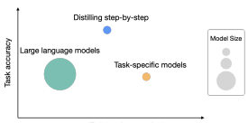
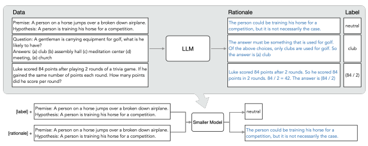
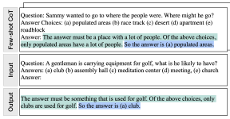
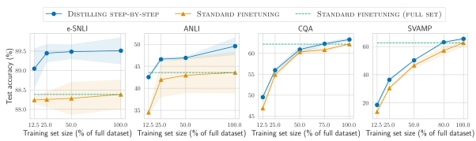
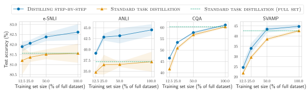
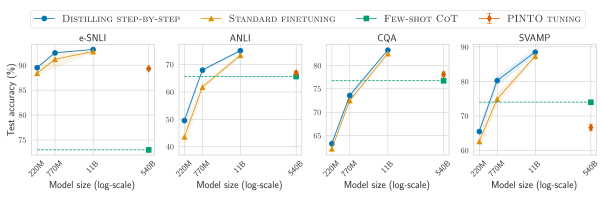
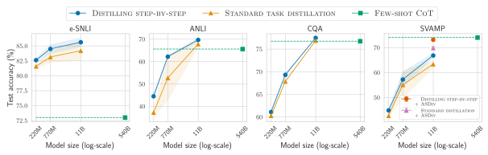
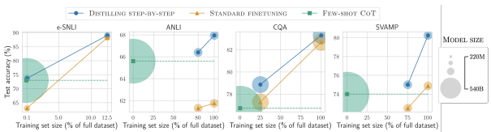
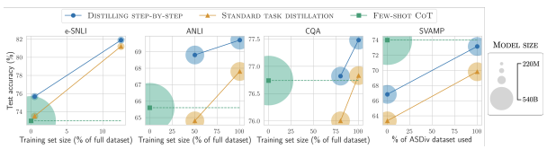

# Distilling Step-By-Step! Outperforming Larger Language Models With Less Training Data And Smaller Model Sizes

Cheng-Yu Hsieh1∗
, Chun-Liang Li2, Chih-Kuan Yeh3**, Hootan Nakhost**2, Yasuhisa Fujii3, Alexander Ratner1, Ranjay Krishna1, Chen-Yu Lee2**, Tomas Pfister**2 1University of Washington, 2Google Cloud AI Research, 3Google Research cydhsieh@cs.washington.edu

## Abstract

Deploying large language models (LLMs) is challenging because they are memory inefficient and compute-intensive for practical applications. In reaction, researchers train smaller task-specific models by either finetuning with human labels or distilling using LLM- generated labels. However, finetuning and distillation require large amounts of training data to achieve comparable performance to LLMs. We introduce *Distilling step-by-step*, a new mechanism that (a) trains smaller models that outperform LLMs, and (b) achieves so by leveraging less training data needed by finetuning or distillation. Our method extracts LLM rationales as additional supervision for training small models within a multi-task framework.

We present three findings across 4 NLP benchmarks: First, compared to both finetuning and distillation, our mechanism achieves better performance with much fewer labeled/unlabeled training examples. Second, compared to fewshot prompted LLMs, we achieve better performance using substantially smaller model sizes. Third, we reduce both the model size and the amount of data required to outperform LLMs; our finetuned 770M T5 model outperforms the few-shot prompted 540B PaLM model using only 80% of available data on a benchmark, whereas standard finetuning the same T5 model struggles to match even by using 100% of the dataset.1

## 1 Introduction

Despite the impressive few-shot ability offered by large language models (LLMs) (Brown et al., 2020; Chowdhery et al., 2022; Thoppilan et al., 2022; Hoffmann et al., 2022; Smith et al., 2022b; Zhang et al., 2022), these models are challenging to deploy in real world applications due to their sheer Figure 1: While large language models (LLMs) offer

 strong zero/few-shot performance, they are challenging to serve in practice. Traditional ways of training small task-specific models, on the other hand, requires large amount of training data. We propose Distilling stepby-step, a new paradigm that extracts rationales from LLMs as informative task knowledge into training small models, which reduces both the deployed model size as well as the data required for training.

size. Serving a single 175 billion LLM requires at least 350GB GPU memory using specialized infrastructure (Zheng et al., 2022). To make matters worse, today's state-of-the-art LLMs are composed of over 500B parameters (Chowdhery et al., 2022), requiring significantly more memory and compute.

Such computational requirements are far beyond affordable for most product teams, especially for applications that require low latency performance.

To circumvent these deployment challenges of large models, practitioners often choose to deploy smaller specialized models instead. These smaller models are trained using one of two common paradigms: finetuning or *distillation*. Finetuning updates a pretrained smaller model
(e.g. BERT (Devlin et al., 2018) or T5 (Raffel et al., 2020)) using downstream human annotated data (Howard and Ruder, 2018). Distillation trains the same smaller models with labels generated by a larger LLM (Tang et al., 2019; Wang et al., 2021; Smith et al., 2022a; Arora et al., 2022). Unfortunately, these paradigms reduce model size at a cost: to achieve comparable performance to LLMs, finetuning requires expensive human labels, and dis-

∗Work done while the author was a student researcher at Google Cloud AI Research.

1Source code is available at: https://github.com/
google-research/distilling-step-by-step.
tillation requires large amounts of unlabeled data which can be hard to obtain (Tang et al., 2019; Liang et al., 2020).

In this work, we introduce Distilling step-bystep, a new simple mechanism for training smaller models with less training data. Our mechanism reduces the amount of training data required for both finetuning and distillation of LLMs into smaller model sizes. Core to our mechanism is changing our perspective from viewing LLMs as a source of noisy labels to viewing them as agents that can reason: LLMs can produce natural language rationales justifying their predicted labels (Wei et al.,
2022; Kojima et al., 2022). For example, when asked "Jesse's room is 11 feet long and 15 feet wide. If she already has 16 *square feet of carpet.* How much more carpet does she need to cover the whole floor?", an LLM can be prompted by chain-of-thought (CoT) technique (Wei et al., 2022) to provide intermediate rationales "Area = length × width. Jesse's room has 11 × 15 *square feet.*" that better connects the input to the final answer
"(11 × 15) − 16". These *rationales* can contain relevant task knowledge, such as "Area = length ×
width", that may originally require many data for small task-specific models to learn. We thus utilize these extracted rationales as additional, richer information to train small models through a multi-task training setup, with both label prediction and rationale prediction tasks (Raffel et al., 2020; Narang et al., 2020).

Distilling step-by-step allows us to learn taskspecific smaller models that outperform LLMs using over 500× less model parameters, and it does so with far fewer training examples compared to traditional finetuning or distillation (Figure 1). Our results show three promising empirical conclusions across 4 NLP benchmarks. First, compared to both finetuning and distillation, our resulting models achieve better performance with over 50% less training examples on average across datasets (and up to over 85% reduction). Second, our models outperform LLMs with much smaller model sizes (up to 2000× smaller), drastically reducing the computation cost required for model deployment.

Third, we simultaneously reduce the model size as well as the amount of data required to outperform LLMs. We surpass the performance of 540B
parameter LLMs using a 770M T5 model; this smaller model only uses 80% of a labeled dataset that would otherwise be required if using an existing finetuning method. When only unlabeled data is present, our small models still perform on par or better than LLMs. We outperform 540B PaLM's performance with only a 11B T5 model. We further show that when a smaller model performs worse than an LLM, Distilling step-by-step can more efficiently leverage additional unlabeled data to match the LLM performance compared to the standard distillation approach.

## 2 Related Work

Our work distills task-specific knowledge of LLMs into smaller specialist models by leveraging the emergent reasoning capabilities of today's LLMs.

We draw on knowledge distillation research and methods that learn from both human-generated rationales and LLM-generated rationales. Knowledge distillation from large models. Knowledge distillation has been successfully used to transfer knowledge from larger, more competent teacher models into smaller student models affordable for practical applications (Bucilua et al. ˇ , 2006; Hinton et al., 2015; Beyer et al., 2022; West et al., 2021; Fu et al., 2023). It supports learning from limited labeled data, since the larger teacher model is often used to generate a training dataset with noisy pseudo labels (Chen et al., 2020; Iliopoulos et al., 2022; Wang et al., 2021; Smith et al., 2022a; Arora et al., 2022; Agrawal et al., 2022). The one limitation that knowledge distillation often faces is its reliance on large amounts of unlabelled data required to create a useful noisy training dataset. Although prior work has explored using data augmentation techniques to reduce this hunger for data (Tang et al., 2019; Liang et al., 2020; Srinivas and Fleuret, 2018; Milli et al., 2019),
we propose an alternative approach: we reduce the need for large unlabeled data by distilling not just labels but also the teacher's rationales. Learning with human rationales. While utilizing LLM-generated rationales is a new exciting area of investigation, using human-generated rationales has a rich history (Hase and Bansal, 2021). For instance, human rationales can be used to regularize model behavior (Ross et al., 2017); it can be used as additional inputs to guide a model's predictions (Rajani et al., 2019); it can be used to improve overall model performance (Zaidan et al., 2007; Zhang et al., 2016; Camburu et al., 2018; Hancock et al., 2019; Pruthi et al., 2022); and hu-

Figure 2: Overview on Distilling step-by-step. We first utilize CoT prompting to extract rationales from an LLM

 (Section 3.1). We then use the generated rationales to train small task-specific models within a multi-task learning framework where we prepend task prefixes to the input examples and train the model to output differently based on the given task prefix (Section 3.2).

man rationales can be used as gold standard labels to make models more interpretable by generating similar rationales (Wiegreffe et al., 2021; Narang et al., 2020; Eisenstein et al., 2022). Unfortunately, human rationales are expensive. Learning with LLM generated rationales. Today's LLMs are capable of explaining their predictions by generating high-quality reasoning steps (Wei et al., 2022; Kojima et al., 2022). These reasoning steps have been used to augment input prompts to LLMs, improving their few-shot or zeroshot performance (Wei et al., 2022; Kojima et al., 2022; Wang et al., 2022b); reasoning steps have also been used as additional finetuning data "selfimprove" LLMs (Zelikman et al., 2022; Huang et al., 2022). Unfortunately, regardless of how LLMs are improved, their large size limits their utility in most test-time applications.

By contrast, we leverage generated rationales as informative supervision to train smaller taskspecific models, i.e. models that can be deployed without incurring large computation or memory costs. Several concurrent works have also proposed a similar idea to ours - that of using extracted rationales as supervision (Wang et al., 2022a; Ho et al., 2022; Magister et al., 2022; Li et al., 2023).

Amongst them, PINTO (Wang et al., 2022a) relies on an LLM to generate rationales at test-time, and thus does not fully solve deployment challenges.

Compared with Ho et al. (2022) and Magister et al. (2022), we go beyond their experiments to provide a granular study by varying training dataset size, exploring downstream model sizes, and demonstrating the effectiveness of our method on fully unlabeled datasets.

## 3 Distilling Step-By-Step

We propose a new paradigm, Distilling step-bystep, that leverages the ability of LLMs to reason about their predictions to train smaller models in a data-efficient way. Our overall framework is illustrated in Figure 2. Our paradigm has two simple steps: First, given an LLM and an unlabeled dataset, we prompt the LLM to generate output labels along with *rationales* to justify the labels. Rationales are natural language explanations that provide support for the model's predicted label
(see Figure 2). Second, we leverage these rationales in addition to the task labels to train smaller downstream models. Intuitively, rationales provide richer, more detailed information about why an input is mapped to a specific output label, and often contain relevant task knowledge that may be hard to infer solely from the original inputs.

### 3.1 Extracting Rationales From Llms

Recent studies observe one intriguing emerging property of LLMs: their ability to generate rationales that support their predictions (Wei et al.,
2022; Kojima et al., 2022). While the studies have largely focused on how to elicit such reasoning capability from LLMs (Nye et al., 2021; Wei et al., 2022; Kojima et al., 2022), we use them in training smaller downstream models.

Specifically, we utilize Chain-of-Thought (CoT)
prompting (Wei et al., 2022) to elicit and extract

Figure 3: We use few-shot CoT prompting that contains

 both an example rationale (highlighted in green) and a label (highlighted in blue) to elicit rationales from an LLM on new input examples.

rationales from LLMs. As illustrated in Figure 3, given an unlabeled dataset xi ∈ D, we first curate a prompt template p that articulates how the task should be solved. Each prompt is a triplet
(x p, rp, yp), where x pis an example input, y pis its corresponding label and r pis a user-provided rationale that explains why x pcan be categorized as y p. We append each input xito p and use it as an input to prompt the LLM to generate rationales and labels for each xi ∈ D. With the demonstrations seen in p, the LLM is able to mimic the triplet demonstration to generate the rationale rˆi and output yˆi for xi.

#### 3.2 Training Smaller Models With Rationales

We first describe the current framework for learning task-specific models. With this framework in place, we extend it to incorporate rationales into the training process. Formally, we denote a dataset as D = {(xi, yi)}
N
i=1 where each xi represents an input and yiis the corresponding desired output label. While our framework supports inputs and outputs of any modality, our experiments limits x and y to be natural language. This text-to-text framework (Raffel et al., 2020) encompasses a variety of NLP tasks: classification, natural language inference, question answering and more.

Standard finetuning and task distillation. The most common practice to train a task-specific model is to finetune a pretrained model with supervised data (Howard and Ruder, 2018). In the absence of human-annotated labels, task-specific distillation (Hinton et al., 2015; Tang et al., 2019) uses LLM teachers to generates pseudo noisy training labels, yˆiin place of yi (Wang et al., 2021; Smith et al., 2022a; Arora et al., 2022).

For both scenarios, the smaller model f is trained to minimize the label prediction loss:

$${\mathcal{L}}_{\mathrm{label}}={\frac{1}{N}}\sum_{i=1}^{N}\ell(f(x_{i}),{\hat{y}}_{i}),\qquad\qquad(1)$$

where ℓ is the cross-entropy loss between the predicted and target tokens. Note that for ease of exposition, we overload yˆiin Eq. 1 to be either human-annotated labels yi for the standard finetuning case, or LLM-predicted labels yˆi for the model distillation case. Multi-task learning with rationales. To create a more explicit connection between xi's to yˆi's, we use extracted rationales rˆi as additional supervision. There are several ways to incorporate rationales into the downstream model's training process. One straightforward approach is feed rˆi as an additional input—as proposed by other concurrent research (Rajani et al., 2019; Wang et al., 2022a).

In other words, the f(xi, rˆi) → yˆiis trained with both text and rationale [*x, r*] as inputs:

$${\mathcal{L}}={\frac{1}{N}}\sum_{i=1}^{N}\ell(f(x_{i},{\hat{r}}_{i}),{\hat{y}}_{i}).\qquad\qquad(2)$$

Unfortunately, this design requires an LLM to first generate a rationale before the f can make a prediction. The LLM is still necessary during deployment, limited its deployability.

In this work, instead of using rationales as additional model inputs, we frame learning with rationales as a multi-task problem. Specifically, we train the model f(xi) → (ˆyi, rˆi) to not only predict the task labels but also generate the corresponding rationales given the text inputs:

$${\mathcal{L}}={\mathcal{L}}_{\mathrm{label}}+\lambda{\mathcal{L}}_{\mathrm{rationale}},$$
$$(3)^{\frac{1}{2}}$$
$$\quad(4)$$

where Llabel is the label prediction loss in Eq. 1 and Lrationale is the *rationale generation loss*:

$${\mathcal{L}}_{\mathrm{rational}}={\frac{1}{N}}\sum_{i=1}^{N}\ell(f(x_{i}),{\hat{r}}_{i}).$$
ℓ(f(xi), rˆi). (4)
The rationale generation loss enables the model to learn to generate the intermediate reasoning steps for the prediction, and could therefore guide the model in better predicting the resultant label. This is our proposed Distilling step-by-step. Compared with Eq. 2, the rationale rˆiis not required in the test time, which removes the need for an LLM at test-time.

We prepend "task prefixes" ([label],
[rationale]) to the input examples and train the smaller model to output yˆi when [label] is provided and to produce rˆi with [rationale] (Raffel et al., 2020).

## 4 Experiments

We empirically validate the effectiveness of Distilling step-by-step. First, we show that when compared to standard finetuning and task distillation approaches, Distilling step-by-step achieves better performance with much fewer number of training examples, substantially improving the data efficiency to learn small task-specific models (Sec. 4.1). Second, we show that Distilling step-by-step surpasses the performance of LLMs with much smaller model size, drastically lowering the deployment cost compared to LLMs (Sec. 4.2). Third, we investigate the minimum resources required, w.r.t. both number of training examples and model size, for Distilling step-by-step to outperform LLMs. We show that Distilling step-by-step outperforms LLMs by using less data and smaller model, simultaneously improving both data- and deployability-efficiency (Sec. 4.3). Finally, we perform ablation studies to understand the influence of different components and design choices in the Distilling step-by-step framework (Sec. 4.4). Setup. In the experiments, we consider the 540B PaLM model (Chowdhery et al., 2022) as the LLM. For task-specific downstream models, we use T5 models (Raffel et al., 2020) where we initialize the models with pretrained weights obtained from publicly available sources2. For CoT prompting, we follow Wei et al. (2022) when available, and curate our own examples for new datasets. We include more implementation details in Appendix A.1.

Datasets. We conduct the experiments on 4 popular benchmark datasets across 3 different NLP tasks: *e-SNLI* (Camburu et al., 2018) and ANLI (Nie et al., 2020) for natural language inference; CQA (Talmor et al., 2019; Rajani et al., 2019) for commonsense question answering; *SVAMP* (Patel et al., 2021) for arithmetic math word problems.

We include more dataset details in Appendix A.2.

### 4.1 Reducing Training Data

We compare Distilling step-by-step to two most common methods in learning task-specific models:
(1) STANDARD FINETUNING when human-labeled examples are available, and (2) STANDARD TASK DISTILLATION when only unlabeled examples are available. Specifically, standard finetuning refers to the prevailing pretrain-then-finetune paradigm that finetunes a model with ground-truth labels via standard label supervision (Howard and Ruder, 2018). On the other hand, when only unlabeled examples are available, standard task distillation learns the task-specific model by treating a teacher LLM's predicted labels as ground-truths (Hinton et al., 2015; Chen et al., 2020; Wang et al., 2021; Smith et al., 2022a; Arora et al., 2022).

In the following set of experiments, we fix the task-specific models to be 220M T5-Base models, and compare the task performances achieved by different methods under varying number of available training examples.

Distilling step-by-step outperforms standard finetuning with much less labeled examples.

When finetuned with human-labeled examples, Figure 4 shows that Distilling step-by-step consistently achieves better performance than standard finetuning across varying numbers of labeled examples used. Furthermore, we see that Distilling step-bystep can achieve the same performance as standard finetuning with much less labeled examples. In particular, by using only 12.5% of the full e- SNLI dataset, Distilling step-by-step can outperform standard finetuning trained with 100% of the full dataset. Similarly, we achieve 75%, 25%, and 20% reduction in training examples required to outperform standard finetuning on ANLI, CQA, and SVAMP respectively.

Distilling step-by-step outperforms standard distillation with much less unlabeled examples.

When only unlabeled data is available, we compare Distilling step-by-step to standard task distillation. In Figure 5, we observe an overall similar trend to the finetuning setup. Specifically, we see that Distilling step-by-step outperforms standard task distillation on all 4 datasets under different numbers of unlabeled data used. We as well see that Distilling step-by-step requires much less unlabeled data to outperform standard task distillation. For instance, we need only 12.5% of the full unlabeled dataset to outperform the performance achieved by standard task distillation using 100% of the training examples on e-SNLI dataset.

2https://huggingface.co/

Figure 4: We compare Distilling step-by-step and Standard finetuning using 220M T5 models on varying sizes of

 human-labeled datasets. On all datasets, Distilling step-by-step is able to outperform Standard finetuning, trained on the full dataset, by using much less training examples (e.g., 12.5% of the full e-SNLI dataset).

Figure 5: Similar to the plots above, we compare Distilling step-by-step and Standard task distillation using 220M T5 models on varying sizes of unlabeled datasets. Distilling step-by-step is able to outperform Standard task distillation by using only a small subset of the full unlabeled dataset (e.g., 12.5% on ANLI dataset).

### 4.2 Reducing Model Size

In the following set of experiments, we hold the training set size fixed (using 100% of the datasets), and compare varying sizes of small T5 models trained with Distilling step-by-step and standard approaches to LLMs. Specifically, we consider 3 different sizes of T5 models, i.e., 220M T5-Base, 770M T5-Large, and 11B T5-XXL. For LLMs, we include two baseline methods: (1) FEW-SHOT COT (Wei et al., 2022), and (2) PINTO TUN- ING (Wang et al., 2022a). Few-shot CoT directly utilizes CoT demonstrations to prompt the 540B PaLM to generate intermediate steps before predicting the final labels without any further finetuning of the LLM. PINTO tuning refers to our extension of Wang et al. (2022a) to handle tasks beyond question-answering, which are not studied by Wang et al. (2022a). Here, we finetune a 220M T5-Base model on top of the outputs generated from the PaLM model, which can be viewed as a finetuning method for LLMs with additional parameters (Zhang et al., 2020; Lester et al., 2021).

We present the experimental results under the two broad scenarios of having access to labeled datasets or unlabeled datasets in Figure 6 and Figure 7, respectively. We plot each method by their deployed model sizes for prediction (x-axis), and their corresponding task performances (y-axis). Distilling step-by-step improves over standard baselines across varying model sizes used. In Figure 6 and Figure 7 respectively, we see that Distilling step-by-step consistently improves over standard finetuning and standard distillation across all sizes of T5 models. The improvements are most pronounced on ANLI, where Distilling step-bystep outperforms standard finetuning and distillation by an average of 8% and 13% on task accuracy respectively. Distilling step-by-step outperforms LLMs by using much smaller task-specific models. In Figure 6 when human-labeled datasets are available, Distilling step-by-step can always outperform Few-shot CoT and PINTO tuning on all 4 datasets considered, by using much smaller T5 models. For instance, we can achieve better performances than 540B PaLM model's Few-shot CoT

Figure 6: We perform Distilling step-by-step and Standard finetuning, using the full human-labeled datasets, on

 varying sizes of T5 models and compare their performance to LLM baselines, i.e., Few-shot CoT and PINTO Tuning. Distilling step-by-step is able to outperform LLM baselines by using much smaller models, e.g., over 700× smaller model on ANLI. Standard finetuning fails to match LLM's performance using the same model size.

Figure 7: Using unlabeled datasets, we perform Distilling step-by-step and Standard task distillation on varying sizes of T5 models and compare them to Few-shot CoT. Distilling step-by-step outperforms Few-shot CoT by using 2000× smaller models on e-SNLI and 45× smaller models on ANLI and CQA. On SVAMP, by adding unlabeled examples from ASDiv, we close the gap to Few-shot CoT whereas Standard distillation still struggles to catch up.

with 220M (over 2000× smaller) T5 model on e-
SNLI, 770M (over 700× smaller) T5 models on ANLI and SVAMP, and 11B (over 45× smaller) T5 model on CQA. These results hold true even by further finetuning the 540B PaLM model on available labeled data with PINTO tuning3.

In Figure 7, by only utilizing unlabeled examples, Distilling step-by-step also outperforms the teacher LLM on 3 out of 4 datasets. Specifically, Distilling step-by-step surpasses the 540B PaLM model's Few-shot CoT performance by using 11B T5 with less than 3% of PaLM's size. On SVAMP where the distilled model underperforms, we hypothesize that the performance gap is due to the relatively small number of data points in the dataset
(i.e., 800). In reaction, we propose to augment the dataset with additional unlabeled examples to close the performance gap as shown in next.

Unlabeled data augmentation further improves Distilling step-by-step. We augment the SVAMP training set with unlabeled examples from the AS-
Div dataset (Miao et al., 2020). ASDiv dataset contains a total of 2, 305 examples, where each example is a math word problem similar to the ones in SVAMP. In Figure 7 on SVAMP, we show the performances of Distilling step-by-step and standard task distillation using 11B T5 model after augmenting the training set with ASDiv. We see the data augmentation much improves the performance for both Distilling step-by-step and standard task distillation. However, even with the added unlabeled examples, standard task distillation still underperforms Few-shot CoT. On the other hand, Distilling step-by-step is able to much more efficiently exploit the value of the added examples to achieve the same performance level of Few-shot CoT, again, using a T5 model of size less than 3% of the 540B PaLM.

3We note that PETuning methods may outperform PINTO
tuning. However, they require massive resource in both training and deployment, which is not the focus of this work.

Figure 8: We show the minimum size of T5 models and the least amount of human-labeled examples required

 for Distilling step-by-step to outperform LLM's Few-shot CoT by a coarse-grained search. Distilling step-by-step is able to outperform Few-shot CoT using not only much smaller models, but it also achieves so with much less training examples compared to Standard finetuning. On ANLI, we outperform the LLM CoT with a 770M model using only 80% of the dataset, whereas Standard finetuning struggles to match even using 100% of the dataset.

Figure 9: Similar to Figure 8 but using only unlabeled examples, Distilling step-by-step is able to outperform Few-shot CoT using much smaller models and with much less examples compared to Standard task distillation. On SVAMP, the x-axis corresponds to the size of ASDiv dataset used for augmenting the original SVAMP dataset, i.e., x = 0 is without augmentation and x = 100 corresponds to adding the full ASDiv dataset.

### 4.3 Outperforming Llms Using Minimum Model Size And Least Training Data

Here, using the LLM's performance as an anchor point, we explore the most efficient resource requirements in terms of both number of training examples and deployed model size, that Distilling step-by-step and standard finetuning/distillation need to outperform the LLM. We present the results, again under human-labeled setting and unlabeled setting, in Figure 8 and Figure 9 respectively.

We visualize the results by plotting different resultant models by (1) the number of training examples used (x-axis), (2) the final task performance achieved (y-axis), and (3) the size of the model
(visualized by the size of the shaded area). Distilling step-by-step outperforms LLMs with much smaller models by using less data. On all datasets in Figure 8, we see that Distilling stepby-step outperforms PaLM's Few-shot CoT with much smaller T5 models using only a subset of the available training examples. Specifically, on e-SNLI, Distilling step-by-step can achieve better performance than Few-shot CoT with a model over 2000× smaller (220M T5) and only 0.1% of the full dataset. In Figure 9 where only unlabeled datasets are available, we observe the same trend that Distilling step-by-step can, at most time, outperform Few-shot CoT with smaller model as well as less data. For instance, on ANLI, Distilling stepby-step outperforms the LLM with a 45× smaller model and 50% of the full unlabeled set.

Standard finetuning and distillation require more data and larger model. Finally, in Figure 8 and Figure 9, we see that standard finetuning and distillation often need either more data or larger models to match LLM's performance. For instance, on e-SNLI in Figure 8, we observe that Distilling step-by-step outperform the LLM using only 0.1% of the dataset while standard finetuning requires more data to match the performance. Furthermore, on ANLI in Figure 8, we observe that Distilling step-by-step can outperform PaLM using 770M
model with only 80% of the training set while standard finetuning struggles to match the LLM even

Table 1: Distilling step-by-step works with different sizes of LLMs. When rationales are extracted from a 20B GPT-NeoX model, Distilling step-by-step is still able to provide performance lift compared to standard finetuning on 220M T5 models.

Table 2: Our proposed multi-task training framework consistently leads to better performances than treating rationale and label predictions as a single task. Singletask training can at times lead to worse performance than standard finetuning.

|                           |      |         |       | Dataset   |       |                       |         |       | Dataset   |       |
|---------------------------|------|---------|-------|-----------|-------|-----------------------|---------|-------|-----------|-------|
| Method                    | LLM  | e\-SNLI | ANLI  | CQA       | SVAMP | Method                | e\-SNLI | ANLI  | CQA       | SVAMP |
| STANDARD FINETUNING       | N/A  | 88.38   | 43.58 | 62.19     | 62.63 |                       |         |       |           |       |
| DISTILLING STEP\-BY\-STEP | 20B  | 89.12   | 48.15 | 63.25     | 63.00 | STANDARD FINETUNING   | 88.38   | 43.58 | 62.19     | 62.63 |
| DISTILLING STEP\-BY\-STEP | 540B | 89.51   | 49.58 | 63.29     | 65.50 | SINGLE\-TASK TRAINING | 88.88   | 43.50 | 61.37     | 63.00 |
|                           |      |         |       |           |       | MULTI\-TASK TRAINING  | 89.51   | 49.58 | 63.29     | 65.50 |

using the full dataset and thus requires larger model to close the performance gap.

### 4.4 Further Ablation Studies

So far, we have focused on showing the effectiveness of Distilling step-by-step on reducing the training data required for finetuning or distilling smaller task-specific models. In this section, we perform further studies to understand the influence of different components in the Distilling step-by-step framework. Specifically, we study (1) how different LLMs, from which the rationales are extracted, affect the effectiveness of Distilling step-by-step, and (2) how the multi-task training approach compares to other potential design choices in training small task-specific models with LLM rationales. Here, we fix the small task-specific models to be 220M T5 models, and utilize 100% of the data on all datasets.

Distilling step-by-step works with different sizes of decently trained LLMs. In addition to using 540B PaLM as the LLM, here we consider a relatively smaller LLM, 20B GPT-NeoX model (Black et al., 2022), from which we extract rationales for Distilling step-by-step. In Table 1, we see that when coupled with LLMs of different sizes, Distilling step-by-step can still provide performance improvements compared to standard finetuning. However, the performance lift is smaller when rationales are extracted from the 20B GPT-NeoX model instead of from the 540B PaLM. This can be due to the fact that the larger PaLM model provides higher-quality rationales that are more beneficial for learning the task. Multi-task training is much more effective than single-task rationale and label joint prediction. There are different possible ways to train taskspecific models with LLM-rationales as output supervisions. One straightforward approach is to concatenate the rationale rˆi and label yˆiinto a single sequence [ˆri, yˆi] and treat the entire sequence as the target output in training small models, as considered in (Magister et al., 2022; Ho et al., 2022):

$${\mathcal{L}}_{\mathrm{single}}={\frac{1}{N}}\sum_{i=1}^{N}\ell(f(x_{i}),[{\hat{r}}_{i},{\hat{y}}_{i}]).\qquad(5)$$

In Table 2, we compare this single-task training approach to our proposed multi-task training approach for utilizing LLM-rationales. We see that not only multi-task training consistently leads to better performance, single-task training with LLM- rationales can at times leads to worse performance than standard finetuning, e.g., on ANLI and CQA. In fact, similar results have also been observed in (Wiegreffe et al., 2021; Magister et al., 2022; Ho et al., 2022) that simply treating rationale and label predictions as a single joint task may harm the model's performance on label prediction. This validates our use of the multi-task training approach, and highlights the need to treat the rationales carefully so as to unleash their actual benefits.

## 5 Discussion

We propose Distilling step-by-step to extract rationales from LLMs as informative supervision in training small task-specific models. We show that Distilling step-by-step reduces the training dataset required to curate task-specific smaller models; it also reduces the model size required to achieve, and even surpass, the original LLM's performance.

Distilling step-by-step proposes a resource-efficient training-to-deployment paradigm compared to existing methods. Further studies demonstrate the generalizability and the design choices made in Distilling step-by-step. Finally, we discuss the limitations, future directions and ethics statement of our work below.

## Limitations

There are a number of limitations with our approach. First, we require users to produce a few example demonstrations (∼ 10-shot for all tasks)
in order to use the few-shot CoT (Wei et al., 2022) prompting mechanism. This limitation can be improved by using recent advances that suggest that rationales can be elicited without any userannotated demonstrations (Kojima et al., 2022). Second, training task-specific models with rationales incur slight training-time computation overhead. However, at test time, our multi-task design naturally avoids the computation overhead since it allows one to only predict labels without generating the rationales. Finally, while we observe success using LLM rationales, there is evidence that LLMs exhibit limited reasoning capability on more complex reasoning and planning tasks (Valmeekam et al., 2022). Future work should characterize how rationale quality affects Distilling step-by-step.

## Ethics Statement

It is worth noting that the behavior of the our downstream smaller models is subject to biases inherited from the larger teacher LLM. We envision that the same research progress in reducing anti-social behaviors in LLMs can also be applied to improve smaller language models.

## References

Priyanka Agrawal, Chris Alberti, Fantine Huot, Joshua Maynez, Ji Ma, Sebastian Ruder, Kuzman Ganchev, Dipanjan Das, and Mirella Lapata. 2022. Qameleon: Multilingual qa with only 5 examples. arXiv preprint arXiv:2211.08264.

Simran Arora, Avanika Narayan, Mayee F Chen, Laurel J Orr, Neel Guha, Kush Bhatia, Ines Chami, Frederic Sala, and Christopher Ré. 2022. Ask me anything: A simple strategy for prompting language models. *arXiv preprint arXiv:2210.02441*.

Lucas Beyer, Xiaohua Zhai, Amélie Royer, Larisa Markeeva, Rohan Anil, and Alexander Kolesnikov. 2022. Knowledge distillation: A good teacher is patient and consistent. In Proceedings of the IEEE/CVF Conference on Computer Vision and Pattern Recognition, pages 10925–10934.

Sid Black, Stella Biderman, Eric Hallahan, Quentin Anthony, Leo Gao, Laurence Golding, Horace He, Connor Leahy, Kyle McDonell, Jason Phang, Michael Pieler, USVSN Sai Prashanth, Shivanshu Purohit, Laria Reynolds, Jonathan Tow, Ben Wang, and Samuel Weinbach. 2022. GPT-NeoX-20B: An opensource autoregressive language model. In Proceedings of the ACL Workshop on Challenges & Perspectives in Creating Large Language Models.

Tom Brown, Benjamin Mann, Nick Ryder, Melanie Subbiah, Jared D Kaplan, Prafulla Dhariwal, Arvind Neelakantan, Pranav Shyam, Girish Sastry, Amanda Askell, et al. 2020. Language models are few-shot learners. Advances in neural information processing systems, 33:1877–1901.

Cristian Bucilua, Rich Caruana, and Alexandru ˇ
Niculescu-Mizil. 2006. Model compression. In Proceedings of the 12th ACM SIGKDD international conference on Knowledge discovery and data mining, pages 535–541.

Oana-Maria Camburu, Tim Rocktäschel, Thomas Lukasiewicz, and Phil Blunsom. 2018. e-snli: Natural language inference with natural language explanations. Advances in Neural Information Processing Systems, 31.

Ting Chen, Simon Kornblith, Kevin Swersky, Mohammad Norouzi, and Geoffrey E Hinton. 2020. Big self-supervised models are strong semi-supervised learners. Advances in neural information processing systems, 33:22243–22255.

Aakanksha Chowdhery, Sharan Narang, Jacob Devlin, Maarten Bosma, Gaurav Mishra, Adam Roberts, Paul Barham, Hyung Won Chung, Charles Sutton, Sebastian Gehrmann, et al. 2022. Palm: Scaling language modeling with pathways. arXiv preprint arXiv:2204.02311.

Jacob Devlin, Ming-Wei Chang, Kenton Lee, and Kristina Toutanova. 2018. Bert: Pre-training of deep bidirectional transformers for language understanding. *arXiv preprint arXiv:1810.04805*.

Jacob Eisenstein, Daniel Andor, Bernd Bohnet, Michael Collins, and David Mimno. 2022. Honest students from untrusted teachers: Learning an interpretable question-answering pipeline from a pretrained language model. *arXiv preprint arXiv:2210.02498*.

Yao Fu, Hao Peng, Litu Ou, Ashish Sabharwal, and Tushar Khot. 2023. Specializing smaller language models towards multi-step reasoning. arXiv preprint arXiv:2301.12726.

Braden Hancock, Antoine Bordes, Pierre-Emmanuel Mazare, and Jason Weston. 2019. Learning from dialogue after deployment: Feed yourself, chatbot! arXiv preprint arXiv:1901.05415.

Peter Hase and Mohit Bansal. 2021. When can models learn from explanations? a formal framework for understanding the roles of explanation data. arXiv preprint arXiv:2102.02201.

Geoffrey Hinton, Oriol Vinyals, Jeff Dean, et al. 2015.

Distilling the knowledge in a neural network. arXiv preprint arXiv:1503.02531, 2(7).

Namgyu Ho, Laura Schmid, and Se-Young Yun. 2022.

Large language models are reasoning teachers. *arXiv* preprint arXiv:2212.10071.

Jordan Hoffmann, Sebastian Borgeaud, Arthur Mensch, Elena Buchatskaya, Trevor Cai, Eliza Rutherford, Diego de Las Casas, Lisa Anne Hendricks, Johannes Welbl, Aidan Clark, et al. 2022. Training compute-optimal large language models. *arXiv* preprint arXiv:2203.15556.

Jeremy Howard and Sebastian Ruder. 2018. Universal language model fine-tuning for text classification. In Proceedings of the 56th Annual Meeting of the Association for Computational Linguistics (Volume 1:
Long Papers), pages 328–339, Melbourne, Australia. Association for Computational Linguistics.

Jiaxin Huang, Shixiang Shane Gu, Le Hou, Yuexin Wu, Xuezhi Wang, Hongkun Yu, and Jiawei Han. 2022. Large language models can self-improve. arXiv preprint arXiv:2210.11610.

Fotis Iliopoulos, Vasilis Kontonis, Cenk Baykal, Gaurav Menghani, Khoa Trinh, and Erik Vee. 2022.

Weighted distillation with unlabeled examples. In Advances in Neural Information Processing Systems.

Takeshi Kojima, Shixiang Shane Gu, Machel Reid, Yutaka Matsuo, and Yusuke Iwasawa. 2022. Large language models are zero-shot reasoners. arXiv preprint arXiv:2205.11916.

Brian Lester, Rami Al-Rfou, and Noah Constant. 2021.

The power of scale for parameter-efficient prompt tuning. *arXiv preprint arXiv:2104.08691*.

Liunian Harold Li, Jack Hessel, Youngjae Yu, Xiang Ren, Kai-Wei Chang, and Yejin Choi. 2023. Symbolic chain-of-thought distillation: Small models can also" think" step-by-step. arXiv preprint arXiv:2306.14050.

Kevin J Liang, Weituo Hao, Dinghan Shen, Yufan Zhou, Weizhu Chen, Changyou Chen, and Lawrence Carin. 2020. Mixkd: Towards efficient distillation of large-scale language models. arXiv preprint arXiv:2011.00593.

Lucie Charlotte Magister, Jonathan Mallinson, Jakub Adamek, Eric Malmi, and Aliaksei Severyn. 2022. Teaching small language models to reason. *arXiv* preprint arXiv:2212.08410.

Shen-yun Miao, Chao-Chun Liang, and Keh-Yih Su.

2020. A diverse corpus for evaluating and developing english math word problem solvers. In Proceedings of the 58th Annual Meeting of the Association for Computational Linguistics, pages 975–984.

Smitha Milli, Ludwig Schmidt, Anca D Dragan, and Moritz Hardt. 2019. Model reconstruction from model explanations. In Proceedings of the Conference on Fairness, Accountability, and Transparency, pages 1–9.

Sharan Narang, Colin Raffel, Katherine Lee, Adam Roberts, Noah Fiedel, and Karishma Malkan. 2020. Wt5?! training text-to-text models to explain their predictions. *arXiv preprint arXiv:2004.14546*.

Yixin Nie, Adina Williams, Emily Dinan, Mohit Bansal, Jason Weston, and Douwe Kiela. 2020. Adversarial NLI: A new benchmark for natural language understanding. In Proceedings of the 58th Annual Meeting of the Association for Computational Linguistics. Association for Computational Linguistics.

Maxwell Nye, Anders Johan Andreassen, Guy Gur-Ari, Henryk Michalewski, Jacob Austin, David Bieber, David Dohan, Aitor Lewkowycz, Maarten Bosma, David Luan, et al. 2021. Show your work: Scratchpads for intermediate computation with language models. *arXiv preprint arXiv:2112.00114*.

Arkil Patel, Satwik Bhattamishra, and Navin Goyal.

2021. Are NLP models really able to solve simple math word problems? In Proceedings of the 2021 Conference of the North American Chapter of the Association for Computational Linguistics: Human Language Technologies, pages 2080–2094, Online. Association for Computational Linguistics.

Danish Pruthi, Rachit Bansal, Bhuwan Dhingra, Livio Baldini Soares, Michael Collins, Zachary C Lipton, Graham Neubig, and William W Cohen. 2022. Evaluating explanations: How much do explanations from the teacher aid students? Transactions of the Association for Computational Linguistics, 10:359–375.

Colin Raffel, Noam Shazeer, Adam Roberts, Katherine Lee, Sharan Narang, Michael Matena, Yanqi Zhou, Wei Li, and Peter J. Liu. 2020. Exploring the limits of transfer learning with a unified text-to-text transformer. *Journal of Machine Learning Research*, 21(140):1–67.

Nazneen Fatema Rajani, Bryan McCann, Caiming Xiong, and Richard Socher. 2019. Explain yourself! leveraging language models for commonsense reasoning. In Proceedings of the 57th Annual Meeting of the Association for Computational Linguistics, pages 4932–4942, Florence, Italy. Association for Computational Linguistics.

Andrew Slavin Ross, Michael C Hughes, and Finale Doshi-Velez. 2017. Right for the right reasons: Training differentiable models by constraining their explanations. *arXiv preprint arXiv:1703.03717*.

Ryan Smith, Jason A Fries, Braden Hancock, and Stephen H Bach. 2022a. Language models in the loop: Incorporating prompting into weak supervision. arXiv preprint arXiv:2205.02318.

Shaden Smith, Mostofa Patwary, Brandon Norick, Patrick LeGresley, Samyam Rajbhandari, Jared Casper, Zhun Liu, Shrimai Prabhumoye, George Zerveas, Vijay Korthikanti, et al. 2022b. Using deepspeed and megatron to train megatron-turing nlg 530b, a large-scale generative language model. arXiv preprint arXiv:2201.11990.

Processing, pages 10266–10284, Online and Punta Cana, Dominican Republic. Association for Computational Linguistics.

Suraj Srinivas and François Fleuret. 2018. Knowledge transfer with jacobian matching. In *International* Conference on Machine Learning, pages 4723–4731. PMLR.

Omar Zaidan, Jason Eisner, and Christine Piatko. 2007.

Using "annotator rationales" to improve machine learning for text categorization. In *Human Language* Technologies 2007: The Conference of the North American Chapter of the Association for Computational Linguistics; Proceedings of the Main Conference, pages 260–267, Rochester, New York. Association for Computational Linguistics.

Alon Talmor, Jonathan Herzig, Nicholas Lourie, and Jonathan Berant. 2019. CommonsenseQA: A question answering challenge targeting commonsense knowledge. In *Proceedings of the 2019 Conference* of the North American Chapter of the Association for Computational Linguistics: Human Language Technologies, Volume 1 (Long and Short Papers), pages 4149–4158, Minneapolis, Minnesota. Association for Computational Linguistics.

Eric Zelikman, Yuhuai Wu, and Noah D Goodman.

2022. Star: Bootstrapping reasoning with reasoning. *arXiv preprint arXiv:2203.14465*.

Jeffrey O Zhang, Alexander Sax, Amir Zamir, Leonidas Guibas, and Jitendra Malik. 2020. Side-tuning: a baseline for network adaptation via additive side networks. In *European Conference on Computer Vision*, pages 698–714. Springer.

Raphael Tang, Yao Lu, Linqing Liu, Lili Mou, Olga Vechtomova, and Jimmy Lin. 2019. Distilling taskspecific knowledge from bert into simple neural networks. *arXiv preprint arXiv:1903.12136*.

Romal Thoppilan, Daniel De Freitas, Jamie Hall, Noam Shazeer, Apoorv Kulshreshtha, Heng-Tze Cheng, Alicia Jin, Taylor Bos, Leslie Baker, Yu Du, et al. 2022. Lamda: Language models for dialog applications. *arXiv preprint arXiv:2201.08239*.

Susan Zhang, Stephen Roller, Naman Goyal, Mikel Artetxe, Moya Chen, Shuohui Chen, Christopher Dewan, Mona Diab, Xian Li, Xi Victoria Lin, et al. 2022. Opt: Open pre-trained transformer language models. arXiv preprint arXiv:2205.01068.

Karthik Valmeekam, Alberto Olmo, Sarath Sreedharan, and Subbarao Kambhampati. 2022. Large language models still can't plan (a benchmark for llms on planning and reasoning about change). arXiv preprint arXiv:2206.10498.

Ye Zhang, Iain Marshall, and Byron C. Wallace. 2016.

Rationale-augmented convolutional neural networks for text classification. In Proceedings of the 2016 Conference on Empirical Methods in Natural Language Processing, pages 795–804, Austin, Texas. Association for Computational Linguistics.

Peifeng Wang, Aaron Chan, Filip Ilievski, Muhao Chen, and Xiang Ren. 2022a. Pinto: Faithful language reasoning using prompt-generated rationales. arXiv preprint arXiv:2211.01562.

Lianmin Zheng, Zhuohan Li, Hao Zhang, Yonghao Zhuang, Zhifeng Chen, Yanping Huang, Yida Wang, Yuanzhong Xu, Danyang Zhuo, Joseph E Gonzalez, et al. 2022. Alpa: Automating inter-and intraoperator parallelism for distributed deep learning. arXiv preprint arXiv:2201.12023.

Shuohang Wang, Yang Liu, Yichong Xu, Chenguang Zhu, and Michael Zeng. 2021. Want to reduce labeling cost? gpt-3 can help. arXiv preprint arXiv:2108.13487.

Xuezhi Wang, Jason Wei, Dale Schuurmans, Quoc Le, Ed Chi, and Denny Zhou. 2022b. Self-consistency improves chain of thought reasoning in language models. *arXiv preprint arXiv:2203.11171*.

Jason Wei, Xuezhi Wang, Dale Schuurmans, Maarten Bosma, Ed Chi, Quoc Le, and Denny Zhou. 2022. Chain of thought prompting elicits reasoning in large language models. *arXiv preprint arXiv:2201.11903*.

Peter West, Chandra Bhagavatula, Jack Hessel, Jena D
Hwang, Liwei Jiang, Ronan Le Bras, Ximing Lu, Sean Welleck, and Yejin Choi. 2021. Symbolic knowledge distillation: from general language models to commonsense models. arXiv preprint arXiv:2110.07178.

Sarah Wiegreffe, Ana Marasovic, and Noah A. Smith. ´
2021. Measuring association between labels and free-text rationales. In Proceedings of the 2021 Conference on Empirical Methods in Natural Language

Table 3: Dataset statistics used in our experiments.

## A Experiment Detail

### A.1 Implementation

We perform our experiments on cloud A100×16 GPU instances. We train the T5 models with the following hyperparameters, using publicly available packages from https://github.com/
huggingface/transformers:
- T5-Base (220M) and T5-Large (770M): We train the models with learning rate = 5 ×
10−5, batch size = 64, max input length =
1024, for a maximum of 10000 steps.

- T5-XXL (11B): We train the models with learning rate = 5 × 10−5, batch size = 32, max input length = 1024, for a maximum of 4000 steps.

We report all the results over 4 random runs, and include the standard error in the presented plots.

### A.2 Datasets

We provide more detailed descriptions on the datasets used in our experiments. We include the sources from which we obtain the datasets as well as their original sources released from the authors.

We refer readers to these sources for their license or terms for use and/or distribution. To the best of our knowledge, the datasets used do not contain information that names or uniquely identifies individual people or offensive content.

- e-SNLI: The dataset was originally released in (Camburu et al., 2018), and made publicly available at https://github.com/
OanaMariaCamburu/e-SNLI. We obtain the dataset from https://huggingface.co/
datasets/esnli.

- ANLI: The dataset was originally released in (Nie et al., 2020), and made publicly available at https://github.com/
facebookresearch/anli. We obtain the dataset from https://huggingface.co/
datasets/anli. We use the R1 split in our experiments.

- CQA: The dataset was originally released in (Talmor et al., 2019), and made publicly available at https://www.tau-nlp.sites.

tau.ac.il/commonsenseqa. It was then augmented with human-labeled explanations

| Dataset   | Train   | Validation   | Test   |
|-----------|---------|--------------|--------|
| e\-SNLI   | 549,367 | 9,842        | 9,824  |
| ANLI      | 16,946  | 1,000        | 1,000  |
| CQA       | 8,766   | 975          | 1,221  |
| SVAMP     | 720     | 80           | 200    |

by (Rajani et al., 2019), which is available at https://github.com/salesforce/ cos-e. We obtain the dataset used in our experiments from https://huggingface.co/ datasets/cos_e.

- SVAMP: The dataset was originally released in (Patel et al., 2021). We obtain the dataset from https://github.com/
arkilpatel/SVAMP.

- ASDiv: The dataset was originally released in (Miao et al., 2020). We obtain the dataset from https://github.com/
chaochun/nlu-asdiv-dataset.

For each dataset, we randomly subsample 10%
of the original training set to serve as validation set when validation set is not originally provided. For CQA, we use the original validation set to serve as our test set since the ground-truth labels are not available for the original test set. We provide the dataset statistics in Table 3.