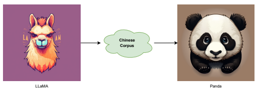
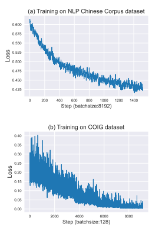

# Panda Llm: Training Data And Evaluation For Open-Sourced Chinese Instruction-Following Large Language Models

Fangkai Jiao∗ Bosheng Ding∗ † Tianze Luo∗ **Zhanfeng Mo**∗
Nanyang Technological University, Singapore jiaofangkai@hotmail.com {bosheng001, tianze001, zhanfeng001}@ntu.edu.sg

# Abstract

This project focuses on enhancing opensource large language models through instruction-tuning and providing comprehensive evaluations of their performance. We explore how various training data factors, such as quantity, quality, and linguistic distribution, influence the performance of instruction-tuned models trained on publicly accessible high-quality instruction datasets for both English and Chinese languages. Our goal is to supplement evaluation with quantitative analyses, providing valuable insights for the continued advancement of open-source chat models. Our model, data, and code are publicly available1for others to use and build upon.

# 1 Introduction

Over the last six months, there has been a significant surge in the development and advancement of instruction-following Large Language Models (LLM) such as GPT-4 (OpenAI, 2023), GPT-
3.5 (text-davinci-003)2, ChatGPT3, Claude4, and Bard5. These models have gained widespread popularity due to their exceptional versatility in various natural language proccessing tasks such as code writing and article editing, making them ubiquitous in various industries and significantly enhancing people's productivity (Ding et al., 2022; Zhao et al.,
2023). However, there are limitations to current off-the-shelf instruction-following large language models, including the lack of trustworthiness in generated results, lack of transparency in the model used which raises concerns about data security, and the unknown training recipe, making it difficult to customize a self-used model for specific purposes
(Touvron et al., 2023).

We believe that the cultivation of a strong and versatile open-source community for the development of trustable, transparent, and customizable large language models in all languages worldwide is considered the best approach to address the current issues and make the power of large language models accessible to everyone. In line with this objective, the Dandelion Project is proposed to deploy large language models that are not only accurate but also transparent, trustworthy, and customizable.

The project aims to promote more accessible and inclusive AI technology that can benefit individuals regardless of their cultural differences, geographical locations, or language barriers. Through open-source access to high-quality large language models, the Dandelion Project aims to empower developers, researchers, and organizations to leverage AI's potential in various applications such as translation, chatbots, content generation, and more.

This report presents the Panda LLM, which is the first open-sourced Chinese instruction-following large language model for overseas audiences. It is also the first released LLM of the Dandelion Project. Our Panda LLM model has been trained on Chinese-Wiki-2019, Chinese-News2016, Chinese-Baike-2018, Chinese-Webtext-2019 and Translation-2019 (Xu, 2019) and COIG datasets (Zhang et al., 2023) with instructiontuning (Wei et al., 2021) based on the LLaMA model (Touvron et al., 2023). Anticipated future releases include progressively larger models such as Panda-13B and Panda-33B, with expected release dates in the near future.

Due to the presence of the LLaMA weight License, we can not directly publish the complete weights of the checkpoints of our Panda LLM. Therefore, we have released the difference between the parameters of the trained model and the original LLaMA weights to ensure that users with access to

∗Equal contribution, order decided by coin flip. †Corresponding Author.

1https://github.com/dandelionsllm/pandallm/ 2https://platform.openai.com/docs/models/gpt-3-5 3https://chat.openai.com/
4https://www.anthropic.com/index/introducing-claude 5https://bard.google.com/

Figure 1: Illustrations of our proposed method.

the LLaMA weights can still utilize these models. A script has been provided to facilitate the conversion process. To this end, the contribution of this project is three-fold:
- We adopted a two-stage training approach which yielded exemplary results, surpassing all previously available open-sourced Chinese large language models with an equivalent amount of parameters (Section 2).

- We conducted the first-ever comparative evaluation of various open-sourced Chinese large language models (Section 3).

- We have made available a collection of model checkpoints and the corresponding source codes, with the objective of promoting the democratization of Artificial Intelligence. These resources are intended to be of benefit not only to the academic community but also to individuals and Small and Medium-sized Enterprises
(SMEs).

# 2 Training Receipt

To create a high-quality instruction-following Chinese language model under academic budget constraints, two key components are required: a robust pre-trained language model and a high-quality instruction-following dataset. In this section, we will demonstrate our process of developing the Panda LLM. We started with the powerful LLaMA
base model as our foundation and further optimized its performance through fine-tuning with instruction-tuning techniques on six Chinese corpora, enabling it to perform well on a diverse range of tasks.

### 2.1 Base Model

Our Panda LLM is established based on various LLaMA (Large Language Model Meta AI) models
(Touvron et al., 2023), including Meta's recently released LLaMA-7B, LLaMA-13B, LLaMA-33B, and LLaMA-65B, as our base models. LLaMA
models, although smaller than giant commercial models like ChatGPT and GPT4, are highly performant and open-sourced, providing greater accessibility to foundation large language models across various domains with far less computing power and resources. Similar to other large language models, LLaMA works by taking a sequence of words as an input and predicts the next word to recursively generate text.

Following recent work on large language models, our network is based on the transformer architecture (Vaswani et al., 2017). Various improvement is leveraged to enhance the model capacity, including pre-normalization (Zhang and Sennrich, 2019), SwiGLU activation function and rotary embeddings (Su et al., 2021). As shown in Table 3, LLaMA models are trained on a mixture of 7 publicly available datasets, comprising of 1.4T tokens.

The training configurations and model hyperparameters are shown in Table 1.

### 2.2 Training Datasets

While many existing open-sourced large language models have demonstrated impressive performance on English language tasks, they are primarily pretrained on English datasets, limiting their ability to understand Chinese language corpus. In this section, we address the challenge of the scarcity of high-quality Chinese instruction-following datasets in the training receipts of existing open-source LLMs. To enable our Panda LLM to acquire strong performance on Chinese datasets, we uti-

| LLaMA                |           |         |          | Model hyper parameters   |      |            |          |
|----------------------|-----------|---------|----------|--------------------------|------|------------|----------|
| Number of parameters | dimension | # heads | # layers | Learn rate               |      | Batch size | n tokens |
| 7B                   | 4096      | 32      | 32       | 3.0 ×                    | 10−4 | 4M         | 1 T      |
| 13B                  | 5120      | 40      | 40       | 3.0 ×                    | 10−4 | 4M         | 1 T      |
| 33B                  | 6656      | 52      | 60       | 1.5 ×                    | 10−4 | 4M         | 1.4 T    |
| 65B                  | 8192      | 64      | 80       | 1.5 ×                    | 10−4 | 4M         | 1.4 T    |

Table 1: The training configuration and model hyperparameters of LLaMA models.

lized the powerful instruction-tuning technique to train the base LLaMA model on a mixture of five open-sourced Chinese datasets (Xu, 2019). These datasets, as shown in Table 2, consist of 15.3 million machine comprehension samples from various language domains, such as news articles, community question-answering and translation, etc.

Particularly, for dataset other than Chinese-Wiki2019 and Chinese-News-2016, our model is optimized following the conditional text generation paradigm (Duan et al., 2019), in which the loss is solely calculated based on the output part, and the instruction and input parts are ignored. A fixed prompt template is utilized for the instruction across these datasets.

After making several initial attempts to directly train models on a mixture of these datasets, we realized that our model's instruction-following performance was limited. We speculate that this is due to the insufficient number of instruction-following samples in the entire training corpus, which results in suboptimal training of our model for instructionfollowing tasks.

To enhance the instruction-following capability of Panda LLM, we further incorporate the Chinese Open Instruction Generalist (COIG) dataset (Zhang et al., 2023) into our corpus. COIG is an opensourced Chinese corpora that contains instructionfollowing samples from various domains, including a manually verified translated general instruction corpus, a manually annotated exam instruction corpus, a human value alignment instruction corpus, a multi-round counterfactual correction chat corpus, and a leetcode instruction corpus. As we shall see later, extra optimization on COIG brings Panda LLM noticeable performance boost. And our model is further improved via up-sampling techniques on the COIG dataset.

### 2.3 Training Infrastructure

Our Panda-7B and Panda-13B models were trained on two AWS computation nodes that were equipped with 16 NVIDIA A100-80G GPUs. We leverage the standard Stochastic Gradient Descent
(SGD) (Shamir and Zhang, 2013) optimizer to train our Panda LLMs. For the Panda-7B and Panda-13B
models, we set the batch sizes after gradient accumulation to 8192 and 4096, and the learning rates to 1e-5 with 1% of the total training steps allocated for learning rate warm-up steps (Loshchilov and Hutter, 2017). We disabled the weight decay for both models. During instruction tuning for the 7B model, we utilized batch sizes of 3e-5 and 128.

To facilitate efficient model training, we employed DeepSpeed6 ZERO-1 (Rajbhandari et al., 2020)
with bfloat16 and gradient checkpointing. The training process took approximately 7 and 14 days for the Panda-7B and Panda-13B models, respectively. Additional training details can be found in the config files in our GitHub repository7.

# 3 Experiments

### 3.1 Evaluation Datasets

We assessed the reasoning capabilities of our models using three publicly available reasoning benchmarks: LogiQA-v2 (Liu, 2023), which contains 8,678 QA instances; C
3(Sun et al., 2020), which contains 13k documents and their associated 19k Chinese multiple-choice free-form questions. For the C
3dataset, we adopt C
3-Mixed, which contains non-dialogue documents of mixed genre, and C
3-Dialogue, of which the dialogue serves as the document.

All three datasets provided us with a platform to evaluate the QA-reasoning capabilities of our language models. We have presented the relevant statistics of these datasets in Table 5.

### 3.2 Results

We show the experimental results in Table 4.

Specifically, we demonstrate the performance of

6www.deepspeed.ai 7github.com/dandelionsllm/pandallm/tree/main/conf/llama/zh.

|              | Dataset                | Sampling prop.   | Epochs   | Disk size   |
|--------------|------------------------|------------------|----------|-------------|
| LLaMA        | CommonCrawl            | 67.0%            | 1.10     | 3.3 TB      |
|              | C4                     | 15.0%            | 1.06     | 783 GB      |
|              | Github                 | 4.5%             | 0.64     | 328 GB      |
|              | Wikipedia              | 4.5%             | 2.45     | 83 GB       |
|              | Books                  | 4.5%             | 2.23     | 85 GB       |
|              | ArXiv                  | 2.5%             | 1.06     | 92 GB       |
|              | StackExchange          | 2.0%             | 1.03     | 78 GB       |
| Panda (ours) | Chinese\-Wiki\-2019    | 9.4%             | 1        | 1.6GB       |
|              | Chinese\-News\-2016    | 52.6%            | 1        | 9GB         |
|              | Chinese\-Baike\-2018   | 5.8%             | 1        | 1GB         |
|              | Chinese\-Webtext\-2019 | 21.6%            | 1        | 3.7GB       |
|              | Translation\-2019      | 6.4%             | 1        | 1.1GB       |
|              | COIG                   | 4.2%             | 2        | 350MB       |

| Dataset                | Ingredient                                                      |
|------------------------|-----------------------------------------------------------------|
| Chinese\-Wiki\-2019    | 1M Chinese short paragraphs.                                    |
| Chinese\-News\-2016    | 2.5M Chinese news from 2014 to 2016.                            |
| Chinese\-Baike\-2018   | 1.5M Chinese QA data samples.                                   |
| Chinese\-Webtext\-2019 | 4.1M Chinese high\-quality QA data samples for various domains. |
| Translation\-2019      | 5.2M Chinese\-English translation data samples.                 |

Table 2: The NLP Chinese Corpus datasets for Panda LLM.

Table 3: Training data comparison for LLaMA and Panda. For each subset we list the sampling proportion, number of epochs, and disk size.

Panda at different stages.

- Panda-7B: the model that is finetuned on Chinese-Wiki-2019, Chinese-News-2016, Chinese-Baike-2018, Chinese-Webtext-2019, and Translation-2019.

- Panda-7B-instruction-3k: Panda-7B + instruction tuning on COIG dataset for 3k steps.

- Panda-7B-instruction-6k: Panda-7B + instruction tuning on COIG dataset for 6k steps.

- Panda-7B-instruction-9k: Panda-7B + instruction tuning on COIG dataset for 9k steps.

From the results, we can observe that although a large amount of training effort was consumed in training our model on non-instruction conventional Chinese datasets, the performance of such a model is not desirable. In contrast, instruction-finetuning on COIG datasets provide a high boost to the performance of Panda. Specifically, with instruction tuning on COIG, which only takes up 4.2% of our training samples, the performance of Panda increases from 27.41 to **31.93**, 43.02 to **47.30**, and 43.66 to **57.04** on LogiQA-v2, C
3-d and C
3-m respectively.

To provide a more comprehensive understanding of the training process, we present the training loss curves of Panda-7B on two datasets, namely the NLP Chinese Corpus dataset and the COIG
dataset. Figure 2 displays these curves. We observed that the training loss on the NLP Chinese Corpus dataset converges gradually until it reaches 0.425. We terminated the training process at approximately 1.5k steps as the model had trained on the entire dataset for one epoch. On the other hand, the training loss on the COIG dataset converged around 8k steps. We concluded training at 9k steps since the model had trained on the dataset for two epochs.

### 3.3 Key Findings

The key factor for achieving high performance in reasoning tasks is tuning on a diverse range of domains. Our empirical experiments have shown that training on the NLP Chinese Corpus dataset alone is not enough to produce a high-

| Model                                   | LogiQA\-v2   | C3 \-d   | C3 \-m   |
|-----------------------------------------|--------------|----------|----------|
| Linly\-Chinese\-LLaMA\-7b\-hf           | 25.91        | 32.28    | 34.52    |
| belle\-llama\-ext\-7b (Ji et al., 2023) | 26.41        | 29.52    | 28.87    |
| Panda\-7B (ours)                        | 27.41        | 43.02    | 43.66    |
| Panda\-Instruct\-7B\-3k steps (ours)    | 26.22        | 39.05    | 42.11    |
| Panda\-Instruct\-7B\-6k steps (ours)    | 30.30        | 47.14    | 56.94    |
| Panda\-Instruct\-7B\-9k steps (ours)    | 31.93        | 47.30    | 57.04    |

Table 4: Experiment results for Panda-7B V.S. baselines on LogiQA-v2, C3-d and C3-m datasets.

| Dataset    | # Samples   | Format        | Avg. length   |
|------------|-------------|---------------|---------------|
| LogiQA\-v2 | 1594        | MCQA          | 333           |
| 3 \-d C    | 1890        | Dialogue MCQA | 246           |
| 3 \-m C    | 2002        | Dialogue MCQA | 484           |

Table 5: The statistics of the evaluation datasets. We count the length of each sample as the tokenized sequence of context, question, and all options, using the sentence-piece tokenizer of Pre-trained LLaMA.

Figure 2: Train steps versus losses on (a). Training on NLP Chinese Corpus dataset, and (b). Training on COIG dataset.

performing model. To address this issue, we turned to the COIG dataset, which contains instruction data from a vast array of domains, including exam instructions, human value alignment instructions, Leetcode instructions, and more. As demonstrated in Section 3.2, even using just 4.2% of the COIG dataset dramatically improves our model's reasoning capability, particularly on the C
3-m dataset, with an impressive gain of 13.38.

Mixing data indiscriminately does not lead to improved performance. In an earlier attempt, we combined the NLP Chinese Corpus dataset with the COIG dataset and trained the entire dataset together. However, this approach did not yield better results and actually hindered the effectiveness of the COIG dataset. As a result, we only achieved a similar performance to the Panda-7B model without instruction tuning.

In a nutshell, a pipeline that incorporates abundant pretraining followed by instruction tuning on a small but diverse portion of data can lead to a highly effective Chinese language model.

# 4 Upcoming Works

The forthcoming objective involves the unveiling of more advanced models, namely Panda-13B, Panda33B, and Panda-65B, which are characterized by their larger size and enhanced capabilities. In addition, the codes for enabling model parallel during training will be made publicly available, thereby benefiting the wider academic community. Furthermore, efforts will be directed towards the acquisition of additional training data, which will be utilized to improve the performance of both continual pre-training and instruction fine-tuning processes.

Meanwhile, our attention will be focused on expanding the range of tasks and datasets included in the evaluation benchmark. Looking ahead, the ultimate goal is to incorporate more languages into our system, thereby further augmenting its versatility and adaptability.

# 5 Conclusions

This study focuses on the development and evaluation of Panda, an open-source Chinese instructionfollowing large language model. The performance of the model was assessed through experiments, which yielded results indicating that it outperforms existing open-source Chinese LLM initiatives and achieved state-of-the-art performance. The findings of this study may contribute to the improvement of open-source initiatives for large language models, as well as provide insight into effective model training strategies. By releasing training data, model checkpoints, and codes, we sincerely hope we can contribute to the democratization of AI.

# Acknowledgments

We are very grateful for the support from a few large organizations, which have provided us with a large number of GPUs to support our model training. The high-performance computing power of these GPUs has provided us with strong support in the research and development of the Panda model.

# References

Bosheng Ding, Chengwei Qin, Linlin Liu, Lidong Bing, Shafiq Joty, and Boyang Li. 2022. Is gpt-3 a good data annotator? arXiv preprint arXiv:2212.10450.

Yu Duan, Jiaxin Pei, Canwen Xu, and Chenliang Li. 2019. Pre-train and plug-in: Flexible conditional text generation with variational auto-encoders. CoRR, abs/1911.03882.

Yunjie Ji, Yong Deng, Yan Gong, Yiping Peng, Qiang Niu, Lei Zhang, Baochang Ma, and Xiangang Li. 2023. Exploring the impact of instruction data scaling on large language models: An empirical study on real-world use cases. *arXiv preprint* arXiv:2303.14742.

Hanmeng Liu. 2023. Logiqa 2.0. Ilya Loshchilov and Frank Hutter. 2017. SGDR:
Stochastic gradient descent with warm restarts. In International Conference on Learning Representations.

OpenAI. 2023. Gpt-4 technical report. *arXiv*. Samyam Rajbhandari, Jeff Rasley, Olatunji Ruwase, and Yuxiong He. 2020. Zero: Memory optimizations toward training trillion parameter models. In Proceedings of the International Conference for High Performance Computing, Networking, Storage and Analysis, SC '20. IEEE Press.

Ohad Shamir and Tong Zhang. 2013. Stochastic gradient descent for non-smooth optimization: Convergence results and optimal averaging schemes. In Proceedings of the 30th International Conference on Machine Learning, volume 28 of *Proceedings of* Machine Learning Research, pages 71–79, Atlanta, Georgia, USA. PMLR.

Jianlin Su, Yu Lu, Shengfeng Pan, Bo Wen, and Yunfeng Liu. 2021. Roformer: Enhanced transformer with rotary position embedding. *CoRR*, abs/2104.09864.

Kai Sun, Dian Yu, Dong Yu, and Claire Cardie. 2020.

Investigating prior knowledge for challenging chinese machine reading comprehension. *Transactions* of the Association for Computational Linguistics, 8:141–155.

Hugo Touvron, Thibaut Lavril, Gautier Izacard, Xavier Martinet, Marie-Anne Lachaux, Timothée Lacroix, Baptiste Rozière, Naman Goyal, Eric Hambro, Faisal Azhar, Aurélien Rodriguez, Armand Joulin, Edouard Grave, and Guillaume Lample. 2023. Llama: Open and efficient foundation language models. *CoRR*, abs/2302.13971.

Ashish Vaswani, Noam Shazeer, Niki Parmar, Jakob Uszkoreit, Llion Jones, Aidan N Gomez, Ł ukasz Kaiser, and Illia Polosukhin. 2017. Attention is all you need. In Advances in Neural Information Processing Systems, volume 30. Curran Associates, Inc.

Jason Wei, Maarten Bosma, Vincent Zhao, Kelvin Guu, Adams Wei Yu, Brian Lester, Nan Du, Andrew M. Dai, and Quoc V. Le. 2021. Finetuned language models are zero-shot learners. *ArXiv*, abs/2109.01652.

Bright Xu. 2019. Nlp chinese corpus: Large scale chinese corpus for nlp.

Biao Zhang and Rico Sennrich. 2019. Root mean square layer normalization. In *Advances in Neural* Information Processing Systems, volume 32. Curran Associates, Inc.

Ge Zhang, Yemin Shi, Ruibo Liu, Ruibin Yuan, Yizhi Li, Siwei Dong, Yu Shu, Zhaoqun Li, Zekun Wang, Chenghua Lin, Wenhao Huang, and Jie Fu. 2023. Chinese open instruction generalist: A preliminary release.

Ruochen Zhao, Hailin Chen, Weishi Wang, Fangkai Jiao, Xuan Long Do, Chengwei Qin, Bosheng Ding, Xiaobao Guo, Minzhi Li, Xingxuan Li, et al. 2023. Retrieving multimodal information for augmented generation: A survey. arXiv preprint arXiv:2303.10868.