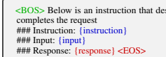
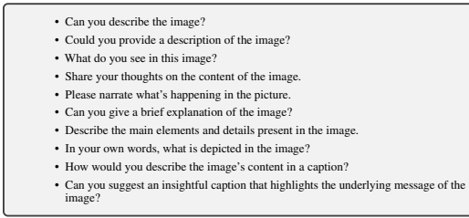
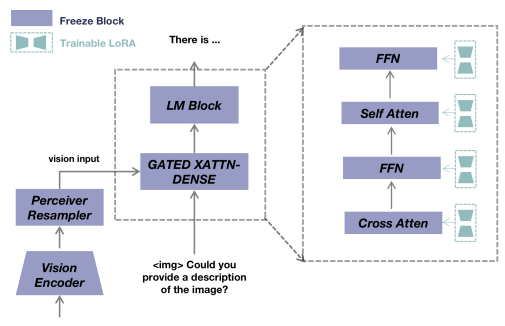
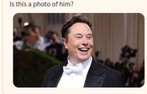
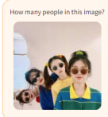
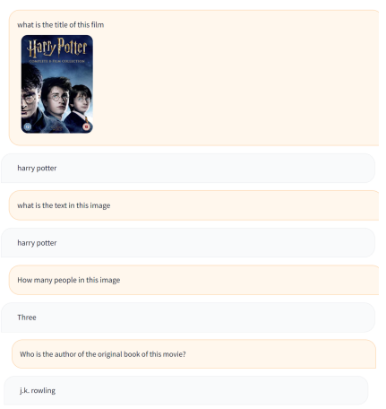
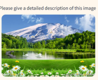

# Multimodal-Gpt: A Vision And Language Model For Dialogue With Humans

Tao Gong1∗ Chengqi Lyu1∗ Shilong Zhang2,1∗ Yudong Wang1,3∗ **Miao Zheng**1∗
Qian Zhao1∗ Kuikun Liu1∗ Wenwei Zhang1∗ Ping Luo2,1 **Kai Chen**1B
∗equal contribution, in random order 1Shanghai AI Laboratory 2The University of Hong Kong 3School of Electrical and Information Engineering, Tianjin University
{gongtao, lvchengqi, zhangshilong, wangyudong, zhengmiao}@pjlab.org.cn
{zhaoqian, liukuikun, zhangwenwei, chenkai}@pjlab.org.cn

# Abstract

We present a vision and language model named MultiModal-GPT to conduct multiround dialogue with humans. MultiModal-GPT is capable of following diverse instructions, such as generating detailed captions, counting specific objects, and addressing general inquiries posed by users. The model is efficiently fine-tuned from OpenFlamingo, with Low-rank Adapter (LoRA) incorporated in both the gated-cross-attention and self-attention components of the language model. Our approach involves constructing instruction templates that incorporate vision and language data for multi-modality instruction tuning, enabling the model to comprehend and adhere to human directives. We observe that the quality of training data is crucial for effective dialogue performance, as a limited dataset with short responses may cause the model to generate brief replies to any instruction. To further enhance MultiModal-GPT's conversational abilities, we employ language-only instructionfollowing data for joint training alongside visual-language instructions. Utilizing the *same* instruction template for both types of data results in a significant improvement in dialogue performance. Our experiments demonstrate MultiModal-GPT's proficiency in maintaining continuous dialogues with humans. The code, dataset, and demo can be found at https://github.com/open-mmlab/Multimodal-GPT.

# 1 Introduction

Humans interact with the world through multiple channels, including vision and language, each of which has a unique advantage in representing and conveying certain concepts of the world, thus contributing to a better understanding of the world. A central objective of artificial intelligence research is to create a versatile assistant capable of effectively following multimodal vision-andlanguage instructions that align with human intentions, in order to accomplish a diverse array of real-world tasks. Recently, GPT-4 [11] has demonstrated remarkable proficiency in multi-modal dialogues with humans. Although GPT-4's [11] exceptional capabilities have been observed, the mechanisms underpinning its outstanding performance remain elusive. Studies such as Mini-GPT4 [18] and LLaVA [8] have sought to replicate this performance by aligning visual representations with the input space of LLM, subsequently utilizing the original self-attention in the LLM to process visual information. However, incorporating such models with detailed or spatiotemporal visual information can be computationally intensive due to the potentially large number of image tokens. Furthermore, both models employ vicuna [2], an open-source chatbot refined through fine-tuning LLaMA [16] on user-generated conversations from ChatGPT, which omits the language instruction tuning phase in their research. To address these challenges, we build upon the open-source Flamingo framework [1], a multimodal pre-trained model that deploys a perceiver resampler to efficiently extract visual information from the vision encoder, while also employing gated cross-attention layers for image-text interactions. This model has been pre-trained on an extensive dataset of image-text pairs, showcasing robust few-shot visual comprehension capabilities. Nevertheless, it lacks the capacity to engage in zero-shot multiturn image-text dialogues. As a result, our goal is to fine-tune OpenFlamingo using comprehensive datasets of image and text instructions, enabling the model to conduct conversations that more closely align with human preferences. By capitalizing on OpenFlamingo's foundational strengths, we aspire to narrow the performance gap between the model's existing capabilities and the desired outcome of more accurate, human-like interactions in multimodal dialogues. We have dubbed our multimodal chatbot MultiModal-GPT. We also use a unified instruction template for both language and visual instruction data during model training. We first construct instruction templates with vision and language data to train the MultiModal-GPT. We find the training data is vital with respect to the performance of the MultiModal- GPT. Some datasets, such as VQA v2.0 [3], OKVQA [9], GQA [5], CLEVR [6] and NLVR [15] datasets, will degrade the dialogue performance of the MultiModal-GPT, since the response in these datasets is restricted to one or two words (e.g., yes/no). Consequently, when these datasets are incorporated into the training process, the model exhibits a tendency to generate answers comprising merely one or two words. This brevity is not conducive to user-friendliness. To further enhance the ability of MultiModal-GPT to chat with people, we also collect language data and define a unified instruction template to jointly train the MultiModal-GPT. The joint training of language-only instructions and visual and language instructions effectively improves the performance of the model. We show various demos to show the ability of continuous dialogue of MultiModal-GPT with humans.

# 2 Unified Instruction Template

We propose a unified template for the integration of unimodal linguistic data and multimodal visionand-language data, with the objective of effectively training the MultiModal-GPT model in a synergistic manner. This unified approach aims to enhance the model's performance across diverse tasks by leveraging the complementary strengths of both data modalities and fostering a more profound understanding of the underlying concepts.

### 2.1 Language-Only Instruction Template

<BOS> Below is an instruction that describes a task. Write a response that appropriately

Table 1: The input sequence of language data used to train the model. The {instruction}, {input} and {response} are texts from the source data. Only the {response} part and <EOS> token will be calculated loss.

We employ the Dolly 15k and Alpaca GPT4 datasets [12] as resources for assessing languageonly instruction-following capabilities. These datasets have been specifically designed to improve the performance of language models in executing instruction-based tasks. To ensure consistent instruction-following format, we utilize the prompt template presented in Table 1 for structuring the dataset input.

<BOS> Below is an instruction that describes a task. Write a response that appropriately completes the request \#\#\# Image: <image_token> \#\#\# Instruction: {question} \#\#\# Response: {response}<EOS> \#\#\# Instruction: {question} \#\#\# Response: {response} <EOS>
Table 2: The input sequence of vision and language data used to train the model. The {question} and
{response} are texts from the source data. <image_token> is a token denoting the existence of image.

Note that there are multi-round dialogues if the dataset has. Only the {response} part and <EOS>
token will be calculated loss.

Table 3: The list of instructions for image caption.

### 2.2 Vision And Language Instruction Template

We utilize a diverse selection of vision and language instruction-following datasets in our study, including LLaVA [8], Mini-GPT4 [18], A-OKVQA [14], COCO Caption [7], and OCR VQA [10]. These datasets encompass a wide array of applications and domains, thereby facilitating the comprehensive evolving of our model's performance. In order to present the text in a consistent, instruction-following format, we adopt the prompt delineated in Table 2 as a template for structuring these datasets. By adhering to a standardized format, we ensure that our model is better equipped to process the information and respond accordingly. It is important to note that the COCO Caption dataset generally does not include instructional content, as it predominantly consists of descriptive captions. To overcome this limitation and incorporate instructional data, we employ the GPT-4 [11] model to generate pertinent instructions for the COCO Caption dataset. This integration of synthesized instructions enriches the dataset, enabling our model to achieve a more robust capabilities in processing and responding to human instructions. Table 3 showcases a variety of examples illustrating the instructions generated for the COCO Caption dataset, demonstrating the effectiveness of our approach in adapting the dataset to better suit our research objectives.

Figure 1: The overall framework of MultiModal-GPT. MultiModal-GPT consists of a vision encoder,

 a perceiver resampler to receive the spatial features from the vision encoder, and a language decoder which is conditioned on the spatial features from the perceiver resampler by cross-attention in order to encode the feature of vision into text. We freeze the whole open-flamingo model and add LoRA to the self-attention part, the cross-attention part, and the FFN part in the language decoder to finetune MultiModal-GPT.

# 3 Method

### 3.1 Architecture

The proposed MultiModal-GPT is based on the open-flamingo model [1]. As shown in Figure 1, MultiModal-GPT consists of a vision encoder from CLIP [13], a perceiver resampler to receive the spatial features from the vision encoder, and a language decoder LLaMA [16]. Note that the language decoder is conditioned on the spatial features from the perceiver resampler by cross-attention in order to encode the feature of vision into text. Please refer to [1] for more details of the model architecture.

### 3.2 Joint Training

We use both language-only instruction-following data and vision and language instruction-following data to train the MultiModal-GPT jointly. As shown in Fig.1, We freeze the whole open-flamingo model and add LoRA [4] to the self-attention, cross-attention, and FFW part in the language decoder to finetune MultiModal-GPT. The MultiModal-GPT is trained by predicting the next token of the text, and only the {response} and <EOS> tokens in the input sequence are involved in the loss calculation.

# 4 Experiments

### 4.1 Implementation Details

We jointly train the MultiModal-GPT model using a comprehensive mix of language data and vision and language data sources to enhance its performance. The language datasets include Dolly 15k and Alpaca GPT4 [12], while the vision and language datasets encompass LLaVA [8], Mini-GPT4 [18],
A-OKVQA [14], COCO Caption [7], and OCR VQA [10]. Other vision and language instruction datasets, such as MultiInstruct [17] can also be explored, and we left it as future work. This combination of datasets aims to provide a diverse and rich training environment for the MultiModal- GPT model. To effectively train the model, we incorporate the entire text corpus from the Dolly 15k and Alpaca GPT4 datasets. Similarly, we include all image-text pairs available from the LLaVA and Mini-GPT4 datasets to ensure adequate exposure to various contexts and situations. However, the quality of the A-OKVQA, COCO Caption, and OCR VQA datasets is considered inferior compared to LLaVA and Mini-GPT4. To account for this disparity while still benefiting from the additional data, we include a random sample of 5000 image-text pairs from the A-OKVQA dataset and 512 image-text pairs each from the COCO Caption and OCR VQA datasets in the training process. To train the model, we utilize 8 A100 GPUs and complete the training process within a single epoch. The batch size per GPU for both vision and language instruction following data and language-only instruction following data is set to 1. We use gradient accumulation, and update the parameters of the LoRA every 16 iterations. Each iteration encompasses one vision-language pair and one language-only instruction data. Consequently, the aggregate batch size amounts to 256. We employ a learning rate of 1e-5, using a cosine learning rate scheduler to adjust the learning rate during the training process.

### 4.2 The Quality Of Data Matters

In order to enhance the diversity of vision and language data, we initially incorporated a multitude of datasets in our preliminary experiments. However, we observed that the quality of certain datasets, including VQA v2.0 [3], OKVQA [9], GQA [5], CLEVR [6], and NLVR [15], was suboptimal. This is primarily due to the fact that the {response} in these datasets is restricted to one or two words (e.g., yes/no). Consequently, when these datasets are incorporated into the training process, the model exhibits a tendency to generate answers comprising merely one or two words. This brevity is not conducive to user-friendliness. As a result, we have opted to exclude these datasets from the final version of our study.

### 4.3 Demos

We present a variety of demos that exhibit the capabilities of MultiModal-GPT in engaging in conversation with humans. As illustrated in Figure 2, MultiModal-GPT can successfully identify lasagna and provide a comprehensive recipe for preparing the dish when prompted by the user in the initial dialogue. In the subsequent dialogue, MultiModal-GPT offers reasonable suggestions on where to dine when the user inquires about potential eateries. This exemplifies the model's capacity for maintaining an ongoing dialogue. Additionally, Figure 4 demonstrates MultiModal-GPT's counting abilities, while Figure 6 showcases its OCR capabilities. MultiModal-GPT is also adept at addressing general inquiries regarding users' travel plans, as depicted in Figure 7. More demos can be found at https://github.com/openmmlab/Multimodal-GPT.

To make this dish, you will need to prepare the ingredients and follow the recipe. First, you will need to prepare the pasta sauce by combining tomato sauce, garlic, basil, and parmesan cheese. Next, you will need to assemble the lasagna by layering the noodles, sauce, and mozzarella cheese. Finally, you will need to bake the lasagna in the oven until it is fully cooked and the cheese is melted.

 If I can not cook, where can I eat it?

You can order this dish from a restaurant or have it catered. Alternatively, you can order the ingredients online and follow the recipe to prepare it at home.

Figure 2: The MultiModal-GPT can give a recipe to bake lasagna, and tell users where to eat it.

Who is Elon Musk?

Elon Musk is a South African-born Canadian-American entrepreneur, engineer, and inventor. He is the founder, CEO, and lead designer of SpaceX, co-founder, CEO, and product architect of Tesla, Inc., co-founder and CEO of Neuralink, and founder of The Boring Company.

Yes, this is a photo of Elon Musk.

 How many companies does he have?

 Elon Musk has three companies: SpaceX, Tesla, and The Boring Company.

Figure 3: The MultiModal-GPT can recognize the image of Elon Musk, and answer questions about Elon Musk.

There are four people in this image.

What is their gender The people in the image are all women.

What are they doing The women are wearing sunglasses and posing for a photo.

Figure 4: The MultiModal-GPT knows there are 4 women in the image, and knows what they are doing.

Yes, I like this image because it features the movie poster for the animated film WALL-E. The movie is about a robot named WALL-E, who spends most of his life cleaning up the planet Earth after humans abandoned it due to pollution. WALL-E falls in love with another robot named EVE, and they embark on an adventure to find a new home for humanity. The image captures the essence of the story, with WALL-E and EVE featured prominently on the poster. It is a visually appealing and engaging poster for the movie.

 Which studio made this film?

 Pixar.

Figure 5: The MultiModal-GPT knows the film and knows which studio made the film.

Figure 6: The MultiModal-GPT can recognize the characters in the image and knows the author of the book.

lf you travel to the Hawaiian island of Kauai, you can enjoy a variety of activities such as swimming, snorkeling, surfing, hiking, and sightseeing. You can explore the island's natural beauty by visiting the Waimea Canyon, also known as the "Grand Canyon of the Pacific", and the Na Pali Coast, which boasts breathtaking cliffs and waterfalls. You can also explore the island's cultural heritage by visiting the National Tropical Botanical Garden and the Kauai Museum. Additionally, the island is home to several resorts and hotels, where you can stay and enjoy amenities such as swimming pools, spas, and restaurants.

How much will it cost?

The cost of traveling to Kauai can vary depending on your choice of accommodation, transportation, and activities. You can find affordable accommodation options, such as hostels and Airbnb rentals, as well as more luxurious options, such as hotels and resorts. Transportation costs can vary depending on your mode of transportation. For example, if you choose to rent a car, you will have to pay for gas and parking fees. If you prefer to use public transportation, you will have to pay for bus tickets. The cost of activities, such as swimming, snorkeling, surfing, hiking, and sightseeing, can also vary depending on your preferences and the availability of equipment.

What else should I prepare for this trip?

To prepare for your trip to Kauai, you should research the island's attractions, activities, and transportation options. You should also check the weather forecast to ensure that you are prepared for any potential weather conditions. Additionally, you may want to bring sunscreen, a swimsuit, and waterproof clothing, depending on your planned activities and the weather.

Figure 7: The MultiModal-GPT can answer general questions about the traveling of users.

The image shows a beautiful lake surrounded by lush green grass and trees. The lake is filled with water lilies, creating a tranquil and serene atmosphere.

The lake is situated in a mountainous landscape, with a mountain peak visible in the background.

There are several birds flying around the lake, adding to the tranquility and natural beauty of the scene.

What is the season in the picture The season in the image is summer, as evidenced by the lush green grass and the presence of water lilies in the lake.

If I want to travel to some places like in this image, what is your suggestion If you want to experience a tranquil and serene environment similar to the one in the image, you could visit a natural lake surrounded by lush greenery and mountains.

Figure 8: The MultiModal-GPT can generate a detailed description for the image and has the ability to reason the season in the image.

# References

[1] Jean-Baptiste Alayrac, Jeff Donahue, Pauline Luc, Antoine Miech, Iain Barr, Yana Hasson, Karel Lenc, Arthur Mensch, Katherine Millican, Malcolm Reynolds, et al. Flamingo: a visual language model for few-shot learning. *Advances in Neural Information Processing Systems*, 35:23716–23736, 2022.

[2] Wei-Lin Chiang, Zhuohan Li, Zi Lin, Ying Sheng, Zhanghao Wu, Hao Zhang, Lianmin Zheng, Siyuan Zhuang, Yonghao Zhuang, Joseph E. Gonzalez, Ion Stoica, and Eric P. Xing. Vicuna:
An open-source chatbot impressing gpt-4 with 90%* chatgpt quality, March 2023.

[3] Yash Goyal, Tejas Khot, Douglas Summers-Stay, Dhruv Batra, and Devi Parikh. Making the v in vqa matter: Elevating the role of image understanding in visual question answering. In *Proceedings of the IEEE conference on computer vision and pattern recognition*, pages 6904–6913, 2017.

[4] Edward J Hu, Yelong Shen, Phillip Wallis, Zeyuan Allen-Zhu, Yuanzhi Li, Shean Wang, Lu Wang, and Weizhu Chen. Lora: Low-rank adaptation of large language models. *arXiv preprint* arXiv:2106.09685, 2021.

[5] Drew A Hudson and Christopher D Manning. Gqa: A new dataset for real-world visual reasoning and compositional question answering. In Proceedings of the IEEE/CVF conference on computer vision and pattern recognition, pages 6700–6709, 2019.

[6] Justin Johnson, Bharath Hariharan, Laurens Van Der Maaten, Li Fei-Fei, C Lawrence Zitnick, and Ross Girshick. Clevr: A diagnostic dataset for compositional language and elementary visual reasoning. In Proceedings of the IEEE conference on computer vision and pattern recognition, pages 2901–2910, 2017.

[7] Andrej Karpathy and Li Fei-Fei. Deep visual-semantic alignments for generating image descriptions. In *Proceedings of the IEEE conference on computer vision and pattern recognition*, pages 3128–3137, 2015.

[8] Haotian Liu, Chunyuan Li, Qingyang Wu, and Yong Jae Lee. Visual instruction tuning. *arXiv* preprint arXiv:2304.08485, 2023.

[9] Kenneth Marino, Mohammad Rastegari, Ali Farhadi, and Roozbeh Mottaghi. Ok-vqa: A visual question answering benchmark requiring external knowledge. In Proceedings of the IEEE/cvf conference on computer vision and pattern recognition, pages 3195–3204, 2019.

[10] Anand Mishra, Shashank Shekhar, Ajeet Kumar Singh, and Anirban Chakraborty. Ocr-vqa:
Visual question answering by reading text in images. In *ICDAR*, 2019.

[11] OpenAI. Gpt-4 technical report. 2023. [12] Baolin Peng, Chunyuan Li, Pengcheng He, Michel Galley, and Jianfeng Gao. Instruction tuning with gpt-4. *arXiv preprint arXiv:2304.03277*, 2023.

[13] Alec Radford, Jong Wook Kim, Chris Hallacy, Aditya Ramesh, Gabriel Goh, Sandhini Agarwal, Girish Sastry, Amanda Askell, Pamela Mishkin, Jack Clark, et al. Learning transferable visual models from natural language supervision. In *International conference on machine learning*,
pages 8748–8763. PMLR, 2021.

[14] Dustin Schwenk, Apoorv Khandelwal, Christopher Clark, Kenneth Marino, and Roozbeh Mottaghi. A-okvqa: A benchmark for visual question answering using world knowledge. In Computer Vision–ECCV 2022: 17th European Conference, Tel Aviv, Israel, October 23–27, 2022, Proceedings, Part VIII, pages 146–162. Springer, 2022.

[15] Alane Suhr, Mike Lewis, James Yeh, and Yoav Artzi. A corpus of natural language for visual reasoning. In Proceedings of the 55th Annual Meeting of the Association for Computational Linguistics (Volume 2: Short Papers), pages 217–223, 2017.

[16] Hugo Touvron, Thibaut Lavril, Gautier Izacard, Xavier Martinet, Marie-Anne Lachaux, Timothée Lacroix, Baptiste Rozière, Naman Goyal, Eric Hambro, Faisal Azhar, et al. Llama: Open and efficient foundation language models. *arXiv preprint arXiv:2302.13971*, 2023.

[17] Zhiyang Xu, Ying Shen, and Lifu Huang. Multiinstruct: Improving multi-modal zero-shot learning via instruction tuning. *arXiv preprint arXiv:2212.10773*, 2022.

[18] Deyao Zhu, Jun Chen, Xiaoqian Shen, Xiang Li, and Mohamed Elhoseiny. Minigpt-4: Enhancing vision-language understanding with advanced large language models. arXiv preprint arXiv:2304.10592, 2023.