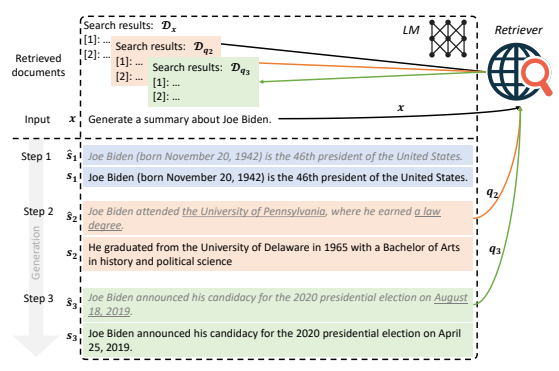
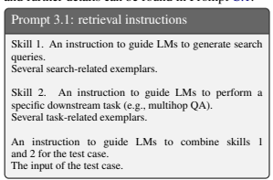
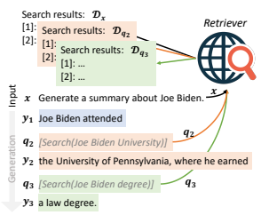
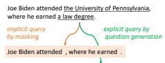
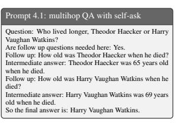
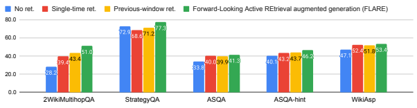
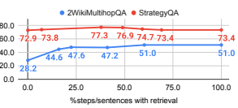

# Active Retrieval Augmented Generation

Zhengbao Jiang1∗ Frank F. Xu1∗ Luyu Gao1∗ Zhiqing Sun1∗ **Qian Liu**2 Jane Dwivedi-Yu3 Yiming Yang1 Jamie Callan1 **Graham Neubig**1 1Language Technologies Institute, Carnegie Mellon University 2Sea AI Lab 3Meta AI Research
{zhengbaj,fangzhex,luyug,zhiqings,gneubig}@cs.cmu.edu

# Abstract

Despite the remarkable ability of large language models (LMs) to comprehend and generate language, they have a tendency to hallucinate and create factually inaccurate output. Augmenting LMs by retrieving information from external knowledge resources is one promising solution. Most existing retrieval-augmented LMs employ a retrieveand-generate setup that only retrieves information once based on the input. This is limiting, however, in more general scenarios involving generation of long texts, where continually gathering information throughout the generation process is essential. There have been some past efforts to retrieve information multiple times while generating outputs, which mostly retrieve documents at fixed intervals using the previous context as queries. In this work, we provide a generalized view of active retrieval augmented generation, methods that actively decide when and what to retrieve across the course of the generation. We propose Forward-Looking Active REtrieval augmented generation (**FLARE**), a generic retrieval-augmented generation method which iteratively uses a prediction of the upcoming sentence to anticipate future content, which is then utilized as a query to retrieve relevant documents to regenerate the sentence if it contains low-confidence tokens. We test FLARE along with baselines comprehensively over 4 longform knowledge-intensive generation tasks/-
datasets. FLARE achieves superior or competitive performance on all tasks, demonstrating the effectiveness of our method.1

# 1 Introduction

Generative language models (LMs) (Brown et al., 2020; Ouyang et al., 2022; OpenAI, 2023; Chowdhery et al., 2022; Zhang et al., 2022; Touvron et al., 2023) have become a foundational component in many natural language processing (NLP) systems with their remarkable ability to comprehend and generate language. Although LMs have memorized some amount of world knowledge observed during training (Petroni et al., 2019; Roberts et al., 2020; Jiang et al., 2020), they still tend to hallucinate and create imaginary content (Maynez et al., 2020; Zhou et al., 2021; OpenAI, 2023). To address the issue of hallucination, one promising direction is to augment generation with retrieval, which involves augmenting parametric LMs with non-parametric retrieval components that can look up relevant information from external knowledge resources such as document corpora (Lewis et al., 2020; Izacard and Grave, 2021; Khandelwal et al., 2020; Izacard et al., 2022; Jiang et al., 2022; Shi et al., 2023).

Retrieval-augmented LMs commonly use a retrieve-and-generate setup where they retrieve documents based on the user's input (e.g. questions in question answering), and then generate a complete answer conditioning on the retrieved documents (Lewis et al., 2020; Izacard and Grave, 2021; Izacard et al., 2022; Jiang et al., 2022; Shi et al., 2023). These single-time retrieval-augmented LMs have been found to outperform purely parametric LMs, particularly for short-form knowledgeintensive generation tasks such as factoid QA
(Kwiatkowski et al., 2019; Joshi et al., 2017) and fact checking (Thorne et al., 2018), where the information needs are clear in the user's input, and it is sufficient to retrieve relevant knowledge once solely based on the input.

In recent years, increasingly powerful large LMs have demonstrated abilities in more complex tasks that involve generating long-form output, such as long-form QA (Fan et al., 2019; Stelmakh et al., 2022), open-domain summarization (Cohen et al., 2021; Hayashi et al., 2021; Giorgi et al., 2022), and (chain-of-thought; CoT) reasoning (Wei et al., 2022; Ho et al., 2020; Geva et al., 2021; Hendrycks et al., 2020). In contrast to short-form generation,

∗Lead contributors.

1Code and datasets are available at https://github.com/
jzbjyb/FLARE.

Figure 1: An illustration of forward-looking active retrieval augmented generation (FLARE). Starting with the user input x and initial retrieval results Dx, FLARE iteratively generates a temporary next sentence (shown in gray italic) and check whether it contains low-probability tokens (indicated with underline). If so (step 2 and 3), the system retrieves relevant documents and regenerates the sentence.

long-form generation presents complex information needs that are not always evident from the input alone. Similar to how humans gradually gather information as we create content such as papers, essays, or books, long-form generation with LMs would require gathering multiple pieces of knowledge throughout the generation process. For example in open-domain summarization (Giorgi et al., 2022), the goal is to generate a summary about a particular topic by retrieving references from the open web. The initial retrieval based on the topic name (e.g., Joe Biden) may not cover all aspects and details. Therefore, it is crucial to retrieve extra information as needed during the generation process, such as when generating a certain aspect
(e.g., the education history of Joe Biden) or a specific detail (e.g., when did Joe Biden announce his candidacy for the 2020 presidential campaign).

Several attempts have been made to build systems that retrieve multiple times throughout generation. These attempts include methods that *passively* utilize the past context (e.g., previous sentences or tokens) to retrieve additional information at a fixed interval (e.g., every sentence or every few tokens) (Khandelwal et al., 2020; Borgeaud et al., 2022; Ram et al., 2023; Trivedi et al., 2022) which might not accurately reflect what LMs intend to generate in the future or retrieve at inappropriate points. Some works in multihop QA address multiple information needs by decomposing the full question into sub-questions, each of which is used to retrieve extra information (Press et al., 2022; Yao et al., 2022; Khot et al., 2022; Khattab et al., 2022).

We ask the following question in this paper: can we create a simple and generic retrieval-augmented LM that *actively decides when and what to retrieve* throughout the generation process, and are applicable to a variety of long-form generation tasks?

We consider a new paradigm, active retrieval augmented generation. Our hypothesis regarding *when* to retrieve is that LMs should retrieve information only when they lack the required knowledge to avoid unnecessary or inappropriate retrieval that occurs in passive retrieval-augmented LMs (Khandelwal et al., 2020; Borgeaud et al., 2022; Ram et al., 2023; Trivedi et al., 2022). Given the observation that large LMs tend to be well-calibrated and low probability/confidence often indicates a lack of knowledge (Jiang et al., 2021; Kadavath et al., 2022), we adopt an active retrieval strategy that only retrieves when LMs generate low-probability tokens. When deciding *what to retrieve*, we argue that it is important to consider what LMs intend to generate in the future, as the goal of active retrieval is to benefit future generations. Therefore, we propose anticipating the future by generating a temporary next sentence, using it as a query to retrieve relevant documents, and then regenerating the next sentence conditioning on the retrieved documents. Combining the two aspects, we propose Forward- Looking Active REtrieval augmented generation (**FLARE**), as illustrated in Figure 1. FLARE iteratively generates *a temporary next sentence*, use it as the query to retrieve relevant documents *if it* contains low-probability tokens and regenerate the next sentence until reaches the end.

FLARE is applicable to any existing LMs at inference time without additional training. Considering the impressive performance achieved by GPT-3.5 (Ouyang et al., 2022) on a variety of tasks, we examine the effectiveness of our methods on text-davinci-003. We evaluate FLARE
on 4 diverse tasks/datasets involving generating long outputs, including multihop QA (2WikiMultihopQA), commonsense reasoning (StrategyQA), long-form QA (ASQA), and open-domain summarization (WikiAsp) (Ho et al., 2020; Geva et al., 2021; Stelmakh et al., 2022; Hayashi et al., 2021). Over all tasks, FLARE achieves superior or competitive performance compared to single-time and multi-time retrieval baselines, demonstrating the effectiveness and generalizability of our method.

# 2 Retrieval-Augmented Generation

In this section, we formally define single-time retrieval-augmented generation and propose the framework of active retrieval augmented generation that decides when and what to retrieve throughout the generation.

### 2.1 Notations And Definitions

Given a user input x and a document corpus D = {di}
|D| i=1 (such as all Wikipedia articles), the goal of retrieval-augmented LMs is to generate the answer y = [s1, s2*, ...,* sm] = [w1, w2*, ..., w*n] containing m sentences or n tokens leveraging information retrieved from the corpus.

In retrieval-augmented LM, the LM typically pairs with a retriever that can retrieve a list of documents Dq = ret(q) for a query q; the LM conditions on both the user input x and retrieved documents Dq to generate the answer. Since we focus on examining various methods of determining when and what to retrieve, we follow existing methods (Ram et al., 2023; Trivedi et al.,
2022) to prepend the retrieved documents before the user input to aid future generation for both baselines and our method for fair comparisons:
y = LM([Dq, x]), where [·, ·] is concatenation following the specified order.

### 2.2 Single-Time Retrieval-Augmented Generation

The most common choice is to directly use the user input as the query for retrieval and generate the complete answer at once y = LM([Dx, x]) (Chen et al., 2017; Guu et al., 2020; Lewis et al., 2020; Izacard and Grave, 2021; Sachan et al., 2021; Lee et al., 2021; Jiang et al., 2022; Izacard et al., 2022; Shi et al., 2023).

### 2.3 Active Retrieval Augmented Generation

To aid long-form generation with retrieval, we propose active retrieval augmented generation. It is a generic framework that actively decides when and what to retrieve through the generation process, resulting in the interleaving of retrieval and generation. Formally, at step t(t ≥ 1), the retrieval query qtis formulated based on both the user input x and previously generated output y<t = [y0*, ...,* yt−1]:

# Qt = Qry(X, Y<T),

where qry(·) is the query formulation function. At the start of the generation (t = 1), the previous generation is empty (y<1 = ∅), and the user input is used as the initial query (q1 = x). Given the retrieved documents Dqt, LMs continually generate the answer until the next retrieval is triggered or reaches the end:

# Yt = Lm([Dqt, X, Y<T]),

where yt represents the generated tokens at the current step t, and the input to LMs is the concatenation of the retrieved documents Dqt, the user input x, and the previous generation y<t. At each step, we discard previously retrieved documents
∪t 0<tDqt 0 and only use the retrieved documents from the current step to condition the next generation to prevent reaching the input length limit of LMs.

# 3 Flare: Forward-Looking Active Retrieval Augmented Generation

Our intuition is that (1) LMs should only retrieve information when they do not have the necessary knowledge to avoid unnecessary or inappropriate retrieval, and (2) the retrieval queries should reflect the intents of future generations. Therefore, We propose two forward-looking active retrieval augmented generation (FLARE) methods to implement the active retrieval augmented generation framework. Inspired by Toolformer (Schick et al., 2023), the first method prompts the LM to generate retrieval queries when necessary while generating the answer using retrieval-encouraging instructions, denoted as FLAREinstruct. The second method directly uses the LM's generation as search queries, denoted as FLAREdirect, which iteratively generates the next sentence to gain insight into the future topic, and if uncertain tokens are present, retrieves relevant documents to regenerate the next sentence.

#### 3.1 Flare With Retrieval Instructions

A straightforward way of expressing information needs for retrieval is to generate "[Search(query)]" when additional information is needed (Schick et al., 2023), e.g., "The colors on the flag of Ghana have the following meanings. Red is for [Search(Ghana flag red meaning)] the blood of martyrs, ..." When working with GPT-3.5 models that offer only API access, we elicit such behavior by few-shot prompting (Brown et al., 2020).

Specifically, for a downstream task, we place the search-related instruction and exemplars at the beginning as skill 1, followed by the instruction and exemplars of the downstream task as skill 2. Given a test case, we ask LMs to combine skills 1 and 2 to generate search queries while performing the task. The structure of the prompt is shown in Prompt 3.1, and further details can be found in Prompt C.1.

As shown in Figure 2, when the LM generates
"[Search(query)]" (shown in *gray italic*), we stop the generation and use the query terms to retrieve relevant documents, which are prepended before the user input to aid future generation until the next search query is generated or reaches the end.

Figure 2: An illustration of forward-looking active retrieval augmented generation with retrieval instructions
(FLAREinstruct). It iteratively generates search queries
(shown in *gray italic*) to retrieve relevant information to aid future generations.

We found that LMs can effectively combine the two skills and generate meaningful search queries while performing the task. However, there are two issues: (1) LMs tend to generate fewer search queries than necessary. (2) Generating excessive search queries can disrupt answer generation and adversely affect performance. We address these issues using two methods respectively. First, we increase the logit of the token "[" by 2.0 to improve the chances of LMs generating "[Search(query)]". Second, whenever LMs generate a search query in Figure 2), we use it to retrieve relevant information, promptly remove it from the generation, and generate the next few tokens while forbidding "[" by adding a large negative value to the logit of "[".

### 3.2 Direct Flare

Since we cannot fine-tune black-box LMs, we found queries generated by FLAREinstruct through retrieval instructions might not be reliable. Therefore, we propose a more direct way of forwardlooking active retrieval that uses the next sentence to decide when and what to retrieve.

### 3.2.1 Confidence-Based Active Retrieval

As shown in Figure 1, at step t, we first generate a temporary next sentence sˆt = LM([x, y<t]) without conditioning on retrieved documents. Then we decide whether to trigger retrieval and formulate queries based on sˆt. If the LM is confident about sˆt, we accept it without retrieving additional information; if not, we use sˆtto formulate search queries qtto retrieve relevant documents, and then regenerate the next sentence st. The reason we utilize sentences as the basis of our iteration is due to their significance as semantic units that are neither too short nor too lengthy like phrases and paragraphs. However, it is worth noting that our approach can also be employed using phrases, paragraphs, or fixed-size windows as the basis.

Since LMs tend to be well-calibrated that low probability/confidence often indicates a lack of knowledge (Kadavath et al., 2022; Jiang et al.,
2021), we actively trigger retrieval if any token of sˆt has a probability lower than a threshold θ ∈ [0, 1]. θ = 0 means that retrieval is never triggered, while θ = 1 triggers retrieval for every sentence.

$$\mathbf{y}_{t}={\begin{cases}{\hat{\mathbf{s}}}_{t}&{{\mathrm{if~all~tokens~of~}}{\hat{\mathbf{s}}}_{t}{\mathrm{~have~probs}}\geq\theta}\\ {\mathbf{s}}_{t}={\mathrm{LM}}([{\mathcal{D}}_{\mathbf{q}_{t}},\mathbf{x},\mathbf{y}_{<t}])&{{\mathrm{~otherwise}}}\end{cases}}$$

where the query qtis formulated based on sˆt.

### 3.2.2 Confidence-Based Query Formulation

One way to perform retrieval is to directly use the next sentence sˆt as the query qt. This shares a similar spirit with existing methods that use generated hypothetical titles or paragraphs (Gao et al., 2022; Sun et al., 2022) from LMs instead of the original input question as the retrieval query (Gao et al., 2022; Mao et al., 2021). We transfer and generalize such techniques to long-form generation scenarios where active information access is essential.

Empirically, we found retrieving with the next sentence achieves significantly better results than with the previous context, as to be shown later in subsection 6.2. However, it has a risk of perpetuating errors contained in it. For example, if the LM produces the sentence "Joe Biden attended the University of Pennsylvania" instead of the correct fact that he attended the University of Delaware, using this erroneous sentence as a query could prompt the retriever to retrieve irrelevant information, which could potentially mislead future generations. We propose two simple methods to overcome this issue as illustrated in Figure 3.

Masked sentences as implicit queries. The first method masks out low-confidence tokens in sˆt with probabilities below a threshold β ∈ [0, 1], where a higher β results in more aggressive masking. This removes potential distractions from the sentence to improve retrieval accuracy.

Ask a question to which the answer is "the University of Pennsylvania"

What degree did Joe Biden earn?
Figure 3: Implicit the explicit query formulation. Tokens with low probabilities are marked with underlines.

Generated questions as explicit queries. Another method is to generate explicit questions that target the low-confident span in sˆt. For example, if the LM is uncertain about "the University of Pennsylvania", a question like "Which university did Joe Biden attend?" can help retrieve relevant information. Self-ask (Press et al., 2022) achieved this by manually inserting follow-up questions into downstream task exemplars as shown later in Prompt 4.1, which requires task-specific annotation efforts. Instead, we developed a universal approach that generates questions for low-confidence spans without additional annotation. Specifically, We first extract all spans from sˆt with probabilities below β. For each extracted span z, we prompt gpt-3.5-turbo to generate a question qt,z that can be answered with the span, using the following prompt:

| Prompt 3.2: zero\-shot question generation   |       |          |       |       |
|----------------------------------------------|-------|----------|-------|-------|
| User input x.                                |       |          |       |       |
| Generated output so far y≤t.                 |       |          |       |       |
| Given the  question to                       | above | passage, | ask a | which |

the answer is the term/entity/phrase "z".

We retrieve using each generated question and interleave the returned documents into a single ranking list to aid future generations. In summary, queries qt are formulated based on sˆt as follows:
qt =

$$={\begin{cases}\varnothing&{\mathrm{if~all~tokens~of~}}{\hat{s}}_{t}{\mathrm{~have~probs~}}\geq\theta\\ {\mathrm{mask}}({\hat{s}}_{t}){\mathrm{~or~qgen}}({\hat{s}}_{t})&{{\mathrm{otherwise}}}\end{cases}}$$
$\tau=\infty$. 

#### 3.3 Implementation Details

We validate our method using one of the most advanced GPT-3.5 LMs text-davinci-003 by iteratively querying their API.2 2https://api.openai.com/v1/completions in April 2023.

The initial query. FLARE starts with the user input x as the initial query to retrieve documents to generate the first sentence sˆ1 = LM([Dx, x])
to bootstrap the iterative generation process. For the following steps, the temporary forward-looking sentence is generated without retrieved documents. Sentence tokenization. For each step t, we generate 64 tokens which are longer than most sentences, and use NLTK sentence tokenizer3to extract the first sentence and discard the rest. Document corpus and retrievers. Since we focus on the integration of retrieval and generation in this paper, we use off-the-shelf retrievers that take queries as inputs and return a list of relevant documents. For datasets that mainly rely on knowledge from Wikipedia, we use the Wikipedia dump from Karpukhin et al. (2020) where articles are divided into 100-token passages as the document corpus and employ BM25 (Robertson and Zaragoza, 2009)
as the retriever. For datasets that rely on knowledge from the open web, we use the Bing search engine as our retriever.4 Retrieved document formatting. Multiple re-

 trieved documents are linearized according to their ranking and then added to the beginning of the user input using the following format:

| Prompt 3.3: document formatting   |
|-----------------------------------|
| Search results:                   |
| [1] Document 1                    |
| [2] Document 2                    |
| ...                               |
| The user input x                  |

Efficiency As shown later in subsection 6.2, on average retrieval is triggered for 30% ∼ 60% of sentences depending on downstream tasks. In comparision, KNN-LM (Khandelwal et al., 2020)
retrieves for *every* token, RETRO or IC-RALM
(Borgeaud et al., 2022; Ram et al., 2023) retrievers *every* 4∼32 tokens, and IRCoT (Trivedi et al.,
2022) retrieves for *every* sentence. Compared to single-time retrieval, however, interleaving retrieval and generation with a naive implementation indeed increases overheads, which we will discuss in the limitation section (section 8).

# 4 Multi-Time Retrieval Baselines

Existing passive multi-time retrieval-augmented LMs (Khandelwal et al., 2020; Ram et al., 2023; Trivedi et al., 2022; Press et al., 2022; Yao et al.,
2022) can also be formulated using our framework
(subsection 2.3). In this section, we formally introduce three baseline categories based on when and what to retrieve. These baselines are not exact reproductions of the corresponding paper because many design choices differ among previous works which makes direct comparisons impossible. We excluded irrelevant designs and ensured that we implemented them using the same settings, with the only variation being when and what to retrieve.

Previous-window approaches trigger retrieval every l tokens, where l represents the window size. Generated tokens from the previous window are used as the query:

$$\begin{array}{l l}{{q_{t}=y_{t-1}}}&{{(t\geq2),}}\\ {{y_{t}=[w_{(t-1)l+1},...,w_{t l}].}}\end{array}$$

Some existing methods in this category are RETRO
(Borgeaud et al., 2022), IC-RALM (Ram et al.,
2023), which retrieve every few tokens, and KNN- LM (Khandelwal et al., 2020), which retrieves every token.5 Previous-sentence approaches trigger retrieval every sentence and use the previous sentence as the query:

$$\begin{array}{l l}{{q_{t}=y_{t-1}}}&{{(t\geq2),}}\\ {{y_{t}=s_{t}.}}\end{array}$$

IRCoT (Trivedi et al., 2022) belongs to this category.

Question decomposition approaches manually annotated task-specific exemplars to guide LMs to generate decomposed sub-questions while producing outputs. For example, self-ask (Press et al., 2022), a method in this category, manually inserts follow-up questions in exemplars:

3https://www.nltk.org/api/nltk.tokenize.

PunktSentenceTokenizer.html 4https://www.microsoft.com/en-us/bing/apis/
bing-web-search-api 5Since KNN-LM uses the contextualized representation corresponding to the current decoding position to retrieve relevant information which encodes all previous tokens. Strictly speaking, qt should be y<t.

For the test case, retrieval is triggered dynamically whenever the model generates a sub-question
(e.g., "follow up" in self-ask).

The aforementioned three approaches are capable of retrieving additional information while generating. However, they have notable drawbacks: (1) fixed-interval approaches use previously generated tokens as queries which might not reflect what LMs intend to generate in the future. (2) Retrieving information at a fixed interval can be inefficient because it might occur at inappropriate points. (3) Question decomposition approaches require taskspecific prompt engineering, which restricts their generalizability in new tasks.

# 5 Experimental Setup

We evaluate the effectiveness of FLARE on 4 diverse knowledge-intensive tasks using few-shot incontext learning (Radford et al., 2019; Brown et al.,
2020), as summarized in Table 6 of Appendix A.

To ensure fair head-to-head comparisons, we compare the results of FLARE with baselines using the same setting, namely, the same in-context exemplars, prompt format, retriever, and document corpus. We follow previous works (Trivedi et al., 2022) to sub-sample at most 500 examples from each dataset due to the cost of running experiments. The hyperparameters of FLARE are selected based on the development set and listed in Table 8. FLARE refers to FLAREdirect if not specifically stated. For previous-window approaches, we follow Ram et al. (2023) to use a window size l = 16 in our experiments.

#### 5.1 Multihop Qa

Dataset The goal of multihop QA is to answer complex questions through a process of information retrieval and reasoning (Yang et al., 2018; Ho et al., 2020). For instance, to answer "Why did the founder of Versus die?", we must first identify who founded Versus and subsequently determine the cause of their death. Multihop QA also unifies into long-form generation when solved with the state-of-the-art CoT methods (Wei et al., 2022).

We use 2WikiMultihopQA (Ho et al., 2020)
which contains 2-hop complex questions sourced from Wikipedia articles that require composition, comparison, or inference. Settings We follow Wang et al. (2022) to generate both the chain-of-thought reasoning process and the final answer. For the above case, the output we aim to generate is "The founder of Versus was Gianni Versace. Gianni Versace was shot and killed on the steps of his Miami Beach mansion on July 15, 1997. So the answer is shot." We use 8 exemplars from Trivedi et al. (2022) listed in Prompt C.2 for in-context learning, BM25 as the retriever, and Wikipedia articles as the retrieval corpus. Similar to the observation in Trivedi et al. (2022), we found incorporating retrieval results for exemplars improves the performance, we use the input x of each exemplar to retrieve several documents and then add them using the format in Prompt 3.3. We found increasing the number of retrieval documents often increases performance. Therefore, we use the maximum number of documents that can fit within the input length limit of text-davinci-003, which is 2 for 2WikiMultihopQA. Evaluation We use regular expressions to extract the final answer (i.e., "shot" in the above example) from the generated output and compare it with the reference answer using answer-level exact match
(EM), and token-level F1, precision, and recall.

### 5.2 Commonsense Reasoning

Dataset Commonsense reasoning requires systems to utilize both world and commonsense knowledge to generate an answer (Talmor et al., 2019; Geva et al., 2021). For example, to answer "Would a pear sink in water?", we must have the commonsense understanding that we need to consider their density. We use StrategyQA (Geva et al., 2021) as the testbed which is a collection of crowdsourced yes/no questions that require multi-step reasoning.

Settings We follow Wei et al. (2022) to generate both the chain-of-thought reasoning process and the final yes/no answer, which for the above case is
"The density of a pear is about 0.6g/cm3, which is less than water. Objects less dense than water float.

Thus, a pear would float. So the final answer is no." We use 6 exemplars from Wei et al. (2022) listed in Prompt C.3, BM25 over the Wikipedia corpus, and 3 retrieved documents to run experiments. Evaluation We extract the yes/no answer and match it against the gold answer using exact match.

### 5.3 Long-Form Qa

Dataset Long-form QA aims to generate comprehensive answers to questions seeking complex information (Fan et al., 2019; Stelmakh et al., 2022).

The following question "Where do the Philadelphia Eagles play their home games?" could be asking about the city, sports complex, or stadium of their home games. We use ASQA (Stelmakh et al., 2022) as our testbed where inputs are ambiguous questions with multiple interpretations, and outputs are comprehensive answers covering all. Setting To answer ambiguous questions, systems must first identify possible interpretations and then provide answers for each of them, which for the above case is "We need to consider the different possible locations or venues that could be considered the home field of the Philadelphia Eagles. These include the city, the sports complex, or the stadium. Therefore, this question has 3 interpretations and the answers are: (1) The city is Philadelphia. (2) The sports complex is the South Philadelphia Sports Complex. (3) The stadium is the Lincoln Financial Field stadium." We found that in many cases, it is challenging even for humans to identify which aspect of the original question is ambiguous. Therefore, we created another setting where we provide a brief and generic hint to guide LMs to stay on track when generating interpretations and corresponding answers. The hint for the above case is "This question is ambiguous in terms of which specific location or venue is being referred to." For both the original setting (ASQA) and the setting with hints (ASQA-hint), we manually annotate 8 exemplars (Prompt C.4 and C.6), use BM25 over the Wikipedia corpus, and 3 retrieved documents to run experiments. Evaluation We use all metrics from Stelmakh et al. (2022), including EM, soft match using a RoBERTa-based QA model (Disambig-F1),
ROUGE (Lin, 2004), and an overall score combining Disambig-F1 and ROUGE (DR).

### 5.4 Open-Domain Summarization

Dataset The goal of open-domain summarization is to generate a comprehensive summary about a specific topic by gathering information from the open web (Giorgi et al., 2022), e.g., "Generate a summary about Echo School (Oregon) including the following aspects: academics, history". We use WikiAsp (Hayashi et al., 2021) as our testbed which aims to generate aspect-based summaries about entities from 20 domains in Wikipedia. Setting The original WikiAsp dataset is designed for multi-document summarization and provides a list of references to systems. We converted it into the open-domain setting by removing the associated references and instead gathering information from the open web. For the above case, the output we aim to generate is "\# Academics. In 2008, 91%
of the school's seniors received their high school diploma... \# History. The class of 2008 was the 100th class in the school's history." where \# is used to indicate aspects. We manually annotate 4 exemplars (Prompt C.8), and use the Bing search engine to retrieve 5 documents from the open web.6 Evaluation We compare system outputs with the gold summary using ROUGE, named entity-based F1, and UniEval (Zhong et al., 2022) which measures factual consistency based on prediction probability of a fine-tuned T5 model (Raffel et al., 2020).

# 6 Experimental Results

We first report overall results across 4 tasks/datasets and compare the performance of FLARE with all the baselines introduced in section 4. We then run ablation experiments to study the efficacy of various design choices of our method.

### 6.1 Comparison With Baselines

Overall results. The overall performance of FLARE and baseline across all tasks/datasets are reported in Figure 4. FLARE outperforms all baseline on all tasks/datasets, indicating that FLARE
is a generic method that can effectively retrieve additional information throughout the generation.

Among various tasks and datasets, multihop QA
shows the most significant improvement. This is largely due to the task's clear definition and specific objective of producing the final answer through a 2-hop reasoning process, which makes it easier for LMs to generate on-topic output. In contrast, ASQA and WikiAsp are less clearly defined and more open-ended, which increases the difficulty of

6To avoid leaking, we exclude several Wikipedia-related domains listed in Table 7 from Bing's search results.

Figure 4: Comparision between FLARE and baselines across all tasks/datasets. We report the primary metric for each dataset: EM for 2WikiMultihopQA, StrategyQA, and ASQA, and UniEval for WikiAsp.

both generation and evaluation. The improvement on ASQA-hint is larger than that of ASQA because identifying ambiguous aspects is challenging even for humans in many cases, and providing a generic hint helps LMs to stay on topic.

Thorough comparisons with baselines. The performance of all baselines discussed in section 4 on 2WikiMultihopQA are reported in Table 1. FLARE outperforms all baselines by a large margin, which confirms that forward-looking active retrieval is highly effective. Most multi-time retrievalaugmented approaches outperform single-time retrieval but with different margins. The improvement of retrieving using the previous sentence is relatively small which we hypothesize is mainly because the previous sentence often describes entities or relations that differ from those in the next sentence in 2WikiMultihopQA. While the previouswindow approach might use the first half of a sentence as queries to retrieve information potentially helpful for generating the second half. Among all baselines, the question decomposition approach (Press et al., 2022) achieves the best performance. This is not surprising since the in-context exemplars manually annotated with decomposed subquestions (Prompt 4.1) guide LMs to generate suitable sub-questions that align with the topic/intent of future generations. FLARE outperforms this baseline, indicating that manual exemplar annotation is not necessary for effective future-aware retrieval. The gap between FLAREinstruct and question decomposition is large, indicating that teaching LMs to generate search queries using task-generic retrieval instructions and exemplars is challenging.

We report all metrics for the other datasets in Table 2. Again, FLARE outperforms baselines with respect to all metrics. Retrieval using the previous window underperforms single-time retrieval on

Figure 5: Performance (EM) of FLARE with respect to the percentage of steps/sentences with retrieval on 2WikiMultihopQA and StrategyQA.

ASQA, which we hypothesize is because the previous window does not accurately reflect the user's future intent. Since we focus on evaluating the factuality of the generation, metrics with an emphasis on factual content (such as EM, Disambig-F1, UniEval) are more reliable than metrics computed over all tokens (ROUGE-L).

### 6.2 Ablation Study

We study the efficacy of various design choices through ablation experiments.

Importance of forward-looking retrieval. We first validate our hypothesis that forward-looking retrieval is indeed more powerful than past-contextbased retrieval. We run ablation experiments on 2WikiMultihopQA and ASQA-hint datasets comparing retrieval using the previous versus the next sentence, by ensuring both methods are identical except for the query used for retrieval. Specifically, both methods retrieve every sentence and directly use the complete sentence (without masking or question generation) for retrieval. As shown in Table 3, on both datasets, using the next sentence to retrieve is clearly better than using the previous sentence, confirming our hypothesis.

| Methods                                                       | EM      | F1   | Prec.   | Rec.   |
|---------------------------------------------------------------|---------|------|---------|--------|
| No retrieval                                                  | 28.2    | 36.8 | 36.5    | 38.6   |
| Single\-time retrieval                                        | 39.4    | 48.8 | 48.6    | 51.5   |
| Multi\-time retrieval                                         |         |      |         |        |
| Previous\-window (Borgeaud et al., 2022; Ram et al., 2023)    | ∗  43.2 | 52.3 | 51.7    | 54.5   |
| ∗  Previous\-sentence (Trivedi et al., 2022)                  | 39.0    | 49.2 | 48.9    | 51.8   |
| Question decomposition (Press et al., 2022; Yao et al., 2022) | ∗  47.8 | 56.4 | 56.1    | 58.6   |
| FLAREinstruct (ours)                                          | 42.4    | 49.8 | 49.1    | 52.5   |
| (ours)  FLAREdirect                                           | 51.0    | 59.7 | 59.1    | 62.6   |

Table 1: Comparisons between FLARE and baselines on 2WikiMultihopQA. ∗Reimplemented for fair compar-

| Datasets  StrategyQA ASQA   |      |      |           |          | ASQA\-hint   |           | WikiAsp       |           |
|-----------------------------|------|------|-----------|----------|--------------|-----------|---------------|-----------|
| Metrics EM D\-F1            | EM   |      | R\-L DR   | EM D\-F1 |              | R\-L  DR  | UniEval E\-F1 | R\-L      |
| No retrieval 33.8           | 72.9 | 24.2 | 33.3 28.4 | 40.1     | 32.5         | 36.4 34.4 | 47.1          | 14.1 26.4 |
| Single\-time retrieval 40.0 | 68.6 | 27.1 | 34.0 30.4 | 43.2     | 34.8         | 37.4 36.0 | 52.4          | 17.4 26.9 |
| Multi\-time retrieval       |      |      |           |          |              |           |               |           |
| Previous\-window 39.9       | 71.2 | 27.0 | 34.3 30.4 | 43.7     | 35.7         | 37.5 36.6 | 51.8          | 18.1 27.3 |
| FLARE (ours)  41.3          | 77.3 | 28.2 | 34.3 31.1 | 46.2     | 36.7         | 37.7 37.2 | 53.4          | 18.9 27.6 |

| 2WikiMultihopQA                                        |    |                    |            |      | ASQA\-hint    |           | β       | EM           | F1           | Prec.        | Rec.          |
|--------------------------------------------------------|----|--------------------|------------|------|---------------|-----------|---------|--------------|--------------|--------------|---------------|
| F1                                                     | EM |                    | Prec. Rec. |      | EM D\-F1 R\-L | DR        |         |              |              |              |               |
| 48.9                                                   |    | Previous 39.0 49.2 | 51.8       | 42.5 | 34.1          | 36.9 35.5 | 0.0     | 0.488        | 0.576        | 0.571        | 0.605         |
| 48.8 57.6                                              |    | Next               | 57.1  60.5 | 45.9 | 35.7          | 37.5 36.6 | 0.2     | 0.498        | 0.588        | 0.582        | 0.616         |
| Table 3: A head\-to\-head comparison between using the |    |                    |            |      |               |           | 0.4 0.6 | 0.510  0.506 | 0.597  0.593 | 0.591  0.586 | 0.627   0.622 |

isons.

Table 2: Comparison between FLARE and baselines on StrategyQA, ASQA, ASQA-hint, WikiAsp wrt. corresponding metrics. D-F1 is Disambig-F1, R-L is ROUGE-L, and E-F1 is named entity-based F1.

| ASQA\-hint         |           | WikiAsp            |           |
|--------------------|-----------|--------------------|-----------|
| EM D\-F1 R\-L      | DR        | UniEval E\-F1 R\-L |           |
| Implicit 45.7 36.9 | 37.7 37.3 | 53.4               | 18.8 27.7 |
| Explicit 46.2 36.7 | 37.7 37.2 | 53.4               | 18.9 27.6 |

previous sentence and the next sentence for retrieval.

Importance of active retrieval. Next, we investigate the relationship between performance and the active retrieval threshold θ. To alter our method from not retrieving anything to retrieving every sentence, we adjusted the confidence threshold θ used to determine when to trigger retrieval from 0 to 1. We calculate the percentage of steps/sentences where retrieval is triggered for every threshold and display the performance based on the percentage of retrieval. As shown in Figure 5, on 2WikiMultihopQA, the performance plateaus when the retrieval percentage exceeds 60%, indicating that retrieval when LMs are confident is not necessary.

On StrategyQA, the performance drops with a retrieval percentage above 50%, suggesting that the use of high-confidence sentences for retrieval can introduce noise and impede the original genera-
Table 4: Performance of FLARE with respect to the masking threshold β on 2WikiMultihopQA.

Table 5: A comparison between implicit and explicit query formulation methods in FLARE.

tion process. Depending on the tasks/datasets, we found on average triggering retrieval for 40%-60% of sentences usually leads to a good performance.

Effectiveness of different query formulation methods Last, we study implicit query formation by masking and explicit query formulation through question generation. In Table 4, we compare the performance of FLARE with different masking thresholds β. Retrieving directly with the complete sentence (β = 0) is worse than masking tokens with low probabilities, confirming our hypothesis that low-confidence erroneous tokens can distract retrievers. We also compare implicit and explicit query formulation methods in Table 5. Performances of both methods are similar, indicating that both methods can effectively reflect information needs.

# 7 Conclusion

To aid long-form generation with retrieval augmentation, we propose an active retrieval augmented generation framework that decides when and what to retrieve during generation. We implement this framework with forward-looking active retrieval that iteratively uses the upcoming sentence to retrieve relevant information if it contains lowconfidence tokens and regenerates the next sentence. Experimental results on 4 tasks/datasets demonstrate the effectiveness of our methods. Future directions include better alternatives for active retrieval and developing LM architectures for efficient active retrieval augmentation.

# 8 Limitation

We also performed preliminary experiments on Wizard of Wikipedia (Dinan et al., 2019) and ELI5
(Fan et al., 2019), and found that FLARE did not provide significant gains. Wizard of Wikipedia is a knowledge-intensive dialogue generation dataset where the output is relatively short (∼20 tokens on average) so retrieving multiple disparate pieces of information might not be necessary. ELI5 (Fan et al., 2019) is a long-form QA dataset requiring in-depth answers to open-ended questions. Due to issues mentioned in Krishna et al. (2021) such as difficulties of grounding generation in retrieval and evaluation, both single-time retrieval and FLARE did not provide significant gains over not using retrieval. From an engineering perspective, interleaving generation with retrieval with a naive implementation increases both overheads and the cost of generation. The LM needs to be activated multiple times (once for each retrieval) and a cachingfree implementation will also require recomputing the previous activation each time after a retrieval.

This issue can be potentially alleviated with special architectural designs that encode the retrieved documents Dqtand the input/generation (x/y<t)
independently.

# Acknowledgements

This work was supported in part by a grant from the Singapore Defence Science and Technology Agency and the IBM PhD Fellowship. We thank Chunting Zhou, Amanda Bertsch, Uri Alon, Hiroaki Hayashi, Harsh Trivedi, Patrick Lewis, Kaixin Ma, Shuyan Zhou, and Songwei Ge for their insightful discussions and help with the experiments.

# References

Sebastian Borgeaud, Arthur Mensch, Jordan Hoffmann, Trevor Cai, Eliza Rutherford, Katie Millican, George van den Driessche, Jean-Baptiste Lespiau, Bogdan Damoc, Aidan Clark, Diego de Las Casas, Aurelia Guy, Jacob Menick, Roman Ring, Tom Hennigan, Saffron Huang, Loren Maggiore, Chris Jones, Albin Cassirer, Andy Brock, Michela Paganini, Geoffrey Irving, Oriol Vinyals, Simon Osindero, Karen Simonyan, Jack W. Rae, Erich Elsen, and Laurent Sifre. 2022. Improving language models by retrieving from trillions of tokens. In International Conference on Machine Learning, ICML 2022, 17-23 July 2022, Baltimore, Maryland, USA, volume 162 of Proceedings of Machine Learning Research, pages 2206–2240. PMLR.

Tom B. Brown, Benjamin Mann, Nick Ryder, Melanie Subbiah, Jared Kaplan, Prafulla Dhariwal, Arvind Neelakantan, Pranav Shyam, Girish Sastry, Amanda Askell, Sandhini Agarwal, Ariel Herbert-Voss, Gretchen Krueger, Tom Henighan, Rewon Child, Aditya Ramesh, Daniel M. Ziegler, Jeffrey Wu, Clemens Winter, Christopher Hesse, Mark Chen, Eric Sigler, Mateusz Litwin, Scott Gray, Benjamin Chess, Jack Clark, Christopher Berner, Sam Mc- Candlish, Alec Radford, Ilya Sutskever, and Dario Amodei. 2020. Language models are few-shot learners. In Advances in Neural Information Processing Systems 33: Annual Conference on Neural Information Processing Systems 2020, NeurIPS 2020, December 6-12, 2020, virtual.

Danqi Chen, Adam Fisch, Jason Weston, and Antoine Bordes. 2017. Reading wikipedia to answer opendomain questions. In Proceedings of the 55th Annual Meeting of the Association for Computational Linguistics, ACL 2017, Vancouver, Canada, July 30 - August 4, Volume 1: Long Papers, pages 1870–1879. Association for Computational Linguistics.

Aakanksha Chowdhery, Sharan Narang, Jacob Devlin, Maarten Bosma, Gaurav Mishra, Adam Roberts, Paul Barham, Hyung Won Chung, Charles Sutton, Sebastian Gehrmann, Parker Schuh, Kensen Shi, Sasha Tsvyashchenko, Joshua Maynez, Abhishek Rao, Parker Barnes, Yi Tay, Noam Shazeer, Vinodkumar Prabhakaran, Emily Reif, Nan Du, Ben Hutchinson, Reiner Pope, James Bradbury, Jacob Austin, Michael Isard, Guy Gur-Ari, Pengcheng Yin, Toju Duke, Anselm Levskaya, Sanjay Ghemawat, Sunipa Dev, Henryk Michalewski, Xavier Garcia, Vedant Misra, Kevin Robinson, Liam Fedus, Denny Zhou, Daphne Ippolito, David Luan, Hyeontaek Lim, Barret Zoph, Alexander Spiridonov, Ryan Sepassi, David Dohan, Shivani Agrawal, Mark Omernick, Andrew M. Dai, Thanumalayan Sankaranarayana Pillai, Marie Pellat, Aitor Lewkowycz, Erica Moreira, Rewon Child, Oleksandr Polozov, Katherine Lee, Zongwei Zhou, Xuezhi Wang, Brennan Saeta, Mark Diaz, Orhan Firat, Michele Catasta, Jason Wei, Kathy Meier-Hellstern, Douglas Eck, Jeff Dean, Slav Petrov, and Noah Fiedel. 2022. Palm: Scaling language modeling with pathways. CoRR, abs/2204.02311.

Nachshon Cohen, Oren Kalinsky, Yftah Ziser, and Alessandro Moschitti. 2021. Wikisum: Coherent summarization dataset for efficient humanevaluation. In Proceedings of the 59th Annual Meeting of the Association for Computational Linguistics and the 11th International Joint Conference on Natural Language Processing, ACL/IJCNLP 2021,
(Volume 2: Short Papers), Virtual Event, August 16, 2021, pages 212–219. Association for Computational Linguistics.

Emily Dinan, Stephen Roller, Kurt Shuster, Angela Fan, Michael Auli, and Jason Weston. 2019. Wizard of wikipedia: Knowledge-powered conversational agents. In 7th International Conference on Learning Representations, ICLR 2019, New Orleans, LA, USA, May 6-9, 2019. OpenReview.net.

Angela Fan, Yacine Jernite, Ethan Perez, David Grangier, Jason Weston, and Michael Auli. 2019. ELI5: long form question answering. In *Proceedings of* the 57th Conference of the Association for Computational Linguistics, ACL 2019, Florence, Italy, July 28- August 2, 2019, Volume 1: Long Papers, pages 3558–3567. Association for Computational Linguistics.

Luyu Gao, Xueguang Ma, Jimmy Lin, and Jamie Callan. 2022. Precise zero-shot dense retrieval without relevance labels. CoRR, abs/2212.10496.

Mor Geva, Daniel Khashabi, Elad Segal, Tushar Khot, Dan Roth, and Jonathan Berant. 2021. Did aristotle use a laptop? a question answering benchmark with implicit reasoning strategies. Transactions of the Association for Computational Linguistics, 9:346–361.

John M. Giorgi, Luca Soldaini, Bo Wang, Gary D.

Bader, Kyle Lo, Lucy Lu Wang, and Arman Cohan. 2022. Exploring the challenges of open domain multi-document summarization. *CoRR*, abs/2212.10526.

Kelvin Guu, Kenton Lee, Zora Tung, Panupong Pasupat, and Ming-Wei Chang. 2020. REALM: retrievalaugmented language model pre-training. *CoRR*,
abs/2002.08909.

Hiroaki Hayashi, Prashant Budania, Peng Wang, Chris Ackerson, Raj Neervannan, and Graham Neubig.

2021. Wikiasp: A dataset for multi-domain aspectbased summarization. Trans. Assoc. Comput. Linguistics, 9:211–225.

Dan Hendrycks, Collin Burns, Steven Basart, Andy Zou, Mantas Mazeika, Dawn Song, and Jacob Steinhardt. 2020. Measuring massive multitask language understanding. *CoRR*, abs/2009.03300.

Xanh Ho, Anh-Khoa Duong Nguyen, Saku Sugawara, and Akiko Aizawa. 2020. Constructing A multi-hop QA dataset for comprehensive evaluation of reasoning steps. In Proceedings of the 28th International Conference on Computational Linguistics, COLING 2020, Barcelona, Spain (Online), December 8-13, 2020, pages 6609–6625. International Committee on Computational Linguistics.

Gautier Izacard and Edouard Grave. 2021. Leveraging passage retrieval with generative models for open domain question answering. In Proceedings of the 16th Conference of the European Chapter of the Association for Computational Linguistics: Main Volume, EACL 2021, Online, April 19 - 23, 2021, pages 874–880. Association for Computational Linguistics.

Gautier Izacard, Patrick S. H. Lewis, Maria Lomeli, Lucas Hosseini, Fabio Petroni, Timo Schick, Jane Dwivedi-Yu, Armand Joulin, Sebastian Riedel, and Edouard Grave. 2022. Few-shot learning with retrieval augmented language models. *CoRR*,
abs/2208.03299.

Zhengbao Jiang, Jun Araki, Haibo Ding, and Graham Neubig. 2021. How can we know *When* language models know? on the calibration of language models for question answering. Trans. Assoc. Comput. Linguistics, 9:962–977.

Zhengbao Jiang, Luyu Gao, Jun Araki, Haibo Ding, Zhiruo Wang, Jamie Callan, and Graham Neubig. 2022. Retrieval as attention: End-to-end learning of retrieval and reading within a single transformer. CoRR, abs/2212.02027.

Zhengbao Jiang, Frank F. Xu, Jun Araki, and Graham Neubig. 2020. How can we know what language models know. *Trans. Assoc. Comput. Linguistics*, 8:423–438.

Mandar Joshi, Eunsol Choi, Daniel S. Weld, and Luke Zettlemoyer. 2017. Triviaqa: A large scale distantly supervised challenge dataset for reading comprehension. In Proceedings of the 55th Annual Meeting of the Association for Computational Linguistics, ACL 2017, Vancouver, Canada, July 30 - August 4, Volume 1: Long Papers, pages 1601–1611. Association for Computational Linguistics.

Saurav Kadavath, Tom Conerly, Amanda Askell, Tom Henighan, Dawn Drain, Ethan Perez, Nicholas Schiefer, Zac Hatfield-Dodds, Nova DasSarma, Eli Tran-Johnson, Scott Johnston, Sheer El Showk, Andy Jones, Nelson Elhage, Tristan Hume, Anna Chen, Yuntao Bai, Sam Bowman, Stanislav Fort, Deep Ganguli, Danny Hernandez, Josh Jacobson, Jackson Kernion, Shauna Kravec, Liane Lovitt, Kamal Ndousse, Catherine Olsson, Sam Ringer, Dario Amodei, Tom Brown, Jack Clark, Nicholas Joseph, Ben Mann, Sam McCandlish, Chris Olah, and Jared Kaplan. 2022. Language models (mostly) know what they know. *CoRR*, abs/2207.05221.

Vladimir Karpukhin, Barlas Oguz, Sewon Min, Patrick S. H. Lewis, Ledell Wu, Sergey Edunov, Danqi Chen, and Wen-tau Yih. 2020. Dense passage retrieval for open-domain question answering. In Proceedings of the 2020 Conference on Empirical Methods in Natural Language Processing, EMNLP 2020, Online, November 16-20, 2020, pages 6769–6781. Association for Computational Linguistics.

Urvashi Khandelwal, Omer Levy, Dan Jurafsky, Luke Zettlemoyer, and Mike Lewis. 2020. Generalization through memorization: Nearest neighbor language models. In 8th International Conference on Learning Representations, ICLR 2020, Addis Ababa, Ethiopia, April 26-30, 2020. OpenReview.net.

Omar Khattab, Keshav Santhanam, Xiang Lisa Li, David Hall, Percy Liang, Christopher Potts, and Matei Zaharia. 2022. Demonstrate-search-predict: Composing retrieval and language models for knowledge-intensive NLP. *CoRR*, abs/2212.14024.

Tushar Khot, Harsh Trivedi, Matthew Finlayson, Yao Fu, Kyle Richardson, Peter Clark, and Ashish Sabharwal. 2022. Decomposed prompting: A modular approach for solving complex tasks. CoRR, abs/2210.02406.

Kalpesh Krishna, Aurko Roy, and Mohit Iyyer. 2021.

Hurdles to progress in long-form question answering. In North American Association for Computational Linguistics.

Tom Kwiatkowski, Jennimaria Palomaki, Olivia Redfield, Michael Collins, Ankur P. Parikh, Chris Alberti, Danielle Epstein, Illia Polosukhin, Jacob Devlin, Kenton Lee, Kristina Toutanova, Llion Jones, Matthew Kelcey, Ming-Wei Chang, Andrew M. Dai, Jakob Uszkoreit, Quoc Le, and Slav Petrov. 2019.

Natural questions: a benchmark for question answering research. *Trans. Assoc. Comput. Linguistics*, 7:452–466.

Haejun Lee, Akhil Kedia, Jongwon Lee, Ashwin Paranjape, Christopher D. Manning, and Kyoung-Gu Woo. 2021. You only need one model for open-domain question answering. *CoRR*, abs/2112.07381.

Patrick S. H. Lewis, Ethan Perez, Aleksandra Piktus, Fabio Petroni, Vladimir Karpukhin, Naman Goyal, Heinrich Küttler, Mike Lewis, Wen-tau Yih, Tim Rocktäschel, Sebastian Riedel, and Douwe Kiela. 2020. Retrieval-augmented generation for knowledge-intensive NLP tasks. In Advances in Neural Information Processing Systems 33: Annual Conference on Neural Information Processing Systems 2020, NeurIPS 2020, December 6-12, 2020, virtual.

Chin-Yew Lin. 2004. ROUGE: A package for automatic evaluation of summaries. In Text Summarization Branches Out, pages 74–81, Barcelona, Spain. Association for Computational Linguistics.

Yuning Mao, Pengcheng He, Xiaodong Liu, Yelong Shen, Jianfeng Gao, Jiawei Han, and Weizhu Chen. 2021. Generation-augmented retrieval for opendomain question answering. In *Proceedings of the* 59th Annual Meeting of the Association for Computational Linguistics and the 11th International Joint Conference on Natural Language Processing, ACL/I- JCNLP 2021, (Volume 1: Long Papers), Virtual Event, August 1-6, 2021, pages 4089–4100. Association for Computational Linguistics.

Joshua Maynez, Shashi Narayan, Bernd Bohnet, and Ryan McDonald. 2020. On faithfulness and factuality in abstractive summarization. In Proceedings of the 58th Annual Meeting of the Association for Computational Linguistics, pages 1906–1919, Online. Association for Computational Linguistics.

OpenAI. 2023. GPT-4 technical report. *CoRR*,
abs/2303.08774.

Long Ouyang, Jeff Wu, Xu Jiang, Diogo Almeida, Carroll L. Wainwright, Pamela Mishkin, Chong Zhang, Sandhini Agarwal, Katarina Slama, Alex Ray, John Schulman, Jacob Hilton, Fraser Kelton, Luke Miller, Maddie Simens, Amanda Askell, Peter Welinder, Paul F. Christiano, Jan Leike, and Ryan Lowe. 2022. Training language models to follow instructions with human feedback. *CoRR*, abs/2203.02155.

Fabio Petroni, Tim Rocktäschel, Sebastian Riedel, Patrick S. H. Lewis, Anton Bakhtin, Yuxiang Wu, and Alexander H. Miller. 2019. Language models as knowledge bases? In Proceedings of the 2019 Conference on Empirical Methods in Natural Language Processing and the 9th International Joint Conference on Natural Language Processing, EMNLP-IJCNLP 2019, Hong Kong, China, November 3-7, 2019, pages 2463–2473. Association for Computational Linguistics.

Ofir Press, Muru Zhang, Sewon Min, Ludwig Schmidt, Noah A Smith, and Mike Lewis. 2022. Measuring and narrowing the compositionality gap in language models. *arXiv preprint arXiv:2210.03350*.

Alec Radford, Jeffrey Wu, Rewon Child, David Luan, Dario Amodei, and Ilya Sutskever. 2019. Language models are unsupervised multitask learners. OpenAI Blog, 1(8).

Colin Raffel, Noam Shazeer, Adam Roberts, Katherine Lee, Sharan Narang, Michael Matena, Yanqi Zhou, Wei Li, and Peter J. Liu. 2020. Exploring the limits of transfer learning with a unified text-to-text transformer. *J. Mach. Learn. Res.*, 21:140:1–140:67.

Ori Ram, Yoav Levine, Itay Dalmedigos, Dor Muhlgay, Amnon Shashua, Kevin Leyton-Brown, and Yoav Shoham. 2023. In-context retrieval-augmented language models. *arXiv preprint arXiv:2302.00083*.

Adam Roberts, Colin Raffel, and Noam Shazeer. 2020.

How much knowledge can you pack into the parameters of a language model? In Proceedings of the 2020 Conference on Empirical Methods in Natural Language Processing, EMNLP 2020, Online, November 16-20, 2020, pages 5418–5426. Association for Computational Linguistics.

Stephen E. Robertson and Hugo Zaragoza. 2009. The probabilistic relevance framework: BM25 and beyond. *Found. Trends Inf. Retr.*, 3(4):333–389.

Devendra Singh Sachan, Siva Reddy, William L.

Hamilton, Chris Dyer, and Dani Yogatama. 2021.

End-to-end training of multi-document reader and retriever for open-domain question answering. In Advances in Neural Information Processing Systems 34: Annual Conference on Neural Information Processing Systems 2021, NeurIPS 2021, December 614, 2021, virtual, pages 25968–25981.

Timo Schick, Jane Dwivedi-Yu, Roberto Dessì, Roberta Raileanu, Maria Lomeli, Luke Zettlemoyer, Nicola Cancedda, and Thomas Scialom. 2023. Toolformer: Language models can teach themselves to use tools.

Weijia Shi, Sewon Min, Michihiro Yasunaga, Minjoon Seo, Rich James, Mike Lewis, Luke Zettlemoyer, and Wen-tau Yih. 2023. REPLUG: retrievalaugmented black-box language models. *CoRR*, abs/2301.12652.

Ivan Stelmakh, Yi Luan, Bhuwan Dhingra, and Ming-
Wei Chang. 2022. ASQA: factoid questions meet long-form answers. In Proceedings of the 2022 Conference on Empirical Methods in Natural Language Processing, EMNLP 2022, Abu Dhabi, United Arab Emirates, December 7-11, 2022, pages 8273–8288. Association for Computational Linguistics.

Zhiqing Sun, Xuezhi Wang, Yi Tay, Yiming Yang, and Denny Zhou. 2022. Recitation-augmented language models. *CoRR*, abs/2210.01296.

Alon Talmor, Jonathan Herzig, Nicholas Lourie, and Jonathan Berant. 2019. Commonsenseqa: A question answering challenge targeting commonsense knowledge. In *Proceedings of the 2019 Conference* of the North American Chapter of the Association for Computational Linguistics: Human Language Technologies, NAACL-HLT 2019, Minneapolis, MN,
USA, June 2-7, 2019, Volume 1 (Long and Short Papers), pages 4149–4158. Association for Computational Linguistics.

James Thorne, Andreas Vlachos, Christos Christodoulopoulos, and Arpit Mittal. 2018. FEVER: a large-scale dataset for fact extraction and verification. In *Proceedings of the 2018* Conference of the North American Chapter of the Association for Computational Linguistics: Human Language Technologies, NAACL-HLT 2018, New Orleans, Louisiana, USA, June 1-6, 2018, Volume 1 (Long Papers), pages 809–819. Association for Computational Linguistics.

Hugo Touvron, Thibaut Lavril, Gautier Izacard, Xavier Martinet, Marie-Anne Lachaux, Timothée Lacroix, Baptiste Rozière, Naman Goyal, Eric Hambro, Faisal Azhar, Aurélien Rodriguez, Armand Joulin, Edouard Grave, and Guillaume Lample. 2023. Llama: Open and efficient foundation language models. *CoRR*, abs/2302.13971.

Harsh Trivedi, Niranjan Balasubramanian, Tushar Khot, and Ashish Sabharwal. 2022. Interleaving retrieval with chain-of-thought reasoning for knowledge-intensive multi-step questions. *CoRR*, abs/2212.10509.

Xuezhi Wang, Jason Wei, Dale Schuurmans, Quoc V.

Le, Ed H. Chi, and Denny Zhou. 2022. Selfconsistency improves chain of thought reasoning in language models. *CoRR*, abs/2203.11171.

Jason Wei, Xuezhi Wang, Dale Schuurmans, Maarten Bosma, Ed H. Chi, Quoc Le, and Denny Zhou. 2022. Chain of thought prompting elicits reasoning in large language models. *CoRR*, abs/2201.11903.

Zhilin Yang, Peng Qi, Saizheng Zhang, Yoshua Bengio, William W. Cohen, Ruslan Salakhutdinov, and Christopher D. Manning. 2018. Hotpotqa: A dataset for diverse, explainable multi-hop question answering. In *Proceedings of the 2018 Conference on* Empirical Methods in Natural Language Processing, Brussels, Belgium, October 31 - November 4, 2018, pages 2369–2380. Association for Computational Linguistics.

Shunyu Yao, Jeffrey Zhao, Dian Yu, Nan Du, Izhak Shafran, Karthik Narasimhan, and Yuan Cao. 2022. React: Synergizing reasoning and acting in language models. CoRR, abs/2210.03629.

Susan Zhang, Stephen Roller, Naman Goyal, Mikel Artetxe, Moya Chen, Shuohui Chen, Christopher Dewan, Mona Diab, Xian Li, Xi Victoria Lin, Todor Mihaylov, Myle Ott, Sam Shleifer, Kurt Shuster, Daniel Simig, Punit Singh Koura, Anjali Sridhar, Tianlu Wang, and Luke Zettlemoyer. 2022. Opt: Open pre-trained transformer language models. *ArXiv*, abs/2205.01068.

Ming Zhong, Yang Liu, Da Yin, Yuning Mao, Yizhu Jiao, Pengfei Liu, Chenguang Zhu, Heng Ji, and Jiawei Han. 2022. Towards a unified multidimensional evaluator for text generation. In Proceedings of the 2022 Conference on Empirical Methods in Natural Language Processing, EMNLP 2022, Abu Dhabi, United Arab Emirates, December 7-11, 2022, pages 2023–2038. Association for Computational Linguistics.

Chunting Zhou, Graham Neubig, Jiatao Gu, Mona Diab, Francisco Guzmán, Luke Zettlemoyer, and Marjan Ghazvininejad. 2021. Detecting hallucinated content in conditional neural sequence generation. In Findings of the Association for Computational Linguistics: ACL-IJCNLP 2021, pages 1393–
1404, Online. Association for Computational Linguistics.

# A Datasets And Settings

Datasets and experimental settings are summarized in Table 6. Wikipedia-related domains excluded from Bing's search results are listed in Table 7.

# B Hyperparameters

Hyperparameters of FLARE on different datasets are listed in Table 8.

# C Prompts And Few-Shot Exemplars

Prompts and exemplars of different tasks/datasets are shown in Prompt C.1, C.2, C.3, C.4, C.6, and C.8, respectively.

| Settings            | 2WikiMultihopQA     | StrategyQA          | ASQA                                                   | WikiAsp                    |
|---------------------|---------------------|---------------------|--------------------------------------------------------|----------------------------|
| (Ho et al., 2020)   |                     | (Geva et al., 2021) | (Stelmakh et al., 2022)                                | (Hayashi et al., 2021)     |
| Dataset statistics  |                     |                     |                                                        |                            |
| Task                | multihop QA         | commonsense QA      | long\-form QA                                          | open\-domain summarization |
| #Examples           | 500                 | 229                 | 500                                                    | 500                        |
| Evaluation settings |                     |                     |                                                        |                            |
| Metrics             | EM, F1, Prec., Rec. | EM                  | EM, Disambig\-F1, ROUGE, DR UniEval, entity\-F1, ROUGE |                            |
| Retrieval settings  |                     |                     |                                                        |                            |
| Corpus              | Wikipedia           | Wikipedia           | Wikipedia                                              | open web                   |
| Retriever           | BM25                | BM25                | BM25                                                   | Bing                       |
| Top\-k              | 2                   | 3                   | 3                                                      | 5                          |
| Prompt format       |                     |                     |                                                        |                            |
| #Exemplars          | 8                   | 6                   | 8                                                      | 4                          |
| Ret. for exemplars  | ✓                   | ✗                   | ✗                                                      | ✗                          |

| wikipedia.org   |
|-----------------|
| wikiwand.com    |
| wiki2.org       |
| wikimedia.org   |

| Dataset           | θ   | β   | Query formulation   | Combine single\- & multi\-time retrieval   |
|-------------------|-----|-----|---------------------|--------------------------------------------|
| 2WikiMultihopQA   | 0.8 | 0.4 | implicit            | ✗                                          |
| StrategyQA        | 0.4 | 0.4 | implicit            | ✗                                          |
| ASQA & ASQA\-hint | 0.8 | 0.4 | explicit            | ✓                                          |
| WikiAsp           | 0.8 | 0.4 | explicit            | ✓                                          |

Table 6: Statistics and experimental settings of different tasks/datasets.

Table 7: Wikipedia-related domains excluded from Bing's search results.

Table 8: Statistics and experimental settings of different tasks/datasets.

Prompt C.1: retrieval instructions for 2WikiMultihopQA
Skill 1. Use the Search API to look up relevant information by writing "[Search(term)]" where "term" is the search term you want to look up. For example:
Question: But what are the risks during production of nanomaterials?

Answer (with Search): [Search(nanomaterial production risks)] Some nanomaterials may give rise to various kinds of lung damage. Question: The colors on the flag of Ghana have the following meanings. Answer (with Search): Red is for [Search(Ghana flag red meaning)] the blood of martyrs, green for forests, and gold for mineral wealth. Question: Metformin is the first-line drug for what? Answer (with Search): [Search(Metformin first-line drug)] patients with type 2 diabetes and obesity. Skill 2. Answer questions by thinking step-by-step. First, write out the reasoning steps, then draw the conclusion. For example: Question: When did the director of film Hypocrite (Film) die? Answer (with step-by-step): The film Hypocrite was directed by Miguel Morayta. Miguel Morayta died on 19 June 2013. So the answer is 19 June 2013. Question: Are both Kurram Garhi and Trojkrsti located in the same country? Answer (with step-by-step): Kurram Garhi is located in the country of Pakistan. Trojkrsti is located in the country of Republic of Macedonia. Thus, they are not in the same country. So the answer is no. Question: Do director of film Coolie No. 1 (1995 Film) and director of film The Sensational Trial have the same nationality? Answer (with step-by-step): Coolie No. 1 (1995 film) was directed by David Dhawan. The Sensational Trial was directed by Karl Freund. David Dhawan's nationality is India. Karl Freund's nationality is Germany. Thus, they do not have the same nationality. So the answer is no.

Question: Who is Boraqchin (Wife Of Ögedei)'s father-in-law?

Answer (with step-by-step): Boraqchin is married to Ögedei Khan. Ögedei Khan's father is Genghis Khan. Thus, Boraqchin's father-in-law is Genghis Khan. So the answer is Genghis Khan. Question: Who was born first out of Martin Hodge and Ivania Martinich? Answer (with step-by-step): Martin Hodge was born on 4 February 1959. Ivania Martinich was born on 25 July 1995. Thus, Martin Hodge was born first. So the answer is Martin Hodge. Question: When did the director of film Laughter In Hell die? Answer (with step-by-step): The film Laughter In Hell was directed by Edward L. Cahn. Edward L. Cahn died on August 25, 1963. So the answer is August 25, 1963.

Question: Which film has the director died later, The Gal Who Took the West or Twenty Plus Two? Answer (with step-by-step): The film Twenty Plus Two was directed by Joseph M. Newman. The Gal Who Took the West was directed by Frederick de Cordova. Joseph M. Newman died on January 23, 2006. Fred de Cordova died on September 15, 2001. Thus, the person to die later from the two is Twenty Plus Two. So the answer is Twenty Plus Two. Question: Who is the grandchild of Krishna Shah (Nepalese Royal)? Answer (with step-by-step): Krishna Shah has a child named Rudra Shah. Rudra Shah has a child named Prithvipati Shah. Thus, Krishna Shah has a grandchild named Prithvipati Shah. So the answer is Prithvipati Shah. Now, combine the aforementioned two skills. First, write out the reasoning steps, then draw the conclusion, where the reasoning steps should also utilize the Search API "[Search(term)]" whenever possible. Question: Where did Minbyauk Thihapate's wife die? Answer (with step-by-step & Search):

### Prompt C.2: Exemplars Of 2Wikimultihopqa

Question: When did the director of film Hypocrite (Film) die? Answer: The film Hypocrite was directed by Miguel Morayta. Miguel Morayta died on 19 June 2013. So the answer is 19 June 2013. Question: Are both Kurram Garhi and Trojkrsti located in the same country? Answer: Kurram Garhi is located in the country of Pakistan. Trojkrsti is located in the country of Republic of Macedonia. Thus, they are not in the same country. So the answer is no. Question: Do director of film Coolie No. 1 (1995 Film) and director of film The Sensational Trial have the same nationality? Answer: Coolie No. 1 (1995 film) was directed by David Dhawan. The Sensational Trial was directed by Karl Freund. David Dhawan's nationality is India. Karl Freund's nationality is Germany. Thus, they do not have the same nationality. So the answer is no. Question: Who is Boraqchin (Wife Of Ögedei)'s father-in-law? Answer: Boraqchin is married to Ögedei Khan. Ögedei Khan's father is Genghis Khan. Thus, Boraqchin's father-in-law is Genghis Khan. So the answer is Genghis Khan. Question: Who was born first out of Martin Hodge and Ivania Martinich?

Answer: Martin Hodge was born on 4 February 1959. Ivania Martinich was born on 25 July 1995. Thus, Martin Hodge was born first. So the answer is Martin Hodge. Question: When did the director of film Laughter In Hell die? Answer: The film Laughter In Hell was directed by Edward L. Cahn. Edward L. Cahn died on August 25, 1963. So the answer is August 25, 1963. Question: Which film has the director died later, The Gal Who Took the West or Twenty Plus Two? Answer: The film Twenty Plus Two was directed by Joseph M. Newman. The Gal Who Took the West was directed by Frederick de Cordova. Joseph M. Newman died on January 23, 2006. Fred de Cordova died on September 15, 2001. Thus, the person to die later from the two is Twenty Plus Two. So the answer is Twenty Plus Two. Question: Who is the grandchild of Krishna Shah (Nepalese Royal)? Answer: Krishna Shah has a child named Rudra Shah. Rudra Shah has a child named Prithvipati Shah. Thus, Krishna Shah has a grandchild named Prithvipati Shah. So the answer is Prithvipati Shah. Question: Which country the director of film Citizen Mavzik is from? Answer:

### Prompt C.3: Exemplars Of Strategyqa

Generate a yes or no answer to the following question. Question: Do hamsters provide food for any animals? Answer: Hamsters are prey animals. Prey are food for predators. Thus, hamsters provide food for some animals. So the final answer is yes. Generate a yes or no answer to the following question. Question: Could Brooke Shields succeed at University of Pennsylvania? Answer: Brooke Shields went to Princeton University. Princeton University is about as academically rigorous as the University of Pennsylvania. Thus, Brooke Shields could also succeed at the University of Pennsylvania. So the final answer is yes. Generate a yes or no answer to the following question. Question: Hydrogen's atomic number squared exceeds number of Spice Girls? Answer: Hydrogen has an atomic number of 1. 1 squared is 1. There are 5 Spice Girls. Thus, Hydrogen's atomic number squared is less than 5. So the final answer is no. Generate a yes or no answer to the following question. Question: Is it common to see frost during some college commencements? Answer: College commencement ceremonies can happen in December, May, and June. December is in the winter, so there can be frost. Thus, there could be frost at some commencements. So the final answer is yes. Generate a yes or no answer to the following question. Question: Could a llama birth twice during War in Vietnam (1945-46)? Answer: The War in Vietnam was 6 months. The gestation period for a llama is 11 months, which is more than 6 months. Thus, a llama could not give birth twice during the War in Vietnam. So the final answer is no. Generate a yes or no answer to the following question. Question: Would a pear sink in water?

Answer: The density of a pear is about 0.6g/cm3, which is less than water. Objects less dense than water float. Thus, a pear would float. So the final answer is no. Generate a yes or no answer to the following question. Question: Did Spiderman fight against Falcon in the MCU? Answer:

### Prompt C.4: Exemplars Of Asqa

Given an ambiguous question, figure out its interpretations and answer them one by one. Question: Who played bonnie in gone with the wind? Answer: This question is ambiguous in terms of which version or adaptation of Gone with the Wind is being referred to. In order to figure out its interpretations, we need to consider different versions or adaptations of Gone with the Wind. Gone with the Wind has two versions or adaptations: the 1939 film Gone with the Wind or the 2008 musical Gone with the Wind. Therefore, this question has 2 interpretations: (1) Who played Bonnie in the 1939 film Gone with the Wind? (2) Who played Bonnie in the 2008 musical Gone with the Wind? The answers to all interpretations are: (1) The 1939 film Gone with the Wind's character Bonnie was played by Eleanore Cammack "Cammie" King. (2) The 2008 musical Gone with the Wind's character Bonnie was played by Leilah de Meza. Given an ambiguous question, figure out its interpretations and answer them one by one. Question: What is the second largest city in the usa? Answer: This question is ambiguous in terms of the criteria being used to determine the second largest city in the USA. In order to figure out its interpretations, we need to consider different criteria to determine a city's size. City size can be measured by two criteria: population or area. Therefore, this question has 2 interpretations: (1) What is the second largest city in the USA by population? (2) What is the second largest city in the USA by area? The answers to all interpretations are: (1) The second largest city in the USA by population is Los Angeles, California. (2) The second largest city in the USA by area is Juneau, Alaska. Given an ambiguous question, figure out its interpretations and answer them one by one. Question: When was bohemian rhapsody released as a single? Answer: This question is ambiguous in terms of which country's release of the single is being referred to. In order to figure out its interpretations, we need to consider different countries where Bohemian Rhapsody is released. Bohemian Rhapsody was released in the United Kingdom and in the United States on different dates. Therefore, this question has 2 interpretations: (1) When was Bohemian Rhapsody released as a single in the United Kingdom? (2) When was Bohemian Rhapsody released as a single in the United States? The answers to all interpretations are: (1) Bohemian Rhapsody was released as a single in the United Kingdom on 31 October 1975. (2) Bohemian Rhapsody was released as a single in the United States on December 1975. Given an ambiguous question, figure out its interpretations and answer them one by one. Question: Where do the philadelphia eagles play their home games?

Answer: This question is ambiguous in terms of which specific location or venue is being referred to. In order to figure out its interpretations, we need to consider the different possible locations or venues that could be considered the home field of the Philadelphia Eagles. These include the city, the sports complex, or the stadium. Therefore, this question has 3 interpretations: (1) What city do the Philadelphia Eagles play their home games? (2) In what sports complex do the Philadelphia Eagles play their home games? (3) What stadium do the Philadelphia Eagles play their home games? The answers to all interpretations are: (1) Philadelphia Eagles play their home games in the city Philadelphia. (2) Philadelphia Eagles play their home games in the South Philadelphia Sports Complex. (3) Philadelphia Eagles play their home games in the Lincoln Financial Field stadium. Given an ambiguous question, figure out its interpretations and answer them one by one. Question: When did xbox one come out in australia? Answer: This question is ambiguous in terms of which specific version of the Xbox One is being referred to. In order to figure out its interpretations, we need to consider the different versions of the Xbox One that have been released. Xbox One has two versions: the Xbox One video game console or the Xbox One X high-end model. Therefore, this question has 2 interpretations: (1) When did the Xbox One release in Australia? (2) When did the Xbox One X release in Australia? The answers to all interpretations are: (1) The Xbox One video game console was released in Australia on November 22, 2013. (2) The Xbox One X video game console was released in Australia on November 7, 2017. Given an ambiguous question, figure out its interpretations and answer them one by one. Question: When does the movie summer of 84 come out? Answer: This question is ambiguous in terms of which release of the movie is being referred to. In order to figure out its interpretations, we need to consider different releases of the movie Summer of '84. The movie Summer of '84 is first released at the Sundance Festival before it's released throughout the US. Therefore, this question has 2 interpretations: (1) When did the movie Summer of '84 first release at the Sundance Festival? (2) When did the movie Summer of '84 first release throughout the US? The answers to all interpretations are: (1) Summer of '84 was released at the Sundance Festival on January 22, 2018. (2) Summer of '84 was released throughout the US on August 10, 2018.

### Prompt C.5: Exemplars Of Asqa (Cont.)

Given an ambiguous question, figure out its interpretations and answer them one by one. Question: What was roy orbison's first number one hit? Answer: This question is ambiguous in terms of which specific chart or region is being referred to. In order to figure out its interpretations, we need to consider the different charts and regions where Roy Orbison's music was popular. Roy Orbison is popular in both the US Hot 100 and Canada, and the UK and Ireland. Therefore, this question has 2 interpretations: (1) What was Roy Orbison's first number one hit in the US Hot 100 and Canada? (2) What was Roy Orbison's first number one hit in the UK and Ireland? The answers to all interpretations are: (1) Running Scared was the first number one hit for Roy Orbison in the US Hot 100 and Canada. (2) Only the Lonely (Know the Way I Feel) was the first number one hit for Roy Orbison in the UK and Ireland. Given an ambiguous question, figure out its interpretations and answer them one by one. Question: What is the criminal's name in the breakfast club? Answer: This question is ambiguous in terms of which specific name is being referred to - the character's name or the actor's name. In order to figure out its interpretations, we need to consider both possibilities: the character's name or the actor's name. Therefore, this question has 2 interpretations: (1) What is the criminal's character name in The Breakfast Club? (2) What is the the name of the actor who played the criminal in The Breakfast Club? The answers to all interpretations are: (1) John Bender was the name of the criminal's character in The Breakfast Club. (2) Judd Nelson was the actor of the criminal in The Breakfast Club. Given an ambiguous question, figure out its interpretations and answer them one by one. Question: How many state parks are there in virginia? Answer:

### Prompt C.6: Exemplars Of Asqa-Hint

Given an ambiguous question and a hint on which aspect of the question is ambiguous, figure out its interpretations and answer them one by one. Question: Who played bonnie in gone with the wind? Hint: This question is ambiguous in terms of which version or adaptation of Gone with the Wind is being referred to. Answer: In order to figure out its interpretations, we need to consider different versions or adaptations of Gone with the Wind. Gone with the Wind has two versions or adaptations: the 1939 film Gone with the Wind or the 2008 musical Gone with the Wind. Therefore, this question has 2 interpretations: (1) Who played Bonnie in the 1939 film Gone with the Wind? (2) Who played Bonnie in the 2008 musical Gone with the Wind? The answers to all interpretations are: (1) The 1939 film Gone with the Wind's character Bonnie was played by Eleanore Cammack "Cammie" King. (2) The 2008 musical Gone with the Wind's character Bonnie was played by Leilah de Meza. Given an ambiguous question and a hint on which aspect of the question is ambiguous, figure out its interpretations and answer them one by one. Question: What is the second largest city in the usa? Hint: This question is ambiguous in terms of the criteria being used to determine the second largest city in the USA. Answer: In order to figure out its interpretations, we need to consider different criteria to determine a city's size. City size can be measured by two criteria: population or area. Therefore, this question has 2 interpretations: (1) What is the second largest city in the USA by population? (2) What is the second largest city in the USA by area? The answers to all interpretations are: (1) The second largest city in the USA by population is Los Angeles, California. (2) The second largest city in the USA by area is Juneau, Alaska. Given an ambiguous question and a hint on which aspect of the question is ambiguous, figure out its interpretations and answer them one by one. Question: When was bohemian rhapsody released as a single? Hint: This question is ambiguous in terms of which country's release of the single is being referred to. Answer: In order to figure out its interpretations, we need to consider different countries where Bohemian Rhapsody is released. Bohemian Rhapsody was released in the United Kingdom and in the United States on different dates. Therefore, this question has 2 interpretations: (1) When was Bohemian Rhapsody released as a single in the United Kingdom? (2) When was Bohemian Rhapsody released as a single in the United States? The answers to all interpretations are: (1) Bohemian Rhapsody was released as a single in the United Kingdom on 31 October 1975. (2) Bohemian Rhapsody was released as a single in the United States on December 1975.

Given an ambiguous question and a hint on which aspect of the question is ambiguous, figure out its interpretations and answer them one by one.

Question: Where do the philadelphia eagles play their home games?

Hint: This question is ambiguous in terms of which specific location or venue is being referred to. Answer: In order to figure out its interpretations, we need to consider the different possible locations or venues that could be considered the home field of the Philadelphia Eagles. These include the city, the sports complex, or the stadium. Therefore, this question has 3 interpretations: (1) What city do the Philadelphia Eagles play their home games? (2) In what sports complex do the Philadelphia Eagles play their home games? (3) What stadium do the Philadelphia Eagles play their home games? The answers to all interpretations are: (1) Philadelphia Eagles play their home games in the city Philadelphia. (2) Philadelphia Eagles play their home games in the South Philadelphia Sports Complex. (3) Philadelphia Eagles play their home games in the Lincoln Financial Field stadium. Given an ambiguous question and a hint on which aspect of the question is ambiguous, figure out its interpretations and answer them one by one. Question: When did xbox one come out in australia? Hint: This question is ambiguous in terms of which specific version of the Xbox One is being referred to. Answer: In order to figure out its interpretations, we need to consider the different versions of the Xbox One that have been released. Xbox One has two versions: the Xbox One video game console or the Xbox One X high-end model. Therefore, this question has 2 interpretations: (1) When did the Xbox One release in Australia? (2) When did the Xbox One X release in Australia? The answers to all interpretations are: (1) The Xbox One video game console was released in Australia on November 22, 2013. (2) The Xbox One X video game console was released in Australia on November 7, 2017. Given an ambiguous question and a hint on which aspect of the question is ambiguous, figure out its interpretations and answer them one by one. Question: When does the movie summer of 84 come out? Hint: This question is ambiguous in terms of which release of the movie is being referred to. Answer: In order to figure out its interpretations, we need to consider different releases of the movie Summer of '84. The movie Summer of '84 is first released at the Sundance Festival before it's released throughout the US. Therefore, this question has 2 interpretations: (1) When did the movie Summer of '84 first release at the Sundance Festival? (2) When did the movie Summer of '84 first release throughout the US? The answers to all interpretations are: (1) Summer of '84 was released at the Sundance Festival on January 22, 2018. (2) Summer of '84 was released throughout the US on August 10, 2018.

### Prompt C.7: Exemplars Of Asqa-Hint (Cont.)

Given an ambiguous question and a hint on which aspect of the question is ambiguous, figure out its interpretations and answer them one by one. Question: What was roy orbison's first number one hit? Hint: This question is ambiguous in terms of which specific chart or region is being referred to. Answer: In order to figure out its interpretations, we need to consider the different charts and regions where Roy Orbison's music was popular. Roy Orbison is popular in both the US Hot 100 and Canada, and the UK and Ireland. Therefore, this question has 2 interpretations: (1) What was Roy Orbison's first number one hit in the US Hot 100 and Canada? (2) What was Roy Orbison's first number one hit in the UK and Ireland? The answers to all interpretations are: (1) Running Scared was the first number one hit for Roy Orbison in the US Hot 100 and Canada. (2) Only the Lonely (Know the Way I Feel) was the first number one hit for Roy Orbison in the UK and Ireland. Given an ambiguous question and a hint on which aspect of the question is ambiguous, figure out its interpretations and answer them one by one. Question: What is the criminal's name in the breakfast club? Hint: This question is ambiguous in terms of which specific name is being referred to - the character's name or the actor's name. Answer: In order to figure out its interpretations, we need to consider both possibilities: the character's name or the actor's name. Therefore, this question has 2 interpretations: (1) What is the criminal's character name in The Breakfast Club? (2) What is the the name of the actor who played the criminal in The Breakfast Club? The answers to all interpretations are: (1) John Bender was the name of the criminal's character in The Breakfast Club. (2) Judd Nelson was the actor of the criminal in The Breakfast Club. Given an ambiguous question and a hint on which aspect of the question is ambiguous, figure out its interpretations and answer them one by one. Question: How many state parks are there in virginia? Hint: This question is ambiguous in terms of the time frame or period being referred to. Answer: In order to figure out its interpretations,

### Prompt C.8: Exemplars Of Wikiasp

Generate a summary about Aslanhane Mosque including the following aspects: location, history with one aspect per line. \# Location The mosque is in the old quarter of ankara next to ankara castle. With an altitude of 947 metres (3,107 ft) it overlooks ankara at 39°56'12"N 32°51'55"E. \# History The mosque is one of the oldest mosques in Turkey still standing. It was built during the reign of Mesud II of the Anatolian Seljuks in 1290. Its architect was Ebubekir Mehmet. It was commissioned by two Ahi leaders named Hüsamettin and Hasaneddin. However, in 1330, it was repaired by another Ahi leader named ¸Serafettin after whom the mosque was named. After several minor repairs the mosque was restored by the directorate general of foundations in 2010-2013 term. Generate a summary about Untold Legends: The Warrior's Code including the following aspects: reception, gameplay, development with one aspect per line. \# Reception The game received "mixed or average reviews" according to video game review aggregator Metacritic. \# Gameplay The warrior's code is a hack n' slash action role-playing game, which concentrates on action-oriented combat. \# Development As a pre-order bonus, the game was shipped with a small action figure of the Guardian class. Generate a summary about Raid on St. Augustine including the following aspects: aftermath, background with one aspect per line. \# Aftermath Once the English had gone Menéndez and the rest of the Spanish settlers returned to find a smoldering ruins and very little left. He soon and begged for help from the viceroy of Cuba and the settlement took a while to build itself back up. The destroyed fort was replaced with the present day Castillo de San Marcos. \# Background War had already been unofficially declared by Philip II of Spain after the Treaty of Nonsuch in which Elizabeth I had offered her support to the rebellious Protestant Dutch rebels. The Queen through Francis Walsingham ordered Sir Francis Drake to lead an expedition to attack the Spanish New World in a kind of preemptive strike. Sailing from Plymouth, England, he struck first at Santiago in November 1585 then across the Atlantic at the Spanish new world city of Santo Domingo of which was captured and ransomed on 1 January 1586 and following that successfully attacked the important city of Cartagena on 19 February. Drake wanted to strike at another Spanish city on the Main before finally visiting and replenishing Sir Walter Raleigh's new colony of Roanoke Colony on the American East Coast. Then after this he hoped to make the Transatlantic crossing back to England. The fleet headed north, and in late April Drake put into the Spanish Cuban mainland and his men dug wells in search of fresh water and gathered supplies to help counter an outbreak of dysentery after which he moved on. The fleet traveled north within sight of land on the Florida peninsula sailing past the West coast. On 27 May 1586 as they approached further north a small fort was spotted on the shore, with a small inlet close by. This was the location of St Augustine, the most northerly town in Spain's New World Empire, and the oldest permanent colonial settlement in North America. Drake knew of the place and was also aware of the fact that the spanish under Pedro Menéndez de Avilés had ordered all of the French Huguenot colonists that had tried to settle in the area executed. Drake decided on one final opportunity to raid and plunder, and a chance to avenge his fellow Protestants. Generate a summary about Lakewood (Livingston, Alabama) including the following aspects: architecture, history with one aspect per line. \# Architecture The house has a plan that is relatively rare in early Alabama architecture. The plan features a brick ground floor that is topped by one-and-a-half-stories of wood-frame construction. The ground floor originally contained domestic spaces, with the formal rooms on the principle floor and bedrooms on the upper floor. A central hallway is present on all levels. The facade is five bays wide, with central entrance doors on the ground and principle floors. The bays are divided by two-story Doric pilasters, with the middle third of the facade occupied by a two-tiered tetrastyle Doric portico. Two curved wrought iron staircases ascend from ground level to the front center of the upper portico, leading to the formal entrance. \# History Lakewood was built for Joseph lake, a native of North Carolina, by Hiram W. Bardwell, a master builder. Construction was completed in 1840. Located adjacent to the University of West Alabama, Julia Strudwick Tutwiler, a Lake relative, periodically resided in the house from 1881 to 1910 while she served as president of the university. It was then known as Livingston Normal College. The house was extensively photographed by Alex Bush for the Historic American Buildings Survey in November and December 1936. Lakewood has continued to be owned by descendants of the Lake family to the current day. The house and its surviving 10 acres (4.0 ha) of grounds were listed on the Places in Peril in 2012 due to the immediate threat of its acquisition by developers.

Generate a summary about Carlos Moedas including the following aspects: biography, early life, political career with one aspect per line.