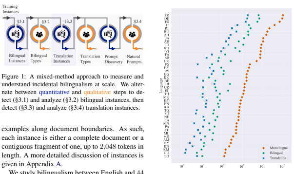
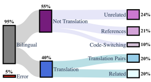
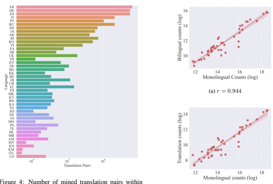

# Searching For Needles In A Haystack: On The Role Of Incidental Bilingualism In Palm'S Translation Capability

Eleftheria Briakou ebriakou@cs.umd.edu Colin Cherry colincherry@google.com George Foster fosterg@google.com

## Abstract

Large, multilingual language models exhibit surprisingly good zero- or few-shot machine translation capabilities, despite having never seen the intentionally-included translation examples provided to typical neural translation systems. We investigate the role of incidental bilingualism—the unintentional consumption of bilingual signals, including translation examples—in explaining the translation capabilities of large language models, taking the Pathways Language Model (PaLM) as a case study. We introduce a mixed-method approach to measure and understand incidental bilingualism at scale. We show that PaLM is exposed to over 30 million translation pairs across at least 44 languages. Furthermore, the amount of incidental bilingual content is highly correlated with the amount of monolingual in-language content for non-English languages. We relate incidental bilingual content to zero-shot prompts and show that it can be used to mine new prompts to improve PaLM's out-of-English zero-shot translation quality. Finally, in a series of small-scale ablations, we show that its presence has a substantial impact on translation capabilities, although this impact diminishes with model scale.

## 1 Introduction

Recent work has shown that large language models (LLMs) exhibit impressive capabilities in performing various natural language generation tasks, even in the zero-shot paradigm. In particular, such models have shown interesting machine translation (MT) capabilities (Brown et al., 2020; Chowdhery et al., 2022; Vilar et al., 2022)—especially when translating into English, despite never having been explicitly and *intentionally* exposed to translation data in the way their supervised counterparts are.

This raises the question: where do these translation capabilities come from?

We hypothesize that the translation capabilities of LLMs connect to *incidental bilingualism*: the unintentional consumption of bilingual text within a single training instance. To test this hypothesis, we take PaLM (Chowdhery et al., 2022)—a 540billion parameter Transformer language model—as a case study. We first conduct a large-scale analysis of its training data in order to characterize the nature and quantity of bilingual text, then perform experiments to assess the impact of this text on translation performance.

To measure incidental bilingualism at scale, we develop a processing pipeline that alternates between quantitative and qualitative analysis (§3): first detect bilingual versus monolingual text using a language tagger, then qualitatively analyze the nature of bilingual text, and finally measure the amount of translation data within bilingual instances. Our analysis spans 44 languages, for which we study bilingualism paired with English.

Our findings are:
- In all, 1.4% of PALM's training instances are detected as bilingual, while 0.34% contain at least one translated sentence pair. We were able to mine such pairs across all languages studied; therefore, none of these languages is truly zero-shot in the context of translation.

- The number of monolingual instances in a language is predictive of the number of instances containing bilingual or translation content for that language (paired with English).

After establishing that both bilingual and translation content are incidentally consumed during PaLM's training, we study how they connect to its MT capabilities (§4). We run a series of training and prompting experiments and found that:
- Prompting the full PaLM model with alternative, data-driven prompts improves outof-English zero-shot translation by 14 chrF points on average across languages, indicating that its zero-shot translation capabilities were underestimated due to sub-optimal prompts.

- Ablating detected translation pairs with smaller versions of PaLM has a dramatic effect on the translation capabilities of 1B- parameter models for high-resource languages, reducing average into-English zeroshot results by 7.4 BLEU and 5-shot results by 5.9 BLEU. The effect falls off but remains notable (+2-3 BLEU across several conditions) as we scale to 8B-parameter models.

## 2 Related Work

Translation Capabilities of LLMs Large-scale generative language models, such as GPT-3 (Brown et al., 2020), PaLM (Chowdhery et al., 2022), and XGLM (Lin et al., 2021) have been shown to exhibit translation capabilities, despite not being explicitly trained to translate. These capabilities are surprisingly strong, particularly when translating into English with few-shot examples. One explanation for this behavior is that it results from incidental multitask learning (Radford et al., 2018; Sanh et al., 2021). This hypothesis has not been explored for MT, where recent work has mostly focused on improving LLM translation capabilities by optimizing few-shot prompting strategies (Vilar et al., 2022; Agrawal et al., 2022). Rather than trying to improve translation quality for LLMs, our goal is to understand where their translation abilities stem from by tracing them back to the properties of the pretraining data. Large-Scale Data Analysis LLMs rely on massive amounts of unlabeled corpora for training.

These corpora are primarily acquired by combining heterogeneous online resources (e.g., Wikipedia, Web forums, Common Crawl, etc.)—whose properties are usually unknown. Recent work on largescale analysis has shed some light: Dodge et al. (2021) analyze C4 (Raffel et al., 2019)—a dataset created from a snapshot of Common Crawl—and show that it contains machine generated texts as well as evaluation samples from commonly used NLP benchmarks; Kreutzer et al. (2022) manually audit the quality of multilingual datasets and find systematic quality issues amongst popular pretraining datasets. Most related to our work, Blevins and Zettlemoyer (2022) show that popular corpora routinely used for training English-only LLMs contain a non-negligible amount of non-English text, which helps explain their cross-lingual capabilities.

Their manual analysis of corpus subsamples covers several bilingual categories, including a translation category. But where analysis of bilingualism is a side result of their work, it is our primary contribution. We extend their work by proposing automatic tools to quantify bilingualism at scale and directly relate it to LLM translation performance. Eliciting Knowledge from LLMs Prompting language models to elicit knowledge acquired during pre-training has received a lot of research interest. Petroni et al. (2019) show that LLMs can recall factual knowledge by answering queries structured as cloze statements. Jiang et al. (2020) further show that query-based prompts outperform manually created cloze statements, suggesting that the latter provide a lower bound estimate on the actual abilities of LLMs. Follow-up work confirms those findings by suggesting better prompts with automatic generation methods (Shin et al., 2020) or prompt engineering (Reynolds and McDonell, 2021). We similarly explore how to extract translation knowledge from LLMs using data-driven prompts.

## 3 Measuring & Understanding Incidental Bilingualism

We introduce a mixed-method approach (Creswell and Clark, 2017; Shorten and Smith, 2017) to measure and understand *incidental bilingualism*—the unintentional consumption of bilingual signalsat scale. Since we expect bilingual signals to be rare, we explore the huge data space by alternating between quantitative and qualitative steps, with results from each step complementing and informing one another (Figure 1). The quantitative steps play the role of inducing a smaller-scale focus space to study, while the qualitative steps provide insights into the nature of bilingual signals. Preliminaries PaLM's pretraining dataset consists of 780 billion tokens from a mixture of multilingual sources (social media conversations (50%), filtered webpages (27%), and Wikipedia (4%)), presumably English sources (books (13%) and news articles (1%)), and source code (5%). PaLM was trained on 2,048-subword-token examples formed by concatenating and truncating documents. As PaLM is a multi-source LM, a document may be a web page, a book, or a conversation, depending on the source. Our primary units for data analysis are *instances* we created by splitting training

We study bilingualism between English and 44 other languages. We choose language pairs that: a) are supported by our language identification models, and b) have FLORES-101 (Goyal et al., 2022) evaluation data. We divide languages into high, medium, and low-resource groups according to their monolingual instance counts, as shown below:

| HIGH   | FR, DE, ES, IT                             |
|--------|--------------------------------------------|
| MEDIUM | PT, RU, ZH, JA, AR, ID, KO, VI, FA, SR, UK |
| LOW    | PS, HY, IW, BG, KK, BE, HI, UR, EL, TH,    |
|        | MK, KY, BN, KA, TG, SD, NE, TA, MN, PA,    |
|        | TE, ML, MR, AM, MY, KN, KM, GU, LO         |

### 3.1 Detecting Bilingual Instances

Our first goal is to automatically detect all training instances that contain bilingual text without presupposing a specific granularity for bilingualism. To that end, we use CMX (Zhang et al., 2018)—a language identification model for codemixed texts—to produce a sequence of token-level language tags for each training instance. An instance is labeled as bilingual if it contains at least two contiguous segments in different languages, each consisting of at least N consecutive identical language tags. Instances with more than two languages are interpreted as bilingual, as discussed in Appendix B.

One of the two languages must always be English, both to simplify our analysis and to work within the limits of the CMX tool. Findings Figure 2 presents the per-language monolingual and bilingual instance counts. We include raw counts per language in Table 7. We

Figure 2: Number of monolingual, bilingual, and translation instances detected within PaLM's training data. PaLM consumes bilingual signals, including translation examples, across (at least) 44 languages.

observe that across the languages studied, PaLM
consumes bilingual instances that, in total, account for 1.4% of its training instances.

### 3.2 Characterizing Bilingual Instances

Next, we turn to understanding the nature of bilingual instances detected by the above procedure.

To make manual analysis easier, we used the KnowYourData tool1to highlight spans of the less frequent language in each bilingual instance. Findings Our qualitative analysis of a sample of 100 English-French bilingual instances reveals that bilingualism manifests in various cross-lingual phenomena (examples of bilingual instances are presented in Table 8 of Appendix E). Our detection approach is reasonably accurate: only 5% of instances correspond to errors mostly attributed to language identification issues (i.e., the detected instances are indeed bilingual, but at least one of the two languages is not English or French). Each correctly detected bilingual instance is annotated as belonging to one of five categories, with the typology shown in Figure 3.

Most bilingual instances (55%) fall under the broader class of "Not Translations" and cover cases 1https://knowyourdata.withgoogle.com

24%
21% 10% 20%
20%

Figure 3: Typology of bilingual instances, along with their distribution within an EN-FR annotated sample. Bilingual instances cover a range of cross-lingual phenomena, including cases of translated content.

where the two languages encode information that does not correspond to translation content. This class is further decomposed into three sub-classes. First, we found a few instances (10%) of codeswitching where one or two speakers alternate between two languages in the context of a single conversation. As expected, most code-switching instances were spotted in social media conversations, as it is primarily used within multilingual communities in informal communication. Second, we observed that many bilingual instances (21%) are attributed to references, where named entities or bibliography entries are cited in their native language, such as instances drawn from Wikipedia.

Third, we also found a considerable number of bilingual instances (24%) that include completely unrelated content in the two languages that just happened to co-exist within the same web page.

The remaining bilingual instances are evenly distributed (20%) across two categories that fall loosely under the rubric of "Translations". Here, we distinguish between cases where some amount of the text expresses a typical translation relation and cases where content across languages is semantically related, but not exactly by translation. The latter involves a rich spectrum of cross-lingual semantic relations, including cross-lingual entailment, summarization, and paraphrasing, mainly noticed within books in the genre of literary criticism and interpretation. We also spotted a few cases of forum discussions around explanations of translation or stylistic manipulation of translations.

### 3.3 Detecting Translation Pairs

Our manual analysis exposed an opportunity to automatically extract and count translated sentence pairs (*translation pairs* for short). We cast the problem of within-instance translation detection as a local mining task following recent advances in parallel text acquisition. Concretely, for each bilingual instance from §3.1, we run a sentence breaker and extract two pools of candidate sentences x and y in the two languages. The language of each sentence is inferred by majority voting over token-level language tags. Whichever language has fewer sentences is labeled the embedded language and the other becomes the primary. Each candidate sentence is then encoded to a vector representation using the LABSE (Feng et al., 2022) cross-lingual sentence encoder. Translation pairs are extracted by finding the most similar primary sentence for each embedded sentence and then checking whether the cosine distance of their representations falls below a threshold. We choose a threshold of 0.6 on the cosine distance to mine plausible translation pairs, following Feng et al. (2022). We also apply a series of length-and-language-based heuristic data quality filters, adapted from Alibaba's WMT Data Filtering submissions (Lu et al., 2018, 2020), described in Appendix C.

Note that this extraction process is oblivious to document structure: the instance may be formatted as parallel sentences, paragraphs, documents, or as a free-form discussion that happens to mention both a sentence and its translation. Our extraction is also incapable of detecting translation relations below the sentence level. If we can extract at least one translation pair from an instance, then we label it as a *translation instance*. Findings We find that 0.34% of PaLM's training instances contain at least one translation pair. Note that this number provides a lower bound on the amount of incidental bilingualism and translation that PaLM consumes, as we are restricted to a specific set of language pairs, and we only study bilingualism with English. Figure 4 presents the number of translation pairs we mined within PaLM's training instances between English and each language. At a minimum, PaLM consumes thousands of parallel texts for all language pairs studied, while for high-resource languages it sees more than a million translation pairs.

Furthermore, we investigate the correlation between the number of monolingual instances in each language and their bilingual and translation counterparts. Our results in Figure 5 indicate that, surprisingly, the monolingual counts in each language correlate strongly with the bilingual (r=0.944) and

PaLM's training instances. PaLM consumes thousands of translation pairs across (at least) 44 languages.

(b) r *= 0.*938

translation (r=0.938) counts. This strong correlation implies that, when working at scale, we can predict the bilingual and translation sizes for a given language (within an error rate) by simply counting monolingual instances.

### 3.4 Discovering Natural Prompts

After identifying a smaller-scale set consisting of training instances that contain translation pairs, we further manually inspect them to understand how the translation task is naturally modeled by PaLM.

We find that sentence-level translations are presented within a training instance in three ways. The majority of them appear across paragraphs and do not follow a canonical pattern. Among the remainder, we noticed two canonical patterns: translation pairs that belong to stacked translated paragraphs
(e.g., {x1, x2, y1, y2}) and interleaved translations where a sentence and each translation are adjacent to each other (e.g., {x1, y1, x2, y2}). Among the latter, we saw an opportunity to extract natural prompts automatically. We do so by analyzing the prefixes of the translation pairs mined in §3.3. Drawing on our manual observations, we mine the most frequent prefixes per language pair that follow a simple colon prompt format: any sequence of non-whitespace characters followed by a colon. Finally, we manually filter the automatically mined

Figure 5: Pearson correlations between counts of monolingual instances with (a) bilingual and (b) translation instances. The number of bilingual and translation instances correlates strongly with the number of monolingual instances.

|        | Default   | Code   | Native   | Translation   |
|--------|-----------|--------|----------|---------------|
| HIGH   | 1,207     | 506    | 781      | 831           |
| MEDIUM | 219       | 62     | 136      | 352           |
| LOW    | 38        | 0      | 64       | 122           |
| ALL    | 1,464     | 568    | 981      | 1,305         |

Table 1: Data-driven prompt counts within PaLM's translation pairs, grouped by resourcedness.

prefix lists to look for consistent natural prompt patterns across languages. Findings Table 1 presents the results of our prompt discovery module followed by manual filtering to extract plausible translation prefixes. First, we found empirically that one of the most frequent translation prompts that naturally arises in the data is the **default** prompt adopted by most MT research with LLMs: source and target language names in English followed by a colon (e.g., "French:").

We also found three alternative prompts that are frequently presented within incidental translation pairs: i) **code**: source and target ISO language codes (e.g., "FR:"), ii) **native**: source and target language names in their respective languages (e.g.,

|        | Default (zero)   |              | Code (zero)   |        |       | Native (zero)   |              |      | Translation (zero)   |              |            | Default (few)   |      | Native (few)   |        |
|--------|------------------|--------------|---------------|--------|-------|-----------------|--------------|------|----------------------|--------------|------------|-----------------|------|----------------|--------|
|        | QUAL.            | LANG.% QUAL. | δ             | LANG.% | QUAL. | δ               | LANG.% QUAL. |      | δ                    | LANG.% QUAL. |            | LANG.% QUAL.    |      | δ              | LANG.% |
|        |                  |              |               |        |       |                 | EN→XX        |      |                      |              |            |                 |      |                |        |
| HIGH   | 52.8 81.5        | 56.7         | 4.0           | 89.7   | 60.8  | 8.0             | 99.5         | 59.1 | 6.3                  | 96.2         | 62.9       | 99.7            | 63.1 | 0.2            | 99.7   |
| MEDIUM | 30.6 64.8        | 17.2         | −13.4         | 33.4   | 46.1  | 15.5            | 92.8         | 44.6 | 14.0                 | 81.7         | 53.4       | 99.7            | 53.4 | −0.0           | 99.7   |
| LOW    | 28.3 69.0        | 2.7          | −25.6         | 3.4    | 42.3  | 14.0            | 98.6         | 38.1 | 9.8                  | 82.4         | 47.4 100.0 |                 | 47.4 | 0.0            | 100.0  |
| ALL    | 31.1 69.1        | 11.2         | −19.9         | 18.8   | 45.0  | 13.8            | 97.2         | 41.6 | 10.5                 | 83.5         | 50.3       | 99.9            | 50.3 | 0.0            | 99.9   |
|        |                  |              |               |        |       |                 | XX→EN        |      |                      |              |            |                 |      |                |        |
| HIGH   | 37.6 99.7        | 38.5         | 0.9           | 99.6   | 37.7  | 0.1             | 99.7         | 35.4 | −2.2                 | 99.1         | 40.6       | 99.7            | 40.8 | 0.2            | 99.7   |
| MEDIUM | 36.9 99.5        | 34.8         | −2.1          | 94.0   | 36.6  | −0.3            | 99.1         | 35.1 | −1.8                 | 95.7         | 40.0       | 99.6            | 40.0 | 0.2            | 99.6   |
| LOW    | 30.9 99.3        | 28.5         | −2.3          | 93.7   | 28.4  | −2.5            | 98.8         | 28.8 | −2.1                 | 90.3         | 35.4       | 99.7            | 35.4 | 0.0            | 99.6   |
| ALL    | 33.0 99.4        | 31.0         | −2.0          | 94.3   | 31.3  | −1.7            | 99.0         | 31.0 | −2.0                 | 92.4         | 37.0       | 99.7            | 37.0 | 0.0            | 99.6   |

Table 2: Comparison of prompt selection on FLORES devtest, for zero- and few (5)-shot prompting. QUAL. corresponds to translation quality (chrF for EN→XX, BLEU for XX→EN), LANG.% represents PaLM's sentence-level accuracy in producing text in the correct target language, and δ gives the translation quality difference from the
"Default" prompt. Native data-driven prompts improve zero-shot, out-of-English (EN→XX) translation quality largely by guiding PaLM to generate text in the correct target language.

"Français:"), iii) **translation**: source language in English, and the word "translation" in the target language (e.g., "Traduction:"). Interestingly, prompt types are not evenly distributed across our language groups: language codes appear primarily with highresource languages, while low-resource languages favor prompts written in their native language. We include a complete list of prompt counts per language in Figure 6 of Appendix E.

## 4 Analyzing The Impact Of Bilingualism

We analyze the impact of bilingualism on the translation capabilities of PaLM with a series of MT experiments on the FLORES-101 (Goyal et al., 2022) evaluation set, which provides translations of a common set of English Wikipedia sentences into all of our 44 languages. We report results on the 1,012 sentence devtest set. We use the 997 sentence dev set primarily as a source of randomlydrawn exemplars when reporting 5-shot results.

We report BLEU (Papineni et al., 2002) for into-
English translation and chrF (Popovic´, 2015) for out-of-English translation, both computed by Sacrebleu (Post, 2018) with default settings. For LLM- based translation, we follow the template from Vilar et al. (2022) unless stated otherwise:

$$\begin{array}{l l}{{\mathrm{[source]:}}}&{{[X]:}}\\ {{\mathrm{[target]:}}}&{{}}\end{array}$$

where [source], and [target] are the source and target language names (in English) and [X] is the source text. When present, few-shot exemplars are provided above the template in the same format, as detailed in Appendix D.

### 4.1 Prompting Palm With Natural Prompts

We prompt the original 540B parameter PaLM
model with templates that use naturally-occurring prefixes of incidental translations, as discussed in §3.4. In our template, we replace [source]
and [target] with each alternative, data-driven prompt. We experiment with zero-shot and 5-shot prompting. Findings Table 2 presents average translation quality results for different prompts across high, medium, and low resource settings. We present the complete, per language results in Table 9 of Appendix E. When translating into English (XX→EN), the default prompt yields the best results, while alternative prompts result in a small degradation in quality; overall, translating into English seems to be robust across different prompts supported by our data. On the other hand, PaLM's translation quality is surprisingly sensitive to the choice of prompt when translating out of English (EN→XX): simply changing the default prompt to its native variant improves quality by 14 chrF points, with most of the improvement reported in medium and low-resource languages. The "translation" prompt also yields consistent improvements over the default. Finally, prompting with language codes only improves translation out of English for the highresource group—this is expected as this prompt was only present for a few high-resource languages.

Further analysis of out-of-English results reveals that native prompts trigger text in the desired language, while the default prompt results in high rates of generating the wrong target language (see gray percentages in Table 2). The output's target language is determined by a sequence-level languageidentification tool (Botha et al., 2017).

Finally, although choosing natural prompts that arise from the data can help us better understand PaLM's zero-shot capabilities, large differences between prompts do not carry over to the few-shot setting (right-most columns of Table 2).

### 4.2 Extrinsic Evaluation Of Translation Pairs

It is one thing to report counts of translation pairs mined from bilingual instances, but is the resulting bitext of high quality? We adopt the parallel text quality evaluation framework of the WMT Shared Task on Parallel Corpus Filtering and Alignment (Koehn et al., 2020) and train supervised neural machine translation models from scratch on the mined translations. This allows us to jointly assess the quality of PaLM's translation content and our extraction heuristics. We focus this analysis on FR→EN, PaLM's highest-resource language pair.

Data For PaLM translation pairs, we explore a number of thresholds on the LABSE distance. To put our results in perspective, we additionally train a model on all pairs from the WMT14 FR→EN task (Bojar et al., 2014) and on random samples thereof to establish fair data comparison points at notable LABSE thresholds. Sentence counts for all conditions are shown in Table 3. Architecture We adopt the 6-layer encoderdecoder Transformer Base (Vaswani et al., 2017)
architecture, with minimal hyper-parameter tuning. Shared sentence piece (Kudo and Richardson, 2018) vocabularies with 32K tokens are constructed from bitext for each scenario. Dropout is set to 0.3 for all systems except for the full WMT system, which uses 0.1. Systems are trained up to 450K steps with a batch size of 1,024. Checkpoints are selected by FLORES dev BLEU. Findings Table 3 presents the results of our analysis. In general, the mined translation pairs from our analysis pipeline provide useful signal for training supervised MT systems with reasonable translation quality (i.e., 37 to 38 BLEU across various thresholds, compared to 41 that we achieve using 40M translations from available WMT parallel corpora). Moreover, these results confirm that 0.6 seems to be the right threshold for detecting translation pairs that are useful, or at least not harmful in the presence of other positive signals (i.e., at 0.6 we are within 1 BLEU point of a system trained on the same amounts of WMT parallel text).

### 4.3 Ablating Incidental Bilingualism

We now explore the impact of bilingualism on the translation capabilities of PaLM. To do so, we conduct smaller-scale experiments by training 1B and 8B parameter models on different training samples

| t    | #TRANSLATIONS   | PaLM (mined)   | WMT   |
|------|-----------------|----------------|-------|
| N/A  | 40,836,876      | ✗              | 42.0  |
| 0.90 | 9,084,429       | 33.7           |       |
| 0.80 | 7,056,441       | 35.7           |       |
| 0.70 | 4,874,173       | 36.4           |       |
| 0.60 | 3,341,187       | 37.3           | 38.1  |
| 0.50 | 2,474,703       | 37.2           |       |
| 0.40 | 1,948,820       | 37.1           |       |
| 0.30 | 1,477,535       | 38.4           | 36.5  |
| 0.20 | 906,937         | 37.8           |       |
| 0.15 | 549,705         | 36.3           |       |

Table 3: BLEU scores for FR→EN NMT models trained on various translation pairs, evaluated on FLORES devtest. t corresponds to the LABSE threshold. PaLM-
mined translation pairs provide useful signal for training supervised NMT models.

to measure the effect of removing various types of multilingual data. Architecture Our 1B and 8B models are scaleddown versions of PaLM with small changes. Like PaLM, each is a decoder-only model trained with a causal language modeling objective, using a dense transformer architecture and a sentence piece tokenizer (Kudo and Richardson, 2018) that retains spacing information. Unlike PaLM, we do not share key and value tensors across attention heads (Shazeer, 2019), which should affect only decoding speed. We include a hyper-parameter summary in Table 6 in Appendix E. Also, we use a smaller vocabulary size of 128K tokens compared to PaLM's 256K tokens, a concession to fit the models onto available hardware. Both 1B and 8B train on examples of 2,048 tokens with a batch size of 512 for 100K steps. Note that using the same number of examples for both scales means that the 8B models are likely under-trained; however, holding data quantity constant is useful for directly measuring the effect of model scale. Data To simulate PaLM's data conditions with smaller models, we begin by partitioning PaLM's training instances into four non-overlapping groups: ENG: English instances, NEN: non-English (excluding bilingual) instances, BIL: bilingual (excluding translation) instances, and TRA: translation instances. We then merge instances within their groups into 2,048 token examples. Counting examples from each group allows us to determine the full data's implicit mixture of these groups: ENG: 84.4%; NEN: 14.1%; BIL: 1.0%;
TRA: 0.5%. These should not match the instance-

|     |        |      |       | EN→XX (0\-shot)   |       |      |       | EN→XX (5\-shot)   |       |      |       | XX→EN (0\-shot)   |       |      |       | XX→EN (5\-shot)   |       |
|-----|--------|------|-------|-------------------|-------|------|-------|-------------------|-------|------|-------|-------------------|-------|------|-------|-------------------|-------|
|     |        | FULL | \-TRA | \-BIL             | \-NEN | FULL | \-TRA | \-BIL             | \-NEN | FULL | \-TRA | \-BIL             | \-NEN | FULL | \-TRA | \-BIL             | \-NEN |
|     | HIGH   | 15.7 | 16.4  | 15.6              | 15.1  | 30.9 | 18.7  | 15.8              | 8.0   | 12.5 | 5.1   | 3.9               | 1.1   | 14.8 | 8.9   | 6.1               | 6.1   |
| B   | MEDIUM | 3.8  | 4.6   | 3.6               | 3.7   | 11.3 | 8.1   | 6.9               | 3.2   | 2.9  | 0.8   | 1.0               | 0.2   | 5.7  | 2.1   | 1.7               | 1.7   |
| S=1 | LOW    | 0.6  | 0.6   | 0.5               | 0.5   | 6.3  | 6.7   | 5.6               | 3.4   | 0.3  | 0.3   | 0.3               | 0.1   | 0.8  | 0.5   | 0.2               | 0.2   |
|     | ALL    | 2.8  | 3.0   | 2.7               | 2.6   | 9.8  | 8.2   | 6.9               | 3.8   | 2.1  | 0.8   | 0.8               | 0.2   | 3.3  | 1.6   | 1.1               | 1.1   |
|     | HIGH   | 21.5 | 17.7  | 20.4              | 17.9  | 47.7 | 44.7  | 40.7              | 25.8  | 24.0 | 22.2  | 22.4              | 17.3  | 30.4 | 27.4  | 25.9              | 25.9  |
| B   | MEDIUM | 5.1  | 4.6   | 5.3               | 4.7   | 26.5 | 23.6  | 20.3              | 4.9   | 13.0 | 10.2  | 11.9              | 4.7   | 21.4 | 18.7  | 16.3              | 16.3  |
|     | LOW    | 1.2  | 0.7   | 1.1               | 0.8   | 8.8  | 8.3   | 7.4               | 2.2   | 2.6  | 2.0   | 2.9               | 0.4   | 6.6  | 5.0   | 4.7               | 4.7   |
| S=8 | ALL    | 4.0  | 3.2   | 3.9               | 3.3   | 16.8 | 15.5  | 13.6              | 5.1   | 7.2  | 5.9   | 6.9               | 3.0   | 12.4 | 10.5  | 9.5               | 9.5   |

|       | ENG          | NEN          | BIL       | TRA      |
|-------|--------------|--------------|-----------|----------|
| FULL  | 43, 186, 985 | 7, 224, 737  | 517, 688  | 270, 590 |
| \-TRA | 43, 186, 985 | 7,  224, 737 | 788,  279 | ✗        |
| \-BIL | 43, 186, 985 | 8,  013, 015 | ✗         | ✗        |
| \-NEN | 51, 200, 000 | ✗            | ✗         | ✗        |

Table 4: Translation results on the FLORES devtest for small-scale PaLM models trained on various ablation conditions. EN→XX translation quality is measured by chrF and XX→EN by BLEU. Ablating translation pairs (-TRA) has a significant impact on the translation capabilities of S=1B (5-shot) for HIGH resource pairs; this impact decreases with scale (i.e., S=8B model).

Table 5: Data statistics for small-scale PaLM ablation experiments in number of 2,048 token examples.

level proportions reported earlier, as these count examples, which are merged instances. Also, they will not match the multilinguality proportions reported by Chowdhery et al. (2022), as we have removed non-natural-language (code) data and any non-English text not in our 44-language set. We can now sample examples from our partitions to create a smaller training set with the same proportions of incidental bilingualism. No attempt is made to retain PaLM's original proportions for other aspects like data source or language. Counts for this sample are shown as **FULL** in Table 5.

We ablate each group in the following order:
TRA, BIL and then NEN. At each step, we replace ablated examples with examples from the next group in the chain. The counts for all ablation conditions are shown in Table 5. The -NEN setting corresponds to the English-only setting studied by Blevins and Zettlemoyer (2022), but as they show, this will contain some non-English content due to language-identification errors. Analogous provisos exist for each ablation, as all our automatic tools make errors. We aim to measure the effect of removing most of a type of content, not all of it.

Findings Table 4 presents the results of our ablation—the complete, per language, results are in Table 10 of Appendix E. Focusing on our 1B model, we note that examples containing translation pairs (TRA) have an outsized impact on translation quality for being only 0.5% of the training data. In the high-resource XX→EN, zero-shot scenario, replacing TRA examples with BIL results in a drop of 7.4 BLEU. With TRA removed, the additional impact of removing the remaining bilingual instances
(BIL) is much smaller: 1.2 BLEU. One might expect the utility of translation data to fall off as we add 5-shot examples at inference time, but TRA is still quite important, with its removal resulting in a reduction of 5.9 BLEU. The importance of TRA
holds throughout our 1B experiments, to the extent that the system cannot translate at all, i.e. for 5-shot versions of XX→EN MEDIUM and EN→XX HIGH.

Turning to our 8B model, we see that translation content continues to have a substantial impact on translation quality, though the absolute score differences have diminished, hovering between 2-3 BLEU or 3-4 chrF, depending on the scenario. This result, where a 4x increase in parameters leads to a roughly 2x reduction in the absolute impact of TRA suggests that it would be interesting to build scaling laws to study the impact of incidental translation data, which we leave to future work. Also, for 5-shot scenarios, there is no longer such a big difference between the impact of BIL and TRA data. Given exemplars, the larger model seems to be able to make better use of weaker bilingual signals.

Surprisingly, the 8B model that does not have access to multilingual content (-NEN), exhibits some translation capabilities for XX→EN HIGH
(i.e., 17.3 and 25.9 BLEU for zero- and few-shot, respectively). A closer look at the per-language breakdown (see Table 10) reveals that those capabilities are restricted to languages written in Latin script. This adds evidence for larger models being better equipped to leverage either sparse signals
(i.e., language-identification failures during ablation) and weak signals (i.e., language similarities from shared scripts). As expected, non-English content is critical for translation out of English.

## 5 Conclusion

We explore the role of incidental bilingualism—the unintentional consumption of bilingual signalsin PaLM's translation capabilities. We introduce a mixed-method approach that alternates between quantitative and qualitative analyses to measure and understand incidental bilingualism at scale by processing 780 billion tokens. Our work shows that PaLM consumes a significant amount of bilingual text: 1.4% of training instances in natural language are bilingual. At the same time, it is naturally exposed to translation signals, having seen more than 30 million translation pairs in 44 languages paired with English. Furthermore, we extrinsically evaluate the quality of these translations, showing that they can be used to train supervised models that roughly match the quality of equal amounts of WMT data. Finally, we show that incidental bilingualism connects to the machine translation capabilities of PaLM. First, we show that data-driven prompts extracted from incidental translations can improve the zero-shot abilities of PaLM when translating out of English by 14 chrF on average. Second, we provide empirical evidence that bilingual and translation signals can partially explain the translation capabilities of smaller-scale LLMs.

## Limitations

Our findings should be interpreted considering a series of problem definitions and design choices. First, our quantitative results on measuring incidental bilingualism at scale are subject to language identification, sentence splitting, and mining errors. Our qualitative analysis for the English-French language pair revealed that those errors are reasonably small (see §3.2). However, we expect the accuracy of our tools to vary across languages and, crucially, exhibit unanticipated failure modes on web text and low-resource languages (Caswell et al., 2020). Second, our findings are restricted to quantifying bilingualism and translations within a limited set of language pairs and only paired with English. Thus, by problem definition, we are limited to computing a lower-bound estimate on incidental bilingualism of PaLM. The above limitations should also be taken into consideration when interpreting our ablation results. Although we attempted to remove most bilingual signals in our series of MT experiments, it is still possible that bilingualism slips through due to either model errors or due to bilingual signals beyond our focus set of languages.

Finally, any results and findings of our work are restricted to PaLM; the single LLM studied in this work. However, our finer-grained analysis (see Table 11 of Appendix E) reveals that incidental bilingualism, including translation signals, is observed across various data sources (e.g., webpages, books, etc.) that are commonly included in the training data of other popular LLMs.

## Acknowledgements

We thank Jiaming Luo, Julia Kreutzer, Orhan Firat, Xavier Garcia, Markus Freitag, Sweta Agrawal, Marine Carpuat, Elijah Rippeth, and the anonymous reviewers for their helpful and constructive comments.

## References

Sweta Agrawal, Chunting Zhou, Mike Lewis, Luke Zettlemoyer, and Marjan Ghazvininejad. 2022. Incontext examples selection for machine translation.

Terra Blevins and Luke Zettlemoyer. 2022. Language contamination helps explains the cross-lingual capabilities of English pretrained models. In Proceedings of the 2022 Conference on Empirical Methods in Natural Language Processing, pages 3563–3574, Abu Dhabi, United Arab Emirates. Association for Computational Linguistics.

Ondˇrej Bojar, Christian Buck, Christian Federmann, Barry Haddow, Philipp Koehn, Johannes Leveling, Christof Monz, Pavel Pecina, Matt Post, Herve Saint-Amand, Radu Soricut, Lucia Specia, and Aleš Tamchyna. 2014. Findings of the 2014 workshop on statistical machine translation. In Proceedings of the Ninth Workshop on Statistical Machine Translation, pages 12–58, Baltimore, Maryland, USA. Association for Computational Linguistics.

Jan A. Botha, Emily Pitler, Ji Ma, Anton Bakalov, Alex Salcianu, David Weiss, Ryan McDonald, and Slav Petrov. 2017. Natural language processing with small feed-forward networks. In Proceedings of the 2017 Conference on Empirical Methods in Natural Language Processing, pages 2879–2885, Copenhagen, Denmark. Association for Computational Linguistics.

Tom Brown, Benjamin Mann, Nick Ryder, Melani e Subbiah, Jared D Kaplan, Prafulla Dhariwal, Arvind Neelakantan, Pranav Shy am, Girish Sastry, Amanda Askell, Sandhini Agarwal, Ariel H erbert Voss, Gretchen Krueger, Tom Henighan, Rewon Child, Aditya Ramesh, Daniel Ziegler, Jeffrey Wu, Chris Winter, Clemens a nd Hesse, Mark Chen, Eric Sigler, Mateusz Litwin, Scott Gray, Benjamin Chess, Jack Clark, Christopher Berner, Sam McCa ndlish, Alec Radford, Ilya Sutskever, and Dario Amodei. 2020.

Language models are few-shot learners. In Advances in Neural Information Processing Systems, volume 33, pages 1877–1901. Curran Associates, Inc.

Isaac Caswell, Theresa Breiner, Daan van Esch, and Ankur Bapna. 2020. Language ID in the wild: Unexpected challenges on the path to a thousandlanguage web text corpus. In Proceedings of the 28th International Conference on Computational Linguistics, pages 6588–6608, Barcelona, Spain (Online). International Committee on Computational Linguistics.

Aakanksha Chowdhery, Sharan Narang, Jacob Devlin, Maarten Bosma, Gaurav Mishra, Adam Roberts, Paul Barham, Hyung Won Chung, Charles Sutton, Sebastian Gehrmann, Parker Schuh, Kensen Shi, Sasha Tsvyashchenko, Joshua Maynez, Abhishek Rao, Parker Barnes, Yi Tay, Noam Shazeer, Vinodkumar Prabhakaran, Emily Reif, Nan Du, Ben Hutchinson, Reiner Pope, James Bradbury, Jacob Austin, Michael Isard, Guy Gur-Ari, Pengcheng Yin, Toju Duke, Anselm Levskaya, Sanjay Ghemawat, Sunipa Dev, Henryk Michalewski, Xavier Garcia, Vedant Misra, Kevin Robinson, Liam Fedus, Denny Zhou, Daphne Ippolito, David Luan, Hyeontaek Lim, Barret Zoph, Alexander Spiridonov, Ryan Sepassi, David Dohan, Shivani Agrawal, Mark Omernick, Andrew M. Dai, Thanumalayan Sankaranarayana Pillai, Marie Pellat, Aitor Lewkowycz, Erica Moreira, Rewon Child, Oleksandr Polozov, Katherine Lee, Zongwei Zhou, Xuezhi Wang, Brennan Saeta, Mark Diaz, Orhan Firat, Michele Catasta, Jason Wei, Kathy Meier-Hellstern, Douglas Eck, Jeff Dean, Slav Petrov, and Noah Fiedel. 2022. Palm: Scaling language modeling with pathways.

John W. Creswell and Vicki L. Plano Clark. 2017.

Designing and conducting mixed methods research. Sage Publications.

Jacob Devlin, Ming-Wei Chang, Kenton Lee, and Kristina Toutanova. 2019. BERT: Pre-training of deep bidirectional transformers for language understanding. In *Proceedings of the 2019 Conference* of the North American Chapter of the Association for Computational Linguistics: Human Language Technologies, Volume 1 (Long and Short Papers),
pages 4171–4186, Minneapolis, Minnesota. Association for Computational Linguistics.

Jesse Dodge, Maarten Sap, Ana Marasovic, William ´
Agnew, Gabriel Ilharco, Dirk Groeneveld, Margaret Mitchell, and Matt Gardner. 2021. Documenting large webtext corpora: A case study on the colossal clean crawled corpus. In *Proceedings of the* 2021 Conference on Empirical Methods in Natural Language Processing, pages 1286–1305, Online and Punta Cana, Dominican Republic. Association for Computational Linguistics.

Fangxiaoyu Feng, Yinfei Yang, Daniel Cer, Naveen Arivazhagan, and Wei Wang. 2022. Languageagnostic BERT sentence embedding. In Proceedings of the 60th Annual Meeting of the Association for Computational Linguistics (Volume 1: Long Papers), pages 878–891, Dublin, Ireland. Association for Computational Linguistics.

Naman Goyal, Cynthia Gao, Vishrav Chaudhary, Peng-
Jen Chen, Guillaume Wenzek, Da Ju, Sanjana Krishnan, Marc'Aurelio Ranzato, Francisco Guzmán, and Angela Fan. 2022. The Flores-101 evaluation benchmark for low-resource and multilingual machine translation. *Transactions of the Association* for Computational Linguistics, 10:522–538.

Zhengbao Jiang, Frank F. Xu, Jun Araki, and Graham Neubig. 2020. How can we know what language models know? Transactions of the Association for Computational Linguistics, 8:423–438.

Philipp Koehn, Vishrav Chaudhary, Ahmed El-Kishky, Naman Goyal, Peng-Jen Chen, and Francisco Guzmán. 2020. Findings of the WMT 2020 shared task on parallel corpus filtering and alignment. In Proceedings of the Fifth Conference on Machine Translation, pages 726–742, Online. Association for Computational Linguistics.

Julia Kreutzer, Isaac Caswell, Lisa Wang, Ahsan Wahab, Daan van Esch, Nasanbayar Ulzii-Orshikh, Allahsera Tapo, Nishant Subramani, Artem Sokolov, Claytone Sikasote, Monang Setyawan, Supheakmungkol Sarin, Sokhar Samb, Benoît Sagot, Clara Rivera, Annette Rios, Isabel Papadimitriou, Salomey Osei, Pedro Ortiz Suarez, Iroro Orife, Kelechi Ogueji, Andre Niyongabo Rubungo, Toan Q. Nguyen, Mathias Müller, André Müller, Shamsuddeen Hassan Muhammad, Nanda Muhammad, Ayanda Mnyakeni, Jamshidbek Mirzakhalov, Tapiwanashe Matangira, Colin Leong, Nze Lawson, Sneha Kudugunta, Yacine Jernite, Mathias Jenny, Orhan Firat, Bonaventure F. P. Dossou, Sakhile Dlamini, Nisansa de Silva, Sakine Çabuk Ballı, Stella Biderman, Alessia Battisti, Ahmed Baruwa, Ankur Bapna, Pallavi Baljekar, Israel Abebe Azime, Ayodele Awokoya, Duygu Ataman, Orevaoghene Ahia, Oghenefego Ahia, Sweta Agrawal, and Mofetoluwa Adeyemi. 2022. Quality at a glance: An audit of web-crawled multilingual datasets. Transactions of the Association for Computational Linguistics, 10:50–72.

Taku Kudo and John Richardson. 2018. SentencePiece:
A simple and language independent subword tokenizer and detokenizer for neural text processing. In Proceedings of the 2018 Conference on Empirical Methods in Natural Language Processing: System Demonstrations, pages 66–71, Brussels, Belgium. Association for Computational Linguistics.

Xi Victoria Lin, Todor Mihaylov, Mikel Artetxe, Tianlu Wang, Shuohui Chen, Daniel Simig, Myle Ott, Naman Goyal, Shruti Bhosale, Jingfei Du, Ramakanth Pasunuru, Sam Shleifer, Punit Singh Koura, Vishrav Chaudhary, Brian O'Horo, Jeff Wang, Luke Zettlemoyer, Zornitsa Kozareva, Mona Diab, Ves Stoyanov, and Xian Li. 2021. Few-shot learning with multilingual language models. *ArXiv*,
abs/2112.10668.

Jun Lu, Xin Ge, Yangbin Shi, and Yuqi Zhang. 2020.

Alibaba submission to the WMT20 parallel corpus filtering task. In Proceedings of the Fifth Conference on Machine Translation, pages 979–984, Online. Association for Computational Linguistics.

Jun Lu, Xiaoyu Lv, Yangbin Shi, and Boxing Chen.

2018. Alibaba submission to the WMT18 parallel corpus filtering task. In Proceedings of the Third Conference on Machine Translation: Shared Task Papers, pages 917–922, Belgium, Brussels. Association for Computational Linguistics.

Kishore Papineni, Salim Roukos, Todd Ward, and Wei-
Jing Zhu. 2002. Bleu: a method for automatic evaluation of machine translation. In *Proceedings of* the 40th Annual Meeting of the Association for Computational Linguistics, pages 311–318, Philadelphia, Pennsylvania, USA. Association for Computational Linguistics.

Fabio Petroni, Tim Rocktäschel, Sebastian Riedel, Patrick Lewis, Anton Bakhtin, Yuxiang Wu, and Alexander Miller. 2019. Language models as knowledge bases? In Proceedings of the 2019 Conference on Empirical Methods in Natural Language Processing and the 9th International Joint Conference on Natural Language Processing (EMNLP- IJCNLP), pages 2463–2473, Hong Kong, China. Association for Computational Linguistics.

Maja Popovic. 2015. ´ chrF: character n-gram F-score for automatic MT evaluation. In *Proceedings of the* Tenth Workshop on Statistical Machine Translation, pages 392–395, Lisbon, Portugal. Association for Computational Linguistics.

Matt Post. 2018. A call for clarity in reporting BLEU
scores. In Proceedings of the Third Conference on Machine Translation: Research Papers, pages 186– 191, Brussels, Belgium. Association for Computational Linguistics.

Alec Radford, Jeffrey Wu, Rewon Child, David Luan, Dario Amodei, and Ilya Sutskever. 2018. Language models are unsupervised multitask learners.

Colin Raffel, Noam Shazeer, Adam Roberts, Katherine Lee, Sharan Narang, Michael Matena, Yanqi Zhou, Wei Li, and Peter J. Liu. 2019. Exploring the limits of transfer learning with a unified text-to-text transformer.

Laria Reynolds and Kyle McDonell. 2021. Prompt programming for large language models: Beyond the few-shot paradigm. In *Extended Abstracts of the* 2021 CHI Conference on Human Factors in Computing Systems, CHI EA '21, New York, NY, USA. Association for Computing Machinery.

Victor Sanh, Albert Webson, Colin Raffel, Stephen H.

Bach, Lintang Sutawika, Zaid Alyafeai, Antoine Chaffin, Arnaud Stiegler, Teven Le Scao, Arun Raja, Manan Dey, M Saiful Bari, Canwen Xu, Urmish Thakker, Shanya Sharma Sharma, Eliza Szczechla, Taewoon Kim, Gunjan Chhablani, Nihal Nayak, Debajyoti Datta, Jonathan Chang, Mike Tian-Jian Jiang, Han Wang, Matteo Manica, Sheng Shen, Zheng Xin Yong, Harshit Pandey, Rachel Bawden, Thomas Wang, Trishala Neeraj, Jos Rozen, Abheesht Sharma, Andrea Santilli, Thibault Fevry, Jason Alan Fries, Ryan Teehan, Tali Bers, Stella Biderman, Leo Gao, Thomas Wolf, and Alexander M. Rush. 2021. Multitask prompted training enables zero-shot task generalization.

Noam Shazeer. 2019. Fast transformer decoding: One write-head is all you need.

Taylor Shin, Yasaman Razeghi, Robert L. Logan IV,
Eric Wallace, and Sameer Singh. 2020. AutoPrompt: Eliciting Knowledge from Language Models with Automatically Generated Prompts. In Proceedings of the 2020 Conference on Empirical Methods in Natural Language Processing (EMNLP), pages 4222–4235, Online. Association for Computational Linguistics.

Allison Shorten and Joanna Smith. 2017. Mixed methods research: Expanding the evidence base. Evidence-Based Nursing.

Ashish Vaswani, Noam Shazeer, Niki Parmar, Jakob Uszkoreit, Llion Jones, Aidan N Gomez, Ł ukasz Kaiser, and Illia Polosukhin. 2017. Attention is all you need. In Advances in Neural Information Processing Systems, volume 30. Curran Associates, Inc.

David Vilar, Markus Freitag, Colin Cherry, Jiaming Luo, Viresh Ratnakar, and George Foster. 2022. Prompting palm for translation: Assessing strategies and performance.

Yuan Zhang, Jason Riesa, Daniel Gillick, Anton Bakalov, Jason Baldridge, and David Weiss. 2018. A fast, compact, accurate model for language identification of codemixed text. In *Proceedings of the* 2018 Conference on Empirical Methods in Natural Language Processing, pages 328–337, Brussels, Belgium. Association for Computational Linguistics.

## A Units Of Analysis Of Training Text

Throughout this paper we have adopted special meanings for the common (often interchangeable) terms document, example and *instance*. Here we make those terms concrete and justify our use of the *instance* as our primary unit of analysis. Document A document is a logical unit of text from one of our source corpora: a web page or wiki page from a web-crawled corpus, a conversation from a chat or forum corpus, or a book from a books corpus. Example Each PaLM training example is exactly 2,048 subword tokens. These are assembled by concatenating and/or splitting documents to the appropriate length. As such, an example may contain several short documents, and a long document may be spread over several examples. Multiple documents concatenated into a single example are separated by special document-boundary tokens. The relevant features of examples that make them more useful for analysis than documents are:

- We know exactly which examples PaLM saw during training.

- Examples reflect when co-occurring textual information (for example, a translation pair)
was lost due to a document being split into multiple examples.

However, examples can also introduce spurious co-occurrences from merged documents. We assume that a language model can and will ignore any merge-induced co-occurrences due to the presence of document separator tokens; therefore, we should ignore them as well. This leads us to our next and final unit. Instance Instances are created by splitting examples according to document-separator tokens.

Therefore, each instance is either a complete document or a fragment of a single document, and is up to 2,048 tokens in length. Instances have all of the advantages of examples, without introducing spurious co-occurrences, hence why they are our primary unit of analysis.

## B Bilingual Detection Pipeline Details

CodeMixer Model Details We use the CMX (CodeMixer) model (Zhang et al., 2018)—a tokenlevel language identification model, to detect bilingual instances. CMX is a simple feed-forward model that takes as input a set of character and word-level features and produces a distribution over a set of languages for each token. The entire sequence of language tags is obtained using constrained decoding over a pre-defined set of permitted languages. The model is trained on a combination of synthetic and real-world translation data
(both monolingual and code-mixed with English)
for 100 languages. Note that CMX predicts codemixing between a *pair* of languages, as a result, it does not reliably predict language tags for multilingual instances involving more than two languages. For example, if an instance actually contains English, French, and German text, with German being the least frequent, it will be tagged as containing only English and French; all German words will be mislabeled as one of the other two languages or as
"undefined."
Algorithmic Description of Bilingual Detection Given a training instance t = {ti}
n i=1, a focus set L
of the 44 studied languages, and a threshold N, we detect bilingual instances based on the following steps: (i) We start by extracting a sequence of language tags, using the CMX model. (ii) We mark the most frequent language as the primary language, and the other (if exists) as the embedded. (iii) If the primary and the embedded languages do not fall under our focus set L, we exclude it from our analysis. (iv) If a training instance contains more than 10% of "undefined" predictions (e.g., resulting from non-linguistic content), it is not annotated as bilingual. (v) Finally, if a training instance contains at least two contiguous segments—consisting of at least N consecutive identical language tags—in different languages, it is annotated as bilingual.

Given that the CMX model is known to overpredict English tags, we employ a stricter threshold on defining contiguous segments for English
(N = 10) compared to the rest of the languages (N = 5). For all languages we operate at the tokenlevel, with the exception of Chinese, Japanese, and Korean for which we apply the above algorithm at the character-level.

## C Heuristic Translation Pair Filters

When extracting translation pairs found within a bilingual instance, our primary quality signal is from the cosine distance between cross-lingual LABSE sentence embeddings. However, we also apply a suite of heuristic filters which help catch non-translations that slip through this primary filter. These filters are adapted from Alibaba's WMT
Data Filtering submissions (Lu et al., 2018, 2020).

When a tokenization is required for token counts or edit distance, we use tokens from the mBERT tokenizer (Devlin et al., 2019). The filters are as follows: 1. both sentences must respect a min (3) and max (200) token length; 2. we enforce a max length ratio (2x) between sentences; 3. we enforce a min edit distance (2) and a min edit distance ratio (0.1) between sentences; 4. we apply a secondary, sequence-level language-identification tool (Botha et al., 2017) to re-identify each side of the pair and ensure that the two halves are written in different languages. When extracting sentences to train Transformer Base MT systems in §4.2, the different-language check is replaced by a check to ensure that the translation pair respects the language pair being studied, i.e.: one sentence is in English and the other is in French.

## D Prompting Details

For 5-shot prompting experiments we used the following format (e.g., for French to English translation):
French: [X1]

| English: [Y1   |      | ]   |
|----------------|------|-----|
| ...            |      |     |
| French:        | [X5] |     |
| English: [Y5   |      | ]   |
| French:        | [ X  | ]   |
| English:       |      |     |

Each slot (Xi, Yi) is filled with five translation examples that are randomly sampled from the devtest split of the FLORES dataset, while the final slot X, is filled with the source text that comes from the test split of FLORES. E Additional Tables and Figures

|      | #LAYERS   | #HEADS   | DIMENSION   | DATA SIZE   | COMPUTATION                 |
|------|-----------|----------|-------------|-------------|-----------------------------|
| 1B   | 16        | 8        | 2,048       | 0.1T        | 128 TPUv3 chips for 3 days  |
| 8B   | 32        | 16       | 4,096       | 0.1T        | 512 TPUv3 chips for 5 days  |
| PALM | 118       | 48       | 18,432      | 2.0T        | See Chowdhery et al. (2022) |

Table 6: Ablation hyper-parameters. FEED-FORWARD DIMENSION is always DIMENSION times 4. Training data

| LANGUAGE   | ISO   | MONOLINGUAL       | BILINGUAL   | TRANSLATION   | PARALLEL TEXTS   |
|------------|-------|-------------------|-------------|---------------|------------------|
| English    | EN    | 2,086,622,555,000 |             |               |                  |
| French     | FR    | 109,994,921       | 6,743,637   | 1,929,032     | 6,618,381        |
| German     | DE    | 100,952,945       | 7,258,561   | 1,826,701     | 5,780,856        |
| Spanish    | ES    | 75,311,571        | 5,860,634   | 1,538,549     | 5,717,352        |
| Italian    | IT    | 42,071,597        | 2,204,919   | 591,329       | 2,128,730        |
| Portuguese | PT    | 23,175,895        | 2,685,160   | 317,735       | 1,048,717        |
| Russian    | RU    | 18,307,304        | 2,045,770   | 527,159       | 2,142,065        |
| Chinese    | ZH    | 16,196,482        | 2,075,947   | 271,496       | 706,948          |
| Japanese   | JA    | 11,364,144        | 1,271,193   | 222,164       | 601,810          |
| Arabic     | AR    | 11,239,689        | 689,215     | 160,554       | 420,851          |
| Indonesian | ID    | 9,294,576         | 1,157,443   | 211,183       | 738,329          |
| Korean     | KO    | 8,777,321         | 465,821     | 120,648       | 518,738          |
| Vietnamese | VI    | 8,588,200         | 767,309     | 91,666        | 268,573          |
| Farsi      | FA    | 8,106,752         | 145,498     | 31,685        | 79,731           |
| Serbian    | SR    | 8,092,018         | 70,905      | 17,333        | 49,316           |
| Ukrainian  | UK    | 5,392,948         | 275,623     | 65,468        | 191,624          |
| Pashto     | PS    | 2,481,255         | 32,304      | 6,208         | 12,841           |
| Armenian   | HY    | 2,251,041         | 92,786      | 24,777        | 65,745           |
| Hebrew     | IW    | 1,956,133         | 123,641     | 37,904        | 111,172          |
| Bulgarian  | BG    | 1,702,418         | 119,188     | 30,991        | 83,672           |
| Kazakh     | KK    | 1,681,552         | 22,784      | 5,826         | 23,800           |
| Belarusian | BE    | 1,681,272         | 47,284      | 11,646        | 35,535           |
| Hindi      | HI    | 1,356,198         | 250,512     | 42,737        | 121,092          |
| Urdu       | UR    | 1,326,867         | 46,973      | 11,564        | 32,654           |
| Greek      | EL    | 1,256,535         | 205,986     | 52,194        | 156,933          |
| Thai       | TH    | 1,169,865         | 79,211      | 11,157        | 28,125           |
| Macedonian | MK    | 1,006,741         | 59,532      | 10,885        | 38,521           |
| Kyrgyz     | KY    | 872,384           | 79,955      | 17,107        | 37,484           |
| Bengali    | BN    | 826,933           | 64,012      | 16,138        | 43,046           |
| Georgian   | KA    | 757,142           | 70,220      | 15,457        | 34,939           |
| Tajik      | TG    | 734,888           | 40,146      | 5,503         | 27,889           |
| Sindhi     | SD    | 695,331           | 36,728      | 5,054         | 11,373           |
| Nepali     | NE    | 676,940           | 59,159      | 12,009        | 30,789           |
| Tamil      | TA    | 667,148           | 47,225      | 13,408        | 41,466           |
| Mongolian  | MN    | 541,745           | 23,328      | 4,180         | 12,861           |
| Panjabi    | PA    | 526,042           | 43,196      | 11,592        | 56,377           |
| Telugu     | TE    | 508,026           | 24,401      | 6,462         | 27,349           |
| Malayalam  | ML    | 503,762           | 36,652      | 8,235         | 18,412           |
| Marathi    | MR    | 363,791           | 14,544      | 4,209         | 15,684           |
| Amharic    | AM    | 297,463           | 33,604      | 9,098         | 29,355           |
| Burmese    | MY    | 278,933           | 12,989      | 2,547         | 7,020            |
| Kannada    | KN    | 231,308           | 12,386      | 3,430         | 11,589           |
| Sinhala    | KM    | 152,630           | 9,652       | 15,99         | 5,661            |
| Gujarati   | GU    | 146,990           | 5,662       | 1,514         | 5,333            |
| Lao        | LO    | 130,284           | 10,478      | 5,806         | 25,202           |

size is measured in trillions (T) of subword tokens.

Table 7: Numbers of monolingual, bilingual, and translation instances across the 44 languages studied.

| NOT TRANSLATION SIGNAL                                                                              | Voilà j'ai un problème avec certaines cinématiques du jeu. Je ne peux pas voir l'introduction   | Code\-Switching                                                                                |                                       |
|-----------------------------------------------------------------------------------------------------|-------------------------------------------------------------------------------------------------|------------------------------------------------------------------------------------------------|---------------------------------------|
| ni les présentations de races par contre je peux voir les présentations de classes...               | Si                                                                                              | quelqu'un pouvait m'aider ce serait sympa. Merci d'avance. I can understand french only        |                                       |
| a bit... Can you see this folder and if yes is anything into this folder?                           | J'ai bien un dossier                                                                            | raw/fr mais à l'intérieur il n'y a pas introcinematic. Well, could take a look into the folder |                                       |
| "raw/en" or/and "raw/de", is there a folder called "introcinematic"?                                | Dans raw/de je n'ai                                                                             | rien non plus mais dans raw/en j'ai bien le dossier.                                           |                                       |
| Lagrange derives the integrals of momentum, moment of momentum, and energy, use of                  | References                                                                                      | special properties of the potential function tends to conceal their meanings.                  | For three                             |
| bodies, the results are given in § II of his                                                        | "Essai sur le problcme des trois corps," Prix de                                                | Vacad. sci. Paris Finally, the principle of virtual work for dynamics, on which the entire     |                                       |
| Micbanique Analitique                                                                               | is founded, had been given more than twenty years earlier in §IV of                             | his "Recherchcs sur la libration de la lune, dans lesquelles on tache dc rcsoudre la question  |                                       |
| proposce par l'Academie royale des sciences pour le prix de 1'annee                                 | 1764," Prix de Vacad.                                                                           | sci. Paris 9, 1764—Euvres 6, 5 − 61).                                                          |                                       |
| . . . PICASSO (1881\-1973) Autoportrait, 15 ans Né en 1881 à Malaga, il passe sa jeunesse en        | Unrelated                                                                                       | Espagne. En 1891, son père, peintre, accepte un poste d' enseignant à l'école de dessin "La    |                                       |
| Corogne", Picasso a 10 ans et il s'exerce au dessin alors qu'il sait à peine lire. En 1895,         | il s'installe avec sa famille à Barcelone, son père enseigne à l'école très académique des...   |                                                                                                |                                       |
| This pragmatic viewpoint has been the subject of quite a few post\-holiday discussions at           | Rubberbond. We wanted to explore this in greater depth and find a resolution to the debates     |                                                                                                |                                       |
| we'd had over the years...                                                                          |                                                                                                 |                                                                                                |                                       |
| TRANSLATION SIGNAL                                                                                  | Translation Pairs                                                                               | In 1910 E. Cartan constructed the canonical frame and found the most symmetric case for        |                                       |
| maximally nonholonomic rank 2 distributions in R5. We solve the analogous problems for              | rank 2 distributions in Rn for arbitrary n>5. Our method is a kind of symplectification of the  |                                                                                                |                                       |
| problem and it is completely different from the Cartan method of equivalence. En 1910 E.            | Cartan a construit un repère canonique et a trouvé le cas le plus symétrique des distributions  |                                                                                                |                                       |
| de rang 2 et non holonômes de manière maximale dans R5. Nous résolvons ici des problèmes            | analogues pour les distributions de rang 2 dans Rn avec n>5 arbitraire. Notre méthode est       |                                                                                                |                                       |
| une sorte de symplectification du problème et est complètement différente de la méthode par         | équivalence de Cartan.                                                                          |                                                                                                |                                       |
| Angels, according to Consuelo's own view, no longer intervene directly in human affairs,            | Entailment                                                                                      | making it necessary for humans to help one another:                                            | "Dans un temps ou Ton ne croit plus a |
| la reVelation directe et a la manifestation sensible de la Divinite, la protec\- tion et le secours | du ciel se traduisent sous la forme d'assistance, d'affection et de devouement de la part de    |                                                                                                |                                       |
| nos semblables" (3: 265). Consuelo is a supreme example of this transfer of the divine role         | of care and love to man, or more accurately, to woman. Women also play a central role in        |                                                                                                |                                       |
| the other spiritual force celebrated in the novel: art, in particular music: "La musique et la      | poesie sont les plus hautes expressions de la foi, et la femme douee de genie et de beaute est  |                                                                                                |                                       |
| preteresse, sibylle et iniatiatrice"                                                                |                                                                                                 |                                                                                                |                                       |
| Can someone suggest how I can say Sorry, I have been very disorganized recently as I have           | Explanation                                                                                     | been busy Thanks. I'm not sure to get what you mean. Do you mean that you've been quite        |                                       |
| chaotic because of being busy? If yes, I would maybe simply say:                                    | "Désolé, j'ai été très                                                                          | désorganisé récemment, du fait d'avoir été occupé". Sounds however quite "negative". Yes       |                                       |
| that is what I mean. I have been been very busy and have therefore only just got round              | to answering a colleagues question. I want to express my apologies and explain that I've        |                                                                                                |                                       |
| been disorganised as things have been choatic in the office. Thanks very much Hmm I don't           | know how to say it, but désorganisé when referencing a human being sounds more like a           |                                                                                                |                                       |
| personality trait than like a temporary state, and thus would give a negative image of yourself     | like mentionned above.                                                                          |                                                                                                |                                       |
| Table 8: Examples of bilingual instances detected within PaLM training data.                        |                                                                                                 |                                                                                                |                                       |

|    | Prompt               | Type        | Counts   |    | Prompt                  | Type        | Counts   |     | Prompt      | Type        | Counts   |
|----|----------------------|-------------|----------|----|-------------------------|-------------|----------|-----|-------------|-------------|----------|
| FR | French:              | Default     | 415      | KO | Korean:                 | Default     | 3        | TH  | Thai:       | Default     | 0        |
|    | Français:            | Native      | 48       |    |                         |             |          |     |             |             |          |
|    | Traduction:          | Translation | 148      | VI | Vietnamese:             | Default     | 0        | MK  | Makedonian: | Default     | 0        |
|    | FR:                  | Code        | 177      |    | Việt:                   | Native      | ાર        | КУ  | Kyrgyz:     | Default     | 0        |
|    |                      |             |          |    | dich:                   | Translation | 34       |     |             |             |          |
| DE | German:              | Default     | 346      | FA | Persian:                | Default     | 0        | BN  | Bengali:    | Default     | 2        |
|    | Deutsch:             | Native      | 407      |    | ﻓﺎﺭﺳﻰ                   | Native      | 5        |     |             |             |          |
|    | Übersetzung:         | Translation | ર્23      |    | ترجمه                   | Translation | 2        | KA  | Goergian    | Default     | 0        |
|    | DE:                  | Code        | 120      |    |                         |             |          |     | ქართულად:   | Native      | 3        |
|    | Übersetzt:           | Other       | 89       | SR | Serbian:                | Default     | 9        |     | თარგმანი:   | Translation | 3        |
|    |                      |             |          |    | Превод:                 | Translation | II       |     |             |             |          |
| ES | Spanish:             | Default     | 376      |    |                         |             |          | TG  | Tajik:      | Default     | 0        |
|    | Español:             | Native      | 284      | UK | Ukrainian:              | Default     | 0        |     |             |             |          |
|    | ES:                  | Code        | 176      |    | Українська:             | Native      | 23       | SD  | Sindhi:     | Default     | 0        |
|    | Traducido:           | Other       | રેર       |    | Переклад:               | Translation | II       |     | ﺗﺮﺟﻤﻮ       | Translation | 5        |
|    | Traduzco:            | Other       | 30       |    |                         |             |          |     |             |             |          |
|    |                      |             |          | HI | Hindi:                  | Default     | 14       | NE  | Nepali:     | Default     | 0        |
| IT | Italian:             | Default     | 70       |    | अनुवाद:                  | Translation | 5        |     | नेपालीमा:    | Native      | 2        |
|    | Italiano:            | Native      | 42       |    |                         |             |          |     |             |             |          |
|    | Traduzione:          | Translation | 100      | PS | Pashto:                 | Default     | 0        | TA  | Tamil:      | Default     | 0        |
|    | IT:                  | Code        | 33       |    | ﮊﺑﺎړﻩ                   | Translation | 2        |     |             |             |          |
|    | Tradotto:            | Other       | 14       |    |                         |             |          | MN  | Mongolian:  | Default     | 2        |
|    |                      |             |          | HY | Armenian:               | Default     | 0        |     |             |             |          |
| PT | Portuguese:          | Default     | રવે       |    |                         |             |          | PA  | Panjabi:    | Default     | 0        |
|    | Português:           | Native      | રવ       | BG | Bulgarian:              | Default     | 0        |     |             |             |          |
|    | Tradução:            | Translation | 83       |    | български:              | Native      | 11       | TE  | Telugu:     | Default     | 0        |
|    | PT:                  | Code        | રેરે       |    | превод:                 | Translation | 3        |     |             |             |          |
|    |                      |             |          |    |                         |             |          | MIL | Malayalam:  | Default     | 0        |
| RU | Russian:             | Default     | ર 8      | IW | Hebrew:                 | Default     | 3        |     |             |             |          |
|    | русский:             | Native      | 20       |    | עברית                   | Native      | 30       | MR  | Marathi:    | Default     | 0        |
|    | Перевод:             | Translation | 130      |    | :תרגום                  | Other       | 14       |     |             |             |          |
|    | RU:                  | Code        | 1        |    |                         |             |          | AM  | Amharic:    | Default     | 0        |
|    |                      |             |          | KK | Kazakh                  | Default     | 0        |     |             |             |          |
| ZH | Chinese:             | Default     | 60       |    |                         |             |          | MY  | Burmese:    | Default     | 0        |
|    | 中文:                | Native      | 19       | BE | Belarusian:             | Default     | 0        |     |             |             |          |
|    |                      |             |          |    | Па\-беларуску:          | Native      | I ୧      | KN  | Kannada:    | Default     | 0        |
| JA | Japanese:            | Default     | 21       |    | Пераклад:               | Translation | ટર       |     |             |             |          |
|    | JA:                  | Code        |          |    | Belarus/Беларусь: Other |             | 10       | KM  | Khmer:      | Default     | 0        |
| AR | Arabic:              | Default     | 0        | EL | Greek:                  | Default     | 17       | GU  | Gujarati:   | Default     | 0        |
|    |                      |             |          |    | Ελληνικά:               | Native      | 2        |     |             |             |          |
| ID | Indonesian:          | Default     | 14       |    | Μετάφραση:              | Translation | 79       | ГО  | Lao:        | Default     | 0        |
|    | Terjemahan:          | Translation | 81       |    |                         |             |          |     |             |             |          |
|    | diterjemahkan: Other |             | 6        | UR | Urdu:                   | Default     | 0        |     |             |             |          |

Figure 6: Data-driven prompt counts within PaLM's translation pairs across 44 languages.

| Figure 6: Data\-driven prompt counts within PaLM's translation pairs across 44 languages.   |
|---------------------------------------------------------------------------------------------|

Table 9: Comparison of prompt selection on FLORES devtest, for zero- and few-shot prompting. QUAL. corresponds to translation quality (chrF for EN→XX and BLEU for XX→EN), LANG.% represents PaLM's accuracy in producing text in the correct target language, and δ gives the translation quality difference from the "Default" prompt.

 $\mathbf{\Sigma}\mathbf{n}$  $\mathbf{E}\mathbf{0}$  $\mathbf{V}\mathbf{I}$  $\mathbf{F}\mathbf{A}$  $\mathbf{s}\mathbf{R}$  $\mathbf{t}\mathbf{K}$  $\mathbf{p}\mathbf{s}$  $\mathbf{m}\mathbf{v}$  $\mathbf{r}\mathbf{w}$  $\mathbf{n}\mathbf{c}$

EN→XX (0-shot) EN→XX (5-shot) XX→EN (0-shot) XX→EN (*5-shot*)

FULL -TRA -BIL -NEN FULL -TRA -BIL -NEN FULL -TRA -BIL -NEN FULL -TRA -BIL -NEN Latin Script

FR 16.3 19.0 16.8 16.7 35.1 18.7 15.8 10.6 14.9 7.5 6.1 1.8 18.0 12.6 8.3 8.3 ✓

DE 16.4 15.1 14.3 15.4 29.2 18.9 14.9 7.4 15.0 6.2 4.4 1.2 16.4 8.2 6.9 6.9 ✓ ES 15.3 14.6 16.0 14.8 32.3 20.2 16.8 6.7 10.6 3.1 3.2 0.9 12.3 8.3 5.0 5.0 ✓ IT 14.7 16.8 15.2 13.3 26.9 17.1 15.9 7.2 9.3 3.7 1.8 0.6 12.4 6.7 4.4 4.4 ✓

PT 15.7 18.7 15.4 15.9 30.2 16.7 16.0 9.7 15.4 4.7 5.5 0.8 21.1 8.0 7.6 7.6 ✓ RU 0.7 0.9 0.5 0.6 18.9 11.2 7.5 3.8 5.9 1.1 1.2 0.1 9.5 3.3 2.7 2.7 ✗

ZH 1.1 1.9 1.4 1.4 6.3 2.7 1.6 0.4 0.4 0.3 0.0 0.1 5.5 2.1 1.1 1.1 ✗ JA 0.5 0.8 0.6 0.5 2.8 1.9 1.6 0.4 1.3 0.3 0.1 0.0 1.7 1.3 0.8 0.8 ✗

AR 0.5 0.6 0.5 0.4 7.4 5.0 6.0 1.2 1.6 0.2 0.2 0.0 3.2 0.5 0.5 0.5 ✗ ID 12.8 15.4 11.4 12.9 21.4 16.4 15.1 9.6 3.2 1.0 2.0 0.2 7.3 3.0 2.9 2.9 ✓

KO 1.4 2.1 1.6 1.4 1.5 1.3 1.3 0.4 0.2 0.2 0.1 0.1 0.7 0.5 0.3 0.3 ✗ VI 7.3 8.5 6.6 6.4 13.3 10.9 8.9 1.5 2.4 0.4 0.6 0.1 4.4 1.6 0.8 0.8 ✓ FA 0.6 0.7 0.6 0.7 4.2 4.9 3.9 1.5 0.5 0.2 0.2 0.0 1.8 0.4 0.3 0.3 ✗

SR 0.6 0.7 0.6 0.6 8.5 8.9 6.5 3.7 0.0 0.2 0.5 0.1 3.3 0.7 0.4 0.4 ✗

UK 0.5 0.6 0.5 0.4 9.6 9.2 7.1 2.6 1.1 0.5 0.6 0.0 4.4 2.0 1.0 1.0 ✗ PS 0.8 0.9 0.6 0.9 4.2 4.6 3.7 3.9 0.1 0.2 0.1 0.1 0.4 0.2 0.1 0.1 ✗ HY 0.3 0.5 0.2 0.2 11.0 11.6 10.0 4.7 0.0 0.2 0.2 0.0 0.2 0.2 0.0 0.0 ✗

IW 0.7 0.9 0.8 0.8 6.2 7.0 5.9 1.1 0.4 0.2 0.3 0.0 0.8 0.6 0.4 0.4 ✗ BG 0.6 0.7 0.5 0.5 9.5 9.7 6.5 3.3 0.9 0.4 0.8 0.0 4.7 1.6 0.9 0.9 ✗

KK 0.7 0.6 0.6 0.4 3.8 4.9 5.5 2.8 0.1 0.1 0.3 0.0 0.6 0.4 0.2 0.2 ✗ BE 0.4 0.4 0.3 0.4 8.4 9.9 7.2 4.4 0.2 0.1 0.2 0.0 0.8 0.4 0.3 0.3 ✗ HI 0.6 0.6 0.5 0.5 3.2 3.7 3.6 1.4 0.2 0.1 0.2 0.0 0.5 0.3 0.1 0.1 ✗

UR 0.3 0.4 0.3 0.3 3.1 3.2 3.4 2.0 0.1 0.0 0.1 0.0 0.3 0.2 0.1 0.1 ✗

$\frac{5}{24}$  24. 

EL 1.0 0.9 0.7 0.7 10.1 9.0 7.9 2.8 2.0 0.5 0.5 0.1 2.9 1.1 0.6 0.6 ✗ TH 0.6 0.9 0.5 0.6 7.7 6.3 5.4 1.8 0.9 0.6 0.4 0.1 2.6 1.7 0.5 0.5 ✗ MK 0.6 0.6 0.6 0.6 9.8 10.1 8.7 4.7 0.1 0.1 0.5 0.0 3.2 0.9 0.4 0.4 ✗

KY 0.6 0.5 0.5 0.4 4.0 4.0 3.8 3.6 0.1 0.1 0.1 0.0 0.5 0.3 0.1 0.1 ✗ BN 0.3 0.4 0.4 0.5 3.6 3.9 4.4 1.8 0.1 0.1 0.2 0.0 0.2 0.2 0.1 0.1 ✗

KA 0.6 0.6 0.5 0.5 8.3 8.8 7.2 3.5 0.1 0.2 0.4 0.0 0.5 0.2 0.1 0.1 ✗ TG 0.6 0.5 0.5 0.6 6.4 6.6 6.6 4.8 0.1 0.2 0.4 0.0 0.2 0.2 0.1 0.1 ✗ SD 0.4 0.4 0.4 0.3 3.8 4.3 3.5 3.8 0.1 0.2 0.1 0.0 0.3 0.2 0.0 0.0 ✗

NE 0.6 0.3 0.4 0.4 3.2 3.8 3.8 2.4 0.2 0.2 0.3 0.1 0.5 0.5 0.2 0.2 ✗

TA 0.5 0.4 0.5 0.4 8.1 7.0 6.2 3.9 0.2 0.1 0.2 0.1 0.3 0.2 0.1 0.1 ✗ MN 0.4 0.4 0.3 0.3 3.1 3.2 3.0 2.9 0.1 0.0 0.1 0.1 0.4 0.4 0.1 0.1 ✗ PA 0.4 0.4 0.4 0.5 6.2 7.7 6.1 3.8 0.2 0.2 0.2 0.0 0.1 0.1 0.0 0.0 ✗

TE 0.8 1.0 0.9 0.7 5.0 6.2 5.0 4.9 0.3 0.2 0.2 0.1 0.4 0.4 0.1 0.1 ✗ ML 0.4 0.4 0.4 0.4 7.0 7.6 7.2 4.9 0.1 0.1 0.5 0.0 0.2 0.2 0.2 0.2 ✗

MR 0.4 0.5 0.4 0.4 4.1 4.2 3.9 2.2 0.1 0.1 0.2 0.0 0.4 0.2 0.1 0.1 ✗ AM 0.5 0.4 0.4 0.5 3.1 3.7 2.3 0.6 0.2 0.2 0.3 0.0 0.1 0.2 0.1 0.1 ✗ MY 0.3 0.3 0.4 0.3 9.3 14.2 8.1 7.8 0.4 0.4 0.3 0.1 0.2 0.3 0.0 0.0 ✗

KN 0.5 0.5 0.5 0.4 8.2 8.0 6.2 1.2 0.3 0.3 0.2 0.0 0.4 0.2 0.1 0.1 ✗

KM 1.1 0.8 0.8 1.1 8.3 8.4 8.8 4.9 0.2 0.9 0.9 0.5 0.4 0.6 0.6 0.6 ✗ GU 0.5 0.5 0.5 0.5 5.1 4.8 2.0 3.2 0.0 0.1 0.0 0.0 0.1 0.1 0.1 0.1 ✗ LO 1.7 1.2 1.0 0.8 9.3 8.7 7.6 5.5 1.0 1.6 1.1 0.3 0.8 0.7 0.6 0.6 ✗ FR 22.4 18.5 21.0 17.8 52.5 49.8 46.0 30.4 29.1 27.3 27.3 23.1 37.0 33.0 29.1 29.1 ✓

DE 21.0 16.0 19.8 17.3 48.6 45.3 41.0 25.5 26.5 26.2 25.4 19.3 33.6 32.1 31.1 31.1 ✓

ES 22.0 19.7 21.8 18.2 44.7 43.1 39.1 26.0 18.0 15.4 18.4 14.3 24.3 22.4 20.4 20.4 ✓ IT 20.5 16.8 19.1 18.2 44.8 40.6 36.9 21.2 22.4 19.7 18.4 12.6 26.4 22.1 22.9 22.9 ✓ PT 23.0 19.5 24.0 20.7 52.8 48.5 44.1 22.4 24.3 23.1 29.6 24.6 38.0 37.1 33.5 33.5 ✓

RU 1.5 0.7 2.2 0.9 36.3 35.0 31.4 9.1 20.2 16.0 17.2 7.4 26.5 23.9 21.0 21.0 ✗ ZH 1.6 1.4 1.5 1.3 15.7 15.3 10.4 1.0 10.9 6.5 4.9 3.5 16.2 13.6 11.2 11.2 ✗

JA 1.0 0.6 1.4 0.7 12.6 10.8 8.1 1.2 6.8 6.5 4.3 1.3 13.1 9.7 7.9 7.9 ✗ AR 0.8 0.8 1.4 1.2 21.7 18.2 15.6 1.8 8.5 3.6 8.4 0.6 19.9 15.9 11.7 11.7 ✗ ID 15.3 15.0 14.4 15.0 45.2 41.3 37.3 8.8 19.4 16.0 18.2 9.6 28.5 23.7 22.7 22.7 ✓

KO 1.7 1.8 1.8 1.4 5.4 3.7 2.9 0.4 4.7 2.6 4.1 0.8 10.5 8.2 6.1 6.1 ✗

VI 8.4 8.0 8.6 7.8 34.5 30.5 23.2 3.2 9.8 6.9 9.1 1.5 19.6 18.6 13.4 13.4 ✓ FA 1.0 0.9 1.1 0.9 16.6 12.8 12.3 1.2 6.6 3.2 6.9 0.4 15.2 11.9 11.1 11.1 ✗ SR 0.9 0.8 1.3 0.8 22.8 19.7 16.8 2.9 13.5 12.3 12.5 1.0 23.1 21.0 17.3 17.3 ✗

UK 0.7 0.7 1.0 0.8 27.6 23.9 20.7 2.5 18.4 15.3 15.4 1.0 24.6 22.1 23.7 23.7 ✗ PS 1.1 1.2 0.6 0.9 3.9 3.7 3.6 1.7 0.8 0.6 0.9 0.2 4.5 2.9 3.6 3.6 ✗

HY 1.2 1.4 3.0 0.5 12.9 13.4 12.7 4.4 2.6 2.2 3.2 0.2 8.9 5.0 5.6 5.6 ✗ IW 2.6 1.2 1.5 1.1 15.1 12.7 12.2 1.0 8.3 6.3 6.5 0.2 19.3 14.9 14.1 14.1 ✗ BG 0.8 0.8 0.8 0.8 28.7 25.7 21.3 3.2 13.6 12.8 14.3 1.4 23.6 21.3 20.6 20.6 ✗

KK 0.9 0.7 0.6 0.7 4.5 4.5 4.3 1.6 0.7 0.8 1.3 0.3 3.5 3.4 3.0 3.0 ✗

BE 0.7 0.7 0.5 0.5 16.4 14.7 14.4 2.3 6.8 4.7 7.6 0.2 12.0 9.3 9.3 9.3 ✗ HI 0.9 0.6 1.2 0.8 7.0 5.1 4.1 1.3 2.6 1.2 1.6 0.3 9.7 5.9 4.7 4.7 ✗ UR 0.9 0.6 1.2 0.7 5.1 4.1 4.0 1.5 0.7 0.5 2.0 0.2 5.1 3.6 3.4 3.4 ✗

 $\mathbf{T}\mathbf{H}$  $\mathbf{T}\mathbf{H}$  $\mathbf{M}\mathbf{K}$  $\mathbf{K}\mathbf{Y}$  $\mathbf{H}\mathbf{N}$  $\mathbf{K}\mathbf{A}$  $\mathbf{T}\mathbf{G}$  $\mathbf{s}\mathbf{n}$  $\mathbf{M}\mathbf{K}$  $\mathbf{T}\mathbf{A}$  $\mathbf{M}\mathbf{N}$

EL 1.5 1.0 2.0 0.9 23.7 20.5 17.7 3.4 14.1 11.1 12.1 1.5 20.3 18.0 14.0 14.0 ✗ TH 1.4 0.8 1.5 1.0 24.3 23.0 16.0 1.6 5.2 3.2 4.7 1.0 14.0 12.6 9.2 9.2 ✗

MK 0.6 0.6 0.8 0.8 21.9 19.8 17.9 2.8 11.4 8.7 14.3 0.9 26.1 21.2 19.6 19.6 ✗ KY 0.6 0.6 0.6 0.6 4.4 4.9 4.0 1.8 0.3 0.4 0.7 0.2 2.1 1.5 1.6 1.6 ✗ BN 1.5 0.4 1.5 0.8 4.6 3.6 3.9 1.2 1.2 0.7 1.4 0.2 5.8 2.8 2.7 2.7 ✗

KA 1.7 0.7 1.7 0.9 8.2 7.7 7.4 2.4 1.3 1.0 1.6 0.2 4.7 2.7 3.4 3.4 ✗

TG 0.6 0.6 0.5 0.7 5.7 5.6 4.8 3.3 0.7 0.9 1.4 0.2 4.6 3.1 3.1 3.1 ✗ SD 0.5 0.5 0.5 0.5 4.4 3.9 3.2 1.5 1.2 0.5 1.5 0.2 4.1 3.2 3.4 3.4 ✗ NE 1.0 0.7 1.0 0.6 4.4 4.0 3.1 1.5 1.0 0.6 1.4 0.2 4.9 3.3 3.2 3.2 ✗

TA 2.0 0.6 0.9 0.9 5.1 4.9 4.5 2.0 0.5 0.3 0.8 0.2 2.6 1.3 1.5 1.5 ✗ MN 0.6 0.3 0.3 0.4 3.0 3.3 3.2 1.5 0.2 0.3 0.7 0.2 1.1 1.6 1.3 1.3 ✗

PA 0.8 0.4 0.6 0.9 6.6 7.6 6.4 2.2 0.1 0.1 0.4 0.1 0.9 0.2 0.5 0.5 ✗ TE 1.4 1.0 1.1 1.5 4.0 3.7 3.6 3.3 0.3 0.3 0.6 0.3 1.3 0.6 0.7 0.7 ✗

ML 1.8 0.5 0.8 1.0 4.9 5.6 4.9 2.7 0.3 0.2 0.6 0.1 1.0 0.4 1.0 1.0 ✗ MR 0.9 0.6 1.1 0.8 3.9 4.2 3.1 1.2 0.7 0.4 0.8 0.1 3.7 2.1 2.0 2.0 ✗

AM 0.7 0.6 0.9 0.7 2.0 2.0 2.0 0.3 0.2 0.2 0.4 0.1 0.8 0.4 0.6 0.6 ✗ MY 0.9 0.3 1.1 0.4 7.2 8.5 7.5 4.4 0.2 0.2 0.3 0.2 1.3 0.6 0.7 0.7 ✗ KN 1.6 0.5 1.4 0.6 4.8 4.5 4.5 0.5 0.2 0.2 0.6 0.2 1.3 0.5 0.9 0.9 ✗

KM 1.6 1.4 1.2 1.5 6.6 7.4 9.7 4.2 0.4 0.3 0.0 0.6 1.5 1.0 1.3 1.3 ✗

GU 1.2 0.5 0.9 0.6 3.5 4.7 3.3 1.3 0.1 0.2 0.4 0.1 0.8 0.3 0.4 0.4 ✗ LO 1.9 1.6 1.5 2.1 8.3 8.7 7.0 5.0 0.6 0.5 0.3 1.1 1.5 1.1 1.6 1.6 ✗

Table 10: Translation results between 44 languages and English on FLORES devtest for small-scale PaLM models. EN→XX results are reported in chrF, and XX→EN results are report in BLEU.

 $\begin{array}{c}\mathbf{14.4}\\ \mathbf{1.8}\\ \mathbf{8.6}\\ \mathbf{1.1}\\ \mathbf{1.3}\\ \mathbf{1.0}\\ \mathbf{0.6}\\ \mathbf{3.0}\\ \mathbf{1.5}\\ \mathbf{0.8}\\ \mathbf{0.6}\\ \mathbf{0.5}\\ \mathbf{1.2}\\ \mathbf{2.0}\\ \mathbf{1.5}\\ \mathbf{0.8}\\ \mathbf{0.6}\\ \mathbf{1.5}\\ \mathbf{1.7}\\ \mathbf{0.5}\\ \mathbf{0.5}\\ \mathbf{1.0}\\ \mathbf{0.9}\\ \mathbf{0.3}\\ \mathbf{0.6}\\ \end{array}$

 $\mathbf{R}$  $\mathbf{R}$  $\mathbf{s}$  $\mathbf{iv}$  $\mathbf{w}$  $\mathbf{c}$  $\mathbf{:R}$  $\mathbf{B}$

S=
8B
S

=1B

| ✗    | KA   | 0.6   | 0.6   | 0.5   | 0.5   | 8.3   | 8.8   | 7.2   | 3.5   | 0.1   | 0.2   | 0.4   | 0.0   | 0.5   | 0.2   | 0.1   | 0.1   | ✗    | 0.6   | 0.5   | 0.5   | 0.6   | 6.4   | 6.6   | 6.6   | 4.8   | 0.1   | 0.2   | 0.4   | 0.0   | 0.2   | 0.2   | 0.1   | 0.1   | TG   | ✗    |      |      |      |      |      |      |      |      |      |      |      |      |      |      |      |
|------|------|-------|-------|-------|-------|-------|-------|-------|-------|-------|-------|-------|-------|-------|-------|-------|-------|------|-------|-------|-------|-------|-------|-------|-------|-------|-------|-------|-------|-------|-------|-------|-------|-------|------|------|------|------|------|------|------|------|------|------|------|------|------|------|------|------|------|
| 0.4  | 0.4  | 0.4   | 0.3   | 3.8   | 4.3   | 3.5   | 3.8   | 0.1   | 0.2   | 0.1   | 0.0   | 0.3   | 0.2   | 0.0   | 0.0   | SD    | ✗     | 0.6  | 0.3   | 0.4   | 0.4   | 3.2   | 3.8   | 3.8   | 2.4   | 0.2   | 0.2   | 0.3   | 0.1   | 0.5   | 0.5   | 0.2   | 0.2   | NE    | ✗    | 0.5  | 0.4  | 0.5  | 0.4  | 8.1  | 7.0  | 6.2  | 3.9  | 0.2  | 0.1  | 0.2  | 0.1  | 0.3  | 0.2  | 0.1  | 0.1  |
| TA   | ✗    | 0.4   | 0.4   | 0.3   | 0.3   | 3.1   | 3.2   | 3.0   | 2.9   | 0.1   | 0.0   | 0.1   | 0.1   | 0.4   | 0.4   | 0.1   | 0.1   | MN   | ✗     | 0.4   | 0.4   | 0.4   | 0.5   | 6.2   | 7.7   | 6.1   | 3.8   | 0.2   | 0.2   | 0.2   | 0.0   | 0.1   | 0.1   | 0.0   | 0.0  |      |      |      |      |      |      |      |      |      |      |      |      |      |      |      |      |
| PA   | ✗    | 0.8   | 1.0   | 0.9   | 0.7   | 5.0   | 6.2   | 5.0   | 4.9   | 0.3   | 0.2   | 0.2   | 0.1   | 0.4   | 0.4   | 0.1   | 0.1   | TE   | ✗     |       |       |       |       |       |       |       |       |       |       |       |       |       |       |       |      |      |      |      |      |      |      |      |      |      |      |      |      |      |      |      |      |
| 0.4  | 0.4  | 0.4   | 0.4   | 7.0   | 7.6   | 7.2   | 4.9   | 0.1   | 0.1   | 0.5   | 0.0   | 0.2   | 0.2   | 0.2   | 0.2   | ML    | ✗     | MR   | 0.4   | 0.5   | 0.4   | 0.4   | 4.1   | 4.2   | 3.9   | 2.2   | 0.1   | 0.1   | 0.2   | 0.0   | 0.4   | 0.2   | 0.1   | 0.1   | ✗    | 0.5  | 0.4  | 0.4  | 0.5  | 3.1  | 3.7  | 2.3  | 0.6  | 0.2  | 0.2  | 0.3  | 0.0  | 0.1  | 0.2  | 0.1  | 0.1  |
| AM   | ✗    | 0.3   | 0.3   | 0.4   | 0.3   | 9.3   | 14.2  | 8.1   | 7.8   | 0.4   | 0.4   | 0.3   | 0.1   | 0.2   | 0.3   | 0.0   | 0.0   | MY   | ✗     | 0.5   | 0.5   | 0.5   | 0.4   | 8.2   | 8.0   | 6.2   | 1.2   | 0.3   | 0.3   | 0.2   | 0.0   | 0.4   | 0.2   | 0.1   | 0.1  |      |      |      |      |      |      |      |      |      |      |      |      |      |      |      |      |
| KN   | ✗    | 1.1   | 0.8   | 0.8   | 1.1   | 8.3   | 8.4   | 8.8   | 4.9   | 0.2   | 0.9   | 0.9   | 0.5   | 0.4   | 0.6   | 0.6   | 0.6   | KM   | ✗     | 0.5   | 0.5   | 0.5   | 0.5   | 5.1   | 4.8   | 2.0   | 3.2   | 0.0   | 0.1   | 0.0   | 0.0   | 0.1   | 0.1   | 0.1   | 0.1  |      |      |      |      |      |      |      |      |      |      |      |      |      |      |      |      |
| GU   | ✗    | 1.7   | 1.2   | 1.0   | 0.8   | 9.3   | 8.7   | 7.6   | 5.5   | 1.0   | 1.6   | 1.1   | 0.3   | 0.8   | 0.7   | 0.6   | 0.6   | LO   |       |       |       |       |       |       |       |       |       |       |       |       |       |       |       |       |      |      |      |      |      |      |      |      |      |      |      |      |      |      |      |      |      |
| ✓    | 22.4 | 18.5  | 21.0  | 17.8  | 52.5  | 49.8  | 46.0  | 30.4  | 29.1  | 27.3  | 27.3  | 23.1  | 37.0  | 33.0  | 29.1  | 29.1  | FR    | ✓    | 21.0  | 16.0  | 19.8  | 17.3  | 48.6  | 45.3  | 41.0  | 25.5  | 26.5  | 26.2  | 25.4  | 19.3  | 33.6  | 32.1  | 31.1  | 31.1  | DE   | ✓    |      |      |      |      |      |      |      |      |      |      |      |      |      |      |      |
| 22.0 | 19.7 | 21.8  | 18.2  | 44.7  | 43.1  | 39.1  | 26.0  | 18.0  | 15.4  | 18.4  | 14.3  | 24.3  | 22.4  | 20.4  | 20.4  | ES    | ✓     | 20.5 | 16.8  | 19.1  | 18.2  | 44.8  | 40.6  | 36.9  | 21.2  | 22.4  | 19.7  | 18.4  | 12.6  | 26.4  | 22.1  | 22.9  | 22.9  | IT    | ✓    | 23.0 | 19.5 | 24.0 | 20.7 | 52.8 | 48.5 | 44.1 | 22.4 | 24.3 | 23.1 | 29.6 | 24.6 | 38.0 | 37.1 | 33.5 | 33.5 |
| PT   | ✗    | 1.5   | 0.7   | 2.2   | 0.9   | 36.3  | 35.0  | 31.4  | 9.1   | 20.2  | 16.0  | 17.2  | 7.4   | 26.5  | 23.9  | 21.0  | 21.0  | RU   | ✗     |       |       |       |       |       |       |       |       |       |       |       |       |       |       |       |      |      |      |      |      |      |      |      |      |      |      |      |      |      |      |      |      |
| 1.6  | 1.4  | 1.5   | 1.3   | 15.7  | 15.3  | 10.4  | 1.0   | 10.9  | 6.5   | 4.9   | 3.5   | 16.2  | 13.6  | 11.2  | 11.2  | ZH    | ✗     | JA   | 1.0   | 0.6   | 1.4   | 0.7   | 12.6  | 10.8  | 8.1   | 1.2   | 6.8   | 6.5   | 4.3   | 1.3   | 13.1  | 9.7   | 7.9   | 7.9   | ✗    | 0.8  | 0.8  | 1.4  | 1.2  | 21.7 | 18.2 | 15.6 | 1.8  | 8.5  | 3.6  | 8.4  | 0.6  | 19.9 | 15.9 | 11.7 | 11.7 |
| AR   | ✓    | 15.3  | 15.0  | 14.4  | 15.0  | 45.2  | 41.3  | 37.3  | 8.8   | 19.4  | 16.0  | 18.2  | 9.6   | 28.5  | 23.7  | 22.7  | 22.7  | ID   | ✗     | 1.7   | 1.8   | 1.8   | 1.4   | 5.4   | 3.7   | 2.9   | 0.4   | 4.7   | 2.6   | 4.1   | 0.8   | 10.5  | 8.2   | 6.1   | 6.1  |      |      |      |      |      |      |      |      |      |      |      |      |      |      |      |      |
| KO   | ✓    | 8.4   | 8.0   | 8.6   | 7.8   | 34.5  | 30.5  | 23.2  | 3.2   | 9.8   | 6.9   | 9.1   | 1.5   | 19.6  | 18.6  | 13.4  | 13.4  | VI   |       |       |       |       |       |       |       |       |       |       |       |       |       |       |       |       |      |      |      |      |      |      |      |      |      |      |      |      |      |      |      |      |      |

Table 11: Number (in terms of token counts) and proportions of English (EN), non-English (NEN), bilingual (BIL), and translation (TRA) instances for each source in PaLM's dataset mixture. Bilingual and translation instances are found within all of PaLM's sources except News articles.