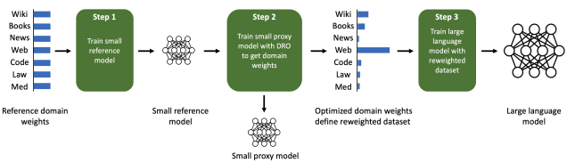
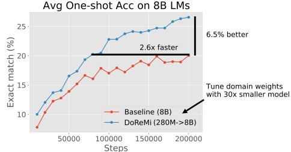
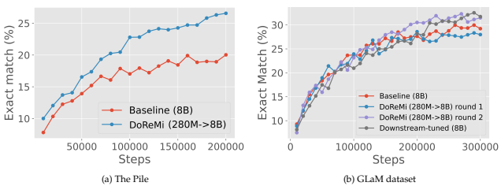
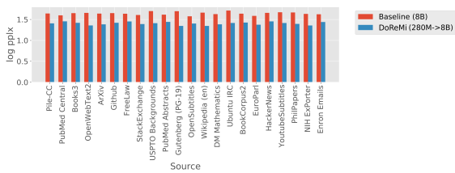
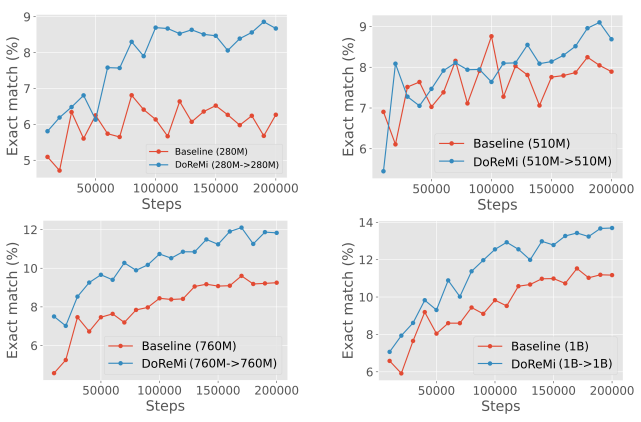
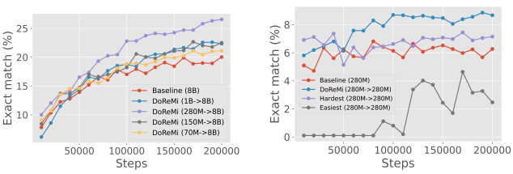
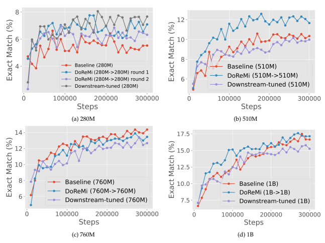
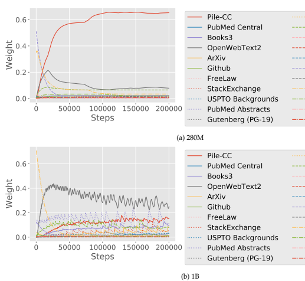

# Doremi: Optimizing Data Mixtures Speeds Up Language Model Pretraining

Sang Michael Xie∗1,2, Hieu Pham1, Xuanyi Dong1, Nan Du1, Hanxiao Liu1, Yifeng Lu1, Percy Liang2, Quoc V. Le1, Tengyu Ma2, and Adams Wei Yu1 1Google 2Stanford University

#### Abstract

The mixture proportions of pretraining data domains (e.g., Wikipedia, books, web text) greatly affect language model (LM) performance. In this paper, we propose Domain Reweighting with Minimax Optimization
(DoReMi), which first trains a small proxy model using group distributionally robust optimization (Group DRO) over domains to produce domain weights (mixture proportions) without knowledge of downstream tasks. We then resample a dataset with these domain weights and train a larger, full-sized model. In our experiments, we use DoReMi on a 280M-parameter proxy model to find domain weights for training an 8B-parameter model (30x larger) more efficiently. On The Pile, DoReMi improves perplexity across all domains, even when it downweights a domain. DoReMi improves average few-shot downstream accuracy by 6.5% points over a baseline model trained using The Pile's default domain weights and reaches the baseline accuracy with 2.6x fewer training steps. On the GLaM dataset, DoReMi, which has no knowledge of downstream tasks, even matches the performance of using domain weights tuned on downstream tasks.

## 1 Introduction

Datasets for training language models (LMs) are typically sampled from a mixture of many domains (Brown et al., 2020, Chowdhery et al., 2022, Du et al., 2021, Gao et al., 2020). For example, The Pile (Gao et al., 2020), a large publicly available dataset, is composed of 24% web data, 9% Wikipedia, 4% GitHub, etc.1 The composition of the pretraining data greatly affects the effectiveness of an LM (Du et al., 2021, Hoffmann et al., 2022, Xie et al., 2023). However, it is unclear how much of each domain to include to produce a model that performs well for a wide variety of downstream tasks. Existing works determine domain weights (the sampling probabilities for each domain) by using intuition or a set of downstream tasks. For example, The Pile uses heuristically-chosen domain weights, which could be suboptimal. On the other hand, existing LMs such as PaLM (Chowdhery et al., 2022) and GLaM (Du et al., 2021) tune the domain weights based on a set of downstream tasks, but requires training potentially thousands of LMs on different domain weights and risks overfitting to the particular set of downstream tasks. Instead of optimizing domain weights based on a set of downstream tasks, our approach aims to find domain weights which lead to models that perform well on all domains by minimizing the worst-case loss over domains. A naive worst-case approach would upweight the domains with the 1

∗Work done while interning at Google. Correspondence: <Sang Michael Xie: xie@cs.stanford.edu>, <Hieu Pham:
hyhieu@gmail.com>, <Adams Wei Yu: adamsyuwei@google.com>.

1The domain weights, which are based on token count in this paper, varies by tokenizer; see Appendix C.

Figure 1: Given a dataset with a set of domains, Domain Reweighting with Minimax Optimization

 (DoReMi) optimizes the domain weights to improve language models trained on the dataset. First, DoReMi uses some initial reference domain weights to train a reference model (Step 1). The reference model is used to guide the training of a small proxy model using group distributionally robust optimization (Group DRO) over domains (Nemirovski et al., 2009, Oren et al., 2019, Sagawa et al., 2020), which we adapt to output domain weights instead of a robust model (Step 2). We then use the tuned domain weights to train a large model (Step 3).

most noisy data, as every domain has a different optimal loss (aka, the entropy). To make the domain perplexities comparable, we follow Mindermann et al. (2022), Oren et al. (2019) and optimize the worst-case *excess loss*, which is the loss gap between the model being evaluated and a pretrained reference model. This motivates our algorithm, Domain Reweighting with Minimax Optimization (DoReMi), which leverages distributionally robust optimization (DRO) to tune the domain weights without knowledge of downstream tasks (Figure 1). First, DoReMi trains a small reference model (e.g., 280M parameters) in a standard way. Second, we train a small distributionally robust language model (DRO-LM) (Oren et al., 2019), which minimizes the worst-case excess loss (relative to the reference's model's loss) across all domains. Notably, *rather than using the robust LM*, we take the domain weights produced by DRO training. Finally, we train a large (8B) LM on a new dataset defined by these domain weights. Our approach adapts the DRO-LM framework (Oren et al., 2019) to optimize domain weights instead of producing a robust model. To do this, we use the online learning-based optimizer from Group DRO (Nemirovski et al., 2009, Sagawa et al., 2020), which dynamically updates domain weights according to the loss on each domain for rescaling the training objective, instead of sub-selecting examples from a minibatch as in Mindermann et al. (2022), Oren et al. (2019). Finally, DoReMi takes the averaged domain weights over DRO training steps. In Section 3, we run DoReMi on 280M proxy and reference models to optimize domain weights on The Pile (Gao et al., 2020) and the GLaM dataset (Du et al., 2021) (used in PaLM (Chowdhery et al., 2022)). The DoReMi domain weights are used to train an 8B parameter LM (over 30x larger). On The Pile, DoReMi reduces perplexity on all domains over baseline domain weights, even when it downweights a domain. DoReMi improves average downstream accuracy over a baseline model trained on The Pile's default domain weights by 6.5% points on generative few-shot tasks and achieves the baseline downstream accuracy 2.6x faster (Figure 2). We publish the tuned domain weights for The Pile to improve future LMs trained with The Pile (Table 1). In Section 4, we find that DoReMi consistently improves LM training when varying the sizes of the proxy model and the main model trained with optimized domain weights. On the GLaM dataset where domain weights

Figure 2: DoReMi optimizes domain weights with a small model (280M params) and uses these

 domain weights to train a much larger model (8B params, 30x larger). Here, optimizing the domain weights (training a small model twice) takes 8% of the compute of training the large model. DoReMi improves average one-shot downstream accuracy by 6.5% points and reaches the baseline accuracy 2.6x faster when pretraining on The Pile.

tuned on downstream tasks are available, DoReMi even performs comparably to tuning domain weights on downstream task performance.

### 2 Domain Reweighting With Minimax Optimization (Doremi)

In this section we define DoReMi, an algorithm for using a small proxy model to optimize the domain weights of a language modeling dataset, which then improves the training of a large model. Setup. Suppose that we have k domains (e.g., Wikipedia, GitHub), where for each domain i, we have a set of examples Di. Domain weights α ∈ ∆kspecify a probability distribution over the k domains, and consequently a distribution over the training data: Pα =Pk i=1 αi· unif(Di) where unif(D) = 1 |D| Px∈D δx is the uniform distribution over the examples in D and δx(x
′) is 1 if x
′ = x and 0 otherwise.

DoReMi. The inputs of DoReMi are the data D1*, . . . , D*k, reference domain weights αref, and training hyperparameters for the large, full-size model (number of training steps T and batch size b).

DoReMi returns optimized domain weights α¯ and ultimately, a large model trained on Pα¯.

Step 1: Obtain a small reference model. We first train a model pref on some reference domain weights αref (e.g., uniform domain weights as a default) for T steps, batch size b. This model serves as the reference model for step 2 and captures a baseline level of difficulty of each example/domain. The reference model can be a relatively small model (280M parameters in our experiments). Step 2: Train proxy model with Group DRO to obtain domain weights. To obtain domain weights, we train a small *proxy model* pθ in the distributionally robust language modeling (DRO-LM) (Oren et al., 2019) framework with the Group DRO optimizer (Sagawa et al., 2020), where θ are the weights of the proxy model. This framework trains a robust model by optimizing the worst-case loss over domains, which is equivalent to the following minimax objective:

$$\min_{\theta}\max_{\alpha\in\Delta^{k}}L(\theta,\alpha)=\min_{\theta}\max_{\alpha\in\Delta^{k}}\sum_{i=1}^{k}\alpha_{i}\cdot\left[\frac{1}{\sum_{x\in D_{i}}|x|}\sum_{x\in D_{i}}\ell_{\theta}(x)-\ell_{\mathrm{ref}}(x)\right]$$
$$(1)$$

where the losses ℓθ(x) = − log pθ(x) and ℓref(x) = − log pref(x) are the negative log-likelihoods of the proxy and reference models respectively in this paper, and |x| is the token length of an example x. The objective aims to minimize the worst-case excess loss across domains because the inner maximization over α puts all the weight on the domain with the highest excess loss. Intuitively, the excess loss (ℓθ(x) − ℓref(x)) measures the headroom for the proxy model to improve, with respect to the reference model, on example x. Examples with higher excess loss are those where the reference model achieves low loss (such that the example is "learnable") but the proxy model still has high loss. Examples with low excess loss may be very high entropy (i.e. optimal loss is high, and thus the reference loss is high) or very low entropy (i.e., easy to learn, and thus the proxy loss is low). The Group DRO optimizer works by interleaving exponentiated gradient ascent updates on domain weights αt with gradient updates on the proxy model weights θt over training steps t. The optimizer updates αt to upweight domains with high excess loss, which scales up the proxy model's gradient update on examples from these domains. Following Nemirovski et al. (2009), we return the average weights over the training trajectory α¯ =
1 T
PT
i=1 αt as the optimized domain weights to use in step 3. Step 3: Train large model with new domain weights. The tuned domain weights α¯ define a new training distribution Pα¯. We train a main model (larger than the reference/proxy models) on data from this new distribution using a standard training procedure.

Algorithm 1 DoReMi domain reweighting (Step 2)
Require: Domain data D1*, . . . , D*k, number of training steps T, batch size b, step size η, smoothing parameter c ∈ [0, 1] (e.g., c =1e-4 in our implementation).

Initialize proxy weights θ0 Initialize domain weights α0 =
1 k 1 for t from 1 to T do Sample minibatch B = {x1*, . . . , x*j} of size b from Pu, where u =
1 k 1 Let |x| be the token length of example x (|x| ≤ L)
Compute per-domain excess losses for each domain i ∈ {1, 2, . . . , k} (ℓθ,j (x) is j-th token-level loss):
λt[i] ← P1 x∈B∩Di |x| Px∈B∩Di P|x| j=1 max{ℓθt−1,j (x) − ℓref,j (x), 0}
Update domain weights (exp is entrywise): α
′t ← αt−1 exp(ηλt)
Renormalize and smooth domain weights: αt ← (1 − c)α
′
P t k i=1 α
′
t[i]
+ cu Update proxy model weights θt for the objective L(θt−1, αt) (using Adam, Adafactor, etc.)
end for return 1 T
PT
t=1 αt Details for Step 2. Algorithm 1 provides the pseudocode for Step 2. The main structure of Algorithm 1 is a training loop which updates the proxy model over T steps. At each step, we follow Sagawa et al. (2020) and sample a minibatch with uniform domain weights (regardless of the reference domain weights αref, which only affects the reference model). We then compute the per-domain excess losses, normalized by the total number of tokens in each domain, and use them to update the domain weights αt at each step. We first compute the per-domain excess loss at a per-token level and then aggregate, where the token-level losses at index j are ℓθt−1,j (x) = − log pθ(xj | x1*, . . . , x*j−1) and ℓref,j (x) = − log pref(xj | x1*, . . . , x*j−1). We clip the per-token excess loss at 0 to maintain a non-negative loss value, which is necessary for the basic guarantees of the Group DRO optimizer (Sagawa et al., 2020) and is rarely needed in practice, but this means that we do not strictly optimize the minimax objective. Finally, we update the proxy model for the objective L(θt−1, αt) using a standard optimizer such as Adam (Kingma and Ba, 2015) or Adafactor (Shazeer and Stern, 2018). We set the domain weight update step size to η = 1 and the smoothing parameter to c =1e-4 in all our experiments and did not extensively tune these hyperparameters.

Iterated DoReMi. We extend DoReMi by running it for multiple rounds, setting the reference domain weights αref for the next round to be α¯ from the previous round. We call this *iterated DoReMi*.

The entire iterated process still only uses small models for tuning domain weights. We stop iterating when the domain weights converge, which we define as when maximum change in any domain weight ∥α¯ − αref∥∞ is less than 1e-3. Empirically, this takes only 3 rounds on the GLaM dataset
(Section 3.2).

### 3 Doremi Improves Lm Training Efficiency And Performance

In this section, we use DoReMi domain weights optimized with a 280M-parameter proxy model to train a 8B-parameter main model (30x larger). We consider two datasets, The Pile (Gao et al., 2020) and the GLaM training set (Du et al., 2021). On The Pile, DoReMi reduces perplexity significantly on every domain, improves average downstream accuracy on generative one-shot tasks by 6.5%, and achieves the baseline accuracy 2.6x faster. On the GLaM dataset where domain weights tuned on downstream datasets are available, DoReMi finds domain weights with comparable performance to downstream-tuned domain weights.

#### 3.1 Experimental Setup

The Pile dataset. The Pile (Gao et al., 2020) is a 800GB text dataset with 22 domains (Table 1).

The default domain weights were determined heuristically. We use the default domain weights from The Pile dataset to train the baseline and as the reference domain weights αref in DoReMi (see Appendix C).

GLaM dataset. The GLaM dataset (Du et al., 2021) (also used in training PaLM (Chowdhery et al., 2022)) includes text from 8 domains (Table 2). For comparison, the GLaM domain weights (downstream-tuned) were tuned according to the downstream performance of models trained on each domain and the size of each domain (Du et al., 2021). We use uniform domain weights both for training the baseline and the reference domain weights αref for DoReMi.

Training setup. We train Transformer (Vaswani et al., 2017) decoder-only LMs with the standard next-token language modeling loss. We conduct a controlled comparison by equalizing the amount of compute, measured by the number of tokens processed during training. For The Pile, we train each model for 200k steps; for the GLaM dataset, we train each model for 300k steps. All models use a batch size of 512 and maximum token length of 1024. The proxy and reference models have 280M parameters. All models are trained from scratch (other hyperparameters are in Appendix C).

Evaluation. We use held-out validation data to measure the perplexity on each domain. For downstream evaluation, we use the generative one-shot tasks from the GPT-3 paper (Brown et al., 2020): TriviaQA (Joshi et al., 2017), NaturalQuestions (Kwiatkowski et al., 2019), WebQuestions (Berant et al., 2013), SQuADv2 (Rajpurkar et al., 2018), and LAMBADA (Paperno et al., 2016). We use the standard exact-match accuracy metric for the these datasets.

Compute used for optimizing domain weights. We train two 280M models (the reference and proxy models) to optimize the domain weights. This is 8% of the FLOPs required to train the main 8B model. All FLOPs come from standard forward and backward passes.

Notation for model sizes in DoReMi. We denote the size of the reference/proxy models (which are always the same size in our experiments) and the size of the main model trained with DoReMi domain weights as "DoReMi (size of reference/proxy→size of main model)": for example, DoReMi (280M→8B). When we are discussing the optimized domain weights independently of the main model, we only include one number (e.g., DoReMi (280M)) which refers to the reference/proxy model size.

#### 3.2 Doremi Improves Perplexity And Downstream Accuracy

We show that DoReMi significantly improves both the perplexity and downstream accuracy of 8B models trained on The Pile and the GLaM dataset over their respective baseline domain weights.

Downstream accuracy improves on The Pile. Figure 3 (left) shows the average downstream performance for baseline and DoReMi (280M→8B) models on The Pile. DoReMi improves the downstream accuracy by 6.5% points and achieves the baseline accuracy within 75k steps - 2.6x faster than the baseline (200k steps). Thus, DoReMi can dramatically speed up training and improve downstream performance.

Figure 3: Average one-shot downstream accuracy (exact match) on 5 tasks, with 8B parameter models trained on The Pile (left) and the GLaM dataset (right). On The Pile, DoReMi improves downstream accuracy by 6.5% points and achieves the baseline accuracy 2.6x faster (same plot as Figure 2). On the GLaM dataset, iterated DoReMi (round 2) attains comparable performance to domain weights tuned with downstream tasks.

Figure 4: Per-domain log-perplexity of 8B models on The Pile. Despite downweighting some

 domains, DoReMi improves log-perplexity on all domains.

Table 1: Domain weights on The Pile. Baseline domain weights are computed from the default Pile dataset. DoReMi (280M) uses a 280M proxy model to optimize the domain weights.

|                    | Baseline   | DoReMi (280M)   |                  | Baseline   | DoReMi (280M)   |
|--------------------|------------|-----------------|------------------|------------|-----------------|
| Pile\-CC           | 0.1121     | 0.6057          | OpenSubtitles    | 0.0124     | 0.0047          |
| PubMed Central     | 0.1071     | 0.0046          | Wikipedia (en)   | 0.0919     | 0.0699          |
| Books3             | 0.0676     | 0.0224          | DM Mathematics   | 0.0198     | 0.0018          |
| OpenWebText2       | 0.1247     | 0.1019          | Ubuntu IRC       | 0.0074     | 0.0093          |
| ArXiv              | 0.1052     | 0.0036          | BookCorpus2      | 0.0044     | 0.0061          |
| Github             | 0.0427     | 0.0179          | EuroParl         | 0.0043     | 0.0062          |
| FreeLaw            | 0.0386     | 0.0043          | HackerNews       | 0.0075     | 0.0134          |
| StackExchange      | 0.0929     | 0.0153          | YoutubeSubtitles | 0.0042     | 0.0502          |
| USPTO Backgrounds  | 0.0420     | 0.0036          | PhilPapers       | 0.0027     | 0.0274          |
| PubMed Abstracts   | 0.0845     | 0.0113          | NIH ExPorter     | 0.0052     | 0.0063          |
| Gutenberg (PG\-19) | 0.0199     | 0.0072          | Enron Emails     | 0.0030     | 0.0070          |

DoReMi can reduce perplexity across all domains without a tradeoff. Figure 4 shows the perdomain perplexity of the 8B models on The Pile. DoReMi significantly reduces the perplexity over the baseline across all domains, despite allocating lower weight to some domains. How can this occur? Intuitively, the domains with the lowest and highest entropy can be downweighted without impacting the perplexity much. The lowest entropy domains statistically require few samples to learn. The highest entropy domains have token distributions that are close to common uniform priors
- for example, models at random initialization tend to output a uniform next token distribution.

Thus, we need less samples to fit these domains. Positive transfer from allocating more samples to medium entropy domains can then improve perplexity on all domains. In Appendix D, we provide a simple example where reweighting domains can improve perplexity on all domains and DoReMi finds such domain weights in simulations.

Iterated DoReMi achieves performance of downstream-tuned weights on the GLaM dataset.

We employ iterated DoReMi on the GLaM dataset over 3 rounds. We find that the second and third round domain weights are almost identical (Table 2). Figure 3 (right) shows one-shot results for the first two rounds of iterated DoReMi. After the first round, the DoReMi main model has comparable downstream accuracy to the baseline (uniform domain weights). After the second

|                   | Round 1   | Round 2   | Round 3   | Downstream\-tuned   |
|-------------------|-----------|-----------|-----------|---------------------|
| Wikipedia         | 0.09      | 0.05      | 0.05      | 0.06                |
| Filtered webpages | 0.44      | 0.51      | 0.51      | 0.42                |
| Conversations     | 0.10      | 0.22      | 0.22      | 0.27                |
| Forums            | 0.16      | 0.04      | 0.04      | 0.02                |
| Books             | 0.11      | 0.17      | 0.17      | 0.20                |
| News              | 0.10      | 0.02      | 0.02      | 0.02                |

Table 2: Domain weights in the GLaM dataset. Iterated DoReMi (280M) converges within 3 rounds, with a similar overall pattern to domain weights tuned on downstream tasks.

round, the DoReMi main model achieves comparable downstream accuracy to downstream-tuned domain weights. Overall, domain reweighting has a smaller effect on GLaM, possibly because there are only 8 domains compared to 22 in The Pile. Inspecting the DoReMi domain weights. Tables 1 and 2 present the DoReMi domain weights for The Pile and the GLaM dataset. When running DoReMi on a 280M proxy model (DoReMi (280M)), most weight is put on the diverse Pile-CC web text domain. Note that Wikipedia is downweighted in comparison to the baseline, but DoReMi still improves the downstream accuracy on tasks derived from Wikipedia (e.g., TriviaQA, Appendix Table 5). On the GLaM dataset, the DoReMi weights have the same general pattern as the downstream-tuned domain weights. DoReMi is able to recover a similar set of domain weights by starting from uniform initial reference domain weights, without any use of downstream data.

### 4 Ablations And Analysis Across Scales

Previously in Section 3, we showed that DoReMi finds domain weights using 280M models that can improve training of 8B models. In this section, we conduct an analysis of DoReMi where we vary the scale of the proxy model in relation to the main model and ablate the components of the excess loss objective. DoReMi improves LMs consistently across scales. We consider using proxy and main models of the same size to analyze DoReMi's behavior in a simple setting, without the need for the domain weights to generalize across scales. In particular, we run DoReMi (X→X) where X is 280M, 510M,
760M, or 1B on The Pile. Figure 5 shows that DoReMi consistently improves downstream accuracy over the baseline by 2% and achieves the baseline accuracy 4x faster on average across scales, and this improvement does not shrink with larger model size. DoReMi improves the worst-case perplexity on all scales and improves 18 of 22 individual domain perplexities on average across scales (Appendix Table 6).

Proxy model underperforms main model, especially at larger sizes. Recall that DoReMi uses Group DRO to train a proxy model, which reweights the objective with the domain weights. In contrast, the main model is trained by resampling on the domain weights from DoReMi. When the proxy model and the main model are the same size, which one is the better model? Table 3b shows that the proxy model typically underperforms the main model in this case. The gap between the proxy and main model increases with scale, as the 1B proxy model not only underperforms the 1B main model but also the 1B baseline model, while the 280M proxy model achieves better perplexity than the 280M baseline model on 19/22 domains. Despite the relatively poor quality of the 1B proxy model, the domain weights still allow the 1B main model to achieve the baseline 8

Figure 5: Average one-shot downstream accuracy across 4 model scales (280M, 510M, 760M, 1B)
where the reference/proxy models for DoReMi are the same size as the main model trained with DoReMi domain weights. DoReMi consistently improves downstream accuracy across scales, with a similar 3% accuracy gap at 200k steps at most scales (except for 510M). DoReMi achieves the baseline accuracy 4x faster on average across scales.

performance over 2x faster. This suggests that DoReMi is quite robust to any suboptimalities in the minimax optimization procedure. However, we hypothesize that the mismatch between the proxy and main model training (loss reweighting vs. resampling) explains their performance difference and therefore a resampling-based Group DRO optimizer may improve DoReMi for larger proxy models.

Effect of proxy model scale on larger main model's performance. 

 We consider 70M, 150M, 280M,
and 1B scales for the DoReMi proxy model while fixing the main model size at 8B (DoReMi (X→8B)). From 70M to 280M, increasing the proxy model size improves downstream accuracy at 8B (Figure 6 left). We hypothesize that this trend does not continue for the 1B proxy model because the Group DRO optimizer is worse at larger scales (Table 3b). While DoReMi (280M→8B) results in the most improvement at 8B, DoReMi (150M-8B) and DoReMi (1B->8B) still achieve the baseline accuracy almost 2x faster. This suggests that DoReMi is robust to the proxy model scale.

Choosing the easiest or hardest domains do not suffice. We ablate the components of the excess loss metric lo(x) - lye(x) by running DoReMi using only the loss of the proxy model pe on example x, i.e. l.o. l.o. (prefer hardest domains for the proxy model) or only the negative loss of the reference

Figure 6: Average downstream accuracy for models trained on The Pile. **(Left)** Increasing the size of

 the reference/proxy models from 70M to 280M in DoReMi improves downstream accuracy for a 8B main model, but the trend does not continue for the 1B proxy model. We hypothesize that the Group DRO optimizer is worse for larger proxy models. **Right)** optimizing for hardest or easiest domains rather than excess loss (which combines both) do not achieve the same average downstream accuracy as DoReMi (280M models).

Table 3: Summary of per-domain perplexities on The Pile (22 total domains). Average perplexity is

an unweighted average of the per-domain perplexities.

|                    | Worst\-case  pplx Avg pplx   |      | # domains besting baseline   | the main model.      | poor quality, the resulting domain weights still improve   |      |                            |
|--------------------|------------------------------|------|------------------------------|----------------------|------------------------------------------------------------|------|----------------------------|
| Baseline (8B)      | 1.71                         | 1.64 | 0/22                         |                      | Worst\-case  pplx Avg pplx                                 |      | # domains besting baseline |
| DoReMi (70M\->8B)  | 1.63                         | 1.53 | 22/22                        |                      |                                                            |      |                            |
| DoReMi (150M\->8B) | 1.56                         | 1.52 | 22/22                        | Baseline (280M)      | 2.39                                                       | 2.32 | 0/22                       |
| DoReMi (280M\->8B) | 1.46                         | 1.40 | 22/22                        | DoReMi (280M\->280M) | 2.19                                                       | 2.13 | 22/22                      |
| DoReMi (1B\->8B)   | 1.58                         | 1.54 | 22/22                        | Proxy (280M)         | 2.33                                                       | 2.27 | 19/22                      |
|                    |                              |      |                              | Baseline (1B)        | 1.94                                                       | 1.87 | 0/22                       |
|                    |                              |      |                              | DoReMi (1B\->1B)     | 1.92                                                       | 1.83 | 19/22                      |
|                    |                              |      |                              | Proxy (1B)           | 2.11                                                       | 2.02 | 0/22                       |

(a) Varying the size of the proxy/reference model and training at 8B.

(b) Perplexity of the DoReMi main model and proxy model of the same size. Although the 1B proxy model is relatively
−ℓref(x) (prefer easiest domains for the reference model). Figure 6 (right) shows that neither of the components of the excess loss alone are sufficient to achieve the gains of DoReMi.

### 5 Related Work

Curating pretraining data for LMs. Most closely related is the GLaM dataset (Du et al., 2021)
(also used for training PaLM (Chowdhery et al., 2022)), which has domain weights that are tuned using downstream data. Optimizing domain weights for downstream tasks can be expensive and could require search/zero-order optimization (Snoek et al., 2012), RL (Zoph and Le, 2016), or heuristic assumptions on how positive/negative transfer between domains work. Example-level filtering also brings benefits for LM training. The C4 dataset (Raffel et al., 2019) shows gains over CommonCrawl via heuristic data cleaning methods. Du et al. (2021), Xie et al. (2023) show that filtering the data at an example level for high-quality text that look like Wikipedia and books can significantly improve downstream performance for LMs. In contrast to these works, DoReMi sets domain weights automatically with only 2 small LM training runs and do not make assumptions about the type of data to prefer (Wikipedia-like, etc.). General data selection methods. Moore-Lewis selection (Axelrod, 2017, Feng et al., 2022, Moore and Lewis, 2010) selects examples with high cross-entropy difference (similar to excess logperplexity) between language models trained on target and raw data. Coleman et al. (2020) select examples based on the uncertainty of a small proxy model for active learning. Mindermann et al.

(2022) select examples in an online fashion by taking the top k examples in a minibatch according to excess loss. Many other works on data selection are in vision (Kaushal et al., 2019, Killamsetty et al., 2021a,b,c, Mirzasoleiman et al., 2020, Paul et al., 2021, Sener and Savarese, 2018, Sorscher et al.,
2022, Wang et al., 2020, Wei et al., 2015). Overall, these methods do not address data selection for pretraining, where the downstream data distribution may be very different from the pretraining distribution. DoReMi aims to address the pretraining/downstream distribution shift with DRO. Distributionally robust optimization. Within DRO methods for deep learning (Ben-Tal et al., 2013, Oren et al., 2019, Sagawa et al., 2020, Sinha et al., 2018), we target a restricted form of shift called group shifts (Duchi et al., 2019, Oren et al., 2019, Sagawa et al., 2020), where the test distribution can be an unknown mixture of groups (domains). We follow DRO-LM (Oren et al., 2019), which employs DRO for LMs in the group shift setting. DRO-LM also uses a baselined loss, but with a simple bigram reference model. DoReMi uses a reference model of the same size and architecture as the proxy model to ensure that losses can be compared. During optimization, DRO-LM takes a worst-case subset of each minibatch to update the model on, while we use the Group DRO optimizer (Sagawa et al., 2020) which doesn't require subselection. Subselection is expensive since it requires evaluating the model on a large minibatch, while only selecting a small fraction to update the model with. Overall, in contrast to these DRO methods which aim to produce robust **models**, we use DRO to optimize the **data** for training larger models more efficiently.

### 6 Discussion And Limitations

Dependence on the training algorithm. Ideally, DoReMi would be independent from the training algorithm, but DoReMi runs the training algorithm to train the reference/proxy models. Nonetheless, DoReMi achieves algorithm-independence in some aspects: in Section 3.2, we show that DoReMi domain weights transfer gains across scales. In general, we expect the domain weights found by DoReMi to transfer across a broad range of model scales, compute budgets, and other training hyperparameters. Saving compute in DoReMi with extrapolation. In Section 2, we run DoReMi for the number of training steps that will be used to train the final model, which could be unnecessarily expensive. A future direction for saving compute would be to stop running DoReMi at an early step and extrapolate the domain weights for the desired number of steps, since we found that most of the variation in the domain weights during a DoReMi run seems to occur in the beginning of training (Appendix Figure 8).

Choice of reference model. The choice of reference model can affect the domain weights found by DoReMi. For example, iterated DoReMi (Section 3) improves performance by using a reference model trained on the tuned domain weights from a previous round of DoReMi. Further directions include varying the reference model size and using specialized reference models to optimizing domain weights for a specific application area.

What is a domain? We define a domain by data provenance in our experiments, but this only enables coarse-grained control. Using fine-grained domains could improve the gains from DoReMi. For example, DoReMi is more effective on The Pile (22 domains) than the GLaM dataset (8 domains). Broader impacts. We hope to improve training efficiency and reduce the environmental impact of training large LMs (Lacoste et al., 2019, Ligozat et al., 2021, Patterson et al., 2021, Strubell et al., 2019). However, large LMs have also been well-documented to have risks and biases (Abid et al., 2021, Blodgett and OConnor, 2017, Bommasani et al., 2021, Gehman et al., 2020, Nadeem et al., 2020). DRO-style training, which aims to produce a model with good performance on all domains, could have a favorable impact on fairness, but this requires further investigation.

## 7 Conclusion

We introduced DoReMi, an algorithm reweighting data domains for training language models.

DoReMi is able to run on small models and transfer the benefits to 30x larger models, resulting in a 2.6x speedup in training on the Pile just by changing the sampling probabilities on domains. We hope to instigate more research on data-centric approaches for improving language model training efficiency.

### Acknowledgments

We thank Xiangning Chen, Andrew Dai, Zoubin Ghahramani, Balaji Lakshminarayanan, Paul Michel, Yonghui Wu, Steven Zheng, Chen Zhu and the broader Google Bard team members for insightful discussions and pointers.

### References

Abubakar Abid, Maheen Farooqi, and James Zou. Persistent anti-muslim bias in large language models. *arXiv preprint arXiv:2101.05783*, 2021.

Amittai Axelrod. Cynical selection of language model training data. *CoRR*, abs/1709.02279, 2017.

URL http://arxiv.org/abs/1709.02279.

Aharon Ben-Tal, Dick den Hertog, Anja De Waegenaere, Bertrand Melenberg, and Gijs Rennen.

Robust solutions of optimization problems affected by uncertain probabilities. *Management Science*, 59:341–357, 2013.

Jonathan Berant, Andrew Chou, Roy Frostig, and Percy Liang. Semantic parsing on Freebase from question-answer pairs. In *Empirical Methods in Natural Language Processing (EMNLP)*, 2013.

Su Lin Blodgett and Brendan OConnor. Racial disparity in natural language processing: A case study of social media African-American English. *arXiv preprint arXiv:1707.00061*, 2017.

Rishi Bommasani, Drew A. Hudson, Ehsan Adeli, Russ Altman, Simran Arora, Sydney von Arx, Michael S. Bernstein, Jeannette Bohg, Antoine Bosselut, Emma Brunskill, Erik Brynjolfsson, Shyamal Buch, Dallas Card, Rodrigo Castellon, Niladri Chatterji, Annie Chen, Kathleen Creel, Jared Quincy Davis, Dorottya Demszky, Chris Donahue, Moussa Doumbouya, Esin Durmus, Stefano Ermon, John Etchemendy, Kawin Ethayarajh, Li Fei-Fei, Chelsea Finn, Trevor Gale, Lauren Gillespie, Karan Goel, Noah Goodman, Shelby Grossman, Neel Guha, Tatsunori Hashimoto, Peter Henderson, John Hewitt, Daniel E. Ho, Jenny Hong, Kyle Hsu, Jing Huang, Thomas Icard, Saahil Jain, Dan Jurafsky, Pratyusha Kalluri, Siddharth Karamcheti, Geoff Keeling, Fereshte Khani, Omar Khattab, Pang Wei Koh, Mark Krass, Ranjay Krishna, Rohith Kuditipudi, Ananya Kumar, Faisal Ladhak, Mina Lee, Tony Lee, Jure Leskovec, Isabelle Levent, Xiang Lisa Li, Xuechen Li, Tengyu Ma, Ali Malik, Christopher D. Manning, Suvir Mirchandani, Eric Mitchell, Zanele Munyikwa, Suraj Nair, Avanika Narayan, Deepak Narayanan, Ben Newman, Allen Nie, Juan Carlos Niebles, Hamed Nilforoshan, Julian Nyarko, Giray Ogut, Laurel Orr, Isabel Papadimitriou, Joon Sung Park, Chris Piech, Eva Portelance, Christopher Potts, Aditi Raghunathan, Rob Reich, Hongyu Ren, Frieda Rong, Yusuf Roohani, Camilo Ruiz, Jack Ryan, Christopher Ré, Dorsa Sadigh, Shiori Sagawa, Keshav Santhanam, Andy Shih, Krishnan Srinivasan, Alex Tamkin, Rohan Taori, Armin W. Thomas, Florian Tramèr, Rose E. Wang, William Wang, Bohan Wu, Jiajun Wu, Yuhuai Wu, Sang Michael Xie, Michihiro Yasunaga, Jiaxuan You, Matei Zaharia, Michael Zhang, Tianyi Zhang, Xikun Zhang, Yuhui Zhang, Lucia Zheng, Kaitlyn Zhou, and Percy Liang. On the opportunities and risks of foundation models. *arXiv preprint arXiv:2108.07258*, 2021.

Tom B. Brown, Benjamin Mann, Nick Ryder, Melanie Subbiah, Jared Kaplan, Prafulla Dhariwal, Arvind Neelakantan, Pranav Shyam, Girish Sastry, Amanda Askell, Sandhini Agarwal, Ariel Herbert-Voss, Gretchen Krueger, Tom Henighan, Rewon Child, Aditya Ramesh, Daniel M. Ziegler, Jeffrey Wu, Clemens Winter, Christopher Hesse, Mark Chen, Eric Sigler, Mateusz Litwin, Scott Gray, Benjamin Chess, Jack Clark, Christopher Berner, Sam McCandlish, Alec Radford, Ilya Sutskever, and Dario Amodei. Language models are few-shot learners. *arXiv preprint arXiv:2005.14165*, 2020.

Aakanksha Chowdhery, Sharan Narang, Jacob Devlin, Maarten Bosma, Gaurav Mishra, Adam Roberts, Paul Barham, Hyung Won Chung, Charles Sutton, Sebastian Gehrmann, Parker Schuh, Kensen Shi, Sasha Tsvyashchenko, Joshua Maynez, A. Rao, Parker Barnes, Yi Tay, Noam M.

Shazeer, Vinodkumar Prabhakaran, Emily Reif, Nan Du, B. Hutchinson, Reiner Pope, James Bradbury, Jacob Austin, M. Isard, Guy Gur-Ari, Pengcheng Yin, Toju Duke, Anselm Levskaya, S. Ghemawat, Sunipa Dev, Henryk Michalewski, Xavier García, Vedant Misra, Kevin Robinson, Liam Fedus, Denny Zhou, Daphne Ippolito, D. Luan, Hyeontaek Lim, Barret Zoph, A. Spiridonov, Ryan Sepassi, David Dohan, Shivani Agrawal, Mark Omernick, Andrew M. Dai, T. S. Pillai, Marie Pellat, Aitor Lewkowycz, E. Moreira, Rewon Child, Oleksandr Polozov, Katherine Lee, Zongwei Zhou, Xuezhi Wang, Brennan Saeta, Mark Diaz, Orhan Firat, Michele Catasta, Jason Wei, K. Meier- Hellstern, D. Eck, J. Dean, Slav Petrov, and Noah Fiedel. PaLM: Scaling language modeling with pathways. *arXiv*, 2022.

Cody Coleman, Christopher Yeh, Stephen Mussmann, Baharan Mirzasoleiman, Peter Bailis, Percy Liang, Jure Leskovec, and Matei Zaharia. Selection via proxy: Efficient data selection for deep learning. In *International Conference on Learning Representations (ICLR)*, 2020.

Nan Du, Yanping Huang, Andrew M. Dai, Simon Tong, Dmitry Lepikhin, Yuanzhong Xu, M. Krikun, Yanqi Zhou, Adams Wei Yu, Orhan Firat, Barret Zoph, Liam Fedus, Maarten Bosma, Zongwei Zhou, Tao Wang, Yu Emma Wang, Kellie Webster, Marie Pellat, Kevin Robinson, K. Meier-Hellstern, Toju Duke, Lucas Dixon, Kun Zhang, Quoc V. Le, Yonghui Wu, Zhifeng Chen, and Claire Cui. GLaM: Efficient scaling of language models with mixture-of-experts. *arXiv*, 2021.

John Duchi, Tatsunori Hashimoto, and Hongseok Namkoong. Distributionally robust losses against mixture covariate shifts. https://cs.stanford.edu/~thashim/assets/publications/ condrisk.pdf, 2019.

Yukun Feng, Patrick Xia, Benjamin Van Durme, and João Sedoc. Automatic document selection for efficient encoder pretraining, 2022. URL https://arxiv.org/abs/2210.10951.

Leo Gao, Stella Biderman, Sid Black, Laurence Golding, Travis Hoppe, Charles Foster, Jason Phang, Horace He, Anish Thite, Noa Nabeshima, Shawn Presser, and Connor Leahy. The pile: An 800gb dataset of diverse text for language modeling. *arXiv*, 2020.

Samuel Gehman, Suchin Gururangan, Maarten Sap, Yejin Choi, and Noah A Smith. Realtoxicityprompts: Evaluating neural toxic degeneration in language models. arXiv preprint arXiv:2009.11462, 2020.

Jordan Hoffmann, Sebastian Borgeaud, Arthur Mensch, Elena Buchatskaya, Trevor Cai, Eliza Rutherford, Diego de Las Casas, Lisa Anne Hendricks, Johannes Welbl, Aidan Clark, Tom Hennigan, Eric Noland, Katie Millican, George van den Driessche, Bogdan Damoc, Aurelia Guy, Simon Osindero, Karen Simonyan, Erich Elsen, Jack W. Rae, Oriol Vinyals, and Laurent Sifre. An empirical analysis of compute-optimal large language model training. In Advances in Neural Information Processing Systems (NeurIPS), 2022.

Mandar Joshi, Eunsol Choi, Daniel Weld, and Luke Zettlemoyer. TriviaQA: A large scale distantly supervised challenge dataset for reading comprehension. In Association for Computational Linguistics (ACL), 2017.

Vishal Kaushal, Rishabh Iyer, Suraj Kothawade, Rohan Mahadev, Khoshrav Doctor, and Ganesh Ramakrishnan. Learning from less data: A unified data subset selection and active learning framework for computer vision. IEEE/CVF Winter Conference on Applicatios of Computer Vision (WACV), 2019.

Krishnateja Killamsetty, Durga S, Ganesh Ramakrishnan, Abir De, and Rishabh Iyer. GRAD-MATCH:
Gradient matching based data subset selection for efficient deep model training. In International Conference on Machine Learning (ICML), 2021a.

Krishnateja Killamsetty, Durga Sivasubramanian, Ganesh Ramakrishnan, and Rishabh Iyer. Glister:
Generalization based data subset selection for efficient and robust learning. In Association for the Advancement of Artificial Intelligence (AAAI), 2021b.

Krishnateja Killamsetty, Xujiang Zhao, Feng Chen, and Rishabh Iyer. Retrieve: Coreset selection for efficient and robust semi-supervised learning. In Advances in Neural Information Processing Systems (NeurIPS), 2021c.

Diederik Kingma and Jimmy Ba. Adam: A method for stochastic optimization. In International Conference on Learning Representations (ICLR), 2015.

Tom Kwiatkowski, Jennimaria Palomaki, Olivia Redfield, Michael Collins, Ankur Parikh, Chris Alberti, Danielle Epstein, Illia Polosukhin, Matthew Kelcey, Jacob Devlin, Kenton Lee, Kristina N. Toutanova, Llion Jones, Ming-Wei Chang, Andrew Dai, Jakob Uszkoreit, Quoc Le, and Slav Petrov. Natural questions: A benchmark for question answering research. In Association for Computational Linguistics (ACL), 2019.

Alexandre Lacoste, Alexandra Luccioni, Victor Schmidt, and Thomas Dandres. Quantifying the carbon emissions of machine learning. *arXiv preprint arXiv:1910.09700*, 2019.

Anne-Laure Ligozat, Julien Lefèvre, Aurélie Bugeau, and Jacques Combaz. Unraveling the hidden environmental impacts of AI solutions for environment. *CoRR*, abs/2110.11822, 2021. URL
https://arxiv.org/abs/2110.11822.

Sören Mindermann, Jan Brauner, Muhammed Razzak, Mrinank Sharma, Andreas Kirsch, Winnie Xu, Benedikt Höltgen, Aidan N. Gomez, Adrien Morisot, Sebastian Farquhar, and Yarin Gal. Prioritized training on points that are learnable, worth learning, and not yet learnt. In *International* Conference on Machine Learning (ICML), 2022.

Baharan Mirzasoleiman, Jeff Bilmes, and Jure Leskovec. Coresets for data-efficient training of machine learning models. In *International Conference on Machine Learning (ICML)*, 2020.

Robert C. Moore and William Lewis. Intelligent selection of language model training data. In Proceedings of the ACL 2010 Conference Short Papers, pages 220–224, Uppsala, Sweden, July 2010. Association for Computational Linguistics. URL https://aclanthology.org/P10-2041.

Moin Nadeem, Anna Bethke, and Siva Reddy. Stereoset: Measuring stereotypical bias in pretrained language models. *arXiv preprint arXiv:2004.09456*, 2020.

Arkadi Nemirovski, Anatoli Juditsky, Guanghui Lan, and Alexander Shapiro. Robust stochastic approximation approach to stochastic programming. *SIAM Journal on optimization*, 19(4):1574–1609, 2009.

Yonatan Oren, Shiori Sagawa, Tatsunori Hashimoto, and Percy Liang. Distributionally robust language modeling. In *Empirical Methods in Natural Language Processing (EMNLP)*, 2019.

Denis Paperno, German Kruszewski, Angeliki Lazaridou, Quan Ngoc Pham, Raffaella Bernardi, Sandro Pezzelle, Marco Baroni, Gemma Boleda, and Raquel Fernandez. The LAMBADA dataset: Word prediction requiring a broad discourse context. In *Association for Computational Linguistics* (ACL), 2016.

David A. Patterson, Joseph Gonzalez, Quoc V. Le, Chen Liang, Lluis-Miquel Munguia, Daniel Rothchild, David R. So, Maud Texier, and Jeff Dean. Carbon emissions and large neural network training. *CoRR*, abs/2104.10350, 2021. URL https://arxiv.org/abs/2104.10350.

Mansheej Paul, Surya Ganguli, and Gintare Karolina Dziugaite. Deep learning on a data diet:
Finding important examples early in training. In Association for the Advancement of Artificial Intelligence (AAAI), 2021.

Colin Raffel, Noam Shazeer, Adam Roberts, Katherine Lee, Sharan Narang, Michael Matena, Yanqi Zhou, Wei Li, and Peter J. Liu. Exploring the limits of transfer learning with a unified text-to-text transformer. *arXiv preprint arXiv:1910.10683*, 2019.

Pranav Rajpurkar, Robin Jia, and Percy Liang. Know what you don't know: Unanswerable questions for SQuAD. In *Association for Computational Linguistics (ACL)*, 2018.

Shiori Sagawa, Pang Wei Koh, Tatsunori B. Hashimoto, and Percy Liang. Distributionally robust neural networks for group shifts: On the importance of regularization for worst-case generalization. In *International Conference on Learning Representations (ICLR)*, 2020.

Ozan Sener and Silvio Savarese. Active learning for convolutional neural networks: A core-set approach. In *International Conference on Learning Representations (ICLR)*, 2018.

Noam Shazeer and Mitchell Stern. 2018. Aman Sinha, Hongseok Namkoong, and John Duchi. Certifiable distributional robustness with principled adversarial training. In *International Conference on Learning Representations (ICLR)*, 2018.

Jasper Snoek, Hugo Larochelle, and Ryan P. Adams. Practical Bayesian optimization of machine learning algorithms. In *Advances in Neural Information Processing Systems (NeurIPS)*, 2012.

Ben Sorscher, Robert Geirhos, Shashank Shekhar, Surya Ganguli, and Ari S. Morcos. Beyond neural scaling laws: beating power law scaling via data pruning. *arXiv*, 2022.

Emma Strubell, Ananya Ganesh, and Andrew McCallum. Energy and policy considerations for deep learning in NLP. In Proceedings of the 57th Annual Meeting of the Association for Computational Linguistics, pages 3645–3650, Florence, Italy, July 2019. Association for Computational Linguistics.

doi: 10.18653/v1/P19-1355. URL https://aclanthology.org/P19-1355.

Ashish Vaswani, Noam Shazeer, Niki Parmar, Jakob Uszkoreit, Llion Jones, Aidan N Gomez, Lukasz Kaiser, and Illia Polosukhin. Attention is all you need. *arXiv preprint arXiv:1706.03762*, 2017.

Xinyi Wang, Hieu Pham, Paul Michel, Antonios Anastasopoulos, Jaime Carbonell, and Graham Neubig. Optimizing data usage via differentiable rewards. In International Conference on Machine Learning (ICML), 2020.

Kai Wei, Rishabh Iyer, and Jeff Bilmes. Submodularity in data subset selection and active learning.

In *International Conference on Machine Learning (ICML)*, 2015.

Sang Michael Xie, Shibani Santurkar, Tengyu Ma, and Percy Liang. Data selection for language models via importance resampling. *arXiv preprint arXiv:2302.03169*, 2023.

Barret Zoph and Quoc V Le. Neural architecture search with reinforcement learning. arXiv preprint arXiv:1611.01578, 2016.

Figure 7: Average one-shot downstream accuracy across 4 model scales, where the reference/proxy models for DoReMi are the same size as the final model trained with DoReMi domain weights. All models in this figure are trained on the GLaM dataset. DoReMi consistently improves downstream accuracy across scales.

## A

# Results Across Scales On The Glam Dataset

Figure 7 presents results across different scales (280M, 510M, 760M, 1B) on the GLaM dataset, where the proxy/reference models are the same size as the main model trained with DoReMi domain weights. Across all scales, DoReMi is comparable or better than both the baseline (uniform) domain weights and downstream-tuned domain weights. Interestingly, for iterated DoReMi at the 280M scale, the second round weights achieve slightly worse downstream accuracy than the round 1 weights when used to train 280M models, but transfer better to training 8B models.

## Detailed Results For The Pile B

Per-domain perplexities for 8B models. Table 4 shows per-domain perplexities for 8B models trained on the Pile. The reference/proxy models in this case are 70M, 150M, 280M, and 1B. DoReMi improves the perplexity on each domain compared to the baseline domain weights.

|                    | have lower perplexity on all domains than the baseline weights.   |                   |                    |                    |                  |
|--------------------|-------------------------------------------------------------------|-------------------|--------------------|--------------------|------------------|
|                    | Baseline (8B)                                                     | DoReMi (70M\->8B) | DoReMi (150M\->8B) | DoReMi (280M\->8B) | DoReMi (1B\->8B) |
| Pile\-CC           | 1.64                                                              | 1.51              | 1.48               | 1.41               | 1.55             |
| PubMed Central     | 1.60                                                              | 1.58              | 1.54               | 1.46               | 1.56             |
| Books3             | 1.65                                                              | 1.52              | 1.50               | 1.42               | 1.57             |
| OpenWebText2       | 1.66                                                              | 1.48              | 1.54               | 1.36               | 1.58             |
| ArXiv              | 1.64                                                              | 1.56              | 1.53               | 1.38               | 1.51             |
| Github             | 1.65                                                              | 1.55              | 1.54               | 1.42               | 1.53             |
| FreeLaw            | 1.64                                                              | 1.55              | 1.54               | 1.45               | 1.55             |
| StackExchange      | 1.61                                                              | 1.52              | 1.54               | 1.39               | 1.55             |
| USPTO Backgrounds  | 1.70                                                              | 1.53              | 1.50               | 1.41               | 1.56             |
| PubMed Abstracts   | 1.61                                                              | 1.56              | 1.51               | 1.44               | 1.55             |
| Gutenberg (PG\-19) | 1.70                                                              | 1.56              | 1.54               | 1.35               | 1.52             |
| OpenSubtitles      | 1.58                                                              | 1.56              | 1.52               | 1.40               | 1.55             |
| Wikipedia (en)     | 1.66                                                              | 1.49              | 1.53               | 1.35               | 1.56             |
| DM Mathematics     | 1.63                                                              | 1.50              | 1.56               | 1.38               | 1.48             |
| Ubuntu IRC         | 1.71                                                              | 1.53              | 1.49               | 1.42               | 1.48             |
| BookCorpus2        | 1.64                                                              | 1.57              | 1.54               | 1.43               | 1.57             |
| EuroParl           | 1.59                                                              | 1.52              | 1.51               | 1.37               | 1.53             |
| HackerNews         | 1.66                                                              | 1.50              | 1.55               | 1.45               | 1.55             |
| YoutubeSubtitles   | 1.67                                                              | 1.63              | 1.55               | 1.42               | 1.53             |
| PhilPapers         | 1.67                                                              | 1.55              | 1.49               | 1.39               | 1.53             |
| NIH ExPorter       | 1.63                                                              | 1.51              | 1.48               | 1.36               | 1.52             |
| Enron Emails       | 1.62                                                              | 1.48              | 1.52               | 1.44               | 1.56             |

Table 4: Per-domain perplexities for 8B models trained on The Pile where the reference/proxy models are or smaller sizes (70M, 150M, 280M, 1B). Models trained with DoReMi domain weights

|                  | Baseline   | DoReMi (1B\->8B)   | DoReMi (280M\->8B)   | DoReMi (150M\->8B)   | DoReMi (70M\->8B)   |
|------------------|------------|--------------------|----------------------|----------------------|---------------------|
| LAMBADA          | 20.10      | 22.55              | 29.19                | 20.59                | 26.20               |
| NaturalQuestions | 4.35       | 6.01               | 7.73                 | 6.26                 | 5.10                |
| SQuADv2          | 44.43      | 42.22              | 51.89                | 46.53                | 40.99               |
| TriviaQA         | 24.55      | 32.25              | 34.86                | 30.01                | 26.30               |
| WebQuestions     | 6.74       | 8.71               | 9.15                 | 9.15                 | 6.99                |
| Average          | 20.03      | 22.35              | 26.56                | 22.51                | 21.11               |

Table 5: Per-task exact-match accuracies for generative one-shot tasks. All DoReMi models improve

downstream performance significantly over the baseline domain weights.

Per-task accuracies for 8B models. Table 5 shows the accuracies on one-shot generative tasks for various reference/proxy model sizes from 70M to 1B. All DoReMi models improve downstream performance significantly over the baseline. Summary of perplexity results across scales. Table 6 shows a summary of per-domain perplexities for DoReMi across 4 scales (280M, 510M, 760M, 1B). Here, the reference/proxy models are the same size as the main model trained with DoReMi domain weights. On average, DoReMi improves perplexity on 18.25 out of 22 domains from The Pile. The worst-case perplexity is always reduced (or comparable in the 510M case) with respect to the baseline domain weights. Perplexity results for ablations. Table 7 shows the perplexities for ablations on the DRO objective.

We change the DRO objective and use these to tune domain weights on 280M reference/proxy models. These tuned domain weights are then used to train a main 280M model. Hardest refers to optimizing the domain-level log-perplexity without baselining with a reference model. Easiest refers to optimizing for the domains with lowest log-perplexity under the reference model. Both

Table 6: Summary of per-domain perplexities for 280M, 510M, 760M, and 1B models trained on The Pile, where the reference/proxy models are the same size. DoReMi improves the worst-case and average perplexity of the baseline domain weights in all cases. On average, DoReMi improves perplexity on 18 out of 22 domains.

|                      | Worst\-case pplx   | Avg pplx   | # domains besting baseline   |
|----------------------|--------------------|------------|------------------------------|
| Baseline (280M)      | 2.39               | 2.32       | 0/22                         |
| DoReMi (280M\->280M) | 2.19               | 2.13       | 22/22                        |
| Proxy (280M)         | 2.33               | 2.27       | 19/22                        |
| Baseline (510M)      | 2.14               | 2.08       | 0/22                         |
| DoReMi (510M\->510M) | 2.14               | 2.06       | 15/22                        |
| Proxy (510M)         | 2.23               | 2.18       | 0/22                         |
| Baseline (760M)      | 2.05               | 1.97       | 0/22                         |
| DoReMi (760M\->760M) | 2.00               | 1.94       | 17/22                        |
| Proxy (760M)         | 2.15               | 2.10       | 0/22                         |
| Baseline (1B)        | 1.94               | 1.87       | 0/22                         |
| DoReMi (1B\->1B)     | 1.92               | 1.83       | 19/22                        |
| Proxy (1B)           | 2.11               | 2.02       | 0/22                         |

Table 7: Summary of perplexity results for ablations on the DRO objective (excess loss). The individual components (which prefer hardest and easiest domains respectively) do not reduce

|                       | Worst\-case pplx   | Avg pplx   | # domains besting baseline   |
|-----------------------|--------------------|------------|------------------------------|
| Baseline (280M)       | 2.39               | 2.32       | 0                            |
| DoReMi (280M\->280M)  | 2.19               | 2.13       | 22/22                        |
| Hardest (280M\->280M) | 2.66               | 2.62       | 0/22                         |
| Easiest (280M\->280M) | 4.27               | 4.18       | 0/22                         |

perplexity over the baseline.

ablations do not improve perplexity on any domain over the baseline. Optimizing for the "hardest" domain does not actually result in improving worst-case perplexity, supporting the results of Oren et al. (2019), which also employs DRO for language modeling with a baselined loss.

Trajectory of domain weights. Figure 8 shows the exponential moving average (smoothing parameter 0.99) of domain weights during a run of DoReMi. In both cases, there are domains with very high weight initially and decrease in weight very quickly (within 50k steps). Since we compute the final domain weights by integrating these curves over steps and normalizing, this suggests that if we have a smaller compute budget, these domains could become more important - this highlights the dependence of the mixture weights on the compute budget. At the same time, the domain weights tend to quickly stabilize after 50k steps, suggesting that the optimal domain weights should be similar for larger compute budgets. We may also be able to take advantage of this stability after 50k steps to run DoReMi for a smaller number of steps and extrapolate the domain weights to save compute.

| OpenSubtitles    |
|------------------|
| Wikipedia (en)   |
| DM Mathematics   |
| Ubuntu IRC       |
| BookCorpus2      |
| EuroParl         |
| HackerNews       |
| YoutubeSubtitles |
| PhilPapers       |
| NIH ExPorter     |
| Enron Emails     |

| OpenSubtitles    |
|------------------|
| Wikipedia (en)   |
| DM Mathematics   |
| Ubuntu IRC       |
| BookCorpus2      |
| EuroParl         |
| HackerNews       |
| YoutubeSubtitles |
| PhilPapers       |
| NIH ExPorter     |
| Enron Emails     |

Figure 8: Exponential moving average of domain weights throughout a DoReMi run for 280M and 1B reference/proxy models. In the beginning of the run, the domain weights change quickly and then become more stable after 50k steps. This suggests that 1) smaller compute budgets may require drastically different domain weights, and 2) we may be able to save compute by extrapolating the domain weights after 50k steps.

Comparison of domain weights for 280M and 1B. Table 8 presents the DoReMi domain weights for The Pile at 280M and 1B proxy models. Different proxy model sizes can result in different domain weights, which suggests that there may be multiple local minima in domain weight space. With a 280M proxy model, most of the weight is put on the Pile-CC web text domain, while DoReMi with a 1B proxy model puts most of the weight on OpenWebText2. The overall pattern of the domain weights for the rest of the domains are similar.

### C Training Details

Data preprocessing. For all datasets, we preprocessed the data by chunking into length 1024 examples with respect to a SentencePiece tokenizer with 256k vocabulary size. The examples are separated by domain to facilitate hierarchical sampling (first sample a domain according to some domain weights, then sample an example from that domain at random). To reduce the amount of

Table 8: Domain weights on The Pile. Baseline domain weights are computed from the default Pile dataset. With different proxy model sizes, DoReMi (280M) and DoReMi (1B) result in different domain weights. Despite the differences, the qualitative patterns are similar other than the which web domain has the most weight.

|                    | Baseline   | DoReMi (280M)   | DoReMi (1B)   |
|--------------------|------------|-----------------|---------------|
| Pile\-CC           | 0.1121     | 0.6057          | 0.1199        |
| PubMed Central     | 0.1071     | 0.0046          | 0.0149        |
| Books3             | 0.0676     | 0.0224          | 0.0739        |
| OpenWebText2       | 0.1247     | 0.1019          | 0.3289        |
| ArXiv              | 0.1052     | 0.0036          | 0.0384        |
| Github             | 0.0427     | 0.0179          | 0.0129        |
| FreeLaw            | 0.0386     | 0.0043          | 0.0148        |
| StackExchange      | 0.0929     | 0.0153          | 0.0452        |
| USPTO Backgrounds  | 0.0420     | 0.0036          | 0.0260        |
| PubMed Abstracts   | 0.0845     | 0.0113          | 0.1461        |
| Gutenberg (PG\-19) | 0.0199     | 0.0072          | 0.0250        |
| OpenSubtitles      | 0.0124     | 0.0047          | 0.0017        |
| Wikipedia (en)     | 0.0919     | 0.0699          | 0.0962        |
| DM Mathematics     | 0.0198     | 0.0018          | 0.0004        |
| Ubuntu IRC         | 0.0074     | 0.0093          | 0.0044        |
| BookCorpus2        | 0.0044     | 0.0061          | 0.0029        |
| EuroParl           | 0.0043     | 0.0062          | 0.0078        |
| HackerNews         | 0.0075     | 0.0134          | 0.0058        |
| YoutubeSubtitles   | 0.0042     | 0.0502          | 0.0159        |
| PhilPapers         | 0.0027     | 0.0274          | 0.0063        |
| NIH ExPorter       | 0.0052     | 0.0063          | 0.0094        |
| Enron Emails       | 0.0030     | 0.0070          | 0.0033        |

padding tokens, we made an effort to pack examples (possibly from different domains) together into the same sequence. When doing such a packing, we compute the domain perplexities on a per-token level in DoReMi.

Baseline domain weights for The Pile. The baseline domain weights for The Pile were computed from The Pile dataset and the number of epochs for each domain given in Gao et al. (2020). After chunking into length 1024 examples, we counted the number of examples in each domain and multiplied by the number of epochs that domain specified in Gao et al. (2020). We then normalized these counts to obtain the baseline domain weights.

Training setup. For all training runs (including DRO runs), we train with a batch size of 512, initial learning rate of 1e-3, weight decay of 1e-2, and gradient clipping to norm 1. We decay the learning rate exponentially until it reaches a minimum of 1e-4 at the end of training, with a linear warmup of 6% of the total training steps. We train for 200k steps on The Pile and 300k steps on the GLaM dataset. Models under 1B parameters were trained with TPUv3 accelerators, while 1B and 8B models were trained with TPUv4.

Model architectures. Table 9 shows the architecture hyperparameters for the model sizes used in the paper. All the models we use are vanilla Transformer decoder-only models with a 256k vocab size.

|      | Layers   | Attention heads   | Attention head dim   | Model dim   | Hidden dim   |
|------|----------|-------------------|----------------------|-------------|--------------|
| 70M  | 3        | 4                 | 64                   | 256         | 1024         |
| 150M | 6        | 8                 | 64                   | 512         | 2048         |
| 280M | 12       | 12                | 64                   | 768         | 3072         |
| 510M | 12       | 16                | 64                   | 1024        | 8192         |
| 760M | 12       | 20                | 64                   | 1280        | 8192         |
| 1B   | 16       | 32                | 64                   | 2048        | 8192         |
| 8B   | 32       | 32                | 128                  | 4096        | 24576        |

Table 9: Architecture hyperparameters for various model scales used in the paper. All models are vanilla Transformer decoder-only models and use vocabulary size 256k.

### D Simple Example Where Data Reweighting Has No Tradeoff

Motivated by the findings in Section 3.2, we present a simple language modeling example where reweighting the training data from different domains improves perplexity on all domains. The example shows that DoReMi downweights domains that are extremely high or low entropy. Setup. Suppose the ground-truth distribution of text p
∗is a mixture over k domains, where each domain z ∈ {1*, . . . , k*} is defined by a different unigram distribution p
∗(x | z) over m tokens. Given a budget of n training samples, the goal is choose domain weights p(z) (k scalars that add to 1) to sample training data with such that we learn the parameters of the unigram distributions p
∗(· | z)
well for all z from 1 to k. Notably, we do not aim to estimate the ground truth mixture proportions across domains.

Data. Given some domain weights p(z), we sample training data hierarchically: first we determine the number of samples nz per domain z by drawing from a multinomial distribution over k possibilities with probabilities defined by p(z) and n total trials. Then, for each domain z, we sample nz tokens from p
∗(· | z), forming a vector of tokens Xz with length nz.

Model. For each domain z, we consider a Bayesian model of the unigram distribution p(x | z; θ)
with a Dirichlet prior p(θ | z; β) over the unigram distribution parameters θ ∈ ∆m. The Dirichlet prior has hyperparameters β ∈ R
m, which can be viewed as a "pseudo-count" for each token. For each domain z, we estimate the parameters ˆθz by computing the mean of the posterior distribution conditioned on the data:

$$\hat{\theta}_{z}(x)=\frac{1}{n_{z}+s_{z}}\left[\lambda_{z}(x)+\sum_{i=1}^{n_{x}}\mathbf{1}[X_{z}[i]=x]\right]\ \ \text{for all}\ x\in\{1,\ldots,m\}\tag{2}$$

where sz =Px λz(x) is the sum of pseudocounts.

For a domain z, we can write the parameter error of this estimator as a function of the "difficulty" Hz of predicting the next token and the "quality" of the prior ∆z, defined below.

Lemma 1. For domain index z with nz *samples, the parameter error is*

$$\sum_{x}\mathbb{E}[(\hat{\theta}_{z}(x)-p^{\star}(x\mid z))^{2}]=\frac{n_{z}H_{z}+s_{z}^{2}\Delta_{z}}{(n_{z}+s_{z})^{2}}$$
$$(3)^{\frac{1}{2}}$$

2(3)
where

$$H_{z}=\sum_{x}p^{*}(x\mid z)(1-p^{*}(x\mid z))$$ $$\Lambda_{z}=\sum_{x}\left(p^{*}(x\mid z)-\frac{\lambda_{z}(x)}{s_{z}}\right)^{2}.$$

Proof. The parameter error is

$$\sum_{x}\mathbb{E}[(\hat{\theta}_{z}(x)-p^{*}(x\mid z))^{2}]=\sum_{x}\mathbb{E}[\hat{\theta}_{z}(x)^{2}]-2\mathbb{E}[\hat{\theta}_{z}(x)]p^{*}(x\mid z)+p^{*}(x\mid z)^{2}.$$
2. (6)
Evaluating the terms separately,

$$\left(4\right)$$
$$\quad(5)$$
$$(6)^{\frac{1}{2}}$$
$$\left(7\right)$$
$$(8)^{\frac{1}{2}}$$
$$\mathbb{E}[\hat{\theta}_{z}(x)]=\frac{1}{n_{z}+s_{z}}\left[\lambda_{z}(x)+\sum_{i=1}^{n_{z}}\mathbf{1}[X_{z}[i]=x]\right]$$ $$=\frac{1}{n_{z}+s_{z}}(\lambda_{z}(x)+n_{z}p^{*}(x\mid z))$$ $$\mathbb{E}[\hat{\theta}_{z}(x)^{2}]=\frac{1}{(n_{z}+s_{z})^{2}}\mathbb{E}[(\lambda_{z}(x)+\sum_{i=1}^{n_{z}}\mathbf{1}[X_{z}[i]=x])^{2}]$$ $$=\frac{1}{(n_{z}+s_{z})^{2}}\left[\lambda_{z}(x)^{2}+2\lambda_{z}(x)n_{z}p^{*}(x\mid z)+n_{z}p^{*}(x\mid z)+(n_{z}^{2}-n_{z})p^{*}(x\mid z)^{2}\right]$$
$$(9)$$
$$(10)^{\frac{1}{2}}$$
(11)  $$\begin{array}{l}\small\text{(12)}\end{array}$$ = (13)  $$\begin{array}{l}\small\text{(13)}\end{array}$$ . 
$\square$
2(10)
Putting it all together, the parameter error can be written as

$$\sum_{x}\mathbb{E}[(\hat{\theta}_{z}(x)-p^{*}(x\mid z))^{2}]=\sum_{x}\frac{(s_{z}^{2}-n_{z})p^{*}(x\mid z)^{2}+\lambda_{z}(x)^{2}+(n_{z}-2s_{z}\lambda_{z}(x))p^{*}(x\mid z)}{(n_{z}+s_{z})^{2}}$$ $$=\sum_{x}\frac{n_{z}p^{*}(x\mid z)(1-p^{*}(x\mid z))+s_{z}^{2}\left(p^{*}(x\mid z)-\frac{\lambda_{z}(x)}{s_{z}}\right)^{2}}{(n_{z}+s_{z})^{2}}$$ $$=\frac{n_{z}H_{z}+s_{z}^{2}\Delta_{z}}{(n_{z}+s_{z})^{2}}.$$

No-tradeoff example. Suppose there are 3 domains z ∈ {1, 2, 3} and m = 3 vocabulary tokens x ∈ {1, 2, 3}. We use a symmetric Dirichlet prior (preferring a uniform token distribution) where λz(x) = 1/3 for all tokens x and domains z. Here, sz =Px λz(x) = 1. In this setting, we show that there is a set of domain weights that has strictly lower parameter error than the baseline where we sample the same number of tokens from each domain: nz are equal for all domains z.

Suppose the ground truth paramaters for the unigram distributions are

$\begin{bmatrix}1\\ 0.7\\ 1/3\end{bmatrix}$

1 0 0
0.7 0.2 0.1
1/3 1/3 1/3
$$\left.\begin{array}{r r}{{0}}&{{0}}\\ {{0.2}}&{{0.1}}\\ {{1/3}}&{{1/3}}\end{array}\right],$$
where row z contains the parameters for domain z. For example, token 1 has probability 1 under domain 1's unigram distribution.

$$(14)$$

For domain z = 1 (non-noisy domain), we have H1 = 0 so the parameter error (according to Lemma 1) is

$$\frac{s_{1}^{2}\Delta_{1}}{(n_{1}+s_{1})^{2}}$$
2(15)
$$(15)$$

$$(16)$$

which is strictly decreasing in the number of samples n1. For domain z = 3 (noisy domain), we have ∆3 = 0 so the parameter error is

$n_{3}H_{3}$  $(n_{3}+s_{3})^{2}$,  at $n_{3}=0$ (no samples). This means that we can a 
by Lemma 1. This error is minimized to zero at n3 = 0 (no samples). This means that we can allocate samples elsewhere while still reducing error.

For z = 2 (intermediate entropy domain), we have ∆2 = 0.207 and H2 = 0.46. The derivative of the parameter error with respect to the number of samples n2 is

$$\frac{\partial}{\partial n_{2}}\frac{n_{2}H_{2}+s_{2}^{2}\Delta_{2}}{(n_{2}+s_{2})^{2}}=\frac{H_{2}(s_{2}-n_{2})-2s_{2}^{2}\Delta_{2}}{(n_{2}+s_{2})^{3}}$$

which is negative when

$$n_{2}>s_{2}-\frac{2s_{2}^{2}\Delta_{2}}{H_{2}}.$$
$$(17)$$
$$(18)^{3}$$

. (18)
This inequality holds in this case since 2∆2 H2< 1 and s2 = 1. Therefore the parameter error is decreasing in the number of samples n2.

Thus, any domain weights that reallocate the examples from domain 3 to domains 1 and 2 reduces the parameter error for all domains. What kind of domains are downweighted? Intuitively, we can downweight the very noisy (high entropy/difficulty) domain 3 because the initialization perfectly matches the ground truth. This allows us to reallocate samples to the other domains 1 and 2. Between these, domain 1 requires less additional samples since the parameter error decreases very quickly with the number of samples n1 (the difficulty H1 is zero). Thus, the easiest domains should also receive relatively less weight.

In practice, positive transfer between domains (which is not captured here) can also contribute to scenarios where reweighting results in no tradeoff across domains. Simulation with DoReMi. We consider running DoReMi on the above no-tradeoff instance of the simple example with the ground truth unigram distributions in Equation 14. Note that DoReMi's domain reweighting step (Step 2, Algorithm 1) involves a loop over T iterative model updates, while the estimator from Equation 2 is computed in closed form. To adapt the estimator for DoReMi, we consider an iterative version where the average is computed in an online fashion. We run DoReMi for T = 500 steps using minibatch size 1 over the n = 500 training examples with domain weight update rate η = 0.5. For the model update at step t on an example x from domain z, we increase the pseudo-count ˆθz(x) by the current domain weight αt corresponding to domain z. Instead of using the examples in the minibatch (which is only size 1 and doesn't represent all domains), we compute the per-domain excess log-perplexities in Algorithm 1 using a fixed, independent evaluation set of 30 examples. We compare DoReMi against a model trained with baseline domain weights, which are uniform over the 3 domains. All models are trained on n = 500 training examples. We evaluate the log-perplexity of a model on each domain in closed form using the ground truth unigram distribution parameters.

On this simple example, DoReMi returns domain weights [0.39, 0.61, 0.0] after rounding to 2 decimal places. These weights correspond to our intuitions - the first domain (non-noisy) is increased by a small amount, the third domain (noisy) is decreased to 0 weight, and most of the weight is allocated to the second domain. We use these domain weights to generate a new dataset of 500 examples. The model trained with this new dataset improves over the baseline model in perplexity on all domains.