# Evidence Of Meaning In Language Models Trained On Programs

| Charles Jin         | Martin Rinard        |
|---------------------|----------------------|
| CSAIL               | CSAIL                |
| MIT                 | MIT                  |
| Cambridge, MA 02139 | Cambridge, MA 02139  |
| ccj@csail.mit.edu   | rinard@csail.mit.edu |

### Abstract

We present evidence that language models can learn meaning despite being trained only to perform next token prediction on text, specifically a corpus of programs. Each program is preceded by a specification in the form of (textual) input-output examples. Working with programs enables us to precisely define concepts relevant to meaning in language (e.g., correctness and semantics), making program synthesis well-suited as an intermediate testbed for characterizing the presence (or absence) of meaning in language models.

We first train a Transformer model on the corpus of programs, then probe the trained model's hidden states as it completes a program given a specification. Despite providing no inductive bias toward learning the semantics of the language, we find that a linear probe is able to extract abstractions of both current and future program states from the model states. Moreover, there is a strong, statistically significant correlation between the accuracy of the probe and the model's ability to generate a program that implements the specification. To evaluate whether the semantics are represented in the model states rather than learned by the probe, we design a novel experimental procedure that intervenes on the semantics of the language while preserving the lexicon and syntax. We also demonstrate that the model learns to generate correct programs that are, on average, shorter than those in the training set, which is evidence that language model outputs may differ from the training distribution in semantically meaningful ways. In summary, this paper does not propose any new techniques for training language models, but develops an experimental framework for and provides insights into the acquisition and representation of (formal) meaning in language models.

### 1 Introduction

Despite the rapidly improving performance of large, pretrained language models (LMs) in a range of downstream tasks, a major open question is whether such LMs capture any semantically meaningful information about the text that they consume and generate [Mitchell and Krakauer, 2023]. One possibility is that LMs trained purely on form—such as the conditional distribution of tokens in the training corpus—do not acquire meaning. Instead, they produce text only according to surface statistical correlations gleaned from the training data [Bender and Koller, 2020], with any apparently sophisticated behavior attributable to the scale of the model and training data. Indeed, a recent meta-survey reveals a sharp divide within the NLP community, with 51% of respondents agreeing to the statement, "Some generative model trained only on text, given enough data and computational resources, could understand natural language in some non-trivial sense" [Michael et al., 2022].

This work studies the extent to which meaning can emerge in LMs trained solely to perform next token prediction on text. We empirically evaluate the following two hypotheses: Main Hypotheses. LMs trained only to perform next token prediction on text are (H1) fundamentally limited to repeating the surface-level statistical correlations in their training corpora; and
(H2*) unable to assign meaning to the text that they consume and generate.*
To investigate H1 and H2, we apply language modeling to the task of *program synthesis*, or synthesizing a program given a specification in the form of input-output examples. Our primary motivation in adopting this approach is that the meaning (and correctness) of a program is given exactly by the semantics of the programming language. Specifically, we train an LM on a corpus of programs and their specifications, then *probe* the LM's hidden states for a representation of the program semantics using a linear classifier. We find the probe's ability to extract semantics is random at initialization, then undergoes a phase transition during training, with the phase transition strongly correlated with the LM's ability to generate a correct program in response to previously unseen specifications. We also present results from a novel interventional experiment, which indicate that the semantics are represented in the model states (rather than learned by the probe). Our contributions are as follows:
1. We present experimental results that support the emergence of meaningful representations in LMs trained to perform next token prediction (Section 3). In particular, we use the trained LM to generate programs given several input-output examples, then train a linear probe to extract information about the program state from the model state. We find that the internal representations contain linear encodings of (1) an abstract semantics—specifically, an *abstract interpretation*—that track the specified inputs through the execution of the program, and (2) predictions of *future* program states corresponding to program tokens that have yet to be generated. During training, these linear representations of semantics develop in lockstep with the LM's ability to generate correct programs across training steps.

2. We design and evaluate a novel interventional technique that enables us to disentangle the contributions of the LM and probe when extracting meaning from representations (Section 4). Specifically, we seek to distinguish whether (1) the LM representations contain purely (syntactic) transcripts while the probe learns to interpret the transcript to infer meaning, or (2) the LM representations contain semantic state, and the probe just extracts the meaning from the semantic state. Our results indicate that the LM representations are, in fact, aligned with the original semantics (rather than just encoding some lexical and syntactic content), which—together with the results in Section 3—rejects H2.

3. We present evidence that the outputs of the LM can differ from the training distribution in semantically meaningful ways (Section 5): namely, the LM tends to generate programs that are *shorter* than those in the training set (while still being correct), and the perplexity of the LM remains consistently high on the programs in the training set even as its ability to synthesize correct programs improves, rejecting H1.

More broadly, this work presents a framework for conducting empirical research on LMs based on the semantics of programming languages (Section 2). Working with programs allows us to define, measure, and experiment with concepts from the precise formal semantics of the underlying programming language, yielding novel insights that contribute toward a principled understanding of the capabilities of current LMs. Going forward, we believe methods similar to those developed in the present work can offer a complementary formal perspective on how key concepts related to language and cognition can be mapped to the setting of LMs and, more generally, machine intelligence.

### 2 Background

This section provides a short overview of the *trace semantics* as our chosen model of meaning in programs, and introduces our experimental setting and procedure.

#### 2.1 Program Tracing As Meaning

A foundational topic in the theory of programming languages, formal semantics [Winskel, 1993]
is the study of how to formally assign meaning to strings in the language. In this work, our model

Figure 1: An overview of the Karel domain. We construct training examples by sampling a random

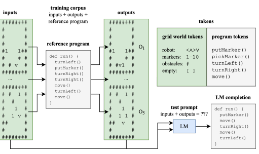

 reference program, then sampling 5 random inputs and executing the program to obtain the corresponding 5 outputs. The LM is trained to perform next token prediction on a corpus of examples. At test time, we provide only the input-output prefix to the LM, and use greedy decoding to complete the program. The figure depicts an actual reference program and completion from the final trained LM.

of semantics consists of *tracing* a program's execution [Cousot, 2002]: given a set of inputs (i.e, assignments to variables), the meaning of a (syntactic) program is identified with the (semantic) value computed from the expression, and the trace is the sequence of intermediate values generated as the program executes on the inputs. Beyond its amenability to formal analysis, tracing is attractive as a model of program meaning for several reasons. In novice programmers, the ability to accurate trace a piece a code has been directly linked to the ability to explain the code [Lopez et al., 2008, Lister et al., 2009], and computer science education has emphasized tracing as a method of developing program understanding [Hertz and Jump, 2013] and localizing reasoning errors [Sorva, 2013]. Expert programmers also rely on tracing, both as a mental process [Letovsky, 1987] and as implemented in the vast array of trace-based debuggers. Abstract interpretation Given a program semantics, *abstract interpretation* [Cousot and Cousot, 1977] is one way to coarsen the semantics while preserving its compositional structure. For instance, given the multiplication operator × over the integers Z, we could define an abstract interpretation α by mapping each integer to its sign α : Z *7→ {−*, 0, +}, with the corresponding abstract operator ×α defined in the natural way. This abstraction is *precise* because, for any two integers *x, y* ∈ Z, we have that α(x × y) = α(x) ×α α(y) (i.e., α is a *homomorphism*). We leverage abstract interpretation to precisely isolate a subset of the trace semantics. As compositionality is often described as a key tenet of human-like intelligence and language [Fodor and Lepore, 2002, Chomsky, 2002, Mikolov et al., 2018], we believe our techniques can be applied as a formal framework to test claims of intelligence in LMs beyond the present work.

#### 2.2 Methods

Karel Karel is an educational programming language [Pattis, 1994] developed at Stanford in the 1970s, which is still in use in their introductory programming course today [Piech and Roberts, January 2019, CS106A, 2023]. The domain features a robot (named Karel) navigating a grid world with obstacles while leaving and picking up markers. Since being introduced by Devlin et al. [2017], Karel has been adopted by the program synthesis community as a standard benchmark [Bunel et al., 2018, Shin et al., 2018, Sun et al., 2018, Chen et al., 2019, 2021b], in which input-output examples are provided, and the task is to produce a program which maps the inputs to the outputs.

Figure 1 gives an overview of our domain. Each 8x8 grid world contains 4 types of tokens: the robot controlled by the program, which is represented by an arrow indicating the direction the robot currently faces (∧, <, ∨, >); markers (a space can accumulate up to 10 markers); obstacles (\#); or an empty space. We focus on the subset of the language consisting of straight line programs composed from the following 5 operations: move advances the robot by one space in the facing direction if there is not an obstacle ahead (otherwise, the robot does not move); turnRight and turnLeft turn the robot right and left, respectively; putMarker and pickMarker increment and decrement the number of markers on the space occupied by the robot (with no effect if there are 10 and 0 markers), respectively. Note that the robot obscures the number of markers on the space it currently occupies, and the obscured markers have no effect on the correctness of a program. Karel synthetic dataset construction Our training set consists of one million randomly sampled Karel programs.1 For each program, we randomly sample 5 grid worlds to serve as input, then evaluate the output of the program on each input. We create textual representations for Karel grid worlds by scanning the grid in row order, with one token per grid space. Each training sample consists of the concatenation of the input-output examples (the *specification*), followed by the reference program. Note that the training set consists only of programs which are correct with respect to their specification, and furthermore the correctness of a program can be evaluated solely on the basis of the textual representations of the input-output examples (i.e., the synthesis task is well-defined). We also generate a test set of 5000 specifications in the same manner. At test time, we consider any program that satisfies the input-output examples to be correct (not just the reference program).

Training an LM to synthesize programs We train an off-the-shelf2 Transformer [Vaswani et al.,
2017] to perform next token prediction on our dataset. To measure synthesis accuracy, we use the LM to generate text starting from a specification using greedy decoding. The completion is correct if it is a well-formed program that maps each input in the specification to its corresponding output. We refer to this as the **generative accuracy** of the LM. After 64000 training steps (roughly 1.5 epochs), the final trained LM achieves a generative accuracy of 96.4% on the test set. Trace dataset construction Every 2000 training steps, we also capture a *trace dataset*. Namely, we use the LM to complete a specification using greedy decoding, and for each generated token, we take a snapshot of (1) the hidden states of the LM and (2) the corresponding program states after evaluating the partially generated program on each of the 5 specified inputs. We average the hidden state over the layer dimension, so that the snapshot is a 1-dimensional tensor of size 1024 (= number of attention heads * dimension per head), and call this the **model state**. Syntactically malformed text (i.e., programs that do not parse) is excluded, but we do include traces of programs that do not implement their specifications. We repeat this process for each of the training and test sets, producing two *trace datasets* consisting of pairs of model and program states. Probing experiments Finally, for each training trace dataset, we train a linear probe to predict the facing direction in all 5 program states given the model state. As the facing direction yields a precise abstraction of the full trace semantics, we say the probe predicts a **semantic state** of the partial program. We then evaluate the accuracy of the probe on the test trace dataset from the same step, and refer to this as the **semantic content** of the LM. The semantic content captures, in a precise sense, the extent to which model state is aligned with semantic state, i.e., a subset of the semantics.

### 3 Emergence Of Meaning

We investigate the hypothesis that representations of the semantic state emerge in the model state as a byproduct of training the LM to perform next token prediction. Given that the final trained LM achieves generative accuracy of 96.4%, rejecting this hypothesis would be consistent with H2, namely, that the LM has learned to "only" leverage surface statistics to consistently generate correct programs. To test this hypothesis, we train a linear probe to extract the semantic state from the model state as 5 separate 4-way classification tasks (one facing direction for each input), as described in Section 2.2.

1We use the official implementation from the Karel benchmark [Devlin et al., 2017]. The sampled programs range in length from 1 to 8 operations, with an average length of 2.5.

2Specifically, we train a 350M parameter variant of the CodeGen architecture [Nijkamp et al., 2023] in the HuggingFace Transformers library [Wolf et al., 2020] from initialization.
Figure 2: Plotting generative accuracy (blue line) and semantic content (green line) over time. The dotted line at 25% plots the baseline semantic content for random guessing.

Emergence of meaning is correlated with generative accuracy Figure 2 plots our main results. Our first observation is that the semantic content starts at the baseline performance of random guessing (25%), and increases significantly over the course of training. This result indicates that the hidden states of the LM do in fact contain (linear) encodings of the semantic state, and crucially this meaning emerges within an LM trained purely to perform next token prediction on text. Linearly regressing generative accuracy against semantic content yields a surprisingly strong, statistically significant linear correlation across training steps (R2 = 0.968, p < 0.001),
i.e., the variability in the LM's ability to synthesize correct programs is almost completely explained by the semantic content of the LM's hidden layers. This suggests that, within the scope of our experimental setup, learning to model the distribution of correct programs is directly related to learning the meaning of programs,3 which refutes that LMs are unable to acquire meaning (H2).

Representations are predictive of future program semantics The previous section asks whether LMs can represent the meaning of the text that they *have* generated. Our results suggest a positive resolution to this question, in that the LM is able to (abstractly) interpret the program as it is generated. However, interpreters are not synthesizers, and understanding alone is insufficient for generation. In the case of human speech production, the broad consensus is that speech begins in the mind as a preverbal message, before being translated into an utterance that reflects the initial conception [Levelt, 1993]. We hypothesize that the generative process of the trained LM follows an analogous mechanism, whereby the LM representations encode the semantics of text that has yet to be generated.

Figure 3: Plotting generative accuracy and seman-

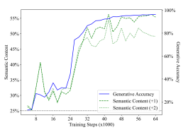 tic content with respect to the next two ("Semantic (+1)" and "Semantic (+2)") semantic states over To test this hypothesis, we train a linear probe to predict *future* semantic states from model states following the same method as described above. Note that because we use a greedy decoding strategy, future semantic states are also deterministic, and hence the task is well-defined.

time.

Figure 3 displays how well a linear probe is able to predict semantic states 1 and 2 steps into the future (dashed green line labeled "Semantic (+1)" and dotted green line labeled "Semantic (+2)", respectively). As with the previous results, the probe's performance starts at the baseline of random guessing then increases significantly with training, and we also find a strong correlation between the semantic content of future states and the generative accuracy ("Generative", blue line) across training steps. Regressing the semantic content against the generative accuracy yields an R2 of 0.919 and 0.900 for 1 and 2 semantic states into the future, respectively, with *p < .*001 in both cases. We also consider the hypothesis that the model representations only encode the current semantic state, and the probe is simply predicting the future semantic state from the current semantic state. We test this hypothesis by computing the optimal classifier mapping the ground truth facing direction in the current program to one of the 4 facing directions in the future program. Note that 3 of the 5 operations

3Or more precisely, the ability of a linear probe to extract meaning; Section 4 strengthens this claim by attributing the semantic content directly to the model states, rather than what is learned by the probe.
Figure 4: The proposed interventional experiment. We use green for the original semantics, red for

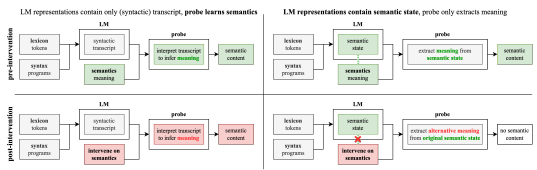

the alternative semantics, and gray for non-semantic components (such as syntax). Solid arrows indicate a (supervised) training signal. We aim to distinguish between two hypotheses: (1) the LM
only records a syntactic transcript, while the probe learns to infer semantics from the transcript (left), and (2) the LM learns to represent the semantic state, and the probe just extracts the latent meaning (right). We mark the emergent connection between the original semantics and the LM representations in the latter case by a dashed green line. The top row depicts how, pre-intervention, both cases can lead to the high semantic content measured in Section 3. The bottom row displays how intervening on the semantics while preserving the form of programs distinguishes the two hypotheses: if the LM representations are not meaningful (bottom left), then the probe's job is the same as before, i.e., it simply learns to interpret the transcript according to the alternative semantics (and achieves high alternative semantic content); however, if the LM representations encode the original semantic state
(bottom right), then the probe needs to extract the alternative meaning from the original semantic state, leading to a low alternative semantic content.

preserve the facing direction, and the next token is sampled uniformly, so we expect the optimal classifier for 1 state into the future to achieve 60% accuracy by predicting that the facing direction stays the same. Indeed, we found that, by fitting directly to the test set, the upper bound on predicting future semantic state from the current semantic state is 62.2% and 40.7% for 1 and 2 states into the future, respectively. In contrast, a probe's accuracy in predicting future states, when conditioned on a probe correctly predicting the current state, is 68.4% and 61.0% for 1 and 2 states into the future, respectively. This suggests that the probe's ability to extract future semantic states from the model states cannot be explained by simply extrapolating from a representation of the current semantic state. Our results thus indicate that the LM learns to represent the meaning of tokens that have yet to be generated, which refutes that LMs cannot learn meaning (H2) and also indicates that the generative process is not just based purely on surface statistics (H1).

### 4 Semantic Content Is Attributable To Model States (Not The Probe)

We next evaluate the possibility that semantics are learned by the probe instead of latent in the model state. Because the probe is explicitly supervised on semantic state, one explanation for the semantic content is that (1) the LM encodes only lexical and syntactic structure, while (2) the probe learns to infer the semantics. For instance, the model states may simply encode the inputs and a list of tokens in the program generated thus far, while the probe reads off then interprets the tokens one-by-one. We refer to this hypothesis as the LM learning a syntactic **transcript** (as opposed to semantic state). To test this hypothesis, we design a novel interventional experiment that preserves the lexical and syntactic structure of the language, and intervenes only on the semantics. In particular, we define an alternative semantics by exchanging the meaning of individual operations in the language. Then, we retrace the program according to the alternative semantics and train a new probe to decode the *original* model states to the *alternative* semantic states. This experimental design allows us to distinguish between the two cases where either (1) the model states directly encode a representation of the semantic state, and so the probe needs to learn to map from the original semantic state directly to the alternative semantic state; or (2) the model states merely encode a (syntactic) transcript of the partial program, and the probe just needs to learn to interpret the transcript according to the alternative semantics. In this case, because we limit the alternative semantics to *exchanging* the meaning of

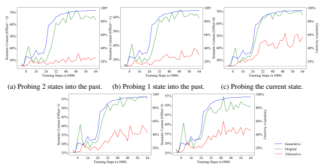

(d) Probing 1 state into the future. (e) Probing 2 states into the future.

Figure 5: Comparing the semantic content of the alternative (red) and original (green) semantics, with the generative accuracy (blue) plotted for context.

individual operations in the language4(as opposed to inventing completely new operations, e.g., move two spaces in one step), the probe should be able to interpret the transcript equally well, resulting in comparable measurements of the alternative semantic content. Figure 4 illustrates our setup. Note that exhibiting any alternative semantics (within the limitations described above) which degrades the alternative semantic content is sufficient to reject the syntactic transcript hypothesis. As such, the experiment relies crucially on the difficulty of (1), i.e., the harder the task of mapping from the original to alternative semantic state, the easier it will be to distinguish (1) and (2) based on the outcome of the experiment. Hence, we design the alternative semantics to be as distinct as possible from the original semantics with respect to the semantic state of interest, while still using the same set of base operations. Concretely, we define an alternative semantics as follows:

| original    | pickMarker   | putMarker   | turnRight   | turnLeft   | move     |
|-------------|--------------|-------------|-------------|------------|----------|
| alternative | turnRight    | turnLeft    | move        | turnRight  | turnLeft |

For instance, the turnRight operation in the original semantics would have the robot turn 90 degrees clockwise, but in the alternative semantics the robot instead advances by a step (i.e., according to the original definition of the move operation).

Figure 5 displays the results of this experiment, where we trained a linear classifier to probe up to two states into the past and future using the original and alternative semantics. In all 5 cases, the semantic content for the alternative semantics is significantly degraded when compared to the original semantics, which supports rejecting the hypothesis that the model states only encode a syntactic transcript (i.e., lexical and syntactic information only) while the probe learns to interpret the transcript (i.e., semantics). We note also that the alternative semantic content barely exceeds the baseline of random guessing when probing into the past, which is consistent with the hypothesis that model states directly represent the original semantic states. We thus conclude that the probing results of Section 3 can be attributed to meaning being represented in the model states.

4Specifically, given a formal grammar and semantics, the intervention should only exchange the meaning of terminals that are on the right hand side of the same production.

(a) The length of reference programs in the training set (dashed red line, ± 1 standard deviation within dotted red lines) vs. LM outputs (solid blue line, ± 1 standard deviation within blue region) over time.

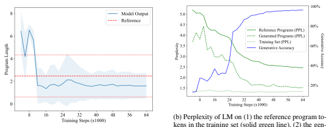 kens in the training set (solid green line), (2) the generated program tokens in the test set (dashed green line), and (3) all tokens in the training set (dotted green line), with the generative accuracy as a comparison (blue line) over time.

Figure 6: Evidence that the LM does not generate programs according to the training distribution. The LM tends to output shorter programs (left) and perplexity on the reference programs in the training set does not converge (right).

### 5 Generated Outputs Differ From The Training Distribution

We next present evidence against H1 by comparing the distribution of programs generated by the trained LM with the distribution of programs in the training set. If H1 holds, one would expect the two distributions to be roughly equivalent, since the LM would just be repeating the statistical correlations of text in the training set. Figure 6a plots how the average length of programs generated by the LM changes over time (solid blue line) against the average length of reference programs in the training set (dashed red line). We find a statistically significant difference,5 which indicates that the output distribution of the LM is indeed distinct from the distribution of programs in its training set.6 This contradicts the view put forth in H1 that LMs can only repeat the statistical correlations in their training data. Furthermore, the LM output length is, on average, shorter than the reference program length. Indeed, though there are trivial ways to make programs longer (for instance, by inserting no-ops like a turnRight followed by a turnLeft), being able to *reliably* generate programs that are shorter would intuitively require some level of semantic knowledge. For instance, Figure 1 depicts an actual completion generated by the LM, which is equivalent to the original reference program that is 2 operations longer. This equivalence requires 3 steps to prove: starting from the reference program, (1)
putMarker commutes with turnLeft, (2) turnLeft, turnRight is a no-op that can be removed, and (3) turnRight, *move*, turnLeft, move is equivalent to move, turnRight, move, turnLeft (assuming no obstacles, as is the case in the full specification). Though each step might seem clear from a human perspective, we emphasize that the training procedure *provides no inductive bias toward* discovering equivalent expressions of the same program.

Finally, we also measure the perplexity of the LM on programs in the training set across time.

Figure 6b displays our results. We see that while the perplexity of the generated programs approaches the average perplexity of the dataset, the LM never learns to fit the distribution of programs in the training set very well, which further supports rejecting H1. This can be attributed to the fact that the randomly sampled programs in the training set contain many no-ops, while the LM prefers to generate more concise programs. As the problem of *program equivalence* is closely related to the program semantics, the ability to produce short, correct programs suggests the LM has indeed learned an aspect of semantics.

595% confidence intervals for the mean lengths of the reference programs and LM outputs at the end of training are (2.417, 2.521) and (1.565, 1.629), respectively, measured using the BCa bootstrap with 9999 samples.

6Strictly speaking, this result is specific to the output distribution induced by greedy decoding, but our conclusion still holds for the LM as an end-to-end system.

### 6 Related Work

Meaningful representations in LMs Li et al. [2023] train a Transformer on transcripts of Othello, then probe the model activations (not the hidden states) to extract the board state. Li et al. [2021] fine-tune several pretrained LMs on text that describes evolving situations, then probe the model states to test propositions about entities in the situation. Abdou et al. [2021] find that pretrained LMs' representations of color terms are geometrically aligned with CIELAB space. This work makes several novel contributions within this body of literature. We are the first to explore how meaning in LMs emerges over time (instead of a single snapshot at the end of training), and find a strong, linear relationship between the emergence of meaning and correctness. We are also the first to probe for representations of program semantics in LMs, including *future* semantics, which corresponds to a notion of intention during generation. In addition, while prior work has studied the differences between an LM's output and its training corpus based on surface statistics [Meister and Cotterell, 2021, LeBrun et al., 2022], we are, to the best of our knowledge, the first to identify a semantically meaningful difference between an LM's outputs and its training corpus. We leave an exploration of this phenomenon and its implications, particularly for generalization, to future work. Analyzing the behavior of LMs Researchers have investigated the ability of LMs to successfully complete a range of semantically meaningful tasks [Austin et al., 2021, Toshniwal et al., 2022, Patel and Pavlick, 2022, Liu et al., 2023]. Unlike our research, which probes the internal state of the LM to determine the presence or absence of semantically meaningful state, this line of research works only with the externally observable behavior of the LM. Probing Probing [Shi et al., 2016, Belinkov and Glass, 2019] is widely used as a technique to investigate the inner workings of LMs. A key challenge is controlling for what is learned by the probe rather than latent in the LM [Belinkov, 2022]. A standard method is to establish a baseline measurement on a task for which the model states are assumed to be meaningless. Hewitt and Liang [2019] develop *control tasks* for word-level properties in the context of probing for parts of speech in LM representations. They compare against the performance of a probe that maps from the model states to a dataset with a *random* part of speech assigned to each word. In our case, the control task approach would assign a random label to each program state; however, this would destroy the compositional structure of the program. Instead, we establish a baseline by intervening on the semantics of program constructs, and generate a new label for each program state by evaluating the program according to the alternative semantics. Preserving the syntax of the language enables us to reject the hypothesis that the model states encode syntax while the probe learns semantics, making our technique better suited than control tasks when probing for compositional semantics. To the best of our knowledge, we are also the first to apply probing to future semantic states. Program synthesis with LMs There is a growing body of work on training large-scale, Transformerbased LMs for program synthesis [Chen et al., 2021a, Li et al., 2022, Nijkamp et al., 2023, Fried et al., 2023, Austin et al., 2021], as well as program synthesis as a benchmark for LMs [Hendrycks et al., 2021, Liang et al., 2022], but none of this previous research investigates the internal representations of LMs for evidence of semantic state. We note that these papers have also observed that the BLEU score with respect to a reference solution is not a good predictor of the LM's competency, which complements our results regarding the LM's perplexity on the training corpus. Grounding programs from text Prior work has argued specifically that LMs cannot ground programs given only textual hints of semantics [Merrill et al., 2021]. Bender and Koller [2020] concede that meaning could be learned from programs paired with unit tests, but assert this requires a
"learner which has been equipped by its human developer with the ability to identify and interpret unit tests," implying that an LM would require an additional supervised signal to associate unit tests with the meaning of programs. In contrast, our results indicate that an LM learns the meaning of programs from textual instances of input-output behavior using only next token prediction.

### 7 Conclusion

The question of whether semantics can be learned from text has garnered considerable interest in recent years. This paper presents empirical support for the position that **meaning is learnable from**
form. More broadly, the formal approach to meaning presented here offers a principled foundation for studying meaning in models of language—a question of both practical and philosophical importance.

### References

Mostafa Abdou, Artur Kulmizev, Daniel Hershcovich, Stella Frank, Ellie Pavlick, and Anders Søgaard. Can language models encode perceptual structure without grounding? a case study in color. In Proceedings of the 25th Conference on Computational Natural Language Learning, pages 109–132, 2021.

Jacob Austin, Augustus Odena, Maxwell Nye, Maarten Bosma, Henryk Michalewski, David Dohan, Ellen Jiang, Carrie Cai, Michael Terry, Quoc Le, et al. Program synthesis with large language models. *arXiv preprint* arXiv:2108.07732, 2021.

Yonatan Belinkov. Probing classifiers: Promises, shortcomings, and advances. *Computational Linguistics*, 48(1):
207–219, March 2022. doi: 10.1162/coli_a_00422. URL https://aclanthology.org/2022.cl-1.7.

Yonatan Belinkov and James Glass. Analysis methods in neural language processing: A survey. Transactions of the Association for Computational Linguistics, 7:49–72, 2019. doi: 10.1162/tacl_a_00254. URL https:
//aclanthology.org/Q19-1004.

Emily M Bender and Alexander Koller. Climbing towards nlu: On meaning, form, and understanding in the age of data. In *Proceedings of the 58th annual meeting of the association for computational linguistics*, pages 5185–5198, 2020.

Rudy Bunel, Matthew Hausknecht, Jacob Devlin, Rishabh Singh, and Pushmeet Kohli. Leveraging grammar and reinforcement learning for neural program synthesis. In *International Conference on Learning Representations*,
2018. URL https://openreview.net/forum?id=H1Xw62kRZ.

Mark Chen, Jerry Tworek, Heewoo Jun, Qiming Yuan, Henrique Ponde de Oliveira Pinto, Jared Kaplan, Harri Edwards, Yuri Burda, Nicholas Joseph, Greg Brockman, et al. Evaluating large language models trained on code. *arXiv preprint arXiv:2107.03374*, 2021a.

Xinyun Chen, Chang Liu, and Dawn Song. Execution-guided neural program synthesis. In International Conference on Learning Representations, 2019.

Xinyun Chen, Dawn Song, and Yuandong Tian. Latent execution for neural program synthesis beyond domainspecific languages. *Advances in Neural Information Processing Systems*, 34:22196–22208, 2021b.

Noam Chomsky. *Syntactic structures*. Mouton de Gruyter, 2002.

Patrick Cousot. Constructive design of a hierarchy of semantics of a transition system by abstract interpretation.

Theoretical Computer Science, 277(1-2):47–103, 2002.

Patrick Cousot and Radhia Cousot. Abstract interpretation: a unified lattice model for static analysis of programs by construction or approximation of fixpoints. In Proceedings of the 4th ACM SIGACT-SIGPLAN symposium on Principles of programming languages, pages 238–252, 1977.

CS106A. CS106A: Programming Methodologies (spring 2023). https://web.archive.org/
web/20230515003120/https://web.stanford.edu/class/cs106a/, 2023. URL https://web. stanford.edu/class/cs106a/. Accessed: 2023-05-14.

Jacob Devlin, Rudy R Bunel, Rishabh Singh, Matthew Hausknecht, and Pushmeet Kohli. Neural program meta-induction. *Advances in Neural Information Processing Systems*, 30, 2017.

Jerry A Fodor and Ernest Lepore. *The compositionality papers*. Oxford University Press, 2002. Daniel Fried, Armen Aghajanyan, Jessy Lin, Sida Wang, Eric Wallace, Freda Shi, Ruiqi Zhong, Scott Yih, Luke Zettlemoyer, and Mike Lewis. Incoder: A generative model for code infilling and synthesis. In The Eleventh International Conference on Learning Representations, 2023. URL https://openreview.net/forum? id=hQwb-lbM6EL.

Dan Hendrycks, Steven Basart, Saurav Kadavath, Mantas Mazeika, Akul Arora, Ethan Guo, Collin Burns, Samir Puranik, Horace He, Dawn Song, et al. Measuring coding challenge competence with apps. *arXiv preprint* arXiv:2105.09938, 2021.

Matthew Hertz and Maria Jump. Trace-based teaching in early programming courses. In *Proceeding of the 44th* ACM technical symposium on Computer science education, pages 561–566, 2013.

John Hewitt and Percy Liang. Designing and interpreting probes with control tasks. In *Proceedings of* the 2019 Conference on Empirical Methods in Natural Language Processing and the 9th International Joint Conference on Natural Language Processing (EMNLP-IJCNLP), pages 2733–2743, Hong Kong, China, November 2019. Association for Computational Linguistics. doi: 10.18653/v1/D19-1275. URL https://aclanthology.org/D19-1275.

Benjamin LeBrun, Alessandro Sordoni, and Timothy J. O'Donnell. Evaluating distributional distortion in neural language modeling. In *International Conference on Learning Representations*, 2022. URL https:
//openreview.net/forum?id=bTteFbU99ye.

Stanley Letovsky. Cognitive processes in program comprehension. *Journal of Systems and software*, 7(4):
325–339, 1987.

Willem JM Levelt. *Speaking: From intention to articulation*. MIT press, 1993. Belinda Z Li, Maxwell Nye, and Jacob Andreas. Implicit representations of meaning in neural language models.

In Proceedings of the 59th Annual Meeting of the Association for Computational Linguistics and the 11th International Joint Conference on Natural Language Processing (Volume 1: Long Papers), pages 1813–1827, 2021.

Kenneth Li, Aspen K Hopkins, David Bau, Fernanda Viégas, Hanspeter Pfister, and Martin Wattenberg. Emergent world representations: Exploring a sequence model trained on a synthetic task. In The Eleventh International Conference on Learning Representations, 2023. URL https://openreview.net/forum?id=DeG07_ TcZvT.

Yujia Li, David Choi, Junyoung Chung, Nate Kushman, Julian Schrittwieser, Rémi Leblond, Tom Eccles, James Keeling, Felix Gimeno, Agustin Dal Lago, et al. Competition-level code generation with alphacode. *Science*, 378(6624):1092–1097, 2022.

Percy Liang, Rishi Bommasani, Tony Lee, Dimitris Tsipras, Dilara Soylu, Michihiro Yasunaga, Yian Zhang, Deepak Narayanan, Yuhuai Wu, Ananya Kumar, et al. Holistic evaluation of language models. arXiv preprint arXiv:2211.09110, 2022.

Raymond Lister, Colin Fidge, and Donna Teague. Further evidence of a relationship between explaining, tracing and writing skills in introductory programming. *Acm sigcse bulletin*, 41(3):161–165, 2009.

Ruibo Liu, Jason Wei, Shixiang Shane Gu, Te-Yen Wu, Soroush Vosoughi, Claire Cui, Denny Zhou, and Andrew M. Dai. Mind's eye: Grounded language model reasoning through simulation. In The Eleventh International Conference on Learning Representations, 2023. URL https://openreview.net/forum? id=4rXMRuoJlai.

Mike Lopez, Jacqueline Whalley, Phil Robbins, and Raymond Lister. Relationships between reading, tracing and writing skills in introductory programming. In *Proceedings of the fourth international workshop on* computing education research, pages 101–112, 2008.

Ilya Loshchilov and Frank Hutter. Decoupled weight decay regularization. In *International Conference on* Learning Representations, 2019. URL https://openreview.net/forum?id=Bkg6RiCqY7.

Clara Meister and Ryan Cotterell. Language model evaluation beyond perplexity. In Proceedings of the 59th Annual Meeting of the Association for Computational Linguistics and the 11th International Joint Conference on Natural Language Processing (Volume 1: Long Papers), pages 5328–5339, 2021.

William Merrill, Yoav Goldberg, Roy Schwartz, and Noah A Smith. Provable limitations of acquiring meaning from ungrounded form: What will future language models understand? *Transactions of the Association for* Computational Linguistics, 9:1047–1060, 2021.

Julian Michael, Ari Holtzman, Alicia Parrish, Aaron Mueller, Alex Wang, Angelica Chen, Divyam Madaan, Nikita Nangia, Richard Yuanzhe Pang, Jason Phang, et al. What do nlp researchers believe? results of the nlp community metasurvey. *arXiv preprint arXiv:2208.12852*, 2022.

Tomas Mikolov, Armand Joulin, and Marco Baroni. A roadmap towards machine intelligence. In Computational Linguistics and Intelligent Text Processing: 17th International Conference, CICLing 2016, Konya, Turkey, April 3–9, 2016, Revised Selected Papers, Part I 17, pages 29–61. Springer, 2018.

Melanie Mitchell and David C. Krakauer. The debate over understanding in AI's large language models.

Proceedings of the National Academy of Sciences, 120(13), mar 2023. doi: 10.1073/pnas.2215907120. URL https://doi.org/10.1073%2Fpnas.2215907120.

Erik Nijkamp, Bo Pang, Hiroaki Hayashi, Lifu Tu, Huan Wang, Yingbo Zhou, Silvio Savarese, and Caiming Xiong. Codegen: An open large language model for code with multi-turn program synthesis. In The Eleventh International Conference on Learning Representations, 2023. URL https://openreview.net/forum? id=iaYcJKpY2B_.

Adam Paszke, Sam Gross, Francisco Massa, Adam Lerer, James Bradbury, Gregory Chanan, Trevor Killeen, Zeming Lin, Natalia Gimelshein, Luca Antiga, et al. Pytorch: An imperative style, high-performance deep learning library. *Advances in neural information processing systems*, 32, 2019.

Roma Patel and Ellie Pavlick. Mapping language models to grounded conceptual spaces. In International Conference on Learning Representations, 2022. URL https://openreview.net/forum?id=gJcEM8sxHK.

Richard E Pattis. *Karel the robot: a gentle introduction to the art of programming*. John Wiley & Sons, 1994. Chris Piech and Eric Roberts. Karel Reader: Python version. https://compedu.stanford.edu/
karel-reader/docs/python/en/intro.html, January 2019. Accessed May 8, 2023.

Xing Shi, Inkit Padhi, and Kevin Knight. Does string-based neural MT learn source syntax? In Proceedings of the 2016 Conference on Empirical Methods in Natural Language Processing, pages 1526–1534, Austin, Texas, November 2016. Association for Computational Linguistics. doi: 10.18653/v1/D16-1159. URL https://aclanthology.org/D16-1159.

Eui Chul Shin, Illia Polosukhin, and Dawn Song. Improving neural program synthesis with inferred execution traces. *Advances in Neural Information Processing Systems*, 31, 2018.

Juha Sorva. Notional machines and introductory programming education. *ACM Trans. Comput. Educ.*, 13(2), jul 2013. doi: 10.1145/2483710.2483713. URL https://doi.org/10.1145/2483710.2483713.

Shao-Hua Sun, Hyeonwoo Noh, Sriram Somasundaram, and Joseph Lim. Neural program synthesis from diverse demonstration videos. In *International Conference on Machine Learning*, pages 4790–4799. PMLR, 2018.

Shubham Toshniwal, Sam Wiseman, Karen Livescu, and Kevin Gimpel. Chess as a testbed for language model state tracking. In *Proceedings of the AAAI Conference on Artificial Intelligence*, volume 36, pages 11385–11393, 2022.

Ashish Vaswani, Noam Shazeer, Niki Parmar, Jakob Uszkoreit, Llion Jones, Aidan N Gomez, Łukasz Kaiser, and Illia Polosukhin. Attention is all you need. *Advances in neural information processing systems*, 30, 2017.

Glynn Winskel. *The formal semantics of programming languages: an introduction*. MIT press, 1993. Thomas Wolf, Lysandre Debut, Victor Sanh, Julien Chaumond, Clement Delangue, Anthony Moi, Pierric Cistac, Tim Rault, Remi Louf, Morgan Funtowicz, Joe Davison, Sam Shleifer, Patrick von Platen, Clara Ma, Yacine Jernite, Julien Plu, Canwen Xu, Teven Le Scao, Sylvain Gugger, Mariama Drame, Quentin Lhoest, and Alexander Rush. Transformers: State-of-the-art natural language processing. In Proceedings of the 2020 Conference on Empirical Methods in Natural Language Processing: System Demonstrations, pages 38–45, Online, October 2020. Association for Computational Linguistics. doi: 10.18653/v1/2020.emnlp-demos.6. URL https://aclanthology.org/2020.emnlp-demos.6.

### A Experimental Details

#### A.1 Karel Grammar Specification

We use the same grammar as Devlin et al. [2017], except with loops and conditionals removed.

Prog p := def run():s Stmt s := s1; s2 | a Action a := move() | turnRight() | turnLeft() | pickMarker() | putMarker()

#### A.2 Facing Direction Abstraction

The facing direction abstraction maps a program state to the facing direction of the robot within that program state. It follows that the abstraction function α is simply a projection operator that forgets all information about the program state except for the facing direction of the robot. The abstract semantics are given by:

| full semantics     | pickMarker   | putMarker   | turnRight   | turnLeft   | move   |
|--------------------|--------------|-------------|-------------|------------|--------|
| abstract semantics | id           | id          | turnRight   | turnLeft   | id     |

where id is the identity operator that does not affect the facing direction. Clearly, α is a homomorphism, and so the abstraction is exact. We identify an important property of this choice of α, which is relevant to the experimental design. First, note that α, being a projection, is linear. Second, recall that the abstraction is exact when the abstract semantics are a subset of the full semantics, in a precise sense. Combining these two facts yields that any conclusions we draw satisfy *soundness* with respect to the full semantics, i.e., we are not looking for anything "extra": if there exists a linear representation of the full semantics, then there exists a linear representation of the abstract semantics; additionally, if the semantic content with respect to the abstract semantics is high, this constitutes evidence that the model has indeed acquired an aspect of the original full semantics. Note that if the abstract semantics were not a subset of the full semantics, then the semantic content may be high due to measuring something which conceptually "falls outside of" (or is unrelated to) the full semantics—in this case, high semantic content with respect to the abstract semantics may not constitute evidence that the model has acquired an aspect the full semantics. Hence, using a *precise* abstraction (as we do) is one way to ensure a positive result is still sufficient grounds for rejecting H1 and H2.

#### A.3 Karel Synthetic Dataset Statistics

The default program sampler of Devlin et al. [2017] samples random programs by selecting a right hand side of each production rule uniformly at random, starting from the start symbol p, down to a maximum depth of 5 in the parse tree, which translates to a maximum length of 8 actions (since the start symbol and initial statement each constitute a level of the parse tree). This yields a skewed distribution of program lengths, with an average length of roughly 2.5 tokens. Figure 7 plots a histogram of the lengths of reference programs in the test set (the distribution of lengths of reference programs in the training set is nearly identical). For comparison, we also plotted the lengths of the generated programs on the test set using the final trained LM. Note that there are no programs of length 3 in the generated programs due to the trained LM appending a no-op (specifically, a putMarker) to all programs which would otherwise have been length 3. Additionally, despite the skewed distribution, we note that the LM is able to synthesize correct programs of all lengths (see Appendix B).

#### A.4 Training And Language Model Details

We used the non-pretrained 350M parameter variant of the CodeGen architecture [Nijkamp et al.,
2023] from the HuggingFace Transformers library [Wolf et al., 2020], implemented in PyTorch
[Paszke et al., 2019]. We used the AdamW optimizer [Loshchilov and Hutter, 2019] (but no weight decay), a learning rate of 5e-5, a block size of 2048, and a batch size of 16. All program and grid

Figure 7: Distributions of the lengths of reference programs (red) and generated programs (blue) out

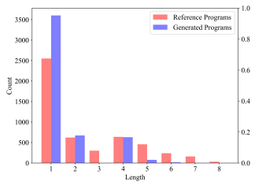 of the 5000 examples in the test set.

world tokens are represented by special tokens, and the embeddings are trained from scratch. We trained for 64000 steps, or approximately 1.5 epochs. Using a single NVIDIA A100 GPU with 80GB
of VRAM, training the LM takes around 8 days.

The probe consists of a layer normalization followed by a single linear layer. Note that the hidden states of the CodeGen architecture are passed through a layer normalization as the final layer, so we just re-normalize after average pooling the hidden states. The training set is formed from the first 100000 aligned traces in the training trace dataset. We train for a total of 100 epochs using the AdamW optimizer with a weight decay of 1e-4, a learning rate of 0.01 that decays by .1 at 75 and 90 epochs, and a batch size of 256. Using a single NVIDIA A100 GPU, training each probe takes around 30 seconds.

### B Additional Experimental Results

#### B.1 Other Alternative Semantics

To complement the interventional experiments presented in Section 4 of the main text, we additionally present results for 3 additional alternative semantics. **Opposite** is the alternative semantics described Section 4, which is designed to be as different as possible with respect to the probed property of facing direction:

| original   | pickMarker   | putMarker   | turnRight   | turnLeft   | move     |
|------------|--------------|-------------|-------------|------------|----------|
| Opposite   | turnRight    | turnLeft    | move        | turnRight  | turnLeft |

| original   | pickMarker   | putMarker   | turnRight   | turnLeft   | move   |
|------------|--------------|-------------|-------------|------------|--------|
| Swap       | putMarker    | pickMarker  | turnLeft    | turnRight  | move   |

| original   | pickMarker   | putMarker   | turnRight   | turnLeft   | move       |
|------------|--------------|-------------|-------------|------------|------------|
| Shift      | putMarker    | turnRight   | turnLeft    | move       | pickMarker |

Swap exchanges the pairs of operations which are most semantically similar but opposed (and in particular, does not change the meaning of the move operator):
Shift shifts all operators right by 1 in the (arbitrary) order:
Random exchanges the operators according to a random permutation:

| original   | pickMarker   | putMarker   | turnRight   | turnLeft   | move      |
|------------|--------------|-------------|-------------|------------|-----------|
| Random     | turnLeft     | move        | pickMarker  | putMarker  | turnRight |

Note that Swap, Shift, and Random are all permutations on operators, and hence, these alternative semantics also preserve the distribution of tokens, which is a stronger property than Opposite (though not strictly necessary for the purposes of our experiment, namely, rejecting the syntactic transcript hypothesis). Swap, is, in theory the "easiest" of the semantics, given that the facing direction under the alternative semantics is simply the mirror of the facing direction under the original semantics (reflected across the input facing direction).

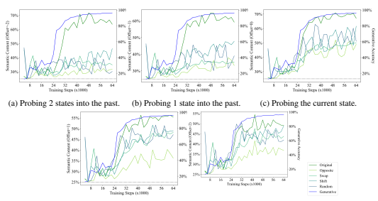

(d) Probing 1 state into the future. (e) Probing 2 states into the future.

Figure 8: Comparing the semantic content of the Opposite, Swap, Shift, and Random alternative and original (green) semantics, with the generative accuracy (blue) plotted for context.

Figure 8 plots the results of probing up to 2 states into the past and future for the alternative and original semantics. In all cases, the original semantics consistently yield the highest semantic content. We see the most significant gap when probing for current and past states. There is a moderate gap for probing 1 state into the future, and only a slight gap in the case of Shift alternative semantics for probing 2 states into the future. In all cases, the Opposite semantics have the lowest semantic content, which is consistent with their design being the most different from the original semantics (in terms of the abstraction). Furthermore, Swap does not have significantly higher semantic content relative to the other alternative semantics (and has lower semantic content compared to the original semantics), despite there being a simple mapping from the original to the alternative semantics, which is further evidence that the probe cannot just be executing a syntactic transcript. We emphasize that, to reject the syntactic transcript hypothesis, it suffices to exhibit only a single alternative semantics with degraded semantic content. Nonetheless, all the considered alternative semantics exhibit degraded performance, which reinforces our conclusion that the LM representations contain semantic state (rather than the probe learning semantics).

#### B.2 Results By Program Length

This section presents additional analyses of our previous results, broken down by program length.

LM learns to synthesize correct programs of all lengths This section presents results which demonstrate that, despite the average reference program length being 2.5 and fully half of the training set consisting of reference programs of length 1 (see Figure 7), the LM still learns to synthesize correct programs for specifications generated by reference programs of up to length 8.

| Length   | Accuracy   | Count   |
|----------|------------|---------|
| 1        | 100.0%     | 2551    |
| 2        | 99.7%      | 623     |
| 3        | 99.2%      | 301     |
| 4        | 98.9%      | 638     |
| 5        | 96.4%      | 457     |
| 6        | 94.6%      | 239     |
| 7        | 92.7%      | 159     |
| 8        | 85.6%      | 32      |

Table 1: The generative accuracy of the final trained LM on the test set, separated by the length of

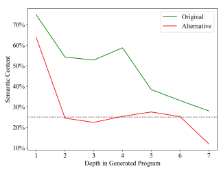 the reference program used to generate the specification. The final column displays the number of reference programs of each length in the test set.

Figure 9: Original (green) and alternative (red) semantic contents for the final trained LM, separated by the depth of the semantic states in the program.

Table 1 displays the results of this analysis. We see that the LM is able to accurate generate programs that satisfy the specifications across all lengths, with only a moderate drop in accuracy as the reference program length approaches the maximum length of 8.

Alternative semantic content drops significantly for semantic states that are deeper in the program. This section presents results that complement the results of Section 4 by demonstrating that the alternative semantic content can be attributed almost entirely to probing for the first semantic state in the program trace. Specifically, we separated the semantic content by the depth of the semantic state in the trace (for instance, a program of length 5 would have 5 semantic states; the semantic state after executing the first program operation is at depth 1, the semantic state after executing the second program operation is at depth 2, and so on). Figure 9 displays the results of this analysis. We see that the alternative semantic content drops to essentially random guessing for any semantic state which is not the first semantic state in the program
(whereas the semantic content for the original semantics remains significantly above the random guessing threshold). Additionally, Figure 10 shows the semantic contents over time for the first 4 depths. The alternative semantic content past depth 1 stays around the level of random guessing throughout training, whereas the original semantic content improves significantly. This further supports our conclusion that the LM
learns a representation that is inherently tied to the semantic state, and the probe extracts meaning from the LM representation.

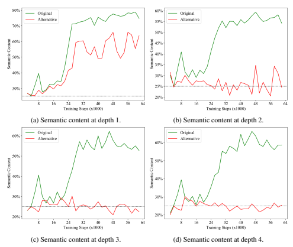

Figure 10: Comparing the semantic content of the alternative (red) and original (green) semantics over time, separated by the depth of the semantic state.

## B.3 Regression Plots And Residuals

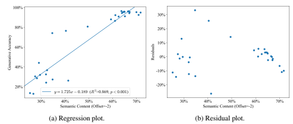

In this section, we provide plots of the regression results presented in Section 3 in the main text, alongside the residual plots.

Figure 11: Regressing the generative accuracy against the semantic content for two states into the past, with observations taken over the course of training.

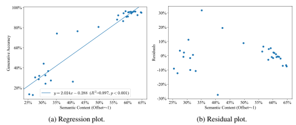

Figure 12: Regressing the generative accuracy against the semantic content for one states into the past, with observations taken over the course of training.

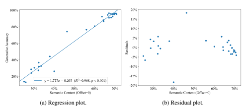

Figure 13: Regressing the generative accuracy against the semantic content, with observations taken over the course of training.

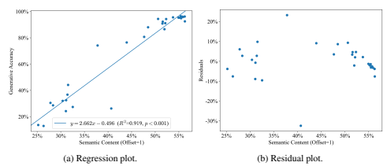

Figure 14: Regressing the generative accuracy against the semantic content for one state into the future, with observations taken over the course of training.

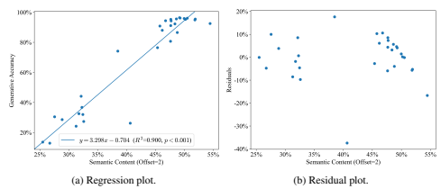

Figure 15: Regressing the generative accuracy against the semantic content for two states into the future, with observations taken over the course of training.

Figures 11 to 15 display our results. We note the cluster of residuals at high semantic contents for all offsets, which may be an artifact of the capacity of the probe being saturated toward the end of training (while the accuracies are still slightly increasing).

#### B.4 Perplexity And Loss Over Time

To better understand how the perplexity of the LM evolves over time and complement the results in Section 5, we present some additional analyses of the perplexity and loss over time on semantically distinct subsets of the dataset. Figure 16 displays the average perplexity on each of the 5 input examples in the specifications of the

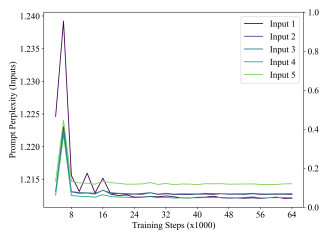

test set. Because input examples are randomly generated, we see that the LM does not distinguish much between the 5 inputs. In contrast, Figure 17 displays the average perplexity on each of the 5 outputs in the specifications of the test set over time. Note that, while the first output example is almost random, each successive output should become easier to predict, since the previous input-output examples in the specifications place constraints on the reference program (and hence the subsequent outputs). Indeed, we see that the perplexity of each subsequent output example is lower than those earlier in the specification. This suggests that the LM has learned to perform *program induction*, which is the problem of predicting the output of a program given examples of its behavior (contrast this with program synthesis, where the objective is to produce the program itself).

Figure 16: Perplexity of the final trained LM on the input examples in the specifications.

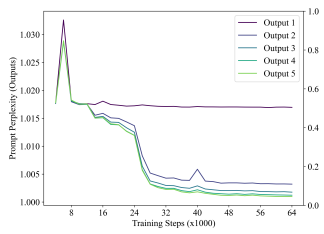

Figure 17: Perplexity of the final trained LM on the output examples in the specifications.

Finally, for completeness, we also display the loss (rather than the perplexity) in the Figure 18. Note the divergence between the losses of the reference and generated programs, and the convergence between the losses of the generated programs and the rest of the training set: both trends are even more apparent on the linear scale (cf. Figure 6b, which is the same figure but with perplexity instead of the loss).

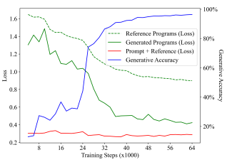

Figure 18: Loss of the LM on (1) reference programs (dashed green line), (2) generated programs
(solid green line), and (3) all tokens in the test set (solid red line).

## C Further Discussions Of Related Work

Austin et al. [2021] evaluate a 137 billion parameter LM trained on a mixture of natural language and programs to synthesize Python programs given a natural language description and three input-output assertions. They find that sampling 80 programs from the LM yields at least one accurate program on around 60% of the tasks, but the LM is only able to generate the output of the program 29% of the time when using greedy decoding. They conclude that LMs do not learn any substantial amount of semantics, despite being able to synthesize correct programs. We offer three possible explanations: (1) repeating their experiment and taking measurements over time would reveal a relationship between their definitions of correctness and semantics: (2) continuing to train the LM beyond 60% accuracy would vield an LM that is better at predicting the output of the program; and (3) we use greedy decoding for both synthesis and semantic grounding, which gives a more direct connection between correctness and semantics since both metrics use the same model states.