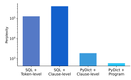

# Text-To-Sql Error Correction With Language Models Of Code

Ziru Chen1, Shijie Chen1, Michael White1**, Raymond Mooney**2 Ali Payani3, Jayanth Srinivasa3, Yu Su1**, Huan Sun**1 1The Ohio State University 2The University of Texas at Austin 3Cisco Research
{chen.8336, chen.10216, white.1240, su.809, sun.397}@osu.edu mooney@cs.utexas.edu {apayani, jasriniv}@cisco

## Abstract

Despite recent progress in text-to-SQL parsing, current semantic parsers are still not accurate enough for practical use. In this paper, we investigate how to build automatic text-to-SQL error correction models. Noticing that tokenlevel edits are out of context and sometimes ambiguous, we propose building clause-level edit models instead. Besides, while most language models of code are not specifically pre-trained for SQL, they know common data structures and their operations in programming languages such as Python. Thus, we propose a novel representation for SQL queries and their edits that adheres more closely to the pre-training corpora of language models of code. Our error correction model improves the exact set match accuracy of different parsers by 2.4–6.5 and obtains up to 4.3 point absolute improvement over two strong baselines.1

## 1 Introduction

Text-to-SQL parsing is a classic semantic parsing task that finds wide applications (Zelle and Mooney, 1996; Tang and Mooney, 2000). Since the release of Spider (Yu et al., 2018), a cross-database text-to-SQL benchmark, many semantic parsers with decent performance have been developed (Lin et al., 2020; Wang et al., 2020; Deng et al., 2021; Rubin and Berant, 2021; Scholak et al., 2021). Nonetheless, state-of-the-art semantic parsers are still not accurate enough. As a result, their users need to constantly correct wrongly predicted SQL queries, which can be as time-consuming and errorprone as writing a SQL query from scratch (Jorgensen and Shepperd, 2007; Weiss et al., 2007). Therefore, in this paper, we study the problem of automatic text-to-SQL error correction to better assist users in querying complex databases.

We first highlight that it is essential to factor in the *compositional substructures* within SQL
queries, such as abstract syntax trees (Yin and Neubig, 2017; Guo et al., 2022) and data-flow graphs
(Guo et al., 2021), instead of treating code snippets as string sequences. Compared to individual tokens, substructures (e.g. SQL clauses) include more context of the entire program and are more semantically meaningful. Consequently, edit patterns of such substructures are more intuitive for humans to understand and easier for language models to learn. Moreover, while the pre-training corpora for language models of code, such as CodeT5 (Wang et al., 2021), do not include many SQL queries based on their documentation, they naturally contain *abundant examples of common data structures* like dictionaries. Therefore, we hypothesize that transforming unfamiliar SQL queries into familiar data structures can help language models of code better perform structural editing of SQL queries.

Based on these observations, we develop our error correction model and make two contributions. First, we propose considering SQL clauses instead of tokens as basic semantic units for editing. Using a context-free grammar, we can decompose a SQL query and identify its clauses by traversing its abstract syntax tree. Second, we propose a new representation of SQL queries and their edits that adheres more closely to common code pre-training corpora, including CodeSearchNet (Husain et al., 2020), and makes the structures of a SQL query more explicit. With a decomposed SQL query, we pair each clause with its SQL keyword and represent the entire query as a Python dictionary. Then, we format edits on a wrong SQL query as a program that modifies data of the query's corresponding dictionary. Unlike token-level edits in existing work (Zhang et al., 2023), such dictionary operations define all edits unambiguously and can be directly executed with a Python interpreter.

Through comprehensive experiments with different representations, we show that: (1) our proposed representation has the lowest zero-shot perplexity

1Our code and data are available at https://github.

com/OSU-NLP-Group/Auto-SQL-Correction.

|        | Query Representation              |               | Edit Representation                           |              |              |    |
|--------|-----------------------------------|---------------|-----------------------------------------------|--------------|--------------|----|
| SQL    | select tweets.text                | Token\-Level  | <ReplaceOld>                                  | tweets.text  | <ReplaceNew> |    |
|        | from tweets                       |               | tweets.createdate <ReplaceEnd>                |              |              |    |
|        | order by tweets.text              | Clause\-Level | <ReplaceOld>                                  | order  by    | tweets.text  | <Re    |
|        |                                   |               | placeNew> order by tweets.createdate <Re                                               |              |              |    |
|        |                                   |               | placeEnd>                                     |              |              |    |
| PyDict | sql = {                           | Clause\-Level | <ReplaceOld>                                  | "orderBy":   | "order       | by |
|        | "select": "select tweets.text",   |               | tweets.text"  "orderBy":                      | <ReplaceNew> |              |    |
|        | "from": "from tweets",            |               | "order by tweets.createdate" <ReplaceEnd>     |              |              |    |
|        | "orderBy": "order by tweets.text" | Program       | sql["orderBy"] = "order by tweets.createdate" |              |              |    |
| }      |                                   |               |                                               |              |              |    |

Table 1: Example representations for a wrong SQL query and the *Replace* edit action. The corresponding natural language utterance is "List the text of all tweets in the order of date." For token-level and clause-level representations, we format them as "<ReplaceOld> Span of wrong tokens/clauses <ReplaceNew> Span of correct tokens/clauses
<ReplaceEnd>", where <ReplaceOld>, <ReplaceNew>, and <ReplaceEnd> are special tokens.

with CodeT5; (2) simply changing token-level edits to clause-level edits can effectively improve the performance of our models; and (3) our method improves the exact set match accuracy of different parsers by 2.4–6.5 and obtains up to 4.3 point absolute improvement over two strong baselines.

## 2 Text-To-Sql Error Correction

Given a natural language utterance u, a database schema s, and a wrong SQL query q− produced by an existing parser, our goal is to develop an error correction model that predicts a sequence of edit actions e and the correct query q+. Following previous work (Zhang et al., 2023), we formulate our task as sequence-to-sequence generation:

$$P(\mathbf{y}|\mathbf{x})=\Pi_{t=1}^{T}P(\mathbf{y}_{t}|\mathbf{x},\mathbf{y}_{1:t-1})$$

where x = [u; s; q−] is the concatenation of the given inputs and y = [e; q+] is the concatenation of all edit actions and the resulting correct query. In this section, we study different representations of SQL queries (Section 2.1) and edits (Section 2.2)
to better leverage language models of code.

### 2.1 Query Representation

We consider two representations for a predicted query: (1) the original SQL format and (2) our proposed PyDict (Python Dictionary) representation. To prepare for editing, we disambiguate each SQL query following Rubin and Berant (2021), including lower-casing non-value tokens, resolving table references, and formatting punctuation. This preprocessing normalizes SQL queries predicted by different base parsers and the gold annotations into the same format. To build our PyDict representation, we parse a SQL query into its abstract syntax tree (AST) with Spider's context-free grammar. We use depth-first search to traverse through the AST, find any nested substructures, and construct the dictionary representation bottom-up. Table 1 shows the "SQL" and "PyDict" representations of a SQL query (more details in Appendix A).

### 2.2 Edit Representation

$\left(1\right)$. 
We first follow Zhang et al. (2023) to use tokenlevel edit representation with special tokens (Table 1), which have unique entries in the tokenizer and the model's embedding layer to describe Replace, Insert, and *Delete* edit actions (more examples in Appendix F). However, we realize this representation can sometimes be ambiguous. As shown in Table 1, the span "tweets.text" appears twice in the SQL query. This repetition would confuse the error correction model with which span to replace when generating the corrected query. Also, the ambiguity makes it difficult to implement rules and directly carry out the edit actions on the wrong query. Hence, we change the token-level edit representation to clause-level, which includes more context of the query to make different edits more distinguishable. In our experiments (Section 4.1),
we demonstrate that this simple modification is already effective. Our program representation further improves the performance because it is more similar to the code pre-training corpora and eliminates the need to learn special tokens' representations.

## 3 Experimental Setup

### 3.1 Data Synthesis For Sql Error Correction

To train a text-to-SQL error correction model, we need to collect a set of wrong SQL parses that reflects a realistic distribution of errors (Section 4.2) as our training data. We synthesize this dataset by

|                  | CodeT5   | BRIDGEv2   | SmBoP   |
|------------------|----------|------------|---------|
| # of Train       | 47,020   | 24,776     | 20,083  |
| # of Dev         | 448      | 448        | 448     |
| # of Test        | 430      | 392        | 310     |
| Avg. Train Edits | 2.34     | 3.11       | 2.72    |
| Avg. Dev Edits   | 2.70     | 3.29       | 3.31    |
| Avg. Test Edits  | 1.84     | 1.51       | 1.47    |

Table 2: Summary of data statistics.

performing 5-fold cross-validation on each parser, which approximates the actual evaluation setting.

Following the evaluation setup in Yu et al.

(2018), we split Spider's training set into five roughly equal subsets by different databases. For each cross-validation fold, we train a text-to-SQL parser (Section 3.2) on four subsets and evaluate it on the remaining one. At inference time, we perform beam search with size 20 for each example and collect grammatical and executable parses in the beam.2If a SQL parse is not an exact set match or execution match to the gold annotation, we label it wrong and include it in our training set for error correction. Having synthesized our training dataset, we randomly sample 8 databases and their associated questions to construct a held-out development set. For development set examples, we only keep incorrect SQL parses with the highest beam confidence. For our error correction test set, we train each parser on the *full* Spider training set and evaluate it on the original Spider's development set without modifications. We similarly keep SQL parses with exact match or execution match errors. Table 2 summarizes the statistics of our data.

### 3.2 Models

Text-to-SQL base parsers. We choose three textto-SQL parsers with different decoding strategies and levels of performance (Table 3). We elaborate on our selection criteria in Appendix B.

- **CodeT5** (Wang et al., 2021): We fine-tune CodeT5-base following Xie et al. (2022).

This parser represents those using beam search decoding and having a lower accuracy.

- **BRIDGEv2** (Lin et al., 2020): A representative parser with constrained decoding and achieving a medium-level accuracy.

- **SmBoP** (Rubin and Berant, 2021): A representative parser with bottom-up decoding and achieving higher accuracy.

Error correction models. We use two language models of code in all our experiments:
- **CoditT5** (Zhang et al., 2023): A language model pre-trained for code editing tasks by injecting noises to code snippets in CodeSearch- Net (Husain et al., 2020) and then denoising with token-level edit representations.

- **CodeT5** (Wang et al., 2021): A language model pre-trained for general code understanding and generation with four different pre-training objectives.

We compare the existing SQL+Token-Level representation with our proposed ones: SQL+Clause- Level, PyDict+Clause-Level, and PyDict+Program on CodeT5 and the first three on CoditT5.3Implementation details are in Appendix C.

### 3.3 Evaluation

We use the increase in Exact Set Match (EM) and Execution Match (EX) accuracy on our error correction test set to measure each model's performance. Because CoditT5's experiments assume the input program has at least one error, we keep this assumption for fair comparisons. To construct a test set satisfying this assumption, we have to compare parser-generated SQL queries with gold annotations (Section 3.1). Thus, we use the Spider development set as our test set and split the Spider training set to build a held-out development set (Table 2) to select model checkpoints during training. We also include results on our held-out development set in the appendix (Table E.1).

## 4 Results And Analysis

### 4.1 Main Results

We summarize our main results in this section. To ensure robustness, we repeat all experiments with 3 different random seeds and report the average performances with standard deviations. Our model can also be used in an interactive framework that allows users to select edit actions from the top-k beam candidates. We include more experiments with simulated user interactions in Appendix E.

Our representation's perplexity is the smallest.

We validate that our PyDict+Program representation adheres more closely to the code pre-training corpora by measuring its zero-shot perplexity on CodeT5 using our development set (Section 3.1).

2Due to SmBoP's bottom-up decoding, we keep its original beam size and collect the top-20 unique beam predictions.

3We did not use CoditT5 for PyDict+Program because it was pre-trained on token-level edit representations. Its decoder may be specialized in generating edits instead of programs.

| Models   | Query   | Edit          | CodeT5     |            |            | BRIDGEv2   | SmBoP      |            |
|----------|---------|---------------|------------|------------|------------|------------|------------|------------|
|          |         |               | EM         | EX         | EM         | EX         | EM         | EX         |
| No Edit  | N/A     | N/A           | 62.7 (\-)  | 63.6 (\-)  | 70.1 (\-)  | 68.2 (\-)  | 74.6 (\-)  | 75.3 (\-)  |
| CoditT5  | SQL     | Token\-Level  | 64.3 (0.1) | 64.4 (0.2) | 65.4 (0.5) | 66.6 (0.3) | 74.2 (0.4) | 75.3 (0.1) |
|          | SQL     | Clause\-Level | 67.0 (0.4) | 65.4 (0.5) | 71.3 (0.5) | 70.9 (0.2) | 76.3 (0.0) | 77.2 (0.3) |
|          | PyDict  | Clause\-Level | 67.1 (0.2) | 66.5 (0.4) | 70.6 (0.8) | 70.8 (0.6) | 76.3 (0.3) | 77.0 (0.3) |
| CodeT5   | SQL     | Token\-Level  | 66.7 (0.9) | 65.9 (0.5) | 68.2 (0.4) | 69.4 (0.8) | 75.6 (0.4) | 76.5 (0.6) |
|          | SQL     | Clause\-Level | 68.3 (0.3) | 68.2+(0.6) | 71.8+(0.4) | 72.5+(0.2) | 76.7 (0.6) | 77.4 (0.3) |
|          | PyDict  | Clause\-Level | 66.6 (0.8) | 67.1 (0.8) | 72.0+(0.3) | 72.4+(0.2) | 77.3 (0.6) | 77.8 (0.2) |
| CodeT5∗  |         |               | 69.2+(0.4) | 68.4+(0.2) | 72.5+(0.4) | 73.1+(0.2) | 77.3 (0.4) | 77.6 (0.6) |
| CodeT5   | PyDict  | Program       | 69.0+(0.2) | 68.2+(0.1) | 72.5+(0.3) | 73.0+(0.6) | 78.0+(0.3) | 78.5+(0.3) |

Table 3: Exact Set Match (EM) and Execution Match (EX) accuracy on Spider development set. The **best perfor-**

mances are in bold and the second bests are underlined. Results with + are statistically significant (McNemar's; p < 0.05) compared to CodeT5-SQL+Token-Level (Appendix D). Otherwise, the results are not statistically significant. ∗We fine-tune the model to generate edit programs only (without resulting queries) and use Python interpreter to execute the edit actions.

Figure 1: CodeT5's zero-shot perplexity (in log scale) of all four representations on our synthesized SQL error development set.

As shown in Figure 1, by representing data in Py- Dict, we can reduce the perplexity of CodeT5 by 2 orders of magnitude. After augmenting it with our program representation, we further reduce the zero-shot perplexity of CodeT5 to only 5.96 × 102, 3 orders of magnitude less than the SQL+Token-
Level representation (1.26 × 105).

Clause-level editing is more effective, especially when represented in PyDict+Program. Since CodeT5 consistently outperforms CoditT5 with the same representations, we focus on comparisons among CodeT5 variations. As shown in Table 3, compared to CodeT5-SQL+Token-Level, only CodeT5-PyDict+Program achieves statistically significant improvement on all three parsers, while clause-level models fail McNemar's significance test for some parsers. More concretely, it achieves up to 4.3 point more absolute improvement on EM accuracy (68.2 → 72.5; BRIDGEv2) and 3.7 point more absolute improvement on EX accuracy (69.4 → 73.1; BRIDGEv2). Overall, CodeT5- PyDict+Program can boost the parsers' EM accuracy by 2.4–6.5. Thus, both clause-level editing and PyDict+Program representation can better take advantage of language models of code.

### 4.2 Error Analysis

Additionally, we conduct an error analysis (Table 4) by sampling 100 wrong parses from all three parsers and classifying them into five categories:
- *Database Grounding*: A generated SQL
query has the correct structure, but some table/column names or entity values are wrong.

- *Incorrect Structure*: A generated SQL query has missing, wrong, or redundant structures.

- *Syntax & Grammar*: A generated SQL query violates the programming language's syntax.

- *False Negative*: A generated SQL query is semantically correct but not captured by evaluation metrics, or the gold annotation is wrong.

- *Other*: All other errors, such as wrong aggregation functions, besides the above categories.

Since the error distributions for each parser are similar, as an example, we discuss our findings based on the strongest parser, SmBoP: Database grounding is the major type of error.

Among the 100 samples from SmBoP, we find that 54 of them have database grounding errors. Particularly, SmBoP predicts wrong table/column names in 34 parses, inaccurate entity values in 9 parses, and incorrect JOIN relations in 11 parses. Our CodeT5-PyDict+Program model can successfully fix 16 of the 54 erroneous parses, including 10 parses with wrong table/column names, 4 parses with inaccurate entity values, and 2 parses with incorrect JOIN relations. We hypothesize that

| Error Category      | CodeT5               |    |     |          | BRIDGEv2   |     |          | SmBoP      |     |
|---------------------|----------------------|----|-----|----------|------------|-----|----------|------------|-----|
|                     | Resolved  Unresolved |    | All | Resolved | Unresolved | All | Resolved | Unresolved | All |
| Database Grounding  | 15                   | 51 | 66  | 14       | 48         | 62  | 16       | 38         | 54  |
| Incorrect Structure | 2                    | 15 | 17  | 2        | 12         | 14  | 3        | 23         | 26  |
| Syntax & Grammar    | 0                    | 0  | 0   | 0        | 0          | 0   | 1        | 4          | 5   |
| False Negative      | 0                    | 9  | 9   | 0        | 6          | 6   | 0        | 8          | 8   |
| Other               | 1                    | 7  | 8   | 2        | 16         | 18  | 1        | 6          | 7   |

Table 4: Analysis of 100 sample errors made by each text-to-SQL parser. We group the errors into 5 categories and examine if our CodeT5-PyDict+Program model resolves them.

database grounding is also a major category of errors in our synthesized training set, so our model has learned to resolve similar errors. Nevertheless, it still cannot correct the remaining 38 SQL parses. We notice that our current representation for database schema is missing critical information, such as column data types and foreign key relations, for our error correction model to fix database grounding errors. Following our PyDict representation for SQL, we suggest designing a code representation for database schema that includes such information to tackle this issue in future work. Structural errors are hard to edit automatically. Besides database grounding, 26 of SmBoP's errors belong to another category, incorrect structure. These 26 samples contain 7 parses with incorrect SQL clauses and 19 parses with incorrect subqueries, but our CodeT5-PyDict+Program model only resolves 1 and 2 of them, respectively. We find that correcting such errors usually involves multiple edit steps, which motivates us to incorporate our model into an interactive framework in future work. As our experiments with simulated user interaction (Appendix E.2) show, when our model interacts with the simulated user to correct one clause at a time, it is able to fully correct more SQL parses. Thus, we deem interactive correction would maximize our model's utility in practice.

## 5 Related Work

Since the release of CodeBERT (Feng et al., 2020), many language models of code have emerged for program understanding and generation (Ahmad et al., 2021; Chen et al., 2021; Guo et al., 2021; Wang et al., 2021; Guo et al., 2022; Fried et al.,
2023; Nijkamp et al., 2023). In addition to programrelated tasks, recent work shows they also excel at processing natural language structures. Using code as meaning representations (MRs), we can leverage language models of code in various tasks, such as commonsense reasoning (Madaan et al., 2022),
action planning (Singh et al., 2022), and event extraction (Wang et al., 2022). In fact, how to design MRs to reduce model learning difficulty is a salient research question in semantic parsing (Guo et al., 2019; Gan et al., 2021b; Nie et al., 2022).

Our work demonstrates that program-related tasks themselves can also benefit from code-based MRs. Specifically, we apply such MRs to SQL
error correction, a variant of automatic program repair tasks (Tufano et al., 2019; Panthaplackel et al., 2022; Zhang et al., 2023). Although SQL is a code-based MR, it is much harder for models to learn compared to other MRs, such as FunQL and lambda calculus (Li et al., 2022). Consequently, without many SQL queries in their pre-training corpora, language models of code can underperform state-of-the-art text-to-SQL parsers. By converting SQL queries into Python dictionaries, we can explicitly represent their compositional substructures and define edit actions as programs, which reduces the learning difficulty for language models of code and yields better performance.

## 6 Conclusion And Future Work

This paper presents a study on developing a text-to-
SQL error correction model with clause-level edits and different representations. Our comprehensive experiments demonstrate that clauses are better semantic units than tokens for editing SQL queries and mimicking patterns in code pre-training corpora helps better leverage language models of code. As a future direction, we plan to incorporate our model into interactive semantic parsing frameworks (Li et al., 2020; Yao et al., 2019, 2020; Zeng et al., 2020) by suggesting possible edits to users once a wrong parse is identified. In this way, users would more efficiently correct parse errors and get better assistance. We also plan to experiment with other language models of code (Fried et al., 2023; Nijkamp et al., 2023) and text-to-SQL datasets
(Zelle and Mooney, 1996; Gan et al., 2021a) to verify the generalizability of our method.

## Limitations

Actual applications of our model. Our work assumes that input SQL queries to our model are always wrong. This assumption is more feasible in an interactive semantic parsing framework, where the users are expected to decide whether a SQL parse, accompanied by its natural language explanations (Elgohary et al., 2020, 2021; Narechania et al., 2021; Mo et al., 2022), has errors or not. Alternatively, to remove this assumption, it would be interesting for future work to study the performance of our error correction model in combination with an automatic error detection model (Chen et al., 2023). Experiments with more language models of code.

We have only experimented with two language models of code, CoditT5 and CodeT5, both using T5-base (Raffel et al., 2020) as their underlying model architecture. It would be interesting to test how our conclusions generalize to other language models of code in the future. Based on the strong capabilities of large language models of code, such as Codex (Chen et al., 2021), InCoder (Fried et al., 2023), and CodeGen (Nijkamp et al., 2023), we believe that these models can better exploit their knowledge about data structures and their operations in Python. These models may perform even better on Text-to-SQL error correction with our proposed representations.

## Acknowledgements

We would like to thank the anonymous reviewers and colleagues from the OSU NLP group for their thoughtful comments. This research was supported in part by a sponsored award from Cisco Research, NSF IIS-1815674, NSF CAREER \#1942980, NSF OAC-2112606, and Ohio Supercomputer Center (Center, 1987). The views and conclusions contained herein are those of the authors and should not be interpreted as representing the official policies, either expressed or implied, of the U.S. government. The U.S. Government is authorized to reproduce and distribute reprints for Government purposes notwithstanding any copyright notice herein. Ziru is also supported by The Ohio State University Graduate School through University Fellowship.

## References

Wasi Ahmad, Saikat Chakraborty, Baishakhi Ray, and Kai-Wei Chang. 2021. Unified pre-training for program understanding and generation. In *Proceedings* of the 2021 Conference of the North American Chapter of the Association for Computational Linguistics: Human Language Technologies, pages 2655–2668, Online. Association for Computational Linguistics.

Ohio Supercomputer Center. 1987. Ohio supercomputer center.

Mark Chen, Jerry Tworek, Heewoo Jun, Qiming Yuan, Henrique Ponde de Oliveira Pinto, Jared Kaplan, Harri Edwards, Yuri Burda, Nicholas Joseph, Greg Brockman, Alex Ray, Raul Puri, Gretchen Krueger, Michael Petrov, Heidy Khlaaf, Girish Sastry, Pamela Mishkin, Brooke Chan, Scott Gray, Nick Ryder, Mikhail Pavlov, Alethea Power, Lukasz Kaiser, Mohammad Bavarian, Clemens Winter, Philippe Tillet, Felipe Petroski Such, Dave Cummings, Matthias Plappert, Fotios Chantzis, Elizabeth Barnes, Ariel Herbert-Voss, William Hebgen Guss, Alex Nichol, Alex Paino, Nikolas Tezak, Jie Tang, Igor Babuschkin, Suchir Balaji, Shantanu Jain, William Saunders, Christopher Hesse, Andrew N. Carr, Jan Leike, Josh Achiam, Vedant Misra, Evan Morikawa, Alec Radford, Matthew Knight, Miles Brundage, Mira Murati, Katie Mayer, Peter Welinder, Bob McGrew, Dario Amodei, Sam McCandlish, Ilya Sutskever, and Wojciech Zaremba. 2021. Evaluating large language models trained on code.

Shijie Chen, Ziru Chen, Huan Sun, and Yu Su. 2023.

Error detection for text-to-sql semantic parsing.

Xiang Deng, Ahmed Hassan Awadallah, Christopher Meek, Oleksandr Polozov, Huan Sun, and Matthew Richardson. 2021. Structure-grounded pretraining for text-to-SQL. In Proceedings of the 2021 Conference of the North American Chapter of the Association for Computational Linguistics: Human Language Technologies, pages 1337–1350, Online. Association for Computational Linguistics.

Ahmed Elgohary, Saghar Hosseini, and Ahmed Hassan Awadallah. 2020. Speak to your parser: Interactive text-to-SQL with natural language feedback. In Proceedings of the 58th Annual Meeting of the Association for Computational Linguistics, pages 2065–
2077, Online. Association for Computational Linguistics.

Ahmed Elgohary, Christopher Meek, Matthew Richardson, Adam Fourney, Gonzalo Ramos, and Ahmed Hassan Awadallah. 2021. NL-EDIT: Correcting semantic parse errors through natural language interaction. In Proceedings of the 2021 Conference of the North American Chapter of the Association for Computational Linguistics: Human Language Technologies, pages 5599–5610, Online.

Association for Computational Linguistics.

Zhangyin Feng, Daya Guo, Duyu Tang, Nan Duan, Xiaocheng Feng, Ming Gong, Linjun Shou, Bing Qin, Ting Liu, Daxin Jiang, and Ming Zhou. 2020. Code-
BERT: A pre-trained model for programming and natural languages. In Findings of the Association for Computational Linguistics: EMNLP 2020, pages 1536–1547, Online. Association for Computational Linguistics.

Daniel Fried, Armen Aghajanyan, Jessy Lin, Sida Wang, Eric Wallace, Freda Shi, Ruiqi Zhong, Scott Yih, Luke Zettlemoyer, and Mike Lewis. 2023. Incoder:
A generative model for code infilling and synthesis. In The Eleventh International Conference on Learning Representations.

Yujian Gan, Xinyun Chen, Qiuping Huang, Matthew Purver, John R. Woodward, Jinxia Xie, and Pengsheng Huang. 2021a. Towards robustness of textto-SQL models against synonym substitution. In Proceedings of the 59th Annual Meeting of the Association for Computational Linguistics and the 11th International Joint Conference on Natural Language Processing (Volume 1: Long Papers), pages 2505–
2515, Online. Association for Computational Linguistics.

Yujian Gan, Xinyun Chen, Jinxia Xie, Matthew Purver, John R. Woodward, John Drake, and Qiaofu Zhang. 2021b. Natural SQL: Making SQL easier to infer from natural language specifications. In *Findings* of the Association for Computational Linguistics: EMNLP 2021, pages 2030–2042, Punta Cana, Dominican Republic. Association for Computational Linguistics.

Daya Guo, Shuai Lu, Nan Duan, Yanlin Wang, Ming Zhou, and Jian Yin. 2022. UniXcoder: Unified crossmodal pre-training for code representation. In Proceedings of the 60th Annual Meeting of the Association for Computational Linguistics (Volume 1: Long Papers), pages 7212–7225, Dublin, Ireland. Association for Computational Linguistics.

Daya Guo, Shuo Ren, Shuai Lu, Zhangyin Feng, Duyu Tang, Shujie Liu, Long Zhou, Nan Duan, Alexey Svyatkovskiy, Shengyu Fu, Michele Tufano, Shao Kun Deng, Colin Clement, Dawn Drain, Neel Sundaresan, Jian Yin, Daxin Jiang, and Ming Zhou. 2021. Graph- CodeBERT: Pre-training code representations with data flow. In *International Conference on Learning* Representations.

Jiaqi Guo, Zecheng Zhan, Yan Gao, Yan Xiao, Jian-
Guang Lou, Ting Liu, and Dongmei Zhang. 2019. Towards complex text-to-SQL in cross-domain database with intermediate representation. In *Proceedings of* the 57th Annual Meeting of the Association for Computational Linguistics, pages 4524–4535, Florence, Italy. Association for Computational Linguistics.

Hamel Husain, Ho-Hsiang Wu, Tiferet Gazit, Miltiadis Allamanis, and Marc Brockschmidt. 2020. Codesearchnet challenge: Evaluating the state of semantic code search.

Magne Jorgensen and Martin Shepperd. 2007. A systematic review of software development cost estimation studies. IEEE Transactions on Software Engineering, 33(1):33–53.

Yuntao Li, Bei Chen, Qian Liu, Yan Gao, Jian-Guang Lou, Yan Zhang, and Dongmei Zhang. 2020. "what do you mean by that?" a parser-independent interactive approach for enhancing text-to-SQL. In Proceedings of the 2020 Conference on Empirical Methods in Natural Language Processing (EMNLP), pages 6913–6922, Online. Association for Computational Linguistics.

Zhenwen Li, Jiaqi Guo, Qian Liu, Jian-Guang Lou, and Tao Xie. 2022. Exploring the secrets behind the learning difficulty of meaning representations for semantic parsing. In Proceedings of the 2022 Conference on Empirical Methods in Natural Language Processing, pages 3616–3625, Abu Dhabi, United Arab Emirates. Association for Computational Linguistics.

Xi Victoria Lin, Richard Socher, and Caiming Xiong.

2020. Bridging textual and tabular data for crossdomain text-to-SQL semantic parsing. In Findings of the Association for Computational Linguistics: EMNLP 2020, pages 4870–4888, Online. Association for Computational Linguistics.

Aman Madaan, Shuyan Zhou, Uri Alon, Yiming Yang, and Graham Neubig. 2022. Language models of code are few-shot commonsense learners. In *Proceedings* of the 2022 Conference on Empirical Methods in Natural Language Processing, pages 1384–1403, Abu Dhabi, United Arab Emirates. Association for Computational Linguistics.

Quinn McNemar. 1947. Note on the sampling error of the difference between correlated proportions or percentages. In *Psychometrika*, volume 12, page 153–157.

Lingbo Mo, Ashley Lewis, Huan Sun, and Michael White. 2022. Towards transparent interactive semantic parsing via step-by-step correction. In Findings of the Association for Computational Linguistics: ACL 2022, pages 322–342, Dublin, Ireland. Association for Computational Linguistics.

Marius Mosbach, Maksym Andriushchenko, and Dietrich Klakow. 2021. On the stability of fine-tuning BERT: Misconceptions, explanations, and strong baselines. In International Conference on Learning Representations.

Arpit Narechania, Adam Fourney, Bongshin Lee, and Gonzalo Ramos. 2021. Diy: Assessing the correctness of natural language to sql systems. In *26th* International Conference on Intelligent User Interfaces, IUI '21, page 597–607, New York, NY, USA. Association for Computing Machinery.

Lunyiu Nie, Shulin Cao, Jiaxin Shi, Jiuding Sun, Qi Tian, Lei Hou, Juanzi Li, and Jidong Zhai. 2022. GraphQ IR: Unifying the semantic parsing of graph query languages with one intermediate representation.

In Proceedings of the 2022 Conference on Empirical Methods in Natural Language Processing, pages 5848–5865, Abu Dhabi, United Arab Emirates. Association for Computational Linguistics.

Erik Nijkamp, Bo Pang, Hiroaki Hayashi, Lifu Tu, Huan Wang, Yingbo Zhou, Silvio Savarese, and Caiming Xiong. 2023. Codegen: An open large language model for code with multi-turn program synthesis. In The Eleventh International Conference on Learning Representations.

Sheena Panthaplackel, Milos Gligoric, Junyi Jessy Li, and Raymond Mooney. 2022. Using developer discussions to guide fixing bugs in software. In Findings of the Association for Computational Linguistics: EMNLP 2022, pages 2292–2301, Abu Dhabi, United Arab Emirates. Association for Computational Linguistics.

Adam Paszke, Sam Gross, Francisco Massa, Adam Lerer, James Bradbury, Gregory Chanan, Trevor Killeen, Zeming Lin, Natalia Gimelshein, Luca Antiga, Alban Desmaison, Andreas Kopf, Edward Yang, Zachary DeVito, Martin Raison, Alykhan Tejani, Sasank Chilamkurthy, Benoit Steiner, Lu Fang, Junjie Bai, and Soumith Chintala. 2019. Pytorch: An imperative style, high-performance deep learning library. In Advances in Neural Information Processing Systems, volume 32. Curran Associates, Inc.

Colin Raffel, Noam Shazeer, Adam Roberts, Katherine Lee, Sharan Narang, Michael Matena, Yanqi Zhou, Wei Li, and Peter J. Liu. 2020. Exploring the limits of transfer learning with a unified text-to-text transformer. *Journal of Machine Learning Research*, 21(140):1–67.

Ohad Rubin and Jonathan Berant. 2021. SmBoP: Semiautoregressive bottom-up semantic parsing. In Proceedings of the 2021 Conference of the North American Chapter of the Association for Computational Linguistics: Human Language Technologies, pages 311–324, Online. Association for Computational Linguistics.

Torsten Scholak, Nathan Schucher, and Dzmitry Bahdanau. 2021. PICARD: Parsing incrementally for constrained auto-regressive decoding from language models. In Proceedings of the 2021 Conference on Empirical Methods in Natural Language Processing, pages 9895–9901, Online and Punta Cana, Dominican Republic. Association for Computational Linguistics.

Noam Shazeer and Mitchell Stern. 2018. Adafactor:
Adaptive learning rates with sublinear memory cost.

In *Proceedings of the 35th International Conference* on Machine Learning, volume 80 of *Proceedings* of Machine Learning Research, pages 4596–4604.

PMLR.

Ishika Singh, Valts Blukis, Arsalan Mousavian, Ankit Goyal, Danfei Xu, Jonathan Tremblay, Dieter Fox, Jesse Thomason, and Animesh Garg. 2022. Progprompt: Generating situated robot task plans using large language models. In Workshop on Language and Robotics at CoRL 2022.

Lappoon R. Tang and Raymond J. Mooney. 2000. Automated construction of database interfaces: Integrating statistical and relational learning for semantic parsing. In Proceedings of the 2000 Joint SIGDAT Conference on Empirical Methods in Natural Language Processing and Very Large Corpora: Held in Conjunction with the 38th Annual Meeting of the Association for Computational Linguistics - Volume 13, EMNLP '00, page 133–141, USA. Association for Computational Linguistics.

Michele Tufano, Jevgenija Pantiuchina, Cody Watson, Gabriele Bavota, and Denys Poshyvanyk. 2019. On learning meaningful code changes via neural machine translation. In Proceedings of the 41st International Conference on Software Engineering, ICSE '19, page 25–36. IEEE Press.

Bailin Wang, Richard Shin, Xiaodong Liu, Oleksandr Polozov, and Matthew Richardson. 2020. RAT-SQL: Relation-aware schema encoding and linking for textto-SQL parsers. In Proceedings of the 58th Annual Meeting of the Association for Computational Linguistics, pages 7567–7578, Online. Association for Computational Linguistics.

Xingyao Wang, Sha Li, and Heng Ji. 2022. Code4struct:
Code generation for few-shot structured prediction from natural language.

Yue Wang, Weishi Wang, Shafiq Joty, and Steven C.H.

Hoi. 2021. CodeT5: Identifier-aware unified pretrained encoder-decoder models for code understanding and generation. In Proceedings of the 2021 Conference on Empirical Methods in Natural Language Processing, pages 8696–8708, Online and Punta Cana, Dominican Republic. Association for Computational Linguistics.

Cathrin Weiss, Rahul Premraj, Thomas Zimmermann, and Andreas Zeller. 2007. How long will it take to fix this bug? In Fourth International Workshop on Mining Software Repositories (MSR'07:ICSE Workshops 2007), pages 1–1.

Thomas Wolf, Lysandre Debut, Victor Sanh, Julien Chaumond, Clement Delangue, Anthony Moi, Pierric Cistac, Tim Rault, Remi Louf, Morgan Funtowicz, Joe Davison, Sam Shleifer, Patrick von Platen, Clara Ma, Yacine Jernite, Julien Plu, Canwen Xu, Teven Le Scao, Sylvain Gugger, Mariama Drame, Quentin Lhoest, and Alexander Rush. 2020. Transformers: State-of-the-art natural language processing. In Proceedings of the 2020 Conference on Empirical Methods in Natural Language Processing: System Demonstrations, pages 38–45, Online. Association for Computational Linguistics.

Tianbao Xie, Chen Henry Wu, Peng Shi, Ruiqi Zhong, Torsten Scholak, Michihiro Yasunaga, Chien-Sheng Wu, Ming Zhong, Pengcheng Yin, Sida I. Wang, Victor Zhong, Bailin Wang, Chengzu Li, Connor Boyle, Ansong Ni, Ziyu Yao, Dragomir Radev, Caiming Xiong, Lingpeng Kong, Rui Zhang, Noah A. Smith, Luke Zettlemoyer, and Tao Yu. 2022. UnifiedSKG:
Unifying and multi-tasking structured knowledge grounding with text-to-text language models. In Proceedings of the 2022 Conference on Empirical Methods in Natural Language Processing, pages 602–631, Abu Dhabi, United Arab Emirates. Association for Computational Linguistics.

Ziyu Yao, Yu Su, Huan Sun, and Wen-tau Yih. 2019.

Model-based interactive semantic parsing: A unified framework and a text-to-SQL case study. In Proceedings of the 2019 Conference on Empirical Methods in Natural Language Processing and the 9th International Joint Conference on Natural Language Processing (EMNLP-IJCNLP), pages 5447–5458, Hong Kong, China. Association for Computational Linguistics.

Ziyu Yao, Yiqi Tang, Wen-tau Yih, Huan Sun, and Yu Su. 2020. An imitation game for learning semantic parsers from user interaction. In Proceedings of the 2020 Conference on Empirical Methods in Natural Language Processing (EMNLP), pages 6883–6902, Online. Association for Computational Linguistics.

Pengcheng Yin and Graham Neubig. 2017. A syntactic neural model for general-purpose code generation. In Proceedings of the 55th Annual Meeting of the Association for Computational Linguistics (Volume 1: Long Papers), pages 440–450, Vancouver, Canada.

Association for Computational Linguistics.

Tao Yu, Rui Zhang, Kai Yang, Michihiro Yasunaga, Dongxu Wang, Zifan Li, James Ma, Irene Li, Qingning Yao, Shanelle Roman, Zilin Zhang, and Dragomir Radev. 2018. Spider: A large-scale human-labeled dataset for complex and cross-domain semantic parsing and text-to-SQL task. In Proceedings of the 2018 Conference on Empirical Methods in Natural Language Processing, pages 3911–3921, Brussels, Belgium. Association for Computational Linguistics.

John M. Zelle and Raymond J. Mooney. 1996. Learning to parse database queries using inductive logic programming. In Proceedings of the Thirteenth National Conference on Artificial Intelligence - Volume 2, AAAI'96, page 1050–1055. AAAI Press.

Jichuan Zeng, Xi Victoria Lin, Steven C.H. Hoi, Richard Socher, Caiming Xiong, Michael Lyu, and Irwin King. 2020. Photon: A robust cross-domain textto-SQL system. In Proceedings of the 58th Annual Meeting of the Association for Computational Linguistics: System Demonstrations, pages 204–214, Online. Association for Computational Linguistics.

Jiyang Zhang, Sheena Panthaplackel, Pengyu Nie, Junyi Jessy Li, and Milos Gligoric. 2023. Coditt5: Pretraining for source code and natural language editing. In Proceedings of the 37th IEEE/ACM International Conference on Automated Software Engineering, ASE '22, New York, NY, USA. Association for Computing Machinery.

## Appendices

We provide more details omitted in the main text as follows:
- Appendix A: SQL PyDict Representation - Appendix B: Text-to-SQL Parser Selection - Appendix C: Implementation Details - Appendix D: Statistical Significance Test - Appendix E: Additional Results
- Appendix F: More Representation Examples

## A Sql Pydict Representation

We implement the transformation from any SQL
query to our PyDict representation in three steps
(Section 2.1). First, we use context-free grammar to parse a SQL query and obtain its abstract syntax tree (AST). The AST naturally contains a SQL decomposition where each clause has its unique subtree. In addition, if a clause contains a nested query, it would be represented as another independent subtree, which is a child of the root node in the clause's AST subtree. With these substructures explicitly represented, we use depth-first search to traverse through the AST to build our PyDict representation bottom-up. In other words, if a clause contains a subquery, we process the subquery tree as an independent SQL AST and build a dictionary for it. Then, we combine it with other substructures of the clause with different dictionary keys. For example, in Table F.1, we first build the dictionary for
"subquery0" and assign this identifier as the key. In the main "clause," we replace the subquery's corresponding span with this identifier. Finally, we use another dictionary to wrap the main "clause" and
"subquery0" together as the final representation of the "where" clause. We repeat this procedure for each clause to incrementally add (key, value) pairs to the dictionary and "store" it to the variable sql, which we refer to in program edit representations.

## B Text-To-Sql Parser Selection

We choose existing text-to-SQL parsers in our experiments according to two principles: the parsers predict database entity values, and they cover different decoding strategies, including grammar-based
(BRIDGEv2), bottom-up (SmBop), and tokenbased (CodeT5). We did not include parsers using top-down decoders because they usually cannot predict entity values in conditional statements, such as RAT-SQL (Wang et al., 2020). Instead, we include BRIDGEv2 because its decoding method mimics the left-to-right CFG derivation of a program, and it uses SQL syntax-based constraints to prevent grammatical errors. In recent work, such decoders, also used in PICARD (Scholak et al., 2021), are more popular than top-down decoders.

## C Implementation Details

Our models (Section 3.2) are implemented in Py- Torch (Paszke et al., 2019) using Huggingface (Wolf et al., 2020) and trained on a single NVIDIA RTX A6000 GPU (48GB). We use Adafactor
(Shazeer and Stern, 2018) to train all our models with the same hyperparameters adapted from Mosbach et al. (2021):
- Learning rate: 3e − 5 - Batch size: 16 - Epochs: 10 - Scheduler: Linear decay with 10% warmup

## D Statistical Significance Test

To demonstrate the effectiveness of our three clause-level edit representations (Section 4.1), we perform McNemar's Test (McNemar, 1947) to measure the statistical significance of their results in comparison to CodeT5-SQL+Token-Level. For each significance test between two models, we use the median results among our three runs to calculate the comparison matrix. Then, we compute the p-values using statsmodels.

4 When p < 0.05, we reject the null hypothesis. In other words, we consider the accuracy improvement statistically significant when p < 0.05.

## E Additional Results

Results on our development set. We report model performances on our held-out development set (Section 3.1) in Table E.1. During training, we select the best model by evaluating its EX and EM accuracy on the development set (Section 3.3) every 500 steps. Surprisingly, we find that CodeT5- SQL+Clause-Level sometimes achieves the best performance. For BRIDGEv2, it obtains 35.9 EM accuracy and 39.3 EX accuracy, while CodeT5- PyDict+Program only obtains 34.5 EM accuracy and 37.1 EX accuracy. A possible explanation is that in comparison to the test set, our development set has SQL structures and databases that are more similar to the training set, while the test set has unseen SQL structures and less similar databases. It may also indicate that CodeT5-SQL+Clause-Level overfits the synthetic training data and fails to generalize to realistic test data.

Results for simulated interaction experiments.

To show the potential of using our model in an interactive framework, we extend our main experiments
(Section 4.1) by adding simulated user interactions.

Since our model uses beam search to decode the edit actions e = {e1, e2*, ..., e*n} and the resulting correct SQL query q+ (Equation 1), we simulate user interactions to select one edit action ei at a time from the beam results.

At each time step t, we prompt the decoder with previously selected edit actions e1*, ..., e*t−1 to complete the sequence et*, ..., e*n, q+ using beam search with size 3. Then, we use gold SQL annotations to simulate the user interaction, which selects an edit action et from the three candidates at step t or chooses to skip the current step when all three candidates are wrong. If skipping, the user continues to check the consequent edit actions et+j
(j = 1, 2*, ..., n* − t) until it selects the next edit action. When the interaction finishes, we append the selected edit action to the prompt and let the model regenerate a completion with the new prompt for the next step's interaction. Having simulated interactions for all edit actions, we do not use the generated q+ directly because some edit actions are skipped. Instead, we execute the selected ones on the initial SQL query to derive the final query.

As shown in Table E.2, when collaborating with a simulated user, our error correction model can further improve the base parsers' accuracy. Compared to its performance without using any interactions, our model achieves up to 4.1 point more absolute improvement on EM accuracy (72.5 → 76.6; BRIDGEv2) and 5.0 point more absolute improvement on EX accuracy (73.1 → 78.1; BRIDGEv2).

With these results for simulated interaction experiments, we deem that incorporating our error correction model into an interactive framework is a promising future direction.

4https://www.statsmodels.org/dev/generated/
statsmodels.stats.contingency_tables.mcnemar. html

| Models   | Query   | Edit          |            | CodeT5     | BRIDGEv2   |            |            | SmBoP      |
|----------|---------|---------------|------------|------------|------------|------------|------------|------------|
|          |         |               | EM         | EX         | EM         | EX         | EM         | EX         |
| CoditT5  | SQL     | Token\-Level  | 26.1 (0.4) | 28.6 (1.0) | 25.8 (0.3) | 27.2 (0.6) | 28.1 (0.9) | 30.7 (0.7) |
|          | SQL     | Clause\-Level | 28.6 (0.4) | 31.3 (0.5) | 28.4 (0.5) | 30.0 (0.2) | 30.2 (0.8) | 33.4 (0.8) |
|          | PyDict  | Clause\-Level | 28.9 (0.6) | 32.3 (0.8) | 28.0 (0.1) | 30.1 (0.2) | 27.6 (0.1) | 30.9 (0.4) |
| CodeT5   | SQL     | Token\-Level  | 32.1 (1.1) | 34.1 (1.2) | 31.8 (0.4) | 34.5 (0.8) | 34.2 (0.1) | 37.6 (0.1) |
|          | SQL     | Clause\-Level | 36.5 (0.6) | 38.6 (0.5) | 35.9 (0.4) | 39.3 (1.3) | 36.1 (0.6) | 38.8 (0.5) |
|          | PyDict  | Clause\-Level | 35.6 (0.9) | 37.9 (0.3) | 32.9 (1.0) | 34.8 (0.8) | 33.0 (0.2) | 36.3 (0.3) |
| CodeT5∗  | PyDict  | Program       | 35.7 (0.8) | 37.9 (0.3) | 34.8 (0.8) | 38.3 (0.7) | 36.0 (0.3) | 40.2 (0.5) |
| CodeT5   |         |               | 36.7 (0.2) | 38.5 (0.6) | 34.5 (0.1) | 37.1 (0.2) | 35.6 (0.8) | 39.0 (0.1) |

| Models   | Query   | Edit    | CodeT5     |            |            | BRIDGEv2   | SmBoP      |            |
|----------|---------|---------|------------|------------|------------|------------|------------|------------|
|          |         |         | EM         | EX         | EM         | EX         | EM         | EX         |
| No Edit  | N/A     | N/A     | 62.7 (\-)  | 63.6 (\-)  | 70.1 (\-)  | 68.2 (\-)  | 74.6 (\-)  | 75.3 (\-)  |
| CodeT5∗  | PyDict  | Program | 69.2 (0.4) | 68.4 (0.2) | 72.5 (0.4) | 73.1 (0.2) | 77.3 (0.4) | 77.6 (0.6) |
| CodeT5   |         |         | 69.0 (0.2) | 68.2 (0.1) | 72.5 (0.3) | 73.0 (0.6) | 78.0 (0.3) | 78.5 (0.3) |
| CodeT5†  | PyDict  | Program | 73.0 (0.7) | 72.9 (0.8) | 76.6 (0.4) | 78.1 (0.2) | 80.0 (0.3) | 81.2 (0.6) |

Table E.1: Exact Set Match (EM) and Execution Match (EX) accuracy on our held-out development set (Section 3.1). The **best performances** are in bold and the second bests are underlined. ∗We fine-tune the model to generate edit programs only (without resulting queries) and use Python interpreter to execute the edit actions.

Table E.2: Exact Set Match (EM) and Execution Match (EX) accuracy on Spider development set. The **best**
performances are in bold. ∗We fine-tune the model to generate edit programs only (without resulting queries) and use Python interpreter to execute the edit actions. †We simulate user interactions using gold SQL queries to choose edit actions during beam search (size 3) and then execute the chosen actions to get the resulting SQL parse.

## F More Representation Examples

We provide two more examples in Table F.1 and F.2 to demonstrate how we represent SQL with subqueries and their edits (Section 2.2). We also show different representations for *Insert* and *Delete* edit actions.

|        | Query Representation                    |               | Edit Representation                            |
|--------|-----------------------------------------|---------------|------------------------------------------------|
| SQL    | select count(*)                         | Token\-level  | <ReplaceOld> max(cars_data.horsepower) <Re                                                |
|        | from cars_data                          |               | placeNew> cars_data.accelerate <ReplaceEnd>    |
|        | where cars_data.accelerate > (          |               | <Insert> order by cars_data.horsepower desc    |
|        | select max(cars_data.horsepower)        |               | limit 1 <InsertEnd>                            |
|        | from cars_data                          | Clause\-level | <ReplaceOld>  select                           |
|        | )                                       |               | max(cars_data.horsepower)  <ReplaceNew>        |
|        |                                         |               | select  cars_data.accelerate  <ReplaceEnd>     |
|        |                                         |               | <Insert> order by cars_data.horsepower desc    |
|        |                                         |               | limit 1 <InsertEnd>                            |
| PyDict | sql = {                                 | Clause\-level | <ReplaceOld>  "select":  "select  max(         |
|        | "select": "select count(*)",            |               | cars_data.horsepower)"  <ReplaceNew>           |
|        | "from": "from cars_data",               |               | "select":  "select cars_data.accelerate" <Re                                                |
|        | "where": {                              |               | placeEnd> <Insert> "orderBy":  "order by       |
|        | "clause": "where cars_data.accelerate > |               | cars_data.horsepower desc", "limit": "limit 1" |
|        | (subquery0)",                           |               | <InsertEnd>                                    |
|        | "subquery0": {                          |               |                                                |
|        | "select": " select                      | Program       | sql["where"]["subquery0"]["select"] = "select  |
|        | max(cars_data.horsepower)",             |               | cars_data.accelerate"                          |
|        | "from": "from cars_data"                |               | sql["where"]["subquery0"]["orderBy"] = "order  |
|        | }                                       |               | by cars_data.horsepower desc"                  |
|        | }                                       |               | sql["where"]["subquery0"]["limit"] = "limit 1" |
|        | }                                       |               |                                                |

|        | Query Representation                       | Edit Representation                         |                                             |
|--------|--------------------------------------------|---------------------------------------------|---------------------------------------------|
| SQL    | select employee.name                       | Token\-level  <Delete> group by             | evaluation.employee_id                      |
|        | from employee join evaluation on           | <DeleteEnd>  <Delete>                       | sum(  <DeleteEnd>                           |
|        | employee.employee_id =                     | <Delete> ) <DeleteEnd>                      |                                             |
|        | evaluation.employee_id                     | Clause\-level  <Delete> group by            | evaluation.employee_id                      |
|        | group by evaluation.employee_id"           | <DeleteEnd>  <ReplaceOld>                   | order  by                                   |
|        | order by sum(evaluation.bonus) desc        | sum(evaluation.bonus)  desc                 | <ReplaceNew>                                |
|        | limit 1                                    | order by evaluation.bonus desc <ReplaceEnd> |                                             |
|        | sql = {                                    | Clause\-level  <Delete>  "groupBy":         | "group  by  evalua                                             |
| PyDict | "select": "select employee.name",          | tion.employee_id" <DeleteEnd> <ReplaceOld>  |                                             |
|        | "from": "from employee join evaluation on  | "orderBy":                                  | "order by sum(evaluation.bonus)             |
|        | employee.employee_id =                     | desc" <ReplaceNew> "orderBy": "order by eval                                             |                                             |
|        | evaluation.employee_id",                   | uation.bonus desc" <ReplaceEnd>             |                                             |
|        | "groupBy": "group by                       |                                             |                                             |
|        | evaluation.employee_id",                   | Program  sql.pop("groupBy")                 |                                             |
|        | "orderBy": "order by sum(evaluation.bonus) |                                             | sql["orderBy"] = "order by evaluation.bonus |
|        | desc",                                     | desc"                                       |                                             |
|        | "limit": "limit 1"                         |                                             |                                             |
|        | }                                          |                                             |                                             |

Table F.1: Example representations for a wrong SQL query *that contains a nested subquery* and its edit actions (including *Insert* edits). The corresponding natural language utterance is "What is the number of cars with a greater accelerate than the one with the most horsepower?"
Table F.2: Example representations for a wrong SQL query and its edit actions (including *Delete* edits). The corresponding natural language utterance is "Find the name of the employee who got the highest one time bonus."