# Interactive Natural Language Processing

Zekun Wang*1,2, Ge Zhang*1,3, Kexin Yang4, Ning Shi5**, Wangchunshu Zhou**6, Shaochun Hao1,7, Guangzheng Xiong1,8, Yizhi Li9, Mong Yuan Sim**1,10**,
Xiuying Chen11, Qingqing Zhu7, Zhenzhu Yang12, Adam Nik1,13**, Qi Liu**14 Chenghua Lin† 9, Shi Wang17, Ruibo Liu15, Wenhu Chen3**, Ke Xu**2, Dayiheng Liu4, Yike Guo18, Jie Fu† **1,16**
11Cademy Community 2Beihang University 3University of Waterloo 4**Sichuan University** 5University of Alberta 6ETH Zurich 7Independent Researcher 8Beijing University of Posts and Telecommunications 9University of Sheffield 10The University of Adelaide 11KAUST 12**China University of Geosciences, Beijing** 13Carleton College 14City University of Hong Kong 15Dartmouth College 16**Mila** 17ICT, Chinese Academy of Sciences 18**Hong Kong University of Science and Technology**
*Primary authors †**Corresponding authors** ∗

## Abstract

Interactive Natural Language Processing (iNLP) has emerged as a novel paradigm within the field of NLP, aimed at addressing limitations in existing frameworks while aligning with the ultimate goals of artificial intelligence. This paradigm considers language models as agents capable of observing, acting, and receiving feedback iteratively from external entities. Specifically, language models in this context can: (1) interact with humans for better understanding and addressing user needs, personalizing responses, aligning with human values, and improving the overall user experience; (2) interact with knowledge bases for enriching language representations with factual knowledge, enhancing the contextual relevance of responses, and dynamically leveraging external information to generate more accurate and informed responses; (3) interact with models and tools for effectively decomposing and addressing complex tasks, leveraging specialized expertise for specific subtasks, and fostering the simulation of social behaviors; and (4) interact with environments for learning grounded representations of language, and effectively tackling embodied tasks such as reasoning, planning, and decision-making in response to environmental observations. This paper offers a comprehensive survey of iNLP, starting by proposing a unified definition and framework of the concept. We then provide a systematic classification of iNLP, dissecting its various components, including interactive objects, interaction interfaces, and interaction methods. We proceed to delve into the evaluation methodologies used in the field, explore its diverse applications, scrutinize its ethical and safety issues, and discuss prospective research directions. This survey serves as an entry point for researchers who are interested in this rapidly evolving area and offers a broad view of the current landscape and future trajectory of iNLP.

1

∗Correspondence to: zenmoore@buaa.edu.cn, gezhang@umich.edu, jie.fu@polymtl.ca, and c.lin@sheffield.ac.uk.

Author contributions are listed at the end of the paper.

## Contents

|    |     |                                      |    |    | 4.5.2  Reward Modeling                        | 38   |
|----|-----|--------------------------------------|----|----|-----------------------------------------------|------|
| 2  |     | Interactive Objects                  | 7  |    | 4.6  Imitation Learning                       | 39   |
|    | 2.1 | Human\-in\-the\-loop                 | 7  |    | 4.7  Interaction Message Fusion               | 40   |
|    | 2.2 | KB\-in\-the\-loop                    | 9  |    |                                               |      |
|    | 2.3 | Model/Tool\-in\-the\-loop            | 11 | 5  | Evaluation                                    | 42   |
|    | 2.4 | Environment\-in\-the\-loop           | 14 |    | 5.1 Evaluating Human\-in\-the\-loop Interac                                               |      |
|    |     |                                      |    |    | tion                                          | 43   |
| 3  |     | Interaction Interface                | 17 |    | 5.2  Evaluating KB\-in\-the\-loop Interaction | 44   |
|    | 3.1 | Natural Language                     | 17 |    | 5.3  Evaluating Model/Tool\-in\-the\-loop In                                               |      |
|    | 3.2 | Formal Language                      | 18 |    | teraction                                     | 44   |
|    | 3.3 | Edits                                | 19 |    | 5.4 Evaluating  Environment\-in\-the\-loop    |      |
|    | 3.4 | Machine Language                     | 20 |    | Interaction                                   | 45   |
|    | 3.5 | Shared Memory                        | 21 | 6  | Application                                   | 46   |
| 4  |     | Interaction Methods                  | 22 |    | 6.1  Controllable Text Generation             | 46   |
|    | 4.1 | Pre\-trained Language Models         | 22 |    | 6.2  Writing Assistant                        | 47   |
|    | 4.2 | Prompting                            | 24 |    | 6.3  Embodied AI                              | 48   |
|    |     | 4.2.1  Standard Prompting            | 24 |    | 6.4  Text Game                                | 49   |
|    |     | 4.2.2  Elicitive Prompting           | 26 |    | 6.5  Other Applications                       | 52   |
|    |     | 4.2.3  Prompt Chaining               | 27 | 7  | Ethics and Safety                             | 53   |
|    | 4.3 | Fine\-Tuning                         | 29 |    |                                               |      |
|    |     | 4.3.1  Supervised Instruction Tuning | 29 | 8  | Future Directions                             | 54   |
|    |     | 4.3.2  Continual Learning            | 30 |    |                                               |      |

1 Introduction 3 4.3.3 Parameter-Efficient Fine-Tuning 32 4.3.4 Semi-Supervised Fine-Tuning . 33 4.4 Active Learning . . . . . . . . . . . . . 35 4.5 Reinforcement Learning . . . . . . . . 36 4.5.1 Feedback Loop . . . . . . . . . 37 10 Acknowledgements 57 A Contributions 109 2

## 1 Introduction

Natural Language Processing (NLP) has witnessed a remarkable revolution in recent years, thanks to the development of generative pre-trained language models (PLMs) such as BART (Lewis et al., 2019), T5 (Raffel et al., 2020), GPT-3 (Brown et al., 2020), PaLM (Chowdhery et al., 2022), to name a few. These models can generate coherent and semantically meaningful text, making them useful for various NLP tasks such as machine translation (Liu et al., 2020), summarization (Liu, 2019; Liu & Lapata, 2019), and question answering (Radford et al., 2019; Brown et al., 2020; Raffel et al., 2020). However, these models also have clear limitations such as misalignment with human needs (Wolf et al., 2023; Kenton et al., 2021), lack of interpretability (Wu et al., 2021; OpenAI, 2023), hallucinations (Welleck et al., 2019; Ji et al., 2022; OpenAI, 2023), imprecise mathematical operations (Schick et al., 2023; Mialon et al., 2023), inadequate experience grounding (Bisk et al., 2020), and limited ability for complex reasoning (Qiao et al., 2022; Huang & Chang, 2022), among others (Borji, 2023). To address these limitations, a new paradigm of natural language processing has emerged: interactive natural language processing (iNLP) (Bisk et al., 2020; Bolotta & Dumas, 2022). There have been a variety of definitions for *"interactive"* in the NLP and Machine Learning literature, where the term typically refers to the involvement of humans in the process. For example, Wondimu et al. (2022) define Interactive Machine Learning (iML) as "an active machine learning technique in which models are designed and implemented with human-in-the-loop manner." Faltings et al. (2023) view Interactive Text Generation as "a task that allows training generation models interactively without the costs of involving real users, by using user simulators that provide edits that guide the model towards a given target text." Wang et al. (2021d)
describe Human-in-the-loop (HITL) as "*where model developers continuously integrate human feedback into* different steps of the model deployment workflow." The popularity of ChatGPT1 also demonstrated the impressive capabilities of human-LM interaction via reinforcement learning from human feedback (RLHF). Although humans are the most common type of objects for interacting with language models, recent research has revealed other important object types for interaction, which include Knowledge Bases (KBs) (Li et al., 2022c; Hu et al., 2022b), Models/Tools (Qiao et al., 2022; Mialon et al., 2023; Dohan et al., 2022; Yao et al., 2022b; Shen et al., 2023; Qin et al., 2023), and Environments (Li et al., 2022e; Yang et al., 2023a; Ahn et al., 2022; Huang et al., 2022c; Vemprala et al., 2023; Bubeck et al., 2023). Therefore, in our survey, we first define interactive natural language processing which accounts for a broader scope of objects that can interact with language models: Interactive Natural Language Processing (iNLP) considers language models as agents capable of observing, acting, and receiving feedback in a loop with external objects such as humans, knowledge bases, tools, models, and environments2.

Specifically, through interaction, a language model (LM) can leverage external resources to improve its performance and address its limitations mentioned in the first paragraph. For example, interacting with humans aligns language models better with human needs and human values (e.g., helpfulness, harmlessness, honesty) (Ouyang et al., 2022; Bai et al., 2022a) and interacting with KBs can help language models alleviate hallucinations (Ji et al., 2022). Likewise, interacting with models or tools can improve the abilities of LMs such as reasoning, faithfulness, and exactitude of mathematical operations (Mialon et al., 2023; Schick et al., 2023). And finally, interacting with environments can enhance the grounded reasoning capability of LMs (Liu et al., 2022g) and promote the applications of LMs in embodied tasks (Zeng et al., 2022a; Yang et al., 2023a).

Furthermore, interaction may hold the potential to unlock future milestones in language processing, which can be considered the holy grail of artificial intelligence (Bisk et al., 2020). In 2020, Bisk et al. (2020) have examined the future direction of natural language processing and proposed five levels of world scope to audit progress in NLP: "(1) Corpus; (2) Internet; (3) Perception (multimodal NLP); (4) Embodiment; (5) Social." Notably, the recent release of GPT-4 (OpenAI, 2023) and PaLM-2 (Google, 2023), which are large

1https://openai.com/blog/chatgpt 2**Observation** involves all kinds of inputs to language models. **Action** involves all kinds of outputs of language models such as text generation (Ouyang et al., 2022), requesting for external objects (Yao et al., 2022b; Schick et al., 2023), text editing (Faltings et al., 2023), etc. **Feedback** involves feedback messages passed from external objects to language models such as scoring from humans (Ouyang et al., 2022).
multimodal language models, has brought significant advancements to the third level "Perception". Embodied AI and Social Embodied AI fundamentally posit that a more comprehensive language representation can be learned through the establishment of an interactive loop involving language model agents, environments, and humans (Bisk et al., 2020; Bolotta & Dumas, 2022; Bandura; Tamari et al., 2020; Lake et al., 2016; Driess et al., 2023; Yuan & Zhu, 2023). This perspective highlights the need for the NLP community to shift its attention towards the fourth and fifth levels ("Embodiment" and "Social Interaction") to propel the field forward. In addition to models, humans, and environments, tools and knowledge bases that facilitate connections between language models and the external world also play a significant role in enabling (social) embodiment (Qin et al., 2023; Xie et al., 2022; Weser & Proffitt, 2019; Bisk et al., 2020). The future achievement of social embodiment of language models may lead to significant phenomena, including artificial self-awareness (Bubeck et al., 2023; Kosinski, 2023) and the emergence of a language model society (Park et al., 2023; Li et al., 2023b). Therefore, interactive NLP is beneficial for both NLP researchers and practitioners, since it has the potential to address limitations such as hallucination (Ji et al., 2022) and alignment (Wolf et al., 2023), while also aligning with the ultimate goals of AI (Bubeck et al., 2023; Bisk et al., 2020; Qin et al., 2023). Notably, with the recent release of ChatGPT and GPT-4 (OpenAI, 2023), which have overwhelmed the NLP community and are considered the spark of artificial general intelligence (AGI) by some researchers due to their remarkable universal capabilities (Bubeck et al., 2023), the NLP community is now experiencing a shift in focus towards posing new challenges in the field. This transition has prompted numerous surveys and position papers that aim to propose novel research directions, with many of them addressing the theme of interaction. For example, Mialon et al. (2023) survey the strategies that PLMs employ cascading mechanisms for reasoning (Dohan et al., 2022) and utilize tools for taking action. But (Mialon et al., 2023) lacks an in-depth discussion on interactivity, and focuses solely on tool use and reasoning, while overlooking other topics such as interaction with knowledge bases, and simulation of social behavior. Yang et al. (2023a) investigate the cross-disciplinary research field of foundation models and decision making, with a particular emphasis on exploring the interactions of language models with humans, tools, agents, and environments. But they primarily focus on decision-making settings and reinforcement learning formalisms, without providing a comprehensive discussion on interacting with knowledge bases or the interaction methodology from the perspective of NLP techniques, such as chain-of-thought prompting (Wei et al., 2022b). Bubeck et al. (2023) discuss the interactions of language models with the world based on tool-use and embodiment, as well as their interactions with humans based on Theory of Mind (ToM) and self-explanation. But they primarily focus on evaluating the abilities of large language models (LLMs) and lack a comprehensive discussion of the interaction methodology employed in the studies. Other surveys and works (Lee et al., 2022c; Qin et al., 2023; Vemprala et al., 2023; Yuan & Zhu, 2023) have also contributed valuable insights to the theme of interaction. However, they are also specific to certain aspects and do not offer a unified and systematic review that covers the entire spectrum of interactive NLP. Clearly, the field of interactive NLP has undergone significant development in the past few years, with the emergence of new forms of interactive objects that go beyond the standard Human-in-the-loop approach. These new forms of objects encompass knowledge bases, models/tools, and environments. While the aforementioned works provide some coverage of interactions involving models/tools and environments, there is a notable absence of discussions regarding interactions with language models using knowledge bases (KB). Furthermore, there is a lack of a comprehensive review of methodologies in the context of interactive NLP. Hence, the main goals of our survey are:
1. **Unified Definition and Formulation**: to provide a unified definition and formulation of interactive NLP, establishing it as a new paradigm of NLP.

2. **Comprehensive Classification**: to provide a comprehensive breakdown of iNLP along dimensions such as interactive objects, interaction interfaces, and interaction methods, enabling a systematic understanding of its different aspects and components.

3. **Further Discussion**: to survey the evaluation methodologies used in iNLP, examine its diverse applications, and discuss the ethical and safety issues as well as the future directions in this field.

We believe that conducting such a survey is highly timely, and our paper aims to fill the gaps of aforementioned surveys by serving as an entry point for researchers who are interested in pursuing research in this important and fast-evolving area but may not yet be familiar with it. As illustrated in Figure 1, we will start with an in-depth discussion about interactive objects (§2), followed by an overview of interaction interfaces by which the language models communicate with the external objects (§3). We then organize a variety of interaction methods by which the language models fan in and out interaction messages (§4). This is followed by a discussion about evaluation in the context of iNLP (§5). Finally, we will examine the current applications of iNLP (§6), discuss ethical and safety issues (§7), and suggest future directions and challenges (§8). Taxonomy 2 gives a bird's-eye view of our survey.

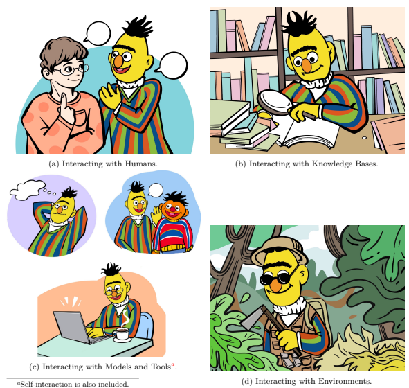

Figure 1: The paradigm of Interactive Natural Language Processing.

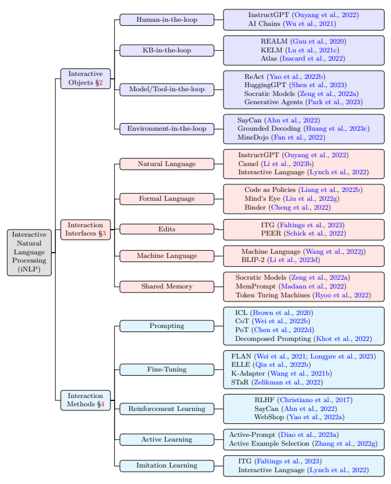

Figure 2: Taxonomy of interactive NLP.

## 2 Interactive Objects

In this section, we will discuss the objects that interact with language models as illustrated in Figure 1.

When an entity is interacting with a language model, it is considered to be "in the loop", meaning that it is an active participant in the process of model training or model inference. As previously mentioned, the interactive objects include humans, knowledge bases, models/tools, and environments; each of which will be introduced in the following subsections.

### 2.1 Human-In-The-Loop

Figure 3: Human-in-the-loop.

Human-in-the-loop NLP represents a paradigm that emphasizes information exchange between humans and language models (Wang et al., 2021d). This approach seeks to more effectively address users' needs and uphold human values, a concept known as Human-LM Alignment (Bai et al., 2022a; Kenton et al., 2021; Ouyang et al., 2022; Leike et al., 2018). In contrast, earlier research on text generation primarily concentrated on the input and output of samples, overlooking aspects such as human preferences, experiences, personalization, diverse requirements, and the actual text generation process (Lee et al., 2022c). In recent years, as pretrained language models (PLMs) and large language models
(LLMs) have matured, optimizing human-model interactions has emerged as a prevalent concern within the community. Incorporating human prompts, feedback, or configurations during the model training or inference stages, using either real or simulated users, proves to be an effective strategy for enhancing the Human-LM alignment (Faltings et al., 2023; Ouyang et al., 2022; Wu et al., 2021). Subsequently, we divide human-in-the-loop NLP into three types according to the schemes of user interaction, along with an additional section that delves into the simulation of human behaviors and preferences for these types, in order to enable scalable deployment of human-in-the-loop systems. These categories are:
1. Communicating with Human Prompts: users can interact with the model consecutively in a conversation.

2. Learning from Human Feedback: users can provide feedback to update the parameters of LMs.

3. Regulating via Human Configuration: users can configure the settings of LMs.

4. Learning from Human Simulation: simulations of users are employed for the three aforementioned types, ensuring practical implementation and scalability.

Communicating with Human Prompts. This is the most general form of Human-LM interaction, which allows a language model to interact with a human in a conversational manner. The main purpose of this interaction scheme is to maintain real-time and continuous interaction, so typical application scenarios include dialogue systems, real-time translation, and multiple rounds of question answering. This interactive process of alternating iterations allows the output of the model to realign gradually to meet user requirements. Generally, this interaction scheme does not update the model's parameters during the interaction, instead requiring users to continuously input or update prompts to elicit more meaningful responses from the language model. As a result, conversation can be inflexible and labor-intensive due to the need for prompt engineering or dialogue engineering. To address these limitations, editing-based methods have been proposed by Malmi et al. (2022); Schick et al. (2022); Faltings et al. (2023); Shi et al. (2022a); Du et al. (2022a) to encourage the language model to modify existing output (c.f., §3.3). Additionally, context-based methods have been developed that enhance model output by adding examples or instructions to the input context, such as few-shot prompting or in-context learning (Brown et al., 2020). However, since these approaches do not involve adapting language models to accommodate human users, numerous trial edits or prompts may be required to achieve the desired outcome, resulting in lengthier dialogue rounds. As such, this interaction scheme can be inefficient and may lead to a suboptimal user experience.

Learning from Human Feedback. In contrast to "Communicating with Human Prompts", this interaction scheme provides feedback on the model's outputs, such as scoring, ranking, and offering suggestions, for model optimization. This feedback is therefore used to adjust the model's parameters, rather than simply acting as prompts for language models to respond. The primary objective of this interaction is to better adapt LMs for user needs and human values (Bai et al., 2022a). For instance, Godbole et al. (2004) and Settles (2011) employ active learning to provide human feedback. By labeling a few examples based on model predictions, they update the model parameters to improve its understanding of human needs. More recently, Shuster et al. (2022) enhance a language model through continuous learning from user feedback and dialogue history. InstructGPT (Ouyang et al., 2022) initially trains GPT-3 using supervised instruction tuning and subsequently fine-tunes it via reinforcement learning from human feedback (RLHF), where the reward model is trained on annotated human preference data. This reward model, in turn, serves as a user simulator which can provide feedback for model's predictions. Ramamurthy et al. (2023) demonstrate that RLHF is more data- and parameter-efficient than supervised methods when a learned reward model provides signals for an RL method, not to mention that preference data is easier to collect than ground-truth data. Fernandes et al. (2023) and Wang et al. (2021d) provide a comprehensive survey on the topic of "learning from feedback". We refer the readers to these two surveys for more information.

Regulating via Human Configuration. The two interaction schemes previously discussed involve engagement with simulated or real humans through prompts or feedback. Regulation through human configuration, on the other hand, relies on users to customize and configure the language model system according to their needs. This customization can include adjustments to the system's structure, hyperparameters, decoding strategy, and more. Although it may not be the most flexible method, it is one of the simplest ways to facilitate interaction between the user and the system. For example, Wu et al. (2021) predefine a set of LLM primitive operations, such as "ideation", "split points", "compose points", etc.; each operation being controlled by a specific prompt template. Users can customize the usage and chaining schemes of different operations to meet a set of given requirements. Similarly, PromptChainer (Wu et al., 2022a) is an interactive interface designed to facilitate data transformation between different steps of a chain. It also offers debugging capabilities at various levels of granularity, enabling users to create their own LM chains. Users can also configure some hyperparameters to control the performance of LLMs. This includes, but is not limited to, temperature (which controls the stochasticity of the output), the maximum number of tokens to generate, and "top-p" controlling diversity via nucleus sampling (Holtzman et al., 2019)
3. Vemprala et al. (2023) have proposed the concept of "*user-on-the-loop*", implying that users can configure the LM-robot interaction with human instructions, ensuring that the process and results of the interaction are centered around the user's needs.

Learning from Human Simulation. In many cases, training or deploying language models with real users is impractical, prompting the development of various user simulators to emulate user behavior and preferences. For instance, Ouyang et al. (2022) initially rank generated responses with real annotators based on their preferences and then train a reward model—initialized from GPT-3 (Brown et al., 2020)—on this preference data to serve as a user preference simulator. Kim et al. (2023) propose a method to simulate human preference by utilizing a transformer model that captures important events and temporal dependencies within segments of human decision trajectories. Additionally, this approach relies on a weighted sum of non- Markovian rewards. Faltings et al. (2023) simulate user editing suggestions through BertScore-based (Zhang

3https://platform.openai.com/playground
et al., 2020b) token-wise similarity scores and dynamic programming to compute an alignment between a draft and a target. Lynch et al. (2022) collect numerous language-annotated trajectories, with the policy trained using behavioral cloning on the dataset. These collected trajectories can also be viewed as a user simulator. The design of a user simulator is critical for the successful training and evaluation of language models. For example, to accurately replicate the behavior and preferences of real users when developing a generic dialogue system, it is vital to collect a diverse and extensive range of user data for training the simulator. This allows it to encompass the full spectrum of user preferences and behaviors. Moreover, when developing language models for rapidly changing application scenarios, it is essential to continually update and refine the simulator to adapt to shifts in user demographics and their evolving preferences.

#### 2.2 Kb-In-The-Loop

KB-in-the-loop NLP has two main approaches: one focuses on utilizing external knowledge sources to augment language models during inference time (Khandelwal et al., 2020; Guu et al., 2020; Lewis et al., 2020; Cheng et al., 2021; Izacard et al., 2022; Menick et al., 2022; Borgeaud et al., 2021; Nakano et al., 2021; Shuster et al., 2021; Wang et al., 2023a; Lewis et al., 2021; Chen et al., 2023b), while the other aims to employ external knowledge to enhance language model training, resulting in better language representations (Lu et al., 2021c; Liu et al., 2019a; Zhang et al., 2019; Sun et al., 2019; Févry et al., 2020; Sun et al., 2021b; Xiong et al., 2020; Liu et al., 2022e; Hu et al., 2022b). Interacting with KB during training can help improve the model's representation to incorporate more factual knowledge. In contrast, interacting with KB during inference can assist the language model in generating more accurate, contextually relevant, and informed responses by dynamically leveraging external knowledge sources based on the specific input or query at hand.

In this following sections, we will discuss knowledge sources and knowledge retrieval. As for knowledge integration, we refer the readers to §4.7 for more details.

Knowledge Sources. Knowledge sources are normally categorized into the following types:
(1) Corpus Knowledge: Typically, corpus knowledge is stored in an offline collection from a specific corpus, which the language model accesses to enhance its generation capabilities. Common examples of corpus knowledge include the Wikipedia Corpus (Foundation),
WikiData Corpus (Vrandečić & Krötzsch, 2014), Freebase Corpus (Bollacker et al., 2008), PubMed Corpus4, and CommonCrawl Corpus5, among others. Most previous research has focused on corpus knowledge due to its controllability and efficiency. Retrieval- Augmented Language Models (Guu et al., 2020; Lewis et al., 2020; Borgeaud et al., 2021; Shuster et al., 2021; Izacard et al., 2022) have been proposed to develop language models capable of utilizing external knowledge bases for more grounded generation (Hu et al., 2022b; Li et al., 2022c). To further improve interpretability, subsequent studies (Lewis et al., 2021; Chen et al., 2023b; Wu et al., 2022f) have suggested using extracted Question-Answer pairs as the corpus for more fine-grained knowledge triple grounding. Recently, there has been growing interest in incorporating citations to enhance grounding in language models, as demonstrated by GopherCite (Menick et al., 2022). Another line of work, including KELM (Lu et al., 2021c), ERNIE (Sun et al., 2019; 2020b; 2021b), and others (Xiong et al., 2020; Févry et al., 2020), primarily employs recognized entities as the foundation for integrating knowledge graph information into neural representations.

Figure 4: KB-in-the-loop.

(2) Internet Knowledge: One challenge associated with corpus knowledge is its limited coverage and the need for specialized retrieval training. A potential solution involves offloading the retrieval process to search engines and adapting them to find the desired content. The Internet-augmented language model (Lazaridou et al., 2022) was first introduced to answer open-domain questions by grounding responses in search results from the

4https://pubmed.ncbi.nlm.nih.gov/ 5https://commoncrawl.org/
Internet. This approach has since been demonstrated to effectively answer time-sensitive questions (Kasai et al., 2022). The Internet has also been employed for post-hoc attribution (Gao et al., 2022a). WebGPT (Nakano et al., 2021) proposes powering language models with a web browser, which searches the web before generating knowledgeable or factual text. MineDojo (Fan et al., 2022) equips a video-language model with Internet-scale knowledge to tackle diverse tasks within a *Minecraft* environment. ToolFormer (Schick et al., 2023) similarly integrates a search engine into the tool-use adaptation of language models. ReAct (Yao et al., 2022b) suggests leveraging the Internet to augment reasoning capabilities in black-box large language models.

While corpus knowledge and internet knowledge are both valuable resources that language models can utilize to enhance their capabilities, they inherently differ in terms of controllability and coverage. Corpus knowledge is pre-collected and stored offline in a controlled setting, making it easy to access and integrate into a language model. However, it is limited by the information within the corpus and may not be up-to-date or comprehensive. In contrast, internet knowledge offers a vast and diverse pool of constantly updated information, providing more comprehensive coverage. However, controlling and curating internet knowledge is challenging, as the information obtained from the internet may be more noisy or even more misleading. Additionally, it is worth noting that there are other miscellaneous types of knowledge sources, such as visual knowledge (Wang et al., 2022d), rule-based knowledge (Saeed et al., 2021; Han et al., 2022b; Wang et al., 2021b; Liu et al., 2022g), implicit knowledge (Petroni et al., 2019), database knowledge (Li et al., 2023c), and documentation knowledge (Zhou et al., 2022c). These can be categorized into either corpus knowledge or internet knowledge, depending on their nature.

Knowledge Retrieval. Enhancing language models with knowledge requires careful consideration of knowledge quality. Knowledge quality is primarily affected by issues such as knowledge missing and knowledge noise (Ye et al., 2022). Knowledge missing can be mitigated by changing or extending the knowledge source to provide more comprehensive information. To tackle knowledge noise, an intuitive approach is to filter out the noisy information. Liu et al. (2019a) and Ye et al. (2022) propose addressing this issue by using a visibility matrix that functions on the attention scores between the knowledge and input. This helps in better integration of high-quality knowledge into the language model. Despite the success of these methods, improving knowledge retrieval remains the most critical aspect of addressing these challenges. This is because improving knowledge retrieval directly impacts the precision and recall of knowledge that is selected and integrated into the language model, leading to better overall performance. There are overall three methods for knowledge retrieval:
(1) **Sparse Retrieval**: In this approach, knowledge is retrieved based on lexical matches between words or phrases in the input text and a knowledge source or the similarity between sparse representations. For example, ToolFormer (Schick et al., 2023) employs BM25 (Robertson & Zaragoza, 2009) as a metric to retrieve knowledge from Wikipedia. DrQA (Chen et al., 2017) retrieves documents using TF-IDF vectors. RepoCoder (Zhang et al., 2023a) incorporates the Jaccard index (Jaccard, 1912) as one of its retrieval metrics. Moreover, researchers explore on utilizing the sparse representations from pre-trained language model compound with the lexical matching methods (Dai & Callan, 2020; Zhao et al., 2020a; Formal et al., 2021).

(2) **Dense Retrieval**: Dense retrieval approach retrieves knowledge based on the meaning of the input text rather than merely matching exact words or phrases. The meaning is typically encoded by a learned retriever. A dual encoder or cross encoder can be used as the retriever. For example, REALM (Guu et al., 2020) employs a latent knowledge retriever that is trained in an unsupervised manner to extract relevant information and context from a vast corpus during both the training and inference stages. Retro (Borgeaud et al., 2021) retrieves chunks from an external knowledge base using a dual encoder and integrates the retrieved chunks into language models through cross attention. Cai et al. (2021) jointly train a translation memory retriever and neural machine translation model. RepoCoder(Zhang et al., 2023a) also employs an embedding model to compute the cosine similarity between input and knowledge. Atlas (Izacard et al., 2022) retrieves knowledge with Contriever (Izacard et al., 2021), a dense dual encoder-based retriever trained via contrastive learning. Izacard & Grave (2021) and RePlug (Shi et al., 2023) propose distilling knowledge from a reader to a retriever model, which requires very few annotated training data.

(3) **Generative Retrieval** : Instead of retrieving knowledge through matching, a generative retriever directly produces the document id or content as knowledge. As such, the generative retriever, typically in the form of a language model, can be considered a type of knowledge base, which is also known as implicit knowledge (Petroni et al., 2019; Jiang et al., 2020; Liu et al., 2022d). For example, DSI (Tay et al., 2022c) encodes numerous documents with their ids into the language model's parameters. During inference, the model generates the id of the most relevant document. Sun et al. (2022) propose augmenting language models with recitations, which are relevant knowledgeable content generated by language models. Yu et al.

(2022b) prompt a large language model to generate diverse contextual documents based on a given question and then read the generated documents to produce a final answer, where the in-context demonstrations for the LLM prompting are sampled from a clustered document pool. It is worth noting that knowledge distillation may also fall within this category. For example, Ho et al. (2022) allow large language models to serve as teachers, distilling their reasoning skills into smaller language models. The knowledgeable large language model can be viewed as a generative retriever-like knowledge base for the smaller language models.

(4) **Reinforcement Learning**: Knowledge retrieval can also be formulated as a reinforcement learning problem. For example, WebGPT (Nakano et al., 2021) learns to retrieve and select documents via behavior cloning (BC) and reinforcement learning from human feedback (RLHF). Zhang et al. (2022g) formulate the example retrieval problem as a Markov Decision Process (MDP) and propose a reinforcement learning (RL) method to select examples.

### 2.3 Model/Tool-In-The-Loop

Addressing complex tasks often necessitates the implementation of strategic methodologies that can simplify the process.

One such effective strategy is the explicit decomposition of the task into modularized subtasks and then solve these subtasks step by step (Wei et al., 2022b; Zhou et al., 2022a; Dohan et al., 2022; Qiao et al., 2022). Alternatively, another strategy involves the implicit decomposition of the task through the division of labor among multiple language model agents. This approach enables a natural and adaptive breakdown of the work, as each agent assumes a specific role in the larger task (Zeng et al., 2022a; Bara et al., 2021; Goyal et al., 2022). The procedure of task decomposition not only allows subtask modularization, but also enables subtask composition. Furthermore, by breaking the task into multiple steps, specific steps can be allocated to certain expert models or external tools, such as those specializing in arithmetic computation, web search, counting, and more (Schick et al., 2023; Yao et al., 2022b; Qin et al., 2023). Inspired by (Mialon et al., 2023; Yao et al., 2022b), there are primarily three fundamental operations involved in decomposing and solving these subtasks:

Figure 5: Model/Tool-in-the-loop.

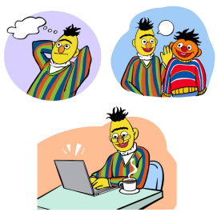

1. **Thinking**: The model engages in self-interaction to reason and decompose complex problems into modularized subtasks (Yao et al., 2022b; Mialon et al., 2023; Bubeck et al., 2023; Dohan et al., 2022);
2. **Acting**: The model calls tools or models to solve these intermediate subtasks, which may result in effects on the external world (Yao et al., 2022b; Mialon et al., 2023; Qin et al., 2023);
3. **Collaborating**: Multiple models with distinct roles or division of labor communicate and cooperate with each other to achieve a common goal or simulate human social behaviors (Clark, 1996; Premack & Woodruff, 1978; Bara et al., 2021; Kosinski, 2023; Park et al., 2023; Li et al., 2023b).

Thinking. For example, consider the question, "*What is the biggest animal in Africa?*", which can be decomposed into a chain of three subtasks: "What animals are in Africa?" → "*Which of these animals are* large?" → "*Which of these is the largest?*" These three subtasks form a prompt chain (c.f., §4.2.3), allowing for the individual solving of each subtask by a single LM, multiple LMs, or even tools. That is, through the process of thinking, the overall task can be decomposed into multiple subtasks that can be efficiently tackled through interactions among language models or tools in a chained manner. The preliminary instantiation of such a cognitive process is **Chain-of-Thought (CoT)** (Wei et al., 2022b), which seeks to elicit multi-hop complex reasoning capabilities from large language models using a cascading mechanism (Dohan et al., 2022). Instead of directly producing the answer, multiple thoughts (i.e., reasoning steps) are generated beforehand (Wei et al., 2022b; Wang et al., 2022f; Zhou et al., 2022a; Press et al., 2022). Thus, CoT decomposes the task into two sub-tasks: thought generation → *answer generation*. However, typical CoT involves solving these subtasks in a single model run (Wei et al., 2022b) without an interaction mechanism.

Derivative works of CoT have shown an increasing tendency to utilize a self-interaction loop that involves iteratively calling the same language model to solve different subtasks (Zhou et al., 2022a; Wang et al., 2022a; Press et al., 2022; Yao et al., 2022b), also known as **multi-stage CoT** (Dong et al., 2023b; Qiao et al., 2022). Furthermore, some other derivative works share similar principles with CoT or multi-stage CoT but employ **different training strategies**, such as bootstrapping (Zelikman et al., 2022) (as discussed in §4.3.4). Some works go beyond the subtask of *thought generation* and **introduce new subtasks**, including thought verification (Weng et al., 2022), *fact selection and inference* (Creswell et al., 2022), and self-refinement and self-feedback (Madaan et al., 2023), among others. Indeed, all of these works can be seen as instantiations of the thinking cognitive process. They employ a self-interaction mechanism, wherein a single language model is utilized iteratively to decompose tasks into subtasks, and effectively solve these subtasks.

Acting. Different from the process of thinking, acting involves the interaction of the LM with external entities, such as other LMs and tools. Since different models or tools can possess specific expertise, the LM can invoke these external entities to perform specific subtasks when the task is decomposed into subtasks. For example, *thought verification* can be accomplished using a discriminative model (Chen et al., 2023d), and fact selection may utilize a retriever model (Guu et al., 2020). External tools such as calculators (Cobbe et al., 2021; Schick et al., 2023), simulators (Cranmer et al., 2020; Liu et al., 2022g), search engines (Yao et al., 2022b; Nakano et al., 2021), code interpreters and executors (Ni et al., 2023; Gao et al., 2022b; Chen et al., 2022d), and other APIs (Parisi et al., 2022; Yao et al., 2022b; Schick et al., 2023; Thoppilan et al.,
2022; Shuster et al., 2022; Mialon et al., 2023; Liang et al., 2023b; Wu et al., 2023a; Qin et al., 2023) can also be incorporated into the loop to tackle subtasks that language models typically encounter difficulties with. Generally, tasks emphasizing faithfulness and exactitude (e.g., real facts, complex mathematical operations) and tasks beyond the LM training corpus (e.g., up-to-date information, low-resource languages, awareness of time, image generation) are better solved using external tools than LMs (Welleck et al., 2019; Maynez et al., 2020; Patel et al., 2021a; Komeili et al., 2022; Lin et al., 2022b; Dhingra et al., 2022; Schick et al., 2023; Mialon et al., 2023; Liang et al., 2023b; Wu et al., 2023a; Qin et al., 2023). For example, ToolFormer (Schick et al., 2023) enhances language models with tool-use capabilities by retraining on a tool-use prompted corpus and involving tools such as calculators, calendars, search engines, question-answering systems, and translation systems. ART (Paranjape et al., 2023) begins by selecting demonstrations from a task library that involve multi-step reasoning and tool usage. These demonstrations serve as prompts for the frozen LLM to generate intermediate reasoning steps in the form of executable programs. ReAct (Yao et al., 2022b) combines both chain-of-thought reasoning and task-specific tool-use actions to improve the interactive decision-making capabilities of language models. TaskMatrix.AI (Liang et al., 2023b) presents a vision for a new AI ecosystem built on tool-use APIs, proposing an architecture composed of an API platform, API selector, multimodal conversational foundation model, API-based action executor, and integrating RLHF and feedback to API developers to optimize the system. This architecture benefits from its ability to perform digital and physical tasks, its API repository for diverse task experts, its lifelong learning ability, and improved interpretability. HuggingGPT (Shen et al., 2023) and OpenAGI Ge et al. (2023) use ChatGPT as a task controller, planning tasks into multiple subtasks that can be solved by models (tools) selected from the HuggingFace platform6.

6https://huggingface.co/
Moreover, acting can have a tangible impact on the external world through tool-use (Mialon et al., 2023), also referred to as Tool-Oriented Learning (Qin et al., 2023). For instance, ChatGPT Plugins7empower LLMs to directly utilize tools for tasks such as travel bookings, grocery shopping, and restaurant reservations, among others. LM-Nav (Shah et al., 2022) leverages a visual navigation model (VNM) to execute the actions planned by the LLM, enabling real-world robotic navigation. In these cases, the overall task is still decomposed into subtasks, but some of which are connected with the external world. By employing specific models or tools to address these subtasks, tangible effects can be realized in the environment. Readers can refer to §2.4 for additional information related to the interaction between the language model and the environment.

Collaborating. Most of the aforementioned research relies on manual task decomposition. Although some existing works propose automatic task decomposition through distant supervision (Min et al., 2019; Talmor & Berant, 2018; Perez et al., 2020) or in-context learning (Zhou et al., 2022a; Press et al., 2022; Khot et al., 2022; Dua et al., 2022; Mialon et al., 2023), explicit task decomposition is not always straightforward. On the one hand, it requires human expertise or extensive manual effort. On the other hand, in certain cases, different language model agents may share a common goal that is difficult to explicitly decompose (Claus & Boutilier, 1998; Lazaridou et al., 2017; Li et al., 2023b; Bara et al., 2021). In such scenarios, task decomposition or division of labor may emerge implicitly as different agents with specialized skills assume different roles within the task and interact with one another (Clark, 1996; Premack & Woodruff, 1978; Goyal et al., 2022; Li & Zhou, 2020; Liu et al., 2022b;a; Bara et al., 2021; Kosinski, 2023; Li et al., 2023b). For example, in *MineCraft*, agents with distinct yet complementary recipe skills can communicate and collaborate to synthesize a material, where the specialized agents may automatically discover a potential division of labor (Bara et al., 2021). To the best of our knowledge, we can categorize collaboration-based approaches into three clusters:
(1) **Closed-Loop Interaction** refers to a collaborative process where multiple agents interact with each other in a feedback loop (Freedman et al., 2019; Ahn et al., 2022; Zeng et al., 2022a; Huang et al., 2022c; Dasgupta et al., 2023; Chen et al., 2023d). In the context of control theory, a closed-loop controller uses feedback to control states or outputs from a dynamical system8. Generally, closed-loop controllers are preferred over open-loop controllers as they offer greater adaptability and robustness in changing or uncertain environments. Likewise, closed-loop interaction between language model agents is more effective and robust compared to open-loop interaction (Huang et al., 2022b; Lynch et al., 2022), making it a primary paradigm for collaboration-based methods. For example, Socratic Models (Zeng et al., 2022a) and Inner Monologue (Huang et al., 2022c) enable language models to collaborate with vision-language models, audio-language models, or humans to conduct egocentric perception and robotic manipulation tasks, respectively. The language-based closed-loop feedback is incorporated into LLM planning, significantly improving instruction completion abilities (Huang et al., 2022c). Planner-Actor-Reporter (Dasgupta et al., 2023) uses an LLM (Planner) to generate instructions for a separate RL agent (Actor) to execute in an embodied environment. The state of the environment is reported back to the Planner (via the Reporter) to refine instructions and complete the feedback loop. Note that closed-loop interaction is highly applicable in Environment-in-the-loop scenarios, where closed-loop feedback from the environments can be transferred via a model connected to the environment (Huang et al., 2022c; Zeng et al., 2022a).

(2) **Theory of Mind** in language models has garnered growing attention in the research community (Premack
& Woodruff, 1978; Rabinowitz et al., 2018; Zhu et al., 2021; Bara et al., 2021; Kosinski, 2023; Liu et al., 2023a). According to Kosinski (2023), "*Theory of Mind (ToM), or the ability to attribute unobservable mental* states to others, is central to human social interactions, communication, empathy, self-consciousness, and morality.". Kosinski (2023) demonstrates that large language models, like ChatGPT, can successfully tackle 93% of ToM tasks. This finding suggests that ToM-like capabilities may have naturally emerged in large language models. In line with this, MindCraft(Bara et al., 2021) assigns different material composition tables
(sub-skills) to two dialogue agents, enabling them to cooperate and complete the material composition task through mutual communication. Zhu et al. (2021) provide a speaker and listener formulation of ToM, where the speaker should model the listener's beliefs (i.e., action possibilities over some instruction candidates).

These ToM mechanisms are beneficial for collaborative tasks (Liu et al., 2023a).

7https://openai.com/blog/chatgpt-plugins 8https://en.wikipedia.org/wiki/Control_theory
(3) **Communicative Agent** perceives language models as agents (Andreas, 2022) and delves into the study of multi-agent communication (Lazaridou et al., 2017). In addition to Theory of Mind, multiagent communication also investigates the scenarios of referential game (Lazaridou et al., 2017), language acquisition (Liu et al., 2023a), language emergence (Wang et al., 2022j), and role playing (Li et al., 2023b), implying an effort towards LLM society (Li et al., 2023b). For example, Wang et al. (2022j) enable two communicative agents, a speaker and a listener, to learn to play a *Speak, Guess and Draw* game and automatically derive an interaction interface between them, which is so-called machine language. Camel (Li et al., 2023b) proposes a role-playing framework that involves two cooperative agents, an AI user and an AI assistant. The two language models are prompted with a shared task specifier prompt and different role assignment prompts, which is referred to as *Inception Prompting*. With the condition of Inception Prompting, they communicate with each other without any additional human instruction to solve the specified task.

Generative Agents (Park et al., 2023) introduces a novel architecture that extends a LLM to enable believable simulations of human behavior in an interactive sandbox environment, demonstrating the agents' ability to autonomously plan and exhibit individual and social behaviors. Yuan & Zhu (2023)'s formalism even views existing machine learning paradigms such as passive learning and active learning, as communicative learning, which is in line with ter Hoeve et al. (2021)'s interactive language modeling. In these paradigms, the language model agents are grouped into teachers and students, where the students learn from the teachers through interaction. They frame learning as a communicative and collaborative process.

### 2.4 Environment-In-The-Loop

Figure 6: Environment-in-the-loop.

A new trend within the NLP community is to harness the power of LMs to address embodied tasks such as robot manipulation, autonomous driving, and egocentric perception, among others (Ahn et al., 2022; Huang et al., 2022c; Liang et al., 2022b; Chen et al., 2022a; Shah et al., 2022; Zeng et al., 2022a; Dasgupta et al., 2023; Carta et al., 2023; Huang et al., 2023c). In these scenarios, the environment is integrated into an interactive loop with language models. The aim of environment-in-the-loop NLP is language grounding, which is to represent language with meaning reference to environments and experiences (Bisk et al., 2020). It has been argued that only if LMs are put into interaction with real-world or virtual environments can they learn a truly grounded representation of language (Bisk et al., 2020). During this interaction, the environment assumes the responsibility of furnishing the LM with low-level observations, rewards, and state transitions. Simultaneously, the LM is tasked with generating solutions for environmental tasks, including reasoning, planning, and decision-making (Bisk et al., 2020; Li et al., 2022e; Yang et al., 2023a).

We define two dimensions for language grounding, as shown in Figure 7. The horizontal axis spans from the *concrete* end to the *abstract* end. The term *concrete* refers to models that capture high-dimensional data of the world, such as images, audio, and other similar sensory inputs. On the other hand, the term abstract pertains to models that capture low-dimensional data, such as language, code, or other symbolic representations. Compared to a more concrete representation, abstract or bottle-necked representation brings stronger generalization and reasoning ability (Kawaguchi et al., 2017; Trauble et al., 2023; Liu et al., 2021a). The vertical axis ranges from the *low-level* end to the *high-level* end, where *low-level* means a more direct and embodied interaction with the environment, such as perception or manipulation, while *high-level* means a more indirect and conceptual interaction with the environment, such as reasoning, planning, and decision-making. This axis can reflect the degree of the model's contextual and situational understanding of the environment. Generally, the environment can be the real world or virtual world simulated by programs such as Mu-
JoCo (Todorov et al., 2012) and MineCraft9. Hence, the environment is in the bottom-left quadrant in Figure

9https://www.minecraft.net

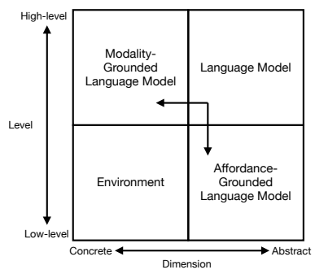

Figure 7: Two directions for language grounding. A third direction for language grounding may be social interaction (Bisk et al., 2020; Bolotta & Dumas, 2022; Lazaridou et al., 2017; Liu et al., 2023a) which is not illustrated in this figure but we have discussed it partly in §2.3.

7 with a concrete representation of data and low-level interaction processes. While the language model is in the top-right quadrant in Figure 7 with an abstract representation of data and high-level interaction processes. This discrepancy makes it necessary to ground language models for LM-env interaction. There are mainly two directions: **modality grounding** and **affordance grounding**.

(1) **Modality Grounding** (Beinborn et al., 2018) aims to move the language model from the abstract quadrant to the concrete quadrant. It is intuitive to incorporate information in image, audio or other modalities into it. In this way, language models can capture more complete observations from the environment.

(2) **Affordance Grounding** (Ahn et al., 2022) strives to transition language models from the high-level quadrant to the low-level quadrant. The goal is to align the outputs of language models with the contextual scene, ensuring that the generated text correspond to the surrounding environment rather than being detached from it.

It is worth noting that these two goals are not independent processes, and often form a synergy towards the environment. Moreover, other additional requirements such as preference and safety are also possible directions (Huang et al., 2023c), which may further involve human in the loop.

Modality Grounding. Modality-Grounded Language Model (MGLM) is designed to allow language models to process data of more modalities such as vision and audio. In the context of visual grounding (i.e.,
vision-language pre-trained model), for example, there are three ways: (1) Dual-Tower modeling which trains different encoders for different modalities (Tan & Bansal, 2019; Lu et al., 2019a; Radford et al., 2021; Xu et al., 2022c; Li et al., 2021b; Yu et al., 2022a; Zeng et al., 2022c); (2) Single-Tower modeling using the concatenation of multimodal data to train a single model (Su et al., 2019; Li et al., 2019; Chen et al., 2020d; Li et al., 2020b; Wang et al., 2022c; Reed et al., 2022; Brohan et al., 2022; Koh et al., 2023; Driess et al., 2023; Chen et al., 2022e; Wang et al., 2022e;b; Diao et al., 2023b; Huang et al., 2023b); (3) Interaction between frozen pre-trained vision and language models (Zeng et al., 2022a; Huang et al., 2022c; Alayrac et al., 2022; Li et al., 2023d; Wu et al., 2023a; Zhu et al., 2023b; Chen et al., 2023d). These methods involve the utilization of visual information during both the training and inference stages of a language model. By incorporating visual signals, these approaches enable a visually grounded representation of language. This enhancement in representation facilitates improved interaction efficiency between the language model and the environment, as it allows for increased information throughput. For example, WebShop (Yao et al., 2022a) and Interactive Language (Lynch et al., 2022) use ResNet (He et al., 2015) and a Transformer model (Vaswani et al., 2017) to process visual and linguistic data respectively, and input the fused representations into another Transformer to generate action outputs; VIMA (Jiang et al., 2022b) and Gato (Reed et al., 2022) use one single model to simultaneously process the concatenated multimodal data and predict actions; Socratic Models (Zeng et al., 2022a), Inner Monologue (Huang et al., 2022c), and LM-Nav (Shah et al., 2022) use multimodal language models to convert visual inputs into language captions or phrases and use LLMs for planning, reasoning and question-answering in order to perform embodied tasks. ViperGPT (Suris et al., 2023) equips the LLM with an API for various perceptual and knowledge modules, along with a Python interpreter, enabling the LLM to generate executable code for visual reasoning tasks.

Another goal of Modality Grounding is to preserve as much high-level knowledge as possible in the language model to ensure that the model is still able to effectively perform tasks such as commonsense reasoning, planning, question answering, code generation, etc. These capabilities become more pronounced and complex as the size of the model increases, known as emergent abilities (Kaplan et al., 2020; Wei et al., 2022a). These capabilities serve as one of the primary purposes of leveraging language models for embodied tasks. An illustrative example of these capabilities is demonstrated in the context of completing long-horizon navigation tasks. In such tasks, the effective planning of instructions by the LLM is crucial (Shah et al., 2022).

Affordance Grounding. However, in general, in order to make MGLM knowledge-rich, the model needs to be pre-trained with a large amount of data from open domains, which may result in outputs that are too diverse and therefore do not match the conditions in the real environment (Ahn et al., 2022; Chen et al., 2022a; Huang et al., 2023c). Therefore, some low-level information from the environment is needed to be incorporated into language models, which is referred to as Affordance Grounding (Ahn et al., 2022). According to Gibson (2014) and Khetarpal et al. (2020): "*Affordances describe the fact that certain states* enable an agent to do certain actions, in the context of embodied agents.". Likewise, according to Ahn et al. (2022): "*The learned affordance functions (Can) provide a world-grounding to determine what is possible* to execute upon the plan". However, Chen et al. (2022a) argues that Ahn et al. (2022)'s falls short in providing affordance grounding at the scene-scale, thus limiting the ability to reason about the potential actions a robot can perform within a given environment. Hence, following this thought, there are mainly two requirements for an affordance grounded lanugage model (AGLM): (1) **scene-scale perception**, and
(2) possible action, **conditioned on the language-based instructions**. For example, when considering a smart home environment and asking the agent to "*turn off the lights in the living room.*", scene-scale perception aims to make the agent aware of all (or only) the existing and relevant objects, such as "*bedlamps*" and "*droplights*". Secondly, possible action tasks the agent to determine the executable actions on the objects that can complete the instructions, such as "**press** *the switches.*" For example, SayCan (Ahn et al., 2022) leverages large language models to generate a list of object-action proposals (i.e., task grounding) which are then scored by a value function connected to the environment (i.e., world-grounding). Similarly, Chen et al. (2022a) first construct a language queryable scene representation, NLMap, through pre-exploration of a robotic agent and then use the a LLM to generate a list of relevant objects to be filtered and located. The object presence and location are finally used for LLM planning. Abramson et al. (2022) train an agent via behavioral cloning on the interactions of paired human players. They then collect human feedback on the learned agent to train a reward model, which is finally used to post-train the agent. That is, they achieve affordance grounding via behavioral cloning and RLHF. Code as Policies (Liang et al., 2022b) enables a language model to generate executable code directly. The generated codes can be executed with a python interpreter for affordance verification (Ni et al., 2023). LM-Nav (Shah et al., 2022) converts the planning results of the language model to image form and then uses a Visual Navigation Model to convert them into executable instructions (i.e., action+distance). Grounded Decoding (Huang et al., 2023c) integrates the high-level semantic understanding of LLMs with the reality-based practicalities of grounded models, enabling the generation of action sequences that are both knowledge-informed and feasible in embodied agent tasks like robotics. Wake et al. (2023) provide numerous examples of utilizing ChatGPT for generating executable action sequences to accomplish tasks assigned by users. Note that KB-in-the-loop, Model/Tool-in-the-loop, or Human-in-the-loop approaches can also be employed for modality grounding or affordance grounding (Huang et al., 2022b; Yao et al., 2022b; Zeng et al., 2022a; Huang et al., 2022c; Lynch et al., 2022; Abramson et al., 2022). In these approaches, external objects or entities undertake these functions, such as utilizing humans to describe the visual scene for modality grounding (Huang et al., 2022c).

## 3 Interaction Interface

In this section, we discuss the interfaces through which language models communicate with interactive objects. The interfaces include three types of languages: natural language, formal language, and machine language, as well as two special interfaces: edits and shared memory.

### 3.1 Natural Language

Figure 8: Interacting via Natural Language.

Natural Language is the most common interaction interface. Communicating via this interface requires that the interactive objects can effectively understand and produce natural language. This interface is therefore commonly used in Model-in-the-loop (Wu et al., 2021; Zeng et al., 2022a) and Human-in-the-loop (Ouyang et al., 2022; Lee et al., 2022c). Natural language interaction empowers users to express their needs with inherent expressiveness, enabling effective communication of their requirements without the need for specialized training. Additionally, this interaction interface facilitates a better understanding of the intermediate interaction process, leading to improved debuggability and interpretability of the interaction chain (Wu et al., 2021; Wei et al., 2022b; Lee et al., 2022c). Crucially, since LMs are primarily pre-trained on natural language, interacting with them through natural language instead of other language is the most effective way to activate and utilize the knowledge encoded in the LMs. This alignment between the LM training data and the interaction interface allows for optimal utilization of the knowledge contained within the LMs. However, interacting with a language model through natural language heavily relies on the organization and the utterance of the language, often necessitating intricate prompt engineering (Liu et al., 2022c; Gu et al., 2022; Zhao et al., 2021; Lu et al., 2022d; Dong et al., 2023b; Chen et al., 2022f). Organization of the language refers to the structure of a model's prompt, and can be categorized into unstructural natural language and **structural natural language**. Utterance, on the other hand, refers to the specific wording or language used to express a given prompt or query. Utterance is more flexible by nature and therefore difficult to determine an optimal one. Different utterances may produce different results as they differ from the activated pattern in the model parameters. Practically, suitable prompts can be discovered through manual or automatic search (Dong et al., 2023b; Liu et al., 2021b; Wallace et al., 2019a; Jiang et al., 2020; Li & Liang, 2021; Zhang et al., 2022g; Zhou et al., 2022f; Liu et al., 2022c). We refer the readers to §4.2 for more information.

Unstructural Natural Language. Unstructural natural language is a free-form text. When it serves as an output from the language model, it does not have specific categorization, and the content can be free-form responses such as answers to questions and textual feedback. When it serves as an input to the language model, in addition to the main input content, such as interaction messages and queries, it primarily takes three forms of auxiliary context: (1) few-shot examples, (2) task description, and (3) role assignment (Mishra et al., 2022; Wang et al., 2022h; Li et al., 2023b). Thereof,
- Input format example of few-shot prompting: "*[Example-1]; [Example-2]; [Example-3]; [input]*" e.g.

"sea otter → loutre de mer; plush girafe → *girafe peluche; cheese* →" for translation task.

- Input format example of task description: "*[task description]: [input]*" e.g. "*translate English to* French: cheese →".

- Input format example of role assignment: "*[role assignment]. [input]*" e.g. "*Act as a python* programmer: write codes to detect objects."
10.

For example, some recent work, including Natural Instructions (Mishra et al., 2022) and Super Natural Instructions (Wang et al., 2022h), have built comprehensive collections of tasks and their corresponding instructions in natural language. Interactive Language (Lynch et al., 2022) enables humans to provide real-time instructions for the multimodal language model based on the current state of a given environment for robotic manipulation. Camel (Li et al., 2023b) defines an inception prompt that comprises a task specifier prompt and two role assignment prompts, namely the assistant system prompt and the user system prompt, which are utilized for role-playing tasks. Structural Natural Language. Structural natural language usually imposes explicit constraints on the text in terms of content or formatting. Such constraints can be imposed on either the input (Zhong et al., 2022) or output (Ahn et al., 2022) of language models. For example, Drissi et al. (2018); Sun et al. (2020a); Yang et al. (2022b) define the overall structure of the generated article via an Outline or Plan (e.g., "(1)
Introduction, (2) Related Work, (3) Method, (4) Experimental Results, ..." or a storyline). Ahn et al. (2022)
and Chen et al. (2022a) unify the format of a generated text via a Template (e.g., "*pick up [object]*") to facilitate parsing of the action and the object to be acted upon. ProQA (Zhong et al., 2022) employs a prompt-based input schema that is designed in a structured manner, e.g., "*[Format]: <Extractive QA>; [Task]:*
<SQuAD>; [Domain]: <Wikipedia>; [Question]: In what Country is Normandy located? [Passage]: ...". This schema allows for efficient modeling of knowledge generalization across all QA tasks, while also preserving task-specific knowledge tailored to each individual QA task. Note that although ProQA incorporates certain soft prompts in its input schema (c.f., §3.4), the main body of its instance still consists of natural language.

While unstructured natural language is a widely used interface for interaction due to its flexibility, simplicity, and readability, it suffers from certain drawbacks, including ambiguity, lack of coherence and parsability.

Although these challenges can be partially addressed by employing structural natural language, all forms of natural language are inherently limited by its subjectivity and variability.

### 3.2 Formal Language

To further unlock the benefits of structural language, such as unambiguity, coherence, and parsability, and to mitigate the inherent limitations of natural language mentioned above, formal language emerges as another important interaction interface. According to Wikipedia11, "a formal language consists of words whose letters are taken from an alphabet and are well-formed according to a specific set of rules." Formal language is utilized in various domains such as mathematics, logic, linguistics, computer science, as well as other fields where precise and unambiguous communication is essential. Here are some examples of formal languages:
1. Programming Languages: examples include C, Java, Python, and many others. These programming languages are used to write scripts or commands that computers can execute (Cheng et al., 2022; Liang et al., 2022b; Chen et al., 2022d; Schick et al., 2023; Paranjape et al., 2023).

2. Query Languages: examples include SQL and XQuery, which are used to retrieve and manipulate data stored in databases (Cheng et al., 2022; Li et al., 2023c).

3. Mathematical Expressions: examples include boolean algebra, first-order logic, and equations. They are used to describe mathematical concepts and relationships (Wu et al., 2022e; Lu et al., 2021a; Han et al., 2022a).

10Role assignment can be considered a special type of task descriptions.

11https://en.wikipedia.org/wiki/Formal_language
4. Formal Grammars: examples include context-free grammars, regular grammars, recursive grammars, etc12. They are used to describe the syntactic structure of natural language (Bai et al., 2021; Sachan et al., 2020; Wang et al., 2021b).

5. Others: for example, knowledge triples (Liu et al., 2022e; Sun et al., 2021b), and regular expressions
(regex, Locascio et al.).

Figure 9: Interacting via Formal Language.

The interactive objects that use formal language as an interaction interface usually include knowledge bases (Liu et al., 2022e; Li et al., 2023c; Cheng et al., 2022), environments (Liang et al., 2022b), and models/tools (Liu et al., 2022g; Wu et al., 2022e; Lu et al., 2021a; Jiang et al., 2022a; Liang et al., 2023b). For example, Mind's-Eye (Liu et al., 2022g) uses a text-to-code language model to generate rendering codes for the physical simulation engine. Jiang et al.

(2022a) involve a three-step approach to creating mathematical proofs. This approach includes formulating an initial informal proof, converting it into a formal sketch, and then employing a standard prover to prove the conjectures. This allows for the automated transformation of informal mathematical issues into fully formalized proofs using natural and mathematical languages. Binder (Cheng et al., 2022) first parses its input into programs (Python, SQL, etc.) given the questions and knowledge bases, and then executes them to get the results. K-Adapter (Wang et al., 2021b) incorporates linguistic knowledge into PLMs through the use of adapters (Houlsby et al., 2019), exemplifying the application of formal grammars as an interaction interface. In some specific cases, other interactive objects may also use formal language. For example, human developers can interact with a code-based language model (Chen et al., 2021a) using formal language. Lahiri et al. (2022) create an interactive framework to refine user intents through test case generations and user feedback. Compared to natural language, formal language offers distinctive advantages as an interaction interface, including: (1) It brings about precision and clarity, eradicating the ambiguity often associated with natural language. (2) Its structured syntax and rules make it directly parsable and easily interpretable by programs, enabling more efficient and accurate interaction with tools, for example. (3) It facilitates complex reasoning and logic-based operations more effectively, as codes or mathematical proofs are data formats that encompass a series of logical reasoning steps, which may provide opportunities to enhance models' reasoning abilities (Fu & Khot, 2022; Suris et al., 2023). However, the use of formal language may have certain limitations, including:
(1) Limited accessibility: It often requires specialized knowledge or training for proper understanding and usage. And it relies on LMs specifically trained with formal language. (2) High sensitivity: E.g., even small errors in codes can render them non-executable. (3) Lack of expressiveness: It is unable to convey ideas in a nuanced and flexible manner.

### 3.3 Edits

Text editing aims to reconstruct the textual source input to the target one by applying a set of edits, such as deletion, insertion, and substitution (Malmi et al., 2022). The motivation behind text editing is the recognition that source and target texts often share significant similarities in various monolingual tasks. Instead of reproducing the source words (Gu et al., 2016; See et al., 2017; Zhao et al., 2019; Panthaplackel et al., 2021), text editing models reduce such copying to predicting a single keep operation. Also, edits are often facilitated with rich metadata about language editing, including the inserted or deleted spans and the word order.

12https://en.wikipedia.org/wiki/Formal_grammar
Figure 10: Interacting via Edits.

Learning from the editing of textual data is gaining increasing attention, given its success in code pre-training (Zhang et al., 2022c), image editing (Ravi et al., 2023), drug design (Corso et al., 2022), and other areas. Previous cognitionrelated research has proven that mechanical editing operations require less cognitive effort compared to correcting transfer errors, which have no references to the source text version (Lacruz et al., 2014), and that iterative editing procedure plays an important role in improving students' writing abilities (Vardi, 2012; Gollins & Gentner, 2016). Moreover, these editing-related cognitive phenomena have shined upon various NLP topics. By addressing some limitations of the dominant sequence-to-sequence approaches (Sutskever et al., 2014), such as a relatively high computational requirement (Mallinson et al., 2020), text editing has found its wide array of applications (Malmi et al., 2019; Mallinson et al., 2020; Stahlberg & Kumar, 2020) such as automatic post-editing (Bérard et al., 2017; Xu et al., 2022b), data-to-text generation (Kasner & Dušek, 2020), grammatical error correction (Awasthi et al., 2019; Zhou et al., 2020a; Hinson et al., 2020; Omelianchuk et al., 2020), punctuation restoration (Che et al., 2016; Kim, 2019; Alam et al., 2020; Shi et al., 2021), sentence simplification (Dong et al., 2019b; Agrawal et al., 2021), human value alignment (Liu et al., 2022f; Zhang et al., 2023b), style transfer (Reid & Zhong, 2021), and sequence-to-sequence pre-training (Zhou et al., 2021). Similar to the pattern of repeated revisions made by humans to a manuscript until it is finalized, a complete process of text editing can be decomposed to multiple iterative rounds of editing, rather than one-pass edit
(Ge et al., 2018; Gu et al., 2019; Stern et al., 2019; Kumar et al., 2020; Shi et al., 2020; 2022a; Faltings et al., 2023). On account of this, edits can be treated as one kind of interaction interface. Typically, text editing can be conducted through interaction between the editing model and itself, with the outputs of the previous iterations as the input of the current one until the text is fully edited to be returned (Schick et al., 2022; Kasner & Dušek, 2020; Kim et al., 2022; Madaan et al., 2023). Meanwhile, text editing can also be conducted through interaction among multiple different models or modules (Narayan & Gardent, 2014; Mallinson et al., 2022; 2020; Malmi et al., 2020). For example, an edit can be split into tasks, such as sequence tagging and masked language modeling, for models to cooperate. Specifically, a tagger first attaches an edit operation to each token. Afterwards, a masked language model fills in the placeholders for insertion and substitution operations to complete the edit (Mallinson et al., 2020; Malmi et al., 2020). Moreover, the participation of a code interpreter (Dong et al., 2019b; Shi et al., 2020), environment (Shi et al., 2022a), and user simulator (Faltings et al., 2023) can control the editing better and provide additional supervision signals.

Recent research proves that editing-based models can be expanded to various NLP downstream tasks by retrieving or generating prototypes, i.e., original text to be edited (Kazemnejad et al., 2020; Malmi et al., 2022). Additionally, text editing models have shown impressive performance in low-resource settings and can get rid of the typical autoregressive mechanism, thus improving inference speed (Mallinson et al., 2020; Awasthi et al., 2019). However, it is still under-explored how to automatically generate prototypes for general NLG tasks so as to expand the text editing paradigm to them (Guu et al., 2018), which hinders the broad use of edits as an interaction interface.

### 3.4 Machine Language

In some cases, the communication language between the language model and interactive objects is not humanreadable. This communication interface is referred to as Machine Language, as it can only be understood and processed by computers (e.g., models, tools). We can break down this type of interaction interface into two categories: **discrete machine language** and **continuous machine language**.

Figure 11: Interacting via Machine Language.

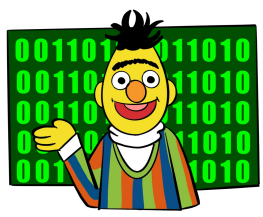

Discrete Machine Language. It refers to an interaction interface that is not readable by humans and quantized. For example, OFA (Wang et al., 2022c) and BEiT-3 (Wang et al., 2022e) treat images as a form of "*foreign language*". That is, the sequence of image patches is obtained through image quantization and discretization techniques (van den Oord et al., 2017; Esser et al., 2020; Yu et al., 2021; Peng et al., 2022). This process allows the generation or understanding of an image token sequence that cannot be directly readable by humans but can be processed by models such as VQ- VAE (van den Oord et al., 2017) or VQGAN (Esser et al., 2020; Yu et al., 2021). Similarly, the hidden states inside the language model can also be discretized into discrete machine language in a similar manner. For example, Trauble et al. (2023); Liu et al. (2021a); Wang et al. (2022j) have demonstrated that discretized, human-unreadable hidden states can lead to better generalization and robustness.

Continuous Machine Language. It refers to an interaction interface through which the language models communicate with interactive objects using continuous scalars or vectors in a dense space. For example, Flamingo (Alayrac et al., 2022) encodes and re-samples images into dense and continuous vectors and then passes them to a language model via cross attention. BLIP-2 (Li et al., 2023d) encodes and maps images into numerous soft tokens 13 and passes them to a language model as prefixes of text inputs.

Note that metric signals, such as scalar rewards and ranking scores (Christiano et al., 2017; Ouyang et al., 2022; Ramamurthy et al., 2023), can also be regarded as a form of machine language employed by language models. In particular, if these signals belong to a discrete set of numbers (e.g., ∈ Z), they can be classified as a form of discrete machine language. On the other hand, if they are represented as continuous values (e.g.,
∈ R), they can be classified as a form of continuous machine language.

### 3.5 Shared Memory

The interaction interfaces discussed earlier focus on direct communication between language models and interactive objects. However, there is also a form of indirect communication facilitated through shared information units, commonly referred to as shared memory (Goyal et al., 2022; Zeng et al.,
2022a; Madaan et al., 2022; Dalvi et al., 2022; Ryoo et al.,
2022). That is, the message receiver does not directly receive the message from the sender, but instead retrieves it from a memory pool where the message has been pre-written by the sender. Depending on the form in which the message is stored and utilized, this type of interaction interface can be classified into two categories: **hard memory** and **soft** memory.

Figure 12: Interacting via Shared Memory.

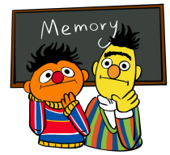

Hard Memory. Hard memory often utilizes a human-readable history log to store shared information. For example, Socratic Models (Zeng et al., 2022a) employs a communication mechanism where Vision-Language Models (VLM), Audio-Language Models (ALM), and Language Models (LM) interact through a history log written in natural language. This log records the complete history of states perceived by each model (Zeng et al., 2022a). MemPrompt (Madaan et al., 2022) edits human prompts to GPT-3 with user feedback memory

13Soft tokens, also known as soft prompts, refer to learnable parameters that are concatenated to the input prompt of a language model. Please refer to Liu et al. (2021b).
for better Human-LM interaction. Dalvi et al. (2022) augment a question-answering model with a dynamic memory of user feedback for continual learning.

Soft Memory. Soft memory typically employs queryable and human-unreadable memory slots to store shared information. These memory slots utilize a continuous machine language for efficient storage and retrieval of information. For example, Shared Global Workspace (Goyal et al., 2022) stores the information from multiple modules in a shared sequence of working memory slots to facilitate inter-module communication and coordination. Token Turing Machines (Ryoo et al., 2022) use an additional memory unit to store historical state information to aid long-horizon robotic manipulation. Utilizing memory as an indirect interaction interface provides several advantages over direct communication. It allows interactive objects to retrieve messages from earlier moments, enabling them to access past information.

Memory enables the storage of a large volume of information, facilitating high-throughput communication.

However, memory can become noised or outdated, leading to potential confusion or errors. Retrieval from memory can be time-consuming, impacting the efficiency of the interaction. It can also introduce unpredictability and uncertainty into the interaction. Therefore, careful design is crucial to ensure the effective and efficient utilization of memory.

## 4 Interaction Methods

This section aims to explore the methodologies employed by language models for understanding and processing interaction messages. We begin with a quick tour through the pre-trained language models (§4.1). Next, we divide interaction methods into five categories: prompting without model training (§4.2), fine-tuning which involves updating models' parameters (§4.3), active learning (§4.4), reinforcement learning (§4.5) as well as imitation learning (§4.6). Finally, we propose to re-frame and formalize these methods in a unified manner, i.e., interaction message fusion (§4.7).

### 4.1 Pre-Trained Language Models

| Model                              | Architecture   | Strategy                         | #Parameters   | Characteristics                                 |
|------------------------------------|----------------|----------------------------------|---------------|-------------------------------------------------|
| BERT (Devlin et al., 2018)         |                | Enc MLM, SRC Base110M/Large340M  |               | MLM, NSP                                        |
| RoBERTa (Liu et al., 2019b)        | Enc            | MLM Base123M/Large354M           |               | Dynamic Mask, No NSP                            |
| XLNet (Yang et al., 2019)          | Enc/Dec        | CausalLM Base110M/Large340M      |               | Permutation AR LM                               |
| SpanBERT (Joshi et al., 2020)      | Enc            | MLM Base110M/Large340M           |               | Span Mask                                       |
| ERNIE (Sun et al., 2019)           | Enc            | MLM                              | Base110M      | Entity Mask, Phrase Mask                        |
| ERNIE\-2.0 (Sun et al., 2020b)     |                | Enc MLM, SRC Base110M/Large340M  |               | Learning lexical, syntactic, and semantic       |
|                                    |                |                                  |               | information across Multi\-Tasks Learning        |
| ALBERT (Lan et al., 2019)          |                | Base12M/Large18M/   Enc MLM, SRC |               | Embedding Decomposeing, Parameters Share,       |
|                                    |                |                                  | XL60M/XXL235M | SOP (sentence order prediction)                 |
| DistilBERT (Sanh et al., 2019)     | Enc            | MLM                              |               | 66M Teacher\-Student, Dynamic Mask, No NSP Task |
| ELECTRA (Clark et al., 2020)       | Enc            | Small14M/Base110M/   MLM         |               | Token Generator, Discriminator to predict       |
|                                    |                |                                  | Large335M     | original or replaced                            |
| SqueezeBERT (Iandola et al., 2020) |                | Enc MLM, SRC                     | 62M           | Replace FC layers with Convolutions             |
| GPT (Radford et al., 2018)         | Dec            | CausalLM                         | 117M          | Decoder\-based Model                            |
| GPT\-2 (Radford et al., 2019)      | Dec            | CausalLM                         | 1.5B          | More parameters and data than GPT               |
| BART (Lewis et al., 2019)          | Enc\-Dec       | Seq2Seq Base140M, Large406M      |               | Arbitrary Noise                                 |
| PEGASUS (Zhang et al., 2020a)      | Enc\-Dec       | Seq2Seq Base223M, Large568M      |               | GSG (gap\-sentences generation)                 |
| UniLM (Dong et al., 2019a)         | Enc/Dec        | PrefixLM                         | 340M          | Unified for Bidirectional, Unidirectional,      |
|                                    |                |                                  |               | and Seq2Seq LM                                  |

Table 1: Overview of PLMs.

Pre-trained language models (PLMs), especially large language models (LLMs), have demonstrated their tremendous potential to serve as the cornerstone of advancing language intelligence. Transformer (Vaswani et al., 2017), BERT (Devlin et al., 2018), GPT-3 (Brown et al., 2020) and ChatGPT are recognized as four major milestones of utilizing pre-trained language models for various NLP tasks, which also frame the roadmap of AI development. PLM is usually based on Transformer and can be categorized along two dimensions: (1) architectures, (2) pre-training strategies (Tay et al., 2022b).

Table 2: Overview of LLMs.

| Model                                 | Architecture Pre\-training   |           | #Parameters           | Characteristics                                 |
|---------------------------------------|------------------------------|-----------|-----------------------|-------------------------------------------------|
| T5 (Raffel et al., 2020)              | Enc\-Dec                     | Seq2Seq   | Base220M/Small60M/    | Unified NLP tasks with                          |
|                                       |                              |           | Large770M/3B/11B      | the same input\-output format                   |
|                                       |                              |           | Base580M/Small300M/   |                                                 |
| mT5 (Xue et al., 2020)                | Enc\-Dec                     | Seq2Seq   | Large1.2B/XL3.7B/     | Multilingual T5                                 |
|                                       |                              |           | XL13B                 |                                                 |
| ExT5 (Aribandi et al., 2021)          | Enc\-Dec                     | Seq2Seq   | Base220M/Large770M    | T5 with Multi\-Task Learning                    |
| FLAN\-T5 (Chung et al., 2022)         | Enc\-Dec                     | Seq2Seq   | 8B/62B/540B           | Scaling and Instruction Fine\-tuning T5         |
|                                       |                              | MLM,      |                       | Multi\-Task Learning,                           |
| ERNIE\-3.0 (Sun et al., 2021b)        | Enc\-Dec                     | CausalLM, | 10B                   | External Knowledge Enhanced                     |
|                                       |                              | SRC       |                       |                                                 |
|                                       |                              | MLM,      |                       |                                                 |
| ERNIE\-3.0 Titan (Wang et al., 2021c) | Enc\-Dec                     | CausalLM, | 260B                  | Large Scale of Ernie 3.0                        |
|                                       |                              | SRC       |                       |                                                 |
| GPT\-3 (Brown et al., 2020)           | Dec                          | CausalLM  | 175B                  | 100X parameters compared with GPT\-2            |
| PANGU\-α (Zeng et al., 2021)          | Dec                          | CausalLM  | 2.6B/13B/200B         | Query Layer to induce expected output           |
| FLAN (Wei et al., 2021)               | Dec                          | CausalLM  | 137B                  | Instruct Tuning                                 |
|                                       |                              |           | 44M/117M/417M/        |                                                 |
| Gopher (Rae et al., 2021)             | Dec                          | CausalLM  | 1.4B/7.1B/280B        | RMSNorm, RoPE                                   |
| InstructGPT (Ouyang et al., 2022)     | Dec                          | CausalLM  | 1.3B/6B/175B          | Instruct, GPT, RLHF                             |
|                                       |                              |           |                       | SwiGLU, Parallel Layer,                         |
| PaLM (Chowdhery et al., 2022)         | Dec                          | CausalLM  | 8B/62B/540B           | Multi\-Query Attention,                         |
|                                       |                              |           |                       | Shared Input\-Output Embeddings, No Bias        |
|                                       | Dec,                         | CausalLM, |                       | Unified Denoising Objectives for                |
| UL2 (Tay et al., 2022b)               | Enc\-Dec                     | Seq2Seq   | 1B/20B                | both Enc\-Dec and Dec Architecture              |
|                                       | Dec,                         | CausalLM, |                       | Multi\-lingual and Multi\-domain Training Data, |
| PaLM\-2 (Google, 2023)                | Enc\-Dec                     | Seq2Seq   | 1.04B/3.35B/10.7B     | More Efficient Model Architecture               |
|                                       |                              |           | 125M/350M/1.3B/2.7B/  |                                                 |
| OPT (Zhang et al., 2022e)             | Dec                          | CausalLM  | 6.7B/13B/30B/         | Open Pre\-trained Transformer                   |
|                                       |                              |           | 66B/175B              |                                                 |
| Galactica (Taylor et al., 2022)       | Dec                          | CausalLM  | 125M/1.3B/6.7B/       | High\-quaility Scientific Training Data,        |
|                                       |                              |           | 30B/120B              | Prompt Pre\-training                            |
|                                       |                              | CausalLM, | Base100M/Large340M/   | 2D Positional Encoding,                         |
| GLM\-130B (Zeng et al., 2022b)        | Enc\-Dec                     |           |                       | Autoregressive Blank Infilling,                 |
|                                       |                              | MLM       | 410M/515M             | Multi\-Task Instruction Pre\-Training           |
|                                       |                              |           | 560M/1.1B/1.7B/       | ALiBi Positional Embedding,                     |
| Bloom (Scao et al., 2022)             | Dec                          | CausalLM  | 3B/7.1B/176B          | Embedding LayerNorm                             |
| FLAN\-PaLM (Chung et al., 2022)       | Dec                          | CausalLM  | Base250M/Small80M/    | Scaling and Instruction Fine\-tuning PaLM       |
|                                       |                              |           | Large780M/XL3B/XXL11B |                                                 |
| LLaMA (Touvron et al., 2023)          | Dec                          | CausalLM  | 6.7B/13B/33B/65B      | Pre\-normalization, SwiGLU, RoPE                |

Architectures. There are overall three types of architectures: (1) **encoder-only**, where the model takes input tokens and produces a fixed-dimensional representation of the input text (Devlin et al., 2018; Liu et al., 2019b; Sun et al., 2019), (2) **encoder-decoder**, where the model first generates a fixed-dimensional representation of the input text with an encoder, and then autoregressively generates tokens based on this representation with a decoder (Lewis et al., 2019; Raffel et al., 2020), and (3) **decoder-only**, where the model directly generates tokens in an autoregressive manner based on the input text as context, utilizing only a decoder (Radford et al., 2018; 2019; Brown et al., 2020). The encoder-only architecture is especially well-suited for discriminative tasks, such as text classification (Adhikari et al., 2019). On the other hand, the encoder-decoder architecture is particularly suitable for sequence-to-sequence tasks, such as machine translation (Liu et al., 2020). Lastly, the decoder-only architecture is particularly well-suited for generative tasks, such as story generation (Guan et al., 2020).

Pre-training Strategies. LMs typically employ self-supervised training objectives for pre-training, including: (1) **CausalLM** (causal language modeling), where the model predicts the next token based on the preceding tokens from left to right (Radford et al., 2018; 2019; Brown et al., 2020). (2) **PrefixLM** (prefix language modeling), where the model predicts the next token using a bidirectionally encoded prefix as well as the previous tokens from left to right (Dong et al., 2019a). (3) MLM (masked language modeling), where the model predicts the masked span of the input (Devlin et al., 2018). (4) **Seq2Seq** (sequence-to-sequence), where the model decodes the output from left to right based on the encoded input (Lewis et al., 2019; Raffel et al., 2020). (5) SRC (sentence relationship capturing), which includes tasks such as Next Sentence Prediction (Devlin et al., 2018) and Sentence Order Prediction (Lan et al., 2019), aimed at capturing relationships between sentences. Other pre-training objectives, such as Right-to-Left Language Modeling (Dong et al., 2019a) and Permutation Language Modeling (Yang et al., 2019), are less commonly used.

We briefly introduce the representative PLMs in Table 1, LLMs in Table 2, and Multimodal Foundation Models (MFMs) in Table 3. We refer the readers to Liu et al. (2021b), Zhou et al. (2023a), and Zhao et al.

(2023a) for more information.

| Model                           | Modality              | #Parameters         | Characteristics                                                               |
|---------------------------------|-----------------------|---------------------|-------------------------------------------------------------------------------|
|                                 |                       |                     | End\-to\-End Robotic Transformer, mapping Text and                            |
| RT\-1 (Brohan et al., 2022)     | Robotic               | 35M                 |                                                                               |
|                                 |                       |                     | Image to Action                                                               |
| VIMA (Jiang et al., 2022b)      | Robotic               | 2M/4M/9M/20M/       | leverage text\-image prompt to produce motor                                  |
|                                 |                       | 43M/92M/200M        | actions auto\-repressively                                                    |
| LAVA (Lynch et al., 2022)       | Robotic               | N/A                 | Real\-time Speech and Natural Language Guidance to the Robots                 |
| PALM\-E (Driess et al., 2023)   | Robotic               | 562B                | Embodied Multi\-modal adds Robotic or Object states                           |
|                                 |                       |                     | with Image and Text                                                           |
| Data2Vec (Baevski et al., 2022) | Text/Image/Audio      | N/A                 | Unified framework predicts latent representations                             |
|                                 |                       |                     | instead of modality\-specific targets                                         |
| CLIP (Radford et al., 2021)     | Text/Image            | 428M                | Jointly learn text and image representation interactively                     |
| VLMo (Bao et al., 2022)         | Image/Multimodal      | 130M                | Unified various modalities by MOME Transformer,                               |
|                                 |                       |                     | trained jointly with ITC, ITM and MLM                                         |
| Flamingo (Alayrac et al., 2022) | Image/Multimodal      | 3B/9B/80B           | Few\-shot in\-context learning of visual                                      |
|                                 |                       |                     | and text multi\-modal tasks                                                   |
| CoCa (Yu et al., 2022a)         | Image/Multimodal      | Base383M/Large787M/ | Unified single\-encoder, dual\-encoder and encoder\-decoder                   |
|                                 |                       | 2.1B                | and trained with contrastive and captioning loss                              |
| PaLI (Chen et al., 2022e)       | Image/Multimodal      | 3B/15B/17B          | Joint training large scale of mixed mulit\-modal                              |
|                                 |                       |                     | and multilingual tasks                                                        |
| FLAVA (Singh et al., 2022a)     | Text/Image/Multimodal | 350M                | Unimodal, Cross\-Modal, and Multi\-Modal  Foundational Model trained with     |
|                                 |                       | Tiny33M/Medium93M/  | MMM, ITM, MIM and MLM                                                         |
| OFA (Wang et al., 2022c)        | Text/Image/Multimodal | Base182M/Large472M/ | Unified architectures, tasks, and modalities by instruction                   |
|                                 |                       | Huge930M            | based pre\-training and fine\-tuning                                          |
| BEiT\-3 (Wang et al., 2022e)    | Text/Image/Multimodal | 1.9B                | General multimodal foundation model on text,  image and text\-image pair with |
|                                 |                       |                     | MDM (Masked Data Modeling)                                                    |
|                                 |                       |                     | Use a synthetic caption producer and a noise caption                          |
| BLIP (Li et al., 2022d)         | Text/Image/Multimodal | 446M                | filter boostrappingly train a unified multi\-modal                            |
|                                 |                       |                     | model with ITC, ITM and LM loss                                               |
| BLIP\-2 (Li et al., 2023d)      | Text/Image/Multimodal | 474M/1.2B           | Bridge the gap between a frozen image encoder and                             |
|                                 |                       |                     | a frozen LM in two stages by a Querying Transformer                           |
| KOSMOS\-1 (Huang et al., 2023b) | Text/Image/Multimodal | 1.6B                | Instruct and Multi\-modal Transformer                                         |
| GPT\-4 (OpenAI, 2023)           | Text/Image/Multimodal | N/A                 | Multi\-modal supported ChatGPT                                                |

Table 3: Overview of MFMs.

### 4.2 Prompting

According to Khot et al. (2022), prompting refers to the interaction methods that focus on calling a model via prompts, without involving any parameter updating14. This line of research stems from in-context learning (Brown et al., 2020; Dong et al., 2023b), a significant capability of large language models. In-Context Learning (ICL) refers to the approach that allows large language models to learn from examples provided in context (Brown et al., 2020). Moreover, the task description can also be incorporated within the context, accompanied with few-shot examples (Sanh et al., 2021; Wei et al., 2021; Mishra et al., 2022; Wang et al., 2022h). Prompting is one of the simplest ways to incorporate interactive messages. However, making it effective can still be tricky, as we will discuss below. Note that in this subsection, the discussion focuses on large-scale generative language models, as prompting is challenging to implement with small language models, which may necessitate fine-tuning with prompts (Wang et al., 2022a). In the following subsections, prompting methods are classified into three categories according to their characteristics and objectives: (1) Standard Prompting with straightforward task descriptions and demonstrations
(i.e., examples) as context for instruction-following; (2) Elicitive Prompting with the context which can stimulate the language model to generate intermediate steps for reasoning; and (3) Prompt Chaining, which cascades multiple language model runs for complex reasoning and pipelined tasks.

### 4.2.1 Standard Prompting

14This definition is a bit different from that of Liu et al. (2021b). We align this definition as "Tuning-free Prompting" in Liu et al. (2021b)'s categorization. Additionally, we put "Promptless Fine-tuning", "Fixed-prompt LM Tuning", "Prompt+LM Tuning" in §4.3 and "Fixed-LM Prompt Tuning" in §4.3.3.
Standard prompting represents the most elementary form of In-Context Learning. The prompting context primarily comprises a concise, answer-focused task description, along with few-shot examples, as elucidated in Section §3.1. In Natural Instructions (Mishra et al., 2022) and Super-Natural Instructions (Wang et al., 2022h), the fundamental structure of a context, or instruction, is composed of: task definition, several positive examples accompanied by explanations
(demonstrations), and numerous negative examples with clarifications. Despite its simplicity, various approaches to standard prompting continue to be proposed, as large language models tend to be context-sensitive, often resulting in a lack of robustness (Liu et al., 2022c; Gu et al., 2022; Zhao et al.,
2021; Lu et al., 2022d; Dong et al., 2023b; Chen et al., 2022f).

Figure 13: Standard Prompting.

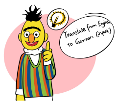

This line of research endeavors to enhance the organization of instructions to improve the performance of ICL (Dong et al., 2023b), which enables a language model to better understand and respond to the interaction messages. In accordance with Dong et al. (2023b), this primarily entails optimizing the subsequent factors:
(1) instance selection; (2) instance processing; and (3) instance combination.

Instance Selection. In order to find useful examples, various unsupervised prompt retrieval methods can be utilized, including distance metrics (Liu et al., 2022c), mutual information (Sorensen et al., 2022), and n-gram overlap (Agrawal et al., 2022), which have been discussed in Dong et al. (2023b). Additionally, Rubin et al. (2022) and Cheng et al. (2023a) utilize learned retrievers to identify the most relevant demonstrations to the input. Zhang et al. (2022g) select demonstrations using reinforcement learning. Li & Qiu (2023) propose InfoScore, a metric designed to evaluate the informativeness of examples, which facilitates example selection using feedback from language models. It employs an iterative diversity-guided search algorithm to improve and assess the examples. Most studies along this line build upon the premise that an increased relevance of demonstrations directly correlates with enhanced ICL performance (Liu et al., 2022c). However, Si et al.

(2022) find that using randomly sampled demonstrations leads to similar results with GPT-3 (Brown et al.,
2020) compared to in-distribution demonstrations. Li et al. (2022a) reveal that controllability and robustness in LLMs can be improved by incorporating counterfactual and irrelevant contexts during fine-tuning.

Instance Processing. The processing of context involves four main types: expansion, filtering, edit and formatting. For example, SuperICL (Xu et al., 2023b) expands in-context examples by incorporating labels, predicted by a small plug-in model, and their associated confidence scores to augment the context for large language models. Zhou et al. (2022f) employ LLMs for instruction generation, example generation, and filtering through a scoring model. Honovich et al. (2022b) generate task descriptions based on examples. GrIPS (Prasad et al., 2023) employs a gradient-free, edit-based approach to conduct instruction search
(processing). In particular, it follows an iterative process of modifying the base instruction at the phrase-level and subsequently evaluating the candidate instructions to identify the optimal one. ProQA (Zhong et al., 2022) uses a structured schema to format the context.

Instance Combination. The order and structure of demonstrations in a given context also play a crucial role (Liu et al., 2022c; Lu et al., 2022d; Ye et al., 2023; Dong et al., 2023b). For example, Liu et al. (2022c) and Lu et al. (2022d) sort examples in the context according to their distance and entropy metrics with the input, respectively, as mentioned in Dong et al. (2023b). Batch prompting (Cheng et al., 2023b) enables LLMs to perform inference on multiple samples in a batch, thus reducing token and time costs while maintaining the overall performance. Structured prompting (Hao et al., 2022a) involves encoding multiple groups of examples into multiple LM replica, which are then merged using rescaled attention. This process allows LMs to incorporate and contextualize 1000+ examples. ICIL (Ye et al., 2023) puts multiple task instructions composed of task definitions and groups of examples together in the context to improve LLMs' zero-shot task generalization performance.

Note that although the diverse approaches mentioned in this part are mainly designed for general-purpose in-context learning, they can be used as methods for interaction message communication. During the interaction with language models, determining the most appropriate way to organize context for interaction messages via elaborate prompt engineering is crucial for performance gain. For example, in the scope of KB-in-the-loop, Lazaridou et al. (2022), Izacard et al. (2022), and Ram et al. (2023) work on how to feed the retrieved knowledge into language models via ICL; in the scope of env-in-the-loop, Weir et al. (2022) demonstrate how to generate task instructions and enable cross-environment transfer to help agents generalize their execution.

### 4.2.2 Elicitive Prompting

Extending standard prompting, elicitive prompting improves the abilities of LLMs, such as reasoning and planning, by providing them with extra step-by-step guidance in context.

Few-Shot Demonstrations. Typical chain-of-thought (Wei et al., 2022b) uses few-shot examples with reasoning steps to elicit reasoning as shown below:
Question: If a rectangle has a width of 5 units and a length of 8 units, what is its perimeter?

Answer: The perimeter of a rectangle is the sum of the lengths of all its sides. In this case, the rectangle has two sides with a length of 5 units and two sides with a length of 8 units. Therefore, its perimeter is 2 x (5 + 8) = 26 units. Question: If I need to be at work by 9:00 am, and it takes me 20 minutes to drive there, what time should I leave my house?

Answer: [to be generated]
For example, Scratchpads (Nye et al., 2021) and CoT (Wei et al., 2022b) are two representative techniques for elicitive prompting. They explicitly describe the reasoning steps in the few-shot examples, significantly improving math reasoning abilities compared with standard prompting. Leastto-most prompting (Zhou et al., 2022a) aims to tackle complex tasks that CoT struggles with. It achieves this by decomposing a complex problem into smaller and more manageable ones with few-shot demonstrations. Other follow-up works focus on how to improve the robustness of CoT, such as majority voting on results (Wang et al., 2022f), perplexity check (Fu et al., 2022), or retrieving CoTs from pre-defined clusters (Zhang et al., 2022i).

Figure 14: Elicitive Prompting.

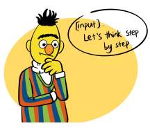

Other Forms of Instructions. According to recent studies, it may not be necessary to rely solely on human-written, step-by-step rationales for eliciting prompts, as other forms of instructions may be useful. For example, zero-shot CoT (Kojima et al., 2022) uses a simple phrase "*Let's think step by step.*" to induce the CoT-style reasoning in zero-shot settings:
Question: If I need to be at work by 9:00 am, and it takes me 20 minutes to drive there, what time should I leave my house?

Answer: Let's think step by step: [to be generated]
The format of answers (Marasović et al., 2021) and task descriptions (Mishra et al., 2022) have also been explored to serve as elicitive prompts. In addition to text-form CoT, Program-of-Thought (PoT) (Chen et al., 2022d), Program-aided Language Model (PAL) (Gao et al., 2022b), and ViperGPT (Suris et al., 2023) leverage program-form CoTs to obtain reliable reasoning performance in many tasks that programs can solve. PoT, PAL, and ViperGPT offer advantages over text-based CoT since they deliver verified, stepwise results by executing the programs. Vanilla CoT, on the other hand, cannot verify results. Furthermore, through specially-designed prompts (e.g., "*Search[query]*", "<API> Calculator(735 / 499) → *1.47 </API>*"), humans can unlock tool-using abilities of language models, such as web-searching (Schick et al., 2023; Yao et al., 2022b), calculators (Schick et al., 2023), physical simulation (Liu et al., 2022g), etc (c.f., §2.3). Note that in the scope of interactive natural language processing, elicitive prompting can be used to enhance reasoning and planning capabilities of language models during interactions with other objects (Yao et al., 2022b; Wu et al., 2021; 2022a; Yang et al., 2023b; Zhang et al., 2022i; Qiao et al., 2022). Furthermore, the idea of elicitive prompting is usually instantiated within the scope of model/tool-in-the-loop (§2.3), which will be discussed in detail in the next part (§4.2.3).

### 4.2.3 Prompt Chaining

An increasing number of studies are using multi-stage chainof-thought to improve multi-hop reasoning capabilities. In this approach, LMs are cascaded and can be prompted via different contexts, allowing for more complex reasoning. This is in contrast to typical elicitive prompting, which generally only performs one stage of chain-of-thought via In-Context Learning for reasoning. This approach is intuitive as it can aid in generating precise reasoning steps by conducting multiple model runs with different yet interdependent prompts (Qiao et al., 2022). In contrast, elicitive prompt relies on a single model run with only one context (Qiao et al., 2022).

Figure 15: Prompt Chaining.

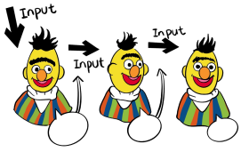

By decomposing the task and cascading language models for different reasoning steps or sub-tasks, prompt chaining can not only perform multi-hop reasoning (Dohan et al., 2022; Qiao et al., 2022), but also work well in pipelined tasks such as peer review writing (Wu et al., 2021) and advertisement generation (Wu et al., 2022a). Prompt chaining is one of the fundamental methods for model/tool-in-the-loop natural language processing (c.f., §2.3). LM Cascades (Dohan et al., 2022) has presented some works in this line, including sequential reasoning mechanisms (Nye et al., 2021; Wei et al., 2022b; Creswell et al., 2022), reasoning procedures with verifiers or tools (Cobbe et al., 2021; Nakano et al., 2021; Liu et al., 2022g), and multi-agent interacting questionanswering (Srivastava et al., 2022)
15. Qiao et al. (2022) investigated the enhancement of reasoning through language model prompting, focusing on strategy enhancement and knowledge enhancement. The study explored various aspects, such as prompt engineering, process optimization, external engines, and both implicit and explicit knowledge. However, to the best of our knowledge, no survey has systematically examined the structure of prompt chaining. Hence, in this part, we divide the prompt chaining schemes into four categories according to their topology, as shown in Figure 16. Furthermore, instead of fixed prompt chaining schemes, users can customize them (§4.2.3 Customization). And they can also be constructed automatically (§4.2.3 Automatization).

Sequential. The nodes are arranged in a straight line, where each node takes as input the specific outputs of the previous nodes, including the initial input query. For example, Self-Ask (Press et al., 2022) and Successive Prompting (Dua et al., 2022) construct the reasoning chain via sequential question generation (QG) and question answering (QA) nodes. Wang et al. (2022a) further enable smaller language models to construct the similar QG-QA chain via a learned context-aware prompter. Selection-Inference (Creswell et al., 2022) begins by utilizing the selection module to choose a group of relevant facts based on the given question. Subsequently, the inference module generates new facts by utilizing this subset of facts. Multimodal-CoT (Zhang et al., 2023d) addresses the visual reasoning problem through a two-step processing consisting of rationale generation and answer inference conditioned on the image, question, and the generated rationale. Mind's-Eye (Liu et al., 2022g) first generates the rendering codes for an intermediate environment simulator to get grounded

15https://github.com/google/BIG-bench/tree/main/bigbench/benchmark_tasks/twenty_questions

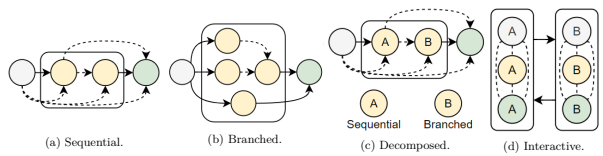

Figure 16: Examples of prompt chaining schemes. Gray, yellow, and green circles refer to input queries, intermediate reasoning steps, and final responses, respectively. Solid and dashed arrows represent indispensable and optional (i.e., none, single, or multiple) conditional probabilities (P(Y |X)), respectively. The rounded rectangle refers to a looping block.

rationales, and then generates the final answer based on the simulation results. Note that when the number of looping blocks becomes zero, it is reduced to standard prompting (§4.2.1). When the intermediate reasoning steps and the final answer are simultaneously prompted in a single model run, it is reduced to single-stage CoT (§4.2.2).

Branched. The nodes are arranged in a tree-like structure, where a node's output may serve as input to multiple other nodes, and a node's input may come from multiple other nodes' outputs. For example, Perez et al. (2020) decompose one multi-hop question into many single-hop sub-questions and then aggregates their answers to get the final answer. Wang et al. (2022f) first generate a range of reasoning paths through sampling from the language model's decoder and then aggregates the most consistent answer in the final answer set by computing the likelihood of the reasoning paths. Ask Me Anything (Arora et al., 2022b) first reformats the question into diverse possible ones with different in-context demonstrations, which are then answered respectively. Finally, the answers are aggregated into the final answer via a learned probabilistic graphical model. Tree of Thoughts (Yao et al., 2023) constructs the language model's reasoning chain in a tree form, enabling evaluation of states via heuristic approaches, and exploration of potential solutions via Breadth-first search (BFS) or Depth-first search (DFS), significantly improving the model's problem-solving capabilities. Liu et al. (2021b) have investigated multi-prompt learning, including prompt ensembling, prompt composition, and prompt decomposition, which can all be viewed as in this line.

Decomposed. The overall process is linear, but some nodes can be broken down further into nested or hierarchical chains recursively that follow any of the four schemes described. For example, Zhou et al. (2022a) first call an LM to reduce the problem into multiple sub-problems and then iteratively call the language model to solve these sub-problems step-by-step (i.e., the first node serves for problem reduction while the second node is another sequential chain). Decomposed Prompting (Khot et al., 2022) decomposes the question into a sequence of sub-questions, each being answered immediately after generation by utilizing another prompt chaining block or just standard prompting. This approach facilitates the hierarchical and recursive decomposition of tasks.

Interactive. The nodes are split into multiple groups, each with their own functions. These groups communicate with each other in an alternating fashion to construct a chain of interactions. For example, Socratic Models (Zeng et al., 2022a) and Inner Monologue (Huang et al., 2022c) partition the groups of nodes according to the modality. They utilize LLMs for planning and reasoning while making use of VLM for observation. *ChatGPT Asks, BLIP-2 Answers* (Zhu et al., 2023b) use ChatGPT to ask questions about an image, while BLIP-2 (Li et al., 2023d) is used to answer these questions. This communication through question-answering is performed interactively to generate the image captions. The visual reasoning path in
(Chen et al., 2023d) can be divided into two groups, one for answer and explanation generation, and another for explanation verification via a multimodal classifier. The frameworks of Cobbe et al. (2021); Weng et al.

(2022) can be viewed as interaction between the thought generation group and the thought verification group.

MindCraft (Bara et al., 2021) first assigns two agents with different skills (i.e., recipe knowledge) and then lets them interact through question-answering to accomplish the task in the *MineCraft* environment.

Customization. The prompt chaining scheme depends on several factors related to the nature of the problem, such as its complexity, structure, and the availability of relevant data. Hence, due to their diversity and variability, a fixed prompt chaining scheme may not satisfy the users' needs. An intuitive solution is to enable users to create or modify the prompt chaining scheme on their own accord, which can further enhance the debuggability and configurability of the system (Wu et al., 2021; 2022a). Generally, this feature is more important for pipelined tasks such as peer review writing, brainstorming, personalized flashcard creation, writing assistant, etc (Wu et al., 2021; 2022a). For example, AI Chains (Wu et al., 2021) defines a set of primitive operations such as classification, factual query, information extraction, split points, compose points, etc. These primitive operations are implemented with different instructions fed into the language model. An interactive interface then shows the prompt chaining schemes, which users can customize to construct a pipeline. PromptChainer (Wu et al., 2022a) also introduces an interactive interface that facilitates the visual programming of chains. It divides the nodes into three types: LLM nodes, such as generic LLM and LLM classifier; Helper nodes, such as model output evaluation, data processing, and generic JavaScript; and Communication nodes, such as data inputs, user actions, and API calls. The workflow defined by the graph of nodes is also transparent and configurable. It has been shown that this approach can assist users in building a satisfactory pipeline for applications such as music chatbots, advertisement generators, image query generators, and writing assistants (Wu et al., 2022a).

Automatization. The prompt chaining schemes can also be constructed automatically. For example, ReAct (Yao et al., 2022b) and MM-ReAct (Yang et al., 2023b) determine whether a thought should be generated or a tool should be called automatically based on the context. ToolFormer (Schick et al., 2023) can determine which tools to utilize or whether to use tools based on the context, as it is trained on tool-use prompted data.

### 4.3 Fine-Tuning

Fine-tuning refers to the process of updating the parameters of a model. The ongoing interaction provides an increasing amount of interaction messages that can be used to update the models' parameters, resulting in better language model adaptation to interactions like instruction following (Wei et al., 2021; Sanh et al., 2021; Aribandi et al., 2021; Xu et al., 2022a; Ouyang et al., 2022; Fu & Khot, 2022) and grounding (Xie et al., 2022; Sharma et al., 2021; Suglia et al., 2021; Pashevich et al., 2021). This line of research also explores how to make effective use of this new data without catastrophic forgetting (Gururangan et al., 2020; He et al., 2021a; Dhingra et al., 2022; Jang et al., 2021; Jin et al., 2021; Qin et al., 2022b), how to ensure generalization to new tasks (Wei et al., 2021; Sanh et al., 2021; Aribandi et al., 2021; Xu et al., 2022a; Ouyang et al., 2022; Fu & Khot, 2022), and how to adapt the language model more efficiently (Liu et al., 2021b; Ding et al., 2022; Li & Liang, 2021; Lester et al., 2021; Houlsby et al., 2019; Hu et al., 2022a). In this subsection, we discuss four commonly employed fine-tuning-based methods: (1) Supervised Instruction Tuning, which aims to adapt language models for instruction following and to enhance their task generalization abilities (§4.3.1); (2) Continual Learning, which aims to infuse new data into language models without catastrophic forgetting (§4.3.2); (3) Parameter-Efficient Fine-Tuning, which focuses on the efficient adaptation of language models (§4.3.3); and (4) Semi-Supervised Fine-Tuning, which further tackles the problem of unlabeled data, as in some cases, the interaction message may not provide adequate supervision to train the model (Li et al., 2023d; Taori et al., 2023; Zelikman et al., 2022; Ho et al., 2022; Huang et al., 2022a) (§4.3.4).

### 4.3.1 Supervised Instruction Tuning

Supervised instruction tuning involves fine-tuning a pre-trained language model using data that provides task instruction supervision. Various studies (Raffel et al., 2020; Aribandi et al., 2021; Xu et al., 2022a; Sanh et al., 2021; Xie et al., 2022; Li et al., 2022k; Weller et al., 2022; Ouyang et al., 2022; Wei et al., 2021; Chung et al., 2022; Longpre et al., 2023; Iyer et al., 2022; Glaese et al., 2022; Zhang et al., 2023c) have been conducted in this area. These methods fine-tune a pre-trained model by using supervised instructions on a multitask mixture, covering various tasks and inducing zero-shot generalization capabilities.

Figure 17: Supervised Instruction Tuning.

The first line of work, investigated by researchers such as Raffel et al. (2020); Aribandi et al. (2021); Xu et al. (2022a); Sanh et al. (2021); Wang et al. (2022i); Xie et al. (2022); Muennighoff et al. (2022); Li et al. (2022k); Weller et al. (2022); Wei et al. (2021), focuses on providing instructions to language models as part of the input. Typically, these instructions are prepended to the input and contain specific details about the task the model is expected to perform. These models explore different aspects, such as training and evaluation data, model architectures (decoder-only v.s. encoder-decoder), instruction formatting, task mixtures, and other related factors. The discussed studies offer conclusive evidence that fine-tuning language models on multiple NLP tasks and incorporating instructions allow these models to generalize to unseen tasks and better understand and respond to user queries (Fu & Khot, 2022). As demonstrated in Kaplan et al. (2020) and Wei et al. (2022a), scaling up language models leads to improvements in performance. The researchers also study the impact of different scales of instruction data, aiming to better understand the influence of the amount and diversity of this kind of training data (Zhang et al., 2023c). Subsequently, OpenAI releases the InstructGPT (Ouyang et al., 2022) and develops a series of GPT-3.5 variants, all of which are built upon the foundation of GPT-3 (Brown et al., 2020). These variants include code-davinci-002 and *text-davinci-002*, which only involve supervised instruction tuning, as well as textdavinci-003 and *gpt-3.5-turbo*, which are refined through both supervised fine-tuning and reinforcement learning from human feedback (RLHF). These modifications enhance the models' alignment with human intent, resulting in more truthful and less toxic responses from the language models. Along with this line, DeepMind's Sparrow (Glaese et al., 2022) and Anthropic's Claude16 also use instruction tuning and RLHF
to teach models to produce answers that align with human values (Liu, 2023). Furthermore, apart from scaling up the instructional fine-tuning process by increasing the number of tasks and the model size, Chung et al. (2022); Longpre et al. (2023) improve the process by jointly integrating chain-of-thought data during instruction tuning. They fine-tune the T5 (Raffel et al., 2020) and PaLM (Chowdhery et al., 2022) into FLAN-T5 and FLAN-PaLM models (Longpre et al., 2023), resulting in robust performance across a diverse range of natural language processing tasks, including translation, reasoning, and question answering.

Apart from supervised instruction fine-tuning using existing instruction datasets or human-annotated instruction datasets, recent studies have also highlighted semi-supervised approaches for creating instruction-following data generated by LLMs (Wang et al., 2022g; Taori et al., 2023; Xu et al., 2023a; Peng et al., 2023; Zhou et al., 2023b; Honovich et al., 2022a). This synthetic data can be utilized for fine-tuning PLMs (Taori et al., 2023; Xu et al., 2023a). We refer the readers to §4.3.4 for more information. Supervised instruction tuning can be regarded as one of the crucial steps in interactive natural language processing. By fine-tuning language models with supervised instructions, their ability to comprehend and respond to a diverse range of queries can be enhanced, enabling them to perform tasks such as questionanswering and task completion with greater precision and efficiency.

### 4.3.2 Continual Learning

LMs that have been pre-trained on static data may become outdated and no longer aligned with new domains or tasks (Schick et al., 2023; Qin et al., 2022b). Therefore, it is beneficial to utilize interaction messages accumulated over time to fine-tune LMs. This guarantees that the LMs are up-to-date with the newest information and perform optimally in novel scenarios (Dalvi et al., 2022). Although typical fine-tuning is an effective approach to updating an LM, it can suffer from catastrophic forgetting (Robins, 1995). As

16https://www.anthropic.com/index/introducing-claude
data size increases, attempting to incorporate new knowledge into a fixed-sized LM may result in losing previous knowledge. Continual Learning (CL) is a promising solution to this problem. It seeks to continuously integrate knowledge from novel sources without expunging prior learning (Wu et al., 2022b). First of all, we present a mathematical formalization of continual learning. Consider a language model that is presented with a sequence of n tasks (T1*, ..., T*n). For each task Tk, the model is provided with a set of N i.i.d. training examples
(xi, yi)
N
i=1. Assuming that the language model is parameterized by θ and is aware of the task identity during both training and inference, the overall learning objective across all tasks is:

$$\operatorname*{max}_{\theta}\sum_{k=1}^{n}\sum_{(x,y)\in T_{k}}\log p(y\mid x;\theta)$$

In the continual learning setting, it involves sequentially optimizing the loss for each task Tk via fine-tuning:

 $ \max_{\theta}\sum_{x,y\in T_{k}}\log p(y\mid x;\theta)$ for $ k$ in {1,...,n} (2)  ... 
$$(1)$$

Figure 18: Continual Learning.

Such a naïve continual fine-tuning may cause catastrophic forgetting, ultimately leading to a decline in overall performance on earlier tasks after the learning of new tasks (McCloskey & Cohen, 1989). In this part, we briefly introduce recent CL methods that aim to alleviate the forgetting phenomenon, which can be categorized into three groups: (1) Regularization, (2) Rehearsal, and (3) Modularization, following Delange et al. (2021); Biesialska et al. (2020). Regularization. Regularization has been widely adopted to inhibit catastrophic forgetting by penalizing the model when it deviates significantly from its previous state. This is typically accomplished by determining the essential parameters for the prior task and domain data, and subsequently integrating a regularization term into the loss function, which encourages the model to preserve this knowledge while learning new tasks (Delange et al., 2021). For example, Kirkpatrick et al. (2017) propose Elastic Weight Consolidation
(EWC), which involves measuring important parameters using a Fisher information matrix, derived from the magnitude of the gradient update step corresponding to each parameter. Following this work, Chen et al. (2020b) introduce a pre-training simulation mechanism that enables the memorization of knowledge for pre-training tasks, eliminating the requirement for pre-training data access. Li et al. (2022h) introduce a novel approach for continual learning in pre-trained models, which calibrates both the parameters and logits. This approach helps in retaining the acquired knowledge while also facilitating the learning of new concepts. As a concurrent work, Li et al. (2022b) propose to selectively memorize important parameters from previous tasks through a recall optimization mechanism facilitated by regularization, which is evaluated on interactive dialogue generation datasets. Rehearsal. A rehearsal-based approach to continual learning involves replaying previous task data or synthetic previous task data while learning new tasks. For example, He et al. (2021b) conduct preliminary experiments on interactive dialog models, assuming access to the pre-training corpus during fine-tuning. Throughout the training process, they mix random subsets of the pre-training corpus based on a mix-ratio that anneals towards the target task. ELLE (Qin et al., 2022b) employs a memory replay mechanism, where several data from previous tasks is mixed with current task data for tuning. Moreover, the synthetic previous task data generated by the old model can be utilized to train the new model as memory replay (Cappellazzo et al., 2022). Modularization. Modularization refers to separating model parameters into distinct modules or subnetworks, where each module is responsible for performing a specific task or set of tasks (Delange et al., 2021; Biesialska et al., 2020; Pfeiffer et al., 2023). The modularization can be achieved by adapter-based methods, which introduce new parameters corresponding to new tasks; Alternatively, it can be based on partial tuning, which freezes or prunes previous task parameters as discussed in Pfeiffer et al. (2023); Biesialska et al. (2020) and §4.3.3. For example, Lee et al. (2022a) propose a plug-and-play approach for incorporating the target knowledge into new parameters by applying multiple large-scale updates on plug-in modules, thereby avoiding the risk of forgetting the previously acquired source knowledge in old parameters. In SupSup (Wortsman et al., 2020), a network is first initialized as a base network, and task-specific sub-networks are separately learned for different tasks and acquired with a network-level mask. During testing, the task identity can be provided or inferred using gradient-based optimization, allowing the appropriate sub-network to be retrieved. Continual learning is crucial for interactive NLP, enabling the model to adapt to the dynamic and diverse nature of user inputs, tasks, and environments. Despite considerable efforts to address the issue of catastrophic forgetting, the problem persists, especially in large language models, as they impose substantial computational requirements. Additionally, various other questions, such as evaluation for CL and sample efficiency, remain unanswered. Researchers persistently strive to improve the efficiency and effectiveness of continual learning for NLP, and advancements in this field will significantly impact the future of interactive NLP systems.

### 4.3.3 Parameter-Efficient Fine-Tuning

Figure 19: Parameter-Efficient Fine-Tuning.

When the size of a pre-trained language model grows larger and larger, it becomes more and more difficult to fine-tune the model, especially when the size of interaction message data is limited. This is because very large models often require impractical amount of GPU memory to fine-tune, and over-fitting easily happens when the training data is limited. Thus, to avoid these issues, various parameterefficient tuning methods are proposed. Parameter-efficient fine-tuning, as its name suggests, only updates a small number of parameters compared to the number of parameters of the full model. By reducing the number of trainable parameters during fine-tuning, parameter-efficient fine-tuning methods consume much less GPU memory and substantially diminish the risk of overfitting. Therefore, parameter-efficient fine-tuning methods have become the de facto practice for fine-tuning LLMs. Parameter-efficient fine-tuning can be formalized as:

$\left(3\right)$. 

### Lθ0(H(Θ)(Lm(X; H(Θ))) (3)

where θ0 is the set of tunable parameters, h(θ) is the change of model parameters by introducing additional modules, pruning, and reparameterization (Ding et al., 2022). Following Delta-Tuning (Ding et al., 2022), parameter-efficient fine-tuning methods for iNLP can be divided into two main categories based on whether they introduce additional modules or parameters. The first category includes **partial fine-tuning** techniques, which select a small number of parameters of the pre-trained model during fine-tuning. In contrast, the second category of parameter-efficient fine-tuning methods keeps the model frozen and adds extra parameters that are updated during fine-tuning. These newly added and tuned modules are called adapters, belonging to adapter-based methods. Partial Fine-tuning. This fine-tuning method, also known as "specification-based tuning", updates only a strict subset of the model parameters while keeping the remaining parameters unchanged during finetuning (Ding et al., 2022). This approach does not add any new parameters to the model, meaning that the number of parameters remains the same (i.e., |h(θ)| = |θ|). Instead, the method specifies explicitly or implicitly which parts of the model's parameters should be optimized by indicating θ0 and |θ0| << |θ| (Ding et al., 2022). For example, we can choose a few layers to freeze and only update the remaining layers. Howard & Ruder (2018) initially freeze all layers except for the last layer, which contains less general knowledge, and then gradually unfreeze the remaining layers during the fine-tuning process. Moreover, BitFit (Zaken et al., 2022) optimizes only the bias terms of a pre-trained model, specifically the "query" and "middle-of-MLP" bias terms, resulting in a significant reduction in the number of tunable parameters while still maintaining high performance on several benchmarks. Diff pruning (Guo et al., 2021) involves learning a delta vector to be applied to the initial pre-trained model parameters. It uses a differentiable approximation of the L0 -norm penalty which facilitates the delta vector becoming more sparse, thereby resulting in a more parameter-efficient approach to fine-tuning. Similarly, Voita et al. (2019) encourage the model to prune less important attention heads through regularization, effectively reducing the number of attention heads that need to be fine-tuned. SupSup (Wortsman et al., 2020) selectively updates the critical weights of a PLM for specific tasks by learning a sub-network called supermask. It learns a superposition of supermasks with gradient-based optimization for an unseen task during inference.

Adapter-based Methods. Adapter tuning (Rebuffi et al., 2017) inserts small modules called *adapters* to a model: θ ( h(θ) and |h(θ)|−|θ| << |θ| (Ding et al., 2022). With adapters, we can completely freeze the model and only optimize the newly introduced adapters, i.e., θ0 = h(θ)−θ. Conventional adapters follow Houlsby et al.

(2019)'s practice of placing a two-layer feed-forward neural network with a bottleneck after each sub-layer within a Transformer layer, including both the multi-head attention sub-layer and the feed-forward network sub-layer. In addition, recent works have introduced many other parameterizations of adapters. The most representative ones include Prefix Tuning (Li & Liang, 2021), Prompt Tuning (Lester et al., 2021), LoRA (Hu et al., 2022a), and Compacter (Karimi Mahabadi et al., 2021). As pointed out by He et al. (2022), these approaches can be unified into a single framework, wherein a module is added as a residual to specific components of the original computational graph in the Transformer architecture. As a result, they can all essentially be considered as different variants of adapters. For example, Prefix Tuning (Li & Liang, 2021) introduces learnable tokens to the input, which are prepended to the keys and values of self-attention, with the model weights being frozen. LoRA (Hu et al., 2022a) introduces a module of low-rank trainable parameters, while the pre-trained model's weights keep frozen. In addition to low-rank approximation, Compacter (Karimi Mahabadi et al., 2021) also utilizes parameterized hypercomplex multiplications layers (Zhang et al., 2021). Compared to partial fine-tuning, adapter-based methods incorporate task-specific additional modules, offering increased flexibility, modularity, compositionality, and shareability (Pfeiffer et al., 2020; 2023). These features also allow adapters to function as a form of task representation. For example, recent works (Zhou et al., 2022e; Vu et al., 2022) show that the additional parameters introduced in adapter-based approaches reveal inter-task similarities and transferability between tasks. Specifically, Zhou et al. (2022e) show that intermediate task transferability can be effectively predicted by calculating the cosine similarity between adapter parameters for two tasks under the same backbone model.

Applications in iNLP. Parameter-efficient fine-tuning has been successfully applied in interactive NLP scenarios since it substantially reduces the parameters required for training and storage. For example, in the model-in-the-loop setting, BLIP-2 (Li et al., 2023d) uses prompt tuning-like method to implement vision model-language model interaction, where the interaction interface is learnable soft tokens which is mapped from the output of a vision model. In the KB-in-the-loop setting, K-Adapter (Wang et al., 2021b) uses trainable adapters to infuse knowledge retrieved from knowledge bases into pre-trained language models while keeping the model parameter frozen. ROME (Meng et al., 2022a) and MEMIT (Meng et al., 2022b) first locate the factual knowledge on some critical MLP layers of the language model via causal tracing. And then modify their weights to write memories into the model. Liang et al. (2022a) also investigate adapter tuning techniques to train a Transformer-based policy model through imitation learning for robotic manipulation (environment-in-the-loop). Additionally, parameter-efficient fine-tuning can be applied to improve the modularity of models, leading to better out-of-distribution generalization, knowledge composition, prevention of catastrophic interference, and continual learning (Pfeiffer et al., 2020; Qin et al., 2022b; Pfeiffer et al., 2023), which are beneficial for iNLP.

### 4.3.4 Semi-Supervised Fine-Tuning

According to Liang (2005); Chapelle et al. (2006); Zhou (2017), semi-supervised learning aims to use both labeled data and unlabeled data to train a model. Semi-supervised learning can be used for interactive natural language processing in that interaction messages are without sufficient supervision in some cases such as lack of instructions (Wang et al., 2022g; Taori et al., 2023), misaligned image-text signals (Li et al., 2022d), etc. We can formulate semi-supervised fine-tuning as follows:
Let Dl be the set of labeled data points, Du be the set of unlabeled data points, and D = Dl ∪ Du be the full dataset. Denote P(y | x; θ) as the language model with initial parameters θ0. The initial training of the model on the labeled data can be formalized as:

$$\theta_{1}=\operatorname{argmax}_{\theta}{\frac{1}{|D_{l}|}}\sum_{(x,y)\in D_{l}}\log P(y\mid x;\theta)$$

The model is then used to make predictions on the unlabeled data:

$$y_{u}=\operatorname{argmax}_{y}P\left(y\mid x_{u};\theta_{1}\right)$$
yu = argmaxy P (y | xu; θ1) (5)
$$\quad(4)$$

$\left(5\right)$. 
$\left(6\right)$. 

Figure 20: Semi-Supervised Fine-Tuning.

where yu can refer to both generated labels (for sample matching) or output distribution (for distribution matching) (Fu et al., 2023). The top s fraction of the most confident predictions (with high probability) is added to the labeled data set:

$$D_{l}^{\prime}=\{(x_{u},y_{u})\mid P\left(y_{u}\mid x_{u};\theta_{1}\right)>\mathrm{~threshold~}\}$$
D0l = {(xu, yu) | P (yu | xu; θ1) > threshold } (6)
which is finally used to train the model P(y | x) in turn (**self-training**) or another model P
0(y | x)
(semi-supervised knowledge distillation).

Self-Training. Self-Training uses the model-generated data to train the model itself, which is also known as bootstrapping. For example, BLIP (Li et al., 2022d) employs a captioner to generate novel captions derived from the given image, and utilizes a filter to eliminate noisy generations. Subsequently, the models are fine-tuned using the refined data obtained after filtering. Huang et al. (2022a) generate multiple reasoning paths with the help of a language model, and then majority voting (Wang et al., 2022f) is used to predict the most reliable answer. The reasoning paths with this answer are then used as synthetic training data for language model self-training. Zelikman et al. (2022) aim to train the language model to perform CoT reasoning in a semi-supervised setting, where the rationales are not always available. They first generate an intermediate rationale, and if it induces an incorrect answer, the model attempts to produce an inversely rationalized explanation. Subsequently, the model is fine-tuned using the question, the newly generated rationale, and the answer. Alpaca (Taori et al., 2023) uses a set of 175 seed tasks, each comprising a single instruction and a single example, to enable the large language model to generate additional instructions and examples through In-Context Learning for self-training. This technique is known as Self-Instruct (Wang et al., 2022g). TALM (Parisi et al., 2022) uses a self-play way to improve performance. It generates a tool input based on the task input, and then incorporates the output of the tool and the tool input to produce the final task output. These synthetic data generated through self-play are employed to iteratively fine-tune the language model. Semi-Supervised Knowledge Distillation. Similar to self-training, semi-supervised knowledge distillation also leverages a model to annotate unlabeled data for model tuning. However, instead of generating the synthetic data with the trainable model itself, semi-supervised knowledge distillation uses another teacher model for data generation, and the student model is trained with this new data. For example, Ho et al.

(2022) use large language models to generate chain-of-thought data, which is then used to fine-tune a smaller language model. Fu et al. (2023) first use a LLM to generate responses for unlabeled questions and then use its output distribution to train the smaller student language model for specialization. Shridhar et al.

(2022) propose a method to disassemble a LLM into two smaller models, namely a problem decomposer and a problem solver, using a distillation approach.

### 4.4 Active Learning

Figure 21: Active Learning.

Active learning (AL) is a machine learning approach where an algorithm selects a subset of unlabeled data points iteratively to be manually labeled by a human annotator or automatically labeled by an automated labeling system. The goal of this approach is twofold: (1) to obtain a larger and more desirable set of labeled data points that can be used to further train the model, and (2) to maximize the model's performance gain with minimal data expansion, thereby improving sample efficiency. The human annotator or automated labeling system is commonly referred to as the Oracle (O(·)), which is an (interactive) object or a function that can label the data points (Ren et al., 2021). While traditional AL research has primarily focused on finding an optimal query strategy (Q(·)) with humans as the oracle (Ren et al., 2021; Wang et al., 2021d), recent work has shown that other interactive objects such as LMs can also serve as oracles (Dossou et al., 2022). Furthermore, AL involves selecting data points from an unlabeled data pool, which can include sources such as the internet (Li et al., 2023a) and knowledge graph (Seo et al., 2021). The presence of interactive objects in the loop highlights the strong relationship between active learning and iNLP.

Formally, let Du be the unlabeled dataset. We aim to find the optimal subset Q(Du) ⊆ Du of samples to be labeled. Subsequently, when we construct a newly labeled set Dl = O(Q(Du)) or then add them to the existing labeled dataset, we aim to minimize the loss of the model P(y|x; θ) on the labeled dataset. This process is repeated iteratively. Thus, given an unlabeled data pool such as corpus, internet (Li et al., 2023a), and knowledge graph (Seo et al., 2021), the main effort on active learning is twofold: (1) find the optimal query strategy Q(·), and (2) choose a suitable **oracle** O(·). Query Strategy. Zhang et al. (2022h) summarize two major concerns of AL query strategy design: informativeness and representativeness. Informativeness-based query strategies aim to identify unlabeled data points that can provide the maximum amount of additional information when being labeled, with the objective of maximizing the information gained at each iteration. Common informativeness-based query strategies include uncertainty sampling-based strategies (Schröder et al., 2022), disagreement basedstrategies (Shelmanov et al., 2021), and performance based-strategies (Zhang & Plank, 2021; Shen et al., 2021). Representativeness-based query strategies aim to account for correlations among samples to avoid sampling bias and excessive weighting of outliers. Common representativeness-based query strategies include density based-strategies (Zhao et al., 2020b) and batch diversity based-strategies (Yu et al., 2022d). We refer the readers to Zhang et al. (2022h) for more details. Traditional AL query strategies rely on statistical metrics (Tong, 2000; Settles & Craven, 2008) that may lack representation richness compared to neural representations, particularly those based on PLMs. As such, there is a growing interest in exploring how to effectively leverage PLMs and LLMs in the design of AL query strategies. For example, several useful empirical conclusions on the combination of BERT (Devlin et al., 2018) and traditional AL query strategies are illustrated in Ein-Dor et al. (2020). Seo et al. (2022) propose a query strategy that is based on a task-independent triplet loss, which leverages task-related features provided by task classifiers and PLM- based knowledge features to enhance batch sample diversity. ALLSH (Zhang et al., 2022d) designs a query strategy that is guided by local sensitivity and hardness utilizing a PLM-based representation, in order to improve the performance of prompt-based few-shot fine-tuning on various NLP tasks. However, adapting PLM-based representations to AL query strategies poses several delicate challenges. For example, Schröder et al. (2022) point out that adapting state-of-the-art LLMs for query strategies can lead to prohibitive costs, even outweighing expected savings. They also conduct preliminary experiments that explore the combination of transformer-based models with several traditional uncertainty-based AL strategies. Margatina et al. (2022) suggest that a PLM-based representation that is fine-tuned using poor training strategies can be detrimental to AL performance. They highlight the significance of effectively adapting PLMs to the specific downstream tasks during the AL process. These challenges suggest that there is a vast research space for the NLP community to explore more efficient and effective AL query strategies. This effort may be in line with the roadmap of retriever methods (c.f., §2.2), incorporating metrics that are specific to active learning. For example, Zhang et al. (2022g) situate the RL-based retrieval method mentioned in §2.2 within the context of active learning (AL), with the "additional gain" upon acquiring a label for an example being the AL-specific metric.

Oracle. The oracle applied for labeling are usually humans in most previous NLP AL research (Zhang et al., 2022h; Wang et al., 2021d), including annotation of coreference resolution (Li et al., 2020a), word sense disambiguation (Zhu & Hovy, 2007), non-literal language identification (Birke & Sarkar, 2007), and especially small corpora construction with intensive professional knowledge or cost (Peshterliev et al., 2018; Quteineh et al., 2020; Grießhaber et al., 2020; Maekawa et al., 2022). PLM, as an alternative, has shown considerable potential in playing a role as an oracle for AL. For example, Yu et al. (2022e) propose to actively annotate highly uncertain samples with pseudo-labels generated by PLMs and use low uncertainty data points for self-training. Dossou et al. (2022) adopt PLM to generate new sentences to enrich the corpora of low-resourced African languages for pre-training a multilingual model. Wang et al. (2022g) formulate the data augmentation problem as a relabeling mechanism. They iteratively collect a batch of data points with removed instruction or input-output example for relabeling, and then leverage PLM and ICL to generate new instruction labels or input-output labels to train the model. Furthermore, to the best of our knowledge, despite the scarcity of related work, other interactive objects such as knowledge bases, tools, and environments may have the potential to serve as oracles for active learning. For example, as a special type of knowledge base, ontology may contain structured information that can facilitate labeling (Ye et al., 2022), making it a potential candidate to serve as an oracle. ReAct (Yao et al., 2022b) and PoT (Chen et al., 2022d) integrate web searching and code execution, respectively, into the answer generation process. During the AL process, we can intuitively leverage these tools to label data points. MineDojo (Fan et al., 2022) finds action guidance from an internet-scale knowledge base when faced with a difficult open-ended task (i.e., task without guidance label) in the *MineCraft* environment. NLMap-SayCan (Chen et al., 2022a) equips the LLM with an open-vocabulary and queryable scene representation which can actively propose involved objects and their locations in the environment to label incomplete and non-reifiable planning of the LLM. These work highlight the potential for using knowledge bases, tools, and environments for labeling.

### 4.5 Reinforcement Learning

Figure 22: Reinforcement Learning.

With the advent of reinforcement learning from environment feedback (RLEF) (Ahn et al., 2022; Chen et al., 2022a), human feedback (RLHF) (Christiano et al., 2017; Ouyang et al., 2022), and artificial intelligence feedback (RLAIF) (Bai et al., 2022b; Liu et al., 2022h), there has been a surge in reinforcement learning for natural language processing. In the context of Reinforcement Learning (RL), generated text or tool-use can be treated as an "action", while both surrounding text and non-text inputs can be viewed as "observations". The
"reward" for the language model mainly includes human preference feedback (Christiano et al., 2017; Ouyang et al., 2022) and affordance grounding feedback (Ahn et al., 2022; Chen et al., 2022a). Therefore, our survey focuses on examining the interaction of language models with environments and humans. We also refer the readers to Yang et al. (2023a) for more information. In the following part, we will provide a brief introduction to RL for iNLP, focusing on two aspects: (1) feedback loop, and (2) reward modeling.

### 4.5.1 Feedback Loop

There are two main approaches to build RL frameworks with language models: online reinforcement learning and offline reinforcement learning. In these approaches, language models serve as RL agents or policies.

As shown in Figure 23, online reinforcement learning involves updating models with real-time synchronous rewards during training (Carta et al., 2023; Yu et al., 2022c), whereas offline reinforcement learning leverages rewards derived from a static data source (Li et al., 2022e). The choice between online RL and offline RL depends primarily on practical scenarios. Generally, online RL is more suitable for LM-environment interaction as obtaining feedback from environments is a more automated process (Yang et al., 2023a). On the other hand, offline RL is more practical for LM-human interaction since human feedback may not always be readily available (Fernandes et al., 2023). Consequently, while there are studies on online RL for LM-human interaction (Wang et al., 2021d) and offline RL for LM-environment interaction (Yang et al., 2023a), our survey mainly focuses on online RL for LM-environment interaction and offline RL for LM-human interaction17.

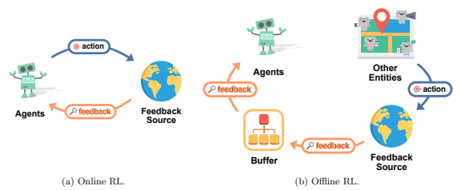

Figure 23: Online RL uses the actions of the training agent to generate feedback in real-time, or synchronously (Prudencio et al., 2023). This means that the agent interacts with the environment, takes actions, and immediately learns from the consequences of those actions. On the other hand, Offline RL, also known as batch RL, uses feedback from actions that were generated by other entities, not the training agent itself (Levine et al., 2020). This feedback is calculated and stored in a buffer, allowing the training agent to learn from it asynchronously.

Online RL. Online RL empowers language models to tackle specific tasks by learning from real-time feedback provided by external entities such as the environment or more intricate reward models (Carta et al., 2023; Fan et al., 2022; Huang et al., 2022c). This feedback, similar to other RL models, is typically used as rewards for the online RL models. Standard online RL allows language models to learn from immediate rewards after each step. These dense rewards are often scalar values (Carta et al., 2023) or boolean values (Huang et al., 2022c) derived from the agent's state, observation, and outputs. For example, in tasks that necessitate continuous movement and multiple actions, RL agents can learn from real-time feedback during the process. Abramson et al. (2022) sample multiple discrete time points during the agent's continuous movement and provides real-time binary feedback (positive or negative) based on the relative progress of the task. Moreover, in tasks with a long horizon, where each task involves multiple actions, sparse rewards can be employed to avoid the inefficiency of dense rewards. These rewards are given once per episode instead of after each step, as seen in studies like Ahn et al. (2022); Yao et al. (2022a); Yuan et al. (2023a). For large-scale, production-ready online services, language models can be trained with buffered feedback and re-deployed periodically to minimize learning costs (Bai et al., 2022a).

17For the counterpart, we refer readers to Wang et al. (2021d) and Yang et al. (2023a).
Offline RL. According to recent research (Ouyang et al., 2022; Li et al., 2022e), offline reinforcement learning agents can utilize PLMs as the policy and share the same reward mechanism as online reinforcement agents while using different learning procedures. Specifically, they asynchronously apply feedback by finetuning the PLM rather than updating it in real time. During such a procedure, offline reinforcement learning with language models can utilize several algorithms 18 to align language models with human preference.

These algorithms include Proximal Policy Optimization (PPO) (Schulman et al., 2017; Ouyang et al., 2022), Advantage Actor-Critic (A2C) (Mnih et al., 2016; Glaese et al., 2022), Implicit Language Q-Learning
(ILQL) (Snell et al., 2022), Trust Region Policy Optimization (TRPO) (Schulman et al., 2015), Natural Language Policy Optimization (NLPO) (Ramamurthy et al., 2023), among others. These RL methods usually introduce alignment costs, resulting in performance degradation for other tasks, known as alignment tax (Askell et al., 2021; Ouyang et al., 2022). To address this issue, Korbak et al. (2023) employ offline reinforcement learning during model pre-training, leading to better alignment while preserving superior performance. RAFT Dong et al. (2023a) demonstrates that employing early stopping can find a more favorable balance between text quality and preference reward. Another line of works focus on improving the optimization algorithms such as computational efficiency (Dong et al., 2023a), robustness (Yuan et al., 2023b), and training stability (Ramamurthy et al., 2023).

### 4.5.2 Reward Modeling

Reinforcement learning agents are trained using rewards that are computed based on feedback from external entities, which primarily include interactive environments, and humans. Various feedback sources and mechanism contribute to the development of distinct reward models.

RL from Environment Feedback. As discussed in §2.4, reinforcement learning from environment feedback (RLEF) facilitates affordance grounding of language models (Ahn et al., 2022). For tasks with clear and easy-to-compare evaluation metrics, such as shopping and object arrangement tasks (Yao et al., 2022a; Fan et al., 2022; Yu et al., 2022c), reinforcement learning agents can be optimized using absolute reward evaluated by corresponding environments and other evaluation models. Typically, reinforcement learning agents can be trained with binary reward functions, receiving positive reward if they conducted correct actions, and negative reward otherwise (Huang et al., 2023c; 2022c). Further, Goyal et al. (2021) involve evaluators that map visual environment and natural language descriptions to scale reward. Additionally, reinforcement learning agents can also receive rewards that are more complex and specifically handcrafted. For example, Yao et al. (2022a) involve a carefully-designed reward function that considers various attributes of the chosen product and text-based instruction-product similarity, thereby reducing the need for human-in-the-loop evaluation. For tasks where it's hard to build such efficient and sensitive evaluation metrics that maps agents' states and actions to absolute scores and establish totally-ordered relations among all actions, such as text generation tasks, reinforcement learning agents can be optimized using comparative reward, such as the relative relationship between generated actions, where the policy is rewarded whether the generated action is better than the previous one (Zhou et al., 2020b). In addition to considering the relative relationship between actions within the same state and input, reinforcement learning agents in long-horizon tasks can also be rewarded based on the relative progress made in reducing the distance between the current state and the target state (Yuan et al., 2023a).

RL from Human Feedback. Reinforcement Learning from Human Feedback (RLHF) is receiving increasing attention as a crucial post-training procedure for LLMs (Ouyang et al., 2022; Glaese et al., 2022; Fu & Khot, 2022; Fernandes et al., 2023). For general-purpose text generation tasks, which is an open-ended task without deterministic answers, reward models are often preferred than handcrafted reward functions due to their higher sensitivity and better performance (Fan et al., 2022; Li et al., 2022e; Mialon et al., 2023). Specifically, the reward models for offline RL are trained with a small set of human feedback that is cost-effective to gather, and subsequently are used to reward reinforcement learning agents (Bai et al., 2022b; Kiseleva et al., 2022). Similar to environment feedback, the reward mechanism of human feedback also varies among tasks. In embodied tasks, the reward model can observe the agent's history and provide

18Please note that these algorithms are not specific to offline RL but are frequently utilized in offline RL settings within the context of iNLP.
binary feedback (Abramson et al., 2022). In natural language generation tasks, reward models simulate human annotators to label outputs and provide numeric scores (Ouyang et al., 2022; Stiennon et al., 2020; Bai et al., 2022a). In more complicated tasks like reasoning tasks, reward models learn to follow specific rules and provide more complex and structural feedback (Glaese et al., 2022). Note that feedback isn't limited to simple binary or numeric forms. It can also be generated in natural languages. Language models can process this type of feedback, make adjustments, and ultimately produce corrected outputs (Chen et al., 2023a; Scheurer et al., 2023). Further, the use of a reward model trained on human preference data can also be considered as "RL from Model Feedback". For example, Bai et al. (2022b) propose "RL from AI Feedback"
(RLAIF), where agents can self-adjust their outputs by providing self-feedback and self-prompts, resulting in higher-quality outputs. These AI feedback mechanisms essentially provide indirect human feedback as they are trained on data annotated by humans.

### 4.6 Imitation Learning

Imitation learning enables an agent to learn a policy (Pomerleau, 1988; 1991; Ross et al., 2011) or a reward function (Ng et al., 2000) by mimicking an expert behavior represented by given demonstrations. In contrast to reinforcement learning, a primary advantage of imitation learning is that it does not depend on a manually designed reward function or a learned reward model, but solely relies on behavior demonstrations. Such an advantage becomes especially prominent when accessing an expert at a low cost is possible, leading to a scalable generalization to various fields such as autonomous driving (Bansal et al., 2018), computer control (Humphreys et al., 2022), game playing (Pomerleau, 1991; Silver et al., 2016; Baker et al., 2022), human–agent interaction (Team et al., 2021), robotic learning (Jang et al., 2022; Lynch et al., 2022; Karamcheti et al., 2023), skill acquisition (Zhang et al., 2018; Peng et al., 2020), and even surgery (Tanwani et al., 2020). It has also been applied widely to tasks in NLP, including paraphrase generation (Du & Ji, 2019), textual adversarial attack (Chen et al., 2021b), text editing (Agrawal & Carpuat, 2022; Shi et al., 2022a), and text generation (Hao et al., 2022b).

$$\left(7\right)$$

Figure 24: Imitation Learning.

In imitation learning, the goal is to learn a policy πθ parameterized by θ that mimics the behavior of an expert policy πE in a given task. The behavior of the expert policy is represented by a set of demonstrations D = {(s1, a1),(s2, a2), ...,(sT , aT )}, where st is the state at time step t and at is the action taken by the expert policy πE in that state. The objective of imitation learning is typically formulated as:

$$\operatorname*{max}_{\theta}\sum_{i=1}^{T}\log\pi_{\theta}\left(a_{i}\mid s_{i}\right)$$
log πθ (ai| si) (7)
Imitation learning for interactive natural language processing can be divided into offline and online imitation learning. Offline Imitation Learning. Demonstrations can be collected and stored offline as pairs of state observations and corresponding expert actions. Directly training models on such datasets in a supervised learning manner frames the basic type of imitation learning, namely behavior cloning (Pomerleau, 1988). Numerous supervised text generation approaches can be classified into this group by reformatting the autoregressive decoding into a Markov decision process at either token (Gu et al., 2019; Agrawal & Carpuat, 2022) or sequence (Shi et al., 2022a; Faltings et al., 2023) level. The learning process from the local expert's demonstrations can be considered an offline interaction. The expert policy is encoded in the data as an offline source to acquire the correct action given the current state. The model learns through offline interaction with the expert, and can later perform the task or behavior independently.

Online Imitation Learning. For some cases where the model can consult an expert, imitation learning can be conducted through an online interaction for additional supervision and evaluation. When incorporating online interaction or online imitation learning (Ross et al., 2011), the trained model can be updated on-the-fly using feedback from the expert, thus improving its performance over time. In particular, the expert response can be simulated by a separate system that knows the goal state, which proves beneficial in scenarios where accessing a human expert is infeasible or impractical (Faltings et al., 2023). This approach also provides the advantage of reinforcing or discouraging specific behaviors to aligning models with human expectations by adjusting the expert simulator. Imitation learning often suffers from exposure bias, leading to distribution shifts and error accumulation in sequential decision-making tasks (Ross et al., 2011), such as robotic control or text generation (Williams & Zipser, 1989). When the model is only exposed to the prior trajectories generated by the expert policy, it rarely experiences the state updated by the action of its own policy. This mismatch can lead to a distribution shift where the model may encounter states it has not seen during training, thus exacerbating error accumulation. To address exposure bias in imitation learning, researchers have proposed methods that alternate between the policy of the expert and that of the model being trained. Upon the model predicts actions, the expert provides feedback or corrections, allowing for fine-tuning (Ross et al., 2011). These approaches share the same principle with interactive natural language processing which involves both offline and online interaction. How to eliminate exposure bias in language generation, especially when the online interaction with experts is limited, remains an area of active exploration (Arora et al., 2022a). Furthermore, imitation learning has other limitations, including its reliance on the quality of expert demonstrations and the need for a large amount of demonstration data, impeding its broader application in interactive natural language processing.

### 4.7 Interaction Message Fusion

In this subsection, we strive to provide a comprehensive and unified framing of the interaction message fusion methods, including all the methods presented in this section. Note that this framing also systematically categorizes the knowledge integration methods as mentioned in §2.2. As illustrated in Figure 25, the interaction message fusion methods can be divided into three dimensions, each having three categories. Thus, we have a total of 3 * 3 * 3 = 27 clusters of ways to incorporate interaction messages into language models. The following will present the basic definition and examples for each dimension.

Along the data dimension. (1) "Metrics" refers to simple signals such as scalar rewards or ranking scores.

(2) "Constraint" means that the interaction message is in form of keywords, templates, skeletons, constrained vocabularies and the like for message formatting, conditioning, refinement as well as data augmentation, etc.

(3) "Freeform" involves providing an unconstrained and unstructured text as an interaction message. For example, 1. **Metrics**: Most reinforcement learning methods are related to this (§4.5) as they rely on reward signals. For instance, RLHF (Christiano et al., 2017; Ouyang et al., 2022) utilizes a feedback mechanism wherein the language model outputs are scored to indicate their quality and safety.

Several methods employ heuristics to filter interaction messages (Li et al., 2022d; Hu et al., 2021), which can also be considered related, since the boolean signals are leveraged.

2. **Constraint**: The constraint on the input end involves some conditional signals such as skeletons (Wu et al., 2018; Cai et al., 2019), and outlines (Yang et al., 2022b). For instance, Re3 (Yang et al., 2022b) generates an outline to condition long-text story generation. The constraint on the output end involves constrained decoding (Shin et al., 2021; Hokamp & Liu, 2017), output refinement via a verbalizer which transforms the output (Hu et al., 2021), etc.

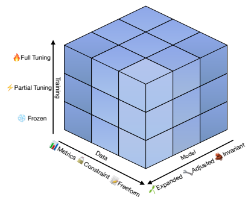

Figure 25: The three dimensions of interaction message fusion methods.

3. **Freeform**: Most of the methods deal with freeform data, as defined by its unstructured nature.

Along the model dimension. (1) "Model-Invariant" approach does not modify any part of the model architecture. (2) "Model-Adjusted" approach makes changes to the existing modules of the model architecture.

(3) "Model-Expanded" approach involves adding new modules to the model architecture. For example, 1. **Model-Invariant**: Prompting methods ( §4.2) belong to this line. Most of the tuning methods are also in this line of research. In most cases, the interaction message is concatenated or inserted to the input along sequence length dimension so that it is unnecessary to change the model architecture (Guu et al., 2020; Izacard et al., 2022; Paranjape et al., 2023; Xie et al., 2022). We can also only modify some critical mediating modules of the language model to incorporate knowledge (Meng et al., 2022a;b) with the model architecture unchanged.

2. **Model-Adjusted**: VaLM (Wang et al., 2022d) replaces one layer of self-attention block with crossattention block to fuse retrieved visual knowledge. K-BERT (Liu et al., 2019a) uses a superposition of text embedding and knowledge embedding (i.e., token embedding+soft-position embedding+segment embedding) and an attention mask matrix to fan in the knowledge.

3. **Model-Expanded**: K-Adapter (Wang et al., 2021b) adds additional adapters to the model for knowledge enhancement as mentioned in §4.3.3. Retro (Borgeaud et al., 2021) adds cross-attention modules to the model for retrieval augmentation. RelationLM (Liu et al., 2022e) uses an additional GRU function to fuse knowledge into the language model. KELM (Lu et al., 2021c) uses additional hierarchical knowledge enhancement module to incorporate heterogeneous information from knowledge graphs and text into PLMs. This module employs a relational Graph Neural Network (GNN) to dynamically representing inputted knowledge, an attention mechanism to resolve knowledge ambiguity, and a self-attention mechanism for further interactions between knowledge-enriched tokens.

Along the training dimension. (1) "Frozen" means that all the model parameters are fixed and cannot be tuned. (2) "Partial Tuning" means that only a part of the model parameters are tuned. (3) "Full Tuning" refers to updating all model parameters. For example, 1. **Frozen**: This category mainly involves prompting methods ( §4.2). Besides, some constrained decoding-based methods (Shin et al., 2021; Hokamp & Liu, 2017) also do not update model parameters.

Another example is KPT (Hu et al., 2021), which refines the output verbalizer using metrics that consider the frequency and relevance of knowledgeable words.

2. **Partial Tuning**: For those which introduce additional modules or leverage a strict subset of model parameters to fan in external information (Meng et al., 2022b;a; Wang et al., 2021b), partial tuning is a trivial way as mentioned in §4.3.3. For instance, K-Adapter (Wang et al., 2021b) only tunes the adapter modules with the main body of the language model frozen. SpoT's generic variant (Vu et al.,
2022) learns a source prompt on some source tasks with the language model frozen and then uses it to initialize another learnable soft prompt of the target task for knowledge transfer.

3. **Full Tuning**: Most methods require full tuning of the model parameters to integrate external information into the language model. For instance, ToolFormer (Schick et al., 2023) trains all the language model parameters on API call inserted corpus to enable the language model to use tools. Kepler (Wang et al., 2019) tunes all the model parameters with both knowledge embedding loss and masked language modeling loss. KnowBERT (Peters et al., 2019) embeds structured knowledge from multiple knowledge bases into PLMs. It uses a combined entity linker to obtain relevant entity embeddings and further enhances contextual word representations through word-to-entity attention, where the model parameters are also fully trained.

In summary, integrating external information into language models has emerged as a rapidly evolving research area in recent years, with numerous strategies available for its implementation. By breaking down the interaction message fusion methods into three dimensions along the data, model, and training dimensions, we provide a systematic categorization of the existing methods, which can help researchers and practitioners better understand and design new approaches. It is worth noting that these dimensions are not mutually exclusive, and different methods can combine different categories from each dimension. The selection of an appropriate category relies on the specific task, data, and resources, as well as the trade-off between performance and computational efficiency.

## 5 Evaluation

Evaluation is undoubtedly important in tracking the NLP progress (Sai et al., 2023), and even helps to outline future directions of NLP, e.g., Turing test (Elkins & Chun, 2020; Srivastava et al., 2022). Existing surveys have comparatively elaborated on both automatic evaluation and human evaluation methods from general
(Sai et al., 2023) to task-specific metrics, e.g., evaluating controllable text generation (Zhang et al., 2022a).

However, interactive NLP is slightly different from the general NLP tasks, as it devotes greater attention to the quality and effectiveness of model interactions with humans, environments, etc. In the interest of brevity and simplicity, this section will shed light on the relationship between iNLP and evaluation, yet does not retrace nor depict the historical evolution of general NLP evaluation. For further information, please refer to related NLP evaluation surveys (Khapra & Sai, 2021; Sai et al., 2023). Please note that our survey primarily focuses on generative natural language processing, i.e., natural language generation (NLG).

Interactive scenarios occur naturally in various general natural language generation (NLG) tasks, such as dialogue (Chen, 2022; Stoyanchev et al., 2022; Chen et al., 2020a) and question answering (Gordon et al., 2018; Yuan et al., 2019). However, a large number of existing NLG metrics mainly evaluate the non-interactive performance of an NLG model (Lee et al., 2022c), which ignores evaluating the interactive quality and effectiveness happening in the model inference stage. Specifically, these metrics focus on comparing the difference between the model completion with the pre-specified human reference to determine whether the performance is beyond previous models, such as Meteor (Banerjee & Lavie, 2005), Rouge (Lin, 2004), and CIDEr (Vedantam et al., 2015). While they are convenient and time-saving, the interaction quality may not be improved if the model only resorts to feedback from such evaluation metrics, resulting in it being hardly fit for usage in the real world. For example, BLEU (Papineni et al., 2002) is one of the most commonly used metrics for NLG systems. Instead of directly telling the generation quality of the system, it focuses on comparing the differences between the model output and reference by n-gram matching. In this case, a higher lexical similarity leads to a higher score. Thus, a sentence whose expression is not similar to the reference will get a low score, even if it meets the user's given preferences (Sellam et al., 2020). Although interaction evaluation is still in its fledgling stage, researchers are aware of such insufficiency in current NLG evaluation and are diverting their attention to the interaction performance of a NLG model. In this section, we make the attempt to summarize recent progress of interaction evaluation. We split interaction evaluation into four types according to the interactive objects.

### 5.1 Evaluating Human-In-The-Loop Interaction

Evaluating human-in-the-loop aims to evaluate the performance of human-system interaction, which can be divided into two technical routes: general and task-specific metrics.

General Metrics. These metrics are agnostic to specific tasks and primarily aim to evaluate the general performance of PLMs. The key challenge is to evaluate the alignment between the language model and humans, that is, whether the NLG model satisfies certain human preferences. To solve this problem, Ouyang et al. (2022) give a specific interpretation of this nebulous concept–a model is aligned if it is helpful (i.e., helps to solve the task), honest (i.e., ensures the authenticity of information), and harmless (i.e., conforms to ethics). In detail, they evaluate the helpfulness property by preference rating from human labelers, while the honesty property is automatically evaluated by a hallucination dataset and the TruthfulQA dataset (Lin et al., 2021). As for the harmlessness property, they use both Real Toxicity Prompts (Gehman et al., 2020) and CrowS-Pairs datasets (Nangia et al., 2020) to evaluate the bias and toxicity of the NLG model. To further expand the dimensions of interaction evaluation, HALIE (Lee et al., 2022c) proposes a human-language model interaction evaluation framework, which includes a user interface to facilitate the interaction between humans and language models. Based on this system, HALIE introduces metrics that expand the non-interaction evaluation in three dimensions: (1) **Targets**, evaluating extra interactive processes except model completions, such as user edits; (2) **Perspectives**, adding human evaluation involving users who come into direct interaction with PLMs; (3) **Criteria**, highlighting human preference when evaluating the model completions, e.g., enjoyment, and helpfulness. Comprehensive experiments in HALIE demonstrate a significant disparity between human evaluations conducted by third-party annotators and those provided by interactive system users. This disparity underscores the crucial need to investigate interaction-based evaluation methodologies.

Task-specific Metrics. Task-specific metrics are concerned with designing a customized interaction evaluation method for generation tasks, including task-specific feature measurement when evaluating humanmodel interaction. Such task-specific metrics are most commonly found in dialogue system (Liu et al., 2018), question answering (Wallace et al., 2019b), creative writing (Lee et al., 2022b), etc. For example, dialogue system is interested in assessing the quality of human-model interaction in specific conversation scenarios (Liu et al., 2018; Lu et al., 2019b) and evaluating the performance gain of adding human feedback in the model inference stage (Li et al., 2017). In particular, the metrics of task-oriented dialogue interaction evaluation largely consist of three items: (1) the success rate of tasks Testoni & Bernardi (2021), such as successfully booking flights or movies; (2) dialogue turn size (Lu et al., 2020), fewer numbers indicate that the dialogue agent is better at completing a task with less time cost; (3) the accuracy in the dialog state track (DST) (Henderson et al., 2014), i.e., determining if the key information is accurate throughout the conversation. Additionally, human experience and knowledge have also been employed in the evaluation of question-answering systems. For instance, Wallace et al. (2019b) involve human authors in the process to enhance the generator's ability to create a diverse set of adversarial questions. This approach enables a more comprehensive evaluation of the robustness of question-answering systems. As for creative writing, CoAuthor (Lee et al., 2022b) introduces a dataset capturing interactions between writers and LLM, and demonstrates its usefulness in exploring LLM's language, ideation, and collaboration capabilities for creative and argumentative writing. Despite the advancements made in Human-LM interaction evaluation metrics, the development of a comprehensive general benchmark remains largely unexplored (Wang et al., 2021d; Wu et al., 2022c). A unified benchmark and metric play a crucial role in evaluating models from an interactive perspective; however, designing and collecting such a benchmark pose significant challenges. One of the primary difficulties stems from the specificity of interaction evaluation, which necessitates detailed tracking and recording of the interactive process rather than merely collecting model completions. In addition, the interactive nature of human-in-the-loop evaluation can lead to data inconsistencies due to inherent individual diversity. This further complicates the task of constructing a general benchmark. Building such a benchmark necessitates careful consideration in terms of the user interface, means, and interaction process.

### 5.2 Evaluating Kb-In-The-Loop Interaction

Evaluation of KB-in-the-loop interaction naturally arises in knowledge-augmented NLG models as a means of assessing their ability to acquire knowledge for enhanced generation.

Knowledge Acquisition. As discussed in §2.2, knowledge acquisition can be achieved through retrieving from external knowledge sources (e.g., knowledge graph, database, and even web browsing). Therefore, these KB-in-the-loop methods based on knowledge retrieval are interested in evaluating the effectiveness and efficiency of the knowledge retrieval process. For example, REALM (Guu et al., 2020) conducts ablation experiments comparing different retrievers used for knowledge acquisition, using "top-5 recall" metrics. Atlas (Izacard et al., 2022) analyzes how the frequency of the text in the correct answer option appearing in retrieved passages is influenced by the number of retrieved passages. Such an evaluation is useful for analyzing and improving the intermediate component of KB-in-the-loop NLG systems.

Knowledge-Enhanced Generation. Another line of research focuses on evaluating the models' capabilities for knowledge-enhanced generation. The most common and important way lies in hallucination detection, which utilizes extra knowledge graphs or databases to detect factual errors (Ji et al., 2022). For example, Knowledge F1 (Shuster et al., 2021) measures the word overlap between the model's completion and the fact knowledge used to ground the dialogue. Several fact-checking benchmarks have been presented in recent years to facilitate this area. For example, BEGIN (Dziri et al., 2022) introduces three types of knowledge-grounded dialogue responses based on the evidence from Wikipedia. In this case, factual knowledge is in the form of paragraph-level text. In contrast, DialFact (Gupta et al., 2022) utilizes manually annotated instance-level knowledge snippets as evidence. The Attributable to Identified Sources (AIS) framework (Rashkin et al., 2021) assesses whether the statements produced by an NLG system can be attributed to a specific underlying source. Another type of evaluation method focuses on the comparison of the differences between humans and models when choosing to add additional knowledge. For example, WebGPT (Nakano et al., 2021) evaluates model completions by comparing them with human-written answers based on the same web-browsing environment to determine whether the model's retained knowledge is different from that of users. GopherCite (Menick et al., 2022) computes the ratio at which the model produces plausible and supported claims (i.e., evidence) in human evaluation.

### 5.3 Evaluating Model/Tool-In-The-Loop Interaction

As discussed in §2.3, model/tool-in-the-loop encompasses three types of operations: (1) thinking, (2) acting, and (3) collaborating. Thus, evaluating model/tool-in-the-loop interaction involves assessing the following aspects: (1) (multi-stage) chain-of-thought capability, (2) tool-use ability, and (3) collaborative behavior analysis.

Chain-of-Thought Capability. Chain-of-Thought (CoT) (Wei et al., 2022b) is regarded as one of the most crucial emergent abilities, which tends to become more pronounced as model size scales up (Kaplan et al., 2020; Wei et al., 2022a). It is frequently triggered by elicitive prompts (§4.2.2) and can be instantiated through prompt chaining (§4.2.3). Typically, CoT aims at improving models' multi-step reasoning abilities (Wei et al., 2022b; Qiao et al., 2022). Thus, some reasoning-intensive benchmarks such as GSM8K (Cobbe et al., 2021), DROP (Dua et al., 2019), and ScienceQA (Lu et al., 2022a), can be used to evaluate CoT capability. We refer the readers to Qiao et al. (2022) for a more comprehensive survey on the reasoning tasks. In our survey, we introduce additional perspectives focused on intermediate steps or reasoning trajectories for evaluating the CoT abilities. For example, we can assess the error propagation between reasoning steps. Dua et al.

(2022)'s successive prompting technique encounters three primary error sources: incorrect answer predictions, incorrect question decomposition, and out-of-scope reasoning types. By understanding and addressing these errors happened in the intermediate reasoning steps, we can develop more robust models that mitigate the impact of errors throughout the multi-step reasoning process. Another approach is to analyze the effects of varying the number of reasoning steps or the number of reasoning branches. For example, Zhou et al.

(2022a) conduct experiments to investigate the influences of different numbers of reasoning steps. Wang et al. (2022f) compare the influence of different numbers of sampled reasoning paths on performance.

Tool-Use Ability. Following Yang et al. (2023a) and Li et al. (2023e), evaluating the tool-use ability of language models involves examining: (1) **tool-use triggering**: whether the LM can determine when to use tools, (2) **tool-use accuracy**: whether the LM selects the correct tools to perform a specific task, (3) tool-use proficiency: whether the LM can effectively and efficiently use the tools for reasoning and decision making (Yao et al., 2022b). For example, Toolformer (Schick et al., 2023) evaluates tool-use triggering by calculating the API invoking rate, that is, how often the model requires the corresponding API to help with some text generation tasks such as machine translation, question answering, and mathematical calculation. ART (Paranjape et al., 2023) compares various strategies employed by language models to select prompts from a task library for correct tool-use prompting, which can also be viewed as a measurement of tool-use accuracy.

WebShop (Yao et al., 2022a) examines the success rate of language agents in utilizing web tools for shopping tasks, which serves as an indicator of the tool-use proficiency of language models. Since tool-use ability has been shown to be capable of enhancing the reasoning capability of language models in Tool-Augmented Learning settings (Qin et al., 2023), certain metrics used to evaluate CoT ability (§5.3) can also be employed to assess tool-use proficiency (Chen et al., 2022d; Cobbe et al., 2021; Yao et al., 2022b).

Collaborative Behavior Analysis. The analysis of collaborative behaviors of language model agents can be divided into **result-oriented analysis** and **process-oriented analysis**. Result-oriented analysis mainly focuses on the output or the final result of the collaboration. For example, MindCraft (Bara et al.,
2021) measures whether a task can be solved through collaboration between two language model agents.

Socratic Models (Zeng et al., 2022a) evaluates the success rate of tasks that are solved through closed-loop interaction involving a large language model, a vision-language model, and an audio-language model. BIG- bench (Srivastava et al., 2022) has incorporated several tasks for evaluating Theory of Mind (ToM) abilities. Furthermore, Kosinski (2023) demonstrates that ChatGPT has achieved a performance level comparable to that of nine-year-old children on certain ToM tasks. Process-oriented analysis is more concerned with the dynamics of the collaboration itself. For example, MindCraft (Bara et al., 2021) also assesses the communication efficiency by measuring the number of dialogue exchanges required to accomplish a task.

### 5.4 Evaluating Environment-In-The-Loop Interaction

Since the objective of environment-in-the-loop NLP primarily focuses on utilizing language model agents for embodied tasks, which significantly differ from typical text generation tasks, the evaluation of LM-Env interaction may require a distinct paradigm. Generally, the research in this field primarily focuses on two main aspects: (1) constructing embodied task platforms, and (2) determining the appropriate evaluation metrics. We also refer the readers to §6.3 and §6.4 for more information.

Embodied Task Platforms. To name a few, *EvalAI* (Yadav et al., 2019) provides an open-source platform for evaluating models and agents, which involves tasks of visual question answering, visual dialog, and embodied question answering (Das et al., 2018). *SAPIEN* (Xiang et al., 2020) introduces a simulated household environment specifically designed to simulate daily objects and their interactions within a household setting. Similarly, *Alexa Arena* (Gao et al., 2023b) introduces a user-centric simulation platform for Embodied AI models and presents an instruction-following benchmark based on human-agent dialogue. Shridhar et al.

(2020) build a benchmark, *ALFRED*, to evaluate the ability of agents to transform visual observations and textual instructions into action sequences for everyday tasks. Building upon this setup, Akula et al. (2022) introduce a new test set called *ALFRED-L*. This test set is created by modifying instructions from examples in the *ALFRED* validation splits. The modifications involve eliminating the need for actions manipulating objects and incorporating directives to approach more objects. Furthermore, Shridhar et al. (2021) extend both TextWorld (Côté et al., 2019) and *ALFRED* platforms to create *ALFWorld*. This novel platform establishes a connection between textual descriptions and commands, and the physical simulation of embodied robots, offering an enhanced alignment between them. Lastly, Bara et al. (2021) explore collaborative situations where agents are placed in interactive scenarios. They aim to model the mental states of participants in these collaborative interactions. To facilitate this research, they introduce *MindCraft*, a fine-grained dataset that includes the beliefs of partners when collaborating on tasks within the virtual world of *Minecraft*, a 3D environment consisting of blocks. We refer the readers to Yang et al. (2023a) for more examples.

Evaluation Metrics. To name a few, the mission success rate and the average number of robot actions are both metrics that can be utilized to assess the model's capabilities in terms of interacting with the environment (Gao et al., 2023b). The mission success rate measures the model's effectiveness by computing the average proportion of missions in which all the goal conditions are met, indicating successful completion of the mission. While the average action number examines the model's efficiency by recording the average number of actions performed by the robot for each task. Ahn et al. (2022) employ the plan success rate and the execution success rate to evaluate the performance and effectiveness of the system. The plan success rate measures the system's ability to generate appropriate plans for given instructions, while the execution success rate assesses the system's capability to successfully execute those plans and accomplish the specified tasks. Huang et al. (2023c) report the text instruction generation speed in the inference stage (referred to as "token count" in the paper) to evaluate the efficiency of the involved large language model.

## 6 Application

### 6.1 Controllable Text Generation

The Controllable Text Generation (CTG) technique is an NLP approach that empowers language models to generate text that is not only coherent and meaningful but also allows users to control particular aspects of the output. The need for CTG arises from the desire to customize generated text according to user-defined constraints, such as length constraint (Li et al., 2022g; Zhou et al., 2023b), inclusion of particular keywords (Hokamp & Liu, 2017; Carlsson et al., 2022), and adherence to a specific sentiment or style (Dathathri et al., 2019; Qian et al., 2022). Conventional CTG methods typically involve training models with explicit objectives that optimize for the control attributes (Hu et al., 2017; Li et al., 2022g; Keskar et al., 2019; Lu et al., 2022b; Clive et al., 2021; Zhou et al., 2023b), constrained decoding (Hokamp & Liu, 2017; Anderson et al., 2017; Post & Vilar, 2018; Lu et al., 2021b; 2022c; Qin et al., 2022a; Kumar et al., 2022), and prompting (Zou et al., 2021). We refer the readers to Zhang et al. (2022b) and Weng (2021) for more information. In this section, we briefly discuss the potential applications of iNLP in CTG. Interacting with humans can enhance controllability in CTG by enabling users to directly provide their preferences and constraints during the generation or training process. AI Chains (Wu et al., 2021), for example, allows users to chain together LLM steps and modify them in a modular way, improving transparency, controllability, and collaboration. Lee et al. (2022c) suggest the importance of controlling the intermediate generation process rather than just the final output, and highlight the need to consider more control attributes related to first-person subjective experience and user preferences. Christiano et al. (2017); Lu et al. (2022b); Ouyang et al. (2022); Fu & Khot (2022) imply the use of RL or RLHF for controlled text generation, which enables not only control over helpfulness, harmlessness, and honesty, but also allows potential optimization to meet length constraints and other criteria.

Interacting with knowledge bases can potentially enhance the robustness and factuality of CTG, as suggested by Li et al. (2022a), who propose Knowledge-Aware Fine-Tuning (KAFT) to improve the controllability of language models while maintaining their robustness. KAFT fine-tunes LMs using a combination of the vanilla supervised dataset and augmented data, which includes instances with counterfactual contexts
(i.e., contexts that contradict the model's memorized knowledge) and irrelevant contexts (i.e., contexts that are unrelated to the task). Interacting with models and tools may have the potential for more complex and fine-grained control over text generation. For example, classifier-guided CTG approaches put a classifier in the loop to provide control signals or feedback (Dathathri et al., 2019; Li et al., 2022g). Similar to Diffusion-LM (Li et al., 2022g) which iteratively denoises the text with the control feedback from a classifier at each iteration, Self-Refine (Madaan et al., 2023) lets a LLM generate an output and then provide multi-aspect feedback on it. This feedback is used to iteratively refine the output until it reaches a satisfactory quality or a specific criteria. Notably, typical classifier-guided CTG relies on external classifiers, while Self-Refine employs the LLM itself as a classifier through self-interaction. Interacting with environments inherently requires great controllability due to the essential need for affordance grounding, as discussed in §2.4. SayCan (Ahn et al., 2022), as a representative example, leverages a scoring mechanism over action candidates to achieve such controllability. Overall, various interactive objects may offer different avenues for optimizing CTG systems. By harnessing the power of interaction, we can achieve more user-oriented, robust, fine-grained, complex, and even realityoriented control over text generation.

### 6.2 Writing Assistant

Intelligent and interactive writing assistants constitute a rapidly growing area of research that explores the potential of AI-powered tools to modify, enrich, and even co-create content with humans. These assistants can be broadly categorized into four types based on their level of involvement in the content generation process: (1) Content Supporting, (2) Content Checking and Polishing, (3) Content Enrichment, and (4) Content Co-creation.

Content Support. Content supporting writing assistants do not generate content for use, but just provide functional assistance for writers such as on-the-fly summarization (Dang et al., 2022) and real-time visualization (Singh et al., 2022b). For example, Arnold et al. (2021) propose an interaction scheme where human writers are provided with questions for inspiration instead of content snippets for use. Dang et al.

(2022) propose a writing assistant that continuously updates summaries, keywords, and central sentences of existing content for user reference, rather than generating content directly. Singh et al. (2022b) design a writing assistant offering visual and aural suggestions as writing supports. Although content supporting writing assistants provide minimal aids for human writers, they benefit from avoiding the dominance over the writing process in some cases, which is one of the main challenges of PLM-based writing assistants (Arnold et al., 2021; Jakesch et al., 2023). Moreover, writing support may reduce the manual effort to trigger or manipulate the writing assistant such as heavy prompt engineering (Dang et al., 2023). Specifically, Dang et al. (2023) indicate that manual effort is required for non-diegetic prompting, and thereby humans tend to prefer selecting suggestions from writing assistants over controlling aotomatic content generation through non-diegetic prompts. Jakesch et al. (2023) point out that human writers' content creation can even be affected by opinionated PLM-powered writing assistants. These challenges can be mitigated by reducing the level of involvement of writing assistants to content supporting.

Content Checking and Polishing. The processing procedure for content checking and polishing typically involves taking manually written sentences as input and producing output that has been grammar-checked and rephrased, allowing users to interactively and iteratively improve their writing. Famous real-world products include QuillBot19, Effidit (Shi et al., 2022b)
20, Pitaya21, Grammarly22, and Xiezuocat23. There is also growing interest in incorporating iterative editing operations into writing assistants (Kim et al., 2022; Du et al., 2022a;b), which can be considered an application of editing-based iNLP ( §3.3). For example, Kim et al.

(2022) suggest incorporating transfer learning from other text editing tasks to improve the quality of iterative text revision by linking editing actions to content quality. Du et al. (2022a) raise a novel human-in-the-loop iterative text revision system that combines model-generated revisions with human judgments and specifically fine-tuning a PEGASUS model (Zhang et al., 2020a) as a revision generation model with which a revised sentence is generated based on a given sentence and an edit intention.

19https://quillbot.com/
20https://effidit.qq.com/en 21https://www.facebook.com/Mypitaya/ 22https://www.grammarly.com/ 23https://xiezuocat.com/
Content Enrichment. Content enrichment, unlike content checking and polishing, involves more creative content generation but still relies on manually provided context or configuration. Classic content enrichment features include text completion (**AutoCompletion**) (Van et al., 2020; Sun et al., 2021a; Li et al., 2021a; Casacuberta et al., 2022), and keywords-to-sentence (K2S) (Miao et al., 2019; Sha, 2020; Nie et al., 2022; Zheng et al., 2022). Note that both AutoCompletion and K2S simply supplement manual input, rather than co-creating new content from scratch through manual collaboration or guidance. AutoCompletion is an interactive writing assistant feature that involves humans in the content generation process by providing suggestions to complete their prompts, thereby enhancing their overall writing experience. For example, Sun et al. (2021a) propose an Intent-Guided Authoring (IGA) Assistant, which follows fine-grained author specifications to process the input text for AutoCompletion. The scheme proposed in IGA is similar to the recent trend of instruction tuning ( §4.3.1), which suggests that more complex and controllable user preferences in writing assistants can be formatted as instructions to further activate instruction-tuned LLMs. AutoCompletion can also be adapted to various NLP downstream tasks, including medical text simplification (Van et al., 2020), human-computer collaborative translation (Li et al., 2021a), and interactive word completion of morphologically complex low-resource language (Lane & Bird, 2020). Moreover, K2S is highly in line with controllable text generation (c.f. §6.1), but places a greater emphasis on controllable interactivity. Practical K2S applications typically allow users to customize the fine-grained control attributes according to their specific needs and preferences in an interactive manner. For example, CueBot (H. Kumar et al., 2022) proposes a conversational assistant capable of generating responses that can be controlled by users using cues/keywords. It suggests responses for users to choose from and incorporates a keyword loss during training to generate lexically constrained outputs. Content Co-creation. Content co-creation refers to the collaborative process between humans and AI systems to generate new content from scratch, rather than simply improving existing content. Content co-creation is widely explored in interactive fiction writing (Manjavacas et al., 2017; Tapscott et al., 2018), screenplays and theatre scripts writing (Mirowski et al., 2022), academic writing (Fok & Weld), and poem writing (Astigarraga et al., 2017; Oliveira et al., 2017; Hämäläinen, 2018). For example, Tapscott et al.

(2018) models story generation as simulating role-play games and tracing player interaction sequences. Yang et al. (2022a) develop DOC, which includes a detailed outline generator and a detailed controller, significantly improves the coherence of long story generation. Chakrabarty et al. (2022) proposes *CoPoet*, an interactive poem writing assistant powered by instruction prompts and LLM, and verify that co-created poems are usually preferred compared to those written without *CoPoet* involved. Dramatron (Mirowski et al., 2022)
adapts hierarchically controlled PLMs to allow expert writers to control style tags, logic lines, character descriptions, and environment descriptions. This enables writers to easily generate the necessary material for various use cases. However, while practical writing assistants for content checking, polishing, and enriching have become increasingly mature, content co-creation writing assistants still face various challenges that need to be addressed. For example, Ippolito et al. (2022) point out that current NLG techniques for story generation often exhibit poor performance in maintaining the author's voice and the coherence of the storyline.

Wu et al. (2021); Yuan et al. (2022); Chen et al. (2022b) demonstrate that there is often a trade-off between controllability and creativity in the generated content. Moreover, the evaluation of content co-creation-based writing assistants can also be particularly challenging due to the subjective nature of creative writing. Despite various efforts to construct reliable benchmarks for evaluation (Lee et al., 2022b; Zhou et al., 2022b; Shen & Wu, 2023), Mirowski et al. (2022); Ippolito et al. (2022) suggest that professional writers have become increasingly important for evaluation compared to crowd-sourcing annotators due to the ever-improved quality of artificial intelligence generated content (AIGC).

### 6.3 Embodied Ai

Embodied AI enables language models to impact the real-world and virtual environments through which agents observe and update states of themselves and their surroundings. One method for bridging language models with the physical world is interaction with grounded language as mentioned in §2.4, which allows language models to see, listen, and control external objects. Observation and Manipulation are fundamental to many embodied tasks, where agents acquire external states and perform actions to update those states. Thanks to text descriptions and textual controlling interfaces, language models usually observe their surrounding environment through input text and operate on objects by sending textual commands. For instance, a visual perception mapper converts visual input to text in natural language (Zhao et al., 2023b). Additionally, human intervention can be part of agent observation, so that agents can be guided by real-time human feedback (Lynch et al., 2022). Typical observation and operation tasks include object rearrangements (Huang et al., 2022c), tool usage (Paranjape et al., 2023), item creation and modification (Jiang et al., 2021; Elgohary et al., 2021), and other robotic controlling tasks. Navigation and Exploration enable agents to move around and study their surrounding environment by using dynamic observation and manipulation. That is, unlike observation and manipulation tasks, navigation and exploration tasks allow agents to move within the environment to adjust their observation and manipulation. These agents not only plan routes and actions, but also combine observations collected from different locations to make decisions, answer questions and reason, allowing them to accomplish complicated tasks that require multi-location multi-object observation and long-horizon manipulation. Text commands in both natural languages and programming languages (Huang et al., 2023a) bridge the gap between language model agents and available actions and tools. During such process, these agents also combine different data sources, including cameras, microphones, other sensors (Gan et al., 2020), and textual commands from human controllers (Sharma et al., 2022; Gao et al., 2022c). Moreover, agents can also work as assistants to guide human operations. For instance, an interactive driving assistant can continuously observe the driving environment and guide human drivers to handle various situations (Ma et al., 2022). Multi-Role Tasks require agents to cooperate and compete with humans and other agents to reach specific goals. Unlike agents with multiple skills, agents with social capabilities usually observe others' behaviors and communicate through textual messages, including messages in natural languages and data in more structured styles. Typical social tasks include multi-player gaming (Suh et al., 2021; Lai et al., 2022), human-AI collaboration (Krishnaswamy & Alalyani, 2021; Puig et al., 2020), multi-agent collaboration (Patel et al., 2021b), and other communication tasks, such as interview (Xiao et al., 2020), negotiation (Verma et al., 2022), recruitment (Nawaz & Gomes, 2019), and opinion gathering (Bittner et al., 2019). In text-based gaming tasks, agents learn from human behaviors and play as human players (Xu et al., 2022d). In multi-agent environments, agents coordinate with each other to accomplish complex tasks that cannot be accomplished by any single agent (Bara et al., 2021). Agents also act as human delegates and communicate with others to complete day-to-day tasks, such as restaurant reservations and appointment scheduling (O'Leary, 2019). MetaAI's Cicero (, FAIR) enables language model agents to play in an online Diplomacy league.

### 6.4 Text Game

Text games, also referred to as interactive fiction games (Osborne et al., 2022), are capable of understanding player commands, simulating player states, and updating the current status of game environments (Osborne et al., 2022). Language models have shown great potential in these game-playing scenarios (Meta et al., 2022; Kramár et al., 2022; Fan et al., 2022; Yuan et al., 2023a), which are a specific type of Embodied AI (c.f., §6.3). Specifically, language models can be used to play or power text games through text-based interfaces, such as state descriptions (Sironi & Winands, 2021), commands (Tennenholtz & Mannor, 2019; Ammanabrolu & Hausknecht, 2020; Zhang et al., 2022f), situated dialogue (Bara et al., 2021), and multi-party dialogue (Park et al., 2023). Thus, text games are intrinsic applications of iNLP, in which the environment or other agents are involved in the game-playing loop. We can divide text games into two distinct categories: (1) text-only games which rely solely on text, and (2) text-aided games which use text as a supplement to other forms of media, such as graphics or audio. In this subsection, we will begin by discussing interactive text game platforms. We will then provide a brief overview of how language models are utilized to play text-only games and to power text-aided games. Interactive Text Game Platforms. Interactive Text Game Platforms provide a framework and engine for building and running text-based games, often including features such as game state tracking, parser-based natural language understanding, and scripted events. Some examples of such platforms are:
(1) **Text Adventure Games** are games that allow players to interact with adventurous worlds solely through textual descriptions and actions (Ammanabrolu et al., 2019). Osborne et al. (2022) summarize two major text adventure game platforms: *TextWorld* (Côté et al., 2019) and *Jericho* (Hausknecht et al., 2020). Additionally, they define seven major challenges that need to be addressed in developing solutions for Text Adventure Games, including partial observability, large state space, and long-term credit assignment, among others.

(2) **Social Deduction Games** are games where players attempt to discover each other's hidden role or team allegiance through strategic conversations, logical deduction, and deceitful actions24. For example, classic examples of social deduction games include Werewolf 25,Mush26, *SS13* 27, and *Among Us*28. Specifically, Lai et al. (2022) propose a multimodal dataset containing text and visual signals to model persuasion behaviors in *Werewolf*. Lin et al. (2020) is another *Werewolf* -based corpus with self-revealing and role-estimation behavior annotation. Tuin & Rooijackers (2021) construct a corpus aimed at player role detection, based on the game *Among Us*, and verify that it is a challenging yet learnable task.

(3) **Strategic Games** are games that heavily rely on player decision-making skills and situational awareness to determine the outcome29. For example, *Diplomacy*30 is a strategic board game that involves multiple players who each assume control of the armed forces of a European power. The objective of the game is to move one's units skillfully and defeat those of opponents in order to gain possession of a majority of strategically important cities and provinces referred to as "supply centers." The contested nature of this gameplay often requires players to engage in extensive and complex interactions and diplomacy with each other in order to achieve their goals. *Diplomacy* is gaining increasing attention and is widely regarded as a benchmark for autonomous agents' ability to communicate and adjust strategies like humans, which is one of the essential elements for the success of human civilization (Kramár et al., 2022). Cicero (Meta et al., 2022) proposes an impressive autonomous agent that combines PLM with RL and achieves human-level performance in *Diplomacy*. Moreover, Kramár et al. (2022) make preliminary investigations on how negotiation algorithms and the inclination to punish traitors can enable autonomous agents to communicate like humans and cooperate more effectively in *Diplomacy*. Apart from Diplomacy, there are numerous classic strategic games that serve as potential resources for interactive text game platforms and related NLP research, such as Eurogame 31, *Warhammer Fantacy* 32, and *Paths of Glory* 33. (4) **Tabletop role-playing games (TRPGs)**34, such as *Dungeons and Dragons (DND)*35 and *Call of* Cthulhu (COC)36, as well as works of fiction, such as the *Harry Potter series* (Chen et al., 2022c), have provided a rich source of situated and multi-party dialogue data that can be used to build challenging text game platforms (Callison-Burch et al., 2022; Rameshkumar & Bailey, 2020; Zhou et al., 2022b; Peiris & de Silva, 2022). However, the raw dialogue data documenting the game process of TRPGs is usually a mixture of in-character action descriptions and out-of-character strategy explanations (Callison-Burch et al., 2022), frequently accompanied by lengthy world-building documents (Zhu et al., 2023a), which can differ from one game to another. The problem of extracting the golden-standard game states and game commands remains a challenging yet fascinating question (Zhu et al., 2023a). For example, Rameshkumar & Bailey (2020) provide 34,243 summary dialogue fragment pairs from raw dialogue data documenting the DND game process. The summaries in these summary-dialogue chunk pairs contain text descriptions of game states, which can serve as a good benchmark for abstractive game-state summarization of interactive text games. Callison-Burch et al. (2022) frame DND as a dialogue system challenge, comprising both deterministic elements like dice rolls and imprecise descriptions of the game-play as partial state information. Zhou et al. (2022b) introduce a novel and highly interactive task, G4C (Goal-driven Guidance Generation in Grounded Communication), based on DND. They train an autonomous agent acting as a game host, also known as a *Dungeon Master*

24https://en.wikipedia.org/wiki/Social_deduction_game 25https://en.wikipedia.org/wiki/Mafia_(party_game)
26https://en.wikipedia.org/wiki/Mush_(video_game)
27https://en.wikipedia.org/wiki/Space_Station_13 28https://en.wikipedia.org/wiki/Among_Us 29https://en.wikipedia.org/wiki/Strategy_game 30https://en.wikipedia.org/wiki/Diplomacy_(game)
31https://en.wikipedia.org/wiki/Eurogame 32https://en.wikipedia.org/wiki/Warhammer_(game)
33https://en.wikipedia.org/wiki/Paths_of_Glory_(board_game) 34https://en.wikipedia.org/wiki/Tabletop_role-playing_game 35https://en.wikipedia.org/wiki/Dungeons_%26_Dragons 36https://en.wikipedia.org/wiki/Call_of_Cthulhu_(role-playing_game)
(DM), using the theory of mind and RL. This approach significantly enhances the players' capacity to achieve their objectives.

(5) **Life Simulation Games** are games that enable players to control one or more virtual characters37.

Classic life simulation games include Virtual Pet38, Black and White39, *MineCraft*40, and *GTA Series*41. For example, Bara et al. (2021); Fan et al. (2022); Yuan et al. (2023a) explore how autonomous agents based on PLMs can learn to collaborate, communicate, and generalize across a range of tasks and objectives using MineCraft as the interactive game platform. Furthermore, **Social Simulation Games** are a sub-genre of life simulation games that simulates social interactions and relationships between multiple artificial characters or lives in a virtual world42. For example, *the Sims Series*43 is one of the classic social simulation game.

Mehta et al. (2023) enhance the capability of AI agents to identify when they require additional information to enable more human-AI interactions and improve social simulations. As noted by (Li et al., 2023b; Park et al., 2023; Wei et al., 2023), the role-playing agents and open sandbox worlds can be easily adapted as factors in social simulation games. Park et al. (2023) configure PLM-based autonomous agents with social identity settings and conduct social simulations accordingly. Their experiment design is highly in line with the gameplay of *the Sims Series*.

Playing Text-Only Games. Early work on autonomous agents of text-only games mainly relies on handcrafted reward functions (Yuan et al., 2018) or other well-formatted data structures, such as knowledge graphs, to preserve and retrieve past information and game states (Ammanabrolu & Hausknecht, 2020). Although some exploratory methods before the emergence of PLMs also adapt trivial neural representations of text to help detect actions and states from text-only games, these methods focus on constrained hand-crafted template-based state and action space and are unable to understand complex and highly unstructured texts in many text-only games. Yao et al. (2021) point out that these methods, based on constrained hand-crafted template-based state and action space, isolate autonomous agents from understanding the meanings of words or semantics by verifying that agents without understanding semantics can achieve similar performance on these text-only games by adopting similar methods but without understanding semantics. For designing better text-only games as testbeds for autonomous agents' ability of language understanding, the motivation and strategy implicitly expressed in words should not be detected through hand-crafted templates without understanding the semantics (Yao et al., 2021; Li et al., 2022f). The following work turns to autonomous agents based on PLM-powered neural representation which rely less on manual effort. For example, Yin & May (2020) adapt sentence-level semantics representation-based clustering and deep Q learning (Mnih et al.,
2013; 2015) for playing text adventure games. Xu et al. (2020b) propose a lightweight transformer-based representation learning framework for text-only games and outperform previous SOTA methods. Recently, the success of LLMs has enabled text-only games to explore handling any user input (Todd et al., 2022; Li et al., 2022f). Understanding user inputs that are complex and ambiguous in their meaning requires careful attention to the actions and states explicitly described in the text.

Powering Text-Aided Games. Traditionally, in text-aided games, autonomous agents have used either formal language or structured natural language to model state transitions and execute actions using a highly symbolic representation (Branavan et al., 2009; Vinyals et al., 2017). With the emergence of PLMs, these agents transformed from using symbolic representations to using contextual and neural representations, which capture more complex and high-level semantics of textually stated strategies and communication protocols. As a result, we will elucidate the ways in which language interfaces and PLMs enable autonomous agents in text-aided games to communicate with other agents and make better game plans. Since the impressive release of ChatGPT, some industrial and academic researchers have also been exploring the adaptation of LLMs to enhance the text-aided game experience. *Inworld*44 claims that LLMs can empower characters

37https://en.wikipedia.org/wiki/Life_simulation_game 38https://en.wikipedia.org/wiki/Virtual_pet 39https://en.wikipedia.org/wiki/Black_26_White_(video_game)
40https://en.wikipedia.org/wiki/Minecraft 41https://en.wikipedia.org/wiki/Grand_Theft_Auto 42https://en.wikipedia.org/wiki/Social_simulation_game 43https://en.wikipedia.org/wiki/The_Sims 44https://www.inworld.ai/
in games with distinct personalities and contextual awareness that stay in-world 45 or on-brand46, which tremendously improves the games' immersive experience. *NetEase* also announces that they allow Non-Player Characters (NPCs) powered by LLMs in its online game, *Nishuihan*, to communicate with considerable freedom 47. In addition to communication, language interface and NLP-powered planning have been explored in designing autonomous agents in text-aided games for reward shaping (Goyal et al., 2019), instruction following (Tuli et al., 2022; Chen et al., 2020c), control policy generalization (Hanjie et al., 2021), and representation learning (Karamcheti et al., 2023). In addition, language interface plays a major role in training autonomous text-aided game agents. For example, Havrylov & Titov (2017); Wong et al. (2022) point out that an efficient language-based communication protocol is crucial to a collaboration strategy in multi-agent text-aided games. Jiang et al. (2019) suggests that language can naturally compose different sub-skills to enrich the non-compositional abstraction of complex text-aided games' hierarchical strategy.

Moreover, (Reid et al., 2022; Li et al., 2022e) verify that language modeling induces representations, which are even useful for offline RL strategy modeling of games. This observation implies a relationship between the high-level semantic coherence of languages and the planning strategy adopted by text-aided games.

### 6.5 Other Applications

Specialization. It refers to the process of adapting and customizing the ability of language models to specific tasks or domains. As assumed by Fu et al. (2023), language models with strong modeling power may be effective across a wide range of tasks, but their performance on any individual task may be less impressive due to the distribution of their capabilities, implying the needs for LM specification. Although some domain specific language models are proposed for fields such as law (Thanh, 2023), healthcare (Wang et al., 2023b;d), material science (Xie et al., 2023) and finance (Wu et al., 2023b), they are mainly fine-tuned from large corpus of specific domain. iNLP, on the other hand, can provide another solution for LM specialization. That is, by observing and interacting with external objects such as medical records, legal documents, financial statements, technical specifications, domain-specific knowledge graphs or even domain-specific tool sets, language models can provide professional information to users. For instance, in medicine, iNLP can be used to retrieve relevant information from patient records and suggest potential diagnoses or treatments. In law, iNLP can help lawyers draft legal documents and contracts by providing suggestions based on retrieval augmentation from previous cases and legal precedents. Therefore, equipping language models with domain-specific interactive objects can implement the specification of them with higher data efficiency and computation efficiency.

Personalization. It refers to the process of tailoring a language model's behavior and output to the unique needs and preferences of each user. This can be achieved through the model's interactions with users, learning from their inputs, demographics, and adapting its behavior accordingly 48. For example, Rao et al. (2023)
suggest that ChatGPT has the potential to become more personalized and customized through learning from user interactions and individual preferences. Salemi et al. (2023) introduce a personalization benchmark and suggest to personalize LLMs through retrieval augmentation using user profiles. Wu et al. (2022d) show the potential of personalizing PLMs through the use of prompts. Madaan et al. (2022) personalize the PLM via an external memory with human feedback. Personalization can greatly enhance the user experience with language models by providing more preferred responses, improving the model's ability to understand the user's needs and intentions, and ultimately building trust and rapport between the user and the model.

However, we should also be aware of the drawbacks brought by personalization. For example, Deshpande et al. (2023) demonstrate that assigning a persona to ChatGPT can potentially magnify its toxicity up to six times.

Model-based Evaluation. Model-based Evaluation enjoys the benefits of PLMs to compute a text quality score for each generated sample and show greater correlation with the human evaluation compared with

45The in-world context of a player is the context that the player has with characters controlled by other players and NPCs when she/he is doing role-playing.

46The on-brand context of a player is the context that the player has with other players and the game host when she/he is not doing role-playing.

47https://www.youtube.com/watch?v=zGVR5gPgefk 48https://www.exponentlabs.io/articles/chatgpt-and-personalization-how-ai-is-changing-the-way-we-interactwith-technology
statistical-based evaluation metrics, such as BLUERT (Sellam et al., 2020), BERTScore (Zhang et al., 2020b), and COMET (Rei et al., 2020). Such an evaluation method can be widely implemented and used in various general NLG tasks, and even works for reference-free settings (Zhou & Xu, 2020; Wan et al., 2022; Zouhar et al., 2023). Additionally, existing preliminary research has indicated that LLMs have emerged with the ability to evaluate the AI generated content (AIGC) with human-like judges (Gilardi et al., 2023; Wang et al., 2023c; Chen et al., 2023c). Some papers also propose the fine-grained analysis of LLMs' ability to evaluate AIGC in specific NLG tasks, including summarization (Luo et al., 2023; Gao et al., 2023a), question answering (He et al., 2023), news outlet generation (Yang & Menczer, 2023), and translation (Lu et al., 2023). Moreover, Liu et al. (2023b); He et al. (2023) propose to collaborate with LLMs to provide better and cheaper human-like evaluations. Through interactions between models and even humans, we can evaluate LMs in a more effective (accurate) and efficient (automatic) manner. This evaluation process can be akin to a teacher model administering "exams" and "grading" to assess the performance of a student model (ter Hoeve et al.,
2021).

## 7 Ethics And Safety

LLMs have demonstrated remarkable capabilities to understand, interpret, and generate human-like text. A plethora of LLM-based applications has emerged and been adopted prevalently in our daily lives. As a result, the utilization of these models also presents profound challenges across many societal domains. Therefore, it is crucial to consider the ethical implications of using LLMs, especially around the impact on education, bias and fairness, privacy, harmful content and misinformation.

Impact on Education. The advent of LLMs, exemplified by ChatGPT, has introduced substantial challenges to the existing education systems. One primary concern is the misuse of ChatGPT for academic assignments such as writing essays and solving scientific problems, which has raised deep concerns among K-12 educators, who perceive it as a potential threat to the education system (Rudolph et al., 2023). To address this issue, plagiarism detection tools such as GPTZero 49, AI Classifier 50, and DetectGPT 51 have been developed for detecting AI-generated content. Most of these AI detection tools focus on perplexity (text randomness) and burstiness (use of non-common terms). Nevertheless, these tools have yet to demonstrate their effectiveness in capturing AI-generated content in a real-world setting. Last but not least, computer-assisted writing tools, including ChatGPT, have limited capacities to assist users in learning and acquiring writing skills and principles. Their primary focus is on enhancing productivity rather than facilitating skill development, which is crucial for educational purposes. Social Bias. As language models are typically trained with large-scale web corpus, it becomes highly susceptible to societal biases. It is known to further amplify the discrimination (Leino et al., 2018), including the potential downgrading of resumes (Dastin, 2018) and the generation of texts that contain stereotypes, toxicity, and racism (Hutchinson et al., 2020). Resume "whitening" has always been an issue where job applicants are forced to hide their identity as a minority gender, racial, religion, or region group to land a job interview. This problem still exists even though many companies started to use AI-supported tools to rank and filter resumes. Social bias in word embeddings is reflected when the word man is closer to *programmer* compared to *woman* and *programmer* (Bolukbasi et al., 2016). Applications that utilize pretrained word embeddings for downstream tasks such as classification and analysis will then obtain results with social bias, causing fairness issues of the output. Hutchinson et al. (2020) use toxicity prediction and sentiment analysis to assess language models' bias towards people with disabilities. Results showed that the sentence *I am a* person with mental illness and *I will fight for people with mental illnesses* is more toxic than I am a tall person. HERB (Li et al., 2022i), a bias evaluation metric which utilizes bias in a sub-region to evaluate language model's bias in a region on contextualized level, brings researchers' attention to not only focus societal bias in the whole of a region but also sub-regions. The aforementioned findings suggest that societal biases observed in language models could serve as an indication that stereotypes should be addressed and mitigated, rather than leaving them to harm the minorities. Considering that everyone now can easily access

49https://gptzero.me 50https://platform.openai.com/ai-text-classifier 51https://detectgpt.com
LLMs, biases should be filtered out or mitigated to ensure that they are not amplified and further affect people's thoughts in making decisions such as recruiting and assessing individuals. Privacy Concern. Large Language Models (LLMs) also raise concerns regarding user privacy. Training these models necessitates access to large amounts of data, often entailing the personal details of individuals. This information is typically derived from licensed or publicly accessible datasets, and can be utilized for a range of purposes, such as deducing geographical locations from phone codes in the data. There are already studies showing the possibilities of distilling sensitive information from large language models through prompting (Carlini et al., 2021; 2023). In the era of interactive NLP, humans a more actively interacting with these foundation models, which could potentially lead to more frequent user information leakage. Therefore, it is pressing to establish relevant policies for collecting and storing personal data. Furthermore, the practice of data anonymization is crucial to maintain ethical standards in dealing with privacy matters. There have been some pioneering studies that investigate privacy-preserving issues Li et al. (2023f); Shi et al. (2022c).

We believe that more research efforts should be dedicated to privacy preservation in large language models, which will play a central role in the era of interactive Natural Language Processing (iNLP).

## 8 Future Directions

Alignment. Alignment for language models can be categorized into factual alignment and value alignment.

Factual alignment requires the model to tell it is not capable of answering the question when it does not perpetuate the needed knowledge (Kadavath et al., 2022). However, factual alignment is challenging in practice since 1) it is hard to verify what knowledge has been contained in the pre-trained model (Lin et al., 2022a), and 2) we still lack a convenient knowledge editing method to update certain knowledge while do not impair others (De Cao et al., 2021; Meng et al., 2022a). Future work can consider developing tools to detect the "blind spot of knowledge" by analyzing the probability confidence in the model predictions, and efficient approaches to edit the knowledge in pre-trained models at scale. For value alignment, existing work mainly focuses on using human (Ouyang et al., 2022) or AI feedback (Bai et al., 2022b) to train a reward model as the proxy of human judgment. During training, this reward model will continuously interact with the generative LM to enhance desired behaviors and inhibits undesired ones (Liu et al., 2022h). RLHF is the representative approach in this manner, which has been widely used in products such as OpenAI ChatGPT. However, recent works have shown that inaccurate reward modeling can be exploited by the RL optimization (Wolf et al., 2023), which is also called "reward hacking" problem in the RL formalization (Ibarz et al., 2018; Hadfield-Menell et al., 2017). Future work can seek more diverse and fine-grained signals to replace scalar form rewards to aid a more stable and efficient alignment training. Social Embodiment. NLP models should incorporate a more comprehensive view of the world, including an embodied and social context, to simulate realistic human behavior (Bisk et al., 2020; Bolotta & Dumas, 2022). This is because social and cultural factors heavily influence human behavior. Recently, generative agents have been introduced as a way to simulate believable human behavior by incorporating a LLM with a complete record of the agent's experiences Park et al. (2023). However, there are still challenges to be addressed to improve the accuracy and complexity of such social agents. Scaling the iNLP to handle larger and more complex environments is a potential future direction. This would enable the agent to handle more ambitious simulations of human behaviors and generate more realistic responses to user interactions.

Plasticity. A significant challenge encountered with iNLP is the constant need for updates to adapt to changes in the real world. The prevalent approach in the academic literature typically utilizes gradient-based fine-tuning methods. These methods adjust an extensive number of parameters in the pre-trained models simultaneously, which can be overkill. Nonetheless, if an insufficient number of parameters are adjusted, the models may not effectively adapt to changes in real-world scenarios. Consequently, identifying methods for effective updates to iNLP models is essential for practical applicability (Mitchell et al., 2021; 2022a;b). In recent years, burgeoning interest among researchers in the field of continual learning has emerged, aiming to enhance a model's capacity to learn persistently over time while minimizing the loss of previously acquired information. Continual learning enables the iNLP model to adapt to new data and dynamic situations without necessitating the retraining of the model from scratch. It is worth noting that biological neural networks acquire new skills continually within their lifetime based on neuronal plasticity (Hebb, 2005). Future research focusing on more human-like models (Zador et al., 2023; Wang et al., 2021a) is anticipated to expedite advancements in continual learning for iNLP.

Speed & Efficiency. iNLP usually requires large language models as the backbone, thus suffers from their high latency and huge computational cost (Schwartz et al., 2020a; Xu et al., 2021b). The high latency issue is even more crucial for iNLP compared to conventional NLP due to the need for frequent iterative calls. A large number of work has been done on improving the speed and efficiency of large language models, including both static methods such as knowledge distillation (Sanh et al., 2019; Zhou et al., 2022d), pruning (Michel et al.,
2019; Gordon et al., 2020), quantization (Shen et al., 2020; Dettmers et al., 2022) and module replacing (Xu et al., 2020a); and *dynamic* methods such as adaptive computation (Graves, 2017), early-exiting (Schwartz et al., 2020b; Zhou et al., 2020c), and model cascade (Li et al., 2021c; Varshney & Baral, 2022). However, most of the aforementioned methods require access to the model parameters, which may not be possible in the future since most state-of-the-art generalist models such as ChatGPT and PaLM (Chowdhery et al., 2022; Google, 2023) are closed-sourced. Therefore, developing techniques that can accelerate inference for LLMs without access to their parameters is a promising future for efficient iNLP. Moreover, it is important to consider not only the acceleration ratio or preserved performance of accelerated models but also their robustness, biases, and alignment (Xu et al., 2021a).

Context Length. Context length refers to the maximum numbers of input tokens permitted by a language model. For example, ChatGPT has a context window of 8K tokens, while GPT-4 (OpenAI, 2023) extends it to 32K tokens. iNLP can greatly benefit from a long context window. The reason is three-fold: (1) It allows for maintaining and understanding a more extensive conversational history. (2) The ability to process a longer context is crucial for tasks that involve large pieces of text, such as long document-based QA and a detailed observation in the environment. (3) It can also facilitate the generation of long-form content. Recent studies on memorizing Transformers (Wu et al.; Bulatov et al., 2022; 2023; Liang et al., 2023a) have illustrated the potential to scale the context window to tens of thousands of tokens using memory augmentation techniques.

Additionally, Anthropic has introduced a chatbot with a 100K context window52. However, despite these advancements, more research is needed to investigate the challenges associated with significantly increasing the context length.

Long Text Generation. The capability to generate long text is crucial in iNLP contexts. For example, in real-life conversations, humans frequently convey intricate ideas and participate in extremely long discussions that necessitate numerous rounds of information exchanges. Moreover, for long-horizon robotic manipulation tasks, LMs need to generate a long action plan for execution. However, as the generated text lengthens, current language models have the propensity to produce content that may lack structure, coherence, quality, and even the relevance to the input prompts. Consequently, more sophisticated natural language processing techniques are needed to accurately capture the subtleties of language and produce text that is both coherent and useful.

Accessibility. In the realm of large language model deployment, accessibility emerges as a critical concern. The most prominent LLMs, such as the GPT-family models (Brown et al., 2020; Ouyang et al., 2022; OpenAI,
2023) and Bard53, are predominantly closed-source, creating a significant barrier for those seeking to utilize them for specific purposes. Recently, researchers have shifted their focus to developing open-source LLMs, including LLaMA (Touvron et al., 2023), Pythia (Biderman et al., 2023), and GLM (Du et al., 2022c). The movement towards open-sourcing large language models is expected to gain momentum in the future. Another emerging trend that has received limited research attention so far is the accessibility of deploying LLMs on edge devices such as smartphones, laptops, and automobiles, despite the existence of several previous works on

52https://www.anthropic.com/index/100k-context-windows 53https://bard.google.com/
the topic (Niu et al., 2020)
54. Research towards more accessible language models can expand the possibilities for iNLP. For instance, it can be particularly beneficial in scenarios that involve offline interaction 55.

Analysis. Although the interactive language models have shown a powerful ability to understand and generate complex language across a wide range of topics and contexts, its "inner workings" are still a black box for both the users and the researchers. We assume that gaining a deeper understanding of LMs and their interpretability can lead to improved interaction behaviors exhibited by LM agents. For example, Bills et al. (2023) utilizes GPT-4 to provide explanations for all the neurons in GPT-2 (Radford et al., 2019) by analyzing their activations in response to input text. Intuitively, such explainability can facilitate knowledge updates in language models within the context of iNLP (Meng et al., 2022a;b). Additionally, the analysis of scaling laws (Kaplan et al., 2020; Tay et al., 2022a), emergent abilities (Wei et al., 2022a), scaling-up performance prediction (OpenAI, 2023), trade-offs between alignment and general performance (Wolf et al.,
2023), interpretability for the interaction behavior of LMs (Park et al., 2023; Kosinski, 2023), are also promising avenues for future research.

Creativity. Contrary to the prevailing language modeling approach, which relies on learning statistical relationships, creativity involves the generation of original ideas, concepts, or perspectives that deviate from conventional patterns. The pursuit of creativity has long been a significant challenge in the AI community, driven by the desire to develop human-level agents (LeCun, 2022) capable of generating novel knowledge and contributing original ideas across various domains. To effectively generate more creative content, it is crucial to establish a detailed definition or judging criteria of creativity. For instance, generating novel metaphors requires establishing conceptual mappings between the source and target domains (Li et al., 2022j; 2023g), whereas story generation involves the creation of original, coherent, and engaging narratives and plotlines (Tang et al., 2022a;b). Additionally, the ability to generate new knowledge in the generated text, rather than solely extracting existing knowledge, can contribute to enhancing creativity. Furthermore, it is essential to explore approaches for enhancing creativity in generated content to ensure practical utility. For instance, enabling language models to discover theories or laws based on observed phenomena requires dedicated efforts and potentially entails exploring new paradigms for language models to engage in conscious thinking (Bengio, 2017). Research towards more creative language models may unlock a range of complex interactive properties or behaviors of LMs, such as the development of a more creative writing assistant or even the emergence of sophisticated debates between language model agents. Evaluation. As shown in §5, evaluation for iNLP is still barren and lacks diversity. How to design a better evaluation method will be one of the most important research topics in the future, which will profoundly affect the design and optimization direction of the iNLP frameworks. Specifically, evaluation methods under interactive settings may develop in the following aspects: (1) Pay more attention to the evaluation of the interaction process rather than just the result (Lee et al., 2022c). (2) Design a more standard evaluation benchmark to support the comparison of different interactive models. (3) Evaluate the interactivity of large language models.

## 9 Conclusion

In this paper, we have offered a comprehensive exploration of Interactive Natural Language Processing, a burgeoning paradigm that situates language models as interactive agents within a diverse array of contexts.

We have proposed a unified definition and framework for iNLP, followed by a systematic classification that deconstructs its integral components such as interactive objects, interfaces, and methods. Furthermore, we have elucidated the varied evaluation methodologies used in the field, showcased its numerous applications, discussed its ethical and safety issues, and pondered upon future research directions. By putting a spotlight on iNLP's ability to interact with humans, knowledge bases, models, tools, and environments, we have underscored the paradigm's potential for enhancing alignment, personalizing responses, enriching representations, avoiding hallucinations, decomposing complex tasks, and grounding language in reality, etc. Ultimately, this survey

54https://github.com/mlc-ai/mlc-llm 55In situations where network connectivity is unavailable, relying on closed-source language models accessed through the Internet becomes infeasible. Therefore, the use of a local language model becomes necessary.
presents a wide-angle view of the current state and future potential of iNLP, serving as an essential reference point for researchers eager to dive into this rapidly evolving field.

## 10 Acknowledgements

We would like to thank Pengfei Liu for his constructive comments on this work. We would like to thank Haoran Zhang, Yang Liu, Wenzhen Miao, and Iman Yeckehzaare for the early-stage discussion of the paper.

We would like to thank Ziwei Zhu, Ziqiao Ma, Yichi Zhang, Renliang Sun, Xingran Chen, and Chenghao Xiao for proofreading the paper.

## References

Josh Abramson, Arun Ahuja, Federico Carnevale, Petko Georgiev, Alex Goldin, Alden Hung, Jessica Landon, Jirka Lhotka, Timothy Lillicrap, Alistair Muldal, George Powell, Adam Santoro, Guy Scully, Sanjana Srivastava, Tamara von Glehn, Greg Wayne, Nathaniel Wong, Chen Yan, and Rui Zhu. Improving multimodal interactive agents with reinforcement learning from human feedback. arXiv preprint arXiv:
Arxiv-2211.11602, 2022.

Ashutosh Adhikari, Achyudh Ram, Raphael Tang, and Jimmy Lin. Docbert: Bert for document classification.

arXiv preprint arXiv: Arxiv-1904.08398, 2019.

Sweta Agrawal and Marine Carpuat. An imitation learning curriculum for text editing with non-autoregressive models. In *Proceedings of the 60th Annual Meeting of the Association for Computational Linguistics (Volume* 1: Long Papers), pp. 7550–7563, Dublin, Ireland, May 2022. Association for Computational Linguistics.

doi: 10.18653/v1/2022.acl-long.520. URL https://aclanthology.org/2022.acl-long.520.

Sweta Agrawal, Weijia Xu, and Marine Carpuat. A non-autoregressive edit-based approach to controllable text simplification. In *Findings of the Association for Computational Linguistics: ACL-IJCNLP 2021*, pp. 3757–3769, Online, August 2021. Association for Computational Linguistics. doi: 10.18653/v1/2021.findi ngs-acl.330. URL https://aclanthology.org/2021.findings-acl.330.

Sweta Agrawal, Chunting Zhou, Mike Lewis, Luke Zettlemoyer, and Marjan Ghazvininejad. In-context examples selection for machine translation. *arXiv preprint arXiv: Arxiv-2212.02437*, 2022.

Michael Ahn, Anthony Brohan, Noah Brown, Yevgen Chebotar, Omar Cortes, Byron David, Chelsea Finn, Keerthana Gopalakrishnan, Karol Hausman, Alex Herzog, et al. Do as i can, not as i say: Grounding language in robotic affordances. *arXiv preprint arXiv:2204.01691*, 2022.

Arjun R. Akula, Spandana Gella, Aishwarya Padmakumar, Mahdi Namazifar, MOHIT BANSAL, Jesse Thomason, and Dilek Hakkani-Tür. Alfred-l: Investigating the role of language for action learning in interactive visual environments. In *EMNLP 2022*, 2022. URL https://www.amazon.science/publicati ons/alfred-l-investigating-the-role-of-language-for-action-learning-in-interactive-vis ual-environments.

Tanvirul Alam, Akib Khan, and Firoj Alam. Punctuation restoration using transformer models for high-and low-resource languages. In Proceedings of the Sixth Workshop on Noisy User-generated Text (W-NUT
2020), pp. 132–142, Online, November 2020. Association for Computational Linguistics. doi: 10.18653/v1/
2020.wnut-1.18. URL https://aclanthology.org/2020.wnut-1.18.

Jean-Baptiste Alayrac, Jeff Donahue, Pauline Luc, Antoine Miech, Iain Barr, Yana Hasson, Karel Lenc, Arthur Mensch, Katie Millican, Malcolm Reynolds, Roman Ring, Eliza Rutherford, Serkan Cabi, Tengda Han, Zhitao Gong, Sina Samangooei, Marianne Monteiro, Jacob Menick, Sebastian Borgeaud, Andrew Brock, Aida Nematzadeh, Sahand Sharifzadeh, Mikolaj Binkowski, Ricardo Barreira, Oriol Vinyals, Andrew Zisserman, and Karen Simonyan. Flamingo: a visual language model for few-shot learning. *DEEPMIND*, 2022.

Prithviraj Ammanabrolu and Matthew Hausknecht. Graph constrained reinforcement learning for natural language action spaces. *arXiv preprint arXiv:2001.08837*, 2020.

Prithviraj Ammanabrolu, William Broniec, Alex Mueller, Jeremy Paul, and Mark O Riedl. Toward automated quest generation in text-adventure games. *arXiv preprint arXiv:1909.06283*, 2019.

Peter Anderson, Basura Fernando, Mark Johnson, and Stephen Gould. Guided open vocabulary image captioning with constrained beam search. In *Proceedings of the 2017 Conference on Empirical Methods* in Natural Language Processing, pp. 936–945, Copenhagen, Denmark, September 2017. Association for Computational Linguistics. doi: 10.18653/v1/D17-1098. URL https://aclanthology.org/D17-1098.

Jacob Andreas. Language models as agent models. In Yoav Goldberg, Zornitsa Kozareva, and Yue Zhang
(eds.), *Findings of the Association for Computational Linguistics: EMNLP 2022, Abu Dhabi, United Arab* Emirates, December 7-11, 2022, pp. 5769–5779. Association for Computational Linguistics, 2022. URL
https://aclanthology.org/2022.findings-emnlp.423.

V. Aribandi, Yi Tay, Tal Schuster, J. Rao, Huaixiu Zheng, Sanket Vaibhav Mehta, Honglei Zhuang, V. Tran, Dara Bahri, Jianmo Ni, Jai Gupta, Kai Hui, Sebastian Ruder, and Donald Metzler. Ext5: Towards extreme multi-task scaling for transfer learning. *International Conference On Learning Representations*, 2021.

Kenneth C Arnold, April M Volzer, and Noah G Madrid. Generative models can help writers without writing for them. In *IUI Workshops*, 2021.

Kushal Arora, Layla El Asri, Hareesh Bahuleyan, and Jackie Cheung. Why exposure bias matters: An imitation learning perspective of error accumulation in language generation. In *Findings of the Association* for Computational Linguistics: ACL 2022, pp. 700–710, Dublin, Ireland, May 2022a. Association for Computational Linguistics. doi: 10.18653/v1/2022.findings-acl.58. URL https://aclanthology.org/2 022.findings-acl.58.

Simran Arora, Avanika Narayan, Mayee F. Chen, Laurel Orr, Neel Guha, Kush Bhatia, Ines Chami, Frederic Sala, and Christopher Ré. Ask me anything: A simple strategy for prompting language models. arXiv preprint arXiv: Arxiv-2210.02441, 2022b.

Amanda Askell, Yuntao Bai, Anna Chen, Dawn Drain, Deep Ganguli, T. Henighan, Andy Jones, Nicholas Joseph, Benjamin Mann, Nova DasSarma, Nelson Elhage, Zac Hatfield-Dodds, Danny Hernandez, John Kernion, Kamal Ndousse, Catherine Olsson, Dario Amodei, Tom B. Brown, Jack Clark, Sam McCandlish, C. Olah, and Jared Kaplan. A general language assistant as a laboratory for alignment. *ARXIV.ORG*, 2021.

Aitzol Astigarraga, José María Martínez-Otzeta, Igor Rodriguez, Basilio Sierra, and Elena Lazkano. Poet's little helper: A methodology for computer-based poetry generation. a case study for the Basque language. In Proceedings of the Workshop on Computational Creativity in Natural Language Generation (CC-NLG 2017),
pp. 2–10, Santiago de Compostela, Spain, September 2017. Association for Computational Linguistics. doi:
10.18653/v1/W17-3901. URL https://aclanthology.org/W17-3901.

Abhijeet Awasthi, Sunita Sarawagi, Rasna Goyal, Sabyasachi Ghosh, and Vihari Piratla. Parallel iterative edit models for local sequence transduction. In Proceedings of the 2019 Conference on Empirical Methods in Natural Language Processing and the 9th International Joint Conference on Natural Language Processing (EMNLP-IJCNLP), pp. 4260–4270, Hong Kong, China, November 2019. Association for Computational Linguistics. doi: 10.18653/v1/D19-1435. URL https://aclanthology.org/D19-1435.

Alexei Baevski, Wei-Ning Hsu, Qiantong Xu, Arun Babu, Jiatao Gu, and Michael Auli. Data2vec: A general framework for self-supervised learning in speech, vision and language. In International Conference on Machine Learning, pp. 1298–1312. PMLR, 2022.

Jiangang Bai, Yujing Wang, Yiren Chen, Yaming Yang, Jing Bai, Jing Yu, and Yunhai Tong. Syntax-bert:
Improving pre-trained transformers with syntax trees. *arXiv preprint arXiv: Arxiv-2103.04350*, 2021.

Yuntao Bai, Andy Jones, Kamal Ndousse, Amanda Askell, Anna Chen, Nova DasSarma, Dawn Drain, Stanislav Fort, Deep Ganguli, Tom Henighan, Nicholas Joseph, Saurav Kadavath, Jackson Kernion, Tom Conerly, Sheer El-Showk, Nelson Elhage, Zac Hatfield-Dodds, Danny Hernandez, Tristan Hume, Scott Johnston, Shauna Kravec, Liane Lovitt, Neel Nanda, Catherine Olsson, Dario Amodei, Tom Brown, Jack Clark, Sam McCandlish, Chris Olah, Ben Mann, and Jared Kaplan. Training a helpful and harmless assistant with reinforcement learning from human feedback. *arXiv preprint arXiv: Arxiv-2204.05862*, 2022a.

Yuntao Bai, Saurav Kadavath, Sandipan Kundu, Amanda Askell, Jackson Kernion, Andy Jones, Anna Chen, Anna Goldie, Azalia Mirhoseini, Cameron McKinnon, et al. Constitutional ai: Harmlessness from ai feedback. *arXiv preprint arXiv:2212.08073*, 2022b.

Bowen Baker, Ilge Akkaya, Peter Zhokov, Joost Huizinga, Jie Tang, Adrien Ecoffet, Brandon Houghton, Raul Sampedro, and Jeff Clune. Video pretraining (VPT): Learning to act by watching unlabeled online videos. In Alice H. Oh, Alekh Agarwal, Danielle Belgrave, and Kyunghyun Cho (eds.), Advances in Neural Information Processing Systems, 2022. URL https://openreview.net/forum?id=AXDNM76T1nc.

A. Bandura. *Social learning theory*. Prentice-Hall. URL https://books.google.co.jp/books?id=mjpbjg EACAAJ.

Satanjeev Banerjee and Alon Lavie. METEOR: An automatic metric for MT evaluation with improved correlation with human judgments. In Proceedings of the ACL Workshop on Intrinsic and Extrinsic Evaluation Measures for Machine Translation and/or Summarization, pp. 65–72, Ann Arbor, Michigan, June 2005. Association for Computational Linguistics. URL https://aclanthology.org/W05-0909.

Mayank Bansal, Alex Krizhevsky, and Abhijit Ogale. Chauffeurnet: Learning to drive by imitating the best and synthesizing the worst. *arXiv preprint arXiv:1812.03079*, 2018.

Hangbo Bao, Wenhui Wang, Li Dong, Qiang Liu, Owais Khan Mohammed, Kriti Aggarwal, Subhojit Som, Songhao Piao, and Furu Wei. Vlmo: Unified vision-language pre-training with mixture-of-modality-experts.

Advances in Neural Information Processing Systems, 35:32897–32912, 2022.

Cristian-Paul Bara, Sky CH-Wang, and Joyce Chai. MindCraft: Theory of mind modeling for situated dialogue in collaborative tasks. In Proceedings of the 2021 Conference on Empirical Methods in Natural Language Processing, pp. 1112–1125, Online and Punta Cana, Dominican Republic, November 2021.

Association for Computational Linguistics. doi: 10.18653/v1/2021.emnlp-main.85. URL https:
//aclanthology.org/2021.emnlp-main.85.

Lisa Beinborn, Teresa Botschen, and Iryna Gurevych. Multimodal grounding for language processing. In Proceedings of the 27th International Conference on Computational Linguistics, pp. 2325–2339, Santa Fe, New Mexico, USA, August 2018. Association for Computational Linguistics. URL https://aclanthology .org/C18-1197.

Yoshua Bengio. The consciousness prior. *ARXIV.ORG*, 2017. Alexandre Bérard, Laurent Besacier, and Olivier Pietquin. LIG-CRIStAL submission for the WMT 2017 automatic post-editing task. In *Proceedings of the Second Conference on Machine Translation*, pp. 623–629, Copenhagen, Denmark, September 2017. Association for Computational Linguistics. doi: 10.18653/v1/W1 7-4772. URL https://aclanthology.org/W17-4772.

Stella Biderman, Hailey Schoelkopf, Quentin Anthony, Herbie Bradley, Kyle O'Brien, Eric Hallahan, Mohammad Aflah Khan, Shivanshu Purohit, USVSN Sai Prashanth, Edward Raff, et al. Pythia: A suite for analyzing large language models across training and scaling. *arXiv preprint arXiv:2304.01373*, 2023.

Magdalena Biesialska, Katarzyna Biesialska, and Marta R. Costa-jussà. Continual lifelong learning in natural language processing: A survey. In Proceedings of the 28th International Conference on Computational Linguistics, pp. 6523–6541, Barcelona, Spain (Online), dec 2020. International Committee on Computational Linguistics. doi: 10.18653/v1/2020.coling-main.574. URL https://aclanthology.org/2020.coling-m ain.574.

Steven Bills, Nick Cammarata, Dan Mossing, Henk Tillman, Leo Gao, Gabriel Goh, Ilya Sutskever, Jan Leike, Jeff Wu, and William Saunders. Language models can explain neurons in language models. https://openaipublic.blob.core.windows.net/neuron-explainer/paper/index.html, 2023.

Julia Birke and Anoop Sarkar. Active learning for the identification of nonliteral language. In Proceedings of the Workshop on Computational Approaches to Figurative Language, pp. 21–28, Rochester, New York, April 2007. Association for Computational Linguistics. URL https://aclanthology.org/W07-0104.

Yonatan Bisk, Ari Holtzman, Jesse Thomason, Jacob Andreas, Yoshua Bengio, Joyce Chai, Mirella Lapata, Angeliki Lazaridou, Jonathan May, Aleksandr Nisnevich, Nicolas Pinto, and Joseph Turian. Experience grounds language. *arXiv preprint arXiv: Arxiv-2004.10151*, 2020.

Eva AC Bittner, Sarah Oeste-Reiß, and Jan Marco Leimeister. Where is the bot in our team? toward a taxonomy of design option combinations for conversational agents in collaborative work. In Hawaii International Conference on System Sciences (HICSS), 2019.

Kurt Bollacker, Colin Evans, Praveen Paritosh, Tim Sturge, and Jamie Taylor. Freebase: A collaboratively created graph database for structuring human knowledge. In Proceedings of the 2008 ACM SIGMOD
International Conference on Management of Data, SIGMOD '08, pp. 1247–1250, New York, NY, USA,
2008. Association for Computing Machinery. ISBN 9781605581026. doi: 10.1145/1376616.1376746. URL
https://doi.org/10.1145/1376616.1376746.

Samuele Bolotta and Guillaume Dumas. Social neuro ai: Social interaction as the "dark matter" of ai.

Frontiers in Computer Science, 4, 2022. ISSN 2624-9898. doi: 10.3389/fcomp.2022.846440. URL
https://www.frontiersin.org/articles/10.3389/fcomp.2022.846440.

Tolga Bolukbasi, Kai-Wei Chang, James Zou, Venkatesh Saligrama, and Adam Kalai. Man is to computer programmer as woman is to homemaker? debiasing word embeddings. In Proceedings of the 30th International Conference on Neural Information Processing Systems, NIPS'16, pp. 4356–4364, Red Hook, NY, USA, 2016. Curran Associates Inc. ISBN 9781510838819.

Sebastian Borgeaud, A. Mensch, Jordan Hoffmann, Trevor Cai, Eliza Rutherford, Katie Millican, George van den Driessche, J. Lespiau, Bogdan Damoc, Aidan Clark, Diego de Las Casas, Aurelia Guy, Jacob Menick, Roman Ring, T. Hennigan, Saffron Huang, Lorenzo Maggiore, Chris Jones, Albin Cassirer, Andy Brock, Michela Paganini, Geoffrey Irving, Oriol Vinyals, Simon Osindero, K. Simonyan, Jack W. Rae, Erich Elsen, and L. Sifre. Improving language models by retrieving from trillions of tokens. *International* Conference On Machine Learning, 2021.

A. Borji. A categorical archive of chatgpt failures. *ARXIV.ORG*, 2023. doi: 10.48550/arXiv.2302.03494. Satchuthananthavale RK Branavan, Harr Chen, Luke Zettlemoyer, and Regina Barzilay. Reinforcement learning for mapping instructions to actions. In Proceedings of the Joint Conference of the 47th Annual Meeting of the ACL and the 4th International Joint Conference on Natural Language Processing of the AFNLP, pp. 82–90, 2009.

Anthony Brohan, Noah Brown, Justice Carbajal, Yevgen Chebotar, Joseph Dabis, Chelsea Finn, Keerthana Gopalakrishnan, Karol Hausman, Alex Herzog, Jasmine Hsu, Julian Ibarz, Brian Ichter, Alex Irpan, Tomas Jackson, Sally Jesmonth, Nikhil Joshi, Ryan Julian, Dmitry Kalashnikov, Yuheng Kuang, Isabel Leal, Kuang-Huei Lee, Sergey Levine, Yao Lu, Utsav Malla, Deeksha Manjunath, Igor Mordatch, Ofir Nachum, Carolina Parada, Jodilyn Peralta, Emily Perez, Karl Pertsch, Jornell Quiambao, Kanishka Rao, Michael Ryoo, Grecia Salazar, Pannag Sanketi, Kevin Sayed, Jaspiar Singh, Sumedh Sontakke, Austin Stone, Clayton Tan, Huong Tran, Vincent Vanhoucke, Steve Vega, Quan Vuong, Fei Xia, Ted Xiao, Peng Xu, Sichun Xu, Tianhe Yu, and Brianna Zitkovich. Rt-1: Robotics transformer for real-world control at scale. In *arXiv preprint arXiv:2212.06817*, 2022.

Tom Brown, Benjamin Mann, Nick Ryder, Melanie Subbiah, Jared D Kaplan, Prafulla Dhariwal, Arvind Neelakantan, Pranav Shyam, Girish Sastry, Amanda Askell, et al. Language models are few-shot learners.

Advances in neural information processing systems, 33:1877–1901, 2020.

Sébastien Bubeck, Varun Chandrasekaran, Ronen Eldan, Johannes Gehrke, Eric Horvitz, Ece Kamar, Peter Lee, Yin Tat Lee, Yuanzhi Li, Scott Lundberg, Harsha Nori, Hamid Palangi, Marco Tulio Ribeiro, and Yi Zhang. Sparks of artificial general intelligence: Early experiments with gpt-4. March 2023. URL https://www.microsoft.com/en-us/research/publication/sparks-of-artificial-general-inte lligence-early-experiments-with-gpt-4/.

Aydar Bulatov, Yury Kuratov, and Mikhail Burtsev. Recurrent memory transformer. Advances in Neural Information Processing Systems, 35:11079–11091, 2022.

Aydar Bulatov, Yuri Kuratov, and Mikhail S Burtsev. Scaling transformer to 1m tokens and beyond with rmt. *arXiv preprint arXiv:2304.11062*, 2023.

Deng Cai, Yan Wang, Wei Bi, Zhaopeng Tu, Xiaojiang Liu, Wai Lam, and Shuming Shi. Skeleton-to-response:
Dialogue generation guided by retrieval memory. In *Proceedings of the 2019 Conference of the North* American Chapter of the Association for Computational Linguistics: Human Language Technologies, Volume 1 (Long and Short Papers), pp. 1219–1228, Minneapolis, Minnesota, jun 2019. Association for Computational Linguistics. doi: 10.18653/v1/N19-1124. URL https://aclanthology.org/N19-1124.

Deng Cai, Yan Wang, Huayang Li, Wai Lam, and Lemao Liu. Neural machine translation with monolingual translation memory. In *Proceedings of the 59th Annual Meeting of the Association for Computational* Linguistics and the 11th International Joint Conference on Natural Language Processing (Volume 1:
Long Papers), pp. 7307–7318, Online, August 2021. Association for Computational Linguistics. doi:
10.18653/v1/2021.acl-long.567. URL https://aclanthology.org/2021.acl-long.567.

Chris Callison-Burch, Gaurav Singh Tomar, Lara J Martin, Daphne Ippolito, Suma Bailis, and David Reitter.

Dungeons and dragons as a dialog challenge for artificial intelligence. *arXiv preprint arXiv:2210.07109*, 2022.

Umberto Cappellazzo, Daniele Falavigna, and A. Brutti. Exploring the joint use of rehearsal and knowledge distillation in continual learning for spoken language understanding. *ARXIV.ORG*, 2022. doi: 10.48550/a rXiv.2211.08161.

Nicholas Carlini, Florian Tramer, Eric Wallace, Matthew Jagielski, Ariel Herbert-Voss, Katherine Lee, Adam Roberts, Tom B Brown, Dawn Song, Ulfar Erlingsson, et al. Extracting training data from large language models. In *USENIX Security Symposium*, volume 6, 2021.

Nicholas Carlini, Jamie Hayes, Milad Nasr, Matthew Jagielski, Vikash Sehwag, Florian Tramer, Borja Balle, Daphne Ippolito, and Eric Wallace. Extracting training data from diffusion models. *arXiv preprint* arXiv:2301.13188, 2023.

Fredrik Carlsson, Joey Öhman, Fangyu Liu, Severine Verlinden, Joakim Nivre, and Magnus Sahlgren. Finegrained controllable text generation using non-residual prompting. In Proceedings of the 60th Annual Meeting of the Association for Computational Linguistics (Volume 1: Long Papers), pp. 6837–6857, Dublin, Ireland, May 2022. Association for Computational Linguistics. doi: 10.18653/v1/2022.acl-long.471. URL https://aclanthology.org/2022.acl-long.471.

Thomas Carta, Clément Romac, Thomas Wolf, Sylvain Lamprier, Olivier Sigaud, and Pierre-Yves Oudeyer.

Grounding large language models in interactive environments with online reinforcement learning. arXiv preprint arXiv:2302.02662, 2023.

Francisco Casacuberta, George Foster, Guoping Huang, Philipp Koehn, Geza Kovacs, Lemao Liu, Shuming Shi, Taro Watanabe, and Chengqing Zong. Findings of the word-level AutoCompletion shared task in WMT 2022. In *Proceedings of the Seventh Conference on Machine Translation (WMT)*, pp. 812–820, Abu Dhabi, United Arab Emirates (Hybrid), December 2022. Association for Computational Linguistics. URL https://aclanthology.org/2022.wmt-1.75.

Tuhin Chakrabarty, Vishakh Padmakumar, and He He. Help me write a poem: Instruction tuning as a vehicle for collaborative poetry writing. *arXiv preprint arXiv:2210.13669*, 2022.

Olivier Chapelle, Bernhard Schölkopf, and Alexander Zien (eds.). *Semi-Supervised Learning*. The MIT Press, 2006. ISBN 9780262033589. URL http://dblp.uni-trier.de/db/books/collections/CSZ2006.html.

Xiaoyin Che, Cheng Wang, Haojin Yang, and Christoph Meinel. Punctuation prediction for unsegmented transcript based on word vector. In *Proceedings of the Tenth International Conference on Language* Resources and Evaluation (LREC'16), pp. 654–658, 2016.

Angelica Chen, Jérémy Scheurer, Tomasz Korbak, Jon Ander Campos, Jun Shern Chan, Samuel R. Bowman, Kyunghyun Cho, and Ethan Perez. Improving code generation by training with natural language feedback, 2023a.

Boyuan Chen, Fei Xia, Brian Ichter, Kanishka Rao, Keerthana Gopalakrishnan, Michael S. Ryoo, Austin Stone, and Daniel Kappler. Open-vocabulary queryable scene representations for real world planning.

arXiv preprint arXiv: Arxiv-2209.09874, 2022a.

Danqi Chen, Adam Fisch, Jason Weston, and Antoine Bordes. Reading wikipedia to answer open-domain questions. *arXiv preprint arXiv: Arxiv-1704.00051*, 2017.

Hannah Chen, Yangfeng Ji, and David Evans. Balanced adversarial training: Balancing tradeoffs between fickleness and obstinacy in NLP models. In Proceedings of the 2022 Conference on Empirical Methods in Natural Language Processing, pp. 632–647, Abu Dhabi, United Arab Emirates, dec 2022b. Association for Computational Linguistics. URL https://aclanthology.org/2022.emnlp-main.40.

Junfan Chen, Richong Zhang, Yongyi Mao, and Jie Xu. Parallel interactive networks for multi-domain dialogue state generation. In Bonnie Webber, Trevor Cohn, Yulan He, and Yang Liu (eds.), Proceedings of the 2020 Conference on Empirical Methods in Natural Language Processing, EMNLP 2020, Online, November 16-20, 2020, pp. 1921–1931. Association for Computational Linguistics, 2020a. doi: 10.18653/v 1/2020.emnlp-main.151. URL https://doi.org/10.18653/v1/2020.emnlp-main.151.

Mark Chen, Jerry Tworek, Heewoo Jun, Qiming Yuan, Henrique Ponde de Oliveira Pinto, Jared Kaplan, Harri Edwards, Yuri Burda, Nicholas Joseph, Greg Brockman, Alex Ray, Raul Puri, Gretchen Krueger, Michael Petrov, Heidy Khlaaf, Girish Sastry, Pamela Mishkin, Brooke Chan, Scott Gray, Nick Ryder, Mikhail Pavlov, Alethea Power, Lukasz Kaiser, Mohammad Bavarian, Clemens Winter, Philippe Tillet, Felipe Petroski Such, Dave Cummings, Matthias Plappert, Fotios Chantzis, Elizabeth Barnes, Ariel Herbert-Voss, William Hebgen Guss, Alex Nichol, Alex Paino, Nikolas Tezak, Jie Tang, Igor Babuschkin, Suchir Balaji, Shantanu Jain, William Saunders, Christopher Hesse, Andrew N. Carr, Jan Leike, Josh Achiam, Vedant Misra, Evan Morikawa, Alec Radford, Matthew Knight, Miles Brundage, Mira Murati, Katie Mayer, Peter Welinder, Bob McGrew, Dario Amodei, Sam McCandlish, Ilya Sutskever, and Wojciech Zaremba. Evaluating large language models trained on code. *arXiv preprint arXiv: Arxiv-2107.03374*, 2021a.

Nuo Chen, Yan Wang, Haiyun Jiang, Deng Cai, Ziyang Chen, and Jia Li. What would harry say? building dialogue agents for characters in a story. *arXiv preprint arXiv:2211.06869*, 2022c.

Pei-Yu Chen. AI alignment dialogues: An interactive approach to AI alignment in support agents. In Vincent Conitzer, John Tasioulas, Matthias Scheutz, Ryan Calo, Martina Mara, and Annette Zimmermann (eds.),
AIES '22: AAAI/ACM Conference on AI, Ethics, and Society, Oxford, United Kingdom, May 19 - 21, 2021, pp. 894. ACM, 2022. doi: 10.1145/3514094.3539531. URL https://doi.org/10.1145/3514094.3539531.

Sanyuan Chen, Yutai Hou, Yiming Cui, Wanxiang Che, Ting Liu, and Xiangzhan Yu. Recall and learn:
Fine-tuning deep pretrained language models with less forgetting. In Proceedings of the 2020 Conference on Empirical Methods in Natural Language Processing (EMNLP), pp. 7870–7881, 2020b.

Valerie Chen, Abhinav Gupta, and Kenneth Marino. Ask your humans: Using human instructions to improve generalization in reinforcement learning. *arXiv preprint arXiv:2011.00517*, 2020c.

Wenhu Chen, Xueguang Ma, Xinyi Wang, and William W Cohen. Program of thoughts prompting: Disentangling computation from reasoning for numerical reasoning tasks. *arXiv preprint arXiv:2211.12588*, 2022d.

Wenhu Chen, Pat Verga, Michiel de Jong, John Wieting, and William Cohen. Augmenting pre-trained language models with qa-memory for open-domain question answering. EACL, 2023b.

Xi Chen, Xiao Wang, Soravit Changpinyo, AJ Piergiovanni, Piotr Padlewski, Daniel Salz, Sebastian Goodman, Adam Grycner, Basil Mustafa, Lucas Beyer, Alexander Kolesnikov, Joan Puigcerver, Nan Ding, Keran Rong, Hassan Akbari, Gaurav Mishra, Linting Xue, Ashish Thapliyal, James Bradbury, Weicheng Kuo, Mojtaba Seyedhosseini, Chao Jia, Burcu Karagol Ayan, Carlos Riquelme, Andreas Steiner, Anelia Angelova, Xiaohua Zhai, Neil Houlsby, and Radu Soricut. Pali: A jointly-scaled multilingual language-image model.

arXiv preprint arXiv: Arxiv-2209.06794, 2022e.

Yanda Chen, Chen Zhao, Zhou Yu, Kathleen McKeown, and He He. On the relation between sensitivity and accuracy in in-context learning. *arXiv preprint arXiv: Arxiv-2209.07661*, 2022f.

Yangyi Chen, Jin Su, and Wei Wei. Multi-granularity textual adversarial attack with behavior cloning. In Proceedings of the 2021 Conference on Empirical Methods in Natural Language Processing, pp. 4511–4526, Online and Punta Cana, Dominican Republic, November 2021b. Association for Computational Linguistics.

doi: 10.18653/v1/2021.emnlp-main.371. URL https://aclanthology.org/2021.emnlp-main.371.

Yen-Chun Chen, Linjie Li, Licheng Yu, Ahmed El Kholy, Faisal Ahmed, Zhe Gan, Yu Cheng, and Jingjing Liu. UNITER: universal image-text representation learning. In Andrea Vedaldi, Horst Bischof, Thomas Brox, and Jan-Michael Frahm (eds.), *Computer Vision - ECCV 2020 - 16th European Conference, Glasgow,*
UK, August 23-28, 2020, Proceedings, Part XXX, volume 12375 of *Lecture Notes in Computer Science*, pp.

104–120. Springer, 2020d. doi: 10.1007/978-3-030-58577-8\_7. URL https://doi.org/10.1007/978-3030-58577-8_7.

Yi Chen, Rui Wang, Haiyun Jiang, Shuming Shi, and Ruifeng Xu. Exploring the use of large language models for reference-free text quality evaluation: A preliminary empirical study. *arXiv preprint arXiv:2304.00723*, 2023c.

Zhenfang Chen, Qinhong Zhou, Yikang Shen, Yining Hong, Hao Zhang, and Chuang Gan. See, think, confirm:
Interactive prompting between vision and language models for knowledge-based visual reasoning. arXiv preprint arXiv: Arxiv-2301.05226, 2023d.

Daixuan Cheng, Shaohan Huang, Junyu Bi, Yuefeng Zhan, Jianfeng Liu, Yujing Wang, Hao Sun, Furu Wei, Denvy Deng, and Qi Zhang. Uprise: Universal prompt retrieval for improving zero-shot evaluation. arXiv preprint arXiv: Arxiv-2303.08518, 2023a.

Yi Cheng, Siyao Li, Bang Liu, Ruihui Zhao, Sujian Li, Chenghua Lin, and Yefeng Zheng. Guiding the growth: Difficulty-controllable question generation through step-by-step rewriting. In Proceedings of the 59th Annual Meeting of the Association for Computational Linguistics and the 11th International Joint Conference on Natural Language Processing (Volume 1: Long Papers), pp. 5968–5978, Online, August 2021. Association for Computational Linguistics. doi: 10.18653/v1/2021.acl-long.465. URL
https://aclanthology.org/2021.acl-long.465.

Zhoujun Cheng, Tianbao Xie, Peng Shi, Chengzu Li, Rahul Nadkarni, Yushi Hu, Caiming Xiong, Dragomir Radev, Mari Ostendorf, Luke Zettlemoyer, Noah A. Smith, and Tao Yu. Binding language models in symbolic languages. *arXiv preprint arXiv: Arxiv-2210.02875*, 2022.

Zhoujun Cheng, Jungo Kasai, and Tao Yu. Batch prompting: Efficient inference with large language model apis. *arXiv preprint arXiv: Arxiv-2301.08721*, 2023b.

Aakanksha Chowdhery, Sharan Narang, Jacob Devlin, Maarten Bosma, Gaurav Mishra, Adam Roberts, Paul Barham, Hyung Won Chung, Charles Sutton, Sebastian Gehrmann, et al. Palm: Scaling language modeling with pathways. *arXiv preprint arXiv:2204.02311*, 2022.

Paul Christiano, Jan Leike, Tom B. Brown, Miljan Martic, Shane Legg, and Dario Amodei. Deep reinforcement learning from human preferences. *arXiv preprint arXiv: Arxiv-1706.03741*, 2017.

Hyung Won Chung, Le Hou, Shayne Longpre, Barret Zoph, Yi Tay, William Fedus, Eric Li, Xuezhi Wang, Mostafa Dehghani, Siddhartha Brahma, et al. Scaling instruction-finetuned language models. arXiv preprint arXiv:2210.11416, 2022.

Herbert H. Clark. *Using Language*. 'Using' Linguistic Books. Cambridge University Press, 1996. doi:
10.1017/CBO9780511620539.

Kevin Clark, Minh-Thang Luong, Quoc V Le, and Christopher D Manning. Electra: Pre-training text encoders as discriminators rather than generators. *arXiv preprint arXiv:2003.10555*, 2020.

Caroline Claus and Craig Boutilier. The dynamics of reinforcement learning in cooperative multiagent systems. In Proceedings of the Fifteenth National/Tenth Conference on Artificial Intelligence/Innovative Applications of Artificial Intelligence, AAAI '98/IAAI '98, pp. 746–752, USA, 1998. American Association for Artificial Intelligence. ISBN 0262510987.

Jordan Clive, Kris Cao, and Marek Rei. Control prefixes for text generation. *arXiv preprint arXiv:2110.08329*,
2021.

Karl Cobbe, Vineet Kosaraju, Mohammad Bavarian, Mark Chen, Heewoo Jun, Lukasz Kaiser, Matthias Plappert, Jerry Tworek, Jacob Hilton, Reiichiro Nakano, Christopher Hesse, and John Schulman. Training verifiers to solve math word problems. *arXiv preprint arXiv: Arxiv-2110.14168*, 2021.

Gabriele Corso, Hannes Stärk, Bowen Jing, Regina Barzilay, and Tommi Jaakkola. Diffdock: Diffusion steps, twists, and turns for molecular docking. *arXiv preprint arXiv:2210.01776*, 2022.

Marc-Alexandre Côté, Akos Kádár, Xingdi Yuan, Ben Kybartas, Tavian Barnes, Emery Fine, James Moore, Matthew Hausknecht, Layla El Asri, Mahmoud Adada, et al. Textworld: A learning environment for text-based games. In Computer Games: 7th Workshop, CGW 2018, Held in Conjunction with the 27th International Conference on Artificial Intelligence, IJCAI 2018, Stockholm, Sweden, July 13, 2018, Revised Selected Papers 7, pp. 41–75. Springer, 2019.

Kyle Cranmer, Johann Brehmer, and Gilles Louppe. The frontier of simulation-based inference. *Proceedings* of the National Academy of Sciences, 117(48):30055–30062, 2020. doi: 10.1073/pnas.1912789117. URL
https://www.pnas.org/doi/abs/10.1073/pnas.1912789117.

Antonia Creswell, Murray Shanahan, and Irina Higgins. Selection-inference: Exploiting large language models for interpretable logical reasoning. *arXiv preprint arXiv: Arxiv-2205.09712*, 2022.

Zhuyun Dai and Jamie Callan. Context-aware term weighting for first stage passage retrieval. In *Proceedings* of the 43rd International ACM SIGIR conference on research and development in Information Retrieval, pp. 1533–1536, 2020.

Bhavana Dalvi, Oyvind Tafjord, and Peter Clark. Towards teachable reasoning systems: Using a dynamic memory of user feedback for continual system improvement. Conference On Empirical Methods In Natural Language Processing, 2022.

Hai Dang, Karim Benharrak, Florian Lehmann, and Daniel Buschek. Beyond text generation: Supporting writers with continuous automatic text summaries. In *Proceedings of the 35th Annual ACM Symposium on* User Interface Software and Technology, pp. 1–13, 2022.

Hai Dang, Sven Goller, Florian Lehmann, and Daniel Buschek. Choice over control: How users write with large language models using diegetic and non-diegetic prompting. In Proceedings of the 2023 CHI Conference on Human Factors in Computing Systems, pp. 1–17, 2023.

Abhishek Das, Samyak Datta, Georgia Gkioxari, Stefan Lee, Devi Parikh, and Dhruv Batra. Embodied question answering. In *2018 IEEE Conference on Computer Vision and Pattern Recognition, CVPR 2018,*
Salt Lake City, UT, USA, June 18-22, 2018, pp. 1–10. Computer Vision Foundation / IEEE Computer Society, 2018. doi: 10.1109/CVPR.2018.00008. URL http://openaccess.thecvf.com/content_cvpr_2 018/html/Das_Embodied_Question_Answering_CVPR_2018_paper.html.

Ishita Dasgupta, Christine Kaeser-Chen, Kenneth Marino, Arun Ahuja, Sheila Babayan, Felix Hill, and Rob Fergus. Collaborating with language models for embodied reasoning. arXiv preprint arXiv: Arxiv2302.00763, 2023.

Jeffrey Dastin. Amazon scraps secret ai recruiting tool that showed bias against women, 2018. URL
https://www.reuters.com/article/us-amazon-com-jobs-automation-insight/amazon-scraps-se cret-ai-recruiting-tool-that-showed-bias-against-women-idUSKCN1MK08G.

Sumanth Dathathri, Andrea Madotto, Janice Lan, Jane Hung, Eric Frank, Piero Molino, Jason Yosinski, and Rosanne Liu. Plug and play language models: A simple approach to controlled text generation. arXiv preprint arXiv:1912.02164, 2019.

Nicola De Cao, Wilker Aziz, and Ivan Titov. Editing factual knowledge in language models. arXiv preprint arXiv:2104.08164, 2021.

Matthias Delange, Rahaf Aljundi, Marc Masana, Sarah Parisot, Xu Jia, Ales Leonardis, Greg Slabaugh, and Tinne Tuytelaars. A continual learning survey: Defying forgetting in classification tasks. IEEE Transactions on Software Engineering, PP, February 2021. ISSN 0098-5589. doi: 10.1109/TPAMI.2021.3057446.

Ameet Deshpande, Vishvak Murahari, Tanmay Rajpurohit, Ashwin Kalyan, and Karthik Narasimhan. Toxicity in chatgpt: Analyzing persona-assigned language models, 2023.

Tim Dettmers, Mike Lewis, Younes Belkada, and Luke Zettlemoyer. GPT3.int8(): 8-bit matrix multiplication for transformers at scale. In Alice H. Oh, Alekh Agarwal, Danielle Belgrave, and Kyunghyun Cho (eds.),
Advances in Neural Information Processing Systems, 2022. URL https://openreview.net/forum?id=dX
iGWqBoxaD.

Jacob Devlin, Ming-Wei Chang, Kenton Lee, and Kristina Toutanova. Bert: Pre-training of deep bidirectional transformers for language understanding. *arXiv preprint arXiv:1810.04805*, 2018.

Bhuwan Dhingra, Jeremy R. Cole, Julian Martin Eisenschlos, Daniel Gillick, Jacob Eisenstein, and William W.

Cohen. Time-Aware Language Models as Temporal Knowledge Bases. *Transactions of the Association* for Computational Linguistics, 10:257–273, 03 2022. ISSN 2307-387X. doi: 10.1162/tacl_a_00459. URL https://doi.org/10.1162/tacl_a_00459.

Shizhe Diao, Pengcheng Wang, Yong Lin, and Tong Zhang. Active prompting with chain-of-thought for large language models. *arXiv preprint arXiv:2302.12246*, 2023a.

Shizhe Diao, Wangchunshu Zhou, Xinsong Zhang, and Jiawei Wang. Write and paint: Generative visionlanguage models are unified modal learners. In *The Eleventh International Conference on Learning* Representations, 2023b. URL https://openreview.net/forum?id=HgQR0mXQ1_a.

Ning Ding, Yujia Qin, Guang Yang, Fuchao Wei, Zonghan Yang, Yusheng Su, Shengding Hu, Yulin Chen, Chi-Min Chan, Weize Chen, Jing Yi, Weilin Zhao, Xiaozhi Wang, Zhiyuan Liu, Hai-Tao Zheng, Jianfei Chen, Yang Liu, Jie Tang, Juanzi Li, and Maosong Sun. Delta tuning: A comprehensive study of parameter efficient methods for pre-trained language models. CoRR, abs/2203.06904, 2022. doi: 10.48550/arXiv.2203.06904.

URL https://doi.org/10.48550/arXiv.2203.06904.

David Dohan, Winnie Xu, Aitor Lewkowycz, Jacob Austin, David Bieber, Raphael Gontijo Lopes, Yuhuai Wu, Henryk Michalewski, Rif A. Saurous, Jascha Sohl-dickstein, Kevin Murphy, and Charles Sutton. Language model cascades. *arXiv preprint arXiv: Arxiv-2207.10342*, 2022.

Hanze Dong, Wei Xiong, Deepanshu Goyal, Rui Pan, Shizhe Diao, Jipeng Zhang, Kashun Shum, and T. Zhang.

Raft: Reward ranked finetuning for generative foundation model alignment. *ARXIV.ORG*, 2023a. doi:
10.48550/arXiv.2304.06767.

Li Dong, Nan Yang, Wenhui Wang, Furu Wei, Xiaodong Liu, Yu Wang, Jianfeng Gao, Ming Zhou, and Hsiao-Wuen Hon. Unified language model pre-training for natural language understanding and generation.

Advances in neural information processing systems, 32, 2019a.

Qingxiu Dong, Lei Li, Damai Dai, Ce Zheng, Zhiyong Wu, Baobao Chang, Xu Sun, Jingjing Xu, Lei Li, and Zhifang Sui. A survey for in-context learning. *CoRR*, abs/2301.00234, 2023b. doi: 10.48550/arXiv.2301.00 234. URL https://doi.org/10.48550/arXiv.2301.00234.

Yue Dong, Zichao Li, Mehdi Rezagholizadeh, and Jackie Chi Kit Cheung. EditNTS: An neural programmerinterpreter model for sentence simplification through explicit editing. In Proceedings of the 57th Annual Meeting of the Association for Computational Linguistics, pp. 3393–3402, Florence, Italy, July 2019b.

Association for Computational Linguistics.

Bonaventure F. P. Dossou, Atnafu Lambebo Tonja, Oreen Yousuf, Salomey Osei, Abigail Oppong, Iyanuoluwa Shode, Oluwabusayo Olufunke Awoyomi, and Chris Emezue. AfroLM: A self-active learningbased multilingual pretrained language model for 23 African languages. In Proceedings of The Third Workshop on Simple and Efficient Natural Language Processing (SustaiNLP), pp. 52–64, Abu Dhabi, United Arab Emirates (Hybrid), December 2022. Association for Computational Linguistics. URL
https://aclanthology.org/2022.sustainlp-1.11.

Danny Driess, Fei Xia, Mehdi S. M. Sajjadi, Corey Lynch, Aakanksha Chowdhery, Brian Ichter, Ayzaan Wahid, Jonathan Tompson, Quan Vuong, Tianhe Yu, Wenlong Huang, Yevgen Chebotar, Pierre Sermanet, Daniel Duckworth, Sergey Levine, Vincent Vanhoucke, Karol Hausman, Marc Toussaint, Klaus Greff, Andy Zeng, Igor Mordatch, and Pete Florence. Palm-e: An embodied multimodal language model. In arXiv preprint arXiv:2303.03378, 2023.

Mehdi Drissi, Olivia Watkins, and Jugal Kalita. Hierarchical text generation using an outline. arXiv preprint arXiv: Arxiv-1810.08802, 2018.

Wanyu Du and Yangfeng Ji. An empirical comparison on imitation learning and reinforcement learning for paraphrase generation. In Proceedings of the 2019 Conference on Empirical Methods in Natural Language Processing and the 9th International Joint Conference on Natural Language Processing (EMNLP-IJCNLP),
pp. 6012–6018, Hong Kong, China, November 2019. Association for Computational Linguistics. doi:
10.18653/v1/D19-1619. URL https://aclanthology.org/D19-1619.

Wanyu Du, Zae Myung Kim, Vipul Raheja, Dhruv Kumar, and Dongyeop Kang. Read, revise, repeat: A
system demonstration for human-in-the-loop iterative text revision. In Proceedings of the First Workshop on Intelligent and Interactive Writing Assistants (In2Writing 2022), pp. 96–108, Dublin, Ireland, May 2022a. Association for Computational Linguistics. doi: 10.18653/v1/2022.in2writing-1.14. URL
https://aclanthology.org/2022.in2writing-1.14.

Wanyu Du, Vipul Raheja, Dhruv Kumar, Zae Myung Kim, Melissa Lopez, and Dongyeop Kang. Understanding iterative revision from human-written text. In *Proceedings of the 60th Annual Meeting of the Association* for Computational Linguistics (Volume 1: Long Papers), pp. 3573–3590, Dublin, Ireland, May 2022b.

Association for Computational Linguistics. doi: 10.18653/v1/2022.acl-long.250. URL https://aclantho logy.org/2022.acl-long.250.

Zhengxiao Du, Yujie Qian, Xiao Liu, Ming Ding, Jiezhong Qiu, Zhilin Yang, and Jie Tang. Glm: General language model pretraining with autoregressive blank infilling. In *Proceedings of the 60th Annual Meeting* of the Association for Computational Linguistics (Volume 1: Long Papers), pp. 320–335, 2022c.

Dheeru Dua, Yizhong Wang, Pradeep Dasigi, Gabriel Stanovsky, Sameer Singh, and Matt Gardner. DROP:
A reading comprehension benchmark requiring discrete reasoning over paragraphs. In *Proceedings of* the 2019 Conference of the North American Chapter of the Association for Computational Linguistics: Human Language Technologies, Volume 1 (Long and Short Papers), pp. 2368–2378, Minneapolis, Minnesota, June 2019. Association for Computational Linguistics. doi: 10.18653/v1/N19-1246. URL https:
//aclanthology.org/N19-1246.

Dheeru Dua, Shivanshu Gupta, Sameer Singh, and Matt Gardner. Successive prompting for decomposing complex questions. In Yoav Goldberg, Zornitsa Kozareva, and Yue Zhang (eds.), *Proceedings of the 2022* Conference on Empirical Methods in Natural Language Processing, EMNLP 2022, Abu Dhabi, United Arab Emirates, December 7-11, 2022, pp. 1251–1265. Association for Computational Linguistics, 2022. URL
https://aclanthology.org/2022.emnlp-main.81.

Nouha Dziri, Hannah Rashkin, Tal Linzen, and David Reitter. Evaluating attribution in dialogue systems:
The BEGIN benchmark. *Trans. Assoc. Comput. Linguistics*, 10:1066–1083, 2022. URL https://transacl .org/ojs/index.php/tacl/article/view/3977.

Liat Ein-Dor, Alon Halfon, Ariel Gera, Eyal Shnarch, Lena Dankin, Leshem Choshen, Marina Danilevsky, Ranit Aharonov, Yoav Katz, and Noam Slonim. Active Learning for BERT: An Empirical Study. In Proceedings of the 2020 Conference on Empirical Methods in Natural Language Processing (EMNLP), pp. 7949–7962, Online, November 2020. Association for Computational Linguistics. doi: 10.18653/v1/2020.emnlp-main.638.

URL https://aclanthology.org/2020.emnlp-main.638.

Ahmed Elgohary, Christopher Meek, Matthew Richardson, Adam Fourney, Gonzalo Ramos, and Ahmed Hassan Awadallah. NL-EDIT: Correcting semantic parse errors through natural language interaction. In Proceedings of the 2021 Conference of the North American Chapter of the Association for Computational Linguistics: Human Language Technologies, pp. 5599–5610, Online, June 2021. Association for Computational Linguistics.

doi: 10.18653/v1/2021.naacl-main.444. URL https://aclanthology.org/2021.naacl-main.444.

Katherine Elkins and Jon Chun. Can gpt-3 pass a writer's turing test? *Journal of Cultural Analytics*, 5(2),
2020.

Patrick Esser, Robin Rombach, and B. Ommer. Taming transformers for high-resolution image synthesis.

Computer Vision And Pattern Recognition, 2020. doi: 10.1109/CVPR46437.2021.01268.

Meta Fundamental AI Research Diplomacy Team (FAIR)†, Anton Bakhtin, Noam Brown, Emily Dinan, Gabriele Farina, Colin Flaherty, Daniel Fried, Andrew Goff, Jonathan Gray, Hengyuan Hu, Athul Paul Jacob, Mojtaba Komeili, Karthik Konath, Minae Kwon, Adam Lerer, Mike Lewis, Alexander H. Miller, Sasha Mitts, Adithya Renduchintala, Stephen Roller, Dirk Rowe, Weiyan Shi, Joe Spisak, Alexander Wei, David Wu, Hugh Zhang, and Markus Zijlstra. Human-level play in the game of <i>diplomacy</i> by combining language models with strategic reasoning. *Science*, 378(6624):1067–1074, 2022. doi: 10.1126/science.ade9097. URL https://www.science.org/doi/abs/10.1126/science.ade9097.

Felix Faltings, Michel Galley, Baolin Peng, Kianté Brantley, Weixin Cai, Yizhe Zhang, Jianfeng Gao, and Bill Dolan. Interactive text generation. *arXiv preprint arXiv:2303.00908*, 2023.

Linxi Fan, Guanzhi Wang, Yunfan Jiang, Ajay Mandlekar, Yuncong Yang, Haoyi Zhu, Andrew Tang, De-An Huang, Yuke Zhu, and Anima Anandkumar. Minedojo: Building open-ended embodied agents with internet-scale knowledge. *arXiv preprint arXiv:2206.08853*, 2022.

Patrick Fernandes, Aman Madaan, Emmy Liu, António Farinhas, Pedro Henrique Martins, Amanda Bertsch, José G. C. de Souza, Shuyan Zhou, Tongshuang Sherry Wu, Graham Neubig, and André F. T. Martins. Bridging the gap: A survey on integrating (human) feedback for natural language generation. *ARXIV.ORG*, 2023. doi: 10.48550/arXiv.2305.00955.

Thibault Févry, Livio Baldini Soares, Nicholas Fitzgerald, Eunsol Choi, and Tom Kwiatkowski. Entities as experts: Sparse memory access with entity supervision. In *Proceedings of the 2020 Conference on Empirical* Methods in Natural Language Processing (EMNLP), pp. 4937–4951, 2020.

Raymond Fok and Daniel S Weld. What can't large language models do? the future of ai-assisted academic writing.

Thibault Formal, Benjamin Piwowarski, and Stéphane Clinchant. SPLADE: Sparse Lexical and Expansion Model for First Stage Ranking, pp. 2288–2292. Association for Computing Machinery, New York, NY, USA,
2021. ISBN 9781450380379. URL https://doi.org/10.1145/3404835.3463098.

Wikimedia Foundation. Wikimedia downloads. URL https://dumps.wikimedia.org. Richard G. Freedman, Yi Ren Fung, Roman Ganchin, and Shlomo Zilberstein. Responsive planning and recognition for closed-loop interaction. *arXiv preprint arXiv: Arxiv-1909.06427*, 2019.

Hao Fu, Yao; Peng and Tushar Khot. How does gpt obtain its ability? tracing emergent abilities of language models to their sources. *Yao Fu's Notion*, Dec 2022. URL https://yaofu.notion.site/How-does-GPT
-Obtain-its-Ability-Tracing-Emergent-Abilities-of-Language-Models-to-their-Sources-b9a 57ac0fcf74f30a1ab9e3e36fa1dc1.

Yao Fu, Hao Peng, Ashish Sabharwal, Peter Clark, and Tushar Khot. Complexity-based prompting for multi-step reasoning. *arXiv preprint arXiv:2210.00720*, 2022.

Yao Fu, Hao Peng, Litu Ou, Ashish Sabharwal, and Tushar Khot. Specializing smaller language models towards multi-step reasoning. *arXiv preprint arXiv: Arxiv-2301.12726*, 2023.

Chuang Gan, Yiwei Zhang, Jiajun Wu, Boqing Gong, and Joshua B Tenenbaum. Look, listen, and act:
Towards audio-visual embodied navigation. In 2020 IEEE International Conference on Robotics and Automation (ICRA), pp. 9701–9707. IEEE, 2020.

Luyu Gao, Zhuyun Dai, Panupong Pasupat, Anthony Chen, Arun Tejasvi Chaganty, Yicheng Fan, Vincent Y
Zhao, Ni Lao, Hongrae Lee, Da-Cheng Juan, et al. Attributed text generation via post-hoc research and revision. *arXiv preprint arXiv:2210.08726*, 2022a.

Luyu Gao, Aman Madaan, Shuyan Zhou, Uri Alon, Pengfei Liu, Yiming Yang, Jamie Callan, and Graham Neubig. Pal: Program-aided language models. *arXiv preprint arXiv:2211.10435*, 2022b.

Mingqi Gao, Jie Ruan, Renliang Sun, Xunjian Yin, Shiping Yang, and Xiaojun Wan. Human-like summarization evaluation with chatgpt. *arXiv preprint arXiv:2304.02554*, 2023a.

Qiaozi Gao, Govind Thattai, Xiaofeng Gao, Suhaila Shakiah, Shreyas Pansare, Vasu Sharma, Gaurav Sukhatme, Hangjie Shi, Bofei Yang, Desheng Zheng, et al. Alexa arena: A user-centric interactive platform for embodied ai. *arXiv preprint arXiv:2303.01586*, 2023b.

Xiaofeng Gao, Qiaozi Gao, Ran Gong, Kaixiang Lin, Govind Thattai, and Gaurav S Sukhatme. Dialfred:
Dialogue-enabled agents for embodied instruction following. *IEEE Robotics and Automation Letters*, 7(4):
10049–10056, 2022c.

Tao Ge, Furu Wei, and Ming Zhou. Fluency boost learning and inference for neural grammatical error correction. In *Proceedings of the 56th Annual Meeting of the Association for Computational Linguistics*
(Volume 1: Long Papers), pp. 1055–1065, Melbourne, Australia, July 2018. Association for Computational Linguistics. doi: 10.18653/v1/P18-1097. URL https://aclanthology.org/P18-1097.

Yingqiang Ge, Wenyue Hua, Jianchao Ji, Juntao Tan, Shuyuan Xu, and Yongfeng Zhang. Openagi: When llm meets domain experts. *arXiv preprint arXiv:2304.04370*, 2023.

Samuel Gehman, Suchin Gururangan, Maarten Sap, Yejin Choi, and Noah A. Smith. Realtoxicityprompts:
Evaluating neural toxic degeneration in language models. In Trevor Cohn, Yulan He, and Yang Liu (eds.),
Findings of the Association for Computational Linguistics: EMNLP 2020, Online Event, 16-20 November 2020, volume EMNLP 2020 of *Findings of ACL*, pp. 3356–3369. Association for Computational Linguistics, 2020. doi: 10.18653/v1/2020.findings-emnlp.301. URL https://doi.org/10.18653/v1/2020.findingsemnlp.301.

James J Gibson. *The ecological approach to visual perception: classic edition*. Psychology press, 2014. Fabrizio Gilardi, Meysam Alizadeh, and Maël Kubli. Chatgpt outperforms crowd-workers for text-annotation tasks. *arXiv preprint arXiv:2303.15056*, 2023.

Amelia Glaese, Nat McAleese, Maja Trębacz, John Aslanides, Vlad Firoiu, Timo Ewalds, Maribeth Rauh, Laura Weidinger, Martin Chadwick, Phoebe Thacker, et al. Improving alignment of dialogue agents via targeted human judgements. *arXiv preprint arXiv:2209.14375*, 2022.

Shantanu Godbole, Abhay Harpale, Sunita Sarawagi, and Soumen Chakrabarti. Document classification through interactive supervision of document and term labels. In *Proceedings of the 8th European Conference* on Principles and Practice of Knowledge Discovery in Databases, PKDD '04, pp. 185–196, Berlin, Heidelberg, 2004. Springer-Verlag. ISBN 3540231080.

Allan Gollins and Dedre Gentner. A framework for a cognitive theory of writing. In Cognitive processes in writing, pp. 51–72. Routledge, 2016.

Google. Palm 2, 2023. URL https://ai.google/discover/palm2. Daniel Gordon, Aniruddha Kembhavi, Mohammad Rastegari, Joseph Redmon, Dieter Fox, and Ali Farhadi.

IQA: visual question answering in interactive environments. In *2018 IEEE Conference on Computer* Vision and Pattern Recognition, CVPR 2018, Salt Lake City, UT, USA, June 18-22, 2018, pp. 4089–4098.

Computer Vision Foundation / IEEE Computer Society, 2018. doi: 10.1109/CVPR.2018.00430. URL http://openaccess.thecvf.com/content_cvpr_2018/html/Gordon_IQA_Visual_Question_CVPR_201 8_paper.html.

Mitchell Gordon, Kevin Duh, and Nicholas Andrews. Compressing BERT: Studying the effects of weight pruning on transfer learning. In *Proceedings of the 5th Workshop on Representation Learning for NLP*, pp.

143–155, Online, July 2020. Association for Computational Linguistics. doi: 10.18653/v1/2020.repl4nlp-1.18.

URL https://aclanthology.org/2020.repl4nlp-1.18.

Anirudh Goyal, Aniket Rajiv Didolkar, Alex Lamb, Kartikeya Badola, Nan Rosemary Ke, Nasim Rahaman, Jonathan Binas, Charles Blundell, Michael Curtis Mozer, and Yoshua Bengio. Coordination among neural modules through a shared global workspace. In *The Tenth International Conference on Learning* Representations, ICLR 2022, Virtual Event, April 25-29, 2022. OpenReview.net, 2022. URL https: //openreview.net/forum?id=XzTtHjgPDsT.

Prasoon Goyal, Scott Niekum, and Raymond J Mooney. Using natural language for reward shaping in reinforcement learning. *arXiv preprint arXiv:1903.02020*, 2019.

Prasoon Goyal, Scott Niekum, and Raymond Mooney. Pixl2r: Guiding reinforcement learning using natural language by mapping pixels to rewards. In *Conference on Robot Learning*, pp. 485–497. PMLR, 2021.

Alex Graves. Adaptive computation time for recurrent neural networks, 2017.

Daniel Grießhaber, Johannes Maucher, and Ngoc Thang Vu. Fine-tuning BERT for low-resource natural language understanding via active learning. In *Proceedings of the 28th International Conference on* Computational Linguistics, pp. 1158–1171, Barcelona, Spain (Online), December 2020. International Committee on Computational Linguistics. doi: 10.18653/v1/2020.coling-main.100. URL https:
//aclanthology.org/2020.coling-main.100.

Jiasheng Gu, Hanzi Xu, Liangyu Nie, and Wenpeng Yin. Robustness of learning from task instructions. arXiv preprint arXiv: Arxiv-2212.03813, 2022.

Jiatao Gu, Zhengdong Lu, Hang Li, and Victor O.K. Li. Incorporating copying mechanism in sequenceto-sequence learning. In Proceedings of the 54th Annual Meeting of the Association for Computational Linguistics (Volume 1: Long Papers), pp. 1631–1640, Berlin, Germany, August 2016. Association for Computational Linguistics. doi: 10.18653/v1/P16-1154. URL https://aclanthology.org/P16-1154.

Jiatao Gu, Changhan Wang, and Junbo Zhao. Levenshtein transformer. In H. Wallach, H. Larochelle, A. Beygelzimer, F. d'Alché-Buc, E. Fox, and R. Garnett (eds.), Advances in Neural Information Processing Systems 32, pp. 11181–11191. Curran Associates, Inc., 2019.

Jian Guan, Fei Huang, Zhihao Zhao, Xiaoyan Zhu, and Minlie Huang. A Knowledge-Enhanced Pretraining Model for Commonsense Story Generation. *Transactions of the Association for Computational Linguistics*, 8:93–108, 01 2020. ISSN 2307-387X. doi: 10.1162/tacl_a_00302. URL https://doi.org/10.1162/tacl
_a_00302.

Demi Guo, Alexander M. Rush, and Yoon Kim. Parameter-efficient transfer learning with diff pruning. In Chengqing Zong, Fei Xia, Wenjie Li, and Roberto Navigli (eds.), Proceedings of the 59th Annual Meeting of the Association for Computational Linguistics and the 11th International Joint Conference on Natural Language Processing, ACL/IJCNLP 2021, (Volume 1: Long Papers), Virtual Event, August 1-6, 2021, pp.

4884–4896. Association for Computational Linguistics, 2021. doi: 10.18653/v1/2021.acl-long.378. URL
https://doi.org/10.18653/v1/2021.acl-long.378.

Prakhar Gupta, Chien-Sheng Wu, Wenhao Liu, and Caiming Xiong. DialFact: A benchmark for fact-checking in dialogue. In Proceedings of the 60th Annual Meeting of the Association for Computational Linguistics
(Volume 1: Long Papers), pp. 3785–3801, Dublin, Ireland, May 2022. Association for Computational Linguistics. doi: 10.18653/v1/2022.acl-long.263. URL https://aclanthology.org/2022.acl-long.263.

Suchin Gururangan, Ana Marasović, Swabha Swayamdipta, Kyle Lo, Iz Beltagy, Doug Downey, and Noah A.

Smith. Don't stop pretraining: Adapt language models to domains and tasks. In Proceedings of the 58th Annual Meeting of the Association for Computational Linguistics, pp. 8342–8360, Online, July 2020. Association for Computational Linguistics. doi: 10.18653/v1/2020.acl-main.740. URL https:
//aclanthology.org/2020.acl-main.740.

Kelvin Guu, Tatsunori B. Hashimoto, Yonatan Oren, and Percy Liang. Generating sentences by editing prototypes. *Transactions of the Association for Computational Linguistics*, 6:437–450, 2018. doi: 10.1162/
tacl_a_00030. URL https://aclanthology.org/Q18-1031.

Kelvin Guu, Kenton Lee, Zora Tung, Panupong Pasupat, and Ming-Wei Chang. Realm: Retrieval-augmented language model pre-training. *arXiv preprint arXiv: Arxiv-2002.08909*, 2020.

Shachi H. Kumar, Hsuan Su, Ramesh Manuvinakurike, Max Pinaroc, Sai Prasad, Saurav Sahay, and Lama Nachman. CueBot: Cue-controlled response generation for assistive interaction usages. In *Ninth* Workshop on Speech and Language Processing for Assistive Technologies (SLPAT-2022), pp. 66–79, Dublin, Ireland, may 2022. Association for Computational Linguistics. doi: 10.18653/v1/2022.slpat-1.9. URL
https://aclanthology.org/2022.slpat-1.9.

Dylan Hadfield-Menell, Smitha Milli, Pieter Abbeel, Stuart J Russell, and Anca Dragan. Inverse reward design. *Advances in neural information processing systems*, 30, 2017.

Mika Hämäläinen. Poem machine - a co-creative NLG web application for poem writing. In *Proceedings of* the 11th International Conference on Natural Language Generation, pp. 195–196, Tilburg University, The Netherlands, November 2018. Association for Computational Linguistics. doi: 10.18653/v1/W18-6525. URL https://aclanthology.org/W18-6525.

Simeng Han, Hailey Schoelkopf, Yilun Zhao, Zhenting Qi, Martin Riddell, Luke Benson, Lucy Sun, Ekaterina Zubova, Yujie Qiao, Matthew Burtell, David Peng, Jonathan Fan, Yixin Liu, Brian Wong, Malcolm Sailor, Ansong Ni, Linyong Nan, Jungo Kasai, Tao Yu, Rui Zhang, Shafiq Joty, Alexander R. Fabbri, Wojciech Kryscinski, Xi Victoria Lin, Caiming Xiong, and Dragomir Radev. Folio: Natural language reasoning with first-order logic. *arXiv preprint arXiv: Arxiv-2209.00840*, 2022a.

Xu Han, Weilin Zhao, Ning Ding, Zhiyuan Liu, and Maosong Sun. PTR: prompt tuning with rules for text classification. *AI Open*, 3:182–192, 2022b. doi: 10.1016/j.aiopen.2022.11.003. URL https:
//doi.org/10.1016/j.aiopen.2022.11.003.

Austin W. Hanjie, Victor Y Zhong, and Karthik Narasimhan. Grounding language to entities and dynamics for generalization in reinforcement learning. In Marina Meila and Tong Zhang (eds.), Proceedings of the 38th International Conference on Machine Learning, volume 139 of *Proceedings of Machine Learning Research*,
pp. 4051–4062. PMLR, 18–24 Jul 2021. URL https://proceedings.mlr.press/v139/hanjie21a.html.

Yaru Hao, Yutao Sun, Li Dong, Zhixiong Han, Yuxian Gu, and Furu Wei. Structured prompting: Scaling in-context learning to 1,000 examples. *arXiv preprint arXiv: Arxiv-2212.06713*, 2022a.

Yongchang Hao, Yuxin Liu, and Lili Mou. Teacher forcing recovers reward functions for text generation. In Alice H. Oh, Alekh Agarwal, Danielle Belgrave, and Kyunghyun Cho (eds.), *Advances in Neural Information* Processing Systems, 2022b. URL https://openreview.net/forum?id=1_gypPuWUC3.

Matthew Hausknecht, Prithviraj Ammanabrolu, Marc-Alexandre Côté, and Xingdi Yuan. Interactive fiction games: A colossal adventure. In *Proceedings of the AAAI Conference on Artificial Intelligence*, volume 34, pp. 7903–7910, 2020.

Serhii Havrylov and Ivan Titov. Emergence of language with multi-agent games: Learning to communicate with sequences of symbols. *Advances in neural information processing systems*, 30, 2017.

Junxian He, Chunting Zhou, Xuezhe Ma, Taylor Berg-Kirkpatrick, and Graham Neubig. Towards a unified view of parameter-efficient transfer learning. In *International Conference on Learning Representations*, 2022. URL https://openreview.net/forum?id=0RDcd5Axok.

Kaiming He, X. Zhang, Shaoqing Ren, and Jian Sun. Deep residual learning for image recognition. *Computer* Vision And Pattern Recognition, 2015. doi: 10.1109/cvpr.2016.90.

Ruidan He, Linlin Liu, Hai Ye, Qingyu Tan, Bosheng Ding, Liying Cheng, Jiawei Low, Lidong Bing, and Luo Si. On the effectiveness of adapter-based tuning for pretrained language model adaptation. In Proceedings of the 59th Annual Meeting of the Association for Computational Linguistics and the 11th International Joint Conference on Natural Language Processing (Volume 1: Long Papers), pp. 2208–2222, Online, August 2021a. Association for Computational Linguistics. doi: 10.18653/v1/2021.acl-long.172.

URL https://aclanthology.org/2021.acl-long.172.

Tianxing He, Jun Liu, Kyunghyun Cho, Myle Ott, Bing Liu, James Glass, and Fuchun Peng. Analyzing the forgetting problem in pretrain-finetuning of open-domain dialogue response models. In Proceedings of the 16th Conference of the European Chapter of the Association for Computational Linguistics: Main Volume, pp. 1121–1133, 2021b.

Xingwei He, Zhenghao Lin, Yeyun Gong, A Jin, Hang Zhang, Chen Lin, Jian Jiao, Siu Ming Yiu, Nan Duan, Weizhu Chen, et al. Annollm: Making large language models to be better crowdsourced annotators. arXiv preprint arXiv:2303.16854, 2023.

Donald Olding Hebb. *The organization of behavior: A neuropsychological theory*. Psychology press, 2005. Matthew Henderson, Blaise Thomson, and Jason D. Williams. The second dialog state tracking challenge.

In Proceedings of the 15th Annual Meeting of the Special Interest Group on Discourse and Dialogue
(SIGDIAL), pp. 263–272, Philadelphia, PA, U.S.A., June 2014. Association for Computational Linguistics.

doi: 10.3115/v1/W14-4337. URL https://aclanthology.org/W14-4337.

Charles Hinson, Hen-Hsen Huang, and Hsin-Hsi Chen. Heterogeneous recycle generation for Chinese grammatical error correction. In Proceedings of the 28th International Conference on Computational Linguistics, pp. 2191–2201, Barcelona, Spain (Online), December 2020. International Committee on Computational Linguistics. doi: 10.18653/v1/2020.coling-main.199. URL https://aclanthology.org/2 020.coling-main.199.

Namgyu Ho, Laura Schmid, and Se-Young Yun. Large language models are reasoning teachers. arXiv preprint arXiv: Arxiv-2212.10071, 2022.

Chris Hokamp and Qun Liu. Lexically constrained decoding for sequence generation using grid beam search.

In Proceedings of the 55th Annual Meeting of the Association for Computational Linguistics (Volume 1:
Long Papers), pp. 1535–1546, Vancouver, Canada, July 2017. Association for Computational Linguistics.

doi: 10.18653/v1/P17-1141. URL https://aclanthology.org/P17-1141.

Ari Holtzman, Jan Buys, Maxwell Forbes, and Yejin Choi. The curious case of neural text degeneration.

International Conference On Learning Representations, 2019.

Or Honovich, Thomas Scialom, Omer Levy, and Timo Schick. Unnatural instructions: Tuning language models with (almost) no human labor. *arXiv preprint arXiv: Arxiv-2212.09689*, 2022a.

Or Honovich, Uri Shaham, Samuel R. Bowman, and Omer Levy. Instruction induction: From few examples to natural language task descriptions. *arXiv preprint arXiv: Arxiv-2205.10782*, 2022b.

Neil Houlsby, Andrei Giurgiu, Stanislaw Jastrzebski, Bruna Morrone, Quentin De Laroussilhe, Andrea Gesmundo, Mona Attariyan, and Sylvain Gelly. Parameter-efficient transfer learning for NLP. In Kamalika Chaudhuri and Ruslan Salakhutdinov (eds.), *Proceedings of the 36th International Conference on Machine* Learning, volume 97 of *Proceedings of Machine Learning Research*, pp. 2790–2799. PMLR, 09–15 Jun 2019.

URL https://proceedings.mlr.press/v97/houlsby19a.html.

Jeremy Howard and Sebastian Ruder. Universal language model fine-tuning for text classification. In Proceedings of the 56th Annual Meeting of the Association for Computational Linguistics (Volume 1: Long Papers), pp. 328–339, Melbourne, Australia, July 2018. Association for Computational Linguistics. doi: 10.18653/v1/P18-1031. URL https://aclanthology.org/P18-1031.

Edward J Hu, yelong shen, Phillip Wallis, Zeyuan Allen-Zhu, Yuanzhi Li, Shean Wang, Lu Wang, and Weizhu Chen. LoRA: Low-rank adaptation of large language models. In International Conference on Learning Representations, 2022a. URL https://openreview.net/forum?id=nZeVKeeFYf9.

Linmei Hu, Zeyi Liu, Ziwang Zhao, Lei Hou, Liqiang Nie, and Juanzi Li. A survey of knowledge-enhanced pre-trained language models. *arXiv preprint arXiv: Arxiv-2211.05994*, 2022b.

Shengding Hu, Ning Ding, Huadong Wang, Zhiyuan Liu, Juan-Zi Li, and Maosong Sun. Knowledgeable prompt-tuning: Incorporating knowledge into prompt verbalizer for text classification. Annual Meeting Of The Association For Computational Linguistics, 2021. doi: 10.18653/v1/2022.acl-long.158.

Zhiting Hu, Zichao Yang, Xiaodan Liang, Ruslan Salakhutdinov, and Eric P Xing. Toward controlled generation of text. In *International conference on machine learning*, pp. 1587–1596. PMLR, 2017.

Chenguang Huang, Oier Mees, Andy Zeng, and Wolfram Burgard. Audio visual language maps for robot navigation. *arXiv preprint arXiv:2303.07522*, 2023a.

Jiaxin Huang, Shixiang Shane Gu, Le Hou, Yuexin Wu, Xuezhi Wang, Hongkun Yu, and Jiawei Han. Large language models can self-improve. *arXiv preprint arXiv:2210.11610*, 2022a.

Jie Huang and K. Chang. Towards reasoning in large language models: A survey. *ARXIV.ORG*, 2022. doi:
10.48550/arXiv.2212.10403.

Shaohan Huang, Li Dong, Wenhui Wang, Yaru Hao, Saksham Singhal, Shuming Ma, Tengchao Lv, Lei Cui, Owais Khan Mohammed, Barun Patra, Qiang Liu, Kriti Aggarwal, Zewen Chi, Johan Bjorck, Vishrav Chaudhary, Subhojit Som, Xia Song, and Furu Wei. Language is not all you need: Aligning perception with language models. *arXiv preprint arXiv: Arxiv-2302.14045*, 2023b.

Wenlong Huang, Pieter Abbeel, Deepak Pathak, and Igor Mordatch. Language models as zero-shot planners:
Extracting actionable knowledge for embodied agents. *arXiv preprint arXiv: Arxiv-2201.07207*, 2022b.

Wenlong Huang, Fei Xia, Ted Xiao, Harris Chan, Jacky Liang, Pete Florence, Andy Zeng, Jonathan Tompson, Igor Mordatch, Yevgen Chebotar, et al. Inner monologue: Embodied reasoning through planning with language models. *arXiv preprint arXiv:2207.05608*, 2022c.

Wenlong Huang, Fei Xia, Dhruv Shah, Danny Driess, Andy Zeng, Yao Lu, Pete Florence, Igor Mordatch, Sergey Levine, Karol Hausman, et al. Grounded decoding: Guiding text generation with grounded models for robot control. *arXiv preprint arXiv:2303.00855*, 2023c.

Peter C Humphreys, David Raposo, Tobias Pohlen, Gregory Thornton, Rachita Chhaparia, Alistair Muldal, Josh Abramson, Petko Georgiev, Adam Santoro, and Timothy Lillicrap. A data-driven approach for learning to control computers. In Kamalika Chaudhuri, Stefanie Jegelka, Le Song, Csaba Szepesvari, Gang Niu, and Sivan Sabato (eds.), *Proceedings of the 39th International Conference on Machine Learning*, volume 162 of *Proceedings of Machine Learning Research*, pp. 9466–9482. PMLR, 17–23 Jul 2022. URL
https://proceedings.mlr.press/v162/humphreys22a.html.

Ben Hutchinson, Vinodkumar Prabhakaran, Emily Denton, Kellie Webster, Yu Zhong, and Stephen Denuyl.

Social biases in NLP models as barriers for persons with disabilities. In *Proceedings of the 58th Annual* Meeting of the Association for Computational Linguistics, pp. 5491–5501, Online, July 2020. Association for Computational Linguistics. doi: 10.18653/v1/2020.acl-main.487. URL https://aclanthology.org/2 020.acl-main.487.

Forrest N Iandola, Albert E Shaw, Ravi Krishna, and Kurt W Keutzer. Squeezebert: What can computer vision teach nlp about efficient neural networks? *arXiv preprint arXiv:2006.11316*, 2020.

Borja Ibarz, Jan Leike, Tobias Pohlen, Geoffrey Irving, Shane Legg, and Dario Amodei. Reward learning from human preferences and demonstrations in atari. *Advances in neural information processing systems*, 31, 2018.

Daphne Ippolito, Ann Yuan, Andy Coenen, and Sehmon Burnam. Creative writing with an ai-powered writing assistant: Perspectives from professional writers. *arXiv preprint arXiv:2211.05030*, 2022.

Srinivasan Iyer, Xi Victoria Lin, Ramakanth Pasunuru, Todor Mihaylov, Dániel Simig, Ping Yu, Kurt Shuster, Tianlu Wang, Qing Liu, Punit Singh Koura, et al. Opt-iml: Scaling language model instruction meta learning through the lens of generalization. *arXiv preprint arXiv:2212.12017*, 2022.

Gautier Izacard and Edouard Grave. Distilling knowledge from reader to retriever for question answering. In International Conference on Learning Representations, 2021.

Gautier Izacard, Mathilde Caron, Lucas Hosseini, Sebastian Riedel, Piotr Bojanowski, Armand Joulin, and Edouard Grave. Unsupervised dense information retrieval with contrastive learning. arXiv preprint arXiv:
Arxiv-2112.09118, 2021.

Gautier Izacard, Patrick Lewis, Maria Lomeli, Lucas Hosseini, Fabio Petroni, Timo Schick, Jane Dwivedi-Yu, Armand Joulin, Sebastian Riedel, and Edouard Grave. Atlas: Few-shot learning with retrieval augmented language models. *arXiv preprint arXiv: Arxiv-2208.03299*, 2022.

Paul Jaccard. The distribution of the flora in the alpine zone. *The New Phytologist*, 11(2):37–50, 1912. ISSN
0028646X, 14698137. URL http://www.jstor.org/stable/2427226.

Maurice Jakesch, Advait Bhat, Daniel Buschek, Lior Zalmanson, and Mor Naaman. Co-writing with opinionated language models affects users' views. In *Proceedings of the 2023 CHI Conference on Human* Factors in Computing Systems, pp. 1–15, 2023.

Eric Jang, Alex Irpan, Mohi Khansari, Daniel Kappler, Frederik Ebert, Corey Lynch, Sergey Levine, and Chelsea Finn. Bc-z: Zero-shot task generalization with robotic imitation learning. In Aleksandra Faust, David Hsu, and Gerhard Neumann (eds.), *Proceedings of the 5th Conference on Robot Learning*, volume 164 of *Proceedings of Machine Learning Research*, pp. 991–1002. PMLR, 08–11 Nov 2022. URL https://proceedings.mlr.press/v164/jang22a.html.

Joel Jang, Seonghyeon Ye, Sohee Yang, Joongbo Shin, Janghoon Han, Gyeonghun Kim, Stanley Jungkyu Choi, and Minjoon Seo. Towards continual knowledge learning of language models. *International Conference On* Learning Representations, 2021.

Ziwei Ji, Nayeon Lee, Rita Frieske, Tiezheng Yu, Dan Su, Yan Xu, Etsuko Ishii, Yejin Bang, Andrea Madotto, and Pascale Fung. Survey of hallucination in natural language generation. *CoRR*, abs/2202.03629, 2022. URL https://arxiv.org/abs/2202.03629.

Albert Q. Jiang, Sean Welleck, Jin Peng Zhou, Wenda Li, Jiacheng Liu, Mateja Jamnik, Timothée Lacroix, Yuhuai Wu, and Guillaume Lample. Draft, sketch, and prove: Guiding formal theorem provers with informal proofs. *arXiv preprint arXiv: Arxiv-2210.12283*, 2022a.

YiDing Jiang, Shixiang (Shane) Gu, Kevin P Murphy, and Chelsea Finn. Language as an abstraction for hierarchical deep reinforcement learning. In H. Wallach, H. Larochelle, A. Beygelzimer, F. d'Alché-Buc, E. Fox, and R. Garnett (eds.), *Advances in Neural Information Processing Systems*, volume 32. Curran Associates, Inc., 2019. URL https://proceedings.neurips.cc/paper_files/paper/2019/file/0af78 7945872196b42c9f73ead2565c8-Paper.pdf.

Yuming Jiang, Ziqi Huang, Xingang Pan, Chen Change Loy, and Ziwei Liu. Talk-to-edit: Fine-grained facial editing via dialog. In *Proceedings of the IEEE/CVF International Conference on Computer Vision*, pp.

13799–13808, 2021.

Yunfan Jiang, Agrim Gupta, Zichen Zhang, Guanzhi Wang, Yongqiang Dou, Yanjun Chen, Li Fei-Fei, Anima Anandkumar, Yuke Zhu, and Linxi Fan. Vima: General robot manipulation with multimodal prompts.

arXiv preprint arXiv: Arxiv-2210.03094, 2022b.

Zhengbao Jiang, Frank F. Xu, Jun Araki, and Graham Neubig. How Can We Know What Language Models Know? *Transactions of the Association for Computational Linguistics*, 8:423–438, 07 2020. ISSN 2307-387X.

doi: 10.1162/tacl_a_00324. URL https://doi.org/10.1162/tacl_a_00324.

Xisen Jin, Dejiao Zhang, Henghui Zhu, Wei Xiao, Shang-Wen Li, Xiaokai Wei, Andrew O. Arnold, and Xiang Ren. Lifelong pretraining: Continually adapting language models to emerging corpora. *BIGSCIENCE*, 2021. doi: 10.18653/v1/2022.bigscience-1.1.

Mandar Joshi, Danqi Chen, Yinhan Liu, Daniel S Weld, Luke Zettlemoyer, and Omer Levy. Spanbert: Improving pre-training by representing and predicting spans. Transactions of the Association for Computational Linguistics, 8:64–77, 2020.

Saurav Kadavath, Tom Conerly, Amanda Askell, Tom Henighan, Dawn Drain, Ethan Perez, Nicholas Schiefer, Zac Hatfield Dodds, Nova DasSarma, Eli Tran-Johnson, et al. Language models (mostly) know what they know. *arXiv preprint arXiv:2207.05221*, 2022.

Jared Kaplan, Sam McCandlish, Tom Henighan, Tom B Brown, Benjamin Chess, Rewon Child, Scott Gray, Alec Radford, Jeffrey Wu, and Dario Amodei. Scaling laws for neural language models. arXiv preprint arXiv:2001.08361, 2020.

Siddharth Karamcheti, Suraj Nair, Annie S Chen, Thomas Kollar, Chelsea Finn, Dorsa Sadigh, and Percy Liang. Language-driven representation learning for robotics. *arXiv preprint arXiv:2302.12766*, 2023.

Rabeeh Karimi Mahabadi, James Henderson, and Sebastian Ruder. Compacter: Efficient low-rank hypercomplex adapter layers. *Advances in Neural Information Processing Systems*, 34:1022–1035, 2021.

Jungo Kasai, Keisuke Sakaguchi, Yoichi Takahashi, Ronan Le Bras, Akari Asai, Xinyan Yu, Dragomir Radev, Noah A Smith, Yejin Choi, and Kentaro Inui. Realtime qa: What's the answer right now? *arXiv preprint* arXiv:2207.13332, 2022.

Zdeněk Kasner and Ondřej Dušek. Data-to-text generation with iterative text editing. In Proceedings of the 13th International Conference on Natural Language Generation, pp. 60–67, Dublin, Ireland, December 2020. Association for Computational Linguistics. URL https://aclanthology.org/2020.inlg-1.9.

Kenji Kawaguchi, Leslie Pack Kaelbling, and Yoshua Bengio. Generalization in deep learning. arXiv preprint arXiv: Arxiv-1710.05468, 2017.

Amirhossein Kazemnejad, Mohammadreza Salehi, and Mahdieh Soleymani Baghshah. Paraphrase generation by learning how to edit from samples. In *Proceedings of the 58th Annual Meeting of the Association for* Computational Linguistics, pp. 6010–6021, Online, July 2020. Association for Computational Linguistics.

doi: 10.18653/v1/2020.acl-main.535. URL https://aclanthology.org/2020.acl-main.535.

Zachary Kenton, Tom Everitt, Laura Weidinger, Iason Gabriel, Vladimir Mikulik, and Geoffrey Irving.

Alignment of language agents. *arXiv preprint arXiv: Arxiv-2103.14659*, 2021.

Nitish Shirish Keskar, Bryan McCann, Lav R Varshney, Caiming Xiong, and Richard Socher. Ctrl: A
conditional transformer language model for controllable generation. *arXiv preprint arXiv:1909.05858*, 2019.

Urvashi Khandelwal, Omer Levy, Dan Jurafsky, Luke Zettlemoyer, and Mike Lewis. Generalization through memorization: Nearest neighbor language models. In *International Conference on Learning Representations*, 2020. URL https://openreview.net/forum?id=HklBjCEKvH.

Mitesh M. Khapra and Ananya B. Sai. A tutorial on evaluation metrics used in natural language generation.

In *Proceedings of the 2021 Conference of the North American Chapter of the Association for Computational* Linguistics: Human Language Technologies: Tutorials, pp. 15–19, Online, June 2021. Association for Computational Linguistics. doi: 10.18653/v1/2021.naacl-tutorials.4. URL https://aclanthology.org/2 021.naacl-tutorials.4.

Khimya Khetarpal, Zafarali Ahmed, Gheorghe Comanici, David Abel, and Doina Precup. What can i do here? a theory of affordances in reinforcement learning. *ICML*, 2020.

Tushar Khot, Harsh Trivedi, Matthew Finlayson, Yao Fu, Kyle Richardson, Peter Clark, and Ashish Sabharwal.

Decomposed prompting: A modular approach for solving complex tasks. CoRR, abs/2210.02406, 2022. doi:
10.48550/arXiv.2210.02406. URL https://doi.org/10.48550/arXiv.2210.02406.

Changyeon Kim, Jongjin Park, Jinwoo Shin, Honglak Lee, Pieter Abbeel, and Kimin Lee. Preference transformer: Modeling human preferences using transformers for RL. In The Eleventh International Conference on Learning Representations, 2023. URL https://openreview.net/forum?id=Peot1SFDX0.

Seokhwan Kim. Deep recurrent neural networks with layer-wise multi-head attentions for punctuation restoration. In ICASSP 2019-2019 IEEE International Conference on Acoustics, Speech and Signal Processing (ICASSP), pp. 7280–7284. IEEE, 2019.

Zae Myung Kim, Wanyu Du, Vipul Raheja, Dhruv Kumar, and Dongyeop Kang. Improving iterative text revision by learning where to edit from other revision tasks. In *Proceedings of the 2022 Conference on* Empirical Methods in Natural Language Processing, pp. 9986–9999, Abu Dhabi, United Arab Emirates, December 2022. Association for Computational Linguistics. URL https://aclanthology.org/2022.em nlp-main.678.

James Kirkpatrick, Razvan Pascanu, Neil Rabinowitz, Joel Veness, Guillaume Desjardins, Andrei A Rusu, Kieran Milan, John Quan, Tiago Ramalho, Agnieszka Grabska-Barwinska, et al. Overcoming catastrophic forgetting in neural networks. *Proceedings of the national academy of sciences*, 114(13):3521–3526, 2017.

Julia Kiseleva, Alexey Skrynnik, Artem Zholus, Shrestha Mohanty, Negar Arabzadeh, Marc-Alexandre Côté, Mohammad Aliannejadi, Milagro Teruel, Ziming Li, Mikhail Burtsev, Maartje ter Hoeve, Zoya Volovikova, Aleksandr Panov, Yuxuan Sun, Kavya Srinet, Arthur Szlam, and Ahmed Awadallah. Iglu 2022: Interactive grounded language understanding in a collaborative environment at neurips 2022. arXiv preprint arXiv:2205.13771, 2022.

Jing Yu Koh, Ruslan Salakhutdinov, and Daniel Fried. Grounding language models to images for multimodal generation. *arXiv preprint arXiv: Arxiv-2301.13823*, 2023.

Takeshi Kojima, Shixiang Shane Gu, Machel Reid, Yutaka Matsuo, and Yusuke Iwasawa. Large language models are zero-shot reasoners. *arXiv preprint arXiv:2205.11916*, 2022.

Mojtaba Komeili, Kurt Shuster, and Jason Weston. Internet-augmented dialogue generation. In Proceedings of the 60th Annual Meeting of the Association for Computational Linguistics (Volume 1: Long Papers), pp.

8460–8478, Dublin, Ireland, May 2022. Association for Computational Linguistics. doi: 10.18653/v1/2022
.acl-long.579. URL https://aclanthology.org/2022.acl-long.579.

Tomasz Korbak, Kejian Shi, Angelica Chen, Rasika Bhalerao, Christopher L Buckley, Jason Phang, Samuel R
Bowman, and Ethan Perez. Pretraining language models with human preferences. arXiv preprint arXiv:2302.08582, 2023.

Michal Kosinski. Theory of mind may have spontaneously emerged in large language models. *arXiv preprint* arXiv: Arxiv-2302.02083, 2023.

János Kramár, Tom Eccles, Ian Gemp, Andrea Tacchetti, Kevin R McKee, Mateusz Malinowski, Thore Graepel, and Yoram Bachrach. Negotiation and honesty in artificial intelligence methods for the board game of diplomacy. *Nature Communications*, 13(1):7214, 2022.

Nikhil Krishnaswamy and Nada Alalyani. Embodied multimodal agents to bridge the understanding gap. In *Proceedings of the First Workshop on Bridging Human–Computer Interaction and Natural* Language Processing, pp. 41–46, Online, April 2021. Association for Computational Linguistics. URL
https://aclanthology.org/2021.hcinlp-1.7.

Dhruv Kumar, Lili Mou, Lukasz Golab, and Olga Vechtomova. Iterative edit-based unsupervised sentence simplification. In *Proceedings of the 58th Annual Meeting of the Association for Computational Linguistics*, pp. 7918–7928, Online, July 2020. Association for Computational Linguistics. doi: 10.18653/v1/2020.acl-m ain.707. URL https://aclanthology.org/2020.acl-main.707.

Sachin Kumar, Biswajit Paria, and Yulia Tsvetkov. Gradient-based constrained sampling from language models. In *Proceedings of the 2022 Conference on Empirical Methods in Natural Language Processing*, pp. 2251–2277, Abu Dhabi, United Arab Emirates, December 2022. Association for Computational Linguistics. URL https://aclanthology.org/2022.emnlp-main.144.

Isabel Lacruz, Michael Denkowski, and Alon Lavie. Cognitive demand and cognitive effort in post-editing. In Proceedings of the 11th Conference of the Association for Machine Translation in the Americas, pp. 73–84, 2014.

Shuvendu K. Lahiri, Aaditya Naik, Georgios Sakkas, Piali Choudhury, Curtis von Veh, Madanlal Musuvathi, Jeevana Priya Inala, Chenglong Wang, and Jianfeng Gao. Interactive code generation via test-driven user-intent formalization. *arXiv preprint arXiv: Arxiv-2208.05950*, 2022.

Bolin Lai, Hongxin Zhang, Miao Liu, Aryan Pariani, Fiona Ryan, Wenqi Jia, Shirley Anugrah Hayati, James M Rehg, and Diyi Yang. Werewolf among us: A multimodal dataset for modeling persuasion behaviors in social deduction games. *arXiv preprint arXiv:2212.08279*, 2022.

B. Lake, T. Ullman, J. Tenenbaum, and S. Gershman. Building machines that learn and think like people.

Behavioral And Brain Sciences, 2016. doi: 10.1017/S0140525X16001837.

Zhenzhong Lan, Mingda Chen, Sebastian Goodman, Kevin Gimpel, Piyush Sharma, and Radu Soricut. Albert:
A lite bert for self-supervised learning of language representations. *arXiv preprint arXiv:1909.11942*, 2019.

William Lane and Steven Bird. Interactive word completion for morphologically complex languages. In Proceedings of the 28th International Conference on Computational Linguistics, pp. 4600–4611, 2020.

Angeliki Lazaridou, Alexander Peysakhovich, and Marco Baroni. Multi-agent cooperation and the emergence of (natural) language. In 5th International Conference on Learning Representations, ICLR 2017, Toulon, France, April 24-26, 2017, Conference Track Proceedings. OpenReview.net, 2017. URL https://openrevi ew.net/forum?id=Hk8N3Sclg.

Angeliki Lazaridou, Elena Gribovskaya, Wojciech Stokowiec, and Nikolai Grigorev. Internet-augmented language models through few-shot prompting for open-domain question answering. *arXiv preprint* arXiv:2203.05115, 2022.

Yann LeCun. A path towards autonomous machine intelligence. 2022. URL https://openreview.net/p df?id=BZ5a1r-kVsf.

Kyungjae Lee, Wookje Han, Seung-won Hwang, Hwaran Lee, Joonsuk Park, and Sang-Woo Lee. Plug-and-play adaptation for continuously-updated qa. In Findings of the Association for Computational Linguistics:
ACL 2022, pp. 438–447, 2022a.

Mina Lee, Percy Liang, and Qian Yang. Coauthor: Designing a human-ai collaborative writing dataset for exploring language model capabilities. In *Proceedings of the 2022 CHI Conference on Human Factors in* Computing Systems, pp. 1–19, 2022b.

Mina Lee, Megha Srivastava, Amelia Hardy, John Thickstun, Esin Durmus, Ashwin Paranjape, Ines Gerard-
Ursin, Xiang Lisa Li, Faisal Ladhak, Frieda Rong, Rose E. Wang, Minae Kwon, Joon Sung Park, Hancheng Cao, Tony Lee, Rishi Bommasani, Michael S. Bernstein, and Percy Liang. Evaluating human-language model interaction. *CoRR*, abs/2212.09746, 2022c. doi: 10.48550/arXiv.2212.09746. URL https:
//doi.org/10.48550/arXiv.2212.09746.

Jan Leike, David Krueger, Tom Everitt, Miljan Martic, Vishal Maini, and Shane Legg. Scalable agent alignment via reward modeling: a research direction. *arXiv preprint arXiv: Arxiv-1811.07871*, 2018.

Klas Leino, Matt Fredrikson, Emily Black, Shayak Sen, and Anupam Datta. Feature-wise bias amplification.

CoRR, abs/1812.08999, 2018. URL http://arxiv.org/abs/1812.08999.

Brian Lester, Rami Al-Rfou, and Noah Constant. The power of scale for parameter-efficient prompt tuning. In Proceedings of the 2021 Conference on Empirical Methods in Natural Language Processing, pp. 3045–3059, Online and Punta Cana, Dominican Republic, November 2021. Association for Computational Linguistics. doi: 10.18653/v1/2021.emnlp-main.243. URL https://aclanthology.org/2021.emnlp-main.243.

Sergey Levine, Aviral Kumar, George Tucker, and Justin Fu. Offline reinforcement learning: Tutorial, review, and perspectives on open problems. *arXiv preprint arXiv:2005.01643*, 2020.

Mike Lewis, Yinhan Liu, Naman Goyal, Marjan Ghazvininejad, Abdelrahman Mohamed, Omer Levy, Ves Stoyanov, and Luke Zettlemoyer. Bart: Denoising sequence-to-sequence pre-training for natural language generation, translation, and comprehension, 2019.

Patrick Lewis, Ethan Perez, Aleksandra Piktus, Fabio Petroni, Vladimir Karpukhin, Naman Goyal, Heinrich Küttler, Mike Lewis, Wen tau Yih, Tim Rocktäschel, Sebastian Riedel, and Douwe Kiela. Retrievalaugmented generation for knowledge-intensive nlp tasks. *arXiv preprint arXiv: Arxiv-2005.11401*, 2020.

Patrick Lewis, Yuxiang Wu, Linqing Liu, Pasquale Minervini, Heinrich Küttler, Aleksandra Piktus, Pontus Stenetorp, and Sebastian Riedel. Paq: 65 million probably-asked questions and what you can do with them. *Transactions of the Association for Computational Linguistics*, 9:1098–1115, 2021.

Alexander C Li, Ellis Brown, Alexei A Efros, and Deepak Pathak. Internet explorer: Targeted representation learning on the open web. *arXiv preprint arXiv:2302.14051*, 2023a.

Belinda Z Li, Gabriel Stanovsky, and Luke Zettlemoyer. Active learning for coreference resolution using discrete annotation. *arXiv preprint arXiv:2004.13671*, 2020a.

Daliang Li, Ankit Singh Rawat, Manzil Zaheer, Xin Wang, Michal Lukasik, Andreas Veit, Felix Yu, and Sanjiv Kumar. Large language models with controllable working memory. *arXiv preprint arXiv: Arxiv-2211.05110*, 2022a.

Dingcheng Li, Zheng Chen, Eunah Cho, Jie Hao, Xiaohu Liu, Fan Xing, Chenlei Guo, and Yang Liu.

Overcoming catastrophic forgetting during domain adaptation of seq2seq language generation. In Proceedings of the 2022 Conference of the North American Chapter of the Association for Computational Linguistics: Human Language Technologies, pp. 5441–5454, 2022b.

Guohao Li, Hasan Abed Al Kader Hammoud, Hani Itani, Dmitrii Khizbullin, and Bernard Ghanem. Camel:
Communicative agents for" mind" exploration of large scale language model society. *arXiv preprint* arXiv:2303.17760, 2023b.

Huayang Li, Lemao Liu, Guoping Huang, and Shuming Shi. GWLAN: General word-level AutocompletioN for computer-aided translation. In *Proceedings of the 59th Annual Meeting of the Association for Computational* Linguistics and the 11th International Joint Conference on Natural Language Processing (Volume 1: Long Papers), pp. 4792–4802, Online, August 2021a. Association for Computational Linguistics. doi:
10.18653/v1/2021.acl-long.370. URL https://aclanthology.org/2021.acl-long.370.

Huayang Li, Yixuan Su, Deng Cai, Yan Wang, and Lemao Liu. A survey on retrieval-augmented text generation. *arXiv preprint arXiv: Arxiv-2202.01110*, 2022c.

Jinyang Li, Binyuan Hui, Ge Qu, Binhua Li, Jiaxin Yang, Bowen Li, Bailin Wang, Bowen Qin, Rongyu Cao, Ruiying Geng, Nan Huo, Chenhao Ma, K. Chang, Fei Huang, Reynold Cheng, and Yongbin Li. Can llm already serve as a database interface? a big bench for large-scale database grounded text-to-sqls.

ARXIV.ORG, 2023c. doi: 10.48550/arXiv.2305.03111.

Jiwei Li, Alexander H. Miller, Sumit Chopra, Marc'Aurelio Ranzato, and Jason Weston. Dialogue learning with human-in-the-loop. In 5th International Conference on Learning Representations, ICLR 2017, Toulon, France, April 24-26, 2017, Conference Track Proceedings. OpenReview.net, 2017. URL https:
//openreview.net/forum?id=HJgXCV9xx.

Junnan Li, Ramprasaath R. Selvaraju, Akhilesh Deepak Gotmare, Shafiq R. Joty, Caiming Xiong, and S. Hoi. Align before fuse: Vision and language representation learning with momentum distillation. *Neural* Information Processing Systems, 2021b.

Junnan Li, Dongxu Li, Caiming Xiong, and Steven Hoi. Blip: Bootstrapping language-image pre-training for unified vision-language understanding and generation. In *ICML*, 2022d.

Junnan Li, Dongxu Li, Silvio Savarese, and Steven Hoi. Blip-2: Bootstrapping language-image pre-training with frozen image encoders and large language models. *arXiv preprint arXiv: Arxiv-2301.12597*, 2023d.

Lei Li, Yankai Lin, Deli Chen, Shuhuai Ren, Peng Li, Jie Zhou, and Xu Sun. CascadeBERT: Accelerating inference of pre-trained language models via calibrated complete models cascade. In Findings of the Association for Computational Linguistics: EMNLP 2021, pp. 475–486, Punta Cana, Dominican Republic, November 2021c. Association for Computational Linguistics. doi: 10.18653/v1/2021.findings-emnlp.43. URL https://aclanthology.org/2021.findings-emnlp.43.

Liunian Harold Li, Mark Yatskar, Da Yin, Cho-Jui Hsieh, and Kai-Wei Chang. Visualbert: A simple and performant baseline for vision and language. *arXiv preprint arXiv: Arxiv-1908.03557*, 2019.

Minghao Li, Feifan Song, Bowen Yu, Haiyang Yu, Zhoujun Li, Fei Huang, and Yongbin Li. Api-bank: A
benchmark for tool-augmented llms, 2023e.

Qifei Li and Wangchunshu Zhou. Connecting the dots between fact verification and fake news detection. In Proceedings of the 28th International Conference on Computational Linguistics, pp. 1820–1825, Barcelona, Spain (Online), December 2020. International Committee on Computational Linguistics. doi: 10.18653/v1/
2020.coling-main.165. URL https://aclanthology.org/2020.coling-main.165.

Shuang Li, Xavier Puig, Chris Paxton, Yilun Du, Clinton Wang, Linxi Fan, Tao Chen, De-An Huang, Ekin Akyürek, Anima Anandkumar, et al. Pre-trained language models for interactive decision-making. Advances in Neural Information Processing Systems, 35:31199–31212, 2022e.

Wanshui Li, Yifan Bai, Jiaxuan Lu, and Kexin Yi. Immersive text game and personality classification. arXiv preprint arXiv:2203.10621, 2022f.

Xiang Li, John Thickstun, Ishaan Gulrajani, Percy S Liang, and Tatsunori B Hashimoto. Diffusion-lm improves controllable text generation. *Advances in Neural Information Processing Systems*, 35:4328–4343, 2022g.

Xiang Lisa Li and Percy Liang. Prefix-tuning: Optimizing continuous prompts for generation. Annual Meeting Of The Association For Computational Linguistics, 2021. doi: 10.18653/v1/2021.acl-long.353.

Xiaodi Li, Zhuoyi Wang, Dingcheng Li, Latifur Khan, and Bhavani Thuraisingham. Lpc: A logits and parameter calibration framework for continual learning. In Findings of the Association for Computational Linguistics: EMNLP 2022, pp. 7142–7155, 2022h.

Xiaonan Li and Xipeng Qiu. Finding supporting examples for in-context learning. arXiv preprint arXiv:
Arxiv-2302.13539, 2023.

Xiujun Li, Xi Yin, Chunyuan Li, Pengchuan Zhang, Xiaowei Hu, Lei Zhang, Lijuan Wang, Houdong Hu, Li Dong, Furu Wei, Yejin Choi, and Jianfeng Gao. Oscar: Object-semantics aligned pre-training for vision-language tasks. In Andrea Vedaldi, Horst Bischof, Thomas Brox, and Jan-Michael Frahm
(eds.), Computer Vision - ECCV 2020 - 16th European Conference, Glasgow, UK, August 23-28, 2020, Proceedings, Part XXX, volume 12375 of *Lecture Notes in Computer Science*, pp. 121–137. Springer, 2020b.

doi: 10.1007/978-3-030-58577-8\_8. URL https://doi.org/10.1007/978-3-030-58577-8_8.

Yansong Li, Zhixing Tan, and Yang Liu. Privacy-preserving prompt tuning for large language model services.

arXiv preprint arXiv:2305.06212, 2023f.

Yizhi Li, Ge Zhang, Bohao Yang, Chenghua Lin, Anton Ragni, Shi Wang, and Jie Fu. HERB: Measuring hierarchical regional bias in pre-trained language models. In Findings of the Association for Computational Linguistics: AACL-IJCNLP 2022, pp. 334–346, Online only, November 2022i. Association for Computational Linguistics. URL https://aclanthology.org/2022.findings-aacl.32.

Yucheng Li, Chenghua Lin, and Frank Guerin. CM-gen: A neural framework for Chinese metaphor generation with explicit context modelling. In *Proceedings of the 29th International Conference on Computational* Linguistics, pp. 6468–6479, Gyeongju, Republic of Korea, October 2022j. International Committee on Computational Linguistics. URL https://aclanthology.org/2022.coling-1.563.

Yucheng Li, Shun Wang, Chenghua Lin, Frank Guerin, and Loic Barrault. FrameBERT: Conceptual metaphor detection with frame embedding learning. In Proceedings of the 17th Conference of the European Chapter of the Association for Computational Linguistics, pp. 1558–1563, Dubrovnik, Croatia, May 2023g. Association for Computational Linguistics. URL https://aclanthology.org/2023.eacl-main.114.

Zhaocong Li, Xuebo Liu, Derek F Wong, Lidia S Chao, and Min Zhang. Consisttl: Modeling consistency in transfer learning for low-resource neural machine translation. *arXiv preprint arXiv:2212.04262*, 2022k.

Anthony Liang, Ishika Singh, Karl Pertsch, and Jesse Thomason. Transformer adapters for robot learning. In CoRL 2022 Workshop on Pre-training Robot Learning, 2022a. URL https://openreview.net/forum?id=
H--wvRYBmF.

Jacky Liang, Wenlong Huang, Fei Xia, Peng Xu, Karol Hausman, Brian Ichter, Pete Florence, and Andy Zeng.

Code as policies: Language model programs for embodied control. *arXiv preprint arXiv: Arxiv-2209.07753*, 2022b.

Percy Liang. Semi-supervised learning for natural language. 2005. Xinnian Liang, Bing Wang, Hui Huang, Shuangzhi Wu, Peihao Wu, Lu Lu, Zejun Ma, and Zhoujun Li.

Unleashing infinite-length input capacity for large-scale language models with self-controlled memory system. *arXiv preprint arXiv: Arxiv-2304.13343*, 2023a.

Yaobo Liang, Chenfei Wu, Ting Song, Wenshan Wu, Yan Xia, Yu Liu, Yang Ou, Shuai Lu, Lei Ji, Shaoguang Mao, Yun Wang, Linjun Shou, Ming Gong, and Nan Duan. Taskmatrix.ai: Completing tasks by connecting foundation models with millions of apis. *arXiv preprint arXiv: Arxiv-2303.16434*, 2023b.

Chin-Yew Lin. Rouge: A package for automatic evaluation of summaries. In *Text summarization branches* out, pp. 74–81, 2004. URL https://aclanthology.org/W04-1013.pdf.

Stephanie Lin, Jacob Hilton, and Owain Evans. Teaching models to express their uncertainty in words. *arXiv* preprint arXiv:2205.14334, 2022a.

Stephanie C. Lin, Jacob Hilton, and Owain Evans. Truthfulqa: Measuring how models mimic human falsehoods. *Annual Meeting Of The Association For Computational Linguistics*, 2021. doi: 10.18653/v1/20 22.acl-long.229.

Xi Victoria Lin, Todor Mihaylov, Mikel Artetxe, Tianlu Wang, Shuohui Chen, Daniel Simig, Myle Ott, Naman Goyal, Shruti Bhosale, Jingfei Du, Ramakanth Pasunuru, Sam Shleifer, Punit Singh Koura, Vishrav Chaudhary, Brian O'Horo, Jeff Wang, Luke Zettlemoyer, Zornitsa Kozareva, Mona Diab, Veselin Stoyanov, and Xian Li. Few-shot learning with multilingual language models, 2022b.

Youchao Lin, Miho Kasamatsu, Tengyang Chen, Takuya Fujita, Huanjin Deng, and Takehito Utsuro.

Automatic annotation of werewolf game corpus with players revealing oneselves as seer/medium and divination/medium results. In *Workshop on Games and Natural Language Processing*, pp. 85–93, 2020.

Andy Liu, Hao Zhu, Emmy Liu, Yonatan Bisk, and Graham Neubig. Computational language acquisition with theory of mind. *arXiv preprint arXiv: Arxiv-2303.01502*, 2023a.

Bing Liu, Gökhan Tür, Dilek Hakkani-Tür, Pararth Shah, and Larry P. Heck. Dialogue learning with human teaching and feedback in end-to-end trainable task-oriented dialogue systems. In Marilyn A. Walker, Heng Ji, and Amanda Stent (eds.), Proceedings of the 2018 Conference of the North American Chapter of the Association for Computational Linguistics: Human Language Technologies, NAACL-HLT 2018, New Orleans, Louisiana, USA, June 1-6, 2018, Volume 1 (Long Papers), pp. 2060–2069. Association for Computational Linguistics, 2018. doi: 10.18653/v1/n18-1187. URL https://doi.org/10.18653/v1/n181187.

Dianbo Liu, Alex Lamb, Kenji Kawaguchi, Anirudh Goyal, Chen Sun, Michael Curtis Mozer, and Yoshua Bengio. Discrete-valued neural communication. *arXiv preprint arXiv: Arxiv-2107.02367*, 2021a.

Dianbo Liu, Vedant Shah, Oussama Boussif, Cristian Meo, Anirudh Goyal, Tianmin Shu, Michael Mozer, Nicolas Heess, and Yoshua Bengio. Coordinating policies among multiple agents via an intelligent communication channel. *arXiv preprint arXiv: Arxiv-2205.10607*, 2022a.

Dianbo Liu, Vedant Shah, Oussama Boussif, Cristian Meo, Anirudh Goyal, Tianmin Shu, Michael Mozer, Nicolas Heess, and Yoshua Bengio. Stateful active facilitator: Coordination and environmental heterogeneity in cooperative multi-agent reinforcement learning. *arXiv preprint arXiv: Arxiv-2210.03022*, 2022b.

Gabrielle Kaili-May Liu. Perspectives on the social impacts of reinforcement learning with human feedback.

arXiv preprint arXiv:2303.02891, 2023.

Jiachang Liu, Dinghan Shen, Yizhe Zhang, Bill Dolan, Lawrence Carin, and Weizhu Chen. What makes good incontext examples for GPT-3? In Proceedings of Deep Learning Inside Out (DeeLIO 2022): The 3rd Workshop on Knowledge Extraction and Integration for Deep Learning Architectures, pp. 100–114, Dublin, Ireland and Online, May 2022c. Association for Computational Linguistics. doi: 10.18653/v1/2022.deelio-1.10.

URL https://aclanthology.org/2022.deelio-1.10.

Jiacheng Liu, Alisa Liu, Ximing Lu, Sean Welleck, Peter West, Ronan Le Bras, Yejin Choi, and Hannaneh Hajishirzi. Generated knowledge prompting for commonsense reasoning. In Proceedings of the 60th Annual Meeting of the Association for Computational Linguistics (Volume 1: Long Papers), pp. 3154–3169, Dublin, Ireland, May 2022d. Association for Computational Linguistics. doi: 10.18653/v1/2022.acl-long.225. URL
https://aclanthology.org/2022.acl-long.225.

Pengfei Liu, Weizhe Yuan, Jinlan Fu, Zhengbao Jiang, Hiroaki Hayashi, and Graham Neubig. Pre-train, prompt, and predict: A systematic survey of prompting methods in natural language processing. arXiv preprint arXiv: Arxiv-2107.13586, 2021b.

Qi Liu, Dani Yogatama, and Phil Blunsom. Relational memory augmented language models. arXiv preprint arXiv: Arxiv-2201.09680, 2022e.

Ruibo Liu, Chenyan Jia, Ge Zhang, Ziyu Zhuang, Tony Liu, and Soroush Vosoughi. Second thoughts are best: Learning to re-align with human values from text edits. Advances in Neural Information Processing Systems, 35:181–196, 2022f.

Ruibo Liu, Jason Wei, Shixiang Shane Gu, Te-Yen Wu, Soroush Vosoughi, Claire Cui, Denny Zhou, and Andrew M Dai. Mind's eye: Grounded language model reasoning through simulation. arXiv preprint arXiv:2210.05359, 2022g.

Ruibo Liu, Ge Zhang, Xinyu Feng, and Soroush Vosoughi. Aligning generative language models with human values. In *Findings of the Association for Computational Linguistics: NAACL 2022*, pp. 241–252, Seattle, United States, July 2022h. Association for Computational Linguistics. doi: 10.18653/v1/2022.findings-na acl.18. URL https://aclanthology.org/2022.findings-naacl.18.

Weijie Liu, Peng Zhou, Zhe Zhao, Zhiruo Wang, Qi Ju, Haotang Deng, and Ping Wang. K-bert: Enabling language representation with knowledge graph. *Aaai Conference On Artificial Intelligence*, 2019a. doi:
10.1609/AAAI.V34I03.5681.

Yang Liu. Fine-tune bert for extractive summarization. *ARXIV*, 2019.

Yang Liu and Mirella Lapata. Text summarization with pretrained encoders. Conference On Empirical Methods In Natural Language Processing, 2019. doi: 10.18653/v1/D19-1387.

Yang Liu, Dan Iter, Yichong Xu, Shuohang Wang, Ruochen Xu, and Chenguang Zhu. Gpteval: Nlg evaluation using gpt-4 with better human alignment. *arXiv preprint arXiv:2303.16634*, 2023b.

Yinhan Liu, Myle Ott, Naman Goyal, Jingfei Du, Mandar Joshi, Danqi Chen, Omer Levy, M. Lewis, Luke Zettlemoyer, and Veselin Stoyanov. Roberta: A robustly optimized bert pretraining approach. *ARXIV.ORG*, 2019b.

Yinhan Liu, Jiatao Gu, Naman Goyal, Xian Li, Sergey Edunov, Marjan Ghazvininejad, Mike Lewis, and Luke Zettlemoyer. Multilingual denoising pre-training for neural machine translation. arXiv preprint arXiv:
Arxiv-2001.08210, 2020.

N. Locascio, Karthik Narasimhan, E. DeLeon, Nate Kushman, and R. Barzilay. Neural generation of regular expressions from natural language with minimal domain knowledge. *Conference On Empirical Methods In* Natural Language Processing, 2016. doi: 10.18653/v1/D16-1197.

S. Longpre, Le Hou, Tu Vu, Albert Webson, Hyung Won Chung, Yi Tay, Denny Zhou, Quoc V. Le, Barret Zoph, Jason Wei, and Adam Roberts. The flan collection: Designing data and methods for effective instruction tuning. *ARXIV.ORG*, 2023. doi: 10.48550/arXiv.2301.13688.

Jiasen Lu, Dhruv Batra, Devi Parikh, and Stefan Lee. Vilbert: Pretraining task-agnostic visiolinguistic representations for vision-and-language tasks. In Hanna M. Wallach, Hugo Larochelle, Alina Beygelzimer, Florence d'Alché-Buc, Emily B. Fox, and Roman Garnett (eds.), Advances in Neural Information Processing Systems 32: Annual Conference on Neural Information Processing Systems 2019, NeurIPS 2019, December 8-14, 2019, Vancouver, BC, Canada, pp. 13–23, 2019a. URL https://proceedings.neurips.cc/paper /2019/hash/c74d97b01eae257e44aa9d5bade97baf-Abstract.html.

Pan Lu, R. Gong, Shibiao Jiang, Liang Qiu, Siyuan Huang, Xiaodan Liang, and Song-Chun Zhu. Inter-gps:
Interpretable geometry problem solving with formal language and symbolic reasoning. Annual Meeting Of The Association For Computational Linguistics, 2021a. doi: 10.18653/v1/2021.acl-long.528.

Pan Lu, Swaroop Mishra, Tony Xia, Liang Qiu, Kai-Wei Chang, Song-Chun Zhu, Oyvind Tafjord, Peter Clark, and Ashwin Kalyan. Learn to explain: Multimodal reasoning via thought chains for science question answering. In *The 36th Conference on Neural Information Processing Systems (NeurIPS)*, 2022a.

Qingyu Lu, Baopu Qiu, Liang Ding, Liping Xie, and Dacheng Tao. Error analysis prompting enables human-like translation evaluation in large language models: A case study on chatgpt. arXiv preprint arXiv:2303.13809, 2023.

Weiyi Lu, Yi Xu, and Erran Li. Efficient evaluation of task oriented dialogue systems. In NeurIPS 2020 Workshop on Human in the Loop Dialogue Systems, 2020. URL https://www.amazon.science/publica tions/efficient-evaluation-of-task-oriented-dialogue-systems.

Ximing Lu, Peter West, Rowan Zellers, Ronan Le Bras, Chandra Bhagavatula, and Yejin Choi. NeuroLogic decoding: (un)supervised neural text generation with predicate logic constraints. In Proceedings of the 2021 Conference of the North American Chapter of the Association for Computational Linguistics: Human Language Technologies, pp. 4288–4299, Online, June 2021b. Association for Computational Linguistics. doi: 10.18653/v1/2021.naacl-main.339. URL https://aclanthology.org/2021.naacl-main.339.

Ximing Lu, Sean Welleck, Jack Hessel, Liwei Jiang, Lianhui Qin, Peter West, Prithviraj Ammanabrolu, and Yejin Choi. Quark: Controllable text generation with reinforced unlearning. *Advances in neural* information processing systems, 35:27591–27609, 2022b.

Ximing Lu, Sean Welleck, Peter West, Liwei Jiang, Jungo Kasai, Daniel Khashabi, Ronan Le Bras, Lianhui Qin, Youngjae Yu, Rowan Zellers, Noah A. Smith, and Yejin Choi. NeuroLogic a*esque decoding: Constrained text generation with lookahead heuristics. In Proceedings of the 2022 Conference of the North American Chapter of the Association for Computational Linguistics: Human Language Technologies, pp. 780–799, Seattle, United States, July 2022c. Association for Computational Linguistics. doi: 10.18653/v1/2022.naa cl-main.57. URL https://aclanthology.org/2022.naacl-main.57.

Yao Lu, Max Bartolo, Alastair Moore, Sebastian Riedel, and Pontus Stenetorp. Fantastically ordered prompts and where to find them: Overcoming few-shot prompt order sensitivity. In Proceedings of the 60th Annual Meeting of the Association for Computational Linguistics (Volume 1: Long Papers), pp. 8086–8098, Dublin, Ireland, May 2022d. Association for Computational Linguistics. doi: 10.18653/v1/2022.acl-long.556. URL
https://aclanthology.org/2022.acl-long.556.

Yichao Lu, Manisha Srivastava, Jared Kramer, Heba Elfardy, Andrea Kahn, Song Wang, and Vikas Bhardwaj.

Goal-oriented end-to-end conversational models with profile features in a real-world setting. In Anastassia Loukina, Michelle Morales, and Rohit Kumar (eds.), *Proceedings of the 2019 Conference of the North* American Chapter of the Association for Computational Linguistics: Human Language Technologies, NAACL-HLT 2019, Minneapolis, MN, USA, June 2-7, 2019, Volume 2 (Industry Papers), pp. 48–55.

Association for Computational Linguistics, 2019b. doi: 10.18653/v1/n19-2007. URL https://doi.org/10 .18653/v1/n19-2007.

Yinquan Lu, Haonan Lu, Guirong Fu, and Qun Liu. Kelm: Knowledge enhanced pre-trained language representations with message passing on hierarchical relational graphs. arXiv preprint arXiv: Arxiv2109.04223, 2021c.

Zheheng Luo, Qianqian Xie, and Sophia Ananiadou. Chatgpt as a factual inconsistency evaluator for abstractive text summarization. *arXiv preprint arXiv:2303.15621*, 2023.

Corey Lynch, Ayzaan Wahid, Jonathan Tompson, Tianli Ding, James Betker, Robert Baruch, Travis Armstrong, and Pete Florence. Interactive language: Talking to robots in real time, 2022.

Ziqiao Ma, Benjamin VanDerPloeg, Cristian-Paul Bara, Yidong Huang, Eui-In Kim, Felix Gervits, Matthew Marge, and Joyce Chai. DOROTHIE: Spoken dialogue for handling unexpected situations in interactive autonomous driving agents. In *Findings of the Association for Computational Linguistics: EMNLP 2022*, pp. 4800–4822, Abu Dhabi, United Arab Emirates, December 2022. Association for Computational Linguistics. URL https://aclanthology.org/2022.findings-emnlp.354.

Aman Madaan, Niket Tandon, Peter Clark, and Yiming Yang. Memory-assisted prompt editing to improve gpt-3 after deployment. *arXiv preprint arXiv:2201.06009*, 2022.

Aman Madaan, Niket Tandon, Prakhar Gupta, Skyler Hallinan, Luyu Gao, Sarah Wiegreffe, Uri Alon, Nouha Dziri, Shrimai Prabhumoye, Yiming Yang, Sean Welleck, Bodhisattwa Prasad Majumder, Shashank Gupta, Amir Yazdanbakhsh, and Peter Clark. Self-refine: Iterative refinement with self-feedback, 2023.

Seiji Maekawa, Dan Zhang, Hannah Kim, Sajjadur Rahman, and Estevam Hruschka. Low-resource interactive active labeling for fine-tuning language models. In Findings of the Association for Computational Linguistics:
EMNLP 2022, pp. 3230–3242, 2022.

Jonathan Mallinson, Aliaksei Severyn, Eric Malmi, and Guillermo Garrido. FELIX: Flexible text editing through tagging and insertion. In *Findings of the Association for Computational Linguistics: EMNLP*
2020, pp. 1244–1255, Online, November 2020. Association for Computational Linguistics. doi: 10.18653/v 1/2020.findings-emnlp.111. URL https://aclanthology.org/2020.findings-emnlp.111.

Jonathan Mallinson, Jakub Adamek, Eric Malmi, and Aliaksei Severyn. EdiT5: Semi-autoregressive text editing with t5 warm-start. In *Findings of the Association for Computational Linguistics: EMNLP 2022*, pp. 2126–2138, Abu Dhabi, United Arab Emirates, December 2022. Association for Computational Linguistics. URL https://aclanthology.org/2022.findings-emnlp.156.

Eric Malmi, Sebastian Krause, Sascha Rothe, Daniil Mirylenka, and Aliaksei Severyn. Encode, tag, realize:
High-precision text editing. In *Proceedings of the 2019 Conference on Empirical Methods in Natural Language* Processing and the 9th International Joint Conference on Natural Language Processing (EMNLP-IJCNLP),
pp. 5054–5065, Hong Kong, China, November 2019. Association for Computational Linguistics.

Eric Malmi, Aliaksei Severyn, and Sascha Rothe. Unsupervised text style transfer with padded masked language models. In Proceedings of the 2020 Conference on Empirical Methods in Natural Language Processing (EMNLP), pp. 8671–8680, Online, November 2020. Association for Computational Linguistics.

doi: 10.18653/v1/2020.emnlp-main.699. URL https://aclanthology.org/2020.emnlp-main.699.

Eric Malmi, Yue Dong, Jonathan Mallinson, Aleksandr Chuklin, Jakub Adamek, Daniil Mirylenka, Felix Stahlberg, Sebastian Krause, Shankar Kumar, and Aliaksei Severyn. Text generation with text-editing models. In Proceedings of the 2022 Conference of the North American Chapter of the Association for Computational Linguistics: Human Language Technologies: Tutorial Abstracts, pp. 1–7, Seattle, United States, July 2022. Association for Computational Linguistics. doi: 10.18653/v1/2022.naacl-tutorials.1.

URL https://aclanthology.org/2022.naacl-tutorials.1.

Enrique Manjavacas, Folgert Karsdorp, Ben Burtenshaw, and Mike Kestemont. Synthetic literature: Writing science fiction in a co-creative process. In *Proceedings of the Workshop on Computational Creativity in* Natural Language Generation (CC-NLG 2017), pp. 29–37, Santiago de Compostela, Spain, September 2017.

Association for Computational Linguistics. doi: 10.18653/v1/W17-3904. URL https://aclanthology.o rg/W17-3904.

Ana Marasović, Iz Beltagy, Doug Downey, and Matthew E Peters. Few-shot self-rationalization with natural language prompts. *ArXiv preprint*, abs/2111.08284, 2021. URL https://arxiv.org/abs/2111.08284.

Katerina Margatina, Loic Barrault, and Nikolaos Aletras. On the importance of effectively adapting pretrained language models for active learning. In *Proceedings of the 60th Annual Meeting of the Association for* Computational Linguistics (Volume 2: Short Papers), pp. 825–836, Dublin, Ireland, May 2022. Association for Computational Linguistics. doi: 10.18653/v1/2022.acl-short.93. URL https://aclanthology.org/2 022.acl-short.93.

Joshua Maynez, Shashi Narayan, Bernd Bohnet, and Ryan McDonald. On faithfulness and factuality in abstractive summarization, 2020.

Michael McCloskey and Neal J Cohen. Catastrophic interference in connectionist networks: The sequential learning problem. In *Psychology of learning and motivation*, volume 24, pp. 109–165. Elsevier, 1989.

Nikhil Mehta, Milagro Teruel, Patricio Figueroa Sanz, Xin Deng, Ahmed Hassan Awadallah, and Julia Kiseleva. Improving grounded language understanding in a collaborative environment by interacting with agents through help feedback. *arXiv preprint arXiv:2304.10750*, 2023.

Kevin Meng, David Bau, Alex Andonian, and Yonatan Belinkov. Locating and editing factual associations in GPT. *Advances in Neural Information Processing Systems*, 36, 2022a.

Kevin Meng, Arnab Sen Sharma, Alex Andonian, Yonatan Belinkov, and David Bau. Mass editing memory in a transformer. *arXiv preprint arXiv:2210.07229*, 2022b.

Jacob Menick, Maja Trebacz, Vladimir Mikulik, John Aslanides, Francis Song, Martin Chadwick, Mia Glaese, Susannah Young, Lucy Campbell-Gillingham, Geoffrey Irving, et al. Teaching language models to support answers with verified quotes. *arXiv preprint arXiv:2203.11147*, 2022.

Fundamental AI Research Diplomacy Team (FAIR)† Meta, Anton Bakhtin, Noam Brown, Emily Dinan, Gabriele Farina, Colin Flaherty, Daniel Fried, Andrew Goff, Jonathan Gray, Hengyuan Hu, et al. Humanlevel play in the game of diplomacy by combining language models with strategic reasoning. *Science*, 378
(6624):1067–1074, 2022.

Grégoire Mialon, Roberto Dessì, Maria Lomeli, Christoforos Nalmpantis, Ram Pasunuru, Roberta Raileanu, Baptiste Rozière, Timo Schick, Jane Dwivedi-Yu, Asli Celikyilmaz, Edouard Grave, Yann LeCun, and Thomas Scialom. Augmented language models: a survey. *arXiv preprint arXiv: Arxiv-2302.07842*, 2023.

Ning Miao, Hao Zhou, Lili Mou, Rui Yan, and Lei Li. Cgmh: Constrained sentence generation by metropolishastings sampling. In *Proceedings of the AAAI Conference on Artificial Intelligence*, volume 33, pp. 6834–6842, 2019.

Paul Michel, Omer Levy, and Graham Neubig. Are sixteen heads really better than one? In H. Wallach, H. Larochelle, A. Beygelzimer, F. d'Alché-Buc, E. Fox, and R. Garnett (eds.), *Advances in Neural* Information Processing Systems, volume 32. Curran Associates, Inc., 2019. URL https://proceedings.

neurips.cc/paper_files/paper/2019/file/2c601ad9d2ff9bc8b282670cdd54f69f-Paper.pdf.

Sewon Min, Victor Zhong, Luke Zettlemoyer, and Hannaneh Hajishirzi. Multi-hop reading comprehension through question decomposition and rescoring. *Annual Meeting Of The Association For Computational* Linguistics, 2019. doi: 10.18653/v1/P19-1613.

Piotr Mirowski, Kory W Mathewson, Jaylen Pittman, and Richard Evans. Co-writing screenplays and theatre scripts with language models: An evaluation by industry professionals. *arXiv preprint arXiv:2209.14958*, 2022.

Swaroop Mishra, Daniel Khashabi, Chitta Baral, and Hannaneh Hajishirzi. Cross-task generalization via natural language crowdsourcing instructions. In ACL, 2022.

Eric Mitchell, Charles Lin, Antoine Bosselut, Chelsea Finn, and Christopher D Manning. Fast model editing at scale. *arXiv preprint arXiv:2110.11309*, 2021.

Eric Mitchell, Charles Lin, Antoine Bosselut, Christopher D Manning, and Chelsea Finn. Memory-based model editing at scale. In *International Conference on Machine Learning*, pp. 15817–15831. PMLR, 2022a.

Eric Mitchell, Joseph J Noh, Siyan Li, William S Armstrong, Ananth Agarwal, Patrick Liu, Chelsea Finn, and Christopher D Manning. Enhancing self-consistency and performance of pre-trained language models through natural language inference. *arXiv preprint arXiv:2211.11875*, 2022b.

Volodymyr Mnih, Koray Kavukcuoglu, David Silver, Alex Graves, Ioannis Antonoglou, Daan Wierstra, and Martin Riedmiller. Playing atari with deep reinforcement learning. *arXiv preprint arXiv:1312.5602*, 2013.

Volodymyr Mnih, Koray Kavukcuoglu, David Silver, Andrei A Rusu, Joel Veness, Marc G Bellemare, Alex Graves, Martin Riedmiller, Andreas K Fidjeland, Georg Ostrovski, et al. Human-level control through deep reinforcement learning. *nature*, 518(7540):529–533, 2015.

Volodymyr Mnih, Adrià Puigdomènech Badia, Mehdi Mirza, A. Graves, T. Lillicrap, Tim Harley, David Silver, and K. Kavukcuoglu. Asynchronous methods for deep reinforcement learning. *International Conference* On Machine Learning, 2016.

Niklas Muennighoff, Thomas Wang, Lintang Sutawika, Adam Roberts, Stella Biderman, Teven Le Scao, M Saiful Bari, Sheng Shen, Zheng-Xin Yong, Hailey Schoelkopf, et al. Crosslingual generalization through multitask finetuning. *arXiv preprint arXiv:2211.01786*, 2022.

Reiichiro Nakano, Jacob Hilton, Suchir Balaji, Jeff Wu, Long Ouyang, Christina Kim, Christopher Hesse, Shantanu Jain, Vineet Kosaraju, William Saunders, et al. Webgpt: Browser-assisted question-answering with human feedback. *arXiv preprint arXiv:2112.09332*, 2021.

Nikita Nangia, Clara Vania, Rasika Bhalerao, and Samuel R. Bowman. CrowS-pairs: A challenge dataset for measuring social biases in masked language models. In Proceedings of the 2020 Conference on Empirical Methods in Natural Language Processing (EMNLP), pp. 1953–1967, Online, November 2020.

Association for Computational Linguistics. doi: 10.18653/v1/2020.emnlp-main.154. URL https:
//aclanthology.org/2020.emnlp-main.154.

Shashi Narayan and Claire Gardent. Hybrid simplification using deep semantics and machine translation. In Proceedings of the 52nd Annual Meeting of the Association for Computational Linguistics (Volume 1: Long Papers), pp. 435–445, Baltimore, Maryland, June 2014. Association for Computational Linguistics. doi:
10.3115/v1/P14-1041. URL https://aclanthology.org/P14-1041.

Nishad Nawaz and Anjali Mary Gomes. Artificial intelligence chatbots are new recruiters. *IJACSA)*
International Journal of Advanced Computer Science and Applications, 10(9), 2019.

Andrew Y Ng, Stuart Russell, et al. Algorithms for inverse reinforcement learning. In Icml, volume 1, pp. 2, 2000.

Ansong Ni, Srini Iyer, Dragomir Radev, Ves Stoyanov, Wen tau Yih, Sida I. Wang, and Xi Victoria Lin. Lever:
Learning to verify language-to-code generation with execution. *arXiv preprint arXiv: Arxiv-2302.08468*, 2023.

Jinran Nie, Liner Yang, Yun Chen, Cunliang Kong, Junhui Zhu, and Erhong Yang. Lexical complexity controlled sentence generation. *arXiv preprint arXiv:2211.14540*, 2022.

Wei Niu, Zhenglun Kong, Geng Yuan, Weiwen Jiang, Jiexiong Guan, Caiwen Ding, Pu Zhao, Sijia Liu, Bin Ren, and Yanzhi Wang. Real-time execution of large-scale language models on mobile. *arXiv preprint* arXiv: Arxiv-2009.06823, 2020.

Maxwell Nye, Anders Johan Andreassen, Guy Gur-Ari, Henryk Michalewski, Jacob Austin, David Bieber, David Dohan, Aitor Lewkowycz, Maarten Bosma, David Luan, et al. Show your work: Scratchpads for intermediate computation with language models. *arXiv preprint arXiv:2112.00114*, 2021.

Daniel E O'Leary. Google's duplex: Pretending to be human. Intelligent Systems in Accounting, Finance and Management, 26(1):46–53, 2019.

Hugo Gonçalo Oliveira, Tiago Mendes, and Ana Boavida. Co-poetryme: a co-creative interface for the composition of poetry. In *Proceedings of the 10th International Conference on Natural Language Generation*, pp. 70–71, 2017.

Kostiantyn Omelianchuk, Vitaliy Atrasevych, Artem Chernodub, and Oleksandr Skurzhanskyi. GECToR –
grammatical error correction: Tag, not rewrite. In Proceedings of the Fifteenth Workshop on Innovative Use of NLP for Building Educational Applications, pp. 163–170, Seattle, WA, USA → Online, July 2020. Association for Computational Linguistics. doi: 10.18653/v1/2020.bea- 1.16. URL https:
//aclanthology.org/2020.bea-1.16.

OpenAI. Gpt-4 technical report. *PREPRINT*, 2023. Philip Osborne, Heido Nõmm, and André Freitas. A survey of text games for reinforcement learning informed by natural language. *Transactions of the Association for Computational Linguistics*, 10:873–887, 2022. doi:
10.1162/tacl_a_00495. URL https://aclanthology.org/2022.tacl-1.51.

Long Ouyang, Jeff Wu, Xu Jiang, Diogo Almeida, Carroll L Wainwright, Pamela Mishkin, Chong Zhang, Sandhini Agarwal, Katarina Slama, Alex Ray, et al. Training language models to follow instructions with human feedback. *arXiv preprint arXiv:2203.02155*, 2022.

Sheena Panthaplackel, Miltiadis Allamanis, and Marc Brockschmidt. Copy that! editing sequences by copying spans. *Proceedings of the AAAI Conference on Artificial Intelligence*, 35(15):13622–13630, May 2021. URL https://ojs.aaai.org/index.php/AAAI/article/view/17606.

Kishore Papineni, Salim Roukos, Todd Ward, and Wei-Jing Zhu. Bleu: a method for automatic evaluation of machine translation. In Proceedings of the 40th Annual Meeting of the Association for Computational Linguistics, July 6-12, 2002, Philadelphia, PA, USA, pp. 311–318. ACL, 2002. doi: 10.3115/1073083.1073135.

URL https://aclanthology.org/P02-1040/.

Bhargavi Paranjape, Scott Lundberg, Sameer Singh, Hannaneh Hajishirzi, Luke Zettlemoyer, and Marco Tulio Ribeiro. Art: Automatic multi-step reasoning and tool-use for large language models. *arXiv preprint arXiv:*
Arxiv-2303.09014, 2023.

Aaron Parisi, Yao Zhao, and Noah Fiedel. Talm: Tool augmented language models. arXiv preprint arXiv:
Arxiv-2205.12255, 2022.

Joon Sung Park, Joseph C O'Brien, Carrie J Cai, Meredith Ringel Morris, Percy Liang, and Michael S
Bernstein. Generative agents: Interactive simulacra of human behavior. *arXiv preprint arXiv:2304.03442*, 2023.

Alexander Pashevich, Cordelia Schmid, and Chen Sun. Episodic transformer for vision-and-language navigation. In 2021 IEEE/CVF International Conference on Computer Vision, ICCV 2021, Montreal, QC,
Canada, October 10-17, 2021, pp. 15922–15932. IEEE, 2021. doi: 10.1109/ICCV48922.2021.01564. URL
https://doi.org/10.1109/ICCV48922.2021.01564.

Arkil Patel, Satwik Bhattamishra, and Navin Goyal. Are NLP models really able to solve simple math word problems? In Proceedings of the 2021 Conference of the North American Chapter of the Association for Computational Linguistics: Human Language Technologies, pp. 2080–2094, Online, June 2021a. Association for Computational Linguistics. doi: 10.18653/v1/2021.naacl-main.168. URL https://aclanthology.org
/2021.naacl-main.168.

Shivansh Patel, Saim Wani, Unnat Jain, Alexander G Schwing, Svetlana Lazebnik, Manolis Savva, and Angel X Chang. Interpretation of emergent communication in heterogeneous collaborative embodied agents. In *Proceedings of the IEEE/CVF International Conference on Computer Vision*, pp. 15953–15963, 2021b.

Akila Peiris and Nisansa de Silva. Synthesis and evaluation of a domain-specific large data set for dungeons
& dragons. *arXiv preprint arXiv:2212.09080*, 2022.

Baolin Peng, Chunyuan Li, Pengcheng He, Michel Galley, and Jianfeng Gao. Instruction tuning with gpt-4.

arXiv preprint arXiv:2304.03277, 2023.

Xue Bin Peng, Erwin Coumans, Tingnan Zhang, Tsang-Wei Edward Lee, Jie Tan, and Sergey Levine. Learning agile robotic locomotion skills by imitating animals. In *Robotics: Science and Systems*, 07 2020. doi:
10.15607/RSS.2020.XVI.064.

Zhiliang Peng, Li Dong, Hangbo Bao, Qixiang Ye, and Furu Wei. Beit v2: Masked image modeling with vector-quantized visual tokenizers. *arXiv preprint arXiv: Arxiv-2208.06366*, 2022.

Ethan Perez, Patrick Lewis, Wen-tau Yih, Kyunghyun Cho, and Douwe Kiela. Unsupervised question decomposition for question answering. In Proceedings of the 2020 Conference on Empirical Methods in Natural Language Processing (EMNLP), pp. 8864–8880, Online, nov 2020. Association for Computational Linguistics. doi: 10.18653/v1/2020.emnlp-main.713. URL https://aclanthology.org/2020.emnlp-ma in.713.

Stanislav Peshterliev, John Kearney, Abhyuday Jagannatha, Imre Kiss, and Spyros Matsoukas. Active learning for new domains in natural language understanding. *arXiv preprint arXiv:1810.03450*, 2018.

Matthew E. Peters, Mark Neumann, Robert Logan, Roy Schwartz, Vidur Joshi, Sameer Singh, and Noah A.

Smith. Knowledge enhanced contextual word representations. In Proceedings of the 2019 Conference on Empirical Methods in Natural Language Processing and the 9th International Joint Conference on Natural Language Processing (EMNLP-IJCNLP), pp. 43–54, Hong Kong, China, nov 2019. Association for Computational Linguistics. doi: 10.18653/v1/D19-1005. URL https://aclanthology.org/D19-1005.

Fabio Petroni, Tim Rocktäschel, Sebastian Riedel, Patrick S. H. Lewis, Anton Bakhtin, Yuxiang Wu, and Alexander H. Miller. Language models as knowledge bases? In Kentaro Inui, Jing Jiang, Vincent Ng, and Xiaojun Wan (eds.), *Proceedings of the 2019 Conference on Empirical Methods in Natural Language* Processing and the 9th International Joint Conference on Natural Language Processing, EMNLP-IJCNLP 2019, Hong Kong, China, November 3-7, 2019, pp. 2463–2473. Association for Computational Linguistics, 2019. doi: 10.18653/v1/D19-1250. URL https://doi.org/10.18653/v1/D19-1250.

Jonas Pfeiffer, Andreas Rücklé, Clifton Poth, Aishwarya Kamath, Ivan Vulić, Sebastian Ruder, Kyunghyun Cho, and Iryna Gurevych. Adapterhub: A framework for adapting transformers. In Proceedings of the 2020 Conference on Empirical Methods in Natural Language Processing (EMNLP 2020): Systems Demonstrations, pp. 46–54, Online, 2020. Association for Computational Linguistics. URL https: //www.aclweb.org/anthology/2020.emnlp-demos.7.

Jonas Pfeiffer, Sebastian Ruder, Ivan Vulić, and Edoardo Maria Ponti. Modular deep learning. arXiv preprint arXiv: Arxiv-2302.11529, 2023.

Dean A Pomerleau. Alvinn: An autonomous land vehicle in a neural network. Advances in neural information processing systems, 1, 1988.

Dean A. Pomerleau. Efficient Training of Artificial Neural Networks for Autonomous Navigation. Neural Computation, 3(1):88–97, 03 1991. ISSN 0899-7667. doi: 10.1162/neco.1991.3.1.88. URL https: //doi.org/10.1162/neco.1991.3.1.88.

Matt Post and David Vilar. Fast lexically constrained decoding with dynamic beam allocation for neural machine translation. In Proceedings of the 2018 Conference of the North American Chapter of the Association for Computational Linguistics: Human Language Technologies, Volume 1 (Long Papers), pp. 1314–1324, New Orleans, Louisiana, June 2018. Association for Computational Linguistics. doi: 10.18653/v1/N18-1119.

URL https://aclanthology.org/N18-1119.

Archiki Prasad, Peter Hase, Xiang Zhou, and Mohit Bansal. Grips: Gradient-free, edit-based instruction search for prompting large language models. In Andreas Vlachos and Isabelle Augenstein (eds.), *Proceedings* of the 17th Conference of the European Chapter of the Association for Computational Linguistics, EACL 2023, Dubrovnik, Croatia, May 2-6, 2023, pp. 3827–3846. Association for Computational Linguistics, 2023.

URL https://aclanthology.org/2023.eacl-main.277.

David Premack and Guy Woodruff. Does the chimpanzee have a theory of mind? Behavioral and Brain Sciences, 1(4):515–526, 1978. doi: 10.1017/S0140525X00076512.

Ofir Press, Muru Zhang, Sewon Min, Ludwig Schmidt, Noah A. Smith, and Mike Lewis. Measuring and narrowing the compositionality gap in language models. *arXiv preprint arXiv: Arxiv-2210.03350*, 2022.

Rafael Figueiredo Prudencio, Marcos ROA Maximo, and Esther Luna Colombini. A survey on offline reinforcement learning: Taxonomy, review, and open problems. IEEE Transactions on Neural Networks and Learning Systems, 2023.

Xavier Puig, Tianmin Shu, Shuang Li, Zilin Wang, Yuan-Hong Liao, Joshua B Tenenbaum, Sanja Fidler, and Antonio Torralba. Watch-and-help: A challenge for social perception and human-ai collaboration. *arXiv* preprint arXiv:2010.09890, 2020.

Jing Qian, Li Dong, Yelong Shen, Furu Wei, and Weizhu Chen. Controllable natural language generation with contrastive prefixes. In *Findings of the Association for Computational Linguistics: ACL 2022*, pp.

2912–2924, Dublin, Ireland, May 2022. Association for Computational Linguistics. doi: 10.18653/v1/2022.f indings-acl.229. URL https://aclanthology.org/2022.findings-acl.229.

Shuofei Qiao, Yixin Ou, Ningyu Zhang, Xiang Chen, Yunzhi Yao, Shumin Deng, Chuanqi Tan, Fei Huang, and Huajun Chen. Reasoning with language model prompting: A survey. arXiv preprint arXiv: Arxiv2212.09597, 2022.

Lianhui Qin, Sean Welleck, Daniel Khashabi, and Yejin Choi. COLD decoding: Energy-based constrained text generation with langevin dynamics. In Alice H. Oh, Alekh Agarwal, Danielle Belgrave, and Kyunghyun Cho (eds.), *Advances in Neural Information Processing Systems*, 2022a. URL https://openreview.net
/forum?id=TiZYrQ-mPup.

Yujia Qin, Jiajie Zhang, Yankai Lin, Zhiyuan Liu, Peng Li, Maosong Sun, and Jie Zhou. ELLE: Efficient lifelong pre-training for emerging data. In *Findings of the Association for Computational Linguistics: ACL*
2022, Dublin, Ireland, May 2022b. Association for Computational Linguistics. doi: 10.18653/v1/2022.findi ngs-acl.220. URL https://aclanthology.org/2022.findings-acl.220.

Yujia Qin, Shengding Hu, Yankai Lin, Weize Chen, Ning Ding, Ganqu Cui, Zheni Zeng, Yufei Huang, Chaojun Xiao, Chi Han, Y. Fung, Yusheng Su, Huadong Wang, Cheng Qian, Runchu Tian, Kunlun Zhu, Shi Liang, Xingyu Shen, Bokai Xu, Zhen Zhang, Yining Ye, Bo Li, Ziwei Tang, Jing Yi, Yu Zhu, Zhenning Dai, Lan Yan, Xin Cong, Ya-Ting Lu, Weilin Zhao, Yuxiang Huang, Jun-Han Yan, Xu Han, Xian Sun, Dahai Li, Jason Phang, Cheng Yang, Tongshuang Wu, Heng Ji, Zhiyuan Liu, and Maosong Sun. Tool learning with foundation models. *ARXIV.ORG*, 2023. doi: 10.48550/arXiv.2304.08354.

Husam Quteineh, Spyridon Samothrakis, and Richard Sutcliffe. Textual data augmentation for efficient active learning on tiny datasets. In Proceedings of the 2020 Conference on Empirical Methods in Natural Language Processing (EMNLP), pp. 7400–7410, Online, November 2020. Association for Computational Linguistics.

doi: 10.18653/v1/2020.emnlp-main.600. URL https://aclanthology.org/2020.emnlp-main.600.

Neil C. Rabinowitz, Frank Perbet, H. F. Song, Chiyuan Zhang, S. Eslami, and M. Botvinick. Machine theory of mind. *International Conference On Machine Learning*, 2018.

Alec Radford, Karthik Narasimhan, Tim Salimans, Ilya Sutskever, et al. Improving language understanding by generative pre-training. 2018.

Alec Radford, Jeff Wu, Rewon Child, David Luan, Dario Amodei, and Ilya Sutskever. Language models are unsupervised multitask learners. 2019.

Alec Radford, Jong Wook Kim, Chris Hallacy, A. Ramesh, Gabriel Goh, Sandhini Agarwal, Girish Sastry, Amanda Askell, Pamela Mishkin, Jack Clark, Gretchen Krueger, and Ilya Sutskever. Learning transferable visual models from natural language supervision. *International Conference On Machine Learning*, 2021.

Jack W Rae, Sebastian Borgeaud, Trevor Cai, Katie Millican, Jordan Hoffmann, Francis Song, John Aslanides, Sarah Henderson, Roman Ring, Susannah Young, et al. Scaling language models: Methods, analysis & insights from training gopher. *arXiv preprint arXiv:2112.11446*, 2021.

Colin Raffel, Noam Shazeer, Adam Roberts, Katherine Lee, Sharan Narang, Michael Matena, Yanqi Zhou, Wei Li, and Peter J. Liu. Exploring the limits of transfer learning with a unified text-to-text transformer. Journal of Machine Learning Research, 21(140):1–67, 2020. URL http://jmlr.org/papers/v21/20-074.html.

Ori Ram, Yoav Levine, Itay Dalmedigos, Dor Muhlgay, Amnon Shashua, Kevin Leyton-Brown, and Yoav Shoham. In-context retrieval-augmented language models. *arXiv preprint arXiv: Arxiv-2302.00083*, 2023.

Rajkumar Ramamurthy, Prithviraj Ammanabrolu, Kianté Brantley, Jack Hessel, Rafet Sifa, Christian Bauckhage, Hannaneh Hajishirzi, and Yejin Choi. Is reinforcement learning (not) for natural language processing: Benchmarks, baselines, and building blocks for natural language policy optimization. In The Eleventh International Conference on Learning Representations, 2023. URL https://openreview.net/f orum?id=8aHzds2uUyB.

Revanth Rameshkumar and Peter Bailey. Storytelling with dialogue: A critical role dungeons and dragons dataset. In *Proceedings of the 58th Annual Meeting of the Association for Computational Linguistics*, pp. 5121–5134, 2020.

Haocong Rao, Cyril Leung, and Chunyan Miao. Can chatgpt assess human personalities? a general evaluation framework. *arXiv preprint arXiv:2303.01248*, 2023.

Hannah Rashkin, Vitaly Nikolaev, Matthew Lamm, Michael Collins, Dipanjan Das, Slav Petrov, Gaurav Singh Tomar, Iulia Turc, and David Reitter. Measuring attribution in natural language generation models. CoRR,
abs/2112.12870, 2021. URL https://arxiv.org/abs/2112.12870.

Hareesh Ravi, Sachin Kelkar, Midhun Harikumar, and Ajinkya Kale. Preditor: Text guided image editing with diffusion prior. *arXiv preprint arXiv:2302.07979*, 2023.

Sylvestre-Alvise Rebuffi, Hakan Bilen, and Andrea Vedaldi. Learning multiple visual domains with residual adapters. In I. Guyon, U. Von Luxburg, S. Bengio, H. Wallach, R. Fergus, S. Vishwanathan, and R. Garnett
(eds.), *Advances in Neural Information Processing Systems*, volume 30. Curran Associates, Inc., 2017. URL
https://proceedings.neurips.cc/paper/2017/file/e7b24b112a44fdd9ee93bdf998c6ca0e-Paper.

pdf.

Scott Reed, Konrad Zolna, Emilio Parisotto, Sergio Gómez Colmenarejo, Alexander Novikov, Gabriel Barthmaron, Mai Giménez, Yury Sulsky, Jackie Kay, Jost Tobias Springenberg, Tom Eccles, Jake Bruce, Ali Razavi, Ashley Edwards, Nicolas Heess, Yutian Chen, Raia Hadsell, Oriol Vinyals, Mahyar Bordbar, and Nando de Freitas. A generalist agent. *Transactions on Machine Learning Research*, 2022. ISSN 2835-8856.

URL https://openreview.net/forum?id=1ikK0kHjvj. Featured Certification.

Ricardo Rei, Craig Stewart, Ana C. Farinha, and Alon Lavie. COMET: A neural framework for MT evaluation.

In Bonnie Webber, Trevor Cohn, Yulan He, and Yang Liu (eds.), Proceedings of the 2020 Conference on Empirical Methods in Natural Language Processing, EMNLP 2020, Online, November 16-20, 2020, pp.

2685–2702. Association for Computational Linguistics, 2020. doi: 10.18653/v1/2020.emnlp-main.213. URL https://doi.org/10.18653/v1/2020.emnlp-main.213.

Machel Reid and Victor Zhong. LEWIS: Levenshtein editing for unsupervised text style transfer. In Findings of the Association for Computational Linguistics: ACL-IJCNLP 2021, pp. 3932–3944, Online, August 2021. Association for Computational Linguistics. doi: 10.18653/v1/2021.findings-acl.344. URL
https://aclanthology.org/2021.findings-acl.344.

Machel Reid, Yutaro Yamada, and Shixiang Shane Gu. Can wikipedia help offline reinforcement learning?

arXiv preprint arXiv:2201.12122, 2022.

Pengzhen Ren, Yun Xiao, Xiaojun Chang, Po-Yao Huang, Zhihui Li, Brij B Gupta, Xiaojiang Chen, and Xin Wang. A survey of deep active learning. *ACM computing surveys (CSUR)*, 54(9):1–40, 2021.

Stephen Robertson and Hugo Zaragoza. The probabilistic relevance framework: Bm25 and beyond. Found.

Trends Inf. Retr., 3(4):333–389, apr 2009. ISSN 1554-0669. doi: 10.1561/1500000019. URL https:
//doi.org/10.1561/1500000019.

Anthony Robins. Catastrophic forgetting, rehearsal and pseudorehearsal. *Connection Science*, 7(2):123–146, 1995. doi: 10.1080/09540099550039318. URL https://doi.org/10.1080/09540099550039318.

Stéphane Ross, Geoffrey Gordon, and Drew Bagnell. A reduction of imitation learning and structured prediction to no-regret online learning. In Proceedings of the fourteenth international conference on artificial intelligence and statistics, pp. 627–635. JMLR Workshop and Conference Proceedings, 2011.

Ohad Rubin, Jonathan Herzig, and Jonathan Berant. Learning to retrieve prompts for in-context learning.

In Marine Carpuat, Marie-Catherine de Marneffe, and Iván Vladimir Meza Ruíz (eds.), *Proceedings of* the 2022 Conference of the North American Chapter of the Association for Computational Linguistics: Human Language Technologies, NAACL 2022, Seattle, WA, United States, July 10-15, 2022, pp. 2655–
2671. Association for Computational Linguistics, 2022. doi: 10.18653/v1/2022.naacl-main.191. URL https://doi.org/10.18653/v1/2022.naacl-main.191.

Jürgen Rudolph, Samson Tan, and Shannon Tan. Chatgpt: Bullshit spewer or the end of traditional assessments in higher education. 6(1), Jan 2023.

Michael S. Ryoo, Keerthana Gopalakrishnan, Kumara Kahatapitiya, Ted Xiao, Kanishka Rao, Austin Stone, Yao Lu, Julian Ibarz, and Anurag Arnab. Token turing machines. *arXiv preprint arXiv: Arxiv-2211.09119*, 2022.

Devendra Singh Sachan, Yuhao Zhang, Peng Qi, and William Hamilton. Do syntax trees help pre-trained transformers extract information? Conference Of The European Chapter Of The Association For Computational Linguistics, 2020. doi: 10.18653/v1/2021.eacl-main.228.

Mohammed Saeed, Naser Ahmadi, Preslav Nakov, and Paolo Papotti. Rulebert: Teaching soft rules to pre-trained language models. In Marie-Francine Moens, Xuanjing Huang, Lucia Specia, and Scott Wen-tau Yih (eds.), Proceedings of the 2021 Conference on Empirical Methods in Natural Language Processing, EMNLP 2021, Virtual Event / Punta Cana, Dominican Republic, 7-11 November, 2021, pp. 1460–1476.

Association for Computational Linguistics, 2021. doi: 10.18653/v1/2021.emnlp-main.110. URL https://doi.org/10.18653/v1/2021.emnlp-main.110.

Ananya B. Sai, Akash Kumar Mohankumar, and Mitesh M. Khapra. A survey of evaluation metrics used for NLG systems. *ACM Comput. Surv.*, 55(2):26:1–26:39, 2023. doi: 10.1145/3485766. URL https://doi.org/10.1145/3485766.

Alireza Salemi, Sheshera Mysore, Michael Bendersky, and Hamed Zamani. Lamp: When large language models meet personalization. *arXiv preprint arXiv:2304.11406*, 2023.

Victor Sanh, Lysandre Debut, Julien Chaumond, and Thomas Wolf. Distilbert, a distilled version of bert:
smaller, faster, cheaper and lighter. *arXiv preprint arXiv:1910.01108*, 2019.

Victor Sanh, Albert Webson, Colin Raffel, Stephen H. Bach, Lintang Sutawika, Zaid Alyafeai, Antoine Chaffin, Arnaud Stiegler, Teven Le Scao, Arun Raja, Manan Dey, M Saiful Bari, Canwen Xu, Urmish Thakker, Shanya Sharma, Eliza Szczechla, Taewoon Kim, Gunjan Chhablani, Nihal V. Nayak, Debajyoti Datta, Jonathan Chang, Mike Tian-Jian Jiang, Han Wang, Matteo Manica, Sheng Shen, Zheng Xin Yong, Harshit Pandey, Rachel Bawden, Thomas Wang, Trishala Neeraj, Jos Rozen, Abheesht Sharma, Andrea Santilli, Thibault Févry, Jason Alan Fries, Ryan Teehan, Stella Rose Biderman, Leo Gao, T. Bers, Thomas Wolf, and Alexander M. Rush. Multitask prompted training enables zero-shot task generalization. International Conference On Learning Representations, 2021.

Teven Le Scao, Angela Fan, Christopher Akiki, Ellie Pavlick, Suzana Ilić, Daniel Hesslow, Roman Castagné, Alexandra Sasha Luccioni, François Yvon, Matthias Gallé, et al. Bloom: A 176b-parameter open-access multilingual language model. *arXiv preprint arXiv:2211.05100*, 2022.

Jérémy Scheurer, Jon Ander Campos, Tomasz Korbak, Jun Shern Chan, Angelica Chen, Kyunghyun Cho, and Ethan Perez. Training language models with language feedback at scale, 2023.

Timo Schick, Jane Dwivedi-Yu, Zhengbao Jiang, Fabio Petroni, Patrick Lewis, Gautier Izacard, Qingfei You, Christoforos Nalmpantis, Edouard Grave, and Sebastian Riedel. Peer: A collaborative language model.

arXiv preprint arXiv: Arxiv-2208.11663, 2022.

Timo Schick, Jane Dwivedi-Yu, Roberto Dessì, Roberta Raileanu, Maria Lomeli, Luke Zettlemoyer, Nicola Cancedda, and Thomas Scialom. Toolformer: Language models can teach themselves to use tools. *CoRR*, abs/2302.04761, 2023. doi: 10.48550/arXiv.2302.04761. URL https://doi.org/10.48550/arXiv.2302. 04761.

Christopher Schröder, Andreas Niekler, and Martin Potthast. Revisiting uncertainty-based query strategies for active learning with transformers. In Findings of the Association for Computational Linguistics:
ACL 2022, pp. 2194–2203, Dublin, Ireland, May 2022. Association for Computational Linguistics. doi: 10.18653/v1/2022.findings-acl.172. URL https://aclanthology.org/2022.findings-acl.172.

John Schulman, Sergey Levine, Pieter Abbeel, Michael Jordan, and Philipp Moritz. Trust region policy optimization. In *International conference on machine learning*, pp. 1889–1897. PMLR, 2015.

John Schulman, Filip Wolski, Prafulla Dhariwal, Alec Radford, and Oleg Klimov. Proximal policy optimization algorithms. *arXiv preprint arXiv:1707.06347*, 2017.

Roy Schwartz, Jesse Dodge, Noah A. Smith, and Oren Etzioni. Green AI. *Commun. ACM*, 63(12):54–63, 2020a.

Roy Schwartz, Gabriel Stanovsky, Swabha Swayamdipta, Jesse Dodge, and Noah A. Smith. The right tool for the job: Matching model and instance complexities. In *Proceedings of the 58th Annual Meeting* of the Association for Computational Linguistics, pp. 6640–6651, Online, July 2020b. Association for Computational Linguistics. doi: 10.18653/v1/2020.acl-main.593. URL https://aclanthology.org/2020. acl-main.593.

Abigail See, Peter J. Liu, and Christopher D. Manning. Get to the point: Summarization with pointergenerator networks. In Proceedings of the 55th Annual Meeting of the Association for Computational Linguistics (Volume 1: Long Papers), pp. 1073–1083, Vancouver, Canada, July 2017. Association for Computational Linguistics. doi: 10.18653/v1/P17-1099. URL https://aclanthology.org/P17-1099.

Thibault Sellam, Dipanjan Das, and Ankur P. Parikh. BLEURT: learning robust metrics for text generation.

In Dan Jurafsky, Joyce Chai, Natalie Schluter, and Joel R. Tetreault (eds.), Proceedings of the 58th Annual Meeting of the Association for Computational Linguistics, ACL 2020, Online, July 5-10, 2020, pp.

7881–7892. Association for Computational Linguistics, 2020. doi: 10.18653/v1/2020.acl-main.704. URL
https://doi.org/10.18653/v1/2020.acl-main.704.

Seungmin Seo, Byungkook Oh, Eunju Jo, Sanghak Lee, Dongho Lee, Kyong-Ho Lee, Donghoon Shin, and Yeonsoo Lee. Active learning for knowledge graph schema expansion. IEEE Transactions on Knowledge and Data Engineering, 34(12):5610–5620, 2021.

Seungmin Seo, Donghyun Kim, Youbin Ahn, and Kyong-Ho Lee. Active learning on pre-trained language model with task-independent triplet loss. In *Proceedings of the AAAI Conference on Artificial Intelligence*, volume 36, pp. 11276–11284, 2022.

Burr Settles. Closing the loop: Fast, interactive semi-supervised annotation with queries on features and instances. In *Proceedings of the 2011 Conference on Empirical Methods in Natural Language Processing*, pp. 1467–1478, Edinburgh, Scotland, UK., July 2011. Association for Computational Linguistics. URL https://aclanthology.org/D11-1136.

Burr Settles and Mark Craven. An analysis of active learning strategies for sequence labeling tasks. In Proceedings of the 2008 Conference on Empirical Methods in Natural Language Processing, pp. 1070–1079, Honolulu, Hawaii, October 2008. Association for Computational Linguistics. URL https://aclanthology .org/D08-1112.

Lei Sha. Gradient-guided unsupervised lexically constrained text generation. In Proceedings of the 2020 Conference on Empirical Methods in Natural Language Processing (EMNLP), pp. 8692–8703, Online, November 2020. Association for Computational Linguistics. doi: 10.18653/v1/2020.emnlp-main.701. URL
https://aclanthology.org/2020.emnlp-main.701.

Dhruv Shah, Blazej Osinski, Brian Ichter, and Sergey Levine. Lm-nav: Robotic navigation with large pre-trained models of language, vision, and action. *arXiv preprint arXiv: Arxiv-2207.04429*, 2022.

Pratyusha Sharma, A. Torralba, and Jacob Andreas. Skill induction and planning with latent language. Annual Meeting Of The Association For Computational Linguistics, 2021. doi: 10.18653/v1/2022.acl-long.120.

Pratyusha Sharma, Balakumar Sundaralingam, Valts Blukis, Chris Paxton, Tucker Hermans, Antonio Torralba, Jacob Andreas, and Dieter Fox. Correcting robot plans with natural language feedback. arXiv preprint arXiv:2204.05186, 2022.

Artem Shelmanov, Dmitri Puzyrev, Lyubov Kupriyanova, Denis Belyakov, Daniil Larionov, Nikita Khromov, Olga Kozlova, Ekaterina Artemova, Dmitry V. Dylov, and Alexander Panchenko. Active learning for sequence tagging with deep pre-trained models and Bayesian uncertainty estimates. In Proceedings of the 16th Conference of the European Chapter of the Association for Computational Linguistics: Main Volume, pp. 1698–1712, Online, April 2021. Association for Computational Linguistics. doi: 10.18653/v1/2021.eaclmain.145. URL https://aclanthology.org/2021.eacl-main.145.

Hua Shen and Tongshuang Wu. Parachute: Evaluating interactive human-lm co-writing systems. *arXiv* preprint arXiv:2303.06333, 2023.

Sheng Shen, Zhen Dong, Jiayu Ye, Linjian Ma, Zhewei Yao, Amir Gholami, Michael W. Mahoney, and Kurt Keutzer. Q-BERT: hessian based ultra low precision quantization of BERT. In AAAI, pp. 8815–8821. AAAI Press, 2020.

Shirong Shen, Zhen Li, and Guilin Qi. Active learning for event extraction with memory-based loss prediction model. *arXiv preprint arXiv:2112.03073*, 2021.

Yongliang Shen, Kaitao Song, Xu Tan, Dongsheng Li, Weiming Lu, and Yueting Zhuang. Hugginggpt: Solving ai tasks with chatgpt and its friends in huggingface. *arXiv preprint arXiv: Arxiv-2303.17580*, 2023.

Ning Shi, Ziheng Zeng, Haotian Zhang, and Yichen Gong. Recurrent inference in text editing. In Findings of the Association for Computational Linguistics: EMNLP 2020, pp. 1758–1769, Online, November 2020. Association for Computational Linguistics. doi: 10.18653/v1/2020.findings-emnlp.159. URL
https://aclanthology.org/2020.findings-emnlp.159.

Ning Shi, Wei Wang, Boxin Wang, Jinfeng Li, Xiangyu Liu, and Zhouhan Lin. Incorporating External POS
Tagger for Punctuation Restoration. In *Proc. Interspeech 2021*, pp. 1987–1991, 2021. doi: 10.21437/Intersp eech.2021-1708.

Ning Shi, Bin Tang, Bo Yuan, Longtao Huang, Yewen Pu, Jie Fu, and Zhouhan Lin. Text editing as imitation game. In *Findings of the Association for Computational Linguistics: EMNLP 2022*, pp. 1583–1594, Abu Dhabi, United Arab Emirates, December 2022a. Association for Computational Linguistics. URL https://aclanthology.org/2022.findings-emnlp.114.

Shuming Shi, Enbo Zhao, Duyu Tang, Yan Wang, Piji Li, Wei Bi, Haiyun Jiang, Guoping Huang, Leyang Cui, Xinting Huang, et al. Effidit: Your ai writing assistant. *arXiv preprint arXiv:2208.01815*, 2022b.

Weijia Shi, Sewon Min, Michihiro Yasunaga, Minjoon Seo, Rich James, Mike Lewis, Luke Zettlemoyer, and Wen-tau Yih. Replug: Retrieval-augmented black-box language models. *arXiv preprint arXiv:2301.12652*,
2023.

Weiyan Shi, Si Chen, Chiyuan Zhang, Ruoxi Jia, and Zhou Yu. Just fine-tune twice: Selective differential privacy for large language models. *arXiv preprint arXiv:2204.07667*, 2022c.

Richard Shin, Christopher Lin, Sam Thomson, Charles Chen, Subhro Roy, Emmanouil Antonios Platanios, Adam Pauls, Dan Klein, Jason Eisner, and Benjamin Van Durme. Constrained language models yield few-shot semantic parsers. In Proceedings of the 2021 Conference on Empirical Methods in Natural Language Processing, pp. 7699–7715, Online and Punta Cana, Dominican Republic, nov 2021. Association for Computational Linguistics. doi: 10.18653/v1/2021.emnlp-main.608. URL https://aclanthology.o rg/2021.emnlp-main.608.

Kumar Shridhar, Alessandro Stolfo, and Mrinmaya Sachan. Distilling multi-step reasoning capabilities of large language models into smaller models via semantic decompositions. *arXiv preprint arXiv: Arxiv-2212.00193*, 2022.

Mohit Shridhar, Jesse Thomason, Daniel Gordon, Yonatan Bisk, Winson Han, Roozbeh Mottaghi, Luke Zettlemoyer, and Dieter Fox. ALFRED: A benchmark for interpreting grounded instructions for everyday tasks. In 2020 IEEE/CVF Conference on Computer Vision and Pattern Recognition, CVPR 2020, Seattle, WA, USA, June 13-19, 2020, pp. 10737–10746. Computer Vision Foundation / IEEE, 2020. doi: 10.1109/CVPR42600.2020.01075. URL https://openaccess.thecvf.com/content_CVPR_2020/html/S
hridhar_ALFRED_A_Benchmark_for_Interpreting_Grounded_Instructions_for_Everyday_Tasks_C
VPR_2020_paper.html.

Mohit Shridhar, Xingdi Yuan, Marc-Alexandre Côté, Yonatan Bisk, Adam Trischler, and Matthew J.

Hausknecht. Alfworld: Aligning text and embodied environments for interactive learning. In 9th International Conference on Learning Representations, ICLR 2021, Virtual Event, Austria, May 3-7, 2021.

OpenReview.net, 2021. URL https://openreview.net/forum?id=0IOX0YcCdTn.

Kurt Shuster, Spencer Poff, Moya Chen, Douwe Kiela, and Jason Weston. Retrieval augmentation reduces hallucination in conversation. In Marie-Francine Moens, Xuanjing Huang, Lucia Specia, and Scott Wen-tau Yih (eds.), *Findings of the Association for Computational Linguistics: EMNLP 2021, Virtual Event /*
Punta Cana, Dominican Republic, 16-20 November, 2021, pp. 3784–3803. Association for Computational Linguistics, 2021. doi: 10.18653/v1/2021.findings-emnlp.320. URL https://doi.org/10.18653/v1/2021 .findings-emnlp.320.

Kurt Shuster, Jing Xu, Mojtaba Komeili, Da Ju, Eric Michael Smith, Stephen Roller, Megan Ung, Moya Chen, Kushal Arora, Joshua Lane, Morteza Behrooz, William Ngan, Spencer Poff, Naman Goyal, Arthur Szlam, Y-Lan Boureau, Melanie Kambadur, and Jason Weston. Blenderbot 3: a deployed conversational agent that continually learns to responsibly engage. *arXiv preprint arXiv: Arxiv-2208.03188*, 2022.

Chenglei Si, Zhe Gan, Zhengyuan Yang, Shuohang Wang, Jianfeng Wang, Jordan Boyd-Graber, and Lijuan Wang. Prompting gpt-3 to be reliable. *arXiv preprint arXiv: Arxiv-2210.09150*, 2022.

David Silver, Aja Huang, Chris J Maddison, Arthur Guez, Laurent Sifre, George Van Den Driessche, Julian Schrittwieser, Ioannis Antonoglou, Veda Panneershelvam, Marc Lanctot, et al. Mastering the game of go with deep neural networks and tree search. *nature*, 529(7587):484–489, 2016.

Amanpreet Singh, Ronghang Hu, Vedanuj Goswami, Guillaume Couairon, Wojciech Galuba, Marcus Rohrbach, and Douwe Kiela. Flava: A foundational language and vision alignment model. In Proceedings of the IEEE/CVF Conference on Computer Vision and Pattern Recognition, pp. 15638–15650, 2022a.

Nikhil Singh, Guillermo Bernal, Daria Savchenko, and Elena L Glassman. Where to hide a stolen elephant:
Leaps in creative writing with multimodal machine intelligence. ACM Transactions on Computer-Human Interaction, 2022b.

Chiara F Sironi and Mark HM Winands. Adaptive general search framework for games and beyond. In 2021 IEEE Conference on Games (CoG), pp. 1–8. IEEE, 2021.

Charlie Snell, Ilya Kostrikov, Yi Su, Mengjiao Yang, and Sergey Levine. Offline rl for natural language generation with implicit language q learning. *arXiv preprint arXiv:2206.11871*, 2022.

Taylor Sorensen, Joshua Robinson, Christopher Rytting, Alexander Shaw, Kyle Rogers, Alexia Delorey, Mahmoud Khalil, Nancy Fulda, and David Wingate. An information-theoretic approach to prompt engineering without ground truth labels. In Proceedings of the 60th Annual Meeting of the Association for Computational Linguistics (Volume 1: Long Papers), pp. 819–862, Dublin, Ireland, May 2022. Association for Computational Linguistics. doi: 10.18653/v1/2022.acl-long.60. URL https://aclanthology.org/202 2.acl-long.60.

Aarohi Srivastava, Abhinav Rastogi, Abhishek Rao, Abu Awal Md Shoeb, Abubakar Abid, Adam Fisch, Adam R. Brown, Adam Santoro, Aditya Gupta, Adrià Garriga-Alonso, Agnieszka Kluska, Aitor Lewkowycz, Akshat Agarwal, Alethea Power, Alex Ray, Alex Warstadt, Alexander W. Kocurek, Ali Safaya, Ali Tazarv, Alice Xiang, Alicia Parrish, Allen Nie, Aman Hussain, Amanda Askell, Amanda Dsouza, Ambrose Slone, Ameet Rahane, Anantharaman S. Iyer, Anders Andreassen, Andrea Madotto, Andrea Santilli, Andreas Stuhlmüller, Andrew Dai, Andrew La, Andrew Lampinen, Andy Zou, Angela Jiang, Angelica Chen, Anh Vuong, Animesh Gupta, Anna Gottardi, Antonio Norelli, Anu Venkatesh, Arash Gholamidavoodi, Arfa Tabassum, Arul Menezes, Arun Kirubarajan, Asher Mullokandov, Ashish Sabharwal, Austin Herrick, Avia Efrat, Aykut Erdem, Ayla Karakaş, B. Ryan Roberts, Bao Sheng Loe, Barret Zoph, Bartłomiej Bojanowski, Batuhan Özyurt, Behnam Hedayatnia, Behnam Neyshabur, Benjamin Inden, Benno Stein, Berk Ekmekci, Bill Yuchen Lin, Blake Howald, Cameron Diao, Cameron Dour, Catherine Stinson, Cedrick Argueta, César Ferri Ramírez, Chandan Singh, Charles Rathkopf, Chenlin Meng, Chitta Baral, Chiyu Wu, Chris Callison-Burch, Chris Waites, Christian Voigt, Christopher D. Manning, Christopher Potts, Cindy Ramirez, Clara E. Rivera, Clemencia Siro, Colin Raffel, Courtney Ashcraft, Cristina Garbacea, Damien Sileo, Dan Garrette, Dan Hendrycks, Dan Kilman, Dan Roth, Daniel Freeman, Daniel Khashabi, Daniel Levy, Daniel Moseguí González, Danielle Perszyk, Danny Hernandez, Danqi Chen, Daphne Ippolito, Dar Gilboa, David Dohan, David Drakard, David Jurgens, Debajyoti Datta, Deep Ganguli, Denis Emelin, Denis Kleyko, Deniz Yuret, Derek Chen, Derek Tam, Dieuwke Hupkes, Diganta Misra, Dilyar Buzan, Dimitri Coelho Mollo, Diyi Yang, Dong-Ho Lee, Ekaterina Shutova, Ekin Dogus Cubuk, Elad Segal, Eleanor Hagerman, Elizabeth Barnes, Elizabeth Donoway, Ellie Pavlick, Emanuele Rodola, Emma Lam, Eric Chu, Eric Tang, Erkut Erdem, Ernie Chang, Ethan A. Chi, Ethan Dyer, Ethan Jerzak, Ethan Kim, Eunice Engefu Manyasi, Evgenii Zheltonozhskii, Fanyue Xia, Fatemeh Siar, Fernando Martínez-Plumed, Francesca Happé, Francois Chollet, Frieda Rong, Gaurav Mishra, Genta Indra Winata, Gerard de Melo, Germán Kruszewski, Giambattista Parascandolo, Giorgio Mariani, Gloria Wang, Gonzalo Jaimovitch-López, Gregor Betz, Guy Gur-Ari, Hana Galijasevic, Hannah Kim, Hannah Rashkin, Hannaneh Hajishirzi, Harsh Mehta, Hayden Bogar, Henry Shevlin, Hinrich Schütze, Hiromu Yakura, Hongming Zhang, Hugh Mee Wong, Ian Ng, Isaac Noble, Jaap Jumelet, Jack Geissinger, Jackson Kernion, Jacob Hilton, Jaehoon Lee, Jaime Fernández Fisac, James B. Simon, James Koppel, James Zheng, James Zou, Jan Kocoń, Jana Thompson, Jared Kaplan, Jarema Radom, Jascha Sohl-Dickstein, Jason Phang, Jason Wei, Jason Yosinski, Jekaterina Novikova, Jelle Bosscher, Jennifer Marsh, Jeremy Kim, Jeroen Taal, Jesse Engel, Jesujoba Alabi, Jiacheng Xu, Jiaming Song, Jillian Tang, Joan Waweru, John Burden, John Miller, John U. Balis, Jonathan Berant, Jörg Frohberg, Jos Rozen, Jose Hernandez-Orallo, Joseph Boudeman, Joseph Jones, Joshua B. Tenenbaum, Joshua S. Rule, Joyce Chua, Kamil Kanclerz, Karen Livescu, Karl Krauth, Karthik Gopalakrishnan, Katerina Ignatyeva, Katja Markert, Kaustubh D. Dhole, Kevin Gimpel, Kevin Omondi, Kory Mathewson, Kristen Chiafullo, Ksenia Shkaruta, Kumar Shridhar, Kyle McDonell, Kyle Richardson, Laria Reynolds, Leo Gao, Li Zhang, Liam Dugan, Lianhui Qin, Lidia Contreras-Ochando, Louis-Philippe Morency, Luca Moschella, Lucas Lam, Lucy Noble, Ludwig Schmidt, Luheng He, Luis Oliveros Colón, Luke Metz, Lütfi Kerem Şenel, Maarten Bosma, Maarten Sap, Maartje ter Hoeve, Maheen Farooqi, Manaal Faruqui, Mantas Mazeika, Marco Baturan, Marco Marelli, Marco Maru, Maria Jose Ramírez Quintana, Marie Tolkiehn, Mario Giulianelli, Martha Lewis, Martin Potthast, Matthew L. Leavitt, Matthias Hagen, Mátyás Schubert, Medina Orduna Baitemirova, Melody Arnaud, Melvin McElrath, Michael A. Yee, Michael Cohen, Michael Gu, Michael Ivanitskiy, Michael Starritt, Michael Strube, Michał Swędrowski, Michele Bevilacqua, Michihiro Yasunaga, Mihir Kale, Mike Cain, Mimee Xu, Mirac Suzgun, Mo Tiwari, Mohit Bansal, Moin Aminnaseri, Mor Geva, Mozhdeh Gheini, Mukund Varma T, Nanyun Peng, Nathan Chi, Nayeon Lee, Neta Gur-Ari Krakover, Nicholas Cameron, Nicholas Roberts, Nick Doiron, Nikita Nangia, Niklas Deckers, Niklas Muennighoff, Nitish Shirish Keskar, Niveditha S. Iyer, Noah Constant, Noah Fiedel, Nuan Wen, Oliver Zhang, Omar Agha, Omar Elbaghdadi, Omer Levy, Owain Evans, Pablo Antonio Moreno Casares, Parth Doshi, Pascale Fung, Paul Pu Liang, Paul Vicol, Pegah Alipoormolabashi, Peiyuan Liao, Percy Liang, Peter Chang, Peter Eckersley, Phu Mon Htut, Pinyu Hwang, Piotr Miłkowski, Piyush Patil, Pouya Pezeshkpour, Priti Oli, Qiaozhu Mei, Qing Lyu, Qinlang Chen, Rabin Banjade, Rachel Etta Rudolph, Raefer Gabriel, Rahel Habacker, Ramón Risco Delgado, Raphaël Millière, Rhythm Garg, Richard Barnes, Rif A. Saurous, Riku Arakawa, Robbe Raymaekers, Robert Frank, Rohan Sikand, Roman Novak, Roman Sitelew, Ronan LeBras, Rosanne Liu, Rowan Jacobs, Rui Zhang, Ruslan Salakhutdinov, Ryan Chi, Ryan Lee, Ryan Stovall, Ryan Teehan, Rylan Yang, Sahib Singh, Saif M. Mohammad, Sajant Anand, Sam Dillavou, Sam Shleifer, Sam Wiseman, Samuel Gruetter, Samuel R. Bowman, Samuel S. Schoenholz, Sanghyun Han, Sanjeev Kwatra, Sarah A. Rous, Sarik Ghazarian, Sayan Ghosh, Sean Casey, Sebastian Bischoff, Sebastian Gehrmann, Sebastian Schuster, Sepideh Sadeghi, Shadi Hamdan, Sharon Zhou, Shashank Srivastava, Sherry Shi, Shikhar Singh, Shima Asaadi, Shixiang Shane Gu, Shubh Pachchigar, Shubham Toshniwal, Shyam Upadhyay, Shyamolima, Debnath, Siamak Shakeri, Simon Thormeyer, Simone Melzi, Siva Reddy, Sneha Priscilla Makini, Soo-Hwan Lee, Spencer Torene, Sriharsha Hatwar, Stanislas Dehaene, Stefan Divic, Stefano Ermon, Stella Biderman, Stephanie Lin, Stephen Prasad, Steven T. Piantadosi, Stuart M. Shieber, Summer Misherghi, Svetlana Kiritchenko, Swaroop Mishra, Tal Linzen, Tal Schuster, Tao Li, Tao Yu, Tariq Ali, Tatsu Hashimoto, Te-Lin Wu, Théo Desbordes, Theodore Rothschild, Thomas Phan, Tianle Wang, Tiberius Nkinyili, Timo Schick, Timofei Kornev, Timothy Telleen-Lawton, Titus Tunduny, Tobias Gerstenberg, Trenton Chang, Trishala Neeraj, Tushar Khot, Tyler Shultz, Uri Shaham, Vedant Misra, Vera Demberg, Victoria Nyamai, Vikas Raunak, Vinay Ramasesh, Vinay Uday Prabhu, Vishakh Padmakumar, Vivek Srikumar, William Fedus, William Saunders, William Zhang, Wout Vossen, Xiang Ren, Xiaoyu Tong, Xinran Zhao, Xinyi Wu, Xudong Shen, Yadollah Yaghoobzadeh, Yair Lakretz, Yangqiu Song, Yasaman Bahri, Yejin Choi, Yichi Yang, Yiding Hao, Yifu Chen, Yonatan Belinkov, Yu Hou, Yufang Hou, Yuntao Bai, Zachary Seid, Zhuoye Zhao, Zijian Wang, Zijie J. Wang, Zirui Wang, and Ziyi Wu. Beyond the imitation game: Quantifying and extrapolating the capabilities of language models. arXiv preprint arXiv:
Arxiv-2206.04615, 2022.

Felix Stahlberg and Shankar Kumar. Seq2Edits: Sequence transduction using span-level edit operations. In Proceedings of the 2020 Conference on Empirical Methods in Natural Language Processing (EMNLP), pp.

5147–5159, Online, November 2020. Association for Computational Linguistics. doi: 10.18653/v1/2020.e mnlp-main.418. URL https://aclanthology.org/2020.emnlp-main.418.

Mitchell Stern, William Chan, Jamie Kiros, and Jakob Uszkoreit. Insertion transformer: Flexible sequence generation via insertion operations. In Kamalika Chaudhuri and Ruslan Salakhutdinov (eds.), Proceedings of the 36th International Conference on Machine Learning, volume 97 of Proceedings of Machine Learning Research, pp. 5976–5985. PMLR, 09–15 Jun 2019. URL https://proceedings.mlr.press/v97/stern1 9a.html.

Nisan Stiennon, Long Ouyang, Jeff Wu, Daniel M. Ziegler, Ryan Lowe, Chelsea Voss, Alec Radford, Dario Amodei, and Paul Christiano. Learning to summarize from human feedback. *arXiv preprint arXiv:*
Arxiv-2009.01325, 2020.

Svetlana Stoyanchev, Suraj Pandey, Simon Keizer, Norbert Braunschweiler, and Rama Sanand Doddipatla.

Combining structured and unstructured knowledge in an interactive search dialogue system. In Oliver Lemon, Dilek Hakkani-Tür, Junyi Jessy Li, Arash Ashrafzadeh, Daniel Hernández García, Malihe Alikhani, David Vandyke, and Ondrej Dusek (eds.), Proceedings of the 23rd Annual Meeting of the Special Interest Group on Discourse and Dialogue, SIGDIAL 2022, Edinburgh, UK, 07-09 September 2022, pp. 531–540.

Association for Computational Linguistics, 2022. URL https://aclanthology.org/2022.sigdial-1.50.

Weijie Su, Xizhou Zhu, Yue Cao, Bin Li, Lewei Lu, Furu Wei, and Jifeng Dai. Vl-bert: Pre-training of generic visual-linguistic representations. *arXiv preprint arXiv: Arxiv-1908.08530*, 2019.

Alessandro Suglia, Qiaozi Gao, Jesse Thomason, Govind Thattai, and Gaurav Sukhatme. Embodied bert: A transformer model for embodied, language-guided visual task completion. *arXiv preprint arXiv:*
Arxiv-2108.04927, 2021.

Jaeyoung Suh, Casey C Bennett, Benjamin Weiss, Eunseo Yoon, Jihong Jeong, and Yejin Chae. Development of speech dialogue systems for social ai in cooperative game environments. In 2021 IEEE Region 10 Symposium (TENSYMP), pp. 1–4. IEEE, 2021.

Simeng Sun, Wenlong Zhao, Varun Manjunatha, Rajiv Jain, Vlad Morariu, Franck Dernoncourt, Balaji Vasan Srinivasan, and Mohit Iyyer. IGA: An intent-guided authoring assistant. In *Proceedings of the 2021* Conference on Empirical Methods in Natural Language Processing, pp. 5972–5985, Online and Punta Cana, Dominican Republic, November 2021a. Association for Computational Linguistics. doi: 10.18653/v1/2021 .emnlp-main.483. URL https://aclanthology.org/2021.emnlp-main.483.

Xiaofei Sun, Chun Fan, Zijun Sun, Yuxian Meng, Fei Wu, and Jiwei Li. Summarize, outline, and elaborate:
Long-text generation via hierarchical supervision from extractive summaries. International Conference On Computational Linguistics, 2020a.

Yu Sun, Shuohuan Wang, Yukun Li, Shikun Feng, Xuyi Chen, Han Zhang, Xin Tian, Danxiang Zhu, Hao Tian, and Hua Wu. Ernie: Enhanced representation through knowledge integration. arXiv preprint arXiv:1904.09223, 2019.

Yu Sun, Shuohuan Wang, Yukun Li, Shikun Feng, Hao Tian, Hua Wu, and Haifeng Wang. Ernie 2.0: A
continual pre-training framework for language understanding. In *Proceedings of the AAAI conference on* artificial intelligence, volume 34, pp. 8968–8975, 2020b.

Yu Sun, Shuohuan Wang, Shikun Feng, Siyu Ding, Chao Pang, Junyuan Shang, Jiaxiang Liu, Xuyi Chen, Yanbin Zhao, Yuxiang Lu, et al. Ernie 3.0: Large-scale knowledge enhanced pre-training for language understanding and generation. *arXiv preprint arXiv:2107.02137*, 2021b.

Zhiqing Sun, Xuezhi Wang, Yi Tay, Yiming Yang, and Denny Zhou. Recitation-augmented language models.

arXiv preprint arXiv: Arxiv-2210.01296, 2022.

Didac Suris, Sachit Menon, and Carl Vondrick. Vipergpt: Visual inference via python execution for reasoning.

arXiv preprint arXiv: Arxiv-2303.08128, 2023.

Ilya Sutskever, Oriol Vinyals, and Quoc V Le. Sequence to sequence learning with neural networks. In Z. Ghahramani, M. Welling, C. Cortes, N. D. Lawrence, and K. Q. Weinberger (eds.), *Advances in* Neural Information Processing Systems 27, pp. 3104–3112. Curran Associates, Inc., 2014. URL http: //papers.nips.cc/paper/5346-sequence-to-sequence-learning-with-neural-networks.pdf.

Alon Talmor and Jonathan Berant. The web as a knowledge-base for answering complex questions. In Marilyn A. Walker, Heng Ji, and Amanda Stent (eds.), *Proceedings of the 2018 Conference of the North* American Chapter of the Association for Computational Linguistics: Human Language Technologies, NAACL-HLT 2018, New Orleans, Louisiana, USA, June 1-6, 2018, Volume 1 (Long Papers), pp. 641–
651. Association for Computational Linguistics, 2018. doi: 10.18653/v1/n18- 1059. URL https:
//doi.org/10.18653/v1/n18-1059.

Ronen Tamari, Chen Shani, Tom Hope, Miriam R L Petruck, Omri Abend, and Dafna Shahaf. Language
(re)modelling: Towards embodied language understanding. In Proceedings of the 58th Annual Meeting of the Association for Computational Linguistics, pp. 6268–6281, Online, jul 2020. Association for Computational Linguistics. doi: 10.18653/v1/2020.acl-main.559. URL https://aclanthology.org/2020.acl-main.559.

Hao Tan and Mohit Bansal. Lxmert: Learning cross-modality encoder representations from transformers.

IJCNLP, 2019.

Chen Tang, Chenghua Lin, Henglin Huang, Frank Guerin, and Zhihao Zhang. EtriCA: Event-triggered contextaware story generation augmented by cross attention. In Findings of the Association for Computational Linguistics: EMNLP 2022, pp. 5504–5518, Abu Dhabi, United Arab Emirates, December 2022a. Association for Computational Linguistics. URL https://aclanthology.org/2022.findings-emnlp.403.

Chen Tang, Zhihao Zhang, Tyler Loakman, Chenghua Lin, and Frank Guerin. NGEP: A graph-based event planning framework for story generation. In Proceedings of the 2nd Conference of the Asia-Pacific Chapter of the Association for Computational Linguistics and the 12th International Joint Conference on Natural Language Processing (Volume 2: Short Papers), pp. 186–193, Online only, November 2022b. Association for Computational Linguistics. URL https://aclanthology.org/2022.aacl-short.24.

Ajay Kumar Tanwani, Pierre Sermanet, Andy Yan, Raghav Anand, Mariano Phielipp, and Ken Goldberg.

Motion2vec: Semi-supervised representation learning from surgical videos. In *Proc. of IEEE Intl Conf. on* Robotics and Automation (ICRA), pp. 1–8, 2020.

Rohan Taori, Ishaan Gulrajani, Tianyi Zhang, Yann Dubois, Xuechen Li, Carlos Guestrin, Percy Liang, and Tatsunori B. Hashimoto. Stanford alpaca: An instruction-following llama model. https://github.com/t atsu-lab/stanford_alpaca, 2023.

Alan Tapscott, Carlos León, and Pablo Gervás. Generating stories using role-playing games and simulated human-like conversations. In Proceedings of the 3rd Workshop on Computational Creativity in Natural Language Generation (CC-NLG 2018), pp. 34–42, Tilburg, the Netherlands, November 2018. Association for Computational Linguistics. doi: 10.18653/v1/W18-6606. URL https://aclanthology.org/W18-6606.

Yi Tay, Mostafa Dehghani, Samira Abnar, Hyung Won Chung, William Fedus, Jinfeng Rao, Sharan Narang, Vinh Q. Tran, Dani Yogatama, and Donald Metzler. Scaling laws vs model architectures: How does inductive bias influence scaling? *arXiv preprint arXiv: Arxiv-2207.10551*, 2022a.

Yi Tay, Mostafa Dehghani, Vinh Q Tran, Xavier Garcia, Dara Bahri, Tal Schuster, Huaixiu Steven Zheng, Neil Houlsby, and Donald Metzler. Unifying language learning paradigms. *arXiv preprint arXiv:2205.05131*, 2022b.

Yi Tay, Vinh Q. Tran, Mostafa Dehghani, Jianmo Ni, Dara Bahri, Harsh Mehta, Zhen Qin, Kai Hui, Zhe Zhao, Jai Gupta, Tal Schuster, William W. Cohen, and Donald Metzler. Transformer memory as a differentiable search index. *arXiv preprint arXiv: Arxiv-2202.06991*, 2022c.

Ross Taylor, Marcin Kardas, Guillem Cucurull, Thomas Scialom, Anthony Hartshorn, Elvis Saravia, Andrew Poulton, Viktor Kerkez, and Robert Stojnic. Galactica: A large language model for science. 2022.

DeepMind Interactive Agents Team, Josh Abramson, Arun Ahuja, Arthur Brussee, Federico Carnevale, Mary Cassin, Felix Fischer, Petko Georgiev, Alex Goldin, Mansi Gupta, et al. Creating multimodal interactive agents with imitation and self-supervised learning. *arXiv preprint arXiv:2112.03763*, 2021.

Guy Tennenholtz and Shie Mannor. The natural language of actions. In International Conference on Machine Learning, pp. 6196–6205. PMLR, 2019.

Maartje ter Hoeve, Evgeny Kharitonov, Dieuwke Hupkes, and Emmanuel Dupoux. Towards interactive language modeling. *arXiv preprint arXiv: Arxiv-2112.11911*, 2021.

Alberto Testoni and Raffaella Bernardi. The interplay of task success and dialogue quality: An in-depth evaluation in task-oriented visual dialogues. In *Proceedings of the 16th Conference of the European* Chapter of the Association for Computational Linguistics: Main Volume, pp. 2071–2082, Online, April 2021. Association for Computational Linguistics. doi: 10.18653/v1/2021.eacl-main.178. URL https:
//aclanthology.org/2021.eacl-main.178.

Nguyen Ha Thanh. A brief report on lawgpt 1.0: A virtual legal assistant based on gpt-3. *ARXIV.ORG*,
2023. doi: 10.48550/arXiv.2302.05729.

Romal Thoppilan, Daniel De Freitas, Jamie Hall, Noam Shazeer, Apoorv Kulshreshtha, Heng-Tze Cheng, Alicia Jin, Taylor Bos, Leslie Baker, Yu Du, YaGuang Li, Hongrae Lee, Huaixiu Steven Zheng, Amin Ghafouri, Marcelo Menegali, Yanping Huang, Maxim Krikun, Dmitry Lepikhin, James Qin, Dehao Chen, Yuanzhong Xu, Zhifeng Chen, Adam Roberts, Maarten Bosma, Vincent Zhao, Yanqi Zhou, Chung-Ching Chang, Igor Krivokon, Will Rusch, Marc Pickett, Pranesh Srinivasan, Laichee Man, Kathleen Meier- Hellstern, Meredith Ringel Morris, Tulsee Doshi, Renelito Delos Santos, Toju Duke, Johnny Soraker, Ben Zevenbergen, Vinodkumar Prabhakaran, Mark Diaz, Ben Hutchinson, Kristen Olson, Alejandra Molina, Erin Hoffman-John, Josh Lee, Lora Aroyo, Ravi Rajakumar, Alena Butryna, Matthew Lamm, Viktoriya Kuzmina, Joe Fenton, Aaron Cohen, Rachel Bernstein, Ray Kurzweil, Blaise Aguera-Arcas, Claire Cui, Marian Croak, Ed Chi, and Quoc Le. Lamda: Language models for dialog applications. arXiv preprint arXiv: Arxiv-2201.08239, 2022.

Graham Todd, Zegang Cheng, Yifan Liu, and Julian Togelius. Towards knowledge-graph constrained generation for text adventure games. In *The Third Wordplay: When Language Meets Games Workshop*, 2022.

Emanuel Todorov, Tom Erez, and Yuval Tassa. Mujoco: A physics engine for model-based control. In 2012 IEEE/RSJ International Conference on Intelligent Robots and Systems, pp. 5026–5033. IEEE, 2012. doi: 10.1109/IROS.2012.6386109.

Simon Tong. Support vector machine active learning with applications to text classification. In Proc.

Seventeenth International Conference on Machine Learning, 2000, 2000.

Hugo Touvron, Thibaut Lavril, Gautier Izacard, Xavier Martinet, Marie-Anne Lachaux, Timothée Lacroix, Baptiste Rozière, Naman Goyal, Eric Hambro, Faisal Azhar, et al. Llama: Open and efficient foundation language models. *arXiv preprint arXiv:2302.13971*, 2023.

Frederik Trauble, Anirudh Goyal, Nasim Rahaman, Michael Mozer, Kenji Kawaguchi, Yoshua Bengio, and Bernhard Schölkopf. Discrete key-value bottleneck, 2023.

Harro Tuin and Martin Rooijackers. Automatically detecting player roles in among us. In 2021 IEEE
Conference on Games (CoG), pp. 1–5. IEEE, 2021.

Mathieu Tuli, Andrew Li, Pashootan Vaezipoor, Toryn Klassen, Scott Sanner, and Sheila McIlraith. Learning to follow instructions in text-based games. *Advances in Neural Information Processing Systems*, 35:
19441–19455, 2022.

Hoang Van, David Kauchak, and Gondy Leroy. AutoMeTS: The autocomplete for medical text simplification.

In *Proceedings of the 28th International Conference on Computational Linguistics*, pp. 1424–1434, Barcelona, Spain (Online), December 2020. International Committee on Computational Linguistics. doi: 10.18653/v1/ 2020.coling-main.122. URL https://aclanthology.org/2020.coling-main.122.

Aäron van den Oord, Oriol Vinyals, and K. Kavukcuoglu. Neural discrete representation learning. *NIPS*,
2017.

Iris Vardi. The impact of iterative writing and feedback on the characteristics of tertiary students' written texts. *Teaching in higher education*, 17(2):167–179, 2012.

Neeraj Varshney and Chitta Baral. Model cascading: Towards jointly improving efficiency and accuracy of NLP systems. In *Proceedings of the 2022 Conference on Empirical Methods in Natural Language Processing*, pp. 11007–11021, Abu Dhabi, United Arab Emirates, December 2022. Association for Computational Linguistics. URL https://aclanthology.org/2022.emnlp-main.756.

Ashish Vaswani, Noam M. Shazeer, Niki Parmar, Jakob Uszkoreit, Llion Jones, Aidan N. Gomez, Lukasz Kaiser, and Illia Polosukhin. Attention is all you need. *NIPS*, 2017.

Ramakrishna Vedantam, C Lawrence Zitnick, and Devi Parikh. Cider: Consensus-based image description evaluation. In *Proceedings of the IEEE conference on computer vision and pattern recognition*, pp. 4566–
4575, 2015. URL https://www.cv-foundation.org/openaccess/content_cvpr_2015/papers/Vedanta m_CIDEr_Consensus-Based_Image_2015_CVPR_paper.pdf.

Sai Vemprala, Rogerio Bonatti, Arthur Bucker, and Ashish Kapoor. Chatgpt for robotics: Design principles and model abilities. Technical Report MSR-TR-2023-8, Microsoft, February 2023. URL https://www.mi crosoft.com/en-us/research/publication/chatgpt-for-robotics-design-principles-and-mode l-abilities/.

Siddharth Verma, Justin Fu, Sherry Yang, and Sergey Levine. CHAI: A CHatbot AI for task-oriented dialogue with offline reinforcement learning. In Proceedings of the 2022 Conference of the North American Chapter of the Association for Computational Linguistics: Human Language Technologies, pp. 4471–4491, Seattle, United States, July 2022. Association for Computational Linguistics. doi: 10.18653/v1/2022.naacl-main.332. URL https://aclanthology.org/2022.naacl-main.332.

Oriol Vinyals, Timo Ewalds, Sergey Bartunov, Petko Georgiev, Alexander Sasha Vezhnevets, Michelle Yeo, Alireza Makhzani, Heinrich Küttler, John Agapiou, Julian Schrittwieser, et al. Starcraft ii: A new challenge for reinforcement learning. *arXiv preprint arXiv:1708.04782*, 2017.

Elena Voita, David Talbot, Fedor Moiseev, Rico Sennrich, and Ivan Titov. Analyzing multi-head self-attention:
Specialized heads do the heavy lifting, the rest can be pruned. In *Proceedings of the 57th Annual Meeting* of the Association for Computational Linguistics, pp. 5797–5808, Florence, Italy, jul 2019. Association for Computational Linguistics. doi: 10.18653/v1/P19-1580. URL https://aclanthology.org/P19-1580.

Denny Vrandečić and Markus Krötzsch. Wikidata: A free collaborative knowledgebase. Communications of the ACM, 57:78–85, 09 2014. doi: 10.1145/2629489.

Tu Vu, Brian Lester, Noah Constant, Rami Al-Rfou', and Daniel Cer. SPoT: Better frozen model adaptation through soft prompt transfer. In Proceedings of the 60th Annual Meeting of the Association for Computational Linguistics (Volume 1: Long Papers), pp. 5039–5059, Dublin, Ireland, May 2022. Association for Computational Linguistics. doi: 10.18653/v1/2022.acl-long.346. URL
https://aclanthology.org/2022.acl-long.346.

Naoki Wake, Atsushi Kanehira, Kazuhiro Sasabuchi, Jun Takamatsu, and Katsushi Ikeuchi. Chatgpt empowered long-step robot control in various environments: A case application. *arXiv preprint arXiv:*
Arxiv-2304.03893, 2023.

Eric Wallace, Shi Feng, Nikhil Kandpal, Matt Gardner, and Sameer Singh. Universal adversarial triggers for attacking and analyzing NLP. In Proceedings of the 2019 Conference on Empirical Methods in Natural Language Processing and the 9th International Joint Conference on Natural Language Processing (EMNLP- IJCNLP), pp. 2153–2162, Hong Kong, China, November 2019a. Association for Computational Linguistics.

doi: 10.18653/v1/D19-1221. URL https://aclanthology.org/D19-1221.

Eric Wallace, Pedro Rodriguez, Shi Feng, Ikuya Yamada, and Jordan Boyd-Graber. Trick Me If You Can:
Human-in-the-Loop Generation of Adversarial Examples for Question Answering. *Transactions of the* Association for Computational Linguistics, 7:387–401, 07 2019b. ISSN 2307-387X. doi: 10.1162/tacl_a_0 0279. URL https://doi.org/10.1162/tacl_a_00279.

Yu Wan, Dayiheng Liu, Baosong Yang, Haibo Zhang, Boxing Chen, Derek F. Wong, and Lidia S. Chao.

Unite: Unified translation evaluation. *CoRR*, abs/2204.13346, 2022. doi: 10.48550/arXiv.2204.13346. URL https://doi.org/10.48550/arXiv.2204.13346.

Boshi Wang, Xiang Deng, and Huan Sun. Iteratively prompt pre-trained language models for chain of thought. In Yoav Goldberg, Zornitsa Kozareva, and Yue Zhang (eds.), Proceedings of the 2022 Conference on Empirical Methods in Natural Language Processing, EMNLP 2022, Abu Dhabi, United Arab Emirates, December 7-11, 2022, pp. 2714–2730. Association for Computational Linguistics, 2022a. URL
https://aclanthology.org/2022.emnlp-main.174.

Boxin Wang, Wei Ping, Peng Xu, Lawrence McAfee, Zihan Liu, Mohammad Shoeybi, Yi Dong, Oleksii Kuchaiev, Bo Li, Chaowei Xiao, et al. Shall we pretrain autoregressive language models with retrieval? a comprehensive study. *arXiv preprint arXiv:2304.06762*, 2023a.

Fan Wang, Hao Tian, Haoyi Xiong, Hua Wu, Jie Fu, Yang Cao, Yu Kang, and Haifeng Wang. Evolving decomposed plasticity rules for information-bottlenecked meta-learning. *arXiv preprint arXiv:2109.03554*, 2021a.

Haochun Wang, Chi Liu, Nuwa Xi, Zewen Qiang, Sendong Zhao, Bing Qin, and Ting Liu. Huatuo: Tuning llama model with chinese medical knowledge, 2023b.

Hongyu Wang, Shuming Ma, Shaohan Huang, Li Dong, Wenhui Wang, Zhiliang Peng, Yu Wu, Payal Bajaj, Saksham Singhal, Alon Benhaim, Barun Patra, Zhun Liu, Vishrav Chaudhary, Xia Song, and Furu Wei. Foundation transformers. *arXiv preprint arXiv: Arxiv-2210.06423*, 2022b.

Jiaan Wang, Yunlong Liang, Fandong Meng, Haoxiang Shi, Zhixu Li, Jinan Xu, Jianfeng Qu, and Jie Zhou.

Is chatgpt a good nlg evaluator? a preliminary study. *arXiv preprint arXiv:2303.04048*, 2023c.

Peng Wang, An Yang, Rui Men, Junyang Lin, Shuai Bai, Zhikang Li, Jianxin Ma, Chang Zhou, Jingren Zhou, and Hongxia Yang. OFA: unifying architectures, tasks, and modalities through a simple sequence-tosequence learning framework. In Kamalika Chaudhuri, Stefanie Jegelka, Le Song, Csaba Szepesvári, Gang Niu, and Sivan Sabato (eds.), *International Conference on Machine Learning, ICML 2022, 17-23 July 2022,*
Baltimore, Maryland, USA, volume 162 of *Proceedings of Machine Learning Research*, pp. 23318–23340.

PMLR, 2022c. URL https://proceedings.mlr.press/v162/wang22al.html.

Ruize Wang, Duyu Tang, Nan Duan, Zhongyu Wei, Xuanjing Huang, Jianshu Ji, Guihong Cao, Daxin Jiang, and Ming Zhou. K-adapter: Infusing knowledge into pre-trained models with adapters. In Chengqing Zong, Fei Xia, Wenjie Li, and Roberto Navigli (eds.), Findings of the Association for Computational Linguistics:
ACL/IJCNLP 2021, Online Event, August 1-6, 2021, volume ACL/IJCNLP 2021 of *Findings of ACL*, pp. 1405–1418. Association for Computational Linguistics, 2021b. doi: 10.18653/v1/2021.findings-acl.121.

URL https://doi.org/10.18653/v1/2021.findings-acl.121.

Sheng Wang, Zihao Zhao, Xi Ouyang, Qian Wang, and Dinggang Shen. Chatcad: Interactive computer-aided diagnosis on medical image using large language models. *arXiv preprint arXiv:2302.07257*, 2023d.

Shuohuan Wang, Yu Sun, Yang Xiang, Zhihua Wu, Siyu Ding, Weibao Gong, Shikun Feng, Junyuan Shang, Yanbin Zhao, Chao Pang, et al. Ernie 3.0 titan: Exploring larger-scale knowledge enhanced pre-training for language understanding and generation. *arXiv preprint arXiv:2112.12731*, 2021c.

Weizhi Wang, Li Dong, Hao Cheng, Haoyu Song, Xiaodong Liu, Xifeng Yan, Jianfeng Gao, and Furu Wei.

Visually-augmented language modeling. *arXiv preprint arXiv:2205.10178*, 2022d.

Wenhui Wang, Hangbo Bao, Li Dong, Johan Bjorck, Zhiliang Peng, Qiang Liu, Kriti Aggarwal, Owais Khan Mohammed, Saksham Singhal, Subhojit Som, and Furu Wei. Image as a foreign language: Beit pretraining for all vision and vision-language tasks. *arXiv preprint arXiv: Arxiv-2208.10442*, 2022e.

Xiaozhi Wang, Tianyu Gao, Zhaocheng Zhu, Zhiyuan Liu, Juan-Zi Li, and Jian Tang. Kepler: A unified model for knowledge embedding and pre-trained language representation. Transactions Of The Association For Computational Linguistics, 2019. doi: 10.1162/tacl_a_00360.

Xuezhi Wang, Jason Wei, Dale Schuurmans, Quoc Le, Ed Chi, Sharan Narang, Aakanksha Chowdhery, and Denny Zhou. Self-consistency improves chain of thought reasoning in language models. *arXiv preprint* arXiv: Arxiv-2203.11171, 2022f.

Yizhong Wang, Yeganeh Kordi, Swaroop Mishra, Alisa Liu, Noah A. Smith, Daniel Khashabi, and Hannaneh Hajishirzi. Self-instruct: Aligning language model with self generated instructions. arXiv preprint arXiv:
Arxiv-2212.10560, 2022g.

Yizhong Wang, Swaroop Mishra, Pegah Alipoormolabashi, Yeganeh Kordi, Amirreza Mirzaei, Anjana Arunkumar, Arjun Ashok, Arut Selvan Dhanasekaran, Atharva Naik, David Stap, et al. Supernaturalinstructions:generalization via declarative instructions on 1600+ tasks. In *EMNLP*, 2022h.

Yizhong Wang, Swaroop Mishra, Pegah Alipoormolabashi, Yeganeh Kordi, Amirreza Mirzaei, Atharva Naik, Arjun Ashok, Arut Selvan Dhanasekaran, Anjana Arunkumar, David Stap, et al. Super-naturalinstructions: Generalization via declarative instructions on 1600+ nlp tasks. In *Proceedings of the 2022 Conference on* Empirical Methods in Natural Language Processing, pp. 5085–5109, 2022i.

Yuqi Wang, Xu-Yao Zhang, Cheng-Lin Liu, and Zhaoxiang Zhang. Emergence of machine language: Towards symbolic intelligence with neural networks. *arXiv preprint arXiv: Arxiv-2201.05489*, 2022j.

Zijie J Wang, Dongjin Choi, Shenyu Xu, and Diyi Yang. Putting humans in the natural language processing loop: A survey. *arXiv preprint arXiv:2103.04044*, 2021d.

Jason Wei, Maarten Bosma, Vincent Zhao, Kelvin Guu, A. Yu, Brian Lester, Nan Du, Andrew M. Dai, and Quoc V. Le. Finetuned language models are zero-shot learners. International Conference On Learning Representations, 2021.

Jason Wei, Yi Tay, Rishi Bommasani, Colin Raffel, Barret Zoph, Sebastian Borgeaud, Dani Yogatama, Maarten Bosma, Denny Zhou, Donald Metzler, Ed H. Chi, Tatsunori Hashimoto, Oriol Vinyals, Percy Liang, Jeff Dean, and William Fedus. Emergent abilities of large language models. *arXiv preprint arXiv:*
Arxiv-2206.07682, 2022a.

Jason Wei, Xuezhi Wang, Dale Schuurmans, Maarten Bosma, Ed H. Chi, Quoc Le, and Denny Zhou. Chain of thought prompting elicits reasoning in large language models. *CoRR*, abs/2201.11903, 2022b. URL https://arxiv.org/abs/2201.11903.

Jimmy Wei, Kurt Shuster, Arthur Szlam, Jason Weston, Jack Urbanek, and Mojtaba Komeili. Multi-party chat: Conversational agents in group settings with humans and models. *arXiv preprint arXiv:2304.13835*, 2023.

Nathaniel Weir, Xingdi Yuan, Marc-Alexandre Côté, Matthew Hausknecht, Romain Laroche, Ida Momennejad, Harm Van Seijen, and Benjamin Van Durme. One-shot learning from a demonstration with hierarchical latent language. *arXiv preprint arXiv: Arxiv-2203.04806*, 2022.

Sean Welleck, Ilia Kulikov, Stephen Roller, Emily Dinan, Kyunghyun Cho, and Jason Weston. Neural text generation with unlikelihood training, 2019.

Orion Weller, Kevin Seppi, and Matt Gardner. When to use multi-task learning vs intermediate fine-tuning for pre-trained encoder transfer learning. *arXiv preprint arXiv:2205.08124*, 2022.

Lilian Weng. Controllable neural text generation. *lilianweng.github.io*, Jan 2021. URL https://lilianweng
.github.io/posts/2021-01-02-controllable-text-generation/.

Yixuan Weng, Minjun Zhu, Shizhu He, Kang Liu, and Jun Zhao. Large language models are reasoners with self-verification. *arXiv preprint arXiv: Arxiv-2212.09561*, 2022.

Veronica Weser and Dennis R. Proffitt. Tool embodiment: The tool's output must match the user's input.

Frontiers in Human Neuroscience, 12, 2019. ISSN 1662-5161. URL https://www.frontiersin.org/arti cles/10.3389/fnhum.2018.00537. Original Research.

Ronald J. Williams and David Zipser. A learning algorithm for continually running fully recurrent neural networks. *Neural Computation*, 1(2):270–280, 1989. doi: 10.1162/neco.1989.1.2.270.

Yotam Wolf, Noam Wies, Yoav Levine, and Amnon Shashua. Fundamental limitations of alignment in large language models. *arXiv preprint arXiv:2304.11082*, 2023.

Natnael A. Wondimu, Cédric Buche, and Ubbo Visser. Interactive machine learning: A state of the art review. *arXiv preprint arXiv: Arxiv-2207.06196*, 2022.

Annie Wong, Thomas Bäck, Anna V Kononova, and Aske Plaat. Deep multiagent reinforcement learning:
Challenges and directions. *Artificial Intelligence Review*, pp. 1–34, 2022.

Mitchell Wortsman, Vivek Ramanujan, Rosanne Liu, Aniruddha Kembhavi, Mohammad Rastegari, J. Yosinski, and Ali Farhadi. Supermasks in superposition. *Neural Information Processing Systems*, 2020.

Chenfei Wu, Shengming Yin, Weizhen Qi, Xiaodong Wang, Zecheng Tang, and Nan Duan. Visual chatgpt:
Talking, drawing and editing with visual foundation models. *arXiv preprint arXiv: Arxiv-2303.04671*,
2023a.

Shijie Wu, Ozan Irsoy, Steven Lu, Vadim Dabravolski, Mark Dredze, Sebastian Gehrmann, Prabhanjan Kambadur, David Rosenberg, and Gideon Mann. Bloomberggpt: A large language model for finance. arXiv preprint arXiv:2303.17564, 2023b.

Tongshuang Wu, Ellen Jiang, Aaron Donsbach, Jeff Gray, Alejandra Molina, Michael Terry, and Carrie J
Cai. Promptchainer: Chaining large language model prompts through visual programming. *arXiv preprint* arXiv: Arxiv-2203.06566, 2022a.

Tongshuang Sherry Wu, Michael Terry, and Carrie J. Cai. Ai chains: Transparent and controllable human-ai interaction by chaining large language model prompts. *International Conference On Human Factors In* Computing Systems, 2021. doi: 10.1145/3491102.3517582.

Tongtong Wu, Massimo Caccia, Zhuang Li, Yuan-Fang Li, Guilin Qi, and Gholamreza Haffari. Pretrained language model in continual learning: A comparative study. In International Conference on Learning Representations, 2022b. URL https://openreview.net/forum?id=figzpGMrdD.

Xingjiao Wu, Luwei Xiao, Yixuan Sun, Junhang Zhang, Tianlong Ma, and Liang He. A survey of human-inthe-loop for machine learning. *Future Gener. Comput. Syst.*, 135:364–381, 2022c. doi: 10.1016/j.future.202 2.05.014. URL https://doi.org/10.1016/j.future.2022.05.014.

Yiqing Wu, Ruobing Xie, Yongchun Zhu, Fuzhen Zhuang, Xu Zhang, Leyu Lin, and Qing He. Personalized prompt for sequential recommendation. *arXiv preprint arXiv: Arxiv-2205.09666*, 2022d.

Yu Wu, Furu Wei, Shaohan Huang, Zhoujun Li, and Ming Zhou. Response generation by context-aware prototype editing. *Aaai Conference On Artificial Intelligence*, 2018. doi: 10.1609/aaai.v33i01.33017281.

Yuhuai Wu, Markus Norman Rabe, DeLesley Hutchins, and Christian Szegedy. Memorizing transformers. In International Conference on Learning Representations.

Yuhuai Wu, Albert Q. Jiang, Wenda Li, Markus N. Rabe, Charles Staats, Mateja Jamnik, and Christian Szegedy. Autoformalization with large language models. *arXiv preprint arXiv: Arxiv-2205.12615*, 2022e.

Yuxiang Wu, Yu Zhao, Baotian Hu, Pasquale Minervini, Pontus Stenetorp, and Sebastian Riedel. An efficient memory-augmented transformer for knowledge-intensive nlp tasks. *EMNLP*, 2022f.

Fanbo Xiang, Yuzhe Qin, Kaichun Mo, Yikuan Xia, Hao Zhu, Fangchen Liu, Minghua Liu, Hanxiao Jiang, Yifu Yuan, He Wang, Li Yi, Angel X. Chang, Leonidas J. Guibas, and Hao Su. SAPIEN: A simulated part-based interactive environment. In *2020 IEEE/CVF Conference on Computer Vision and Pattern Recognition,*
CVPR 2020, Seattle, WA, USA, June 13-19, 2020, pp. 11094–11104. Computer Vision Foundation / IEEE,
2020. doi: 10.1109/CVPR42600.2020.01111. URL https://openaccess.thecvf.com/content_CVPR_202 0/html/Xiang_SAPIEN_A_SimulAted_Part-Based_Interactive_ENvironment_CVPR_2020_paper.htm l.

Ziang Xiao, Michelle X Zhou, Q Vera Liao, Gloria Mark, Changyan Chi, Wenxi Chen, and Huahai Yang.

Tell me about yourself: Using an ai-powered chatbot to conduct conversational surveys with open-ended questions. *ACM Transactions on Computer-Human Interaction (TOCHI)*, 27(3):1–37, 2020.

Tianbao Xie, Chen Henry Wu, Peng Shi, Ruiqi Zhong, Torsten Scholak, Michihiro Yasunaga, Chien-Sheng Wu, Ming Zhong, Pengcheng Yin, Sida I Wang, et al. Unifiedskg: Unifying and multi-tasking structured knowledge grounding with text-to-text language models. *arXiv preprint arXiv:2201.05966*, 2022.

Tong Xie, Yuwei Wan, Wei Huang, Yufei Zhou, Yixuan Liu, Qingyuan Linghu, Shaozhou Wang, Chunyu Kit, Clara Grazian, and Bram Hoex. Large language models as master key: Unlocking the secrets of materials science with gpt, 2023.

Wenhan Xiong, Jingfei Du, William Yang Wang, and Veselin Stoyanov. Pretrained encyclopedia: Weakly supervised knowledge-pretrained language model. In *International Conference on Learning Representations*, 2020.

Canwen Xu, Wangchunshu Zhou, Tao Ge, Furu Wei, and Ming Zhou. BERT-of-theseus: Compressing BERT
by progressive module replacing. In Proceedings of the 2020 Conference on Empirical Methods in Natural Language Processing (EMNLP), pp. 7859–7869, Online, November 2020a. Association for Computational Linguistics. doi: 10.18653/v1/2020.emnlp-main.633. URL https://aclanthology.org/2020.emnlp-ma in.633.

Canwen Xu, Wangchunshu Zhou, Tao Ge, Ke Xu, Julian McAuley, and Furu Wei. Beyond preserved accuracy:
Evaluating loyalty and robustness of BERT compression. In Proceedings of the 2021 Conference on Empirical Methods in Natural Language Processing, pp. 10653–10659, Online and Punta Cana, Dominican Republic, November 2021a. Association for Computational Linguistics. doi: 10.18653/v1/2021.emnlp-main.832. URL https://aclanthology.org/2021.emnlp-main.832.

Canwen Xu, Daya Guo, Nan Duan, and Julian McAuley. Baize: An open-source chat model with parameterefficient tuning on self-chat data. *arXiv preprint arXiv:2304.01196*, 2023a.

Canwen Xu, Yichong Xu, Shuohang Wang, Yang Liu, Chenguang Zhu, and Julian McAuley. Small models are valuable plug-ins for large language models. *arXiv preprint arXiv: Arxiv-2305.08848*, 2023b.

Hanwei Xu, Yujun Chen, Yulun Du, Nan Shao, Yanggang Wang, Haiyu Li, and Zhilin Yang. Zeroprompt: Scaling prompt-based pretraining to 1,000 tasks improves zero-shot generalization. arXiv preprint arXiv:2201.06910, 2022a.

Jingjing Xu, Wangchunshu Zhou, Zhiyi Fu, Hao Zhou, and Lei Li. A survey on green deep learning. *CoRR*,
abs/2111.05193, 2021b.

Jitao Xu, Josep Crego, and François Yvon. Bilingual synchronization: Restoring translational relationships with editing operations. In Proceedings of the 2022 Conference on Empirical Methods in Natural Language Processing, pp. 8016–8030, Abu Dhabi, United Arab Emirates, December 2022b. Association for Computational Linguistics. URL https://aclanthology.org/2022.emnlp-main.548.

Xiao Xu, Chenfei Wu, Shachar Rosenman, Vasudev Lal, Wanxiang Che, and Nan Duan. Bridgetower: Building bridges between encoders in vision-language representation learning. *arXiv preprint arXiv:2206.08657*, 2022c.

Yunqiu Xu, Ling Chen, Meng Fang, Yang Wang, and Chengqi Zhang. Deep reinforcement learning with transformers for text adventure games. In *2020 IEEE Conference on Games (CoG)*, pp. 65–72. IEEE, 2020b.

Yunqiu Xu, Meng Fang, Ling Chen, Yali Du, Joey Zhou, and Chengqi Zhang. Perceiving the world:
Question-guided reinforcement learning for text-based games. In Proceedings of the 60th Annual Meeting of the Association for Computational Linguistics (Volume 1: Long Papers), pp. 538–560, Dublin, Ireland, May 2022d. Association for Computational Linguistics. doi: 10.18653/v1/2022.acl-long.41. URL
https://aclanthology.org/2022.acl-long.41.

Linting Xue, Noah Constant, Adam Roberts, Mihir Kale, Rami Al-Rfou, Aditya Siddhant, Aditya Barua, and Colin Raffel. mt5: A massively multilingual pre-trained text-to-text transformer. arXiv preprint arXiv:2010.11934, 2020.

Deshraj Yadav, Rishabh Jain, Harsh Agrawal, Prithvijit Chattopadhyay, Taranjeet Singh, Akash Jain, Shivkaran Singh, Stefan Lee, and Dhruv Batra. Evalai: Towards better evaluation systems for AI agents.

CoRR, abs/1902.03570, 2019. URL http://arxiv.org/abs/1902.03570.

Kai-Cheng Yang and Filippo Menczer. Large language models can rate news outlet credibility. arXiv preprint arXiv:2304.00228, 2023.

Kevin Yang, Dan Klein, Nanyun Peng, and Yuandong Tian. Doc: Improving long story coherence with detailed outline control. *arXiv preprint arXiv:2212.10077*, 2022a.

Kevin Yang, Nanyun Peng, Yuandong Tian, and Dan Klein. Re3: Generating longer stories with recursive reprompting and revision. *arXiv preprint arXiv:2210.06774*, 2022b.

Sherry Yang, Ofir Nachum, Yilun Du, Jason Wei, Pieter Abbeel, and Dale Schuurmans. Foundation models for decision making: Problems, methods, and opportunities. *arXiv preprint arXiv:2303.04129*, 2023a.

Zhengyuan Yang, Linjie Li, Jianfeng Wang, Kevin Lin, Ehsan Azarnasab, Faisal Ahmed, Zicheng Liu, Ce Liu, Michael Zeng, and Lijuan Wang. Mm-react: Prompting chatgpt for multimodal reasoning and action. 2023b.

Zhilin Yang, Zihang Dai, Yiming Yang, Jaime Carbonell, Russ R Salakhutdinov, and Quoc V Le. Xlnet:
Generalized autoregressive pretraining for language understanding. Advances in neural information processing systems, 32, 2019.

Shunyu Yao, Karthik Narasimhan, and Matthew Hausknecht. Reading and acting while blindfolded: The need for semantics in text game agents. *arXiv preprint arXiv:2103.13552*, 2021.

Shunyu Yao, Howard Chen, John Yang, and Karthik Narasimhan. Webshop: Towards scalable real-world web interaction with grounded language agents. *arXiv preprint arXiv:2207.01206*, 2022a.

Shunyu Yao, Jeffrey Zhao, Dian Yu, Nan Du, Izhak Shafran, Karthik Narasimhan, and Yuan Cao. React:
Synergizing reasoning and acting in language models. *arXiv preprint arXiv: Arxiv-2210.03629*, 2022b.

Shunyu Yao, Dian Yu, Jeffrey Zhao, Izhak Shafran, Thomas L. Griffiths, Yuan Cao, and Karthik Narasimhan.

Tree of thoughts: Deliberate problem solving with large language models. *arXiv preprint arXiv: 2305.10601*, 2023.

Hongbin Ye, Ningyu Zhang, Shumin Deng, Xiang Chen, Hui Chen, Feiyu Xiong, Xi Chen, and Huajun Chen.

Ontology-enhanced prompt-tuning for few-shot learning. *arXiv preprint arXiv: Arxiv-2201.11332*, 2022.

Seonghyeon Ye, Hyeonbin Hwang, Sohee Yang, Hyeongu Yun, Yireun Kim, and Minjoon Seo. In-context instruction learning. *arXiv preprint arXiv:2302.14691*, 2023.

Xusen Yin and Jonathan May. Zero-shot learning of text adventure games with sentence-level semantics.

arXiv preprint arXiv:2004.02986, 2020.

Jiahui Yu, Xin Li, Jing Yu Koh, Han Zhang, Ruoming Pang, James Qin, Alexander Ku, Yuanzhong Xu, Jason Baldridge, and Yonghui Wu. Vector-quantized image modeling with improved vqgan. International Conference On Learning Representations, 2021.

Jiahui Yu, Zirui Wang, Vijay Vasudevan, Legg Yeung, Mojtaba Seyedhosseini, and Yonghui Wu. Coca:
Contrastive captioners are image-text foundation models. *arXiv preprint arXiv: Arxiv-2205.01917*, 2022a.

Wenhao Yu, Dan Iter, Shuohang Wang, Yichong Xu, Mingxuan Ju, Soumya Sanyal, Chenguang Zhu, Michael Zeng, and Meng Jiang. Generate rather than retrieve: Large language models are strong context generators.

arXiv preprint arXiv: Arxiv-2209.10063, 2022b.

Youngjae Yu, Jiwan Chung, Heeseung Yun, Jack Hessel, JaeSung Park, Ximing Lu, Prithviraj Ammanabrolu, Rowan Zellers, Ronan Le Bras, Gunhee Kim, et al. Multimodal knowledge alignment with reinforcement learning. *arXiv preprint arXiv:2205.12630*, 2022c.

Yue Yu, Lingkai Kong, Jieyu Zhang, Rongzhi Zhang, and Chao Zhang. AcTune: Uncertainty-based active self-training for active fine-tuning of pretrained language models. In Proceedings of the 2022 Conference of the North American Chapter of the Association for Computational Linguistics: Human Language Technologies, pp. 1422–1436, Seattle, United States, July 2022d. Association for Computational Linguistics.

doi: 10.18653/v1/2022.naacl-main.102. URL https://aclanthology.org/2022.naacl-main.102.

Yue Yu, Lingkai Kong, Jieyu Zhang, Rongzhi Zhang, and Chao Zhang. Actune: Uncertainty-based active selftraining for active fine-tuning of pretrained language models. In *Proceedings of the 2022 Conference of the* North American Chapter of the Association for Computational Linguistics: Human Language Technologies, pp. 1422–1436, 2022e.

Ann Yuan, Andy Coenen, Emily Reif, and Daphne Ippolito. Wordcraft: Story writing with large language models. In *27th International Conference on Intelligent User Interfaces*, IUI '22, pp. 841–852, New York, NY, USA, 2022. Association for Computing Machinery. ISBN 9781450391443. doi: 10.1145/3490099.3511105.

URL https://doi.org/10.1145/3490099.3511105.

Haoqi Yuan, Chi Zhang, Hongcheng Wang, Feiyang Xie, Penglin Cai, Hao Dong, and Zongqing Lu. Plan4mc:
Skill reinforcement learning and planning for open-world minecraft tasks. *arXiv preprint arXiv:2303.16563*, 2023a.

Luyao Yuan and Song-Chun Zhu. Communicative learning: A unified learning formalism. *Engineering*, 2023.

ISSN 2095-8099. doi: https://doi.org/10.1016/j.eng.2022.10.017. URL https://www.sciencedirect.co m/science/article/pii/S2095809923001339.

Xingdi Yuan, Marc-Alexandre Côté, Alessandro Sordoni, Romain Laroche, Remi Tachet des Combes, Matthew Hausknecht, and Adam Trischler. Counting to explore and generalize in text-based games. *arXiv preprint* arXiv:1806.11525, 2018.

Xingdi Yuan, Marc-Alexandre Côté, Jie Fu, Zhouhan Lin, Chris Pal, Yoshua Bengio, and Adam Trischler.

Interactive language learning by question answering. In Proceedings of the 2019 Conference on Empirical Methods in Natural Language Processing and the 9th International Joint Conference on Natural Language Processing (EMNLP-IJCNLP), pp. 2796–2813, Hong Kong, China, November 2019. Association for Computational Linguistics. doi: 10.18653/v1/D19-1280. URL https://aclanthology.org/D19-1280.

Zheng Yuan, Hongyi Yuan, Chuanqi Tan, Wei Wang, Songfang Huang, and Feiran Huang. Rrhf: Rank responses to align language models with human feedback without tears. *ARXIV.ORG*, 2023b. doi:
10.48550/arXiv.2304.05302.

Anthony Zador, Sean Escola, Blake Richards, Bence Ölveczky, Yoshua Bengio, Kwabena Boahen, Matthew Botvinick, Dmitri Chklovskii, Anne Churchland, Claudia Clopath, et al. Catalyzing next-generation artificial intelligence through neuroai. *Nature Communications*, 14(1):1597, 2023.

Elad Ben Zaken, Yoav Goldberg, and Shauli Ravfogel. Bitfit: Simple parameter-efficient fine-tuning for transformer-based masked language-models. In Smaranda Muresan, Preslav Nakov, and Aline Villavicencio
(eds.), *Proceedings of the 60th Annual Meeting of the Association for Computational Linguistics (Volume* 2: Short Papers), ACL 2022, Dublin, Ireland, May 22-27, 2022, pp. 1–9. Association for Computational Linguistics, 2022. doi: 10.18653/v1/2022.acl-short.1. URL https://doi.org/10.18653/v1/2022.acl-s hort.1.

Eric Zelikman, Jesse Mu, Noah D Goodman, and Yuhuai Tony Wu. Star: Self-taught reasoner bootstrapping reasoning with reasoning. 2022.

Andy Zeng, Maria Attarian, Brian Ichter, Krzysztof Choromanski, Adrian Wong, Stefan Welker, Federico Tombari, Aveek Purohit, Michael Ryoo, Vikas Sindhwani, Johnny Lee, Vincent Vanhoucke, and Pete Florence. Socratic models: Composing zero-shot multimodal reasoning with language. arXiv preprint arXiv: Arxiv-2204.00598, 2022a.

Aohan Zeng, Xiao Liu, Zhengxiao Du, Zihan Wang, Hanyu Lai, Ming Ding, Zhuoyi Yang, Yifan Xu, Wendi Zheng, Xiao Xia, et al. Glm-130b: An open bilingual pre-trained model. *arXiv preprint arXiv:2210.02414*, 2022b.

Wei Zeng, Xiaozhe Ren, Teng Su, Hui Wang, Yi Liao, Zhiwei Wang, Xin Jiang, ZhenZhang Yang, Kaisheng Wang, Xiaoda Zhang, et al. Pangu-α: Large-scale autoregressive pretrained chinese language models with auto-parallel computation. *arXiv preprint arXiv:2104.12369*, 2021.

Yan Zeng, Xinsong Zhang, Hang Li, Jiawei Wang, Jipeng Zhang, and Wangchunshu Zhou. X2-vlm: All-in-one pre-trained model for vision-language tasks. *arXiv preprint arXiv: Arxiv-2211.12402*, 2022c.

Aston Zhang, Yi Tay, Shuai Zhang, Alvin Chan, Anh Tuan Luu, Siu Cheung Hui, and Jie Fu. Beyond fullyconnected layers with quaternions: Parameterization of hypercomplex multiplications with 1/n parameters.

arXiv preprint arXiv:2102.08597, 2021.

Fengji Zhang, Bei Chen, Yue Zhang, Jin Liu, Daoguang Zan, Yi Mao, Jian-Guang Lou, and Weizhu Chen.

Repocoder: Repository-level code completion through iterative retrieval and generation. arXiv preprint arXiv: Arxiv-2303.12570, 2023a.

Ge Zhang, Yizhi Li, Yaoyao Wu, Linyuan Zhang, Chenghua Lin, Jiayi Geng, Shi Wang, and Jie Fu. Corgi-pm:
A chinese corpus for gender bias probing and mitigation. *arXiv preprint arXiv:2301.00395*, 2023b.

Ge Zhang, Yemin Shi, Ruibo Liu, Ruibin Yuan, Yizhi Li, Siwei Dong, Yu Shu, Zhaoqun Li, Zekun Wang, Chenghua Lin, et al. Chinese open instruction generalist: A preliminary release. *arXiv preprint* arXiv:2304.07987, 2023c.

Hanqing Zhang, Haolin Song, Shaoyu Li, Ming Zhou, and Dawei Song. A survey of controllable text generation using transformer-based pre-trained language models. CoRR, abs/2201.05337, 2022a. URL https://arxiv.org/abs/2201.05337.

Hanqing Zhang, Haolin Song, Shaoyu Li, Ming Zhou, and Dawei Song. A survey of controllable text generation using transformer-based pre-trained language models. *arXiv preprint arXiv: Arxiv-2201.05337*, 2022b.

Jingqing Zhang, Yao Zhao, Mohammad Saleh, and Peter Liu. Pegasus: Pre-training with extracted gapsentences for abstractive summarization. In *International Conference on Machine Learning*, pp. 11328–11339.

PMLR, 2020a.

Jiyang Zhang, Sheena Panthaplackel, Pengyu Nie, Junyi Jessy Li, and Milos Gligoric. Coditt5: Pretraining for source code and natural language editing. In 37th IEEE/ACM International Conference on Automated Software Engineering, pp. 1–12, 2022c.

Mike Zhang and Barbara Plank. Cartography active learning. In Findings of the Association for Computational Linguistics: EMNLP 2021, pp. 395–406, Punta Cana, Dominican Republic, November 2021. Association for Computational Linguistics. doi: 10.18653/v1/2021.findings-emnlp.36. URL https://aclanthology.o rg/2021.findings-emnlp.36.

Shujian Zhang, Chengyue Gong, Xingchao Liu, Pengcheng He, Weizhu Chen, and Mingyuan Zhou. Allsh:
Active learning guided by local sensitivity and hardness. *arXiv preprint arXiv:2205.04980*, 2022d.

Susan Zhang, Stephen Roller, Naman Goyal, Mikel Artetxe, Moya Chen, Shuohui Chen, Christopher Dewan, Mona Diab, Xian Li, Xi Victoria Lin, et al. Opt: Open pre-trained transformer language models. *arXiv* preprint arXiv:2205.01068, 2022e.

Tianhao Zhang, Zoe McCarthy, Owen Jowl, Dennis Lee, Xi Chen, Ken Goldberg, and Pieter Abbeel.

Deep imitation learning for complex manipulation tasks from virtual reality teleoperation. In 2018 IEEE International Conference on Robotics and Automation (ICRA), pp. 1–8. IEEE Press, 2018. doi:
10.1109/ICRA.2018.8461249. URL https://doi.org/10.1109/ICRA.2018.8461249.

Tianyi Zhang, Varsha Kishore, Felix Wu, Kilian Q. Weinberger, and Yoav Artzi. Bertscore: Evaluating text generation with BERT. In 8th International Conference on Learning Representations, ICLR 2020, Addis Ababa, Ethiopia, April 26-30, 2020. OpenReview.net, 2020b. URL https://openreview.net/forum?id=
SkeHuCVFDr.

Yichi Zhang, Jianing Yang, Jiayi Pan, Shane Storks, Nikhil Devraj, Ziqiao Ma, Keunwoo Peter Yu, Yuwei Bao, and Joyce Chai. Danli: Deliberative agent for following natural language instructions. arXiv preprint arXiv:2210.12485, 2022f.

Yiming Zhang, Shi Feng, and Chenhao Tan. Active example selection for in-context learning. *arXiv preprint* arXiv:2211.04486, 2022g.

Zhengyan Zhang, Xu Han, Zhiyuan Liu, Xin Jiang, Maosong Sun, and Qun Liu. ERNIE: Enhanced language representation with informative entities. In Proceedings of the 57th Annual Meeting of the Association for Computational Linguistics, pp. 1441–1451, Florence, Italy, July 2019. Association for Computational Linguistics. doi: 10.18653/v1/P19-1139. URL https://aclanthology.org/P19-1139.

Zhisong Zhang, Emma Strubell, and Eduard Hovy. A survey of active learning for natural language processing.

In *Proceedings of the 2022 Conference on Empirical Methods in Natural Language Processing*, pp. 6166–6190, Abu Dhabi, United Arab Emirates, December 2022h. Association for Computational Linguistics. URL
https://aclanthology.org/2022.emnlp-main.414.

Zhuosheng Zhang, Aston Zhang, Mu Li, and Alex Smola. Automatic chain of thought prompting in large language models. *arXiv preprint arXiv:2210.03493*, 2022i.

Zhuosheng Zhang, Aston Zhang, Mu Li, Hai Zhao, George Karypis, and Alex Smola. Multimodal chain-ofthought reasoning in language models. *arXiv preprint arXiv: Arxiv-2302.00923*, 2023d.

Tiancheng Zhao, Xiaopeng Lu, and Kyusong Lee. Sparta: Efficient open-domain question answering via sparse transformer matching retrieval. *arXiv preprint arXiv:2009.13013*, 2020a.

Wayne Xin Zhao, Kun Zhou, Junyi Li, Tianyi Tang, Xiaolei Wang, Yupeng Hou, Yingqian Min, Beichen Zhang, Junjie Zhang, Zican Dong, Yifan Du, Chen Yang, Yushuo Chen, Z. Chen, Jinhao Jiang, Ruiyang Ren, Yifan Li, Xinyu Tang, Zikang Liu, Peiyu Liu, J. Nie, and Ji rong Wen. A survey of large language models. *ARXIV.ORG*, 2023a. doi: 10.48550/arXiv.2303.18223.

Wei Zhao, Liang Wang, Kewei Shen, Ruoyu Jia, and Jingming Liu. Improving grammatical error correction via pre-training a copy-augmented architecture with unlabeled data. In Proceedings of the 2019 Conference of the North American Chapter of the Association for Computational Linguistics: Human Language Technologies, Volume 1 (Long and Short Papers), pp. 156–165, Minneapolis, Minnesota, June 2019. Association for Computational Linguistics. doi: 10.18653/v1/N19-1014. URL https://aclanthology.org/N19-1014.

Xufeng Zhao, Mengdi Li, Cornelius Weber, Muhammad Burhan Hafez, and Stefan Wermter. Chat with the environment: Interactive multimodal perception using large language models. *arXiv preprint arXiv:2303.08268*, 2023b.

Yuekai Zhao, Haoran Zhang, Shuchang Zhou, and Zhihua Zhang. Active learning approaches to enhancing neural machine translation. In *Findings of the Association for Computational Linguistics: EMNLP 2020*, pp. 1796–1806, Online, November 2020b. Association for Computational Linguistics. doi: 10.18653/v1/20 20.findings-emnlp.162. URL https://aclanthology.org/2020.findings-emnlp.162.

Zihao Zhao, Eric Wallace, Shi Feng, Dan Klein, and Sameer Singh. Calibrate before use: Improving fewshot performance of language models. In Marina Meila and Tong Zhang (eds.), Proceedings of the 38th International Conference on Machine Learning, volume 139 of *Proceedings of Machine Learning Research*,
pp. 12697–12706. PMLR, 18–24 Jul 2021. URL https://proceedings.mlr.press/v139/zhao21c.html.

Kai Zheng, Qingfeng Sun, Yaming Yang, and Fei Xu. Knowledge stimulated contrastive prompting for low-resource stance detection. In Findings of the Association for Computational Linguistics: EMNLP
2022, pp. 1168–1178, Abu Dhabi, United Arab Emirates, December 2022. Association for Computational Linguistics. URL https://aclanthology.org/2022.findings-emnlp.83.

Wanjun Zhong, Yifan Gao, Ning Ding, Yujia Qin, Zhiyuan Liu, Ming Zhou, Jiahai Wang, Jian Yin, and Nan Duan. ProQA: Structural prompt-based pre-training for unified question answering. In Proceedings of the 2022 Conference of the North American Chapter of the Association for Computational Linguistics: Human Language Technologies, pp. 4230–4243, Seattle, United States, July 2022. Association for Computational Linguistics. doi: 10.18653/v1/2022.naacl-main.313. URL https://aclanthology.org/2022.naacl-main .313.

Ce Zhou, Qian Li, Chen Li, Jun Yu, Yixin Liu, Guan Wang, Kaichao Zhang, Cheng Ji, Qi Yan, Lifang He, Hao Peng, Jianxin Li, Jia Wu, Ziwei Liu, P. Xie, Caiming Xiong, Jian Pei, Philip S. Yu, Lichao Sun Michigan State University, B. University, Lehigh University, M. University, Nanyang Technological University, University of California at San Diego, D. University, U. Chicago, and Salesforce AI Research. A comprehensive survey on pretrained foundation models: A history from bert to chatgpt. *ARXIV.ORG*, 2023a. doi: 10.48550/arXiv.2302.09419.

Denny Zhou, Nathanael Schärli, Le Hou, Jason Wei, Nathan Scales, Xuezhi Wang, Dale Schuurmans, Olivier Bousquet, Quoc Le, and Ed Chi. Least-to-most prompting enables complex reasoning in large language models. *arXiv preprint arXiv:2205.10625*, 2022a.

Pei Zhou, Andrew Zhu, Jennifer Hu, J. Pujara, Xiang Ren, Chris Callison-Burch, Yejin Choi, and Prithviraj Ammanabrolu. An ai dungeon master's guide: Learning to converse and guide with intents and theory-ofmind in dungeons and dragons. *ARXIV.ORG*, 2022b. doi: 10.48550/arXiv.2212.10060.

Shuyan Zhou, Uri Alon, Frank F. Xu, Zhiruo Wang, Zhengbao Jiang, and Graham Neubig. Docprompting:
Generating code by retrieving the docs. *arXiv preprint arXiv: Arxiv-2207.05987*, 2022c.

Wangchunshu Zhou and Ke Xu. Learning to compare for better training and evaluation of open domain natural language generation models. In AAAI, pp. 9717–9724. AAAI Press, 2020.

Wangchunshu Zhou, Tao Ge, Chang Mu, Ke Xu, Furu Wei, and Ming Zhou. Improving grammatical error correction with machine translation pairs. In Findings of the Association for Computational Linguistics:
EMNLP 2020, pp. 318–328, Online, November 2020a. Association for Computational Linguistics. doi: 10.18653/v1/2020.findings-emnlp.30. URL https://aclanthology.org/2020.findings-emnlp.30.

Wangchunshu Zhou, Tao Ge, Ke Xu, Furu Wei, and Ming Zhou. Self-adversarial learning with comparative discrimination for text generation. In *ICLR*. OpenReview.net, 2020b.

Wangchunshu Zhou, Canwen Xu, Tao Ge, Julian J. McAuley, Ke Xu, and Furu Wei. BERT loses patience:
Fast and robust inference with early exit. In *NeurIPS*, 2020c.

Wangchunshu Zhou, Tao Ge, Canwen Xu, Ke Xu, and Furu Wei. Improving sequence-to-sequence pretraining via sequence span rewriting. In Proceedings of the 2021 Conference on Empirical Methods in Natural Language Processing, pp. 571–582, Online and Punta Cana, Dominican Republic, November 2021. Association for Computational Linguistics. doi: 10.18653/v1/2021.emnlp-main.45. URL https:
//aclanthology.org/2021.emnlp-main.45.

Wangchunshu Zhou, Canwen Xu, and Julian McAuley. BERT learns to teach: Knowledge distillation with meta learning. In *Proceedings of the 60th Annual Meeting of the Association for Computational Linguistics*
(Volume 1: Long Papers), pp. 7037–7049, Dublin, Ireland, May 2022d. Association for Computational Linguistics. doi: 10.18653/v1/2022.acl-long.485. URL https://aclanthology.org/2022.acl-long.485.

Wangchunshu Zhou, Canwen Xu, and Julian McAuley. Efficiently tuned parameters are task embeddings. In Proceedings of the 2022 Conference on Empirical Methods in Natural Language Processing, pp. 5007–5014, Abu Dhabi, United Arab Emirates, December 2022e. Association for Computational Linguistics. URL https://aclanthology.org/2022.emnlp-main.334.

Wangchunshu Zhou, Yuchen Eleanor Jiang, Ethan Wilcox, Ryan Cotterell, and Mrinmaya Sachan. Controlled text generation with natural language instructions, 2023b.

Yongchao Zhou, Andrei Ioan Muresanu, Ziwen Han, Keiran Paster, Silviu Pitis, Harris Chan, and Jimmy Ba.

Large language models are human-level prompt engineers. *arXiv preprint arXiv: Arxiv-2211.01910*, 2022f.

Zhi-Hua Zhou. A brief introduction to weakly supervised learning. *National Science Review*, 5(1):44–53, 08 2017. ISSN 2095-5138. doi: 10.1093/nsr/nwx106. URL https://doi.org/10.1093/nsr/nwx106.

Andrew Zhu, Karmanya Aggarwal, Alexander Feng, Lara J Martin, and Chris Callison-Burch. Fireball:
A dataset of dungeons and dragons actual-play with structured game state information. arXiv preprint arXiv:2305.01528, 2023a.

Deyao Zhu, Jun Chen, Kilichbek Haydarov, Xiaoqian Shen, Wenxuan Zhang, and Mohamed Elhoseiny.

Chatgpt asks, blip-2 answers: Automatic questioning towards enriched visual descriptions. arXiv preprint arXiv: Arxiv-2303.06594, 2023b.

Hao Zhu, Graham Neubig, and Yonatan Bisk. Few-shot language coordination by modeling theory of mind.

arXiv preprint arXiv: Arxiv-2107.05697, 2021.

Jingbo Zhu and Eduard Hovy. Active learning for word sense disambiguation with methods for addressing the class imbalance problem. In Proceedings of the 2007 Joint Conference on Empirical Methods in Natural Language Processing and Computational Natural Language Learning (EMNLP-CoNLL), pp. 783–790, Prague, Czech Republic, June 2007. Association for Computational Linguistics. URL https://aclantho logy.org/D07-1082.

Xu Zou, Da Yin, Qingyang Zhong, Hongxia Yang, Zhilin Yang, and Jie Tang. Controllable generation from pre-trained language models via inverse prompting. In *Proceedings of the 27th ACM SIGKDD Conference* on Knowledge Discovery & Data Mining, pp. 2450–2460, 2021.

Vilém Zouhar, Shehzaad Dhuliawala, Wangchunshu Zhou, Nico Daheim, Tom Kocmi, Yuchen Eleanor Jiang, and Mrinmaya Sachan. Poor man's quality estimation: Predicting reference-based MT metrics without the reference. *CoRR*, abs/2301.09008, 2023.

## A Contributions

Unification Management. Ge Zhang and Zekun Wang co-led this project. Zekun Wang was responsible for designing the survey outline, providing the motivation behind the project, and managing various aspects such as paper collection, paper reading, draft writing, discussions, and more. Ge Zhang took charge of the weekly meetings, task allocation, member invitations, and other related responsibilities. Both Ge Zhang and Zekun Wang actively monitored and adjusted the project's progress, ensuring the overall quality of the writing.

Paper Collection and Sharing. All the members collected and presented papers in the weekly meetings.

Among them, Zekun Wang shared most of the papers. Ge Zhang, Guangzheng Xiong, Kexin Yang and Shaochun Hao also shared a lot of literature with project members.

Introduction **Writing.** Zekun Wang wrote this section. Chenghua Lin wrote part of this section, provided suggestions, and edited the entire section. Interactive Objects **Writing.** Zekun Wang initially wrote the first version of this section. Wenhu Chen wrote part of this section, provided suggestions, and edited the entire section, primarily focusing on the subsections of "KB-in-the-loop" and "Model/Tool-in-the-loop". Wenhu Chen categorized "Knowledge Sources" into "Corpus Knowledge" and "Internet Knowledge", and restructured "Model/Tool-in-the-loop" as "Tool-use" and "Multi-model Collaboration". Later, Zekun Wang further refined "Model/Tool-in-the-loop" and divided it into "Thinking", "Acting", and "Collaborating". Interaction Interface **Writing.** Ge Zhang and Ning Shi wrote the subsection of "Edits". The other subsections were written by Zekun Wang, including "Natural Language", "Formal Language", "Machine Language", and "Shared Memory". Chenghua Lin provided suggestions and edited this section. Interaction Methods **Writing.** In this section, the outline was designed by Zekun Wang. The subsection on "Pre-trained Language Models" was written by Ge Zhang, Yizhi Li, and Zekun Wang. Ge Zhang primarily contributed to the tables in this subsection. Zekun Wang independently wrote the subsections on "Standard Prompting" and "Prompt Chaining". The subsections on "Elicitive Prompting" were written by Ruibo Liu. "Supervised Instruction Tuning" was authored by Qingqing Zhu. "Continual Learning" was collaboratively written by Xiuying Chen, Mong Yuan Sim, and Zekun Wang. "Parameter-Efficient Fine-Tuning" was co-written by Wangchunshu Zhou and Zekun Wang. "Semi-Supervised Fine-Tuning" was co-authored by Shaochun Hao and Zekun Wang. The subsection on "Active Learning" was written by Ge Zhang. "Reinforcement Learning" was authored by Guangzheng Xiong. "Imitation Learning" was written by Ning Shi. The subsection on "Interaction Message Fusion" was authored by Zekun Wang. Jie Fu and Zekun Wang provided guidance, suggestions, and editing for all the subsections in this section.

Evaluation **Writing.** Kexin Yang wrote this section. Zekun Wang partly added content for "Knowledge Acquisition", "Chain-of-Thought Capability", "Tool-Use Ability", and "Collaborative Behavior Analysis". Dayiheng Liu and Zekun Wang provided suggestions and edited this section.

Application **Writing.** Xiuying Chen, Shaochun Hao and Yizhi Li wrote "Controllable Text Generation". Ge Zhang wrote "Writing Assistant". Guangzheng Xiong wrote "Embodied AI". Zhenzhu Yang and Ge Zhang wrote "Text Game". Xiuying Chen, Kexin Yang and Mong Yuan Sim wrote the other applications. Ke Xu and Zekun Wang provided suggestions and edited this section.

Ethics and Safety **Writing.** Mong Yuan Sim authored this section. Chenghua Lin contributed to the writing of "Impact on Education", provided suggestions, and edited the content of the entire section. Future Directions **Writing.** This section was collaboratively written by Wenhu Chen, Jie Fu, Ruibo Liu, Kexin Yang, Wangchunshu Zhou, Chenghua Lin, Zekun Wang, Qi Liu, Mong Yuan Sim, Ge Zhang, and Xiuying Chen. Ke Xu provided suggestions and edited this section.

Supervision. Shi Wang provided part of the funding for this project and actively participated in discussions. Jie Fu, Chenghua Lin, and Yike Guo provided valuable guidance on the entire paper throughout the whole duration of the project's lifecycle.