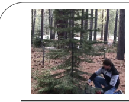
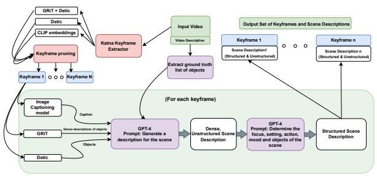
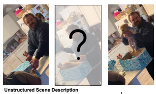
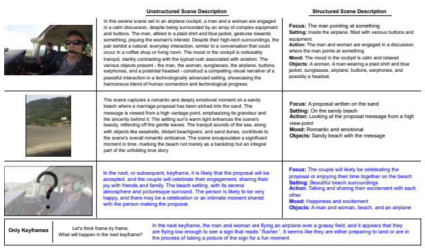

# Let'S Think Frame By Frame: Evaluating Video Chain Of Thought With Video Infilling And Prediction

Vaishnavi Himakunthala*, Andy Ouyang*, Daniel Rose*, Ryan He*, Alex Mei, Yujie Lu, Chinmay Sonar, Michael Saxon, William Yang Wang University of California, Santa Barbara, Santa Barbara, CA
{vaishnavi, andyouyang, danielrose, ryanhe, yujielu, saxon}@ucsb.edu
{alexmei, csonar, william}@cs.ucsb.edu

## Abstract

Despite constituting 65% of all internet traffic in 2023, video content is underrepresented in generative AI research. Meanwhile, recent large language models (LLMs) have become increasingly integrated with capabilities in the visual modality. Integrating video with LLMs is a natural next step, so how can this gap be bridged? To advance video reasoning, we propose a new research direction of **VideoCOT** on video keyframes, which leverages the multimodal generative abilities of vision-language models to enhance video reasoning while reducing the computational complexity of processing hundreds or thousands of frames. We introduce VIP1, an inference-time dataset that can be used to evaluate VideoCOT, containing 1) a variety of real-life videos with keyframes and corresponding unstructured and structured scene descriptions, and 2) two new video reasoning tasks: video infilling and scene prediction. We benchmark various vision-language models on VIP, demonstrating the potential to use vision-language models and LLMs to enhance video chain of thought reasoning.

## 1 Introduction

Large language models have seen considerable gains in few-shot performance on a wide array of benchmark reasoning tasks, employing multi-step explanatory contextual demonstration techniques such as chain of thought (COT) (Wei et al., 2023) to achieve state-of-the-art performance. Visionlanguage models (VL Models) such as Flamingo and PaLM (Alayrac et al., 2022; Chowdhery et al.,
2022) have furthered LLMs' reach by directly incorporating both image and text to perform tasks such as visually-guided open-ended text generation (Zhu et al., 2022), vision question-answering (Wang et al., 2022a; Kim et al., 2021), and image captioning, (Li et al., 2022; Liu et al., 2023).

These vision-language models are often resource inefficient and lack multi-step, multimodal reasoning, such as identifying changes between images. One of the proposed solutions to this problem is visual chain of thought (Rose et al., 2023), which combines COT prompting with vision-language guidance. However, visual chain of thought and general multimodal language models have not been extensively applied to the video domain.

Videos are widely used in the real world, helping us learn in a more engaging way than static text or images. Consequently, there is enormous potential in leveraging videos for computer learning, so video reasoning is essential for the next generation of artificial intelligence. Researchers have begun to advance video reasoning by training models for tasks like Video Question Answering (VideoQA)
(Zeng et al., 2016; Tapaswi et al., 2016; Yu et al.,
2019) and Video Summarization (Xu et al., 2016; Guadarrama et al., 2013). However, little focus has been paid to asking questions that require understanding multiple video frames. Just like how we learn by comparing what we see at different times, we believe that processing multiple frames is essential for understanding videos, which essentially are a story-like sequence of images.

Videos typically contain 24 frames per second and can range dramatically in length. Training a model to process all this information is computationally expensive for large input sizes, difficult to generalize, and likely would not have the same reasoning capabilities present in LLMs. Therefore, we propose integrating the robust few-shot inference of language models into video analysis using a video chain of thought. Drawing inspiration from chain of thought's "Let's think step by step," we promote complex video understanding by asking: "Let's think frame by frame."
To evaluate VideoCOT, we introduce Video Infilling and Prediction, VIP, an inference-time dataset containing real-life videos, extracted

*Equal Contribution.

1The source code and dataset will be made available online.
Structured Scene Description (FAMOuS)

 Focus: Man holding a chainsaw preparing to cut down the Christmas tree Action: Man getting ready to cut down the tree Mood: Anticipation Objects: Man, chainsaw, trees in the forest, brown dirt Setting: In the forest among trees with brown dirt on the ground

#### Dense Scene Description

In a dense forest, a man is preparing to cut down a Christmas tree, creating a mood of anticipation.

The man, wearing appropriate protective gear, holds a chainsaw, ready to act. The scene is marked by the contrast between the excitement of upcoming Christmas celebrations and the focus of cutting down the tree. Key elements in the scene, including the man, the chainsaw, the trees, and the brown dirt, contribute to this poignant snapshot of the holiday season, highlighting the intersection of tradition and respect for nature.

Figure 1: Dense vs. Unstructured Scene Description of a video keyframe, following the FAMOuS format (Focus, Action, Mood, Objects, and Setting).

keyframes, and scene descriptions for each respective keyframe. We propose a pipeline to extract the most important frames of a video and return longform dense captions, which we call unstructured scene descriptions. Inspired by visually descriptive scene descriptions in plays, our VIP pipeline also creates FAMOuS scene descriptions, providing each keyframe's focus, action, mood, objects, and setting. These structured scene descriptions extract specific, important information from the unstructured scene descriptions, which language models can use as visually-descriptive textual context to evaluate video frames. In addition, VIP defines two tasks given video keyframes that can benefit from a visual chain of thought:
1) Video Infilling: generating the frames that logically occurred between two keyframes, and 2) Video Prediction: predicting the subsequent keyframes of a video. By testing multistep reasoning abilities on sparse keyframes, we hope to promote research into creating models that support real-world video understanding and video generation and are resource efficient. We benchmark existing models on VIP and find much room for developing video chain of thought. We provide qualitative examples of our pipeline and model capabilities, and we will soon release our VIP dataset.

We propose the following contributions:
- We develop a pipelined approach to extract keyframes and generate a long-form, unstructured scene description and FAMOuS (Focus, Action, Mood, Objects, and Setting) structured scene descriptions.

- We propose the Video Infilling and Prediction inference-time dataset to evaluate video chain of thought reasoning with two new tasks in frame generation.

- We demonstrate the performance of existing stateof-the-art models on these video reasoning tasks.

## 2 Related Work

High-level visual understanding of videos. To evaluate video understanding, datasets often use automatic speech recognition, subtitles, pre-written dialogue, plot summaries, etc (Lei et al., 2018, 2020a; Tapaswi et al., 2016; Miech et al., 2019). Many answers in these datasets rely heavily on this additional textual context (e.g., DeepStory notes that out of 14,944 questions in MovieQA, "only 6,462 questions can be answered using the scenes').

As a result, researchers have proposed datasets whose answers rely on both the input visuals and text (Kim et al., 2017; Mun et al., 2017). However, these datasets do not represent real-life videos and rely on this additional textual context, which not all videos contain. There exist some datasets asking questions entirely based on input frames, but their questions are often limited to summaries of videos
(Xu et al., 2016; Guadarrama et al., 2013) or answerable by a single frame (Yu et al., 2019; Zeng et al., 2016; Maharaj et al., 2016). Our dataset narrows understanding from full summaries yet broadens single-frame understanding to test reasoning about multiple frames.

Figure 2: Overview of our pipeline for extracting keyframes and generating scene descriptions, all of which we provide in the VIP dataset. We first use CLIP embeddings of the initial keyframes and the outputs of the objectdetection models to prune unnecessary frames. We then extract the ground truth lists of objects from the video description as well as frame image captions to ground the generation of scene descriptions. For each frame, we instruct a language model to turn this grounding input, the detected objects, and dense captions into an unstructured scene description. We then prompt it to create a structured, FAMOuS scene description by extracting its focus, action, mood, objects, and setting.

Questions about multiple frames. Several datasets have begun to address multiframe video understanding (Jang et al., 2017) works with GIFS, Clever generates 5-second videos from a physics engine (Yi et al., 2019), and MarioQA utilizes short MarioQA gameplay videos and event logs (Mun et al., 2017). They include descriptive, predictive, counting, predictive, and counterfactual questions.

Additionally, VideoABC (Zhao et al., 2022) proposes the novel abductive reasoning task for instructional videos: inferring the most likely sequence of keyframes and explaining why false hypotheses are wrong. Our tasks differ because we hide intermediate frames hidden to gauge generative reasoning. Finally, RaMViD (Höppe et al., 2022) uses diffusion models to improve video prediction and infilling. However, they use the BAIR robot pushing dataset (Ebert et al., 2018) for infilling and the Kinetics-600 dataset (Carreira et al., 2018)
for prediction, which only contains selected 10second action clips of YouTube videos, both of which don't represent the variability of real-life videos involving high-level understanding. VIP maintains the complex reasoning questions about multiple frames of all these datasets yet extends their reach into longer, real-life videos, allowing evaluation of higher-level reasoning about the real world.

Multimodal language models. Researchers are continually demonstrating impressive performance gains from multimodal language models (chat-gpt
(OpenAI, 2023), OFA (Wang et al., 2022a)). PaLM (Chowdhery et al., 2022) impressively uses fewshot learning to surpass fine-tuned language models on a variety of NLP tasks. PaLMe (Driess et al., 2023) and Flamingo (Alayrac et al., 2022) extend downstream performance capabilities into multimodal domains, training vision-language models with interleaved text and images. Researchers have also replicated these huge-scale vision-language models with smaller versions that still attain advanced performance (MiniGPT4 (Zhu et al., 2023),
Open-Flamingo (Awadalla et al., 2023), BLIP (Li et al., 2022), Llava (Liu et al., 2023), and Otter (Li et al., 2023)). The next step in advancing video understanding is incorporating vision-language models, which is why we propose VIP evaluate their performance on video chain of thought reasoning.

Textual Description for Video Understanding.

Most video understanding models encode only the question and video keyframes, and they are trained to return the desired answer (Extended End-to-End Memory Network (Sukhbaatar et al., 2015), Deep Embedded Memory Networks (Kim et al., 2017), spatio-temporal VQA (Jang et al., 2017). However, video researchers have begun to jointly encode input text with videos or frames to create video-text embeddings (HowTo100m (Miech et al., 2019),
VideoStory (Kim et al., 2018)), learn spatial and temporal relations between frames and captions (Merlot (Zellers et al., 2021)), and match videos with relevant natural language descriptions (Deep Embedded Memory Networks - PororoQA (Kim et al., 2017), YouTube2Text (Guadarrama et al., 2013)). VidIL (Wang et al., 2022b) uses few-shot learning with frames, frame captions, and visual tokens to language models for video captioning, video question answering, video caption retrieval, and video future event prediction (Lei et al., 2020b) (selecting the more likely future event given two options). By contrast, VideoCOT introduces novel tasks that evaluates the generation of video frames themselves and creates more in-depth textual descriptions of keyframes. Video4096 (Bhattacharya et al., 2023) has also looked to use multimodal models and instructions to "verbalize" videos, finding that generated stories can enhance downstream video understanding. VideoCOT is different from Video4096 in the following ways: 1) We select general real-life videos, while Video4096 uses storytelling or advertising videos, 2) They create detailed stories about the entire video, and we create textual descriptions of keyframes, and 3) They use their stories for video storytelling and sentiment analysis, which concern the entire video, while we use our scene descriptions to reason about specific video segments.

## 3 Pipeline

To generate high-quality scene descriptions, we propose the following pipeline2.

1. We perform **keyframe extraction and pruning**
to extract the important frames of a video.

2. We then **extract information**, returning the objects in the frame, dense descriptions of the objects, and captions to ground what is happening in the keyframe.

3. Finally, we **generate scene descriptions** about keyframes, returning a dense, unstructured description as well as a structured description of the frame that specifies its focus, action, mood, objects, and setting (FAMOuS).

### 3.1 Keyframe Extraction

We use videos from an online video repository3, which contains a wide selection of real-life videos as well as high-quality video descriptions that the user uploads. Given these videos, our first step towards leveraging LLM for video understanding is carefully selecting our input keyframes. We use Katna, an open-source tool that automatically extracts video keyframes by considering LUV colorspace differences, brightness, entropy, and contrast filtering, clustering of image histograms, and variance of image laplacians for blur detection. Though Katna outputs high-quality keyframes, returning many results in multiple redundant ones. Likewise, selecting a small number sometimes removes necessary keyframes. Our goal of enhancing video understanding while limiting computational complexity requires balancing limiting the number of keyframes while maintaining faithfulness to the video.

We return a large number of keyframes and then prune keyframes by removing ones that are of low quality and most similar to one another. First, we remove blurry frames with low laplacian blur scores, then remove frames where both Detic and Grit detect few objects. Both models are sensitive to objects, so only detecting a few objects indicates a low-quality frame.

We then use CLIP to embed the frame images and the list of unique detected objects from Detic to account for pixel similarity and object invariance in the frame, respectively. GRiT returns many objects and dense captions, which is too large to embed. We take the average of the cosine similarity scores among consecutive keyframes, then prune the frames with the highest pairwise similarity until we reach the desired number of keyframes. We add an additional check for necessary keyframes by not removing keyframes with characters unless either of the surrounding frames also contain that character.

### 3.2 Extracting Information From Keyframes

To generate descriptive scene descriptions, we extract as much visual information as possible from the keyframes. We return three main things from each keyframe: a list of objects and their locations, dense captions describing each object and their locations, and a caption about the scene.

2https://sites.google.com/view/videocot/home 3http://jukinmedia.com/videos
To extract the list of objects, we use the state-ofthe-art object detection model, DETIC (Zhou et al., 2022). For each object we extract, we also instruct DETIC to output its bounding box that contains the object and a score signifying the confidence of the prediction.

While DETIC performs well with object detection, it doesn't provide much detail about the objects (i.e., Detic returns "chair" instead of "red chair on a clean marble floor"), which is important to generate high-quality scene descriptions. So, we use another model, GRIT (Wu et al., 2022), which returns dense captions describing each object in an image. GRIT also produces the bounding box and the confidence for each prediction. We use a combination of both outputs because we find that DETIC has more accurate object detection and GRIT is far more descriptive.

Finally, we obtain the grounding details on what is happening in the scene using the imagecaptioning model BLIP (Li et al., 2022).

### 3.3 Generating Scene Descriptions

To generate scene descriptions, we utilize the output from the image captioning model (BLIP), the object detection model (DETIC), and the dense captioning model for objects (GRIT). However, no model is perfect, and sometimes these models misclassify and hallucinate, affecting the quality of the scene descriptions. To address this issue, we extract the objects from the ground truth video description and use the confidence scores outputted by the models. Now we have the ground truth list of objects, the keyframe caption, the object detection output of GRIT and DETIC, and their corresponding confidence scores. We prompt GPT-4 to synthesize all of this information while keeping in mind that the output from the models may not be completely accurate. After this step, GPT-4 outputs a dense, descriptive caption, which provides far more detail than simple phrase-level captioning. However, some tasks may benefit from a structured description format, which extracts specific information from the dense, unstructured scene description. To address these needs, we feed the dense, unstructured scene description into GPT-4 and extract its focus, action, mood, objects, and setting. These FAMOuS categories form VIP's structured scene descriptions.

However, we still cannot use the generated scene descriptions from GPT-4 as ground truth because we can't verify their correctness, as GPT-4 is also prone to hallucinations. To address this, we use M-Turk, a crowdsourcing platform, to get crowd workers to fix and validate scene descriptions given the keyframe, the scene description, and a description of the video. We input this updated scene description to correct the dense, unstructured scene description using GPT-4. To validate the unstructured scene descriptions, we ask M-Turk workers to vote if they make sense and, if not, suggest how they should be fixed. We then edit the unstructured scene descriptions accordingly until the workers verify that the description is accurate.

These scene descriptions augment the keyframes with detailed textual information to input to LLMs, enhancing VideoCOT reasoning.

## 4 Tasks

Within the VIP dataset, we propose two overarching tasks in video completion that necessarily require multiframe reasoning: 1) video infilling, which involves discerning changes and generating frames between any two given keyframes, and 2) scene prediction, which focuses on anticipating subsequent events given a sequence of keyframes.

Video infilling and prediction of keyframes can be used in various downstream contexts that can benefit from video understanding and completion. We note that infilling or predicting scene descriptions themselves is useful because images can be generated or grounded by these vivid frame descriptions of images. Further, generated scene descriptions can promote subsequent video infilling or prediction in a "let's think frame by frame" manner.

In contrast to single images, videos are comprised of a multitude of frames, consequently demanding substantial computational resources for processing. However, it is worth noting that numerous frames within a video may be redundant, and only a select number of keyframes are essential for understanding the video. Therefore, the tasks we propose aim to gauge the efficacy of video chain of thought in promoting multiframe video understanding while circumventing the expensive analysis of every video frame.

For the video infilling and video prediction tasks, we will use represent the sequence of chronological keyframes as k1*, ..., k*n, their respective unstructured scene descriptions as u1*, ..., u*n, and structured FAMOuS scene descriptions as s1, ..., sn.

Let's think frame by frame.

What happened between the two keyframes?

A man is holding a small dog in his arms, and it appears that he is giving the dog to someone. This suggests that the man might be receiving the dog as a gift or adopting the dog from someone. The scene takes place in front of a wooden counter, and there is a box, possibly containing a holiday decoration, nearby. The man is smiling, indicating that the gift or adoption is a happy occasion for him.

| Before                                                        | Between                                                  | After                                                   |
|---------------------------------------------------------------|----------------------------------------------------------|---------------------------------------------------------|
| In a cozy, well\-used kitchen, a man in a dark gray shirt is  | The man is still holding the                             | In this joyous scene set in a cozy, warmly lit kitchen, |
| about to open a gift, creating a sense of anticipation and    | puppy, but the puppies owner is                          | a man holds a puppy with pure delight, their            |
| excitement. The scene is familiar and homely, filled with     | also present, holding a small                            | interaction creating a heartwarming spectacle.          |
| everyday items such as coffee cups, a basket, water           | box. The atmosphere is still                             | Surrounding objects such as a cabinet and an            |
| bottles, and various kitchen appliances. The intimate mood    | joyous and warm, with the man                            | empty box subtly contribute to the story, suggesting    |
| is highlighted by the contrast between the casual setting     | and the owner sharing a special                          | a familiar, lived\-in setting. The man and puppy        |
| and the expectancy of the unopened gift. This captures a      | moment with the puppy. The                               | share a moment of absolute happiness, creating an       |
| moment where ordinary kitchen life intersects with the        | presence of the owner adds an                            | atmosphere of warmth and delight. This scene            |
| extraordinary event of unveiling a surprise, inviting viewers | additional layer of emotion to the                       | encapsulates a snapshot of pure, uncomplicated          |
| to share in the man's anticipation.                           | scene.                                                   | joy, showing the intimate bond between a man and        |
|                                                               |                                                          | his new puppy.                                          |
| Structured Scene Description                                  |                                                          |                                                         |
| Before                                                        | Between                                                  | After                                                   |
| Focus: The man in a dark gray shirt is actively               | Focus: The man is standing in a cozy room, holding a     | Focus: The man holding a dog above                      |
| opening a gift.                                               | small dog above a large open gift, likely in the process | an open gift box                                        |
| Setting: A well\-used, cozy, and familiar kitchen with        | of revealing the surprise.                               | Setting: A warmly lit, cozy                             |
| various household items around.                               | Setting: Kitchen setting with a cabinet and refrigerator | kitchen with various household items                    |
| Action: The man is about to open a gift, creating a           | in the background                                        | around                                                  |
| sense of anticipation and excitement in the scene             | Action: The man opening the gift                         | Action: The man holding a                               |
| Mood: The mood is intimate, homely, and full of               | Mood: Mix of excitement and anticipation                 | puppy while smiling                                     |
| anticipation, with a touch of casualness thrown in.           | Objects: The man (as a part of his overall posture and   | Mood: The mood is joyous and                            |
| Objects: The man, a gift box, a basket, coffee cups,          | position), the dog (held above the gift), the box (open  | delighted, as the man tears up                          |
| a cabinet, and water bottles, sink, refrigerator, and         | and possibly containing the surprise), cabinet and a     | Objects: The man, the dog, the box,                     |
| kitchen appliances.                                           | refrigerator                                             | the refrigerator, and the cabinet.                      |

Figure 3: Video Infilling Task Example; the black text indicates the input to a generative model and the blue text indicates the output

### 4.1 Video Infilling

The video infilling task involves predicting the intermediate keyframes between a given frame and another frame within a video sequence that follows chronologically. Our input is keyframe ki and kj and their respective scene descriptions ui and uj or si and sj (unstructured or structured) such that j occurs after i. The task is to predict the scene descriptions ui+1, ..., uj−1 or si+1*, ..., s*j−1 for the in-between keyframes ki+1*, ..., k*j−1, depending on what type of scene description was used as input. This task requires models to capture a scene's temporal variations and transitions, including changes in visual elements, object positions, and contextual factors. The task's difficulty scales exponentially with an increasing number of missing in-between frames. By successfully predicting the intermediate keyframes, models demonstrate their ability to comprehend the dynamic evolution of scenes and identify critical points of change in a video sequence.

This task requires models to exhibit complex reasoning about the visual dynamics, temporal relationships, and contextual cues present in the video. Successful performance in the scene prediction task showcases the models' ability to infer and project the plausible progression of events, enabling them to anticipate and generate realistic future frames that align with the underlying video content.

### 4.2 Video Prediction

The video prediction task aims to anticipate future frames in a video sequence. The input is a variable number of preceding frames, denoted as kt−m*, ..., k*t, along with their respective unstructured or structured scene descriptions ut−m, ..., ut or st−m*, ..., s*t. By utilizing the preceding keyframes, the goal is to predict the n next frames kt+1*, ..., k*t+n or scene descriptions

Figure 4: Video Prediction Task Example; the black text indicates the input to a generative model, and the blue text indicates the output

- ut+1, ..., ut+n or st+1*, ..., s*t+n. Much like the video infilling task, this task also scales in difficulty as we decrease the number of input keyframes and increase the number of output keyframe predictions.

## 5 Experiments

We outline qualitative examples of benchmarking multimodal language models on the VIP dataset.

We will release the full dataset and a more thorough benchmarking of multimodal language models. Currently, we provide examples of the VIP tasks on the multimodal language model Otter (Li et al., 2023), and we simplify our tasks to infilling or predicting a single frame, respectively. We highlight examples of generating relevant scene descriptions, which can then be used to generate more accurate frames.

Even with these task simplifications, Otter struggles to generate accurate scene descriptions. This observation underscores the inherent complexity and challenges of reasoning over a larger number of keyframes. Because the task's difficulty can grow significantly, we deem it important to benchmark existing multimodal language models and promote research into video chain of thought.

### 5.1 Video Infilling Qualitative Analysis

Shown in Figure 3, we evaluate Otter's performance on the video infilling task with three different input contexts - passing in only keyframes, passing in keyframes and unstructured scene descriptions, and passing in keyframes and structured scene descriptions. In the latter two contexts, we prompt the model to return either an unstructured or structured scene description, respectively. When provided only keyframes, Otter fails to discern what happened between the two given keyframes accurately and only describes the information in the last frame. When providing our unstructured scene descriptions, Otter demonstrates improvement but still cannot detect the opening of the gift, demonstrating the complexity of the task. However, when provided with our structured scene descriptions, Otter can detect the opening of the gift in detail, suggesting that our scene descriptions can effectively leverage models' reasoning capabilities to promote video chain of thought reasoning.

### 5.2 Video Prediction Qualitative Analysis

In Figure 4, a similar pattern emerges in the video prediction task. Whereas only inputting keyframes results in a feasible yet undesirable prediction, utilizing our scene descriptions substantially enhances Otter's ability to predict the ideas in a subsequent keyframe accurately. Otter predicts a markedly improved future scene of the actual wedding proposal in the video, and it exhibits proficient reasoning capabilities by effectively speculating about a celebratory context. These findings emphasize the valuable role played by scene descriptions in facilitating Otter's reasoning ability in the video prediction task.

### 6 Conclusion

We present the Video Infilling and Predict (VIP)
dataset to evaluate the abilities of vision-language models to perform a video chain of thought on the keyframes of a video. We also introduce a novel pipeline to extract keyframes, then generate corresponding structured and unstructured scene descriptions. Inputting our generated scene descriptions helps improve performance, though there is significant room for improvement in video chain of thought. We encourage using VIP as an inferencetime dataset to evaluate video chain of thought using different models and strategies for effective in-context learning, ultimately to promote complex video understanding and generation.

## References

Jean-Baptiste Alayrac, Jeff Donahue, Pauline Luc, Antoine Miech, Iain Barr, Yana Hasson, Karel Lenc, Arthur Mensch, Katherine Millican, Malcolm Reynolds, et al. 2022. Flamingo: a visual language model for few-shot learning. Advances in Neural Information Processing Systems, 35:23716–23736.

Anas Awadalla, Irena Gao, Joshua Gardner, Jack Hessel, Yusuf Hanafy, Wanrong Zhu, Kalyani Marathe, Yonatan Bitton, Samir Gadre, Jenia Jitsev, Simon Kornblith, Pang Wei Koh, Gabriel Ilharco, Mitchell Wortsman, and Ludwig Schmidt. 2023. Openflamingo.

Aanisha Bhattacharya, Yaman K Singla, Balaji Krishnamurthy, Rajiv Ratn Shah, and Changyou Chen. 2023. A video is worth 4096 tokens: Verbalize story videos to understand them in zero shot.

Joao Carreira, Eric Noland, Andras Banki-Horvath, Chloe Hillier, and Andrew Zisserman. 2018. A short note about kinetics-600. arXiv preprint arXiv:1808.01340.

Aakanksha Chowdhery, Sharan Narang, Jacob Devlin, Maarten Bosma, Gaurav Mishra, Adam Roberts, Paul Barham, Hyung Won Chung, Charles Sutton, Sebastian Gehrmann, et al. 2022. Palm: Scaling language modeling with pathways. arXiv preprint arXiv:2204.02311.

Danny Driess, Fei Xia, Mehdi S. M. Sajjadi, Corey Lynch, Aakanksha Chowdhery, Brian Ichter, Ayzaan Wahid, Jonathan Tompson, Quan Vuong, Tianhe Yu, Wenlong Huang, Yevgen Chebotar, Pierre Sermanet, Daniel Duckworth, Sergey Levine, Vincent Vanhoucke, Karol Hausman, Marc Toussaint, Klaus Greff, Andy Zeng, Igor Mordatch, and Pete Florence. 2023. Palm-e: An embodied multimodal language model.

Frederik Ebert, Chelsea Finn, Sudeep Dasari, Annie Xie, Alex Lee, and Sergey Levine. 2018. Visual foresight: Model-based deep reinforcement learning for vision-based robotic control. *arXiv preprint* arXiv:1812.00568.

Sergio Guadarrama, Niveda Krishnamoorthy, Girish Malkarnenkar, Subhashini Venugopalan, Raymond Mooney, Trevor Darrell, and Kate Saenko. 2013. Youtube2text: Recognizing and describing arbitrary activities using semantic hierarchies and zero-shot recognition.

Tobias Höppe, Arash Mehrjou, Stefan Bauer, Didrik Nielsen, and Andrea Dittadi. 2022. Diffusion models for video prediction and infilling. *arXiv preprint* arXiv:2206.07696.

Yunseok Jang, Yale Song, Youngjae Yu, Youngjin Kim, and Gunhee Kim. 2017. TGIF-QA: toward spatiotemporal reasoning in visual question answering.

Kyung-Min Kim, Seong-Ho Choi, Jin-Hwa Kim, and Byoung-Tak Zhang. 2018. Multimodal dual attention memory for video story question answering.

Kyung-Min Kim, Min-Oh Heo, Seong-Ho Choi, and Byoung-Tak Zhang. 2017. Deepstory: Video story QA by deep embedded memory networks.

Wonjae Kim, Bokyung Son, and Ildoo Kim. 2021. Vilt:
Vision-and-language transformer without convolution or region supervision.

Jie Lei, Licheng Yu, Mohit Bansal, and Tamara L. Berg.

2018. TVQA: localized, compositional video question answering.

Jie Lei, Licheng Yu, Tamara Berg, and Mohit Bansal.

2020a. TVQA+: Spatio-temporal grounding for video question answering.

Jie Lei, Licheng Yu, Tamara L Berg, and Mohit Bansal.

2020b. What is more likely to happen next? videoand-language future event prediction. *arXiv preprint* arXiv:2010.07999.

Bo Li, Yuanhan Zhang, Liangyu Chen, Jinghao Wang, Jingkang Yang, and Ziwei Liu. 2023. Otter: Multi- Modal In-Context Learning Model with Instruction Tuning.

Junnan Li, Dongxu Li, Caiming Xiong, and Steven Hoi. 2022. Blip: Bootstrapping language-image pretraining for unified vision-language understanding and generation.

Haotian Liu, Chunyuan Li, Qingyang Wu, and Yong Jae Lee. 2023. Visual instruction tuning.

Tegan Maharaj, Nicolas Ballas, Aaron C. Courville, and Christopher Joseph Pal. 2016. A dataset and exploration of models for understanding video data through fill-in-the-blank question-answering.

Antoine Miech, Dimitri Zhukov, Jean-Baptiste Alayrac, Makarand Tapaswi, Ivan Laptev, and Josef Sivic. 2019. Howto100m: Learning a text-video embedding by watching hundred million narrated video clips.

Jonghwan Mun, Paul Hongsuck Seo, Ilchae Jung, and Bohyung Han. 2017. Marioqa: Answering questions by watching gameplay videos. In *Proceedings of the* IEEE International Conference on Computer Vision, pages 2867–2875.

OpenAI. 2023. Gpt-4 technical report. Daniel Rose, Vaishnavi Himakunthala, Andy Ouyang, Ryan He, Alex Mei, Yujie Lu, Michael Saxon, Chinmay Sonar, Diba Mirza, and William Yang Wang. 2023. Visual chain of thought: Bridging logical gaps with multimodal infillings.

Sainbayar Sukhbaatar, Arthur Szlam, Jason Weston, and Rob Fergus. 2015. Weakly supervised memory networks.

Makarand Tapaswi, Yukun Zhu, Rainer Stiefelhagen, Antonio Torralba, Raquel Urtasun, and Sanja Fidler. 2016. Movieqa: Understanding stories in movies through question-answering.

Peng Wang, An Yang, Rui Men, Junyang Lin, Shuai Bai, Zhikang Li, Jianxin Ma, Chang Zhou, Jingren Zhou, and Hongxia Yang. 2022a. Ofa: Unifying architectures, tasks, and modalities through a simple sequence-to-sequence learning framework.

Zhenhailong Wang, Manling Li, Ruochen Xu, Luowei Zhou, Jie Lei, Xudong Lin, Shuohang Wang, Ziyi Yang, Chenguang Zhu, Derek Hoiem, Shih-Fu Chang, Mohit Bansal, and Heng Ji. 2022b. Language models with image descriptors are strong few-shot video-language learners.

Jason Wei, Xuezhi Wang, Dale Schuurmans, Maarten Bosma, Brian Ichter, Fei Xia, Ed Chi, Quoc Le, and Denny Zhou. 2023. Chain-of-thought prompting elicits reasoning in large language models.

Jialian Wu, Jianfeng Wang, Zhengyuan Yang, Zhe Gan, Zicheng Liu, Junsong Yuan, and Lijuan Wang. 2022. Grit: A generative region-to-text transformer for object understanding.

Jun Xu, Tao Mei, Ting Yao, and Yong Rui. 2016. Msrvtt: A large video description dataset for bridging video and language. In 2016 IEEE Conference on Computer Vision and Pattern Recognition (CVPR),
pages 5288–5296.

Kexin Yi, Chuang Gan, Yunzhu Li, Pushmeet Kohli, Jiajun Wu, Antonio Torralba, and Joshua B Tenenbaum. 2019. Clevrer: Collision events for video representation and reasoning. arXiv preprint arXiv:1910.01442.

Zhou Yu, Dejing Xu, Jun Yu, Ting Yu, Zhou Zhao, Yueting Zhuang, and Dacheng Tao. 2019. Activitynet-qa: A dataset for understanding complex web videos via question answering.

Rowan Zellers, Ximing Lu, Jack Hessel, Youngjae Yu, Jae Sung Park, Jize Cao, Ali Farhadi, and Yejin Choi. 2021. MERLOT: multimodal neural script knowledge models.

Kuo-Hao Zeng, Tseng-Hung Chen, Ching-Yao Chuang, Yuan-Hong Liao, Juan Carlos Niebles, and Min Sun.

2016. Leveraging video descriptions to learn video question answering.

Wenliang Zhao, Yongming Rao, Yansong Tang, Jie Zhou, and Jiwen Lu. 2022. Videoabc: A real-world video dataset for abductive visual reasoning. IEEE Transactions on Image Processing, 31:6048–6061.

Xingyi Zhou, Rohit Girdhar, Armand Joulin, Philipp Krähenbühl, and Ishan Misra. 2022. Detecting twenty-thousand classes using image-level supervision.

Deyao Zhu, Jun Chen, Xiaoqian Shen, Xiang Li, and Mohamed Elhoseiny. 2023. Minigpt-4: Enhancing vision-language understanding with advanced large language models.

Wanrong Zhu, An Yan, Yujie Lu, Wenda Xu, Xin Eric Wang, Miguel Eckstein, and William Yang Wang. 2022. Visualize before you write: Imaginationguided open-ended text generation. arXiv preprint arXiv:2210.03765.