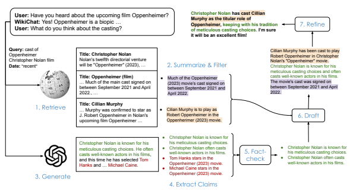
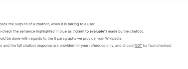
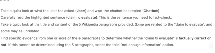
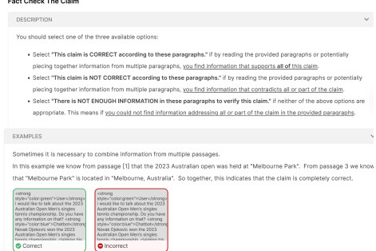
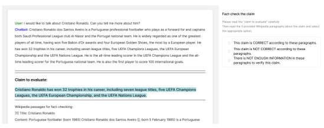

# Wikichat: A Few-Shot Llm-Based Chatbot Grounded With Wikipedia

Sina J. Semnani Violet Z. Yao∗ Heidi C. Zhang∗ **Monica S. Lam**
Computer Science Department Stanford University Stanford, CA
{sinaj, vyao, chenyuz, lam}@cs.stanford.edu

## Abstract

Despite recent advances in Large Language Models (LLMs), users still cannot trust the information provided in their responses. LLMs cannot speak accurately about events that occurred after their training, which are often topics of great interest to users, and, as we show in this paper, they are highly prone to hallucination when talking about less popular (tail) topics. This paper presents WikiChat, a few-shot LLM- based chatbot that is grounded with live information from Wikipedia. Through many iterations of experimentation, we have crafted a pipeline based on information retrieval that (1) uses LLMs to suggest interesting and relevant facts that are individually verified against Wikipedia, (2) retrieves additional up-to-date information, and (3) composes coherent and engaging time-aware responses. We propose a novel hybrid human-and-LLM evaluation methodology to analyze the factuality and conversationality of LLM-based chatbots. We focus on evaluating important but previously neglected issues such as conversing about recent and tail topics. We evaluate WikiChat against strong fine-tuned and LLM-based baselines across a diverse set of conversation topics. We find that WikiChat outperforms all baselines in terms of the factual accuracy of its claims, by up to 12.1%, 28.3% and 32.7% on head, recent and tail topics, while matching GPT-3.5 in terms of providing natural, relevant, non-repetitive and informational responses.

## 1 Introduction

Large language models have garnered a lot of interest from consumers because of their command of language as well as their broad skill set and knowledge. While they are very helpful as a task tool (e.g. writing an email or generating ideas) where the users have ultimate control over the final result, they are lacking as chatbots that end-users converse with to explore and learn more about what they find interesting, or to satisfy an information need. In this paper we argue that there are two major problems when using LLMs in this setting: that they cannot speak accurately about events that occurred after their pre-training (which are often the topics of interest), and are far less knowledgeable about less popular topics. Yet, they are prone to generating confident but misleading information
(or *hallucination*). If a user of today's numerous chatbots wants to learn more about their favorite local music band or the latest book their favorite author wrote, they need to carefully and painstakingly verify any information they receive with external sources lest they be misled.

In this paper, we tackle knowledge-grounded conversations, where the main goal is to provide only trusted knowledge to users. We assume access to a source of trusted knowledge in the form of a text corpus, for instance the English Wikipedia.

We refer to this desirable property of chatbots as factuality. As we show in our evaluation, some chatbots achieve this by presenting factual but unrelated and repetitive information, which is not helpful for users. Therefore, we emphasize that conversationality is also important.

Information retrieval (IR) has been shown to be an effective addition to language models on several knowledge-intensive tasks (Lewis et al., 2020; Shuster et al., 2021a). However, existing methods either do not evaluate on conversations at all (Lewis et al., 2020; Trivedi et al., 2022) and entirely ignore the conversationality part, or limit themselves to fact-checking LLM outputs (Gao et al., 2022; Jiang et al., 2023). Only fact-checking LLM outputs means that by design, they cannot access knowledge about recent events, since the starting point is the LLM which has no knowledge of recent events. Moreover, some require changes to the pre-training

*Equal contribution

Figure 1: All WikiChat components, and a sample conversation, edited for brevity. The steps taken to generate a response include 1) retrieval from Wikipedia, 2) summarizing and filtering the retrieved passages, 3) generating a response from an LLM, 4) extracting factual claims from the LLM response 5) fact-checking the claims in the LLM response, 6) drafting a response, and 7) refining the response.

process (Lewis et al., 2020; Guu et al., 2020) of language models, which incur a heavy computational cost.

We posit that current LLMs, with their general-purpose pre-training and instructiontuning (Ouyang et al., 2022), have reached a level of quality that a carefully designed set of few-shot subtasks, that incorporate information retrieval at the right places, can address these issues. As such, we propose the first fully few-shot chatbot that provides up-to-date and fact-checked information in engaging conversations.

On the evaluation side, most chatbots are evaluated only on static crowdsourced benchmarks like Wizard of Wikipedia (Dinan et al., 2019) and Wizard of Internet (Komeili et al., 2022). Even when human evaluation is used, evaluation is conducted only on familiar discussion topics. This leads to an overestimation of the capabilities of chatbots. We propose a methodology to effectively test knowledge-based chatbots on a set of carefully chosen conversation topics with the help of user simulation, and human and automatic evaluation.

Our contributions are:
- WikiChat, a few-shot chatbot that takes the best abilities of LLMs (which are highly conversational and good at piecing together information from the stored knowledge in their weights) and significantly improves its trustworthiness with the use of information retrieval. Designed to chat about any and all topics in Wikipedia, WikiChat has a carefully crafted 7-stage pipeline of few-shot prompted LLM as shown in Figure 1.

- An improved simulation-based benchmark design with a hybrid human-and-LLM evaluation technique. This helps circumvent the limitations of existing benchmarks, and for instance enables us to easily evaluate chatbots on any topic, including tail and recent topics, instead of having to stick with the ones that human annotators are familiar with.

- We show that WikiChat significantly outperforms strong baselines in terms of factuality (24.4% better than GPT-3.5 on average) and conversationality (21.9% better than Atlas on average). We quantify the large gap in conversationality between models that use and do not use LLMs, and show how much LLMs struggle on tail and recent topics.

## 2 Related Work 2.1 Factuality Of Large Language Models

To address the hallucination issues of LLMs, retrieval augmented generation methods (Li et al., 2022) have been used to improve the factuality of LLMs by integrating retrieved knowledge. Moreover, researchers have utilized fact-checking methods to verify and correct LLM outputs. Gao et al. (2022) use query generation and evidence retrieval to attribute LLM outputs, and apply chainof-thought prompting (Wei et al., 2022) to post-edit LLM outputs, ensuring consistency with external evidence. While useful for certain tasks, this strict definition of fact-checking (meaning that it needs to correct and output *everything* the base LLM generates) is not a good fit for knowledge-grounded conversations. In our design, we allow our chatbot to choose what to say; for example, if our factchecking system is unsure about a certain claim, the chatbot can simply not say it.

Concurrent with our work, Zhao et al. (2023)
refine reasoning chains using external knowledge, thereby enhancing the factuality of chainof-thought prompting in knowledge-intensive tasks.

Peng et al. (2023) augment LLMs by grounding responses in task-specific databases and iteratively refining prompts using utility functions, including factuality scores.

## 2.2 Knowledge-Grounded Chatbots

In the chatbot space, neural-retrieval-in-the-loop architectures have been used to develop knowledgegrounded chatbots with the goal of reducing hallucination (Shuster et al., 2021b). BlenderBot 2 (Chen et al., 2021) builds upon BlenderBot 1 (Roller et al., 2020) by allowing the bot to incorporate information retrieved from the Internet for Wizard of the Internet (Komeili et al., 2021). SeeKeR (Shuster et al., 2022a) outperforms BlenderBot 2 (Chen et al., 2021) in open-domain knowledgegrounded conversations by utilizing a single language model for three modular tasks: generating search queries based on the input context, producing relevant knowledge responses using retrieved documents, and combining them with the input context to generate the final response.

BlenderBot 3 (Shuster et al., 2022b) further improves the model by fine-tuning a 175B-parameter OPT (Zhang et al., 2022) on several dialogue datasets, including several question answering and dialogue datasets like Wizard of Wikipedia (Dinan et al., 2019) and Wizard of Internet (Komeili et al.,
2022).

Atlas (Izacard et al., 2022) uses a custom pretrained retrieval-augmented language model capable of learning knowledge-intensive tasks. It is a state-of-the-art model on the KILT benchmark (Petroni et al., 2021), which consists of 11 knowledge-oriented tasks including Wizard of Wikipedia. In this paper, we compare our system with this very strong baseline.

## 2.3 Evaluating Factuality

Several benchmarks have been released in recent years to train and test systems that can evaluate the factuality of individual claims. FEVER (Thorne et al., 2018) is a popular crowdsourced one that compares claims against evidence retrieved from Wikipedia. The state-of-the-art system on this dataset (Krishna et al., 2022) has a label accuracy of 81% when compared against human labels.

DialFact (Gupta et al., 2022) builds on FEVER
by introducing validation and test sets for evaluating factuality in dialogues. Both of these are *static* benchmarks, meaning that they are used to test systems on the fixed set of claims that are included in these benchmarks. However, it is possible to train classifiers on these datasets that can then be used to evaluate new claims (Dziri et al., 2022). Q2(Honovich et al., 2021) uses question answering and natural language inference models to evaluate the factuality of dialogue agents. These two are examples of automatic metrics for factuality.

Dziri et al. (2022) compare several automatic metrics to human evaluation. They find that all automatic metrics they tested fell significantly behind human performance, and mostly relied on spurious correlations like word overlap with the evidence. Our evaluation methodology (Section 4) therefore incorporates human evaluation when needed.

## 3 Wikichat, The Few-Shot Knowledge-Grounded Chatbot

We design WikiChat (Figure 1) to ground LLMs using Wikipedia to achieve the following objectives.

While LLMs tend to hallucinate, our chatbot should be factual. While introducing facts to the conversation, we need to maintain the qualities of LLMs in being relevant, conversational, and engaging.

Given the history of a conversation between a user (U) and the agent (A) U1, A1*, ..., U*n, Wiki- Chat generates its utterance An in two stages: 1)
curates information that is correct and relevant to the context of the conversation, and 2) uses the gathered information to form the response An.

At a high level, this is a generalization of the common retrieve-then-generate framework used in prior work. In each subsequent section, we describe each of the two stages of WikiChat, and highlight the novelties. Each part of WikiChat is implemented using carefully designed few-shot prompts with an LLM. As we explain in Section 5, we initially experimented with using smaller fine-tuned models for some parts, but saw worse results due to the lack of flexibility and lower quality of those models. Please see Appendix D for the few-shot prompts.

## 3.1 Curating Information

A common approach to ensure factuality is to first query the knowledge corpus according to the user's utterance, retrieve data to use in generating a response (Izacard et al., 2022; Chen et al., 2021; Shuster et al., 2022b). Such an approach does not leverage LLM's ability to interpret the question and to formulate responses that are out of reach of retrieval, or require aggregating information from many sources.

Consider this example where an LLM is able to aggregate many pieces of information from what it has memorized during pre-training:
User: "I am very interested in William Faulkner and Toni Morrison. Can you suggest two books that they wrote that have a common theme? And discuss how these books are different stylistically?" GPT-3.5: "Two books that have a common theme are 'The Sound and the Fury' and 'Beloved;'.

Both books are about families struggling with the aftermath of slavery. 'The Sound and the Fury' is told from the perspective of the white family, while 'Beloved' is told from the perspective of the black family. Both books are different stylistically in that 'The Sound and the Fury' is more experimental, while 'Beloved' is more straightforward."
Unfortunately, in general, LLMs cannot be trusted to be factual, thus we need to fact-check their outputs. LLMs may not be able to generate the right response, especially on events that happened after they were trained, or on topics in the long tail.

Thus, to get the best of both worlds, we use both LLM generation and information retrieval. The output of this stage is a list of relevant bullet points, which can potentially be empty for turns that are pure chitchat (e.g. greeting).

## 3.1.1 Retrieval From Corpus

During a conversation with a user, WikiChat identifies when accessing external information is needed.

This could be because the last user utterance contains a direct question (e.g. "Who is Stephen Curry?") or otherwise requires additional information for a comprehensive response (e.g. "I really like Stephen Curry."). WikiChat then generates a search query that captures the user's inquiry.

We discovered that temporal context plays a significant role in the user's information needs, while existing systems especially struggle with this. Wiki- Chat generates the inferred time of the user's need alongside the query. The query time can be one of recent, *year=yyyy*, or *none* for when the retrieved information should be as recent as possible ("Did you watch the latest Avatar movie?"), for a specific year ("I think the 2018 Super Bowl was the peak of his career."), or the time is not important ("The Beatles are my favorite band.") respectively. This is done in the query generation prompt (Table 10).

We send the query to an information retrieval
(IR) system to obtain relevant passages from the corpus, and re-rank the top results based on the temporal information to get NIR = 3 passages in the end.

Since these paragraphs may contain a mixture of relevant and irrelevant sections, we use a prompt to extract relevant sections of the retrieved passages and summarize them into bullet points while filtering out the irrelevant parts (Table 11).

## 3.1.2 Llm Generation And Fact-Checking

We prompt the LLM to generate a response to the history of the conversation. The response often contains interesting and relevant knowledge, but is inherently unreliable. We check their correctness against the knowledge corpus. This process is similar to how crowdsourced fact-checking datasets like FEVER (Thorne et al., 2018) and DialFact (Gupta et al., 2022) are constructed, but done automatically.

This has the following steps:
1. Breaking down claims. We use a prompt to break down the LLM response to multiple objective factual claims (Table 13). When breaking down knowledge from the LLM, we resolve coreferences to reduce ambiguity, and resolve ambiguous time information like "current" and "last year", to make all claims self-contained.

2. Evidence Retrieval. We use an IR system to retrieve Nevidence = 2 passages from the knowledge corpus to serve as evidence for each claim.

We use the same time-based re-ranking as in Section 3.1.1 to better handle time-sensitive topics.

3. Verification. The verification prompt (Table 14) assigns each claim to one of three classes: whether the retrieved evidence supports the claim, refutes the claim, or if there is not enough information in the evidence to make this decision. Only claims that are supported by the evidence are kept.

## 3.2 Forming The Response

Our next step is to turn relevant retrieved paragraphs and verified claims to generate an appealing response. Our experiments show that writing the final response in one go, while satisfying all the criteria for conversationality is challenging for LLMs.

Moreover, the limited context length makes it difficult to provide enough few-shot examples to cover all these aspects at once, especially that each fewshot example needs to be a multi-turn conversation. Thus, we use a two-step approach.

1. Generate a Draft Response. We prompt the LLM to given the list of bullet points and the history of the conversation, generate a response (Table 15).

2. Generate Feedback and Refine the Response. We utilize a feedback and refine prompt that evaluates the response based on: relevance, naturalness, *non-repetitiveness*, and temporal correctness (Table 16). Relevance refers to the response being on-topic and directly addressing the user's query, acknowledging any off-topic information or partial answers. Naturalness assesses whether the response uses engaging and appropriate language to foster an interactive experience. Non-repetitiveness ensures the response avoids repeating previously mentioned information or statements. Temporal correctness requires the response to provide up-to-date information, use the correct tense, and respond specifically about the time mentioned by the user, if appropriate.

The LLM is prompted to provide its reasoning on each criterion, then assign a score in the range of 0 - 100 to each one. In the same prompt, the LLM
is prompted to refine the response, drawing on the feedback and the scores as chain-of-thought. The idea of prompting LLMs to refine their own generations has been explored concurrent to this work in different contexts such as Self-Refine (Madaan et al., 2023).

## 4 A Novel Evaluation Methodology

We argue that existing methods of evaluating conversational agents are no longer appropriate with the rapid advances of LLMs. At the same time, LLMs have made new ways of evaluation possible which are yet to be explored. We describe one effective way of doing so in this section.

Existing conversational benchmarks like Wizard of Wikipedia (Dinan et al., 2019), DialFact (Gupta et al., 2022) or Wizard of Internet (Komeili et al., 2022) are *crowdsourced* and *static*.

First, crowdsourcing limits the kind of conversations to familiar topics, and fail to model the diverse interests of real users. In this process, two crowdworkers are paired with each other, presented with a few conversation topics or personas to choose from and converse with the other worker. These topics need to be general familiar topics where the average crowdworker could be expected to be somewhat knowledgeable and interested about. As Komeili et al. (2022) put it, "The intent here is that they can choose a topic they are both more interested in themselves to talk about and also have enough knowledge of so that they can conduct a reasonable conversation." Since recent LLMs are already good conversants about familiar topics, testing LLMs on these topics would lead to the false conclusion that no innovation is necessary.

Second, static benchmarks are problematic because they quickly cease to measure the actual ability of chatbots to converse about up-to-date information whenever a new LLM with a newer cut-off date of its pre-training data is released. This is because, even putting data contamination (Magar and Schwartz, 2022) aside, the data needed to respond to a static conversation from the benchmark is already seen during pre-training. For example, the Wizard of Wikipedia benchmark does not contain any topics that are not in GPT-3. It is simply not feasible to keep collecting new static benchmarks whenever the old ones become outdated in this sense.

To address these shortcomings, we propose to evaluate open-domain conversations by dynamically simulating user conversations on a set of carefully chosen topics, then evaluate the resulting conversations. We propose to use mix of human and computer techniques. Specifically, we use humans to evaluate the factuality and LLMs to evaluate the conversationality. Our method can evaluate chatbots that are trained on any data (e.g. Atlas), or not trained at all (e.g. GPT-3), systems that use information retrieval or not, without the need for access to gold knowledge evidence. It can also be easily extended in the future to evaluate more criteria, or to more conversation styles.

## 4.1 User Simulation

We propose to evaluate chatbots with simulated users using LLMs. LLMs are good at simulating users: they have the general familiarity with world knowledge and know how users behave socially. They are free to occasionally hallucinate, make mistakes, and repeat or even contradict themselves, as human users sometimes do. They can easily be prompted to talk about any supplied topic, take on different personalities, and carry out any length of conversations. And they are fast and cost-effective.

In our experiment, we pick an article from the knowledge corpus Wikipedia (e.g. "The Last of Us TV Show") as a starter topic. This ensures that conversations can be later evaluated against the knowledge corpus. We provide the title and the first paragraph as context of the discussion to the simulated user. The simulated user is free to explore related topics from its own general knowledge, e.g. ask about other works of one of the actors. Note that the chatbot's response is not limited to what is in the article. See Table 9 for the full prompt.

## 4.2 Conversation Topics

For the starting point of the simulator, we collected three types of topics:

- Head topics: the type of topics that are present in previous benchmarks, information for which is likely to be present in the LLM pre-training data at high frequency. Examples include Albert Einstein or FC Barcelona.

- Tail topics: Lesser known topics, information for which is likely to be present in the pre-training data of LLMs at low frequency. Examples include Thomas Percy Hilditch or Hell's Kitchen Suomi.

- Recent topics: topics that happened in 2023, and therefore are absent from the pre-training corpus of LLMs, even though some background information about them could be present. Examples include Spare (memoir) or 2023 Australian Open.

Similar to (Mallen et al., 2022), we use the total number of views of a Wikipedia article as a proxy for how frequently each topic is likely to be discussed on the Web. Views in Wikipedia are to a large degree generated from other online sources. For example, when a ton of online news articles mention a topic, the article for that topic gets very high views. Direct analysis of the pre-training data of different language models is infeasible. For some, the data is not publicly available, and for others, given their very large size, only approximate and extremely noisy ways of topic identification are possible.

For recent topics, we look at the most edited Wikipedia articles 1in the first four months of 2023.

The number of edits is also a good proxy for how much interest there is around a certain topic.

We obtain this information using the Wikimedia API 2and manually remove topics that might be uncomfortable to talk about for some people
(due to violence or explicit content) and ensure a diverse set of domains. We end up with 60 total conversation topics, 20 per topic type.

## 4.3 Human Evaluation Of Factual Accuracy

As discussed in Section 3.1.2, WikiChat extracts and checks each claim in the LLM-generated response against retrieved evidence from the corpus.

Our core verification problem is whether a claim is backed up by the retrieved paragraphs. We found that there is a significant gap between LLMs (even GPT-4) and human performance in this step. Therefore, we conduct human evaluation via crowdsourcing, to classify each claim as supported, refuted, or there is not enough information in the paragraphs. See Appendix C for more details about human evaluation and our quality controls.

There are three reasons why a claim is classified as not having enough information: (1) The claim may be ill-formed such as missing a part of the context (e.g. "He was born in London."), or is not factual (e.g. "I really like Steph Curry.").

(2) IR has not retrieved the right paragraphs. (3) There is no information in Wikipedia. For example, we cannot support or refute a claim like "Priyank Kharge is an avid reader" because Wikipedia does

1Filtering based on creation date did not lead to meaningful articles as there are many articles about old topics that just received articles in Wikipedia. Instead, in our experience, most of the highly edited Wikipedia articles are about actual new topics.

2Accessed via https://wikimedia.org/api/
rest_v1/
not mention his hobbies anywhere. Our solution is to examine all claims that crowd workers classify as "not enough information" by manually searching through all of Wikipedia to try to determine if the claims are supported or refuted, if possible.

In two separate preliminary studies, we found that using few-shot GPT-4 to extract claims generates well-formed claims 94% of the time, and that retrieving just 5 paragraphs already leads to 95% of claims being classified as either supported or refuted by crowdworkers. This is why the manual evaluation of "not enough information" cases by the authors is feasible.

We define *factual accuracy (FA)* of a dialogue set as the percentage of *claims* that are supported by Wikipedia. The factual accuracy of a chatbot is the factual accuracy of the dialogues we obtain when pairing it with our user simulator on the 60 topics in our benchmark.

## 4.4 Automatic Evaluation Of Conversationality

As mentioned earlier, in addition to being factual, a chatbot's response should be *conversational*, which we measure by these 5 criteria:
1. *Relevant*: whether the response is on-topic and directly addresses the user's question.

2. *Informational*: The response provides a decent amount of information (factually accurate or not) when requested.

3. *Natural*: The response uses appropriate and engaging language to create an interactive and enjoyable experience.

4. *Non-Repetitive*: The response does not repeat previously mentioned information and does not ramble.

5. *Temporally Correct*: The response should provide up-to-date information and use the appropriate tense.

Even though using LLMs to assess factuality is not possible yet, LLMs can be effectively employed to evaluate soft qualities. For instance, Chiang and yi Lee (2023); He et al. (2023); Kocmi and Federmann (2023); Liu et al. (2023) investigated LLM
evaluation for tasks like story generation, machine translation and summarization, by presenting the models with the same instructions shown to human annotators. The results of LLM evaluation was consistently aligned with expert human evaluation, better than any other automatic metric, demonstrating the efficacy of LLMs in assessing text quality in these tasks. Therefore, we utilize GPT-4 to automatically evaluate these soft qualities in chatbot responses using the instructions and examples that would have been given to human graders. The LLM is instructed to, given a conversation history and a chatbot response, "think out loud" (Wei et al., 2022) about its reasoning for each criterion and provide a score between 0 and 100.

## 5 Experiments 5.1 Baselines

We compare WikiChat to two state-of-the-art chatbots. We use Atlas (Izacard et al., 2022), a finetuned retrieval-based model, since it is the state-ofthe-art model on the popular Wizard of Wikipedia benchmark, as well as several other knowledgeintensive datasets in KILT (Petroni et al., 2021). It uses a retrieval model based on the BERT-based Contriever model (Izacard et al., 2021), a language model based on T5 (Raffel et al., 2020), and jointly trains both. Similar to WikiChat, it uses Wikipedia as its source of knowledge. We use the 3B-parameter Atlas-XL with the latest Wikipedia index available from their repository, we reproduce their best model on Wizard of Wikipedia, which is obtained by fine-tuning the Atlas pre-trained model on the train set. The evaluation score matches what is reported in Izacard et al. (2022).

As a representative of LLM-based chatbots, we also use a prompted text-davinci-003 as a baseline
(See Table 12 for the prompt).

## 5.2 Implementation Of Wikichat

For all prompts in WikiChat, we use GPT-3.5, specifically text-davinci-003 3. All prompts used are in Appendix D. Whenever possible, we truncate the dialogue history to the last few turns before feeding that to LLM, to reduce the chance of causing confusion for the model in longer conversations. Information Retrieval System We use Col- BERT v2 (Santhanam et al., 2021) over Wikipedia as our IR system. ColBERT is a state-of-the-art retriever that utilizes BERT (Devlin et al., 2019) to independently encode the query and passages, and

3Accessed via the OpenAI API https://platform.

openai.com/
employs an efficient yet powerful late interaction step to effectively model the fine-grained similarity between them.

We use the WikiExtractor tool 4to extract the clean text from the English Wikipedia dump. Following ColBERT, we divide each article (ignoring tables and information boxes) into multiple disjoint text blocks referred to as passages. Each passage is prepended with the title of the Wikipedia article it originates from. The combined length of the passage and title is limited to 120 words. We use the Wikipedia dump obtained on 04/28/2023 and use that for all experiments.

Verification We initially experimented with two approaches for verification: the Kernel Graph Attention Network (KGAT) verifier (Liu et al., 2020) and a few-shot prompt-based verifier with chain-ofthought prompting (Wei et al., 2022). KGAT is a model specifically designed for fact-checking and fine-tuned on the FEVER dataset (Thorne et al., 2018).

We decided to conduct our experiments using the prompt-based verifier. While KGAT performs effectively for FEVER-style fact verification tasks, we find its performance lacking in our setting. FEVER claims are derived from edited Wikipedia sentences, leading to spurious correlations that do not exist when claims come from chatbots. In addition, we were able to incorporate user utterances and conversation history as context in the few-shot verifier, while KGAT only looks at the claim and the evidence.

## 5.3 Evaluation

For automatic evaluation, we use GPT-4 due to its higher quality. For user simulation, we use Chat- GPT (gpt-3.5-turbo) since it can be made to act as a user more easily. For each chatbot and each of the 60 conversation topics in our benchmark, we simulate 10 turns: 5 user turns and 5 chatbot turns, with user starting the conversation. We note that this results in conversations that are at least as long as existing benchmarks. For example Wizardof-Wikipedia and Wizard-of-Internet have 9 and 5 turns per dialogue on average, respectively. An example of simulated conversations for each chatbot is in Appendix A.

## 6 Experimental Results

Table 1 summarizes our main results for WikiChat and all baselines. All metrics are out of 100.

## 6.1 Factuality

The first column of Table 1 shows the results of our human evaluation of factual accuracy for each system. While many existing evaluation metrics only contain head entities, we show that evaluating on recent and tail entities is necessary to uncover failure cases in LLMs, as shown by the low factual accuracy (58.3% and 49.7%, respectively) of GPT-3.5 in those two types of topics. WikiChat outperforms GPT-3.5 and Atlas in all three types of conversations, by an average of 24.4% and 11.0%.

The gap between WikiChat and GPT-3.5 is much larger in the tail (32.7%) and recent (28.3%) subsets, but still significant in the head subset (12.1%),
suggesting that WikiChat is successful in mitigating the shortcoming of GPT-3.5.

The improvement over Atlas suggests the advantage of our few-shot chatbot over a fine-tuned one. We note that some of Atlas' factual claims are near-copies of a part of the evidence, even when they are not related to or not addressing the user's information need at all. Therefore, Atlas' factuality numbers are put into context when seen together with its low relevance score.

GPT-3.5 does not score even lower in recent and tail topics for two reasons: When GPT-3.5 makes a blatant factual error on recent or tail topics, the user simulator tries to correct it, using the information it has from the passage provided to it in its prompt. GPT-3.5 then reuses this information in subsequent turns, or uses that to come up with plausible things to say. Also, in recent topics, GPT-3.5 sometimes benefits from using older background information that it has seen during its pre-training.

## 6.2 Conversationality

While improving on factual correctness, WikiChat maintains the conversationality of GPT-3.5. On average of the five conversationality metrics and all topics, WikiChat and GPT-3.5 both score 96.0%.

WikiChat is slightly higher in the temporal metric than GPT-3.5, especially on recent topics, because of the measures such as time-based re-ranking and temporal correction in the response refinement stage. Atlas significantly lags behind in all metrics, with an average score of 74.1% on conversationality. After a qualitative analysis of 100 randomly

4https://github.com/attardi/wikiextractor

|        |          | Factual   | Relevant   | Informational   | Natural   | Non\-Repetitive   | Temporal   |
|--------|----------|-----------|------------|-----------------|-----------|-------------------|------------|
| Recent | WikiChat | 86.6      | 96.3       | 93.5            | 98.1      | 94.5              | 95.1       |
|        | GPT\-3.5 | 58.3      | 95.2       | 94.0            | 98.0      | 96.8              | 90.3       |
|        | Atlas    | 64.7      | 71.8       | 60.6            | 73.4      | 76.0              | 86.6       |
| Head   | WikiChat | 95.6      | 97.5       | 94.9            | 97.8      | 93.8              | 97.6       |
|        | GPT\-3.5 | 83.5      | 97.6       | 97.5            | 98.7      | 94.6              | 98.1       |
|        | Atlas    | 87.4      | 63.8       | 61.2            | 65.1      | 79.9              | 84.4       |
| Tail   | WikiChat | 82.4      | 95.7       | 94.4            | 97.8      | 94.7              | 98.4       |
|        | GPT\-3.5 | 49.7      | 95.4       | 94.7            | 97.7      | 95.6              | 96.7       |
|        | Atlas    | 79.4      | 66.4       | 57.6            | 68.3      | 76.8              | 93.9       |
| All    | WikiChat | 88.2      | 96.5       | 94.3            | 97.9      | 94.3              | 97.0       |
|        | GPT\-3.5 | 63.8      | 96.1       | 95.4            | 98.1      | 95.6              | 95.0       |
|        | Atlas    | 77.2      | 67.3       | 59.8            | 77.6      | 77.6              | 88.3       |

Table 1: Evaluation results of WikiChat compared with GPT-3.5 and Atlas, on factual accuracy, relevancy, informationality, naturalness, non-repetitiveness, and temporal correctness. Factual accuracy is from human evaluation, other metrics are from few-shot GPT-4. Higher is better for all metrics.

sampled dialogue turns, we observe that Atlas often gives short one-sentence answers when a detailed description is warranted (low in informationality),
is less likely to address the user's questions (low in relevance), mainly copies from the retrieved passages instead of matching the tone of the conversation (low in naturalness), and sometimes generates repetitive, near duplicate responses in subsequent turns (low in non-repetitiveness).

We would like to emphasize how our experiment draws out important distinctions between different chatbots. Had we only considered the head topics, we would have concluded that GPT-3.5 is about as factual as existing retrieve-then-generate models. Had we not evaluated conversationality, we would have concluded that Atlas makes a better chatbot than LLMs due to its better factuality. Both of these conclusions would have been misleading.

## 7 Analysis Of Results 7.1 Simulated Dialogues

|          | Recent   | Head   | Tail   | All   |
|----------|----------|--------|--------|-------|
| WikiChat | 2.1      | 2.9    | 2.6    | 2.6   |
| GPT\-3.5 | 3.0      | 3.0    | 3.4    | 3.1   |
| Atlas    | 1.3      | 1.4    | 1.2    | 1.3   |

To understand how simulated dialogues vary across chatbots, we use GPT-4 to calculate the average number of claims per dialogue turn, as shown in Table 2. On average, WikiChat makes 2.6 claims per turn, which is slightly fewer claims than GPT- 3.5, because it filters out factually incorrect claims and tries to make its response less repetitive. Atlas only makes 1.3 claims per turn on average, which corroborates with the finding that it is less informational. This style of Atlas is a result of its training on Wizard of Wikipedia.

Table 2: Average number of claims per turn for each

subset and chatbot.

## 7.2 Analysis Of Wikichat

In this section, we quantitatively analyze the various parts of WikiChat.

Curating Information. WikiChat has two sources of information at each turn: the 3 Wikipedia passages that come from retrieval, and the fact-checked claims from an LLM-generated response. Table 3 summarizes the average number of evidences obtained by each of the two sources in our pipeline, as well as the percentage of verified claims. On average, retrieving 3 articles yields 2.2 pieces of relevant information. LLM-generated responses yield 2.5 claims on average, 74% of which pass fact-checking. This shows that both sources contribute to the final response. We also observe that about one-third of the claims in LLM responses for "recent" and "tail" topics are rejected, which is about twice as many compared to the "head". This matches our expectation on where LLMs make more factual errors.

Feedback and Refinement How important is the refinement step? We first evaluate if the refinement makes substantial changes to the draft sentences. We compute the BLEU scores (Papineni

|            | Recent   | Head   | Tail   | All   |
|------------|----------|--------|--------|-------|
| Retrieval  | 2.2      | 2.4    | 2.0    | 2.2   |
| LLM        | 2.2      | 2.7    | 2.6    | 2.5   |
| % Verified | 68%      | 85%    | 66%    | 74%   |

Table 3: The average number of relevant bullet points that WikiChat obtains from information retrieval and LLM-generated responses; the percentages of verified claims in LLM responses.

|      | Recent   | Head   | Tail   | All   |
|------|----------|--------|--------|-------|
| BLEU | 44.5     | 54.0   | 55.4   | 51.3  |

et al., 2002) comparing the agent's response before and after the refinement step, as shown in Table 4.

We see that refinement is changing the response quite a bit, and especially for recent topics, since it needs to fix more temporal issues.

|                 | Recent   | Head   | Tail   | All   |
|-----------------|----------|--------|--------|-------|
| Relevant        | 4.0      | 1.6    | 3.5    | 3.0   |
| Informational   | 3.3      | 1.1    | 4.1    | 2.8   |
| Natural         | 3.2      | 2.1    | 4.5    | 3.3   |
| Non\-Repetitive | 8.0      | 2.5    | 7.8    | 6.1   |

Table 4: Analysis of WikiChat's response refinement. BLEU score with the refined response as the prediction and the response before refinement as the target.

The changes introduced in refinement make a significant improvement to the conversationality metrics, especially in reducing repetition, as shown in Table 5. Some draft responses are not very natural, or contain similar information to previous turns, since they are often just a concatenation of the evidence.

Table 5: Improvement of refinement on automatic conversationality metrics.

## 8 Conclusion

Recent advances in the quality of LLM-based chatbots have posed a dilemma. Users like to use them for their advanced language abilities and that they appear to have an answer for everything, and at the same time, cannot trust them because everything they say may or may not be based on reality.

We proposed WikiChat, a few-shot chatbot that is as conversational as LLMs, and far more factual than either LLMs and the state-of-the-art retrievethen-generate chatbots. This is accomplished by iteratively designing a 7-stage pipeline that breaks down the task into subtasks that can be handled by few-shot prompting current LLMs, while exploiting what they are good at to the fullest extent. Wiki- Chat curates information by both retrieving from Wikipedia and generating from an LLM. This way, it can access a broader set of aggregated knowledge that is impossible to obtain by retrieval alone. It then summarizes the information and fact-checks parts that come from the unreliable LLM to make a smaller and trustworthy set of relevant facts. Finally, it generates a conversational response in two steps by drafting it first and then refining it.

Through our analysis, we show the necessity and contribution of each stage. Both routes of knowledge curation contribute to the final response; without fact-checking we would on average introduce 16% more inaccurate facts to the pipeline. The refinement of final response improves naturalness and reduces repetitiveness by 3.3% and 6.1%.

WikiChat significantly outperforms the LLM it is based on in terms of factuality, by 24.4% on average, and by up to 32.7% on tail topics, while matching its conversationality. It also significantly outperforms the state-of-the-art fine-tuned chatbot Atlas across all metrics.

## Acknowledgements

This work is supported in part by the National Science Foundation under Grant No. 1900638, the Alfred P. Sloan Foundation under Grant No. G-
2020-13938, the Verdant Foundation, Microsoft, KDDI, JPMorgan Chase, and the Stanford Human- Centered Artificial Intelligence (HAI) Institute.

## References

Moya Chen, Douwe Kiela, Mojtaba Komeili, Spencer Poff, Stephen Roller, Kurt Shuster, Arthur Szlam, Jason Weston, and Jing Xu. 2021. Blenderbot 2.0: An open source chatbot that builds long-term memory and searches the internet. https://parl.ai/ projects/blenderbot2/. Online; accessed 20-May-2023.

Cheng-Han Chiang and Hung yi Lee. 2023. Can large language models be an alternative to human evaluations?

Jacob Devlin, Ming-Wei Chang, Kenton Lee, and Kristina Toutanova. 2019. BERT: Pre-training of deep bidirectional transformers for language understanding. In *Proceedings of the 2019 Conference of* the North American Chapter of the Association for Computational Linguistics: Human Language Technologies, Volume 1 (Long and Short Papers), pages
4171–4186, Minneapolis, Minnesota. Association for Computational Linguistics.

Emily Dinan, Stephen Roller, Kurt Shuster, Angela Fan, Michael Auli, and Jason Weston. 2019. Wizard of wikipedia: Knowledge-powered conversational agents.

Nouha Dziri, Hannah Rashkin, Tal Linzen, and David Reitter. 2022. Evaluating attribution in dialogue systems: The BEGIN benchmark. Transactions of the Association for Computational Linguistics, 10:1066– 1083.

Luyu Gao, Zhuyun Dai, Panupong Pasupat, Anthony Chen, Arun Tejasvi Chaganty, Yicheng Fan, Vincent Y. Zhao, Ni Lao, Hongrae Lee, Da-Cheng Juan, and Kelvin Guu. 2022. Rarr: Researching and revising what language models say, using language models.

Prakhar Gupta, Chien-Sheng Wu, Wenhao Liu, and Caiming Xiong. 2022. DialFact: A benchmark for fact-checking in dialogue. In Proceedings of the 60th Annual Meeting of the Association for Computational Linguistics (Volume 1: Long Papers), pages 3785–3801, Dublin, Ireland. Association for Computational Linguistics.

Kelvin Guu, Kenton Lee, Zora Tung, Panupong Pasupat, and Ming-Wei Chang. 2020. Realm: Retrievalaugmented language model pre-training. In Proceedings of the 37th International Conference on Machine Learning, ICML'20. JMLR.org.

Xingwei He, Zhenghao Lin, Yeyun Gong, A-Long Jin, Hang Zhang, Chen Lin, Jian Jiao, Siu Ming Yiu, Nan Duan, and Weizhu Chen. 2023. Annollm: Making large language models to be better crowdsourced annotators.

Or Honovich, Leshem Choshen, Roee Aharoni, Ella Neeman, Idan Szpektor, and Omri Abend. 2021. q 2: Evaluating factual consistency in knowledgegrounded dialogues via question generation and question answering. In Proceedings of the 2021 Conference on Empirical Methods in Natural Language Processing, pages 7856–7870, Online and Punta Cana, Dominican Republic. Association for Computational Linguistics.

Gautier Izacard, Mathilde Caron, Lucas Hosseini, Sebastian Riedel, Piotr Bojanowski, Armand Joulin, and Edouard Grave. 2021. Towards unsupervised dense information retrieval with contrastive learning. CoRR, abs/2112.09118.

Gautier Izacard, Patrick Lewis, Maria Lomeli, Lucas Hosseini, Fabio Petroni, Timo Schick, Jane Dwivedi-
Yu, Armand Joulin, Sebastian Riedel, and Edouard Grave. 2022. Atlas: Few-shot learning with retrieval augmented language models.

Zhengbao Jiang, Frank F. Xu, Luyu Gao, Zhiqing Sun, Qian Liu, Jane Dwivedi-Yu, Yiming Yang, Jamie Callan, and Graham Neubig. 2023. Active retrieval augmented generation.

Tom Kocmi and Christian Federmann. 2023. Large language models are state-of-the-art evaluators of translation quality.

Mojtaba Komeili, Kurt Shuster, and Jason Weston. 2021.

Internet-augmented dialogue generation. *CoRR*, abs/2107.07566.

Mojtaba Komeili, Kurt Shuster, and Jason Weston. 2022.

Internet-augmented dialogue generation. Proceedings of the 60th Annual Meeting of the Association for Computational Linguistics (Volume 1: Long Papers).

Amrith Krishna, Sebastian Riedel, and Andreas Vlachos.

2022. ProoFVer: Natural logic theorem proving for fact verification. Transactions of the Association for Computational Linguistics, 10:1013–1030.

Patrick S. H. Lewis, Ethan Perez, Aleksandra Piktus, Fabio Petroni, Vladimir Karpukhin, Naman Goyal, Heinrich Küttler, Mike Lewis, Wen-tau Yih, Tim Rocktäschel, Sebastian Riedel, and Douwe Kiela. 2020. Retrieval-augmented generation for knowledge-intensive NLP tasks. *CoRR*, abs/2005.11401.

Huayang Li, Yixuan Su, Deng Cai, Yan Wang, and Lemao Liu. 2022. A survey on retrieval-augmented text generation. CoRR, abs/2202.01110.

Yang Liu, Dan Iter, Yichong Xu, Shuohang Wang, Ruochen Xu, and Chenguang Zhu. 2023. G-eval: Nlg evaluation using gpt-4 with better human alignment.

Zhenghao Liu, Chenyan Xiong, Maosong Sun, and Zhiyuan Liu. 2020. Fine-grained fact verification with kernel graph attention network. In Proceedings of the 58th Annual Meeting of the Association for Computational Linguistics, pages 7342–7351, Online. Association for Computational Linguistics.

Aman Madaan, Niket Tandon, Prakhar Gupta, Skyler Hallinan, Luyu Gao, Sarah Wiegreffe, Uri Alon, Nouha Dziri, Shrimai Prabhumoye, Yiming Yang, Sean Welleck, Bodhisattwa Prasad Majumder, Shashank Gupta, Amir Yazdanbakhsh, and Peter Clark. 2023. Self-refine: Iterative refinement with self-feedback.

Inbal Magar and Roy Schwartz. 2022. Data contamination: From memorization to exploitation. In Proceedings of the 60th Annual Meeting of the Association for Computational Linguistics (Volume 2: Short Papers), pages 157–165, Dublin, Ireland. Association for Computational Linguistics.

Alex Mallen, Akari Asai, Victor Zhong, Rajarshi Das, Hannaneh Hajishirzi, and Daniel Khashabi. 2022. When not to trust language models: Investigating effectiveness and limitations of parametric and nonparametric memories.

Long Ouyang, Jeff Wu, Xu Jiang, Diogo Almeida, Carroll L. Wainwright, Pamela Mishkin, Chong Zhang, Sandhini Agarwal, Katarina Slama, Alex Ray, John Schulman, Jacob Hilton, Fraser Kelton, Luke Miller, Maddie Simens, Amanda Askell, Peter Welinder, Paul Christiano, Jan Leike, and Ryan Lowe. 2022. Training language models to follow instructions with human feedback.

Kishore Papineni, Salim Roukos, Todd Ward, and Wei-
Jing Zhu. 2002. Bleu: a method for automatic evaluation of machine translation. In Proceedings of the 40th Annual Meeting of the Association for Computational Linguistics, pages 311–318, Philadelphia, Pennsylvania, USA. Association for Computational Linguistics.

Baolin Peng, Michel Galley, Pengcheng He, Hao Cheng, Yujia Xie, Yu Hu, Qiuyuan Huang, Lars Liden, Zhou Yu, Weizhu Chen, and Jianfeng Gao. 2023. Check your facts and try again: Improving large language models with external knowledge and automated feedback.

Fabio Petroni, Aleksandra Piktus, Angela Fan, Patrick Lewis, Majid Yazdani, Nicola De Cao, James Thorne, Yacine Jernite, Vladimir Karpukhin, Jean Maillard, Vassilis Plachouras, Tim Rocktäschel, and Sebastian Riedel. 2021. KILT: a benchmark for knowledge intensive language tasks. In Proceedings of the 2021 Conference of the North American Chapter of the Association for Computational Linguistics: Human Language Technologies, pages 2523–2544, Online. Association for Computational Linguistics.

Colin Raffel, Noam Shazeer, Adam Roberts, Katherine Lee, Sharan Narang, Michael Matena, Yanqi Zhou, Wei Li, and Peter J. Liu. 2020. Exploring the limits of transfer learning with a unified text-to-text transformer. *Journal of Machine Learning Research*, 21(140):1–67.

Stephen Roller, Emily Dinan, Naman Goyal, Da Ju, Mary Williamson, Yinhan Liu, Jing Xu, Myle Ott, Kurt Shuster, Eric Michael Smith, Y-Lan Boureau, and Jason Weston. 2020. Recipes for building an open-domain chatbot. *CoRR*, abs/2004.13637.

Keshav Santhanam, Omar Khattab, Jon Saad-Falcon, Christopher Potts, and Matei Zaharia. 2021. Colbertv2: Effective and efficient retrieval via lightweight late interaction. *CoRR*, abs/2112.01488.

Kurt Shuster, Mojtaba Komeili, Leonard Adolphs, Stephen Roller, Arthur Szlam, and Jason Weston. 2022a. Language models that seek for knowledge: Modular search & generation for dialogue and prompt completion.

Kurt Shuster, Spencer Poff, Moya Chen, Douwe Kiela, and Jason Weston. 2021a. Retrieval augmentation reduces hallucination in conversation. *CoRR*, abs/2104.07567.

Kurt Shuster, Spencer Poff, Moya Chen, Douwe Kiela, and Jason Weston. 2021b. Retrieval augmentation reduces hallucination in conversation. In Findings of the Association for Computational Linguistics:
EMNLP 2021, pages 3784–3803, Punta Cana, Dominican Republic. Association for Computational Linguistics.

Kurt Shuster, Jing Xu, Mojtaba Komeili, Da Ju, Eric Michael Smith, Stephen Roller, Megan Ung, Moya Chen, Kushal Arora, Joshua Lane, Morteza Behrooz, William Ngan, Spencer Poff, Naman Goyal, Arthur Szlam, Y-Lan Boureau, Melanie Kambadur, and Jason Weston. 2022b. Blenderbot 3: a deployed conversational agent that continually learns to responsibly engage.

James Thorne, Andreas Vlachos, Christos Christodoulopoulos, and Arpit Mittal. 2018. FEVER: a large-scale dataset for fact extraction and VERification. In Proceedings of the 2018 Conference of the North American Chapter of the Association for Computational Linguistics: Human Language Technologies, Volume 1 (Long Papers), pages 809–819, New Orleans, Louisiana.

Association for Computational Linguistics.

Harsh Trivedi, Niranjan Balasubramanian, Tushar Khot, and Ashish Sabharwal. 2022. Interleaving retrieval with chain-of-thought reasoning for knowledgeintensive multi-step questions.

Jason Wei, Xuezhi Wang, Dale Schuurmans, Maarten Bosma, Ed H. Chi, Quoc Le, and Denny Zhou. 2022. Chain of thought prompting elicits reasoning in large language models. *CoRR*, abs/2201.11903.

Susan Zhang, Stephen Roller, Naman Goyal, Mikel Artetxe, Moya Chen, Shuohui Chen, Christopher Dewan, Mona Diab, Xian Li, Xi Victoria Lin, Todor Mihaylov, Myle Ott, Sam Shleifer, Kurt Shuster, Daniel Simig, Punit Singh Koura, Anjali Sridhar, Tianlu Wang, and Luke Zettlemoyer. 2022. Opt: Open pretrained transformer language models.

Ruochen Zhao, Xingxuan Li, Shafiq Joty, Chengwei Qin, and Lidong Bing. 2023. Verify-and-edit: A knowledge-enhanced chain-of-thought framework.

## A Example Of A Simulated Conversation

Tables 6, 7 and 8 provide an example of a conversation between our user simulator and three chatbots, on the same topic: the 2023 Australian Open Men's singles 5.

## B Hyperparameters

We use temperature=0 for all experiments involving GPT-3.

For fine-tuning Atlas, we follow the example in their repository 6to set learning rate to 4e-5,

5https://en.wikipedia.org/wiki/2023_
Australian_Open_%E2%80%93_Men%27s_
singles 6https://github.com/facebookresearch/
atlas/blob/main/example_scripts/nq/train. sh
User: I would like to talk about the 2023 Australian Open Men's singles tennis championship. Did you hear about it?

WikiChat: Yes, I did hear about it! Novak Djokovic won the 2023 Australian Open Men's singles tennis championship, claiming his tenth Australian Open title and 22nd major title overall. It was an impressive victory!

User: Yes, it was! I watched the final match and Djokovic played exceptionally well. What do you think made him stand out from the other players in the tournament?

WikiChat: Novak Djokovic had a great serve and return game, which helped him stand out from the other players in the tournament. He also dropped only one set en route to the final, and extended his match winning-streak at the Australian Open to an Open Era record 28 matches.

User: Wow, that's impressive! Do you think Djokovic will continue to dominate the tennis world in the future?

WikiChat: Djokovic has been a dominant force in the tennis world for many years and has achieved much in his career. He is still relatively young and has the potential to continue to be a top player for many years to come.

User: That's true. However, do you think there are any up-and-coming players who could challenge Djokovic in the future?

WikiChat: Yes, there are a few up-and-coming players who could challenge Djokovic in the future.

Stefanos Tsitsipas, Daniil Medvedev, and Alexander Zverev have all shown great potential and could be the ones to watch out for.

User: Yes, I agree. It's always exciting to see new talent emerge in the tennis world. Have you ever played tennis before?

WikiChat: Yes, I have played tennis before. I'm not a professional player, but I enjoy playing recreationally.

Table 6: A conversation between WikiChat and the simulated user. There are no factual errors in this conversation.

User: I would like to talk about the 2023 Australian Open Men's singles championship. Did you know that Novak Djokovic won his 10th Australian Open title this year? GPT-3.5: Yes, I did know that Novak Djokovic won his 10th Australian Open title this year! It was an incredible feat, and he is now the most successful male player in the tournament's history. He defeated Daniil Medvedev in the final in straight sets.

User: Actually, Djokovic defeated Stefanos Tsitsipas in the final, not Medvedev. But nonetheless, it was an impressive victory for Djokovic. Have you ever watched a tennis match live? GPT-3.5: Yes, I have watched a tennis match live before. It was a great experience to see the players in action and to feel the energy of the crowd. I'm sure Djokovic's victory was even more impressive to witness in person.

User: Yes, I agree. I've also watched a few tennis matches live and it's always a thrilling experience. I can only imagine how exciting it would have been to watch Djokovic win his 10th Australian Open title. Do you think Djokovic will be able to surpass Rafael Nadal? GPT-3.5: It's certainly possible that Djokovic could surpass Rafael Nadal in terms of Grand Slam titles. Djokovic is currently only two titles behind Nadal, and he is still in his prime. He has already won 10 Australian Open titles, and he could potentially add more to his tally in the future.

User: That's true. Djokovic has been dominating the Australian Open for the past decade, and he shows no signs of slowing down. However, Nadal is also a formidable opponent and has a strong record at the French Open. It will be interesting to see how their rivalry plays out in the coming years. GPT-3.5: Yes, it will be interesting to see how their rivalry plays out in the coming years. Both Djokovic and Nadal are incredibly talented players, and they have both achieved remarkable success in their careers.

It will be exciting to see who comes out on top in the end.

User: Definitely! I think it's also worth noting that Djokovic's victory at the 2023 Australian Open was not just a personal achievement, but also a historic one. By tying Nadal's all-time record total of men's singles titles, Djokovic has cemented his place. GPT-3.5: Yes, Djokovic's victory at the 2023 Australian Open was indeed a historic one. By tying Nadal's all-time record total of men's singles titles, Djokovic has cemented his place as one of the greatest tennis players of all time. He has also become the first player to win 10 titles at the same Grand Slam tournament. Table 7: A conversation between GPT-3.5 and the simulated user. Factual errors are highlighted in yellow. Note that the simulated user has access to the first paragraph of the Wikipedia article for the topic, and tries to correct chatbot's mistakes twice (highlighted in green).

User: I would like to talk about the 2023 Australian Open Men's singles tennis championship. Did you hear about it? Atlas: I have heard about it. It is the 111th edition of the tournament.

User: Yes, that's right. Novak Djokovic won the men's singles title, didn't he? Atlas: Yes, he did. It was his ninth Australian Open title and his 18th major title overall.

User: Actually, it was his record-extending tenth Australian Open title and 22nd major title overall, tying Rafael Nadal's all-time record total of men's singles titles. He also became the second man to win ten titles at a single major, after Nadal at the French Open.

Atlas: It was. He defeated Dominic Thiem in the final, 6-4, 6-3, 6-2, 6-4, 6-4 to win the men's singles tennis title at the 2023 Australian Open.

User: Actually, Djokovic defeated Stefanos Tsitsipas in the final, 6-3, 7-6, 7-6 to win the men's singles tennis title at the 2023 Australian Open. It was an amazing match to watch! Atlas: Yes, it was. Djokovic became the first man to win a major without dropping a set during the tournament.

User: That's quite an impressive feat! Djokovic is truly a great player. I remember watching him play in the 2019 Wimbledon final against Roger Federer. It was an intense match that went to a tiebreak in the fifth set, and Djokovic managed to come out on top. Atlas: Yes, he is. He is also the first man to win a career Grand Slam.

Table 8: A conversation between Atlas and the simulated user. Factual errors are highlighted in yellow. Note that the simulated user has access to the first paragraph of the Wikipedia article for the topic, and tries to correct chatbot's mistakes twice (highlighted in green).

dropout to 0.1, weight decay to 0.01, and retriever number of contexts to be 40; we use a target max length of 64 instead of 16, to accommodate longer outputs.

## C Human Evaluation

We conduct human evaluation for part of our evaluation of factual accuracy (as described in Section 4.3). We use the Scale 7 platform. Figure 2 shows the instruction and one of the examples we provide. Figure 3 shows the user interface for each annotation task. We present the human annotator with the last user utterance, the chatbot's response, and a claim extracted from the chatbot's response using GPT-4. The annotator is then tasked with reading the 5 evidence passages and determining whether the claim is correct, incorrect, or if there is insufficient information to verify the claim. We use a three-way consensus pipeline, where each claim is assessed by three graders independently, and the final label is determined based on the majority vote.

We provide annotators with detailed instructions on the task, and 8 examples covering special cases.

We provide 7 training tasks used for onboarding, and 22 evaluation tasks. Only crowdworkers who receive a score of 95% in this evaluation can move to the main task. We compensate each worker for $0.2 per task, and we have one task per (system, topic, dialog turn, claim). This means that since there are more claims in longer chatbot responses, workers are compensated more for longer responses. In the end, each worker receives at least
$12/hour of work.

## D Prompts

We provide the (truncated) prompt mentioned in this paper. For brevity, we only show on of the few-shot examples used in each prompt. The syntax is the Jinja2 template language, which supports Python-like loops (), conditions (), variables ({{ var }}) and comments ({\# \#}). In all prompts, dlg is a python list, today is a string like 4/28/2023, and location is set to U.S.

7www.scale.com
Summary

Workflow

Fact Check The Claim

Figure 2: Screenshot of the instructions and one of the examples we provide to crowdworkers for evaluation of factuality.

Figure 3: Screenshot of each task crowdworkers see. For each claim, we provide them with 5 paragraphs from Wikipedia.

You are talking to an intelligent AI assistant named WikiChat. The current year is {{ current_year }}, and in particular today's date is {{ today
}}.

You would like to talk about {{ title }}. You know a bit about this topic, for instance you know "{{ passage }}".

Ask interesting follow-up questions when needed and expand on your opinion using your life experiences. Keep the conversation on topic. Do not repeat the same thing.

{\# The first two turns are just meant to specify the format. \#} You: Hi! WikiChat: Hi, what would you like to talk about? 
You: {{ dlg_turn.user_utterance }} WikiChat: {{ dlg_turn.agent_utterance }}
 You:
Table 9: User simulator prompt.

You are chatting with a user. Use Google search to form a response. You are both located in {{ location }}. Today's date is {{ today }}.

- What do you type in the search box? - What date do you want the search results to be? Enter "recent" if you are looking for the newest results. Enter "none" if the date is not important.

You: Do you want to talk about sports? User: Sure! Who is your favorite basketball player? [Search needed? Yes. You Google "popular basketball players". The year of the results is "none".]
You: It has to be Lebron James. User: Did he play well in his last game? [Search needed? Yes. You Google "how did Lebron James do in his most recent game".

The year of the results is "recent".]
... 

User: {{ dlg_turn.user_utterance }}
 
[Search needed? Yes. You Google "{{ dlg_turn.initial_search_query }}". The year of the results is "{{ dlg_turn.initial_search_query_time }}".]
 
You: {{ dlg_turn.agent_utterance }}

 User: {{ new_user_utterance }} [Search needed?

Table 10: Query generation prompt in WikiChat.

You Google different search queries and then extract the relevant parts of the articles you find. Today's date is {{ today }}.

Query: "worst earthquake ever" Title: January 1934 earthquake in India and Nepal Article: The 1934 Nepal\u2013India earthquake or 1934 Bihar\u2013Nepal earthquake was one of the worst earthquakes in India's history. The towns of Munger and Muzaffarpur were completely destroyed. This 8.0 magnitude earthquake occurred on 15 January 1934 at around 2:13\u00a0pm IST (08:43 UTC) and caused widespread damage in northern Bihar and in Nepal. Earthquake. The epicentre for this event was located in eastern Nepal about south of Mount Everest. The areas where the most damage to life and property occurred extended from Purnea in the east to Champaran in the west (a distance of nearly ), and from Kathmandu in the north to Munger in the south (a distance of nearly )."
Extract verbatum part(s) of this article that are related to the search query
"worst earthquake ever" or say None if the article is unrelated:
- The 1934 Nepal-India earthquake, also known as the 1934 Bihar-Nepal earthquake, was one of the worst earthquakes in India's history.

- The earthquake had a magnitude of 8.0 and occurred on 15 January 1934. - The towns of Munger and Muzaffarpur were completely destroyed. - Widespread damage occurred in northern Bihar and Nepal, with the most damage extending from Purnea in the east to Champaran in the west, and from Kathmandu in the north to Munger in the south.

... ===== Query: "{{ query }}" Title: {{ title }}
Article: {{ article }}
Extract verbatum part(s) of this article that are related to the search query "{{
query }}" or say None if the article is unrelated:
Table 11: Summarization prompt of WikiChat.

The following is a conversation between a friendly, knowledgeable and intelligent chatbot, called WikiChat, and a user.

The current year is {{ current_year }}, and in particular today's date is {{ today
}}.


User: {{ dlg_turn.user_utterance }} WikiChat: {{ dlg_turn.agent_utterance }}
 User: {{ new_user_utterance }} WikiChat:
Table 12: Baseline prompt You are chatting with a user. Fact-check your response in the last turn of the conversation with a Google search. Do not fact-check opinions, or subjective personal experiences.

Today's date is {{ today }}. Use this date to infer how much time has passed since events.

What year do you want the search results to be? Enter "recent" if you are looking for the newest results. Enter "none" if the date is not important.

User: When was chinese new year this year? You: Chinese New Year was on February 5th this year. To fact-check only your last response, you Google: - Chinese New Year in 2023 was on February 5th. The year of the results is "2023". ===== User: Do you know about Queen Elizabeth II? I was just reading about her. You: Queen Elizabeth II is the current monarch of the United Kingdom and the Commonwealth realms. She was born in 1926 and became queen in 1952.

To fact-check only your last response, you Google: - Queen Elizabeth II is the current monarch of the United Kingdom and the Commonwealth realms as of {{ today }}. The year of the results is "recent".

- Queen Elizabeth II was born in 1926. The year of the results is "1926". - Queen Elizabeth II became queen in 1952. The year of the results is "1952". ... ===== {\# The history of the conversation so far. User starts first. Only the last few turns are given, because longer conversations confuse the LLM, and are not needed for fact-checking. \#}


User: {{ dlg_turn.user_utterance }}
 
You: {{ dlg_turn.agent_utterance }}

 User: {{ new_user_utterance }} You: {{ current_agent_utterance }} To fact-check only your last response, you Google:
Table 13: Claim splitting prompt (truncated) of WikiChat.

You are chatting with a user. You search the internet to obtain more information.

You use that information to fact-check your response. Today's date is {{ today }}.

Fact-checking result should be: "SUPPORTS", "REFUTES", or "NOT ENOUGH INFO" You: How was your trip to Hawaii? User: It was great! In fact, I witnessed the eruption of the largest volcano on earth.

You: Wow, I hope I could see it, but sounds kinda dangerous. Is it the Mauna Loa?

User: Yes, it is! Do you know when it started erupting? You: Yes, it started erupting on March 25, 1984. [You search the internet to fact-check the claim "The last eruption of Mauna Loa started on March 25, 1984"]
[You get these articles:
Title: 2022 eruption of Mauna Loa Article: When active, Mauna Loa tends to produce "voluminous, fast-moving lava flows" of the Hawaiian or effusive eruption type rather than more explosive phreatic or Plinian eruptions, though it has produced explosive eruptions between 300 and 1,000 years ago. Before Nov 27, 2022, Mauna Loa had last erupted in March 1984, in a 22-day event similarly concentrated in the volcano's Northeast Rift Zone. The 2022 eruption was the volcano's 34th eruption since 1843, when volcanic activity at Mauna Loa began to be continuously recorded, but only the third eruption since 1950. The 38-year span between the 1984 and 2022 eruptions was Mauna Loa's longest period of quiescence on record.

Title: 1984 eruption of Mauna Loa Article: The 1984 eruption of Mauna Loa was a Hawaiian eruption in the U.S.

state of Hawaii that lasted from March 25 to April 15, 1984. It ended a 9-year period of quiescence at the volcano and continued for 22 days, during which time lava flows and lava fountains issued from the summit caldera and fissures along the northeast and southwest rift zones. Although the lava threatened Hilo, the flow stopped before reaching the outskirts of town.

[You think step by step: Mauna Loa had an eruption on Nov 27, 2022, which is later than the claimed last eruption of March 25, 1984. So the last eruption of Mauna Loa was not on March 25, 1984. So the fact-checking result is "REFUTES".]
You rewrite your claim: The last eruption of Mauna Loa started on Nov 27, 2022. ... 
User: {{ dlg_turn.user_utterance }} You: {{ dlg_turn.agent_utterance }}
 User: {{ last_user_utterance }} You: {{ original_reply }} [You search the internet to fact-check the claim "{{ claim }}"] [You get these articles: 
Title: {{ title }} Article: {{ evidence_texts[loop.index-1] }}
 [You think step by step:
Table 14: Verification prompt (truncated) of WikiChat.

]
]
The following is a conversation between a friendly, knowledgeable and intelligent chatbot, called WikiChat, and a user.

WikiChat knows a lot, and always tells the truth. WikiChat can use Google to get external knowledge if needed. In responding to the user, WikiChat carefully combines search results, offering only information supported by those results. If conflicting information arises from the search results, WikiChat uses a majority vote on the search results, and discard that piece of information if there is a tie.

The current year is {{ current_year }}, and in particular today's date is {{ today
}}.

User: What new discoveries from James Webb Space telescope can I tell my 9 year old about?

WikiChat: Your 9-year old would be fascinated to hear that the James Webb Space Telescope has discovered farthest galaxies ever found. It has found galaxies so far away that it took 13.4 billion years for their lights to reach the telescope. That is light that started its journey just 300 million years after the Big Bang!

User: what is big bang? WikiChat: The Big Bang is the prevailing cosmological model for the universe from the earliest known periods through its subsequent large-scale evolution. In layman's terms, it is the explosion that created our universe.

User: what else can I tell my child about? [Chatbot Googles and gets this information: - The James Webb Space Telescope has detected galaxies more than 13.4 billion light years away, less than 300 million years after the Big Bang.

- This is a new record and astronomers are excited to learn more about these distant galaxies.

- The telescope is named after James E. Webb, who was the administrator of NASA
from 1961 to 1968 during the Mercury, Gemini, and Apollo programs.

] WikiChat: The James Webb Space telescope is named after James E. Webb, who was the administrator of NASA from 1961 to 1968 during the Mercury, Gemini, and Apollo programs.

... 
User: {{ dlg_turn.user_utterance }} WikiChat: {{ dlg_turn.agent_utterance }}
 {\# include the search results only for the last turn \#} User: {{ last_user_utterance }} 
[Chatbot Googles and gets this information:

- {{ evi }}

]
 WikiChat:
Table 15: Draft response prompt (truncated) of WikiChat.

Given a conversation history between a user and a chatbot, provide feedback on the chatbot's response and provide a new response, based on the following criteria:
* Relevant: The response should be on-topic and directly address the user's question. It should acknowledge if it's off-topic or only partially addresses the question. Irrelevant information should be avoided.

* Conversational: The response should use appropriate and engaging language to create an interactive and enjoyable experience.

* Non-Repetitive: The response should not repeat previously mentioned information or statement, and should not ramble especially when being unsure about the topic.

* Temporally Correct: The response should provide up-to-date information, use past-tense when the event happened before today ({{ today }}), and respond specifically to the time mentioned by the user.

For each criteria, give a score between 0 and 100. The current year is {{ current_year }}, and in particular today's date is {{ today
}}.

===== User: What do you think is the best TV drama of 2022? Chatbot: I think it has to be House of the Dragon. User: Did it win any award? Chatbot: Yes, it won the Golden Globe Award for the best drama TV series. User: Why else do you think it is a good drama? Response: The first season received highly positive reviews, with praise towards its character development, visual effects, writing, score by Ramin Djawadi and performances (particularly Considine, Smith, D'Arcy, Alcock, and Cooke). The series premiere was watched by over 10 million viewers across the linear channels and HBO Max on the first day, the biggest in HBO's history. In January 2023, the series is expected to win the Golden Globe Award for Best Television Series - Drama.

Let's break down the feedback for the response:
* Relevant: The response is on-topic and directly addresses the question of why House of the Dragon is a good drama. 100/100
* Conversational: Although the response provides an in-depth discussion, it sounds very official, which is unnatural in a conversation. 60/100
* Non-Repetitive: The response contains a repetition of a previous statement that House of the Dragon won the Golden Globe Award. 30/100
* Temporally Correct: The response uses the wrong tense and the word "expected" for the Golden Globe win, which is temporally incorrect. It should use the past tense because the award in January 2023 happened before today, {{ today }}. The other parts of the response are temporally correct. 50/100 Now, use this feedback to improve the response. Do not repeat any previous statement in the conversation. Do not introduce new information.

User: Why else do you think it is a good drama? New Response after applying this feedback: Critics loved the character development, visuals, writing, and performances (particularly Considine, Smith, D'Arcy, Alcock, and Cooke). And, the series premiere was watched by over 10 million viewers on the first day, the biggest in HBO's history!

... =====
 User: {{ new_dlg_turn.user_utterance }} Response: {{ new_dlg_turn.agent_utterance }} Let's break down the feedback for the response:
Table 16: Feedback and refine prompt (truncated) of WikiChat.


User: {{ dlg_turn.user_utterance }} Chatbot: {{ dlg_turn.agent_utterance }}