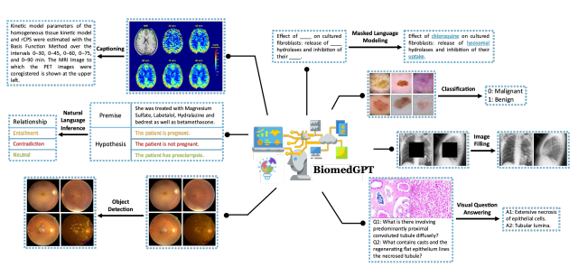
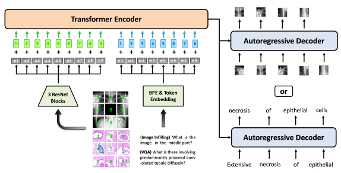
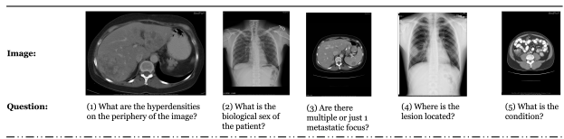
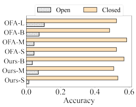
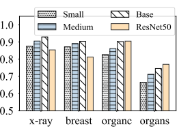
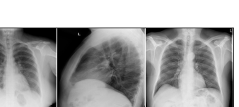

# Biomedgpt: A Unified And Generalist Biomedical Generative Pre-Trained Transformer For Vision, Language, And Multimodal Tasks

Kai Zhang1,†, Jun Yu1, Zhiling Yan1, Yixin Liu1, Eashan Adhikarla1, Sunyang Fu2**, Xun Chen**3, Chen Chen4, Yuyin Zhou5, Xiang Li6, Lifang He1, Brian D. Davison1, Quanzheng Li6**, Yong Chen**7, Hongfang Liu2 **and Lichao Sun**1,†
1Lehigh University, 2Mayo Clinic, 3Samsung Research America, 4University of Central Florida, 5University of California, Santa Cruz, 6Massachusetts General Hospital and Harvard Medical School, 7University of Pennsylvania, †Corresponding authors
{kaz321, lis221}@lehigh.edu

## Abstract

In this paper, we introduce a unified and generalist Biomed**ical** Generative Pre-trained Transformer (**BiomedGPT**) model, which leverages self-supervision on large and diverse datasets to accept multi-modal inputs and perform a range of downstream tasks. Our experiments demonstrate that BiomedGPT delivers expansive and inclusive representations of biomedical data, outperforming the majority of preceding state-of-the-art models across five distinct tasks with 20 public datasets spanning over 15 unique biomedical modalities. Through the ablation study, we also showcase the efficacy of our multi-modal and multitask pretraining approach in transferring knowledge to previously unseen data. Overall, our work presents a significant step forward in developing unified and generalist models for biomedicine, with far-reaching implications for improving healthcare outcomes.

Figure 1: Illustration of the diverse range of tasks supported by BiomedGPT during pretraining and subsequent fine-tuning. During the pretraining phase, we employ prevalent unimodal strategies, including masked language modeling and masked image infilling, and multimodal techniques, such as visual question answering and captioning. Object detection is also incorporated into the pretraining to infuse locational data. Following pretraining, the enhanced model is leveraged for a suite of five downstream tasks, encompassing image classification and natural language inference, demonstrating its efficient utilization of data.

1

## 1 Introduction

In the rapidly evolving landscape of artificial intelligence (AI), transformer-based foundation models (Vaswani et al., 2017; Dosovitskiy et al., 2020; Bommasani et al., 2021; Zhou et al., 2023) have emerged as a powerful tool for solving a wide range of biomedical challenges, e.g., radiograph analysis (Park et al., 2022; Zhou et al., 2022), biomedical text generation (Luo et al., 2022), disease prediction (Rasmy et al., 2021), and cell type annotation (Yang et al., 2022a). The prevailing paradigm for biomedical foundation models is the pretraining then fine-tuning. Specifically, a model is first pre-trained on a large-scale dataset and then finetuned on downstream datasets, facilitating knowledge transfer from the source domain to the target domain (Niu et al., 2020). Instead of supervised pretraining, which is constrained by the availability of labeled data, self-supervised approaches that can learn from vast amounts of data without explicit human labeling have gained widespread adoption (Balestriero et al., 2023; Huang et al., 2023; Nadif & Role, 2021; Krishnan et al., 2022). For example, BERT-derived (Devlin et al., 2018; Rasmy et al., 2021; Lee et al., 2020; Gu et al., 2021; Chakraborty et al., 2020; Alsentzer et al., 2019b) and GPT-derived Radford et al. (2019); Luo et al. (2022); Kraljevic et al. (2021) models have been extensively studied in biomedical natural language processing and gained improved performance over prior methods. In biomedical imaging analysis, the Vision Transformer (ViT) (Dosovitskiy et al., 2020) is regarded as the pretraining backbone for various tasks, including image segmentation, detection, classification, and synthesis, and also achieves promising performance (Shamshad et al., 2023; Valanarasu et al., 2021; Kong et al., 2021; Manzari et al., 2023). In recent years, the increasing availability of biomedical data has set the stage for the development of multimodal AI solutions that capture the intricacies of human health and disease (Acosta et al., 2022).

Given biomedical data's complexity and high dimensionality, most efforts focus on vision-language pretraining instead of omni-modal fusion (Selivanov et al., 2023; Chambon et al., 2022). To enable multimodal models to effectively understand both images and textual contexts, as well as to infer the associations between them accurately, researchers typically pre-train visual/textual embedders and cross-modal modules using imagetext matching and masked language modeling objectives on images and their corresponding descriptions (Kim et al., 2021; Li et al., 2020; Delbrouck et al., 2022; Yan & Pei, 2022; Khare et al., 2021; Chen et al., 2022c). The CLIP architecture and its underlying contrastive pretraining (Radford et al., 2021; Jia et al., 2021), which aims to match paired image and caption embeddings while pushing others apart for improved representation transferability, has also been applied in biomedical AI, yielding acceptable zero-shot performance (Zhang et al., 2022; Huang et al., 2021; Wang et al., 2022c; Eslami et al., 2023; Zhang et al., 2023). However, due to the limited volume and modalities in existing labeled biomedical datasets, previous works have primarily focused on either task/domain-specific or modality-specific applications, significantly restricting their practical utility1. Considering the disease classification task, the International Classification of Diseases, tenth Revision (ICD-10) currently covers approximately 69,832 diagnosis codes2, thus it is impractical and uneconomical to develop different models for each disease. Besides, such a specialized schema deviates from the demand of drawing a comprehensive picture in healthcare (Lindberg et al., 1993) as many seemingly irrelevant diseases or symptoms coexist and interact, e.g., diabetes is becoming the leading cause of new cases of blindness among adults (Fong et al., 2004). Researchers typically tackle this issue from the perspective of multitasking (Peng et al., 2020) and transferring (Raghu et al., 2019). However, these practices compel the available datasets to obey strong assumptions like homogeneous structures or overlapping distributions. Recent breakthroughs have produced a new class of unified and generalist AI models capable of performing diverse tasks with a unified architecture and shared parameters (Alayrac et al., 2022; Li et al., 2022; Wang et al., 2022b;a; Lu et al., 2022; Chen et al., 2022b; Reed et al., 2022; Gupta et al., 2022; Chen et al., 2023b). This remarkable advancement holds significant potential for the field of biomedicine, as it eliminates the need for specific models in specialized domains (inductive biases) by employing large-scale global-attention-based transformers (Vaswani et al., 2017; Yun et al., 2019b; Dosovitskiy et al., 2020). Inspired by OFA (Wang et al., 2022b), we propose BiomedGPT, a unified and generalist model designed for handling various types of data through straightforward serialization integrated with task-oriented prompts. Specifically, BiomedGPT

1In this work, we build a hierarchy considering tasks, domains, and modalities. For instance, in the early-stage Alzheimer's prediction task, the task is general and requires domain-specific inputs, such as radiological imaging, which can be further specified into diverse modalities, including computed tomography (CT), magnetic resonance imaging (MRI) and others.

2https://www.cdc.gov/nchs/icd/icd10.htm
embeds data from diverse input types within a common, multimodal vocabulary that can be applied across all tasks. This model utilizes a unified sequence-to-sequence abstraction for both the pretraining and finetuning stages. In addition, we infuse the task instructions directly into the input as plain text, obviating the need for extra parameters. This architectural design fosters efficient task performance, offering a seamless process regardless of the data modality or task. We pre-train and fine-tune BiomedGPT with a variety of biomedical datasets and tasks. Through comprehensive experiments, we demonstrate that BiomedGPT can effectively transfer knowledge across tasks and even compete with specialist models trained on single-domain or single-modality datasets. This is particularly evident in vision-language tasks, such as image captioning and visual question answering, where BiomedGPT achieves new state-of-the-art (SOTA) performance. By harnessing the power of our generalist biomedical model to analyze complex data, researchers can unlock a wealth of insights and advance our understanding of the biological mechanisms underlying human health and disease, paving the way for exciting new possibilities in diagnosing, treating, and preventing diseases.

Our contributions are summarized as follows:
- We present BiomedGPT, which, to our knowledge, is the first generalist AI model for biomedicine capable of accommodating various modalities, such as CT images and clinical notes, among others. It demonstrates an impressive performance across various downstream tasks, including a vision-only task, two language-only tasks, and two vision-language tasks.

- BiomedGPT is designed to encompass a wide range of domains in biomedicine. Our experimental results set a new benchmark, illustrating the feasibility of pretraining across diverse biomedical fields such as pathology, radiology, and academic literature. This is coupled with an ability to handle various body parts across different modalities.

- We conduct extensive studies to underline the efficacy and limitations of BiomedGPT. The insights gleaned from our study, summarized in Section 4, stand to contribute significantly to the development of future iterations of generalist biomedical AI models for the wider research community.

- We commit to open-source practices by providing access to our codes3. This includes all processes, such as data preprocessing, pretraining, and fine-tuning, to ensure reproducibility and encourage further development.

## 2 Biomedgpt Pipeline

Our proposed BiomedGPT is a transformer-based architecture specifically designed for the biomedical field, built upon the success of existing unified models for general data. We adhere to the fundamental principles of a generalist model: 1) Modality-Agnostic, 2) Task-Agnostic, and 3) Modality and Task Comprehensiveness. By discretizing data into patches or tokens, we achieve input/output unification using ideas from Vision Transformer (ViT) (Dosovitskiy et al., 2020) and Language Models (Lewis et al., 2020). We pre-train our model on a diverse set of biomedical modalities and tasks to enhance its transferability. Our encoderdecoder architecture maps multi-modal data with task-related instructions into a common representation space, which helps to address discrepancies among biomedical modalities. Figure 2 showcases a snapshot of the BiomedGPT training process, highlighting its comprehensive and generalist nature.

## 2.1 Architecture Selection

There are three mainstream architectures of the pre-trained foundation models (PFMs) (Sarrouti et al., 2022; Fu et al., 2023): 1) encoder-only, 2) decoder-only, and 3) encoder-decoder. The encoder-only models use only the encoder of a transformer, which focuses on learning useful representations of the inputs. The most popular model in the encoder-only family is BERT (Devlin et al., 2018), which has several variants (Lan et al., 2019; Sanh et al., 2019; Liu et al., 2019) and subsequent studies (Clark et al., 2020; Dosovitskiy et al., 2020). To perform diverse tasks, extra learnable modules, such as classification head and task-specific decoder, are required in fine-tuning. This means that encoder-only models may not be able to align the inputs and outputs of qualitatively different modalities and cannot conduct complicated

Figure 2: Illustration of the BiomedGPT model. This showcases two examples of pretraining through image infilling

 using a masked image and through PrefixLM (Wang et al., 2022d) using an image-text pair. For text-only corpora, we can easily exclude the image patches and use only textual tokens. For MLM pretraining, we will mask partial tokens in the text input.

zero-shot prediction or generation. On the other hand, the decoder-only models, such as OpenAI's GPTs (Radford et al., 2018; 2019; Brown et al., 2020) use only the decoder of a Transformer. Although a decoderonly model could do multi-tasking in a unified manner, it typically requires pre-existing representations or encodings of the input data to function. However, we have not seen an encoder that is sufficiently strong to encode all biomedical modalities. Besides, the decoder-only approach lacks the ability to learn joint representations across modalities and tasks, as it is focused solely on generating output based on a fixed input encoding. This can result in reduced model flexibility and suboptimal performance when faced with novel or complex tasks. Thus, we propose the adoption of an encoder-decoder architecture for BiomedGPT due to its exceptional ability to effectively map various modalities into a unified semantic representation space while successfully handling a wide range of diverse tasks. We follow OFA (Wang et al., 2022b) to design BiomedGPT, which takes BART (Lewis et al., 2019) as the backbone that is implemented as a sequence-to-sequence model with a BERT-style encoder over corrupted text and a GPT-style left-to-right autoregressive decoder. We make a few architectural changes to adapt the BART architecture for BiomedGPT. First, to improve the convergence efficiency and stability in the pretraining, we add three normalization operations to each layer: a post-attention Layer Norm (LN) (Ba et al., 2016), post-first-FFN LN, and head-wise scaling within self-attention, following (Shleifer et al., 2021). To encode positional information, we incorporate two sets of absolute position embeddings for both text and images. Rather than merely combining these embeddings with token and patch embeddings, we implement a decoupling method to separate position correlation (Kitaev & Klein, 2018; Ke et al., 2019). Furthermore, we also incorporate 1D relative position bias for text and 2D relative position bias for image, as described in previous works (Raffel et al., 2020; Dai et al., 2021; Wang et al., 2022d).

## 2.2 Input/Output Unification

To enable inputs with a wide range of modalities, including images, language, and bounding boxes, to be processed within a single model, it is necessary to embed them in a shared and unified space. For visual inputs, we directly apply CNN backbones to relax the heavy image feature extraction process, including object detection, following (Kim et al., 2021). Specifically, BiomedGPT receives the raw image xv ∈ R
H×W×C
and maps it into a flattened 1D sequence of patches xp ∈ R
N×D via a ResNet module as input for the transformer, where N =
HW
P 2 is the number of patches given the patch size of P × P, and D is the fixed hidden size of the transformer layers. We choose the first three blocks of ResNet layers due to their observed advantages over 1x1 convolution or naive linear projection used in ViT (Wang et al., 2022d). For linguistic inputs, we used byte-pair encoding (BPE) (Sennrich et al., 2016) to perform the subword tokenization. The subwords are then embedded into the input features. To handle diverse modalities without relying on task-specific output structures, we represent them with tokens drawn from a unified and finite vocabulary. To achieve this, we utilize the frozen image quantization (Van Den Oord et al., 2017; Esser et al., 2021) and object descriptor (Chen et al., 2022a;b) to discretize the images and objects on the target side, respectively. As to the text outputs, such as object labels and summarizations, we represent them with BPE tokens. To be more specific, the image with 256×256 resolution is sparsely encoded into a sequence of 16 × 16, which is strongly correlated with the corresponding patch (Bao et al., 2021) and can effectively reduce the sequence length of the image representation. The bounding boxes of objects in an image are expressed as sequences of location tokens in the format of integers. We hereby build a unified vocabulary for all tokens of multi-modal outputs.

| Type     | Pretraining   | Source                  | Domain / Modality                                                   | #Images         | #Sample      |
|----------|---------------|-------------------------|---------------------------------------------------------------------|-----------------|--------------|
|          | Captioning    | MedICat IU X\-ray       | Radiology, histology, scope procedures, others  Chest x\-ray        | 217,060  7,470  | 217,060      |
| Vision & |               | Peir Gross              | Pathology / clinical photographs                                    | 7.442           | 7,470  7.442 |
| Language | VQA           | SLAKE                   | Radiology (head, neck, chest, abdomen, pelvic cavity)               | 642             | 7,033 (EN)   |
|          |               | PathVQA                 | The entire domain of pathology (He et al., 2020)                    | 4,998           | 32,799       |
| Vision   | Detection     | DeepLesion CheXpert     | CT (lung nodules, liver tumors, lymph nodes, etc)  Chest radiograph | 32,120  224,315 | 32,735  \-   |
|          |               | OIA\-DDR                | Fundus cameras                                                      | 755             | 13,673       |
|          | Image Filling | CytoImageNet            | Microscopy                                                          | 890K            | \-           |
|          |               | ISIC (2020)             | Dermoscopy                                                          | 33,126          | \-           |
|          |               | Retinal Fundus          | Ophthalmology                                                       | 5,126           | \-           |
| Language | MLM           | PubMed Abstracts        | Biomedcial articles                                                 | \-              | 181 M        |
|          |               | NCBI BioNLP             | Chemicals annotations, biomedical articles                          | \-              | 52,976       |
|          |               | MIMIC\-III Clinic Notes | Medical records                                                     | \-              | 1.8 M        |

Table 1: Statistics of datasets for pretraining. "\#Image" represents the total number of distinct images, and "\#Sample" represents the number of training samples (e.g., the image-caption pair).

## 2.3 Natural Language As A Task Manager

Multitasking is a key attribute of a unified and generalist model. Following previous literature on language models using prompt / instruction learning (Brown et al., 2020; Liu et al., 2023; Wei et al., 2022; Gao et al., 2021; Schick & Schütze, 2021), and the existing unified frameworks to eliminate task-specific modules, we specify each task with a handcrafted instruction excluding some tasks like Visual Question Answering (VQA), which are fully specified by their text inputs. BiomedGPT supports abstractions of several tasks, including vision-only, text-only, and vision-language, to achieve task comprehensiveness. We provide details of the pretraining tasks, fine-tuning / inference tasks, as well as their corresponding instructions in the following.

Pretraining Tasks. We consider two vision-only tasks in the pretraining: for masked image modeling (MIM) as well as image infilling, we borrow the idea of blockwise masking (Bao et al., 2022) and let the model recover the masked patches in the middle part by generating the corresponding codes. The corresponding instruction is *"What is the image in the middle part?"*. For object detection (OD), the model learns to generate the bounding box of an object with the instruction of *"What are the objects in the image?"*. As to the text-only task, we adopt the commonly-used masked language modeling (MLM) while the instruction is "What is the complete text of 'A case of oral <mask> *anaphylaxis' ?"*. Two types of multi-modal tasks are selected, including image captioning with the instruction of *"What does the image describe?"* and VQA with the instruction of "{*Question*}". The addition of OD for pretraining BiomedGPT serves to enhance visual learning inspired by (Xu et al., 2021).

Fine-tuning and Inference Tasks. Besides image captioning and VQA used in pretraining, we cover one more vision-only task and two more text-only tasks. Specifically, we use the instruction *"What does*

| Model Scale     | #Params.   |            | Image Projection   |      | Representation (Size)   | Backbone (#)          |    |            |
|-----------------|------------|------------|--------------------|------|-------------------------|-----------------------|----|------------|
|                 |            | Input Size | Base Model         | Emb. | Hidden                  | Att. Head  Enc. Layer |    | Dec. Layer |
| BiomedGPTSmall  | 33M        | 256 × 256  | ResNet50           | 256  | 1024                    | 4                     | 4  | 4          |
| BiomedGPTMedium | 93M        | 256 × 256  | ResNet101          | 512  | 2048                    | 8                     | 4  | 4          |
| BiomedGPTBase   | 182M       | 384 × 384  | ResNet101          | 768  | 3072                    | 12                    | 6  | 6          |

Table 2: Detailed model configuration of BiomedGPT. During the pretraining phase, image processing involves resizing and cropping the images to varying resolutions, corresponding to the input sizes listed in the table. It should be noted that during fine-tuning and inference stages, the input resolution of BiomedGPT can be flexibly adjusted according to the specific requirements of the task.

the image describe?" to differentiate image classification. "What is the summary of text '{**Text***}'?"* and "Can text1 '{**Text1**}' imply text2 '{Text2*}'?"* are exploited for text summarization and natural language inference, respectively.

## 2.4 Gnerative Pretraining Via Seq2Seq

Autoregressive or sequence-to-sequence (seq2seq) is widely used in sequential modeling (Sutskever et al., 2014; Cho et al., 2014; Oord et al., 2016), such as large language modeling Lewis et al. (2019); Raffel et al.

(2020). Formally, suppose we are given a sequence of tokens xi,b as input, where i = 1, · · · , I indexes the tokens in a data sample and b = 1, · · · , B indexes a sample in a training batch. BiomedGPT's architecture is parametrized by θ. Then we autoregressively train the model via the chain rule as follows:

$${\mathcal{L}}_{\theta}({\bf x}_{1,1},\cdots,{\bf x}_{i,b})=-\sum_{b=1}^{B}\log\prod_{i=1}^{I}p_{\theta}({\bf x}_{i,b}|{\bf x}_{1,b},\cdots,{\bf x}_{i-1,b})=-\sum_{b=1}^{B}\sum_{i=1}^{I}\log p_{\theta}({\bf x}_{i,b}|{\bf x}_{<i,b})$$

Figure 3: The process example of trie-based beam search (beam size: 3, the maximum length of an output sequence: 4). Such search strategy can boost both the effectiveness and efficiency of BiomedGPT in various downstream tasks.

In the context of BiomedGPT, x could refer to both linguistic and visual tokens in the pretraining tasks, including subwords, image codes, and location tokens, as we mentioned in Section 2.2. Specifically, subwords are extracted by a BPE tokenizer, and we mask 30% of the tokens of the subwords in input in the MLM task as these medical words show relatively high overlapping degrees. For the OD task, location tokens are generated with Pix2Seq (Chen et al., 2022a) conditioned on the observed pixel inputs. We need data preprocessing for quantizing biomedical images using VQ-GAN (Esser et al., 2021) because they are surrounded by trivial semantics, e.g., black background and the unmet input size. Therefore, we first remove the trivial background and crop the image to the bounding box of the object of interest, then resize the cropped image to be 256×256, and feed the center part with 128×128 resolution into the pre-trained VQ-GAN to generate the corresponding sparse image codes, which are the target output in MIM task. Vision-language tasks follow the same tokenization flow. Note that for fine-tuning, we also apply seq2seq learning but with different datasets and tasks, as shown in Table 1 and Table 3. More implementation details are described in Section 3.1.

## 2.5 Autoregressive Inference

Inference in large language models often relies on decoding strategies like beam search to improve generation quality. However, such an approach poses challenges for classification tasks, including unnecessary

Table 3: Experimental results. The results of OrganMNIST consist of OrganAMNIST, OrganCMNIST and OrganSMNIST that correspond to axial / coronal / sagittal central slices. We only present state-of-the-art approaches if they provide open-sourced codes for guaranteed reproducibility. We did not re-run the methods but relied on the metrics reported in their original work, e.g., the SOTA results on MedMNIST v2 come from (Yang et al., 2021). Due to the absence of severe class imbalance on the selected downstream datasets, accuracy is appropriate to be used.

| Task               | Dataset         | Domain / Modality          | Metric   | SOTA                             |        |       | BiomedGPT   |            |
|--------------------|-----------------|----------------------------|----------|----------------------------------|--------|-------|-------------|------------|
|                    |                 |                            |          | Model                            | Result | Small | Medium      | Base       |
|                    | PathMNIST       | Colon Pathology            | Accuracy | ResNet\-50 (28)                  | 91.1   | 89.4  | 92.1        |            |
|                    | DermaMNIST      | Dermatoscope               | Accuracy | Google AutoML                    | 76.8   | 75.2  | 78.0        | 92.6  78.6 |
|                    | OCTMNIST        | Retinal OCT                | Accuracy | ResNet\-50 (224)                 | 77.6   | 79.5  | 81.9        | 81.6       |
|                    | PneumoniaMNIST  | Chest X\-Ray               | Accuracy | Google AutoML                    | 94.6   | 91.8  | 93.4        | 96.7       |
| Image              | RetinaMNIST     | Fundus Camera              | Accuracy | Google AutoML                    | 53.1   | 51.8  | 52.0        | 51.8       |
| Classification     | BreastMNIST     | Breast Ultrasound          | Accuracy | ResNet\-18 (28)                  | 86.3   | 84.6  | 87.8        | 87.8       |
|                    | BloodMNIST      | Blood Cell Microscope      | Accuracy | Google AutoML                    | 96.6   | 94.2  | 97.2        | 97.7       |
|                    | OrganAMNIST     | Abdominal CT               | Accuracy | ResNet\-18 (224)                 | 95.1   | 92.6  | 94.7        | 95.2       |
|                    | OrganCMNIST     | Abdominal CT               | Accuracy | ResNet\-18 (224)                 | 92.0   | 92.2  | 92.3        | 93.1       |
|                    | OrganSMNIST     | Abdominal CT               | Accuracy | ResNet\-18 (224)                 | 81.3   | 80.0  | 82.0        | 82.3       |
| Text Understanding | MedNLI          | Clinical Notes             | Accuracy | SciFive (Phan et al., 2021)      | 86.5   | 70.5  | 74.8        | 78.6       |
|                    | MeQSum          | Medical Questions          | ROUGE_L  | BioBART\-L (Yuan et al., 2022)   | 53.2   | 42.2  | 51.3        | 52.3       |
| Text Summarization | iCliniq         | Doctor Consultation Clinic | ROUGE\-L | BART\-B (Yuan et al., 2022)      | 59.7   | 55.2  | 57.2        | 56.2       |
|                    | HealthCareMagic | Doctor Consultation Clinic | ROUGE\-L | BART\-L (Yuan et al., 2022)      | 44.7   | 39.8  | 41.9        | 42.0       |
|                    |                 |                            | METEOR   |                                  | \-     | 11.0  | 11.0        | 14.6       |
|                    | IU X\-ray       | Chest X\-Ray               | ROUGE\-L | PPKED (Liu et al., 2021b)        | 37.6   | 26.8  | 28.0        | 30.2       |
|                    |                 |                            | CIDEr    |                                  | 35.1   | 29.6  | 31.3        | 36.0       |
|                    |                 |                            | METEOR   |                                  | 14.9   | 12.0  | 14.7        | 15.4       |
| Image              | Peir Gross      | Digital Camera             | ROUGE\-L | CoAttention (Jing et al., 2018)  | 27.9   | 25.8  | 24.0        | 36.0       |
| Captioning         |                 |                            | CIDEr    |                                  | 32.9   | 22.0  | 25.8        | 122.7      |
|                    |                 |                            | METEOR   | \-                               | \-     | 6.2   | 7.0         | 7.8        |
|                    | ROCO            | Radiology                  | ROUGE\-L | \-                               | \-     | 16.4  | 17.0        | 18.2       |
|                    |                 |                            | CIDEr    | \-                               | \-     | 13.2  | 17.6        | 24.2       |
| Visual Question    | SLAKE (EN)      | Radiology                  | Accuracy | VGG+SAN (Liu et al., 2021a)      | 75.4   | 68.9  | 71.5        | 81.9       |
|                    | PathVQA         | Pathology                  | Accuracy | MMQ (Do et al., 2021)            | 48.8   | 48.9  | 49.0        | 57.9       |
| Answering          | VQA\-RAD        | Radiology                  | Accuracy | PubMedCLIP (Eslami et al., 2021) | 72.1   | 40.3  | 69.4        | 71.6       |

optimization of the entire vocabulary and the possibility of generating invalid labels beyond the closed label set. To tackle these issues, we apply a beam search strategy that incorporates a prefix tree (also known as a trie), limiting the number of candidate tokens and resulting in more efficient and accurate decoding. Figure 3 demonstrates an example of trie-based beam search; along the path across "Lipid" and "breakdown", BiomedGPT sets logits for all invalid tokens ("mechanism" and "pathway") to −∞ when computing log-probabilities for the target token "in". It is worth noting that trie-based search is also applied during the validation phase of the fine-tuning stage for acceleration (approximately 16× increase in speed in our experiments).

## 3 Experiments

In this section, we showcase the experimental design and implementation details of BiomedGPT, along with its superior performance compared to previous state-of-the-art methods across various downstream tasks and datasets. We deliberately select data from different domains to show the promising generalization of our method.

## 3.1 Implementation Details

The total vocabulary size is 59457, with 50265 language tokens, 1000 location tokens, and 8192 vision tokens. The number of vision tokens is determined by the variant of the pre-trained VQ-GAN models used in the BiomedGPT, specifically, the OpenImages(Kuznetsova et al., 2020)-trained VQ-GAN with patch size of 8 and vocabulary size of 8192 using the Gumbel softmax (Jang et al., 2017; Maddison et al., 2017) quantization. During training, we randomly subsample 196 image patches for pretraining. The truncation to max model input length is set as 512.

To pretrain our BiomedGPT, we use the AdamW (Loshchilov & Hutter, 2019) optimizer with hyperparameters β1 = 0.9, β2 = 0.999, and ϵ = 1e−8. The peak learning rate is set to 1e−4, and we apply a linear decay scheduler with a warmup ratio of 0.01 to control the learning rate. For regularization, we set dropout to 0.1 and use a weight decay of 0.01. To enhance the training process, we use stochastic depth with a rate of 0.1 applied to the encoder and decoder, except for convolution blocks. Furthermore, we employ a diversified approach in mixing all pretraining data within each batch. This includes an assortment of multimodal, text-only, vision-only, and OD samples. The ratio applied is 8:2:1:1, which emphasizes learning and enhancing the interaction between vision and language. The models are pre-trained with 10 Nvidia A5000 GPUs and mixed precision, except for the models used for fine-tuning downstream tasks. The experimental settings, dependent on the task and data used, are described in detail in Appendix A. In order to investigate the performance of BiomedGPT for tasks at different scales, we explicitly design three scaling models, i.e., BiomedGPTSmall, BiomedGPTMedium, and BiomedGPTBase. The configurations for each model are detailed in Table 2. It can be observed, from the results in Table 3, that in most cases, larger models tend to perform better. However, in practical deployment, scaling models for better performance may not be economical or parameter-efficient in some datasets. For instance, the experimental results on BreastMNIST demonstrate that the medium-size model shows only a 0.2% accuracy improvement compared to the small model, but it requires approximately 3× more parameters.

## 3.2 Results On Unimodal Datasets

We select three unimodal tasks over 14 datasets, as shown in Table 3. For the image classification task, results show the classification accuracy on MedMNIST v2 Yang et al. (2021) (a set of benchmark datasets) covering several biomedical domains. Our BiomedGPTBase model achieves state-of-the-art accuracy on 9 out of 10 image-only datasets. Although we are behind the state-of-the-art by a small margin on RetinaMNIST, it is important to note that the dataset was initially designed for a regression task, and thereby the performance gap could be expected. We further investigate the model performance on text-only datasets. Our results show that for the natural language inference task with the MedNLI dataset, our model achieved an accuracy of 78.6%, which is lower than the state-of-the-art (SOTA) result of 86.5%. For text summarization, we focused on doctor-patient conversations and aimed to summarize the patient's medical questions. We used the ROUGE-L metric to measure performance. However, similar to the results in MedNLI, our model does not achieve satisfactory performance. There are several potential reasons for the difference in performance observed between our model and previous state-of-the-art models. First, our model has a constrained scale with fewer parameters than the SOTA models. Specifically, SciFive is based on T5-Large (Raffel et al., 2020) with 770 million parameters, and BioBart-Large has nearly 400 million parameters, while our largest model has only 182 million parameters. Second, our corpus scale is also constrained compared to SciFive, which processed a larger-scale corpus, including Colossal Clean Crawled Corpus (C4) (Raffel et al., 2020), PubMed Abstract4, and PubMed Central (PMC)5. Third, divergent data impact may have played a role. Our model was trained on a corpus that covers both biomedical articles and clinical notes, with the goal of building a unified and comprehensive model. However, it has been reported that models pre-trained on clinical notes can perform poorly on language tasks based on biomedical articles, and vice versa (Gu et al., 2021; Alsentzer et al., 2019a; Lehman et al., 2023). Addressing the substantial differences between text modalities is an open question that requires further investigation to improve the transferability of biomedical language models.

## 3.3 Results On Multimodal Datasets

BiomedGPT aims to tackle two multimodal tasks: image captioning and visual question answering, for which we have chosen three corresponding datasets each, as presented in Table 3. Specifically, we use SLAKE (English text only), PathVQA, VQA-RAD for VQA, IU X-ray, PEIR Gross, and ROCO for image captioning. Due to the limited availability of public multimodal biomedical datasets, we only pre-train our model on the training sets of some datasets and evaluate our prediction capability on the unseen testing sets.

4https://pubmed.ncbi.nlm.nih.gov 5https://www.ncbi.nlm.nih.gov/pmc

Figure 4: Examples from VQA-RAD with PubMedCLIP and our BiomedGPT. It is worth mentioning that, similar

 to PubMedCLIP, previous studies (Nguyen et al., 2019; Zhan et al., 2020) have also struggled to correctly interpret the question, resulting in irrelevant answers for the first three samples.

For evaluating image captioning, we employ three metrics, namely METEOR, ROUGE-L, and CIDEr, for a comprehensive comparison. During inference, we select the checkpoint with the highest CIDEr score obtained during fine-tuning. Our approach outperforms state-of-the-art methods in terms of CIDEr, particularly on the Peir Gross dataset, with a remarkable improvement of 273%. Although BiomedGPT falls short of PPKED regarding ROUGE-L on the IU X-ray dataset, it is crucial to note that this can be attributed to our model selection based on CIDEr rather than ROUGE-L during the validation phase. These two evaluation metrics accentuate different aspects of performance, as comprehensively discussed in Appendix D. Moreover, to our knowledge, no previous work is reported on the ROCO dataset; hence, we report our results without comparison. To evaluate the performance of VQA, we report the overall accuracy, which includes closed- and open-ended question-answer pairs. Our proposed model, BiomedGPT, achieves a significant improvement over previous state-of-the-art models on SLAKE (EN) and PathVQA datasets. We also observe that the performance improvement has not reached a plateau, and we believe that we can further improve the accuracy by increasing the number of fine-tuning epochs. Besides, BiomedGPT obtain comparable predictions on the VQA-RAD dataset. In our case analysis illustrated in Fig. 4, we observe that BiomedGPT often generates semantically correct outputs. An example is the middle image with the question indexed by (3), where "just one" is correctly inferred. However, the current evaluation framework counts only absolute matches, which may not fully reflect the model's capability to produce semantically accurate answers.

## 3.4 Results On Intra- & Inter-Distribution Transfer

We conducted intra- and inter-distribution inference experiments, performing zero-shot inference on seen and unseen datasets using our pre-trained checkpoints. These checkpoints were pre-trained on the training sets of SLAKE and PathVQA, and we evaluated their performance on the testing sets of those two datasets and VQA-RAD. Our results in Table 4 indicate that BiomedGPT achieves excellent performance, particularly when using a larger model, on SLAKE and PathVQA. However, pre-trained on general datasets like ImageNet, the baseline OFA model experienced substantial performance degradation on these two datasets. In comparison, OFA attains performance similar to BiomedGPT on the VQA- RAD dataset, but neither model excels compared to the post-fine-tuning outcomes presented in Table 3. We hypothesize that the models may overfit the familiar intra-domain distribution and have difficulties handling out-of-distribution data. Upon examining the generated answers from BiomedGPT, we also observe its tendency to overfit intra-distribution instructions, leading to challenges in comprehending unseen questions and producing uncontrolled outputs. As an example, when presented with the 14th question *"Where is the pathology in this image?"* from the VQA-RAD dataset, BiomedGPTBase predicts *< code*_7948 *>< code*_5859 >< code_771 > · · · *< code*_7077 *>< code*_7077 >, indicating that the model had mistakenly interpreted the VQA task as an image generation task. Although both BiomedGPTMedisum/Small and OFABase generate text-only answer "No", it still does not match the openended ground truth of "Head". Figure 5 displays the open- and closed-ended accuracies in transfer learning on VQA-RAD data. We observed that models exhibit catastrophic performance on open-ended questions. Note that there are 251 out of 451 closed-ended QA pairs (either "Yes" or "No") in the VQA-RAD test set, with the remainder being open questions. These observations shed light on the instruction-sensitivity challenge that arises in instruction-guided pretraining when building a unified and generalist biomedical model. To delve deeper into this issue, we present a case study in Appendix A. Additionally, our findings from the intra- and inter-distribution transfer learning experiments suggest that data diversity and scale are crucial factors in enhancing the generalist intelligence of BiomedGPT. However, due to the limited volume and diversity of existing biomedical datasets, as well as concerns regarding data privacy and imbalance, we plan to explore data augmentation and synthetic biomedical datasets in our future work.

Table 4: Intra- & inter-distribution transfer performance on VQA tasks in terms of accuracy. The best results are

| Dataset    | Model   | Small   | Medium   | Base   | Large   |
|------------|---------|---------|----------|--------|---------|
| SLAKE (EN) | Ours    | 46.18   | 71.62    | 72.66  | \-      |
|            | OFA     | 1.89    | 1.04     | 1.79   | 1.60    |
| PathVQA    | Ours    | 33.74   | 48.22    | 45.66  | \-      |
|            | OFA     | 21.08   | 24.66    | 28.98  | 29.30   |
| VQA\-RAD   | Ours    | 30.38   | 31.49    | 33.26  | \-      |
|            | OFA     | 31.49   | 34.81    | 30.82  | 33.92   |

highlighted with **BOLD** values.

## 3.5 Ablation Study On Pretraining Tasks

In this section, we demonstrate the effectiveness of pretraining modules. Table 5 shows the results of the same setting for each model on the same data. It is important to note that the evaluation data used in the table was not seen during pretraining for a fair comparison. Overall, we observe that pretraining without using biomedical data (w/o PTB) will result in failure on multimodal tasks such as image captioning on ROCO and VQA on VQA-RAD. Additionally, we found that the absence of MLM and MIM will affect the performance of text-only and image-only tasks, respectively. Another interesting observation is that pre-trained OFA can achieve better performance on text-only datasets, MeQSum and NLI. This performance may be related to the fact that the text information is not "professional" enough and contains too much natural / general language. Furthermore, if we remove MIM, we observe better performance. This suggests that multi-modal pretraining may influence the unimodal tasks, especially text-only tasks, as the image is not necessarily required. In contrast, for image-only tasks, at least a dictionary of text tokens is needed for label generation.

Figure 5: The zero-shot performance of pre-trained

 BiomedGPT and OFA with different model scales.

Here, the model sizes are denoted by 'L', 'B', 'M',
and 'S', which stand for large-, base-, medium-, and small-sized models, respectively.

## 3.6 Ablation Study On Pretraining Modalities

This section addresses the query: *"Can the proposed model handle unseen data modalities (e.g., images* from a new different imaging device like an ultrasound)?" To investigate this, we have adjusted our dataset

| Model     | Pneumonia   | ROCO   | VQA\-RAD   | MeQSum   | MedNLI   |
|-----------|-------------|--------|------------|----------|----------|
| OursSmall | 91.8        | 13.2   | 37.5       | 42.2     | 69.3     |
| w/o MLM   | 87.0        | 12.0   | 32.4       | 19.1     | 68.6     |
| w/o MIM   | 88.3        | 12.2   | 33.5       | 44.3     | 69.9     |
| w/o OD    | 88.3        | 12.7   | 37.7       | 44.8     | 68.2     |
| w/o PTB   | 88.9        | 6.8    | 2.5        | 46.6     | 72.6     |

Table 5: Ablation study on holding out task groups. All the results are obtained from the small-scale model.

selection for both pretraining and downstream tasks. Specifically, we've drawn 3,489 and 6,461 chest X-Ray image-text pairs from SLAKE (EN) and IU X-ray datasets, respectively. Additionally, we selected an equal quantity of images (7,452) from CheXpert while disabling MLM and OD during pretraining for simplification.

The pre-trained BiomedGPTSmall on X-Ray modality is subsequently fine-tuned on chest x-ray (x-ray), breast ultrasound (breast) and liver CT (organc and organs) within the radiology field. The process consists of 500 update steps, and the resulting performance is depicted in Figure 6. These outcomes underscore the impressive in-domain transferability of BiomedGPT. Furthermore, our findings indicate that BiomedGPT can perform well with out-of-domain modalities when the subjects of the medical imaging are anatomically adjacent, such as chest versus breast, in our experiment. We intentionally limit the update steps to observe the efficiency of transfer between pretraining and downstream modalities. While BiomedGPT may not have achieved superior accuracies on the Liver CT datasets, we nevertheless observe performance saturation with increasing training steps. This suggests that BiomedGPT is capable of delivering solid results with more differentiated biomedical modalities across different body parts, albeit requiring additional training steps. Additional results are detailed in Appendix B.4.

Figure 6: The classification accuracy of BiomedGPT, fine-tuned with both seen (x-ray) and unseen (ultrasound and CT) modalities, is depicted in this comparison. Here, ResNet-50, trained from scratch according to the protocol in (Yang et al., 2021), serves as a reference baseline.

## 4 Discussion

Main Findings. In this study, we have shown that BiomedGPT can achieve competitive performance across various tasks, spanning vision, language, and multimodal domains. This is achieved by integrating a diverse range of biomedical modalities and tasks within a unified seq2seq pretraining framework. Our comprehensive experiments and ablation studies underscore the pivotal role of incorporating a wide variety of tasks and modalities in the construction of a generalist biomedical AI model. Notably, the inclusion of a broad spectrum of biomedical tasks and modalities in the pretraining phase significantly enhances the fine-tuning efficiency and ultimately bolsters the overall performance of the model. This improvement is attributed to the implicit interactions among these different factors. We noticed a fascinating observation in our studies: while OFA—a generalist model pre-trained with generic data—exhibits impressive zero-shot performance on VQA- RAD data as outlined in Table 4, it encounters difficulty when attempting to align image-text pairs during the fine-tuning phase. This challenge is evident in Table 5, where OFA's performance within a restricted number of epochs is distinctly low, achieving only 6.8 CIDEr and 2.6 accuracy for captioning and VQA tasks, respectively. This observation underscores the phenomenon that an effective zero-shot model does not necessarily translate into a superior starting point for fine-tuning tasks. BiomedGPT manages to surmount these limitations associated with multi-modal, multi-task pretraining. Furthermore, our exploration of the scaling laws proposed by Kaplan et al. (Kaplan et al., 2020) reveals that enlarging the scale of the model leads to a considerable boost in performance. In conclusion, by expanding the scale of data, tasks, and the model, we foresee substantial enhancements in BiomedGPT's few-shot and zero-shot inference capabilities. Limitations and Suggestions. Our extensive experiments have revealed several limitations of BiomedGPT. A primary concern is the model's sensitivity toward instructions. There are instances where the model fails to understand the instructions and makes catastrophic predictions, even producing irrelevant data types such as image codes for a VQA task. A straightforward solution could be to broaden the diversity of high-quality instruction sets during pretraining. Additionally, we must investigate methods for achieving a balance in data diversity. This encompasses aspects such as establishing suitable size ratios for data within different biomedical modalities in a batch and throughout the entire pretraining dataset and determining the optimal sequence for training with diverse inputs. Another potential avenue is to align BiomedGPT with human intent via reinforcement learning from human or AI feedback (RLF) (Ouyang et al., 2022; Bai et al., 2022; Zhou et al., 2023), a strategy employed by the latest dialogue agents such as ChatGPT6 and Claude7. However, creating specific biomedical RLF datasets would be expensive, given the extensive need for domain experts. A further significant limitation arises from two specific inputs for text-only downstream tasks: the considerable difference between clinical notes and general-domain & biomedical text (Lehman et al., 2023; Gu et al., 2021), and the presence of vision-only tasks, which can impede the model's pattern extraction from the pure text during pretraining, as highlighted in our ablation study in Section 3.5. Generating a representative vocabulary from all domains and increasing the ratio of text inputs during pretraining may help address these issues. However, this is a balancing act as it may influence vision-related tasks. Lastly, there is the issue of fine-tuning efficiency with respect to training speed and memory bottleneck, particularly as we aim to develop a large-scale generalist biomedical model. An emerging research direction that could address this is parameter-efficient fine-tuning (PEFT) (Ding et al., 2023; Liu et al., 2022; Lialin et al., 2023), which fine-tunes a small number of (extra) model parameters while keeping most parameters of the pre-trained models frozen. In our work, we attempt to apply prompt tuning but we do not receive the expected results; details are described in Appendix B.3.

## 5 Conclusion

We have presented BiomedGPT, a unified and generalist framework modeling multimodal tasks in medicine together, including radiographs, digital images, text, and bounding boxes. This task-, domain- and modalityagnostic model learns the universal comprehensiveness across different tasks and supports the unification of architecture. In addition, there's no requirement for further modifications to be specified during the finetuning phase, which can save valuable time and effort. The experiments conducted on approximately 20 public biomedical datasets validate that BiomedGPT can compete with previous SOTAs in recent years, which is exciting and provides the possibility of comprehensive representations used for versatile biomedical tasks. Our combined training approach has the potential to facilitate data-driven solutions to real-world problems in the biomedical domain. We further test zero-shot learning performance in domain/task transfer, verifying its effectiveness on biomedical tasks. Additionally, we conduct ablation studies in which we exclude certain task and modality groups. The objective is to examine the effects of various pretraining tasks and modalities on downstream performance. This area of study, currently open and ripe for further exploration, could provide valuable insights into the interactions between task and modality in the pretraining process. In the future, we hope to combine more meaningful tasks in medicine (e.g., segmentation, relation extraction) and more modalities into BiomedGPT and endeavor to understand the reason why universal representations can work well.

6https://openai.com/blog/chatgpt 7https://www.anthropic.com/index/introducing-claude

## References

Asma Ben Abacha and Dina Demner-Fushman. On the summarization of consumer health questions. In Proceedings of the 57th Annual Meeting of the Association for Computational Linguistics, pp. 2228–2234, 2019.

Julián N Acosta, Guido J Falcone, Pranav Rajpurkar, and Eric J Topol. Multimodal biomedical ai. Nature Medicine, 28(9):1773–1784, 2022.

Jean-Baptiste Alayrac, Jeff Donahue, Pauline Luc, Antoine Miech, Iain Barr, Yana Hasson, Karel Lenc, Arthur Mensch, Katie Millican, Malcolm Reynolds, et al. Flamingo: a visual language model for few-shot learning. *arXiv preprint arXiv:2204.14198*, 2022.

Emily Alsentzer, John Murphy, William Boag, Wei-Hung Weng, Di Jindi, Tristan Naumann, and Matthew McDermott. Publicly available clinical BERT embeddings. In Proceedings of the 2nd Clinical Natural Language Processing Workshop, pp. 72–78, Minneapolis, Minnesota, USA, June 2019a. Association for Computational Linguistics. doi: 10.18653/v1/W19-1909.

Emily Alsentzer, John R Murphy, Willie Boag, Wei-Hung Weng, Di Jin, Tristan Naumann, WA Redmond, and Matthew BA McDermott. Publicly available clinical bert embeddings. *NAACL HLT 2019*, pp. 72, 2019b.

Jimmy Lei Ba, Jamie Ryan Kiros, and Geoffrey E Hinton. Layer normalization. *arXiv preprint* arXiv:1607.06450, 2016.

Yuntao Bai, Saurav Kadavath, Sandipan Kundu, Amanda Askell, Jackson Kernion, Andy Jones, Anna Chen, Anna Goldie, Azalia Mirhoseini, Cameron McKinnon, et al. Constitutional ai: Harmlessness from ai feedback. *arXiv preprint arXiv:2212.08073*, 2022.

Randall Balestriero, Mark Ibrahim, Vlad Sobal, Ari Morcos, Shashank Shekhar, Tom Goldstein, Florian Bordes, Adrien Bardes, Gregoire Mialon, Yuandong Tian, et al. A cookbook of self-supervised learning. arXiv preprint arXiv:2304.12210, 2023.

Satanjeev Banerjee and Alon Lavie. Meteor: An automatic metric for mt evaluation with improved correlation with human judgments. In Proceedings of the acl workshop on intrinsic and extrinsic evaluation measures for machine translation and/or summarization, pp. 65–72, 2005.

Hangbo Bao, Li Dong, and Furu Wei. Beit: Bert pre-training of image transformers. arXiv preprint arXiv:2106.08254, 2021.

Hangbo Bao, Li Dong, Songhao Piao, and Furu Wei. Beit: BERT pre-training of image transformers. In The Tenth International Conference on Learning Representations, ICLR 2022, Virtual Event, April 25-29, 2022. OpenReview.net, 2022. URL https://openreview.net/forum?id=p-BhZSz59o4.

Rishi Bommasani, Drew A Hudson, Ehsan Adeli, Russ Altman, Simran Arora, Sydney von Arx, Michael S
Bernstein, Jeannette Bohg, Antoine Bosselut, Emma Brunskill, et al. On the opportunities and risks of foundation models. *arXiv preprint arXiv:2108.07258*, 2021.

Tom Brown, Benjamin Mann, Nick Ryder, Melanie Subbiah, Jared D Kaplan, Prafulla Dhariwal, Arvind Neelakantan, Pranav Shyam, Girish Sastry, Amanda Askell, et al. Language models are few-shot learners. Advances in neural information processing systems, 33:1877–1901, 2020.

Souradip Chakraborty, Ekaba Bisong, Shweta Bhatt, Thomas Wagner, Riley Elliott, and Francesco Mosconi.

Biomedbert: A pre-trained biomedical language model for qa and ir. In Proceedings of the 28th International Conference on Computational Linguistics, pp. 669–679, 2020.

Pierre Chambon, Christian Bluethgen, Curtis P Langlotz, and Akshay Chaudhari. Adapting pretrained vision-language foundational models to medical imaging domains. *arXiv preprint arXiv:2210.04133*, 2022.

Jiaao Chen, Aston Zhang, Xingjian Shi, Mu Li, Alex Smola, and Diyi Yang. Parameter-efficient fine-tuning design spaces. In *The Eleventh International Conference on Learning Representations*, 2023a. URL https://openreview.net/forum?id=XSRSWxyJIC.

Jieneng Chen, Yingda Xia, Jiawen Yao, Ke Yan, Jianpeng Zhang, Le Lu, Fakai Wang, Bo Zhou, Mingyan Qiu, Qihang Yu, et al. Towards a single unified model for effective detection, segmentation, and diagnosis of eight major cancers using a large collection of ct scans. *arXiv preprint arXiv:2301.12291*, 2023b.

Ting Chen, Saurabh Saxena, Lala Li, David J. Fleet, and Geoffrey Hinton. Pix2seq: A language modeling framework for object detection. In *International Conference on Learning Representations*, 2022a. URL https://openreview.net/forum?id=e42KbIw6Wb.

Ting Chen, Saurabh Saxena, Lala Li, Tsung-Yi Lin, David J Fleet, and Geoffrey E Hinton. A unified sequence interface for vision tasks. *Advances in Neural Information Processing Systems*, 35:31333–31346, 2022b.

Zhihong Chen, Yuhao Du, Jinpeng Hu, Yang Liu, Guanbin Li, Xiang Wan, and Tsung-Hui Chang. Multimodal masked autoencoders for medical vision-and-language pre-training. In *Medical Image Computing* and Computer Assisted Intervention–MICCAI 2022: 25th International Conference, Singapore, September 18–22, 2022, Proceedings, Part V, pp. 679–689. Springer, 2022c.

Kyunghyun Cho, Bart van Merriënboer, Caglar Gulcehre, Dzmitry Bahdanau, Fethi Bougares, Holger Schwenk, and Yoshua Bengio. Learning phrase representations using RNN encoder–decoder for statistical machine translation. In Proceedings of the 2014 Conference on Empirical Methods in Natural Language Processing (EMNLP), pp. 1724–1734, Doha, Qatar, October 2014. Association for Computational Linguistics. doi: 10.3115/v1/D14-1179. URL https://aclanthology.org/D14-1179.

Kevin Clark, Minh-Thang Luong, Quoc V. Le, and Christopher D. Manning. Electra: Pre-training text encoders as discriminators rather than generators. In *International Conference on Learning Representations*,
2020. URL https://openreview.net/forum?id=r1xMH1BtvB.

Ekin D Cubuk, Barret Zoph, Jonathon Shlens, and Quoc V Le. Randaugment: Practical automated data augmentation with a reduced search space. In Proceedings of the IEEE/CVF conference on computer vision and pattern recognition workshops, pp. 702–703, 2020.

Yin Cui, Guandao Yang, Andreas Veit, Xun Huang, and Serge Belongie. Learning to evaluate image captioning. In *Proceedings of the IEEE conference on computer vision and pattern recognition*, pp. 5804–5812, 2018.

Zihang Dai, Hanxiao Liu, Quoc V Le, and Mingxing Tan. Coatnet: Marrying convolution and attention for all data sizes. *Advances in Neural Information Processing Systems*, 34:3965–3977, 2021.

Jean-Benoit Delbrouck, Khaled Saab, Maya Varma, Sabri Eyuboglu, Pierre Chambon, Jared Dunnmon, Juan Zambrano, Akshay Chaudhari, and Curtis Langlotz. Vilmedic: a framework for research at the intersection of vision and language in medical ai. In *Proceedings of the 60th Annual Meeting of the Association for* Computational Linguistics: System Demonstrations, pp. 23–34, 2022.

Dina Demner-Fushman, Marc D Kohli, Marc B Rosenman, Sonya E Shooshan, Laritza Rodriguez, Sameer Antani, George R Thoma, and Clement J McDonald. Preparing a collection of radiology examinations for distribution and retrieval. *Journal of the American Medical Informatics Association*, 23(2):304–310, 2016.

Jacob Devlin, Ming-Wei Chang, Kenton Lee, and Kristina Toutanova. Bert: Pre-training of deep bidirectional transformers for language understanding. *arXiv preprint arXiv:1810.04805*, 2018.

Ning Ding, Yujia Qin, Guang Yang, Fuchao Wei, Zonghan Yang, Yusheng Su, Shengding Hu, Yulin Chen, Chi-Min Chan, Weize Chen, et al. Parameter-efficient fine-tuning of large-scale pre-trained language models. *Nature Machine Intelligence*, pp. 1–16, 2023.

Tuong Do, Binh X Nguyen, Erman Tjiputra, Minh Tran, Quang D Tran, and Anh Nguyen. Multiple metamodel quantifying for medical visual question answering. In *International Conference on Medical Image* Computing and Computer-Assisted Intervention, pp. 64–74. Springer, 2021.

Alexey Dosovitskiy, Lucas Beyer, Alexander Kolesnikov, Dirk Weissenborn, Xiaohua Zhai, Thomas Unterthiner, Mostafa Dehghani, Matthias Minderer, Georg Heigold, Sylvain Gelly, et al. An image is worth 16x16 words: Transformers for image recognition at scale. *arXiv preprint arXiv:2010.11929*, 2020.

Emma Dugas, Jared, Jorge, and Will Cukierski. Diabetic retinopathy detection, 2015. URL https://
kaggle.com/competitions/diabetic-retinopathy-detection.

Sedigheh Eslami, Gerard de Melo, and Christoph Meinel. Does clip benefit visual question answering in the medical domain as much as it does in the general domain? *arXiv preprint arXiv:2112.13906*, 2021.

Sedigheh Eslami, Christoph Meinel, and Gerard De Melo. Pubmedclip: How much does clip benefit visual question answering in the medical domain? In Findings of the Association for Computational Linguistics: EACL 2023, pp. 1151–1163, 2023.

Patrick Esser, Robin Rombach, and Bjorn Ommer. Taming transformers for high-resolution image synthesis.

In *Proceedings of the IEEE/CVF conference on computer vision and pattern recognition*, pp. 12873–12883, 2021.

Donald S Fong, Lloyd Aiello, Thomas W Gardner, George L King, George Blankenship, Jerry D Cavallerano, Fredrick L Ferris III, Ronald Klein, and American Diabetes Association. Retinopathy in diabetes. *Diabetes* care, 27(suppl_1):s84–s87, 2004.

Zihao Fu, Wai Lam, Qian Yu, Anthony Man-Cho So, Shengding Hu, Zhiyuan Liu, and Nigel Collier. Decoderonly or encoder-decoder? interpreting language model as a regularized encoder-decoder. *arXiv preprint* arXiv:2304.04052, 2023.

Tianyu Gao, Adam Fisch, and Danqi Chen. Making pre-trained language models better few-shot learners.

In Proceedings of the 59th Annual Meeting of the Association for Computational Linguistics and the 11th International Joint Conference on Natural Language Processing (Volume 1: Long Papers), pp. 3816–3830, 2021.

Ary L Goldberger, Luis AN Amaral, Leon Glass, Jeffrey M Hausdorff, Plamen Ch Ivanov, Roger G Mark, Joseph E Mietus, George B Moody, Chung-Kang Peng, and H Eugene Stanley. Physiobank, physiotoolkit, and physionet: components of a new research resource for complex physiologic signals. *circulation*, 101 (23):e215–e220, 2000.

Yu Gu, Robert Tinn, Hao Cheng, Michael Lucas, Naoto Usuyama, Xiaodong Liu, Tristan Naumann, Jianfeng Gao, and Hoifung Poon. Domain-specific language model pretraining for biomedical natural language processing. *ACM Transactions on Computing for Healthcare (HEALTH)*, 3(1):1–23, 2021.

Tanmay Gupta, Amita Kamath, Aniruddha Kembhavi, and Derek Hoiem. Towards general purpose vision systems: An end-to-end task-agnostic vision-language architecture. In Proceedings of the IEEE/CVF Conference on Computer Vision and Pattern Recognition, pp. 16399–16409, 2022.

Xuehai He, Yichen Zhang, Luntian Mou, Eric Xing, and Pengtao Xie. Pathvqa: 30000+ questions for medical visual question answering. *arXiv preprint arXiv:2003.10286*, 2020.

Stanley Bryan Z Hua, Alex X Lu, and Alan M Moses. Cytoimagenet: A large-scale pretraining dataset for bioimage transfer learning. *arXiv preprint arXiv:2111.11646*, 2021.

Shih-Cheng Huang, Liyue Shen, Matthew P Lungren, and Serena Yeung. Gloria: A multimodal globallocal representation learning framework for label-efficient medical image recognition. In Proceedings of the IEEE/CVF International Conference on Computer Vision, pp. 3942–3951, 2021.

Shih-Cheng Huang, Anuj Pareek, Malte Jensen, Matthew P Lungren, Serena Yeung, and Akshay S Chaudhari. Self-supervised learning for medical image classification: a systematic review and implementation guidelines. *npj Digital Medicine*, 6(1):74, 2023.

Jeremy Irvin, Pranav Rajpurkar, Michael Ko, Yifan Yu, Silviana Ciurea-Ilcus, Chris Chute, Henrik Marklund, Behzad Haghgoo, Robyn Ball, Katie Shpanskaya, et al. Chexpert: A large chest radiograph dataset with uncertainty labels and expert comparison. In Proceedings of the AAAI conference on artificial intelligence, pp. 590–597, 2019.

Stefan Jaeger, Sema Candemir, Sameer Antani, Yì-Xiáng J Wáng, Pu-Xuan Lu, and George Thoma. Two public chest x-ray datasets for computer-aided screening of pulmonary diseases. *Quantitative imaging in* medicine and surgery, 4(6):475, 2014.

Eric Jang, Shixiang Gu, and Ben Poole. Categorical reparameterization with gumbel-softmax. In International Conference on Learning Representations, 2017.

Chao Jia, Yinfei Yang, Ye Xia, Yi-Ting Chen, Zarana Parekh, Hieu Pham, Quoc Le, Yun-Hsuan Sung, Zhen Li, and Tom Duerig. Scaling up visual and vision-language representation learning with noisy text supervision. In *International Conference on Machine Learning*, pp. 4904–4916. PMLR, 2021.

Baoyu Jing, Pengtao Xie, and Eric Xing. On the automatic generation of medical imaging reports. In Proceedings of the 56th Annual Meeting of the Association for Computational Linguistics (Volume 1: Long Papers), pp. 2577–2586, 2018.

Alistair EW Johnson, Tom J Pollard, Lu Shen, Li-wei H Lehman, Mengling Feng, Mohammad Ghassemi, Benjamin Moody, Peter Szolovits, Leo Anthony Celi, and Roger G Mark. Mimic-iii, a freely accessible critical care database. *Scientific data*, 3(1):1–9, 2016.

Jared Kaplan, Sam McCandlish, Tom Henighan, Tom B Brown, Benjamin Chess, Rewon Child, Scott Gray, Alec Radford, Jeffrey Wu, and Dario Amodei. Scaling laws for neural language models. arXiv preprint arXiv:2001.08361, 2020.

Guolin Ke, Di He, and Tie-Yan Liu. Rethinking positional encoding in language pre-training. In International Conference on Learning Representations, 2019.

Yash Khare, Viraj Bagal, Minesh Mathew, Adithi Devi, U Deva Priyakumar, and CV Jawahar. Mmbert:
multimodal bert pretraining for improved medical vqa. In 2021 IEEE 18th International Symposium on Biomedical Imaging (ISBI), pp. 1033–1036. IEEE, 2021.

Mert Kilickaya, Aykut Erdem, Nazli Ikizler-Cinbis, and Erkut Erdem. Re-evaluating automatic metrics for image captioning. In Proceedings of the 15th Conference of the European Chapter of the Association for Computational Linguistics: Volume 1, Long Papers, pp. 199–209, 2017.

Halil Kilicoglu, Asma Ben Abacha, Yassine Mrabet, Sonya E Shooshan, Laritza Rodriguez, Kate Masterton, and Dina Demner-Fushman. Semantic annotation of consumer health questions. *BMC bioinformatics*, 19 (1):1–28, 2018.

Wonjae Kim, Bokyung Son, and Ildoo Kim. Vilt: Vision-and-language transformer without convolution or region supervision. In *International Conference on Machine Learning*, pp. 5583–5594. PMLR, 2021.

Nikita Kitaev and Dan Klein. Constituency parsing with a self-attentive encoder. In Proceedings of the 56th Annual Meeting of the Association for Computational Linguistics (Volume 1: Long Papers), pp. 2676–2686, 2018.

Lingke Kong, Chenyu Lian, Detian Huang, Yanle Hu, Qichao Zhou, et al. Breaking the dilemma of medical image-to-image translation. *Advances in Neural Information Processing Systems*, 34:1964–1978, 2021.

Zeljko Kraljevic, Anthony Shek, Daniel Bean, Rebecca Bendayan, James Teo, and Richard Dobson. Medgpt:
Medical concept prediction from clinical narratives. *arXiv preprint arXiv:2107.03134*, 2021.

Rayan Krishnan, Pranav Rajpurkar, and Eric J Topol. Self-supervised learning in medicine and healthcare.

Nature Biomedical Engineering, pp. 1–7, 2022.

Alina Kuznetsova, Hassan Rom, Neil Alldrin, Jasper Uijlings, Ivan Krasin, Jordi Pont-Tuset, Shahab Kamali, Stefan Popov, Matteo Malloci, Alexander Kolesnikov, et al. The open images dataset v4: Unified image classification, object detection, and visual relationship detection at scale. International Journal of Computer Vision, 128(7):1956–1981, 2020.

Zhenzhong Lan, Mingda Chen, Sebastian Goodman, Kevin Gimpel, Piyush Sharma, and Radu Soricut.

Albert: A lite bert for self-supervised learning of language representations. In International Conference on Learning Representations, 2019.

Andreas Lanitis, Christopher J. Taylor, and Timothy F Cootes. Toward automatic simulation of aging effects on face images. *IEEE Transactions on pattern Analysis and machine Intelligence*, 24(4):442–455, 2002.

Jason J Lau, Soumya Gayen, Asma Ben Abacha, and Dina Demner-Fushman. A dataset of clinically generated visual questions and answers about radiology images. *Scientific data*, 5(1):1–10, 2018.

Jinhyuk Lee, Wonjin Yoon, Sungdong Kim, Donghyeon Kim, Sunkyu Kim, Chan Ho So, and Jaewoo Kang.

Biobert: a pre-trained biomedical language representation model for biomedical text mining. Bioinformatics, 36(4):1234–1240, 2020.

Eric Lehman, Evan Hernandez, Diwakar Mahajan, Jonas Wulff, Micah J Smith, Zachary Ziegler, Daniel Nadler, Peter Szolovits, Alistair Johnson, and Emily Alsentzer. Do we still need clinical language models? arXiv preprint arXiv:2302.08091, 2023.

Brian Lester, Rami Al-Rfou, and Noah Constant. The power of scale for parameter-efficient prompt tuning.

In *Proceedings of the 2021 Conference on Empirical Methods in Natural Language Processing*, pp. 3045– 3059, 2021.

Mike Lewis, Yinhan Liu, Naman Goyal, Marjan Ghazvininejad, Abdelrahman Mohamed, Omer Levy, Ves Stoyanov, and Luke Zettlemoyer. Bart: Denoising sequence-to-sequence pre-training for natural language generation, translation, and comprehension. *arXiv preprint arXiv:1910.13461*, 2019.

Mike Lewis, Yinhan Liu, Naman Goyal, Marjan Ghazvininejad, Abdelrahman Mohamed, Omer Levy, Veselin Stoyanov, and Luke Zettlemoyer. BART: Denoising sequence-to-sequence pre-training for natural language generation, translation, and comprehension. In Proceedings of the 58th Annual Meeting of the Association for Computational Linguistics, pp. 7871–7880, Online, July 2020. Association for Computational Linguistics. doi: 10.18653/v1/2020.acl-main.703. URL https://aclanthology.org/2020.acl-main.703.

Hao Li, Jinguo Zhu, Xiaohu Jiang, Xizhou Zhu, Hongsheng Li, Chun Yuan, Xiaohua Wang, Yu Qiao, Xiaogang Wang, Wenhai Wang, et al. Uni-perceiver v2: A generalist model for large-scale vision and vision-language tasks. *arXiv preprint arXiv:2211.09808*, 2022.

Yikuan Li, Hanyin Wang, and Yuan Luo. A comparison of pre-trained vision-and-language models for multimodal representation learning across medical images and reports. In 2020 IEEE international conference on bioinformatics and biomedicine (BIBM), pp. 1999–2004. IEEE, 2020.

Vladislav Lialin, Vijeta Deshpande, and Anna Rumshisky. Scaling down to scale up: A guide to parameterefficient fine-tuning. *arXiv preprint arXiv:2303.15647*, 2023.

Chin-Yew Lin. Rouge: A package for automatic evaluation of summaries. In Text summarization branches out, pp. 74–81, 2004.

Donald AB Lindberg, Betsy L Humphreys, and Alexa T McCray. The unified medical language system.

Yearbook of medical informatics, 2(01):41–51, 1993.

Bo Liu, Li-Ming Zhan, Li Xu, Lin Ma, Yan Yang, and Xiao-Ming Wu. Slake: a semantically-labeled knowledge-enhanced dataset for medical visual question answering. In *2021 IEEE 18th International* Symposium on Biomedical Imaging (ISBI), pp. 1650–1654. IEEE, 2021a.

Fenglin Liu, Xian Wu, Shen Ge, Wei Fan, and Yuexian Zou. Exploring and distilling posterior and prior knowledge for radiology report generation. In Proceedings of the IEEE/CVF Conference on Computer Vision and Pattern Recognition, pp. 13753–13762, 2021b.

Haokun Liu, Derek Tam, Mohammed Muqeeth, Jay Mohta, Tenghao Huang, Mohit Bansal, and Colin A
Raffel. Few-shot parameter-efficient fine-tuning is better and cheaper than in-context learning. Advances in Neural Information Processing Systems, 35:1950–1965, 2022.

Pengfei Liu, Weizhe Yuan, Jinlan Fu, Zhengbao Jiang, Hiroaki Hayashi, and Graham Neubig. Pre-train, prompt, and predict: A systematic survey of prompting methods in natural language processing. ACM Computing Surveys, 55(9):1–35, 2023.

Yinhan Liu, Myle Ott, Naman Goyal, Jingfei Du, Mandar Joshi, Danqi Chen, Omer Levy, Mike Lewis, Luke Zettlemoyer, and Veselin Stoyanov. Roberta: A robustly optimized bert pretraining approach. *arXiv* preprint arXiv:1907.11692, 2019.

Vebjorn Ljosa, Katherine L Sokolnicki, and Anne E Carpenter. Annotated high-throughput microscopy image sets for validation. *Nature methods*, 9(7):637–637, 2012.

Ilya Loshchilov and Frank Hutter. Decoupled weight decay regularization. In International Conference on Learning Representations, 2019.

Jiasen Lu, Christopher Clark, Rowan Zellers, Roozbeh Mottaghi, and Aniruddha Kembhavi. Unified-io: A
unified model for vision, language, and multi-modal tasks. *arXiv preprint arXiv:2206.08916*, 2022.

Renqian Luo, Liai Sun, Yingce Xia, Tao Qin, Sheng Zhang, Hoifung Poon, and Tie-Yan Liu. Biogpt:
generative pre-trained transformer for biomedical text generation and mining. *Briefings in Bioinformatics*, 23(6), 2022.

Chris J Maddison, Andriy Mnih, and Yee Whye Teh. The concrete distribution: A continuous relaxation of discrete random variables. In *International Conference on Learning Representations*, 2017.

Omid Nejati Manzari, Hamid Ahmadabadi, Hossein Kashiani, Shahriar B Shokouhi, and Ahmad Ayatollahi.

Medvit: A robust vision transformer for generalized medical image classification. Computers in Biology and Medicine, 157:106791, 2023.

Mohamed Nadif and François Role. Unsupervised and self-supervised deep learning approaches for biomedical text mining. *Briefings in Bioinformatics*, 22(2):1592–1603, 2021.

Binh D Nguyen, Thanh-Toan Do, Binh X Nguyen, Tuong Do, Erman Tjiputra, and Quang D Tran. Overcoming data limitation in medical visual question answering. In Medical Image Computing and Computer Assisted Intervention–MICCAI 2019: 22nd International Conference, Shenzhen, China, October 13–17, 2019, Proceedings, Part IV 22, pp. 522–530. Springer, 2019.

Shuteng Niu, Yongxin Liu, Jian Wang, and Houbing Song. A decade survey of transfer learning (2010–2020).

IEEE Transactions on Artificial Intelligence, 1(2):151–166, 2020.

Siddhartha Nuthakki, Sunil Neela, Judy W Gichoya, and Saptarshi Purkayastha. Natural language processing of mimic-iii clinical notes for identifying diagnosis and procedures with neural networks. *arXiv* preprint arXiv:1912.12397, 2019.

Aaron van den Oord, Sander Dieleman, Heiga Zen, Karen Simonyan, Oriol Vinyals, Alex Graves, Nal Kalchbrenner, Andrew Senior, and Koray Kavukcuoglu. Wavenet: A generative model for raw audio. arXiv preprint arXiv:1609.03499, 2016.

Long Ouyang, Jeffrey Wu, Xu Jiang, Diogo Almeida, Carroll Wainwright, Pamela Mishkin, Chong Zhang, Sandhini Agarwal, Katarina Slama, Alex Ray, et al. Training language models to follow instructions with human feedback. *Advances in Neural Information Processing Systems*, 35:27730–27744, 2022.

Sangjoon Park, Gwanghyun Kim, Yujin Oh, Joon Beom Seo, Sang Min Lee, Jin Hwan Kim, Sungjun Moon, Jae-Kwang Lim, Chang Min Park, and Jong Chul Ye. Self-evolving vision transformer for chest x-ray diagnosis through knowledge distillation. *Nature Communications*, 13(1):3848, 2022.

Obioma Pelka, Sven Koitka, Johannes Rückert, Felix Nensa, and Christoph M Friedrich. Radiology objects in context (roco): a multimodal image dataset. In Intravascular Imaging and Computer Assisted Stenting and Large-Scale Annotation of Biomedical Data and Expert Label Synthesis, pp. 180–189. Springer, 2018.

Yifan Peng, Shankai Yan, and Zhiyong Lu. Transfer learning in biomedical natural language processing: An evaluation of bert and elmo on ten benchmarking datasets. In Proceedings of the 18th BioNLP Workshop and Shared Task, pp. 58–65, 2019.

Yifan Peng, Qingyu Chen, and Zhiyong Lu. An empirical study of multi-task learning on bert for biomedical text mining. *arXiv preprint arXiv:2005.02799*, 2020.

Long N. Phan, James T. Anibal, Hieu Tran, Shaurya Chanana, Erol Bahadroglu, Alec Peltekian, and Grégoire Altan-Bonnet. Scifive: a text-to-text transformer model for biomedical literature, 2021.

Stephen M Pizer. Psychovisual issues in the display of medical images. In Pictorial information systems in medicine, pp. 211–233. Springer, 1986.

Stephen M Pizer, E Philip Amburn, John D Austin, Robert Cromartie, Ari Geselowitz, Trey Greer, Bart ter Haar Romeny, John B Zimmerman, and Karel Zuiderveld. Adaptive histogram equalization and its variations. *Computer vision, graphics, and image processing*, 39(3):355–368, 1987.

Alec Radford, Karthik Narasimhan, Tim Salimans, Ilya Sutskever, et al. Improving language understanding by generative pre-training. 2018.

Alec Radford, Jeffrey Wu, Rewon Child, David Luan, Dario Amodei, Ilya Sutskever, et al. Language models are unsupervised multitask learners. *OpenAI blog*, 1(8):9, 2019.

Alec Radford, Jong Wook Kim, Chris Hallacy, Aditya Ramesh, Gabriel Goh, Sandhini Agarwal, Girish Sastry, Amanda Askell, Pamela Mishkin, Jack Clark, et al. Learning transferable visual models from natural language supervision. In *International Conference on Machine Learning*, pp. 8748–8763. PMLR,
2021.

Colin Raffel, Noam Shazeer, Adam Roberts, Katherine Lee, Sharan Narang, Michael Matena, Yanqi Zhou, Wei Li, Peter J Liu, et al. Exploring the limits of transfer learning with a unified text-to-text transformer. J. Mach. Learn. Res., 21(140):1–67, 2020.

Maithra Raghu, Chiyuan Zhang, Jon Kleinberg, and Samy Bengio. Transfusion: Understanding transfer learning for medical imaging. *Advances in neural information processing systems*, 32, 2019.

Laila Rasmy, Yang Xiang, Ziqian Xie, Cui Tao, and Degui Zhi. Med-bert: pretrained contextualized embeddings on large-scale structured electronic health records for disease prediction. *NPJ digital medicine*, 4(1):86, 2021.

Scott Reed, Konrad Zolna, Emilio Parisotto, Sergio Gomez Colmenarejo, Alexander Novikov, Gabriel Barth-
Maron, Mai Gimenez, Yury Sulsky, Jackie Kay, Jost Tobias Springenberg, et al. A generalist agent. arXiv preprint arXiv:2205.06175, 2022.

Alexey Romanov and Chaitanya Shivade. Lessons from natural language inference in the clinical domain. In Proceedings of the 2018 Conference on Empirical Methods in Natural Language Processing, pp. 1586–1596, 2018.

Veronica Rotemberg, Nicholas Kurtansky, Brigid Betz-Stablein, Liam Caffery, Emmanouil Chousakos, Noel Codella, Marc Combalia, Stephen Dusza, Pascale Guitera, David Gutman, et al. A patient-centric dataset of images and metadata for identifying melanomas using clinical context. *Scientific data*, 8(1):1–8, 2021.

Victor Sanh, Lysandre Debut, Julien Chaumond, and Thomas Wolf. Distilbert, a distilled version of bert:
smaller, faster, cheaper and lighter. *arXiv preprint arXiv:1910.01108*, 2019.

Mourad Sarrouti, Carson Tao, and Yoann Mamy Randriamihaja. Comparing encoder-only and encoderdecoder transformers for relation extraction from biomedical texts: An empirical study on ten benchmark datasets. In *Proceedings of the 21st Workshop on Biomedical Language Processing*, pp. 376–382, 2022.

Timo Schick and Hinrich Schütze. It's not just size that matters: Small language models are also few-shot learners. In *Proceedings of the 2021 Conference of the North American Chapter of the Association for* Computational Linguistics: Human Language Technologies, pp. 2339–2352, 2021.

Alexander Selivanov, Oleg Y Rogov, Daniil Chesakov, Artem Shelmanov, Irina Fedulova, and Dmitry V
Dylov. Medical image captioning via generative pretrained transformers. *Scientific Reports*, 13(1):4171, 2023.

Rico Sennrich, Barry Haddow, and Alexandra Birch. Neural machine translation of rare words with subword units. In Proceedings of the 54th Annual Meeting of the Association for Computational Linguistics (Volume 1: Long Papers), pp. 1715–1725, 2016.

Shankar Setty, Moula Husain, Parisa Beham, Jyothi Gudavalli, Menaka Kandasamy, Radhesyam Vaddi, Vidyagouri Hemadri, JC Karure, Raja Raju, B Rajan, et al. Indian movie face database: a benchmark for face recognition under wide variations. In 2013 fourth national conference on computer vision, pattern recognition, image processing and graphics (NCVPRIPG), pp. 1–5. IEEE, 2013.

Fahad Shamshad, Salman Khan, Syed Waqas Zamir, Muhammad Haris Khan, Munawar Hayat, Fahad Shahbaz Khan, and Huazhu Fu. Transformers in medical imaging: A survey. *Medical Image Analysis*, pp. 102802, 2023.

Sam Shleifer, Jason Weston, and Myle Ott. Normformer: Improved transformer pretraining with extra normalization. *arXiv preprint arXiv:2110.09456*, 2021.

Nitish Srivastava, Geoffrey Hinton, Alex Krizhevsky, Ilya Sutskever, and Ruslan Salakhutdinov. Dropout: a simple way to prevent neural networks from overfitting. *The journal of machine learning research*, 15(1): 1929–1958, 2014.

Sanjay Subramanian, Lucy Lu Wang, Ben Bogin, Sachin Mehta, Madeleine van Zuylen, Sravanthi Parasa, Sameer Singh, Matt Gardner, and Hannaneh Hajishirzi. Medicat: A dataset of medical images, captions, and textual references. In *Findings of the Association for Computational Linguistics: EMNLP 2020*, pp. 2112–2120, 2020.

Ilya Sutskever, Oriol Vinyals, and Quoc V Le. Sequence to sequence learning with neural networks. *Advances* in neural information processing systems, 27, 2014.

Christian Szegedy, Vincent Vanhoucke, Sergey Ioffe, Jon Shlens, and Zbigniew Wojna. Rethinking the inception architecture for computer vision. In *Proceedings of the IEEE conference on computer vision and* pattern recognition, pp. 2818–2826, 2016.

Erdal Tasci, Caner Uluturk, and Aybars Ugur. A voting-based ensemble deep learning method focusing on image augmentation and preprocessing variations for tuberculosis detection. Neural Computing and Applications, 33(22):15541–15555, 2021.

Jeya Maria Jose Valanarasu, Poojan Oza, Ilker Hacihaliloglu, and Vishal M Patel. Medical transformer:
Gated axial-attention for medical image segmentation. In Medical Image Computing and Computer Assisted Intervention–MICCAI 2021: 24th International Conference, Strasbourg, France, September 27– October 1, 2021, Proceedings, Part I 24, pp. 36–46. Springer, 2021.

Aaron Van Den Oord, Oriol Vinyals, et al. Neural discrete representation learning. *Advances in neural* information processing systems, 30, 2017.

Ashish Vaswani, Noam Shazeer, Niki Parmar, Jakob Uszkoreit, Llion Jones, Aidan N Gomez, Łukasz Kaiser, and Illia Polosukhin. Attention is all you need. *Advances in neural information processing systems*, 30, 2017.

Ramakrishna Vedantam, C Lawrence Zitnick, and Devi Parikh. Cider: Consensus-based image description evaluation. In *Proceedings of the IEEE conference on computer vision and pattern recognition*, pp. 4566– 4575, 2015.

Jianfeng Wang, Zhengyuan Yang, Xiaowei Hu, Linjie Li, Kevin Lin, Zhe Gan, Zicheng Liu, Ce Liu, and Lijuan Wang. Git: A generative image-to-text transformer for vision and language. arXiv preprint arXiv:2205.14100, 2022a.

Peng Wang, An Yang, Rui Men, Junyang Lin, Shuai Bai, Zhikang Li, Jianxin Ma, Chang Zhou, Jingren Zhou, and Hongxia Yang. Ofa: Unifying architectures, tasks, and modalities through a simple sequence-tosequence learning framework. In *International Conference on Machine Learning*, pp. 23318–23340. PMLR, 2022b.

Zifeng Wang, Zhenbang Wu, Dinesh Agarwal, and Jimeng Sun. MedCLIP: Contrastive learning from unpaired medical images and text. In Proceedings of the 2022 Conference on Empirical Methods in Natural Language Processing, pp. 3876–3887, Abu Dhabi, United Arab Emirates, December 2022c. Association for Computational Linguistics.

Zirui Wang, Jiahui Yu, Adams Wei Yu, Zihang Dai, Yulia Tsvetkov, and Yuan Cao. Simvlm: Simple visual language model pretraining with weak supervision. In International Conference on Learning Representations, 2022d.

Jason Wei, Maarten Bosma, Vincent Zhao, Kelvin Guu, Adams Wei Yu, Brian Lester, Nan Du, Andrew M
Dai, and Quoc V Le. Finetuned language models are zero-shot learners. In *International Conference on* Learning Representations, 2022.

Eleanor Williams, Josh Moore, Simon W Li, Gabriella Rustici, Aleksandra Tarkowska, Anatole Chessel, Simone Leo, Bálint Antal, Richard K Ferguson, Ugis Sarkans, et al. Image data resource: a bioimage data integration and publication platform. *Nature methods*, 14(8):775–781, 2017.

Haiyang Xu, Ming Yan, Chenliang Li, Bin Bi, Songfang Huang, Wenming Xiao, and Fei Huang. E2e-vlp:
End-to-end vision-language pre-training enhanced by visual learning. In Proceedings of the 59th Annual Meeting of the Association for Computational Linguistics and the 11th International Joint Conference on Natural Language Processing (Volume 1: Long Papers), pp. 503–513, 2021.

Bin Yan and Mingtao Pei. Clinical-bert: Vision-language pre-training for radiograph diagnosis and reports generation. In *Proceedings of the AAAI Conference on Artificial Intelligence*, pp. 2982–2990, 2022.

Ke Yan, Xiaosong Wang, Le Lu, and Ronald M Summers. Deeplesion: automated mining of large-scale lesion annotations and universal lesion detection with deep learning. *Journal of medical imaging*, 5(3): 036501, 2018.

Fan Yang, Wenchuan Wang, Fang Wang, Yuan Fang, Duyu Tang, Junzhou Huang, Hui Lu, and Jianhua Yao. scbert as a large-scale pretrained deep language model for cell type annotation of single-cell rna-seq data. *Nature Machine Intelligence*, 4(10):852–866, 2022a.

Hao Yang, Junyang Lin, An Yang, Peng Wang, Chang Zhou, and Hongxia Yang. Prompt tuning for generative multimodal pretrained models. *arXiv preprint arXiv:2208.02532*, 2022b.

Jiancheng Yang, Rui Shi, Donglai Wei, Zequan Liu, Lin Zhao, Bilian Ke, Hanspeter Pfister, and Bingbing Ni. Medmnist v2: A large-scale lightweight benchmark for 2d and 3d biomedical image classification. arXiv preprint arXiv:2110.14795, 2021.

Hongyi Yuan, Zheng Yuan, Ruyi Gan, Jiaxing Zhang, Yutao Xie, and Sheng Yu. Biobart: Pretraining and evaluation of a biomedical generative language model. In Proceedings of the 21st Workshop on Biomedical Language Processing, pp. 97–109, 2022.

Sangdoo Yun, Dongyoon Han, Seong Joon Oh, Sanghyuk Chun, Junsuk Choe, and Youngjoon Yoo. Cutmix:
Regularization strategy to train strong classifiers with localizable features. In Proceedings of the IEEE/CVF international conference on computer vision, pp. 6023–6032, 2019a.

Seongjun Yun, Minbyul Jeong, Raehyun Kim, Jaewoo Kang, and Hyunwoo J Kim. Graph transformer networks. *Advances in neural information processing systems*, 32, 2019b.

Guangtao Zeng, Wenmian Yang, Zeqian Ju, Yue Yang, Sicheng Wang, Ruisi Zhang, Meng Zhou, Jiaqi Zeng, Xiangyu Dong, Ruoyu Zhang, et al. Meddialog: Large-scale medical dialogue datasets. In *Proceedings* of the 2020 Conference on Empirical Methods in Natural Language Processing (EMNLP), pp. 9241–9250, 2020.

Li-Ming Zhan, Bo Liu, Lu Fan, Jiaxin Chen, and Xiao-Ming Wu. Medical visual question answering via conditional reasoning. In *Proceedings of the 28th ACM International Conference on Multimedia*, pp.

2345–2354, 2020.

Hongyi Zhang, Moustapha Cisse, Yann N. Dauphin, and David Lopez-Paz. mixup: Beyond empirical risk minimization. In *International Conference on Learning Representations*, 2018. URL https: //openreview.net/forum?id=r1Ddp1-Rb.

Sheng Zhang, Yanbo Xu, Naoto Usuyama, Jaspreet Bagga, Robert Tinn, Sam Preston, Rajesh Rao, Mu Wei, Naveen Valluri, Cliff Wong, et al. Large-scale domain-specific pretraining for biomedical vision-language processing. *arXiv preprint arXiv:2303.00915*, 2023.

Yuhao Zhang, Hang Jiang, Yasuhide Miura, Christopher D Manning, and Curtis P Langlotz. Contrastive learning of medical visual representations from paired images and text. In Machine Learning for Healthcare Conference, pp. 2–25. PMLR, 2022.

Zhun Zhong, Liang Zheng, Guoliang Kang, Shaozi Li, and Yi Yang. Random erasing data augmentation. In Proceedings of the AAAI conference on artificial intelligence, pp. 13001–13008, 2020.

Ce Zhou, Qian Li, Chen Li, Jun Yu, Yixin Liu, Guangjing Wang, Kai Zhang, Cheng Ji, Qiben Yan, Lifang He, et al. A comprehensive survey on pretrained foundation models: A history from bert to chatgpt. arXiv preprint arXiv:2302.09419, 2023.

Hong-Yu Zhou, Xiaoyu Chen, Yinghao Zhang, Ruibang Luo, Liansheng Wang, and Yizhou Yu. Generalized radiograph representation learning via cross-supervision between images and free-text radiology reports.

Nature Machine Intelligence, 4(1):32–40, 2022.

# Appendix

## A Hyperparameters And Sensitivity Analysis

Sensitivity, particularly hyperparameter sensitivity and instruction/prompt sensitivity, poses a significant challenge for developing a unified model, not just for biomedical generalist AI. In the following, we use examples to discuss exploiting prior knowledge for selecting hyperparameters and instructions to achieve good solutions.

## A.1 Hyperparameters For Fine-Tuning

If not otherwise specified, we fine-tune BiomedGPT with 50 epochs and a learning rate of 7e-5 in terms of a batch size of 128, 64, and 32 for small-, medium-, and base-size models, respectively. The input image resolution is set to 256×256, dropout (Srivastava et al., 2014) rate is set to 0.1and the other hyper-parameters remain the same as for pretraining. Image Classification. In our model configuration, we assign a label smoothing (Szegedy et al., 2016) ratio of 0.1. Adopting data augmentation strategies outlined in prior research Wang et al. (2022b); Bao et al. (2021), we use random resize cropping, random flipping, RandAug (Cubuk et al., 2020), and random erasing (Zhong et al., 2020). Furthermore, we incorporate Mixup Zhang et al. (2018) and CutMix (Yun et al., 2019a)
augmentations, each presenting a 50% chance of being applied to every batch. We set the alpha parameters for Mixup and CutMix at 0.8 and 1.0, respectively. NLI and Text Summarization. For the NLI fine-tuning, we configure the maximum training epoch at 200, establish a learning rate of 7e-5, and apply a weight decay of 0.01. The maximum length of the target output is set at 30. For text summarization tasks, we implement variable learning rates of 1e-3, 5e-4, and 1e-4 for the MeQSum, Icliniq, and HealthCareMagic datasets, respectively, corresponding to a noise ratio of 0.2 each. We cap the maximum input text sequence length at 512 for each dataset, with a corresponding output text sequence length of 128. We also set the training epoch at 300, apply a length penalty of 0.7, and utilize a label smoothing factor of 0.1. Image Captioning. The input image is resized to a resolution of 480 × 480. The maximum output text lengths for IU-Xray, Peir Gross, and ROCO are set at 45, 20, and 30, respectively. The rationale behind the selection of these specific output lengths is detailed in Section A.2. By default, we set the beam search size to 10. Visual Question Answering. In our experiments, we resize the input image to a fixed resolution of 480 × 480. The maximum length for the output text is standardized to 30 across all datasets. Different datasets, however, necessitate varying fine-tuning epochs. Specifically, SLAKE and PathVQA are fine-tuned over 50 epochs, while VQA-RAD requires a more extensive fine-tuning period of 500 epochs due to the unseen data distribution in the pretraining and the lack of reported SOTA results.

## A.2 Hyperparameter Selection For Inference

We primarily discuss hyperparameter selection in the inference stage for tasks such as text summarization, image captioning, and VQA, as we observe that the model's performance is highly sensitive to beam search size and output length constraints. We use the IU X-ray dataset as an example. The default maximum target output is constrained to 20. If we select beam search sizes of 5, 10, and 20, respectively, we observe CIDEr increases from 0.164 to 0.294 and then 0.298. In most of our experiments, increasing beam search size typically improves predictions. Another component to consider is the maximum target output, as the default value may not be optimal for every dataset. Specifically, we calculate the length of answers in the training and validation sets, obtaining corresponding mean±std values of (39.57±19.95) and (39.25±20.62), respectively. Based on these statistics, we set the maximum target output as 40, 45, 50, and 60 with a beam size of 10 (the best in the initial experiments) for both fine-tuning and inference. The corresponding performance in terms of CIDEr is 0.351, 0.360, 0.311, and 0.315. We follow the same strategy for other downstream datasets.

## A.3 Task-Aware Instruction Generalization

We use two other datasets - Indian Movie Face database (IMFDB) (Setty et al., 2013) and FG-NET (Lanitis et al., 2002) to fine-tune BiomedGPTbase for age prediction. There are 19,906 images with three classes in IMFDB and 1,002 images with 62 classes in the FG-NET dataset. We perform this task using taskaware input formats for both image classification and VQA. Specifically, we use the instructions *"What* does the image describe?" and *"What is the chronological age?"*, respectively. An interesting observation is that BiomedGPT can achieve 94.8% and 19.9% accuracy on these two datasets with the first and default instruction, but fails to answer the question (0% accuracies) with the second and unseen instruction in the pretraining. This suggests that even if the instruction *"What does the image describe?"* is not strongly correlated with the age prediction task or other new classification tasks, we can still use it for general image classification since BiomedGPT can fully understand it from the pretraining stage. However, addressing task-aware instruction sensitivity remains an open question.

## B Additional Experiments

In this section, we discuss several additional experiments and their respective results. Although these experiments may not be comprehensive, they either address some limitations of the current BiomedGPT version or showcase performance comparisons with larger model scales and supplementary techniques.

## B.1 Performance With Larger Model

We evaluate the performance of BiomedGPTLarge, which has approximately 472 million parameters with 16 attention heads, 12 encoder layers, and 12 decoder layers for image classification tasks. The corresponding input size, visual backbone, embedding size, and hidden size are 480×480, ResNet152, 1024, and 4096, respectively. Table 6 presents the results on selected MedMNIST datasets. We observe that BiomedGPTLarge generally achieves superior performance compared to smaller models, except on ChestMNIST, where all models exhibit limited performance. We are in the process of refining the BiomedGPTLarge model, and potentially even a Huge-size model, by optimizing its parameters to fully exploit its potential. A comprehensive evaluation of its performance across a diverse range of biomedical tasks will be conducted, and the results will be analyzed to gain a deeper understanding of the strengths and limitations of larger models. This will contribute to the development of more robust and effective generalist biomedical AI models.

Table 6: Examples of image classification using BiomedGPT with different model scales.

| Dataset     | Small   | Medium   | Base   | Large   |
|-------------|---------|----------|--------|---------|
| TissueMNIST | 36.4    | 36.4     | 53.2   | 69.7    |
| OrganCMNIST | 92.2    | 92.3     | 93.1   | 93.3    |
| ChestMNIST  | 89.2    | 89.2     | 89.2   | 89.2    |

## B.2 Classification With High-Resolution Images

In previous evaluations, we showcased BiomedGPT's proficiency in image classification tasks across different modalities using the MedMNIST v2 dataset. This dataset, however, consists of pre-processed images of dimensions 28 × 28, which contrasts with the high-resolution images typically output by medical imaging devices. To address this, we turned to two public chest X-ray datasets released by NIH (Jaeger et al., 2014) in this section: the Shenzhen chest X-ray set (SZ-CXR) and the Montgomery County chest X-ray set (MC- CXR). The SZ-CXR contains 662 images with dimensions 3000 × 2919, and the MC-CXR has 138 images at 4892 × 4020.

For comparison and following the approach of (Tasci et al., 2021), we employed these datasets for binary classification (normal vs. abnormal) and divided the dataset into a 70% / 10% / 20% split for training, validation, and testing, respectively. Table 7 displays the accuracy of BiomedGPT at different scales. It is evident that BiomedGPT maintains robust performance even on high-resolution biomedical images. Particularly noteworthy is its performance on the larger downstream dataset (SZ-CXR), where it achieves approximately a 10% improvement compared to the reference model, Inception v3. BiomedGPT also exhibits competitive performance on the MC-CXR dataset, securing 26 correct predictions out of 29 samples in the testing set, compared to 27 correct predictions by Inception v3 when using augmentation techniques.

Table 7: We present the prediction accuracies of BiomedGPT when dealing with high-resolution medical images.

Our report showcases the superior average results yielded by a single model on these two datasets, as documented in the existing literature. Moreover, the implementation of a voting-based ensemble method, as described in (Tasci et al., 2021), enhances the performance even further, achieving impressive results in excess of 95% for both datasets. For this analysis, the Inception v3 model was pre-trained.

| Model                                     | MC\-CXR   | SZ\-CXR   |
|-------------------------------------------|-----------|-----------|
| BiomedGPTSmall                            | 75.86     | 83.46     |
| BiomedGPTMedium                           | 82.76     | 96.99     |
| BiomedGPTBase                             | 89.65     | 96.24     |
| Inception v3 (Szegedy et al., 2016)       | 67.85     | 84.96     |
| + CLAHE (Pizer, 1986; Pizer et al., 1987) | 75.00     | 87.61     |
| + RandXScale                              | 92.85     | 87.61     |

## B.3 Lightweight Prompt Tuning

x-axis represents the prompt length, and the y-axis is the prediction accuracy.

Prompt tuning (Lester et al., 2021) is a simple yet effective parameter-efficient fine-tuning (PEFT) mechanism (Chen et al., 2023a), which learns "soft prompts" or extra model parameters for each task instead of making a task-specific copy of the entire pre-trained model for each downstream task and inference must be performed in separate batches. We must mention that the addition of soft prompts is contrary to the design principle of the generalist model. In our experiments, we inject two prompt layers into the encoder and decoder, respectively following (Yang et al., 2022b), and vary the prompt length {20, 40, 60, 80, 100} to investigate the performance comparison against full-model fine-tuning using BiomedGPTBase.

The accuracy of image classification on PathMNIST, Blood- MNIST, and PneumoniaMNIST was obtained after 100, 512, and 55 training epochs respectively, all with a consistent batch size of 512. Initial results in Figure 7 indicate that as the prompt length increases, the model performance tends to improve. However, despite an increased number of tuning epochs compared with fine-tuning on the original BiomedGPT, the performance after prompt tuning significantly lags behind that of model fine-tuning. Specifically, even when considering only the best results in prompt tuning, there are substantial accuracy reductions of 32.3%, 54.6%, and 32.6% on these three datasets, respectively.

Figure 7: The image classification accuracy

with BiomedGPT via prompt tuning. The

What we need to say here is prompt tuning is typically used in fine-tuning large-scale models and becomes more competitive with scale: as models exceed billions of parameters, their method matches the strong performance of model tuning (Lester et al., 2021). Our implementation didn't achieve the expectation of memory efficiency, and we are working on the progress of the implementation optimization, that's why we didn't use prompt tuning for the larger model.

## B.4 Cross-Modality Transferability

In this section, we explore the aspect of cross-domain transferability. Specifically, we fine-tune the BiomedGPT model, pre-trained solely with X-Ray (Radiology) data as described in Section 3.6, using datasets from other domains such as Microscopy. Additionally, we select MRI-only and CT-only imagetext pairs from SLAKE (EN), and conduct Visual Question Answering (VQA) fine-tuning. The results, measured in terms of accuracy, are presented in Table 8. Our findings indicate that cross-modality transfer with BiomedGPT is feasible, albeit with potentially significant performance degradation (for example, an absolute accuracy reduction of 8% with the base-size model on the DermaMNIST dataset). It's noteworthy that we had to double the training epochs as compared to the previous fine-tuning with a pre-trained model encompassing all modalities (100 vs. 50). Therefore, we conclude that modality comprehensiveness is critical for a generalist biomedical model to facilitate efficient knowledge transfer.

Table 8: Examples of image classification using BiomedGPT with different model scales. "Base w/ all" represents that the BiomedGPTBase pre-trained with all modalities. The VQA results are incomplete and we are working in progress for them.

| Datasets   | Small   | Medium   | Base   | Base w/ all   |
|------------|---------|----------|--------|---------------|
| BloodMNIST | 93.19   | 96.46    | 96.84  | 97.69         |
| DermaMNIST | 68.08   | 67.83    | 70.52  | 78.60         |
| SLAKE\-MRI | 25.88   | 43.42    | 66.23  | 68.42         |
| SLAKE\-CT  | 41.95   | 57.20    | 65.25  | 80.51         |

## C Datasets

In this section, we present the datasets utilized in our study, and we also engage in a detailed discussion on the preprocessing strategies tailored specifically for biomedical data.

## C.1 Pretraining Datasets

We construct pretraining datasets by incorporating vision and language data (i.e., image-text pairs), visiononly data (i.e., raw image data), and language data (i.e., plain texts). For replication, the training datasets are publicly available or easily accessed after request. For the datasets used in downstream tasks, we carefully filter our pretraining data and exclude images that appear in the validation and test sets to avoid data leakage. The statistics of the pretraining datasets are listed in Table 1. The detailed description of these datasets is shown as follows. CheXpert (Irvin et al., 2019) is a large dataset that contains 224,315 chest radiographs of 65,240 patients labeled for the presence of 14 common chest radiographic observations. CytoImageNet (Hua et al., 2021) contains 890K microscopy images with 894 classes, which are sourced from 40 openly available datasets such as 1) Recursion, 2) Image Data Resource (Williams et al., 2017), 3) Broad Bioimage Benchmark Collection (Ljosa et al., 2012), 4) Kaggle and 5) Cell Image Library. International Skin Imaging Collaboration (ISIC) datasets have become a leading repository in skin cancer detection and malignancy assessment. In our pretraining, we used ISIC 2020 challenge dataset (33,126 images) that focused on melanoma detection (Rotemberg et al., 2021). Retinal Fundus comes from Kaggle Diabetic Retinopathy competition (Dugas et al., 2015). The dataset contains 35,126 images acquired from different cameras under varying exposures with 5 categories. MedICaT (Subramanian et al., 2020) is created via extracting figures and captions from open-access papers in PubMed Central. 75% of its figures are compound figures, including several sub-figures. It contains over 217,000 images with captions and inline textual references.

IU X-ray (Demner-Fushman et al., 2016) is a set of chest X-ray images paired with their corresponding diagnostic reports. The dataset contains 7,470 pairs of images and reports. Peir Gross (Jing et al., 2018) was collected with descriptions in the Gross sub-collection from PEIR digital library, resulting in 7.442 image-caption pairs from 21 different sub-categories. Each caption contains only one sentence. SLAKE (Liu et al., 2021a) is a large bilingual (English & Chinese) dataset with comprehensive semantic labels annotated by experienced physicians. We only use English VQA samples of 642 images and 7K QA pairs in our pretraining. PathVQA (He et al., 2020) is a pathology VQA dataset consisting of 4,998 images and 32,799 questionanswer pairs. There are 7 categories of questions: what, where, when, whose, how, how much/how many, and yes/no. The questions in the first 6 categories are open-ended while the rest are close-ended. DeepLesion (Yan et al., 2018) is a dataset with 32,735 lesions in 32,120 CT slices from 10,594 studies of 4,427 unique patients. There are a variety of lesion types in this dataset, such as lung nodules, liver tumors, enlarged lymph nodes, etc. PubMed Abstracts are provided by BLUE benchmark (Peng et al., 2019) containing 181 million sentences. We do not use PMC full articles because the prior works (Gu et al., 2021), training on both corpora of abstracts and articles surprisingly leads to a slight degradation in performance compared to sole training on PubMed abstracts.

NCBI BioNLP Corpus8is developed and maintained by NLM/NCBI BioNLP Research Group. For our pretraining process, we selectively employ the abstracts and full-text data, opting not to incorporate interaction-related information. MIMIC-III Clinical Notes are extracted and de-identified from the MIMIC-III database (Goldberger et al., 2000; Johnson et al., 2016), encompassing around 1.8 million samples. We refrained from any preprocessing techniques (Nuthakki et al., 2019), which might have presented certain challenges during the pretraining process due to the presence of anonymized and irrelevant data, such as patients' names being replaced with "Xxxx". Furthermore, the language structure in clinical notes substantially deviates from the conventional domain text found in language model training corpora. Such notes frequently contain grammatical errors and use domain-specific terminology. These unique aspects result in notable disparities between clinical text and biomedical text (such as PubMed), despite both belonging to the medical domain.

Biomedical text, on the other hand, tends to be more coherent, edited, and refined. As part of our future work, we plan to improve the processing of inputs derived from clinical notes.

## C.2 Downstream Datasets

We verify the capability of BiomedGPT on various downstream tasks in fine-tuning and zero-shot settings. The following lists different downstream datasets excluding ones that are shown in pretraining. MedMNIST 2D v2. (Yang et al., 2021) is a large-scale MNIST-like dataset collection of standardized biomedical images, designed to perform classification. In this work, we select ten 2D datasets, which are pre-processed into a small size of 28 × 28 with the corresponding classification labels. MedNLI (Romanov & Shivade, 2018) is annotated by doctors, and considered a natural language inference task (NLI), grounded in the medical history of patients. NLI is a task of determining whether the given "hypothesis" and "premise" logically follow (entailment) or unfollow (contradiction) or are undetermined (neutral) to each other.

8https://www.ncbi.nlm.nih.gov/research/bionlp/Data/
MeQSum, iCliniq, HealthCareMagic (Abacha & Demner-Fushman, 2019; Zeng et al., 2020) are abstractive summarization datasets and we preprocess them following BioBART (Yuan et al., 2022). Specifically, MeQSum contains 1000 refined patients' health questions selected from a collection distributed by the U.S. National Library of Medicine (Kilicoglu et al., 2018). iCliniq contains 31,062 patient-written summaries, and HealthCareMagic 226,405 abstractive samples written in a formal style. Each sample is comprised of a summary and corresponding dialogues between a patient and a doctor. Radiology Objects in COntext (ROCO) (Pelka et al., 2018) is a large-scale medical and multimodal imaging dataset. The ROCO images are from publications on the PubMed Central Open Access FTP mirror, which were automatically detected as non-compound and either radiology or non-radiology. ROCO is typically widely used in pretraining, and we are also considering incorporating it into the pretraining of our subsequent work. VQA-RAD (Lau et al., 2018) is the first manually constructed dataset where clinicians asked naturally occurring questions about radiology images and provided reference answers. We remove inappropriate characters in the original data, e.g., "slee\t n" → "sleen".

## D Evaluation Metrics

In this study, we primarily employ four evaluation metrics to assess the performance of our models. These include accuracy for tasks such as image classification, natural language inference, and visual question answering; ROUGE-L (Lin, 2004) for text summarization and image captioning tasks, which concentrates on the overlap of n-grams between system-generated and reference summaries; METEOR (Banerjee & Lavie, 2005), a metric that calculates precision and recall using n-gram alignment between the hypothesis and the reference; and CIDEr (Vedantam et al., 2015), a metric known for its high agreement with human-assessed consensus in image captioning tasks. In our work, our primary focus is optimizing for CIDEr. We select the model checkpoint that yields the highest CIDEr score in the validation phase for downstream tasks. Detailed mathematical expressions for captioning metrics are provided subsequently in this section. ROUGE-L stands for recall-oriented understudy for gisting evaluation with the longest common subsequence. Given the candidate C and reference R, let LCS(C, R) be the length of the longest common subsequence, which is determined by using dynamic programming, it can be an expression as:

ROUGE-L = $\dfrac{(1+\beta^{2})R_{LCS}P_{LCS}}{R_{LCS}+\beta^{2}P_{LCS}}$, .............. 
$\left(1\right)^{2}$
where RLCS =
LCS(C,R)
c, PLCS =
LCS(C,R)
r, β =
PLCS
RLCS
. c and r represent the length of the candidate and reference. METEOR stands for metric for evaluation of translation with explicit ordering. We represent precision and recall as P =
m c and R =
m rand let m be the number of common words in the candidate C and the reference R with the number of words of c and r, respectively. The METEOR is calculated via

$$\mathrm{METEOR}=(1-p)\times{\frac{P R}{\alpha P+(1-\alpha)R}},$$

where p is the penalty factor and is denoted as p = γ( ch m 
)
θ, ch is the number of chunks, which means a contiguous ordered block. *α, θ, γ* are hyperparameters determined according to different datasets. CIDEr stands for consensus-based image description evaluation. let c be a candidate caption, S be a set of reference captions, and CIDEr is obtained by averaging the similarity of different lengths:

$$(2)^{\frac{1}{2}}$$
$$\mathrm{CIDEr}_{n}(c,S)=\frac{1}{M}\sum_{i=1}^{M}\frac{g^{n}(c)\times g^{n}(S_{i})}{||g^{n}(c)||\times||g^{n}(S_{i})||},\tag{1}$$
$$(3)^{\frac{1}{2}}$$

where M denotes the number of reference captions and g n(·) denotes an n-gram-based TF-IDF vector.

## E Detailed Experimental Outputs

In this section, we present selected experimental outputs for the tasks of text summarization and image captioning, rather than merely reporting their quantitative results. This decision is based on the recognition that existing evaluation metrics for these tasks may not always correlate well with human judgment (Kilickaya et al., 2017; Cui et al., 2018). We should note that the examples we present here have been randomly selected from each test set (with the exception of Peir Gross due to the potentially unsettling nature of its images), rather than carefully curated. Figure 8 and Figure 9 provide examples of image captioning from IU-Xray and ROCO, respectively, while Table 9 illustrates examples of text summarization.

|           | 1. No acute          | No acute             | Normal chest. Heart   | 1. No evidence of     |
|-----------|----------------------|----------------------|-----------------------|-----------------------|
|           | pulmonary findings.  | cardiopulmonary      | size normal. Lungs    | active disease. The   |
|           | 2. Mild              | process. . Normal    | are clear. XXXX are   | heart size and        |
|           | cardiomegaly. The    | heart size and       | normal. No            | pulmonary             |
|           | lungs and pleural    | mediastinal          | pneumonia,            | vascularity appear    |
|           | spaces show no       | contours. Clear      | effusions, edema,     | within normal         |
|           | acute abnormality.   | lungs. No            | pneumothorax,         | limits. The lungs are |
|           | Stable left upper    | pneumothorax or      | adenopathy,           | free of focal         |
|           | lobe calcified       | pleural effusion.    | nodules or masses.    | airspace disease. No  |
| ound Trut | granuloma. Heart     | Unremarkable         |                       | pleural effusion or   |
|           | size is mildly       | XXXX.                |                       | pneumothorax is       |
|           | enlarged,            |                      |                       | seen. Scoliosis and   |
|           | pulmonary            |                      |                       | degenerative          |
|           | vascularity within   |                      |                       | changes are present   |
|           | normal limits. Mild  |                      |                       | in the spine.         |
|           | tortuosity of the    |                      |                       |                       |
|           | descending thoracic  |                      |                       |                       |
|           | aorta.               |                      |                       |                       |
|           | 1 No evidence of     | No acute             | No acute              | No acute              |
|           | active disease The   | cardiopulmonary      | cardiopulmonary       | cardiopulmonary       |
|           | heart size and       | findings Heart size  | abnormality Heart     | disease The heart is  |
|           | pulmonary            | within normal limits | size is normal No     | normal in size and    |
|           | vascularity appear   | No focal alveolar    | pneumothorax          | contour The lungs     |
| PT\-Bas   | within normal limits | consolidation no     | pleural effusion or   | are clear without     |
|           | The lungs are free   | definite pleural     | focal airspace        | evidence of           |
|           | of focal airspace    | effusion seen No     | disease Bony          | infiltrate No         |
| Biome     | disease No pleural   | typical findings of  | structures appear     | pneumothorax or       |
|           | effusion or          | pulmonary edema      | intact                | effusion              |
|           | pneumothorax is      | No pneumothorax      |                       |                       |
|           | seen                 |                      |                       |                       |

Figure 8: Examples of IU-Xray image captioning using BiomedGPTBase

| mage       |                                                    |                                                   |                                                       |                                                |
|------------|----------------------------------------------------|---------------------------------------------------|-------------------------------------------------------|------------------------------------------------|
|            | Barium Small Bowel Meal and Follow Through showing | Preoperative right fundus and OCT imaging in Case | Incubation of skin allografts in 85% glycerol at 36°C | Left upper lobe squamous cell cancer showing a |
|            | normal small and                                   | 1.Notes: Peripheral                               |                                                       | broad, convex                                  |
|            | large bowel.                                       | retinal detachment                                |                                                       | margin with the                                |
|            |                                                    | with subretinal                                   |                                                       | mediastinum at CT                              |
|            |                                                    | strands is visible.                               |                                                       | (arrow); there was                             |
|            |                                                    | The macula appears                                |                                                       | no mediastinal or                              |
|            |                                                    | uninvolved, but OCT                               |                                                       | pleural invasion at                            |
| ound Tru   |                                                    | shows the absence                                 |                                                       | surgery or                                     |
|            |                                                    | of the inner and                                  |                                                       | pathology (T2                                  |
|            |                                                    | outer segment                                     |                                                       | tumor).                                        |
|            |                                                    | junction line,                                    |                                                       |                                                |
|            |                                                    | indicating                                        |                                                       |                                                |
|            |                                                    | spontaneous                                       |                                                       |                                                |
|            |                                                    | attachment.Abbrevi                                |                                                       |                                                |
|            |                                                    | ation: OCT, optical                               |                                                       |                                                |
|            |                                                    | coherence                                         |                                                       |                                                |
|            |                                                    | tomography.                                       |                                                       |                                                |
|            | Small bowel followthrough in                       | Right fundus photograph of the                    | The placement of the sensors                          | A computed tomography scan of                  |
|            | the 70yearold                                      | left eye shows optic                              |                                                       | the chest showing a                            |
|            | patient with chronic                               | disc edema with                                   |                                                       | large anterior                                 |
|            | abdominal pain                                     | pigmentation of the                               |                                                       | mediastinal mass                               |
| medGPT\-Ba |                                                    | choroid                                           |                                                       | arrow which was                                |
|            |                                                    |                                                   |                                                       | subsequently                                   |
|            |                                                    |                                                   |                                                       | diagnosed to be                                |
|            |                                                    |                                                   |                                                       | thymoma                                        |

Figure 9: Examples of ROCO image captioning using BiomedGPTEase.

| Figure 8: Examples of IU\-Xray image captioning using BiomedGPTBase.   |
|------------------------------------------------------------------------|

Table 9: Examples of text summarization using BiomedGPTBase.
