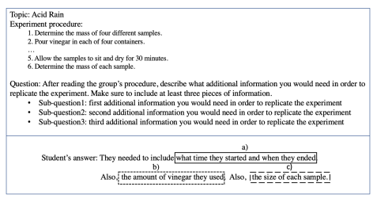
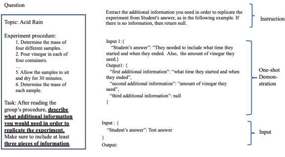

# Short Answer Grading Using One-Shot Prompting And Text Similarity Scoring Model

Su-Youn Yoon EduLab, Inc.,
Shibuya city, Tokyo, Japan su-youn.yoon@edulab-inc.com

## Abstract

In this study, we developed an automated short answer grading (ASAG) model that provided both analytic scores and final holistic scores. Short answer items typically consist of multiple sub-questions, and providing an analytic score and the text span relevant to each subquestion can increase the interpretability of the automated scores. Furthermore, they can be used to generate actionable feedback for students. Despite these advantages, most studies have focused on predicting only holistic scores due to the difficulty in constructing dataset with manual annotations. To address this difficulty, we used large language model (LLM)-based one-shot prompting and a text similarity scoring model with domain adaptation using small manually annotated dataset. The accuracy and quadratic weighted kappa of our model were 0.67 and 0.71 on a subset of the publicly available ASAG dataset. The model achieved a substantial improvement over the majority baseline.

## 1 Introduction

Automated scoring systems can assess learners' responses faster than human raters, with the resulting scores being consistent over time. This has prompted strong demand for high-performing automated scoring systems.

Items that elicit short responses are efficient method to evaluate students' knowledge and have been widely used in the education field. Many researches have been conducted in developing automated short answer grading (ASAG) systems resulting high performing systems with relatively small training dataset.

Short response grading focuses on the content rather than the writing quality, and the possible answers are restricted by the closed-form of the question (Burrows et al., 2015). Typically, the scoring rubric for one question consists of multiple sub-questions that are in the form of "if an answer includes content X, then it receives a score of Y". Figure 1 provides an example of the question and student's answer from the publicly available ASAG dataset. The question requests answers for three sub-questions, and the relevant text spans of each answer is marked by (a), (b), (c) in Figure 1. We will refer to the text span relevant to each sub-question as the 'justification key' and the score of each sub-question as the 'analytic score' as in Mizumoto et al. (2019).

Providing analytic scores and justification keys is beneficial because it can improve the interpretability and validity of automated scoring models. For instance, by comparing the systemdetected justification keys with the manuallyannotated justification keys, we can understand where the systems pay attention during score generation and evaluate whether it is valid or not. Next, they can be used for systems to provide actionable feedback; students can understand why their answers are incorrect and how they can correct them. However, it is difficult to train such models because it requires additional human annotations, resulting in a substantial cost increase.

In this study, we will present an automated short answer grading model that can produce analytic scores and justification keys. To overcome the difficulty of constructing a large scale dataset with manual annotations, we will explore approaches that can be trained using small training data.

## 2 Previous Studies

Previous studies in the ASAG field have explored various approaches, such as traditional linguistic features with statistical models and neural models. Among these possible approaches, the appropriate one in a particular scoring condition is largely dependent on the availability of a manually annotated, question-specific dataset. If sufficient amount of human-scored answers are available for each question as training data, data-driven mod-

Figure 1: Example of a question and student's answer from the Automated Student Assessment Prize Short Answer

 Scoring dataset

els such as statistical models using word n-gram features or embedding-based neural models have shown promising performance(Heilman and Madnani, 2013; Riordan et al., 2017; Sung et al., 2019). On the contrary, if only rubrics or small reference samples are available, the models need to rely on methods to calculate the semantic similarity between the reference and the test answers.

Among the first group, Heilman and Madnani
(2013) developed a model based on the word and character n-gram features and domain adaptation approach, and it achieved good performance. Riordan et al. (2017) investigated several basic neural architectures and the model comprised of the word embeddings, LSTM layers, and attention could achieve promising performance over a wide range of tasks and datasets. More recently, Sung et al. (2019) achieved the comparable performance to human raters by fine-tuning pre-training BERT model with domain adaptation.

Most studies have focused on predicting only holistic scores, but some recent studies have investigated predicting analytic scores and justification keys. Mizumoto et al. (2019) trained a bidirectional LSTM model with an attention mechanism to minimize the difference between the system attention span and manually annotated justification keys. The model achieved good performance in both tasks, and the joint-learning could improve the performance of the holistic score prediction in the low-resource scenario. Wang et al. (2021) used a self-learning approach and replaced the automatically detected justification keys with the manual annotations. In the low-resource scenario, the addition of automated annotations had a positive impact, but this impact decreased as the manually-scored data increased.

The researches in the second group consider the ASAG to be a combination of two wellknown Natural Language Processing (NLP) tasks: answer-span (justification key) extraction and textsimilarity scoring(Haller et al., 2022). First, reference answers are created based on the rubrics or model answers. Next, they extract justification keys from a student's answer using regular expressions or methods used in the information retrieval.

The similarity scores between student's answers and reference answers were calculated using various semantic similarity metrics such as bag-ofwords, content vector analysis, and word embedding. Based on the similarity scores, a final score that decides whether the justification key is semantically equivalent to the concept in the reference answers is assigned.

Similar to the second group, we aim to solve the ASAG task using only a few manually-scored answers and the two-task approaches. Especially, we will explore LLM-based one-shot prompting in the context of the ASAG. Recent studies(Radford et al., 2019; Brown et al., 2020; Chung et al., 2022) have demonstrated that large language models
(LLMs) with larger sizes of parameters can achieve substantial performance improvements over small pre-trained language models. Furthermore, unlike pre-trained language models which require fine-tuning with a substantially large task-specific dataset, LLMs can learn new tasks through incontext learning using only a few demonstration examples. In particular, GPT-3, the third generation of the Generative Pre-trained Transformer model, has shown superior performance in few-shot learning, and it has achieved comparable or superior performance over fine-tuned pre-trained models on diverse tasks(Brown et al., 2020).

LLM-based few-shot learning has already been used in educational tasks such as writing assistant, tutoring(Cao, 2023) or item generation(Park et al., 2022), but relatively limited researches have conducted in the automated scoring field. Mizumoto and Eguchi (2023) used GPT-3 to grade holistic writing proficiency of non-native English learners' essays, but the performance was not high.

In this study, we will explore a combination of LLM-based one-shot prompting and sentencesimilarity scoring model. In particular, we aim to answer the following questions:

- How accurately can the model grade short answers?

- Can unsupervised domain adaptation achieve substantial improvement over the baseline model without the domain adaptation?

- How accurately can the model predict the justification keys and analytic scores?

The proposed model produces both justification keys and analytic scores, and it is essential to evaluate the quality of these outputs. However, the data used in this study included only holistic scores. Because of this, we generated holistic scores based on the analytic scores and indirectly evaluated the quality of the analytic scores through the holistic score evaluation. For the justification key evaluation, we used a small set of manually annotated dataset.

## 3 Data

We used the subset of the Automated Student Assessment Prize Short Answer Scoring (hereafter, ASAP-SAS) data set. It originally included ten questions from science, biology, English, and English language arts domains. We selected four questions (two science and two biology1) because the rubrics included the detailed explanations and the correct responses.

The total number of answers for the four questions were 6, 542. The data was partitioned into train(80%), development(10%), and test(10%) set, respectively. From the train set, 64 answers (16 answers per question) were selected for the reference answer augmentation (hereafter, answer augmentation set)

|    |       | Train   | Development   | Test   |
|----|-------|---------|---------------|--------|
|    | Total | Answer  |               |        |
|    |       | augmenta         |               |        |
|    |       | tion    |               |        |
| N  | 5,226 | 64      | 680           | 636    |

Table 1: Number of answers in each set

Table 2 shows the distribution of the holistic scores (score1) rated by a human rater. The majority score was 0 and it was more than half of the

| Human score   | 0   | 1   | 2   | 3   |
|---------------|-----|-----|-----|-----|
| %             | 53  | 19  | 17  | 11  |

entire data.

Table 2: Percentage of each score out of the total data For each answer in the answer augmentation set, we manually annotated the justification keys and analytic scores. All four questions used in this study consisted of three sub-questions. We marked the justification keys of each answer as (a), (b), (c) in Figure 1. Next, we assigned a binary score for each justification key. The score was 1 when the justification key matched one of the correct answers provided in the rubrics. If the answer received a holistic score of 3 (perfect score) but the justification key was not included in the correct answers, we still treated it as a correct answer. We assigned 1 and registered this justification key to the correct answer list2. For the remaining cases, we assigned 0 3. In addition, we stored the correct answer that matched each justification key.

## 4 Method

We used an LLM-based one-shot prompting and a neural text similarity model to grade students' answers. First, we extracted a justification key for each sub-question using the one-shot prompting.

Next, we calculated the similarity scores between

1They were question 1, 2, 5, and 6.

2The correct answers in the rubrics did not cover all possible correct answers. In order to increase the efficiency of finding missing correct answers, we annotated the answers with a holistic score of 3 and registered missing answers first.

3For instance, in Figure 1, the analytic scores of (a), (b),
(c) were 0, 1, 0, respectively.
each justification key and the reference answers using the Sentence-BERT(Reimers and Gurevych, 2019) model and assigned an analytic score. Finally, we generated a holistic score from all analytic scores. A detailed explanation for each step is provided in the subsection.

### 4.1 Justification Key Extraction

We used an one-shot prompt to extract justification keys from the student's answer. The prompt consisted of the instruction and one demonstration example. An example of one question and its prompt is presented in Figure 2.

We extracted the text describing the subquestions from the original question (underlined sentences in Figure 2) and used it as an instruction. The demonstration example consisted of an input and an output in JSON format. The input contained a "student's answer" field with one sample answer as its value. The output contained justification keys for each sub-question extracted from the sample answer.

### 4.2 Reference Answer Augmentation

We extracted correct answers from the rubrics as reference answers. The initial reference answers were augmented using the manually annotated answer augmentation set. The justification keys were extracted and classified into two groups (correct vs. incorrect) based on the manual analytic scores. In addition, for each correct answer in the augmented set, we stored the most similar correct answer from the initial reference answers. We used this information to expedite labeling of the gold dataset used in the domain adaptation. After removing duplicated keys, the justification keys were combined with the initial reference answers.

### 4.3 Sentence-Bert And Domain Adaptation

Sentence-BERT (hereafter, SBERT) is a modification of the pre-trained BERT network, and it uses Siamese network and triplet loss to minimize the distance between sentence pairs with similar meaning s and maximize the distance between sentence pairs with different meanings (Reimers and Gurevych, 2019). The model derives semantically meaningful sentence embeddings, and the similarity score between two sentence embeddings (e.g.,
cosine similarity score) is used at the inference time. The models trained on the natural language inference (NLI) dataset have showed the state-ofthe art performance in various unsupervised text similarity scoring tasks.

The performance of SBERT can be further improved by domain adaptation (Thakur et al., 2021). For domain adaptation, we created two datasets: a dataset with manual annotations (hereafter, gold dataset) and a dataset with automatically generated labels(hereafter, silver dataset).

For the gold dataset, we used the answer augmentation set. For each student's answer in the set, we extracted justification keys and created all possible combinations with the augmented reference answers. The label for each combination was generated in the semi-automated way. If the text pairs of the combination was semantically equivalent, the label was 1, otherwise it was 0. We used different steps for the correct answer group and the incorrect answer group. If the justification key was from the correct answer group, we compared its most similar reference answer with that of the reference text of the combination. If they were identical, we assigned 1; otherwise, we assigned 0. If the justification key was from the incorrect answer group and the reference text was from the correct answer group, we assigned 0. For the remaining cases, we manually examined the combination and assigned 1 when they were semantically equivalent; otherwise, we assigned 0.

The silver dataset was generated using the training partition. All answers in the training set were split into sentences. For each sentence, we found two answers from the reference answers: the most similar correct answer and the most similar incorrect answer. A similarity score between the training sentence and the reference answer was calculated using the pre-trained SBERT cross-encoder. We first selected one with the lower similarity score and assigned 0. For the remaining one, if the score was higher than 0.5, the label was 1; otherwise it was 0.

Finally, we trained the pre-trained SBERT biencoder model using both gold and silver dataset.

### 4.4 Analytic Score Generation

At the inference, justification keys in the student's answer were extracted using the prompt. For each justification key, we created all possible pairs with the reference answers and calculated the similarity scores using the adapted SBERT model described in the section 4.3. The pair with the highest similarity score was selected and the analytic score was generated as follows: the analytic score was 1 only

Figure 2: one-shot prompt for the question in Figure 1

when the most similar reference answer was one of the correct answers and the similarity score was higher than the 0.5. Otherwise, it was 0.

### 4.5 Holistic Score Generation

Holistic score was the sum of all analytic scores. There was no penalty for incorrect answers. The maximum score for all questions in this study was 3, so no extra points were awarded for answers containing more than 3 correct justification keys.

### 5 Experiment

We used the OpenAI's GPT-3.5 'text-davinci-003' model for the one-shot prompting. We used the text completion API and set the temperature to 0 to avoid the randomness in the output.

For the SBERT model, we used the 'all-mpnetbase-v2 model' in the huggingface model repository4as the base model.

For the domain adaptation, we used both a gold dataset with the manual labels and a silver dataset with the automated labels. The size of the gold dataset was 1, 218 text pairs, while the size of silver dataset was 33, 000 text pairs. The base SBERT model was trained using the combined dataset.

As a bench-marking model, we fine-tuned pretrained language model (Devlin et al., 2018) using the training script provided by Zeng et al. (2022)
5.

For each question, the pre-trained bert-base-cased model with a sequence classification layer on top was fine-tuned using the training set. The detailed descriptions about the training was provided in Zeng et al. (2022) (hereafter, fine-tuned BERT model)
The proposed model used human scores for 64 answers, while the bench-marking model used the human scores for the entire training set(5, 226).

## 6 Results

Table 3 provides the performance of the automated scoring models on the test set. The human raters achieved a good agreement in this task, and both the exact agreement and quadratic weighted kappa were 0.92 and 0.96, respectively.

|             | accuracy   | wtkappa   | corr   |
|-------------|------------|-----------|--------|
| one             | 0.68       | 0.73      | 0.73   |
| shot+SBERT  |            |           |        |
| fine\-tuned | 0.77       | 0.88      | 0.88   |
| BERT        |            |           |        |

Table 3: accuracy, quadratic weighted kappa, and Pearson correlation coefficients between the human and system scores The combination of one-shot prompting and

4https://huggingface.co/sentence-transformers/all-mpnetbase-v2 5The training script was downloaded from https://github.com/douglashiwo/AttentionAlignmentASAS
SBERT (one-shot+SBERT) achieved substantially better performance over the majority baseline (accuracy = 0.53). However, there was a meaningful difference with the fine-tuned BERT model, and the fine-tuned model achieved substantially better performance.

The one-shot+SBERT model used over 1, 000 non-scored answers per question. In order to evaluate the impact of non-scored answers on the model performance, we conducted an ablation test. While using the same method for the justification key extraction, we used following additional SBERT models for the semantic similarity scoring:

- baseline: the baseline SBERT model without the reference answer augmentation
- reference answer-augmented model: the baseline SBERT model with the reference answer augmentation
- SBERT with the domain adaptation: the SBERT model adapted using the training set without the reference answer augmentation

Table 4 provides the results of the ablation test.

|                | accuracy   | wtkappa   | corr   |
|----------------|------------|-----------|--------|
| baseline       | 0.44       | 0.48      | 0.46   |
| reference      | 0.52       | 0.56      | 0.62   |
| answer                |            |           |        |
| augmented      |            |           |        |
| model          |            |           |        |
| SBERT with the | 0.67       | 0.71      | 0.74   |
| domain  adapta                |            |           |        |
| tion           |            |           |        |
| one                | 0.68       | 0.73      | 0.73   |
| shot+SBERT     |            |           |        |

Table 4: Ablation test of the one-shot+SBERT model The performance of the baseline model without any adaptation on the ASAG dataset was substantially worse than the final model (oneshot+SBERT). The accuracy was 0.44 and it was even lower than the majority baseline. The augmentation of the reference answers using a small dataset could achieve a small improvement, but the major improvement was achieved by the domain adaptation. The impact of the reference answer augmentation was marginal when the model was adapted to the domain dataset; differences between adapted SBERT model with and without the answer augmentation were lower than 0.02 in both accuracy and the quadratic weighted kappa.

## 7 Discussion

We investigated the accuracy of detecting justification keys using the answer augmentation set.

We compared manually annotated justification keys with those extracted by the GPT-3.5 model. Based on the manual annotation, there were 216 justification keys, resulting in an average of 3.37 justification keys per answer. We calculated the the number of words in the justification keys. The average based on the manual annotations was 8.4, while that based on the GPT model was 10.4. The GPT model had a tendency to extract longer spans and contained a few extra words such as conjunction markers at the beginning. Adding these extra words did not have a big impact on the next step, so we treated these cases as correct. More concretely, for each manual and system-based justification key pairs, if the system key contained the entire manual key or the word overlap between two keys was over 90%, we counted it as a correct case. The correct cases were 195 out of 216, resulting in an accuracy of 90.3%. The accuracy of the justification key detection was high. Furthermore, most errors were from low-scoring answers where the justification keys did not contain correct content. These errors did not have an impact on the overall score.

## 8 Limitation

As we mentioned in the early section, one of the major limitation is the absence of the evaluation of justification keys and analytic scores. In future study, we will focus on this evaluation.

## 9 Conclusion And Future Study

We developed automated short answer grading models using only 16 answers per question, that was less than 5% of the bench-marking model used. The model was based on the one-shot prompting and Sentence-BERT model. The model achieved a good performance, resulting in 27% of relative error reduction in accuracy over the majority baseline.

However, there was a large gap compared to the model trained on the large manually scored dataset. In order to use automated scoring models to grade real tests, the models need to achieve near-human performance, and the performance of the current model was far behind. However, LLM-
based prompting can be used in different scenarios.

For instance, the analysis of the justification key revealed that the automated justification key extraction was highly accurate. The LLM-based prompting can be used to efficiently and cost-effectively enrich the annotations of the existing dataset, and this dataset can be used to train the models to provide not only the final score, but also additional information that can be used to increase the model's interpretability. Previous studies, such as Mizumoto et al. (2019), have shown that a joint model trained on predicting both justification keys and holistic scores can improve the accuracy of automated scores.

## References

Tom Brown, Benjamin Mann, Nick Ryder, Melanie Subbiah, Jared D Kaplan, Prafulla Dhariwal, Arvind Neelakantan, Pranav Shyam, Girish Sastry, Amanda Askell, et al. 2020. Language models are few-shot learners. *Advances in neural information processing* systems, 33:1877–1901.

Steven Burrows, Iryna Gurevych, and Benno Stein.

2015. The eras and trends of automatic short answer grading. International Journal of Artificial Intelligence in Education, 25(1):60–117.

Chen Cao. 2023. Leveraging large language model and story-based gamification in intelligent tutoring system to scaffold introductory programming courses: A design-based research study. arXiv preprint arXiv:2302.12834.

Hyung Won Chung, Le Hou, Shayne Longpre, Barret Zoph, Yi Tay, William Fedus, Eric Li, Xuezhi Wang, Mostafa Dehghani, Siddhartha Brahma, et al.

2022. Scaling instruction-finetuned language models. arXiv preprint arXiv:2210.11416.

Jacob Devlin, Ming-Wei Chang, Kenton Lee, and Kristina Toutanova. 2018. Bert: Pre-training of deep bidirectional transformers for language understanding. *arXiv preprint arXiv:1810.04805*.

Stefan Haller, Adina Aldea, Christin Seifert, and Nicola Strisciuglio. 2022. Survey on automated short answer grading with deep learning: From word embeddings to transformers. arXiv preprint arXiv:2204.03503.

Michael Heilman and Nitin Madnani. 2013. Ets: Domain adaptation and stacking for short answer scoring. In Second Joint Conference on Lexical and Computational Semantics (* SEM), Volume 2: Proceedings of the Seventh International Workshop on Semantic Evaluation (SemEval 2013), pages 275–279.

Atsushi Mizumoto and Masaki Eguchi. 2023. Exploring the potential of using an ai language model for automated essay scoring. *Research Methods in Applied* Linguistics, 2(2):100050.

Tomoya Mizumoto, Hiroki Ouchi, Yoriko Isobe, Paul Reisert, Ryo Nagata, Satoshi Sekine, and Kentaro Inui. 2019. Analytic score prediction and justification identification in automated short answer scoring. In Proceedings of the Fourteenth Workshop on Innovative Use of NLP for Building Educational Applications, pages 316–325.

Yena Park, Geoffrey T LaFlair, Yigal Attali, Andrew Runge, and Sarah Goodwin. 2022. Interactive reading—the duolingo english test.

Alec Radford, Jeffrey Wu, Rewon Child, David Luan, Dario Amodei, Ilya Sutskever, et al. 2019. Language models are unsupervised multitask learners. OpenAI
blog, 1(8):9.

Nils Reimers and Iryna Gurevych. 2019. Sentence-bert:
Sentence embeddings using siamese bert-networks. arXiv preprint arXiv:1908.10084.

Brian Riordan, Andrea Horbach, Aoife Cahill, Torsten Zesch, and Chungmin Lee. 2017. Investigating neural architectures for short answer scoring. In Proceedings of the 12th workshop on innovative use of NLP for building educational applications, pages 159–168.

Chul Sung, Tejas Dhamecha, Swarnadeep Saha, Tengfei Ma, Vinay Reddy, and Rishi Arora. 2019. Pretraining bert on domain resources for short answer grading. In *Proceedings of the 2019 Conference on* Empirical Methods in Natural Language Processing and the 9th International Joint Conference on Natural Language Processing (EMNLP-IJCNLP), pages 6071–6075.

Nandan Thakur, Nils Reimers, Johannes Daxenberger, and Iryna Gurevych. 2021. Augmented SBERT: Data augmentation method for improving bi-encoders for pairwise sentence scoring tasks. In Proceedings of the 2021 Conference of the North American Chapter of the Association for Computational Linguistics: Human Language Technologies, pages 296–310, Online. Association for Computational Linguistics.

Tianqi Wang, Hiroaki Funayama, Hiroki Ouchi, and Kentaro Inui. 2021. Data augmentation by rubrics for short answer grading. Journal of Natural Language Processing, 28(1):183–205.

Zijie Zeng, Xinyu Li, Dragan Gasevic, and Guanliang Chen. 2022. Do deep neural nets display human-like attention in short answer scoring? In Proceedings of the 2022 Conference of the North American Chapter of the Association for Computational Linguistics: Human Language Technologies, pages 191–205.