# Mert: Acoustic Music Understanding Model With Large-Scale Self-Supervised Training

Yizhi Li1∗ Ruibin Yuan2,3∗ Ge Zhang2,4∗ Yinghao Ma5∗ Xingran Chen6 **Hanzhi Yin**3 Chenghua Lin1† Anton Ragni1 Emmanouil Benetos5 Norbert Gyenge1 **Roger Dannenberg**3 Ruibo Liu7 Wenhu Chen4 Gus Xia8 Yemin Shi2 Wenhao Huang2 Yike Guo9**Jie Fu**2†
1University of Sheffield 2Beijing Academy of Artificial Intelligence 3Carnegie Mellon University 4University of Waterloo 5Queen Mary University of London 6University of Michigan Ann Arbor 7Dartmouth College 8New York University 9Hong Kong University of Science and Technology
{yizhi.li,c.lin}@sheffield.ac.uk ruibiny@andrew.cmu.edu gezhang@umich.edu yinghao.ma@qmul.ac.uk fujie@baai.ac.cn

## Abstract

Self-supervised learning (SSL) has recently emerged as a promising paradigm for training generalisable models on large-scale data in the fields of vision, text, and speech. Although SSL has been proven effective in speech and audio, its application to music audio has yet to be thoroughly explored. This is primarily due to the distinctive challenges associated with modelling musical knowledge, particularly tonal and pitched characteristics of music. To address this research gap, we propose an acoustic Music undERstanding model with large-scale self-supervised Training (**MERT**), which incorporates teacher models to provide pseudo labels in the masked language modelling (MLM) style acoustic pre-training. In our exploration, we identified a superior combination of teacher models, which outperforms conventional speech and audio approaches in terms of performance. This combination includes an acoustic teacher based on Residual Vector Quantization - Variational AutoEncoder (RVQ-VAE) and a musical teacher based on the Constant-Q Transform (CQT). These teachers effectively guide our student model, a BERT-style transformer encoder, to better model music audio. In addition, we introduce an in-batch noise mixture augmentation to enhance the representation robustness. Furthermore, we explore a wide range of settings to overcome the instability in acoustic language model pre-training, which allows our designed paradigm to scale from 95M to 330M parameters. Experimental results indicate that our model can generalise and perform well on 14 music understanding tasks and attain state-of-the-art (SOTA) overall scores. The code and models are online: https://github.com/yizhilll/MERT.

## 1 Introduction

Pre-trained language models (PLMs) have learned generalisable representations of data without human annotated labels in a self-supervised learning (SSL) style, leading to astonishing performance improvement in natural language processing and related fields (Brown et al., 2020; Fang et al., 2022; Chen et al., 2021a). Music is widely recognised as a special language that can be used to communicate across different cultures (Mehr et al., 2019). The internal similarity between music and language as a communication interface lays a promising foundation for adapting PLM-based methods to model music sequences. We argue that the benefit is twofold. First, PLMs can potentially pave the way to *unify* the modelling of a wide range of music understanding, or, so-called Music Information

∗The authors contributed equally to this work. †Corresponding authors.

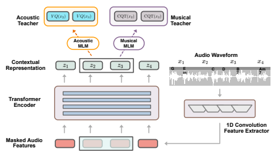

Figure 1: Illustration of the MERT Pre-training Framework.

Retrieval (MIR) tasks including but not limited to music tagging, beat tracking, music transcription, source separation, etc., so that different tasks no longer need detailed models or features. Second, releasing a PLM for acoustic music understanding could re-distribute the musical knowledge rather than the data itself, which saves the high costs of manual annotation and at the same time is not restricted by copyright laws. Unfortunately, we have yet to see a general-purpose and cost-effective open-source PLM on *acoustic* music understanding. Most existing studies are designed to solely address music tagging problems (Pons and Serra, 2019; Spijkervet and Burgoyne, 2021; McCallum et al., 2022; Huang et al., 2022; Zhu et al., 2021; Zhao and Guo, 2021). Also, many of these works do not provide open-source codebases or checkpoints for further evaluation. A promising model is JukeMIR (Castellon et al., 2021) built upon the pre-trained model Jukebox (Dhariwal et al., 2020), whose coverage extends beyond music tagging tasks to key detection and emotion regression. However, this approach used cumbersome auto-regressive transformer decoders containing billions of parameters to hierarchically model music audio. This resulted in inefficiency for music understanding tasks, as it took weeks to extract features from datasets like MTG (Bogdanov et al., 2019) with a consumer-grade GPU. The aforementioned research gap has urged us to design and open-source a *generalisable* and affordable pre-trained acoustic music model. In this paper, we propose an acoustic Music undERstanding model with large-scale self-supervised Training (**MERT**). MERT inherits a speech SSL paradigm, employing teacher models to generate pseudo targets for sequential audio clips. Specifically, to capture the distinctive pitched and tonal characteristics in music, MERT incorporates a multi-task paradigm to balance the *acoustic* and *musical* representation learning as demonstrated in Fig. 1. In the proposed design, a Residual Vector Quantization - Variational Autoencoder (RVQ-VAE) (Défossez et al., 2022) is used as the *acoustic teacher* to provide discretised acoustic-level summarisation of the music signal. The Constant-Q Transformation (CQT) (Brown, 1991) model is further introduced and regarded as the *music teacher* for pitch and harmonic inductive bias. Regarding the context dependencies and music hierarchies, as indicated in (Borsos et al., 2022), we leave the task of modelling such high-level and abstract patterns to the stacked layers of self-attentions in the Transformer. We argue that a robust acoustic music understanding model should produce meaningful representations when music is mixed with irrelevant audio as in real-world scenarios. As a result, we introduce an in-batch noise mixup data augmentation using random clips that are efficiently sampled on-the-fly to corrupt the audio recordings, which pushes the model to learn the same semantics in the obscured context. Furthermore, we explore a wide range of settings for the transformer and 1D convolution encoder to overcome the instability in acoustic model pre-training, and hence scale up MERT from 95M to 330M model size when blending acoustic and musical knowledge. By scaling up to 330M size, MERT achieves overall state-of-the-art (SOTA) results on various MIR tasks, which demonstrates a strong generalisation ability on various music understanding applications. Last but not least, we analyse multiple pre-trained settings considering the teachers and augmentation choices and share our decision routes in ablation studies,§ 5.2 and § 5.3, which may potentially guide future acoustic music understanding pre-training research. To summarise, our contributions are:
- proposing a multi-task style predictive acoustic self-supervised learning paradigm, which achieves SOTA performance on various MIR tasks, including significant yet unexplored tasks for pre-training such as pitch detection, beat tracking and source separation applications;
- exhibiting a broad analysis of the ablation study of the proposed MERT pre-training paradigm; - exploring robust and stable tricks for acoustic music models to overcome training instability and frequent crashes when scaling up the pre-training on parameter size and training data;
- providing an open-source, generalisable and affordable acoustic music pre-trained model, which addresses the needs of both industry and research communities.

## 2 Related Work

PLMs for Acoustic Music The field of music information retrieval (MIR) has faced limitations in data access due to the costs associated with annotating music audio and country-specific copyright laws (Chen et al., 2019; Castellon et al., 2021). To address this challenge, pre-trained language models (PLMs) for acoustic music have been proposed to provide reusable learned representations, enabling transfer learning for various downstream MIR tasks without the need for extensive data labelling (Castellon et al., 2021). However, current acoustic music pre-trained models still have room for improvement in terms of providing open-source, generalisable, and lightweight learned representations suitable for both industrial and research applications (McCallum et al., 2022). Existing acoustic music pre-trained models primarily focus on tagging tasks and rely on supervised tagging labels for pre-training (Pons and Serra, 2019; Spijkervet and Burgoyne, 2021; McCallum et al., 2022; Huang et al., 2022). While some studies have explored contrastive learning for acoustic music pre-training, they face limitations in training data availability and model size, hampering their performance improvements (Choi et al., 2017; Li et al., 2022). Additionally, several models trained on inaccessible datasets or without publicly available codes and model weights make it difficult to reproduce or extend their approaches (McCallum et al., 2022; Castellon et al., 2021; Li et al., 2022; Zhu et al., 2021; Zhao and Guo, 2021). Although some general-purpose audio representation models show potential for music audio representation learning, their performance is mostly evaluated on limited MIR downstream tasks (Saeed et al., 2021; Borsos et al., 2022; Wang et al., 2023). This lack of comprehensive evaluation hampers further studies and inhibits a thorough understanding of their capabilities and limitations. Self-Supervised Speech Processing Music and speech processing are closely related (Jasmin et al., 2020) since they are usually processed with the same audio data formats. Additionally, both acoustic music and speech processing models need to deal with the cocktail party problem (Brown and Bidelman, 2022; Petermann et al., 2022) since good source separation capabilities help both separating noises and background sounds with speech and processing polyphonic music audio. These common grounds between music and speech processing inspire us to adopt SOTA speech pre-trained models tailored specifically to music audio processing tasks. Existing research work targeting general-purpose audio representations (Saeed et al., 2021; Borsos et al., 2022; Wang et al., 2023) has verified that self-supervised speech processing models can be extended beyond speech by adapting them to downstream entry-level music tasks, including generating mono piano music and music reconstruction. Audio Representation with Language Modelling Mask strategy-based large-scale language models have been applied to various other applications (Lample and Charton, 2019; Chen et al., 2021a,b; Fang et al., 2022), while remaining under-explored in acoustic music understanding. For audio, Dhariwal et al. (2020) investigates generating hierarchical tokens which can be further employed to reconstruct music, inspiring the following research to understand and generate acoustic music based on extracted discrete tokens from continuous features. Baevski et al. (2019a) introduce a pre-trained VQ-VAE (Baevski et al., 2019b) to provide prediction targets to conduct speech representation learning with MLM. While introducing K-means to provide discrete token codebooks and pre-training the model to detect sound units, Hsu et al. (2021) claim that a better teacher model in SSL could lead to better downstream task performance. Additionally, recent speech processing pre-trained models (Borsos et al., 2022; Wang et al., 2023) propose to train or adopt separately trained codecs (Zeghidour et al., 2021; Défossez et al., 2022) for discrete token extraction. Based on the conclusion from previous studies, the recently released RVQ-VAEs (Zeghidour et al., 2021; Défossez et al., 2022), achieving good results in music reconstruction, could be adopted as teacher models for music understanding pre-training and providing acoustic information guidance. Yet some of the uniqueness of music processing such as timbre and harmony remains unexplored. We thus propose to incorporate a corresponding musical teacher model in MERT to fill such a gap.

## 3 Methodology

This section introduces the pre-training paradigm and architecture of our models. It includes prediction to acoustic teachers such as k-means or deep music features, and reconstruction to music teachers such as CQT spectrum, both based on the well-established masked language model (MLM) paradigm.

### 3.1 Pre-Training With Mlm

Supervised Learning requires a labelled dataset Dt = {x
(t)
i, y
(t)
i}
N
i=1. Here, N is the number of data samples, x
(t)
iis the i th data sample in the dataset, and y
(t)
iis the corresponding label. From Dt, we can train a machine learning algorithm fθ (·) parameterised with θ that makes label predictions on each data sample. Unsupervised learning, in contrast, learns an algorithm based on an unlabelled dataset D = {xi}M
i=1, with SSL being a specific type of this class. For each data sample xi, SSL
derives a new data x
′
i with a pseudo label y
′
i. The training process is to minimise the loss between each pseudo label y
′
iand the prediction based on new data yˆi = fθ(x
′
i) as denoted in Eq.1.

$$\theta^{*}=a r g\,m i n_{\theta}\sum_{x_{i}^{(t)}\in D}{\mathcal{L}}\left(f_{\theta}(x_{i}^{\prime(t)}),y_{i}^{\prime(t)}\right).$$
$$(1)$$
$$(2)$$
i ∈D
MLM is a famous example of pseudo-label generation. Let xi =
hx
(1)
i, x
(2)
i, · · · , x
(L) i ibe the i th data sample in a speech or language dataset with length L, and M ⊂ [L] is a subset of indices randomly chosen from 1 to L. Then, the new data is defined by the following equation

$$x_{i}^{\prime}=\left[\mathbf{1}_{[L]\backslash M}(1)\cdot x_{i}^{(1)},\mathbf{1}_{[L]\backslash M}(2)\cdot x_{i}^{(2)},\cdots,\mathbf{1}_{[L]\backslash M}(L)\cdot x_{i}^{(L)}\right]$$
i(2)
where 1[L]\M(x) denotes the indicator function, that is, 1[L]\M(x) = 1 if and only if x is outside the masked indices set M. The pseudo-label that needs to be learned is typically y
′
i = xi − x
′
i, i.e., the masked data. However, reconstructing masked data y
′for raw audio tasks as pseudo-label is hard to train. HuBERT (Vaswani et al., 2017; Hsu et al., 2021) uses a dimension-reduced feature z
′ derived from y
′ with phonetic acoustic information, which forms the design basis of our pre-training strategy.

As a speech SSL system, HuBERT utilises offline clustering to acquire pseudo labels for a BERT-like prediction loss. Specifically, it uses Mel-frequency cepstral coefficients (MFCCs), a widely-used traditional feature in speech-related tasks, as acoustic features for clustering. The obtained results are then utilised as pseudo labels in the first iteration of pre-training. It then uses the learned representation for clustering to get a pseudo label for the second iteration pre-training. Such a pseudo label includes acoustic information in human speech and can be aligned to phonemes. The loss functions of HuBERT are formulated as follows:

$${\mathcal{L}}_{H}(f;x,M,Z)=\sum_{t\in M}\log p_{f}(z_{t}\mid x^{\prime},t)$$

where log pf (· | x
′, t) is the log-likelihood function on clustering results given the masked input x
′
and position t derived from f; likelihood function pf is the Noise Contrastive Estimation (NCE) loss which is defined as

$$p_{f}(c\mid x^{\prime},t)=\frac{\exp(\text{sim}(T(o_{t}),e_{c})/\tau)}{\sum_{c^{\prime}=1}^{C}\exp(\text{sim}(T(o_{t}),e_{c^{\prime}})/\tau)},\tag{4}$$

Here, c ∈ [C] is a codeword of the clustering results and ec represents its embedding; sim is the cosine similarity; ot is the output of the model at timestep t; and T(ot) is the linear transformation

(3) $\frac{1}{2}$
of ot, making it have the same dimension as ec. Besides, τ scales the logit which is set to 0.1 in HuBERT. The linear transformation T, the model to generate outputs, and the embedding of all the clustering results are all learnable.

Overall, we use the same model as HuBERT but introduce several notable variations tailored to music. Specifically, we designed a better hidden-unit z as pseudo tags for pre-training with multiple music acoustic features. In addition, we added a reconstruction loss to music features and employed additional music augmentation tricks.

### 3.2 Modelling Acoustic Information

The MFCC features are only good at modelling acoustic and timbre information for single-pitch signals, and therefore, the clustering results do not provide much timbre information in music recording. We proposed two potential approaches as the teacher on acoustic information: one based on traditional features, and the other based on deep learning. The first method uses k-means on the log-Mel spectrum and Chroma features for timbre and harmonic acoustic information, respectively. In the case of music representation, each frame contains more information compared to speech, necessitating a larger number of classes for k-means clustering. The complexity of the k-means algorithm is linear with the number of centroids (clustering centres), leading to a time-consuming k-means for the music feature. To tackle this problem, we employ 300-means for the log-Mel spectrum with dimension 229, and 200-means for Chroma features with dimension 264, resulting in a total of 60,000 classes (200 centroids for Chroma features multiplied by 300 centroids for the log-Mel spectrum). Despite the increased number of classes, the computational complexity remains comparable to that of HuBERT. The disadvantage of k-means is that it is difficult to scale up to a larger number of classes and larger datasets, and the results are sensitive to initialisation. The second choice for our acoustic teacher is EnCodec (Défossez et al., 2022), a recent learnable feature with 8-layer residual Vector Quantized-Variational AutoEncoder (VQ-VAE). Each acoustic feature, denoted as zenc ∈ [C]
L×8, is a 2-dimensional auditory code matrix, and L is the length of the recording. The row vector of each matrix zenc[t, :] represents the results of 8 different clusterings for frame t, and the column vector of each matrix zenc[:, j] represents the results from the j th codebook of the audio sequence, where j ∈ {1*, . . . ,* 8}. EnCodec converts 24kHz input waveforms to 8 different embeddings at 75Hz with a 320-fold reduction, and the quantizer has 1024 dimensions. In this setting, for each 5-second waveform, the discrete acoustic feature is a matrix with 375 × 8 entries, representing 375 frames (75Hz × 5s) and 8 deep acoustic features. With these embeddings, the decoder of EnCodec can reconstruct the waveform at 24 kHz with authentic information in timbre.

### 3.3 Modelling Musical Information

Apart from acoustic information, we added a new reconstruction loss to the Constant-Q transform
(CQT) spectrogram to emphasise pitch-level information. The CQT is a type of frequency transform that is widely used in various MIR tasks, such as pitch detection, chord recognition, and music transcription. It is similar to the Fourier transform, but bin widths are proportional to frequency rather than equal, giving each octave the same number of bins, resulting in a better time-frequency trade-off for music audio where multiple pitches occur in multiple octaves. We utilize mean squared error
(MSE) loss to reconstruct the CQT spectrum zcqt from the masked input audio x
′. That is,

$$\mathcal{L}_{CQT}(f_{cqt};x,M,\mathbf{z}_{cqt})=\sum_{t\in[L]}\|z_{cqt,t}-f_{cqt}(x^{\prime})_{t}\|_{2}\tag{5}$$

And the final loss function L is a linear combination of both the acoustic loss function LH and the musical-pitch loss function LCQT :

$${\mathcal{L}}=\alpha\cdot{\mathcal{L}}_{H}+{\mathcal{L}}_{C Q T}$$
L = α · LH + LCQT (6)

### 3.4 Robust Representation Learning

We introduce "in-batch noise mixup" for music SSL. The mixup augmentation refers to the audio clip being added up with a certain ratio of shorter audio excerpts to form an augmented single sample

$$(6)$$

during pre-training, instead of using the original audio. We randomly sample the audio segments from the same batch and add them to audio at random positions according to some probability. Theoretically, sampling from the whole training dataset would provide more randomness and thus be more beneficial to the representation robustness, but we narrow the sampling pool to the same audio batch considering the limited computational resources. The mixup could enable the learning of more robust musical representations and force the model to focus on the useful musical source and to ignore the noise. A pseudocode implementation can be found in Appendix A.

## 4 Experiments

### 4.1 Evaluation Protocol

Downstream Tasks We evaluate our method and compare it with baseline models on 14 downstream tasks, including frame-level classification or regression tasks like music tagging, key detection, genre classification, emotion score regression, instrument classification, pitch classification, vocal technique detection, and singer identification; and sequential tasks like beat tracking and source separation. For music tagging, we utilise the MagnaTagATune (MTT) (Law et al., 2009) and MTG- Jamendo (Bogdanov et al., 2019) datasets, averaging multiple embeddings for long audio recordings. Key detection is accomplished using the Giantsteps and Giantsteps-MTG-keys datasets (Knees et al., 2015; Korzeniowski and Widmer, 2017), with a refined accuracy metric. Genre classification is performed using the GTZAN (Tzanetakis and Cook, 2002) and MTG-Genre datasets, with ROC, and average precision (AP) metrics. Emotion score regression is conducted on the Emomusic dataset (Soleymani et al., 2013), with r 2 of arousal and valence as evaluation metrics. For instrument classification, we use the Nsynth (Engel et al., 2017) and MTG-instrument datasets, with ROC, and AP metrics. The NSynth dataset is also used for pitch classification, with accuracy as the evaluation metric. Vocal technique detection and singer identification are performed using the VocalSet dataset (Wilkins et al., 2018), with accuracy as the evaluation metric. Beat tracking is conducted on the GTZAN Rhythm dataset (Marchand and Peeters, 2015), using the F-measure as an evaluation metric. Finally, source separation is accomplished using the MUSDB18 dataset (Rafii et al., 2017), with the Source-to-Distortion Ratio (SDR) as the evaluation metric. The full descriptions of the datasets and tasks can be found in Appendix B.1.

Probing Protocol Following Castellon et al. (2021); Yang et al. (2021), we restrict the testing protocol with probing rather than fine-tuning, i.e. freezing the backbone pre-trained models as deep feature extractor and only train a simple downstream structure, typically a multilayer perceptron (MLP) for frame-level tasks. For a fair comparison, we also limit the space for hyper-parameters searching. For more details please refer to Appendix B.2.

### 4.2 Baseline Methods

We select models pre-trained with various paradigms from both music and speech domains as our baselines to provide a comprehensive evaluation of the generalisation ability of the designs. MusiCNN (Pons and Serra, 2019) is selected as a representative supervised method, which is pre-trained with supervision from the Million Song Dataset tags (Bertin-Mahieux et al., 2011). CLMR (Spijkervet and Burgoyne, 2021) and MULE (McCallum et al., 2022) are selected as representatives of SOTA music representations trained with contrastive learning. Jukebox (Dhariwal et al., 2020) and the corresponding transfer learning method, JukeMIR (Castellon et al., 2021) is selected as the representative of transfer learning from a large-scale generative pre-trained musical representation. We also select the recently proposed strong speech SSL models, HuBERT (Hsu et al., 2021) and data2vec (Baevski et al., 2022), as our baselines since they share the same MLM pre-training paradigm with MERT. While HuBERT reconstructs the masked discrete tokens provided by the K-means teacher, data2vec uses the student model updated with an exponential moving average gradient to produce continuous representations for MLM prediction. In order to reveal the effectiveness of the pre-training paradigm itself rather than the training data distribution, we re-train the speech models and denote them by HuBERTmusic and data2vecmusic. Additionally, we present the advanced SOTA for each task including results from both supervised and self-supervised methods.

### 4.3 Implementation Details

Training Settings We deploy the proposed SSL architecture in the training of various model sizes with matched scales of data. We mined 160K hours of music recordings from the Internet to build a large-scale music dataset. Accordingly, the base (95M) size models are trained with a 1K hours subset whereas the whole dataset is used for the large (330M) model. Specifically, we provide a special edition of the base model, MERT-95M-public, that is trained on a totally publicly available music dataset, music4all (Santana et al., 2020), with a data size of 910 hours. In the context of self-attention, the computational complexity scales quadratically with the sequence length. Therefore, when dealing with limited computational resources, there exists a trade-off between the batch size and the sequence length. In our preliminary experiments, we have observed that increasing the batch size provides greater performance improvements compared to extending the context length. To ensure manageable computation during pre-training, we adopt a strategy of randomly truncating audio clips into 5-second segments. This duration roughly corresponds to a 2-bar context in music. It is worth noting that our model utilizes a convolutional relative positional embedding, similar to the approach introduced by Baevski et al. (2020) in Wav2Vec, enabling it to operate effectively in longer contexts if required. The effective batch sizes and learning rates for the base model and large model are set to 1.5 and 5.5 hours, and their learning rates are set to 5e−4, 1.5e−3 respectively. Pre-training of our models has been carried out with the fairseq3framework. The base and large models are trained with 64 A100-40GB GPUs with half-precision settings.

Training Stability In our empirical findings, we have observed that when scaling up acoustic encoder-only models, they tend to exhibit a higher susceptibility to training instability compared to models of similar size in natural language processing and computer vision domains. Such instability can result in decreased performance or, in extreme cases, even lead to crashes in model training.

During our experimentation with scaling up to the MERT-330M model, we encountered notable instability manifested by constant gradient clipping and sporadic spikes in losses. This instability had a detrimental effect on the accuracy of masked language modeling (MLM) predictions and resulted in decreased performance on downstream tasks. Our attempts to resume training from previously saved checkpoints and data batches proved unsuccessful in mitigating the instability. Furthermore, we observed that reducing the learning rate in this context not only failed to address the issue but also led to a decline in performance and hindered the convergence of the model. We further explored the effectiveness of a seemingly-powerful method DeepNorm (Wang et al., 2022a) in stabilizing acoustic language model pre-training but found it to be ineffective in this particular scenario. Additionally, we discovered that incorporating attention relaxation techniques (Chen et al., 2021b) proved beneficial in addressing the instability challenges we encountered. However, we found that transitioning from post-layer normalization (Post-LN) to pre-layer normalization (Pre-LN) offered a potential solution by alleviating the instability and allowing training to continue. More information can be found in appendix B.3. Table 1: Experimental Performances of MERT and Baselines on Downstream Tasks (1/2). The baselines are grouped by supervised and unsupervised pre-training paradigms. The superscripts denote the category of the acoustic teacher used by MERT models. "public" refers to the MERT

model trained with only open-source dataset. Results with star* are claimed in the references.

| Dataset                   | MTT       |           | GS         | GTZAN     | GTZAN     | EMO     |           | Nsynth     |           | VocalSet   | VocalSet   |
|---------------------------|-----------|-----------|------------|-----------|-----------|---------|-----------|------------|-----------|------------|------------|
| Task                      | Tagging   |           | Key        | Genre     | Rhythm    | Emotion |           | Instrument | Pitch     | Tech       | Singer     |
| Metrics                   | ROC       | AP        | AccRefined | Acc       | F1beat    | R2V     | R2A       | Acc        | Acc       | Acc        | Acc        |
| MusiCNN [40]              | 90.6*     | 38.3*     | 12.8*      | 79.0*     | \-        | 46.6*   | 70.3*     | 72.6       | 64.1      | 70.3       | 57.0       |
| CLMR [47]                 | 89.4*     | 36.1*     | 14.9*      | 68.6*     | \-        | 45.8*   | 67.8*     | 67.9       | 47.0      | 58.1       | 49.9       |
| Jukebox\-5B [15; 56]      | 91.5*     | 41.4*     | 66.7*      | 79.7*     | \-        | 61.7*   | 72.1*     | 70.4       | 91.6      | 76.7       | 82.6       |
| MULE [35]                 | 91.4*     | 40.4*     | 66.7*      | 73.5*     | \-        | 57.7*   | 70.0*     | 74.0*      | 89.2*     | 75.5       | 87.5       |
| HuBERT\-basemusic [25]    | 90.2      | 37.7      | 14.7       | 70.0      | 88.6      | 42.1    | 66.5      | 69.3       | 77.4      | 65.9       | 75.3       |
| data2vec\-basemusic [3]   | 90.0      | 36.2      | 50.6       | 74.1      | 68.2      | 52.1    | 71.0      | 69.4       | 93.1      | 71.1       | 81.4       |
| MERT\-95MK\-means         | 90.6      | 38.4      | 65.0       | 78.6      | 88.3      | 52.9    | 69.9      | 71.3       | 92.3      | 74.6       | 77.2       |
| MERT\-95M\-publicK\-means | 90.7      | 38.4      | 67.3       | 72.8      | 88.1      | 59.7    | 72.5      | 70.4       | 92.3      | 75.6       | 78.0       |
| MERT\-95MRVQ\-VAE         | 91.0      | 39.3      | 63.5       | 78.6      | 88.3      | 60.0    | 76.4      | 70.7       | 92.6      | 74.2       | 83.7       |
| MERT\-330MRVQ\-VAE        | 91.3      | 40.2      | 65.6       | 79.3      | 87.9      | 61.2    | 74.7      | 72.6       | 94.4      | 76.9       | 87.1       |
| Previous SOTA             | 92.0 [26] | 41.4 [15] | 74.3 [30]  | 83.5 [35] | 80.6 [24] | 61.7    | 72.1 [15] | 78.2 [52]  | 89.2 [35] | 65.6 [54]  | 80.3 [38]  |

7

3https://github.com/facebookresearch/fairseq

| scores across             | task       |          |      |           |      |          | are calculated on the SOTA results and models applicable to all the tasks.   |           |           |                   |         |          |      |
|---------------------------|------------|----------|------|-----------|------|----------|------------------------------------------------------------------------------|-----------|-----------|-------------------|---------|----------|------|
| Dataset                   | MTG        |          |      | MTG       |      | MTG      |                                                                              | MTG       |           | MUSDB             |         |          |      |
| Task                      | Instrument |          |      | MoodTheme |      | Genre    |                                                                              | Top50     |           | Source Seperation |         |          | Avg. |
| Metrics                   | ROC        | AP       | ROC  | AP        | ROC  | AP       | ROC                                                                          | AP        | SDRvocals | SDRdrums          | SDRbass | SDRother |      |
| MusiCNN [40]              | 74.0       | 17.2     | 74.0 | 12.6      | 86.0 | 17.5     | 82.0                                                                         | 27.5      | \-        | \-                | \-      | \-       | \-   |
| CLMR [47]                 | 73.5       | 17.0     | 73.5 | 12.6      | 84.6 | 16.2     | 81.3                                                                         | 26.4      | \-        | \-                | \-      | \-       | \-   |
| Jukebox\-5B [15; 56]      | \-         | \-       | \-   | \-        | \-   | \-       | \-                                                                           | \-        | 5.1*      | 4.9*              | 4.1*    | 2.7*     | \-   |
| MULE [35]                 | 76.6       | 19.2     | 78.0 | 15.4      | 88.0 | 20.4     | 83.7                                                                         | 30.6      | \-        | \-                | \-      | \-       | \-   |
| HuBERT\-basemusic [25]    | 75.5       | 17.8     | 76.0 | 13.9      | 86.5 | 18.0     | 82.4                                                                         | 28.1      | 4.7       | 3.7               | 1.8     | 2.1      | 55.8 |
| data2vec\-basemusic [3]   | 76.1       | 19.2     | 76.7 | 14.3      | 87.1 | 18.8     | 83.0                                                                         | 29.2      | 5.5       | 5.5               | 4.1     | 3.0      | 59.9 |
| MERT\-95MK\-means         | 77.2       | 19.6     | 75.9 | 13.7      | 87.0 | 18.6     | 82.8                                                                         | 29.4      | 5.6       | 5.6               | 4.0     | 3.0      | 62.9 |
| MERT\-95M\-publicK\-means | 77.5       | 19.6     | 76.2 | 13.3      | 87.2 | 18.8     | 83.0                                                                         | 28.9      | 5.5       | 5.5               | 3.7     | 3.0      | 63.0 |
| MERT\-95MRVQ\-VAE         | 77.5       | 19.4     | 76.4 | 13.4      | 87.1 | 18.8     | 83.0                                                                         | 28.9      | 5.5       | 5.5               | 3.8     | 3.1      | 63.7 |
| MERT\-330MRVQ\-VAE        | 78.1       | 19.8     | 76.5 | 14.0      | 86.7 | 18.6     | 83.4                                                                         | 29.9      | 5.3       | 5.6               | 3.6     | 3.0      | 64.7 |
| Previous SOTA             | 78.8       | 20.2 [1] | 78.6 | 16.1 [35] | 87.7 | 20.3 [1] | 84.3                                                                         | 32.1 [35] | 9.3       | 10.8              | 10.4    | 6.4 [43] | 64.5 |

Table 2: Experimental Performances of MERT and Baselines on Downstream Tasks (2/2). Average

### 5 Results Analysis 5.1 Performance & Efficiency Of Mert Models

The results on all the downstream tasks are provided in Tab. 1 and Tab. 2. As suggested by the average scores in Tab. 2, MERT-330MRVQ-VAE achieves the same score as the combination of previous SOTAs and becomes the new SOTA on 4 metrics even when the supervised methods are included in the comparison. It is also noteworthy that the other smaller MERT-95Ms still have close performance when using fewer parameters. Generally, MERT models perform well on tasks focusing on locallevel musical information such as beat, pitch and local timbre such as singer information, and remain competitive on the other tasks such as music tagging, key detection, and genre classification, which require more global-level information. This indicates the blending of acoustic and musical teachers could provide comprehensive guidance for the understanding of music recordings, though pre-trained in only a 5-second context length. Nevertheless, the performances of our models in tasks with more global music information are close to state-of-the-art, suggesting MERT models are capable of recognising global patterns well, thanks to the use of relative position embeddings and the contextualisation of the transformer network. Further work can be focused on modelling longer context. In addition, our model can demonstrate good results with limited data, and public data may lack enough diversity. For one thing, MERT-95M-public and MERT-95M are both trained on a ∼1k hour dataset. Both of them have comparable results with the SOTA and MERT-330M, proving that MERT can converge effectively and learns generalisable music representations with limited training data. For another, the MERT-95M-public is trained with Music4ALL (Santana et al., 2020), a 910-hours public music dataset with mainly pop music and lack of diversity in music style. The experimental results show comparable performance to other settings. In particular, its performance does not have a significant difference besides genre classification on GTZAN compared to MERT-95M. This suggests our model can acquire a powerful representation even with a dataset that is not representative.

Moreover, we evaluated the performance of the MERTRVQ-VAE model with a parameter size of 95M
and 330M, given the use of the EnCodec feature enables us to scale up the model compared to the k-means feature. The results demonstrated that increasing the model size to 330M yielded improved performance or had a very small difference (less than 0.1%) in performance on most of the tasks besides beat tracking.

More importantly, the lightweight sizes of MERTs open up new possibilities for transferring one general understanding model for large-scale classification or sequence labelling MIR tasks. MERT
series models achieve better or comparable performance with only 1.9% (95M) and 6.6% (330M)
parameters compared to the self-supervised baseline Jukebox-5B (Dhariwal et al., 2020). Even when our evaluation is in probing setting, most models could not be trained on sequence labelling tasks like beat tracking or source separation with affordable computational costs except for MERT and baseline models with similar architecture (Hsu et al., 2021; Baevski et al., 2022).

### 5.2 The Effectiveness Of Acoustic & Musical Teacher

As demonstrated in Tab. 3, we explore optimal combinations and selections of the teacher models in the MERT paradigm with a subset of downstream tasks, including auto-tagging (MTT), key detection
(GS), genre classification (GTZAN), and emotion recognition(EMO).

| Acoustic              | Acoustic                        | Musical   | MTT     |      | GS         | GTZAN   |      | EMO     |      |
|-----------------------|---------------------------------|-----------|---------|------|------------|---------|------|---------|------|
| Teacher               | Target Class                    | Teacher   | Tagging |      | Key        | Genre   |      | Emotion | Avg. |
|                       |                                 |           | ROC     | AP   | AccRefined | Acc     | R2V  | R2A     |      |
| K\-meansMFCC          | 100                             |           | 89.8    | 36.3 | 15.1       | 66.2    | 39.6 | 67      | 49.4 |
| K\-meansMFCC          | 500                             |           | 90.3    | 38   | 17         | 70      | 40.6 | 67.5    | 51.3 |
| K\-meansMFCC          | 2000△1                          | N/A       | 90.2    | 37.6 | 15.6       | 70      | 44.3 | 67.6    | 51.4 |
| K\-meansLogmel+Chroma | ▲1  300 + 200                   |           | 90.5    | 37.6 | 55.1       | 75.2    | 40.1 | 68.2    | 62.1 |
| K\-meansMFCC          | 2000△2                          |           | 90.4    | 37.5 | 16.1       | 68.3    | 43.9 | 67.7    | 51.0 |
| K\-meansLogmel+Chroma | 500▲2                           |           | 90.4    | 37.7 | 49.2       | 72.8    | 46.5 | 66.9    | 60.7 |
| K\-meansLogmel+Chroma | 300 + 200                       | CQT       | 90.6    | 38.4 | 65.0       | 78.6    | 53.1 | 68.7    | 67.3 |
|                       | all codebook  1024×8  codebook7 |           | 90.5    | 38.4 | 63.2       | 77.2    | 53.2 | 72.3    | 66.9 |
| RVQ\-VAE              | 1024                            | CQT       | 88.6    | 34.4 | 63.5       | 62.1    | 33.3 | 53.2    | 57.6 |
|                       | 1024 codebook0                  |           | 90      | 36.7 | 59.4       | 67.2    | 39.7 | 64.5    | 60.5 |
|                       | random codebook  1024×8         |           | 90.6    | 38.1 | 66.8       | 73.8    | 48.1 | 68.6    | 65.8 |

Table 3: Evaluation Results from Models Trained with Different Teacher Settings. Models labeled with 
△2and 
▲2suggest that the K-means teachers are trained with the features from 
△1and 
▲1 models.

All the listed models are in base size (95M) and not augmented with the in-batch noise mixture.

We reproduce the original HuBERT (Hsu et al., 2021) setting on music datasets with only the acoustic teacher K-meansMFCC△ 1and the teacher K-meansMFCC△ 2trained on features produced by HuBERT
model from the first stage similar to DeepCluster (Caron et al., 2018). We observe that such models perform poorly on the key detection and emotion recognition tasks even we increase the dimension of the MFCC features from 100 to 2000. As the re-clustering K-means does not bring significant improvement in the second stage pre-training, we stick to the ordinary one stage pre-training to study the influence brought by the teachers with less computational cost. Given that the key information is highly related to the pitch classes of the audio, we then introduce such inductive bias by providing the K-means acoustic teacher with both Logmel and Chroma features, denoted as K-meansLogmel+Chroma▲1. The additional pitch information indirectly brought by the Chroma feature immediately endow the model a certain of level of key detection ability and raise the accuracy from 15.6 to 55.1 while keeping or increasing performances on other tasks. This confirms that the potentials of transformer models can be better excavated from more dimensions by introducing extra pseudo prediction targets in the MLM scheme. Following such an intuition, it could be further assumed that designing a proper multi-task learning pre-training paradigm can guide the model to produce more general representations for various music understanding tasks. We thus propose leveraging the CQT musical teacher to introduce harmonic inductive bias during the pre-training. Compared to models trained with only the acoustic teacher MFCC△ 1 or K-meansLogmel+Chroma▲1, MERT models trained with the newly proposed CQT musical teacher that are naturally more aligned to music audio can achieve significant performance gains on not only the key detection task but also the tasks requiring the high-level information like genre classification and emotion recognition. However, given that K-means models are difficult to scale up on large-scale datasets due to the memory and computational requirements, we use the RVQ-VAE model EnCodec (Défossez et al., 2022) as the final version of our acoustic teacher without looking for the immeasurable hyper-parameter K for music audio. The EnCodec could intuitively provide more comprehensive acoustic information since the audio can be largely recovered from the acoustic prediction targets, i.e. the intermediate discrete codecs produced by the EnCodec encoder, by a neural decoder from the RVQ-VAE.

We observe that leveraging only one top (1024codebook7) or bottom layer (1024codebook0) of the residual codebooks in RVQ-VAE can provide abundant information in pre-training, the utilisation of all layers in the codebooks allows the student models to learn more sufficient acoustic patterns. While the strategy of randomly accessing one of the codebooks for each batch can alleviate the use of GPU memory and lead to similar performance compared to using all of them at a time, the setting of predicting 8 coodebooks all together is adopted in the final version of MERT and further utilised in the 330M scaling-up pre-training due to faster convergence. By replacing the acoustic teacher with RVQ-VAE, MERT can achieve average score 66.9 similar to 67.3 from the K-meansLogmel+Chroma▲1 version while leaving the possibility of scaling up with more training data.

### 5.3 Ablation Study On Loss Weight & Mixup Probability

|           |                       |                       |         | Table 4: Evaluation Results for Pre\-training Setting Ablation Study.   |      |         |            |       |         |      |             |
|-----------|-----------------------|-----------------------|---------|-------------------------------------------------------------------------|------|---------|------------|-------|---------|------|-------------|
| Parameter | Acoustic              | Acoustic              | Musical | In\-batch                                                               |      | MTT     | GS         | GTZAN |         | EMO  |             |
| Size      | Teacher Model         | Target Class          | Loss    | Mixup                                                                   |      | Tagging | Key        | Genre | Emotion |      | Avg.        |
|           |                       |                       | Weight  | Probability                                                             | ROC  | AP      | AccRefined | Acc   | R2V     | R2A  |             |
| 95M       | K\-meansLogmel+Chroma | 300 + 200             | N/A     | N/A                                                                     | 90.5 | 37.6    | 55.1       | 75.2  | 40.1    | 68.2 | 62.1   67.3 |
|           |                       |                       | 1       | N/A                                                                     | 90.6 | 38.4    | 65.0       | 78.6  | 53.1    | 68.7 |             |
|           |                       |                       | 2       | N/A                                                                     | 90.6 | 38.1    | 62.7       | 66.9  | 45.5    | 67.9 | 62.7        |
|           |                       |                       | 5       | N/A                                                                     | 90.4 | 37.3    | 65.3       | 70.3  | 45.7    | 68.3 | 64.1        |
|           |                       |                       | 1       | 0.25                                                                    | 90.6 | 37.9    | 65.5       | 70.0  | 49.6    | 72.5 | 65.2        |
|           |                       |                       | 1       | 0.5                                                                     | 90.7 | 38.6    | 64.9       | 72.8  | 45.3    | 71.9 | 65.2        |
| 95M       |                       | all codebook  1024×8  | 1       | N/A                                                                     | 90.5 | 38.4    | 63.2       | 77.2  | 53.2    | 72.3 | 66.9        |
| 95M       | RVQ\-VAE              | all codebook   1024×8 | 1       | 0.5                                                                     | 91.0 | 39.3    | 63.3       | 78.6  | 60.0    | 76.4 | 68.8        |

We conducted a hyperparameter search to determine the optimal weight for the musical loss applied to masked audios in the k-means setting. Additionally, we investigated the impact of in-batch noise mixup augmentation on each training sample. We applied the same weight and mixup probability for both the EnCodec setting and the large model setting. In Table 4, we present the results of our pre-training setting ablation study, which uses the same evaluation setting in § 5.2. The table includes various parameters and evaluation metrics for different acoustic teacher models and target classes. We further explored the influence of different musical loss weights for the 95M K-means model with Logmel and Chroma features. By adjusting the musical loss weight, we observed a decrease in performance on all of four tasks and found that a weight of 1 yielded the best performance for the base model. Additionally, we alter the in-batch mixup probability to evaluate whether it is affecting the performance of the model. We found the mixup probability provides worse results in MERTK-means but provides better performance for MERTRVQ-VAE. Therefore, we determined a probability of 0.5 to be suitable based on the average performance score. Such a phenomenon deserves more attention. Overall, our ablation study provides valuable insights into the impact of different settings and parameters on the performance of the acoustic language model. These findings can inform the development of more effective and efficient models in the domain of acoustic language processing.

## 6 Conclusion

In conclusion, our work underscores the potential of SSL for modelling raw music audio and the efficacy of our approach, MERT, in pre-training sizeable models. We present a novel paradigm that integrates RVQ-VAE and CQT teacher models, providing a unique blend of acoustic and musical information necessary for MLM-based pre-training for music understanding. This integration, bolstered by the application of an in-batch noise mixup data augmentation and Pre-LN, enables the learning of robust music representations with that further training stability. The performance of the MERT model surpasses previous SSL baselines, achieving SOTA or comparable results across a wide range of MIR tasks while using significantly fewer parameters. We anticipate that our method and the forthcoming public release of our codes and models will catalyse further research into the application of SSL in music audio, thereby broadening the scope and depth of human understanding of music.

## Limitation And Future Wrok

Our models are trained using only 5-second audio signals due to constraints in computational resources and the extended length of audio signals. Despite these models being capable of handling longer sequences thanks to relative positional embedding, this approach could potentially limit their performance in tasks requiring a comprehensive understanding of extended musical contexts. We plan to continue training our models on a longer context once gaining access to more computing resources. Moreover, although we propose several techniques to improve the training stability for the acoustic pre-training, we still suffer from the gradient exploding issues with the half-precision training for settings with larger batch sizes and model sizes. In addition, we observe inverse-scaling effect in specific tasks while scaling-up to MERT-330M, which indicates that our design could be further improved by stabilising the training.

## Acknowledgement

This work was supported by the National Key Research and Development Program of China under Grant 2021ZD0111100. Yizhi Li is fully funded by an industrial PhD studentship (Grant Number:
171362) from the University of Sheffield, UK. Yinghao Ma is a research student at the UKRI Centre for Doctoral Training in Artificial Intelligence and Music, supported by UK Research and Innovation
(Grant Number: EP/S022694/1). We acknowledge IT Services at The University of Sheffield for the provision of services for High Performance Computing. We would also like to express great appreciation for the suggestions from Dr. Chris Donahue.

## References

Alonso-Jiménez, P., Serra, X., and Bogdanov, D. (2022). Music representation learning based on editorial metadata from discogs.

Baevski, A., Auli, M., and Mohamed, A. (2019a). Effectiveness of self-supervised pre-training for speech recognition. *arXiv preprint arXiv:1911.03912*.

Baevski, A., Hsu, W.-N., Xu, Q., Babu, A., Gu, J., and Auli, M. (2022). Data2vec: A general framework for self-supervised learning in speech, vision and language. In International Conference on Machine Learning, pages 1298–1312. PMLR.

Baevski, A., Schneider, S., and Auli, M. (2019b). vq-wav2vec: Self-supervised learning of discrete speech representations. *arXiv preprint arXiv:1910.05453*.

Baevski, A., Zhou, Y., Mohamed, A., and Auli, M. (2020). wav2vec 2.0: A framework for selfsupervised learning of speech representations. *Advances in neural information processing systems*, 33:12449–12460.

Bertin-Mahieux, T., Ellis, D. P., Whitman, B., and Lamere, P. (2011). The million song dataset.

Böck, S., Korzeniowski, F., Schlüter, J., Krebs, F., and Widmer, G. (2016a). madmom: a new Python Audio and Music Signal Processing Library. In Proceedings of the 24th ACM International Conference on Multimedia, pages 1174–1178, Amsterdam, The Netherlands.

Böck, S., Krebs, F., and Widmer, G. (2016b). Joint beat and downbeat tracking with recurrent neural networks. In *ISMIR*, pages 255–261. New York City.

Bogdanov, D., Won, M., Tovstogan, P., Porter, A., and Serra, X. (2019). The mtg-jamendo dataset for automatic music tagging.

Borsos, Z., Marinier, R., Vincent, D., Kharitonov, E., Pietquin, O., Sharifi, M., Teboul, O., Grangier, D., Tagliasacchi, M., and Zeghidour, N. (2022). Audiolm: a language modeling approach to audio generation. *arXiv preprint arXiv:2209.03143*.

Brown, J. A. and Bidelman, G. M. (2022). Familiarity of background music modulates the cortical tracking of target speech at the "cocktail party". *Brain Sciences*, 12(10):1320.

Brown, J. C. (1991). Calculation of a constant q spectral transform. The Journal of the Acoustical Society of America, 89(1):425–434.

Brown, T., Mann, B., Ryder, N., Subbiah, M., Kaplan, J. D., Dhariwal, P., Neelakantan, A., Shyam, P., Sastry, G., Askell, A., et al. (2020). Language models are few-shot learners. *Advances in neural* information processing systems, 33:1877–1901.

Caron, M., Bojanowski, P., Joulin, A., and Douze, M. (2018). Deep clustering for unsupervised learning of visual features. In *Proceedings of the European conference on computer vision (ECCV)*, pages 132–149.

Castellon, R., Donahue, C., and Liang, P. (2021). Codified audio language modeling learns useful representations for music information retrieval. *arXiv preprint arXiv:2107.05677*.

Chen, L., Lu, K., Rajeswaran, A., Lee, K., Grover, A., Laskin, M., Abbeel, P., Srinivas, A., and Mordatch, I. (2021a). Decision transformer: Reinforcement learning via sequence modeling.

Advances in neural information processing systems, 34:15084–15097.

Chen, S., Wang, C., Chen, Z., Wu, Y., Liu, S., Chen, Z., Li, J., Kanda, N., Yoshioka, T., Xiao, X.,
et al. (2021b). Wavlm: Large-scale self-supervised pre-training for full stack speech processing. arXiv preprint arXiv:2110.13900.

Chen, W., Keast, J., Moody, J., Moriarty, C., Villalobos, F., Winter, V., Zhang, X., Lyu, X., Freeman, E., Wang, J., et al. (2019). Data usage in mir: history & future recommendations.

Choi, K., Fazekas, G., Sandler, M., and Cho, K. (2017). Transfer learning for music classification and regression tasks. *arXiv preprint arXiv:1703.09179*.

Défossez, A., Copet, J., Synnaeve, G., and Adi, Y. (2022). High fidelity neural audio compression.

arXiv preprint arXiv:2210.13438.

Dhariwal, P., Jun, H., Payne, C., Kim, J. W., Radford, A., and Sutskever, I. (2020). Jukebox: A
generative model for music. *arXiv preprint arXiv:2005.00341*.

Engel, J., Resnick, C., Roberts, A., Dieleman, S., Norouzi, M., Eck, D., and Simonyan, K. (2017).

Neural audio synthesis of musical notes with wavenet autoencoders. In *International Conference* on Machine Learning, pages 1068–1077. PMLR.

Fang, Y., Wang, W., Xie, B., Sun, Q., Wu, L., Wang, X., Huang, T., Wang, X., and Cao, Y. (2022).

Eva: Exploring the limits of masked visual representation learning at scale. arXiv preprint arXiv:2211.07636.

Heydari, M., Cwitkowitz, F., and Duan, Z. (2021). Beatnet: Crnn and particle filtering for online joint beat downbeat and meter tracking. *arXiv preprint arXiv:2108.03576*.

Hsu, W.-N., Bolte, B., Tsai, Y.-H. H., Lakhotia, K., Salakhutdinov, R., and Mohamed, A. (2021).

Hubert: Self-supervised speech representation learning by masked prediction of hidden units.

IEEE/ACM Transactions on Audio, Speech, and Language Processing, 29:3451–3460.

Huang, Q., Jansen, A., Lee, J., Ganti, R., Li, J. Y., and Ellis, D. P. (2022). Mulan: A joint embedding of music audio and natural language. *arXiv preprint arXiv:2208.12415*.

Jasmin, K., Dick, F., Holt, L. L., and Tierney, A. (2020). Tailored perception: Individuals' speech and music perception strategies fit their perceptual abilities. Journal of Experimental Psychology: General, 149(5):914.

Kereliuk, C., Sturm, B. L., and Larsen, J. (2015). Deep learning and music adversaries. *IEEE*
Transactions on Multimedia, 17(11):2059–2071.

Knees, P., Faraldo Pérez, Á., Boyer, H., Vogl, R., Böck, S., Hörschläger, F., Le Goff, M., et al. (2015).

Two data sets for tempo estimation and key detection in electronic dance music annotated from user corrections. In *Proceedings of the 16th International Society for Music Information Retrieval* Conference (ISMIR); 2015 Oct 26-30; Málaga, Spain.[Málaga]: International Society for Music Information Retrieval, 2015. p. 364-70. International Society for Music Information Retrieval (ISMIR).

Korzeniowski, F. and Widmer, G. (2017). End-to-end musical key estimation using a convolutional neural network. In *2017 25th European Signal Processing Conference (EUSIPCO)*, pages 966–970. IEEE.

Lample, G. and Charton, F. (2019). Deep learning for symbolic mathematics. arXiv preprint arXiv:1912.01412.

Law, E., West, K., Mandel, M. I., Bay, M., and Downie, J. S. (2009). Evaluation of algorithms using games: The case of music tagging. In *ISMIR*, pages 387–392.

Li, Y., Yuan, R., Zhang, G., MA, Y., Lin, C., Chen, X., Ragni, A., Yin, H., Hu, Z., He, H., et al. (2022).

Map-music2vec: A simple and effective baseline for self-supervised music audio representation learning. In ISMIR 2022 Hybrid Conference.

Marchand, U. and Peeters, G. (2015). Swing ratio estimation. In *Digital Audio Effects 2015 (Dafx15)*. McCallum, M. C., Korzeniowski, F., Oramas, S., Gouyon, F., and Ehmann, A. F. (2022). Supervised and unsupervised learning of audio representations for music understanding. arXiv preprint arXiv:2210.03799.

Mehr, S. A., Singh, M., Knox, D., Ketter, D. M., Pickens-Jones, D., Atwood, S., Lucas, C., Jacoby, N., Egner, A. A., Hopkins, E. J., et al. (2019). Universality and diversity in human song. *Science*, 366(6468):eaax0868.

Mitsufuji, Y., Fabbro, G., Uhlich, S., Stöter, F.-R., Défossez, A., Kim, M., Choi, W., Yu, C.-Y., and Cheuk, K.-W. (2022). Music demixing challenge 2021. *Frontiers in Signal Processing*, 1:18.

Modrzejewski, M., Szachewicz, P., and Rokita, P. (2023). Transfer learning with deep neural embeddings for music classification tasks. In Artificial Intelligence and Soft Computing: 21st International Conference, ICAISC 2022, Zakopane, Poland, June 19–23, 2022, Proceedings, Part I, pages 72–81. Springer.

Petermann, D., Wichern, G., Wang, Z.-Q., and Le Roux, J. (2022). The cocktail fork problem:
Three-stem audio separation for real-world soundtracks. In *ICASSP 2022-2022 IEEE International* Conference on Acoustics, Speech and Signal Processing (ICASSP), pages 526–530. IEEE.

Pons, J. and Serra, X. (2019). musicnn: Pre-trained convolutional neural networks for music audio tagging. *arXiv preprint arXiv:1909.06654*.

Raffel, C., McFee, B., Humphrey, E. J., Salamon, J., Nieto, O., Liang, D., Ellis, D. P., and Raffel, C. C. (2014). Mir_eval: A transparent implementation of common mir metrics. In *ISMIR*, pages 367–372.

Rafii, Z., Liutkus, A., Stöter, F.-R., Mimilakis, S. I., and Bittner, R. (2017). The MUSDB18 corpus for music separation.

Rouard, S., Massa, F., and Défossez, A. (2023). Hybrid transformers for music source separation. In ICASSP 2023-2023 IEEE International Conference on Acoustics, Speech and Signal Processing
(ICASSP), pages 1–5. IEEE.

Saeed, A., Grangier, D., and Zeghidour, N. (2021). Contrastive learning of general-purpose audio representations. In ICASSP 2021-2021 IEEE International Conference on Acoustics, Speech and Signal Processing (ICASSP), pages 3875–3879. IEEE.

Santana, I. A. P., Pinhelli, F., Donini, J., Catharin, L., Mangolin, R. B., Feltrim, V. D., Domingues, M. A., et al. (2020). Music4all: A new music database and its applications. In 2020 International Conference on Systems, Signals and Image Processing (IWSSIP), pages 399–404. IEEE.

Soleymani, M., Caro, M. N., Schmidt, E. M., Sha, C.-Y., and Yang, Y.-H. (2013). 1000 songs for emotional analysis of music. In *Proceedings of the 2nd ACM international workshop on* Crowdsourcing for multimedia, pages 1–6.

Spijkervet, J. and Burgoyne, J. A. (2021). Contrastive learning of musical representations. arXiv preprint arXiv:2103.09410.

Tzanetakis, G. and Cook, P. (2002). Musical genre classification of audio signals. IEEE Transactions on speech and audio processing, 10(5):293–302.

Vaswani, A., Shazeer, N., Parmar, N., Uszkoreit, J., Jones, L., Gomez, A. N., Kaiser, Ł., and Polosukhin, I. (2017). Attention is all you need. Advances in neural information processing systems, 30.

Wang, C., Chen, S., Wu, Y., Zhang, Z., Zhou, L., Liu, S., Chen, Z., Liu, Y., Wang, H., Li, J., et al.

(2023). Neural codec language models are zero-shot text to speech synthesizers. *arXiv preprint* arXiv:2301.02111.

Wang, H., Ma, S., Dong, L., Huang, S., Zhang, D., and Wei, F. (2022a). Deepnet: Scaling transformers to 1,000 layers. *arXiv preprint arXiv:2203.00555*.

Wang, L., Luc, P., Wu, Y., Recasens, A., Smaira, L., Brock, A., Jaegle, A., Alayrac, J.-B., Dieleman, S., Carreira, J., et al. (2022b). Towards learning universal audio representations. In ICASSP 2022-2022 IEEE International Conference on Acoustics, Speech and Signal Processing (ICASSP), pages 4593–4597. IEEE.

Wilkins, J., Seetharaman, P., Wahl, A., and Pardo, B. (2018). Vocalset: A singing voice dataset. In ISMIR, pages 468–474.

Yamamoto, Y., Nam, J., and Terasawa, H. (2022). Deformable cnn and imbalance-aware feature learning for singing technique classification. *arXiv preprint arXiv:2206.12230*.

Yang, S.-w., Chi, P.-H., Chuang, Y.-S., Lai, C.-I. J., Lakhotia, K., Lin, Y. Y., Liu, A. T., Shi, J., Chang, X., Lin, G.-T., et al. (2021). Superb: Speech processing universal performance benchmark. arXiv preprint arXiv:2105.01051.

Zai El Amri, W., Tautz, O., Ritter, H., and Melnik, A. (2022). Transfer learning with jukebox for music source separation. In *Artificial Intelligence Applications and Innovations: 18th IFIP*
WG 12.5 International Conference, AIAI 2022, Hersonissos, Crete, Greece, June 17–20, 2022, Proceedings, Part II, pages 426–433. Springer.

Zeghidour, N., Luebs, A., Omran, A., Skoglund, J., and Tagliasacchi, M. (2021). Soundstream:
An end-to-end neural audio codec. IEEE/ACM Transactions on Audio, Speech, and Language Processing, 30:495–507.

Zhao, Y. and Guo, J. (2021). Musicoder: A universal music-acoustic encoder based on transformer.

In *International Conference on Multimedia Modeling*, pages 417–429. Springer.

Zhu, H., Niu, Y., Fu, D., and Wang, H. (2021). Musicbert: A self-supervised learning of music representation. In *Proceedings of the 29th ACM International Conference on Multimedia*, pages 3955–3963.

## Appendix A Methodology

Pseudocode for the loss calculation described in the methodology section is presented in Algo. 1.

Algorithm 1 Pseudocode description of the pre-training loss calculation in Python style.

10

1 def loss_cal ( x_batch , x_acoustic_labels ) : 2 \# retrieve embeddings for acoustic class 3 y_VQ = embedding ( x_acoustic_labels ) 4 \# prepare CQT targets 5 y_CQT = compute_CQT ( x_batch ) 6 \# conduct in - batch mixture 7 x_noised = mixture ( x_batch ) 8 \# compute the representations 9 z = MERT ( x_noised )
11 \# loss calculation

 12 loss_acoustic = Cross_Entropy (z[ mask_idx ] , y_VQ [ mask_idx ]) 13 loss_musical = Mean_Square_Error (z[ mask_idx ], y_CQT [ mask_idx ]) 14 return loss_acoustic , loss_musical

## Appendix B Experiment Details

### B.1 Downstream Tasks

We evaluate the models on 14 downstream tasks to provide a comprehensive view of our method and the comparison between baselines. The full descriptions of the datasets and tasks are given as follows. Music Tagging involves determining which of a set of fixed tags apply to a particular song. Tag categories may include genre, instrumentation, mood, tempo (e.g. fast) or other tags. We used two large datasets: MagnaTagATune (MTT) (Law et al., 2009) and MTG-Jamendo (Bogdanov et al., 2019). For both datasets, we limit the tag vocabulary according to official instructions. We use all clips in MTT and MTG-Jamendo. Since many of the audio recordings among 5.5k MTG-Jamendo excerpts are longer than the 30s, we averaged the multiple embeddings computed with a sliding window as the overall embedding. The window length is set to the same default length as in every system. For MERT series, the window length is typically set to 30s. The metrics are the macro-average of ROC-AUCs and the average precision (AP) / PR-AUC among all top-50 tags. Key detection predicts the tonal scale and dominant pitch level of a song. We use Giantsteps (Knees et al., 2015) as test set and a commonly-used subset of Giantsteps-MTG-keys dataset (Korzeniowski and Widmer, 2017) as the training and validation set. The splitting is the same as in (Castellon et al., 2021). The metric is a refined accuracy with error tolerance, giving partial credit to reasonable errors (Raffel et al., 2014). Genre classification estimates the most appropriate genre for each given song. We report the accuracy of the GTZAN (Tzanetakis and Cook, 2002) dataset along with ROC and AP on MTG-Genre, since the former task is a multi-class classification and the latter is multi-label. We used the standard "fail-filtered" split (Kereliuk et al., 2015) for GTZAN. Emotion score regression. The Emomusic dataset (Soleymani et al., 2013) contains 744 music clips of 45 seconds in length, each reported on a two-dimensional valence-arousal plane after listening, where valence indicates positive and negative emotional responses, and arousal indicates emotional intensity. We use the same dataset split as (Castellon et al., 2021). The official evaluation metric is the determination coefficient (r 2) between the model regression results and human annotations of arousal (EmoA) and valence (EmoV) (Soleymani et al., 2013). For inference, we split the 45-second clip into a 5-second sliding window and averaged the prediction. Instrument classification is the process of identifying which instruments are included in a given sound. We use the Nsynth (Engel et al., 2017) and MTG-instrument datasets. The former is a monophonic note-level multi-class task with 306k audio samples in 11 instrument classes with accuracy as an indicator. The latter is a subset of MTG-Jamendo, containing 25k polyphonic audio tracks and 41 instrument tags; each track can contain multiple instruments and is evaluated on ROC and AP. Pitch classification estimates which of the 128 pitch categories the given audio segment belongs to. We use the NSynth dataset for this task. Given these segments are short monophonic audio, this task is multi-class, and the accuracy is used as an evaluation metric. Vocal technique detection involves identifying what singing techniques are contained in a given audio clip. We use the VocalSet dataset (Wilkins et al., 2018), which is the only publicly available dataset for the study of singing techniques. The dataset contains the vocals of 20 different professional singers (9 female and 11 male) who perform 17 different singing techniques in various contexts for a total of 10.1 hours. As the audio clips are divided into 3 seconds, the task only requires a judgement on the type of technique and not on the start and end of the technique. We used the same 10 different singing techniques as in Yamamoto et al. (2022) as a subset and used the same 15 singers as the training and validation sets and 5 singers as the test set. Since there is no accepted division between training and validation sets, we selected 9 singers as the training set and 6 singers as the validation set. All the 3-second segments that originate from the same recording are allocated to the same part of the split (e.g. all are in the training set). The evaluation metric is accuracy.

Singer identification identifies the vocal performer from a given recording. We use the VocalSet dataset for this task. We randomly divided the dataset into a training set, validation set and testing set based on a ratio of 12:8:5, all containing the same 20 singers.

Beat tracking is the process of determining whether there is a beat in each frame of a given piece of music. We use an offline approach to the binary classification, i.e. the model can use information following each frame to help with inference. The model needs to output frame-by-frame predictions at a certain frequency and post-process them using a dynamic Bayesian network (DBN) (Böck et al., 2016b) to obtain the final result. The DBN is implemented using madmom (Böck et al., 2016a). The dataset we use is GTZAN Rhythm (Marchand and Peeters, 2015). We also label the two adjacent frames of each label as beat, which is a common way of label smoothing in beat tracking to improve the performance of the model and to compare the SSL model fairly with the spin model. The model is evaluated using the f_measure implemented in mir_eval (Raffel et al., 2014), and the prediction is considered correct if the difference between the predicted event and the ground truth does not exceed 20ms. In this task, some models were trained on other datasets, and the full GTZAN set was used as the test set. For all MARBLE submissions, however, we use GTZAN-train as the training set and GTZAN-test as the test set.

Source separation. Source separation aims to demix the music recording into its constituent parts, *e.g.*, vocals, drums, bass, and others. MARBLE adopts MUSDB18 (Rafii et al., 2017), a widely used benchmark dataset in music source separation. MUSDB18 contains 150 full-length music tracks (10 hours), along with multiple isolated stems. We use 86 tracks for training, 14 tracks for ˜
validation, and 50 tracks for evaluation following the official setting in MUSDB18. During training, we randomly sample 6-second segments and apply random track mixing for augmentation. Due to the difficulty of this task, we adopt the baseline architecture in the Music Demixing Challenge (MDX) 2021 (Mitsufuji et al., 2022), which consists of three linear layers and three bi-directional LSTM layers. We directly compute the l2-loss between predicted and ground-truth spectrograms for optimization. The metric for this task is the Source-to-Distortion Ratio (SDR) defined by MDX 2021 (Mitsufuji et al., 2022), which is the mean across the SDR scores of all songs.

### B.2 Testing Protocol Details

Our aim is to explore the generality and standardization of the framework. We, therefore, freeze the parameters of the pre-trained model to extract pre-trained features as fixed depth embeddings that are fed to each downstream task-specific prediction head. This allows for as lightweight a solution as possible for all tasks, thus testing whether the representations are easily reusable across different downstream tasks. In the following, we first describe the selected pre-trained baseline model, followed by the downstream model and training strategy. In order to detect representations with relevant information about the downstream MIR task, we use these representations as input features to train a shallow supervised model on each task. For most tasks we use an MLP with one hidden layer, and for source separation, we use the baseline of the demixing data challenge described above, with the 3-layer LSTM used as post-processing. Since some representations may require different hyperparameter configurations to be successfully trained, we performed the following hyperparameter search for each mentioned SSL mainly based on MARBLE benchmark, using the validation set for each downstream task.

- Model: {one-layer MLP with 512 hidden units, 3-layer LSTM (source separation only)} - Batch size: {64} - Learning rate: {1e-4, 5e-4, 1e-3, 5e-3, 1e-2} - Dropout probability: {0.25} - Optimizer: Default Adam optimizer - Early Stopping: Fixed across all models with task-specific patience - LR Scheduler: Reduce LR On Plateau, fixed across all models with task-specific patience In addition, although we use the same hyperparameter grid for all tasks, the learning objectives vary from task to task. For the same task with a uniform dataset, if there are different evaluation metrics, we will average the two evaluation metrics. We keep the best validation set results, and use the test set results as the final results of the benchmark.

### B.3 Training Instability

In the experiments of scaling up to MERT-330M under mix precision training (fp16), we have explored several settings and plot the gradient norm, scale of loss, the MLM loss on acoustic targets, and the MLM loss on musical targets (see Fig. 2).

We first adopt the Pre-LN setting as in the HuBERT (Hsu et al., 2021) x-large model for stable training. However, the training crashed around 50K step under this vanilla solution from the speech model and thus we restart the pre-training at 40K step with gradient clipping threshold reduced from 10.0 to 1.0. The second run of Pre-LN lasted for 40K steps and crashed due to the same reason of reaching minimum loss scale.

We suspect the instability could be brought by the increased depth of the Transformer module. Following the strategies in DeepNorm (Wang et al., 2022a), we tried to alleviate the instability by initializing the Transformer with smaller values and enhancing the residual connection in the Post-LN. Unfortunately, such modification causes model collapse around 20K steps. We then turned back to the stable Pre-LN setting and leveraged the attention relaxation trick proposed in Chen et al. (2021b). The additional scale constant in softmax calculation in the attention module alleviates the overflow problem and allows the final version of MERT-330M model to be trained stably over 100K steps.

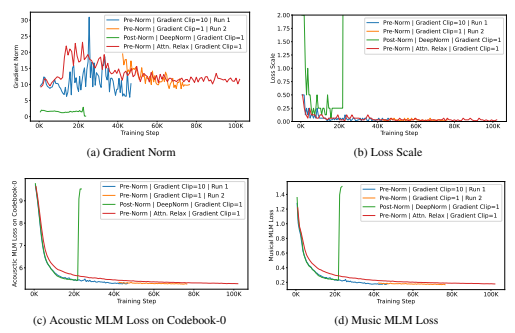 

Figure 2: Illustration of the Training Curves of Trials on Large (330M) Models. Only the acoustic MLM loss on codebook 0 in the RVQ-VAE is shown as the other seven show similar trends.

## Appendix C Representation Visualization

We select two of our checkpoints, MERT-95M-publicK-means and MERT-330MRVQ-VAE, and visualize the GTZAN representations with genre annotation shown in Fig. 3, Fig. 4, Fig. 5 and Fig. 6. The top 6 and top 8 transformer output layers are used in the visualization for MERT-95M-publicK-means and MERT-330MRVQ-VAE, correspondingly. The dimension reduction is achieved by the Uniform Manifold Approximation and Projection (UMAP)4, whereas the representations from the training set are used to learn the dimension reduction mapping. We observe that representations from both of the checkpoints present a pattern of clustering according to the genre information under different layer settings. Interestingly, the representations from the higher layers do not necessarily show stronger genre-based clustering tendency, which suggests that 1) genre may not be the most abstractive labels for these music examples or 2) the top transformer layers focus more on the MLM pre-training objectives.

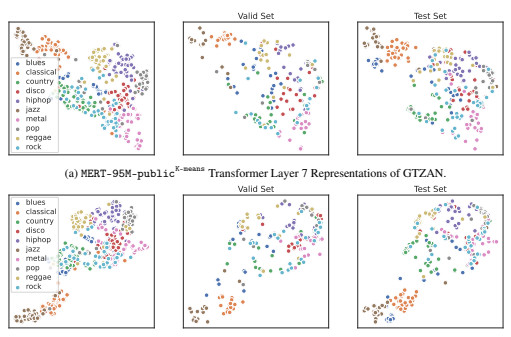

(b) MERT-95M-publicK-means Transformer Layer 8 Representations of GTZAN.

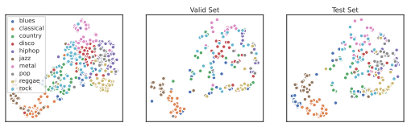 

(c) MERT-95M-publicK-means Transformer Layer 9 Representations of GTZAN.

Figure 3: Illustration of the MERT-95M-publicK-means Layer 7 to 9 Pre-trained Representations.

4https://github.com/lmcinnes/umap

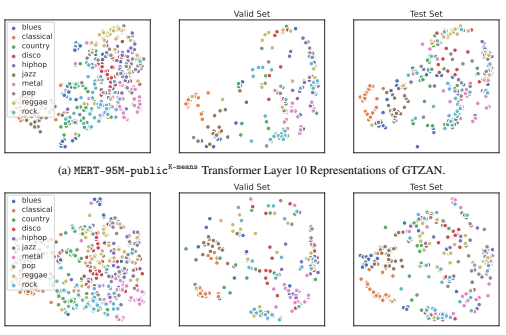

(b) MERT-95M-publicK-means Transformer Layer 11 Representations of GTZAN.

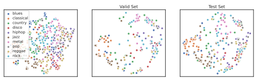

(c) MERT-95M-publicK-means Transformer Layer 12 Representations of GTZAN.

Figure 4: Illustration of the MERT-95M-publicK-means Layer 10 to 12 Pre-trained Representations.

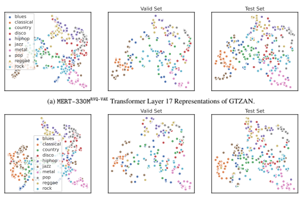

(b) MERT-330MRVQ-VAE Transformer Layer 18 Representations of GTZAN.

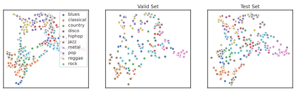

(c) MERT-330MRVQ-VAE Transformer Layer 19 Representations of GTZAN.

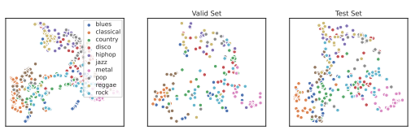

(d) MERT-330MRVQ-VAE Transformer Layer 20 Representations of GTZAN.

Figure 5: Illustration of the MERT-330MRVQ-VAE Layer 17 to 20 Pre-trained Representations.

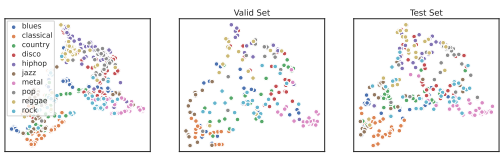

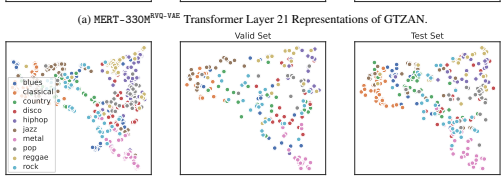

(b) MERT-330MRVQ-VAE Transformer Layer 22 Representations of GTZAN.

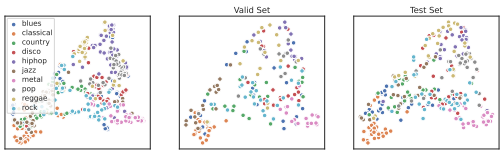

(c) MERT-330MRVQ-VAE Transformer Layer 23 Representations of GTZAN.

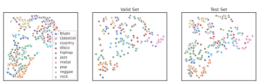

(d) MERT-330MRVQ-VAE Transformer Layer 24 Representations of GTZAN.

Figure 6: Illustration of the MERT-330MRVQ-VAE Layer 21 to 24 Pre-trained Representations.

## Appendix D Ethics

We have taken great care to ensure that our research adheres to ethical principles and guidelines in the codes of conduct. Specifically, we have not used inappropriate user information in the experiments. We believe that our work has the potential to contribute to positive social and scientific outcomes regarding the research of automatic music understanding.