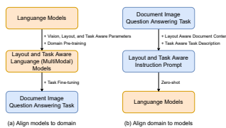
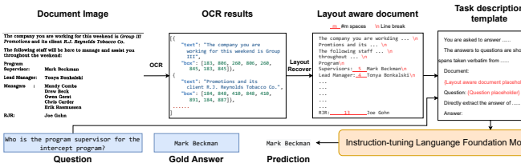
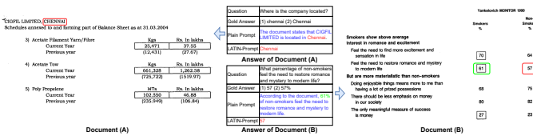

# Layout And Task Aware Instruction Prompt For Zero-Shot Document Image Question Answering

Wenjin Wang wangwenjin@zju.edu.cn Zhejiang University Hangzhou, China Yixin Ou ouyixin@zju.edu.cn Zhejiang University Hangzhou, China

## Abstract

The pre-training-fine-tuning paradigm based on layout-aware multimodal pre-trained models has achieved significant progress on document image question answering. However, domain pre-training and task fine-tuning for additional visual, layout, and task modules prevent them from directly utilizing off-the-shelf instruction-tuning language foundation models, which have recently shown promising potential in zero-shot learning. Contrary to aligning language models to the domain of document image question answering, we align document image question answering to off-the-shelf instructiontuning language foundation models to utilize their zero-shot capability. Specifically, we propose layout and task aware instruction prompt called **LATIN-Prompt**, which consists of layout-aware document content and task-aware descriptions. The former recovers the layout information among text segments from OCR tools by appropriate spaces and line breaks. The latter ensures that the model generates answers that meet the requirements, especially format requirements, through a detailed description of task. Experimental results on three benchmarks show that LATIN-Prompt can improve the zero-shot performance of instruction-tuning language foundation models on document image question answering and help them achieve comparable levels to SOTAs based on the pre-training-fine-tuning paradigm. Quantitative analysis and qualitative analysis demonstrate the effectiveness of LATIN-Prompt. We release the code to facilitate future research1.

## 1 Introduction

Intelligent document image question answering, as an important application of document intelligence, aims to develop AI systems to automatically answer natural language questions based on the understanding of document images. Compared with text documents, document images contain textual, visual, and layout information, which pose unique challenges for machine comprehension.

Recently, the pre-training-fine-tuning paradigm based on layoutaware multimodal pre-trained models has achieved significant progress on document image question answering [2, 3, 14–17, 20, 21, 24, 25, 27–29, 34, 44, 45, 56, 62–64, 72]. Their core strategy is to introduce additional visual perception modules and layout-aware modules on top of language models, and then learn these modules Yunhao Li 12121078@zju.edu.cn Zhejiang University Hangzhou, China Yin Zhang∗
zhangyin98@zju.edu.cn Zhejiang University Hangzhou, China



Figure 1: (a) Existing layout-aware multimodal pre-training methods align language models to document image question answering domain by introducing vision, layout, and task aware parameters, domain pre-training, and task fine-tuning. (2) Instead, we align the document image question answering domain to language models through layout and task aware instruction prompt, and can leverage the zero-shot ability of instruction-tuning foundation language models.

through pre-training tasks for understanding text, visual contents, and layout. For example, the 2D position embeddings [62] and layout-aware attention mechanism capture the layout information [44, 64]. The patch- [20], grid- [2], and region-level [28] image embeddings are used to capture visual information. Then, they introduce and fine-tune task-specific modules (such as classification heads) to accomplish various document image understanding tasks.

However, domain pre-training and task fine-tuning for visual, layout, and task modules prevent these approaches from directly utilizing existing instruction-tuning large language foundation models [5, 39, 42, 49, 57], which have recently shown promising potential in zero-shot learning. There are two reasons: First, instructiontuning language foundation models typically have a large number of parameters. The cost of further pre-training and fine-tuning on top of them is huge. Second, some instruction-tuning language foundation models are not open source, only API access is provided.

In this work, as shown in Fig. 1, contrary to existing layoutaware multimodal pre-training methods, we align document image question answering to off-the-shelf instruction-tuning language

∗Corresponding author: Yin Zhang.

1https://github.com/WenjinW/LATIN-Prompt
foundation models to directly utilize their zero-shot learning capability. Here are two challenges for enabling instruction-tuning language foundation models to directly understand document image question answering tasks. (1) There is rich layout information among text segments in document images. Directly concatenating OCR text segments will lose this information that is crucial for understanding document images. (2) Many document image question answering tasks have specific requirements on the format of answers, while instruction-tuning language foundation models are usually accustomed to generating open-ended answers that contain unnecessary explanations and descriptions.

To address the above challenges, we propose Layout and Task Aware Instruction **Prompt** called **LATIN-Prompt**. It consists of two parts: layout-aware document content and task-aware task descriptions. Specifically, in order to convey the layout information in document images to instruction-tuning language foundation models, we connect the OCR text segments and recover the layout using appropriate spaces and line breaks. Although simple, this method is intuitive and consistent with the human way of representing and understanding layout through blank areas. In order to enable the model to generate answers that meet the requirements of document image question answering tasks, we design task-specific description templates containing placeholders for layout-aware document content and questions, with detailed instructions on task requirements, especially answer formats. By equipping with LATIN- Prompt, instruction-tuning language foundation models can better understand the layout and task information in document image question answering to perform zero-shot learning and the process is illustrated in Fig. 2.

Our contributions are summarized as follows:
- In contrast to existing layout-aware multimodal pre-training approaches, we achieve zero-shot document image question answering by aligning document image question answering to instruction-tuning language foundation models.

- We propose LATIN-Prompt, which can convey the layout information of document images and task requirements to instruction-tuning language foundation models. We also find that appropriate spaces and line breaks can help these models accurately understand the layout.

- Experiment results on three benchmarks show that LATIN-
Prompt improves the zero-shot ability of instruction-tuning language foundation models on document image question answering, and help them achieve performance comparable to SOTAs based on the pre-training-fine-tuning paradigm. Quantitative analysis and qualitative analysis demonstrate the effectiveness of LATIN-Prompt.

## 2 Related Work 2.1 Visually-Rich Document Understanding

Visually-rich Document Understanding (VrDU) focus on recognizing and understanding scanned or digital-born document images with language, vision, and layout information. Some common VrDU
tasks include document image classification, information extraction from document images, document image layout analysis, and question answering on document images.

Traditional works in the VrDU employ various neural networks to mine information from document images. CNN based methods [12, 23, 30, 51, 55, 66, 71, 73] leverage raw visual information in document images. GNN-based methods [10, 31, 46, 61, 69] learn the representation of words from non-local and non-sequential context based on the document layout. Language transformer based methods [35, 59] fuse the layout and visual information into language.

Recently, layout-aware pre-trained Transformers have been proposed [2, 3, 14, 15, 17, 20, 21, 24, 25, 27–29, 34, 44, 45, 62–64]. LayoutLM [62] introduces the 2D position information into the input embedding and LayoutLMv2 [64] proposes the spatial-aware selfattention mechanism. Then, LayoutLMv3 [20] removes the CNN by learning visual features extraction with the discrete image tokens reconstruction, and ERNIE-Layout [44] introduces the layout knowledge into pre-training. Moreover, TILT [45] leverage the encoder-decoder Transformer to unify various tasks. Donut [24] proposes an OCR-free models based on the encoder-decoder architecture. Further, [16, 56, 72] introduce additional designs during the fine-tuning, enabling layout-aware pretrained models to better adapt to downstream tasks.

However, in order to align the model to the visual document image domain, layout-aware multimodal pre-trained models need to introduce additional layout-aware model parameters and learn these parameters through domain-specific pre-training tasks and pre-training data. This limits their ability to directly utilize the zero-shot learning ability of existing instruction-tuning language foundation models. In contrast, this work aligns the data and tasks of the visual document image domain to the input of language models to better utilize existing instruction-tuning language foundation models. Specifically, we propose the layout and task aware prompts to explore zero-shot document image question answering.

## 2.2 Instruction-Tuning Language Model

An ideal AI system should be able to learn and accomplish a variety of tasks according to human instructions. GPT-2 [47] has shown that large-scale generative pre-trained language models are essentially multi-task learners that can achieve zero-shot learning on multiple tasks conditioned on natural language task descriptions. To further enhance the instruction following ability of models, recently, various human-aligned instruction-tuning language foundation models have been proposed [4, 5, 11, 18, 22, 33, 38, 39, 42, 43, 49, 50, 52, 57, 58, 60, 65, 67, 68]
Several studies convert existing natural language processing task datasets into instructional fine-tuning datasets and use these datasets to fine-tune language models [38, 50, 58, 60]. The OPT- IML [22] and Flan Collection [33] study the effects of different decisions in instruction-tuning. To fully align models with human intentions and values, reinforcement learning from human feedback [4, 42] and AI feedback [5] are introduced into instructiontuning, giving rise to powerful AI assistants including ChatGPT [40], Claude [1], and GPT-4 [39]. To reduce the cost of manual annotation of instruction-tuning data, [19] introduces the instruction induction challenge and shows that language models can infer an instruction from a few demonstrations by prompting them to generate a natural language instruction that fits the examples. Further more,



Figure 2: The overview of LATIN-Prompt (Sec. 3.1). Given a document image and the corresponding question, we recover the layout of the document image OCR results using appropriate spaces and line breaks (Sec. 3.2), and then place the layout aware document content and question in the task description template together (Sec. 3.3). The instruction-tuning large language foundation model takes the filled template as input and predicts the answer to the question in the required format.

#### Table 1: Docvqa Prompt Template

| #Line   | Prompt                                                                                                                     |
|---------|----------------------------------------------------------------------------------------------------------------------------|
| 1       | You are asked to answer questions asked on a document image.                                                               |
|         | The answers to questions are short text spans taken verbatim from the document. This means that the answers comprise a set |
| 2       | of contiguous text tokens present in the document.                                                                         |
| 3       | Document:                                                                                                                  |
| 4       | {Layout Aware Document placeholder}                                                                                        |
| 5       |                                                                                                                            |
| 6       | Question: {Question placeholder}                                                                                           |
| 7       |                                                                                                                            |
| 8       | Directly extract the answer of the question from the document with as few words as possible.                               |
| 9       |                                                                                                                            |
| 10      | Answer:                                                                                                                    |

some methods automatically construct instruction-tuning data using off-the-shelf language models [18, 43, 49, 57, 74]. For example, the Self-Instruct [57] improve the instruction-following capabilities of language models via its own generation of instruction data by in-context learning and bootstrapping with it.

In this paper, we focus on how to use off-the-shelf instructiontuning language models to achieve zero-shot document image question answering, which poses more challenges than general text document question answering due to complex layouts and task requirements.

## 3 Method

Different from existing layout-aware multimodal pre-training methods, which align models to document image understanding tasks, we align the document image question answering to instructiontuning large language foundation models through the carefully designed prompt. Specifically, we propose a layout and task aware instruction prompt called LATIN-Prompt, which can directly leverage the existing instruction-tuning language model to perform zero-shot document image question answering tasks.

The LATIN-Prompt includes two parts: layout-aware document content and task-aware task descriptions. The former conveys the words and text segments obtained by OCR, along with their layout relationships, to the language foundation models. Unlike the layoutaware pre-trained models that introduce additional parameter modules to understand the bounding boxes, we find that instructiontuning language models can understand the layout information through spaces and line breaks. The latter conveys task information to the language model, which is crucial for the model to generate answers in the required format rather than openly.

## 3.1 Overview Of Latin-Prompt

Fig. 2 illustrates the basic process of the LATIN-Prompt. Given a document image and the corresponding question, we recover the layout of the document image OCR results using appropriate spaces and line breaks (Sec. 3.2), and then place the layout aware document content and question in the task description template together (Sec. 3.3). The instruction-tuning large language foundation model takes the filled template as input and predicts the answer to the question in the required format.

#### Table 2: Infographicvqa Prompt Template

4 9 11 13 14 Answer:
5 7 9 so that your answer match exactly with the ground truth.

5 3. Answer is a contiguous piece of text from the question itself (a span from the question)
64. Answer is a number ( for example "2", "2.5", "2%", " 2/3" etc..). For example there are questions asking for count of something or cases where answer is sum of two values given in the image.

7 Document: 8 {Layout Aware Document placeholder}
10 Question: {Question placeholder}

| 1  You are asked to answer questions asked on a document image.                                                                          |
|------------------------------------------------------------------------------------------------------------------------------------------|
| The answers to questions are short text spans taken verbatim from the document. This means that the answers comprise a set of contiguous |
| 2  text tokens present in the document.                                                                                                  |
| 3  Document:                                                                                                                             |
| 4  {Layout Aware Document placeholder}                                                                                                   |
| 6  Question: {Question placeholder}                                                                                                      |
| 8  Directly extract the answer of the question from the document with as few words as possible.                                          |
| 10  You also need to output your confidence in the answer, which must be an integer between 0\-100.                                      |
| 11  The output format is as follows, where [] indicates a placeholder and does not need to be actually output:                           |
| 12  [Confidence score], [Extracted Answer]                                                                                               |

12 Directly answer the answer of the question from the document with as few words as possible.

#### Table 3: Mp-Docvqa Prompt Template

Formally, given a document image  and a question answer pair and , we first process the document image using an OCR tool.

The extracted text segments and corresponding bounding boxes are denoted as  = {1, 2*, . . . ,* } and  = {1, 2*, . . . ,* }, where represents the number of text segments. Next, we join the text segments with appropriate spaces and line breaks to recover the layout information in the document image as follows:

#### ′ = Recover(S, B), (1)

where 
′is a string representing the layout-aware document content and the Recover() represents the layout recovery function, which will be discussed in detail in Sec. 3.2.

Then, we fill the recovered document content 
′and the question  to a manually designed task description template . The template  consists of a task description, a layout-aware document placeholder, and a question placeholder, as shown on the right side of Fig. 2. The task description conveys the task requirements to the language model, and different tasks adopt different templates. We will discuss the design of templates for different tasks in detail in Sec. 3.3.

At last, the instruction-tuning language model  takes the filled template  (
′, ) as input and predicts the answer as follows:

| You are asked to answer questions asked on a document image.                                                               | 1   |
|----------------------------------------------------------------------------------------------------------------------------|-----|
| The answer for a question in this can be any of the following types:                                                       | 2   |
| 1. Answer is a piece contiguous text from the document.                                                                    | 3   |
| 2. Answer is a list of "items" , where each item is a piece of text from the document (multiple spans). In such cases your |     |
| model/method is expected to output an answer where each item is separated by a comma and a space. For example if the       |     |
| question is "What are the three common symptoms of COVID\-19?" Answer must be in the format "fever, dry cough, tiredness". |     |

′ = 
 ( (
′, )), (2)

where 
′represents the prediction and the represents the decoding process of model .

## 3.2 Layout Aware Document

Here, we describe in detail the process of recovering the layoutaware document content from text segments and corresponding bounding boxes. The core of layout recovery lies in using spaces

| Paradigm     | Method BERTLARGE [13]                | Parameters  340M                                                                                                                               | Text ✓   | Vision                | Layout   | Fine\-tuning Set train   | ANLS   0.6768   | ΔANLS   |
|--------------|--------------------------------------|------------------------------------------------------------------------------------------------------------------------------------------------|----------|-----------------------|----------|--------------------------|-----------------|---------|
|              | RoBERTaLARGE [32] UniLMv2LARGE [6]   | 355M   340M                                                                                                                                    | ✓ ✓ ✓    |                       | ✓        | train train              | 0.6952   0.7709 |         |
|              | LayoutLMLARGE [62]                   | 343M                                                                                                                                           | ✓        | ✓                     | ✓        | train                    | 0.7259          |         |
|              | [64] LayoutLMv2LARGE                 | 426M                                                                                                                                           |          |                       |          | train                    | 0.8348          |         |
| Fine\-tuning | [20] LayoutLMv3LARGE                 | 368M                                                                                                                                           | ✓        | ✓                     | ✓        | train                    | 0.8337          |         |
|              | ERNIE\-LayoutLARGE [44]              | 507M                                                                                                                                           | ✓        | ✓                     | ✓        | train                    | 0.8321          |         |
|              | StructuralLMLARGE [27]               | 355M                                                                                                                                           | ✓        |                       | ✓        | Unknown                  | 0.8394          |         |
|              | TILTLARGE [45]                       | 780M                                                                                                                                           | ✓        | ✓                     | ✓        | Unknown                  | 0.8705          |         |
|              | LayoutLMv2LARGE [64]                 | 426M                                                                                                                                           | ✓        | ✓                     | ✓        | train + dev              | 0.8529          |         |
|              | ERNIE\-LayoutLARGE [44]              | 507M                                                                                                                                           | ✓        | ✓                     | ✓        | train + dev              | 0.8486          |         |
|              | ERNIE\-LayoutLARGE [44](leaderboard) | 507M                                                                                                                                           | ✓        | ✓                     | ✓        | train + dev              | 0.8841          |         |
|              | Alpaca [49] + Plain Prompt           | 7B                                                                                                                                             | ✓        |                       |          | \-                       | 0.3567          |         |
|              | Alpaca [49] + LATIN\-Prompt          |                                                                                                                                                | ✓        |                       | ✓        | \-                       | 0.4200          | +0.0633 |
|              | Claude [1] + Plain Prompt            | Unknown                                                                                                                                        | ✓        |                       |          | \-                       | 0.2298          |         |
| Zero\-shot   | Claude [1] + LATIN\-Prompt           |                                                                                                                                                | ✓        |                       | ✓        | \-                       | 0.8336          | +0.6038 |
|              | ChatGPT\-3.5 [40] + Plain Prompt     |                                                                                                                                                | ✓        |                       | ✓        | \-                       | 0.6866          |         |
|              | ChatGPT\-3.5 [40] + LATIN\-Prompt    | Unknown                                                                                                                                        | ✓        |                       | ✓        | \-                       | 0.8255          | +0.1389 |
|              | GPT\-4 [41]∗                         | Unknown                                                                                                                                        |          | not clearly described |          | \-                       | 0.8840          |         |
|              |                                      | * represents that we report the result of GPT\-4 presented in OpenAI blog [41]. Although lacking a technical detail description, compared with |          |                       |          |                          |                 |         |

Table 4: Performance on test dataset of DocVQA. Text, Vision, and Layout represent the modal information used by the model.

The Δ**ANLS represents the gain of LATIN-Prompt compared to Plain Prompt. Unknown indicates missing relevant details.**

 
Claude and ChatGPT-3.5, GPT-4 utilizes visual information. The LATIN-Prompt and GPT-4 are orthogonal, however, due to API permission restrictions, we can only leave arming GPT-4 with the LATIN-Prompt to the future.

and line breaks to represent the layout relationship among text segments. Fig. 2 gives an example and the process is as follows:
Step 1. Re-arrange the text segments and bounding boxes in the order from top to bottom and from left to right based on the coordinates.

Step 2. According to the coordinates, place the text segments and bounding boxes in the -th row into the list  and  respectively from left to right, and calculate the character count and the width of -th row. The  equals the width of the union of bounding boxes in the list .

Step 3. Calculate the character width of document , which is defined as follows:

  **C** **:= $W_{1}^{*}/C_{1}^{*}$, $t^{*}$ **=** **argmax** ${}_{i}C_{1}$**.  
$\mathfrak{h}_1$

#### (3)

where 
∗-row has the maximum character count among all rows.

Step 4. Join text segments in the same row from left to right by spaces. Given two adjacent text segments , and ,
 , the number of spaces joining them is equal to ℎ,
/¯ where ℎ, is the horizontal distance between the two bounding boxes , and ,
 .

Step 5. Join different rows by line breaks to obtain the layoutaware document content.

Recovering layout information by spaces and line breaks is simple but intuitive. In fact, people do represent and understand layout through blank areas between text elements, rather than precise bounding box coordinates. The experiments in Sec. 4 show that the instruction-tuning large language models also have such ability.

## 3.3 Task Aware Description

Although instruction-tuning language models have strong language understanding and generation capabilities, the answers they generate are usually open-ended and often do not meet the requirements of document image QA tasks. For example, DocVQA is an extractive QA task that requires answers to be extracted from the document. However, with only the layout-aware document content and question, the model can easily generate answers that are not in the document and generate unnecessary descriptions or explanations.

Thanks to the instruction following ability of instruction-tuning models, we can guide the model to generate answers that meet the requirements by injecting task descriptions into prompts. We manually designed different instruction prompt templates for three document image QA tasks, including DocVQA [37], InfographicVQA [36], and MP-DocVQA [53], which contain the requirements of each task as well as placeholders for the layout-aware document and question.

Table 1 shows the prompt template for DocVQA[37]. In the first and second lines, we explain the meaning of extraction in detail to the model according to the task description in DocVQA [37]. Lines 3 to 6 provide placeholders for the layout-aware document and question. To avoid the model forgetting its task due to the interference of document content, the 8th line summarizes and reiterates the task requirements.

Table 5: Performance on test dataset of InfographicVQA. The questions in InfographicVQA can be grouped according to answer type, evidence source, and operation. We list both the overall performance of the model and its performance on different groups. All performances are evaluated by ANLS. The Δ**ANLS represents the gain of LATIN-Prompt compared to Plain Prompt.** The highest and second-highest scores are bolded and underlined.

| Paradigm         | Method                            |            | Overall        |                   |        | Answer type    |                |                 |          |
|------------------|-----------------------------------|------------|----------------|-------------------|--------|----------------|----------------|-----------------|----------|
|                  |                                   |            | ANLS           | ΔANLS  Image span |        | Question span  | Multiple spans | Non span        |          |
|                  | BERT [13]  LayoutLM [62]          |            | 0.2078  0.2720 | 0.2625 0.3278     |        | 0.2333  0.2386 | 0.0739  0.0450 | 0.0259   0.1371 |          |
| Fine\-tuning     | LayoutLMv2 [64]                   |            | 0.2829         | 0.3430            |        | 0.2763         | 0.0641         | 0.1114          |          |
|                  | BROS [17]                         |            | 0.3219         | 0.3997            |        | 0.2317         | 0.1064         | 0.1068          |          |
|                  | pix2struct [26]                   |            | 0.4001         | 0.4308            |        | 0.4839         | 0.2059         | 0.3173          |          |
|                  | TILT [45]                         |            | 0.6120         | 0.6765            |        | 0.6419         | 0.4391         | 0.3832          |          |
| Zero\-shot       | Claude [1] + Plain Prompt         |            | 0.0798         | 0.0951            |        | 0.0913         | 0.0203         | 0.0280          |          |
|                  | Claude [1] + LATIN\-Prompt        |            | 0.5451         | +0.4653  0.5992   |        | 0.5861         | 0.3985         | 0.3544          |          |
|                  | ChatGPT\-3.5 [40] + Plain Prompt  |            | 0.3335         | 0.3749            |        | 0.4505         | 0.0950         | 0.1822          |          |
|                  | ChatGPT\-3.5 [40] + LATIN\-Prompt |            | 0.4898         | +0.1563  0.5457   |        | 0.5639         | 0.3458         | 0.2798          |          |
| Paradigm  Method |                                   |            |                | Evidence          |        |                |                | Operation       |          |
|                  |                                   | Table/List | Textual        | Visual object     | Figure | Map            | Comparison     | Arithmetic      | Counting |
| Fine\-tuning     | BERT [13]                         | 0.1852     | 0.2995         | 0.0896            | 0.1942 | 0.1709         | 0.1805         | 0.0160          | 0.0436   |
| LayoutLM [62]    |                                   | 0.2400     | 0.3626         | 0.1705            | 0.2551 | 0.2205         | 0.1836         | 0.1559          | 0.1140   |
| LayoutLMv2 [64]  |                                   | 0.2449     | 0.3855         | 0.1440            | 0.2601 | 0.3110         | 0.1897         | 0.1130          | 0.1158   |
| BROS [17]        |                                   | 0.2653     | 0.4488         | 0.1878            | 0.3095 | 0.3231         | 0.2020         | 0.1480          | 0.0695   |
| pix2struct [26]  |                                   | 0.3833     | 0.5256         | 0.2572            | 0.3726 | 0.3283         | 0.2762         | 0.4198          | 0.2017   |
| TILT [45]        |                                   | 0.5917     | 0.7916         | 0.4545            | 0.5654 | 0.4480         | 0.4801         | 0.4958          | 0.2652   |
| Zero\-shot       | Claude [1] + Plain Prompt         | 0.0849     | 0.1099         | 0.0858            | 0.0695 | 0.0496         | 0.0589         | 0.0271          | 0.0368   |
|                  | Claude [1] + LATIN\-Prompt        | 0.5421     | 0.6725         | 0.4897            | 0.5027 | 0.4982         | 0.4598         | 0.4311          | 0.2708   |
|                  | ChatGPT\-3.5 [40] + Plain Prompt  | 0.3481     | 0.3893         | 0.3670            | 0.3114 | 0.1843         | 0.2349         | 0.1466          | 0.2320   |
|                  | ChatGPT\-3.5 [40] + LATIN\-Prompt | 0.4917     | 0.6016         | 0.4491            | 0.4585 | 0.3614         | 0.4312         | 0.3157          | 0.2660   |

Table 2 shows the prompt template for InfographicVQA [36].

Compared with DocVQA, InfographicVQA has more complex answer sources (refer to Sec. 4.1 for more details). We describe the answer requirements in detail in lines 1 to 6, and the rest is similar to the DocVQA prompt template.

Table 3 shows the prompt template for MP-DocVQA [53]. MP-
DocVQA is a multi-page question answering task, in which each question has multiple candidate page images (refer to Sec. 4.1 for more details), and we adopt the Max Confidence (Max Conf) [37] setup to solve it. Specifically, the model extracts one answer on each page and gives confidence to this answer. We choose the answer with the highest confidence as the final prediction. Lines 10 to 12 of Tab. 3 instruct the model to output the answer and confidence simultaneously, and the rest is similar to Tab. 1.

## 4 Experiment 4.1 Experiment Settings

Datasets. To evaluate LATIN-Prompt, we conduct experiments on three document image question answering datasets, including DocVQA [37], InfographicVQA [36], and MP-DocVQA [53].

The DocVQA is an extractive question answering task and consists of 50,000 questions defined on 12,767 document images. The train split has 39,463 questions, the validation split has 5,349 questions, and the test split has 5,188 questions. DocVQA contains a

| Paradigm     | Method                     | Setup             | ANLS            |
|--------------|----------------------------|-------------------|-----------------|
| Fine\-tuning | BERT [13]  Longformer [7]  | Max Conf Max Conf | 0.5347   0.5506 |
|              |                            | Concat            | 0.4183          |
|              |                            | Concat            | 0.5287          |
|              | Big Bird [70]              | Max Conf          | 0.5854          |
|              |                            | Concat            | 0.4929          |
|              | LayoutLMv3 [20]            | Max Conf          | 0.5513          |
|              |                            | Concat            | 0.4538          |
|              | T5 [48]                    | Max Conf          | 0.4028          |
|              |                            | Concat            | 0.5050          |
|              | Hi\-VT5 [53]               | Multipage         | 0.6201          |
| Zero\-shot   | Claude [1] + LATIN\-Prompt | Max Conf          | 0.6129          |

Table 6: Performance on test dataset of MP-DocVQA. Concat indicates concatenating multi-page content. MaxConf indicates processing each page separately and choosing an answer based on confidence. We only evaluate Claude with LATIN-Prompt because Plain Prompt does not apply to Max- Conf, and Concat exceeds the length limit.

large number of questions related to forms, layouts, tables and lists



Figure 3: Case study of Claude on DocVQA. Case (A): Both Plain Prompt and LATIN-Prompt can generate the correct answer (in red), but due to the lack of task description, Plain Prompt generates unnecessary words (in blue), violating the extraction requirement. Case (B): Due to the lack of task description and layout information, Plain Prompt generates incorrect answers (in **green) and unnecessary words (in blue). In contrast, LATIN-Prompt can understand layout relationships and generate the** correct answer (in red).

in the image, posing high requirements on the model's ability to understand document image layouts.

The InfographicVQA consists of 5,485 infographics, which convey information through text, graphics, and visual elements together. Compared with DocVQA, InfographicVQA emphasizes questions that require basic reasoning and arithmetic skills, and has more complex answer sources, including Document(Image)-Span, Question-Span, Multi-Span and Non-extractive.

MP-DocVQA extends DocVQA to more realistic multi-page scenarios where a document typically consists of multiple pages that should be processed together. It comprises 46,000 questions posed over 48,000 scanned pages belonging to 6,000 industry documents, and the page images contain diverse layouts. The variability between documents in MP-DocVQA is very high. The number of pages in each document varies from 1 to 20, and the number of recognized OCR words varies from 1 to 42,313.

Following common practice, we use Azure OCR results for the DocVQA provided by DUE [9]. For the InfographicVQA and MP-
DocVQA, we use offical OCR results2.

Models. To evaluate the LATIN-Prompt, we equip it on three instruction-tuning language foundation models: Claude [1], GPT- 3.5(ChatGPT [40]) and Alpaca [49]. The Claude is an AI assistant launched by the Anthropic, mainly trained based on the Constitutional AI [5]. We use the API of claude-v1.3, which has precise instruction-following ability. For GPT-3.5, we use the gpt-3.5-turbo API from Azure OpenAI, which is optimized for chat. The Alpaca
[49] is an open source instruction-following 7B LLaMA [54] model. The Alpaca fine-tunes the 7B LLaMA model on 52,000 data generated by the Self-Instruct [57]. Due to API permission restrictions, we will leave our exploration using GPT-4 [39] as future work.

Evaluation and Baselines. We do not fine-tune language foundation models. We use zero-shot performance on the validation set to evaluate the effect of different parts of LATIN-Prompt. We compare LATIN-Prompt's zero-shot performance with fine-tuning performance of pre-training-fine-tuning methods on test dataset.

We also evaluate zero-shot performance of Claude, GPT-3.5, and Alpaca with the Plain Prompt as follows: "Document:{document} Question: {question} Directly extract the answer of the question from the document. Answer:", where {document} and {question} are placeholders of original text segments from OCR tools and question. For brevity, spaces and line breaks are omitted here. See supplementary material for the full template. Moreover, we report the result of multimodal GPT-4 presented in OpenAI blog [41]. For all datasets, we adopt the Average Normalized Levenshtein Similarity (ANLS) proposed in ST-VQA [8] as the evaluation metric.

## 4.2 Main Results

We compare our method with pre-training-fine-tuning methods, foundation models with Plain Prompt, and multimodal GPT-4.

Table 4 presents the experimental results on DocVQA. We find that, (1) in the pre-training-fine-tuning paradigm, the layout-aware multimodal pre-trained model performs better than the pure language model. (2) Further, increasing the amount of fine-tuning data can improve the performance of models. (3) The instruction-tuning language models perform poorly with the plain prompt based on the original text segments obtained by OCR tools. (4) The LATIN- Prompt proposed in this paper significantly improves the zero-shot performance of instruction-tuning language models. It enables the zero-shot performance of Claude and GPT-3.5 to significantly outperform the fine-tuned layout-aware LayoutLM. In addition, despite only using text and layout information, their zero-shot performance is comparable to the performance of fine-tuned layout-aware multimodal pre-trained models. (5) Although unknown, the number of parameters of Claude and GPT-3.5 should be much larger than that of Alpaca. The experimental results show that the final zero-shot performance is positively correlated with the size and ability of the instruction-tuning models. (6) The zero-shot performance of GPT-4 matched the best fine-tuned performance. Although lacking a technical detail description, compared with Claude and GPT-3.5, GPT-4 utilizes visual information, reflecting the importance of visual information for document image understanding. The LATIN-Prompt proposed in this paper and GPT-4 are orthogonal. However, due to API permission restrictions, we can only leave arming GPT-4 with the LATIN-Prompt to the future.

2https://rrc.cvc.uab.es/?ch=17&com=introduction
Table 5 presents results on InfographicVQA. Experimental results show that LATIN-Prompt enable the zero-shot performance of Claude and GPT-3.5 to exceed the performance of all fine-tuned baselines except TILT. We find that Claude performs poorly with Plain Prompt, but its performance improves significantly when using LATIN-Prompt.

Table 5 presents the experimental results on MP-DocVQA. The results show that, equipped with the LATIN-Prompt, Claude's zeroshot performance exceeds the fine-tuning performance of Longformer and Big Bird, which are specialized for long sequences, as well as the layout-aware multimodal LayoutLMv3. Furthermore, its zero-shot performance is comparable to the fine-tuning performance of Hi-VT5, a layout-aware multimodal method for multipage document images.

## 4.3 Ablation Study

Table 7: Ablation study of the LATIN-Prompt with Claude on the validation data of DocVQA and InfographicVQA. The Δ**ANLS represents the gain of different prompts compared** to the Plain prompt.

| Prompt             |        | DocVQA   | InfographicVQA   |         |
|--------------------|--------|----------|------------------|---------|
|                    | ANLS   | ΔANLS    | ANLS             | ΔANLS   |
| Plain              | 0.2144 |          | 0.0702           |         |
| Layout             | 0.3637 | +0.1493  | 0.1234           | +0.0532 |
| Task               | 0.7825 | +0.5681  | 0.4638           | +0.3936 |
| Layout+Task(LATIN) | 0.8311 | +0.6167  | 0.5218           | +0.4516 |

Table 8: Ablation study of the LATIN-Prompt with ChatGPT- 3.5 on the validation data of DocVQA and InfographicVQA. The ΔANLS represents the gain of different prompts com-

| Prompt             |        | DocVQA   | InfographicVQA   |         |
|--------------------|--------|----------|------------------|---------|
|                    | ANLS   | ΔANLS    | ANLS             | ΔANLS   |
| Plain              | 0.6795 |          | 0.3103           |         |
| Layout             | 0.7561 | +0.0766  | 0.4296           | +0.1193 |
| Task               | 0.7491 | +0.0696  | 0.4341           | +0.1238 |
| Layout+Task(LATIN) | 0.8135 | +0.1340  | 0.4708           | +0.1605 |

pared to the Plain prompt.

The LATIN-Prompt includes two parts: layout-aware document content and task-aware task description. To verify the effectiveness of each component in LATIN-Prompt, we conduct ablation experiments on the validation dataset of DocVQA and InfographicVQA.

Table 7 presents the results of ablation study with Claude. The Plain represents the plain prompt for document question answer (see Sec. 4.1). The Layout represents the plain prompt with layout aware document prompt. The Task represents the task instruction aware prompt with origin document. The LATIN represents the LATIN-Prompt with both layout aware document and task instruction. The results show that both the layout-aware document content and the task description can significantly improve the zero-shot performance of Claude. The improvement brought by task description is more significant because it ensures that the format of the answers generated by the model meets the task requirements. On the basis of the correct format, the layout-aware document content further improves the performance of the model because it enables the model to utilize the layout information among text segments.

Table 8 presents the results with GPT-3.5. Similar to performance with Claude, both layout-aware document content and task description improve the zero-shot performance of GPT-3.5. Compared with Claude, GPT-3.5 performs better with only Plain prompt, probably because it could understand the meaning of extraction to some extent without task description. In this case, the gains from the layout-aware document content and the task description are close.

## 4.4 Case Study

Figure 3 presents two cases of Claude on DocVQA for qualitative analysis. The results on Document (A) show that compared with Plain Prompt, LATIN-Prompt can perform accurate extraction and avoid generating unnecessary words thanks to the task description. The results on Document (B) show that Plain Prompt cannot correctly answer questions involving layout understanding. In contrast, LATIN-Prompt can better answer such questions thanks to layout recovery.

## 5 Limitation And Discussion

Regardless of the significant gains brought by LATIN-Prompt, we discuss the limitations it still faces and some directions for future improvements. (1) LATIN-Prompt does not directly consider visual information, limiting its performance on some figure-based questions. The performance of GPT-4 in Tab. 4 indicates the importance of visual signals. Incorporating visual information into LATIN-Prompt may bring more benefits. We explore injecting visual signals through image captions but do not gain benefits. (2)
LATIN-Prompt is affected by errors from OCR tools. Correcting such errors is important for improving the performance of LATIN-
Prompt. (3) The task description templates in LATIN-Prompt are manually designed. The automated template design is necessary for the widespread application of LATIN-Prompt. (4) LATIN-Prompt only considers document image question answering tasks and cannot adapt to a wider range of document image understanding tasks. We have made preliminary explorations on document image information extraction, but have not achieved ideal results.

## 6 Conclusion

In this work, we align document image question answering to offthe-shelf instruction-tuning language foundation models to utilize their zero-shot capability. To enable instruction-tuning language foundation models to directly understand document image question answering tasks, we propose the LATIN-Prompt consisting of layout-aware document content and task-aware descriptions. Experiment results on three benchmarks show that LATIN-Prompt improves the zero-shot ability of instruction-tuning language foundation models on document image question answering, and help them achieve comparable levels to SOTAs based on the pre-trainingfine-tuning paradigm. Quantitative analysis and qualitative analysis demonstrate the effectiveness of LATIN-Prompt.

## References

```
 [1] Anthropic. 2023. Claude. https://www.anthropic.com/product.
 [2] Srikar Appalaraju, Bhavan Jasani, Bhargava Urala Kota, Yusheng Xie, and R. Man-
     matha. 2021. DocFormer: End-to-End Transformer for Document Understanding.
     In ICCV 2021. 993–1003.
 [3] Haoli Bai, Zhiguang Liu, Xiaojun Meng, Wentao Li, Shuang Liu, Nian Xie, Rongfu
     Zheng, Liangwei Wang, Lu Hou, Jiansheng Wei, Xin Jiang, and Qun Liu. 2022.
     Wukong-Reader: Multi-modal Pre-training for Fine-grained Visual Document
     Understanding. arXiv:2212.09621 [cs]
 [4] Yuntao Bai, Andy Jones, Kamal Ndousse, Amanda Askell, Anna Chen, Nova
     DasSarma, Dawn Drain, Stanislav Fort, Deep Ganguli, Tom Henighan, Nicholas
     Joseph, Saurav Kadavath, Jackson Kernion, Tom Conerly, Sheer El-Showk, Nelson
     Elhage, Zac Hatfield-Dodds, Danny Hernandez, Tristan Hume, Scott Johnston,
     Shauna Kravec, Liane Lovitt, Neel Nanda, Catherine Olsson, Dario Amodei, Tom
     Brown, Jack Clark, Sam McCandlish, Chris Olah, Ben Mann, and Jared Kaplan.
     2022. Training a Helpful and Harmless Assistant with Reinforcement Learning
     from Human Feedback. arXiv:2204.05862 [cs]
 [5] Yuntao Bai, Saurav Kadavath, Sandipan Kundu, Amanda Askell, Jackson Kernion,
     Andy Jones, Anna Chen, Anna Goldie, Azalia Mirhoseini, Cameron McKinnon,
     Carol Chen, Catherine Olsson, Christopher Olah, Danny Hernandez, Dawn
     Drain, Deep Ganguli, Dustin Li, Eli Tran-Johnson, Ethan Perez, Jamie Kerr,
     Jared Mueller, Jeffrey Ladish, Joshua Landau, Kamal Ndousse, Kamile Luko-
     suite, Liane Lovitt, Michael Sellitto, Nelson Elhage, Nicholas Schiefer, Noemi
     Mercado, Nova DasSarma, Robert Lasenby, Robin Larson, Sam Ringer, Scott John-
     ston, Shauna Kravec, Sheer El Showk, Stanislav Fort, Tamera Lanham, Timothy
     Telleen-Lawton, Tom Conerly, Tom Henighan, Tristan Hume, Samuel R. Bowman,
     Zac Hatfield-Dodds, Ben Mann, Dario Amodei, Nicholas Joseph, Sam McCandlish,
     Tom Brown, and Jared Kaplan. 2022. Constitutional AI: Harmlessness from AI
     Feedback. https://doi.org/10.48550/arXiv.2212.08073 arXiv:2212.08073 [cs]
 [6] Hangbo Bao, Li Dong, Furu Wei, Wenhui Wang, Nan Yang, Xiaodong Liu, Yu
     Wang, Jianfeng Gao, Songhao Piao, Ming Zhou, and Hsiao-Wuen Hon. 2020.
     UniLMv2: Pseudo-Masked Language Models for Unified Language Model Pre-
     Training. In Proceedings of the 37th International Conference on Machine Learning.
     PMLR, 642–652.
 [7] Iz Beltagy, Matthew E. Peters, and Arman Cohan. 2020. Longformer: The
     Long-Document Transformer. https://doi.org/10.48550/arXiv.2004.05150
     arXiv:2004.05150 [cs]
 [8] Ali Furkan Biten, Ruben Tito, Andres Mafla, Lluis Gomez, Marçal Rusiñol, Ernest
     Valveny, C. V. Jawahar, and Dimosthenis Karatzas. 2019. Scene Text Visual
     Question Answering. In ICCV 2019. arXiv. arXiv:1905.13648 [cs]
 [9] Łukasz Borchmann, Michał Pietruszka, Tomasz Stanislawek, Dawid Jurkiewicz,
     Michał Turski, Karolina Szyndler, and Filip Graliński. 2021. DUE: End-to-End
     Document Understanding Benchmark. In NeurIPS 2021.
[10] Manuel Carbonell, Pau Riba, Mauricio Villegas, Alicia Fornes, and Josep Llados.
     2021. Named Entity Recognition and Relation Extraction with Graph Neural
     Networks in Semi Structured Documents. In ICPR 2020. IEEE, Milan, Italy, 9622–
     9627. https://doi.org/10.1109/ICPR48806.2021.9412669
[11] Hyung Won Chung, Le Hou, Shayne Longpre, Barret Zoph, Yi Tay, William Fedus,
     Yunxuan Li, Xuezhi Wang, Mostafa Dehghani, Siddhartha Brahma, Albert Web-
     son, Shixiang Shane Gu, Zhuyun Dai, Mirac Suzgun, Xinyun Chen, Aakanksha
     Chowdhery, Alex Castro-Ros, Marie Pellat, Kevin Robinson, Dasha Valter, Sharan
     Narang, Gaurav Mishra, Adams Yu, Vincent Zhao, Yanping Huang, Andrew Dai,
     Hongkun Yu, Slav Petrov, Ed H. Chi, Jeff Dean, Jacob Devlin, Adam Roberts,
     Denny Zhou, Quoc V. Le, and Jason Wei. 2022. Scaling Instruction-Finetuned Lan-
     guage Models. https://doi.org/10.48550/arXiv.2210.11416 arXiv:2210.11416 [cs]
[12] Timo I. Denk and Christian Reisswig. 2019. BERTgrid: Contextualized Embedding
     for 2D Document Representation and Understanding. In NeurIPS 2019 Workshop.
[13] Jacob Devlin, Ming-Wei Chang, Kenton Lee, and Kristina Toutanova. 2019. BERT:
     Pre-training of Deep Bidirectional Transformers for Language Understanding. In
     Proceedings of the 2019 Conference of the North American Chapter of the Association
     for Computational Linguistics: Human Language Technologies, Volume 1 (Long and
     Short Papers). Association for Computational Linguistics, Minneapolis, Minnesota,
     4171–4186. https://doi.org/10.18653/v1/N19-1423
[14] Mohamed Dhouib, Ghassen Bettaieb, and Aymen Shabou. 2023. DocParser:
     End-to-end OCR-free Information Extraction from Visually Rich Documents. In
     ICDAR 2023. https://doi.org/10.48550/arXiv.2304.12484 arXiv:2304.12484 [cs]
[15] Łukasz Garncarek, Rafał Powalski, Tomasz Stanisławek, Bartosz Topolski, Piotr
     Halama, Michał Turski, and Filip Graliński. 2021. LAMBERT: Layout-Aware
     Language Modeling for Information Extraction. In ICDAR 2021 (Lecture Notes
     in Computer Science), Josep Lladós, Daniel Lopresti, and Seiichi Uchida (Eds.).
     Springer International Publishing, Cham, 532–547. https://doi.org/10.1007/978-
     3-030-86549-8_34
[16] Zhangxuan Gu, Changhua Meng, Ke Wang, Jun Lan, Weiqiang Wang, Ming
     Gu, and Liqing Zhang. 2022. XYLayoutLM: Towards Layout-Aware Multimodal
     Networks For Visually-Rich Document Understanding. In CVPR 2022. 10.
[17] Teakgyu Hong, Donghyun Kim, Mingi Ji, Wonseok Hwang, Daehyun Nam, and
     Sungrae Park. 2022. BROS: A Pre-Trained Language Model Focusing on Text and

     Layout for Better Key Information Extraction from Documents. In AAAI 2022.
[18] Or Honovich, Thomas Scialom, Omer Levy, and Timo Schick. 2022. Unnatural
     Instructions: Tuning Language Models with (Almost) No Human Labor. https:
     //doi.org/10.48550/arXiv.2212.09689 arXiv:2212.09689 [cs]
[19] Or Honovich, Uri Shaham, Samuel R. Bowman, and Omer Levy. 2022. Instruction
     Induction: From Few Examples to Natural Language Task Descriptions. https:
     //doi.org/10.48550/arXiv.2205.10782 arXiv:2205.10782 [cs]
[20] Yupan Huang, Tengchao Lv, Lei Cui, Yutong Lu, and Furu Wei. 2022. LayoutLMv3:
     Pre-training for Document AI with Unified Text and Image Masking. In ACM
     MM 2022. arXiv:2204.08387
[21] Wonseok Hwang, Jinyeong Yim, Seunghyun Park, Sohee Yang, and Minjoon Seo.
     2021. Spatial Dependency Parsing for Semi-Structured Document Information
     Extraction. In ACL-Findings 2021.
[22] Srinivasan Iyer, Xi Victoria Lin, Ramakanth Pasunuru, Todor Mihaylov, Daniel
     Simig, Ping Yu, Kurt Shuster, Tianlu Wang, Qing Liu, Punit Singh Koura, Xian
     Li, Brian O'Horo, Gabriel Pereyra, Jeff Wang, Christopher Dewan, Asli Ce-
     likyilmaz, Luke Zettlemoyer, and Ves Stoyanov. 2023. OPT-IML: Scaling Lan-
     guage Model Instruction Meta Learning through the Lens of Generalization.
     arXiv:2212.12017 [cs]
[23] Anoop Raveendra Katti, Christian Reisswig, Cordula Guder, Sebastian Brarda,
     Steffen Bickel, Johannes Höhne, and Jean Baptiste Faddoul. 2018. Chargrid:
     Towards Understanding 2D Documents. In EMNLP 2018.
[24] Geewook Kim, Teakgyu Hong, Moonbin Yim, Jeongyeon Nam, Jinyoung Park,
     Jinyeong Yim, Wonseok Hwang, Sangdoo Yun, Dongyoon Han, and Seunghyun
     Park. 2022. OCR-free Document Understanding Transformer. In ECCV 2022.
     arXiv:2111.15664 [cs]
[25] Chen-Yu Lee, Chun-Liang Li, Timothy Dozat, Vincent Perot, Guolong Su, Nan
     Hua, Joshua Ainslie, Renshen Wang, Yasuhisa Fujii, and Tomas Pfister. 2022.
     FormNet: Structural Encoding beyond Sequential Modeling in Form Document
     Information Extraction. In ACL 2022. https://doi.org/10.48550/arXiv.2203.08411
[26] Kenton Lee, Mandar Joshi, Iulia Turc, Hexiang Hu, Fangyu Liu, Julian Eisenschlos,
     Urvashi Khandelwal, Peter Shaw, Ming-Wei Chang, and Kristina Toutanova. 2022.
     Pix2Struct: Screenshot Parsing as Pretraining for Visual Language Understanding.
     https://doi.org/10.48550/arXiv.2210.03347 arXiv:2210.03347 [cs]
[27] Chenliang Li, Bin Bi, Ming Yan, Wei Wang, Songfang Huang, Fei Huang, and
     Luo Si. 2021. StructuralLM: Structural Pre-training for Form Understanding. In
     ACL 2021.
[28] Peizhao Li, Jiuxiang Gu, Jason Kuen, Vlad I. Morariu, Handong Zhao, Rajiv Jain,
     Varun Manjunatha, and Hongfu Liu. 2021. SelfDoc: Self-Supervised Document
     Representation Learning. In CVPR 2021. 5652–5660.
[29] Yulin Li, Yuxi Qian, Yuchen Yu, Xiameng Qin, Chengquan Zhang, Yan Liu, Kun
     Yao, Junyu Han, Jingtuo Liu, and Errui Ding. 2021. StrucTexT: Structured Text
     Understanding with Multi-Modal Transformers. In ACM MM 2021.
[30] Weihong Lin, Qifang Gao, Lei Sun, Zhuoyao Zhong, Kai Hu, Qin Ren, and Qiang
     Huo. 2021. ViBERTgrid: A Jointly Trained Multi-modal 2D Document Represen-
     tation for Key Information Extraction from Documents. In ICDAR 2021 (Lecture
     Notes in Computer Science), Josep Lladós, Daniel Lopresti, and Seiichi Uchida (Eds.).
     Springer International Publishing, Cham, 548–563. https://doi.org/10.1007/978-
     3-030-86549-8_35
[31] Xiaojing Liu, Feiyu Gao, Qiong Zhang, and Huasha Zhao. 2019. Graph Convo-
     lution for Multimodal Information Extraction from Visually Rich Documents.
     In NAACL-HLT 2019. Association for Computational Linguistics, Minneapolis,
     Minnesota, 32–39. https://doi.org/10.18653/v1/N19-2005
[32] Yinhan Liu, Myle Ott, Naman Goyal, Jingfei Du, Mandar Joshi, Danqi Chen, Omer
     Levy, Mike Lewis, Luke Zettlemoyer, and Veselin Stoyanov. 2019. RoBERTa: A
     Robustly Optimized BERT Pretraining Approach. https://doi.org/10.48550/arXiv.
     1907.11692 arXiv:1907.11692 [cs]
[33] Shayne Longpre, Le Hou, Tu Vu, Albert Webson, Hyung Won Chung, Yi Tay,
     Denny Zhou, Quoc V. Le, Barret Zoph, Jason Wei, and Adam Roberts. 2023. The
     Flan Collection: Designing Data and Methods for Effective Instruction Tuning.
     https://doi.org/10.48550/arXiv.2301.13688 arXiv:2301.13688 [cs]
[34] Chuwei Luo, Changxu Cheng, Qi Zheng, and Cong Yao. 2023. GeoLayoutLM:
     Geometric Pre-training for Visual Information Extraction. In CVPR 2023. https:
     //doi.org/10.48550/arXiv.2304.10759 arXiv:2304.10759 [cs]
[35] Bodhisattwa Prasad Majumder, Navneet Potti, Sandeep Tata, James Bradley
     Wendt, Qi Zhao, and Marc Najork. 2020. Representation Learning for Informa-
     tion Extraction from Form-like Documents. In ACL 2020. Association for Com-
     putational Linguistics, Online, 6495–6504. https://doi.org/10.18653/v1/2020.acl-
     main.580
[36] Minesh Mathew, Viraj Bagal, Rubèn Pérez Tito, Dimosthenis Karatzas, Ernest
     Valveny, and C. V. Jawahar. 2021. InfographicVQA. In WACV 2022.
[37] Minesh Mathew, Dimosthenis Karatzas, and C. V. Jawahar. 2021. DocVQA: A
     Dataset for VQA on Document Images. In WACV 2021. IEEE, Waikoloa, HI, USA,
     2199–2208. https://doi.org/10.1109/WACV48630.2021.00225
[38] Swaroop Mishra, Daniel Khashabi, Chitta Baral, and Hannaneh Hajishirzi. 2022.
     Cross-Task Generalization via Natural Language Crowdsourcing Instructions.
     In Proceedings of the 60th Annual Meeting of the Association for Computational
     Linguistics (Volume 1: Long Papers). Association for Computational Linguistics,

     Dublin, Ireland, 3470–3487. https://doi.org/10.18653/v1/2022.acl-long.244
[39] Open AI. 2023. GPT-4 Technical Report.
[40] OpenAI. 2022. ChatGPT. https://openai.com/blog/chatgpt.
[41] OpenAI. 2023. GPT-4. https://openai.com/research/gpt-4.
[42] Long Ouyang, Jeffrey Wu, Xu Jiang, Diogo Almeida, Carroll Wainwright, Pamela
     Mishkin, Chong Zhang, Sandhini Agarwal, Katarina Slama, Alex Gray, John
     Schulman, Jacob Hilton, Fraser Kelton, Luke Miller, Maddie Simens, Amanda
     Askell, Peter Welinder, Paul Christiano, Jan Leike, and Ryan Lowe. 2022. Training
     Language Models to Follow Instructions with Human Feedback. In NeurIPS 2022.
[43] Baolin Peng, Chunyuan Li, Pengcheng He, Michel Galley, and Jianfeng Gao. 2023.
     Instruction Tuning with GPT-4. arXiv:2304.03277 [cs]
[44] Qiming Peng, Yinxu Pan, Wenjin Wang, Bin Luo, Zhenyu Zhang, Zhengjie Huang,
     Yuhui Cao, Weichong Yin, Yongfeng Chen, Yin Zhang, Shikun Feng, Yu Sun, Hao
     Tian, Hua Wu, and Haifeng Wang. 2022. ERNIE-Layout: Layout Knowledge
     Enhanced Pre-training for Visually-rich Document Understanding. In Findings
     of the Association for Computational Linguistics: EMNLP 2022. Association for
     Computational Linguistics, Abu Dhabi, United Arab Emirates, 3744–3756.
[45] Rafał Powalski, Łukasz Borchmann, Dawid Jurkiewicz, Tomasz Dwojak, Michał
     Pietruszka, and Gabriela Pałka. 2021. Going Full-TILT Boogie on Document
     Understanding with Text-Image-Layout Transformer. In ICDAR 2021.
[46] Yujie Qian, Enrico Santus, Zhijing Jin, Jiang Guo, and Regina Barzilay. 2019.
     GraphIE: A Graph-Based Framework for Information Extraction. In NAACL-
     HLT 2019. Association for Computational Linguistics, Minneapolis, Minnesota,
     751–761. https://doi.org/10.18653/v1/N19-1082
[47] Alec Radford, Jeffrey Wu, Rewon Child, David Luan, Dario Amodei, and Ilya
     Sutskever. 2019. Language Models Are Unsupervised Multitask Learners.
[48] Colin Raffel, Noam Shazeer, Adam Roberts, Katherine Lee, Sharan Narang,
     Michael Matena, Yanqi Zhou, Wei Li, and Peter J. Liu. 2020. Exploring the
     Limits of Transfer Learning with a Unified Text-to-Text Transformer. Journal of
     Machine Learning Research 21, 140 (2020), 1–67.
[49] Rohan Taori, Ishaan Gulrajani, Tianyi Zhang, Yann Dubois, Xuechen Li, Carlos
     Guestrin, and Tatsunori B. Hashimoto. 2023. Stanford Alpaca: An Instruction-
     following LLaMA Model. GitHub (March 2023).
[50] Victor Sanh, Albert Webson, Colin Raffel, Stephen H. Bach, Lintang Sutawika,
     Zaid Alyafeai, Antoine Chaffin, Arnaud Stiegler, Teven Le Scao, Arun Raja,
     Manan Dey, M. Saiful Bari, Canwen Xu, Urmish Thakker, Shanya Sharma Sharma,
     Eliza Szczechla, Taewoon Kim, Gunjan Chhablani, Nihal Nayak, Debajyoti Datta,
     Jonathan Chang, Mike Tian-Jian Jiang, Han Wang, Matteo Manica, Sheng Shen,
     Zheng Xin Yong, Harshit Pandey, Rachel Bawden, Thomas Wang, Trishala Neeraj,
     Jos Rozen, Abheesht Sharma, Andrea Santilli, Thibault Fevry, Jason Alan Fries,
     Ryan Teehan, Tali Bers, Stella Biderman, Leo Gao, Thomas Wolf, and Alexander M.
     Rush. 2022. Multitask Prompted Training Enables Zero-Shot Task Generalization.
     In ICLR 2022. https://doi.org/10.48550/arXiv.2110.08207 arXiv:2110.08207 [cs]
[51] Ritesh Sarkhel and Arnab Nandi. 2019. Deterministic Routing between Layout
     Abstractions for Multi-Scale Classification of Visually Rich Documents. In IJCAI
     2019. International Joint Conferences on Artificial Intelligence Organization,
     Macao, China, 3360–3366. https://doi.org/10.24963/ijcai.2019/466
[52] Romal Thoppilan, Daniel De Freitas, Jamie Hall, Noam Shazeer, Apoorv Kul-
     shreshtha, Heng-Tze Cheng, Alicia Jin, Taylor Bos, Leslie Baker, Yu Du, YaGuang
     Li, Hongrae Lee, Huaixiu Steven Zheng, Amin Ghafouri, Marcelo Menegali,
     Yanping Huang, Maxim Krikun, Dmitry Lepikhin, James Qin, Dehao Chen,
     Yuanzhong Xu, Zhifeng Chen, Adam Roberts, Maarten Bosma, Vincent Zhao,
     Yanqi Zhou, Chung-Ching Chang, Igor Krivokon, Will Rusch, Marc Pickett,
     Pranesh Srinivasan, Laichee Man, Kathleen Meier-Hellstern, Meredith Ringel
     Morris, Tulsee Doshi, Renelito Delos Santos, Toju Duke, Johnny Soraker, Ben
     Zevenbergen, Vinodkumar Prabhakaran, Mark Diaz, Ben Hutchinson, Kristen Ol-
     son, Alejandra Molina, Erin Hoffman-John, Josh Lee, Lora Aroyo, Ravi Rajakumar,
     Alena Butryna, Matthew Lamm, Viktoriya Kuzmina, Joe Fenton, Aaron Cohen,
     Rachel Bernstein, Ray Kurzweil, Blaise Aguera-Arcas, Claire Cui, Marian Croak,
     Ed Chi, and Quoc Le. 2022. LaMDA: Language Models for Dialog Applications.
     https://doi.org/10.48550/arXiv.2201.08239 arXiv:2201.08239 [cs]
[53] Rubèn Tito, Dimosthenis Karatzas, and Ernest Valveny. 2023. Hierarchical Multi-
     modal Transformers for Multi-Page DocVQA. arXiv:2212.05935 [cs]
[54] Hugo Touvron, Thibaut Lavril, Gautier Izacard, Xavier Martinet, Marie-Anne
     Lachaux, Timothée Lacroix, Baptiste Rozière, Naman Goyal, Eric Hambro,
     Faisal Azhar, Aurelien Rodriguez, Armand Joulin, Edouard Grave, and Guil-
     laume Lample. 2023. LLaMA: Open and Efficient Foundation Language Models.
     https://doi.org/10.48550/arXiv.2302.13971 arXiv:2302.13971 [cs]
[55] Jiapeng Wang, Chongyu Liu, Lianwen Jin, Guozhi Tang, Jiaxin Zhang, Shuaitao
     Zhang, Qianying Wang, Yaqiang Wu, and Mingxiang Cai. 2021. Towards Robust
     Visual Information Extraction in Real World: New Dataset and Novel Solution.
     In AAAI 2021, Vol. 35. 2738–2745.
[56] Wenjin Wang, Zhengjie Huang, Bin Luo, Qianglong Chen, Qiming Peng, Yinxu
     Pan, Weichong Yin, Shikun Feng, Yu Sun, Dianhai Yu, and Yin Zhang. 2022.
     mmLayout: Multi-grained MultiModal Transformer for Document Understanding.
     In Proceedings of the 30th ACM International Conference on Multimedia (MM
    '22). Association for Computing Machinery, New York, NY, USA, 4877–4886.
     https://doi.org/10.1145/3503161.3548406

[57] Yizhong Wang, Yeganeh Kordi, Swaroop Mishra, Alisa Liu, Noah A. Smith, Daniel
     Khashabi, and Hannaneh Hajishirzi. 2022. Self-Instruct: Aligning Language Model
     with Self Generated Instructions. https://doi.org/10.48550/arXiv.2212.10560
     arXiv:2212.10560 [cs]
[58] Yizhong Wang, Swaroop Mishra, Pegah Alipoormolabashi, Yeganeh Kordi, Amir-
     reza Mirzaei, Anjana Arunkumar, Arjun Ashok, Arut Selvan Dhanasekaran,
     Atharva Naik, David Stap, Eshaan Pathak, Giannis Karamanolakis, Haizhi Gary
     Lai, Ishan Purohit, Ishani Mondal, Jacob Anderson, Kirby Kuznia, Krima
     Doshi, Maitreya Patel, Kuntal Kumar Pal, Mehrad Moradshahi, Mihir Parmar,
     Mirali Purohit, Neeraj Varshney, Phani Rohitha Kaza, Pulkit Verma, Ravse-
     haj Singh Puri, Rushang Karia, Shailaja Keyur Sampat, Savan Doshi, Sid-
     dhartha Mishra, Sujan Reddy, Sumanta Patro, Tanay Dixit, Xudong Shen, Chitta
     Baral, Yejin Choi, Noah A. Smith, Hannaneh Hajishirzi, and Daniel Khashabi.
     2022. Super-NaturalInstructions: Generalization via Declarative Instructions on
     1600+ NLP Tasks. In EMNLP 2022. https://doi.org/10.48550/arXiv.2204.07705
     arXiv:2204.07705 [cs]
[59] Zilong Wang, Mingjie Zhan, Xuebo Liu, and Ding Liang. 2020. DocStruct: A
     Multimodal Method to Extract Hierarchy Structure in Document for General
     Form Understanding. In EMNLP 2020 Findings. Association for Computational
     Linguistics, Online, 898–908. https://doi.org/10.18653/v1/2020.findings-emnlp.80
[60] Jason Wei, Maarten Bosma, Vincent Y. Zhao, Kelvin Guu, Adams Wei Yu, Brian
     Lester, Nan Du, Andrew M. Dai, and Quoc V. Le. 2022. Finetuned Language
     Models Are Zero-Shot Learners. In ICLR 2022. arXiv. https://doi.org/10.48550/
     arXiv.2109.01652 arXiv:2109.01652 [cs]
[61] Mengxi Wei, Yifan He, and Qiong Zhang. 2020. Robust Layout-aware IE for
     Visually Rich Documents with Pre-trained Language Models. In ACM SIGIR
     2020 (SIGIR '20). Association for Computing Machinery, New York, NY, USA,
     2367–2376. https://doi.org/10.1145/3397271.3401442
[62] Yiheng Xu, Minghao Li, Lei Cui, Shaohan Huang, Furu Wei, and Ming Zhou. 2020.
     LayoutLM: Pre-training of Text and Layout for Document Image Understanding.
     In KDD 2020. 1192–1200. https://doi.org/10.1145/3394486.3403172
[63] Yiheng Xu, Tengchao Lv, Lei Cui, Guoxin Wang, Yijuan Lu, Dinei Florencio, Cha
     Zhang, and Furu Wei. 2021. LayoutXLM: Multimodal Pre-training for Multilin-
     gual Visually-rich Document Understanding. arXiv:2104.08836 [cs] (April 2021).
     arXiv:2104.08836 [cs]
[64] Yang Xu, Yiheng Xu, Tengchao Lv, Lei Cui, Furu Wei, Guoxin Wang, Yijuan Lu,
     Dinei Florencio, Cha Zhang, Wanxiang Che, Min Zhang, and Lidong Zhou. 2021.
     LayoutLMv2: Multi-modal Pre-training for Visually-rich Document Understand-
     ing. In ACL 2021. Association for Computational Linguistics, Online, 2579–2591.
     https://doi.org/10.18653/v1/2021.acl-long.201
[65] Zhiyang Xu, Ying Shen, and Lifu Huang. 2022. MultiInstruct: Improving Multi-
     Modal Zero-Shot Learning via Instruction Tuning. https://doi.org/10.48550/
     arXiv.2212.10773 arXiv:2212.10773 [cs]
[66] Xiao Yang, Ersin Yumer, Paul Asente, Mike Kraley, Daniel Kifer, and C. Lee
     Giles. 2017. Learning to Extract Semantic Structure from Documents Using
     Multimodal Fully Convolutional Neural Networks. In CVPR 2017. 4342–4351.
     https://doi.org/10.1109/CVPR.2017.462
[67] Seonghyeon Ye, Hyeonbin Hwang, Sohee Yang, Hyeongu Yun, Yireun Kim, and
     Minjoon Seo. 2023. In-Context Instruction Learning. https://doi.org/10.48550/
     arXiv.2302.14691 arXiv:2302.14691 [cs]
[68] Seonghyeon Ye, Doyoung Kim, Joel Jang, Joongbo Shin, and Minjoon Seo. 2022.
     Guess the Instruction! Flipped Learning Makes Language Models Stronger Zero-
     Shot Learners. https://doi.org/10.48550/arXiv.2210.02969 arXiv:2210.02969 [cs]
[69] Wenwen Yu, Ning Lu, Xianbiao Qi, Ping Gong, and Rong Xiao. 2020. PICK:
     Processing Key Information Extraction from Documents Using Improved Graph
     Learning-Convolutional Networks. In ICPR 2020.
[70] Manzil Zaheer, Guru Guruganesh, Avinava Dubey, Joshua Ainslie, Chris Alberti,
     Santiago Ontanon, Philip Pham, Anirudh Ravula, Qifan Wang, Li Yang, and
     Amr Ahmed. 2021. Big Bird: Transformers for Longer Sequences. https:
     //doi.org/10.48550/arXiv.2007.14062 arXiv:2007.14062 [cs, stat]
[71] Peng Zhang, Yunlu Xu, Zhanzhan Cheng, Shiliang Pu, Jing Lu, Liang Qiao, Yi Niu,
     and Fei Wu. 2020. TRIE: End-to-End Text Reading and Information Extraction for
     Document Understanding. In ACM MM 2020. ACM, Seattle WA USA, 1413–1422.
     https://doi.org/10.1145/3394171.3413900
[72] Yue Zhang, Zhang Bo, Rui Wang, Junjie Cao, Chen Li, and Zuyi Bao. 2021.
     Entity Relation Extraction as Dependency Parsing in Visually Rich Documents.
     In EMNLP 2021. Association for Computational Linguistics, Online and Punta
     Cana, Dominican Republic, 2759–2768. https://doi.org/10.18653/v1/2021.emnlp-
     main.218
[73] Xiaohui Zhao, Endi Niu, Zhuo Wu, and Xiaoguang Wang. 2019. CUTIE: Learn-
     ing to Understand Documents with Convolutional Universal Text Information
     Extractor. arXiv:1903.12363 [cs] (June 2019). arXiv:1903.12363 [cs]
[74] Yongchao Zhou, Andrei Ioan Muresanu, Ziwen Han, Keiran Paster, Silviu Pitis,
     Harris Chan, and Jimmy Ba. 2023. Large Language Models Are Human-Level
     Prompt Engineers. In ICLR 2023. https://doi.org/10.48550/arXiv.2211.01910
     arXiv:2211.01910 [cs]

```

Layout and Task Aware Instruction Prompt for Zero-shot Document Image Question Answering , ,

## A Plain Prompt Template

Table 9: Plain Prompt Template

| #Line   | Prompt                                                         |
|---------|----------------------------------------------------------------|
| 1       | Document:                                                      |
| 2       | {document}                                                     |
| 3       | Question: {question}                                           |
| 4       | Directly extract the answer of the question from the document. |
| 5       | Answer:                                                        |

Table 9 shows the Plain Prompt template. In the first and second lines, we provide the text segments from OCR tools to the model by jointing them with line breaks. The third line provides the placeholder for the question. The lines 4 and 5 ask the model to generate an answer for the given question.