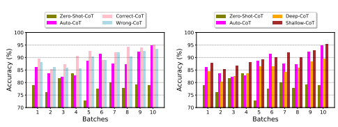
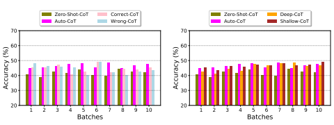
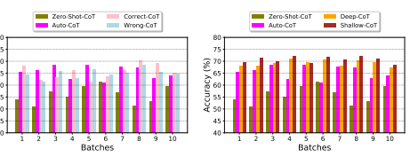
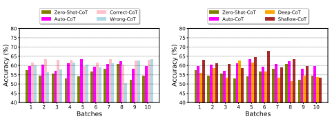

# Chain Of Thought Prompting Under Streaming Batch: A Case Study

Yuxin Tang Department of Computer Science Rice University Houston, TX 77005, USA {yuxin.tang}@rice.edu

# Abstract

Recently, Large Language Models (LLMs) have demonstrated remarkable capabilities. Chain-of-Thought (CoT) has been proposed as a way of assisting LLMs in performing complex reasoning. However, developing effective prompts can be a challenging and labor-intensive task. Many studies come out of some way to automatically construct CoT from test data. Most of them assume that all test data is visible before testing and only select a small subset to generate rationales, which is an unrealistic assumption. In this paper, we present a case study on how to construct and optimize chain-of-thought prompting using batch data in streaming settings.

# 1 Introduction

Large Language Models Tang et al. (2023) have shown emergent abilities. Wei et al. (2022a) Wei et al. (2022b) discover Chain-of-Thought (CoT) prompting as a simple and broadly applicable method for enhancing reasoning in language models. Many work Zhou et al. (2022a); Wang et al. (2022b); Shi et al. (2022); Zhang et al. (2023a;b); Wang et al. (2022a); Zhou et al. (2022b); Fei et al. (2023); Yang et al. (2023); Shi et al. (2023); Diao et al. (2023) have tried to make further improvements based on CoT.

# 2 Problem Statement

The problem of *chain-of-thought under streaming* is first proposed by Zhang et al. (2023a). It assumes that the test dataset, denoted as D, will be evenly partitioned into m batches, each containing N samples. These batches are fed into a large language model M in a continuous stream-like manner. At each time step tk for k = 1, 2*, . . . , m*, M processes one batch of questions nq
(k)
1, q
(k)
2*, . . . , q*
(k) N
ousing the same prompt P. After processing a batch, rationales generated by M are denoted as nc
(k)
1, c
(k)
2*, . . . , c*
(k) N
o. A *prompting optimization function* f(P|(q
(k)
1||c
(k)
1),(q
(k)
2||c
(k)
2)*, . . . ,*(q
(k) N 
||c
(k)
N ))1is applied to update prompt P before processing the next batch. This allows the model to maintain a coherent chain-of-thought within each batch in the stream, known as the *intra-batch chain-of-thought*. Function f adopted in Zhang et al. (2023a) is a simple concatenation function by appending all the newly generated question-rationale pairs (q
(k)
1||c
(k)
1),(q
(k)
2||c
(k)
2)*, . . . ,*(q
(k) N 
||c
(k) N 
) to the previous prompting P. However, this approach can quickly reach the maximum input sequence length of the Language Model (e.g. 2048 tokens) and is not particularly scalable or efficient, potentially leading to high levels of redundancy in the prompting and high costs for querying LLM. Therefore, an alternative approach may be needed to address these limitations.

1

1The concatenation of question and rationale is denoted as a question-rationale pair (q||c)

# 3 Prompting Optimization Function

Prompt optimization is a black-box optimization problem, as it can only be evaluated based on the quality of the generated rationales or the correctness of the answers provided by LLM. In this regard, we present our empirical findings on how to design f to update prompting constrained by the limit input sequence length based on two attributes of CoT: **correctness** and depth. **Correctness** is a crucial criterion for prompting engineers to update the prompting. Here, we want to ask the question: *Can a valid rationale be replaced with an invalid one without performance drop?* **Depth** refers to the number of reasoning steps which can be reflected by the length of CoT (different steps are separated by comma or \n). A deeper CoT is longer and typically contains more complex rationales, while a shallower CoT is more straightforward and contains fewer reasoning steps. Here, the question is: *Given the similar question, can a deep CoT always be replaced by a shallow CoT?*

# 4 Experiments

Our evaluation is conducted on model text-davinci-002 from OpenAI. We choose multiple datasets across different tasks including arithmetic reasoning (GSM8K Cobbe et al. (2021), Multi- Arith Roy & Roth (2015)), commonsense reasoning (StrategyQA Geva et al. (2021)), and symbolic reasoning (Letter Wei et al. (2022b)). We compare our methods with Zero-Shot-CoT Kojima et al. (2022), and Bootstraping Auto-CoT Zhang et al. (2023a). We manually partition each dataset into 10 batches and generate rationales for each batch under the streaming setting. We report the test accuracy for ten batches. The number of samples in each batch is in Appendix A.

### 4.1 Right Or Wrong Cot

To address this question, we substitute ground-truth rationales that produce the correct answer with Zero-Shot-CoT that produce the wrong answer. During the substitution, we ensure that more than 50% of the rationales in the prompt are incorrect. This substitution method is referred to as Wrong- CoT. Conversely, we have *Correct-CoT*, which includes only the correct rationales. Figure 1(a) shows the results. *Wrong-CoT* is manually selected through human evaluation by running the same query multiple times.

### 4.2 Deep Or Shallow Cot

In order to address the aforementioned question, we exclusively utilize CoTs that are deemed correct in the prompt. To distinguish between deep CoT and shallow CoT, we have established a simple heuristic parameter denoted as ξ, which is based on the number of \n in the CoT. If the number of \n surpasses ξ, we classify it as a deep CoT. Conversely, if a CoT has fewer \n than ξ, we classify it as a shallow CoT. *Shallow-CoT* are selected by replacing lengthier rationales by shorter rationales in a batch. Figure 1(b) shows the results.

# 5 Conclusion

This paper presents a straightforward case study on how to update and replace prompts used for large language model in a streaming batch setting. Our findings indicate that incorrect chain-ofthought promptings can be valuable and do not significantly diminish performance. Additionally, promptings that consist of shorter rationales exhibit superior performance compared to those with lengthier rationales.

# Urm Statement

The authors acknowledge that at least one key author of this work meets the URM criteria of ICLR 2023 Tiny Papers Track.

# References

Karl Cobbe, Vineet Kosaraju, Mohammad Bavarian, Mark Chen, Heewoo Jun, Lukasz Kaiser, Matthias Plappert, Jerry Tworek, Jacob Hilton, Reiichiro Nakano, Christopher Hesse, and John Schulman. Training verifiers to solve math word problems, 2021. URL https://arxiv. org/abs/2110.14168.

Shizhe Diao, Pengcheng Wang, Yong Lin, and Tong Zhang. Active prompting with chain-of-thought for large language models. *arXiv preprint arXiv:2302.12246*, 2023.

Hao Fei, Bobo Li, Qian Liu, Lidong Bing, Fei Li, and Tat-Seng Chua. Reasoning implicit sentiment with chain-of-thought prompting. *arXiv preprint arXiv:2305.11255*, 2023.

Mor Geva, Daniel Khashabi, Elad Segal, Tushar Khot, Dan Roth, and Jonathan Berant. Did aristotle use a laptop? a question answering benchmark with implicit reasoning strategies, 2021. URL https://arxiv.org/abs/2101.02235.

Takeshi Kojima, Shixiang Shane Gu, Machel Reid, Yutaka Matsuo, and Yusuke Iwasawa. Large language models are zero-shot reasoners. *arXiv preprint arXiv:2205.11916*, 2022.

Subhro Roy and Dan Roth. Solving general arithmetic word problems. In Proceedings of the 2015 Conference on Empirical Methods in Natural Language Processing, pp. 1743–1752, Lisbon, Portugal, September 2015. Association for Computational Linguistics. doi: 10.18653/v1/D15-1202.

URL https://aclanthology.org/D15-1202.

Freda Shi, Mirac Suzgun, Markus Freitag, Xuezhi Wang, Suraj Srivats, Soroush Vosoughi, Hyung Won Chung, Yi Tay, Sebastian Ruder, Denny Zhou, et al. Language models are multilingual chain-of-thought reasoners. *arXiv preprint arXiv:2210.03057*, 2022.

Freda Shi, Xinyun Chen, Kanishka Misra, Nathan Scales, David Dohan, Ed Chi, Nathanael Scharli, ¨
and Denny Zhou. Large language models can be easily distracted by irrelevant context. arXiv preprint arXiv:2302.00093, 2023.

Ruixiang Tang, Xiaotian Han, Xiaoqian Jiang, and Xia Hu. Does synthetic data generation of llms help clinical text mining? *arXiv preprint arXiv:2303.04360*, 2023.

Boshi Wang, Sewon Min, Xiang Deng, Jiaming Shen, You Wu, Luke Zettlemoyer, and Huan Sun.

Towards understanding chain-of-thought prompting: An empirical study of what matters. *arXiv* preprint arXiv:2212.10001, 2022a.

Xuezhi Wang, Jason Wei, Dale Schuurmans, Quoc Le, Ed Chi, and Denny Zhou. Self-consistency improves chain of thought reasoning in language models. *arXiv preprint arXiv:2203.11171*, 2022b.

Jason Wei, Yi Tay, Rishi Bommasani, Colin Raffel, Barret Zoph, Sebastian Borgeaud, Dani Yogatama, Maarten Bosma, Denny Zhou, Donald Metzler, et al. Emergent abilities of large language models. *arXiv preprint arXiv:2206.07682*, 2022a.

Jason Wei, Xuezhi Wang, Dale Schuurmans, Maarten Bosma, Brian Ichter, Fei Xia, Ed Chi, Quoc Le, and Denny Zhou. Chain-of-thought prompting elicits reasoning in large language models, 2022b. URL https://arxiv.org/abs/2201.11903.

Zhengyuan Yang, Linjie Li, Jianfeng Wang, Kevin Lin, Ehsan Azarnasab, Faisal Ahmed, Zicheng Liu, Ce Liu, Michael Zeng, and Lijuan Wang. Mm-react: Prompting chatgpt for multimodal reasoning and action. *arXiv preprint arXiv:2303.11381*, 2023.

Zhuosheng Zhang, Aston Zhang, Mu Li, and Alex Smola. Automatic chain of thought prompting in large language models. In *The Eleventh International Conference on Learning Representations* (ICLR 2023), 2023a.

Zhuosheng Zhang, Aston Zhang, Mu Li, Hai Zhao, George Karypis, and Alex Smola. Multimodal chain-of-thought reasoning in language models. *arXiv preprint arXiv:2302.00923*, 2023b.

Denny Zhou, Nathanael Scharli, Le Hou, Jason Wei, Nathan Scales, Xuezhi Wang, Dale Schu- ¨
urmans, Olivier Bousquet, Quoc Le, and Ed Chi. Least-to-most prompting enables complex reasoning in large language models. *arXiv preprint arXiv:2205.10625*, 2022a.

Yongchao Zhou, Andrei Ioan Muresanu, Ziwen Han, Keiran Paster, Silviu Pitis, Harris Chan, and Jimmy Ba. Large language models are human-level prompt engineers. arXiv preprint arXiv:2211.01910, 2022b.

# A Appendix

| Table 1: Batch size of four different datasets   |    |       |            |        |
|--------------------------------------------------|----|-------|------------|--------|
| MultiArith                                       |    | GSM8K | StrategyQA | Letter |
| Batch Size                                       | 60 | 64    | 32         | 81     |

Figure 1: **Left:** accuracy for MultiArith dataset under Correct-CoT and Wrong-CoT. **Right:** accuracy for MultiArith dataset under Deep-CoT and Shallow-CoT with ξ = 3.

Figure 2: **Left:** accuracy for GSM8K dataset under Correct-CoT and Wrong-CoT. **Right:** accuracy for GSM8K dataset under Deep-CoT and Shallow-CoT with ξ = 3.

y ( %)

Figure 3: **Left:** accuracy for StrategyQA dataset under Correct-CoT and Wrong-CoT. **Right:** accuracy for StrategyQA dataset under Deep-CoT and Shallow-CoT with ξ = 3.

Figure 4: **Left:** accuracy for Letter dataset under Correct-CoT and Wrong-CoT. **Right:** accuracy for Letter dataset under Deep-CoT and Shallow-CoT with ξ = 4.
