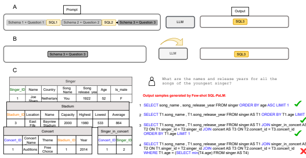

# Sql-Palm: Improved Large Language Model Adaptation For Text-To-Sql

Ruoxi Sun1, Sercan Ö. Arik1, Hootan Nakhost1, Hanjun Dai2, Rajarishi Sinha1, Pengcheng Yin2**, Tomas Pfister**1 1 Cloud AI Research Team 2 Google DeepMind
{ruoxis, soarik, hootan, hadai, sinharaj, pcyin, tpfister }@google.com

### A**Bstract**

One impressive emergent capability of large language models (LLMs) is generation of code, including Structured Query Language (SQL) for databases. For the task of converting natural language text to SQL queries, Text-to-SQL, adaptation of LLMs is of paramount importance, both in in-context learning and *fine-tuning* settings, depending on the amount of adaptation data used. In this paper, we propose an LLM-based Text-to-SQL model *SQL-PaLM*, leveraging on *PaLM-2*, that pushes the state-of-the-art in both settings. *Few-shot SQL-PaLM* is based on an execution-based self-consistency prompting approach designed for Text-to-SQL, and achieves 77.3% in test-suite accuracy on Spider, which to our best knowledge is the first to outperform previous state-of-the-art with fine-tuning by a significant margin, 4%. Furthermore, we demonstrate that the *fine-tuned SQL-PALM* outperforms it further by another 1%. Towards applying *SQL-PaLM*to real-world scenarios we further evaluate its robustness on other challenging variants of Spider and demonstrate the superior generalization capability of *SQL-PaLM*. In addition, via extensive case studies, we demonstrate the impressive intelligent capabilities and various success enablers of LLM-based Text-to-SQL.

K**eywords** Text-to-SQL · Natural Language Processing · Language Parsing

## 1 Introduction

Text-to-SQL aims to automate the process of generating Structured Query Language (SQL) queries for databases from natural language text. It is a long-standing challenge, crucial to enhance database accessibility without requiring expertise of SQL. By automating the query generation, Text-to-SQL enables the development of conversational agents with advanced data analytics. As a sequence-to-sequence application, language models can be extended to the Text-to-SQL task. With SQL-specific designs and domain knowledge, fine-tuning median-sized models, such as T5[1], have achieved strong results. They have dominated the state-of-the-art for a long time, and have been only very recently outperformed by one in-context learning approach [2]. Among the notable ones, PICARD [3] employs incremental parsing to constrain auto-regressive decoding; RASAT [4] integrates database schema relation-aware self-attention and constrained auto-regressive decoders; and RESDSQL [5] decouples database schema linking and skeleton parsing using a ranking-enhanced encoding and skeleton-aware decoding framework. With their increased model sizes, large language models, such as GPT-3 [6], PaLM [7], and ChatGPT[8, 9], GPT-4[10], PaLM-2 [11] have shown significant achievements with zero-shot and few-shot prompting, or in-context learning [12]. The advantages of few-shot prompting, compared with fine-tuning, is that no training is involved (lower computation requirements), is unlikely to over-fit to train data, and is easy to adapt to new data, which is particular useful for Text-to- SQL as SQL has different dialects; though the disadvantages are the performance can be sub-optimal. For example, CodeX [13] and ChatGPT [14] have shown successful results with in-context learning for Text-to-SQL, although they still have a clear gap with the fine-tuned alternatives with median-sized LLMs. Recently, more advanced prompt design approaches, including multiple-rounds of few-shot prompting (denoted as "composite prompting") have showed impressive results - for example, MixPrompt combines different formats of prompts for the same task to enhance

Figure 1: **SQL-PaLM**: A. Few-shot SQL-PaLM B. *Fine-tuned SQL-PaLM* C. Left: An example of database schema. Right:
generated SQL outputs by *Few-shot SQL-PaLM* . The outputs are diverse with the majority of the samples being the 1st or 2nd samples. The 3rd and 4th ones are similar to each other, with only difference being at the end. The 4th one is incorrect due to duplicate rows when joining multiple tables (the prediction is [('Love', '2016'), ('Love', '2016')], whereas the ground true output: [('Love', '2016')].)

diverse of sampling for consistency [15, 16]. DIN [2], following least-to-most prompting[17], decomposes Text-to-SQL task into sub-tasks (e.g. sub-tasks of schema linking, query classification and decomposition etc.), and applies few-shot prompting to solve each sub-tasks with different sub-task prompts. Remarkably, DIN [2] is the first few-shot prompting method that outperforms fine-tuned SOTA on Test-Suite evaluation. Another effort, "self-debugging", incorporates error messages in the prompts to encourage LLM to correct errors of the generated SQL outputs through multiple following rounds of prompting [18, 2]. Despite interesting perspectives and promising results, composite prompting requires creating multiple handcrafted prompt templates (e.g. for "sub-tasks" or "errors"), which can be tedious. In addition, since the output of one sub-prompt influences the input of another, composite prompts are more sensitive to LLMs and test samples, limiting their use to large scale. In this work, we propose *SQL-PaLM*, a state-of-the-art Text-to-SQL model adopted from PaLM-2 [11] for both few-shot prompting and fine-tuning scenarios. *Few-shot SQL-PaLM* is an execution-based consistency-decoding few-shot prompting approach with a designed prompt, which outperforms previous fine-tuned SOTA by 3.8% for test-suite accuracy on Spider and latest in-context learning SOTA DIN[2] with composite prompting by 3.1%. When only comparing with simple-prompt methods, *Few-shot SQL-PaLM* outperforms few-shot GPT-4 by 9.9%,
few-shot CodeX-Davinci by 15.8%, and zero-shot ChatGPT by 17%. Further, to the best of our knowledge, there hasn't been any prior work on fine-tuning large-sized LLMs such as PaLM-2 on Text-to-SQL tasks. Finetuned SQL-PaLM is the fine-tuned version on Spider training dataset [19], which outperforms Few-shot SQL- PaLM by another 0.9%, improving over the fine-tuned SOTA by 4.7%. We also evaluate the proposed approach SQL-PaLM on various challenging Spider variants to demonstrate its robustness. The output of Few-shot SQL- PaLM is given https://docs.google.com/spreadsheets/d/1HActPo1PZ-QqjT3eN4VlDXXkoK8-jvAL/edit? usp=sharing&ouid=104635556596516643740&rtpof=true&sd=true

## 2 Sql-Palm

#### 2.1 Primer On Llm Adaptation

LLM's zero-shot and few-shot learning ability via prompting, known as in-context learning, was first observed in [6]. By incorporating a few demonstrations (along with instructions) in the prompt text to serve as the "context", LLMs have been shown to generalize to new examples and new tasks in the same format without any model adaptation. [12]
shows that the few-shot prompting ability is more prominent for the LLMs with sizes larger than a certain threshold.

The remarkable success of in-context learning has inspired the design of advanced prompting strategies such as chain-of-thought prompting (CoT) [20], least-to-most prompting [17], and self-consistency-prompting [21]. As a way of efficient large-shot adaptation method, FLAN-instruction fine-tuning converts tasks into instructions and fine-tunes on the multi-tasks instruction datasets mixture [22, 23]. Achieving strong performance often encourages performing further fine-tuning.

#### 2.2 Problem Setup For Text-To-Sql

The input of Text-to-SQL is a natural language query question q and the database information Dq. The output is the SQL corresponding to the question. The database Dq = {S, Kp, Kf } includes database schema S, primary keys Kp, and foreign keys Kf . S usually contains multiple tables Tt: S = {T1, T2, ...Tt...}. Each table Tt has table name Nt, column names cj and column data types tj . Therefore, Tk = {Nk,(ck1, tk1),(ck2, tk2),(ckj , tkj )...}). Primary keys Kp uniquely identify rows of each table, and foreign keys Kf used to combine ("join") multiple tables.

#### 2.3 **Few-Shot Sql-Palm**

In *Few-shot SQL-PaLM*, the prompts are designed to prepend the natural questions of interest with a list of demonstrations (*inputs*, SQL) pairs, where the *inputs* are designed to contain text to describe the database and the natural questions (Figure 1A). In particular, database information contains data schema (tables, columns and data types), primary and foreign keys - see the prompt example in Appendix 9.1. When the model is asked to predict subsequent tokens of the given prompt, it follows the prompt format to generate the SQL output corresponding to the question of interest at the end of the prompt. For few-shot prompting, one straightforward way to improve performance is to sample LLMs multiple times and select the answers that have the most number of occurrences, i.e. majority (plurality) vote. This "self-consistency" idea was first proposed in [21]. The rationale is that multiple reasoning paths can lead to the same correct answer, so by marginalizing out the reasoning paths to solution, the most consistent answer is likely to be the true one. For coding tasks, execution-based approaches have been shown to improve code generation performance [18, 24]. In this work, we apply execution-based self-consistency for Text-to-SQL. Since multiple different SQLs can be written for the same natural question (Fig. 1C), the rationale of execution-based self-consistency is the most consist execution outcomes generated by different SQLs is likely to be the true execution outcome. Therefore, we select the SQL output corresponding to the consistent execution outcome. In particular, we sample *Few-shot SQL-PaLM* multiple times, with each generating an SQL output. Then, the SQL outputs are executed on the database and each SQL output yields an execution outcome or an error. After removing the errors from all the execution outcomes, we perform a majority vote on them, and select the SQL that outputs the majority execution outcomes.

#### 2.4 **Fine-Tuned Sql-Palm**

LLMs have shown remarkable performance on variety of challenging tasks, such as BIG-bench [25] due to knowledge transferred from large-scale pre-training followed by instruction fine-tuning with multi-diverse tasks (i.e. FLAN- fine-tuning). However, it is necessary to adapt LLMs to domain specific Text-to-SQL data, so that LLMs can better understand the format of prompt and yield further improved results. To the best of our knowledge, we are the first to report results on fine-tuning large-size LLMs on text-to-SQL tasks. We fine-tune PaLM-2 on Spider train split with inputs including description of database and natural question (similar with in-context learning), and the output is the target SQL (see Fig. 1B). To evaluate the robustness of the model *Fine-tuned SQL-PaLM* (trained on Spider), and we test on other Spider variants, where there are perturbations in natural questions and/or database schema, as a form of distribution shift between train and evaluation.

## 3 Experiments

#### 3.1 Tasks And Datasets

We consider the cross-domain large-scale Text-to-SQL benchmark, **Spider** [19] that contains 7000 training samples across 166 databases and 1034 evaluation samples ('Dev split') across 20 databases. **Spider-SYN** [26] is a complex variant of the Spider Dev dataset. It is created through the manual replacement of synonym substitutions in natural language questions. **Spider-realistic** [27] samples 508 text-SQL pairs from Spider Dev Split removing explicit mentions of column names in natural language questions. **Spider-DK** [28] samples 535 question-SQL pairs on 10 databases from Spider Dev split and incorporate domain knowledge to them.

#### 3.2 Models

PaLM-2 [11] is a Transformer-based model trained using a mixture of objectives similar to UL2 [29], which is an improved version of its predecessor PaLM [7] by efficiently applying compute-optimal scaling, improved training dataset mixture, improved model architecture and objective. The PaLM-2 used here is a Unicorn variant [30] fine-tuned on a collection of improved datasets mixture phrased as instructions following [23, 22].

#### 3.3 Baselines

Fine-tuning baselines: **PICARD** [3] employs incremental parsing to constrain auto-regressive decoding. **RASAT** [4] is a transformer model that integrates relation-aware self-attention and constrained auto-regressive decoders. **RESDSQL** [5] decouples schema linking and skeleton parsing using a ranking-enhanced encoding and skeleton-aware decoding framework. **In-context learning baselines**: [31] comprehensively evaluate the Text-to-SQL ability of CodeX and GPT3, while [14] conduct a comprehensive evaluation on ChatGPT [8]. DIN [2] decompose the Text-to-SQL tasks into sub-tasks: schema linking, query classification and decomposition, SQL generation, and self-correction; then perform few-shot prompting with GPT-4 [10]. **Self-debugging** [18] appends error messages to the prompt and performance multiple rounds of few-shot prompting to self-correct the errors. For results showed in Table 2, ChatGPT [14] applies the prompt design approach recommended on OpenAI's website1. Self-debugging [18] only has EX. [2] only provides TS results, so we run EX evaluation with their provided SQL outputs.

#### 3.4 Evaluation

We consider two commonly-used evaluation metrics: execution accuracy (EX) and test-suite accuracy (TS) [32]. EX measures whether SQL execution outcome matches ground truth (GT), whereas TS measures whether the SQL passes all EX evaluation for **multiple tests**, generated by database-augmentation. Since EX contains false positives, we consider TS as a more reliable evaluation metric, although we provide EX evaluation as it is the conventional measurement. Exact match evaluation is not performed, as multiple correct SQLs exist for one query. We follow the official evaluation protocol of Spider 2.

## 4 Results

#### 4.1 Spider Dataset

We demonstrate *SQL-PaLM* results compared to state-of-the-art (SOTA) methods in Table 2. SQL- PaLM exhibits strong performance on Text-to-SQL for both few-shot prompting and fine-tuning.

EX TS
Few-shot SQL-PaLM 82.7 77.3 No Consistency 77.3 72.4 (↓ 4.9)
No Execution Filtering 79.0 73.8 (↓ 3.5)
Table 1: Ablation Study for Few-shot SQL-
PaLM . Remove one factor at a time.

Few-shot SQL-PaLM achieves 77.3% for text suite accuracy on SPIDER
dev split, which is 3.8% above current fine-tuned SOTA (RESDSQL-3B
+ NatSQL [5]) and 3.1% above more recent in-context learning SOTA
(DIN-SQL (w/ GPT-4) [2]). A remarkable observation is that Few-shot SQL-PaLM outperforms fine-tuned SOTA, which is trained on Spider training datasets, and also with a simple prompt, *Few-shot SQL-PaLM* can outperforms multiple-rounds composite prompts for sub-tasks in [2]. To avoid the confounding factors of composite prompt designs, if we only evaluate with simple prompt, the *Few-shot SQL-PaLM* outperforms zero-shot ChatGPT by 17% and few-shot GPT-4 by 9.9%, and few-shot CodeX-Davinci by 15.8%. Additionally, ablation studies in Table 1 show both that self-consistency and execution filtering are important contributors.

Fine-tuned SQL-PaLM achieves 78.2% for test suite accuracy on Spider dev split, which outperforms Few-shot SQL-PaLM by 1%, current in-context learning SOTA by 4.7%, and current fine-tuned SOTA by 4%. The major concern for fine-tuned model is over-fitting and whether it generalizes well to other datasets. We evaluate our fine-tuned SQL-PALM trained on Spider train split, on other Spider variants (see Sec. 6) to analyze its robustness to text data shifts, and demonstrate generalization capabilities. Robustness and fewer false positives One observation is that *SQL-PALM* exhibits a smaller gap between execution accuracy (EX) and test suite accuracy (TS). The gap is the result of the generated SQL outputs pass one test contained with original Spider database, but fail on more augmented tests in TS. The gap indeed is due to the number of false positives in EX. For example, [5] achieves 84.1% in execution accuracy, but only 73.5% in test suite accuracy, with

1https://platform.openai.com/examples/default-sql-translate 2https://yale-lily.github.io/spider

|                     | Methods/Datasets                            | SPIDER   |               |
|---------------------|---------------------------------------------|----------|---------------|
|                     |                                             | EX       | TS            |
|                     | T5\-3B + PICARD [3]                         | 79.3     | 69.4          |
| Fine\-tuning        | RASAT + PICARD [4]                          | 80.5     | 70.3          |
|                     | RESDSQL\-3B + NatSQL [5] (fine\-tuned SOTA) | 84.1     | 73.5          |
|                     | GPT\-3 ada (0\-shot)[31]                    | 2.3      | 0.3           |
|                     | GPT\-3 babbage (0\-shot) [31]               | 5.7      | 3.9           |
|                     | GPT\-3 curie (0\-shot) [31]                 | 12.6     | 8.3           |
|                     | GPT\-3 davinci (0\-shot) [31]               | 26.3     | 21.7          |
|                     | CodeX cushman (0\-shot) [31]                | 63.7     | 53.0          |
|                     | CodeX davinci (0\-shot)[2]                  | 67.0     | 55.1          |
|                     | CodeX davinci (few\-shot) [2]               | 71.0     | 61.5          |
| Few\-shot prompting | ChatGPT (w/ OpenAI\-default Prompt) [14]    | 70.1     | 60.1          |
|                     | GPT\-4 (Zero\-shot) [2]                     | 72.9     | 64.9          |
|                     | GPT\-4 (Few\-shot) [2]                      | 76.8     | 67.4          |
|                     | Self\-Debug [18]                            | 84.1     | \-            |
|                     | DIN\-SQL (w/ CodeX Davinci) [2]             | 75.6     | 69.9          |
|                     | DIN\-SQL (w/ GPT\-4) [2] (few\-shot SOTA)   | 82.8     | 74.2          |
|                     | Few\-shot SQL\-PaLM (Ours)                  | 82.7     | (↑ 3.8)  77.3 |
|                     | Fine\-tuned SQL\-PaLM (Ours)                | 82.8     | 78.2 (↑ 4.7)  |

Table 2: Performance comparison on Test Suite accuracy on Spider Dev Split. Results of DIN, GPT-4, and CodeX
Davinci is from [2]. GPT3 and the rest of the CodeX results are from [31]. ChatGPT results are from [14].

roughly 10% plausible but wrong SQL outputs generated, whereas, *Few-shot SQL-PaLM* only has 5% regression from 82.7 to 77.3. indicating its superior ability in generating robust SQL outputs.

| Methods               | Model          | Easy   | Medium   | Hard   | Extra Hard   | All   |
|-----------------------|----------------|--------|----------|--------|--------------|-------|
| Few\-shot             | CodeX\-davinci | 84.7   | 67.3     | 47.1   | 26.5         | 61.5  |
| Few\-shot             | GPT\-4         | 86.7   | 73.1     | 59.2   | 31.9         | 67.4  |
| DIN\-SQL[2]           | CodeX\-davinci | 89.1   | 75.6     | 58.0   | 38.6         | 69.9  |
| DIN\-SQL[2]           | GPT\-4         | 91.1   | 79.8     | 64.9   | 43.4         | 74.2  |
| Few\-shot SQL\-PaLM   | PaLM2          | 93.5   | 84.8     | 62.6   | 48.2         | 77.3  |
| Fine\-tuned SQL\-PaLM | PaLM2          | 93.5   | 85.2     | 68.4   | 47.0         | 78.2  |

Performance for different difficulty levels We investigate the performance of the proposed approach at varying degrees of difficulty, determined by the count of SQL keywords employed, whether there are nested sub-queries, and if there are any column selections or aggregations utilized. Table 3 displays the results of our proposed method versus a basic few-shot prompting on GPT-4 and CodeX-davinci, and DIN-SQL[2] on Spider's development set. Our proposed approach outperforms alternatives in all difficulty levels with significant improvement, indicating the method does not in favor of a category.

Table 3: Test-suite accuracy on Spider development split: SQL outputs are categorized by levels. First two rows are standard few-shot prompting. First four rows are taken from [2]
Prompt design Adaptation setting EX TS Concise 0-shot 81.2 76.0 Verbose 0-shot 78.5 70.9 Concise 4-shot **82.7 77.3**
Verbose 4-shot 81.3 73.7 Table 4: Test-suite accuracy for different prompt design approaches in zero- and few-shot set-up on Spider Dev.

In Table 4, we analyze the performance of Few-shot SQL-PaLM method on queries with different prompt designs and different number of demonstrations (zero- vs. few-shot). As expected, few-shot setup yields better performance over zero-shot but the gap is observed to be small. We also explore the effect of different prompt design approaches on performance. The explored prompt design approaches are from [15]: "Verbose" prompts are based on using natural language to describe database schema, which is closer to the way LLMs were trained, whereas "Concise" prompts use the syntax

#### Prompt Design And Zero-Shot Performance

to describe the database schema, which has advantages of clearly presenting table structure. More details are provided in Appendix 9.1 and 9.2. For PaLM-2, "Concise" prompts yield superior results.

## 5 Qualitative Analyses

We present case studies of *Few-shot SQL-PaLM* in Table 5 and 6 for "correct" and "wrong" SQL generated by Few-shot SQL-PaLM based on test-suite accuracy. Surprisingly, the many examples classified as "errors" by *Few-shot SQL-PaLM* were actually correct when evaluated by human experts, indicating the scores of *SQL-PaLM* might be higher. The evaluation fails due to (1) ambiguous natural questions, exemplified by 1st example in Table 6, and (2) official test-suite evaluation struggles on evaluating creative solutions with output which deviate from that of the ground truth. For instance, the 2nd example has multiple valid ground truths; the 3rd example experiences type-related issues; the 4th example presents different formats (e.g. "full name" and "first name, second name" are equally semantically correct for the question. They both should be considered correct); and the 5th example is false negative due to the omission of the "distinct" keyword. Regarding the "real" mistakes made by *Few-shot SQL-PaLM* , such as the sixth and seventh examples, we observed a departure from simple errors like syntax errors commonly found in other methods [14].

Instead, the mistakes made by *Few-shot SQL-PaLM* closely resemble those that human experts would make when developing the same solution, demonstrating its profound expertise in SQL. Another source of errors is the presence of a "confusing database schema," where *Few-shot SQL-PaLM* encounters difficulties in selecting the appropriate table or column when multiple equivalent options contain similar content (as illustrated in the 5th example of Table 6). Tables 5 and 6 show the capabilities of *Few-shot SQL-PaLM* , demonstrating that it can efficiently handle complex SQL queries. It successfully deals with tasks such as joining multiple tables using various keywords (as observed in the 1st, 2nd, 4th, and 5th examples in Table 5 and all examples in Table 6), as well as employing nested SQL structures (as seen in the 3rd example of Table 5). Moreover, *Few-shot SQL-PaLM* exhibits the ability to generate creative and diverse SQL outputs that differ from the ground truth but remain equally correct. This suggests a deep understanding of SQL content rather than mere memorization. Notable examples include the 3rd example in Table 5 and the 2nd, 3rd, 4th, and 5th examples in Table 6. Even in cases of errors, such as the 6th and 7th examples in Table 6, *Few-shot SQL-PaLM* presents alternative solutions distinct from the ground truth. Furthermore, *Few-shot SQL-PaLM* demonstrates the ability to infer relevant SQL expression based on semantic meaning, i.e. "French singers" and "country=France," as well as "young to old" and "OrderBy age ASC" (as evident in the 1st and 2nd examples). This capability is attributed to the large-scale pre-training of language models.

## 6 Robustness Analyses For Real-World Scenarios

Evaluation of robustness of the Text-to-SQL solution is highly important when its usage in real world scenarios is considered. There could be challenges like the vocabulary used in the natural questions and the database schema being different (syndrome replacement); or table containing domain specific knowledge with niche language; or the database schema being perturbed. Demonstrating robustness against these can be important for real-world use of Text-to-SQL. Towards this end, we select Spider variants over-viewed in Table 7. Compared to the original Spider dataset, *Spider-Syn* and *Spider-Realistic* modifies natural language questions to eliminate explicit appearance of the database schema, by replacing with synonym or removing explicit mentioning. Spider-DK incorporates domain knowledge into the database schema. Table 8 compares Few-shot SQL-PaLM and *Fine-tuned SQL-PaLM* with baseline methods on Spider variants. Although previous work with ChatGPT [14] show few-shot prompting is significantly lower than the SOTA with fine-tuning, we find *Few-shot SQL-PaLM* demonstrates impressive robust performance, consistently outperforming the SOTA on all three Spider variants. Remarkably, *Few-shot SQL-PaLM* has 24% improved over ChatGPT and 2.3% improvement on previous fine-tuned SOTA on *Spider-Realistic*. Also, we find *Fine-tuned SQL-PaLM* performs surprisingly well with 3.1% improvement over previous SOTA on *Spider-Realistic* and 1.6% on *Spider-DK*. Since *Fine-tuned SQL-PaLM* is being evaluated differently with training on Spider, and evaluation on Spider variants, these results further indicate that the *fine-tuned SQL-PaLM* preserves the superior generalization ability on challenging distribution shift scenarios.

## 7 Discussions And Future Work

The sampling diversity significantly reduces after fine-tuning The sampling diversity is critical in deciding the gain from self-consistency-like approach, which selects the answer with most occurrence outcome among a diverse pool; However, surprisingly, our experiments show, after fine-tuning, LLM's sampling output converges to one single

| Data Schema                      | Question                   | Ground truth                                      | SQL\-PaLM                                                   | Comment            |
|----------------------------------|----------------------------|---------------------------------------------------|-------------------------------------------------------------|--------------------|
| Q1: stadium: Stadium_ID,         |                            |                                                   |                                                             |                    |
| Location, Name, Capacity,        | What is the average, min                            |                                                   |                                                             | Inference on the   |
|                                  | imum,  and maximum         | SELECT avg(age) , min(age                         | SELECT avg(age) , min(age                                   | relationship be                    |
| Highest, Lowest, Average         | age of all singers from    | ) , max(age) FROM singer                          | ) , max(age) FROM singer                                    | tween "French"     |
| singer: Singer_ID, Name,         |                            | WHERE country = 'France'                          | WHERE country = "France"                                    |                    |
| Country, Song_Name,              | France?                    |                                                   |                                                             | and "France"       |
| Song_release_year, Age, Is_male  |                            |                                                   |                                                             |                    |
| concert: concert_ID,             |                            |                                                   |                                                             | Inference based    |
| concert_Name, Theme,             | Show name, country, age    |                                                   |                                                             | on  understand                    |
|                                  |                            | SELECT name , country ,                           | SELECT name , country ,                                     |                    |
| Stadium_ID, Year                 | for all singers ordered by | age FROM singer ORDER BY                          | age FROM singer ORDER BY                                    | ing  the  age      |
| singer_in_concert: concert_ID,   | age from the oldest to the | age DESC                                          | age DESC                                                    | ranking via        |
| Singer_ID                        | youngest.                  |                                                   |                                                             | "order by age      |
|                                  |                            |                                                   |                                                             | DESC":             |
|                                  |                            | SELECT T1.Name FROM                               | SELECT T1.name FROM                                         |                    |
|                                  |                            | country AS T1 JOIN                                | country AS T1 JOIN                                          |                    |
| Q2:  city:  ID, Name, Coun                                  |                            | countrylanguage AS                                | countrylanguage AS                                          |                    |
| tryCode, District, Population    |                            | T2 ON T1.Code = T2.                               | T2 ON T1.code = T2.                                         |                    |
| sqlite_sequence: name, seq       |                            |                                                   |                                                             |                    |
|                                  |                            | CountryCode WHERE T2.                             | countrycode WHERE T2.                                       |                    |
| country: Code, Name, Continent,  | What are the names of      | Language = "English"                              | language = "English"                                        |                    |
| Region, SurfaceArea, IndepYear,  |                            |                                                   |                                                             |                    |
| Population, LifeExpectancy, GNP, | nations where both En glish and French are of                            | AND T2.IsOfficial = "T"  INTERSECT SELECT T1.Name | AND T2.isofficial = "T"  INTERSECT SELECT T1.name           | Generate exact  GT |
| GNPOld, LocalName, Govern                                  | ficial languages?          | FROM country AS T1 JOIN                           | FROM country AS T1 JOIN                                     |                    |
| mentForm, HeadOfState, Capital,  |                            | countrylanguage AS T2 ON                          | countrylanguage AS T2 ON                                    |                    |
| Code2                            |                            |                                                   |                                                             |                    |
| countrylanguage: CountryCode,    |                            | T1.Code = T2.CountryCode                          | T1.code = T2.countrycode                                    |                    |
| Language, IsOfficial, Percentage |                            | WHERE T2.Language = "                             | WHERE T2.language = "                                       |                    |
|                                  |                            | French" AND T2.IsOfficial                         | French" AND T2.isofficial                                   |                    |
|                                  |                            | = "T"                                             | = "T"                                                       |                    |
| Q3: stadium: Stadium_ID, Lo                                  |                            |                                                   |                                                             |                    |
| cation, Name, Capacity, Highest, |                            |                                                   |                                                             |                    |
| Lowest, Average                  |                            |                                                   | SELECT count(*) FROM                                        |                    |
| singer:  Singer_ID,  Name,       |                            |                                                   | concert AS T1 JOIN                                          |                    |
| Country,  Song_Name,             | What are the number        | select count(*) from                              | stadium AS T2 ON                                            | Creative - differ                    |
|                                  |                            | concert where stadium_id                          |                                                             | ent from ground                    |
| Song_release_year, Age, Is_male  | of concerts that occurred  |                                                   | T1.stadium_id = T2                                          |                    |
| concert:  concert_ID,  con                                  | in the stadium with the    | = (select stadium_id                              | .stadium_id WHERE T2.                                       | truth but accu                    |
| cert_Name, Theme, Stadium_ID,    | largest capacity ?         | from stadium order by                             | capacity = ( SELECT max(                                    | rate               |
|                                  |                            | capacity desc limit 1)                            |                                                             |                    |
| Year                             |                            |                                                   | T3.capacity) FROM stadium                                   |                    |
| singer_in_concert:  con                                  |                            |                                                   | AS T3 )                                                     |                    |
| cert_ID,Singer_ID                |                            |                                                   |                                                             |                    |
|                                  |                            | select t1.fname from                              | SELECT T1.fname FROM                                        |                    |
|                                  |                            | student as t1 join                                | student AS T1 JOIN                                          |                    |
|                                  |                            | has_pet as t2 on t1.stuid                         | has_pet AS T2 ON T1.stuid                                   |                    |
| Q4: Student: StuID, LName,       |                            | = t2.stuid join pets                              | = T2.stuid JOIN pets                                        |                    |
|                                  |                            | as t3 on t3.petid = t2.                           | AS T3 ON T2.petid = T3.                                     |                    |
| Fname, Age, Sex, Major, Advisor, |                            |                                                   |                                                             | Complex  SQL       |
| city_code                        | Find the first name of stu                            | petid where t3.pettype =                          | petid WHERE T3.pettype =                                    | containing mul                    |
| Has_Pet: StuID, PetID            | dents who have both cat    | 'cat' intersect select                            | "cat" INTERSECT SELECT                                      | tiple SQL key      |
|                                  | and dog pets .             | t1.fname from student as                          | T1.fname FROM student AS                                    |                    |
| Pets: PetID, PetType, pet_age,   |                            | t1 join has_pet as t2 on                          | T1 JOIN has_pet AS T2 ON                                    | words.             |
| weight                           |                            |                                                   |                                                             |                    |
|                                  |                            | t1.stuid = t2.stuid join                          | T1.stuid = T2.stuid JOIN                                    |                    |
|                                  |                            | pets as t3 on t3.petid =                          | pets AS T3 ON T2.petid =                                    |                    |
|                                  |                            | t2.petid where t3.pettype                         | T3.petid WHERE T3.pettype                                   |                    |
|                                  |                            | = 'dog'                                           | = "dog"                                                     |                    |
|                                  |                            | select t1.countryid ,                             | SELECT T1.countryid ,                                       |                    |
| Q5: continents: ContId, Conti                                  |                            | t1.countryname from                               | T1.countryname FROM                                         |                    |
| nent                             |                            | countries as t1 join                              | countries AS T1 JOIN                                        |                    |
| countries: CountryId, Country                                  |                            | car_makers as t2 on t1                            | car_makers AS T2 ON T1                                      |                    |
| Name, Continent                  |                            | .countryid = t2.country                           | .countryid = T2.country                                     |                    |
| car_makers: Id, Maker, Full                                  | What are the ids and       | group by t1.countryid                             | GROUP BY T1.countryid                                       |                    |
| Name, Country                    | names of all countries     | having count(*) > 3                               | HAVING count(*) > 3                                         | Complex  SQL       |
| model_list:  ModelId, Maker,     | that either have more than | union select t1.countryid                         | UNION SELECT T1.countryid                                   | containing mul                    |
| Model                            | 3 car makers or produce    | , t1.countryname from                             | , T1.countryname FROM                                       | tiple SQL key      |
| car_names:  MakeId, Model,       | fiat model ?               | countries as t1 join                              | countries AS T1 JOIN                                        | words              |
| Make                             |                            | car_makers as t2 on t1.                           | car_makers AS T2 ON T1.                                     |                    |
| cars_data: Id, MPG, Cylinders,   |                            | countryid = t2.country                            | countryid = T2.country                                      |                    |
| Edispl, Horsepower, Weight, Ac                                  |                            | join model_list as t3 on                          | JOIN model_list AS T3 ON                                    |                    |
| celerate, Year                   |                            | t2.id = t3.maker where t3                         | T2.id = T3.maker WHERE T3                                   |                    |
|                                  |                            | .model = 'fiat';                                  | .model = "fiat"                                             |                    |
| Table 5:                         | Few\-shot SQL\-PaLM        |                                                   | examples that are correct according to test suite accuracy. |                    |

| Question 1:       | What is the maximum capacity and the average of all stadiums ? (id=16, database=concert_singer)                                              |
|-------------------|----------------------------------------------------------------------------------------------------------------------------------------------|
| Ground truth:     | select max(capacity), average from stadium                                                                                                   |
| SQL\-PALM:        | SELECT max(capacity) , avg(capacity) FROM stadium                                                                                            |
| Comment:          | Ambiguous question. The Ground truth query would give the average occupancy column of each stadium, where as the SQL\-PALM                   |
|                   | one would give the average of the capacity column of all stadiums. Without specific context, the SQL\-PALM output matches the                |
|                   | question better.                                                                                                                             |
| Human Expert      | True (Ground truth issue)                                                                                                                    |
| Question 2:       | Which airline has most number of flights? (id=229, database=flight_2)                                                                        |
| Ground truth:     | SELECT T1.Airline FROM AIRLINES AS T1 JOIN FLIGHTS AS T2 ON T1.uid = T2.Airline GROUP BY T1.Airline                                          |
|                   | ORDER BY count(*) DESC LIMIT 1                                                                                                               |
| SQL\-PALM:        | SELECT T1.airline FROM airlines AS T1 JOIN flights AS T2 ON T1.uid = T2.airline GROUP BY T2.airline                                          |
|                   | ORDER BY count(*) DESC LIMIT 1                                                                                                               |
| Comment:          | Both T1.Airline (the Airlines.Airline column, which contains names of airlines) and T2.airline (the flights.airline                          |
|                   | column, which contains the uid of airlines) uniquely identify airlines, and grouping by either one gives the same results. The evaluation    |
|                   | failed because the data contains 12 airlines each with 100 flights (i.e. every one is the maximum), and instability of the ordering produces |
|                   | different outcomes when both queries pick one of the maximums.                                                                               |
| Human Expert      | True (Database and Eval issue)                                                                                                               |
| Question 3:       | What are the id, name and membership level of visitors who have spent the largest amount of money in total in all museum                     |
|                   | tickets? (id=420, database=museum_visit)                                                                                                     |
| Ground truth:     | SELECT t2.visitor_id , t1.name , t1.Level_of_membership FROM visitor AS t1 JOIN visit AS t2 ON t1.id                                         |
|                   | = t2.visitor_id GROUP BY t2.visitor_id ORDER BY sum(t2.Total_spent) DESC LIMIT 1                                                             |
| Excution result:  | ('3', 'Arjen Robben', 1), where '3' is a string                                                                                              |
| SQL\-PALM:        | SELECT T1.id , T1.name , T1.level_of_membership FROM visitor AS T1 JOIN visit AS T2 ON T1.id =                                               |
|                   | T2.visitor_id GROUP BY T1.id ORDER BY sum(T2.total_spent) DESC LIMIT 1                                                                       |
| Excution result:  | (3, 'Arjen Robben', 1), where 3 is an integer                                                                                                |
| Comment:          | The result is actually correct. The highlighted differences t2.visitor_id and t1.id are equivalent because the two tables are joined         |
|                   | on t1.id = t2.visitor_id. Evaluation failed because of the field type differences, as t1.id is int and t2.visitor_id is text.                |
| Human Expert      | True (Database and Eval issue)                                                                                                               |
| Question 4:       | List the names of all winners who played in both 2013 and 2016. (id=447, database=wta_1)                                                     |
| Ground truth:     | SELECT winner_name FROM matches WHERE YEAR = 2013 INTERSECT SELECT winner_name FROM matches WHERE                                            |
|                   | YEAR = 2016                                                                                                                                  |
| Excution result:  | ('Angelique Kerber',), ('Petra Kvitova',) ...                                                                                                |
| SQL\-PALM:        | SELECT T1.first_name , T1.last_name FROM players AS T1 JOIN matches AS T2 ON T1.player_id =                                                  |
|                   | T2.winner_id WHERE T2.year = 2013 INTERSECT SELECT T1.first_name , T1.last_name FROM players AS T1                                           |
|                   | JOIN matches AS T2 ON T1.player_id = T2.winner_id WHERE T2.year = 2016                                                                       |
| Execution result: | ('Angelique', 'Kerber'), ('Petra', 'Kvitova') ...                                                                                            |
| Comment:          | The result is actually correct. The highlighted differences, as both execution results make sense from semantic perspective of the query.    |
|                   | winner_name and T1.first_name , T1.last_name are equivalent for representation of "name". Evaluation failed because of the differences       |
|                   | in the output format type. If multiple\-ground truths are provided considering different output formats, this is not an error.               |
| Human Expert      | True (Eval issue)                                                                                                                            |
| Question 5:       | What are the different template type codes? (id=322, database=cre_Doc_Template_Mgt):                                                         |
| Ground truth:     | SELECT DISTINCT template_type_code FROM Templates                                                                                            |
| SQL\-PALM:        | SELECT DISTINCT template_type_code FROM Ref_Template_Types                                                                                   |
| Comment:          | The results are actually correct. Few\-shot SQL\-PaLM selects a different table Ref_Template_Types, instead of Templates. The same           |
|                   | "template types" appear in multiple entries of Templates. The two SQL outputs generate the same execution result when evaluating with        |
|                   | "DISTINCT"". Evaluation failed because Spider official evaluation removes 'DISTINCT' during evaluation.                                      |
| Human Expert      | True (Eval issue)                                                                                                                            |
| Question 6:       | Find the number of professionals who have not treated any dogs. (id=983, database=dog_kennels):                                              |
| Ground truth:     | SELECT count(*) FROM Professionals WHERE professional_id NOT IN ( SELECT professional_id FROM                                                |
|                   | Treatments )                                                                                                                                 |
| SQL\-PALM:        | SELECT count(*) FROM Professionals EXCEPT SELECT professional_id FROM Treatments                                                             |
| Comment:          | Left and Right sides of "'EXCEPT" need equivalent content.  Corrected SQL is SELECT count(*) FROM (SELECT                                    |
|                   | professional_id FROM Professionals EXCEPT SELECT professional_id FROM Treatments)                                                            |
| Human Expert      | False (Wrong Use of KEY Words)                                                                                                               |
| Question 7:       | Find the number of professionals who have not treated any dogs. (id=754, database=world_1):                                                  |
| Ground truth:     | select t1.name from country as t1 join countrylanguage as t2 on t1.code = t2.countrycode where                                               |
|                   | t2.language = "english" and isofficial = "t" union select t1.name from country as t1 join                                                    |
|                   | countrylanguage as t2 on t1.code = t2.countrycode where t2.language = "dutch" and isofficial = "t"                                           |
| SQL\-PALM:        | SELECT T1.name FROM country AS T1 JOIN countrylanguage AS T2 ON T1.code = T2.countrycode WHERE                                               |
|                   | T2.language = "English" OR T2.language = "Dutch" AND T2.isofficial = "T"                                                                     |
| Comment:          | Operator Precedence: ADD > OR. Need to add parenthesis over "OR". Corrected SQL is SELECT T1.name FROM country                               |
|                   | AS T1 JOIN countrylanguage AS T2 ON T1.code = T2.countrycode WHERE (T2.language = "English" OR                                               |
|                   | T2.language = "Dutch" ) AND T2.isofficial = "T".  Spider evaluation normalizes the ground truth                                              |
|                   | outputs to all lowercase for easier evaluation, but mismatch exists when referring to database                                               |
|                   | content.  Changes:english\->English,dutch\->Dutch, t\->T                                                                                     |
| Human Expert      | False (Wrong operator precedence and eval issue)                                                                                             |
| Table 6:          | Few\-shot SQL\-PaLM outputs that are incorrect according to test suite evaluation. Indeed, according to human                                |
|                   | experts, the majority of these "error cases" are actually the correct SQL outputs. More examples are provided in                             |
| Appendix.         |                                                                                                                                              |

| Methods/Datasets                     | SPIDER\-SYN   |                |      | SPIDER\-REALISTIC   | SPIDER\-DK    |    |
|--------------------------------------|---------------|----------------|------|---------------------|---------------|----|
|                                      | EX            | TS             | EX   | TS                  | EX            | TS |
| T5\-3B + PICARD                      | 69.8          | 61.8           | 71.4 | 61.7                | 62.5          | \- |
| RASAT + PICARD                       | 70.7          | 62.4           | 71.9 | 62.6                | 63.9          | \- |
| RESDSQL\-3B + NatSQL (SOTA)          | 76.9          | 66.8           | 81.9 | 70.1                | 66.0          | \- |
| ChatGPT (OpenAI default Prompt) [14] | 58.6          | 48.5 (↓  18.3) | 63.4 | 49.2 (↓  20.9)      | 62.6 (↓  3.4) |    |
| Few\-shot SQL\-Palm  (Ours)          | 74.6          | 67.4 (↑ 0.6)   | 77.6 | 72.4 (↑ 2.3)        | 66.5 (↑ 0.5)  | \- |
| Fine\-tuned SQL\-Palm (Ours)         | 70.9          | 66.4 (↓ 0.4)   | 77.4 | 73.2 (↑ 3.1)        | 67.5 (↑ 1.6)  | \- |

|           |      | Counts Modification Category                                              | Source                | Modify  Natural  Question?   | Modify  Database  Schema?   | Add  New  Database  Schema?   | Examples                                                                                                                                                                                                                                                                                                                                            |
|-----------|------|---------------------------------------------------------------------------|-----------------------|------------------------------|-----------------------------|-------------------------------|-----------------------------------------------------------------------------------------------------------------------------------------------------------------------------------------------------------------------------------------------------------------------------------------------------------------------------------------------------|
| Spider SYN           | 1034 | Manually modifying  natural language questions with synonym substitutions | Spider Dev.           | Yes                          | No                          | No                            | Spider  # Database Schema: concert_singer  # stadium(Stadium_ID, Location, Name, Capacity, Highest, Lowest, Average) # singer(Singer_ID, Name, Country, Song_Name, Song_release_year,  Age, Is_male) # concert(concert_ID, concert_Name, Theme, Stadium_ID,  Year)  # singer_in_concert(concert_ID, Singer_ID)  #  Q: How many  singers do we have? |
| Spider           |      | Modify natural language questions to remove explicitly                    | Subset of             |                              | No                          | No                            | Spider\-SYN  Q: How many vocalists do we have?  Spider  # Database Schema: concert_singer  Q: How many concerts are there in  year 2014 or 2015?                                                                                                                                                                                                    |
| Realistic | 508  | mentioning column  names                                                  | Spider Dev            | Yes                          |                             |                               | Q: How many concerts are there in 2014 or 2015? # No year  # Database Schema: concert_singer                                                                                                                                                                                                                                                        |
| Spider DK           | 535  | Modify database  schema to  incorporate the domain knowledge              | Subset of  Spider Dev | Yes                          | Yes                         | Yes                           | Modify database column "Age" into "Birthday";  Replace its values from "52" to "1971\-02\-09 00:00:00"  Q: List all song names by singers above the average age. # hard to answer "age"\-related question                                                                                                                                           |

Table 8: Evaluation of SQL-PaLM on Spider variants: Spider-Syn, Spider-Realistic and Spider-DK. Lines 1-4 are taken from [14]. Spider-DK does not have many more augmented tests, as Spider does so TS is not available.

answer even using very high sampling temperature. This indicates after fine-tuning, the model is rather certain with its choice. Because of that, self-consistency decoding is observed not to help much.

Self-correction Despite promising results of self-correction shown with CodeX and GPT4[2, 18], with PaLM-2, we haven't observed improvements appending error message to the prompt. We speculate that LLMs needs fine-tuning to learn how to utilize feedback, e.g. with RLHF [33, 34], and to benefit from multiple rounds of additional feedback. We leave this to future work. What is the actual performance of *SQL-PaLM* **according to human experts?** We sample a random subset of the
"errors" of *SQL-PaLM* and examine them with human experts. Many "errors" are actually correct according to human experts. This encourages us to dive deeper into all the error cases manually to understand what the performance of SQL-PaLM is according human experts, which may result in a higher accuracy than reported.

## 8 Conclusion

We propose an LLM-based Text-to-SQL model *SQL-PaLM*, which leverages on PaLM-2's few-shot and fine-tuning ability. We demonstrate significant improvements with a simple prompting approach for *Few-shot SQL-PaLM* as well as Fine-tuned SQL-PaLM . *Few-shot SQL-PaLM* outperforms previous fine-tuning based SOTA by 3.8% in test suite accuracy and latest in-context learning SOTA 3.1%. *Few-shot SQL-PaLM* employs a simple yet effective prompting approach resulting in significant accuracy improvements compared to alternative methods: *Few-shot SQL-PaLM* outperforms few-shot GPT-4 by 9.9%, few-shot CodeX-Davinci by 15.8%, and zero-shot ChatGPT by 17%. For Fine-tuned SQL-PaLM , the accuracy is even 1% better than *Few-shot SQL-PaLM* , setting the new SOTA. We also demonstrate qualitative analyses on superior SQL generation capabilities. *SQL-PaLM* is able to generate complex SQL outputs which joins multiple tables with multiple keywords. More interestingly, *SQL-PaLM* can generate many solutions that are different from ground truth, indicating it has in-depth understanding of the SQL language. *SQL-PaLM*
rarely makes simple syntax errors, instead the errors are similar with those human experts would make when developing a novel solution.

## References

[1] Colin Raffel, Noam Shazeer, Adam Roberts, Katherine Lee, Sharan Narang, Michael Matena, Yanqi Zhou, Wei Li, and Peter J Liu. Exploring the limits of transfer learning with a unified text-to-text transformer. *The Journal of* Machine Learning Research, 21(1):5485–5551, 2020.

[2] Mohammadreza Pourreza and Davood Rafiei. Din-sql: Decomposed in-context learning of text-to-sql with self-correction. *arXiv preprint arXiv:2304.11015*, 2023.

[3] Torsten Scholak, Nathan Schucher, and Dzmitry Bahdanau. Picard: Parsing incrementally for constrained auto-regressive decoding from language models. *arXiv preprint arXiv:2109.05093*, 2021.

[4] Jiexing Qi, Jingyao Tang, Ziwei He, Xiangpeng Wan, Chenghu Zhou, Xinbing Wang, Quanshi Zhang, and Zhouhan Lin. Rasat: Integrating relational structures into pretrained seq2seq model for text-to-sql. arXiv preprint arXiv:2205.06983, 2022.

[5] Haoyang Li, Jing Zhang, Cuiping Li, and Hong Chen. Decoupling the skeleton parsing and schema linking for text-to-sql. *arXiv preprint arXiv:2302.05965*, 2023.

[6] Tom Brown, Benjamin Mann, Nick Ryder, Melanie Subbiah, Jared D Kaplan, Prafulla Dhariwal, Arvind Neelakantan, Pranav Shyam, Girish Sastry, Amanda Askell, et al. Language models are few-shot learners. *Advances* in neural information processing systems, 33:1877–1901, 2020.

[7] Aakanksha Chowdhery, Sharan Narang, Jacob Devlin, Maarten Bosma, Gaurav Mishra, Adam Roberts, Paul Barham, Hyung Won Chung, Charles Sutton, Sebastian Gehrmann, et al. Palm: Scaling language modeling with pathways. *arXiv preprint arXiv:2204.02311*, 2022.

[8] ChatGPT. https://chat.openai.com/chat, 2023. [9] Nisan Stiennon, Long Ouyang, Jeffrey Wu, Daniel Ziegler, Ryan Lowe, Chelsea Voss, Alec Radford, Dario Amodei, and Paul F Christiano. Learning to summarize with human feedback. Advances in Neural Information Processing Systems, 33:3008–3021, 2020.

[10] GPT-4 technical report. https://arxiv.org/pdf/2303.08774.pdf, 2023. Accessed: 2023-03-27. [11] PaLM2 technical report. https://ai.google/static/documents/palm2techreport.pdf, 2023. Accessed:
2023-05-10.

[12] Jason Wei, Yi Tay, Rishi Bommasani, Colin Raffel, Barret Zoph, Sebastian Borgeaud, Dani Yogatama, Maarten Bosma, Denny Zhou, Donald Metzler, et al. Emergent abilities of large language models. arXiv preprint arXiv:2206.07682, 2022.

[13] Mark Chen, Jerry Tworek, Heewoo Jun, Qiming Yuan, Henrique Ponde de Oliveira Pinto, Jared Kaplan, Harri Edwards, Yuri Burda, Nicholas Joseph, Greg Brockman, et al. Evaluating large language models trained on code. arXiv preprint arXiv:2107.03374, 2021.

[14] Aiwei Liu, Xuming Hu, Lijie Wen, and Philip S Yu. A comprehensive evaluation of chatgpt's zero-shot text-to-sql capability. *arXiv preprint arXiv:2303.13547*, 2023.

[15] Anonymous. SQLPrompt: In-context text-to-sql with minimal labeled data. ARR under-review, 2023. [16] Chunting Zhou, Junxian He, Xuezhe Ma, Taylor Berg-Kirkpatrick, and Graham Neubig. Prompt consistency for zero-shot task generalization. In *Findings of the Association for Computational Linguistics: EMNLP 2022*, pages 2613–2626, Abu Dhabi, United Arab Emirates, December 2022. Association for Computational Linguistics.

[17] Least-to-most prompting enables complex reasoning in large language models. *arXiv preprint arXiv:2205.10625*,
2022.

[18] Xinyun Chen, Maxwell Lin, Nathanael Schärli, and Denny Zhou. Teaching large language models to self-debug.

arXiv preprint arXiv:2304.05128, 2023.

[19] Tao Yu, Rui Zhang, Kai Yang, Michihiro Yasunaga, Dongxu Wang, Zifan Li, James Ma, Irene Li, Qingning Yao, Shanelle Roman, et al. Spider: A large-scale human-labeled dataset for complex and cross-domain semantic parsing and text-to-sql task. *arXiv preprint arXiv:1809.08887*, 2018.

[20] Jason Wei, Xuezhi Wang, Dale Schuurmans, Maarten Bosma, Ed Chi, Quoc Le, and Denny Zhou. Chain of thought prompting elicits reasoning in large language models. *arXiv preprint arXiv:2201.11903*, 2022.

[21] Xuezhi Wang, Jason Wei, Dale Schuurmans, Quoc Le, Ed Chi, and Denny Zhou. Self-consistency improves chain of thought reasoning in language models. *arXiv preprint arXiv:2203.11171*, 2022.

[22] Hyung Won Chung, Le Hou, Shayne Longpre, Barret Zoph, Yi Tay, William Fedus, Eric Li, Xuezhi Wang, Mostafa Dehghani, Siddhartha Brahma, et al. Scaling instruction-finetuned language models. *arXiv preprint* arXiv:2210.11416, 2022.

[23] Jason Wei, Maarten Bosma, Vincent Y Zhao, Kelvin Guu, Adams Wei Yu, Brian Lester, Nan Du, Andrew M Dai, and Quoc V Le. Finetuned language models are zero-shot learners. *arXiv preprint arXiv:2109.01652*, 2021.

[24] Freda Shi, Daniel Fried, Marjan Ghazvininejad, Luke Zettlemoyer, and Sida I Wang. Natural language to code translation with execution. *arXiv preprint arXiv:2204.11454*, 2022.

[25] Aarohi Srivastava, Abhinav Rastogi, Abhishek Rao, Abu Awal Md Shoeb, Abubakar Abid, Adam Fisch, Adam R
Brown, Adam Santoro, Aditya Gupta, Adrià Garriga-Alonso, et al. Beyond the imitation game: Quantifying and extrapolating the capabilities of language models. *arXiv preprint arXiv:2206.04615*, 2022.

[26] Yujian Gan, Xinyun Chen, Qiuping Huang, Matthew Purver, John R Woodward, Jinxia Xie, and Pengsheng Huang.

Towards robustness of text-to-sql models against synonym substitution. *arXiv preprint arXiv:2106.01065*, 2021.

[27] Xiang Deng, Ahmed Hassan Awadallah, Christopher Meek, Oleksandr Polozov, Huan Sun, and Matthew Richardson. Structure-grounded pretraining for text-to-sql. *arXiv preprint arXiv:2010.12773*, 2020.

[28] Yujian Gan, Xinyun Chen, and Matthew Purver. Exploring underexplored limitations of cross-domain text-to-sql generalization. *arXiv preprint arXiv:2109.05157*, 2021.

[29] Yi Tay, Mostafa Dehghani, Vinh Q Tran, Xavier Garcia, Jason Wei, Xuezhi Wang, Hyung Won Chung, Dara Bahri, Tal Schuster, Steven Zheng, et al. Ul2: Unifying language learning paradigms. In The Eleventh International Conference on Learning Representations, 2022.

[30] PaLM-2 google ai blog. https://blog.google/technology/ai/
google-palm-2-ai-large-language-model/, 2023. Accessed: 2023-05-10.

[31] Nitarshan Rajkumar, Raymond Li, and Dzmitry Bahdanau. Evaluating the text-to-sql capabilities of large language models. *arXiv preprint arXiv:2204.00498*, 2022.

[32] Ruiqi Zhong, Tao Yu, and Dan Klein. Semantic evaluation for text-to-sql with distilled test suites. arXiv preprint arXiv:2010.02840, 2020.

[33] Long Ouyang, Jeffrey Wu, Xu Jiang, Diogo Almeida, Carroll Wainwright, Pamela Mishkin, Chong Zhang, Sandhini Agarwal, Katarina Slama, Alex Ray, et al. Training language models to follow instructions with human feedback. *Advances in Neural Information Processing Systems*, 35:27730–27744, 2022.

[34] Daniel M Ziegler, Nisan Stiennon, Jeffrey Wu, Tom B Brown, Alec Radford, Dario Amodei, Paul Christiano, and Geoffrey Irving. Fine-tuning language models from human preferences. *arXiv preprint arXiv:1909.08593*, 2019.

## 9 Supplementary Material

#### 9.1 Concise Prompt Design: 4 Shot

This is a task converting text into SQL statement. We will first given the dataset schema and then ask a question in text. You are asked to generate SQL statement. Here is an example: Convert text to SQL: [Schema (values)]: | farm | city : city_id , official_name , status , area_km_2 , population ,
census_ranking | farm : farm_id , year , total_horses , working_horses , total_cattle , oxen , bulls , cows , pigs , sheep_and_goats | farm_competition : competition_id , year , theme , host_city_id , hosts | competition_record : competition_id , farm_id , rank;
[Column names (type)]: city : city_id (number)| city : official_name (text)| city : status (text
)| city : area_km_2 (number)| city : population (number)| city : census_ranking (text)| farm : farm_id (number)| farm : year (number)| farm : total_horses (number)| farm : working_horses
(number)| farm : total_cattle (number)| farm : oxen (number)| farm : bulls (number)| farm
: cows (number)| farm : pigs (number)| farm : sheep_and_goats (number)| farm_competition : competition_id (number)| farm_competition : year (number)| farm_competition : theme (text)| farm_competition : host_city_id (number)| farm_competition : hosts (text)| competition_record : competition_id (number)| competition_record : farm_id (number)| competition_record : rank ( number);
[Primary Keys]: city : city_id | farm : farm_id | farm_competition : competition_id | competition_record : competition_id;
[Foreign Keys]: farm_competition : host_city_id equals city : city_id | competition_record :
farm_id equals farm : farm_id | competition_record : competition_id equals farm_competition : competition_id
[Q]: What are the themes of farm competitions sorted by year in ascending order?; [SQL]: select theme from farm_competition order by year asc; Here is an example: Convert text to SQL: [Schema (values)]: | farm | city : city_id , official_name , status , area_km_2 , population ,
census_ranking | farm : farm_id , year , total_horses , working_horses , total_cattle , oxen , bulls , cows , pigs , sheep_and_goats | farm_competition : competition_id , year , theme , host_city_id , hosts | competition_record : competition_id , farm_id , rank;
[Column names (type)]: city : city_id (number)| city : official_name (text)| city : status (text
)| city : area_km_2 (number)| city : population (number)| city : census_ranking (text)| farm : farm_id (number)| farm : year (number)| farm : total_horses (number)| farm : working_horses
(number)| farm : total_cattle (number)| farm : oxen (number)| farm : bulls (number)| farm
: cows (number)| farm : pigs (number)| farm : sheep_and_goats (number)| farm_competition :
competition_id (number)| farm_competition : year (number)| farm_competition : theme (text)| farm_competition : host_city_id (number)| farm_competition : hosts (text)| competition_record : competition_id (number)| competition_record : farm_id (number)| competition_record : rank ( number);
[Primary Keys]: city : city_id | farm : farm_id | farm_competition : competition_id | competition_record : competition_id; [Foreign Keys]: farm_competition : host_city_id equals city : city_id | competition_record : farm_id equals farm : farm_id | competition_record :
competition_id equals farm_competition : competition_id
[Q]: What are the maximum and minimum number of cows across all farms.; [SQL]: select max(cows), min(cows) from farm; Here is an example: Convert text to SQL: [Schema (values)]: | department_management | department : department_id , name , creation ,
ranking , budget_in_billions , num_employees | head : head_id , name , born_state , age | management : department_id , head_id , temporary_acting ( Yes );
[Column names (type)]: department : department_id (number)| department : name (text)| department
: creation (text)| department : ranking (number)| department : budget_in_billions (number)
| department : num_employees (number)| head : head_id (number)| head : name (text)| head : born_state (text)| head : age (number)| management : department_id (number)| management : head_id (number)| management : temporary_acting (text);
[Primary Keys]: department : department_id | head : head_id | management : department_id; [Foreign Keys]: management : head_id equals head : head_id | management : department_id equals department : department_id
[Q]: Show the name and number of employees for the departments managed by heads whose temporary acting value is 'Yes'?;
[SQL]: select t1.name, t1.num_employees from department as t1 join management as t2 on t1.

department_id = t2.department_id where t2.temporary_acting = 'Yes';
Here is an example: Convert text to SQL: [Schema (values)]: | farm | city : city_id , official_name , status , area_km_2 , population ,
census_ranking | farm : farm_id , year , total_horses , working_horses , total_cattle , oxen , bulls , cows , pigs , sheep_and_goats | farm_competition : competition_id , year , theme , host_city_id , hosts | competition_record : competition_id , farm_id , rank;
[Column names (type)]: city : city_id (number)| city : official_name (text)| city : status (text
)| city : area_km_2 (number)| city : population (number)| city : census_ranking (text)| farm : farm_id (number)| farm : year (number)| farm : total_horses (number)| farm : working_horses
(number)| farm : total_cattle (number)| farm : oxen (number)| farm : bulls (number)| farm
: cows (number)| farm : pigs (number)| farm : sheep_and_goats (number)| farm_competition : competition_id (number)| farm_competition : year (number)| farm_competition : theme (text)| farm_competition : host_city_id (number)| farm_competition : hosts (text)| competition_record : competition_id (number)| competition_record : farm_id (number)| competition_record : rank ( number);
[Primary Keys]: city : city_id | farm : farm_id | farm_competition : competition_id | competition_record : competition_id;
[Foreign Keys]: farm_competition : host_city_id equals city : city_id | competition_record :
farm_id equals farm : farm_id | competition_record : competition_id equals farm_competition : competition_id
[Q]: Show the status of the city that has hosted the greatest number of competitions.; [SQL]: select t1.status from city as t1 join farm_competition as t2 on t1.city_id = t2.

host_city_id group by t2.host_city_id order by count(*) desc limit 1; Here is the test question to be answered: Convert text to SQL: [Schema (values)]: | concert_singer | stadium : stadium_id , location , name , capacity , highest
, lowest , average | singer : singer_id , name , country , song_name , song_release_year , age , is_male | concert : concert_id , concert_name , theme , stadium_id , year | singer_in_concert : concert_id , singer_id;
[Column names (type)]: stadium : stadium_id (number)| stadium : location (text)| stadium : name
(text)| stadium : capacity (number)| stadium : highest (number)| stadium : lowest (number)| stadium : average (number)| singer : singer_id (number)| singer : name (text)| singer : country
(text)| singer : song_name (text)| singer : song_release_year (text)| singer : age (number)
| singer : is_male (others)| concert : concert_id (number)| concert : concert_name (text)| concert : theme (text)| concert : stadium_id (text)| concert : year (text)| singer_in_concert :
concert_id (number)| singer_in_concert : singer_id (text);
[Primary Keys]: stadium : stadium_id | singer : singer_id | concert : concert_id | singer_in_concert : concert_id;
[Foreign Keys]: concert : stadium_id equals stadium : stadium_id | singer_in_concert : singer_id equals singer : singer_id | singer_in_concert : concert_id equals concert : concert_id
[SQL]:

#### 9.2 Verbose Pompt Design: 4 Shot

This is a task converting text into SQL statement . We will first given the dataset schema and then ask a question in text . You are asked to generate SQL statement .

Here is an example: Let us take a question and turn it into a SQL statement about database tables . There are 4 tables . Their titles are : city , farm , farm_competition , competition_record . Table 1 is city , and its column names and types are : City_ID ( Type is number ) ,
Official_Name ( Type is text ) , Status ( Type is text ) , Area_km_2 ( Type is number ) , Population ( Type is number ) , Census_Ranking ( Type is text ). Table 2 is farm , and its column names and types are : Farm_ID ( Type is number ) , Year ( Type is number ) , Total_Horses ( Type is number ) , Working_Horses ( Type is number ) , Total_Cattle ( Type is number ) , Oxen ( Type is number ) , Bulls ( Type is number ) , Cows ( Type is number ) , Pigs ( Type is number ) , Sheep_and_Goats ( Type is number ) . Table 3 is farm_competition , and its column names and types are : Competition_ID ( Type is number ) , Year ( Type is number ) , Theme ( Type is text ) , Host_city_ID ( Type is number ) , Hosts ( Type is text ) . Table 4 is competition_record , and its column names and types are : Competition_ID ( Type is number ) , Farm_ID ( Type is number ) , Rank ( Type is number ) .

The primary keys are: city_id from Table city , farm_id from Table farm ,
competition_id from Table farm_competition , competition_id from Table competition_record .

The foreign keys are: host_city_id from Table farm_competition is equivalent with city_id from Table city , farm_id from Table competition_record is equivalent with farm_id from Table farm , competition_id from Table competition_record is equivalent with competition_id from Table farm_competition . Use foreign keys to join Tables . Let us take a text question and turn it into a SQL statement about database tables . The question is : What are the themes of farm competitions sorted by year in ascending order ? The corresponding SQL is : SELECT Theme FROM farm_competition ORDER BY YEAR ASC ;
Here is an example: Let us take a question and turn it into a SQL statement about database tables . There are 4 tables . Their titles are : city , farm , farm_competition , competition_record . Table 1 is city , and its column names and types are : City_ID ( Type is number ) ,
Official_Name ( Type is text ) , Status ( Type is text ) , Area_km_2 ( Type is number ) , Population ( Type is number ) , Census_Ranking ( Type is text ). Table 2 is farm , and its column names and types are : Farm_ID ( Type is number ) , Year ( Type is number ) , Total_Horses ( Type is number ) , Working_Horses ( Type is number ) , Total_Cattle ( Type is number ) , Oxen ( Type is number ) , Bulls ( Type is number ) , Cows ( Type is number ) , Pigs ( Type is number ) , Sheep_and_Goats ( Type is number ) . Table 3 is farm_competition , and its column names and types are : Competition_ID ( Type is number ) , Year ( Type is number ) , Theme ( Type is text ) , Host_city_ID ( Type is number ) , Hosts ( Type is text ) . Table 4 is competition_record , and its column names and types are : Competition_ID ( Type is number ) , Farm_ID ( Type is number ) , Rank ( Type is number ) .

The primary keys are: city_id from Table city , farm_id from Table farm ,
competition_id from Table farm_competition , competition_id from Table competition_record .

The foreign keys are: host_city_id from Table farm_competition is equivalent with city_id from Table city , farm_id from Table competition_record is equivalent with farm_id from Table farm , competition_id from Table competition_record is equivalent with competition_id from Table farm_competition . Use foreign keys to join Tables . Let us take a text question and turn it into a SQL statement about database tables . The question is : What are the maximum and minimum number of cows across all farms . The corresponding SQL is : SELECT max ( Cows ) , min ( Cows ) FROM farm ;
Here is an example: Let us take a question and turn it into a SQL statement about database tables . There are 3 tables . Their titles are : department , head , management . Table 1 is department , and its column names and types are : Department_ID ( Type is number ) , Name ( Type is text ) , Creation ( Type is text ) , Ranking ( Type is number ) , Budget_in_Billions ( Type is number ) , Num_Employees ( Type is number ) . Table 2 is head , and its column names and types are : head_ID ( Type is number ) , name ( Type is text ) , born_state ( Type is text ) , age ( Type is number ) . Table 3 is management , and its column names and types are : department_ID ( Type is number ) , head_ID ( Type is number ) , temporary_acting ( Type is text ) .

The primary keys are: department_id from Table department , head_id from Table head , department_id from Table management .

The foreign keys are: head_id from Table management is equivalent with head_id from Table head , department_id from Table management is equivalent with department_id from Table department . Use foreign keys to join Tables . Columns with relevant values : Table management Column temporary_acting have values : Yes ; Only use columns with relevant values to generate SQL . Let us take a text question and turn it into a SQL statement about database tables . The question is : Show the name and number of employees for the departments managed by heads whose temporary acting value is 'Yes '? The corresponding SQL is : SELECT T1 . name , T1 . num_employees FROM department AS
T1 JOIN management AS T2 ON T1 . department_id = T2 . department_id WHERE T2
. temporary_acting = 'Yes ';
Here is an example: Let us take a question and turn it into a SQL statement about database tables . There are 4 tables . Their titles are : city , farm , farm_competition , competition_record . Table 1 is city , and its column names and types are : City_ID ( Type is number ) ,
Official_Name ( Type is text ) , Status ( Type is text ) , Area_km_2 ( Type is number ) , Population ( Type is number ) , Census_Ranking ( Type is text ). Table 2 is farm , and its column names and types are : Farm_ID ( Type is number ) , Year ( Type is number ) , Total_Horses ( Type is number ) , Working_Horses ( Type is number ) , Total_Cattle ( Type is number ) , Oxen ( Type is number ) , Bulls ( Type is number ) , Cows ( Type is number ) , Pigs ( Type is number ) , Sheep_and_Goats ( Type is number ) . Table 3 is farm_competition , and its column names and types are : Competition_ID ( Type is number ) , Year ( Type is number ) , Theme ( Type is text ) , Host_city_ID ( Type is number ) , Hosts ( Type is text ) . Table 4 is competition_record , and its column names and types are : Competition_ID ( Type is number ) , Farm_ID ( Type is number ) , Rank ( Type is number ) .

The primary keys are: city_id from Table city , farm_id from Table farm ,
competition_id from Table farm_competition , competition_id from Table competition_record .

The foreign keys are: host_city_id from Table farm_competition is equivalent with city_id from Table city , farm_id from Table competition_record is equivalent with farm_id from Table farm , competition_id from Table competition_record is equivalent with competition_id from Table farm_competition . Use foreign keys to join Tables . Let us take a text question and turn it into a SQL statement about database tables . The question is : Show the status of the city that has hosted the greatest number of competitions . The corresponding SQL is : SELECT T1 . Status FROM city AS T1 JOIN farm_competition AS T2 ON T1 . City_ID = T2 . Host_city_ID GROUP BY T2 . Host_city_ID ORDER BY COUNT (*) DESC LIMIT 1; Here is the test question to be answered: Let us take a question and turn it into a SQL statement about database tables .

There are 4 tables. Their titles are : stadium , singer , concert ,
singer_in_concert . Table 1 is stadium , and its column names and types are :
Stadium_ID ( Type is number ) , Location ( Type is text ) , Name ( Type is text )
, Capacity ( Type is number ) , Highest ( Type is number ) , Lowest ( Type is number ) , Average ( Type is number ). Table 2 is singer , and its column names and types are : Singer_ID ( Type is number ) , Name ( Type is text ) , Country (
Type is text ) , Song_Name ( Type is text ) , Song_release_year ( Type is text ) ,
Age ( Type is number ) , Is_male ( Type is others ) . Table 3 is concert , and its column names and types are : concert_ID ( Type is number ) , concert_Name
( Type is text ) , Theme ( Type is text ) , Stadium_ID ( Type is text ) , Year (
Type is text ) . Table 4 is singer_in_concert , and its column names and types are : concert_ID ( Type is number ) , Singer_ID ( Type is text ) .

The primary keys are: stadium_id from Table stadium , singer_id from Table singer , concert_id from Table concert , concert_id from Table singer_in_concert .

The foreign keys are: stadium_id from Table concert is equivalent with stadium_id from Table stadium , singer_id from Table singer_in_concert is equivalent with singer_id from Table singer , concert_id from Table singer_in_concert is equivalent with concert_id from Table concert . Use foreign keys to join Tables . Let us take a text question and turn it into a SQL statement about database tables . The question is : How many singers do we have ? The corresponding SQL is :