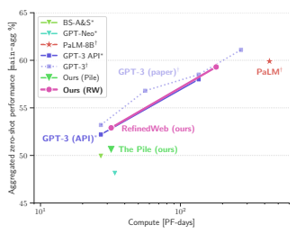
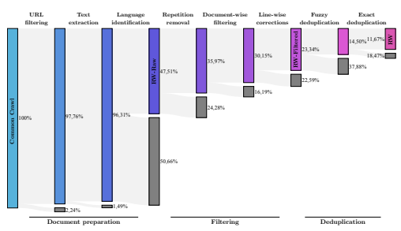
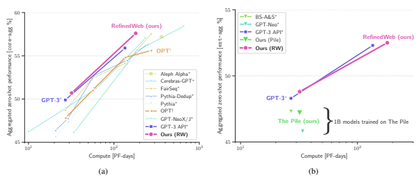
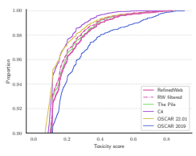
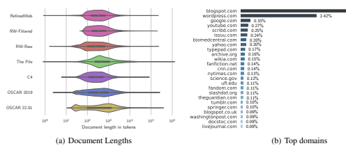
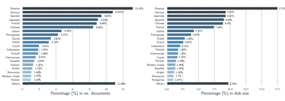
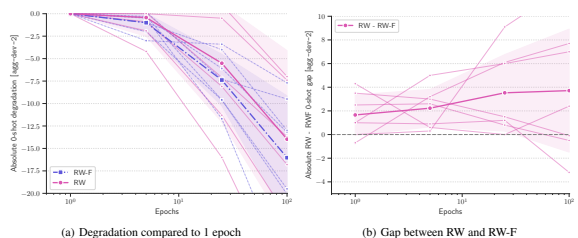
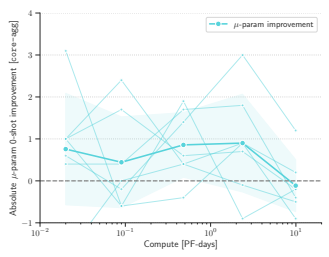
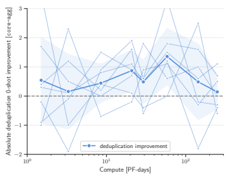

# The Refinedweb Dataset For Falcon Llm: Outperforming Curated Corpora With Web Data, And Web Data Only

The Falcon LLM team Guilherme Penedo 1 **Quentin Malartic** 2 Daniel Hesslow 1 Ruxandra Cojocaru 2 Alessandro Cappelli 1 Hamza Alobeidli 2 **Baptiste Pannier** 1 Ebtesam Almazrouei 2 **Julien Launay** 1 3 https://huggingface.co/datasets/tiiuae/falcon-refinedweb

## Abstract

Large language models are commonly trained on a mixture of filtered web data and curated "high-quality" corpora, such as social media conversations, books, or technical papers. This curation process is believed to be necessary to produce performant models with broad zero-shot generalization abilities. However, as larger models requiring pretraining on trillions of tokens are considered, it is unclear how scalable is curation and whether we will run out of unique high-quality data soon. At variance with previous beliefs, we show that properly filtered and deduplicated web data alone can lead to powerful models; even significantly outperforming models from the state-of-the-art trained on The Pile. Despite extensive filtering, the high-quality data we extract from the web is still plentiful, and we are able to obtain five trillion tokens from CommonCrawl. We publicly release an extract of 600 billion tokens from our REFINEDWEB dataset, and 1.3/7.5B parameters language models trained on it*.

Figure 1. Models trained on REFINEDWEB **alone outperform models trained on curated corpora.** Zero-shot performance on our main-agg task aggregate (see Section 4.1 for details). At equivalent compute budgets, our models significantly outperform publicly available models trained on ▼ The Pile, and match the performance of the - GPT-3 models when tested within our evaluation setup.

1LightOn 2Technology Innovation Institute, 9639 Masdar City, Abu Dhabi, United Arab Emirates 3LPENS, Ecole normale sup ´ erieure. ´

Contact: <falconllm@tii.ae>.

*Details about how to access Falcon LLM open source is available on falconllm.tii.ae

| Dataset      | Size       | Availability   | Web   | CC Processing                       | Deduplication                       |              |
|--------------|------------|----------------|-------|-------------------------------------|-------------------------------------|--------------|
|              |            |                |       | MASSIVE WEB DATASETS                |                                     |              |
| C4           | ∼ 360GT    | Public         | 100%  | Rules + NSFW words blocklist        | Exact: spans of 3 sentences         |              |
| OSCAR\-21.09 | ∼ 370GT    | Public         | 100%  | Built at the line\-level            | Exact: per line (∼ 55% removed)     |              |
| OSCAR\-22.01 | ∼ 283GT    | Public         | 100%  | Line\-level rules + optional rules  | Exact: per line (optional, not used |              |
|              |            |                |       | & NSFW URL blocklist                | for results in this paper)          |              |
|              |            |                |       | CURATED DATASETS                    |                                     |              |
| -  GPT\-3    | 300GT      | Private        | 60%   | Content filter trained on known     | Fuzzy: MinHash (∼  10% removed)     |              |
|              |            |                |       | high\-quality sources               |                                     |              |
| ▼  The Pile  | ∼  340GT   | Public         | 18%   | jusText  for extraction, con                                     | Fuzzy: MinHash (∼                   | 26% removed) |
|              |            |                |       | tent filter trained on curated data |                                     |              |
| ⋆  PaLM      | 780GT      | Private        | 27%   | Filter trained on HQ data           | Unknown                             |              |
|              |            |                |       | OURS                                |                                     |              |
| REFINEDWEB   | ∼ 5, 000GT | Public (600GT) | 100%  | trafilatura for text extrac                                     | Exact  &  fuzzy:  exact             | sub              |
|              |            |                |       | tion, document and line\-level      | string+MinHash (∼ 50% removed)      |              |
|              |            |                |       | rules, NSFW URL blocklist           |                                     |              |

Table 1. REFINEDWEB **improves on existing English pretraining datasets for large language models by combining extensive**
filtering with stringent deduplication at unprecedented scale. For additional details, see the full version in Table 12 of Appendix F.3.

### 1. Introduction

Progress in natural language processing is increasingly driven by sheer compute scale alone (Sevilla et al., 2022): as more compute is expended to train large language models (LLM), they gain and exhibit powerful emergent capabilities (Brown et al., 2020; Wei et al., 2022). To best benefit from scaling, recent scaling laws dictate that both model size and dataset size should jointly be increased (Hoffmann et al., 2022). This is at variance with earlier findings, which had argued that scaling should focus on model size first and foremost, with minimal data scaling (Kaplan et al., 2020). This joint scaling paradigm raises significant challenges: although plentiful, text data is not infinite, especially so when considerations on data quality and licensing are taken into account–leading some researchers to argue scaling may soon be bottlenecked by data availability (Villalobos et al., 2022). Concretely, optimally training a GPT-3 sized model (175B parameters) would require no less than 3,500 billion tokens of text according to Hoffmann et al. (2022). This is twice as much as the largest pretraining datasets ever demonstrated (Hoffmann et al., 2022; Touvron et al., 2023),
and ten times more than the largest publicly available English datasets such as OSCAR (Ortiz Suarez et al. ´ , 2019),
C4 (Raffel et al., 2020), or The Pile (Gao et al., 2020).

Massively scaling-up pretraining data is made even more challenging by the fact LLMs are commonly trained using a mixture of web crawls and so-called "high-quality" data (Brown et al., 2020; Gao et al., 2020). Typical highquality corpora include curated sources of books, technical documents, human-selected web pages, or social media conversations. The increased diversity and quality brought forth by these curated corpora is believed to be a key component of performant models (Scao et al., 2022b). Unfortunately, curation is labour intensive: typically, each source requires specialized processing, while yielding a limited amount of data. Furthermore, licensed sources raise legal challenges. Nevertheless, most pretraining data is still sourced from massive web crawls which can be scaled up to trillions of tokens with limited human intervention. However, the quality of this data has traditionally been seen as (much) inferior to that of the manually curated data sources. Even finely processed sources of web data, such as C4 (Raffel et al., 2020) or OSCAR (Ortiz Suarez et al. ´ , 2019), are regarded as inferior to curated corpora for LLMs (Rae et al.,
2021; Scao et al., 2022b), producing less performant models.

To sustain the ever-increasing data needs of larger and larger LLMs, and to streamline data pipelines and reduce the need for human-intensive curation, we propose to explore how web data can be better processed to significantly improve its quality, resulting in models as capable, if not more capable, than models trained on curated corpora. Contributions. We make the following contributions:
- We introduce R**EFINED**WEB, a high-quality five trillion tokens web-only English pretraining dataset;
- We demonstrate that **web data alone can result in**
models outperforming both public and private curated corpora, as captured by zero-shot benchmarks, challenging current views about data quality;
- We publicly release a 600B tokens extract of RefinedWeb, and 1/7B parameters LLMs trained on it, to serve as a new baseline high-quality web dataset for the natural language processing community.

## 2. Related Works

Pretraining data for large language models. Early large language models identified the importance of datasets with long, coherent documents (Radford et al., 2018; Devlin et al., 2019). Moving on from the previously used sentencewise datasets (Chelba et al., 2013), they instead leveraged document-focused, single-domain corpora like Wikipedia or BookCorpus (Zhu et al., 2015). As models increased in scale, datasets based on massive web-scrape gained prevalence (Ortiz Suarez et al. ´ , 2019; Raffel et al., 2020). However, further work argued that these untargeted web scrape fell short of human-curated data (Radford et al., 2019), leading to the wide adoption of curated datasets such as The Pile (Gao et al., 2020), which combine web data with books, technical articles, and social media conversations. At scale, it has been proposed to emulate the human curation process by leveraging weak signals: for instance, by crawling the top links of a forum (Gokaslan et al., 2019). Targeted corpora can also produce domain-specific models (Beltagy et al., 2019), or broaden the expressiveness of models (e.g., for conversational modalities Adiwardana et al. (2020); Thoppilan et al. (2022)). Latest large language models (Brown et al., 2020; Rae et al., 2021; Chowdhery et al., 2022; Scao et al., 2022a) are trained on giant aggregated corpora, combining both massive web-scrape and so-called "high-quality" curated single-domain sources (e.g., news, books, technical papers, social media conversations). These targeted sources are often upsampled–from one to five times is most common–to increase their representation in the final dataset. The diversity and "higher-quality" brought fourth by these aggregated datasets is thought to be central to model quality; web data alone is considered insufficient to train powerful large language models (Liu et al., 2019; Scao et al., 2022b).

Pipelines for web data. Massive web datasets are typically built upon CommonCrawl, a publicly available scrape of the internet, which has now been running for 12 years and has collected petabytes of data. Working with data scraped from all over the internet presents unique challenges: notably, a significant portion is low-quality machine-generated spam or pornographic content (Trinh & Le, 2018; Kreutzer et al., 2022). Accordingly, training on unfiltered web data is undesirable, resulting in poorly performing models (Raffel et al., 2020). Modern pipelines focus on filtering out this undesirable content (Wenzek et al., 2020). Broadly speaking, these pipelines usually combine a variety of stages: (1) language identification, leveraging inexpensive n-gram models
(e.g., fastText Joulin et al. (2016)); (2) filtering rules and heuristics, such as only keeping lines with valid punctuation, discarding lines with too many symbols, or removing documents containing banned words (Grave et al., 2018; Raffel et al., 2020); (3) *ML-based quality filtering*, using lightweight models trained on known gold data to identify similar high-quality web documents (Wenzek et al., 2020; Brown et al., 2020); (4) *deduplication*, removing either exact duplicate spans or similar documents (Lee et al., 2022). While some filtering is necessary, excessive filtering can introduce undesirable biases in the model. This can overly impact minorities (Dodge et al., 2021), motivating the adoption of practices such as pseudo-crawling, wherein allowed URLs are manually curated (Laurenc¸on et al., 2022).

Deduplication. Deduplication removes repeated extracts and documents from a dataset: these could either be exact matches, identical in every character, or approximate matches, based on some similarity metric. For exact duplicates, it is common to match exact substrings of a minimum length using suffix arrays (Manber & Myers, 1993). For fuzzy duplicates, methods based on locally-sensitive hashes such as MinHash (Broder, 1997) or SimHash (Charikar, 2002) have been adopted for the pretraining data of large language models (Brown et al., 2020; Zeng et al., 2021; Rae et al., 2021). Recently, Abbas et al. (2023) has proposed to leverage embeddings from pretrained models to imbue semantic understanding in approximate matching algorithms. Deduplication has been identified as playing a significant role in improving language models (Allamanis, 2019; Lee et al., 2022). Notably, it reduces memorization (Carlini et al., 2022), which is especially problematic in large models (Carlini et al., 2021). Furthermore, repeated data has been shown to be increasingly harmful to model quality as parameter count increases (Hernandez et al., 2022): for a 1B parameters model, a hundred duplicates are harmful; at 175B, even a few duplicates could have a disproportionate effect. Concurrently to this work, the Pythia suite of models found that deduplicating The Pile had a limited impact on zero-shot performance (Biderman et al., 2023), questioning whether deduplication is as relevant for curated corpora as it for predominantly web-based datasets. We provide an overview of some widely adopted existing pretraining English datasets for LLMs in Table 1, with additional information in Table 12 of Appendix F.3. We also note that recent popular open models (Zhang et al., 2022; Touvron et al., 2023) often indirectly leverage The Pile (Gao et al., 2020) by doing a mix-and-match of its components. Focusing on building a large-scale high-quality web pretraining dataset, we extend upon the state-of-the-art in three ways: (1) we aggregate and combine best-practices for document preparation and filtering across multiple pipelines, and introduce line-wise corrections; (2) we combine both exact and fuzzy deduplication at very large-scale; (3) the scale of our final dataset is unique, with a total 5,000 billion tokens, and a 600 billion tokens extract available for public use with permissive licensing. Training large models on RefinedWeb also lead us to challenge the commonly held belief that web data is strictly worse than curated corpora.

## 3. Macrodata Refinement And Refinedweb

We introduce MDR (MacroData Refinement), a pipeline for filtering and deduplicating web data from CommonCrawl at very large scale. Using MDR, we produce R**EFINED**WEB, an English pretraining dataset of five trillion tokens based on web data only. We leverage strict filtering and stringent deduplication to uplift the quality of web data, distilling it down to a corpus matching the quality of aggregated corpora used to train state-of-the-art models.

Design principles. We abide by the following guidelines:
- **Scale first.** We intend MDR to produce datasets to be used to train 40-200B parameters models, thus requiring trillions of tokens (Hoffmann et al., 2022). For English-only RefinedWeb, we target a size of 3-6 trillion tokens. Specifically, we eschew any labour intensive human curation process, and focus on Common- Crawl instead of disparate single-domain sources.

- **Strict deduplication.** Inspired by the work of Lee et al.

(2022), which demonstrated the value of deduplication for large language models, we implement a rigorous deduplication pipeline. We combine both exact and fuzzy deduplication, and use strict settings leading to removal rates far higher than others have reported.

- **Neutral filtering.** To avoid introducing further undesirable biases into the model (Dodge et al., 2021; Welbl et al., 2021), we avoid using ML-based filtering outside of language identification. We stick to simple rules and heuristics, and use only URL filtering for adult content.

Table 2 and Figure 2 outline the full MDR pipeline.

3.1. Document preparation: reading data, filtering URLs, extracting text, and language identification Reading the data. CommonCrawl is available in either WARC (raw HTML response), or WET files (preprocessed to only include plain text). Individual files correspond to a page at a given URL; these constitute single documents/samples. Working with WET files would spare us from running our own HTML extraction; however, in line with previous works (Gao et al., 2020; Rae et al., 2021), we found WET files to include undesirable navigation menus, ads, and other irrelevant texts. Accordingly, our pipeline starts from raw WARC files, read with the warcio library.

URL filtering. Before undertaking any compute-heavy processing, we perform a first filtering based on the URL alone. This targets fraudulent and/or adult websites (e.g., predominantly pornographic, violent, related to gambling, etc.). We base our filtering on two rules: (1) an aggregated blocklist of 4.6M domains; (2) a URL score, based on the presence of words from a list we curated and weighed by severity. We found that commonly used blocklists include many false positives, such as popular blogging platforms or even pop culture websites. Furthermore, word-based rules (like the one used in C4, Raffel et al. (2020)) can easily result in medical and legal pages being blocked. Our final detailed rules based on this investigation are shared in Appendix G.1. Since we intend RefinedWeb to be used as part of an aggregate dataset along with curated corpora, we also filtered common sources of high-quality data: Wikipedia, arXiv, etc. The detailed list is available in Appendix G.1.3.

#### Fi

fi fi

Figure 2. **Subsequent stages of Macrodata Refinement remove nearly 90% of the documents originally in CommonCrawl.** Notably, filtering and deduplication each result in a halving of the data available: around 50% of documents are discarded for not being English, 24% of remaining for being of insufficient quality, and 12% for being duplicates. We report removal rate (grey) with respect to each previous stage, and kept rate (shade) overall. Rates measured in % of documents in the document preparation phase, then in tokens.

Loading [MathJax]/extensions/MathMenu.js

Table 2. **Macrodata Refinement aggregates best practices from the state-of-the-art and novel approaches (URL scoring, line-wise** filtering, etc.) to produce high-quality web data. On deduplication, we note that MDR is unique in both the scale at which it is performed, and in applying subsequently fuzzy and exact substring methods to improve coverage and scalability.

| DOCUMENT PREPARATION   |    |                  |         |                      |        | FILTERING           |            |                         | DEDUPLICATION         |                   |
|------------------------|----|------------------|---------|----------------------|--------|---------------------|------------|-------------------------|-----------------------|-------------------|
| URL filtering          |    | Text extraction  |         | Language             |        | Document\-wise      | Line\-wise |                         | Deduplication         | URL deduplication |
|                        |    |                  |         | identification       |        | filtering           | filtering  |                         |                       |                   |
| Aggregated             | block    | From  WARC       |         | fastText classi                      |        | In\-document repe                     |            | Remove undesirable      | Fuzzy deduplication   | Remove URLs revis                   |
| list, URL scoring,     |    | using            | warcio, | fier from            | CCNet, | tition removal and  |            | lines (call to actions, | w/ MinHash + exact    | ited across Common                   |
| common                 | HQ | trafilatura for  |         | thresholding on top  |        | quality  heuristics |            | navigation buttons,     | substring deduplica                       | Crawl dumps       |
| sources blocked        |    | extraction       |         | language score       |        | from MassiveWeb     |            | social counters, etc.)  | tion w/ suffix arrays |                   |
| Appendix G.1           |    | Barbaresi (2021) |         | Wenzek et al. (2020) |        | Rae et al. (2021)   |            | Appendix G.2            | Lee et al. (2022)     | Section 3.3       |

Text extraction. We want to extract only the main content of the page, ignoring menus, headers, footers, and ads among others: Lopukhin (2019) found that trafilatura (Barbaresi, 2021) was the best non-commercial library for retrieving content from blog posts and news articles. Although this is only a narrow subset of the kind of pages making up CommonCrawl, we found this finding to hold more broadly. We use trafilatura for text extraction, and apply extra formatting via regular expressions: we limit new lines to two consecutive ones, and remove all URLs.

Language identification. We use the fastText language classifier of CCNet (Wenzek et al., 2020) at the documentlevel: it uses characters n-gram and was trained on Wikipedia, supporting 176 languages. We remove documents for which the top language scores below 0.65: this usually corresponds to pages without any natural text. For this paper, we focus on English; RefinedWeb can also be derived for other languages, see Appendix D for details.

The data we retrieve at this stage, called **RW-R**AW, corresponds to what we can extract with the minimal amount of filtering. At this stage, only 48% of the original documents are left, mostly filtered out by language identification.

#### 3.2. Filtering: Document-Wise And Line-Wise

Repetition removal. Due to crawling errors and lowquality sources, many documents contain repeated sequences: this may cause pathological behavior in the final model (Holtzman et al., 2019). We could catch this content at the later deduplication stage, but it is cheaper and easier to catch it document-wise early on. We implement the heuristics of Rae et al. (2021), and remove any document with excessive line, paragraph, or n-gram repetitions.

Document-wise filtering. A significant fraction of pages are machine-generated spam, made predominantly of lists of keywords, boilerplate text, or sequences of special characters. Such documents are not suitable for language modeling; to filter them out, we adopt the quality filtering heuristics of Rae et al. (2021). These focus on removing outliers in terms of overall length, symbol-to-word ratio, and other criteria ensuring the document is actual natural language. We note that these filters have to be adapted on a per language basis, as they may result in overfiltering if naively transferred from English to other languages.

Line-wise corrections. Despite the improvements brought forth by using trafilatura instead of relying on preprocessed files, many documents remain interlaced with undesirable lines (e.g., social media counters 3 likes, navigation buttons). Accordingly, we devised a line-correction filter, targeting these undesirable items. If these corrections remove more than 5% of a document, we remove it entirely. See Appendix G.2 for details. The data we retrieve at this stage has gone through all of the filtering heuristics in the MDR pipeline. We refer to this dataset as RW-F**ILTERED**. Only 23% of the documents of CommonCrawl are left, with around 50% of the documents of RW-Raw removed by the filtering.

#### 3.3. Deduplication: Fuzzy, Exact, And Across Dumps

After filtering, although data quality has improved, a large fraction of the content is repeated across documents. This may be due to the crawler indirectly hitting the same page multiple times, to boilerplate content being repeated (e.g., licences), or even to plagiarism. These duplicates can strongly impact models, favoring memorization instead of generalization (Lee et al., 2022; Hernandez et al., 2022). Since deduplication is expensive, it has seen limited adoption in public datasets (Ortiz Suarez et al. ´ , 2019; Raffel et al., 2020). We adopt an aggressive deduplication strategy, combining both fuzzy document matches and exact sequences removal.

Fuzzy deduplication. We remove similar documents by applying MinHash (Broder, 1997): for each document, we compute a sketch and measure its approximate similarity with other documents, eventually removing pairs with high overlap. MinHash excels at finding templated documents: licenses with only specific entities differing, placeholder SEO text repeated across websites–see examples of the Table 3. **To evaluate models trained on RefinedWeb and compare to the state-of-the-art, we build four aggregates across 18 tasks** on which to measure zero-shot performance. small was built for internal ablations, based on tasks with consistent performance at small scale, core is based on tasks commonly reported for public suites of models (Dey et al., 2023; Biderman et al., 2023), main is based on tasks from the GPT-3 and PaLM paper (Brown et al., 2020; Chowdhery et al., 2022), and ext is based on tasks used by the

BigScience Architecture and Scaling group (Scao et al., 2022b). For all results reported, we flag with † results obtained in an arbitrary evaluation setup, and with ∗ results obtained with the EAI Harness (Gao et al., 2021), which we also employ for all our models.

| Tasks                                         | Type                                | Random   | small   | core   | main   | ext   |
|-----------------------------------------------|-------------------------------------|----------|---------|--------|--------|-------|
| HellaSwag (Zellers et al., 2019)              | Sentence completion                 | 25.0     | ✓       | ✓      | ✓      | ✓     |
| LAMBADA (Paperno et al., 2016)                | Sentence completion                 | 0.0      |         | ✓      | ✓      | ✓     |
| Winogrande (Sakaguchi et al., 2021)           | Coreference resolution              | 50.0     | ✓       | ✓      | ✓      | ✓     |
| PIQA (Bisk et al., 2020)                      | Multiple\-choice question answering | 50.0     | ✓       | ✓      | ✓      | ✓     |
| ARC (Clark et al., 2018)                      | Natural language inference          | 25.0     | ✓       | ✓      | ✓      | ✓     |
| OpenBookQA (Mihaylov et al., 2018)            | Multiple\-choice question answering | 25.0     |         | ✓      | ✓      | ✓     |
| BoolQ (Clark et al., 2019)                    | Multiple\-choice question answering | 50.0     | ✓       |        | ✓      | ✓     |
| COPA (Gordon et al., 2012)                    | Sentence completion                 | 50.0     |         |        | ✓      | ✓     |
| CB (De Marneffe et al., 2019)                 | Natural language inference          | 33.3     |         |        | ✓      | ✓     |
| RTE (Dagan et al., 2010)                      | Natural language inference          | 50.0     |         |        | ✓      | ✓     |
| ReCoRD (Zhang et al., 2018)                   | Question answering                  | 0.0      |         |        | ✓      |       |
| ANLI (Nie et al., 2019)                       | Natural language inference          | 33.3     |         |        | ✓      |       |
| LogiQA (Liu et al., 2021)                     | Multiple\-choice question answering | 25.0     |         |        |        | ✓     |
| HeadQA (Vilares & Gomez\-Rodr ´ ´ıguez, 2019) | Multiple\-choice question answering | 20.0     |         |        |        | ✓     |
| MathQA (Amini et al., 2019)                   | Multiple\-choice question answering | 20.0     |         |        |        | ✓     |
| PROST (Aroca\-Ouellette et al., 2021)         | Paraphrase identification           | 50.0     |         |        |        | ✓     |
| PubMedQA (Jin et al., 2019)                   | Multiple\-choice question answering | 50.0     |         |        |        | ✓     |
| SciQ (Welbl et al., 2017)                     | Multiple\-choice question answering | 25.0     | ✓       |        |        | ✓     |

biggest clusters in Appendix H.1. We perform MinHash deduplication using 9,000 hashes per document, calculated over 5-grams and divided into 20 buckets of 450 hashes. We found that using less aggressive settings, such as the 10 hashes of The Pile (Gao et al., 2020), resulted in lower deduplication rates and worsened model performance. See Appendix G.3.1 for more details about our MinHash setup. Exact deduplication. Exact substring operates at the sequence-level instead of the document-level, finding matches between strings that are exact token-by-token matches by using a suffix array (Manber & Myers, 1993) (e.g., specific disclaimers or notices, which may not compromise the entire document as showcased in Appendix H.2). We remove any match of more than 50 consecutive tokens, using the implementation of Lee et al. (2022). We note that exact substring alters documents, by removing specific spans: we also experimented with dropping entire documents or loss-masking the duplicated strings instead of cutting them, but this didn't result in significant changes in zero-shot performance–see Appendix G.3.2. URL deduplication. Because of computational constraints, it is impossible for us to perform deduplication directly on RW-Filtered. Instead, we split CommonCrawl into 100 parts, where each part contains a hundredth of each dump, and perform deduplication on individual parts. Most of the larger duplicate clusters (e.g., licences, common spams) will be shared across parts, and effectively removed. However, we found that CommonCrawl dumps had significant overlap, with URLs being revisited across dumps despite no change in content. Accordingly, we keep a list of the URLs of all samples we have kept from each part, and remove them from subsequent parts being processed.

## 4. Experiments

We now validate that RefinedWeb can be used to train powerful models, matching the zero-shot performance obtained with curated corpora and state-of-the-art language models. We first discuss our evaluation and pretraining setup, and models with which we compare. We perform experiments at small scale to internally compare with other popular datasets, and ablate the three main stages of RefinedWeb (raw, filtered, final). Then, we scale to 1B and 7B models trained on 350GT to compare with state-of-the-art models. Finally, we apply the MDR pipeline to existing pretraining datasets, and show that it can potentially deliver further improvements.

#### 4.1. Setting

Evaluation. At variance with previous works studying pretraining datasets (Rae et al., 2021; Lee et al., 2022), we focus our evaluation on zero-shot generalization across many tasks rather than measuring validation loss. Perplexity alone can be at odds with end-task performance (Tay et al., 2021), and modern works on LLMs predominantly report zero-shot performance (Brown et al., 2020; Rae et al., 2021; Chowdhery et al., 2022). Furthermore, zero-shot generalization is the
"natural" setting for autoregressive decoder-only models, in which they perform best (Wang et al., 2022). Our evaluation setup is inspired by the one used by the architecture and scaling group of Big Science (Scao et al., 2022b). We base our evaluation on the popular Eleuther AI evaluation harness (Gao et al., 2021), allowing us to evaluate across a wide range of tasks in the zero-shot setting. We identified aggregates of tasks allowing us to: (1) obtain signal (i.e., non zero zero-shot performance) at small scale for

Table 4. Curation is not a silver bullet for zero-shot generalization: small-scale models trained on REFINEDWEB **outperform**
models trained on web data (C4, OSCAR), and on curated corpora (▼ **The Pile).** Average accuracy in zero-shot on the small-agg aggregate. All models trained with identical architectures and pretraining hyperparameters. We find that OSCAR-22.01 underperforms other datasets signficantly, perhaps because deduplication is only optional. C4 is a strong baseline, with OSCAR-21.09 lagging slightly behind, but we find that RefinedWeb outperforms both web datasets and the most popular curated dataset, The Pile. Both filtering and deduplication contribute significantly to improving zero-shot performance.

|         | MASSIVE WEB DATASETS   |              |       | CURATED    | OURS    |              |            |
|---------|------------------------|--------------|-------|------------|---------|--------------|------------|
|         | OSCAR\-21.09           | OSCAR\-22.01 | C4    | ▼ The Pile | RW\-Raw | RW\-Filtered | REFINEDWEB |
| 1B@27GT | 55.0%                  | 52.7%        | 55.7% | 53.4%      | 52.7%   | 54.3%        | 56.2%      |
| 3B@60GT | 59.1%                  | 55.9%        | 59.6% | 57.9%      | 57.4%   | 58.2%        | 59.8%      |

ablations; (2) compare with results reported by other models. We outline these four aggregates small (for ablations), and core, main, ext (for comparisons) in Table 3.

#### 4.2. Can Web Data Alone Outperform Curated Corpora?

Comparisons across models trained and evaluated in different settings are difficult to untangle, as many externalities may influence the 1 987results (e.g., numerical precision of training vs inference, prompts used). We distinguish three levels of comparisons: (1) internal comparisons, with models trained and evaluated within our codebase, for which only the pretraining datasets differ; (2) benchmark-level comparisons, with models trained with a different codebase but evaluated with the Eleuther AI harness, taking results from Scao et al. (2022b); Black et al. (2022); Aleph Alpha
(2023); Dey et al. (2023), thereafter flagged with a ∗; (3)
external comparisons with Brown et al. (2020); Chowdhery et al. (2022), thereafter flagged with a †. For further details on evaluation, see Appendix F.1. Models. We train 1B, 3B, and 7B parameters autoregressive decoder-only models, based on configurations and hyperparameters similar to GPT-3 (Brown et al., 2020), diverging mostly on our use of ALiBi (Press et al., 2021). We use FlashAttention (Dao et al., 2022) in a custom codebase. We train internal models on both The Pile and RefinedWeb to control for deviations caused by our pretraining setup–we found The Pile models to perform in-line with others. For small-scale and ablation studies (first half of Section 4.2; Section 4.3), we train models to optimality according to the scaling laws of Hoffmann et al. (2022): on 27B and 60B tokens respectively for our 1B and 3B parameters models. For the main experiments demonstrating our approach (Falcon- RW models in Section 4.2), we train the models to 350GT, in line with popular public models (Brown et al., 2020; Wang & Komatsuzaki, 2021; Scao et al., 2022a). Note that we do not compare against the recently introduced LLaMA models (Touvron et al., 2023), as the smallest of them is trained on x2.5 more compute than our largest model, preventing a meaningful comparison from being made dataset-wise. For a more in-depth overview of the models and pretraining datasets with which we compare, see Appendix F.

We endeavour to demonstrate that web data alone can result in models outperforming other models trained on curated corpora. To do so, we first perform a small-scale study with 1B and 3B parameters models trained to optimality (27GT and 60GT) on popular web and curated datasets. Then, we scale up to 1B and 7B models trained on 350GT, and compare zero-shot generalization to state-of-the-art models.

Small-scale study. We first consider popular public web datasets (OSCAR-2019 (Ortiz Suarez et al. ´ , 2019), OSCAR- 2022 (Abadji et al., 2021), C4 (Raffel et al., 2020)), The Pile (Gao et al., 2020) as the most popular publicly available curated dataset, and variations of RefinedWeb (RW-Raw, RW-Filtered, and RW as described in Section 3). For this first study, all models are trained with the same architecture and the same internal codebase; they are also all evaluated within the same framework–only pretraining datasets differ. Results averaged on the small-=+ aggregate of 6 tasks are presented in Table 4. We observe relatively strong performance of all web datasets compared to The Pile, showcasing that curation is not a silver bullet for performant language models. We find C4 to be a strong pretraining dataset, in line with the findings of Scao et al. (2022b)–however, The Pile comparatively underperforms more in our benchmarks. The relatively disappointing results on OSCAR-22.01 may be due to the main version of the dataset being distributed without deduplication. Regarding RefinedWeb, both filtering and deduplication significantly improve performance.

Full-scale models. We now validate these results with comparisons with state-of-the-art models. We scale our previous experiments by training 1B and 7B models on 350GT; we also train a 1B model on 350GT on The Pile, as a control for the influence of our pretraining setup. We compare with the following models: the GPT-3 series (Brown et al., 2020), the FairSeq series (Artetxe et al., 2021), the GPT-Neo(X)/J
models (Black et al., 2021; Wang & Komatsuzaki, 2021; Black et al., 2022), the OPT series (Zhang et al., 2022),
the BigScience Architecture and Scaling Pile model (Scao et al., 2022b), PaLM-8B (Chowdhery et al., 2022), Aleph Alpha Luminous 13B (Aleph Alpha, 2023), the Pythia series (Biderman et al., 2023), and the Cerebras-GPT series (Dey et al., 2023). For GPT-3, we distinguish between results obtained through the API (babbage and curie) with the the EleutherAI LM evaluation harness (Gao et al., 2021) (*), and results reported in their paper, with a different evaluation setup (†). Note that for PaLM and OPT, results were also obtained with a different evaluation suite (†), while for other models they were obtained with the evaluation harness as well (*), allowing for more direct comparisons.

Results on main-agg are presented in Figure 1, and in Figure 3 for core-agg and ext-agg. We find that open models consistently underperform models trained on private curated corpora, such as GPT-3–even when using a similar evaluation setup. Conversely, models trained on Refined- Web are able to match the performance of the GPT-3 series using web data alone, even though common high-quality sources used in The Pile are excluded from RefinedWeb (see Table 14 in Appendix). Finally, we note that our internal model trained on The Pile performs in line with the Big-
Science Architecture and Scaling model; this highlights that our pretraining setup is unlikely to be the main source of increased performance for models trained on RefinedWeb.

Finding. Challenging existing beliefs on data quality and LLMs, models trained on adequately filtered and deduplicated web data *alone* can match the performance of models trained on curated data.

#### 4.3. Do Other Corpora Benefit From Mdr?

Ablating the contributions and evaluating the performance of individual components in the MDR pipeline is difficult: for most heuristics, there is no agreed-upon ground truth, and changes may be too insignificant to result in sufficient zero-shot signal after pretraining. In the first half of Section 4.2, we identified that subsequent stages of RefinedWeb (raw, filtered, final) led to improvements in performance. In this section, we propose to apply independently the filtering and deduplication stages of MDR to popular pretraining datasets, studying whether they generalize widely.

We report results on the small-agg in Table 5. First, we find that improvements from filtering are not systematic. On The Pile, we had to adjust our line length and characters ratio heuristics to avoid expunging books and code. Despite improvements on OSCAR-21.09, C4, and The Pile, our filters worsen performance on OSCAR-22.01; generally, removal rates from filtering do not seem strongly correlated with downstream accuracy. Conversely, deduplication delivers a steady boost across all datasets, and removal rates are better correlated with changes in performance. We find OSCAR- 21.09 and C4 to be already well deduplicated, while The Pile and OSCAR-22.01 exhibit 40-60% duplicates. The base version of OSCAR-22.01 is distributed without deduplication; for The Pile, this is consistent with the findings of Zhang et al. (2022). Finally, combining filtering and deduplication results in further improvements; interestingly, although performance is now more uniform across datasets, differences remain, suggesting that flaws in the original text extraction and processing can't be fully compensated for.

Figure 3. Models trained on REFINEDWEB **alone outperform models trained on curated corpora.** Zero-shot performance averaged on our core-agg (left) and ext-agg (right) task aggregates (see Section 4.1 for details, and Figure 1 for results on main-agg). Existing open models fail to match the performance of the original GPT-3 series (left); however, models trained on RefinedWeb significantly outperform models trained on ▼ The Pile: including our direct comparison model (right), ruling out our pretraining setup as the main source of increased performance. In fact, our RefinedWeb models even match the performance of the - GPT-3 models.

|              | MASSIVE WEB DATASETS   |              |              | CURATED      | OURS         |
|--------------|------------------------|--------------|--------------|--------------|--------------|
|              | OSCAR\-21.09           | OSCAR\-22.01 | C4           | ▼  Pile      | RefinedWeb   |
| Base         | 55.0%                  | 52.7%        | 55.7%        | 53.4%        | 52.7%        |
| Filtered     | 55.4% [+.4]            | 52.3% [\-.4] | 56.2%  [+.5] | 54.2% [+.8]  | 54.3% [+1.6] |
| removal rate | \-25.0%                | \-39.8%      | \-16.4%      | \-27.1%      | \-50.8%      |
| Deduplicated | 55.6% [+.6]            | 55.6% [+2.9] | 55.9% [+.2]  | 54.5% [+1.1] |              |
| removal rate | \-10.8%                | \-60.8%      | \-7.59%      | \-45.3%      |              |
| Filt.+Dedup. | 55.5% [+.5]            | 55.4% [+2.7] | 56.4% [+.7]  | 55.2% [+1.8] | 56.2% [+3.5] |
| removal rate | \-28.2%                | \-62.2%      | \-17.9%      | \-66.0%      | \-75.4%      |

Table 5. **Although improvements from filtering are not systematic across datasets, deduplication brings a steady performance boost** across the board. Zero-shot accuracy averaged on our small-agg aggregate; [+x.x] reports absolute gains compared to base, removal rates reported against base. Due to limitations in our pipeline, we cannot apply the deduplication stage independently for RefinedWeb.

By processing C4 through MDR, we are able to obtain subsets of data which might slightly outperform RefinedWeb; this combines both the stringent filtering of C4 (e.g., strict NSFW word blocklist, 3-sentence span deduplication) with our own filters and deduplication. While such a combination results in rejection rates that would be unacceptable for our target of 3-6 trillions tokens, this represents an interesting perspective for shorter runs, which may be able to extract extremely high-quality subsets from large web datasets.

Finding. While filtering heuristics may require sourcedependent tuning, stringent deduplication improves zero-shot performance across datasets consistently.

## 5. Limitations

Biases. We conduct a basic analysis of the toxicity of RefinedWeb in Figure 4. We find RW to be about as toxic as The Pile, based on the definition of toxicity provided by the Perspective API: "content that is rude or disrespectful". Notably, this definition does not cover issues with social biases or harmfulness. Although it is unlikely that our pipeline introduces further issues on this side than is already documented for popular datasets, we encourage further quantitative work on the public extract of RefinedWeb. Multiple epochs. Instead of looking for "unique" tokens to make up a trillion-scale pretraining dataset, one could simply repeat data over multiple epochs. Popular models like OPT and NeoX-20B do this for up to 2 epochs, and most curated datasets upsample corpora 2-5 times. However, Hernandez et al. (2022) has recently shown that models with 100B+ parameters may be sensitive to even just a few epochs. Orthogonal to our work lies a line of research exploring tradeoffs in the data-constrained regime: can deduplication help sustain more epochs? Are multiple epochs on higher quality data better than a one epoch on lower quality data? See Appendix E.3 for a more in-depth discussion.

Other results on deduplication. Biderman et al. (2023) found a limited impact on zero-shot performance from deduplicating The Pile; we discuss further in Appendix F.2, but encourage further deduplication research on curated corpora, and studying deduplication in the data-constrained regime, where multiple epochs have to be performed to compensate for the reduction in tokens incurred by deduplication.

## 6. Conclusion

As LLMs are widely adopted, models trained past the recommendations of scaling laws are bound to become increasingly common to amortize inference costs (Touvron et al., 2023). This will further drive the need for pretraining datasets with trillions of tokens, an order of magnitude beyond publicly available corpora. We have demonstrated that stringent filtering and deduplication could result in a five trillion tokens web only dataset suitable to produce models competitive with the state-of-the-art, even outperforming LLMs trained on curated corpora. We publicly release a 600GT extract of RefinedWeb, and note that RefinedWeb has already been used to train state-of-the-art language models, such as Falcon-40B (Almazrouei et al., 2023).

Figure 4. Toxic content in RefinedWeb **is distributed similarly** to **The Pile.** Cumulative proportion of documents below a given toxicity score, as evaluated by the Pespective API.

## References

Abadji, J., Suarez, P. J. O., Romary, L., and Sagot, B. Un- ´
goliant: An optimized pipeline for the generation of a very large-scale multilingual web corpus. Proceedings of the Workshop on Challenges in the Management of Large Corpora (CMLC-9) 2021. Limerick, 12 July 2021 (Online-Event), pp. 1 - 9, Mannheim, 2021. Leibniz-Institut fur Deutsche Sprache. doi: 10.14618/ ¨ ids-pub-10468. URL https://nbn-resolving. org/urn:nbn:de:bsz:mh39-104688.

Abadji, J., Ortiz Suarez, P., Romary, L., and Sagot, B.

Towards a Cleaner Document-Oriented Multilingual Crawled Corpus. *arXiv e-prints*, art. arXiv:2201.06642, January 2022.

Abbas, A. K. M., Tirumala, K., Simig, D., Ganguli, S.,
and Morcos, A. S. Semdedup: Data-efficient learning at web-scale through semantic deduplication. In *ICLR 2023* Workshop on Mathematical and Empirical Understanding of Foundation Models, 2023.

Adiwardana, D., Luong, M.-T., So, D. R., Hall, J., Fiedel, N., Thoppilan, R., Yang, Z., Kulshreshtha, A., Nemade, G., Lu, Y., et al. Towards a human-like open-domain chatbot. *arXiv preprint arXiv:2001.09977*, 2020.

Aleph Alpha. Luminous: performance benchmarks.

arXiv preprint arXiv:1810.12885, 2023. URL https://www.aleph-alpha.com/pdf/2023_ 02_AA_Benchmarks_doc.pdf.

Allamanis, M. The adverse effects of code duplication in machine learning models of code. In Proceedings of the 2019 ACM SIGPLAN International Symposium on New Ideas, New Paradigms, and Reflections on Programming and Software, pp. 143–153, 2019.

Almazrouei, E., Cappelli, A., Cojocaru, R., Debbah, M.,
Goffinet, E., Heslow, D., Launay, J., Malartic, Q., Noune, B., Pannier, B., and Penedo, G. Falcon-40b: an open large language model with state-of-the-art performance. 2023.

Amini, A., Gabriel, S., Lin, S., Koncel-Kedziorski, R., Choi, Y., and Hajishirzi, H. Mathqa: Towards interpretable math word problem solving with operation-based formalisms. In Proceedings of the 2019 Conference of the North American Chapter of the Association for Computational Linguistics: Human Language Technologies, Volume 1 (Long and Short Papers), pp. 2357–2367, 2019.

Aroca-Ouellette, S., Paik, C., Roncone, A., and Kann, K.

Prost: Physical reasoning about objects through space and time. In *Findings of the Association for Computational* Linguistics: ACL-IJCNLP 2021, pp. 4597–4608, 2021.

Artetxe, M., Bhosale, S., Goyal, N., Mihaylov, T., Ott, M.,
Shleifer, S., Lin, X. V., Du, J., Iyer, S., Pasunuru, R., et al. Efficient large scale language modeling with mixtures of experts. *arXiv preprint arXiv:2112.10684*, 2021.

Barbaresi, A. Trafilatura: A Web Scraping Library and Command-Line Tool for Text Discovery and Extraction.

In Proceedings of the Joint Conference of the 59th Annual Meeting of the Association for Computational Linguistics and the 11th International Joint Conference on Natural Language Processing: System Demonstrations, pp. 122–131. Association for Computational Linguistics, 2021. URL https://aclanthology.org/2021. acl-demo.15.

Beltagy, I., Lo, K., and Cohan, A. Scibert: A pretrained language model for scientific text. In Proceedings of the 2019 Conference on Empirical Methods in Natural Language Processing and the 9th International Joint Conference on Natural Language Processing (EMNLP-
IJCNLP), pp. 3615–3620, 2019.

Biderman, S., Schoelkopf, H., Anthony, Q., Bradley, H.,
O'Brien, K., Hallahan, E., Khan, M. A., Purohit, S., Prashanth, U. S., Raff, E., et al. Pythia: A suite for analyzing large language models across training and scaling. arXiv preprint arXiv:2304.01373, 2023.

Bisk, Y., Zellers, R., Gao, J., Choi, Y., et al. Piqa: Reasoning about physical commonsense in natural language. In Proceedings of the AAAI conference on artificial intelligence, volume 34, pp. 7432–7439, 2020.

Black, S., Leo, G., Wang, P., Leahy, C., and Biderman, S.

GPT-Neo: Large Scale Autoregressive Language Modeling with Mesh-Tensorflow, March 2021. URL https: //doi.org/10.5281/zenodo.5297715. If you use this software, please cite it using these metadata.

Black, S., Biderman, S., Hallahan, E., Anthony, Q., Gao, L., Golding, L., He, H., Leahy, C., McDonell, K., Phang, J., et al. Gpt-neox-20b: An open-source autoregressive language model. Challenges & Perspectives in Creating Large Language Models, pp. 95, 2022.

Broder, A. Z. On the resemblance and containment of documents. In Proceedings. Compression and Complexity of Sequences 1997, pp. 21–29. IEEE, 1997.

Brown, T., Mann, B., Ryder, N., Subbiah, M., Kaplan, J. D.,
Dhariwal, P., Neelakantan, A., Shyam, P., Sastry, G., Askell, A., et al. Language models are few-shot learners. Advances in neural information processing systems, 33: 1877–1901, 2020.

Carlini, N., Tramer, F., Wallace, E., Jagielski, M., Herbert-
Voss, A., Lee, K., Roberts, A., Brown, T., Song, D.,
Erlingsson, U., et al. Extracting training data from large language models. In *30th USENIX Security Symposium* (USENIX Security 21), pp. 2633–2650, 2021.

Dey, N., Gosal, G., Khachane, H., Marshall, W., Pathria, R.,
Tom, M., Hestness, J., et al. Cerebras-gpt: Open computeoptimal language models trained on the cerebras waferscale cluster. *arXiv preprint arXiv:2304.03208*, 2023.

Carlini, N., Ippolito, D., Jagielski, M., Lee, K., Tramer, F.,
and Zhang, C. Quantifying memorization across neural language models. *arXiv preprint arXiv:2202.07646*, 2022.

Dodge, J., Sap, M., Marasovic, A., Agnew, W., Ilharco, G., ´
Groeneveld, D., Mitchell, M., and Gardner, M. Documenting large webtext corpora: A case study on the colossal clean crawled corpus. In Proceedings of the 2021 Conference on Empirical Methods in Natural Language Processing, pp. 1286–1305, 2021.

Charikar, M. S. Similarity estimation techniques from rounding algorithms. In Proceedings of the thiry-fourth annual ACM symposium on Theory of computing, pp. 380–388, 2002.

Eberhard, D. M., Simons, G. F., and Fennig, C. D. Ethnologue: Languages of the World. SIL International, Dallas, TX, USA, twenty-sixth edition, 2023.

Chelba, C., Mikolov, T., Schuster, M., Ge, Q., Brants, T.,
Koehn, P., and Robinson, T. One billion word benchmark for measuring progress in statistical language modeling. arXiv preprint arXiv:1312.3005, 2013.

Gao, L., Biderman, S., Black, S., Golding, L., Hoppe, T.,
Foster, C., Phang, J., He, H., Thite, A., Nabeshima, N., et al. The pile: An 800gb dataset of diverse text for language modeling. *arXiv preprint arXiv:2101.00027*, 2020.

Chowdhery, A., Narang, S., Devlin, J., Bosma, M., Mishra, G., Roberts, A., Barham, P., Chung, H. W., Sutton, C., Gehrmann, S., et al. Palm: Scaling language modeling with pathways. *arXiv preprint arXiv:2204.02311*, 2022.

Gao, L., Tow, J., Biderman, S., Black, S., DiPofi, A., Foster, C., Golding, L., Hsu, J., McDonell, K., Muennighoff, N., Phang, J., Reynolds, L., Tang, E., Thite, A., Wang, B., Wang, K., and Zou, A. A framework for few-shot language model evaluation, September 2021. URL https: //doi.org/10.5281/zenodo.5371628.

Clark, C., Lee, K., Chang, M.-W., Kwiatkowski, T., Collins, M., and Toutanova, K. Boolq: Exploring the surprising difficulty of natural yes/no questions. In Proceedings of NAACL-HLT, pp. 2924–2936, 2019.

Gebru, T., Morgenstern, J., Vecchione, B., Vaughan, J. W.,
Wallach, H., Iii, H. D., and Crawford, K. Datasheets for datasets. *Communications of the ACM*, 64(12):86–92, 2021.

Clark, P., Cowhey, I., Etzioni, O., Khot, T., Sabharwal, A.,
Schoenick, C., and Tafjord, O. Think you have solved question answering? try arc, the ai2 reasoning challenge. arXiv preprint arXiv:1803.05457, 2018.

Gokaslan, A., Cohen, V., Pavlick, E., and Tellex, S. Openwebtext corpus. http://Skylion007.github.

io/OpenWebTextCorpus, 2019.

Dagan, I., Dolan, B., Magnini, B., and Roth, D. Recognizing textual entailment: Rational, evaluation and approaches– erratum. *Natural Language Engineering*, 16(1):105–105, 2010.

Gordon, A., Kozareva, Z., and Roemmele, M. Semeval2012 task 7: Choice of plausible alternatives: An evaluation of commonsense causal reasoning. In ** SEM 2012:*
The First Joint Conference on Lexical and Computational Semantics–Volume 1: Proceedings of the main conference and the shared task, and Volume 2: Proceedings of the Sixth International Workshop on Semantic Evaluation (SemEval 2012), pp. 394–398, 2012.

Dao, T., Fu, D. Y., Ermon, S., Rudra, A., and Re, C. Flashattention: Fast and memory-efficient exact attention with io-awareness. In Advances in Neural Information Processing Systems, 2022.

De Marneffe, M.-C., Simons, M., and Tonhauser, J. The commitmentbank: Investigating projection in naturally occurring discourse. In proceedings of Sinn und Bedeutung, volume 23, pp. 107–124, 2019.

Grave, E., Bojanowski, P., Gupta, P., Joulin, A., and ´
Mikolov, T. Learning word vectors for 157 languages. In Proceedings of the Eleventh International Conference on Language Resources and Evaluation (LREC 2018), 2018.

Devlin, J., Chang, M.-W., Lee, K., and Toutanova, K. Bert:
Pre-training of deep bidirectional transformers for language understanding. In Proceedings of the 2019 Conference of the North American Chapter of the Association for Computational Linguistics: Human Language Technologies, Volume 1 (Long and Short Papers), pp. 4171–4186, 2019.

Hanu, L. and Unitary team. Detoxify. Github.

https://github.com/unitaryai/detoxify, 2020.

Hernandez, D., Brown, T., Conerly, T., DasSarma, N.,
Drain, D., El-Showk, S., Elhage, N., Hatfield-Dodds, Z., Henighan, T., Hume, T., et al. Scaling laws and interpretability of learning from repeated data. *arXiv preprint* arXiv:2205.10487, 2022.

the Twenty-Ninth International Conference on International Joint Conferences on Artificial Intelligence, pp. 3622–3628, 2021.

Liu, Y., Ott, M., Goyal, N., Du, J., Joshi, M., Chen, D.,
Levy, O., Lewis, M., Zettlemoyer, L., and Stoyanov, V. Roberta: A robustly optimized bert pretraining approach.

arXiv preprint arXiv:1907.11692, 2019.

Hoffmann, J., Borgeaud, S., Mensch, A., Buchatskaya, E.,
Cai, T., Rutherford, E., Casas, D. d. L., Hendricks, L. A., Welbl, J., Clark, A., et al. Training compute-optimal large language models. *arXiv preprint arXiv:2203.15556*, 2022.

Lopukhin, K. Evaluating quality of article body extraction for commercial services and open-source libraries. https://github.com/scrapinghub/ article-extraction-benchmark, 2019.

Holtzman, A., Buys, J., Du, L., Forbes, M., and Choi, Y. The curious case of neural text degeneration. In *International* Conference on Learning Representations, 2019.

Manber, U. and Myers, G. Suffix arrays: a new method for on-line string searches. *Journal on Computing*, 22(5): 935–948, 1993.

Jaccard, P. The distribution of the flora in the alpine zone.1.

New Phytologist, 11:37–50, 1912.

Jin, Q., Dhingra, B., Liu, Z., Cohen, W., and Lu, X. Pubmedqa: A dataset for biomedical research question answering. In Proceedings of the 2019 Conference on Empirical Methods in Natural Language Processing and the 9th International Joint Conference on Natural Language Processing (EMNLP-IJCNLP), pp. 2567–2577, 2019.

Mihaylov, T., Clark, P., Khot, T., and Sabharwal, A. Can a suit of armor conduct electricity? a new dataset for open book question answering. In Proceedings of the 2018 Conference on Empirical Methods in Natural Language Processing, pp. 2381–2391, 2018.

Mitchell, M., Wu, S., Zaldivar, A., Barnes, P., Vasserman, L., Hutchinson, B., Spitzer, E., Raji, I. D., and Gebru, T.

Model cards for model reporting. In Proceedings of the conference on fairness, accountability, and transparency, pp. 220–229, 2019.

Joulin, A., Grave, E., Bojanowski, P., Douze, M., Jegou, ´
H., and Mikolov, T. Fasttext. zip: Compressing text classification models. *arXiv preprint arXiv:1612.03651*,
2016.

Kaplan, J., McCandlish, S., Henighan, T., Brown, T. B.,
Chess, B., Child, R., Gray, S., Radford, A., Wu, J., and Amodei, D. Scaling laws for neural language models. arXiv preprint arXiv:2001.08361, 2020.

Nie, Y., Williams, A., Dinan, E., Bansal, M., Weston, J., and Kiela, D. Adversarial nli: A new benchmark for natural language understanding. arXiv preprint arXiv:1910.14599, 2019.

Kreutzer, J., Caswell, I., Wang, L., Wahab, A., van Esch, D.,
Ulzii-Orshikh, N., Tapo, A. A., Subramani, N., Sokolov, A., Sikasote, C., et al. Quality at a glance: An audit of web-crawled multilingual datasets. *Transactions of* the Association for Computational Linguistics, 10:50–72, 2022.

Ortiz Suarez, P. J., Sagot, B., and Romary, L. Asyn- ´
chronous pipelines for processing huge corpora on medium to low resource infrastructures. Proceedings of the Workshop on Challenges in the Management of Large Corpora (CMLC-7) 2019. Cardiff, 22nd July 2019, pp. 9 - 16, Mannheim, 2019. Leibniz-Institut fur Deutsche Sprache. doi: 10.14618/ ¨
ids-pub-9021. URL http://nbn-resolving.de/ urn:nbn:de:bsz:mh39-90215.

Laurenc¸on, H., Saulnier, L., Wang, T., Akiki, C., del Moral, A. V., Le Scao, T., Von Werra, L., Mou, C., Ponferrada, E. G., Nguyen, H., et al. The bigscience roots corpus:
A 1.6 tb composite multilingual dataset. In *Thirty-sixth* Conference on Neural Information Processing Systems Datasets and Benchmarks Track, 2022.

Paperno, D., Kruszewski, G., Lazaridou, A., Pham, N.-Q.,
Bernardi, R., Pezzelle, S., Baroni, M., Boleda, G., and Fernandez, R. The lambada dataset: Word prediction ´ requiring a broad discourse context. In *Proceedings of* the 54th Annual Meeting of the Association for Computational Linguistics (Volume 1: Long Papers), pp. 1525– 1534, 2016.

Lee, K., Ippolito, D., Nystrom, A., Zhang, C., Eck, D.,
Callison-Burch, C., and Carlini, N. Deduplicating training data makes language models better. In *Proceedings* of the 60th Annual Meeting of the Association for Computational Linguistics (Volume 1: Long Papers), pp. 8424– 8445, 2022.

Pomikalek, J. Justext. 2011. ´
Press, O., Smith, N., and Lewis, M. Train short, test long:
Attention with linear biases enables input length extrapolation. In International Conference on Learning Representations, 2021.

Liu, J., Cui, L., Liu, H., Huang, D., Wang, Y., and Zhang, Y. Logiqa: a challenge dataset for machine reading comprehension with logical reasoning. In Proceedings of Radford, A., Narasimhan, K., Salimans, T., Sutskever, I.,
et al. Improving language understanding by generative pre-training. 2018.

Radford, A., Wu, J., Child, R., Luan, D., Amodei, D.,
Sutskever, I., et al. Language models are unsupervised multitask learners. 2019.

Rae, J. W., Borgeaud, S., Cai, T., Millican, K., Hoffmann, J.,
Song, F., Aslanides, J., Henderson, S., Ring, R., Young, S., Rutherford, E., Hennigan, T., Menick, J., Cassirer, A., Powell, R., Driessche, G. v. d., Hendricks, L. A., Rauh, M., Huang, P.-S., Glaese, A., Welbl, J., Dathathri, S., Huang, S., Uesato, J., Mellor, J., Higgins, I., Creswell, A., McAleese, N., Wu, A., Elsen, E., Jayakumar, S., Buchatskaya, E., Budden, D., Sutherland, E., Simonyan, K., Paganini, M., Sifre, L., Martens, L., Li, X. L., Kuncoro, A., Nematzadeh, A., Gribovskaya, E., Donato, D., Lazaridou, A., Mensch, A., Lespiau, J.-B., Tsimpoukelli, M., Grigorev, N., Fritz, D., Sottiaux, T., Pajarskas, M., Pohlen, T., Gong, Z., Toyama, D., d'Autume, C. d. M., Li, Y., Terzi, T., Mikulik, V., Babuschkin, I., Clark, A., Casas, D. d. L., Guy, A., Jones, C., Bradbury, J., Johnson, M., Hechtman, B., Weidinger, L., Gabriel, I., Isaac, W., Lockhart, E., Osindero, S., Rimell, L., Dyer, C., Vinyals, O., Ayoub, K., Stanway, J., Bennett, L., Hassabis, D., Kavukcuoglu, K., and Irving, G. Scaling language models: Methods, analysis & insights from training gopher. 2021. doi: 10.48550/ARXIV.2112.11446. URL https://arxiv.org/abs/2112.11446.

Raffel, C., Shazeer, N., Roberts, A., Lee, K., Narang, S., Matena, M., Zhou, Y., Li, W., and Liu, P. J. Exploring the limits of transfer learning with a unified text-to-text transformer. *Journal of Machine Learning* Research, 21(140):1–67, 2020. URL http://jmlr. org/papers/v21/20-074.html.

Sakaguchi, K., Bras, R. L., Bhagavatula, C., and Choi, Y.

Winogrande: An adversarial winograd schema challenge at scale. *Communications of the ACM*, 64(9):99–106, 2021.

Scao, T. L., Fan, A., Akiki, C., Pavlick, E., Ilic, S., Hesslow, ´
D., Castagne, R., Luccioni, A. S., Yvon, F., Gall ´ e, M., ´ et al. Bloom: A 176b-parameter open-access multilingual language model. *arXiv preprint arXiv:2211.05100*, 2022a.

Scao, T. L., Wang, T., Hesslow, D., Saulnier, L., Bekman, S.,
Bari, M. S., Bideman, S., Elsahar, H., Muennighoff, N., Phang, J., et al. What language model to train if you have one million gpu hours? *arXiv preprint arXiv:2210.15424*, 2022b.

Sevilla, J., Heim, L., Ho, A., Besiroglu, T., Hobbhahn, M., and Villalobos, P. Compute trends across three eras of machine learning. *arXiv preprint arXiv:2202.05924*, 2022.

Sites, D. Compact language detector 2. Software available at https://github. com/CLD2Owners/cld2 (last updated on August 2015), 2013.

Tay, Y., Dehghani, M., Rao, J., Fedus, W., Abnar, S., Chung, H. W., Narang, S., Yogatama, D., Vaswani, A., and Metzler, D. Scale efficiently: Insights from pretraining and finetuning transformers. In *International Conference on* Learning Representations, 2021.

Thoppilan, R., De Freitas, D., Hall, J., Shazeer, N., Kulshreshtha, A., Cheng, H.-T., Jin, A., Bos, T., Baker, L.,
Du, Y., et al. Lamda: Language models for dialog applications. *arXiv preprint arXiv:2201.08239*, 2022.

Touvron, H., Lavril, T., Izacard, G., Martinet, X., Lachaux, M.-A., Lacroix, T., Roziere, B., Goyal, N., Hambro, E., `
Azhar, F., et al. Llama: Open and efficient foundation language models. *arXiv preprint arXiv:2302.13971*, 2023.

Trinh, T. H. and Le, Q. V. A simple method for commonsense reasoning. *arXiv preprint arXiv:1806.02847*, 2018.

Vilares, D. and Gomez-Rodr ´ ´ıguez, C. Head-qa: A healthcare dataset for complex reasoning. In Proceedings of the 57th Annual Meeting of the Association for Computational Linguistics, pp. 960–966, 2019.

Villalobos, P., Sevilla, J., Heim, L., Besiroglu, T., Hobbhahn, M., and Ho, A. Will we run out of data? an analysis of the limits of scaling datasets in machine learning. arXiv preprint arXiv:2211.04325, 2022.

Wang, B. and Komatsuzaki, A. GPT-J-6B: A
6 Billion Parameter Autoregressive Language Model. https://github.com/kingoflolz/ mesh-transformer-jax, May 2021.

Wang, T., Roberts, A., Hesslow, D., Scao, T. L., Chung, H. W., Beltagy, I., Launay, J., and Raffel, C. What language model architecture and pretraining objective work best for zero-shot generalization? In International Conference on Machine Learning, 2022.

Wei, J., Tay, Y., Bommasani, R., Raffel, C., Zoph, B.,
Borgeaud, S., Yogatama, D., Bosma, M., Zhou, D., Metzler, D., et al. Emergent abilities of large language models. Transactions on Machine Learning Research, 2022.

Welbl, J., Liu, N. F., and Gardner, M. Crowdsourcing multiple choice science questions. In *Proceedings of the* 3rd Workshop on Noisy User-generated Text, pp. 94–106, 2017.

Welbl, J., Glaese, A., Uesato, J., Dathathri, S., Mellor, J.,
Hendricks, L. A., Anderson, K., Kohli, P., Coppin, B., and Huang, P.-S. Challenges in detoxifying language models. In Findings of the Association for Computational Linguistics: EMNLP 2021, pp. 2447–2469, 2021.

Wenzek, G., Lachaux, M.-A., Conneau, A., Chaudhary, V.,
Guzman, F., Joulin, A., and Grave, ´ E. Ccnet: Extract- ´
ing high quality monolingual datasets from web crawl data. In Proceedings of the 12th Language Resources and Evaluation Conference, pp. 4003–4012, 2020.

Xue, L., Constant, N., Roberts, A., Kale, M., Al-Rfou, R.,
Siddhant, A., Barua, A., and Raffel, C. mt5: A massively multilingual pre-trained text-to-text transformer. In Proceedings of the 2021 Conference of the North American Chapter of the Association for Computational Linguistics: Human Language Technologies, pp. 483–498, 2021.

Yang, G., Hu, E., Babuschkin, I., Sidor, S., Liu, X., Farhi, D., Ryder, N., Pachocki, J., Chen, W., and Gao, J. Tuning large neural networks via zero-shot hyperparameter transfer. *Advances in Neural Information Processing Systems*, 34:17084–17097, 2021.

Zellers, R., Holtzman, A., Bisk, Y., Farhadi, A., and Choi, Y. Hellaswag: Can a machine really finish your sentence? In Proceedings of the 57th Annual Meeting of the Association for Computational Linguistics, pp. 4791–4800, 2019.

Zeng, W., Ren, X., Su, T., Wang, H., Liao, Y., Wang, Z.,
Jiang, X., Yang, Z., Wang, K., Zhang, X., et al. Pangualpha: Large-scale autoregressive pretrained chinese language models with auto-parallel computation. arXiv preprint arXiv:2104.12369, 2021.

Zhang, S., Liu, X., Liu, J., Gao, J., Duh, K., and Van Durme, B. Record: Bridging the gap between human and machine commonsense reading comprehension. arXiv preprint arXiv:1810.12885, 2018.

Zhang, S., Roller, S., Goyal, N., Artetxe, M., Chen, M.,
Chen, S., Dewan, C., Diab, M., Li, X., Lin, X. V.,
et al. Opt: Open pre-trained transformer language models.

arXiv preprint arXiv:2205.01068, 2022.

Zhu, Y., Kiros, R., Zemel, R., Salakhutdinov, R., Urtasun, R., Torralba, A., and Fidler, S. Aligning books and movies: Towards story-like visual explanations by watching movies and reading books. In Proceedings of the IEEE international conference on computer vision, pp. 19–27, 2015.

## A. Refinedweb Datasheet

| MOTIVATION                                                                  |                                                                           |
|-----------------------------------------------------------------------------|---------------------------------------------------------------------------|
| For what purpose was the dataset cre                                                                             | RefinedWeb was created to serve as a large\-scale dataset for the pretrain                                                                           |
| ated?                                                                       | ing of large language models. It may be used on its own, or augmented     |
| with curated sources (e.g., Wikipedia, StackOverflow).                      |                                                                           |
| Who created the dataset and on behalf of                                    | The dataset was created by the Technology Innovation Institute.           |
| which entity?                                                               |                                                                           |
| Who funded the creation of the dataset?                                     | The creation of the dataset was privately funded by the Technology        |
| Innovation Institute.                                                       |                                                                           |
| Any other comment?                                                          | RefinedWeb is built on\-top of CommonCrawl, using the Macrodata Re                                                                           |
| finement Pipeline, which combines content extraction, filtering heuristics, |                                                                           |
| and deduplication. In designing RefinedWeb, we abided to the following      |                                                                           |
| philosophy: (1)                                                             | Scale first. We intend MDR to produce datasets to                         |
| be used to train 40\-200B parameters models, thus requiring trillions of    |                                                                           |
| tokens (Hoffmann et al.,                                                    | 2022). For English\-only RefinedWeb, we target                            |
| a size of 3\-6 trillion tokens. Specifically, we eschew any labour inten                                                                             |                                                                           |
| sive human curation process, and focus on CommonCrawl instead of            |                                                                           |
| disparate single\-domain sources. (2)                                       | Strict deduplication. Inspired by                                         |
| the work of                                                                 | Lee et al. (2022), which demonstrated the value of deduplica                                                                           |
| tion for large language models, we implement a rigorous deduplication       |                                                                           |
| pipeline. We combine both exact and fuzzy deduplication, and use strict     |                                                                           |
| settings leading to removal rates far higher than others have reported.     | (3) Neutral filtering. To avoid introducing further undesirable biases    |
| into the model (Dodge et al.,                                               | 2021; Welbl et al., 2021), we avoid using                                 |
| ML\-based filtering outside of language identification. We stick to simple  |                                                                           |
| rules and heuristics, and use only URL filtering for adult content.         |                                                                           |
| COMPOSITION                                                                 |                                                                           |
| What do the instances that comprise the                                     | Instances are text\-only documents, corresponding to single web pages.    |
| dataset represent?                                                          |                                                                           |
| How many instances are there in total?                                      | RefinedWeb contains ∼10 billion documents, or around 5 trillion tokens.   |
| The public version is a subset representing a tenth of the full version.    |                                                                           |
| Does the dataset contain all possible in                                                                             | RefinedWeb is built using all CommonCrawl dumps until the 2023\-06        |
| stances or is it a sample (not necessarily                                  | one; it could be updated with additional dumps as they are released. The  |
| random) of instances from a larger set?                                     | public release of RefinedWeb is a 600GT random extract of the 5,000GT     |
| of the full dataset. For all experiments, we randomly sampled from the      |                                                                           |
| public extract, or earlier development versions of it.                      |                                                                           |
| What data does each instance consist of?                                    | Each instance is a text\-only document, with metadata about its origin in |
| CommonCrawl and source page URL. We also distribute a multimodal            |                                                                           |
| version of RefinedWeb, containing interlaced links to images.               |                                                                           |
| Is there a label or target associated with                                  | No.                                                                       |
| each instance?                                                              |                                                                           |
| Is any information missing from individ                                                                             | No.                                                                       |
| ual instances?                                                              |                                                                           |
| Are relationships between individual in                                                                             | No.                                                                       |
| stances made explicit?                                                      |                                                                           |
| Are there recommended data splits?                                          | No.                                                                       |

| Are there any errors, sources of noise, or   | Despite our best efforts to filter content that does not qualify as natural                                                                       |
|----------------------------------------------|---------------------------------------------------------------------------------------------------------------------------------------------------|
| redundancies in the dataset?                 | language, and to deduplicate documents, our pipeline may let through                                                                              |
|                                              | documents that may be considered as errors or redundant.                                                                                          |
| Is the dataset self\-contained, or does it   | The base version of the dataset is self\-contained, but the multimodal                                                                            |
| link to or otherwise rely on external re                                              | version is interlaced with links to images–these are not distributed as                                                                           |
| sources?                                     | part of the dataset, and constitute an external source.                                                                                           |
| Does the dataset contain data that might     | All documents in RefinedWeb have been publicly available online.                                                                                  |
| be considered confidential?                  |                                                                                                                                                   |
| Does the dataset contain data that, if       | Yes, as this type of data is prevalent on the internet, it is likely our                                                                          |
| viewed directly, might be offensive, in                                              | dataset contains such content. Notably, we estimate the prevalence of                                                                             |
| sulting, threatening, or might otherwise     | toxic content in the dataset to be similar to The Pile (Figure 4).                                                                                |
| cause anxiety?                               |                                                                                                                                                   |
|                                              | COLLECTION                                                                                                                                        |
| How was the data associated with each        | We downloaded with warcio  publicly available .WET files from the                                                                                 |
| instance acquired?                           | CommonCrawl foundation.                                                                                                                           |
| What mechanisms or procedures were           | We refer to the CommonCrawl website (commoncrawl.org) for de                                                                                                                                                   |
| used to collect the data?                    | tails on how they collect data.                                                                                                                   |
| If the dataset is a sample from a larger     | Whenever we use subsets, we randomly sample from the original data.                                                                               |
| set, what was the sampling strategy?         |                                                                                                                                                   |
| Who was involved in the data collec                                              | The original data collection was performed by CommonCrawl; authors                                                                                |
| tion process and how were they compen                                              | from this paper were involved in retrieving it and preparing it.                                                                                  |
| sated?                                       |                                                                                                                                                   |
| Over what timeframe was the data col                                              | We use all CommonCrawl dumps from 2008 to January/February 2023.                                                                                  |
| lected?                                      |                                                                                                                                                   |
| Were any ethical review processes con                                              | No.                                                                                                                                               |
| ducted?                                      |                                                                                                                                                   |
|                                              | PREPROCESSING                                                                                                                                     |
| Was any preprocessing/cleaning/labeling      | Yes, we applied extensive preprocessing and cleaning of the data. We                                                                              |
| of the data done?                            | first filter URLs to remove adult content using a blocklist and a score sys                                                                                                                                                   |
|                                              | tem (Appendix G.1), we then use trafilatura (Barbaresi, 2021)                                                                                     |
|                                              | to extract content from pages, and perform language identification                                                                                |
|                                              | with the fastText classifier from CCNet (Wenzek et al., 2020). Af                                                                                                                                                   |
|                                              | ter this first preprocessing stage, we filter data using heuristics from                                                                          |
|                                              | MassiveWeb (Rae et al., 2021) and our own line\-wise corrections (Ap                                                                                                                                                   |
|                                              | pendix G.2). Finally, we run extensive deduplication, removing URLs                                                                               |
|                                              | revisited across dumps (Section 3.3) and performing subsequently fuzzy                                                                            |
|                                              | and exact substring deduplication, with each stage drawing from Lee  et al. (2022). See Section 3 for further details and Table 2 for an outline. |
| Was the "raw" data saved in addition to      | During development, we saved intermediary outputs from our pipeline                                                                               |
| the preprocessed/cleaned/labeled data?       | for investigations and for ablations–intermediary outputs exist for about                                                                         |
|                                              | 5% of RefinedWeb. We did not keep intermediary outputs for the final                                                                              |
|                                              | production version of the dataset due to storage and resource constraints.                                                                        |
| Is the software that was used to prepro                                              | No.                                                                                                                                               |
| cess/clean/label the data available?         |                                                                                                                                                   |
|                                              | USES                                                                                                                                              |
| Has the dataset been used for any tasks      | Yes, this data has been used to develop large language models: both for                                                                           |
| already?                                     | scientific experiments (e.g., this paper) and production use.                                                                                     |

| Is there a repository that links to any No.   |                                                                                      |
|-----------------------------------------------|--------------------------------------------------------------------------------------|
| or all papers or systems that use the         |                                                                                      |
| dataset?                                      |                                                                                      |
| What (other) tasks could the dataset be       | RefinedWeb was built as a large\-scale corpora representative of the web,            |
| used for?                                     | and as such may see many downstream uses which are difficult to predict.             |
| Is there anything about the composition       | For the public extract of RefinedWeb, we chose to only draw from the                 |
| of the dataset or the way it was col                                               | English version of the dataset, preventing multilingual applications.                |
| lected and preprocessed/cleaned/labeled       |                                                                                      |
| that might impact future uses?                |                                                                                      |
| Are there tasks for which the dataset         | Any tasks which may considered irresponsible or harmful.                             |
| should not be used?                           |                                                                                      |
|                                               | DISTRIBUTION                                                                         |
| Will the dataset be distributed to third      | Yes, we make a 600GT extract publicly available for NLP practitioners.               |
| parties outside of the entity on behalf of    | We currently don't plan to share the full version of the dataset.                    |
| which the dataset was created?                |                                                                                      |
| How will the dataset will be distributed?     | The dataset will be made available through the HuggingFace Hub.                      |
| When will the dataset be distributed?         | The dataset is available immediately.                                                |
| Will the dataset be distributed under         | The public extract is made available under an ODC\-By 1.0 license;                   |
| a copyright or other intellectual prop                                               | users should also abide to the CommonCrawl ToU: https://                             |
| erty (IP) license, and/or under applicable    | commoncrawl.org/terms\-of\-use/.                                                     |
| terms of use (ToU)?                           |                                                                                      |
| Have any third parties imposed IP\-based      | Not to our knowledge.                                                                |
| or other restrictions on the data associ                                               |                                                                                      |
| ated with the instances?                      |                                                                                      |
| Do any export controls or other regula                                               | Not to our knowledge.                                                                |
| tory restrictions apply to the dataset or     |                                                                                      |
| to individual instances?                      |                                                                                      |
|                                               | MAINTENANCE                                                                          |
| Who  will  be  support                                               | The dataset will be hosted on the HuggingFace Hub, we have no plans                  |
| ing/hosting/maintaining the dataset?          | to further support or maintain it once it is released.                               |
| How can the owner/curator/manager of          | falconllm@tii.ae                                                                     |
| the dataset be contacted?                     |                                                                                      |
| Is there an erratum? No.                      |                                                                                      |
| Will the dataset be updated? No.              |                                                                                      |
| If others want to extend/augment/build No.    |                                                                                      |
| on/contribute to the dataset, is there a      |                                                                                      |
| mechanism for them to do so?                  |                                                                                      |
| Table 6:                                      | Datasheet for RefinedWeb, following the framework introduced by Gebru et al. (2021). |

## B. Falcon-Rw Model Cards

| MODEL DETAILS                                                                                     |                                                                 |                                                                           |                                                                         |                   |    |               |                                                            |                                                 |                                                                          |    |
|---------------------------------------------------------------------------------------------------|-----------------------------------------------------------------|---------------------------------------------------------------------------|-------------------------------------------------------------------------|-------------------|----|---------------|------------------------------------------------------------|-------------------------------------------------|--------------------------------------------------------------------------|----|
| Person/organization  developing  the                                                              | The models were created by the Technology Innovation Institute. |                                                                           |                                                                         |                   |    |               |                                                            |                                                 |                                                                          |    |
| model                                                                                             |                                                                 |                                                                           |                                                                         |                   |    |               |                                                            |                                                 |                                                                          |    |
| Model date                                                                                        | Falcon\-RW models were trained in December 2022/January 2023.   |                                                                           |                                                                         |                   |    |               |                                                            |                                                 |                                                                          |    |
| Model type and information about train                                                                                                   |                                                                 | Falcon\-RW are autoregressive Transformer models trained with a causal    |                                                                         |                   |    |               |                                                            |                                                 |                                                                          |    |
| ing                                                                                               |                                                                 |                                                                           |                                                                         |                   |    |               |                                                            |                                                 | language modeling objective. Architecture based on GPT\-3 (Brown et al., |    |
| 2020), with ALiBi positional encodings (Press et al., 2021) and FlashAt                                                                                                   |                                                                 |                                                                           |                                                                         |                   |    |               |                                                            |                                                 |                                                                          |    |
| tention (Dao et al., 2022). See Section 4.1 for details.                                          |                                                                 |                                                                           |                                                                         |                   |    |               |                                                            |                                                 |                                                                          |    |
| Licence Apache  2.0:                                                                              |                                                                 |                                                                           |                                                                         |                   |    |               |                                                            | https://www.apache.org/licenses/                |                                                                          |    |
| LICENSE\-2.0.                                                                                     |                                                                 |                                                                           |                                                                         |                   |    |               |                                                            |                                                 |                                                                          |    |
| Point of contact falconllm@tii.ae                                                                 |                                                                 |                                                                           |                                                                         |                   |    |               |                                                            |                                                 |                                                                          |    |
| INTENDED USE                                                                                      |                                                                 |                                                                           |                                                                         |                   |    |               |                                                            |                                                 |                                                                          |    |
| Primary intended uses                                                                             |                                                                 | Research on large language models, and the influence of adequately        |                                                                         |                   |    |               |                                                            |                                                 |                                                                          |    |
| filtered and deduplicated web data on the properties of large language                            |                                                                 |                                                                           |                                                                         |                   |    |               |                                                            |                                                 |                                                                          |    |
| models (fairness, safety, limitations, capabilities, etc.).                                       |                                                                 |                                                                           |                                                                         |                   |    |               |                                                            |                                                 |                                                                          |    |
| Primary intended users NLP researchers.                                                           |                                                                 |                                                                           |                                                                         |                   |    |               |                                                            |                                                 |                                                                          |    |
| Out\-of\-scope use cases                                                                          |                                                                 | Production use without adequate assessment of risks and mitigation; any   |                                                                         |                   |    |               |                                                            |                                                 |                                                                          |    |
| use cases which may be considered irresponsible or harmful.                                       |                                                                 |                                                                           |                                                                         |                   |    |               |                                                            |                                                 |                                                                          |    |
| FACTORS                                                                                           |                                                                 |                                                                           |                                                                         |                   |    |               |                                                            |                                                 |                                                                          |    |
| Relevant factors                                                                                  |                                                                 | Falcon\-RW models are trained on English data only, and will not gener                                                                           |                                                                         |                   |    |               |                                                            |                                                 |                                                                          |    |
| alize appropriately to other languages. Furthermore, as they are trained                          |                                                                 |                                                                           |                                                                         |                   |    |               |                                                            |                                                 |                                                                          |    |
| on a large\-scale corpora representative of the web, they will carry the                          |                                                                 |                                                                           |                                                                         |                   |    |               |                                                            |                                                 |                                                                          |    |
| stereotypes and biases commonly encountered online.                                               |                                                                 |                                                                           |                                                                         |                   |    |               |                                                            |                                                 |                                                                          |    |
| Evaluation factors                                                                                |                                                                 | We evaluated the toxicity of the underlying pretraining dataset and found |                                                                         |                   |    |               |                                                            |                                                 |                                                                          |    |
| it to be in line with common curated pretraining datasets such as The                             |                                                                 |                                                                           |                                                                         |                   |    |               |                                                            |                                                 |                                                                          |    |
| Pile (see Figure 4).                                                                              |                                                                 |                                                                           |                                                                         |                   |    |               |                                                            | Note that this only accounts for toxicity under |                                                                          |    |
| the definition of Perspective API: "content that is rude or disrespectful".                       |                                                                 |                                                                           |                                                                         |                   |    |               |                                                            |                                                 |                                                                          |    |
| Notably, this fails to include concerns about social biases or harmfulness.                       |                                                                 |                                                                           |                                                                         |                   |    |               |                                                            |                                                 |                                                                          |    |
| METRICS                                                                                           |                                                                 |                                                                           |                                                                         |                   |    |               |                                                            |                                                 |                                                                          |    |
| Eleuther AI language model evaluation harness (Gao et al., 2021).                                 |                                                                 |                                                                           |                                                                         |                   |    |               |                                                            |                                                 |                                                                          |    |
| Variation approaches                                                                              |                                                                 | Due to the costs associated with training Falcon\-RW we cannot train the  |                                                                         |                   |    |               |                                                            |                                                 |                                                                          |    |
| models multiple times and measure variability across training runs.                               |                                                                 |                                                                           |                                                                         |                   |    |               |                                                            |                                                 |                                                                          |    |
| EVALUATION DATA                                                                                   |                                                                 |                                                                           |                                                                         |                   |    |               |                                                            |                                                 |                                                                          |    |
| Datasets                                                                                          |                                                                 | We evaluate zero\-shot accuracy on 18 varied tasks, detailed in Table     |                                                                         |                   |    |               |                                                            |                                                 |                                                                          | 3. |
| Motivation                                                                                        |                                                                 |                                                                           | We selected and aggregated tasks to build comparisons with other models |                   |    |               |                                                            |                                                 |                                                                          |    |
| in the literature (see Section                                                                    |                                                                 |                                                                           |                                                                         | 4.1; Appendix F.1 |    | for details). |                                                            |                                                 |                                                                          |    |
| Preprocessing                                                                                     |                                                                 |                                                                           |                                                                         |                   |    |               | We use the default prompts and setup of Gao et al. (2021). |                                                 |                                                                          |    |
| TRAINING DATA                                                                                     |                                                                 |                                                                           |                                                                         |                   |    |               |                                                            |                                                 |                                                                          |    |
| See the dedicated datasheet in Table                                                              |                                                                 |                                                                           |                                                                         |                   | 6. |               |                                                            |                                                 |                                                                          |    |
| Table 7: Model card for Falcon\-RW, following the framework introduced by Mitchell et al. (2019). |                                                                 |                                                                           |                                                                         |                   |    |               |                                                            |                                                 |                                                                          |    |
| Model performance measures                                                                        |                                                                 | We focus our evaluation on measuring the zero\-shot generalization ca                                                                           |                                                                         |                   |    |               |                                                            |                                                 |                                                                          |    |
| pabilities of our models across a wide range of tasks, leveraging the                             |                                                                 |                                                                           |                                                                         |                   |    |               |                                                            |                                                 |                                                                          |    |

## C. Dataset Analysis

The large-scale and diverse nature of web corpora make them difficult to document and analyse as a whole; we provide some key metrics in the section, focusing on document lengths in Figure 5(a), and a breakdown of the top domain names in Figure 5(b). We also refer to the analysis of the distribution of toxic content presented in Figure 4.

4.86% 

Figure 5. Make-up of RefinedWeb **in document lengths (left) and top domains (right).** (a) We find the OSCAR datasets and RW-Raw to have similar document length distributions; following filtering, most of the short documents are discarded from RW-Filtered. As deduplication removes spans, it reintroduces shorter documents to RefinedWeb. We note the make-up of C4 and RefinedWeb to be relatively similar, with a longer tail of short documents for RefinedWeb. Finally, The Pile exhibit a unique make-up, with a long tail of both long (books, etc.) and short documents. (b) Top domains in RefinedWeb span from popular content platforms (Blogspot, WordPress, Tumblr, etc.), to news websites (CNN, New York Times, etc.), and include also technical content such as BioMed Central or Springer.

## D. Multilingual Refinedweb

Multilingual data. Using the language identification filter, we classify processed CommonCrawl data into 176 languages. Figure 6 shows the top 20 languages present in the data *excluding English*, based on their relative contribution in descending order. 58.20% of all documents in the processed CommonCrawl data were identified as English. We find the distribution of languages in CommonCrawl to only be partially aligned with the worldwide distribution of language speakers (Eberhard et al., 2023): Russian is over-represented (2nd in CC but only 8th worldwide), Mandarin Chinese is under-represented (6-7th in CC but 2nd worldwide), and Hindi does not show-up in the top 20 despite being the 3rd most spoken.

17.5%

Figure 6. **Top 20 languages (excluding English) from processed CommonCrawl based on number of documents and disk size.**

Processing multilingual data. The MDR pipeline can be used to process all languages: features such as text extraction are language-agnostic, whereas specific filters such as line-wise corrections need to typically be tuned for each individual language. We also found tuning deduplication parameters for individual languages to be beneficial.

## E. Additional Results

In this section, we present additional results obtained during the development of the Macrodata Refinement pipeline. For Appendix E.1 and Appendix E.3, these were obtained using earlier development versions of the dataset, so results are not directly comparable with the main text. For Appendix E.2, this is based on the Falcon-RW models.

#### E.1. Small-Scale Ablations On Deduplication Approaches

We present results in Table 8–the setup is similar to our earlier ablations, training 1B models for 30GT. We observe that:
- **MinHash alone is insufficient**, as it doesn't match the zero-shot performance of exact deduplication. Conversely, combining it with exact deduplication doesn't improve performance further.

- **Masking spanned duplicates degrades performance**, systematically underperforming other approaches. Dropping and cutting spans perform similarly, although it's likely that dropping documents slightly outperforms cutting.

Finally, we chose to apply MinHash before exact deduplication, as it is easier to scale: approximate deduplication acts as a pruning phase, enabling us to scale deduplication further. Finally, we choose the common option of cutting spans, as dropping resulted in even more stringent rejection rates which would have compromised our ability to collect 5 trillion tokens.

Table 8. **MinHash alone is insufficient to match the performance of exact substring deduplication, and combining the two does** not significantly improve performance. Of all of the exact substring approaches, masking duplicated spans underperform, but all others exhibit similar performance. ✓ Minhash + Exact substring-Cut corresponds to our final deduplication setup. Perplexity in bits-per-bytes on The Pile (pile-bpb, lower is better), zero-shot performance aggregated over LAMBADA, PIQA, and HellaSwag (agg-dev). Best results in **bold**, best results with minhash in underline, table sorted by increasing agg-dev-1.

| Minhash   | Exact substring      | pile\-bpb  ↓   | agg\-dev\-1  ↑   |
|-----------|----------------------|----------------|------------------|
|           | RefinedWeb\-Filtered | 1.11           | 43.51            |
|           | Mask                 | 1.08           | 45.84            |
| ✓         | Mask                 | 1.07           | 46.28            |
| ✓         |                      | 1.07           | 46.57            |
| ✓         | Cut                  | 1.05           | 47.11            |
|           | Cut                  | 1.06           | 47.24            |
| ✓         | Drop partial         | 1.05           | 47.25            |
|           | Drop any             | 1.07           | 47.77            |
| ✓         | Drop any             | 1.07           | 47.86            |
|           | Drop partial         | 1.06           | 47.97            |
|           | Pile                 | 0.88           | 43.70            |

#### E.2. Language Modeling Evaluation

Along with our aggregates, we also evaluated perplexity on Wikitext (Table 9). We found that models trained on RefinedWeb achieve performance close to that of models trained on The Pile. Importantly, we note that RefinedWeb does not contain any content from Wikipedia - it is explicitly filtered out at the URL level. We believe this accounts for most of the difference in perplexity, as RW models may not be familiar with the idiosyncrasies of Wikitext (e.g., layout of an article, etc.)

| Model size   | 1B       |      | 7B   |
|--------------|----------|------|------|
| Dataset      | The Pile | RW   | RW   |
| wiki\-bpb  ↓ | 0.64     | 0.66 | 0.60 |

Table 9. Models trained on RefinedWeb achieve performance close to models trained on The Pile **on Wikitext, despite not having** seen any content from Wikipedia. Perplexity in bits-per-bytes on Wikitext (wiki-bpb, lower is better.)

#### E.3. Does Deduplication Help With Multiple Epochs?

Earlier in this work, we outlined that to scale pretraining data, practitioners had two choices: (1) improve data collection, which is the avenue we chose to pursue; (2) train models on multiple epochs of the same data. Due to current uncertainties in the ability of larger models to sustain multiple epochs without adverse effects (Hernandez et al., 2022), we focused on (1). A fairly rational question regarding (2) is whether deduplication may improve the situation, and whether deduplicated data may be able to sustain more epochs without compromising model quality. We train 1B parameters models on 30GT of RW and RW-Filtered. We keep the number of pretraining tokens fixed, but train for 1, 5, 25, and 100 epochs. This is a small-scale, limited set-up, which would have to be improved to obtain definitive results. We plot the degradation in performance compared to a single epoch in Figure 7(a) and the gap between RW and RW-F in Figure 7(b). We find that the absolute degradation is less important for RefinedWeb than for RefinedWeb-Filtered; furthermore, the gap widens with increasing number of epochs. However, we observe significant variability across tasks.

Figure 7. **Deduplication may reduce the degradation in performance incurred by multiple epochs.** However, our experiments were only performed at small-scale (1B models trained on 30GT), and we see high variability in outcomes across tasks. Zero-shot performance measured on the agg-dev-2 aggregate (HellaSwag, PIQA, ARC, BoolQ, COPA, MRPC, SciQ). Individual curves for per-task results and 1-σ standard deviation across all tasks in the aggregate in transparent.

## F. Tasks, Models, And Datasets From The State-Of-The-Art

#### F.1. Task Aggregates

To evaluate models, we average zero-shot performance over diverse task aggregates Our aggregates are outlined in Table 3:
- small: small-scale ablation studies, taskswith non-zero performance for 1B parameters models trained on 30GT; - core: comparisons with a wide range of models, notably based on the tasks reported in (Dey et al., 2023); - main: tasks available in the GPT-3 and PaLM papers (Brown et al., 2020; Chowdhery et al., 2022); - ext: tasks available in the work of the BigScience Architecture and Scaling group (Scao et al., 2022b).

When comparing with models from the state-of-the-art, we source results from a few different papers, detailed in Table 10.

#### F.2. Models

We compare against nearly 50 models across 10 series trained on a variety of curated corpora, presented in Table 11.

Cerebras-GPT with µ**-parametrization.** The Cerebras-GPT series (Dey et al., 2023) also comes in a smaller series, up to 2.7B parameters, following the recommendations of µ-parametrization (Yang et al., 2021). As we found the performance of this smaller series to be close to the main series of models (see Figure 8), and as it does not include models of a similar compute scale as the ones we compare to, we chose not to report it in our main figures.

Table 10. **We source evaluation results from a variety of papers across the literature, maximizing task coverage.** Although most results come from the EAI Evaluation Harness (Gao et al., 2021), results from PaLM and GPT-3 are sourced from their respective papers. Note in Figure 1 that the results from the GPT-3 paper are still ahead of results obtained through the API with the EAI evaluation harness.

| Models           | Aggregates reported   | Source of results       | EAI eval harness?   |
|------------------|-----------------------|-------------------------|---------------------|
| Ours             | main, core, ext       | This paper              | ✓                   |
| BS\-A&S∗         | main, core            | Scao et al. (2022b)     | ✓                   |
| GPT\-Neo∗        | main, core            | Scao et al. (2022b)     | ✓                   |
| PaLM†            | main                  | Chowdhery et al. (2022) |                     |
| GPT\-3 API∗      | main, core            | Scao et al. (2022b)     | ✓                   |
| GPT\-3†          | main                  | Brown et al. (2020)     |                     |
| Aleph Alpha∗     | core                  | Aleph Alpha (2023)      | ✓                   |
| Cerebras\-GPT∗   | core                  | Dey et al. (2023)       | ✓                   |
| FairSeq∗         | core                  | Black et al. (2022)     | ✓                   |
| Pythia(\-Dedup)∗ | core                  | Dey et al. (2023)       | ✓                   |
| OPT∗             | core                  | Dey et al. (2023)       | ✓                   |
| GPT\-J∗          | core                  | Black et al. (2022)     | ✓                   |
| GPT\-NeoX 20B∗   | core                  | Black et al. (2022)     | ✓                   |

Pythia and deduplication. The Pythia series of models is available in two flavours: one trained on the vanilla version of The Pile, and another trained on a version deduplicated with MinHash. Performance between these two flavours was noted to minimally differ (Biderman et al., 2023); in Figure 9, we find the deduplicated version may be slightly ahead of the non-deduplicated one under our aggregate. The higher end of this improvement is broadly in line with our findings in Table 5. Nevertheless, a difference in our findings and theirs remain. We posit a few possible hypotheses:
- **Differences between curated and web data.** It is possible that web data is more sensitive to duplicates. For instance, the most common duplicates in web data (e.g., spam) may be more detrimental than the most common duplicates in curated data. This suggests a qualitative component to deduplication that we have not studied in this work.

- **Differences in deduplication pipeline.** Because Biderman et al. (2023) uses the MinHash settings from Lee et al.

(2022), they are mostly identical to ours. However, we also apply exact deduplication: while their deduplication incurs a 30% reduction in size, our deduplication is more aggressive, resulting in a 45% reduction in size. This may explain why our results in Table 5 show a stronger gain from deduplication than theirs in Figure 9.

- **Differences in pretraining.** Finally, we note that Biderman et al. (2023) chooses to perform a partial extra epoch on the deduplicated data to reach 300GT, while we always perform a single epoch. Their setting corresponds to a data-constrained scenario, which is more realistic for the curated data they study; for us, web data is plentiful, so deduplication never truly limits the size of the datasets we can use.

#### F.3. Datasets

We extend on Table 1 in Table 12, providing details on the filtering and deduplication strategies used across the litterature.

Figure 8. µ-parametrization (Yang et al., 2021) slightly improves performance in the Cerebras-GPT series (Dey et al., **2023).**
Zero-shot performance on our core aggregate, gap between Cerebras-GPT with µ-param and without. Individual curves for per-task results and 1-σ standard deviation across all tasks in the aggregate in transparent.

Figure 9. In our core aggregate, deduplication brings a small improvement to the Pythia suite (Biderman et al., **2023).** Zero-shot performance on our core aggregate, gap between Pythia trained on the deduplicated and vanilla Pile. Individual curves for per-task results and 1-σ standard deviation across all tasks in the aggregate in transparent.

Table 11. **Full-scale models trained on RefinedWeb (Falcon-RW) and other models from the state-of-the-art.** Across models trained on The Pile, the Pythia models are the closest to our achitecture: they use FlashAttention with rotary embeddings–with for only notably exception the use of parallel attention and feedforward for their models. Training budget C in PF-days calculated using C = 6ND, with N the number of parameters, and D the pretraining dataset size (Kaplan et al., 2020).

| Series      | GPT\-3 (paper)†   |        | GPT\-3 (API)∗       |        | BigScience∗               | PaLM†                   | Ours                   |            |       |
|-------------|-------------------|--------|---------------------|--------|---------------------------|-------------------------|------------------------|------------|-------|
| Model       | XL                | XXL    | babbage             | curie  | BS\-A&S                   | PaLM\-8B                | Ours (Pile)            | Falcon\-RW |       |
| Dataset     | GPT\-3            | GPT\-3 | GPT\-3              | GPT\-3 | Pile                      | PaLM                    | Pile                   | RW         | RW    |
| Params.     | 1.3B              | 6.7B   | 1.3B                | 6.7B   | 1.3B                      | 8.6B                    | 1.3B                   | 1.3B       | 7.5B  |
| Pretraining | 300GT             | 300GT  | 300GT               | 300GT  | 300GT                     | 780GT                   | 350GT                  | 350GT      | 350GT |
| PF\-days    | 27                | 140    | 27                  | 140    | 27                        | 466                     | 32                     | 32         | 182   |
| Citation    |                   |        | Brown et al. (2020) |        | Scao et al. (2022b)       | Chowdhery et al. (2022) | This paper             |            |       |
|             | Series            |        |                     |        | EleutherAI∗               |                         | Pythia∗                |            |       |
|             | Model             |        | GPT\-Neo            |        | GPT\-J                    | GPT\-NeoX 20B           | Pythia(\-Dedup)        |            |       |
|             | Dataset           |        | Pile                |        | Pile                      | Pile                    | Pile (dedup)           |            |       |
|             | Params.           |        | 1.3B                |        | 6.7B                      | 20B                     | 70M\-12B               |            |       |
|             | Pretraining       |        | 380GT               |        | 402GT                     | 472GT                   | 300GT                  |            |       |
|             | PF\-days          |        | 34                  |        | 187                       | 656                     | 1.5 \- 250             |            |       |
|             | Citation          |        | Black et al. (2021) |        | Wang & Komatsuzaki (2021) | Black et al. (2022)     | Biderman et al. (2023) |            |       |
|             | Series            |        | Aleph Alpha∗        |        | Cerebras\-GPT∗            | OPT∗                    | FairSeq∗               |            |       |
|             | Model             |        | Luminous            |        | Cerebras\-GPT             | OPT                     | FairSeq                |            |       |
|             | Dataset           |        | undisclosed         |        | Pile                      | Pile (subset) + curated | curated                |            |       |
|             | Params.           |        | 13B                 |        | 111M\-13B                 | 125M \- 175B            | 1.3 \- 13B             |            |       |
|             | Pretraining       |        | 400GT               |        | 2 \- 257GT                | 300GT                   | 300GT                  |            |       |
|             | PF\-days          |        | 361                 |        | 0.02 \- 232               | 3 \- 3646               | 27 \- 271              |            |       |
|             | Citation          |        | Aleph Alpha (2023)  |        | Dey et al. (2023)         | Zhang et al. (2022)     | Artetxe et al. (2021)  |            |       |

Table 12. Common massi ve web-scrape and LLM
 English **datasets.** Datase ts such as OSCAR and C4 also have significant multilin gual versions, which have enjoyed wide For OSCAR, the size corresp onds to the non-deduplicated v ersion, and is estimated from the n umber of words x0,75 (average number of w

| information General     |                                                 |          |                | data   Web   |                     |                     |                           |                                 |                    |
|-------------------------|-------------------------------------------------|----------|----------------|--------------|---------------------|---------------------|---------------------------|---------------------------------|--------------------|
| Dataset                 | models  Notable                                 | Size     | Availability   | HT  Web      | extraction  ML      | ID Language         | cs  Heuristi              | filtering  Content              | Deduplication      |
|                         |                                                 |          |                | MASSIVE      | DATASET  WEB        | S                   |                           |                                 |                    |
| al.,   et C4 (Raffel    | al.,   et  (Raffel T5                           | 360GT ∼  | Public         | 100%         | files   .WET        | Document                     | and  ment Docu            | Rules\-based:                   | three  Exact:      |
| 2020)                   | 2020)                                           |          |                |              |                     | w/  level           | line\-level               | W  NSF code,                    | span  sentences    |
|                         |                                                 |          |                |              |                     | langdetect          |                           |                                 |                    |
| 21.09  OSCAR            |                                                 | 370GT ∼  | Public         | 100%         | files   .WET        | w/  Line\-level     | 100  < Line               | None                            | (optional)         |
| Su´arez  (Ortiz         |                                                 |          |                |              |                     | (Joulin  fastText   | characters                |                                 | per  Exact:        |
| al., 2019)  et          |                                                 |          |                |              |                     | al., 2016)  et      |                           |                                 | 55% ∼  (  line     |
|                         |                                                 |          |                |              |                     |                     |                           |                                 | moved)  re         |
| 22.01  OSCAR            |                                                 | 283GT ∼  | Public         | 100%         | files   .WET        | Document                     | Line\-level,              | W  NSF Optional                 | Ex (optional)                    |
| al.,   et (Abadji 2022) |                                                 |          |                |              |                     | fast  (Joulin   w/ level Text et                     | document\-level  optional | blocklist                       | line   per act:    |
|                         |                                                 |          |                |              | DATASETS  CURATED   | al., 2016)          |                           |                                 |                    |
| GPT\-3 (Brown -         | 0)   al., 202  et                               | 300GT    | Private        | % 60         | Unknown             | Unknown             | Unknown                   | trained   HQ\-data  fastText on | 10   min 10% ∼  with  (  Fuzzy: hashes hash                    |
|                         |                                                 |          |                |              |                     |                     |                           |                                 | moved)  re         |
| Pile  The ▼             | &  (Wang GPT\-J                                 | 340GT ∼  | Public         | % 18         | jusText             | Document                     | None                      | cu  on fastText                                 | min\-  Fuzzy:      |
| al.,   et (Gao          | Komatsuzaki,                                    |          |                |              | (Pomik´alek,        | w/  level           |                           | crawl  rated                    | 10   with hash     |
| 2020)                   | GPT 2021),                                                 |          |                |              | 2011)               | pycld2              |                           |                                 | sim.  hashes,      |
|                         | NeoX\-20B                                       |          |                |              |                     | (Sites, 2013)       |                           |                                 | 0.5  treshold      |
|                         | al.,   Pythia   et (Biderman  (Black 2022),     |          |                |              |                     |                     |                           |                                 | re 26% moved)  (∼                    |
|                         | al.,  2023),   et Cerebras\-GPT   al.,  (Dey et |          |                |              |                     |                     |                           |                                 |                    |
|                         | 2023)                                           |          |                |              |                     |                     |                           |                                 |                    |
| Web  Massive            | (Rae  Gopher                                    | 1, 400GT | Private        | % 48         | m  Custo            | Unknown             | ment Docu                           | SafeSearch                      | fuzzy:   & Exact   |
| al.,   et (Rae          | 2021),   al.,  et                               |          |                |              |                     |                     | level                     |                                 | docu exact                    |
| 2021)                   | Chinchilla                                      |          |                |              |                     |                     |                           |                                 | minhash  ments,    |
|                         | (Hoffmann                                       |          |                |              |                     |                     |                           |                                 | treshold   sim. w/ |
| ⋆                       | al., 2022)  et                                  |          |                |              |                     |                     |                           |                                 | 0.8                |
| (Chowdhery M PaL        | ., 2022)   al  et                               | 780GT    | Private        | 27%          | Unknown             | Unknown             | ment Docu level                           | filter   data  ML\-based  HQ on | Unknown            |
|                         |                                                 |          |                |              | OURS                |                     |                           |                                 |                    |
| WEB  REFINED            | W Falcon\-R                                     | 5,000GT  | Public   600GT | 100%         | trafilatura         | CCNet  Wenzek m Fro | and  ment Docu            | blocklist  URL                  | fuzzy  & Exact     |
|                         |                                                 |          |                |              | ( (Barbaresi, 2021) | al.,   et 2020)     | line\-level               |                                 |                    |

adoption (Xue et al., 2021). 

## G. Details Of The Macrodata Refinement Pipeline

#### G.1. Url Filtering

As discussed in Section 3.1, we base our filtering of adult documents only on the URL itself, and not on the content of the documents. This design choice was motivated by: (1) challenges in avoiding overfiltering content from minorities when using ML-based classifiers on the content of documents (Welbl et al., 2021); (2) NSFW words block-list applied on content (such as the one used in C4) also resulting in overfiltering of legal and medical content (Dodge et al., 2021). Our URL filtering focuses on finding domains that are related to adult content, that may be harmful to users, or that are very likely to contain mostly unstructured text/spam (e.g., file hosting websites). First, we aggregated a list of 4.6M domains, detailed in Appendix G.1.1, that we explicitly ban; then, we built a simple URL scoring system, based on matching subwords in the URL against a list of words we curated (see Appendix G.1.2). We curated this list of words based on manual inspection, cross-referencing results with pages surfaced by ToxicBERT as being outliers in toxicity (Hanu & Unitary team, 2020).

#### G.1.1. Url Blocklist

Origin of the list. We use an aggregated list† of about 4.6M URLs that we explicitly ban. This list is broken in categories
(e.g. pornography, gambling); we outline the categories we selected in Table 13. The list is regularly updated, with an original intended usage as a blocklist for universities.

Curation. We noticed the list blocked a number of domains inappropriately; while these domains were few (<100), they accounted for a significant portion of the data filtered by the list, as these were rather prolific domains, with thousands of pages of content. To identify these false positive domains, we applied the blocklist to a subset of 832M pages. 6.04M (0.73%) pages matched with the blocklist, and the number of occurrences per URL ranged from 1 to 79k. We manually inspected all URLs matched more than 4k times, which represented an appreciable portion of the dataset. We found a number of benign domains, such as pop culture news websites, or blogging platforms, which we removed from the list.

Table 13. **We select categories likely to contain adult or malicious content, as well as spam or unstructured text.**

| Category    | Description                                        | Number of links   |
|-------------|----------------------------------------------------|-------------------|
| adult       | adult websites: from eroticism to hard pornography | 4516478           |
| phishing    | phishing websites, malwares, etc.                  | 42445             |
| dating      | dating websites                                    | 3829              |
| gambling    | online casino                                      | 1365              |
| filehosting | websites hosting files, videos, pictures, music    | 909               |
| ddos        | websites related to ddos attacks                   | 421               |
| agressif    | hate, racism, etc                                  | 390               |
| chat        | online chat websites                               | 244               |
| mixed adult | websites with some adult content                   | 153               |
| arjel       | French regulated gambling websites                 | 69                |

#### G.1.2. Url Scoring With A Word-List

To score URLs, we used three matching patterns based on a soft, hard, and strict violation word-list:
- Strict **subword matching**: http://foobann.edsub-wo.rdbar.com/any/bar, matching words such as xvideos, groupsex; - Hard whole **word matching**: http://www.foo.bannedword-bar.com, with words such as porn, xxx, orgy;
- Soft words **matching**: http://www.foo.soft1-bar-soft2.com, with "softer" words such as sex, webcam, escort.

Each list is associated with a different level of severity: for the strictest one (strict subword matching), we ban any URL matching a banned word in its substrings (as fraudulent websites may attempt to escape similar recognition schemes by breaking-up adult keywords); for the hard whole word matching, we ban URLs with a whole word matching in the list; finally, a minimum of two matches are required with the soft word matching.

†https://dsi.ut-capitole.fr/blacklists/
We curated the lists based on manual inspection of the data, informed by top hits reported by ToxicBERT. For the strict subword matching, we included words that were unequivocally related to adult content (e.g., groupsex). We avoided partial unclear matches (e.g., ass), that may be part of neutral words (e.g., massachusetts). In the soft word list, we included words that do not constitute a sufficient reason to discard the document on their own, but which are suspicious when multiple words from the list result in a match. This helped with keeping medical or legal content unaffected (e.g., a single match of dick).

#### G.1.3. Excluded High Quality Sources

Since our paper focuses on the study of RefinedWeb alone, we chose to exclude common online sources of curated data from it. This serves two objectives: (1) it strengthens our results, by ensuring that RefinedWeb doesn't end-up actually being made mostly of known high-quality sources (e.g., Wikipedia represents a significant portion of C4); (2) future works may be interested in combining RefinedWeb with existing curated copora, which would require further deduplication if they are included in RefinedWeb. Accordingly, we remove common sources used in The Pile (Gao et al., 2020) from RefinedWeb. The full list of curated data sources domains that we blocked is in Table 14.

Table 14. **RefinedWeb is stripped from common so-called high-quality sources to simplify combining it with existing curated** corpora. This blocklist is applied at the URL filtering stage, along with the adult content blocklist.

| Curated data source   | Domain name blocked   |
|-----------------------|-----------------------|
| arxiv                 | arxiv.org             |
| AskUbuntu             | askubuntu.com         |
| StackOverflow         | stackoverflow.com     |
|                       | stackapps.com         |
|                       | stackexchange.com     |
|                       | mathoverflow.net      |
| NIH Abstracts         | exporter.nih.gov      |
|                       | ncbi.nlm.nih.gov      |
| Github                | github.com            |
| Ubuntu IRC            | irclogs.ubuntu.com    |
| HackerNews            | news.ycombinator.com  |
| FreeLaw               | courtlistener.com     |
| Reddit                | reddit.com            |
| Europarl              | statmt.org            |
| United States Patents | uspto.gov             |
| Wikipedia             | wikipedia.org         |

#### G.2. Line-Wise Filtering

Despite the improvements brought forth by running text extraction with Trafilatura, we found that a number of irrelevant lines still seeped through. These lines are usually related to navigation menus, call to actions, or social media counters. Following manual inspection of the data, we devised a line-wise filtering strategy. We analyse documents line-by-line, and discard or edit the lines based on the following rules:
- If it is mainly composed of uppercase characters (discard); - If it is only composed of numerical characters (discard); - If it is a counter (e.g. 3 likes) (discard); - If it only contains one word (discard);
- If it is short (≤ 10 words) and matches a pattern (edit):
- At the beginning of the line (e.g. sign-in); - At the end of the line (e.g. Read more...); - Anywhere in the line (e.g. items in cart).

Finally, if the words in the flagged lines represent more than 5% of the total document words, the document is discarded.

We derived these filters through manual inspection of the data, and note that they require adaptation across languages.

#### G.3. Deduplication

We make use of the two deduplication methods described in Lee et al. (2022): EXACTSUBSTR and NEARDEDUP (detailed in Appendix G.3.1 and Appendix G.3.2; see Appendix H for samples of duplicates). We start with the most scalable approach, NEARDEDUP. We remove similar documents by applying MinHash (Broder, 1997), whereby a signature/sketch supporting efficient approximate similarity queries is computed for each document in the dataset, and document pairs with a high n-gram overlap are identified. We then use EXACTSUBSTR, leveraging the implementation from Lee et al. (2022)
‡, to identify ranges of exact duplicate text of at least 50 tokens. We experiment with three different approaches for these ranges: EXACTSUBSTR-CUT, where we remove them from the original text, as done in the original implementation; EXACTSUBSTR-MASK, where the dataset is unchanged but we do not compute the loss on the duplicated ranges; and EXACTSUBSTR-DROP, where we simply drop an entire document if the duplicated ranges make up more than a certain percentage of its content. We present small-scale ablations around these different approaches in Appendix E.1.

#### G.3.1. Minhash Approximate Matching

We employ MinHash to find approximate duplicate documents in our web corpora at a very large scale. This technique allows us to identify templated pages or otherwise very similar content where most of the interspersed duplicated sections are small enough to not be identified by exact matching methods (anything smaller than 50 tokens).

Signing. We start by normalizing the content to increase recall: punctuation is removed, text is lowercased, NFD Unicode normalization is applied, accents are removed, and all whitespace is normalized. We tokenize the resulting text using the GPT-2 tokenizer (Radford et al., 2019) and obtain the set of unique n-grams for each document. Hash functions are used to obtain a signature for each document: for each hash function, the smallest value is kept from hashing every unique n-gram in the document. If two documents are similar, then there is a high probability that they will have the same minimum hash (MinHash) for at least some of the hash functions used (Broder, 1997). The ratio of matching hashes between two documents approximates the Jaccard Similarity (Jaccard, 1912) of the sets of their unique n-grams (the sets being di and dj ):

$$J(d_{i},d_{j})={\frac{|d_{i}\cap d_{j}|}{|d_{i}\cup d_{j}|}}$$
$\left(1\right)$. 
$\eqref{eq:walpha}$. 
Matching. Since comparing MinHash signatures between every possible document pair is computationally expensive, we apply a locality sensitive hashing version of MinHash, MinHash LSH. A document signature is split into r buckets, each with b minhashes. Documents are indexed by these b minhashes on each of the r buckets, and we mark two documents as duplicates if their b minhashes are exactly the same on at least one of the buckets. These two parameters, b and r, will determine the probability that similar documents will be detected. For two documents i and j whose ratio of matching hashes between their MinHash signatures is si,j , the probability that there is a match in a given bucket is s b i,j ; the probability that there isn't a match in any of the buckets is (1 − s bi,j )
r; and finally that there is a match in at least one of the buckets:

$$P=1-(1-s_{i,j}^{b})^{r}$$
r(2)
We use the same parameters as Lee et al. (2022): n = 5 (5-grams); b = 20 and r = 450. This means that for each document, we compute a total of 9000 minhashes, and that the probability that a document pair with similarity 0.75 or 0.8 will be marked as duplicates will be 76% and 99.4% (respectively), diminishing rapidly for smaller similarity values. Finally, we cluster documents across all buckets - if documents A and B match in one bucket and B and C in another, A-B-C becomes a cluster. We randomly remove all but one of the documents in each cluster. Lee et al. (2022) also proposed filtering down on false positives by computing the real Jaccard similarity, or other metrics such as the edit similarity between identified document pairs. Given the large amount of data we have available across all of CommonCrawl, and that our main concern is improving recall, we decided to skip this additional step.

‡https://github.com/google-research/deduplicate-text-datasets

#### G.3.2. Exact Substring Deduplication

We make use of the EXACTSUBSTR implementation publicly released by Lee et al. (2022) for exact text matching. We apply exact substring deduplication to data that has already been deduplicated by MinHash, reducing by nearly 40% size of the dataset on which we have to operate. EXACTSUBSTR will find long strings of text that are present, character for character, across multiple documents. Some of these may have escaped the earlier stage of approximate deduplication: they might not constitute a big enough portion of the document; one document might have repeated sections sourced across many different documents; or they may simply not have been found due to the approximate nature of MinHash.

Finding duplicates. EXACTSUBSTR concatenates all the documents in the dataset to create a single long text sequence; then, it builds a suffix array (Manber & Myers, 1993) in linear time—an array of the indexes to a lexicographical ordering of all the suffixes in the sequence. Finally, duplicate sequences can also be found in linear time using the suffix array, by simply traversing the ordered list of suffixes and comparing the beginning of each pair of two consecutive suffixes. We apply the same normalization and tokenization as for MinHash to the content of our documents before concatenating them. One important difference is that reversibility is important: for MinHash, we were discarding entire documents, and thus never relying on the normalized+tokenized representation for downstream use. Here, once we have identified duplicate normalized+tokenized spans, we need to revert to the original span to remove it. Accordingly, we include normalization in the tokenization process, and validate that the process is reversible. If a match is longer than 50 tokens, there will be multiple overlapping duplicated ranges. These overlapping duplicated ranges in the concatenated dataset sequence are merged before we save them to a file. We then take these ranges and retrieve the original document that produced them, obtaining the character substrings corresponding to the duplicated token ranges.

Removing duplicates. We considered applying the following transformations to the duplicate spans:
- EXACTSUBSTR-CUT: we remove the duplicated spans, and discard documents where there are fewer than 20 nonduplicated characters left–this is the vanilla setting used by Lee et al. (2022);
- EXACTSUBSTR-MASK: we loss-mask the duplicated spans, preventing a loss from being computed on the duplicated text during pretraining, and discard documents where there are fewer than 20 non-masked characters left.

- EXACTSUBSTR-DROPPARTIAL: if more than 20% of the document is duplicated, we remove the entire document; - EXACTSUBSTR-DROPANY: we drop any document with a duplicated span in it.

Broadly speaking, EXACTSUBSTR-CUT might remove text mid-sentence resulting in disconnected text; EXACTSUBSTR-
MASK does not have this issue, but might be less efficient as a significant portion of the training tokens will not directly contribute to updating the model's weights; EXACTSUBSTR-DROP might still keep considerable duplicated sections in its PARTIAL version, especially on larger documents, while the ANY version might be overly aggressive. Following ablations in Appendix E.1, we choose to stick with the vanilla approach, EXACTSUBSTR-CUT. Note that in all cases, while MinHash keeps one copy of the duplicated documents, our exact deduplication removes all copies of the duplicated span.

#### G.4. Execution Environment

Most data processing took place in large CPU clusters, with 100-250 AWS c5.18xlarge instances; each instance has 72 vCPUs and 144 GiB of memory. We usually run with 10,000-20,000 vCPUs in the cluster, enabling rapid parallel processing. For EXACTSUBSTR, the entire dataset being deduplicated needs to be loaded onto memory: we leveraged the AWS x2iedn instances, which come with up to 2 TiB of memory in a single instance.

## H. Deduplication Samples From Refinedweb

#### H.1. Minhash Clusters

We report the 8 largest duplicate clusters found by MinHash in Table 15 - each spanning hundreds of thousands of documents. We also found a large number of duplicate document pairs to be due to different URL GET parameters not resulting in significantly different content. An example of this behaviour can be seen in the URLs presented in Table 16.

Table 15. **Top-8 largest MinHash clusters found when building RefinedWeb.** We cut some of the longest samples in the interest of readability, only keeping a brief description.

| Description                                                | Example document                                                                                                                             |
|------------------------------------------------------------|----------------------------------------------------------------------------------------------------------------------------------------------|
| Wordpress sitemap notice generated by the Google Sitemap   | This is a XML Sitemap which is supposed to be processed by search                                                                            |
| Generator Plugin                                           | engines which follow the XML Sitemap standard like Ask.com, Bing,                                                                            |
|                                                            | Google and Yahoo. It was generated using the WordPress content                                                                               |
|                                                            | management system and the Google Sitemap Generator Plugin by                                                                                 |
|                                                            | Arne Brachhold. You can find more information about XML sitemaps                                                                             |
|                                                            | on sitemaps.org and Google's list of sitemap programs. This file                                                                             |
|                                                            | contains links to sub\-sitemaps, follow them to see the actual sitemap                                                                       |
|                                                            | content.                                                                                                                                     |
| Cloudflare notice to enable Javascript                     |                                                                                                                                              |
| Templated disability notice, with different phone numbers  | Welcome to our website! As we have the ability to list over one                                                                              |
| across pages                                               | million items on our website (our selection changes all of the time),                                                                        |
|                                                            | it is not feasible for a company our size to record and playback the                                                                         |
|                                                            | descriptions on every item on our website. However, if you are an                                                                            |
|                                                            | American with a disability we are here to help you. Please call our                                                                          |
|                                                            | disability services phone line at [redacted] or [redacted] during regular  business hours and one of our kind and friendly personal shoppers |
|                                                            | will help you navigate through our website, help conduct advanced                                                                            |
|                                                            | searches, help you choose the item you are looking for with the                                                                              |
|                                                            | specifications you are seeking, read you the specifications of any item                                                                      |
|                                                            | and consult with you about the products themselves. There is no                                                                              |
|                                                            | charge for the help of this personal shopper for any American with                                                                           |
|                                                            | a disability. Finally, your personal shopper will explain our Privacy                                                                        |
|                                                            | Policy and Terms of Service, and help you place an order if you so                                                                           |
|                                                            | desire.                                                                                                                                      |
| Templated cookies notice                                   |                                                                                                                                              |
| Templated domain name for sale page                        |                                                                                                                                              |
| www.metoperashop.org and sub\-URLs, with content           |                                                                                                                                              |
| changes but always the same (large) footer                 |                                                                                                                                              |
| Different pages across more than 80 different domain names | DC Customers also liked: Special event items are produced by man                                                                                                                                              |
| but with a common section                                  | ufacturers only after the outcome of a game or event. These are                                                                              |
|                                                            | advanced sale items and will ship immediately after they are received                                                                        |
|                                                            | in our warehouse. Manufacturer direct items are shipped directly                                                                             |
|                                                            | from the manufacturer. These items are not available for international                                                                       |
|                                                            | or expedited shipping. Customized items can be personalized with                                                                             |
|                                                            | options such as your name, your favorite number, and/or designs.                                                                             |
|                                                            | Some options may be limited by league rules.                                                                                                 |
| http://www.boxofficemojo.com/daily  and sub                                                            |                                                                                                                                              |
| URLs                                                       |                                                                                                                                              |

Table 16. **URL with different GET parameters don't always result in significantly different page content.**

| http://gamesandbiz.blogspot.com/2010/      | http://gamesandbiz.blogspot.com/2010/      |
|--------------------------------------------|--------------------------------------------|
| 07/bad\-reviews\-can\-hurt\-game\-sales.ht | 07/bad\-reviews\-can\-hurt\-game\-sales.ht |
| ml?showComment=1278486430242               | ml?showComment=1278499674195               |
| https://www.ocean\-oxygen.org/home;jse     | https://www.ocean\-oxygen.org/home?p_p     |
| ssionid=1E3290E84F668552FAC643D0A8F81      | _id=122_INSTANCE_Zy6zjkRLAg7v&p_p_lif      |
| BEC?p_p_id=122_INSTANCE_Zy6zjkRLAg7v&      | ecycle=0&p_p_state=normal&p_p_mode=vi      |
| p_p_lifecycle=0&p_p_state=normal&p_p_      | ew&p_p_col_id=column\-2&p_p_col_pos=1&     |
| mode=view&p_p_col_id=column\-2&p_p_col     | p_p_col_count=6&p_r_p_564233524_reset      |
| _pos=1&p_p_col_count=6&p_r_p_56423352      | Cur=true&p_r_p_564233524_categoryId=1      |
| 4_resetCur=true&p_r_p_564233524_categ      | 346016                                     |
| oryId=1346016                              |                                            |

#### H.2. Exact Substring Matches

Examples of exact matches found by exact substring deduplication can be seen in Table 17.

#### Table 17. **Matches Found By Exact Substring Deduplication** (In Italics).

| it appears there is a transfer of ranking signals in this rela                                                                | Some examples of sneaky redirects include: \- Search en                                                                |
|----------------------------------------------------------------|----------------------------------------------------------------|
| tionship. Supporting this finding is a quote from Google's     | gines shown one type of content while users are redirected     |
| guidelines: Using JavaScript to redirect users can be a        | to something significantly different. \- Desktop users receive |
| legitimate practice. For example, if you redirect users to an  | a normal page, while mobile users are redirected to a com                                                                |
| internal page once they're logged in, you can use JavaScript   | pletely different spam domain. Using JavaScript to redirect    |
| to do so. When examining JavaScript or other redirect meth                                                                | users can be a legitimate practice. For example, if you redi                                                                |
| ods to ensure your site adheres to our guidelines, consider    | rect users to an internal page once they're logged in, you     |
| the intent. Keep in mind that 301 redirects are best when      | can use JavaScript to do so. When examining JavaScript         |
| moving your site, but you could use a JavaScript redirect      | or other redirect methods to ensure your site adheres to       |
| for this purpose if you don't have access to your website's    | our guidelines, consider the intent. Keep in mind that 301     |
| server.  NOTE: Their experiment is based on a live page        | redirects are best when moving your site, but you could        |
| with status code 200 and NOT an inactive page. So if you       | use a JavaScript redirect for this purpose if you don't have   |
| want to implement this for legacy                              | access to your website's server.                               |
| Find Palm Beache FL homes for sale and other Palm Beach        | Search Stuart houses, condos, townhomes and single\-family     |
| real estate on homesofthepalmbeaches.com. Browse and           | homes by price and location. Our extensive database of         |
| search Palm Beach houses, condos, townhomes and single                                                                | real estate listings provide the most comprehensive property   |
| family homes by community , building, or location. Our         | details including home values, features and local school       |
| extensive database of real estate listings provide the most    | and neighborhood info so you can be sure that you have         |
| comprehensive property details including home values, fea                                                                | nearly all the facts you need upfront. Search Stuart Listings  |
| tures and local school and neighborhood info so you can        | today! Want a closer look at what other Stuart properties      |
| be sure that you have nearly all the facts you need upfront.   | are available? Also search our listings for the Newest Stuart  |
| Search homesofthepalmbeaches.com today! Want a closer          | Listings and Stuart Homes with Price Reductions now. Stu                                                                |
| look at what other Palm Beach properties are available?        | art FL Homes for Sale \- Stuart Real Estate Listings FREE      |
|                                                                | to search Stuart Property                                      |
| To find the correct size you should measure your foot from     | To find the correct size you should measure your foot from     |
| the heel to the toe point. Add approximately 1 \- 1,5cm to get | the heel to the toe point. Add approximately 1 \- 1,5cm to get |
| the actual inner sole length. Measure both feet and fit shoes  | the actual inner sole length. Measure both feet and fit shoes  |
| to the larger foot. Measure feet at the end of the day, when   | to the larger foot. Measure feet at the end of the day, when   |
| your feet are at their largest. Lente shoes are women's easy   | your feet are at their largest. Enjoy your summer days with    |
| slip\-on leisure shoes for everyday use. These lightweight     | Masera leisure sneakers. These low\-cut women's sneakers       |
| shoes have a breathable textile mesh upper made of recycled    | are extremely lightweight thanks to phylon midsole and         |
| PET bottles and cool Lycra lining.                             | breathable textile mesh upper                                  |
| This bandana makes the perfect addition to every fur babies    | This bandana makes the perfect addition to every fur babies    |
| birthday collection! With its sparkly crown pattern, your      | summer collection! With its vibrant watercolor popsicle        |
| pup will be ready for every birthday celebration! With snaps   | pattern, your pup will be ready for every summer cook                                                                |
| for security, this bandana is made with love, down to the      | out! With snaps for security, this bandana is made with        |
| very last stitch ! Fabric: cotton Care Instructions: Hand      | love, down to the very last stitch ! Fabric: cotton Care       |
| wash only, iron as needed, on low heat Always supervise        | Instructions: Hand wash only, iron as needed, on low heat      |
| your pup while wearing Faithful Paws Co. accessories, as       | Always supervise your pup while wearing Faithful Paws          |
| it could become a choking hazard if consumed.                  | Co. accessories, as it could become a choking hazard if        |
|                                                                | consumed.                                                      |
