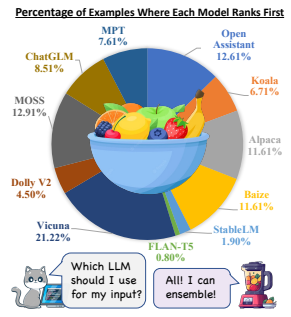
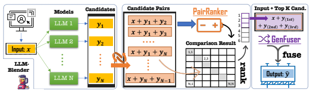
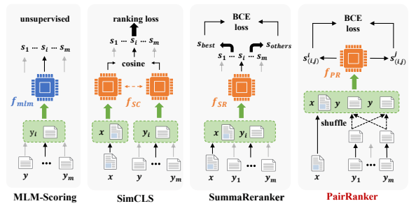
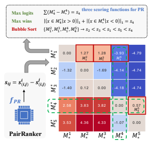

# Llm-Blender**: Ensembling Large Language Models** With Pairwise Ranking And Generative Fusion

Dongfu Jiang∑ Xiang Ren∫π **Bill Yuchen Lin**π dongfu@zju.edu.cn, xiangren@usc.edu, yuchenl@allenai.org πAllen Institute for Artificial Intelligence
∫University of Southern California ∑Zhejiang University

## Abstract

We present LLM-BLENDER, an ensembling framework designed to attain consistently superior performance by leveraging the diverse strengths of multiple open-source large language models (LLMs). Our framework consists of two modules: PAIRRANKER and GEN-
FUSER, addressing the observation that optimal LLMs for different examples can significantly vary. PAIRRANKER employs a specialized pairwise comparison method to distinguish subtle differences between candidate outputs. It jointly encodes the input text and a pair of candidates, using cross-attention encoders to determine the superior one. Our results demonstrate that PAIRRANKER exhibits the highest correlation with ChatGPT-based ranking. Then, GENFUSER aims to merge the top-ranked candidates, generating an improved output by capitalizing on their strengths and mitigating their weaknesses. To facilitate largescale evaluation, we introduce a benchmark dataset, MixInstruct, which is a mixture of multiple instruction datasets featuring oracle pairwise comparisons. Our LLM-BLENDER significantly outperform individual LLMs and baseline methods across various metrics, establishing a substantial performance gap. 1 2

## 1 Introduction

Large language models (LLMs) have shown impressive performance in diverse tasks, primarily due to their capacity to follow instructions and access extensive, high-quality data, showing a promising future for artificial general intelligence (Bubeck et al., 2023). However, prominent LLMs such as GPT-4 and PaLM (Chowdhery et al., 2022) are closed-source, restricting insights into their architectures and training data. Open-source LLMs like

Figure 1: **Motivation of ensembling LLMs.** Based on this pie chart about the percentage of examples where each LLM ranks 1st, we can see that optimal LLMs for different examples can significantly vary.

Pythia (Biderman et al., 2023), LLaMA (Touvron et al., 2023), and Flan-T5 (Chung et al., 2022) offer a chance to fine-tune these models on custom instruction datasets, enabling the development of smaller yet efficient LLMs, such as Alpaca, Vicuna (Chiang et al., 2023), OpenAssistant (LAION-
AI, 2023), and MPT (MosaicML, 2023).

The open-source LLMs exhibit diverse strengths and weaknesses due to variations in data, architectures, and hyperparameters, making them complementary to each other. Figure 1 illustrates the distribution of best LLMs on 5,000 instructions that we collected. More ranking details can be found in Sec. 5.1. Although Vicuna achieves the highest percentage, it ranks first in only 21.22% of the examples. Furthermore, the pie chart suggests that the optimal LLMs for different examples can significantly vary and there is no open-source LLM

1https://yuchenlin.xyz/LLM-Blender 2The experiments on summarization, translation, and constrained generation tasks in the prior version have been moved to the appendix. Instead, we mainly present our work in the context of instruction-following data and LLMs in this version.

Proceedings of the 61st Annual Meeting of the Association for Computational Linguistics Volume 1: Long Papers, pages 14165–14178 July 9-14, 2023 ©2023 Association for Computational Linguistics
that dominates the competition. Therefore, it is important to dynamically ensemble these LLMs to generate consistently better responses for each input. Considering the diverse strengths and weaknesses of LLMs, it is crucial to develop an ensembling method that harnesses their complementary potentials, leading to improved robustness, generalization, and accuracy. By combining their unique contributions, we can alleviate biases, errors, and uncertainties in individual LLMs, resulting in outputs better aligned with human preferences.

We introduce **LLM-BLENDER**, an ensembling framework designed to achieve consistently superior performance by mixing the outputs of multiple LLMs. LLM-BLENDER comprises two modules: PAIRRANKER and GENFUSER. Initially, PAIRRANKER compares the outputs from N LLMs, which GENFUSER then fuses to generate the final output from the top K ranked outputs.

Existing approaches (Ravaut et al., 2022a; Liu and Liu, 2021), including the reward model within InstructGPT (Ouyang et al., 2022), for ranking outputs {y1*,...,y*N } from language models (LMs) on a given input x have mostly focused on *individually* scoring each yi based on x, employing encoding modules in the form of si = f(*x, y*i). Although this list-wise ranking objective can be powerful and efficient when candidate differences are apparent, it may not be as effective when ensembling LLMs. Among the output candidates from LLMs, candidate differences can be quite *subtle*, as they are all produced by very sophisticated models and one may only be marginally better than another. Even for humans, it can be challenging to gauge candidate quality without direct comparison.

As a result, we propose a specialized *pairwise* comparison method, **PAIRRANKER** (Sec. 3), to effectively discern subtle differences between candidate outputs and enhance ranking performance. In particular, we first gather the outputs from N
models (e.g., the N = 11 models in Fig. 1) for each input and subsequently create the N(N  1)/2 pairs of their outputs. We jointly encode the input x and the two candidate outputs yi and yj as input to a cross-attention encoder (e.g., RoBERTa (Liu et al., 2019)), in the form of f(x, yi, yj), to learn and determine which candidate is better.

During the inference stage, we compute a matrix containing logits representing pairwise comparison results. Given this matrix, we can infer a ranking of the N outputs for the given input x.

Subsequently, we can employ the top-ranked candidate from PAIRRANKER for each input as the final result. Hence, this approach does not rely on a single model for all examples; instead, PAIR- RANKER selects the best model for each example by comprehensively comparing all candidate pairs.

Nonetheless, this approach may constrain the potential to generate even better outputs than the existing candidates. To investigate this possibility, we introduce the **GENFUSER** (Sec. 4) module to fuse the top K of the N ranked candidates and generate an improved output for end-users. Our goal is to capitalize on the strengths of the top K selected candidates while mitigating their weaknesses.

To assess the effectiveness of LLM ensembling methods, we introduce a benchmark dataset called MixInstruct (Sec. 2.2). In this dataset, we use N=11 popular open-source LLMs to generate N candidates for each input across various existing instruction-following tasks formatted as selfinstruct (Wang et al., 2022). The dataset comprises 100k training examples and 5k validation examples for training a candidate ranking module like our PAIRRANKER, and 5k test examples with oracle comparisons for automatic evaluation.

In Section 5, our empirical results on the MixInstruct benchmark reveal that the LLM-BLENDER framework significantly boosts overall performance by ensembling LLMs. The selections made by PAIRRANKER outperform any fixed individual LLM models, as indicated by superior performance in both reference-based metrics and GPT-Rank. By leveraging the top selections from PAIRRANKER, GENFUSER further enhances response quality through effective fusion into the final output. LLM-BLENDER achieves the highest scores in terms of both conventional metrics (i.e., BERTScore, BARTScore, BLUERT) and ChatGPT-based ranking. The average rank of LLM-BLENDER stands at 3.2 among the 12 methods, which is considerably better than the best LLM's rank of 3.90. Moreover, LLM-BLENDER's output ranks in the top 3 for 68.59% of examples, while Viccuna only reaches 52.88%. We believe LLM-BLENDER and our findings would benefit both practitioners and researchers for deploying and studying LLMs with ensemble learning.

## 2 Preliminaries

We first provide the problem formulation and two common types of ensembling methods. Next, we

 

 

Figure 2: The LLM-BLENDER **framework.** For each input x from users, we employ N different LLMs to get output candidates. Then, we pair all candidates and concatenate them with the input before feeding them to PAIRRANKER, producing a matrix as comparison results. By aggregating the results in the matrix, we can then rank all candidates and take the top K of them for generative fusion. The GENFUSER module concatenates the input x with the K top-ranked candidates as input and generate the final output yˆ.

present the dataset MixInstruct created for training and evaluation purposes. Finally, we give an overview of our framework.

#### 2.1 Problem Setup

Given an input x and N models, {M1*,...,*MN },
we can generate N candidate outputs by processing x with each model. We denote the candidates as Y = {y1*,...,y*N }. In the training data, we assume there is a ground truth output, y, while it remains hidden during evaluation at test time.

In practice, one might choose a fixed model, such as M9, to infer all unseen examples (i.e., always using y9 as the final output for x). This can be reasonable if M9 demonstrates significantly better overall performance on certain observed examples. However, relying on a pre-selected model may result in sub-optimal performance, as the N models likely possess different strengths and weaknesses in various situations, meaning that the optimal selection for different x values may not always originate from the same model.

Our objective is to develop an ensemble learning method that produces an output yˆ for the input x, maximizing the similarity Q(*y, y* ˆ ; x). The Q function can be implemented in various ways, which we will discuss later. We anticipate that this method will yield better overall performance than using a fixed model or randomly selecting a model for x.

Specifically, given a test set Dtest = {(x(i), y(i))},
we aim to maximize <i Q(yˆ
(i), y(i); x(i)).

There are two primary approaches for ensembling LLMs: selection-based and *generation-based* methods. Selection-based methods compare candidates in the set Y, selecting the top-ranked can-

| Sources        | #Examples   | Source   | I/O Tokens   |
|----------------|-------------|----------|--------------|
| Alpaca\-GPT4   | 22,862      | GPT\-4   | 22 / 48      |
| Dolly\-15K     | 7,584       | Human    | 24 / 53      |
| GPT4All\-LAION | 76,552      | ChatGPT  | 18 / 72      |
| ShareGPT       | 3,002       | ChatGPT  | 36 / 63      |
| Total          | 110K        | Mix      | 20 / 66      |

Table 1: Statistics of **MixInstruct**. It contains 110K examples and we randomly split the dataset into train/dev/test in 100K/5K/5K sizes.

didate as the final output yˆ, which implies that yˆ " Y. Due to the inherent nature of selection and the limited solution space, the performance of selection-based methods is bounded by the N candidates being considered. Conversely, generation-based methods focus on fusing K candidates (1 < K & N) from Y to produce an unseen response as the final output yˆ.

#### 2.2 Mixinstruct**: A New Benchmark**

We introduce a new dataset, MixInstruct, to benchmark ensemble models for LLMs in instruction-following tasks. We collect a largescale set of instruction examples primarily from four sources, as shown in Table 1. After curating and processing this open-source data, we sample 100k examples for training, 5k for validation, and 5k for testing. We then run N = 11 popular opensource LLMs, including Vicuna, OpenAssistant, Alpaca, MPT, and others (see Table 2 and Figure 1),
on these 110k examples.

To obtain the oracle ranking of candidates, we design comparative prompts for ChatGPT to evaluate all candidate pairs. Specifically, for each example, we prepare 55 pairs of candidates (11 ✓ 10/2).

For each pair, we ask ChatGPT to judge the better candidate (or declare a tie). The prompt template can be found in the appendix. For the training and validation sets, we provide the results based on conventional metrics like BERTScore, BLEURT, and BARTScore. In that case, we use function Q(yi, y)
to estimate a candidate yi's quality according to its similarity to the ground truth y.

## 2.3 Llm-Blender**: A Novel Framework**

We propose a rank-and-fuse pipeline framework, LLM-BLENDER, for ensembling LLMs, as illustrated in Figure 2. This framework consists of two main components: a pairwise ranking module, PAIRRANKER (Section 3), and a fusion module, GENFUSER (Section 4). The PAIRRANKER module learns to compare all pairs of candidates for each input and subsequently rank the list of candidates. We then select the top K = 3 ranked candidates, concatenate them with the input x, and construct the input sequence for the GENFUSER module. The GENFUSER module, a seq2seq LM, ultimately generates the final output to serve users.

## 3 Pairranker: Pairwise Ranking

In this section, we introduce three baseline methods for ranking the candidates in Y in Sec. 3.1 and present the proposed PAIRRANKER method.

#### 3.1 Baseline Methods

Previous reranking methods primarily focus on computing the score si = f(*x, y*i) for each candidate yi " Y independently, where si is solely determined by yi. Notably, the reward model in instruction tuning for GPT-3.5 (Ouyang et al., 2022) also belongs to this category. Figure 3 illustrates these baseline methods, which are further detailed in the following paragraphs.

MLM-Scoring (Salazar et al., 2020) assesses the quality of a candidate by calculating its pseudo-loglikelihood, which is obtained by masking tokens one by one and computing the log-likelihood for the masked token using masked LMs (e.g., BERT).

Given a candidate yi as a sequence of words W =
{w1*, ..., w*∂W∂}, the pseudo-log-likelihood is: si =
<∂W∂
t=1 log P(wt∂W\t). This unsupervised method is effective for reranking outputs in NLG tasks such as machine translation and speech recognition.

SimCLS (Liu and Liu, 2021) encodes the input x and each generated candidate yi " Y using the same encoder H, resulting in H(x) and H(yi). The cosine similarity between them, si =
cos (H(x), H(yi)), serves as the predicted score, as H(x) and H(yi) share the same embedding space induced by the language encoder. In training, marginal ranking loss is used to optimize H.

SummaReranker (Ravaut et al., 2022a) concatenates the input x and each candidate yi, using a cross-attention encoder to learn ranking. Specifically, they employ H([x; yi]) to predict the score si, where H is a Transformer model. In the training stage, binary cross-entropy (BCE) loss is employed to differentiate the best candidate from the others. Limitations. Despite using contrastive loss in training, these methods rely on individual scoring for inference. The encoders have not been exposed to pairs of candidates for direct comparison learning. We argue that such pointwise ranking methods may be insufficient for selecting the best candidates in the context of LLMs and instruction-following tasks. One reason is that the quality of LLM outputs is generally high when the chosen LLMs are popular and competitive. Moreover, the responses for instruction tasks can be quite open-ended, unlike summarization tasks. Therefore, merely examining individual candidates may not yield a reliable score. This issue becomes more prominent for shorter responses, where sequences may differ by only a few words but vary significantly in helpfulness, harmfulness, and fairness. Given these limitations, we contend that individual scoring approaches may fail to capture crucial nuances.

#### 3.2 Pairwise Comparisons

In order to address the limitations of pointwise ranking, we aim to train a ranker f with parameter that can compare a pair of output candidates by encoding them together with the input text. Our ranker module should focus on learning to capture the differences between the two candidates and prefer the ones of higher quality.

Given a pair of candidates yi, yj , we obtain their pair-specific scores: s i
(i,j) and s j
(i,j). We denote the model's confidence in thinking yi is better than yj as sij = s i
(i,j) 
 s j
(i,j). We can use these scores for all pairs induced from Y to infer the final ranking.

To learn this ability, we concatenate the input x and the two candidates to form a sequence [x; yi; yj ]
and feed it into a cross-attention Transformer to get the features: f([x; yi; yj ]) for modeling sij .

We assume multiple Q functions to optimize

Figure 3: **The architectures of typical reranking methods.** x is an input and ci is a certain candidate, and its score is si. MLM-Scoring is an unsupervised method that uses an external masked LM to score a candidate; SimCLS uses the same encoder to encode x and each candidate ci; SummaReranker instead employs a cross-encoder to encode both x and ci at the same time; Our proposed PAIRRANKER encodes a pair of candidates at the same time for pairwisely scoring them, and the final score of each candidate is produced as shown in Fig. 4.

for, such as BERTScore, BARTScore, etc., and consider the learning problem as a multi-task classification problem:

$${\mathcal{L}}_{Q}=-z_{i}\log\sigma(s_{(i,j)}^{i})-(1-z_{j})\log\sigma(s_{(i,j)}^{j}),$$

where  denotes the sigmoid function and

$$(z_{i},z_{j})=\begin{cases}(1,0),&Q(y_{i},y)\geq Q(y_{j},y)\\ (0,1),&Q(y_{i},y)<Q(y_{j},y)\end{cases}.$$

For optimizing towards multiple Q, we take the average as the final multi-objective loss: L = < LQ.

#### 3.3 Pairranker **Architecture**

We discuss the concrete designs for the PAIR-
RANKER module in this subsection. Encoding. We employ Transformer layers to encode an input and a pair of candidates, enabling the attentions to capture the difference between candidates in the context of the input. We concatenate the three segments sequentially and form a single input sequence with special tokens as separators: <source>, <candidate1>,
and <candidate2>. The resulting input sequences to Transformers are in the form of
"<s><source> x </s> <candidate1> yi
</s> <candidate2> yj </s>", where x is the text of a source input and yi and yj are the text of two output candidates. The embeddings of special tokens <source>, <candidate1>, and
<candidate2> are used as the representations of x, yi, and yj respectively, denoted as x, yi, yj. Training. To determine the scores for the two candidates, we concatenate the embeddings of x with yi and yj respectively, and pass them through a single-head layer, which is a multi-layer perceptron with the final layer's dimension equal to the number of Q functions to be optimized. Each value within this dimension represents a computed Q
score for a specific Q function. We derive the final score s i
(i,j) 
or s j
(i,j) 
for the candidate by averaging these Q scores. Since there are O(N2) unique pair combinations, we apply an effective sub-sampling strategy during the training stage to ensure learning efficiency.

During training, we randomly select some combinations from the candidate pool Y2, instead of all the N(N  1)/2 pairs. We also compare the target text with other candidates by extending the candidate pool by mixing the ground truth y into Y. In practice, we found that using 5 pairs per input is sufficient for obtaining decent results.

Due to the position embeddings of the language model, the order of the candidates in a pair (x, yi, yj) matters, as the comparison result of
(x, yi, yj) and (x, yj , yi) might not be consistent.

Thus, we shuffle the order of candidates within each training pair so that the model learns to be consistent with itself. Inference. During the inference stage, we obtain scores sij for each pair of candidates (yi, yj) " Y2.

After N(N  1) iterations, we obtain a matrix M,
where Mji = sij represents the *confidence* that yi is better than yj . To identify the best candidate based on M, we introduce three aggregation functions for determining the final ranking of Y.

We propose two scoring methods, MaxLogits and MaxWins, which utilize all elements in the matrix. Let Mòi and Mjò denote the i-th row and j-th column of the matrix as vectors. For each candidate yi, its MaxLogits score is defined as si = < (Mòi  Miò), while its MaxWins score is defined as si = ∂{sij " Mòi ∂sij > 0}∂ + ∂{sji "
Miò∂sji < 0}∂, where ∂∂ denotes the set size.

In essence, MaxLogits computes the confidence that yi is superior to all other candidates, whereas MaxWins calculates the number of victories in comparisons with other candidates.

However, these two methods necessitate O(N2)
iterations for N candidates, which can be computationally burdensome. Thus, we propose a more efficient aggregation method, performing *a single* bubble sort run with pairwise comparisons to select the best candidate. We first shuffle the order of candidates in Y to obtain a default order, and initialize the best candidate index k to 1. We iteratively update the best candidate index as follows:

$$k=\left\{\begin{matrix}k,&\mathbf{M}_{k}^{i}-\mathbf{M}_{i}^{k}>0\\ i,&\mathbf{M}_{i}^{k}-\mathbf{M}_{k}^{i}>0\end{matrix}\right.$$
.
After N  1 comparisons, we select yk as the best candidate. This method reduces the inference time complexity from O(N2) to O(N), aligning with previous pointwise methods.

Regardless of the aggregation method, we can rank all candidates in Y. Our experiments (shown in the appendix) reveal that MaxLogits yields the best performance, so we use MaxLogits as the default aggregator for PAIRRANKER.

## 4 Genfuser: Generative Fusion

The effectiveness of PAIRRANKER is constrained by the quality of selections from the candidate pool Y. We hypothesize that by merging multiple top-ranked candidates, we can overcome this

Figure 4: **Aggregation methods for PAIRRANKER.**

constraint. As these top candidates often showcase complementary strengths and weaknesses, it is plausible to generate a superior response by combining their advantages while mitigating their shortcomings. Our objective is to devise a generative model that takes input x and K top-ranked candidates {y1*, ..., y*K} L Y (e.g., K = 3) and produces an improved output yˆ as the final response.

To accomplish this, we present GENFUSER, a seq2seq approach for fusing a set of candidates conditioned on the input instruction to generate an enhanced output. Specifically, we concatenate the input and K candidates sequentially using separator tokens, such as <extra_id_i>, and fine-tune a T5-like model to learn to generate y. In practice, we employ Flan-T5-XL (Chung et al., 2022), which has 3b parameters, due to its superior performance and relatively smaller size.

## 5 Evaluation

#### 5.1 Setup

We use MixInstruct (Sec. 2.2) to conduct evaluation, and more results are in the appendix. NLG metrics. We employ two types of evaluation metrics (i.e., Q ). The first group is conventional automatic metrics for NLG tasks: BERTScore (Zhang et al., 2020b), BLEURT (Sellam et al., 2020), and BARTScore (Yuan et al., 2021). GPT-Rank. The second is based on prompting ChatGPT for pairwise comparisions on all candidates and decide their rank by the number of wins

| Category     | Methods                          | BERTScore   | BARTScore   | BLEURT   | GPT\-Rank⇤   | ' Vic(%)   | ' OA(%)   | Top\-3(%)   |
|--------------|----------------------------------|-------------|-------------|----------|--------------|------------|-----------|-------------|
|              | Open Assistant (LAION\-AI, 2023) | 74.68       | \-3.45      | \-0.39   | 3.90         | 62.78      | N/A       | 51.98       |
|              | Vicuna (Chiang et al., 2023)     | 69.60       | \-3.44      | \-0.61   | 4.13         | N/A        | 64.77     | 52.88       |
|              | Alpaca (Taori et al., 2023)      | 71.46       | \-3.57      | \-0.53   | 4.62         | 56.70      | 61.35     | 44.46       |
|              | Baize (Xu et al., 2023)          | 65.57       | \-3.53      | \-0.66   | 4.86         | 52.76      | 56.40     | 38.80       |
|              | MOSS (Sun and Qiu, 2023)         | 64.85       | \-3.65      | \-0.73   | 5.09         | 51.62      | 51.79     | 38.27       |
| LLMs         | ChatGLM (Du et al., 2022)        | 70.38       | \-3.52      | \-0.62   | 5.63         | 44.04      | 45.67     | 28.78       |
|              | Koala (Geng et al., 2023)        | 63.96       | \-3.85      | \-0.84   | 6.76         | 39.93      | 39.01     | 22.55       |
|              | Dolly V2 (Conover et al., 2023)  | 62.26       | \-3.83      | \-0.87   | 6.90         | 33.33      | 31.44     | 16.45       |
|              | Mosaic MPT (MosaicML, 2023)      | 63.21       | \-3.72      | \-0.82   | 7.19         | 30.87      | 30.16     | 16.24       |
|              | StableLM (Stability\-AI, 2023)   | 62.47       | \-4.12      | \-0.98   | 8.71         | 21.55      | 19.87     | 7.96        |
|              | Flan\-T5 (Chung et al., 2022)    | 64.92       | \-4.57      | \-1.23   | 8.81         | 23.89      | 19.93     | 5.32        |
|              | Oracle (BERTScore)               | 77.67       | \-3.17      | \-0.27   | 3.88         | 54.41      | 38.84     | 53.49       |
| Analysis     | Oracle (BLEURT)                  | 75.02       | \-3.15      | \-0.15   | 3.77         | 55.61      | 45.80     | 55.36       |
|              | Oracle (BARTScore)               | 73.23       | \-2.87      | \-0.38   | 3.69         | 50.32      | 57.01     | 57.33       |
|              | Oracle (GPT\-Rank)               | 70.32       | \-3.33      | \-0.51   | 1.00         | 100.00     | 100.00    | 100.00      |
| Rankers      | Random                           | 66.36       | \-3.76      | \-0.77   | 6.14         | 37.75      | 36.91     | 29.05       |
|              | MLM\-Scoring                     | 64.77       | \-4.03      | \-0.88   | 7.00         | 33.87      | 30.39     | 21.46       |
|              | SimCLS                           | 73.14       | \-3.22      | \-0.38   | 3.50         | 52.11      | 49.93     | 60.72       |
|              | SummaReranker                    | 71.60       | \-3.25      | \-0.41   | 3.66         | 55.63      | 48.46     | 57.54       |
|              | PairRanker                       | 72.97       | \-3.14      | \-0.37   | 3.20         | 54.76      | 57.79     | 65.12       |
| LLM\-BLENDER | PR (K = 3) + GF                  | 79.09       | \-3.02      | \-0.17   | 3.01         | 70.73      | 77.72     | 68.59       |

Table 2: Empirical results on MixInstruct. GPT-Rank are the most important metric.

(i.e., MaxWins aggregation). We name this GPT- based ranking metric with GPT-Rank. Model training. We use the DeBERTa (He et al., 2021) (400m) as the backbone for PAIRRANKER, and GENFUSER is based on Flan-T5-XL (3b).

According to our ablation studies, we choose to use BARTScore for its superior correlation with GPT-Rank as shown in 5.2.

#### 5.2 Main Results

In Table 2, we present the overall performance of N=11 LLMs as well as other methods on MixInstruct. In addition to the three auto metrics and GPT-Rank, we also show the percentage of examples where each method can produce outputs that are *better than or same good* as the two top LLMs, namely OpenAssistant ('OA) and Vicuna
('Vic), in terms of GPT-Rank.

LLMs have diverse strengths and weakness. The table presents the LLMs in a sorted order based on their average rank as determined by Chat- GPT (GPT-Rank). Among these models, Open Assistant, Vicuna, and Alpaca are the top-3 performers. Following them, three renowned LLMs, namely Baize, Moss, and ChatGLM, which have been fine-tuned using both Chinese and English instruction data, also exhibit impressive performance on MixInstruct. Conversely, Mosaic MPT, StableLM, and Flan-T5 rank at the bottom-3 in the evaluation. Nevertheless, the average GPT-Rank of top/bottom models maintain a noticeable distance from the first/last position (1 or 11), highlighting the importance of ensembling LLMs.

Top LLMs are not always good. It is evident that although OA and Vic perform remarkably well, there is still a substantial percentage of examples where other LLMs are considered to outperform them. For instance, despite Koala having an average GPT-Rank of 6.76, approximately 40% of the examples demonstrate that Koala produces responses that are better or equally as good as both OA and Vic. This further emphasizes the significance of employing our LLM-BLENDER framework for ranking and fusion purposes.

NLG Metrics. Moreover, we conduct a comprehensive analysis of the performance of oracle (top-1) selections based on each of the metrics themselves. The findings demonstrate that these selections also exhibit favorable performance across other metrics as well. For example, the oracle selections derived from **GPT-Rank** achieve a BARTScore of 3.33, surpassing that of OA
(3.45). Conversely, the oracle selections of BARTScore yield 3.69 in GPT-Rank, also significantly outperforming OA (3.90). This observation substantiates the rationality of using BARTScore to provide supervision for PAIRRANKER, which is also suggested by Table 3. PAIRRANKER **outperforms other rankers.** MLM-Scoring fails to outperform even random selection, highlighting the limitations of its unsupervised paradigm. On the contrary, SimCLS, SummaReranker, and PAIRRANKER exhibit su-

| Ranking Methods   | Pearson      | Spearman's   | Spearman's   |
|-------------------|--------------|--------------|--------------|
|                   | Correlation  | Correlation  | Footrule ⇤   |
| Random            | 0.00         | 0.00         | 48.27        |
| BLEU              | 28.70        | 26.92        | 33.57        |
| Rouge2            | 29.17        | 27.77        | 32.96        |
| BERTScore         | 32.25        | 30.33        | 33.34        |
| BLEURT            | 34.14        | 32.31        | 32.17        |
| BARTScore         | 38.49        | 36.76        | 30.93        |
| MLM\-Scoring      | \-0.02       | \-0.01       | 47.16        |
| SimCLS            | 39.89        | 38.13        | 29.32        |
| SummaReranker     | 41.13        | 39.10        | 29.69        |
| PairRanker        | 46.98        | 44.98        | 27.52        |

Table 3: The correlation between each ranking method and oracle ranking (GPT-Rank).

perior performance compared to the best model (OA) across BARTScore and GPT-Rank. Notably, the average GPT-rank of the responses selected by PAIRRANKER (3.20) significantly outperforms the best model by 0.70 (a 18% relative performance gain) and also all other rankers. Moreover, it achieves impressive results in metrics such as BARTScore (3.14) with a substantial advantage. PAIRRANKER's selections are better than or equal to Vic/OA on 54.76%/57.79% examples respectively, and ranks in top 3 for 65.12% examples. LLM-BLENDER **is the best.** We use top-3 selections from the PAIRRANKER and feed them as candidates for GENFUSER. Based on this integration, LLM-BLENDER demonstrates remarkable capabilities as expected. In terms of GPT-Rank, it achieves 3.01, surpassing both the best model OA (3.90) by a significant margin. The scores for BERTScore (79.09), BARTScore (3.02), and BELURT (0.17) all exceed the best model by 4.41, 0.43, and 0.22 respectively, showcasing substantial advantages. Moreover, LLM-BLENDER also performs well in surpassing the top two models, Vic (70.73) and OA (77.72), thereby complementing the weaknesses of PAIRRANKER. Ranking correlation. In addition to focusing solely on the top-1 selection of each ranker, we present a comprehensive analysis of the overall rank correlation among all the candidates with GPT-Rank (see Table 3). The correlation metrics used here include the Pearson Correlation Coefficient, Spearman's Correlation, and Spearman's Footrule distance(Diaconis and Graham, 1977).

It turns our that BARTScore gets the highest correlation with GPT-Rank against other metrics, which suggests we use BARTScore to provide supervision for training. For rankers, MLM-Scoring still falls short of outperforming random permutations. On the other side, SummaReranker demonstrates better correlation in terms of the Pearson Correlation (41.13) and Spearman's Correlation
(39.10), while SimCLS gets a better Spearman's Footrule distance (29.32) Notably, PAIRRANKER achieves the highest correlation with GPT-Rank across all correlation types, which is even way better than the BARTScore.

More analysis. We leave many other ablation studies and analyses in Appendix, where we apply PAIRRANKER to the three typical natural language generation (NLG) tasks: summarization
(CNN/DM), machine translation (WMT18-zh-en),
and constrained text generation (CommonGen).

We find that PAIRRANKER still outperforms other methods by a large margin in the context of using a single same base model to decode N candidates (with different algorithms). We also show that MaxLogits is much better than MaxWins and the bubble sort method is very cost-effective if the inference efficiency is a big concern.

## 6 Related Work

LLM evaluation As open-source large language models (LLMs) continue to flourish and demonstrate remarkable competitiveness across various natural language generation (NLG) tasks, assessing the capabilities of LLMs has become an exceedingly challenging endeavor. To address this issue, Zheng et al. (2023) pioneered the creation of a chatbot arena, enabling users to provide pairwise evaluations of responses generated by two randomly selected LLMs. Based on these evaluations, they established an LLM Elo rating leaderboard. In a similar vein, Cabrera and Neubig (2023) conducted an evaluation study on a customer service dataset, leveraging automated metrics such as BERTScore and ChrF. This approach yielded similar LLM ranking results. Not content with relying solely on human evaluation, (Yidong et al., 2023) developed a fine-tuned model called PandaLM to compare responses generated by different LLMs. Impressively, this model achieved a accuracy of 94% when compared against ChatGPT-based comparisons.

Pairwise ranking Pairwise ranking, known for its long-standing effectiveness, has demonstrated exceptional performance across a wide array of NLP tasks (Jamieson and Nowak, 2011). Notably, Ranknet (Burges et al., 2005) and LambdaRank (Burges, 2010) have emerged as powerful techniques for various ranking problems.

Furthermore, within the renowned RLHF procedure(Ouyang et al., 2022), these methods incorporate pairwise training of their reward model based on OPT. However, these approaches still compute scores individually and solely undergo pairwise training at the loss level. In contrast, our proposed PAIRRERANKER not only employs pairwise training but also utilizes the attention mechanism for pairwise inference during the inference stage. We posit that this approach better captures the subtleties between candidates and yields superior results, as demonstrated in Section 5.2. Ensemble learning Ensemble learning is a widely employed technique to enhance a model's capabilities by leveraging multiple weaker models (Sagi and Rokach, 2018; Anioł and Pietron´, 2019; Wang et al., 2016). Typically, ensembling is performed either by considering model weights or by combining diverse outputs. Recently, Izacard and Grave (2021) introduced a novel framework named Fusion-in-Decoder (FiD) to improve the quality of question answering by fusing retrieved text. Building upon FiD, Ravaut et al. (2022b) further investigated the effectiveness of fusion in the context of text summarization. However, they neglected to incorporate a selection process prior to feeding the candidates into the fuser, resulting in only moderate improvements. In contrast, our proposed approach, referred to as LLM-BLENDER, initially utilizes the PAIRRANKER algorithm to filter out candidates of poor quality. Subsequently, fusion is performed exclusively on the top-ranked candidates, leading to superior performance.

## 7 Conclusion & Future Directions

In this paper, we formulated the motivation to exploit the diverse strengths and weaknesses of open-source large language models (LLMs), aiming to create an ensembling framework that leverages their complementary capabilities to generate consistently superior results on various instructionfollowing tasks. By dynamically ensembling LLMs, we aimed to reduce biases, errors, and uncertainties in individual models, yielding outputs better aligned with human feedback.

Our major contributions are as follows:
- A new framework: **LLM-BLENDER** is a post-hoc ensemble learning method for ranking and fusing the outputs from multiple LLMs. It is composed of two modules:
PAIRRANKER and GENFUSER, and both are straightforward yet effective.

- A new dataset: **MixInstruct** is a benchmark dataset, created for training and evaluating LLM ensembling methods on instruction-following tasks.

- **Promising results:** We show that our method can significantly improve the overall results on various metrics, and our findings indicates that this direction is promising for both research community and practitioners.

- **Toolkit:** By open-sourcing our framework, we aim to make it easier for others to leverage our approach, enabling the development of more advanced AI systems that achieve robustness, generalization, and enhanced accuracy in a wide variety of tasks.

Future directions. Potential future directions include extending the LLM-BLENDER framework to more types of models or even non-text modalities, developing more sophisticated ranking and fusion techniques, and investigating the transferability of our ensembling approach to other domains and tasks. Additionally, exploring ways to minimize computational overhead and incorporating active learning strategies for rapid adaptation to new specialized domains and data sources represent fruitful areas for further research. Overall, our work underscores the value of combining the unique contributions of multiple models.

## *Limitations

Efficiency. To get the optimal performance from PAIRRANKER, one may need to call the model O(n 2
) times for getting the full matrix, thus resulting in a much less efficient solution. We attempted to resolve this limitation by proposing to use multiple rounds of bubble sort methods to reduce the number of inferences needed, and we find it works pretty well. We also want to argue that although the number of inferences can be large for obtaining the best performance with PAIRRANKER, those inferences can be executed in parallel because they are totally independent.

Human evaluation. We agree that automatic metrics have limitations. Human evaluation could provide us with more reliable and comprehensive evaluation results. However, due to the number of models as well as the amounts of generation candidates, we cannot afford large-scale human evaluation. We argue that our use of ChatGPT for evaluation is a good alternative, according to recent studies. Also, we would like to highlight that we show the ground truths when using ChatGPT to do pairwise comparisions, which is quite informative than the common practice.

## *Ethical Statement

This work fully complies with the ACL Ethics Policy. We declare that there are no ethical issues in this paper, to the best of our knowledge.

## Acknowledgements

We thank members of the INK lab at USC and the Mosaic team at AI2 for valuable feedback on this project. Xiang is supported in part by the Office of the Director of National Intelligence (ODNI),
Intelligence Advanced Research Projects Activity (IARPA), via the HIATUS Program contract
\#2022-22072200006, the DARPA MCS program under Contract No. N660011924033, the Defense Advanced Research Projects Agency with award W911NF-19-20271, NSF IIS 2048211, and gift awards from Google and Amazon. Yuchen's research was also supported by the Allen Institute for AI (AI2). The views and conclusions contained herein are those of the authors and should not be interpreted as necessarily representing the official policies, either expressed or implied, of ODNI, IARPA, or the U.S. Government.

#### References

Anna Anioł and Marcin Pietron. 2019. Ensemble ap- ´
proach for natural language question answering problem. *2019 Seventh International Symposium on* Computing and Networking Workshops (CANDARW), pages 180–183.

Stella Rose Biderman, Hailey Schoelkopf, Quentin G.

Anthony, Herbie Bradley, Kyle O'Brien, Eric Hallahan, Mohammad Aflah Khan, Shivanshu Purohit, USVSN Sai Prashanth, Edward Raff, Aviya Skowron, Lintang Sutawika, and Oskar van der Wal. 2023. Pythia: A suite for analyzing large language models across training and scaling. *ArXiv preprint*, abs/2304.01373.

Ondˇrej Bojar, Rajen Chatterjee, Christian Federmann, Yvette Graham, Barry Haddow, Shujian Huang, Matthias Huck, Philipp Koehn, Qun Liu, Varvara Logacheva, Christof Monz, Matteo Negri, Matt Post, Raphael Rubino, Lucia Specia, and Marco Turchi. 2017. Findings of the 2017 conference on machine translation (WMT17). In Proceedings of the Second Conference on Machine Translation, pages 169–214, Copenhagen, Denmark. Association for Computational Linguistics.

Sébastien Bubeck, Varun Chandrasekaran, Ronen Eldan, John A. Gehrke, Eric Horvitz, Ece Kamar, Peter Lee, Yin Tat Lee, Yuan-Fang Li, Scott M. Lundberg, Harsha Nori, Hamid Palangi, Marco Tulio Ribeiro, and Yi Zhang. 2023. Sparks of artificial general intelligence: Early experiments with gpt-4. *ArXiv preprint*, abs/2303.12712.

Christopher J. C. Burges. 2010. From ranknet to lambdarank to lambdamart: An overview.

Christopher J. C. Burges, Tal Shaked, Erin Renshaw, Ari Lazier, Matt Deeds, Nicole Hamilton, and Gregory N. Hullender. 2005. Learning to rank using gradient descent. In Machine Learning, Proceedings of the Twenty-Second International Conference (ICML 2005), Bonn, Germany, August 7-11, 2005, volume 119 of *ACM International Conference Proceeding* Series, pages 89–96. ACM.

Alex Cabrera and Graham Neubig. 2023. Zeno chatbot report. Blog post.

Wei-Lin Chiang, Zhuohan Li, Zi Lin, Ying Sheng, Zhanghao Wu, Hao Zhang, Lianmin Zheng, Siyuan Zhuang, Yonghao Zhuang, Joseph E. Gonzalez, Ion Stoica, and Eric P. Xing. 2023. Vicuna: An opensource chatbot impressing gpt-4 with 90%* chatgpt quality.

Aakanksha Chowdhery, Sharan Narang, Jacob Devlin, Maarten Bosma, Gaurav Mishra, Adam Roberts, Paul Barham, Hyung Won Chung, Charles Sutton, Sebastian Gehrmann, Parker Schuh, Kensen Shi, Sasha Tsvyashchenko, Joshua Maynez, Abhishek Rao, Parker Barnes, Yi Tay, Noam M. Shazeer, Vinodkumar Prabhakaran, Emily Reif, Nan Du, Benton C. Hutchinson, Reiner Pope, James Bradbury, Jacob Austin, Michael Isard, Guy Gur-Ari, Pengcheng Yin, Toju Duke, Anselm Levskaya, Sanjay Ghemawat, Sunipa Dev, Henryk Michalewski, Xavier García, Vedant Misra, Kevin Robinson, Liam Fedus, Denny Zhou, Daphne Ippolito, David Luan, Hyeontaek Lim, Barret Zoph, Alexander Spiridonov, Ryan Sepassi, David Dohan, Shivani Agrawal, Mark Omernick, Andrew M. Dai, Thanumalayan Sankaranarayana Pillai, Marie Pellat, Aitor Lewkowycz, Erica Moreira, Rewon Child, Oleksandr Polozov, Katherine Lee, Zongwei Zhou, Xuezhi Wang, Brennan Saeta, Mark Díaz, Orhan Firat, Michele Catasta, Jason Wei, Kathleen S. Meier-Hellstern, Douglas Eck, Jeff Dean, Slav Petrov, and Noah Fiedel. 2022. Palm: Scaling language modeling with pathways. *ArXiv preprint*, abs/2204.02311.

Hyung Won Chung, Le Hou, S. Longpre, Barret Zoph, Yi Tay, William Fedus, Eric Li, Xuezhi Wang, Mostafa Dehghani, Siddhartha Brahma, Albert Webson, Shixiang Shane Gu, Zhuyun Dai, Mirac Suzgun, Xinyun Chen, Aakanksha Chowdhery, Dasha Valter, Sharan Narang, Gaurav Mishra, Adams Wei Yu, Vincent Zhao, Yanping Huang, Andrew M.

Dai, Hongkun Yu, Slav Petrov, Ed Huai hsin Chi, Jeff Dean, Jacob Devlin, Adam Roberts, Denny Zhou, Quoc V. Le, and Jason Wei. 2022. Scaling instruction-finetuned language models. *ArXiv* preprint, abs/2210.11416.

Mike Conover, Matt Hayes, Ankit Mathur, Xiangrui Meng, Jianwei Xie, Jun Wan, Sam Shah, Ali Ghodsi, Patrick Wendell, Matei Zaharia, and Reynold Xin.

2023. Free dolly: Introducing the world's first truly open instruction-tuned llm.

Persi Diaconis and Ron Graham. 1977. Spearman's footrule as a measure of disarray. Journal of the royal statistical society series b-methodological, 39:262– 268.

Zhengxiao Du, Yujie Qian, Xiao Liu, Ming Ding, Jiezhong Qiu, Zhilin Yang, and Jie Tang. 2022. GLM: General language model pretraining with autoregressive blank infilling. In Proceedings of the 60th Annual Meeting of the Association for Computational Linguistics (Volume 1: Long Papers), pages 320–335, Dublin, Ireland. Association for Computational Linguistics.

Xinyang Geng, Arnav Gudibande, Hao Liu, Eric Wallace, Pieter Abbeel, Sergey Levine, and Dawn Song. 2023. Koala: A dialogue model for academic research. Blog post.

Pengcheng He, Jianfeng Gao, and Weizhu Chen. 2021.

Debertav3: Improving deberta using electra-style pretraining with gradient-disentangled embedding sharing. *ArXiv preprint*, abs/2111.09543.

Karl Moritz Hermann, Tomás Kociský, Edward Grefenstette, Lasse Espeholt, Will Kay, Mustafa Suleyman, and Phil Blunsom. 2015. Teaching machines to read and comprehend. In Advances in Neural Information Processing Systems 28: Annual Conference on Neural Information Processing Systems 2015, December 7-12, 2015, Montreal, Quebec, Canada, pages 1693– 1701.

Gautier Izacard and Edouard Grave. 2021. Leveraging passage retrieval with generative models for open domain question answering. In *Proceedings of the 16th* Conference of the European Chapter of the Association for Computational Linguistics: Main Volume, pages 874–880, Online. Association for Computational Linguistics.

Kevin G. Jamieson and Robert D. Nowak. 2011. Active ranking using pairwise comparisons. In Advances in Neural Information Processing Systems 24: 25th Annual Conference on Neural Information Processing Systems 2011. Proceedings of a meeting held 12-14 December 2011, Granada, Spain, pages 2240–2248.

LAION-AI. 2023. Open assistant. https://
github.com/LAION-AI/Open-Assistant.

Mike Lewis, Yinhan Liu, Naman Goyal, Marjan Ghazvininejad, Abdelrahman Mohamed, Omer Levy, Veselin Stoyanov, and Luke Zettlemoyer. 2020. BART: Denoising sequence-to-sequence pre-training for natural language generation, translation, and comprehension. In Proceedings of the 58th Annual Meeting of the Association for Computational Linguistics, pages 7871–7880, Online. Association for Computational Linguistics.

Bill Yuchen Lin, Wangchunshu Zhou, Ming Shen, Pei Zhou, Chandra Bhagavatula, Yejin Choi, and Xiang Ren. 2020. CommonGen: A constrained text generation challenge for generative commonsense reasoning. In Findings of the Association for Computational Linguistics: EMNLP 2020, pages 1823–1840, Online. Association for Computational Linguistics.

Yinhan Liu, Myle Ott, Naman Goyal, Jingfei Du, Mandar Joshi, Danqi Chen, Omer Levy, Mike Lewis, Luke Zettlemoyer, and Veselin Stoyanov. 2019. Roberta: A robustly optimized bert pretraining approach. *ArXiv preprint*, abs/1907.11692.

Yixin Liu and Pengfei Liu. 2021. SimCLS: A simple framework for contrastive learning of abstractive summarization. In *Proceedings of the 59th Annual* Meeting of the Association for Computational Linguistics and the 11th International Joint Conference on Natural Language Processing (Volume 2: Short Papers), pages 1065–1072, Online. Association for Computational Linguistics.

NLP Team MosaicML. 2023. Introducing mpt-7b: A
new standard for open-source, ly usable llms. Accessed: 2023-05-23.

Ramesh Nallapati, Bowen Zhou, Cicero dos Santos, Çaglar Gulçehre, and Bing Xiang. 2016. ˘ Abstractive text summarization using sequence-to-sequence RNNs and beyond. In Proceedings of the 20th SIGNLL Conference on Computational Natural Language Learning, pages 280–290, Berlin, Germany. Association for Computational Linguistics.

Long Ouyang, Jeff Wu, Xu Jiang, Diogo Almeida, Carroll L. Wainwright, Pamela Mishkin, Chong Zhang, Sandhini Agarwal, Katarina Slama, Alex Ray, John Schulman, Jacob Hilton, Fraser Kelton, Luke E. Miller, Maddie Simens, Amanda Askell, Peter Welinder, Paul Francis Christiano, Jan Leike, and Ryan J. Lowe. 2022. Training language models to follow instructions with human feedback. *ArXiv preprint*,
abs/2203.02155.

Colin Raffel, Noam Shazeer, Adam Roberts, Katherine Lee, Sharan Narang, Michael Matena, Yanqi Zhou, Wei Li, and Peter J. Liu. 2020. Exploring the limits of transfer learning with a unified text-to-text transformer. *J. Mach. Learn. Res.*, 21:140:1–140:67.

Mathieu Ravaut, Shafiq Joty, and Nancy Chen. 2022a.

SummaReranker: A multi-task mixture-of-experts re-ranking framework for abstractive summarization. In Proceedings of the 60th Annual Meeting of the Association for Computational Linguistics (Volume 1: Long Papers), pages 4504–4524, Dublin, Ireland.

Association for Computational Linguistics.

Mathieu Ravaut, Shafiq Joty, and Nancy Chen. 2022b.

Towards summary candidates fusion. In Proceedings of the 2022 Conference on Empirical Methods in Natural Language Processing, pages 8488–8504, Abu Dhabi, United Arab Emirates. Association for Computational Linguistics.

Omer Sagi and Lior Rokach. 2018. Ensemble learning:
A survey. Wiley Interdisciplinary Reviews: Data Mining and Knowledge Discovery, 8.

Julian Salazar, Davis Liang, Toan Q. Nguyen, and Katrin Kirchhoff. 2020. Masked language model scoring. In Proceedings of the 58th Annual Meeting of the Association for Computational Linguistics, pages 2699–2712, Online. Association for Computational Linguistics.

Thibault Sellam, Dipanjan Das, and Ankur Parikh. 2020.

BLEURT: Learning robust metrics for text generation. In Proceedings of the 58th Annual Meeting of the Association for Computational Linguistics, pages 7881–7892, Online. Association for Computational Linguistics.

Noam Shazeer and Mitchell Stern. 2018. Adafactor:
Adaptive learning rates with sublinear memory cost. In Proceedings of the 35th International Conference on Machine Learning, ICML 2018, Stockholmsmässan, Stockholm, Sweden, July 10-15, 2018, volume 80 of *Proceedings of Machine Learning Research*, pages 4603–4611. PMLR.

Stability-AI. 2023. Stablelm: Stability ai language models. https://github.com/ stability-AI/stableLM.

Tianxiang Sun and Xipeng Qiu. 2023. Moss. https:
//github.com/OpenLMLab/MOSS.

Rohan Taori, Ishaan Gulrajani, Tianyi Zhang, Yann Dubois, Xuechen Li, Carlos Guestrin, Percy Liang, and Tatsunori B. Hashimoto. 2023. Stanford alpaca: An instruction-following llama model. https://github.com/tatsu-lab/ stanford_alpaca.

Jörg Tiedemann and Santhosh Thottingal. 2020a.

OPUS-MT - building open translation services for the world. In Proceedings of the 22nd Annual Conference of the European Association for Machine Translation, pages 479–480, Lisboa, Portugal. European Association for Machine Translation.

Jörg Tiedemann and Santhosh Thottingal. 2020b.

OPUS-MT - building open translation services for the world. In Proceedings of the 22nd Annual Conference of the European Association for Machine Translation, pages 479–480, Lisboa, Portugal. European Association for Machine Translation.

Hugo Touvron, Thibaut Lavril, Gautier Izacard, Xavier Martinet, Marie-Anne Lachaux, Timothée Lacroix, Baptiste Rozière, Naman Goyal, Eric Hambro, Faisal Azhar, Aur'elien Rodriguez, Armand Joulin, Edouard Grave, and Guillaume Lample. 2023. Llama: Open and efficient foundation language models. ArXiv preprint, abs/2302.13971.

Benyou Wang, Jiabin Niu, Liqun Ma, Yuhua Zhang, Lipeng Zhang, Jingfei Li, Peng Zhang, and Dawei Song. 2016. A chinese question answering approach integrating count-based and embedding-based features. In *NLPCC/ICCPOL*.

Yizhong Wang, Yeganeh Kordi, Swaroop Mishra, Alisa Liu, Noah A. Smith, Daniel Khashabi, and Hannaneh Hajishirzi. 2022. Self-instruct: Aligning language model with self generated instructions. ArXiv preprint, abs/2212.10560.

Canwen Xu, Daya Guo, Nan Duan, and Julian McAuley.

2023. Baize: An open-source chat model with parameter-efficient tuning on self-chat data. *ArXiv* preprint, abs/2304.01196.

Wang Yidong, Yu Zhuohao, Zeng Zhengran, Yang Linyi, Heng Qiang, Wang Cunxiang, Chen Hao, Jiang Chaoya, Xie Rui, Wang Jindong, Xie Xing, Ye Wei, Zhang Shikun, and Zhang Yue. 2023. Pandalm: Reproducible and automated language model assessment. https://github.com/ WeOpenML/PandaLM.

Weizhe Yuan, Graham Neubig, and Pengfei Liu. 2021.

Bartscore: Evaluating generated text as text generation. In Advances in Neural Information Processing Systems 34: Annual Conference on Neural Information Processing Systems 2021, NeurIPS 2021, December 6-14, 2021, virtual, pages 27263–27277.

Jingqing Zhang, Yao Zhao, Mohammad Saleh, and Peter J. Liu. 2020a. PEGASUS: pre-training with extracted gap-sentences for abstractive summarization. In Proceedings of the 37th International Conference on Machine Learning, ICML 2020, 13-18 July 2020, Virtual Event, volume 119 of Proceedings of Machine Learning Research, pages 11328–11339. PMLR.

Tianyi Zhang, Varsha Kishore, Felix Wu, Kilian Q.

Weinberger, and Yoav Artzi. 2020b. Bertscore: Evaluating text generation with BERT. In 8th International Conference on Learning Representations, ICLR 2020, Addis Ababa, Ethiopia, April 26-30, 2020. OpenReview.net.

Lianmin Zheng, Ying Sheng, Wei-Lin Chiang, Hao Zhang, Joseph E. Gonzalez, and Ion Stoica. 2023. Chatbot arena: Benchmarking llms in the wild with elo ratings. Blog post.

#### Acl 2023 Responsible Nlp Checklist

A For every submission:
✓ A1. Did you describe the limitations of your work?

Limitations
✓ A2. Did you discuss any potential risks of your work?

Limitations
✓ A3. Do the abstract and introduction summarize the paper's main claims?

Abstract and Introduction and Conclusion
✗ A4. Have you used AI writing assistants when working on this paper?

Left blank.

B ✓ **Did you use or create scientific artifacts?**
Section 2
✓ B1. Did you cite the creators of artifacts you used?

mainly in Sec 4 B2. Did you discuss the license or terms for use and / or distribution of any artifacts?

Not applicable. Left blank.

✓ B3. Did you discuss if your use of existing artifact(s) was consistent with their intended use, provided that it was specified? For the artifacts you create, do you specify intended use and whether that is compatible with the original access conditions (in particular, derivatives of data accessed for research purposes should not be used outside of research contexts)? Section 2 B4. Did you discuss the steps taken to check whether the data that was collected / used contains any information that names or uniquely identifies individual people or offensive content, and the steps taken to protect / anonymize it?

Not applicable. Left blank.

✓ B5. Did you provide documentation of the artifacts, e.g., coverage of domains, languages, and linguistic phenomena, demographic groups represented, etc.? in Section 2
✓ B6. Did you report relevant statistics like the number of examples, details of train / test / dev splits, etc. for the data that you used / created? Even for commonly-used benchmark datasets, include the number of examples in train / validation / test splits, as these provide necessary context for a reader to understand experimental results. For example, small differences in accuracy on large test sets may be significant, while on small test sets they may not be.

Section 2 Table 1

# C ✓ **Did You Run Computational Experiments?**

4
✓ C1. Did you report the number of parameters in the models used, the total computational budget
(e.g., GPU hours), and computing infrastructure used? Appendix A
The Responsible NLP Checklist used at ACL 2023 is adopted from NAACL 2022, with the addition of a question on AI writing assistance.

✓ C2. Did you discuss the experimental setup, including hyperparameter search and best-found hyperparameter values? 4
✓ C3. Did you report descriptive statistics about your results (e.g., error bars around results, summary statistics from sets of experiments), and is it transparent whether you are reporting the max, mean, etc. or just a single run? 4
✓ C4. If you used existing packages (e.g., for preprocessing, for normalization, or for evaluation), did you report the implementation, model, and parameter settings used (e.g., NLTK, Spacy, ROUGE, etc.)? appendix E Metrics D ✗ **Did you use human annotators (e.g., crowdworkers) or research with human participants?**
Left blank.

 D1. Did you report the full text of instructions given to participants, including e.g., screenshots, disclaimers of any risks to participants or annotators, etc.?

Not applicable. Left blank.

 D2. Did you report information about how you recruited (e.g., crowdsourcing platform, students)
and paid participants, and discuss if such payment is adequate given the participants' demographic
(e.g., country of residence)? Not applicable. Left blank.

 D3. Did you discuss whether and how consent was obtained from people whose data you're using/curating? For example, if you collected data via crowdsourcing, did your instructions to crowdworkers explain how the data would be used?

Not applicable. Left blank.

 D4. Was the data collection protocol approved (or determined exempt) by an ethics review board?

Not applicable. Left blank.

 D5. Did you report the basic demographic and geographic characteristics of the annotator population that is the source of the data?

Not applicable. Left blank.