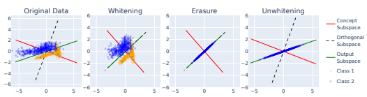
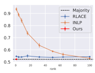
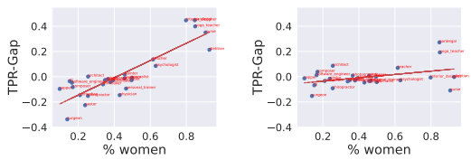
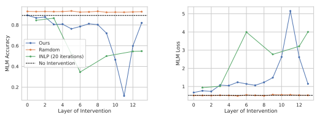

# Leace: Perfect Linear Concept Erasure In Closed Form

Nora Belrose1 David Schneider-Joseph1 Shauli Ravfogel2 **Ryan Cotterell**3 Edward Raff4 **Stella Biderman**1,4 1EleutherAI
2Bar-Ilan University 3ETH Zürich 4Booz Allen Hamilton nora,stella@eleuther.ai

## Abstract

Concept erasure aims to remove specified features from a representation. It can improve fairness (e.g. preventing a classifier from using gender or race) and interpretability (e.g. removing a concept to observe changes in model behavior). We introduce LEAst-squares Concept Erasure (LEACE), a closed-form method which provably prevents all linear classifiers from detecting a concept while changing the representation as little as possible, as measured by a broad class of norms. We apply LEACE to large language models with a novel procedure called "concept scrubbing,"
which erases target concept information from *every* layer in the network. We demonstrate our method on two tasks: measuring the reliance of language models on part-of-speech information, and reducing gender bias in BERT embeddings.

Code is available at https://github.com/EleutherAI/concept-erasure.

## 1 Introduction

The ability to prevent a machine learning system from using a specified concept is important for fairness and interpretability. Popular notions of fairness require that protected attributes should not causally affect predictions [25, 29], and interpretability research often estimates the causal effect of a concept by attempting to remove it from a model's internal representations [11, 35, 28, 6, 19]. What it means for a model M to "use" a concept Z is often vague and application-specific, but a necessary condition is that its outputs—and therefore its inputs and hidden states—should have significant *mutual information* with Z.

1 **Concept erasure** leverages this fact to limit M's use of Z
without finetuning or inspecting its parameters. Instead, we edit the input or hidden states X used by M to minimize the predictive V-information IV (X → Z) [50], a tractable lower bound on the mutual information I(X; Z) which measures the degree to which classifiers from the family V can predict Z. Intuitively, if no classifier in V can outperform a constant function at predicting Z—a condition known as **guardedness**—then M can't use Z either, at least if V is expressive enough relative to M. In this work, we improve upon existing concept erasure techniques using a theory-driven approach.

We focus on the case where V is the set of linear classifiers, and prove a previously unnoticed equivalence: a classification task is linearly guarded *if and only if* every class has exactly the same mean feature vector (§ 3). Leveraging this equivalence, we derive a simple necessary and sufficient condition for an affine transformation to produce linearly guarded features. We then identify the unique *surgical* transformation in this family—the one that minimizes the mean squared distance from the original features with respect to all norms induced by inner products, including the popular Euclidean and Mahalanobis norms. We name it **LEAst-squares Concept Erasure (LEACE)** (§ 4).

1This follows from the fact that causal dependence is a special kind of statistical dependence [31]. By the data processing inequality, M's output can't have any more information about Z than its input or hidden states.
While prior work has focused on preventing linear models from leveraging Z, we aim to erase concepts from deep neural networks as well. Interpretability research has shown that networks can be usefully described as encoding features in linear subspaces [12, 27, 48], suggesting that fundamentally nonlinear methods may not be necessary for successful erasure in DNNs.2In light of this, we introduce a simple procedure called **concept scrubbing** (§ 6), which sequentially applies LEACE to the intermediate representations at each layer of a deep network. We empirically validate our proposals, demonstrating the superiority of LEACE for erasing gender bias from BERT representations (§ 5.2), and using concept scrubbing to measure the extent to which large language models use part-of-speech information (§ 6).

## 2 Preliminaries

Consider a k-class classification task over jointly defined random vectors X (the input data) and Z (the one-hot labels), taking values in R
dand Z = {(z1, . . . zk) ∈ {0, 1}
k Pk j=1 zj = 1}
3respectively, with E∥X∥ < ∞ and each P(Z = j) > 0, and a predictor η(·; θ) : R
d → R
k, chosen from a function class V = {η(·; θ) | θ ∈ Θ} (presumed to contain all constant functions) so as to minimize the expectation E-L(η(X), Z)of some L : R
k *× Z →* [0, ∞) in a class L of loss functions.

### 2.1 Guardedness

We borrow the concept of **guardedness** from Ravfogel et al. [36], who define it in terms of V-
information [50]. We opt for a slightly more general definition here, which is equivalent to theirs in the case of cross-entropy loss (see Appendix F). Definition 2.1 (Guardedness). Let X, Z, V, and L be as defined as above, and let χ be the set of all jointly defined random vectors of finite first moment taking values in R
d*. We say* X (V, L)−*guards* Z
if, for all losses L ∈ L*, it maximizes the minimum expected loss:*

$$\mathrm{\boldmath~X~}\in\operatorname*{argmax}_{\mathrm{\boldmath~X^{\prime}\in\mathrm{\boldmath~X~}}}\operatorname*{inf}_{\theta\in\Theta}\;\mathbb{E}\Big[{\mathcal{L}}(\eta(\mathrm{\boldmath~X^{\prime};\theta~}),\mathrm{\boldmath~Z~})\Big].$$

In other words, its conditional distribution P(X|Z = ·) is among the worst possible distributions for predicting Z from X using a predictor of the form η(·; θ) ∈ V *and a loss function in* L.

Definition 2.2 (Trivially Attainable Loss). The **trivially attainable loss** for labels Z and loss L is the lowest possible expected loss available to a constant predictor η(x) = b:

$L_\tau=\inf\limits_{\mathbf{b}\in\mathbb{R}^k}\mathbb{E}[\mathcal{L}(\mathbf{b},\mathbf{Z})]$. 
b∈Rk
We will sometimes write it L
(Z,L)
τ in cases of possible ambiguity. If there is a specific constant predictor actually achieving this loss, we call it the *trivial predictor* ητ = η
(Z,L)
τ .

We examine this problem in the important case of loss functions L : R
k *× Z →* [0, ∞) which are convex in the prediction η(x), and linear predictors that take the functional form η(x; b,W) =
b + Wx, for some bias b ∈ R
kand weight matrix W ∈ R
k×d.

Definition 2.3 (Linear Guardedness). If X (V, L)-guards Z, where L is the class of nonnegative loss functions which are convex in their first argument, and V *is the class of linear predictors* η(x) = b + Wx, we say that X *linearly guards* Z.

### 2.2 Statistical Parity

To measure the effect of linear guardedness on main-task classifiers, we use the following minimal definition of "fairness" with respect to an attribute, adapted from Edwards and Storkey [9]. Definition 2.4 (Statistical Parity). Let X and Z be defined as above, and let f be a function with domain R
d. Then f exhibits **statistical parity** with respect to Z *when evaluated on* X if

∀z ∈ Z : E[f(X)|Z = z] = E[f(X)].

2We do not wish to make metaphysical claims about whether neural networks "truly" encode information linearly or nonlinearly. Following Cao [4], we take a pragmatist stance: what matters is that tools built under a linear feature assumption are often useful in practice [1, 20, 46].

3We frequently use the integer j ≤ k to refer to the element of Z which is 1 at the j th index and 0 elsewhere.

## 3 Theoretical Results

Our primary theoretical result is that the following conditions are all equivalent:
1. The data X linearly guards the labels Z. (Definition 2.3) 2. For all convex losses L, the trivially attainable loss is optimal on (X, Z). (Definition 2.2)
3. The class-conditional mean vectors E[X|Z = i] are equal to the unconditional mean E[X].

4. Every component of X has zero covariance with every component of Z. 5. Every linear classifier evaluated on X exhibits statistical parity w.r.t. Z (Definition 2.4).

The equivalence of conditions 1 and 2 is relatively straightforward to show, and the relevant theorems can be found in Appendix B. The other equivalences are proven below.

### 3.1 Equality Of Class Centroids Implies Linear Guardedness

The following result establishes the implication from condition 3 to condition 2.

Theorem 3.1. Suppose L is convex in the linear prediction η*. Then if each class-conditional mean* E
-X|Z = iis equal to E-X*, the trivially attainable loss cannot be improved upon.*
Proof. Let η(x) = b+Wx be any linear predictor. By Jensen's inequality4, the loss with η evaluated on X is lower bounded by the loss with η evaluated on the unconditional mean of the data E-X:

hL(η, Z)i= EZ hE hL(η, Z)Z ii ≥ EZ hL E E -ηZ, Z = EZ hL b + WE-XZ, Z = EZ hL b + WE-X, Z
i (Jensen's inequality)
(Jensen's inequality)  > (linearity of $\eta$) > ... 

(by assumption) $\theta$. 
i (linearity of η)

i. (by assumption)
This in turn is the loss of the constant predictor η
′(x) = b + WE-X.

Since the trivially attainable loss is the best that can be done by a constant predictor, and we have just seen that *every* predictor's loss is lower bounded by that of some constant predictor, we cannot improve upon the trivially attainable loss.

Intuitively, this shows that the classifier's expected loss is lower-bounded by the loss it would receive if each data point were replaced with the centroid of its class. But, if these centroids are all equal, the loss can't be any lower than what we'd get if every data point were replaced with the *global* mean E[X]. In that case, the data points are indistinguishable and we can't do better than W = 0.

### 3.2 Linear Guardedness Implies Equality Of Class Centroids

We now prove the implication from condition 2 to condition 3. Condition 2 applies when the trivially attainable loss is optimal for all convex losses, including cross-entropy loss in particular. And if it holds for cross-entropy loss, we now show that condition 3—the class centroids are equal—must follow. First a more general lemma:
Lemma 3.2. Suppose L has bounded partial derivatives, which when off-category never vanish and do not depend on the category, i.e. ∂L(η, z1)/∂ηi = ∂L(η, z2)/∂ηi ̸= 0 for all categories z1, z2 ̸= i.

If E-L(η, Z)*is minimized among linear predictors by the constant predictor* η(x) = b
∗ + W∗x with W∗ = 0*, then each class-conditional mean* E-X|Z = i*is equal to* E-X.

4Specifically, its generalization to convex functions over R
k. See [13] p. 76.
Proof. The first-order optimality condition on the i th component of our parameters b and W yields the equations:

$$\mathbb{E}\left[{\frac{\partial{\mathcal{L}}(\eta,\mathbf{Z})}{\partial\eta_{i}}}\cdot{\frac{\partial\eta_{i}}{\partial b_{i}}}\right]=0\quad{\mathrm{and}}\quad\mathbb{E}\left[{\frac{\partial{\mathcal{L}}(\eta,\mathbf{Z})}{\partial\eta_{i}}}\cdot{\frac{\partial\eta_{i}}{\partial\mathbf{W}_{1}}}\right]=\mathbf{0},$$

where we have used the boundedness of L's partial derivative and the finite first moment of ∂ηi
∂bi
= 1 and ∂ηi
∂Wi
= X to justify (via the Dominated Convergence Theorem) interchanging the derivative with the expectation.

Since η is constant over all values of X, and ∂ηi
∂bi
= 1, the first equation in (1) reduces to:

$$\mathbb{P}(\mathbf{Z}=i){\frac{\partial{\mathcal{L}}(\eta,i)}{\partial\eta_{i}}}+\mathbb{P}(\mathbf{Z}\neq i){\frac{\partial{\mathcal{L}}(\eta,\neq i)}{\partial\eta_{i}}}=0,$$

where ∂L(η,̸=i)
∂ηiis an abuse of notation denoting the off-category partial derivative, emphasizing its independence of the category Z.

Similarly, the constancy of η and the fact that ∂ηi

$$\quad(1)$$
$$\left(2\right)$$
$$({\mathfrak{I}})$$

= X reduces the second equation in (1) to:

∂Wi
$$\mathbb{P}(\mathrm{Z}=i){\frac{\partial{\mathcal{L}}(\eta,i)}{\partial\eta_{i}}}\cdot\mathbb{E}\big[\mathrm{X}\big|\mathrm{Z}=i\big]+\mathbb{P}(\mathrm{Z}\neq i){\frac{\partial{\mathcal{L}}(\eta,\neq i)}{\partial\eta_{i}}}\cdot\mathbb{E}\big[\mathrm{X}\big|\mathrm{Z}\neq i\big]=\mathbf{0}.$$
Solving for P(Z = i)
∂L(η,i)
∂ηiin (2) and substituting in (3) gives us:

$$\mathbb{P}(\mathbf{Z}\neq i){\frac{\partial{\mathcal{L}}(\eta,\neq i)}{\partial\eta_{i}}}\cdot\left(\mathbb{E}\big[\mathbf{X}|\mathbf{Z}\neq i\big]-\mathbb{E}\big[\mathbf{X}|\mathbf{Z}=i\big]\right)=\mathbf{0}.$$

If P(Z ̸= i) = 0, then E[X] = E[X|Z = i] is trivially true. Otherwise, using the non-vanishingness of the off-category partial derivative ∂L(η,̸=i)
∂ηi, division yields the equivalence of E-XZ = ito E
-XZ ̸= i, and hence to the unconditional mean E-X.

We now show that Lemma 3.2 applies to the widely used cross entropy loss:
Theorem 3.3. *If the class probabilities* P(Z = j) are all nonzero, and the trivially obtainable loss is optimal for categorical cross-entropy loss L(*η, z*) = − log P
exp(ηz)
k i=1 exp(ηi)
, then each class has the same mean E-XZ = z.

Proof. In this case, the trivial predictor ητ (Z)j = log(P(Z = j)) exists, achieving the trivially obtainable loss, which we have assumed optimal. Furthermore, L has on-category partial derivative ∂L(η, i)/∂ηi = exp(ηi)/Pk j=1 exp(ηj ) − 1 ∈ (−1, 0], and nonvanishing off-category partial derivative ∂L(η, ̸= i)/∂ηi = exp(ηi)/Pk j=1 exp(ηj ) ∈ (0, 1], both bounded, so the conditions of Lemma 3.2 apply.

#### 3.3 Linearly Guarded Labels Have Zero Covariance With The Features

The next theorem establishes the equivalence of conditions 3 and 4.

Theorem 3.4. Let X *be a random vector taking values in* R
d with finite first moment, and Z a random vector taking values in {0, 1}
k *with one-hot encoding, with each class probability* P(Z = j) *being* nonzero. Then the class-conditional means E[X|Z = j] *are all equal to the unconditional mean* E[X] if and only if every component of X has zero covariance with every component of Z*, i.e. the* cross-covariance matrix ΣXZ*, whose* (i, j)
th *entry is* Cov(Xi, Zj ), is the zero matrix.

Proof. Since Z is one-hot, we can rewrite the (*i, j*)
th entry of ΣXZ as:

$$\mathbb{E}[\mathrm{X}_{i}\mathrm{Z}_{j}]-\mathbb{E}[\mathrm{X}_{i}]\mathbb{E}[\mathrm{Z}_{j}]=\mathbb{P}(\mathrm{Z}=j)\Big{(}\mathbb{E}[\mathrm{X}_{i}|\mathrm{Z}=j]-\mathbb{E}[\mathrm{X}_{i}]\Big{)}.$$
: $\mathbb{E}[\mathbf{X}_i|\mathbf{Z}=j]=\mathbb{E}[\mathbf{X}_i]$ if a. 
As P(Z = j) > 0, it follows that E[Xi|Z = j] = E[Xi] if and only if Cov(Xi, Zj ) = 0.

$$\mathbf{X}_{i},\mathbf{Z}_{j})=0.$$
$\square$

### 3.4 Linear Guardedness Is Equivalent To Linear Statistical Parity

This last theorem establishes the equivalence of conditions 3 and 5. Theorem 3.5. Let X and Z *be defined as above. Then every linear predictor* f(x) = b + Wx exhibits statistical parity w.r.t. Z when evaluated on X *if and only if each class-conditional mean* E
-X|Z = z*is equal to* E-X.

Proof. Suppose each class-conditional mean E-X|Z = zis equal to E-X. Then by the linearity of expectation, we have for all z ∈ Z:
E[f(X)|Z = z] = E[WX + b|Z = z] = WE[X|Z = z] + b = WE[X] + b = E[f*(X)]*.

This matches the definition of statistical parity provided in Definition 2.4. Conversely, suppose every linear predictor f(x) = b + Wx exhibits statistical parity w.r.t. Z when evaluated on X. Then this holds for the identity function id(x) = x, and thus for all z ∈ Z:

$\mathbb{E}[\text{X}|\text{Z}=z]=\mathbb{E}[\text{id}(\text{X})|\text{Z}=z]=\mathbb{E}[\text{id}(\text{X})]=\mathbb{E}[\text{X}]$. 
$\square$
We have thus established the equivalence of all five conditions stated earlier.

## 4 Least-Squares Concept Erasure

In Section 3 we saw that X linearly guards Z if and only if each component of X has zero covariance with each component of Z. We will now characterize the set of affine transformations r(x) = Px+b such that r(X) linearly guards Z.

Theorem 4.1. Let X and Z *be random vectors taking values in* R
d and R
krespectively, with X of finite first moment. Then given some affine function r(x) = Px + b*, the modified random vector* r(X) linearly guards Z if and only if the columns of the cross-covariance matrix ΣXZ *are contained* in the null space of P. Proof. From Theorem 3.4 we know that r(X) linearly guards Z if and only if Cov(r(X), Z) is the zero matrix. By the linearity property of cross-covariance, we have:
0 = Cov(r(X), Z) = Cov(PX + b, Z) = PCov(X, Z) = PΣXZ.

Therefore, r(X) linearly guards Z if and only if ker(P) ⊇ colsp(ΣXZ). Implications for prior work. Notably, the above theorems imply that three previously proposed methods in the literature, Spectral Attribute Removal (SAL) [41], Mean Projection [18], and Fair PCA [23], are guaranteed to achieve linear guardedness given suitable hyperparameters. See Appendix C for further discussion.

### 4.1 Derivation Of Leace

Theorem 4.1 is a very weak condition, which is far from identifying unique values for P and b. In most applications, however, we'd like to make a "small" edit to X so that useful information contained in X is maximally preserved. We operationalize the notion of a small edit in terms of the mean squared norm E∥r(X) − X∥
2M defined by some positive-definite inner product M.

5 While we are primarily interested in the Euclidean (M = I) and Mahalanobis (M = Σ
+
XX) norms, it will turn out that there is a *single* erasure function that minimizes all such norms simultaneously. We will see in Section 6 that ensuring edits are small in this sense provides substantial benefit to downstream task performance as compared to other methods which also guard the labels Z. Below, we derive the optimal eraser under the assumption that X and Z are centered. In Appendix D, we derive an alternative, almost surely equivalent formulation, in the setting of the Hilbert space of centered random variables.

5Our proofs also include degenerate "inner products" where M is singular, and the associated seminorms.
$\square$
Theorem 4.2. Let X and Z *be centered random vectors taking values in* R
d and R
k*respectively, each* of finite second moment. Let M ∈ R
d×d be a p.s.d. matrix defining a (possibly degenerate) inner product on R
d: ⟨x, y⟩M = x TMy*. Let* ΣXX ∈ R
d×d be X*'s covariance matrix, and* ΣXZ ∈ R
d×k be the cross-covariance matrix of X and Z. Let A+ denote the Moore-Penrose pseudoinverse of a matrix A, and let A1/2 be the p.s.d. square root of a p.s.d. matrix A*. Then the objective*

$$\begin{array}{r l}{\operatorname{argmin}_{\mathbf{P}\in\mathbb{R}^{d\times d}}\mathbb{E}{\Big[}{\big|}\|\mathbf{P}\mathbf{X}-\mathbf{X}{\big|}_{\mathbf{M}}^{2}{\Big]}}&{{}{\mathrm{subject~to~Cov}}(\mathbf{P}\mathbf{X},\mathbf{Z})=\mathbf{0}}\end{array}$$

has the following solution:

$$\mathbf{P}^{*}=\mathbf{I}-\mathbf{W}^{+}\mathbf{P}_{\mathbf{W}\mathbf{E}_{\mathrm{x}\mathrm{z}}}\mathbf{W},$$

where W *is the whitening transformation* (Σ
1/2 XX)
+ and PWΣXZ = (WΣXZ)(WΣXZ)
+ is the orthogonal projection matrix onto colsp(WΣXZ).

Proof. First note that for any centered random vector A with covariance matrix ΣAA we have by linearity E∥A∥
22 =Pi E[a 2 i
] = Pi Var[ai] = tr(ΣAA). Also recall that any p.s.d. inner product ⟨x, y⟩M is equivalent to the Euclidean inner product between M1/2x and M1/2y; that is
⟨x, y⟩M = x TMy = (M1/2x)
TM1/2y. We use these facts to rewrite the objective as

$\mathbb{E}\|(\mathbf{P}-\mathbf{I})\mathbf{X}\|_{\mathbf{M}}^{2}=\mathbb{E}\|\mathbf{M}^{1/2}(\mathbf{P}-\mathbf{I})\mathbf{X}\|_{2}^{2}=\mathrm{tr}\Big{[}\mathbf{M}^{1/2}(\mathbf{P}-\mathbf{I})\mathbf{\Sigma}_{\mathrm{XX}}(\mathbf{P}-\mathbf{I})^{T}\mathbf{M}^{1/2}\Big{]}$.  
We enforce the constraint PΣXZ = 0 using a d × k matrix of Lagrange multipliers Λ, adding the Frobenius inner product ⟨Λ, PΣXZ⟩F =Pi Pj
(Λ)ij (PΣXZ)ij = tr(ΛT PΣXZ) to the objective.

We now have the Lagrangian

$$\mathcal{L}(\mathbf{P})=\text{tr}\big{(}\mathbf{M}^{1/2}(\mathbf{P}-\mathbf{I})\mathbf{\Sigma}_{\text{XX}}(\mathbf{P}-\mathbf{I})^{T}\mathbf{M}^{1/2}\big{)}+\text{tr}(\mathbf{\Lambda}^{T}\mathbf{P}\mathbf{\Sigma}_{\text{XZ}})$$ $$=\text{tr}\Big{(}\big{(}\mathbf{M}^{1/2}\mathbf{P}\mathbf{\Sigma}_{\text{XX}}^{1/2}-\mathbf{M}^{1/2}\mathbf{\Sigma}_{\text{XX}}^{1/2}\big{)}\big{(}\mathbf{M}^{1/2}\mathbf{P}\mathbf{\Sigma}_{\text{XX}}^{1/2}-\mathbf{M}^{1/2}\mathbf{\Sigma}_{\text{XX}}^{1/2}\big{)}^{T}\Big{)}+\text{tr}(\mathbf{\Lambda}^{T}\mathbf{P}\mathbf{\Sigma}_{\text{XZ}}).$$

To differentiate L, we use trace derivative formulas from Petersen et al. [32]. For the first term we use

$${\frac{d}{d\mathbf{X}}}\mathrm{tr}\big[(\mathbf{A}\mathbf{X}\mathbf{B}+\mathbf{C})(\mathbf{A}\mathbf{X}\mathbf{B}+\mathbf{C})^{T}\big]=2\mathbf{A}^{T}(\mathbf{A}\mathbf{X}\mathbf{B}+\mathbf{C})\mathbf{B}^{T},$$
where ${\bf A}={\bf M}^{1/2}$, ${\bf X}={\bf P}$, ${\bf B}=\Sigma_{\rm XX}^{1/2}$, ${\bf C}=-{\bf M}^{1/2}\Sigma_{\rm XX}^{1/2}$. This yields  $$2{\bf M}^{1/2}({\bf M}^{1/2}{\bf P}\Sigma_{\rm XX}^{1/2}-{\bf M}^{1/2}\Sigma_{\rm XX}^{1/2})\Sigma_{\rm XX}^{1/2}=2({\bf MP}\Sigma_{\rm XX}-{\bf M}\Sigma_{\rm XX})=2{\bf M}({\bf P}-{\bf I})\Sigma_{\rm XX}.$$

For the second term, we use the cyclic property of trace to rewrite it as tr(PΣXZΛT). Then we apply the identity d dA
tr(AB) = BT, with A = P, B = ΣXZΛT, yielding ΛΣTXZ.

We now solve for P as a function of the Lagrange multipliers Λ. When dL

$$(4)^{\frac{1}{2}}$$

vanishes, we have

dP
0 = 2M(P − I)ΣXX + ΛΣTXZ MΣXX − 1 2 ΛΣTXZ = MPΣXX.
Full rank case. In the case where M, ΣXX, and ΣTXZΣ
+
XXΣXZ are full rank, we have

$$\mathbf{P}=\mathbf{I}-{\frac{1}{2}}\mathbf{M}^{+}\mathbf{\Lambda}\mathbf{\Sigma}_{\mathrm{XZ}}^{T}\mathbf{\Sigma}_{\mathrm{XX}}^{+},$$
XX, (4)
because we can cancel the r.h.s. M and ΣXX terms with M+ and Σ
+
XX. Plugging Eq. 4 into the constraint PΣXZ = 0 we get ΣXZ =
1 2M+ΛΣTXZΣ
+
XXΣXZ, which has the unique solution Λ = 2MΣXZ(ΣTXZΣ
+
XXΣXZ)

+. (5)
Plugging Λ back into the equation for P yields the solution:
P
∗ = I −✘M✘+MΣ✘ XZ(ΣTXZΣ
+
XXΣXZ)
+ΣTXZΣ

$$({\boldsymbol{S}})$$
$$\mathbf{\partial}_{\vdots}\Sigma_{\mathrm{XX}}^{+}.$$
XX. (6)
Importantly, this expression does not contain M, so P∗is optimal for any choice of M.

Equivalent formulations. There is an equivalent formula for P∗that provides more intuitive insight about what LEACE does. To see this, we first rewrite Σ
+
XX = WW and rearrange slightly:
P
∗ = I − ΣXZ(WΣXZ)
T(WΣXZ)+(WΣXZ)
TW,

then apply the identity A+ = (AT A)
+AT with A = WΣXZ:

$$\operatorname{i}_{\mathrm{XZ}})$$
$\eqref{eq:walpha}$. 
P
∗ = I − ΣXZ(WΣXZ)
+W. (7)
We now left-multiply ΣXZ(WΣXZ)
+W by the orthogonal projection matrix W+W, which does not change the result since its row space consists of exactly the dimensions along which X has nonzero variance, which must contain the column space of ΣXZ, i.e. the dimensions along which X
has nonzero covariance with Z:
P
∗ = I − W+(WΣXZ)(WΣXZ)
+W.

This allows us to see (WΣXZ)(WΣXZ)
+ as an orthogonal projection onto colsp(WΣXZ), which we denote PWΣXZ . This leads to our final solution:
P
∗ = I − W+PWΣXZW. (8)
Intuitively, P∗ whitens X, orthogonally projects onto colsp(WΣXZ)
⊥, then unwhitens the result.

See Fig. 1 for a visualization.

Extension to the singular case. Equation 6 is unique when M, ΣXX, and ΣTXZΣ
+
XXΣXZ are all full rank. When any of these are singular, there are infinitely many equivalent solutions, but Eq. 6 is always one of them. Defining Λ as in Eq. 5, we see Eq. 6 satisfies first-order optimality, for:
2MP
∗ − IΣXX + ΛΣTXZ
= 2M✁I − ΣXZ(ΣTXZΣ
+
XXΣXZ)
+ΣTXZΣ
+
XX − ✁IΣXX + 2MΣXZ(ΣTXZΣ
+
XXΣXZ)
+ΣTXZ
= − MΣXZ(ΣTXZΣ
+
XXΣXZ)
+ΣTXZΣ
+
XXΣXX + MΣXZ(ΣTXZΣ
+
XXΣXZ)
+ΣTXZΣ
+
XXΣXX
= 0, where the insertion of Σ
+
XXΣXX is justified by the fact that X ∈ colsp(ΣXX) almost surely and therefore ΣXZ = E[XZT] = E[(ΣXXΣ
+
XX)XZT] = (ΣXXΣ
+
XX)ΣXZ.

Using the formula from Eq. 7, we also see the constraint PΣXZ = 0 is satisfied in the singular case:
PΣXZ =I − ΣXZ(WΣXZ)
+WΣXZ = ΣXZ − ΣXZ✭✭✭✭✭✭✭✭
(WΣXZ)
+WΣXZ = 0.

Canceling (WΣXZ)
+WΣXZ is valid because it is an orthogonal projection onto rowsp(WΣXZ) =
ker(WΣXZ)
⊥. This is identical to ker(ΣXZ)
⊥ since ker(W) = ker(ΣXX) = colsp(ΣXX)
⊥ by construction and colsp(ΣXZ) ∩ colsp(ΣXX)
⊥ = ∅. Intuitively, W doesn't zero out anything in the range of ΣXZ, so it doesn't expand the nullspace.

The above theorem assumes that the variables X and Z are centered, and does not include a bias term. Below we extend our results to the uncentered case, and derive the least squares-optimal bias b
∗.

Theorem 4.3. Let X and Z *be random vectors taking values in* R
d and R
krespectively, each of finite second moment. Define M and P∗ *as in Theorem 4.2 and* b
∗ = E[X] − P∗E[X]*. Then* (P∗, b
∗)
minimizes EPX + b − X
2*, subject to* Cov(PX + b, Z) = 0.

Proof. Let P ∈ R d×dand define X = X ˜ − E[X] and c = PE[X] + b − E[X]. Then, E PX + b − X 2 M = E(PX˜ − X) + ˜ c 2 M = EPX˜ − X˜ 2 M  + 2E-PX˜ − X˜TMc + c TMc = EPX˜ − X˜ 2 M + c TMc, where we have eliminated the middle term because P is linear and E[X] = 0 ˜ . Since M is p.s.d., our
objective is minimized for c = 0, i.e. b = E[X]−PE[X]. The problem thus reduces to choosing P so as to minimize EPX˜ − X˜
2 M 
subject to Cov(PX + b, Z) = Cov(PX˜ , Z) = 0, which Theorem 4.2 shows occurs when P = P∗.

Figure 1: LEACE projection in 3 steps. First the data is whitened, ensuring equal variance in all directions. It is then orthogonally projected onto colsp(WΣXZ)
⊥, guaranteeing linear guardedness.

Finally, we unwhiten the data so that its covariance structure mimics the original.

Putting together Theorems 4.2 and 4.3 and rearranging, we arrive at the LEACE formula:

$$r_{\mathrm{LEACE}}(\mathbf{x})=\mathbf{x}-\mathbf{W}^{+}\mathbf{P}_{\mathbf{W}\mathbf{E}_{\mathrm{Xz}}}\mathbf{W}\left(\mathbf{x}-\mathbb{E}[\mathrm{X}]\right)$$
$$(1)$$
rLEACE(x) = x − W+PWΣXZWx − E[X](1)
Intuitively, LEACE de-means and whitens x, projects onto the subspace responsible for correlations between X and Z, then unwhitens the result. Finally, it subtracts this value from x, thereby surgically removing the linearly available information about Z.

### 4.2 Oblique Projections Are Least-Squares Optimal

Prior work on linear concept erasure has assumed that erasure functions should be orthogonal projections [34, 38, 41], appealing to the well-known fact that an orthogonal projection of a point x onto a subspace U yields the nearest point in U to x. But even in the case where X is centered, rLEACE is not an orthogonal projection in general. Orthogonal projection matrices are symmetric, and I − W+PWΣXZW is only symmetric in the special case where PWΣXZ and W commute. It is an *oblique* projection however, since applying P∗twice yields the same result as applying it once:
(P∗)
2 = I − W+PWΣXZ✘WW✘✘+PWΣXZW = P∗.

Orthogonal projections are generally not least-squares optimal for concept erasure because the necessary and sufficient condition for linear guardedness, PΣXZ = 0, is a constraint on the *nullspace* of P, and not on its range. We may freely choose the range of the projection to minimize the mean squared distance, as long as we zero out colsp(ΣXZ). In Figure 1, an orthogonal projection would map all points onto the the dashed line, thereby preserving less of the variance of the original data than LEACE does (green line). See Appendix E for a numerical example and further discussion.

### 4.3 Connection With Canonical Correlation Analysis

LEACE is closely related to canonical correlation analysis (CCA), a statistical tool introduced by Hotelling [22] in 1936. CCA takes two correlated random vectors X ∈ R
m and Z ∈ R
n and produces ordered orthonormal bases A = (a
∗1, a
∗2*, . . .*) and B = (b
∗
1, b
∗2*, . . .*) defining the scalar projections of X and Y which have maximum correlation with one another:

$$(\mathbf{a}_{1}^{*},\mathbf{b}_{1}^{*})=\operatorname*{argmax}_{(\mathbf{a},\mathbf{b})\in\mathbb{R}^{m}\times\mathbb{R}^{n}}\operatorname{corr}(\mathbf{a}^{T}\mathbf{X},\mathbf{b}^{T}\mathbf{Z})$$

The projections (a T
1 X, b T
1 Z) are known as the first pair of canonical variables, and their correlation is the first canonical correlation. There are rank(ΣXZ) ≤ min(*m, n*) such pairs, defined recursively as maximizing Equation 9 subject to the constraint that they are uncorrelated with all previous pairs. All pairs of canonical variables can be computed efficiently by performing SVD on the crosscovariance matrix of the *whitened versions* of X and Z, that is, Σ
−1/2 XX ΣXZΣ
−1/2 ZZ . The canonical correlations are the singular values of this matrix, and the canonical variables are defined by its singular vectors rotated back into the original basis.6

6See https://en.wikipedia.org/wiki/Canonical_correlation for a proof sketch. Press [33] offers a slightly different, yet equivalent construction.

$$({\mathfrak{g}})$$

LEACE can be viewed as a projection of X away from the span of the min(*d, k* − 1) canonical basis vectors that characterize its correlations with Z. While not an orthogonal projection in the original basis (Section 4.2), it is orthogonal in the whitened basis, after applying W = Σ
−1/2 XX (Equation 1).

### 4.4 Extension To Continuous Z

While not a focus of this work, it's worth noting that LEACE can also be applied to the setting where Z takes arbitrary values in R
k, as long as we restrict ourselves to the ordinary least squares regression loss L(η, z) = ∥η − z∥
2 2. In particular, the proofs of equivalence between conditions 1 and 2 given in Appendix B make no categorical assumption on Z, and the equivalence between the optimality of a zero weight matrix (condition 2) and zero cross-covariance (condition 4) is well known in the OLS setting. We can then apply Theorems 4.2 and 4.3, which also make no categorical assumption, to derive the same optimal affine eraser as in the categorical case.

## 5 Evaluation

### 5.1 Intrinsic Evaluation

Following Ravfogel et al. [37] we evaluate the ability of our method to remove gender information from the last hidden layer of a frozen BERT model. We use the biographies dataset of De-Arteaga et al. [7], composed of short biographies annotated by both binary gender and profession. We embed each biography with the [CLS] representation in the last layer of BERT, enforce the same-conditional-mean constraint to remove gender information from the [CLS] , and then evaluate the performance of the model, after the intervention, on the main task of profession prediction. We compare our intervention with RLACE
[37], which uses gradient-based optimization to solve a linear concept-erasure adversarial game. Concept erasure results. First, we evaluate the ability of logistic regression classifiers to recover the removed information. The results, presented in Fig. 2, show that both RLACE and our method, but not INLP, are able to achieve near-random accuracy with a rank-1 edit. At the same time, our method is around 2 orders of magnitude faster, and does not require gradient-based optimization.

Figure 2: Gender prediction accuracy after bias-removal projection against the dimensionality of the neutralized subspace for INLP, RLACE, and LEACE on BERT representations.

Converged solution. Inspecting the cosine similarity between the first eigenvector of our projection matrix and the RLACE projections of different rank, we observe that they are essentially identical, with cosine similarity greater than 0.999. This suggests that the adversarial game proposed in Ravfogel et al. [37] converges to our linearly optimal solution, modulo multiplicative terms. Note however that our approach is many times faster due to a closedform solution. In addition, their approach does not limit the magnitude of destructive perturbations to the original representation.

### 5.2 Downstream Fairness

How does our intervention affect the behavior of the model on the main classification task of profession prediction? We fit a logistic regression profession-prediction classifier over the projected [CLS] representations. To measure the bias in a classifier, we follow De-Arteaga et al. [7] and use the TPR-GAP measure, which quantifies the bias in a classifier by considering the difference (GAP) in the true positive rate (TPR) between individuals with different protected attributes (e.g., race or gender). We use the notation GAPTPR
z,y to denote the TPR-gap in some main-class label y (e.g., "nurse" prediction) for some protected group z (e.g., "female"), we also consider GAPTPR,RMS
z, the RMS of the TPR-gap

Figure 3: The correlation between GAP T P R
f emale,y and the relative proportion of women in profession y, for BERT representation, before (left; R=0.867) and after (right; R=0.392) the projection.

across all professions for a protected group z:

$$G A P_{z}^{T P R,R M S}={\sqrt{\frac{1}{|C|}}}\sum_{y\in C}(G A P_{z,y}^{T P R})^{2}$$

To calculate the relation between the bias the model exhibits and the bias in the data, we also calculate σ(GAPTPR,%Women), the correlation between the TPR gap in a given profession and the percentage of women in that profession.

Results. The main-task classifier achieves profession-prediction accuracy of 77.3% on the projected representations (compared with 79.3% over the original representations), indicating that the intervention minimally affects the ability to predict the profession of a person from the representation of their biography. At the same time, the TPR gap drops significantly from 0.198 to 0.084, indicating a sharp drop in the biased behavior of the profession classifier. Indeed, inspecting the correlation σ(GAPTPR,%Women) between the gap (per profession) and the representation of women in this profession, we see that this correlation plummets from 0.867 to 0.392 after erasure. Re-fitting the main-task logistic regression classifier over the projected representations yields a slightly higher main-task accuracy of 78.1%, at the price of significantly increasing the TPR gap to 0.158.7

### 5.3 Revisiting Amnesic Probing

Elazar et al. [11] have introduced the idea of *amnesic probing* as a causal intervention that aims to test the importance of a given concept (e.g., part-of-speech tag) to some main task (e.g., language modeling). They applied Iterative Nullspace Projection (INLP) to remove different concepts from the hidden representations of the model, and assessed the degree to which its behavior changed when performing masked language modeling. Since INLP often requires dozens of iterations to completely erase the concept, its usage in this context raises concerns of collateral damage due to magnitude of the intervention and the non-exhaustive nature of INLP removal. Here, we replicate their experiments on the bert-base-uncased model with our interventions. Experimental setup. We use part-of-speech (POS) tags as our concept of interest. We collect sentences and their coarse POS tags ("Noun", "Verb" etc.; 18 in total) from the English Universal Dependencies dataset [30]. We tokenize the sentences with the BERT tokenizer and map each wordpiece to the POS tag of the word to which it belongs. We collect the unmasked BERT representations for each layer, intervene to linearly erase the POS concept from that layer, and continue the forward pass until the last layer, from which we compute the distribution of the MLM over the vocabulary. Note that in each experiment we intervene on a single layer. We quantify the decrease in accuracy

7The softmax probabilities of a multiclass logistic regression classifier can leak the removed information if another classifier is stacked on top of it [36], though this setup is not linear.

Figure 4: Amnesic probing results on bert-base-uncased.

following the intervention, as well as the increase in the loss. We compare with a baseline intervention of a random orthogonal projection whose null space has the same rank as the label space (18). For INLP, we perform 20 iterations. This is needed because INLP does not effectively remove the concept; even after 20 iterations, classification accuracy is above majority accuracy. As a result, INLP reduces the rank of the representation by 360. By contrast, our method decreases the rank just by 18.

Results. The results are shown in Fig. 4b. Our intervention only mildly changes BERT LM accuracy and loss until layer 8, with the highest drop recorded in layer 11. INLP, in contrast, shows maximum effect at layer 6. Since it removes hundreds of dimensions, it is difficult to attribute this effect to the erasure of the concept. These results suggest that the *causal* effect of the POS concept on the language model is concentrated in layer 11. Interestingly, this stands in contrast with POS linear probing results, which are optimal at earlier layers [44]. As Elazar et al. [11] have noted, probing does not generally correlate with intervention-based analysis techniques. Concept erasure can be used to understand the kinds of information that neural networks use internally. The intuition is that, if a model "uses" a concept like gender or syntactic structure, then intervening on its hidden states to erase this information should cause its performance to degrade considerably. This approach was pioneered by Elazar et al. [11], who use Iterative Nullspace Projection (INLP) to erase part-of-speech information from the final layer hidden states of BERT. This technique is based on training multiple classifiers to predict the concept of interest, and projecting the representation to the null space of the classifier coefficient vectors. While they found that the effect of a concept erasure intervention was often not much larger than a *random* intervention of the same size, we show that these results are highly dependent on the concept erasure method used.

## 6 Concept Scrubbing

Unfortunately, Elazar et al. [11] were forced to limit their interventions to a single layer due to the limitations of INLP. INLP often requires the deletion of several dozen dimensions before linear guarding is achieved—as demonstrated in Figure 2. Kumar et al. [24] show empirically and theoretically that INLP causes needless "collateral damage" to useful parts of the representation that are orthogonal to the concept being erased. Because of this collateral damage, it's impossible to apply INLP to multiple layers of a transformer without causing its outputs to collapse into gibberish.

Algorithm 1 Concept scrubbing Require: Model with ℓ layers f = fℓ ◦ *. . .* ◦ f1 Require: Design matrix X ∈ R
n×d Require: Label matrix Z ∈ R
n×k Ensure: LEACE parameters for each layer in f 1: H1 ← Embed(X)
2: L ←list()
3: for l ∈ 1 *. . . ℓ* do 4: Fit (P, b) on Hl and Z (Alg. ??)
5: Append (P, b) to L
6: Hl ← P(Hl − µHl
) + µHl(Eq. 1)
7: Hl+1 ← fl(Hl)
8: **return** L
Instead, we would like to erase all linear information about a concept in *every* intermediate representation, which we term **concept scrubbing**. LEACE makes concept scrubbing possible and eminently practical. It causes minimal collateral damage, induces little computational overhead, and the covariance statistics it relies on can be computed in a *streaming* fashion, without ever storing all the hidden states in memory or on disk. Algorithm. Any intervention on the model at layer ℓ changes the distribution of hidden states at layers ℓ
′ > ℓ. Because of this, the naive approach of independently fitting LEACE parameters (P, b)
for all layers of the clean model, then applying them all at once, may fail to fully erase the target concept. Instead, we fit LEACE parameters *sequentially*, starting from the first layer and proceeding to the final layer. After we compute (P, b) for a layer, we immediately use them to scrub the hidden states for that layer, then feed these scrubbed representations to the next layer (Algorithm 1).

|                 |      | LLaMA   |      |      | Pythia   |      |      |
|-----------------|------|---------|------|------|----------|------|------|
| Condition       | 7B   | 13B     | 30B  | 160M | 1.4B     | 6.9B | 12B  |
| No intervention | 0.69 | 0.66    | 0.62 | 0.90 | 0.70     | 0.64 | 0.62 |
| Random erasure  | 0.69 | 0.66    | 0.62 | 0.99 | 0.72     | 0.66 | 0.63 |
| LEACE           | 1.73 | 1.84    | 1.96 | 2.79 | 2.25     | 3.57 | 3.20 |
| SAL             | 3.24 | 3.26    | 3.16 | 3.53 | 3.44     | 4.17 | 4.69 |
| unigram entropy | 2.90 | 2.90    | 2.90 | 2.66 | 2.66     | 2.66 | 2.66 |

Table 1: Perplexity in autoregressive language models when removing linearly available part-ofspeech information from the input to each transformer layer. Units are bits per UTF-8 byte. The unigram baseline assigns probabilities to tokens based only on their frequency and not on the context.

### 6.1 Experimental Details

Dataset. For each model family, we use a sample from the respective pretraining distribution: the validation split of the Pile [14] for the Pythia models [2], and the RedPajama replication of the LLaMA pretraining corpus for the LLaMA family [45]. sampling a slice of 2 22 tokens for fitting the LEACE parameters and another slice of 2 22 tokens for evaluation. Since neither corpus comes with part-of-speech tags, we use the model from the SpaCy library [21] to automatically generate Universal Dependency tags [26].

Baseline method. We also run concept scrubbing using full-rank SAL [41], which is similar to our method but lacks a bias term and does not adjust for correlations between features (Appendix C). Architecture. We focus on autoregressive language models. We evaluate our method on EleutherAI's Pythia 160M, 1.4B, 6.9B, and 12B models [2], and Meta's LLaMA 7B, 13B, and 30B [45]. We apply concept erasure to the input of each transformer block, immediately after normalization is applied (LayerNorm or RMSNorm). Randomized erasure. Almost any intervention on a neural network will cause its performance to degrade to some extent. Following Elazar et al. [11], we isolate the effect of the concept erasure by comparing it to a control condition in which we orthogonally project onto a *random* linear subspace of the same rank as the cross-covariance matrix. To reduce the variance of our results, we sample a fresh subspace for each minibatch, and erase that subspace at each layer, reporting the cross-entropy loss averaged over subspaces. Constraining norm growth. In early experiments, we found that at specific layers in some models, concept scrubbing with LEACE would cause the norm of the representation to diverge, leading to NaN outputs. By contrast, SAL never caused divergence, even though it causes a larger disruption to model performance on average (Table 1). This is because SAL uses an orthogonal projection Q, whose eigenvalues are thus all in {0, 1}, so the norm of the hidden state can never increase after erasure, while LEACE's oblique projection matrix P does generally have singular values greater than 1. To combine the superior average-case MSE of LEACE with the stability of SAL, we adopt a simple regularization heuristic. After constructing P, we analytically compute the trace of the covariance matrix of the hidden states after applying P. If tr(PΣXXPT) > tr(ΣXX), we solve a quadratic equation to find the convex combination P′ = αP + (1 − α)Q such that tr(ΣXX) = tr(P′ΣXX(P′)
T). By Theorem 4.1, the set of matrices which ensure linear guardedness is convex,8so P′is guaranteed to be in the feasible set. Furthermore, since our mean squared error objective is convex, P′is guaranteed to have no worse MSE than Q. We find this solves the divergence issue in practice.

Training efficiency. Algorithm 1 avoids redundant computation by caching the layer i hidden states for *every* data point, then using them to run layer i + 1. This approach has the downside of requiring a large amount of memory or disk space during training (up to 500GB in our experiments). It's possible to avoid caching any hidden states and instead recompute them as needed, at the expense of increasing the total compute cost from O(ℓ) to O(ℓ 2).

### 6.2 Results

We find strong evidence that autoregressive language models heavily rely on linearly encoded part-of-speech information. While erasing a randomly selected subspace has little to no effect on language modeling performance, scrubbing away part-of-speech information induces a large increase in perplexity across all models (Table 1). The specific numbers, however, depend on the erasure method used: SAL induces significantly larger increases in perplexity for all models we tested. We take this to mean that SAL inflicts more collateral damage on other useful features in the representation than LEACE does. In other words, interventions made with LEACE are more *surgical* than those made with prior work; they more closely approximate the ideal of a perfect intervention which only erases the target concept and keeps everything else fixed [47, 16]. If this experiment were conducted with SAL alone, we would have overestimated the causal effect of part-of-speech.

## 7 Limitations And Future Work

Much work remains to be done to validate concept scrubbing. Specifically, we'd like to see experiments that target concepts much narrower than part-of-speech, and use behavioral metrics to determine whether scrubbing changes the network in the ways we'd intuitively expect. If these experiments succeed, an exciting next step would be the incorporation of concept scrubbing into the pretraining and/or finetuning process. This may make it possible to train deep neural networks subject to *conceptual constraints*. It remains to be seen if gradient-based optimizers will be able to
"circumvent" such constraints by learning completely nonlinear representations of protected attributes.

In this work, we focused exclusively on *linear* concept erasure due to its simplicity and tractability. Some authors have proposed nonlinear concept erasure techniques based on kernel methods, but have found that erasure functions fit using one kernel do not generalize well to other kernels [38, 41]. We conjecture that it is intractable to nondestructively edit X so as to prevent a general nonlinear adversary from recovering Z, unless the data generating process for X is known in detail.9 A major motivation of concept erasure is that it promises to prevent models from using a concept in a *post hoc*, model-agnostic fashion. But if our concept scrubbing procedure turns out to yield unsatisfactory results in practical use cases, the most promising research direction might then be to improve model-*specific* techniques, such as those that modify the training procedure [9, 10, 15].

## 8 Acknowledgements

We are grateful to CoreWeave for providing the compute resources used in Section 6. Shauli Ravfogel is grateful to be supported by the Bloomberg Data Science PhD Fellowship.

8In fact, it is a subspace of R
d×d. For any matrices A, B ∈ R
d×dsuch that AΣXZ = 0 and BΣXZ = 0, we have by linearity (αA + βB)ΣXZ = αAΣXZ + βBΣXZ = α0 + β0 = 0 for any scalars α and β.

9We suspect erasing a concept is at least as hard as extracting it from the original representation. But in the worst case, information about Z could be encoded *cryptographically* in X, which would be intractable to decode given standard computational complexity assumptions. If the data is generated by a known algorithm, however, it may be possible to efficiently eliminate mutual information between Z and X by simply breaking the links in the causal graph that connect them.

## References

[1] Nora Belrose, Zach Furman, Logan Smith, Danny Halawi, Igor Ostrovsky, Lev McKinney, Stella Biderman, and Jacob Steinhardt. Eliciting latent predictions from transformers with the tuned lens. *arXiv preprint arXiv:2303.08112*, 2023.

[2] Stella Biderman, Hailey Schoelkopf, Quentin Anthony, Herbie Bradley, Kyle O'Brien, Eric Hallahan, Mohammad Aflah Khan, Shivanshu Purohit, USVSN Sai Prashanth, Edward Raff, et al. Pythia: A suite for analyzing large language models across training and scaling. arXiv preprint arXiv:2304.01373, 2023.

[3] Tolga Bolukbasi, Kai-Wei Chang, James Y. Zou, Venkatesh Saligrama, and Adam T.

Kalai. Man is to computer programmer as woman is to homemaker? Debiasing word embeddings. *Advances in Neural Information Processing Systems*,
29:4349–4357, 2016. URL https://proceedings.neurips.cc/paper/2016/file/
a486cd07e4ac3d270571622f4f316ec5-Paper.pdf.

[4] Rosa Cao. Putting representations to use. *Synthese*, 200(2):151, 2022. [5] Xilun Chen, Yu Sun, Ben Athiwaratkun, Claire Cardie, and Kilian Weinberger. Adversarial deep averaging networks for cross-lingual sentiment classification. Transactions of the Association for Computational Linguistics, 6:557–570, 2018. doi: 10.1162/tacl_a_00039. URL https:
//aclanthology.org/Q18-1039.

[6] Verna Dankers, Christopher Lucas, and Ivan Titov. Can transformer be too compositional?

analysing idiom processing in neural machine translation. In Proceedings of the 60th Annual Meeting of the Association for Computational Linguistics (Volume 1: Long Papers), pages 3608–3626, 2022.

[7] Maria De-Arteaga, Alexey Romanov, Hanna Wallach, Jennifer Chayes, Christian Borgs, Alexandra Chouldechova, Sahin Geyik, Krishnaram Kenthapadi, and Adam Tauman Kalai. Bias in bios: A case study of semantic representation bias in a high-stakes setting. In *Proceedings of* the Conference on Fairness, Accountability, and Transparency, FAT* '19, page 120–128, New York, NY, USA, 2019. Association for Computing Machinery. ISBN 9781450361255. doi: 10.1145/3287560.3287572. URL https://doi.org/10.1145/3287560.3287572.

[8] Sunipa Dev, Tao Li, Jeff M Phillips, and Vivek Srikumar. OSCaR: Orthogonal subspace correction and rectification of biases in word embeddings. In Proceedings of the 2021 Conference on Empirical Methods in Natural Language Processing, pages 5034–5050, Online and Punta Cana, Dominican Republic, November 2021. Association for Computational Linguistics. doi: 10.18653/v1/2021.emnlp-main.411. URL https://aclanthology.org/2021. emnlp-main.411.

[9] Harrison Edwards and Amos Storkey. Censoring representations with an adversary. In International Conference in Learning Representations, pages 1–14, May 2016. URL https:
//arxiv.org/abs/1511.05897.

[10] Yanai Elazar and Yoav Goldberg. Adversarial removal of demographic attributes from text data.

In *Proceedings of the 2018 Conference on Empirical Methods in Natural Language Processing*, pages 11–21, Brussels, Belgium, October-November 2018. Association for Computational Linguistics. doi: 10.18653/v1/D18-1002. URL https://aclanthology.org/D18-1002.

[11] Yanai Elazar, Shauli Ravfogel, Alon Jacovi, and Yoav Goldberg. Amnesic probing: Behavioral explanation with amnesic counterfactuals. Transactions of the Association for Computational Linguistics, 9:160–175, 2021. doi: 10.1162/tacl_a_00359. URL https://aclanthology.

org/2021.tacl-1.10.

[12] N Elhage, N Nanda, C Olsson, T Henighan, N Joseph, B Mann, A Askell, Y Bai, A Chen, T Conerly, et al. A mathematical framework for transformer circuits. Transformer Circuits Thread, 2021.

[13] Thomas S. Ferguson. *Mathematical Statistics*. Academic Press, Cambridge, MA, 1967.

[14] Leo Gao, Stella Biderman, Sid Black, Laurence Golding, Travis Hoppe, Charles Foster, Jason Phang, Horace He, Anish Thite, Noa Nabeshima, et al. The pile: An 800gb dataset of diverse text for language modeling. *arXiv preprint arXiv:2101.00027*, 2020.

[15] Atticus Geiger, Zhengxuan Wu, Hanson Lu, Josh Rozner, Elisa Kreiss, Thomas Icard, Noah Goodman, and Christopher Potts. Inducing causal structure for interpretable neural networks.

In *International Conference on Machine Learning*, pages 7324–7338. PMLR, 2022.

[16] Christopher Grimsley, Elijah Mayfield, and Julia Bursten. Why attention is not explanation:
Surgical intervention and causal reasoning about neural models. 2020.

[17] Pantea Haghighatkhah, Wouter Meulemans, Bettina Speckmann, Jérôme Urhausen, and Kevin Verbeek. Obstructing classification via projection. In Filippo Bonchi and Simon J. Puglisi, editors, *46th International Symposium on Mathematical Foundations of Computer Science*, Leibniz International Proceedings in Informatics, LIPIcs. Schloss Dagstuhl - Leibniz-Zentrum für Informatik, August 2021. doi: 10.4230/LIPIcs.MFCS.2021.56.

[18] Pantea Haghighatkhah, Antske Fokkens, Pia Sommerauer, Bettina Speckmann, and Kevin Verbeek. Better hit the nail on the head than beat around the bush: Removing protected attributes with a single projection. *arXiv preprint arXiv:2212.04273*, 2022.

[19] Evan Hernandez and Jacob Andreas. The low-dimensional linear geometry of contextualized word representations. In Proceedings of the 25th Conference on Computational Natural Language Learning, pages 82–93, 2021.

[20] Evan Hernandez, Belinda Z Li, and Jacob Andreas. Measuring and manipulating knowledge representations in language models. *arXiv preprint arXiv:2304.00740*, 2023.

[21] Matthew Honnibal, Ines Montani, Sofie Van Landeghem, Adriane Boyd, et al. spacy: Industrialstrength natural language processing in python. 2020.

[22] Harold Hotelling. Relations between two sets of variates. *Biometrika*, 28(3/4):321–377, 1936. [23] Matthäus Kleindessner, Michele Donini, Chris Russell, and Muhammad Bilal Zafar. Efficient fair pca for fair representation learning. In *International Conference on Artificial Intelligence* and Statistics, pages 5250–5270. PMLR, 2023.

[24] Abhinav Kumar, Chenhao Tan, and Amit Sharma. Probing classifiers are unreliable for concept removal and detection. *arXiv preprint arXiv:2207.04153*, 2022.

[25] Matt J Kusner, Joshua Loftus, Chris Russell, and Ricardo Silva. Counterfactual fairness.

Advances in neural information processing systems, 30, 2017.

[26] Ryan McDonald, Joakim Nivre, Yvonne Quirmbach-Brundage, Yoav Goldberg, Dipanjan Das, Kuzman Ganchev, Keith Hall, Slav Petrov, Hao Zhang, Oscar Täckström, et al. Universal dependency annotation for multilingual parsing. In *Proceedings of the 51st Annual Meeting of* the Association for Computational Linguistics (Volume 2: Short Papers), pages 92–97, 2013.

[27] Neel Nanda. Actually, othello-gpt has a linear emergent world model, Mar 2023. URL
<https://neelnanda.io/mechanistic-interpretability/othello>.

[28] Vassilina Nikoulina, Maxat Tezekbayev, Nuradil Kozhakhmet, Madina Babazhanova, Matthias Gallé, and Zhenisbek Assylbekov. The rediscovery hypothesis: Language models need to meet linguistics. *Journal of Artificial Intelligence Research*, 72:1343–1384, 2021.

[29] Hamed Nilforoshan, Johann D Gaebler, Ravi Shroff, and Sharad Goel. Causal conceptions of fairness and their consequences. In *International Conference on Machine Learning*, pages 16848–16887. PMLR, 2022.

[30] Joakim Nivre, Marie-Catherine de Marneffe, Filip Ginter, Jan Hajic, Christopher D Manning, Sampo Pyysalo, Sebastian Schuster, Francis Tyers, and Daniel Zeman. Universal dependencies v2: An evergrowing multilingual treebank collection. In *Proceedings of the 12th Language* Resources and Evaluation Conference, pages 4034–4043, 2020.

[31] Judea Pearl. *Causality*. Cambridge University Press, Cambridge, UK, 2 edition, 2009. ISBN
978-0-521-89560-6. doi: 10.1017/CBO9780511803161.

[32] Kaare Brandt Petersen, Michael Syskind Pedersen, et al. The matrix cookbook. Technical University of Denmark, 7(15):510, 2008.

[33] William H Press. Canonical correlation clarified by singular value decomposition, 2011. [34] Shauli Ravfogel, Yanai Elazar, Hila Gonen, Michael Twiton, and Yoav Goldberg. Null it out:
Guarding protected attributes by iterative nullspace projection. In Proceedings of the 58th Annual Meeting of the Association for Computational Linguistics, pages 7237–7256, Online, July 2020. Association for Computational Linguistics. doi: 10.18653/v1/2020.acl-main.647.

URL https://aclanthology.org/2020.acl-main.647.

[35] Shauli Ravfogel, Grusha Prasad, Tal Linzen, and Yoav Goldberg. Counterfactual interventions reveal the causal effect of relative clause representations on agreement prediction. In Proceedings of the 25th Conference on Computational Natural Language Learning, pages 194–209, 2021.

[36] Shauli Ravfogel, Yoav Goldberg, and Ryan Cotterell. Linear guardedness and its implications.

arXiv preprint arXiv:2210.10012, 2022.

[37] Shauli Ravfogel, Michael Twiton, Yoav Goldberg, and Ryan D Cotterell. Linear adversarial concept erasure. In *International Conference on Machine Learning*, pages 18400–18421. PMLR, 2022.

[38] Shauli Ravfogel, Francisco Vargas, Yoav Goldberg, and Ryan Cotterell. Adversarial concept erasure in kernel space. In Proceedings of the 2022 Conference on Empirical Methods in Natural Language Processing, pages 6034–6055, 2022.

[39] Bashir Sadeghi and Vishnu Boddeti. On the fundamental trade-offs in learning invariant representations. *arXiv preprint arXiv:2109.03386*, 2021. URL https://openreview.net/ pdf?id=KOk7mUGspN9.

[40] Bashir Sadeghi, Runyi Yu, and Vishnu Boddeti. On the global optima of kernelized adversarial representation learning. In 2019 IEEE/CVF International Conference on Computer Vision
(ICCV), pages 7970–7978. IEEE, 2019. URL http://hal.cse.msu.edu/assets/pdfs/
papers/2019-iccv-kernel-adversarial-representation-learning.pdf.

[41] Shun Shao, Yftah Ziser, and Shay B Cohen. Gold doesn't always glitter: Spectral removal of linear and nonlinear guarded attribute information. *arXiv preprint arXiv:2203.07893*, 2022.

[42] Shun Shao, Yftah Ziser, and Shay Cohen. Erasure of unaligned attributes from neural representations. *arXiv preprint arXiv:2302.02997*, 2023.

[43] Shun Shao, Yftah Ziser, and Shay B. Cohen. Gold doesn't always glitter: Spectral removal of linear and nonlinear guarded attribute information. In *Proceedings of the 17th Conference* of the European Chapter of the Association for Computational Linguistics, pages 1611–1622, Dubrovnik, Croatia, May 2023. Association for Computational Linguistics. URL https:
//aclanthology.org/2023.eacl-main.118.

[44] Ian Tenney, Dipanjan Das, and Ellie Pavlick. Bert rediscovers the classical nlp pipeline. In Proceedings of the 57th Annual Meeting of the Association for Computational Linguistics, pages 4593–4601, 2019.

[45] Hugo Touvron, Thibaut Lavril, Gautier Izacard, Xavier Martinet, Marie-Anne Lachaux, Timothée Lacroix, Baptiste Rozière, Naman Goyal, Eric Hambro, Faisal Azhar, et al. Llama: Open and efficient foundation language models. *arXiv preprint arXiv:2302.13971*, 2023.

[46] Alex Turner, Monte M., David Udell, Lisa Thiergart, and Ulisse Mini. Steering gpt2-xl by adding an activation vector. https://www.alignmentforum.org/posts/ 5spBue2z2tw4JuDCx/steering-gpt-2-xl-by-adding-an-activation-vector, 5 2023.

[47] James Francis Woodward. *Making things happen: A theory of causal explanation*. Oxford university press, 2005.

[48] Zhengxuan Wu, Atticus Geiger, Christopher Potts, and Noah D Goodman. Interpretability at scale: Identifying causal mechanisms in alpaca. *arXiv preprint arXiv:2305.08809*, 2023.

[49] Qizhe Xie, Zihang Dai, Yulun Du, Eduard Hovy, and Graham Neubig. Controllable invariance through adversarial feature learning. In *Advances in Neural Information Processing Systems*,
volume 30, pages 585–596, 2017. URL https://dl.acm.org/doi/10.5555/3294771.

3294827.

[50] Yilun Xu, Shengjia Zhao, Jiaming Song, Russell Stewart, and Stefano Ermon. A theory of usable information under computational constraints. *arXiv preprint arXiv:2002.10689*, 2020.

[51] Brian Hu Zhang, Blake Lemoine, and Margaret Mitchell. Mitigating unwanted biases with adversarial learning. In Proceedings of the 2018 AAAI/ACM Conference on AI, Ethics, and Society, page 335–340, New York, NY, USA, 2018. Association for Computing Machinery.

ISBN 9781450360128. doi: 10.1145/3278721.3278779. URL https://doi.org/10.1145/ 3278721.3278779.

## A Additional Related Work

The problem of linear concept erasure is an instance of the general problem of information removal. Information removal methods generally divide to adversarial methods, which are applied during training, and the post-hoc linear methods considered in this paper. Adversarial methods [9, 49, 5, 10, 51] use a gradient-reversal layer during training to induce representations that do not encode the protected attribute. However, Elazar and Goldberg [10] have shown that these methods fail in exhaustively removing all the information associated with the protected attribute: it is often possible to train new adversaries that successfully recover the removed information. Linear methods have been proposed as a tractable alternative, where one identifies a linear subspace that captures the concept of interest, and neutralizes it using algebraic techniques. Different methods have been proposed for the identification of the subspace, e.g., PCA and variants thereof [3, 23], orthogonal-rotation [8], classification-based [34], spectral [43, 42] and adversarial approaches [37]. Few works theoretically characterize the condition of linear guardedness. Haghighatkhah et al. [17]
extensively analyzed the problem of preventing linear classification, with the focus on decreasing accuracy. They provide a constructive proof of an optimal intervention for an SVM classifier.

Ravfogel et al. [36] have proposed a formal definition of linear guardedness based on V information, and characterized the fairness implications of guardedness; we show the relations with our definition above. Ravfogel et al. [37] provide an adversarial formulation of the problem, derive a closed-formed solution to certain cases, and propose an SGD-based optimization for others. While they seek an orthogonal projection, we empirically showed that their solution is very close to ours. Sadeghi et al. [40] and Sadeghi and Boddeti [39] both study an adversarial formulation of concept erasure for linear regression, and they trade-off with main-task performance. In contrast to Ravfogel et al. [37], they consider a general linear adversary, i.e., not necessarily a projection matrix. Closest to our work are Kleindessner et al. [23], Haghighatkhah et al. [18], Shao et al. [43]. As we showed above (§ 4), those methods do achieve the goal of linear guardedness though they are unable to prove this fact. At the same time, they are not optimal in terms of damage to the original representation space.

## B Equivalence Of Guardedness With The Optimality Of Constant Predictors

The following two theorems establish the equivalence of conditions 1 and 2 (indeed, they do so in the general setting, with no assumption of convex loss or linear predictors). Theorem B.1. *Suppose* X (V, L)-guards Z. Then for every loss L ∈ L, the corresponding trivially attainable loss L
(Z,L)
τ cannot be improved upon by any predictor η(·; θ) ∈ V*, i.e.*
Lτ = infθ E[L(η(X; θ), Z)].

Proof. Consider the null random vector X′(ω) = 0. Since all predictors are constant on X′, and the trivially attainable loss gives the *best* available expected loss among constant predictors, we must have:

$$L_{\tau}=\operatorname*{inf}_{\theta}\mathbb{E}[{\mathcal{L}}(\eta(\mathbf{X}^{\prime};\theta),\mathbf{Z})]$$
$$(10)$$

E[L(η(X′; θ), Z)] (10)
The right side of equation (10) is the best possible loss achievable by a function η(·; θ) on the joint distribution of (X′, Z), which by the definition of guardedness is upper bounded by the best possible loss achievable on the joint distribution of (X, Z):

$$\operatorname*{inf}_{\boldsymbol{\theta}}\mathbb{E}[{\mathcal{L}}(\eta(\mathbf{X}^{\prime};\boldsymbol{\theta}),\mathbf{Z})]\leq\operatorname*{inf}_{\boldsymbol{\theta}}\mathbb{E}[{\mathcal{L}}(\eta(\mathbf{X};\boldsymbol{\theta}),\mathbf{Z})]$$
θ
θ
E[L(η(X; θ), Z)] (11)
Combining equations (10) and (11), and the fact that all constant functions exist in our function class V = {η(·; θ)}, we arrive at our desired result:

$$L_{\tau}=\operatorname*{inf}_{\theta}\mathbb{E}[{\mathcal{L}}(\eta(\mathbf{X};\theta),\mathbf{Z})]$$
θ
Theorem B.2. Suppose that for every loss L ∈ L*, the corresponding trivially attainable loss* L
(Z,L)
τ cannot be improved upon by any predictor η(·; θ) ∈ V*, i.e.* Lτ = infθ E[L(η(X; θ), Z)]*. Then* X
(V, L)*-guards* Z.

$$(11)$$
$\square$
Proof. Let X′: Ω → R
d be any other random data vector with finite first moment.

Since all constant predictors exist in our predictor class V = {η(·; θ)}, the best loss achievable on
(X′, Z) by functions in V must be at least as good as the trivially attainable loss (the best loss available by such constant predictors):
inf E[L(η(X′; θ), Z)] ≤ Lτ By assumption, the trivially attainable loss cannot be improved upon over (X, Z) by predictors in V:
E[L(η(X; θ), Z)]

$${\overline{{-\,d}}}$$

Lτ = inf Since our choice of X′ was arbitrary, this shows that X maximizes the minimal achievable loss, so X
(V, L)-guards Z.

## C Implications For Prior Work

In this section we discuss the implications of Theorem 4.1, which characterizes the necessary and sufficient conditions for an affine erasure function to yield a perfectly linearly guarded dataset, for methods proposed in prior work. Spectral Attribute RemovaL (SAL) [41] uses the top n left singular vectors of ΣXZ to construct an orthogonal projection matrix QSAL = I − U:nUT
:n which is then applied to X. Notably, while n is presented as a free parameter in their method, all of their experiments involve binary classification problems where Z is a one-hot vector, and n is set to a value no greater than 2. We'll call the version of SAL where n = rank(ΣXZ), "full-rank SAL." Since these left singular vectors are an orthonormal basis for ΣXZ's column space, Theorem 4.1 implies that full-rank SAL guarantees linear guardedness.10 Mean Projection (MP) [18] orthogonally projects X onto the orthogonal complement of the span of the difference in class centroids E[X|Z = 1] − E[X|Z = 0], where Z is assumed to be binary. Since the centroids are equal after the projection, this method guarantees linear guardedness by Theorem 3.1. In fact, by Theorem 3.4, MP is mathematically equivalent to SAL when Z is a one-dimensional random vector taking one of two possible values.

Fair PCA [23], like regular PCA, seeks a low-dimensional projection matrix U ∈ R
n×d, UUT =
In×n maximizing the variance E∥UX∥
2(in a sense, preserving as much information as possible subject to that dimensionality reduction). It adds to regular PCA the restriction that any affine image wT UX + b of the transformed data have zero cross-covariance with the labels Z, which implies our condition 4, and thus ensures UX linearly guards Z. However, while Fair PCA aims to preserve the information in UX, it does not minimize the *representational distance* E∥UX − X∥
2. Indeed, given that the projection UX is in a lower-dimensional space than X, this representational distance isn't even meaningful in this context. So it is not a method which can be used to erase concepts in a neural network while keeping most of that network's functionality still intact.

## D Hilbert Space Derivation Of Leace

Theorem D.1. *The objective from Theorem 4.2,*

$$\begin{array}{r l}{\operatorname{argmin}_{\mathbf{P}\in\mathbb{R}^{d\times d}}\mathbb{E}{\Bigl[}{\bigl\|}\mathbf{P}\mathbf{X}-\mathbf{X}{\bigr\|}_{\mathbf{M}}^{2}{\Bigr]}}&{{}{\mathrm{subject~to~}}\operatorname{Cov}(\mathbf{P}\mathbf{X},\mathbf{Z})=\mathbf{0}}\end{array}$$

also has the following solution:

$\Sigma^{\prime}=-\Sigma$
P
′ = ΣXX(QΣXXQ)

$$\Sigma_{\mathrm{XX}}\mathbf{Q})^{+},$$

where Q = I − ΣXZΣ
+ XZ 
is the orthogonal projection matrix onto colsp(ΣXZ)
⊥.

θ θ

10In the full rank case, SVD is not actually necessary to construct QSAL, so it may not be appropriate to call it a "spectral" method. Faster algorithms like QR decomposition can be used to obtain an orthonormal basis for colsp(ΣXZ), or QSAL can be constructed directly with the formula I − ΣXZ(ΣTXZΣXZ)
−1ΣTXZ.
Proof. We assume without loss of generality that vectors in R
dare represented in a basis diagonalizing the inner product M, so that ⟨x, y⟩M =Pd i=1 mixiyi for fixed m1*, . . . , m*d ≥ 0. This allows us to treat each row Pi ∈ R
d of P as a separate optimization problem,

$$\begin{array}{r l}{\operatorname{argmin}_{\mathbf{P}_{i}\in\mathbb{R}^{d}}\mathbb{E}{\Big[}m_{i}{\big(}\mathbf{P}_{i}{}^{T}\mathbf{X}-\mathbf{X}_{i}{\big)}^{2}{\Big]}}&{{}{\mathrm{subject~to~Cov}}(\mathbf{P}_{i}{}^{T}\mathbf{X},\mathbf{Z})=\mathbf{0}.}\end{array}$$

Pi T X is a centered scalar random variable given by some fixed linear combination Pi of the components of X, so this optimization problem is naturally solved in the Hilbert space V of all centered scalar random variables1112 of finite second moment (Eξ = 0, Eξ 2 < ∞), with the covariance inner product ⟨*ξ, ζ*⟩Cov = Cov(*ξ, ζ*) = E[ξζ].

Define the linear operator T : V → V by

$$T(\xi)=\mathrm{Cov}(\xi,\mathbf{X})(\mathbf{Q}\mathbf{\Sigma}_{\mathrm{XX}}\mathbf{Q})^{+}\mathbf{X},$$

$$(12)^{\frac{1}{2}}$$
+X, (12)
where Cov(ξ, X) ∈ R
1×dis a row vector whose i th component is ⟨ξ, Xi⟩Cov, and we define the product of a row vector u T ∈ R
1×d with a random vector Y taking values in R
dto be the corresponding linear combination of its components u T Y = Pd i=1 uiYi ∈ V .

Define VX = span(X1*, . . . ,* Xd) ⊆ V , the subspace of random variables which can be written as linear combinations of the components of X, and VZ = span(Z1*, . . . ,* Zk) ⊆ V likewise for the components of Z. Note that by definition any ξ ∈ VX can be written ξ = u T X for some u T ∈ R
1×d, so in this case Cov(ξ, X) is simply u T ΣXX, and thus:

$$T(\xi)=\mathbf{u}^{T}\Sigma_{\mathrm{XX}}(\mathbf{Q}\Sigma_{\mathrm{XX}}\mathbf{Q})^{+}\mathrm{X}.$$
$$(13)^{\frac{1}{2}}$$
+X. (13)
We will first show that T is an orthogonal projection to the subspace U = VX ∩ VZ
⊥ of V , then use this fact to show that P′is a solution to the original optimization problem.

T is an orthogonal projection to U iff it acts as the identity operator on U and the zero operator on U
⊥. We will demonstrate each in turn.

Let ξ be a random variable in U. Since U ⊆ VX, we have some u T ∈ R
1×dsuch that ξ = u T X, and equation (13) applies. Since U ⊆ VZ
⊥, ⟨ξ, Zj ⟩Cov = 0 for each component j of Z. For each j ≤ k:

$$0=\langle\xi,\mathbf{Z}_{j}\rangle_{\mathrm{Cov}}=\langle\mathbf{u}^{T}\mathbf{X},\mathbf{Z}_{j}\rangle_{\mathrm{Cov}}=\sum_{i=1}^{d}u_{i}\langle\mathbf{X}_{i},\mathbf{Z}_{j}\rangle_{\mathrm{Cov}}=\mathbf{u}^{T}\mathrm{Cov}(\mathbf{X},\mathbf{Z}_{j}).$$

Therefore u T ΣXZ = 0, which means that u T Q = u T because u lies in the orthogonal complement of ΣXZ's column space, to which Q orthogonally projects. We also note that ker(Q) ⊆ ker(QΣXXQ)
+, and both matrices are symmetric, so we can multiply Q on the left or right of (QΣXXQ)
+ without effect. Using these facts, along with equation (13), we calculate T(ξ)'s covariance with each component of X:

$$\mathrm{Cov}(T(\xi),\mathrm{X})=\mathbf{u}^{T}\mathbf{\Sigma}_{\mathrm{XX}}(\mathbf{Q}\mathbf{\Sigma}_{\mathrm{XX}}\mathbf{Q})^{+}\mathbf{\Sigma}_{\mathrm{XX}}$$ $$=\mathbf{u}^{T}\mathbf{\mathbb{Q}}\mathbf{\Sigma}_{\mathrm{XX}}\mathbf{\mathbb{Q}}(\mathbf{Q}\mathbf{\Sigma}_{\mathrm{XX}}\mathbf{Q})^{+}\mathbf{\mathbb{Q}}\mathbf{\Sigma}_{\mathrm{XX}}$$ $$=\mathbf{u}^{T}\mathbf{Q}\mathbf{\Sigma}_{\mathrm{XX}}=\mathbf{u}^{T}\mathbf{\Sigma}_{\mathrm{XX}}=\mathrm{Cov}(\xi,\mathrm{X}).$$

where the insertion of the red Q's is justified as just stated, and the cancelation of QΣXXQ with its pseudoinverse is justified by the fact that its column space is the same as QΣXX's on the right. Both ξ and T(ξ) lie in the span of the components of X, and we have now shown that they have the same covariance with every component of X. Thus they are (almost surely) the same random variable, and since ξ ∈ U was arbitrary, T is the identity operator on U.

11For clarity, we shall distinguish these scalar-valued random variables (taking values in R) from random vectors (taking values in R
dor R
k) by use of the Greek letters ξ and ζ, except when referring to a specific component of a random vector, e.g. Xi (the component being a scalar-valued random variable in its own right).

12Technically, we are considering the vector space of almost-sure equivalence classes of such random variables.
Next consider the case where ζ ∈ U
⊥, and pick any u
′ ∈ R
din the orthogonal complement of ΣXZ's column space, defining ξ
′ = u
′T X. ξ
′is a member of U = VX ∩ VZ
⊥ since it's a linear combination of components of X, and that linear combination was chosen so that it would be orthogonal to every component of Z.

Thus ζ and ξ
′are orthogonal to each other, and we have Cov(ζ, X)u
′ = ⟨ζ, u
′T X⟩Cov =
⟨*ζ, ξ*′⟩Cov = 0. Since u
′ ∈ R
d was an arbitrary member of colsp(ΣXZ)
⊥, this implies that Cov(ζ, X)
lies within that column space, which is the same as ker(Q) ⊆ colsp[(QΣXXQ)
+]
⊥. In this case, equation (12) shows that T(ζ) = 0.

Having shown that T is an orthogonal projection to U, let us return to the main objective. For any component Xi of X, equation (13) and the definition of P′show us the equivalence T(Xi) = (P′X)i, and T's property as an orthogonal projection to U shows that T(Xi) is the choice of ξithat minimizes ∥ξi − Xi∥
2Cov = E(ξi − Xi)
2subject to ξi ∈ U, i.e. the condition that ξi be a linear combination Pi T X of the components of X which has zero covariance with every component of Z.

A fortiori, the sum Pd i=1 E[mi(Pi T X − Xi)
2] = EPX − X
2 M 
is also minimized subject to that condition over matrices P with rows Pi.

Remark: By viewing the component (P′X)i (as defined by Theorem D.1) as an orthogonal projection in the Hilbert space of almost-sure equivalence classes of scalar random variables, we see that this solution is unique,13 and thus must be almost surely equal to (P∗X)i (as defined in Theorem 4.2),
which solves the same objective. We thus have two almost surely equivalent formulations of the LEACE projection operator.

## E The Optimality Of Oblique Projections

As noted in subsection 4.2, the optimal affine erasure function r(x) = b + Px does not in general use an orthogonal projection for the matrix P. A simple example illustrates why. Let d = 2, k = 1 so that X takes values in R
2and Z takes values in R, with the first feature X1 and the label Z each independently and uniformly distributed in {−1, +1}, and the second feature X2 simply equal to the sum X2 = X1 + Z. A dataset reflecting such a distribution is:
{(X(ω), Z(ω)) | ω ∈ Ω} = {([1, 2]T, 1),([1, 0]T, −1),([−1, 0]T, 1),([−1, −2]T, −1)}
In this case, all of the information X has about Z resides in X2, so the minimally disruptive orthogonal projection which guards Z will nullify that component:

$\mathbf{P}_{\text{ortho}}=\begin{bmatrix}1&0\\ 0&0\end{bmatrix}$. 
On the other hand, X1 contains some information about X2 (despite having no information about Z), allowing a partial reconstruction of X2 while preserving full concept erasure:

$\mathbf{P}_{\text{oblique}}=\begin{bmatrix}1&0\\ 1&0\end{bmatrix}$. 
Both methods fully erase the ability to predict Z from the data, however a simple calculation shows the second, oblique method to perform better as measured by mean squared edit distance:
E∥PorthoX − X∥
2 = 2, E∥PobliqueX − X∥
2 = 1 More generally, we always have an orthonormal basis in which X's covariance matrix ΣXX and the orthogonal projection Q = I − ΣXZΣ
+
XZ (to the left null space of the cross covariance ΣXZ) can be written, in block form:

$$\mathbf{\Sigma}_{\mathrm{XX}}=\begin{bmatrix}\mathbf{A}&\mathbf{B}^{T}\\ \mathbf{B}&\mathbf{C}\end{bmatrix},\quad\mathbf{Q}=\begin{bmatrix}\mathbf{I}&\mathbf{0}\\ \mathbf{0}&\mathbf{0}\end{bmatrix},$$

where A and C are diagonal and represent the variance of the parts of X which don't and do correlate with Z, respectively, and where B is the cross-covariance between those parts.

13For the non-degenerate coefficients mi > 0 of our inner product.
In that basis, our optimal projection P′ = ΣXX(QΣXXQ)
+ given by Theorem D.1 is

$$\mathbf{P}^{\prime}=\begin{bmatrix}\mathbf{A}\mathbf{A}^{+}&\mathbf{0}\\ \mathbf{B}\mathbf{A}^{+}&\mathbf{0}\end{bmatrix}$$
,
whose bottom-left term is nonzero precisely when B is,14 meaning the Z-uncorrelated components of X have some correlation with the Z-correlated components, and thus can be used to partially reconstruct them after nullification. Otherwise, our projection P′ has the same effect as Q, since AA+ acts as identity on the relevant (non-constant) part of X.

## F Equivalence Of Guardedness Definitions

Xu et al. [50] define the conditional V**-entropy** of Z given X as the lowest achievable cross-entropy loss predicting Z with a function of X in the predictor class V. In our notation:

$$H_{\mathcal{V}}(\mathbf{Z}\mid\mathbf{X})=\operatorname*{inf}_{\theta\in\Theta}\mathbb{E}[{\mathcal{L}}(\eta(\mathbf{X};\theta),\mathbf{Z})],$$

where L(η, z) = − log P
exp(ηz)
k i=1 exp(ηi)
is the cross-entropy loss function.

They then define the (unconditional) V**-entropy** HV (Z) = HV (Z | 0) to be the lowest achievable cross-entropy loss in the case of a constantly null random data variable. This is exactly our trivially attainable loss Lτ (Definition 2.2).

Finally, they define the V**-information** from X to Z as the reduction in V-entropy as compared to using such a null random data variable:
IV (X → Z) = HV (Z) − HV (Z | X).

Using these notions, Ravfogel et al. [36] say that X is ϵ**-guarded** with respect to V if IV (X → Z) < ϵ.

In Appendix B, we showed the equivalence of guardedness (as we have defined it in Definition 2.1)
to the optimality of the trivially attainable loss. That is, X (V, L)-guards Z when HV (Z | X) = Lτ = HV (Z), in the case where L is the singleton class consisting solely of the cross-entropy loss function. In the language of [36], X is ϵ-guarded with respect to V for all ϵ > 0.

## G Notation Key

Z The space of one-hot labels {(z1*, . . . z*k) ∈ {0, 1}
k Pk j=1 zj = 1}}
(treated interchangeably with the integers {1*, . . . , k*} when convenient).

X, Z Integrable (i.e. finite first moment) random vectors taking values in R
dand R
k respectively (or their realized values inside an expectation, e.g. in E[f(X)]).

Z is sometimes restricted to the one-hot labels Z, in which case we assume each P(Z = j) > 0.

Xi, Zj The i th and j th components thereof, themselves scalar random variables (or their realized values inside an expectation).

ξ, ζ Scalar random variables taking values in R.

η A predictor function R
d → Z (or its value η(X) when inside an expectation).

V A space of predictor functions {η(·; θ) : R
d → R
k| θ ∈ Θ}, parameterized by θ and containing all constant functions.

L A space of loss functions {L : R
k *× Z →* [0, ∞)}.

r An erasure function R
d → R
d, hopefully making a minimal edit to X that eliminates the ability to predict labels Z with predictors in V.

A A matrix with entries in R.

Aij the entry thereof at the i th row and j th column.

A+ The Moore-Penrose pseudoinverse of A.

v A column vector with entries in R.

vi The i th component thereof.

14Note that if any column of B is nonzero, the corresponding diagonal entry in A+ will be as well, since they both came from the covariance matrix ΣXX.