# Transformers Learn Through Gradual Rank Increase

Enric Boix-Adser`a1,2 Etai Littwin1 Emmanuel Abbe1,3 Samy Bengio1 Joshua Susskind1 1Apple 2MIT 3EPFL
eboix@mit.edu,emmanuel.abbe@epfl.ch
{elittwin,bengio,jsusskind}@apple.com December 12, 2023

#### Abstract

We identify incremental learning dynamics in transformers, where the difference between trained and initial weights progressively increases in rank. We rigorously prove this occurs under the simplifying assumptions of diagonal weight matrices and small initialization. Our experiments support the theory and also show that phenomenon can occur in practice without the simplifying assumptions.

# 1 Introduction

The transformer architecture achieves state of the art performance in various domains, yet we still lack a solid theoretical understanding of its training dynamics [VSP+17, DCLT19, LOG+19, DBK+20].

Nevertheless, the theoretical toolbox has matured over the last years and there are promising new approaches. One important line of work examines the role that initialization scale plays on the trajectory taken by gradient descent [JGH18, COB18, GSJW19, MGW+20, JGS+21, SS21, KC22].

When the weights are initialized small, it has been shown for simple networks that an incremental learning behaviour occurs, where functions of increasing complexity are learned in stages. This regime is known to be richer than the large-initialization regime1, but the incremental learning dynamics are difficult to analyze, and are so far understood only for extremely simple architectures. Can we apply this analysis to transformers? Namely:
Are there incremental learning dynamics when training a transformer architecture?

An obstacle is that past work on incremental learning has mainly studied linear networks
[Ber22, ACHL19, MKAA21, LLL20, WGL+19, JGS+21, GSSD19, SKZ+23, PF23], with one paper studying nonlinear 2-layer fully-connected networks [BPVF22]. In contrast, transformers have nonlinear attention heads that do not fall under previous analyses: given X ∈ R
n×d, an attention head computes attention(X;WK,WQ,WV ,WO) = smax(XWKW⊤
Q X⊤)XWV W⊤

$\left(1\right)$. 
$\Lambda_{\rm UV}W_{\rm\dot{Q}}$. 
$\tau^{\perp})X$
O (1)
where WK,WQ,WV ,WO ∈ R
d×d
′are trainable matrices, and the softmax is applied row-wise. A
transformer is even more complex, since it is formed by stacking alternating layers of attention heads and feedforward networks, along with residual connections.

1

1In the large-initialization regime, deep learning behaves as a kernel method [JGH18, COB18]. Various separations with kernels are known for smaller initialization: e.g., [GMMM19, ABM22, MKAS21].
Main finding Our main finding is that transformers exhibit incremental learning dynamics, where the difference between the trained and initial weights incrementally increases in rank. Our results have a theoretical component and an experimental component.

Theoretical contributions For our theory, we study a simplification of the transformer architecture, where the attention head weights are diagonal matrices: i.e., in each attention head we have WK = diag(wK), where wK ∈ R
d are trainable weights, and similarly for WQ,WV and WO.

We rigorously establish the training dynamics of this architecture under gradient flow when the initialization is small. We prove that dynamics occur in discrete stages: (1) during most of each stage, the loss plateaus because the weights remain close to a saddle point, and (2) at the end, the saddle point is quickly escaped and the rank of the weights increases by at most one.

This theoretical result on transformers follows from a general theorem characterizing the learning dynamics of networks fNN that depend on the product of parameters u, v ∈ R
p as

$$f_{\mathrm{NN}}(x;u,v)=h(x;u\odot v)\,,$$
$\left(2\right)$. 
fNN(x;u, v) = h(x;u ⊙ v), (2)
where x is the input, ⊙ denotes the elementwise product, and h is a smooth function.

Theorem 1.1 (Informal statement of incremental learning dynamics). Let fNN be a network of the form (2), and suppose that the weights are initialized very small: i.e., the entries of u, v are initialized on the order Θ(α) for some small α > 0. Then the dynamics of gradient flow training effectively proceeds in discrete stages, each one lasting time Θ(log(1/α)). In each stage, the number of nonnegligible entries of u ⊙ v *increases by at most one.*
A transformer with diagonal weight matrices falls under this result when we only train the attention head weights. For example, if the transformer has one attention head, then we can take u = [wK, wV ] ∈ R
2d and v = [wQ, wO] ∈ R
2dto be concatenations of the diagonal entries of the weights of the head; see Example 3.2 for more details and the extension to transformers with many heads. Then, using Theorem 1.1, we see that in each stage either WKW⊤
Q = diag(wK)diag(wQ) or WV W⊤
O = diag(wV )diag(wO) increases in effective rank by at most one.2 Experimental contributions In our experiments, we first validate our theoretical results, which require the simplifying assumptions of small initialization and diagonal weight matrices.

Then, we conduct experiments on vision and language transformers in settings closer to practice, without any of the assumptions required by our theoretical analysis. Perhaps surprisingly, we again observe incremental learning dynamics, even though the assumptions of the theory are not met. The difference between trained and initial weights has low rank, and the rank of this difference grows gradually during training; see Figure 1. The incremental nature of the dynamics is easier to see for ImageNet, since for CIFAR-10 the rank of the weight difference does not grow as much.

#### 1.1 Related Work

Relation to LoRA We note an intriguing connection to the LoRA algorithm, where a pretrained base model is cheaply fine-tuned by training a low-rank perturbation of the weights [LFLY18, AZG20, HSW+21]. The method is surprisingly powerful, and recently LoRA has been fundamental to allowing the open-source community to inexpensively fine-tune language models [PA23, TGZ+23].

2We also remark that Theorem 1.1 is interesting in its own right and may have other applications beyond transformers. It qualitatively recovers the incremental dynamics result of [Ber22, PF23] when specialized to linear diagonal networks, i.e., when fNN(x; u, v) = Pp i=1 uivixi.

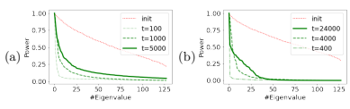

Figure 1: For an attention head in ViT trained on (a) CIFAR-10, and
(b) ImageNet, we plot the normalized spectra of WKW⊤
Q at initialization (in red), and of the learned perturbations to WKW⊤
Q at different iterations (in green).

On the other hand, in our work we observe that the trained weights are a low-rank perturbation of the initial weights due to the training dynamics, without having to apply an explicit rank constraint as in LoRA. This raises an exciting open question for future work: can we explain and improve algorithms like LoRA by better understanding and quantifying the incremental dynamics of large transformers?

Low-rank bias in nonlinear networks For 2-layer networks, it is known that low-rank bias in the weights emerges if the target function depends on a low-dimensional subspace of the input
[ABM22, ABM23, DLS22, BBSS22, MHPG+22]. The results of [ABM22, ABM23] are especially relevant, since they show that the rank of the weights increases in a sequential manner, determined by the "leap complexity" of the target function, which is reminiscent of our empirical observations on transformers. See also [FVB+22, TVS23] for more investigations of low-rank bias in 2-layer networks under different assumptions. For transformers, [YW23] report that empirically the trained weights (using default initialization) are not low-rank. This is consistent with our claim that the difference between initial and trained weights is low-rank, since the initial weights might not be low-rank.

Incremental learning dynamics Several works prove incremental learning behaviour in deep linear networks when the initialization is small. [GBLJ19] has shown that gradient descent dynamics on a 2-layer linear network with L2 loss effectively solve a reduced-rank regression problem with gradually increasing rank. [GSSD19] prove a dynamical depth separation result, allowing for milder assumptions on initialization scale. [ACHL19, MKAA21] show implicit bias towards low rank in deep matrix and tensor factorization. [LLL20] show deep matrix factorization dynamics with small initialization are equivalent to a greedy low-rank learning (GLRL) algorithm. And [JGS+21]
independently provides a similar description of the dynamics, but without requiring balanced initialization. Finally, [Ber22, JLL+23, PF23] overcome a technical hurdle from previous analyses by proving incremental learning for the entire training trajectory, rather than just the first stage. In contrast to our result, these prior works apply only to *linear* networks with certain convex losses, whereas our result applies to *nonlinear* networks. In order to make our extension to nonlinear networks possible, we must make stronger assumptions on the training trajectory, which we verify hold empirically. As far as we are aware, one other work on incremental learning handles nonlinear networks: [BPVF22] proves that a 2-layer network learns with a two-stage incremental dynamic; but that result needs the stylized assumption that all data points are orthogonal.

#### 1.2 Paper Organization

Sections 2, 3, and 4 contain theoretical preliminaries, definitions of the models to which our theory applies, and our main theoretical result on incremental dynamics. Section 5 provides experiments which verify and extend the theory. Section 6 discusses limitations and future directions.

### 2 Preliminaries

We consider training a network fNN(·; θ) parametrized by a vector of weights θ, to minimize a loss

$${\mathcal{L}}(\mathbf{\theta})=\mathbb{E}_{\mathbf{x},\mathbf{y}}[\ell(\mathbf{y},f_{\mathsf{N N}}(\mathbf{x};\mathbf{\theta}))]\,,$$

where the expectation is over samples (x, y) ∈ R
dx × R
dyfrom a training data distribution, and ℓ : R
dy × R
dout → R. Consider a solution θ(t) to the gradient flow3

$$\theta(0)=\alpha\theta_{0},\quad\frac{d\theta}{d t}=-\nabla_{\theta}{\mathcal{L}}(\theta)$$
$$(3)^{\frac{1}{2}}$$

= −∇θL(θ) (3)
where α > 0 is a parameter governing the initialization scale, that we will take small. For our theory, we henceforth require the following mild regularity assumption on the loss and data.

Assumption 2.1 (Regularity of data distribution and loss). The function ℓ(y, ζ) is continuously twice-differentiable in the arguments [y, ζ] ∈ R
dy+dout . There exists C > 0 such that almost surely the data is bounded by ∥x∥, ∥y∥ ≤ C.

The assumption on ℓ is satisfied in typical cases such as the square and the cross-entropy losses.

The data boundedness is often satisfied in practice (e.g., if the data is normalized).

We also use the notation supp(a) := {i : ai ̸= 0} to denote the support of a vector a.

# 3 Neural Networks With Diagonal Weights

Our theory analyzes the training dynamics of networks that depend on products of diagonal weight matrices. We use ⊙ to denote elementwise vector product.

Definition 3.1. A network fNN is smooth with diagonal weights θ = (u, v) ∈ R
2pif it is of the form

$$f_{\operatorname{NN}}(x;\theta)=h(x;u\odot v)$$

where h : R
dx × R
p → R
dout is continuously twice-differentiable in its arguments in R
dx+p.

The assumption on h precludes the use of the ReLU function since it is not continuouslydifferentiable. Otherwise the assumption is fairly mild since any h can be used to express an architecture of any depth as long as the nonlinearities are twice-differentiable, which includes for example GeLUs (as used in ViT). We describe how to express a transformer with diagonal weights. Example 3.2 (Transformer with diagonal weights). A transformer with L layers and H *attention* heads on each layer is defined inductively by Z0 = X ∈ R
n×d and
- *(Attention layer)* Z˜ℓ = Zℓ−1 +PH
i=1 attention(Zℓ−1;Wℓ,i K ,Wℓ,i

$$W_{Q}^{\ell,i},W_{V}^{\ell,i},W_{O}^{\ell,i}$$
$\downarrow$ . 
)
- *(Feedforward layer)* Zℓ = Z˜ℓ + σ(Z˜ℓWℓA
)(WℓB
)
⊤ ,

3Gradient flow training can be obtained as a limit of SGD or GD training as the learning rate tends to 0 (see, e.g.,
[Bac20]). It is a popular testbed for studying learning dynamics (see e.g., [SMG13, ACH18, RC20]), since is generally simpler to analyze than SGD.
where Wℓ,i K ,Wℓ,i Q
,Wℓ,i V
,Wℓ,i O ∈ R
d×d
′are attention parameters, and WℓA
,WℓB ∈ R
d×d
′*are the* feedforward parameters, and σ is a continuously twice-differentiable activation. Suppose that the attention parameters are diagonal matrices: i.e., Wℓ,i K = diag(w ℓ,i K ) ∈ R
d×d*, and similarly for the* Wℓ,i Q
,Wℓ,i V
,Wℓ,i O matrices. Then by the definition of the attention layer (1), the final output of the transformer ZL *only depends on the attention parameters through the elementwise products* w ℓ,i K ⊙ w ℓ,i Q
and w ℓ,i V ⊙ w ℓ,i O
. In other words, we can write

#### Zl = H(X;U ⊙ V),

for vectors u = [w ℓ,i K , w ℓ,i V
](ℓ,i)∈[L]×[H] ∈ R
2dHL and v = [w ℓ,i Q
, w ℓ,i O
](ℓ,i)∈[L]×[H] ∈ R
2dHL, and some smooth model h*. Thus, if only the attention layers are trained, the diagonal transformer fits under* Definition *3.1.*

### 4 Incremental Learning In Networks With Diagonal Weights

We prove that if the initialization scale α is small, then learning proceeds in incremental stages, where in each stage the effective sparsity of the weights increases by at most one. These stages are implicitly defined by Algorithm 1 below, which constructs a sequence of times 0 = T0 < T1 < · · · < Tk < *· · ·*
and weight vectors θ 0, θ 1*, . . . ,* θ k*, . . .* ∈ R
2pthat define the stages. We prove the following:
Theorem 4.1 (Incremental dynamics at small initialization). Let fNN *be a model with diagonal* weights as in Definition 3.1. For any stage k and time t ∈ (Tk, Tk+1) *the following holds under* Assumptions 2.1, 4.3, 4.4 and 4.5. There is α0(t) > 0 such that for all α < α0, there exists a unique solution θ : [0, tlog(1/α)] → R
p*to the gradient flow* (3) and lim α→0 θ(t · log(1/α)) → θ k, and at each stage the sparsity increases by at most one: supp(θ k+1) \ supp(θ k) ⊆ {ik}.

4 Algorithm 1 Incremental learning in networks with diagonal weights 1: b 0, θ 0 ← 0 ∈ R
p, T0 ← 0 2: for stage number k = 0, 1, 2*, . . .* do 3: \# (A) Pick new coordinate ik ∈ [p] to activate. 4: For each i, define time ∆k(i) until active using (10). 5: Pick winning coordinate ik using (11) 6: Calculate time Tk+1 using (11) and break if ∞
7: Update logarithmic weight approximation b k+1 using (12)
8: \# (B) Train activated coordinates to stationarity. 9: θ k+1 ← limiting dynamics point from (13)
10: end for Application: transformer with diagonal weights Before giving the intuition for this theorem and stating the assumptions formally, let us discuss its application to the diagonal transformer model from Example 3.2. As a corollary of Theorem 4.1, the gradient flow on a diagonal transformer with small initialization will learn in stages, where in each stage there will be at most one head

4Abusing notation, for θ = (u, v) ∈ R
p × R
p, we write supp(θ) = supp(u) ∪ supp(v).
 

 
i ∈ [H] in one layer ℓ ∈ [L] such that either the rank of Wℓ,i K (Wℓ,i Q
)
⊤ = diag(w ℓ,i K )diag(w ℓ,i Q
) or the rank of Wℓ,i V
(Wℓ,i O
)
⊤ = diag(w ℓ,i V
)diag(w ℓ,i O
) increases by at most one. In Figure 2, we illustrate these dynamics in the toy case of a single attention head trained in a student-teacher setup.

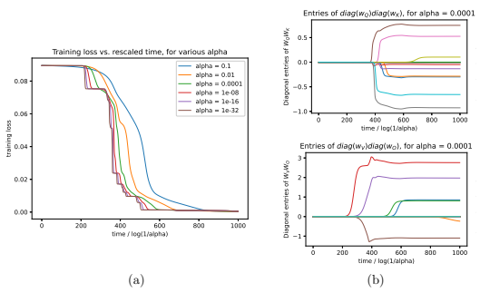 

 --	
 -- 
	

	

 

 	

 --	
--00	

 

0 


	

	

 
    	

 
    	

0 00 00 00 00 	000 0 00 00 00 00 	000

 	

 	

	

 --	
-- 

	

	

0 

	

	

	

     	

0 00 00 00 00 	000 0 00 00 00 00 	000

 	
	

	

--	

Figure 2: (a) Loss versus rescaled time in the toy task of learning an attention head with diagonal weights, for various initialization scales α. The loss curves converge as α → 0 to a curve with stagewise loss plateaus and sharp decreases, as predicted by the theory; some stagewise learning behavior is already clear with α = 0.01. (b) Each line shows the evolution of one of the entries of diag(wQ)diag(wK) and diag(wV )diag(wO) over rescaled time, demonstrating that the rank of these matrices increases incrementally; see Appendix A for experimental details and further results. 


	

	

 
  
  	

 
  
  	

	

	

#### 4.1 Intuition For Incremental Learning Dynamics

We develop an informal intuition for Theorem 4.1 and fill out the definition of Algorithm 1. A model fNN with diagonal weights θ = (u, v) as in Definition 3.1 evolves under the gradient flow (3) as

$$\frac{d\mathbf{u}}{dt}=\mathbf{v}\odot\mathbf{g}(\mathbf{\theta}),\quad\frac{d\mathbf{v}}{dt}=\mathbf{u}\odot\mathbf{g}(\mathbf{\theta})\quad\text{where}\tag{4}$$  $\mathbf{g}(\mathbf{\theta})=-\,\mathbb{E}_{\mathbf{x},\mathbf{y}}[D\ell(\mathbf{y},h(\mathbf{x};\mathbf{u}\odot\mathbf{v}))^{\top}Dh(\mathbf{x};\mathbf{u}\odot\mathbf{v})^{\top}]$.  
Here Dℓ(y, ·) ∈ R
1×dout is the derivative of ℓ in the second argument and Dh(x, ·) ∈ R
dout×pis the derivative of h in the second argument. The first key observation is a conservation law that simplifies the dynamics. It can be viewed as the balancedness property for networks with linear activations [ACH18, DHL18], specialized to the case of diagonal layers.

Lemma 4.2 (Conservation law). For any i ∈ [p] and any time t*, we have*

$$u_{i}^{2}(t)-v_{i}^{2}(t)=u_{i}^{2}(0)-v_{i}^{2}(0)\,.\tag{5}$$
 *Proof.* This follows from $\frac{d}{dt}(u_i^2-v_i^2)=u_iv_ig_i(\pmb{\theta})-u_iv_ig_i(\pmb{\theta})=0$. 
$\square$
6 The conservation law reduces the degrees of freedom and means that we need only keep track of p parameters in total. Specifically, if we define wi(t) := ui(t) +vi(t), then the vector w(t) = u(t) +v(t)
evolves by

$$\frac{d\mathbf{w}}{dt}=\mathbf{w}\odot\mathbf{g}(\mathbf{\theta})\,.\tag{6}$$

Using the conservation law (5), we can keep track of the weights in terms of the initialization and w(t):

$$\mathbf{\theta}(t)=\left(\frac{1}{2}(\mathbf{w}(t)+\frac{\mathbf{u}^{\odot2}(0)-\mathbf{v}^{\odot2}(0)}{\mathbf{w}(t)}),\frac{1}{2}(\mathbf{w}(t)-\frac{\mathbf{u}^{\odot2}(0)-\mathbf{v}^{\odot2}(0)}{\mathbf{w}(t)})\right)\tag{7}$$

Therefore it suffices to analyze the dynamics of w(t).

#### 4.1.1 Stage 1 Of Dynamics

Stage 1A of dynamics: loss plateau for time Θ(log(1/α)) At initialization, θ(0) ≈ 0 because the weights are initialized on the order of α which is small. This motivates the approximation g(θ(t)) ≈ g(0), under which the dynamics solve to:

$$\mathbf{w}(t)\approx\mathbf{w}(0)\odot e^{g(\mathbf{0})t}.$$
$\left(8\right)^3$
g(0)t. (8)
Of course, this approximation is valid only while the weights are still close to the small initialization. The approximation breaks once one of the entries of θ(t) reaches constant size. By combining (7)
and (8), this happens at time t ≈ T1 · log(1/α) for

$$T_{1}=\operatorname*{min}_{i\in[p]}1/|g_{i}({\bf0})|\,.$$

Until this time, the network remains close to its initialization, and so we observe a loss plateau.

Stage 1B of dynamics: nonlinear dynamics for time O(1) Subsequently, the loss decreases nonlinearly during a O(1) time-scale, which is vanishingly short relative to the time-scale of the loss plateau. To prove this, we make the non-degeneracy assumption that there is a unique coordinate i0 such that 1/|gi0(0)| = T1. Under this assumption, in stage 1A all weights except for those at coordinate i0 remain vanishingly small, on the order of oα(1). Concretely, for any small ϵ > 0, there is a time t1(ϵ) ≈ T1 · log(1/α) and sign s ∈ {+1, −1} such that5

$u_{i_{0}}(\underline{t}_{1})\approx\epsilon,v_{i_{0}}(\underline{t}_{1})\approx s\epsilon\quad\mbox{and}\quad|u_{i}(\underline{t}_{1})|,|v_{i}(\underline{t}_{1})|=o_{\alpha}(1)$ for all $i\neq i_{0}$.  
Because all coordinates except for i0 have vanishingly small oα(1) weights after stage 1A, we may perform the following approximation of the dynamics. Zero out the weights at coordinates except for i0, and consider the training dynamics starting at θ˜ = (ϵei0*, sϵ*ei0). After O(1) time, we should expect these dynamics to approach a stationary point. Although the evolution is nonlinear, all entries remain zero except for the i0 entries, so the stationary point is also sparse. Mathematically, there is a time t¯1 = t1 + O(1) ≈ T1 · log(1/α) such that

$$\theta(\bar{t}_{1})\approx(a e_{i_{0}},s a e_{i_{0}}):=\theta^{1}$$
1,
5Without loss of generality, we can ensure that at initialization u(0) and u(0) + v(0) are nonnegative. This implies u(t) is nonnegative. The fact that ui0 and vi0 are roughly equal in magnitude but might differ in sign is due to the conservation law (5). See Appendix C.3 for details.
for some a ∈ R>0, where θ 1is a stationary point of the loss.6 Despite the nonlinearity of the dynamics, the approximation can be proved using Gr¨onwall's inequality since t¯1 − t1 = O(1) is a constant time-scale.

To summarize, we have argued that the network approximately reaches stationary point that is 1-sparse, where only the weights at coordinate i0 are nonzero.

#### 4.1.2 Later Stages

We inductively extend the argument to any number of stages k, where each stage has a Θ(log(1/α))-
time plateau, and then a O(1)-time nonlinear evolution, with the sparsity of the weights increasing by at most one. The argument to analyze multiple stages is analogous, but we must also keep track of the magnitude of the weights on the logarithmic scale, since these determine how much longer . Inductively on k, suppose that there is some Tk ∈ R, b k ∈ R
p and θ k ∈ R
2p and a time t¯k ≈ Tk · log(1/α) such that

$$\log_{\alpha}(\mathbf{w}({\bar{t}}_{k}))\approx\mathbf{b}^{k}{\mathrm{~and~}}\mathbf{\theta}({\bar{t}}_{k})\approx\mathbf{\theta}^{k},$$

where θ kis a stationary point of the loss. Our inductive step shows that there is Tk+1 ∈ R such that during times t ∈ (t¯k, Tk+1 · log(1/α) − Ω(1)) the weights remain close to the stationary point from the previous stage, i.e., θ(t) ≈ θ k. And at a time t¯k+1 ≈ Tk+1 · log(1/α) we have

$$\log_{\alpha}(\mathbf{w}(\bar{t}_{k+1}))\approx\mathbf{b}^{k+1}{\mathrm{~and~}}\mathbf{\theta}(\bar{t}_{k+1})\approx\mathbf{\theta}^{k+1},$$

where θ k+1 and b k+1 are defined below (summarized in Algorithm 1). Most notably, θ k+1 is a stationary point of the loss whose support grows by at most one compared to θ k.

Stage (k + 1)A, loss plateau for time Θ(log(1/α)) At the beginning of stage k + 1, the weights are close to the stationary point θ k, and so, similarly to stage 1A, linear dynamics are valid.

$$\mathbf{w}(t)\approx\mathbf{w}({\bar{t}}_{k})\odot e^{\mathbf{g}(\mathbf{\theta}^{k})(t-{\bar{t}}_{k})}\,.$$
k)(t−t¯k). (9)
Using the conservation law (7), we derive a "time until active" for each coordinate i ∈ [p], which corresponds to the time for the weight at that coordinate to grow from oα(1) to Θ(1) magnitude:

$$\Delta_{k}(i)={\begin{cases}(b_{i}^{k}-1+\operatorname{sgn}(g_{i}(\mathbf{\theta}^{k})))/g_{i}(\mathbf{\theta}^{k}),&{\mathrm{if~}}g_{i}(\mathbf{\theta}^{k})\neq0\\ \infty,&{\mathrm{if~}}g_{i}(\mathbf{\theta}^{k})=0\end{cases}}$$
$\left(9\right)$. 

$$(10)$$
$$(11)$$

$\left(12\right)^{2}$
The linear dynamics approximation (9) breaks down at a time t ≈ Tk+1 · log(1/α), where

$$T_{k+1}=T_{k}+\Delta_{k}(i_{k}),\quad i_{k}=\arg\operatorname*{min}_{i\in[p]}\Delta_{k}(i)\,,$$
∆k(i), (11)
which corresponds to the first time at the weights at a coordinate grow from oα(1) to Θ(1) magnitude.

And at times t ≈ Tk+1 · log(1/α), on the logarithmic scale w is given by

$$\log_{\alpha}(\mathbf{w}(t))\approx\mathbf{b}^{k+1}:=\mathbf{b}^{k}-\mathbf{g}(\mathbf{\theta}^{k})\Delta_{k}(i_{k})\,,$$

k)∆k(ik), (12)
6The entries of u and v are close in magnitude (but may differ in sign) because of the conservation law (5).
Stage (k + 1)B of dynamics: nonlinear dynamics for time O(1) Subsequently, the weights evolve nonlinearly during O(1) time. In a similar way to the analysis of Stage 1B, we show that at a time t¯k+1 = tk+1 + O(1) ≈ Tk+1 · log(1/α), we have

$$\theta(\bar{t}_{k+1})\approx\theta^{k+1}:=\operatorname*{lim}_{\epsilon\to0}\operatorname*{lim}_{t\to\infty}\psi^{k}(t,\epsilon)\,,$$
$$(13)^{\frac{1}{2}}$$

where the dynamics ψk(*t, ϵ*) ∈ R
2p are initialized at ψk(0, ϵ) = θ k + (ϵeik
,sgn(gi(θ k))ϵeik
) and evolve according to the gradient flow dψk(t,ϵ)
dt = −∇θL(ψk). This concludes the inductive step.

#### 4.2 Assumptions For Incremental Dynamics

To make this intuition rigorous, we formalize below the assumptions required for Theorem 4.1. In Figure 3 and Appendix A, we provide experiments validating these assumptions on the toy model.

The first assumption is that the dynamics are non-degenerate, in the sense that two coordinates do not have weights that grow from oα(1) to Θ(1) size at the same rescaled time. We also place a technical condition to handle the corner case when a coordinate leaves the support of the current stage's stationary point.

Assumption 4.3 (Nondegeneracy of dynamics in part (A)). The initialization satisfies |ui(0)| ̸=
|vi(0)| for all i. For stage k, either Tk+1 = ∞ or there is a unique minimizer ik to mini ∆k(ik) in
(11). Finally, for all i ∈ supp(θ k−1) \ supp(θ k) we have gi(θ k) ̸= 0.

Next, we require that very small perturbations of the coordinates outside of supp(θ k) do not change the dynamics. For this, it suffices that θ k be a strict local minimum.

Assumption 4.4 (Stationary points are strict local minima). For stage k, there exist δk > 0 and ck > 0 such that for u˜ ∈ B(u k, δ) supported on supp(u k), we have

$${\mathcal{L}}({\tilde{\mathbf{u}}},\mathbf{s}^{k}\odot{\tilde{\mathbf{u}}})\geq c_{k}\|\mathbf{u}^{k}-{\tilde{\mathbf{u}}}\|^{2}$$

Finally, we require a robust version of the assumption that the limit (13) exists, asking for convergence to a neighborhood of θ k+1 even when the initialization is slightly noisy.

Assumption 4.5 (Noise-robustness of dynamics in part (B)). For any stage k with Tk+1 < ∞ and any ϵ > 0, there are δ > 0 and τ : R>0 → R such that the following holds. For any u˜ ∈ B(u k, δ)∩R
p ≥0 supported on supp(u˜) ⊆ supp(u k) ∪ {ik}, there exists a unique solution ψ : [0, ∞) → R
p of the gradient flow dψ dt = −∇θL(ψ) initialized at ψ(0) = (u˜, s k+1 ⊙ u˜), and at times t ≥ τ (ψ˜ik
),

$$\|\psi(t)-\theta^{k+1}\|<\epsilon\,.$$

### 5 Experimental Results

We run experiments that go beyond the toy diagonal attention head model (see Figures 2 and 3) to test the extent to which low-rank incremental learning occurs in popular models used in practice.

We conduct experiments with vision transformers (ViT) [DBK+20] trained on the CIFAR-10/100 and ImageNet datasets, and with the GPT-2 language transformer [BMR+20] trained on the Wikitext-103 dataset. Full experiments are deferred to Appendix B.

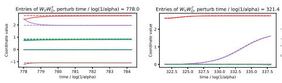

 
" $#
#!"
#!"
 !#$!# 33
- !#$!# 33 3



$
$
	
#%

#%

!

!



3 3 3 3 3 3 3 3 3 3 3 3

# 
# 
#!"
" !

#!"
" !  
 !#$!# 	
- !#$!# "# "22
- "# "22

3 2
$
$
#


#
	

2


%
%
"$

"$
#
#


 
 
!

!







 	 3   
 

 	 3   
2 22 2 2 2 
 

2 22 2 2 2 

# 

# "- 
"-

" !

- "# "
2



2 

    	 3 

    	 3 22 
2 
2 

 

2 

 



22 
2 
2 

 

2 

 



"- 

"-

\#!"
\#!"
" !

" !

 !#$!# 
	
- !#$!# 
	
 "# "


- "\# "

Figure 3: Validation of assumptions on the toy model of learning a single attention head. (a) Assumption 4.4: weights perturbed at a random time during training (solid lines) tend back to the near-stationary point (dashed lines). (b) Assumption 4.5: weights perturbed at the beginning of a stage (solid lines) have same nonlinear evolution as without perturbation (dashed lines). Details of these experiments and further validations are provided in Appendix A.

3 


!\#%
$

!\#%
$
 
"$
\#
 
"$
\#
	


2





3  
 
  

3  
 

2 

 

 
 
  
2 
 



 

 

2 

 

 
 
2 
 


\# 
\# "-
"- 

- "\# "

	

2

 

\# 

\# 

"-

- "\# "


2



"-

"-

Gradual rank increase in vision and language models We train practical transformer architectures on vision and language tasks using Adam and the cross-entropy loss. We train all layers (including the feedforward layers). To capture the low-rank bias with a non-vanishing initialization scale, we study the spectrum of the difference ∆WKW⊤
Q and ∆WV W⊤
Obetween the weights post-training and their initial values. Specifically, in Figure 4, we plot the stable rank of the differences ∆WKW⊤
Q and ∆WV W⊤
O. The weight perturbation learned during the training process gradually increases in stable rank during training, and is ultimately low-rank when compared to the initial spectrum. Finally, for CIFAR-10, we plot the spectrum of ∆WKW⊤
Q against that of its initialized state in Figure 5 for different self-attention heads, illustrating that the weight perturbation learned during the training process is extremely low-rank when compared to the initial spectrum. In Appendix B, we also study optimization with SGD, which shows similar gradual rank increase behavior.

```

!
#%
$
   #!"
               !#$!# 		
                                                	 3   
                                                                            

```

!

\#%
$
\#!"
- !\#$!\# 		

```
  
"$
#
   " !
               "# "
                                                   
                                                         2  

```

 
"$
\#
" !





	 3   
  

   2  
 
"-
" !

 "\# "

" !

 
"
$\#

 
"
$\#



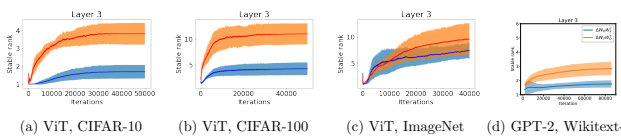

 2    
2 


Figure 4: Stable rank of ∆WKW⊤
Q (blue) and ∆WV W⊤
O
(orange) on an arbitrary chosen layer throughout training for four different pairs of networks and tasks. The stable rank of a matrix W is defined as ∥W∥
2F
/∥W∥
22
, and gives a smooth approximation of the rank. Mean and standard deviation (shaded area) are computed across all heads in each attention layer. Full details and results are in Appendix B.

Effect of initialization scale We probe the effect of initialization scale on gradual rank increase dynamics for a ViT trained on CIFAR-10. We use a ViT of depth 6, with 8 self-attention heads per layer (with layer normalization). We use an embedding and MLP dimension of demb = 512, and a head dimension of dh = 128 (i.e WK,WQ,WV ,WO ∈ R
demb×dh ). We train the transformer using Adam with the cross-entropy loss. We train all layers (including the feedforward layers) while

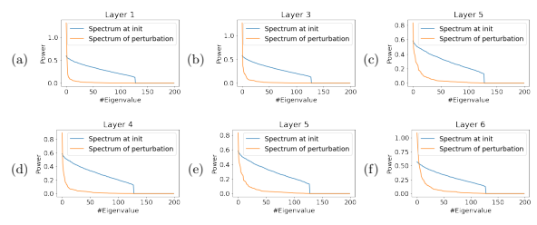

Figure 5: Spectrum of the weight perturbation △W x W J vs. initialization in a vision transformer trained on CIFAR-10, using Adam and default initialization scale, in random self-attention heads in different layers. The learned perturbation exhibits extreme low-rank bias post-training even in default initialization scales. Analogous plots for CIFAR-100 and ImageNet are in Appendix B.

varying the initialization scale of all layers by multiplying their initial values by a scale factor (we fix the scale of the initial token mapper). Figure 6 shows the evolution of the principal components of ΔWKWل and ΔWγWJ for a randomly-chosen self-attention head and layer throughout training, exhibiting incremental learning dynamics and a low-rank bias. Note that incremental learning and low-rank bias are increasingly evident with smaller initialization scales, as further demonstrated in Figure 7.

### 6 Discussion

We have identified incremental learning dynamics in transformers, proved them rigorously in a simplified setting, and shown them experimentally in networks trained with practical hyperparameters.

Limitations There are clear limitations to our theory: the diagonal weights and small initialization assumptions. More subtly, the theory does not apply to losses with exponential-like tails because the weights may not converge to a finite value and so Assumption 4.4 is not met (this could possibly be addressed by adding regularization). Also, the architecture must be smooth, which precludes ReLUs
- but allows for smoothed ReLUs such as the GeLUs used in ViT |DBK+20]. Finally, the theory is for training with gradient flow, while other optimizers such as Adam are used in practice instead
[KB14]. Nevertheless, our experiments on ViTs indicate that the incremental learning dynamics occur even when training with Adam.

Future directions An interesting avenue of future research is to develop a theoretical understanding of the implicit bias in function space of transformers whose weights are a low-rank perturbation of randomly initialized weights. Another promising direction is to examine the connection between our results on incremental dynamics and the LoRA method [HSW*21], with the goal of explaining and improving on this algorithm; see also the discussion in Section 1.1. Along this vein, a concurrent work [ZZC+23] independently observes gradual rank increase dynamics during transformer training

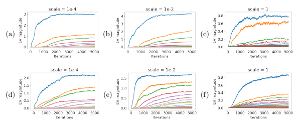

Figure 6: Training a vision transformer on CIFAR-10 using Adam, while varying the initialization scale (unit scale indicates default initialization).  Plotted are the evolution of the eigenvalues of
△WxW¿ (a) - (c) and △WγWշ (d) - (f) in a random self-attention head in the second layer throughout training. Incremental learning dynamics and a low-rank bias are evident for all scales, albeit more pronounced at smaller initialization scales.

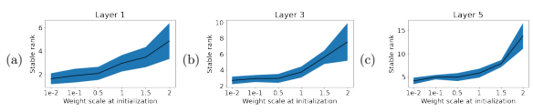

Figure 7: Stable rank of △WxW per initialization scale (Unit scale refers to the default initialization) in different self-attention heads post-training, at layers 1, 3, 5. At each layer, the stable rank mean and standard deviation are computed across 8 heads per layer, for each initialization scale.

All models were trained on CIFAR-10 using the Adam optimizer. Smaller initialization scales lead to lower-rank attention heads.

and this inspires a low-rank training algorithm that obtains runtime and memory improvements over regular training. The results of [ZZC+23] are complementary to ours, since they study the feedforward layers of the transformer, and their theory applies to linear networks in the standard initialization scale; in contrast, we study the attention layers, and our theory applies to nonlinear networks with small initialization scale.

# Acknowledgments

We would like to thank Vimal Thilak for his help in setting up the infrastructure for conducting experiments, and the anonymous reviewers for their helpful feedback.

### References

[ABM22] Emmanuel Abbe, Enric Boix-Adsera, and Theodor Misiakiewicz, The merged-staircase property: a necessary and nearly sufficient condition for SGD learning of sparse functions on two-layer neural networks, COLT, 2022.

[ABM23] , Sgd learning on neural networks: leap complexity and saddle-to-saddle dynamics, arXiv preprint arXiv:2302.11055 (2023).

[ACH18] Sanjeev Arora, Nadav Cohen, and Elad Hazan, On the optimization of deep networks:
Implicit acceleration by overparameterization, International Conference on Machine Learning, PMLR, 2018, pp. 244–253.

[ACHL19] Sanjeev Arora, Nadav Cohen, Wei Hu, and Yuping Luo, *Implicit regularization in deep* matrix factorization, Advances in Neural Information Processing Systems 32 (2019).

[AZG20] Armen Aghajanyan, Luke Zettlemoyer, and Sonal Gupta, Intrinsic dimensionality explains the effectiveness of language model fine-tuning, arXiv preprint arXiv:2012.13255
(2020).

[Bac20] Francis Bach, *Effortless optimization through gradient flows*, Machine Learning Research Blog. https://francisbach. com/gradient-flows (2020).

[BBSS22] Alberto Bietti, Joan Bruna, Clayton Sanford, and Min Jae Song, Learning single-index models with shallow neural networks, arXiv preprint arXiv:2210.15651 (2022).

[Ber22] Rapha¨el Berthier, *Incremental learning in diagonal linear networks*, arXiv preprint arXiv:2208.14673 (2022).

[BMR+20] Tom Brown, Benjamin Mann, Nick Ryder, Melanie Subbiah, Jared D Kaplan, Prafulla Dhariwal, Arvind Neelakantan, Pranav Shyam, Girish Sastry, Amanda Askell, et al.,
Language models are few-shot learners, Advances in neural information processing systems 33 (2020), 1877–1901.

[BPVF22] Etienne Boursier, Loucas Pillaud-Vivien, and Nicolas Flammarion, Gradient flow dynamics of shallow relu networks for square loss and orthogonal inputs, arXiv preprint arXiv:2206.00939 (2022).

[COB18] L´ena¨ıc Chizat, Edouard Oyallon, and Francis R. Bach, On lazy training in differentiable programming, Neural Information Processing Systems, 2018.

[DBK+20] Alexey Dosovitskiy, Lucas Beyer, Alexander Kolesnikov, Dirk Weissenborn, Xiaohua Zhai, Thomas Unterthiner, Mostafa Dehghani, Matthias Minderer, Georg Heigold, Sylvain Gelly, Jakob Uszkoreit, and Neil Houlsby, An image is worth 16x16 words:
Transformers for image recognition at scale, ArXiv abs/2010.11929 (2020).

[DCLT19] Jacob Devlin, Ming-Wei Chang, Kenton Lee, and Kristina Toutanova, Bert:
Pre-training of deep bidirectional transformers for language understanding, ArXiv abs/1810.04805 (2019).

[DHL18] Simon S Du, Wei Hu, and Jason D Lee, Algorithmic regularization in learning deep homogeneous models: Layers are automatically balanced, Advances in Neural Information Processing Systems 31 (2018).

[DLS22] Alexandru Damian, Jason Lee, and Mahdi Soltanolkotabi, Neural networks can learn representations with gradient descent, Conference on Learning Theory, PMLR, 2022, pp. 5413–5452.

[FVB+22] Spencer Frei, Gal Vardi, Peter L Bartlett, Nathan Srebro, and Wei Hu, Implicit bias in leaky relu networks trained on high-dimensional data, arXiv preprint arXiv:2210.07082
(2022).

[GBLJ19] Gauthier Gidel, Francis Bach, and Simon Lacoste-Julien, *Implicit regularization of* discrete gradient dynamics in linear neural networks, Advances in Neural Information Processing Systems 32 (2019).

[GMMM19] Behrooz Ghorbani, Song Mei, Theodor Misiakiewicz, and Andrea Montanari, Limitations of lazy training of two-layers neural network, Advances in Neural Information Processing Systems 32 (2019).

[GSJW19] Mario Geiger, Stefano Spigler, Arthur Jacot, and Matthieu Wyart, Disentangling feature and lazy learning in deep neural networks: an empirical study, ArXiv abs/1906.08034 (2019).

[GSSD19] Daniel Gissin, Shai Shalev-Shwartz, and Amit Daniely, The implicit bias of depth: How incremental learning drives generalization, arXiv preprint arXiv:1909.12051 (2019).

[HSW+21] Edward J Hu, Yelong Shen, Phillip Wallis, Zeyuan Allen-Zhu, Yuanzhi Li, Shean Wang, Lu Wang, and Weizhu Chen, *Lora: Low-rank adaptation of large language* models, arXiv preprint arXiv:2106.09685 (2021).

[JGH18] Arthur Jacot, Franck Gabriel, and Cl´ement Hongler, Neural tangent kernel: Convergence and generalization in neural networks, Advances in neural information processing systems 31 (2018).

[JGS+21] Arthur Jacot, Francois Gaston Ged, Berfin Simsek, Cl´ement Hongler, and Franck Gabriel, Saddle-to-saddle dynamics in deep linear networks: Small initialization training, symmetry, and sparsity, 2021.

[JLL+23] Jikai Jin, Zhiyuan Li, Kaifeng Lyu, Simon S Du, and Jason D Lee, Understanding incremental learning of gradient descent: A fine-grained analysis of matrix sensing, arXiv preprint arXiv:2301.11500 (2023).

[KB14] Diederik P Kingma and Jimmy Ba, *Adam: A method for stochastic optimization*, arXiv preprint arXiv:1412.6980 (2014).

[KC22] Daesung Kim and Hye Won Chung, Rank-1 matrix completion with gradient descent and small random initialization, ArXiv abs/2212.09396 (2022).

[LFLY18] Chunyuan Li, Heerad Farkhoor, Rosanne Liu, and Jason Yosinski, Measuring the intrinsic dimension of objective landscapes, arXiv preprint arXiv:1804.08838 (2018).

[LLL20] Zhiyuan Li, Yuping Luo, and Kaifeng Lyu, Towards resolving the implicit bias of gradient descent for matrix factorization: Greedy low-rank learning, ArXiv abs/2012.09839
(2020).

[LOG+19] Yinhan Liu, Myle Ott, Naman Goyal, Jingfei Du, Mandar Joshi, Danqi Chen, Omer Levy, Mike Lewis, Luke Zettlemoyer, and Veselin Stoyanov, Roberta: A robustly optimized bert pretraining approach, ArXiv abs/1907.11692 (2019).

[MGW+20] Edward Moroshko, Suriya Gunasekar, Blake E. Woodworth, J. Lee, Nathan Srebro, and Daniel Soudry, Implicit bias in deep linear classification: Initialization scale vs training accuracy, ArXiv abs/2007.06738 (2020).

[MHPG+22] Alireza Mousavi-Hosseini, Sejun Park, Manuela Girotti, Ioannis Mitliagkas, and Murat A Erdogdu, Neural networks efficiently learn low-dimensional representations with sgd, arXiv preprint arXiv:2209.14863 (2022).

[MKAA21] Paolo Milanesi, Hachem Kadri, S. Ayache, and Thierry Arti`eres, Implicit regularization in deep tensor factorization, 2021 International Joint Conference on Neural Networks
(IJCNN) (2021), 1–8.

[MKAS21] Eran Malach, Pritish Kamath, Emmanuel Abbe, and Nathan Srebro, Quantifying the benefit of using differentiable learning over tangent kernels, Proceedings of the 38th International Conference on Machine Learning (Marina Meila and Tong Zhang, eds.), Proceedings of Machine Learning Research, vol. 139, PMLR, 18–24 Jul 2021, pp. 7379–7389.

[PA23] Dylan Patel and Afzal Ahmad, *Google "we have no moat, and neither does openai"*,
May 2023.

[PF23] Scott Pesme and Nicolas Flammarion, *Saddle-to-saddle dynamics in diagonal linear* networks, arXiv preprint arXiv:2304.00488 (2023).

[RC20] Noam Razin and Nadav Cohen, Implicit regularization in deep learning may not be explainable by norms, Advances in neural information processing systems 33 (2020), 21174–21187.

[SKZ+23] James B Simon, Maksis Knutins, Liu Ziyin, Daniel Geisz, Abraham J Fetterman, and Joshua Albrecht, *On the stepwise nature of self-supervised learning*, arXiv preprint arXiv:2303.15438 (2023).

[SMG13] Andrew M Saxe, James L McClelland, and Surya Ganguli, Exact solutions to the nonlinear dynamics of learning in deep linear neural networks, arXiv preprint arXiv:1312.6120
(2013).

[SS21] Dominik St¨oger and Mahdi Soltanolkotabi, Small random initialization is akin to spectral learning: Optimization and generalization guarantees for overparameterized low-rank matrix reconstruction, Neural Information Processing Systems, 2021.

[TGZ+23] Rohan Taori, Ishaan Gulrajani, Tianyi Zhang, Yann Dubois, Xuechen Li, Carlos Guestrin, Percy Liang, and Tatsunori B Hashimoto, Alpaca: A strong, replicable instruction-following model, Stanford Center for Research on Foundation Models.

https://crfm. stanford. edu/2023/03/13/alpaca. html (2023).

[TVS23] Nadav Timor, Gal Vardi, and Ohad Shamir, *Implicit regularization towards rank* minimization in relu networks, International Conference on Algorithmic Learning Theory, PMLR, 2023, pp. 1429–1459.

[VSP+17] Ashish Vaswani, Noam M. Shazeer, Niki Parmar, Jakob Uszkoreit, Llion Jones, Aidan N. Gomez, Lukasz Kaiser, and Illia Polosukhin, *Attention is all you need*, ArXiv abs/1706.03762 (2017).

[WGL+19] Blake E. Woodworth, Suriya Gunasekar, J. Lee, Edward Moroshko, Pedro H. P.

Savarese, Itay Golan, Daniel Soudry, and Nathan Srebro, Kernel and rich regimes in overparametrized models, ArXiv abs/2002.09277 (2019).

[YW23] Hao Yu and Jianxin Wu, Compressing transformers: Features are low-rank, but weights are not!

[ZZC+23] Jiawei Zhao, Yifei Zhang, Beidi Chen, Florian Sch¨afer, and Anima Anandkumar, Inrank: Incremental low-rank learning, arXiv preprint arXiv:2306.11250 (2023).

### Contents

| 1  Introduction         | 1   |
|-------------------------|-----|
| 1.1  Related work       | 2   |
| 1.2  Paper organization | 3   |

2 Preliminaries 4 3 Neural networks with diagonal weights 4 4 Incremental learning in networks with diagonal weights 5 4.1 Intuition for incremental learning dynamics . . . . . . . . . . . . . . . . . . . . . . . 6 4.1.1 Stage 1 of dynamics . . . . . . . . . . . . . . . . . . . . . . . . . . . . . . . . 7 4.1.2 Later stages . . . . . . . . . . . . . . . . . . . . . . . . . . . . . . . . . . . . . 8 4.2 Assumptions for incremental dynamics . . . . . . . . . . . . . . . . . . . . . . . . . . 9 5 Experimental results 9 6 Discussion 11 A Experimental validation of the assumptions in Theorem 4.1 18 B Further experiments on vision and language transformers 23 B.1 SGD-trained transformers . . . . . . . . . . . . . . . . . . . . . . . . . . . . . . . . . 23 B.2 Adam-trained transformers . . . . . . . . . . . . . . . . . . . . . . . . . . . . . . . . 24 C Proof for dynamics of networks with diagonal parametrization (Theorem 4.1) 29 C.1 Assumptions . . . . . . . . . . . . . . . . . . . . . . . . . . . . . . . . . . . . . . . . 29 C.2 Rescaling time for notational convenience . . . . . . . . . . . . . . . . . . . . . . . . 29 C.3 Simplifying problem without loss of generality . . . . . . . . . . . . . . . . . . . . . . 30 C.4 Tracking the sum of the weights . . . . . . . . . . . . . . . . . . . . . . . . . . . . . . 30 C.5 Claimed invariants in proof of Theorem C.4 . . . . . . . . . . . . . . . . . . . . . . . 31 C.6 Dynamics from time t¯k to time tk+1 (Linear dynamics for O(log(1/α)) unrescaled time) 31 C.6.1 Analysis in case where Tk+1 < ∞ . . . . . . . . . . . . . . . . . . . . . . . . . 31 C.6.2 Analysis in case where Tk+1 = ∞ . . . . . . . . . . . . . . . . . . . . . . . . . 35 C.7 Dynamics from time tkto time t¯k (Nonlinear evolution for O(1) unrescaled time) . . 36 C.8 Concluding the proof of Theorem C.4 . . . . . . . . . . . . . . . . . . . . . . . . . . 38 D Technical lemmas 38 D.1 Relating the sum of the weights to the original weights using the conservation law . 38 D.2 Sign of gradients on coordinates that leave support . . . . . . . . . . . . . . . . . . . 38 D.3 Local lipschitzness and smoothness . . . . . . . . . . . . . . . . . . . . . . . . . . . . 39

### A Experimental Validation Of The Assumptions In Theorem 4.1

In Figures 2, 8, and 9, we plot the evolution of the losses, of the entries of WKW⊤
Q = diag(wK)diag(wQ),
and of the entries of WV W⊤
O = diag(wV )diag(wO) in the toy task of training an attention head
(1) with diagonal weights. The model is trained with SGD on the mean-squared error loss on 1000 random samples (X, y). Each random sample has X ∈ R
10×50, which a sequence of 10 tokens, each of dimension 50, which is distributed as isotropic Gaussian. The label y is given by a randomly-generated teacher model that is also an attention head (1) with diagonal weights. In Figures 2, 8, and 9, for α ∈ {0.1, 0.01, 0.0001, 10−8, 10−16, 10−32} we plot the evolution of the loss and of the weights when initialized at θ(0) = αθ0, for some random Gaussian θ0. Qualitatively, as α → 0 we observe that the loss curve and the trajectories of the weights appear to converge to a limiting stagewise dynamics, where there are plateaus followed by movement on short time-scales, as predicted by the theory.

Validation of Assumption 4.3 (non-degeneracy of dynamics) As α → 0, notice that the stages appear to separate and happen at distinct times. Furthermore, the extra technical condition on coordinates i ∈ supp(θ k) \ supp(θ k−1) in Assumption 4.3 is satisfied since no coordinates ever leave the support of θ k.

Validation of Assumption 4.4 (stationary points are strict local minima) In Figure 10 we consider the α = 10−32 trajectory, since this is closest to the dynamics in the α → 0 limit. We randomly select several epochs. Since the transitions between stages are a vanishing fraction of the total training time, each of these randomly-selected epochs is likely during a plateau, as we see in the figure. For each epoch perform the following experiment. For each nonnegligible coordinate of the weights (those where the weight is of magnitude greater than the threshold τ = 10−5), we perturb the weights by adding noise of standard deviation 0.05. We then run the training dynamics starting at this perturbed initialization for 1000 epochs. We observe that the training dynamics quickly converge to the original unperturbed initialization, indicating that the weights were close to a strict local minimum of the loss.

Validation of Assumption 4.5 (noise-robustness of dynamics) In Figure 11 we perform the same experiment as in Figure 10, except that the epochs we select to perturb the weights are those where there is a newly-nonnegligible coordinate (less than 10−5in magnitude in the previous epoch, and more than 10−5in magnitude in this epoch). We find that the nonlinear dynamics are robust and tend to the limiting endpoint even under a random Gaussian perturbation of standard deviation 10−2 on each of the nonnegligible coordinates, supporting Assumption 4.5.

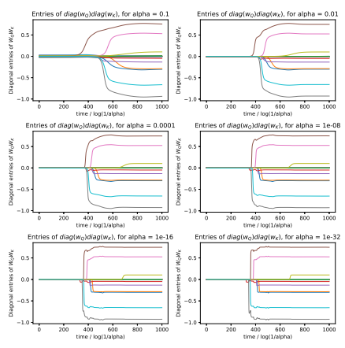

Figure 8: Evolution of diag(w၇)diag(ως) entries over rescaled time initializing at various scalings α.

Notice that as α → 0, the training trajectories tend to a limiting trajectory. Each line corresponds to a diagonal entry of diag(wQ)diag(wK).

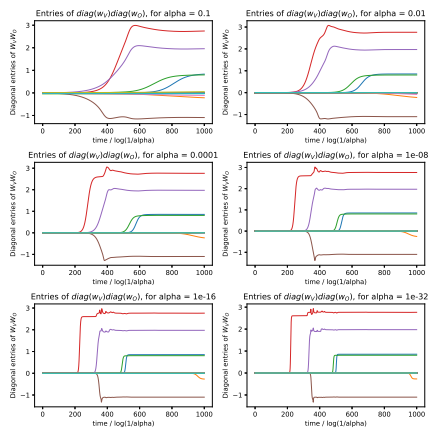

Figure 9: Evolution of diag(wv)diag(wo) entries in the toy task of learning an attention head with diagonal weights. Each line corresponds to the evolution of an entry of diag(wy)diag(wo)) over rescaled time. Each plot corresponds to a different initialization magnitude α. Notice that as α → 0, the training trajectories tend to a limiting trajectory.

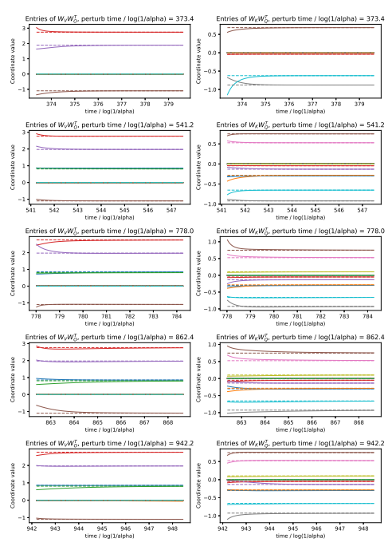

Figure 10: Evolution of weights of toy attention model under perturbation, validating Assumption 4.4.

At 5 different random times during training, we perturb the nonnegligible weight coordinates and continue to train with SGD. The evolution of each of the weights under the initial perturbation (solid line) is compared to the original evolution without perturbation (dashed line). Observe that the training dynamics quickly brings each weight back to the unperturbed weight trajectory, indicating that the weights are originally close to a strict local minimum.

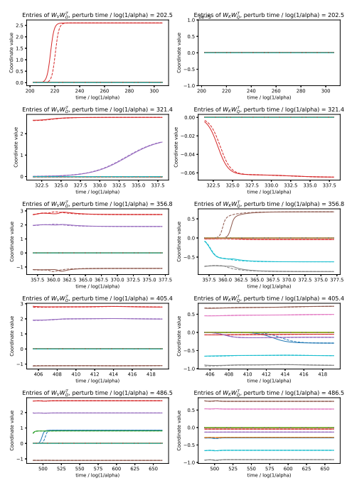

Figure 11: Validating Assumption 4.5 with the same experiment as in Figure 10, except that the epochs for the perturbation chosen are those where there is a newly nonnegligible coordinate. Perturbed dynamics (solid lines) are again robust to perturbation and track the original dynamics
(dashed lines).

### B Further Experiments On Vision And Language Transformers

The practice of training transformer models often deviates substantially from the assumptions made in our theoretical analysis, and it is a priori unclear to what extent gradual rank increase behaviour and a low rank bias are manifested in setups more common in practical applications. To gauge the relevancy of our findings we conduct experiments on popular vision and language benchmarks, using algorithms and hyperparameters common in the literature. We use the stable rank of a matrix W given by 
∥W∥
2F
∥W∥
2 2 as a smooth approximation of rank. We track the value of the stable rank for the different attention matrices throughout training. Although we do not expect our theoretical results to to hold precisely in practice, we find evidence of gradual increase in stable rank, leading to a low rank bias in Figures 12, 13, 15, 17 and 19. In these experiments we use off-the-shelf vision transformers (ViT) [DBK+20] trained on popular vision benchmarks, as well as off-the-shelf GPT-2 trained on a popular language benchmark. We use no weight decay or dropout in our experiments. All models were initialized using the default initialization scale.

#### B.1 Sgd-Trained Transformers

CIFAR-10/100 We trained a 6-layer ViT with 8 heads per layer, embedding dimension 512, head dimension 128, and MLP dimension 512 and patch-size 4 for 500 epochs on CIFAR10/CIFAR100 with SGD and learning rate 3e-1 and warmup. See Figures 12 and 13. Each run took 2 hours on one A100 GPU.

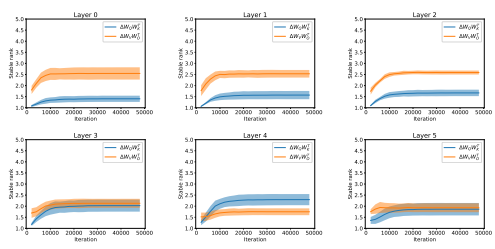

Figure 12: CIFAR-10, ViT trained with SGD: Stable rank of ∆WKW⊤
Q (blue) and ∆WV W⊤
O
(orange) throughout training. Mean and standard deviation (shaded area) are computed across 8 heads per attention layer.

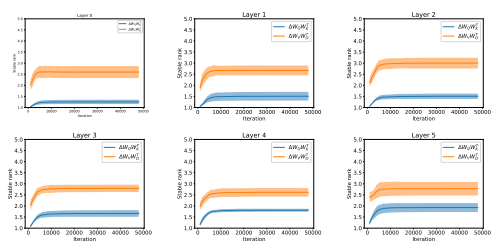

Figure 13: CIFAR-100, ViT trained with SGD: Stable rank of ∆WKW⊤
Q (blue) and ∆WV W⊤
O
(orange) throughout training. Mean and standard deviation (shaded area) are computed across 8 heads per attention layer.

#### B.2 Adam-Trained Transformers

CIFAR-10/100 For the CIFAR-10/100 datasets we use a VIT with 6 layers, patchsize of 4, 8 heads per self attention layer, an embedding and MLP dimension of 512, and a head dimension of 128. We train the model using the Adam optimizer for 500 epochs with a base learning rate of 1e-4, a cyclic learning rate decay with a linear warmup schedule for 15 epochs and a batchsize of 512. Our results are summarized in Figures 14 and 15 for CIFAR-10, and Figures 16 and 17 for CIFAR-100.

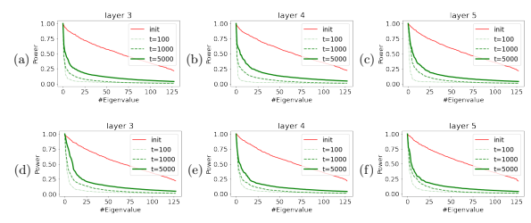

Figure 14: CIFAR-10, ViT trained with Adam: normalized spectrum at different stages of training.

(a) - (c) Normalized spectrum of WKW⊤
Q at initialization and ∆WKW⊤
Q during training for different attention heads at different layers. (d) - (e) equivalent figures for WV W⊤
O
.

ImageNet For ImageNet, we use the VIT-Base/16 from [DBK+20] trained with Adam for 360 epochs with a base learning rate of 3e-3, a cyclic learning rate decay with a linear warmup schedule for 15 epochs and a batchsize of 4096. Our results are summarized in Figures 18 and 19 for ImageNet.

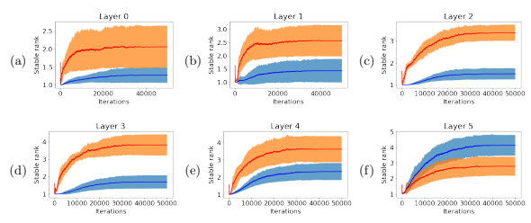

Figure 15: CIFAR-10, ViT trained with Adam: Stable rank of △WxW (blue) and △WγWJ
(red) throughout training. Mean and standard deviation (shaded area) are computed across 8 heads per attention layer.

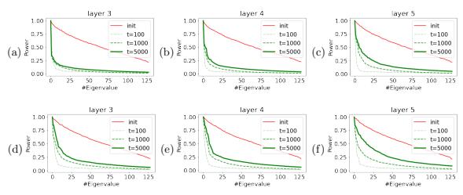

Figure 16: CIFAR-100, ViT trained with Adam: normalized spectrum at different stages of training.

(a) - (c) Normalized spectrum of Wk WJ at initialization and △Wk WJ during training for different attention heads at different layers. (d) - (e) equivalent figures for WvWo.

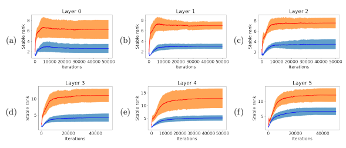

Figure 17: CIFAR-100, ViT trained with Adam: Stable rank of △WκW (blue) and △Wγ WJ
(red) throughout training. Mean and standard deviation (shaded area) are computed across 8 heads per attention layer.

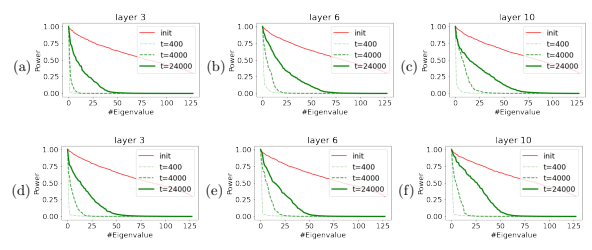

Figure 18: ImageNet, ViT trained with Adam: normalized spectrum at different stages of training.

(a) - (c) Normalized spectrum of Wk WJ at initialization and △Wk WJ during training for different attention heads at different layers. (d) - (e) equivalent figures for WvWo.

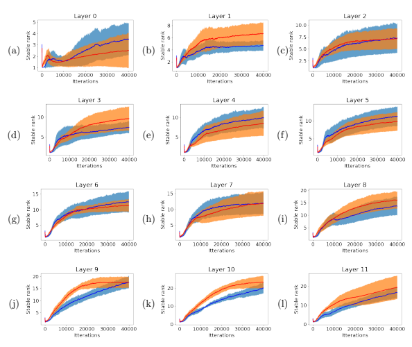

Figure 19: ImageNet, ViT trained with Adam: Stable rank of ΔWzW7 (blue) and ΔWγγWJ
(red) throughout training.  Mean and standard deviation (shaded area) are computed across heads per attention layer.

Wikitext-103 The gradual rank increase phenomenon also occurs in the NLP setting with language transformers. We trained GPT-2 on Wikitext-103 using the HuggingFace training script with Adam learning rate 3e-4, per-GPU batch-size 8, and block-length 256. We trained for 3 epochs on 2 A100 GPUs, which took 12 hours. See Figure 20.

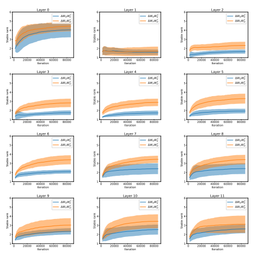

Figure 20: Wikitext-103, GPT-2 trained with Adam: Stable rank of ∆WV W⊤
O
and ∆WQW⊤
K ,
versus training iteration. Stable rank of the perturbation increases gradually, but remains small throughout training.

### C Proof For Dynamics Of Networks With Diagonal Parametrization (Theorem 4.1)

#### C.1 Assumptions

Recall we have defined θ 0*, . . . ,* θ k*, . . .* ∈ R
2p as the sequence of weights such that θ 0 = 0 and θ k+1 is defined inductively as follows. Consider the dynamics of ψk(*t, ϵ*) ∈ R
2pinitialized at ψk(0, ϵ) =
θ k + (ϵeik
,sgn(gi(θ k))ϵeik
) and evolving according to the gradient flow dψk(t,ϵ)
dt = −∇θL(ψk). We assume that there is a limiting point θ k+1 of these dynamics as ϵ is taken small and the time is taken large:

$$\operatorname*{lim}_{\epsilon\rightarrow0}\operatorname*{lim}_{t\rightarrow\infty}\psi^{k}(t,\epsilon)=\theta^{k+1}$$

Under the above assumption that this sequence θ 0*, . . . ,* θ k*, . . .* is well-defined, we can derive a useful property of it for free. Namely, the conservation law (5) implies that u ⊙ u − v ⊙ v is preserved. It follows that for each k we have that θ k = (u k, v k) satisfies |u k| = |v k| entrywise. In other words, there is s k ∈ {+1, −1}
psatisfying

$$\theta^{k}=(u^{k},s^{k}\odot u^{k})\in\mathbb{R}^{2p}\,.$$

We also abuse notation and write supp(θ k) := supp(u k) ⊆ [p], since the support of θ k on the first p coordinates matches its support on the last p coordinates.

Having fixed this notation, we now recall the main assumptions of the theorem.

Assumption C.1 (Nondegeneracy of dynamics in part (A); Assumption 4.3). The initialization satisfies |ui(0)| ̸= |vi(0)| for all i. For stage k, either Tk+1 = ∞ or there is a unique minimizer ik to mini ∆k(ik) in (11). Finally, for all i ∈ supp(θ k−1) \ supp(θ k) we have gi(θ k) ̸= 0.

Assumption C.2 (Stationary points are strict local minima; Assumption 4.4). For stage k, there exist δk > 0 and ck > 0 such that for u˜ ∈ B(u k, δ) supported on supp(u k), we have

$$\mathcal{L}(\tilde{\mathbf{u}},\mathbf{s}^{k}\odot\tilde{\mathbf{u}})\geq c_{k}\|\mathbf{u}^{k}-\tilde{\mathbf{u}}\|^{2}\,.$$

Assumption C.3 (Noise-robustness of dynamics in part (B); Assumption 4.5). For stage k, either Tk+1 = ∞ or the following holds. For any ϵ > 0, there are δ > 0 and τ : R>0 → R such that the following holds. For any u˜ ∈ B(u k, δ) ∩ R
p
≥0supported on supp(u˜) ⊆ supp(u k) ∪ {ik}, there exists a unique solution ψ : [0, ∞) → R
p of the gradient flow dψ dt = −∇θL(ψ) initialized at ψ(0) = (u˜, s k+1 ⊙ u˜), and at times t ≥ τ (˜uik
),

$$\|\psi(t)-\theta^{k+1}\|<\epsilon\,.$$

#### C.2 Rescaling Time For Notational Convenience

For ease of notation, we rescale time

$$\mathbf{u}_{\alpha}(0)=\alpha\mathbf{u}(0),\quad\mathbf{v}_{\alpha}(0)=\alpha\mathbf{v}(0)$$  $$\frac{d\mathbf{u}_{\alpha}}{dt}=\log(1/\alpha)\mathbf{v}_{\alpha}\odot\mathbf{g}(\mathbf{u}_{\alpha},\mathbf{v}_{\alpha}),\quad\frac{d\mathbf{v}_{\alpha}}{dt}=\log(1/\alpha)\mathbf{u}_{\alpha}\odot\mathbf{g}(\mathbf{u}_{\alpha},\mathbf{v}_{\alpha}).\tag{14}$$

We also define

$$\theta_{\alpha}(t)=(\mathbf{u}_{\alpha}(t),\mathbf{v}_{\alpha}(t))\in\mathbb{R}^{2p}\,.$$

Because of this time-rescaling, we equivalently state Theorem 4.1 as:
Theorem C.4 (Restatement of Theorem 4.1). Let K ∈ Z≥0 be such that Assumptions 4.3 4.4 hold for all k ≤ K and Assumption 4.5 holds for all k < K. Then for any k ≤ K and time t ∈ (Tk, Tk+1)
the following holds. There is α0(t) > 0 such that for all α < α0*, there exists a unique solution* θα : [0, t] → R
p*to the gradient flow* (14) and

$$\operatorname*{lim}_{\alpha\to0}\theta_{\alpha}(t)\to\theta^{k}\,,$$
α→0
where at each stage |supp(u k) \ supp(u k−1)| ≤ 1.

For shorthand, we also write Sk = supp(u k) and S
ck = [p] \ supp(u k).

#### C.3 Simplifying Problem Without Loss Of Generality

For each coordinate i ∈ [p] we have |uα,i(0)| ̸= |vα,i(0)| by the non-degeneracy Assumption 4.3. So we can assume |uα,i(0)| > |vα,i(0)| without loss of generality. Furthermore, we can assume the entrywise inequality

$$u_{\alpha}(0)>0$$

by otherwise training weights u˜α(t), v˜α(t) initialized at u˜α(0) = sgn(uα*(0))*uα(0) and v˜α(0) = sgn(vα*(0))*vα(0), as u˜α(t) ⊙ v˜α(t) = uα(t) ⊙ vα(t) at all times.

Since u 2α,i(t) − v 2α,i(t) = u 2α,i(0) − v 2α,i(0) by the conservation law (5), it holds that |uα,i(t)| >
|vα,i(t)| throughout. So by continuity

$$u_{\alpha}(t)>0$$

throughout training.

C.4 Tracking the sum of the weights We define

$$\mathbf{w}_{\alpha}(t)=\mathbf{u}_{\alpha}(t)+\mathbf{v}_{\alpha}(t)\,.$$

The reason for this definition is that during training we have

$$\frac{d\mathbf{w}_{\alpha}}{d t}=\log(1/\alpha)\mathbf{w}_{\alpha}\odot\mathbf{g}(\mathbf{\theta}_{\alpha})\,,$$
dt = log(1/α)wα ⊙ g(θα), (15)
Notice that since that we have assumed uα,i(0) > |vα,i(0)| for each i ∈ [p] we have wα(0) > 0 entrywise. So, by (15) for all t > 0 ,

$\left(15\right)^3$
$$w_{\alpha}(t)>0\,.$$
It suffices to track wα(t) because we can relate the log-scale magnitude of wα(t) to the magnitudes of the corresponding coordinates in uα(t) and vα(t) - see technical Lemmas D.1 D.2 and D.3.

#### C.5 Claimed Invariants In Proof Of Theorem C.4

In order to prove Theorem C.4, we consider any gradient flow θα : [0, T∗] → R
psolving (14) where T
∗ ∈ (TK, TK+1). For now, we focus only on proving properties of this gradient flow, and defer its existence and uniqueness to Section C.8.

We show the following invariants inductively on the stage k. For any ϵ > 0, any stage k ≤ K,
there is αk := αk(ϵ) > 0 such that for all *α < α*k the following holds. There are times t¯k := t¯k(*α, ϵ*)
and tk+1 := tk+1(*α, ϵ*), such that

$$\bar{t}_{k}\in[T_{k}-\epsilon,T_{k}+\epsilon]\,,$$ $$\underline{t}_{k+1}\in\begin{cases}[T_{k+1}-\epsilon,T_{k+1}+\epsilon]\,,&\text{if}T_{k+1}<\infty\\ \{T^{*}\},&\text{if}T_{k+1}=\infty\end{cases}\,.$$

and the weights approximate the greedy limit for all times t ∈ [t¯k, tk+1]

$$(16)$$
$$(17)$$
$$\|\theta_{\alpha}(t)-\theta^{k}\|<\epsilon\,,$$
$\left(18\right)$. 
$$(19)$$
k∥ *< ϵ ,* (18)
and the weights at times t¯k and tk+1 are correctly estimated by the incremental learning dynamics on the logarithmic-scale

$$\|\log_{\alpha}(\mathbf{w}_{\alpha}({\bar{t}}_{k}))-\mathbf{b}^{k}\|<\epsilon$$
$\left(20\right)^3$
k∥ < ϵ (19)
and if Tk+1 < ∞ then

$$\|\log_{\alpha}(\mathbf{w}_{\alpha}({\underline{{t}}}_{k+1}))-\mathbf{b}^{k+1}\|<\epsilon\,.$$
k+1∥ *< ϵ .* (20)
Base case k = 0: Take t¯0(α, ϵ) = 0. Then statement (16) holds since T0 = 0. Notice that as α → 0 we have that uα(0), vα(0) → 0 = u 0, and also logα wα(0) → 1 = b 0. So statement (19)
follows if we take α0 small enough. In Section C.6 we show how to construct time t1such that (18)
and (20) hold.

Inductive step: Suppose that (16), (18), (19) and (20) hold for some iteration *k < K*. We prove them for iteration k + 1. In Section C.7 we construct time t¯k. In Section C.6 we construct time tk+1.

### C.6 Dynamics From Time T¯K To Time Tk+1 (Linear Dynamics For O(Log(1/Α)) Unrescaled Time)

Let k ≤ K, and suppose that we know that for any ϵ¯k > 0, there is α¯k(ϵ¯k) > 0 such that for all 0 *< α <* α¯k, there is a time t¯k = t¯k(α, ϵ¯k) satisfying

$$\begin{array}{c}{{|T_{k}-\bar{t}_{k}|<\bar{\epsilon}_{k}}}\\ {{\qquad\qquad||\pmb\theta_{\alpha}(\bar{t}_{k})-\pmb\theta^{k}||<\bar{\epsilon}_{k}}}\\ {{\qquad\qquad||\log_{\alpha}(\pmb w_{\alpha}(\bar{t}_{k}))-\pmb\l^{k}||<\bar{\epsilon}_{k}\,.}}\end{array}$$

#### C.6.1 Analysis In Case Where Tk+1 < ∞

Consider first the case where Tk+1 < ∞. We show that, for any ϵk+1 > 0, there is ρk+1(ϵk+1) > 0 such that for all 0 *< ρ < ρ*k+1(ϵ¯k+1) there is αk+1(*ρ, ϵ*k+1) > 0 such that for all *α < α*k+1, there is a time tk+1 = tk+1(*α, ρ, ϵ*k+1) satisfying

$$|T_{k+1}-t_{k+1}|<\underline{\epsilon}_{k+1}$$ $$\|\boldsymbol{\theta}_{\alpha}(t)-\boldsymbol{\theta}^{k}\|<\underline{\epsilon}_{k+1}\text{for all}t\in[\bar{t}_{k},t_{k+1}]$$ $$\|\log_{\alpha}(\boldsymbol{w}_{\alpha}(t_{k+1}))-\boldsymbol{b}^{k+1}\|<\underline{\epsilon}_{k+1}$$ $$u_{\alpha,i_{k}}(t_{k+1})\in[\rho,\beta]\;,$$ $$\text{sgn}(v_{\alpha,i_{k}}(t_{k+1}))=s_{i_{k}}^{k+1}\;.$$
$$\bar{t}_{k}=\bar{t}_{k}(\alpha,\bar{\epsilon}_{k}).\,\,\,\mathrm{Then~define}$$

For any *ρ, α*, let ¯ϵk = ρϵk+1/(4p) and choose t¯k = t¯k(α, ϵ¯k). Then define

$\underline{t}_{k+1}=\underline{t}_{k+1}(\alpha,\rho,\underline{\epsilon}_{k+1})$  $$=\inf\{t\in[\bar{t}_{k},\infty):\|\,\mathbf{u}_{\alpha,S^{c}_{k}}(t)-\mathbf{u}_{\alpha,S^{c}_{k}}(\bar{t}_{k})\|+\|\mathbf{v}_{\alpha,S^{c}_{k}}(t)-\mathbf{v}_{\alpha,S^{c}_{k}}(\bar{t}_{k})\|>4\rho\}\;.$$
Now we show that the weights θα(t) cannot move much from time t¯k to tk+1. The argument uses the local Lipschitzness of the loss L (from technical Lemma D.7), and the strictness of θ k as a stationary point (from Assumption 4.4).

Lemma C.5 (Stability of active variables during part (A) of dynamics). There is ρk+1 *small* enough and αk+1(ρ) small enough depending on ρ,such that for all ρ < ρk+1 and α < αk+1 *and all* t ∈ [t¯k, tk+1),

$$(26)^{\frac{1}{2}}$$
$$\|\mathbf{\theta}_{\alpha}(t)-\mathbf{\theta}^{k}\|<\rho^{\prime}:=\operatorname*{max}(24\rho,18{\sqrt{\rho K_{R_{k}}/c_{k}}})\,.$$
$$(27)$$

where ck is the strict-minimum constant from Assumption 4.4 and KRk is the Lipschitzness constant from Lemma D.7 *for the ball of radius* Rk = ∥θ k∥ + 1.

Proof. Assume by contradiction that (27) is violated at some time *t < t*k+1. Let us choose the first such time

$t^{*}=\inf\{t\in[\bar{t}_{k},\underline{t}_{k+1}):\|\mathbf{u}_{\alpha}(t^{*})-\mathbf{u}^{k}\|+\|\mathbf{v}_{\alpha}(t^{*})-\mathbf{s}^{k}\odot\mathbf{u}^{k}\|\geq\rho^{\prime}\}\,.$
Define θ˜ = (u˜, v˜) by

$$\tilde{u}_{i}=\begin{cases}u_{\alpha,i}(t^{*}),&i\in S_{k}\\ 0,&i\not\in S_{k}\end{cases}\quad\text{and}\quad\tilde{v}_{i}=\begin{cases}v_{\alpha,i}(t^{*}),&i\in S_{k}\\ 0,&i\not\in S_{k}\end{cases}.$$

By the definition of tk+1, this satisfies

$\|\tilde{\mathbf{u}}-\mathbf{u}_{\alpha}(t^{*})\|=\|\mathbf{u}_{\alpha,S^{c}_{k}}(t^{*})\|\leq4\rho+\|\mathbf{u}_{\alpha,S^{c}_{k}}(\bar{t}_{k})\|\leq4\rho+\underline{\epsilon}_{k}<5\rho\,,$  $\|\tilde{\mathbf{v}}-\mathbf{v}_{\alpha}(t^{*})\|=\|\mathbf{v}_{\alpha,S^{c}_{k}}(t^{*})\|\leq4\rho+\|\mathbf{v}_{\alpha,S^{c}_{k}}(\bar{t}_{k})\|\leq4\rho+\underline{\epsilon}_{k}<5\rho\,.$
Also

$\|\tilde{\mathbf{u}}-\mathbf{u}^{k}\|+\|\tilde{\mathbf{v}}-\mathbf{s}^{k}\odot\mathbf{u}^{k}\|=\|\mathbf{u}_{\alpha,S_{k}}(t^{\star})-\mathbf{z}_{S_{k}}^{k}\|+\|\mathbf{v}_{\alpha,S_{k}}(t^{\star})-\mathbf{s}_{S_{k}}^{k}\odot\mathbf{z}_{S_{k}}^{k}\|\geq\rho^{\prime}-10\rho\geq\rho^{\prime}/2\,.$
Using (a) the strict minimum Assumption 4.4 with constant ck, since ∥θ˜− θ k∥ ≤ ρ
′ and we take ρ
′small enough,

$$\mathcal{L}(\mathbf{\theta}_{\alpha}(t^{*}))\geq\mathcal{L}(\bar{\mathbf{\theta}})-4\rho K_{R_{k}}\stackrel{(a)}{{\geq}}\mathcal{L}(\mathbf{\theta}^{k})-4\rho K_{R_{k}}+\frac{c_{k}(\rho^{\prime})^{2}}{16}$$ $$\geq\mathcal{L}(\mathbf{\theta}_{\alpha}(\bar{t}_{k}))-(4\rho+\bar{\epsilon}_{k})K_{R_{k}}+\frac{c_{k}(\rho^{\prime})^{2}}{16}>\mathcal{L}(\mathbf{\theta}_{\alpha}(\bar{t}_{k}))\,.$$

This is a contradiction because L is nondecreasing along the gradient flow.

Lemma C.6 (Log-scale approximation is correct during part (A)). *There are functions* ρk+1(ϵk+1) >
0 and αk+1(ρ, ϵk+1) > 0 such that for all ρ < ρk+1 and α < αk+1, and for all t ∈ (t¯k, tk+1) *we have* for a constant C *depending on* k,

$$\|\log_{\alpha}(\mathbf{w}_{\alpha}(t))-\mathbf{b}^{k}+(t-\bar{t}_{k})\mathbf{g}(\mathbf{\theta}^{k})\|<\rho_{\underline{{{e}}}k+1}+C\rho^{\prime}(t-\bar{t}_{k})\,.$$

Furthermore, for all i ∈ S
ck and t ∈ (t¯k, tk+1) *we have*

$\mathbf{a}\in\mathbf{R}^{n}$. 
$=\;\frac{5}{10},\frac{7}{10},\frac{8}{10}$
sgn(gi(θα(t))) = sgn(gi(θ

$$(28)$$
$$=\operatorname{sgn}(g_{i}(\theta^{k})).$$
$\left(29\right)$. 
$$(30)$$

k)). (29)
Proof. By Lemma C.5 and Lemma D.7, there is a constant C depending on θ ksuch that for all t ∈ (t¯k, tk+1),

$$\|g(\theta_{\alpha}(t))-g(\theta^{k})\|\leq C\rho^{\prime}\,.$$

For shorthand, write g¯(θ k) = g(θ k) + Cρ′1 and g(θ k) = g(θ k) − Cρ′1. Since wα(t) > 0 entrywise as we have assumed without loss of generality (see Section C.3), we have the following entrywise inequalities

$$\underline{{{g}}}(\mathbf{\theta}^{k})\odot\mathbf{w}_{\alpha}(t)<\mathbf{g}(\mathbf{\theta}_{\alpha}(t))\odot\mathbf{w}_{\alpha}(t)<\bar{\mathbf{g}}(\mathbf{\theta}^{k})\odot\mathbf{w}_{\alpha}(t)\,.$$
k) ⊙ wα(t). (30)
Since the dynamics are given by dwα dt = log(1/α)g(wα) ⊙ wα, wα(t¯k)e
(t−t¯k) log(1/α)g(θ k) ≤ wα(t) ≤ wα(t¯k)e
(t−t¯k) log(1/α)g¯(θ k).

Taking the logarithms with base α ∈ (0, 1),
(t − t¯k)g(u k) ≤ logα(wα(t¯k)) − logα(wα(t)) ≤ (t − t¯k)g¯(u k).

The bound (28) follows since ∥ logα(wα(t¯k)) − b k∥ < ϵ¯k *< ρϵ*k+1.

Finally, the claim (29) follows from (30) since sgn(g¯(θ k)) = sgn(g(θ k)) = sgn(g(θ k)) if we take ρ small enough.

First, we show that the weights must move significantly by time roughly Tk+1. This is because of the contribution of coordinate ik.

Lemma C.7 (tk+1 is not much larger than Tk+1). Suppose that Tk+1 < ∞*. Then there are* ρk+1(ϵk+1) > 0 and αk+1(ρ, ϵk+1) > 0 such that for all ρ < ρk+1 and α < αk+1*, the following holds.*

$t_{k+1}\,$... 
$$\cdot1\,\top\,\Xi k+1\,\cdot$$

tk+1 < Tk+1 + ϵk+1 .

Proof. Assume by contradiction that tk+1 < Tk+1+ϵk+1. For all times t ∈ [t¯k, min(tk+1, Tk+1+ϵk+1)],
by Lemma C.6,

$$|\log_{\alpha}(w_{\alpha,i_{k}}(t))-b_{i_{k}}^{t}+(t-\bar{t}_{k})g_{i_{k}}(\mathbf{\theta}^{k})|<O(\sqrt{\rho})\,.$$

Since we know |∆k(ik) − (Tk+1 − t¯k)| < ϵ¯k and b k i − ∆k(ik)gik
(θ k) ∈ {0, 2}, it follows that logα(wα,ik
(Tk+1 + ϵk+1)) ̸∈ (−|gik
(θ k)|(ϵk+1 − ϵ¯k+1), 2 + |gik
(θ k)|(ϵk+1 − ϵ¯k+1)) + O(
√ρ).

By taking ρ small enough, we see that |gik
(θ k)|(ϵk+1 − ϵ¯k+1) + O(
√ρ) *> δ >* 0 for some δ > 0 that is independent of α, so

$$\log_{\alpha}(w_{\alpha,i_{k}}(T_{k+1}+\underline{{{\epsilon}}}_{k+1}))\not\in(-\delta,2+\delta)\,.$$

So |uα,ik(Tk+1 + ϵk+1)| > 1 by Lemma D.2. But by the construction of tk+1 this means that tk+1 < Tk+1 + ϵk+1.

Next, we show that until time tk+1, none of the coordinates in S
ck move significantly, with the possible exception of coordinate ik.

Lemma C.8 (No coordinates in S
ck
\ {ik} move significantly during part (A)). *Suppose* Tk+1 < ∞.

Then there are ρk+1(ϵk+1) > 0 and αk+1(ρ, ϵk+1) > 0 such that for all ρ < ρk+1 and *α < α*k+1, the following holds. There is a constant c > 0 depending on k *such that for all* i ∈ S
ck
\ {ik} and t ∈ [t¯k, tk+1],

$$|u_{\alpha,i}(t)-u_{\alpha,i}(\bar{t}_{k})|,|v_{\alpha,i}(t)-v_{\alpha,i}(\bar{t}_{k})|<\alpha^{c}+\bar{\epsilon}_{k}\,.$$

Proof. The previous lemma combined with the inductive hypothesis gives

$$\underline{{{t}}}_{k+1}-\bar{t}_{k}<\Delta_{k}(i_{k})+2\underline{{{\epsilon}}}_{k+1}\setminus\{i_{k}\}.$$

We analyze the movement of each coordinate i ∈ S
c k
\ {ik} by breaking into two cases:
- Coordinate i ̸= ik such that b k i ∈ (0, 2). By Assumption 4.3, there is a unique winning coordinate so b k i − τgi(θ k) ∈ (c, 2 − c) for some constant c > 0 for all τ ∈ [0, tk+1 − t¯k] ⊆
[0, ∆k(ik) + 2ϵk+1]. By Lemma C.6, logα(wα,i(t)) ∈ (−c/2, 2 − c/2) for all times t ∈ [t¯k, tk+1].

So by Lemma D.1, |uα,i(t)|, |vα,i(t)| ≤ α c/4.

- Coordinate i ̸= ik such that b k i = 0. By Lemma D.4, we must be in the corner case where i ∈ Sk−1 ∩ S
ck
(i.e., the coordinate was active in the previous stage but was dropped from the support in this stage). By Lemma D.4, since b k i = 0 we have gi(θ k) < 0. By Lemma C.6, this means sgn(gi(θα(t))) =
sgn(gi(θ k)) < 0 for all t ∈ (t¯k, tk+1).

We break the analysis into two parts. Since b k i = 0, the sign is s k i = +1. The inductive hypothesis ∥θα(t¯k)−θ k∥ < ϵ¯k implies that |uα,i(t¯k)−z k i | < ϵ¯k and |vα,i(t¯k)−z k i | < ϵ¯k. For small enough ϵ¯k this means that sgn(uα,i(t¯k)) = sgn(vα,i(t¯k)) = +1. Now let t
∗ = min(tk+1, inf{t >
t¯k : vα,i(t) = 0}). Since uα,i(t) > vα,i(t) without loss of generality (see Section C.3), we have sgn(uα,i(t)) = sgn(vα,i(t)) = +1 for all t ∈ [t¯k, t∗]. So duα,i(t)
dt ,
dvα,i(t)
dt < 0 for all t ∈ [t¯k, t∗]. So, for any t ∈ [t¯k, t∗],

$$|u_{\alpha,i}(t)-u_{\alpha,i}(\bar{t}_{k})|,|v_{\alpha,i}(t)-v_{\alpha,i}(\bar{t}_{k})|<\bar{\epsilon}_{k}$$

Also, since logα(wα,i(t
∗)) ≈ 1, by Lemma C.6 we have t
∗ *> c >* 0 for some constant c independent of α. So for all t ∈ [t
∗, tk+1] we have b k i − τgi(θ k) ∈ (c, 2 − c) for some constant c > 0. So |uα,i(t)|, |vα,i(t)| ≤ α c/4for all t ∈ [t
∗, tk+1]. The conclusion follows by triangle inequality.

- Coordinate i ̸= ik such that b k i = 2. The analysis is analogous to the case b k i = 0, except that we have s k i = −1 instead and gi(θ k) > 0 by Lemma D.4.

Finally, we use this conclude that tk+1 ≈ Tk+1 and that the weights at coordinate ik are the only weights that change significantly, and by an amount approximately ρ.

$\square$
Lemma C.9 (Coordinate ik wins the part (A) race at time tk+1 ≈ Tk+1). *Suppose that* Tk+1 < ∞.

Then there are ρk+1(ϵk+1) > 0 and αk+1(ρ, ϵk+1) > 0 such that for all ρ < ρk+1 and α < αk+1, the following holds.

$$|\underline{{{t}}}_{k+1}-T_{k+1}|<\underline{{{\epsilon}}}_{k+1}\,,$$
$$\begin{array}{c}{{u_{\alpha,i_{k}}(t_{k+1})\in[\rho,3\rho]\,,}}\\ {{\mathrm{sgn}(v_{\alpha,i_{k}}(t_{k+1}))=s_{i_{k}}^{k+1}\,.}}\end{array}$$

Proof. Let us analyze the case that b k ik
∈ (0, 2). Notice that b k+1 ik= b k ik
− ∆k(ik)gik
(θ k) ∈ {0, 2}
and that if b k+1 i = 0 then gik
(θ k) > 0 and if it is 2 then b k+1 ik= gik
(θ k) < 0. So by Lemma C.6, for all times t ∈ [t¯k, min(tk+1, Tk+1 − ϵk+1)], we have wα,ik(t) ∈ (c, 2 − c) for some c > 0. So for small enough α by Lemma D.1, |uα,ik
(t)|, |vα,ik
(t)| ≤ α c/2. Combining this with Lemma C.8, we see that for t ∈ [t¯k, min(tk+1, Tk+1 − ϵk+1)] we have

$$\|\mathbf{u}_{\alpha}(t)-\mathbf{u}_{\alpha}(\bar{t}_{k})\|+\|\mathbf{v}_{\alpha}(t)-\mathbf{v}_{\alpha}(\bar{t}_{k})\|<2(\alpha^{c}+\bar{\epsilon}_{k})p<\rho\,,$$

for small enough α. So by definition of tk+1 we must have tk+1 > Tk+1 − ϵk+1. Combined with Lemma C.7, we conclude that |Tk+1 − tk+1| < ϵk+1, which is the first claim of the lemma.

Furthermore, by Lemma C.8,

$$\sum_{i\in S_{k}^{c}\setminus\{i_{k}\}}|u_{\alpha,i}(t_{k+1})-u_{\alpha,i}(\bar{t}_{k})|+|v_{\alpha,i}(t_{k+1})-v_{\alpha,i}(\bar{t}_{k})|\leq2p(\alpha^{c}+\bar{\epsilon}_{k}))<\rho/2,$$

so by definition of tk+1 and triangle inequality we have |uα,ik
(tk+1)|+|vα,ik
(tk+1)| ≥ 4ρ−ρ/*2 = 7*ρ/2.

Also, since u 2α,ik
(tk+1) − v 2α,ik
(tk+1) = Θ(α 2) we have uα,ik
(tk+1) ∈ [ρ, 3ρ]. Finally, if b k+1 ik= 2, then s k+1 ik= −1 and logα(wα,ik(tk+1)) > 1.5 so sgn(vα,ik(t)) < 0 by Lemma D.3; analogously, if b k+1 ik= 0, we have s k+1 ik= 1 and logα(wα,ik
(tk+1) < 0.5 so sgn(vα,ik
(tk+1) > 0.

The case b k ik
∈ {0, 2} can be proved similarly to the analysis in Lemma C.8, where one shows that during the first period of time the magnitudes of |uik
(t)| and |vik
(t)| decrease, until the sign of vikflips and they once again increase.

We have shown the claims (21), (22), (23) (24), and (25) for the time tk+1. In fact, if we let t
′k+1 ∈ [t¯k, ∞) be the first time t such that uα,ik
(t) = ρ we still have (21), (22), (23) and (25) by the same analysis as above, and (24) can be replaced with the slightly more convenient

$\square$
$$u_{\alpha,i_{k}}(t_{k+1}^{\prime})=\rho\,.$$

#### C.6.2 Analysis In Case Where Tk+1 = ∞

In this case that Tk+1, we just have to show that the weights remain close to θ k. We show that for any ϵk+1 > 0, there is αk+1(ϵk+1) > 0 such that for all *α < α*k+1 and times t ∈ [Tk + ϵk+1, T∗],

$$\|\theta_{\alpha}(t)-\theta^{k}\|<\underline{{{\epsilon}}}_{k+1}.$$

We can use Lemmas C.5 and C.6, which were developed for the case of Tk+1 < ∞, but still hold for Tk+1 = ∞. Lemma C.5 guarantees that the weights do not move much until time tk+1, and so we only need to show that tk+1 ≥ T
∗ when we take ρ small enough. For this, observe that gi(θ k) = 0 for all i ̸∈ Sk, because otherwise Tk+1 < ∞. Therefore Lemma C.6 guarantees that until time min(T∗, tk+1) all weights are close to the original on the logarithmic scale. Namely,

$$\|\log_{\alpha}(\mathbf{w}_{\alpha}(t))-\mathbf{b}^{k}\|<\rho\underline{{{e}}}_{k+1}+C\rho^{\prime}(T^{*}-\bar{t}_{k})$$

Furthermore, by the non-degeneracy Assumption 4.3 we know that b k i ∈ (0, 2) for all i ̸∈ Sk by Lemma D.4. So if we take ρ small enough and αk+1 small enough, we must have that tk+1 ≥ T
∗.

#### C.7 Dynamics From Time Tk To Time T¯K (Nonlinear Evolution For O(1) Unrescaled Time)

Suppose that we know for some k ≤ K that for any ϵk > 0, there is ρk(ϵk) > 0 such that for all ρ < ρk there is αk(*ρ, ϵ*k) > 0 such that for all *α < α*k, there is a time tk = tk(*α, ρ, ϵ*k) satisfying

$$|T_{k}-\underline{t}_{k}|<\underline{\epsilon}_{k}$$ $$\|\boldsymbol{\theta}_{\alpha}(\underline{t}_{k})-\boldsymbol{\theta}^{k-1}\|<\underline{\epsilon}_{k}$$ $$\|\log_{\alpha}(\boldsymbol{w}_{\alpha}(\underline{t}_{k}))-\boldsymbol{b}^{k}\|<\underline{\epsilon}_{k}$$ $$u_{\alpha,i_{k-1}}(\underline{t}_{k})=\rho\,,$$ $$\operatorname{sgn}(v_{\alpha,i_{k-1}}(\underline{t}_{k}))=s_{i_{k-1}}^{k}\,.$$
$$(31)$$
$$\begin{array}{c}{{(32)}}\\ {{(33)}}\\ {{(34)}}\end{array}$$

Now we will show that for any ϵ¯k > 0, there is α¯k = α¯k(ϵ¯k) > 0 such that for all 0 *< α <* α¯k, there is a time t¯k = t¯k(α, ϵ¯k) satisfying

$\left(35\right)$. 
$$(36)$$
$$|T_{k}-\bar{t}_{k}|<\bar{\epsilon}_{k}$$ $$\|\mathbf{\theta}_{\alpha}(\bar{t}_{k})-\mathbf{\theta}^{k}\|<\bar{\epsilon}_{k}$$ $$\|\log_{\alpha}(\mathbf{w}_{\alpha}(\bar{t}_{k}))-\mathbf{b}^{k}\|<\bar{\epsilon}_{k}$$
$\left(38\right)^3$
We give the construction for t¯k. For any desired accuracy ϵ¯k > 0 in this stage, we will construct an accuracy ϵk = ϵk
(ϵ¯k) = ϵ¯k/3 > 0. We will also construct a ρ = ρ(ϵk
) > 0 which is sufficiently small, and we will construct an cutoff for α equal to α¯k = α¯k+1(ϵ¯k) > 0 which satisfies α¯k < αk(*ρ, ϵ*k).

The values for these parameters ϵk and ρ and α¯k will be chosen in the following lemma, and will depend only on ¯ϵk. Lemma C.10 (New local minimum reached in time O(1/ log(1/α))). For any ϵ¯k > 0*, we can* choose α¯k = α¯k(ϵ¯k) > 0 small enough so that, for any 0 < α < α¯k, there is t¯k = t¯k(α, ϵ¯k) *for which* conditions (36) to (38) *hold.*
Furthermore, there is a constant C
′′ independent of α *such that* |θα(t)|/|θα(tk)| ∈ [1/C′′, C′′]
2p at all times t ∈ [tk,t¯k].

Proof. Let tk = tk(*α, ρ, ϵ*k) be given by the induction. Let us compare the dynamics starting at θα(tk) with the dynamics starting at θ˜(tk) = (u˜(tk), v˜(tk)) which is given by

$$\tilde{u}_{i}(\underline{t}_{k})=\begin{cases}u_{\alpha,i}(\underline{t}_{k}),&i\in S_{k-1}\cup\{i_{k-1}\}\\ 0,&\text{otherwise}\end{cases}\quad\text{and}\quad\tilde{v}_{i}(\underline{t}_{k})=\begin{cases}v_{\alpha,i}(\underline{t}_{k}),&i\in S_{k-1}\cup\{i_{k-1}\}\\ 0,&\text{otherwise}\end{cases}$$

and run with

$$\frac{d\tilde{\theta}}{d t}=-\log(1/\alpha)\nabla_{\mathbf{w}}{\mathcal{L}}(\tilde{\theta})\ .$$

By Assumption 4.5 we know there exists a unique solution θ˜ : [tk
, ∞) → R
p as long as we take ϵksmall enough because supp(θ˜(tk)) = Sk−1 ∪ {ik−1} and ∥θ˜i(tk) − θ k−1∥ < ϵk. Furthermore, by Assumption 4.5 if we take ϵk small enough there must be a time τ := τ (¯ϵk, ρ) < ∞ such that

$$\|\tilde{\mathbf{\theta}}(t)-\mathbf{\theta}^{k}\|<\bar{\epsilon}_{k}/2\mbox{for}t\geq\underline{t}_{k}+\tau/\log(1/\alpha)\tag{39}$$

Define

$$\bar{t}_{k}=\underline{{{t}}}_{k}+\tau/\log(1/\alpha).$$

So for α small enough, |Tk − t¯k| < 2ϵk < ϵ¯k, proving (36).

We now compare θα(t¯k) with θ˜(t¯k), and show that if we take α small enough, then the dynamics of θ˜ closely match the dynamics of θα(t) for times tk+O(1/ log(1/α)). The argument uses Gronwall's inequality. Let t
∗ = inf{*t > t*k: ∥θ˜(t
∗) − θα(t)∥ > 1/3}. For times t ∈ [tk, t∗) by Lemma D.7 we have

$$\|\frac{d}{dt}\tilde{\mathbf{\theta}}(t)-\frac{d}{dt}\mathbf{\theta}_{\alpha}(t)\|=\log(1/\alpha)\|\nabla_{\mathbf{\theta}}\mathcal{L}(\tilde{\mathbf{\theta}}(t))-\nabla_{\mathbf{\theta}}\mathcal{L}(\mathbf{\theta}_{\alpha}(t))\|\leq K_{\tilde{\mathbf{\theta}}(t)}\log(1/\alpha)\|\tilde{\mathbf{\theta}}(t)-\mathbf{\theta}_{\alpha}(t)\|,$$

where Kθ˜(t)
is the smoothness constant from Lemma D.7. Note that since ∥θ˜(t)∥ < ∞ for large enough t by (39), the trajectory of θ˜ must lie in a compact set. Therefore, there must be a finite set of times s1, . . . , sm ∈ [tk, t∗) such that ∪t∈[tk
,t∗)B(θ˜(t), 1/2) ⊆ ∪m i=1B(θ˜(si), 3/4). So letting C = maxm i=1 Kθ˜(si) < ∞ for all times t ∈ [tk, t∗) we have

$$\frac{d}{d t}\|\tilde{\mathbf{\theta}}(t)-\mathbf{\theta}_{\alpha}(t)\|\leq C\log(1/\alpha)\|\tilde{\mathbf{\theta}}(t)-\mathbf{\theta}_{\alpha}(t)\|\,.$$

By Gronwall's inequality, for all times t ∈ [tk
, t∗),

$$\|{\bar{\theta}}(t)-\theta_{\alpha}(t)$$

∥θ˜(t) − θα(t)*∥ ≤ ∥*θ˜(tk) − θα(tk)∥ exp(C log(1/α)(t − tk)).

We know from Lemma C.8 that there is a constant c > 0 such that for any small enough 0 *< α < α*k
,
such that

$\mathbf{a}=\mathbf{a}\cdot\mathbf{a}$. 
$$\|\tilde{\theta}(\underline{{{t}}}_{k})-\theta_{\alpha}(\underline{{{t}}}_{k})\|<\alpha^{c}$$
If we take α small enough that α cexp(Cτ ) < ϵ¯k/2 < 1/3, we must have t
∗ > tk + τ / log(1/α) and so we prove (37)

$$\|\theta^{k}-\theta_{\alpha}(\bar{t}_{k})\|\leq\bar{\epsilon}_{k}/2+\|\bar{\theta}(\bar{t}_{k})-\theta_{\alpha}(\bar{t}_{k})\|<\bar{\epsilon}_{k}\,.$$

It remains to show that (38) is satisfied. Since ∥θ˜(t) − θα(t)∥ < 1/3 for all t ∈ [tk,t¯k], it holds that the trajectory of θα(t) lies in a compact set. So by Lemma D.7 we have ∥g(θα(t))∥ < C′for some constant C
′ at all times t ∈ [tk,t¯k]. Since 1 log(1/α)
| dwα,i dt | = |wα,i(t)||gi(wα(t))| < C′|wα,i(t)|, we must have |wα,i(t)|/|wα,i(tk)| ∈ [1/C′′, C′′] for some constant C
′′ independent of α and all t ∈ [tk,t¯k].

Therefore, (38) follows from (33). A similar argument shows that |θα(t)/θα(tk)| ∈ [1/C′′, C′′]
2p.

#### C.8 Concluding The Proof Of Theorem C.4

We have shown that Theorem 4.1 is true for solutions θα : [0, T∗] → R
2pto the gradient flow, where T∗ ∈ (TK, TK+1). To establish Theorem C.4 it remains only to show that for any T∗ ∈
(TK, TK+1) and small enough α such a solution to the gradient flow exists and is unique. To see this, note that in the inductive proof of the invariants we construct a sequence of times 0 = t¯0 ≤ t1 ≤ t¯1 ≤ · · · ≤ t¯K ≤ tK+1 > T∗, where we guarantee that any gradient flow solution θα : [0, tk+1] → R
psatisfies θα ∈ ∪k∈{0*,...,K*}B(θ k, 1) for all t ∈ ∪k∈{0,...,K}[t¯k, tk+1]. And also for t ∈ ∪k∈{0*,...,K*−1}[tk
,t¯k+1], we have θα(t) ∈ B(0, C′′
k θ k) for some constant C
′′
k independent of α by Lemma C.10. So θα(t) ∈ B(0, CK) for some constant CK at all times t ∈ [0, T∗]. By Lemma D.7, the loss gradient ∇θL(θ) = (v⊙g(θ),u⊙g(θ)) is Lipschitz-continuous on the compact set B(0, CK).

So θα : [0, T∗] → R
pexists and is unique by the Cauchy-Lipschitz theorem.

# D Technical Lemmas

D.1 Relating the sum of the weights to the original weights using the conservation law Lemma D.1. If for some constant 0 < c < 1 *we have* logα(wα,i(t)) ∈ (c, 2 − c)*, then for small* enough α max(|uα,i(t)|, |vα,i(t)|) ≤ α c/2.

Proof. Let w˜α(t) = uα(t) − vα(t). By the conservation law (5), wα,i(t)w˜α,i(t) = wα,i(0)w˜α,i(0) =
uα,i(0)2 − vα,i(0)2. By the non-degeneracy of initialization (Assumption 4.3), the right-hand-side is Θ(α 2). So if logα(wα,i(t)) ∈ (c, 2 − c) then for small enough α, we have logα(|w˜α,i(t)|) ∈
(3c/4, 2 − 3c/4). So |uα,i(t)| ≤ |wα,i(t) + w˜α,i(t)| ≤ α c/2 and |vα,i(t)| ≤ |wα,i(t) − w˜α,i(t)| ≤ α c/2.

Lemma D.2. If for some constant 0 < c *we have* logα(wα,i(t)) ̸∈ (−c, 2 + c)*, then for small enough* α,

#### |Uα,I(T)| > 1 .

Proof. Define w˜α = uα−vα as in the proof of Lemma D.1. If logα(wα,i(t)) < −c then logα(|w˜α,i(t)|) > 2 − c/2 for small enough α, so ui(t) > α−c − α 2−c/2 > 1. Similarly, if logα(wα,i(t)) > 2 + c then logα(|w˜α,i(t)|) < −c/2 so |ui(α)| > α−c/2 − α 2+c > 1.

Lemma D.3. If for some constant c > 0, there is small enough α *such that if we have* logα(wα,i(t)) >
1 + c *then* sgn(vα,i(t)) < 0*. Otherwise, if* logα(wα,i(t)) < 1 − c *then* sgn(vα,i(t)) > 0.

Proof. Follows from vα =
1 2
(wα−w˜α). Recall that wα(t) > 0 and notice that w˜α(t) > 0. In the first case, wα,i(t) < α1+c and w˜α,i(t) > α1−c/2. In the latter case wα,i(t) > α1−c and w˜α,i(t) < α1+c/2.

#### D.2 Sign Of Gradients On Coordinates That Leave Support

Lemma D.4. For any k ≥ 1 and i ∈ S
ck
, if b k i ∈ {0, 2} *then we must have* i ∈ supp(u k−1)\supp(u k),
and we must have gi(u k) < 0 if b k i = 0 and gi(θ k) > 0 if b k i = 2. In particular, ∆k(ik) > 0 *for all* k.

Proof. This is by induction on k and using the non-degeneracy Assumption 4.3.

#### D.3 Local Lipschitzness And Smoothness

We provide several technical lemmas on the local Lipschitzness and smoothness of ℓ, h, and g.

Lemma D.5. The function ℓ(y, ·) *is locally Lipschitz and smooth in its second argument: for any* R > 0, there exists KR *such that for any* ζ, ζ
′ ∈ B(0, R)

$|\ell(\mathbf{y},\mathbf{\xi})-\ell(\mathbf{y},\mathbf{\xi}^{\prime})|\leq K_{R}\|\mathbf{\xi}-\mathbf{\xi}^{\prime}\|$, $\|D\ell(\mathbf{y},\mathbf{\xi})-D\ell(\mathbf{y},\mathbf{\xi}^{\prime})\|\leq K_{R}\|\mathbf{\xi}-\mathbf{\xi}^{\prime}\|$,
almost surely over y. Here Dℓ(y, ·)
⊤ ∈ R
dout is the derivative in the second argument.

Proof. Since ℓ is continuously twice-differentiable, for each y ∈ R
dy, ζ ∈ R
dout there is Ky,ζ < ∞
such that for all y ∈ B(y, 1/Ky,ζ) and ζ
′ ∈ B(ζ, 1/Ky,ζ) we have

$$\|D\ell(\mathbf{y}^{\prime},\mathbf{\zeta}^{\prime})\|\leq K_{\mathbf{y},\mathbf{\zeta}}\quad\mathrm{~and~}\quad\|D^{2}\ell(\mathbf{y}^{\prime},\mathbf{\zeta}^{\prime})\|\leq K_{\mathbf{y},\mathbf{\zeta}}\,,$$

where Dℓ and D2ℓ denote the first and second derivative in the second argument. So for all such y
′ ∈ B(y, 1/Ky,ζ) and ζ
′, ζ
′′ ∈ B(ζ, 1/Ky,ζ) we have

$\prime$) $-\,\ell(y^\prime,\zeta^\prime)$
$$|D\ell({\boldsymbol{y^{\prime}}},\zeta^{\prime})-D\ell({\boldsymbol{y^{\prime}}},\zeta^{\prime\prime})|$$
|ℓ(y
′, ζ

$\epsilon$
′′)| ≤ Ky,ζ∥ζ
′ − ζ
′′∥ and |Dℓ(y

′′)| ≤ Ky,ζ∥ζ
$$-\zeta^{\prime\prime}$$
′′∥ .

Cover the set {(y, ζ) : ∥y∥ ≤ C, ∥ζ∥ ≤ R} with the balls ∪yB(y, 1/Ky,ζ). By compactness, there is a finite subcover (y1, ζ1)*, . . . ,*(yr, ζr), so we can take KR = maxi∈[r] Kyi,ζi < ∞ and the lemma holds since ∥y∥ ≤ C almost surely by Assumption 2.1. Lemma D.6. The function h(x; ·) is locally bounded, Lipschitz and smooth in its second argument:
for any R > 0 there exists KR such that for any ψ, ψ′ ∈ B(0, R),

$$\|h(\mathbf{x};\psi)\|\leq K_{R}$$ $$\|h(\mathbf{x};\psi)-h(\mathbf{x};\psi^{\prime})\|\leq K_{R}\|\psi-\psi^{\prime}\|$$ $$\|Dh(\mathbf{x};\psi)-Dh(\mathbf{x};\psi^{\prime})\|\leq K_{R}\|\psi-\psi^{\prime}\|\,,$$

almost surely over x*. Here* Dh(x, ·) ∈ R
dout × Rp*is the derivative in the second argument.*
Proof. Analogous to proof of Lemma D.5, using continuous twice-differentiability of h and boundedness of ∥x∥.

Lemma D.7 (Local Lipschitzness of loss and loss derivative). *When* θ = (u, v) ∈ R
2p and fNN(x; θ) = h(x;u ⊙ u) the following holds for g(θ) defined in (4). For any R > 0*, there exists* KR < ∞ *such that for any* θ, θ
′ ∈ B(0, KR),

$$\begin{array}{c}{{\|g(\theta)-g(\theta^{\prime})\|\leq K_{R}\|\theta-\theta^{\prime}\|}}\\ {{\|\nabla_{\theta}{\mathcal{L}}(\theta)-\nabla_{R}{\mathcal{L}}(\theta^{\prime})\|\leq K_{\theta}\|\theta-\theta^{\prime}\|}}\\ {{|{\mathcal{L}}(\theta)-{\mathcal{L}}(\theta^{\prime})|\leq K_{R}\|\theta-\theta^{\prime}\|\,.}}\end{array}$$
$$D h(\mathbf{x};\mathbf{u}\odot\mathbf{v})^{\top}D\ell(\mathbf{x})$$

Proof. Let θ = (u, v), θ
′ = (u
′, v
′). This follows immediately from the local Lipschitzness and smoothness of h and ℓ in Lemmas D.5 and D.6, as well as

$$\parallel\;=\;1$$
$\mathbf{v}=\mathbf{a}$. 
∥g(θ) − g(θ
′)∥ = ∥ Ex,y[Dh(x;u ⊙ v)
⊤Dℓ(y, h(x;u ⊙ v))⊤ − Dh(x;u
′ ⊙ v
′)
⊤Dℓ(y, h(x;u
′ ⊙ v
′))⊤]∥ .

$\left(-,\:-,\:-\right)$

