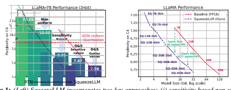
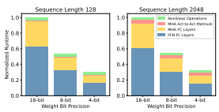
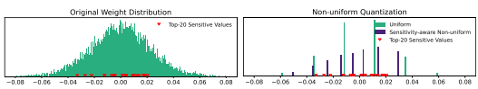
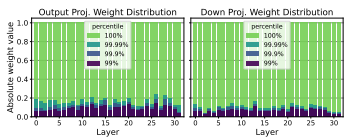
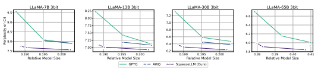
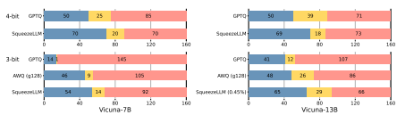
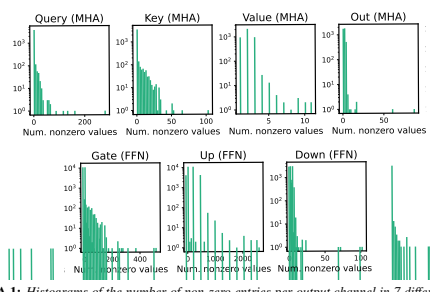
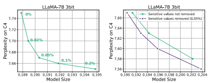
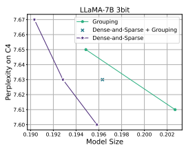
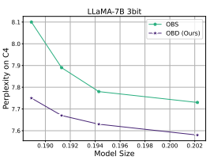

# Squeezellm: Dense-And-Sparse Quantization

Sehoon Kim∗1 Coleman Hooper∗1 Amir Gholami∗†12 **Zhen Dong**1 Xiuyu Li1 Sheng Shen1 **Michael W. Mahoney**123 **Kurt Keutzer**1 1 UC Berkeley 2ICSI 3 LBNL
{sehoonkim, chooper, amirgh, zhendong, xiuyu, sheng.s, mahoneymw, keutzer}@berkeley.edu

## Abstract

Generative Large Language Models (LLMs) have demonstrated remarkable results for a wide range of tasks. However, deploying these models for inference has been a significant challenge due to their unprecedented resource requirements. This has forced existing deployment frameworks to use multi-GPU inference pipelines, which are often complex and costly, or to use smaller and less performant models. In this work, we demonstrate that the main bottleneck for generative inference with LLMs is memory bandwidth, rather than compute, specifically for single batch inference. While quantization has emerged as a promising solution by representing weights with reduced precision, previous efforts have often resulted in notable performance degradation. To address this, we introduce SqueezeLLM, a post-training quantization framework that not only enables lossless compression to ultra-low precisions of up to 3-bit, but also achieves higher quantization performance under the same memory constraint. Our framework incorporates two novel ideas: (i) *sensitivity-based non-uniform quantization*, which searches for the optimal bit precision assignment based on second-order information; and (ii)
the *Dense-and-Sparse decomposition* that stores outliers and sensitive weight values in an efficient sparse format. When applied to the LLaMA models, our 3-bit quantization significantly reduces the perplexity gap from the FP16 baseline by up to 2.1× as compared to the state-of-the-art methods with the same memory requirement. Furthermore, when deployed on an A6000 GPU, our quantized models achieve up to 2.3× speedup compared to the baseline. Our code is open-sourced and available online1.

## 1 Introduction

Recent advances in Large Language Models (LLMs) trained on massive text corpora, with up to hundreds of billions of parameters, have showcased their remarkable problem-solving capabilities across various domains Brown et al. (2020); Raffel et al. (2020); Scao et al. (2022); Du et al. (2022); Hoffmann et al. (2022); Chowdhery et al. (2022); Smith et al. (2022); Zhang et al. (2022); Thoppilan et al. (2022); Touvron et al. (2023a). However, deploying these models for inference has been a significant challenge due to their demanding resource requirements. For instance, the LLaMA- 65B Touvron et al. (2021) model requires at least 130GB of RAM to deploy in FP16, which exceeds current GPU capacity. Even storing such large-sized models has become costly and complex. As will be discussed in Sec. 3, the main performance bottleneck in LLM inference for generative tasks is memory bandwidth rather than compute. This means that the speed at which we can load and store parameters becomes the primary latency bottleneck for memory-bound problems, rather than arithmetic computations. However, recent advancements in memory bandwidth technology have been significantly slow compared to the improvements in computes, leading to the phenomenon known as the Memory Wall Patterson (2004). Consequently, researchers have turned their attention to exploring algorithmic methods to overcome this challenge.

1

∗Equal contribution †Corresponding author 1https://github.com/SqueezeAILab/SqueezeLLM

Figure 1: (Left) SqueezeLLM incorporates two key approaches: (i) sensitivity-based non-uniform quantization (Sec. 4.1), where quantization bins are allocated closer to sensitive values, and (ii) the Dense-and-Sparse decomposition (Sec. 4.2), which retains both sensitive values and outlier values as full-precision sparse format. When applied to LLaMA-7B with 3-bit quantization, our method outperforms the state-of-the-art methods Frantar et al. (2022); Lin et al. (2023) by a large perplexity margin of over 0.3 on the C4 benchmark. (Right) By applying our methods to LLaMA models of varying sizes, we can achieve improved trade-offs between perplexity and model size.

One promising approach is quantization, where model parameters are stored at lower precision, instead of the typical 16 or 32-bit precision used for training. For instance, it has been demonstrated that LLM models can be stored in 8-bit precision without performance degradation Yao et al. (2022), where 8-bit quantization not only improves the storage requirements by half but also has the potential to improve inference latency and throughput. As a result, there has been significant research interest in quantizing models to even lower precisions. A pioneering approach is GPTQ Frantar et al. (2022) which uses a training-free quantization technique that achieves near-lossless 4-bit quantization for large LLM models with over tens of billions of parameters. However, achieving high quantization performance remains challenging, particularly with lower bit precision and for relatively smaller models (e.g., < 50B parameters) such as the recent LLaMA Touvron et al. (2023a). In this paper, we conduct an extensive study of low-bit precision quantization and identify limitations in existing approaches. Building upon these insights, we propose a novel solution that achieves lossless compression and improved quantization performance even at precisions as low as 3 bits.

Contributions. We first present performance modeling results demonstrating that the memory, rather than the compute, is the primary bottleneck in LLM inference with generative tasks (Sec. 3 and Fig. 2). Building on this insight, we introduce SqueezeLLM, a post-training quantization framework with a novel*sensitivity-based non-uniform quantization* and *Dense-and-Sparse decomposition*. These techniques enable ultra-low-bit precision with reduced model sizes and faster inference without compromising model performance. Our detailed contributions include:
- **Sensitivity-based Non-Uniform Quantization:** We demonstrate that uniform quantization, as commonly adopted in prior works, is sub-optimal for LLM inference for two reasons. First, the weight distributions in LLMs exhibit clear non-uniform patterns (Fig. 3). Second, the inference computation in prior works does not benefit from uniform quantization as the arithmetic is performed in FP16 precision, not in reduced precision. To address these, we propose a novel sensitivity-based non-uniform quantization method to achieve a more optimal quantization scheme for LLMs. Our approach significantly improves the perplexity of the LLaMA-7B model at 3-bit precision from 28.26 of uniform quantization to 7.75 on the C4 dataset (Sec. 4.1).

- **Dense-and-Sparse Quantization:** We observe that weights in LLMs contain significant outliers, making low-bit quantization extremely challenging. To address this, we propose a simple solution that decomposes weights into dense and sparse components. The sparse part holds outlier values in full precision using efficient sparse storage methods and leverages an efficient sparse kernel for minimal inference overhead. This allows the dense part to have a more compact range (up to 10×) and aids quantization. By extracting only 0.45% of the weight values as the sparse component, we further improve the perplexity of LLaMA-7B from 7.75 to 7.58 on the C4 dataset (Sec. 4.2).

- **Evaluation:** We extensively test SqueezeLLM on various models on language modeling tasks using the C4 and WikiText2 benchmarks, where we find that SqueezeLLM consistently outperforms existing quantization methods by a large margin across different bit precisions (Sec. 5.2). We also demonstrate the potential of SqueezeLLM in quantizing instruction following models by applying it to the Vicuna models Chiang et al. (2023) on the MMLU benchmark Hendrycks et al. (2021) and the Vicuna benchmark Chiang et al. (2023) (Sec. 5.3). Furthermore, our deployed models on A6000 GPUs also exhibit significant gains in latency of up to 2.4× compared to the FP16 baseline, showcasing the effectiveness of our method in terms of both quantization performance and inference efficiency (Sec. 5.4).

## 2 Related Work

In Sec. A.1, we offer an overview and related works of Transformer quantization, with a particular emphasis on Post-Training Quantization (PTQ) and non-uniform quantization, which are the primary focus of our work. Among the various challenges in low-bit Transformer quantization, one key issue is the presence of outliers Kovaleva et al. (2021), which can unnecessarily increase the quantization range. To address this issue, outlier-aware quantization methods have been investigated Bondarenko et al. (2021); Dettmers et al.; Wei et al. (2022; 2023). Notably, Dettmers et al. keeps outlier activations in floating-point, while Wei et al. (2022) transfers outlier factors to later layers without affecting functionality. These focus on activations, which is not a concern in our work where all activations are maintained in floating-point. Our Dense-and-Sparse quantization instead tackles *weight* outliers for low-bit LLM quantization. Concurrently to our work, SpQR Dettmers et al. (2023) also explores a method for extracting outliers in the context of quantization. However, SpQR employs a different sensitivity metric based on the Optimal Brain Surgeon (OBS) framework Hassibi et al. (1993); Hassibi & Stork (1993), where the weights are quantized in a way that the output activations of each layer are not perturbed. In contrast, our approach is based on the Optimal Brain Damage (OBD) framework LeCun et al. (1990) where the weights are quantized to preserve the final output of the model. While both approaches show promise, we have observed that the OBD method yields better quantization performance since it is a direct measure of the end-to-end performance degradation after quantization (Sec. A.4.4). More importantly, SqueezeLLM avoids techniques that can introduce high overhead and complexity when implementing lossless quantization. First, SqueezeLLM does not incorporate grouping. Our Dense-and-Sparse scheme provides a *direct* solution to prevent outlier values from negatively impacting quantization performance, eliminating the need for using the grouping strategy as an indirect solution (Sec. A.4.3). In contrast, SpQR requires fine-grained grouping (e.g., group size 16) which increases the model size and complicates the quantization pipeline by necessitating the bilevel quantization scheme. Second, the sensitivity-based non-uniform quantization in SqueezeLLM allows for much smaller (e.g., 0.05%) or even zero sparsity levels to achieve accurate quantization. This is crucial for reducing the model size as well as inference speed since higher sparsity levels can degrade inference latency. By avoiding grouping and utilizing smaller or zero sparsity levels, SqueezeLLM achieves accurate and fast quantization while pushing the average bit precision down to 3-bit, all while employing a simpler quantization pipeline and implementation. Another concurrent work is AWQ Lin et al. (2023) which improves the weight-only quantization scheme for LLMs by introducing scaling factors to reduce the quantization error of a few important weights. However, their approach is also based on the OBS framework, where sensitivity is determined by the magnitude of activations. In Sec. 5, we demonstrate that our method consistently outperforms AWQ in terms of quantization performance across various models and applications.

## 3 Memory Wall

Inference behavior broadly falls into two categories: *compute-bound* inference that is limited by computational throughput, and *memory-bound* inference that is bottlenecked by the rate at which data can be fed into the processing cores from memory. *Arithmetic intensity*, the ratio of compute to memory operations, is a typical metric used to assess this behavior. High and low arithmetic intensity indicates a compute-bound and memory-bound problem, respectively. For memory-bound problems, the speedup can be achieved by reducing the memory traffic rather than compute since the compute units in hardware are often underutilized waiting to receive data from memory.

Figure 2: *Normalized runtime for LLaMA-7B when reducing the bit precision for the weights with* sequence lengths of 128 (left) and 2048 (right). Results were obtained using a roofline-based performance model for an A5000 GPU. Reducing only the precision of the weights (and not the activations) is sufficient to obtain significant latency reductions.

Generative LLM inference exhibits extremely low arithmetic intensity compared to other workloads2 Kim et al. (2023). This is because it consists almost entirely of matrix-vector operations, which limits the achievable data reuse as each weight load can only process a single vector for a single token, and cannot be amortized across the multiple vectors for different tokens. This low arithmetic intensity needs to be contrasted with the compute operations on a typical GPU which is orders of magnitude higher than the memory operations3. The disparity between compute and memory bandwidth, along with the growing memory requirements of deep learning, has been termed the *Memory Wall* problem Gholami et al. (2021b). To further illustrate this problem in generative LLMs, we used a simple roofline-based performance modeling approach Kim et al. (2023) to study LLaMA-7B's runtime on an A5000 GPU with different bit precisions (Fig. 2). Here, we assume that all computations are kept at FP16. Despite this, we can clearly see that the latency decreases linearly as we reduce the bit precision, indicating that the main bottleneck is memory, not compute. In summary, in generative LLM inference, loading weight matrices into memory is the primary bottleneck, while the cost of dequantization and FP16 computation is relatively insignificant. Thus, by quantizing just the weights to lower precision, while leaving the activations in full precision, we can attain significant speedup as well as reduced model size. Given this insight, the appropriate strategy is to *minimize the memory size even if it may add overhead to arithmetic operations*.

## 4 Methodology 4.1 Sensitivity-Based Non-Uniform Quantization

In Fig. 3 (Left), we plot an exemplary weight distribution in LLaMA-7B that demonstrates a nonuniform pattern. The main task for quantization is to find an optimal way to allocate distinct quantized values (e.g., 8 for 3 bits) in a way that preserves model performance. As discussed, a widely used approach in the recent LLM quantization works Frantar et al. (2022); Dettmers et al. (2023);
Lin et al. (2023) is uniform quantization where the weight range is evenly divided into bins, and each bin is represented by a single integer number. This has two main issues. First, uniformly distributing quantized values is sub-optimal as weight distributions are typically non-uniform. Second, while the main advantage of uniform quantization is efficient integer computation, this does not lead to end-to-end latency improvement in memory-bound LLM inference. Therefore, we have chosen non-uniform quantization, which allows for a more flexible allocation of the representative values. Finding an optimal non-uniform quantization configuration translates into solving a k-means problem. Given a weight distribution, the goal is to determine k centroids that best represent the values (e.g., k=8 for 3-bit). This optimization problem for non-uniform quantization can be formulated as Q(w)
∗ = arg min
∥W − WQ∥
22, (1)
Q

2To be precise, we limit this discussion to single batch inference where the arithmetic involves matrix-vector operations. For large batch inference or different model architectures, compute can become important.

3For instance, A5000 GPU has peak computational throughput of 222 TeraFLOPs per second, which is 290× higher than the peak memory bandwidth of 768 GigaBytes per second.

Figure 3: *(Left) The weight distribution of one output channel in LLaMA-7B. The top-20 most sen-*

 sitive values are marked in red. (Right) Weight distributions after 3-bit quantization using uniform and sensitivity-based non-uniform quantization. In the latter case, the quantized values are more clustered around the sensitive values.

where W denotes the weights and WQ is the corresponding quantized weights (i.e., [Q(w) for w ∈ W]), represented by k distinct values {q1, · · · , qk}. Here, the optimal solution Q(w)
∗can be obtained by 1-dimensional k-means clustering, which clusters the parameters into k clusters and assign the centroid of each cluster as qj 's. While this already outperforms uniform quantization, we propose an improved *sensitivity-based* clustering algorithm. Sensitivity-Based K-means Clustering. The quantization objective is to represent the model weights with low-bit precision with minimal perturbation in the model output Dong et al. (2019). While quantization introduces perturbations in each layer, we need to minimize the overall perturbation with respect to the *final loss term*, rather than focusing on individual layers, as it provides a more direct measure of the end-to-end performance degradation after quantization LeCun et al. (1990). To achieve this, we need to place the k-means centroids closer to the values that are more sensitive with respect to the final loss, rather than treating all weight values equally as in Eq. 1. To determine more sensitive values, we perform Taylor expansion to analyze how the loss changes in response to perturbations in the weights W:

$${\mathcal{L}}(W_{Q})\simeq{\mathcal{L}}(W)-g^{\top}(W-W_{Q})+{\frac{1}{2}}(W-W_{Q})^{\top}H(W-W_{Q})$$

where g is the gradient and H = E[
∂
2
∂W2L(W)] is the Hessian of the loss at W. Assuming that the model has converged to a local minimum, the gradient g can be approximated as zero which gives us the following formula for computing how much the model gets perturbed after quantization:

$$(2)$$
$$Q(w)^{*}=\operatorname*{arg\,min}_{Q}(W-W_{Q})^{\top}H(W-W_{Q}).$$
$$({\mathfrak{I}})$$
⊤H(W − WQ). (3)
In the new optimization target, as compared to Eq. 1, the perturbation of each weight after quantization, i.e., W − WQ, is weighted by the scaling factor introduced by the second-order derivative, H. This highlights the importance of minimizing perturbations for weights that have large Hessian values, as they have a greater impact on the overall perturbation of the final output. In other words, the second-order derivative serves as a measure of importance for each weight value.

Due to the cost of computing the Hessian, we use an approximation to the Hessian based on the Fisher information matrix F, which can be calculated over a sample dataset D as H ≃ F =
1 |D| Pd∈D gdgd
⊤. This only requires computing gradient for a set of samples, which can be calculated efficiently with existing frameworks. To make the optimization objective in Eq. 3 more feasible, we further approximate the Fisher information matrix as a diagonal matrix by assuming that the cross-weight interactions are negligible. This simplifies our objective target as follows:

$$Q(w)^{*}\simeq\operatorname*{arg\,min}_{Q}(W-W_{Q})^{\top}\operatorname{diag}(\mathcal{F})(W-W_{Q})=\operatorname*{arg\,min}_{Q}\sum_{i=1}^{N}\mathcal{F}_{ii}\big{(}w_{i}-Q(w_{i})\big{)}^{2}.\tag{4}$$

An important consequence of Eq. 4 is the *weighted* k-means clustering setting, where the centroids will be pulled closer to these sensitive weight values. In Fig. 3, we provide an exemplary weight distribution of LLaMA-7B with the top 20 sensitive values based on the Fisher information. At the right, the quantized values assigned by uniform quantization (green) are compared to those assigned by the sensitivity-based k-means approach (purple), which achieves a better trade-off by placing centroids near sensitive values, effectively minimizing quantization error. With 3-bit LLaMA-7B, sensitivity-based non-uniform quantization achieves a much lower perplexity of 7.75 compared to the 28.26 perplexity of round-to-nearest uniform quantization on C4 (Fig. 1 and Sec. 5.2)

Figure 4: The distributions of the (normalized) absolute weight values, for the output layers in MHA and the down layers in FFN across different layers in LLaMA-7B. Note that the distributions exhibit outlier patterns across all layers, with 99% of the values clustered within ∼*10% of the entire range.*

## 4.2 Dense-And-Sparse Quantization

Another challenge in low-bit LLM quantization is outlier values Bondarenko et al. (2021); Dettmers et al.; Wei et al. (2022; 2023). In Fig 4, we plot the normalized weight distributions of different layers in LLaMA-7B, which demonstrate that ∼99.9% of the weights are concentrated in a narrow range of ∼10% of the entire distribution. Naively quantizing the weights with such large range, will significantly degrade performance, especially at low precisions such as 3-bits. However, the observation in Fig. 4 also implies opportunity. The range of the weight values can be contracted by a factor of 10× simply by removing a small number of outlier values (e.g., 0.1%), yielding a significant improvement in quantization resolution. This will then help the sensitivity-based kmeans centroids to focus more on the sensitive values rather than a few outliers.

Motivated by this, we introduce a method to filter out outliers from the weight matrix W by performing a simple yet effective decomposition into a sparse matrix (S) containing the outliers and the remaining dense matrix (D) that can be quantized much more effectively thanks to its significantly reduced range of values. That is, W = D + S where D = W[Tmin ≤ w ≤ Tmax] and S = W[*w < T*min or *w > T*max]. Here, Tmin/max are thresholds that define outliers based on the percentile of the distribution. Importantly, the overhead of this decomposition is minimal, since the number of outlier values is small. Even in the most aggressive quantization experiments, we did not find it necessary to use > 0.5% of sparsity. Therefore, the sparse matrix can be stored efficiently using methods like compressed sparse row (CSR) format. Inference is also straightforward with the decomposition as in W X = DX + SX, two kernels for dense and sparse multiplication can be overlapped, and the sparse part (SX) can benefit from sparse kernels (Sec. 4.3). Sensitivity-Based Sparse Matrix. Beyond extracting outliers as a sparse matrix, we have also found it beneficial to extract a few highly sensitive values in weight matrices to make sure those values are represented exactly without any error. These values can be easily identified based on the Fisher information (Sec. 4.1). This offers two benefits. First, maintaining these sensitive values with FP16 precision minimizes their impact on the final output. Second, it prevents the centroids of Eq.4 from skewing towards the sensitive values, thus enhancing quantization for less sensitive weights. We have observed that extracting only 0.05% of these sensitive values across layers substantially enhances quantization performance (Sec. A.4). Altogether, with 3-bit LLaMA-7B, extracting 0.45% of outlier and sensitive values further reduces the perplexity from 7.67 to 7.56 (Fig. 1 and Sec. 5.2).

## 4.3 Dense-And-Sparse Kernel Implementation

While a natural question to consider is the impact of both the non-uniform and Dense-and-Sparse quantization on latency, we find it straightforward to implement them efficiently. We implement 3/4-bit LUT-based kernels for matrix-vector multiplication between compressed weight matrices and uncompressed activation vectors. These kernels load the compressed weights and dequantize them piece-by-piece to minimize memory bandwidth utilization. The compressed matrices store 3/4-bit indices, which correspond to LUT entries containing FP16 values associated with the bins obtained from non-uniform quantization. After dequantization, all arithmetic is performed in FP16.

To efficiently process our Dense-and-Sparse representation, we also develop CUDA kernels for sparse matrix-vector multiplication that load a matrix in CSR format and a dense activation vector, inspired by Evtushenko (2019). Since the non-zero entry distributions are highly skewed across rows (Sec. A.3), assigning a single thread per row can be inefficient due to the unbalanced amount of work assigned to different threads. Thus, we implement *balanced hybrid kernels* based on Flegar & Quintana-Ort´ı (2017) by assigning an equal number of nonzeros per thread; this leads to additional synchronization across threads since one row may be divided across several threads, but leads to a balanced work assignment. We set the number of threads such that there were 10 nonzero values assigned to each thread. The dense non-uniform kernel and balanced sparse kernels are launched in one call to avoid overhead from summing the output vectors from these separate operations.

## 5 Evaluations 5.1 Experiment Setup

In this section, we describe our experiment setup. More details can be found in Sec. A.2. Models and Datasets. We have conducted comprehensive evaluations of SqueezeLLM using various models on different tasks. First, in the language modeling evaluation, we apply SqueezeLLM to LLaMA, LLaMA2 Touvron et al. (2023a;b), and OPT Zhang et al. (2022) on the C4 Raffel et al. (2020) and WikiText2 Merity et al. (2016) datasets. We also evaluate the domain-specific knowledge and problem-solving ability through zero-shot MMLU Hendrycks et al. (2021) using the Vicuna (v1.1 and v1.3) models. Finally, we evaluate the instruction following ability using the methodology in Chiang et al. (2023) that uses GPT-4 as a judge. Baseline Methods. We compare SqueezeLLM against PTQ methods for LLMs including RTN, GPTQ Frantar et al. (2022), AWQ Lin et al. (2023) and SpQR Dettmers et al. (2023). To ensure a fair comparison, we use GPTQ *with* activation ordering throughout all experiments unless specified, which addresses the significant performance drop that would otherwise occur. Quantization Details. For SqueezeLLM, we adopt channel-wise quantization where each output channel is assigned a separate lookup table. We use 2 different sparsity levels: 0% (dense-only) and 0.45% (0.05% sensitive values and 0.4% outlier values as discussed in Sec. 4.2). For measuring sensitivity, we use 100 random samples from the Vicuna training set for Vicuna models and C4 training set for the others. While grouping can also be incorporated with our method, we found it sub-optimal as compared to extracting sensitive/outlier values with sparsity (Sec. A.4.3). Latency Profiling. We measure the latency and peak memory usage for generating 128 and 1024 tokens on an A6000 machine using the Torch CUDA profiler. As an official implementation of GPTQ (in particular, the grouped version) is not available, we implement an optimized kernel for single-batch inference based on the most active open-source codebase ( GPTQ-For-LLaMA).

## 5.2 Main Results

Table 1 shows quantization results for LLaMA along with comparison with RTN, GPTQ and AWQ. The models are grouped based on their average bitwidth (i.e., model size) for a better comparison of size-perplexity trade-offs. See Fig. 5 for a visual illustration. Below we use LLaMA-7B as the main example for the discussions for the impact of dense-only and Dense-and-Sparse quantization, and subsequently discuss how these trends extend to larger models. We provide the full evaluation result on all LLaMA models in Tab. A.4. Dense-only Quantization. In Tab. 1 (Top), we compare dense-only SqueezeLLM with 0% sparsity level and GPTQ without grouping. With 4-bit quantization, our method exhibits minimal degradation compared to the FP16 baseline, with only ∼0.1 perplexity degradation on C4 and WikiText2, while reducing the model size by 3.95×. Moreover, when compared to non-grouped GPTQ our method shows significant perplexity improvement of up to 0.22.

†Since SpQR does not release their kernel implementation, we conduct our best-effort comparison using their reported speedup numbers. See Sec. A.2 for details.

‡GPTQ with activation ordering incurs a significant latency penalty as elements in the same channel are associated with different scaling factors, resulting in distributed memory accesses (Sec. 5.4). While GPTQ without activation ordering alleviates the latency issue, comes at the cost of a substantial perplexity degradation.

| LLaMA\-7B                | 3\-bit             |       |        |         |         | 4\-bit             |      |        |         |         |
|--------------------------|--------------------|-------|--------|---------|---------|--------------------|------|--------|---------|---------|
| Method                   | Avg. Bits  PPL (↓) |       |        | Speedup | Mem.    | Avg. Bits  PPL (↓) |      |        | Speedup | Mem.    |
|                          | (comp. rate)       | C4    | Wiki   | (↑)     | (GB, ↓) | (comp. rate)       | C4   | Wiki   | (↑)     | (GB, ↓) |
| Baseline                 | 16                 | 7.08  | 5.68   | 1×      | 12.7    | 16                 | 7.08 | 5.68   | 1×      | 12.7    |
| RTN                      | 3 (5.33)           | 28.26 | 25.61  | 2.3×    | 2.9     | 4 (4.00)           | 7.73 | 6.29   | 2.0×    | 3.7     |
| GPTQ                     | 3 (5.33)           | 9.55  | 7.55   | 2.3×    | 2.9     | 4 (4.00)           | 7.43 | 5.94   | 2.0×    | 3.7     |
| SpQR                     | \-                 | \-    | \-     | \-      | \-      | 3.94 (4.06)        | 7.28 | 5.87   | 1.2׆   | N/A     |
| SqueezeLLM               | 3.02 (5.29)        | 7.75  | 6.32   | 2.1×    | 2.9     | 4.05 (3.95)        | 7.21 | 5.79   | 1.8×    | 3.8     |
| GPTQ (g128, no reorder)‡ | 3.24 (4.93)        | 10.09 | 8.85   | 2.0×    | 3.0     | 4.24 (3.77)        | 7.80 | 6.07   | 1.6×    | 3.8     |
| GPTQ (g128)‡             | 3.24 (4.93)        | 7.89  | 6.27   | 0.2×    | 3.0     | 4.24 (3.77)        | 7.21 | 5.78   | 0.4×    | 3.8     |
| AWQ (g128)               | 3.24 (4.93)        | 7.90  | 6.44   | 2.0×    | 3.0     | 4.24 (3.77)        | 7.22 | 5.82   | 1.6×    | 3.8     |
| SqueezeLLM (0.45%)       | 3.24 (4.93)        | 7.56  | 6.13   | 1.9×    | 3.1     | 4.27 (3.75)        | 7.18 | 5.77   | 1.7×    | 4.0     |
| LLaMA\-13B               |                    |       | 3\-bit |         |         |                    |      | 4\-bit |         |         |
| Method                   | Avg. Bits  PPL (↓) |       |        | Speedup | Mem.    | Avg. Bits  PPL (↓) |      |        | Speedup | Mem.    |
|                          | (comp. rate)       | C4    | Wiki   | (↑)     | (GB, ↓) | (comp. rate)       | C4   | Wiki   | (↑)     | (GB, ↓) |
| Baseline                 | 16                 | 6.61  | 5.09   | 1×      | 24.6    | 16                 | 6.61 | 5.09   | 1×      | 24.6    |
| RTN                      | 3 (5.33)           | 13.24 | 11.78  | 2.7×    | 5.3     | 4 (4.00)           | 6.99 | 5.53   | 2.3×    | 6.8     |
| GPTQ                     | 3 (5.33)           | 8.22  | 6.22   | 2.7×    | 5.3     | 4 (4.00)           | 6.84 | 5.29   | 2.3×    | 6.8     |
| SpQR                     | \-                 | \-    | \-     | \-      | \-      | 3.96 (4.04)        | 6.72 | 5.22   | 1.2׆   | N/A     |
| SqueezeLLM               | 3.02 (5.30)        | 7.08  | 5.60   | 2.4×    | 5.4     | 4.04 (3.96)        | 6.71 | 5.18   | 2.0×    | 6.9     |
| GPTQ (g128, no reorder)‡ | 3.25 (4.92)        | 7.16  | 5.53   | 2.2×    | 5.7     | 4.25 (3.77)        | 6.71 | 5.18   | 1.9×    | 7.2     |
| GPTQ (g128)‡             | 3.25 (4.92)        | 7.12  | 5.47   | 0.2×    | 5.6     | 4.25 (3.77)        | 6.70 | 5.17   | 0.4×    | 7.0     |
| AWQ (g128)               | 3.25 (4.92)        | 7.08  | 5.52   | 2.2×    | 5.7     | 4.25 (3.77)        | 6.70 | 5.21   | 1.9×    | 7.2     |
| SqueezeLLM (0.45%)       | 3.24 (4.94)        | 6.92  | 5.45   | 2.2×    | 5.8     | 4.26 (3.76)        | 6.68 | 5.17   | 1.9×    | 7.3     |

Table 1: *Perplexity comparison of LLaMA models quantized into 3 and 4 bits using different methods including* RTN, GPTQ, AWQ and SpQR on C4 and WikiText-2. We compare the performance of GPTQ, AWQ, and SqueezeLLM in groups based on similar model sizes. In the first group, we compare dense-only SqueezeLLM with non-grouped GPTQ. In the second group, we compare SqueezeLLM with a sparsity level of 0.45% to GPTQ and AWQ with a group size of 128. We add speedup and peak memory usage numbers for comparison. Further results for LLaMA-30/65B can be found in Tab. A.4. Detailed latency evaluation can be found in Tab. 3.

Figure 5: *Perplexity comparison PTQ methods for 3-bit LLaMA quantization, evaluated on C4. The* x-axes are the relative model sizes with respect to the model size in FP16. Different size-perplexity trade-offs are achieved by adjusting the group size for GPTQ and AWQ and the sparsity level for ours. Our quantization method consistently and significantly outperforms GPTQ and AWQ across all model size regimes, with a more pronounced gap in lower-bit and smaller model sizes.

The performance gap between the two methods becomes more pronounced with 3-bit quantization. SqueezeLLM outperforms GPTQ by a substantial margin of 1.80/1.22 points on C4/WikiText2 with a 5.29× compression rate. This is only 0.67/0.55 points off from the FP16 baseline. This demonstrates the effectiveness of the sensitivity-based non-uniform method for ultra-low-bit quantization. Dense-and-Sparse Quantization. By leveraging the Dense-and-Sparse quantization, we achieve a further reduction in the perplexity gap between the FP16 baseline and quantized models, as shown in Tab. 1. This improvement is particularly significant with 3-bit quantization, where extracting just 0.45% of the values yields around 0.2 perplexity improvement. This enables nearly lossless compression with less than 0.1/0.5 perplexity deviation from the FP16 baseline for 4/3-bit, respectively.

Both GPTQ and AWQ use a grouping strategy to enhance performance with a slight overhead in model size. However, we demonstrate that SqueezeLLM with a sparsity level of 0.45% consistently outperforms both GPTQ and AWQ with a group size of 128 in all scenarios with comparable model sizes. This is more pronounced for 3-bit quantization, where SqueezeLLM with a 0.45% sparsity level outperforms both GPTQ and AWQ with a group size of 128 by up to more than 0.3 perplexity.

| Method        | Avg. bit   |         | 7B          |             |         | 13B         |             |
|---------------|------------|---------|-------------|-------------|---------|-------------|-------------|
|               |            | Acc (↑) | Speedup (↑) | Mem (GB, ↓) | Acc (↑) | Speedup (↑) | Mem (GB, ↓) |
| Baseline      | 16         | 39.1%   | 1×          | 12.7        | 41.2%   | 1×          | 24.6        |
| AWQ (g128)    | 4.25       | 38.0%   | 1.6×        | 3.8         | 40.4%   | 1.9×        | 7.2         |
| SqLLM         | 4.05       | 38.8%   | 1.8×        | 3.8         | 39.2%   | 2.0×        | 6.9         |
| SqLLM (0.45%) | 4.26       | 39.4%   | 1.7×        | 4.0         | 41.0%   | 1.9×        | 7.3         |
| AWQ (g128)    | 3.25       | 36.5%   | 2.0×        | 3.0         | 37.6%   | 2.2×        | 5.7         |
| SqLLM         | 3.02       | 36.0%   | 2.1×        | 2.9         | 37.2%   | 2.4×        | 5.4         |
| SqLLM (0.45%) | 3.24       | 37.7%   | 1.9×        | 3.1         | 39.4%   | 2.2×        | 5.8         |

Table 2: Comparison of PTQ methods on zero-shot MMLU accuracy applied to Vicuna v1.1. We add speedup and peak memory usage for comparison.

Tie Loss

71 Win

Figure 6: *Comparison of PTQ methods applied to Vicuna v1.1. Blue / yello / red represent the* number of times that the quantized model won / tied / lost against the baseline FP16 model. This evaluation was performed using the methodology from Vicuna.

Results on Larger Models. In Tab. 1 (13B) and Tab. A.4 (30/65B), we observe that the trend in LLaMA-7B extends to larger models, where SqueezeLLM consistently outperforms other PTQ
methods across all model sizes and bit widths. Such a trend is also visually illustrated in Fig. 5 for 3-bit quantization across all model sizes. Notably, even the dense-only version of SqueezeLLM achieves perplexity comparable to the grouped GPTQ and AWQ. With sparsity, we achieve further perplexity improvements, reducing the gap from the FP16 baseline to less than 0.1/0.4 perplexity points for 4/3-bit quantization. Notably, with 3-bit quantization, our approach achieves up to a 2.1× reduction in perplexity gap from the FP16 baseline compared to existing methods. Further ablation studies on our design choices, including sensitivity metrics, sparsity levels, and grouping, are provided in Sec. A.4, and additional results on LLaMA2 and OPT are in Sec. A.6.1.

## 5.3 Quantization Of Instruction Following Models

Instruction tuning has emerged as a method for improving the model's ability to respond to user commands. We explore the quantization of instruction-following models to demonstrate the benefits of SqueezeLLM in terms of accuracy preservation by applying it to the Vicuna models, and evaluating the performance with the following approaches. Zero-shot MMLU Evaluation. We first compare the baseline and quantized model on the zero-shot multitask problem-solving benchmark of MMLU. The weighted accuracy across all tasks is provided in Tab. 2 for Vicuna v1.1, including its quantized models using AWQ and SqueezeLLM. As we can see, SqueezeLLM achieves higher accuracy for both Vicuna-7B and 13B as compared to AWQ and also preserves the FP16 baseline accuracy with 4-bit quantization. It is also noteworthy that the 4-bit Vicuna-13B of SqueezeLLM has 2× smaller memory footprint than the 7B FP16 model, while still achieving a 2% higher accuracy. Additional results on Vicuna v1.3 are provided in Sec A.6.2.

Instruction-Following Ability. Another approach for evaluating instruction-following ability is to ask GPT-4 to rank the generated responses which is the method used by Chiang et al. (2023). The results are shown in Fig. 6. SqueezeLLM without sparsity achieves near-perfect performance (i.e., 50/50 split) with 4-bit quantization for both Vicuna-7B and 13B, outperforming GPTQ with the same model size. In the case of 3-bit quantization, SqueezeLLM outperforms both GPTQ and AWQ with comparable model sizes. In the case of the Vicuna-13B model, achieving a near-perfect 50/50 split for 3-bit quantization.

| Method             | Bit   |      | 7B   |      |      | 13B                                                                        |      |      | 30B   |      |      | 65B                      |      |
|--------------------|-------|------|------|------|------|----------------------------------------------------------------------------|------|------|-------|------|------|--------------------------|------|
|                    | width |      |      |      |      | PPL (C4) Lat (s) Mem (G) PPL (C4) Lat (s) Mem (G) PPL (C4) Lat (s) Mem (G) |      |      |       |      |      | PPL (C4) Lat (s) Mem (G) |      |
| Baseline           | 16    | 7.08 | 3.2  | 12.7 | 6.61 | 5.6                                                                        | 24.6 | 5.98 | OOM   | OOM  | 5.62 | OOM                      | OOM  |
| GPTQ               | 3     | 9.55 | 1.4  | 2.9  | 8.22 | 2.1                                                                        | 5.3  | 7.31 | 4.0   | 12.3 | 6.70 | 6.7                      | 24.0 |
| SqueezeLLM         | 3.02  | 7.75 | 1.5  | 2.9  | 7.08 | 2.4                                                                        | 5.4  | 6.37 | 4.0   | 12.5 | 5.99 | 7.6                      | 24.5 |
| GPTQ (g128)        | 3.25  | 7.89 | 13.7 | 3.0  | 7.12 | 24.2                                                                       | 5.6  | 6.47 | 61.9  | 12.9 | 6.01 | 117.8                    | 25.1 |
| SqueezeLLM (0.45%) | 3.24  | 7.56 | 1.7  | 3.1  | 6.92 | 2.5                                                                        | 5.8  | 6.23 | 4.4   | 14.7 | 5.84 | 8.8                      | 28.0 |

Table 3: *Latency (s) and peak memory usage (GB) of 3-bit LLaMA when generating 128 tokens* on an A6000 GPU. The table compares the FP16 baseline, non-grouped and grouped GPTQ with activation ordering, and SqueezeLLM with different sparsity levels. For comparison, we include bitwidth and perpelxity on the C4 benchmark.

## 5.4 Hardware Deployment And Profiling

While grouping with permutation is an effective way to confine the quantization range, our Denseand-Sparse scheme can achieve higher accuracy with simpler kernels. We show the latency and peak GPU memory usage of SqueezeLLM in Tab. 3 on an A6000 GPU for different configurations when generating 128 tokens. We observe that the LUT-based non-uniform approach in SqueezeLLM (3rd row) shows up to 2.4× speedup compared to the FP16 baseline, and exhibits comparable latency and peak memory usage to the uniform quantization of non-grouped GPTQ (2nd row). This indicates that the overhead associated with LUT-based dequantization is small, especially considering the considerable perplexity gains it enables. Additionally, when incorporating sparsity, we still observed latency gains relative to the FP16 baseline. As shown in Tab. 3, keeping 0.45% of parameters in FP16 (4th row) only adds around 10% latency overhead relative to the dense-only implementation, while still resulting in up to 2.2× speed up compared to the FP16 baseline. In contrast, when accounting for permutation, the GPTQ runtime is degraded heavily (5th row). This latency penalty is due to permutation, which means that elements in the same channel need to be scaled using different scaling factors (which are accessed using group indices); it is challenging for these distributed memory accesses to be performed efficiently, as GPUs rely heavily on coalesced memory accesses in order to optimally utilize memory bandwidth. This shows how our Dense-and-Sparse quantization methodology allows for both higher accuracy as well as better performance relative to GPTQ. Additional evaluation results on generating 1024 tokens are provided in Tab. A.3, where we can observe a similar trend.

## 6 Conclusion

We have presented SqueezeLLM which attempts to address the Memory Wall problem associated with generative LLM inference that is memory-bound. SqueezeLLM incorporates two novel ideas that allow ultra-low precision quantization of LLMs with negligible degradation in generation performance: the sensitivity-based non-uniform quantization method; and the Dense-and-Sparse decomposition that resolves the outlier issue. We have evaluated SqueezeLLM on a wide range of models and datasets that assess language modeling, problem-solving, and instruction-following capabilities of quantized models, where we have demonstrated that our quantization method can consistently outperform the previous state-of-the-art methodologies.

## 7 Acknowledgements

The authors would like to acknowledge Karttikeya Mangalam, Nicholas Lee, and Thanakul Wattanawong for helpful discussions and brainstorming. We acknowledge gracious support from Google Cloud, Google TRC team, and specifically Jonathan Caton, Jing Li, Jiayu Ye, and Prof. David Patterson. Prof. Keutzer's lab is sponsored by Intel corporation, Intel VLAB team, Intel One-API center of excellence, as well as gracious funding from Furiosa, Berkeley Deep Drive, and BAIR. Our conclusions do not necessarily reflect the position or the policy of our sponsors, and no official endorsement should be inferred.

## References

Haoli Bai, Wei Zhang, Lu Hou, Lifeng Shang, Jing Jin, Xin Jiang, Qun Liu, Michael Lyu, and Irwin King. BinaryBERT: Pushing the limit of BERT quantization. *arXiv preprint arXiv:2012.15701*, 2020.

Yelysei Bondarenko, Markus Nagel, and Tijmen Blankevoort. Understanding and overcoming the challenges of efficient Transformer quantization. *arXiv preprint arXiv:2109.12948*, 2021.

Tom B Brown, Benjamin Mann, Nick Ryder, Melanie Subbiah, Jared Kaplan, Prafulla Dhariwal, Arvind Neelakantan, Pranav Shyam, Girish Sastry, Amanda Askell, et al. Language models are few-shot learners. *arXiv preprint arXiv:2005.14165*, 2020.

Yaohui Cai, Zhewei Yao, Zhen Dong, Amir Gholami, Michael W Mahoney, and Kurt Keutzer.

ZeroQ: A novel zero shot quantization framework. In *Proceedings of the IEEE/CVF Conference* on Computer Vision and Pattern Recognition, pp. 13169–13178, 2020.

Wei-Lin Chiang, Zhuohan Li, Zi Lin, Ying Sheng, Zhanghao Wu, Hao Zhang, Lianmin Zheng, Siyuan Zhuang, Yonghao Zhuang, Joseph E. Gonzalez, Ion Stoica, and Eric P. Xing. Vicuna: An open-source chatbot impressing gpt-4 with 90%* chatgpt quality, March 2023. URL https: //lmsys.org/blog/2023-03-30-vicuna/.

Aakanksha Chowdhery, Sharan Narang, Jacob Devlin, Maarten Bosma, Gaurav Mishra, Adam Roberts, Paul Barham, Hyung Won Chung, Charles Sutton, Sebastian Gehrmann, et al. PALM: Scaling language modeling with pathways. *arXiv preprint arXiv:2204.02311*, 2022.

Insoo Chung, Byeongwook Kim, Yoonjung Choi, Se Jung Kwon, Yongkweon Jeon, Baeseong Park, Sangha Kim, and Dongsoo Lee. Extremely low bit transformer quantization for on-device neural machine translation. *arXiv preprint arXiv:2009.07453*, 2020.

Tim Dettmers, Mike Lewis, Younes Belkada, and Luke Zettlemoyer. Gpt3. int8 (): 8-bit matrix multiplication for transformers at scale. In *Advances in Neural Information Processing Systems*.

Tim Dettmers, Ruslan Svirschevski, Vage Egiazarian, Denis Kuznedelev, Elias Frantar, Saleh Ashkboos, Alexander Borzunov, Torsten Hoefler, and Dan Alistarh. SpQR: A sparse-quantized representation for near-lossless LLM weight compression. *arXiv preprint arXiv:2306.03078*, 2023.

Zhen Dong, Zhewei Yao, Daiyaan Arfeen, Amir Gholami, Michael W Mahoney, and Kurt Keutzer.

HAWQ-V2: Hessian Aware trace-Weighted Quantization of neural networks. NeurIPS'19 workshop on Beyond First-Order Optimization Methods in Machine Learning., 2019.

Nan Du, Yanping Huang, Andrew M Dai, Simon Tong, Dmitry Lepikhin, Yuanzhong Xu, Maxim Krikun, Yanqi Zhou, Adams Wei Yu, Orhan Firat, et al. GLAM: Efficient scaling of language models with mixture-of-experts. In *International Conference on Machine Learning*, pp. 5547– 5569. PMLR, 2022.

Georgii Evtushenko. Sparse Matrix-Vector Multiplication with CUDA.

https://medium.com/analytics-vidhya/sparse-matrix-vector-multiplication-with-cuda42d191878e8f, 2019.

Goran Flegar and Enrique S Quintana-Ort´ı. Balanced csr sparse matrix-vector product on graphics processors. In Euro-Par 2017: Parallel Processing: 23rd International Conference on Parallel and Distributed Computing, Santiago de Compostela, Spain, August 28–September 1, 2017, Proceedings 23, pp. 697–709. Springer, 2017.

Elias Frantar, Saleh Ashkboos, Torsten Hoefler, and Dan Alistarh. GPTQ: Accurate post-training quantization for generative pre-trained transformers. *arXiv preprint arXiv:2210.17323*, 2022.

Leo Gao, Jonathan Tow, Stella Biderman, Sid Black, Anthony DiPofi, Charles Foster, Laurence Golding, Jeffrey Hsu, Kyle McDonell, Niklas Muennighoff, Jason Phang, Laria Reynolds, Eric Tang, Anish Thite, Ben Wang, Kevin Wang, and Andy Zou. A framework for few-shot language model evaluation, September 2021. URL https://doi.org/10.5281/zenodo. 5371628.

Amir Gholami, Sehoon Kim, Zhen Dong, Zhewei Yao, Michael W Mahoney, and Kurt Keutzer.

A survey of quantization methods for efficient neural network inference. *arXiv preprint* arXiv:2103.13630, 2021a.

Amir Gholami, Zhewei Yao, Sehoon Kim, Michael W Mahoney, and Kurt Keutzer. AI and Memory Wall. *https://medium.com/riselab/ai-and-memory-wall-2cb4265cb0b8*, 2021b.

GPTQ-For-LLaMA. https://github.com/qwopqwop200/gptq-for-llama. Babak Hassibi and David G Stork. Second order derivatives for network pruning: Optimal brain surgeon. In *Advances in neural information processing systems*, pp. 164–171, 1993.

Babak Hassibi, David G Stork, and Gregory J Wolff. Optimal brain surgeon and general network pruning. In *IEEE international conference on neural networks*, pp. 293–299. IEEE, 1993.

Dan Hendrycks, Collin Burns, Steven Basart, Andy Zou, Mantas Mazeika, Dawn Song, and Jacob Steinhardt. Measuring massive multitask language understanding. Proceedings of the International Conference on Learning Representations (ICLR), 2021.

Jordan Hoffmann, Sebastian Borgeaud, Arthur Mensch, Elena Buchatskaya, Trevor Cai, Eliza Rutherford, Diego de Las Casas, Lisa Anne Hendricks, Johannes Welbl, Aidan Clark, et al. Training compute-optimal large language models. *arXiv preprint arXiv:2203.15556*, 2022.

Yafeng Huang, Huanrui Yang, Zhen Dong, Denis Gudovskiy, Tomoyuki Okuno, Yohei Nakata, Yuan Du, Shanghang Zhang, and Kurt Keutzer. Output sensitivity-aware detr quantization. 2023.

Yongkweon Jeon, Chungman Lee, Eulrang Cho, and Yeonju Ro. Mr. BiQ: Post-training non-uniform quantization based on minimizing the reconstruction error. In Proceedings of the IEEE/CVF Conference on Computer Vision and Pattern Recognition, pp. 12329–12338, 2022.

Sehoon Kim, Amir Gholami, Zhewei Yao, Michael W Mahoney, and Kurt Keutzer. I-BERT: Integeronly bert quantization. *arXiv preprint arXiv:2101.01321*, 2021.

Sehoon Kim, Coleman Hooper, Thanakul Wattanawong, Minwoo Kang, Ruohan Yan, Hasan Genc, Grace Dinh, Qijing Huang, Kurt Keutzer, Michael W Mahoney, Sophia Shao, and Amir Gholami. Full stack optimization of transformer inference: a survey. *arXiv preprint arXiv:2302.14017*, 2023.

Olga Kovaleva, Saurabh Kulshreshtha, Anna Rogers, and Anna Rumshisky. Bert busters: Outlier dimensions that disrupt transformers. *arXiv preprint arXiv:2105.06990*, 2021.

Yann LeCun, John S Denker, and Sara A Solla. Optimal brain damage. In *Advances in neural* information processing systems, pp. 598–605, 1990.

Xiuyu Li, Long Lian, Yijiang Liu, Huanrui Yang, Zhen Dong, Daniel Kang, Shanghang Zhang, and Kurt Keutzer. Q-diffusion: Quantizing diffusion models. *arXiv preprint arXiv:2302.04304*, 2023.

Ji Lin, Jiaming Tang, Haotian Tang, Shang Yang, Xingyu Dang, and Song Han. Awq: Activationaware weight quantization for llm compression and acceleration. 2023.

Yijiang Liu, Huanrui Yang, Zhen Dong, Kurt Keutzer, Li Du, and Shanghang Zhang. NoisyQuant:
Noisy bias-enhanced post-training activation quantization for vision transformers. In Proceedings of the IEEE/CVF Conference on Computer Vision and Pattern Recognition, pp. 20321–20330, 2023.

Stephen Merity, Caiming Xiong, James Bradbury, and Richard Socher. Pointer sentinel mixture models, 2016.

Sangyun Oh, Hyeonuk Sim, Jounghyun Kim, and Jongeun Lee. Non-uniform step size quantization for accurate post-training quantization. In *Computer Vision–ECCV 2022: 17th European* Conference, Tel Aviv, Israel, October 23–27, 2022, Proceedings, Part XI, pp. 658–673. Springer, 2022.

David A Patterson. Latency lags bandwith. *Communications of the ACM*, 47(10):71–75, 2004.

Colin Raffel, Noam Shazeer, Adam Roberts, Katherine Lee, Sharan Narang, Michael Matena, Yanqi Zhou, Wei Li, and Peter J Liu. Exploring the limits of transfer learning with a unified text-to-text transformer. *The Journal of Machine Learning Research*, 21(1):5485–5551, 2020.

Teven Le Scao, Angela Fan, Christopher Akiki, Ellie Pavlick, Suzana Ilic, Daniel Hesslow, Roman ´
Castagne, Alexandra Sasha Luccioni, Franc¸ois Yvon, Matthias Gall ´ e, et al. Bloom: A 176b- ´ parameter open-access multilingual language model. *arXiv preprint arXiv:2211.05100*, 2022.

Sheng Shen, Zhen Dong, Jiayu Ye, Linjian Ma, Zhewei Yao, Amir Gholami, Michael W Mahoney, and Kurt Keutzer. Q-BERT: Hessian based ultra low precision quantization of bert. In Proceedings of the AAAI Conference on Artificial Intelligence, volume 34, pp. 8815–8821, 2020.

Gil Shomron, Freddy Gabbay, Samer Kurzum, and Uri Weiser. Post-training sparsity-aware quantization. *Advances in Neural Information Processing Systems*, 34:17737–17748, 2021.

Shaden Smith, Mostofa Patwary, Brandon Norick, Patrick LeGresley, Samyam Rajbhandari, Jared Casper, Zhun Liu, Shrimai Prabhumoye, George Zerveas, Vijay Korthikanti, et al. Using deepspeed and megatron to train megatron-turing nlg 530b, a large-scale generative language model. arXiv preprint arXiv:2201.11990, 2022.

Romal Thoppilan, Daniel De Freitas, Jamie Hall, Noam Shazeer, Apoorv Kulshreshtha, Heng-Tze Cheng, Alicia Jin, Taylor Bos, Leslie Baker, Yu Du, et al. Lamda: Language models for dialog applications. *arXiv preprint arXiv:2201.08239*, 2022.

Hugo Touvron, Matthieu Cord, Matthijs Douze, Francisco Massa, Alexandre Sablayrolles, and Herve J ´ egou. Training data-efficient image transformers & distillation through attention. In ´ International Conference on Machine Learning, pp. 10347–10357. PMLR, 2021.

Hugo Touvron, Thibaut Lavril, Gautier Izacard, Xavier Martinet, Marie-Anne Lachaux, Timothee´
Lacroix, Baptiste Roziere, Naman Goyal, Eric Hambro, Faisal Azhar, et al. LLaMA: Open and ` efficient foundation language models. *arXiv preprint arXiv:2302.13971*, 2023a.

Hugo Touvron, Louis Martin, Kevin Stone, Peter Albert, Amjad Almahairi, Yasmine Babaei, Nikolay Bashlykov, Soumya Batra, Prajjwal Bhargava, Shruti Bhosale, et al. Llama 2: Open foundation and fine-tuned chat models. *arXiv preprint arXiv:2307.09288*, 2023b.

Xiuying Wei, Yunchen Zhang, Xiangguo Zhang, Ruihao Gong, Shanghang Zhang, Qi Zhang, Fengwei Yu, and Xianglong Liu. Outlier suppression: Pushing the limit of low-bit transformer language models. *arXiv preprint arXiv:2209.13325*, 2022.

Xiuying Wei, Yunchen Zhang, Yuhang Li, Xiangguo Zhang, Ruihao Gong, Jinyang Guo, and Xianglong Liu. Outlier suppression+: Accurate quantization of large language models by equivalent and optimal shifting and scaling. *arXiv preprint arXiv:2304.09145*, 2023.

Zhewei Yao, Reza Yazdani Aminabadi, Minjia Zhang, Xiaoxia Wu, Conglong Li, and Yuxiong He.

ZeroQuant: Efficient and affordable post-training quantization for large-scale transformers. arXiv preprint arXiv:2206.01861, 2022.

Zhihang Yuan, Lin Niu, Jiawei Liu, Wenyu Liu, Xinggang Wang, Yuzhang Shang, Guangyu Sun, Qiang Wu, Jiaxiang Wu, and Bingzhe Wu. RPTQ: Reorder-based post-training quantization for large language models. *arXiv preprint arXiv:2304.01089*, 2023.

Ali Hadi Zadeh, Isak Edo, Omar Mohamed Awad, and Andreas Moshovos. GOBO: Quantizing attention-based nlp models for low latency and energy efficient inference. In 2020 53rd Annual IEEE/ACM International Symposium on Microarchitecture (MICRO), pp. 811–824. IEEE, 2020.

Ofir Zafrir, Guy Boudoukh, Peter Izsak, and Moshe Wasserblat. Q8BERT: Quantized 8bit bert.

arXiv preprint arXiv:1910.06188, 2019.

Susan Zhang, Stephen Roller, Naman Goyal, Mikel Artetxe, Moya Chen, Shuohui Chen, Christopher Dewan, Mona Diab, Xian Li, Xi Victoria Lin, et al. OPT: Open pre-trained transformer language models. *arXiv preprint arXiv:2205.01068*, 2022.

Wei Zhang, Lu Hou, Yichun Yin, Lifeng Shang, Xiao Chen, Xin Jiang, and Qun Liu. TernaryBERT:
Distillation-aware ultra-low bit bert. *arXiv preprint arXiv:2009.12812*, 2020.

Yifan Zhang, Zhen Dong, Huanrui Yang, Ming Lu, Cheng-Ching Tseng, Yandong Guo, Kurt Keutzer, Li Du, and Shanghang Zhang. Qd-bev: Quantization-aware view-guided distillation for multi-view 3d object detection. 2023.

Ritchie Zhao, Yuwei Hu, Jordan Dotzel, Chris De Sa, and Zhiru Zhang. Improving neural network quantization without retraining using outlier channel splitting. In *International conference on* machine learning, pp. 7543–7552. PMLR, 2019.

## A Appendix A.1 Related Works On Quantization Of Transformer-Based Models

Quantization methods can be broadly categorized based whether retraining is required or not Gholami et al. (2021a). Quantization-Aware Training (QAT) requires retraining the model to adapt its weights to help recover accuracy after quantization Zafrir et al. (2019); Shen et al. (2020); Kim et al. (2021); Zhang et al. (2023; 2020); Bai et al. (2020), whereas Post-Training Quantization (PTQ) does not involve retraining Zhao et al. (2019); Cai et al. (2020); Shomron et al. (2021); Oh et al. (2022); Li et al. (2023). While QAT often results in better accuracy, it is often infeasible for LLMs due to the expensive retraining cost and/or lack of access to the training data and infrastructure. As such, most works on LLM quantization have focused on PTQ Yao et al. (2022); Dettmers et al.; Frantar et al. (2022); Yuan et al. (2023); Lin et al. (2023). Our work also focuses on the PTQ approach. Quantization methods can be also classified as uniform or non-uniform Gholami et al. (2021a). Uniform quantization Frantar et al. (2022); Lin et al. (2023); Dettmers et al. (2023); Zafrir et al. (2019); Shen et al. (2020); Kim et al. (2021); Huang et al. (2023); Liu et al. (2023), which uniformly divides weight ranges into bins, has gained popularity since it allows faster computation by using quantized precision arithmetic. However, recent hardware trends indicate that faster computation does not necessarily translate to improved end-to-end latency or throughput Gholami et al. (2021b), particularly in memory-bound tasks like generative LLM inference (Sec. 3). Furthermore, uniform quantization can be sub-optimal when the weight distribution is non-uniform, as in LLMs (Fig. 3). Hence, we focus on non-uniform quantization, which non-uniformly allocates quantization bins without constraints for a more accurate representation of weights and smaller quantization errors.

While it does not support integer arithmetic for computational acceleration, this drawback is not significant for memory-bound problems as in our focus, where the primary bottleneck lies in memory bandwidth rather than computation. Among non-uniform quantization methods Jeon et al. (2022); Chung et al. (2020), the most similar work to ours is GOBO Zadeh et al. (2020), which introduces a k-means clustering-based look-up table approach. Our work introduces two novel methods as compared to GOBO: (i) sensitivity-aware and (ii) Dense-and-Sparse quantization methodologies, which yield substantial improvements within the k-means-based non-uniform quantization framework.

## A.2 Experiment Setup (Details)

Models and Datasets. We have conducted comprehensive evaluations of SqueezeLLM using various models on different tasks. First, in the language modeling evaluation, we apply SqueezeLLM to the LLaMA Touvron et al. (2023a), LLaMA2 Touvron et al. (2023b) and OPT Zhang et al. (2022) models and measure the perplexity of the quantized models on the C4 Raffel et al. (2020) and Wiki- Text2 Merity et al. (2016) datasets with a chunk size of 2048. We also evaluate the domain-specific knowledge and problem-solving ability through zero-shot MMLU Hendrycks et al. (2021) using the instruction-tuned Vicuna (v1.1 and v1.3) models. We used the Language Model Evaluation Harness to run zero-shot evaluation across all tasks Gao et al. (2021). Finally, we evaluate the instruction following ability following the methodology presented in Chiang et al. (2023). To do so, we generate answers for 80 sample questions and compared them to the answers generated by the FP16 counterpart using the GPT-4 score. To minimize the ordering effect, we provide the answers to GPT-4 in both orders, resulting in a total of 160 queries. Baseline Methods. We compare SqueezeLLM against PTQ methods for LLMs including RTN as well as state-of-the-art methods including GPTQ Frantar et al. (2022), AWQ Lin et al. (2023) and SpQR Dettmers et al. (2023). To ensure a fair comparison, we use GPTQ *with* activation ordering throughout all experiments unless specified, which addresses the significant performance drop that would otherwise occur. For AWQ, we use official quantized models or reproduce using their official code if they are not available except for LLaMA 65B with group size 256 which ran into OOM
even on A100-80G. Evaluations are then conducted based on our perplexity method. For SpQR,
we rely on the paper's reported numbers since their perplexity evaluation methodology is identical to ours. SpQR aims to enhance 3-bit and 4-bit models by introducing grouping, bi-level quantization, and sparsity, making them approximately 4 and 4.6 bits on average for LLaMA. In contrast, SqueezeLLM aims to preserve 3 and 4-bit as closely as possible, minimizing any extra model size overhead. Therefore, we present our best-effort comparison of SpQR and SqueezeLLM by comparing 3-bit SpQR models, which average around 4 bits, and our 4-bit models, both of which possess similar model sizes. Latency Profiling. We measure the latency and peak memory usage for generating 128 and 1024 tokens on an A6000 machine using the Torch CUDA profiler. As an official implementation of GPTQ (in particular, the grouped version) is not available, we implement an optimized kernel for single-batch inference based on the most active open-source codebase ( GPTQ-For-LLaMA). To compare latency with SpQR, we rely on their reported speedup numbers to make our best-effort comparison as their kernel implementation is not publicly available. Regarding AWQ, we utilize the GPTQ kernel without activation ordering since they exhibit identical behavior during inference. Although AWQ has released their own kernel implementation, their 3-bit kernels are not publicly available. Furthermore, they have incorporated optimizations that are unrelated to quantization, such as LayerNorm and positional embedding, which are universally applicable to all quantization methods. To ensure a fair comparison with other methodologies, we refrained from using their released kernels.

A.3 DATA SKEW IN PER-CHANNEL SPARSITY PATTERN

Figure A.1: Histograms of the number of non-zero entries per output channel in 7 different linear layers in the first LLaMA-7B block. The histograms reveal the presence of a few channels that contain significantly more non-zero entries than others, highlighting the skew in the sparsity patterns across different channels within the linear layers.

Table A.1: *Hardware profiling of latency and memory usage for LLaMA 7B, 13B, 30B, and 65B* quantized into 3-bit when generating 128 tokens on an A6000 GPU. The first row shows the performance of SqueezeLLM without sparsity. The second row shows the performance of SqueezeLLM with a sparsity level of 0.45% using a standard kernel for processing a CSR matrix. The third row shows the performance of SqueezeLLM with a sparsity level of 0.45% using a balanced sparse kernel that allocates 10 nonzeros per thread, thereby more efficiently handling skewed sparse matrices.

| Sparse Kernel   | Method             |     |     | Latency (Seconds)   |      |     |     | Peak Memory (GB)   |      |
|-----------------|--------------------|-----|-----|---------------------|------|-----|-----|--------------------|------|
|                 |                    | 7B  | 13B | 30B                 | 65B  | 7B  | 13B | 30B                | 65B  |
|                 | SqueezeLLM (0%)    | 1.5 | 2.4 | 4.0                 | 7.6  | 2.9 | 5.4 | 12.5               | 24.5 |
| Standard        | SqueezeLLM (0.45%) | 3.9 | 6.2 | 12.5                | 14.4 | 3.2 | 5.8 | 13.7               | 28.0 |
| Balanced        | SqueezeLLM (0.45%) | 1.7 | 2.6 | 4.4                 | 8.8  | 3.1 | 5.8 | 14.7               | 28.0 |

Fig. A.1 provides the distribution of nonzero entries per output channel across different linear layers in the first LLaMA-7B block. This plot shows that the nonzero distribution is heavily skewed, with a few channels containing a much larger proportion of nonzero values. This skewed distribution makes it challenging to efficiently perform computations using the sparse matrix, as it is difficult to distribute the nonzero elements evenly across parallel processing units. This motivates our modified kernel for handling channels with a large number of outliers in order to reduce the runtime overhead of the sparse matrices. As outlined in Tab. A.1, we observed over 100% added runtime overhead when employing a standard CSR-based kernel. However, if we allocate each thread to process a fixed number of nonzeros (rather than having each thread process an entire row) we were able to drastically reduce the runtime overhead to 10-20% with both sensitive values and outliers.

## A.4 Ablation Studies A.4.1 Sensitivity-Based Quantization.

Table A.2: Ablation study comparing sensitivity-agnostic and sensitivity-based non-uniform quantization on the LLaMA-7B model with 3-bit quantization, measured by perplexity on the C4 benchmark. The baseline model in FP16 achieves a perplexity of 7.08.

| Method             | Sensitivity\-Agnostic (↓)   | Sensitivity\-Based (↓)   |
|--------------------|-----------------------------|--------------------------|
| SqueezeLLM         | 18.08                       | 7.75                     |
| SqueezeLLM (0.05%) | 8.10                        | 7.67                     |
| SqueezeLLM (0.45%) | 7.61                        | 7.56                     |

In our ablation study, we investigate the impact of sensitivity-aware weighted clustering on the performance of non-uniform quantization. In Tab. A.2, we compared the performance of sensitivityaware and sensitivity-agnostic approaches in the context of 3-bit quantization of the LLaMA-7B model. For sensitivity-agnostic quantization, we apply non-weighted k-means clustering at sparsity levels of 0%, 0.05%, and 0.45%. The results demonstrate that while non-uniform quantization alone can reduce the perplexity from 28.26 (of RTN uniform quantization) to 18.08 without considering sensitivity, incorporating sensitivity-aware clustering is critical in reducing the perplexity to 7.75. This improvement is consistent across all sparsity levels.

A.4.2 IMPACT OF SPARSITY LEVELS ON SQUEEZELLM

Figure A.2: (Left) Model size (normalized by the size of the FP16 model) and perplexity trade-off

with different percentages of sensitive values included in the sparse matrix. Here, no outlier values are included in the sparse matrix. (Right) Comparison of the performance when the sensitive values are not removed as the sparse matrix (only outlier values are removed) to the case where 0.05% of the sensitive values are removed. In both cases, the trade-offs are obtained by controlling the percentage of outlier values included in the sparse matrix.

In Fig. A.2 (Left), we present the perplexity results of the 3-bit quantized LLaMA-7B model on the C4 benchmarks, with varying percentages of sensitive values extracted as the sparse matrix, ranging from 0% to 0.2%. The plot demonstrates that the perplexity gain diminishes as the sparsity level of the sensitive values exceeds 0.05%. Therefore, we maintain a fixed sparsity level of 0.05% for the sensitive values throughout all experiments. Furthermore, in Figure A.2 (Right), we compare the performance when the sensitive values are not removed as the sparse matrix (only outlier values are removed) to the case where 0.05% of the sensitive values are removed. In both scenarios, we control the sparsity level by increasing the percentage of outlier values included in the sparse matrix to obtain the trade-off curves. The results indicate that the sparsity configuration with both sensitive values and outlier values consistently outperforms the configuration with only outlier values.

A.4.3 IMPACT OF GROUPING ON SQUEEZELLM

Figure A.3: Model size (normalized by the size of the FP16 model) and perplexity trade-offs of grouping and the Dense-and-Sparse decomposition on 3-bit quantization of the LLaMA-7B model. Here, we compare SqueezeLLM with (i) grouping using group sizes of 1024 and 512 (green), (ii) a hybrid approach that combines a group size of 1024 with a sparsity level of 0.05% (blue), and (iii) the Dense-and-Sparse decomposition approach with varying sparsity levels (violet). The pure Dense-and-Sparse decomposition achieves better size-perplexity trade-offs than both grouping and the hybrid approach.

In Fig. A.4, we explore the effectiveness of incorporating grouping into SqueezeLLM as an alternative approach to improve quantization performance. We compare three configurations: SqueezeLLM with (i) grouping using group sizes of 1024 and 512 (green), (ii) a hybrid approach that combines a group size of 1024 with a sparsity level of 0.05% (blue), and (iii) the Dense-and-Sparse decomposition approach with varying sparsity levels (violet), where 0.05% of sensitive values are kept and the percentage of outlier values is adjusted. The results clearly demonstrate that both grouping and the hybrid approach result in suboptimal trade-offs compared to the pure Dense-and-Sparse decomposition approach. This can be attributed to two factors. First, the Dense-and-Sparse decomposition is a direct solution to the outlier issue. In contrast, while grouping can mitigate the impact of outliers to some extent by isolating them within individual groups, it does not provide a direct solution to this issue. In addition, grouping can introduce significant overhead in terms of storage requirements when combined with non-uniform quantization, since it needs to store one LUT per group. This can be a considerable overhead compared to the uniform quantization approach where only a scaling and zero point value per group need to be stored.

## A.4.4 Comparison Of The Obd Framework Versus The Obs Framework For Non-Uniform Quantization

While our method adopts the Optimal Brain Damage (OBD) framework to minimize the perturbation of the final output of the model during quantization, it is worth noting that the Optimal Brain Surgeon (OBS) framework can also be considered as an alternative. Most existing solutions for LLM quantization including GPTQ Frantar et al. (2022), AWQ Lin et al. (2023), and SpQR Dettmers et al. (2023) have utilized the OBS framework, which aims to minimize the perturbation of output activations in individual layers. In this ablation study, we demonstrate that the OBD framework is superior to the OBS framework.

Figure A.4: *Model size (normalized by the size of the FP16 model) and perplexity trade-offs for 3-* bit quantization of the LLaMA-7B model using the Optimal Brain Surgeon (OBS) framework versus the Optimal Brain Damage (OBD) framework for determining the non-uniform quantization configuration. The trade-off is obtained by adjusting the sparsity level of the outliers being extracted. Across all sparsity levels, the OBD framework, which is the foundation for SqueezeLLM, consistently outperforms the OBS framework as an alternative approach.

Under the OBD framework, the optimization objective for determining the non-uniform quantization configuration can be reformulated as arg minQ∥W X − WQX∥
22, where X denotes a batch of input activations. This object can be approximated as a weighted k-means clustering problem, where each weight is weighted by the square of the corresponding input activation size. This indeed results in the activation-based sensitivity/importance metric as in the AWQ framework Lin et al. (2023). In Fig. A.4.4, we compare the perplexity on the C4 dataset for 3-bit quantization of the LLaMA-7B model using the OBS framework versus the OBD framework. Across all sparsity levels obtained by adjusting the number of outliers being extracted, SqueezeLLM based on the OBD framework outperforms the alternative of using the OBS framework by a large margin of up to around 0.3 perplexity points.

## A.5 Additional Hardware Profiling Results

Table A.3: *Latency (s) and peak memory usage (GB) of 3-bit LLaMA when generating 1024 tokens* on an A6000 GPU. The table compares the FP16 baseline, non-grouped and grouped GPTQ with activation ordering, and SqueezeLLM with different sparsity levels. For comparison, we include bitwidth and perplexity on the C4 benchmark.

| Method             | Bit   |      | 7B    |      |      | 13B                                                                        |      |      | 30B   |      |      | 65B                      |      |
|--------------------|-------|------|-------|------|------|----------------------------------------------------------------------------|------|------|-------|------|------|--------------------------|------|
|                    | width |      |       |      |      | PPL (C4) Lat (s) Mem (G) PPL (C4) Lat (s) Mem (G) PPL (C4) Lat (s) Mem (G) |      |      |       |      |      | PPL (C4) Lat (s) Mem (G) |      |
| Baseline           | 16    | 7.08 | 26.5  | 13.1 | 6.61 | 47.0                                                                       | 25.2 | 5.98 | OOM   | OOM  | 5.62 | OOM                      | OOM  |
| GPTQ               | 3     | 7.55 | 12.6  | 3.3  | 6.22 | 19.1                                                                       | 6.0  | 5.76 | 36.8  | 13.8 | 5.58 | 60.2                     | 26.2 |
| SqueezeLLM         | 3.02  | 6.32 | 13.6  | 3.4  | 5.60 | 21.2                                                                       | 6.1  | 4.66 | 37.8  | 16.1 | 4.05 | 66.9                     | 29.9 |
| GPTQ (g128)        | 3.25  | 6.27 | 110.7 | 3.4  | 5.47 | 176.1                                                                      | 6.2  | 4.83 | 500.8 | 14.3 | 4.55 | 955.2                    | 27.3 |
| SqueezeLLM (0.45%) | 3.24  | 6.13 | 14.6  | 3.6  | 5.45 | 22.2                                                                       | 6.5  | 4.44 | 42.5  | 17.4 | 3.88 | 82.35                    | 32.4 |

In Tab. A.3, we provide additional hardware profiling results using a sequence length of 1024. All the experimental setups and details are identical to Sec. 5.4 and Tab. 3.

19 Table A.4: Perplexity comparison of LLaMA-30B and 65B models quantized into 4 and 3 bits using different methods including RTN, GPTQ, AWQ and SpQR on C4 and WikiText-2. We compare the performance of GPTQ, AWQ, and SqueezeLLM (SQLLM) in groups based on similar model sizes. In the first group, we compare dense-only SqueezeLLM with non-grouped GPTQ. In the subsequent groups, we compare SqueezeLLM with different levels of sparsity to GPTQ and AWQ with different group sizes.

| LLaMA\-30B    | 3\-bit       |      |             | 4\-bit       |           | LLaMA\-65B    | 3\-bit       |             |      |                   | 4\-bit    |
|---------------|--------------|------|-------------|--------------|-----------|---------------|--------------|-------------|------|-------------------|-----------|
| Method        | Avg. Bits    |      | PPL (↓)     | Avg. Bits    | PPL (↓)   | Method        | Avg. Bits    | PPL (↓)     |      | Avg. Bits         | PPL (↓)   |
|               | (comp. rate) | C4   | Wiki        | (comp. rate) | C4  Wiki  |               | (comp. rate) | C4          |      | Wiki (comp. rate) | C4  Wiki  |
| Baseline      | 16           | 5.98 | 4.10        | 16           | 5.98 4.10 | Baseline      | 16           | 5.62        | 3.53 | 16                | 5.62 3.53 |
| RTN           | 3 (5.33)     |      | 28.53 14.89 | 4 (4.00)     | 6.33 4.54 | RTN           | 3 (5.33)     | 12.77 10.59 |      | 4 (4.00)          | 5.86 3.92 |
| GPTQ          | 3 (5.33)     | 7.31 | 5.76        | 4 (4.00)     | 6.20 4.43 | GPTQ          | 3 (5.33)     | 6.70        | 5.58 | 4 (4.00)          | 5.81 4.11 |
| SpQR          | \-           | \-   | \-          | 3.89 (4.11)  | 6.08 4.25 | SpQR          | 3 (5.33)     | \-          | 4.2† | 3.90 (4.10)       | 5.70 3.68 |
| SQLLM         | 3.02 (5.31)  | 6.37 | 4.66        | 4.03 (3.97)  | 6.06 4.22 | SQLLM         | 3.02 (5.30)  | 5.99        | 4.05 | 4.04 (3.96)       | 5.69 3.76 |
| GPTQ (g128)   | 3.25 (4.92)  | 6.47 | 4.83        | 4.25 (3.77)  | 6.07 4.24 | GPTQ (g128)   | 3.25 (4.92)  | 6.01        | 4.55 | 4.25 (3.77)       | 5.69 3.76 |
| AWQ (g128)    | 3.25 (4.92)  | 6.38 | 4.63        | 4.25 (3.77)  | 6.05 4.21 | AWQ (g128)    | 3.25 (4.92)  | 5.94        | 4.00 | 4.25 (3.77)       | 5.68 3.67 |
| SQLLM (0.45%) | 3.25 (4.92)  | 6.23 | 4.44        | 4.25 (3.77)  | 6.04 4.18 | SQLLM (0.45%) | 3.24 (4.94)  | 5.84        | 3.88 | 4.26 (3.76)       | 5.67 3.63 |

| LLaMA2\-7B                | 3\-bit       |       |               | 4\-bit                |           | LLaMA2\-13B   | 3\-bit       |      |             | 4\-bit               |           |
|---------------------------|--------------|-------|---------------|-----------------------|-----------|---------------|--------------|------|-------------|----------------------|-----------|
| Method                    | Avg. Bits    |       | PPL (↓)       | Avg. Bits             | PPL (↓)   | Method        | Avg. Bits    |      | PPL (↓)     | Avg. Bits            | PPL (↓)   |
|                           | (comp. rate) | C4    | Wiki          | (comp. rate)          | C4 Wiki   |               | (comp. rate) | C4   |             | Wiki (comp. rate) C4 | Wiki      |
| Baseline                  | 16           | 6.97  | 5.47          | 16                    | 6.97 5.47 | Baseline      | 16           | 6.47 | 4.88        | 16                   | 6.47 4.88 |
| RTN                       | 3 (5.33)     |       | 404.45 542.86 | 4 (4.00)              | 7.72 6.12 | RTN           | 3 (5.33)     |      | 12.50 10.68 | 4 (4.00)             | 6.83 5.20 |
| GPTQ                      | 3 (5.33)     | 10.45 | 8.97          | 4 (4.00)              | 7.42 5.90 | GPTQ          | 3 (5.33)     | 8.27 | 6.17        | 4 (4.00)             | 6.74 5.08 |
| SQLLM                     | 3.02 (5.29)  | 7.72  | 6.18          | 4.05 (3.95) 7.12 5.62 |           | SQLLM         | 3.02 (5.30)  | 6.97 | 5.36        | 4.04 (3.96)          | 6.57 4.99 |
| GPTQ (g128)               | 3.24 (4.93)  | 7.97  | 6.25          | 4.24 (3.77) 7.23 5.72 |           | GPTQ (g128)   | 3.25 (4.92)  | 7.06 | 5.31        | 4.25 (3.77)          | 6.57 4.96 |
| AWQ (g128)                | 3.24 (4.93)  | 7.84  | 6.24          | 4.24 (3.77) 7.13 5.72 |           | AWQ (g128)    | 3.25 (4.92)  | 6.94 | 5.32        | 4.25 (3.77)          | 6.56 4.97 |
| SQLLM (0.45%) 3.24 (4.93) |              | 7.51  | 5.96          | 4.27 (3.75) 7.08 5.57 |           | SQLLM (0.45%) | 3.24 (4.94)  | 6.82 | 5.23        | 4.26 (3.76)          | 6.54 4.96 |

Table A.5: Perplexity comparison of LLaMA2 models quantized into 4 and 3 bits using different methods including RTN, GPTQ, AWQ and SpQR on C4 and WikiText-2. We compare the performance of GPTQ, AWQ, and SqueezeLLM (SQLLM) in groups based on similar model sizes. In the first group, we compare dense-only SqueezeLLM with non-grouped GPTQ. In the subsequent groups, we compare SqueezeLLM with different levels of sparsity to GPTQ and AWQ with different group sizes. Note that all GPTQ results are with activation reordering.

## A.6 Additional Experiment Results A.6.1 Perplexity Evaluation

In Tab. A.4, we provide the full experimental results on LLaMA Touvron et al. (2023a). Furthermore, in Tab. A.5 and A.6, we provide additional experimental results on LLaMA2 Touvron et al. (2023b) and OPT Zhang et al. (2022) models.

## A.6.2 Mmlu Evaluation

In Tab. A.7, we provide additional experimental results for Vicuna v1.3 on MMLU.

## A.7 Limitations

While our empirical results primarily focus on generation tasks, the proposed ideas in this work are not inherently limited to decoder architectures. However, we have not yet conducted thorough assessments of our framework's effectiveness on encoder-only or encoder-decoder architectures, as well as other neural network architectures. Additionally, it is important to note that our hardware performance modeling approach relies on a simulation-based method using a roofline model, which entails making simplified assumptions about the hardware's inference pipeline.

†SpQR does not report their near-3-bit performance. However, in the case of 65B model, its 3-bit perplexity on Wikitext-2 can be inferred from the trade-off curve in Figure 8 of their paper. This comparison indicates that the gap between SpQR and SqueezeLLM can be larger in the lower-bitwidth regimes.
Table A.6: Perplexity comparison of OPT models quantized into 4 and 3 bits using different methods including RTN, GPTQ, AWQ and SpQR on C4 and WikiText-2. We compare the performance of GPTQ, AWQ, and SqueezeLLM (SQLLM) in groups based on similar model sizes. In the first group, we compare dense-only SqueezeLLM with non-grouped GPTQ. In the subsequent groups, we compare SqueezeLLM with different levels of sparsity to GPTQ and AWQ with different group sizes. Note that all GPTQ results are with activation reordering. "div" means that the perplexity is diverged.

| OPT\-1.3B                            |              | 3\-bit                  |                   | 4\-bit                  |              |             | OPT\-2.7B         | 3\-bit       |             |                   | 4\-bit      |
|--------------------------------------|--------------|-------------------------|-------------------|-------------------------|--------------|-------------|-------------------|--------------|-------------|-------------------|-------------|
| Method                               | Avg. Bits    | PPL (↓)                 | Avg. Bits         | PPL (↓)                 |              |             | Method            | Avg. Bits    | PPL (↓)     | Avg. Bits         | PPL (↓)     |
|                                      | (comp. rate) | C4                      | Wiki (comp. rate) | C4                      | Wiki         |             |                   | (comp. rate) | C4          | Wiki (comp. rate) | C4  Wiki    |
| Baseline                             | 16           | 14.72 14.62             | 16                |                         | 14.72 14.62  |             | Baseline          | 16           | 13.17 12.47 | 16                | 13.17 12.47 |
| RTN                                  | 3 (5.43)     | div.  div.              | 4 (4)             |                         | 24.68 48.19  |             | RTN               | 3 (5.33)     | div.  div.  | 4 (4)             | 17.52 16.92 |
| SQLLM                                |              | 3.04 (5.26) 16.42 16.30 |                   | 4.09 (3.91) 15.01 14.94 |              |             | SQLLM             | 3.04 (5.26)  | 14.45 13.85 | 4.07 (3.93)       | 13.38 12.80 |
| AWQ (g128)                           |              | 3.25 (4.93) 16.28 16.32 |                   | 4.25 (3.77) 15.04 14.95 |              |             | AWQ (g128)        | 3.25 (4.93)  | 16.28 16.32 | 4.25 (3.77)       | 13.39 12.73 |
| SQLLM (0.5%) 3.25 (4.92) 15.84 15.76 |              |                         |                   | 4.30 (3.72) 14.94 14.83 |              |             | SQLLM (0.5%)      | 3.25 (4.92)  | 13.88 13.43 | 4.29 (3.73)       | 13.30 12.60 |
| OPT\-6.7B                            | 3\-bit       |                         |                   | 4\-bit                  |              |             | OPT\-13B          | 3\-bit       |             | 4\-bit            |             |
| Method                               | Avg. Bits    | PPL (↓)                 | Avg. Bits         |                         | PPL (↓)      |             |                   | Avg. Bits    | PPL (↓)     | Avg. Bits         | PPL (↓)     |
|                                      | (comp. rate) | C4                      | Wiki (comp. rate) |                         | C4  Wiki     |             | Method            | (comp. rate) | C4          | Wiki (comp. rate) | C4  Wiki    |
| Baseline                             | 16           | 11.74 10.86             | 16                |                         | 11.74 10.86  |             | Baseline          | 16           | 11.20 10.12 | 16                | 11.20 10.12 |
| RTN                                  | 3 (5.33)     | div.  div.              | 4 (4)             |                         | 13.38 12.10  |             | RTN               | 3 (5.33)     | div.  div.  | 4 (4)             | 12.35 11.32 |
| SpQR                                 | \-           | \-  \-                  | 3.94 (4.06)       |                         | 11.98 11.04  |             | SpQR              | \-           | \-  \-      | 3.93 (4.07)       | 11.34 10.28 |
| SQLLM                                | 3.02 (5.29)  | 12.44 11.70             | 4.05 (3.96)       |                         | 11.85 11.03  |             | SQLLM             | 3.02 (5.29)  | 12.69 11.76 | 4.05 (3.96)       | 11.29 10.24 |
| SpQR                                 | \-           | \-  \-                  | 4.27 (3.74)       |                         | 11.88 10.91  |             | SpQR              | \-           | \-  \-      | 4.27 (3.74)       | 11.27 10.22 |
| AWQ (g128)                           | 3.25 (4.92)  | 12.30 11.41             | 4.25 (3.77)       |                         | 11.86 10.93  |             | AWQ (g128)        | 3.25 (4.92)  | 12.61 10.67 | 4.25 (3.77)       | 11.28 10.22 |
| SQLLM (0.5%)                         | 3.26 (4.90)  | 12.18 11.31             | 4.28 (3.73)       |                         | 11.83 10.92  |             | SQLLM (0.5%)      | 3.26 (4.90)  | 11.57 10.54 | 4.28 (3.73)       | 11.26 10.22 |
|                                      |              |                         | OPT\-30B          |                         | 3\-bit       |             |                   | 4\-bit       |             |                   |             |
|                                      |              |                         |                   |                         | Avg. Bits    | PPL (↓)     | Avg. Bits         | PPL (↓)      |             |                   |             |
|                                      |              |                         | Method            |                         | (comp. rate) | C4          | Wiki (comp. rate) | C4  Wiki     |             |                   |             |
|                                      |              |                         | Baseline          |                         | 16           | 10.69 9.56  | 16                | 10.69 9.56   |             |                   |             |
|                                      |              |                         | RTN               |                         | 3 (5.33)     | div.  div.  | 4 (4)             | 11.90 10.98  |             |                   |             |
|                                      |              |                         | SpQR              |                         | \-           | \-  \-      | 3.94 (4.06)       | 10.78 9.54   |             |                   |             |
|                                      |              |                         | SQLLM             | 3.01 (5.31)             |              | 11.10 10.17 | 4.03 (3.97)       | 10.75 9.65   |             |                   |             |
|                                      |              |                         | SpQR              | \-                      |              | \-  \-      | 4.26 (3.76)       | 10.73 9.50   |             |                   |             |
|                                      |              |                         | AWQ (g128)        | 3.25 (4.92)             |              | 10.96 9.85  | 4.25 (3.77)       | 10.75 9.59   |             |                   |             |
|                                      |              |                         | SQLLM (0.5%)      | 3.26 (4.90)             |              | 10.93 9.77  | 4.28 (3.73)       | 10.72 9.61   |             |                   |             |

| Method             | Avg. Bit   | 7B (↑)   | 13B (↑)   | 33B (↑)   |
|--------------------|------------|----------|-----------|-----------|
| Baseline           | 16         | 40.2%    | 43.3%     | 50.4%     |
| AWQ (g128)         | 4.25       | 39.6%    | 42.2%     | 49.5%     |
| SqueezeLLM         | 4.05       | 39.3%    | 44.1%     | 48.0%     |
| SqueezeLLM (0.45%) | 4.26       | 39.5%    | 43.8%     | 49.9%     |
| AWQ (g128)         | 3.25       | 37.4%    | 40.7%     | 46.4%     |
| SqueezeLLM         | 3.02       | 35.1%    | 40.5%     | 46.2%     |
| SqueezeLLM (0.45%) | 3.24       | 37.6%    | 40.8%     | 47.7%     |

Table A.7: *Comparison of PTQ methods on zero-shot MMLU accuracy applied to Vicuna v1.3.*
