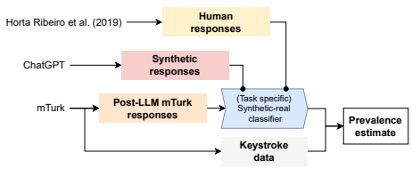
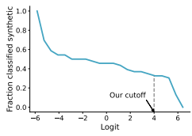
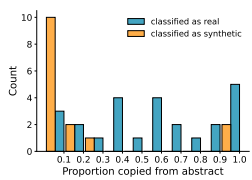

# Artificial Artificial Artificial Intelligence: Crowd Workers Widely Use Large Language Models For Text Production Tasks

Veniamin Veselovsky,∗ Manoel Horta Ribeiro,∗ **Robert West**
EPFL
firstname.lastnames@epfl.ch

# Abstract

Large language models (LLMs) are remarkable data annotators. They can be used to generate high-fidelity supervised training data, as well as survey and experimental data. With the widespread adoption of LLMs, human goldstandard annotations are key to understanding the capabilities of LLMs and the validity of their results. However, crowdsourcing, an important, inexpensive way to obtain human annotations, may itself be impacted by LLMs, as crowd workers have financial incentives to use LLMs to increase their productivity and income. To investigate this concern, we conducted a case study on the prevalence of LLM usage by crowd workers. We reran an abstract summarization task from the literature on Amazon Mechanical Turk and, through a combination of keystroke detection and synthetic text classification, estimate that 33–46% of crowd workers used LLMs when completing the task. Although generalization to other, less LLM- friendly tasks is unclear, our results call for platforms, researchers, and crowd workers to find new ways to ensure that human data remain human, perhaps using the methodology proposed here as a stepping stone. Code/data: https://github.com/epfl-dlab/GPTurk

# 1 Introduction

Normally, a human makes a request to a computer, and the computer does the computation of the task. But **artificial** artificial intelligences like Mechanical Turk invert all that.

Jeff Bezos What do massive computer vision datasets (Deng et al., 2009) and large-scale psychological experiments (Pennycook et al., 2021) have in common? Both rely on crowd work done on platforms such as Amazon Mechanical Turk (MTurk), Prolific, or Upwork. Such crowdsourcing platforms have become central to researchers and industry practitioners alike, offering ways to create, annotate, and summarize all sorts of data (Gray and Suri, 2019; Schwartz, 2019), and to run surveys surveys as well as experiments (Salganik, 2019).

At the same time, large language models
(LLMs), including ChatGPT, GPT-4, PaLM, and Claude, have taken the digital world by storm.

Early work indicates that LLMs are remarkable data annotators, outperforming both crowd workers (Kocon et al. ´ , 2023; Gilardi et al., 2023) and experts (Törnberg, 2023). Moreover, they show promise in simulating human behavior, allowing social scientists to conduct *in silico* experiments and surveys, obtaining similar results as would be obtained from real humans (Argyle et al., 2022; Horton, 2023; Dillion et al., 2023). Yet, human experimental subjects, annotators, and survey-takers remain critical of the validity of results derived from LLMs, as they still perform poorly at various tasks (Ziems et al., 2023) and synthetic data generated by LLMs can still be unfaithful with respect to the real data of interest (Veselovsky et al., 2023).

Given this situation, it is tempting to rely on crowdsourcing to validate LLM outputs or to create human gold-standard data for comparison. But what if crowd workers themselves are using LLMs, e.g., in order to increase their productivity, and thus their income, on crowdsourcing platforms?

We argue that this would severely diminish the utility of crowdsourced data because the data would no longer be the intended human gold standard, but also because one could prompt LLMs directly
(and likely more cheaply) instead of paying crowd workers to do so (likely without disclosing it).

For these reasons, we are curious to what extent crowd workers are already using LLMs as part of their work. The answer to this question is of paramount importance for all who rely on crowdsourcing, for without knowing who really produced

*Equal contribution.

Figure 1: Illustration of our approach for quantifying the prevalence of LLM usage among crowd workers solving a text summarization task. First, we use truly human-written MTurk responses and synthetic LLM-written responses to train a task-specific synthetic-vs.-real classifier. Second, we use this classifier on real MTurk responses (where workers may or may not have relied on LLMs), estimating the prevalence of LLM usage. Additionally (not shown), we confirm the validity of our results in a post-hoc analysis of keystroke data collected alongside MTurk responses.

the data—humans or machines—it is hard to assess in what ways one can rely on the data. As a first step toward answering this question, we here quantify the usage of LLMs by crowd workers through a case study on MTurk, based on a novel methodology for detecting synthetic text. In particular, we consider part of the text summarization task from Horta Ribeiro et al. (2019), where crowd workers summarized 16 medical research paper abstracts. By combining keystroke detection and synthetictext classification, we estimate that 33–46% of the summaries submitted by crowd workers were produced with the help of LLMs.

We conclude that, although LLMs are still in their infancy, textual data collected via crowdsourcing is already produced to a large extent by machines, rather than by the hired human crowd workers. Although our study specifically considers a text summarization task, we caution that any text production task whose instructions can be readily passed on to an LLM as a prompt are likely to be similarly affected. Moreover, LLMs are becoming more popular by the day, and multimodal models, supporting not only text, but also image and video input and output, are on the rise. With this, our results should be considered the "canary in the coal mine" that should remind platforms, researchers, and crowd workers to find new ways to ensure that human data remain human.

### 2 Related Work

Research using crowdsourcing. When Amazon Mechanical Turk was first released, it was colloquially known as "artificial artificial intelligence"
(see opening quote by Jeff Bezos), since to requesters (users who upload tasks to the platform) it seemed as though an artificial intelligence system was solving their tasks, although, in reality, humans did (Schwartz, 2019). From transcription (Marge et al., 2010) to image annotation (Sorokin and Forsyth, 2008), MTurk spearheaded a paradigm shift in how machine learning datasets were created (Paullada et al., 2021; Marge et al., 2010) and how user studies (Sorokin and Forsyth, 2008), surveys (Buhrmester et al., 2011), and social science experiments (Pennycook et al., 2021; Salganik, 2019) were conducted. Research about crowdsourcing. The ubiquity of MTurk and the many crowdsourcing platforms that have since appeared led to a rich body of literature about crowdsourcing. Previous work has studied how to efficiently use crowdsourcing, with all its limitations, to accomplish a variety of tasks (Draws et al., 2021; Bragg et al., 2013), conducted audits on the overall quality of crowdsourced annotations (Chmielewski and Kucker, 2020; Kennedy et al., 2020; Smith et al., 2016), and shed light on the demographics and socioeconomic conditions of workers using crowdsourcing platforms (Burnham et al., 2018; McCredie and Morey, 2019; Ogletree and Katz, 2021; Ipeirotis, 2010; Gray and Suri, 2019). LLM-generated data. As previously mentioned, LLMs can act as effective proxies for human subpopulations (Argyle et al., 2022), leading to a series of studies using LLMs as "silicon samples" (Argyle et al., 2022; Horton, 2023; Dillion et al., 2023).

Typically, these analyses have been done through a variant of controlled text generation (see Zhang et al. (2022) for a comprehensive review). Further, an ever-increasing body of work illustrates the good performance of LLMs as proxies for human labeling (Wang et al., 2023; Gilardi et al., 2023; Ziems et al., 2023) and for generating high-quality text (which is, however, often factually inaccurate) that has captured the imagination of the general public and the media (Dale, 2021). Detecting LLM-generated data. Distinguishing LLM- from human-generated text is difficult for both machine learning models and humans alike (Sadasivan et al., 2023; Jakesch et al., 2023). For example, OpenAI's own LLM-vs.-human classifier recognizes only 26% of LLM-written texts as such.1 Thus, in the context of the explosive popularity of LLMs such as ChatGPT, there is widespread concern about their usage in areas such as social media (Pan et al., 2023) (where they could be used to generate spam or misinformation) or higher education (Rudolph et al., 2023) (where they could be used to cheat assignments and exams). These concerns have led to work on watermarking LLM
output (Kirchenbauer et al., 2023) by slightly altering the odds of each token during sampling, and to further work on methods for improving the detection of synthetically generated text (Yu et al., 2023; Verma et al., 2023; Diwan et al., 2021).

# 3 Methods

We illustrate our overall approach in Figure 1 and describe it in detail below.

### 3.1 Task Of Choice: Abstract Summarization

We modify a prior MTurk task originally devised by Horta Ribeiro et al. (2019), whose goal was to study the so-called "telephone effect," whereby information is gradually lost or distorted as a message is passed from human to human in an information cascade. As part of their experiment, crowd workers were given medical research paper abstracts published in the *New England Journal of* Medicine (NEJM) and were asked to summarize the original abstract (about 2,000 characters) into a much shorter paragraph (about 1,000 characters). The process was then iterated with the summaries, rather than the original abstracts, as the input texts to be summarized further, and so on for multiple rounds. The original abstracts were about four research topics of public interest (vaccination, breast cancer, cardiovascular disease, and nutrition), and four papers were selected per topic, for a total of 16 abstracts. We chose this task for our study for two reasons. First, it is laborious for humans while being easily done with the aid of commercially available LLMs (Luo et al., 2023). Second, it is a good example of a task where truly human text is fundamentally required: the very point of Horta Ribeiro et al. (2019) was to study how information is lost when *humans* summarize text, which would not have been possible with synthetically generated, rather than human-generated, data.

In the original study, crowd workers produced eight increasingly short summaries of each original abstract, forming entire information cascades. For our purpose, however, we reduced the task to a single summarization step, where an abstract was condensed into a concise summary of ideally about 100 words (exmaple in Figure 2). Workers were paid 1 USD per summary, which we estimate conservatively would take around 4 minutes to conclude, for a pay rate of 15 USD/hour.

We obtained 48 summaries written by 44 distinct workers. For two of the abstracts, two summaries were duplicates, which we de-duplicated, leaving us with 46 summaries. Summaries were written around 1 June 2023. Besides the summaries, we also used Javascript to extract all keystrokes made by workers while performing the task, including copy and paste actions (with the Ctrl+C and Ctrl+V keyboard shortcuts or without the keyboard, e.g., using the menu appearing after a right-click).

Note: This is work in progress. We continue to run the task and will update this pre-print accordingly.

### 3.2 Detecting Synthetic Text

To estimate the prevalence of LLM usage in the summarization task described, we need to detect whether the answers provided by crowd workers were synthetically generated. Out-of-the-box solutions such as GPTZero, OpenAI's AI Detector, or Writer,2 work well on simple texts, but in our context, these methods fail to perform effectively; e.g., out of 10 summaries that we had synthesized via ChatGPT, GPTZero detected only six as synthetic.

1https://openai.com/blog/
new-ai-classifier-for-indicating-ai-written-text 2https://gptzero.me/, https://platform.openai.

com/ai-text-classifier, https://writer.com
Instructions You will be given a short text (around 400 words) with medicine-related information. Your task is to:
Read the text carefully.

Write a summary of the text. Your summary should:
Convey the most important information in the text, as if you are trying to inform another person about what you just read.

Contain at least 100 words.

We expect high-quality summaries and will manually inspect some of them.

Comparison of Weight-Loss Diets with Different Compositions of Fat, Protein, and Carbohydrates The possible advantage for weight loss of a diet that emphasizes protein, fat, or carbohydrates has not been established, and there are few studies that extend beyond 1 year. We randomly assigned 811 overweight adults to one of four diets; the targeted percentages of energy derived from fat, protein, and carbohydrates in
(...)
Satiety, hunger, satisfaction with the diet, and attendance at group sessions were similar for all diets; attendance was strongly associated with weight loss (0.2 kg per session attended). The diets improved lipidrelated risk factors and fasting insulin levels.

Write your summary here SUBMIT
Figure 2: Depiction of the MTurk task studied in this paper, where crowd workers were asked to condense research abstracts from the *New England Journal of Medicine* into summaries about 100 words long.

Consequently, we rely on a more bespoke solution for detecting LLM-generated summaries by fine-tuning our own model to detect the usage of ChatGPT, which at the time of writing is the most commonly used LLM. Although we only consider a few summaries in this paper, this approach is also more tractable for larger-scale future datasets where API calls may be expensive and slow.

Model architecture. We used an e5-base pretrained model as our main architecture (Wang et al.,
2022). This model was pre-trained using a contrastive loss and achieves strong performance in a fine-tuned classification setting. During fine-tuning, we used a learning rate of 2×10−5, a batch size of 32, a max token length of 256, and trained for five epochs, saving for later use the best-performing model on the validation set.

Data. To train the classifier, we employed three datasets, all originating or derived from the MTurk task in question (see Figure 1). The real instances of human text included the 16 original abstracts and the real human responses (128 high-quality summarizations) from Horta Ribeiro et al.'s version of the MTurk task. We generated the synthetic instances by prompting ChatGPT,3 using the MTurk task instruction as the prompt, which we suspect many crowd workers also did, since they often copied this instruction, as detected via keystroke logging. For each abstract, we generated 10 different summaries for each of two temperature values (0.7 and 1), obtaining 320 synthetic samples. Training. We trained the model in two train/test setups: an *abstract-level* split and a *summary-level* split. In the abstract-level split, we divide the abstracts into two disjoint sets: 12 abstracts for training and validation, and four for testing, totaling 370 training points. The abstract-level split serves as a basis for how well the model is able to extract generalizable artifacts present in the synthetic text that can be exploited for detecting synthetic summaries of abstracts not seen during training. In the summary-level split, we randomly split both the real and synthetic summary datasets, utilizing 75% of the summaries for training, 10% for validation, and 15% for testing. In the summary-level setting, (different) summaries of the same abstract may appear in both the train and the test set.

3https://openai.com/blog/chatgpt
Post-hoc validation. To confirm the validity of our results, we use a set of heuristics to assess whether specific subsets of our data were synthetically generated or human-generated with high precision, relying on the logged keystrokes. First, we assume that summaries written entirely in the text box made available on MTurk (without involving a pasting action) are real, allowing us to assess whether our above-described classification model
(which does not take keystrokes into account) has a low false-positive rate. Second, for the summaries where pasting was used, we examine which fraction of the pasted text came from the original abstract (as crowd workers simply re-arrange parts of the abstract in their summary), versus which fraction is made up of new text. The fraction of overlap with the original abstract was operationalized as the longest common substring present in both the original abstract and the summary (as in Suzgun et al. (2023)). Under the assumption that pasted summaries that have very little to do with the original abstract are synthetically generated, we can get a sense of the false negative rate of our model.

# 4 Results

Performance of synthetic-text detector. We report results for both the summary-level and abstract-level data splits (see Section 3.2) in Table 1. In the summary-level setting, where summaries derived from all abstracts were pooled before splitting the data, our fine-tuned model achieved an accuracy of 99% and a macro-F1 of 99%. The high performance indicates a lack of diversity in ChatGPT's summarizations, a known issue in RLHF-trained LLMs (OpenAI, 2023), and our smaller-capacity detection model seems to be able to pick up on fingerprint-like artifacts introduced by ChatGPT.

The abstract-level split indicates that these artifacts are universal across abstracts. Even not seeing a subset of abstracts during training, our model was still capable of successfully identifying synthetic summaries 97% of the time, with a macro-F1 of 97%. In other words, a ChatGPT-detection model trained on our abstract summarization task only is able to identify new synthetic abstracts almost all of the time. These high scores indicate that—at least for the task at hand—there exists an identifiable ChatGPT fingerprint in abstract summarization tasks that make it learn universal features to discriminate between real and synthetic texts.

Figure 3: Proportion of summaries predicted as synthetic depending on the logit threshold.

Prevalence of LLM usage among crowd workers. Due to the overall higher accuracy, we applied the model trained in the summary-level setting to the 46 new summaries to detect instances of LLM usage among crowd workers. When running this classifier, we need to choose a decision threshold above which we classify a text as synthetic, and below which we classify it as human-generated. For robustness, we ran the classifier for a wide range of thresholds and present the fraction of summaries classified as synthetic as a function of the applied threshold in Figure 3. With a logit threshold of 0
(corresponding to a predicted probability of 50%),
we estimate that 21 of the 46 crowdsourced summaries (46%; 95% CI: [31%, 61%]) were synthetically generated. In order to avoid misclassifying ambiguous examples as synthetic, we may want to consider a more conservative estimate of the prevalence of LLM usage by choosing a higher logit threshold. For example, using a threshold of 4
(corresponding to a predicted probability of 98%), we still arrive at an estimate of 15 of the 46 crowdsourced summaries (33%; 95% CI: [20%, 45%])
being LLM-generated. Overall, our estimate remains stable over a wide range of logit thresholds, and we conclude that 33–46% of crowdsourced summaries were produced with the help of LLMs.

Note that, since nearly all users submitted only a single summary (44 workers contributed 46 summaries), the above-mentioned fraction of LLM-
produced summaries can also be interpreted as a fraction of LLM-using crowd workers. (Macroaveraging over workers yields the same estimates as the above-reported micro-averages over summaries.) Post-hoc validation. Having estimated the prevalence of LLM usage, we conducted a series of analyses to confirm the validity of our approach. (In

| Setting         | Accuracy   | Macro\-F1   | Precision   | Recall     |
|-----------------|------------|-------------|-------------|------------|
| Summary\-level  | 0.99 ±0.02 | 0.99 ±0.03  | 0.99 ±0.02  | 0.98 ±0.04 |
| Abstract\-level | 0.97 ±0.03 | 0.97 ±0.02  | 0.97 ±0.02  | 0.97 ±0.04 |

Table 1: Test performance of the synthetic-vs.-real classifier in the summary-level and abstract-level setups.

|           | With pasting   | Without pasting   |
|-----------|----------------|-------------------|
| Synthetic | 15             | 0                 |
| Human     | 26             | 5                 |

Table 2: Matrix showing the link between usage of pasting (columns) and classifier decision (rows). Cells contain the number of summaries labeled as synthetic/ human-written in whose production pasting was/was not used.

these analysis, we use the more conservative logit threshold of 4; see above.) In Table 2, we show that the majority of users pasted at least some text when writing their summaries (affecting 89%, or 41 out of 46, summaries). Indeed, only five summaries were written entirely in the text box without any pasting. Importantly, our classifier labeled all of them as human-written, suggesting the classifier has a low false-positive rate (under the aforementioned assumption that these summaries were human-generated).

The mere act of pasting does not imply the usage of ChatGPT. In particular, a qualitative analysis of the data at hand suggests that workers often copy– paste intricate phrasing, or entire abstracts, from the original content into their text editor, thereby reutilizing abstract content. Thus, to understand how copy–pasting was used in summaries classified as synthetic vs. human, we compute the longest common substring between each summary and the original abstract (henceforth "overlap"). Our analysis, depicted in Figure 4, reveals that workers often reuse large portions from the original abstracts, but also that, more importantly, summaries classified as synthetic mostly had a small overlap with the original abstracts. For instance, out of 13 summaries with an overlap of less than 10%, 10 (76%) were classified as synthetically generated. Also, most summaries classified as synthetic have a small overlap with the original abstract. This suggests that what was being copy–pasted was not parts from the original abstract but, indeed, outputs from an LLM.

Figure 4: Overlap between summaries and original abstracts (operationalized as ratio of length of longest common substring and length of original abstract), for summaries involving a paste action.

# 5 Discussion

The pivotal role of human-generated data in various applications is undeniable. Its richness, uniqueness, and diversity are crucial factors that make it stand apart from synthetically generated data (Veselovsky et al., 2023; Ziems et al., 2023). Here we found that crowd workers on MTurk widely use LLMs in a summarization task, which raises serious concerns about the gradual dilution of the "human factor" in crowdsourced text data. Further, we developed a robust, low-computational-cost method for syntheticdata detection, indicating that bespoke detection models may be more useful than out-of-the-box solutions. Our setup maps well to other settings where synthetically generated text may be problematic, including the education space, where tests, essays, and assignments can be quickly and often effectively solved by LLMs (Rudolph et al., 2023).

There is widespread concern that LLMs will shape our information ecosystem, i.e., that much of the information available online will be created by LLMs. This may degrade the performance of
"recursive" LLMs, i.e., those trained on synthetically generated data (Shumailov et al., 2023), and magnify the impact of the values and ideologies encoded by these models (Santurkar et al., 2023; Liu et al., 2022). In that vein, the present work raises the concern that acquiring human data may be made even harder with the popularization of LLMs, as crowd workers seem to already be using it extensively, a problem that could become much worse with the popularization of LLMs and the increase in their capabilities.

All this being said, we do not believe that this will signify the end of crowd work, but it may lead to a radical shift in the value provided by crowd workers. Instead of providing *de novo* annotations, crowd workers may instead serve as an important human filter for detecting when these models succeed and when they fail. Early work has already made significant progress in this direction, pairing humans and language models to create high-quality, diverse data (Liu et al., 2022).

Limitations. In this study, our focus is limited to one specific crowdsourcing task: text summarization. While summarization captures many of the nuances needed for text production tasks in general, we acknowledge the uncertainty regarding the generalization of our findings to other tasks, particularly those that pose substantial challenges to LLMs. This highlights an important area for future research, which involves comprehensively examining how the results may vary across different tasks and how they evolve over time as LLMs become even more widespread. Nonetheless, we speculate that the phenomenon uncovered here may affect any text production task that is specified via a textual instruction that can be readily used as a prompt for an LLM, and our findings should certainly serve as a cautionary tale for researchers and practitioners working with other types of data and tasks.

# 6 Ethical Considerations

Our study used keystroke collection to validate the results. Though beneficial for research, keystroke tracking could potentially infringe upon user privacy if not appropriately handled. We strictly limited the keystroke tracking to users' interactions with the edit box and copy-pastes for the page. However, we believe that more expansive use of tracking can be problematic.

# References

Lisa P Argyle, Ethan C Busby, Nancy Fulda, Joshua Gubler, Christopher Rytting, and David Wingate.

2022. Out of one, many: Using language models to simulate human samples. arXiv preprint arXiv:2209.06899.

Jonathan Bragg, Daniel Weld, et al. 2013. Crowdsourcing multi-label classification for taxonomy creation. In *Proceedings of the AAAI Conference on Human* Computation and Crowdsourcing, volume 1, pages 25–33.

Michael Buhrmester, Tracy Kwang, and Samuel D
Gosling. 2011. Amazon's mechanical turk: A new source of inexpensive, yet high-quality, data? Perspectives on psychological science, 6(1):3–5.

Martin J Burnham, Yen K Le, and Ralph L Piedmont.

2018. Who is mturk? personal characteristics and sample consistency of these online workers. *Mental* Health, Religion & Culture, 21(9-10):934–944.

Michael Chmielewski and Sarah C Kucker. 2020. An mturk crisis? shifts in data quality and the impact on study results. Social Psychological and Personality Science, 11(4):464–473.

Robert Dale. 2021. Gpt-3: What's it good for? Natural Language Engineering, 27(1):113–118.

Jia Deng, Wei Dong, Richard Socher, Li-Jia Li, Kai Li, and Li Fei-Fei. 2009. Imagenet: A large-scale hierarchical image database. In *2009 IEEE conference* on computer vision and pattern recognition, pages 248–255. Ieee.

Danica Dillion, Niket Tandon, Yuling Gu, and Kurt Gray. 2023. Can ai language models replace human participants? *Trends in Cognitive Sciences*.

Nirav Diwan, Tanmoy Chakravorty, and Zubair Shafiq.

2021. Fingerprinting fine-tuned language models in the wild. *arXiv preprint arXiv:2106.01703*.

Tim Draws, Alisa Rieger, Oana Inel, Ujwal Gadiraju, and Nava Tintarev. 2021. A checklist to combat cognitive biases in crowdsourcing. In Proceedings of the AAAI Conference on Human Computation and Crowdsourcing, volume 9, pages 48–59.

Fabrizio Gilardi, Meysam Alizadeh, and Maël Kubli.

2023. Chatgpt outperforms crowd-workers for textannotation tasks. *arXiv preprint arXiv:2303.15056*.

Mary L Gray and Siddharth Suri. 2019. Ghost work:
How to stop Silicon Valley from building a new global underclass. Eamon Dolan Books.

Manoel Horta Ribeiro, Kristina Gligoric, and Robert West. 2019. Message distortion in information cascades. In *The World Wide Web Conference*, pages 681–692.

John J Horton. 2023. Large language models as simulated economic agents: What can we learn from homo silicus? *arXiv preprint arXiv:2301.07543*.

Panagiotis G Ipeirotis. 2010. Demographics of mechanical turk.

Maurice Jakesch, Jeffrey T Hancock, and Mor Naaman.

2023. Human heuristics for ai-generated language are flawed. Proceedings of the National Academy of Sciences, 120(11):e2208839120.

Ryan Kennedy, Scott Clifford, Tyler Burleigh, Philip D
Waggoner, Ryan Jewell, and Nicholas JG Winter.

2020. The shape of and solutions to the mturk quality crisis. *Political Science Research and Methods*, 8(4):614–629.

John Kirchenbauer, Jonas Geiping, Yuxin Wen, Jonathan Katz, Ian Miers, and Tom Goldstein. 2023. A watermark for large language models. *arXiv* preprint arXiv:2301.10226.

Jan Kocon, Igor Cichecki, Oliwier Kaszyca, Mateusz ´
Kochanek, Dominika Szydło, Joanna Baran, Julita Bielaniewicz, Marcin Gruza, Arkadiusz Janz, Kamil Kanclerz, et al. 2023. Chatgpt: Jack of all trades, master of none. *arXiv preprint arXiv:2302.10724*.

Alisa Liu, Swabha Swayamdipta, Noah A Smith, and Yejin Choi. 2022. Wanli: Worker and ai collaboration for natural language inference dataset creation. *arXiv* preprint arXiv:2201.05955.

Zheheng Luo, Qianqian Xie, and Sophia Ananiadou.

2023. Chatgpt as a factual inconsistency evaluator for text summarization.

Matthew Marge, Satanjeev Banerjee, and Alexander I
Rudnicky. 2010. Using the amazon mechanical turk for transcription of spoken language. In 2010 IEEE
International Conference on Acoustics, Speech and Signal Processing, pages 5270–5273. IEEE.

Morgan N McCredie and Leslie C Morey. 2019. Who are the turkers? a characterization of mturk workers using the personality assessment inventory. Assessment, 26(5):759–766.

Aaron M Ogletree and Benjamin Katz. 2021. How do older adults recruited using mturk differ from those in a national probability sample? The International Journal of Aging and Human Development, 93(2):700–721.

OpenAI. 2023. Gpt-4 technical report. Yikang Pan, Liangming Pan, Wenhu Chen, Preslav Nakov, Min-Yen Kan, and William Yang Wang. 2023. On the risk of misinformation pollution with large language models. *arXiv preprint arXiv:2305.13661*.

Amandalynne Paullada, Inioluwa Deborah Raji, Emily M Bender, Emily Denton, and Alex Hanna. 2021. Data and its (dis) contents: A survey of dataset development and use in machine learning research. Patterns, 2(11):100336.

Gordon Pennycook, Ziv Epstein, Mohsen Mosleh, Antonio A Arechar, Dean Eckles, and David G Rand. 2021. Shifting attention to accuracy can reduce misinformation online. *Nature*, 592(7855):590–595.

Jürgen Rudolph, Shannon Tan, and Samson Tan. 2023.

War of the chatbots: Bard, bing chat, chatgpt, ernie and beyond. the new ai gold rush and its impact on higher education. Journal of Applied Learning and Teaching, 6(1).

Vinu Sankar Sadasivan, Aounon Kumar, Sriram Balasubramanian, Wenxiao Wang, and Soheil Feizi. 2023. Can ai-generated text be reliably detected? arXiv preprint arXiv:2303.11156.

Matthew J Salganik. 2019. Bit by bit: Social research in the digital age. Princeton University Press.

Shibani Santurkar, Esin Durmus, Faisal Ladhak, Cinoo Lee, Percy Liang, and Tatsunori Hashimoto. 2023. Whose opinions do language models reflect? arXiv preprint arXiv:2303.17548.

Oscar Schwartz. 2019. Untold history of ai: How amazon's mechanical turkers got squeezed inside the machine. *IEEE Spectrum*.

Ilia Shumailov, Zakhar Shumaylov, Yiren Zhao, Yarin Gal, Nicolas Papernot, and Ross Anderson. 2023. The curse of recursion: Training on generated data makes models forget.

Scott M Smith, Catherine A Roster, Linda L Golden, and Gerald S Albaum. 2016. A multi-group analysis of online survey respondent data quality: Comparing a regular usa consumer panel to mturk samples. Journal of Business Research, 69(8):3139–3148.

Alexander Sorokin and David Forsyth. 2008. Utility data annotation with amazon mechanical turk. In 2008 IEEE computer society conference on computer vision and pattern recognition workshops, pages 1–8. IEEE.

Mirac Suzgun, Stuart M Shieber, and Dan Jurafsky. 2023. string2string: A modern python library for string-to-string algorithms. arXiv preprint arXiv:2304.14395.

Petter Törnberg. 2023. Chatgpt-4 outperforms experts and crowd workers in annotating political twitter messages with zero-shot learning. arXiv preprint arXiv:2304.06588.

Vivek Verma, Eve Fleisig, Nicholas Tomlin, and Dan Klein. 2023. Ghostbuster: Detecting text ghostwritten by large language models. arXiv preprint arXiv:2305.15047.

Veniamin Veselovsky, Manoel Horta Ribeiro, Akhil Arora, Martin Josifoski, Ashton Anderson, and Robert West. 2023. Generating faithful synthetic data with large language models: A case study in computational social science. *arXiv preprint* arXiv:2305.15041.

Jiaan Wang, Yunlong Liang, Fandong Meng, Haoxiang Shi, Zhixu Li, Jinan Xu, Jianfeng Qu, and Jie Zhou. 2023. Is chatgpt a good nlg evaluator? a preliminary study. *arXiv preprint arXiv:2303.04048*.

Liang Wang, Nan Yang, Xiaolong Huang, Binxing Jiao, Linjun Yang, Daxin Jiang, Rangan Majumder, and Furu Wei. 2022. Text embeddings by weaklysupervised contrastive pre-training. *arXiv preprint* arXiv:2212.03533.

Peipeng Yu, Jiahan Chen, Xuan Feng, and Zhihua Xia. 2023. Cheat: A large-scale dataset for detecting chatgpt-written abstracts. *arXiv preprint* arXiv:2304.12008.

Hanqing Zhang, Haolin Song, Shaoyu Li, Ming Zhou, and Dawei Song. 2022. A survey of controllable text generation using transformer-based pre-trained language models. *arXiv preprint arXiv:2201.05337*.

Caleb Ziems, William Held, Omar Shaikh, Jiaao Chen, Zhehao Zhang, and Diyi Yang. 2023. Can large language models transform computational social science? arXiv preprint arXiv:2305.03514.