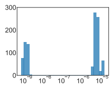
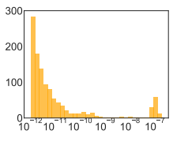
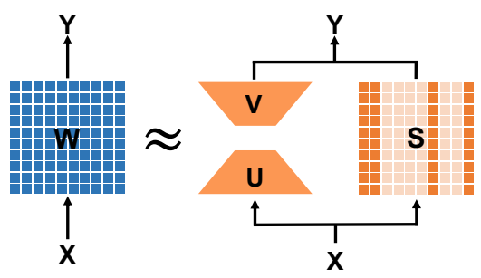
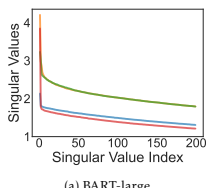
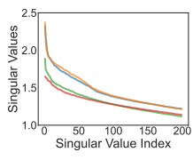
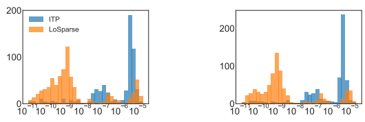
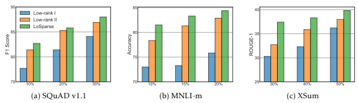
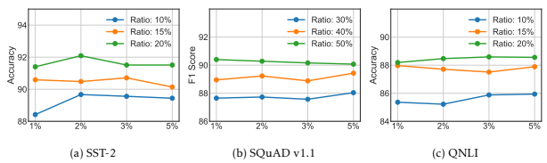

# Losparse: Structured Compression Of Large Language Models Based On Low-Rank And Sparse Approximation ∗

Yixiao Li∗∗, Yifan Yu∗∗, Qingru Zhang, Chen Liang, Pengcheng He, Weizhu Chen, Tuo Zhao †
June 27, 2023

#### Abstract

Transformer models have achieved remarkable results in various natural language tasks, but they are often prohibitively large, requiring massive memories and computational resources. To reduce the size and complexity of these models, we propose LoSparse (Low-Rank and **Sparse** approximation), a novel model compression technique that approximates a weight matrix by the sum of a low-rank matrix and a sparse matrix. Our method combines the advantages of both low-rank approximations and pruning, while avoiding their limitations. Low-rank approximation compresses the coherent and expressive parts in neurons, while pruning removes the incoherent and non-expressive parts in neurons. Pruning enhances the diversity of low-rank approximations, and low-rank approximation prevents pruning from losing too many expressive neurons. We evaluate our method on natural language understanding, question answering, and natural language generation tasks. We show that it significantly outperforms existing compression methods. Our code is publicly available at https://github.com/yxli2123/LoSparse

### 1 Introduction

Large transformer models have exhibited superior performance in various natural language tasks, such as natural language understanding, question answering, and natural language generation (Devlin et al., 2018; Liu et al., 2019; He et al., 2020; Radford et al., 2019; Brown et al., 2020). However, these models contain billions of parameters. For example, T5 (Radford et al., 2019) consists of up to 11 billion parameters, and GPT-3 (Brown et al., 2020) comprises up to 175 billion parameters. Their extreme sizes bring challenges in deploying the models to practical applications due to memory and computational requirements.

1

∗Published as a conference paper in ICML 2023. †Li, Yu, Zhang, Liang and Zhao are affiliated with Georgia Tech. He and Chen are affiliated with Microsoft Azure.

Correspondence to yixiaoli@gatech.edu, yyu429@gatech.edu and tourzhao@gatech.edu.

**Equal contributions
To circumvent aforementioned challenges, model compression methods are widely applied to reduce model size at only a small expense of model performance. One common compression technique is pruning (Zhu & Gupta, 2017; Louizos et al., 2017), which removes parameters according to their importance scores (Han et al., 2015; Molchanov et al., 2016; Zhang et al., 2022). Pruning methods can be divided into two categories: structured and unstructured pruning.

In structured pruning (McCarley et al., 2019; Fan et al., 2019; Lagunas et al., 2021), weight matrices are pruned neuron/column-wise. This enables us to store pruned models by directly deleting neurons/columns in memory. As for unstructured pruning (Han et al., 2015; Sanh et al., 2020), however, weight matrices are pruned entry-wise, which makes it challenging to store and manipulate. For this reason, we focus on structured pruning. One popular structured pruning method is iterative pruning (ITP), which conducts training and pruning simultaneously. That is, after parameters are updated every iteration, it evaluates the importance score of each neuron. Neurons that have low importance scores are considered non-expressive and should be pruned. Beside the ITP, Movement pruning (Sanh et al., 2020) and CoFi (Xia et al., 2022) are also popular pruning methods.

Unfortunately, pruning is not necessarily effective. It will inevitably remove expressive neurons given a high sparsity level. Liang et al. (2021) found heavy pruning hurts the performance severely, although light pruning can enhance the generalization of pre-trained language models. As an example, Figure 1 illustrates this phenomenon. Ideally (Figure 1b), most of the neurons should be redundant and have low importance scores so that we can remove these neurons without hurting the performance too much. However, in reality (Figure 1a), even if a significant portion of neurons are non-expressive, the majority of neurons are still expressive and are likely to be pruned if the sparsity level is high.

(a) Query of decoder layer 9

(b) Ideal

Figure 1: Histogram of neuron importance scores. (a) The practical neuron importance scores of a linear layer when pruning BART-large on XSum. (d) The ideal histogram of the neuron importance scores where most of the neuron should be redundant, otherwise pruning is not the best choice.

Another popular compression technique is low-rank approximation (Hsu et al., 2022a; Hajimolahoseini et al., 2021; Tahaei et al., 2021), which is designed to compress the expressive neurons. It approximates a weight matrix by a low-rank matrix that is computed by singular value thresholding. Such a low-rank approximation is particularly effective to compress coherent parts in neurons. For example, the majority of neuron weights often share one coherent subspace that can be well approximated by singular vectors of top singular values. The low-rank approximation is inherently capable of extracting the common bases of this coherent subspace.

Matrices in transformer models, however, are often high-rank. It can hurt the model performance when merely applying the low-rank approximation to compress these matrices. This is because the diversity of neurons has been ignored. Although low-rank approximation extracts the common bases shared by neuron weights, it cannot accurately approximate their incoherent parts, which can be expressive and crucial to the model performance. We explain the reason more in Section 3.1.

To overcome the drawbacks of both pruning and low-rank approximations, we propose LoSparse
(Low-Rank and Sparse approximation), which approximates a weight matrix by the sum of a low-rank matrix and a sparse matrix. Such a composite approximation decouples the coherent parts from incoherent parts of neurons. It inherits the benefits of both low-rank and sparse approximation: the low-rank approximation aims to compress expressive bases of the coherent subspace shared by neurons while the sparse approximation focuses on removing non-expressive information in incoherent parts of neurons. In that sense, the low-rank approximation prevents the pruning from excessively removing expressive neurons while sparse approximation enhances the diversity of low-rank approximation.

We draw inspiration from multi-task learning (Jalali et al., 2010), where linear models are used for multi-task regression. In out settings, every linear layer in transformer models can be naturally viewed as a linear multi-task model that learns different latent features. In that case, low-rank approximations are designed to store shared features across all coherent parts of neurons, and sparse approximations aim to learn distinct features from incoherent parts of neurons. Besides, previous work (Yu et al., 2017; Hawkins et al., 2021; Chen et al., 2021) applied a similar method to Convolutional Neural Networks (CNN) and parameter-efficient fine-tuning, but we will discuss the limitation of their methods in Section 5.

We conduct extensive experiments on natural language understanding, question answering, and natural language generation tasks to demonstrate the effectiveness and efficiency of LoSparse. On the natural language understanding tasks in GLUE (Wang et al., 2019), our method significantly outperforms existing pruning methods. For example, on the MNLI dataset, LoSparse achieves more than 2.0% higher accuracy than existing baseline methods. On the question answering tasks in SQuADv1.1 (Rajpurkar et al., 2016b), our method surpasses other pruning methods by 3.3 points in F1 score under the extreme low remaining ratio **. On the natural language generation tasks in XSum (Narayan et al., 2018), our method exceeds the current methods by 2.99 points in Rouge-1 score. Moreover, our method is orthogonal to the current knowledge distillation methods, and could be readily integrated with them to improve the performance.

**The proportion of retained parameters.

# 2 Background

We briefly review the transformer language models and pruning methods.

### 2.1 Transformer Models

A typical transformer architecture comprises several sequential layers, where each layer contains two sub-layers: a multi-head self-attention (MHA) and a fully connected feed forward network
(FFN). Given the input X ∈ Rn×d, MHA computes the attention in parallel h heads:

$$\begin{array}{l}{{\mathrm{MHA}(X)=\mathrm{Concat}(\mathrm{head}_{1},...,\mathrm{head}_{h})W_{o},}}\\ {{\mathrm{head}_{i}=\mathrm{Softmax}(X W_{a_{i}}(X W_{k_{i}})^{T}/\sqrt{d_{h}})X W_{v_{i}},}}\end{array}$$

where Wqi
,Wki
,Wvi
∈ Rd×dh are query, key, and value projection matrices, Wo ∈ Rd×dis an output projection matrix, and dhis typically set as d/h. FFN comprises two linear transformations and an activation: FFN(X) = σ(XWf1
+ b1)Wf2
+ b2, where Wf1
∈ Rd×dm , Wf2
∈ Rdm×d, and σ(·) is the activate function. A residual connection is used and followed by a layer normalization.

Generally, we denote all the matrix multiplication in a transformer model as

$$y=W x,$$
$$(1)$$
y = *W x,* (1)
where W ∈ Rd1×d2 denotes any weight matrix in the model.

We further denote the parameter set consisting of all trainable weight matrix by W = {Wm}
M
m=1.

Unless specified otherwise, we use W to represent any weight matrix and W (0) is its pre-trained value. We use *i, j* to index the entry of matrices and denote wij as ij-th entry of W , Wi∗ as the i-th row of W , and W∗i as the i-th column of W .

### 2.2 Importance Scores For Pruning

Pruning methods zero out redundant parameters according to their importance estimation. Parameters with high importance scores are retrained for fine-tuning while the others with low importance are zeroed out. Popular importance metrics include magnitude (Han et al., 2015), sensitivity (Sanh et al., 2020; Molchanov et al., 2019) and uncertainty (Zhang et al., 2022). Sensitivity of parameters is essentially designed to approximate the change of training loss L when a parameter is zeroed out. If the removal of a parameter causes a large variation on the loss, then the model is sensitive to this parameter and we should retain it. Specifically, for a weight wij, its sensitivity score is defined by the gradient-weight product:

$$I(w_{ij})=\left|w_{ij}\cdot\nabla_{w_{ij}}{\cal L}\right|.\tag{1}$$

Note that the calculation of I
(t)is conditioned on the sampled mini-batch at the t-th iteration. It can induce high uncertainty due to stochastic sampling. To reduce the variability in (2), Zhang

$$(2)^{\frac{1}{2}}$$

et al. (2022) propose to smooth I by:

$$\overline{{{\Gamma}}}^{(t)}(w_{i j})=\beta\overline{{{\Gamma}}}^{(t-1)}(w_{i j})+(1-\beta)|w_{i j}^{(t)}\nabla_{w_{i j}}{\mathcal{L}}^{(t)}|$$
$$(3)$$

(t)| (3)
using exponential moving of average.

### 2.3 Structured Pruning

As mentioned in Section 1, there are two types of pruning methods: unstructured and structured pruning. Sensitivity in (2), however, targets on unstructured pruning. We extend it to structured pruning and introduce neuron importance scores. For a linear projection represented as a weight matrix W ∈ Rd1×d2 , we define the importance score of its i-th neuron W∗i as

$$\Gamma(W_{*i})=\frac{1}{d_{1}}\sum_{j=1}^{d_{1}}\overline{{{I}}}(w_{j i}).$$

$$({\boldsymbol{4}})$$
I(wji). (4)
We further define Γ(W ) = [Γ(W∗1)*,...,*Γ(W∗d2
)]⊤ ∈ Rd2 .

# 3 Method

We propose a compression method for transformer models. Specifically, we approximate a weight matrix by the sum of a low-rank matrix and a sparse matrix (as illustrated by Figure 2). The combination of these two approximations makes our compression method more efficient and stable.

### 3.1 Approximation By Low-Rank And Sparse Matrices

Given a weight matrix W ∈ Rd1×d2 , a structured-pruned sparse matrix S ∈ Rd1×d2 is commonly applied to approximate W for compression (Han et al., 2015; Lagunas et al., 2021). The sparse matrix approximation, however, results in poor performance especially when the remaining ratio is low (See experiments in Section 4). Therefore, we introduce a low-rank matrix to improve the approximation. Specifically, the weight matrix can be represented as

$$W=U V+S,$$
$\left(5\right)$. 
W = UV + S, (5)
where the product of U ∈ Rd1×r and V ∈ Rr×d2 represents the low-rank matrix of rank r.

Why low-rank matrices? First, they can approximate the coherent parts of neurons effectively, even if the rank is small. As shown in Figure 3, we observe that the spectrum of weight matrices in language models drops rapidly at the beginning. This indicates neurons in a weight matrix share a common subspace, which can be viewed as the coherent parts of these neurons. In addition, the common subspace can be recovered by the singular vectors of top singular values. Therefore, the

Figure 2: Illustration of one linear projection in a transformer neural network. We use UV + S, a low-rank approximation plus a sparse matrix, to approximate the weight matrix W . UV and S
indicate the coherent and incoherent parts of neurons in W respectively. We conduct the forward pass of two terms in parallel.

(a) BART-large

(b) DeBERTaV3-large Figure 3: Singular values in language models. (a) Singular values of weight matrices of the 10th decoder layer in BART-large; (b) Singular values of weight matrices of the 14th encoder layer in DeBERTaV3-large.

coherent parts of neurons can be well approximated by the low-rank matrix computed by singular value thresholding.

Second, the decoupling of low-rank and sparse matrices makes it easy to prune. The heavytailed spectrum in Figure 3 indicates each neuron W∗i spans their individual subspaces, which can represent the incoherent parts of these neurons. Since these subspaces are not shared, the incoherent parts cannot be captured by the low-rank approximation. Fortunately, the low-rank matrix is able to decouple the coherent parts from the incoherent parts of neurons. This enables us to approximate the remaining incoherent parts by adding a new matrix S and then prune it to remove the non-expressive incoherent parts. As an example, Figure 4 demonstrates that most of the incoherent parts have low importance scores after decoupling, motivating us to remove these redundant parameters.

(a) Wq of Layer 3
(b) Wk of Layer 3

$$(6)$$
$$(7)$$

Figure 4: Neuron importance scores of selected linear projections when compressing DeBERTaV3base on SST-2 with ITP (blue) and LoSparse (orange). It shows LoSparse successfully separates incoherent parts of neurons and make it easy to prune the non-expressive components.

### 3.2 Algorithm

We then present our proposed algorithm. Given a pre-trained weight matrix W (0), we first initialize the low-rank matrix of rank r based on the singular value decomposition (SVD) of W (0). Specifically, we choose

$$\begin{array}{l}{{U^{(0)}=[\sqrt{\sigma_{1}}u_{1};\sqrt{\sigma_{2}}u_{2};...;\sqrt{\sigma_{r}}u_{r}],}}\\ {{V^{(0)}=[\sqrt{\sigma_{1}}v_{1};\sqrt{\sigma_{2}}v_{2};...;\sqrt{\sigma_{r}}v_{r}]^{\top},}}\end{array}$$
√
√
where u1,u2*,...,u*r ∈ Rd1 are left-singular vectors and v1, v2*,..., v*r ∈ Rd2 are right-singular vectors, with respect to the top r singular values σ1 ≥ σ2 ≥ ... ≥ σrin the SVD of W (0). Then, we initialize S
(0) by

$$S^{(0)}=W^{(0)}-U^{(0)}V^{(0)}.$$
$$(8)$$
(0). (8)
Notably, we replace the forward pass involving W (e.g. Y = XW ) with (9) to improve computational efficiency:

$$Y=(X U)V+X S.$$

We apply such a decomposition to every weight matrix of the model and denote S = {Sm}
M
m=1 as the set of all sparse matrices. After the initialization, we conduct the iterative structured pruning for S.

Specifically, at t-th iteration, we first take a stochastic gradient decent step to update U(t),V (t), and S
(t). In particular, for S
(t),

$$\overline{{{S}}}^{(t)}=S^{(t)}-\alpha\nabla_{S^{(t)}}{\mathcal{L}}.$$

Then we evaluate the neuron importance scores of S
(t) based on (4). Given the importance scores, Se(t)is pruned following:

$$S^{(t+1)}=T(\overline{{{S}}}^{(t)},\Gamma(S^{(t)}))$$
$$(9)$$
(t))) (9)
with the i-th column of T (Se(t),Γ(S
(t))) defined as

$T(S^{(t)},\Gamma(S^{(t)}))_{*i}=\left\{\begin{array}{ll}\overline{S}^{(t)}_{*i}&\mbox{if$\Gamma(S^{(t)}_{*i})$in top$p_{t}\%$,}\\ 0&\mbox{o.w.}\end{array}\right.$
Here we retain Se(t)
∗ionly if its importance score is in top pt% among all neurons in S
(t). ptis the percentage of remaining neurons at t-th iteration. We gradually decay ptfollowing a cubic schedule:

$p_{t}=\begin{cases}1&0\leq t<t_{i},\\ p_{T}+(1-p_{T})\bigg{(}1-\frac{t-t_{i}-t_{f}}{T-t_{i}-t_{f}}\bigg{)}^{3}&t_{i}\leq t<T-t_{f},\\ p_{T}&\text{o.w.}\end{cases}$
where T is the total training steps. tiis the number of initial warm-up steps. tfis the number of final fine-tuning steps. Finally, we summarize our algorithm in Algorithm 1.

#### Algorithm 1 Losparse

1: **Input**: Pre-trained weights W(0); total training iterations T ; the rank r; learning rate α. 2: **for all** W (0) ∈ W(0) do 3: Compute the SVD of W (0); 4: Initialize U(0) and V
(0) by (6) and (7);
5: Initialize S
(0) = W (0) − U(0)V
(0);
6: Replace W (0) by U(0)V
(0) + S
(0);
7: **end for**
8: for t = 1*,..., T* do 9: Compute the gradient ∇L;
15: Update V
(t+1) = V
(t) − α∇V (t)L;
16: **end for** 17: **Output**: the compressed model.

10: Compute I
(t)for each parameter in S
(t) by (2);
11: Compute I
(t)for each parameter in S
(t) by (3);
12: Compute Γ(S
(t)
∗i
) for each S
(t)
∗iin S
(t) by (4);
13: Update S
(t+1) = TS
(t) − α∇S
(t)L,Γ(S
(t));
14: Update U(t+1) = U(t) − α∇U(t)L;
Table 1: Results of pruned DeBERTaV3-base models on GLUE development set. Here *Ratio* is the proportion of total remaining weights. Results with *N.A.* indicate the model does not converge. The best results on each dataset are shown in bold.

| Ratio   | Method        | MNLI        | RTE   | QNLI   | MRPC        | QQP         | SST\-2   | CoLA   | STS\-B      |
|---------|---------------|-------------|-------|--------|-------------|-------------|----------|--------|-------------|
|         |               | m / mm      | Acc   | Acc    | Acc / F1    | Acc / F1    | Acc      | Mcc    | P/S Corr    |
| 100%    | DeBERTaV3base | 90.5 / 90.6 | 82.0  | 94.0   | 89.5 / 93.3 | 92.4 / 89.8 | 95.3     | 69.2   | 91.6 / 91.1 |
| 20%     | Movement      | N.A         | 61.2  | 86.0   | 79.2 / 85.0 | N.A.        | 89.4     | N.A.   | 84.3 / 84.3 |
|         | ITP           | 82.8 / 82.5 | N.A.  | 87.8   | 82.0 / 87.0 | 90.0 / 86.4 | 90.8     | 49.0   | 87.4 / 87.0 |
|         | LoSparse      | 84.5 / 83.8 | 68.0  | 88.6   | 85.0 / 89.4 | 90.6 / 87.2 | 91.7     | 50.0   | 88.8 / 88.5 |
| 15%     | Movement      | N.A.        | 59.0  | N.A    | 78.5 / 84.3 | N.A.        | 89.0     | N.A.   | 83.9 / 83.9 |
|         | ITP           | 81.7 / 81.3 | N.A.  | 85.4   | 80.5 / 86.3 | 89.1 / 85.2 | 89.3     | 45.8   | 86.8 / 86.3 |
|         | LoSparse      | 83.3 / 82.9 | 66.9  | 87.6   | 83.6 / 88.0 | 90.3 / 87.0 | 90.4     | 46.8   | 87.7 / 87.3 |
| 10%     | Movement      | N.A.        | N.A.  | N.A    | 77.0 / 83.4 | N.A.        | 88.0     | N.A.   | N.A.        |
|         | ITP           | 79.7 / 79.6 | N.A.  | 82.3   | 78.5 / 84.3 | 88.3 / 84.4 | 88.3     | 38.0   | 86.3 / 86.0 |
|         | LoSparse      | 81.7 / 81.8 | 66.0  | 86.1   | 82.3 / 87.4 | 89.5 / 86.0 | 89.2     | 40.0   | 87.2 / 87.0 |

# 4 Experiments

We evaluate our method on natural language understanding (NLU), question answering (QA), and natural language generation (NLG) tasks. We apply LoSparse for compressing DeBERTaV3-base (He et al., 2021), BERT-base (Devlin et al., 2018), and BART-large models (Lewis et al., 2020).

Implementation Details. Following the prior work (Louizos et al., 2017; Sanh et al., 2020; Zhang et al., 2022), we compress all the backbone weight matrices, except LayerNorm and final prediction head. Our implementation is based on publicly available *Huggingface Transformers* code-base (Paszke et al., 2019). All the experiments are conducted on NVIDIA V100 GPUs.

Baselines. We compare LoSparse with the following baseline methods: - *Full fine-tuning* is the most common approach for adapting pre-trained model to down-stream tasks. The model is initialized with pre-trained weights and all model parameters are updated through a stochastic gradient decent.

- *Movement pruning* is an effective pruning method (Sanh et al., 2020). It multiplies a trainable mask to each neuron during the the training. When the mask is smaller than a threshold, the corresponding neuron is pruned.

- *Iterative pruning (ITP)* removes neurons directly when their importance scores are lower than a hard threshold at each iteration (Molchanov et al., 2019).

### 4.1 Natural Language Understanding

Models and Datasets. We evaluate the performance of LoSparse when pruning DeBERTaV3-base models on the General Language Understanding Evaluation (GLUE) benchmark (Wang et al., 2019). GLUE includes two single-sentence classification tasks: SST-2 (Socher et al., 2013) and CoLA (Warstadt et al., 2019), and three similarity and paraphrase tasks: MRPC (Dolan & Brockett, 2005), STS-B (Cer et al., 2017), and QQP. There are also four natural language inference tasks in GLUE: MNLI (Williams et al., 2018), QNLI (Rajpurkar et al., 2016a), RTE (Dagan et al., 2007, 2006; Giampiccolo et al., 2007; Bentivogli et al., 2009), and WNLI (Levesque et al., 2012). Following previous works, we exclude WNLI in the experiments.

Implementation Details. We select the learning rates from {1 × 10−5,3 × 10−5,5 × 10−5,8 ×
10−5,9 × 10−5,1 × 10−4}. We select the proportion of the parameters of all low-rank matrices over all pre-trained parameters from {1%,2%,3%,5%}. We discuss the influence of different proportion later in Section 4.4. More implementation details, such as the training epochs and batch sizes, are presented in the Appendix B. Table 2: Results of pruned BERT-base models on some of GLUE development sets. Here *Ratio* is the proportion of total remaining weights. Results with *N.A.* indicate the model does not converge. The best results on each dataset are shown in bold.

| Ratio   | Method   | MNLI        | RTE   | QNLI   |
|---------|----------|-------------|-------|--------|
|         |          | m / mm      | Acc   | Acc    |
| 100%    | Bertbase | 84.5 / 84.6 | 70.5  | 91.3   |
| 20%     | Movement | 77.0 / 76.9 | N.A.  | 84.7   |
|         | ITP      | 80.1 / 79.8 | 64.4  | 86.5   |
|         | LoSparse | 80.4 / 80.3 | 65.2  | 86.9   |
| 15%     | Movement | 76.1 / 76.5 | N.A.  | 83.9   |
|         | ITP      | 79.1 / 79.0 | 63.2  | 85.0   |
|         | LoSparse | 79.4 / 79.2 | 64.3  | 85.9   |
| 10%     | Movement | 73.6 / 74.1 | N.A.  | 82.2   |
|         | ITP      | 77.7 / 78.3 | 61.8  | 83.9   |
|         | LoSparse | 78.3 / 77.8 | 63.0  | 84.8   |

Main Results. We compare our method with the baseline methods under different remaining ratios. The results are shown in Table 1. We see that LoSparse achieves better or on par performance compared with existing approaches on all the datasets of GLUE under all remaining ratios. For example, when the remaining ratio is 10%, LoSparse achieves 81.7% accuracy on MNLI-m dataset, which surpasses the best-performing baseline (ITP) by 2%. In addition to the superior performance, our method is more stable than the baselines (e.g. ITP and Movement). This is because each weight

Table 3: Results with DeBERTaV3-base and BERT-base on SQuAD v1.1. Here *Ratio* is the proportion of remaining weights. The best results on each dataset are shown in bold.

| Ratio         | 5%          | 10%         | 20%         | 30%         | 40%         | 50%         |
|---------------|-------------|-------------|-------------|-------------|-------------|-------------|
| DeBERTaV3base | 87.7 / 93.5 |             |             |             |             |             |
| \- ITP        | 65.2 / 76.1 | 70.9 / 80.3 | 75.0 / 83.9 | 78.2 / 86.2 | 80.5 / 87.5 | 81.5 / 89.6 |
| \- LoSparse   | 69.3 / 79.1 | 72.9 / 82.8 | 76.8 / 85.8 | 80.2 / 88.0 | 82.1 / 89.4 | 82.3 / 90.3 |
| BERTbase      | 80.9 / 88.2 |             |             |             |             |             |
| \- Movement   | N.A.        | 51.4 / 64.6 | 63.3 / 74.5 | 68.8 / 79.0 | 73.0 / 82.4 | 76.2 / 84.1 |
| \- ITP        | 54.0 / 67.3 | 62.5 / 74.2 | 66.8 / 78.0 | 72.3 / 82.4 | 74.5 / 84.2 | 76.0 / 85.1 |
| \- LoSparse   | 57.6 / 70.6 | 65.2 / 76.8 | 69.7 / 80.4 | 73.0 / 82.9 | 74.6 / 84.2 | 75.8 / 85.1 |

matrix in LoSparse at least maintains a low-rank matrix S and always updates it along training horizon. It prevents the dramatic variation of weight matrices from nonzero to zero. By contrast, weight matrices are possibly pruned to zero by other iterative pruning methods. The expressive parts in these weight matrices can alternate between being pruned and updated and finally leads to divergence.

Table 2 summarizes the results of pruning BERT-base on MNLI, RTE, and QNLI. Similar to Table 1, our methods outperforms all baselines under all sparsity level for all three datasets. For example, when the remaining ratio is 20%, LoSparse achieves 65.2% accuracy on RTE dataset, while ITP only achieves 64.4% accuracy. We remark that LoSparse is even more effective under high sparsity level. For instance, given the 10% remaining ratio, LoSparse outperforms ITP by 0.6% on MNLI-m dataset (78.3 v.s. 77.7), 1.2% on RTE (63.0 v.s. 61.8), and 0.9% on QNLI (84.8 v.s. 83.9).

### 4.2 Question Answering

Models and Datasets. We evaluate the performance of our method on the question-answering task (SQuADv1.1, Rajpurkar et al. (2016a)). In the SQuADv1.1, question answering is treated as a sequence labeling problem, where we predict the probability of each token being the start and end of the answer span. We compress DeBERTaV3-base and BERT-base on the SQuADv1.1.

Implementation Details. We compress all the backbone weight matrices in DeBERTaV3-base model and BERT-base except layernorm and final classification head. We use learning rates from
{1 × 10−5,3 × 10−5,5 × 10−5,8 × 10−5} and pick the learning rate that performs the best. We also select the proportion of parameters of low-rank approximation from {1%,2%,3%,5%}. We choose AdamW as the optimizer and set the batch size as 16. Please refer to the Appendix C for more details.

Main Results. We compare our method with the baseline methods under different sparsity levels. The experimental results are shown in Table 3. We can see that LoSparse consistently surpasses baseline methods under all remaining ratios in terms of the two evaluation metrics:
exact match (EM) and F1. Similar to our result in GLUE tasks, our method is especially effective with low remaining ratios. For example, LoSparse outperforms ITP by 3.0% in terms of F1 if removing 95% of parameters. Even for high remaining levels, our method still achieves considerable performance gain. For example, LoSparse outperforms ITP by 1.9% in terms of F1 if removing 60% of parameters.

Table 3 also summarizes pruning BERT-base with different methods on SQuADv1.1. Our method achieves substantial improvements compared to all baseline methods. For example, our method outperforms the best baseline ITP by 2.6% on F1 given 10% remaining ratio. We remark that ITP is also effective under low sparsity levels. For example, ITP achieves the best result over LoSparse and movement pruning given the remaining ratio as 50%. Our method, however, still behaves on par with ITP with high remaining ratios: both ITP and LoSparse achieve 84.2 on F1 under 40% remaining ratios.

### 4.3 Natural Language Generation

Models and Datasets. In natural language generation (NLG) tasks, we compress BART-large model (Lewis et al., 2020) to compare LoSparse with baseline methods. We evaluate the performance on the XSum (Narayan et al., 2018) and CNN/DailyMail(Hermann et al., 2015) datasets.

Implementation Details. We apply our method to all weight matrices of both encoder and decoder layers. We report ROUGE 1/2/L scores, which are the metrics for summarization tasks (Lin, 2004). Given a fixed total remaining ratio, we try different allocations between the low-rank matrices and the sparse matrices. The best allocation of sparse matrices is 10%. We choose the learning rate from {6 × 10−6,1 × 10−5,2 × 10−5,4 × 10−5,6 × 10−5,1 × 10−4}. The training epochs and batch sizes are set to 12 and 32 respectively. The beam search length is 8. Please see Appendix D for the detailed configuration.

Main Results. We compare LoSparse with baseline methods under 30%, 40%, and 50%
remaining ratios. We do not report results on lower remaining ratios because the baseline methods fail to surpass the Lead-3 baseline. Table 4 summarizes experiment results on the XSum and CNN/DailyMail test datasets. Note that LoSparse consistently surpasses the baseline methods under all remaining ratios in terms of ROUGE scores. For instance, LoSparse outperforms ITP on XSum dataset by 2.99 in terms of ROUGE-1 score. We also remark that LoSparse is more efficient under extremely low remaining ratios. For example, the gain on ROUGE-1 increases from 0.76 to 2.99 when the ratio drops from 50% to 30%. Note that LoSparse is particularly effective on more difficult summarization tasks. For example, XSum is more abstract and hence more difficult than CNN/DailyMail, and LoSparse yields 2.99 gain on XSum compared to 0.86 on CNN/DailyMail.

Table 4: Results with BART-large on XSum. Here *Ratio* is the proportion of remaining weights. We report R-1/2/L. The best results on each dataset are shown in **bold**. *Lead-3* means choosing the

| Ratio   | Method    | XSum              | CNN/DailyMail     |
|---------|-----------|-------------------|-------------------|
| \-      | Lead\-3   | 16.30/1.60/11.95  | 40.42/17.62/36.67 |
| 100%    | BARTlarge | 45.14/22.27/37.25 | 44.16/21.28/40.90 |
| 50%     | ITP       | 38.42/16.32/31.43 | 40.76/18.30/37.65 |
|         | LoSparse  | 39.18/16.91/31.62 | 41.54/19.04/38.58 |
| 40%     | ITP       | 36.71/14.96/29.86 | 40.52/18.10/37.31 |
|         | LoSparse  | 38.30/16.02/30.72 | 41.42/19.00/38.47 |
| 30%     | ITP       | 34.42/13.15/27.99 | 40.35/17.98/37.15 |
|         | LoSparse  | 37.41/15.42/30.02 | 41.21/18.84/38.21 |

first 3 sentences as the summarization.

Figure 5: Comparison between LoSparse and two variants of low-rank approximation on different tasks. The x-axis represents the remaining ratios. LoSparse outperforms all other low-rank approximation variants. It indicates adding sparse approximation can promote the performance low-rank approximation.

### 4.4 Analysis

Eff**ectiveness of Sparse Approximations.** We experiment the model compression without sparse approximation to study its effectiveness. Specifically, we compare LoSparse with two variants: (i) we discard the sparse matrices and only fine-tune the low-rank matrices UV (Low-rank I); (ii) we follow the initialization as (8) but gradually prune the initialized S into zero (Low-rank II). Figure 5 summarizes the performance of these two variants on MNLI, SQuAD, and XSum. The results show that our method outperforms two low-rank variants, which verifies the effectiveness of the sparse approximation. Moreover, we find Low-rank II is better than Low-rank I. We discuss it in Section 5.

Sparsity Allocation. We study how low-rank and sparse approximations cooperate with each other. Specifically, given a fixed remaining ratio, we change the proportion of low-rank matrices and accordingly the ratio of sparse matrices. Figure 6 summarizes the result under different allocations. We see low-rank and sparse approximations exhibit the nearly equal contribution to the performance on NLU tasks as the performance stays stable when changing the allocation.

Figure 6: Results about sparsity allocations. The x-axis represents the proportion of low-rank matrices over total pre-trained weights. The performance stays stable as changing the low-rank ratio. It suggests that our method is not sensitive to low-rank ratio.

### 4.5 Combination With Knowledge Distillation

Knowledge distillation is a popular technique to improve the performance of small models (Romero et al., 2014; Hinton et al., 2015). In knowledge distillation, the small model (student) is trained to mimic the output of a larger fine-tuned model (teacher) such that the performance of the small model can be improved.

We remark that compression methods are complementary to knowledge distillation. We show it by integrating knowledge distillation into LoSparse and other pruning methods. Specifically, we choose a DeBERTaV3-base model that is fine-tuned on specific tasks as the teacher model and a compressed DeBERTaV3-base model as the student model. Then we conduct layer-wise distillation for them. Please see Appendix E for more training details. Table 5 shows the results.

We find that distillation can further improve the performance of LoSparse and other compression methods. It shows that compression and knowledge distillation are complementary to each other. Besides, LoSparse still achieves better performance than ITP when integrated with distillation. It demonstrates the effectiveness of LoSparse in the setting of distillation.

We conduct further investigation on the performance of combining LoSparse and knowledge distillation on BERT-base models. Similarily, we choose a BERT-base model that is fine-tuned on specific tasks as the teacher model and a compressed BERT-base model as the student model. We find out combining LoSparse and knowledge distillation can achieve a comparable or even better performance than popular compression method, such as PKD (Sun et al., 2019), MixKD (Liang Table 5: Results of distilling the fined-tuned DeBERTaV3-base to the compressed DeBERTaV3-base on MNLI, SQuAD, SST-2, and RTE. We compress the model to 20% of its original size by LoSparse and ITP, and then conduct layer-wise distillation.

| Method      | MNLI        | SQuAD       | SST\-2   | RTE   |
|-------------|-------------|-------------|----------|-------|
| DeBERTabase | 90.5        | 87.6 / 93.5 | 96.1     | 82.0  |
| ITP         | 85.9        | 77.9 / 87.2 | 92.0     | 58.1  |
| LoSparse    | 84.6 / 84.7 | 81.0 / 89.8 | 93.2     | 71.1  |

et al., 2020), CoDIR (Sun et al., 2020), BERT-of-Theseus (Xu et al., 2020), Low-Rank BERT Feature Distillation + KD (Noach & Goldberg, 2020), Path2: BERT+FWSVD(Hsu et al., 2022b). Please see Appendix E for more training details.

Table 6 shows the comparison of the aforementioned methods. From the table , we can see that LoSparse combined with knowledge distillation can achieve an on-par or better result than most distillation methods, such as PKD, under different remaining ratio. Our method also excels the combination of low-rank approximation methods and knowledge distillation such as Low-Rank BERT Feature Distillation + KD.

| Ratio   | Method                                  | MNLI        | RTE   | QNLI   | SST\-2   |
|---------|-----------------------------------------|-------------|-------|--------|----------|
| 50%     | PKD                                     | 81.5 / 81.0 | 65.5  | 89.0   | 92.0     |
|         | MixKD                                   | 82.2 / 81.2 | 68.3  | 88.2   | 92.5     |
|         | CoDIR\-Fine                             | 83.6 / 82.8 | 65.6  | 90.4   | 93.6     |
|         | BERT\-of\-Theseus                       | 82.3 / N.A. | 68.2  | 89.5   | 91.5     |
|         | Low Rank BERT Feature Distillation + KD | 84.8 / 83.7 | 71.1  | 91.4   | 92.4     |
|         | Path2: BERT+FWSVD                       | 83.0 / N.A. | N.A.  | 89.5   | 91.2     |
|         | LoSparse + distillation                 | 85.1 / 85.3 | 75.8  | 92.2   | 93.2     |
| 25%     | PKD                                     | 76.7 / 76.3 | 58.2  | 84.7   | 87.5     |
|         | MixKD                                   | 77.2 / 76.8 | 62.0  | 84.4   | 89.5     |
|         | BERT\-of\-Theseus                       | 78.8 / N.A. | 59.5  | 82.1   | 87.2     |
|         | LoSparse + distillation                 | 84.6 / 84.7 | 72.2  | 91.4   | 92.3     |

Table 6: Results of distilling the fined-tuned BERT-base to the compressed BERT-base on MNLI,
RTE, QNLI, and SST-2. We compress the model to 25% and 50% of its original size by LoSparse, and then conduct layer-wise distillation.

Table 7: Embed LoSparse into CoFi. The compression ratio is 10%. BERTbase indicates the finetuning results and is also the teacher model for knowledge distillation. CoFi and LoSparse are all applied in BERTbase. The best performances are in **bold**.

| Ratio         | MNLI   | MRPC          | RTE   | QNLI   | SST\-2   |
|---------------|--------|---------------|-------|--------|----------|
|               | Acc    | Acc / F1      | Acc   | Acc    | Acc      |
| BERTbase      | 84.41  | 87.74 / 91.35 | 72.56 | 91.54  | 92.43    |
| CoFi          | 80.00  | 84.07 / 88.50 | 67.51 | 86.67  | 90.60    |
| CoFi+LoSparse | 82.56  | 85.54 / 89.45 | 68.23 | 89.66  | 91.51    |

### 4.6 Embed With Other Compression Method

LoSparse is a generic compression method. It can be embedded into other popular methods, such as CoFi (Xia et al., 2022). CoFi is a coarse to fine-grained compression approach. It uses 3-level masks to determine which layer, heads, and neurons should be pruned. In the first level, it adds masks to MHA sub-layers and FFN sub-layers as a coarse compression. In the second level, it adds masks to the attention heads inside the MHA. In the final level, it adds masks to every neuron as the third level compression. In addition, it utilizes knowledge distillation to enhance the performance.

To embed our method into CoFi, we replace the third level masks as our method and keep the first and second level masks. Specifically, we first decompose the pre-trained weight matrices into low-rank and sparse matrices. Then, we follow the same training approach as CoFi. As for distillation, since CoFi has not released the teacher models, we download all the teacher models from Text Attack **(Morris et al., 2020) except teachers for the MNLI task. To obtain the MNLI
teacher, we fine-tune BERT-base using following hyperparameters: learning rate is 3 × 10−5, batch size is 32, number of training epochs is 3. See Appendix F for more experiment details.

Experiment results are listed in Table 7. We see that LoSparse can improve the performance of CoFi on all datasets. For example, our method improves the accuracy by around 1% on MRPC, RTE, and SST-2. This notable improvement shows LoSparse is complementary to existing compression methods.

### 5 Discussion

In Section 4.4, we find Low-rank II performs much better than Low-rank I. That is, pruning out all sparse matrices is more effective than fine-tuning a low-rank matrix that is obtained from singular value thresholding. This result suggests that our method is capable of enhancing the low-rank

**https://huggingface.co/textattack
approximation. This is because the initialization of Low-rank I is different from the pre-trained weights such that it may lose too much knowledge from the pre-trained weights. As a result, the performance drops severely on downstream tasks. Our method, on the other hand, bridges the gap between low-rank initialization and the pre-trained weight so as to retain the original knowledge stored in the pre-trained weights. This suggests that, although the low-rank approximation alone is more efficient and concise, we should leverage the sparse approximation to guide its training process. Beside the improvement brought by our method, low-rank approximation, however, still have an intrinsic drawback. They ignore the diversity of neurons. Therefore, our method is crucial to remedy this drawback.

Yu et al. (2017); Hawkins et al. (2021) have applied the low-rank and sparse compression to CNN. They mask out some kernels in a convolution layer as the sparse approximation and add two sequential convolutional layers that are parallel to the sparse convolutional layer as the low-rank approximation. This approach, however, does not directly approximate any matrix, which makes the low-rank and sparse approximation unrelated. In addition, the kernels in CNN do not have as many dimensions as the matrices in transformer-based models. Therefore, the CNN kernels inherently have fewer ranks, thereby diminishing their efficacy when high compression rates are wanted.

We have noticed that DSEE (Chen et al., 2021) also combines both low-rank and sparse approximation, but they apply it to the incremental matrix that is attached to a dense backbone during parameter-efficient fine-tuning. Our method, however, aims to compress the full model instead of the incremental matrix so that it is capable of saving huge memory. Moreover, DSEE masks out attention heads to realize the structure pruning while LoSparse provides a more flexible and fine-grained structured pruning: it prunes neurons. Last, the low-rank approximation in LoSparse is motivated by the observation that large singular values exists in large pre-trained models, while the low-rank design in DSEE is inspired by the hypothesis that the change in weights during model adaptation has a low intrinsic rank (Hu et al., 2022).

### 6 Conclusion

We propose LoSparse, a compression method for transformer models, which combines the lowrank approximation and the structured sparse approximation. Experiments on natural language understanding, question answering, and natural language generation show that our method significantly surpasses previous compression approaches. Moreover, our method is particularly effective in natural language generation tasks and the setting of extremely high sparisity level. We show that our method is generic and complementary with other popular compression methods. Experiments show LoSparse can improve the performance of CoFi and conventional iterative pruning with knowledge distillation.

# References

Bentivogli, L., Clark, P., Dagan, I., and Giampiccolo, D. The fifth pascal recognizing textual entailment challenge. In TAC, 2009.

Brown, T., Mann, B., Ryder, N., Subbiah, M., Kaplan, J. D., Dhariwal, P., Neelakantan, A., Shyam, P.,
Sastry, G., Askell, A., et al. Language models are few-shot learners. *Advances in neural information* processing systems, 33:1877–1901, 2020.

Cer, D., Diab, M., Agirre, E., Lopez-Gazpio, I., and Specia, L. SemEval-2017 task 1: Semantic textual similarity multilingual and crosslingual focused evaluation. In *Proceedings of the 11th* International Workshop on Semantic Evaluation (SemEval-2017), pp. 1–14, Vancouver, Canada, August 2017. Association for Computational Linguistics. doi: 10.18653/v1/S17-2001.

Chen, X., Chen, T., Cheng, Y., Chen, W., Wang, Z., and Awadallah, A. H. Dsee: Dually sparsityembedded efficient tuning of pre-trained language models. *arXiv preprint arXiv:2111.00160*, 2021.

Dagan, I., Glickman, O., and Magnini, B. The pascal recognising textual entailment challenge.

In Quinonero-Candela, J., Dagan, I., Magnini, B., and d'Alch ˜ e Buc, F. (eds.), ´ *Machine Learning* Challenges. Evaluating Predictive Uncertainty, Visual Object Classification, and Recognising Tectual Entailment, pp. 177–190, Berlin, Heidelberg, 2006. Springer Berlin Heidelberg. ISBN 978-3-54033428-6.

Dagan, I., Glickman, O., and Magnini, B. The pascal recognising textual entailment challenge. In Machine Learning Challenges Workshop, 2007.

Devlin, J., Chang, M.-W., Lee, K., and Toutanova, K. Bert: Pre-training of deep bidirectional transformers for language understanding. *arXiv preprint arXiv:1810.04805*, 2018.

Dolan, W. B. and Brockett, C. Automatically constructing a corpus of sentential paraphrases. In Proceedings of the Third International Workshop on Paraphrasing (IWP2005), 2005.

Fan, A., Grave, E., and Joulin, A. Reducing transformer depth on demand with structured dropout.

arXiv preprint arXiv:1909.11556, 2019.

Giampiccolo, D., Magnini, B., Dagan, I., and Dolan, B. The third PASCAL recognizing textual entailment challenge. In Proceedings of the ACL-PASCAL Workshop on Textual Entailment and Paraphrasing, pp. 1–9, Prague, June 2007. Association for Computational Linguistics.

Hajimolahoseini, H., Rezagholizadeh, M., Partovinia, V., Tahaei, M. S., Awad, O. M., and Liu, Y.

Compressing pre-trained language models using progressive low rank decomposition. 2021.

Han, S., Pool, J., Tran, J., and Dally, W. Learning both weights and connections for efficient neural network. *Advances in neural information processing systems*, 28, 2015.

Hawkins, C., Yang, H., Li, M., Lai, L., and Chandra, V. Low-rank+ sparse tensor compression for neural networks. *arXiv preprint arXiv:2111.01697*, 2021.

He, P., Liu, X., Gao, J., and Chen, W. Deberta: Decoding-enhanced bert with disentangled attention.

arXiv preprint arXiv:2006.03654, 2020.

He, P., Gao, J., and Chen, W. Debertav3: Improving deberta using electra-style pre-training with gradient-disentangled embedding sharing, 2021.

Hermann, K. M., Kocisky, T., Grefenstette, E., Espeholt, L., Kay, W., Suleyman, M., and Blunsom, P.

Teaching machines to read and comprehend. *Advances in neural information processing systems*, 28, 2015.

Hinton, G., Vinyals, O., Dean, J., et al. Distilling the knowledge in a neural network. *arXiv preprint* arXiv:1503.02531, 2(7), 2015.

Hsu, Y.-C., Hua, T., Chang, S., Lou, Q., Shen, Y., and Jin, H. Language model compression with weighted low-rank factorization. *arXiv preprint arXiv:2207.00112*, 2022a.

Hsu, Y.-C., Hua, T., Chang, S.-E., Lou, Q., Shen, Y., and Jin, H. Language model compression with weighted low-rank factorization. *ArXiv*, abs/2207.00112, 2022b.

Hu, E. J., yelong shen, Wallis, P., Allen-Zhu, Z., Li, Y., Wang, S., Wang, L., and Chen, W. LoRA: Lowrank adaptation of large language models. In *International Conference on Learning Representations*, 2022.

Jalali, A., Sanghavi, S., Ruan, C., and Ravikumar, P. A dirty model for multi-task learning. Advances in neural information processing systems, 23, 2010.

Lagunas, F., Charlaix, E., Sanh, V., and Rush, A. M. Block pruning for faster transformers. *arXiv* preprint arXiv:2109.04838, 2021.

Levesque, H., Davis, E., and Morgenstern, L. The winograd schema challenge. In Thirteenth international conference on the principles of knowledge representation and reasoning, 2012.

Lewis, M., Liu, Y., Goyal, N., Ghazvininejad, M., Mohamed, A., Levy, O., Stoyanov, V., and Zettlemoyer, L. BART: Denoising sequence-to-sequence pre-training for natural language generation, translation, and comprehension. In *Proceedings of the 58th Annual Meeting of the* Association for Computational Linguistics, pp. 7871–7880, Online, July 2020. Association for Computational Linguistics. doi: 10.18653/v1/2020.acl-main.703.

Liang, C., Zuo, S., Chen, M., Jiang, H., Liu, X., He, P., Zhao, T., and Chen, W. Super tickets in pre-trained language models: From model compression to improving generalization. arXiv preprint arXiv:2105.12002, 2021.

Liang, K. J., Hao, W., Shen, D., Zhou, Y., Chen, W., Chen, C., and Carin, L. Mixkd: Towards efficient distillation of large-scale language models. *ArXiv*, abs/2011.00593, 2020.

Lin, C.-Y. ROUGE: A package for automatic evaluation of summaries. In Text Summarization Branches Out, pp. 74–81, Barcelona, Spain, July 2004. Association for Computational Linguistics.

Liu, Y., Ott, M., Goyal, N., Du, J., Joshi, M., Chen, D., Levy, O., Lewis, M., Zettlemoyer, L.,
and Stoyanov, V. Roberta: A robustly optimized bert pretraining approach. *arXiv preprint* arXiv:1907.11692, 2019.

Louizos, C., Welling, M., and Kingma, D. P. Learning sparse neural networks through l 0 regularization. *arXiv preprint arXiv:1712.01312*, 2017.

McCarley, J., Chakravarti, R., and Sil, A. Structured pruning of a bert-based question answering model. *arXiv preprint arXiv:1910.06360*, 2019.

Molchanov, P., Tyree, S., Karras, T., Aila, T., and Kautz, J. Pruning convolutional neural networks for resource efficient inference. *arXiv preprint arXiv:1611.06440*, 2016.

Molchanov, P., Mallya, A., Tyree, S., Frosio, I., and Kautz, J. Importance estimation for neural network pruning. In *Proceedings of the IEEE/CVF Conference on Computer Vision and Pattern* Recognition, pp. 11264–11272, 2019.

Morris, J., Lifland, E., Yoo, J. Y., Grigsby, J., Jin, D., and Qi, Y. Textattack: A framework for adversarial attacks, data augmentation, and adversarial training in nlp. In Proceedings of the 2020 Conference on Empirical Methods in Natural Language Processing: System Demonstrations, pp. 119–126, 2020.

Narayan, S., Cohen, S. B., and Lapata, M. Don't give me the details, just the summary! topic-aware convolutional neural networks for extreme summarization. *ArXiv*, abs/1808.08745, 2018.

Noach, M. B. and Goldberg, Y. Compressing pre-trained language models by matrix decomposition.

In *AACL*, 2020.

Paszke, A., Gross, S., Massa, F., Lerer, A., Bradbury, J., Chanan, G., Killeen, T., Lin, Z., Gimelshein, N., Antiga, L., Desmaison, A., Kopf, A., Yang, E., DeVito, Z., Raison, M., Tejani, A., Chilamkurthy, S., Steiner, B., Fang, L., Bai, J., and Chintala, S. Pytorch: An imperative style, high-performance deep learning library. In *Advances in Neural Information Processing Systems 32*, pp. 8024–8035. Curran Associates, Inc., 2019.

Radford, A., Wu, J., Child, R., Luan, D., Amodei, D., Sutskever, I., et al. Language models are unsupervised multitask learners. *OpenAI blog*, 1(8):9, 2019.

Rajpurkar, P., Zhang, J., Lopyrev, K., and Liang, P. SQuAD: 100,000+ questions for machine comprehension of text. In Proceedings of the 2016 Conference on Empirical Methods in Natural Language Processing, pp. 2383–2392, Austin, Texas, November 2016a. Association for Computational Linguistics. doi: 10.18653/v1/D16-1264.

Rajpurkar, P., Zhang, J., Lopyrev, K., and Liang, P. Squad: 100,000+ questions for machine comprehension of text. *arXiv preprint arXiv:1606.05250*, 2016b.

Romero, A., Ballas, N., Kahou, S. E., Chassang, A., Gatta, C., and Bengio, Y. Fitnets: Hints for thin deep nets. *arXiv preprint arXiv:1412.6550*, 2014.

Sanh, V., Wolf, T., and Rush, A. Movement pruning: Adaptive sparsity by fine-tuning. Advances in Neural Information Processing Systems, 33:20378–20389, 2020.

Socher, R., Perelygin, A., Wu, J., Chuang, J., Manning, C. D., Ng, A., and Potts, C. Recursive deep models for semantic compositionality over a sentiment treebank. In Proceedings of the 2013 Conference on Empirical Methods in Natural Language Processing, pp. 1631–1642, Seattle, Washington, USA, October 2013. Association for Computational Linguistics.

Sun, S., Cheng, Y., Gan, Z., and Liu, J. Patient knowledge distillation for bert model compression.

In *Conference on Empirical Methods in Natural Language Processing*, 2019.

Sun, S., Gan, Z., Cheng, Y., Fang, Y., Wang, S., and Liu, J. Contrastive distillation on intermediate representations for language model compression. In Conference on Empirical Methods in Natural Language Processing, 2020.

Tahaei, M. S., Charlaix, E., Nia, V. P., Ghodsi, A., and Rezagholizadeh, M. Kroneckerbert: Learning kronecker decomposition for pre-trained language models via knowledge distillation. arXiv preprint arXiv:2109.06243, 2021.

Wang, A., Singh, A., Michael, J., Hill, F., Levy, O., and Bowman, S. R. GLUE: A multi-task benchmark and analysis platform for natural language understanding. In International Conference on Learning Representations, 2019.

Warstadt, A., Singh, A., and Bowman, S. R. Neural network acceptability judgments. Transactions of the Association for Computational Linguistics, 7:625–641, 2019. doi: 10.1162/tacl a 00290.

Williams, A., Nangia, N., and Bowman, S. A broad-coverage challenge corpus for sentence understanding through inference. In *Proceedings of the 2018 Conference of the North American* Chapter of the Association for Computational Linguistics: Human Language Technologies, Volume 1
(Long Papers), pp. 1112–1122, New Orleans, Louisiana, June 2018. Association for Computational Linguistics. doi: 10.18653/v1/N18-1101.

Xia, M., Zhong, Z., and Chen, D. Structured pruning learns compact and accurate models. arXiv preprint arXiv:2204.00408, 2022.

Xu, C., Zhou, W., Ge, T., Wei, F., and Zhou, M. Bert-of-theseus: Compressing bert by progressive module replacing. In *Conference on Empirical Methods in Natural Language Processing*, 2020.

Yu, X., Liu, T., Wang, X., and Tao, D. On compressing deep models by low rank and sparse decomposition. In *Proceedings of the IEEE conference on computer vision and pattern recognition*,
pp. 7370–7379, 2017.

Zhang, Q., Zuo, S., Liang, C., Bukharin, A., He, P., Chen, W., and Zhao, T. Platon: Pruning large transformer models with upper confidence bound of weight importance. In *International* Conference on Machine Learning, pp. 26809–26823. PMLR, 2022.

Zhu, M. and Gupta, S. To prune, or not to prune: exploring the efficacy of pruning for model compression. *arXiv preprint arXiv:1710.01878*, 2017.

# A Glue Dataset Statistics

| Corpus   | Task          | #Train   | #Dev                                   | #Test   | #Label   | Metrics               |
|----------|---------------|----------|----------------------------------------|---------|----------|-----------------------|
|          |               |          | Single\-Sentence Classification (GLUE) |         |          |                       |
| CoLA     | Acceptability | 8.5k     | 1k                                     | 1k      | 2        | Matthews corr         |
| SST      | Sentiment     | 67k      | 872                                    | 1.8k    | 2        | Accuracy              |
|          |               |          | Pairwise Text Classification (GLUE)    |         |          |                       |
| MNLI     | NLI           | 393k     | 20k                                    | 20k     | 3        | Accuracy              |
| RTE      | NLI           | 2.5k     | 276                                    | 3k      | 2        | Accuracy              |
| QQP      | Paraphrase    | 364k     | 40k                                    | 391k    | 2        | Accuracy/F1           |
| MRPC     | Paraphrase    | 3.7k     | 408                                    | 1.7k    | 2        | Accuracy/F1           |
| QNLI     | QA/NLI        | 108k     | 5.7k                                   | 5.7k    | 2        | Accuracy              |
|          |               |          | Text Similarity (GLUE)                 |         |          |                       |
| STS\-B   | Similarity    | 7k       | 1.5k                                   | 1.4k    | 1        | Pearson/Spearman corr |

We present the dataset statistics of GLUE Wang et al. (2019) in the following table.

Table 8: Summary of the GLUE benchmark.

# B Natural Language Understanding

Implementation Details. The implementation of LoSparse is based on publicly available Huggingface (Paszke et al., 2019) code-base **.

Hyper-parameter Details. We select the proportion of the parameters r of all low-rank matrices over all pre-trained parameters from {1%,2%,3%,5%} and present the best final ratio we choose as below. Neuron importance scores are often unstable during training due to the variance between different data from different batches and different training dynamics between iterations (e.g. dropout) (Zhang et al., 2022). In addition to involving exponential moving of average in calculating the neuron importance score, we attempt large batch sizes to calculate a more smooth and accurate importance score. We find out large batch sizes are profoundly helpful in most GLUE tasks.Therefore, we apply a large batch size on most tasks in GLUE.

For the choice of pruning hyperparameters, we follow the pruning schedule of Zhang et al.

(2022),i.e. the training epochs, initial warm up, and final warm up. We only change the warm up

**https://github.com/huggingface/transformers/tree/main/examples/pytorch
steps to accommodate the change in batch sizes as the total training steps will change when batch size changes. We also use the same β as Zhang et al. (2022) except for some minor changes in CoLA and RTE task.

Table 9 summarizes the detailed hyperparameters for each task used in pruning DeBERTaV3base. Table 10 summarizes the detailed hyperparameters for each task used in pruning BERT-base. Table 9: Hyper-parameter setup of LoSparse for GLUE benchmark for pruning DeBERTaV3-base.

| Ratio   | Hyper\-parameter   | MNLI      | RTE       | QNLI      | MRPC      | QQP       | SST\-2    | CoLA      | STS\-B    |
|---------|--------------------|-----------|-----------|-----------|-----------|-----------|-----------|-----------|-----------|
|         | # epochs           | 8         | 20        | 10        | 10        | 10        | 6         | 15        | 15        |
|         | Batch size         | 256       | 128       | 256       | 64        | 256       | 256       | 256       | 16        |
|         | Learning rate      | 9 ×  10−5 | 1 ×  10−4 | 5 ×  10−5 | 1 ×  10−4 | 5 ×  10−5 | 8 ×  10−5 | 3 ×  10−4 | 1 ×  10−4 |
|         | ti                 | 675       | 25        | 250       | 38        | 675       | 125       | 62        | 500       |
|         | tf                 | 3375      | 150       | 1500      | 112       | 2750      | 1250      | 187       | 2500      |
| 20%     | β                  | 0.85      | 0.75      | 0.85      | 0.85      | 0.85      | 0.85      | 0.7       | 0.85      |
|         | r                  | 5%        | 2%        | 3%        | 5%        | 2%        | 1%        | 2%        | 2%        |
| 15%     | β                  | 0.85      | 0.85      | 0.85      | 0.85      | 0.85      | 0.85      | 0.75      | 0.85      |
|         | r                  | 3%        | 2%        | 1%        | 1%        | 3%        | 3%        | 2%        | 2%        |
| 10%     | β                  | 0.85      | 0.85      | 0.85      | 0.85      | 0.85      | 0.85      | 0.8       | 0.85      |
|         | r                  | 3%        | 2%        | 5%        | 3%        | 5%        | 1%        | 2%        | 2%        |

| Ratio   | Hyper\-parameter   | MNLI      | RTE       | QNLI      |
|---------|--------------------|-----------|-----------|-----------|
|         | # epochs           | 8         | 20        | 10        |
|         | Batch size         | 256       | 128       | 256       |
|         | Learning rate      | 5 ×  10−5 | 5 ×  10−5 | 5 ×  10−5 |
|         | ti                 | 675       | 25        | 250       |
|         | tf                 | 3375      | 150       | 1500      |
| 20%     | β                  | 0.85      | 0.60      | 0.85      |
|         | r                  | 5%        | 2%        | 2%        |
| 15%     | β                  | 0.85      | 0.7       | 0.85      |
|         | r                  | 5%        | 2%        | 3%        |
| 10%     | β                  | 0.85      | 0.50      | 0.85      |
|         | r                  | 5%        | 2%        | 3%        |

Table 10: Hyper-parameter setup of LoSparse for GLUE benchmark for pruning BERT-base.

# C Question Answering

#### C.1 Dataset

Following Sanh et al. (2020), we also choose SQuAD v1.1 Rajpurkar et al. (2016b) to evaluate the performance of LoSparse on question answering task.

We set the batch size as 16, the number of epochs for fine-tuning as 10, the optimizer as AdamW
and the learning rate as 5 × 10−5for all experiments. Similarly, we follow the pruning schedule of Zhang et al. (2022),i.e. we take the same initial warm up steps and final warm up steps. We use the same settings for all sparsities. The hyperparameters are summarized specifically in Table 11. We use the hyperparameters in Table 11 for pruning both DeBERTaV3-base and BERT-base. Table 11: Hyper-parameter setup of LoSparse on question answering tasks (SQuAD v1.1, Rajpurkar et al. (2016b)).

| Task   | # epochs   | Batch size   | Learning rate   |      | ti   | tf    | r   | β    |
|--------|------------|--------------|-----------------|------|------|-------|-----|------|
| SQuAD  | 10         | 16           | ×  5            | 10−5 | 5400 | 22000 | 5%  | 0.85 |

### D Natural Language Generation D.1 Training Details

We set the batch size as 32, the number of training epoch as 10. We choose Adam as the optimizer and try learning rate from {6×10−6,1×10−5,2×10−5,4×10−5,6×10−5,1×10−4}. We find the optimal learning rate is 4 × 10−5. We also adjust the sparse approximation ratio, choosing from 5%, 10%,
15%, 20%. We find the best sparse ratio is 10%. We also fix the initial warm up steps ti as 12800, final warm up steps tf as 51200, and β as 0.85.

# E Combination With Knowledge Distillation

#### E.1 Teacher Models

For DeBERTaV3-base teacher models, We trained the teacher models following the hyperparameters of in He et al. (2021)'s official repository **.The performance of the teacher model are shown in Table 5.

**https://github.com/microsoft/DeBERTa
For BERT-base teacher models, we used the teacher models released on Huggingface by textattack **.

We first prune the model following the details Table 9. Then, we conduct layerwise distillation with distillation coefficient α as 15. The other training hyperparameters are listed as below.

Table 12: Hyper-parameter setup of LoSparse on knowledge distillation with DeBERTaV3-base.

| Task   | # epochs   | Batch size   | Learning rate   | alpha output   | alpha layer   |
|--------|------------|--------------|-----------------|----------------|---------------|
| MNLI   | 50         | 32           | 10−5  9 ×       | 0              | 15            |
| SQuAD  | 50         | 16           | × 10−5   5      | 0              | 15            |
| SST\-2 | 50         | 32           | 8 ×  10−5       | 0              | 15            |
| RTE    | 50         | 16           | × 10−4   1      | 0              | 15            |

| Task   | # epochs   | Batch size   | Learning rate   | alpha output   | alpha layer   |
|--------|------------|--------------|-----------------|----------------|---------------|
| MNLI   | 50         | 32           | 10−5  9 ×       | 0              | 15            |
| RTE    | 50         | 16           | × 10−5   5      | 0              | 15            |
| QNLI   | 50         | 32           | 5 ×  10−5       | 5              | 5             |
| SST\-2 | 50         | 32           | 3 ×  10−4       | 1              | 1             |

Table 13: Hyper-parameter setup of LoSparse on knowledge distillation with BERT-base.

# F Combination With Cofi

### F.1 Teacher Models

As CoFi has not released the teacher models, we download all the teacher models from Text Attack
**(Morris et al., 2020) except teachers for the MNLI task. To obtain the MNLI teacher, we fine-tune BERT-base using following hyperparameters: learning rate: 3×10−5, batch size: 32, training epochs:
3.

**https://huggingface.co/textattack **https://huggingface.co/textattack
CoFi masks out hidden states to control the remaining parameters while our method compress matrices directly, so the total compression ratio is easily calculated as ratio = ratioCoFi×ratioLoSparse.

We choose ratioLoSparse = 0.5 and ratioCoFi = 0.2 for 10% total compression ratio.

For LoSparse part, we use the same hyperparameters in Appendix B. As for CoFi, please refer the training schedule and the rest hyperparameters to its official repository **.

**https://github.com/princeton-nlp/CoFiPruning