# Understanding Social Reasoning In Language Models With Language Models

Kanishk Gandhi ∗ J.-Philipp Fränken ∗ **Tobias Gerstenberg Noah D. Goodman**
Stanford University
{kanishk.gandhi, jphilipp}@stanford.edu

## Abstract

As Large Language Models (LLMs) become increasingly integrated into our everyday lives, understanding their ability to comprehend human mental states becomes critical for ensuring effective interactions. However, despite the recent attempts to assess the Theory-of-Mind (ToM) reasoning capabilities of LLMs, the degree to which these models can align with human ToM remains a nuanced topic of exploration. This is primarily due to two distinct challenges: (1) the presence of inconsistent results from previous evaluations, and (2) concerns surrounding the validity of existing evaluation methodologies. To address these challenges, we present a novel framework for procedurally generating evaluations *with* LLMs by populating causal templates. Using our framework, we create a new social reasoning benchmark (**BigToM**) for LLMs which consists of 25 controls and 5,000 model-written evaluations. We find that human participants rate the quality of our benchmark higher than previous crowd-sourced evaluations and comparable to expert-written evaluations. Using **BigToM**, we evaluate the social reasoning capabilities of a variety of LLMs and compare model performances with human performance. Our results suggest that GPT4 has ToM capabilities that mirror human inference patterns, though less reliable, while other LLMs struggle.2

## 1 Introduction

Humans continually try to understand what others think, want, and feel. We try to understand what people have done and predict what they might do next by inferring their mental states. This capability, often referred to as "Theory of Mind" (ToM), is the foundation of social interaction [43, 21, 24, 9, 36]. With Large Language Models (LLMs) playing a growing role in our lives, assessing their ability to model human mental states is key for guaranteeing effective interactions. This involves evaluating the current abilities of LLMs, understanding their failure modes, and discovering ways to improve them. LLMs with ToM-like abilities could be better at teaching us, learning from us, communicating with us, collaborating with us, and understanding us [14, 19, 28, 10, 34].

Recent attempts at understanding social reasoning in LLMs have used crowd-sourced data, SocialIQA
[30], data from synthetic templates, ToMi [20], or (modified) tests from psychology designed to evaluate human capabilities [e.g. 23, 40, 17, 5, 22, 39]. Sap et al. [31] used SocialIQA and ToMi to show that GPT-3 had limitied social reasoning capabilities. However, their findings are challenging to interpret due to limitations in their methodology. SocialIQA has several ambiguous examples and stories that do not effectively test the desired social reasoning behaviors. In comparison, ToMi suffers from ambiguous narratives with unclear perceptual descriptions and additional confounding factors in reasoning like memory loads or tracking requirements. Moreover, both of these datasets lack control conditions making it difficult to identify precisely where models make mistakes. The results of studies with tests developed by psychologists show some signs of ToM capabilites in LLMs [17, 5]. However, when LLMs such as GPT-3 [4] succeed in scenarios, they often fail dramatically on trivial alterations [40, 23, 33]. Despite their careful design, concerns about the limited test set

∗Equal Contribution.

2https://sites.google.com/view/social-reasoning-lms Preprint. Under review.

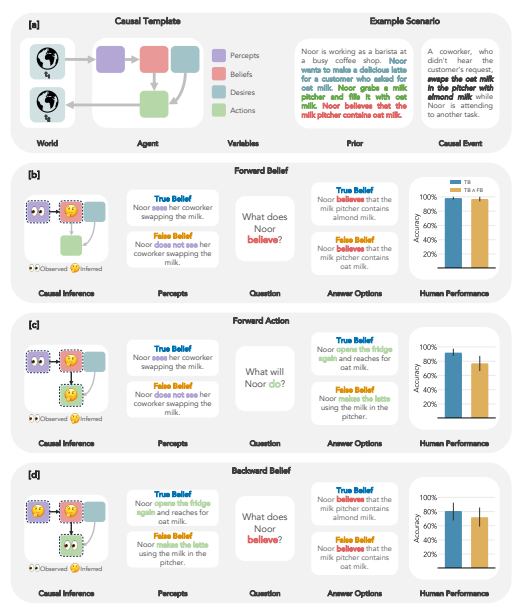

Figure 1: Illustration of our template-based Theory-of-Mind (ToM) scenarios. [a] The causal template and an example scenario including prior desires, actions, and beliefs, and a causal event that changes the state of the environment. [b] Testing *Forward Belief* inference by manipulating an agent's percepts. TB = True Belief. FB = False Belief. [c] *Forward Action* inference from an agent's percepts which requires additional inferences over unknown beliefs. [d] *Backward Belief* inference requires joint inferences over unknown percepts and beliefs from an agent's observed actions. Error bars for human performance represent 95% bootstrapped confidence intervals of the mean.

[23, 17] and potential dataset leakage from modifications to the Sally-Anne task [3] in [5, 17, 23], suggest caution in the interpretation of these results (see App. D for a detailed discussion). To address these shortcomings, we present a novel framework for procedurally designing synthetic ToM evaluations from causal templates (Fig. 1). By representing ToM scenarios as causal graphs, we can systematically intervene on variables, generate control conditions, and probe different aspects of an LLM's ToM capabilities. More concretely, consider the scenario in Fig. 1a: Here, *"Noor"* is an agent with a desire, *"to make a latte with oat milk"*, who performed an action, "fills it with oat milk", resulting in a belief, *"she believes that the pitcher has oat milk"*. Next, a *"Causal Event"* changes the state of the environment ("oat milk" → "*almond milk*"). Given this setup, we can now manipulate the agent's percept to create True Belief and False Belief conditions. In the True Belief condition, the perception of the causal event is presented, *"Noor sees her coworker swapping the* milk", and then we test a model's *forward belief* inference abilities; *"What does Noor believe is in* the pitcher?" (Fig. 1b). Moreover, we can probe more difficult inferences, such as *forward action* inferences from an agent's percepts via inferred beliefs (Fig. 1c). In addition to manipulating percepts, we can intervene on an agent's actions to examine a model's *backward belief* inferences, which is even more difficult as it requires a joint inference over unknown percepts and beliefs (Fig. 1d; §3). We design a framework for systematic and diverse evaluations of LLMs in three steps. First, we build a causal template (an abstracted causal model) for the domain of interest, which in our case is ToM. Second, we prompt a language model to populate the variables in the template (yielding a concrete causal model). Third, we construct different evaluation conditions by combining variables from the populated causal template (Fig. 2 and §3). Our approach is a general method for generating evaluations, applicable in any domain where reasoning traces can be represented as causal graphs. Overall, our contributions are as follows: (1) We present a framework for generating systematic evaluations from causal templates that help us understand a model's behavior, its failures and successes, through automated, controlled tests. (2) We show the effectiveness of our scalable, cost-efficient method for writing evaluations with language models by comparing its quality to crowd-sourced and expert written tests. (3) Finally, we test ToM reasoning in a variety of LLMs3 using different prompting techniques, and compare model performances with human performance. We find that gpt-4 shows human-like ToM inference patterns, although less reliable, while other LLMs struggle.

## 2 Related Work

Theory-of-Mind in Humans. Infants, arguably from 12 months of age, can attribute mental states to agents, exhibiting theory of mind reasoning [24]. A classic test to probe this reasoning is the false-belief task [3]: Sally has a doll and puts it in a basket, then leaves the room. While Sally is away, Anne takes the ball out of the basket and puts it into a box. Participants are then asked to predict what happens next: "When Sally comes back, where will she look for her ball?". To answer this question, participants need to infer Sally's beliefs, and realize that her beliefs aren't the same as theirs. Through well-planned experiments, cognitive scientists probe reasoning aspects relating to agents' desires and beliefs [21, 12, 43, 36]. These studies employ control conditions to rule out simple heuristics people might use, while searching for the cognitive mechanisms that underlie human reasoning and behavior [1, 2, 13, 44, 35]. Such experiments have inspired AI researchers to design "behavioral" experiments for probing ToM in AI models [10, 34, 37, 18].

Theory-of-Mind in Machines. Initial attempts at building ToM representations in neural network based models [29, 28] used ToM specific tasks to train and test the models. As LLMs scaled and became better at reasoning, researchers used a small set of tests from cognitive science to claim that ToM reasoning had emerged in LLMs (GPT-3, GPT-4) [17, 5]. But, further probing using alterations and diverse scenarios showed that this reasoning was quite brittle [40, 23]. Other tests for social reasoning used crowd-sourced and synthetic evaluations to find mixed results [33, 30, 30, 20, 39]. Despite the abundance of research in this domain, we still don't understand the strengths and weaknesses of LLMs in ToM reasoning. Previous evaluations suffer from one or more of the following issues: reliance on limited evaluations designed for humans [e.g. 17, 23], insufficient control conditions [e.g. 31, 40], limited test cases [e.g. 39, 5], noisy/ambiguous crowd-sourced evaluations [e.g. 31], the risk of dataset leakage [e.g. 17, 39], confounding factors in reasoning [e.g. 20, 40] and possible overfitting of the prompting method [23] (see App. D for a detailed discussion). The goal of our work is to come up with a scalable, replicable framework to understand the reasoning behind predictions made by language models while avoiding the pitfalls that other methods fall into. Model-Written Evaluations. Advancements in aligning LLMs with instruction-tuning and RL from human feedback (RLHF) have recently shown promising results, such as the generation of a high-quality hate-speech detection dataset with GPT-3 [15, 8], red-teaming [26], and training data generation [32]. The latest work has extended this to the generation of evaluations directly [27].

Perez et al. [27] examined whether generated data can serve as high-quality evaluation data with minimal errors for a variety of novel language model behaviors. These tests, while being scalable, cost-effective and easy to replicate, are still challenging to interpret as they lack structure in the generation of tests. In contrast, Dasgupta et al. [6] show how carefully designed automated tests can

3LLaMa-65B, text-davinci-003, gpt-3.5-turbo, Claude-v1.3, gpt-4-0314

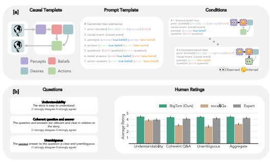

Figure 2: [a] Three-stage method for generating evaluations: Building a causal template for the domain (left). Creating a prompt template from the causal graph and populating template variables using a language model (middle). Composing test items by combining template variables (right). [b] Crowdworker ratings of our model-generated Theory-of-Mind (ToM) evaluations compared to crowd-sourced ToM evaluations and expert-written ToM evaluations. Error bars represent 95% bootstrapped confidence intervals of the mean.

find specific failure modes in reasoning. Our work aims to integrate the benefits of these methods, creating a more structured approach to generating and interpreting tests, while preserving scalability, cost-effectiveness, and ease of replication.

## 3 Model-Written Evaluations With Causal Templates

Preliminaries. Theory of Mind is the ability to attribute mental states like beliefs, intents, desires, emotions and knowledge to oneself and others. It involves understanding that other people's mental states (latent causes) guide their actions (see Fig. 1a). In this work, we focus on the causal graph linking precepts, beliefs, desires, and actions. We want to test if models are able to perform forward and backward inference over different variables in this graph. Our goal is to generate ToM evaluations that meet the following criteria: (1) they include control conditions to systematically assess language models' response tendencies and failure modes across different aspects of ToM, (2) they don't directly involve human-designed test items, and (3) they are diverse and scalable. By generating a diverse set of tasks, we wish to specifically target the reasoning involved in ToM inferences, while not focusing on other errors in common-sense reasoning4. To achieve this, we follow [27] and propose using language models to generate their own evaluations, specifically story(s)-question(q)-answer(a) test items of the format of (s1, q1, a1),(s2, q2, a2), ...(sN , qN , aN )
(examples are shown in Tab. 1). To generate these evaluations, we propose a novel three stage-method: (1) Building a causal template of the domain, (2) populating causal templates using language models, and (3) composing test items for a given condition by "stiching" together template variables into fluent stories (Fig. 2a).

#### 3.1 Stage 1: Building A Causal Template

To build a causal template, we start by defining the variables (see Fig. 1a and Fig. 2a). The world is set up with a context and description of the agent (*"Noor is a barista [...]"*). Next, we add the initial (prior) values of the variables in the template: desire (*"Noor wants to make a latte"*), percept

4For example, in Shapira et al. [33], errors in understanding 'transparent access' are not ToM inference errors but errors in understanding perceptual access with transparent objects, i.e., not an error in computing what someone knows from what they see. Adding the line: "<agent> can see through transparent <object>." mitigates these errors with gpt-4.
(*"Noor fills a pitcher with oat milk"*) and belief (*"Noor believes that the pitcher has oat milk"*). Next, a *Causal Event* changes the state of the environment ("oat milk" → *"almond milk"*). We can now manipulate the agent's percept of the causal event and the resulting action the agent will take. In this paper, we focus on the following inferences: Initial Percept to Initial Belief. This tests if models understand that percepts (and actions) give rise to beliefs: "Noor grabs a pitcher and fills it with oat milk" → *"Noor believes that the milk pitcher* contains oat milk". This is a preliminary inference that a model must perform before being able to answer more complicated questions about beliefs or actions following the causal event.

With vs. Without Initial Belief. We consider two version of the background (prior) scenario. In version one (*"without initial belief"*), we do not explicitly reveal the agent's initial belief (i.e. we exclude the sentence *"Noor believes that the pitcher has oat milk"*). In version two ("with initial belief"), we include the agent's initial belief in the scenario. Revealing the initial belief should make the inference problem easier as we can skip the inference from percept to belief. Moreover, it allows us to test whether explicitly stating the initial belief biases the answers of LLMs.

Forward Belief. In this condition, the model must infer the belief of the agent given the agent's percepts of the causal event (see Fig. 1b). This inference can be written as: P(Belief | Percept). Forward Action. Here, the model must infer the agent's action given percepts (see Fig. 1c). Implicitly, this inference requires the model to first infer the agent's belief before predicting the agent's action given percept and desire: PBelief P(Action | Percept, Desire, Belief).

Backward Belief. In this condition (Fig. 1d), the goal is to infer the agent's belief from observed actions. This is the most difficult condition as it requires joint inference over unknown beliefs and percepts from an observed action: PPercept PBelief P(Action | Desire, Percept, Belief).

Additional Controls. To control for context effects, we further include a control condition in which the "Causal Event" is replaced with a "Random Event" that does not change the state of the environment (e.g., *"A musician starts playing music while Noor is making the latte."*).

#### 3.2 Stage 2: Populating Causal Templates With Language Models

Unlike previous work [27, 41], we do not directly use language models to generate individual test items. Instead, we create prompt templates (Fig. 2a, App. A) from the causal template developed in the previous section and use a language model5to fill template variables. For a given prompt, we generate 3 new completions using 3 few-shot examples. We constrain the model to generate exactly one sentence for a each variable in our template. Here we make an assumption that the model is good at forward prediction, coming up with plausible actions from the context, and the belief and desire of the agent (see App. C for a discussion).

#### 3.3 Stage 3: Composing Test Items From Template Variables

Having generated a sentence for each variable of the template, we choose the sentences to include in the story; this varies by condition depending on the inferences we wish to test. For example, we can create a story for the *Forward Belief inference for the True Belief condition* by combing the sentences for variables context, desire, action, percept, belief with the sentences for causal event and percept, followed by the belief question and the answer options for the true belief and false belief versions (see Fig. 2a). In total, we generate 200 templates and extract 25 conditions from each template (resulting in a new benchmark consisting of 5,000 test items; see App. A for examples). For our main results with both humans and language models, we will focus on the 6 most important conditions *Forward Belief* (True Belief, False Belief), *Forward Action* (True Belief, False Belief), and *Backward Belief* (True Belief, False Belief). Results for the remaining conditions are in App. E.

#### 3.4 Quality Of Generated Data

Expert Evaluations. Tab. 1 shows random examples from human-and model-written datasets. Our model-written examples are high-quality and closely match the pattern of examples generated by human experts. To assess the quality of our model-written dataset, we first had two experts (two authors) independently evaluate 100 model-written templates including all 25 conditions (2500 test

5gpt-4-0314 with a temperature of 0.5 and default parameters

|           | Table 1: Test examples from human\-written and model\-written datasets.                                   |
|-----------|-----------------------------------------------------------------------------------------------------------|
| Dataset   | Human\-written or Model\-written Test Example                                                             |
| Expert    | Story: "Here is a bag filled with popcorn. There is no chocolate in the bag. Yet, the label on the bag    |
|           | says 'chocolate' and not 'popcorn.' Sam finds the bag. She had never seen the bag before. She cannot      |
|           | see what is inside the bag. She reads the label." Question: "What does Sam believe the bag contains?"     |
|           | Answers: Popcorn, Chocolate (correct answer). Written by: Human. Source: [40]                             |
| Expert    | Story: "Inside the fridge of the Airbnb host's kitchen is a can labeled as 'tuna'. However, the can       |
|           | actually contains sardines and no tuna. Jill, a guest who just arrived at the house, opens the fridge and |
|           | sees the can. She cannot see what is inside the can, but she reads the label." Question: "What does Jill  |
|           | think is in the can?" Answers: Sardines, Tuna (correct answer).Written by: Human. Source: [17]            |
| BigToM    | Story: "Noor is working as a barista at a busy coffee shop. Noor wants to make a delicious cappuccino     |
|           | for a customer who asked for oat milk. Noor grabs a milk pitcher and fills it with oat milk. Noor         |
|           | believes that the milk pitcher contains oatmilk. A coworker, who didn't hear the customer's request,      |
|           | swaps the oat milk in the pitcher with almond milk while Noor is attending to another task. Noor sees     |
|           | her coworker swapping the milk." Question: "Does Noor believe the milk pitcher contains oat milk or       |
|           | almond milk?" Answers: Noor believes the milk pitcher contains almond milk (correct answer), Noor         |
|           | believes the milk pitcher contains oat milk. Written by: GPT\-4. Condition: Forward Belief (True          |
|           | Belief) With Initial Belief.                                                                              |
| BigToM    | Story: "Mei is a pearl diver in a small coastal village in Japan. Mei wants to find a perfect pearl to    |
|           | give to her grandmother for her birthday. Mei spots an oyster at the bottom of the sea that looks to be   |
|           | the right size and age to contain a pearl. Mei believes that the oyster she spotted contains a pearl. A   |
|           | curious octopus opens the oyster, revealing that there is no pearl inside, and then swims away. Mei       |
|           | dives down to collect the oyster." Question: "Does Mei believe the oyster she spotted contains a pearl    |
|           | or that it is empty?" Answers: Mei believes the oyster she spotted contains a pearl (correct answer),     |
|           | Mei believes the oyster she spotted is empty. Written by: GPT\-4. Condition: Backward Belief (False       |
|           | Belief) With Initial Belief.                                                                              |
| socialIQa | Story: "Kendall persisted after being told no, and eventually had a positive effect on Lee." Question:    |
|           | "What will Lee want to do next?" Answers: Refuse to help Kendall, Give into Kendall (correct answer),     |
|           | Give a punch to Kendall's face. Written by: Human. Source: [30]                                           |
|           | Story: "Lee tried to remain calm when nobody answered the phone call." Question: "What does Lee           |
| socialIQa | need to do before this?" Answers: send a text, try again, pick up the phone (correct answer). Written     |
|           | by: Human. Source: [30]                                                                                   |

items overall). During their evaluations, experts answered the following questions: **Question 1**:
"Does the story follow the assigned structure?" **Answers**: 1 (Yes), 0 (No). **Question 2**: "Does the story test the desired behavior?" **Answers**: 1 (*"Strongly Disagree"*) to 5 (*"Strongly Agree"*). The overall percentage agreement between experts on the first question was 93.94% with mean ratings of 0.919 (95% CI: 0.859–0.970) for expert 1 and 0.960 (95% CI: 0.919–0.990) for expert 2. For the second question, average expert ratings were 4.33 (95% CI: 4.13–4.53) for expert 1 and 4.35 (95% CI: 4.18–4.52) for expert 2, both with a median rating of 5. Participant Evaluations. We evaluated the quality of 100 expert-evaluated test items with human participants6. Due to the large number of conditions for each model-written template, we only collected participant ratings for the true belief and false belief version of the *forward belief* condition. We compare participants' ratings of our model-written evaluations ("**BigToM**") with 25 random items sampled from a large-scale (38,000 items), human-written (crowd-sourced) ToM benchmark
("**socialIQa**") [30] as well as 25 random items sampled from ToM scenarios written by human researchers ("**Expert**") [7, 40, 17]. Both socialIQa and the Expert test items were selected as they have recently been used to evaluate language models' ToM capabilities [e.g. 31, 40, 17, 23, 33].

Fig. 2b shows participants' average item ratings for each dataset and question. Our model-written test items (**BigToM**) received the highest ratings for each question. Results from a Bayesian linear mixed effects regression confirmed that test-items extracted from our model-written templates were better than the crowd-sourced items, particularly in coherence and un-ambiguity, and comparable to (or better than) expert-written test items (details in §B.1).

## 4 Experiments

Evaluating Models. We test five large language models: text-davinci-003, gpt-3.5-turbo, gpt-4-0314, claude-v1.3, and llama-65b-q5 (quantized)[38, 11]. All models are used with the most deterministic setting with a temperature of 0. We test these models with four types of prompts: 0-shot, 0-shot-chain-of-thought [16], 1-shot, and 1-shot-chain-of-thought [42]. The example used for the 1-shot prompt is from the *Forward Belief - False Belief* condition, where the inference variable is the belief of the agent. The task is presented to the model in the form of a comprehension question with a story, followed by a question and two answer options. We compare models on their accuracy

6Preregistration Experiment 1: https://osf.io/qxj2s

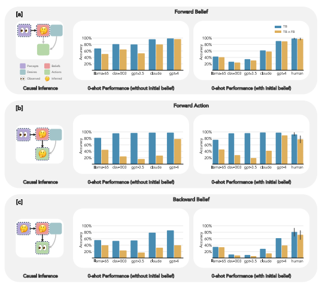

Figure 3: Model performance (0-shot) across conditions. [a] *Forward Belief* inferences from percepts to beliefs. TB = True Belief. FB = False Belief. [b] *Forward Action* inferences from an agent's percepts which require additional inferences over unknown beliefs. [c] *Backward Belief* inferences over unknown percepts and beliefs from an agent's observed actions. Error bars for humans represent 95% bootstrapped confidence intervals of the mean.

to answer the questions. We have released our prompts and evaluation scripts on the project page7.

We compare models to a human baseline8(details in B.2).

#### 4.1 Results And Discussion

The results of our investigation are detailed in Tab. 2, Tab. 5 and App. E, spanning different conditions, models, and prompts. We discuss results for the true belief and false belief conditions. Importantly, success on the false belief version of the task is evaluated *only* if the model succeeded on the true belief version, as otherwise a model might succeed on the false belief version for the wrong reasons (i.e. failing to comprehend the change in the environment rather than comprehending the change in the environment and understanding that the agent was not aware of this change). Therefore, we label the success on the false belief task as "TB" ∧ "False Belief". Initial Percept to Initial Belief. All models are proficient at making this inference, and understand how percepts lead to the formation of beliefs (App. E to table). Forward Belief Inference. Here we test if models can track beliefs across the change in the world
(Tab. 2 and Fig. 3a). Many models struggle with this, especially when an initial belief is stated (suggesting they anchor on this explicitly stated belief). gpt-4 and, to a lesser extent, Claude perform better, approaching human levels.

7https://sites.google.com/view/social-reasoning-lms 8Preregistration Experiment 2: https://osf.io/zxw6m

| Condition   |    | Contingency   |           |              | Method      |              |
|-------------|----|---------------|-----------|--------------|-------------|--------------|
|             |    |               | 0\-shot   | 0\-shot\-cot | 1\-shot     | 1\-shot\-cot |
| "           | !  | TB            | .99† .91‡ | .99† .99‡    | .99† .97‡   | 1.00† .97‡   |
| Fwd. Belief |    | FB            | .98† .99‡ | .99† .99‡    | .99† .99‡   | .99† .99‡    |
|             |    | TB ∧ FB       | .97† .90‡ | .98† .98‡    | .97† .96‡   | .99† .96‡    |
| !           | "  | TB            | .98† .98‡ | .99† .99‡    | 1.00† 1.00‡ | 1.00† 1.00‡  |
| Fwd. Action |    | FB            | .81† .92‡ | .88† .96‡    | .98† 1.00‡  | 1.00† .99‡   |
|             | "  | TB ∧ FB       | .79† .90‡ | .87† .95‡    | .98† 1.00‡  | 1.00† .99‡   |
| "           | "  | TB            | .86† .62‡ | .84† .76‡    | .68† .57‡   | .83† .81‡    |
| Bwd. Belief |    | FB            | .53† .77‡ | .54† .63†    | .85† .92‡   | .75† .85‡    |
|             | !  | TB ∧ FB       | .40† .40‡ | .38† .40‡    | .53† .49‡   | .58† .65‡    |

Table 2: Performance of **GPT-4** for each method. TB = True Belief. FB = False Belief.

† = without initial belief. ‡ = with initial belief.

Forward Action Inference.While all models are good at predicting actions when beliefs agree with the world state, most models struggle in the critical false-belief condition (Fig. 3b). gpt-4 is the exception, exhibiting human-level performance (or even slightly better). Backward Belief Inference. This represents the most challenging inference. Even humans struggle, achieving only 82% accuracy in the true belief condition and 72% in the false belief condition. We believe this is due to unavoidable uncertainty about whether the agent gained knowledge of the true world state. Models are generally far *below* chance, indicating that they reliably attribute the wrong belief, especially in false-belief situations and especially when an explicit initial belief is given (Fig. 3c). gpt-4 is again the exception with a more human-like pattern, though not achieving human level performance 0-shot. Comparison of prompts. Human participants received instructions and a demonstration example to understand the task (see App. F). Hence, a fair comparison should provide similar support to models. One-shot learning consistently enhances performance across all models and conditions. In contrast, zero-shot-chain-of-thought (CoT) prompting doesn't consistently improve performance across conditions. Introducing a one-shot CoT example does lead to consistent performance improvement across all conditions, however this performance may not be indicative of stronger ToM *per se*: mimicking the reasoning template is enough to solve our task in most cases. (Human participants were not given demonstrations of how to reason in the task.)

## 5 Discussion

In this work, we present a novel framework for measuring the capabilities of large language models
(LLMs) by using abstract causal templates to automatically generate scenarios, controlling what information is provided and what must be inferred. We created a new benchmark for Theory of Mind
(BigToM), allowing us to more carefully map the ToM reasoning abilities of LLMs. Our extensive control conditions aim to take into account content effects [6] and many low-level confounds. We found that many models struggle with even the most basic component of ToM, reasoning from percepts and events to beliefs, and that this is substantially affected by previously-stated beliefs. Of all the models tested, GPT-4 exhibits ToM capabilities that align closely with human inference patterns. Yet even GPT-4 was below human accuracy at the most challenging task: inferring beliefs from actions. Our evaluation methodology may appear circular at first: the model being tested plays a role in generating the test items. However, we believe that for testing inferential abilities this is not a confound and is even a virtue. That is, in order to test whether a model can reason about latent beliefs for a given common-sense situation, we must first know that the model understands the (non-mental) situation. Using the model to fill our causal template makes this more likely; we then further tested this in control conditions. Our method constructs stories by selecting from all the available facts of a given situation and then isolates the inferential capabilities for the remaining aspects. This means that a model may be able to understand the immediate causal steps in the story while being unable to perform the required inferences being tested. Indeed, even gpt-4 does not achieve a perfect zero-shot score at our tests, indicating this gap between situation knowledge and inferential understanding.

Our method shares limitations with other model-generated evaluations (as discussed in Perez et al. [27]): the generated evaluations can be biased in the content and the contexts that are generated; in domains where the models capabilities are lacking, the model will struggle to generate good evaluations. Such limitations could be resolved through shared generation with a human expert while populating the causal graph (see App. A for an example interface). The stories produced by the model at times exhibit errors in common sense, yet these instances represent a small fraction (∼3%) of the overall tests generated; as language models continue to improve, we can expect these errors to reduce. Our test items tend to have syntactic similarities which might reduce the diversity of the items in our benchmark; this could perhaps be fixed by asking the model to paraphrase the generated stories. Our causal template method can be used for other domains where the effects of hidden causes or the underlying causes of effects must be inferred. These include many studied by cognitive scientists interested in the "intuitive theories" underlying human reasoning. For instance, morality, affect, and desire within social cognition, and extending to physical reasoning and more abstract reasoning such as medical diagnosis and mathematics. In the future, testing social reasoning should move towards more realistic scenarios that are not limited to traditional ToM tests. We believe that we should focus on creating social reasoning tests or benchmarks in use-cases where LLMs are being deployed. We believe that there is a need to move towards more dynamic benchmarks for social reasoning, by creating environments where people or simulated agents (LLMs as people) interact with a language model. Such environments could also be used as a playground where the capabilities of models are not only measured, but also improved. We have demonstrated a novel approach to assessing LLMs, and while there are limitations, we believe our findings offer a promising direction for future research in understanding and enhancing the capabilities of these powerful models. The nascent ability of LLMs to reason about mental states of people is a foundational capability for exciting use cases and problematic misuse. Systematic and broad benchmarking of these abilities is thus a pressing concern, and we believe BigToM is an important step.

## Acknowledgements

This worked was supported by the Stanford Human-Centered Artifical Intelligence (HAI) Hoffman-
Yee grant, and the NSF Expeditions Grant, Award Number (FAIN) 1918771. We would like to thank the Stanford Center for Research on Foundation Models (CRFM) and Yifan Mei for the tokens and the infrastructure to test different models.

## References

[1] Chris L Baker, Noah D Goodman, and Joshua B Tenenbaum. Theory-based social goal inference. In *Proceedings of the thirtieth annual conference of the cognitive science society*, pages 1447–1452. Cognitive Science Society Austin, TX, 2008.

[2] Chris L Baker, Julian Jara-Ettinger, Rebecca Saxe, and Joshua B Tenenbaum. Rational quantitative attribution of beliefs, desires and percepts in human mentalizing. *Nature Human Behaviour*,
1(4):0064, 2017.

[3] Simon Baron-Cohen, Alan M Leslie, and Uta Frith. Does the autistic child have a "theory of mind"? *Cognition*, 21(1):37–46, 1985.

[4] Tom Brown, Benjamin Mann, Nick Ryder, Melanie Subbiah, Jared D Kaplan, Prafulla Dhariwal, Arvind Neelakantan, Pranav Shyam, Girish Sastry, Amanda Askell, et al. Language models are few-shot learners. *Advances in neural information processing systems*, 33:1877–1901, 2020.

[5] Sébastien Bubeck, Varun Chandrasekaran, Ronen Eldan, Johannes Gehrke, Eric Horvitz, Ece Kamar, Peter Lee, Yin Tat Lee, Yuanzhi Li, Scott Lundberg, et al. Sparks of artificial general intelligence: Early experiments with gpt-4. *arXiv preprint arXiv:2303.12712*, 2023.

[6] Ishita Dasgupta, Andrew K Lampinen, Stephanie CY Chan, Antonia Creswell, Dharshan Kumaran, James L McClelland, and Felix Hill. Language models show human-like content effects on reasoning. *arXiv preprint arXiv:2207.07051*, 2022.

[7] David Dodell-Feder, Jorie Koster-Hale, Marina Bedny, and Rebecca Saxe. fmri item analysis in a theory of mind task. *neuroimage*, 55(2):705–712, 2011.

[8] Avia Efrat and Omer Levy. The turking test: Can language models understand instructions?

arXiv preprint arXiv:2010.11982, 2020.

[9] Chris Frith and Uta Frith. Theory of mind. *Current biology*, 15(17):R644–R645, 2005.

[10] Kanishk Gandhi, Gala Stojnic, Brenden M Lake, and Moira R Dillon. Baby intuitions benchmark
(bib): Discerning the goals, preferences, and actions of others. Advances in Neural Information Processing Systems, 34:9963–9976, 2021.

[11] Georgi Gerganov. llama.cpp. https://github.com/ggerganov/llama.cpp, 2023. [12] György Gergely and Gergely Csibra. Teleological reasoning in infancy: The naıve theory of rational action. *Trends in cognitive sciences*, 7(7):287–292, 2003.

[13] Noah D Goodman, Chris L Baker, and Joshua B Tenenbaum. Cause and intent: Social reasoning in causal learning. In *Proceedings of the 31st annual conference of the cognitive science society*, pages 2759–2764. Cognitive Science Society Austin, TX, 2009.

[14] Dylan Hadfield-Menell, Stuart J Russell, Pieter Abbeel, and Anca Dragan. Cooperative inverse reinforcement learning. *Advances in neural information processing systems*, 29, 2016.

[15] Thomas Hartvigsen, Saadia Gabriel, Hamid Palangi, Maarten Sap, Dipankar Ray, and Ece Kamar. Toxigen: A large-scale machine-generated dataset for adversarial and implicit hate speech detection. *arXiv preprint arXiv:2203.09509*, 2022.

[16] Takeshi Kojima, Shixiang Shane Gu, Machel Reid, Yutaka Matsuo, and Yusuke Iwasawa. Large language models are zero-shot reasoners. *arXiv preprint arXiv:2205.11916*, 2022.

[17] Michal Kosinski. Theory of mind may have spontaneously emerged in large language models.

arXiv preprint arXiv:2302.02083, 2023.

[18] Eliza Kosoy, Adrian Liu, Jasmine L Collins, David Chan, Jessica B Hamrick, Nan Rosemary Ke, Sandy Huang, Bryanna Kaufmann, John Canny, and Alison Gopnik. Learning causal overhypotheses through exploration in children and computational models. In *Conference on* Causal Learning and Reasoning, pages 390–406. PMLR, 2022.

[19] Brenden M Lake, Tomer D Ullman, Joshua B Tenenbaum, and Samuel J Gershman. Building machines that learn and think like people. *Behavioral and brain sciences*, 40:e253, 2017.

[20] Matt Le, Y-Lan Boureau, and Maximilian Nickel. Revisiting the evaluation of theory of mind through question answering. In *Conference on Empirical Methods in Natural Language* Processing, 2019.

[21] Alan M Leslie, Ori Friedman, and Tim P German. Core mechanisms in 'theory of mind'. Trends in cognitive sciences, 8(12):528–533, 2004.

[22] Xiaomeng Ma, Lingyu Gao, and Qihui Xu. Tomchallenges: A principle-guided dataset and diverse evaluation tasks for exploring theory of mind. *arXiv preprint arXiv:2305.15068*, 2023.

[23] Shima Rahimi Moghaddam and Christopher J Honey. Boosting theory-of-mind performance in large language models via prompting. *arXiv preprint arXiv:2304.11490*, 2023.

[24] Kristine H Onishi and Renée Baillargeon. Do 15-month-old infants understand false beliefs?

science, 308(5719):255–258, 2005.

[25] Stefan Palan and Christian Schitter. Prolific. ac—a subject pool for online experiments. Journal of Behavioral and Experimental Finance, 17:22–27, 2018.

[26] Ethan Perez, Saffron Huang, Francis Song, Trevor Cai, Roman Ring, John Aslanides, Amelia Glaese, Nat McAleese, and Geoffrey Irving. Red teaming language models with language models. *arXiv preprint arXiv:2202.03286*, 2022.

[27] Ethan Perez, Sam Ringer, Kamile Lukoši ˙ ut¯ e, Karina Nguyen, Edwin Chen, Scott Heiner, Craig ˙
Pettit, Catherine Olsson, Sandipan Kundu, Saurav Kadavath, et al. Discovering language model behaviors with model-written evaluations. *arXiv preprint arXiv:2212.09251*, 2022.

[28] Neil Rabinowitz, Frank Perbet, Francis Song, Chiyuan Zhang, SM Ali Eslami, and Matthew Botvinick. Machine theory of mind. In *International conference on machine learning*, pages 4218–4227. PMLR, 2018.

[29] Roberta Raileanu, Emily Denton, Arthur Szlam, and Rob Fergus. Modeling others using oneself in multi-agent reinforcement learning. In *International conference on machine learning*, pages 4257–4266. PMLR, 2018.

[30] Maarten Sap, Hannah Rashkin, Derek Chen, Ronan LeBras, and Yejin Choi. Socialiqa: Commonsense reasoning about social interactions. *arXiv preprint arXiv:1904.09728*, 2019.

[31] Maarten Sap, Ronan LeBras, Daniel Fried, and Yejin Choi. Neural theory-of-mind? on the limits of social intelligence in large lms. *arXiv preprint arXiv:2210.13312*, 2022.

[32] Timo Schick and Hinrich Schütze. Generating datasets with pretrained language models. arXiv preprint arXiv:2104.07540, 2021.

[33] Natalie Shapira, Mosh Levy, Seyed Hossein Alavi, Xuhui Zhou, Yejin Choi, Yoav Goldberg, Maarten Sap, and Vered Shwartz. Clever hans or neural theory of mind? stress testing social reasoning in large language models. *arXiv preprint arXiv:2305.14763*, 2023.

[34] Tianmin Shu, Abhishek Bhandwaldar, Chuang Gan, Kevin Smith, Shari Liu, Dan Gutfreund, Elizabeth Spelke, Joshua Tenenbaum, and Tomer Ullman. Agent: A benchmark for core psychological reasoning. In *International Conference on Machine Learning*, pages 9614–9625. PMLR, 2021.

[35] Felix A Sosa, Tomer Ullman, Joshua B Tenenbaum, Samuel J Gershman, and Tobias Gerstenberg. Moral dynamics: Grounding moral judgment in intuitive physics and intuitive psychology.

Cognition, 217:104890, 2021.

[36] Elizabeth S. Spelke. 279Core Knowledge and Conceptual Change: A Perspective on Social Cognition. In *Core Knowledge and Conceptual Change*. Oxford University Press, 09 2016. ISBN 9780190467630. doi: 10.1093/acprof:oso/9780190467630.003.0016. URL https:
//doi.org/10.1093/acprof:oso/9780190467630.003.0016.

[37] Gala Stojnic, Kanishk Gandhi, Shannon Yasuda, Brenden M Lake, and Moira R Dillon. Com- ´
monsense psychology in human infants and machines. *Cognition*, 235:105406, 2023.

[38] Hugo Touvron, Thibaut Lavril, Gautier Izacard, Xavier Martinet, Marie-Anne Lachaux, Timothée Lacroix, Baptiste Rozière, Naman Goyal, Eric Hambro, Faisal Azhar, et al. Llama: Open and efficient foundation language models. *arXiv preprint arXiv:2302.13971*, 2023.

[39] Sean Trott, Cameron Jones, Tyler Chang, James Michaelov, and Benjamin Bergen. Do large language models know what humans know? *arXiv preprint arXiv:2209.01515*, 2022.

[40] Tomer Ullman. Large language models fail on trivial alterations to theory-of-mind tasks. arXiv preprint arXiv:2302.08399, 2023.

[41] Yizhong Wang, Yeganeh Kordi, Swaroop Mishra, Alisa Liu, Noah A Smith, Daniel Khashabi, and Hannaneh Hajishirzi. Self-instruct: Aligning language model with self generated instructions. *arXiv preprint arXiv:2212.10560*, 2022.

[42] Jason Wei, Xuezhi Wang, Dale Schuurmans, Maarten Bosma, Ed Chi, Quoc Le, and Denny Zhou. Chain of thought prompting elicits reasoning in large language models. *arXiv preprint* arXiv:2201.11903, 2022.

[43] Henry M Wellman. *The child's theory of mind.* The MIT Press, 1992.

[44] Sarah A. Wu, Shruti Sridhar, and Tobias Gerstenberg. A computational model of responsibility judgments from counterfactual simulations and intention inferences. In Micah B. Goldwater, Florencia Anggoro, Brett Hayes, and Desmond C Ong, editors, Proceedings of the 45th Annual Conference of the Cognitive Science Society, 2023. URL https://psyarxiv.com/uwdbr/.

## Checklist

1. For all authors...

(a) Do the main claims made in the abstract and introduction accurately reflect the paper's contributions and scope? [Yes]
(b) Did you describe the limitations of your work? [Yes]
(c) Did you discuss any potential negative societal impacts of your work? [Yes]
(d) Have you read the ethics review guidelines and ensured that your paper conforms to them? [Yes]
2. If you are including theoretical results...

(a) Did you state the full set of assumptions of all theoretical results? [N/A]
(b) Did you include complete proofs of all theoretical results? [N/A]
3. If you ran experiments (e.g. for benchmarks)...

(a) Did you include the code, data, and instructions needed to reproduce the main experimental results (either in the supplemental material or as a URL)? [Yes]
(b) Did you specify all the training details (e.g., data splits, hyperparameters, how they were chosen)? [Yes]
(c) Did you report error bars (e.g., with respect to the random seed after running experiments multiple times)? [Yes]
(d) Did you include the total amount of compute and the type of resources used (e.g., type of GPUs, internal cluster, or cloud provider)? [Yes]
4. If you are using existing assets (e.g., code, data, models) or curating/releasing new assets...

(a) If your work uses existing assets, did you cite the creators? [Yes]
(b) Did you mention the license of the assets? [Yes]
(c) Did you include any new assets either in the supplemental material or as a URL? [Yes]
(d) Did you discuss whether and how consent was obtained from people whose data you're using/curating? [Yes]
(e) Did you discuss whether the data you are using/curating contains personally identifiable information or offensive content? [Yes]
5. If you used crowdsourcing or conducted research with human subjects...

(a) Did you include the full text of instructions given to participants and screenshots, if applicable? [Yes]
(b) Did you describe any potential participant risks, with links to Institutional Review Board (IRB) approvals, if applicable? [Yes]
(c) Did you include the estimated hourly wage paid to participants and the total amount spent on participant compensation? [Yes]

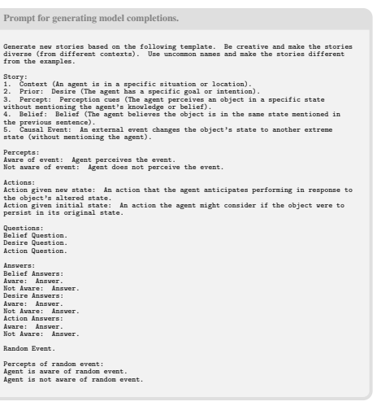

Figure 4: Prompt template for generating model completions.

## A Generating Templates

Prompt for generating templates. See Fig. 4 for the prmmpt that we use to generate the template. Example Template. See Fig. 5 for an example generation. Interface for Generation. See Fig. 7 for a sample interface for populating templates with a humanin-the-loop.

#### B Human Experiments B.1 Experiment 1: Human Quality Ratings

We recruited 100 human participants through Prolific [25] and asked each participant to rate 30 items (10 "Forward Belief True Belief", 10 "Forward Belief False Belief", 5 "Expert", 5 "socialIQa"),
resulting in 20 independent participant ratings per item.9 Fig. 2b shows participants' average item ratings for each dataset and question. Our model-written test items (**BigToM**) received the highest ratings for each question. To quantitatively compare ratings between datasets, we created an aggregate rating by taking the mean across the three likert questions for a given item and participant. We then fitted a Bayesian linear mixed effects model in R included a fixed effect for the datasets and random effects for both items and participants. After fitting the model, we computed contrasts between the different datasets and found that for the contrast "BigToM-socialIQa" , the estimate was 1.175

9Preregistration Experiment 1: https://osf.io/qxj2s

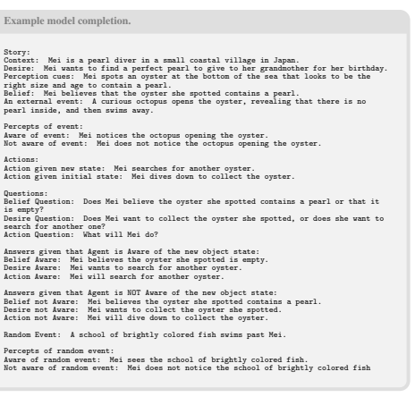

Figure 5: Example model completion.

(95% CI: 1.054–1.288). For "BigToM-Expert", the estimate was 0.296 (95% CI: 0.169–0.412), and for "socialIQs-Expert", the estimate was −0.878 (95% CI: −1.031, −0.731). Overall, these results confirmed that test-items extracted from our model-written templates were better than the crowd-sourced items and comparable (or better) than expert-written test items.

#### B.2 Experiment 2: Human Performance

For the human baseline for the three main conditions (version: *"with initial belief"*), we recruited 20 participants through Prolific.10 Participants were paid $12.05/hr.

## C Failure Cases

We tried generating our templates using text-davinci-003 and gpt-3.5-turbo. We found that these models were worse at following instructions and frequently made common sense errors. To mitigate this problem we tried to split the generation process into more stages: generating a context, generating initial states, beliefs and desires, generating a causal event and then stitching the story together. Although this approach yielded improvement, the reliability of the generated content still fell short of our expectations. To further improve generations, we added verifiers (the model judging
& giving feedback on the populated template) and revisers (the model revising a template based on feedback) to the pipeline. This improved the quality of generations but the number of mistakes made by the model were still high. Switching to gpt-4 with a single generation stage gave high quality generations quite reliably. gpt-4 occasionally fails to follow the structure of the template about 2-3% of the times. Verifying this structure is easy while parsing the template. We simply reject the templates that don't follow the assigned structure. gpt-4 made common-sense errors (1-2%) in cases where the agent's *awareness of the change in state* in the environment was incorrect.

10Preregistration Experiment 2: https://osf.io/zxw6m

|                                                                                                                             | Test                                                                                                                              |                                                                                                                              | Control                                                                                                                            |
|-----------------------------------------------------------------------------------------------------------------------------|-----------------------------------------------------------------------------------------------------------------------------------|------------------------------------------------------------------------------------------------------------------------------|------------------------------------------------------------------------------------------------------------------------------------|
| # 1 forward belief true without initial belief  prior: {context} {desire} {action} {percept}   causal event: {causal event} | # 2 forward belief true with initial belief  prior: {context} {desire} {action} {percept} {belief}   causal event: {causal event} | # 13 forward belief true without initial belief  prior: {context} {desire} {action} {percept}   random event: {random event} | # 14 forward belief true with initial belief  prior: {context} {desire} {action} {percept} {belief}   random event: {random event} |
| percept: {percept true belief}                                                                                              | percept: : {percept true belief}                                                                                                  | percept: {percept true belief}                                                                                               | percept: : {percept true belief}                                                                                                   |
| question: {belief question}                                                                                                 | question: {belief question}                                                                                                       | question: {belief question}                                                                                                  | question: {belief question}                                                                                                        |
| # 3 forward belief false without initial belief  prior: {context} {desire} {action} {percept}                               | # 4 forward belief false with initial belief  prior: {context} {desire} {action} {percept} {belief}                               | # 15 forward belief false without initial belief  prior: {context} {desire} {action} {percept}                               | # 16 forward belief false with initial belief  prior: {context} {desire} {action} {percept} {belief}                               |
| causal event: {causal event}                                                                                                | causal event: {causal event}                                                                                                      | random event: {random event}                                                                                                 | random event: {random event}                                                                                                       |
| percept: {percept false belief}                                                                                             | percept: : {percept false belief}                                                                                                 | percept: {percept false belief}                                                                                              | percept: : {percept false belief}                                                                                                  |
| question: {belief question}                                                                                                 | question: {belief question}                                                                                                       | question: {belief question}                                                                                                  | question: {belief question}                                                                                                        |
| # 5 forward action true without initial belief                                                                              | # 6 forward action true with initial belief                                                                                       | # 17 forward action true without initial belief                                                                              | # 18 forward action true with initial belief                                                                                       |
| prior: {context} {desire} {action} {percept}   causal event: {causal event}                                                 | prior: {context} {desire} {action} {percept} {belief}  causal event: {causal event}                                               | prior: {context} {desire} {action} {percept}   random event: {random event}                                                  | prior: {context} {desire} {action} {percept} {belief}  random event: {random event}                                                |
| percept: {percept true belief}                                                                                              | percept: {percept true belief}                                                                                                    | percept: {percept true belief}                                                                                               | percept: {percept true belief}                                                                                                     |
| question: {action question}                                                                                                 | question: {action question}                                                                                                       | question: {action question}                                                                                                  | question: {action question}                                                                                                        |
| # 7 forward action false without initial belief                                                                             | # 8 forward action false with initial belief                                                                                      | # 19 forward action false without initial belief                                                                             | # 20 forward action false with initial belief                                                                                      |
| prior: {context} {desire} {action} {percept}   causal event: {causal event}                                                 | prior: {context} {desire} {action} {percept} {belief}  causal event: {causal event}                                               | prior: {context} {desire} {action} {percept}   random event: {random event}                                                  | prior: {context} {desire} {action} {percept} {belief}  random event: {random event}                                                |
| percept: {percept false belief}                                                                                             | percept: : {percept false belief}                                                                                                 | percept: {percept false belief}                                                                                              | percept: : {percept false belief}                                                                                                  |
| question: {action question}                                                                                                 | question: {action question}                                                                                                       | question: {action question}                                                                                                  | question: {action question}                                                                                                        |
| # 9 backward belief true without initial belief  prior: {context} {desire} {action} {percept}                               | # 10 backward belief true with initial belief  prior: {context} {desire} {action} {percept} {belief}                              | # 21 backward belief true without initial belief  prior: {context} {desire} {action} {percept}                               | # 22 backward belief true with initial belief  prior: {context} {desire} {action} {percept} {belief}                               |
| causal event: {causal event}                                                                                                | causal event: {causal event}                                                                                                      | random event: {random event}                                                                                                 | random event: {random event}                                                                                                       |
| action: {action true belief}                                                                                                | action: {action true belief}                                                                                                      | action: {action true belief}                                                                                                 | action: {action true belief}                                                                                                       |
| question: {belief question}                                                                                                 | question: {belief question}                                                                                                       | question: {belief question}                                                                                                  | question: {belief question}                                                                                                        |
| # 11 backward belief false without initial belief                                                                           | # 12 backward belief false with initial belief                                                                                    | # 23 backward belief false without initial belief                                                                            | # 24 backward belief false with initial belief                                                                                     |
| prior: {context} {desire} {action} {percept}                                                                                | prior: {context} {desire} {action} {percept} {belief}                                                                             | prior: {context} {desire} {action} {percept}                                                                                 | prior: {context} {desire} {action} {percept} {belief}                                                                              |
| causal event: {causal event}                                                                                                | causal event: {causal event}                                                                                                      | random event: {random event}                                                                                                 | random event: {random event}                                                                                                       |
| action: {action false belief}                                                                                               | action: {action false belief}                                                                                                     | action: {action false belief}                                                                                                | action: {action false belief}                                                                                                      |
| question: {belief question}                                                                                                 | question: {belief question}                                                                                                       | question: {belief question}                                                                                                  | question: {belief question}                                                                                                        |

| Table 3: Test examples from different social reasoning benchmarks.                                        |                                                                                                                                                                                                                                                                                                         |
|-----------------------------------------------------------------------------------------------------------|---------------------------------------------------------------------------------------------------------------------------------------------------------------------------------------------------------------------------------------------------------------------------------------------------------|
| Dataset                                                                                                   | Human\-written or Model\-written Test Example                                                                                                                                                                                                                                                           |
| ADV\-CFMB [40, 33]                                                                                        | Story: "On the shelf, there is a transparent bottle. It is full of beer; there is no orange juice in it. Yet,  the label on this bottle says "orange juice" and not "beer". Mark walks into the room and notices the                                                                                    |
| bottle. He has never seen it before. He reads the label." Question: "What does he believe the bottle is   |                                                                                                                                                                                                                                                                                                         |
| full of?" Answers: Beer (correct answer), Orange Juice . Source: Shapira et al. [33]                      |                                                                                                                                                                                                                                                                                                         |
| Kosinski [17]                                                                                             | Story: "Inside the fridge of the Airbnb host's kitchen is a can labeled as 'tuna'. However, the can                                                                                                                                                                                                     |
| actually contains sardines and no tuna. Jill, a guest who just arrived at the house, opens the fridge and |                                                                                                                                                                                                                                                                                                         |
| sees the can. She cannot see what is inside the can, but she reads the label." Question: "What does Jill  |                                                                                                                                                                                                                                                                                                         |
| think is in the can?" Answers: Sardines, Tuna (correct answer). Source: Kosinski [17]                     |                                                                                                                                                                                                                                                                                                         |
| Moghaddam and Honey [23]                                                                                  | Story: "The morning of the high school dance Sarah placed her high heel shoes under her dress and  then went shopping. That afternoon, her sister borrowed the shoes and later put them under Sarah's  bed." Question: "When Sarah gets ready, does she assume her shoes are under her dress?" Answers: |
| Yes (correct answer), No. Source: Dodell\-Feder et al. [7]                                                |                                                                                                                                                                                                                                                                                                         |
| ToMi [20]                                                                                                 | Story:"1 Oliver dislikes the kitchen 2 Carter entered the porch. 3 Abigail entered the porch. 4 The  potato is in the green suitcase. 5 Abigail exited the porch. 6 Abigail entered the hall. 7 Carter moved                                                                                            |
| the potato to the green envelope. 8 Oliver entered the hall" Question: "Where will Abigail look for the   |                                                                                                                                                                                                                                                                                                         |
| potato?"Answers: green suitcase (correct answer), green envelope. Source: Le et al. [20]                  |                                                                                                                                                                                                                                                                                                         |
| socialIQa [30]                                                                                            | Story: "Kendall persisted after being told no, and eventually had a positive effect on Lee." Question:  "What will Lee want to do next?" Answers: Refuse to help Kendall, Give into Kendall (correct answer),                                                                                           |
| Give a punch to Kendall's face. Source: Sap et al. [30]                                                   |                                                                                                                                                                                                                                                                                                         |
| socialIQa [30]                                                                                            | Story: "Lee tried to remain calm when nobody answered the phone call." Question: "What does Lee                                                                                                                                                                                                         |
| need to do before this?" Answers: send a text, try again, pick up the phone (correct answer). Source:     |                                                                                                                                                                                                                                                                                                         |
| Sap et al. [30]                                                                                           |                                                                                                                                                                                                                                                                                                         |

Figure 6: All 24 conditions used to evaluate models. Missing from the Figure: Condition 25 which simply included the initial percept followed by a question about the agent's initial belief (to assess whether models can infer beliefs from percepts).

D Previous Benchmarks for ToM Reasoning in LLMs

#### See Tab. 3 For Examples From Different Datasets.

ToMi. ToMi [20], utilizes templates to generate theory of mind queries akin to those seen in the Sally- Anne tasks. However, the scope of these tasks is fairly narrow, being limited to modifications in object locations. The perceptual access of different agents in the scene is not clearly defined. In several cases, the stories in ToMi are also ambiguous. Additionally, ToMi has several factors that potentially interfere with the accurate assessment of the theory of mind. These factors involve demands on memory and tracking; the questions posed are extensive, necessitating the simultaneous tracking of multiple locations and agents. Finally, a lack of control conditions makes some evalutations with this dataset difficult to interpret.

Figure 7: An example interface for shared generation. The user can specify the generation parameters

 and then edit the populated template before storing it. SocialIQA. These tests have been crowd-sourced and tend to be quite noisy with very ambiguous answers. Several questions in the dataset don't test the desired behaviors. The lack of any structure to the dataset makes evaluations with this benchmark difficult to interpret.

Bubeck et al. [5], Kosinski **[17]** Tests in these works have a high similarity with other false-belief tasks that have been used with humans. Success on these could merely be the result of dataset leakage. Trivial alterations of the tasks, as shown by Ullman [40] lead to failure. Finally, the number of test examples in these benchmarks is quite low, making it difficult to systematically test capabilities. Moghaddam and Honey **[23]** Tests in Moghaddam and Honey [23] (from Dodell-Feder et al. [7]) face limitations similar to Bubeck et al. [5], Kosinski [17]. Moghaddam and Honey [23] show that one-shot CoT leads to a perfect score on their set of tests. These results are difficult to interpret as all questions require a similar reasoning structure to solve them. So, success with the one-shot CoT example may reduce the generalization gap to an extent that theory of mind capabilities aren't actually being tested.

Ullman [40], Shapira et al. **[33]** Ullman [40] introduce alterations of tests from Kosinski [17] to show how models make mistakes with theory of mind inferences. Based on this dataset, Shapira et al.

[33] introduce a new benchmark, ADVersarial CommonSense with False-Belief (Adv-CSFB) with a larger number of test examples to test for theory-of-mind. Models, including gpt-4, fair poorly on

|         | Table 4: Five additional example test items from our model\-written dataset.                                                                                                                                  |
|---------|---------------------------------------------------------------------------------------------------------------------------------------------------------------------------------------------------------------|
| Dataset | Model\-written Test Example                                                                                                                                                                                   |
| BigToM  | Story: "Rashid is a hiker who has set out to climb a challenging mountain trail. His goal is to reach                                                                                                         |
|         | the summit before sunset to enjoy the panoramic view. Rashid observes that the weather is clear and                                                                                                           |
|         | sunny, perfect for hiking. Rashid believes that the weather conditions are ideal for his hike. As Rashid                                                                                                      |
|         | continues his ascent, a dense fog suddenly rolls in, reducing visibility on the trail. Rashid does not                                                                                                        |
|         | notice the dense fog." Question: "What will Rashid do?" Answers: Rashid will confidently hike                                                                                                                 |
|         | towards the summit (correct answer), Rashid will consider waiting for the fog to clear before continuing                                                                                                      |
|         | his hike. Written by: GPT\-4. Condition: Forward Action (False Belief) With Initial Belief.                                                                                                                   |
|         | Story: "Aarav is a landscape architect working on a new public park. He wants to plant a row of  trees that will provide shade and beauty to the park's visitors. Aarav sees that the saplings he has         |
|         | ordered appear to be strong and healthy. However, an unexpected heatwave hits the area, causing the                                                                                                           |
| BigToM  | saplings to wilt and weaken. Aarav does not notice the heatwave's effects on the saplings." Question:                                                                                                         |
|         | "Does Aarav believe the saplings are strong and healthy or wilted and weakened?" Answers: Aarav                                                                                                               |
|         | believes the saplings are strong and healthy (correct answer), Aarav believes the saplings are wilted and                                                                                                     |
|         | weakened. Written by: GPT\-4. Condition: Forward Belief (False Belief) Without Initial Belief.  Story: "Naveen is a professional baker who runs a small bakery in a bustling city. Today, he plans to         |
|         | bake a large batch of chocolate chip cookies for an upcoming event. Naveen notices that the oven is                                                                                                           |
|         | preheated to the correct temperature. He believes that the oven is ready for baking. Naveen listens to                                                                                                        |
| BigToM  | the street musician's performance. Naveen starts baking the chocolate chip cookies." Question: "Does                                                                                                          |
|         | Naveen believe the oven is preheated to the correct temperature or affected by the power outage and                                                                                                           |
|         | cooled down?" Answers: Naveen believes the oven is preheated to the correct temperature (correct                                                                                                              |
|         | answer), Naveen believes the oven is affected by the power outage and has cooled down. Written by:                                                                                                            |
|         | GPT\-4. Condition: Backward Belief Control (False Belief) With Initial Belief.                                                                                                                                |
| BigToM  | Story: "Dalia is a professional photographer, setting up her equipment for a wedding photoshoot. She  wants to capture stunning photos with her high\-quality camera. Dalia sees that the camera lens appears |
|         | clean and free of smudges. Dalia believes that the camera lens is clean and free of smudges. While                                                                                                            |
|         | Dalia is away, a mischievous child plays with the camera, leaving fingerprints all over the lens. Dalia                                                                                                       |
|         | notices the fingerprints on the camera lens." Question: "What will Dalia do?" Answers: Dalia will                                                                                                             |
|         | carefully clean the lens before starting the photoshoot (correct answer), Dalia will begin the photoshoot                                                                                                     |
|         | with her clean camera lens. Written by: GPT\-4. Condition: Forward Action (True Belief) With Initial                                                                                                          |
|         | Belief.                                                                                                                                                                                                       |
| BigToM  | Story: "Azola is a teacher at a small school in rural China. She wants to surprise her students with                                                                                                          |
|         | a new book for the school library. Azola got a notification from Amazon stating that the package                                                                                                              |
|         | containing the book was left at her doorstep. Azola believes the book she ordered has arrived in the                                                                                                          |
|         | package at her doorstep. A gust of wind blows the package off her doorstep, and a neighbor replaces it                                                                                                        |
|         | with a different package containing a hand\-knit scarf. Azola retrieves the original package with the                                                                                                         |
|         | book." Question: "Does Azola believe the package contains the book she ordered or a hand\-knit scarf?"                                                                                                        |
|         | Answers: Azola believes the package contains a hand\-knit scarf (correct answer), Azola believes the                                                                                                          |
|         | package contains the book she ordered. Written by: GPT\-4. Condition: Backward Belief (True Belief)                                                                                                           |
|         | With Initial Belief.                                                                                                                                                                                          |

this benchmark. We believe that failures on this benchmark are due to a lack of information about perceptual access, i.e., failures in understanding how some situations change perceptual access, and not failure in inferences related to theory of mind. For example, adding the line "<agent> can see through transparent <object>" leads to success on tasks with transparent access with gpt-4. With problems relating to uninformative labels, where the label is in a different language, adding the line
"<agent> cannot read <differnt language>." leads to success on the task.

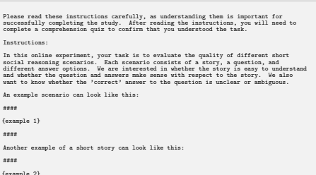

\#\#\#\# In total, you will evaluate 30 scenarios. It is important to read each of them carefully and respond to the best of your ability.

Figure 8: Instructions shown to participants in Experiment 1.

Evaluation Prompt 0-shot.

Answer the questions based on the context. Keep your answer concise, few words are enough, maximum one sentence. Answer as 'Answer:<option>)<answer>'
Figure 9: Prompts used to evaluate the model. For chat based models, the instructions are presented as a system message and the questions are presented as a user message.

## E Evaluating Models

Prompts. See Fig. 9 for the 0-shot prompt, Fig. 10 for the 0-shot CoT prompt,Fig. 11 for the 1-shot prompt,Fig. 12 for the 1-shot CoT prompt. Results of models. See Tab. 5 for the results of all models across different conditions. Results on Controls. See Tab. 6 for results of the model on the control conditions.

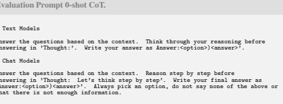

Figure 10: Prompts used to evaluate the model. For chat based models, the instructions are presented as a system message and the questions are presented as a user message.

Table 5: Model performance for each method. TB = True Belief. FB = False Belief.

† = without initial belief. ‡ = with initial belief..

| Model     | Condition   | Contingency   |           |              | Method      |              |
|-----------|-------------|---------------|-----------|--------------|-------------|--------------|
|           |             |               | 0\-shot   | 0\-shot\-cot | 1\-shot     | 1\-shot\-cot |
|           | "  !        | TB            | .68† .43‡ | .40† .34‡    | .82† .62‡   | .42† .31†    |
|           |             | FB            | .62† .72‡ | .77† .74‡    | .82† .89‡   | .75† .75†    |
|           | Fwd. Belief | TB ∧ FB       | .51† .41‡ | .34† .31‡    | .71† .60‡   | .36† .28†    |
|           | !  "        | TB            | .82† .76‡ | .31† .31†    | .95† .93‡   | .34† .27†    |
| llama\-65 | "           | FB            | .47† .52‡ | .19† .43†    | .50† .58‡   | .20† .39†    |
|           | Fwd. Action | TB ∧ FB       | .45† .46‡ | .10† .20†    | .49† .55‡   | .10† .15†    |
|           | "  "        | TB            | .56† .35‡ | .25† .18‡    | .53† .31‡   | .25† .19†    |
|           | !           | FB            | .53† .73‡ | .69† .75‡    | .69† .84‡   | .66† .71†    |
|           | Bwd. Belief | TB ∧ FB       | .40† .34‡ | .21† .18‡    | .38† .26‡   | .21† .19†    |
|           | "  !        | TB            | .82† .27‡ | .84† .42‡    | .61† .25‡   | .76† .35‡    |
|           |             | FB            | .82† .98‡ | .85† .98‡    | .99† .99‡   | .86† .97‡    |
|           | Fwd. Belief | TB ∧ FB       | .65† .25‡ | .69† .34‡    | .60† .24‡   | .63† .32‡    |
| dav\-003  | "  !        | TB            | .96† .96‡ | .97† .99‡    | .99† .99‡   | .98† .98‡    |
|           | "           | FB            | .27† .31‡ | .22† .30‡    | .56† .66‡   | .19† .23‡    |
|           | Fwd. Action | TB ∧ FB       | .25† .29‡ | .21† .29‡    | .56† .65‡   | .18† .22‡    |
|           | "  "        | TB            | .54† .12‡ | .65† .22‡    | .40† .10‡   | .54† .19‡    |
|           | !           | FB            | .59† .96‡ | .57† .92‡    | .84† .97‡   | .65† .92‡    |
|           | Bwd. Belief | TB ∧ FB       | .24† .09‡ | .30† .16‡    | .28† .07‡   | .25† .14‡    |
|           | "  !        | TB            | .81† .35‡ | .90† .54‡    | .83† .41‡   | .95† .97‡    |
|           |             | FB            | .69† .95‡ | .54† .86‡    | .88† .97‡   | .97† .97‡    |
|           | Fwd. Belief | TB ∧ FB       | .53† .31‡ | .48† .45‡    | .73† .38‡   | .93† .85‡    |
|           | !  "        | TB            | .97† .97‡ | .96† .97‡    | .96† .96‡   | .96† .97‡    |
| gpt\-3.5  | "           | FB            | .19† .22‡ | .11† .16‡    | .59† .73‡   | .72† .83‡    |
|           | Fwd. Action | TB ∧ FB       | .17† .20‡ | .10† .14‡    | .55† .69‡   | .69† .81‡    |
|           | "  "        | TB            | .55† .10‡ | .62† .19‡    | .55† .23‡   | .86† .70‡    |
|           | !           | FB            | .45† .92‡ | .30† .77‡    | .65† .87‡   | .51† .76‡    |
|           | Bwd. Belief | TB ∧ FB       | .18† .07‡ | .09† .06‡    | .28† .15‡   | .38† .49‡    |
|           | "  !        | TB            | .97† .62‡ | .90† .61‡    | .92† .82‡   | 1.00† .98‡   |
|           |             | FB            | .82† .97‡ | .88† .98‡    | .98† .99‡   | .99† .99‡    |
|           | Fwd. Belief | TB ∧ FB       | .81† .59‡ | .80† .59‡    | .91† .82‡   | .99† .97‡    |
|           | "  !        | TB            | .98† .99‡ | .97† .95‡    | .96† .96‡   | 1.00† 1.00‡  |
| claude    | "           | FB            | .28† .43‡ | .43† .49‡    | .92† .98‡   | .98† 1.00‡   |
|           | Fwd. Action | TB ∧ FB       | .27† .42‡ | .41† .46‡    | .88† .93‡   | .97† 1.00‡   |
|           | "  "        | TB            | .79† .29‡ | .74† .29‡    | .59† .22‡   | .79† .73‡    |
|           | !           | FB            | .48† .80‡ | .55† .83‡    | .89† .96‡   | .76† .81‡    |
|           | Bwd. Belief | TB ∧ FB       | .33† .15‡ | .39† .22‡    | .48† .20‡   | .56† .55‡    |
|           | "  !        | TB            | .99† .91‡ | .99† .99‡    | .99† .97‡   | 1.00† .97‡   |
|           |             | FB            | .98† .99‡ | .99† .99‡    | .99† .99‡   | .99† .99‡    |
|           | Fwd. Belief | TB ∧ FB       | .97† .90‡ | .98† .98‡    | .97† .96‡   | .99† .96‡    |
|           | !  "        | TB            | .98† .98‡ | .99† .99‡    | 1.00† 1.00‡ | 1.00† 1.00‡  |
| gpt\-4    | "           | FB            | .81† .92‡ | .88† .96‡    | .98† 1.00‡  | 1.00† .99‡   |
|           | Fwd. Action | TB ∧ FB       | .79† .90‡ | .87† .95‡    | .98† 1.00‡  | 1.00† .99‡   |
|           | "  "        | TB            | .86† .62‡ | .84† .76‡    | .68† .57‡   | .83† .81‡    |
|           | !           | FB            | .53† .77‡ | .54† .63†    | .85† .92‡   | .75† .85‡    |
|           | Bwd. Belief | TB ∧ FB       | .40† .40‡ | .38† .40‡    | .53† .49‡   | .58† .65‡    |

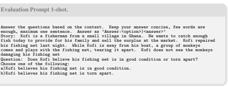

Figure 11: Prompts used to evaluate the model. For chat based models, the instructions are presented as a system message and the questions are presented as a user message.

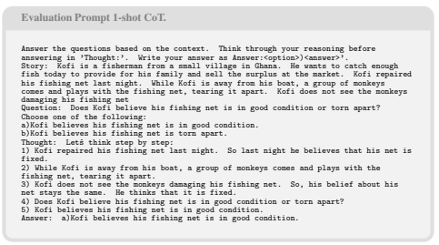

Figure 12: Prompts used to evaluate the model. For chat based models, the instructions are presented as a system message and the questions are presented as a user message.

## F Participant Instructions And Pay

Personally Identifiable Info and IRB. Participants completed a consent page before the start of each experiment. Participants were made aware of potential risks and links to the Stanford IRB approvals were provided on the consent page.

Duration and Pay. For Experiment 1, participants were paid $12.02/hr. The median completion time of Experiment 1 was 21 minutes and 55 seconds. The total cost for Experiment 1 was $512.00. For Experiment 2, participants were paid $12.05/hr. The median completion time of Experiment 2 was 21 minutes and 22 seconds. The total cost for Experiment 2 was $114.40.

## G Licenses

We release the dataset with an MIT License, see https://sites.google.com/view/social-reasoning-lms.

| Model     | Condition      | Contingency   | Method               |
|-----------|----------------|---------------|----------------------|
|           |                |               | 0\-shot              |
|           | "  !           | TB            | .81† .94‡            |
|           |                | FB            | .86† .96‡            |
|           | Fwd. Belief    | TB ∧ FB       | .79† .92†            |
| llama\-65 | !  "           | TB            | .53† .68‡            |
|           | "              | FB            | .56† .72‡            |
|           | Fwd. Action    | TB ∧ FB       | .50† .66†            |
|           | "  "           | TB            | .90† .96‡            |
|           | !              | FB            | .90† .96‡            |
|           | Bwd. Belief    | TB ∧ FB       | .90† .96†            |
|           | "  !           | TB  FB        | .98† .99‡  .98† .99‡ |
|           | Fwd. Belief    | TB ∧ FB       | .98† .99†            |
|           | !  "           |               | .88† .91‡            |
| dav\-003  | "              | TB  FB        | .93† .94‡            |
|           | Fwd. Action    | TB ∧ FB       | .88† .90†            |
|           | "  "           | TB            | .98† .99‡            |
|           | !              | FB            | .98† .99‡            |
|           | Bwd. Belief    | TB ∧ FB       | .98† .99†            |
|           | "  !           | TB            | .99† .99‡            |
|           |                | FB            | .98† .99‡            |
|           | Fwd. Belief    | TB ∧ FB       | .98† .99†            |
| gpt\-3.5  | "  !           | TB            | .83† .85‡            |
|           | "              | FB            | .82† .87‡            |
|           | Fwd. Action    | TB ∧ FB       | .77† .79†            |
|           | "  "           | TB            | .99† .99‡            |
|           | !              | FB            | .99† .99‡            |
|           | Bwd. Belief    | TB ∧ FB       | .99† .99†            |
|           | !  "           | TB            | .99† .99‡            |
|           |                | FB            | .99† .99‡            |
|           | Fwd. Belief    | TB ∧ FB       | .99† .99†            |
| claude    | !  "           | TB            | .88† .93‡            |
|           |                | FB            | .86† .93‡            |
|           | "  Fwd. Action | TB ∧ FB       | .83† .89†            |
|           | "  "           |               | .99† .99‡            |
|           |                | TB  FB        | .99† .99‡            |
|           | !  Bwd. Belief | TB ∧ FB       | .99† .99†            |
|           | "  !           | TB            | .99† .99‡            |
|           |                | FB            | .99† .99‡            |
|           | Fwd. Belief    | TB ∧ FB       | .99† .99†            |
| gpt\-4    | !  "           | TB            | .98† .95‡            |
|           | "              | FB            | .99† .98‡            |
|           | Fwd. Action    | TB ∧ FB       | .98† .94†            |
|           | "  "           |               |                      |
|           |                | TB            | .99† .99‡  .99† .99‡ |
|           | !              | FB            |                      |
|           | Bwd. Belief    | TB ∧ FB       | .99† .99†            |

Table 6: Model performance for controls. TB = True Belief. FB = False Belief.

† = without initial belief. ‡ = with initial belief.

Table 7: Model Performance Initial Percept to Initial Belief.

| Model     | Method   |
|-----------|----------|
|           | 0\-shot  |
| llama\-65 | .92      |
| dav\-003  | .98      |
| gpt\-3.5  | .96      |
| claude    | .98      |
| gpt\-4    | .99      |

Instructions Experiment 1.

Instructions:
\#\#\#\#
{example 1}
\#\#\#\#
\#\#\#\#
{example 2}
\#\#\#\# In total, you will evaluate 30 scenarios. It is important to read each of them carefully and respond to the best of your ability.

Figure 13: Instructions shown to participants in Experiment 1.

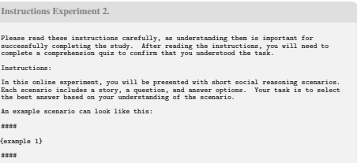

In total, you will answer 40 questions. It is important to read each story carefully and respond to the questions to the best of your ability.

Figure 14: Instructions shown to participants in Experiment 2.

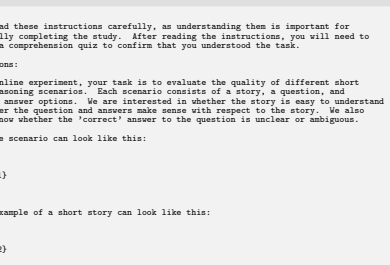

