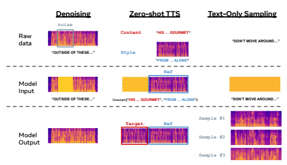
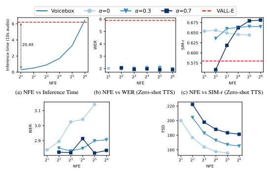
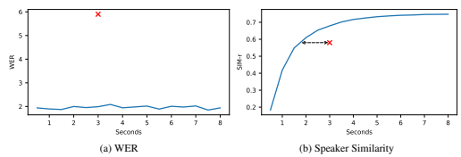
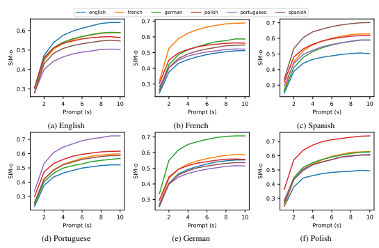
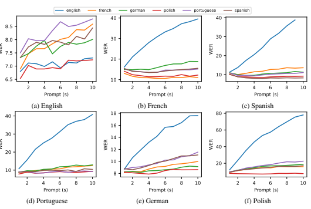
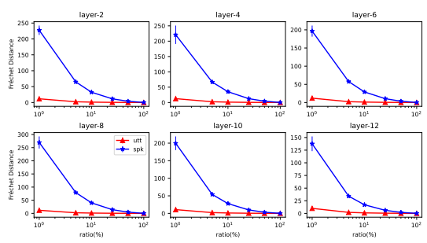
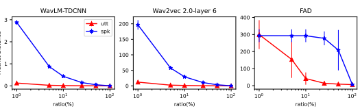
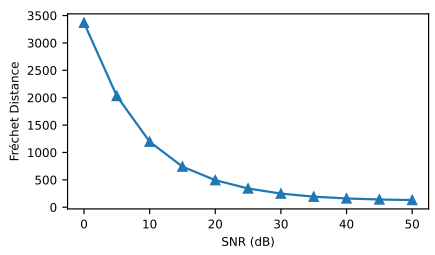

# Voicebox: Text-Guided Multilingual Universal Speech Generation At Scale

Matthew Le∗ Apoorv Vyas∗ Bowen Shi∗ Brian Karrer∗ **Leda Sari Rashel Moritz**
Mary Williamson Vimal Manohar Yossi Adi† **Jay Mahadeokar Wei-Ning Hsu**∗
Meta AI

# Abstract

Large-scale generative models such as GPT and DALL-E have revolutionized natural language processing and computer vision research. These models not only generate high fidelity text or image outputs, but are also generalists which can solve tasks not explicitly taught. In contrast, speech generative models are still primitive in terms of scale and task generalization. In this paper, we present Voicebox, the most versatile text-guided generative model for speech at scale. Voicebox is a non-autoregressive flow-matching model trained to infill speech, given audio context and text, trained on over 50K hours of speech that are neither filtered nor enhanced. Similar to GPT, Voicebox can perform many different tasks through in-context learning, but is more flexible as it can also condition on future context. Voicebox can be used for mono or cross-lingual zero-shot text-to-speech synthesis, noise removal, content editing, style conversion, and diverse sample generation. In particular, Voicebox outperforms the state-of-the-art zero-shot TTS model VALL-E on both intelligibility (5.9% vs 1.9% word error rates) and audio similarity (0.580 vs 0.681) while being up to 20 times faster. See voicebox.metademolab.com for a demo of the model.

# 1 Introduction

Recent advances in large-scale generative models [Brown et al., 2020, Nichol et al., 2021, Ramesh et al., 2021] have led to a major paradigm shift towards building general-purpose models, which can perform many new tasks not explicitly trained on. These generative models learn to predict the missing data given the context. Post training, we can directly input a question, optionally with a few contextual question-answer examples, instead of fine-tuning with labeled data. To give a concrete example, the model can answer a question like, "What is the capital of Japan?" with an example of such a relationship in the context: "The capital of Germany is Berlin. The capital of Japan is".

While the training objective appears simple, it subsumes many tasks as one can convert them into some form of context. For the model to perform well at every task, it implies that the estimation of p(missing data | context) needs to be accurate for every context. Hence, scale and diversity are the most crucial factors for building general-purpose models [Hoffmann et al., 2022, Aghajanyan et al., 2023], as we see the state-of-the-art (SOTA) language and vision-language models are trained on web-scale data with billions to hundreds of billions of parameters. Despite the success of large-scale generative models in other areas, most speech models are still trained on datasets at the scale of tens to hundreds of hours [Ren et al., 2021, Kim et al., 2020, 2021,

∗Equal contribution
†Meta AI & Hebrew University of Jerusalem.

Figure 1: Voicebox task generalization through in-context learning.

Popov et al., 2021, Huang et al., 2022, Tan et al., 2022, Casanova et al., 2021]. Previous works consider highly curated datasets such as VCTK [Yamagishi et al., 2019], which contains only clean audio recorded in studio from about 100 speakers with little speaking style and text variation. Such models struggle to synthesize speech with rich variation in emotion, voice, background noise, acoustic condition, and have not been tested on the abilities to generalize to tasks not explicitly trained on. There had been a few attempts of using in-the-wild data such as CommonVoice [Ardila et al., 2019],
Librispeech [Panayotov et al., 2015], and LibriTTS [Zen et al., 2019] for training text-to-speech
(TTS) models. It led to huge quality degradation compared to training on curated datasets [Hsu et al., 2019, Wang et al., 2021]. In particular, while in-the-wild data are generally of lower quality, the gap between synthesized and training speech is big compared to that of the models trained on curated speech [Wang et al., 2021], which suggests that previous models terribly *underfit* in-the-wild data. This paper presents Voicebox, the most versatile text-conditioned speech generative model at scale. Voicebox is trained on a text-guided speech infilling task, where the goal is to generate masked speech given its surrounding audio and text transcript. This can be considered as a guided in-context learning problem, where audio style is inferred from the audio context and textual content is specified through transcript. Voicebox does not require any audio style labels (e.g., speaker, emotion, and noise), which differentiates Voicebox from the majority of prior work where such labels are used extensively. Prior work uses labels to make the mapping between input (text and audio style) and output (speech) more deterministic to reduce underfitting [Wang et al., 2021, Popov et al., 2021]. We show that Voicebox's text-guided speech infilling approach is much more scalable in terms of data while subsuming many common speech generative tasks. In terms of modeling, Voicebox is a non-autoregressive (NAR) continuous normalizing flow (CNF) model [Chen et al., 2018]. Similar to diffusion models [Ho et al., 2020], CNFs model the transformation from a simple distribution to a complex data distribution (p(missing data | context)), parameterized by a neural network. We train Voicebox with flow-matching [Lipman et al., 2023], a recently proposed method that enables efficient and scalable training of CNFs via a simple vector field regression loss. In contrast to auto-regressive models, Voicebox can consume context not only in the past but also in the future. Moreover, the number of flow steps can be controlled at inference time to flexibly trade off quality and runtime efficiency.

Voicebox is trained on 60K hours of English audiobooks and 50K hours of multilingual audiobooks in 6 languages for the mono and multilingual setups. Voicebox achieves SOTA performance on mono-lingual/cross-lingual zero-shot TTS, speech denoising, speech editing, diverse speech sampling and an application to data creation for speech recognition. To tackle the lack of comparability due to the use of subjective metrics, this paper presents a series of metrics using public models to facilitate reproducible comparison and model development for speech generation studies.

The contribution of this work can be summarized as follows:
1. Voicebox represents a breakthrough in generative modeling for speech. By learning to solve a text-guided speech infilling task with large scale data, Voicebox can solve tasks it was not explicitly trained to accomplish via in-context learning.

2. Voicebox outperforms VALL-E and achieves a new SOTA English zero-shot TTS result
(5.9% → 1.9% on word error rate (WER) and 0.580 → 0.681 on audio similarity).

3. Voicebox is the first model that can perform high-quality cross-lingual zero-shot TTS across six languages. It does not use any style labels, pre-trained embedders, or multilingual samples. Compared to the prior cross-lingual SOTA YourTTS, Voicebox reduces the average WER from 10.9% to 5.2%, and improves audio similarity from 0.335 to 0.481.

4. Voicebox is capable of infilling speech of any length and outperforms the prior SOTA A3T,
on text guided denoising with -8.8% WER, +0.450 similarity, and +0.80 mean opinion score.

5. Voicebox can generate diverse and realistic speech. An ASR system can be trained solely on synthetic speech generated by Voicebox, resulting in only 0.4%/1.7% absolute WER increase on Librispeech test-other/test-clean compared to training on real data. In contrast, previous TTS models suffer from at least 18.2%/44.5% absolute WER increase.

# 2 Related Work

Generative speech models Most speech generative models are task-specific and trained on different datasets. One common type of task is *audio style conversion*, which aims to convert only a specific attribute while keeping other attributes the same. Voice conversion [Kameoka et al., 2018, Lorenzo-Trueba et al., 2018], emotion conversion [Robinson et al., 2019, Kreuk et al., 2022], speech enhancement [Xu et al., 2014, Défossez et al., 2020, Serrà et al., 2022] belong to this category. Many of these models are supervised and trained on pairs of data that only differ in one attribute, for example, emotion [Kreuk et al., 2022]. It is hard to obtain such data. Moreover, some attributes, such as speaking style, are hard to annotate. Hence, these models are often trained on small datasets and do not generalize well.

Controllable text-to-speech synthesis (TTS) is another common task, which aims to synthesize speech in a target audio style (e.g., voice, speaking style, recording environment) given text. While some styles like voice can be specified through labels [Kim et al., 2021] or pre-trained embeddings like YourTTS [Casanova et al., 2021] and Jia et al. [2018]; others like prosody are hard to annotate or embed. Previous studies [Wang et al., 2018, Akuzawa et al., 2018, Hsu et al., 2019] tried to control them by learning a residual embedding. However, these models encode style in a low-dimensional space and impose an overly simple distribution of speech given text and residual embedding [Ren et al., 2021, Shen et al., 2017]. They cannot generate realistic noisy speech given a low dimensional vector, and performance degrades when conditioned on noisy references [Hsu et al., 2019]. Infilling can be considered as another type of task. It aims to predict speech given context [Lakhotia et al., 2021, Borsos et al., 2022a] and optionally text guidance [Bai et al., 2022, Borsos et al., 2022b, Wang et al., 2023]. Instead of learning an explicit embedding to control style, infilling models predict speech coherent to the context. In other words, these models perform in-context learning similar to Large Language Models (LLMs), which specifies the task (i.e., the desired style to convert) through context. While this is a step toward building large scale generalist models using little explicit supervision, most prior work using text guidance still assumes a deterministic mapping from text and context to target [Bai et al., 2022, Borsos et al., 2022b], which is only realistic for very short segments. Hence, models with those assumptions could typically only infill segments up to 1 second [Borsos et al., 2022b]. Voicebox is a text-guided infilling model, but it leverages the CNF model that can parameterize any distribution. Hence, Voicebox can infill speech of any length and can be trained on in-the-wild datasets with rich variation, and provide a general solution that subsumes many tasks in a text-guided fashion. Large scale in-context learning models With the advancement in neural codec for speech [Hsu et al., 2021, Défossez et al., 2022, Zeghidour et al., 2022], many recent studies explore token-based language modeling for speech generation. The GSLM-family [Lakhotia et al., 2021, Kharitonov et al., 2021, Nguyen et al., 2022] are textless language models built upon HuBERT units [Hsu et al.,
2021] for speech continuation without using text. HuBERT units encode mostly content [Polyak et al., 2021], and the generated speech does not preserve the voice of the prompt. To tackle this, AudioLM [Borsos et al., 2022a] considers a cascaded approach which first generates HuBERT-like tokens and then predicts SoundStream [Zeghidour et al., 2022] tokens, a reconstruction based codec that preserves style. These models are not conditioned on text and are evaluated on spoken language modeling tasks. VALL-E [Wang et al., 2023] is most related to Voicebox. It is a text conditioned LM trained on Encodec [Défossez et al., 2022] tokens (similar to SoundStream). Encodec tokenizes speech with a residual quantization layer, which encodes each frame with 8 codebooks at a 75Hz frame rate. The codebooks are ordered such that the first code contains the most information and so on. VALL-E has two modules. The first is an auto-regressive (AR) model that predicts the first code of each frame given text and the audio prompt. The second is an NAR model that predicts the remaining seven codebooks sequentially (all frames are predicted simultaneously when predicting each codebook). VALL-E demonstrates state-of-the-art (SOTA) zero-shot TTS performance through in-context learning, where speech of the desired style is used as the prompt. The model considers the prompt as part of the whole utterance such that it generates the rest of the utterance containing the target text in the same audio style. Voicebox has several design advantages compared to VALL-E. 1) Voicebox can use context both in the past and future, which is useful for editing where only a segment in the middle needs to be generated. 2) Voicebox can generate speech much faster than VALL-E because flow-matching can produce high quality samples with less than ten NAR steps, while VALL-E
requires one AR and seven NAR steps. 3) Voicebox decouples duration and audio modeling, enabling finer grained alignment control. 4) Voicebox is compatible with any continuous features including Encodec embeddings.

# 3 Method 3.1 Background: Flow Matching With An Optimal Transport Path

Let R
d be the data space with data points x ∈ R
d drawn from some unknown distribution q(x).

Continuous Normalizing Flows (CNFs) Chen et al. [2018] are a family of generative models that learn the transformation from a simple prior distribution p0 (e.g., normal distribution) to the data distribution p1 ≈ q. CNFs parameterize a time-dependent vector field vt : [0, 1] × R
d → R
dthat is used to construct a *flow*: ϕt : [0, 1] × R
d → R
dthat pushes points from the prior towards the target distribution. The relationship between a vector field and a flow is defined via the ordinary differential equation (ODE) as:

$${\frac{d}{d t}}\phi_{t}(x)=v_{t}(\phi_{t}(x));\quad\phi_{0}(x)=x.$$
$$(\mathbf{l})$$

For a flow ϕt, the *probability path* (time-dependent probability density function) p : [0, 1] × R
d →
R>0 can be derived via the change of variables formula:

$$p_{t}(x)=p_{0}(\phi_{t}^{-1}(x))\operatorname*{det}\left[{\frac{\partial\phi_{t}^{-1}}{\partial x}}(x)\right].$$
$$(2)^{\frac{1}{2}}$$
. (2)
To sample from pt(x), we first draw x0 from p0 and then solve the initial value problem yt given dy/dt = vt(y) and y0 = x0 with an ODE solver. Let pt be a probability path and ut be the corresponding vector field that generates pt. The vector field vt(x; θ) parameterized by a neural network θ can be trained with the Flow Matching objective:

$${\mathcal{L}}_{F M}(\theta)=\mathbb{E}_{t,p_{t}(x)}||u_{t}(x)-v_{t}(x;\theta)||^{2},$$
LFM(θ) = Et,pt(x)||ut(x) − vt(x; θ)||2, (3)
where t ∼ U[0, 1] and x ∼ pt(x). While the objective appears simple, in practice we do not have the prior knowledge of pt or vt, and cannot directly compute the loss or its gradient estimator.

Let x1 be a random variable distributed according to data distribution q. Lipman et al. [2023] first notes that a probability path pt(x) can be constructed via a mixture of simpler *conditional paths* pt(x | x1) whose vector field ut(x | x1) can be easily computed. To construct pt(x), a conditional path is defined such that 1) p0(x | x1) = p0(x) and 2) p1(x | x1) = N (x | x1, σ2I), a Gaussian distribution centered at x1 with a sufficiently small σ (typically 10−5). The marginal path is computed

$\eqref{eq:walpha}$. 

as Rpt(x | x1)q(x1)dx1, which closely approximates q(x1) at t = 1. With that, [Lipman et al.,
2023] presents the Conditional Flow Matching (CFM) objective,

$\left(4\right)$. 
$\uparrow$ . 
LCFM(θ) = Et,q(x1),pt(x|x1)||ut(x | x1) − vt(x; θ)||2. (4)
It is proven that FM and CFM have identical gradients w.r.t. θ. More importantly, one can easily draw samples from pt(x | x1) and compute ut(x | x1) to derive an unbiased gradient estimator.

To train Voicebox, we adopt the optimal transport (OT) conditional path proposed in [Lipman et al.,
2023]. It is a simple and intuitive Gaussian path pt(x | x1) = N (x | µt(x1), σt(x1)
2I) with mean µt(x) = tx1 and standard deviation σt(x) = 1−(1−σmin)t changing linearly in time. The associated conditional vector field is ut(x | x1) = (x1 − (1 − σmin)x) / (1 − (1 − σmin)t), and the conditional flow is ϕt(x | x1) = (1 − (1 − σmin)t)x + tx1. The authors of [Lipman et al., 2023] note that diffusion models actually correspond to special cases of Gaussian paths and empirically the OT path leads to faster training, faster generation, and better performance compared to diffusion paths.

# 3.2 Problem Formulation

Given a dataset of transcribed speech (*x, y*) where x and y denote an audio sample and its transcript, respectively, the goal is to build a single model that can perform many text-guided speech generation tasks through in-context learning. We propose to train such a generative model on the text-guided speech infilling task, which predicts a segment of speech given its surrounding audio and the complete text transcript. Let m be a binary temporal mask which is of the same length as x, 3and xmis = m⊙x and xctx = (1 − m) ⊙ x be the complementary masked versions of x. The generative model learns p(xmis | y, xctx). In other words, y and xctx are the context and xmis is the missing data.

# 3.3 Model And Training

Motivated by the need that some applications require fine-grained alignment control between speech and text, we decouple Voicebox into two components: an audio model and a duration model. Let x = (x 1, x2, · · · , xN ) be an audio sample of N frames, y = (y 1, y2, · · · , yM) be a text sequence of M phones, and l = (l 1, l2, · · · , lM) be the per-phone duration where l j denotes how many audio frames y jcorrespond to and PM
j=1 l j = N. We further define z = rep(*y, l*) = (z 1, z2, · · · , zN ) to be the frame-level phone transcript, which repeats each y j by l jtimes such that z i denotes the phone label of the audio frame x i. For a pair of (x, y), l and z can be estimated through *forced alignment* using a speech recognition model. The estimation of q(xmis | y, xctx) is then broken down into the audio model q(xmis | z, xctx) and the duration model q(lmis | y, lctx), where lmis and lctx denote l masked by m′and 1 − m′, and m′is downsampled from m based on l where m = rep(m′, l)
Audio Model Given a context z and xctx of length N, the distribution of xmis is highly stochastic especially when xmis has a large temporal span. Hence, we parameterize it with a CNF and train it using the flow matching objective with the optimal transport path. Audio x is represented as an 80-dimensional log Mel spectrogram (x i ∈ R
80) extracted at a 100Hz frame rate.4 The audio context x ictx = 0 where mi = 1 and x ictx = x i where mi = 0.

For simpler conditioning, we model the conditional distribution q(x | z, xctx) of all frames x instead of only masked frames xmis. A neural network is used to parameterize the conditional vector field vt(w, xctx, z; θ) that additionally takes xctx and z as input. Note that w is the sample at flow step t, and x corresponds to w at step t = 1.

Given as input xctx ∈ R
N×F , w ∈ R
N×F , phone sequence z ∈ [K]
N with K denoting the number of phone classes, and a time step t ∈ [0, 1], we employ a Transformer model to parameterize the vector field vt. A lookup table, denoted as L ∈ R
K×H, is used to embed the phone sequence z, resulting in the embedded sequence zemb ∈ R
N×H where z i emb = L(z i) for i ∈ 1*, . . . , N*. Subsequently, the three sequences (w, xctx, and zemb) are concatenated frame-by-frame and projected by employing matrix Wp ∈ R
(2F +H)×D, thereby obtaining the sequence Xc ∈ R
N×D where D represents the embedding dimension of the Transformer model.

3"temporal" refers to the physical time of the audio sample, not the time t ∈ [0, 1] of the flow in CNF. 4A Mel-spectrogram can be converted back to a waveform using a vocoder.
To embed the flow step, a sinusoidal positional encoding is applied to map t ∈ [0, 1] to xt ∈ R
D.

The sequence Xt ∈ R
(N+1)×D, which serves as the input to the Transformer model, is derived by concatenating Xc with the vector xt along the time dimension. Given the Transformer output vt(w, xmis, z; θ) ∈ R
N×F , which is the sub-sequence corresponding to Xc, the loss is computed as:
Laudio-CFM(θ) = E*t,m,q*(x,z),p0(x0)||(x − (1 − σmin)x0) − vt(w, xctx, z; θ)||2, (5)
with w = (1 − (1 − σmin)t)x0 + tx. This function computes the loss on all frames, including those that are not masked and would not be required during inference. To divert the model's focus to masked frames, we present a masked version of Laudio-CFM:
Laudio-CFM-m(θ) = Et,m,q(x,z),p0(x0)||m ⊙ ((x − (1 − σmin)x0) − vt(w, xctx, z; θ))||2, (6)
where the loss is only computed on masked frames. Appendix B.1 shows it leads to better results Duration model We consider two solutions. The first one closely follows the audio model. It models q(l | y, lctx) via a conditional vector field which swaps (x, xctx, z) with (l, lctx, y) and accordingly for the flow, where l, lctx ∈ RM×1and y ∈ [K]M. The masked version of the CFM
loss is used for training. On the other hand, previous studies have shown that regression duration models can produce reasonable speech [Ren et al., 2021, Łancucki, 2021]. Hence we consider a ´ second solution that regresses the masked duration lmis given the context duration lctx and phonetic transcript y. The same Transformer model is used, except that there are only two input sequences instead of three, and the time embedding is not used. The model is trained with an L1 regression loss on masked phones:
Ldur-regr-m(θ) = Em,q(l,y)||m′ ⊙ (lmis − g(lctx, y; θ))||1, (7)
where g denotes the regression-based duration model. This is similar to the duration model used in FastSpeech2 [Ren et al., 2021], but with additional duration context lctx as input.

# 3.4 Inference

To sample from the the learned audio distribution p1(x | z, xctx), a noise x0 is first sampled from p0, and then an ODE solver is used to evaluate ϕ1(x0) given dϕt(x0)/dt = vt(ϕt(x0), xctx, z; θ) and the initial condition ϕ0(x0) = x0. Intuitively, the ODE solver computes ϕ1(x0) by evaluating vt at multiple t to approximate the integration from t = 0 to t = 1 given the initial condition ϕ0(x0) = x0. A larger number of function evaluations (NFEs) often leads to a more accurate solution of ϕ1(x0) at the cost of longer run time.

There are also solvers that can adjust the number of evaluations adaptively. This provides great flexibility for users to decide the trade-off between speed and accuracy. Moreover, we find that empirically Voicebox can already generate very high quality speech with less than 10 NFEs, making it significantly faster compared to auto-regressive models.

# 3.5 Classifier-Free Guidance

Classifier guidance (CG) [Dhariwal and Nichol, 2021] is a technique used to trade off mode coverage and sample fidelity for diffusion models post training, similar to the effect of truncated or lowtemperature sampling for generative adversarial networks [Brock et al., 2018] and discrete flow models [Kingma and Dhariwal, 2018]. It modifies the score estimate of a diffusion model to include the gradient of the log likelihood of an auxiliary classifier. Ho and Salimans [2022] notes that CG
approximates sampling from p(x | c)p(c | x)
α where c is the conditioner, and this can be simulated without a classifier by mixing the score estimate of a conditional model and an unconditional model. The unconditional model can be jointly trained by dropping the conditioner c with some probability, and the same model provides score estimates for both p(x) and p(x | c). We extend the idea of classifier free guidance (CFG) to flow-matching models. The conditioner c is equivalent to (z, xctx) for audio models and (y, lctx) for duration models, which is dropped with puncond during training. During inference, the modified vector field v˜t for the audio model becomes v˜t(w, xmis, z; θ) = (1 + α) · vt(w, xctx, z; θ) − α · vt(w; θ), (8)
where α is the strength of the guidance, and vt(w; θ) is obtained by dropping xctx and z. We use α and αdur for the CFG strengths for audio and duration model, respectively, which are selected based on empirical results.

# 3.6 Applications

We demonstrate that Voicebox exhibits in-context learning abilities similar to LLMs by presenting a few examples of how to create context to perform tasks Voicebox was not explicitly trained on. These examples are also illustrated in Fig. 1. Zero-shot TTS & alignment-preserved style transfer Given a target text yˆ and a transcribed reference audio (x, y), zero-shot TTS aims to synthesize speech resembling the possibly unseen audio style of the reference. Voicebox performs the task by treating the reference audio and the target speech as one utterance where the target speech is masked. Let l and z be phone duration and frame-level transcript of (*x, y*). The target duration ˆl is sampled given the duration context l and concatenated phone sequence cat(y, yˆ). The target speech xˆ is then sampled given the context x and concatenated frame-level phones cat(z, rep(ˆy, ˆl)).

Voicebox can also convert the audio style for speech x¯ while preserving its alignment z¯. This is useful for editing audio that is synchronized with other modalities such as video. Similar to zero-shot TTS, Voicebox can simply perform the task by sampling target speech xˆ given the context x and concatenated frame-level phones cat(z, z¯).

Transient noise removal & content editing When recording speech, one might misspeak a few words or the recording my be interrupted by unexpected background noise. In these scenarios it is desired to just modify the problematic segment instead of re-recording the speech. Voicebox can perform transient noise removal through re-generating the noise corrupted segment given the original frame-level transcript and the surrounding clean audio. Specifically, given the frame-level transcript z of a transcribed noisy speech (*x, y*), a user creates a mask m to indicate the noisy segment. The segment xˆmis is then sampled given z and xctx = (1 − m) ⊙ x. The audio model would likely generate clean speech for xˆmis because during training clean audio context co-occurs with clean target audio most of the time. The new audio xˆ = ˆxmis + xctx.

For content editing, let yˆ be the new desired transcript with some words from the original transcript y replaced, and l be the original duration. A user first constructs lctx (of the same length as yˆ) by copying the lengths of phones that are not replaced from l, and set the lengths to 0 for new phones.

The duration of new phones ˆlmis is sampled given lctx and yˆ, and the new duration ˆl = ˆlmis + lctx.

The new frame-level transcript is constructed with zˆ = rep(ˆy, ˆl). Similarly, the audio context xctx is of the same length as zˆ, and is created by filling frames mapped to unreplaced phones with the corresponding frames in x, and leaving those for new phones with 0. The frames for the new phones xˆmis are sampled given zˆ and xctx. The edited speech is computed as xˆ = ˆxmis + xctx.

Diverse speech sampling & alignment-preserved style shuffling Voicebox can generate diverse speech samples by infilling the whole utterance. We first use the duration model to sample ˆl given the phone transcript yˆ. We then use the audio model to sample xˆ given zˆ = rep(ˆy, ˆl).

Similar to style transfer, Voicebox can also shuffle the audio style while keeping the alignment by sampling xˆ conditioning on the frame-level transcript z¯ of the target speech clip x¯.

# 4 Metrics

Voicebox formulates many speech generation tasks as text-guided in-context learning problems. The common goal of audio-conditioned tasks is to produce *realistic* speech that is *coherent* with the context and has the *correct* textual content. For tasks not conditioned on audio context, it is desired to generate *diverse and realistic* samples with distribution similar to training data with *correct* content.

Prior studies often adopt subjective metrics like mean opinion scores (MOS) [Ribeiro et al., 2011] which are not comparable across papers or even across studies in the same paper, because ratings can be biased by the quality of samples from other systems evaluated in the same trial. Some studies have also considered automatic quantitative metrics measuring signal-level similarity, such as mean cepstral distance (MCD) [Kubichek, 1993, Skerry-Ryan et al., 2018] for speech synthesis and voice conversion, and signal-to-noise/distortion ratio (SNR/SDR) [Le Roux et al., 2019] for speech enhancement. These metrics assume the output is deterministic given input, which is often ill-posed and unfairly penalizes generative models that produce realistic and valid samples. The caveats of signal level metrics have also been discussed in image generative modeling literature [Saharia et al., 2022]. In this paper, we advocate the following reproducible model-based perceptual metrics. Correctness and intelligibility This can be measured by the word error rate (WER) of the synthesized speech's transcription with respect to the input text, which has been adopted in prior work [Wang et al., 2018]. Public automatic speech recognition (ASR) models are used for comparability. For English-only setups, we follow [Wang et al., 2023] and use HuBERT-L [Hsu et al., 2021] pre-trained on 60K hours of Librilight [Kahn et al., 2019] and fine-tuned on 960 hours of Librispeech [Panayotov et al., 2015]. For multilingual setups we use the Whisper large-v2 model [Radford et al., 2022]. It should be noted that while a lower WER suggests that the generated speech is more intelligible by the model and contains more correct content, it does not necessarily imply the quality is better. Similarly, when generating diverse samples or when transferring to an audio style that is more expressive or more noisy, generated speech can be harder for an ASR model to recognize, which leads to a higher WER, which does not imply the sample is bad. Coherence This is measured by the similarity between the embedding of generated speech and that of the audio context, where different embedding models would reflect coherence of different attributes. VALL-E proposed to use WavLM-TDCNN speaker embedding model [Chen et al., 2022], which maps an audio clip to a fixed dimensional vector, to measure voice similarity. We consider the same model to compare with VALL-E. In particular, VALL-E reports similarity with respect to *resynthesized* audio context by its vocoder (Encodec-decoder), which we call SIM-resyn (SIM- r). SIM-resyn is not comparable across models using different vocoders. Hence, we advocate for computing similarity against the original audio context, which we call **SIM-orig (SIM-o)**. Diversity and quality Fréchet Inception Score (FID) [Heusel et al., 2017] is widely adopted for image generation evaluations, which captures the similarity between generated and real images at the distribution level in some feature space. It fits a Gaussian distribution for real samples and one for generated samples in some feature space, and compute the Fréchet distance between the two. A shorter distance implies the distributions are more similar and generally reflects *both* higher sample quality and diversity. We adapt the metric for speech by using self-supervised wav2vec 2.0 features [Baevski et al., 2020] and refer to it as Fréchet Speech Distance (FSD). We verify its effectiveness in Appendix C.1 along with alternative features. As supplementary metrics, we include quality MOS (**QMOS**) for subjective audio quality evaluation, and similarity MOS (**SMOS**) for subjective audio similarity evaluation given pairs of prompt and system-generated audio clips. Both of which are in the scale of 1 to 5 with 5 being the best. 50 samples are evaluated for each system and 10 ratings are collected for each sample. Averaged ratings along with 95% confidence interval are reported. For that, the CrowdMOS Ribeiro et al. [2011] package was used with the recommended recipes for filtering outliers and inaccurate ratings. The MOS instructions can be found in Appendix C.5. To evaluate duration models, one can continue using the aforementioned metrics to gauge the end-toend performance. Alternatively, we also present a few standalone metrics focusing on the duration model. Descriptions and results can be found in Appendices C.2 to C.4.

# 5 Experiment 5.1 Setup

Data We train the English-only model on 60K hours ASR-transcribed English audiobooks and the multilingual model on 50K hours of multilingual audiobooks from six languages: English (En), French (Fr), German (De), Spanish (Es), Polish (Pl) and Portuguese (Pt). Following [Babu et al., 2022], for a given upsampling factor β, we upsample low resource languages to mimic sampling batches from a multinomial distribution ps ∼ns N
β s=1*,...,S* 
where S is the total number of languages, ns the number of pretraining hours of language s, and N the total number of hours. We set β = 0.25. The two models are abbreviated as VB-En and VB-Multi. The Montreal Forced Aligner
(MFA) [McAuliffe et al., 2017] is used to phonemize and force align the transcript based on the MFA
phone set, which is a modified version of the international phonetic alphabet (IPA). Word position postfixes are added. Audio is represented as a 80-dimensional log Mel spectrogram and a HiFi-GAN vocoder trained on the same 60K hours of English speech is used to generate waveform. More details about phone representation, data transformation, and vocoder can be found in Appendices A.1 to A.3.

Model Transformer [Vaswani et al., 2017] with convolutional positional embedding [Baevski et al., 2020] and ALiBi self-attention bias [Press et al., 2021] are used for both the audio and the duration model. ALiBi bias for the flow step xt is set to 0. The audio model has 24 layers, 16 attention heads, 1024/4096 embedding/feed-forward network (FFN) dimension, 330M parameters. We add skip connections connecting symmetric layers (first layer to last layer, second layer to second-to-last layer, etc.) in the style of the UNet architecture. States are concatenated channel-wise and then combined using a linear layer. The duration model has 8 heads, 512/2048 embedding/FFN dimensions, with 8/10 layers for English/multilingual setup (28M/34M parameters in total). All models are trained in FP16.

Training VB-En/VB-Multi audio models are trained for 500K/750K updates with an effective batch size of 240K frames. For training efficiency, audio length is capped at 1,600 frames and chunked randomly if the length exceeds this threshold. Duration models are trained for 600K updates with an effective batch size of 60K frames. The Adam [Kingma and Ba, 2014] optimizer is used with a peak learning rate of 1e-4, linearly warmed up for 5K steps and linearly decays over the rest of training.

For audio models, we clip the gradient norm to 0.2 for training stability. The audio/duration sequence is masked with pdrop = 0.3/0.2, and otherwise a segment of r% sequence length is masked, where r ∼ U[70, 100]/U[10, 100]. puncond is set to 0.2 for audio/duration models.

Inference The torchdiffeq [Chen, 2018] package is used, which implements both fixed and adaptive step ODE solvers. By default, the midpoint solver is used with a step size of 0.0625. The resulting NFE is 64/32 with/without classifier-free guidance. The regression duration model is used by default. Silence at both ends are trimmed to 0.1 second max.

Baselines We consider three baselines: 1) VALL-E [Wang et al., 2023], SOTA for English zero-shot TTS trained on Librilight. 2) YourTTS [Casanova et al., 2021], SOTA multilingual (English, French, and Portuguese) zero-shot TTS model trained on VCTK, LibriTTS, TTS-Portugese [Casanova et al., 2022], and M-AILABS French. It is a flow-based model adapted from VITS [Kim et al., 2021] using a pre-trained multilingual speaker embedder for voice conditioning. 3) A3T [Bai et al., 2022], SOTA for NAR speech editing and infilling trained with a regression loss on VCTK. We also consider Demucs [Défossez et al., 2020], a SOTA speech enhancement model trained with regression and adversarial losses for denoising experiments. Table 1 summarizes the tasks each baseline is capable of solving.

Table 1: Comparing Voicebox with baselines on task capabilities. Through infilling, A3T and Voicebox can remove transient noise but not stationary background noise. VALL-E can only generate speech conditioning on the past context. Hence, the generated segment would only be coherent to the past context but will not have a smooth transition to the future context. With that, we label VALL-E as incapable of denoising or editing.

| Model    | ZS TTS   | Denoise   | Partial Edit   | Sampling   |
|----------|----------|-----------|----------------|------------|
| VALL\-E  | ✓        | ✗         | ✗              | ✓          |
| YourTTS  | ✓        | ✗         | ✗              | ✓          |
| A3T      | ✓        | ✓(short)  | ✓              | ✗          |
| Demucs   | ✗        | ✓         | ✗              | ✗          |
| Voicebox | ✓        | ✓(short)  | ✓              | ✓          |

# 5.2 Monolingual Zero-Shot Tts

Table 2 presents the zero-shot TTS results of the English model VB-En. Following [Wang et al.,
2023], the test set is constructed by selecting 4 to 10 second long samples from Librispeech test-clean.

We consider *cross-sentence* prompting where a 3 second clip from another sample of the same speaker is used as audio context, and *continuation* where the first 3 seconds of each utterance is used. We ran subjective MOS studies comparing ground truth, YourTTS, and Voicebox. A3T is not included because of the bad performance and VALL-E is not included because the model is not available.

Voicebox outperforms all baselines on all metrics in both cases. In particular, Voicebox transfers style much more effectively (+0.101/+0.108 SIM-r on cross-sentence/continuation) than VALL-E, and the gap is even bigger when compared against raw audio (+0.141 SIM-o on continuation). MOS studies also confirm the quality and similarity of Voicebox are subjectively better than YourTTS.

| Model            | WER   | SIM\-o   | SIM\-r   | QMOS        | SMOS      |
|------------------|-------|----------|----------|-------------|-----------|
| Ground truth     | 2.2   | 0.754    | n/a      | 3.98± 0.14  | 4.01±0.09 |
| cross\-sentence  |       |          |          |             |           |
| A3T              | 63.3  | 0.046    | 0.146    | \-          | \-        |
| YourTTS          | 7.7   | 0.337    | n/a      | 3.27± 0.13  | 3.19±0.14 |
| VALL\-E          | 5.9   | \-       | 0.580    | \-          | \-        |
| VB\-En           | 1.9   | 0.662    | 0.681    | 3.78±  0.10 | 3.71±0.11 |
| continuation     |       |          |          |             |           |
| A3T              | 18.7  | 0.058    | 0.144    | \-          | \-        |
| VALL\-E          | 3.8   | 0.452∗   | 0.508    | \-          | \-        |
| VB\-En (α = 0.7) | 2.0   | 0.593    | 0.616    | \-          | \-        |

Table 2: English zero-shot TTS results on filtered LS test-clean. "-" results are not available. We obtain VALL-E continuation SIM result through communication with the authors.

# 5.3 Cross-Lingual Zero-Shot Tts

Tables 3 and 4 presents cross-lingual zero-shot TTS results, where the audio context and the target text are in different languages. Note that VB-Multi is not trained on any sample with multiple languages in an utterance spoken by the same speaker. The test set is constructed using filtered MLS test split described in Appendix A.4. For each target text, we sample one 3-second long audio context from each language, which creates 36 language transfer directions in total.

|           | Ref   |     | De     |     | En     | Es   |        | Fr   |        |     | Pl     |      | Pt     |
|-----------|-------|-----|--------|-----|--------|------|--------|------|--------|-----|--------|------|--------|
|           |       | WER | SIM\-o | WER | SIM\-o | WER  | SIM\-o | WER  | SIM\-o | WER | SIM\-o | WER  | SIM\-o |
| GT        | \-    | 5.9 | 0.725  | 5.0 | 0.636  | 4.1  | 0.729  | 5.2  | 0.714  | 4.9 | 0.743  | 5.8  | 0.725  |
|           | De    | n/a | n/a    | 7.3 | 0.373  | n/a  | n/a    | 11.3 | 0.361  | n/a | n/a    | 13.7 | 0.263  |
|           | En    | n/a | n/a    | 7.0 | 0.403  | n/a  | n/a    | 11.4 | 0.298  | n/a | n/a    | 14.1 | 0.234  |
|           | Es    | n/a | n/a    | 7.6 | 0.327  | n/a  | n/a    | 11.6 | 0.316  | n/a | n/a    | 13.5 | 0.256  |
| YT        | Fr    | n/a | n/a    | 7.6 | 0.363  | n/a  | n/a    | 10.7 | 0.459  | n/a | n/a    | 13.1 | 0.299  |
|           | Pl    | n/a | n/a    | 7.8 | 0.349  | n/a  | n/a    | 11.8 | 0.370  | n/a | n/a    | 15.1 | 0.308  |
|           | Pt    | n/a | n/a    | 7.6 | 0.322  | n/a  | n/a    | 11.8 | 0.297  | n/a | n/a    | 13.6 | 0.436  |
|           | AVG   | n/a | n/a    | 7.5 | 0.356  | n/a  | n/a    | 11.4 | 0.350  | n/a | n/a    | 13.9 | 0.299  |
|           | De    | 4.8 | 0.632  | 4.8 | 0.522  | 3.6  | 0.442  | 5.3  | 0.489  | 5.5 | 0.449  | 5.4  | 0.420  |
|           | En    | 5.9 | 0.435  | 4.2 | 0.535  | 4.1  | 0.423  | 6.8  | 0.423  | 8.3 | 0.402  | 7.6  | 0.385  |
|           | Es    | 4.9 | 0.460  | 4.3 | 0.479  | 3.6  | 0.613  | 5.3  | 0.473  | 5.2 | 0.436  | 5.4  | 0.435  |
| VB\-Multi | Fr    | 4.9 | 0.476  | 4.3 | 0.485  | 3.7  | 0.479  | 5.1  | 0.602  | 4.8 | 0.408  | 5.4  | 0.418  |
| (α = 1.0) | Pl    | 4.7 | 0.491  | 3.8 | 0.503  | 3.5  | 0.528  | 5.1  | 0.503  | 4.0 | 0.641  | 4.9  | 0.476  |
|           | Pt    | 4.9 | 0.422  | 4.6 | 0.426  | 3.7  | 0.476  | 5.5  | 0.453  | 4.8 | 0.406  | 5.2  | 0.620  |
|           | AVG   | 5.0 | 0.486  | 4.4 | 0.492  | 3.7  | 0.494  | 5.5  | 0.491  | 5.5 | 0.457  | 5.7  | 0.459  |

Voicebox yields better performance than YourTTS everywhere. Specifically, on En/Fr/Pt which YourTTS supports, Voicebox obtains 3.1%/5.9%/8.1% lower WERs and 0.136/0.141/0.160 higher similarity averaged across audio context in six languages. The average audio similarity MOS is 0.59 (3.89 vs 3.30) higher for Voicebox and the average quality MOS is 0.27 (3.50 vs. 3.23) higher.

Table 3: Multilingual zero-shot TTS results on filtered MLS test sets. GT/YT/VB-Multi refers to ground truth/YourTTS/multilingual Voicebox. "Ref" column shows the audio context language.

|              |        | Ref=De    | Ref=En    | Ref=Es                  | Ref=Fr             | Ref=Pl    | Ref=Pt    |
|--------------|--------|-----------|-----------|-------------------------|--------------------|-----------|-----------|
|              |        |           |           | SMOS (target text = En) |                    |           |           |
| YT           |        | 3.26±0.11 | 3.24±0.11 | 3.22±0.12               | 3.48±0.10          | 3.26±0.09 | 3.38±0.11 |
| VB\-Multi (α | = 1.0) | 3.89±0.10 | 3.93±0.08 | 3.84±0.10               | 3.92±0.09          | 3.81±0.08 | 3.96±0.09 |
|              |        |           |           | QMOS                    | (target text = En) |           |           |
| YT           |        | 3.29±0.12 | 3.17±0.13 | 3.29±0.12               | 3.08±0.12          | 3.35±0.12 | 3.21±0.12 |
| VB\-Multi (α | = 1.0) | 3.67±0.09 | 3.48±0.09 | 3.45±0.11               | 3.31±0.12          | 3.75±0.11 | 3.35±0.13 |

Table 4: Multilingual zero-shot TTS SMOS/QMOS results on filtered MLS English test set with prompts in different languages. YT/VB-Multi refers to YourTTS/multilingual Voicebox. "Ref" shows the audio context language.

# 5.4 Transient Noise Removal

We construct a noisy test set by mixing the filtered Librispeech test-clean from Section 5.2 with non-speech noise such that it overlaps with 50% of the duration at a -10dB signal-to-noise ratio. Note that for infilling models like A3T and Voicebox, the type and the SNR of transient noise would not affect the performance, because the corrupted segment is entirely masked and speech is re-generated independent of the corrupted segment. Results of additional conditions can be found in Appendix B.2.

| Model            | WER   | SIM\-o   | QMOS      |
|------------------|-------|----------|-----------|
| Clean speech     | 2.2   | 0.687    | 4.07±0.15 |
| Noisy speech     | 41.2  | 0.287    | 2.50±0.15 |
| Demucs           | 32.5  | 0.368    | 2.86±0.17 |
| A3T              | 11.5  | 0.148    | 3.10±0.15 |
| VB\-En (α = 0.7) | 2.0   | 0.612    | 3.87±0.17 |

Table 5 presents the results comparing Voicebox with A3T and Demucs. It should be noted that A3T and Voicebox utilize transcript and location of the noise while Demucs does not. Nevertheless the goal of the study is to present a new paradigm and show Voicebox can perform denoising without being explicitly trained. Compared to the baselines, Voicebox generates samples that are much more intelligible (2.0% WER), more similar to the clean parts of the audio (0.612 SIM-o), and of higher quality (3.87 MOS) in this challenging noise condition. A3T is better than Demucs on intelligibilty and quality, but the infilled speech is not coherent because it is only trained on VCTK and cannot generalize to new audio styles.

Table 5: Transient noise removal where noise overlaps with 50% of the speech at a -10dB SNR.

# 5.5 Diverse Speech Sampling And Application To Asr Data Generation

Table 6 compares the ability to generate diverse samples for Librispeech test-other text. We consider English Voicebox (VB-En) with regression (regr) or flow-matching (FM) duration models. VITS-
VCTK additionally conditions on a speaker ID, which we randomly sample for each sentence.

YourTTS conditions on text and a reference audio, which we draw from the LS train splits.

Qualitatively, A3T generates the same robotic voice when not conditioned on audio context and VITS- LJ generates high quality but a single voice, hence both yield high FSD (bad quality or diversity) but VITS-LJ has a low WER. VITS-VCTK improves the voice diversity and FSD and YourTTS further advances it as it is trained on more speakers. Voicebox models (with different duration samplers) outperform the baseline on FSD by large margins, showing Voicebox's ability to produce realistic and diverse samples whose distribution is close to the training data. Among them, the FM duration model creates more varying speaking styles compared to the regression one which ASR may struggle more to recognize. Voicebox even yields lower FSDs than the real samples from the Librispeech test-other split, because the latter contains only tens of speakers and the diversity is limited.

We next train an ASR model using *only synthetic speech* and evaluate it on *real speech*, which has not been successful before because synthetic data were not realistic and representative enough.

| test\-other text.                 |      |       | real or synthetic speech, tested on               |               | real    |                     | speech and   |
|-----------------------------------|------|-------|---------------------------------------------------|---------------|---------|---------------------|--------------|
| Model                             | WER  | FSD   | decoded with or without a 4\-gram language model. |               |         |                     |              |
| Ground truth                      | 4.3  | 171.1 |                                                   |               |         | WER on real data    |              |
| require additional input          |      |       | ASR training data                                 | No LM test\-c | test\-o | 4\-gram LM  test\-c | test\-o      |
| VITS\-VCTK                        | 10.6 | 306.6 | Real audio (100hr)                                | 9.0           | 21.5    | 6.1                 | 16.2         |
| YourTTS (ref=LS train)            | 9.0  | 277.9 | Real audio (960hr)                                | 2.6           | 6.3     | 2.2                 | 5.0          |
| text\-only                        |      |       | VITS\-LJ                                          | 58.0          | 81.2    | 51.6                | 78.1         |
| A3T                               | 37.9 | 373.0 | VITS\-VCTK                                        | 33.8          | 55.5    | 30.2                | 53.1         |
| VITS\-LJ                          | 5.6  | 344.2 | YourTTS (ref=LS train)                            | 25.0          | 54.6    | 20.4                | 51.2         |
| VB\-En (α = 0, dur=regr)          | 3.1  | 155.7 | VB\-En (α = 0, dur=regr)                          | 7.1           | 17.6    | 6.5                 | 14.6         |
| VB\-En (α = 0, dur=FM, αdur  = 0) | 5.6  | 159.8 | VB\-En (α  = 0, dur=FM,  αdur = 0)                | 3.1           | 8.3     | 2.6                 | 6.7          |

Table 6: Diverse speech generation from LS
Table 7: Performance of ASR models trained on real or synthetic speech, tested on *real* speech and

Table 7 compares real and synthetic data from Voicebox and three baseline models. Each TTS model generates one sample per text from the Librispeech training set, resulting in 281K utterances per system. For real data, we consider train-960 and train-clean-100. Details about the ASR model and training configurations are in Appendix A.5. The results are highly correlated with the FSD scores of synthetic data. VITS-LJ gives the worst results, because the synthetic speech has only one voice. YourTTS performs better on test-clean, but is similar to VITS-VCTK on test-other. It suggests that while YourTTS is trained on more voices and can generate speech with higher voice diversity, it still fails to produce realistic noisy speech and hence the resulting ASR model still underperforms on test-other. Both Voicebox variants beat the baseline by a large margin. In particular, Voicebox generates more diverse speech when using the FM duration model, which leads to a better ASR system when used for training. Compared to the baselines, the ASR model trained on Voicebox data with FM duration model reduces WERs by over 85% and only lags behind real data by 0.4% and 1.7% absolute.

#### 5.6 Inference Efficiency Versus Performance

We examine the trade-off between the metrics of interest (WER, SIM, FSD) for different settings of guidance strength (α) and NFE specified by the user. Fig. 2a shows the Voicebox inference time to generate an audio sample of 10 seconds (including vocoding and predicting duration) as NFE varies and compares that to VALL-E.5 For NFE=2, Voicebox takes about 0.31 seconds to generate a 10s audio, about 20 times faster than VALL-E. At NFE=64, Voicebox is only 4% slower than VALL-E. Next, we study the cross-sentence setup of Section 5.2 to analyze the impact on WER and SIM-r. We find that for all settings Voicebox has better WER than VALL-E. WER remains stable with mean of 2.0 and variance of 0.005 as shown in Fig. 2b. Fig. 2c shows that, in the case of SIM-r, lower classifier guidance strength values (α = 0 or 0.3) produce higher speaker similarity when operating in a lower NFE regime (< 8). However, as NFE exceeds 16, a higher classifier guidance strength improves speaker similarity. Finally, in Fig. 2e we examine FSD by generating samples for Librispeech test-other text. We find that lower classifier guidance strength produces lower FSD scores and more diverse samples. Increasing the NFE for each setting improves FSD. Fig. 2d shows the WER of the same test case. We find that for α = 0, WER increases slightly from 2.8 to 3.1 as NFE goes from 2 to 32. For a larger classifier guidance strength, WER remains more stable. Through FSD and subjective listening, we discovered that a lower NFE leads to generating less diverse samples especially when the guidance weight is lower (α = 0 or 0.3). Although those samples are of lower quality, they are easier for the ASR model to recognize because they tend not contain extreme audio styles like whispering or high background noise. As a result, WERs are lower.

# 5.7 How Context Length Affects Monolingual And Cross-Lingual Zero-Shot Tts

Monolingual: For in-context zero-shot TTS in Section 5.2, we used 3.0 seconds of prompt audio. Here we examine how WER / SIM-r vary with different amounts of prompt audio using duration from regression duration model for the target text. If the desired prompt is longer than the available

5Re-implemented and confirmed with the authors that our re-implementation is faster (6.2 vs 10 seconds).

(d) NFE vs WER (Diverse speech sampling)
(e) NFE vs FSD (Diverse speech sampling)
Figure 2: Trade-off between NFE and different metrics of interest.

audio, the shorter audio is used as the prompt. Results are shown in Figure 3. As expected, WER mildly decreases and SIM-r grows quickly and flattens with longer audio prompts. Comparing against VALL-E, Voicebox is more efficient at leveraging an audio prompt, achieving the same speaker similarity as VALL-E with roughly two thirds the input audio.

Figure 3: WER and SIM-r as a function of prompt audio time in seconds for the Zero-shot TTS task 5.2. Audio is generated using classifier-free guidance strength (α) of 0.7 and midpoint ODE solver with a NFE of 32. The blue line is for Voicebox and the red star is VALLE at 3 seconds. The speaker similarity (SIM-r) remains same for longer prompts (up to 10s).

Cross-lingual: Here we examine the effect of increasing the prompt length for the case of crosslingual zero-shot TTS. As described in 5.2, this setting has a total 36 language transfer directions for each pair of source and target language. For each target text in a given transfer setting, we examine how WER / SIM-o6 vary as the prompt length increases. Similarly, the regression duration model is used for the target text. Fig. 4 and Fig. 5 plot the SIM-o (speaker similarity) and WER
trends respectively. When concatenating the prompt to the target for MLS, we find that the samples are quite a bit longer than what the model was trained on (16s max length), because MLS test set

6Same trend is observed with SIM-r. We present SIM-o to be consistent with Table 3

Figure 4: Each subplot considers one of the six target language and shows SIM-o (speaker similarity) as a function of prompt audio duration in seconds for cross-lingual style transfer from different source language. We set the classifier-free guidance strength (α) to 1.0 and use midpoint ODE solver with a NFE of 32.

samples are in average 15 seconds long. To alleviate this out of domain issue and focus the study on varying the prompt length, we truncate the target sequences to 4 seconds (at word boundaries). We notice that WERs are higher compared to Table 3, likely because the ASR model struggles with incomplete sentences. Each subplot contains the trend for one of the target languages from all six source languages. The speaker similarity consistently improves as the prompt length is increased, similar to the monolingual setting. In contrast, we find that WER increases as we increase the prompt length for most directions. The WER increases much more for En → non-En directions. We hypothesize that this is due to training data imbalance across languages, where English accounts for over 90% of the multilingual training data. Hence, when transferring from English, the model is more likely to assume that the whole sentence is in English as the prompt length increases and produce incorrect pronunciation for the non-English target. Note that during the training phase, the model was only exposed to audio samples and phonemes originating from a single language.

# 6 Ethical Statement

We recognize the potential risks of a model capable of generating speech in the style of arbitrary people. In an effort to diminish these risks we show that a binary classification model is able to consistently distinguish between real world speech and that which is generated from our model. Inspired by [Kharitonov et al., 2023], we train a convolutional binary classification model to distinguish between real and generated speech. The model consists of 6 blocks with hidden dimension sizes: [64, 128, 256, 256, 512, 512]. Each block contains a (3 x 1) convolution along the time axis, a (1 x 3) convolution along the frequency axis, followed by a ReLU activation and batch normalization. After each block that increases the hidden dimension size we also apply max pooling with a stride of 2 across both the time and frequency dimensions. Finally, global max pooling is applied and a linear layer projects to a single value that is fed into a binary cross entropy loss. At inference time we

WE
W
E

Figure 5: Each subplot considers one of the six target language and shows WER as a function of prompt audio duration in seconds for cross-lingual style transfer from different source language. We find WER remain reasonably low for all cases except for "English" to "X" style transfer.We set the classifier-free guidance strength (α) to 1.0 and use midpoint ODE solver with a NFE of 32.

create a sliding window with hop length equal to 250ms and run each chunk of audio through the classifier and average the outputs. The model is tested on the dev-clean split of Librispeech. We then take a 100 hour subset of the 60K hour-English data and set aside 2,703 random utterances (to match the size of dev-clean) which is used as a validation split. The remaining utterances from the 100 hours subset are used as the ground truth utterances for training. For each split we synthesize audio, conditioned on each utterance of the split by masking out frames in the spectrogram corresponding to 90%, 50%, and 30% of the phonemes of the utterance. All samples are generated using classifier-free guidance with w = 0.7, midpoint ODE solver (step size 0.0625 / NFE=64), and the regression duration model. We consider two detection tasks. The first one is to distinguish between original audio and Voiceboxgenerated audio. The second one is to distinguish resynthesized audio and Voicebox-generated audio. The resynthesized audio is created by extracting the Mel Spectrogram from original audio and then vocoding it with the HiFi-GAN vocoder. Table 8 presents the results for each setting. The model can trivially distinguish original audio from Voicebox-generated audio. This results from the fact that a model can also trivially distinguish original audio from resynthesized audio, most likely by recognizing artifacts produced by the vocoder. The task of differentiating Voicebox-generated audio from resynthesized audio is much harder. When 90% of the audio is masked, the model is able to reliably classify the audio as Voicebox-generated.

In lower masking regimes this decreases a bit, but this is likely due to a naive inference method of averaging the outputs of all sliding windows. Since the majority of windows are non-synthetic, this leads to mis-classifications.

# 7 Conclusion And Discussion

This paper presents Voicebox, the most versatile generative model for speech. By learning to solve a text-guided speech infilling task on large scale multilingual datasets with a power model and training objective Voicebox demonstrates impressive task generalization capabilities. Voicebox achieves

| Table 8: Synthetic speech detection metrics      |          |           |        |
|--------------------------------------------------|----------|-----------|--------|
| % Mask                                           | Accuracy | Precision | Recall |
| Original audio vs Voicebox\-generated audio      |          |           |        |
| 30%                                              | 1.000    | 1.000     | 1.000  |
| 50%                                              | 1.000    | 1.000     | 1.000  |
| 90%                                              | 1.000    | 1.000     | 1.000  |
| Resynthesized audio vs Voicebox\-generated audio |          |           |        |
| 30%                                              | 0.704    | 0.714     | 0.680  |
| 50%                                              | 0.809    | 0.796     | 0.831  |
| 90%                                              | 0.907    | 0.881     | 0.942  |

state-of-the-art performance on mono and cross-lingual zero-shot TTS, speech inpainting, and diverse speech sampling, and can generate speech up to 20 times faster than the best autoregressive models. Limitation Voicebox models presented in this paper are trained on read speech from audiobooks in up to six written languages. Hence, the current models may not transfer well to conversational speech [Godfrey et al., 1992], which is more casual and contains more non-verbal sounds such as laughing and back-channeling (e.g., um-hmm). We plan to tackle the problem by scaling the training data to incorporate more diverse speech. On the other hand, Voicebox depends on a phonemizer and a forced aligner to produce frame-level phonetic transcript. In addition, many existing phonemizers [McAuliffe et al., 2017] are word-based, which does not take neighboring words of the target into account when predicting the pronunciation. Such phonemizers cannot accurately predict phonetic transcript given text because pronunciation is context-dependent in many languages (e.g., liaisons in French). In the future, we will explore more end-to-end methods where a model would be able to take raw text with punctuation as input [Casanova et al., 2021], and eliminate the need of phonemizers and forced aligners to improve the performance and increase the language coverage. Last but not least, while Voicebox yields impressive results on transferring audio style (voice, speaking style, emotion, and acoustic condition), the model does not allow independent control of each attribute. In other words, one cannot ask the model to generate speech that resembles voice of one sample while resembling the emotion of another sample. We leave disentangled control of attributes through prompting or text description for future work. Broader impact A high-quality and versatile generalist speech generation model like Voicebox can enable many applications that improve the quality of our life. For example, zero-shot TTS could bring the voice back to people who suffer from diseases or underwent surgeries such as laryngectomy the causes inability to speak. Zero-shot TTS can also be combined with visual speech recognition systems [Hsu et al., 2022] to avoid the need of typing. When paired with speech translation models, cross-lingual zero-shot TTS enables everyone to speak any language in their own voice. Content editing and speech denoising can be productivity tools for users to create content more effortlessly. Diverse speech sampling, as shown in the paper, can significantly reduces the cost of creating data for training speech-input models. While Voicebox can bring many positive social impacts, it also carries the potential of misuse and unintended harm. To mitigate the risk, we have presented a highly effective classifier in Section 6 showing that the model can accurately distinguish between real and synthetic speech. For future work, we also plan to investigate proactive methods for training the generative model such that the synthetic speech can be more easily detected, such as embedding artificial fingerprints [Yu et al., 2021] that can be trivially detected without hurting the speech quality.

# Acknowledgment

The authors would like to thank Kristin Lauter and Joelle Pineau for supporting the project, thank Ricky Chen, Yaron Lipman, Alexandre Defossez, Gabriel Synnaeve for the technical discussion, thank Jade Copet and Gabriel Synnaeve for the compute support, thank Eleonora Presani and Jackie Pan for discussing the responsible AI studies, thank William Ngan, Somya Jain, Lydia Baillergeau, Dana Beaty, Chantal Mora, Daniel Duncan, Gopika Jhala, Steph Miles, Josh Terry, Valeryia Aranovich, Ashton Evans, Aly Gill, Andrea Mileskiewicz, Emily Richards, and Aaron Vasquez for developing the visual assets and the website, thank Alyssa Newcomb and Oliver Libaw for developing the posts, thank Peter Gray, Natalie Hereth, Shauna Kelleher, Ashley Gabriel, Seine Kim, Ana Paula Kirschner Moffarej and Aiman Farooq for coordinating the launch, thank Harrison Rudolph, Mallika Malhotra, Carolyn Krol, Lauren Cohen and Mo Metanat for the reviews, and thank Alexandra Gualdino, Ana Paula Kirschner Mofarrej, Benjamin Muller, Chloe Rolland, Daniella Kalfa, Darcie Da Silva, Gabriel Synnaeve, Hunter Goldman, Juan Pino, Karen Ulrich, Kris Sekula, Manuel Ribeiro, Marina Zannoli, Mary Williamson, Rashel Moritz, Stephanie Castillo, Tu Anh Nguyen, Vlad Sobal, Volker Seeker, and anonymous volunteers for sharing speech samples for the demo.

# References

A. Aghajanyan, L. Yu, A. Conneau, W.-N. Hsu, K. Hambardzumyan, S. Zhang, S. Roller, N. Goyal, O. Levy, and L. Zettlemoyer. Scaling laws for generative mixed-modal language models. *ArXiv*, abs/2301.03728, 2023.

K. Akuzawa, Y. Iwasawa, and Y. Matsuo. Expressive speech synthesis via modeling expressions with variational autoencoder. *ArXiv*, abs/1804.02135, 2018.

R. Ardila, M. Branson, K. Davis, M. Henretty, M. Kohler, J. Meyer, R. Morais, L. Saunders, F. M.

Tyers, and G. Weber. Common voice: A massively-multilingual speech corpus. In International Conference on Language Resources and Evaluation, 2019.

A. Babu, C. Wang, A. Tjandra, K. Lakhotia, Q. Xu, N. Goyal, K. Singh, P. von Platen, Y. Saraf, J. Pino, A. Baevski, A. Conneau, and M. Auli. XLS-R: self-supervised cross-lingual speech representation learning at scale. In H. Ko and J. H. L. Hansen, editors, *Interspeech 2022, 23rd* Annual Conference of the International Speech Communication Association, Incheon, Korea, 18-22 September 2022, pages 2278–2282. ISCA, 2022.

A. Baevski, Y. Zhou, A. Mohamed, and M. Auli. wav2vec 2.0: A framework for self-supervised learning of speech representations. *Advances in neural information processing systems*, 2020.

H. Bai, R. Zheng, J. Chen, X. Li, M. Ma, and L. Huang. A3T: Alignment-aware acoustic and text pretraining for speech synthesis and editing. In *International Conference on Machine Learning*, 2022.

Z. Borsos, R. Marinier, D. Vincent, E. Kharitonov, O. Pietquin, M. Sharifi, O. Teboul, D. Grangier, M. Tagliasacchi, and N. Zeghidour. AudioLM: a language modeling approach to audio generation.

ArXiv, abs/2209.03143, 2022a.

Z. Borsos, M. Sharifi, and M. Tagliasacchi. SpeechPainter: Text-conditioned speech inpainting. In Interspeech, 2022b.

A. Brock, J. Donahue, and K. Simonyan. Large scale gan training for high fidelity natural image synthesis. *arXiv preprint arXiv:1809.11096*, 2018.

T. B. Brown, B. Mann, N. Ryder, M. Subbiah, J. Kaplan, P. Dhariwal, A. Neelakantan, P. Shyam, G. Sastry, A. Askell, S. Agarwal, A. Herbert-Voss, G. Krueger, T. J. Henighan, R. Child, A. Ramesh, D. M. Ziegler, J. Wu, C. Winter, C. Hesse, M. Chen, E. Sigler, M. Litwin, S. Gray, B. Chess, J. Clark, C. Berner, S. McCandlish, A. Radford, I. Sutskever, and D. Amodei. Language models are few-shot learners. *ArXiv*, abs/2005.14165, 2020.

E. Casanova, J. Weber, C. D. Shulby, A. C. Júnior, E. Gölge, and M. A. Ponti. YourTTS: Towards zeroshot multi-speaker tts and zero-shot voice conversion for everyone. In International Conference on Machine Learning, 2021.

E. Casanova, A. C. Junior, C. Shulby, F. S. d. Oliveira, J. P. Teixeira, M. A. Ponti, and S. Aluísio.

Tts-portuguese corpus: a corpus for speech synthesis in brazilian portuguese. *Language Resources* and Evaluation, 56(3):1043–1055, 2022.

R. T. Q. Chen. torchdiffeq, 2018. URL https://github.com/rtqichen/torchdiffeq.

R. T. Q. Chen, Y. Rubanova, J. Bettencourt, and D. K. Duvenaud. Neural ordinary differential equations. In *Neural Information Processing Systems*, 2018.

S. Chen, C. Wang, Z. Chen, Y. Wu, S. Liu, Z. Chen, J. Li, N. Kanda, T. Yoshioka, X. Xiao, et al.

Wavlm: Large-scale self-supervised pre-training for full stack speech processing. IEEE Journal of Selected Topics in Signal Processing, 16(6):1505–1518, 2022.

A. Défossez, G. Synnaeve, and Y. Adi. Real time speech enhancement in the waveform domain.

ArXiv, abs/2006.12847, 2020.

A. Défossez, J. Copet, G. Synnaeve, and Y. Adi. High fidelity neural audio compression. *ArXiv*,
abs/2210.13438, 2022.

B. Desplanques, J. Thienpondt, and K. Demuynck. ECAPA-TDNN: Emphasized Channel Attention, propagation and aggregation in TDNN based speaker verification. In *Interspeech*, 2020.

P. Dhariwal and A. Nichol. Diffusion models beat GANs on image synthesis. *Advances in Neural* Information Processing Systems, 2021.

J. J. Godfrey, E. C. Holliman, and J. McDaniel. Switchboard: Telephone speech corpus for research and development. In *Acoustics, Speech, and Signal Processing, IEEE International Conference on*, volume 1, pages 517–520. IEEE Computer Society, 1992.

A. Gulati, J. Qin, C.-C. Chiu, N. Parmar, Y. Zhang, J. Yu, W. Han, S. Wang, Z. Zhang, Y. Wu, et al. Conformer: Convolution-augmented transformer for speech recognition. arXiv preprint arXiv:2005.08100, 2020.

M. Heusel, H. Ramsauer, T. Unterthiner, B. Nessler, and S. Hochreiter. GANs trained by a two time-scale update rule converge to a local Nash equilibrium. Advances in neural information processing systems, 2017.

J. Ho and T. Salimans. Classifier-free diffusion guidance. *arXiv preprint arXiv:2207.12598*, 2022. J. Ho, A. Jain, and P. Abbeel. Denoising diffusion probabilistic models. Advances in Neural Information Processing Systems, 2020.

J. Hoffmann, S. Borgeaud, A. Mensch, E. Buchatskaya, T. Cai, E. Rutherford, D. de Las Casas, L. A. Hendricks, J. Welbl, A. Clark, T. Hennigan, E. Noland, K. Millican, G. van den Driessche, B. Damoc, A. Guy, S. Osindero, K. Simonyan, E. Elsen, J. W. Rae, O. Vinyals, and L. Sifre. Training compute-optimal large language models. *ArXiv*, abs/2203.15556, 2022.

W.-N. Hsu, Y. Zhang, R. J. Weiss, H. Zen, Y. Wu, Y. Wang, Y. Cao, Y. Jia, Z. Chen, J. Shen, et al.

Hierarchical generative modeling for controllable speech synthesis. In International Conference on Learning Representations, 2019.

W.-N. Hsu, B. Bolte, Y.-H. H. Tsai, K. Lakhotia, R. Salakhutdinov, and A. Mohamed. Hubert:
Self-supervised speech representation learning by masked prediction of hidden units. *IEEE/ACM*
Transactions on Audio, Speech, and Language Processing, 29:3451–3460, 2021.

W.-N. Hsu, T. Remez, B. Shi, J. Donley, and Y. Adi. Revise: Self-supervised speech resynthesis with visual input for universal and generalized speech enhancement. *arXiv preprint arXiv:2212.11377*, 2022.

R. Huang, M. W. Y. Lam, J. Wang, D. Su, D. Yu, Y. Ren, and Z. Zhao. FastDiff: A fast conditional diffusion model for high-quality speech synthesis. In *International Joint Conference on Artificial* Intelligence, 2022.

Y. Jia, Y. Zhang, R. Weiss, Q. Wang, J. Shen, F. Ren, P. Nguyen, R. Pang, I. Lopez Moreno, Y. Wu, et al. Transfer learning from speaker verification to multispeaker text-to-speech synthesis. *Advances* in neural information processing systems, 2018.

J. Kahn, M. Rivière, W. Zheng, E. Kharitonov, Q. Xu, P.-E. Mazar'e, J. Karadayi, V. Liptchinsky, R. Collobert, C. Fuegen, T. Likhomanenko, G. Synnaeve, A. Joulin, A. rahman Mohamed, and E. Dupoux. Libri-Light: A benchmark for asr with limited or no supervision. International Conference on Acoustics, Speech and Signal Processing, 2019.

H. Kameoka, T. Kaneko, K. Tanaka, and N. Hojo. StarGAN-VC: non-parallel many-to-many voice conversion using star generative adversarial networks. IEEE Spoken Language Technology Workshop, 2018.

E. Kharitonov, A. Lee, A. Polyak, Y. Adi, J. Copet, K. Lakhotia, T. Nguyen, M. Rivière, A. rahman Mohamed, E. Dupoux, and W.-N. Hsu. Text-free prosody-aware generative spoken language modeling. In *Annual Meeting of the Association for Computational Linguistics*, 2021.

E. Kharitonov, D. Vincent, Z. Borsos, R. Marinier, S. Girgin, O. Pietquin, M. Sharifi, M. Tagliasacchi, and N. Zeghidour. Speak, read and prompt: High-fidelity text-to-speech with minimal supervision, 2023.

K. Kilgour, M. Zuluaga, D. Roblek, and M. Sharifi. Fréchet audio distance: A reference-free metric for evaluating music enhancement algorithms. In *Interspeech*, 2019.

J. Kim, S. Kim, J. Kong, and S. Yoon. Glow-TTS: A generative flow for text-to-speech via monotonic alignment search. *Advances in Neural Information Processing Systems*, 2020.

J. Kim, J. Kong, and J. Son. Conditional variational autoencoder with adversarial learning for end-to-end text-to-speech. In *International Conference on Machine Learning*, 2021.

D. P. Kingma and J. Ba. Adam: A method for stochastic optimization. *CoRR*, abs/1412.6980, 2014. D. P. Kingma and P. Dhariwal. Glow: Generative flow with invertible 1x1 convolutions. Advances in neural information processing systems, 31, 2018.

F. Kreuk, A. Polyak, J. Copet, E. Kharitonov, T.-A. Nguyen, M. Rivière, W.-N. Hsu, A. Mohamed, E. Dupoux, and Y. Adi. Textless speech emotion conversion using decomposed and discrete representations. In Proceedings of the 2022 Conference on Empirical Methods in Natural Language Processing, 2022.

R. Kubichek. Mel-cepstral distance measure for objective speech quality assessment. In Proceedings of IEEE pacific rim conference on communications computers and signal processing, volume 1, pages 125–128. IEEE, 1993.

K. Lakhotia, E. Kharitonov, W.-N. Hsu, Y. Adi, A. Polyak, B. Bolte, T. Nguyen, J. Copet, A. Baevski, A. B. Mohamed, and E. Dupoux. On generative spoken language modeling from raw audio.

Transactions of the Association for Computational Linguistics, 9:1336–1354, 2021.

A. Łancucki. Fastpitch: Parallel text-to-speech with pitch prediction. In ´ International Conference on Acoustics, Speech and Signal Processing, 2021.

J. Le Roux, S. Wisdom, H. Erdogan, and J. R. Hershey. Sdr–half-baked or well done? In *ICASSP*
2019-2019 IEEE International Conference on Acoustics, Speech and Signal Processing (ICASSP), pages 626–630. IEEE, 2019.

Y. Lipman, R. T. Q. Chen, H. Ben-Hamu, M. Nickel, and M. Le. Flow matching for generative modeling. In *International Conference on Learning Representations*, 2023.

J. Lorenzo-Trueba, J. Yamagishi, T. Toda, D. Saito, F. Villavicencio, T. H. Kinnunen, and Z. Ling.

The voice conversion challenge 2018: Promoting development of parallel and nonparallel methods.

ArXiv, abs/1804.04262, 2018.

M. McAuliffe, M. Socolof, S. Mihuc, M. Wagner, and M. Sonderegger. Montreal forced aligner:
Trainable text-speech alignment using kaldi. In *Interspeech*, 2017.

T. Nguyen, E. Kharitonov, J. Copet, Y. Adi, W.-N. Hsu, A. M. Elkahky, P. Tomasello, R. Algayres, B. Sagot, A. Mohamed, and E. Dupoux. Generative spoken dialogue language modeling. Transactions of the Association for Computational Linguistics, 11:250–266, 2022.

A. Nichol, P. Dhariwal, A. Ramesh, P. Shyam, P. Mishkin, B. McGrew, I. Sutskever, and M. Chen.

GLIDE: Towards photorealistic image generation and editing with text-guided diffusion models.

In *International Conference on Machine Learning*, 2021.

V. Panayotov, G. Chen, D. Povey, and S. Khudanpur. Librispeech: An asr corpus based on public domain audio books. *International Conference on Acoustics, Speech and Signal Processing*, 2015.

D. S. Park, W. Chan, Y. Zhang, C.-C. Chiu, B. Zoph, E. D. Cubuk, and Q. V. Le. SpecAugment: A
simple data augmentation method for automatic speech recognition. In *Interspeech*, 2019.

A. Paszke, S. Gross, F. Massa, A. Lerer, J. Bradbury, G. Chanan, T. Killeen, Z. Lin, N. Gimelshein, L. Antiga, et al. Pytorch: An imperative style, high-performance deep learning library. Advances in neural information processing systems, 2019.

A. Polyak, Y. Adi, J. Copet, E. Kharitonov, K. Lakhotia, W.-N. Hsu, A. Mohamed, and E. Dupoux.

Speech resynthesis from discrete disentangled self-supervised representations. In *Interspeech*, 2021.

V. Popov, I. Vovk, V. Gogoryan, T. Sadekova, and M. Kudinov. Grad-TTS: A diffusion probabilistic model for text-to-speech. In *International Conference on Machine Learning*, 2021.

D. Povey, A. Ghoshal, G. Boulianne, L. Burget, O. Glembek, N. Goel, M. Hannemann, P. Motlicek, Y. Qian, P. Schwarz, et al. The kaldi speech recognition toolkit. In Workshop on automatic speech recognition and understanding, 2011.

O. Press, N. A. Smith, and M. Lewis. Train short, test long: Attention with linear biases enables input length extrapolation. *ArXiv*, abs/2108.12409, 2021.

A. Radford, J. W. Kim, T. Xu, G. Brockman, C. McLeavey, and I. Sutskever. Robust speech recognition via large-scale weak supervision. *ArXiv*, abs/2212.04356, 2022.

A. Ramesh, M. Pavlov, G. Goh, S. Gray, C. Voss, A. Radford, M. Chen, and I. Sutskever. Zero-shot text-to-image generation. *ArXiv*, abs/2102.12092, 2021.

Y. Ren, C. Hu, X. Tan, T. Qin, S. Zhao, Z. Zhao, and T.-Y. Liu. Fastspeech 2: Fast and high-quality end-to-end text to speech. In *International Conference on Learning Representations*, 2021.

F. Ribeiro, D. Florêncio, C. Zhang, and M. Seltzer. CrowdMOS: An approach for crowdsourcing mean opinion score studies. In *International Conference on Acoustics, Speech and Signal Processing*, 2011.

C. Robinson, N. Obin, and A. Roebel. Sequence-to-sequence modelling of F0 for speech emotion conversion. In *International Conference on Acoustics, Speech and Signal Processing*, 2019.

C. Saharia, W. Chan, H. Chang, C. Lee, J. Ho, T. Salimans, D. Fleet, and M. Norouzi. Palette:
Image-to-image diffusion models. In *ACM SIGGRAPH 2022 Conference Proceedings*, 2022.

J. Serrà, S. Pascual, J. Pons, R. O. Araz, and D. Scaini. Universal speech enhancement with score-based diffusion. *ArXiv*, abs/2206.03065, 2022.

J. Shen, R. Pang, R. J. Weiss, M. Schuster, N. Jaitly, Z. Yang, Z. Chen, Y. Zhang, Y. Wang, R. J. Skerry-
Ryan, R. A. Saurous, Y. Agiomyrgiannakis, and Y. Wu. Natural TTS synthesis by conditioning wavenet on mel spectrogram predictions. International Conference on Acoustics, Speech and Signal Processing, 2017.

R. Skerry-Ryan, E. Battenberg, Y. Xiao, Y. Wang, D. Stanton, J. Shor, R. Weiss, R. Clark, and R. A.

Saurous. Towards end-to-end prosody transfer for expressive speech synthesis with tacotron. In international conference on machine learning, pages 4693–4702. PMLR, 2018.

X. Tan, J. Chen, H. Liu, J. Cong, C. Zhang, Y. Liu, X. Wang, Y. Leng, Y. Yi, L. He, F. K. Soong, T. Qin, S. Zhao, and T.-Y. Liu. NaturalSpeech: End-to-end text to speech synthesis with human-level quality. *ArXiv*, abs/2205.04421, 2022.

A. Vaswani, N. M. Shazeer, N. Parmar, J. Uszkoreit, L. Jones, A. N. Gomez, L. Kaiser, and I. Polosukhin. Attention is all you need. *ArXiv*, abs/1706.03762, 2017.

C. Wang, W.-N. Hsu, Y. Adi, A. Polyak, A. Lee, P.-J. Chen, J. Gu, and J. M. Pino. fairseq s2: A
scalable and integrable speech synthesis toolkit. In *Conference on Empirical Methods in Natural* Language Processing, 2021.

C. Wang, S. Chen, Y. Wu, Z.-H. Zhang, L. Zhou, S. Liu, Z. Chen, Y. Liu, H. Wang, J. Li, L. He, S. Zhao, and F. Wei. Neural codec language models are zero-shot text to speech synthesizers.

ArXiv, abs/2301.02111, 2023.

Y. Wang, D. Stanton, Y. Zhang, R. J. Skerry-Ryan, E. Battenberg, J. Shor, Y. Xiao, F. Ren, Y. Jia, and R. A. Saurous. Style tokens: Unsupervised style modeling, control and transfer in end-to-end speech synthesis. In *International Conference on Machine Learning*, 2018.

Y. Xu, J. Du, L.-R. Dai, and C.-H. Lee. A regression approach to speech enhancement based on deep neural networks. *IEEE/ACM Transactions on Audio, Speech, and Language Processing*, 23(1):
7–19, 2014.

J. Yamagishi, C. Veaux, and K. MacDonald. Cstr vctk corpus: English multi-speaker corpus for cstr voice cloning toolkit (version 0.92). 2019.

R. Yamamoto, E. Song, and J.-M. Kim. Parallel WaveGAN: A fast waveform generation model based on generative adversarial networks with multi-resolution spectrogram. In International Conference on Acoustics, Speech and Signal Processing, 2020.

N. Yu, V. Skripniuk, S. Abdelnabi, and M. Fritz. Artificial fingerprinting for generative models:
Rooting deepfake attribution in training data. In Proceedings of the IEEE/CVF International conference on computer vision, pages 14448–14457, 2021.

N. Zeghidour, A. Luebs, A. Omran, J. Skoglund, and M. Tagliasacchi. Soundstream: An end-to-end neural audio codec. *IEEE/ACM Transactions on Audio, Speech, and Language Processing*, 30:
495–507, 2022.

H. Zen, V. Dang, R. Clark, Y. Zhang, R. J. Weiss, Y. Jia, Z. Chen, and Y. Wu. Libritts: A corpus derived from librispeech for text-to-speech. *arXiv preprint arXiv:1904.02882*, 2019.

# A Additional Details Of Experiment Setup A.1 Vocoder

We adapt the HiFi-GAN V1 configuration to generate 16kHz audio from 80 dimensional log Mel spectral features sampled at 100Hz. To compute the log Mel spectrogram, we use a 1024-point short time Fourier transform with a 640-sample (40ms) analysis window, 160-sample (10ms) shift, and the Hann windowing function to compute the amplitude spectrogram, and then apply an 80 dimension Mel filter with a cutoff frequency at 8kHz. The original HiFi-GAN V1 has four transposed convolution blocks for upsampling. The upsampling factors are [8, 8, 2, 2] and the corresponding kernel sizes are [16, 16, 4, 4]. Here we only need a total upsampling factor of 160 instead of 256, and we adjust the upsampling factors to [5, 4, 4, 2] and kernel sizes to [11, 8, 8, 4] accordingly. The other parameters are identical to the HiFi-GAN V1 configuration. Total number of parameters is 13M. We train the adapted HiFi-GAN on the 60K hours of English audiobook data for 1.5M updates on 8 GPUs, which takes 7.5 days.

#### A.2 Phone Representation

Ghost silence The frame-level phonetic transcript used for training is obtained through forcealigning speech and phonetic transcript. In particular, a forced aligner may align some frames to a special phone "SIL" for non-speech frames (silence or noise). For most forced aligners, only frames between words and frames at the beginning and at the end of an utterance can be aligned to SIL.

During inference, we are only given the text transcript, which does not tell us where we should insert silence to. Hence, it is desired to have the duration model not only predict the duration for each phone
(SIL included), but also predict the *existence* of SIL at eligible locations (between words and at the two ends of the utterance). To tackle it, we introduce *ghost silence* to our phonetic transcript, which are silences in between words with duration of zero frames. To give an example, suppose the transcript contains three words: "Hey what's up" with pronunciation "{Hey:[A,B], what's:[C], up:[D,E,F]}", and the frame-level phonetic transcript z obtained through forced alignment is z = (SIL A B B SIL C D D D E E F SIL SIL). The phonetic transcripts becomes y = (SIL A B SIL C SIL D E F SIL), where the ghost silence is highlighted in green. The corresponding duration would be l = (1, 1, 2, 1, 1, 0, 3, 2, 1, 2). A ghost silence is inserted between what's and up during training, and the duration model should predict the duration of it as zero to indicate that there should not be a pause between the two words.

Word-position-dependent phone The possible absence of silence between words in the framelevel phone transcript can make it hard for the audio model to identify word boundaries. To help the audio model identify the word boundary which is important when reading a sentence, we introduce word-position-dependent phones which are commonly used in Hidden Markov Model based acoustic models for speech recognition [Povey et al., 2011]. This adds a postfix to each phone in the transcript to denote where it is in the corresponding word. There are four postfixes: _B for beginning, _E for end, _I for intermediate, and _S for singleton. The above example becomes
"{Hey:[A_B,B_E], what's:[C_S], up:[D_B,E_I,F_E]}" with frame-level phonetic transcript z = (SIL A_B B_E B_E SIL C_S D_B D_B D_B E_I E_I F_E SIL SIL).

Phone-level mask In terms of masking, given duration l, the relationship of phone-level mask m′ and frame-level mask m can be written as m = rep(m′, l). For the applications where a duration model is involved (zero-shot TTS, content editing, diverse speech sampling), the frame-level mask m is extended such that no phone is partially masked. In other words, all the frames corresponding to a phone is either entirely masked or entirely unmasked. During training, we mask a contiguous chunk of audio, infilling of which is a more challenging task compared to infilling multiple smaller segments. All frames that are aligned to a phone are either entirely masked or unmasked. Note that masking all frames for a phone is not a necessity but was chosen due to ease of implementation.

# A.3 Data Transformation

The Mel spectrogram is normalized with the global mean (-5.8843) and standard deviation (2.2615) to stabilize training. The statistics are estimated on 30k random training samples from the 1K hours of English audio. Input and output duration are dequantized (x ∼ U[x − 0.5, x + 0.5]) and transformed with log(1 + x) following [Ren et al., 2021]. Prediction of duration is quantized and clipped such that the minimal duration is greater than or equal to zero.

# A.4 Cross-Lingual Zero-Shot Tts Test Data Filtering

We create a test set for each language by selecting samples from the MLS test split which have Whisper transcription WER lower than 20% (or 30% for Polish and Portugueses test splits which contains less than 1K samples), because we found MLS test set contains many examples with incomplete transcriptions missing a large portion of the utterance. In addition, a small amount of utterances were excluded due to MFA alignment failure. Table A1 lists the number of samples remained for each language.

|            | Table A1: Number of MLS test samples after filtering.   |                          |
|------------|---------------------------------------------------------|--------------------------|
| Language   | #samples before filtering                               | #samples after filtering |
| English    | 3769                                                    | 3535                     |
| Spanish    | 2385                                                    | 2323                     |
| German     | 3394                                                    | 3183                     |
| French     | 2426                                                    | 2284                     |
| Polish     | 520                                                     | 508                      |
| Portuguese | 871                                                     | 838                      |

#### A.5 Setup For Training Asr Models With Synthetic Speech

To train an ASR model in Section 5.5, we extract 80-dimensional log Mel features with a 25ms window and a 10ms frame shift, and then apply global mean-variance normalization. The ASR model is an RNN-T with a Conformer-based encoder [Gulati et al., 2020]. The conformer applies time scale reduction to the input features with stride 6, embeds them into 512-dimensional vectors, passes these vectors through a 20-layer conformer which has 8 attention heads and 2048-dimensional fully-connected layers. The conformer output is further mapped to 1024 dimensions through a linear layer followed by layer normalization before being passed to the joiner. The predictor of the network first embeds wordpiece units into 512 dimensional embeddings, applies layer normalization, a 512-dimensional LSTM, a dropout layer and a linear layer that maps the LSTM output to 1024 dimensions. The joiner adds the encoder and predictor outputs, applies tanh non-linearity and uses a linear layer that maps the 512-dimensional joiner input into wordpiece units. There are 4096 wordpiece units estimated from the LibriSpeech 960hr training text. We apply SpecAugment [Park et al., 2019] in all ASR runs. The models are trained using Py- Torch [Paszke et al., 2019] with Adam [Kingma and Ba, 2014] optimizer for 120 epochs unless otherwise noted. The learning rate follows a tri-stage schedule with a maximum of 0.001. We applied gradient clipping at 10 and a weight decay parameter of 0.1. For the 960hr setting, we used a variable batch size capped at 1K utterances or 30K frames, whichever is smaller. This corresponds to about 45K update steps for 120 epochs. For the 100hr setting, we set the maximum learning rate to 0.0001 and used smaller batch size (capped at 200 utterances or 5K frames). In this case, 120 epochs corresponded to about 120K updates. For decoding, we used n-best decoding with a beam-size of 15, and evaluated the WER on the 1-best path.

# B Additional Experiments B.1 Comparing Audio Model Training Objectives

While A3T is considered the regression-based speech infilling baseline, it is trained on a smaller dataset and uses a smaller model compared to Voicebox. Here we present a controlled study comparing the flow-matching and regression objectives, as well as the effectiveness of masked loss.

We consider a reduced setup for this ablation to save the compute. All models were trained on an English audiobook dataset with 1K hours of speech using a smaller model configuration (12 layers, 1024-dimensional Transformer embedding, 2048-dimensional feed-forward layer, 8 attention heads)
for 150k steps with an effective batch size of 120k frames. These models are evaluated on the cross-sentence zero-shot TTS setup (Section 5.2) and diverse speech sampling (Section 5.5). Results in Table B2 show that while regression audio models produce comparable WER, the audio similarity and diversity are significantly worse. Subjective listening also reveals that the audio quality and audio similarity are much worse. On the other hand, masked loss improves audio similarity and diversity while having little impact on intelligibility.

| Method        | Loss   |     | Zero\-Shot TTS (cross\-sentence)   |     | Diverse sampling   |
|---------------|--------|-----|------------------------------------|-----|--------------------|
|               |        | WER | SIM\-r                             | WER | FSD                |
| Flow Matching | Masked | 2.1 | 0.597                              | 3.1 | 242.5              |
| Flow Matching | All    | 2.0 | 0.528                              | 3.1 | 243.1              |
| Regression    | Masked | 2.0 | 0.520                              | 2.9 | 278.8              |
| Regression    | All    | 2.0 | 0.512                              | 2.9 | 282.8              |

Table B2: Comparison of flow-matching and regression models, trained with loss computed on all frames or only masked frames. Results of the proposed objective is boldfaced.

# B.2 Transient Noise Removal In More Conditions

We expand the experiments in Section 5.4 by comparing the models on two noise levels (low noise:
10dB and high noise: -10dB), three overlapping ratios (30%, 50%, 70%), and also two types of noise
(speech noise and non-speech noise). Results are presented in Table B3. Voicebox consistently produces the most intelligible audio at all conditions (indicating the percentage of speech to infill). In terms of audio similarity, Voicebox is constantly better in the high noise condition with gains ranging from 0.265 to 0.324 compared to Demucs, and is on par with Demucs in low noise condition.

|                  | WER   |                         | SIM\-o   |         | WER                   |     |       | SIM\-o   |
|------------------|-------|-------------------------|----------|---------|-----------------------|-----|-------|----------|
|                  | sp    | non\-sp                 | sp       | non\-sp | sp  non\-sp           |     | sp    | non\-sp  |
|                  |       | SNR=\-10dB, overlap=30% |          |         | SNR=10dB, overlap=30% |     |       |          |
| Noisy speech     | 26.7  | 24.9                    | 0.202    | 0.238   | 3.7                   | 3.1 | 0.605 | 0.603    |
| Demucs           | 20.5  | 19.7                    | 0.247    | 0.247   | 3.2                   | 2.8 | 0.570 | 0.567    |
| A3T              | 7.5   |                         | 0.058    |         | same as left          |     |       |          |
| VB\-En (α = 0.7) | 2.2   |                         | 0.566    |         | same as left          |     |       |          |
|                  |       | SNR=\-10dB, overlap=50% |          |         | SNR=10dB, overlap=50% |     |       |          |
| Noisy speech     | 43.6  | 40.8                    | 0.256    | 0.292   | 4.5                   | 3.8 | 0.649 | 0.649    |
| Demucs           | 34.3  | 32.5                    | 0.291    | 0.288   | 3.8                   | 3.3 | 0.616 | 0.613    |
| A3T              | 11.5  |                         | 0.064    |         | same as left          |     |       |          |
| VB\-En (α = 0.7) | 2.0   |                         | 0.612    |         | same as left          |     |       |          |
|                  |       | SNR=\-10dB, overlap=70% |          |         | SNR=10dB, overlap=70% |     |       |          |
| Noisy speech     | 60.0  | 56.0                    | 0.260    | 0.303   | 6.3                   | 4.6 | 0.595 | 0.592    |
| Demucs           | 49.5  | 45.4                    | 0.293    | 0.294   | 4.6                   | 3.8 | 0.572 | 0.564    |
| A3T              | 16.6  |                         | 0.063    |         | same as left          |     |       |          |
| VB\-En (α = 0.7) | 2.0   |                         | 0.559    |         | same as left          |     |       |          |

Table B3: Results of transient noise removal with varying overlapping percentage and noise level.

"sp" means added noise is speech, and "non-sp" means non-speech.

# B.3 Choice Of Audio Model Output Features

The performance of our model is upper bounded by how well the chosen acoustic features can be reconstructed to waveform. The reconstruction performance is determined jointly by the encoding process, as in how much information is lost when encoding waveform into the features, and the decoding process, as in how well the vocoder can translate the encoded information into waveform. To motivate the choice of the acoustic feature and the vocoder, we compare four combinations:
the first one is Mel spectrogram + HiFi-GAN which is what this paper adopts. The second is Mel spectrogram + Parallel WaveGAN [Yamamoto et al., 2020] that is used by A3T [Bai et al., 2022].

The third one is Encodec post-quantization dense feature + Encodec decoder, which is analogous to VALL-E's setup. The last one is also Encodec but with pre-quantization dense feature, which we include to study how much information is lost during quantization.

We also note that Mel spectrogram features are 80 dimensional encoded at 100Hz, which is 8K
dimensions per second, while Encodec features are 128 dimensional encoded at 75Hz, which is 9.6K dimensions per second, higher than the Mel spectrogram features. Table B4 presents the results evaluated on the Librispeech dev-clean and dev-other splits. All three models have the same WER resynthesizing dev-clean split, but ParallelWaveGAN degrades the most on dev-other. Interestingly Encodec even produces audio of lower WER than the ground truth. In terms of audio similarity, besides the default audio feature extractor WavLM-TDCNN, we also include results of similarity computed with another speaker encoder ECAPA [Desplanques et al., 2020]. Parallel WaveGAN is consistently the worst. However, it is unclear whether HiFi-GAN or Encodec performs better. Encodec prevails with the WavLM-TDCNN embedder and HiFi-GAN wins using ECAPA. It may require subjective MOS test to conclude which one reconstructs the audio better, and we leave exploration of modeling Encodec dense features for future study.

| Audio feature / Vocoder                           | WER   |      |       | SIM\-o (WavLM)   |       | SIM\-o (ECAPA)   |
|---------------------------------------------------|-------|------|-------|------------------|-------|------------------|
|                                                   | d\-c  | d\-o | d\-c  | d\-o             | d\-c  | d\-o             |
| Ground truth                                      | 2.1   | 4.7  | 1.000 | 1.000            | 1.000 | 1.000            |
| Mel spectrogram / HiFi\-GAN                       | 2.1   | 4.7  | 0.915 | 0.909            | 0.766 | 0.762            |
| Mel spectrogram / Parallel WaveGAN                | 2.1   | 5.2  | 0.868 | 0.847            | 0.721 | 0.711            |
| Encodec post\-quantized feature / Encodec decoder | 2.1   | 4.5  | 0.943 | 0.944            | 0.724 | 0.722            |
| Encodec pre\-quantized feature / Encodec decoder  | 2.1   | 4.4  | 0.943 | 0.944            | 0.724 | 0.722            |

Table B4: Comparison of different audio features and vocoders on audio reconstruction. Librispeech dev-clean (d-c) and dev-other (d-o) are used for evaluation. WER and audio similarity computed with WavLM-TDCNN and ECAPA are reported.

# C Additional Details And Studies On Metrics C.1 Measuring Speech Diversity And Quality With Fsd

Diversity We first validate if FSD reflects the diversity for a set of speech samples and study its sensitivity to sample size. To achieve that, we design controlled experiments to compute FSD on sets of samples with varying diversity and sample sizes. Specifically, we create two partitions from 1K hours of English speech, where each partition has the same set of speakers and the same number of utterances for each speaker. The first partition is considered the reference set. To test the sensitivity to sample size, we use the second partition to create subsets by sampling r% of utterances from each speaker in that partition. This sampling method is denoted as "utt". We computed that on average, each speaker contributed approximately 2.33 sessions, with each session containing around 52.45 utterances. Therefore, the subsets created using the sampling method are expected to have similar audio style distributions to the reference set and the FSD is expected to stay low regardless of the subset size. We consider r ∈ {1, 5, 10, 25, 50, 100}. To test the correlation with diversity, we again use the second partition to create subsets by sampling r% of speakers and including all the utterances in the partition from those speakers. This sampling method is denoted as "spk" where a smaller r leads to a subset with fewer speakers and hence lower diversity. Therefore the FSD is expected to increase as r decreases. The same set of values for r is considered. For the same r, the "utt" subset should always have a lower FSD than the "spk" subset.

We compare three different features for computing the FSD score. The first is the supervised WavLM-TDCNN feature used for computing audio similarity (SIM-r and SIM-o). The second is the self-supervised wav2vec 2.0 BASE [Baevski et al., 2020] feature reduced to 128 dimensions using principle component analysis (PCA). The last one is the supervised audio event classification model feature that is used to compute FAD [Kilgour et al., 2019] for non-speech audio generation. Figure C1 first compares using different layers of wav2vec 2.0 features. All of them yield similar desirable results where "utt" stays low and "spk" increases drastically when the sample size reduces and speaker diversity decreases. We then decide to use the middle layer (layer 6) as the default feature for FSD computation.

Figure C1: FSD based on different layers of wav2vec 2.0 BASE. utt: utterance-based sampling, spk: speaker-based sampling. Vertical bars denote standard deviation.

Figure C2 further compares wav2vec 2.0-layer 6 with the two other features. WavLM-TDCNN and wav2vec 2.0-layer 6 present similar trends and both have low variance. Both of them are suitable for measuring diversity, and we decide to use wav2vec 2.0 features as it is self-supervised and would be able to capture more holistic information of speech such as prosody and emotion. In contrast, FAD score [Kilgour et al., 2019] is not appropriate for measuring speech diversity. The score does not increase much between r = 25% and r = 1% for "spk" sampling method, showing that the score does not reflect the decreasing speaker diversity. On the other hand, "utt" sampling method observes huge FAD score increase when reducing the sample size from r = 25% to r = 1% where the diversity does not change much as the number of speakers remains the same. Moreover, at r = 1% both sampling methods result in similar FAD score while the two subsets exhibit very different levels of diversity. We hypothesize that this is because FAD score is computed based on features extracted from an audio even classifier trained on AudioSet, which learns to distinguish between events like lawn mower, car engine, and human speech, but does not learn to capture the variation within speech, such as different voices.

Quality In addition to measuring diversity, Fréchet distance is a commonly used metric for assessing quality in image generation [Ho et al., 2020]. To show its applicability for speech generation, we evaluate the FSD score of speech utterances with varying levels of quality. The reference set samples are 1K hours of English training data, and the hypothesis set is the Librispeech test-clean split with noise added. We added Gaussian noise at different SNRs, ranging from 0 to 50 dB. Lower SNR values correspond to lower quality. We use the default speech feature extractor (i.e., wav2vec 2.0, layer-6) throughout the experiments.

Fréc het Dista

nce

Figure C2: FSD with different sample size using supervised WavLM-TDCNN, self-supervised wav2vec 2.0, and supervised audio event classifier features. utt: utterance-based sampling, spk: speaker-based sampling. Vertical bars denote standard deviation.

Our results, summarized in Figure C3, show that a subset with a lower SNR has a higher FSD score. Therefore, a lower FSD score indicates higher acoustic quality for the set of test samples when diversity is fixed.

Figure C3: FSD under different noisy levels. Feature: Wav2vec 2.0 layer-6 feature. Noise is added upon model output from Voicebox under unconditional setting.

# C.2 Standalone Metrics For Duration Models

As mentioned in the main text, we can utilize end-to-end metrics of WER, SIM, and FSD to evaluate duration models, but also consider metrics specifically for duration.

First, we consider two metrics aimed at the quality of duration predictions, here denoted ˆl(lctx, y). For a regression model, we use ˆl(lctx, y) = g(lctx, y; θ). For a flow matching model, we set ˆl as the mean over 20 samples, ensuring a fairer comparison. Duration correctness (MS-MAE) Our first metric, multi-sample mean-absolute error (MS-MAE),
is the masked absolute error per-utterance divided by the average number of masked phonemes per-utterance

$${\frac{\mathbb{E}_{m,l,y}||m\odot\left(l-{\hat{l}}(l_{c t x},y)\right)||_{1}}{\mathbb{E}_{m,l,y}||m||_{1}}}$$
$$\text{(9)}$$. 
E*m,l,y*||m||1(9)
Speaking rate correlation (MS-Corr) Our next metric, multi-sample correlation (MS-Corr),
computes the average masked predicted duration and unmasked duration context per utterance, and computes their correlation across utterances. Comparing MS-Corr with the same correlation computed from the ground truth, we observe to what extent predicted durations capture appropriate correlations with the context. Duration diversity and quality (FDD) Additionally, we evaluate the quality and diversity of duration samples at the distribution level, similar to our audio evaluation of diversity and quality via FSD. We produce one sample per utterance from a duration model and collect all sampled phoneme durations, possibly many per-utterance, into an empirical distribution. We compare means and variances of this sampled distribution versus the means and variances of the training distribution, labeled µ, s, and µ
′, s
′respectively. We define the Fréchet duration distance (FDD) as the Fréchet distance between the distributions

$$(\mu-\mu^{\prime})^{2}+s+s^{\prime}-2\sqrt{s s^{\prime}},$$
$\left(10\right)$. 

√ss′, (10)
treated as though they were Gaussians. FDD depends on the sampled durations accurately reflecting the training distribution of real durations. As for FSD, this metric is specific to unconditional text-to-speech generation.

# C.3 Duration Model Evaluation With Standalone Metrics

We evaluate three duration model variants. The first and second utilizes flow matching and regression, trained using masked conditional flow matching and regression respectively as described in Section 3.3. The third is a regression model that ignores duration context lctx and only uses phonetic transcript y, referred to as unconditional regression below. This is the duration model used in FastSpeech2 [Ren et al., 2021], A3T [Bai et al., 2022] and many other non-autoregressive speech synthesis models. We evaluate our three duration model variants on the Librispeech test-other split on two tasks. The first is unconditional TTS where we generate all durations from given phonemes (i.e. lctx is entirely masked). The second task is infilling the second half of each utterance's durations, where lctx are durations from the unmasked half of the utterance. This second infilling task distinguishes between the two regression model variants, since the unconditional regression ignores lctx, and hence predicts identical durations for the tasks. Duration metrics are computed for TTS and infilling in Table C5 and C6. The prefix Phn or Sil indicates the associated metric was either computed across all nonsilence or all silence phonemes. Start and end silences were not trimmed for these duration metric evaluations.

Starting with prediction quality metrics (MS-MAE and MS-Corr), the duration-conditional regression performs slightly better on MS-MAE overall than the other models. Larger differences are seen on Phn-MS-Corr where the unconditional regression has a correlation substantively below the other models (Phn-MS-Corr of ground truth is 0.47), indicating conditioning on duration context lctx is beneficial. Flow-matching shows the largest distinction versus regression on the distributional comparison captured by FDD. The regression models have generally larger FDD because they underestimate the standard deviation in phoneme and silence durations, and hence produce samples with less duration diversity and more regular duration lengths.

| Table C5: English TTS duration metrics on LS test\-other.   |      |          |              |          |
|-------------------------------------------------------------|------|----------|--------------|----------|
| Duration Model  Phn\-MS\-MAE                                |      | Phn\-FDD | Sil\-MS\-MAE | Sil\-FDD |
| Unconditional Regression                                    | 2.53 | 0.72     | 5.32         | 2.39     |
| Duration\-conditional Regression                            | 2.52 | 0.76     | 5.10         | 8.40     |
| Duration\-conditional Flow Matching                         | 2.63 | 0.61     | 5.18         | 2.48     |

# C.4 Duration Model Evaluation With End-To-End Metrics

We now present end-to-end metrics for our three duration variants for zero-shot TTS cross-sentence and continuation, as well as diverse speech generation, corresponding to Sections 5.2 and 5.5.

Zero-shot TTS cross-sentence and continuation results are shown in Table C8 and diverse speech generation results in Table C7. These results are not comparable with the main text as they utilize the flow-matching model described in Appendix B.1, denoted as VB-En-1K.

| Duration Model                      | Phn\-MS\-MAE   | Phn\-MS\-Corr   | Sil\-MS\-MAE   |
|-------------------------------------|----------------|-----------------|----------------|
| Unconditional Regression            | 2.57           | 0.26            | 5.44           |
| Duration\-conditional Regression    | 2.45           | 0.35            | 5.20           |
| Duration\-conditional Flow Matching | 2.52           | 0.41            | 5.32           |

Table C6: English second-half infilling duration metrics on LS test-other.

| Duration Model with VB\-En\-1K      | WER   | FSD (LS\-train)   |
|-------------------------------------|-------|-------------------|
| Unconditional Regression            | 3.8   | 148.7             |
| Duration\-conditional Regression    | 3.7   | 148.1             |
| Duration\-conditional Flow Matching | 5.4   | 155.1             |

| Table C8: English zero\-shot TTS results on filtered LS test\-clean.   |     |        |        |
|------------------------------------------------------------------------|-----|--------|--------|
| Duration Model with VB\-En\-1K                                         | WER | SIM\-o | SIM\-r |
| cross\-sentence                                                        |     |        |        |
| Unconditional Regression                                               | 3.0 | 0.538  | 0.584  |
| Duration\-conditional Regression                                       | 2.7 | 0.545  | 0.591  |
| Duration\-conditional Flow Matching                                    | 3.4 | 0.528  | 0.578  |
| continuation                                                           |     |        |        |
| Unconditional Regression                                               | 2.5 | 0.485  | 0.524  |
| Duration\-conditional Regression                                       | 2.2 | 0.491  | 0.533  |
| Duration\-conditional Flow Matching                                    | 2.7 | 0.481  | 0.525  |

Overall, FSD and SIM are similar across duration variants. On the other hand, WER is sensitive to the choice of duration model, where the duration-conditional regression achieves a substantially lower WER. Subjective listening from the duration-conditional regression and flow-matching confirms that the regression model is producing more regular patterns of speech, that may be easier for ASR to recognize, while sacrificing some duration diversity.

Table C7: Diverse speech generation from LS test-other text.

# C.5 Mos Instructions

Table C9 shows the instruction presented to the raters for quality mean opinion score study. Table C10 shows the instruction presented to the raters for similarity mean opinion score study.

# Table C9: Quality Mean Opinion Score (Qmos) Instruction.

Introduction Your task is to evaluate the subjective quality and intelligibility of the speech from short (2-8 second) audio files. Each HIT can be completed in roughly around 120 seconds.

# Task Instructions

In this task you will hear samples of speech recordings. The purpose of this test is to evaluate the quality and intelligibility of each file in terms of its overall sound quality and the amount of mumbling and unclear phrases in the recording. Please keep in mind that speech samples can be distorted and noisy, however these are only specific examples. Please use a headset for listening and adjust your volume level to your comfort during this training, and do not change later during the experiment. You should give a score according to the following scale, known as the MOS (mean opinion score) scales: Score (Quality and Intelligibility of the speech) 5 (Excellent) 4 (Good) 3 (Fair) 2 (Poor) 1 (Bad)

# Table C10: Similarity Mean Opinion Score (Smos) Instruction.

Task Name Rate the similarity of the synthesized speech samples to a given prompt.

# Task Instructions

Your task is to evaluate the similarity of the synthesized speech samples to the given speech prompt. You should focus on the similarity of the speaker, speaking style, acoustic conditions, background noise, etc. You should rank the recordings on the scale between 1-5, where 5 is the best quality and 1 is the worst. In other words, please rank the recordings according to their acoustic similarity to the given prompt, meaning as if they were recorded in the same place by the same speaker speaking in similar styles. This task typically requires approximately 120 seconds to complete. Please use a headset for listening and adjust your volume level to your comfort during this training, and do not change later during the experiment.

# D Detailed Configurations For Acoustic And Duration Model Training

| VB\-En                      |           | VB\-Multi   |
|-----------------------------|-----------|-------------|
| Model Parameters            |           |             |
| Model Dimension             | 1024      | 1024        |
| Number of Heads             | 16        | 16          |
| Number of Layers            | 24        | 24          |
| Feedforward Dimension       | 4096      | 4096        |
| Attention Dropout           | 0.0       | 0.0         |
| Activation Dropout          | 0.1       | 0.1         |
| ConvPos Width               | 31        | 31          |
| ConvPos Groups              | 16        | 16          |
| ConvPos Depth               | 2         | 2           |
| Skip Connections            | true      | true        |
| Alibi Bias                  | true      | true        |
| Training Parameters         |           |             |
| Number of Iterations        | 500000    | 750000      |
| Number of GPUs              | 32        | 32          |
| Learning Rate (LR)          | 0.0001    | 0.0001      |
| Gradient Clipping Value     | 0.2       | 0.2         |
| LR Scheduler Warmup Steps   | 5000      | 5000        |
| Loss Masking                | true      | true        |
| Data Parameters             |           |             |
| Tokens per Batch            | 7500      | 7500        |
| Conditional Dropout         | 0.2       | 0.2         |
| Position Dependent Phones   | true      | true        |
| Phoneme Mask Percent        | 0.0, 0.0  | 0.0, 0.0    |
| Spectrogram Mask Percent    | 0.7, 1.0  | 0.7, 1.0    |
| Spectrogram Drop Percentage | 0.3       | 0.3         |
| Chunk Length                | 1600      | 1600        |
| Transform Type              | normalize | normalize   |
| Mean                        | \-5.884   | \-5.884     |
| Standard Deviation          | 2.261     | 2.261       |
| Upsampling β                | \-        | 0.25        |

Table D11: Detailed configurations for the audio models used in our experiments.

| VB\-En                    |          | VB\-Multi   |
|---------------------------|----------|-------------|
| Model Parameters          |          |             |
| Model Dimension           | 512      | 768         |
| Number of Layers          | 8        | 10          |
| Feedforward Dimension     | 2048     | 2048        |
| Attention Dropout         | 0.1      | 0.1         |
| Activation Dropout        | 0.1      | 0.1         |
| ConvPos Width             | 15       | 15          |
| ConvPos Groups            | 16       | 16          |
| ConvPos Depth             | 2        | 2           |
| Skip Connections          | true     | true        |
| Alibi Bias                | true     | true        |
| Training Parameters       |          |             |
| Number of Iterations      | 600000   | 600000      |
| Number of GPUs            | 4        | 4           |
| Learning Rate (LR)        | 0.0001   | 0.0001      |
| LR Scheduler Warmup Steps | 5000     | 5000        |
| Loss Masking              | true     | true        |
| Data Parameters           |          |             |
| Conditional Dropout       | 0.2      | 0.2         |
| Upsampling β              | \-       | 0.5         |
| Tokens per Batch          | 15000    | 15000       |
| Duration Drop Percentage  | 0.2      | 0.2         |
| Duration Mask Percent     | 0.1, 1.0 | 0.1, 1.0    |
| Position Dependent Phones | true     | true        |
| Transform Type            | log      | log         |

Table D12: Detailed configurations for conditional flow matching based duration models used in our experiments. For regression based model, we use the same configurations but use regression loss.
