# Generative Ai For Programming Education: Benchmarking Chatgpt, Gpt-4, And Human Tutors∗

Tung Phung MPI-SWS
mphung@mpi-sws.org Victor-Alexandru Padurean ˘
MPI-SWS
vpadurea@mpi-sws.org José Cambronero†
Microsoft jcambronero@microsoft.com Rupak Majumdar†
MPI-SWS
rupak@mpi-sws.org Sumit Gulwani†
Microsoft sumitg@microsoft.com Tobias Kohn†
TU Wien tobias.kohn@tuwien.ac.at Adish Singla†
MPI-SWS
adishs@mpi-sws.org Gustavo Soares†
Microsoft gsoares@microsoft.com

## Abstract

Generative AI and large language models hold great promise in enhancing computing education by powering next-generation educational technologies for introductory programming. Recent works have studied these models for different scenarios relevant to programming education; however, these works are limited for several reasons, as they typically consider already outdated models or only specific scenario(s). Consequently, there is a lack of a systematic study that benchmarks state-of-the-art models for a comprehensive set of programming education scenarios. In our work, we systematically evaluate two models, ChatGPT (based on GPT-3.5) and GPT-4, and compare their performance with human tutors for a variety of scenarios. We evaluate using five introductory Python programming problems and real-world buggy programs from an online platform, and assess performance using expert-based annotations. Our results show that GPT-4 drastically outperforms ChatGPT (based on GPT-3.5) and comes close to human tutors' performance for several scenarios. These results also highlight settings where GPT-4 still struggles, providing exciting future directions on developing techniques to improve the performance of these models.

## 1 Introduction

Generative AI and large language models (LLMs) have the potential to power next-generation AI- driven educational technologies and drastically improve the landscape of computing education. We focus in this paper on the role of LLMs in enhancing introductory programming education. State-ofthe-art models like OpenAI's ChatGPT [2] and GPT-4 [3] could enhance programming education in various roles, e.g., by acting as a personalized digital tutor for a student, as a digital assistant for an educator, or as a digital peer for collaborative learning [4–6]. In our work, we seek to comprehensively evaluate and benchmark state-of-the-art LLMs for various scenarios in programming education. Recent works have studied several LLMs for different scenarios relevant to programming education [7–
11]. However, these works are limited for several reasons: they considered models that are already

∗This article is a full version of the poster (extended abstract) from ICER'23 [1]. †These authors are listed in alphabetical order. Correspondence to: Adish Singla <adishs@mpi-sws.org>.
outdated (e.g., OpenAI's Codex [12] is no longer publicly available since March 2023), or they typically considered only specific scenario(s) (e.g., generating explanations). Consequently, there is a lack of systematic study that benchmarks state-of-the-art models for a comprehensive set of programming education scenarios. In our work, we systematically evaluate two models, ChatGPT (based on GPT-3.5) and GPT-4, and compare their performance with human tutors for a variety of programming education scenarios. These scenarios are designed to capture distinct roles these models could play, namely digital tutors, assistants, and peers, as discussed above. More concretely, we consider the following six scenarios: (i) program repair; (ii) *hint generation*; (iii) *grading feedback*; (iv) *pair programming*; (v) contextualized explanation; and (vi) *task creation*. We evaluate the performance of different methods (i.e., LLMs and human tutors) using expert-based annotations involving a mix of quantitative and qualitative assessments. We conduct our evaluation using five introductory Python programming problems with a diverse set of input/output specifications. For each of these problems, we consider real-world buggy programs based on publicly accessible submissions from *geeksforgeeks.org* platform [13]; these buggy programs are picked to capture different types of bugs for each problem. Our results show that GPT-4 drastically outperforms ChatGPT (based on GPT-3.5) and comes close to human tutors' performance for several scenarios. These results also highlight that GPT-4 still struggles with more challenging scenarios, e.g., grading feedback and task creation, where the performance of GPT-4 is quite low compared to that of human tutors. The rest of this paper is organized as follows. Section 2 provides an overview of our evaluation setup and introduces the data used for evaluation. Sections 3–8 provide results for the above-mentioned six scenarios. Section 9 discusses some limitations of our current work and directions for future work.

## 2 Evaluation Setup

This section provides an overview of our evaluation setup, including the programming education scenarios, Python problems along with buggy programs, and the overall process used for evaluation.

Programming education scenarios. In our work, we consider the following six scenarios in programming education, capturing different roles that AI-based educational agents could play in the form of digital tutors, assistants, and peers:
(i) *Program repair*, i.e., fixing a student's buggy program [8, 11, 14].

(ii) *Hint generation*, i.e., providing hints to a student to help resolve current issues [10, 11].

(iii) *Grading feedback*, i.e., grading a student's buggy program w.r.t. a given rubric [15, 16].

(iv) *Pair programming*, i.e., completing an incomplete/partial program written by a student [17–20].

(v) *Contextualized explanation*, i.e., explaining specific parts in the context of a given program [9, 21].

(vi) *Task creation*, i.e., generating new tasks that exercise specific types of concepts or bugs [9, 22–24].

Introductory Python problems. We conduct our evaluation using five introductory Python programming problems summarized in Figure 1. These are typical programming problems, and variants of these problems appear in several online programming websites, courses, and textbooks [13, 25–27]. We picked these specific problems as they capture a diverse set of programming and algorithmic concepts required to solve and vary in their input-output specifications; moreover, solution programs for these problems are short and comprise up to 10 lines of code. Real-world buggy programs. For these five problems, we consider buggy programs based on publicly accessible submissions from *geeksforgeeks.org* platform [13]. These problems are available on https://practice.geeksforgeeks.org/ at the following links: (a) problems/gcd-of-two-numbers3459/1; (b) problems/fibonacci-to-n0811/1; (c) problems/number-of-divisors1631/1; (d) problems/palindromestring0817/1; (e) problems/merge-two-strings2736/1.

3 For each of these five problems, we picked

3We use detailed problem descriptions available at these links when designing prompts. Moreover, we use the problem specifications and automated test suites available at these links to check the correctness of a program.

| Short Text                                                                                  | Problem ID   | Input        | Output           |
|---------------------------------------------------------------------------------------------|--------------|--------------|------------------|
| Given two positive integers n1  and n2, find GCD of n1  and n2.                             | GCD          | Two integers | Integer          |
| Given a positive integer  n, calculate the Fibonacci series until the number                | FIBONACCI    | n.  Integer  | List of integers |
| DIVISORSDIV3 Given a positive integer  n, find its number of divisors that are divisible by |              | 3.  Integer  | Integer          |
| Given a string  S, check if it is palindrome or not.                                        | PALINDROME   | String       | Boolean          |
| Given two strings  S1 and S2, merge them alternatively.                                     | MERGESTRS    | Two strings  | String           |

| Problem ID   | Program ID   | Description of Bug(s)                                                              | #Lines   |
|--------------|--------------|------------------------------------------------------------------------------------|----------|
| GCD          | BP\-01       | 'range' function is misused. Time complexity is violated.                          | 04       |
| GCD          | BP\-02       | 'range' function is misused. Time complexity and space complexity are violated.    | 17       |
| GCD          | BP\-03       | Implementation of the Euclidean algorithm is incorrect.                            | 07       |
| GCD          | BP\-04       | Wrong arguments are passed to the recursive function call.                         | 04       |
| GCD          | BP\-05       | A wrong variable is returned.                                                      | 06       |
| FIBONACCI    | BP\-06       | Problem description misunderstood.                                                 | 09       |
| FIBONACCI    | BP\-07       | Time complexity is violated.                                                       | 11       |
| FIBONACCI    | BP\-08       | Numbers at the end of series are missing.                                          | 07       |
| FIBONACCI    | BP\-09       | Numbers at the beginning of series are missing. Problem description misunderstood. | 15       |
| FIBONACCI    | BP\-10       | Numbers at the beginning of series are missing.                                    | 15       |
| DIVISORSDIV3 | BP\-11       | Time complexity is violated.                                                       | 06       |
| DIVISORSDIV3 | BP\-12       | Non\-divisors are also counted.                                                    | 09       |
| DIVISORSDIV3 | BP\-13       | There is an off\-by\-one error.                                                    | 13       |
| DIVISORSDIV3 | BP\-14       | Some valid divisors are not counted.                                               | 10       |
| DIVISORSDIV3 | BP\-15       | √ n Divisors larger than  are not considered.                                      | 08       |
| PALINDROME   | BP\-16       | There is an issue with string indexing. Return type is incorrect.                  | 09       |
| PALINDROME   | BP\-17       | All strings with odd lengths are regarded as non\-palindrome.                      | 06       |
| PALINDROME   | BP\-18       | There is a mistake in the algorithm.                                               | 04       |
| PALINDROME   | BP\-19       | 'return' keyword is missing. Space complexity is violated.                         | 07       |
| PALINDROME   | BP\-20       | There is a misconception regarding mutability of lists.                            | 15       |
| MERGESTRS    | BP\-21       | Indentation of a statement is incorrect.                                           | 14       |
| MERGESTRS    | BP\-22       | There is a mistake regarding lexicographical ordering of strings.                  | 17       |
| MERGESTRS    | BP\-23       | There is a mistake regarding ordering of the merging strings.                      | 31       |
| MERGESTRS    | BP\-24       | An if\-elif\-else statement is misused.                                            | 16       |
| MERGESTRS    | BP\-25       | There is a issue regarding the slicing of strings.                                 | 08       |

Figure 1: Five introductory Python programming problems used in our work.

Figure 2: Real-world buggy programs used in our work. These programs are based on publicly accessible submissions from *geeksforgeeks.org* platform [13] and are picked to capture different types of bugs for each problem. The last column, titled "\#Lines", indicates the number of lines in the buggy program (not counting the lines that are part of the given template).

five buggy programs, i.e., a total of 25 buggy programs as summarized in Figure 2. We picked these buggy programs to capture different types of bugs for each problem and ensure that these programs are associated with submissions by different users; moreover, these programs vary in size, ranging from 4 to 31 lines of code.4 Methods evaluated. We evaluate three methods in our work: (a) ChatGPT that uses OpenAI's ChatGPT (based on GPT-3.5) as its LLM via web platform [2, 28]; (b) GPT-4 that uses OpenAI's

4We note that the *geeksforgeeks.org* platform doesn't provide URL links to specific submissions for a problem.

For this reason, we have only provided URL links for five problems. The description of bug(s) and the number of lines provided in Figure 2 give useful insights into how one could curate similar data sets from different resources to conduct future studies.

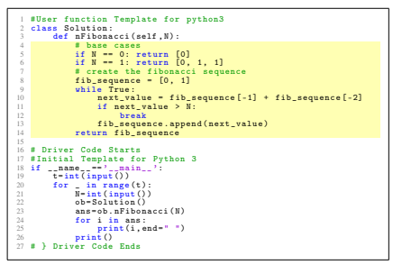

Figure 3: A solution program generated by GPT-4 for FIBONACCI. The highlighted lines are generated by GPT-4; the rest, including the *Driver Code*, is part of the solution template on *geeksforgeeks.org* platform [13]. This template, along with the problem description, is given in the prompt.

GPT-4 as its LLM via web platform [3, 29]; (c) Tutor that corresponds to human experts with experience in Python programming and tutoring introductory programming classes. Prompts used to interact with LLMs are provided in the subsequent sections for different scenarios. The information in these prompts also serves as instructions for human experts that are part of the Tutor method; these experts can naturally draw on their own experiences and use additional resources—e.g., debugger, web, or course materials—similar to how a typical human tutor/educator would work on these scenarios in real-world settings. Next, we describe the interaction process with these models and outputs for evaluation. For a given method and scenario, we have 25 total instances for evaluation, comprising a problem and program (5×5 instances). For each instance, ChatGPT and GPT-4 perform nChatGPT = nGPT-4 = 1 query to their corresponding LLMs through web platforms to generate one output per instance; Tutor has nTutor = 2 human experts that independently generate two outputs per instance.5 We describe further scenario-specific details in the subsequent sections.

Metrics and evaluation process. We will introduce scenario-specific performance metrics in the subsequent sections. We have nevals = 2 human evaluators who provide annotations to assess the quality of generated output for each instance w.r.t. corresponding performance metrics. In our evaluation, this set of nevals = 2 human evaluators is same as nTutor = 2 human experts that are part of the Tutor method. More concretely, each of the nevals human evaluators independently annotates the quality of generated outputs for ChatGPT, GPT-4, and Tutor (only for the nTutor−1 human experts by excluding the evaluator themselves). Then, for each method, results are first aggregated across 25 instances or across 5 instances when reporting problem-specific results. Finally, we aggregate results across nevals human evaluators and report averaged results as mean (*stderr*).

We provide scenario-specific details in the subsequent sections. Remark. Since we want LLMs to play the role of experienced digital tutors and assistants, a natural question is whether they can solve five problems used in the evaluation, i.e., generate correct solution programs. Before evaluating ChatGPT and GPT-4 on different programming education scenarios, we checked their problem-solving capabilities by querying them with suitable prompts consisting of a problem description along with a solution template as input and instruction to generate a solution program as output. GPT-4 was able to solve all five problems; Figure 3 above and Figures 16–19 in Appendix A.1 show solution programs generated by GPT-4 for these problems. ChatGPT was able to solve four out of five problems; it consistently failed on FIBONACCI across multiple queries.

5We note that GPT-4 currently has a cap of 25 messages every 3 hours [29]. In future studies, it would be useful to scale up the evaluation process by increasing nChatGPT, nGPT-4, and nTutor.

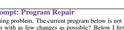

I'm working on a Python programming problem. The current program below is not working well. Can you help in fixing this program with as few changes as possible? Below I first provide the

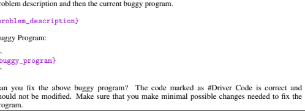

```
```
Figure 4: Prompt for the program repair scenario. This prompt has two placeholders for the problem description and the buggy program.

## 3 Program Repair Scenario

This section is dedicated to the programming education scenario of *program repair* [8, 11, 14]. This scenario is motivated by an AI-based educational agent acting as a *digital tutor for a student* and providing help by fixing the student's buggy program. Next, we provide details of this scenario's prompt, input-output formats, performance metrics, and results.

Prompt and output generation. We begin by describing the content provided as input to a method and the desired output content we seek to generate. The input consists of a detailed problem description and a student's *buggy program*; the desired output consists of a *fixed program*. Figure 4 shows the prompt—with placeholders for the inputs—used to interact with LLMs for ChatGPT and GPT-4 methods. The prompt starts with an overview text about the scenario, followed by a detailed problem description and a student's buggy program, and then summarizes the desired output. When interacting with LLMs, we first generate content using this prompt and then manually extract the generated program as the final output for evaluation.

Output quality and performance metrics. We assess the generated output along several quality attributes and use aggregated results over these quality attributes as performance metrics in our evaluation. *Correct* (binary, 1 value being better) captures whether the generated program is correct w.r.t. the problem specification; we use automated test suites to check the correctness of a program as mentioned in Footnote 3. *EditTokens* (non-negative number, lower value being better) captures the token-based edit distance between the generated program and the buggy program.6 Human evaluators annotate the quality of generated output for each of the 25 instances; in this particular scenario, human evaluators computed these attributes using automated scripts without requiring manual annotation.

Results. Figure 5a provide results for various metrics aggregated across all problems, and Figure 5b for the metric *Correct* separately on five problems. These aggregated results for the metric *Correct* are reported in terms of %. Next, we summarize some of the key findings. First, results in Figure 5a for the metric *Correct* highlight that GPT-4 (88.0) substantially improves up on ChatGPT (68.0)
and comes close to the performance of Tutor (100.0). However, in terms of the metric *EditTokens*, GPT-4 (36.6) does a lot more edits when fixing buggy programs in contrast to that made by Tutor (19.0). Second, results in Figure 5b highlight that these findings are generally consistent across all five problems for the metric *Correct*; the gap in the performance of GPT-4 vs. Tutor is worst on FIBONACCI for this scenario. In Appendix A.2, we provide an illustrative example showing the outputs of different methods.

6Edit-distance between two programs is measured by first tokenizing programs using Pygments library [30]
and then computing Levenshtein edit-distance over token strings.

| Method   |             | (Fixed Program, Buggy Program)   |
|----------|-------------|----------------------------------|
|          | Correct     | EditTokens                       |
| ChatGPT  | 68.0 (0.0)  | 43.0 (0.0)                       |
| GPT\-4   | 88.0 (0.0)  | 36.6 (0.0)                       |
| Tutor    | 100.0 (0.0) | 19.0 (1.2)                       |

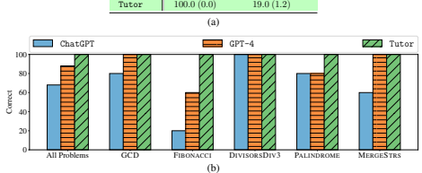

Figure 5: Results for the program repair scenario. (a) Results for various metrics aggregated across all problems. (b) Results for the metric *Correct* separately on five problems. For the metric *Correct*, these aggregated results are reported in terms of %. Details are in Section 3.

## 4 Hint Generation Scenario

This section is dedicated to the programming education scenario of *hint generation* [10, 11]. This scenario is motivated by an AI-based educational agent acting as a *digital tutor for a student* and providing help via hints to resolve current issues in the student's buggy program. Next, we provide details of this scenario's prompt, input-output formats, performance metrics, and results. Prompt and output generation. We begin by describing the content provided as input to a method and the desired output content we seek to generate. The input consists of a detailed problem description and a student's *buggy program*; the desired output consists of a *hint* and an *explanation* that provides the reasoning behind the generated hint. Figure 6 shows the prompt—with placeholders for the inputs—used to interact with LLMs for ChatGPT and GPT-4 methods. When interacting with LLMs, we first generate content using this prompt and then manually extract the generated hint and explanation as the final output used for evaluation. Output quality and performance metrics. We assess the generated output along several quality attributes and use aggregated results over these quality attributes as performance metrics in our evaluation. All attributes for this scenario are binary, with a value of 1 being better. *HCorrect* (binary) captures whether the generated hint provides correct information for resolving issues in the student's buggy program. *HInformative* (binary) captures whether the generated hint provides useful information to help the student resolve bug(s); this attribute is set to 0 by default when the hint is incorrect. *HConceal* (binary) captures that the information in the generated hint is not too detailed, so the student would also have to reason about implementing the fixes; this attribute is set to 0 by default when the hint is incorrect. *HComprehensible* (binary) captures whether the generated hint is easy to understand, presented in a readable format, and doesn't contain redundant information. *HOverall* (binary) is 1, i.e., good quality, only if the generated hint satisfies all the four quality attributes mentioned above. *ECorrect* (binary) captures whether the generated explanation contains correct reasoning behind the generated hint; this attribute is set to 0 by default when the hint is incorrect. Overall (binary) is 1 only when *both* the *HOverall* and *ECorrect* attributes are 1. Human evaluators annotate the quality of generated output for each of the 25 instances; in this scenario, these attributes require manual annotation (in contrast to automated annotation for the program repair scenario). Results. Figure 7a provide results for various metrics aggregated across all problems, and Figure 7b for the metric *Overall* separately on five problems. These aggregated results for various metrics are reported in terms of %. Next, we summarize some of the key findings. First, results in Figure 7a for the metric *Overall* highlight that GPT-4 (66.0) substantially improves up on ChatGPT (18.0), though Prompt: Hint Generation I'm working on a Python programming problem. The current program below is not working well. Can you help by giving a hint? Below I first provide the problem description and then the current buggy program.

{problem_description}
Buggy Program: ```
{buggy_program}
(1) Can you describe the bug(s) in this program and the required fixes?

(2) Can you provide a concise single-sentence hint about one bug in this program? The hint should not be too detailed as I want to think about the fixes by myself. However, the hint should not be too abstract, as I need some help.

Figure 6: Prompt for the hint generation scenario. This prompt has two placeholders for the problem description and the buggy program.

| Method   | (Hint, Explanation)   | Hint        |                         |              |             |                 | Explanation   |
|----------|-----------------------|-------------|-------------------------|--------------|-------------|-----------------|---------------|
|          | Overall               | HOverall    | HCorrect                | HInformative | HConceal    | HComprehensible | ECorrect      |
| ChatGPT  | 18.0 ( 6.0)           |             | 22.0 ( 6.0) 50.0 (10.0) | 38.0 ( 6.0)  | 38.0 (10.0) | 94.0 ( 2.0)     | 40.0 ( 8.0)   |
| GPT\-4   | 66.0 (10.0)           |             | 70.0 (10.0) 74.0 (10.0) | 74.0 (10.0)  | 72.0 ( 8.0) | 96.0 ( 4.0)     | 70.0 (10.0)   |
| Tutor    | 92.0 ( 4.0)           | 92.0 ( 4.0) | 94.0 ( 6.0)             | 94.0 ( 6.0)  | 94.0 ( 6.0) | 98.0 ( 2.0)     | 94.0 ( 6.0)   |

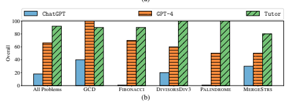

```

Figure 7: Results for the hint generation scenario. (a) Results for various metrics aggregated across all problems. (b) Results for the metric *Overall* separately on five problems. For all metrics, these aggregated results are reported in terms of %. Details are in Section 4.

there is still a large gap in comparison to the performance of Tutor (92.0). Combining this with results on metrics *HOverall* and *ECorrect*, we can see that GPT-4's detailed reasoning is usually correct whenever it manages to generate a good quality hint. Second, results in Figure 7b highlight that these findings are generally consistent across all five problems for the metric *Overall*; the gap in the performance of GPT-4 vs. Tutor is worst on PALINDROME for this scenario. Interestingly, GPT-4's performance on GCD is slightly better than that of Tutor. In Appendix A.3, we provide an illustrative example to qualitatively show the outputs of different methods.

#### 5 Grading Feedback Scenario

This section is dedicated to the programming education scenario of *grading feedback* [15, 16]. This scenario is motivated by an AI-based educational agent acting as a *digital assistant for an educator* and providing assistance by grading students' programs w.r.t. a given rubric. Next, we provide details of this scenario's prompt, input-output formats, performance metrics, and results.

(a)
Prompt: Grading Feedback I have to grade a student's program for a Python programming problem. Can you help in grading this student's program according to a given rubric? Below I first provide the problem description, the student's program, and then the grading rubric.

{problem_description}
Student's Program: ```
{student_program}
Grading Rubric:
The grading rubric is divided into five dimensions to assess different aspects of the program. The maximum possible points for a program is 100.

1. Program format (10 points)
- The program implements the {function_name} function with the correct input parameters and return type as specified in the problem description. The possible points along this rubric dimension are 10 or 0. 2. Time complexity (15 points)
- The program meets the expected time complexity of {time_complexity}. The possible points along this rubric dimension are 15 or 0. 3. Space complexity (15 points)
- The program meets the expected auxiliary space complexity of {space_complexity}. The possible points along this rubric dimension are 15 or 0.

4. Correctness for general inputs (30 points)
- The program outputs the correct results for most of the inputs. We give full points as long as the program works correctly for general inputs, i.e., excluding specific inputs that are edge cases or cause issues with time/space complexity. The possible points along this rubric dimension are 30 or 0. 5. Correctness for edge cases (30 points)
- The program outputs the correct results for specific inputs that are edge cases. We subtract 10 points for each failing type of edge case. We give 0 points when there are more than three types of failing edge cases. The possible points along this rubric dimension are 30, 20, 10 or 0. Can you grade the student's program according to the above five-dimensional rubric and also provide total points scored by the student's program? The code marked as \#Driver Code is correct and should not be considered for grading.

Figure 8: Prompt for the grading feedback scenario. This prompt has two placeholders for the problem description and the student's program, and three placeholders for problem-specific details in the rubric. Prompt and output generation. We begin by describing the content provided as input to a method and the desired output content we seek to generate. The input consists of a detailed *problem* description, a *student's program* with bugs, and a *grading rubric*; the desired output consists of grading points w.r.t. the grading rubric. Figure 8 shows the prompt—with placeholders for the inputs—used to interact with LLMs for ChatGPT and GPT-4 methods. When interacting with LLMs, we first generate content using this prompt and then manually extract the grading points w.r.t. the rubric as the final output for evaluation.7 Output quality and performance metrics. We assess the generated output along several quality attributes and use aggregated results over these quality attributes as performance metrics in our 7LLMs typically also generate explanations along with grading points; we do not evaluate the quality of these explanations. In Appendix A.4, we will provide an illustrative example to show some of these explanations.

```

| Method             |            |           |           | Difference in Points Across Grading Rubric DiffTotal DiffProgramFormat DiffTimeComplexity DiffSpaceComplexity DiffCorrectGeneral DiffCorrectEdge   |            |            |
|--------------------|------------|-----------|-----------|----------------------------------------------------------------------------------------------------------------------------------------------------|------------|------------|
| ChatGPT 36.7 (1.3) |            | 0.8 (0.4) | 0.6 (0.6) | 2.7 (0.9)                                                                                                                                          | 18.0 (1.2) | 18.2 (0.6) |
| GPT\-4             | 23.5 (2.9) | 1.2 (0.4) | 1.8 (0.6) | 3.3 (0.9)                                                                                                                                          | 8.4 (1.2)  | 11.0 (0.6) |
| Tutor              | 9.0 (0.0)  | 0.8 (0.0) | 1.2 (0.0) | 1.8 (0.0)                                                                                                                                          | 2.4 (0.0)  | 3.6 (0.0)  |
|                    |            |           | (a)       |                                                                                                                                                    |            |            |

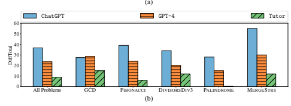

Figure 9: Results for the grading feedback scenario. (a) Results for various metrics aggregated across all problems. (b) Results for the metric *DiffTotal* separately on five problems. *Lower* difference in points corresponds to *better* performance for this scenario. Details are in Section 5.

evaluation. All attributes for this scenario are non-negative numbers, with a lower value being better. *DiffTotal* (non-negative number) captures the absolute difference between the total points provided by the method and that provided by the human evaluator during annotation. Moreover, we consider attributes corresponding to the grading rubric specified in the prompt; here, we have used a five-dimensional rubric with rubric dimensions of program format, time complexity, space complexity, correctness for general inputs, and correctness for edge cases. For this rubric, we have five additional attributes, namely, DiffProgramFormat, DiffTimeComplexity, DiffSpaceComplexity, DiffCorrectGeneral, and *DiffCorrectEdge*, that are variants of *DiffTotal* for computing absolute differences along specific rubric dimensions.

Results. Figure 9a provide results for various metrics aggregated across all problems, and Figure 9b for the metric *DiffTotal* separately on five problems. We note that a lower difference in points corresponds to better performance for this scenario. Next, we summarize some of the key findings. First, results in Figure 9a for the metric *DiffTotal* highlight that even though GPT-4 (23.5) improves up on ChatGPT (36.7), it still performs substantially worse in comparison to the performance of Tutor (9.0). Further, results on various metrics suggest that the gap in the performance of GPT-4 and Tutor is worse on the metric *DiffCorrectEdge* that requires more in-depth reasoning about bugs in terms of failing edge cases. Second, results in Figure 9b highlight that these findings are generally consistent across all five problems for the metric *DiffTotal*; the gap in the performance of GPT-4 vs. Tutor is worst on FIBONACCI and MERGESTRS for this scenario. In Appendix A.4, we provide an illustrative example to qualitatively show the outputs of different methods.

## 6 Pair Programming Scenario

This section is dedicated to the programming education scenario of *pair programming* [17–20]. This scenario is motivated by an AI-based educational agent acting as a *digital peer for a student* and collaborating via completing an incomplete/partial program written by the student. In contrast to the program repair scenario in Section 3 where the input is a complete student's program with bugs, here the input is an incomplete student's program (e.g., half-done program) that the AI agent is expected to complete. Next, we provide details of this scenario's prompt, input-output formats, performance metrics, and results.

Prompt and output generation. We begin by describing the content provided as input to a method and the desired output content we seek to generate. The input consists of a detailed *problem* Prompt: Pair Programming I'm working on a Python programming problem. I have written a part of the program. Can you help in completing this partial program by adding new lines of code? You should make as few changes as possible to already written lines in the partial program. Below I first provide the problem description and then my partial program.

{problem_description}
Partial Program:
```
{partial_program}
Can you complete the above partial program? The code marked as \#Driver Code is correct and should not be modified. Make sure that you make minimal possible changes to already written lines in my partial program.

Figure 10: Prompt for the pair programming scenario. This prompt has two placeholders for the problem description and the partial program.

| Method   |             | (Completed Program, Partial Program)   |             |           |
|----------|-------------|----------------------------------------|-------------|-----------|
|          | Overall     | Correct                                | ContextKept | EditLines |
| ChatGPT  | 38.0 ( 2.0) | 52.0 (0.0)                             | 86.0 ( 2.0) | 6.3 (0.0) |
| GPT\-4   | 64.0 ( 0.0) | 92.0 (0.0)                             | 72.0 ( 0.0) | 7.7 (0.0) |
| Tutor    | 82.0 (10.0) | 100.0 (0.0)                            | 82.0 (10.0) | 6.0 (0.1) |

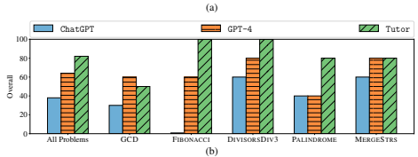

Figure 11: Results for the pair programming scenario. (a) Results for various metrics aggregated across all problems. (b) Results for the metric *Overall* separately on five problems. For metrics Correct, *ContextKept*, and *Overall*, aggregated results are reported in terms of %. Details are in Section 6.

description and a student's *partial program*; the desired output consists of a *completed program*.

8 Figure 10 shows the prompt used to interact with LLMs for ChatGPT and GPT-4 methods. When interacting with LLMs, we first generate content using this prompt and then manually extract the completed program as the final output for evaluation. Output quality and performance metrics. We assess the generated output along several quality attributes and use aggregated results over these quality attributes as performance metrics in our evaluation. *Correct* (binary, 1 value being better) captures whether the completed program is correct w.r.t. the problem specification; we use automated test suites to check the correctness of a program as mentioned in Footnote 3. *ContextKept* (binary, 1 value being better) captures whether the completed program keeps the context of the partial program, e.g., variable names. *EditLines* (non-negative number, lower value being better) captures the line-based edit distance between the completed
```

8In our evaluation, we obtain these partial programs from 25 buggy programs by removing the second half of the program in terms of the number of lines (only considering lines that are not part of the given template). Importantly, note that the partial program could have bugs or could be using some wrong algorithmic procedure.
program and the partial program.9 *Overall* (binary, 1 value being better) is 1 only when *both* the Correct and *ContextKept* attributes are 1. Human evaluators annotate the quality of generated output for each of the 25 instances. In this scenario, human evaluators computed attributes *Correct* and EditLines using automated scripts without requiring manual annotation, and computed the attribute ContextKept using manual annotation.

Results. Figure 11a provide results for various metrics aggregated across all problems, and Figure 11b for the metric *Overall* separately on five problems. These aggregated results for metrics Correct, *ContextKept*, and *Overall* are reported in terms of %. Next, we summarize some of the key findings. First, results in Figure 11a for the metric *Overall* highlight that GPT-4 (64.0) substantially improves up on ChatGPT (38.0) and closed about half the gap in comparison to the performance of Tutor (82.0). However, the results on metrics ContextKept and *EditLines* indicate that GPT-4 has the tendency to make more edits and thereby not keep the context in the partial program provided as input. Second, results in Figure 11b highlight that these findings are generally consistent across all five problems for the metric *Overall*; the gap in the performance of GPT-4 vs. Tutor is worst on FIBONACCI and PALINDROME for this scenario. Interestingly, GPT-4's performance on GCD is slightly better than that of Tutor. These results on specific problems of FIBONACCI, PALINDROME, and GCD are aligned with what we observed for the scenarios of program repair (Figure 5b) and hint generation (Figure 7b). In Appendix A.5, we provide an illustrative example to qualitatively show the outputs of different methods.

## 7 Contextualized Explanation Scenario

This section is dedicated to the programming education scenario of *contextualized explanation* [9, 21]. This scenario is motivated by an AI-based educational agent acting as a *digital tutor for a student* and providing help by explaining a specific part of a given program that the student is trying to understand. In contrast to the hint generation scenario in Section 4 where the input is a student's buggy program, here the input is a correct program along with a specific part (e.g., a line) that the AI agent is expected to explain to the student. Next, we provide details of this scenario's prompt, input-output formats, performance metrics, and results.

Prompt and output generation. We begin by describing the content provided as input to a method and the desired output content we seek to generate. The input consists of a detailed problem description, a given *program* without bugs, and a *specific part* of the program that a student is trying to understand; the desired output consists of an *explanation* that describes this specific part in the context of the whole program.10 Figure 12 shows the prompt—with placeholders for the inputs—used to interact with LLMs for ChatGPT and GPT-4 methods. When interacting with LLMs, we first generate content using this prompt and then manually extract the contextualized explanation as the final output used for evaluation. Output quality and performance metrics. We assess the generated output along several quality attributes and use aggregated results over these quality attributes as performance metrics in our evaluation. All attributes for this scenario are binary, with a value of 1 being better. *Correct* (binary) captures whether the generated explanation contains correct information about the specific part in the context of the whole program. *Complete* (binary) captures whether the generated explanation contains complete information in the context of the whole program. *Comprehensible* (binary) captures whether the generated explanation is easy to understand, presented in a readable format, and doesn't contain redundant information. *Overall* (binary) is 1 only when if the generated explanation satisfies all the three attributes mentioned above. Human evaluators annotate the quality of generated output for each of the 25 instances; in this scenario, all the above attributes require manual annotation (similar to the hint generation scenario in Section 4).

9Edit-distance between two programs is measured based on computing line-diff between them and counting the number of lines that differ.

10In our evaluation, we obtain these input programs from 25 buggy programs by fixing all bugs; importantly, programs used as input for this scenario are correct. For a given program, we select a specific part as the program line with the most depth in the Abstract Syntax Tree representation of the program (in the case of ties, we select a line with the higher line number in the program).
Prompt: Contextualized Explanation I'm trying to understand a given program for a Python programming problem. Can you help by explaining a specific part of this program? Below I first provide the problem description, then the program, and then a specific part of this program.

{problem_description}
Program: ```
{program}
Specific Part: ```
{program_part_to_explain}
Can you provide a detailed explanation about the specific part above in the context of the whole program?

Figure 12: Prompt for the contextualized explanation scenario. This prompt has two placeholders for the problem description and the program, and one placeholder for providing specific part of the program to be explained.

| Method   |             |             | Explanation   |                |
|----------|-------------|-------------|---------------|----------------|
|          | Overall     | Correct     | Complete      | Comprehensible |
| ChatGPT  | 72.0 (12.0) | 76.0 (12.0) | 100.0 (0.0)   | 94.0 (2.0)     |
| GPT\-4   | 84.0 ( 4.0) | 88.0 ( 8.0) | 98.0 (2.0)    | 96.0 (0.0)     |
| Tutor    | 92.0 ( 4.0) | 92.0 ( 4.0) | 100.0 (0.0)   | 100.0 (0.0)    |
|          |             | (a)         |               |                |

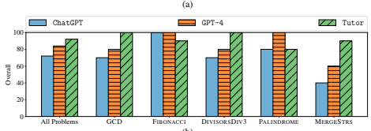

(b)
```
```

Figure 13: Results for the contextualized explanation scenario. (a) Results for various metrics aggregated across all problems. (b) Results for the metric *Overall* separately on five problems. For all metrics, these aggregated results are reported in terms of %. Details are in Section 7.

Results. Figure 13a provide results for various metrics aggregated across all problems, and Figure 13b for the metric *Overall* separately on five problems. These aggregated results for various metrics are reported in terms of %. Next, we summarize some of the key findings. First, results in Figure 13a for the metric *Overall* highlight that GPT-4 (84.0) and ChatGPT (72.0) have high performance, close to that of the performance of Tutor (92.0). One of the main reasons for this high performance in this scenario is that the methods take bug-free programs as input; moreover, the input programs are short and correspond to solutions to popular problems, which makes it somewhat easy to provide correct contextualized explanations. Second, results in Figure 13b highlight that these findings are generally consistent across all five problems for the metric *Overall*; the gap in the performance of GPT-4 vs. Tutor is worst on MERGESTRS for this scenario. In Appendix A.6, we provide an illustrative example to qualitatively show the outputs of different methods.

Prompt: Task Creation


I'm helping a novice student on a Python programming problem. The student's program below has bug(s). Can you help by creating a new simpler problem along with a minimal buggy program that highlights a bug in the student's program? Below I first provide the problem description, the student's buggy program, and then a fix to the student's buggy program.

{problem_description}
Student's Buggy Program:
```
{buggy_program}
Fix to the Student's Buggy Program: ```

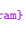

{line_diffs_with_fixed_program}
Based on the above, can you create a new simpler problem along with a buggy program that has the same type of bug(s)? If the student's buggy program has multiple bugs, it is ok to focus on only one of those bugs. Make sure that the new problem is simpler than the original problem.

Figure 14: Prompt for the task creation scenario. This prompt has two placeholders for the problem description and the student's buggy program, and one placeholder for providing fix to the student's buggy program in the form of line differences.

## 8 Task Creation Scenario

This section is dedicated to the programming education scenario of *task creation* [9, 22–24]. This scenario is motivated by an AI-based educational agent acting as a digital assistant for an educator or *digital tutor for a student* - the agent provides assistance/help by generating new tasks (in the form of debugging quizzes) that exercise specific types of bugs the student is encountering. Next, we provide details of this scenario's prompt, input-output formats, performance metrics, and results.

Prompt and output generation. We begin by describing the content provided as input to a method and the desired output content we seek to generate. The input consists of a detailed problem description, a student's *buggy program*, and fixes to the buggy program as line-diffs with fixed program; the desired output consists of a new debugging task comprising *(new problem, new buggy* program).

11 Figure 14 shows the prompt used to interact with LLMs for ChatGPT and GPT-4 methods.

When interacting with LLMs, we first generate content using this prompt and then manually extract the new debugging task, i.e., (new problem, new buggy program) as the final output for evaluation.

Output quality and performance metrics. We assess the generated output along several quality attributes and use aggregated results over these quality attributes as performance metrics in our evaluation. All attributes for this scenario are binary, with a value of 1 being better. *Correct* (binary) captures whether the generated new problem is correct in terms of its description and specification, and can be solved. *Simpler* (binary) captures whether the generated new problem is simpler than the input problem. *SimilarBugs* (binary) captures whether the generated new buggy program has bug(s) similar to bug(s) in the student's buggy program. *MinimalBugs* (binary) captures that the generated new buggy program doesn't contain any other bugs. *Overall* (binary) is 1 only if the generated new problem and new buggy program jointly satisfy all the four attributes mentioned earlier. Human evaluators annotate the quality of generated output for each of the 25 instances; in this scenario, all the above attributes require manual annotation.

```


```

11In our evaluation, we obtain these fixed programs from 25 buggy programs by fixing all bugs with a minimal number of edits required.

| Method   | (New Problem, New Buggy Program)   | New Problem             | New Buggy Program       |            |
|----------|------------------------------------|-------------------------|-------------------------|------------|
|          | Overall                            | Simpler Correct         | SimilarBugs MinimalBugs |            |
| ChatGPT  | 10.0 (2.0)                         | 78.0 (10.0) 66.0 (2.0)  | 36.0 (0.0)              | 76.0 (8.0) |
| GPT\-4   | 22.0 (2.0)                         | 94.0 ( 6.0) 88.0 (4.0)  | 40.0 (0.0)              | 76.0 (8.0) |
| Tutor    | 74.0 (2.0)                         | 98.0 ( 2.0)  98.0 (2.0) | 92.0 (4.0)              | 82.0 (6.0) |
|          |                                    | (a)                     |                         |            |

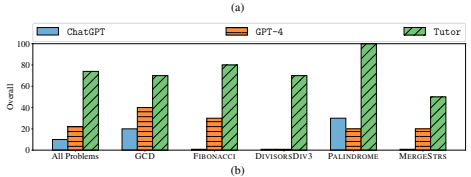

Figure 15: Results for the task creation scenario. (a) Results for various metrics aggregated across all problems. (b) Results for the metric *Overall* separately on five problems. For all metrics, these aggregated results are reported in terms of %. Details are in Section 8.

Results. Figure 15a provide results for various metrics aggregated across all problems, and Figure 15b for the metric *Overall* separately on five problems. These aggregated results for various metrics are reported in terms of %. Next, we summarize some of the key findings. First, results in Figure 15a for the metric *Overall* highlight that even though GPT-4 (22.0) improves up on ChatGPT (10.0), it still performs substantially worse in comparison to the performance of Tutor (74.0). Further, results on various metrics suggest that the gap in the performance of GPT-4 and Tutor is worse on the metric *SimilarBugs* that requires a more in-depth understanding of bugs in the input program and then transferring them to a newly generated program. Second, results in Figure 15b highlight that these findings are generally consistent across all five problems for the metric *Overall*; the gap in the performance of GPT-4 vs. Tutor is worst on DIVISORSDIV3 and PALINDROME. In Appendix A.7, we provide an illustrative example to qualitatively show the outputs of different methods.

## 9 Concluding Discussions

We conducted a study to benchmark state-of-the-art generative AI and large language models for a comprehensive set of programming education scenarios. Our results show that GPT-4 drastically outperforms ChatGPT (based on GPT-3.5) and comes close to human tutors' performance for several scenarios. These results also highlight scenarios and specific problems where GPT-4 still struggles, in particular, for the scenarios of grading feedback and task creation that have a substantial gap in the performance of GPT-4 compared to that of human tutors. Next, we discuss some limitations of our current work and ideas to tackle them in the future. First, our work involved only two human experts acting as tutors and evaluators; it would be useful to scale up the study. Second, we focused only on introductory Python programming education; it would be interesting to conduct a similar study for other programming languages and other domains beyond programming. Third, we considered English as the primary mode of language, and it would be interesting to evaluate these models in multilingual settings. Fourth, our evaluation only considered expert-based assessments and didn't involve students; it would be useful to consider student-based assessments. Apart from the above extensions, there are many exciting directions for future work, including but not limited to: (a) curating larger-scale benchmarks that the research community can use to evaluate new versions of these models; (b) evaluating alternate generative models, in particular, open-source variants; (c) developing techniques to improve the performance of generative AI and large language models, e.g., by leveraging symbolic methods, fine-tuning, or automated prompting; (d) conducting studies in classrooms with students.

## Acknowledgments And Disclosure Of Funding

Funded/Co-funded by the European Union (ERC, TOPS, 101039090). Views and opinions expressed are however those of the author(s) only and do not necessarily reflect those of the European Union or the European Research Council. Neither the European Union nor the granting authority can be held responsible for them.

## References

[1] Tung Phung, Victor-Alexandru Padurean, José Cambronero, Sumit Gulwani, Tobias Kohn, ˘
Rupak Majumdar, Adish Singla, and Gustavo Soares. Generative AI for Programming Education: Benchmarking ChatGPT, GPT-4, and Human Tutors. In *ICER V.2*, 2023.

[2] OpenAI. ChatGPT. https://openai.com/blog/chatgpt, 2023.

[3] OpenAI. GPT-4 Technical Report. *CoRR*, abs/2303.08774, 2023. [4] Sébastien Bubeck, Varun Chandrasekaran, Ronen Eldan, Johannes Gehrke, Eric Horvitz, Ece Kamar, Peter Lee, Yin Tat Lee, Yuanzhi Li, Scott M. Lundberg, Harsha Nori, Hamid Palangi, Marco Túlio Ribeiro, and Yi Zhang. Sparks of Artificial General Intelligence: Early Experiments with GPT-4. *CoRR*, abs/2303.12712, 2023.

[5] David Baidoo-Anu and Leticia Owusu Ansah. Education in the Era of Generative Artificial Intelligence (AI): Understanding the Potential Benefits of ChatGPT in Promoting Teaching and Learning. *Available at SSRN 4337484*, 2023.

[6] Weng Marc Lim, Asanka Gunasekara, Jessica Leigh Pallant, Jason Ian Pallant, and Ekaterina Pechenkina. Generative AI and the Future of Education: Ragnarök or Reformation? A Paradoxical Perspective from Management Educators. The International Journal of Management Education, 21(2):100790, 2023.

[7] James Finnie-Ansley, Paul Denny, Brett A. Becker, Andrew Luxton-Reilly, and James Prather.

The Robots Are Coming: Exploring the Implications of OpenAI Codex on Introductory Programming. In ACE, 2022.

[8] Jialu Zhang, José Cambronero, Sumit Gulwani, Vu Le, Ruzica Piskac, Gustavo Soares, and Gust Verbruggen. Repairing Bugs in Python Assignments Using Large Language Models. *CoRR*,
abs/2209.14876, 2022.

[9] Sami Sarsa, Paul Denny, Arto Hellas, and Juho Leinonen. Automatic Generation of Programming Exercises and Code Explanations Using Large Language Models. In *ICER*, 2022.

[10] Juho Leinonen, Arto Hellas, Sami Sarsa, Brent N. Reeves, Paul Denny, James Prather, and Brett A. Becker. Using Large Language Models to Enhance Programming Error Messages. In SIGCSE, 2023.

[11] Tung Phung, José Cambronero, Sumit Gulwani, Tobias Kohn, Rupak Majumdar, Adish Singla, and Gustavo Soares. Generating High-Precision Feedback for Programming Syntax Errors using Large Language Models. In EDM, 2023.

[12] Mark Chen et al. Evaluating Large Language Models Trained on Code. *CoRR*, abs/2107.03374, 2021.

[13] geeksforgeeks.org. GeeksforGeeks: A Computer Science Portal for Geeks. https://www.

geeksforgeeks.org/, 2009.

[14] Jooyong Yi, Umair Z. Ahmed, Amey Karkare, Shin Hwei Tan, and Abhik Roychoudhury. A Feasibility Study of Using Automated Program Repair for Introductory Programming Assignments. In *ESEC/FSE*, 2017.

[15] Jia Tracy Shen, Michiharu Yamashita, Ethan Prihar, Neil T. Heffernan, Xintao Wu, and Dongwon Lee. MathBERT: A Pre-trained Language Model for General NLP Tasks in Mathematics Education. CoRR, abs/2106.07340, 2021.

[16] Hiroaki Funayama, Tasuku Sato, Yuichiroh Matsubayashi, Tomoya Mizumoto, Jun Suzuki, and Kentaro Inui. Balancing Cost and Quality: An Exploration of Human-in-the-Loop Frameworks for Automated Short Answer Scoring. In AIED, 2022.

[17] GitHub. GitHub Copilot: Your AI Pair Programmer. https://github.com/features/
copilot, 2022.

[18] Hussein Mozannar, Gagan Bansal, Adam Fourney, and Eric Horvitz. Reading Between the Lines: Modeling User Behavior and Costs in AI-Assisted Programming. CoRR, abs/2210.14306, 2022.

[19] Saki Imai. Is Github Copilot a Substitute for Human Pair-programming? An Empirical Study.

In *ICSE Companion Proceedings*, 2022.

[20] Qianou Ma, Tongshuang Wu, and Kenneth R. Koedinger. Is AI the Better Programming Partner?

Human-Human Pair Programming vs. Human-AI pAIr Programming. *CoRR*, abs/2306.05153, 2023.

[21] Hannah Potter, Ardi Madadi, René Just, and Cyrus Omar. Contextualized Programming Language Documentation. In *SIGPLAN Onward!*, 2022.

[22] Umair Z. Ahmed, Maria Christakis, Aleksandr Efremov, Nigel Fernandez, Ahana Ghosh, Abhik Roychoudhury, and Adish Singla. Synthesizing Tasks for Block-based Programming. In NeurIPS, 2020.

[23] Ahana Ghosh, Sebastian Tschiatschek, Sam Devlin, and Adish Singla. Adaptive Scaffolding in Block-Based Programming via Synthesizing New Tasks as Pop Quizzes. In *AIED*, 2022.

[24] Victor-Alexandru Padurean, Georgios Tzannetos, and Adish Singla. Neural Task Synthesis for ˘
Visual Programming. *CoRR*, abs/2305.18342, 2023.

[25] Mikhail Mirzayanov. Codeforces. https://codeforces.com/.

[26] Y Daniel Liang. *Introduction to Programming using Python*. 2013.

[27] Ana Bell, Eric Grimson, and John Guttag. Introduction to Computer Science and Programming in Python. https://ocw.mit.edu/courses/
6-0001-introduction-to-computer-science-and-programming-in-python-fall-2016/
pages/lecture-slides-code/, 2016.

[28] OpenAI. ChatGPT model=text-davinci-002. https://chat.openai.com/?model=
text-davinci-002-render-sha, 2023.

[29] OpenAI. GPT-4 model=gpt-4. https://chat.openai.com/?model=gpt-4, 2023. [30] Georg Brandl, Matthäus Chajdas, and Jean Abou-Samra. Pygments. https://pygments.

org/.

## Appendix A Appendix

This appendix provides illustrative examples for six programming education scenarios discussed in Sections 3–8. For each scenario, we have picked one illustrative example to highlight settings where GPT-4 still struggles. These examples provide further insights and potential ideas for future work on developing techniques to improve the performance of these models. For each example, we first show specific inputs provided in the prompt, followed by the outputs from ChatGPT, GPT-4, and Tutor. The detailed problem descriptions used in prompts are mentioned in Footnote 3. When presenting these illustrative examples, we obfuscate the input programs by changing variable names and formatting styles while keeping the original bugs exactly the same. Accordingly, we make the same modifications in the generated output to align it with these changes. Next, we provide a brief description of the content in the rest of this appendix. - Appendix A.1 provides solution programs generated by GPT-4 for all problems. - Appendix A.2 provides an example for the program repair scenario on FIBONACCI. - Appendix A.3 provides an example for the hint generation scenario on PALINDROME. - Appendix A.4 provides an example for the grading feedback scenario on FIBONACCI.

- Appendix A.5 provides an example for the pair programming scenario on DIVISORSDIV3.

- Appendix A.6 provides an example for the contextualized explanation scenario on MERGESTRS. - Appendix A.7 provides an example for the task creation scenario on GCD.

#### A.1 Solution Programs For Five Problems

Figure 3 in Section 2 provided a solution program generated by GPT-4 for FIBONACCI. Figures 16, 17, 18, and 19 below provide solution programs generated by GPT-4 for the remaining four problems. GPT-4 is able to correctly solve these five problems, i.e., these generated programs pass automated test suites (see Footnote 3).

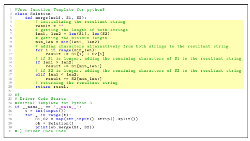

Figure 16: A solution program generated by GPT-4 for MERGESTRS.

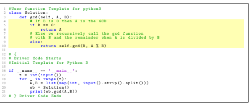

Figure 17: A solution program generated by GPT-4 for GCD.

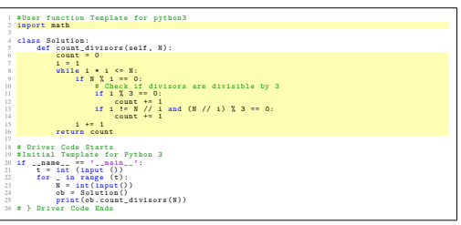

Figure 18: A solution program generated by GPT-4 for DIVISORSDIV3.

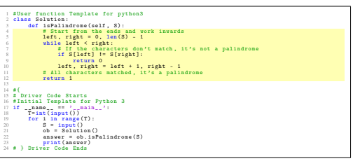

Figure 19: A solution program generated by GPT-4 for PALINDROME.

#### A.2 Illustrative Example For The Program Repair Scenario

Figure 20 shows an example for the program repair scenario on FIBONACCI problem. In this example, the student's buggy program shown in Figure 20a misses some numbers at the end of the series for a few test cases. In the generated programs shown in Figures 20b, 20c, and 20d, we have highlighted the lines where the input buggy program has been modified. ChatGPT generates an incorrect program (i.e., the attribute *Correct* is 0). GPT-4 generates a correct program (i.e., the attribute *Correct* is 1); however, it makes large number of edits (*EditTokens* is 33). Tutor generates a correct program with a small number of edits (i.e., *EditTokens* is 1).

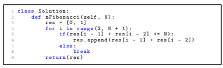

(a) Input: Buggy program

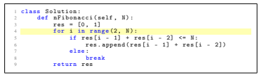

(b) Output by ChatGPT

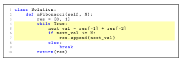

(c) Output by GPT-4

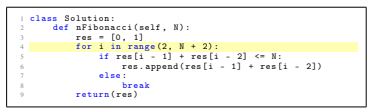

(d) Output by Tutor

Figure 20: An illustrative example for the program repair scenario on FIBONACCI problem.

#### A.3 Illustrative Example For Hint Generation Scenario

Figure 21 shows an example for the hint generation scenario on PALINDROME problem. In this example, the student's buggy program shown in Figure 21a wrongly considers all strings with odd lengths as not palindrome. In the generated outputs shown in Figures 21b, 21c, and 21d, we have highlighted the text where the hint/explanation is wrong. Both ChatGPT and GPT-4 generate an incorrect hint (i.e., the attribute *HintCorrect* is 0). Tutor's output meets all the quality criteria (i.e., *Overall* is 1).

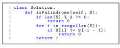

(a) Input: Buggy program

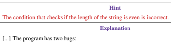

- The condition 'if len(S) % 2 != 0' incorrectly checks if the length of the string is odd, but it should check if it is even.

- The loop 'for i in range(len(S))' iterates through [...]
(b) Output by ChatGPT


Think about how a palindrome string behaves with respect to the symmetry of its characters, regardless of whether its length is odd or even. Additionally, reconsider how you're comparing mirrored indices in the string.

There are two main bugs in your code:
positive and starts from the start of the string, which is incorrect.

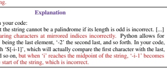

(c) Output by GPT-4

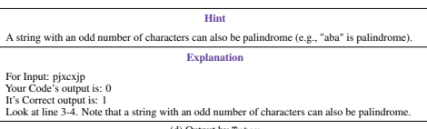

(d) Output by Tutor
Figure 21: An illustrative example for the hint generation scenario on PALINDROME problem.

#### A.4 Illustrative Example For Grading Feedback Scenario

Figure 22 shows an example for the grading feedback scenario on FIBONACCI problem. In this example, the student's buggy program shown in Figure 22a misses some numbers at the beginning of the series for most test cases. Both ChatGPT and ChatGPT fail to recognize this issue in the student's program and wrongly assign high points for the rubric dimensions of *CorrectGeneral* (i.e., Correctness for general inputs) and *CorrectEdge* (i.e., Correctness for edge cases). Interestingly, GPT-4 also writes a detailed textual description where it *wrongly reasons about* its grading strategy:
"[...] Correctness for general inputs (30 points): The program seems to handle general inputs well, but it does have an issue. The program does not return the correct result for N = 0. However, as per the problem statement, N is always greater than or equal to 1. So, this doesn't impact the grading in this category. Score: 30/30 [...]".

Tutor recognizes this issue in the program and correctly assigns 0 points for these two dimensions.

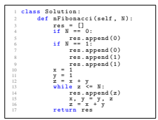

(a) Input: Buggy program

| Method   | Points Across Grading Rubric   |               |                |                 |                |             |
|----------|--------------------------------|---------------|----------------|-----------------|----------------|-------------|
|          | Total                          | ProgramFormat | TimeComplexity | SpaceComplexity | CorrectGeneral | CorrectEdge |
| ChatGPT  | 90                             | 10            | 15             | 15              | 30             | 20          |

| Method   |                      |                      | Points Across Grading Rubric   |                |             |
|----------|----------------------|----------------------|--------------------------------|----------------|-------------|
|          | Total  ProgramFormat | TimeComplexity       | SpaceComplexity                | CorrectGeneral | CorrectEdge |
| GPT\-4   | 10 90                | 15                   | 15                             | 30             | 20          |
|          |                      | (c) Output by GPT\-4 |                                |                |             |
| Method   |                      |                      | Points Across Grading Rubric   |                |             |
|          | Total  ProgramFormat | TimeComplexity       | SpaceComplexity                | CorrectGeneral | CorrectEdge |
| Tutor    | 10 40                | 15                   | 15                             | 0              | 0           |
|          |                      | (d) Output by Tutor  |                                |                |             |

(b) Output by ChatGPT
Figure 22: An illustrative example for the grading feedback scenario on FIBONACCI problem.

#### A.5 Illustrative Example For Pair Programming Scenario

Figure 23 shows an example for the pair programming scenario on DIVISORSDIV3 problem. In this example, the incomplete/partial program is shown in Figure 23a. In the generated programs shown in Figures 23b, 23c, and 23d, we have highlighted the lines where the input partial program has been updated. ChatGPT generates an incorrect program (i.e., the attribute *Correct* is 0). GPT-4 generates a correct program and keeps the context (i.e., attributes *Correct* and *ContextKept* are 1); however, it makes a large number of edits (*EditLines* is 10). Tutor generates a correct program, keeps the context, and makes a small number of edits (i.e., *EditLines* is 4).

1 from math import sqrt

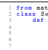 2 class Solution : 3 def count_divisors ( self , N): 4 sq = int ( sqrt (N) ) 5 count = 0 6 for i in range (1 , sq + 1) : 7 if N % i == 0 and i % 3 == 0:
(a) Input: Partial program

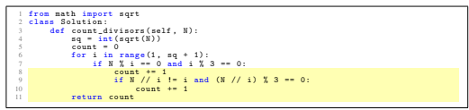

(b) Output by ChatGPT

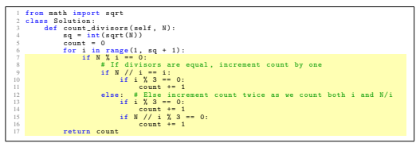

(c) Output by GPT-4

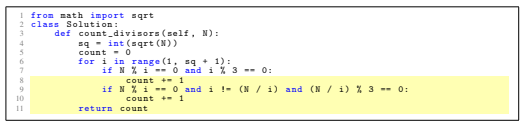

(d) Output by Tutor

Figure 23: An illustrative example for the pair programming scenario on DIVISORSDIV3 problem.

#### A.6 Illustrative Example For Contextualized Explanation Scenario

Figure 24 shows an example for the contextualized explanation scenario on MERGESTRS problem. In this example, the input program and a specific part of the program (line 11) to be explained are shown in Figure 24a. Note that the input program has no bugs; see Footnote 10. In the generated explanations shown in Figures 24b, 24c, and 24d, we have highlighted the text where the explanation is wrong. Both ChatGPT and GPT-4 generate an incorrect explanation (i.e., the attribute *Correct* is 0). Tutor's output meets all the quality criteria (i.e., *Overall* is 1).

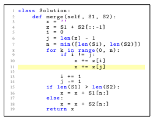

(a) Input: Program and a specific part (line 11)

In the provided program, the specific part 'x += z[j]' is used to append a character to the string 'x'. [...] Now, focusing on the specific part you mentioned ('x += z[j]'), it is responsible for appending the character at index 'j' of the string 'z' to the result string 'x'.

This line ensures that the characters from 'S2' (which were concatenated in reverse order with 'S1') are merged alternatively with the characters from 'S1'. In the loop, when 'i' is not equal to 'j', it means that the loop is not at the middle character of 'z' (when the lengths of 'S1' and 'S2' are odd). Therefore, both the characters at index 'i' and 'j' are appended to a one after the other, ensuring the alternative merging of characters. [...]
(b) Output by ChatGPT
The line of code 'x += z[j]' is part of a larger program to merge two strings S1 and S2 alternatively. [...] Now let's get to the part of the program with the specific line you're asking about. The for loop iterates 'k' from 0 to 'n - 1'. Inside the loop: The condition
'if i != j': is checking if the indices are different. This prevents adding the same character twice when the lengths of the input strings are different. [...]
(c) Output by by GPT-4
'x += z[j]' adds the j-th character of 'z' to the resulting string 'x'. The algorithm used in this program is quite complex. 'z' is obtained by concatenating S1 and the reverse of S2.

Then, the function iteratively takes one character from the start of 'z' and one character from the end of 'z' to the resulting string 'x'. In particular, 'x += z[i]' adds one character from the start of 'z' to 'x'. 'x += z[j]' adds one character from the end of 'z' to 'x'.

(d) Output by Tutor Figure 24: An illustrative example for the contextual explanation scenario on MERGESTRS problem.

#### A.7 Illustrative Example For Task Creation Scenario

Figure 25 shows an example for the task creation scenario on GCD problem. In this example, the student's buggy program shown in Figure 25a has a mistake in passing the arguments to the recursive function call. ChatGPT's output is of bad quality w.r.t. the attributes *SimilarBugs* and *MinimalBugs*. GPT-4's output is of bad quality w.r.t. the attribute *SimilarBugs* as there is no bug in the generated program as required. Interestingly, GPT-4 also writes a detailed textual description—not shown here—where it *wrongly reasons about* how it has generated new problem and new buggy program that matches the prompt requirements. Tutor's output meets all the quality criteria (i.e., *Overall* is 1).

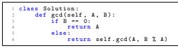

(a) Input: Buggy program New Problem Sum of Two Numbers: Given two positive integers A and B, find the sum of A and B. You don't need to read input or print anything. Complete the function 'sum_of_two_numbers()' which takes two positive integers as input parameters and returns an integer. Example: Input: A = 4, B = 5. Output: 9. Explanation: The sum of 4 and 5 is 9.

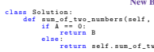

6 return self . sum_of_two_numbers (B , A - 1)
New Buggy Program
(b) Output by ChatGPT


Multiplication of Two Positive Numbers: Given two positive integers A and B, return the result of A
multiplied by B. You don't need to read input or print anything. Complete the function multiply() which takes two positive integers as input parameters and returns an integer. Example 1: Input: A = 3, B = 6. Output: 18. Explanation: 3 multiplied by 6 is 18. Example 2: Input: A = 2, B = 5. Output: 10. Explanation: 2 multiplied by 5 is 10.

5 else :


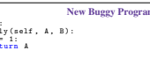

1 class Solution :

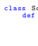 2 def multiply ( self , A , B) : 3 if B == 1:
4 return A
6 return A + self . multiply (A , B -1)
(c) Output by GPT-4 New Problem


Euclidean Division: Find the reminder of A divided by B, using successive subtractions. A and B are positive integers. Example 1: Input: A = 5, B = 3. Output: 2 Example 2: Input: A = 10, B = 3. Output: 1 Example 3: Input: A = 10, B = 5. Output: 0 New Buggy Program

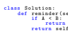 2 def reminder ( self , A , B) :
5 return self . reminder (B , A - B)
(d) Output by Tutor Figure 25: An illustrative example for the task creation scenarion on GCD problem.