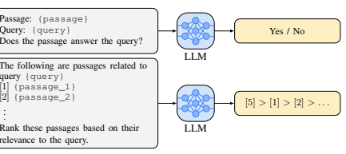
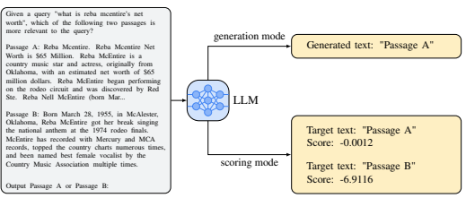
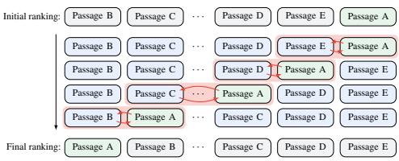

# Largelanguagemodels Areeffectivetext Rankers Withpairwiserankingprompting

Zhen Qin, Rolf Jagerman, Kai Hui, Honglei Zhuang, Junru Wu, Jiaming Shen, Tianqi Liu, Jialu Liu, Donald Metzler, Xuanhui Wang, Michael Bendersky Google Research {zhenqin,jagerman,kaihuibj,hlz,junru,jmshen,tianqiliu,jialu, metzler,xuanhui,bemike}@google.com 

## Abstract

Ranking documents using Large Language Models (LLMs) by directly feeding the query and candidate documents into the prompt is an interesting and practical problem. However, there has been limited success so far, as researchers have found it difficult to outperform fine-tuned baseline rankers on benchmark datasets. We analyze pointwise and listwise ranking prompts used by existing methods and argue that off-the-shelf LLMs do not fully understand these ranking formulations, possibly due to the nature of how LLMs are trained. In this paper, we propose to significantly reduce the burden on LLMs by using a new technique called *Pairwise Ranking Prompting* (PRP). Our results are the first in the literature to achieve state-of-the-art ranking performance on standard benchmarks using moderate-sized open-sourced LLMs. On TREC-DL2020, PRP based on the Flan-UL2 model with 20B parameters outperforms the previous best approach in the literature, which is based on the blackbox commercial GPT-4 that has 50x (estimated) model size, by over 5% at NDCG@1. On TREC-DL2019, PRP is only inferior to the GPT-4 solution on the NDCG@5 and NDCG@10 metrics, while outperforming other existing solutions, such as InstructGPT which has 175B parameters, by over 10% for nearly all ranking metrics. Furthermore, we propose several variants of PRP to improve efficiency and show that it is possible to achieve competitive results even with linear complexity. We also discuss other benefits of PRP, such as supporting both generation and scoring LLM APIs, as well as being insensitive to input ordering.

## 1 Introduction

Large Language Model (LLMs) such as GPT-3 (Brown et al., 2020) and PaLM (Chowdhery et al., 2022) have demonstrated impressive performance on a wide range of natural language tasks, achieving comparable or better performance when compared with their supervised counterparts that are potentially trained with millions of labeled examples, even in the zero-shot setting (Kojima et al., 2022; Agrawal et al., 2022; Huang et al., 2022; Hou et al., 2023). However, there is limited success for the important text ranking problem using LLMs (Ma et al., 2023). Existing results usually significantly underperform well-trained baseline rankers (e.g., Nogueira et al. (2020); Zhuang et al. (2023)). The only exception is a recent approach proposed in (Sun et al., 2023), which depends on the blackbox, giant, and commercial GPT-4 system. Besides the technical concerns such as sensitivity to input order (ranking metrics can drop by more than 50% when the input document order changes), we argue that relying on such blackbox systems is not ideal for academic researchers due to significant cost constraints and access limitations to these systems, though we do acknowledge the value of such explorations in showing the capacity of LLMs for ranking tasks. In this work, we first discuss why it is difficult for LLMs to perform ranking tasks with existing methods, specifically, the pointwise and listwise formulations. For pointwise approaches, ranking requires LLMs to output calibrated prediction probabilities before sorting, which is known to be very difficult and is not supported by the *generation* only LLM APIs (such as GPT-4). For listwise approaches, even with instructions that look very clear to humans, LLMs can frequently generate 1

Figure 1: Two existing prompting methods for ranking: (a) the pointwise relevance generation approach and (b) the listwise permutation approach.

conflicting or useless outputs. Empirically we find that listwise ranking prompts from existing work generate completely useless outputs on moderate-sized LLMs. Such observations show that existing popular LLMs do not fully understand ranking tasks, potentially due to the lack of ranking awareness during their pre-training and fine-tuning procedures. We then propose the pairwise ranking prompting (PRP) paradigm, which uses the query and a pair of documents as the prompt for LLMs to perform ranking tasks, with the motivation to significantly reduce the task complexity for LLMs and resolve the calibration issue. PRP is based on simple prompt design and naturally supports both generation and scoring LLMs APIs. We describe several variants of PRP to address efficiency concerns. PRP results are the first in the literature that can achieve state-of-the-art ranking performance by using *moderate-sized, open-sourced* LLMs on standard benchmark datasets. On TREC-DL2020, PRP based on the FLAN-UL2 model with 20B parameters outperforms the previous best approach in the literature, based on the blackbox commercial GPT-4 that has (an estimated) 50X model size, by over 5% at NDCG@1. On TREC-DL2019, PRP is only inferior to the GPT-4 solution on the NDCG@5 and NDCG@10 metrics, but can outperform existing solutions, such as InstructGPT which has 175B parameters, by over 10% for nearly all ranking metrics. We also show competitive results using FLAN-T5 models with 3B and 13B parameters, demonstrating the power and generality of PRP. We further discuss other benefits of PRP, such as supporting both generation and scoring LLM APIs as well as being insensitive to input ordering.

In summary, the contributions of this paper are three-fold:
- We for the first time show pairwise ranking prompting is effective for zero-shot ranking with LLMs. It is able to produce state-of-the-art ranking performance with simple prompting and scoring mechanism.

- Our results are based on moderate-sized, open-sourced LLMs, comparing with existing solutions that use blackbox, commercial, and much larger models. The finding will facilitate future research in this direction.

- We study several efficiency improvements and show positive empirical performance while attaining linear complexity.

## 2 Difficulties Of Ranking Tasks For Llms

As discussed in Section 1, to date there is limited evidence showing LLM-based rankers can outperform fine-tuned ones. We discuss why this is the case by analyzing existing methods, which can be categorized into pointwise or listwise approaches.

### 2.1 Pointwise Approaches

Pointwise approaches are the major methods prior to very recent listwise approaches discussed in Section 2.2. There are two popular methods, relevance generation (Liang et al., 2022) and query generation (Sachan et al., 2022). Figure 1 (a) shows the prompt used for relevance generation. The relevance score siis defined as:

$s_i=\begin{cases}1+p(\text{Yes}),\text{if output Yes}\\ 1-p(\text{No}),\text{if output No}\end{cases}$. 
$$(1)$$
1 − p(No), if output No (1)
where p(Yes) and p(No) denote the probabilities of LLMs generating 'Yes' and 'No' respectively.

Query generation approach asks LLMs to generate a query based on the document, and measures the probability of generating the actual query. Readers can refer to (Sachan et al., 2022) for more details. There are two major issues with pointwise approaches. First, pointwise relevance prediction requires the model to output *calibrated* pointwise predictions so that they can be used for comparisons in sorting. This is not only very difficult to achieve across prompts, but also unnecessary for ranking, which only requires *relative* ordering. In fact, the entire learning to rank field (Liu, 2009) is based on this observation. Also, pointwise methods will not work for generation API, which is common, such as GPT-4, since it requires the log probability of the desired predictions to perform sorting.

### 2.2 Listwise Approaches

Very recently, two parallel works explore listwise approaches, by directly inserting the query and a list of documents into a prompt. Both methods feed a partial list of 10 or 20 documents every time and perform a sliding window approach due to the prompt length constraints. Figure 1 (b) shows a simplified version of the listwise ranking prompt. Both works explored text-davinci-003, i.e., InstructGPT (Ouyang et al., 2022) with 175B parameters, showing significantly worse performance than fine-tuned baseline rankers. (Sun et al., 2023) were able to further explore gpt-3.5-turbo (the model behind ChatGPT) and GPT-4. Only the GPT-4 based approach could achieve competitive results, which is based on the blackbox, commercial, and giant (1T estimated parameters (VanBuskirk, 2023; Baktash & Dawodi, 2023)) system, without academic publication discussing technical details. The issues are again due to the difficulty of the listwise ranking task for LLMs. (Sun et al., 2023) show that there are frequent prediction failures with the following patterns, especially for smaller models:
- Missing: When LLMs only outputs a partial list of the input documents. - Rejection: LLMs refuse to perform the ranking task and produce irrelevant outputs. - Repetition: LLMs output the same document more than once. - Inconsistency: The same list of documents have different output rankings when they are fed in with different order or context.

In fact, we tried the exact same prompt from (Sun et al., 2023) on the FLAN-UL2 model with 20B parameters, and found very few of the outputs to be usable. The model will either just output few documents (e.g., "[1]"), an ordered list based on id (e.g. "[1] > [2] > [3] ..."), or text which is not parseable. Different from pointwise approaches, listwise approaches can only use the generation API - getting the log probability of all listwise permutations is prohibitively expensive. In other words, there is no good solution if the generation API does not output desired results, which is common. These methods will fall back to the initial ranking, and due to the high failure rate, the results are highly sensitive to input ordering.

These observations are not entirely surprising. Existing popular LLMs are generally not specifically pre-trained or fine-tuned against ranking tasks. However, we next show that LLMs do have a sense of pairwise relative comparisons, which is much simpler than requiring a calibrated pointwise relevance estimation or outputting a permutation for a list of documents.

## 3 Pairwise Ranking Prompting

We propose pairwise ranking prompting (PRP) for ranking with LLMs. We describe the basic pairwise prompting unit, how it supports both generation and scoring APIs, and propose several variants of PRP with different ranking strategies and efficiency properties.

Figure 2: An illustration of pairwise ranking prompting. The scores in scoring mode represent the log-likelihood of the model generating the target text given the prompt.

### 3.1 Prompting Design

Our pairwise ranking prompt is simple and intuitive, as shown in Figure 2. This pairwise prompting will serve the basic computation unit in all PRP variants, which we denote as u(q, d1, d2) for a query q and two documents d1 and d2. PRP naturally supports both generation API and scoring API. The latter is made possible since we only have two expected outputs ("Passage A" and "Passage B") for LLM inquiries. Furthermore, as we focus on open-sourced LLMs, getting probabilities from LLMs is simple. Since using scoring mode can mitigate potential issues when the generation API generates irrelevant outputs, our main results are based on the scoring mode. We will provide some comparisons between these two modes in Section 4.6. Since it is known that LLMs can be sensitive to text orders in the prompt (Lu et al., 2022), for each pair of documents, we will inquire the LLM twice by swapping their order (u(q, d1, d2) and u(q, d2, d1)). We have a local ordering of d1 > d2 or d2 > d1 if both promptings make consistent decisions, and have d1 = d2 otherwise. Next we discuss three variants of PRP using pairwise ranking prompting as the computation unit. We note that pairwise comparison can serve as the basic computation unit of many algorithms (e.g., selection algorithm) and leave other alternatives for future work.

### 3.2 All Pair Comparisons

We enumerate all pairs and perform a global aggregation to generate a score si for each document di. We call this approach PRP-Allpair. Specifically, we have:

$$s_{i}=1*\sum_{j\neq i}\mathbb{I}_{d_{i}>d_{j}}+0.5*\sum_{j\neq i}\mathbb{I}_{d_{i}=d_{j}}.$$
$$(2)^{\frac{1}{2}}$$

Idi=dj. (2)
Intuitively, if the LLM consistently prefers di over another document dj , di gets one point. When LLM is not sure by producing conflicting or irrelevant results (for the generation API), each document gets half a point. There might be ties for the aggregated scores, in which case we fall back to initial ranking. There could be other ways to weight the scoring function (such as leveraging prediction probabilities or initial ranks), which we leave for future work. PRP-Allpair favors simple implementation (all LLM API calls can be executed in parallel, while methods below will perform iterative local refinements), and is highly insensitive to input ordering.

The clear drawback is its costly O(N2) calls to LLM APIs, where N is the number of documents to be ranked for each query.

Figure 3: An illustration of one pass of our sliding window approach. Starting from right to left, we compare each document pair and swap it if the LLM output disagrees with the initial ranking.

We can see that the sliding window approach is able to bring up initially lower ranked "Passage A" (shown in green) to the top of the ranking. K such passes will ensure a high-performing top-K ranking.

### 3.3 Sorting-Based

We note that efficient sorting algorithms, such as Quicksort and Heapsort, depend on pairwise comparisons and thus fit perfectly with PRP. We can use the pairwise preferences from LLMs as the comparator for sorting algorithms. We use Heapsort in this paper due to its guaranteed O(N log N) computation complexity. We call this approach PRP-Sorting. PRP-Sorting favors lower computation complexity than PRP-Allpair while also being large insensitive to input orders. However, since it performs local comparisons and swaps on-the-fly, its performance needs to be empirically evaluated compared to the global aggregation approach in PRP- Allpair.

### 3.4 Sliding Window

We introduce a sliding window approach that is able to further bring down the computation complexity. One sliding window pass is similar to one pass in the Bubblesort algorithm: Given an initial ranking, we start from the bottom of the list, compare and swap document pairs with a stride of 1 on-the-fly based on LLM outputs. One pass only requires O(N) time complexity. See Figure 3 for an illustration. By noticing that ranking usually only cares about Top-K ranking metrics, where K is small, we can perform K passes. For N = 100 and K = 10, it still only requires 10% LLM API calls of the PRP-Allpair. We call this approach PRP-Sliding-K. PRP-Sliding-K has favorable time complexity but will be sensitive to input order, especially for small Ks. In experiments we show surprisingly good results with PRP-Sliding-10, without being sensitive to input ordering.

### 3.5 Remarks

We focus on open-sourced LLMs that are easily accessible to academic researchers, and do not require inquiry of commercial LLM APIs, alleviating some monetary constraints. Also, the LLMs do not need to be finetuned in the zero-shot setting. However, we do acknowledge the cost to prompting LLMs in general. Here we briefly summarize the properties of pointwise, pairwise, and listwise ranking promptings in Table 1, showing pairwise ranking prompting has several favorable properties.

| Method    |     | # of LLM API Calls      | Generation API   | Scoring API   | Require Calibration   |
|-----------|-----|-------------------------|------------------|---------------|-----------------------|
| Pointwise |     | O(N)                    | No               | Yes           | Yes                   |
| Listwise  |     | O(N)                    | Yes              | No            | No                    |
| Pairwise  | O(N | 2   ), O(N log N), O(N) | Yes              | Yes           | No                    |

Table 1: Comparison of pointwise, listwise, and pairwise approaches. N is the number of documents to be ranked for each query. O(N) for Listwise approach is based on sliding window since other

options are not practical.

## 4 Experiments

### 4.1 Datasets And Metrics

TREC is a widely used benchmark dataset in information retrieval research. We use the test sets of the 2019 and 2020 competitions: TREC-DL2019 and TREC-DL2020, which provides dense human relevance annotations for each of their 43 and 54 queries. Both use the MS MARCO v1 passage corpus, which contains 8.8 million passages. All comparisons are based on the reranking of top 100 passages retrieved by BM25 (Lin et al., 2021) for each query. This is the same setting as existing work (Sun et al., 2023; Ma et al., 2023).

### 4.2 Methods

We evaluate PRP variants based on open-sourced LLMs, including FLAN-T5-XL, FLAN-T5- XXL (Chung et al., 2022), and FLAN-UL2 (Tay et al., 2022a), which have significantly smaller model sizes (3B, 11B, 20B) than alternatives, and are accessible even to academic researchers. We report PRP variants including PRP-Allpair, PRP-Sorting, and PRP-Sliding-K. We consider the following supervised baselines, all trained on the MS MARCO dataset:
- monoBERT (Nogueira & Cho, 2019): A cross-encoder re-ranker based on BERT-large. - monoT5 (Nogueira et al., 2020): A sequence-to-sequence re-ranker that uses T5 to calculate the relevance score with pointwise ranking loss.

- RankT5 (Zhuang et al., 2023): A re-ranker that uses T5 and listwise ranking loss.

We also consider the following zero-shot LLM-based baselines:
- Unsupervied Passage Re-ranker (UPR) (Sachan et al., 2022): The *pointwise* approach based on query generation.

- Relevance Generation (RG) (Liang et al., 2022): The *pointwise* approach based on relevance generation.

- RankGPT (Sun et al., 2023): The *listwise* prompting based approach using various GPT
based LLMs.

- Listwise Reranker with a Large language model (LRL) (Ma et al., 2023): A similar approach to RankGPT with slightly different prompt design.

### 4.3 Main Result

Main result is shown in Table 2. Overall we are able to achieve very encouraging results using PRP. We have the following observations:
- PRP variants based on FLAN-UL2 with 20B parameters can achieve best results on all metrics on TREC-DL2020, and are only second to the blackbox, commercial gpt-4 based solution on NDCG@5 and NDCG@10 on TREC-DL2019, which has an estimated 50X times model size. Our best methods outperform RankGPT based on text-davinci-003 with 175B parameters by over 10% on all ranking metrics, and outperform supervised methods on almost all ranking metrics.

| 2023; Baktash & Dawodi, 2023)   |                         |       |                        |              |       |                                      |              |       |
|---------------------------------|-------------------------|-------|------------------------|--------------|-------|--------------------------------------|--------------|-------|
| Method                          | LLM                     | Size  |                        | TREC\-DL2019 |       |                                      | TREC\-DL2020 |       |
|                                 |                         |       | NDCG@1                 |              |       | NDCG@5 NDCG@10 NDCG@1 NDCG@5 NDCG@10 |              |       |
| BM25                            | NA                      | NA    | 54.26                  | 52.78        | 50.58 | 57.72                                | 50.67        | 47.96 |
|                                 |                         |       | Supervised Methods     |              |       |                                      |              |       |
| monoBERT                        | BERT                    | 340M  | 79.07                  | 73.25        | 70.50 | 78.70                                | 70.74        | 67.28 |
| monoT5                          | T5                      | 220M  | 79.84                  | 73.77        | 71.48 | 77.47                                | 69.40        | 66.99 |
| monoT5                          | T5                      | 3B    | 79.07                  | 73.74        | 71.83 | 80.25                                | 72.32        | 68.89 |
| RankT5                          | T5                      | 3B    | 77.38                  | 73.94        | 71.22 | 80.86                                | 72.99        | 69.49 |
|                                 |                         |       | Zero\-Shot LLM Methods |              |       |                                      |              |       |
| LRL                             | text\-davinci\-003 175B |       | \-                     | \-           | 65.80 | \-                                   | \-           | 62.24 |
| RankGPT                         | gpt\-3                  | 175B  | 50.78                  | 50.77        | 49.76 | 50.00                                | 48.36        | 48.73 |
| RankGPT                         | text\-davinci\-003 175B |       | 69.77                  | 64.73        | 61.50 | 69.75                                | 58.76        | 57.05 |
| RankGPT                         | gpt\-3.5\-turbo         | 154B* | 82.17                  | 71.15        | 65.80 | 79.32                                | 66.76        | 62.91 |
| RankGPT                         | gpt\-4                  | 1T*   | 82.56                  | 79.16        | 75.59 | 78.40                                | 74.11        | 70.56 |
| UPR                             | FLAN\-T5\-XXL           | 11B   | 62.79                  | 62.07        | 62.00 | 64.20                                | 62.05        | 60.34 |
| RG                              | FLAN\-T5\-XXL           | 11B   | 67.05                  | 65.41        | 64.48 | 65.74                                | 66.40        | 62.58 |
| UPR                             | FLAN\-UL2               | 20B   | 53.10                  | 57.68        | 58.95 | 64.81                                | 61.50        | 60.02 |
| RG                              | FLAN\-UL2               | 20B   | 70.93                  | 66.81        | 64.61 | 75.62                                | 66.85        | 65.39 |
| PRP\-Allpair                    | FLAN\-T5\-XL            | 3B    | 74.03                  | 71.73        | 69.75 | 79.01                                | 72.22        | 68.12 |
| PRP\-Sorting                    | FLAN\-T5\-XL            | 3B    | 77.52                  | 71.88        | 69.28 | 74.38                                | 69.44        | 65.87 |
| PRP\-Sliding\-10                | FLAN\-T5\-XL            | 3B    | 75.58                  | 71.23        | 68.66 | 75.62                                | 69.00        | 66.59 |
| PRP\-Allpair                    | FLAN\-T5\-XXL           | 11B   | 72.09                  | 71.28        | 69.87 | 82.41                                | 74.16        | 69.85 |
| PRP\-Sorting                    | FLAN\-T5\-XXL           | 11B   | 74.42                  | 69.62        | 67.81 | 72.53                                | 71.28        | 67.77 |
| PRP\-Sliding\-10                | FLAN\-T5\-XXL           | 11B   | 64.73                  | 69.49        | 67.00 | 75.00                                | 70.76        | 67.35 |
| PRP\-Allpair                    | FLAN\-UL2               | 20B   | 73.64                  | 74.77        | 72.42 | 85.19                                | 74.73        | 70.68 |
| PRP\-Sorting                    | FLAN\-UL2               | 20B   | 74.42                  | 73.60        | 71.88 | 84.57                                | 72.52        | 69.43 |
| PRP\-Sliding\-10                | FLAN\-UL2               | 20B   | 78.29                  | 75.49        | 72.65 | 85.80                                | 75.35        | 70.46 |

Table 2: Results on TREC-DL2019 and TREC-DL2020 datasets by reranking top 100 documents retrieved by BM25. Best model is in boldface and second best is underlined for each metric. All zero-shot LLM methods use BM25 to resolve prediction conflicts or failures. *OpenAI has not publicly released the model parameters and the numbers are based on public estimates (VanBuskirk,
- Results on FLAN-T5-XL and FLAN-T5-XXL are also competitive, showing that PRP generalizes to smaller LLMs. They are generally comparable with the gpt-3.5.turbo based solution (10X - 50X in size) and performs better than text-davinci-003 based solution.

- We in general see an upward trend when we increase the model size using our proposed methods, showing pairwise ranking prompting can indeed leverage LLMs' capabilities from their scaling sizes. We suspect the slight inconsistency from FLAN-T5-XL to FLAN-
T5-XXL is due to their tuning procedures1.

- It is encouraging to see good results from efficient PRP variants, alleviating efficiency concerns of pairwise ranking approaches.

### 4.4 More Results On Prp-Sliding-K

| Method       | LLM            | Strategy    | NDCG@1   | NDCG@5   | NDCG@10   |
|--------------|----------------|-------------|----------|----------|-----------|
| PRP\-Sliding | FLAN\-UL2\-20B | 1 Forward   | 63.95    | 57.31    | 54.10     |
| PRP\-Sliding | FLAN\-UL2\-20B | 1 Backward  | 78.29    | 62.15    | 57.58     |
| PRP\-Sliding | FLAN\-UL2\-20B | 2 Backward  | 78.29    | 67.01    | 61.52     |
| PRP\-Sliding | FLAN\-UL2\-20B | 3 Backward  | 78.29    | 70.72    | 64.60     |
| PRP\-Sliding | FLAN\-UL2\-20B | 10 Backward | 78.29    | 75.49    | 72.65     |

We show more results on PRP-Sliding-K variants to better understand the behaviors, including multiple backward passes and a forward pass variant2. The results are shown in Table 3 and Table 4 on TREC-DL2019 and TREC-DL2020, showing consistent behaviors.

Table 3: Sliding window results on the TREC-DL2019 dataset.

The results are easy to interpret:

1https://twitter.com/hwchung27/status/1668729544701001729 2Backward pass indicates starting from the bottom result with the lowest BM25 score, and vice versa.

|              |                | Table 4: Sliding window results on the TREC\-DL2020 dataset.   |        |        |         |
|--------------|----------------|----------------------------------------------------------------|--------|--------|---------|
| Method       | LLM            | Strategy                                                       | NDCG@1 | NDCG@5 | NDCG@10 |
| PRP\-Sliding | FLAN\-UL2\-20B | 1 Forward                                                      | 65.74  | 54.72  | 51.21   |
| PRP\-Sliding | FLAN\-UL2\-20B | 1 Backward                                                     | 85.80  | 61.60  | 57.06   |
| PRP\-Sliding | FLAN\-UL2\-20B | 2 Backward                                                     | 85.80  | 66.51  | 61.11   |
| PRP\-Sliding | FLAN\-UL2\-20B | 3 Backward                                                     | 85.80  | 71.06  | 63.45   |
| PRP\-Sliding | FLAN\-UL2\-20B | 10 Backward                                                    | 85.80  | 75.35  | 70.46   |

- The behavior is similar to BubbleSort: Strong NDCG@1 can already be achieved with one backward pass. As we conduct more passes, other Top-K ranking metrics get better.

- Forward pass does not work well, which is intuitive, since it mainly performs demotion and is much less efficient in bringing good results to the top.

### 4.5 Robustness To Input Ordering

| Method           | LLM             | Init Order   | NDCG@1   | NDCG@5   | NDCG@10   |
|------------------|-----------------|--------------|----------|----------|-----------|
| RankGPT          | gpt\-3.5\-turbo | BM25         | 82.17    | 71.15    | 65.80     |
| RankGPT          | gpt\-3.5\-turbo | Inverse BM25 | 36.43    | 31.79    | 32.77     |
| PRP\-Allpair     | FLAN\-UL2\-20B  | BM25         | 73.64    | 74.77    | 72.42     |
| PRP\-Allpair     | FLAN\-UL2\-20B  | Inverse BM25 | 74.42    | 74.48    | 72.40     |
| PRP\-Sliding\-1  | FLAN\-UL2\-20B  | BM25         | 78.29    | 62.15    | 57.58     |
| PRP\-Sliding\-1  | FLAN\-UL2\-20B  | Inverse BM25 | 71.32    | 32.72    | 26.04     |
| PRP\-Sliding\-10 | FLAN\-UL2\-20B  | BM25         | 78.29    | 75.49    | 72.65     |
| PRP\-Sliding\-10 | FLAN\-UL2\-20B  | Inverse BM25 | 71.32    | 67.91    | 64.84     |

One issue of listwise ranking prompting approaches is their sensitivity to input ordering. This is because the ranking will fall back to the initial order when LLM prediction fails, which is very common for the difficult listwise methods. In Table 5 we show results of different methods by inverting the initial order from BM25.

Table 5: Input order sensitivity results on the TREC-DL2019 dataset.

As expected, PRP-Allpair is quite robust to initial ordering, and PRP-Sliding-1 will suffer for metrics other than NDCG@1. PRP-Sliding-10 is quite robust since it focuses on Top-K ranking metrics.

### 4.6 Comparison Of Scoring Mode And Generation Mode

| Method       | LLM           | Mode       |               | TREC\-DL2019   |         |        | TREC\-DL2020   |                |
|--------------|---------------|------------|---------------|----------------|---------|--------|----------------|----------------|
|              |               |            | NDCG@1 NDCG@5 |                | NDCG@10 | NDCG@1 |                | NDCG@5 NDCG@10 |
| PRP\-Allpair | FLAN\-T5\-XL  | Scoring    | 74.03         | 71.73          | 69.75   | 79.01  | 72.22          | 68.12          |
| PRP\-Allpair | FLAN\-T5\-XL  | Generation | 74.03         | 71.68          | 69.59   | 79.01  | 71.54          | 67.75          |
| PRP\-Allpair | FLAN\-T5\-XXL | Scoring    | 72.09         | 71.28          | 69.87   | 82.41  | 74.16          | 69.85          |
| PRP\-Allpair | FLAN\-T5\-XXL | Generation | 72.09         | 71.61          | 69.94   | 80.56  | 73.69          | 69.53          |
| PRP\-Allpair | FLAN\-UL2     | Scoring    | 73.64         | 74.77          | 72.42   | 85.19  | 74.73          | 70.68          |
| PRP\-Allpair | FLAN\-UL2     | Generation | 73.64         | 74.84          | 72.37   | 85.19  | 74.74          | 70.69          |

Our results above are all based on the scoring mode, since PRP only need to get scores for two candidate outputs ("Passage A" and "Passage B") and it is easy to get probabilities from open-sourced LLMs. Here we compare against PRP performance using scoring vs generation mode in Table 6, which will shed light on how PRP works on generation only LLM APIs.

Table 6: Results on TREC-DL2019 and TREC-DL2020 datasets using scoring vs generation mode

We can see that PRP is extremely robust to scoring vs generation API, even for smaller LLMs, showing its generality to different LLMs systems. The results are intuitive - LLMs make few generation mistakes due to the simplicity of PRP. We found that there are only about 0.02% predictions that do not follow the desired format, which is neglectable and in stark contrast to the the listwise approaches.

## 5 Limitations And Discussions

Cost and Efficiency. We discussed different efficient variants of PRP. Also, our results are based on LLMs that are easily approachable for academic researchers (Taori et al., 2023), alleviating the need to call commercial APIs. However, further reducing the number of calls to LLMs is still an interesting research direction, such as leveraging active learning techniques.

Domain adaptation. The datasets used in this paper are for the standard and important relevancebased text ranking. How LLMs can be adapted to non-standard ranking datasets, such as counter arguments in the ArguAna dataset (Wachsmuth et al., 2018), need more investigation. Our work can facilitate such explorations by providing approachable zero-shot baselines using open-source LLMs. Other Models. We do not use GPT models (though we compare with them using results from other papers) in this work. Testing the performance of our methods on such models is meaningful benchmarking effort.

Ranking-aware LLMs. We, as other existing work, focus on zero-shot ranking with off-the-shelf LLMs, and show that pairwise ranking is the ideal prompting unit. How to make LLMs more ranking-aware, in a data efficient manner, while maintaining their generality for other tasks, is a challenging research direction. No data leakage. We want to note that there is no data leakage problem in the ranking task evaluations. We mainly use FLAN models (Wei et al., 2021), which never observes the question-passage supervision needed for ranking training. This is in contrast to, e.g., some Question Answering (QA) datasets where the ground-truth QA pairs might be used to instruction fine-tune the LLMs. Also, the labels in the datasets are *dense* human annotations for each question answer pair. So our setting, which is the same as existing work, really measures LLMs' capability to do comparative relevance ranking.

## 6 Related Work

We did a detailed review and analysis of the most relevant existing efforts for ranking with LLM, including pointwise and listwise approaches in Section 2. These works and ours focus on the challenging zero-shot text ranking setting with LLMs without providing any examplers, conducting any fine-tuning, or training of an additional model. Prior to the recent efforts related to ranking with LLMs, most work focus on the supervised learning to rank problem (Liu, 2009; Qin et al., 2021) by fine-tuning Pre-trained Language Models (PLMs) such as T5 (Nogueira et al., 2020; Zhuang et al., 2023; Hui et al., 2022) or BERT (Nogueira & Cho, 2019; Zhuang et al., 2021), which serve as very strong baselines. There has been a strong recent interest in exploring information retrieval in general with LLMs based approaches, due to the importance of the applications and the power of LLMs to understand textual queries and documents (Dai et al., 2022; Tay et al., 2022b; Wang et al., 2023; Jagerman et al., 2023; Bonifacio et al., 2022). Several works leverage the generation power of LLMs to generate training data to train an additional downstream retrieval or ranking model, typically in the few-shot setting (Dai et al., 2022), which is a very different setting from ours. Recent methods in this family of methods such as Inpars (Bonifacio et al., 2022) still significantly underperforms fine-tuned baselines. ExaRanker (Ferraretto et al., 2023) uses LLMs to generate explanations for ranking decisions, and uses such explanations in ranking model fine-tuning, showing limited performance benefits. HyDE (Gao et al., 2022) uses LLMs to augment queries by generating hypothetical documents for unsupervised retrieval. These works do not directly explore the retrieval or ranking capability of LLMs, but mainly use LLMs as auxiliary tools to complement traditional paradigms, possibly limiting the benefits that LLMs can provide. New paradigms such as Differentiable Search Index (DSI) (Tay et al., 2022b; Wang et al., 2022) directly use Transformer memory to index documents for retrieval. Though novel, the performance gap from supervised baselines is still large. Our work shares spirit with several key techniques for LLMs, such as reward modeling using pairwise preferences (Christiano et al., 2017).

## 7 Conclusion

In this paper, we propose to use pairwise prompting for ranking tasks. To the best of our knowledge, this is the first time in the literature showing that very competitive ranking performance can be achieved using moderate-sized, open-sourced LLMs. The key insights are the observation of the difficulties of LLMs handling ranking tasks in the existing pointwise and listwise formulations. Our designed pairwise ranking prompting (PRP) is effective in reducing the burden of LLMs. We also discuss efficiency concerns and ways to mitigate them, and several good properties of PRP. This version is a preprint. Besides the directions we mentioned in Section 5, we are actively working on proposing more effective prompts, more efficient ranking paradigms, and evaluating on more LLMs and datasets.

### References

Monica Agrawal, Stefan Hegselmann, Hunter Lang, Yoon Kim, and David Sontag. Large language models are zero-shot clinical information extractors. *arXiv preprint arXiv:2205.12689*, 2022.

Jawid Ahmad Baktash and Mursal Dawodi. Gpt-4: A review on advancements and opportunities in natural language processing. *arXiv preprint arXiv:2305.03195*, 2023.

Luiz Bonifacio, Hugo Abonizio, Marzieh Fadaee, and Rodrigo Nogueira. Inpars: Unsupervised dataset generation for information retrieval. In **Proceedings of the 45th International ACM SIGIR** Conference on Research and Development in Information Retrieval, pp. 2387–2392, 2022.

Tom Brown, Benjamin Mann, Nick Ryder, Melanie Subbiah, Jared D Kaplan, Prafulla Dhariwal, Arvind Neelakantan, Pranav Shyam, Girish Sastry, Amanda Askell, et al. Language models are few-shot learners. *Advances in neural information processing systems*, 33:1877–1901, 2020.

Aakanksha Chowdhery, Sharan Narang, Jacob Devlin, Maarten Bosma, Gaurav Mishra, Adam Roberts, Paul Barham, Hyung Won Chung, Charles Sutton, Sebastian Gehrmann, et al. Palm: Scaling language modeling with pathways. *arXiv preprint arXiv:2204.02311*, 2022.

Paul F Christiano, Jan Leike, Tom Brown, Miljan Martic, Shane Legg, and Dario Amodei. Deep reinforcement learning from human preferences. Advances in neural information processing systems, 30, 2017.

Hyung Won Chung, Le Hou, Shayne Longpre, Barret Zoph, Yi Tay, William Fedus, Eric Li, Xuezhi Wang, Mostafa Dehghani, Siddhartha Brahma, et al. Scaling instruction-finetuned language models. *arXiv preprint arXiv:2210.11416*, 2022.

Zhuyun Dai, Vincent Y Zhao, Ji Ma, Yi Luan, Jianmo Ni, Jing Lu, Anton Bakalov, Kelvin Guu, Keith B Hall, and Ming-Wei Chang. Promptagator: Few-shot dense retrieval from 8 examples. arXiv preprint arXiv:2209.11755, 2022.

Fernando Ferraretto, Thiago Laitz, Roberto Lotufo, and Rodrigo Nogueira. Exaranker: Explanationaugmented neural ranker. *arXiv preprint arXiv:2301.10521*, 2023.

Luyu Gao, Xueguang Ma, Jimmy Lin, and Jamie Callan. Precise zero-shot dense retrieval without relevance labels. *arXiv preprint arXiv:2212.10496*, 2022.

Yupeng Hou, Junjie Zhang, Zihan Lin, Hongyu Lu, Ruobing Xie, Julian McAuley, and Wayne Xin Zhao. Large language models are zero-shot rankers for recommender systems. **arXiv preprint** arXiv:2305.08845, 2023.

Wenlong Huang, Pieter Abbeel, Deepak Pathak, and Igor Mordatch. Language models as zero-shot planners: Extracting actionable knowledge for embodied agents. In *International Conference on* Machine Learning, pp. 9118–9147. PMLR, 2022.

Kai Hui, Honglei Zhuang, Tao Chen, Zhen Qin, Jing Lu, Dara Bahri, Ji Ma, Jai Gupta, Cicero dos Santos, Yi Tay, et al. Ed2lm: Encoder-decoder to language model for faster document reranking inference. In *Findings of the Association for Computational Linguistics: ACL 2022*, pp. 3747–3758, 2022.

Rolf Jagerman, Honglei Zhuang, Zhen Qin, Xuanhui Wang, and Michael Bendersky. Query expansion by prompting large language models. *arXiv preprint arXiv:2305.03653*, 2023.

Takeshi Kojima, Shixiang Shane Gu, Machel Reid, Yutaka Matsuo, and Yusuke Iwasawa. Large language models are zero-shot reasoners. *arXiv preprint arXiv:2205.11916*, 2022.

Percy Liang, Rishi Bommasani, Tony Lee, Dimitris Tsipras, Dilara Soylu, Michihiro Yasunaga, Yian Zhang, Deepak Narayanan, Yuhuai Wu, Ananya Kumar, et al. Holistic evaluation of language models. *arXiv preprint arXiv:2211.09110*, 2022.

Jimmy Lin, Xueguang Ma, Sheng-Chieh Lin, Jheng-Hong Yang, Ronak Pradeep, and Rodrigo Nogueira. Pyserini: A Python toolkit for reproducible information retrieval research with sparse and dense representations. In Proceedings of the 44th Annual International ACM SIGIR Conference on Research and Development in Information Retrieval (SIGIR 2021), pp. 2356–2362, 2021.

Tie-Yan Liu. Learning to rank for information retrieval. Foundation and Trends® **in Information**
Retrieval, 3(3):225–331, 2009.

Yao Lu, Max Bartolo, Alastair Moore, Sebastian Riedel, and Pontus Stenetorp. Fantastically ordered prompts and where to find them: Overcoming few-shot prompt order sensitivity. In **Proceedings** of the 60th Annual Meeting of the Association for Computational Linguistics (Volume 1: Long Papers), pp. 8086–8098, 2022.

Xueguang Ma, Xinyu Zhang, Ronak Pradeep, and Jimmy Lin. Zero-shot listwise document reranking with a large language model. *arXiv preprint arXiv:2305.02156*, 2023.

Rodrigo Nogueira and Kyunghyun Cho. Passage re-ranking with bert. *arXiv preprint* arXiv:1901.04085, 2019.

Rodrigo Nogueira, Zhiying Jiang, Ronak Pradeep, and Jimmy Lin. Document ranking with a pretrained sequence-to-sequence model. In Findings of the Association for Computational Linguistics: EMNLP 2020, pp. 708–718, 2020.

Long Ouyang, Jeffrey Wu, Xu Jiang, Diogo Almeida, Carroll Wainwright, Pamela Mishkin, Chong Zhang, Sandhini Agarwal, Katarina Slama, Alex Ray, et al. Training language models to follow instructions with human feedback. *Advances in Neural Information Processing Systems*, 35: 27730–27744, 2022.

Zhen Qin, Le Yan, Honglei Zhuang, Yi Tay, Rama Kumar Pasumarthi, Xuanhui Wang, Michael Bendersky, and Marc Najork. Are neural rankers still outperformed by gradient boosted decision trees? In *International Conference on Learning Representations*, 2021.

Devendra Singh Sachan, Mike Lewis, Mandar Joshi, Armen Aghajanyan, Wen-tau Yih, Joelle Pineau, and Luke Zettlemoyer. Improving passage retrieval with zero-shot question generation. arXiv preprint arXiv:2204.07496, 2022.

Weiwei Sun, Lingyong Yan, Xinyu Ma, Pengjie Ren, Dawei Yin, and Zhaochun Ren. Is chatgpt good at search? investigating large language models as re-ranking agent. *arXiv preprint* arXiv:2304.09542, 2023.

Rohan Taori, Ishaan Gulrajani, Tianyi Zhang, Yann Dubois, Xuechen Li, Carlos Guestrin, Percy Liang, and Tatsunori B. Hashimoto. Stanford alpaca: An instruction-following llama model. https://github.com/tatsu-lab/stanford_alpaca, 2023.

Yi Tay, Mostafa Dehghani, Vinh Q Tran, Xavier Garcia, Dara Bahri, Tal Schuster, Huaixiu Steven Zheng, Neil Houlsby, and Donald Metzler. Unifying language learning paradigms. **arXiv preprint** arXiv:2205.05131, 2022a.

Yi Tay, Vinh Tran, Mostafa Dehghani, Jianmo Ni, Dara Bahri, Harsh Mehta, Zhen Qin, Kai Hui, Zhe Zhao, Jai Gupta, et al. Transformer memory as a differentiable search index. **Advances in** Neural Information Processing Systems, 35:21831–21843, 2022b.

Adam VanBuskirk. Gpt-3.5 turbo vs gpt-4: What's the difference?

https://blog.wordbot.io/ai-artificial-intelligence/gpt-3-5-turbo-vs-gpt-4-whats-the-difference, 2023. Accessed: 2023-06-06.

Henning Wachsmuth, Shahbaz Syed, and Benno Stein. Retrieval of the best counterargument without prior topic knowledge. In **Proceedings of the 56th Annual Meeting of the Association for** Computational Linguistics (Volume 1: Long Papers), pp. 241–251. Association for Computational Linguistics, 2018.

Liang Wang, Nan Yang, and Furu Wei. Query2doc: Query expansion with large language models.

arXiv preprint arXiv:2303.07678, 2023.

Yujing Wang, Yingyan Hou, Haonan Wang, Ziming Miao, Shibin Wu, Qi Chen, Yuqing Xia, Chengmin Chi, Guoshuai Zhao, Zheng Liu, et al. A neural corpus indexer for document retrieval.

Advances in Neural Information Processing Systems, 35:25600–25614, 2022.

Jason Wei, Maarten Bosma, Vincent Y Zhao, Kelvin Guu, Adams Wei Yu, Brian Lester, Nan Du, Andrew M Dai, and Quoc V Le. Finetuned language models are zero-shot learners. *arXiv preprint* arXiv:2109.01652, 2021.

Honglei Zhuang, Zhen Qin, Shuguang Han, Xuanhui Wang, Michael Bendersky, and Marc Najork.

Ensemble distillation for bert-based ranking models. In **Proceedings of the 2021 ACM SIGIR** International Conference on Theory of Information Retrieval, pp. 131–136, 2021.

Honglei Zhuang, Zhen Qin, Rolf Jagerman, Kai Hui, Ji Ma, Jing Lu, Jianmo Ni, Xuanhui Wang, and Michael Bendersky. Rankt5: Fine-tuning t5 for text ranking with ranking losses. In *Proceedings* of the 46th International ACM SIGIR Conference on Research and Development in Information Retrieval, 2023.