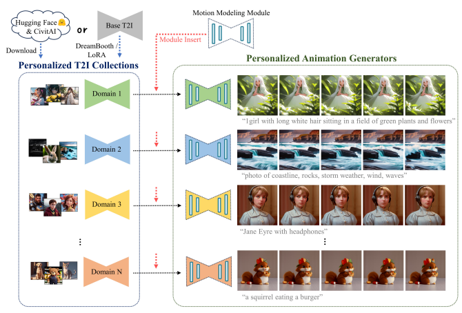
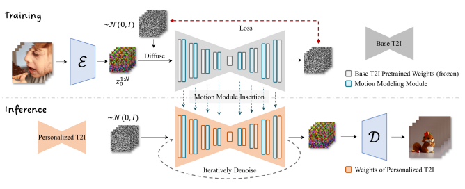
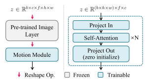
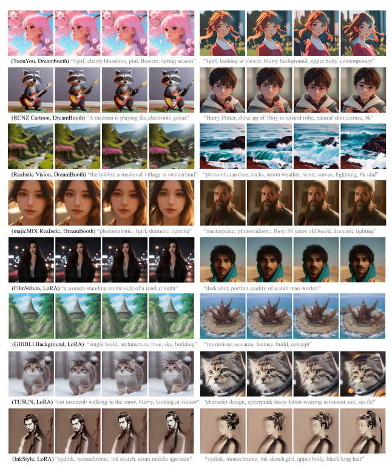
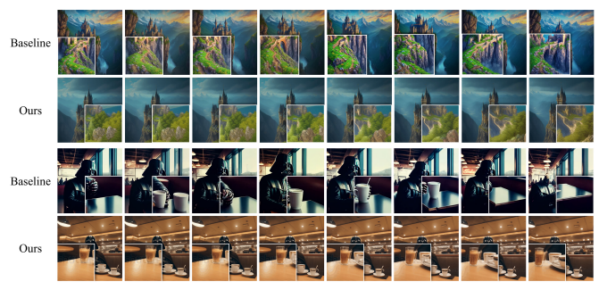
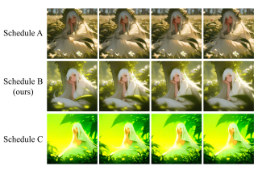
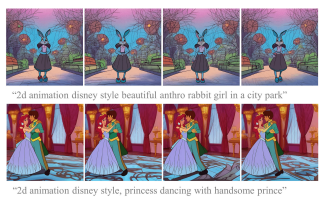
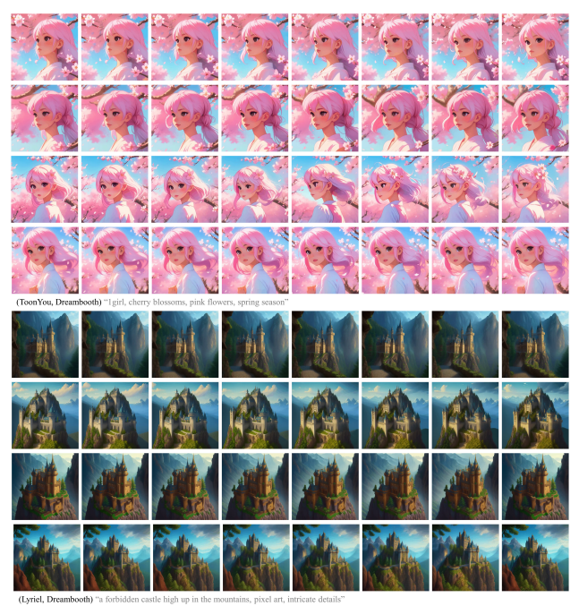
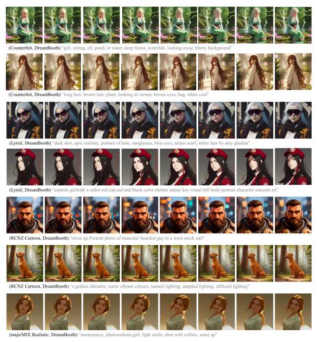
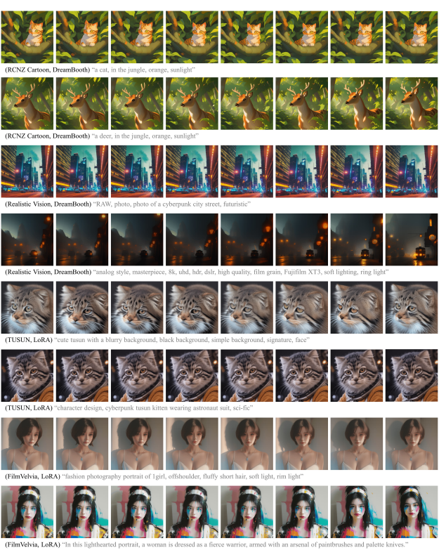

# Animatediff: Animate Your Personalized Text-To-Image Diffusion Models Without Specific Tuning

Yuwei Guo1,2 Ceyuan Yang1∗ Anyi Rao3 Yaohui Wang1 Yu Qiao1 Dahua Lin1,2 Bo Dai1 1Shanghai AI Laboratory 2The Chinese University of Hong Kong 3Stanford University https://animatediff.github.io/
1

0 J
u l 2
[
c s
.

C
V
]
2 3 07
.

047 2 5 v 1 3 2 0
 
 
:
v arXi Figure 1. We present AnimateDiff, an effective framework for extending personalized text-to-image (T2I) models into an animation generator without model-specific tuning. Once learned motion priors from large video datasets, AnimateDiff can be inserted into personalized T2I models either trained by the user or downloaded directly from platforms like CivitAI [4] or Huggingface [8] and generate animation clips with proper motions.

# Abstract

With the advance of text-to-image models (e.g., Stable Diffusion [22]) and corresponding personalization techniques such as DreamBooth [24] and LoRA [13], everyone can manifest their imagination into high-quality images at an affordable cost. Subsequently, there is a great demand for image animation techniques to further combine generated static images with motion dynamics. In this re-
∗Corresponding Author.

1 port, we propose a practical framework to animate most of the existing personalized text-to-image models once and for all, saving efforts in model-specific tuning. At the core of the proposed framework is to insert a newly initialized motion modeling module into the frozen text-to-image model and train it on video clips to distill reasonable motion priors. Once trained, by simply injecting this motion modeling module, all personalized versions derived from the same base T2I readily become text-driven models that produce diverse and personalized animated images. We conduct our evaluation on several public representative personalized text-to-image models across anime pictures and realistic photographs, and demonstrate that our proposed framework helps these models generate temporally smooth animation clips while preserving the domain and diversity of their outputs. Code and pre-trained weights will be publicly available at our *project page.*

# 1. Introduction

In recent years, text-to-image (T2I) generative models [17, 21, 22, 25] have received unprecedented attention both within and beyond the research community, as they provide high visual quality and the text-driven controllability, *i.e.*, a low-barrier entry point for those non-researcher users such as artists and amateurs to conduct AI-assisted content creation. To further stimulate the creativity of existing T2I generative models, several light-weighted personalization methods, such as DreamBooth [24] and LoRA [13], are proposed to enable customized fine-tuning of these models on small datasets with a consumer-grade device such as a laptop with an RTX3080, after which these models can then produce customized content with significantly boosted quality. In this way, users can introduce new concepts or styles to a pre-trained T2I model at a very low cost, resulting in the numerous personalized models contributed by artists and amateurs on model-sharing platforms such as CivitAI [4] and Huggingface [8].

While personalized text-to-image models trained with DreamBooth or LoRA have successfully drawn attention through their extraordinary visual quality, their outputs are static images. Namely, there is a lack of temporal degree of freedom. Considering the broad applications of animation, we want to know whether we can turn most of the existing personalized T2I models into models that produce animated images while preserving the original visual quality. Recent general text-to-video generation approaches [7, 12, 33] propose incorporating temporal modeling into the original T2I models and tuning the models on the video datasets. However, it becomes challenging for personalized T2I models since the users usually cannot afford the sensitive hyperparameter tuning, personalized video collection, and intensive computational resources.

In this work, we present a general method, AnimateDiff, to enable the ability to generate animated images for any personalized T2I model, requiring no model-specific tuning efforts and achieving appealing content consistency over time. Given that most personalized T2I models are derived from the same base one (*e.g.* Stable Diffusion [22]) and collecting the corresponding videos for every personalized domain is outright infeasible, we turn to design a motion modeling module that could animate most of personalized T2I models once for all. Concretely, a motion modeling module is introduced into a base T2I model and then fine-tuned on large-scale video clips [1], learning the reasonable motion priors. It is worth noting that the parameters of the base model remain untouched. After the fine-tuning, we demonstrate that the derived personalized T2I could also benefit from the well-learned motion priors, producing smooth and appealing animations. That is, the motion modeling module manages to animate all corresponding personalized T2I models without further efforts in additional data collecting or customized training.

We evaluate our AnimateDiff on several representative DreamBooth [24] and LoRA [13] models covering anime pictures and realistic photographs. Without specific tuning, most personalized T2I models could be directly animated by inserting the well-trained motion modeling module. In practice, we also figured out that vanilla attention along the temporal dimension is adequate for the motion modeling module to learn the proper motion priors. We also demonstrate that the motion priors can be generalized to domains such as 3D cartoons and 2D anime. To this end, our AnimateDiff could lead to a simple yet effective baseline for personalized animation, where users could quickly obtain the personalized animations, merely bearing the cost of personalizing the image models.

## 2. Related Works

Text-to-image diffusion models. In recent years, textto-image (T2I) diffusion models have gained much popularity both in and beyond the research community, benefited by the large-scale text-image paired data [26] and the power of diffusion models [5, 11]. Among them, GLIDE [17] introduced text conditions to the diffusion model and demonstrated that classifier guidance produces more visually pleasing results. DALLE-2 [21] improves text-image alignment via CLIP [19] joint feature space. Imagen [25] incorporates a large language model [20] pretrained on text corpora and a cascade of diffusion model to achieve photorealistic image generation. Latent diffusion model [22], *i.e.*, Stable Diffusion, proposed to perform the denoising process in an auto-encoder's latent space, effectively reducing the required computation resources while retaining generated images' quality and flexibility. Unlike the above works that share parameters during the generation process, eDiff-I [2] trained an ensemble of diffusion models specialized for different synthesis stages. Our method is built upon a pre-trained text-to-image model and can be adapted to any tuning-based personalized version.

Personalize text-to-image model. While there have been many powerful T2I generative algorithms, it's still unacceptable for individual users to train their models due to the requirements for large-scale data and computational resources, which are only accessible to large companies and research organizations. Therefore, several methods have been proposed to enable users to introduce new domains (new concepts or styles, which are represented mainly by a small number of images collected by users) into pre-trained T2I models [6, 9, 10, 14, 16, 24, 27]. Textual Inversion [9] proposed to optimize a word embedding for each concept and freeze the original networks during training. Dream- Booth [24] is another approach that fine-tunes the whole network with preservation loss as regulation. Custom Diffusion [16] improves fine-tuning efficiency by updating only a small subset of parameters and allowing concept merging through closed-form optimization. At the same time, DreamArtist [6] reduces the input to a single image. Recently, LoRA [13], a technique designed for language model adaptation, has been utilized for text-to-image model fine-tuning and achieved good visual quality. While these methods are mainly based on parameter tuning, several works have also tried to learn a more general encoder for concept personalization [10, 14, 27].

With all these personalization approaches in the research community, our work only focuses on tuning-based methods, i.e., DreamBooth [24] and LoRA [13], since they maintain an unchanged feature space of the base model.

Personalized T2I animation. Since the setting in this report is newly proposed, there is currently little work targeting it. Though it is a common practice to extend an existing T2I model with temporal structures for video generation, existing works [7, 12, 15, 28, 31, 33] update whole parameters in the networks, hurting the domain knowledge of the original T2I model. Recently, several works have reported their application in animating a personalized T2I model. For instance, Tune-a-Video [31] solves the one-shot video generation task via slight architecture modifications and sub-network tuning. Text2Video-Zero [15] introduces a training-free method to animate a pre-trained T2I model via latent wrapping given a predefined affine matrix. A recent work close to our method is Align-Your-Latents [3], a text-to-video (T2V) model which trains separate temporal layers in a T2I model. Our method adopts a simplified network design and verifies the effectiveness of this line of approach in animating personalized T2I models via extensive evaluation on many personalized models.

# 3. Method

In this section, Sec. 3.1 first introduces preliminary knowledge about the general text-to-image model and its personalized variants. Next, Sec. 3.2 presents the formulation of personalized animation and the motivation of our method. Finally, Sec. 3.3 describes the practical implementation of the motion modeling module in AnimateDiff, which animates various personalized models to produce appealing synthesis.

## 3.1. Preliminaries

General text-to-image generator. We chose Stable Diffusion (SD), a widely-used text-to-image model, as the general T2I generator in this work. SD is based on the Latent Diffusion Model (LDM) [22], which executes the denoising process in the latent space of an autoencoder, namely E(·)
and D(·), implemented as VQ-GAN [14] or VQ-VAE [29] pre-trained on large image datasets. This design confers an advantage in reducing computational costs while preserving high visual quality. During the training of the latent diffusion networks, an input image x0 is initially mapped to the latent space by the frozen encoder, yielding z0 = E(x0),
then perturbed by a pre-defined Markov process:

$$q(z_{t}|z_{t-1})={\mathcal{N}}(z_{t};{\sqrt{1-\beta_{t}}}z_{t-1},\beta_{t}I)$$

for t = 1*, . . . , T*, with T being the number of steps in the forward diffusion process. The sequence of hyperparameters βt determines the noise strength at each step.

The above iterative process can be reformulated in a closedform manner as follows:

$$z_{t}=\sqrt{\bar{\alpha_{t}}}z_{0}+\sqrt{1-\bar{\alpha_{t}}}\epsilon,\;\epsilon\sim\mathcal{N}(0,I)$$
√1 − α¯tϵ, ϵ ∼ N (0,I) (2)
where α¯t =Qti=1 αt, αt = 1 − βt. Stable Diffusion adopts the vanilla training objective as proposed in DDPM [5], which can be expressed as:

$${\mathcal{L}}=\mathbb{E}_{{\mathcal{E}}(x_{0}),y,\epsilon\sim{\mathcal{N}}(0,I),t}\left[\|\epsilon-\epsilon_{\theta}(z_{t},t,\tau_{\theta}(y))\|_{2}^{2}\right]$$
$$(\mathbb{I})$$
$$(2)$$
$$({\mathfrak{I}})$$
(3)
where y is the corresponding textual description, τθ(·) is a text encoder mapping the string to a sequence of vectors.

In SD, ϵθ(·) is implemented with a modified UNet [23]
that incorporates four downsample/upsample blocks and one middle block, resulting in four resolution levels within the networks' latent space. Each resolution level integrates 2D convolution layers as well as self- and cross-attention mechanisms. Text model τθ(·) is implemented using the CLIP [19] ViT-L/14 text encoder.

Personalized image generation. As general image generation continues to advance, increasing attention has been paid to personalized image generation. DreamBooth [24]
and LoRA [13] are two representative and widely used personalization approaches. To introduce a new domain (new

Figure 2. *Pipeline of AnimateDiff.* Given a base T2I model (*e.g.*, Stable Diffusion [22]), our method first trains a motion modeling

module on video datasets to encourage it to distill motion priors. During this stage, only the parameters of the motion module are updated, thereby preserving the feature space of the base T2I model. At inference, the once-trained motion module can turn any personalized model tuned upon the base T2I model into an animation generator, then produce diverse and personalized animated images via iteratively denoise process.

concepts, styles, *etc.*) to a pre-trained T2I model, a straightforward approach is fine-tuning it on images of that specific domain. However, directly tuning the model without regularization often leads to overfitting or catastrophic forgetting, especially when the dataset is small. To overcome this problem, DreamBooth [24] uses a rare string as the indicator to represent the target domain and augments the dataset by adding images generated by the original T2I
model. These regularization images are generated without the indicator, thus allowing the model to learn to associate the rare string with the expected domain during fine-tuning.

LoRA [13], on the other hand, takes a different approach by attempting to fine-tune the model weights' residual, that is, training ∆W instead of W. The weight after fine-tuning is calculated as W′ = W + α∆W, where α is a hyperparameter that adjusts the impact of the tuning process, thus providing more freedom for users to control the generated results. To further avoid overfitting and reduce computational costs, ∆W ∈ R
m×n is decomposed into two lowrank matrices, namely ∆W = ABT, where A ∈ R
m×r, B ∈ R
n×r, r ≪ *m, n*. In practice, only the projection matrices in the transformer blocks are tuned, further reducing the training and storage costs of a LoRA model. Compared to DreamBooth which stores the whole model parameters once trained, a LoRA model is much more efficient to train and share between users.

## 3.2. Personalized Animation

Animating a personalized image model usually requires additional tuning with a corresponding video collection, making it much more challenging. In this section, we target personalized animation, which is formally formulated as: given a personalized T2I moded, *e.g.*, a DreamBooth [24] or LoRA [13] checkpoint trained by users or downloaded from CivitAI [4] or Huggingface [8]), the goal is to transform it into an animation generator with little or no training cost while preserving its original domain knowledge and quality. For example, suppose a T2I model is personalized for a specific 2D anime style. In that case, the corresponding animation generator should be capable of generating animation clips of that style with proper motions, such as foreground/background segmentation, character body movements, etc.

To achieve this, one naive approach is to inflate a T2I
model [7, 12, 33] by adding temporal-aware structures and learning reasonable motion priors from large-scale video datasets. However, for the personalized domains, collecting sufficient personalized videos is costly. Meanwhile, limited data would lead to the knowledge loss of the source domain. Therefore, we choose to separately train a generalizable motion modeling module and plug it into the personalized T2I at inference time. By doing so, we avoid specific tuning for each personalized model and retain their knowledge by keeping the pre-trained weights unchanged. Another crucial advantage of such an approach is that once the module is trained, it can be inserted into any personalized T2I upon the same base model with no need for specific tuning, as validated in the following experiments. This is because the personalizing process scarcely modifies the feature space of the base T2I model, which is also demon-

Figure 3. *Details of Motion Module*. Module insertion (left): Our

 motion modules are inserted between the pre-trained image layers. When a data batch passes through the image layers and our motion module, its temporal and spatial axes are reshaped into the batch axis separately. Module design (right): Our module is a vanilla temporal transformer with a zero-initialized output project layer.

#### Strated In Controlnet [32].

## 3.3. Motion Modeling Module

Network Inflation. Since the original SD can only process image data batches, model inflation is necessary to make it compatible with our motion modeling module, which takes a 5D video tensor in the shape of batch × channels×frames×height×*width* as input. To achieve this, we adopt a solution similar to the Video Diffusion Model [12]. Specifically, we transform each 2D convolution and attention layer in the original image model into spatialonly pseudo-3D layers by reshaping the *frame* axis into the batch axis and allowing the network to process each frame independently. Unlike the above, our newly inserted motion module operates across frames in each batch to achieve motion smoothness and content consistency in the animation clips. Details are demonstrated in the Fig. 3.

Module Design. For the network design of our motion modeling module, we aim to enable efficient information exchange across frames. To achieve this, we chose vanilla temporal transformers as the design of our motion module. It is worth noting that we have also experimented with other network designs for the motion module and found that a vanilla temporal transformer is adequate for modeling the motion priors. We leave the search for better motion modules to future works.

The vanilla temporal transformer consists of several selfattention blocks operating along the temporal axis (Fig. 3). When passing through our motion module, the spatial dimensions *height* and *width* of the feature map z will first be reshaped to the batch dimension, resulting in batch × height × *width* sequences at the length of *frames*. The reshaped feature map will then be projected and go through several self-attention blocks, *i.e.*,

$$z=\text{Attention}(Q,K,V)=\text{Softmax}(\frac{QK^{T}}{\sqrt{d}})\cdot V\tag{4}$$

where Q = WQz, K = W Kz, and V = WVz are three projections of the reshaped feature map. This operation enables the module to capture the temporal dependencies between features at the same location across the temporal axis. To enlarge the receptive field of our motion module, we insert it at every resolution level of the U-shaped diffusion network. Additionally, we add sinusoidal position encoding [30] to the self-attention blocks to let the network be aware of the temporal location of the current frame in the animation clip. To insert our module with no harmful effects during training, we zero initialize the output projection layer of the temporal transformer, which is an effective practice validated by ControlNet [32].

Training Objective. The training process of our motion modeling module is similar to Latent Diffusion Model [22]. Sampled video data x 1:N
0are first encoded into the latent code z 1:N
0frame by frame via the pre-trained autoencoder.

Then, the latent codes are noised using the defined forward diffusion schedule: z 1:N
t =
√α¯tz 1:N
0 +
√1 − α¯tϵ. The diffusion network inflated with our motion module takes the noised latent codes and corresponding text prompts as input and predicts the noise strength added to the latent code, encouraged by the L2 loss term. The final training objective of our motion modeling module is:

$$\mathcal{L}=\mathbb{E}_{\mathcal{E}(x_{0}^{1:N}),y,\epsilon\sim\mathcal{N}(0,I),t}\left[\|\epsilon-\epsilon_{\theta}(z_{t}^{1:N},t,\tau_{\theta}(y))\|_{2}^{2}\right]\tag{5}$$

Note that during optimization, the pre-trained weights of the base T2I model are frozen to keep its feature space unchanged.

# 4. Experiments

#### 4.1. Implementation Details

Training. We chose Stable Diffusion v1 as our base model to train the motion modeling module, considering most public personalized models are based on this version. We trained the motion module using the WebVid-10M [1], a text-video pair dataset. The video clips in the dataset are first sampled at the stride of 4, then resized and centercropped to the resolution of 256 × 256. Our experiments show that the module trained on 256 can be generalized to higher resolutions. Therefore we chose 256 as our training resolution since it maintains the balance of training efficiency and visual quality. The final length of the video clips for training was set to 16 frames. During experiments, we discovered that using a diffusion schedule slightly different from the original schedule where the base T2I model was trained helps achieve better visual quality and avoid artifacts such as low saturability and flickering. We hypothesize that slightly modifying the original schedule can help the model better adapt to new tasks (animation) and new data distribution. Thus, we used a *linear* beta schedule, where β*start* = 0.00085 and βend = 0.012, which is

Figure 4. Qualitative results. here we demonstrate 16 animation clips generated by models injected with the motion modeling module in our framework. The two samples of each row belong to the same personalized T2I model. Due to space limitations, we only sample four frames from each animation clip, and we recommend readers refer to our project page for a better view. Irrelevant tags in each prompt, e.g., "masterpieces", "high quality", are omitted for clarity.

Figure 5. *Baseline comparison.* We qualitatively compare the cross-frame content consistency between the baseline (1st, 3rd row) and our

 method (2nd, 4th row). It is noticeable that while the baseline results lack fine-grain consistency, our method maintains a better temporal smoothness.

| Model Name         | Domain     | Type       |
|--------------------|------------|------------|
| Counterfeit        | Anime      | DreamBooth |
| ToonYou            | 2D Cartoon | DreamBooth |
| RCNZ Cartoon       | 3D Cartoon | DreamBooth |
| Lyriel             | Stylistic  | DreamBooth |
| InkStyle           | Stylistic  | LoRA       |
| GHIBLI Background  | Stylistic  | LoRA       |
| majicMIX Realistic | Realistic  | DreamBooth |
| Realistic Vision   | Realistic  | DreamBooth |
| FilmVelvia         | Realistic  | LoRA       |
| TUSUN              | Concept    | LoRA       |

Table 1. Personalized models used for evaluation. We chose several representative personalized models contributed by artists from CivitAI [4] for our evaluation, covering a wide domain range from 2D animation to realistic photography.

#### Slightly Different From That Used To Train The Original Sd.

Evaluations. To verify the effectiveness and generalizability of our method, we collect several representative personalized Stable Diffusion models (Tab. 1) from CivitAI [4], a public platform allowing artists to share their personalized models. The domains of these chosen models range from anime and 2D cartoon images to realistic photographs, providing a comprehensive benchmark to evaluate the capability of our method. Once our module is trained, we plug it into the target personalized models and generate animations with designed text prompts. We do not use common text prompts because the personalized models only generate expected content with specific text distribution, meaning the prompts must have certain formats or contain "trigger words". Therefore, we use example prompts provided at the model homepage in the following section to get the models' best performance.

#### 4.2. Qualitative Results

We present several qualitative results across different models in Fig. 4. Due to space limitations, we only display four frames of each animation clip. We strongly recommend readers refer to our homepage for better visual quality. The figure shows that our method successfully animates personalized T2I models in diverse domains, from highly stylized anime (1st row) to realistic photographs (4th row), without compromising their domain knowledge. Thanks to the motion priors learned from the video datasets, the motion modeling module can understand the textual prompt and assign appropriate motions to each pixel, such as the motion of sea waves (3rd row) and the leg motion of the Pallas's cat (7th row). We also find that our method can distinguish major subjects from foreground and background in the picture, creating a feeling of vividness and realism. For instance, the character and background blossoms in the first animation move separately, at different speeds, and with different blurring strengths.

Our qualitative results demonstrate the generalizability of our motion module for animating personalized T2I models within diverse domains. By inserting our motion module into the personalized model, AnimateDiff can generate high-quality animations faithful to the personalized domain while being diverse and visually appealing.

## 4.3. Comparison With Baselines

We compare our method with Text2Video-Zero [15],
a training-free framework for extending a T2I model for video generation through network inflation and latent warping. Although Tune-a-Video can also be utilized for personalized T2I animation, it requires an additional input video and thus is not considered for comparison. Since T2V-Zero does not rely on any parameter tuning, it is straightforward to adopt it for animating personalized T2I models by replacing the model weights with personalized ones. We generate the animation clips of 16 frames at resolution 512 × 512, using the default hyperparameters provided by the authors.

We qualitatively compare the cross-frame content consistency of the baseline and our method on the same personalized model and with the same prompt ("A forbidden castle high up in the mountains, pixel art, intricate details2, hdr, intricate details"). To more accurately demonstrate and compare the fine-grained details of our method and the baseline, we cropped the same subpart of each result and zoomed it in, as illustrated at the left/right bottom of each frame in Fig. 5.

As shown in the figure, both methods retain the domain knowledge of the personalized model, and their frame-level qualities are comparable. However, the result of T2V-Zero, though visually similar, lacks fine-grained cross-frame consistency when compared carefully. For instance, the shape of the foreground rocks (1st row) and the cup on the table (3rd row) changes over time. This inconsistency is much more noticeable when the animation is played as a video clip. In contrast, our method generates temporally consistent content and maintains superior smoothness (2nd, 4th row). Moreover, our approach exhibits more appropriate content changes that align better with the underlying camera motion, further highlighting the effectiveness of our method. This result is reasonable since the baseline does not learn motion priors and achieves visual consistency via rulebased latent warping, while our method inherits knowledge from large video datasets and maintains temporal smoothness through efficient temporal attention.

## 4.4. Ablative Study

We conduct an ablative study to verify our choice of noise schedule in the forward diffusion process during training. In the previous section, we mentioned that using a slightly modified diffusion schedule helps achieve better visual quality. Here we experiment with three representative diffusion schedules (Tab. 2) adopted by previous works and visually compare their corresponding results in Fig. 6.

| Configuration     | Schedule      | βstart   | βend   |
|-------------------|---------------|----------|--------|
| Schedule A (SD)   | scaled linear | 0.00085  | 0.012  |
| Schedule B (ours) | linear        | 0.00085  | 0.012  |
| Schedule C        | linear        | 0.0001   | 0.02   |

Table 2. Three diffusion schedule configurations in our ablative

 experiments. The schedule for pre-training Stable Diffusion is Schedule A.

Figure 6. *Ablative study.* We experiment with three diffusion schedules, each with different deviation levels from the schedule where Stable Diffusion was pre-trained, and qualitatively compare the results.

Among the three diffusion schedules used in our experiments, Schedule A is the schedule for pre-training Stable Diffusion; Schedule B is our choice, which is different from the schedule of SD in how the beta sequence is computed; Schedule C is used in DDPM [5] and DiT [18] and differs more from SD's pre-training schedule.

As demonstrated in Fig. 6, when using the original schedule of SD for training our motion modeling module (Schedule B), the animation results are with sallow color artifacts. This phenomenon is unusual since, intuitively, using the diffusion schedule aligned with pre-training should be beneficial for the model to retain its feature space already learned. As the schedules deviate more from the pre-training schedule (from Schedule A to Schedule C), the color saturation of the generated animations increases while the range of motion decreases. Among these three configurations, our choice achieves a balance of both visual quality and motion smoothness.

Based on these observations, we hypothesize that a slightly modified diffusion schedule in the training stage helps the pre-trained model adapt to new tasks and domains. Our framework's new training objective is reconstructing noise sequences from a diffused video sequence.

This can be frame-wisely done without considering the temporal structure of the video sequence, which is the image re-

Figure 7. *Failure cases.* Our method cannot produce proper mo-

 tions when the personalized domain is far from realistic.

construction task the T2I model was pre-trained on. Using the same diffusion schedule may mislead the model that it is still optimized for image reconstruction, which slower the training efficiency of our motion modeling module responsible for cross-frame motion modeling, resulting in more flickering animation and color aliasing.

# 5. Limitations And Future Works

In our experiments, we observe that most failure cases appear when the domain of the personalized T2I model is far from realistic, *e.g.*, 2D Disney cartoon (Fig. 7). In these cases, the animation results have apparent artifacts and cannot produce proper motion. We hypothesize this is due to the large distribution gap between the training video (realistic) and the personalized model. A possible solution to this problem is to manually collect several videos in the target domain and slightly fine-tune the motion modeling module, and we left this to future works.

# 6. Conclusion

In this report, we present AnimateDiff, a practical framework for enabling personalized text-to-image model animation, which aims to turn most of the existing personalized T2I models into animation generators once and for all. We demonstrate that our framework, which includes a simply designed motion modeling module trained on base T2I, can distill generalizable motion priors from large video datasets. Once trained, our motion module can be inserted into other personalized models to generate animated images with natural and proper motions while being faithful to the corresponding domain. Extensive evaluation on various personalized T2I models also validates the effectiveness and generalizability of our method. As such, AnimateDiff provides a simple yet effective baseline for personalized animation, potentially benefiting a wide range of applications.

# References

[1] Max Bain, Arsha Nagrani, Gul Varol, and Andrew Zisser- ¨
man. Frozen in time: A joint video and image encoder for end-to-end retrieval. In Proceedings of the IEEE/CVF International Conference on Computer Vision, pages 1728–1738, 2021. 2, 5
[2] Yogesh Balaji, Seungjun Nah, Xun Huang, Arash Vahdat, Jiaming Song, Karsten Kreis, Miika Aittala, Timo Aila, Samuli Laine, Bryan Catanzaro, et al. ediffi: Text-to-image diffusion models with an ensemble of expert denoisers. arXiv preprint arXiv:2211.01324, 2022. 3
[3] Andreas Blattmann, Robin Rombach, Huan Ling, Tim Dockhorn, Seung Wook Kim, Sanja Fidler, and Karsten Kreis. Align your latents: High-resolution video synthesis with latent diffusion models. In Proceedings of the IEEE/CVF Conference on Computer Vision and Pattern Recognition, pages 22563–22575, 2023. 3
[4] Civitai. Civitai. https://civitai.com/, 2022. 1, 2, 4, 7
[5] Prafulla Dhariwal and Alexander Nichol. Diffusion models beat gans on image synthesis. Advances in Neural Information Processing Systems, 34:8780–8794, 2021. 2, 3, 8
[6] Ziyi Dong, Pengxu Wei, and Liang Lin. Dreamartist: Towards controllable one-shot text-to-image generation via contrastive prompt-tuning. arXiv preprint arXiv:2211.11337, 2022. 3
[7] Patrick Esser, Johnathan Chiu, Parmida Atighehchian, Jonathan Granskog, and Anastasis Germanidis. Structure and content-guided video synthesis with diffusion models. arXiv preprint arXiv:2302.03011, 2023. 2, 3, 4
[8] Hugging Face. Hugging face. https://huggingface.

co/, 2022. 1, 2, 4
[9] Rinon Gal, Yuval Alaluf, Yuval Atzmon, Or Patashnik, Amit H Bermano, Gal Chechik, and Daniel Cohen- Or. An image is worth one word: Personalizing text-toimage generation using textual inversion. *arXiv preprint* arXiv:2208.01618, 2022. 3
[10] Rinon Gal, Moab Arar, Yuval Atzmon, Amit H Bermano, Gal Chechik, and Daniel Cohen-Or. Designing an encoder for fast personalization of text-to-image models. *arXiv* preprint arXiv:2302.12228, 2023. 3
[11] Jonathan Ho, Ajay Jain, and Pieter Abbeel. Denoising diffusion probabilistic models. Advances in Neural Information Processing Systems, 33:6840–6851, 2020. 2
[12] Jonathan Ho, Tim Salimans, Alexey Gritsenko, William Chan, Mohammad Norouzi, and David J Fleet. Video diffusion models. *arXiv preprint arXiv:2204.03458*, 2022. 2, 3, 4, 5
[13] Edward J Hu, Yelong Shen, Phillip Wallis, Zeyuan Allen-
Zhu, Yuanzhi Li, Shean Wang, Lu Wang, and Weizhu Chen. Lora: Low-rank adaptation of large language models. arXiv preprint arXiv:2106.09685, 2021. 1, 2, 3, 4
[14] Xuhui Jia, Yang Zhao, Kelvin CK Chan, Yandong Li, Han Zhang, Boqing Gong, Tingbo Hou, Huisheng Wang, and Yu-Chuan Su. Taming encoder for zero fine-tuning image customization with text-to-image diffusion models. *arXiv* preprint arXiv:2304.02642, 2023. 3
[15] Levon Khachatryan, Andranik Movsisyan, Vahram Tadevosyan, Roberto Henschel, Zhangyang Wang, Shant Navasardyan, and Humphrey Shi. Text2video-zero: Text-toimage diffusion models are zero-shot video generators. *arXiv* preprint arXiv:2303.13439, 2023. 3, 8
[16] Nupur Kumari, Bingliang Zhang, Richard Zhang, Eli Shechtman, and Jun-Yan Zhu. Multi-concept customization of text-to-image diffusion. In Proceedings of the IEEE/CVF Conference on Computer Vision and Pattern Recognition, pages 1931–1941, 2023. 3
[17] Alex Nichol, Prafulla Dhariwal, Aditya Ramesh, Pranav Shyam, Pamela Mishkin, Bob McGrew, Ilya Sutskever, and Mark Chen. Glide: Towards photorealistic image generation and editing with text-guided diffusion models. arXiv preprint arXiv:2112.10741, 2021. 2
[18] William Peebles and Saining Xie. Scalable diffusion models with transformers. *arXiv preprint arXiv:2212.09748*, 2022. 8
[19] Alec Radford, Jong Wook Kim, Chris Hallacy, Aditya Ramesh, Gabriel Goh, Sandhini Agarwal, Girish Sastry, Amanda Askell, Pamela Mishkin, Jack Clark, et al. Learning transferable visual models from natural language supervision. In *International conference on machine learning*, pages 8748–8763. PMLR, 2021. 2, 3
[20] Colin Raffel, Noam Shazeer, Adam Roberts, Katherine Lee, Sharan Narang, Michael Matena, Yanqi Zhou, Wei Li, and Peter J Liu. Exploring the limits of transfer learning with a unified text-to-text transformer. The Journal of Machine Learning Research, 21(1):5485–5551, 2020. 2
[21] Aditya Ramesh, Prafulla Dhariwal, Alex Nichol, Casey Chu, and Mark Chen. Hierarchical text-conditional image generation with clip latents. *arXiv preprint arXiv:2204.06125*, 2022. 2
[22] Robin Rombach, Andreas Blattmann, Dominik Lorenz, Patrick Esser, and Bjorn Ommer. High-resolution image ¨ synthesis with latent diffusion models. In Proceedings of the IEEE/CVF Conference on Computer Vision and Pattern Recognition, pages 10684–10695, 2022. 1, 2, 3, 4, 5
[23] Olaf Ronneberger, Philipp Fischer, and Thomas Brox. U-net:
Convolutional networks for biomedical image segmentation, 2015. 3
[24] Nataniel Ruiz, Yuanzhen Li, Varun Jampani, Yael Pritch, Michael Rubinstein, and Kfir Aberman. Dreambooth: Fine tuning text-to-image diffusion models for subject-driven generation. In *Proceedings of the IEEE/CVF Conference* on Computer Vision and Pattern Recognition, pages 22500– 22510, 2023. 1, 2, 3, 4
[25] Chitwan Saharia, William Chan, Saurabh Saxena, Lala Li, Jay Whang, Emily L Denton, Kamyar Ghasemipour, Raphael Gontijo Lopes, Burcu Karagol Ayan, Tim Salimans, et al. Photorealistic text-to-image diffusion models with deep language understanding. *Advances in Neural Information* Processing Systems, 35:36479–36494, 2022. 2
[26] Christoph Schuhmann, Romain Beaumont, Richard Vencu, Cade Gordon, Ross Wightman, Mehdi Cherti, Theo Coombes, Aarush Katta, Clayton Mullis, Mitchell Wortsman, et al. Laion-5b: An open large-scale dataset for training next generation image-text models. arXiv preprint arXiv:2210.08402, 2022. 2
[27] Jing Shi, Wei Xiong, Zhe Lin, and Hyun Joon Jung. Instantbooth: Personalized text-to-image generation without testtime finetuning. *arXiv preprint arXiv:2304.03411*, 2023. 3
[28] Uriel Singer, Adam Polyak, Thomas Hayes, Xi Yin, Jie An, Songyang Zhang, Qiyuan Hu, Harry Yang, Oron Ashual, Oran Gafni, et al. Make-a-video: Text-to-video generation without text-video data. *arXiv preprint arXiv:2209.14792*, 2022. 3
[29] Aaron van den Oord, Oriol Vinyals, and koray kavukcuoglu.

Neural discrete representation learning. In I. Guyon, U. Von Luxburg, S. Bengio, H. Wallach, R. Fergus, S. Vishwanathan, and R. Garnett, editors, Advances in Neural Information Processing Systems, volume 30. Curran Associates, Inc., 2017. 3
[30] Ashish Vaswani, Noam Shazeer, Niki Parmar, Jakob Uszkoreit, Llion Jones, Aidan N Gomez, Łukasz Kaiser, and Illia Polosukhin. Attention is all you need. *Advances in neural* information processing systems, 30, 2017. 5
[31] Jay Zhangjie Wu, Yixiao Ge, Xintao Wang, Weixian Lei, Yuchao Gu, Wynne Hsu, Ying Shan, Xiaohu Qie, and Mike Zheng Shou. Tune-a-video: One-shot tuning of image diffusion models for text-to-video generation. arXiv preprint arXiv:2212.11565, 2022. 3
[32] Lvmin Zhang and Maneesh Agrawala. Adding conditional control to text-to-image diffusion models. *arXiv preprint* arXiv:2302.05543, 2023. 5
[33] Daquan Zhou, Weimin Wang, Hanshu Yan, Weiwei Lv, Yizhe Zhu, and Jiashi Feng. Magicvideo: Efficient video generation with latent diffusion models. arXiv preprint arXiv:2211.11018, 2022. 2, 3, 4

# Appendices

# A. Additional Results

## A.1. Model Diversity

In Fig. 8, we show results using the same prompt with the same model, demonstrating that our method does not hurt the

diversity of the original model.

Figure 8. *Model diversity.* here we show two groups of results generated with the same prompt and personalized model, demonstrating that after inflated with AnimateDiff, the personalized generator still maintains its diversity.

## A.2. Qualitative Results

In Fig. 9 and Fig. 10, we show more results of our method on different personalized models.

Figure 9. *Additional qualitative results.* We show several animation clips generated by models injected with the motion modeling module in our framework. Irrelevant tags in each prompt, *e.g.*, "masterpieces", "high quality", are omitted for clarity.

Figure 10. Additional qualitative results. We show several animation clips generated by models injected with the motion modeling module in our framework. Irrelevant tags in each prompt, e.g., "masterpieces", "high quality", are omitted for clarity.
