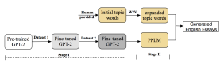
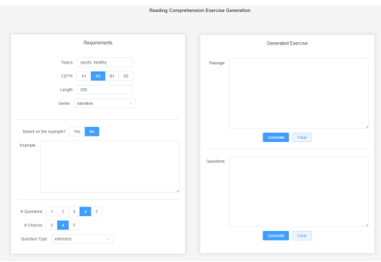
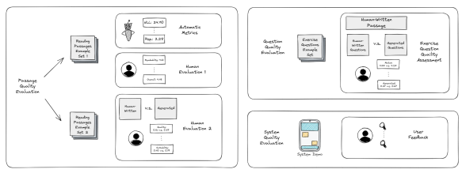

# Evaluating Reading Comprehension Exercises Generated By Llms:

A Showcase of ChatGPT in Education Applications Changrong Xiao1, Sean Xin Xu1, Kunpeng Zhang2, Yufang Wang3**, Lei Xia**4 1School of Economics and Management, Tsinghua University 2Department of Decision, Operations & Information Technologies, University of Maryland 3Beijing Xicheng Educational Research Institute 4Shawn Tech xcr21@mails.tsinghua.edu.cn, xuxin@sem.tsinghua.edu.cn, kpzhang@umd.edu, wangwang7587@163.com, xialei@shawntech.com.cn Abstract used by their predecessors in the previous academic The recent advancement of pre-trained Large Language Models (LLMs), such as OpenAI's ChatGPT, has led to transformative changes across fields. For example, developing intelligent systems in the educational sector that leverage the linguistic capabilities of LLMs demonstrates a visible potential. Though researchers have recently explored how Chat- GPT could possibly assist in student learning, few studies have applied these techniques to real-world classroom settings involving teachers and students. In this study, we implement a reading comprehension exercise generation system that provides high-quality and personalized reading materials for middle school English learners in China. Extensive evaluations of the generated reading passages and corresponding exercise questions, conducted both automatically and manually, demonstrate that the system-generated materials are suitable for students and even surpass the quality of existing human-written ones. By incorporating first-hand feedback and suggestions from experienced educators, this study serves as a meaningful pioneering application of ChatGPT, shedding light on the future design and implementation of LLM-based systems in the educational context.

# 1 Introduction

Reading comprehension is a vital skill that English learners need to develop and master. Chinese middle school students, for instance, are required to do numerous English practices, including reading at least 150,000 words of supplemental materials to enhance their reading abilities, as mandated by the English Curriculum Standards.

Through interviews with experienced English teachers in Beijing, we discovered a challenge faced by both educators and students: the repeated use of outdated reading materials, with only minor modifications made, if any. For instance, Grade 8 students are likely to practice the same exercises year (currently Grade 9 students). English teachers believe that offering up-to-date, engaging reading exercises tailored to each student's capabilities and interests can spark their enthusiasm for learning and ultimately boost their English proficiency.

However, obtaining a large collection of diverse, customized, high-quality English reading exercises proves to be a non-trivial task. There is an abundance of articles in newspapers, magazines, textbooks, and children's books from English-speaking countries that could serve as potential sources of reading materials for middle school students. Nonetheless, adjustments and rewrites are typically necessary due to variations in topic, length, and difficulty level. Moreover, even for veteran teachers, crafting appropriate exercise questions based on textual materials is still not easy.

Pre-trained Large Language Models (LLMs)
have been proposed by researchers as a means to address this labor-intensive and unscalable issue
(Zhai, 2022; Dwivedi et al., 2023). Reading comprehension exercises typically consist of two components: a lengthy, coherent passage and several multiple-choice questions that align with its content. To generate such exercises, it is essential for LLMs to possess an advanced understanding and inference ability of human language. While the generation of long texts (such as stories, news articles, and poems) (Li et al., 2021) and question-andanswer (Q&A) pairs (Kurdi et al., 2020) have been extensively studied, existing task-specific models fall short of meeting our needs. For instance, the generated content still remains distinguishable from human-written text, and the level of personalization for different learners is inadequate (Kurdi et al., 2020), making these models unsuitable for direct application in educational settings.

Recently, OpenAI released ChatGPT1, a versatile and interactive chatbot that outperforms state-

1https://openai.com/blog/chatgpt
of-the-art models in various NLP tasks, even in zero-shot or few-shot scenarios. This powerful LLM presents numerous opportunities for education, including the creation of reading materials and customized practice questions. In this study, we attempt to develop a system for middle school teachers and students that leverages ChatGPT to generate reading comprehension exercises. Guided by carefully crafted prompts, ChatGPT can produce personalized reading passages and multiple-choice questions of high quality. To assess the generated exercises and the overall system, human evaluators
(comprising students, teachers, and native speakers) conducted an extensive analysis, determining that the system holds promise for implementation in middle schools and has the potential to make a significant educational impact. In summary, this study makes threefold contributions:

- We fully leverage the capabilities of the stateof-the-art LLMs to tackle complex and compound tasks, integrating them within a carefully designed education system2. The reading passages and exercise questions generated by our system significantly surpass the quality of those produced by previous models, with some even exceeding the standard of humanwritten textbook exercises.

- To the best of our knowledge, our reading exercise generation system is among the first applications of ChatGPT in the education context. The system has been utilized by middle school English teachers, making real impacts in schools.

- We gather feedback from both experts and general users regarding the efficacy of our system.

We believe this is valuable, as there are few instances of ChatGPT applications being employed in real-world educational settings. Our findings offer insights for future researchers and practitioners to develop more effective AI-driven educational systems.

# 2 Related Work

LLM and Controllable Text Generation With the emergence of Transformers (Vaswani et al., 2017), LLMs have been performing remarkably well and showing considerable progress across a variety of NLP tasks (Qiu et al., 2020). For example, OpenAI's GPT series models are powerful LLMs that perform well in long open-ended text generation. While they are able to generate texts of high fluency, researchers have found that as the generated text gets longer, it starts to wander, switch to unrelated topics, and become incoherent
(Rashkin et al., 2020). By fine-tuning with specific domain data or applying some plug-and-play approaches like PPLM (Dathathri et al., 2020), LLMs will obtain some controllability and generate more coherent text, though the quality is still limited.

ChatGPT is developed on the foundation of GPT-
3.5 or GPT-4 architectures, with the inclusion of additional human-directed instructions for enhanced performance. It possesses robust in-context learning capabilities, enabling it to interpret requirements specified in input prompts without the need for additional information (zero-shot learning), or by utilizing a minimal number of provided examples (few-shot learning). Even without massive domain knowledge, ChatGPT is able to follow human instructions and generate text of higher quality. For instance, to generate a 200-word reading passage on the topic of school life, one simply needs to specify the subject and length requirements in the prompt to ChatGPT.

ChatGPT in Education With the thriving of AI technology, its applications in education have been increasing, transforming ways of teaching and learning (Zhang and Aslan, 2021). Recognizing the surprising capacity of LLMs, such as ChatGPT, researchers have been discussing their enormous potential impacts in various educational scenarios (Zhai, 2022). Some studies (Dwivedi et al., 2023; Pettinato Oltz, 2023) suggested that ChatGPT can provide students with basic educational materials. LLMs are trained on vast corpora created by humans to "learn" the language, and now they can "teach" human learners what they have already learned. Moreover, inherent to its chatbot characteristics, ChatGPT can function as a personal tutor, providing real-time feedback (Zentner, 2022),
personalized evaluations and suggestions (Baidoo-
Anu and Owusu Ansah, 2023; Zhang, 2023), and other learning supports (Dwivedi et al., 2023), such as improving the engagement and autonomy of students (Firat, 2023) and addressing the low teacherstudent ratio problem (Chen et al., 2023).

On the other hand, the misuse of ChatGPT has existed since its release (Zhang et al., 2023). A poll

2The codes for our system is available at https://github.com/Xiaochr/ Reading-Exercise-Generation-System.
3 done by Study.com (an online course provider)
reveals that 89% of the participating students utilized ChatGPT for homework and 48% of them confessed to using ChatGPT for at-home tests. It is important and still under exploration to design suitable learning tasks and systems that can guide students to use ChatGPT properly as a helpful learning assistant. Evaluation of Long Text Generation To evaluate the quality of the generated long text, researchers have developed several metrics, including Self-BLEU (Zhu et al., 2018) and n-gram repetition score (Welleck et al., 2020). They are often unreliable and inconsistent with human judgment (Belz et al., 2020). Therefore, human evaluation remains the gold standard for most long text generation tasks, even if it is expensive and time-consuming (Celikyilmaz et al., 2020).

Belz and Reiter (2006) grouped the common human evaluation approaches into intrinsic and extrinsic ones. Most current text generation tasks are measured with intrinsic human evaluations, where participants are asked to rate the quality of the generated text, either overall or along with some designed dimensions (e.g., fluency, coherence, and correctness) (Celikyilmaz et al., 2020). Likert and sliding scale are commonly used scoring methods, despite the many limitations (e.g., inconsistency, not straightforward) (Celikyilmaz et al., 2020). To address this, comparative approaches, such as ranking, have been proposed and found to achieve high inter-annotator agreement (Callison-Burch et al., 2007). On the other hand, the extrinsic evaluation measures how successful a system is in downstream tasks, from both a user's success in a task and the system's success in fulfilling its purpose (Celikyilmaz et al., 2020; Hastie and Belz, 2014).

# 3 Methods

### 3.1 Reading Passage Generation Baseline

We use a fine-tuned GPT-2 (Radford et al., 2019)
with PPLM (Dathathri et al., 2020) control as the baseline method to generate reading passages. The two-stage development of the baseline model is shown in Figure 1.

In the first step, we fine-tune our base LLM,
GPT-2 medium, using two reading datasets obtained from middle school teachers: supplemental

Figure 1: The fine-tuned GPT-2 + PPLM baseline

reading materials (Dataset 1) and textbook exercise passages that are currently used in middle schools
(Dataset 2). We adopt a two-step fine-tuning strategy with varying learning rates to accommodate the distinct characteristics of each dataset. In the second step, we employ PPLM, a plug-and-play controllable text generation approach, to guide the fine-tuned language model in generating more coherent passages based on specified topic keywords. For more details, please refer to the Appendix A.

#### 3.2 Chatgpt For Reading Exercise Generation

Utilizing the impressive capabilities of ChatGPT,
we manually design input prompts to generate highquality reading comprehension passages without the need for fine-tuning or additional control methods. In this study, we produce textual content in two settings: zero-shot and one-shot, which allow us to control the output to varied degrees.

In the zero-shot setting, we instructed ChatGPT
to be a helpful learning assistant capable of generating high-quality reading passages in the system prompt. We provided customized requirements within the conversation prompt, including length, genre, difficulty level, and topics. In addition to creating reading passages from scratch, teachers often source content from the web or other materials and seek to adapt them into suitable reading passages for students. Thus we added an extra requirement, a referenced passage, in the one-shot setting.

We also generate questions and corresponding answers for given passages using appropriate prompts. We set the number of questions, the number of options per question, and the question type for customization in the input prompt. ChatGPT can generate exercise questions based on either a passage it previously created or a passage provided by users. Moreover, an extra toxicity check is applied before the generated exercises are made available to teachers and students.

We will describe the process of reading exercise generation using ChatGPT and the design of appropriate prompts in Appendix B.

3https://futurism.com/the-byte/
students-admit-chatgpt-homework

Figure 2: The screenshot of the system interface.

### 3.3 System Design

Catering to non-technical users such as middle school teachers and students, we integrate the features discussed in previous sections into a unified system with a graphical user interface. The prompts and API calls are managed at the system backend, while a user-friendly and straightforward interface (Figure 2) is designed for ease of use4.

On the left side of the interface, users can easily set their requirements, with each previously mentioned feature incorporated. The output reading passages and exercise questions are displayed on the right. These text areas are editable, allowing teachers to further modify the generated content to create a final version of exercises suitable for student practice.

### 4 Evaluation

In this section, we conduct extensive evaluations of our reading exercise generation system, which are visually depicted in Figure 3.

For reading passage quality evaluation, we randomly select 30 human-written reading passages from Dataset 2 (the reading exercises from textbooks), which are paired with an additional 60 passages: 30 produced by ChatGPT and 30 by the baseline model. This mixture of passages is shuffled and compiled into what we refer to as the Reading Passages Example Set 1. We utilize both automatic evaluation metrics and human assessments (Section 4.1) in order to comprehensively evaluate these passages.

To further verify the high quality of ChatGPT
passages, a series of one-to-one comparisons is conducted between passages produced by language models and their human-written counterparts. We select 10 human-written reading comprehension passages, distinct from the passages in the Reading Passages Example Set 1, and summarize the topic of each one. We then use these topics as guiding constraints to direct conditional text generation with both the GPT-2 + PPLM baseline and Chat-
GPT (zero-shot), resulting in passages mirroring the topics of the original human-written examples.

Additionally, a one-shot variant of ChatGPT, using the human-written passage as a reference, is utilized to generate a third group of passages. To sum up, the Reading Passages Example Set 2 encompasses 10 original human-written passages, augmented with 30 generated passages that align with the same topics.

Moving to the evaluation of exercise question quality, we select 10 exercises containing reading passages and their associated questions from the textbook to serve as benchmarks. A new set of multiple-choice questions is generated based on the human-written passages using our system. Thus, these 10 reading passages and their corresponding

4To try the system demo online, please refer to our GitHub repository. We will keep the link to the demo up-to-date.

Figure 3: The illustration for each evaluation section.

20 sets of questions form the Exercise Questions

 Example Set, which is thoroughly evaluated in Section 4.2.

For the overall evaluation of our system (Section 4.3), we invite middle school educators, the intended users of our system, to utilize it first-hand.

We request their insightful feedback and suggestions, furthering our goal of consistent improvement and customization to user needs.

### 4.1 Reading Passage Quality Assessment

Automatic Metrics First, we apply automatic metrics commonly used in the literature on the Reading Passages Example Set 1. Table 1 presents the quantitative performance comparison of ChatGPT-generated reading passages with those produced by the baseline model and those written by human educators in textbooks. In general, the results indicate that the passages generated by the fine-tuned GPT-2 baseline are the easiest to read, and their average negative log-likelihood (NLL)
is the lowest. However, this does not necessarily imply that the fine-tuned GPT-2 is the best model (Wang et al., 2022), as it may be overfitted in terms of NLL and generate text with high repetition. Moreover, high readability does not guarantee that the passages are logical and coherent, which are important dimensions for evaluating the quality of generated long text. The ChatGPT-generated passages receive the lowest readability scores, and also exhibit greater diversity.

In addition to automatic metrics, scores evaluated by experienced and trained human annotators serve as more reliable benchmarks (Clark et al., 2021). Next, we will introduce two designs for human evaluation in this study.

|         |       | Readability   |        | Diversity   |      |
|---------|-------|---------------|--------|-------------|------|
|         | NLL   | SMOG          | Flesch | TTR         | Rep. |
| Human   | 21.89 | 8.46          | 81.46  | 53.84       | 3.06 |
| GPT\-2  | 18.60 | 6.59          | 92.50  | 44.76       | 4.05 |
| ChatGPT | 24.90 | 9.81          | 73.29  | 56.51       | 2.28 |

Table 1: Results of automatic evaluation metrics on the

Reading Passages Example Set 1. NLL (Alihosseini et al., 2019): the average negative log-likelihood loss; SMOG (McLaughlin, 1969): SMOG grade index estimates the years of education needed to understand the writing; **Flesch** (Flesch, 1979): Flesch reading-ease test, higher scores indicate material that is easier to read; TTR (%) (Richards, 1987; Celikyilmaz et al., 2020):
the number of unique words (types) divided by the total number of words (tokens); **Rep.** (%) (Welleck et al., 2020; Pascual et al., 2021): the proportion of repeated 4-grams.

Human Evaluation 1: Multi-dimension Quality Scoring We invite two groups of participants to assess the quality of the Reading Passages Example Set 1: 9 Chinese college students and 364 native English speakers. Chinese college students have years of English exercise training experience from middle school, and are familiar with reading comprehension exercises. Meanwhile, native English speakers possess a higher level of English proficiency than Chinese students, and their evaluation of the language may be more professional, but they have no idea what the reading passages in Chinese middle schools look like.

Before scoring each passage, the 9 student evaluators are given detailed guidelines about the evaluation rules, including the meanings of each quality dimension and two examples of middle school reading comprehension passages. To prevent fatigue, each evaluator is assigned only 30 passages. We

|                  |                      | Readability   | Correctness   | Coherence   | Engagement   | Overall Quality   |
|------------------|----------------------|---------------|---------------|-------------|--------------|-------------------|
| Chinese Students | Human\-Written       | 4.52          | 4.32          | 4.39        | 4.07         | 4.18              |
|                  | Fine\-tuned GPT\-2   | 3.57          | 3.73          | 2.69        | 2.78         | 2.84              |
|                  | ChatGPT (zero\-shot) | 4.61          | 4.60          | 4.65        | 4.37         | 4.46              |
| Native Speakers  | Human\-Written       | 3.79          | 3.67          | 3.77        | 3.77         | 3.89              |
|                  | Fine\-tuned GPT\-2   | 3.52          | 3.51          | 3.53        | 3.62         | 3.75              |
|                  | ChatGPT (zero\-shot) | 3.78          | 3.69          | 3.77        | 3.93         | 4.06              |

Table 2: Quality scores of the three groups of passages in five dimensions evaluated by experienced Chinese students and English native speakers.

collect 270 individual evaluations in total, with 3 evaluations for each passage. For native English speakers, we recruit them from Amazon Mechanical Turk and collect 5 evaluations for each passage.

Each evaluation consists of 5 scores measuring different dimensions of text quality. These dimensions are widely used in human evaluations of textgeneration studies and have been carefully selected based on their importance to the reading comprehension scenario. The explanations of quality dimensions are as follows:

- **Readability**: The extent to which texts are easy to read (Forrest et al., 2018; Di Fabbrizio et al., 2014) and fluent (Mahapatra et al., 2016; Belz and Kow, 2010).

- **Correctness**: The extent to which texts accurately reflect facts and commonsense, how logical they are (Celikyilmaz et al., 2020), and whether they are proper in grammar (Wubben et al., 2016).

- **Coherence**: The extent to which texts are consistent with certain topics or storylines (Santhanam and Shaikh, 2019).

- **Engagement**: The extent to which texts are interesting and engaging.

- **Overall Quality**: The overall text quality of the reading passages.

The evaluation results are shown in Table 2. Surprisingly, as rated by experienced students, the quality scores of ChatGPT passages are higher than the scores of human-written passages across all selected dimensions. The passages generated by the fine-tuned GPT-2 baseline are generally of lower quality, and not comparable to the other two groups of passages. For the evaluations of native speakers, the scores of the passages are generally lower than those marked by Chinese students, since the reading materials used by middle school students may be too simple for native speakers. Nonetheless, the conclusion does not change: ChatGPT passages have the highest overall quality.

We also conduct inter-annotator reliability tests to make sure the evaluation results are reliable.

Among the student evaluators, we observe an average Pearson's Correlation of 0.64, and the average Cronbach's Alpha of the rating scores is 0.82, indicating a high internal consistency and a reliable measurement. Similar tests were conducted in the following human evaluations, all of which showed reliable results, so we will not elaborate on further.

Human Evaluation 2: Pairwise Comparison The three groups of generated passages (GPT-2 +
PPLM, ChatGPT zero-shot, and ChatGPT one-shot generated) in the Reading Passages Example Set 2 are displayed side-by-side with human-written passages for evaluators to compare. In other words, each evaluator is presented with two passages at a time, one generated by the model and the other written by humans, with the order randomized.

We did not recruit native speakers for this evaluation but relied entirely on college students. Since we believe that native speakers who are not familiar with reading comprehension exercises in China are not suitable for the comparison evaluation. Another 9 students were recruited for Human Evaluation 2 to avoid the learning effect. Similar to Human Evaluation 1, we collect 3 evaluations for each set of passages. The evaluation questions are as follows.

- **Relative quality score**. Since the previous evaluation has already assessed multiple dimensions, here we only focus on the overall quality for simple verification. For the two passages displayed simultaneously, we ask the evaluators to mark the passage of better quality with a score of 1, and the other one with a score of 0. By taking the average at the level of passages and evaluators, we obtain three average quality scores for the three groups of generated passages and three for the human-written

|                           | Human   | Generated   |
|---------------------------|---------|-------------|
| Fine\-tuned GPT\-2 + PPLM | 0.70    | 0.30        |
| ChatGPT (zero\-shot)      | 0.13    | 0.87        |
| ChatGPT (one\-shot)       | 0.20    | 0.80        |

ones, respectively. The following evaluation questions are analyzed in a similar way.

Table 3 shows that the ChatGPT scores are much higher than the baseline score. Moreover, evaluators believe that the quality of ChatGPT passages is even better than human-written ones (0.87 vs. 0.13 in the zero-shot setting and 0.80 vs. 0.20 in the one-shot setting), which is consistent with our findings in Human Evaluation 1. For the ChatGPT passages, the one-shot score is slightly lower than the zero-shot score (0.80 vs. 0.87), which may be due to more restrictions leading to a slight decrease in quality. Nonetheless, ChatGPT performs quite well in the reading passage generation task with our designed prompts.

Table 3: The comparison of **relative quality score** between human-written passages and generated ones. A higher score indicates better quality.

- **Model-Generated Score**. We also investigate whether evaluators can distinguish between passages written by humans and those generated by models. To do so, we design a simple Turing test by asking evaluators to assign a score of 1 if they believe the passage is generated by language models, and 0 otherwise. Therefore, the lower the score, the more likely the passage is perceived to be written by humans. From Table 4, we find that the passages generated by ChatGPT scored lower than the human-written passages displayed side-byside, meaning that evaluators believe the ChatGPT passages are more likely to be human-written than the true ones, which is an interesting finding.

Another finding is that both generated and human-written passages in the one-shot setting scored the lowest. One plausible reason is that ChatGPT imitated the styles and structures of the referenced passage very well. When two similar passages of high quality appeared at the same time, evaluators tended to think that they were unlikely to be generated by models.

Note that if native speakers were asked to evaluate this dimension, the results might be different.

Because they have a higher language proficiency and are more likely to notice characteristics that non-native speakers did not pay attention to.

- **Topic Coherence Score**. We examine whether

Table 4: The comparison of **model-generated score**
between human-written passages and generated ones. A higher score indicates that the passage is more likely to be perceived from language models, instead of written by humans.

|                           | Human   | Generated   |
|---------------------------|---------|-------------|
| Fine\-tuned GPT\-2 + PPLM | 0.87    | 0.40        |
| ChatGPT (zero\-shot)      | 0.77    | 0.97        |
| ChatGPT (one\-shot)       | 0.77    | 0.97        |

|                           | Human   | Generated   |
|---------------------------|---------|-------------|
| Fine\-tuned GPT\-2 + PPLM | 0.40    | 0.57        |
| ChatGPT (zeor\-shot)      | 0.53    | 0.30        |
| ChatGPT (one\-shot)       | 0.33    | 0.23        |

|                           | Human   | Generated   |
|---------------------------|---------|-------------|
| Fine\-tuned GPT\-2 + PPLM | 0.53    | 0.37        |
| ChatGPT (zero\-shot)      | 0.40    | 0.77        |
| ChatGPT (one\-shot)       | 0.53    | 0.77        |

the passages are consistent with the given topics, that is, the control and personalization ability of the models. A score of 1 is given for consistency while 0 means inconsistency. Table 5 shows that even after fine-tuning with domain knowledge and with the extra control of PPLM, the GPT-2 baseline still did not generate passages that follow the given requirements well. In contrast, ChatGPT scored particularly high even in zero-shot (with a score of 0.97), indicating that it understands and follows the instructs specified in the prompts quite well.

Table 5: The comparison of **topic coherence score**
between human-written passages and generated ones. A higher topic coherence score indicates that the passage is more consistent with the given topics.

- **Suitability Score**. This evaluation dimension requires the evaluator to have extensive experience with reading comprehension exercises and is not suitable for native English speakers who are unfamiliar with Chinese English education. If deemed suitable, the passage should receive a score of 1, 0 otherwise. Our findings in Table 6 show that evaluators generally believe that the passages generated by ChatGPT are largely suitable as reading comprehension materials and are even better than passages currently used as exercises.

Table 6: The comparison of **suitability score** between human-written passages and generated ones. A higher suitability score indicates that the passage is more suitable for middle school students in China.

In summary, the human evaluation results suggest that the ChatGPT passages generated by our system are of high quality across various dimensions, and even better than the human-written reading passages in many cases. The experienced evaluators believe that it is suitable to apply these materials in real educational contexts.

### 4.2 Exercise Question Quality Assessment

Next, we will evaluate the quality of the generated reading exercise questions. Currently, there is no reliable metric for evaluating the quality of generated multiple-choice questions, so we entirely rely on human evaluation.

Similar to how we evaluate passages in Human Evaluation 2, each evaluator is presented with two sets of questions, one generated by the system and one written by humans, along with the base passage in the Exercise Questions Example Set. The evaluators are asked to assess the quality of the questions according to various aspects, using scores ranging from 1 to 5. The following aspects are considered:

- **The extent to which the questions match**
the passage content. We want to check whether the questions generated by our system align with the content of the passages and whether we can find correct answers within the passages. This is a basic requirement for the generated questions to be suitable for student practice.

- **The extent to which the questions are useful**
for the training of students. Moreover, we ensure that the questions are not meaningless and that they can serve as effective exercises that contribute to students' English training.

- The extent to which the questions are suitable for middle school English learners. This dimension is similar to the previous one. Based

on their extensive experience with English reading exercises, evaluators rate whether the generated questions are too difficult or too simple for students

in Chinese middle schools.

- **The extent to which the questions appear to**
be written by language models. If the generated questions exhibit certain patterns, they will be eas-

ily distinguished from the exercise questions in the textbook, indicating that the generated questions are too rigid and not flexible enough.

From Table 7, we observe that human-written questions outperform generated questions across all four dimensions. Although the generated questions are highly relevant to the passage content (with a

|                  | Human   | Generated   |
|------------------|---------|-------------|
| Match            | 4.58    | 4.38        |
| Useful           | 3.93    | 3.25        |
| Suitable         | 3.92    | 3.48        |
| Generated or not | 0.27    | 0.67        |

Table 7: The comparison of **exercise quality** in four dimensions between human-written and generated ones.

Match score of 4.38 out of 5), some of them exhibit obvious patterns, are too straightforward, and lack variation. Teachers may need to select suitable exercise questions from the various generated ones before assigning them to students.

### 4.3 System Quality Assessment

Our system, which integrates the features described above, is primarily designed for middle school teachers. To gather feedback on the system, we invited three experienced teachers in Beijing, who have many years of teaching experience, to personally use the system for a week and provide their feedback through interviews. Their feedback and suggestions are summarized in Table 12 in Appendix C.

Although there is still room for improvement, such as further optimizing the generation of multiple-choice questions, the quality of reading exercises generated by our system has greatly exceeded teachers' expectations. Teachers view this system as a valuable tool that can significantly reduce cost and time while providing students with more diverse and personalized learning materials.

# 5 Conclusion

In this study, we attempted to develop an educational system for teachers and English learners in Chinese middle schools that leverages the capabilities of LLMs to generate reading comprehension exercises. Extensive evaluations were conducted among various groups of representative human evaluators, and the high quality of the generated reading exercises was widely acknowledged. Experienced English teachers also provided extremely positive feedback on the system, indicating its potential for widespread use in real-world education.

Our system is among the first applications of Chat-
GPT in educational contexts, and the valuable feedback and findings are likely to inspire future researchers and educators in integrating AI technology into education.

# Limitations

As noted in the evaluation section, our system does not perform perfectly in multiple-choice question generation, particularly when it comes to generating distracting options, even with the powerful ChatGPT. In the next step, we can adopt an opensource framework of LLMs and fine-tune a domainspecific model using the extensive educational materials provided by middle school teachers. This way, the question generation ability may be improved, and we will not need to rely on the OpenAI API.

On the other hand, although extensive evaluations have been conducted, they only involve a small fraction of teachers and students in a preinterview setting. Once our system is widely deployed, a larger amount of user feedback will be collected and analyzed to monitor its effectiveness.

# References

Danial Alihosseini, Ehsan Montahaei, and Mahdieh Soleymani Baghshah. 2019. Jointly measuring diversity and quality in text generation models. In Proceedings of the Workshop on Methods for Optimizing and Evaluating Neural Language Generation, pages 90–98, Minneapolis, Minnesota. Association for Computational Linguistics.

David Baidoo-Anu and Leticia Owusu Ansah. 2023. Education in the era of generative artificial intelligence (ai): Understanding the potential benefits of chatgpt in promoting teaching and learning. Available at SSRN 4337484.

Anja Belz and Eric Kow. 2010. Comparing rating scales and preference judgements in language evaluation.

In Proceedings of the 6th International Natural Language Generation Conference. Association for Computational Linguistics.

Anja Belz and Ehud Reiter. 2006. Comparing automatic and human evaluation of NLG systems. In 11th Conference of the European Chapter of the Association for Computational Linguistics, pages 313– 320, Trento, Italy. Association for Computational Linguistics.

Anya Belz, Simon Mille, and David M. Howcroft. 2020.

Disentangling the properties of human evaluation methods: A classification system to support comparability, meta-evaluation and reproducibility testing.

In Proceedings of the 13th International Conference on Natural Language Generation, pages 183–194, Dublin, Ireland. Association for Computational Linguistics.

Chris Callison-Burch, Cameron Fordyce, Philipp Koehn, Christof Monz, and Josh Schroeder. 2007. (meta-)
evaluation of machine translation. In *Proceedings of* the Second Workshop on Statistical Machine Translation, pages 136–158, Prague, Czech Republic. Association for Computational Linguistics.

Asli Celikyilmaz, Elizabeth Clark, and Jianfeng Gao.

2020. Evaluation of text generation: A survey. arXiv preprint arXiv:2006.14799.

Yu Chen, Scott Jensen, Leslie J Albert, Sambhav Gupta, and Terri Lee. 2023. Artificial intelligence (ai) student assistants in the classroom: Designing chatbots to support student success. Information Systems Frontiers, 25(1):161–182.

Elizabeth Clark, Tal August, Sofia Serrano, Nikita Haduong, Suchin Gururangan, and Noah A. Smith.

2021. All that's 'human' is not gold: Evaluating human evaluation of generated text. In *Proceedings* of the 59th Annual Meeting of the Association for Computational Linguistics and the 11th International Joint Conference on Natural Language Processing (Volume 1: Long Papers), pages 7282–7296, Online. Association for Computational Linguistics.

Sumanth Dathathri, Andrea Madotto, Janice Lan, Jane Hung, Eric Frank, Piero Molino, Jason Yosinski, and Rosanne Liu. 2020. Plug and play language models: A simple approach to controlled text generation. In International Conference on Learning Representations.

Giuseppe Di Fabbrizio, Amanda Stent, and Robert Gaizauskas. 2014. A hybrid approach to multidocument summarization of opinions in reviews. In Proceedings of the 8th International Natural Language Generation Conference (INLG), pages 54–63, Philadelphia, Pennsylvania, U.S.A. Association for Computational Linguistics.

Yogesh K Dwivedi, Nir Kshetri, Laurie Hughes, Emma Louise Slade, Anand Jeyaraj, Arpan Kumar Kar, Abdullah M Baabdullah, Alex Koohang, Vishnupriya Raghavan, Manju Ahuja, et al. 2023. "so what if chatgpt wrote it?" multidisciplinary perspectives on opportunities, challenges and implications of generative conversational ai for research, practice and policy. International Journal of Information Management, 71:102642.

Mehmet Firat. 2023. How chat gpt can transform autodidactic experiences and open education. Department of Distance Education, Open Education Faculty, Anadolu Unive.

Rudolf Flesch. 1979. How to write plain english. University of Canterbury.

James Forrest, Somayajulu Sripada, Wei Pang, and George Coghill. 2018. Towards making NLG a voice for interpretable machine learning. In *Proceedings* of the 11th International Conference on Natural Language Generation, pages 177–182, Tilburg University, The Netherlands. Association for Computational Linguistics.

Helen Hastie and Anja Belz. 2014. A comparative evaluation methodology for NLG in interactive systems. In Proceedings of the Ninth International Conference on Language Resources and Evaluation (LREC'14), pages 4004–4011, Reykjavik, Iceland. European Language Resources Association (ELRA).

Muhammad Khalifa, Hady Elsahar, and Marc Dymetman. 2021. A distributional approach to controlled text generation. In International Conference on Learning Representations.

Ghader Kurdi, Jared Leo, Bijan Parsia, Uli Sattler, and Salam Al-Emari. 2020. A systematic review of automatic question generation for educational purposes. International Journal of Artificial Intelligence in Education, 30:121–204.

Junyi Li, Tianyi Tang, Wayne Xin Zhao, and Ji-Rong Wen. 2021. Pretrained language model for text generation: A survey. In Proceedings of the Thirtieth International Joint Conference on Artificial Intelligence, IJCAI-21, pages 4492–4499. International Joint Conferences on Artificial Intelligence Organization. Survey Track.

Joy Mahapatra, Sudip Kumar Naskar, and Sivaji Bandyopadhyay. 2016. Statistical natural language generation from tabular non-textual data. In Proceedings of the 9th International Natural Language Generation conference, pages 143–152.

GH McLaughlin. 1969. Smog grading - a new readability formula. *Journal of Reading*, 12(8):639–646.

Tomas Mikolov, Kai Chen, Greg Corrado, and Jeffrey Dean. 2013. Efficient estimation of word representations in vector space. *arXiv preprint* arXiv:1301.3781.

Damian Pascual, Beni Egressy, Clara Meister, Ryan Cotterell, and Roger Wattenhofer. 2021. A plug-andplay method for controlled text generation. In Findings of the Association for Computational Linguistics: EMNLP 2021, pages 3973–3997, Punta Cana, Dominican Republic. Association for Computational Linguistics.

Tammy Pettinato Oltz. 2023. Chatgpt, professor of law.

Professor of Law (February 4, 2023).

Xipeng Qiu, Tianxiang Sun, Yige Xu, Yunfan Shao, Ning Dai, and Xuanjing Huang. 2020. Pre-trained models for natural language processing: A survey. Science China Technological Sciences, 63(10):1872–
1897.

Alec Radford, Jeffrey Wu, Rewon Child, David Luan, Dario Amodei, Ilya Sutskever, et al. 2019. Language models are unsupervised multitask learners. OpenAI blog, 1(8):9.

Hannah Rashkin, Asli Celikyilmaz, Yejin Choi, and Jianfeng Gao. 2020. PlotMachines: Outlineconditioned generation with dynamic plot state tracking. In Proceedings of the 2020 Conference on Empirical Methods in Natural Language Processing
(EMNLP), pages 4274–4295, Online. Association for Computational Linguistics.

Brian Richards. 1987. Type/token ratios: What do they really tell us? *Journal of child language*, 14(2):201– 209.

Sashank Santhanam and Samira Shaikh. 2019. Towards best experiment design for evaluating dialogue system output. In International Conference on Natural Language Generation.

Ashish Vaswani, Noam Shazeer, Niki Parmar, Jakob Uszkoreit, Llion Jones, Aidan N Gomez, Łukasz Kaiser, and Illia Polosukhin. 2017. Attention is all you need. Advances in neural information processing systems, 30.

Yequan Wang, Jiawen Deng, Aixin Sun, and Xuying Meng. 2022. Perplexity from plm is unreliable for evaluating text quality. arXiv preprint arXiv:2210.05892.

Sean Welleck, Ilia Kulikov, Stephen Roller, Emily Dinan, Kyunghyun Cho, and Jason Weston. 2020. Neural text generation with unlikelihood training. In International Conference on Learning Representations.

Sander Wubben, Emiel Krahmer, Antal van den Bosch, and Suzan Verberne. 2016. Abstractive compression of captions with attentive recurrent neural networks. In Proceedings of the 9th International Natural Language Generation conference, pages 41–50, Edinburgh, UK. Association for Computational Linguistics.

Aeron Zentner. 2022. Applied innovation: Artificial intelligence in higher education. *Available at SSRN* 4314180.

Xiaoming Zhai. 2022. Chatgpt user experience: Implications for education. *Available at SSRN 4312418*.

Bo Zhang. 2023. Preparing educators and students for chatgpt and ai technology in higher education.

Chaoning Zhang, Chenshuang Zhang, Chenghao Li, Yu Qiao, Sheng Zheng, Sumit Kumar Dam, Mengchun Zhang, Jung Uk Kim, Seong Tae Kim, Jinwoo Choi, et al. 2023. One small step for generative ai, one giant leap for agi: A complete survey on chatgpt in aigc era. *arXiv preprint arXiv:2304.06488*.

Ke Zhang and Ayse Begum Aslan. 2021. Ai technologies for education: Recent research & future directions. Computers and Education: Artificial Intelligence, 2:100025.

Yaoming Zhu, Sidi Lu, Lei Zheng, Jiaxian Guo, Weinan Zhang, Jun Wang, and Yong Yu. 2018. Texygen: A
benchmarking platform for text generation models.

In The 41st International ACM SIGIR Conference on Research & Development in Information Retrieval, pages 1097–1100.

# A Gpt-2 + Pplm Baseline

### A.1 Data

|             | Dataset 1   | Dataset 2   |
|-------------|-------------|-------------|
| # passages  | 5,066       | 3,584       |
| min. length | 32          | 30          |
| avg. length | 967.34      | 251.07      |
| max. length | 15,242      | 780         |

We collaborate with the Municipal Education Commission and 8 local middle schools in Beijing. We are provided 8,650 reading passages in total, including 5,066 supplemental reading materials (Dataset 1) and 3,584 currently used textbook exercise passages (Dataset 2), covering different difficulty levels from Grade 7 to Grade 9.

The descriptive statistics of our manually collected two datasets are shown in Table 8.

Table 8: Descriptive statistics of the two datasets.

Due to the confidentiality of educational resources, we are not able to publicly offer access to Dataset 1. Nonetheless, the trained model (with the fine-tuning process) using our datasets is provided in our GitHub repository.

### A.2 Gpt-2 Fine-Tuning

When fine-tuning, we adopt a two-step fine-tuning strategy to account for the different characteristics of the two datasets. In the first step, the model learns the general language features with a larger learning rate from Dataset 1. In the second step, fine-tuning on Dataset 2 with a lower learning rate and longer training epochs, the model is able to learn fine-grained characteristics of textbook reading passages, including formats, topics, and writing styles.

All the training processes of the GPT-2 baseline are implemented on a 16 GB NVIDIA Tesla P100 PCIe GPU provided by Google Colab.

We use the OpenAI GPT-2 medium model with 24-layer, 1,024-hidden layers, 16-heads, and 345M parameters, implemented by the Huggingface transformer library.

The textual materials in the dataset are tokenized by GPT-2 tokenizer. Since the max input length of the GPT-2 medium model is 1,024, we truncate all the passages that are longer than 1,024 tokens, and pad all passages that are shorter than 1,024 tokens to the same length of 1,024.

We randomly split the dataset into 80% as the training set and the remaining 20% as the test set.

The batch size is 2 and the random seed is 42.

The AdamW optimizer with ϵ = 10−8is applied, and we adopt a linear learning schedule with 100 warm-up steps. The detailed training setting of our proposed two-step fine-tuning and other baseline strategies are shown in Table 9. The entire finetuning process using our two-step strategy takes approximately 6 hours.

Table 9: Hyper-parameter setting for fine-tuning.

|               | Learning rate   | # epochs   |
|---------------|-----------------|------------|
| Dataset 1     | 1 × 10−5        | 5          |
| Dataset 2     | 1 × 10−5        | 3          |
| Single\-step  | 1 × 10−5        | 5          |
| Two\-step (1) | 5 × 10−4        | 3          |
| Two\-step (2) | 1 × 10−5        | 5          |

By manually examining the generated passages from all baseline strategies, we summarize and conclude that our two-step fine-tuning strategy achieves the best performance.

- **Fine-tuning with only dataset 1**: The lengths of generated passages are often too short or too long, and the word repetition problem often occurs.

- **Fine-tuning with only dataset 2**: The lengths of generated passages are often too short or too long. The format and word repetition problems exist.

- **Single-step fine-tuning with combined**
datasets: The overall quality of the generated passages is higher than fine-tuning with only one dataset, but their length is still unstable.

- **Proposed two-step fine-tuning**: It performs the best, and the problems mentioned above are significantly alleviated.

### A.3 Pplm

To generate more coherent texts on a given topic, we apply a plug-and-play controllable text generation approach with topic keywords provided. It is expected that providing more keywords will lead to more coherent generated passages. We first provide a few (e.g., 3 to 5) initial topic words. This list can then be expanded to include more similar words
(e.g., 30 words) by finding similar words based on word embeddings from a Word2Vec (Mikolov et al.,
2013) model trained on our two reading datasets. Previous studies (Khalifa et al., 2021) showed that PPLM tends to produce texts with frequent repetitions due to inappropriate hyper-parameters. Therefore, before applying PPLM to guide text generation, we use a simple grid search strategy to find the best hyper-parameters for each topic.

We adopt the Word2Vec model implemented by the gensim library5and train it from scratch with our reading passage datasets. The hyperparameters of Word2Vec are as follows: vector_size=512, *window*=5, *min_count*=5, workers=4.

As mentioned above, a simple grid search is applied to seek the best hyper-parameters for each set of keywords, respectively. According to Dathathri et al. (2020), we tune the hyper-parameters that are relevant to the topic control intensity. The ranges of these parameters are listed in Table 10. The criterion to select hyper-parameters is based on manual examinations of the quality of generated passages. The set of hyper-parameters that guide the fine-tuned GPT-2 to generate passages with the highest overall quality will be regarded as the best one.

| Parameter   | Range                            |
|-------------|----------------------------------|
| step_size   | [0.02, 0.025, 0.03, 0.035, 0.04] |
| gm_scale    | [0.7, 0.75, 0.8, 0.85, 0.9]      |
| kl_scale    | [0.01, 0.02, 0.03, 0.04, 0.05]   |
| grad_length | [100, 1000, 10000]               |

Table 10: Grid search hyper-parameter bounds of PPLM.

# B **Design Of Reading Exercise Generation** System

#### B.1 Reading Passage Generation

Zero-Shot setting In the zero-shot setting, we instructed ChatGPT to be a helpful learning assistant capable of generating high-quality reading passages in the system prompt. We provided personalized requirements within the conversation prompt, including length, genre, difficulty, and topics. Reading passages for middle school students typically consist of around 200 words. Their difficulty level ranges from A1 to B2 according to the widely recognized CEFR standard, as middle school students are generally beginners. As for topics, teachers or students can freely select any subject of interest using keywords, phrases, or sentences. ChatGPT's remarkable ability enables it to comprehend these requirements and adhere to them throughout the text-generation process.

One-Shot setting In addition to creating reading passages from scratch, teachers often source content from the web or other materials and seek to adapt them into suitable reading passages for students. In the one-shot setting, we added an extra requirement: a referenced passage. Teachers can supply a referenced passage for ChatGPT, allowing the model to learn language styles and structural features. This setting facilitates more practical use of our system, though the added constraint may limit the model's flexibility and creativity.

### B.2 Exercise Question Generation

We also generate questions and corresponding answer options for middle school reading comprehension exercises using appropriate prompts. Unlike the Q&A generation task in the NLP field, Chinese middle school students are mostly practicing multiple-choice selection questions. Few existing models focus on this task, and we have not identified a comparable method as a baseline for multiplechoice question generation. Given the high quality of ChatGPT-generated questions, we compare them directly to human-written exercise questions. For the prompt design, we input the number of questions, the number of options per question, and the question type for personalized customization. ChatGPT can generate exercise questions based on either a passage it previously created or a passage input by users. We did not set a difficulty level for the questions, as there is no reliable measurement standard. Nonetheless, question types can indirectly reflect difficulty. For example, logical inference questions are generally more challenging than word interpretation questions.

### B.3 Toxicity Check

To ensure the safety of middle school students and avoid ethical issues, we have implemented measures to prevent the generation of toxic text. In our prompts, we explicitly specify that the generated content must not contain violence, racism, or other harmful elements for young language learners. While OpenAI has devoted considerable attention to addressing toxicity concerns, and such texts are unlikely to appear in ChatGPT's responses, we have implemented an additional layer of security

5https://radimrehurek.com/gensim/
models/word2vec.html
by using Google's toxicity score tool6to screen the generated text. Exercises are made available to teachers and students only after passing the toxicity check.

### B.4 Chatgpt Prompts

An example of the manually crafted prompts for the above tasks is presented in Table 11.

# C Subjective Feedback From Users

The evaluation and feedback from system users, that is, experienced middle school teachers, are summarized in Table 12.

# D Examples Of Generated Exercises

Here we present several examples of humanwritten, GPT-2-generated, and ChatGPT-generated passages in Table 13. An example of a comparison between human-designed exercise questions and system-generated questions is shown in Table 14.

You can also test our demo system to generate more reading comprehension exercises.

6https://developers.

perspectiveapi.com/s/ about-the-api-attributes-and-languages

|          |              | Prompt                                                                           |
|----------|--------------|----------------------------------------------------------------------------------|
| Passage  | System       | You are a helpful assistant to generate reading comprehension materials for      |
|          |              | Chinese middle school English learners. Your responses should not include        |
|          |              | any toxic content.                                                               |
|          | Conversation | Please generate a passage (without a title) that is similar to the given example |
|          | (zero\-shot) | and satisfies the following requirements: Topics: {basketball competition};      |
|          |              | Length: no more than {200} words; Genre: {narrative}; CEFR level: {B1}           |
|          | Conversation | Please generate a passage (without a title) that is similar to the given example |
|          | (one\-shot)  | and satisfies the following requirements: Topics: {basketball competition};      |
|          |              | Length: no more than {200} words; Genre: {narrative}; CEFR level: {B1};          |
|          |              | Example: {a referenced passage}                                                  |
| Question | System       | You are a helpful assistant to generate reading comprehension exercise ques                                                                                  |
|          |              | tions for Chinese middle school English learners. Your responses should not      |
|          |              | include any toxic content.                                                       |
|          | Conversation | Please generate {5} multiple choice questions (each question with {4}            |
|          |              | choices), the corresponding answers and explanations for the following read                                                                                  |
|          |              | ing comprehension exercise. The type of questions should be {inference}          |
|          |              | questions. Exercise: {input reading passage}                                     |

|           |                 | Evaluations and Suggestions                                                  |
|-----------|-----------------|------------------------------------------------------------------------------|
| Passages  | Content         | !The generated passages are coherent in language.                            |
|           |                 | !The language characteristics are obvious and the quality of the generated   |
|           |                 | passages is good.                                                            |
|           | Topic           | !The function of "generating based on the referenced passage" can present    |
|           |                 | passages of different genres on the same topic effectively.                  |
|           |                 | !The system can perfectly follow the requirements of the topic, difficulty   |
|           |                 | level, and passage genre.                                                    |
| Exercises | Questions       | !The generated questions are of good quality and are based on the main idea  |
|           |                 | and details of the passages.                                                 |
|           |                 | !Before using the system, I thought the AI can only generate exercise        |
|           |                 | questions that are very simple and straightforward. Actually, the system can |
|           |                 | do more than that. The generated questions are usually good enough to help   |
|           |                 | students understand the passages and examine their language ability.         |
|           |                 | %The types of generated questions are not rich enough. It is easy to find    |
|           |                 | their patterns, such as many of them are "What is something?", "What did     |
|           |                 | someone do something?", "Why did someone do something?", etc.                |
|           | Options         | %The quality of the questions is good, but the options are not so perfect.   |
|           |                 | Some answer options are inaccurate or repetitive.                            |
|           |                 | %The correct answers are always accurate, but the wrong answers are of low   |
|           |                 | quality. Sometimes they are too easy for students and cannot play a role as  |
|           |                 | distractors.                                                                 |
|           | Usefulness      | !The system is like a personalized resource library. Rich information can be |
| System    |                 | provided for teachers in daily teaching, which can further enhance teachers' |
|           |                 | ability to optimize resources while organizing them, thus providing diverse  |
|           |                 | and personalized educational resources to improve students' English reading  |
|           |                 | ability.                                                                     |
|           | Ease of Use     | !The system interface is simple and the features are easy to understand.     |
|           |                 | !It is easy to use the system even for teachers who know nothing about AI.   |
|           | Overall Quality | !I will rate the system 80/100. I am very satisfied with it.                 |
|           |                 | !This system is totally out of my expectation. I am happy such a powerful    |
|           |                 | system will be applied in real\-world education soon.                        |

Table 11: An example of the prompts for ChatGPT to generate high-quality reading comprehension exercises.

Table 12: The evaluation of the system quality and the summarized feedback from experienced middle school teachers.

|                      | Example Passages                                                                                   |
|----------------------|----------------------------------------------------------------------------------------------------|
| Human\-Written       | Deep in the forest lives David, who loves books. As soon as he reads one book, he brings           |
|                      | home another. Soon the house is filled with books. His wife, Alice, is angry. You must do          |
|                      | something! " David thinks hard and has an idea. "I can bring my books into the faraway             |
|                      | hills and share what I have with the children. " Every week, David sets off across the             |
|                      | country\-side to faraway villages with his two donkeys. Early on a sunny morning, David            |
|                      | and his donkeys stop at a river to drink. Then, a bandit jumps out! "Please let us pass, "         |
|                      | David says. "The children are waiting. The bandit takes one book and shouts, "Next time            |
|                      | I want some money! " They move on until at last, David sees some houses below. The                 |
|                      | children run to meet him. David reads them a story first. When the story ends, it's time for       |
|                      | everyone to choose a book. The children hold their books close as they say good\-bye and           |
|                      | run home cheerfully. David and his donkeys head back, over and around the hills, and into          |
|                      | the sunset. At home, Alice feeds her hungry husband and the donkeys. But then, instead of          |
|                      | sleeping, David picks up his book, and reads deep into the night. And far away in the hills,       |
|                      | candles and lanterns burn as the children read borrowed books deep into their night, too.          |
| Fine\-tuned GPT\-2   | One sunny afternoon, an old man sat down with his 25\-year\-old son on a bus. They were            |
|                      | talking about some interesting things. The old man began to show his son the things he             |
|                      | saw. The son asked, "Dad, why does your father not allow me to take off his bus? " The             |
|                      | old man said, "Well, when our bus got full, I asked my son to sit on the floor and I sat           |
|                      | down with him. He was very surprised. I asked him the other old man, "What do you                  |
|                      | mean, son? " The old man said, "I am just going to the park to play a game. The game is            |
|                      | called 'Musical Chairs'. As we were playing, my son asked me, 'Dad, why does your son              |
|                      | allow me to sit on the bus? ""He doesn't want to get off the bus! " the son said with tears        |
|                      | in his eyes. "Well, it's simple, but it's a difficult game for me. Every time I get off the bus,   |
|                      | I have to sit down. If I don't get off, I will have to wait for the other driver to take me off. " |
|                      | The old man continued, "Now my son is very calm. We are going to the park to play. Can             |
|                      | you play this game with me? " With tears in his eyes, the young man said, "Yes, I know!            |
|                      | Look at my son. He was almost killed in a car accident two years ago. When my son got              |
|                      | out of hospital, he had to wait for the other driver's help to get him back on the bus. "          |
| ChatGPT (zero\-shot) | Sarah was feeling a bit anxious as she entered the gym for her first dance class. She had          |
|                      | always loved dancing, but had never taken a formal class before. As she looked around at           |
|                      | the other students stretching and chatting, Sarah wondered if she would fit in. The class          |
|                      | began with some warm\-up exercises, and Sarah started to relax as she found that she could         |
|                      | keep up with the others. They moved on to some basic steps, and Sarah felt her confidence          |
|                      | growing with each new move. Before she knew it, the class was over, and Sarah couldn't             |
|                      | believe how quickly the time had flown by. As she left the gym, she couldn't wait to               |
|                      | come back for the next class. Reflecting on her experience, Sarah realized that trying             |
|                      | new things could be scary, but it was important to take that first step. She also realized         |
|                      | that she was capable of more than she had given herself credit for, and that the feeling of        |
|                      | accomplishment was worth the initial discomfort. From that day forward, Sarah made a               |
|                      | commitment to herself to try new things more often, and to approach each new experience            |
|                      | with an open mind and a willingness to learn.                                                      |

Table 13: Examples of human-written, GPT-2-generated, and ChatGPT-generated passages.

|                    | Example                                                                                                                                                        |
|--------------------|----------------------------------------------------------------------------------------------------------------------------------------------------------------|
| Passage            | Blue jackets, white shirts, and black pants... The school uniform looks so out of                                                                              |
|                    | fashion. Like many of you, I don't like it. However, if I were given a chance, I                                                                               |
|                    | wouldn't throw my school uniform away. Uniforms show that we are a part of                                                                                     |
|                    | an organization (our school). Wearing them shows we are all in this organization                                                                               |
|                    | together. Some people argue that uniforms can improve learning. I completely agree                                                                             |
|                    | with them. Uniforms make the classroom a serious environment. We will find it                                                                                  |
|                    | easier to focus on our schoolwork. Most importantly, a uniform means we don't                                                                                  |
|                    | have to worry about peer pressure. When everyone is dressed the same, we stop  worrying about our appearance. There is no competition for being dressed in the |
|                    | latest fashion. This can save our parents a lot of money. In America, many schools                                                                             |
|                    | do not have uniforms. Meanwhile,160,000 children miss school every day, because                                                                                |
|                    | of a fear of school bullying. This might not be directly connected with what the                                                                               |
|                    | students are wearing. However, having a uniform can be safe for many students. It's                                                                            |
|                    | hard to make fun of what someone is wearing when everyone is dressed the same.                                                                                 |
|                    | No one will feel left out because of what he is wearing. The school uniform gives                                                                              |
|                    | us so much. They may not be fashionable, but that's just why I think they should be                                                                            |
|                    | here to stay.                                                                                                                                                  |
| Human\-Designed Ex                    | (1) The write doesn't like the school uniform because                                                                                                          |
| ercise             | A. it's white.                                                                                                                                                 |
|                    | B. it's blue.                                                                                                                                                  |
|                    | C. it's out of fashion.                                                                                                                                        |
|                    | D. it's old.                                                                                                                                                   |
|                    | (2) What does wearing uniforms show for students?                                                                                                              |
|                    | A. They're too poor to buy their own clothes.                                                                                                                  |
|                    | B. They are a part of their school.                                                                                                                            |
|                    | C. They're good children of their parents.                                                                                                                     |
|                    | D. They like to look the same.                                                                                                                                 |
|                    | (3) Which of the following is NOT true according to the third paragraph?                                                                                       |
|                    | A. The writer thinks wearing uniforms can make him/her nicer.                                                                                                  |
|                    | B. The writer thinks wearing uniforms can make his/her classroom more serious.                                                                                 |
|                    | C. The writer thinks wearing uniforms can improve his/her study.                                                                                               |
|                    | D. The writer thinks wearing uniforms means we don't have to worry about peer                                                                                  |
|                    | pressure.                                                                                                                                                      |
|                    | (4) The passage mainly tells us                                                                                                                                |
|                    | A. wearing uniforms is important                                                                                                                               |
|                    | B. students must wear uniforms                                                                                                                                 |
|                    | C. some schools don't have uniforms in America                                                                                                                 |
|                    | D. the uniforms are out of fashion                                                                                                                             |
| ChatGPT\-Generated | (1) Why does the author wear their school uniform even though they do not like it?                                                                             |
| Exercise           | A. They do not have any other clothes to wear                                                                                                                  |
|                    | B. They believe it shows that they are part of their school community                                                                                          |
|                    | C. They think it is fashionable                                                                                                                                |
|                    | D. They want to fit in with their peers                                                                                                                        |
|                    | (2) What is one argument the author makes in favor of school uniforms?                                                                                         |
|                    | A. They can help students keep up with the latest fashion trends                                                                                               |
|                    | B. They can improve student learning                                                                                                                           |
|                    | C. They can be a source of peer pressure                                                                                                                       |
|                    | D. They can be expensive for parents to purchase                                                                                                               |
|                    | (3) Why does the author suggest that school uniforms can be a good way to prevent                                                                              |
|                    | bullying?                                                                                                                                                      |
|                    | A. Uniforms are fashionable and will make students popular                                                                                                     |
|                    | B. Uniforms make it difficult to make fun of someone's clothing                                                                                                |
|                    | C. Uniforms are expensive and will make students feel more important                                                                                           |
|                    | D. Uniforms create a sense of competition among students                                                                                                       |
|                    | (4) How do schools in America compare to schools in other countries with regards                                                                               |
|                    | to school uniforms?                                                                                                                                            |
|                    | A. American schools do not have uniforms, unlike many other countries                                                                                          |
|                    | B. American schools have uniforms, but they are not required                                                                                                   |
|                    | C. American schools have uniforms, and they are required                                                                                                       |
|                    | D. American schools have uniforms, but only for certain grades or classes                                                                                      |

Table 14: An example of a comparison between human-designed exercise questions and system-generated questions. 

625