# Generative Pretraining In Multimodality

Quan Sun1∗ Qiying Yu2,1∗ Yufeng Cui1∗ Fan Zhang1∗ **Xiaosong Zhang**1∗
Yueze Wang1 Hongcheng Gao1 Jingjing Liu2 Tiejun Huang1,3 **Xinlong Wang**1†
1 Beijing Academy of Artificial Intelligence 2 Tsinghua University 3 Peking University Code & Demo: https://github.com/baaivision/Emu

## Abstract

We present Emu, a Transformer-based multimodal foundation model, which can seamlessly generate images and texts in multimodal context. This omnivore model can take in any single-modality or multimodal data input indiscriminately (e.g.,
interleaved image, text and video) through a one-model-for-all autoregressive training process. First, visual signals are encoded into embeddings, and together with text tokens form an interleaved input sequence. Emu is then end-to-end trained with a unified objective of classifying the next text token or regressing the next visual embedding in the multimodal sequence. This versatile multimodality empowers the exploration of diverse pretraining data sources at scale, such as videos with interleaved frames and text, webpages with interleaved images and text, as well as web-scale image-text pairs and video-text pairs. Emu can serve as a generalist multimodal interface for both image-to-text and text-to-image tasks, and supports incontext image and text generation. Across a broad range of zero-shot/few-shot tasks including image captioning, visual question answering, video question answering and text-to-image generation, Emu demonstrates superb performance compared to state-of-the-art large multimodal models. Extended capabilities such as multimodal assistants via instruction tuning are also demonstrated with impressive performance.

## 1 Introduction

With text corpus at massive scale, Large Language Models (LLMs) [8, 12, 57, 73] with straightforward training objectives such as next-word-prediction learn to understand, reason, and generate text with unprecedented accuracy and fluency, paving the way for diverse real-life applications [54] unthinkable a decade ago. Recent studies [3, 18, 9, 23, 27] have investigated Large Multimodal Models (LMMs) beyond LLMs. Flamingo [3], which connects a powerful language model with a pretrained vision encoder and inserts learnable layers to capture cross-modality dependencies, demonstrates strong abilities in multimodal zero-shot and in-context learning. Recent works [33, 14, 27, 39, 75, 69, 32] also adopt this framework and build LMM by docking a vision encoder with an LLM. Effective as they are, these LMMs are mostly trained on image-text pairs or documents, while overlooking video data as another scalable source of interleaved multimodal data. Besides, the commonly used training objective in such LMMs is predicting the next text token [3, 23, 27, 75, 39, 32], typically with a frozen vision encoder and no supervision for the vision part, which highly restricts the model's capacity. In this work, we introduce Emu, a large multimodal model that learns from both video and image data interleaved with text, under a unified objective of predicting the next visual or text token in an autoregressive fashion. Documents interleaved with images (*e.g.*, textbooks, webpages) provide an intuitive representation of complex concepts, and have proved to be effective in empowering models with multimodal

∗Equal contribution. † Correspondence to *wangxinlong@baai.ac.cn*.
The image shows a photo of Question: Can you tell me about this image? Answer:
this image is the cover of a book called "Mom's Family Calendar" by Sandra Boynton. The book is designed to help moms keep track of their family's schedule and activities. 

There is a godzilla. 

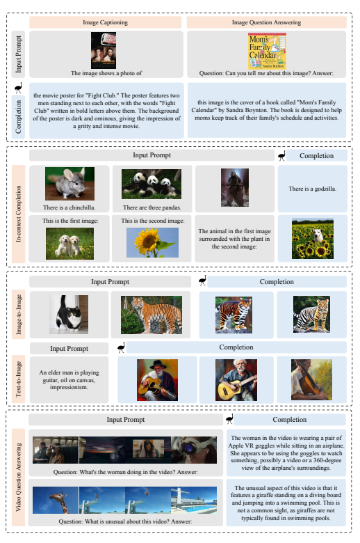

Input Prompt Completion The animal in the first image surrounded with the plant in the second image:
Input Prompt Completion Input Prompt Completion The unusual aspect of this video is that it features a giraffe standing on a diving board and jumping into a swimming pool. This is not a common sight, as giraffes are not typically found in swimming pools.

Image Captioning Image Question Answering The woman in the video is wearing a pair of Apple VR goggles while sitting in an airplane. 

She appears to be using the goggles to watch something, possibly a video or a 360-degree view of the airplane's surroundings. 

Input Prompt Completion 

Figure 1: Emu as a generalist interface for diverse vision-language applications, such as image captioning, image/video question answering, in-context image-to-text and text-to-image generation, and image blending. More examples in Appendix D.

in-context learning ability [3, 76]. Videos, which usually contain interleaved image frames and subtitles (Figure 3), are an abundant source of multimodal data that has been largely overlooked. They naturally contain dense visual signals and encode stronger cross-modal correlations with text than regular multimedia documents. Furthermore, public videos (especially user-generated clips)
possess richer content diversity than Common Crawl2, from which current training datasets mainly originate. To take advantage of rich web-scale data with omnivore capacity, we formulate diverse sources of interleaved multimodal data (e.g., videos with subtitles, webpages with images and text) into a unified format of interleaved image embeddings and text tokens (videos are converted into randomly-selected frames and subtitles interleaved into a sequence). Specifically, visual signals are first encoded into embeddings via a visual representation model EVA-CLIP [55], instead of being converted into discrete tokens. These visual embeddings together with text tokens constitute an interleaved multimodal input sequence. We pretrain Emu on these multimodal data sequences under a simple unified objective: predicting the next element in a multimodal sequence. Different from existing LMMs that compute the predictthe-next loss on text tokens only, in training Emu, all input elements including both discrete text tokens and continuous image embeddings are accounted for loss computation. We adopt the crossentropy classification loss for discrete text tokens, and the ℓ2 regression loss for continuous visual embeddings. As raw images typically lack the left-to-right causal dependency as in language, Emu does not perform image generative pretraining in the original pixel space. Instead, visual embeddings are transformed into a causal latent space via Causal Transformer, which accepts the image encodings generated by EVA-CLIP as input, and outputs N tokens that capture the causal dependency of the given image (as illustrated in Figure 2). Pretrained with the unified objective and diverse forms of data stated above, Emu can serve as a generalist interface for both image-to-text and text-to-image tasks by performing various types of completion in a multimodal sequence, i.e., accepting multimodal prompts (e.g., text, images, video, or their interleaved sequence) and outputting multimodal response (for image generation, visual embeddings are decoded by a fine-tuned diffusion model), as illustrated in Figure 1. Further, Emu demonstrates impressive abilities such as in-context text and image generation (the 2nd block of Figure 1), image blending (the 5th row of Figure 1 that combines a cat and a tiger into a cute tiger-cat), video understanding (the last block of Figure 1), and real-world knowledge grounding (Section 5.3).

We evaluate Emu on a broad range of zero-shot and few-shot tasks including image captioning, visual question answering, video question answering, and text-to-image generation. For qualitative demonstration, we also build an effective multimodal assistant via instruction tuning on multimodal conversation data. The instruction-tuned Emu assistant can effectively follow human instructions and interact with users via multimodal response.

## 2 Emu: Predict The Next In Multimodality 2.1 Architecture

Emu is a large-scale multimodal model that performs completion in multimodality, *i.e.*, perceiving interleaved multimodal input and generating outputs varying in modalities. As illustrated in Figure 2, Emu consists of four parts: Visual Encoder, Causal Transformer, Multimodal Modeling, and Visual Decoder. We leverage pretrained EVA-CLIP [55], LLaMA [57] and Stable Diffusion [51] to initialize the Visual Encoder, the Multimodal Modeling LLM and the Visual Decoder, respectively. Given any sequence with interleaved image, text and video, we first encode the image into dense visual features via EVA-CLIP, then transform the encodings into a fixed number of N visual causal embeddings via Casual Transformer. Similarly, we encode a video of T frames into T × N visual causal embeddings. Two special image tokens [IMG] and [/IMG] are prepended and appended for each image or frame, respectively, to represent the beginning and end of the encoded image/frame embeddings. The visual causal embeddings are combined with text tokens to form multimodal sequences that are fed into the Multimodal Modeling LLM for unified autoregressive modeling. We

2https://commoncrawl.org/

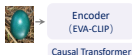

… …
<s> [IMG] [/IMG] An emu egg that will hatch into a baby emu [IMG] [/IMG]</s>

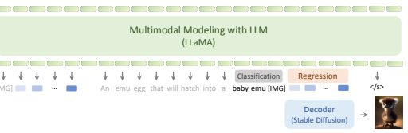

Figure 2: Emu unifies the modeling of different modalities in an auto-regressive manner. Visual signals are first encoded into embeddings, and together with text tokens form an interleaved sequence. The training objective is to either classify the next text token or regress the next visual embedding. In inference, regressed visual embeddings are decoded into a realistic image via a fine-tuned latent diffusion model.

append <s> and </s> tokens to the start and the end of each sequence. In inference, we fine-tune the Visual Decoder to decode the visual embeddings into a realistic image. Causal Image-text Transformer. Auto-regressively modeling images in raster order is counterintuitive and has not demonstrated satisfactory performance, which may be attributed to the fact that images naturally possess 2D structures and are not perceived as sequential signals like text. To better capture the characteristics of images and achieve unified modeling of different modalities, we propose a Causal Transformer module to transform 2D spatial visual signals to 1D causal sequences in a latent space Z. Specifically, given an image I with its encodings g(I) from EVA-CLIP, Causal Transformer accepts randomly initialized embeddings {e1, e2*, . . . , e*N } as input, and outputs N embeddings {z1, z2*, . . . , z*N } that capture the causal dependency of the given image:
z1, z2*, . . . , z*N = CausalTransformer (g(I), {e1, e2*, . . . , e*N }) (1)
The architecture of Causal Transformer is similar to the decoder of Transformer [58], with each block consisting of a causal self-attention layer, a cross-attention layer, and a feed-forward layer.

Different from Q-Former [33] that captures bi-directional relations of input tokens, we use a causal self-attention layer to capture the causal dependency among the input latent embeddings for further unified causal modeling of vision and language modalities. The cross-attention layer aggregates visual information from the image embeddings extracted from EVA-CLIP, where the visual embeddings are treated as keys and values, and the outputs from the previous causal attention layer serve as queries. Visual Decoder. We use a latent diffusion model to decode visual embeddings into images, and adopt the weights of Stable Diffusion [51] as initialization. Specifically, we feed N visual embeddings generated by Emu into the diffusion model as conditions for image decoding. We replace the linear projections of the cross-attention modules in Stable Diffusion with new linear layers that accommodate the dimension of Emu and Stable Diffusion.

## 2.2 Training Objective

Given an unlabeled web-scale corpora D consisting of interleaved multimodal sequences x =
(x1, x2*, . . . , x*n), where x can be vision-language sequences of various forms, such as image-text pairs, image-text interleaved documents, or videos with subtitles. xi can be a signal unit (text or image token) from any arbitrary modality. We first convert all continuous 2D signals (images and video frames) into 1D causal latent embedding sequences using Causal Transformer, then insert them back into the corresponding places in the sequence x. The resulting sequence is represented as u = (u1, u2*, . . . , u*m), where ui can be either a discrete text token, or a visual embedding that captures causal dependency with neighboring visual embeddings.

We approximate the likelihood of the web-scale corpora p(x) with p(u), and maximize the likelihood in a unified auto-regressive manner as follows:

$$\operatorname*{max}_{\theta}\sum_{u\in{\mathcal{D}}}\sum_{i=1}^{|u|}\log P(u_{i}|u_{1},\ldots,u_{i-1};\theta)\approx p(x)$$
$$(2)$$
log P(ui|u1*, . . . , u*i−1; θ) ≈ p(x) (2)
Two types of losses are adopted to optimize this objective. For discrete text tokens, cross-entropy loss is used to supervise classification in the predefined vocabulary with a language modeling head.

For continuous visual embeddings, ℓ2 regression loss is adopted with a separate regression head.

## 2.3 Generalist Interface

The unified auto-regressive modeling of different modalities endows Emu with a powerful ability to serve as a multimodal generalist that can perform many types of completion in a multimodal sequence, i.e., accepting multimodal sequence as input, and outputting signals across vision and language modalities. For example, when using two image-text pairs of the same task as the prompt, Emu automatically infers and completes the corresponding task given a new input, as shown in the second block of Figure 1. Specifically, given a multimodal context, if the expected output format is text, Emu will use the language modeling head to generate discrete text tokens. If the desired output is image, we will append a [IMG] token at the end of the input sequence, then Emu will autoregressively generate N visual embeddings that will then be sent to the visual decoder for decoding into a real-world image.

## 3 Emu Training

We pretrain Emu with web-scale data across modalities in various forms, including image-text pairs (LAION-2B [53], LAION-COCO [2]), interleaved images-text data (MMC4 [76]), video-text pairs (WebVid-10M [5]), and our collected interleaved video-text data (YT-Storyboard-1B). All these data are formulated as multimodal sequences, from which Emu learns under the objective of predict-the-next-element in a unified auto-regressive manner. After pretraining, we finetune an Image Decoder to transform visual embeddings into realistic images.

## 3.1 Data

Image-text Pairs. We use the image-text pairs from LAION-2B [53] and LAION-COCO [2] for pretraining. LAION-2B[53] provides images paired with noisy alt-texts from the web, and LAION- COCO [2] is its 600M subset that is captioned by BLIP [34]. Video-text Pairs. WebVid-10M [5] is an extensive dataset consisting of a large collection of short videos with textual descriptions. These videos are sourced from materials websites with diverse contents and a strong correlation between text and video. We use heuristic rules to remove irrelevant metadata (e.g.resolution of the original video, camera parameters). Interleaved Image and Text. Large-scale image-text interleaved data plays a crucial role in unlocking the in-context learning ability of multimodal models. We leverage the Multimodal-C4 (MMC4) dataset [76], an expanded version of the text-only C4 [48]. Multimodal-C4 [76] comprises a collection of approximately 75 million image-text-interleaved documents, with 400 million images and 38 billion tokens in total. From each document, we sample a random subsequence of L = 1024 take up to the first N = 5 images included in the sampled sequence. Additionally, we randomly sample N = 5 images along with their corresponding sentences to construct a subsequence of L = 512. Interleaved Video and Text. Videos with subtitles also present a promising and scalable source of interleaved multimodal data. We introduce the YT-Storyboard-1B dataset which collects 18 million videos and their corresponding subtitles from YouTube3 using the video-ids provided by the YT-Temporal-1B dataset [72]. Instead of raw videos, we collect storyboard images (about 1.8 billion images in total), a set of thumbnails provided by the YouTube website for quick video viewing. The

3https://www.youtube.com

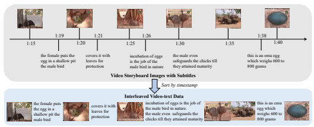

Figure 3: Interleaved video-text data. The combination of storyboard thumbnails and subtitles captions creates a natural interleaved sequence of video and text that is ordered by the timestamps.

combination of storyboard thumbnails and subtitles creates a natural interleaved sequence of video and text ordered by timestamps. An example is provided in Figure 3. More details about the pretraining datasets are deferred to Appendix A.1.1.

## 3.2 Pretraining

We initialize Emu's Visual Encoder with the 1B version of EVA-02-CLIP [55], and Multimodal Modeling LLM with the 13B version of LLaMA [57]. LLaMA is a decoder-only Transformer [58] and EVA-02-CLIP is a 40-layer ViT [17]. The Causal Transformer comprises 12 blocks, each of which consists of a causal self-attention layer, a cross-attention layer, and a feed-forward layer. Random initialization is used for Causal Transformer. The total number of parameters of Emu is 14B and is trained end-to-end. We use a batch size of 128 for image-text pair data, 64 for interleaved image-text data, 16 for video-text pair and interleaved video-text data. We adopt the AdamW optimizer [41] with β1 = 0.9, β2 = 0.98, and a weight decay of 0.05. We use a cosine learning rate decay with a peak learning rate of 1e-4 for the Causal Transformer, 3e-5 for LLaMA [57] and 5e-5 for EVA-02-CLIP [55], and a linear warmup of 2k steps. For each video, we randomly sample 8 frames for pretraining, and all images/frames are resized into 224×224 resolution. For image-text pair and interleaved data, we randomly put each image before or after its corresponding sentence. We train the model on 128 NVIDIA 80G-A100 GPUs for 10k steps with around 82M samples (150B tokens in total), and the pretraining takes approximately 2 days.

## 3.3 Visual Decoding

After pretraining, we tune the visual decoder with both LAION-COCO [2] and LAION-Aesthetics [1] (a high-aesthetics quality subset of LAION-5B [53]) image-text pair datasets under text-to-image task. Specifically, We initialize the diffusion model with Stable Diffusion v1.5. We freeze the Visual Encoder, Multimodal Modeling LLM in Emu, and the VAE in diffusion model during training, with only the parameters of U-Net updated. For each training sample, we append the [IMG] token to the end of the input text and feed it into the Multimodal Modeling LLM, which will then generate N
visual embeddings in an auto-regressive manner. These visual causal embeddings are fed into Image Decoder as the condition for image generation training.

We follow the model setups of Stable Diffusion v1.5. We employ AdamW optimizer [41] with β1 = 0.9, β2 = 0.999 and the weight decay of 1e-2. We train the diffusion model with 32 A100-40G GPUs for 15k iterations. The batch size is set to 50 per GPU, and the learning rate warms up to 1e-4 for the first 5k steps, then decreases to 5e-5 and 1e-5 at 10k and 14k steps respectively. To further improve sample quality, we randomly drop image embeddings condition by 10% of the time during training to enable classifier-free guidance [25]. Please refer to Appendix A.2 for more training details.

| Models         |       |       | Image\-Text Tasks   |        |         |        | Video\-Text Tasks   |        |
|----------------|-------|-------|---------------------|--------|---------|--------|---------------------|--------|
|                | COCO  | VQAv2 | OKVQA               | VizWiz | VisDial | MSVDQA | MSRVTTQA            | NExTQA |
| MetaLM         | 82.2  | 41.1  | 11.4                | \-     | \-      | \-     | \-                  | \-     |
| Kosmos\-1      | 84.7  | 51.0  | \-                  | 29.2   | \-      | \-     | \-                  | \-     |
| Flamingo\-9B * | 79.4  | 51.8  | 44.7                | 28.8   | 48.0    | 30.2   | 13.7                | 23.0   |
| Emu            | 112.4 | 52.0  | 38.2                | 34.2   | 47.4    | 18.8   | 8.3                 | 19.6   |
| Emu *          | \-    | 52.9  | 42.8                | 34.4   | 47.8    | 34.3   | 17.8                | 23.4   |
| Emu\-I         | 117.7 | 40.0  | 34.7                | 35.4   | 48.0    | 32.4   | 14.0                | 6.8    |
| Emu\-I *       | \-    | 57.5  | 46.2                | 38.1   | 50.1    | 36.4   | 21.1                | 19.7   |

Table 1: Zero-shot comparison, * indicates that the zero-shot prompt is built by using two examples from the task, where their corresponding images have been removed. **Emu-I** is the instruction-tuned Emu model. The best results are **bold** and the second best are underlined.

## 4 Instruction Tuning

Language instruction tuning has helped pretrained language models to align with user intentions [45, 63, 56, 74] and generalize to unseen tasks [65, 13]. We apply multimodal instruction tuning on Emu to align it with human instructions through supervised finetuning on publicly available datasets, including language instructions from ShareGPT [74] and Alpaca [56], image-text instructions from LLaVA [39], and video instructions from VideoChat [36] and Video-ChatGPT [42]. Dataset details can be found in Appendix B.1. In instruction tuning, we freeze all parameters of pretrained Emu, and fine-tune a low-rank adaption (LoRA) module [26]. The main focus of instruction tuning is to align the model with natural language instructions, which are less relevant to vision features. Thus, we attach LoRA modules only to the self-attention layers of the Multimodal Modeling LLM, and add no adaptation to the Vision Encoder.

We use a batch size of 128 and train for 10k steps. The learning rate linearly warms up to 1e-5 in the first 500 steps, then decays to zero with a cosine schedule. The overall instruction tuning phase takes around 16 hours with 16 A100-80G GPUs. All instruction-tuning data are packed with this template:
<System Message> [USER]: <Instruction> [ASSISTANT]: <Answer>, (3)
where [USER] and [ASSISTANT] are special tokens initialized from the embeddings of words 'user' and 'assistant', respectively. <System Message> varies depending on the specific task, and detailed system messages used for different types of tasks can be found in Appendix B.2. <Instruction> and <Answer> are actual slots for human instructions and assistant answers, and only <Answer> is accounted for loss computation.

## 5 Evaluation

We evaluate Emu on a broad range of vision-language tasks including image captioning (MS- COCO [37, 29]), image question answering (VQAv2 [21], OKVQA [43], VizWiz [22]), visual dialog
(VisDial [15]), video question answering (MSRVTTQA [67], MSVDQA [67], NextQA [66]) and text2image generation(MS-COCO[37]). Details of these benchmarks are described in Appendix C.1.

We evaluate our pretrained and instruction-tuned models in zero-shot and few-shot settings.

## 5.1 Zero-Shot Evaluation

In the zero-shot setting, the model is tested on tasks and datasets it has never encountered during training. Task-specific prompts are used to indicate different tasks to perform, without any additional tuning for model parameters. Multimodal Understanding. Table 1 presents the zero-shot multimodal understanding performance of Emu and **Emu-I** (the instruction-tuned model). We adopted the multimodal Chain-of-Thought prompting technique on the pretrained model following [27]. This approach involves two steps: first asking the model to generate a descriptive caption for visual content, then providing the model with both the generated caption and a task-specific prompt to output the final result. Additionally, to ensure a fair comparison with Flamingo [3], we also evaluate using the same prompting strategy of Flamingo. These results are obtained by using two text-only examples from the task as prompts. Results evaluated under this strategy are indicated by an asterisk (*). Note that these prompts do not include any images, simulating a few-shot text prompt approach. For more detailed information regarding the evaluation, please refer to Appendix C.2. On COCO captioning task, Emu achieves impressive zero-shot CIDEr score [59] of 112.4, which outperforms other LMMs by a large margin. In a wide range of image and video question answering tasks, Emu consistently surpasses LMMs like Kosmos-1 and Flamingo-9B. Notably, Emu achieves an accuracy of 34.4% on the complex VizWiz VQA dataset, versus Kosmos-1's 29.2% and Flamingo9B's 28.8%. **Emu-I** is the instruction-tuned Emu model that achieves notable improvements.

Remarkably, even with only 14B parameters, **Emu-I** can outperform much larger-scale Flamingo80B model in several tasks such as VQAv2 (57.5% vs. 56.3%), VizWiz (38.1% vs. 31.6%), and MSVDQA (36.4% vs. 35.6%).

are randomly sampled for evaluation.

Models FID(↓)
unimodal generation models GLIDE [44] 12.24 Make-A-Scene [19] 11.84 DALL-E 2 [49] 10.39 SDv1.5 [51] 9.93 Imagen [52] 7.27 Parti [71] **7.23**
multimodal generation models GILL [31] 12.20 Emu (ours) **11.66**
Text2image Generation. We evaluate the zeroshot image generation ability on the validation set of MS-COCO [37]. Following [50], we randomly sample 30k prompts from the validation set and calculate the zero-shot FID [24]. The results are shown in Table 2. For the generation of both Emu and SDv1.5, we use PNDM [40] scheduler with 50 steps. We also adopt classifier-free guidance [25] for better generation quality. The scaling factor is set to 5.0 and 3.0 for Emu and SDv1.5 respectively, as these settings yield the best performance for both models.

Emu achieves better performance compared to a concurrent work GILL [31], which also generates images with LLMs. However, our model is inferior to SDv1.5 in terms of FID. This is probably because the condition space (image embeddings) of our visual decoder deviates a lot from the condition space (text embeddings) of the diffusion model used as initialization, and our model is trained for a relatively short 15k steps. We believe there might be room to improve via fine-tuning with more steps, or using another visual decoder instead of adopting pretrained diffusion models that condition on text embeddings.

Table 2: Zero-shot text-to-image generation on MS-COCO [37] validation set. 30k samples

## 5.2 Few-Shot Evaluation

In few-shot evaluation, the model is prompted with task-specific prompts and a small number of examples collected from the training data to evaluate its in-context learning ability. Evaluation details can be found in Appendix C.3. Table 3 presents the performance of the pretraining model Emu in image and video question answering tasks under the few-shot (k = 2, 4, 8) evaluation setting. We use the Retrieval In-Context Example Selection (RICES) [68] approach employed in Flamingo [3]. With interleaved data incorporated in the pretraining phase, Emu demonstrates superior performance to Flamingo-9B and Kosmos-1 under almost all scenarios. For example, Emu achieves a VQAv2 accuracy of 58.4% and VizWiz 41.3% under the 4-shot setting, surpassing Flamingo-9B by +2.1%
and +6.4%, respectively. For video-text tasks, Emu demonstrates strong performance as well, such as 4-shot 21.8% v.s. Flamingo's 18.2% on the MSRVTTQA benchmark. Additionally, we can observe a positive correlation between the number of shots k (k = 0, 2, 4, 8) and the performance of Emu. These results demonstrate Emu's remarkable in-context learning ability.

## 5.3 Qualitative Evaluation

Beyond quantitative benchmarks, we conduct adequate qualitative evaluation of Emu. Emu demonstrates impressive capabilities that cannot be evaluated on standard benchmarks, including real-world

| Models       |      | VQAv2   |      |      | VizWiz   |      |      | MSVDQA   |      |      | MSRVTTQA   |      |
|--------------|------|---------|------|------|----------|------|------|----------|------|------|------------|------|
|              | k=2  | k=4     | k=8  | k=2  | k=4      | k=8  | k=2  | k=4      | k=8  | k=2  | k=4        | k=8  |
| Kosmos\-1    | 51.4 | 51.8    | 51.4 | 31.4 | 35.3     | 39.0 | \-   | \-       | \-   | \-   | \-         | \-   |
| Flamingo\-9B | \-   | 56.3    | 58.0 | \-   | 34.9     | 39.4 | \-   | 36.2     | 40.8 | \-   | 18.2       | 23.9 |
| Emu          | 56.4 | 58.4    | 59.0 | 37.8 | 41.3     | 43.9 | 36.0 | 37.1     | 39.8 | 21.2 | 21.8       | 24.1 |

Table 3: Few-shot comparison. k is the number of in-context examples, and we used the same example selection approach (i.e. RICES [68] ) as Flamingo [3].

knowledge grounding (upper right of Figure 4), interleaved multi-image understanding (left side of Figure 4), detailed video understanding (lower right of Figure 4), multimodal assistant (Figure 5), multi-turn dialogue (Figure 6), image blending (Figure 7), and (in-context) text-to-image generation. For in-context text-to-image generation, Emu can generate context-related images (in the first two rows of Figure 8, the generated images share the oil painting style in context, compared with the corresponding images generated without context in the first two rows of Figure 9), and follow context-related instructions, as shown in the 4th row of Figure 1. The in-context ability of the multimodal modeling of Emu (LLM as initialization) is responsible for this brand-new ability of image generation. We also compare Emu with other state-of-the-art multimodal assistants in terms of the ability to perform typical image captioning tasks (Figure 10) and follow human instructions (Figure 11). In Figure 11, we test a slightly difficult instruction, and only Emu response properly to list 8 books written by Agatha Christie and then recommend one.

## 6 Related Work

Multimodal pretraining [47, 28, 55, 10, 30, 64, 60, 61, 11, 35, 70, 9, 20, 7] learns cross-modal interactions from large-scale multimodal data. BEiT series [6, 46, 62] convert visual signals into discrete tokens that can be pretrained same as language, and BEiT-3 [62] achieves exceptional finetuning performance with a unified BERT-style [16] masked signal modeling objective. Flamingo [3] bridges powerful yet private pretrained vision and large language models and first demonstrates remarkable multimodal zero-shot and few-shot behaviors. With the increasing impact [54] and accessability [57, 73] of LLMs, recent work has also considered building multimodal models based on LLMs [33, 18, 27, 14, 69], such as BLIP-series [33, 14] that connect frozen vision and language pretrained models with a Q-Former to bridge the modality gap. These LMMs commonly use predicting the next text token as the training objective and exert no supervision for vision data [23, 27, 75, 39, 69]. Instead, Emu unifies the modeling of vision and language with the objective of predicting the next visual or text token in an autoregressive manner, and further explores videos as a new source of interleaved image-text data. This unified modeling leads to a generalist interface for diverse multimodal tasks that output either image or text. Emerging recent studies [75, 39, 42, 36, 38, 32] attempt to build powerful visual multimodal assistants based on LMMs through constructed conversation data. We also instruction-tune Emu using publicly available datasets and build a multimodal assistant that aligns well with human instructions on both images and videos.

## 7 Conclusion

In this work, we present Emu, a Large Multimodal Model (LMM) trained with a unified autoregressive objective of predicting the next element, including both visual and textual tokens. Apart from commonly used image-text pairs and interleaved documents, we explore another scalable data source of image-text interleaved data, i.e., video. Emu trained under such unified objective and diverse data can serve as a generalist interface that is capable of performing diverse multimodal tasks, such as image captioning, image/video question answering, and text-to-image generation, together with new abilities like in-context text and image generation, and image blending. We also build a multimodal assistant instruction-tuned on Emu, which exhibits excellent human-aligned abilities such as multiturn dialogue. We hope that our work will inspire the community to continue exploring the potential of diverse multimodal data at the web-scale and also the generative pretraining beyond vision and language.

## Acknowledgement

We would like to thank Hanxiao Qu, Quanyue Ma, Teng Dai, Yemin Shi, Wenhao Huang, Yue Cao, as well as other colleagues at BAAI for their support to this project.

## References

[1] Laion-aesthetics. https://laion.ai/blog/laion-aesthetics/.

[2] Laion coco: 600m synthetic captions from laion2b-en. https://laion.ai/blog/laion-coco/.

[3] Jean-Baptiste Alayrac, Jeff Donahue, Pauline Luc, Antoine Miech, Iain Barr, Yana Hasson, Karel Lenc, Arthur Mensch, Katherine Millican, Malcolm Reynolds, Roman Ring, Eliza Rutherford, Serkan Cabi, Tengda Han, Zhitao Gong, Sina Samangooei, Marianne Monteiro, Jacob L. Menick, Sebastian Borgeaud, Andy Brock, Aida Nematzadeh, Sahand Sharifzadeh, Mikolaj Binkowski, Ricardo Barreira, Oriol Vinyals, Andrew Zisserman, and Karén Simonyan. Flamingo: a visual language model for few-shot learning. In NeurIPS, 2022.

[4] Anas Awadalla, Irena Gao, Joshua Gardner, Jack Hessel, Yusuf Hanafy, Wanrong Zhu, Kalyani Marathe, Yonatan Bitton, Samir Gadre, Jenia Jitsev, Simon Kornblith, Pang Wei Koh, Gabriel Ilharco, Mitchell Wortsman, and Ludwig Schmidt. Openflamingo, 2023.

[5] Max Bain, Arsha Nagrani, Gül Varol, and Andrew Zisserman. Frozen in time: A joint video and image encoder for end-to-end retrieval. In *Proceedings of the IEEE/CVF International Conference on Computer* Vision, pages 1728–1738, 2021.

[6] Hangbo Bao, Li Dong, Songhao Piao, and Furu Wei. Beit: BERT pre-training of image transformers. In The Tenth International Conference on Learning Representations, ICLR 2022, Virtual Event, April 25-29, 2022. OpenReview.net, 2022.

[7] Hangbo Bao, Wenhui Wang, Li Dong, Qiang Liu, Owais Khan Mohammed, Kriti Aggarwal, Subhojit Som, Songhao Piao, and Furu Wei. Vlmo: Unified vision-language pre-training with mixture-of-modality-experts.

Advances in Neural Information Processing Systems, 35:32897–32912, 2022.

[8] Tom Brown, Benjamin Mann, Nick Ryder, Melanie Subbiah, Jared D Kaplan, Prafulla Dhariwal, Arvind Neelakantan, Pranav Shyam, Girish Sastry, Amanda Askell, et al. Language models are few-shot learners.

Advances in neural information processing systems, 33:1877–1901, 2020.

[9] Xi Chen, Xiao Wang, Soravit Changpinyo, A. J. Piergiovanni, Piotr Padlewski, Daniel Salz, Sebastian Goodman, Adam Grycner, Basil Mustafa, Lucas Beyer, Alexander Kolesnikov, Joan Puigcerver, Nan Ding, Keran Rong, Hassan Akbari, Gaurav Mishra, Linting Xue, Ashish V. Thapliyal, James Bradbury, and Weicheng Kuo. Pali: A jointly-scaled multilingual language-image model. In The Eleventh International Conference on Learning Representations, ICLR 2023, Kigali, Rwanda, May 1-5, 2023. OpenReview.net, 2023.

[10] Yen-Chun Chen, Linjie Li, Licheng Yu, Ahmed El Kholy, Faisal Ahmed, Zhe Gan, Yu Cheng, and Jingjing Liu. UNITER: universal image-text representation learning. In Andrea Vedaldi, Horst Bischof, Thomas Brox, and Jan-Michael Frahm, editors, Computer Vision - ECCV 2020 - 16th European Conference, Glasgow, UK, August 23-28, 2020, Proceedings, Part XXX, volume 12375 of *Lecture Notes in Computer* Science, pages 104–120. Springer, 2020.

[11] Jaemin Cho, Jie Lei, Hao Tan, and Mohit Bansal. Unifying vision-and-language tasks via text generation.

In Marina Meila and Tong Zhang, editors, Proceedings of the 38th International Conference on Machine Learning, ICML 2021, 18-24 July 2021, Virtual Event, volume 139 of *Proceedings of Machine Learning* Research, pages 1931–1942. PMLR, 2021.

[12] Aakanksha Chowdhery, Sharan Narang, Jacob Devlin, Maarten Bosma, Gaurav Mishra, Adam Roberts, Paul Barham, Hyung Won Chung, Charles Sutton, Sebastian Gehrmann, et al. Palm: Scaling language modeling with pathways. *arXiv preprint arXiv:2204.02311*, 2022.

[13] Hyung Won Chung, Le Hou, Shayne Longpre, Barret Zoph, Yi Tay, William Fedus, Eric Li, Xuezhi Wang, Mostafa Dehghani, Siddhartha Brahma, et al. Scaling instruction-finetuned language models. *arXiv* preprint arXiv:2210.11416, 2022.

[14] Wenliang Dai, Junnan Li, Dongxu Li, Anthony Meng Huat Tiong, Junqi Zhao, Weisheng Wang, Boyang Li, Pascale Fung, and Steven C. H. Hoi. Instructblip: Towards general-purpose vision-language models with instruction tuning. *CoRR*, abs/2305.06500, 2023.

[15] Abhishek Das, Satwik Kottur, Khushi Gupta, Avi Singh, Deshraj Yadav, José MF Moura, Devi Parikh, and Dhruv Batra. Visual dialog. In Proceedings of the IEEE conference on computer vision and pattern recognition, pages 326–335, 2017.

[16] Jacob Devlin, Ming-Wei Chang, Kenton Lee, and Kristina Toutanova. BERT: pre-training of deep bidirectional transformers for language understanding. In Jill Burstein, Christy Doran, and Thamar Solorio, editors, *Proceedings of the 2019 Conference of the North American Chapter of the Association* for Computational Linguistics: Human Language Technologies, NAACL-HLT 2019, Minneapolis, MN, USA, June 2-7, 2019, Volume 1 (Long and Short Papers), pages 4171–4186. Association for Computational Linguistics, 2019.

[17] Alexey Dosovitskiy, Lucas Beyer, Alexander Kolesnikov, Dirk Weissenborn, Xiaohua Zhai, Thomas Unterthiner, Mostafa Dehghani, Matthias Minderer, Georg Heigold, Sylvain Gelly, Jakob Uszkoreit, and Neil Houlsby. An image is worth 16x16 words: Transformers for image recognition at scale. In 9th International Conference on Learning Representations, ICLR 2021, Virtual Event, Austria, May 3-7, 2021.

OpenReview.net, 2021.

[18] Danny Driess, Fei Xia, Mehdi SM Sajjadi, Corey Lynch, Aakanksha Chowdhery, Brian Ichter, Ayzaan Wahid, Jonathan Tompson, Quan Vuong, Tianhe Yu, et al. Palm-e: An embodied multimodal language model. *arXiv preprint arXiv:2303.03378*, 2023.

[19] Oran Gafni, Adam Polyak, Oron Ashual, Shelly Sheynin, Devi Parikh, and Yaniv Taigman. Make-a-scene:
Scene-based text-to-image generation with human priors. In *European Conference on Computer Vision*,
pages 89–106. Springer, 2022.

[20] Zhe Gan, Linjie Li, Chunyuan Li, Lijuan Wang, Zicheng Liu, and Jianfeng Gao. Vision-language pretraining: Basics, recent advances, and future trends. *Found. Trends Comput. Graph. Vis.*, 14(3-4):163–352, 2022.

[21] Yash Goyal, Tejas Khot, Douglas Summers-Stay, Dhruv Batra, and Devi Parikh. Making the v in vqa matter: Elevating the role of image understanding in visual question answering. In *Proceedings of the* IEEE conference on computer vision and pattern recognition, pages 6904–6913, 2017.

[22] Danna Gurari, Qing Li, Abigale J Stangl, Anhong Guo, Chi Lin, Kristen Grauman, Jiebo Luo, and Jeffrey P
Bigham. Vizwiz grand challenge: Answering visual questions from blind people. In *Proceedings of the* IEEE conference on computer vision and pattern recognition, pages 3608–3617, 2018.

[23] Yaru Hao, Haoyu Song, Li Dong, Shaohan Huang, Zewen Chi, Wenhui Wang, Shuming Ma, and Furu Wei.

Language models are general-purpose interfaces. *arXiv preprint arXiv:2206.06336*, 2022.

[24] Martin Heusel, Hubert Ramsauer, Thomas Unterthiner, Bernhard Nessler, and Sepp Hochreiter. Gans trained by a two time-scale update rule converge to a local nash equilibrium. *Advances in neural information* processing systems, 30, 2017.

[25] Jonathan Ho and Tim Salimans. Classifier-free diffusion guidance. *arXiv preprint arXiv:2207.12598*,
2022.

[26] Edward J. Hu, Yelong Shen, Phillip Wallis, Zeyuan Allen-Zhu, Yuanzhi Li, Shean Wang, Lu Wang, and Weizhu Chen. Lora: Low-rank adaptation of large language models. In The Tenth International Conference on Learning Representations, ICLR 2022, Virtual Event, April 25-29, 2022. OpenReview.net, 2022.

[27] Shaohan Huang, Li Dong, Wenhui Wang, Yaru Hao, Saksham Singhal, Shuming Ma, Tengchao Lv, Lei Cui, Owais Khan Mohammed, Qiang Liu, et al. Language is not all you need: Aligning perception with language models. *arXiv preprint arXiv:2302.14045*, 2023.

[28] Chao Jia, Yinfei Yang, Ye Xia, Yi-Ting Chen, Zarana Parekh, Hieu Pham, Quoc V. Le, Yun-Hsuan Sung, Zhen Li, and Tom Duerig. Scaling up visual and vision-language representation learning with noisy text supervision. In Marina Meila and Tong Zhang, editors, Proceedings of the 38th International Conference on Machine Learning, ICML 2021, 18-24 July 2021, Virtual Event, volume 139 of Proceedings of Machine Learning Research, pages 4904–4916. PMLR, 2021.

[29] Andrej Karpathy and Li Fei-Fei. Deep visual-semantic alignments for generating image descriptions. In Proceedings of the IEEE conference on computer vision and pattern recognition, pages 3128–3137, 2015.

[30] Wonjae Kim, Bokyung Son, and Ildoo Kim. Vilt: Vision-and-language transformer without convolution or region supervision. In Marina Meila and Tong Zhang, editors, Proceedings of the 38th International Conference on Machine Learning, ICML 2021, 18-24 July 2021, Virtual Event, volume 139 of Proceedings of Machine Learning Research, pages 5583–5594. PMLR, 2021.

[31] Jing Yu Koh, Daniel Fried, and Ruslan Salakhutdinov. Generating images with multimodal language models. *arXiv preprint arXiv:2305.17216*, 2023.

[32] Bo Li, Yuanhan Zhang, Liangyu Chen, Jinghao Wang, Jingkang Yang, and Ziwei Liu. Otter: A multi-modal model with in-context instruction tuning. *arXiv preprint arXiv:2305.03726*, 2023.

[33] Junnan Li, Dongxu Li, Silvio Savarese, and Steven Hoi. Blip-2: Bootstrapping language-image pre-training with frozen image encoders and large language models. *arXiv preprint arXiv:2301.12597*, 2023.

[34] Junnan Li, Dongxu Li, Caiming Xiong, and Steven Hoi. Blip: Bootstrapping language-image pre-training for unified vision-language understanding and generation. In *International Conference on Machine* Learning, pages 12888–12900. PMLR, 2022.

[35] Junnan Li, Ramprasaath R. Selvaraju, Akhilesh Gotmare, Shafiq R. Joty, Caiming Xiong, and Steven Chu-
Hong Hoi. Align before fuse: Vision and language representation learning with momentum distillation. In Marc'Aurelio Ranzato, Alina Beygelzimer, Yann N. Dauphin, Percy Liang, and Jennifer Wortman Vaughan, editors, Advances in Neural Information Processing Systems 34: Annual Conference on Neural Information Processing Systems 2021, NeurIPS 2021, December 6-14, 2021, virtual, pages 9694–9705, 2021.

[36] KunChang Li, Yinan He, Yi Wang, Yizhuo Li, Wenhai Wang, Ping Luo, Yali Wang, Limin Wang, and Yu Qiao. Videochat: Chat-centric video understanding. *arXiv preprint arXiv:2305.06355*, 2023.

[37] Tsung-Yi Lin, Michael Maire, Serge Belongie, James Hays, Pietro Perona, Deva Ramanan, Piotr Dollár, and C Lawrence Zitnick. Microsoft coco: Common objects in context. In Computer Vision–ECCV 2014:
13th European Conference, Zurich, Switzerland, September 6-12, 2014, Proceedings, Part V 13, pages 740–755. Springer, 2014.

[38] Fuxiao Liu, Kevin Lin, Linjie Li, Jianfeng Wang, Yaser Yacoob, and Lijuan Wang. Aligning large multi-modal model with robust instruction tuning. *arXiv preprint arXiv:2306.14565*, 2023.

[39] Haotian Liu, Chunyuan Li, Qingyang Wu, and Yong Jae Lee. Visual instruction tuning. arXiv preprint arXiv:2304.08485, 2023.

[40] Luping Liu, Yi Ren, Zhijie Lin, and Zhou Zhao. Pseudo numerical methods for diffusion models on manifolds. *arXiv preprint arXiv:2202.09778*, 2022.

[41] Ilya Loshchilov and Frank Hutter. Decoupled weight decay regularization. *arXiv preprint* arXiv:1711.05101, 2017.

[42] Muhammad Maaz, Hanoona Rasheed, Salman Khan, and Fahad Shahbaz Khan. Video-chatgpt: Towards detailed video understanding via large vision and language models. *arXiv preprint arXiv:2306.05424*,
2023.

[43] Kenneth Marino, Mohammad Rastegari, Ali Farhadi, and Roozbeh Mottaghi. Ok-vqa: A visual question answering benchmark requiring external knowledge. In Proceedings of the IEEE/cvf conference on computer vision and pattern recognition, pages 3195–3204, 2019.

[44] Alex Nichol, Prafulla Dhariwal, Aditya Ramesh, Pranav Shyam, Pamela Mishkin, Bob McGrew, Ilya Sutskever, and Mark Chen. Glide: Towards photorealistic image generation and editing with text-guided diffusion models. *arXiv preprint arXiv:2112.10741*, 2021.

[45] Long Ouyang, Jeffrey Wu, Xu Jiang, Diogo Almeida, Carroll Wainwright, Pamela Mishkin, Chong Zhang, Sandhini Agarwal, Katarina Slama, Alex Ray, et al. Training language models to follow instructions with human feedback. *Advances in Neural Information Processing Systems*, 35:27730–27744, 2022.

[46] Zhiliang Peng, Li Dong, Hangbo Bao, Qixiang Ye, and Furu Wei. Beit v2: Masked image modeling with vector-quantized visual tokenizers. *arXiv preprint arXiv:2208.06366*, 2022.

[47] Alec Radford, Jong Wook Kim, Chris Hallacy, Aditya Ramesh, Gabriel Goh, Sandhini Agarwal, Girish Sastry, Amanda Askell, Pamela Mishkin, Jack Clark, Gretchen Krueger, and Ilya Sutskever. Learning transferable visual models from natural language supervision. In Marina Meila and Tong Zhang, editors, Proceedings of the 38th International Conference on Machine Learning, ICML 2021, 18-24 July 2021, Virtual Event, volume 139 of *Proceedings of Machine Learning Research*, pages 8748–8763. PMLR, 2021.

[48] Colin Raffel, Noam Shazeer, Adam Roberts, Katherine Lee, Sharan Narang, Michael Matena, Yanqi Zhou, Wei Li, and Peter J Liu. Exploring the limits of transfer learning with a unified text-to-text transformer. The Journal of Machine Learning Research, 21(1):5485–5551, 2020.

[49] Aditya Ramesh, Prafulla Dhariwal, Alex Nichol, Casey Chu, and Mark Chen. Hierarchical text-conditional image generation with clip latents. *arXiv preprint arXiv:2204.06125*, 2022.

[50] Aditya Ramesh, Mikhail Pavlov, Gabriel Goh, Scott Gray, Chelsea Voss, Alec Radford, Mark Chen, and Ilya Sutskever. Zero-shot text-to-image generation. In *International Conference on Machine Learning*, pages 8821–8831. PMLR, 2021.

[51] Robin Rombach, Andreas Blattmann, Dominik Lorenz, Patrick Esser, and Björn Ommer. High-resolution image synthesis with latent diffusion models. In *Proceedings of the IEEE/CVF Conference on Computer* Vision and Pattern Recognition (CVPR), pages 10684–10695, June 2022.

[52] Chitwan Saharia, William Chan, Saurabh Saxena, Lala Li, Jay Whang, Emily L Denton, Kamyar Ghasemipour, Raphael Gontijo Lopes, Burcu Karagol Ayan, Tim Salimans, et al. Photorealistic text-toimage diffusion models with deep language understanding. *Advances in Neural Information Processing* Systems, 35:36479–36494, 2022.

[53] Christoph Schuhmann, Romain Beaumont, Richard Vencu, Cade Gordon, Ross Wightman, Mehdi Cherti, Theo Coombes, Aarush Katta, Clayton Mullis, Mitchell Wortsman, et al. Laion-5b: An open large-scale dataset for training next generation image-text models. *arXiv preprint arXiv:2210.08402*, 2022.

[54] John Schulman, Barret Zoph, Christina Kim, Jacob Hilton, Jacob Menick, Jiayi Weng, Juan Felipe Ceron Uribe, Liam Fedus, Luke Metz, Michael Pokorny, et al. Chatgpt: Optimizing language models for dialogue. OpenAI blog, 2022.

[55] Quan Sun, Yuxin Fang, Ledell Wu, Xinlong Wang, and Yue Cao. Eva-clip: Improved training techniques for clip at scale. *arXiv preprint arXiv:2303.15389*, 2023.

[56] Rohan Taori, Ishaan Gulrajani, Tianyi Zhang, Yann Dubois, Xuechen Li, Carlos Guestrin, Percy Liang, and Tatsunori B. Hashimoto. Stanford alpaca: An instruction-following llama model. https://github. com/tatsu-lab/stanford_alpaca, 2023.

[57] Hugo Touvron, Thibaut Lavril, Gautier Izacard, Xavier Martinet, Marie-Anne Lachaux, Timothée Lacroix, Baptiste Rozière, Naman Goyal, Eric Hambro, Faisal Azhar, et al. Llama: Open and efficient foundation language models. *arXiv preprint arXiv:2302.13971*, 2023.

[58] Ashish Vaswani, Noam Shazeer, Niki Parmar, Jakob Uszkoreit, Llion Jones, Aidan N Gomez, Łukasz Kaiser, and Illia Polosukhin. Attention is all you need. *Advances in neural information processing systems*, 30, 2017.

[59] Ramakrishna Vedantam, C Lawrence Zitnick, and Devi Parikh. Cider: Consensus-based image description evaluation. In *Proceedings of the IEEE conference on computer vision and pattern recognition*, pages 4566–4575, 2015.

[60] Jianfeng Wang, Zhengyuan Yang, Xiaowei Hu, Linjie Li, Kevin Lin, Zhe Gan, Zicheng Liu, Ce Liu, and Lijuan Wang. Git: A generative image-to-text transformer for vision and language. arXiv preprint arXiv:2205.14100, 2022.

[61] Peng Wang, An Yang, Rui Men, Junyang Lin, Shuai Bai, Zhikang Li, Jianxin Ma, Chang Zhou, Jingren Zhou, and Hongxia Yang. Ofa: Unifying architectures, tasks, and modalities through a simple sequence-tosequence learning framework. In *International Conference on Machine Learning*, pages 23318–23340. PMLR, 2022.

[62] Wenhui Wang, Hangbo Bao, Li Dong, Johan Bjorck, Zhiliang Peng, Qiang Liu, Kriti Aggarwal, Owais Khan Mohammed, Saksham Singhal, Subhojit Som, et al. Image as a foreign language: Beit pretraining for vision and vision-language tasks. In *Proceedings of the IEEE/CVF Conference on Computer* Vision and Pattern Recognition, pages 19175–19186, 2023.

[63] Yizhong Wang, Yeganeh Kordi, Swaroop Mishra, Alisa Liu, Noah A Smith, Daniel Khashabi, and Hannaneh Hajishirzi. Self-instruct: Aligning language model with self generated instructions. arXiv preprint arXiv:2212.10560, 2022.

[64] Zirui Wang, Jiahui Yu, Adams Wei Yu, Zihang Dai, Yulia Tsvetkov, and Yuan Cao. Simvlm: Simple visual language model pretraining with weak supervision. In *The Tenth International Conference on Learning* Representations, ICLR 2022, Virtual Event, April 25-29, 2022. OpenReview.net, 2022.

[65] Jason Wei, Maarten Bosma, Vincent Y. Zhao, Kelvin Guu, Adams Wei Yu, Brian Lester, Nan Du, Andrew M.

Dai, and Quoc V. Le. Finetuned language models are zero-shot learners. In *The Tenth International* Conference on Learning Representations, ICLR 2022, Virtual Event, April 25-29, 2022. OpenReview.net, 2022.

[66] Junbin Xiao, Xindi Shang, Angela Yao, and Tat-Seng Chua. Next-qa: Next phase of question-answering to explaining temporal actions. In Proceedings of the IEEE/CVF Conference on Computer Vision and Pattern Recognition (CVPR), pages 9777–9786, June 2021.

[67] Dejing Xu, Zhou Zhao, Jun Xiao, Fei Wu, Hanwang Zhang, Xiangnan He, and Yueting Zhuang. Video question answering via gradually refined attention over appearance and motion. In *Proceedings of the 25th* ACM international conference on Multimedia, pages 1645–1653, 2017.

[68] Zhengyuan Yang, Zhe Gan, Jianfeng Wang, Xiaowei Hu, Yumao Lu, Zicheng Liu, and Lijuan Wang. An empirical study of gpt-3 for few-shot knowledge-based vqa. In *Proceedings of the AAAI Conference on* Artificial Intelligence, 2022.

[69] Qinghao Ye, Haiyang Xu, Guohai Xu, Jiabo Ye, Ming Yan, Yiyang Zhou, Junyang Wang, Anwen Hu, Pengcheng Shi, Yaya Shi, et al. mplug-owl: Modularization empowers large language models with multimodality. *arXiv preprint arXiv:2304.14178*, 2023.

[70] Jiahui Yu, Zirui Wang, Vijay Vasudevan, Legg Yeung, Mojtaba Seyedhosseini, and Yonghui Wu. Coca:
Contrastive captioners are image-text foundation models. *arXiv preprint arXiv:2205.01917*, 2022.

[71] Jiahui Yu, Yuanzhong Xu, Jing Yu Koh, Thang Luong, Gunjan Baid, Zirui Wang, Vijay Vasudevan, Alexander Ku, Yinfei Yang, Burcu Karagol Ayan, et al. Scaling autoregressive models for content-rich text-to-image generation. *arXiv preprint arXiv:2206.10789*, 2022.

[72] Rowan Zellers, Jiasen Lu, Ximing Lu, Youngjae Yu, Yanpeng Zhao, Mohammadreza Salehi, Aditya Kusupati, Jack Hessel, Ali Farhadi, and Yejin Choi. Merlot reserve: Neural script knowledge through vision and language and sound. In *Proceedings of the IEEE/CVF Conference on Computer Vision and* Pattern Recognition, pages 16375–16387, 2022.

[73] Aohan Zeng, Xiao Liu, Zhengxiao Du, Zihan Wang, Hanyu Lai, Ming Ding, Zhuoyi Yang, Yifan Xu, Wendi Zheng, Xiao Xia, Weng Lam Tam, Zixuan Ma, Yufei Xue, Jidong Zhai, Wenguang Chen, Zhiyuan Liu, Peng Zhang, Yuxiao Dong, and Jie Tang. GLM-130B: an open bilingual pre-trained model. In The Eleventh International Conference on Learning Representations, ICLR 2023, Kigali, Rwanda, May 1-5, 2023. OpenReview.net, 2023.

[74] Lianmin Zheng, Wei-Lin Chiang, Ying Sheng, Siyuan Zhuang, Zhanghao Wu, Yonghao Zhuang, Zi Lin, Zhuohan Li, Dacheng Li, Eric. P Xing, Hao Zhang, Joseph E. Gonzalez, and Ion Stoica. Judging llm-as-a-judge with mt-bench and chatbot arena, 2023.

[75] Deyao Zhu, Jun Chen, Xiaoqian Shen, Xiang Li, and Mohamed Elhoseiny. Minigpt-4: Enhancing vision-language understanding with advanced large language models. *arXiv preprint arXiv:2304.10592*,
2023.

[76] Wanrong Zhu, Jack Hessel, Anas Awadalla, Samir Yitzhak Gadre, Jesse Dodge, Alex Fang, Youngjae Yu, Ludwig Schmidt, William Yang Wang, and Yejin Choi. Multimodal c4: An open, billion-scale corpus of images interleaved with text. *arXiv preprint arXiv:2304.06939*, 2023.

## A Emu Training A.1 Pretraining A.1.1 Dataset Details

Image-text Pairs. The LAION-2B dataset is the english subset of Laion-5B [53] and contains large-scale image-text pairs data. LAION-COCO [2] is captioned 600M images from LAION-2B
with an ensemble of BLIP [34] and CLIP [47] models. Whereas the text in LAION-COCO [2]
exhibits enhanced fluency and relevance to the associated images, it has insufficient text diversity and a potential loss of high-level semantic information, including world knowledge contents presented in the original LAION-2B dataset. Thus, we employ both the LAION-2B and LAION-COCO [2] datasets during Emu pretraining.

Video-text Pairs. Webvid-10M [5] dataset contains a diversity of content with strong correlation between text and video. However, we found that a certain amount of the data contained irrelevant metadata information (e.g.resolution of the original video, camera parameters). To prevent the model from being influenced by these irrelevant details, we use heuristic rules to remove these content. Firstly, we build a word list consisting of irrelevant information. This word list is then utilized as a filtering mechanism to process the raw video text descriptions obtained from the original dataset. As a result, approximately 1 million datasets requiring cleaning are identified. Subsequently, specific rules are designed based on this list to identify and eliminate any words of irrelevant information within the text. Finally, the cleaned texts are subjected to rewriting using the Vicuna-13B [74], thereby ensuring its fluency and enhancing the overall quality. Interleaved Image and Text. Multimodal-C4 [76] is used as interleaved image-text data in pretraining. Following OpenFlamingo[4], we filter images based on CLIP similarity score to ensure the relevance of the images and text in each document. Specifically, any image with a CLIP similarity score below the threshold of 0.32 for all text in the same document is discarded. From each document, we sample a random subsequence of L = 1024 and take up to the first N = 5 images included in the sampled sequence. This process results in long text with the inclusion of multiple images. Additionally, we randomly sample N = 5 images along with their corresponding sentences to construct a subsequence of L = 512. This approach yields N = 5 image-text pairs. Interleaved Video and Text. Videos with interleaved subtitles text represent a valuable and scalable source of multimodal data that has received limited attention thus far. In our study, we introduced YT-Storyboard-1B dataset, which collected storyboard images from *YouTube*, utilizing the video-ids provided by the YT-Temporal-1B dataset, which encompasses a vast collection of 18 million videos, equating to a total of 1.8 billion storyboard images. Specifically, for each video, we crawl the storyboard images and subtitles files directly. Where the sampling time between storyboard images is fixed, so the start time of each image can be determined by the order. Subtitle files record the content of each subtitle, as well as the start and end times. Therefore, storyboard images and subtitles can be sorted according to their timestamps and adjacent subtitles can be merged to form an interleaved video-text sequence. By opting to collect storyboard images instead of raw video data, we eliminate the necessity of video decoding. Moreover, this approach leads to a substantial 20-fold reduction in data storage costs, resulting in increased download efficiency.

## A.1.2 Training Details

We report the detailed training hyperparameters settings of Emu during the pretraining in Table 4.

## A.2 Visual Decoding A.2.1 Dataset Details

LAION-Aesthetics [1] is the subset of LAION-5B [53] which have relatively high aesthetics quality while LAION-COCO [2] has relatively high image-text correlation. To empower the visual decoder to possess the ability of decoding visual embeddings with both high quality and high relevance to text prompts, we use both LAION-COCO and LAION-Aesthetics for visual decoding training. More specifically, we filter all text prompts with length greater than 150 to preserve a large enough batch

| Configuration                           | Emu Pretraining              |
|-----------------------------------------|------------------------------|
| Vision encoder weight init.             | EVA\-CLIP [55]               |
| Large language model weight init.       | LLaMA\-13B [57]              |
| Causal transformer weight init.         | random init.                 |
| Vision encoder peak learning rate       | 4e\-5                        |
| Large language model peak learning rate | 3e\-5                        |
| Causal transformer peak learning rate   | 1e\-4                        |
| Warmup ratio                            | 0.2                          |
| Learning rate schedule                  | cosine decay                 |
| Optimizer                               | AdamW [41]                   |
| Optimizer hyper\-parameters             | β1, β2, ϵ = 0.9, 0.98, 1e\-6 |
| Weight decay                            | 0.05                         |
| Input image resolution                  | 224×224                      |
| Iterations                              | 10k                          |
| Data                                    | LAION\-2B  [53],  LAION\-COCO  [2],  MMC4 [76], Webvid\-10M [5], YT\-Storyboard                              |
|                                         | 1B [72]                      |
| Batch size per dataset                  | 128, 128, 64, 16, 16         |

Table 4: Summary of pretraining hyperparameters of Emu.

| Configuration               | Visual Decoder                                                                 |
|-----------------------------|--------------------------------------------------------------------------------|
| Weight init                 | Stable Diffusion v1.5                                                          |
| Batch size                  | 50 × 4 × 8                                                                     |
| Iterations                  | 15k                                                                            |
| Learning rate               | warm up to 1e\-4 for the first 5k, decrease to  5e\-5 and 1e\-5 at 10k and 14k |
| Input image resolution      | 512 × 512                                                                      |
| Objective                   | ϵ\-prediction                                                                  |
| Optimizer                   | AdamW [41]                                                                     |
| Optimizer hyper\-parameters | β1, β2, ϵ = 0.9, 0.999, 1e\-8                                                  |
| Weight decay                | 1e\-2                                                                          |
| Data                        | LAION\-COCO [2], LAION\-Aesthetics [1]                                         |
| Data ratio                  | 7:2                                                                            |

Table 5: Summary of Emu visual decoder training hyperparameters.

size and prevent the GPU memory overflow. This rule discards about 8% of LAION-Aesthetics and 0.01% of LAION-COCO data, which has little effect on data diversity.

## A.2.2 Training Details

The detailed training setups are listed in Table 5.

Table 6: Summary of the prompting template.

| Task Type                     | <System Message>                                                      |
|-------------------------------|-----------------------------------------------------------------------|
| Language Instruction Datasets | None                                                                  |
|                               | You are a helpful assistant and you  will be presented with an image: |
| Image Instruction Datasets    | [IMG]ImageContent[/IMG]. You will be able to                          |
|                               | see the image after I provide it to you.  Please                      |
|                               | answer my questions based on the given image.                         |
|                               | You are a helpful assistant and you will be                           |
|                               | presented with a video consisting of multiple                         |
| Video Instruction Datasets    | chronological images:  [IMG]ImageContent[/IMG].                       |
|                               | You will be able to see the video after I                             |
|                               | provide it to you.  Please answer my questions                        |
|                               | based on the given video.                                             |

## B Instruction Tuning B.1 Dataset Details

We collect publicly available language, image and video instruction datasets for instruction tuning.

- Language instructions: ShareGPT contains about 70K user dialogues with ChatGPT or GPT-4, and Alpaca [56] dataset contains 52K instruction-following data generated using self-instruct [63] from OpenAI's text-davinci-003.

- Image instructions: we use LLaVA [39] dataset consisting of three types of visual instructions, conversation, detailed description, and complex reasoning, with a total number of 158K image-text instruction-following samples. In our preliminary experiments, we found the instruction-tuned model often generates instruction-irrelevant detailed descriptions of the image. Thus, we remove the detailed description subset of LLaVA. We also find a bad pattern 'on top of the back of' in the model's response, and we filter all data that contains this pattern. The resulting 130K LLaVA subset is used for instruction tuning.

- Video instructions: we use VideoChat-11K [36] and a subset of Video-ChatGPT-100k [42] as our video-instruction dataset. VideoChat-11K dataset is built from WebVid-10M consisting of 7K detailed video descriptions and 4K video conversations. Video-ChatGPT-100k is built from ActivityNet, and we sample an around 30K subset that includes only videos under one minute.

We use a batch size of 128 and train for 10K steps, with 3 epoches for ShareGPT, Alpaca and LLaVA datasets, and 60K samples for video-instruction data. We attach LoRAs [26] on all linear projections of the self-attention layer, with the LoRA rank and alpha being 16.

## B.2 System Messages

We use different system messages for language-instruction, image-instruction and video-instruction datasets, as shown in Table 6.

## C Evaluation C.1 Benchmarks

Emu excels at performing diverse types of completion in multimodal sequences by accepting multimodal prompts, including text, images, videos, or their combinations, and generating comprehensive multimodal responses. To evaluate the capabilities of Emu, we conduct extensive benchmark tests

|       | Dataset                      | Task                                          | Split     | Metric            |
|-------|------------------------------|-----------------------------------------------|-----------|-------------------|
|       | COCO Text2Image COCO Caption | Text\-to\-Image Generation  Scene description | Val  Test | FID(↓)   CIDEr(↑) |
| Image | VQAv2                        | Scene understanding QA                        | Test\-dev | VQA acc.(↑)       |
|       | OKVQA                        | External knowledge QA                         | Val       | VQA acc.(↑)       |
|       | VizWiz                       | Scene understanding QA                        | Test\-dev | VQA acc.(↑)       |
|       | VisDial                      | Image Dialogue                                | Val       | NDCG(↑)           |
| deo   | MSVDQA                       | Event understanding QA                        | Test      | Top\-1 acc.(↑)    |
| Vi    | MSRVTTQA                     | Event understanding QA                        | Test      | Top\-1 acc.(↑)    |
|       | NextQA                       | Temporal/Causal QA                            | Test      | WUPS(↑)           |

Table 7: Summary of the evaluation benchmarks.

covering various tasks, which are summarized in Table 7. Specifically, we meticulously select 9 benchmarks that encompass multimodal image/video and language tasks, including text-to-image generation, visual question answering for both images and videos, and image-based visual dialogue.

When benchmarking OKVQA, we use VQAv2 evaluation code4and stem the answers using Porter stemming to consolidate answers following [43]. For other tasks, we either submit our results for evaluation on the official website or use standard evaluation code.

## C.2 Zero-Shot Evaluation

Prompt Template. To ensure that the model outputs answers in the required style for the benchmark tests, we prompt Emu and **Emu-I** with task-specific templates, as shown in Table 8. For each type of task, we have developed dedicated templates to structure the model's output. In these templates, "{question}" will be replaced with the question from the question-answering task, "{history question}" will be replaced with the historical question from the multi-turn visual dialogues, and similarly "history answer" will be replaced with the historical annotated answer from the multi-turn visual dialogues. Then, the image/video will be added before the text as input to the model. Additionally, we implement post-processing techniques to filter out commonly occurring redundant phrases such as "it is", "it's", "a", "an", and "the". Furthermore, the model is required to output
"unanswerable" for questions that cannot be answered in the VizWiz dataset. To achieve this, we augment the template by adding the phrase "is the answer known?" and prompt the model to respond with either "yes" or "no" by constraining the model generation. If the model responds with
"no", we immediately return the answer as "unanswerable". On the other hand, if the model responds with "yes", we proceed to prompt the model to provide a valid answer. Multimodal Chain-of-Thought Prompting. To enhance the capabilities of the pretrained model, we utilize the Multimodal Chain-of-Thought prompting technique. Initially, when presented with an image or video, we employ a prompt to guide the model in generating a descriptive caption. Subsequently, the model is given both the caption and a task-specific prompt to generate the final result. The complete prompt template is shown in Table 8, where the "{caption}" tag in template will be replaced with the descriptive text generated by Emu. The experimental results demonstrate that this test-time technique effectively improves the model's performance without any additional data, leveraging the inherent capability of the model itself.

Text-only Examples Prompting. To ensure a fair comparison with Flamingo, we include results obtained through text-only examples prompting, denoted by an asterisk (*) in Table 1. We adopt the same approach as Flamingo in selecting examples (*i.e., RICES*). This involves utilizing two text-only examples from the task as prompts, without any accompanying images (similar to the few-shot text prompts). During the evaluation process, we observed that this approach effectively formats the model's output, regardless of the label format of the datasets and the evaluation metrics employed, enabling a more accurate reflection of its true performance.

4https://github.com/GT-Vision-Lab/VQA

| Model   | Type                           | Template                                                                                     |
|---------|--------------------------------|----------------------------------------------------------------------------------------------|
|         | Image Captioning  Image Dialog | describing the image in detail.  the image shows  {history question} short answer:  {history |
|         | Image QA                       | a picture of {caption}.  based on the picture,                                               |
|         |                                | {question} short answer:                                                                     |
|         |                                | a picture of {caption}.  based on the picture,                                               |
| Emu     |                                | · · · based on the picture, {question}  answer}.                                             |
|         |                                | short answer:                                                                                |
|         | Video Event understanding QA   | a video of {caption}.  a question about the                                                  |
|         |                                | video:  {question} answer:                                                                   |
|         | Video Temporal/Causal QA       | a video of {caption}.  a question about the                                                  |
|         |                                | video:  {question} short answer:                                                             |
|         | Image Captioning               | [USER]: please provide an accurate and concise                                               |
|         |                                | description of the given image.  [ASSISTANT]:                                                |
|         |                                | the image depicts a photo of                                                                 |
|         | Image QA                       | [USER]: based on the content of the image                                                    |
|         |                                | and common sense, please provide an accurate                                                 |
|         |                                | answer consisting of only one word or phrase.                                                |
|         |                                | [ASSISTANT]: the answer is:                                                                  |
|         | Image Dialog                   | [USER]: {history question} [ASSISTANT]: {history                                             |
| Emu\-I  |                                | answer}.<\s> · · ·  [USER]: {question} [ASSISTANT]:                                          |
|         | Video Event understanding QA   | [USER]: based on the content of the video                                                    |
|         |                                | and common sense, please provide an accurate                                                 |
|         |                                | answer consisting of only one word or phrase.                                                |
|         |                                | {question} [ASSISTANT]: the answer is:                                                       |
|         | Video Temporal/Causal QA       | [USER]: based on the content of the video and                                                |
|         |                                | common sense, please provide an accurate short                                               |
|         |                                | answer.  {question} [ASSISTANT]: the answer is:                                              |

Table 8: Summary of the prompting template.

## C.3 Few-Shot Evaluation

In the few-shot evaluation settings, we incorporate a few example samples as prefixes in the template and connected the few-shot examples using ". ". Additionally, like Flamingo, we employ the Retrieval In-Context Example Selection (RICES) approach to select the few-shot examples.

To implement RICES, we begin by randomly selecting 5000 training set samples for each dataset. Then, using the pretrained EVA-CLIP model, we extract features from both the training set images/videos and the test set images/videos. For each test set sample, we select examples from the training set based on the highest cosine similarity using the extracted features, including them in the prompt. For the video-text task, we retrieve similar videos from the training set by comparing the mean of frame-level visual features extracted from our pretrained EVA-CLIP model.

Furthermore, we discover that the support video examples didn't require too many frames, which could exceed the LLM's context length limit. Therefore, we sample 8 frames for the given video and only 2 frames for the corresponding support video examples.

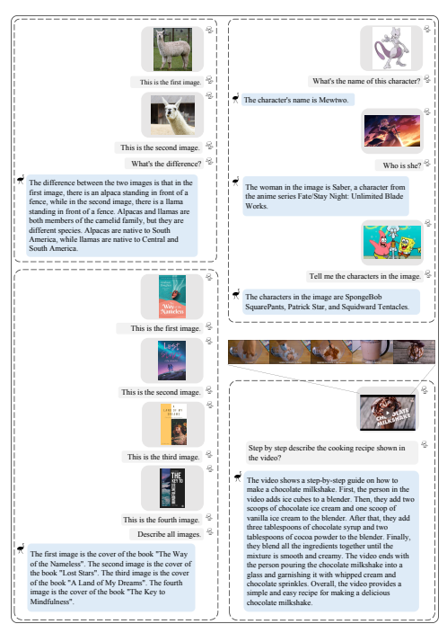

The video shows a step-by-step guide on how to make a chocolate milkshake. First, the person in the video adds ice cubes to a blender. Then, they add two scoops of chocolate ice cream and one scoop of vanilla ice cream to the blender. After that, they add three tablespoons of chocolate syrup and two tablespoons of cocoa powder to the blender. Finally, they blend all the ingredients together until the mixture is smooth and creamy. The video ends with the person pouring the chocolate milkshake into a glass and garnishing it with whipped cream and chocolate sprinkles. Overall, the video provides a simple and easy recipe for making a delicious chocolate milkshake. 

Step by step describe the cooking recipe shown in the video?

What's the name of this character?

Who is she?

Tell me the characters in the image. 

The character's name is Mewtwo. 

The woman in the image is Saber, a character from the anime series Fate/Stay Night: Unlimited Blade The characters in the image are SpongeBob SquarePants, Patrick Star, and Squidward Tentacles.

Figure 4: Examples of interleaved multi-image understanding(left side), real-world knowledge grounding(upper right), detailed video understanding(lower right).

The image shows a black and white photograph of Mahatma Gandhi spinning yarn in the late 1920s. Gandhi is

sitting on the ground with a spinning wheel in front of him. He is wearing a white shawl and appears to be focused on spinning the yarn. There are no other figures or objects visible in the image. 

Mahatma Gandhi Spinning Yarn in the Late 1920s What does the image show? Describe all details including the figures, texts and numbers. 

The image shows the Twelve Apostles on the Great Ocean Road in Victoria, Australia. 

This meme features a cat with its mouth open and the caption "This is your face when a teacher gives you a surprise test." The meme is meant to be humorous and is often used to express frustration or annoyance with 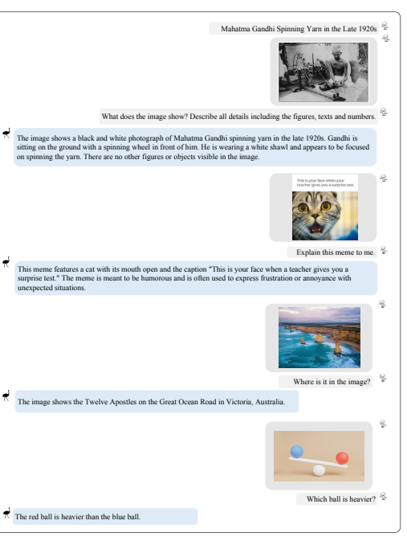

Explain this meme to me. 

Which ball is heavier?

Where is it in the image?

Figure 5: Examples of multimodal assistant.

What are the things I should be cautious about when I visit here?

There are a few things you should be cautious about when visiting the lake:
1. Weather: The weather at the lake can be unpredictable, with sudden changes in temperature, wind, and precipitation. Make sure to check the weather forecast before your visit and pack appropriate clothing and gear. 

2. Wildlife: The lake is home to a variety of wildlife, including bears, wolves, and moose. Make sure to stay on designated trails and keep your distance from any wildlife you encounter. 

3. Water quality: The lake's water quality can vary depending on the time of year and the weather conditions. Make sure to check with local authorities before swimming or boating in the lake to ensure it is safe to do so. 

4. Navigation: The lake is large and can be difficult to navigate, especially for inexperienced boaters. Make sure to familiarize yourself with the lake's layout and any potential hazards before venturing out on the water. 

5. Safety equipment: Make sure to bring any necessary safety equipment, such as life jackets, first aid kits, and

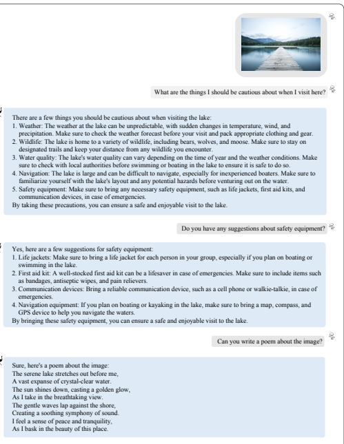

By taking these precautions, you can ensure a safe and enjoyable visit to the lake. 

Do you have any suggestions about safety equipment?

Can you write a poem about the image?

Sure, here's a poem about the image: A vast expanse of crystal-clear water. 

Yes, here are a few suggestions for safety equipment:
1. Life jackets: Make sure to bring a life jacket for each person in your group, especially if you plan on boating or 2. First aid kit: A well-stocked first aid kit can be a lifesaver in case of emergencies. Make sure to include items such 3. Communication devices: Bring a reliable communication device, such as a cell phone or walkie-talkie, in case of 4. Navigation equipment: If you plan on boating or kayaking in the lake, make sure to bring a map, compass, and By bringing these safety equipment, you can ensure a safe and enjoyable visit to the lake.

Figure 6: Examples of multi-turn dialogue.

Input Prompt Completion

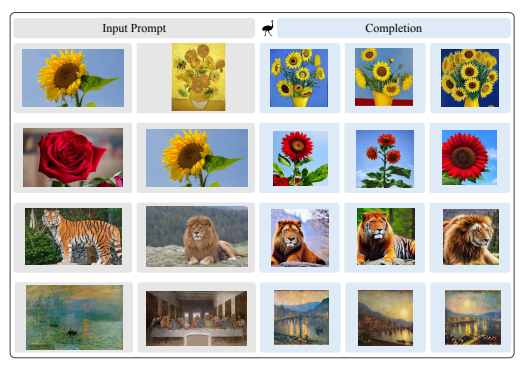

Figure 7: Examples of image blending.

Input Prompt Completion This is an image of a cute puppy. The puppy is sitting and resting on the lawn, surrounded by many flowers and plants. 

This is an image of a big

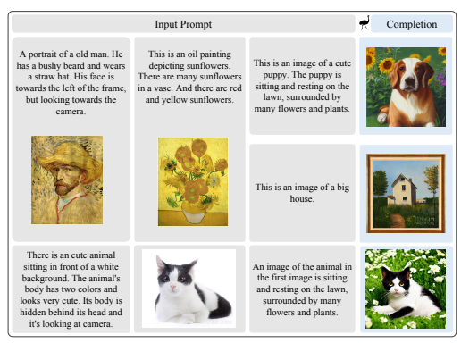

This is an oil painting in a vase. And there are red and yellow sunflowers. 

An image of the animal in the first image is sitting and resting on the lawn, surrounded by many flowers and plants.

Figure 8: Examples of in-context text-to-image generation.

Completion

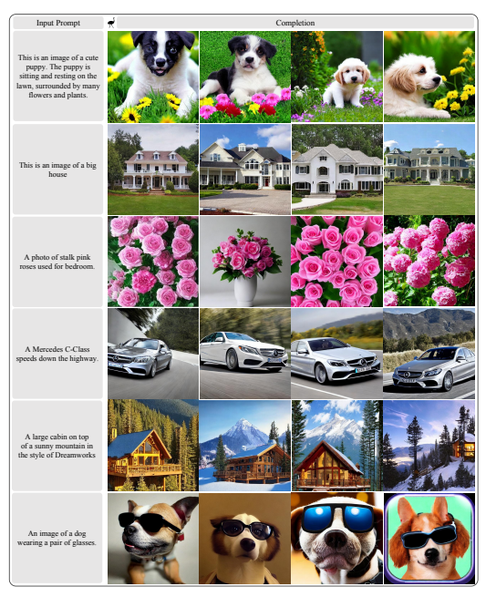

Figure 9: Examples of text-to-image generation.

Input Image

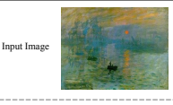

Input Text Describe the image in detail. 

Model Output

The image is a painting by Claude Monet titled "Impression, Sunrise". It depicts a serene scene of the sun rising over the water. The painting is done in a loose, impressionistic style, with visible brushstrokes and a focus on capturing the essence of the scene rather

than the details. The colors are muted and soft, with shades of blue, pink, and yellow

dominating the canvas. In the foreground of the painting, there is a small boat bobbing up and down on the water. The sun is just peeking over the horizon, casting a warm, golden light over the scene. 

The water is calm and still, reflecting the colors of the sky above. 

In the background of the painting, there are a few buildings visible, but they are mostly obscured by the mist and haze of the early morning. The sky is a mix of pink and blue, with a few wispy clouds drifting lazily across the sky. Overall, the painting is a beautiful and serene depiction of a peaceful morning on the water. The soft colors and loose brushstrokes evoke a sense of calm and tranquility,

inviting the viewer to take a moment to appreciate the beauty of nature. 

The image is a captivating scene of a small boat floating on a body of water, possibly a

bay or a river, during a beautiful sunset. The boat is positioned towards the center of the picture, surrounded by a serene atmosphere. There are several other boats scattered throughout the image, some closer to the edges of the frame, while others are positioned more towards the center. The presence of multiple boats adds a sense of depth and interest to the scene. 

The sunset casts a warm glow on the water and the boats, creating a picturesque and

tranquil environment for those on the small boats to enjoy the view. 

The painting depicts a beautiful sunrise over the ocean, creating a stunning and serene

atmosphere. The scene is set against a backdrop of a blue-gray sky, with a bright yellow

sun peeking out from behind a cloud. The water in the foreground of the painting is calm and peaceful, gently reflecting the sun's rays. Several sailboats can be seen floating in various positions, adding to the tranquil atmosphere of this early morning moment. In addition to boats, there are several birds flying in different directions, enjoying the beautiful view. 

InstructBLIP In this painting, Claude Monet's famous impressionist artwork titled "Sunrise" takes

center stage. The painting depicts the beautiful sunrise over the horizon, with its warm orange and yellow hues spreading across the sky. The water is also a significant part of the painting, with several boats sailing along it. The sunrise is captured in the middle of the painting, with boats scattered across the scene. In the background, the boats and the water are surrounded by various colors, with some areas featuring a lighter, brighter tone. 

The sunrise creates a serene and peaceful atmosphere, while the boats add a touch of

activity to the scene.

Emu

LLaVA

mPLUG-Owl

Figure 10: Comparison of Emu with other methods on **image captioning task**.

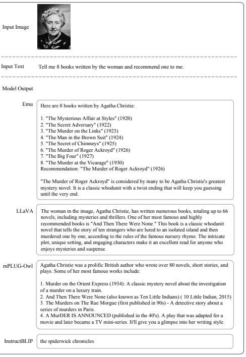

LLaVA
Input Text Tell me 8 books written by the woman and recommend one to me. 

"The Murder of Roger Ackroyd" is considered by many to be Agatha Christie's greatest mystery novel. It is a classic whodunit with a twist ending that will keep you guessing The woman in the image, Agatha Christie, has written numerous books, totaling up to 66 novels, including mysteries and thrillers. One of her most famous and highly recommended books is "And Then There Were None." This book is a classic whodunit novel that tells the story of ten strangers who are lured to an isolated island and then murdered one by one, according to the rules of the famous nursery rhyme. The intricate plot, unique setting, and engaging characters make it an excellent read for anyone who Agatha Christie was a prolific British author who wrote over 80 novels, short stories, and 1. Murder on the Orient Express (1934): A classic mystery novel about the investigation 2. And Then There Were None (also known as Ten Little Indians) ( 10 Little Indian, 2015) 3. The Murders on The Rue Morgue (first published in 90s) - A detective story about a 4. A MurDER IS ANNOUNCED (published in the 40's). A play that was adapted for a movie and later became a TV mini-series. It'll give you a glimpse into her writing style. 

Figure 11: Comparison of Emu with other methods in term of **following human instructions**.

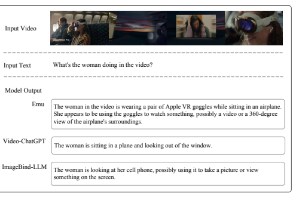

ImageBind-LLM
The woman in the video is wearing a pair of Apple VR goggles while sitting in an airplane. She appears to be using the goggles to watch something, possibly a video or a 360-degree view of the airplane's surroundings. 

The woman is sitting in a plane and looking out of the window. 

The woman is looking at her cell phone, possibly using it to take a picture or view

Figure 12: Comparison of Emu with other methods in term of **following human instructions**.
