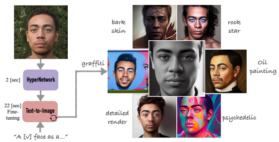
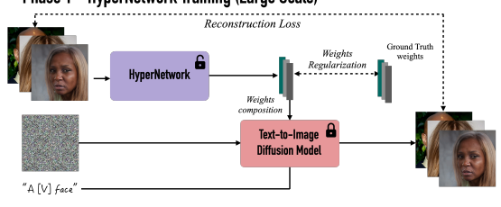
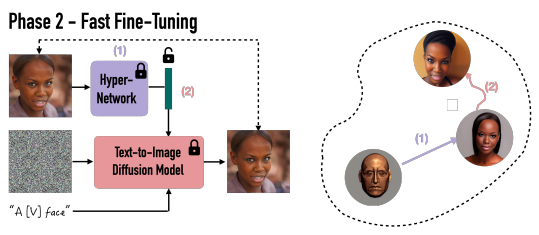
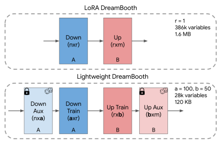
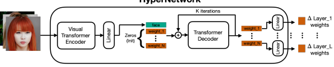
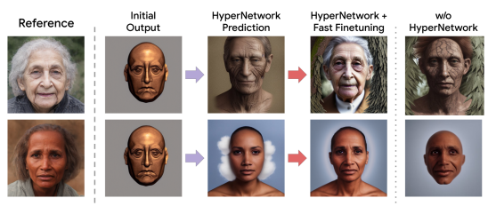
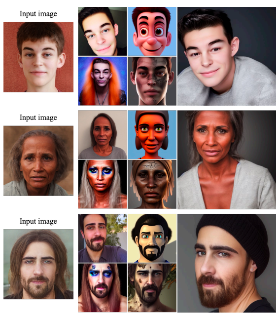
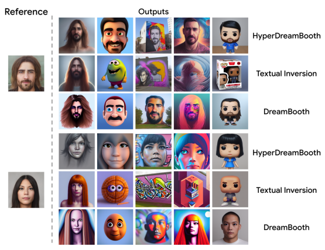

# Hyperdreambooth: Hypernetworks For Fast Personalization Of Text-To-Image Models

Nataniel Ruiz Yuanzhen Li Varun Jampani Wei Wei Tingbo Hou Yael Pritch Neal Wadhwa Michael Rubinstein Kfir Aberman Google Research

Figure 1: Using only a *single* input image, *HyperDreamBooth* is able to personalize a text-to-image diffusion model 25x faster than DreamBooth [25], by using (1) a HyperNetwork to generate an initial prediction of a subset of network weights that are then (2) refined using fast finetuning for high fidelity to subject detail. Our method both conserves model integrity and style diversity while closely approximating the subject's essence and details.

## Abstract

Personalization has emerged as a prominent aspect within the field of generative AI, enabling the synthesis of individuals in diverse contexts and styles, while retaining highfidelity to their identities. However, the process of personalization presents inherent challenges in terms of time and memory requirements. Fine-tuning each personalized model needs considerable GPU time investment, and storing a personalized model per subject can be demanding in terms of storage capacity. To overcome these challenges, we propose HyperDreamBooth—a hypernetwork capable of efficiently generating a small set of personalized weights from a single image of a person. By composing these weights into the diffusion model, coupled with fast finetuning, HyperDreamBooth can generate a person's face in various contexts and styles, with high subject details while also preserving the model's crucial knowledge of diverse styles and semantic modifications. Our method achieves personalization on faces in roughly 20 seconds, 25x faster than DreamBooth and **125x** faster than Textual Inversion, using as few as one reference image, with the same quality and style diversity as DreamBooth. Also our method yields a model that is **10000x** smaller than a normal DreamBooth model.

Project page: https://hyperdreambooth.github.io

## 1 Introduction

Recent work on text-to-image (T2I) personalization [25] has opened the door for a new class of creative applications. Specifically, for face personalization, it allows generation of new images of a specific face or person in different styles. The impressive diversity of styles is owed to the strong prior of pre-trained diffusion model, and one of the key properties of works such as DreamBooth [25], is the ability to implant a new subject into the model without damaging the model's prior. Another key feature of this type of method is that subject's essence and details are conserved even when applying vastly different styles. For example, when training on photographs of a person's face, one is able to generate new images of that person in animated cartoon styles, where a part of that person's essence is preserved and represented in the animated cartoon figure - suggesting some amount of visual semantic understanding in the diffusion model. These are two core characteristics of DreamBooth and related methods, that we would like to leave untouched. Nevertheless, DreamBooth has some shortcomings: size and speed. For size, the original DreamBooth paper finetunes all of the weights of the UNet and Text Encoder of the diffusion model, which amount to more than 1GB for Stable Diffusion. In terms of speed, notwithstanding inference speed issues of diffusion models, training a DreamBooth model takes about 5 minutes for Stable Diffusion (1,000 iterations of training). This limits the potential impact of the work. In this work, we want to address these shortcomings, without altering the impressive key properties of DreamBooth, namely *style diversity* and *subject fidelity*, as depctied in Figure 1. Specifically, we want to *conserve model integrity* and *closely* approximate subject essence in a fast manner with a small model. Our work proposes to tackle the problems of **size** and **speed** of DreamBooth, while preserving **model** integrity, **editability** and **subject fidelity**. We propose the following contributions:
- *Lighweight DreamBooth (LiDB)* - a personalized text-to-image model, where the customized part is roughly 100KB of size. This is achieved by training a DreamBooth model in a lowdimensional weight-space generated by a random orthogonal incomplete basis inside of a low-rank adaptation [16] weight space.

- New *HyperNetwork* architecture that leverages the Lightweight DreamBooth configuration and generates the customized part of the weights for a given subject in a text-to-image diffusion model. These provide a strong directional initialization that allows us to further finetune the model in order to achieve strong subject fidelity within a few iteration. Our method is 25x faster than DreamBooth while achieving similar performances.

- We propose the technique of *rank-relaxed finetuning*, where the rank of a LoRA DreamBooth model is relaxed during optimization in order to achieve higher subject fidelity, allowing us to initialize the personalized model with an initial approximation using our HyperNetwork, and then approximate the high-level subject details using rank-relaxed finetuning.

One key aspect that leads us to investigate a HyperNetwork approach is the realization that in order to be able to synthesize specific subjects with high fidelity, using a given generative model, we have to
"modify" its output domain, and insert knowledge about the subject into the model, namely by modifying the network weights.

## 2 Related Work

Text-to-Image Models Several recent models such as Imagen [26], DALL-E2 [22], Stable Diffusion (SD) [24], Muse [8], Parti [33] etc. demonstrate excellent image generation capabilities given a text prompt. Some Text-to-Image (T2I) models such as Stable Diffusion and Muse also allows conditioning the generation with a given image via an encoder network. Techniques such as ControlNet [35] propose ways to incorporate new input conditioning such as depth. Test text and image based conditioning in these models do not capture sufficient subject details. Given the relatively small size of SD, for the ease of experimentation, we demonstrate our HyperDreamBooth on SD model. But the proposed technique is generic and can be applicable to any T2I model.

Personalization of Generative Models Given one or few subject images, the aim of personalized generation is to generate images of that particular subject in various contexts. Earlier works in this space use GANs to edit a given subject image into new contexts. Pivotal tuning [23] proposes to finetune a GAN with an inverted latent code. The work of [21] proposes to finetune StyleGAN using around 100 face images to obtain a personalized generative prior. Casanova et al. [7] proposes to condition a GAN

Figure 2: **HyperDreamBooth Training and Fast Fine-Tuning.** Phase-1: Training a hypernetwork to predict network

weights from a face image, such that a text-to-image diffusion network outputs the person's face from the sentence "a [v] face" if the predicted weights are applied to it. We use pre-computed personalized weights for supervision, using an L2 loss, as well as the vanilla diffusion reconstruction loss. Phase-2: Given a face image, our hypernetwork predicts an initial guess for the network weights, which are then fine-tuned using the reconstruction loss to enhance fidelity.

using an input image to generate variations of that input image. All these GAN based techniques suffer from either poor subject fidelity or a lack of context diversity in the generated images. HyperNetworks were introduced as an idea of using an auxiliary neural network to predict network weights in order to change the functioning of a specific neural network [13]. Since then, they have been used for tasks in image generation that are close to personalization, such as inversion for StyleGAN [4], similar to work that seeks to invert the latent code of an image in order to edit that image in the GAN latent space [3].

T2I Personalization via Finetuning More recently, several works propose techniques for personalizing T2I models resulting in higher subject fidelity and versatile text based recontextualization of a given subject. Textual Inversion [11] proposes to optimize an input text embedding on the few subject images and use that optimized text embedding to generate subject images. [30] propose a richer textual inversion space capturing more subject details. DreamBooth [25] proposes to optimize the entire T2I network weights to adapt to a given subject resulting in higher subject fidelity in output images. Several works propose ways to optimize compact weight spaces instead of the entire network as in DreamBooth. CustomDiffusion [19]
proposes to only optimize cross-attention layers. SVDiff [14] proposes to optimize singular values of weights. LoRa [2, 16] proposes to optimize low-rank approximations of weight residuals. StyleDrop [28]
proposes to use adapter tuning [15] and finetunes a small set of adapter weights for style personalization. DreamArtist [10] proposes a one-shot personalization techniques by employing a positive-negative prompt tuning strategy. Most of these finetuning techniques, despite generating high-quality subject-driven generations, are slow and can take several minutes for every subject. Fast T2I Personalization Several concurrent works propose ways for faster personalization of T2I models. The works of [12] and [31] propose to learn encoders that predicts initial text embeddings following by complete network finetuning for better subject fidelity. In contrast, our hypernetwork directly predicts low-rank network residuals. SuTI [9] proposes to first create a large paired dataset of input images and the corresponding recontexualized images generated using standard DreamBooth. It then uses this dataset to train a separate network that can perform personalized image generation in a feed-forward manner. Despite mitigating the need for finetuning, the inference model in SuTI does not conserve the original T2I model's integrity and also suffers from a lack of high subject fidelity. InstantBooth [27] and Taming Encoder [17] create a new conditioning branch for the diffusion model, which can be conditioned using a small set of images, or a single image, in order to generate personalized outputs in different styles. Both methods need to train the diffusion model, or the conditioning branch, to achieve this task. These methods are trained on large datasets of images (InstantBooth 1.3M samples of bodies from a proprietary dataset, Taming Encoder on CelebA [20] and Getty [1]). FastComposer [32] proposes to use image encoder to predict subject-specific embeddings and focus on the problem of identity blending in multisubject generation. The work of [5] propose to guide the diffusion process using face recognition loss to generate specific subject images. In such guidance techniques, it is usually difficult to balance diversity in recontextualizations and subject fidelity while also keeping the generations within the image distribution. Face0 [29] proposes to condition a T2I model on face embeddings so that one can generate subject-specific images in a feedforward manner without any test-time optimization. Celeb-basis [34] proposes to learn PCA basis of celebrity name embeddings which are then used for efficient personalization of T2I models. In contrast to these existing techniques, we propose a novel hypernetwork based approach to directly predict low-rank network residuals for a given subject.

## 3 Preliminaries

Latent Diffusion Models (LDM). Text-to-Image (T2I) diffusion models Dθ(ϵ, c) iteratively denoises a given noise map ϵ ∈ R
h×w into an image I following the description of a text prompt T, which is converted into an input text embedding c = Θ(T) using a text encoder Θ. In this work, we use Stable Diffusion [24], a specific instatiation of LDM [24]. Briefly, LDM consists of 3 main components: An image encoder that encodes a given image into latent code; a decoder that decodes the latent code back to image pixels; and a U-Net denoising network D that iteratively denoises a noisy latent code. See [24] for more details.

DreamBooth [25] provides a network fine-tuning strategy to adapt a given T2I denoising network Dθ to generate images of a specific subject. At a high-level, DreamBooth optimizes all the diffusion network weights θ on a few given subject images while also retaining the generalization ability of the original model with class-specific prior preservation loss [25]. In the case of Stable Diffusion [24], this amounts to finetuning the entire denoising UNet has over 1GB of parameters. In addition, DreamBooth on a single subject takes about 5 minutes with 1K training iterations.

Low Rank Adaptation (LoRA) [16, 2] provides a memory-efficient and faster technique for DreamBooth.

Specifically, LoRa proposes to finetune the network weight residuals instead of the entire weights. That is, for a layer l with weight matrix W ∈ R
n×m, LoRa proposes to finetune the residuals ∆W. For diffusion models, LoRa is usually applied for the cross and self-attention layers of the network [2]. A key aspect of LoRa is the decomposition of ∆W matrix into low-rank matrices A ∈ R
n×rand B ∈ R
r×m:
∆W = AB. The key idea here is that *r << n* and the combined number of weights in both A and B is much lower than the number of parameters in the original residual ∆W. Priors work show that this low-rank residual finetuning is an effective technique that preserves several favorable properties of the original DreamBooth while also being memory-efficient as well as fast, remarkably even when we set r = 1. For stable diffusion 1.5 model, LoRA-DreamBooth with r = 1 has approximately 386K parameters corresponding to only about 1.6MB in size.

## 4 Method

Our approach consists of 3 core elements which we explain in this section. We begin by introducing the concept of the Lightweight DreamBooth (LiDB) and demonstrate how the Low-Rank decomposition

Figure 3: **Lightweight DreamBooth:** we propose a new low-dimensional weight-space for model personalization

 generated by a random orthogonal incomplete basis inside LoRA weight-space. This achieves models of roughly 100KB of size (**0.01%** of original DreamBooth and **7.5%** of LoRA DreamBooth size) and, surprisingly, is sufficient to achieve strong personalization results with solid editability.

(LoRa) of the weights can be further decomposed to effectively minimize the number of personalized weights within the model. Next, we discuss the HyperNetwork training and the architecture the model entails, which enables us to predict the LiDB weights from a single image. Lastly, we present the concept of rank-relaxed fast fine-tuning, a technique that enables us to significantly amplify the fidelity of the output subject within a few seconds. Fig. 2 shows the overview of hypernetwork training followed by fast fine-tuning strategy in our HyperDreamBooth technique.

#### 4.1 Lightweight Dreambooth (Lidb)

Given our objective of generating the personalized subset of weights directly using a HyperNetwork, it would be beneficial to reduce their number to a minimum while maintaining strong results for subject fidelity, editability and style diversity. To this end, we propose a new low-dimensional weight space for model personalization which allows for personalized diffusion models that are 10,000 times smaller than a DreamBooth model and more than 10 times smaller than a LoRA DreamBooth model. Our final version has only 30K variables and takes up only 120 KB of storage space. The core idea behind Lightweight DreamBooth (LiDB) is to further decompose the weight-space of a rank-1 LoRa residuals. Specifically, we do this using a random orthogonal incomplete basis within the rank-1 LoRA weight-space. We illustrate the idea in Figure 3. The approach can also be understood as further decomposing the Down (A) and Up (B) matrices of LoRA into two matrices each: A = AauxAtrain with Aaux ∈ R
n×aand Atrain ∈ R
a×rand B = BtrainBaux with Btrain ∈ R
r×band Baux ∈ R
b×m. where the aux layers are randomly initialized with row-wise orthogonal vectors and are frozen; and the train layers are learned. Two new hyperparameters are introduced: a and b, which we set experimentally. Thus the weight-residual in a LiDB linear layer is represented as:

$$\Delta W x=A_{\mathrm{{aux}}}A_{\mathrm{{train}}}B_{\mathrm{{train}}}B_{\mathrm{{aux}}},$$
∆W x = AauxAtrainBtrainBaux, (1)
where r << min(n, m), *a < n* and *b < m*. Aaux and Baux are randomly initialized with orthogonal row vectors with constant magnitude - and frozen, and Btrain and Atrain are learnable. Surprisingly, we find that with a = 100 and b = 50, which yields models that have only 30K trainable variables and are 120 KB in size, personalization results are strong and maintain subject fidelity, editability and style diversity. We show results for personalization using LiDB in the experiments section.

$$(1)$$

Figure 4: **HyperNetwork Architecture:** Our hypernetwork consists of a Visual Transformer (ViT) encoder that

 translates face images into latent face features that are then concatenated to latent layer weight features that are initiated by zeros. A Transformer Decoder receives the sequence of the concatenated features and predicts the values of the weight features in an iterative manner by refining the initial weights with delta predictions. The final layer weight deltas that will be added to the diffusion network are obtained by passing the decoder outputs through learnable linear layers.

### 4.2 Hypernetwork For Fast Personalization Of Text-To-Image Models

We propose a HyperNetwork for fast personalization of a pre-trained T2I model. Let 
˜θ denote the set of all LiDB residual matrices: Atrain and Btrain for each of the cross-attention and self-attention layers of the T2I model. In essence, the HyperNetwork Hη with η parameters takes the given image x as input and predicts the LiDB low-rank residuals ˆθ = Hη(x). The HyperNetwork is trained on a dataset of domain-specific images with a vanilla diffusion denoising loss and a weight-space loss:
L(x) = α||Dθˆ(x + ϵ, c) − x||22 + β||ˆθ − θ||22, (2)
where x is the reference image, θ are the pre-optimized weight parameters of the personalized model for image x, Dθ is the diffusion model (with weights θ) conditioned on the noisy image x + ϵ and the supervisory text-prompt c, and finally α and β are hyperparameters that control for the relative weight of each loss. Fig. 2 (top) illustrates the hypernetwork training. Supervisory Text Prompt We propose to eschew any type of learned token embedding for this task, and our hypernetwork acts solely to predict the LiDB weights of the diffusion model. We simply propose to condition the learning process "a [V] face" for all samples, where [V] is a rare identifier described in [25]. At inference time variations of this prompt can be used, to insert semantic modifications, for example "a [V] face in impressionist style".

HyperNetwork Architecture Concretely, as illustrated in Fig. 4, we separate the HyperNetwork architecture into two parts: a ViT image encoder and a transformer decoder. We use a ViT-H for the encoder architecture and a 2-hidden layer transformer decoder for the decoder architecture. The transformer decoder is a strong fit for this type of weight prediction task, since the output of a diffusion UNet or Text Encoder is sequentially dependent on the weights of the layers, thus in order to personalize a model there is interdependence of the weights from different layers. In previous work [13, 4], this dependency is not rigorously modeled in the HyperNetwork, whereas with a transformer decoder with a positional embedding, this positional dependency is modeled - similar to dependencies between words in a language model transformer. To the best of our knowledge this is the first use of a transformer decoder as a HyperNetwork. Iterative Prediction We find that the HyperNetwork achieves better and more confident predictions given an iterative learning and prediction scenario [4], where intermediate weight predictions are fed to the HyperNetwork and the network's task is to improve that initial prediction. We only perform the image encoding once, and these extracted features f are then used for all rounds of iterative prediction for the HyperNetwork decoding transformer T . This speeds up training and inference, and we find that it does not affect the quality of results. Specifically, the forward pass of T becomes:

$${\hat{\theta}}_{k}={\mathcal{T}}(\mathbf{f},{\hat{\theta}}_{k-1}),$$
ˆθk = T (f,ˆθk−1), (3)
where k is the current iteration of weight prediction, and terminates once k = s, where s is a hyperparameter controlling the maximum amount of iterations. Weights θ are initialized to zero for k = 0. Trainable linear layers are used to convert the decoder outputs into the final layer weights. We use the CelebAHQ

Figure 5: **HyperNetwork + Fast Finetuning** achieves strong results. Here we show, for each reference (row), outputs

 from the initial hypernetwork prediction (HyperNetwork Prediction column), as well as results after HyperNetwork prediction and fast finetuning (HyperNetwork + Fast Finetuning). We also show generated results without the HyperNetwork prediction component, demonstrating its importance.

dataset [18] for training the HyperNetwork, and find that we only need 15K identities to achieve strong results, much less data than other concurrent methods.

### 4.3 Rank-Relaxed Fast Finetuning

We find that the initial HyperNetwork prediction is in great measure directionally correct and generates faces with similar semantic attributes (gender, facial hair, hair color, skin color, etc.) as the target face consistently. Nevertheless, fine details are not sufficiently captured. We propose a final fast finetuning step in order to capture such details, which is magnitudes faster than DreamBooth, but achieves virtually identical results with strong subject fidelity, editability and style diversity. Specifically, we first predict personalized diffusion model weights ˆθ = H(x) and then subsequently finetune the weights using the diffusion denoising loss L(x) = ||Dθˆ(x + ϵ, c) − x||22. A key contribution of our work is the idea of rank-relaxed finetuning, where we relax the rank of the LoRA model from r = 1 to r > 1 before fast finetuning. Specifically, we add the predicted HyperNetwork weights to the overall weights of the model, and then perform LoRA finetuning with a new higher rank. This expands the capability of our method of approximating high-frequency details of the subject, giving higher subject fidelity than methods that are locked to lower ranks of weight updates. To the best of our knowledge we are the first to propose such rank-relaxed LoRA models.

We use the same supervision text prompt "a [V] face" this fast finetuning step. We find that given the HyperNetwork initialization, fast finetuning can be done in 40 iterations, which is 25x faster than DreamBooth [25] and LoRA DreamBooth [2]. We show an example of initial, intermediate and final results in Figure 5.

## 5 Experiments

We implement our HyperDreamBooth on the Stable Diffusion v1.5 diffusion model and we predict the LoRa weights for all cross and self-attention layers of the diffusion UNet as well as the CLIP text encoder. For privacy reasons, all face images used for visuals are synthetic, from the SFHQ dataset [6]. For training, we use 15K images from CelebA-HQ [18].

### 5.1 Subject Personalization Results

Our method achieves strong personalization results for widely diverse faces, with performance that is identically or surpasses that of the state-of-the art optimization driven methods [25, 11]. Moreover, we achieve very strong editability, with semantic transformations of face identities into highly different domains such as figurines and animated characters, and we conserve the strong style prior of the model which allows for a wide variety of style generations. We show results in Figure 6.

Figure 6: **Results Gallery:** Our method can generate novel artistic and stylized results of diverse subjects (depicted

 in an input image, left) with considerable editability while maintaining the integrity to the subject's key facial characteristics. The output images were generated with the following captions (top-left to bottom-right): "An Instagram selfie of a [V] face", "A Pixar character of a [V] face", "A [V] face with bark skin", "A [V] face as a rock star". Rightmost: *"A professional shot of a [V] face".*

Given the statistical nature of HyperNetwork prediction, some samples that are OOD for the HyperNetwork due to lighting, pose, or other reasons, can yield subotpimal results. Specifically, we identity three types of errors that can occur. There can be (1) a semantic directional error in the HyperNetwork's initial prediction which can yield erroneous semantic information of a subject (wrong eye color, wrong hair type, wrong gender, etc.) (2) incorrect subject detail capture during the fast finetuning phase, which yields samples that are close to the reference identity but not similar enough and (3) underfitting of both HyperNetwork and fast finetuning, which can yield low editability with respect to some styles.

Figure 7: **Qualitative Comparison:** We compare random generated samples for our method (HyperDreamBooth),

DreamBooth and Textual Inversion for two different identities and five different stylistic prompts. We observe that our method generally achieves very strong editability while preserving identity, generally surpassing competing methods in the single-reference regime.

Table 1: **Comparisons.** We compare our method for face identity preservation (Face Rec.), subject fidelity (DINO, CLIP-I) and prompt fidelity (CLIP-T) to DreamBooth and Textual Inversion. We find that our method preserves identity and subject fidelity more closely, while also achieving a higher score in prompt fidelity.

| Method            | Face Rec. ↑   | DINO ↑   | CLIP\-I ↑   | CLIP\-T ↑   |
|-------------------|---------------|----------|-------------|-------------|
| Ours              | 0.655         | 0.473    | 0.577       | 0.286       |
| DreamBooth        | 0.618         | 0.441    | 0.546       | 0.282       |
| Textual Inversion | 0.623         | 0.289    | 0.472       | 0.277       |

### 5.2 Comparisons

Qualitative Comparisons We compare our method to both Textual Inversion [11] and DreamBooth [25] using the parameters proposed in both works, with the exception that we increase the number of iterations of DreamBooth to 1,200 in order to achieve improved personalization and facial details. Results are shown in Figure 7. We observe that our method outperforms both Textual Inversion and DreamBooth generally, in the one-input-image regime.

Quantitative Comparisons and Ablations We compare our method to Textual Inversion and Dream- Booth using a face recognition metric ("Face Rec." using an Inception ResNet, trained on VGGFace2), and the DINO, CLIP-I and CLIP-T metrics proposed in [25]. We use 100 identities from CelebAHQ [18], and 30 prompts, including both simple and complex style-modification and recontextualization prompts for a total of 30,000 samples. We show in Table 1 that our approach obtains the highest scores for all metrics. One thing to note is that face recognition metrics are relatively weak in this specific scenario, given that face recognition networks are only trained on real images and are not trained to recognize the

Table 2: **Comparisons with DreamBooth**. We compare our method to DreamBooth with differently tuned hyperparameters to close the optimization time gap. We find that by increasing the learning rate and decreasing the number of iterations there is degradation of results, and DreamBooth does not achieve results similar to our method. DreamBooth-Agg-1 uses 400 iterations and DreamBooth-Agg-2 uses 40 iterations instead of the normal 1200 for our vanilla DreamBooth.

| Method             | Face Rec. ↑   | DINO ↑   | CLIP\-I ↑   | CLIP\-T ↑   |
|--------------------|---------------|----------|-------------|-------------|
| Ours               | 0.655         | 0.473    | 0.577       | 0.286       |
| DreamBooth         | 0.618         | 0.441    | 0.546       | 0.282       |
| DreamBooth\-Agg\-1 | 0.615         | 0.323    | 0.431       | 0.313       |
| DreamBooth\-Agg\-2 | 0.616         | 0.360    | 0.467       | 0.302       |

| Method     | Face Rec. ↑   | DINO ↑   | CLIP\-I ↑   | CLIP\-T ↑   |
|------------|---------------|----------|-------------|-------------|
| Ours       | 0.655         | 0.473    | 0.577       | 0.286       |
| No Hyper   | 0.647         | 0.392    | 0.498       | 0.299       |
| Only Hyper | 0.631         | 0.414    | 0.501       | 0.298       |
| Ours (k=1) | 0.648         | 0.464    | 0.570       | 0.288       |

Table 3: **HyperNetwork Ablation**. We ablate several components of our approach, including not using the hypernetwork component at test-time (No Hyper), only using the hypernetwork prediction without fast finetuning (Only Hyper) and using our full method without iterative prediction (k=1). We show that our full method performs best for all fidelity metrics, although No Hyper achieves slightly better prompt following.

same person in different styles. In order to compensate for this, we conduct a user study described further below. We also conduct comparisons to more aggressive DreamBooth training, with lower number of iterations and higher learning rate. Specifically, we use 400 iterations for DreamBooth-Agg-1 and 40 iterations for DreamBooth-Agg-2 instead of 1200 for DreamBooth. We increase the learning rate and tune the weight decay to compensate for the change in number of iterations. Note that DreamBooth-Agg-2 is roughly equivalent to only doing fast finetuning without the hypernetwork component of our work. We show in Table 2 that more aggressive training of DreamBooth generally degrades results when not using our method, which includes a HyperNetwork initialization of the diffusion model weights. Finally, we show an ablation study of our method. We remove the HyperNetwork (No Hyper), only use the HyperNetwork without finetuning (Only Hyper) and also use our full setup without iterative HyperNetwork predictions (k=1). We show results in Table 3 and find that our full setup with iterative prediction achieves best subject fidelity, with a slightly lower prompt following metric.

User Study We conduct a user study for face identity preservation of outputs and compare our method to DreamBooth and Textual Inversion. Specifically, we present the reference face image and two random generations using the same prompt from our method and the baseline, and ask the user to rate which one has most similar face identity to the reference face image. We test a total of 25 identities, and query 5 users per question, with a total of 1,000 sample pairs evaluated. We take the majority vote for each pair. We present our results in Table 4, where we show a strong preference for face identity preservation of our method.

| Method            | Identity Fidelity ↑   |
|-------------------|-----------------------|
| Ours              | 0.648                 |
| DreamBooth        | 0.233                 |
| Undecided         | 0.119                 |
| Ours              | 0.706                 |
| Textual Inversion | 0.216                 |
| Undecided         | 0.078                 |

Table 4: **User Study**. Since face recognition networks are not trained to recognize the same face with different styles and can sometimes fail catastrophically, we conduct a user study for identity fidelity in our stylized generations and compare one-to-one against DreamBooth and Textual Inversion. Users generally prefer images generated by our

approach.

## 6 Societal Impact

This work aims to empower users with a tool for augmenting their creativity and ability to express themselves through creations in an intuitive manner. However, advanced methods for image generation can affect society in complex ways [26]. Our proposed method inherits many possible concerns that affect this class of image generation, including altering sensitive personal characteristics such as skin color, age and gender, as well as reproducing unfair bias that can already be found in pre-trained model's training data. The underlying open source pre-trained model used in our work, Stable Diffusion, exhibits some of these concerns. All concerns related to our work have been present in the litany of recent personalization work, and the only augmented risk is that our method is more efficient and faster than previous work. In particular, we haven't found in our experiments any difference with respect to previous work on bias, or harmful content, and we have qualitatively found that our method works equally well across different ethnicities, ages, and other important personal characteristics. Nevertheless, future research in generative modeling and model personalization must continue investigating and revalidating these concerns.

## 7 Conclusion

In this work, we have presented *HyperDreamBooth* a novel method for fast and lightweight subject-driven personalization of text-to-image diffusion models. Our method leverages a HyperNetwork to generate Lightweight DreamBooth (LiDB) parameters for a diffusion model with a subsequent fast rank-relaxed finetuning that achieves a significant reduction in size and speed compared to DreamBooth and other optimization-based personalization work. We have demonstrated that our method can produce high-quality and diverse images of faces in different styles and with different semantic modifications, while preserving subject details and model integrity.

## References

[1] Getty images. https://gettyimages.com/. Accessed: 2023-07-13. 4 [2] Low-rank adaptation for fast text-to-image diffusion fine-tuning. https://github.com/cloneofsimo/lora, 2022. 3, 4, 7
[3] Yuval Alaluf, Or Patashnik, and Daniel Cohen-Or. Restyle: A residual-based stylegan encoder via iterative refinement. In *Proceedings of the IEEE/CVF International Conference on Computer Vision*, pages 6711–6720, 2021. 3
[4] Yuval Alaluf, Omer Tov, Ron Mokady, Rinon Gal, and Amit Bermano. Hyperstyle: Stylegan inversion with hypernetworks for real image editing. In *Proceedings of the IEEE/CVF conference on computer Vision and* pattern recognition, pages 18511–18521, 2022. 3, 6
[5] Arpit Bansal, Hong-Min Chu, Avi Schwarzschild, Soumyadip Sengupta, Micah Goldblum, Jonas Geiping, and Tom Goldstein. Universal guidance for diffusion models. In Proceedings of the IEEE/CVF Conference on Computer Vision and Pattern Recognition, pages 843–852, 2023. 4
[6] David Beniaguev. Synthetic faces high quality (sfhq) dataset. https://github.com/SelfishGene/
SFHQ-dataset, 2022. 7
[7] Arantxa Casanova, Marlene Careil, Jakob Verbeek, Michal Drozdzal, and Adriana Romero Soriano. Instanceconditioned gan. *Advances in Neural Information Processing Systems*, 34:27517–27529, 2021. 2
[8] Huiwen Chang, Han Zhang, Jarred Barber, AJ Maschinot, Jose Lezama, Lu Jiang, Ming-Hsuan Yang, Kevin Murphy, William T Freeman, Michael Rubinstein, et al. Muse: Text-to-image generation via masked generative transformers. *arXiv preprint arXiv:2301.00704*, 2023. 2
[9] Wenhu Chen, Hexiang Hu, Yandong Li, Nataniel Ruiz, Xuhui Jia, Ming-Wei Chang, and William W Cohen.

Subject-driven text-to-image generation via apprenticeship learning. *arXiv preprint arXiv:2304.00186*, 2023. 4
[10] Ziyi Dong, Pengxu Wei, and Liang Lin. Dreamartist: Towards controllable one-shot text-to-image generation via contrastive prompt-tuning. *arXiv preprint arXiv:2211.11337*, 2022. 4
[11] Rinon Gal, Yuval Alaluf, Yuval Atzmon, Or Patashnik, Amit H Bermano, Gal Chechik, and Daniel Cohen-Or.

An image is worth one word: Personalizing text-to-image generation using textual inversion. arXiv preprint arXiv:2208.01618, 2022. 3, 7, 9
[12] Rinon Gal, Moab Arar, Yuval Atzmon, Amit H Bermano, Gal Chechik, and Daniel Cohen-Or. Designing an encoder for fast personalization of text-to-image models. *arXiv preprint arXiv:2302.12228*, 2023. 4
[13] David Ha, Andrew Dai, and Quoc V Le. Hypernetworks. *arXiv preprint arXiv:1609.09106*, 2016. 3, 6 [14] Ligong Han, Yinxiao Li, Han Zhang, Peyman Milanfar, Dimitris Metaxas, and Feng Yang. Svdiff: Compact parameter space for diffusion fine-tuning. *arXiv preprint arXiv:2303.11305*, 2023. 3
[15] Neil Houlsby, Andrei Giurgiu, Stanislaw Jastrzebski, Bruna Morrone, Quentin de Laroussilhe, Andrea Gesmundo, Mona Attariyan, and Sylvain Gelly. Parameter-efficient transfer learning for nlp. arXiv preprint arXiv:1902.00751, 2019. 4
[16] Edward J Hu, Yelong Shen, Phillip Wallis, Zeyuan Allen-Zhu, Yuanzhi Li, Shean Wang, Lu Wang, and Weizhu Chen. Lora: Low-rank adaptation of large language models. *arXiv preprint arXiv:2106.09685*, 2021. 2, 3, 4
[17] Xuhui Jia, Yang Zhao, Kelvin CK Chan, Yandong Li, Han Zhang, Boqing Gong, Tingbo Hou, Huisheng Wang, and Yu-Chuan Su. Taming encoder for zero fine-tuning image customization with text-to-image diffusion models. *arXiv preprint arXiv:2304.02642*, 2023. 4
[18] Tero Karras, Timo Aila, Samuli Laine, and Jaakko Lehtinen. Progressive growing of gans for improved quality, stability, and variation. *arXiv preprint arXiv:1710.10196*, 2017. 7, 9
[19] Nupur Kumari, Bingliang Zhang, Richard Zhang, Eli Shechtman, and Jun-Yan Zhu. Multi-concept customization of text-to-image diffusion. In Proceedings of the IEEE/CVF Conference on Computer Vision and Pattern Recognition, pages 1931–1941, 2023. 3
[20] Ziwei Liu, Ping Luo, Xiaogang Wang, and Xiaoou Tang. Deep learning face attributes in the wild. In Proceedings of International Conference on Computer Vision (ICCV), December 2015. 4
[21] Yotam Nitzan, Kfir Aberman, Qiurui He, Orly Liba, Michal Yarom, Yossi Gandelsman, Inbar Mosseri, Yael Pritch, and Daniel Cohen-Or. Mystyle: A personalized generative prior. *ACM Transactions on Graphics (TOG)*, 41(6):1–10, 2022. 2
[22] Aditya Ramesh, Prafulla Dhariwal, Alex Nichol, Casey Chu, and Mark Chen. Hierarchical text-conditional image generation with clip latents. *arXiv preprint arXiv:2204.06125*, 2022. 2
[23] Daniel Roich, Ron Mokady, Amit H Bermano, and Daniel Cohen-Or. Pivotal tuning for latent-based editing of real images. *ACM Transactions on graphics (TOG)*, 42(1):1–13, 2022. 2
[24] Robin Rombach, Andreas Blattmann, Dominik Lorenz, Patrick Esser, and Björn Ommer. High-resolution image synthesis with latent diffusion models. In *Proceedings of the IEEE/CVF conference on computer vision and* pattern recognition, pages 10684–10695, 2022. 2, 4
[25] Nataniel Ruiz, Yuanzhen Li, Varun Jampani, Yael Pritch, Michael Rubinstein, and Kfir Aberman. Dreambooth:
Fine tuning text-to-image diffusion models for subject-driven generation. 2022. 1, 2, 3, 4, 6, 7, 9
[26] Chitwan Saharia, William Chan, Saurabh Saxena, Lala Li, Jay Whang, Emily L Denton, Kamyar Ghasemipour, Raphael Gontijo Lopes, Burcu Karagol Ayan, Tim Salimans, et al. Photorealistic text-to-image diffusion models with deep language understanding. *Advances in Neural Information Processing Systems*, 35:36479–36494, 2022. 2, 11
[27] Jing Shi, Wei Xiong, Zhe Lin, and Hyun Joon Jung. Instantbooth: Personalized text-to-image generation without test-time finetuning. *arXiv preprint arXiv:2304.03411*, 2023. 4
[28] Kihyuk Sohn, Nataniel Ruiz, Kimin Lee, Daniel Castro Chin, Irina Blok, Huiwen Chang, Jarred Barber, Lu Jiang, Glenn Entis, Yuanzhen Li, Yuan Hao, Irfan Essa, Michael Rubinstein, and Dilip Krishnan. Styledrop: Text-to-image generation in any style. *arXiv preprint arXiv:2306.00983*, 2023. 3
[29] Dani Valevski, Danny Wasserman, Yossi Matias, and Yaniv Leviathan. Face0: Instantaneously conditioning a text-to-image model on a face. *arXiv preprint arXiv:2306.06638*, 2023. 4
[30] Andrey Voynov, Qinghao Chu, Daniel Cohen-Or, and Kfir Aberman. p+: Extended textual conditioning in text-to-image generation. *arXiv preprint arXiv:2303.09522*, 2023. 3
[31] Yuxiang Wei, Yabo Zhang, Zhilong Ji, Jinfeng Bai, Lei Zhang, and Wangmeng Zuo. Elite: Encoding visual concepts into textual embeddings for customized text-to-image generation. *arXiv preprint arXiv:2302.13848*, 2023. 4
[32] Guangxuan Xiao, Tianwei Yin, William T Freeman, Frédo Durand, and Song Han. Fastcomposer: Tuning-free multi-subject image generation with localized attention. *arXiv preprint arXiv:2305.10431*, 2023. 4
[33] Jiahui Yu, Yuanzhong Xu, Jing Yu Koh, Thang Luong, Gunjan Baid, Zirui Wang, Vijay Vasudevan, Alexander Ku, Yinfei Yang, Burcu Karagol Ayan, et al. Scaling autoregressive models for content-rich text-to-image generation. *arXiv preprint arXiv:2206.10789*, 2022. 2
[34] Ge Yuan, Xiaodong Cun, Yong Zhang, Maomao Li, Chenyang Qi, Xintao Wang, Ying Shan, and Huicheng Zheng. Inserting anybody in diffusion models via celeb basis. *arXiv preprint arXiv:2306.00926*, 2023. 4
[35] Lvmin Zhang and Maneesh Agrawala. Adding conditional control to text-to-image diffusion models. arXiv preprint arXiv:2302.05543, 2023. 2