# L-Eval: Institutingstandardizedevaluation Forlongcontextlanguagemodels

Chenxin An, Shansan Gong, Ming Zhong, Mukai Li, Jun Zhang, Lingpeng Kong, Xipeng Qiu Fudan University The University of Hong Kong University of Illinois Urbana-Champaign

## Abstract

Recently, there has been growing interest in extending the context length of instruction-following models in order to effectively process single-turn long input (e.g. summarizing a paper) and conversations with more extensive histories. While proprietary models such as GPT-4 and Claude have demonstrated considerable advancements in handling tens of thousands of tokens of context, opensourced models are still in the early stages of experimentation. It also remains unclear whether developing these long context models can offer substantial gains on practical downstream tasks over retrieval-based methods or models simply trained on chunked contexts. To address this challenge, we propose to institute standardized evaluation for long context language models. Concretely, we develop L-Eval which contains 411 long documents and over 2,000 query-response pairs manually annotated and checked by the authors encompassing areas such as law, finance, school lectures, lengthy conversations, news, long-form novels, and meetings. L- Eval also adopts diverse evaluation methods and instruction styles, enabling a more reliable assessment of Long Context Language Models (LCLMs). Our findings indicate that while open-source models typically lag behind their commercial counterparts, they still exhibit impressive performance. LLaMA2 achieves the best results (win 45% vs turbo-16k) on open-ended tasks with only 4k context length and ChatGLM2 achieves the best results on closed-ended tasks with 8k input tokens. We release our new evaluation suite, code, and all generation results including predictions from all open-sourced LCLMs, GPT4-32k, Cluade-100k at https://github.com/OpenLMLab/LEval.

## 1 Introduction

Currently, there is a great deal of active and enthusiastic effort being invested in research into how to extend the context length of large language models. Popular solutions mainly involve further finetuning base models on longer inputs using more efficient architectures Ding et al. (2023) or non-quadratic attention mechanisms Dao et al. (2022) and scalable positional embedding Sun et al. (2022). The aim is to enable these models to support longer dialogue histories and to ensure that the reasoning capabilities of the models at the 2k input length are maintained over longer input lengths like 16k, and 32k. However, we find open-source models work well in extending the length of dialogue histories, it has yet to achieve the strong capabilities exhibited by models such as Claude100k and GPT-4-32k, in handling single-turn, exceedingly long inputs. There are already comprehensive and high-quality benchmarks and leaderboards for language models with short prompts, e.g., MMLU Hendrycks et al. (2021a), BBH Suzgun et al. (2022), CE-
val Huang et al. (2023), and AlpacaEval Li et al. (2023c). However, the development of evaluation methods for long context language models (LCLMs) has not kept pace with the advancements in training methodologies. To evaluate the long context modeling methods, researchers tend to report the perplexity (PPL) on longer inputs compared with the base model pre-trained on a short context Ding et al. (2023); Mohtashami & Jaggi (2023). However, PPL and performance on downstream tasks do not always align. Many previous studies also use key-value/sentence/topic retrieval from the lengthy dialogue history Liu et al. (2023); Li et al. (2023a), but these instructions are less 1 likely to appear in daily life conversations with an AI chatbot. The question of whether it's worthwhile to heavily invest in expanding the context length of language models to such extremely lengthy extents, such as 100k, 256k remains unanswered and we also wonder can LCLMs obtain superior performance compared to more cost-efficient approaches, such as retrieval based systems, when applied to practical long-sequence tasks. To answer the above mention questions and form a standardized evaluation for LCLMs, in this work, we introduce the L-Eval benchmark for evaluating LCLMs, including law, finance, school lectures, lengthy conversations, news, long-form novels, meetings, and so on, allowing analyzing performance across different domains. It contains over 400 documents with an average length of 7217 words following multiple instructions related to the long input. The documents are paired with more than 2000 queries and responses manually annotated or checked by the authors. We outline the construction and statistics of the L-Eval benchmark (Section §3). L-Eval encompasses a diverse array of instruction formats, including both open-ended and closed-ended questions. Consequently, we employ a variety of evaluation frameworks on L-Eval ranging from text matching metrics to LLM evaluation Li et al. (2023c) and human evaluation. To make the evaluation of long-sequence tasks more reliable and fair, we have also, based on our experiments, highlighted some key points for adapting from evaluating short-context tasks to evaluating instruction-following long context models. For example, we suggest disclosing adding a length instruction like "You should answer with 10 words" where 10 is the expected length for LCLMs if using n-gram match evaluation like F1 score. Detailed descriptions of metrics used in L-Eval can be found in (Section §5). With L-Eval, we aim to facilitate the standardized assessment of different techniques for LCLMs to better understand their strengths and shortcomings and track the progress of LCLMs. Preliminary results show that researching the expansion of context length in language models is very promising. We compared turbo-16k-0613 with 16k context length to turbo-4k-0613 using the SOTA
dense retriever text-embedding-ada-002 1 developed by OpenAI, and the results indicate that using a 16k context generally achieves better or on-par performance than using a retrieved 4k context as an input across most tasks. Retrieval-based methods also get impressive results in the lectures domain but they are usually limited to the long documents and instructions style. Especially, if the long sequence input is composed of multiple in-context examples, using retrieval will dramatically decrease the performance from 84 to 23. As for the open-sourced models, we test 6 long context open-sourced models on LEval: LLaMa, LLaMa2 Touvron et al. (2023), LongChat-16k Li et al. (2023a), ChatGLM2-8k Du et al. (2022), XGen-8 Nijkamp et al. (2023), and MPT-65k with various input length. We find that there is still a considerable gap between these models with the commercial models in understanding long texts. While LLaMa2 displays close-to-turbo results, leading the pack in open-ended tasks in L-Eval, with a context length of only 4k. This makes it superior to models capable of dealing with longer contexts. Furthermore, ChatGLM2 excels in closed-ended tasks with 8k input tokens. When subjected to human evaluation, Claude-100k surpasses both GPT4-32k and turbo-16k, securing the top spot in the L-Eval results. Details of our results can be found in Section §6.1

## 2 Long Context Language Models

Long context language models aim to enable models to access context information over much larger spans of text. This long context can be essential for tasks like text generation, question answering, summarization, and document understanding, where context across entire paragraphs or documents is vital for generating accurate and coherent outputs.

However, feeding long contexts lead to bottlenecks in language model training and inference due to the quadratic complexity of the attention mechanism. Some community efforts focus on developing **efficient attention** mechanisms to build efficient language models (Sun et al., 2023; Ding et al., 2023; Li et al., 2023b; Fu et al., 2023; Peng et al., 2023; Dao et al., 2022). They have made improvements to the attention mechanism by optimizing algorithms and IO operations, resulting in a significant reduction in both time and space requirements when handling long contexts. Most methods aim to reduce cost by minimizing the computations of query-key pairs, which could potentially impact the performance of downstream tasks.

1**https://openai.com/blog/new-and-improved-embedding-model**
In addition to optimizing the attention mechanism, some works (Bulatov et al., 2023; Dai et al., 2019; Mohtashami & Jaggi, 2023) focus on **chunking the input** to model both the current text in the chunk and the previous context states, effectively extending the length of context processing. Another approach to handle long contexts is **retrieval-based** language models (Shi et al., 2023; Ram et al., 2023; Guu et al., 2020; Izacard et al., 2022; Bertsch et al., 2023). Retrieval-based language models rely on retrieving pre-existing text segments or passages as their basis for generating responses. However, this also limits its application to tasks that require long document reasoning, for example, inquiring about the discussed topics in any location of the previous chat history or effectively merging information from various parts of the document. In these tasks, retrieval methods fall short of fully comprehending the full text and grasping intricate contextual relationships. Besides the efficiency challenge, the **scalability of positional embedding** is also crucial for longcontext language models. As the length of the sequence increases, language models need to predict the text longer than the training length. Almost recent researches on scalable positional embedding consider the distance attenuation of attention that tokens with greater distances receive lower attention scores compared to tokens with closer distances, such ALiBi (Press et al., 2022), and XPOS (Sun et al., 2022). These methods emphasize the significance of local context to enhance the language model's ability to perform extrapolation. Moreover, position interpolation (Chen et al., 2023) has also been proven to be able to effectively scale the context length with very few training steps.

## 3 Data Collection And Annotation For L-Eval

#### 3.1 Data Collection And Annotation

In our pursuit of diverse, comprehensive, and relevant data, we sourced datasets from a wide array of platforms and sources. These datasets, represent various facets of everyday life and specialized fields and present different challenges for LCLMs. We leveraged resources from previous open-source datasets, Coursera subtitles, earning call transcripts from corporate websites, GitHub, etc. The instruction styles in L-Eval include multiple-choice questions, school math with many examples, key topics retrieval from lengthy dialogues, text summarization, and abstractive question answering, encompassing a wide range of tasks. The construction of each dataset and our effort to make it more challenging are as follows.

Lectures from Coursera This dataset originates from the Coursera website2. We selected and completed 4 courses:
1. *Ask Questions to Make Data-Driven Decisions*, 2. *Data Scientist's Toolbox*, 3. *Process data from dirty to clean*, 4. *Improving Deep Neural Networks: Hyperparameter Tuning, Regularization and Optimization*.

The input long document is the subtitles of the videos. Questions and the ground truth answers are labeled by the authors. The instruction style of Coursera takes the format of multiple choice. In order to increase the difficulty of the task, we have set **multiple correct options**. Failure to select all correct choices will result in receiving only a quarter of the total points for that question. (Denoted as "coursera" in Table 1)

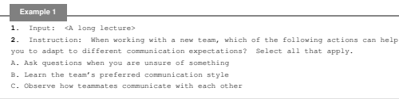

D. Ignore the team's communication preferences and use your **own style**
3**. Output: ABC**
Grade School Math This dataset is derived from 100-grade school math problems in the GSM8k dataset Cobbe et al. (2021). Increasing the number of high-quality and complex examples usually has a positive effect on solving math problems. We construct 16 in-context examples with lengthy Chain-of-thought for this task where 8 examples come from *chain-of-thought-hub*3 using the hardest prompt and the remaining 8 examples are constructed by us. Models with 2k or 4k context length face difficulties while encoding the 16 examples. We experiment with the newly constructed examples and it perform better than only encoding 8 examples. (Denoted as "gsm100" in Table 1)

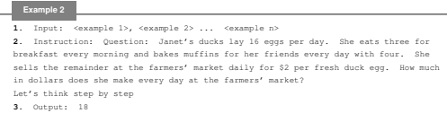

QuALITY in L-Eval This dataset (denoted as "quality" in Table 1) is sourced from the multiple choice QA dataset QuALITY Pang et al. (2022) which contains multiple-choice questions derived from the literature on Gutenberg. We filter 20 long stories and 202 questions and correct/delete questions with annotation errors. We found that most questions in QuALITY can be solved by extracting paragraphs from long texts. We further enhance questions that need global information like:
1. *What can we infer from the longest sentence in the story?* 2. The longest dialogue is spoken by whom? 3. *Extract names mentioned in the longest sentence in the story.*

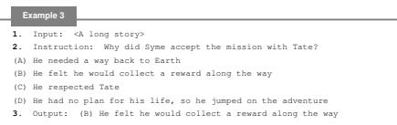

Topic retrival This dataset comes from the LongChat repository Li et al. (2023a), and its task style focuses on retrieving topics from extensive chat histories. Recent studies show that language models are good at retrieving information from the very beginning or end of its input context but are usually lost in the middle Liu et al. (2023). To make the task more challenging, we enhance the original task by asking the model to extract the second and the third topic. (Denoted as "topic retrieval" in Table 1)
Example 4

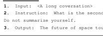

2**. Instruction: What is the second topic we discussed? Only give me the topic name.**
3**https://github.com/FranxYao/chain-of-thought-hub/blob/main/gsm8k/lib_prompt/prompt_hardest.txt**
TPO in L-Eval This dataset is sourced from the TOEFL Practice Online and we collect the data from TOEFL-QA Tseng et al. (2016); Chung et al. (2018) and all lectures from a single TPO have been consolidated into one lengthy lecture. After the consolidation, we select the top 15 longest lectures. (Denoted as "tpo" in Table 1)

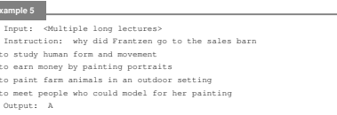

Questions on Public Earning Call transcripts This dataset is derived from earnings call transcripts obtained from the Investor Relations section of the company websites, including Oclaro, Theragenics, FS KKR Capital Corp, LaSalle Incorporated, Renewable Energy Group. The questionand-answer pairs are annotated by us. Considering the annotation cost of non-finance students, we only annotate 6 transcripts with 52 questions. (Denoted as "financial qa" in Table 1)

Questions on Legal Contracts Questions on the Legal domain are drawn from the CUAD (Contract Understanding Atticus Dataset) dataset Hendrycks et al. (2021b) designed for supporting NLP research for automating legal contract review. We manually filter 20 documents with annotated QA pairs from CUAD. (Denoted as "legal contract qa" in Table 1)

Example 7

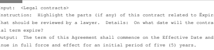

Multi-turn Dialogue based on Multi-Documents This dataset is sampled from the Multi- Doc2Dial dataset Feng et al. (2021) which aims to model goal-oriented dialogues grounded in multiple documents. It contains dialogues from 4 different domains: Finance, Travel, Entertainment, and Shopping. Each dialogue in the dataset is grounded in 2-5 relevant documents covering different topics within the domain. (Denoted as "multidoc qa" in Table 1)
Example 8 1**. Input: <Multiple long documents>** 2**. Instruction: How long will Driver's Ed courses be valid for?** 3**. Output: For roughly 1 one year. Maybe longer depending on the course.**
Natural Questions in L-Eval We filter 20 wikipedia long documents from Natural Question Kwiatkowski et al. (2019) on Google Research datasets. Questions can be answered with the same documents are merged, and duplicate questions are removed. (Denoted as "natrual question" in Table 1)

Example 9

1**. Input: <Documents from Wiki>**

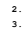 2**. Instruction: when did season 2 of handmaid's tale start** 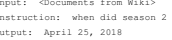

NarrativeQA in L-Eval This dataset is collected from NarrativeQA Koˇcisk ´y et al. (2017) which has the longest document length in L-Eval. The original question-answering dataset was created using entire books from Project Gutenberg4and movie scripts from various websites. Summaries of the books and scripts were taken from Wikipedia and given to annotators. Our work focuses on correcting the annotation error for example, there are some issues where the main character in the question does not even appear in the input document at all. (Denoted as "narrative qa" in Table 1)

Example 10

1**. Input: <A long story>**

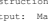 2**. Instruction: Why did Mary pay off the debt for Ann's family?** 3**. Output: Mary was in love with Ann.**
QA on Scientific Papers Filtered from the Qasper dataset Dasigi et al. (2021), which is a questionanswering resource focused on NLP papers. The dataset was constructed using NLP papers that were extracted from the Semantic Scholar Open Research Corpus (S2ORC). After filtering, we remove the unanswerable questions and the extractive version answers. We also discovered instances where identical questions yielded contradictory answers. We addressed this issue by meticulously reviewing the paper and rectifying the incorrect responses. (Denoted as "narrative qa" in Table 1)
Example 11

1**. Input: <A long paper>**

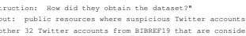

3**. Output: public resources where suspicious Twitter accounts were annotated, list**
Government Reports Summarization Retrieved from the government report summarization dataset Huang et al. (2021), the dataset consists of long reports written by U.S. government research agencies such as the Congressional Research Service and Government Accountability Office. The documents and summaries in this dataset are longer compared to other long document summarization datasets. We manually filter 13 documents with human-written summaries from the original dataset. (Denoted as "gov report summ" in Table 1)

Example 12

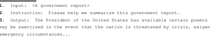

Query-based Meeting Summarization Sourced from the QMSum Zhong et al. (2021), this dataset contains query-based meeting summarizations. Query-based summarization aims to summarize the document given a specific aspect. We selected 20 meeting transcripts accompanied by queries, specifically choosing those that could not be easily addressed through retrieval methods. (Denoted as "meeting summ" in Table 1)
Example 13 1**. Input: <Meeting trancripts>** 2**. Instruction: What was agreed upon on sample transcripts?**

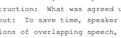 3**. Output: To save time, speaker mn005 will only mark the sample of transcribed data**
for regions of overlapping speech, as opposed to marking all **acoustic events...**
News Summarization This dataset is sourced from the Multi-News Fabbri et al. (2019). The original Multi-News dataset contains news articles as well as human-written summaries of those articles, compiled from the website newser.com where each article consists of multiple short news articles. We select 10 articles for the L-Eval benchmark. (Denoted as "news summ" in Table 1)

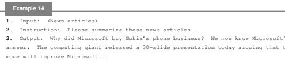

Collaborative Writing and Reviewing for Papers This task aims to help researchers working on scientific papers by dealing with tasks like correcting grammar errors or typos and writing some sections. We include 3 tasks in the paper writing assistant task of L-Eval: 1) writing an Abstract section, (2) writing a Related Work section, and (3) finally giving a review of this paper. Notably, we discourage reviewers from using large models for reviews. Our aim is to assist authors in further improving their papers. Therefore, we ask the model to give some valuable suggestions and raise some questions for authors. We filter 20 papers with well-written reviews for L-Eval. We use the processed PDF files from Yuan et al. (2021). (Denoted as "paper assistant" in Table 1)

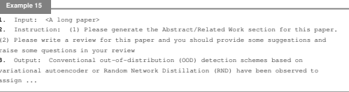

Patent Summarization Derived from the BigPatent Sharma et al. (2019) project, which consists of 1.3 million records of U.S. patent documents along with human-written abstractive summaries, we select 13 patent patents from the original dataset. (Denoted as "patent summ" in Table 1)

Example 16

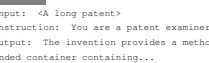 3**. Output: The invention provides a method and system for cleaning pet paws providing**
2**. Instruction: You are a patent examiner. Please write a summary of this patent.**
Review (Opinion) Summarization Review (Opinion) Summarization aims to summarize the reviews from customs reviews on a restaurant or hotel. We obtain 20 samples from the validation and test set of SPACE Angelidis et al. (2021) where human-written abstractive summaries are created for 50 hotels based on 100 input reviews each. SPACE consists of customer reviews of hotels from TripAdvisor, with 1.1 million training reviews for 11,000 hotels. The original task asks the model to summarize hotels from multiple aspects: food, location, cleanliness, etc. We construct the instructions for review summarization via performing Self-Instruct on GPT-4. (Denoted as "review summ" in Table 1)

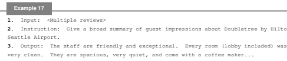

TV Show Summarization Originating from the SummScreen Chen et al. (2022), the original dataset is an abstractive summarization dataset combining TV series transcripts and episode recaps. SummScreen is constructed from fan-contributed websites. We filter 13 transcripts for L-Eval. (Denoted as "tv show summ" in Table 1)

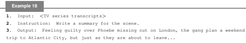

## 4 Statistics

The statistics of L-Eval are shown in Table 1. The tasks and styles of instruction range from multiple-choice questions (coursera, quality, tpo), school math problems (gsm100), topic retrieval
(topic retrieval), to various forms of question-answering (financial qa, legal contract qa, multidoc qa, natural question, narrative qa, scientific qa) and summarization tasks (gov report summ, meeting summ, news summ, paper assistant, patent summ, review summ, tv show summ). The datasets are also diverse in terms of their complexity and size. While some tasks such as "school math" contain 100 samples with a notably lengthy instruction, others such as "legal contract QA" or "multidoc QA" have more samples with long context documents. This diversity represents realworld scenarios where different tasks may require different lengths of context and instructions. The output length varies significantly across tasks, which is indicative of the different response formats expected in these tasks. Some tasks require short answers or selections, while others involve lengthier summaries or comprehensive responses.

## 5 Evaluating Lclms On L-Eval

In this section, we describe the various methods and metrics we use to evaluate our models. The evaluation procedure first splits all the tasks into two groups, namely *Closed-eneded Generation* and Open-eneded Generation, with different evaluation metrics applied for each group. Questions within the closed-ended group usually have a concrete answer and they are assessed using exact match style metrics, thereby eliminating issues related to evaluation fairness. However, considering that in realworld applications, the generated answer may not be exactly the same as the reference, especially for long documents tasks that require a general understanding of the whole context. To institute standardized evaluation for the open-ened group, we adopt a multi-faceted evaluation process using 3 evaluation methods: ngram match evaluation, large language model evaluation (LLM-as-a-judge), and human evaluation.

#### 5.1 Exam Evaluation

The exam evaluation is designed for the closed-ended tasks such as multiple-choice questions (single correct option), multiple-answer questions (multiple correct options), math word problems, and topic retrieval. The evaluation metric used for these tasks follows the exact match format, similar to grading exam papers. Each question's score is calculated as 100 divided by the number of questions. In cases like multiple-answer questions, if the predicted answer does not cover all correct answers, only a quarter of the score for this question is awarded.

Table 1: This table presents the statistics of the L-Eval dataset. **Data-name** represents the name of the dataset, **Instruction-style** indicates the type of task or the style of instruction in the dataset, \#samples refers to the number of samples, **\#insts** denotes the number of instructions provided for each sample, **doc-len** signifies the average length (in words) of the document inputs, **inst-len** stands for the average length (in words) of the instructions provided for each sample, and **Ans-len** corresponds to the average length (in words) of the expected output for each sample in the dataset.

| Data\-name                    | Instruction\-style              |     |     | #Samples #Insts Doc\-len Inst\-len Ans\-len   |      |     |
|-------------------------------|---------------------------------|-----|-----|-----------------------------------------------|------|-----|
| coursera                      | multiple\-choice question       | 15  | 172 | 6950                                          | 52   | 1   |
| gsm100                        | school math                     | 100 | 100 | 0                                             | 3335 | 1   |
| quality                       | multiple\-choice question       | 15  | 202 | 4161                                          | 58   | 12  |
| topic retrieval               | retrieving topics               | 50  | 150 | 8843                                          | 17   | 6   |
| tpo                           | multiple\-choice question       | 15  | 269 | 2986                                          | 53   | 1   |
| financial qa                  | abstractive QA                  | 6   | 52  | 4000                                          | 39   | 61  |
| legal contract qa             | abstractive QA                  | 20  | 130 | 18115                                         | 36   | 64  |
| multidoc qa                   | abstractive QA                  | 20  | 136 | 2802                                          | 14   | 21  |
| natural question              | abstractive QA                  | 20  | 104 | 13245                                         | 10   | 4   |
| narrative qa                  | abstractive QA                  | 20  | 182 | 32805                                         | 10   | 10  |
| scientific qa                 | abstractive QA                  | 20  | 160 | 3238                                          | 7    | 12  |
| gov report summ summarization |                                 | 13  | 13  | 4420                                          | 7    | 264 |
| meeting summ                  | query\-based summarization      | 20  | 156 | 11441                                         | 10   | 60  |
| news summ                     | summarization                   | 11  | 11  | 4658                                          | 5    | 274 |
| paper assistant               | completing and reviewing papers | 20  | 60  | 6145                                          | 76   | 275 |
| patent summ                   | summarization                   | 13  | 13  | 4025                                          | 12   | 124 |
| review summ                   | query\-based summarization      | 20  | 120 | 14789                                         | 14   | 97  |
| tv show summ                  | summarization                   | 13  | 13  | 5834                                          | 6    | 98  |

#### 5.2 N-Gram Matching Evaluation

For the open-ended generation group, which includes tasks like summarization, abstractive question answering, and writing assistance, we employ previous widely used N-gram match evaluation metrics: F1 and ROUGE. The cheap cost of these automatic metrics makes it possible to evaluate all samples in L-Eval. However, these metrics might struggle to discern between models when the performance gap is not significant due to their reliance on lexical matching. It's worth noting that n-gram matching metrics like F1 are very sensitive to the length of the ground truth, exhibiting a length bias. In preliminary experiments, models that produce lengthy answers with explanations, like turbo-16k, achieved low F1 scores. To reduce length bias, we suggest adding length instructions (e.g., "please answer with 10 words") while testing n-gram metrics. Informing or not informing the model about the required generation length can sometimes lead to a discrepancy of about 20 point on F1 score. Telling the prediction length will make the score more coherent with human judgement.

There are also other problems of Lexical matching metrics which make them not a suitable metric for instruction-following language models which tend to generate more flexiable outputs with chainof-thought. Therefore, we strongly support the use of LLM evaluators and human evaluators.

#### 5.3 Large Language Model Evaluation

The objective of assessing long context language models is to enable a highly potent large language model like GPT4 to function in the capacity of a human evaluator. LLM evaluation in L-Eval takes the pair-wise battle format which is similar with popular instruction-following language model benchmark AlpacaEval . To adapt the pair-wise battle into long context language models evaluation, we first select turbo-16k-0613 as the baseline (prediction files can be found in our github repo5)
and we suggest reporting the win-rates of your model vs turbo-16k-0613 (i.e., Win % vs turbo-

5**https://github.com/OpenLMLab/LEval**
16k-0613). We also provide the predictions from Claude 1.3 with a context length of 100k, and you are also able to report the *Win % vs Claude-100k* when your model can achieve a significant victory over turbo-16k. When assessing language model performance on long texts, it's impractical to feed the entire lengthy inputs into the evaluation model like GPT4. Consequently, evaluation results mainly depend on the semantic similarity with the reference answer and its pertinence to the user's question. Nevertheless, we find that LLM evaluators tend to favour more detailed answers. As we cannot input the whole long document during pair-wise battle, responses that contain extra information or details, albeit with incorrect specifics, might be assigned a higher score. It is crucial for the judgment model to bear in mind that details not corroborated by the reference answers should not be considered beneficial. An example of a system prompt for LLM evaluator on long sequences is given as follows:

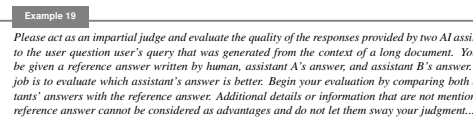

We observe that GPT4 evaluator achieves very high consistence with human evaluation but it is also expensive. Considering the high cost, we filter 17 diverse long documents with 96 questions used for GPT4 evaluation. There is an option for Turbo3.5 Evaluation, which, while less expensive, is not as accurate as the GPT4 evaluation. It is available for researchers who do not have access to the GPT4 API. For more reliable assessment we incorperate more samples in Turbo3.5 Evaluation, that is 29 long documents with 181 questions.

#### 5.4 Human Evaluation

Despite we prompt the LLM not to favour detailed answer, but practically, it usually vote for lengthy and detailed outputs even if the details are not supported in the long document. Therefore, we also need a human evaluation. We engage human evaluators to score the model's output on a scale of 1 to 5, where 1 signifies poor output, and 5 signifies excellent output. We utilize a subset of 12 long documents with 85 questions for human evaluation. Each question has a ground truth reference along with GPT4-32k output and Claude-100k output. While conducting human evaluation, researchers can also understand the performance gap during scoring the outputs from open-source models and state-of-the-art long context language models. Results of human evluation are comming soon.

## 6 Preliminary Results

6.1 BASELINES AND SETUP
Commercial Models Claude-100k is developed by Anthropic6and targets understanding extreme long documents and answering related questions. Turbo-16k-0613 is the snapshot of GPT-3.57from June 13th 2023 which can handle up to 16k input tokens. Open-source models LLaMa-7b (Touvron et al., 2023) is an widely used open-source model developed by Meta AI with 2k pre-training token length. LLaMa2-7b and LLaMa2-7b-chat8is the next version of LLaMA with 4k pre-training token length. LLaMa2-chat is a finetuned version for dialogue usage. ChatGLM2-6b-8k9 Du et al. (2022) is the second version of the open-source bilingual chat model ChatGLM-6B. The context length of the base model is 32k and finetuned on 8k length dialogue data. XGen-8k-inst (Nijkamp et al., 2023) was first pretrained in 2k context windows, and further trained using 4k and further 8k context size. We use their instruction-tuned version.

6**https://www.anthropic.com/index/100k-context-windows** 7**https://platform.openai.com/docs/models** 8**https://github.com/facebookresearch/llama**
9**https://github.com/THUDM/ChatGLM2-6B**

| Model                 | Ret.   | Tokens   | coursera   | gsm100                                | quality   | tpo   | Avg.   | topic ret.   |
|-----------------------|--------|----------|------------|---------------------------------------|-----------|-------|--------|--------------|
| turbo\-16k\-0613      | ✗      | 16k      | 59.73      | 84.00                                 | 62.37     | 69.88 | 68.99  | 69.33        |
| ada\-turbo\-0613      | ✓      | 4k       | 65.69      | 23.00                                 | 57.92     | 77.32 | 55.98  | 37.33        |
| bm25\-turbo\-0613     | ✓      | 4k       | 68.75      | 23.00                                 | 57.92     | 74.34 | 56.00  | 39.33        |
| llama\-7b\-2k         | ✗      | 2k       | 3.63       | 7.00                                  | 21.78     | 30.85 | 15.81  | 36.66        |
| llama2\-7b\-4k        | ✗      | 4k       | 3.48       | 2.00                                  | 28.71     | 24.53 | 14.68  | 24.00        |
| llama2\-7b\-chat      | ✗      | 2k       | 37.35      | 6.00                                  | 35.64     | 50.18 | 32.29  | 51.33        |
| llama2\-7b\-chat      | ✗      | 4k       | 38.95      | 19.00                                 | 37.62     | 51.67 | 36.81  | 52.00        |
| chatglm2\-6b\-8k      | ✗      | 8k       | 47.23      | 18.00                                 | 44.05     | 54.64 | 38.89  | 10.00        |
| longchat\-7b\-16k     | ✗      | 8k       | 38.95      | 11.00                                 | 31.68     | 49.07 | 32.67  | 36.66        |
| longchat\-7b\-16k     | ✗      | 16k      | 39.53      | 10.00                                 | 33.66     | 47.95 | 32.78  | 28.66        |
| longchat\-13b\-16k    | ✗      | 8k       | 36.91      | 2.00                                  | 30.20     | 44.98 | 28.52  | 33.33        |
| xgen\-7b\-8k          | ✗      | 8k       | 35.61      | 16.00                                 | 29.82     | 40.89 | 30.58  | 4.67         |
| mpt\-7b\-65k          | ✗      | 8k       | 27.03      | 8.00                                  | 25.24     | 17.84 | 19.52  | 0.00         |
|                       |        |          |            | Results with original pretrain length |           |       |        |              |
| chatglm2\-6b (2k)     | ✗      | 2k       | 46.36      | 13.00                                 | 40.59     | 53.90 | 38.46↓ | 42.00        |
| longchat\-7b (2k)     | ✗      | 2k       | 33.86      | 7.00                                  | 35.14     | 43.12 | 29.78↓ | 40.66        |
| xgen\-7b (2k\-4k\-8k) | ✗      | 2k       | 35.61      | 16.00                                 | 32.17     | 42.37 | 31.53↑ | 22.00        |

Table 2: Exam evaluation on 5 sub-tasks for current LCLMs. **Ret.** indicates whether we use retrievebased algorithms for the base model. **Tokens** denotes the number of input tokens of the model. To evaluate the effectiveness of further fine-tuning, we use various input length.

LongChat-7b-16k (Li et al., 2023a) was trained with longer context size using position interpolation and thus extended the context length of existing LLaMA. MPT-7B-StoryWriter-65k+10 is designed to handle super-long context lengths. It was tuned on MPT-7B with a context length of 65k tokens on a subset of Books3 dataset. Retrieve-based approaches We implemented a naive retrieval-augmented approach to extract 4 pieces of 1k-chunked documents, and LLMs are queried based on the retrieved contents. The retriever can either utilize dense retrieval with powerful OpenAI AdaEmbedding as the vector representation or sparse retrieval based on BM25. The implementation is based on **langchain**11. The prompt used as follows:
Example 20 Use the following pieces of context to answer the question at *the end. If you don't know the answer,* just say that you don't know, don't try to make up an answer. {context} Question: {*question*}

#### 6.2 Results Analysis

There are considerable gaps between open-source models and **commercial models** As shown in Table 3, the commercial models GPT3.5-16k and Claude-100k are more advanced compared to the open-source models. For automatic evaluation metrics, as we can see in Table 2, Table 4, Table 6 and Table 5, the advantage remains evident, particularly for tasks that necessitate an exact match. For those open-ended generation tasks especially summarization tasks, the difference between commercial models and open-source models is not significant as other tasks. We assume that the summarization tasks require less reasoning ability from models and instead rely more on basic language generation capacity, which can be easily accomplished by the listed LLMs. Open-source models struggle to effectively fully comprehend and reason with lengthy documents. In the end, only for the government report and the patent summarization task (2 out of 18 tasks), LongChat and LLaMA2 separately beat Turbo-16k. For LLM evaluation, Turbo-16k and Claude-100k are always victorious.

10**https://www.mosaicml.com/blog/mpt-7b**
11**https://github.com/hwchase17/langchain**

Table 3: Overall results on the comparison of different models against Turbo-16k-0613 of the openended generation tasks in L-Eval. Turbo3.5 is a biased evaluator that prefers long answers. Therefore, if you have the GPT-4 API, we do not suggest evaluating generation results with the Turbo3.5

| Model                 |    | Ret. Tokens   |     | GPT4 evaluator   |        |                                                       | Turbo3.5 evaluator (Biased)   |          |
|-----------------------|----|---------------|-----|------------------|--------|-------------------------------------------------------|-------------------------------|----------|
|                       |    |               |     |                  |        | n wins n draws win\-rate % n wins n draws win\-rate % |                               |          |
| claude\-100k          | ✗  | 100k          | 106 | 46               | 67.19  | 187                                                   | 32                            | 59.02    |
| ada\-turbo\-0613      | ✓  | 4k            | 55  | 70               | 47.87  | 123                                                   | 62                            | 45.16    |
| bm25\-turbo\-0613     | ✓  | 4k            | 53  | 55               | 49.44  | 136                                                   | 67                            | 48.84    |
| turbo\-16k\-0613 (2k) | ✗  | 2k            | 46  | 72               | 43.19↓ | 131                                                   | 59                            | 46.25↓   |
| llama2\-7b\-chat      | ✗  | 2k            | 51  | 52               | 40.10↓ | 118                                                   | 46                            | 40.28↓   |
| llama2\-7b\-chat      | ✗  | 4k            | 56  | 62               | 45.31  | 124                                                   | 46                            | 43.24  - |
| longchat\-7b\-16k     | ✗  | 2k            | 30  | 67               | 33.42↓ | 94                                                    | 33                            | 32.21↓   |
| longchat\-7b\-16k     | ✗  | 16k           | 50  | 52               | 39.79  | 107                                                   | 28                            | 36.89    |
| chatglm2\-7b\-8k      | ✗  | 8k            | 27  | 67               | 31.51  | 145                                                   | 34                            | 47.09    |
| xgen\-7b\-8k          | ✗  | 8k            | 30  | 71               | 34.29  | 106                                                   | 55                            | 39.38    |

evaluator.

| Model                 | Ret.   | Tokens   | Fin.   | Contract                              | Multidoc   | Nrtv   | NQ    | SCI   | Avg.   |
|-----------------------|--------|----------|--------|---------------------------------------|------------|--------|-------|-------|--------|
| turbo\-16k\-0613      | ✗      | 16k      | 45.36  | 24.87                                 | 31.45      | 18.20  | 45.90 | 28.25 | 32.33  |
| ada\-turbo\-0613      | ✓      | 4k       | 39.69  | 24.09                                 | 35.62      | 18.59  | 49.66 | 33.36 | 33.50  |
| bm25\-turbo\-0613     | ✓      | 4k       | 40.79  | 26.10                                 | 35.17      | 16.32  | 53.73 | 25.83 | 32.99  |
| llama2\-7b\-chat\-4k  | ✗      | 2k       | 36.50  | 22.74                                 | 25.47      | 16.39  | 32.67 | 23.79 | 26.25  |
| llama2\-7b\-chat\-4k  | ✗      | 4k       | 40.06  | 23.00                                 | 27.28      | 13.48  | 28.11 | 25.95 | 26.31  |
| longchat\-7b\-16k     | ✗      | 8k       | 31.87  | 18.35                                 | 7.14       | 5.20   | 8.64  | 5.98  | 12.86  |
| longchat\-7b\-16k     | ✗      | 16k      | 38.37  | 26.78                                 | 8.31       | 15.17  | 20.21 | 9.74  | 12.86  |
| longchat\-13b\-16k    | ✗      | 8k       | 36.94  | 16.70                                 | 10.77      | 7.55   | 14.14 | 9.91  | 16.00  |
| chatglm2\-6b\-8k      | ✗      | 4k       | 34.75  | 16.44                                 | 17.34      | 10.95  | 17.60 | 13.15 | 18.37  |
| chatglm2\-6b\-8k      | ✗      | 8k       | 33.17  | 15.76                                 | 13.76      | 7.02   | 3.50  | 6.36  | 13.26  |
| xgen\-7b\-8k          | ✗      | 4k       | 35.20  | 18.51                                 | 15.68      | 9.41   | 9.90  | 6.99  | 15.94  |
| xgen\-7b\-8k          | ✗      | 8k       | 35.61  | 22.01                                 | 15.68      | 9.41   | 9.90  | 6.99  | 16.6   |
| mpt\-7b\-65k          | ✗      | 8k       | 10.01  | 6.24                                  | 3.95       | 1.77   | 0.77  | 1.68  | 4.06   |
|                       |        |          |        | Results with original pretrain length |            |        |       |       |        |
| chatglm2\-6b (2k)     | ✗      | 2k       | 29.60  | 19.06                                 | 16.22      | 13.21  | 17.52 | 12.26 | 17.97↑ |
| longchat\-7b (2k)     | ✗      | 2k       | 27.27  | 19.78                                 | 13.99      | 13.21  | 18.11 | 7.61  | 16.66↑ |
| xgen\-7b (2k\-4k\-8k) | ✗      | 2k       | 35.20  | 22.01                                 | 16.89      | 13.90  | 15.01 | 21.08 | 20.68↑ |

Table 4: Performance of various models on different datasets in terms of F1.

Larger context sizes do not always contribute to better long document understanding capacity for some open-source models As shown in Table 2, Table 4, Table 6 and Table 5, we can observe that for open-source models like ChatGLM2, LongChat, and XGen, when we truncate the input context size to their pretrain length 2k, they would achieve better results for some tasks than their extended 8k or 16k version. This phenomenon is not observed by more sophisticated LLMs (i.e. Turbo-16k and Claude-100k) in Table 3. This indicates that the longer context brings more noise than information for these models. We believe that training today's open-sourced LCLMs with longer context sizes but few instruction samples may not be the most optimal approach. This discovery motivates us to make further contributions to the LCLM community.

Retrieve-based model can not solve every long document task As shown in Table 2, retrievebased approaches generally yield better outcomes for tasks that have readily retrievable answers. In these tasks, if the inputs are lengthy, they can cause more distractions and hinder the performance of LCLMs compared to the regular context length model enhanced with a retrieve-based approach. Besides, we also noticed that the main reason why regular turbo-0613 outperforms turbo-16k is

| Model  Tokens         |     |       | paper assistant   |                                       |       | review summ   |       |       | meeting summ   |       | Avg    |
|-----------------------|-----|-------|-------------------|---------------------------------------|-------|---------------|-------|-------|----------------|-------|--------|
| R\-1                  |     |       | R\-2              | R\-L                                  | R\-1  | R\-2          | R\-L  | R\-1  | R\-2           | R\-L  |        |
| turbo\-16k\-0613      | 16k | 39.55 | 10.92             | 18.61                                 | 30.18 | 7.14          | 18.67 | 30.20 | 7.22           | 19.31 | 20.2   |
| ada\-turbo\-0613      | 4k  | 38.07 | 9.61              | 17.33                                 | 29.81 | 6.47          | 18.91 | 31.92 | 8.24           | 20.84 | 20.13  |
| bm25\-turbo\-0613     | 4k  | 41.59 | 13.39             | 21.24                                 | 29.89 | 5.99          | 18.19 | 31.37 | 8.50           | 20.65 | 21.20  |
| llama2\-7b\-chat      | 2k  | 39.23 | 11.19             | 19.51                                 | 29.49 | 5.91          | 18.51 | 28.19 | 6.06           | 19.12 | 19.69  |
| llama2\-7b\-chat      | 4k  | 37.15 | 9.47              | 18.05                                 | 29.75 | 6.61          | 18.96 | 28.75 | 6.24           | 19.37 | 19.37  |
| longchat\-7b\-16k     | 8k  | 33.93 | 8.22              | 16.32                                 | 23.19 | 5.19          | 15.09 | 15.65 | 2.89           | 10.73 | 14.57  |
| longchat\-7b\-16k     | 16k | 35.05 | 8.57              | 16.70                                 | 26.07 | 5.97          | 17.06 | 20.13 | 4.74           | 13.21 | 16.38  |
| longchat\-13b\-16k    | 8k  | 34.29 | 8.21              | 16.06                                 | 26.76 | 5.61          | 16.77 | 20.86 | 4.01           | 13.81 | 16.26  |
| chatglm2\-6b\-8k      | 8k  | 38.07 | 9.61              | 17.33                                 | 29.81 | 6.47          | 18.91 | 24.74 | 4.45           | 15.89 | 18.36  |
| xgen\-7b\-8k          | 8k  | 31.58 | 7.00              | 15.19                                 | 24.28 | 4.53          | 15.70 | 21.45 | 3.68           | 13.74 | 15.23  |
| mpt\-7b\-65k          | 8k  | 15.91 | 2.91              | 11.18                                 | 7.66  | 1.00          | 7.00  | 5.24  | 0.71           | 5.10  | 6.30   |
|                       |     |       |                   | Results with original pretrain length |       |               |       |       |                |       |        |
| chatglm2\-6b (2k)     | 2k  | 36.91 | 9.45              | 17.96                                 | 27.74 | 5.77          | 17.62 | 25.92 | 5.61           | 17.57 | 18.28↓ |
| longchat\-7b (2k)     | 2k  | 37.01 | 9.61              | 18.21                                 | 26.45 | 5.05          | 16.88 | 23.92 | 4.65           | 15.75 | 17.50↑ |
| xgen\-7b (2k\-4k\-8k) | 2k  | 34.76 | 7.86              | 17.71                                 | 28.96 | 6.48          | 18.85 | 28.00 | 6.02           | 19.03 | 18.63↑ |

Table 5: Performance of various models on **query-based** summarization and generation tasks.

| Model              | Tokens   | gov report          |           | news                                  | patent   |                          |           | tv show   |           | Avg         |
|--------------------|----------|---------------------|-----------|---------------------------------------|----------|--------------------------|-----------|-----------|-----------|-------------|
|                    |          | R\-1  R\-2          | R\-L R\-1 | R\-2 R\-L                             | R\-1     | R\-2                     | R\-L R\-1 |           | R\-2 R\-L |             |
| turbo\-16k\-0613   | 16k      | 45.9 15.6 23.6 35.3 |           | 8.1                                   |          | 16.1 46.0 20.3 29.3 32.0 |           | 5.4       | 16.9      | 24.5        |
| ada\-turbo\-0613   | 4k       | 45.0 14.3 20.8 35.7 |           | 7.7                                   |          | 15.4 45.6 15.9 27.6 30.0 |           | 3.3       | 15.2      | 23.0        |
| bm25\-turbo\-0613  | 4k       | 44.6 14.2 21.5 38.4 |           | 9.1                                   |          | 16.8 43.3 15.5 27.1 31.0 |           | 4.6       | 15.4      | 23.4        |
| llama2\-7b\-chat   | 2k       | 44.4 14.9 22.7 33.9 |           | 7.1                                   |          | 15.8 45.1 17.6 29.3 29.1 |           | 3.1       | 14.4      | 23.1        |
| llama2\-7b\-chat   | 4k       | 43.7 15.3 22.2 33.2 |           | 6.4                                   |          | 15.5 49.2 22.9 31.6 29.4 |           | 4.8       | 15.6      | 24.1        |
| longchat\-7b\-16k  | 8k       | 46.2 18.7 24.0 30.4 |           | 6.9                                   |          | 13.5 41.9 20.0 27.1 26.2 |           | 4.7       | 14.2      | 22.8        |
| longchat\-7b\-16k  | 16k      | 47.2 18.9 23.9 27.7 |           | 5.4                                   |          | 13.4 46.2 20.9 30.1 26.2 |           | 3.3       | 14.7      | 23.1        |
| longchat\-13b\-16k | 8k       | 49.3 19.5 25.1 34.9 |           | 7.4                                   |          | 15.5 43.5 20.1 28.0 31.0 |           | 4.5       | 15.7      | 24.5        |
| chatglm2\-6b       | 8k       | 40.6 14.3 21.5 32.9 |           | 7.2                                   |          | 15.1 46.3 22.3 31.4 27.5 |           | 2.6       | 14.5      | 23.0        |
| xgen\-7b\-8k       | 8k       | 36.1 11.0 18.2 28.2 |           | 6.2                                   |          | 12.9 38.1 14.3 24.8 27.1 |           | 2.5       | 14.1      | 19.4        |
| mpt\-7b\-65k       | 8k       | 33.3 10.7 19.3 13.6 |           | 1.5  9.2                              |          | 25.5 12.2 20.2 11.0      |           | 1.3       | 6.4       | 13.6        |
|                    |          |                     |           | Results with original pretrain length |          |                          |           |           |           |             |
| chatglm2\-6b       | 2k       | 45.2 18.3 24.6 32.1 |           | 6.9                                   |          | 15.0 44.6 22.1 30.0 26.4 |           | 2.6       | 13.8      | 23.4↑       |
| longchat\-7b       | 2k       | 43.6 16.2 23.7 28.1 |           | 4.8                                   |          | 13.0 47.0 22.2 30.9 27.2 |           | 3.0       |           | 14.4 22.84↓ |
| xgen\-7b           | 2k       | 43.8 15.4 22.2 30.3 |           | 6.5                                   |          | 14.8 46.5 20.8 30.7 28.4 |           | 3.8       |           | 15.1 23.19↑ |

Table 6: Performance of various models on long document summarization tasks.

its superior ability to accurately follow instructions. As a result, it can take advantage of n-gram evaluation metrics. However, even for these tasks, there are instances where the predicted answer might be "I don't know" or "not mentioned" due to the limitation of the retrieval process. Retrieval methods demonstrate comparatively less satisfactory performance in tasks where the answer cannot be retrieved, such as topic retrieval or tasks that demand models with long-range reasoning abilities like financial QA. retrieve-based models produce similar or even superior results. This may be due to the fact that some paragraphs resembling summaries can be retrieved. For retrievers, it is difficult to determine whether a dense or sparse retriever is definitively better than the other.

## 7 Conclusion

In conclusion, the much-needed rigorous benchmark L-Eval introduced in this work provides a comprehensive suite of tasks and evaluation metrics to assess the capabilities of long context language models. We tested most of open-sourced LCLMs and experiments demonstrate promising gains from extending context length and gaps compared to commercial models. Our analysis using L-Eval offers valuable insights into the current state and limitations of LCLMs. We believe that with its focus on practical, long-form documents across domains, L-Eval can serve as a challenging testbed to drive advances in modeling longer contexts. Future work can build upon L-Eval to further probe LCLM capabilities on complex, multi-step reasoning and knowledge integration over lengthy contexts.

## References

Stefanos Angelidis, Reinald Kim Amplayo, Yoshihiko Suhara, Xiaolan Wang, and Mirella Lapata. Extractive opinion summarization in quantized transformer spaces. Transactions of the Association for Computational Linguistics, 9:277–293, 2021. doi: 10.1162/tacl a 00366. URL https://aclanthology.org/2021.tacl-1.17.

Amanda Bertsch, Uri Alon, Graham Neubig, and Matthew R Gormley. Unlimiformer: Long-range transformers with unlimited length input. *arXiv preprint arXiv:2305.01625*, 2023.

Aydar Bulatov, Yuri Kuratov, and Mikhail S. Burtsev. Scaling transformer to 1m tokens and beyond with rmt, 2023.

Mingda Chen, Zewei Chu, Sam Wiseman, and Kevin Gimpel. Summscreen: A dataset for abstractive screenplay summarization, 2022.

Shouyuan Chen, Sherman Wong, Liangjian Chen, and Yuandong Tian. Extending context window of large language models via positional interpolation, 2023.

Yu-An Chung, Hung-Yi Lee, and James Glass. Supervised and unsupervised transfer learning for question answering. In *NAACL HLT*, 2018.

Karl Cobbe, Vineet Kosaraju, Mohammad Bavarian, Mark Chen, Heewoo Jun, Lukasz Kaiser, Matthias Plappert, Jerry Tworek, Jacob Hilton, Reiichiro Nakano, Christopher Hesse, and John Schulman. Training verifiers to solve math word problems, 2021.

Zihang Dai, Zhilin Yang, Yiming Yang, Jaime Carbonell, Quoc Le, and Ruslan Salakhutdinov.

Transformer-XL: Attentive language models beyond a fixed-length context. In Proceedings of the 57th Annual Meeting of the Association for Computational Linguistics, pp. 2978–2988, Florence, Italy, July 2019. Association for Computational Linguistics. doi: 10.18653/v1/P19-1285. URL https://aclanthology.org/P19-1285.

Tri Dao, Dan Fu, Stefano Ermon, Atri Rudra, and Christopher R´e. Flashattention: Fast and memory-efficient exact attention with io-awareness. In S. Koyejo, S. Mohamed, A. Agarwal, D. Belgrave, K. Cho, and A. Oh (eds.), Advances in Neural Information Processing Systems, volume 35, pp. 16344–16359. Curran Associates, Inc., 2022. URL https://proceedings.neurips.cc/paper_files/paper/2022/file/67d57c32e20fd0a7a302cb81d36e40d5-Paper-Conference.pdf.

Pradeep Dasigi, Kyle Lo, Iz Beltagy, Arman Cohan, Noah A. Smith, and Matt Gardner. A dataset of information-seeking questions and answers anchored in research papers, 2021.

Jiayu Ding, Shuming Ma, Li Dong, Xingxing Zhang, Shaohan Huang, Wenhui Wang, Nanning Zheng, and Furu Wei. Longnet: Scaling transformers to 1,000,000,000 tokens, 2023.

Zhengxiao Du, Yujie Qian, Xiao Liu, Ming Ding, Jiezhong Qiu, Zhilin Yang, and Jie Tang. Glm:
General language model pretraining with autoregressive blank infilling. In Proceedings of the 60th Annual Meeting of the Association for Computational Linguistics (Volume 1: Long Papers), pp. 320–335, 2022.

Alexander R. Fabbri, Irene Li, Tianwei She, Suyi Li, and Dragomir R. Radev. Multi-news: a largescale multi-document summarization dataset and abstractive hierarchical model, 2019.

Song Feng, Siva Sankalp Patel, Hui Wan, and Sachindra Joshi. MultiDoc2dial:
Modeling dialogues grounded in multiple documents. In Proceedings of the 2021 Conference on Empirical Methods in Natural Language Processing. Association for Computational Linguistics, 2021. doi: 10.18653/v1/2021.emnlp-main.498. URL https://doi.org/10.18653%2Fv1%2F2021.emnlp-main.498.

Daniel Y Fu, Tri Dao, Khaled Kamal Saab, Armin W Thomas, Atri Rudra, and Christopher Re. Hungry hungry hippos: Towards language modeling with state space models. In *The Eleventh International Conference on Learning Representations*, 2023. URL https://openreview.net/forum?id=COZDy0WYGg.

Kelvin Guu, Kenton Lee, Zora Tung, Panupong Pasupat, and Mingwei Chang. Retrieval augmented language model pre-training. In Hal Daum´e III and Aarti Singh (eds.), Proceedings of the 37th International Conference on Machine Learning, volume 119 of Proceedings of Machine Learning Research, pp. 3929–3938. PMLR, 13–18 Jul 2020. URL https://proceedings.mlr.press/v119/guu20a.html.

Dan Hendrycks, Collin Burns, Steven Basart, Andy Zou, Mantas Mazeika, Dawn Song, and Jacob Steinhardt. Measuring massive multitask language understanding, 2021a.

Dan Hendrycks, Collin Burns, Anya Chen, and Spencer Ball. Cuad: An expert-annotated nlp dataset for legal contract review, 2021b.

Luyang Huang, Shuyang Cao, Nikolaus Parulian, Heng Ji, and Lu Wang. Efficient attentions for long document summarization. In Proceedings of the 2021 Conference of the North American Chapter of the Association for Computational Linguistics: *Human Language Technologies*, pp.

1419–1436, Online, June 2021. Association for Computational Linguistics. doi: 10.18653/v1/
2021.naacl-main.112. URL **https://aclanthology.org/2021.naacl-main.112**.

Yuzhen Huang, Yuzhuo Bai, Zhihao Zhu, Junlei Zhang, Jinghan Zhang, Tangjun Su, Junteng Liu, Chuancheng Lv, Yikai Zhang, Jiayi Lei, Yao Fu, Maosong Sun, and Junxian He. C-eval: A multi-level multi-discipline chinese evaluation suite for foundation models. *arXiv preprint* arXiv:2305.08322, 2023.

Gautier Izacard, Patrick Lewis, Maria Lomeli, Lucas Hosseini, Fabio Petroni, Timo Schick, Jane Dwivedi-Yu, Armand Joulin, Sebastian Riedel, and Edouard Grave. Few-shot learning with retrieval augmented language models. *arXiv preprint arXiv:2208.03299*, 2022.

Tom´aˇs Koˇcisk ´y, Jonathan Schwarz, Phil Blunsom, Chris Dyer, Karl Moritz Hermann, G´abor Melis, and Edward Grefenstette. The narrativeqa reading comprehension challenge, 2017.

Tom Kwiatkowski, Jennimaria Palomaki, Olivia Redfield, Michael Collins, Ankur Parikh, Chris Alberti, Danielle Epstein, Illia Polosukhin, Jacob Devlin, Kenton Lee, Kristina Toutanova, Llion Jones, Matthew Kelcey, Ming-Wei Chang, Andrew M. Dai, Jakob Uszkoreit, Quoc Le, and Slav Petrov. Natural questions: A benchmark for question answering research. *Transactions of the* Association for Computational Linguistics, 7:452–466, 2019. doi: 10.1162/tacl a 00276. URL https://aclanthology.org/Q19-1026.

Dacheng Li, Rulin Shao, Anze Xie, Ying Sheng, Lianmin Zheng, Joseph E. Gonzalez, Ion Stoica, Xuezhe Ma, and Hao Zhang. How long can open-source llms truly promise on context length?, June 2023a. URL **https://lmsys.org/blog/2023-06-29-longchat**.

Mukai Li, Shansan Gong, Jiangtao Feng, Yiheng Xu, Jun Zhang, Zhiyong Wu, and Lingpeng Kong.

In-context learning with many demonstration examples, 2023b.

Xuechen Li, Tianyi Zhang, Yann Dubois, Rohan Taori, Ishaan Gulrajani, Carlos Guestrin, Percy Liang, and Tatsunori B. Hashimoto. Alpacaeval: An automatic evaluator of instruction-following models. **https://github.com/tatsu-lab/alpaca_eval**, 2023c.

Nelson F. Liu, Kevin Lin, John Hewitt, Ashwin Paranjape, Michele Bevilacqua, Fabio Petroni, and Percy Liang. Lost in the middle: How language models use long contexts, 2023.

Amirkeivan Mohtashami and Martin Jaggi. Landmark attention: Random-access infinite context length for transformers. *arXiv preprint arXiv:2305.16300*, 2023.

Erik Nijkamp, Tian Xie, Hiroaki Hayashi, Bo Pang, Congying Xia, Chen Xing, Jesse Vig, Semih Yavuz, Philippe Laban, Ben Krause, Senthil Purushwalkam, Tong Niu, Wojciech Kryscinski, Lidiya Murakhovs'ka, Prafulla Kumar Choubey, Alex Fabbri, Ye Liu, Rui Meng, Lifu Tu, Meghana Bhat, Chien-Sheng Wu, Silvio Savarese, Yingbo Zhou, Shafiq Rayhan Joty, and Caiming Xiong. Long sequence modeling with xgen: A 7b llm trained on 8k input sequence length. Salesforce AI Research Blog, 2023. URL https://blog.salesforceairesearch.com/xgen.

Richard Yuanzhe Pang, Alicia Parrish, Nitish Joshi, Nikita Nangia, Jason Phang, Angelica Chen, Vishakh Padmakumar, Johnny Ma, Jana Thompson, He He, and Samuel R. Bowman. Quality: Question answering with long input texts, yes!, 2022.

Bo Peng, Eric Alcaide, Quentin Anthony, Alon Albalak, Samuel Arcadinho, Huanqi Cao, Xin Cheng, Michael Chung, Matteo Grella, Kranthi Kiran GV, Xuzheng He, Haowen Hou, Przemyslaw Kazienko, Jan Kocon, Jiaming Kong, Bartlomiej Koptyra, Hayden Lau, Krishna Sri Ipsit Mantri, Ferdinand Mom, Atsushi Saito, Xiangru Tang, Bolun Wang, Johan S. Wind, Stansilaw Wozniak, Ruichong Zhang, Zhenyuan Zhang, Qihang Zhao, Peng Zhou, Jian Zhu, and Rui-Jie Zhu. Rwkv: Reinventing rnns for the transformer era, 2023.

Ofir Press, Noah Smith, and Mike Lewis. Train short, test long: Attention with linear biases enables input length extrapolation. In *International Conference on Learning Representations*, 2022. URL https://openreview.net/forum?id=R8sQPpGCv0.

Ori Ram, Yoav Levine, Itay Dalmedigos, Dor Muhlgay, Amnon Shashua, Kevin Leyton-Brown, and Yoav Shoham. In-context retrieval-augmented language models, 2023.

Eva Sharma, Chen Li, and Lu Wang. BIGPATENT: A large-scale dataset for abstractive and coherent summarization. In *Proceedings of the 57th Annual Meeting of the Association for Computational* Linguistics, pp. 2204–2213, Florence, Italy, July 2019. Association for Computational Linguistics. doi: 10.18653/v1/P19-1212. URL **https://aclanthology.org/P19-1212**.

Weijia Shi, Sewon Min, Michihiro Yasunaga, Minjoon Seo, Rich James, Mike Lewis, Luke Zettlemoyer, and Wen tau Yih. Replug: Retrieval-augmented black-box language models, 2023.

Yutao Sun, Li Dong, Barun Patra, Shuming Ma, Shaohan Huang, Alon Benhaim, Vishrav Chaudhary, Xia Song, and Furu Wei. A length-extrapolatable transformer, 2022.

Yutao Sun, Li Dong, Shaohan Huang, Shuming Ma, Yuqing Xia, Jilong Xue, Jianyong Wang, and Furu Wei. Retentive network: A successor to transformer for large language models, 2023.

Mirac Suzgun, Nathan Scales, Nathanael Sch¨arli, Sebastian Gehrmann, Yi Tay, Hyung Won Chung, Aakanksha Chowdhery, Quoc V. Le, Ed H. Chi, Denny Zhou, and Jason Wei. Challenging bigbench tasks and whether chain-of-thought can solve them, 2022.

Hugo Touvron, Thibaut Lavril, Gautier Izacard, Xavier Martinet, Marie-Anne Lachaux, Timoth´ee Lacroix, Baptiste Rozi`ere, Naman Goyal, Eric Hambro, Faisal Azhar, Aurelien Rodriguez, Armand Joulin, Edouard Grave, and Guillaume Lample. Llama: Open and efficient foundation language models, 2023.

Bo-Hsiang Tseng, Sheng-Syun Shen, Hung-Yi Lee, and Lin-Shan Lee. Towards machine comprehension of spoken content: Initial toefl listening comprehension test by machine. In INTER- SPEECH, 2016.

Weizhe Yuan, Pengfei Liu, and Graham Neubig. Can we automate scientific reviewing?, 2021. Ming Zhong, Da Yin, Tao Yu, Ahmad Zaidi, Mutethia Mutuma, Rahul Jha, Ahmed Hassan Awadallah, Asli Celikyilmaz, Yang Liu, Xipeng Qiu, and Dragomir Radev. Qmsum: A new benchmark for query-based multi-domain meeting summarization, 2021.