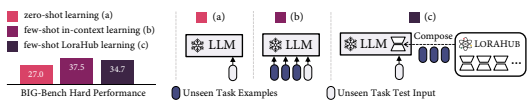
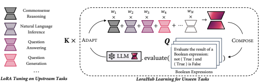
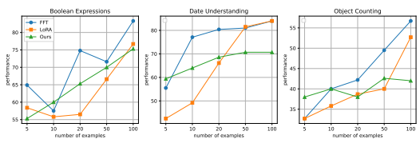

# Lorahub: Efficient Cross-Task Generaliza- Tion Via Dynamic Lora Composition

Chengsong Huang†§∗, Qian Liu†∗, Bill Yuchen Lin♢∗, Tianyu Pang†, Chao Du†**, Min Lin**†
†Sea AI Lab, Singapore
§Washington University in St. Louis, MO, USA
♢Allen Institute for AI, Seattle, WA, USA

# Abstract

Low-rank adaptations (LoRA) are often employed to fine-tune large language models (LLMs) for new tasks. This paper investigates LoRA composability for cross-task generalization and introduces LoraHub, a strategic framework devised for the purposive assembly of LoRA modules trained on diverse given tasks, with the objective of achieving adaptable performance on unseen tasks. With just a few examples from a novel task, LoraHub enables the fluid combination of multiple LoRA modules, eradicating the need for human expertise. Notably, the composition requires neither additional model parameters nor gradients. Our empirical results, derived from the Big-Bench Hard (BBH) benchmark, suggest that LoraHub can effectively mimic the performance of in-context learning in few-shot scenarios, excluding the necessity of in-context examples alongside each inference input. A significant contribution of our research is the fostering of a community for LoRA, where users can share their trained LoRA modules, thereby facilitating their application to new tasks. We anticipate this resource will widen access to and spur advancements in general intelligence as well as LLMs in production. Code will be available at github.com/sail-sg/lorahub.

Figure 1: The illustration of zero-shot learning, few-shot in-context learning and few-shot LoraHub learning (ours). Note that the Compose procedure is conducted per task rather than per example. Our method achieves similar inference throughput as zero-shot learning, yet approaches the performance of in-context learning on the BIG-Bench Hard (BBH) benchmark.

# 1 Introduction

Significant progress in natural language processing has been largely fueled by large-scale pretrained language models (LLMs) such as OpenAI GPT (Brown et al., 2020), Flan-T5 (Chung et al., 2022), and LLaMA (Touvron et al., 2023). These models demonstrate top-tier performance across multiple NLP tasks. However, their enormous parameter size presents issues regarding computational efficiency and memory usage during fine-tuning. To mitigate these challenges, Low-Rank Adaptation (LoRA) (Hu et al., 2022) has emerged as an efficient fine-tuning technique (Lester et al., 2021; He et al., 2022; An et al., 2022). By reducing memory demands and computational costs, it speeds up LLM training. LoRA achieves this by freezing the base model parameters (that is, an LLM) and training a lightweight, ancillary module, which regularly delivers high performance on target tasks.

1

∗The first three authors contributed equally to this work. Correspondence to Qian Liu at liuqian@sea.com.
While prior research has targeted the efficiency enhancement facilitated by LoRA, there is a dearth of investigation into the inherent modularity and composability of LoRA modules. Typically, previous methods train LoRA modules to specialize in individual tasks and domains. Yet, the intrinsic modularity of LoRA modules presents an intriguing research question: *Is it feasible to compose* LoRA modules for efficiently generalizing towards unseen tasks? In this paper, we tap into the potential of LoRA modularity for broad task generalization, going beyond single-task training to meticulously compose LoRA modules for malleable performance on unknown tasks. Crucially, our method enables an automatic assembling of LoRA modules, eliminating dependency on manual design or human expertise. With just a handful of examples from unencountered tasks (e.g., 5), our approach can autonomously orchestrate compatible LoRA modules without human intrusion. We do not presuppose which LoRA modules trained on specific tasks can be combined, offering flexibility in amalgamating any modules provided they conform to the specification (e.g., using the same LLM). As our approach leverages several available LoRA modules, we refer to it as LoraHub and denote our learning method as **LoraHub learning**. To validate the efficiency of our proposed methods, we test our approaches using the widely recognized BBH benchmark with Flan-T5 (Chung et al., 2022) serving as the base LLM. The results underline the effectiveness of the LoRA module composition for unfamiliar tasks through a few-shot LoraHub learning process. Remarkably, our methodology achieves a score that closely matches the performance of few-shot, *in-context* learning. Additionally, our method substantially reduces the inference cost compared to in-context learning, eliminating the requirement of examples as inputs for the LLM. Our learning procedure is also notable for its computational efficiency, using a gradientfree approach to obtain the coefficients of LoRA modules and requiring only a handful of inference steps for unseen tasks. For instance, when applied to the BBH, our methodology can deliver superior performance in less than a minute using a single A100. Importantly, LoraHub learning can feasibly be accomplished with a CPU-only machine, given that it merely requires proficiency to process LLM inference. With its versatility and robust performance, our work lays the foundation for the genesis of a platform, where users could effortlessly share, access, and apply trained LoRA modules to new tasks in this arena. Through such a platform, we envision the cultivation of a repository of reusable LoRA modules encompassing a myriad of capabilities. It also sets the stage for cooperative AI development, enabling the community to enrich the LLM's capabilities collectively via dynamic LoRA composition. The potential to share and reuse modules ensures the optimal application of resources across various tasks.

# 2 Problem Statement

Large Language Models We assume that a large language model Mθ is based on Transformer architecture (Vaswani et al., 2017) and has been pre-trained on a large-scale natural language corpus. The model architecture can be either encoder-decoder (Raffel et al., 2020) or decoder-only (Brown et al., 2020). Also, Mθ could also have been fine-tuned with a large set of instruction-following datasets such as Flan Colleciton (Longpre et al., 2023) and PromptSource (Bach et al., 2022).

Cross-Task Generalization Assume we have N distinct *upstream tasks*, referred to as T =
{T1*, ...,* TN }. In practical situations, it is typical for users to desire an LLM to execute novel tasks that it has not encountered before— an ability widely known as *cross-task generalization*. Generally, cross-task generalization falls into two categories: zero-shot learning (Mishra et al., 2022; Sanh et al., 2022a; Chung et al., 2022; OpenAI, 2022; Lin et al., 2022), which necessitates no labeled examples of the new task, and few-shot learning (Ye et al., 2021; Min et al., 2022) which demands a handful of labeled examples. Our paper principally concentrates on the latter, wherein for an unseen target task T
′ ∈/ T, users can only furnish a limited set of labeled examples, Q. Our aim is to modify the model Mθ to accustom itself to task T
′ using only Q. An intuitive method would be to directly fine-tune the weights of Mθ based on Q, yielding an updated model Mϕ with enhanced performance on T
′. However, this approach is inefficient, time-consuming, and unstable when Q is small.

LoRA Tuning LoRA (Hu et al., 2022), a parameter-efficient fine-tuning method, facilitates the adaptation of LLMs using a small-scale external module, eliminating the need for fine-tuning the entire model. LoRA tuning involves preserving the model weights while incorporating trainable

Figure 2: Our method encompasses two stages: the COMPOSE stage and the ADAPT stage. During the COMPOSE stage, existing LoRA modules are integrated into one unified module, employing a set of weights, denoted as w, as coefficients. In the ADAPT stage, the amalgamated LoRA module is evaluated on a few examples from the unseen task. Subsequently, a gradient-free algorithm is applied to refine w. After executing K iterations, a highly adapted LoRA module is produced, which can be incorporated with the LLM to perform the intended task.

low-rank decomposition matrices in each layer as an adapter module. Compared to the full LLM, this module possesses significantly fewer trainable parameters, paving the way for rapid and robust adaptation using minimal examples. As such, LoRA tuning presents a resource-efficient technique to quickly adapt LLMs for novel tasks with restricted training data. Nevertheless, its performance often dwindles with extremely constrained examples (e.g. 5 input-output pairs), as our experiments later illustrate. Hence, traditional LoRA methods primarily concentrate on training and testing within the same tasks, rather than venturing into few-shot cross-task generalization.

# 3 Methodology

As depicted in Figure 2, we initially train LoRA modules on a variety of upstream tasks. Specifically, for N distinct upstream tasks, we separately train N LoRA modules, each represented as mi for task Ti ∈ T. Subsequently, for a novel task T
′ ∈/ T, such as Boolean Expressions represented in Figure 2, its examples Q are utilized to steer the LoraHub learning process. The LoraHub learning encapsulates two main phases: the COMPOSE phase and the ADAPT phase. In the COMPOSE phase, all available LoRA modules are synthesized into a single module mˆ , using
{w1, w2*, . . . , w*N } coefficients, represented as mˆ =PN
i=1 wi × mi. Here, wiis a scalar weight that can assume positive or negative values. During the ADAPT phase, the assembled LoRA module mˆ is amalgamated with the LLM Mθ, and its performance on few-shot examples from the new task T
′is assessed. A gradient-free algorithm is subsequently deployed to update w, enhancing mˆ 's performance (e.g., loss) on the few-shot examples Q.

Finally, after iterating through K steps, the optimum performing LoRA module is applied to the LLM Mθ, yielding the final LLM Mϕ = LoRA(Mθ, mˆ ). This serves as an effectively adjusted model for the unseen task T
′, which will then be deployed and not updated anymore.

### 3.1 Lora Tuning On Upstream Tasks

LoRA effectively minimizes the count of trainable parameters through the process of decomposing the attention weight matrix update of the LLM, denoted as W0 ∈ Rd×k, into low-rank matrices. In more specific terms, LoRA exhibits the updated weight matrix in the form W0 + δW = W0 + AB,
where A ∈ R
d×rand B ∈ R
r×kare novel low-rank matrices with rank r, a dimension significantly smaller than those of d and k. In this context, the product AB defines the LoRA module m, as previously elaborated. By leveraging this low-rank decomposition, LoRA imposes limitations that substantially reduce the number of trainable parameters necessary for adjusting the LLM weights.

### 3.2 Compose: Element-Wise Composition Of Lora Modules

Within the COMPOSE phase, we implement an element-wise method for composing multiple LoRA modules. This process integrates the corresponding parameters of the LoRA modules, necessitating that the modules being combined maintain an identical rank r in order to align the structures effectively. Given that mi = AiBi, the combined LoRA module, denoted by mˆ , can be represented as:

$$v_{2}B_{2}+\cdot\cdot\cdot$$

mˆ = (w1A1 + w2A2 + · · · + wN AN )(w1B1 + w2B2 + *· · ·* + wN BN ). (1)
It is vital to acknowledge that the composition of an excessive number of LoRA modules concurrently may increase the weights to be searched for, potentially destabilizing the LoraHub learning process and consequently inhibiting optimal performance. To mitigate this, we implement a prefiltering procedure for the candidate LoRA modules before composition, similar to the pre-ranking stage utilized in search engines. In our experiments, we employ random selection to minimize the candidate space and further exploration of enhanced pre-filtering algorithms is regarded as future work. This concept is further elaborated in Section 8.

### 3.3 Adapt: Weight Optimization Via Gradient-Free Methods

During the ADAPT stage, our task is to fine-tune the coefficients w in order to boost the model's competency on a limited set of examples from a previously unseen task. One might think of using gradient descent for optimizing w, following standard backpropagation methods. However, this approach demands constructing a hypernet for all LoRA modules, reminiscent of differentiable architecture search methodologies (Zhang et al., 2019). This requirement for substantial GPU memory and time poses a challenge. Given that w consists of a relatively small number of parameters, we opted for gradient-free methods for optimization instead of gradient descent. We utilize a black-box optimization technique following previous works (Sun et al., 2022) to find the optimal weights. The optimization process is steered by the cross-entropy loss, setting the goal to locate the best weight set {w1, w2*, . . . , w*N } that reduces the loss L on the validation set Q.

Furthermore, we incorporate L1 regularization to penalize the sum of the absolute values of all the ws, helping to prevent obtaining extreme values. Consequently, the final objective of LoraHub is to minimize L + α ·PN
i=1 |wi|, where α serves as a hyperparameter.

In terms of the gradient-free methodology, we leverage Shiwa, a combinatorial optimization approach (Liu et al., 2020). Shiwa offers a variety of algorithms and chooses the most suitable optimization algorithm for different circumstances. In most of the forthcoming experimental setups, we primarily employ the Covariance Matrix Adaptive Evolution Strategies (CMA-ES) (Hansen & Ostermeier, 1996). Being a stochastic, derivative-free, population-based optimization algorithm, CMA-ES proves to be suitable for a wide range of optimization tasks. It adaptively updates a search distribution, characterized by a covariance matrix. In each iteration, CMA-ES refreshes the mean and covariance of the distribution toward target function optimization. For our case, we deploy this algorithm to shape the search space of w, and eventually select the best weights based on their performance on the few-shot examples from the unseen task.

# 4 Evaluation

In this section, we detail our principal experiments. We begin with an overview of the experimental setup and implementation intricacies. Following this, we share our findings and offer a succinct interpretation.

### 4.1 Experimental Framework

Large Language Model We employ Flan-T5 (Chung et al., 2022) as our chosen Large Language Model (LLM). This series of models, characterized by similar structures and varying sizes, exhibits exemplary zero-shot and few-shot capabilities commensurate with the model size. Our investigation particularly targets the Flan-T5 large model.

| Task                                        | Zero   | ICL   | LoraHub  avg   | LoraHub  best   |
|---------------------------------------------|--------|-------|----------------|-----------------|
| Boolean Expressions                         | 54.0   | 58.7  | 56.0           | 59.3            |
| Causal Judgement                            | 57.5   | 56.3  | 58.9           | 63.2            |
| Date Understanding                          | 15.3   | 22.7  | 29.6           | 38.0            |
| Disambiguation                              | 0.0    | 69.3  | 46.0           | 69.3            |
| Dyck Languages                              | 1.3    | 7.3   | 0.3            | 1.3             |
| Formal Fallacies                            | 51.3   | 58.0  | 52.1           | 55.3            |
| Geometric Shapes                            | 6.7    | 18.7  | 7.5            | 9.3             |
| Hyperbaton                                  | 6.7    | 74.0  | 57.5           | 61.3            |
| Logical Deduction§                          | 21.3   | 40.0  | 38.1           | 40.7            |
| (five objects)                              |        |       |                |                 |
| Logical Deduction§                          | 12.7   | 42.0  | 40.3           | 44.7            |
| (seven objects)                             |        |       |                |                 |
| Logical Deduction§                          | 0.0    | 51.3  | 49.7           | 51.3            |
| (three objects)                             |        |       |                |                 |
| Movie Recommendation                        | 62.7   | 52.7  | 61.1           | 64.0            |
| Multistep Arithmetic                        | 0.7    | 0.7   | 0.7            | 0.7             |
| Navigate                                    | 47.3   | 44.0  | 46.1           | 49.3            |
| Object Counting                             | 34.7   | 32.0  | 35.0           | 38.0            |
| Penguins in a Table                         | 43.5   | 39.1  | 43.9           | 45.7            |
| Reasoning about Colored Objects             | 32.0   | 38.7  | 36.5           | 40.7            |
| Ruin Names                                  | 23.3   | 18.7  | 21.0           | 23.3            |
| Salient Translation Error Detection         | 37.3   | 46.0  | 37.3           | 37.3            |
| Snarks                                      | 50.0   | 55.1  | 51.8           | 59.0            |
| Sports Understanding                        | 56.0   | 56.0  | 48.3           | 53.3            |
| Temporal Sequences                          | 16.7   | 26.7  | 18.7           | 21.3            |
| Tracking Shuffled Objects§                  | 12.0   | 12.0  | 12.0           | 12.0            |
| (five objects)                              |        |       |                |                 |
| Tracking Shuffled Objects§                  | 6.7    | 6.7   | 7.1            | 8.7             |
| (seven objects)                             |        |       |                |                 |
| Tracking Shuffled Objects§  (three objects) | 24.7   | 30.7  | 29.0           | 30.7            |
| Web of Lies                                 | 54.0   | 54.0  | 53.0           | 54.7            |
| Word Sorting                                | 1.3    | 0.7   | 1.1            | 1.3             |
| Average Performance per Task                | 27.0   | 37.5  | 34.7           | 38.3            |
| Average Consumed Tokens per Example         | 111.6  | 597.8 | 111.6          | 111.6           |

Table 1: A comparative performance analysis between Zero-shot learning (Zero), Few-shot In- Context Learning (ICL), and our proposed Few-shot LoraHub learning. In this comparison, we utilize 5 examples per task as the few-shot demonstrations for both ICL and LoraHub. The average (avg) performance of LoraHub is computed over 5 distinct runs with different random seeds, while the best (*best*) performance is reported as the maximum value obtained across these runs.

Candidate LoRA Modules Our methodology requires a compendium of LoRA modules trained on preceding tasks. For parity with Flan, we adopt the tasks utilized to instruct Flan-T5, thereby incorporating nearly 200 distinct tasks and their corresponding instructions 1. Following this, we created several LoRA modules as possible candidates 2. For the pre-filtering process, during each experimental sequence, we randomly select 20 LoRA modules for potential considerations.

Dataset and Evaluation Our method is evaluated using the Big-Bench Hard (BBH) benchmark, a well-established standard that consists of multiple-choice questions from a variety of domains. We employ 27 tasks from this benchmark, following the challenging stipulations for language mod5

1We accessed these publicly available tasks via huggingface.co/datasets/conceptofmind/FLAN 2022. 2These LoRA modules can be accessed at huggingface.co/models?search=lorahub.

FFT LoRA ours Figure 3: Displayed in these three figures is the comparative performance of conventional finetuning (FFT), LoRA tuning (LoRA), and our LoraHub learning (Ours) over varying amounts of demonstration examples for the task. The x-axis signifies the number of examples with the y-axis representing the task performance, quantified specifically using the exact match metric. As shown in the results, when fewer than 20 examples for the unseen task are available, our method is likely to outperform lora tuning.

els outlined by previous researchers. Throughout all tasks, we employ Exact Match (EM) as our evaluation metric.

### 4.2 Implementation Details

We implemented LoRA tuning using the Huggingface PEFT library (Mangrulkar et al., 2022), keeping the default LoRA tuning hyperparameter at r = 16. The gradient-free method was implemented using the open-source Nevergrad optimization library (Rapin & Teytaud, 2018), imposing a constraint that the absolute value of LoRA weights should not exceed 1.5. At the outset, all LoRA modules were set at zero weights. In our standard settings, we permitted a maximum of 40 attempts to calculate the loss on the samples, denoted by the maximum step size K. Five examples were used during optimization, the same number as used in the few-shot in-context learning scenario. And the hyperparameter α is set as 0.05. Regarding the hyperparameters for training candidate LoRA modules, we maintained consistency across all modules, setting the batch size at 64, the learning rate at 1e−4, and the number of training epochs at 10.

### 4.3 Main Results

Our experimental data shown in Table 1 shows the superior efficacy of our method in comparison to zero-shot learning while closely resembling the performance of in-context learning (ICL) in few-shot scenarios. This observation is based on an average of five separate experimental runs. Importantly, our model utilizes an equivalent number of tokens as the zero-shot method, notably fewer than the count used by ICL. Albeit occasional performance fluctuations, our method consistently outperforms zero-shot learning in most instances. Where our method truly stands out is its ability to surpass ICL at optimum performance, but with less token usage. In the era of LLMs, the input length is directly proportional to the inference cost, and thus LoraHub's ability to economize on input tokens while approaching the peak performance grows increasingly significant.

# 5 Analysis

In this section, we present a comprehensive exploration of our proposed method's attributes and reveal some unexpected insights. All analytical experiments are performed using Flan-T5 large. We respond to several research queries to further our investigations into this method.

How does LoraHub learning compare with LoRA tuning and conventional fine-tuning?

| Rank   | Task Name                            | Usefulness   | Task Description                                                    |
|--------|--------------------------------------|--------------|---------------------------------------------------------------------|
| 1      | wiqa last process                    | 0.719        | Identifying the last step of a given process.                       |
| 2      | race middle Is this the right answer | 0.681        | Determining if given answer is correct.                             |
| 3      | wiqa final process                   | 0.626        | Identifying the final step of a given process.                      |
| 4      | adversarial qa dbidaf based on       | 0.611        | Answering question created  by an adversarial model\-in\-the\-loop. |
| 5      | web questions whats the answer       | 0.583        | Answering question based on                                         |
|        |                                      |              | information extracted from the web.                                 |

Table 2: The top five useful upstream tasks for BBH tasks.

As demonstrated in Table 1, we assess the efficacy of our LoraHub method in conjunction with the few-shot ICL technique. Both deliver substantial results in the few-shot context, eliminating the requirement for gradient data. However, a pertinent question emerges: How does LoraHub, operating without the need for gradients, compare to gradient-dependent methods such as LoRA tuning and full fine-tuning? To address this, we present a comparison of our approach, full finetuning (FFT), and LoRA tuning (LoRA) in Figure 3, drawing upon three typical tasks from the BBH benchmark: binary classification on *Boolean Expressions*, multi-class on *Date Understanding*, and text generation for *Object Counting*. The comparison reveals that the relative effectiveness of our method varies across different tasks when pitted against those reliant on gradients. All three methods exhibit volatility with very few examples, occasionally witnessing a dip in performance despite an increase in sample number. Despite such challenges associated with scanty data, our framework manages to deliver matching or even superior results compared to its gradient-based counterparts. If provided with more than 20 instances, LoraHub's performance aligns with that of gradient-focused training, but only in simpler tasks such as binary classification (i.e., Boolean Expressions). Our method shows significant improvements on complex multi-class classification and generation tasks, albeit there remains a measurable performance gap when compared to traditional tuning methods given an adequate number of examples.

### Which Lora Modules Are Most Effective For Bbh Tasks?

We hypothesized that the amalgamation of LoRA modules could incorporate skills and insights from a variety of specific tasks. To evaluate this, we examined the extent of influence a single LoRA module had amongst the 27 tasks from the Big-Bench Hard (BBH) benchmark. We measured the impact of each isolated task by calculating the average absolute weight. The top five tasks, denoted in Table 2, were found to have substantial influence, as indicated by their maximum average weights, which suggested that they were notably more effective in cross-task transfer. Interestingly, their weight values insinuate that these tasks were significantly improved in sequential tasks. A unifying characteristic amongst these top five tasks was their inherent requirement of reading comprehension and reasoning—skills of higher complexity.

### Evaluation Of The Gradient-Free Optimization Method'S Efficacy.

To assess the precision of our gradient-free optimization method in correctly identifying the most suitable LoRA module for a given downstream task, we carried out an empirical study using the WikiTableQuestions (Pasupat & Liang, 2015) (WTQ) dataset. We strategically included a LoRA module that was specifically trained on the WTQ dataset into our pool of LoRA candidate modules, which originally stemmed from tasks exclusive to the Flan Collection. Subsequently, we designated WTQ
as the targeted downstream task and computed the weights consistent with the methods employed in LoraHub learning. As an end result, the WTQ-specific LoRA module was awarded the highest weight, exemplifying the algorithm's success in recognizing it as the most relevant. Moreover, the compounded LoRA module demonstrated marginal superiority over the WTQ LoRA module. This underscores the claim that our proposed method has the ability to proficiently select the optimal upstream LoRA for an unexplored task.

# 6 Related Work

Model Merging Our method substantially draws on the concept of LoRA module composition, and thus, aligns with the significant thread of research in model merging. This research focus is broadly categorized based on the ultimate objectives of model merging. The first category focuses on merging entire models, and the goal is to combine individually trained models to approximate the performance benefits of model ensembling or multi-task learning. Prior works such as Matena & Raffel (2021) and Jin et al. (2023) operated under the assumption of shared model architectures. Matena & Raffel (2021) amalgamates models by approximating Gaussian posterior distributions garnered from Fisher information, while Jin et al. (2023) merges models steered by weights that minimize the differences in prediction. Another approach is merging models with different architectures. For instance, Ainsworth et al. (2023) configures weights of different models prior to their merger. Following this objective, Stoica et al. (2023) merges models operating on varying tasks by identifying common features, without requiring additional training. Unlike these works, our work focuses on merging models to enable cross-task generalization. The second category most closely aligns with our research, stemming from a shared motivation of module composition. Various scholars have made advances in this line of research: Kingetsu et al. (2021) decomposes and recomposes modules on the basis of their functionality; Ilharco et al. (2022) proposes modulating model behavior using task vectors; Lv et al. (2023) amalgamates parameterefficient modules weighted according to task similarity; Zhang et al. (2023) crafts modules by employing specific arithmetic operations; Sun et al. (2023) improves few-shot performance of unseen tasks by multi-task pre-training of prompts; Chronopoulou et al. (2023) averages adapter weights intended for transfer; Ponti et al. (2023) focuses on jointly learning adapters and a routing function that allocates skills to each task; and Muqeeth et al. (2023) concentrates on amalgamating experts in mixture of experts models; However, these methods generally necessitate multi-task training or human prior on module selection for the downstream task. In contrast, our method does not impose any special training requirements and simply employs vanilla LoRA tuning. Additionally, the module selection for downstream tasks is entirely data-driven without human prior knowledge. This design gives the advantage of easily adding new LoRA modules for reuse, allowing our method to flexibly scale up the number of potential LoRA module candidates in the future.

Mixture of Experts The Mixture of Experts (MoE) is an ensemble method, often visualized as a collection of sub-modules, or 'experts', each specializing in processing different types of input data. Each expert in this system is controlled by a unique gating network, activated based on the distinct nature of the input data. For every token in these input sequences, this network identifies and engages the most suitable experts to process the data. As a result, the performance is superior compared to relying on a single, generic model for all types of input. This technique has proven instrumental in numerous domains, such as natural language processing and computer vision (Jacobs et al., 1991; Shazeer et al., 2017; Du et al., 2022; Zhang et al., 2022). Our methodology displays similarities to MoE, wherein upstream-trained LoRA modules can be aligned with MoE's expert design. A
noteworthy distinguishing factor is that our approach mechanism does not require any specialized manipulation of LoRAs during training while facilitating dynamic LoRA module assembly at any scale, each pre-tuned to different tasks. In contrast, MoE mandates a predetermined count of experts during both the training and testing phases. Recent studies on the interrelation between MoE and instruction tuning have demonstrated that the simultaneous application of both approaches enhances the effectiveness of each individually (Shen et al., 2023).

Cross-Task Generalization Recent advancements like CrossFit (Ye et al., 2021), ExT5 (Aribandi et al., 2022), FLAN (Wei et al., 2022), T0 (Sanh et al., 2022b), InstructGPT (Ouyang et al., 2022), and ReCross (Lin et al., 2022) have been striving to foster a vastly multi-task model's generalization across different tasks, very much aligned with the objectives of our research. Among this cohort, the connections of CrossFit and ReCross with LoraHub are particularly noteworthy. The CrossFit framework (Ye et al., 2021) mandates a minimal number of labeled examples of the target task for few-shot fine-tuning. However, its limitation lies in the application of task names as hard prefixes in templates, posing challenges in the task's generalization. On the other hand, while ReCross mitigates the need for labels in few-shot examples for retrieval, it necessitates a fine-tuning process using the retrieved data. This procedure appears time-consuming when compared to LoraHub's approach. Through the deployment of few-shot labeled examples and a gradient-free optimization process, LoraHub facilitates an iterative update of weights to compose the LoRA modules. The resultant method is more efficient and cost-effective relative to previous work. Overall, LoraHub offers a more practical and viable solution to the optimization process.

# 7 Conclusion

In this work, we have introduced LoraHub, a strategic framework for composing LoRA modules trained on diverse tasks in order to achieve adaptable performance on new tasks. Our approach enables the fluid combination of multiple LoRA modules using just a few examples from a novel task, without requiring additional model parameters or human expertise. The empirical results on the BBH benchmark demonstrate that LoraHub can effectively match the performance of in-context learning in few-shot scenarios, removing the need for in-context examples during inference. Overall, our work shows the promise of strategic LoRA composability for rapidly adapting LLMs to diverse tasks. By fostering reuse and combination of LoRA modules, we can work towards more general and adaptable LLMs while minimizing training costs.

# 8 Limitations & Future Work

Pre-Filtering of LoRA Module Candidates While our method is successful in identifying and weighting relevant aspects from seen tasks to enhance unseen task performance, relying entirely on the model to perform this search can lead to increased computational demands and potentially unstable results. Incorporating a pre-filtering step to select only pertinent LoRA modules could expedite and refine performance. Identifying an effective selection strategy warrants further study. Method Applicability to Decoder-Only Models All experiments for this study were executed using the encoder-decoder architecture. We aspire to extrapolate this method to decoder-only models such as GPT (Brown et al., 2020), aiming to determine its applicability in such contexts. Exploring Superior Optimization Methods The use of a genetic algorithm for optimization in this study raises the question of whether better optimization approaches exist that could provide superior gradient-free optimization with limited examples. Although the current method has shown adequate performance, there is still room for improvement.

# References

Samuel Ainsworth, Jonathan Hayase, and Siddhartha Srinivasa. Git re-basin: Merging models modulo permutation symmetries. In The Eleventh International Conference on Learning Representations, 2023. URL https://openreview.net/forum?id=CQsmMYmlP5T.

Shengnan An, Yifei Li, Zeqi Lin, Qian Liu, Bei Chen, Qiang Fu, Weizhu Chen, Nanning Zheng, and Jian-Guang Lou. Input-tuning: Adapting unfamiliar inputs to frozen pretrained models. *ArXiv* preprint, abs/2203.03131, 2022. URL https://arxiv.org/abs/2203.03131.

Vamsi Aribandi, Yi Tay, Tal Schuster, Jinfeng Rao, Huaixiu Steven Zheng, Sanket Vaibhav Mehta, Honglei Zhuang, Vinh Q. Tran, Dara Bahri, Jianmo Ni, Jai Prakash Gupta, Kai Hui, Sebastian Ruder, and Donald Metzler. Ext5: Towards extreme multi-task scaling for transfer learning. In The Tenth International Conference on Learning Representations, ICLR 2022, Virtual Event, April 25-29, 2022. OpenReview.net, 2022. URL https://openreview.net/forum?id=Vzh1BFUCiIX.

Stephen Bach, Victor Sanh, Zheng Xin Yong, Albert Webson, Colin Raffel, Nihal V. Nayak, Abheesht Sharma, Taewoon Kim, M Saiful Bari, Thibault Fevry, Zaid Alyafeai, Manan Dey, Andrea Santilli, Zhiqing Sun, Srulik Ben-david, Canwen Xu, Gunjan Chhablani, Han Wang, Jason Fries, Maged Al-shaibani, Shanya Sharma, Urmish Thakker, Khalid Almubarak, Xiangru Tang, Dragomir Radev, Mike Tian-jian Jiang, and Alexander Rush. PromptSource: An integrated development environment and repository for natural language prompts. In *Proceedings* of the 60th Annual Meeting of the Association for Computational Linguistics: System Demonstrations, pp. 93–104, Dublin, Ireland, 2022. Association for Computational Linguistics. doi: 10.18653/v1/2022.acl-demo.9. URL https://aclanthology.org/2022.acl-demo.9.

Tom B. Brown, Benjamin Mann, Nick Ryder, Melanie Subbiah, Jared Kaplan, Prafulla Dhariwal, Arvind Neelakantan, Pranav Shyam, Girish Sastry, Amanda Askell, Sandhini Agarwal, Ariel Herbert-Voss, Gretchen Krueger, Tom Henighan, Rewon Child, Aditya Ramesh, Daniel M. Ziegler, Jeffrey Wu, Clemens Winter, Christopher Hesse, Mark Chen, Eric Sigler, Mateusz Litwin, Scott Gray, Benjamin Chess, Jack Clark, Christopher Berner, Sam McCandlish, Alec Radford, Ilya Sutskever, and Dario Amodei. Language models are few-shot learners. In Hugo Larochelle, Marc'Aurelio Ranzato, Raia Hadsell, Maria-Florina Balcan, and Hsuan-Tien Lin (eds.), Advances in Neural Information Processing Systems 33: Annual Conference on Neural Information Processing Systems 2020, NeurIPS 2020, December 6-12, 2020, virtual, 2020. URL https://proceedings.neurips.cc/paper/2020/hash/ 1457c0d6bfcb4967418bfb8ac142f64a-Abstract.html.

Alexandra Chronopoulou, Matthew Peters, Alexander Fraser, and Jesse Dodge. AdapterSoup:
Weight averaging to improve generalization of pretrained language models. In *Findings of the* Association for Computational Linguistics: EACL 2023, pp. 2054–2063, Dubrovnik, Croatia, 2023. Association for Computational Linguistics. URL https://aclanthology.org/2023. findings-eacl.153.

Hyung Won Chung, Le Hou, S. Longpre, Barret Zoph, Yi Tay, William Fedus, Eric Li, Xuezhi Wang, Mostafa Dehghani, Siddhartha Brahma, Albert Webson, Shixiang Shane Gu, Zhuyun Dai, Mirac Suzgun, Xinyun Chen, Aakanksha Chowdhery, Dasha Valter, Sharan Narang, Gaurav Mishra, Adams Wei Yu, Vincent Zhao, Yanping Huang, Andrew M. Dai, Hongkun Yu, Slav Petrov, Ed Huai hsin Chi, Jeff Dean, Jacob Devlin, Adam Roberts, Denny Zhou, Quoc V. Le, and Jason Wei. Scaling instruction-finetuned language models. *ArXiv preprint*, abs/2210.11416, 2022. URL https://arxiv.org/abs/2210.11416.

Nan Du, Yanping Huang, Andrew M. Dai, Simon Tong, Dmitry Lepikhin, Yuanzhong Xu, Maxim Krikun, Yanqi Zhou, Adams Wei Yu, Orhan Firat, Barret Zoph, Liam Fedus, Maarten P. Bosma, Zongwei Zhou, Tao Wang, Yu Emma Wang, Kellie Webster, Marie Pellat, Kevin Robinson, Kathleen S. Meier-Hellstern, Toju Duke, Lucas Dixon, Kun Zhang, Quoc V. Le, Yonghui Wu, Zhifeng Chen, and Claire Cui. Glam: Efficient scaling of language models with mixture-of-experts. In Kamalika Chaudhuri, Stefanie Jegelka, Le Song, Csaba Szepesvari, Gang Niu, and Sivan Sabato ´ (eds.), International Conference on Machine Learning, ICML 2022, 17-23 July 2022, Baltimore, Maryland, USA, volume 162 of *Proceedings of Machine Learning Research*, pp. 5547–5569.

PMLR, 2022. URL https://proceedings.mlr.press/v162/du22c.html.

Nikolaus Hansen and Andreas Ostermeier. Adapting arbitrary normal mutation distributions in evolution strategies: the covariance matrix adaptation. *Proceedings of IEEE International Conference* on Evolutionary Computation, pp. 312–317, 1996.

Junxian He, Chunting Zhou, Xuezhe Ma, Taylor Berg-Kirkpatrick, and Graham Neubig. Towards a unified view of parameter-efficient transfer learning. In *The Tenth International Conference on* Learning Representations, ICLR 2022, Virtual Event, April 25-29, 2022. OpenReview.net, 2022. URL https://openreview.net/forum?id=0RDcd5Axok.

Edward J. Hu, Yelong Shen, Phillip Wallis, Zeyuan Allen-Zhu, Yuanzhi Li, Shean Wang, Lu Wang, and Weizhu Chen. Lora: Low-rank adaptation of large language models. In The Tenth International Conference on Learning Representations, ICLR 2022, Virtual Event, April 25-29, 2022. OpenReview.net, 2022. URL https://openreview.net/forum?id=nZeVKeeFYf9.

Gabriel Ilharco, Marco Tulio Ribeiro, Mitchell Wortsman, Suchin Gururangan, Ludwig Schmidt, Hannaneh Hajishirzi, and Ali Farhadi. Editing models with task arithmetic. *ArXiv preprint*, abs/2212.04089, 2022. URL https://arxiv.org/abs/2212.04089.

Robert A. Jacobs, Michael I. Jordan, Steven J. Nowlan, and Geoffrey E. Hinton. Adaptive mixtures of local experts. *Neural Computation*, 3:79–87, 1991. URL https://direct.mit. edu/neco/article-abstract/3/1/79/5560/Adaptive-Mixtures-of-Local-Experts? redirectedFrom=fulltext.

Xisen Jin, Xiang Ren, Daniel Preotiuc-Pietro, and Pengxiang Cheng. Dataless knowledge fusion by merging weights of language models. In The Eleventh International Conference on Learning Representations, 2023. URL https://openreview.net/forum?id=FCnohuR6AnM.

Hiroaki Kingetsu, Kenichi Kobayashi, and Taiji Suzuki. Neural network module decomposition and recomposition. *ArXiv preprint*, abs/2112.13208, 2021. URL https://arxiv.org/abs/2112. 13208.

Brian Lester, Rami Al-Rfou, and Noah Constant. The power of scale for parameter-efficient prompt tuning. In Proceedings of the 2021 Conference on Empirical Methods in Natural Language Processing, pp. 3045–3059, Online and Punta Cana, Dominican Republic, 2021. Association for Computational Linguistics. doi: 10.18653/v1/2021.emnlp-main.243. URL https: //aclanthology.org/2021.emnlp-main.243.

Bill Yuchen Lin, Kangmin Tan, Chris Miller, Beiwen Tian, and Xiang Ren. Unsupervised cross-task generalization via retrieval augmentation. In *NeurIPS*, 2022. URL http://papers.nips.cc/paper files/paper/2022/hash/ 8a0d3ae989a382ce6e50312bc35bf7e1-Abstract-Conference.html.

Jialin Liu, A. Moreau, Mike Preuss, Baptiste Roziere, J ` er´ emy Rapin, Fabien Teytaud, and Olivier ´
Teytaud. Versatile black-box optimization. *Proceedings of the 2020 Genetic and Evolutionary* Computation Conference, 2020.

Shayne Longpre, Le Hou, Tu Vu, Albert Webson, Hyung Won Chung, Yi Tay, Denny Zhou, Quoc V.

Le, Barret Zoph, Jason Wei, and Adam Roberts. The flan collection: Designing data and methods for effective instruction tuning, 2023.

Xingtai Lv, Ning Ding, Yujia Qin, Zhiyuan Liu, and Maosong Sun. Parameter-efficient weight ensembling facilitates task-level knowledge transfer. In Annual Meeting of the Association for Computational Linguistics, 2023.

Sourab Mangrulkar, Sylvain Gugger, Lysandre Debut, Younes Belkada, and Sayak Paul. Peft: Stateof-the-art parameter-efficient fine-tuning methods. https://github.com/huggingface/peft, 2022.

Michael Matena and Colin Raffel. Merging models with fisher-weighted averaging. *ArXiv preprint*,
abs/2111.09832, 2021. URL https://arxiv.org/abs/2111.09832.

Sewon Min, Mike Lewis, Luke Zettlemoyer, and Hannaneh Hajishirzi. MetaICL: Learning to learn in context. In Proceedings of the 2022 Conference of the North American Chapter of the Association for Computational Linguistics: Human Language Technologies, pp. 2791–2809, Seattle, United States, 2022. Association for Computational Linguistics. doi: 10.18653/v1/2022. naacl-main.201. URL https://aclanthology.org/2022.naacl-main.201.

Swaroop Mishra, Daniel Khashabi, Chitta Baral, and Hannaneh Hajishirzi. Cross-task generalization via natural language crowdsourcing instructions. In *Proceedings of the 60th Annual Meeting of* the Association for Computational Linguistics (Volume 1: Long Papers), pp. 3470–3487, Dublin, Ireland, 2022. Association for Computational Linguistics. doi: 10.18653/v1/2022.acl-long.244. URL https://aclanthology.org/2022.acl-long.244.

Mohammed Muqeeth, Haokun Liu, and Colin Raffel. Soft merging of experts with adaptive routing.

ArXiv preprint, abs/2306.03745, 2023. URL https://arxiv.org/abs/2306.03745.

OpenAI. ChatGPT. 2022. URL https://openai.com/blog/chatgpt. Long Ouyang, Jeff Wu, Xu Jiang, Diogo Almeida, Carroll L. Wainwright, Pamela Mishkin, Chong Zhang, Sandhini Agarwal, Katarina Slama, Alex Ray, John Schulman, Jacob Hilton, Fraser Kelton, Luke E. Miller, Maddie Simens, Amanda Askell, Peter Welinder, Paul Francis Christiano, Jan Leike, and Ryan J. Lowe. Training language models to follow instructions with human feedback. ArXiv preprint, abs/2203.02155, 2022. URL https://arxiv.org/abs/2203.02155.

Panupong Pasupat and Percy Liang. Compositional semantic parsing on semi-structured tables.

In Proceedings of the 53rd Annual Meeting of the Association for Computational Linguistics and the 7th International Joint Conference on Natural Language Processing (Volume 1: Long Papers), pp. 1470–1480, Beijing, China, 2015. Association for Computational Linguistics. doi: 10.3115/v1/P15-1142. URL https://aclanthology.org/P15-1142.

Edoardo Maria Ponti, Alessandro Sordoni, Yoshua Bengio, and Siva Reddy. Combining parameterefficient modules for task-level generalisation. In Proceedings of the 17th Conference of the European Chapter of the Association for Computational Linguistics, pp. 687–702, Dubrovnik, Croatia, 2023. Association for Computational Linguistics. URL https://aclanthology.org/ 2023.eacl-main.49.

Colin Raffel, Noam Shazeer, Adam Roberts, Katherine Lee, Sharan Narang, Michael Matena, Yanqi Zhou, Wei Li, and Peter J. Liu. Exploring the limits of transfer learning with a unified text-to-text transformer. *J. Mach. Learn. Res.*, 21:140:1–140:67, 2020. URL http://jmlr.org/papers/
v21/20-074.html.

J. Rapin and O. Teytaud. Nevergrad - A gradient-free optimization platform. https://GitHub.

com/FacebookResearch/Nevergrad, 2018.

Victor Sanh, Albert Webson, Colin Raffel, Stephen H. Bach, Lintang Sutawika, Zaid Alyafeai, Antoine Chaffin, Arnaud Stiegler, Arun Raja, Manan Dey, M Saiful Bari, Canwen Xu, Urmish Thakker, Shanya Sharma Sharma, Eliza Szczechla, Taewoon Kim, Gunjan Chhablani, Nihal V. Nayak, Debajyoti Datta, Jonathan Chang, Mike Tian-Jian Jiang, Han Wang, Matteo Manica, Sheng Shen, Zheng Xin Yong, Harshit Pandey, Rachel Bawden, Thomas Wang, Trishala Neeraj, Jos Rozen, Abheesht Sharma, Andrea Santilli, Thibault Fevry, Jason Alan Fries, Ryan Teehan, ´ Teven Le Scao, Stella Biderman, Leo Gao, Thomas Wolf, and Alexander M. Rush. Multitask prompted training enables zero-shot task generalization. In *The Tenth International Conference* on Learning Representations, ICLR 2022, Virtual Event, April 25-29, 2022. OpenReview.net, 2022a. URL https://openreview.net/forum?id=9Vrb9D0WI4.

Victor Sanh, Albert Webson, Colin Raffel, Stephen H. Bach, Lintang Sutawika, Zaid Alyafeai, Antoine Chaffin, Arnaud Stiegler, Arun Raja, Manan Dey, M Saiful Bari, Canwen Xu, Urmish Thakker, Shanya Sharma Sharma, Eliza Szczechla, Taewoon Kim, Gunjan Chhablani, Nihal V. Nayak, Debajyoti Datta, Jonathan Chang, Mike Tian-Jian Jiang, Han Wang, Matteo Manica, Sheng Shen, Zheng Xin Yong, Harshit Pandey, Rachel Bawden, Thomas Wang, Trishala Neeraj, Jos Rozen, Abheesht Sharma, Andrea Santilli, Thibault Fevry, Jason Alan Fries, Ryan Teehan, ´ Teven Le Scao, Stella Biderman, Leo Gao, Thomas Wolf, and Alexander M. Rush. Multitask prompted training enables zero-shot task generalization. In *The Tenth International Conference* on Learning Representations, ICLR 2022, Virtual Event, April 25-29, 2022. OpenReview.net, 2022b. URL https://openreview.net/forum?id=9Vrb9D0WI4.

Noam Shazeer, Azalia Mirhoseini, Krzysztof Maziarz, Andy Davis, Quoc V. Le, Geoffrey E.

Hinton, and Jeff Dean. Outrageously large neural networks: The sparsely-gated mixtureof-experts layer. In *5th International Conference on Learning Representations, ICLR 2017,* Toulon, France, April 24-26, 2017, Conference Track Proceedings. OpenReview.net, 2017. URL
https://openreview.net/forum?id=B1ckMDqlg.

Sheng Shen, Le Hou, Yanqi Zhou, Nan Du, Shayne Longpre, Jason Wei, Hyung Won Chung, Barret Zoph, William Fedus, Xinyun Chen, Tu Vu, Yuexin Wu, Wuyang Chen, Albert Webson, Yunxuan Li, Vincent Zhao, Hongkun Yu, Kurt Keutzer, Trevor Darrell, and Denny Zhou. Mixture-ofexperts meets instruction tuning:a winning combination for large language models, 2023.

George Stoica, Daniel Bolya, Jakob Bjorner, Taylor Hearn, and Judy Hoffman. Zipit! merging models from different tasks without training. *arXiv*, 2023.

Tianxiang Sun, Yunfan Shao, Hong Qian, Xuanjing Huang, and Xipeng Qiu. Black-box tuning for language-model-as-a-service. In Kamalika Chaudhuri, Stefanie Jegelka, Le Song, Csaba Szepesvari, Gang Niu, and Sivan Sabato (eds.), ´ International Conference on Machine Learning, ICML 2022, 17-23 July 2022, Baltimore, Maryland, USA, volume 162 of Proceedings of Machine Learning Research, pp. 20841–20855. PMLR, 2022. URL https://proceedings.mlr.press/ v162/sun22e.html.

Tianxiang Sun, Zhengfu He, Qin Zhu, Xipeng Qiu, and Xuanjing Huang. Multitask pre-training of modular prompt for Chinese few-shot learning. In Proceedings of the 61st Annual Meeting of the Association for Computational Linguistics (Volume 1: Long Papers), pp. 11156–11172, Toronto, Canada, July 2023. Association for Computational Linguistics. URL https://aclanthology. org/2023.acl-long.625.

Hugo Touvron, Thibaut Lavril, Gautier Izacard, Xavier Martinet, Marie-Anne Lachaux, Timothee´
Lacroix, Baptiste Roziere, Naman Goyal, Eric Hambro, Faisal Azhar, Aurelien Rodriguez, Ar- ` mand Joulin, Edouard Grave, and Guillaume Lample. Llama: Open and efficient foundation language models. *ArXiv preprint*, abs/2302.13971, 2023. URL https://arxiv.org/abs/2302. 13971.

Ashish Vaswani, Noam Shazeer, Niki Parmar, Jakob Uszkoreit, Llion Jones, Aidan N. Gomez, Lukasz Kaiser, and Illia Polosukhin. Attention is all you need. In Isabelle Guyon, Ulrike von Luxburg, Samy Bengio, Hanna M. Wallach, Rob Fergus, S. V. N. Vishwanathan, and Roman Garnett (eds.), Advances in Neural Information Processing Systems 30: Annual Conference on Neural Information Processing Systems 2017, December 4-9, 2017, Long Beach, CA,
USA, pp. 5998–6008, 2017. URL https://proceedings.neurips.cc/paper/2017/hash/ 3f5ee243547dee91fbd053c1c4a845aa-Abstract.html.

Jason Wei, Maarten Bosma, Vincent Y. Zhao, Kelvin Guu, Adams Wei Yu, Brian Lester, Nan Du, Andrew M. Dai, and Quoc V. Le. Finetuned language models are zero-shot learners. In *The Tenth* International Conference on Learning Representations, ICLR 2022, Virtual Event, April 25-29, 2022. OpenReview.net, 2022. URL https://openreview.net/forum?id=gEZrGCozdqR.

Qinyuan Ye, Bill Yuchen Lin, and Xiang Ren. CrossFit: A few-shot learning challenge for crosstask generalization in NLP. In Proceedings of the 2021 Conference on Empirical Methods in Natural Language Processing, pp. 7163–7189, Online and Punta Cana, Dominican Republic, 2021. Association for Computational Linguistics. doi: 10.18653/v1/2021.emnlp-main.572. URL https://aclanthology.org/2021.emnlp-main.572.

Chris Zhang, Mengye Ren, and Raquel Urtasun. Graph hypernetworks for neural architecture search. In *7th International Conference on Learning Representations, ICLR 2019, New Orleans,* LA, USA, May 6-9, 2019. OpenReview.net, 2019. URL https://openreview.net/forum?id= rkgW0oA9FX.

Fan Zhang, Duyu Tang, Yong Dai, Cong Zhou, Shuangzhi Wu, and Shuming Shi. Skillnet-nlu: A
sparsely activated model for general-purpose natural language understanding, 2022.

Jinghan Zhang, Shiqi Chen, Junteng Liu, and Junxian He. Composing parameter-efficient modules with arithmetic operations. *ArXiv preprint*, abs/2306.14870, 2023. URL https://arxiv.org/ abs/2306.14870.