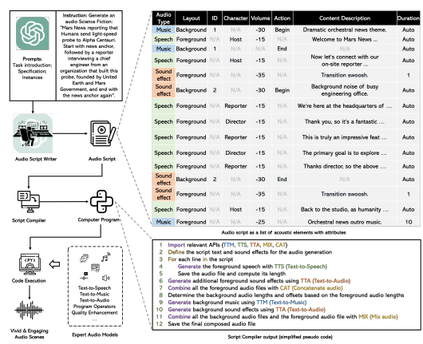
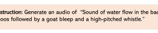
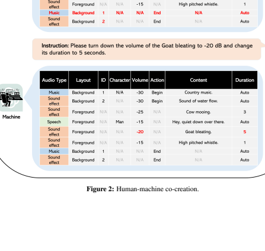
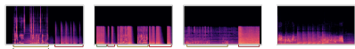

# Wavjourney: Compositional Audio Creation With Large Language Models

Xubo Liu1,†, Zhongkai Zhu2, Haohe Liu1,*, Yi Yuan1,*, Meng Cui1**, Qiushi Huang**1, Jinhua Liang3, Yin Cao4, Qiuqiang Kong5, Mark D. Plumbley1, **Wenwu Wang**1 1 University of Surrey 2Independent Researcher 3 Queen Mary University of London 4 Xi'an Jiaotong Liverpool University 5 The Chinese University of Hong Kong
† Project Lead * Equal Contribution https://Audio-AGI.github.io/WavJourney_demopage

# Abstract

Large Language Models (LLMs) have shown great promise in integrating diverse expert models to tackle intricate language and vision tasks. Despite their significance in advancing the field of Artificial Intelligence Generated Content (AIGC), their potential in intelligent audio content creation remains unexplored. In this work, we tackle the problem of creating audio content with storylines encompassing speech, music, and sound effects, guided by text instructions. We present WavJourney, a system that leverages LLMs to connect various audio models for audio content generation. Given a text description of an auditory scene, WavJourney first prompts LLMs to generate a structured script dedicated to audio storytelling. The audio script incorporates diverse audio elements, organized based on their spatio-temporal relationships. As a conceptual representation of audio, the audio script provides an interactive and interpretable rationale for human engagement. Afterward, the audio script is fed into a script compiler, converting it into a computer program. Each line of the program calls a task-specific audio generation model or computational operation function (e.g., concatenate, mix). The computer program is then executed to obtain an explainable solution for audio generation. We demonstrate the practicality of WavJourney across diverse realworld scenarios, including science fiction, education, and radio play. The explainable and interactive design of WavJourney fosters human-machine co-creation in multi-round dialogues, enhancing creative control and adaptability in audio production. WavJourney audiolizes the human imagination, opening up new avenues for creativity in multimedia content creation.

# 1 Introduction

The emerging field of multi-modal artificial intelligence (AI), a realm where visual, auditory, and textual data converge, opens up fascinating possibilities in our day-to-day life, ranging from personalized entertainment to advanced accessibility features. As a powerful intermediary, natural language shows great potential to enhance understanding and facilitate communication across multiple sensory domains. Large Language Models (LLMs), which are designed to understand and interact with human language, have demonstrated remarkable capabilities in acting as agents (Shen et al., 2023; Gupta & Kembhavi, 2023), engaging with a broad range of AI models to address various multi-modal challenges. While LLMs are regarded as effective multi-modal task solvers, an open question remains: can these models also become *creators* of rich, dynamic multimedia content? Multimedia content creation involves digital media production in multiple forms, such as text, images, and audio. As a vital element of multimedia, audio not only provides context and conveys emotions but also fosters immersive experiences, guiding auditory perception and engagement. In this work, we address a novel problem of *compositional audio creation with language instructions*,
1

Figure 1: The overview of the WavJourney. The LLM is first prompted to be an audio script writer. As

 a conceptual representation of audio, the audio script provides the user with an interactive and interpretable interface. The audio script is then compiled using a script compiler and executed as a computer program. The execution process is powered by a set of expert audio generation models. The example illustrates a Science Fiction scenario.

which aims to automatically design an audio storyline based on a given text instruction and further create corresponding audio content using various sound elements such as speech, music, and sound effects. Prior works have leveraged generative models to synthesize audio context that aligns with task-specific conditions, such as speech transcriptions (Panayotov et al., 2015), music descriptions (Agostinelli et al., 2023), and audio captions (Kim et al., 2019). However, the capabilities of these models to generate audio beyond such conditions are often limited, falling short of the demand for audio creation in real-world scenarios. In light of the integrative and collaborative capabilities of LLMs, it is intuitive to ask: can we leverage the potential of LLMs and these expert audio generation models for compositional audio creation? Compositional audio creation presents inherent challenges due to the complexities of synthesizing intricate and dynamic auditory scenes. Harnessing LLMs for compositional audio creation presents a range of challenges: 1) *Contextual comprehension and design*: using LLMs for compositional audio creation requires them not only to comprehend textually described auditory scenes but also to design audio scripts featuring speech, music, and sound effects. How to expand the capabilities of LLMs in text generation to audio storytelling is a challenge; 2) *Audio production and composition*: unlike for vision and language data, an audio signal is characterized by dynamic spatio-temporal relationships among its constituent sound elements. Leveraging LLMs for integrating various audio generation models to produce sound elements and further compose them into a harmonious whole presents additional challenges; 3) *Interactive and interpretable creation*: Establishing an interpretable pipeline to facilitate human engagement is critical in automated audio production, as it enhances creative control and adaptability, fostering human-machine collaboration. However, designing such an interactive and interpretable creation pipeline with LLMs remains an ongoing question.

We introduce *WavJourney*, a system that leverages LLMs for compositional audio creation guided by language instructions. Specifically, WavJourney first prompts LLMs to generate an audio script, which follows the format of a pre-defined structure. These audio scripts encompass the contexts of speech, music, and sound effects while considering their spatio-temporal relationship. To handle intricate auditory scenes, WavJourney decomposes them into individual acoustic elements along with their acoustic layout. By inputting the audio script into a script compiler, WavJourney generates a computer program where each line of code invokes a task-specific audio generation model, audio I/O functions, or computational operation functions. The computer program is subsequently executed to create the audio content. The overview of WavJourney with an example illustrates a science fiction scenario is shown in Figure 1. The design of WavJourney offers multiple benefits: as it is 1) *Creative*, by leveraging the understanding capability and generalizable knowledge of LLMs, WavJourney can design audio scripts with audio storyline, diverse sound elements, and intricate acoustic relationships; 2) *Compositional*, benefiting from its composable design, WavJourney can automatically decompose complex auditory scenes into independent sound elements, enabling the integration of various task-specific audio generation models to create audio content. Our approach differs from previous methods (Liu et al., 2023; Huang et al., 2023a), where end-to-end generation often fails to fully present elements described in text descriptions; 3) *Training-free*, as WavJourney eliminates the need for training audio models or fine-tuning LLMs, making it resource-efficient; 4) *Interactive*, The interpretability offered by both the audio script and computer program facilitates audio producers with varying expertise to engage with WavJourney, fostering human-machine co-creation in real-world audio production. WavJourney advances the research of audio creation beyond traditional task-specific conditions and opens up new avenues for creativity in AIGC. Our contributions are summarized as follows:
- We present WavJourney, a system that leverages LLMs for compositional audio creation.

Given text instructions, WavJourney can create audio content with storylines encompassing speech, music, and sound effects, without the need for additional training.

- Through its decomposition paradigm, WavJourney is capable of synthesizing audio content aligned with complex text descriptions. The decomposed components presented in both the audio script and computer program provide WavJourney with interactive and interpretable rationale, facilitating human-machine co-creation.

- WavJourney demonstrates practicality across diverse real-world scenarios, including Science Fiction, education, radio play, and the AudioCaps (Kim et al., 2019) dataset. To foster further research in AIGC for audio, we will release the code and software at:
https://github.com/Audio-AGI/WavJourney.

# 2 Related Work

Large Language Models (LLMs). LLMs such as GPT-3 (Brown et al., 2020), LLaMA (Touvron et al., 2023), and ChatGPT (OpenAI, 2022) have advanced the research area in natural language processing (NLP) due to their capability to generate human-like text. Recently, LLMs have emerged as agents, showcasing their capability to address intricate AI tasks by integrating a range of domainspecific AI models. ViperGPT (Suris et al., 2023) and VisProg (Gupta & Kembhavi, 2023) have demonstrated the significant promise of LLMs in decomposing complex vision-language tasks such as visual reasoning and text-to-image generation. These methods can generate a computer program (e.g., Python code) for each decomposed sub-task, which is executed sequentially to offer an explainable task solution. HuggingGPT (Shen et al., 2023) leverages ChatGPT (OpenAI, 2022) as a controller to manage existing AI models in HuggingFace (HuggingFace, 2016) for solving AI tasks in the domain of language, vision, and speech. Similar to HuggingGPT, AudioGPT (Huang et al.,
2023b) connects multiple audio foundation models for solving tasks with speech, music, sound understanding, and generation in multi-round dialogues. In the context of existing research, considerable efforts have been dedicated to leveraging LLMs' integrative and collaborative capabilities to solve multi-modal tasks effectively. However, there remains a relatively unexplored area concerning the potential of LLMs in audio content creation, despite its significance in advancing AIGC.

Audio Content Creation. The process of audio creation is complex and dynamic, involving various components such as content design, music composition, audio engineering, and audio synthesis. Traditional methods have relied on human-involved approaches such as field recording (Gallagher, 2015), Foley art (Wright, 2014), and music composition (Tokui et al., 2000) co-existing with digital signal processing modules (Reiss, 2011). In recent years, the intersection of AI and audio creation has gained significant attention. AI-driven approaches, particularly generative models, have demonstrated remarkable capabilities in synthesizing audio content for speech (Tan et al., 2022; Wang et al., 2017; Wu et al., 2023), music (Agostinelli et al., 2023; Copet et al., 2023), sound effects (Liu et al., 2023; Huang et al., 2023a; Liu et al., 2021; Yuan et al., 2023), or specific types of sounds, such as footsteps or violin (Bresin et al., 2010; Engel et al., 2020). Existing audio generation models primarily focus on synthesizing audio content based on a particular type of condition, such as speech transcriptions (Panayotov et al., 2015), music descriptions (Agostinelli et al., 2023), or audio captions (Kim et al., 2019), and they are not designed to generate compositional audio content with speech, music, and sound effects. Leveraging data-driven approaches for addressing compositional audio creation is resource-intensive and impractical. It demands the collection of a sophisticated audio dataset with corresponding text annotations, as well as the training of powerful audio models.

# 3 Wavjourney

WavJourney is a collaborative system composed of an audio script writer utilizing LLMs, a script compiler and a set of audio generation models such as zero-shot text-to-speech1, text-to-music, and text-to-audio generation models. The overall architecture is illustrated in Figure 1. The pipeline of WavJourney can be deconstructed into two major steps: 1) **audio script generation**: given a text instruction, the audio script writer initiates the process by warping the input instruction with specific prompts. Then, the LLM is engaged with these prompts, which directs it to generate an audio script conforming to the structured format. 2) **script compiling and program execution**: Subsequently, the script compiler transcribes the audio scripts into a computer program. The computer program is further executed by calling the APIs of expert audio generation models to create audio content. We describe the details of these two steps in the following sections.

#### 3.1 Audio Script Generation

The first challenge in harnessing LLMs for audio content creation lies in generating an audio narrative script based on the input text instructions that often only contain conceptual and abstract descriptions. Recognizing that LLMs have internalized generalizable text knowledge, we utilize LLMs to expand input text instructions into audio scripts, including detailed descriptions of decomposed acoustic contexts such as speech, music, and sound effects. To handle the spatio-temporal acoustic relationships, we prompt LLMs to output the audio script in a structured format composed of a list of JSON nodes. Each JSON node symbolizes an audio element, including acoustic attributes (e.g., duration and volume). In this way, a complex auditory scene can be decomposed into a series of single acoustic components. Then, we can create the desired audio content by leveraging diverse domain-specific audio generation models. We introduce these details in the following paragraphs. Format of Audio Script. We define three types of audio elements: speech, music, and sound effects. For each audio element, there are two types of layouts: foreground and background. Foreground audio components are concatenated sequentially, i.e. no overlap with each other. Background audio on the other hand can only be played along with some foreground elements, i.e. they can not be played independently (overlaps of background audio are allowed). Sound effects and music can either be foreground or background, while speech can only be foreground. The concepts above are reflected in the format of a list consisting of a series of JSON nodes, with each node embodying a unique audio component. Each node is supplemented with a textual description of its content. To enhance the auditory experience, each audio component is assigned a volume attribute. Sound effects and musical elements are furnished with an additional attribute pertaining to length, facilitating control over their durations. For speech components, a character attribute is assigned. This attribute enables the synthesis of personalized voices in the later stage, thereby enhancing the narrative thread of the audio storyline. This layered structuring and detailing of audio elements contribute to creating rich

1Zero-shot text-to-speech (TTS) refers to the ability of a TTS system to generate speech in a voice that has not been explicitly trained on, given an unseen voice preset as a condition.
and dynamic audio content. We observe that the outlined format is able to cover a wide variety of auditory scenarios and its simplified list-like structure facilitates the LLM's understanding of complex auditory scenes. An example of the audio script is shown in the Listing 1. Personalized Voice Setting. The advances in zero-shot TTS have facilitated the synthesis of personalized speech based on specific voice presets. In WavJourney, we leverage zero-shot TTS to amplify the narrative depth of audio storytelling, utilizing a set of voice presets tailored for diverse scenarios. More specifically, each voice preset is manually annotated with descriptions of its characteristics and appropriate application scenarios. In subsequent stages, we can leverage LLM to allocate a suitable voice from the preset to each character outlined in the audio script. We utilize a simple prompt design to facilitate the voice allocation process, as discussed in the next paragraph. This design enables WavJourney to create personalized auditory experiences. Prompt Strategy. To generate rich and formatted audio scripts from given text instructions, we wrap the text instruction within a prompt template. The prompt template contains the specifications of each JSON node type, including audio type, layout, and attributes. The prompt template is shown in Table 1 in Appendix A.1. The instructions listed in the prompt template facilitate formatting the audio script generated by LLMs. In the next step, following the receipt of the generated audio scripts, we instruct the LLM to parse the characters outlined in each speech node into personalized speech presets. The prompt used for voice parsing is shown in Table 2 in Appendix A.1. The audio script with parsed voice mapping is further processed through the script compiler, generating the code for subsequent stages.

#### 3.2 Script Compiling And Program Execution

WavJourney employs a script compiler to automatically transcribe the audio script into a computer program. The pseudo-code of the script compiler is shown in Algorithm 1. Each line of code in the program invokes a task-specific audio generation model, audio I/O function, or computational operation function (e.g., mix, concatenate). The program is subsequently executed, resulting in an explainable solution for compositional audio creation. Diverging from previous studies that utilize LLMs to generate code (Suris et al., 2023; Gupta & Kembhavi, 2023), WavJourney prompts LLMs to generate textual audio scripts, which foster improved comprehension for audio producers without programming expertise. Additionally, the process of crafting a computer program to compose intricate auditory scenes requires an elaborate series of procedures within the code to manage audio length calculations and the mixing or concatenation operations of audio clips. Given the unpredictability of LLMs, there are occasions when they may fail to adhere to specified instructions during the generation process (HuggingFace, 2016). By introducing a script compiler, we can mitigate the potential exceptions in the program workflow arising from the instability of LLMs, thereby reducing the uncertainty during inference.

#### 3.3 Human-Machine Co-Creation

The natural interface design of the audio script enables audio producers to engage in automated audio creation actively. By leveraging the communication capabilities of LLMs, WavJourney allows users to customize the audio content through multi-round dialogues. We perform several case studies on the AudioCaps dataset. The results are shown in Appendix A.4. Initially, WavJourney was requested to synthesize the audio content conditioned on the provided text descriptions, followed by dynamic changes to the audio elements through multi-round dialogues, such as adding new elements or modifying acoustic attributes. The successful execution of these tasks by WavJourney demonstrates its great promise in interactive audio creation. WavJourney enhances creative control and adaptability, fostering a promising human-machine co-creation in real-world audio production.

# 4 Experiments

#### 4.1 Experimental Setup

We utilize the GPT-4 model (OpenAI, 2022) as the LLMs for WavJourney. For text-to-music and text-to-audio generation, we adopt the publicly-available state-of-the-art models MusicGen (Copet et al., 2023) and AudioLDM (Liu et al., 2023), respectively. As for text-to-speech synthesis, we leverage the Bark (Suno, 2023) model, which can generate realistic speech and is able to match the tone, pitch, emotion, and prosody of a given voice preset. To enhance the quality of synthesized speech, we apply the speech restoration model VoiceFixer (Liu et al., 2022) after the Bark model. We use 32 kHz sampling rate for processing audio signals. We implement the computer program in the Python language. For the volume control of the generated audio content, we adopt the Loudness Unit Full Scale (LUFS) standard (Steinmetz & Reiss, 2021).

#### 4.2 Case Study On Audiocaps Benchmark

We performed a case study on the AudioCaps (Kim et al., 2019) dataset, which contains 46, 000 audio-text pairs. We randomly select several cases with complex captions (e.g., more than 15 words, containing at least three sound events) to demonstrate the effectiveness of WavJourney, compared with state-of-the-art text-to-audio generation systems AudioLDM (Liu et al., 2023) and Tango (Ghosal et al., 2023). The results and comparison are shown in Appendix A.5. We highlight each sound event in the spectrogram using the colored line underneath per spectrogram. The output events of the WavJourney-generated-audio are in the chronological order depicted by the corresponding text (e.g., two events happen simultaneously when instructed by the word "as" or one sound is behind another when the word "follow" appears). Compared to AudioLDM and Tango systems, WavJourney succeeds in generating all sound events mentioned in the text description and scheduling the sound events in the proper temporal relationship, indicating its capacity for controllable audio generation.

#### 4.3 Case Study On Real-World Scenarios

We conducted additional case studies using WavJourney in various scenarios, including Science Fiction, education, and radio play. The Appendix A.6 shows examples of the generated audio script and audio content. The outcomes achieved demonstrate the practicality of WavJourney in real-world audio production applications and indicate its potential in facilitating audio content creation.

# 5 Limitations

Although WavJourney can create audio content with text instructions, limitations could be observed as follows: 1) Extensibility: WavJourney relies on structured audio scripts to represent auditory scenes and script compilers to generate computer programs, which is inflexible to expand their capabilities; 2) Artificial composition: The process of decomposing and re-mixing audio may result in synthetic audio that deviates from real-world sound distributions, particularly concerning music composition, which requires the alignment of beats, chord progression, and melody in multiple music tracks; 3) Efficiency: The reliance of WavJourney on LLMs and multiple audio generation models introduces significant time costs when generating complex audio content. Improving the efficiency of WavJourney could facilitate its practicality for real-world applications.

# 6 Conclusion

In this work, we presented WavJourney, which connects LLMs with diverse expert audio generation models, enabling compositional audio creation via natural language instructions. WavJourney can schedule various expert audio generation models to create audio content by decomposing auditory scenes into individual audio elements with their acoustic relationships. Case studies conducted on the AudioCaps benchmark and several real-world scenarios have demonstrated the practicality of WavJourney in audio production applications. WavJourney opens up new avenues for advancing AIGC in the realm of audio content creation.

#### Acknowledgments

This work is partly supported by UK Engineering and Physical Sciences Research Council (EPSRC) Grant EP/T019751/1 "AI for Sound" and Grant EP/T518086/1, British Broadcasting Corporation Research and Development (BBC R&D), a PhD scholarship from the Centre for Vision, Speech and Signal Processing, Faculty of Engineering and Physical Science, University of Surrey and a Grant
"XJTLU RDF-22-01-084". For the purpose of open access, the authors have applied a Creative Commons Attribution (CC BY) license to any Author Accepted Manuscript version arising.

# References

Andrea Agostinelli, Timo I Denk, Zalan Borsos, Jesse Engel, Mauro Verzetti, Antoine Caillon, Qingqing Huang, Aren Jansen, Adam Roberts, Marco Tagliasacchi, et al. MusicLM: Generating music from text. *arXiv preprint arXiv:2301.11325*, 2023.

Roberto Bresin, Anna de Witt, Stefano Papetti, Marco Civolani, and Federico Fontana. Expressive sonification of footstep sounds. *Proceedings of ISon*, 2010:3rd, 2010.

Tom Brown, Benjamin Mann, Nick Ryder, Melanie Subbiah, Jared D Kaplan, Prafulla Dhariwal, Arvind Neelakantan, Pranav Shyam, Girish Sastry, Amanda Askell, et al. Language models are few-shot learners. *Advances in Neural Information Processing Systems*, 33:1877–1901, 2020.

Jade Copet, Felix Kreuk, Itai Gat, Tal Remez, David Kant, Gabriel Synnaeve, Yossi Adi, and Alexandre Defossez. Simple and controllable music generation. *arXiv preprint arXiv:2306.05284*, 2023.

Jesse Engel, Lamtharn Hantrakul, Chenjie Gu, and Adam Roberts. DDSP: Differentiable digital signal processing. *arXiv preprint arXiv:2001.04643*, 2020.

Michael Gallagher. Field recording and the sounding of spaces. Environment and Planning D:
Society and Space, 33(3):560–576, 2015.

Deepanway Ghosal, Navonil Majumder, Ambuj Mehrish, and Soujanya Poria. Text-to-audio generation using instruction-tuned llm and latent diffusion model. *arXiv preprint arXiv:2304.13731*, 2023.

Tanmay Gupta and Aniruddha Kembhavi. Visual programming: Compositional visual reasoning without training. In *Proceedings of the IEEE/CVF Conference on Computer Vision and Pattern* Recognition, pp. 14953–14962, 2023.

Rongjie Huang, Jiawei Huang, Dongchao Yang, Yi Ren, Luping Liu, Mingze Li, Zhenhui Ye, Jinglin Liu, Xiang Yin, and Zhou Zhao. Make-an-Audio: Text-to-audio generation with promptenhanced diffusion models. *arXiv preprint arXiv:2301.12661*, 2023a.

Rongjie Huang, Mingze Li, Dongchao Yang, Jiatong Shi, Xuankai Chang, Zhenhui Ye, Yuning Wu, Zhiqing Hong, Jiawei Huang, Jinglin Liu, et al. AudioGPT: Understanding and generating speech, music, sound, and talking head. *arXiv preprint arXiv:2304.12995*, 2023b.

HuggingFace. The AI community building the future. 2016. URL https://huggingface.co. Chris Dongjoo Kim, Byeongchang Kim, Hyunmin Lee, and Gunhee Kim. AudioCaps: Generating captions for audios in the wild. In Proceedings of the 2019 Conference of the North American Chapter of the Association for Computational Linguistics: Human Language Technologies, Volume 1 (Long and Short Papers), pp. 119–132, 2019.

Haohe Liu, Xubo Liu, Qiuqiang Kong, Qiao Tian, Yan Zhao, DeLiang Wang, Chuanzeng Huang, and Yuxuan Wang. VoiceFixer: A unified framework for high-fidelity speech restoration. *arXiv* preprint arXiv:2204.05841, 2022.

Haohe Liu, Zehua Chen, Yi Yuan, Xinhao Mei, Xubo Liu, Danilo Mandic, Wenwu Wang, and Mark D Plumbley. AudioLDM: Text-to-audio generation with latent diffusion models. arXiv preprint arXiv:2301.12503, 2023.

Xubo Liu, Turab Iqbal, Jinzheng Zhao, Qiushi Huang, Mark D Plumbley, and Wenwu Wang. Conditional sound generation using neural discrete time-frequency representation learning. In 2021 IEEE 31st International Workshop on Machine Learning for Signal Processing (MLSP), pp. 1–6. IEEE, 2021.

OpenAI. Introducing ChatGPT. 2022. URL https://openai.com/blog/chatgpt.

Vassil Panayotov, Guoguo Chen, Daniel Povey, and Sanjeev Khudanpur. Librispeech: an ASR
corpus based on public domain audio books. In 2015 IEEE International Conference on Acoustics, Speech and Signal Processing (ICASSP), pp. 5206–5210. IEEE, 2015.

Joshua D Reiss. Intelligent systems for mixing multichannel audio. In 2011 17th International Conference on Digital Signal Processing (DSP), pp. 1–6. IEEE, 2011.

Yongliang Shen, Kaitao Song, Xu Tan, Dongsheng Li, Weiming Lu, and Yueting Zhuang. HuggingGPT: Solving AI tasks with ChatGPT and its friends in Huggingface. *arXiv preprint* arXiv:2303.17580, 2023.

Christian J. Steinmetz and Joshua D. Reiss. pyloudnorm: A simple yet flexible loudness meter in Python. In *150th AES Convention*, 2021.

Suno. Bark. 2023. URL https://github.com/suno-ai/bark.

Didac Suris, Sachit Menon, and Carl Vondrick. ViperGPT: Visual inference via Python execution for reasoning. *arXiv preprint arXiv:2303.08128*, 2023.

Xu Tan, Jiawei Chen, Haohe Liu, Jian Cong, Chen Zhang, Yanqing Liu, Xi Wang, Yichong Leng, Yuanhao Yi, Lei He, et al. NaturalSpeech: End-to-end text to speech synthesis with human-level quality. *arXiv preprint arXiv:2205.04421*, 2022.

Nao Tokui, Hitoshi Iba, et al. Music composition with interactive evolutionary computation. In Proceedings of the Third International Conference on Generative Art, volume 17, pp. 215–226, 2000.

Hugo Touvron, Thibaut Lavril, Gautier Izacard, Xavier Martinet, Marie-Anne Lachaux, Timothee Lacroix, Baptiste Roziere, Naman Goyal, Eric Hambro, Faisal Azhar, et al. LLaMA: Open and efficient foundation language models. *arXiv preprint arXiv:2302.13971*, 2023.

Yuxuan Wang, RJ Skerry-Ryan, Daisy Stanton, Yonghui Wu, Ron J Weiss, Navdeep Jaitly, Zongheng Yang, Ying Xiao, Zhifeng Chen, Samy Bengio, et al. Tacotron: Towards end-to-end speech synthesis. *arXiv preprint arXiv:1703.10135*, 2017.

Benjamin Wright. Footsteps with character: the art and craft of Foley. *Screen*, 55(2):204–220, 2014. Haibin Wu, Kai-Wei Chang, Yuan-Kuei Wu, and Hung-yi Lee. SpeechGen: Unlocking the generative power of speech language models with prompts. *arXiv preprint arXiv:2306.02207*, 2023.

Yi Yuan, Haohe Liu, Xubo Liu, Xiyuan Kang, Peipei Wu, Mark D Plumbley, and Wenwu Wang.

Text-driven foley sound generation with latent diffusion model. *arXiv preprint arXiv:2306.10359*, 2023.

# A Appendix

#### A.1 Prompt Templates Prompt #1

I want you to act as an audio script writer. I'll give you an instruction which is a general idea and you will make it an audio script in List format containing a series of JSON nodes. The script must follow the rules below: Each line represents an audio JSON node. There are three types of audio: sound effects, music, and speech. For each audio, there are two types of layouts: foreground and background. Foreground audios are played sequentially, and background audios are sound effects or music which are played while the foreground audio is being played. Sound effects can be foreground or background. For sound effects, you must provide its layout, volume (dB, LUFS standard), length (in seconds), and detailed description of the sound effect. Example: {"audio type": "sound effect", "layout": "foreground", "vol": -35, "len": 2, "desc": "Airport beeping sound"} Music can be foreground or background. For music, you must provide its layout, volume (dB, LUFS standard), length (in seconds), and detailed description of the music. Example: {"audio type": "music", "layout": "foreground", "vol": -35, "len": 10, "desc": "Uplifting newsroom music"} Speech can only be foreground. For speech, you must provide the character, volume (dB, LUFS standard), and the character's line. You do not need to specify the length of the speech. Example: {"audio type": "speech", "layout": "foreground", "character":""News Anchor", "vol": -15, "text": "Good evening, this is BBC News"} For background sound effects, you must specify the id of the background sound effect, and you must specify the beginning and the end of a background sound effect in separate lines, hence you do not need to specify the length of the audio.

Example: {"audio type": "sound effect", "layout": "background", "id":1, "action": "begin", "vol": -35, "desc": "Airport ambiance"} ... {"audio type": "sound effect", "layout": "background", "id":1, "action": "end"}
For background music, it's the same as background sound effects. The output format must be a list of the root node containing all the audio JSON nodes.

Table 1: Prompt template used for generating audio scripts.

#### Prompt #2

Given an audio script in json format, for each character that appeared in the "character" attribute, you should map the character to a "voice type" according to their lines and the "voice types" features. Each character must be mapped to a different voice type, and each "voice type" must be from one of the following: - Female1: a normal female adult voice, British accent - Female2: a normal female adult voice, American accent - Female3: a female adult voice, suitable for commentary and narrator - Male1: a normal male adult voice, British accent - Male2: a normal male adult voice, American accent - Male3: a male adult voice, suitable for commentary and narrator - BBC Female: a female voice of a news anchor, suitable for news scenarios - BBC Female Out: a female voice of an off-site news reporter, suitable for news scenario - BBC Male: a male voice of a news anchor, suitable for news scenarios Output should be in the format of CSV, like: "' [character 1], [voice type 1] [character 2], [voice type 2] ... "'
Table 2: Prompt template used for voice parsing.

#### A.2 Example Of Audio Script

1 AudioScript = [ 2 {"audio_type": "music", "layout": "background", "id":1, "
action": "begin", "vol": -30, "desc": "Dramatic orchestral news theme"},
3 {"audio_type": "speech", "layout": "foreground", "character":
"News Anchor", "vol": -15, "text": "Welcome to Mars News ..."},
4 {"audio_type": "music", "layout": "background", "id":1, "
action": "end"},
5 {"audio_type": "sound_effect", "layout": "foreground", "vol":
-35, "len": 1, "desc": "Transition swoosh"},
6 {"audio_type": "speech", "layout": "foreground", "character":
"Reporter", "vol": -15, "text": "We're here at the ..."},
7 ... 8 {"audio_type": "speech", "layout": "foreground", "character":
"News Anchor", "vol": -15, "text": "... Stay tuned to Mars News for the latest updates."},
9 {"audio_type": "music", "layout": "foreground", "vol": -30, "
len": 5, "desc": "orchestral news outro music"}
10 ]
Listing 1: Example audio script in the list form.

#### A.3 Script Compiler

Algorithm 1: Pseudo code of Script Compiler Initialize: foregroundAudioList as an empty list, backgroundAudioList as an empty list, nextForegroundNodeID as 0 1 **forall** *node in the root list of the json file* do 2 if *node.type is "foreground"* **then**
3 Add node to foregroundAudioList 4 Increment nextForegroundNodeID by 1 5 **else**
6 if *node.isBeginning is True* **then** 7 Set node.beginForegroundID as nextForegroundNodeID 8 Add node to backgroundAudioList 9 **else**
10 Set backgroundNode in backgroundAudioList with id node.id's endForegroundID
as nextForegroundNodeID
11 end 12 end 13 end Initialize: fgAudioLengths as an empty list 14 **forall** *foregroundAudio in foregroundAudioList* do 15 Generate the audio based on foregroundAudio 16 Calculate the generated length, append it to fgAudioLengths 17 end 18 Concatenate all generated foreground audio to create finalForegroundAudio 19 **forall** *backgroundAudio in backgroundAudioList* do 20 Calculate targetLength by using backgroundAudio's beginForegroundID, endForegroundID
and fgAudioLengths 21 Generate the audio of targetLength based on backgroundAudio 22 Calculate the offset from the beginning of the finalForegroundAudio using beginForegroundID and fgAudioLengths, set as offset 23 end Initialize: finalAudio as finalForegroundAudio 24 **forall** *backgroundAudio in backgroundAudioList* do 25 Mix finalAudio with backgroundAudio generated audio, with offset according to backgroundAudio.offset 26 end 27 Output finalAudio

# A.4 Human-Machine Co-Creation

Human

the background.

| udio Type    | Layout     | D   |     | Character Volume Action   |       | Content               | Duration   |
|--------------|------------|-----|-----|---------------------------|-------|-----------------------|------------|
| Sound effect | Background | 1   | N/A | \-30                      | Begin | Sound of water flow.  | Auto       |
| Sound effect | Foreground | N/A | N/A | \-25                      | N/A   | Cow mooing.           | 3          |
| Sound effect | Foreground | N/A | N/A | \-25                      | N/A   | Goat bleating.        | 2          |
| Sound effect | Foreground | N/A | N/A | \-15                      | N/A   | High pitched whistle. |            |
| Sound effect | Background | 1   | N/A | N/A                       | End   | N/A                   | Auto       |

Human

| Audio Type   | Layout     | ID   |     | Character Volume Action   |       | Content                     |
|--------------|------------|------|-----|---------------------------|-------|-----------------------------|
| Music        | Background | 1    | N/A | \-30                      | Begin | Country music.              |
| Sound effect | Background | 2    | N/A | \-30                      | Begin | Sound of water flow.        |
| Sound        | Foreground | N/A  | N/A | \-25                      | N/A   | Cow mooing.                 |
| effect       |            |      |     |                           |       |                             |
| Speech       | Foreground | N/A  | Man | \-15                      | N/A   | Hey, quiet down over there. |
| Sound effect | Foreground | N/A  | N/A | \-25                      | N/A   | Goat bleating.              |
| Sound        | Foreground | N/A  | N/A | \-15                      | N/A   | High pitched whistle.       |
| effect       |            |      |     |                           |       |                             |
| Music        | Background | 1    | N/A | N/A                       | End   | N/A                         |
| Sound effect | Background | 2    | N/A | N/A                       | End   | N/A                         |

Human

# A.5    Case Study On Audiocaps Benchmark A.5.1    Case One

Language Description WavJourney

AudioLDM

Tango Ground Truth
"A man speaking over an intercom as as a helicopter engine runs followed by several gunshots firing" Generated audio script of WavJourney

| Audio Type   | Layout     | ID   | Character         | Volume   | Action   | Content Description                                    | Duration   |
|--------------|------------|------|-------------------|----------|----------|--------------------------------------------------------|------------|
| Sound effect | Background |      | N/A               | \-35     | Begin    | Helicopter engine running.                             | Auto       |
| Speech       | Foreground | N/A  | Man over intercom | \-20     | N/A      | Attention all units, situation delta is now operative. | Auto       |
| Sound effect | Background |      | N/A               | N/A      | End      | N/A                                                    | Auto       |
| Sound effect | Foreground | N/A  | N/A               | \-30     | N/A      | Gunshots firing.                                       | 4          |

Figure 3: Case one study on AudioCaps benchmark.

# A.5.2    Case Two

Language Description WavJourney

AudioLDM
Tango Ground Truth
"A man speaking followed by A man opeaning formed to models
clacking  as  footsteps   walk on grass and a rooster crows in the distance" Generated audio script of WavJourney

| Audio Type   | Layout     | ID   | Character   | Volume   | Action   | Content Description                                         | Duration   |
|--------------|------------|------|-------------|----------|----------|-------------------------------------------------------------|------------|
| Speech       | Foreground | N/A  | Man         | \-15     | N/A      | Hey, how was your day?                                      | Auto       |
| Speech       | Foreground | N/A  | Woman       | \-15     | N/A      | It was pretty good. How about yours?                        | Auto       |
| Speech       | Foreground | N/A  | Man         | \-15     | N/A      | Not bad, just a bit tired. Did you hear that noise outside? | Auto       |
| Speech       | Foreground | N/A  | Woman       | \-20     | N/A      | Yeah, what is that?                                         | Auto       |
| Sound effect | Background | 1    | N/A         | \-35     | Begin    | Someone walking.                                            | Auto       |
| Sound effect | Foreground | N/A  | N/A         | \-20     | N/A      | Plastic clacking.                                           | 2          |
| Sound effect | Background | T    | N/A         | N/A      | End      | N/A                                                         | Auto       |
| Sound effect | Foreground | N/A  | N/A         | \-35     | N/A      | Rooster crowing.                                            | 2          |

Figure 4: Case two study on AudioCaps benchmark.

# Case Study On Real-World Scenarios A.6 Case One - Radio Play A.6.1

Text instruction: "write a radio drama for a love comedy: a couple is on a date in a fine restaurant, and suddenly, then suddenly something happened, and the atmosphere was totally ruined."
The generated audio script is presented in Figure 5.

The generated audio clip is available at https://github.com/Audio-AGI/WavJourney/
examples/radio play.wav

| Audio Type   | Layout     | ID   | Character   | Volume   | Action   | Content Description                             | Duration   |
|--------------|------------|------|-------------|----------|----------|-------------------------------------------------|------------|
| Music        | Background | 1    | N/A         | \-40     | Begin    | Classic Cafe music.                             | Auto       |
| Sound effect | Background | 2    | N/A         | \-30     | Begin    | People talking, silverware clinking.            | Auto       |
| Speech       | Foreground | N/A  | Boy         | \-15     | N/A      | I'm so glad we finally have this time together. | Auto       |
| Speech       | Foreground | N/A  | Girl        | \-15     | N/A      | Me too, it's been way too long.                 | Auto       |
| Sound effect | Foreground | N/A  | N/A         | \-15     | N/A      | Champagne popping.                              | 2          |
| Sound effect | Foreground | N/A  | N/A         | \-15     | N/A      | Filling glass with champagne.                   | 2          |
| Speech       | Foreground | N/A  | Boy         | \-15     | N/A      | Here's to a wonderful evening.                  | Auto       |
| Speech       | Foreground | N/A  | Girl        | \-15     | N/A      | Wonderful evening!                              | Auto       |
| Sound effect | Foreground | N/A  | N/A         | \-20     | N/A      | Bottle clink.                                   | 2          |
| Sound effect | Background | 2    | N/A         | \-30     | End      | N/A                                             | Auto       |
| Music        | Background | 1    | N/A         | \-40     | End      | N/A                                             | Auto       |
| Sound effect | Background | 3    | N/A         | \-30     | Begin    | People screaming and gasping in the restaurant. | Auto       |
| Sound effect | Foreground | N/A  | N/A         | \-20     | N/A      | A loud crash, plates breaking.                  | 6          |
| Sound effect | Background | 3    | N/A         | \-30     | End      | N/A                                             | Auto       |
| Speech       | Foreground | N/A  | Customer    | \-10     | N/A      | Oh my, a rat in the kitchen!                    | Auto       |
| Music        | Foreground | N/A  | N/A         | \-25     | N/A      | Shock and funny music.                          | 5          |
| Speech       | Foreground | N/A  | Boy         | \-10     | N/A      | Well ... that just happened.                    | Auto       |
| Speech       | Foreground | N/A  | Girl        | \-10     | N/A      | Maybe.. we could get pizza?                     | Auto       |

Figure 5: Audio script of real-world case study on an radio play scenario.

# A.6.2    Case Two - Education

Text description: "Generate a one-minute introduction to quantum mechanics by a professor."
The generated audio script is presented in Figure 6. The generated audio clip is available at https://github.com/Audio-AGI/WavJourney/
examples/education.wav

| Audio Type   | Layout     | ID   | Character   | Volume   | Action   | Content Description                                      | Duration   |
|--------------|------------|------|-------------|----------|----------|----------------------------------------------------------|------------|
| Music        | Background | 1    | N/A         | \-30     | Begin    | Soft academic music.                                     | Auto       |
| Speech       | Foreground | N/A  | Professor   | \-10     | N/A      | Good day, class. Today, we will embark on a              | Auto       |
|              |            |      |             |          |          | fascinating journey. We will delve into ...              |            |
| Speech       | Foreground | N/A  | Professor   | \-10     | N/A      | Quantum mechanics is a branch of physics which           | Auto       |
|              |            |      |             |          |          | deals with the smallest particles in the universe.       |            |
| Speech       | Foreground | N/A  | Professor   | \-10     | N/A      | It baffles scientists as it doesn't follow the classical |            |
|              |            |      |             |          |          | physics laws but follows its own principles.             | Auto       |
| Music        | Background | 1    | N/A         | N/A      | End      | N/A                                                      | Auto       |
| Music        | Background | 2    | N/A         | \-30     | Begin    | Happy adademic music.                                    | Auto       |
| Speech       | Foreground | N/A  | Professor   | \-10     | N/A      | Uncertainty Principle, Wave\-Particle Duality,           | Auto       |
|              |            |      |             |          |          | Quantum Entanglement \- exciting, isn't it? But, ..      |            |
|              | Foreground |      | Professor   | \-10     | N/A      | Our comprehension today will only scratch the            |            |
| Speech       |            | N/A  |             |          |          | surface. Quantum mechanics demands ...                   | Auto       |
|              |            |      |             |          |          | Thank you, class. We'll explore more in our next         |            |
| Speech       | Foreground | N/A  | Professor   | \-10     | N/A      | session!                                                 | Auto       |
| Music        | Background | 2    | N/A         | N/A      | End      | N/A                                                      | Auto       |

Figure 6: Audio script of real-world case study on an education scenario.