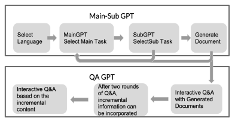
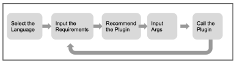
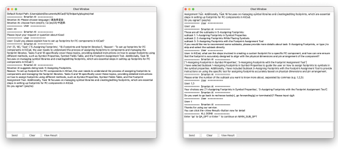
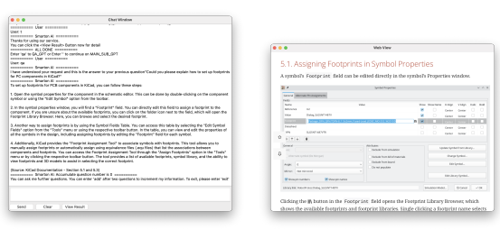
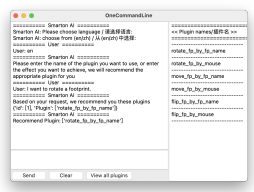
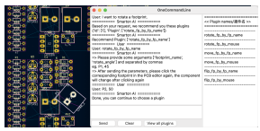

# New Interaction Paradigm For Complex Eda Software Leveraging Gpt

A PREPRINT
Boyu Han1,5,*, Xinyu Wang1,5,*, Yifan Wang2,5, Junyu Yan3,5, Yidong Tian4,5 Mcgill University1, Tsinghua University2, Beihang University3, The University of Manchester4, Beijing Smarton Empower Co., Ltd5
{boyu.han, xinyu.wang5}@mail.mcgill.ca

# A**Bstract**

In the rapidly growing field of electronic design automation (EDA), professional software such as KiCad [1], Cadence [2], and Altium Designer [3] provide increasingly extensive design functionalities. However, the intricate command structure and high learning curve create a barrier, particularly for novice printed circuit board (PCB) designers. This results in difficulties in selecting appropriate functions or plugins for varying design purposes, compounded by the lack of intuitive learning methods beyond traditional documentation, videos, and online forums. To address this challenge, an artificial intelligence (AI) interaction assist plugin for EDA software named SmartonAl is developed here, also KiCad is taken as the first example. SmartonAI is inspired by the HuggingGPT framework
[4] and employs large language models, such as GPT [5, 6, 7] and BERT [8], to facilitate task planning and execution. On receiving a designer request, SmartonAI conducts a task breakdown and efficiently executes relevant subtasks, such as analysis of help documentation paragraphs and execution of different plugins, along with leveraging the built-in schematic and PCB manipulation functions in both SmartonAl itself and software. Our preliminary results demonstrate that SmartonAI can significantly streamline the PCB design process by simplifying complex commands into intuitive language-based interactions. By harnessing the powerful language capabilities of ChatGPT and the rich design functions of KiCad, the plugin effectively bridges the gap between complex EDA software and user-friendly interaction. Meanwhile, the new paradigm behind SmartonAI can also extend to other complex software systems, illustrating the immense potential of AI-assisted user interfaces in advancing digital interactions across various domains.

Keywords Kicad, HuggingGPT, ChatGPT

# 1 Introduction And Overview Of Smartonai

### 1.1 Brief Description Of Smartonai

As a pioneering development by Smarton Empower Technology, Smarton AI represents an advancement in electronic circuit design automation. By seamlessly integrating the power of AI with a collaborative multi-model, multi-software simulation environment, it lays the groundwork for an innovative design process in electronics, particularly crucial in our energy-conscious era. Composed of a distinguished team from globally renowned institutions, SmartonAI's development is fueled by years of combined experience in power electronics and AI, creating a robust foundation for this transformative initiative.

### 1.2 Explanation Of The Need For Such An Ai-Assisted Interface

In the domain of Printed Circuit Board (PCB) design, traditional learning resources often fall short of providing intuitive and accessible learning pathways, especially for software like KiCad, known for its rich design features but

*The first two authors have equal contributions.

Figure 1: Overview of The Chat Plugin

steep learning curve. This hurdle can delay efficient onboarding and hinder the swift execution of design tasks, even for those with a foundational understanding of PCB design.

An AI-assisted interface like SmartonAI offers a solution by transforming the way users interact with EDA software. By interpreting natural language commands and conducting task breakdowns, it allows for a high level of personalization and context-aware guidance. This AI-augmentation effectively bridges the knowledge gap, making the vast array of functions and plugins within EDA software more accessible to users.

Such an interface not only democratizes access to advanced EDA software but also optimizes the learning process, fostering a more productive and user-friendly environment. It is these market needs and challenges that have inspired and shaped the development of SmartonAI.

### 1.3 Overview Of The Two Main Components Of Smartonai: Chat Plugin And Onecommandline Plugin

Taking KiCad as an example, SmartonAI consists of two main components, each contributes significantly to the overall user experience and effectiveness of the system. The code is available here *

### 1.3.1 Chat Plugin

The Chat Plugin (Figure 1) serves as an interactive AI tutor, guiding users through the functionalities related to PCB
design (pcbnew) [9] and schematics [10] in KiCad. It is designed to understand user queries, analyze, and break down tasks, and offer solutions in a conversational manner akin to ChatGPT. This feature greatly simplifies the learning curve, providing contextually aware and personalized assistance.

### 1.3.2 Onecommandline Plugin

The OneCommandLine Plugin (Figure 2), on the other hand, primarily focuses on plugin selection and intelligent execution based on user needs. By understanding user commands, it facilitates rapid plugin selection and activation, thus speeding up the design process and improving productivity.

Together, these two components empower users with a seamless, intelligent, and highly interactive design environment within KiCad, enhancing both the learning and practical aspects of electronic design automation.

### 1.4 Support Languages

Currently, SmartonAI supports both English and Chinese for user interaction. Additionally, the help instructions provided by the Chat Plugin include diagrams in both languages. This enables a broader audience to interact with and benefit from the system more efficiently. Future updates may incorporate other languages based on user demand, further enhancing the inclusivity and usability of the system on a global scale.

*https://github.com/smarton-empower/Smarton-AI

Figure 2: Overview of The OneCommandLine Plugin

# 2 The Chat Plugin In Smartonai

The Chat Plugin of SmartonAI functions through two major components: The Main-Sub GPT and the Question-Answer (QA) GPT.

### 2.1 Detailed Explanation Of The Chat Plugin 2.1.1 Main-Sub Gpt

In this system, the user initiates the process by entering their query or requirement into the plugin's dialog box. These user inputs are then analyzed by the primary GPT, which identifies the 1-3 most relevant tasks from the pre-classified 20 sets (Figure 3(a)). Each of these primary tasks corresponds to a dedicated sub-GPT. The sub-GPTs further interact with the user to determine the most suitable sub-task from their respective domains (Figure 3(b)).

The selected subtasks serve as the foundation to create personalized learning documents that cater to the user's specific needs. Once these documents are generated, they are sent to the QA GPT for further processing.

If the user finds the recommended primary or sub-task unsatisfactory, they are allowed to provide reasons for their dissatisfaction. This feedback mechanism enables users to revisit their choices, ensuring that the system accurately meets their requirements.

### 2.2 Question-Answer (Qa) Gpt

The QA GPT initiates the interaction by providing responses to the user's initial questions or concerns (Figure 3(c)). Users can continue to chat and ask questions, and the QA GPT responds based on the built-in document information and knowledge from the GPT model.

A distinctive feature of the QA GPT is its data augmentation functionality, which comes into play when a user's interaction hits a knowledge bottleneck or when the user wishes to inquire about a different overarching topic. It is capable of reading and learning relevant information from chat logs and integrating this new knowledge into its responses.

### 2.3 Task Breakdown

Our team used advanced AI technologies, such as GPT models, to perform a comprehensive task breakdown to make the learning process more manageable and user-friendly. Through AI-powered assistance, SmartonAI simplifies complex queries into a set of key tasks, ensuring that users can easily navigate the intricacies of KiCad.

By leveraging the power of AI, SmartonAI identifies essential functionalities and categorizes them into a series of primary tasks. Each primary task is then further divided into specific subtasks, providing a granular breakdown of the design process. This intelligent task categorization enables the Chat Plugin to offer personalized learning resources and recommendations, tailored to the user's specific needs.

By reframing the description in this way, we focus on the benefits of the AI-driven task breakdown without overwhelming the reader with the specific number of subtasks. This approach highlights the user-centric design of SmartonAI, making the learning and design process more accessible and efficient.

(a) (b)

(c) (d)

Figure 3: View of Chat Plugin (a) Selection of Main Tasks, (b) Selection of Sub Tasks, (c) QA GPT Process, (d) View of Tailored Documentation

### 2.4 **Explanation Of How It Provides User-Specific Introductory Paragraphs And Chat Support Services Based On** These Tasks And Subtasks

The Chat Plugin harnesses the main tasks and subtasks framework to provide user-centric resources and support. We have meticulously decomposed the KiCad official documentation into multiple HTML pages, each corresponding to a particular subtask. Once a user's requirements are mapped to certain subtasks, SmartonAI ingeniously stitches these HTML pages together, enhancing the presentation with CSS and JavaScript for an optimized, user-friendly interface. Users can access this tailored documentation (Figure 3(d)) by clicking on the "view result" option.

Moreover, the amalgamated content from these HTML pages forms a pre-set input for the QA GPT, enabling it to answer user queries based on the specific subtask-based context. This structure allows the Chat Plugin to offer a bespoke learning journey for each user, augmenting the effectiveness of the QA GPT in subsequent question-answer sessions.

Figure 4: Select the best matching plugin

Figure 5: View of OneCommendLine Plugin

### 2.5 Description Of How It Can Add Additional Information Based On User Feedback

The system is designed to continuously learn and adapt based on user interactions. As users converse with the QA GPT and present unique queries or points of confusion, the system leverages its data augmentation capabilities to gather additional information and integrate it into future responses. This process of continuous feedback and learning ensures that the Chat Plugin remains relevant and adaptive to evolving user needs.

# 3 The Onecommandline Plugin In Smartonai

### 3.1 Introduction To Onecommandline Plugin And Its Core Functionality

Our SmartonAI system is greatly enhanced by the OneCommandLine Plugin, an essential component designed to simplify plugin selection and expedite their execution within KiCad. The user-friendly chat interface of the plugin facilitates direct interaction with the users, providing them with a streamlined and efficient process to accomplish their tasks.

Initially, we fed our GPT model with predefined descriptions and function specifications of commonly used plugins, which is usually the self-introduction of the plugins. This enabled the AI to familiarize itself with the plugins' purpose and functionality, paving the way for the plugin's core operation - intelligent plugin recommendation.

### 3.2 Intelligent Plugin Recommendation System

One of the key features of the OneCommandLine plugin is its ability to recommend plugins based on the user's specific requirements (Figure 4). As users interact with the plugin via the chat interface, it first presents a list of supported plugins. Armed with the descriptions and use-cases we initially defined, the plugin matches the user's needs with these descriptions. As a result, it recommends plugins that best align with the user's objectives, making the process not only efficient but also tailored to the user's unique needs.

### 3.3 Explanation Of How It Accepts User Input To Intelligently Call Plugins

Once the user confirms the selected plugin, the OneCommandLine Plugin provides the necessary parameters and showcases input examples for the chosen plugin. This provides clarity to users on how to proceed with the plugin and its execution.

After users submit their specified parameters, the plugin automates the rest of the process. It automatically calls the corresponding plugin function based on the user-input parameters. Following this, the PCB editor page updates to reflect the changes brought about by the executed plugin function. This update occurs upon the user's subsequent click on the PCB editor page, making for a seamless, efficient, and user-friendly experience (Figure 5).

# 4 The Interaction Between The Chat Plugin And Onecommandline Plugin

### 4.1 Discussion Of How The Two Plugins Work Together

The Chat Plugin and OneCommandLine Plugin work together seamlessly, providing a robust and comprehensive solution for users navigating KiCad. The Chat Plugin, designed to assist with learning and understanding the functionalities of KiCad, complements the OneCommandLine Plugin that focuses on the swift selection and deployment of relevant plugins.

When a user poses a query or specifies a requirement, the Chat Plugin kicks into action. It breaks down the user's request into main tasks and subtasks, and based on this analysis, it generates custom learning resources that can help the user navigate their project better. This process leads to a more effective and engaging learning experience for the user.

Simultaneously, the OneCommandLine Plugin utilizes this contextual information from the user's interaction with the Chat Plugin to recommend the most suitable plugins that align with the user's needs. This streamlines the process of plugin selection and further enhances the user's engagement with KiCad.

### 4.2 Smartonai: A Comprehensive Assistance For The Future

SmartonAI is not only a revolutionary concept but also a forward-looking comprehensive design assistance solution. The OneCommandLine Plugin goes beyond merely calling plugins; its vision involves deep integration with EDA software's native functionalities. For instance, it can achieve seamless integration with intelligent menu bars, enabling users to accomplish design tasks more efficiently and conveniently.

Even more remarkable is SmartonAI's future plan to revolutionize the format of help documentation, providing users with comprehensive guidance. Through visual aids such as diagrams and arrows, it will gradually lead users to locate specific buttons or functionalities on the software interface. This will significantly simplify the learning process, enabling users to familiarize themselves with the software more rapidly and master the design workflow with ease.

While some functionalities may not be fully implemented at present, these visions represent SmartonAI's future prospects. SmartonAI aims to become a comprehensive design assistance platform, surpassing the limitations of traditional design tools. Through continuous development and refinement, SmartonAI will offer designers all-encompassing support, optimizing the entire design process to the utmost.

# 5 Potential Impact And Future Applications

### 5.1 Democratizing Access To Eda Software Through Smartonai

The SmartonAI platform holds immense potential to democratize access to Electronic Design Automation (EDA)
software like KiCad. By simplifying the learning curve and providing personalized guidance, SmartonAI makes complex EDA functionalities more accessible to a broader audience. Notably, the advanced AI-driven approach helps beginners get started more quickly and easily, overcoming initial barriers of entry into the world of PCB design.

### 5.2 Enhancing Productivity For Experienced Designers

For experienced designers, SmartonAI can significantly enhance productivity. The intelligent, AI-based interaction can streamline the design process by recommending relevant plugins and automating routine tasks. This leaves more time for designers to focus on creative, high-level design decisions.

Moreover, the OneCommandLine plugin offers the flexibility for designers to add their own defined plugins and descriptions. This enriches the plugin library and paves the way for integrating more functionalities into the design workflow. By doing so, experienced designers can tailor the software to their specific needs, further increasing their efficiency and productivity.

### 5.3 Extending Ai-Assisted Approach To Other Complex Software Systems

The AI-assisted approach developed by SmartonAI can potentially be extended to other complex software systems. The core concept of parsing complex tasks into manageable sub-tasks, providing AI-assisted guidance, and enabling plugin customization has wide applicability across various software ecosystems.

Such a system has the potential to transform the way users interact with complex software, streamlining the learning curve and enabling more efficient and effective use of these tools. The long-term impact could result in a substantial enhancement in the productivity and creativity of software users across diverse fields.

# 6 Conclusion

The implementation of AI-driven solutions in PCB design software, like KiCad, marks a significant leap in the Electronic Design Automation (EDA) industry. In this context, SmartonAI's intelligent platforms, namely the ChatPlugin and OneCommandLine, have demonstrated immense potential to significantly transform the way designers interact with such software.

The ChatPlugin, with its ability to break down complex queries into manageable tasks and provide tailored learning resources, simplifies the learning curve for users. On the other hand, OneCommandLine optimizes the design process by providing and executing intelligent design function recommendations based on users' specific needs.

When these two plugins work in tandem, they not only enhance the user experience but also streamline the design process, fostering an environment of efficiency and productivity. This innovative approach effectively democratizes access to complex EDA software and holds the potential to extend to other intricate software systems.

In conclusion, SmartonAI sets a new benchmark in the EDA industry. By harnessing the power of AI and placing users' needs at the forefront, it paves the way for a more inclusive, productive, and interactive design landscape.

# References

[1] "KiCad EDA." KiCad, https://www.kicad.org/. Accessed 25 July 2023.

[2] "Cadence Design Systems, Inc." Cadence, n.d., https://www.cadence.com/. Accessed 25 July 2023. [3] "Altium Designer." Altium, n.d., https://www.altium.com/altium-designer/. Accessed 25 July 2023. [4] Shen, Yongliang, et al. "HuggingGPT: Solving AI Tasks with ChatGPT and its Friends in Hugging Face." arXiv preprint, 2023, https://doi.org/10.48550/arXiv.2303.17580.

[5] Radford, Alec, et al. "Improving Language Understanding by Generative Pre-training." OpenAI, 2018 [6] Radford, Alec, et al. "Language Models are Unsupervised Multitask Learners." OpenAI, 2019 [7] Brown, Tom B., et al. "Language Models are Few-shot Learners." arXiv preprint, 2020, https://arxiv.org/abs/2005.14165.

[8] Devlin, Jacob, et al. "BERT: Pre-training of Deep Bidirectional Transformers for Language Understanding." arXiv preprint, 2018, https://arxiv.org/abs/1810.04805.

[9] "Pcbnew: PCB Layout Editor." KiCad Documentation, 2023, https://docs.kicad.org/7.0/en/pcbnew/pcbnew.pdf.

Accessed 25 July 2023.

[10] "EEschema: Schematic Capture." KiCad Documentation, 2023, https://docs.kicad.org/7.0/en/eeschema/eeschema.pdf.

Accessed 25 July 2023.