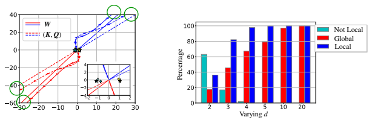
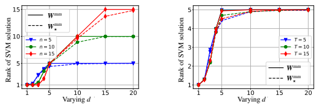
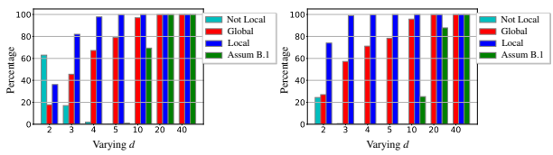
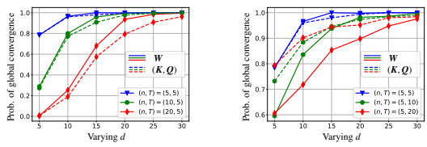
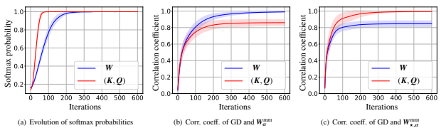
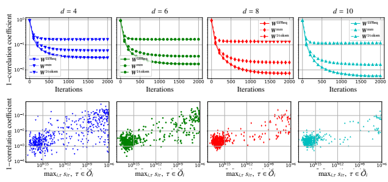
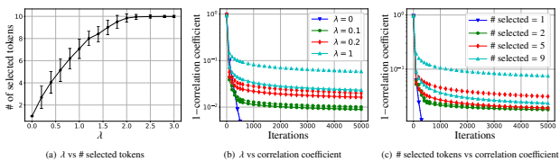
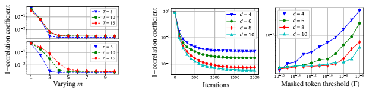
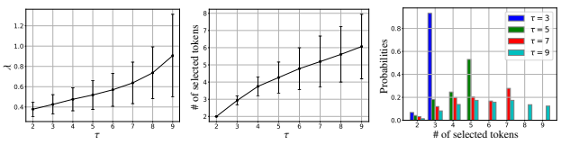

# Transformers As Support Vector Machines

Davoud Ataee Tarzanagh1⋆ Yingcong Li2⋆ Christos Thrampoulidis3 Samet Oymak4†

#### Abstract

Since its inception in "Attention Is All You Need", the transformer architecture has led to revolutionary advancements in natural language processing. The attention layer within the transformer admits a sequence of input tokens X and makes them interact through pairwise similarities computed as softmax(XQK⊤ X
⊤), where (K, Q) are the trainable key-query parameters. In this work, we establish a formal equivalence between the optimization geometry of self-attention and a hard-margin SVM problem that separates optimal input tokens from non-optimal tokens using linear constraints on the outer-products of token pairs. This formalism builds on [TLZO23] and allows us to characterize the implicit bias of 1-layer transformers optimized with gradient descent, as follows. (1) Optimizing the attention layer, parameterized by (K, Q), with vanishing regularization, converges in direction to an SVM solution minimizing the nuclear norm of the combined parameter W := KQ⊤. Instead, directly parameterizing by W minimizes a Frobenius norm SVM
objective. We characterize this convergence, highlighting that it can occur in locally-optimal directions rather than global ones. (2) Complementing this, for W-parameterization, we prove the local/global directional convergence of gradient descent under suitable geometric conditions. Importantly, we show that over-parameterization catalyzes global convergence by ensuring the feasibility of the SVM problem and by guaranteeing a benign optimization landscape devoid of stationary points. (3) While our theory applies primarily to linear prediction heads, we propose a more general SVM equivalence that predicts the implicit bias of 1-layer transformers with nonlinear heads/MLPs. Our findings apply to general datasets, trivially extend to cross-attention layer, and their practical validity is verified via thorough numerical experiments. We also introduce open problems and future research directions. We believe these findings inspire a new perspective, interpreting multilayer transformers as a hierarchy of SVMs that separates and selects optimal tokens.

## 1 Introduction

Self-attention, the central component of the transformer architecture, has revolutionized natural language processing
(NLP) by empowering the model to identify complex dependencies within input sequences [VSP+17]. By assessing the relevance of each token to every other token, self-attention assigns varying degrees of importance to different parts of the input sequence. This mechanism has proven highly effective in capturing long-range dependencies, which is essential for applications arising in NLP [KT19, BMR+20, RSR+20], computer vision [FXM+21, LLC+21, TCD+21, CSL+23], and reinforcement learning [JLL21, CLR+21, WWX+22]. Remarkable success of the self-attention mechanism and transformers has paved the way for the development of sophisticated language models such as GPT4 [Ope23], Bard [Goo23], LLaMA [TLI+23], and ChatGPT [Ope22].

Q: Can we characterize the optimization landscape and implicit bias of transformers?

How does the attention layer select and compose tokens when trained with gradient descent?

We address these questions by rigorously connecting the optimization geometry of the attention layer and a hard max-margin SVM problem, namely (Att-SVM), that separates and selects the optimal tokens from each input sequence. This formalism, which builds on the recent work [TLZO23], is practically meaningful as demonstrated through experiments, and sheds light on the intricacies of self-attention. Throughout, given input sequences X, Z ∈ R
T×d with length T and embedding dimension d, we study the core cross-attention and self-attention models:

$$\begin{array}{c}{{f_{\mathrm{cross}}(X,Z):=\mathbb{S}(Z Q K^{\top}X^{\top})X V,}}\\ {{f_{\mathrm{self}}(X):=\mathbb{S}(X Q K^{\top}X^{\top})X V.}}\end{array}$$
⊤)XV, (1a)
⊤)XV. (1b)
$$(1\mathbf{a})$$
$\eqref{eq:walpha}$. 
1

1 University of Pennsylvania, tarzanaq@upenn.edu.

2 University of California, Riverside, yli692@ucr.edu.

3 University of British Columbia, cthrampo@ece.ubc.ca.

4 University of Michigan, oymak@umich.edu.⋆ Equal contribution. † Corresponding author.

Figure 1: GD convergence during training of cross-

attention weight W or (K, Q) with data. Teal and yellow markers represent tokens from X1 and X2, while stars mark optimal tokens. Solid and dashed lines depict attention-SVM (Att-SVM and Att-SVM⋆ respectively)
directions mapped to z1 (red) and z2 (blue), with arrows illustrating GD trajectories converging towards these SVM directions. Green circles denote GD ↔ SVM pairings.

Figure 2: Percentage of different convergence types when training cross-attention weights (W) using GD and varying dimension (d). Red and blue bars represent the percentages of convergence to globally-optimal and locallyoptimal (including global) SVM solutions, respectively. Teal bars are complements of the blue bars. Larger overparameterization (d) increases the likelihood of global convergence.

Here, K, Q ∈ R
d×m, V ∈ R
d×vare the trainable key, query, value matrices respectively; S(·) denotes the softmax nonlinearity, which is applied row-wise on XQK⊤ X
⊤. Note that self-attention (1b) is a special instance of the crossattention (1a) by setting Z ← X. To expose our main results, suppose the first token of Z - denoted by z - is used for prediction. Concretely, given a training dataset (Yi, Xi, zi)
n i=1 with labels Yi ∈ {−1, 1} and inputs Xi ∈ R
T×d
, zi ∈ R
d, we consider the empirical risk minimization with a decreasing loss function ℓ(·) : R → R, represented as follows:

$${\cal L}(K,Q)=\frac{1}{n}\sum_{i=1}^{n}\ell\left(Y_{i}\cdot f(X_{i},z_{i})\right),\quad\mathrm{where}\;\;f(X_{i},z_{i})=h\left(X_{i}^{\top}\mathbb{S}\left(X_{i}K Q^{\top}z_{i}\right)\right).$$
$$(2)$$

Here, h(·) : R
d → R is the prediction head that subsumes the value weights V. In this formulation, the model f(·)
precisely represents a one-layer transformer where an MLP follows the attention layer. Note that, we recover the self-attention in (2) by setting zi ← xi1, where xi1 denotes the first token of the sequence Xi 1. The softmax operation, due to its nonlinear nature, poses a significant challenge when optimizing (2). The problem is nonconvex and nonlinear even when the prediction head is fixed and linear. In this study, we focus on optimizing the attention weights (K, Q or W) and overcome such challenges to establish a fundamental SVM equivalence.2 The paper's main contributions are as follows:
- Implicit bias of the attention layer (Secs. **2-3).** Optimizing the attention parameters (K, Q) with vanishing regularization converges in direction towards a max-margin solution of (Att-SVM⋆) with the nuclear norm objective of the combined parameter W := KQ⊤ (Thm 2). In the case of directly parameterizing cross-attention by the combined parameter W, the regularization path (RP) directionally converges to (Att-SVM) solution with the Frobenius norm objective. To our knowledge, this is the first result to formally distinguish the optimization dynamics of W vs (K, Q)
parameterizations, revealing the low-rank bias of the latter. Our theory clearly characterizes the *optimality* of selected tokens (Definition 1) and naturally extends to sequence-to-sequence or causal classification settings (see SAtt-SVM and Theorem 10 in appendix).

- Convergence of gradient descent (Secs. **4-5).** The gradient descent (GD) iterates for the combined key-query variable W converge in direction to a *locally-optimal* solution of (Att-SVM) with appropriate initialization and a linear head h(·) (Sec. 5). For local optimality, selected tokens must have higher scores than their neighboring tokens.

1Note that for simplicity, we set zi = xi1, but it can be any other row of Xi.

2We fix h(·) and only optimize the attention weights. This is partly to avoid the degenerate case where h(·) can be used to achieve zero training loss (e.g. via standard arguments like NTK [JGH18]) without providing any meaningful insight into the functionality of the attention mechanism.
Locally-optimal directions are not necessarily unique and are characterized in terms of the problem geometry following [TLZO23]. As a key contribution, we identify geometric conditions that guarantee convergence to the globally-optimal direction (Sec. 4). These include: (i) optimal tokens being clearly distinguishable in terms of their *scores*, or, (ii) the initial gradient direction being aligned with optimal tokens. Beyond these, we show that over-parameterization (i.e. dimension d being large, and equivalent conditions) catalyzes global convergence by ensuring (1) feasibility of (Att-SVM), and, (2) benign optimization landscape, in the sense that there are no stationary points and no spurious locally-optimal directions (see Sec. 5.2). These are illustrated in Figures 1 and 2.

- Generality of SVM equivalence (Sec. 6). When optimizing with linear h(·), the attention layer is inherently biased towards selecting a single token from each sequence (a.k.a. hard attention). This is reflected in (Att-SVM) and arises from output tokens being convex combinations of the input tokens. In contrast, we show that nonlinear heads necessitate composing multiple tokens, highlighting their importance in the transformer's dynamics (Sec 6.1). Using insights gathered from our theory, we propose a more general SVM equivalence. Remarkably, we demonstrate that our proposal accurately predicts the implicit bias of attention trained by gradient descent under general scenarios not covered by theory (e.g. h(·) being an MLP). Specifically, our general formulae decouple attention weights into two components: A
directional component governed by SVM which selects the tokens by applying a 0-1 mask, and a **finite component** which dictates the precise composition of the selected tokens by adjusting the softmax probabilities.

An important feature of these findings is that they apply to arbitrary datasets (whenever SVM is feasible) and are numerically verifiable. We extensively validate the max-margin equivalence and implicit bias of transformers through enlightening experiments. We hold the view that these findings aid in understanding transformers as hierarchical max-margin token-selection mechanisms, and we hope that our outcomes will serve as a foundation for upcoming studies concerning their optimization and generalization dynamics. Overview. The paper is structured as follows: Section 2 introduces preliminaries on self-attention and optimization. Section 3 analyzes self-attention's optimization geometry, showing the RP of attention parameters converges to a max-margin solution. Sections 4 and 5 present global and local gradient descent analyses, respectively, demonstrating convergence of W, the key-query variable, towards the solution of (Att-SVM). Section 6 provides our results on nonlinear prediction heads and generalized SVM equivalence. Section 7 extends the theory to sequential and causal predictions. Section 8 discusses relevant literature. Finally, Section 9 concludes the paper with open problems and future research directions inspired by our findings. All proofs are deferred to the appendix.

## 2 Preliminaries

Logistic loss Attention (softmax)
SVM Att-SVM
Separates training examples Separates tokens of input sequences Gradient Descent This work Figure 3: Implicit biases of the attention layer and logistic regression.

Unveiling the Relationship Between Attention and Linear SVMs. For linear classification, it is well-established that GD iterations on logistic loss and separable datasets converge towards the hard margin SVM solution, which effectively separates the two classes within the data [SHN+18, RZH03, ZY05]. The softmax nonlinearity employed by the attention layer exhibits an exponentiallytailed behavior similar to the logistic loss; thus, attention may also be biased towards margin-maximizing solutions. However, the attention layer operates on tokens within an input sequence, rather than performing classification directly. Therefore, its bias is towards an SVM, specifically (Att-SVM), which aims to separate the tokens of input sequences by selecting the relevant ones and suppressing the rest. Nonetheless, formalizing this intuition is considerably more challenging: The presence of the highly nonlinear and nonconvex softmax operation renders the analysis of standard GD algorithms intricate. Additionally, the 1-layer transformer in (2) does not inherently exhibit a singular bias towards a single (Att-SVM) problem, even when using a linear head h. Instead, it can result in multiple locally optimal directions induced by their associated SVMs. We emphasize that [TLZO23] is the first work to make this attention↔SVM connection. Here, we augment their framework to transformers by developing the first guarantees for self/cross-attention layer, nonlinear prediction heads, and global convergence.

Notation. For any integer N ≥ 1, let [N] := {1, . . . , N}. We use lowercase and uppercase bold letters (e.g., a and A) to represent vectors and matrices, respectively. The entries of a vector a are denoted as ai. For a matrix A, ∥A∥ denotes the spectral norm, i.e. maximum singular value, ∥A∥⋆ denotes the nuclear norm, i.e. summation of all singular values, and ∥A∥F :=
√trace(A⊤ A) denotes the Frobenius norm. dist (·, ·) denotes the Euclidean distance between two sets.

The minimum of two numbers a and b is denoted as a ∧ b, and the maximum as a ∨ b. The big-O notation O(·) hides the universal constants. Optimization problem definition. We use a linear head h(x) = v
⊤ x for most of our theoretical exposition. Given dataset (Yi, Xi, zi)
n i=1
, we minimize the empirical risk of an 1-layer transformer using combined weights W ∈ R
d×d or individual weights K, Q ∈ R
d×m for a fixed head and decreasing loss function:

$$\mathcal{L}(W)=\frac{1}{n}\sum_{i=1}^{n}\ell\left(Y_{i}\cdot\boldsymbol{v}^{\top}\boldsymbol{X}_{i}^{\top}\mathbb{S}(\boldsymbol{X}_{i}W\boldsymbol{z}_{i})\right),$$ $$\mathcal{L}(\boldsymbol{K},\boldsymbol{Q})=\frac{1}{n}\sum_{i=1}^{n}\ell\left(Y_{i}\cdot\boldsymbol{v}^{\top}\boldsymbol{X}_{i}^{\top}\mathbb{S}(\boldsymbol{X}_{i}\boldsymbol{K}\boldsymbol{Q}^{\top}\boldsymbol{z}_{i})\right).$$
$$(\mathrm{W-ERM})$$
$$(\mathrm{KQ-ERM})$$

We can recover the self-attention model by setting zito be the first token of Xi, i.e., zi ← xi1. While the above formulation regresses a single label Yi per (Xi, zi), in Sections 7 & D, we show that our findings gracefully extend to the sequence-to-sequence classification setting where we output and classify T tokens per inputs Xi, Zi ∈ R
T×d. The reader is referred to Sections 6 & D for results on nonlinear prediction heads.

Optimization algorithms. Given a parameter R > 0, we consider an ℓ2-norm bound R, and define the regularized path solution associated with Objectives (W-ERM) and (KQ-ERM), respectively as (W-RP) and (KQ-RP). These update rules allow us to find the solution within a constrained region defined by the norm bound. The RP illustrates the evolution of W¯R as R increases, capturing the essence of GD where the ridge constraint serves as an approximation for the number of iterations. Previous studies, including [RZH03, SPR18, JDST20, TLZO23], have examined the implicit bias of logistic regression and established a connection between the directional convergence of the RP (i.e.,
limR→∞ W¯R/R) and GD. In [TLZO23], the concept of a local RP was also employed to investigate implicit bias along local directions. For GD, with appropriate initialization and step size η > 0, we describe the optimization process associated with (W-ERM) and (KQ-ERM) as (W-GD) and (KQ-GD), respectively.

| Given W(0) ∈ R d×d ,  0 do:   η > 0, for k ≥   |         | Given Q(0), K(0) ∈ R   |     |         |     | d×m ,     |                          | η > 0, for k ≥ 0 do:   |    |          |
|------------------------------------------------|---------|------------------------|-----|---------|-----|-----------|--------------------------|------------------------|----|----------|
| W(k + 1) = W(k) − η∇L(W(k)).                   | (W\-GD) | " K(k  + 1)  " K(k)    | # = |         | # − |           | " ∇LK                    | (K(k), Q(k))           | #  | (KQ\-GD) |
|                                                |         | Q(k + 1) Q(k)          |     |         |     | η         | ∇LQ                      | (K(k), Q(k))           | .  |          |
| Given R > 0, find d × d matrix:                |         | Given R > 0, find d ×  |     |         |     |           | m matrices:              |                        |    |          |
| W¯ R = arg min  L(W).  ∥W∥F≤R                  | (W\-RP) | (K¯ R                  |     | , Q¯ R) | =   | ∥K∥  2  F | arg min  +∥Q∥  2  ≤2R  F | L(K, Q).               |    | (KQ\-RP) |

### 2.1 Optimal Tokens And Hard-Margin Svm Problem For Cross Attention

Given Xi ∈ R
T×d
, zi ∈ R
d, we present a convex hard-margin SVM problem, denoted as (Att-SVM), that aims to separate a specific token from the remaining tokens in the input sequence Xi. This problem is jointly solved for all inputs, allowing us to examine the optimization properties of cross-attention. To delve deeper, we introduce the concept of optimal tokens, which are tokens that minimize the training objective under the decreasing loss function ℓ(·) as shown in Lemma 2. This exploration will introduce the notions of token scores and optimality, providing insights into the underlying principles of self-attention mechanisms [TLZO23].

Definition 1 (Token Score and Optimality) *Given a prediction head* v ∈ R
d, the score of a token xit *of input* Xiis defined as γit = Yi· v
⊤ xit. The optimal token for each input Xiis given by the index opti ∈ arg maxt∈[T] γit *for all* i ∈ [n].

By introducing token scores and identifying optimal tokens, we can better understand the importance of individual tokens and their impact on the overall objective. The token score quantifies the contribution of a token to the prediction or classification task, while the optimal token represents the token that exhibits the highest relevance within the corresponding input sequence.

- Hard-margin SVM for W**-parameterization.** Equipped with the set of optimal indices opt := (opti)
n i=1 as per Definition 1, we introduce the following SVM formulation associated to (W-ERM):
Wmm = arg min
∥W∥F subj. to (xiopti − xit)
⊤W zi ≥ 1 for all t , opti, i ∈ [n]. (Att-SVM)
The existence of matrix Wmm implies the separability of tokens (opti)
n i=1 from the others. The terms ait := x
⊤
itW zi represent the dot product between the key-query features before applying the softmax nonlinearity. This dot product is a crucial characteristic of self-attention and we can express the SVM constraints in (Att-SVM) as aiopti ≥ ait + 1. Thus,
(Att-SVM) find the most efficient direction that ensures the optimal token xioptiachieves the highest similarity with query zi among all key embeddings. Our first result shows that (Att-SVM) is feasible under mild over-parameterization.

Theorem 1 *Suppose* d ≥ max(T − 1, n)*. Then, almost all datasets* (Yi, Xi, zi)
n i=1
- including the self-attention setting with zi ← xi1 *– obey the following:* (Att-SVM) is feasible i.e., Wmm separates the desired tokens opt = (opti)
n i=1
.

We note that the convex formulation (Att-SVM) does not fully capture the GD geometry on (W-ERM). In a more general sense, GD can provably converge to an SVM solution over locally-optimal tokens, as detailed in Section 5.1. For deeper insight into (Att-SVM), consider that the attention layer's output is a convex mixture of input tokens. Thus, if minimizing the training loss involves choosing the optimal token xiopti, the softmax similarities should eventually converge to a one-hot vector, precisely including xiopti
(assigned 1), while ignoring all other tokens (assigned 0s). This convergence requires the attention weights W to diverge in norm to saturate the softmax probabilities. Due to the exponential-tailed nature of the softmax function, the weights converge directionally to the max-margin solution. This phenomenon resembles the implicit bias of logistic regression on separable data [SHN+18, JT18]. Lemma 2 formalizes this intuition and rigorously motivates optimal tokens.

- Non-convex SVM problem for (K, Q)**-parameterization.** The objective function (KQ-ERM) has an extra layer of nonconvexity compared to (W-ERM) as (K, Q) corresponds to a matrix factorization of W. To study this, we introduce the following nonconvex SVM problem over (K, Q) akin to (Att-SVM):
subj. to (xiopti − xit)
⊤ KQ⊤zi ≥ 1 for all t , opti, i ∈ [n]. (KQ-SVM)
Even if the direction of GD is biased towards the SVM solution, it does not have to converge to the global minima of
(KQ-SVM). Instead, it can potentially converge towards a Karush–Kuhn–Tucker (KKT) point of the max-margin SVM.

Such KKT convergence has been studied by [LL19, JT20] in the context of other nonconvex margin maximization problems. Fortunately, (KQ-ERM) may not be as daunting as it may initially seem: Our experiments in Figures 1&7 reveal that GD is indeed biased towards the global minima of (KQ-SVM). This global minima is achieved by setting W := KQ⊤ and finding the factorization of W that minimizes the quadratic objective. This yields the following W-parameterized SVM with nuclear norm objective:
Wmm
⋆ 
∈ arg min rank(W)≤m
∥W∥⋆ subj. to (xiopti − xit)
⊤W zi ≥ 1 for all t , opti, i ∈ [n]. (Att-SVM⋆)
Above, the nonconvex rank constraint arises from the fact that the rank of W = KQ⊤ is at most m. However, under the condition of the full parameterization where m ≥ d, the rank constraint disappears, leading to a convex nuclear norm minimization problem. Besides, the nuclear norm objective inherently encourages a low-rank solution
[RFP10, Faz02, SRJ04]. Therefore, if the solution set of the unconstrained convex problem satisfies rank(W) ≤ m, the convex problem will recover the solutions of (Att-SVM), even when m < d. Lemma 1, presented below, demonstrates that this guarantee holds whenever n ≤ m. This observation is further supported by our experiments (see Fig. 4). Thus, it offers a straightforward rationale for why setting m < d is a reasonable practice, particularly in scenarios involving limited data.

Lemma 1 *Any optimal solution of* (Att-SVM) or (Att-SVM⋆) is at most rank *n. More precisely, the row space of* Wmm or Wmm lies within *span*({zi}
n i=1
).

Figures 4 illustrates rank range of solutions for (Att-SVM) and (Att-SVM⋆), denoted as Wmm and Wmm
⋆
, solved using optimal tokens (opti)
n i=1 and setting m = d (the rank constraint is eliminated). Each result is averaged over 100 W
1
∥K∥
2F + ∥Q∥
2F
min 2 K,Q
⋆

(a) Rank of attention SVM solutions with fixed T = 5

⋆

#### ⋆

=Wmm
.

∥Wmm∥F
R→∞

(b) Rank of attention SVM solutions with fixed n = 5

Figure 4: Rank range of solutions for (Att-SVM) and (Att-SVM⋆), denoted as Wmm and Wmm
⋆
, solved using optimal tokens (opti)
n i=1 and setting m = d (the rank constraint is eliminated). Both figures confirm ranks of Wmm and Wmm are

bounded by max(n, d), validating Lemma 1.

trials, and for each trial, xit, zi, and linear head v are randomly sampled from the unit sphere. In Fig. 4(a), we fix T = 5 and vary n across {5, 10, 15}. Conversely, in Fig. 4(b), we keep n = 5 constant and alter T across {5, 10, 15}. Both figures confirm rank of Wmm and Wmm are bounded by max(n, d), validating Lemma 1.

## 3 Understanding Implicit Bias Of Self-Attention

We start by motivating the optimal token definition and establishing the global convergence of RPs which shed light on the implicit bias of attention parameterizations. Throughout, we maintain the following assumption regarding the loss function.

Assumption A Over any bounded interval: (i) ℓ : R → R is strictly decreasing and bounded from below; (ii) The derivative of ℓ*, denoted as* ℓ
′, is M0-Lipschitz continuous; and *(iii)* |ℓ
′(u)| ≤ M1.

Assumption A encompasses many commonly used loss functions, especially for classification, such as the logistic loss ℓ (u) = log (1 + e
−u), exponential loss ℓ (u) = e
−u, and correlation loss ℓ(u) = −u.

Lemma 2 (Optimal Tokens Minimize Training Loss) Suppose Assumption A (i) and (iii) hold, and not all tokens are optimal per Definition *1. Then, training risk obeys* L(W) > L⋆ :=
1 n Pn i=1ℓ(γiopti). Additionally, suppose there are optimal indices (opti)
n i=1 for which (Att-SVM) is feasible, i.e. there exists a W separating optimal tokens. This W
choice obeys limR→∞ L(R · W) = L⋆.

The result presented in Lemma 2 originates from the observation that the output tokens of the attention layer constitute a convex combination of the input tokens. Consequently, when subjected to a strictly decreasing loss function, attention optimization inherently leans towards the selection of a singular token, specifically, the optimal token (opti)
n i=1
. Our following theorem unveils the implicit bias ingrained within attention parameterizations through RP analysis.

Theorem 2 Suppose Assumptions A (i) and (iii) hold, optimal indices (opti)
n i=1 are unique, and (Att-SVM) is feasible.

Let Wmm *be the unique solution of* (Att-SVM)*, and let* Wmm
⋆ 
be the solution set of (Att-SVM⋆) with nuclear norm achieving objective C
⋆. Then, Algorithms W-RP and *KQ-RP, respectively, satisfy:*
W¯R
R
- W*-parameterization has Frobenius norm bias:* lim
- (K, Q)*-parameterization has nuclear norm bias:* lim R→∞
dist K¯RQ¯ ⊤
R
R,
Wmm
⋆
C⋆
= 0.

- *Setting m* = d: (Att-SVM⋆) *is a convex problem without rank constraints.*
Theorem 2 demonstrates that the RP of the (K, Q)-parameterization converges to a max-margin solution of (Att-SVM⋆)
with nuclear norm objective on W = KQ⊤. When self-attention is directly parameterized by W, the RP converges to the solution of (Att-SVM) with a Frobenius norm objective. This result is the first to distinguish the optimization dynamics of W and (K, Q) parameterizations, revealing the low-rank bias of the latter. These findings also provide a clear characterization of token optimality (Definition 1) and extend naturally to the setting with multiple optimal tokens per sequence (Theorem 10 in appendix). By definition, the RP captures the global geometry and cannot be used for the implicit bias of GD towards locally-optimal directions. Sections 4 and 5 accomplish this goal through gradient-descent and localized RP analysis to obtain locally-applicable SVM equivalences. Note that, this theorem requires each input sequence has a unique optimal token per Definition 1. Fortunately, this is a very mild condition as it holds for almost all datasets, namely, as soon as input features are slightly perturbed.

Theorem 2 establishes the implicit bias of attention from the perspective of RP analysis. This leads to the question:
To what extent is this RP theory predictive of the implicit bias exhibited by GD? To delve into this, we examine the gradient paths of W(k) or (K(k), Q(k)) and present the findings in Figure 1. We consider a scenario where n = d = 2 and T = 3, and employ cross-attention, where tokens (z1, z2) are generated independently of the inputs (X1, X2). In Figure 1's lower right corner, the teal and yellow markers correspond to tokens from X1 and X2, respectively. The stars indicate the optimal token for each input. To provide a clearer view of the gradient convergence path, we illustrate the outcomes of training the attention weight W or (K, Q) in the form of W zi or KQ⊤ zi, where i = 1, 2. With reference to Equations (Att-SVM) and (Att-SVM⋆), the red and blue solid lines delineate the directions of Wmm z1 and Wmm z2, correspondingly. Conversely, the red and blue dashed lines show the directions of Wmm
⋆
z1 and Wmm
⋆
z2. The red/blue solid/dashed arrows denote the corresponding directions of gradient evolution. Figure 1 provides a clear depiction of the incremental alignment of W(k) and K(k)Q(k)
⊤ with their respective attention SVM solutions as k increases. This strongly supports the assertions of Theorem 2.

It is worth noting that (Att-SVM⋆) imposes a nonconvex rank constraint, i.e., rank(W) ≤ m. Nevertheless, this constraint becomes inconsequential if the unconstrained problem, with m set to be greater than or equal to d, admits a low-rank solution, as demonstrated in Lemma 1. Consequently, in our experimental endeavors, we have the flexibility to employ the unconstrained attention SVM for predicting the implicit bias. This concept is succinctly summarized by the following lemma.

Lemma 3 Let Wmm
⋆ 
be the solution set of (Att-SVM⋆) with nuclear norm achieving objective C⋆*. Further let* Wmm cvx be the solution set of (Att-SVM⋆) with m = d achieving objective Ccvx*. If* Wmm
⋆ 
∩ Wmm cvx 
,
 ∅, then C⋆ = Ccvx and Wmm
⊆ Wmm cvx*. Also, if the elements of* Wmm cvx *have rank at most m, then,* Wmm
= Wmm cvx.

## 4 Global Convergence Of Gradient Descent

In this section, we will establish conditions that guarantee the global convergence of GD. Concretely, we will investigate when GD solution selects the *optimal token within each input sequence* through the softmax nonlinearity and coincides with the solution of the RP. Section 5 will complement this with showing that self-attention can more generally converge to locally-optimal max-margin directions. We identify the following conditions as provable catalysts for global convergence: (1) Optimal tokens have relatively large scores, (2) Initial gradient direction is favorable, (3) Overparameterization, i.e. d is appropriately large.

### 4.1 Properties Of Optimization Landscape

We start by establishing some fundamental properties of Objectives (W-ERM) and (KQ-ERM).

Lemma 4 Under Assumption A, ∇L(W), ∇KL(K, Q), and ∇QL(K, Q) are LW, LK, LQ–Lipschitz continuous, respectively, where ai = ∥v∥ ∥zi∥
2∥Xi∥
3, bi = M0∥v∥∥Xi∥ + 3M1 *for all i* ∈ [n],
⋆ 
⋆ 

$$L_{W}:=\frac{1}{n}\sum_{i=1}^{n}a_{i}b_{i},\qquad L_{K}:=\|Q\|L_{W},\quad\quad\text{and}\quad L_{Q}:=\|K\|L_{W}.$$

The next assumption will play an important role for ensuring the attention layer has a benign optimization landscape.

Assumption B Optimal tokens' indices (opti)
n i=1 are unique and one of the following conditions on the tokens holds:
B.1 All tokens are support vectors, i.e., (xiopti − xit)
⊤Wmm zi = 1 for all t , opti *and i* ∈ [n].

B.2 The tokens' scores, as defined in Definition 1, satisfy γit = γiτ < γiopti
, for all t, τ , opti and i ∈ [n].

$$({\mathfrak{I}})$$

(a) Convergence behaviour of GD for W-parameterization
(b) Convergence behaviour of GD for (K, Q)-parameterization

Figure 5: Percentage of different convergence types of GD when training cross-attention weights (a): W or (b): (K, Q)
with varying d. In both figures, red, blue, and teal bars represent the percentages of Global, Local (including Global), and Not Local convergence, respectively. The green bar corresponds to Assumption B.1 where all tokens act as support vectors. Larger overparameterization (d) relates to a higher percentage of globally-optimal SVM convergence.

Assumption B.1 is directly linked to overparameterization and holds practical significance. In scenarios such as classical SVM classification, where the goal is to separate labels, overparameterization leads to the situation where all training points become support vectors. Consequently, the SVM solution aligns with the least-squares minimum-norm interpolation, a concept established in [MNS+21, HMX21] under broad statistical contexts. Assumption B.1 represents an equivalent manifestation of this condition. Therefore, in cases involving realistic data distributions with sufficiently large d, we expect the same phenomena to persist, causing the SVM solution Wmm to coincide with (Att-SVM).

Drawing on insights from [HMX21, Theorem 1] and our Theorem 1, we expect that the necessary degree of overparameterization remains moderate. Specifically, in instances where input sequences follow an independent and identically distributed (IID) pattern and tokens exhibit IID isotropic distributions, we posit that d ≳ (T + n) log(T + n)
will suffice. More generally, the extent of required overparameterization will be contingent on the covariance of tokens
[BLLT20, MNS+21] and the distribution characteristics of input sequences [WT22].

Assumption B.2 stipulates that non-optimal tokens possess identical scores which constitutes a relatively stringent assumption that we will subsequently relax. Under Assumption B, we establish that optimization problems (W-ERM) and (KQ-ERM) lack stationary points, and when trained using GD, the norm of parameters will diverge.

Theorem 3 Suppose Assumption A on the loss function ℓ and Assumption B *on the tokens hold. Then,*
- *There is no* W ∈ R
d×dsatisfying ∇L(W) = 0.

- Algorithm W-GD *with the step size* η ≤ O (1/LW) *and any starting point* W(0) *satisfies* limk→∞ ∥∇L (W (k))∥F = 0, and limk→∞ ∥W(k)∥F = ∞.

The feasibility of SVM (per Theorem 1) is a necessary condition for convergence of GD to the Wmm direction. However, it does not inform us about the optimization landscape. Two additional criteria are essential for convergence: the absence of stationary points ∇L(W) = 0 and divergence of parameter norm to infinity. Theorem 3 above precisely guarantees both of these criteria under Assumption B.

### 4.2 Provable Global Convergence Of 1-Layer Transformer

Here, we provide three conditions for achieving global convergence towards the max-margin direction Wmm based on:
(I) token score constraints, **(II)** initial gradient direction, and **(III)** over-parameterization. For the first two, we provide precise theoretical guarantees. For the third, we provide strong empirical evidence, supported by Theorem 3, and a formal conjecture described in Section 5.2. We remind that, we optimize the attention weights W while fixing the linear prediction head h(x) = v
⊤ x. This avoids trivial convergence guarantees where an over-parameterized h(·) - whether it is a linear model or MLP - can be used to achieve zero training loss without providing any meaningful insights into the functionality of the attention mechanism.

(a) Global convergence for varying n, d
(b) Global convergence for varying T, d

Figure 6: Global convergence behavior of GD when training cross-attention weights W (solid) or (K, Q) (dashed) with random data. The blue, green, and red curves represent the probabilities of global convergence for (a): fixing T = 5 and varying n ∈ {5, 10, 20} and (b): fixing n = 5 and varying T ∈ {5, 10, 20}. Results demonstrate that for both attention models, as d increases (due to over-parameterization), attention weights tend to select optimal tokens (opti)
n i=1
.

(I) Global convergence under score constraints. Our next result establishes the global convergence of GD to the max-margin direction Wmm under Assumption B.2 that non-optimal tokens have identical scores but lower than the score of the optimal token.

Theorem 4 Suppose Assumption A on the loss function ℓ *and Assumption* B.2 on the tokens' score hold. Then, Algorithm W-GD *with the step size* η ≤ O (1/LW) *and any starting point* W(0) *satisfies* limk→∞
W(k)
∥W(k)∥F
=Wmm
∥Wmm∥F
.

To proceed, we also provide a relaxation of Assumption B.2 and, show that, global convergence still happens under approximately equal scores.

Theorem 5 Suppose Assumption A on the loss function ℓ *hold. For any initialization* W(0), there exists a datasetdependent suffi*ciently small* δ > 0 *such that the following holds: Suppose non-optimal scores obey* |γit − γiτ| ≤ δ for all t, τ , opti, i ∈ [n]. Then, Algorithm W-GD*, with* η ≤ O (1/LW) obeys limk→∞W(k)
∥W(k)∥F
=Wmm
∥Wmm∥F
.

(II) Global convergence under good initial gradient. To ensure global convergence, we identify an assumption that prevents GD from getting trapped at suboptimal tokens that offer no scoring advantage compared to other choices.

Assumption C (First GD step is separating) For all non-optimal tokens t , opti, i ∈ [n]: (xit − xiopti
)
⊤∇L(0)zi > 0.

Theorem 6 Suppose Assumption A on the loss function ℓ and Assumption C on the initial gradient holds. Consider GD iterates W(k + 1) = W(k) − η(k)∇L(W(k)) on (W-ERM) *with* W(0) = 0 *and step sizes* η(0) ≤ O(1/∥Wmm∥) and η(k) ≤ O (1/LW) for all k ≥ 1*. Then,* limk→∞W(k)
∥W(k)∥F
=Wmm
∥Wmm∥F
.

(III) Global Convergence via overparameterization. In the context of standard neural networks, overparameterization has been recognized as a pivotal factor for the global convergence of GD [DZPS18, AZLS19, LL18, OS19]. However, conventional approaches like the neural tangent kernel [JGH18] do not seamlessly apply to our scenario, given our assumption on fixed h and the avoidance of achieving zero loss by trivially fitting h. Furthermore, even when we train h to achieve zero loss, it doesn't provide substantial insights into the implicit bias of the attention weights W. Conversely, Theorem 3 illustrates the benefits of over-parameterization in terms of convergence. Considering that Assumption B.1 is anticipated to hold as the dimension d increases, the norm of the GD solution is bound to diverge to infinity. This satisfies a prerequisite for converging towards the globally-optimal SVM direction Wmm.

The trend depicted in Figure 5, where the percentage of global convergence (red bars) approaches 100% and Assumption B.1 holds with higher probability (green bars) as d grows, reinforces this insight. Specifically, Fig. 5(a) is similar to Figure 2 but with additional green bars representing the percentage of the scenarios where almost all tokens act as support vectors (Assumption B.1), and Fig. 5(b) displays the same evaluation over (K, Q)-parameterization setting. In both experiments, and for each chosen d value, a total of 500 random instances are conducted under the conditions of n = T = 5. The outcomes are reported in terms of the percentages of Not Local, Local, and Global convergence, represented by the teal, blue, and red bars, respectively. We validate Assumption B.1 as follows: Given a problem instance, we compute the average margin over all non-optimal tokens of all inputs and declare that problem satisfies Assumption B.1, if the average margin is below 1.1 (where 1 is the minimum). Here, recall that margin of a non-optimal token is defined as (xiopti − xit)
⊤Wmm zi or (xiopti − xit)
⊤Wmm
⋆
zi for t , opti.

Furthermore, the observations in Figure 6 regarding the percentages of achieving global convergence reaching 100 with larger d reaffirm that overparameterization leads the attention weights to converge directionally towards the optimal max-margin direction outlined by (Att-SVM) and (Att-SVM⋆).

In the upcoming section, we will introduce locally-optimal directions, to which GD can be proven to converge when appropriately initialized. We will then establish a condition that ensures the *globally-optimal direction is the sole viable* locally-optimal direction. This culmination will result in a formal conjecture detailed in Section 5.2.

## 5 Understanding Local Convergence Of The Attention Layer

So far, we have primarily focused on the convergence to the global direction dictated by (Att-SVM). In this section, we investigate and establish the local directional convergence of GD as well as RP.

### 5.1 Local Convergence Of Gradient Descent

To proceed, we introduce locally-optimal directions by adapting Definition 2 of [TLZO23].

Definition 2 (Support indices and locally-optimal direction) *Fix token indices* α = (αi)
n i=1
. Solve (Att-SVM) *with*
(opti)
n i=1 replaced with α = (αi)
n i=1 to obtain Wmm α
. Consider the set Ti ⊂ [T] *such that* (xiαi − xit)
⊤Wmm α zi = 1 for all t ∈ Ti. We refer to (Ti)
n i=1 as the support indices of α. Additionally, if for all i ∈ [n] and t ∈ Ti *scores per Definition* 1 obey γiαi > γit*, indices* α = (αi)
n i=1 are called locally-optimal and Wmm is called a locally-optimal direction.

In words, the concept of local optimality requires that the selected tokens denoted as α should have scores that are higher than the scores of their neighboring tokens referred to as support indices. It is important to observe that the tokens defined as opt = (opti)
n i=1, which we term as the optimal tokens, inherently satisfy the condition of local optimality. Moving forward, we will provide Theorem 7 which establishes that when the process of GD is initiated along a direction that is locally optimal, it gradually converges in that particular direction, eventually aligning itself with Wmm α
. This theorem immediately underscores the fact that if there exists a direction of local optimality (apart from the globally optimal direction Wmm), then when GD commences from any arbitrary starting point, it does not achieve global convergence towards Wmm. In the context of Theorem 4, this insight further demonstrates the general necessity of Assumption B.2. This assumption is pivotal because without it, scenarios in which token scores are not equal might potentially lead to the emergence of directions that are locally optimal (as specified in Definition 2), thereby impeding the possibility of achieving global convergence.

To provide a basis for discussing local convergence of GD, we establish a cone centered around Wmm α using the following construction. For a fixed V¯ ∈ R
d×d, parameters µ ∈ (0, 1) and R > 0, we define Cµ,R(V¯) as the set of matrices W ∈ R
d×dsuch that ∥W∥F ≥ R and the correlation coefficient between W and V¯ is at least 1 − µ:
α

$$C_{\mu,R}(\bar{V}):=\left\{W\in\mathbb{R}^{d\times d}\ :\ \left\langle\frac{W}{\|W\|_{F}},\frac{\bar{V}}{\|\bar{V}\|_{F}}\right\rangle\geq1-\mu,\ \|W\|_{F}\geq R\right\}.\tag{1}$$

α α
=Wmm limk→∞W(k)
.

∥Wmm α
∥W(k)∥F
α ∥F

$$(4)^{\frac{1}{2}}$$

Theorem 7 Suppose Assumption A on the loss ℓ *holds, and let* α = (αi)
n i=1 be locally optimal tokens according to Definition *2. Let* Wmm denote the SVM solution obtained via (Att-SVM) by replacing (opti)
n i=1 with α = (αi)
n i=1
. Then, T1. There exist parameters µ = µ(α) ∈ (0, 1) and R > 0 *such that* Cµ,R(Wmm
) *does not contain any stationary points.*
T2. *For any starting point* W(0) *in the confidence region* Cµ,R(Wmm α
), consider Algorithm W-GD *with stepsize* η ≤
Omin 1 LW, ζ(µ)*, where* ζ(µ) *is a correlation dependent parameter. Then, we have* limk→∞ ∥W(k)∥F = ∞ and

α
⋆,α

Figure 7: Local convergence behaviour of GD when training cross-attention weights W (blue) or (K, Q) (red) with random data: (a) displays the largest entry of the softmax outputs averaged over the dataset; (b&c) display the Pearson correlation coefficients of GD trajectories and the SVM solutions (b) with the Frobenius norm objective Wmm α
(solution of (Att-SVM)) and (c) with the nuclear norm objective Wmm
⋆,α(solution of (Att-SVM⋆)). These demonstrate the Frobenius norm bias of W(k) and the nuclear norm bias of K(k)Q(k)
⊤.

This theorem establishes the existence of positive parameters µ = µ(α) > 0 and R > 0 such that there are no stationary points within Cµ,R(Wmm α
). Furthermore, if GD is initiated within Cµ,R(Wmm α
), it will converge in the direction of Wmm α/∥Wmm α
∥F. It is important to note that Theorem 7 does not make any assumptions on the tokens as opposed to Theorem 4. However, it does require a proper initialization that exhibits a correlation between the initial direction and Wmm α
. Additionally, we observe that the stepsize is adjusted based on the Lipschitz constant of the gradient of the objective function, the correlation of the initial direction with Wmm α
, which is parameterized by µ and the correlation of the negative gradient at W(k) and Wmm α
, parameterized by ρ. In Figure 7 we consider setting where n = 6, T = 8, and d = 10. The displayed results are averaged from 100 random trials. We train cross-attention models with xit, zi, v ∈ R
d randomly sampled from unit sphere, and apply the normalized GD approach with fixed step size η = 0.1. In Figure 7(a)
we calculate the softmax probability via 1n Pn i=1 maxt∈[T] S(XiW˜ (k)zi)t for either W˜ = W or KQ⊤ at each iteration. Both scenarios result in probability 1, which indicates that attention weights succeed in selecting one token per input. Then following Def. 2 let α = (αi)
n i=1 be the token indices selected by GD and denote Wmm
⋆,αas the corresponding SVM solution of (Att-SVM⋆). Define the correlation coefficient of two matrices as corr_coef(W1,W2) := ⟨W1,W2⟩ /∥W1∥F∥W2∥F.

Figures 7(b) and 7(c) illustrate the correlation coefficients of attention weights (W(k) and K(k)Q(k)
⊤) with respect to Wmm α and Wmm
⋆,α. The results demonstrate that W (KQ⊤) ultimately reaches a 1 correlation with Wmm α
(Wmm
⋆,α), which suggests that W (KQ⊤) converges in the direction of Wmm α
(Wmm
⋆,α). This further validates Theorem 7.

### 5.2 Overparameterization Conjecture: When Local-Optimal Directions Disappear

In Section 4 we demonstrated that larger d serves as a catalyst for global convergence to select the optimal indices opt = (opti)
n i=1
. However, Section 5.1 shows that the convergence can be towards locally-optimal directions rather than global ones. How do we reconcile these? Under what precise conditions, can we expect global convergence?

The aim of this section is gathering these intuitions and stating a concrete conjecture on the global convergence of the attention layer under geometric assumptions related to overparameterization. To recap, Theorem 1 characterizes when (Att-SVM) is feasible and Theorem 3 characterizes when the parameter norm provably diverges to infinity, i.e. whenever all tokens are support vectors of (Att-SVM) (Assumption B.1 holds). On the other hand, this is not sufficient for global convergence, as GD can converge in direction to locally-optimal directions per Section 5.1. Thus, to guarantee global convergence, we need to ensure that **globally-optimal direction is the only viable one**. Our next assumption is a fully-geometric condition that precisely accomplishes this.

Assumption D (There is always an optimal support index) For any choice of α = (αi)
n i=1 with α , opt *when* solving (Att-SVM) with opt ← α, there exists i ∈ [n] *such that* αi 
, opti and opti ∈ Ti.

This guarantees that no α , opt can be locally-optimal because it has a support index with higher score at the input i with αi 
, opti. Thus, this ensures that global direction Wmm is the unique locally-optimal direction obeying Def. 2.

Finally, note that local-optimality in Def. 2 is one-sided: GD can provably converge to locally-optimal directions, while we do not provably exclude the existence of other directions. Yet, Theorem 4 of [TLZO23] shows that local RPs (see Section 5.3 for details) can only converge to locally-optimal directions for almost all datasets3. This and Figure 5 provide strong evidence that Def. 2 captures all possible convergence directions of GD, and as a consequence, that Assumption D guarantees that Wmm is the only viable direction to converge.

➡
 **Integrating the results and global convergence conjecture.** Combining Assumptions B.1 and D, we have concluded that gradient norm diverges and Wmm is the only viable direction to converge. Thus, we conclude this section with the following **conjecture**: Suppose opt = (opti)
n i=1 are the unique optimal indices with strictly highest score per sequence and Assumptions B.1 and D hold. Then, for almost all datasets (e.g. add small IID gaussian noise to input features), GD
with a proper constant learning rate converges to Wmm of (Att-SVM) in direction.

To gain some intuition, consider Figure 5: Here, red bars denote the frequency of global convergence whereas green bars denote the frequency of Assumption B.1 holding over random problem instances. In short, this suggests that Assumption B.1 occurs less frequently than global convergence, which is consistent with our conjecture. On the other hand, verifying Assumption D is more challenging due to its combinatorial nature. A stronger condition that implies Assumption D is when all optimal indices (opti)
n i=1 are support vectors of the SVM. That is, either opti = αi or opti ∈ Ti, ∀ i ∈ [n]. When the data follows a statistical model, this stronger condition could be verified through probabilistic tools building on our earlier "all training points are support vectors" discussion [MNS+21]. More generally, we believe a thorough statistical investigation of (Att-SVM) is a promising direction for future work.

### 5.3 Guarantees On Local Regularization Path

In this section, we provide a *localized* regularization path analysis for general objective functions. As we shall see, this will also allow us to predict the local solutions of gradient descent described in Section 5.1. Let ⋄ denote a general norm objective. Given indices α = (αi)
n i=1, consider the formulation

$$\mathbf{W}_{\text{c,tr}}^{\text{nm}}=\operatorname*{arg\,min}_{\text{rank}\,|\mathbf{W}|\leq m}\|\mathbf{W}\|,\quad\text{subj.to}\quad\min_{t\in\mathbf{u}_{k}}(\mathbf{x}_{\text{init}_{k}}-\mathbf{x}_{\text{it}})^{\top}\mathbf{W}\mathbf{z}_{i}\geq1,\quad\text{for all}\quad i\in[n],k\in[K].$$ ( $$\diamond$$ -SVM)
In this section, since ⋄ is clear from the context, we will use the shorthand Wmm α
:= Wmm
⋄,α and denote the optimal solution set of (⋄-SVM) as Wmm := Wmm
⋄,α . It is important to note that if the ⋄-norm is not strongly convex, Wmm may not be a singleton. Additionally, when m = d, the rank constraint becomes vacuous, and the problem becomes convex. The following result is a slight generalization of Theorem 1 and demonstrates that choosing a large d ensures the feasibility of (⋄-SVM) uniformly over all choices of α. Theorem 8 *Suppose* d ≥ max(T − 1, n) and m = *d. Then, almost all datasets*4(Yi, Xi, zi)
n i=1
- including the selfattention setting with zi ← xi1 *– obey the following: For any choice of indices* α = (αi)
n i=1
⊂ [T], (⋄-SVM) *is feasible,*
i.e. the attention layer can separate and select indices α.

To proceed, we define the *local regularization path*, which is obtained by solving the ⋄-norm-constrained problem over a α-dependent cone denoted as coneε(α). This cone has a simple interpretation: it prioritizes tokens with a lower score than α over tokens with a higher score than α. This interpretation sheds light on the convergence towards locally optimal directions: lower-score tokens create a barrier for α and prevent optimization from moving towards higher-score tokens.

Definition 3 (Low&**High Score Tokens and Separating Cone)** Given α ∈ [T], input sequence X *with label* Y, h(·) :
R
d → R, and score γt = Y · h(xt) for all t ∈ [T]*, define the low and high score tokens as*

lowα(X) =
nt ∈ [T]
 γt < γα
$$[T]\left|\,\gamma_{t}<\gamma_{\alpha}\right|,\quad\mathbf{h}i g\mathbf{h}^{\alpha}(X)=\left\{t\in[T]-\{\alpha\}\right\}$$
$\pi$r$\alpha$ . 

$\rho=\Gamma^*\times$
, 
nt ∈ [T] − {α}
For input Xi and index αi, we use the shorthand notations lowα iand *high*α i. Finally define *cone*ε(α) as

$\operatorname{cone}_r(\alpha)=\left\{\operatorname{rank}\right.$
coneε(α) =
(*rank*(W) ≤ m
min
$\mathbf{a}_{\mu}(\mathbf{x}_{i\nu}-\mathbf{x}_{i\bar{\nu}})$
(xit − xiτ)
$$({\boldsymbol{5}})$$
o
 γt ≥ γα
.

)
. 

τ∈*high*α
i
 min
⊤W zi ≥ ε∥W∥F
max i∈[n]
t∈lowα i 3To be precise, they prove this for their version of Def. 2, which is stated for an attention model f(p) = v
⊤ X
⊤S(*XW p*) admitting an analogous SVM formulation.

4Here, *"almost all datasets"* means that adding i.i.d. gaussian noise, with arbitrary nonzero variance, to the input features will almost surely result in SVM's feasibility.
Our next lemma relates this cone definition to locally-optimal directions of Definition 2.

Lemma 5 *Suppose* (⋄-SVM) is feasible. If indices α *are locally-optimal,* Wmm α 
∈ cone ε(α) *for all su*ffi*ciently small* ε > 0*. Otherwise,* Wmm α 
<
 cone ε(α) *for all* ε > 0. Additionally, suppose optimal indices opti ∈ arg maxt∈[T] γit are unique. Then, coneε(opt) is the set of all rank-≤*m matrices (i.e. global set).*
Lemma 5 can be understood as follows: Among the SVM solutions Wmm α
, only those that are locally optimal demonstrate a barrier of low-score tokens, effectively acting as a protective shield against higher-score tokens. Moreover, in the case of globally optimal tokens (with the highest scores), the global set coneε(opt) can be chosen, as they inherently do not require protective measures. The subsequent result introduces our principal theorem, which pertains to the regularization path converging towards the locally-optimal direction over coneε(α) whenever α is locally optimal.

Theorem 9 (Convergence of Local Regularization Path) Suppose Assumption A (i), (iii), and E hold. Fix locallyoptimal token indices α = (αi)
n i=1*and R*0, ε > 0*. Consider the norm-constrained variation of* (5) *defined as*

$\mathbb{C}_{\varepsilon,R_{0}}:=\text{cone}_{\varepsilon}(\alpha)\left(\mathbb{W}\left|\mathbb{W}\right|\right|_{\phi}\geq R_{0}\right)$
ε,R0
.
Define local RP as W¯R = minC
⋄
ε,R0,∥W∥⋄≤R L(W). Let Wmm *be the set of minima for* (⋄-SVM) and Ξ⋄ > 0 be the associated margin i.e. Ξ⋄ = 1/∥Wmm α
∥⋄. For any suffi*ciently small* ε > 0 and suffi*ciently large* R0 = O(1/ε) > 0, limR→∞ dist W¯R
RΞ⋄,Wmm= 0. Additionally, suppose optimal indices opt = (opti)
n i=1 are unique and set α ← opt.

Then, the same convergence guarantee on regularization path holds by setting C
⋄
ε,R0 as the set of rank-≤*m matrices.*
Note that when setting m = d, the rank constraint is eliminated. Consequently, specializing this theorem to the Frobenius norm aligns it with Theorem 7. On the other hand, by assigning ⋄ as the nuclear norm and α ← opt, the global inductive bias of the nuclear norm is recovered, as stated in Theorem 2.

We would like to emphasize that both this theorem and Theorem 2 are specific instances of Theorem 10 found in Appendix D. It is worth noting that, within this appendix, we establish all regularization path results for sequence-tosequence classification, along with a general class of *monotonicity-preserving* prediction heads outlined in Assumption E. The latter significantly generalizes linear heads, highlighting the versatility of our theory. The following section presents our discoveries concerning general nonlinear heads.

## 6 Understanding Multi-Token Compositions: Toward A More General Max- Margin And Directional Convergence Theory

So far, our theory has focused on the setting where the attention layer selects a single optimal token within each sequence. As we have discussed, this is theoretically well-justified under linear head assumption and certain nonlinear generalizations. On the other hand, for arbitrary nonconvex h(·) or multilayer transformer architectures, it is expected that attention will select multiple tokens per sequence. This motivates us to ask:
Q: What is the implicit bias and the form of W(k) when the GD solution is composed by multiple tokens?

In this section, our goal is to derive and verify the generalized behavior of GD. Let oi = X
⊤
i s W
idenote the token generated by the attention layer where s W
i= S(XiW zi) are the softmax probabilities. Suppose GD trajectory converges to achieve the risk L⋆ = minW L(W). Suppose the eventual token composition achieving L⋆ is given by

$\boldsymbol{o}_i^\star=\boldsymbol{X}_i^\top\boldsymbol{s}_i^\star$. 
i,
where s⋆
i are the eventual softmax probability vectors that dictate the token composition. Since attention maps are sparse in practice, we are interested in the scenario where s⋆
i is sparse i.e. it contains some zero entries. This can only be accomplished by letting ∥W∥F → ∞. However, unlike the earlier sections, we wish to allow for arbitrary s⋆
i rather than a one-hot vector which selects a single token.

To proceed, we aim to understand the form of GD solution W(k) responsible for composing o⋆
i via the softmax map s⋆
i as R → ∞. Intuitively, W(k) should be decomposed into two components via W(k) ≈ Wfin + ∥W(k)∥F · W¯ mm. (6)
where Wfin is the finite component and W¯ mm is the directional component with ∥W¯ mm∥F = 1. Define the selected set Oi ⊆ [T] to be the indices s⋆
it 
,
 0 and the masked (i.e. suppressed) set as O¯i = [T] − Oi where softmax entries are zero.

In the context of earlier sections, we could also call these the *optimal set* and the *non-optimal set*, respectively.

- **Finite component:** The job of Wfin is to assign nonzero softmax probabilities within each s⋆
i
. This is accomplished by ensuring that, Wfin induces the probabilities of s⋆
i over Oi by satisfying the softmax equations

$\epsilon^{\rm x}_{\rm ir}\,W^{\rm in}\,\bar{\epsilon}_{\rm i}$  $\epsilon^{\rm x}_{\rm ir}\,W^{\rm in}\,\bar{\epsilon}_{\rm i}$ 
$\overline{\epsilon}$ 4. 
for t, τ ∈ Oi. Consequently, this Wfin should satisfy the following linear constraints
(xit − xiτ)
⊤Wfin zi = log(s⋆
it /s⋆
iτ
) for all t, τ ∈ Oi, i ∈ [n]. (7)
- **Directional component:** While Wfin creates the composition by allocating the nonzero softmax probabilities, it does not explain sparsity of attention map. This is the role of W¯ mm, which is responsible for selecting the selected tokens Oi and suppressing the masked ones O¯i by assigning zero softmax probability to them. To predict direction component, we build on the theory developed in earlier sections. Concretely, there are two constraints W¯ mm should satisfy 1. **Equal similarity over selected tokens:** For all t, τ ∈ Oi, we have that (xit − xiτ)
⊤W zi = 0. This way, softmax scores assigned by Wfin are not disturbed by the directional component and Wfin + RW¯ mm will still satisfy the softmax equations (7).

2. **Max-margin against masked tokens:** For all t ∈ Oi, τ ∈ O¯i, enforce the margin constraint (xit − xiτ)
⊤W zi ≥ 1 subject to minimum norm ∥W∥F.

Combining these, we obtain the following convex generalized SVM formulation

| Wmm =   | arg min   | ∥W∥F   | subj. to   |      | ∀   | t   | ∈ Oi   | , τ   | ∈   | O¯ i   | : (xit   | − xi )   |
|---------|-----------|--------|------------|----------|-----|-----|--------|-------|-----|--------|----------|----------|
|         | W         |        |            |       |     |     |        |       |     |        |          | τ        |

∀ t, τ ∈ Oi: (xit − xiτ)

$$\begin{array}{l l}{{\forall\;t\in{\cal O}_{i},\tau\in{\cal\bar{O}}_{i}:\;(x_{i t}-x_{i\tau})^{\top}W z_{i}\geq1,}}\\ {{\forall\;t,\tau\in{\cal O}_{i}:\;\;\;\;\;\;\;\;\;\;(x_{i t}-x_{i\tau})^{\top}W z_{i}=0,}}\end{array}$$
⊤W zi = 0,
$\eqref{eq:walpha}$
∀1 ≤ i ≤ n. (Gen-SVM)
and set the normalized direction in (6) to W¯ mm = Wmm/∥Wmm∥F.

It is important to note that (Gen-SVM) offers a substantial generalization beyond the scope of the previous sections, where the focus was on selecting a single token from each sequence, as described in the main formulation (Att-SVM). This broader solution class introduces a more flexible approach to the problem.

We present experiments showcasing the predictive power of the (Gen-SVM) equivalence in nonlinear scenarios. We conducted these experiments on random instances using an MLP denoted as h(·), which takes the form of 1
⊤ReLU(x).

We begin by detailing the preprocessing step and our setup. For the attention SVM equivalence analytical prediction, clear definitions of the selected and masked sets are crucial. These sets include token indices with nonzero and zero softmax outputs, respectively. However, practically, reaching a precisely zero output is not feasible. Hence, we define the selected set as tokens with softmax outputs exceeding 10−3, and the masked set as tokens with softmax outputs below 10−6. We also excluded instances with softmax outputs falling between 10−6and 10−3to distinctly separate the concepts of *selected* and *masked* sets, thereby enhancing the predictive accuracy of the attention SVM equivalence.

In addition to the filtering process, we focus on scenarios where the label Y = −1 exists to enforce *non-convexity* of prediction head Yi· h(·). It is worth mentioning that when all labels are 1, due to the convexity of Yi· h(·), GD tends to select one token per input, and Equations (Gen-SVM) and (Att-SVM) yield the same solutions. The results are displayed in Figure 8, where n = 3, T = 4, and d varies within 4, 6, 8, 10. We conduct 500 random trials for different choices of d, each involving xit, zi, and v randomly sampled from the unit sphere. We apply normalized GD with a step size η = 0.1 and run 2000 iterations for each trial.

- Figure 8 (upper) illustrates the correlation evolution between the GD solution and three distinctive baselines: (· · · )
Wmm obtained from (Gen-SVM); (—) WSVMeq obtained by calculating Wfin and determining the best linear combination Wfin + γW¯ mm that maximizes correlation with the GD solution; and (- -) W1token obtained by solving (Att-SVM)

6

Figure 8: Behavior of GD with nonlinear nonconvex prediction head and multi-token compositions. **Upper:** The correlation between GD solution and three distinct baselines: (· · ·) Wmm obtained from (Gen-SVM); (—) WSVMeq obtained by calculating Wfin and determining the best linear combination Wfin + γW¯ mm that maximizes correlation with the GD solution; and (- -) W1token obtained by solving (Att-SVM) and selecting the highest probability token from the GD solution. **Lower:** Scatterplot of the largest softmax probability over masked tokens (per our siτ ≤ 10−6criteria) vs correlation coefficient.

and selecting the highest probability token from the GD solution. For clearer visualization, the logarithmic scale of correlation misalignment is presented in Figure 8. In essence, our findings show that W1token yields unsatisfactory outcomes, whereas Wmm attains a significant correlation coefficient in alignment with our expectations. Ultimately, our comprehensive SVM-equivalence WSVMeq further enhances correlation, lending support to our analytical formulas.

It's noteworthy that SVM-equivalence displays higher predictability in a larger d regime (with an average correlation exceeding 0.99). This phenomenon might be attributed to more frequent directional convergence in higher dimensions, with overparameterization contributing to a smoother loss landscape, thereby expediting optimization.

- Figure 8 (lower) offers a scatterplot overview of the 500 random problem instances that were solved. The x-axis represents the largest softmax probability over the masked set, denoted as maxi,τ siτ where τ ∈ O¯i. Meanwhile, the y-axis indicates the predictivity of the SVM-equivalence, quantified as 1 − corr_coef(W,WSVMeq). From this analysis, two significant observations arise. Primarily, there exists an inverse correlation between softmax probability and SVM-predictivity. This correlation is intuitive, as higher softmax probabilities signify a stronger divergence from our desired *masked set* state (ideally set to 0). Secondly, as dimensionality (d) increases, softmax probabilities over the masked set tend to converge towards the range of 10−15 (effectively zero). Simultaneously, attention SVM-predictivity improves, creating a noteworthy correlation.

### 6.1 When Does Attention Select Multiple Tokens?

In this section, we provide a concrete example where the optimal solution indeed requires combining multiple tokens in a nontrivial fashion. Here, by nontrivial we mean that, we select more than 1 tokens from an input sequence but we don't select all of its tokens. Recall that, for linear prediction head, attention will ideally select the single token with largest score for almost all datasets. Perhaps not surprisingly, this behavior will not persist for nonlinear prediction heads. For instance in Figure 8, the GD output W aligned better in direction with Wmm than W1token. Specifically, here we prove that if we make the function hY (x) := Y · h(x) concave, then optimal softmax map can select multiple tokens in a controllable fashion. hY (x) can be viewed as generalization of the linear score function Y · v
⊤ x. In the example below, we induce concavity by incorporating a small −λ∥x∥
2term within a linear prediction head and setting h(x) = v
⊤ x − λ∥x∥
2 with Y = 1.

(a) λ vs # selected tokens
(b) λ vs correlation coefficient

Figure 9: Behavior of GD when selecting multiple tokens. (a) The number of selected tokens increases with λ. (b)
Predictivity of attention SVM solutions for varying λ; Dotted curves depict the correlation corresponding to Wmm calculated via (Gen-SVM) and solid curves represent the correlation to WSVMeq, which incorporates the Wfin correction.

(c) Similar to (b), but evaluating correlations over different numbers of selected tokens.

Lemma 6 *Given* v ∈ R
d, recall the score vector γ = Xv. Without losing generality, assume γ is non-increasing. Define the vector of score gaps γ gap ∈ R
T−1 *with entries* γ gap t = γt − γt+1*. Suppose all tokens within the input sequence are* orthonormal and for some τ ≥ 2*, we have that*

τγ
$$\tau\gamma_{\tau}^{\mathrm{gap}}/2>\gamma_{1}^{\mathrm{gap}}.$$
τ /2 > γ
1. (8)
Set h(x) = v
⊤ x − λ∥x∥
2 *where* τγ gap τ /2 > λ > γ gap 1, ℓ(x) = −x, and Y = 1. Let ∆T denote the *T-dimensional simplex.*
Define the unconstrained softmax optimization associated to the objective h where we make s := S(**XW z**) a free variable, namely,

$$\operatorname*{min}_{s\in\Delta_{T}}\ell(h(X s))=\operatorname*{min}_{s\in\Delta_{T}}\lambda\|X^{\top}s\|^{2}-v^{\top}X^{\top}s.$$
$$({\mathfrak{s}}{\mathfrak{l}})$$
$$({\mathfrak{H}})$$

⊤s. (9)
Then, the optimal solution s⋆contains at least 2 and at most τ *nonzero entries.*
Figure 9 presents experimental findings concerning Lemma 6 across random problem instances. For this experiment, we set n = 1, T = 10, and d = 10. The results are averaged over 100 random trials, with each trial involving the generation of randomly orthonormal vectors x1t and the random sampling of vector v from the unit sphere. Similar to the processing step in Figure 8, and following Figure 8 (lower) which illustrates that smaller softmax outputs over masked sets correspond to higher correlation coefficients, we define the selected and masked token sets. Specifically, tokens with softmax outputs > 10−3are considered selected, while tokens with softmax outputs < 10−8are masked.

Instances with softmax outputs between 10−8and 10−3are filtered out.

Figure 9(a) shows that the number of selected tokens grows alongside λ, a prediction consistent with Lemma 6.

When λ = 0, the head h(x) = v
⊤ x is linear, resulting in the selection of only one token per input. Conversely, as λ exceeds a certain threshold (e.g., λ > 2.0 based on our criteria), the optimization consistently selects all tokens. Figure 9(b) and 9(c) delve into the predictivity of attention SVM solutions for varying λ and different numbers of selected tokens. The dotted curves in both figures represent 1 − corr_coef(W,Wmm), while solid curves indicate 1 − corr_coef(W,WSVMeq), where W denotes the GD solution. Overall, the SVM-equivalence demonstrates a strong correlation with the GD solution (consistently above 0.95). However, selecting more tokens (aligned with larger λ values) leads to reduced predictivity.

To sum up, we have showcased the predictive capacity of the generalized SVM equivalence regarding the inductive bias of 1-layer transformers with nonlinear heads. Nevertheless, it's important to acknowledge that this section represents an initial approach to a complex problem, with certain caveats requiring further investigation (e.g., the use of filtering in Figures 8 and 9, and the presence of imperfect correlations). We aspire to conduct a more comprehensive investigation, both theoretically and empirically, in forthcoming work.

## 7 Extending The Theory To Sequential And Causal Predictions

While our formulations (W-ERM & KQ-ERM) regress a single label Yi per (Xi, zi), in Appendix D, we show that our findings gracefully extend to the sequence-to-sequence classification setting where we output and classify all T tokens per input Xi, Zi ∈ R
T×d. In this scenario, we prove that all of our RP guarantees remain intact after introducing a slight generalization of (Att-SVM). To further elaborate, consider the following ERM problems for sequential and causal settings:

$$\mathcal{L}^{\text{seq}}(\mathbf{W})=\frac{1}{n}\sum_{i=1}^{n}\sum_{k=1}^{T}\ell(Y_{ik}\cdot h(\mathbf{X}_{i}^{\top}\mathbb{S}(\mathbf{X}_{i}\mathbf{W}_{2k}))),\quad\text{and}\quad\mathcal{L}^{\text{ccl}}(\mathbf{W})=\frac{1}{n}\sum_{i=1}^{n}\sum_{k=1}^{T}\ell(Y_{ik}\cdot h(\mathbf{X}_{i}^{\top}\mathbb{S}_{k}(\mathbf{X}_{i}\mathbf{W}_{2k}))).\tag{10}$$

Both equations train T tokens per input (Xi, Zi) and, as usual, we recover self-attention via Zi ← Xi. For the causal setting, we use the masked attention Sk(·) which calculates the softmax probabilities over the first k entries of its input and sets the remaining T − k entries to zero. This way, the k'th prediction of the transformer only utilizes tokens from 1 to k and not the future tokens.

Let α = (αik)
(n,k) ik=(1,1) 
be tokens to be selected by attention (e.g. locally-optimal indices, see Def. 4). Then, sequential generalization of (Att-SVM) corresponding to Lseq(W) is given by

$$\operatorname*{min}_{W}\|W\|_{F}\quad{\mathrm{subj.~to}}$$
W
∥W∥F subj. to (xiαik − xit)
$(x_{i\alpha_{ik}}-x_{i\!f})^{\top}Wz_{ik}\geq1\quad\mbox{for all}\quad t\neq\alpha_{ik},\;\;k\in[T],\;\;i\in[n]\;\;.$
$$\mathbf{\Phi}\quad(\mathbf{x}_{i\alpha_{k}}-\mathbf{x}_{i t})^{\top}W\mathbf{z}_{i k}\geq1$$
$$\quad(11)$$
⊤W zik ≥ 1 for all t , αik, k ∈ [T], i ∈ [n] . (11)
We refer the reader to Appendix D which rigorously establishes all RP results for this sequential classification setting. On the other hand, for the causal inference setting SVM should reflect the fact that the model is not allowed to make use of future tokens. Note that, SVM constraints directly arise from softmax calculations. Thus, since attention is masked over the indices t ≤ k and k ∈ [T], the SVM constraints should apply over the same mask. Thus, we can consider the straightforward generalization of global-optimality where optik is the token index with highest score over indices t ≤ k and introduce the similar definition for local-optimality. This leads to the following variation of (11) where we aim to select indices αik ∈ [k] from the first k tokens

$\min_{\mathbf{W}}||\mathbf{W}||_{F}\quad\text{subj.to}\quad(\mathbf{x}_{in_{\alpha}}-\mathbf{x}_{it})^{\top}\mathbf{W}\mathbf{z}_{ik}\geq1\quad\text{for all}\quad t\neq\alpha_{ik},\;\;t\leq k,\;\;k\in[T],\;\;i\in[n].$
W
Causal attention is a special case of a general attention mask which can restrict softmax to arbitrary subset of the tokens. Such general masking can be handled similar to (7) by enforcing SVM constraints over the nonzero support of the mask. Finally, the discussion so far extends our main theoretical results and focuses on selecting single token per sequence. It can further be enriched by the generalized SVM equivalence developed in Section 6 to select and compose multiple tokens by generalizing (Gen-SVM).

## 8 Related Work

### 8.1 Implicit Regularization, Matrix Factorization, Sparsity

Extensive research has delved into gradient descent's implicit bias in separable classification tasks, often using logistic or exponentially-tailed losses for margin maximization [SHN+18, GLSS18, NLG+19, JT21, KPOT21, MWG+20, JT20].

The findings have also been extended to non-separable data using gradient-based techniques [JT18, JT19, JDST20].

Implicit bias in regression problems and losses has been investigated, utilizing methods like mirror descent [WGL+20, GLSS18, YKM20, VKR19, AW20a, AW20b, ALH21, SATA22]. Stochastic gradient descent has also been a subject of interest regarding its implicit bias [LWM19, BGVV20, LR20, HWLM20, LWA22, DML21, ZWB+21]. This extends to the implicit bias of adaptive and momentum-based methods [QQ19, WMZ+21, WMCL21, JST21].

In linear classification, GD iterations on logistic loss and separable datasets converge to the hard margin SVM
solution [SHN+18, RZH03, ZY05]. The attention layer's softmax nonlinearity behaves similarly, potentially favoring margin-maximizing solutions. Yet, the layer operates on tokens in input sequences, not for direct classification. Its bias leans toward an (Att-SVM), selecting relevant tokens while suppressing others. However, formalizing this intuition presents significant challenges: Firstly, our problem is nonconvex (even in terms of the W-parameterization), introducing new challenges and complexities. Secondly, it requires the introduction of novel concepts such as locally-optimal tokens, demanding a tailored analysis focused on the cones surrounding them. Our findings on the implicit bias of (K, Q)-parameterization share conceptual similarities with [SRJ04], which proposes and analyzes a max-margin matrix factorization problem. Similar problems have also been studied more recently in the context of neural-collapse phenomena [PHD20] through an analysis of the implicit bias and regularization path of the unconstrained features model with cross-entropy loss [TKVB22]. However, a fundamental distinction from these works lies in the fact that attention solves a different max-margin problem that separate tokens. Moreover, our results on (K, Q)-parameterization are inherently connected to the rich literature on low-rank factorization [GWB+17, ACHL19, TVS23, TBS+16, SS21],
stimulating further research. [TLZO23] is the first work to establish the connection between attention and SVM, which is closest to our work. Here, we augment their framework, initially developed for a simpler attention model, to transformers by providing the first guarantees for self/cross-attention layers, nonlinear prediction heads, and realistic global convergence guarantees. While our Assumption B.2 and local-convergence analysis align with [TLZO23], our contributions in global convergence analysis, benefits of overparameterization, and the generalized SVM-equivalence in Section 6 are unique to this work.

It is well-known that attention map (i.e. softmax outputs) act as a feature selection mechanism and reveal the tokens that are relevant to classification. On the other hand, sparsity and lasso regression (i.e. ℓ1 penalization)
[Don06, Tib96, TG07, CDS01, CRT06] have been pivotal tools in the statistics literature for feature selection. Softmax and lasso regression exhibit interesting parallels: The Softmax output s = S(*XW z*) obeys ∥s∥ℓ1 = 1 by design. Softmax is also highly receptive to being sparse because decreasing the temperature (i.e. scaling up the weights W) eventually leads to a one-hot vector unless all logits are equal. We (also, [TLZO23]) have used these intuitions to formalize attention as a *token selection mechanism*. This aspect is clearly visible in our primary SVM formulation (Att-SVM)
which selects precisely one token from each input sequence (i.e. hard attention). Section 6 has also demonstrated how
(Gen-SVM) can explain more general sparsity patterns by precisely selecting desired tokens and suppressing others. We hope that this SVM-based token-selection viewpoint will motivate future work and deeper connections to the broader feature-selection and compressed sensing literature.

### 8.2 Attention Mechanism And Transformers

Transformers, as highlighted by [VSP+17], revolutionized the domains of NLP and machine translation. Prior work on self-attention [CDL16, PTDU16, PXS18, LFS+17] laid the foundation for this transformative paradigm. In contrast to conventional models like MLPs and CNNs, self-attention models employ global interactions to capture feature representations, resulting in exceptional empirical performance.

Despite their achievements, the mechanisms and learning processes of attention layers remain enigmatic. Recent investigations [EGKZ22, SEO+22, ENM22, BV22, DCL21] have concentrated on specific aspects such as sparse function representation, convex relaxations, and expressive power. Expressivity discussions concerning hard-attention [Hah20] or attention-only architectures [DCL21] are connected to our findings when h(·) is linear. In fact, our work reveals how linear h results in attention's optimization dynamics to collapse on a single token whereas nonlinear h provably requires attention to select and compose multiple tokens. This supports the benefits of the MLP layer for expressivity of transformers. There is also a growing body of research aimed at a theoretical comprehension of in-context learning and the role played by the attention mechanism [ASA+22, LIPO23, ACDS23, ZFB23, BCW+23, GRS+23]. [SEO+22] investigate self-attention with linear activation instead of softmax, while [ENM22] approximate softmax using a linear operation with unit simplex constraints. Their primary goal is to derive convex reformulations for training problems grounded in empirical risk minimization (ERM). In contrast, our methodologies, detailed in equations (W-ERM) and (KQ-ERM), delve into the nonconvex domain.

[MRG+20, BALA+23] offer insights into the implicit bias of optimizing transformers. Specifically, [MRG+20]
provide empirical evidence that an increase in attention weights results in a sparser softmax, which aligns with our theoretical framework. [BALA+23] study incremental learning and furnish both theory and numerical evidence that increments of the softmax attention weights (KQ⊤) are low-rank. Our theory aligns with this concept, as the SVM
formulation (KQ-SVM) of (K, Q) parameterization inherently exhibits low-rank properties through the nuclear norm objective, rank-m constraint, and implicit constraint induced by Lemma 1.

Several parallel recent works [JSL22, LWLC23, TWCD23, NLL+23, ORST23, NNH+23] aim to delineate the optimization and generalization dynamics of transformers. However, their findings usually apply under strict statistical assumptions about the data, while our study offers a comprehensive optimization-theoretic analysis of the attention model, establishing a formal linkage to max-margin problems and SVM geometry. This allows our findings to encompass the problem geometry and apply to diverse datasets. Overall, the max-margin equivalence provides a fundamental comprehension of the optimization geometry of transformers, offering a framework for prospective research endeavors,

## 9 Discussion, Future Directions, And Open Problems

Our optimization-theoretic characterization of the self-attention model provides a comprehensive understanding of its underlying principles. The developed framework, along with the research presented in [TLZO23], introduces new avenues for studying transformers and language models. The key findings include:
✓
 The optimization geometry of self-attention exhibits a fascinating connection to hard-margin SVM problems. By leveraging linear constraints formed through outer products of token pairs, optimal input tokens can be effectively separated from non-optimal ones.

✓
 When gradient descent is employed without early-stopping, implicit regularization and convergence of self-attention naturally occur. This convergence leads to the maximum margin solution when minimizing specific requirements using logistic loss, exp-loss, or other smooth decreasing loss functions. Moreover, this implicit bias is unaffected by the step size, as long as it is sufficiently small for convergence, and remains independent of the initialization process. The fact that gradient descent leads to a maximum margin solution may not be surprising to those who are familiar with the relationship between regularization path and gradient descent in linear and nonlinear neural networks [SHN+18, GLSS18, NLG+19, JT21, MWG+20, JT20]. However, there is a lack of prior research or discussion regarding this connection to the attention mechanism. Moreover, there has been no rigorous analysis or investigation into the exactness and independence of this bias with respect to the initialization and step size. Thus, we believe our findings and insights deepen our understanding of transformers and language models, paving the way for further research in this domain.

Below, we discuss some notable directions and highlight open problems that are not resolved by the existing theory.

- **Convergence Rates**: The current paper establishes asymptotic convergence of gradient descent; nonetheless, there is room for further exploration to characterize non-asymptotic convergence rates. Indeed, such an exploration can also provide valuable insights into the choice of learning rate, initialization, and the optimization method.

- Gradient descent on (K, Q) **parameterization:** We find it remarkable that regularization path analysis was able to predict the implicit bias of gradient descent. Complete analysis of gradient descent is inherently connected to the fundamental question of low-rank factorization [GWB+17, LMZ18]. We believe formalizing the implicit bias of gradient descent under margin constraints presents an exciting open research direction for further research.

- **Generalization analysis:** An important direction is the generalization guarantees for gradient-based algorithms.

The established connection to hard-margin SVM can facilitate this because the SVM problem is amenable to statistical analysis. This would be akin to how kernel/NTK analysis for deep nets enabled a rich literature on generalization analysis for traditional deep learning.

- **Global convergence of gradient descent:** We lack a complete characterization of the directional convergence of gradient descent. We ask: Where does gradient descent directionally-converge from arbitrary initialization for 1-layer self-attention? The role of over-parameterization as conjectured in Section 5.2 and the notion of locally-optimal directions discussed in Section 5 constitute important pieces of this puzzle (also see the discussion in [TLZO23]).

- **Realistic architectures:** Naturally, we wish to explore whether max-margin equivalence can be extended to more realistic settings: Can the theory be expanded to handle multi-head attention, multi-layer architectures, and MLP
nonlinearities? We believe the results in Section 6 take an important step towards this direction by including analytical formulae for the implicit bias of the attention layer under nonlinear prediction heads.

- **Jointly optimizing attention and prediction head:** It would be interesting to study the joint optimization dynamics of attention weights and prediction head h(·). This problem can be viewed as a novel low-rank factorization type problem where h(·) and W are factors of the optimization problem, only, here, W passes through the softmax nonlinearity. To this aim, [TLZO23] provides a preliminary geometric characterization of the implicit bias for a simpler attention model using regularization path analysis. Such findings can potentially be generalized to the analysis of gradient methods and full transformer block.

## Acknowledgements

This work was supported by the NSF grants CCF-2046816 and CCF-2212426, Google Research Scholar award, and Army Research Office grant W911NF2110312. The authors thank Xuechen Zhang, Ankit Singh Rawat, Mahdi Soltanolkotabi, Jason Lee, Arkadas Ozakin, Ramya Korlakai Vinayak, and Babak Hassibi for helpful suggestions and discussion.

## References

[ACDS23] Kwangjun Ahn, Xiang Cheng, Hadi Daneshmand, and Suvrit Sra. Transformers learn to implement preconditioned gradient descent for in-context learning. *arXiv preprint arXiv:2306.00297*, 2023.

[ACHL19] Sanjeev Arora, Nadav Cohen, Wei Hu, and Yuping Luo. Implicit regularization in deep matrix factorization.

Advances in Neural Information Processing Systems, 32, 2019.

| [CDL16]  Jianpeng Cheng, Li Dong, and Mirella Lapata. Long short\-term memory\-networks for machine reading.   |
|----------------------------------------------------------------------------------------------------------------|
| In Proceedings of the 2016 Conference on Empirical Methods in Natural Language Processing, pages               |
| 551–561, Austin, Texas, November 2016. Association for Computational Linguistics.                              |

| [Car21]  Marcus Carlsson. von neumann's trace inequality for hilbert–schmidt operators. Expositiones Mathemati                           |
|---------------------------|
| cae, 39(1):149–157, 2021. |

| [BMR+20] Tom Brown, Benjamin Mann, Nick Ryder, Melanie Subbiah, Jared D Kaplan, Prafulla Dhariwal, Arvind   |
|-------------------------------------------------------------------------------------------------------------|
| Neelakantan, Pranav Shyam, Girish Sastry, Amanda Askell, and et al. Language models are few\-shot           |
| learners. In Advances in neural information processing systems, volume 33, pages 1877–1901, 2020.           |
| [BV22]  Pierre Baldi and Roman Vershynin. The quarks of attention. arXiv preprint arXiv:2202.08371, 2022.   |

| [BLLT20] Peter L Bartlett, Philip M Long, Gábor Lugosi, and Alexander Tsigler.  Benign overfitting in linear   |
|----------------------------------------------------------------------------------------------------------------|
| regression. Proceedings of the National Academy of Sciences, 117(48):30063–30070, 2020.                        |

| [AW20b]   | Ehsan Amid and Manfred KK Warmuth. Reparameterizing mirror descent as gradient descent. Advances         |
|-----------|----------------------------------------------------------------------------------------------------------|
|           | in Neural Information Processing Systems, 33:8430–8439, 2020.                                            |
| [AZLS19]  | Zeyuan Allen\-Zhu, Yuanzhi Li, and Zhao Song.  A convergence theory for deep learning via over                                                                                                          |
|           | parameterization. In International Conference on Machine Learning, pages 242–252. PMLR, 2019.            |
| [BALA+23] | Enric Boix\-Adsera, Etai Littwin, Emmanuel Abbe, Samy Bengio, and Joshua Susskind. Transformers          |
|           | learn through gradual rank increase. arXiv preprint arXiv:2306.07042, 2023.                              |
| [BCW+23]  | Yu Bai, Fan Chen, Huan Wang, Caiming Xiong, and Song Mei. Transformers as statisticians: Provable        |
|           | in\-context learning with in\-context algorithm selection. arXiv preprint arXiv:2306.04637, 2023.        |
| [BGVV20]  | Guy Blanc, Neha Gupta, Gregory Valiant, and Paul Valiant. Implicit regularization for deep neural        |
|           | networks driven by an ornstein\-uhlenbeck like process. In Conference on learning theory, pages 483–513. |
|           | PMLR, 2020.                                                                                              |

| [ASA+22] Ekin Akyürek, Dale Schuurmans, Jacob Andreas, Tengyu Ma, and Denny Zhou. What learning algorithm   |
|-------------------------------------------------------------------------------------------------------------|
| is in\-context learning? investigations with linear models. arXiv:2211.15661, 2022.                         |
| [AW20a] Ehsan Amid and Manfred K Warmuth. Winnowing with gradient descent. In Conference on Learning        |
| Theory, pages 163–182. PMLR, 2020.                                                                          |

| [ALH21] Navid Azizan, Sahin Lale, and Babak Hassibi. Stochastic mirror descent on overparameterized nonlinear   |
|-----------------------------------------------------------------------------------------------------------------|
| models. IEEE Transactions on Neural Networks and Learning Systems, 33(12):7717–7727, 2021.                      |

[CDS01] Scott Shaobing Chen, David L Donoho, and Michael A Saunders. Atomic decomposition by basis pursuit.

SIAM review, 43(1):129–159, 2001.

[CLR+21] Lili Chen, Kevin Lu, Aravind Rajeswaran, Kimin Lee, Aditya Grover, Misha Laskin, Pieter Abbeel, Aravind Srinivas, and Igor Mordatch. Decision transformer: Reinforcement learning via sequence modeling. In *Advances in Neural Information Processing Systems*, volume 34, pages 15084–15097, 2021.

[CRT06] Emmanuel J Candès, Justin Romberg, and Terence Tao. Robust uncertainty principles: Exact signal reconstruction from highly incomplete frequency information. *IEEE Transactions on information theory*, 52(2):489–509, 2006.

[CSL+23] Yingyi Chen, Xi Shen, Yahui Liu, Qinghua Tao, and Johan AK Suykens. Jigsaw-vit: Learning jigsaw puzzles in vision transformer. *Pattern Recognition Letters*, 166:53–60, 2023.

[DCL21] Yihe Dong, Jean-Baptiste Cordonnier, and Andreas Loukas. Attention is not all you need: Pure attention loses rank doubly exponentially with depth. In *International Conference on Machine Learning*, pages 2793–2803. PMLR, 2021.

[DML21] Alex Damian, Tengyu Ma, and Jason Lee. Label noise sgd provably prefers flat global minimizers. *arXiv* preprint arXiv:2106.06530, 2021.

[Don06] David L Donoho. Compressed sensing. *IEEE Transactions on information theory*, 52(4):1289–1306, 2006.

[DZPS18] Simon S Du, Xiyu Zhai, Barnabas Poczos, and Aarti Singh. Gradient descent provably optimizes over-parameterized neural networks. *arXiv preprint arXiv:1810.02054*, 2018.

[EGKZ22] Benjamin L Edelman, Surbhi Goel, Sham Kakade, and Cyril Zhang. Inductive biases and variable creation in self-attention mechanisms. In *International Conference on Machine Learning*, pages 5793–5831. PMLR, 2022.

[ENM22] Tolga Ergen, Behnam Neyshabur, and Harsh Mehta. Convexifying transformers: Improving optimization and understanding of transformer networks. *arXiv:2211.11052*, 2022.

[Faz02] Maryam Fazel. *Matrix rank minimization with applications*. PhD thesis, PhD thesis, Stanford University, 2002.

[FXM+21] Haoqi Fan, Bo Xiong, Karttikeya Mangalam, Yanghao Li, Zhicheng Yan, Jitendra Malik, and Christoph Feichtenhofer. Multiscale vision transformers. In Proceedings of the IEEE/CVF International Conference on Computer Vision, pages 6824–6835, 2021.

[GLSS18] Suriya Gunasekar, Jason Lee, Daniel Soudry, and Nathan Srebro. Characterizing implicit bias in terms of optimization geometry. In *International Conference on Machine Learning*, pages 1832–1841. PMLR, 2018.

[Goo23] Google. Try bard, an ai experiment by google. https://*bard.google.com*, 2023.

[GRS+23] Angeliki Giannou, Shashank Rajput, Jy-yong Sohn, Kangwook Lee, Jason D Lee, and Dimitris Papailiopoulos. Looped transformers as programmable computers. *arXiv:2301.13196*, 2023.

[GWB+17] Suriya Gunasekar, Blake E Woodworth, Srinadh Bhojanapalli, Behnam Neyshabur, and Nati Srebro.

Implicit regularization in matrix factorization. *Advances in neural information processing systems*, 30, 2017.

[Hah20] Michael Hahn. Theoretical limitations of self-attention in neural sequence models. *Transactions of the* Association for Computational Linguistics, 8:156–171, 2020.

[HMX21] Daniel Hsu, Vidya Muthukumar, and Ji Xu. On the proliferation of support vectors in high dimensions. In International Conference on Artificial Intelligence and Statistics, pages 91–99. PMLR, 2021.

[HWLM20] Jeff Z HaoChen, Colin Wei, Jason D Lee, and Tengyu Ma. Shape matters: Understanding the implicit bias of the noise covariance. *arXiv preprint arXiv:2006.08680*, 2020.

| [JDST20]   | Ziwei Ji, Miroslav Dudík, Robert E Schapire, and Matus Telgarsky.  Gradient descent follows the            |
|------------|------------------------------------------------------------------------------------------------------------|
|            | regularization path for general losses. In Conference on Learning Theory, pages 2109–2136. PMLR,           |
|            | 2020.                                                                                                      |
| [JGH18]    | Arthur Jacot, Franck Gabriel, and Clément Hongler. Neural tangent kernel: Convergence and generaliza                                                                                                            |
|            | tion in neural networks. arXiv preprint arXiv:1806.07572, 2018.                                            |
| [JLL21]    | Michael Janner, Qiyang Li, and Sergey Levine. Offline reinforcement learning as one big sequence           |
|            | modeling problem. Advances in neural information processing systems, 34:1273–1286, 2021.                   |
| [JSL22]    | Samy Jelassi, Michael Eli Sander, and Yuanzhi Li. Vision transformers provably learn spatial structure.    |
|            | In Alice H. Oh, Alekh Agarwal, Danielle Belgrave, and Kyunghyun Cho, editors, Advances in Neural           |
|            | Information Processing Systems, 2022.                                                                      |
| [JST21]    | Ziwei Ji, Nathan Srebro, and Matus Telgarsky.  Fast margin maximization via dual acceleration.  In         |
|            | International Conference on Machine Learning, pages 4860–4869. PMLR, 2021.                                 |
| [JT18]     | Ziwei Ji and Matus Telgarsky. Risk and parameter convergence of logistic regression. arXiv preprint        |
|            | arXiv:1803.07300, 2018.                                                                                    |
| [JT19]     | Ziwei Ji and Matus Telgarsky. The implicit bias of gradient descent on nonseparable data. In Conference    |
|            | on Learning Theory, pages 1772–1798. PMLR, 2019.                                                           |
| [JT20]     | Ziwei Ji and Matus Telgarsky. Directional convergence and alignment in deep learning. In H. Larochelle,    |
|            | M. Ranzato, R. Hadsell, M. F. Balcan, and H. Lin, editors, Advances in Neural Information Processing       |
|            | Systems, volume 33, pages 17176–17186. Curran Associates, Inc., 2020.                                      |
| [JT21]     | Ziwei Ji and Matus Telgarsky. Characterizing the implicit bias via a primal\-dual analysis. In Algorithmic |
|            | Learning Theory, pages 772–804. PMLR, 2021.                                                                |
| [KPOT21]   | Ganesh Ramachandra Kini, Orestis Paraskevas, Samet Oymak, and Christos Thrampoulidis.  Label                                                                                                            |
|            | imbalanced and group\-sensitive classification under overparameterization. Advances in Neural Information  |
|            | Processing Systems, 34:18970–18983, 2021.                                                                  |
| [KT19]     | Jacob Devlin Ming\-Wei Chang Kenton and Lee Kristina Toutanova. Bert: Pre\-training of deep bidirectional  |
|            | transformers for language understanding. In Proceedings of NAACL\-HLT, pages 4171–4186, 2019.              |
| [LFS+17]   | Zhouhan Lin, Minwei Feng, Cicero Nogueira dos Santos, Mo Yu, Bing Xiang, Bowen Zhou, and Yoshua            |
|            | Bengio.  A structured self\-attentive sentence embedding.  In International Conference on Learning         |
|            | Representations, 2017.                                                                                     |
| [LIPO23]   | Yingcong Li, M Emrullah Ildiz, Dimitris Papailiopoulos, and Samet Oymak. Transformers as algorithms:       |
|            | Generalization and stability in in\-context learning. In International Conference on Machine Learning,     |
|            | 2023.                                                                                                      |
| [LL18]     | Yuanzhi Li and Yingyu Liang. Learning overparameterized neural networks via stochastic gradient descent    |
|            | on structured data. Advances in neural information processing systems, 31, 2018.                           |
| [LL19]     | Kaifeng Lyu and Jian Li. Gradient descent maximizes the margin of homogeneous neural networks.  arXiv      |
|            | preprint arXiv:1906.05890, 2019.                                                                           |
| [LLC+21]   | Ze Liu, Yutong Lin, Yue Cao, Han Hu, Yixuan Wei, Zheng Zhang, Stephen Lin, and Baining Guo. Swin           |
|            | transformer: Hierarchical vision transformer using shifted windows. In Proceedings of the IEEE/CVF         |
|            | International Conference on Computer Vision, pages 10012–10022, 2021.                                      |

[LMZ18] Yuanzhi Li, Tengyu Ma, and Hongyang Zhang. Algorithmic regularization in over-parameterized matrix sensing and neural networks with quadratic activations. In *Conference On Learning Theory*, pages 2–47. PMLR, 2018.

[LR20] TENGYUAN LIANG and ALEXANDER RAKHLIN. Just interpolate: Kernel "ridgeless" regression can generalize. *The Annals of Statistics*, 48(3):1329–1347, 2020.

[LWA22] Zhiyuan Li, Tianhao Wang, and Sanjeev Arora. What happens after SGD reaches zero loss? –a mathematical framework. In *International Conference on Learning Representations*, 2022.

[LWLC23] Hongkang Li, Meng Wang, Sijia Liu, and Pin-Yu Chen. A theoretical understanding of shallow vision transformers: Learning, generalization, and sample complexity. *arXiv preprint arXiv:2302.06015*, 2023.

[LWM19] Yuanzhi Li, Colin Wei, and Tengyu Ma. Towards explaining the regularization effect of initial large

learning rate in training neural networks. *arXiv preprint arXiv:1907.04595*, 2019.

| [MWG+20]   | Edward Moroshko, Blake E Woodworth, Suriya Gunasekar, Jason D Lee, Nati Srebro, and Daniel Soudry.         |
|------------|------------------------------------------------------------------------------------------------------------|
|            | Implicit bias in deep linear classification: Initialization scale vs training accuracy. Advances in neural |
|            | information processing systems, 33:22182–22193, 2020.                                                      |

| [MNS+21] Vidya Muthukumar, Adhyyan Narang, Vignesh Subramanian, Mikhail Belkin, Daniel Hsu, and Anant   |
|---------------------------------------------------------------------------------------------------------|
| Sahai. Classification vs regression in overparameterized regimes: Does the loss function matter? The    |
| Journal of Machine Learning Research, 22(1):10104–10172, 2021.                                          |
| [MRG+20] William Merrill, Vivek Ramanujan, Yoav Goldberg, Roy Schwartz, and Noah Smith. Effects of pa                                                                                                         |
| rameter norm growth during transformer training: Inductive bias from gradient descent. arXiv preprint   |
| arXiv:2010.09697, 2020.                                                                                 |

on Learning Representations, 2023.

| pages 2318–2322. IEEE, 2011.   |
|--------------------------------|

[OH10] Samet Oymak and Babak Hassibi. New null space results and recovery thresholds for matrix rank minimization. *arXiv preprint arXiv:1011.6326*, 2010.

[OMFH11] Samet Oymak, Karthik Mohan, Maryam Fazel, and Babak Hassibi. A simplified approach to recovery con-

ditions for low rank matrices. In *2011 IEEE International Symposium on Information Theory Proceedings*,
[Ope22] OpenAI. OpenAI: Introducing ChatGPT. https://openai.com/blog/chatgpt, 2022.

[Ope23] OpenAI. Gpt-4 technical report. *arXiv preprint arXiv:2303.08774*, 2023.

[ORST23] Samet Oymak, Ankit Singh Rawat, Mahdi Soltanolkotabi, and Christos Thrampoulidis. On the role of attention in prompt-tuning. In *International Conference on Machine Learning*, 2023.

[OS19] Samet Oymak and Mahdi Soltanolkotabi. Overparameterized nonlinear learning: Gradient descent takes the shortest path? In *International Conference on Machine Learning*, pages 4951–4960. PMLR, 2019.

[PHD20] Vardan Papyan, XY Han, and David L Donoho. Prevalence of neural collapse during the terminal phase of deep learning training. *Proceedings of the National Academy of Sciences*, 117(40):24652–24663, 2020.

| [NLG+19] Mor Shpigel Nacson, Jason Lee, Suriya Gunasekar, Pedro Henrique Pamplona Savarese, Nathan Srebro,   |
|--------------------------------------------------------------------------------------------------------------|
| and Daniel Soudry.  Convergence of gradient descent on separable data.  In The 22nd International            |
| Conference on Artificial Intelligence and Statistics, pages 3420–3428. PMLR, 2019.                           |
| [NLL+23] Lorenzo Noci, Chuning Li, Mufan Bill Li, Bobby He, Thomas Hofmann, Chris Maddison, and Daniel M     |
| Roy. The shaped transformer: Attention models in the infinite depth\-and\-width limit. arXiv preprint        |
| arXiv:2306.17759, 2023.                                                                                      |
| [NNH+23] Tan Minh Nguyen, Tam Minh Nguyen, Nhat Ho, Andrea L Bertozzi, Richard Baraniuk, and Stanley Osher.  |
| A primal\-dual framework for transformers and neural networks. In The Eleventh International Conference      |

[PTDU16] Ankur Parikh, Oscar Täckström, Dipanjan Das, and Jakob Uszkoreit. A decomposable attention model for natural language inference. In Proceedings of the 2016 Conference on Empirical Methods in Natural Language Processing, pages 2249–2255, Austin, Texas, November 2016. Association for Computational Linguistics.

[PXS18] Romain Paulus, Caiming Xiong, and Richard Socher. A deep reinforced model for abstractive summarization. In *International Conference on Learning Representations*, 2018.

[QQ19] Qian Qian and Xiaoyuan Qian. The implicit bias of adagrad on separable data. Advances in Neural Information Processing Systems, 32, 2019.

| [TCD+21] Hugo Touvron, Matthieu Cord, Matthijs Douze, Francisco Massa, Alexandre Sablayrolles, and Hervé      |
|---------------------------------------------------------------------------------------------------------------|
| Jégou.  Training data\-efficient image transformers & distillation through attention. In International        |
| Conference on Machine Learning, pages 10347–10357. PMLR, 2021.                                                |
| [TG07] Joel A Tropp and Anna C Gilbert. Signal recovery from random measurements via orthogonal matching      |
| pursuit. IEEE Transactions on information theory, 53(12):4655–4666, 2007.                                     |
| [Tib96] Robert Tibshirani. Regression shrinkage and selection via the lasso. Journal of the Royal Statistical |
| Society Series B: Statistical Methodology, 58(1):267–288, 1996.                                               |

| [RFP10] Benjamin Recht, Maryam Fazel, and Pablo A Parrilo. Guaranteed minimum\-rank solutions of linear       |
|---------------------------------------------------------------------------------------------------------------|
| matrix equations via nuclear norm minimization. SIAM review, 52(3):471–501, 2010.                             |
| [RSR+20] Colin Raffel, Noam Shazeer, Adam Roberts, Katherine Lee, Sharan Narang, Michael Matena, Yanqi Zhou,  |
| Wei Li, and Peter J Liu. Exploring the limits of transfer learning with a unified text\-to\-text transformer. |
| Journal of Machine Learning Research, 21(1):5485–5551, 2020.                                                  |
| [RXH11]  Benjamin Recht, Weiyu Xu, and Babak Hassibi. Null space conditions and thresholds for rank minimiza                                                                                                               |
| tion. Mathematical programming, 127:175–202, 2011.                                                            |
| [RZH03]  Saharon Rosset, Ji Zhu, and Trevor Hastie. Margin maximizing loss functions. Advances in neural      |
| information processing systems, 16, 2003.                                                                     |
| [SATA22]  Haoyuan Sun, Kwangjun Ahn, Christos Thrampoulidis, and Navid Azizan. Mirror descent maximizes       |
| generalized margin and can be implemented efficiently. Advances in Neural Information Processing              |
| Systems, 35:31089–31101, 2022.                                                                                |
| [SEO+22] Arda Sahiner, Tolga Ergen, Batu Ozturkler, John Pauly, Morteza Mardani, and Mert Pilanci. Unraveling |
| attention via convex duality: Analysis and interpretations of vision transformers.  In International          |
| Conference on Machine Learning, pages 19050–19088. PMLR, 2022.                                                |
| [SHN+18] Daniel Soudry, Elad Hoffer, Mor Shpigel Nacson, Suriya Gunasekar, and Nathan Srebro. The implicit    |
| bias of gradient descent on separable data. The Journal of Machine Learning Research, 19(1):2822–2878,        |
| 2018.                                                                                                         |
| [SPR18] Arun Suggala, Adarsh Prasad, and Pradeep K Ravikumar. Connecting optimization and regularization      |
| paths. Advances in Neural Information Processing Systems, 31, 2018.                                           |
| [SRJ04] Nathan Srebro, Jason Rennie, and Tommi Jaakkola. Maximum\-margin matrix factorization. Advances in    |
| neural information processing systems, 17, 2004.                                                              |
| [SS21]  Dominik Stöger and Mahdi Soltanolkotabi. Small random initialization is akin to spectral learning: Opti                                                                                                               |
| mization and generalization guarantees for overparameterized low\-rank matrix reconstruction. Advances        |
| in Neural Information Processing Systems, 34:23831–23843, 2021.                                               |
| [TBS+16] Stephen Tu, Ross Boczar, Max Simchowitz, Mahdi Soltanolkotabi, and Ben Recht. Low\-rank solutions    |
| of linear matrix equations via procrustes flow. In International Conference on Machine Learning, pages        |
| 964–973. PMLR, 2016.                                                                                          |

[TKVB22] Christos Thrampoulidis, Ganesh Ramachandra Kini, Vala Vakilian, and Tina Behnia. Imbalance trouble:
Revisiting neural-collapse geometry. *Advances in Neural Information Processing Systems*, 35:27225– 27238, 2022.

[TLI+23] Hugo Touvron, Thibaut Lavril, Gautier Izacard, Xavier Martinet, Marie-Anne Lachaux, Timothée Lacroix, Baptiste Rozière, Naman Goyal, Eric Hambro, Faisal Azhar, et al. Llama: Open and efficient foundation language models. *arXiv preprint arXiv:2302.13971*, 2023.

[TLZO23] Davoud Ataee Tarzanagh, Yingcong Li, Xuechen Zhang, and Samet Oymak. Margin maximization in attention mechanism. *arXiv preprint arXiv:2306.13596*, 2023.

[TVS23] Nadav Timor, Gal Vardi, and Ohad Shamir. Implicit regularization towards rank minimization in relu networks. In *International Conference on Algorithmic Learning Theory*, pages 1429–1459. PMLR, 2023.

[TWCD23] Yuandong Tian, Yiping Wang, Beidi Chen, and Simon Du. Scan and snap: Understanding training dynamics and token composition in 1-layer transformer. *arXiv:2305.16380*, 2023.

[VKR19] Tomas Vaskevicius, Varun Kanade, and Patrick Rebeschini. Implicit regularization for optimal sparse recovery. *Advances in Neural Information Processing Systems*, 32:2972–2983, 2019.

[VSP+17] Ashish Vaswani, Noam Shazeer, Niki Parmar, Jakob Uszkoreit, Llion Jones, Aidan N Gomez, Łukasz Kaiser, and Illia Polosukhin. Attention is all you need. *Advances in neural information processing systems*, 30, 2017.

[WGL+20] Blake Woodworth, Suriya Gunasekar, Jason D Lee, Edward Moroshko, Pedro Savarese, Itay Golan, Daniel Soudry, and Nathan Srebro. Kernel and rich regimes in overparametrized models. In *Conference on* Learning Theory, pages 3635–3673. PMLR, 2020.

[WMCL21] Bohan Wang, Qi Meng, Wei Chen, and Tie-Yan Liu. The implicit bias for adaptive optimization algorithms on homogeneous neural networks. In *International Conference on Machine Learning*, pages 10849–10858. PMLR, 2021.

[WMZ+21] Bohan Wang, Qi Meng, Huishuai Zhang, Ruoyu Sun, Wei Chen, and Zhi-Ming Ma. Momentum doesn't change the implicit bias. *arXiv preprint arXiv:2110.03891*, 2021.

[WT22] Ke Wang and Christos Thrampoulidis. Binary classification of gaussian mixtures: Abundance of support vectors, benign overfitting, and regularization. *SIAM Journal on Mathematics of Data Science*, 4(1):260– 284, 2022.

[WWX+22] Haixu Wu, Jialong Wu, Jiehui Xu, Jianmin Wang, and Mingsheng Long. Flowformer: Linearizing transformers with conservation flows. In *International Conference on Machine Learning*, pages 24226– 24242, 2022.

[YKM20] Chulhee Yun, Shankar Krishnan, and Hossein Mobahi. A unifying view on implicit bias in training linear neural networks. *arXiv preprint arXiv:2010.02501*, 2020.

[ZFB23] Ruiqi Zhang, Spencer Frei, and Peter L Bartlett. Trained transformers learn linear models in-context.

arXiv preprint arXiv:2306.09927, 2023.

[ZWB+21] Difan Zou, Jingfeng Wu, Vladimir Braverman, Quanquan Gu, Dean P Foster, and Sham Kakade. The benefits of implicit regularization from sgd in least squares problems. Advances in Neural Information Processing Systems, 34:5456–5468, 2021.

[ZY05] Tong Zhang and Bin Yu. Boosting with early stopping: Convergence and consistency. *Annals of Statistics*,
page 1538, 2005.

Roadmap. The appendix is organized as follows:
- Appendix A provides auxiliary lemmas about the training risk. - Appendix B presents the proofs for the global convergence of gradient descent (Section 4). - Appendix C presents the proofs for the local convergence of gradient descent (Section 5). - Appendix D provides a general regularization path analysis. This analysis addresses the inductive bias of the attention layer for general norm objectives and beyond-linear prediction heads (see Def E) under a sequenceto-sequence classification model. The seq2seq aspect also goes beyond our results in the main body where we predict using single output token (Sections 3 and 5.3).

- Appendix E provides the proof of Theorem 8. - Appendix F provides additional experiments and their discussion.

## Contents A Auxiliary Lemmas

### A.1 Proof Of Lemma 1

Suppose the claim is wrong and row space of Wmm
⋄ does not lie within S = span({zi}
n i=1
). Let W = ΠS(Wmm
⋄) denote the matrix obtained by projecting the rows of Wmm
⋄ on S. Observe that W satisfies all SVM constraints since W zi = Wmm
⋄zi for all i ∈ [n]. For Frobenius norm, using Wmm
⋄ , W, we obtain a contradiction via ∥Wmm
⋄∥
2F
= ∥W∥
2F
+ ∥Wmm
⋄ − W∥
2F>

| A   | Auxiliary Lemmas       | 26                                                                        |
|-----|------------------------|---------------------------------------------------------------------------|
|     | A.1                    | Proof of Lemma 1 26                                                       |
|     | A.2                    | Proof of Lemma 2 27                                                       |
|     | A.3                    | Proof of Lemma 4 27                                                       |
|     | A.4                    | A Useful Lemma for Gradient Descent Analysis 29                           |
| B   |                        | Global Convergence of Gradient Descent 29                                 |
|     | B.1                    | Divergence of ∥W(k)∥F 29                                                  |
|     | B.1.1                  | Proof of Theorem 3 31                                                     |
|     | B.2                    | Global Convergence: Equal Score 31                                        |
|     | B.2.1                  | Proof of Theorem 4 32                                                     |
|     | B.3                    | Global Convergence: Non\-Equal Scores 33                                  |
|     | B.3.1                  | Proof of Theorem 5 33                                                     |
|     | B.4                    | Global Convergence: Zero Initialization 35                                |
|     | B.4.1                  | Proof of Theorem 6 38                                                     |
| C   |                        | Local Convergence of Gradient Descent 39                                  |
|     | C.1                    | Proof of Theorem 7 43                                                     |
|     | C.2                    | Proof of Lemma 6 44                                                       |
| D   |                        | Convergence of Regularization Path for Sequence\-to\-Sequence Setting  45 |
|     | D.1                    | Regularization Path Analysis 47                                           |
|     | D.2                    | Local Regularization Path and Proof of Theorem 9 47                       |
|     | D.3                    | Global Regularization Path and Proof of Theorem 2 51                      |
| E   |                        | Proof of Theorem 8: Separability Under Mild Over\-Parameterization 51     |
| F   | Supporting Experiments | 52                                                                        |

∥W∥
2 F
. For nuclear norm, we can write W = UΣV
⊤ with Σ ∈ R
r×r where r is dimension of S and column_span(V) = S.

To proceed, we split the problem into two scenarios.

Scenario 1: Let U⊥,V⊥ be orthogonal complements of U,V - viewing matrices with orthonormal columns as subspaces. Suppose U
⊤
⊥Wmm
⋄ V⊥ , 0. Then, singular value inequalities (which were also used in earlier works on nuclear norm analysis [RXH11, OH10, OMFH11]) guarantee that ∥Wmm
⋄∥⋆ ≥ ∥U
⊤Wmm
⋄ V∥⋆ + ∥U
⊤
⊥Wmm
⋄ V⊥∥⋆ > ∥W∥⋆.

Scenario 2: Now suppose U
⊤
⊥Wmm
⋄ V⊥ = 0. Since Wmm
⋄ V⊥ , 0, this implies U
⊤Wmm
⋄ V⊥ , 0. Let W′ = UU⊤Wmm
⋄
which is a rank-r matrix. Since W′is a subspace projection, we have ∥W′∥⋆ ≤ ∥Wmm
⋄∥⋆. Next, observe that
∥W∥⋆ = trace(U
⊤WV) = trace(U
⊤W′V). On the other hand, trace(U
⊤W′V) < ∥W′∥⋆ because the equality in *von Neumann's trace inequality* happens if and only if the two matrices we are inner-producting, namely (W′, UV⊤),
share a joint set of singular vectors [Car21]. However, this is not true as the row space of Wmm
⋄ does not lie within S.

Thus, we obtain ∥W∥⋆ < ∥W′∥⋆ ≤ ∥Wmm
⋄∥⋆ concluding the proof via contradiction. ■

The token at the output of the attention layer is given by ai = X
⊤ i S(XiW zi). Here, ai can be written as ai =Pt∈[T] citxit where cit ≥ 0 and Pt∈[T] cit = 1. Note that, for any finite W, cit as softmax probabilities are strictly positive. To proceed, using the linearity of h(x) = v
⊤ x and strictly-decreasing nature of the loss ℓ, we find that

$$\mathcal{L}(W)=\frac{1}{n}\sum_{i=1}^{n}\ell(Y_{i}\cdot h(\mathbf{a}_{i}))=\frac{1}{n}\sum_{i=1}^{n}\ell(Y_{i}\cdot\sum_{i\in[T]}c_{ii}h(\mathbf{x}_{ii}))\geq\frac{1}{n}\sum_{i=1}^{n}\ell(Y_{i}\cdot h(\mathbf{x}_{i\text{opt}_{i}}))=\mathcal{L}_{\star},$$

which implies that L(W) ≥ L⋆ for any W.

On the other hand, since not all tokens are optimal, there exists a token index (i, t) for which Yi· h(xit) < Yi· h(xiopti).

Since all softmax entries obey cit > 0 for finite W, this implies the strict inequality ℓ(Yi· h(ai)) > ℓ(Yi· h(xiopti)). This leads to the desired conclusion L(W) > L⋆.

Secondly, suppose (Att-SVM) is feasible i.e. there exists a W separating some optimal indices (opti)
n i=1 from the other tokens. Note that, this does not exclude the existence of other optimal indices. This implies that, letting limR→∞ S(Xi(R · W)zi) saturates the softmax and will be equal to the indicator function at optifor all inputs i ∈ [n].

Thus, cit → 0 for t , opti and cit → 1 for t = opti. Using M1-Lipschitzness of ℓ, we can write

ℓ(Yi· h(xiopti
)) − ℓ(Yi· h(ai)) ≤ M1
$\ell(Y_{i}\cdot h(\mathbf{x}_{\rm iopt_{i}}))-\ell(Y_{i}\cdot h(\mathbf{a}_{i}))\big{|}\leq M_{1}\left|h(\mathbf{a}_{i})-h(\mathbf{x}_{\rm iopt_{i}})\right|$.  
$\star$)$\|\cdot\|$. 
) .
Since h is linear, it is ∥v∥-Lipschitz implying

$\ell(Y_{i}\cdot h(\mathbf{x}_{i\text{opt}_{i}}))-\ell(Y_{i}\cdot h(\mathbf{a}_{i}))\big{|}\leq M_{1}||\mathbf{v}||\cdot||\mathbf{a}_{i}-\mathbf{x}_{i\text{opt}_{i}}||$.  
)) − ℓ(Yi· h(ai))
∥.
Since ai → xioptias R → ∞, we conclude with the advertised result. ■

### A.3 Proof Of Lemma 4

Proof. Let

$$\gamma_{i}=Y_{i}\cdot X_{i}v,\quad h_{i}=X_{i}W z_{i}.$$
γi = Yi· Xiv, hi = XiW zi. (12)
From Assumption A, ℓ : R → R is differentiable. Hence, the gradient evaluated at W is given by

$$\nabla{\cal L}(W)=\frac{1}{n}\sum_{i=1}^{n}\ell^{\prime}\left(\mathbf{\gamma}_{i}^{\top}\mathbb{S}(\mathbf{h}_{i})\right)\cdot\mathbf{X}_{i}^{\top}\mathbb{S}^{\prime}(\mathbf{h}_{i})\mathbf{\gamma}_{i}z_{i}^{\top},\tag{1}$$

whereS

$$\mathbb{S}^{\prime}(h)=\mathrm{diag}\left(\mathbb{S}(h)\right)-\mathbb{S}(h)\mathbb{S}(h)^{\top}\in\mathbb{R}^{T\times T}.$$
$\eqref{eq:walpha}$. 
$$(13)^{\frac{1}{2}}$$
$$(14)$$
$$(15)$$
. (14)
Note that

$$\|\mathbb{S}^{\prime}(h)\|\leq\|\mathbb{S}^{\prime}(h)\|_{F}\leq1.$$
′(h)∥F ≤ 1. (15)
Hence, for any W,W˙ ∈ R
d×d, i ∈ [n], we have

$$\left\|\mathbb{S}(\mathbf{h}_{i})-\mathbb{S}(\hat{\mathbf{h}}_{i})\right\|\leq\left\|\mathbf{h}_{i}-\hat{\mathbf{h}}_{i}\right\|\leq\left\|\mathbf{X}_{i}\right\|\,\left\|\mathbf{z}_{i}\right\|\,\left\|\mathbf{W}-\hat{\mathbf{W}}\right\|_{F},\tag{1}$$

$$(16\mathrm{a})$$
$$(16\mathbf{b})$$

$$(18\mathbf{a})$$  $$(18\mathbf{b})$$

where h˙i = XiW z ˙i.

Similarly,

$$\left\|\mathbb{S}^{\prime}(\mathbf{h}_{i})-\mathbb{S}^{\prime}(\hat{\mathbf{h}}_{i})\right\|_{F}\leq\left\|\mathbb{S}(\mathbf{h}_{i})-\mathbb{S}(\hat{\mathbf{h}}_{i})\right\|+\left\|\mathbb{S}(\mathbf{h}_{i})\mathbb{S}(\mathbf{h}_{i})^{\top}-\mathbb{S}(\hat{\mathbf{h}}_{i})\mathbb{S}(\hat{\mathbf{h}}_{i})^{\top}\right\|_{F}$$ $$\leq3\|\mathbf{X}_{i}\|\ \|z_{i}\|\ \left\|\mathbf{W}-\mathbf{W}\right\|_{F}.$$

Next, for any W,W˙ ∈ R
d×d, we get

∇L(W) − ∇L(W˙ )F ≤ 1 n Xn i=1 ℓ ′ γ ⊤ i  S(hi) · ziγ ⊤ i  S ′(h˙i)Xi F ≤ 1 n Xn i=1 ziγ ⊤ i  S ′(hi)Xi − ℓ ′ γ ⊤ i  S(h˙i) · ziγ ⊤ i  S ′(h˙i)Xi Fℓ ′ γ ⊤ i  S(hi)− ℓ ′ γ ⊤ i  S(h˙i) + 1 n Xn i=1 ℓ ′ γ ⊤ i  S(hi) ziγ ⊤ i  S ′(h˙i)Xi F ≤ 1 n Xn i=1 M0 ∥γi∥ 2∥zi∥ ∥Xi∥S(hi) − S(h˙i) + 1 n Xn i=1 M1 ∥γi∥ ∥zi∥ ∥Xi∥ S ′(hi) − S ′(h˙i) F, (17) where the second inequality follows from the fact that |ab − cd| ≤ |d||a − c| + |a||b − d| and the third inequality uses ′(hi)Xi − ziγ ⊤ i  S
Assumption A and (15).

Substituting (16a) and (16b) into (17), we get

$$\left\|\nabla\mathcal{L}(W)-\nabla\mathcal{L}(\hat{W})\right\|_{F}\leq\frac{1}{n}\sum_{i=1}^{n}\left(M_{0}\left\|\gamma_{i}\right\|^{2}\|z_{i}\|^{2}\|X_{i}\|^{2}+3M_{1}\|\gamma_{i}\|\left\|z_{i}\right\|^{2}\|X_{i}\|^{2}\right)\|W-\hat{W}\|_{F}$$ $$\leq\frac{1}{n}\sum_{i=1}^{n}\left(M_{0}\left\|\mathbf{v}\right\|^{2}\|z_{i}\|^{2}\|X_{i}\|^{4}+3M_{1}\|\mathbf{v}\|\left\|z_{i}\right\|^{2}\|X_{i}\|^{3}\right)\|W-\hat{W}\|_{F}$$ $$\leq L_{W}\left\|W-\hat{W}\right\|_{F},$$

where LW is defined in (3).

Let gi = XiKQ⊤ zi. We have

$$\nabla_{K}\mathcal{L}(K,Q)=\frac{1}{n}\sum_{i=1}^{n}\ell^{\prime}\left(\gamma_{i}^{\top}\mathbb{S}(g_{i})\right)\cdot z_{i}\gamma_{i}^{\top}\mathbb{S}^{\prime}(g_{i})X_{i}Q,$$ $$\nabla_{Q}\mathcal{L}(K,Q)=\frac{1}{n}\sum_{i=1}^{n}\ell^{\prime}\left(\gamma_{i}^{\top}\mathbb{S}(g_{i})\right)\cdot X_{i}^{\top}\mathbb{S}^{\prime}(g_{i})\gamma_{i}z_{i}^{\top}K.$$

By the similar argument as in (17), for any Q and Q˙ ∈ R
d×m, we have

$$\begin{split}\left\|\nabla_{\mathcal{Q}}\mathcal{L}(K,\mathcal{Q})-\nabla_{\mathcal{Q}}\mathcal{L}(K,\mathcal{Q})\right\|_{F}&\leq\frac{\|K\|}{n}\sum_{i=1}^{n}\left\|\ell^{\prime}\left(\gamma_{i}^{T}\mathbb{S}(\mathbf{h}_{i})\right)\cdot z_{i}\gamma_{i}^{T}\mathbb{S}^{\prime}(\mathbf{h}_{i})\mathbf{X}_{i}-\ell^{\prime}\left(\gamma_{i}^{T}\mathbb{S}(\mathbf{h}_{i})\right)\cdot z_{i}\gamma_{i}^{T}\mathbb{S}^{\prime}(\mathbf{h}_{i})\mathbf{X}\right\|_{F}\\ &\leq L_{\mathbf{w}}\|K\|\ \|\mathcal{Q}-\mathcal{Q}\|_{F}.\end{split}\tag{19}$$

Similarly, for any K, K˙ ∈ R
d×m, we get

$\|\nabla_{K}\mathcal{L}(K,Q)-\nabla_{K}\mathcal{L}(K,Q)\|_{F}\leq L_{W}\|Q\|\|K-K\|_{F}$.  

### A.4 A Useful Lemma For Gradient Descent Analysis

Lemma 7 *For any* X ∈ R
T×d, W,V ∈ R
d×d and z, v ∈ R
d, let a = XV z, s = S(**XW z**), and γ = Xv*. Set*

$$\Gamma=\operatorname*{sup}_{t,\tau\in[T]}|\gamma_{t}-\gamma_{\tau}|\quad{\mathrm{and}}\quad A=\operatorname*{sup}_{t\in[T]}||a_{t}||.$$

We have that 

$$\left|\mathbf{a}^{\top}\mathrm{diag}(\mathbf{s})\mathbf{\gamma}-\mathbf{a}^{\top}\mathbf{s}\mathbf{s}^{\top}\mathbf{\gamma}-\sum_{t\geq2}^{T}(\mathbf{a}_{1}-\mathbf{a}_{t})\mathbf{s}_{t}(\mathbf{\gamma}_{1}-\mathbf{\gamma}_{t})\right|\leq2\Gamma A(1-\mathbf{s}_{1})^{2}.$$

Proof. The proof is similar to [TLZO23, Lemma 4], but for the sake of completeness, we provide it here. Set γ¯ =PT
t=1 γtst. We have

$$\gamma_{1}-\bar{\gamma}=\sum_{t\geq2}^{T}(\gamma_{1}-\gamma_{t})s_{t},\;\;\mathrm{and}\;\;|\gamma_{1}-\bar{\gamma}|\leq\Gamma(1-s_{1}).$$

Then,

$$\boldsymbol{a}^{\top}\operatorname{diag}(\boldsymbol{s})\boldsymbol{\gamma}-\boldsymbol{a}^{\top}\boldsymbol{s}\boldsymbol{s}^{\top}\boldsymbol{\gamma}=\sum_{t=1}^{T}\boldsymbol{a}_{t}\boldsymbol{\gamma}_{t}\boldsymbol{s}_{t}-\sum_{t=1}^{T}\boldsymbol{a}_{t}\boldsymbol{s}_{t}\sum_{t=1}^{T}\boldsymbol{\gamma}_{t}\boldsymbol{s}_{t}$$ $$=\boldsymbol{a}_{1}\boldsymbol{s}_{1}(\boldsymbol{\gamma}_{1}-\bar{\boldsymbol{\gamma}})-\sum_{t\geq2}^{T}\boldsymbol{a}_{t}\boldsymbol{s}_{t}(\bar{\boldsymbol{\gamma}}-\boldsymbol{\gamma}_{t}).$$
$$\left(\begin{array}{c}20\\ \end{array}\right)$$... 
atst(¯γ − γt). (20)
Since 
$$\left|\sum_{t\geq2}^{T}a_{t}s_{t}(\bar{\gamma}-\gamma_{t})-\sum_{t\geq2}^{T}a_{t}s_{t}(\gamma_{1}-\gamma_{t})\right|\leq A\Gamma(1-s_{1})^{2},$$

we obtain5

a ⊤diag(s)γ − a ⊤ss⊤γ = a1 s1(γ1 − γ¯) − X T t≥2 atst(γ1 − γt) ± AΓ(1 − s1) 2 = a1 s1 X T t≥2 (γ1 − γt)st − X T t≥2 atst(γ1 − γt) ± AΓ(1 − s1) 2 = X T t≥2 (a1 s1 − at)st(γ1 − γt) ± AΓ(1 − s1) 2 = X T t≥2 (a1 − at)st(γ1 − γt) ± 2AΓ(1 − s1) 2 .
Here, ± on the right handside uses the fact that

$\sum_{t\geq2}^{T}(a_{1}s_{1}-a_{1})s_{t}(\gamma_{1}-\gamma_{t})\Bigg{|}\leq(1-s_{1})A\Gamma\sum_{t\geq2}^{T}s_{t}=(1-s_{1})^{2}A\Gamma.$

## B Global Convergence Of Gradient Descent B.1 Divergence Of ∥W(K)∥F

The next lemma establishes the descent property of gradient descent for L(W) under Assumption A.

5For simplicity, we use ± on the right hand side to denote the upper and lower bounds.

Lemma 8 (Descent Lemma) Under Assumption A, if η ≤ 2/LW*, then for any initialization* W(0), Algorithm W-GD
satisfies:

$$\mathcal{L}(W(k+1))-\mathcal{L}(W(k))\leq-\frac{\eta}{2}\|\nabla\mathcal{L}(W(k))\|_{F}^{2},\tag{1}$$
$$(21)^{\frac{1}{2}}$$
$$(222)^{\frac{1}{2}}$$
$$(23)^{\frac{1}{2}}$$

for all k ≥ 0*. Additionally, it holds that* P∞
k=0
∥∇L (W(k))∥
2 F< ∞*, and* limk→∞ ∥∇L (W (k))∥
2 F= 0.

Proof. The proof is similar to [TLZO23, Lemma 5].

The lemma below reveals that the correlation between the training loss's gradient at any arbitrary matrix W and the attention SVM solution Wmm is negative. Consequently, for any finite W, ⟨∇L(W),Wmm⟩ cannot be equal to zero.

Lemma 9 Let Wmm *be the SVM solution of* (Att-SVM). Suppose Assumptions A and B *hold. Then, for all* W ∈ R
d×d, the training loss (W-ERM) *obeys* ⟨∇L(W),Wmm⟩ ≤ −c < 0, for some constant c > 0 *depending on the data, the head* v, and a loss derivative bound. Proof. Let

$\bar{h}_{i}=X_{i}W^{\rm mm}\,\bar{z}_{i},\quad\gamma_{i}=Y_{i}\cdot X_{i}v,\quad\mbox{and}\quad h_{i}=X_{i}Wz_{i}.$
h¯i = XiWmm zi, γi = Yi· Xiv, and hi = XiW zi. (22)
Let us recall the gradient evaluated at W which is given by

$$\nabla{\cal L}(W)=\frac{1}{n}\sum_{i=1}^{n}\ell^{\prime}\left(\mathbf{\gamma}_{i}^{\top}\mathbb{S}(\mathbf{h}_{i})\right)\cdot\mathbf{X}_{i}^{\top}\mathbb{S}^{\prime}(\mathbf{h}_{i})\mathbf{\gamma}_{i}\mathbb{Z}_{i}^{\top},$$
i, (23)
which implies that

∇L(W),Wmm= 1 n Xn i=1 ℓ ′ γ ⊤ i S(hi)·DX ⊤ i S ′(hi)γiz ⊤ i,WmmE = 1 n Xn i=1 ℓ ′ i · trace (Wmm) ⊤ X ⊤ i  S ′(hi)γiz ⊤ i  = 1 n Xn i=1 ℓ ′ i · h¯ ⊤ i S ′(hi)γi = 1 n Xn i=1 ℓ ′ i · h¯ ⊤ idiag(si)γi − h¯ ⊤ isis ⊤ i γi  . (24)
Here, let ℓ
′ i
:= ℓ
′(γ
⊤ i S(hi)), si = S(hi) and the third equality uses trace ba⊤= a
⊤ b.

In order to move forward, we will establish the following result, with a focus on the equal score condition
(Assumption B.2): Let γ = γt≥2 be a constant, and let γ1 and h¯1 represent the largest indices of vectors γ and h¯ respectively. For any vector s that satisfies Pt∈[T]st = 1 and st > 0, we aim to prove that h¯ ⊤diag(s)γ − h¯ ⊤ ss⊤γ > 0. To demonstrate this, we proceed by writing the following:

h¯ ⊤diag(s)γ − h¯  ⊤ss⊤γ = X T t=1 h¯tγtst − X T t=1 h¯tst X T t=1 γtst =  h¯1γ1 s1 + γ X T t≥2 h¯tst  −γ1 s1 + γ(1 − s1) h¯1 s1 + X T t≥2 h¯tst  = h¯1(γ1 − γ)s1(1 − s1) − (γ1 − γ)s1 X T t≥2 h¯tst = (γ1 − γ)(1 − s1)s1 h¯1 − PT t≥2 h¯tst PT t≥2 st  ≥ (γ1 − γ)(1 − s1)s1(h¯1 − max t≥2 h¯t). (25)
To proceed, define

$\gamma_{\rm gap}^{i}=\gamma_{\rm iopt_{i}}-\max_{t\neq{\rm opt}_{i}}\gamma_{it}$ and $\bar{h}_{\rm gap}^{i}=\bar{h}_{\rm iopt_{i}}-\max_{t\neq{\rm opt}_{i}}\bar{h}_{it}$.  
xℓ With these, we obtain

$\bar{h}_{i}^{\top}\mathrm{diag}(s_{i})\gamma_{i}-\bar{h}_{i}^{\top}s_{i}s_{i}^{\top}\gamma_{i}\geq\gamma_{\mathrm{gap}}^{i}\bar{h}_{\mathrm{gap}}^{i}(1-s_{i\mathrm{opt}_{i}})s_{i\mathrm{opt}_{i}}$.  
)siopti. (26)
Note that

$\bar{h}_{\rm gap}^{i}=\min\limits_{t\neq{\rm opt}_{i}}\left(X_{\rm input}-X_{it}\right)^{\top}W^{\rm mm}\bar{z}_{i}\geq1$, $\gamma_{\rm gap}^{i}=\min\limits_{t\neq{\rm opt}_{i}}\gamma_{\rm input}-\gamma_{it}>0$, $S_{\rm input}(1-S_{\rm input})>0$.  
Hence,  $$c_{0}:=\min_{s\in\{0\}}\left\{\left(\min_{s\in\{0\}}\ \left(x_{s\in\mathcal{V}_{s}}-x_{s}\right)^{\top}\mathbf{W}^{\max}z_{t}\right)\cdot\left(\min_{s\in\{0\}}\ \gamma_{s\in\mathcal{V}_{s}}-\gamma_{s}\right)\cdot s_{\text{top}_{s}}(1-s_{\text{top}_{s}})\right\}>0.$$  It follows from (26) and (27) that  $$\min\left[\widetilde{h}^{\top}\text{diag}(z_{t})\gamma_{t}-\widetilde{h}^{\top}s_{t}s_{t}^{\top}\gamma_{t}\right]>c_{0}>0.$$
> 0. (27)
$$\operatorname*{min}_{i\in\{n\}}\left\{\bar{\mathbf{h}}_{i}^{\top}\operatorname{diag}(\mathbf{s}_{i})\mathbf{\gamma}_{i}-\bar{\mathbf{h}}_{i}^{\top}\mathbf{s}_{i}\mathbf{s}_{i}^{\top}\mathbf{\gamma}_{i}\right\}\geq c_{0}>0.$$
$$(26)^{\frac{1}{2}}$$
$$(27)$$
$$(28)^{\frac{1}{2}}$$
$$(29)$$
$\eqref{eq:walpha}$. 
o≥ c0 > 0. (28)
$$\mathrm{\boldmath~\mu~}\quad c_{1}>0.$$
Further, by our assumption ℓ
′
i< 0. Since by Assumption A, ℓ
′is continuous and the domain is bounded, the maximum is attained and negative, and thus
−c1 = max
′(x), for some c1 > 0. (29)
Hence, using (28) and (29) in (24), we obtain

$$\langle\nabla{\mathcal{L}}(W),W^{\mathrm{nm}}\rangle\leq-c<0,\quad\mathrm{where}\quad c=c_{1}\cdot c_{0}.$$
∇L(W),Wmm≤ −c < 0, where c = c1 · c0. (30)
In the scenario that Assumption B.1 holds (all tokens are support), h¯t = x
⊤
itWmm ziis constant for all t ≥ 2. Hence, following similar steps as in (25) completes the proof.

It follows from Lemma 8 that under Assumption A, η ≤ 2/LW, and for any initialization W(0), the gradient descent sequence W(k + 1) = W(k) − η∇L(W(k)) satisfies limk→∞ ∥∇L (W (k))∥
2 F= 0.

Further, it follows from Lemma 9 that ⟨∇L(W),Wmm⟩ < 0 for all W ∈ R
d×d. Hence, for any finite W, ⟨∇L(W),Wmm⟩
cannot be equal to zero. Therefore, there are no finite critical points W, for which ∇L(W) = 0 which contradicts Lemma 8. This implies that ∥W (k)∥ → ∞. ■

### B.2 Global Convergence: Equal Score

The following lemma illustrates that when non-optimal tokens within an input share the same scores, the negative gradient of the loss function at W becomes more correlated with the max-margin solution (Wmm) than with W itself. Lemma 10 Let Wmm *be the SVM solution of* (Att-SVM)*. Suppose Assummption* B.2 *on the tokens' score hold and* ℓ(·) is strictly decreasing and diff*erentiable. For any choice of* π > 0, there exists R := Rπ such that, for any W *with*

∥W∥F ≥ *R, we have**∇L(W),W
$$\left\langle\nabla{\mathcal{L}}(W),{\frac{W}{\|W\|_{F}}}\right\rangle\geq(1+\pi)\left\langle\nabla{\mathcal{L}}(W),{\frac{W^{\mathrm{nm}}}{\|W^{\mathrm{nm}}\|_{F}}}\right\rangle.$$
Proof. Let W¯ = ∥Wmm∥FW/∥W∥F, M = supi,t
∥xitz
⊤ i
∥, Θ = 1/∥Wmm∥F, si = S(XiW zi), hi = XiW z ¯i, h¯i = XiWmm zi, and γi = γi,t≥2. Without losing generality assume αi = opti = 1 for all i ∈ [n]. Repeating the proof of Lemma 9 yields

$$\langle\nabla\mathcal{L}(W),W^{mm}\rangle=\frac{1}{n}\sum_{i=1}^{n}\ell_{i}^{\prime}\cdot(\gamma_{i1}-\gamma_{i})(1-s_{i1})s_{i1}\left[\bar{h}_{i1}-\frac{\sum_{t=2}^{T}\bar{h}_{it}s_{it}}{\sum_{t=2}^{T}s_{it}}\right],$$ $$\langle\nabla\mathcal{L}(W),\bar{W}\rangle=\frac{1}{n}\sum_{i=1}^{n}\ell_{i}^{\prime}\cdot(\gamma_{i1}-\gamma_{i})(1-s_{i1})s_{i1}\left[\bar{h}_{i1}-\frac{\sum_{t=2}^{T}\bar{h}_{it}s_{it}}{\sum_{t=2}^{T}s_{it}}\right].$$

Focusing on a single example i ∈ [n] with s, h, h¯ vectors (dropping subscript i), given π, for sufficiently large R, we wish to show that

$$\left[\mathbf{h}_{1}-\frac{\sum_{t\geq2}^{T}\mathbf{h}_{t}\mathbf{s}_{t}}{\sum_{t\geq2}^{T}\mathbf{s}_{t}}\right]\leq(1+\pi)\cdot\left[\mathbf{\tilde{h}}_{1}-\frac{\sum_{t\geq2}^{T}\mathbf{\tilde{h}}_{t}\mathbf{s}_{t}}{\sum_{t\geq2}^{T}\mathbf{s}_{t}}\right].\tag{31}$$

We consider two scenarios.

Scenario 1: ∥W¯ − Wmm∥F ≤ ε := π/(2M). In this scenario, for any token, we find that

|ht − h¯t| = |x
$|\vec{h}_i-\vec{h}_i|=|\mathbf{r}^\top(\vec{W}-W^{\text{trans}})$
t(W¯ − Wmm)zt| ≤ M∥W¯ − Wmm∥F ≤ Mε.

Consequently, we obtain

$${\bar{h}}_{1}\ .$$
$\sum_{t\geq2}^{T}\bar{h}_{t}s_{t}$$\sum_{t\geq2}^{T}s_{t}$$\sum_{t\geq2}^{T}s_{t}$$-2Me=h_{1}-\frac{\sum_{t\geq2}^{T}h_{t}s_{t}}{\sum_{t\geq2}^{T}s_{t}}-\pi$.  
Also noticing h¯1 −
PT
t≥2 h¯tst PT
t≥2 st≥ 1 (thanks to Wmm satisfying ≥ 1 margin), this implies (31).

Scenario 2: ∥W¯ − Wmm∥F ≥ ε := π/(2M). In this scenario, for some δ = δ(ε) and τ ≥ 2, we have that

$$h_{1}-h_{\tau}\leq1-2\delta.$$
$$(32)^{\frac{1}{2}}$$
h1 − hτ ≤ 1 − 2δ.
Recall that s = S(R¯h) where R¯ = ∥W∥F/∥Wmm∥F. To proceed, split the tokens into two groups: Let N be the group of tokens obeying (x1 − xt)
⊤W z ¯ ≥ 1 − δ for t ∈ N and [T] − N be the rest. Observe that

$${\frac{\sum_{t\in{\cal N}}s_{t}}{\sum_{t\geq2}^{T}s_{t}}}\leq{\frac{\sum_{t\in{\cal N}}s_{t}}{s_{\tau}}}\leq T{\frac{e^{\delta\tilde{R}}}{e^{2\delta\tilde{R}}}}=T e^{-R\delta}.$$

Set M¯ = M/Θ and note that ∥ht∥ ≤ ∥Wmm∥F · ∥xtz
⊤∥ ≤ M¯ . Using (x1 − xt)
⊤W z ¯ < 1 − δ over t ∈ [T] − N and plugging in the above bound, we obtain

$$\frac{\sum_{t\geq2}^{T}(\mathbf{h}_{1}-\mathbf{h}_{t})\mathbf{s}_{t}}{\sum_{t\geq2}^{T}\mathbf{s}_{t}}=\frac{\sum_{t\in[T]-\mathcal{N}}(\mathbf{h}_{1}-\mathbf{h}_{t})\mathbf{s}_{t}}{\sum_{t\geq2}^{T}\mathbf{s}_{t}}+\frac{\sum_{t\in\mathcal{N}}(\mathbf{h}_{1}-\mathbf{h}_{t})\mathbf{s}_{t}}{\sum_{t\geq2}^{T}\mathbf{s}_{t}}$$ $$\leq(1-\delta)+2\tilde{M}Te^{-\tilde{R}\delta}.$$
Using the fact that $\mathbf{\tilde{h}}_{1}-\frac{\pi^{\prime}_{1/2}\,\mathbf{\tilde{h}}_{1}}{\sum_{n=0}^{\infty}\mathbf{\tilde{h}}_{n}}\geq1$, the above implies (31) with $\pi^{\prime}=2\tilde{M}T\,e^{-\tilde{R}_{n}}-\delta$. To proceed, choose  $$R_{\pi}=\delta^{-1}\Theta^{-1}\log(2\tilde{M}T/\pi)\quad\text{to ensure}\quad\pi^{\prime}\leq\pi.$$
′ ≤ π. (32)
Given any ϵ ∈ (0, 1), let π = ϵ/(1 − ϵ). It follows from Theorem 3 that limk→∞ ∥W(k)∥F = ∞. Hence, we can choose k0 such that for any k ≥ k0, it holds that ∥W(k)∥F > Rϵ ∨ 1/2 for some parameter Rϵ. Now for any k ≥ k0, it follows from Lemma 10 that

*−∇L(W(k)),Wmm ∥Wmm∥F +≥ (1 − ϵ) *−∇L(W(k)),W(k) ∥W(k)∥F + . Multiplying both sides by the stepsize η and using the gradient descent update, we get *W(k + 1) − W(k), Wmm ∥Wmm∥F +≥ (1 − ϵ) *W(k + 1) − W(k), W(k) ∥W(k)∥F + =(1 − ϵ) 2∥W(k)∥F ∥W(k + 1)∥ 2 F − ∥W(k)∥ 2 F − ∥W(k + 1) − W(k)∥ 2 F  ≥ (1 − ϵ)  1 2∥W(k)∥F ∥W(k + 1)∥ 2 F − ∥W(k)∥ 2 F − ∥W(k + 1) − W(k)∥ 2 F ! ≥ (1 − ϵ)∥W(k + 1)∥F − ∥W(k)∥F − ∥W(k + 1) − W(k)∥ 2F  ≥ (1 − ϵ)∥W(k + 1)∥F − ∥W(k)∥F − 2η (L(W(k)) − L(W(k + 1))). (33)
Here, the second inequality is obtained from ∥W(k)∥F ≥ 1/2; the third inequality follows since for any a, b > 0, we have (a 2 − b 2)/(2b) − (a − b) ≥ 0; and the last inequality uses Lemma 8.

Summing the above inequality over k ≥ k0 gives

$$\left\langle\frac{W(k)}{\|W(k)\|_{F}},\frac{W^{\mathrm{nm}}}{\|W^{\mathrm{nm}}\|_{F}}\right\rangle\geq1-\epsilon+\frac{C(\epsilon,\eta)}{\|W(k)\|_{F}},$$

$$(39)$$

for some finite constant C(ϵ, η) defined as

$$C(\epsilon,\eta):=\left\langle W(k_{0}),\frac{W^{m n}}{\|W^{m n}\|_{F}}\right\rangle-(1-\epsilon)\|W(k_{0})\|_{F}-2\eta(1-\epsilon)({\mathcal{L}}(W(k_{0}))-{\mathcal{L}}_{\star}),$$

where L⋆ ≤ L (W (k)) for all k ≥ 0.

Since ∥W (k)∥ → ∞, we get

$$\liminf_{k\to\infty}\left\langle\frac{W(k)}{||W(k)||_{F}},\frac{W^{mm}}{||W^{mm}||_{F}}\right\rangle\geq1-\epsilon.$$  for the limit as $\epsilon$ approaches zero. Thus $W(k)/||W(k)||_{F}\to W^{mm}/||W^{mm}||_{F}$
Given that ϵ is arbitrary, we can consider the limit as ϵ approaches zero. Thus, W(k)/∥W(k)∥F → Wmm/∥Wmm∥F. ■

### B.3 Global Convergence: Non-Equal Scores

We provide the proof in six steps as shown below.

Step 1: Defining the original and equally-scored problems. Given the original dataset (Xi, zi, Yi) with scores γit, define an approximate dataset (X˜i, z˜i, Yi) as follows. Without loss of generality assume opti = 1, ∀i ∈ [n] and let P
⊥ v denote the projection onto the subspace orthogonal to head v. For all i ∈ [n], set x˜i1 = xi1 and x˜it = v
⊤ xi2
∥v∥
2 2 v + P
⊥
v xit.

Note this construction guarantees for the new dataset that opt˜ i = 1 and equal scores γ˜it = γi2 for all t > 1. Additionally, for Cross-Attention set z˜i = zi and for Self-Attention set z˜i = x˜i,τ for query corresponding to τ-th token. Following this setting, we define L(W) and L˜(W˜ ) as the ERM objectives of the original and equally-scored problems, respectively, as follows:

$$\mathcal{L}(\mathbf{W})=\frac{1}{n}\sum_{i=1}^{n}\ell\left(Y_{i}\cdot\mathbf{v}^{\top}\mathbf{X}_{i}^{\top}\mathbb{S}(\mathbf{X}_{i}\mathbf{W}\mathbf{z}_{i})\right),$$  $$\tilde{\mathcal{L}}(\tilde{\mathbf{W}})=\frac{1}{n}\sum_{i=1}^{n}\ell\left(Y_{i}\cdot\mathbf{v}^{\top}\tilde{\mathbf{X}}_{i}^{\top}\mathbb{S}(\tilde{\mathbf{X}}_{i}\tilde{\mathbf{W}}\tilde{\mathbf{z}}_{i})\right).$$
$$(34)$$
$$(35)$$
$$(36\mathrm{a})$$
$$(36\mathbf{b})$$
$$(37\mathrm{a})$$ $$(37\mathrm{b})$$

Let Wmm and W˜ mm denote the solutions of (Att-SVM) for the original and equally-scored SVM problems, respectively:

$$W^{\mathrm{mm}}=\arg\operatorname*{min}_{W}\|W\|_{F}$$ $$\tilde{W}^{\mathrm{mm}}=\arg\operatorname*{min}_{\tilde{W}}\|\tilde{W}\|_{F}$$
subj. to $(\mathbf{x}_{\rm topt_{i}}-\mathbf{x}_{ii})^{\top}\mathbf{W}\mathbf{z}_{i}\geq1$ for all $t\neq\mbox{\rm opt}_{i}$, $i\in[n]$, subj. to $(\mathbf{x}_{\rm topt_{i}}-\tilde{\mathbf{x}}_{ii})^{\top}\tilde{\mathbf{W}}\tilde{\mathbf{z}}_{i}\geq1$ for all $t\neq\mbox{\rm opt}_{i}$, $i\in[n]$.  
Note that there exists ∆0(δ) that depends solely on the original problem and δ, and can be made arbitrarily small by decreasing δ, such that∥W˜ mm − Wmm∥F/∥W˜ mm∥F ≤ ∆0(δ). (38)
To proceed, let γi = Yi· Xiv, γ˜i = Yi· X˜iv, hi = XiW zi and h˜i = X˜iW˜ z˜i. Following Lemma 4 and under Assumption A,
we have

∇L(W) − ∇L˜(W˜ )F ≤ 1 n Xn i=1 ℓ ′ γ ⊤ i  S(hi)· ziγ ⊤ i  S ′(h˜i)X˜i F ≤ 1 n Xn i=1 M0 z˜iγ˜ ⊤ i  S ′(hi)Xi − ℓ ′ γ˜ ⊤ i  S(h˜i)· z˜iγ˜ ⊤ i  S ′(h˜i)X˜i F γ ⊤ i  S(hi) − γ˜ ⊤ i  S(h˜i) (39) + 1 n Xn i=1 M1 ziγ ⊤ i  S ′(hi)Xi − z˜iγ˜ ⊤ i  S ′(h˜i)X˜i F.
$$\|_{F}\leq\Delta_{0}(\delta).$$
Step 2: Monitoring the fluctuations during iterations until W(k) **enters the local cone around** Wmm. Fix W(0) =
W˜ (0). Algorithm W-GD applied to L(W) and L˜(W˜ ) defined in (36) implies that

$$\bar{\mathbf{W}}(k+1)=\bar{\mathbf{W}}(k)-\eta\nabla\bar{\mathbf{L}}(\bar{\mathbf{W}}(k)),\tag{40a}$$ $$\mathbf{W}(k+1)=\mathbf{W}(k)-\eta\nabla\mathbf{L}(\mathbf{W}(k)).\tag{40b}$$
W(k + 1) = W(k) − η∇L(W(k)). (40b)
It follows from Theorem 7 that there exist parameters µ = µ(opt) ∈ (0, 1) and R = Rµ > 0 such that Cµ,R(Wmm)
does not contain any stationary points, where

$$C_{\mu,R}(W^{\operatorname*{mm}})=\left\{W\in\mathbb{R}^{d\times d}\ :\ \left\{\begin{array}{l l}{{}}&{{}}\\ {{}}&{{}}\end{array}\right.\right.$$
d×d:*W
$$\frac{W}{||W||_{F}},\,\frac{W^{\rm mm}}{||W^{\rm mm}||_{F}}\Bigg{\}}\geq1-\mu,\,\,||W||_{F}\geq R\Bigg{\}}\,.$$
$$(41)$$
. (41)
We will prove the following claim.

Claim 1 There exists k ≥ 1 *such that* W(k) ∈ Cµ,R(Wmm) , where W(k) *is defined in* (40b).

To proceed, choose µ˜ ∈ (0, 1) such that µ˜ = µ/2. For the equally-scored problem, Theorem 4 implies the existence of k = kµ˜ such that if we run gradient descent in (40a) with any η ≤ 1/LW for k iterations, then ∥W˜ (k)∥F ≥ Rµ˜ for some Rµ˜ > 0, and*W˜ (k)

$$\left\langle\frac{\tilde{W}(k)}{\|\tilde{W}(k)\|_{F}},\frac{\tilde{W}^{mm}}{\|\tilde{W}^{mm}\|_{F}}\right\rangle\geq1-\tilde{\mu}.$$  Since $W(0)=\tilde{W}(0)$, it follows from (39) that there exists $\Lambda_{1}(\delta)$ that $\delta$
Let ∆1,τ(δ) :=∇L(W(τ)) − ∇L˜(W˜ (τ))F
. Since W(0) = W˜ (0), it follows from (39) that there exists ∆1(δ) that depends on ˜µ = µ/2 and δ and can be made arbitrarily small by decreasing δ such that

$$\frac{\|\tilde{W}(k)-W(k)\|_{F}}{\|\tilde{W}(k)\|_{F}}\leq\frac{\eta}{R_{\tilde{\rho}}}\sum_{r=0}^{k-1}\left\|\nabla\mathcal{L}(W(\tau))-\nabla\tilde{L}(\tilde{W}(\tau))\right\|_{F}\leq\frac{\eta}{R_{\tilde{\rho}}}\sum_{r=0}^{k-1}\Delta_{1,r}(\delta)\leq\eta\Delta_{1}(\delta).$$

Hence,

*W(k) ∥W˜ (k)∥F, Wmm ∥W˜ mm∥F += *W˜ (k) ∥W˜ (k)∥F + W(k) − W˜ (k) ∥W˜ (k)∥F, W˜ mm ∥W˜ mm∥F + Wmm − W˜ mm ∥W˜ mm∥F + = *W˜ (k) ∥W˜ (k)∥F, W˜ mm ∥W˜ mm∥F ++ *W(k) − W˜ (k) ∥W˜ (k)∥F, W˜ mm ∥W˜ mm∥F + + *W˜ (k) ∥W˜ (k)∥F, Wmm − W˜ mm ∥W˜ mm∥F ++ *W(k) − W˜ (k) ∥W˜ (k)∥F, Wmm − W˜ mm ∥W˜ mm∥F + ≥ 1 − µ˜ + (−η∆1(δ) − ∆0(δ) − η∆1(δ)∆0(δ)) ≥ 1 − 2˜µ + µ˜ − ∆(δ) ≥ 1 − µ + µ˜ − ∆(δ),
$$(42)^{\frac{1}{2}}$$
$$(43)$$
$$(44)$$
where

$$\Delta(\delta):=\eta\Delta_{1}(\delta)+\Delta_{0}(\delta)+\eta\Delta_{1}(\delta)\Delta_{0}(\delta).$$
∆(δ) := η∆1(δ) + ∆0(δ) + η∆1(δ)∆0(δ). (45)
Further,

$$\frac{\|W(k)\|_{F}}{\|\widehat{W}(k)\|_{F}}\leq1+\frac{\|\widehat{W}(k)-W(k)\|_{F}}{\|\widehat{W}(k)\|_{F}}\leq1+\eta\Delta_{1}(\delta),$$ $$\frac{\|W^{nm}\|_{F}}{\|\widehat{W}^{nm}\|_{F}}\leq1+\frac{\|W^{nm}-\widehat{W}^{nm}\|_{F}}{\|\widehat{W}^{nm}\|_{F}}\leq1+\Delta_{0}(\delta).$$  for $k=k_{\hat{p}}$,
$$(45)$$
$$(46)$$

Now, it follows from (46) and (44) for k = kµ˜,

$$\left\langle\frac{W(k)}{\|W(k)\|_{F}},\frac{W^{nm}}{\|W^{nm}\|_{F}}\right\rangle\geq\frac{1}{1+\eta\Delta_{1}(\delta)}\cdot\frac{1}{1+\Delta_{0}(\delta)}\left(1-\mu+\tilde{\mu}-\Delta(\delta)\right)$$ $$=\frac{1}{1+\Delta(\delta)}\Big{(}1-\mu+\tilde{\mu}-\Delta(\delta)\Big{)}$$ $$\geq1-\mu+\frac{1}{1+\Delta(\delta)}\Big{(}\tilde{\mu}-(2-\mu)\Delta(\delta)\Big{)}$$ $$\geq1-\mu.$$
$$(47)$$

Here, the last inequality is obtained by choosing some sufficiently small δ > 0 such that ˜µ − (2 − µ)∆(δ) ≥ 0.

Hence, we have proven Claim 1 and we have shown that for k = kµ˜, W(k) ∈ Cµ,R(Wmm), where W(k) is defined in
(40). Steps 2-6: The remaining steps of the proof can be completed by utilizing Theorem 7 **for the original problem.** In this approach, we use W(k) for k = kµ˜ as the initialization within the cone. ■

### B.4 Global Convergence: Zero Initialization

To establish a foundation for providing the convergence of GD to the globally optimal solution Wmm, we present the following definitions. Given µ ≥ 0, consider the following subset of the sphere and its associated cone:

$$\mathcal{S}_{\mu}:=\left\{\mathbf{W}\in\mathbb{R}^{d\times d}\ \middle|\ \left(x_{\mathsf{opt}_{i}}-x_{\mu})z_{i}^{\mathsf{T}},\frac{\mathbf{W}}{||\mathbf{W}||_{F}}\right)\geq\frac{\mu}{||\mathbf{W}^{\mathsf{max}}||_{F}}\quad\text{for all}\quad t\neq\mathsf{opt}_{i},\quad i\in[n]\right\},\tag{48a}$$ $$\mathcal{C}_{\mu,R}:=\left\{\mathbf{W}\in\mathcal{S}_{\mu}\ \middle|\ ||\mathbf{W}||_{F}\geq R\right\}.\tag{48b}$$

The following lemma shows that as π approaches zero, the negative gradient of the loss function at W ∈ C¯µ,R(Wmm)
becomes more correlated with the max-margin solution (Wmm) than with W itself.

Lemma 11 Suppose Assumption A holds and let opt = (opti)
n i=1 be the unique optimal tokens with Wmm denoting the SVM solution. Fix any µ > 0 (per Lemma *12). For any choice of* π > 0, there exists R := Rπ,µ *such that, for any* W ∈ C¯µ,R(Wmm)*, we have**∇L(W),W

$$\left\langle\nabla{\mathcal{L}}(W),{\frac{W}{\|W\|_{F}}}\right\rangle\geq(1+\pi)\left\langle\nabla{\mathcal{L}}(W),{\frac{W^{\mathrm{mm}}}{\|W^{\mathrm{mm}}\|_{F}}}\right\rangle.$$

Here, C¯µ,R(Wmm) *is the cone defined at* Proof. Let W¯ = ∥W∥FW/∥Wmm∥F, hi = XiW z ¯i, h¯i = XiWmm zi, and si = S(XiW zi). To establish the result, we will prove that, for sufficiently large R = Rπ, for any W ∈ C¯µ,R(Wmm) and any i ∈ [n],

$\langle\mathbf{h}_{i},\mathbf{S}^{\prime}(\mathbf{X}_{i}\mathbf{W}_{i})\mathbf{\gamma}_{i}\rangle\leq(1+\pi)\langle\mathbf{h}_{i},\mathbf{S}^{\prime}(\mathbf{X}_{i}\mathbf{W}_{i})\mathbf{\gamma}_{i}\rangle$.  
. 
$$(49)$$
$$(50)$$
$$(S1)$$
Once (49) holds for all i, the same conclusion will hold for the gradient correlations via (55). Moving forward, we shall again focus on a single point i ∈ [n] and drop all subscripts i i.e. we will use vectors h, h¯, s. Also assume opt = opti = 1 without losing generality as above. Following (57), for all V ∈ Sµ with ∥V∥F = ∥Wmm∥F and h˜ = *XV z*, we have found

$$\left|\tilde{\mathbf{h}}^{\top}\mathrm{diag}(s)\mathbf{\gamma}-\tilde{\mathbf{h}}^{\top}s\mathbf{s}^{\top}\mathbf{\gamma}-\sum_{t\neq\mathrm{opt}}(\tilde{\mathbf{h}}_{1}-\tilde{\mathbf{h}}_{t})s_{t}(\mathbf{\gamma}_{1}-\mathbf{\gamma}_{t})\right|\leq2\Gamma A(1-\mathbf{s}_{1})^{2}.\tag{10.1}$$

Recalling h¯1 − h¯t ≥ 1, we note that Pt,opt st(γ1 − γt) ≤Pt,opt(h¯1 − h¯t)st(γ1 − γt). Now plugging in h, h¯ in the bound above and assuming π ≤ 1 (w.l.o.g.), (49) is implied by the following stronger inequality

$$6\Gamma A(1-s_{1})^{2}+\sum_{t\neq\text{opt}}(\mathbf{h}_{1}-\mathbf{h}_{t})s_{t}(\mathbf{\gamma}_{1}-\mathbf{\gamma}_{t})\leq(1+\pi)\sum_{t\neq\text{opt}}s_{t}(\mathbf{\gamma}_{1}-\mathbf{\gamma}_{t})$$ $$\leq(1+\pi)\sum_{t\neq\text{opt}}(\bar{\mathbf{h}}_{1}-\bar{\mathbf{h}}_{t})s_{t}(\mathbf{\gamma}_{1}-\mathbf{\gamma}_{t}).$$

First, we claim that 0.5πPt,opt st(γ1 − γt) ≥ 6ΓA(1 − s1)
2. The proof of this claim directly follows the earlier argument, namely following (58), (59), (56) we have that 1− s1 ≤ Te−RµΘ and γ1 −γt ≥ γ gap min. This leads to the choice (for C = 12)

$$R_{\pi}=\frac{1}{\mu\Theta}\log{(\frac{C\cdot T\Gamma A}{\pi\gamma_{\mathrm{min}}^{\mathrm{exp}}})}.$$
πγ
. (51)
Following this control over the perturbation term 6ΓA(1 − s1)
2, to conclude with the result, what remains is establishing the comparison

$$\sum_{t\in\text{opt}}(\mathbf{h}_{1}-\mathbf{h}_{t})\mathbf{s}_{t}(\mathbf{\gamma}_{1}-\mathbf{\gamma}_{t})\leq(1+0.5\pi)\sum_{t\in\text{opt}}\mathbf{s}_{t}(\mathbf{\gamma}_{1}-\mathbf{\gamma}_{t}).\tag{1}$$
$$(S2)$$

To proceed, we split the problem into two scenarios.

Scenario 1: ∥W¯ − Wmm∥F ≤ ε =π 4AΘ
for some ε > 0. In this scenario, for any token, we find that

$$|h_{t}-\bar{h}_{t}|\leq A\Theta\varepsilon=\pi/4.$$
|ht − h¯t| ≤ AΘε = π/4.
Consequently, we obtain

$\mathbf{h}_{1}-\mathbf{h}_{1}\leq\mathbf{h}_{1}-\mathbf{h}_{1}+2\mathbf{A}\mathbf{e}=1+0.5\pi$.  
h1 − ht ≤ h¯1 − h¯t + 2AΘε = 1 + 0.5π.
Since γ1 − γt ≥ 0, for all t , 1, we find (h1 − ht)st(γ1 − γt) ≤ (1 + 0.5π)st(γ1 − γt). This implies the desired result (52). Scenario 2: ∥W¯ − Wmm∥F ≥ ε =π 4AΘ
. Since W¯ is not the max-margin solution, in this scenario, for some ν = ν(ε) > 0 and τ , 1, we have that h1 − hτ ≤ 1 − 2ν. Here τ = arg maxτ,1 xτW z ¯ denotes the nearest point to h1 (along the W¯
direction). Recall that s = S(C
mmh), where C
mm = ∥W∥F/∥Wmm∥F. To proceed, split the tokens into two groups: Let N
be the group of tokens obeying (x1 − xτ)W z ≤ 1 − ν and [T] − {1} − N be the rest of the non-optimal tokens. Observe thatPt<{opt}∪N st

$\sum_{t\in\{\text{opt}\}\cup\mathcal{N}}\mathcal{S}_{t}$$\sum_{t\in\{\text{opt}\}\cup\mathcal{N}}\mathcal{S}_{t}$$\sum_{t=\tau}\mathcal{S}_{t}$$\sum_{t=\tau}\mathcal{S}_{t}$$\sum_{t=\tau}\mathcal{S}_{t}$$\sum_{t=\tau}\mathcal{S}_{t}$$\sum_{t=\tau}\mathcal{S}_{t}$$\sum_{t=\tau}\mathcal{S}_{t}$$\sum_{t=\tau}\mathcal{S}_{t}$$\sum_{t=\tau}\mathcal{S}_{t}$$\sum_{t=\tau}\mathcal{S}_{t}$$\sum_{t=\tau}\mathcal{S}_{t}$$\sum_{t=\tau}\mathcal{S}_{t}$\(\sum_{t=\tau}\mathcal{S}_{t}  
Thus, using |h1 − ht| ≤ 2A and recalling the definition of γ gap, observe that

$$\sum_{t\not\in[\mathrm{opt}]\cup\mathcal{N}}(h_{1}-h_{t})s_{t}(\gamma_{1}-\gamma_{t})\leq\frac{2\Gamma A T e^{-C^{\mathrm{mm}}\gamma}}{\gamma^{\mathrm{gap}}}\sum_{t\not=\mathrm{opt}}s_{t}(\gamma_{1}-\gamma_{t}).$$

Plugging this into (52), we obtain

X t,opt (h1 − ht)st(γ1 − γt) = X t∈N (h1 − ht)st(γ1 − γt) + X t<{opt}∪N (h1 − ht)st(γ1 − γt) ≤ X t∈N (1 − ν)st(γ1 − γt) +X t<{opt}∪N 2AΓTe−C mmν ≤  1 − ν + 2ΓATe−C mmν γ gap  ! X t,opt st(γ1 − γt) ≤  1 + 2ΓATe−C mmν γ gap  ! X t,opt st(γ1 − γt).
Consequently, the proof boils down to ensuring the perturbation term 2ΓATe−Cmmν γ gap ≤ 0.5π. Since C
mm ≥ RΘ, this is guaranteed for all inputs i ∈ [n] by recalling γ gap min = mini∈[n] γ gap iand choosing

$$R\geq R_{\pi}=\frac{1}{\nu\Theta}\log(\frac{4\Gamma A T}{\gamma_{\operatorname*{min}}^{\mathrm{gap}}\pi}),$$
γ
minπ
where ν = ν(π 4AΘ
) depends only on π and global problem variables.

Combining this with the prior Rπ choice of (51) (by taking their maximum), we conclude with the statement.

Lemma 12 Suppose Assumption A holds and let opt = (opti)
n i=1*be the unique globally-optimal indices with* Wmm denoting the SVM solution. Define the margin Θ = 1/∥Wmm∥F*. For any* µ > 0, there exists suffi*ciently large* R = R
µ = O(1/µ) *(see* (59)*) such that:*
L1. There is no stationary point within C¯µ,R, where C¯µ,R *is defined in* (48).

L2. Let si = S(XiW zi)*. For all* V ∈ Sµ,W ∈ C¯µ,R, there exist C, c > 0 such that

$C\cdot\max_{i\in[n]}\left(1-s_{iopt_{i}}\right)\geq-\left(\nabla\mathcal{L}(W),V\right)\geq c\cdot\mu\cdot\min_{i\in[n]}\left(1-s_{iopt_{i}}\right).$
Proof. Let us introduce the norm upper bound

$$A=\max_{i\in[n],t\in[T]}\frac{(\|x_{it}\|\vee\|x_{it}-x_{it}\|)\cdot\|z_{i}\|}{\Theta}.$$  $V\in\mathcal{S}_{\mu},\ \|V\|_{F}=\|W^{nm}\|_{F}$ and all $i\in[n],t\neq\text{opt}_{i}$:
The following inequalities hold for all V ∈ Sµ, ∥V∥F = ∥Wmm∥F and all i ∈ [n], t , opti:
4ΓA
A ≥ (xiopti − xit)

$$(53)$$
$$(54)$$
$$(55)$$
$$(56)^{\frac{1}{2}}$$
⊤V zi ≥ µ. (54)
To proceed, we write the gradient correlation following (13) and (24)

$$\langle\nabla{\cal L}(W),V\rangle=\frac{1}{n}\sum_{i=1}^{n}\ell_{i}^{\prime}\cdot\left\langle\mathbf{h}_{i},\mathbb{S}^{\prime}(\bar{\mathbf{h}}_{i})\mathbf{\gamma}_{i}\right\rangle,\tag{10}$$

where we denoted ℓ
′ i
= ℓ
′(Yi· v
⊤ X
⊤ i S(h˜i)), hi = XiV zi, h˜i = XiW zi, si = S(h˜i). It follows from (53) that A ≥
maxi∈[n],t∈[T] ∥hit∥. Using (54), we can bound the softmax probabilities si = S(h˜i) as follows, for all i ∈ [n]:

$$S_{i}:=\sum_{\tau\in\mathrm{opt}_{i}}s_{i\tau}\leq Te^{-R\mu\Theta}s_{i\mathrm{opt}_{i}}\leq Te^{-R\mu\Theta}.\tag{1}$$

Recall scores γit = Yi· v
⊤ xit. Define the score gaps:

$$\gamma_{i}^{\text{gap}}=\gamma_{i\text{opt}_{i}}-\max_{t\neq\text{opt}_{i}}\gamma_{ii},\quad\tilde{\gamma}_{i}^{\text{gap}}=\gamma_{i\text{opt}_{i}}-\min_{t\neq\text{opt}_{i}}\gamma_{ii},\quad\text{and}\quad\Gamma=\sup_{i\in[n],t\neq[T]}|\gamma_{ii}-\gamma_{i\tau}|.$$

Let us focus on a fixed datapoint i ∈ [n], assume (without losing generality) opti = 1, and drop subscripts i. Directly applying Lemma 7, we obtain

$$\left|h^{\top}\mathrm{diag}(s)\gamma-h^{\top}s s^{\top}\gamma-\sum_{t\geq2}^{T}(h_{1}-h_{t})s_{t}(\gamma_{1}-\gamma_{t})\right|\leq2\Gamma A(1-s_{1})^{2}.$$

To proceed, let us upper/lower bound the gradient correlation. Since A ≥ h1 − ht ≥ µ > 0 from (54), setting S :=Pt,opti st = 1 − s1, we find

$$A\cdot S\cdot\gamma^{\rm gap}\geq\sum_{t\in{\rm opt}}(\mathbf{h}_{1}-\mathbf{h}_{t})\mathbf{s}_{t}(\mathbf{\gamma}_{1}-\mathbf{\gamma}_{t})\geq\mu\cdot S\cdot\gamma^{\rm gap}.\tag{57}$$

Next we show that S = 1 − s1 dominates (1 − s1)
2 = S
2for large R. Specifically, we wish for

$$\mu S\,\gamma^{e a p}/2\ge2\Gamma A(1-s_{1})^{2}\iff S\ge\frac{4}{\mu}\frac{\Gamma A}{\gamma^{e a p}}S^{2}\iff S\le\frac{\mu\gamma^{e a p}}{4\Gamma A}.$$
µ
γ
(58)  $$\begin{array}{l}\mathbf{(58)^{n}}\end{array}$$
$$(59)$$
4ΓA. (58)
Using (56), what we wish is ensured for all i ∈ [n], by guaranteeing Te−RµΘ ≤µγgap

$$(60)^{\frac{1}{2}}$$

. That is, by choosing where γ gap min = supi∈[n] γ gap iis the global scalar corresponding to the worst case score gap over all inputs.

With the above choice of R, we guaranteed

$$2A(1-s_{1})\cdot\widehat{\gamma}^{\text{gap}}\geq2A\cdot S\cdot\widehat{\gamma}^{\text{gap}}\geq\sum_{t\in\text{gap}}(\mathbf{h}_{1}-\mathbf{h}_{t})s_{t}(\mathbf{\gamma}_{1}-\mathbf{\gamma}_{t})\geq\frac{\mu\cdot S\cdot\gamma^{\text{gap}}}{2}\geq\frac{\mu(1-s_{1})\gamma^{\text{gap}}}{2}.$$

via (58) and (57). Since this holds over all inputs, going back to the gradient correlation (55) and averaging above over all inputs i ∈ [n] and plugging back the indices i, we obtain the advertised bound by setting qi = 1 − siopti
(where we have used opti = 1 above, without losing generality)

$$\frac{2A}{n}\sum_{i\in[n]}\ell_{i}^{\prime}\cdot q_{i}\cdot\gamma_{i}^{\text{sep}}\geq\langle\nabla\mathcal{L}(W),V\rangle\geq\frac{\mu}{2n}\sum_{i\in[n]}\ell_{i}^{\prime}\cdot q_{i}\cdot\gamma_{i}^{\text{sep}}.$$
$$R:=R_{\mu}=\frac{1}{\mu\Theta}\log{(\frac{4T\Gamma A}{\mu\gamma_{\mathrm{min}}^{\mathrm{gap}}})},$$
µγ
, (59)
We provide the proof in four steps:
Step 1: There are no stationary points within C¯µ,Rµ(Wmm) for suffi**ciently large** Rµ. This step directly follows from Lemma 12: for all V,W ∈ Sµ(Wmm) with ∥V∥F = ∥Wmm∥F and ∥W∥F ≥ Rµ, it is guaranteed that there exists a value of Rµ such that ⟨V, −∇L(W)⟩ is strictly positive. Step 2: Consider an arbitrary value of ϵ ∈ (0, µ/2) and let 1/(1 + π) = 1 − ϵ. It follows from Lemma 11 that, there exists Rϵ such that all W ∈ C¯µ,Rϵ(Wmm) satisfy

$$\left(-\nabla\mathcal{L}(W),\frac{W^{mm}}{\|W^{mm}\|_{F}}\right)\geq(1-\epsilon)\left(-\nabla\mathcal{L}(W),\frac{W}{\|W\|_{F}}\right).\tag{1}$$
$$(61)$$
$$(62)^{\frac{1}{2}}$$

Step 3: Updates remain inside the cone C¯µ,Rµ(Wmm). By leveraging the results from **Step 1** and **Step 2**, we demonstrate that the gradient iterates remain within this cone. Note that by our assumption and for sufficiently large η0, we get W(1) ∈ C¯µ,R(Wmm). Here, R is chosen such that

$$R\geq R_{\mu}\lor R_{\epsilon}\lor1/2.$$
R ≥ Rµ ∨ Rϵ ∨ 1/2. (62)
We provide the proof by induction. By the above argument, W(1) ∈ C¯µ,R(Wmm). Let W(k) ∈ C¯µ,R(Wmm). For all k ≥ 1, we have that

$$\min_{t\neq\text{opt}_{i,\,|\xi|=1}}\left\langle(\mathbf{x}_{i\text{opt}_{i}}-\mathbf{x}_{it})\mathbf{z}_{i}^{\top},-\nabla\mathcal{L}(\mathbf{W}(k))\right\rangle\geq\tilde{\rho},\tag{63a}$$ $$\frac{1}{1-\epsilon}\left\langle\frac{\mathbf{W}^{nm}}{\|\mathbf{W}^{nm}\|_{F}},-\nabla\mathcal{L}(\mathbf{W}(k))\right\rangle\geq\rho.\tag{63b}$$

for some positive constants ¯ρ and ρ.

To proceed, for all t , opti, i ∈ [n], we obtain

$$\left\langle\left(\mathbf{x}_{\text{top}_{t}}-\mathbf{x}_{it})\mathbf{z}_{t}^{\top},\frac{W(k+1)}{\|W(k)\|_{F}}\right\rangle=\left\langle\left(\mathbf{x}_{\text{top}_{t}}-\mathbf{x}_{it})\mathbf{z}_{t}^{\top},\frac{W(k)}{\|W(k)\|_{F}}-\frac{\eta}{\|W(k)\|_{F}}\nabla\mathcal{L}(W(k))\right\rangle\right.\tag{64}$$ $$\geq\mu\Theta-\frac{\eta}{\|W(k)\|_{F}}\left\langle\left(\mathbf{x}_{\text{top}_{t}}-\mathbf{x}_{it})\mathbf{z}_{t}^{\top},\nabla\mathcal{L}(W(k))\right\rangle\right.$$ $$\geq\mu\Theta+\frac{\eta\bar{\mathcal{D}}}{\|W(k)\|_{F}}.$$

Here, the first inequality follows from the induction assumption W(k) ∈ C¯µ,R(Wmm), and the second inequality uses
(63a).

From Lemma 12, we have ⟨∇L(W(k)),W(k)⟩ < 0 which implies that ∥W(k + 1)∥F ≥ ∥W(k)∥F. Hence,

$$\|W(k+1)\|_{F}\leq\frac{1}{2\|W(k)\|_{F}}\left(\|W(k+1)\|_{F}^{2}+\|W(k)\|_{F}^{2}\right)$$ $$=\frac{1}{2\|W(k)\|_{F}}\left(2\|W(k)\|_{F}^{2}-2\eta\left\langle\nabla\mathcal{L}(W(k)),\,W(k)\right\rangle+\eta^{2}\|\nabla\mathcal{L}(W(k))\|_{F}^{2}\right)$$ $$\leq\|W(k)\|_{F}-\frac{\eta}{\|W(k)\|_{F}}\left\langle\nabla\mathcal{L}(W(k)),\,W(k)\right\rangle+\eta^{2}\|\nabla\mathcal{L}(W(k))\|^{2},$$

where the last inequality follows from ∥W(k)∥F ≥ R ≥ 1/2.

Thus,

$$\frac{\|W(k+1)\|_{F}}{\|W(k)\|_{F}}\leq1-\eta\left\langle\nabla\mathcal{L}(W(k)),\,\frac{W(k)}{\|W(k)\|_{F}}\right\rangle+\eta^{2}\frac{\|\nabla\mathcal{L}(W(k))\|^{2}}{\|W(k)\|_{F}}\tag{65}$$ $$\leq1-\frac{\eta}{1-\epsilon}\left\langle\nabla\mathcal{L}(W(k)),\,\frac{W^{\text{max}}}{\|W^{\text{max}}\|_{F}}\right\rangle+\eta^{2}\frac{\|\nabla\mathcal{L}(W(k))\|^{2}}{\|W(k)\|_{F}}$$ $$\leq1+\frac{\eta\rho}{\|W(k)\|_{F}}+\frac{\eta^{2}\|\nabla\mathcal{L}(W(k))\|^{2}}{\|W(k)\|_{F}}=:C_{1}(\rho,\eta).$$

Now, it follows from (64) and (65) that

$$\begin{split}\min_{t\in\text{opt}_{i_{i},\,i\in[0]}}\left\langle(x_{\text{opt}_{i}}-x_{i_{0}})z_{i}^{\top},\frac{W(k+1)}{\|W(k+1)\|_{F}}\right\rangle&\geq\frac{1}{C_{1}(\bar{\rho},\eta)}\left(\mu\Theta+\frac{\eta\bar{\rho}}{\|W(k)\|_{F}}\right)\\ &\geq\mu\Theta+\frac{\eta}{C_{1}(\bar{\rho},\eta)}\left(\frac{\bar{\rho}-\rho\rho\Theta}{\|W(k)\|_{F}}-\eta\mu\Theta\frac{\|\nabla\underline{f}(W(k))\|^{2}}{\|W(k)\|_{F}}\right)\\ &\geq\mu\Theta.\end{split}\tag{66}$$

Here, we leverage the fact that the parameter µ can be chosen arbitrarily, and then we select the step size η to satisfy the following condition:

$$\eta\leq\frac{\bar{\rho}-\rho\mu\Theta}{\mu\Theta}\frac{1}{\|\nabla{\mathcal{L}}(W(k))\|^{2}}.$$

Hence, (66) gives W(k + 1) ∈ C¯
µ,R.

Step 4: The correlation of W(k) and Wmm **increases over** k. It follows from Theorem 3 that ∥W (k)∥ → ∞. Hence, we can choose k0 such that for any k ≥ k0, it holds that ∥W(k)∥F > R for some R ≥ Rµ ∨ Rϵ ∨ 1/2. Now, following similar steps in (33) and (34), for some constant C(ϵ, η), we obtain

$\left\langle\frac{W(k)}{||W(k)||_{F}},\frac{W^{\rm mm}}{||W^{\rm mm}||_{F}}\right\rangle\geq1-\epsilon+\frac{C(\epsilon,\eta)}{||W(k)||_{F}}$.  
Consequently,

$$\operatorname*{lim}_{t\to\infty}\operatorname*{inf}\left({\frac{W(k)}{\|W(k)\|_{F}}},{\frac{W^{\mathrm{min}}}{\|W^{\mathrm{min}}\|_{F}}}\right)\geq1-\epsilon.$$

Since ϵ ∈ (0, µ/2) is arbitrary, we get W(k)/∥W(k)∥F → Wmm/∥Wmm∥F. ■

## C Local Convergence Of Gradient Descent

Lemma 13 Suppose Assumption A on the loss function ℓ *holds, and let* α = (αi)
n i=1 be locally optimal tokens according to Definition 2. Let Wmm = Wmm(α) *denote the SVM solution obtained via* (Att-SVM) by applying the Frobenius norm and replacing (opti)
n i=1 with α = (αi)
n i=1
. To provide a basis for discussing local convergence gradient descent, we establish a cone centered around Wmm using the following construction. For parameters µ ∈ (0, 1) and R > 0*, let*

α 
$$\text{cone}_{\mu}(W^{\text{mm}})=\left\{W\in\mathbb{R}^{d\times d}\ :\ \left\langle\frac{W}{||W||_{F}},\frac{W^{\text{mm}}}{||W^{\text{mm}}||_{F}}\right\rangle\geq1-\mu\right\},$$ $$C_{\mu,R}(W^{\text{mm}})=\text{cone}_{\mu}(W^{\text{mm}})\cap\left\{W\in\mathbb{R}^{d\times d}\ :\ ||W||_{F}\geq R\right\}.$$
There exists a scalar µ = µ(α) > 0 *such that for su*ffi*ciently large R* = Rµ:
L1. *There is no stationary point within* Cµ,R(Wmm).

L2. Let si = S(XiW zi). For all V,W ∈ coneµ(Wmm) with ∥V∥F = ∥Wmm∥F, there exist C, c > 0 such that

$C\cdot\max_{i\in[n]}\left(1-s_{i\alpha_{i}}\right)\geq-\left\langle\nabla\mathcal{L}(W),V\right\rangle\geq c\cdot\min_{i\in[n]}\left(1-s_{i\alpha_{i}}\right).$
Proof. Let (Ti)
n i=1 be the set of all support indices per Definition 2. Let T¯i = [T] − Ti − {αi} be the non-support indices.

Let

$$\begin{array}{l}{{\Theta=1/\|W^{\mathrm{mm}}\|_{F},}}\\ {{\delta=\frac{1}{2}\operatorname*{min}_{i\in[n]}\operatorname*{min}_{t\in T_{i},\tau\in T_{i}}(x_{i t}-x_{i\tau})^{\top}W^{\mathrm{mm}}z_{i},}}\\ {{A=\operatorname*{max}_{i\in[n],t\in[T]}\frac{\|x_{i t}z_{i}^{\top}\|}{\Theta},}}\\ {{\mu=\mu(\delta)=\frac{1}{8}\left(\frac{\operatorname*{min}(0.5,\delta)}{A}\right)^{2}.}}\end{array}$$
(67)  $\frac{1}{2}$
Since Wmm is the max-margin model ensuring (xiαi − xit)
⊤Wmm zi ≥ 1, the following inequalities hold for all V ∈
coneµ(Wmm), ∥V∥F = ∥Wmm∥F and all i ∈ [n], t ∈ Ti, τ ∈ T¯i:

$$(\mathbf{x}_{it}-\mathbf{x}_{ir})^{\top}\mathbf{V}\mathbf{z}_{i}\geq\delta>0,$$ $$(\mathbf{x}_{i\alpha_{i}}-\mathbf{x}_{ir})^{\top}\mathbf{V}\mathbf{z}_{i}\geq1+\delta,$$ $$\frac{3}{2}\geq(\mathbf{x}_{i\alpha_{i}}-\mathbf{x}_{it})^{\top}\mathbf{V}\mathbf{z}_{i}\geq\frac{1}{2}.$$
$$(68)$$
$$(69)$$

Here, we used ∥V − Wmm∥
2 F/∥Wmm∥
2 F
≤ 2µ which implies ∥V − Wmm∥F ≤p2µ/Θ.

To proceed, we write the gradient correlation following (13) and (25)

$$\langle\nabla{\mathcal{L}}(W),V\rangle={\frac{1}{n}}\sum_{i=1}^{n}\ell_{i}^{\prime}\cdot h_{i}^{\intercal}\mathbb{S}^{\prime}({\tilde{h}}_{i})\gamma_{i},$$
′(h˜i)γi, (69)
where we denoted ℓ
′
i
= ℓ
′(Yi· v
⊤ X
⊤
i S(h˜i)), hi = XiV zi, h˜i = XiW zi, si = S(h˜i).

Using (68), for all t ∈ Ti, τ ∈ T¯i, for all W ∈ Cµ,R(Wmm), we have that

$$\begin{array}{l}{{\tilde{h}_{i a r_{i}}-\tilde{h}_{i r}\geq R\Theta(1+\delta),}}\\ {{\tilde{h}_{i t}-\tilde{h}_{i r}\geq R\Theta\delta,}}\\ {{\tilde{h}_{i a r_{i}}-\tilde{h}_{i t}\geq R\Theta/2.}}\end{array}$$

Consequently, we can bound the softmax probabilities si = S(h˜i) over non-support indices as follows: For all i ∈ [n]
and any ti ∈ Ti

$$S_{i}:=\sum_{\tau\in\mathcal{T}_{i}}\mathbf{s}_{i\tau}\leq Te^{-R\Theta/2}\mathbf{s}_{i\alpha_{i}}\leq Te^{-R\Theta/2},\tag{70a}$$ $$Q_{i}:=\sum_{\tau\in\mathcal{T}_{i}}\mathbf{s}_{i\tau}\leq Te^{-R\Theta/\delta}\mathbf{s}_{i\mu_{i}}\leq Te^{-R\Theta/\delta}S_{i}.\tag{70b}$$

Recall scores γit = Yi· v
⊤ xit. Define the score gaps over support indices:

$\gamma_{i}^{\rm gap}=\gamma_{i\alpha_{i}}-\max_{t\in T_{i}}\gamma_{i\alpha_{i}}$ and $\gamma_{i}^{\rm gap}=\gamma_{i\alpha_{i}}-\min_{t\in T_{i}}\gamma_{i\alpha_{i}}$.  
It follows from (67) that

$$A=\operatorname*{max}_{i\in[n],\mathrm{re}[T]}{\frac{\|x_{i t}z_{i}^{\top}\|}{\Theta}}\geq\operatorname*{max}_{i\in[n],t\in[T]}\|h_{i t}\|.$$

Define the α-dependent global scalar Γ = supi∈[n],t,τ∈[T]|γit − γiτ|.

Let us focus on a fixed datapoint i ∈ [n], assume (without losing generality) αi = 1, and drop subscripts i. Directly applying Lemma 7, we obtain

$$\left|h^{\top}\mathrm{diag}(s)\gamma-h^{\top}s s^{\top}\gamma-\sum_{t\geq2}^{T}(h_{1}-h_{t})s_{t}(\gamma_{1}-\gamma_{t})\right|\leq2\Gamma A(1-s_{1})^{2}.$$

To proceed, let us decouple the non-support indices within PT
t≥2
(h1 − ht)st(γ1 − γt) via

$$|\sum_{t\in{\vec{T}}}(h_{1}-h_{t})s_{t}(\gamma_{1}-\gamma_{t})|\leq2Q\Gamma A.$$

Aggregating these, we found

$$\left|\mathbf{h}^{\top}\mathrm{diag}(s)\mathbf{\gamma}-\mathbf{h}^{\top}s\mathbf{s}^{\top}\mathbf{\gamma}-\sum_{t\in\mathcal{T}}(\mathbf{h}_{1}-\mathbf{h}_{t})\mathbf{s}_{t}(\mathbf{\gamma}_{1}-\mathbf{\gamma}_{t})\right|\leq2\Gamma A((1-\mathbf{s}_{1})^{2}+Q).$$
$$(71)$$

To proceed, let us upper/lower bound the gradient correlation. Since 1.5 ≥ h1 − ht ≥ 0.5, we find

$1.5\cdot S\cdot\gamma^{\rm cap}\geq\sum_{t\in T}(h_{1}-h_{t})s_{t}(\gamma_{1}-\gamma_{t})\geq0.5\cdot S\cdot\gamma^{\rm cap}$,
2 ≤ 4S

$$(72)^{\frac{1}{2}}$$
$$(73)^{\frac{1}{2}}$$
$$(74)$$
2 ≤ 4*S Te*−RΘ/2.
where recall the definition of S, Q (having dropped subscripts) in (70a). Next we claim that S dominates ((1 − s1)
2 + Q)
for large R. Specifically, we wish for

$${\frac{S\cdot\gamma^{s p p}}{4}}\geq4\Gamma A\operatorname*{max}((1-s_{1})^{2},Q)\iff S\geq16{\frac{\Gamma A}{\gamma^{s p p}}}\operatorname*{max}((1-s_{1})^{2},Q).$$
γ
Now choose R ≥ δ
−1log(T)/Θ to ensure Q ≤ S since Q ≤ Te−RΘδS from (70a). Consequently

$$\left(1-s_{1}\right)^{2}=\left(Q+1\right)$$

Combining these, what we wish is ensured by guaranteeing

$$S\geq16\frac{\Gamma A}{\gamma^{\otimes a p}}\max(4S\,T e^{-R\Theta/2},T e^{-R\Theta\delta}S).\tag{1}$$
γ
This in turn is ensured for all inputs i ∈ [n] by choosing

$$R=\frac{\operatorname*{max}(2,\delta^{-1})}{\Theta}\log{(\frac{64T\Gamma A}{\gamma_{\operatorname*{min}}^{\operatorname*{ap}}})},$$

where γ gap min = mini∈[n] γ gap iis the global scalar which is the worst case score gap over all inputs. With the above choice of R, we guaranteed

$$2(1-s_{1})\cdot\bar{\gamma}^{\rm gap}\geq2\cdot S\cdot\bar{\gamma}^{\rm gap}\geq\sum_{t\in T}(\mathbf{h}_{1}-\mathbf{h}_{t})s_{t}(\mathbf{\gamma}_{1}-\mathbf{\gamma}_{t})\geq\frac{S\cdot\gamma^{\rm gap}}{4}\geq\frac{(1-s_{1})\gamma^{\rm gap}}{8}.$$

via (72) and (71). Since this holds over all inputs, going back to the gradient correlation (69) and averaging above over all inputs i ∈ [n] and plugging back the indices i, we obtain the advertised bound by setting qi = 1 − siαi
(where we set αi = 1 above without losing generality)

$$\frac{2}{n}\sum_{i\in[n]}\ell^{\prime}_{i}\cdot q_{i}\cdot\bar{\gamma}^{\rm gap}_{i}\geq\langle\nabla\,\mathcal{L}(W),\,V\rangle\geq\frac{1}{8n}\sum_{i\in[n]}\ell^{\prime}_{i}\cdot q_{i}\cdot\gamma^{\rm gap}_{i}.\tag{75}$$

Lemma 14 Suppose Assumption A on the loss function ℓ *holds, and let* α = (αi)
n i=1 be locally optimal tokens according to Definition 2. Let Wmm = Wmm(α) *denote the SVM solution obtained via* (Att-SVM) by replacing (opti)
n i=1 with α = (αi)
n i=1
. For any choice of π > 0, there exists R := Rπ *such that, for any* W ∈ Cµ,R(Wmm(α))*, we have*

$$\left\langle\nabla{\mathcal{L}}(W),{\frac{W}{\|W\|_{F}}}\right\rangle\geq(1+\pi)\left\langle\nabla{\mathcal{L}}(W),{\frac{W^{\mathrm{nm}}}{\|W^{\mathrm{nm}}\|_{F}}}\right\rangle.$$

Proof. Let W¯ = ∥Wmm∥FW/∥W∥F, hi = XiW z ¯i, and h¯i = XiWmm zi. To establish the result, we will prove that, for sufficiently large R = Rπ, for any W ∈ Cµ,R(Wmm) and for any i ∈ [n],

$$\langle\mathbf{h}_{i},\mathbb{S}^{\prime}(\mathbf{X}_{i}W\mathbf{z}_{i})\mathbf{\gamma}_{i}\rangle\leq(1+\pi)\left\langle\bar{\mathbf{h}}_{i},\mathbb{S}^{\prime}(\mathbf{X}_{i}W\mathbf{z}_{i})\mathbf{\gamma}_{i}\right\rangle.\tag{1}$$
. (76)
Once (76) holds for all i, the same conclusion will hold for the gradient correlations via (69). Moving forward, we shall again focus on a single point i ∈ [n] and drop all subscripts i. Also, assume α = αi = 1 without losing generality (same as above).

Following (71), for all V ∈ coneµ with ∥V∥F = ∥Wmm∥F and h˜ = *XV z*, and s = S(h˜), we have found

$\hat{\mathbf{h}}^{\top}\mathrm{diag}(s)\gamma-\hat{\mathbf{h}}^{\top}s\mathbf{s}^{\top}\gamma-\sum_{i\in\mathcal{T}}(\hat{\mathbf{h}}_{1}-\hat{\mathbf{h}}_{i})s_{i}(\gamma_{1}-\gamma_{i})\big{|}\leq2\Gamma A((1-s_{1})^{2}+Q)$.  
$$(76)^{\frac{1}{2}}$$
Plugging in h, h¯ in the bound above and assuming π ≤ 1 (w.l.o.g.), (76) is implied by the following stronger inequality

$$6\Gamma A((1-s_{1})^{2}+Q)+\sum_{t\in\mathcal{T}}(\mathbf{h}_{1}-\mathbf{h}_{t})s_{t}(\mathbf{\gamma}_{1}-\mathbf{\gamma}_{t})\leq(1+\pi)\sum_{t\in\mathcal{T}}(\bar{\mathbf{h}}_{1}-\bar{\mathbf{h}}_{t})s_{t}(\mathbf{\gamma}_{1}-\mathbf{\gamma}_{t})$$ $$=(1+\pi)\sum_{t\in\mathcal{T}}s_{t}(\mathbf{\gamma}_{1}-\mathbf{\gamma}_{t}).$$

First, we claim that 0.5πPt∈T st(γ1 − γt) ≥ 6ΓA((1 − s1)
2 + Q). The proof of this claim directly follows the earlier argument, namely, following (72), (74) and (73) which leads to the choice

$$R_{\pi}=\frac{\operatorname*{max}(2,\delta^{-1})}{\Theta}\log{(\frac{C\cdot T\Gamma A}{\pi\gamma_{\operatorname*{min}}^{e s a p}})}$$
πγ
for some constant C > 0.

Following this control over the perturbation term 6ΓA((1 − s1)
2 + Q), to conclude with the result, what remains is proving the comparison

$$\sum_{t\in\mathcal{T}}(\mathbf{h}_{1}-\mathbf{h}_{t})\mathbf{s}_{t}(\mathbf{\gamma}_{1}-\mathbf{\gamma}_{t})\leq(1+0.5\pi)\sum_{t\in\mathcal{T}}\mathbf{s}_{t}(\mathbf{\gamma}_{1}-\mathbf{\gamma}_{t}).\tag{78}$$

To proceed, we split the problem into two scenarios.

Scenario 1: ∥W¯ − Wmm∥F ≤ ε =π 4AΘ
for some ε > 0. In this scenario, for any token, we find that

$$|h_{t}-\bar{h}_{t}|\leq A\Theta\varepsilon=\pi/4.$$
|ht − h¯t| ≤ AΘε = π/4.
Consequently, we obtain

$\mathbf{h}_{1}-\mathbf{h}_{t}\leq\mathbf{h}_{1}-\mathbf{h}_{t}+2\mathbf{A}\mathbf{e}=1+0.5\pi$.  
h1 − ht ≤ h¯1 − h¯t + 2AΘε = 1 + 0.5π.
Similarly, h1 − ht ≥ 1−0.5π ≥ 0.5. Since all terms h1 − ht, st, γ1 −γtin (78) are nonnegative and (h1 − ht)st(γ1 −γt) ≤ (1 + 0.5π)st(γ1 − γt), the above implies the desired result (78).

Scenario 2: ∥W¯ − Wmm∥F ≥ ε =π 4AΘ
. Since W¯ is not (locally) max-margin, in this scenario, for some ν = ν(ε) > 0 and τ ∈ T, we have that h1 − hτ ≤ 1 − 2ν. Here τ = arg maxτ∈T xτW z ¯ denotes the nearest point to h1 (along the W¯ direction). Note that a non-support index τ ∈ T¯ cannot be closest because W ∈ Cµ and (68) holds. Recall that s = S(R¯h) where R¯ = ∥W∥FΘ ≥ RΘ. To proceed, split the tokens into two groups: Let N be the group of tokens obeying (x1 − xτ)W z ≤ 1 − ν and T − N be the rest of the support indices. Observe that

Pt∈T −N st Pt∈T st ≤ Pt∈T −N st Pt=τst ≤ T eνR¯ e 2νR¯ = Te−R¯ν.
Thus, using |h1 − ht| ≤ 2A and recalling the definition of γ gap, observe that

$$\sum_{t\in T-\mathcal{N}}(\mathbf{h}_{1}-\mathbf{h}_{t})\mathbf{s}_{t}(\mathbf{\gamma}_{1}-\mathbf{\gamma}_{t})\leq{\frac{2\Gamma A T e^{-{\bar{R}}\mathbf{v}}}{\gamma^{\mathrm{gap}}}}\sum_{t\in T}\mathbf{s}_{t}(\mathbf{\gamma}_{1}-\mathbf{\gamma}_{t}).$$

Plugging this into (78), we obtain

X t∈T (h1 − ht)st(γ1 − γt) = X t∈N (h1 − ht)st(γ1 − γt) +X t∈T −N (h1 − ht)st(γ1 − γt) ≤ X t∈N (1 − ν)st(γ1 − γt) + X t∈T −N 2AΓTe−R¯ν ≤ 1 − ν + 2ΓATe−R¯ν γ gap  X t∈T st(γ1 − γt) ≤ 1 + 2ΓATe−R¯ν γ gap  X t∈T st(γ1 − γt).
Consequently, the proof boils down to ensuring the perturbation term 2ΓATe−R¯ν γ gap ≤ 0.5π. Recalling R¯ ≥ RΘ, this is guaranteed for all inputs i ∈ [n] by recalling γ gap min = mini∈[n] γ gap iand choosing

$$R\geq R_{\pi}=\frac{1}{\nu\Theta}\log(\frac{4\Gamma A T}{\gamma_{\mathrm{min}}^{\mathrm{gap}}\pi}),$$
γ
minπ
where ν = ν(π 4AΘ
) depends only on π and global problem variables.

Combining this with the prior Rπ choice (by taking maximum), we conclude with the statement.

We provide the proof in four steps:
Step 1: There are no stationary points within Cµ,Rµ(Wmm) for suffi**ciently large** Rµ. We begin by proving that there are no stationary points within Cµ,Rµ(Wmm) for a specific radius Rµ. Let (Ti)
n i=1 denote the sets of support indices as defined in Definition 2. We define T¯i = [T] − Ti − {αi} as the tokens that are non-support indices. Additionally, let µ be defined as in (67). Then, for all V,W ∈ coneµ(Wmm) with ∥V∥ = ∥Wmm∥, it follows from Lemma 13 that there exists Rµ such that −V
⊤∇L(W) is strictly positive for ∥W∥ ≥ Rµ.

Step 2: Consider an arbitrary value of ϵ ∈ (0, µ/2) and let 1/(1 + π) = 1 − ϵ. It follows from Lemma 13 that, there exists Rϵ such that all W ∈ Cµ,Rϵ(Wmm) satisfy

$$\left\langle-\nabla\mathcal{L}(W),\frac{W^{mm}}{\|W^{mm}\|}\right\rangle\geq(1-\epsilon)\left\langle-\nabla\mathcal{L}(W),\frac{W}{\|W\|}\right\rangle.\tag{1}$$
$$(79)^{\frac{1}{2}}$$

Step 3: Updates remain inside the cone. By leveraging the results from **Step 1** and **Step 2**, we demonstrate that the gradient iterates, with appropriate step size, starting from W(0) ∈ Cµ,R(Wmm), remain within this cone. Here, R is chosen such that

$$R\geq R_{\mu}\lor R_{\epsilon}\lor1/2.$$
R ≥ Rµ ∨ Rϵ ∨ 1/2. (80)
We proceed by induction. Suppose that the claim holds up to iteration k ≥ 0. This implies that W(k) ∈ Cµ,R(Wmm).

Hence, there exists scalar µ = µ(α) ∈ (0, 1) and R such that corr_coef(W(k),Wmm) ≥ 1 − µ and ∥W(k)∥ ≥ R. For all k ≥ 1, there exists a constant ρ such that

$$\rho\leq-\frac{1}{1-\epsilon}\left(\nabla\mathcal{L}(W(k)),\frac{W^{\rm mm}}{\|W^{\rm mm}\|_{F}}\right).\tag{14}$$
$$(80)^{\frac{1}{2}}$$
$$(\$1)^{\frac{1}{2}}$$

Note that ρ > 0 due to **Step 1** and Lemma 13. This together with the gradient descent update rule gives

$$\left\langle\frac{W(k+1)}{\|W(k)\|_{F}},\frac{W^{nm}}{\|W^{nm}\|_{F}}\right\rangle=\left\langle\frac{W(k)}{\|W(k)\|_{F}}-\frac{\eta}{\|W(k)\|_{F}}\nabla\mathcal{L}(W(k)),\frac{W^{nm}}{\|W^{nm}\|_{F}}\right\rangle\tag{82a}$$ $$\geq1-\mu-\frac{\eta}{\|W(k)\|_{F}}\left\langle\nabla\mathcal{L}(W(k)),\frac{W^{nm}}{\|W^{nm}\|_{F}}\right\rangle$$ $$\geq1-\mu+\frac{\eta\varphi(1-\epsilon)}{\|W(k)\|_{F}}.$$

Note that from Lemma 13, we have ⟨∇L(W(k)),W(k)⟩ < 0 which implies that ∥W(k + 1)∥F ≥ ∥W(k)∥F. Hence,

$$\|W(k+1)\|_{F}\leq\frac{1}{2\|W(k)\|_{F}}\left(\|W(k+1)\|_{F}^{2}+\|W(k)\|_{F}^{2}\right)$$ $$=\frac{1}{2\|W(k)\|_{F}}\left(2\|W(k)\|_{F}^{2}-2\eta\left\langle\nabla\mathcal{L}(W(k)),\,W(k)\right\rangle+\eta^{2}\|\nabla\mathcal{L}(W(k))\|_{F}^{2}\right)$$ $$\leq\|W(k)\|_{F}-\frac{\eta}{\|W(k)\|_{F}}\left\langle\nabla\mathcal{L}(W(k)),\,W(k)\right\rangle+\eta^{2}\|\nabla\mathcal{L}(W(k))\|^{2},$$

which gives

$$\frac{\|W(k+1)\|_{F}}{\|W(k)\|_{F}}\leq1-\eta\left(\nabla\mathcal{L}(W(k)),\,\frac{W(k)}{\|W(k)\|_{F}}\right)+\eta^{2}\frac{\|\nabla\mathcal{L}(W(k))\|^{2}}{\|W(k)\|_{F}}\tag{82b}$$ $$\leq1-\frac{\eta}{1-\epsilon}\left(\nabla\mathcal{L}(W(k)),\,\frac{W^{\max}}{\|W^{\max}\|_{F}}\right)+\eta^{2}\frac{\|\nabla\mathcal{L}(W(k))\|^{2}}{\|W(k)\|_{F}}$$ $$\leq1+\frac{\eta\rho}{\|W(k)\|_{F}}+\frac{\eta^{2}\|\nabla\mathcal{L}(W(k))\|^{2}}{\|W(k)\|_{F}}=:C_{1}(\rho,\eta).$$

Here, the second inequality follows from (79) and (81).

Now, it follows from (82a) and (82b) that

$$\left\langle\frac{\overline{W(k+1)}}{\|\overline{W(k+1)}\|_{F}},\frac{\overline{W}^{nm}}{\|\overline{W}^{nm}\|_{F}}\right\rangle\geq\frac{1}{C_{1}(\rho,\eta)}\left(1-\mu+\frac{\eta\rho(1-\epsilon)}{\|\overline{W(k)}\|_{F}}\right)\tag{83}$$ $$\geq1-\mu+\frac{\eta}{C_{1}(\rho,\eta)}\left(\frac{\rho(\overline{\mu}-\epsilon)}{\|\overline{W(k)}\|_{F}}-\eta(1-\mu)\frac{\|\overline{\nu}\mathcal{L}(\overline{W(k)})\|^{2}}{\|\overline{W(k)}\|_{F}}\right)$$ $$\geq1-\mu,$$

where the last inequality uses

$$\eta\leq\zeta(\mu):=\frac{(\mu-\epsilon)\rho}{1-\mu}\frac{1}{c^{2}}\leq\frac{(\mu-\epsilon)\rho}{1-\mu}\frac{1}{\|\nabla\mathcal{L}(W(k))\|^{2}}$$
1 − µ
1 − µ
for some constant c satisfying ∥∇L(W(k))∥ ≤ c due to Lemma 13.

Hence, W(k + 1) ∈ coneµWmm)T{W | ∥W∥F ≥ Rµ}.

Step 4: The correlation of W(k) and Wmm **increases over** k. It follows Theorem 3 ∥W (k)∥ → ∞. Hence, we can choose k0 such that for any k ≥ k0, it holds that ∥W(k)∥F > R for some R ≥ Rµ ∨ Rϵ ∨ 1/2. Now, following similar steps in (33) and (34), we obtain

$$\left\langle\frac{W(k)}{\|W(k)\|_{F}},\frac{W^{\mathrm{mm}}}{\|W^{\mathrm{mm}}\|_{F}}\right\rangle\geq1-\epsilon+\frac{C(\epsilon,\eta)}{\|W(k)\|_{F}},$$

for some finite constant C(ϵ, η).

Consequently,

$$\operatorname*{lim}_{k\to\infty}\left\langle{\frac{W(k)}{\|W(k)\|_{F}}}\right\rangle$$
Wmm ∥Wmm∥F +≥ 1 − ϵ.
Since ϵ ∈ (0, µ/2) is arbitrary, we get W(k)/∥W(k)∥F → Wmm/∥Wmm∥F. ■

### C.2 Proof Of Lemma 6

Suppose τ described by (8) exists and set λ accordingly. Let S ⊂ [T] denote the top τ indices of γ with largest scores.

Denote X
1 ∈ Rτ×dto be the sequence corresponding to S and X
2 ∈ R
(T−τ)×dto be the sequence corresponding to [T]−S.

Similarly, denote the subvectors γ1, s
(1) ∈ Rτand γ2, s
(2) ∈ R
T−τand define the probability over S as S 1 =Pi∈S si. The orthogonality and unit norm assumption on the tokens imply

$$1\geq\|X^{\mathsf{T}}s\|^{2}=\sum_{i=1}^{T}s_{i}^{2}\geq S_{1}^{2}/\tau+(1-S_{1})^{2}/(T-\tau).$$

Also note that v
⊤ Xs = γ
⊤ 1 s
(1) + γ
⊤ 2 s
(2). With these, we can write the objective L(s) := ℓ(h(Xs)) as follows

$${\mathcal{L}}(s)=\lambda\sum_{i=1}^{T}s_{i}^{2}-\gamma_{1}^{\mathsf{T}}s^{(1)}-\gamma_{2}^{\mathsf{T}}s^{(2)}.$$

Note that, for fixed γ and over all permutations of entries of s, γ
⊤ s is maximized when s and γ are aligned namely, when the entries of s are sorted according to the entries of γ. Otherwise, we could swap two unsorted entries of s (i.e. with unaligned γ entries) to a sorted position to obtain a strictly better optimal (where we also used the fact that s has nonnegative entries). Thus, we can assume the entries of s⋆are sorted according to γ. Specifically, the largest τ entries of s⋆lie on the set S.

- We first show that s := s⋆cannot have more than τ **entries.** To prove this, we compare s against the baseline s¯
where s¯
1 = s
(1)
/S 1 and s¯
2 = 0 so that s¯ is τ-sparse. In this scenario, s¯ yields the objective

$${\mathcal{L}}({\bar{s}})={\frac{\lambda}{S_{1}^{2}}}\sum_{i\in{\bar{S}}}s_{i}^{2}-{\frac{1}{S_{1}}}\gamma_{1}^{\top}s^{(1)}.$$

τ

L(s
We claim that L(s¯) < L(s). To see this, we first observe that γ
⊤ 1 s
(1)
/S 1 ≥ γ
⊤ 2 s
(2)
/(1 − S 1) + γ gap
. This implies

$$(1/S_{1}-1)\gamma_{1}^{\top}s^{(1)}-\gamma_{2}^{\top}s^{(2)}\geq(1-S_{1})\gamma_{\tau}^{\mathrm{gap}}.$$
τ.
Recalling Pi∈S s 2 i
≤ S
2 1/τ, we can now utilize the following chain of implications

$${\mathcal{L}}({\bar{s}})<{\mathcal{L}}(s)$$
L(s¯) < L(s)
⇐⇒λ S 2 1 X i∈S s 2 i  − 1 S 1γ ⊤ 1s (1)  < λ X T i=1 s 2 i  − γ ⊤ 1s (1) − γ ⊤ 2s (2) ⇐= λ(1/S 2 1  − 1)X i∈S s 2 i < (1/S 1 − 1)γ ⊤ 1s (1) − γ ⊤ 2s (2) ⇐= λ(1/S 2 1  − 1)X i∈S s 2 i < (1 − S 1)γ gap τ ⇐= λ(1 − S 2 1)/τ < (1 − S 1)γ gap τ ⇐= λ(1 + S 1)/τ < γ gap τ ⇐= 2λ/τ < γ gap τ gap
⇐= λ < τγ
τ /2.
- **We next prove that there are at least two nonzeros in the optimal solution.** Denote the largest and second largest entry of γ by γ¯1 and γ¯2 respectively. For s one ∈ ∆T containing a single nonzero (i.e. one-hot vector), the best achievable risk is given by

$$\mathbf{\Pi}^{\mathrm{me}})=\lambda-{\bar{\gamma}}_{1}.$$
one) = λ − γ¯1.
On the other hand consider the 2-sparse reference solution s ref which assigns equal likelihood over the top two entries.

This achieves

$${\mathcal{L}}(s^{\mathrm{ref}})={\frac{\lambda}{2}}-\gamma^{\top}s^{\mathrm{ref}}\leq{\frac{\lambda}{2}}-{\frac{\bar{\gamma}_{1}+\bar{\gamma}_{2}}{2}}.$$
The latter is superior as soon as:  $\newcommand{\ones}[1]{\left\langle#1\right\rangle}$  . 
$$\frac{\lambda}{2}-\frac{\bar{\gamma}_{1}+\bar{\gamma}_{2}}{2}<\lambda-\bar{\gamma}_{1}\iff\lambda>\gamma_{1}^{\mathrm{gap}}.$$  by selecting $\tau\gamma_{\tau}^{\mathrm{gap}}/2>\lambda>\gamma_{1}^{\mathrm{gap}}$.  
1. ■
Thus, we conclude with the statement by selecting τγ

## D Convergence Of Regularization Path For Sequence-To-Sequence Setting

In this section, we provide proofs for the regularization path analysis. We first provide a more general formulation of the optimization problem that allows for regressing multiple token outputs. To distinguish from (W-ERM)&(KQ-ERM), let us call this more general version Sequence Empirical Risk Minimization (SERM).

Problem definition: Rather than a single input sequence X, let us allow for two input sequences X ∈ R
T×dand Z ∈ R
K×d with (xt)
T t=1 and (zk)
K k=1
. The cross-attention admits X, Z and outputs K tokens. We will also allow for K
separate prediction heads (hk)
K k=1 for individual cross attention outputs which strictly generalizes the setting where we used single prediction head h(·). Denote the training labels associated to each token as Y = (Yik)
K
i=1
. Given n samples
(Yi, Xi, Zi)
n i=1
, for a decreasing loss function ℓ(·), minimize the empirical risk by the prediction of first attention output either univariate (W ∈ R
d×d) or bivariate (K, Q ∈ R
d×m) fashion:

$$\mathcal{L}(W)=\frac{1}{n}\sum_{i=1}^{n}\sum_{k=1}^{K}\ell(Y_{ik}\cdot h_{k}(X_{i}^{\top}\mathbb{S}(X_{i}Wz_{ik}))),$$ (SERM-W) $$\mathcal{L}(K,Q)=\frac{1}{n}\sum_{i=1}^{n}\ell(Y_{ik}\cdot h_{k}(X_{i}^{\top}\mathbb{S}(X_{i}KQ^{\top}z_{ik}))).$$ (SERM-KQ)
α In order to recover the single-output self-attention model, we can simply set K = 1 and zi1 ← xi1 and hk ← h. To proceed, we introduce the more general version of the (Att-SVM) problem, which we refer to as Sequential Cross-
Attention SVM to preserve consistent phrasing. Suppose K, Q ∈ R
d×m with m ≤ d and let Rm denote the set of rank-m matrices in R
d×d. Given indices α = (αik)
(n,K)
ik=(1,1), consider the SVM with ⋄-norm constraint

$W_{\circ,\alpha}^{\rm min}\in\arg\min_{W\in\mathcal{O}_{n}}\|W\|_{\circ}$ s.t. $\min_{W\circ\alpha}(\mathbf{x}_{i\circ n}-\mathbf{x}_{i\circ})^{\top}\mathbf{W}\mathbf{z}_{i\circ k}\geq1\quad\forall\quad i\in[n],k\in[K]$. (SAt-SVM)
When solution is non-unique, we denote the solution set by Wmm(α). In what follows, we denote Fikt := xitz
⊤
ik and given α, we denote xα ik = xiαik and Fα ik := xiαik z
⊤
ik. With this notation, we can equivalently write

$$W_{\circ,\alpha}^{\rm min}\in\arg\min_{W\in\mathcal{R}_{\alpha}}\|W\|_{\circ}\quad\text{s.t.}\quad\min_{i\neq\alpha_{i}}\left\langle F_{ik}^{\alpha}-F_{ikr},W\right\rangle\geq1\quad\forall\ i\in[n],k\in[K].$$
E≥ 1 ∀ i ∈ [n], k ∈ [K]. (SAtt-SVM')
Definition 4 (Support indices and Locally-Optimal Indices) *Fix token indices* α = (αik)
(n,k) ik=(1,1) 
for which (SAtt-SVM)
is feasible to obtain Wmm
:= Wmm
⋄,α*. Define token scores as*

$$(\mathrm{{SAtt-SVM}}^{*})$$
$\mathcal{Y}_{ikt}=Y_{ik}\cdot h_{k}(\mathbf{x}_{ii})$, $\mathcal{Y}_{ik}^{\alpha}:=\mathcal{Y}_{ik\alpha_{ik}}=Y_{ik}\cdot h_{k}(\mathbf{x}_{ik}^{\alpha})$.  
γikt = Yik · hk(xit), γα
ik := γikαik = Yik · hk(xα
ik).
Consider tokens Tik ⊂ [T] *such that* DFα ik − Fikt,Wmm α E= 1 *for all* t ∈ Tik. Tik is allowed to be an empty set. We refer to Tik as *support indices* of Fα ik = xα ik z
⊤
ik *and define its complement* T¯ik = [T] − Tik − {αik}*. Additionally, token indices* α = (αik)
(n,k) ik=(1,1) 
are called locally-optimal if for all i ∈ [n], k ∈ [K] and t ∈ Tik*, token scores obey* γα ik > γikt*. Associated* Wmm α is called a locally-optimal direction. Finally, let optik ∈ arg maxt∈[T] γikt be the optimal indices and define the associated Wmm(opt) *to be a globally-optimal direction.*
Lemma 15 (Mapping regularization path of (K, Q) to W) Let K, Q ∈ R
d×m and consider regularization path solutions of (SERM-W) and (SERM-KQ)

$\bar{W}_{R}\in\operatorname*{arg\,min}_{W\in\mathbb{R}_{\infty}:\|W\|_{\leq R}}\mathcal{L}(W)$  $\bar{K}_{R},\bar{Q}_{R}\in\operatorname*{arg\,min}_{\|K\|_{F}^{2}+\|Q\|_{F}^{2}\leq2R}\mathcal{L}(K,Q)$.  
$$(84)^{\frac{1}{2}}$$
$$(85)^{\frac{1}{2}}$$
For all R ≥ 0*, there is a one-to-one map between the set of solutions* W¯R of (84) and K¯RQ¯ ⊤R
of (85).

Proof. To prove the mapping, first fix a W¯R solution with rank m, set LF = L(W¯R) and show the existence of K, Q with KQ⊤ = W¯R feasible for (85) and L(K, Q) ≤ LF. Use the singular value decomposition W¯R = UΣV
⊤ with Σ ∈ R
m×m being diagonal matrix of singular values. Set K = U
√Σ and Q = V
√Σ. Observe that KQ⊤ = W and

$||\mathbf{K}||_{F}^{2}=||\mathbf{Q}||_{F}^{2}=\sum_{i=1}^{m}\sqrt{\mathbf{E}_{ii}}^{2}=||\mathbf{W}_{R}||_{\star}\leq R$.  
Thus, K, Q achieves L(K, Q) = LF. Conversely, given K¯R, Q¯R with L⋆ = L(K¯R, Q¯R), W = K¯RQ¯ ⊤
Robeys L(W) = L⋆
and, using the standard nuclear norm inequality, we have

$||W||_{\star}=||\bar{K}_{R}\bar{Q}_{R}^{\top}||_{\star}\leq\frac{1}{2}(||\bar{K}_{R}||_{F}^{2}+||\bar{Q}_{R}||_{F}^{2})=R$.  
This shows W is feasible for (84). Combining the two findings above, we find that optimal costs are equal (L⋆ = LF)
and for any (K¯R, Q¯R) solution there exists a W¯R solution and vice versa.

### D.1 Regularization Path Analysis

To proceed with our analysis, let us define the set of optimal solutions Wmm α
:= Wmm
⋄,αto (SAtt-SVM). Let us denote this set by Wmm
:= Wmm
⋄(α). Note that, if the ⋄-norm is not strongly-convex, Wmm may not be singleton.

### D.2 Local Regularization Path And Proof Of Theorem 9

We first recall *local regularization path* which solves the ⋄-norm-constrained problem over a conic slice C, namely W¯ (R) = min∥W∥⋄≤R,W∈C L(W). We will show that proper local RP directionally converge to locally-optimal directions.

Setting the cone to be the rank-m manifold Rm (and more specifically the set of all matrices R
d×d), this will also establish the convergence of global RP to the globally-optimal direction.

Our cone definition coneε(α) is induced by a token selection α = (αik)
(n,k) ik=(1,1) 
and has a simple interpretation: It prioritizes tokens with lower score than α over tokens with high-score than α. This way lower score tokens create a barrier for α and prevents optimization to move towards higher score tokens.

Definition 5 (Low&**High Score Tokens and Separating Cone)** Given α ∈ [T], input sequence X *with label* Y, h(·) :
R
d → R, and score γt = Y · h(xt) for all t ∈ [T]*, define the low and high score tokens as* α α 

$\mathit{lou}^{\alpha}(X)=\left\{t\in[T]\mid\gamma_{t}<\gamma_{\alpha}\right\}$, $\mathit{high}^{\alpha}(X)=\left\{t\in[T]-\left\{\alpha\right\}\mid\gamma_{t}\geq\gamma_{\alpha}\right\}$.  
.
α 
ik
For input Xik and index αik, we use the shorthand notations lowα ik, *high*α ik. Finally define *cone*ε(α) as

$$cone_{e}(\alpha)=\left\{W\in\mathcal{R}_{m}\ \big{|}\ \min_{t\in[n]}\max_{t\in[n]}\min_{t\in[\alpha]}\ \min_{r\in[\alpha]}\ \langle\mathbf{F}_{\hat{u}t}-\mathbf{F}_{\hat{u}r},W\rangle\geq e\|W\|_{F}\right\}.\tag{86}$$

Lemma 16 *Consider the cone definition of* (86) *and suppose an SVM solution* Wmm α exists. If indices α are locallyoptimal, Wmm α 
∈ cone ε(α) *for all su*ffi*ciently small* ε > 0*. Otherwise,* Wmm α 
< cone ε(α) *for all* ε > 0. Additionally, suppose optimal indices optik ∈ arg maxt∈[T] γikt are unique. Then, coneε(opt) = Rm.

Proof. Suppose α is locally optimal. Observe that, thanks to local optimality, Wmm obeys

$\min\left\langle F_{ik},W_{\alpha}^{\rm mm}\right\rangle>\max\left\langle F_{ik\tau},W_{\alpha}^{\rm mm}\right\rangle,$
τ<Tik∪{αik }
for all i ∈ [n]. Next, observe that Tik ⊆ lowα ik and highα ik ⊆ T¯ik = [T] − Tik − {αik}. Thus, the inequality (86) holds for small enough ε > 0.

Conversely, suppose α is not locally-optimal. Fix support index t ∈ Tik with t ∈ highα ik. Since t ∈ Tik, observe that

$$\langle F_{i k\tau},W_{\alpha}^{\mathrm{nm}}\rangle\geq\operatorname*{max}_{\tau\neq\alpha*}\langle F_{i k\tau},W_{\alpha}^{\mathrm{nm}}\rangle\,.$$
α
τ,αik
α
In other words, for this i ∈ [n], we found

Fikτ − Fikt,Wmm
α
≤ 0,
$$\operatorname*{max}_{\alpha<1\leq i\leq n}\langle F_{i k\tau}-F_{i k t},W_{\alpha}^{\mathrm{{mm}}}\rangle\leq0,$$
τ∈lowα
violating (86) definition for any ε > 0. To show the final claim, observe that, setting α := opt, we have that highα ik = ∅
for all i ∈ [n] as optik are unique optimal indices. Thus, there is no constraint enforced on the cone definition in (86)
making it equal to the rank-m manifold Rm.

Our main assumption regarding prediction head is a monotonicity condition which is a strict generalization of linearity: We ask for h to preserve the order of token scores under convex combinations.

Assumption E (h **preserves the top score)** *The functions* (hk)
K k=1 are Lh*-Lipschitz in Euclidean distance. Given* α =
(αik)
(n,k)
ik=(1,1), there exists a scalar c := cα > 0 such that for all i ∈ [n], k ∈ [K] the following holds: Consider any convex combination

$x(s)=\sum_{t\in\mathcal{I}\alpha_{\hat{\mu}}^{\alpha}\cup\{\alpha_{\hat{\mu}}\}}s_{t}\cdot x_{it}$ where $\sum_{t\in\mathcal{I}\alpha_{\hat{\mu}}^{\alpha}\cup\{\alpha_{\hat{\mu}}\}}s_{t}=1,\ s_{t}\geq0.$
$-\,c(1\,-\,s_{in})\,where\,\gamma^{a}_{i}\,=\,Y_{il}\,\cdot\,l_{i}$
We have that Yik · hk(x(s)) ≤ γα ik − c(1 − sαik ) *where* γα

ik = Yik · hk(xα
ik) *is the score of* αik.

This condition states that convex combinations of tokens with scores lower than αik **cannot achieve a score higher** than αik. Here, 1 − sαik term denotes the total share of non-optimal tokens. We require this condition to hold over the training dataset rather than the full domain R
d. Crucially, it is a strict generalization of the linearity assumption: Any linear hk satisfies Assumption E by setting cα > 0 to be the difference between the score of αik and the largest score within lowα ik i.e.

$$c_{\alpha}:=\min_{i\in[n],k\in[K]}\{\gamma_{ik}^{\alpha}-\max_{t\in\mathrm{Iou}_{ik}^{\alpha}}\gamma_{ikt}\}>0.\tag{1}$$
$$(87)$$

This can be seen by writing hk(x(s)) =Pt∈lowα ik∪{αik }st· γikt = γα ik 
+Pt∈lowα ik st· (γikt − γα ik) ≤ γα ik 
− cα(1 − sαik ). To provide a nonlinear example, consider the setting all labels are Yik = 1 and h is an arbitrary convex function. Thanks to convexity, we can write h(x(s)) ≤PT
t=1st· h(xt) =Pt∈lowα ik∪{αik }st· γikt. Thus, we can use the same choice of cα in (87).

We remark that, in Section 6, we derive formulae describing general inductive bias of attention without enforcing any assumption on h. These formulae allow for arbitrary output tokens generated by the transformer model trained by gradient descent. This includes the setting where gradient descent selects and composes multiple tokens from each sequence rather than a single token αik.

The following result is our main theorem regarding the convergence of regularization path to locally-optimal directions when restricted over the cone coneε(α). Theorem 10 (Convergence of Local Regularization Path) *Suppose* (SAtt-SVM) *is feasible and* α = (αik)
(n,k) ik=(1,1) 
are locally-optimal token indices. Suppose Assumptions A&E hold. Recall cone ε(α) of (86) and consider the normconstrained cone

C ⋄ := coneε(α) \{W ∥W∥⋄ ≥ R0}.
ε,R0
Define the conic regularization path W¯ (R) = minC
⋄
ε,R0,∥W∥⋄≤R L(W)*. Let* Wmm α be its set of minima and Ξ⋄ > 0 *be the* associated margin i.e. Ξ⋄ = 1/∥Wmm α
∥⋄*. For any su*ffi*ciently small* ε > 0 *and su*ffi*ciently large* R0 = O(1/ε) > 0, limR→∞ *dist* W¯ (R)
RΞ⋄,Wmm α
= 0. Additionally, suppose optimal indices opt = (optik)
(n,k) ik=(1,1) 
are unique and set α ← opt.

Then, the same RP convergence guarantee holds with C
⋄
ε,R0
= Rm.

Proof. We will prove that W¯ (R) is the optimal direction and also ∥W¯ (R)∥⋄ → ∞. Define the absolute constant

$$c_{\diamond}=\operatorname*{min}_{\|W\|_{\diamond}=1}\|W\|_{F}.$$
$$(88)$$

This guarantees that for any W we have ∥W∥F ≥ c⋄∥W∥⋄. Also denote ε⋄ = c⋄ε. Let us first determine the ε parameter:
Fix Wmm α 
∈ Wmm α
. For general α, we can choose any ε > 0 that is sufficiently small to guarantee Wmm α 
∈ coneε(α)
based on Lemma 16. For α = opt, our analysis will entirely avoid using ε, specifically, observe that coneε(α) = Rm based on Lemma 16.

Step 1: Let us first prove that W¯ (R) achieves the optimal risk as R → ∞ - rather than problem having finite optima. Define norm-normalized W¯ mm = Ξ⋄Wmm α
. Note that Wmm α separates tokens α from rest of the tokens for each i, k ∈ [n] × [K]. Thus, we have that

$$\lim_{R\to\infty}{\cal L}(\bar{W}(R))\leq\lim_{R\to\infty}{\cal L}(R\cdot\bar{W}^{\sf m n}):={\cal L}_{\star}=\frac{1}{n}\sum_{i=1}^{n}\sum_{k=1}^{K}\ell(\gamma_{i k}^{a}).$$

On the other hand, for any choice of W ∈ coneε(α), set x W ik 
=PT
t=1 S(XiW zik)txt. Set softmax probabilities s
(ik) =
S(XiW zik). Recalling lowα ik, highα ik definitions, we can decompose the attention features as

$$\mathbf{x}_{ik}^{W}=\mathbf{s}_{\alpha_{ik}}^{(ik)}\mathbf{x}_{ik}^{\alpha}+\sum_{t\in\mathrm{I}\,\mathrm{ow}_{ik}^{\alpha}}\mathbf{s}_{t}^{(ik)}\mathbf{x}_{it}+\sum_{\tau\in\mathrm{I}\,\mathrm{oh}_{ik}^{\alpha}}\mathbf{s}_{\tau}^{(ik)}\mathbf{x}_{i\tau}.\tag{1}$$

When α = opt, note that we simply have highα ik = ∅. This will be important for setting R0 = 0 and C
⋄
ε,R0
= Rm in the proof for opt indices.

Set γ gap ikt = γikt − γα ik 
= Yik · (hk(xit) − hk(xα ik)). Building on Lh-Lipschitzness of the prediction head hk(·), we define

$B:=\max\limits_{i\in[n],k\in[K],\tau\in[T]}L_{h}\cdot\|\mathbf{x}_{it}-\mathbf{x}_{i\tau}\|\geq|\gamma_{ikt}^{\text{gap}}|$.  
i∈[n],k∈[K]
t,τ∈[T]
|. (90)
$$(89)$$
$\eqref{eq:walpha}$. 
Define P
ik :=Pt∈lowα ik s
(ik)
t, Q
ik :=Pt∈highα ik s
(ik)
t, and γ W
ik = Yik · hk(x W
ik ). Also set temporary variables x
′ = (s
(ik)
αik 
+
Q
ik)xα ik +Pt∈lowα ik s
(ik)
txit and γ
′ = Yik · hk(x W
ik ). Using Assumption E on x
′and noticing P
ik = 1 − s
(ik)
αik 
− Q
ik, observe that

$$|\gamma_{i k}^{W}-\gamma^{\prime}|\leq B Q^{i k}\quad\mathrm{and}\quad\gamma^{\prime}\leq\gamma_{i k}^{\alpha}-c_{\alpha}P^{i k}.$$
.
$$(93)^{\frac{1}{2}}$$

α Recall from (87) that, when hk are linear functions, cα can be chosen as

$$c_{\alpha}:=\operatorname*{min}_{i\in[n],k\in[K]}\operatorname*{min}_{t\in\operatorname{low}_{i k}^{\alpha}}-\gamma_{i k t}^{\operatorname*{gap}}>0.$$
$$(91)^{\frac{1}{2}}$$
$$(92)^{\frac{1}{2}}$$

To summarize, applying Assumption E, we obtain the following score inequalities

$$\gamma^{W}_{ik}\leq\gamma^{a}_{ik}-c_{a}P^{ik}+BQ^{ik},$$ $$|\gamma^{W}_{ik}-\gamma^{a}_{ik}|\leq L_{h}\|x^{W}_{ik}-x^{a}_{ik}\|\leq L_{h}\sum_{i\neq a_{jk}}s^{(ik)}_{i}\|x_{ik}-x^{a}_{ik}\|\leq B(1-s^{(ik)}_{\alpha_{jk}}).$$

We will use the γ W
ik − γα ik term in (91) to evaluate W against the reference loss (88). Let a
(ik) = XiW zik. Now since W ∈ coneε(α), there exists t ∈ lowα ik obeying a
(ik)
t − maxτ∈highα ik a
(ik)
τ 
≥ ε∥W∥F ≥ ε⋄∥W∥⋄. Denote D
ik := (Pt∈[T] e a
(ik)
t )
−1 to be the softmax denominator i.e. sum of exponentials. We find that,

$$Q^{i k}=\sum_{\tau\in\mathrm{rkj}\Phi_{\mathrm{ir}}^{i k}}s_{\tau}^{(k)}=D^{i k}\sum_{\tau\in\mathrm{rkj}\Phi_{\mathrm{ir}}^{i k}}e^{a_{\tau}^{(k)}}\leq D^{i k}Te^{a_{\tau}^{(k)}-\epsilon|W|_{\tau}}\leq T e^{-\epsilon_{\tau}|W|_{\tau}}P^{i k}.\tag{1}$$

Consequently, the score difference obeys

γ
$$\gamma_{i k}^{W}-\gamma_{i k}^{\alpha}\leq B Q^{i k}-c_{\alpha}P^{i k}\leq(B T e^{-E_{\circ}\|W\|_{\diamond}}-c_{\alpha})P^{i k}.$$
.

Above, the right hand side is strictly negative as soon as ∥W∥⋄ ≥ R0 :=
1 ε⋄
log BT
c α
. Note that, this condition applies to all
(i, k) ∈ [n] × [K] pairs uniformly for the same R0. Consequently, for any ∥W∥⋄ ≥ R0, for all i, k and W ∈ coneε(α), we have that γ W
ik < γα ik. Additionally, when α = opt, note that Q
ik = 0 since highα ik = ∅. Thus, R0 = 0 suffices to ensure γ W
ik < γα ik. Using the strictly-decreasing nature of ℓ, we conclude with the fact that for all (finite) W ∈ coneε(α),

$${\mathcal{L}}(W)={\frac{1}{n}}\sum_{i=1}^{n}\sum_{k=1}^{K}\ell(\gamma_{i k}^{W})>{\mathcal{L}}_{\star}={\frac{1}{n}}\sum_{i=1}^{n}\sum_{k=1}^{K}\ell(\gamma_{i k}^{\alpha}),$$

which implies ∥W¯ (R)∥⋄ → ∞.

Step 2: To proceed, we show that W¯ (R) converges in direction to Wmm α
. Suppose this is not the case i.e. convergence fails. We will obtain a contradiction by showing that W¯ mm R= R · W¯ mm achieves a strictly superior loss compared to W¯ (R). Also define the normalized parameter W¯0(R) =
W¯ (R)
RΞ⋄
and W′ =W¯ (R)
∥W¯ (R)∥⋄Ξ⋄
. Note that W¯0(R) is obtained by scaling down W′since ∥W¯ (R)∥⋄ ≤ R and W′ obeys ∥W¯0(R)∥⋄ = ∥Wmm α
∥⋄.

Since W¯0(R) fails to converge toWmm α
, for some δ > 0, there exists arbitrarily large R > 0 such that dist W¯0(R),Wmm α
≥
δ. This translates to the suboptimality in terms of margin constraints as follows: First, distance with respect to the
⋄-norm obeys dist⋄
W¯0(R),Wmm
≥ δ for some updated δ ← c⋄δ. Secondly, using triangle inequality,

This implies that either $\|\widehat{W}_{0}(R)\|_{\diamond}\leq\|W_{\alpha}^{\min}\|_{\diamond}-\delta/2$ or $\mbox{dist}_{\diamond}\left(W^{\prime},W_{\alpha}^{\min}\right)\geq\delta/2$.  
α
∥⋄ − δ/2 or dist⋄W′,Wmm
α
≥ δ/2.
In either scenario, W¯0(R) strictly violates one of the margin constraints of (SAtt-SVM): If ∥W¯0(R)∥⋄ ≤ ∥Wmm α
∥⋄ − δ/2, then, since the optimal SVM objective is ∥Wmm α
∥⋄, there exists a constraint (i, k) for which DFα ik 
− Fikt,W¯0(R)E≤
1 −δ 2∥Wmm α ∥⋄
. If dist⋄W′,Wmm α
≥ δ/2, then, W′ has same SVM objective but it is strictly bounded away from the solution set. Thus, for some ε := ε(δ) > 0, W′and its scaled down version W¯0(R) strictly violate an SVM constraint achieving margin ≤ 1 − ε. Without losing generality, suppose W¯0(R) violates the first constraint. Thus, for a properly updated δ > 0 choice and for (i, k) = (1, 1) and some support index τ ∈ T11,

$$\left\langle F_{11}^{\alpha}-F_{11t},\bar{W}_{0}(R)\right\rangle\leq1-\delta.$$
11 − F11t,W¯0(R)E≤ 1 − δ. (94)
Now, we will argue that this will lead to a contradiction by proving L(W¯ mm R) < L(W¯ (R)) for sufficiently large R.

To obtain the result, we establish a refined softmax probability control as in Step 1 by studying distance to L⋆.

Following (91), denote the score function at W¯ (R) via γ R
ik = γ W¯ (R)
ik as shorthand notation. Similarly, let s R
ik = S(a R
ik) with a R
ik = XiW¯ (R)zik. Set the corresponding notation for the reference parameter W¯ mm Ras γ⋆
ik, s⋆
ik, a⋆
ik.

Critically, recall the above inequalities (93) that applies to both W ∈ {W¯ (R),W¯ mm R} ⊂ coneε(α) for an index (i, k)
and support index t ∈ Tik

$$Q^{ik}=\sum_{\tau\in\operatorname{id}\mathfrak{g}\mid\mathfrak{g}_{ik}^{\perp}}s_{ik\tau}=D^{ik}\sum_{\tau\in\operatorname{id}\mathfrak{g}\mid\mathfrak{g}_{ik}^{\perp}}e^{a_{ik\tau}}$$ $$\leq D^{ik}Te^{a_{ik}-\varepsilon_{ik}|\Psi|_{\perp}}\leq Te^{-\varepsilon_{ik}|\Psi|_{\perp}}P^{ik}\leq Te^{-\varepsilon_{ik}|\Psi|_{\perp}}(1-s_{ik\tau_{ik}}),$$

where P
ik =P
τ∈lowα ik sikτ and P
ik + Q
ik = 1 − sikαik .

Note that, setting R0 ≥ O(1/ε⋄) = O(1/ε), we guarantee that, for any (i, k) ∈ [n] × [K]

$$(95)$$
$${\mathrm{or~any~}}(i,k)\in[n]\times[K]$$
$$P^{i k}\geq Q^{i k}\implies P^{i k}\geq0.5(1-s_{i k a_{i k}}).$$
$$(96)$$
ik ≥ 0.5(1 − sikαik ). (96)
Additionally, when α = opt, note that Q
ik = 0 since highα ik = ∅. Thus, R0 = 0 suffices to ensure (96).

To proceed, recall that R ≥ ∥W¯ (R)∥⋄ ≥ R0 by definition since W¯ (R) ∈ C⋄
ε,R0 and Ξ⋄ := 1/∥Wmm α
∥⋄. On top of above, we note the following softmax inequalities on the selected tokens αik

$$s^{\star}_{ik\alpha_{\alpha}}\geq\frac{1}{1+Te^{-\beta\mathbb{E}_{\alpha}}}\geq1-Te^{-\beta\mathbb{E}_{\alpha}}\quad\text{for all}\quad(i,k)\in[n]\times[K],$$ $$s^{\mu}_{ik\alpha_{\alpha}}\leq\frac{1}{1+e^{-(1-\delta)|\widehat{W}(k)|_{\mathbb{E}_{\alpha}}}}\leq\frac{1}{1+e^{-(1-\delta)\widehat{W}\mathbb{E}_{\alpha}}}\quad\text{for}\quad(i,k)=(1,1).$$

The former inequality is thanks to Wmm α achieving ≥ 1 margins on all tokens [T] − αik and the latter arises from the δ-margin violation of W¯ (R) at (i, k) = (1, 1) i.e. Eq. (94). Since ℓ is strictly decreasing with Lipschitz gradient and the scores are upper/lower bounded by an absolute constant (as tokens are bounded, (hk)
K k=1 are Lipschitz, and both are fixed), we know that cup ≥ −ℓ
′(γ W
ik ) ≥ cdn for some constants cup > cdn > 0. Thus, following Eq. (90) and the score decomposition (91), and using (95),(96),(97) we can write

$$\begin{split}\mathcal{L}(\bar{W}(R))&-\mathcal{L}_{\star}\geq\frac{1}{n}[\ell(\gamma_{11}^{\bar{W}(R)})-\ell(\gamma_{11}^{a})]\geq\frac{c_{\text{dn}}}{n}(\gamma_{11}^{a}-\gamma_{11}^{\bar{W}(R)})\\ &\geq\frac{c_{\text{dn}}}{n}(c_{\sigma}P_{\bar{W}(R)}^{11}-BQ_{\bar{W}(R)}^{11})\\ &\geq\frac{c_{\text{dn}}}{n}(1-s_{11_{(a1)}}^{R})(0.5c_{\sigma}-BTe^{-\varepsilon_{1}\|\bar{W}(R)\|_{-}})\\ &\geq\frac{c_{\text{dn}}}{n}\frac{1}{1+e^{(1-\phi)\mathcal{E}_{\star}}}(0.5c_{\sigma}-BTe^{-\varepsilon_{\sigma}R_{0}}).\end{split}\tag{98}$$

Above, recalling the choice R0 ≥ O(1/ε⋄) = O(1/ε), R ≥ R0 implies BTe−ε⋄R0 ≤ cα/4 to obtain

$${\mathcal{L}}({\bar{W}}(R))-{\mathcal{L}}_{\star}\geq{\frac{c_{\mathrm{dn}}\cdot c_{\alpha}}{4n}}{\frac{1}{1+e^{(1-\phi)R\Xi_{\alpha}}}}.$$
$$(97)$$
$$(99)$$

Additionally when α = opt, since Q
11 W¯ (R)
= 0 in (98), the bound above holds with R0 = 0 by directly using (98).

Conversely, we upper bound the difference between L(W¯ mm R) and L⋆ as follows. Define the worst-case loss difference for W¯ (R) as (i
′
, k
′) = arg maxi∈[n],k∈[K][ℓ(γ⋆
ik) − ℓ(γα ik)]. Using (92)&(97), we write

$$\begin{split}\mathcal{L}(\widehat{W}_{R}^{\text{mm}})&-\mathcal{L}_{*}\leq\max_{i\in[n],i\in[K]}[\ell(\gamma_{ik}^{*})-\ell(\gamma_{ik}^{a})]\leq c_{\text{up}}\cdot(\gamma_{i\,k^{\prime}}^{a}-\gamma_{i\,k^{\prime}}^{*})\\ &\leq c_{\text{up}}\cdot(1-s_{1\,\text{on}}^{*})B\\ &\leq c_{\text{up}}\cdot Te^{-R\mathbb{E}_{*}}B.\end{split}\tag{100}$$

Combining the last inequality and (99), we conclude that L(W¯ mm R) < L(W¯ (R)) whenever

$$c_{\mathrm{up}}T\cdot e^{-R\Xi_{\circ}}B<\frac{c_{\mathrm{dn}}\cdot c_{\alpha}}{4n}\frac{1}{1+e^{(1-\delta)R\Xi_{\circ}}}\iff\frac{e^{R\Xi_{\circ}}}{1+e^{(1-\delta)R\Xi_{\circ}}}>\frac{4c_{\mathrm{up}}T n B}{c_{\mathrm{dn}}c_{\alpha}}.$$

The left hand-side inequality holds for all sufficiently large R: Specifically, as soon as R is large enough to ensure e
(1−δ)RΞ⋄ > 1 and R >1 δΞ⋄
log( 4CTnB
cα). This completes the proof of the theorem via contradiction as we obtained L(W¯ (R)) > L(W¯ mm R).

### D.3 Global Regularization Path And Proof Of Theorem 2

The following result is a direct corollary of Theorem 10. Namely, we simply restate the final line of this theorem that applies to optimal tokens. Corollary 1 (Global Convergence of Regularization Path) Suppose Assumptions A&E *hold and the optimal indices* optik = arg maxt∈[T] γikt *are unique. Consider the global regularization path* W¯⋄,R = minW∈Rm,∥W∥⋄≤R L(W)*. Let* Wmm
⋄
be the non-empty solution set of (SAtt-SVM) with α ← opt normalized to have unit ⋄*-norm. Then*

$$\operatorname*{lim}_{R\to\infty}d i s t\left({\frac{\bar{W}_{\diamond,R}}{R}},W_{\diamond}^{\mathrm{tmm}}\right)$$

⋆ 
The next corollary directly targets application to (SERM-W) and (SERM-KQ). This corollary is also a strict generalization of Theorem 2. Specifically, we immediately recover Theorem 2 by specializing this to the single-output setting K ← 1 and full-dimensional parameterization m ← d.

Corollary 2 Suppose Assumptions A&E hold and the optimal indices optik = arg maxt∈[T] γikt are unique. Consider the regularization paths associated to (SERM-W) and (SERM-KQ):

$\tilde{W}_{R}=\operatorname*{arg\,min}_{W\in\mathcal{R}_{\infty}|W|_{F}\leq R}\mathcal{L}(W)$ and $\tilde{K}_{R},\tilde{Q}_{R}=\operatorname*{arg\,min}_{\|K\|_{F}^{2}+\|Q\|_{F}^{2}\leq2R}\mathcal{L}(K,Q)$
Suppose (SAtt-SVM) is feasible for α ← opt. Let Wmm *be the unique solution of* (SAtt-SVM) *with Frobenius norm* and Wmm be the solution set of (SAtt-SVM) *with nuclear norm and cost function* ∥Wmm

$$(101)$$

∥⋆*. We have that*

⋆
$$\operatorname*{lim}_{R\to\infty}\frac{\tilde{W}_{R}}{R}=\frac{W^{m n}}{\|W^{m n}\|_{F}},\quad\operatorname*{lim}_{R\to\infty}d i s t\left(\frac{\tilde{Q}_{R}\tilde{K}_{R}^{\top}}{R},\frac{W_{\star}^{m n}}{\|W_{\star}^{m n}\|_{\star}}\right)=0.$$
Proof. We directly apply Corollary 1 with ⋄ = F and ⋄ = ⋆ respectively. To obtain the result on W¯R, we note that Wmm is unique because Frobenius norm-squared is strongly convex. To obtain the result on (Q¯R, K¯R), we use Lemma 15 and observe that

$W_{\star,R}:=\bar{Q}_{R}\bar{K}_{R}^{\top}\in$ arg min $\mathcal{L}(W)$.  $W\in\mathcal{R}_{m,\parallel}W\parallel_{\star}\leq R$
We then apply Corollary 1 with ⋄ = ⋆ to conclude with the convergence of the path W¯⋆,R.

## E Proof Of Theorem **8: Separability Under Mild Over-Parameterization**

Proof. We denote kronecker product of two matrices via ⊗. Additionally, given W ∈ R
d×d, let us denote its vectorization w = vec(W) ∈ R
d 2. We first note that separation is implied by the linear independence of the constraints. Specifically, let fit = (xα i
− xit) ⊗ zi. We are interested in guaranteeing

$$\langle w,f_{i t}\rangle\geq1\quad{\mathrm{for~all}}\quad i\in[n],t\neq\alpha_{i}.$$
⟨w, fit⟩ ≥ 1 for all i ∈ [n], t , αi.
Note that, the constraints above are feasible as soon as fit's are linearly independent. Thus, we will instead prove linear independence of the vectors (fit)i∈[n],t,αi. Also note that, since there are finitely many α choices, if we show almost sure separation for a fixed but arbitrary α choice, through union bound, we recover the result for all α. Thus, we prove the result for a fixed α choice.

We will prove this result inductively. Let Mn−1 ∈ R
(n−1)(T−1)×d 2denote the matrix whose rows are given by the features (fit)i∈[n−1],t,αi. Suppose the result is correct for n − 1, thus, Mn−1 is full row-rank almost surely (post random gaussian perturbation). Now, fix Mn−1 and, conditioned on Mn−1 being full row-rank, let us show that Mn is also full row-rank almost surely. To prove this, consider the n'th example (Xn, zn). Let (gt)
n t=1, h ∈ R
d be random vectors with i.i.d. N(0, σ 2) entries. Consider the perturbed input X
′n with tokens x
′nt = xnt + gt and z
′n = zn + h. Note that for self-attention, we set zn = xn1 and h = g1. From these, create the matrix M˜n with rows (f
′nt)t,αi where f
′nt = x
′nt ⊗ z
′n.

Observe that Mn =
"M˜n Mn−1
\#. To conclude with the result, we will apply Lemma 17. To apply this lemma, we have two claims.

Claim 1: Let z¯n be the projection of z
′n on the orthogonal complement of (zi)
n−1 i=1
. Consider the matrix M¯n with rows
¯fnt = (x
′nαn
− x
′nt) ⊗ z¯n for t , αn. M¯n is rank T − 1 almost surely whenever d ≥ max(T − 1, n).

To see this claim, first denote the orthogonal complement of the span of the vectors (zi)
n−1 i=1 by Zn−1. The span is at most n − 1 dimensional and, since d ≥ n, dim(Zn−1) ≥ 1. Consequently, z¯n , 0 almost surely because the gaussian variable zn + h will have nonzero projection on Zn−1 almost surely. Secondly, let X¯ ∈ R
(T−1)×d be the matrix whose rows are equal to x
′nαn
− x
′nt for t , αn. X¯ is full row-rank almost surely, this is because: Conditioned on gαn, the matrix X¯ is written as X¯ = X˜ + G where X˜ is deterministic and G is i.i.d. gaussian. The latter perturbation ensures full row-rank almost surely whenever T − 1 ≤ d. Finally, note that M¯n = X¯ ⊗ z¯n. Since the rank of the Kronecker product is multiplicative, we conclude with the claim.

Claim 2: Let S n−1 ⊂ R
d 2be the null space of Mn−1. There exists a subspace P ⊆ S n−1 such that rows of M¯n are projections of the rows of Mn on P, that is, ¯fnt = ΠP(f
′nt) where Π denotes set projection.

To show this claim, let us consider the matrix forms of the vectorized features i.e. let us work with R
d×drather than R
d 2. Denote the notation change as Fit = (xα i
− xit)z
⊤ i 
↔ fit = (xα i
− xit) ⊗ zi. Recall that Zn−1 denotes the orthogonal complement of (zi)
n−1 i=1
. Define Q to be the set of matrices in R
d×d whose column space lies in Zn−1 and P to be the vectorization of Q. We first show that P is a subset of the null space of S n−1. To see this, fix any matrix A ∈ P and a row fit from Mn−1. Matricized fit can be written as Fit = az⊤
i for zi ∈ Z
⊥
n−1
. Since A ∈ Q, this implies ⟨Fit, A⟩ = a
⊤ Azi = 0 as Azi = 0. This holds for all Fit, thus, vectorized(A) ∈ null(S n−1).

Next, we need to show that ¯fnt is the projection of f
′
nt on P. To see this, we will show that ¯fnt ∈ P whereas f
′
nt 
− ¯fnt ∈ P
⊥ for all t. Write F
′
nt = matricized(f
′
nt) = az′⊤
n. We have that F¯nt = matricized(¯fnt) = az¯
⊤
n where z¯n = ΠZn−1(z
′
n). This implies F¯nt ∈ Q and ¯fnt ∈ P. Similarly, since z
′ n 
− z¯n ∈ Z
⊥
n−1 which implies F
′ nt 
− F¯nt ∈ Q
⊥.

To conclude with the proof, observe that, through Claims 1 and 2, Mn =
"M˜n Mn−1
\#satisfies the requirements of Lemma 17 almost surely, namely, projection of M˜n onto a subset of the null space of Mn−1 being full rank. Thus, Mn is full rank almost surely.

Lemma 17 Let A ∈ R
n×p
, B ∈ R
m×p. Suppose n + m ≤ p and A *is full row-rank. Denote the null space of* A by S
⊥
A.

Let P *be a subspace that is its subset i.e.* P ⊆ S
⊥
A*. Let* B
′ be the matrix obtained by projecting each of row of B on P
and suppose B
′is full rank. Then, the concatenation C = [A; B] *is full row-rank.*
Proof. Let (ai)
n i=1
, (bi)
m i=1
, (b
′ i
)
m i=1 be the rows of A, B, B
′respectively, Suppose the set of rows of A and B are linearly dependent. Then, for some (ci)
n i=1, (c
′ i
)
m i=1
(which are not all-zeros), we have that

$$\sum_{i=1}^{n}c_{i}a_{i}+\sum_{i=1}^{m}c_{i}^{\prime}b_{i}=0.\tag{1}$$
$$(102)^{\frac{1}{2}}$$

We now rewrite this as follows to decouple P and P
⊥:

$$\sum_{i=1}^{n}c_{i}a_{i}+\sum_{i=1}^{m}c_{i}^{\prime}b_{i}^{\prime}+\sum_{i=1}^{m}c_{i}^{\prime}(b_{i}^{\prime}-b_{i})=0.$$

The two terms on the left side lie in P
⊥. Projecting above inequality to P, we find that Pm i=1 c
′ i b
′ i
= 0. Since (b
′ i
)
m i=1 are linearly independent, we find c
′ i
= 0 for all i ∈ [m]. This implies Pn i=1 ciai = 0. Since (ai)
n i=1 are linearly independent, this implies ci = 0. Thus, (102) can only hold if all coefficients are zero which is a contradiction.

## F Supporting Experiments

In this section, we introduce implementation details and additional experiments. Code is available at

6 

−

(a) Evolution of correlation under varying d 

.

(b) Γ vs correlation coefficient Figure 10: Convergence behavior of GD
when training attention weights (K, Q) ∈
R
d×m with random data and varying m. The misalignment between attention SVM and GD, 1−corr_coef(Wmm
⋆,α, KQ⊤), is studied.

Wmm
⋆,αis from (Att-SVM⋆) with GD tokens α and m = d. Subfigures with fixed n = 5 and T = 5 show that as m approaches or exceeds n, KQ⊤ aligns more with Wmm
⋆,α.

Figure 11: Behavior of GD with nonlinear nonconvex prediction head and multi-token compositions. (a): Blue, green, red and teal curves represent the evolution of 1−corr_coef(W,WSVMeq) for d = 4, 6, 8 and 10 respectively, which have been displayed in Figure 8(upper). (b): Over the 500 random instances as discussed in Figure 8, we filter different instances by constructing masked set with tokens whose softmax output
< Γ and vary Γ from 10−16 to 10−6. The corresponding results of 1 − corr_coef(W,WSVMeq) are displayed in blue, green, red and teal

curves.

#### Https://Github.Com/Ucr-Optml/Max_Margin_Attention.

We create a 1-layer self-attention using PyTorch, training it with the SGD optimizer and a learning rate of η = 0.1. We apply normalized gradient descent to ensure divergence of attention weights. The attention weight W is then updated through

$$W(k+1)=W(k)-\eta{\frac{\nabla{\mathcal{L}}(W(k))}{\|\nabla{\mathcal{L}}(W(k))\|_{F}}}.$$

In the setting of (K, Q)-parameterization, we noted that with extended training iterations, the norm of the combined parameter KQ⊤ consistently rises, despite the gradient being treated as zero due to computational limitations. To tackle this issue, we introduce a minor regularization penalty to the loss function, ensuring that the norms of K and Q remain within reasonable bounds. This adjustment involves

Le(K, Q) = L(K, Q) + λ(∥K∥
$\mathcal{L}(\mathbf{K},\mathbf{Q})=\mathcal{L}(\mathbf{K},\mathbf{Q})+\mathcal{A}(\mathbf{K}\mathbf{K}\mathbf{K}\mathbf{K}+\mathbf{K}\mathbf{K})$.  
F).

Here, we set λ to be the the smallest representable number, e.g. computed as 1 + λ = 1 in Python, which is around 2.22 × 10−16. Therefore, K, Q parameters are updated as follows.

$$\mathbf{K}(k+1)=\mathbf{K}(k)-\eta\frac{\nabla\widetilde{\mathcal{L}}_{\mathbf{K}}(\mathbf{K}(k),\mathbf{Q}(k))}{\|\nabla\widetilde{\mathcal{L}}_{\mathbf{K}}(\mathbf{K}(k),\mathbf{Q}(k))\|_{F}},\qquad\mathbf{Q}(k+1)=\mathbf{Q}(k)-\eta\frac{\nabla\widetilde{\mathcal{L}}_{\mathbf{Q}}(\mathbf{K}(k),\mathbf{Q}(k))}{\|\nabla\widetilde{\mathcal{L}}_{\mathbf{Q}}(\mathbf{K}(k),\mathbf{Q}(k))\|_{F}},$$

- As observed in previous work [TLZO23], and due to the exponential expression of softmax nonlinearity and computation limitation, PyTorch has no guarantee to select optimal tokens when the score gap is too small. Therefore in Figures 2, 5 and 6, we generate random tokens making sure that mini∈[n],t,opti γiopti − γit ≥ γ and we choose γ = 0.1 in our experiments.

Rank sensitivity of (K, Q)-parameterization (Figure **10).** In Figure 4 and Lemma 1, we have both theoretically and empirically established that the rank of the SVM solution, denoted as Wmm in (Att-SVM) or Wmm
⋆
in (Att-SVM⋆),
is at most rank max(n, d). Now, moving to Figure 10, we delve into GD performance across various dimensions of K, Q ∈ R
d×m while keeping d = 20 fixed and varying m from 1 to 10. In the upper subfigure, we maintain a constant n = 5 and vary T within {5, 10, 15}, while in the lower subfigure, T is fixed at 5 and n changes within {5, 10, 15}.

Results are depicted using blue, green, and red dashed curves, with both y-axes representing 1 − corr_coef(W,Wmm
⋆,α
),
where W represents the GD solution and Wmm
⋆,αis obtained from (Att-SVM⋆) by employing token indices α selected

τ τ

(a) τ and λ parameters relationship

(b) τ and \# of selected tokens relationship
(c) Distribution of \# selected tokens over varying τ Figure 12: Behavior of GD when selecting multiple tokens.

via GD and setting the rank limit to m = d. Observing both subfigures, we note that a larger n necessitates a larger m for attention weights KQ⊤ to accurately converge to the SVM solution (Figure 10(lower)). Meanwhile, performances remain consistent across varying T values (Figure 10(upper)). This observation further validates Lemma 1. Furthermore, the results demonstrate that W converges directionally towards Wmm
⋆,αas long as m ≳ n, thereby confirming the assertion in our Theorem 7.

Behavior of GD with nonlinear nonconvex prediction head and multi-token compositions (Figure **11).** To better investigate how correlation changes with data dimension d, we collect the solid curves in Figure 8(upper) and construct as Figure 11(a). Moreover, Figure 11(b) displays the average correlation of instances (refer to scatters in Figure 8
(lower)), considering masked tokens with softmax probability < Γ. Both findings highlight that higher d enhances alignment. For d ≥ 8 or Γ ≤ 10−9, the GD solution W achieves a correlation of > 0.99 with the SVM-equivalence WSVMeq, defined in Section 6.

Investigation of Lemma 6 over different τ selections (Figure **12).** Consider the setting of Section 6.1 and Lemma 6. Figure 9 explores the influence of λ on the count of tokens selected by GD-derived attention weights. As λ increases, the likelihood of selecting more tokens also increases. Shifting focus to Figure 12, we examine the effect of τ. For each outcome, we generate random λ values, retaining pairs (λ, X) satisfying τ constraints, with averages derived from 100 successful trials. The results indicate a positive correlation among τ, λ, and the number of selected tokens. Moreover, Figure 12(c) provides a precise distribution of selected token counts across various τ values (specifically τ ∈ {3, 5, 7, 9}). The findings confirm that the number of selected tokens remains within the limit of τ, thus validating the assertion made in Lemma 6.