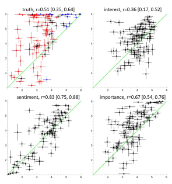
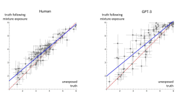
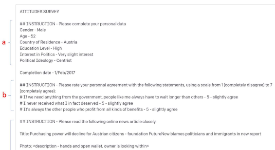

# Large Language Models Respond To Influence Like Humans

Lewis D Griffin1 Bennett Kleinberg2,3 Maximilian Mozes2 Kimberly Mai1,2 Maria Vau1 Matthew Caldwell1 **Augustine Mavor-Parker**1
{
1Computer Science, 2**Security & Crime Science}, University College London, UK.** 
3**Methodology & Statistics, Tilburg University, the Netherlands.**
L.Griffin@cs.ucl.ac.uk 

# Abstract

Two studies tested the hypothesis that a Large Language Model (LLM) can be used to model psychological change following exposure to influential input. The first study tested a generic mode of influence - the Illusory Truth Effect (ITE) - where earlier exposure to a statement boosts a later truthfulness test rating. Analysis of newly collected data from human and LLM- simulated subjects (1000 of each) showed the same pattern of effects in both populations; although with greater per statement variability for the LLM. The second study concerns a specific mode of influence - populist framing of news to increase its persuasion and political mobilization. Newly collected data from simulated subjects was compared to previously published data from a 15-country experiment on 7286 human participants. Several effects from the human study were replicated by the simulated study, including ones that surprised the authors of the human study by contradicting their theoretical expectations; but some significant relationships found in human data were not present in the LLM data. Together the two studies support the view that LLMs have potential to act as models of the effect of influence. 

# 1 Introduction

Human beliefs and values can be held absolutely ('I love my children') but are often modal or graded ('COVID19 may have an artificial origin'). The strength of conviction is malleable, subject to influence (Miller & Levine, 2019) which can take many forms. Some forms are generic, independent of the content: logical deduction from agreed premises, or rhetorical devices such as rapid speech (Miller et al., 1976). While others require a mobilization of specific factors: manipulating beliefs of feared or desired outcomes (Maloney et al., 2011; Shao et al., 2019), encouraging conformity (Moscovici, 1963), distorting the weighting of pro and con arguments (Cobb & Kuklinski, 1997), provision of false information (Chakraborty & Harbaugh, 2010), and more. 

An improved understanding of influence would have applications ranging from the malign to the beneficial: national scale disinformation; consumer advertising; encouraging healthy behaviours; defending against disinformation. 

Investigating the effects of influence on human psychology by using experiments with human participants is slow, expensive and ethically constrained (Argyle et al., 2022). Similar difficulties bedevil the study of the effect of drugs on human physiology. In that domain, animal models have proven utility despite their limitations. 

Large Language Models (LLMs), such as GPT-3 
(Brown et al., 2020), complete text as if holding graded beliefs. We propose that **LLMs can be useful** models of human psychology for investigating influence**, just as mice are useful models of human** physiology for investigating pharmacology. 

Recent studies (section 2) have shown that LLMs have human-like psychological responses, but it has not yet been reported whether LLMs, like humans, can be influenced to change these. Here we report two studies whose results support this. 

# 2 Previous Research

Personality: Miotto et al. (2022) used promptcompletion to administer a personality questionnaire to GPT-3, measuring the BIG-5 and other dimensions. GPT -3's personality profile was somewhat similar to the average profile from a large representative study with human participants. 

Using similar methods, Jiang et al. (2022) showed that the personality of the LLM could be conditioned by preceding testing with a selfdescription (**'You are a very friendly and outgoing** person…**') which enhanced or diminished a** targeted personality dimension and correctly manifested in the LLM's open responses to questions about behaviour in scenarios. 

Values: **Miotto et al. (2022) used the Human** 
Values Scale to assess the importance that GPT-3 attaches to specific values (e.g. achievement). Using prompt completion, GPT-3 indicated on a scale how strongly it likened itself to a described person (e.g. '**It is important to them to be rich. They** want to have a lot of money and expensive things.'). GPT-3's values profile was correlated with human values but were more extreme. 

Political Views**: Argyle et al. (2022) showed** 
that if an LLM is conditioned with a demographical self-description (e.g. **'Ideologically, I describe** myself as conservative. Politically, I am a strong Republican. Racially, I am white. I am male. Financially, I am upper-class. In terms of my age, I am young.'**) it would then give responses to** probes of political views closely matching the responses of humans with the same demographic traits. 

Creativity**: Stevenson et al. (2022) collected** 
LLM responses to the 'Alternative Uses Test' (Guilford, 1967) in which participants produce as many original uses for an everyday object as possible. LLM responses scored marginally lower than humans for originality, surprise and creativity, and marginally higher for utility. 

Moral Judgment**: Jin et al. (2022) examine how** 
LLMs answer moral puzzles about when rule breaking is permissible. They used chain-ofthought prompting method (Wei et al., 2022) to implement a 'contractualist' theory (Scanlon et al., 1982) of moral reasoning. This yielded answers in agreement with human judgements 66% of the time (vs 50% baseline). 

Theory of Mind**: In classic ToM experiments** 
participants observe scenes where a mismatch arises between the beliefs of an agent in the scene and the observing participant (Frith & Frith, 2005). A participant with a developed ToM will be able to answer questions about the scene that demonstrate appreciation of this mismatch. Kosinski (2023) 
tested whether LLM-simulated participants demonstrate apparent ToM capabilities by using prompt adaptions of two classic experiments and found that an LLM achieved 93% correct performance, matching that of a typical 9 year-old child. However, a different ToM study (Sap et al., 2022) found only 60% correct performance. 

Social Intelligence**: the ability to reason about** 
feelings was tested in GPT-3 and found to be limited (Sap et al., 2022), trailing the human gold standard by more than 30%. For example, for the situation '**Casey wrapped Sasha's hands around** him because they are in a romantic relationship. How would you describe Casey?**' GPT-3 selected** the answer 'Wanted' **whereas humans preferred** 'Very loving towards Sasha'. 

The studies reviewed show that a range of aspects of human psychology can be modelled by LLMs, some more closely than others. In our view, all the reviewed studies use LLMs as models of static **aspects of psychology - current views,** values, etc. Some, such as the Personality and Political Views studies, condition **the LLM before** querying it; but that conditioning does not model a psychological change, rather it is intended to steer the LLM towards modelling a person with particular demographic or psychological traits. In contrast, the studies we report in the next two sections consider dynamic **aspects of psychology –** how beliefs and views can be changed - and test whether LLMs are able to model such changes. 

# 3 Illusory Truth Effect (Ite)

Demagogues understand and exploit the ITE. Hitler's operating principles, for example, were said to include: 'if you repeat it frequently enough people will sooner or later believe it' (Langer et al., 1943). First experimentally demonstrated in 1977 (Hasher et al., 1977), the ITE - that mere exposure to a statement, without provision of evidence, increases its subsequent apparent truthfulness - has been reconfirmed numerous times; not only for innocuous statements (Henderson et al., 2022), but even for contentious ones (Murray et al., 2020). 

A typical test of the ITE (Henderson et al., 
2021) uses a bank of statements devised to be neither obviously false nor obviously true - for example 'orchids grew wild in every continent'. 

In an engaged exposure **phase participants attend** to the statements, for example by rating how interesting each one is; then, after an interval (from minutes to weeks), they rate the truthfulness of a new set of sentences, amongst which are some to which they were previously exposed. The truthfulness ratings for a statement are compared between those from participants previously exposed to it versus those from participants seeing it fresh for the first time. The ITE is confirmed by a significant increase, from fresh to exposed. 

Many aspects of the experimental paradigm have been investigated, with some reliable conclusions: repeated exposures gives a stronger effect (Hassan & Barber, 2021); a longer interval between statement exposure and truth rating gives a weaker effect (Henderson et al., 2021); if statement exposure is itself by truth rating then later truth ratings are not enhanced (Brashier et al., 2020). The ITE is typically explained as a fluency effect - initial exposure makes processing during the test phase more fluent, and fluency is taken as an indicator of truth (Reber & Schwarz, 1999). 

The ITE is an interesting phenomenon with respect to the hypothesis of this paper - that LLMs can be useful models of how human beliefs change in response to influence. The ITE can be considered an example of influence operating beyond the principles of logic, evidence and argument, and it is an important test whether an LLM is vulnerable to such a mode. 

We have devised an experiment suitable for human and GPT-3 participants, allowing a direct comparison of results. Our experiment makes use of four attributes - truth, interest, sentiment and importance - used in all combinations for exposure and test rating, in all cases on six point scales. We call it same **when the exposure and test** attributes are identical, and mixed **when different.** By testing on all combinations of attributes we will be able to determine whether we have found an Illusory Truth Effect (ITE) or merely an Illusory Rating Effect (IRE) where any **attribute is** boosted at test-rating by earlier mixed-exposure. By also collecting data for same-exposure conditions we can test previous reports that exposure by truth rating does not boost test truth ratings, and analogously for other attributes. Our hypotheses are: 

 HITE**: The standard ITE boost for truth rating** 
resulting from mixed-exposure. 

 HIRE**: No analogy of the ITE for other** 
attributes e.g. mixed-exposure does not increase importance ratings. 

 Hsame**: Same-exposure has no effect on test** 
ratings for any attribute. 

 HGPT-3**: GPT-3 shows the same effects as** 
humans for all attributes (truth, sentiment, interest & importance), for both same- and mixed-exposure.

### 3.1 Measuring Ite In Gpt-3 Participants

We devised 200 novel statements. Based on our own ratings of these on the four attribute scales these were reduced to 100 statements that were diverse on those scales. Examples are: 'The Slateford Aqueduct has 100 arches' and 'Death Metal is very popular in Finland'. 

The experiment was administered to each LLM-simulated subject as follows. First an exposure prompt **solicited ratings on specific scales** for 32 distinct statements. The sentences and their generated ratings were recapped at the start of a test prompt which then went on to solicit ratings on specific scales for 32 distinct statements. Half of the test sentences also appeared as exposure sentences. So, for example, the test prompt might include in its early section, "**Earlier you rated the** interest of 'Most frogs are green' as I2: quite uninteresting", and in its later section "**rate the** truthfulness of 'Most frogs are green'". 

The prompts for each subject were constructed as follows: 16 statements appear in the exposure phase but not the test phase, 4 paired with each of the 4 attributes; 16 statements appear only in the test phase but not the exposure phase, 4 paired with each of the 4 attributes; 16 statements occur in both phases, between them covering each combination of exposure-attribute and test-attribute. Thus, for each participant: exposed statements are as likely to reappear in test as not; test statements are as likely to have been previously exposed as not; and all combinations of exposure- and test-attribute are equally common. Random Latin Squares (Winer et al., 1971) were used to choose statements and attributes, and their order of presentation, so that these were balanced across participants. 

1000 participants, undifferentiated except for the unique sequence of tasks for each, were simulated. These yielded a dataset of 10 test-ratings for each triplet <statement, attributeexposure, attributetest**>, and** 40 test-ratings for each ordered pair <statement, _, attribute**test**>. 

### 3.2 Measuring Ite In Human Participants

We used the Prolific platform (www.prolific.co) to recruit 1000 participants constrained to be 21-65 years old (µ=38, σ=11), UK resident, English as first language, 51% female, and with 

 100+ successfully completed Prolific studies. Each participant completed a multi-screen questionnaire which started with a screen on ethics permission and collected consent. Each statement was shown on an individual response screen with the attribute scale to be considered for that statement clearly stated and possible responses selectable arranged vertically below the statement. There was no time limit to respond. 

The exact same sequence of statement and attribute pairs were used for human participants as for the simulated participants. Into those trials we inserted attention trials (two per block) requiring specified responses and appended an attention quiz in which participants indicated which of 10 statements they had seen during the test. Results of attention checks and quizzes, and completion timings were used to reject and replace 9% of the participants. Participants took a median time of ~10mins to complete the survey and were paid at a rate of £9/hr for this (rated 'good' by Prolific). They were recruited in the period 16-23/feb/2023. 

### 3.3 Comparison Of Ite In Humans And Gpt-3

We first compare the exposure-phase ratings given by GPT-3 and humans. Figure 1 shows the distributions of ratings are similar, except for truth where humans are much less likely than GPT-3 to rate a statement as 6 (definitely true). The correlations between human and GPT-3 ratings are significantly positive for all four attributes, but the per-statement confidence intervals make it clear that there are instances of significant mismatch e.g. 'spiders have exactly six legs' has a mean truth rating of 2.0 (probably false) for humans, and 6.0 (definitely true) for GPT-3. 

We now consider how ratings are changed by previous exposure. As example, figure 2 shows the effect of mixed-exposure on truth ratings. It shows that, for both human and GPT-3, truth ratings tend to be increased by exposure; more so for statements which are less truthful when not previously exposed. Linear least-squares fits (as shown in figure 2) captures these trends, which are similar for humans and GPT-3 though the data is more variable around the fit for GPT-3. 

Let r and rˈ **be the mean rating of a statement** 
without and with previous exposure respectively. For interpretability, we parameterize fitted linear functions as: 

rˈ = r + offset + tilt × (r-3.5) (1)

Figure 1: Mean ratings made during the exposure 

 phase, compared between human (x) and GPT-3 data (y) - one point for each of the 100 statements. Error bars show 95% confidence intervals. Green line is y=x. Correlations are given above each plot with a 95% confidence interval. Symbols in the truth plot are coloured according to whether the statement is actually true (blue), false (red) or uncertain (black). 

Figure 2: Mean truth ratings without (x) and with mixed-exposure (y). Error bars are 95% confidence intervals. The dashed red line is the identity function, the solid blue line is the best linear fit. 

where 3.5 is the midpoint of the 1-6 scale. Table 1 presents fits for all data, together with the results of tests of whether the parameter estimates were significantly non- zero. Confidence intervals and p-values were computed using 104 bootstrap resamplings of the participants and statements. 

Bonferroni correction was used to prevent excess false positives due to multiple comparisons. 

Considering first the human results for mixed exposure (top half of Table 1). The values in the first row show that our results reconfirm the standard ITE (HITE**). The significantly negative tilt** 

$$(1)$$

coefficient in the second row adds the nuance that truth boosts are smaller for more truthful statements. Values in rows 3-8 show that attributes other than truth are not affected by mixed-exposure, which confirms that the ITE is not merely an IRE (HIRE). 

Considering next the human results for same exposure (bottom half of Table 1), our results show that attribute ratings are never affected by previous exposure of the same type (H**SAME**). 

Lastly, considering the GPT-3 results, our data shows precisely the same pattern of significant effects as for human data, for all attributes, and for mixed- and same-exposure (H**GPT-3**). 

| Attribute   |        | Human                      | GPT\-3                    |
|-------------|--------|----------------------------|---------------------------|
| truth       | offset | 0.26 [0.12, 0.39]***       | 0.54 [0.22, 0.95]***      |
|             | tilt   | \-0.15 [\-0.32, \-0.03]*** | \-0.18 [\-0.38, \-0.04]** |
| interest    | offset | \-0.03 [\-0.29, 0.21]      | \-0.20 [\-0.41, 0.04]     |
|             | tilt   | \-0.13 [\-0.39, 0.01]      | \-0.12 [\-0.36, 0.06]     |
| sentiment   | offset | \-0.04 [\-0.16, 0.08]      | 0.03 [\-0.12, 0.20]       |
|             | tilt   | \-0.06 [\-0.19, 0.01]      | \-0.19 [\-0.34, \-0.09]   |
| importance  | offset | \-0.11 [\-0.27, 0.08]      | 0.00 [\-0.17, 0.20]       |
|             | tilt   | \-0.01 [\-0.23, 0.10]      | \-0.19 [\-0.35, \-0.07]   |
| truth       | offset | \-0.07 [\-0.27, 0.13]      | 0.00 [\-0.36, 0.44]       |
|             | tilt   | 0.05 [\-0.18, 0.19]        | 0.02 [\-0.22, 0.17]       |
| interest    | offset | \-0.04 [\-0.30, 0.30]      | 0.02 [\-0.26, 0.39]       |
|             | tilt   | 0.00 [\-0.38, 0.23]        | 0.10 [\-0.23, 0.35]       |
| sentiment   | offset | \-0.13 [\-0.31, 0.06]      | \-0.05 [\-0.21, 0.14]     |
|             | tilt   | \-0.01 [\-0.19, 0.11]      | 0.06 [\-0.08, 0.16]       |
| importance  | offset | \-0.16 [\-0.41, 0.11]      | 0.15 [\-0.08, 0.43]       |
|             | tilt   | 0.11 [\-0.19, 0.29]        | \-0.02 [\-0.21, 0.10]     |

Table 1: Parameter estimates for the relationship between exposed and unexposed ratings, modelled by equation 1. The top half of the table shows **mixed** exposure effects, and the bottom half same **exposure.** Bonferroni-corrected (n=16) bootstrap-computed 95% confidence intervals are shown after least-squares best fit estimates. Significantly non-zero estimates are colour-coded, and superscripts indicate significance: *p<0.05, **p<0.01, *****p<0.001.** 

In summary: 
 **Although correlated, there are significant** 
differences between the ratings given to statements by humans and GPT-3. 

 **For humans: the only attribute that can be** 
changed by previous exposure is truth, and then only when the exposure is by rating a different attribute (HITE, HIRE, H**SAME**). 

 **For GPT-3: the same effects, of similar** 
magnitude, is present as in humans (H**GPT-3**). 

 **The per-statement ITE is more variable for** 
GPT-3 than it is for humans. 

# 4 Populist Framing Of News (Pfn)

Bos et al. (2020) investigated whether populist framing (emphasizing in-group vs out-group divisions) of a news article modulated its persuasive and mobilizing effect on a reader. 

### 4.1 Measurement Of Pfn In Humans

In 2017 Bos et al. recruited 7286 participants in roughly equal numbers from each of 15 countries, with demographic balancing within each country. Using online surveying, demographic traits were queried and the relative deprivation of each participant was assessed. **Relative Deprivation** (RD) is a subjective feeling of economic, social and political vulnerability. **Participants were then** 
shown one of four mocked-up news articles, and then asked questions about their agreement with the content of the article and their willingness to act upon it. 

Each version of the article (translated into the participant's mother tongue) concerned a study from a fictional nongovernmental organization warning of a likely future decline in purchasing power. The baseline version reported the study neutrally, while the other versions used 'populist identity framing', portraying ordinary citizens as an in-group threatened by the actions and attitudes of out-groups. One version (anti-E) drew attention to politicians as an elitist out-group; another to immigrants (anti-I); and the final version blamed both groups, and additionally the support of politicians for immigrants. Based on Social Identity Theory (Tajfel & Turner, 2004) the authors predicted that all forms of framing would make the articles more persuasive and mobilizing than the unframed article, and this influence would be greater on more relatively deprived participants. 

In a pre-test phase participants provided demographic information (age, gender, education, political interest, political alignment) and rated agreement with three statements (e.g. 'I never received what I in fact deserved') to allow their RD to be quantified. Following exposure to the article, presented as a generic online news item complete with photo of hands opening a wallet, the participants rated agreement with each of two statements (e.g. 'The economy will face a decline in the near future') to gauge how persuaded **they** were of the issue reported in the article, and rated their willingness to perform three actions (e.g. 

'Share the new article on social media') to gauge how mobilized **they were.** 

# 4.2 Measurement Of Pfn In Gpt-3

Each human participant completed a survey in the 

 sequence: 1) demographic information; 2) RD ratings; 3) exposure to news article; 4) rating of probe statements. To adapt this for GPT-3 participants we simulate **steps 1-3, providing** answers generated from Bos et al.'s summary statistics of their respondents' demographics, and then use GPT-3 completion for step 4 to generate ratings for the probe statements **given the earlier** responses (1+2) and news article exposure (3). See figure 3. 

The demographic information included in the prompt is sampled from the data provided by Bos et al. (2020) on the number of participants per country, and the per-country distribution of gender, age, education, political interest and political ideology ratings. We use the provided per-country parameters for the distributions, assumed to be independent. 

Bos et al. state that the three RD ratings are highly correlated, and so work with their mean as an RD score. They provide the mean (4.30) and sd (1.61) of these scores but not per-country. We generate simulated RD ratings by real-valued sampling from the score distribution, generating three perturbations of that sample, and rounding each to an integer 1-7 - yielding three ratings. The perturbation magnitude was chosen so that three identical ratings resulted ~50% of the time. We Figure 3: Format of prompts used to implement the Bos et al. (2020) study with GPT-3 participants. The prompt 

 is intended to read like an incomplete survey with written in answers. The central block of text on white shows an example prompt, the "5" on green shows the completion provided by GPT-3. a) Demographic information for the simulated participant b) The simulated participant's simulated agreement ratings for statements to gauge relative deprivation. c) The version of the news article shown to this simulated participant - this is the version with an antielitist and **anti-immigrant framing. d) The final instruction for a rating, following the format used in part b; in this** example to gauge agreement with the news content of the article. 

made the assumption that RD ratings are independent of the demographic information. 

Each GPT-3 participant is shown a random choice from Bos et al.'s four versions of the news article. Figure 3 shows the version with anti-E and anti-I framing, the three other versions (single outgroup framing and no framing) are reductions of the example shown. 

The final part of the prompt is to collect a rating for a single **probe statement. Following Bos et al.,** five probe statements were used: two that assessed the persuasion of the article, and three that assessed the political mobilization that resulted from reading it. Each simulated participant thus has five prompt completions collected - holding the initial parts of the prompt constant and varying the final probe. Prompts were completed using full probabilistic sampling (temp=0.0). An overall persuasion score for a participant was calculated as the mean of their two persuasion ratings, and an overall mobilization score as the mean of their three mobilization ratings. 

We intended to collect data for 7286 GPT-3 simulated participants, matching the size of the Bos et al. study, but due to other usage hit our monthly cap for GPT-3 queries after 2153 participants. Data was collected using the OpenAI API in early February 2023, costing ~$100. 

### 4.3 Human And Gpt-3 Pfn Compared

The distributions of Human and GPT-3 persuasion scores are similar: mean (sd) respectively 5.11 (1.37) and 5.28 (0.72). The distributions of mobilization scores less so: 3.81 (1.76) and 5.74 (0.82) respectively. GPT-3 scores are less varied than human. 

Bos et al. were concerned not with the absolute scores but to check their predictions that they would be increased by populist framing, and that increase would be modulated by the RD of the participant. To that end they compute linear regressions of persuasion (P**) and mobilization** (M**) scores based on a pair of Boolean variables** 
, ∈ {0,1} **which indicated whether the exposed** 
news article made use of anti-E and/or anti-I 
framing, a continuous variable  ∈ [1,7] **coding** 
the relative-deprivation score for a participant, and 14 Boolean flags  ∈ {0,1} **indicating** 
country of residence. Robust standard errors (clustered by country) of regression coefficients were reported, with t-tests being performed to determine when significantly non-zero. We performed the same analysis on the GPT-3 data. Human and GPT-3 results are shown in Table 2, which includes a numbering scheme for hypotheses. 

Hypothesis H1a - that anti-E framing increases persuasion was supported by Bos et al.'s human data and was also found in the GPT-3 data. Hypothesis H1b - that anti-I framing increases persuasion was contradicted by the human data and by the GPT-3 data. This was presented by Bos et al. as an unexpected result at odds with their predictions from theory. Seeking to explain it they speculated that the immigrant-blaming articles may have seemed far-fetched, triggering counterarguing; or that the result was due to 'socially desirable responding' causing respondents to selfcensor responses. It is remarkable that this unexpected result is replicated by GPT-3. Hypothesis H1c, that blaming both groups would have an additional persuasive effect, was not supported or contradicted by the human data, but is supported in the GPT-3 data. 

The pattern of results for mobilization (H2a-c) 
is similar to persuasion. The surprising reduction in mobilization for anti-I framing that was found for human participants was also found for GPT-3. Anti-E framing had an insignificant effect on persuasion for humans, but was significantly positive for GPT-3 (as per the expectations of Bos et al.). I+E-framing had no significant additional impact on mobilization for humans but was significantly positive for GPT-3. 

Both the human and GPT-3 data exhibit a significant increase in persuasion and mobilization scores as a function of RD (shown by the significance of the D **coefficients). This** relationship was not a hypothesis of Bos et al. (2020) since it is not predictive of the effect of exposure to populist framing (i.e. it is a pure D term rather than D×E **etc). We include it because** it shows that the GPT-3 responses are **affected by** the simulated RD ratings provided in the prompts. This makes the failure of the GPT-3 results to exhibit the positive interaction between RD and populist framing on mobilization that is significantly present for humans (H4a and H4b) disappointing. 

In summary, the GPT-3 and Human results differ in the absolute level and variability of persuasion and mobilization ratings, but there is good agreement how these ratings are dependent on the presence of anti-E and/or anti-I framing, and on RD. There are no contradictory results where the signs of regression coefficients are significant from both data sources but opposite in polarity. Most impressively the GPT-3 data finds significant negative **effects on persuasion and** mobilization resulting from anti-I framing, in agreement with the results reported as surprising by Bos et al. (2020). The positive modulation on mobilization due to RD found in humans was not present in the GPT-3 data, even though GPT-3 was demonstrated to be sensitive to RD in a non-modulating way the same as humans. Overall this is a mixed score card - surprising human results (H1b, H2b) were modelled by GPT-3, but some other human results of interest (H4a and H4b) were not, and there were GPT-3 results (H1c, H2a, H2c) that were not seen in human data. 

simulated participants to influencing input, and to measure the effect on later responses. In the ITE 
study we applied generic influence to generic LLM participants; in the PFN study we applied specific influence to conditioned LLM participants. In the ITE study, for practical reasons only, we broke the effect of influence across two prompt-and-completes, but the PFN study had its effect within a single prompt-and-complete. In the ITE study**, while there were mismatches** between humans and GPT-3 in the absolute attribute ratings of truth, etc. given to statements, there was excellent agreement in how prior exposure influenced participants to give higher ratings of truthfulness. This agreement covered the presence of an ITE, how it was eliminated 

| Hyp.   | Dep.   | Regr.   | Model                                            | prediction &     | Human      | GPT\-3     |
|--------|--------|---------|--------------------------------------------------|------------------|------------|------------|
|        | Var.   |         |                                                  | finding          |            |            |
| H1a    | P      | E       | Ci + (E + I) → P                                 | >0, confirmed    | +0.079**   | +0.478***  |
| H1b    | P      | I       | Ci + (E + I) → P                                 | >0, contradicted | \-0.118**  | \-0.927*** |
| H1c    | P      | E×I     | Ci + (E + I + E×I) → P                           | >0, unsupported  | \-0.140    | +0.541***  |
| H2a    | M      | E       | Ci + (E + I) → M                                 | >0, unsupported  | +0.037     | +0.463***  |
| H2b    | M      | I       | Ci + (E + I) → M                                 | >0, contradicted | \-0.243*** | \-1.090*** |
| H2c    | M      | E×I     | Ci + (E + I + E×I) → M                           | >0, unsupported  | +0.146     | +0.324***  |
|        | P      | D       | Ci + (E + I) + D → P                             |                  | +0.279***  | +0.149***  |
|        | M      | D       | Ci + (E + I) + D → M                             |                  | +0.219***  | +0.125***  |
| H3a    | P      | D×E     | Ci + (E + I) + D + (D×E + D×I) → P               | >0, unsupported  | +0.032     | +0.048     |
| H3b    | P      | D×I     | Ci + (E + I) + D + (D×E + D×I) → P               | >0, unsupported  | +0.031     | \-0.029    |
| H3c    | P      | D×E×I   | Ci + (E + I + E×I) + D + (D×E + D×I + D×E×I) → P | >0, unsupported  | \-0.063    | +0.092     |
| H4a    | M      | D×E     | Ci + (E + I) + D + (D×E + D×I) → M               | >0, confirmed    | +0.062*    | +0.000     |
| H4b    | M      | D×I     | Ci + (E + I) + D + (D×E + D×I) → M               | >0, confirmed    | +0.086***  | \-0.025    |
| H4c    | M      | D×E×I   | Ci + (E + I + E×I) + D + (D×E + D×I + D×E×I) → M | >0, unsupported  | \-0.077    | +0.096     |

Table 2: Hypothesis **uses the labelling in Bos et al. (2020); the two unlabelled rows are not influence effects** since they are a function only of the participant's traits (specifically relative deprivation D**), not of framing** (E,I) but are included since relevant to the discussion of H4a/b. Dependent Variable **indicates whether the** hypothesis concerns Persuasion (P) or Mobilization (M). Regressor **shows the particular term, featuring in** the model, whose coefficient pertains to the hypothesis. Prediction & finding **shows what sign the regression** coefficient was hypothesized to have in Bos et al. (2020), and the status of that hypothesis in light of their results. Human (from Bos et al. (2020)) and GPT-3 **columns show values of the regression coefficient.** Colour-coding shows significantly non-zero coefficients: *p<0.05, **p<0.01, *****p<0.001.** 

# 5 Summary & Conclusion

LLMs have been used to model human participants, undergoing tests of **static** psychology. In some of the studies we reviewed the LLM models a generic participant, in others the LLM is conditioned **by a self-description** within the prompt so that its completions take account of traits of the simulated participant. 

We hypothesized that LLMs could also model dynamic **psychological change in response to** influencing input. We devised methods to **expose**
when prior exposure was via truth-rating, and the absence of analogous effects for other attributes. Although the ITEs were of similar magnitude in human and GPT-3 responses, the per-statement effect was more variable for the latter. Overall, the findings suggest a good match between humans and GPT-3 with respect to the ITE. The irreproducible selection of testing statements is a limitation that should be addressed in future work. In the PFN study**, out of twelve influence effects** tested (Table 2): four were absent in human and GPT-3 responses; three were significant in both and of matching sign; two were present in humans but not GPT-3; and three were present in GPT-3 but not in humans. The three consistent effects included some expected from theory (positive effects of anti-E framing), and some counter to theory (negative effect of anti-I framing). Overall this is a mixed result - some impressive agreement, and some disappointing failure to replicate, but no actual mismatches. A limitation of our experiment was the lack of simulated covariance between participant traits, as the human data on this was not available. Plausibly this could account for our failure to replicate the H4a/b effects. Future work could check this. 

The results of the two studies support **our** 
hypothesis that an LLM can model influence in human participants, not perfectly, but perhaps well enough to be applied. Remarkable given that such modelling is far from the task for which the LLM was constructed, nor did we adapt GPT-3 in any way. Although much more research is required before such an impactful hypothesis can be considered secure, given its possible malign applications, for example in strategic influence, this is a serious finding. 

# Ethics Statement

The Illusory Truth Effect study adhered to the British Psychological Society Code of Ethics & Conduct (2021). Ethical approval was granted after review by the UCL **Dept (CS) Research** Ethics Committee **and Head of Department** approval. This review considered examples of the statements to be rated (see Table 3), plus the consideration that the study does not attempt any peculiar imprinting effect, only that arising from ordinary exposure to text. Data collection was preceded by information screens on Anonymity, Ethics and study withdrawal, with tick box consent. 

| The Philippines has a tricameral legislature           |
|--------------------------------------------------------|
| London is closer to New York than to Rome              |
| Mark Chapman assassinated JFK                          |
| The Slateford Aqueduct has 100 arches                  |
| Death Metal is very popular in Finland                 |
| The population of Andhra Pradesh score high life       |
| satisfaction                                           |
| Harrison and Harrison Ltd make pipe organs             |
| A small number of women have tetrachromatic vision, so |
| see more colours                                       |
| John McCartney and Paul Lennon were in the Ruttles     |

Table 3: Example statements rated in the ITE study.

# Data Availability

Available as an annex to this paper. 

# References

Lisa P Argyle, Ethan C Busby, Nancy Fulda, Joshua Gubler, Christopher Rytting, & David Wingate. (2022). Out of One, Many: Using Language Models to Simulate Human Samples. **arXiv preprint** arXiv:2209.06899. 

Linda Bos, Christian Schemer, Nicoleta Corbu, Michael Hameleers, Ioannis Andreadis, Anne Schulz, Desirée Schmuck, Carsten Reinemann, & Nayla Fawzi. (2020). The effects of populism as a social identity frame on persuasion and mobilisation: Evidence from a 15‐country experiment. **European Journal of Political** Research, 59**(1), 3-24.** 
Nadia M Brashier, Emmaline Drew Eliseev, & 
Elizabeth J Marsh. (2020). An initial accuracy focus prevents illusory truth. Cognition, 194**, 104054.** 
Tom Brown, Benjamin Mann, Nick Ryder, Melanie Subbiah, Jared D Kaplan, Prafulla Dhariwal, Arvind Neelakantan, Pranav Shyam, Girish Sastry, & 
Amanda Askell. (2020). Language models are fewshot learners. **Advances in neural information** processing systems, 33**, 1877-1901.** 
Archishman Chakraborty, & Rick Harbaugh. (2010). 

Persuasion by cheap talk. **American Economic** Review, 100**(5), 2361-2382.** 
Michael D Cobb, & James H Kuklinski. (1997). 

Changing minds: Political arguments and political persuasion. **American Journal of Political Science**, 88-121. 

Chris Frith, & Uta Frith. (2005). Theory of mind. 

Current Biology, 15**(17), R644-R645.** 
Joy P Guilford. (1967). Creativity: Yesterday, today and tomorrow. **The Journal of Creative Behavior**, 1**(1), 3-14.** 
Lynn Hasher, David Goldstein, & Thomas Toppino. 

(1977). Frequency and the conference of referential validity. **Journal of verbal learning and verbal** behavior, 16**(1), 107-112.** 
Aumyo Hassan, & Sarah J Barber. (2021). The effects of repetition frequency on the illusory truth effect. Cognitive Research: Principles and Implications, 6**(1), 1-12.** 
Emma L Henderson, Daniel J Simons, & Dale J Barr. 

(2021). The trajectory of truth: A longitudinal study of the illusory truth effect. **Journal of cognition**, 4**(1).** 
Emma L Henderson, Samuel J Westwood, & Daniel J 
Simons. (2022). A reproducible systematic map of research on the illusory truth effect. **Psychonomic** Bulletin & Review**, 1-24.** 
Guangyuan Jiang, Manjie Xu, Song-Chun Zhu, Wenjuan Han, Chi Zhang, & Yixin Zhu. (2022). MPI: Evaluating and Inducing Personality in Pretrained Language Models. **arXiv preprint** arXiv:2206.07550. 

Zhijing Jin, Sydney Levine, Fernando Gonzalez, Ojasv Kamal, Maarten Sap, Mrinmaya Sachan, Rada Mihalcea, Josh Tenenbaum, & Bernhard Schölkopf. (2022). When to Make Exceptions: Exploring Language Models as Accounts of Human Moral Judgment. **arXiv preprint arXiv:2210.01478**. 

Michal Kosinski. (2023). Theory of Mind May Have Spontaneously Emerged in Large Language Models. **arXiv preprint arXiv:2302.02083**. 

Walter Charles Langer, Henry Alexander Murray, Ernst Kris, & Bertram David Lewin. (1943). A psychological analysis of Adolph Hitler: His life and legend**. MO Branch, Office of Strategic** Services. 

Erin K Maloney, Maria K Lapinski, & Kim Witte. 

(2011). Fear appeals and persuasion: A review and update of the extended parallel process model. Social and Personality Psychology Compass, 5**(4),** 206-219. 

Michael D Miller, & Timothy R Levine. (2019). 

Persuasion. In **An integrated approach to** communication theory and research **(pp. 261-276).** Routledge. 

Norman Miller, Geoffrey Maruyama, Rex J Beaber, & 
Keith Valone. (1976). Speed of speech and persuasion. **Journal of personality and social** psychology, 34**(4), 615.** 
Marilù Miotto, Nicola Rossberg, & Bennett Kleinberg. 

(2022). Who is GPT-3? An exploration of personality, values and demographics. **arXiv** preprint arXiv:2209.14338. 

Serge Moscovici. (1963). Attitudes and opinions. 

Annual review of psychology, 14**(1), 231-260.** 
Samuel Murray, Matthew Stanley, Jonathon McPhetres, Gordon Pennycook, & Paul Seli. (2020). " I've said it before and I will say it again": Repeating statements made by Donald Trump increases perceived truthfulness for individuals across the political spectrum. 

Rolf Reber, & Norbert Schwarz. (1999). Effects of perceptual fluency on judgments of truth. Consciousness and Cognition, 8**(3), 338-342.** 
Maarten Sap, Ronan LeBras, Daniel Fried, & Yejin Choi. (2022). Neural theory-of-mind? on the limits of social intelligence in large LMs. **arXiv preprint** arXiv:2210.13312. 

Thomas M Scanlon, Amartya Sen, & Bernard Williams. (1982). Contractualism and utilitarianism. 

Jingjin Shao, Weiping Du, Tian Lin, Xiying Li, Jiamei Li, & Huijie Lei. (2019). Credulity rather than general trust may increase vulnerability to fraud in older adults: A moderated mediation model. **Journal** of elder abuse & neglect, 31**(2), 146-162.** 
Claire Stevenson, Iris Smal, Matthijs Baas, Raoul Grasman, & Han van der Maas. (2022). Putting GPT-3's Creativity to the (Alternative Uses) Test. arXiv preprint arXiv:2206.08932. 

Henri Tajfel, & John C Turner. (2004). The social identity theory of intergroup behavior. In **Political** psychology **(pp. 276-293). Psychology Press.** 
Jason Wei, Xuezhi Wang, Dale Schuurmans, Maarten Bosma, Ed Chi, Quoc Le, & Denny Zhou. (2022). Chain of thought prompting elicits reasoning in large language models. **arXiv preprint** arXiv:2201.11903. 

Ben James Winer, Donald R Brown, & Kenneth M 
Michels. (1971). **Statistical principles in** experimental design **(Vol. 2). Mcgraw-hill New** York. 