# What'S In My Big Data?

Yanai Elazar1,2 Akshita Bhagia1Ian Magnusson1 **Abhilasha Ravichander**1 Dustin Schwenk1 Alane Suhr3 Pete Walsh1 Dirk Groeneveld1 **Luca Soldaini**1 Sameer Singh4 Hanna Hajishirzi1,2 Noah A. Smith1,2 **Jesse Dodge**1 1Allen Institute for AI
2Paul G. Allen School of Computer Science & Engineering, University of Washington 3University of California, Berkeley 4University of California, Irvine yanaiela@gmail.com

## Abstract

Large text corpora are the backbone of language models. However, we have a limited understanding of the content of these corpora, including general statistics, quality, social factors, and inclusion of evaluation data (contamination). In this work, we propose WHAT'S IN MY BIG DATA? (WIMBD), a platform and a set of sixteen analyses that allow us to reveal and compare the contents of large text corpora. WIMBD builds on two basic capabilities—count and search—*at scale*, which allows us to analyze more than 35 terabytes on a standard compute node.

We apply WIMBD to ten different corpora used to train popular language models, including C4, *The Pile*, and *RedPajama*. Our analysis uncovers several surprising and previously undocumented findings about these corpora, including the high prevalence of duplicate, synthetic, and low-quality content, personally identifiable information, toxic language, and benchmark contamination. For instance, we find that about 50% of the documents in *RedPajama* and *LAION-2B-en* are duplicates. In addition, several datasets used for benchmarking models trained on such corpora are contaminated with respect to important benchmarks, including the Winograd Schema Challenge and parts of GLUE and SuperGLUE. We open-source WIMBD's code and artifacts to provide a standard set of evaluations for new text-based corpora and to encourage more analyses and transparency around them:
github.com/allenai/wimbd.

## 1 Introduction

Data is the foundation upon which machine learning is built. The introduction of new datasets drives progress, playing a crucial role in facilitating research and the creation of models with novel capabilities. Over time, the computational cost of AI experiments has dramatically increased, partly due to training increasingly large models on increasingly large datasets (Schwartz et al., 2020; Sevilla et al., 2022); today, some of the most impactful datasets are being created by scraping text from the entire publicly-available internet (Raffel et al., 2020; Together Computer, 2023; Penedo et al., 2023; Soldaini et al., 2023). These are some of the largest datasets that have ever been built, and they are typically introduced with only a description of how they were made but no documentation of their contents. This is an important distinction, as we are now training models on massive text corpora without knowing what ideas, topics, toxicity, or personal information are present.

1

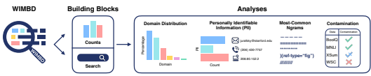

Figure 1: An overview of WIMBD. We implement two fundamental capabilities: *Count* and *Search*, allowing quick processing and access to large text corpora, which enables a wide range of analyses.

Meanwhile, language models have become ubiquitous and are used by people worldwide daily. These AI systems directly impact people's lives, and thus, it has become vitally important to understand their capabilities and drawbacks. Models are only capable of learning from the data they were trained on, but analysis of pretraining corpora is hindered by lack of public release and by their massive size. Work analyzing the contents of web-scale corpora typically focuses on a subset of important dimensions, and vitally there has been almost no work analyzing multiple datasets across the same dimensions. This means that machine learning practitioners have no practical tools to describe differences between datasets before choosing which one(s) to use. In this work, we propose to investigate the content of large text corpora using WIMBD: WHAT'S IN MY BIG DATA, a set of tools that enables practitioners to easily explore and quickly analyze large language datasets. We also use this tool to provide some of the first measurements across different web-scale datasets that are directly comparable. WIMBD has two components: (1) a **search** tool that enables programmatic access to search for documents containing a query using an *Elasticsearch* (ES) index. ES is a search engine that allows retrieving strings from a corpus, the documents where they appeared, and the number of times they appeared. (2) a **count** functionality, built using mapreduce (Dean & Ghemawat, 2008), allowing quick iteration over an entire dataset and extraction of relevant information, e.g., the character length distribution of documents, duplicates, domain counts, finding personally identifiable information (PII), and more. WIMBD is extendable and can be used to index, count, and analyze other corpora at scale, and the code is publicly available at github.com/allenai/wimbd.

Using these tools, we perform a set of sixteen analyses on ten different corpora used to train language models, including C4 (used to train T5; Raffel et al., 2020), *The Pile* (used to train Pythia; Gao et al., 2020; Biderman et al., 2022; 2023), and *RedPajama* (used to reproduce Llama Touvron et al., 2023, and to train RedPajama-INCITE; Together Computer, 2023). We divide our analyses into four categories: (1) data statistics (e.g., number of tokens and domain distribution); (2) data quality (e.g., most frequent n-grams and measuring duplicate documents); (3) community- and society-relevant measurements (e.g., benchmark contamination and personally identifiable information detection); and (4) cross-corpora analysis (e.g., comparing the most common n-gram and document overlap). An illustration of WIMBD is presented in Figure 1. Our work presents many insights on data distribution and anomalies. For example, inspecting the distribution over document lengths exposes anomalies where specific lengths are overrepresented relative to neighboring lengths; these anomalies often correspond to near-duplicate template-generated text or documents arbitrarily truncated to a specific character length. As another example, punctuation sequences are frequently the most common n-grams, such as a dash ('-') repeated ten times as the most common 10-gram in *The Pile*. WIMBD offers both retrospective documentation and grounding of model behavior to their training data and actionable insights for higher-quality corpora curation. We release an interactive demo to accompany this paper, highlighting some of our analyses at: wimbd.apps.allenai.org.

## 2 Background: On The Importance Of Data Understanding

There have been repeated calls for machine learning practitioners to provide better data documentation (e.g., McMillan-Major et al., 2023; Bender & Friedman, 2018; Mitchell et al., 2023; Pistilli et al., 2023; Paullada et al., 2021; Gebru et al., 2021). On the other hand, some of the largest and most impactful machine learning models are increasingly opaque, specifically with respect to the most important component of recent advancements: data. With the increasingly competitive nature of

| Basic Ability     |        |        | Analyses                                                                                      |
|-------------------|--------|--------|-----------------------------------------------------------------------------------------------|
|                   |        |        | Document Counts, min/max doc length, #tokens, domain distribution, utterance date statistics, |
| Exact Counts      | (§3.1) |        | geolocation, language distribution, length distribution, toxic language,                      |
|                   |        |        | personally identifiable information, demographic sentiment co\-occurrences                    |
| Compressed Counts |        | (§3.1) | Duplicates, most & least common  n\-grams                                                     |
| Search (§3.2)     |        |        | Benchmark contamination, n\-gram counts                                                       |

Table 1: Summary of the capabilities WIMBD provides and the analyses enabled by them.

the field, developers of systems like GPT-4 (OpenAI, 2023) and PaLM-2 (Google, 2023) have been offering little transparency into one of the most important development decisions, including the sources, size, and contents of their training data. As web-scale datasets drive this rapid progress in modern machine learning systems, the gap between data transparency and documentation is more striking than ever. From a technical standpoint, the massive size of these datasets makes analysis of their contents challenging; even if OpenAI or Google shared their training data, it's not clear where to start understanding it in its entirety. Tools like the Data Measurements Tool (Luccioni et al., 2021) and Know Your Data (Google, 2021) work towards improving data documentation, but focus on smaller datasets since the scale of web data leads to significant technical challenges. Our work aims to address this critical missing component. While other works support indexing and analyses of large corpora (Piktus et al., 2023a; Marone & Van Durme, 2023; Simig et al., 2022; Piktus et al., 2023b), these efforts support a single corpus and often do not support programmatic access to the data or the analysis. Instead, we offer a holistic approach that combines search and counting with a package that allows programmatic access through wrappers on top of the Elasticsearch API and extendable efficient counting capabilities. Additional efforts are concerned with the effect of the data on model behavior. Longpre et al. (2023) investigate how the composition of language models' pretraining data influences their downstream performance on different tasks. Razeghi et al. (2022) measure the correlation between term frequency and models' few-shot reasoning capabilities with those terms, showing a strong correlation. Shin et al. (2022) study the effect of pretraining corpora on in-context abilities. Seshadri et al. (2023) demonstrate that text-to-image models mimic biases from their training data. Akyurek et al. (2022) propose the problem of fact tracing for identifying pretraining examples that enable a factual assertion, while Guu et al. (2023) offer a training run simulator, which allows making counterfactual queries on what a model would have learned under a different training procedure. These efforts separately built dedicated infrastructure to perform the studies. Our work provides a dedicated interface and tooling that allows performing a wide range of analyses on large-scale corpora, categorizing and offering novel analyses that highlight new insights into these large corpora.

## 3 Wimbd: The Platform

A core desideratum of WIMBD is to enable quick processing of terabytes of data. As such, we focus on uncomplicated, standard methods from the information retrieval and data management communities. WIMBD is comprised of two basic components: *counting* and *search* (retrieval). Fast counting and retrieving will, we argue, enable us to answer fundamental questions about data, as we demonstrate in Section 4. We summarize the framework abilities and types of analyses in Table 1. We run our experiments using a compute node machine with 224 CPUs and 882GB RAM, and an Elasticsearch cluster that hosts the indexed corpora.

### 3.1 Counting

Due to the sparsity inherent in language data and the scale of the data of interest, accurate counting can be challenging. We leverage the map-reduce framework (Dean & Ghemawat, 2008). We provide two approaches for counting, described below.

Exact Counts The exact counts approach is designed for cases where the number of possible values is tractable and can fit in memory. This fits cases where we are interested in calculating a bound number of variables of interest (e.g., number of documents (§4.2) or document length (§4.3.3)).

Table 2: Summary statistics of the corpora, along with the models trained on them. Models noted with * signifies the model was not trained exactly on the version we consider, either due to some filtering, using additional data, or the original data being private.

Compressed Counts The compressed counts approach is designed for cases where the number of possible values is intractable. For instance, the total 10-grams in a large corpus can be very high, and the memory usage to compute all of them would be overwhelming. Similarly, finding duplicates would require keeping and comparing the strings of all documents in memory. In the case of C4, that would require over 800 GB of RAM. Instead, we apply a compression function (e.g., hashing, Bloom, 1970) to those values, reducing memory footprint while sacrificing some accuracy (due to hash collisions). For example, when finding the most common 10-grams, we store a table of counts where the keys in the table correspond to hashes of 10-grams. The hash table size is configurable according to the amount of memory available. The larger the hash table, the smaller the probability of hash collisions and, therefore, the higher the accuracy of the counts. There is also a tradeoff between the number of possible entries and the accuracy of the counts per a fixed memory (hash table size). E.g., unigram estimates are more accurate than 10-gram estimates since the number of possible values is much smaller.

### 3.2 Searching

The second part of WIMBD allows fast text retrieval using an inverted index. For instance, we can get the number of documents mentioning a word or sequence (document frequency). It also allows more complex Boolean queries. While search and retrieval have numerous implementations, such as reverse indices, suffix arrays, suffix trees for exact match search, and dense retrieval for fuzzy search, in this work, we use Elasticsearch (www.elastic.co) to index corpora. We build an API on top of the original Elasticsearch functions, allowing tailored and customized searches to fit our analysis requirements. We leave it to future work to explore other search alternatives.

## 4 Wimbd: The Analyses

This section presents analyses conducted in WIMBD, grouped by category. First, we describe the ten corpora considered in this study (§4.1). We then consider four high-level categories, each split into several analyses: data statistics (§4.2), data quality (§4.3), and community- and society-relevant measurements (§4.4). Cross-corpus analyses, as well as elaborations and more analyses are presented in the appendix (§B). Our analyses are inspired by previous works (Dodge et al., 2021; Gao et al., 2020), but we expand them to multiple corpora, and open-source our modular toolkit to encourage researchers to scrutinize their corpora. We offer the first extensive analyses on ten, combining extension of previous analyses and several novel ones.

### 4.1 Corpora

We cover ten different large corpora, spanning across text-only (e.g., C4 to image captions (LAION- 2B-en) and code (*The Stack*). These corpora have been used in training language models (or similar large-scale models, such as Stable Diffusion Rombach et al. 2022). A high-level description of these datasets using WIMBD is presented in Table 2, and further details about the construction and origin of these corpora are detailed in Appendix A.

Dataset Origin Model Size (GB) \# Documents \# **Tokens max(\# Tokens) min(\# Tokens)** OpenWebText Gokaslan & Cohen (2019) GPT-2* (Radford et al., 2019) 41.2 8,005,939 7,767,705,349 95,139 128 C4 Raffel et al. (2020) T5 (Raffel et al., 2020) 838.7 364,868,892 153,607,833,664 101,898 5 mC4-en Chung et al. (2023) umT5 (Chung et al., 2023) 14,694.0 3,928,733,374 2,703,077,876,916 181,949 1 OSCAR Abadji et al. (2022) BLOOM* (Scao et al., 2022) 3,327.3 431,584,362 475,992,028,559 1,048,409 1 The Pile Gao et al. (2020) GPT-J/Neo & Pythia (Biderman et al., 2023) 1,369.0 210,607,728 285,794,281,816 28,121,329 0 RedPajama Together Computer (2023) LLaMA* (Touvron et al., 2023) 5,602.0 930,453,833 1,023,865,191,958 28,121,329 0 S2ORC Lo et al. (2020) SciBERT* (Beltagy et al., 2019) 692.7 11,241,499 59,863,121,791 376,681 1 peS2o Soldaini & Lo (2023) - 504.3 8,242,162 44,024,690,229 97,043 154 LAION-2B-en Schuhmann et al. (2022) Stable Diffusion* (Rombach et al., 2022) 570.2 2,319,907,827 29,643,340,153 131,077 0 The Stack Kocetkov et al. (2023) StarCoder* (Li et al., 2023) 7,830.8 544,750,672 1,525,618,728,620 26,298,134 0

Figure 2: Domain distributions of the ten most common domains per token for C4, *LAION-2B-en*,

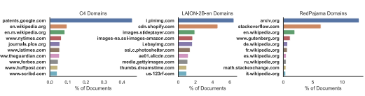 and *RedPajama*. The results for the other corpora are discussed and presented in Appendix B.1.1

### 4.2 Data Statistics

Main Findings
- Four out of the ten corpora we consider have 'empty' documents (meaning they contain only space-like characters), while *The Pile* and *RedPajama* contain the same longest document
(with over 28 million tokens) of an encyclopedia.

- While the most common source of webpages in C4 originate from www.nytimes.com, it consists of less than 0.05% of the total web pages, mC4-en most common domain is google.com (over 5% of the documents), and cdn.shopify.com contributes almost 6% to the total documents in LAION.

### 4.2.1 Summary Statistics

We begin by computing some summary statistics and present the results in Table 2. Using the Exact Counts we compute the following high-level statistics of a corpus: (1) size, (2) number of documents, (3) number of tokens,1(4) the size of the longest document, and (5) the size of the shortest document. Out of all corpora, *mC4-en* is the largest, which takes 14.7TB of disk, and 2.7 trillion tokens. After that comes *The Stack* with a size of 7.8TB, and more than 1.5 trillion tokens. Interestingly, four corpora contain documents with empty strings: LAION-2B-en (81 total), which typically contain a sequence of white spaces. In *The Stack* (1,350 total), *RedPajama* (3,877), and The Pile (7,533), documents typically contain a mix of special characters that denote spacing (e.g., '\n', or '\t'). In *RedPajama*, all of the empty strings are from the arXiv subset. The longest document in The Stack is a json file, with 26,298,134 tokens from http://jquery.com/. The longest document in *The Pile* and *RedPajama* is the same encyclopedia book called "INTERNATIONAL ENCYCLOPEDIA OF THE SOCIAL & BEHAVIORAL SCIENCES" from the Books3 subset with 28,121,329 tokens.

### 4.2.2 Internet Domain Distribution

Some corpora contain metadata information about the URL where the documents came from. As such, we employ the *Exact Counts* functionality, to parse the entire corpus, and extract information from the URLs about the (1) schemas (e.g., http, *https*), (2) domains (e.g., www.google.com, en. wikipedia.org, etc.), and (3) suffixes (e.g., com, org, de, etc.). We apply these counts on the corpora that contain this information, namely C4, mC4-en, OSCAR, RedPajama, and *LAION-2B-en*. Starting with the domain analysis, we perform these counts twice: once when each domain is counted per document (yielding documents per domain) and another where each domain is counted per token (yielding tokens per domain). We present the results of three corpora per token in Figure 2 (and the full results in Appendix B.1). First, we note that C4 contains documents from a diverse set of domains, and even the percentage of the most common one, patents.google.com, is less than 0.05%. On the other hand, in the case of *LAION-2B-en*, cdn.shopify.com is responsible for more than 6% of the documents. Similarly, arxiv.org is responsible for more than 12% of the documents in *RedPajama*. We showcase the results of the domains for the other corpora, as well as the schemas and suffixes in Appendix B.1.

1We use Unicode text segmentation (Unicode, 2023) as a tokenizer, but we support any tokenizer supported by HuggingFace (Moi & Patry, 2023).
Table 3: Most common 10-grams in five of the corpora we consider. n-grams from the top-10 that occur in more than one corpus are highlighted in the same color.

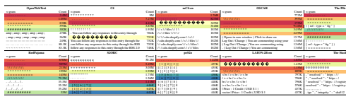

### 4.3 Data Quality

Main Findings

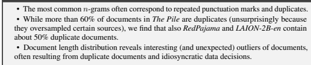

### 4.3.1 Most & Least Common N-Grams

Measuring outliers can reveal interesting insights about a corpus (Mitchell et al., 2023), As such, we explore the most and least common n-grams of each corpus using the *Compressed Counts* . We compute the 10K most common n-grams for all corpora, with n ∈ {1, 2, 3, 10}. We report the results of the ten most common 10-grams in Table 3 and of the ten most common uni-, bi-, and tri-grams in Table 8 in the Appendix. Identical n-grams across corpora are highlighted in the same colors. The different corpora contain a lot of (seemingly) uncleaned html or markdown format (e.g., 10 times
'?', 'amp'), or boilerplate texts such as: ". You can follow any responses to this entry through" in C4, or "( Log Out / Change ) You are commenting using" in *OSCAR*, and formatting ("[1][2][3][") in *S2ORC* and *peS2o*, which signifies references. A striking finding from this analysis is the vast repetition of such 10-grams. For instance, '?', '.',
and '-' repeated ten times appears 9, 7.2, and 4.4 million times, respectively, in C4. We perform a manual analysis on the repeating question marks in C4 to better understand the scenarios where they appear on the ten consecutive question marks symbols and categorize each appearance into writing, noise, and *format* occurrence. Analyzing 100 random documents, we found that 68% of documents use such n-gram as part of their *writing* style (e.g., ... $6???????????? How is that possible?, or ... So what do u think?????????????????????????). 18% are due to *noise* as we could not understand the context or content of the writing (e.g., ... e ??????????????? kap chit-koa ??), and finally, 14% of the documents were due to different *format* styles or issues (e.g., a sequence of question marks following by a 'normal' text, or a sequence of question marks between keywords).

### 4.3.2 Duplicates

Previous work has found that duplication can affect the quality of pretraining data, impacting sample efficiency (Lee et al., 2022) and memorization (Carlini et al., 2023). While more recent work finds contradictory evidence on data with less web-scraped text (Biderman et al., 2023), measuring duplication in pretraining data is necessary for future research on its effects. We calculate duplicates by matching documents with an MD5 hash of their texts (using *Compressed Counts* ). If more than a single document has the same hash, we consider them duplicates.2 We examine the duplication of document text and URLs within each dataset. While some datasets explicitly deduplicate their content, others do not, and some even oversample some sources.

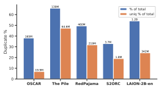

Figure 3: Percentages of document and document cluster duplicates in corpora with > 1% documents duplicated (corresponding to blue and orange bars). Duplicate counts are above bars.

Table 4: Most frequent text duplicates from four datasets with text duplicates, along with their counts. Truncation for visualization is marked by [...].

| Corpus        | Text                                                   |
|---------------|--------------------------------------------------------|
| OSCAR         | In order to login you must be registered. Register ing |
| Count: 1.8M   | takes only a few moments but gives you increas[...]    |
| The Pile      | {\n "info" : {\n "version" : 1,\n "author" : "xcode"\n |
| Count: 3.8K   | }\n}                                                   |
| RedPajama     | ACCEPTED\n\n#### According to\nInternational Pla       |
|               | nt NamesIndex\n\n#### Published in\nnull\n\n####       |
| Count: 213.9K | Original n[...]                                        |
| LAION\-2B\-en | Front Cover                                            |
| Count: 1M     |                                                        |

In Figure 3 we show counts and ratios of duplication across datasets with greater than 1% documents duplicated, and all datasets are shown in Table 12 in the appendix. These are based on two kinds of counts: (1) the count of documents in all clusters of duplicate text (in blue) and (2) the count of duplicate clusters (in orange). As expected, deduplicated corpora such as C4 have no exact duplicates (as those were filtered out of the corpus). In contrast, *The Pile*, which intentionally oversampled some data sources, has many duplicates (139M documents belonging to 64.6M duplicate text clusters). LAION-2B-en has the second highest ratio of duplicate documents (1.25B documents belonging to 342M duplicate text clusters), perhaps due to the smaller space of short phrases common in its image
"alt text" source. Figure 15 in the appendix showcase the images of the most common duplicates in LAION-2B-en, with the most common images describe mainly receipts. Table 4 showcases duplicates with the most occurrences in four corpora. These duplicates vary dramatically in length and domain. LAION-2B-en, *OSCAR*, and *RedPajama* have clusters with the most occurrences, in the hundreds of thousands and above. Top duplicates in *LAION-2B-en* are shorter and describe products and website features. *OSCAR*'s top duplicates are all instances of website boilerplate.3 *RedPajama*'s top duplicates come from similar templated citation information.

### 4.3.3 Document Length Distribution

Next, we compute the distributions of document lengths using the *Exact Counts* . We expect a smooth distribution over document lengths, and deviation from such a distribution may indicate the presence of artificial documents or near duplicates.4 We compute the character length distributions and present the results for three corpora in Figure 4 (The other corpora and token distribution are in Appendix B.2.3).

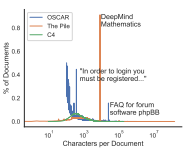

While both C4 (and *mC4-en*) took steps to remove exact duplicate documents, they both include clusters of templategenerated near-duplicate documents exposed by outliers of identical document lengths. Beyond template-generated userfacing copy (including, for example, template-generated documents from a reverse phone lookup site, each associated with a unique phone number), this analysis also reveals clusters of template-generated JavaScript snippets, as well as large collections of unique documents, including Figure 4: Distribution over character document lengths (in log-scale) for C4, OSCAR and *The Pile*.

2To test for hash collisions, we rerun the analysis with a different random seed. None of the > 7 billion hashes across the ten corpora had a different count. This could only occur if an identical number of collisions conflated an identical set of counts or, more likely, there were no collisions.

3Many of these duplicate documents indicate that the user agent used to collect the dataset received automatic responses blocking it from crawling the website's contents.

4Outlier lengths are those whose prevalence across the corpus is significantly higher than neighboring lengths.

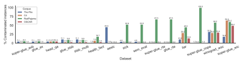

Figure 5: Most contaminated evaluations test sets out of 82 PromptSource (Bach et al., 2022) datasets. numerous permutations of the same keywords, which appear to be generated for SEO purposes. Overall, C4 presents the closest to normal distribution out of all corpora.

The Pile, which includes the longest documents, has a particularly striking outlier: nearly 1% of its documents have a length of exactly 8,194 characters. These outliers are sourced from the DeepMind Mathematics dataset (Saxton et al., 2019). *The Pile* also contains a significant number of short template-generated code snippets. While *OSCAR* contains no documents shorter than 100 characters, as shorter documents were filtered out, it contains many near-duplicate documents that correspond to website boilerplate, e.g., template-generated FAQs about how to use the forum software phpBB.

4.4 COMMUNITY- AND SOCIETY-RELEVANT MEASUREMENTS

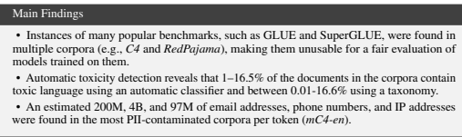

### 4.4.1 Benchmark Contamination

As corpora grow and new evaluation datasets are created, the risk of contamination—where evaluation data are included in a (pre)training corpus—increases. As such, it is important to track contamination
(Sainz et al., 2023).5 Using *Search* , we provide a contamination analysis of 82 datasets for four popular corpora: The Pile, C4, *RedPajama*, and *OSCAR*. We consider all datasets from PromptSource (Bach et al., 2022), a repository containing prompts for 279 different datasets (as of May 2023). We filter datasets we cannot automatically download, from Huggingface datasets (Lhoest et al., 2021), and datasets that do not have a test split. In addition, we only consider datasets that contain at least two inputs (e.g., natural language inference), leaving us with 82 datasets. We measure contamination by testing whether all input fields are present in a single document and report the percentage of contaminated examples from the test set. Our contamination evaluation serves as an upper bound of exact-match dataset contamination. We provide more details of our analysis and decisions in Appendix B.3.1. Contaminated datasets We present the results in Figure 5. We showcase all benchmarks whose contamination percentages are at least 5% in one of the four corpora. We find that *RedPajama* is the most contaminated dataset out of the four, where in eight out of the 15 corpora, its contamination rate is above 50%, and fully contaminated in the case of COPA (Roemmele et al., 2011). *The Pile*'s contamination rates are lower, but it is also contaminated with a few datasets, such as aesic (Zhang
& Tetreault, 2019), WSC (Levesque et al., 2012) and WIC (Pilehvar & Camacho-Collados, 2019),
which were included in the SuperGLUE evaluation benchmark (Wang et al., 2019).

5When evaluating a model trained on an existing corpus, one should exempt contaminated evaluation sets.

However, in the case of new corpus construction, practitioners may use WIMBD for decontaminating *the corpus* itself to maintain the evaluation data integrity.
Most examined datasets were not found in the corpora It is important to note that while we found some contamination, most of the considered benchmarks do not appear in the corpora we investigated (67 out of the 82 datasets). For instance, Winogrande (Sakaguchi et al., 2021), a large-scale corpus in the style of the Winograd schema, does not appear in any of the examined corpora.

### 4.4.2 Personally Identifiable Information

PII is "information which can be used to distinguish or trace an individual's identity, such as their name, social security number, biometric records, etc." (Johnson III, 2007).

Recent research has sought to *extract* PII
from language models (Carlini et al., 2021). These attacks highlight that language models can ingest and reproduce PII contained in their training data, and show the risks of training on data that contains such information, even if the data remains private.

Table 5: Extrapolated PII frequencies. Count is the extrapolated frequency in a corpus and *Prec.* is our identification precision accuracy, estimated by manual analysis of 100 random examples.

|               | Email Addresses   |       | Phone Numbers   |       | IP Addresses   |       |
|---------------|-------------------|-------|-----------------|-------|----------------|-------|
|               | Count             | Prec. | Count           | Prec. | Count          | Prec. |
| OpenWebText   | 364K              | 99    | 533K            | 87    | 70K            | 54    |
| OSCAR         | 62.8M             | 100   | 107M            | 91    | 3.2M           | 43    |
| C4            | 7.6M              | 99    | 19.7M           | 92    | 796K           | 56    |
| mC4\-en       | 201M              | 92    | 4B              | 66    | 97.8M          | 44    |
| The Pile      | 19.8M             | 43    | 38M             | 65    | 4M             | 48    |
| RedPajama     | 35.2M             | 100   | 70.2M           | 94    | 1.1M           | 30    |
| S2ORC         | 630K              | 100   | 1.4M            | 100   | 0K             | 0     |
| peS2o         | 418K              | 97    | 227K            | 31    | 0K             | 0     |
| LAION\-2B\-en | 636K              | 94    | 1M              | 7     | 0K             | 0     |
| The Stack     | 4.3M              | 53    | 45.4M           | 9     | 4.4M           | 55    |

We document three kinds of personally identifiable information in pretraining corpora: phone numbers, email addresses, and IP addresses. We employ regular expressions corresponding to each PII type using the *Exact Counts* . We provide more details about our methodology, the regexes, additional results, and error analyses in Appendix B.3.2. We conduct a manual quality analysis to estimate the precision of these methods on different corpora. The results of this analysis, as well as the extrapolated frequency of these matches, are presented in Table 5. Our identification method is highly precise (>80% precision) for email addresses on eight of the pretraining corpora we study and for phone numbers on five of the pretraining corpora. Overall, most corpora contain a high volume of PII information, varying in type based on the corpus. For instance, RedPajama contain mainly phone numbers (70.2M) and a smaller amount of IP Addresses (1.1M), but S2ORC and *peS2o* contain mainly email addresses (630K and 418K, respectively) and no IP addresses that we can identify. Interestingly, the most common PII across corpora is phone numbers, followed by email addresses and IP addresses (except for *The Stack*, which contains a bit more IP addresses than email addresses: 4.4M vs. 4.3M, and *peS2o* which contains more email addresses than phone numbers). Finally, we observe that *mC4-en* contains the largest amount of PII, also when controlling for the number of tokens (Table 18 in the Appendix).

## 5 Discussion

Data is one of the most poorly understood and studied components in ML research since "everyone wants to do the model work, not the data work" (Sambasivan et al., 2021). Yet, it is one of the most critical factors for successfully training a state-of-the-art language model. While the benefit of increasing model size is evident from the trend of recent years, it is not enough by itself, as the amount and quality of data are crucial (Kaplan et al., 2020). Data Curation With the increasing data needed to train language models (and other models for other modalities), it remains challenging to curate a high-quality dataset. Besides the technical challenges of composing a large-scale dataset and the decisions that go into making it, these decisions and their influence on the final models are costly to assess due to the high computational resources required to train such models. With WIMBD, we hope to ease the decisions that go into crafting large-scale datasets by surfacing patterns and trends about what goes into them and what is left out from different aspects, such as data quality, community and society measurements, etc. Data Documentation Adding to previous works that call for more data documentation, such as Datasheets (Gebru et al., 2021) and Data Statements (McMillan-Major et al., 2023), we argue for the importance of documenting such information. While previous works often focused and tailored the documentation for supervised-style datasets (e.g., "Is there a label or target associated with each instance?", "How was the data associated with each instance acquired?" from Datasheets, and "What are the demographic characteristics of the annotators and annotation guideline developers?" from Data Statements) we call for more tailored documentation of large-scale pretraining corpora.6 This work offers a superset of the automatic full-corpus analyses proposed by Dodge et al. (2021); Gao et al. (2020), with several additions, categorization, and programmatic interface, allowing better understanding of the content of current and future large text corpora. Grounding Models to their Training Data Unlike other factors of language model training, such as model architecture or optimizer choice, training data comes in the same natural language format as language model's outputs and thus can be measured and described in all the same ways. As such, the data offers a unique opportunity for grounding models. For instance, a model's ability to recall factual knowledge is derived from its training data (Jiang et al., 2020; Elazar et al., 2021a). On the other hand, models often perform better on frequent occurrences (Razeghi et al., 2022; McCoy et al., 2023), and on documents similar to models' training data (Longpre et al., 2023). The path to a holistic comprehension of model behavior is through the data, which requires an infrastructure investment to access big datasets and the right abstraction of data attributes.

## 6 Conclusion

In this work, we propose "WHAT'S IN MY BIG DATA?" or WIMBD, a framework for processing and analyzing large text corpora. Using WIMBD, we study ten different corpora that were used to train language models (or vision and language models, such as Stable Diffusion, that are also trained on the corresponding paired images). We uncover interesting insights about these corpora using sixteen different analyses across four aspects: high-level statistics, data quality, community- and societyrelevant measurements, and cross-data analysis. For instance, the most common source of texts for the *LAION-2B-en* dataset are the commercial websites Pinterest, Shopify, SlidePlayer, Amazon, and eBay. Regarding data quality, we find that about 50% of *RedPajama* and *LAION-2B-en*'s documents are duplicates. In addition, we find that many evaluation benchmarks, including several from GLUE and SuperGLUE, such as WSC, WIC, and RTE, are contaminated due to their appearance in corpora such as RedPajama. Besides the analyses, WIMBD offers an extendable platform for reproducing our analyses on other corpora, developing new ones, and answering research questions about data. We release all the code and artifacts for WIMBD to encourage researchers to adopt and extend our framework and analyze existing and new corpora.

## Acknowledgments

We want to thank Ludwig Schmidt, Maarten Sap, and Emma Strubell for discussions on this project, Elizabeth Salesky for the help with Unicode rendering and getting excited about obscure Unicode characters with me, and Carissa Schoenick, Jon Borchardt, and Johann Dahm for assisting with visuals.

## References

Julien Abadji, Pedro Ortiz Suarez, Laurent Romary, and Benoît Sagot. Towards a cleaner documentoriented multilingual crawled corpus. In Proceedings of the Thirteenth Language Resources and Evaluation Conference, pp. 4344–4355, Marseille, France, June 2022. European Language Resources Association. URL https://aclanthology.org/2022.lrec-1.463.

Ekin Akyurek, Tolga Bolukbasi, Frederick Liu, Binbin Xiong, Ian Tenney, Jacob Andreas, and Kelvin Guu. Towards tracing knowledge in language models back to the training data. In *Findings of the* Association for Computational Linguistics: EMNLP 2022, pp. 2429–2446, Abu Dhabi, United Arab Emirates, December 2022. Association for Computational Linguistics. doi: 10.18653/v1/
2022.findings-emnlp.180. URL https://aclanthology.org/2022.findings-emnlp.180.

Loubna Ben Allal, Raymond Li, Denis Kocetkov, Chenghao Mou, Christopher Akiki, Carlos Munoz Ferrandis, Niklas Muennighoff, Mayank Mishra, Alex Gu, Manan Dey, et al. Santacoder: don't 6Many questions are still relevant for large pretraining corpora (e.g., "What do the instances that comprise the dataset represent (e.g., documents, photos, people, countries)?").
reach for the stars! *arXiv preprint arXiv:2301.03988*, 2023. URL https://arxiv.org/abs/ 2301.03988.

Stephen Bach, Victor Sanh, Zheng Xin Yong, Albert Webson, Colin Raffel, Nihal V. Nayak, Abheesht Sharma, Taewoon Kim, M Saiful Bari, Thibault Fevry, Zaid Alyafeai, Manan Dey, Andrea Santilli, Zhiqing Sun, Srulik Ben-david, Canwen Xu, Gunjan Chhablani, Han Wang, Jason Fries, Maged Al-shaibani, Shanya Sharma, Urmish Thakker, Khalid Almubarak, Xiangru Tang, Dragomir Radev, Mike Tian-jian Jiang, and Alexander Rush. PromptSource: An integrated development environment and repository for natural language prompts. In *Proceedings of the 60th Annual Meeting of the* Association for Computational Linguistics: System Demonstrations, pp. 93–104, Dublin, Ireland, May 2022. Association for Computational Linguistics. doi: 10.18653/v1/2022.acl-demo.9. URL https://aclanthology.org/2022.acl-demo.9.

Iz Beltagy, Kyle Lo, and Arman Cohan. SciBERT: A pretrained language model for scientific text. In Kentaro Inui, Jing Jiang, Vincent Ng, and Xiaojun Wan (eds.), Proceedings of the 2019 Conference on Empirical Methods in Natural Language Processing and the 9th International Joint Conference on Natural Language Processing (EMNLP-IJCNLP), pp. 3615–3620, Hong Kong, China, November 2019. Association for Computational Linguistics. doi: 10.18653/v1/D19-1371.

URL https://aclanthology.org/D19-1371.

Emily M. Bender and Batya Friedman. Data statements for natural language processing: Toward mitigating system bias and enabling better science. Transactions of the Association for Computational Linguistics, 6:587–604, 2018. doi: 10.1162/tacl_a_00041. URL https:
//aclanthology.org/Q18-1041.

Stella Biderman, Kieran Bicheno, and Leo Gao. Datasheet for the pile, 2022. Stella Biderman, Hailey Schoelkopf, Quentin Gregory Anthony, Herbie Bradley, Kyle O'Brien, Eric Hallahan, Mohammad Aflah Khan, Shivanshu Purohit, USVSN Sai Prashanth, Edward Raff, et al. Pythia: A suite for analyzing large language models across training and scaling.

In *International Conference on Machine Learning*, pp. 2397–2430. PMLR, 2023. URL https:
//openreview.net/forum?id=bpRTAnJ8LW.

Sidney Black, Stella Biderman, Eric Hallahan, Quentin Anthony, Leo Gao, Laurence Golding, Horace He, Connor Leahy, Kyle McDonell, Jason Phang, Michael Pieler, Usvsn Sai Prashanth, Shivanshu Purohit, Laria Reynolds, Jonathan Tow, Ben Wang, and Samuel Weinbach. GPT-NeoX-20B: An open-source autoregressive language model. In *Proceedings of BigScience Episode \#5 - Workshop* on Challenges & Perspectives in Creating Large Language Models, pp. 95–136, virtual+Dublin, May 2022. Association for Computational Linguistics. doi: 10.18653/v1/2022.bigscience-1.9.

URL https://aclanthology.org/2022.bigscience-1.9.

Burton H. Bloom. Space/time trade-offs in hash coding with allowable errors. *Commun. ACM*, 13(7):
422–426, jul 1970. ISSN 0001-0782. URL https://doi.org/10.1145/362686.362692.

Nicholas Carlini, Florian Tramèr, Eric Wallace, Matthew Jagielski, Ariel Herbert-Voss, Katherine Lee, Adam Roberts, Tom Brown, Dawn Song, Úlfar Erlingsson, Alina Oprea, and Colin Raffel. Extracting training data from large language models. In 30th USENIX Security Symposium (USENIX Security 21), pp. 2633–2650. USENIX Association, August 2021.

ISBN 978-1-939133-24-3. URL https://www.usenix.org/conference/usenixsecurity21/ presentation/carlini-extracting.

Nicholas Carlini, Daphne Ippolito, Matthew Jagielski, Katherine Lee, Florian Tramer, and Chiyuan Zhang. Quantifying memorization across neural language models. In *The Eleventh International* Conference on Learning Representations, 2023. URL https://openreview.net/forum?id= TatRHT_1cK.

Hyung Won Chung, Xavier Garcia, Adam Roberts, Yi Tay, Orhan Firat, Sharan Narang, and Noah Constant. Unimax: Fairer and more effective language sampling for large-scale multilingual pretraining. In *The Eleventh International Conference on Learning Representations*, 2023. URL https://openreview.net/forum?id=kXwdL1cWOAi.

Jeffrey Dean and Sanjay Ghemawat. Mapreduce: Simplified data processing on large clusters.

Commun. ACM, 51(1):107–113, jan 2008. URL https://doi.org/10.1145/1327452.1327492.

Jesse Dodge, Maarten Sap, Ana Marasovic, William Agnew, Gabriel Ilharco, Dirk Groeneveld, ´
Margaret Mitchell, and Matt Gardner. Documenting large webtext corpora: A case study on the colossal clean crawled corpus. In *Proceedings of the 2021 Conference on Empirical Methods* in Natural Language Processing, pp. 1286–1305, Online and Punta Cana, Dominican Republic, November 2021. Association for Computational Linguistics. doi: 10.18653/v1/2021.emnlp-main. 98. URL https://aclanthology.org/2021.emnlp-main.98.

Yanai Elazar, Nora Kassner, Shauli Ravfogel, Abhilasha Ravichander, Eduard Hovy, Hinrich Schütze, and Yoav Goldberg. Measuring and improving consistency in pretrained language models. *Transactions of the Association for Computational Linguistics*, 9:1012–1031, 2021a. URL
https://aclanthology.org/2021.tacl-1.60.

Yanai Elazar, Hongming Zhang, Yoav Goldberg, and Dan Roth. Back to square one: Artifact detection, training and commonsense disentanglement in the Winograd schema. In *Proceedings of* the 2021 Conference on Empirical Methods in Natural Language Processing, pp. 10486–10500, Online and Punta Cana, Dominican Republic, November 2021b. Association for Computational Linguistics. doi: 10.18653/v1/2021.emnlp-main.819. URL https://aclanthology.org/2021. emnlp-main.819.

Ali Emami, Kaheer Suleman, Adam Trischler, and Jackie Chi Kit Cheung. An analysis of dataset overlap on Winograd-style tasks. In Proceedings of the 28th International Conference on Computational Linguistics, pp. 5855–5865, Barcelona, Spain (Online), December 2020. International Committee on Computational Linguistics. doi: 10.18653/v1/2020.coling-main.515. URL https://aclanthology.org/2020.coling-main.515.

Leo Gao, Stella Biderman, Sid Black, Laurence Golding, Travis Hoppe, Charles Foster, Jason Phang, Horace He, Anish Thite, Noa Nabeshima, Shawn Presser, and Connor Leahy. The Pile: An 800gb dataset of diverse text for language modeling. *arXiv preprint arXiv:2101.00027*, 2020. URL https://arxiv.org/abs/2101.00027.

Timnit Gebru, Jamie Morgenstern, Briana Vecchione, Jennifer Wortman Vaughan, Hanna Wallach, Hal Daumé III, and Kate Crawford. Datasheets for datasets. *Commun. ACM*, 64(12):86–92, nov 2021. ISSN 0001-0782. doi: 10.1145/3458723. URL https://doi.org/10.1145/3458723.

Aaron Gokaslan and Vanya Cohen. Openwebtext corpus, 2019. URL https://skylion007.github.

io/OpenWebTextCorpus/.

Google. Know your data, 2021. URL https://github.com/pair-code/knowyourdata. Google. Palm 2 technical report. *arXiv preprint arXiv:2305.10403*, 2023. URL https://arxiv.

org/abs/2305.10403.

Kelvin Guu, Albert Webson, Ellie Pavlick, Lucas Dixon, Ian Tenney, and Tolga Bolukbasi. Simfluence:
Modeling the influence of individual training examples by simulating training runs. *arXiv preprint* arXiv:2303.08114, 2023. URL https://arxiv.org/abs/2303.08114.

Zhengbao Jiang, Frank F. Xu, Jun Araki, and Graham Neubig. How can we know what language models know? *Transactions of the Association for Computational Linguistics*, 8:423–438, 2020. doi: 10.1162/tacl_a_00324. URL https://aclanthology.org/2020.tacl-1.28.

Clay Johnson III. Us office of management and budget memorandum m-07-16, 2007. URL https:
//georgewbush-whitehouse.archives.gov/omb/memoranda/fy2007/m07-16.pdf.

Jared Kaplan, Sam McCandlish, Tom Henighan, Tom B Brown, Benjamin Chess, Rewon Child, Scott Gray, Alec Radford, Jeffrey Wu, and Dario Amodei. Scaling laws for neural language models. arXiv preprint arXiv:2001.08361, 2020. URL https://arxiv.org/abs/2001.08361.

Denis Kocetkov, Raymond Li, Loubna Ben allal, Jia LI, Chenghao Mou, Yacine Jernite, Margaret Mitchell, Carlos Muñoz Ferrandis, Sean Hughes, Thomas Wolf, Dzmitry Bahdanau, Leandro Von Werra, and Harm de Vries. The stack: 3 TB of permissively licensed source code. Transactions on Machine Learning Research, 2023. ISSN 2835-8856. URL https://openreview.net/forum? id=pxpbTdUEpD.

Katherine Lee, Daphne Ippolito, Andrew Nystrom, Chiyuan Zhang, Douglas Eck, Chris Callison-
Burch, and Nicholas Carlini. Deduplicating training data makes language models better. In Proceedings of the 60th Annual Meeting of the Association for Computational Linguistics (Volume 1: Long Papers), pp. 8424–8445, Dublin, Ireland, May 2022. Association for Computational Linguistics. doi: 10.18653/v1/2022.acl-long.577. URL https://aclanthology.org/2022. acl-long.577.

Hector J. Levesque, Ernest Davis, and Leora Morgenstern. The winograd schema challenge. In Proceedings of the Thirteenth International Conference on Principles of Knowledge Representation and Reasoning, KR'12, pp. 552–561. AAAI Press, 2012. ISBN 9781577355601. URL https:
//dl.acm.org/doi/10.5555/3031843.3031909.

Quentin Lhoest, Albert Villanova del Moral, Yacine Jernite, Abhishek Thakur, Patrick von Platen, Suraj Patil, Julien Chaumond, Mariama Drame, Julien Plu, Lewis Tunstall, Joe Davison, Mario Šaško, Gunjan Chhablani, Bhavitvya Malik, Simon Brandeis, Teven Le Scao, Victor Sanh, Canwen Xu, Nicolas Patry, Angelina McMillan-Major, Philipp Schmid, Sylvain Gugger, Clément Delangue, Théo Matussière, Lysandre Debut, Stas Bekman, Pierric Cistac, Thibault Goehringer, Victor Mustar, François Lagunas, Alexander Rush, and Thomas Wolf. Datasets: A community library for natural language processing. In *Proceedings of the 2021 Conference on Empirical Methods* in Natural Language Processing: System Demonstrations, pp. 175–184, Online and Punta Cana, Dominican Republic, November 2021. Association for Computational Linguistics. URL https:
//aclanthology.org/2021.emnlp-demo.21.

Raymond Li, Loubna Ben Allal, Yangtian Zi, Niklas Muennighoff, Denis Kocetkov, Chenghao Mou, Marc Marone, Christopher Akiki, Jia Li, Jenny Chim, et al. Starcoder: may the source be with you! *arXiv preprint arXiv:2305.06161*, 2023.

Kyle Lo, Lucy Lu Wang, Mark Neumann, Rodney Kinney, and Daniel Weld. S2ORC: The semantic scholar open research corpus. In Proceedings of the 58th Annual Meeting of the Association for Computational Linguistics, pp. 4969–4983, Online, July 2020. Association for Computational Linguistics. doi: 10.18653/v1/2020.acl-main.447. URL https://www.aclweb.org/anthology/ 2020.acl-main.447.

Shayne Longpre, Gregory Yauney, Emily Reif, Katherine Lee, Adam Roberts, Barret Zoph, Denny Zhou, Jason Wei, Kevin Robinson, David Mimno, et al. A pretrainer's guide to training data: Measuring the effects of data age, domain coverage, quality, & toxicity. *arXiv preprint* arXiv:2305.13169, 2023. URL https://arxiv.org/abs/2305.13169.

Sasha Luccioni, Yacine Jernite, and Margaret Mitchell. Data measurements tool, 2021. URL
https://huggingface.co/blog/data-measurements-tool.

Marc Marone and Benjamin Van Durme. Data portraits: Recording foundation model training data.

arXiv preprint arXiv:2303.03919, 2023. URL https://arxiv.org/abs/2303.03919.

R. Thomas McCoy, Shunyu Yao, Dan Friedman, Matthew Hardy, and Thomas L. Griffiths. Embers of autoregression: Understanding large language models through the problem they are trained to solve. *arXiv preprint arXiv:2309.13638*, 2023.

Angelina McMillan-Major, Emily M. Bender, and Batya Friedman. Data statements: From technical concept to community practice. *ACM J. Responsib. Comput.*, may 2023. doi: 10.1145/3594737. URL https://doi.org/10.1145/3594737.

Margaret Mitchell, Alexandra Sasha Luccioni, Nathan Lambert, Marissa Gerchick, Angelina McMillan-Major, Nazneen Ozoani, Ezinwanne Rajani, Tristan Thrush, Yacine Jernite, and Douwe Kiela. Measuring data. In *arXiv*, 2023. URL https://arxiv.org/abs/2212.05129.

Anthony Moi and Nicolas Patry. HuggingFace's Tokenizers, April 2023. URL https://github.

com/huggingface/tokenizers.

OpenAI. Gpt-4 technical report. *arXiv preprint arXiv:2303.08774*, 2023. URL https://arxiv.

org/abs/2303.08774.

Amandalynne Paullada, Inioluwa Deborah Raji, Emily M. Bender, Emily Denton, and Alex Hanna.

Data and its (dis)contents: A survey of dataset development and use in machine learning research. In *Patterns*, 2021. URL https://www.sciencedirect.com/science/article/pii/ S2666389921001847.

Guilherme Penedo, Quentin Malartic, Daniel Hesslow, Ruxandra Cojocaru, Alessandro Cappelli, Hamza Alobeidli, Baptiste Pannier, Ebtesam Almazrouei, and Julien Launay. The refinedweb dataset for falcon llm: outperforming curated corpora with web data, and web data only. *arXiv* preprint arXiv:2306.01116, 2023. URL https://arxiv.org/abs/2306.01116.

Aleksandra Piktus, Christopher Akiki, Paulo Villegas, Hugo Laurençon, Gérard Dupont, Sasha Luccioni, Yacine Jernite, and Anna Rogers. The ROOTS search tool: Data transparency for LLMs. In Proceedings of the 61st Annual Meeting of the Association for Computational Linguistics
(Volume 3: System Demonstrations), pp. 304–314, Toronto, Canada, July 2023a. Association for Computational Linguistics. doi: 10.18653/v1/2023.acl-demo.29. URL https://aclanthology. org/2023.acl-demo.29.

Aleksandra Piktus, Odunayo Ogundepo, Christopher Akiki, Akintunde Oladipo, Xinyu Zhang, Hailey Schoelkopf, Stella Biderman, Martin Potthast, and Jimmy Lin. GAIA search: Hugging face and pyserini interoperability for NLP training data exploration. In *Proceedings of the 61st Annual* Meeting of the Association for Computational Linguistics (Volume 3: System Demonstrations), pp. 588–598, Toronto, Canada, July 2023b. Association for Computational Linguistics. doi:
10.18653/v1/2023.acl-demo.57. URL https://aclanthology.org/2023.acl-demo.57.

Mohammad Taher Pilehvar and Jose Camacho-Collados. WiC: the word-in-context dataset for evaluating context-sensitive meaning representations. In Proceedings of the 2019 Conference of the North American Chapter of the Association for Computational Linguistics: Human Language Technologies, Volume 1 (Long and Short Papers), pp. 1267–1273, Minneapolis, Minnesota, June 2019. Association for Computational Linguistics. doi: 10.18653/v1/N19-1128. URL https:
//aclanthology.org/N19-1128.

Giada Pistilli, Carlos Muñoz Ferrandis, Yacine Jernite, and Margaret Mitchell. Stronger together: On the articulation of ethical charters, legal tools, and technical documentation in ml. In Proceedings of the 2023 ACM Conference on Fairness, Accountability, and Transparency, FAccT '23, pp. 343–354, New York, NY, USA, 2023. Association for Computing Machinery. ISBN 9798400701924. doi:
10.1145/3593013.3594002. URL https://doi.org/10.1145/3593013.3594002.

Alec Radford, Jeff Wu, Rewon Child, David Luan, Dario Amodei, and Ilya Sutskever. Language models are unsupervised multitask learners. *OpenAI blog post*, 2019. URL https://openai. com/research/better-language-models.

Colin Raffel, Noam Shazeer, Adam Roberts, Katherine Lee, Sharan Narang, Michael Matena, Yanqi Zhou, Wei Li, and Peter J. Liu. Exploring the limits of transfer learning with a unified text-to-text transformer. *Journal of Machine Learning Research*, 21(140):1–67, 2020. URL
http://jmlr.org/papers/v21/20-074.html.

Yasaman Razeghi, Robert L Logan IV, Matt Gardner, and Sameer Singh. Impact of pretraining term frequencies on few-shot numerical reasoning. In Findings of the Association for Computational Linguistics: EMNLP 2022, pp. 840–854, Abu Dhabi, United Arab Emirates, December 2022. Association for Computational Linguistics. URL https://aclanthology.org/2022. findings-emnlp.59.

Melissa Roemmele, Cosmin Adrian Bejan, and Andrew S Gordon. Choice of plausible alternatives: An evaluation of commonsense causal reasoning. In AAAI spring symposium: logical formalizations of commonsense reasoning, pp. 90–95, 2011. URL https://aaai.org/papers/ 02418-choice-of-plausible-alternatives-an-evaluation-of-commonsense-causal-reasoning/.

Robin Rombach, Andreas Blattmann, Dominik Lorenz, Patrick Esser, and Björn Ommer. Highresolution image synthesis with latent diffusion models. In Proceedings of the IEEE/CVF Conference on Computer Vision and Pattern Recognition, pp. 10684–10695, 2022.

Oscar Sainz, Jon Ander Campos, Iker García-Ferrero, Julen Etxaniz, and Eneko Agirre. Did chatgpt cheat on your test?, Jun 2023. URL https://hitz-zentroa.github.io/lm-contamination/ blog/.

Keisuke Sakaguchi, Ronan Le Bras, Chandra Bhagavatula, and Yejin Choi. Winogrande: An adversarial winograd schema challenge at scale. *Commun. ACM*, 64(9):99–106, aug 2021. ISSN 0001-0782. doi: 10.1145/3474381. URL https://doi.org/10.1145/3474381.

Nithya Sambasivan, Shivani Kapania, Hannah Highfill, Diana Akrong, Praveen Paritosh, and Lora M
Aroyo. "everyone wants to do the model work, not the data work": Data cascades in high-stakes ai.

In *Proceedings of the 2021 CHI Conference on Human Factors in Computing Systems*, CHI '21, New York, NY, USA, 2021. Association for Computing Machinery. ISBN 9781450380966. doi:
10.1145/3411764.3445518. URL https://doi.org/10.1145/3411764.3445518.

David Saxton, Edward Grefenstette, Felix Hill, and Pushmeet Kohli. Analysing mathematical reasoning abilities of neural models. In *International Conference on Learning Representations*, 2019. URL https://openreview.net/forum?id=H1gR5iR5FX.

Teven Le Scao, Angela Fan, Christopher Akiki, Elizabeth-Jane Pavlick, Suzana Ili'c, Daniel Hesslow, Roman Castagn'e, Alexandra Sasha Luccioni, Franccois Yvon, Matthias Gallé, Jonathan Tow, Alexander M. Rush, Stella Rose Biderman, Albert Webson, Pawan Sasanka Ammanamanchi, Thomas Wang, Benoît Sagot, Niklas Muennighoff, Albert Villanova del Moral, Olatunji Ruwase, Rachel Bawden, Stas Bekman, Angelina McMillan-Major, Iz Beltagy, Huu Nguyen, Lucile Saulnier, Samson Tan, Pedro Ortiz Suarez, Victor Sanh, Hugo Laurenccon, Yacine Jernite, Julien Launay, Margaret Mitchell, Colin Raffel, Aaron Gokaslan, Adi Simhi, Aitor Soroa Etxabe, Alham Fikri Aji, Amit Alfassy, Anna Rogers, Ariel Kreisberg Nitzav, Canwen Xu, Chenghao Mou, Chris C. Emezue, Christopher Klamm, Colin Leong, Daniel Alexander van Strien, David Ifeoluwa Adelani, Dragomir R. Radev, Eduardo Gonz'alez Ponferrada, Efrat Levkovizh, Ethan Kim, Eyal Bar Natan, Francesco De Toni, Gérard Dupont, Germán Kruszewski, Giada Pistilli, Hady ElSahar, Hamza Benyamina, Hieu Trung Tran, Ian Yu, Idris Abdulmumin, Isaac Johnson, Itziar Gonzalez-Dios, Javier de la Rosa, Jenny Chim, Jesse Dodge, Jian Zhu, Jonathan Chang, Jorg Frohberg, Josephine L. Tobing, Joydeep Bhattacharjee, Khalid Almubarak, Kimbo Chen, Kyle Lo, Leandro von Werra, Leon Weber, Long Phan, Loubna Ben Allal, Ludovic Tanguy, Manan Dey, Manuel Romero Muñoz, Maraim Masoud, Mar'ia Grandury, Mario vSavsko, Max Huang, Maximin Coavoux, Mayank Singh, Mike Tian-Jian Jiang, Minh Chien Vu, Mohammad Ali Jauhar, Mustafa Ghaleb, Nishant Subramani, Nora Kassner, Nurulaqilla Khamis, Olivier Nguyen, Omar Espejel, Ona de Gibert, Paulo Villegas, Peter Henderson, Pierre Colombo, Priscilla A. Amuok, Quentin Lhoest, Rheza Harliman, Rishi Bommasani, Roberto L'opez, Rui Ribeiro, Salomey Osei, Sampo Pyysalo, Sebastian Nagel, Shamik Bose, Shamsuddeen Hassan Muhammad, Shanya Sharma, S. Longpre, Somaieh Nikpoor, Stanislav Silberberg, Suhas Pai, Sydney Zink, Tiago Timponi Torrent, Timo Schick, Tristan Thrush, Valentin Danchev, Vassilina Nikoulina, Veronika Laippala, Violette Lepercq, Vrinda Prabhu, Zaid Alyafeai, Zeerak Talat, Arun Raja, Benjamin Heinzerling, Chenglei Si, Elizabeth Salesky, Sabrina J. Mielke, Wilson Y. Lee, Abheesht Sharma, Andrea Santilli, Antoine Chaffin, Arnaud Stiegler, Debajyoti Datta, Eliza Szczechla, Gunjan Chhablani, Han Wang, Harshit Pandey, Hendrik Strobelt, Jason Alan Fries, Jos Rozen, Leo Gao, Lintang Sutawika, M Saiful Bari, Maged S. Al-shaibani, Matteo Manica, Nihal V. Nayak, Ryan Teehan, Samuel Albanie, Sheng Shen, Srulik Ben-David, Stephen H. Bach, Taewoon Kim, Tali Bers, Thibault Févry, Trishala Neeraj, Urmish Thakker, Vikas Raunak, Xiang Tang, Zheng Xin Yong, Zhiqing Sun, Shaked Brody, Y Uri, Hadar Tojarieh, Adam Roberts, Hyung Won Chung, Jaesung Tae, Jason Phang, Ofir Press, Conglong Li, Deepak Narayanan, Hatim Bourfoune, Jared Casper, Jeff Rasley, Max Ryabinin, Mayank Mishra, Minjia Zhang, Mohammad Shoeybi, Myriam Peyrounette, Nicolas Patry, Nouamane Tazi, Omar Sanseviero, Patrick von Platen, Pierre Cornette, Pierre Franccois Lavall'ee, Rémi Lacroix, Samyam Rajbhandari, Sanchit Gandhi, Shaden Smith, Stéphane Requena, Suraj Patil, Tim Dettmers, Ahmed Baruwa, Amanpreet Singh, Anastasia Cheveleva, Anne-Laure Ligozat, Arjun Subramonian, Aur'elie N'ev'eol, Charles Lovering, Daniel H Garrette, Deepak R.

Tunuguntla, Ehud Reiter, Ekaterina Taktasheva, Ekaterina Voloshina, Eli Bogdanov, Genta Indra Winata, Hailey Schoelkopf, Jan-Christoph Kalo, Jekaterina Novikova, Jessica Zosa Forde, Xiangru Tang, Jungo Kasai, Ken Kawamura, Liam Hazan, Marine Carpuat, Miruna Clinciu, Najoung Kim, Newton Cheng, Oleg Serikov, Omer Antverg, Oskar van der Wal, Rui Zhang, Ruochen Zhang, Sebastian Gehrmann, Shachar Mirkin, S. Osher Pais, Tatiana Shavrina, Thomas Scialom, Tian Yun, Tomasz Limisiewicz, Verena Rieser, Vitaly Protasov, Vladislav Mikhailov, Yada Pruksachatkun, Yonatan Belinkov, Zachary Bamberger, Zdenvek Kasner, Alice Rueda, Amanda Pestana, Amir Feizpour, Ammar Khan, Amy Faranak, Ananda Santa Rosa Santos, Anthony Hevia, Antigona Unldreaj, Arash Aghagol, Arezoo Abdollahi, Aycha Tammour, Azadeh HajiHosseini, Bahareh Behroozi, Benjamin Olusola Ajibade, Bharat Kumar Saxena, Carlos Muñoz Ferrandis, Danish Contractor, David M. Lansky, Davis David, Douwe Kiela, Duong Anh Nguyen, Edward Tan, Emily Baylor, Ezinwanne Ozoani, Fatim T Mirza, Frankline Ononiwu, Habib Rezanejad, H.A. Jones, Indrani Bhattacharya, Irene Solaiman, Irina Sedenko, Isar Nejadgholi, Jan Passmore, Joshua Seltzer, Julio Bonis Sanz, Karen Fort, Lívia Macedo Dutra, Mairon Samagaio, Maraim Elbadri, Margot Mieskes, Marissa Gerchick, Martha Akinlolu, Michael McKenna, Mike Qiu, M. K. K. Ghauri, Mykola Burynok, Nafis Abrar, Nazneen Rajani, Nour Elkott, Nourhan Fahmy, Olanrewaju Samuel, Ran An, R. P. Kromann, Ryan Hao, Samira Alizadeh, Sarmad Shubber, Silas L.

Wang, Sourav Roy, Sylvain Viguier, Thanh-Cong Le, Tobi Oyebade, Trieu Nguyen Hai Le, Yoyo Yang, Zachary Kyle Nguyen, Abhinav Ramesh Kashyap, Alfredo Palasciano, Alison Callahan, Anima Shukla, Antonio Miranda-Escalada, Ayush Kumar Singh, Benjamin Beilharz, Bo Wang, Caio Matheus Fonseca de Brito, Chenxi Zhou, Chirag Jain, Chuxin Xu, Clémentine Fourrier, Daniel Le'on Perin'an, Daniel Molano, Dian Yu, Enrique Manjavacas, Fabio Barth, Florian Fuhrimann, Gabriel Altay, Giyaseddin Bayrak, Gully A. Burns, Helena U. Vrabec, Iman I.B. Bello, Isha Dash, Ji Soo Kang, John Giorgi, Jonas Golde, Jose David Posada, Karthi Sivaraman, Lokesh Bulchandani, Lu Liu, Luisa Shinzato, Madeleine Hahn de Bykhovetz, Maiko Takeuchi, Marc Pàmies, María Andrea Castillo, Marianna Nezhurina, Mario Sanger, Matthias Samwald, Michael Cullan, Michael Weinberg, M Wolf, Mina Mihaljcic, Minna Liu, Moritz Freidank, Myungsun Kang, Natasha Seelam, Nathan Dahlberg, Nicholas Michio Broad, Nikolaus Muellner, Pascale Fung, Patricia Haller, R. Chandrasekhar, R. Eisenberg, Robert Martin, Rodrigo L. Canalli, Rosaline Su, Ruisi Su, Samuel Cahyawijaya, Samuele Garda, Shlok S Deshmukh, Shubhanshu Mishra, Sid Kiblawi, Simon Ott, Sinee Sang-aroonsiri, Srishti Kumar, Stefan Schweter, Sushil Pratap Bharati, T. A. Laud, Th'eo Gigant, Tomoya Kainuma, Wojciech Kusa, Yanis Labrak, Yashasvi Bajaj, Y. Venkatraman, Yifan Xu, Ying Xu, Yun chao Xu, Zhee Xao Tan, Zhongli Xie, Zifan Ye, Mathilde Bras, Younes Belkada, and Thomas Wolf. BLOOM: A 176B-Parameter Open-Access Multilingual Language Model. *ArXiv*, abs/2211.05100, 2022.

Christoph Schuhmann, Romain Beaumont, Richard Vencu, Cade W Gordon, Ross Wightman, Mehdi Cherti, Theo Coombes, Aarush Katta, Clayton Mullis, Mitchell Wortsman, Patrick Schramowski, Srivatsa R Kundurthy, Katherine Crowson, Ludwig Schmidt, Robert Kaczmarczyk, and Jenia Jitsev. LAION-5b: An open large-scale dataset for training next generation image-text models. In *Thirty-sixth Conference on Neural Information Processing Systems Datasets and Benchmarks* Track, 2022. URL https://openreview.net/forum?id=M3Y74vmsMcY.

Roy Schwartz, Jesse Dodge, Noah A. Smith, and Oren Etzioni. Green ai. *Commun. ACM*, 63(12):
54–63, nov 2020. ISSN 0001-0782. doi: 10.1145/3381831. URL https://doi.org/10.1145/ 3381831.

Preethi Seshadri, Sameer Singh, and Yanai Elazar. The bias amplification paradox in text-toimage generation. *arXiv preprint arXiv:2308.00755*, 2023. URL https://arxiv.org/abs/2308. 00755.

Jaime Sevilla, Lennart Heim, Anson Ho, Tamay Besiroglu, Marius Hobbhahn, and Pablo Villalobos.

Compute trends across three eras of machine learning. In 2022 International Joint Conference on Neural Networks (IJCNN), pp. 1–8, 2022. doi: 10.1109/IJCNN55064.2022.9891914.

Seongjin Shin, Sang-Woo Lee, Hwijeen Ahn, Sungdong Kim, HyoungSeok Kim, Boseop Kim, Kyunghyun Cho, Gichang Lee, Woomyoung Park, Jung-Woo Ha, and Nako Sung. On the effect of pretraining corpora on in-context learning by a large-scale language model. In Proceedings of the 2022 Conference of the North American Chapter of the Association for Computational Linguistics: Human Language Technologies, pp. 5168–5186, Seattle, United States, July 2022. Association for Computational Linguistics. doi: 10.18653/v1/2022.naacl-main.380. URL https:
//aclanthology.org/2022.naacl-main.380.

Daniel Simig, Tianlu Wang, Verna Dankers, Peter Henderson, Khuyagbaatar Batsuren, Dieuwke Hupkes, and Mona Diab. Text characterization toolkit (TCT). In Proceedings of the 2nd Conference of the Asia-Pacific Chapter of the Association for Computational Linguistics and the 12th International Joint Conference on Natural Language Processing: System Demonstrations, pp. 72–87, Taipei, Taiwan, November 2022. Association for Computational Linguistics. URL https://aclanthology.org/2022.aacl-demo.9.

Luca Soldaini and Kyle Lo. peS2o (Pretraining Efficiently on S2ORC) Dataset. Technical report, Allen Institute for AI, 2023. ODC-By, https://github.com/allenai/pes2o.

Luca Soldaini, Rodney Kinney, Akshita Bhagia, Dustin Schwenk, David Atkinson, Russell Authur, Khyathi Chandu, Jennifer Dumas, Li Lucy, Xinxi Lyu, Ian Magnusson, Aakanksha Naik, Crystal Nam, Matthew E. Peters, Abhilasha Ravichander, Zejiang Shen, Emma Strubell, Nishant Subramani, Oyvind Tafjord, Evan Pete Walsh, Hannaneh Hajishirzi, Noah A. Smith, Luke Zettlemoyer, Iz Beltagy, Dirk Groeneveld, Jesse Dodge, and Kyle Lo. Dolma: An Open Corpus of 3 Trillion Tokens for Language Model Pretraining Research. Technical report, Allen Institute for AI, 2023. URL https://blog.allenai.org/
dolma-3-trillion-tokens-open-llm-corpus-9a0ff4b8da64. Released under ImpACT License as Medium Risk artifact, https://github.com/allenai/dolma.

Nishant Subramani, Sasha Luccioni, Jesse Dodge, and Margaret Mitchell. Detecting personal information in training corpora: an analysis. In Proceedings of the 3rd Workshop on Trustworthy Natural Language Processing (TrustNLP 2023), pp. 208–220, Toronto, Canada, July 2023. Association for Computational Linguistics. doi: 10.18653/v1/2023.trustnlp-1.18. URL https://aclanthology.org/2023.trustnlp-1.18.

MosaicML NLP Team. Introducing mpt-7b: A new standard for open-source, commercially usable llms, 2023. URL www.mosaicml.com/blog/mpt-7b. Accessed: 2023-05-05.

Together Computer. RedPajama: An Open Source Recipe to Reproduce LLaMA training dataset, April 2023. URL https://github.com/togethercomputer/RedPajama-Data.

Hugo Touvron, Thibaut Lavril, Gautier Izacard, Xavier Martinet, Marie-Anne Lachaux, Timothée Lacroix, Baptiste Rozière, Naman Goyal, Eric Hambro, Faisal Azhar, Aurelien Rodriguez, Armand Joulin, Edouard Grave, and Guillaume Lample. LLaMA: Open and Efficient Foundation Language Models. *arXiv preprint arXiv:2302.13971*, 2023. URL https://arxiv.org/abs/2302.13971.

Unicode. Unicode Text Segmentation, Aug 2023. URL https://unicode.org/reports/tr29/.

Alex Wang, Yada Pruksachatkun, Nikita Nangia, Amanpreet Singh, Julian Michael, Felix Hill, Omer Levy, and Samuel Bowman. Superglue: A stickier benchmark for general-purpose language understanding systems. In H. Wallach, H. Larochelle, A. Beygelzimer, F. d'Alché-Buc, E. Fox, and R. Garnett (eds.), *Advances in Neural Information Processing Systems*, volume 32. Curran Associates, Inc., 2019. URL https://proceedings.neurips.cc/paper_files/paper/2019/ file/4496bf24afe7fab6f046bf4923da8de6-Paper.pdf.

Ben Wang and Aran Komatsuzaki. GPT-J-6B: A 6 Billion Parameter Autoregressive Language Model.

https://github.com/kingoflolz/mesh-transformer-jax, May 2021.

Linting Xue, Noah Constant, Adam Roberts, Mihir Kale, Rami Al-Rfou, Aditya Siddhant, Aditya Barua, and Colin Raffel. mT5: A massively multilingual pre-trained text-to-text transformer.

In Proceedings of the 2021 Conference of the North American Chapter of the Association for Computational Linguistics: Human Language Technologies, pp. 483–498, Online, June 2021. Association for Computational Linguistics. doi: 10.18653/v1/2021.naacl-main.41. URL https:
//aclanthology.org/2021.naacl-main.41.

Rui Zhang and Joel Tetreault. This email could save your life: Introducing the task of email subject line generation. In Proceedings of the 57th Annual Meeting of the Association for Computational Linguistics, pp. 446–456, Florence, Italy, July 2019. Association for Computational Linguistics. doi: 10.18653/v1/P19-1043. URL https://aclanthology.org/P19-1043.

Xuhui Zhou, Maarten Sap, Swabha Swayamdipta, Yejin Choi, and Noah Smith. Challenges in automated debiasing for toxic language detection. In *Proceedings of the 16th Conference of the* European Chapter of the Association for Computational Linguistics: Main Volume, pp. 3143–3155, Online, April 2021. Association for Computational Linguistics. doi: 10.18653/v1/2021.eacl-main. 274. URL https://aclanthology.org/2021.eacl-main.274.

## A Corpora: Elaboration

We cover ten different corpora, including text-only corpora (e.g., C4), captions from image-captioning
(*LAION-2B-en*), and code (*The Stack*). A high level description of these corpora using WIMBD is presented in Table 2, and details about the information contained in those corpora are detailed in Table 6.

OPENWEBTEXT is an open-source reproduction7(Gokaslan & Cohen, 2019) of the data used to train GPT-2 (Radford et al., 2019). Due to the limited information provided by Radford et al. (2019), and never releasing the data, it is unclear how similar *OpenWebText* is to the original data (WebText), but similar steps to the paper's reports were conducted (such as deduplication, non-English filtering, min-length filtering, etc.).

C4 is the dataset used by Raffel et al. (2020) for training T5. The dataset: The Colossal Clean Crawled Corpus (C4 in short) is based on Common Crawl as a source of text that was scraped from the web. As such, a lot of the data is noisy, and a set of heuristics were employed to clean it up, such as filtering documents by length, obscene/bad words, duplicate texts, non-english, etc. C4 was not released by Raffel et al. (2020), and instead, it was scraped, cleaned, filtered, and released by Dodge et al. (2021).

MC4-EN is a multilingual version of C4 that was used to train mT5 (Xue et al., 2021), and later umT5 (Chung et al., 2023). We use the latest version (v.3.1.0) which was used to train umT5, containing documents collected from Common Crawl through August 2022, and in practice the portion of the data that is classified as English. The main difference of *mC4-en* over C4 is a higher confidence by a language classifier (from 0.7 to 0.96), while also allowing a 0.1% random set of documents that contain "bad words" to pass through, and adaptation of the "bad words" list that resulted in filtering more than 10% of the documents in a language. OSCAR is a multilingual corpus based on Common Crawl (Abadji et al., 2022). It contains a length filter for improving data quality that filters out documents with short sentences. They also annotate the data with different labels, such as the language of the document, adult content, and language identification, which they use for different analyses. It is an ongoing effort, and the corpus is maintained and updated regularly. THE PILE is a corpus consisting of 22 different domains (Gao et al., 2020). Unlike C4, the data was not scrapped from the web and then filtered, but pre-selected, with the motivation that this way the data will be of higher quality. The included domains in *The Pile* are diverse: they include data such as Wikipedia, Github, Arxiv, EuroParl, and more. By design, most datasets are upsampled in the hope to increase data quality, from 1.5x with domains such as OpenSubtitles, up to 3x with Wikipedia. Models such as GPT-J (Wang & Komatsuzaki, 2021), GPT-neo (Black et al., 2022) and Pythia (Biderman et al., 2023) were trained on this dataset. REDP**AJAMA** is an open-source version reproduction of the data used to train LLaMA (Touvron et al., 2023), and was used to train RedPajama-INCITE (Together Computer, 2023).

S2ORC is a large corpus of English academic papers, which consists the abstracts, full text, including figures, tables, and references (Lo et al., 2020). The texts are automatically extracted from pdfs and LATEX sources. PES2O is a derivative of *S2ORC*, cleaned and filtered to obtain a more usable version of the data intended to train language models. We use *peS2o* V2 (Soldaini & Lo, 2023). LAION is a large dataset of images and captions scraped from Common Crawl (Schuhmann et al., 2022). The main dataset (LAION-5B) contains 5.8 billion examples, of which 2.32 billion of the captions are in English (*LAION-2B-en*), which we use in this work. We focus on the text captions but demonstrate qualitative examples using the associated URLs and images when appropriate.

THE S**TACK** (Kocetkov et al., 2023) is a source-code dataset that was collected for training language models, and parts of it were used to train SantaCoder (Allal et al., 2023) and MPT (Team, 2023).

It was compiled from GHArchive8 with some filters: files that cannot contribute to training code such as binary files, files larger than 1MB, and some extensions. In addition, only repositories with permissive licenses were included (18 license types in the version v1.0, and 193 in version v1.1), and we use the v1.2. While the main purpose of code is to provide machine instructions to perform different functionalities, it also contain natural language in the form of comments: "Roughly 40 natural languages are present in docstrings and comments with English being the most prevalent. In python files, it makes up 96% of the dataset."
Table 6: Metadata information contained in the ten corpora we consider. *Text* refers to the main information contained in those datasets, while the type of text is different, e.g. The Stack contains source code, and LAION2B-en descibes images. URL indicates the URL that the document was collected from, or in the case of LAION2B-en, the link to the image that the text refers to. Scrape Date is the date that the document was scraped from the web, *Date Added* is the date the data was incorporated into the corpora. *Domain/Lang* indicates a subcategory of the text (e.g. field of study, the source from The Pile, code language in The Stack). ID is the document ID. *Has Split* signifies whether or not the released data contains a train-test split.

| Corpus        | Text   | Url   | Scrape Date   | Date Added   | Domain/Lang  ID  Has Split   |
|---------------|--------|-------|---------------|--------------|------------------------------|
| OpenWebText   | ✓      | ✗     | ✗             | ✗            | ✗ ✓ ✗                        |
| C4            | ✓      | ✓     | ✓             | ✗            | ✗ ✗ ✓                        |
| mC4\-en       | ✓      | ✓     | ✓             | ✓            | ✓ ✓ ✓                        |
| OSCAR         | ✓      | ✓     | ✓             | ✗            | ✓ ✓ ✗                        |
| The Pile      | ✓      | ✗     | ✗             | ✗            | ✓ ✗ ✓                        |
| RedPajama     | ✓      | ✓–    | ✓             | ✓            | ✓ ✓ ✗                        |
| S2ORC         | ✓      | ✗     | ✓             | ✓            | ✓ ✓ ✗                        |
| peS2o         | ✓      | ✗     | ✓             | ✓            | ✓ ✓ ✓                        |
| LAION\-2B\-en | ✓      | ✓–    | ✗             | ✗            | ✗ ✓ ✗                        |
| The Stack     | ✓      | ✗     | ✓             | ✓            | ✓ ✓ ✗                        |

## B Additional Results

We provide additional details and extended results on all the corpora considered in this work. This appendix is structured in a similar way to the structure in the main paper, categorized by the four different high-level analyses: (1) Data Statistics (Appendix B.1), (2) Data Quality (Appendix B.2),
(3) Community- and Society-Relevant Measurements (Appendix B.3), and (4) Cross-Data Analysis (Appendix B.4).

### B.1 Data Statistics

The summary statistics are composed of different analyses that mainly involve the additional metadata associated with the textual documents, such as the URL from which the document was extracted, the date it was collected, etc. We also consider some raw statistics about the corpora, described in the main paper (4.2). The analyses we propose for data statistics are the following:
1. Summary statistics (§4.2) 2. Internet domain distribution (§4.2.2, §B.1.1) 3. Internet domain schemes (§B.1.2) 4. Internet domain suffixes (§B.1.3) 5. Utterance date statistics (§B.1.4) 6. Geolocation (§B.1.5) 7. Language distribution (§B.1.6)

### B.1.1 Internet Domain Distribution

Here, we provide complete analyses on the five corpora that contain URL information in the corpus metadata. Using the *Exact Counts* , we conduct two analyses: (1) each domain is counted per document (yielding documents per domain), and another where each domain is counted per token in the document (yielding tokens per domain). The results are presented in Figure 6, where the (1) document per domain figures are presented on the left, and the (2) document per token figures are presented on the right.

### B.1.2 Internet Domain Schemes

This analysis computes the domain schemes of the associated URLs using the *Exact Counts* . The results are presented in Figure 7. HTTP and HTTPS are two internet protocols, with the latter being an extension of the first that provides more secure communication. While the exact portion of websites across the web that uses each protocol is hard to assess, traffic that goes through Google primarily uses HTTPS - 95%.9.

The trend of recent years shows an increase in the portion of HTTPS-supported websites, and as such, we can use this portion as a proxy for the internet age of a website: HTTP websites are more likely to be older. In addition, the portion of a corpus is an interesting comparison with the reported portion from Google's traffic. All corpora containing URL information show significant proportions from Google's reports of 95% for the HTTPS protocol. OSCAR contains the highest proportion with 87.6% HTTPS URLs, while C4 is the lowest with only 62.5%.

### B.1.3 Internet Domain Suffixes

Next, we compute the suffix distribution of the different corpora using the *Exact Counts* and present the results of the ten most common ones in Figure 8. Compared to the internet domain distribution, the suffixes provide us with a higher-level description of the sources of the documents.

9https://transparencyreport.google.com/https/overview, as of September 16th, 2023
Perhaps not surprisingly, the most common suffix is com, which is between 60.1% of the documents in *OSCAR* and 77.5% in *LAION-2B-en*. The distribution of suffixes for each dataset exhibits a long tail with a total of over 3,000 different suffixes in the different corpora. While the top 10 typically represent suffixes from English-speaking countries (e.g., *co.uk*, and ca), *LAION-2B-en*'s top-10 contains a lot of non-English speaking countries as well, such as Germany (de, 0.7%), Russia (ru, 0.5%), France (fr, 0.4%) and Italy (it, 0.4%).

### B.1.4 Utterance Date Statistics

In this section, we examine the temporal diversity of documents from corpora with either reliable creation timestamps in their metadata or URL source information from which creation time can be estimated. Language usage drifts, new concepts are introduced over time, and the truth of much commonsense knowledge depends on the date an utterance was made. While some datasets we consider (S2ORC and *peS2o*) have reliable, API-generated creation timestamps, most have creation dates that reflect the time of a document ingestion into the source dataset and not its origin date (C4, mC4-en, *RedPajama*, and *LAION-2B-en*). To characterize their temporal distribution, we directly count and bin documents by year for those with reliable creation time metadata. For datasets without this information, we fall back on using the *earliest* date the URL associated with a document was indexed by the Internet Archive.10 Note that such a procedure does not provide us with the timestamp of the document that was scraped, and as such, it serves as a lower bound on the document's time creation. Given the limitations of the Internet Archive's API, we do this for a 10,000 document random sample of each dataset, which allows a rough estimate of the collection time for documents in these corpora. Results are shown in Figure 9. We can see that *RedPajama* and *OSCAR* are dominated by documents created in the previous five years (as of September 2023), while other datasets have a more substantial proportion of documents from the first half of the 2010s and earlier. Notably, S2ORC and pes2o contain a non-negligible fraction of documents from the pre-internet era.

### B.1.5 Geolocation

In this section, we gauge the geographic diversity of corpora with URL source information in their metadata. We use a commercially developed IP database 11 to estimate the country of origin for 100,000 randomly sampled URLs from each of the five corpora with this information included. While there are limitations to using the location of a hosting server as a stand-in for the content creator's location (i.e., websites are not always hosted locally nor in one unique location), it does provide a rough geographic origin for source material. As seen in Figure 10, most web pages across corpora are hosted in the United States, with the bulk of the remainder distributed amongst the anglosphere. This is unsurprising given the focus on English-language sources in the construction of the corpora under consideration.

### B.1.6 Language Distribution

| Corpus        | Percentage   |
|---------------|--------------|
| OpenWebText   | 99.68        |
| C4            | 99.67        |
| mC4\-en       | 99.56        |
| OSCAR         | 99.92        |
| The Pile      | 96.12        |
| RedPajama     | 96.93        |
| S2ORC         | 96.44        |
| peS2o         | 100.00       |
| LAION\-2B\-en | 95.90        |

Table 7: Percentage of documents in English per dataset.

10The Internet Archive is a massive library that has been preserving the web since 1996. https://archive.

org 11This work includes IP2Location LITE data available from https://lite.ip2location.com
Here, we aim to assess the proportion of languages in all corpora. We use the CLD212 classifier to make a prediction about what language is being used in each document, and use this prediction as a label that we analyze in aggregate. Note that we use the classifier label also in mixed-language documents (if CLD2's is_reliable flag is False, we apply the label UN). Table 7 reports the percentages of English-language documents across corpora. As expected, the English fraction is quite high, given the targeted construction of most datasets we consider. The remaining percentages of non-English documents are broken down for the ten remaining most common languages in Figure 11. Note that the classifier we use, as with other classifiers, is imperfect, and as such the identified languages may be wrong.

12https://github.com/CLD2Owners/cld2

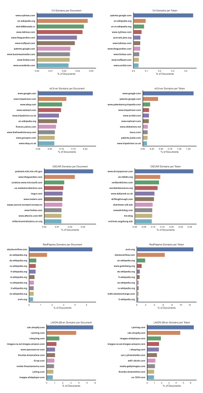

Figure 6: Internet domain distributions of the ten most common domains for each corpus.

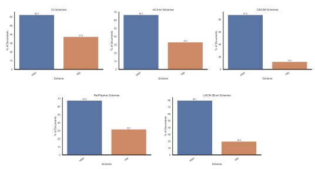

Figure 7: Schema distributions of the ten most common domains for each corpus. We show the results for the five corpora that contain URL information.

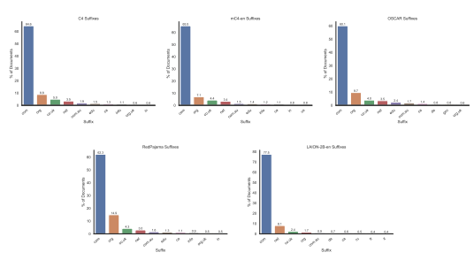

Figure 8: Suffix distributions of the ten most common domains for each corpus. We show the results for the five corpora that contain URL information.

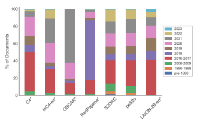 

Figure 9: Fraction of documents in each corpus produced per year. Corpora marked with * are estimates based on the Internet Archive index dates for a 10,000 document sample.

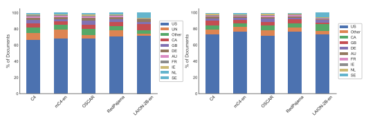

(a) Percentage of URLs by country
(b) Percentage of URLs (excluding unresolved URLS)
Figure 10: Percentage of documents for each dataset originating in a given country. Only the nine most common countries across corpora are shown with the remainder combined in 'other.' We label URLs we were unable to geolocate as UN (Unknown), and provide results with and without these documents included.

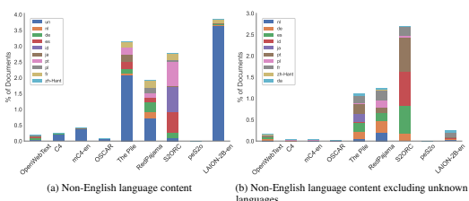

languages Figure 11: Percentage of non-English language documents detected in each corpus.

25

Table 8: Most common unigrams, bigrams and trigrams and their estimated counts.

OpenWebText C4 mC4-en OSCAR The Pile RedPajama S2ORC peS2o LAION-2B-en The Stack n-gram Count n-gram Count n-gram Count n-gram Count n-gram Count n-gram Count n-gram Count n-gram Count n-gram Count n-gram Count
, 342M the 4.29B to 4.29B to 4.29B to 4.29B with 4.29B the 2.77B the 2.13B - 1.13B } 4.29B
Unigrams the 331M . 4.29B the 4.29B the 4.29B the 4.29B to 4.29B , 2.64B , 1.9B , 870M { 4.29B
. 323M , 4.29B of 4.29B of 4.29B of 4.29B the 4.29B . 2.3B . 1.69B . 578M the 4.29B
to 177M and 3.87B and 4.29B in 4.29B and 4.29B that 4.29B of 1.74B of 1.35B " 455M n 4.29B of 169M to 3.67B a 4.29B and 4.29B . 4.29B on 4.29B and 1.36B and 1.05B the 352M class 4.29B a 142M a 2.79B - 4.29B . 4.29B , 4.29B is 4.29B ( 1.11B in 766M and 320M ] 4.29B
and 157M of 3.29B . 4.29B a 4.29B - 4.29B of 4.29B ) 1.11B ) 769M of 341M a 4.29B

Bigrams of the 39.6M of the 740M of the 4.29B of the 1.85B - - 4.29B of the 4.29B of the 433M of the 333M " " 257M } , 4.29B

in the 29.2M . The 608M in the 4.29B , and 1.5B of the 1.3B , and 3.65B . The 302M . The 233M . . 96.5M { " 4.29B , and 29M , and 565M . The 4.29B . . 1.37B = = 1.02B in the 3.46B ) . 281M in the 208M of the 58.2M class = 4.29B . The 27.1M in the 523M . . 4.29B in the 1.28B . " 881M . The 3.38B in the 267M ) . 206M in the 39.5M ] , 4.29B , the 19.5M to the 321M , and 4.29B . The 1.17B , and 873M . . 2.54B , and 239M , and 181M T - 27.8M > < 4.29B to the 16.8M , the 296M , " 4.29B to the 825M * * 859M , the 2.15B , the 209M , the 162M at the 25.2M = = 4.29B . " 16.5M on the 257M " : 4.29B 774M in the 805M to the 2.06B ) , 164M to the 116M for sale 22.4M = " 4.29B

Trigrams
- - - 4.67M . . . 77.7M . . . 4.29B 774M - - - 4.26B . . . 1.62B et al . 98.6M et al . 76.3M " " " 123M class = " 4.29B
. . . 4.6M . If you 63.5M " , " 2.93B . . . 735M = = = 926M - - - 686M al . , 50.7M al . , 38.6M . . . 49.2M > < / 4.29B
, and the 2.46M . It is 52.8M " : " 2.71B \ \ \ 397M . " " 473M : / / 472M ) . The 44.5M ) . The 34M T - Shirt 19.4M : { " 4.29B one of the 2.42M as well as 50.8M : / / 1.84B - - - 248M * * * 303M * * * 326M . However , 35.6M . However , 28.3M < br / 11.5M - - - 4.29B
in 115M in 2.17B , 4.29B - 4.29B ) 4.29B in 4.29B - 1.02B ( 764M in 306M \ 4.29B

 - 91.3M is 1.6B " 4.29B , 4.29B " 4.29B for 4.29B in 985M - 749M / 249M [ 4.29B that 74.9M - 1.49B : 4.25B is 4.26B ( 4.28B as 4.29B to 904M to 705M : 247M > 4.29B
, but 13.2M . I 250M to the 4.09B , the 704M . The 793M on the 1.48B to the 151M ) , 111M , and 22.4M < / 4.29B
on the 12.8M for the 208M , the 3.82B . I 674M " " 774M and the 1.32B ] . 134M ] . 104M on the 20.8M ; } 4.29B
. " 10.9M . This 200M " , 3.6B on the 641M { \ 576M for the 1.27B . In 126M . In 97.1M - Shirt 19.6M : { 4.29B
a lot of 1.74M one of the 48.8M - - - 1.33B : / / 218M . . . 288M > < / 322M q q q 32M , and the 22.5M br / > 11.5M * * * 4.29B

 . This is 1.52M . This is 43.5M http : / 939M . If you 176M # # # 136M , and the 311M , and the 29.6M . In the 18.2M for sale in 10.5M " > < 4.29B . It is 1.51M , and the 41.7M https : / 832M ( 1 ) 152M ? " " 133M one of the 287M . In the 23.7M ) , and 16.8M : / / 9.58M " : { 4.29B
, according to 1.47M . You can 38.7M as well as 675M https : / 130M type = " 126M ( 1 ) 252M ) , and 23.6M ( Fig . 16M Royalty Free Stock 9.3M " : " 4.29B . " The 1.46M . However , 32.3M . If you 663M . It is 128M ] ( # 117M \ \ \ 244M ( Fig . 21.9M ] . The 15.5M http : / 6.09M " , " 4.29B
as well as 1.46M a lot of 29.3M one of the 619M as well as 115M - type = 116M https : / 243M . . . 20.8M ) . In 14.2M KEEP CALM AND 5.42M = = = 3.98B

### B.2 Data Quality

While we reported all the different analyses under data quality in the main paper, here we elaborate and provide the full results on all corpora and the different variations (e.g., most common unigrams, bigrams, and length distribution on token level). The analyses we propose for data quality are the following:
1. Most and least common n-grams (§4.3.1, §B.2.1) 2. Duplicate (§4.3.2, §B.2.2) 3. Document length distribution (§4.3.3, §B.2.3)

### B.2.1 Most & Least Common N-Grams

Most common n**-grams** In addition to the most common 10-grams reported in Section 4.3.1, we report the results for the most common unigrams, bigrams, and trigrams. Stop words and punctuation are the most common unigrams across the different datasets, with some differences in their ranking. Moving to bigrams, we observe more differences between the corpora. For instance, in *LAION-2B-en*, we observe some marketing mentions, such as "for sale" and "- Shirt". "of the" and "in the" are repeating bigrams in all corpora. In the trigram results, we notice a larger diversion between the corpora. C4 contains common English expressions, such as "one of the", "a lot of", and "as well as". However, *LAION-2B-en* contains much more marketing material, such as "T
- Shirt", "for sale in". *OSCAR* and *The Pile* have many n-grams that look like uncleaned html (": / /", 'https : /", "type = "") or markdown ("–-", "===", "\#\#\#").

Least common n**-grams** Similarly to the most common n-grams, we look at the other side of n-grams distribution on the least common in a corpus. We showcase a random set of 25 unique unigrams from the different corpora in Figures 12 and 13. We observe two noticeable trends from such unigrams: (1) non-standard Unicode fonts like "negative squared latin" (for instance COTD in *mC4-en*), and (2) non-English strings. Non-English strings are quite diverse. The sample from OpenWebText contains unigrams from 12 languages other than English: Urdu, Arabic, Korean, Sanskrit, Hebrew, Armenian, Bengali, Persian, Japanese, Latvian, Sindhi, and Russian. In addition to the unique unigrams inspection, we estimate the number of unique unigrams in each corpus and present the results in Table 9. The unique unigrams results reveal that a non-trivial amount of unique unigrams appear in these corpora. Even the smallest corpus, *OpenWebText*, contains more than 88 million unique unigrams, about 1.1% of the total unigrams in this corpus. The ratio of unique unigrams is about an order of magnitude smaller in the other corpora, except for *LAION-2B-en*, with over 554 million unique unigrams, which constitute 1.8% of the total unigrams.

| Corpus        | Count         | Percentage   |
|---------------|---------------|--------------|
| OpenWebText   | 88,551,499    | 1.1          |
| C4            | 759,392,762   | 0.5          |
| mC4\-en       | 4,290,392,741 | 0.2          |
| OSCAR         | 1,280,686,454 | 0.3          |
| The Pile      | 1,809,241,096 | 0.6          |
| RedPajama     | 2,530,085,090 | 0.2          |
| S2ORC         | 287,196,445   | 0.5          |
| peS2o         | 201,729,350   | 0.5          |
| LAION\-2B\-en | 554,850,812   | 1.9          |
| The Stack     | 4,294,966,820 | 0.3          |

Table 9: Estimated unique unigrams, and their percentage of the total unigrams.

| H Y O ﻣﺴﯿﺤﯿﻮﮞ       |                    | 가수들의          | 두분                         | ﺑﺤﻤﺪ             |
|---------------------|--------------------|-------------------|------------------------------|------------------|
| ﻋﻴﺎﺩﺗﻪ              | Ճակատագիր          | 준이에게          | Ĝāzān                        | ﺶ                |
| 라볶이 পদাবলী       |                    | 2 1 2 0           | 미방송영상                   | ﻟﻨﻀﻴﻒ            |
| त्रिपुरवधार्थमहं         | 딱이여라           | وَسَلَامٌ             | רֹוּחַ                          | િ                 |
| שהדברים             | دیوانه‌سی           | ゼファル          | 시절에도                     | создаваемый      |
|                     |                    | (a) OpenWebText   |                              |                  |
| 폴래시온은          | favoured           | 2 B7              | Ассеl e r a t e d 팔달산에서 |                  |
| 폴일                | 케뮤니케이션       | nights            | 확실한방향성을               | BUSINESS         |
| BopRk               | 행위통합           | added             | I C S                        | 프로모션버전인   |
| 합니다.Particularly | B G M  :  john     | 학생분들께서는    | 토문                         | 0080000          |
| 토폴로지들에        | 평화구조의         | arrived عليه وسلم | _ _ _ to                     | 취발이           |
|                     |                    | (b) C4            |                              |                  |
| normancomics 葬衣   |                    | 08000000          | BBGGGO                       | Tomie            |
| forbearance pepper  |                    | 哈回              | 3980                         | િ                 |
| GOUD ૬Ai            |                    | 朗                | 000000                       | mão              |
| ઈt's                | GHUGANA            | y'all's           | HIPSTERS                     | િ                 |
| Hostens coke        |                    | BURDS             | SHANAQAG                     | Veggie           |
|                     |                    | (c) mC4\-en       |                              |                  |
| 폭풍구름을 2pm      |                    | Sunohara          | Candy                        | 쾌락'이라는      |
| 티벳음악 짚곤       |                    | corniculatus      | ﺍﻟﻬﺼﺤﺤﺔ                      | μΟΗ              |
| Leo                 | 홈디제잉           | 1975              | doll's                       | 평택출장안마카톡 |
| 했는OMG             | Franklin           | 한CLSTL4석        | 최저로                       | 黄黄             |
| 추산'에             | 통계조사           | e xport           | ransi                        | 준희는B2B        |
|                     |                    | (d) OSCAR         |                              |                  |
| 이윤성 િ            |                    | ﺒﻢBima            | NonoUe                       | 업데이트하는게   |
| 워크보드시엔        | 사용자들을가져올지 | િ                  | 털구멍                       | િ                 |
| Traurig             | 진흥방안           | િ                  | ス* リ                       | 이19             |
| 조사발으러          | S P V 2 3 5        | 재생'된           | 슬릿폭에                     | િ                 |
| 시끌쩍하게          | 올라왔기           | 해봐야게군        | i20                          | 벽전             |
|                     |                    | (e) The Pile      |                              |                  |

Figure 12: Unique unigrams in OpenWebText, C4, mC4-en, OSCAR, and The Pile.

| 프 루 벡                        | ha                           | 10 . 7 5 2        | 6 2 6 b           | 팔하원칙                                       |
|---------------------------------|------------------------------|-------------------|-------------------|------------------------------------------------|
| 폴리부틸렌테레프탈레이트코마와  |                              | Allas             | 확보하게된다.단지 | los                                            |
| 7 4 m m                         | 햇살청소년사목센터           | Wherever          | Ciphergen         | 프라우다지                                     |
| 함양출장색시미녀언니            | 7 , 4 5                      | 하학이상달        | 토크쇼로          | MELL MOTIV                                     |
| 통과시킬때                      | 평화주의로                   | flageflazione     | S Z 1 B           | 측정해야만                                     |
|                                 |                              | (a) RedPajama     |                   |                                                |
| 4.22                            | ﻓﻘﺘﻠﺘﻪ                       | 왁스림의          | 자아정체감에      | ἀνατομή                                        |
| ήστινοσούν                      | ﻳﻨﺎ ﻟﻪ                       | 학습이론과        | 미백작용          | ﺳﺎﺧﺘﻦ                                          |
| 장기운전계획을                  | 굽들히                       | ﻋﻠﻤﺎﻧﻴﺔ           | 점토의            | Ýj                                             |
| 겨루기                          | 작성되어                     | ネオレジズム      | ကြ                | microelectrc                                   |
| ? ? ? ?                         | ἐπαίρει                      | 소유에서          | 찔레꽃            | ﻣﻨﻴﻨﻬﻢ                                         |
|                                 |                              | (b) S2ORC         |                   |                                                |
| подобрява                       | filoviridae                  | बलि               | èrglis            | значительным                                   |
| негативни                       | OHcomponent                  | сіріпа            | ﺓﺭﺟﻢ              | 튜터                                           |
| hazf                            | խանգարեցիրInč                | 혈류량이          | ŻTX               | паразитных                                     |
| футуризм                        | Hussein                      | слабовидящий      | бауындай          | ﻣﺪﺭﺳﯿﻦ                                         |
| бистатическая                   | мантия                       | ﻣﺼﺎﺭﺣﺔ            | Έπιδέδεικται      | Буга                                           |
|                                 |                              | (c) peS2o         |                   |                                                |
| ドッチェシリーズフェイ Hammock  |                              | 문래창작촌        | 수납박스          | ジャンフィリップ                               |
| チャイグラス                    | ウィンドオーケストラ         | 푸드스윗          | リトルフジコ      | Kennedy                                        |
| 슈퍼주니어_Dancing              | ページインタビュー           | BUNDLES           | 알오피            | トップスチュニック                             |
| フレンズセット                  | 술이야                       | パックローン      | クレープデー      | A gaaz                                         |
| クーリングマイグレイン ソカバン |                              | 광고판            | 일반참가자        | fáÑ                                            |
|                                 |                              | (d) LAION\-2B\-en |                   |                                                |
| ληκλιψ                          | E                            | Bernoulli         | util              | ハ゜ロヌレポ゜ホ゜ルツヒ゜ママロンツヌへ゜ヘ゜ |
| భి                               | r h e t o r i c              | Paloma            | ਕੀਤੇ               | SACHON                                         |
| DOZEN                           | ปดิ                           | ** ?              | blanc             | ΓλλelΚΙΝՋΝ                                     |
| ਹੀ                              | yy1970                       | 8911              | クソサ* コ        | ୍ତି (                                            |
| ク* リン                        | リユウク* ウへ* ラキ* ンホ゜ | 二庙不戴上        | poppies           | c z n                                          |
|                                 |                              | (e) The Stack     |                   |                                                |

Figure 13: Unique unigrams in RedPajama, S2ORC, peS2o, LAION-2B-en, and The Stack.

| (a) OpenWebText   |
|-------------------|
| (b) C4            |
| (c) mC4\-en       |

Table 10: Top 5 most occurring text duplicates from datasets with duplicates (OpenWebText and C4 don't have any duplicate documents). Truncation for visualization is marked by [...].

Table 11: Top 5 most occurring URL duplicates from datasets with URLs for each document and

| LAION\-2B\-en                                                                |        | OSCAR                                      |       |
|------------------------------------------------------------------------------|--------|--------------------------------------------|-------|
| Text                                                                         | Count  | Text                                       | Count |
| UNLIKELY                                                                     | 33.142 | https://international.thenewslens.com/tag/ | 2,184 |
| http://semantic.gs/driver_download_images/driver_download_certifications.png | 27.162 | https://arc.link/twitch/streaming/         | 235   |
| http://www.slickcar.com/products/hawkpadsa.jpg                               | 10.700 | https://zakiganj24news.blogspot.com/       | 100   |
| https://www.zeitauktion.info/assets/img/zeitauktion_placeholder.jpg          | 10.144 | https://ywttvnews.com                      | 100   |
| https://static.uk.groupon\-content.net/app/00/00/default0000.jpg             | ે છે ૭૩૨ | https://yellgh.com/our\-services/          | 100   |

non-zero URL duplication.

### B.2.2 Duplicates

URL Duplicates We also examine duplication between document URLs for the datasets that have that metadata, which we show the top-5 URL duplicates from datasets with URL duplicates in Table 11. LAION's most frequent URL (with 33,142 occurrences) is an invalid URL - "UNLIKELY", likely resulting from a parsing error. The second most frequent URL (with 27,162 occurrences) from LAION-2B-en leads to an all-white image from a computer driver website, and in Figure 15, we see that among the top 25 duplicated URLs in LAION-2B-en, there are instances of image duplicates hosted at different URLs. Meanwhile, *OSCAR* has a notable artifact wherein, after the top two duplicate URLs, the next 234 URLs are duplicated exactly 100 times. Table 13 in the Appendix shows counts and ratios for these URL duplicates as previously specified for text hashes. These find that URL duplicate ratios are roughly an order of magnitude smaller than their text hash counterparts, and that the count of documents duplicated by URL is not dominated by only a few clusters.

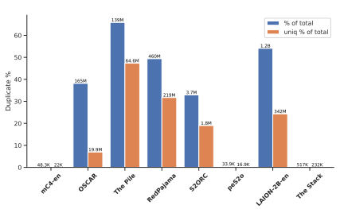

Figure 14: Percentages of text duplicates to totals for datasets with any. The percentages of documents and percentages of unique document clusters are each shown as bars. Duplicate counts are presented above the bars.

Table 12: Statistics about text duplicates per dataset. Counts of duplicate documents and ratio of duplicate to total documents as well as equivalent counts for unique text clusters.

| (c) peS2o   |
|-------------|

### B.2.3 Document Length Distribution

We elaborate on the results from the main paper and report the length distribution for all corpora, both for the character and token distribution. Figure 16 showcases these distributions, and Table 14 depicts the median token and character length distributions. LAION-2B-en, containing image alt text, has the smallest average document lengths. Beyond the exact duplicates described above, which commonly describe products (especially home appliances),
Table 13: Statistics about URL duplicates for datasets with URLs for all documents. Counts of duplicate documents and ratio of duplicate to total documents as well as equivalent counts for unique

| (e) The Stack  Figure 13: Unique unigrams in RedPajama, S2ORC, peS2o, LAION\-2B\-en, and The Stack.   |
|-------------------------------------------------------------------------------------------------------|

URL clusters.

Figure 15: Images from the top 25 most duplicated URLs in *LAION-2B-en*.

LAION-2B-en also contains a significant number of template-generated alt texts paired with maps describing the location of rental boats. The only outlier in *OpenWebText* in terms of document length is at exactly 100,000 characters; all documents over this length were chunked into multiple documents of length 100,000 by the dataset builders. RedPajama also contains template-generated user-facing copy, including, e.g., placeholder pages for alumni of various secondary schools (each associated with a unique individual's name). This analysis also reveals a collection of documents comprising nearly 0.01% of the dataset, containing what appear to be usernames or titles associated with pornographic content. Finally, *The Stack* contains many template-generated new-duplicate documents; for example, a large number of auto-generated metadata files for Unity assets, each of length 20 tokens. It also contains a significant number of documents of length 20,000 characters that contain float and bit matrices.

| Corpus        | Median Token per Document   | Median Character per Document   |
|---------------|-----------------------------|---------------------------------|
| Open Web Text | 634                         | 3,185                           |
| C4            | 227                         | 1,153                           |
| mC4\-en       | 397                         | 1.988                           |
| OSCAR         | 423                         | 2,163                           |
| The Pile      | 361                         | 1,835                           |
| RedPajama     | 514                         | 2,604                           |
| S2orc         | 4.538                       | 23.418                          |
| peS2o         | 4.582                       | 23,852                          |
| LAION\-2B\-en | 10                          | ਟੈਕੇ                              |
| The Stack     | 430                         | 1.953                           |

Table 14: Median document lengths for tokens and characters.

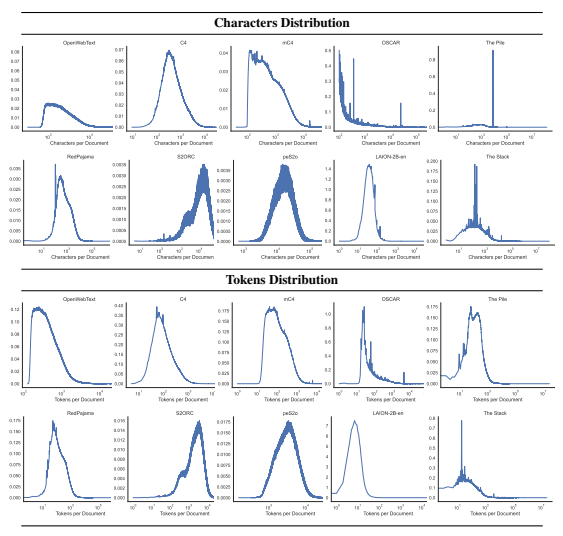

Figure 16: Distribution of document lengths for each of the datasets.

### B.3 Community- And Society-Relevant Measurements

In this section, we provide additional results on the contamination and PII analyses from the main paper, as well as conduct two more analyses: toxic language and demographic sentiment co-occurrences. Overall the community- and society-relevant measurements contain the following analyses:
1. Benchmark contamination (§B.3.1) 2. Personally identifiable information (§B.3.2)
3. Toxic language (§B.3.3)
4. Demographic sentiment co-occurrences (§B.3.4)

### B.3.1 Contamination

We measure contamination by testing whether all of the input fields are present in a single document, and report the percentage of examples from the test set that are contaminated and present the results in Table 15. We do not test for the presence of the labels as those are not always available, and they can come in different forms (e.g., in RTE they may appear either as 'entailment', 'not-entailment', or as '0', '1'). Moreover, we do not test for consecutive appearance of these inputs, as they might appear in different orders and with different separators. As such, our contamination evaluation serves as an upper bound of exact-match dataset contamination. By employing exact match comparison with the pretraining data, we ignore minor changes in words or phrases that models trained on such similar texts may exploit. An example of such influence is introduced by Emami et al. (2020), who showed how high overlap between sentences in the Winograd Schema Challenge (Levesque et al., 2012) and pretraining corpora inflates the results on the test set, while Elazar et al. (2021b) argue that knowledge and reasoning capabilities from large pretraining corpora leak and inflate evaluation benchmarks.

Table 15: Contamination percentages of the 82 datasets filtered from PromptSource (Bach et al., 2022), in C4, OSCAR, The Pile, and RedPajama.

| 1.2B   | 460M   |     |       |      |       |       |           |         |          |           |       |               |
|--------|--------|-----|-------|------|-------|-------|-----------|---------|----------|-----------|-------|---------------|
| 64.6M  |        |     |       |      |       |       |           |         |          |           |       |               |
| 165M   | 3.7M   |     |       |      |       |       |           |         |          |           |       |               |
| 219M   |        |     |       |      |       |       |           |         |          |           |       |               |
| 342M   | 1.8M   |     |       |      |       |       |           |         |          |           |       |               |
| 19.9M  |        |     |       |      |       |       |           |         |          |           |       |               |
| 33.9K  | 48.3K  | 22K | 16.9K | 517K | OSCAR | S2ORC | The Stack | mC4\-en | The Pile | RedPajama | peS2o | LAION\-2B\-en |

### B.3.2 Pii

We use three regular expressions inspired by Subramani et al. (2023) to identify email addresses, phone numbers, and IP addresses across pretraining corpora. In addition, we improved the phone numbers regex for better precision. These regexes provide us with a high precision performance (which we manually evaluate) and allows a fast PII identification. We apply postprocessing rules to the resulting matches, to improve the precision of detecting personal information by seeking to eliminate common classes of false positives (such as ISBN numbers that may be flagged as phone numbers). These rules are enumerated in Table 16. Applying these regular expressions to the ten corpora we study in the paper, Table 19 contains the number of matches of each PII type in each corpus. For faster processing, we filter documents containing a large amount of special characters (such as documents with >50 consecutive ":)" emoticons). We further normalize this statistic, by the number of tokens in each pretraining dataset, in order to estimate the relative proportion of PII in each corpus. These results are in Table 18. We observe that even when controlling for the number of tokens in the different corpora, *mC4-en* has a large amount of personal information compared to the other pretraining corpora. We manually evaluate the precision of the heuristics. In order to compute this statistic, we sample 100 examples of strings detected as PII (when available), for the three PII types, over the ten pretraining corpora in this study.These results are in Table 17. The nature of this retrieval task makes it challenging to estimate the recall of our method, and more work is needed on the topic. We show the types of examples that may be incorrectly identified as PII by our method in each corpus in Table 20.

| LAION\-2B\-en                                                                                         | also contains a significant number of template\-generated alt texts paired with maps   |
|-------------------------------------------------------------------------------------------------------|----------------------------------------------------------------------------------------|
| describing the location of rental boats. The only outlier in OpenWebText  in terms of document length |                                                                                        |
| is at exactly 100,000 characters; all documents over this length were chunked into multiple documents |                                                                                        |
| of length 100,000 by the dataset builders.                                                            |                                                                                        |
| RedPajama also contains template\-generated user\-facing copy, including, e.g., placeholder pages     |                                                                                        |
| for alumni of various secondary schools (each associated with a unique individual's name). This       |                                                                                        |
| analysis also reveals a collection of documents comprising nearly 0.01% of the dataset, containing    |                                                                                        |

Table 16: Regular expressions and postprocessing rules used to identify three PII types (email/ phone numbers/IP addresses).

Assumptions and Limitations: We make a number of assumptions in doing this analysis, and we describe them below:
- We choose three types of PII: phone numbers, email addresses and IP addresses. These three types of PII have relatively standardized formats (for example, IP addresses are always 32-bit numbers expressed in dotted decimal format), which allows us to construct regular expressions to search for these information types in text. However, the retrieved information types may not correspond to any one individual— for example, government organizations have email addresses and phone numbers.

- Conversely, many types of personally identifiable information are not easily specifiable in the structured format we use for the information types in this study, and as a result we do not identify them in pretraining corpora.

- While many types of information individually may not appear to identify a specific individual, they can be combined with information elsewhere on the internet to form PII. In this work, we only identify a small proportion of potential personal information that is present in pretraining datasets, but further work is needed to analyze the extent to which pretraining corpora include personal information as well as how this information can be sanitized.

and personalized.

- Finally, we do not claim to estimate the risk level or sensitivity of the information types we extract from the pretraining corpus, acknowledging that this is highly context-dependent
Table 17: Extrapolated frequency of matches for regex searches of different kinds of PII (email/ phone numbers/IP addresses) in pretraining corpora. This is computed by multiplying the precision of our PII identification module for each pretraining corpus with the number of detections, in order to estimate the number of true matches. *(Parantheses)* contain the precision of our identification method, as estimated by manual verification, on each corpora. Precision indicates the proportion of samples detected that we can reasonably infer as accurately matching the PII type. We sample 100,000 documents from each corpora, and analyze 100 samples of each detected PII type when available. * indicates that less than 100 samples for a PII type were found in a corpus, and we report the precision amongst the available PII detections. The number of samples for these corpora/PII type combinations are as follows: LAION-2B-en /Email Addresses (17), LAION-2B-en /IP Addresses (16), PeS2o/Phone Numbers (13), PeS2o /IP Addresses (12), RedPajama/IP Addresses (95), S2ORC / Email Addresses (10), S2ORC / Phone Numbers (1), S2ORC / IP Addresses (0)

| glue\-mnli\-matched                                                             | 1.65  1.77               | 2.17        | 2.26         |
|---------------------------------------------------------------------------------|--------------------------|-------------|--------------|
| glue\-mnli\-mismatched glue\-mrpc                                               | 1.73  1.91  0.06  0.00   | 2.11  0.64  | 2.17  1.16   |
| glue\-qnli glue\-qnli                                                           | 0.13  0.04  0.09  0.04   | 1.48  1.48  | 1.21   1.21  |
| glue\-rte glue\-stsb                                                            | 0.20  0.17  3.48  3.12   | 0.13  11.09 | 67.47  9.86  |
| glue\-wnli head\-qa\-en                                                         | 0.00  0.00  5.22  5.29   | 0.00  5.11  | 2.05   5.94  |
| health\-fact hlgd                                                               | 7.53  3.40  0.00  0.00   | 1.94  0.00  | 18.70  0.00  |
| liar math\-dataset\-algebra\-linear\-1d                                         | 29.23  13.95  0.00  0.00 | 10.91  0.00 | 45.05   0.00 |
| math\-dataset\-algebra\-linear\-2d math\-dataset\-algebra\-linear\-2d\-composed | 0.00  0.00  0.00  0.00   | 0.00  0.00  | 0.00  0.00   |
| math\-qa mc\-taco                                                               | 0.34  0.03  0.00  0.00   | 0.00  0.00  | 0.07  0.14   |
| mocha                                                                           | 0.00  0.00               | 0.00        | 0.03         |
| openai\-humaneval                                                               | 0.00  1.22               | 0.00        | 0.00         |

| subjqa\-grocery            | 0.00   | 0.00   | 0.00   | 0.00   |
|----------------------------|--------|--------|--------|--------|
| subjqa\-movies             | 0.00   | 0.00   | 0.00   | 0.00   |
| subjqa\-restaurants        | 0.00   | 0.00   | 0.00   | 0.00   |
| super\-glue\-axb           | 1.99   | 1.45   | 5.07   | 6.16   |
| super\-glue\-axg           | 0.00   | 0.00   | 0.28   | 0.00   |
| super\-glue\-boolq         | 0.00   | 3.05   | 0.00   | 0.03   |
| super\-glue\-boolq         | 0.00   | 3.05   | 0.00   | 0.03   |
| super\-glue\-cb            | 0.00   | 0.00   | 2.00   | 1.60   |
| super\-glue\-copa          | 0.60   | 1.00   | 1.20   | 100.00 |
| super\-glue\-multirc       | 0.00   | 0.00   | 0.00   | 0.00   |
| super\-glue\-record        | 0.00   | 0.00   | 0.00   | 0.00   |
| super\-glue\-rte           | 0.20   | 0.17   | 0.13   | 67.47  |
| super\-glue\-wic           | 64.43  | 49.43  | 18.57  | 60.21  |
| swag\-regular              | 2.48   | 1.65   | 2.21   | 2.79   |
| tab\-fact\-tab             | 0.00   | 0.00   | 0.00   | 0.00   |
| wiki\-qa                   | 0.24   | 0.18   | 0.19   | 0.91   |
| winograd\-wsc\-wsc273      | 29.30  | 30.40  | 32.23  | 58.24  |
| winogrande\-winogrande\-xl | 0.00   | 0.00   | 0.00   | 0.00   |
| xnli\-en                   | 0.12   | 0.24   | 0.36   | 0.44   |

| samsum                   | 0.00   | 0.00   | 0.00   | 0.12   |
|--------------------------|--------|--------|--------|--------|
| scan\-addprim\-jump      | 0.00   | 0.00   | 0.05   | 0.16   |
| scan\-addprim\-turn      | 0.00   | 0.00   | 0.08   | 0.00   |
| scan\-filler\-num0       | 0.00   | 0.00   | 0.00   | 0.09   |
| scan\-length             | 0.00   | 0.00   | 0.03   | 0.00   |
| scan\-simple             | 0.02   | 0.00   | 0.10   | 0.26   |
| scan\-template\-around   | 0.00   | 0.00   | 0.00   | 0.18   |
| scan\-template\-jump     | 0.00   | 0.00   | 0.00   | 0.09   |
| scan\-template\-opposite | 0.00   | 0.00   | 0.04   | 0.16   |
| scan\-template\-right    | 0.00   | 0.00   | 0.11   | 0.16   |
| scicite                  | 1.78   | 1.51   | 0.86   | 1.72   |
| scitail\-snli\-format    | 0.09   | 0.38   | 0.28   | 0.71   |
| scitail\-tsv\-format     | 0.09   | 0.38   | 0.28   | 0.71   |
| sem\-eval\-2014          | 0.35   | 0.18   | 4.89   | 52.81  |
| sick                     | 0.31   | 0.18   | 4.79   | 52.61  |
| snli                     | 0.04   | 0.08   | 1.11   | 1.22   |
| squadshifts\-amazon      | 0.00   | 0.00   | 0.00   | 0.00   |
| squadshifts\-new\-wiki   | 0.01   | 0.01   | 0.01   | 0.03   |
| squadshifts\-nyt         | 0.01   | 0.03   | 0.02   | 0.04   |

Table 18: Extrapolated ratios of PII frequency (the number of PII matches multiplied by the estimated precision), normalized by number of tokens in a corpus (P II ∗ *P recision*
\#*T okens* ).

Table 19: Frequency of matches for regex searches of different kinds of PII in pretraining corpora.

| emoticons). We further normalize this statistic, by the number of tokens in each pretraining dataset,    |                                                                                                        |
|----------------------------------------------------------------------------------------------------------|--------------------------------------------------------------------------------------------------------|
| in order to estimate the relative proportion of PII in each corpus. These results are in Table 18. We    |                                                                                                        |
| observe that even when controlling for the number of tokens in the different corpora, mC4\-en has a      |                                                                                                        |
| large amount of personal information compared to the other pretraining corpora.                          |                                                                                                        |
| We manually evaluate the precision of the heuristics. In order to compute this statistic, we sample      |                                                                                                        |
| 100 examples of strings detected as PII (when available), for the three PII types, over the ten          |                                                                                                        |
| pretraining corpora in this study.These results are in Table 17. The nature of this retrieval task makes |                                                                                                        |
| it challenging to estimate the recall of our method, and more work is needed on the topic. We show       |                                                                                                        |
| the types of examples that may be incorrectly identified as PII by our method in each corpus in Table    |                                                                                                        |
| 20.                                                                                                      |                                                                                                        |
| Table 16: Regular expressions and postprocessing rules used to identify three PII types (email/ phone    |                                                                                                        |
| numbers/IP addresses).                                                                                   |                                                                                                        |
| PII Type                                                                                                 | Regular Expression  Postprocessing Filter                                                              |
| Email Addresses                                                                                          | (1) The username cannot be only "("   [.\s@,?!;:)(]*([^\s@]+@[^\s@,?!;:)(]+?)[.\s@,?!;:)(]?[\s\n\r]    |
| (2) There must be a "." in the domain                                                                    |                                                                                                        |
| (1) 'ISBN', 'DOI', or "#" cannot appear in a                                                             |                                                                                                        |
| Phone Numbers                                                                                            | \s+(?(\d{3}))?[\-\. ]*(\d{3})[\-. ]?(\d{4}) context window of 50 characters from the match             |
| (2) Cannot contain URL                                                                                   |                                                                                                        |
| IP Addresses                                                                                             | (1) 'ISBN', 'DOI', or "#" cannot appear in a  (?:(?:25[0\-5]\|2[0\-4][0\-9]\|[01]?[0\-9][0\-9]?)\.){3} |
| context window of 50 characters from the match                                                           | (?:25[0\-5]\|2[0\-4][0\-9]\|[01]?[0\-9][0\-9]?)                                                        |
| Assumptions and Limitations:                                                                             | We make a number of assumptions in doing this analysis, and we                                         |
| describe them below:                                                                                     |                                                                                                        |
| -                                                                                                        | We choose three types of PII: phone numbers, email addresses and IP addresses. These                   |
| three types of PII have relatively standardized formats (for example, IP addresses are always            |                                                                                                        |
| 32\-bit numbers expressed in dotted decimal format), which allows us to construct regular                |                                                                                                        |
| expressions to search for these information types in text. However, the retrieved information            |                                                                                                        |
| types may not correspond to any one individual— for example, government organizations                    |                                                                                                        |
| have email addresses and phone numbers.                                                                  |                                                                                                        |
| -                                                                                                        | Conversely, many types of personally identifiable information are not easily specifiable in            |
| the structured format we use for the information types in this study, and as a result we do              |                                                                                                        |
| not identify them in pretraining corpora.                                                                |                                                                                                        |
| -                                                                                                        | While many types of information individually may not appear to identify a specific individual,         |
| they can be combined with information elsewhere on the internet to form PII. In this work,               |                                                                                                        |

Table 20: Abbreviated examples of incorrect detections by our method, for each PII type, in each pretraining dataset. The exact span that was matched is in red. Offensive content and personal information have been redacted from the presented examples.

Table 21: Toxic language percentages based on a taxonomy and a classifier over entire documents in the corpora we consider. Toxic language statistics in the corpora we consider. The document toxicity (the first two columns) reports the percentage of documents that contain at least one mention of toxic language detected by each of the approaches. The classifier is applied separately on each sentence.

| 100,000 documents from each corpora, and analyze 100 samples of each detected PII type when            |                  |                  |                 |
|--------------------------------------------------------------------------------------------------------|------------------|------------------|-----------------|
| available. * indicates that less than 100 samples for a PII type were found in a corpus, and we report |                  |                  |                 |
| the precision amongst the available PII detections. The number of samples for these corpora/PII type   |                  |                  |                 |
| combinations are as follows: LAION\-2B\-en /Email Addresses (17), LAION\-2B\-en /IP Addresses          |                  |                  |                 |
| (16), PeS2o/Phone Numbers (13), PeS2o /IP Addresses (12), RedPajama/IP Addresses (95), S2ORC /         |                  |                  |                 |
| Email Addresses (10), S2ORC / Phone Numbers (1), S2ORC / IP Addresses (0)                              |                  |                  |                 |
| Corpus                                                                                                 | Email Addresses  | Phone Numbers    | IP Addresses    |
| OpenWebText                                                                                            | 363,789.36 (99%) | 532,929.81 (87%) | 70,430.04 (54%) |

The fine-grained taxonomy mention (the last three columns) reports the number of toxic mentions overall, and their relative appearance normalized by the number of tokens in each corpus.

### B.3.3 Toxic Language

How common is toxic language used in corpora? We employ two complementary methods for computing toxicity. The first is based on the work of (Zhou et al., 2021), who compiled a lexicon of terms (TOXTRIG) into three categories: possibly offensive minority identity mentions, *possibly* offensive non-identity mentions, and *non-offensive minority identity mentions*. It is then used by matching these "toxic triggers" over texts. The model-based method uses an SVM classifier trained on a dataset consisting of 200K examples based on Wikipedia and Twitter to identify toxic language.13 We apply such a classifier on each sentence separately and consider the document toxic in case any sentence is found to be toxic. We present the results in Table 21. C4 is the least toxic based on the taxonomy: only 0.01% were found to be toxic, which is expected due to the filters used in the curation process of the dataset. On the other hand, the classifier finds more documents to be toxic: 5.75%, which may indicate subtleties that the lexicon used for filtering documents from C4 did not catch. *OpenWebText* is the most toxic corpus based on the classifier, while PeS2o is the most toxic one based on the taxonomy, perhaps surprisingly, as it is not a web-based corpus.

### B.3.4 Demographic Sentiment Co-Occurrences

In this section, we turn to detecting biases in the corpora based on demographic factors. We constructed a set of unigrams and bigrams associated with gender (male and female pronouns), religion (the proper names of several major religions), and race (combinations of racial identifiers and words like man, woman, people, etc.). The sentiment of sentences containing these terms was computed using SpacyTextBlob and averaged over a given corpus. The results for all corpora are shown in Figure 17. *The Stack* is excluded from this analysis since the contexts in which these terms appeared were not typically natural language. Overall, we observe a neutral or weakly positive sentiment for sentences in which most of our demographic terms appear, with the exception of those including "black" being uniformly more negative across all corpora. With minor exceptions we don't observe substantial variation in the sentiment for individual terms among datasets. The weak positivity seen for all sources is in opposition to a related analysis performed in Gao et al. (2020), which measured weak negativity for most terms. It's likely this is due to differences in the way average sentiment is computed (we compute sentiment at the sentence level while Gao et al. (2020) computes sentiment only for the most frequent co-occurring terms).

13https://github.com/dimitrismistriotis/alt-profanity-check

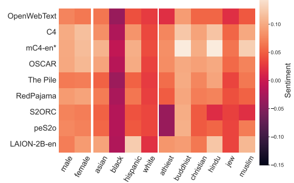

Figure 17: The average sentiment associated with several gender, racial, and religious demographic terms for each dataset. Note: averages for datasets marked with * were computed for 10% samples.

0.15

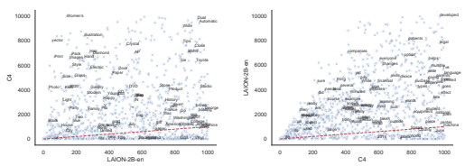

Figure 18: 1,000 most common unigrams in *LAION-2B-en* (rank on x-axis), and their corresponding rank in C4 (y-axis), and visa-versa. The dashed red line corresponds to y = x. Points below and above that line indicates differences between the corpora. For instance, common unigrams in LAION-2B-en are of different adjectives and words often used to describe objects (e.g., Black, Light, Happy, Woman's), but those are much less common in C4.

### B.4 Cross-Data Analysis

Main Findings
- Comparing unigrams of different corpora reveals distributional and topical differences. - *OSCAR* unigram distribution is the most similar to all other corpora on average. - 50% of *RedPajama* unique documents originate from C4 and 50% of *OpenWebText* unique documents originate from *The Pile*.

- While *mC4-en* was supposedly a superset of C4, documents from C4 constitute only 0.04%
of *mC4-en*, while the later being only 10x larger in size.

Using the analyses from the previous sections we can now perform targeted comparisons between different corpora. Such analysis is the first step of better understand the similarities and differences between corpora. We perform the following analyses:
1. Distributional similarities (§B.4.1) 2. Corpus overlap (§B.4.2)

### B.4.1 Distributional Similarity

Unigram Ranking Using the most common n-gram statistics (4.3.1), we can compare the ranking of these n-grams, to gain insights into their different usage between corpora. For the following analysis we consider the top 10,000 most common unigrams of two corpora, and display the 1,000 most common unigrams in one corpus as a function of the same unigram rank in the other corpus. In Figure 18 we display the rank of unigrams in C4 as a function of their ranks in *LAION-2B-en*. Some very common unigrams in *LAION-2B-en* describing objects such as "Two", "Black", "blue", and "Light" are very common in *LAION-2B-en* - top 500 unigrams, but much more rare in C4's top 1,000. Another category is car models such as BNW and Toyota whose ranking is about 900 in LAION-2B-en, but above 6,000 in C4. Figures 19-28 show the paired ranks for all corpora pairs.

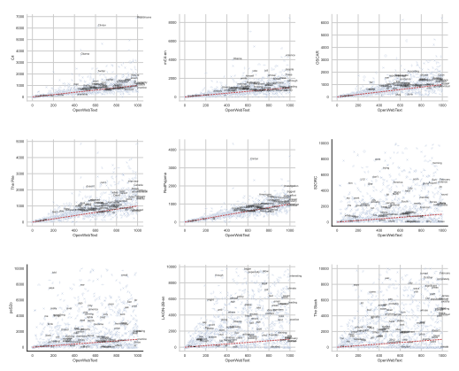

 Figure 19: OpenWebText top 1,00 unigrams, and their corresponding indices in the other corpora.

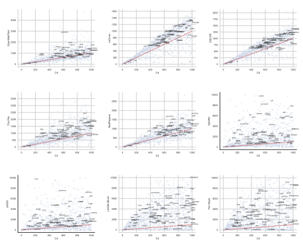

 Figure 20: C4 top 1,00 unigrams, and their corresponding indices in the other corpora.

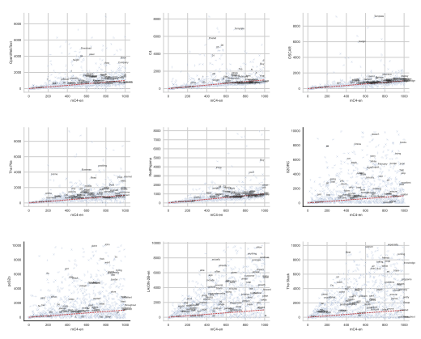

Figure 21: mC4-en top 1,00 unigrams, and their corresponding indices in the other corpora.

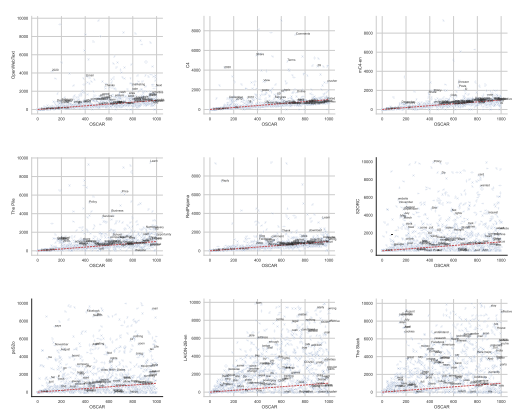 

Figure 22: *OSCAR* top 1,00 unigrams, and their corresponding indices in the other corpora.

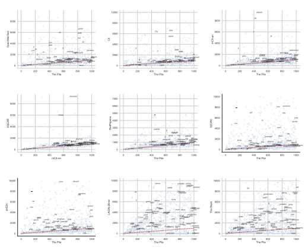

Figure 23: *The Pile* top 1,00 unigrams, and their corresponding indices in the other corpora.

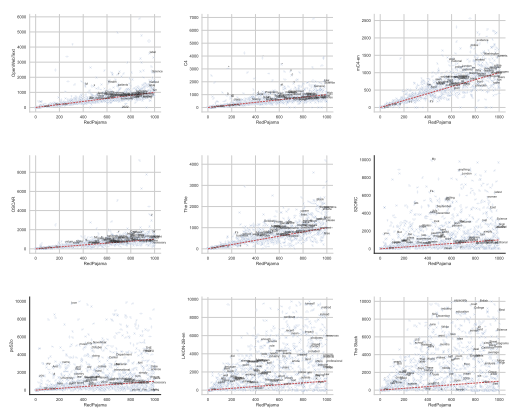 

Figure 24: *RedPajama* top 1,00 unigrams, and their corresponding indices in the other corpora.

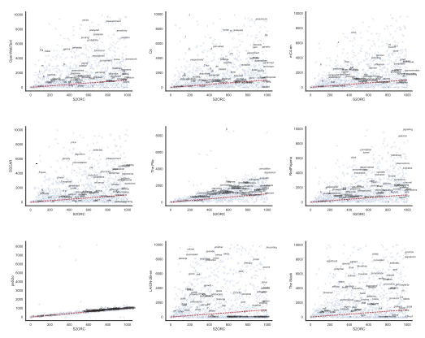 

Figure 25: *S2ORC* top 1,00 unigrams, and their corresponding indices in the other corpora.

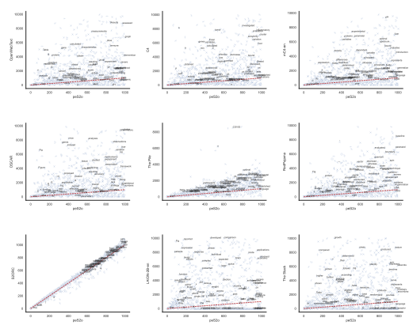

Figure 26: peS2o top 1,00 unigrams, and their corresponding indices in the other corpora.

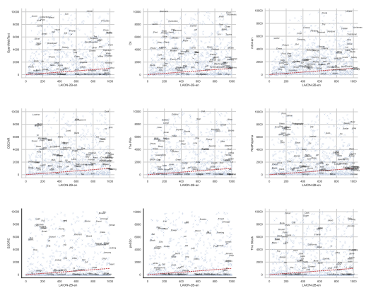

 Figure 27: LAION-2B-en top 1,00 unigrams, and their corresponding indices in the other corpora.

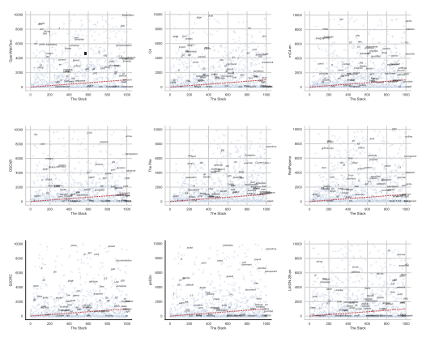 

Figure 28: *The Stack* top 1,00 unigrams, and their corresponding indices in the other corpora.

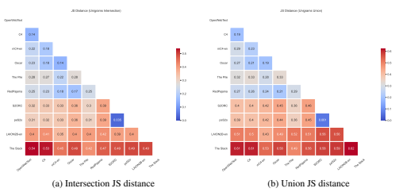 

Figure 29: The Jensen Shannon distance between the top 1,000 most common unigrams in each corpus. The lower the numbers the more similar the corpora are. OpenWebText, C4, mC4-en, OSCAR, The Pile and RedPajama are quite similar to one another (in terms of the common unigrams distribution), and S2ORC, peS2o, LAION-2B-en, and The Stack are quite different from all other corpora.

Table 22: Top 10 exact text overlaps between more than 2 datasets. C4, OSCAR, and RedPajama share the most amount of documents, with over 1.6 million shared documents. Interestingly, even LAION-2B-en, an image-caption corpus overlaps with other corpora, such as C4 and RedPajama (which all share more than 30 thousand documents).

| 1633812509 andorra vs england             |
|-------------------------------------------|
| player ratings: phil foden shi...  the... |
| t undefined behavior. for exam                                           |
| ple, i get that b = 2083899728            |
| and d = \-552766888. the persis                                           |
| tent thing you are                        |
| book card printable png v                 |
| 1525458984 \- watercolor baby             |
| bring a book card printable png           |
| \-                                        |
| board  (approval  number                  |

Unigram Overlap Next, by comparing the 10,000 most common unigrams, we compare the similarity between each corpora pair using the Jensen Shannon distance using (1) the intersection and (2) the union of the two vocabularies. We present the results in Figure 29. On average, we find that OSCAR's unigram distribution is the most similar to all other corpora (0.19 on average). *The Stack*,
as expected, is the most distance corpus from all other corpora.

### B.4.2 Corpus Overlap

In this analysis, we compute the overlap between the different corpora, by comparing (1) the texts, and (2) the URLs, when available. The pairwise results are presented in Figure 30 for the texts overlap, and Figure 31 for the URL overlap. We see that text overlap diminishes quickly to zero as more datasets are considered. Table 22 shows the largest text overlaps between more than two datasets. While the largest two are over 1 million document clusters, this is less than 1% of clusters in any of the involved datasets, and overlap size drops rapidly from there. This trend is similar for URL overlaps. The largest 3-corpora overlap is between C4, *mC4-en*, and *OSCAR*, with 6,767,877 shared URLS, while the rest of the overlaps share at most a single URL.

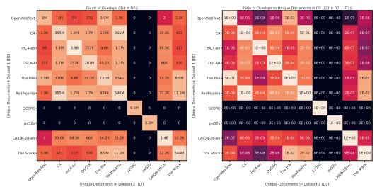

Figure 30: Overlaps of hashed full text between all pairs of datasets as counts and as ratio to dataset size.

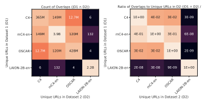

Figure 31: Overlaps of URL string between all pairs of datasets as counts and as ratio to dataset size.

We find that documents from S2ORC and *peS2o* do not appear in other corpora. While it is likely that some of the academic papers are shared with other corpora, e.g., *The Pile* and *RedPajama* that included arXiv as a data source, there are likely formatting differences that cause the exact string matching to be different. Interestingly, even *S2ORC* and *peS2o* do not contain any exact-text overlapping documents, despite *peS2o* being a cleaned version of *S2ORC*, due to a difference in formatting for parsed paper sections. While *RedPajama* is 2.5 times larger than C4 in number of documents and 6.6 larger in number of tokens, we find that 50% of *RedPajama* unique documents originate from C4. This can be explained by larger documents (as evident from the largest average document length in *The Stack* of 2,800 tokens per document on average, compared to 420 tokens per document in C4, or by duplicate contents of C4 documents in *RedPajama*. Similarly, 50% of *OpenWebText* unique documents overlap with The Pile, which includes *OpenWebText* as a source. Another expected overlap is between datasets with Github as a source (*RedPajama* and *The Pile*), and *The Stack* (which purely consist of Github code). Finally, we also notice that while *mC4-en* was created from a superset the Common Crawl data used to make C4, documents from C4 only constitute 0.04% of *mC4-en*, while the later is only 10 times larger in size. We speculate that this is due to formatting differences, between the C4 and *mC4-en* collection.

| overall, and their relative appearance normalized by the number of tokens in each corpus.             |                   |       |                     |                          |                    |
|-------------------------------------------------------------------------------------------------------|-------------------|-------|---------------------|--------------------------|--------------------|
| % Documents with Detected Toxicity  Fine\-grained Taxonomy Statistics                                 |                   |       |                     |                          |                    |
| Taxonomy                                                                                              | Classifier Corpus |       | Offensive\-minority | Offensive\-not\-minority | Harmless\-minority |
| 16.47                                                                                                 | OpenWebText       | 13.8  | 149K (1.92e\-05)    | 3.55M (4.58e\-04)        | 13.5M (1.74e\-03)  |
| 5.75                                                                                                  | C4                | 0.01  | 158K (1.03e\-06)    | 47 (3.06e\-10)           | 146M (9.51e\-04)   |
| 6.09                                                                                                  | mC4\-en           | 0.15  | 31.4M (1.16e\-05)   | 6.55M (2.42e\-06)        | 2.85B (1.05e\-03)  |
| 9.58                                                                                                  | OSCAR             | 8.97  | 8.91M (1.87e\-05)   | 236M (4.95e\-04)         | 549M (1.15e\-03)   |
| 8.27                                                                                                  | The Pile          | 7.67  | 4.55M (1.59e\-05)   | 84.7M (2.96e\-04)        | 238M (8.32e\-04)   |
| 10.3                                                                                                  | RedPajama         | 7.88  | 15.2M (1.49e\-05)   | 283M (2.76e\-04)         | 1.43B (1.40e\-03)  |
| 10.52                                                                                                 | S2ORC             | 16.55 | 95.9K (1.60e\-06)   | 8.02M (1.34e\-04)        | 33M (5.52e\-04)    |
| 9.56                                                                                                  | peS2o             | 17.0  | 47.8K (1.09e\-06)   | 5.96M (1.35e\-04)        | 26.7M (6.07e\-04)  |
| 1.09                                                                                                  | LAION2B\-en       | 0.89  | 2.69M (9.09e\-05)   | 25.4M (8.55e\-04)        | 182M (6.14e\-03)   |
| 1.16                                                                                                  | The Stack         | 1.85  | 4.63M (3.04e\-06)   | 84.8M (5.56e\-05)        | 228M (1.50e\-04)   |
| How common is toxic language used in corpora? We employ two complementary methods for                 |                   |       |                     |                          |                    |
| computing toxicity. The first is based on the work of (Zhou et al., 2021), who compiled a lexicon     |                   |       |                     |                          |                    |
| of terms (TOXTRIG) into three categories: possibly offensive minority identity mentions,              |                   |       |                     |                          | possibly           |
| offensive non\-identity mentions, and non\-offensive minority identity mentions. It is then used by   |                   |       |                     |                          |                    |
| matching these "toxic triggers" over texts. The model\-based method uses an SVM classifier trained on |                   |       |                     |                          |                    |
| a dataset consisting of 200K examples based on Wikipedia and Twitter to identify toxic language.13    |                   |       |                     |                          |                    |
| We apply such a classifier on each sentence separately and consider the document toxic in case any    |                   |       |                     |                          |                    |
| sentence is found to be toxic. We present the results in Table 21. is the least toxic based on        |                   |       |                     | C4                       |                    |
| the taxonomy: only 0.01% were found to be toxic, which is expected due to the filters used in the     |                   |       |                     |                          |                    |
| curation process of the dataset. On the other hand, the classifier finds more documents to be toxic:  |                   |       |                     |                          |                    |
| 5.75%, which may indicate subtleties that the lexicon used for filtering documents from C4 did not    |                   |       |                     |                          |                    |

Table 23: Time benchmark of the different analyses on C4. We ran all of these analyses on a 224-CPUs machine, with 881 Gb memory. * The contamination time was calculated on the test set of COPA, which contains 500 test examples. We also report the estimated cost in dollars based on Google's pricing of the machine we used, that is $9.46 per hour.

## C Benchmarking Run Times

This section describes the benchmark times each analysis took to run on the C4 corpus. While C4 is not the largest corpora we analyze, it is a popular one, and representative in size. All out analyses were run on a Google cloud compute node with 882GB RAM and 224 CPUs. While the machine is rich in RAM, our analyses typically did not use more than 250GB, and the reason for choosing such machine was the availability of a machine with enough CPU cores, that came along with this amount of memory.

We report the benchmark runs in Table 23. All of the analyses we conducted took less than 12 hours to run, with 13 (out of 22) that took only several minutes, and all of the analyses on C4 took an estimated of 46 hours and 51 seconds (excluding repeated runs, and the contamination analyses on other evaluation datasets). Note that while the measured time for each run were calculated using the TIME command in linux, there is some variance, and those should be taken as a rough estimate. We also calculate the estimated costs for each analysis and report it in the same table (Table 23). We use the estimated $9.46 per hour based on https://cloud.google.com/compute/all-pricing for our calculations, making the total cost on C4 $443.1.14

14This estimation does not include the Elasticsearch hosting costs.

## D Technical Details

This section describes the algorithms for computing the most common, least common, and total number of unique n-grams in a large corpus. Each of these algorithms uses the same trick that was inspired by Bloom filters (Bloom, 1970) as described in section 3.1. As a result these algorithms do not provide exact results, and the accuracy is determined by the amount of memory available for the hash table.

### D.1 Most Common N-Grams

To collect the (approximate) top-k n-grams we start by initializing a hash table of zeros (either u32 or u64) which represent occurrence counts for each n-gram, and an empty collection of the top-k n-grams. Then we iterate over the n-grams in the corpus and for each n-gram encountered we take its hash, increment the corresponding count in the hash table, and if that count is at least as large as the current minimum count in the top-k we add that n-gram to the top-k, potentially evicting another n-gram from the top-k. After completing the iteration over the corpus the top-k will be complete and, in the absence of hash collisions, correct. However, the larger the corpus is relative to the hash table, the higher the probability of hash collisions. A large enough corpus will have more unique n-grams than there are entries in the hash table, which guarantees hash collisions in the table, leading to inflated counts for some n-grams and the potential for false positives in the top-k. That's where the accuracy-memory tradeoff comes in. The final counts reported for the top-k n-grams will always be an upper bound of the true counts.

### D.2 Least Common N-Grams

To collect the (approximate) bottom-k n-grams we also start by initializing a hash table of u3215 zeros to represent occurrence counts for each n-gram, and an empty collection of the bottom-k n-grams. But this time we have to iterate over the corpus' n-grams twice. During the first iteration we tally up the counts just like we do in the top-k algorithm, except that we don't add any n-grams to the bottom-k collection. During the second iteration we now already have the final counts of all n-grams, so we simply look up the count of each n-gram encountered and then add it to the bottom-k collection if its count is low enough, potentially evicting another n-gram. Hash collisions might cause false negatives with the bottom-k, i.e. some rare n-grams may be missing from bottom-k if they had hash collisions with more frequent n-grams. The final counts reported will for the bottom-k n-grams always be a lower bound of the true counts.

### D.3 Unique N-Grams

To estimate the number of unique n-grams we initialize a hash table of booleans set to "false". Then we iterate over all n-grams in the corpus and for each n-gram encountered we take its hash and update the corresponding boolean in the table to "true". After iterating over the whole corpus we simply have to tally up the number of "true" entries. This number is the estimate for the number of unique n-grams, which will always be a lower bound of the actual number of unique n-grams.

15It's not necessary to use u64 integers when collecting the bottom-k even if there's a possibility of overflow counts, provided overflows are caught and kept at 2 32, since we only care about the exact count of rare n-grams which are unlikely to ever reach an overflow.