# Powerinfer: Fast Large Language Model Serving With A Consumer-Grade Gpu∗

Yixin Song, Zeyu Mi†
, Haotong Xie and Haibo Chen Institute of Parallel and Distributed Systems (IPADS), Shanghai Jiao Tong University

# Abstract

This paper introduces PowerInfer, a high-speed Large Language Model (LLM) inference engine on a personal computer (PC) equipped with a single consumer-grade GPU. The key underlying the design of PowerInfer is exploiting the high locality inherent in LLM inference, characterized by a powerlaw distribution in neuron activation. This distribution indicates that a small subset of neurons, termed *hot neurons*, are consistently activated across inputs, while the majority, cold neurons, vary based on specific inputs. PowerInfer exploits such an insight to design a GPU-CPU hybrid inference engine: hot-activated neurons are preloaded onto the GPU for fast access, while cold-activated neurons are computed on the CPU, thus significantly reducing GPU memory demands and CPU-GPU data transfers. PowerInfer further integrates adaptive predictors and neuron-aware sparse operators, optimizing the efficiency of neuron activation and computational sparsity. Evaluation shows that PowerInfer attains an average token generation rate of 13.20 tokens/s, with a peak of 29.08 tokens/s, across various LLMs (including OPT-175B) on a single NVIDIA RTX 4090 GPU, only 18% lower than that achieved by a top-tier server-grade A100 GPU. This significantly outperforms *llama.cpp* by up to 11.69× while retaining model accuracy.

# 1 **Introduction**

Generative large language models (LLMs) have garnered attention for their remarkable capabilities in creative writing, advanced code generation, and sophisticated natural language processing tasks [5, 42, 49]. These models, widely deployed in data centers equipped with high-end and expensive servergrade GPUs, have significantly influenced our daily lives and work practices. Meanwhile, there is an emerging trend of running LLMs on more accessible local platforms, particularly personal computers (PCs) with consumer-grade GPUs. This evolution is driven by the need for enhanced data privacy [25], model customization [22], and reduced inference costs [42]. In contrast to data-center deployments, which prioritize high throughput [18, 37, 47], local deployments focus on low latency in processing small batches.

Nonetheless, deploying LLMs on consumer-grade GPUs presents significant challenges due to their substantial memory requirements. LLMs, typically functioning as autoregressive Transformers, sequentially generate text token-by-token, each needing to access the entire model consisting of hundreds of billions of parameters. Therefore, the inference process is fundamentally constrained by the GPU's memory capacity. This limitation is particularly acute in local deployments where the processing of individual requests (often just one at a time) [6] leaves minimal opportunity for parallel processing.

Existing approaches to such memory issues include model compression and offloading. Compression techniques like quantization [12,46], distillation [48], and pruning [23] reduce the model size. However, even deeply compressed models remain too large for consumer-grade GPUs. For instance, an OPT-66B model with 4-bit precision demands approximately 40GB of memory just to load its parameters [20], exceeding the capacity of even high-end GPUs like the NVIDIA RTX 4090. Model offloading, which partitions the model between GPU and CPU at the Transformer layer level [3,14,37]. State-of-the-art systems like llama.cpp [14] distribute layers between CPU and GPU memories, leveraging both for inference, thus reducing the GPU resources required. However, this method is hindered by the slow PCIe interconnect and the CPUs' limited computational capabilities, resulting in high inference latency.

In this paper, we argue that the key reason for memory issues in LLM inference is the **locality mismatch** between hardware architecture and the characteristics of LLM inference. Current hardware architectures are designed with a memory hierarchy optimized for data locality. Ideally, a small, frequently accessed working set should be stored in the GPU, which offers higher memory bandwidth but limited capacity. In contrast, larger, less frequently accessed data are better suited for CPUs, which provide more extensive memory capacity but lower bandwidth. Nevertheless, the vast volume of parameters required for each LLM inference iteration leads to a working set that is too large for a single GPU, thus impeding efficient locality exploitation.

We have observed that LLM inference inherently exhibits high locality. Specifically, during each inference iteration, a 1

∗
First version dated Dec. 19, 2023, available at the IPADS website.

†Zeyu Mi (yzmizeyu@sjtu.edu.cn) is the corresponding author.
limited number of neurons1are activated, significantly influencing the outcome of token inference. These activations, which are input-specific, can be accurately predicted during runtime. For example, in the OPT model, less than 10% of the elements in the activation map are non-zero, and these can be predicted with more than 93% accuracy at runtime [21]. Notably, neuron activation in an LLM follows a **skewed** power-law distribution: a small subset of neurons consistently contributes to the majority of activations (over 80%) across various inputs (hot-activated), while the majority are involved in the remaining activations, which are determined based on the inputs at runtime (cold-activated).

Building on the locality insights, we introduce **PowerInfer**,
an efficient LLM inference system optimized for local deployments using a single consumer-grade GPU. The key idea of PowerInfer is to exploit the locality in LLM inference by assigning the minor hot neurons to the GPU, while cold neurons, which constitute the majority, are managed by the CPU. PowerInfer preselects and preloads hot-activated neurons onto the GPU offline and leverages online predictors during runtime to identify activated neurons. This approach allows the GPU and CPU to independently process their respective sets of neurons, thereby minimizing the need for costly PCIe data transfers.

However, there are significant challenges that complicate the design of PowerInfer. First, the online predictors, which are essential for identifying active neurons in LLM layers and are typically situated on the GPU, occupy a considerable amount of GPU memory. This memory could otherwise be used for the LLM. To address this, PowerInfer introduces an adaptive method for constructing smaller predictors for layers with higher activation sparsity and skewness. This iterative process reduces the size of the predictors while maintaining their accuracy, thus freeing up GPU memory for LLM inferences.

Second, leveraging LLM sparsity requires the use of sparse operators. Conventional libraries like cuSPARSE [30] are not optimal due to their general-purpose design, which includes tracking each non-zero element and converting dense matrices into sparse formats [45, 51]. In contrast, PowerInfer designs neuron-aware sparse operators that directly interact with individual neurons, thereby bypassing operations on entire matrices. This approach enables efficient matrix-vector multiplication at the neuron level and removes the need for specific sparse format conversions.

Lastly, the optimal placement of activated neurons between the GPU and CPU in PowerInfer is a complex task. It involves evaluating each neuron's activation rate, intra-layer communication, and available hardware resources like GPU memory sizes. To effectively manage this, PowerInfer utilizes an offline phase to generate a neuron placement policy. This policy uses a metric that measures each neuron's impact on LLM inference outcomes and is framed as an integer linear programming problem. The policy formulation considers factors such as neuron activation frequencies and the bandwidth hierarchy of CPU and GPU architectures.

The online inference engine of PowerInfer was implemented by extending llama.cpp with an additional 4,200 lines of C++ and CUDA code. Its offline component, comprising a profiler and a solver, builds upon the transformers framework [44] with approximately 400 lines of Python code. PowerInfer is compatible with various popular LLM families, including OPT (7B-175B), LLaMA (7B-70B), and Falcon40B, and supports consumer-grade GPUs like the NVIDIA RTX 4090 and NVIDIA RTX 2080Ti.

Performance evaluation reveals that PowerInfer, when deployed on a PC equipped with a single NVIDIA RTX 4090 GPU, delivers an average generation speed of 13.20 tokens/s for quantized models and 8.32 tokens/s for nonquantized models, maintaining model accuracy. These results significantly surpass llama.cpp's performance, exhibiting up to 8.00× and 11.69× improvements for quantized and non-quantized models, respectively. Significantly, the inference speed achieved on an NVIDIA RTX 4090 GPU (priced at approximately $2,000) is only 18% slower compared to the performance on a top-tier A100 GPU (costing around $20,000) that can fully accommodate the model. PowerInfer's source code is publicly available at https:
//github.com/SJTU-IPADS/PowerInfer.

# 2 **Background And Motivation**

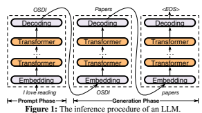

# 2.1 **Llm Inference & Architecture**

LLM inference, an autoregressive model, generates each token based on previous ones. The process, illustrated in Figure 1, starts with a prompt (e.g., "I love reading") and unfolds in two phases: first, the prompt phase outputs an initial token ("OSDI"), then the generation phase sequentially produces tokens until a maximum limit or an end-of-sequence (<EOS>) token is reached. Each token generation, an inference iteration, requires running the full LLM model.

The LLM architecture includes multiple Transformer layers, each comprising a self-attention and an MLP (Multi-
Layer Perceptron) block (see Figure 2, left). The self-attention

1This paper defines a neuron as a specific row/column in a weight matrix.

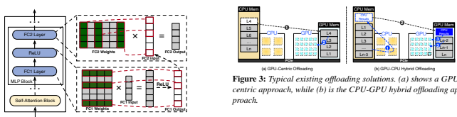

Figure 2: The architecture of a Transformer layer and how neurons are sparsely activated in FC1 and FC2 layers due to the ReLU function. The neurons that are activated are represented as green rows or columns encircled by red lines. The output vector from FC1 is then supplied to FC2 as its input vector.

block generates embedding vectors by capturing the relationships among input tokens. In this process, different heads focus on extracting distinct feature information. The computation results from these different heads are aggregated and then utilized as the input for the MLP block. The MLP block applies non-linear transformations via fully connected layers and activation functions to refine the input sequence representation. The output either advances to subsequent layers or forms the LLM's final output.

In Figure 2 (right), the MLP block's layers, FC1 and FC2, generate vectors through matrix multiplication. Each output element comes from the dot product of an input vector and a neuron (a row/column in a weight matrix). Activation functions like ReLU [1] act as gates to selectively retain or discard values in a vector, influencing neuron activations in FC1 and FC2. For example, ReLU in this figure filters out negative values, allowing only positively valued neurons in FC1 to influence the output. These neurons, which contribute to the output, are considered activated in this paper. Similarly, these values also affect which neurons in FC2 are activated and involved in the computation of its output vector.

Activation Sparsity. Recent studies have revealed that LLM inference shows a notable sparsity in neuron activation [19, 21, 50]. For example, we observe that approximately 80% of neurons in the OPT-30B model remain inactivated during the inference. This phenomenon of activation sparsity exists in both self-attention and MLP blocks. In self-attention blocks, nearly half of the attention heads (neurons) make minimal contributions, leading to their high sparsity. The sparsity observed within the MLP blocks is primarily attributed to the characteristics of the activation functions.

Crucially, the activation sparsity is input-specific, meaning that the activation of specific neurons is directly influenced by the current input and cannot be predetermined before the model's inference iteration begins. While it is not feasible to know which neurons will be activated before the entire model runs, it is possible to predict neuron activations a few layers in advance within the ongoing model iteration. De-

'!

%-

 ##

'! 

	

 	 
 

jaVu [21], for instance, utilizes MLP-based predictors during inference, achieving a remarkable accuracy rate of at least 93% in predicting neuron activation.

# 2.2 **Offloading-Based Llm Serving**

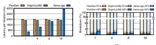

(a)
(b)

Figure 4: Performance comparison and analysis for serving OPT-
30B on NVIDIA RTX 4090 GPU. The *yellow* blocks refer to FlexGen, the *gray* blocks refer to DejaVu (UM) and the *blue* blocks refer to llama.cpp. (a) The Y-axis indicates execution time for one iteration and the X-axis represents batch sizes for input. (b) The Y-axis indicates the proportion of execution time, and the X-axis indicates batch sizes for input.

Current model compression techniques are inadequate for fitting large language models (LLMs) within resource-limited consumer-grade GPUs. In contrast, the offloading technique, which leverages the CPU's additional computational and memory resources, presents a more viable solution for accommodating LLMs on such hardware. Figure 3 illustrates two main offloading approaches:
GPU-centric offloading utilizes CPU memory to store portions of the model parameters that exceed the GPU's capacity. During each iteration, as depicted in Figure 3a), it processes the parameters located in the GPU memory, transferring more from the CPU as needed. This strategy enables the inference of LLMs of varying sizes, provided that sufficient combined CPU memory and hard disk storage are available. FlexGen [37] is a typical example that adopts a zigzag scheduling approach to prioritize throughput over latency, processing batches sequentially for each layer. Nonetheless, this method leads to substantial per-token latency in latencysensitive scenarios (Figure 4a), mainly due to frequent data transfers between GPU and CPU, especially with batch sizes of one. Over 99.5% of processing time is consumed by transferring LLM weights from CPU to GPU, significantly impacting overall latency, as illustrated in Figure 4b.

DejaVu [21] accelerates LLM inference by using activation sparsity. It selectively processes only those neurons that are predicted to be activated (called predicted neurons for brevity), while bypassing the inactivated ones. However, this approach, initially designed for data center inference, struggles on consumer-grade GPUs that cannot accommodate fullscale LLMs. The key challenge with DejaVu in such contexts stems from the need to frequently transfer activated neurons from the CPU to the GPU during runtime. For LLMs like OPT-30B that exceed GPU memory limits, DejaVu2, albeit reducing the computational load on the GPU, is constrained by the data transfer procedure (Figure 4a). Consequently, as shown in Figure 4a, DejaVu experiences significant inference latency, comparable to that of FlexGen.

Hybrid offloading distributes model parameters between GPU and CPU, splitting them at the Transformer layer level as shown in llama.cpp [14] (Figure 3b). The CPU processes its layers first, then sends intermediate results to the GPU for token generation. This offloading method reduces inference latency to around 600ms (Figure 4a) by minimizing data transfer and mitigating slow PCIe bandwidth.

However, hybrid offloading still faces the locality mismatch issue, leading to suboptimal latency. Each inference iteration accesses the entire model, resulting in poor locality for hierarchical GPU-CPU memory structures. GPUs, while computationally powerful, are constrained by memory capacity. For instance, a 30B-parameter model on a 24GB NVIDIA RTX 4090 GPU means only 37% of the model is on the GPU, shifting most computational tasks to the CPU. The CPU, with higher memory but lower computational power, ends up handling 98% of the total computational load (Figure 4b).

# 3 **Insights Into Locality In Llm Inference**

This section introduces our insights into locality in the LLM inference procedure, highlighting two distinctive features.

#### 

3.1 **Insight-1: Power-law Activation**

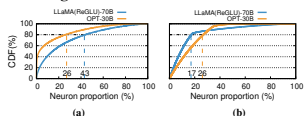

Figure 5: Cumulative distribution function (CDF) of neuron activation in OPT-30B and LLaMA(ReGLU)-70B. (a) CDF in a single MLP layer. (b) CDF across the entire model. The X-axis shows neuron proportion. The Y-axis represents the CDF of neuron activation.

LLM inference exhibits a high degree of locality, indicating that a consistent group of neurons is *frequently* activated. Notwithstanding the input dependence of LLM activation sparsity, a power-law distribution is evident among activated neurons. Figure 5a reveals that in the MLP layers of OPT-30B
and LLaMA (ReGLU)-70B, 26% and 43% of neurons respectively are responsible for 80% of total activations. These are termed *hot-activated* neurons. Conversely, the activation of the remaining 74% and 57% of neurons is input-dependent, classifying them as *cold-activated* neurons.

This high locality is not confined to a single layer but extends throughout the model. As illustrated in Figure 5b, approximately 17% of neurons in OPT-30B and 26% in LLaMA (ReGLU)-70B are responsible for 80% of the total activations across all layers.

# 3.2 **Insight-2: Fast In-Cpu Computation**

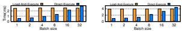

(b) Attention layer Figure 6: Comparison of execution time for load-then-execute versus direct-execute methods when 10% and 60% neuron weights of one MLP and attention layer in OPT-30B are CPU-resident. The X-axis shows input batch sizes, and the Y-axis measures execution time (ms). Load-then-execute involves transferring these neuron weights to GPU memory for computation, whereas direct-execute computes them directly on the CPU.

(a) MLP layer If activated neurons reside in CPU memory, computing them on the CPU is faster than transferring them to the GPU, especially with the small number of activated neurons and the small batch sizes typical in local deployments. Modern CPUs with vector extensions can efficiently handle such smaller matrix computations.

We compared the time to load and compute 10%3of the MLP layer and 60% of attention layer's CPU-side neurons on the GPU versus direct CPU execution in OPT-30B. Results in Figure 6 indicate that for batch sizes under 32, the time taken to transfer the weights of these neurons and compute them on the GPU (NVIDIA RTX 4090) exceeds the time required for calculation directly on the CPU using the AVX2 vector extension.

# 4 **Powerinfer Overview**

This paper introduces PowerInfer, a low-latency LLM inference system deployed in a PC equipped with a single consumer-grade GPU. PowerInfer proposes a neuron-aware offloading strategy and an inference engine by fully leveraging the high locality insights described in §3. It utilizes both GPU and CPU for weight storage, accommodating LLMs of various sizes. This offloading approach, based on *Insight-1*,
effectively exploits the power-law distribution of LLM inference. Specifically, PowerInfer preloads the GPU with weights

2Since DejaVu only works for GPU, we modified it by using NVIDIA
Unified Memory (UM) [29] to fetch parameters from CPU memory.

3While Insight-1 indicates that 43% of neurons account for 80% of the total activations in a single MLP layer, it is typically found that only about 10% of its neurons are activated during an individual inference iteration.

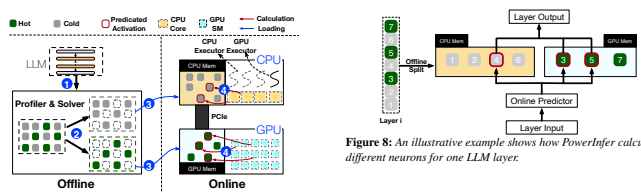

Figure 7: The architecture overview and inference workflow of PowerInfer.

for neurons that activate frequently, while less active neurons' weights are kept on the CPU.

To reduce inference latency, the inference engine computes only neurons predicted as active by online predictors, skipping most inactive ones. Moreover, the preloading strategy enables PowerInfer to allocate the bulk of inference tasks to the GPU, given that hot-activated neurons that have been loaded on the GPU constitute a major fraction of activations. For cold-activated neurons not in GPU memory, PowerInfer executes their computations on the CPU, eliminating the need for weight transfers to the GPU (*Insight-2*).

### 4.1 **Architecture And Workflow**

Figure 7 presents an architectural overview of PowerInfer, comprising both offline and online components. Due to the variation in locality properties among different LLMs, the offline component should profile LLMs' activation sparsity, differentiating between hot and cold neurons. In the online phase, the inference engine loads two types of neurons into both GPU and CPU, serving LLM requests with low latency during runtime.

LLM Profiler and Policy Solver (Offline): This component includes an LLM profiler that collects activation data from inference processes using requests derived from general datasets (e.g., C4 [32]). It monitors neuron activation across all layers (Step ①), followed by a policy solver categorizing neurons as hot or cold. The solver aims to allocate frequently activated neurons to the GPU and others to the CPU. It uses a neuron impact metric and hardware specifications to balance the workload, using integer linear programming to maximize the GPU's impact metric for neurons (Step ②).

Neuron-aware LLM Inference Engine (Online): Before processing user requests, the online engine assigns the two types of neurons to their respective processing units (Step ③),
as per the offline solver's output. During runtime, the engine creates GPU and CPU executors, which are threads running on the CPU side, to manage concurrent CPU-GPU computations (Step ④). The engine also predicts neuron activation and skips non-activated ones. Activated neurons preloaded in

GPU memory are processed there, while the CPU calculates and transfers results for its neurons to the GPU for integration. The engine uses sparse-neuron-aware operators on both CPU and GPU, focusing on individual neuron rows/columns within matrices.

# 4.2 **Single Layer Example**

Figure 8 illustrates how PowerInfer coordinates GPU and CPU in processing a layer's neurons. It classifies neurons based on offline data, assigning hot-activated ones (e.g., indices 3, 5, 7) to GPU memory and others to CPU memory. Upon receiving an input, a predictor identifies which neurons in the current layer are likely to be activated. For instance, it predicts activation for neurons 3, 4, and 5. It is crucial to note that hot-activated neurons, identified through offline statistical analysis, may not consistently match the runtime activation behaviors. For example, neuron 7, though labeled as hot-activated, is forecasted to be inactive in this case.

Both CPU and GPU then process predicted active neurons, ignoring inactive ones. The GPU computes neurons 3 and 5, while the CPU handles neuron 4. Once neuron 4's computation is complete, its output is sent to the GPU for result integration.

# 5 **Neuron-Aware Inference Engine**

This section presents a detailed introduction to the neuronaware inference engine in PowerInfer. We first elaborate on the design of activation predictors leveraged by PowerInfer in §5.1. Then, we elucidate the process of dividing and managing neurons between the CPU and GPU in §5.2. Following this, the design of the hybrid execution model within PowerInfer is described in §5.3. Lastly, we explain the details of neuronaware operators used in PowerInfer in §5.4.

# 5.1 **Adaptive Sparsity Predictors**

The online inference engine in PowerInfer reduces computational loads by only processing those neurons that are predicted to be activated. This method was also used in DejaVu [21], which advocates for training a set of fixed-size MLP predictors. Within each Transformer layer, DejaVu utilizes two separate predictors to forecast the activation of neurons in the self-attention and MLP blocks. Consequently, the

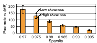

Figure 9: Correlation between predictor parameter size and layer sparsity at a guaranteed 95% accuracy level for OPT-175B. The X-axis represents sparsity, and the Y-axis represents the predictor parameter size. The bar indicates the average parameter size for the model in the corresponding sparsity, while the error bar reflects fluctuations in the predictor parameter size due to skewness within the layer.

inference computation is confined to neurons anticipated to be active.

However, designing effective predictors for local deployments with limited resources is challenging, balancing prediction accuracy and model size. These predictors, frequently invoked for neuron activation prediction, should be stored in GPU memory for fast access. Yet, the considerable memory requirements of numerous fixed-size predictors can encroach upon the space needed for storing LLM parameters. For example, predictors for the OPT-175B model require around 27GB of GPU memory, surpassing an NVIDIA RTX 4090 GPU's capacity. On the other hand, naively reducing predictor size may impair accuracy; a decrease from 480MB to 320MB in predictor size dropped its accuracy from 92% to 84%, further adversely affecting the overall LLM accuracy (e.g., winogrande [35] task accuracy from 72.77% to 67.96%).

We have observed that the size of predictors is influenced by two main factors: the sparsity of LLM layers and their internal skewness. As shown in Figure 9, layers with higher activation sparsity simplify the task of identifying activated neurons, allowing for smaller predictor models. In contrast, layers with lower activation sparsity necessitate larger models with more parameters, as accurately pinpointing activated neurons becomes increasingly challenging. Additionally, in cases of high skewness, where activations are heavily concentrated in a few neurons, even a compact predictor can achieve high accuracy.

To optimize for these factors, PowerInfer designs an iterative training method for **non-fixed-size** predictors for each Transformer layer. The process begins by establishing a baseline model size based on the layer's sparsity profile (Figure 9). Subsequently, the model size is iteratively adjusted, taking into account the internal activation skewness to maintain accuracy. An MLP predictor typically comprises input, hidden, and output layers. Since the dimensions of the input and output layers are determined by the Transformer layer's structure, modifications primarily target the hidden layer. During the iterative adjustments, the hidden layer's dimension is modified according to the observed skewness. For layers exhibiting significant skewness, the hidden layer size is reduced progressively until accuracy falls below 95%. Conversely, for layers with minimal skewness, the dimension is increased to improve accuracy. Through this approach, PowerInfer effectively limits predictor parameters to a mere 10% of the total LLM parameters.

# 5.2 **Neuron Placement And Management**

When the offline solver determines a neuron placement policy, the online inference engine of PowerInfer loads the model into the CPU and GPU memory as per the policy. For each layer, which may consist of multiple weight matrices, Power- Infer assigns each neuron to either the GPU or CPU based on whether the neuron is hot-activated.

Ensuring the accurate computation of these segmented neurons in their proper sequence is vital for precise results. To this end, PowerInfer creates two neuron tables, one located in the CPU and the other in the GPU memory. These tables correlate each neuron to its original position in the matrix. During the process of multiplying with an input tensor, each neuron interacts with its corresponding tensor value, guided by the mappings in the neuron tables. The additional memory required for these neuron tables is relatively insignificant, totaling only about 9MB for an LLM like OPT-175B, which needs 350GB of storage.

# 5.3 **Gpu-Cpu Hybrid Execution**

Given that PowerInfer processes only a limited number of neurons predicted to be active, such as less than 10% in an MLP layer, a potential method for GPU and CPU collaboration involves transferring cold-activated neuron weights from the CPU to the GPU for computation. However, as per Insight2, the time spent transferring activated neurons to the GPU surpasses the time needed for direct computation on the CPU. Therefore, PowerInfer implements a GPU-CPU hybrid execution model, wherein both units independently compute their respective activated neurons and then combine the results on the GPU. This method effectively balances the computational workload, leveraging the strengths of each unit while reducing transfer time inefficiencies.

Before inference, PowerInfer constructs a computationally directed acyclic graph (DAG) with each node representing a computational LLM inference operator and stores it in a global queue in the CPU memory. Each operator in the queue is tagged with its prerequisite operators. During inference, two types of executors, pthreads created by the host OS, manage calculations on both CPU and GPU. They pull operators from the global queue, check dependencies, and assign them to the appropriate processing unit. The GPU and CPU use their neuron-aware operators, with the GPU executor launching GPU operators using APIs like cudaLaunchKernel, and the CPU executor coordinating unoccupied CPU cores for calculations. Before executing an operator, the CPU executor also determines the necessary thread count for parallel computation. To manage operator dependencies, especially when a parent node of a CPU operator is processed on the GPU, a barrier ensures GPU computations are complete before the CPU starts its operator.

In scenarios where activated neurons are split between GPU and CPU, synchronization between these processing units also becomes crucial. After one unit finishes its neuron calculations, it waits for the other to merge results. As GPU neurons are activated more frequently, PowerInfer assigns merging operations to the GPU. To optimize synchronization overhead, a selective synchronization strategy is used, bypassing result synchronization when the CPU executor has no activated neurons, allowing it to proceed to subsequent blocks, thereby enhancing overall efficiency.

# 5.4 **Neuron-Aware Operator**

Considering the activation sparsity in LLMs, matrix multiplication operations can bypass inactive neurons and their weights, necessitating the use of sparse operators. However, current sparse matrix multiplication tools, including state-ofthe-art sparse-aware compilers like SparTA [52] and Flash- LLM [45], as well as libraries like cuSPARSE [30] and Spunik [33], fall short in this regard. They either support only static compilation of sparse-aware kernels or require dynamic conversion of sparse matrices into dense formats, leading to significant performance overhead, especially with the dynamic sparsity in our scenario. Additionally, the dynamic JIT
compiler PIT [51], though efficient for general sparse matrix multiplication on GPUs, is not suited for CPU-GPU hybrid execution where CPU computational capabilities are limited.

To overcome these limitations, PowerInfer introduces neuron-aware operators that directly compute activated neurons and their weights on both GPU and CPU without the need for runtime conversion to dense format. These operators differ from traditional ones as they focus on individual row/- column vectors within a matrix rather than the entire matrix. They first determine a neuron's activation status and then process it if predicted to be active, alongside the corresponding row or column of the parameter matrix.

Neuron-aware Operators for GPU: Despite vectorvector calculations being less efficient than matrix-vector calculations on GPU, neuron-aware operators based on vectorvector computation are advantageous when the batch size is small. They avoid unnecessary computations and memory operations associated with inactive neurons and do not need costly matrix conversions. Furthermore, these operators allow all thread blocks to concurrently check neuron activations and compute corresponding vectors if activated.

Neuron-aware Operators for CPU: Neuron-aware operators are particularly beneficial for CPUs, which generally have lower parallelism and matrix computation efficiency.

The CPU executor assigns a neuron-aware operator to multiple cores, dividing neurons into smaller batches for concurrent activation checking. Each core processes only the activated neurons in its batch, optimizing vector-vector calculations with hardware vector extensions like AVX2, widely supported in modern CPUs.

# 6 **Neuron Placement Policy**

To fully unleash the computational capability of the GPU and CPU, PowerInfer's offline component provides a placement policy to guide the allocation of each neuron to either the GPU or CPU. This policy, output by a solver, controls neuron placement within each layer, thereby defining the runtime computational workload for the respective processing units. The solver considers a range of factors, including each neuron's activation frequency, communication overhead, and the computational capacities of the processing units, such as their memory sizes and bandwidths.

The solver defines an impact metric for each neuron to model its activation information. By integrating the neuron impacts with the capabilities of different computing units, the solver constructs an integer linear programming model to generate the optimal neuron placement.

# 6.1 **Offline Profiling**

Before determining the placement of each neuron, the offline profiler of PowerInfer needs to gather runtime inference data for each neuron. To achieve this, it deploys the LLM to handle requests generated from multiple general datasets, such as C4 [32] and Wikipedia [10]. To accurately measure activation information, the profiler inserts a monitoring kernel after each block within a Transformer layer. Additionally, it builds a neuron information table on the GPU, designed to track the activation count of each neuron.

This kernel checks whether each neuron in the layer gets activated during the inference process and, if so, increments the corresponding count in the neuron table. Once all requests have been processed, the profiler retrieves the activation data from this table and passes it to the solver.

# 6.2 **Neuron Impact Metric**

The neuron impact metric measures each neuron's contribution to the LLM's overall inference outcome, crucial for GPU neuron allocation. We calculate this metric effectively by leveraging the fact that profiled activation frequency mirrors runtime behavior accurately, provided the profiling involves a substantial amount of input data. As Equation 1 shows, this metric for a neuron is defined by its activation frequency obtained during profiling.

vi = fi ∀i ∈ N (1)

### 6.3 **Modeling Of Neuron Placement**

Based on the neuron impact metric, PowerInfer utilizes a solver to optimize the total impacts of all neurons in the GPU.

This cumulative impact is formulated as the objective function, as defined in Equation 2. This function is then input into an

| Symbol     | Type   | Description                                            |
|------------|--------|--------------------------------------------------------|
| L          | Par    | All layers                                             |
| N          | Par    | All neurons                                            |
| U          | Par    | CPU and GPU                                            |
| fi         | Par    | Activation frequency of neuron i                       |
| Ni         | Par    | Neuron in layer i                                      |
| vi         | Par    | Neuron impact for neuron i                             |
| Mi         | Par    | The memory size for neuron i                           |
| MCapj      | Par    | The memory size for processing unit j                  |
| Bandwidthj | Par    | The memory bandwidth for processing unit j             |
| Tsync      | Par    | The time required for one synchronization between      |
|            |        | the CPU and GPU                                        |
| K          | Par    | A large positive number                                |
| ain        | Var    | Whether neuron n is placed on processing unit U        |
| j  T  l    | Var    | The time for computing one neuron in layer l on        |
|            |        | processing j                                           |
| Cl         | Var    | The minimum number of neurons required to be           |
|            |        | allocated on the GPU when the solver opts to split     |
|            |        | neurons in layer l                                     |
| yl         | Var    | Binary auxliary variable for layer l to facilitate the |
|            |        | modeling of conditional constraints                    |

Table 1: Terminology for ILP formulation. The Par represents the parameters gathered from the profiler or the expressions used to define constraints, none of which need to be solved by the solver. The Var refers to the constraint and objective variables that emerge from the modeling process, which need to be solved by the solver.

 (6)  (7)  (8)  (10) $\frac{1}{2}$  (2) $\frac{1}{2}$  (3) $\frac{1}{2}$  (4) $\frac{1}{2}$  (5) $\frac{1}{2}$  (6) $\frac{1}{2}$  (7) $\frac{1}{2}$  (8) $\frac{1}{2}$  (9) $\frac{1}{2}$  (10) $\frac{1}{2}$  (11) $\frac{1}{2}$  (12) $\frac{1}{2}$  (13) $\frac{1}{2}$  (14) $\frac{1}{2}$  (15) $\frac{1}{2}$  (16) $\frac{1}{2}$  (17) $\frac{1}{2}$  (18) $\frac{1}{2}$  

integer linear programming framework to identify a specific solution that maximizes the function. The binary variable ain, defined in Equation 3 indicates whether the neuron n is placed on processing unit i.

Maximize $t_{i}=\sum_{e\in\mathbb{N}}a_{ie}*v_{e}\,\forall i\in\{GPU\}$ (2) $\sum_{i\in\mathbb{U}}a_{in}=1\quad\forall n\in\mathbb{N}$ (3)
When maximizing the objective function, the solver also needs to consider two sets of constraints associated with the communication overhead between processing units and their hardware capabilities.

#### 6.3.1 **Communication Constraint**

The number of neurons preloaded onto the GPU is limited by the communication overhead within a layer, a constraint dictated by hardware PCIe bandwidth limitations. If too few neurons are preloaded, this overhead negates the computational benefits offered by the GPU. As a result, the solver must identify a minimum number of neurons to allocate to the GPU for processing. This ensures that neuron processing on the GPU, including synchronization time, is more efficient than CPU processing, as specified in Inequality 4. In this inequality, Clis the minimum count of neurons that must be assigned to the GPU for layer l.

When solving Inequality 4, it is essential to define both the computation time for an individual neuron in layer l and the intra-layer communication overhead, T*sync*. In LLM inference, especially with smaller batch sizes, the process is primarily limited by memory bandwidth. Therefore, the computation time for a neuron approximately equals the time needed to access all of its weights once, as indicated in Equation 5. With smaller batch sizes, the extent of intra-layer data transfer tends to be consistent across layers, leading to a uniform synchronization cost. Consequently, we describe T*sync* as the profiled overhead for a single instance of intra-layer communication.

$$\begin{array}{r l}{C_{l}\cdot T_{l}^{G P U}+T_{s y c}\leq C_{l}\cdot T_{l}^{C P U}\forall l\in\mathbb{L}}\\ {T_{i}^{j}=M_{i}/B a n d w i d t h_{j}\quad\forall j\in\mathbb{D},\forall i\in\mathbb{L}}\end{array}$$
(4)  $\text{(5)}$  . 

#### 6.3.2 **Memory Constraint**

Neuron placement is further constrained by the memory capacities of the processing units, as defined in Inequality 6. Moreover, the solver ensures that when allocating neurons of a layer to the GPU, it either assigns at least the minimum number of neurons specified in Inequality 4 to offset communication costs or opts not to allocate any neurons from that layer to the GPU. Specifically, the number of neurons for layer l on the GPU must either exceed Cl or be equal to zero.

To model this, we introduce an auxiliary binary variable, yl, which can be either 1 or 0. This variable determines whether any neurons are assigned to the GPU for layer l. For computational convenience, a sufficiently large number K is also introduced. Inequalities 7 and 8 are formulated to model this constraint. When ylis 1, indicating neuron placement on the GPU for this layer, and given that K is adequately large, these two inequalities effectively become yl ≤ ∑e∈Nl aie ≤ K. Conversely, if ylis set to 0, signifying no neuron placement on the GPU for layer l, the inequalities reduce to ∑e∈Nl aie = 0.

n∈N ajn ⋅ Mn < MCapj ∀j ∈ U (6) ∑ ∑ e∈Nl aie ≥ Cl ⋅  yl ∀l ∈ L,∀i ∈ {GPU} (7) ∑ e∈Nl aie ≤ K ⋅ yl ∀l ∈ L,∀i ∈ {GPU} (8)

#### 6.3.3 **Ilp Optimization**

Subsequently, the solver utilizes Integer Linear Programming (ILP) to optimize the objective function, conforming to all the constraints from Equation/Inequality 3 to 8. Given that ILP problems are inherently NP-complete, directly solving them for an LLM with hundreds of billions of parameters poses a considerable computational challenge. To expedite the process and achieve an approximate solution, the primary strategy involves aggregating neurons within each layer into batches for collective placement analysis. Specifically, the solver groups 64 neurons with similar impacts from a layer into a single batch. This batching strategy dramatically reduces the total neuron count, N, from several millions to roughly tens of thousands, thereby significantly decreasing the time to solve the ILP problem to approximately 10 seconds.

# 7 **Implementation**

The online inference engine of PowerInfer has been implemented by incorporating an additional 4,200 lines of C++ and CUDA code into llama.cpp [14], a state-of-the-art opensource LLM inference framework designed for PCs. The extensions made by PowerInfer include modifications to the model loader for distributing an LLM across GPU and CPU, following the guidance from the offline solver's outputs. We have also optimized the inference engine for GPU-CPU hybrid execution and introduced 10 neuron-aware operators for both processing units. All other components and functionalities of llama.cpp remains unchanged. For instance, the KV cache continues to reside in CPU memory, allowing more GPU memory for hot-activated neurons, as its access has minimal impact on inference latency, particularly in small batch sizes. Furthermore, around 400 lines of Python code were added to the transformers framework [44], enabling it to function as an offline profiler and solver for PowerInfer.

The current implementation of PowerInfer supports a range of mainstream LLM families with varying parameter sizes, including the OPT [49] family (from 7B to 175B parameters), the LLaMA [42] family (7B to 70B), and Falcon-40B [2]. For these models, PowerInfer utilizes DejaVu [21] to train online activation predictors, which has been enhanced with an adaptive training method. While training an LLM is a lengthy process, often taking several hours, it is a one-time task. The duration of this process can be significantly reduced by utilizing multiple high-end GPUs.

# 8 **Evaluation** 8.1 **Experimental Setup**

Hardware. To demonstrate the generalization of PowerInfer across various hardware setups, experiments were conducted on two distinct PC configurations, representing both high-end and low-end hardware scenarios:
- **PC-High**: Equipped with an Intel i9-13900K processor (eight physical cores at 5.4GHz) and 192GB host memory (memory bandwidth of 67.2 GB/s). This configuration includes an NVIDIA RTX 4090 GPU (24G)
with a memory bandwidth of 1TB/s and operates with a PCIe 4.0 interface (64GB/s bandwidth).

- **PC-Low**: Features an Intel i7-12700K processor (eight physical cores at 4.9GHz), coupled with 64GB of host memory (memory bandwidth 38.4 GB/s). It also includes an NVIDIA RTX 2080Ti GPU (11G) with a memory bandwidth of 616GB/s and utilizes PCIe 3.0 interface
(32GB/s bandwidth).

Models. We use a range of OPT [49] models with parameters from 6.7B to 175B, as well as Falcon(ReLU)-40B [38] and LLaMA(ReGLU)-70B [39] models. Notably, the 175B parameter model is comparable in size to the GPT-3 model [5]. For our experiments, all models in our experiments use FP16 and INT4 quantized parameters, with intermediate activations in FP32, consistent with recent LLM research practices [12, 47].

Workloads. The workloads for our experiments are derived from ChatGPT prompts [28] and Alpaca [41] datasets, covering a wide spectrum of language model uses. These datasets consist of input and output texts typical of real LLM services. ChatGPT prompts include user interactions with Chat- GPT [31], and Alpaca features instruction sets generated by GPT3.5 through self-instruction.

Baseline System. We compare PowerInfer with llama.cpp [14], a state-of-the-art local LLM inference framework. To facilitate this comparison, we extended llama.cpp to support the OPT model, as it lacks native compatibility. While other alternatives like FlexGen [37] and DejaVu [21] exist, they exhibit higher latency in the latency-sensitive scenarios discussed in this paper, as analyzed in §2.2. Therefore, llama.cpp serves as the more relevant benchmark for our evaluation.

Key Metrics. As we focus on low latency setting, our primary evaluation metric is *end-to-end generation speed*, quantified as the average number of tokens generated per second (tokens/s). It is calculated by dividing the total count of generated tokens by the end-to-end response time, offering a precise measure of the response generation process's efficiency.

# 8.2 **End-To-End Performance**

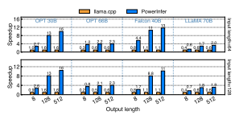

"" !&# # 

	

0

0 0 0 0 

0 0 0 0 

0 

%$"%$ $

Figure 10: *Speedup of various models on PC-High in FP16 format.* The X axis indicates the output length. The Y axis represents the speedup compared with llama.cpp. The number above each bar indicates the end-to-end generation speed (tokens/s). The first row of the figure is configured with an input length of around 64, and the second row with an input length of approximately 128.

We first compare the end-to-end inference performance of PowerInfer and llama.cpp with a batch size of one, the typical setting for local deployments [6]. Given real-world dialog input/output length variability [18], we sample prompts from Alpaca and ChatGPT datasets, ranging from 8 to 128 characters. Both PowerInfer and llama.cpp generated 8, 128, and 512 tokens in response to each prompt.

Figure 10 illustrates the generation speeds for various models and input-output configurations on a PC-High equipped with an NVIDIA RTX 4090. On average, PowerInfer achieves a generation speed of 8.32 tokens/s, reaching up to 16.06 to-

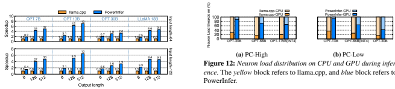

Figure 11: *Speedup of various models on PC-Low in FP16 format.* The X axis indicates the output length. The Y axis represents the speedup compared with llama.cpp. The number above each bar indicates the end-to-end generation speed (tokens/s). The first row of the figure is configured with an input length of around 64, and the second row with an input length of approximately 128.

kens/s, significantly outperforming llama.cpp with average speedups of 7.23×, and for Falcon-40B, up to 11.69×. The performance superiority of PowerInfer becomes more pronounced as the number of output tokens increases since the generation phase plays a more significant role in the overall inference time. In this phase, a small number of neurons are activated on both CPU and GPU, leading to fewer unnecessary computations compared to llama.cpp. For example, in the case of OPT-30B, only around 20% of neurons are activated for each token generated, with the majority processed on the GPU, a benefit of PowerInfer's neuron-aware inference engine.

Figure 11 shows that on a lower-end PC (PC-Low), PowerInfer still attains considerable performance enhancement over llama.cpp, averaging a speedup of 5.01× and peaking at 7.06×. However, these improvements are smaller compared to those on a higher-end PC (PC-High), primarily due to the 11GB GPU memory limitation of PC-Low. This limitation affects the number of neurons that can be allocated to the GPU, particularly for models with around 30B parameters or more, leading to a greater dependence on the CPU for processing a larger number of activated neurons.

Figure 12 presents the distribution of neuron loads between the CPU and GPU for both PowerInfer and llama.cpp. Neuron loads refer to the proportion of activated neuron computations carried out by each processing unit. Notably, on PC-High, PowerInfer significantly increases the GPU's share of neuron load, from an average of 20% to 70%. This indicates that the GPU processes 70% of activated neurons. However, in cases where the model's memory requirements far exceed the GPU's capacity, such as running a 60GB model on an 11GB 2080Ti GPU, the GPU's neuron load is reduced to 42%.

This decrease is due to the GPU's limited memory, which is insufficient to host all hot-activated neurons, necessitating that the CPU compute a portion of these neurons.

In scenarios involving long input prompts with relatively short output lengths, which are less common [28], Power-
Infer demonstrates only limited performance gains. In such

	  0 0

0	

	

0 0 0 0 0 

	

0 

0 0 0

0 0 0

situations, the prompt phase, where a substantial number of tokens are processed simultaneously, becomes a crucial factor in determining inference speed. This results in each token activating a unique set of neurons, substantially diminishing activation sparsity. As a consequence, the CPU becomes the primary bottleneck in the inference process, tasked with processing a considerable number of cold-activated neurons but constrained by its computational capabilities. Inference with Quantization. Figure 13 illustrates that PowerInfer effectively supports LLMs that are compressed using INT4 quantization. On a high-end PC (PC-High), PowerInfer delivers responses at an average speed of 13.20 tokens/s, reaching a peak of 29.08 tokens/s. The average speedup achieved compared with llama.cpp is 2.89×, with a maximum of 4.28×. On a lower-end setup (PC-Low), the average speedup is 5.01×, peaking at 8.00×. The reduction in memory requirements due to quantization enables PowerInfer to more efficiently manage larger models. For instance, in our experiment with the OPT-175B model on PC-High, PowerInfer nearly reaches two tokens per second, surpassing llama.cpp by a factor of 2.66×.

Batching Inference. We also evaluate the end-to-end inference performance of PowerInfer with different batch sizes, as shown in Figure 14. PowerInfer demonstrates a significant advantage when the batch size is smaller than 32, achieving an average 6.08× improvement in performance compared with llama.cpp. As the batch size increases, the speed-up ratio offered by PowerInfer decreases. This reduction is attributed to the diminished sparsity of model joint activations. However, even with the batch size set to 32, PowerInfer still maintains a considerable speedup, achieving a 4.38× speedup.

# 8.3 **Ablation Studies**

#### 8.3.1 **Performance Breakdown**

Figure 15 breaks down the contributions of each PowerInfer component to the overall performance speedup. Using a step-by-step integration method, we progressively incorporate PowerInfer features into llama.cpp. First, we add PowerInfer's predictors and neuron-aware operators into llama.cpp (labeled
"+PO"), enabling computation of only activated neurons on both GPU and CPU. Yet, +PO still adheres to layer-wise computation, where each layer is processed entirely by either GPU or CPU.

Building on +PO, we introduce PowerInfer's hybrid infer-

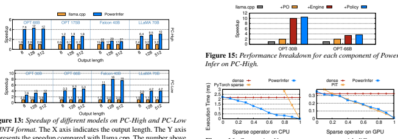

represents the speedup compared with llama.cpp. The number above each bar indicates the end-to-end generation speed (tokens/s). The upper row of the figure presents performance on PC-High, while the lower row details those on PC-Low.

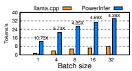

Figure 14: *Batch inference speedup of Falcon-40B on PC-High.* The X axis indicates the request batch size, the Y axis represents the end-to-end token generation speed (tokens/s). The number above each bar shows the speedup compared with llama.cpp.

ence engine (denoted "+Engine"), which allows neuron-aware operators to process neurons within the same layer simultaneously on both GPU and CPU. +Engine uses a naive neuron partitioning policy that assigns frequently activated neurons to the GPU. The final step involves integrating our optimized policy ("+Policy"), formulated by the offline solver as described in §6, into the +Engine setup, showcasing the full capabilities of PowerInfer.

The initial integration of +PO into llama.cpp yields performance boosts of 1.98× and 2.00× for OPT-30B and OPT-
66B, respectively, primarily by reducing unnecessary inactive neurons. +Engine further escalates these gains to 9.97× and 3.43×, thanks to precise neuron placement and intra-layer calculations that significantly increase the GPU's computational share. Finally, incorporating +Policy results in improvements of 10.47× and 3.67×. The enhancement achieved by our policy lies in its ability to finely balance the intra-layer communication overhead. The naive partitioning policy in +Engine overlooks the GPU-CPU intra-layer communication, often offsetting the benefits of assigning high-frequency activation neurons to the GPU. Conversely, our policy in PowerInfer more adeptly balances processing loads and communication costs between the CPU and GPU.

	

	

-

- 

	

	

-

-

-







-

-

-

-

- 
-

-

-

-

-

Figure 16: *Comparing Neuron-aware operator with different sparse* operators on PC-Low. The X axis indicates the sparsity level, the Y axis represents the execution time(ms).

#### 8.3.2 **Neuron-Aware Operator Performance**

This section evaluates the performance of PowerInfer's sparse operators on both CPU and GPU across various sparsity levels.

We benchmark PowerInfer against leading sparse libraries:
for CPU benchmarks, we use PyTorch sparse, the state-ofthe-art sparse kernels within PyTorch, as our baseline. In GPU, PowerInfer is compared with PIT [51]. Given that the sparsity in LLMs is typically based on neuron granularity, our experiments are specifically designed to evaluate sparse matrices of this nature. We focus on sparse matrix-vector multiplication using a [4096, 4096] × [4096, 1] configuration, a common setup in local LLM inference [6]. To adjust sparsity, we introduce zero values to matrix rows.

Figure 16 shows that PowerInfer's operator achieves nearly linear acceleration with increasing sparsity levels, a stark contrast to dense matrix computations. On the CPU, traditional sparse operators do not outperform dense computation until sparsity surpasses 87%. However, PowerInfer's CPU operator outperforms dense matrix multiplication even at sparsity levels below 10%. For the GPU, PowerInfer matches PIT in performance. Its primary advantage, however, is its unified CPU-GPU framework. This design allows for flexible execution of sparse operators on both processing units, unlike PIT, which is optimized solely for GPU-based sparse matrix multiplication and does not support hybrid CPU-GPU environments.

#### 8.3.3 **Predictor Overhead**

The execution time of the online predictors for different models is also measured, as depicted in Figure 17. On average, the execution of predictors constitutes less than 10% of the total inference time in PowerInfer. This efficiency is primarily due to the adaptive methods used in constructing sparsity predictors, which minimizes computational load. Moreover, these dense-model predictors are incorporated into Power-
Infer's solver for neuron placement decisions, with a preference for allocating them to the GPU. This strategy effectively

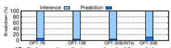

Figure 17: End-to-end prediction overhead of PowerInfer on PC-
Low. The X axis represents various models, while the Y-axis displays the percentage breakdown between predictor overhead and LLM
inference time.

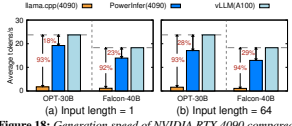

Figure 18: *Generation speed of NVIDIA RTX 4090 compared with* single A100. The X axis represents various models, while the Y- axis represents end-to-end generation speed (tokens/s) under various inference framework. The percentages within the arrows represent the slowdown relative to vLLM on the A100.

leverages the parallel processing capabilities of GPUs, further minimizing the overhead associated with the predictors.

#### 8.3.4 **Performance Comparison With A100**

In our study, we analyze the extent to which PowerInfer reduces the performance gap between a consumer-grade GPU and its top-tier server-grade counterpart. Therefore, we evaluate the generation speed of PowerInfer, deployed on PC- High, in comparison to the performance of llama.cpp and vLLM [18] executed on a single 80GB NVIDIA A100 GPU. We chose the OPT-30B and Falcon-40B models for comparison, considering their exact memory requirements matching precisely with the capacity of the A100 GPU. Our evaluation used input lengths of 1 and 64 to measure pure generation speed and conversational interactions, respectively.

Figure 18a demonstrates that PowerInfer significantly narrows the performance gap between the NVIDIA 4090 and A100 in generation tasks with input length 1. On PC-High, llama.cpp lags behind vLLM on the A100 by 93% and 92% for OPT-30B and Falcon-40B, respectively, but PowerInfer reduces this to 18% and 23%. Figure 18b shows that despite reduced cumulative sparsity in the prompt phase, PowerInfer still reduces the performance gap to 28% and 29%. The remaining disparity mainly stems from the CPU's considerable computational load, which has become a bottleneck.

# 8.4 **Llm Accuracy**

Since PowerInfer selectively omits neurons predicted to be inactive, we investigated whether this approach affects the inference accuracy of LLMs. Table 2 compares the accuracy of models from the OPT, Falcon (ReLU), and LLaMA
(ReGLU) families, both with and without differentiating activated/inactivated neurons, across a variety of downstream

Table 2: Comparison of LLM accuracy between PowerInferoptimized models (termed as "model-sparse") and their original counterparts. COPA [34] serves as a QA dataset focused on evaluating causal reasoning skills in language models. PIQA [4] and Winogrande [35] are designed for probing common sense reasoning abilities and the understanding of physical world interactions in LLMs. RTE [15] is used to assess natural language understanding via textual entailment.

|                           | PIQA   | Winogrande   | RTE    | COPA   |
|---------------------------|--------|--------------|--------|--------|
| OPT\-7B                   | 75.78% | 65.19%       | 55.23% | 81.00% |
| OPT\-7B\-sparse           | 75.67% | 65.51%       | 55.96% | 81.00% |
| OPT\-13B                  | 76.01% | 64.96%       | 58.12% | 85.00% |
| OPT\-13B\-sparse          | 76.28% | 65.98%       | 56.32% | 84.00% |
| OPT\-30B                  | 77.58% | 68.43%       | 58.40% | 82.00% |
| OPT\-30B\-sparse          | 77.48% | 67.56%       | 59.93% | 86.00% |
| OPT\-66B                  | 78.62% | 68.82%       | 60.29% | 86.00% |
| OPT\-66B\-sparse          | 79.16% | 67.80%       | 61.01% | 87.00% |
| OPT\-175B                 | 79.65% | 72.77%       | 59.93% | 88.00% |
| OPT\-175B\-sparse         | 79.26% | 72.38%       | 61.98% | 87.00% |
| Falcon(ReLU)\-40B         | 81.23% | 75.45%       | 66.43% | 92.00% |
| Falcon(ReLU)\-40B\-sparse | 81.01% | 75.92%       | 64.62% | 93.00% |
| LLaMA(ReGLU)\-70B         | 82.01% | 75.93%       | 75.81% | 89.00% |
| LLAMA(ReGLU)\-70B\-sparse | 82.05% | 75.53%       | 77.62% | 90.00% |

tasks. The results show that PowerInfer causes negligible loss in inference accuracy, regardless of the model size or type of task, consistent with previous research findings [21]. Although the predictors in each Transformer layer maintain an accuracy rate above 95%, they may occasionally miss some active neurons. As a result, there are minor fluctuations in LLM accuracy, leading to slight decreases or sometimes even increases in performance on specific downstream tasks.

# 9 **Related Work**

LLM Activation Sparsity: Recent advancements like DejaVu [21], PIT [51], and brainstorm [8] are crucial to optimizing LLM inference, akin to PowerInfer. DejaVu [21] proposes enhancing inference speed through activation sparsity prediction, while PowerInfer leverages a power-law distribution in neuron activations, focusing on GPU computation of frequently activated neurons. PIT [51] accelerates GPU tasks by converting sparse to dense matrices. However, these methods, primarily exploiting GPU sparsity, face limitations in resource-constrained local environments.

LLM Weight Sparsity: Model pruning [16, 17, 24], reducing parameter count by setting some weights to zero, is exemplified by SparseGPT [11] and Wanda [40], achieving nearly 50% unstructured sparsity. SparTA [52] leverages both sparse tensor and SIMT cores by dividing sparse matrices. Flash-LLM [45] introduces a "Load-as-Sparse and Computeas-Dense" approach for tensor core SpMM. However, these methods, orthogonal to LLMs' intrinsic sparse activations, usually incur accuracy losses and wall-clock model acceleration challenges [27]. This is in contrast to the natural sparse activations utilized by PowerInfer, which maintain performance and enhance computational efficiency.

Speculative LLM Inference: speculative inference [6, 13, 43] can also be leveraged to serve models exceeding GPU memory. Speculative decoding [7] uses a smaller, faster model to pre-decode tokens, later validated by the main model in a batch, reducing steps and CPU-GPU communication. SpecInfer [26], as another example, effectively reduces the number of LLM decoding steps and the overall communication between CPU DRAM and GPU HBM. While separate from our focus, integrating speculative inference into PowerInfer could further boost LLM inference speed.

LLM-Specific Serving Optimizations: The prominence of Transformers has led to specialized serving systems [9, 36, 53]. Orca [47] introduces iteration-level scheduling. vLLM [18] implements Paged Attention for token storage in varied GPU memory addresses, overcoming KV cache's continuous storage limit. While vLLM effectively mitigates the issue of severe GPU memory fragmentation, it does not address the challenge of deploying models on PCs where the entire model cannot fit within the available GPU memory.

# 10 **Conclusion**

PowerInfer is a fast inference system optimized for LLMs that exploits the locality property in LLM inference. It utilizes adaptive predictors and neuron-aware operators for neuron activation and computational sparsity. PowerInfer achieves up to 11.69× faster LLM inference compared to systems like llama.cpp, without compromising accuracy.

# 11 **Acknowledgments**

We express our sincere gratitude to to Rong Chen and Yubin Xia for their comprehensive and constructive feedback, which greatly enhanced the quality of this paper. We also thank Yifan Tan and Shuyi Lin for their valuable contributions to the experimental setups.

# References

[1] Abien Fred Agarap. Deep learning using rectified linear units
(relu). *arXiv preprint arXiv:1803.08375*, 2018.

[2] Ebtesam Almazrouei, Hamza Alobeidli, Abdulaziz Alshamsi, Alessandro Cappelli, Ruxandra Cojocaru, Merouane Debbah, Etienne Goffinet, Daniel Heslow, Julien Launay, Quentin Malartic, Badreddine Noune, Baptiste Pannier, and Guilherme Penedo. Falcon-40B: an open large language model with stateof-the-art performance. 2023.

[3] Reza Yazdani Aminabadi, Samyam Rajbhandari, Ammar Ahmad Awan, Cheng Li, Du Li, Elton Zheng, Olatunji Ruwase, Shaden Smith, Minjia Zhang, Jeff Rasley, et al. Deepspeedinference: enabling efficient inference of transformer models at unprecedented scale. In SC22: International Conference for High Performance Computing, Networking, Storage and Analysis, pages 1–15. IEEE, 2022.

[4] Yonatan Bisk, Rowan Zellers, Jianfeng Gao, Yejin Choi, et al.

Piqa: Reasoning about physical commonsense in natural language. In Proceedings of the AAAI conference on artificial intelligence, volume 34, pages 7432–7439, 2020.

[5] Tom Brown, Benjamin Mann, Nick Ryder, Melanie Subbiah, Jared D Kaplan, Prafulla Dhariwal, Arvind Neelakantan, Pranav Shyam, Girish Sastry, Amanda Askell, et al. Language models are few-shot learners. Advances in neural information processing systems, 33:1877–1901, 2020.

[6] Tianle Cai, Yuhong Li, Zhengyang Geng, Hongwu Peng, and Tri Dao. Medusa: Simple framework for accelerating llm generation with multiple decoding heads. https://github.com/ FasterDecoding/Medusa, 2023.

[7] Charlie Chen, Sebastian Borgeaud, Geoffrey Irving, Jean-
Baptiste Lespiau, Laurent Sifre, and John Jumper. Accelerating large language model decoding with speculative sampling, 2023.

[8] Weihao Cui, Zhenhua Han, Lingji Ouyang, Yichuan Wang, Ningxin Zheng, Lingxiao Ma, Yuqing Yang, Fan Yang, Jilong Xue, Lili Qiu, Lidong Zhou, Quan Chen, Haisheng Tan, and Minyi Guo. Optimizing dynamic neural networks with brainstorm. In 17th USENIX Symposium on Operating Systems Design and Implementation (OSDI 23), pages 797–815, Boston, MA, July 2023. USENIX Association.

[9] Jiarui Fang, Yang Yu, Chengduo Zhao, and Jie Zhou. Turbotransformers: an efficient gpu serving system for transformer models. In Proceedings of the 26th ACM SIGPLAN Symposium on Principles and Practice of Parallel Programming, pages 389–402, 2021.

[10] Wikimedia Foundation. Wikimedia downloads. [11] Elias Frantar and Dan Alistarh. SparseGPT: Massive language models can be accurately pruned in one-shot. *arXiv preprint* arXiv:2301.00774, 2023.

[12] Elias Frantar, Saleh Ashkboos, Torsten Hoefler, and Dan Alistarh. GPTQ: Accurate post-training compression for generative pretrained transformers. *arXiv preprint arXiv:2210.17323*, 2022.

[13] Yichao Fu, Peter Bailis, Ion Stoica, and Hao Zhang. Breaking the sequential dependency of llm inference using lookahead decoding, November 2023.

[14] Georgi Gerganov. ggerganov/llama.cpp: Port of facebook's llama model in c/c++. https://github.com/ggerganov/
llama.cpp, 2023.

[15] Danilo Giampiccolo, Bernardo Magnini, Ido Dagan, and William B Dolan. The third pascal recognizing textual entailment challenge. In Proceedings of the ACL-PASCAL workshop on textual entailment and paraphrasing, pages 1–9, 2007.

[16] Song Han, Huizi Mao, and William J Dally. Deep compression:
Compressing deep neural networks with pruning, trained quantization and huffman coding. *arXiv preprint arXiv:1510.00149*, 2015.

[17] Song Han, Jeff Pool, John Tran, and William J. Dally. Learning both weights and connections for efficient neural networks. In Proceedings of the 28th International Conference on Neural Information Processing Systems - Volume 1, NIPS'15, page 1135–1143, Cambridge, MA, USA, 2015. MIT Press.

[18] Woosuk Kwon, Zhuohan Li, Siyuan Zhuang, Ying Sheng, Lianmin Zheng, Cody Hao Yu, Joseph Gonzalez, Hao Zhang, and Ion Stoica. Efficient memory management for large language model serving with pagedattention. In Proceedings of the 29th Symposium on Operating Systems Principles, SOSP '23, page 611–626, New York, NY, USA, 2023. Association for Computing Machinery.

[19] Zonglin Li, Chong You, Srinadh Bhojanapalli, Daliang Li, Ankit Singh Rawat, Sashank J Reddi, Ke Ye, Felix Chern, Felix Yu, Ruiqi Guo, et al. The lazy neuron phenomenon: On emergence of activation sparsity in transformers. In The Eleventh International Conference on Learning Representations, 2022.

[20] Peiyu Liu, Zikang Liu, Ze-Feng Gao, Dawei Gao, Wayne Xin Zhao, Yaliang Li, Bolin Ding, and Ji-Rong Wen. Do emergent abilities exist in quantized large language models: An empirical study, 2023.

[21] Zichang Liu, Jue Wang, Tri Dao, Tianyi Zhou, Binhang Yuan, Zhao Song, Anshumali Shrivastava, Ce Zhang, Yuandong Tian, Christopher Re, and Beidi Chen. Deja vu: Contextual sparsity for efficient LLMs at inference time. In Andreas Krause, Emma Brunskill, Kyunghyun Cho, Barbara Engelhardt, Sivan Sabato, and Jonathan Scarlett, editors, Proceedings of the 40th International Conference on Machine Learning, volume 202 of *Proceedings of Machine Learning Research*, pages 22137– 22176. PMLR, 23–29 Jul 2023.

[22] Hanjia Lyu, Song Jiang, Hanqing Zeng, Qifan Wang, Si Zhang, Ren Chen, Chris Leung, Jiajie Tang, Yinglong Xia, and Jiebo Luo. Llm-rec: Personalized recommendation via prompting large language models, 2023.

[23] Xinyin Ma, Gongfan Fang, and Xinchao Wang. Llm-pruner:
On the structural pruning of large language models. arXiv preprint arXiv:2305.11627, 2023.

[24] Xinyin Ma, Gongfan Fang, and Xinchao Wang. Llm-pruner:
On the structural pruning of large language models. In Advances in Neural Information Processing Systems, 2023.

[25] Iván Martínez Toro, Daniel Gallego Vico, and Pablo Orgaz.

PrivateGPT, May 2023.

[26] Xupeng Miao, Gabriele Oliaro, Zhihao Zhang, Xinhao Cheng, Zeyu Wang, Rae Ying Yee Wong, Alan Zhu, Lijie Yang, Xiaoxiang Shi, Chunan Shi, Zhuoming Chen, Daiyaan Arfeen, Reyna Abhyankar, and Zhihao Jia. Specinfer: Accelerating generative large language model serving with speculative inference and token tree verification, 2023.

[27] Iman Mirzadeh, Keivan Alizadeh, Sachin Mehta, Carlo C Del Mundo, Oncel Tuzel, Golnoosh Samei, Mohammad Rastegari, and Mehrdad Farajtabar. Relu strikes back: Exploiting activation sparsity in large language models, 2023.

[28] MohamedRashad. https://huggingface.co/datasets/
MohamedRashad/ChatGPT-prompts, 2023.

[29] NVIDIA. Unified memory programming. https:
//docs.nvidia.com/cuda/cuda-c-programming-guide/
index.html\#um-unified-memory-programming-hd, 2021.

[30] NVIDIA. cuSPARSE: Basic Linear Algebra for Sparse Matrices on NVIDIA GPUs. https://developer.nvidia.com/ cusparse, 2023.

[31] OpenAI. https://openai.com/blog/chatgpt, 2023. [32] Colin Raffel, Noam Shazeer, Adam Roberts, Katherine Lee, Sharan Narang, Michael Matena, Yanqi Zhou, Wei Li, and Peter J Liu. Exploring the limits of transfer learning with a unified text-to-text transformer. The Journal of Machine Learning Research, 21(1):5485–5551, 2020.

[33] Google Research. Sputnik: a library of sparse linear algebra kernels and utilities for deep learning. https://github.com/ google-research/sputnik, 2023.

[34] Melissa Roemmele, Cosmin Adrian Bejan, and Andrew S Gordon. Choice of plausible alternatives: An evaluation of commonsense causal reasoning. In 2011 AAAI Spring Symposium Series, 2011.

[35] Keisuke Sakaguchi, Ronan Le Bras, Chandra Bhagavatula, and Yejin Choi. Winogrande: An adversarial winograd schema challenge at scale. *Communications of the ACM*, 64(9):99–
106, 2021.

[36] Ying Sheng, Shiyi Cao, Dacheng Li, Coleman Hooper, Nicholas Lee, Shuo Yang, Christopher Chou, Banghua Zhu, Lianmin Zheng, Kurt Keutzer, Joseph E. Gonzalez, and Ion Stoica. S-lora: Serving thousands of concurrent lora adapters, 2023.

[37] Ying Sheng, Lianmin Zheng, Binhang Yuan, Zhuohan Li, Max Ryabinin, Beidi Chen, Percy Liang, Christopher Re, Ion Stoica, and Ce Zhang. Flexgen: High-throughput generative inference of large language models with a single gpu. 2023.

[38] SparseLLM. Relufalcon-40b. https://huggingface.co/
SparseLLM/ReluFalcon-40B.

[39] SparseLLM. Relullama-70b. https://huggingface.co/
SparseLLM/ReluLLaMA-70B.

[40] Mingjie Sun, Zhuang Liu, Anna Bair, and J. Zico Kolter. A simple and effective pruning approach for large language models. arXiv preprint arXiv:2306.11695, 2023.

[41] Rohan Taori, Ishaan Gulrajani, Tianyi Zhang, Yann Dubois, Xuechen Li, Carlos Guestrin, Percy Liang, and Tatsunori B. Hashimoto. Stanford alpaca:
An instruction-following llama model. https: //github.com/tatsu-lab/stanford_alpaca, 2023.

[42] Hugo Touvron, Thibaut Lavril, Gautier Izacard, Xavier Martinet, Marie-Anne Lachaux, Timothée Lacroix, Baptiste Rozière, Naman Goyal, Eric Hambro, Faisal Azhar, et al. Llama:
Open and efficient foundation language models. arXiv preprint arXiv:2302.13971, 2023.

[43] Yiding Wang, Kai Chen, Haisheng Tan, and Kun Guo. Tabi:
An efficient multi-level inference system for large language models. In Proceedings of the Eighteenth European Conference on Computer Systems, EuroSys '23, page 233–248, New York, NY, USA, 2023. Association for Computing Machinery.

[44] Thomas Wolf, Lysandre Debut, Victor Sanh, Julien Chaumond, Clement Delangue, Anthony Moi, Pierric Cistac, Tim Rault, Rémi Louf, Morgan Funtowicz, Joe Davison, Sam Shleifer, Patrick von Platen, Clara Ma, Yacine Jernite, Julien Plu, Canwen Xu, Teven Le Scao, Sylvain Gugger, Mariama Drame, Quentin Lhoest, and Alexander M. Rush. Transformers: Stateof-the-art natural language processing. In *Proceedings of the* 2020 Conference on Empirical Methods in Natural Language Processing: System Demonstrations, pages 38–45, Online, October 2020. Association for Computational Linguistics.

[45] Haojun Xia, Zhen Zheng, Yuchao Li, Donglin Zhuang, Zhongzhu Zhou, Xiafei Qiu, Yong Li, Wei Lin, and Shuaiwen Leon Song. Flash-llm: Enabling cost-effective and highlyefficient large generative model inference with unstructured sparsity, 2023.

[46] Guangxuan Xiao, Ji Lin, Mickael Seznec, Hao Wu, Julien Demouth, and Song Han. Smoothquant: Accurate and efficient post-training quantization for large language models. In International Conference on Machine Learning, pages 38087–
38099. PMLR, 2023.

[47] Gyeong-In Yu, Joo Seong Jeong, Geon-Woo Kim, Soojeong Kim, and Byung-Gon Chun. Orca: A distributed serving system for Transformer-Based generative models. In 16th USENIX Symposium on Operating Systems Design and Implementation (OSDI 22), pages 521–538, Carlsbad, CA, July 2022. USENIX Association.

[48] Siyu Yuan, Jiangjie Chen, Ziquan Fu, Xuyang Ge, Soham Shah, Charles Robert Jankowski, Deqing Yang, and Yanghua Xiao. Distilling script knowledge from large language models for constrained language planning. arXiv preprint arXiv:2305.05252, 2023.

[49] Susan Zhang, Stephen Roller, Naman Goyal, Mikel Artetxe, Moya Chen, Shuohui Chen, Christopher Dewan, Mona Diab, Xian Li, Xi Victoria Lin, et al. Opt: Open pre-trained transformer language models. *arXiv preprint arXiv:2205.01068*, 2022.

[50] Zhengyan Zhang, Yankai Lin, Zhiyuan Liu, Peng Li, Maosong Sun, and Jie Zhou. MoEfication: Transformer feed-forward layers are mixtures of experts. In *Findings of ACL 2022*, 2022.

[51] Ningxin Zheng, Huiqiang Jiang, Quanlu Zhang, Zhenhua Han, Lingxiao Ma, Yuqing Yang, Fan Yang, Chengruidong Zhang, Lili Qiu, Mao Yang, and Lidong Zhou. Pit: Optimization of dynamic sparse deep learning models via permutation invariant transformation. In Proceedings of the 29th Symposium on Operating Systems Principles, SOSP '23, page 331–347, New York, NY, USA, 2023. Association for Computing Machinery.

[52] Ningxin Zheng, Bin Lin, Quanlu Zhang, Lingxiao Ma, Yuqing Yang, Fan Yang, Yang Wang, Mao Yang, and Lidong Zhou.

SparTA: Deep-Learning model sparsity via Tensor-with-
Sparsity-Attribute. In *16th USENIX Symposium on Operating* Systems Design and Implementation (OSDI 22), pages 213– 232, Carlsbad, CA, July 2022. USENIX Association.

[53] Zhe Zhou, Xuechao Wei, Jiejing Zhang, and Guangyu Sun.

PetS: A unified framework for Parameter-Efficient transformers serving. In 2022 USENIX Annual Technical Conference
(USENIX ATC 22), pages 489–504, Carlsbad, CA, July 2022.

USENIX Association.